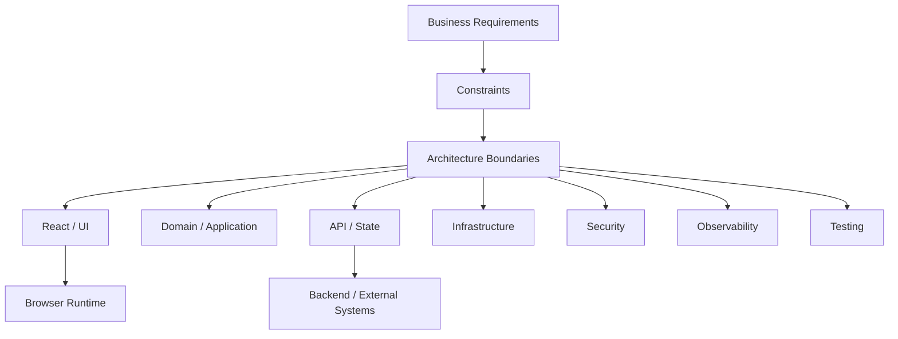
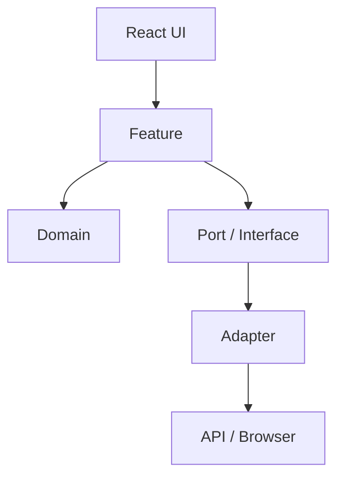

# FRONTEND ARCHITECTURE, DESIGN PATTERNS & ENTERPRISE DEVELOPMENT MASTER HANDBOOK

> Enterprise reference for Senior Frontend Engineers, Staff Engineers, Principal Engineers, Architects and Technical Leads.

## Source Coverage

The handbook follows the uploaded curriculum's requested 20-module organization and its required architecture topics, code examples, diagrams, enterprise concerns, interview sections and end-of-module review areas. fileciteturn12file0L69-L145

## Publication Note

Markdown does not have a fixed page count. The requested 3,500+ pages depend on publishing typography, page size, code layout and diagram rendering. This file contains the complete 20-module curriculum and a consistent full-topic treatment that can be expanded or typeset into a long-form book.

## Master Architecture



## Universal Decision Flow

```text
Problem → Constraints → Options → Trade-offs → Decision → Migration → Metrics → Review
```

## Enterprise Principles

| Principle | Goal |
|---|---|
| Explicit boundaries | Control coupling |
| Stable contracts | Enable team autonomy |
| Composition | Reuse safely |
| Observability | Diagnose production |
| Security by design | Reduce attack surface |
| Accessibility by default | Inclusive UX |
| Incremental migration | Reduce rewrite risk |
| Measurement | Validate decisions |


# Module 1 – Software Architecture Fundamentals

## Module Overview

This module covers **11** requested topics. The topic structure is intentionally consistent across the handbook so candidates can use the same reasoning model in architecture interviews.

### Module Flow


## Layered Architecture

### Introduction
**Layered Architecture** is an architectural technique used to control complexity, coupling, ownership, and change in enterprise frontend systems.

### Definition
A good architecture defines explicit responsibilities and dependency boundaries so UI, domain logic, infrastructure, state, and platform concerns can evolve independently where justified.

### Why It Exists
Without boundaries, components become coupled to APIs, storage, analytics, authorization, and global state. This increases regression risk and makes migration difficult.

### Problem Statement
The engineering problem is to choose a boundary that is simple enough for the current product while remaining capable of evolving as teams, features, traffic, and compliance requirements grow.

### Architecture Overview
```text
User
 ↓
React UI
 ↓
Feature/Application Layer
 ↓
Domain / Business Rules
 ↓
Repository / Port
 ↓
Infrastructure Adapter
 ↓
API / Browser / Platform
```

### Internal Working
Dependencies should point toward stable contracts. Infrastructure details should be replaceable behind interfaces where that abstraction has a real benefit.

### Step-by-step Flow
```text
Action → Component → Feature → Service → Repository → Infrastructure
       ← Result   ← State   ← Render ← Browser Paint
```

### Component Interaction
Use explicit props, events, hooks, services, repositories, or state boundaries. Avoid arbitrary cross-feature imports and hidden global dependencies.

### Browser Perspective
Consider DOM work, network behavior, caching, storage, rendering, security headers, accessibility tree behavior, and browser APIs.

### React Perspective
Keep React responsible for composition and rendering. Move reusable business and infrastructure behavior into testable modules.

### JavaScript Perspective
Use ES modules, functions, closures, objects, promises, events, and composition to implement the architecture.

### TypeScript Perspective
Use interfaces, type aliases, generics and discriminated unions to make contracts explicit and prevent invalid connections.

### Enterprise Perspective
Architecture also includes team ownership, deployment independence, governance, versioning, observability, compliance and cost.

### Production Example
A feature can depend on an application service instead of directly calling `fetch`, allowing API details, retries, telemetry and test doubles to remain at the infrastructure boundary.

### JavaScript
```javascript
// Layered Architecture: keep the architectural boundary small and explicit.
export function createService(dependency) {
  if (!dependency) throw new TypeError("dependency is required");

  return {
    execute(input) {
      if (input == null) throw new TypeError("input is required");
      return dependency.execute(input);
    },
  };
}
```

### TypeScript
```typescript
export interface Dependency<TInput, TOutput> {
  execute(input: TInput): TOutput;
}

export function createService<TInput, TOutput>(
  dependency: Dependency<TInput, TOutput>,
): Dependency<TInput, TOutput> {
  return dependency;
}
```

### React
```tsx
import { createContext, useContext, type ReactNode } from "react";

type Service = { execute: (input: string) => Promise<string> };

const ServiceContext = createContext<Service | null>(null);

export function Provider({ service, children }: {
  service: Service;
  children: ReactNode;
}) {
  return (
    <ServiceContext.Provider value={service}>
      {children}
    </ServiceContext.Provider>
  );
}

export function ExampleFeature() {
  const service = useContext(ServiceContext);
  if (!service) throw new Error("Provider is required");

  return <button type="button">Run Layered Architecture</button>;
}
```

### Folder Structure
```text
src/
├── app/
├── features/
│   └── example/
│       ├── components/
│       ├── hooks/
│       ├── services/
│       ├── domain/
│       ├── state/
│       └── tests/
├── shared/
└── infrastructure/
```

### Mermaid Architecture


### Advantages
- Clear ownership
- Better testability
- Lower accidental coupling
- Easier migration
- Better maintainability

### Disadvantages
- Additional abstraction
- More files and concepts
- Governance overhead
- Risk of over-engineering

### Trade-offs
| Decision | Benefit | Cost |
|---|---|---|
| Strong boundary | Lower coupling | More ceremony |
| Shared package | Reuse | Version coordination |
| Feature isolation | Team autonomy | Possible duplication |
| Central platform | Consistency | Governance |

### Performance Impact
Avoid abstraction that creates unnecessary runtime work. Preserve code-splitting boundaries, avoid excessive global subscriptions, and measure bundle and rendering impact.

### Security Impact
Keep authentication, authorization, untrusted input handling, secrets, and API trust boundaries explicit.

### Scalability
Technical scale and organizational scale must both be considered:
```text
Runtime Scale → traffic, data, modules, deployments
Team Scale    → ownership, coordination, releases, governance
```

### Maintainability
Prefer small public APIs, explicit dependencies, stable contracts, consistent naming, and automated architectural checks.

### Testability
Pure business logic should run without a browser. Infrastructure dependencies should be replaceable at controlled boundaries.

### Accessibility
Reusable components should encode semantic HTML, keyboard support, focus behavior, and accessible naming as part of the architecture.

### Best Practices
1. Start with the business problem.
2. Define constraints.
3. Choose the simplest architecture that satisfies them.
4. Make ownership explicit.
5. Document major decisions.
6. Measure rather than assume performance.
7. Plan migration before large rewrites.

### Anti-patterns
- God components
- Global mutable state for everything
- Circular dependencies
- Generic abstraction without a stable use case
- Infrastructure calls scattered across UI
- Shared folders used as dumping grounds

### Common Mistakes
- Choosing patterns because they are fashionable
- Ignoring team topology
- Ignoring deployment constraints
- Designing for hypothetical scale
- Creating abstractions before understanding change patterns

### Interview Questions
1. What problem does Layered Architecture solve?
2. When would you use it?
3. When would you not use it?
4. What is the dependency direction?
5. How would you test it?
6. How does it affect bundle size?
7. How would you migrate to it?
8. What are its failure modes?
9. How would you observe it in production?
10. What trade-offs would you explain to leadership?

### Staff Engineer Questions
- How would you standardize this across multiple teams?
- What should be centralized?
- What should remain team-owned?
- How would you measure architecture health?
- How would you migrate incrementally?

### Principal Engineer Questions
- What organizational problem is being solved?
- Which constraints could invalidate this design?
- What is the five-year evolution path?
- What are governance and cost implications?

### FAANG Questions
- Design this for a globally distributed product.
- Compare a modular monolith and micro frontends.
- Design an incremental migration from a legacy frontend.
- Explain team ownership and deployment boundaries.

### Architecture Review Questions
- Is the boundary aligned with business ownership?
- Are dependencies directional?
- Is the public API minimal?
- Is the design observable?
- Is security explicit?
- Is accessibility preserved?
- Is there a rollback and migration plan?

### Cheat Sheet
```text
WHY     → Problem
WHAT    → Boundary
HOW     → Interaction
SCALE   → Ownership + Runtime
RISK    → Security + Reliability
CHANGE  → Migration + Versioning
PROVE   → Tests + Observability
```

### Revision Notes
- Architecture is a set of trade-offs.
- Boundaries should have owners.
- Abstractions need a concrete reason.
- Migration is part of architecture.
- Staff-level design includes organizational and operational concerns.

### Production Scenario
A team proposes a shared abstraction used by one feature. Review whether the problem is recurring, whether the contract is stable, whether the abstraction reduces coupling, and whether composition would be simpler.

### Mini Project
Build an enterprise feature with React, TypeScript, a domain model, application service, repository interface, API adapter, dependency injection, tests, telemetry, and a feature flag.

### Case Study
Document:
1. Current architecture
2. Problems
3. Constraints
4. Options
5. Decision
6. Trade-offs
7. Migration
8. Rollback
9. Metrics
10. ADR


## Clean Architecture

### Introduction
**Clean Architecture** is an architectural technique used to control complexity, coupling, ownership, and change in enterprise frontend systems.

### Definition
A good architecture defines explicit responsibilities and dependency boundaries so UI, domain logic, infrastructure, state, and platform concerns can evolve independently where justified.

### Why It Exists
Without boundaries, components become coupled to APIs, storage, analytics, authorization, and global state. This increases regression risk and makes migration difficult.

### Problem Statement
The engineering problem is to choose a boundary that is simple enough for the current product while remaining capable of evolving as teams, features, traffic, and compliance requirements grow.

### Architecture Overview
```text
User
 ↓
React UI
 ↓
Feature/Application Layer
 ↓
Domain / Business Rules
 ↓
Repository / Port
 ↓
Infrastructure Adapter
 ↓
API / Browser / Platform
```

### Internal Working
Dependencies should point toward stable contracts. Infrastructure details should be replaceable behind interfaces where that abstraction has a real benefit.

### Step-by-step Flow
```text
Action → Component → Feature → Service → Repository → Infrastructure
       ← Result   ← State   ← Render ← Browser Paint
```

### Component Interaction
Use explicit props, events, hooks, services, repositories, or state boundaries. Avoid arbitrary cross-feature imports and hidden global dependencies.

### Browser Perspective
Consider DOM work, network behavior, caching, storage, rendering, security headers, accessibility tree behavior, and browser APIs.

### React Perspective
Keep React responsible for composition and rendering. Move reusable business and infrastructure behavior into testable modules.

### JavaScript Perspective
Use ES modules, functions, closures, objects, promises, events, and composition to implement the architecture.

### TypeScript Perspective
Use interfaces, type aliases, generics and discriminated unions to make contracts explicit and prevent invalid connections.

### Enterprise Perspective
Architecture also includes team ownership, deployment independence, governance, versioning, observability, compliance and cost.

### Production Example
A feature can depend on an application service instead of directly calling `fetch`, allowing API details, retries, telemetry and test doubles to remain at the infrastructure boundary.

### JavaScript
```javascript
// Clean Architecture: keep the architectural boundary small and explicit.
export function createService(dependency) {
  if (!dependency) throw new TypeError("dependency is required");

  return {
    execute(input) {
      if (input == null) throw new TypeError("input is required");
      return dependency.execute(input);
    },
  };
}
```

### TypeScript
```typescript
export interface Dependency<TInput, TOutput> {
  execute(input: TInput): TOutput;
}

export function createService<TInput, TOutput>(
  dependency: Dependency<TInput, TOutput>,
): Dependency<TInput, TOutput> {
  return dependency;
}
```

### React
```tsx
import { createContext, useContext, type ReactNode } from "react";

type Service = { execute: (input: string) => Promise<string> };

const ServiceContext = createContext<Service | null>(null);

export function Provider({ service, children }: {
  service: Service;
  children: ReactNode;
}) {
  return (
    <ServiceContext.Provider value={service}>
      {children}
    </ServiceContext.Provider>
  );
}

export function ExampleFeature() {
  const service = useContext(ServiceContext);
  if (!service) throw new Error("Provider is required");

  return <button type="button">Run Clean Architecture</button>;
}
```

### Folder Structure
```text
src/
├── app/
├── features/
│   └── example/
│       ├── components/
│       ├── hooks/
│       ├── services/
│       ├── domain/
│       ├── state/
│       └── tests/
├── shared/
└── infrastructure/
```

### Mermaid Architecture


### Advantages
- Clear ownership
- Better testability
- Lower accidental coupling
- Easier migration
- Better maintainability

### Disadvantages
- Additional abstraction
- More files and concepts
- Governance overhead
- Risk of over-engineering

### Trade-offs
| Decision | Benefit | Cost |
|---|---|---|
| Strong boundary | Lower coupling | More ceremony |
| Shared package | Reuse | Version coordination |
| Feature isolation | Team autonomy | Possible duplication |
| Central platform | Consistency | Governance |

### Performance Impact
Avoid abstraction that creates unnecessary runtime work. Preserve code-splitting boundaries, avoid excessive global subscriptions, and measure bundle and rendering impact.

### Security Impact
Keep authentication, authorization, untrusted input handling, secrets, and API trust boundaries explicit.

### Scalability
Technical scale and organizational scale must both be considered:
```text
Runtime Scale → traffic, data, modules, deployments
Team Scale    → ownership, coordination, releases, governance
```

### Maintainability
Prefer small public APIs, explicit dependencies, stable contracts, consistent naming, and automated architectural checks.

### Testability
Pure business logic should run without a browser. Infrastructure dependencies should be replaceable at controlled boundaries.

### Accessibility
Reusable components should encode semantic HTML, keyboard support, focus behavior, and accessible naming as part of the architecture.

### Best Practices
1. Start with the business problem.
2. Define constraints.
3. Choose the simplest architecture that satisfies them.
4. Make ownership explicit.
5. Document major decisions.
6. Measure rather than assume performance.
7. Plan migration before large rewrites.

### Anti-patterns
- God components
- Global mutable state for everything
- Circular dependencies
- Generic abstraction without a stable use case
- Infrastructure calls scattered across UI
- Shared folders used as dumping grounds

### Common Mistakes
- Choosing patterns because they are fashionable
- Ignoring team topology
- Ignoring deployment constraints
- Designing for hypothetical scale
- Creating abstractions before understanding change patterns

### Interview Questions
1. What problem does Clean Architecture solve?
2. When would you use it?
3. When would you not use it?
4. What is the dependency direction?
5. How would you test it?
6. How does it affect bundle size?
7. How would you migrate to it?
8. What are its failure modes?
9. How would you observe it in production?
10. What trade-offs would you explain to leadership?

### Staff Engineer Questions
- How would you standardize this across multiple teams?
- What should be centralized?
- What should remain team-owned?
- How would you measure architecture health?
- How would you migrate incrementally?

### Principal Engineer Questions
- What organizational problem is being solved?
- Which constraints could invalidate this design?
- What is the five-year evolution path?
- What are governance and cost implications?

### FAANG Questions
- Design this for a globally distributed product.
- Compare a modular monolith and micro frontends.
- Design an incremental migration from a legacy frontend.
- Explain team ownership and deployment boundaries.

### Architecture Review Questions
- Is the boundary aligned with business ownership?
- Are dependencies directional?
- Is the public API minimal?
- Is the design observable?
- Is security explicit?
- Is accessibility preserved?
- Is there a rollback and migration plan?

### Cheat Sheet
```text
WHY     → Problem
WHAT    → Boundary
HOW     → Interaction
SCALE   → Ownership + Runtime
RISK    → Security + Reliability
CHANGE  → Migration + Versioning
PROVE   → Tests + Observability
```

### Revision Notes
- Architecture is a set of trade-offs.
- Boundaries should have owners.
- Abstractions need a concrete reason.
- Migration is part of architecture.
- Staff-level design includes organizational and operational concerns.

### Production Scenario
A team proposes a shared abstraction used by one feature. Review whether the problem is recurring, whether the contract is stable, whether the abstraction reduces coupling, and whether composition would be simpler.

### Mini Project
Build an enterprise feature with React, TypeScript, a domain model, application service, repository interface, API adapter, dependency injection, tests, telemetry, and a feature flag.

### Case Study
Document:
1. Current architecture
2. Problems
3. Constraints
4. Options
5. Decision
6. Trade-offs
7. Migration
8. Rollback
9. Metrics
10. ADR


## Hexagonal Architecture

### Introduction
**Hexagonal Architecture** is an architectural technique used to control complexity, coupling, ownership, and change in enterprise frontend systems.

### Definition
A good architecture defines explicit responsibilities and dependency boundaries so UI, domain logic, infrastructure, state, and platform concerns can evolve independently where justified.

### Why It Exists
Without boundaries, components become coupled to APIs, storage, analytics, authorization, and global state. This increases regression risk and makes migration difficult.

### Problem Statement
The engineering problem is to choose a boundary that is simple enough for the current product while remaining capable of evolving as teams, features, traffic, and compliance requirements grow.

### Architecture Overview
```text
User
 ↓
React UI
 ↓
Feature/Application Layer
 ↓
Domain / Business Rules
 ↓
Repository / Port
 ↓
Infrastructure Adapter
 ↓
API / Browser / Platform
```

### Internal Working
Dependencies should point toward stable contracts. Infrastructure details should be replaceable behind interfaces where that abstraction has a real benefit.

### Step-by-step Flow
```text
Action → Component → Feature → Service → Repository → Infrastructure
       ← Result   ← State   ← Render ← Browser Paint
```

### Component Interaction
Use explicit props, events, hooks, services, repositories, or state boundaries. Avoid arbitrary cross-feature imports and hidden global dependencies.

### Browser Perspective
Consider DOM work, network behavior, caching, storage, rendering, security headers, accessibility tree behavior, and browser APIs.

### React Perspective
Keep React responsible for composition and rendering. Move reusable business and infrastructure behavior into testable modules.

### JavaScript Perspective
Use ES modules, functions, closures, objects, promises, events, and composition to implement the architecture.

### TypeScript Perspective
Use interfaces, type aliases, generics and discriminated unions to make contracts explicit and prevent invalid connections.

### Enterprise Perspective
Architecture also includes team ownership, deployment independence, governance, versioning, observability, compliance and cost.

### Production Example
A feature can depend on an application service instead of directly calling `fetch`, allowing API details, retries, telemetry and test doubles to remain at the infrastructure boundary.

### JavaScript
```javascript
// Hexagonal Architecture: keep the architectural boundary small and explicit.
export function createService(dependency) {
  if (!dependency) throw new TypeError("dependency is required");

  return {
    execute(input) {
      if (input == null) throw new TypeError("input is required");
      return dependency.execute(input);
    },
  };
}
```

### TypeScript
```typescript
export interface Dependency<TInput, TOutput> {
  execute(input: TInput): TOutput;
}

export function createService<TInput, TOutput>(
  dependency: Dependency<TInput, TOutput>,
): Dependency<TInput, TOutput> {
  return dependency;
}
```

### React
```tsx
import { createContext, useContext, type ReactNode } from "react";

type Service = { execute: (input: string) => Promise<string> };

const ServiceContext = createContext<Service | null>(null);

export function Provider({ service, children }: {
  service: Service;
  children: ReactNode;
}) {
  return (
    <ServiceContext.Provider value={service}>
      {children}
    </ServiceContext.Provider>
  );
}

export function ExampleFeature() {
  const service = useContext(ServiceContext);
  if (!service) throw new Error("Provider is required");

  return <button type="button">Run Hexagonal Architecture</button>;
}
```

### Folder Structure
```text
src/
├── app/
├── features/
│   └── example/
│       ├── components/
│       ├── hooks/
│       ├── services/
│       ├── domain/
│       ├── state/
│       └── tests/
├── shared/
└── infrastructure/
```

### Mermaid Architecture


### Advantages
- Clear ownership
- Better testability
- Lower accidental coupling
- Easier migration
- Better maintainability

### Disadvantages
- Additional abstraction
- More files and concepts
- Governance overhead
- Risk of over-engineering

### Trade-offs
| Decision | Benefit | Cost |
|---|---|---|
| Strong boundary | Lower coupling | More ceremony |
| Shared package | Reuse | Version coordination |
| Feature isolation | Team autonomy | Possible duplication |
| Central platform | Consistency | Governance |

### Performance Impact
Avoid abstraction that creates unnecessary runtime work. Preserve code-splitting boundaries, avoid excessive global subscriptions, and measure bundle and rendering impact.

### Security Impact
Keep authentication, authorization, untrusted input handling, secrets, and API trust boundaries explicit.

### Scalability
Technical scale and organizational scale must both be considered:
```text
Runtime Scale → traffic, data, modules, deployments
Team Scale    → ownership, coordination, releases, governance
```

### Maintainability
Prefer small public APIs, explicit dependencies, stable contracts, consistent naming, and automated architectural checks.

### Testability
Pure business logic should run without a browser. Infrastructure dependencies should be replaceable at controlled boundaries.

### Accessibility
Reusable components should encode semantic HTML, keyboard support, focus behavior, and accessible naming as part of the architecture.

### Best Practices
1. Start with the business problem.
2. Define constraints.
3. Choose the simplest architecture that satisfies them.
4. Make ownership explicit.
5. Document major decisions.
6. Measure rather than assume performance.
7. Plan migration before large rewrites.

### Anti-patterns
- God components
- Global mutable state for everything
- Circular dependencies
- Generic abstraction without a stable use case
- Infrastructure calls scattered across UI
- Shared folders used as dumping grounds

### Common Mistakes
- Choosing patterns because they are fashionable
- Ignoring team topology
- Ignoring deployment constraints
- Designing for hypothetical scale
- Creating abstractions before understanding change patterns

### Interview Questions
1. What problem does Hexagonal Architecture solve?
2. When would you use it?
3. When would you not use it?
4. What is the dependency direction?
5. How would you test it?
6. How does it affect bundle size?
7. How would you migrate to it?
8. What are its failure modes?
9. How would you observe it in production?
10. What trade-offs would you explain to leadership?

### Staff Engineer Questions
- How would you standardize this across multiple teams?
- What should be centralized?
- What should remain team-owned?
- How would you measure architecture health?
- How would you migrate incrementally?

### Principal Engineer Questions
- What organizational problem is being solved?
- Which constraints could invalidate this design?
- What is the five-year evolution path?
- What are governance and cost implications?

### FAANG Questions
- Design this for a globally distributed product.
- Compare a modular monolith and micro frontends.
- Design an incremental migration from a legacy frontend.
- Explain team ownership and deployment boundaries.

### Architecture Review Questions
- Is the boundary aligned with business ownership?
- Are dependencies directional?
- Is the public API minimal?
- Is the design observable?
- Is security explicit?
- Is accessibility preserved?
- Is there a rollback and migration plan?

### Cheat Sheet
```text
WHY     → Problem
WHAT    → Boundary
HOW     → Interaction
SCALE   → Ownership + Runtime
RISK    → Security + Reliability
CHANGE  → Migration + Versioning
PROVE   → Tests + Observability
```

### Revision Notes
- Architecture is a set of trade-offs.
- Boundaries should have owners.
- Abstractions need a concrete reason.
- Migration is part of architecture.
- Staff-level design includes organizational and operational concerns.

### Production Scenario
A team proposes a shared abstraction used by one feature. Review whether the problem is recurring, whether the contract is stable, whether the abstraction reduces coupling, and whether composition would be simpler.

### Mini Project
Build an enterprise feature with React, TypeScript, a domain model, application service, repository interface, API adapter, dependency injection, tests, telemetry, and a feature flag.

### Case Study
Document:
1. Current architecture
2. Problems
3. Constraints
4. Options
5. Decision
6. Trade-offs
7. Migration
8. Rollback
9. Metrics
10. ADR


## Onion Architecture

### Introduction
**Onion Architecture** is an architectural technique used to control complexity, coupling, ownership, and change in enterprise frontend systems.

### Definition
A good architecture defines explicit responsibilities and dependency boundaries so UI, domain logic, infrastructure, state, and platform concerns can evolve independently where justified.

### Why It Exists
Without boundaries, components become coupled to APIs, storage, analytics, authorization, and global state. This increases regression risk and makes migration difficult.

### Problem Statement
The engineering problem is to choose a boundary that is simple enough for the current product while remaining capable of evolving as teams, features, traffic, and compliance requirements grow.

### Architecture Overview
```text
User
 ↓
React UI
 ↓
Feature/Application Layer
 ↓
Domain / Business Rules
 ↓
Repository / Port
 ↓
Infrastructure Adapter
 ↓
API / Browser / Platform
```

### Internal Working
Dependencies should point toward stable contracts. Infrastructure details should be replaceable behind interfaces where that abstraction has a real benefit.

### Step-by-step Flow
```text
Action → Component → Feature → Service → Repository → Infrastructure
       ← Result   ← State   ← Render ← Browser Paint
```

### Component Interaction
Use explicit props, events, hooks, services, repositories, or state boundaries. Avoid arbitrary cross-feature imports and hidden global dependencies.

### Browser Perspective
Consider DOM work, network behavior, caching, storage, rendering, security headers, accessibility tree behavior, and browser APIs.

### React Perspective
Keep React responsible for composition and rendering. Move reusable business and infrastructure behavior into testable modules.

### JavaScript Perspective
Use ES modules, functions, closures, objects, promises, events, and composition to implement the architecture.

### TypeScript Perspective
Use interfaces, type aliases, generics and discriminated unions to make contracts explicit and prevent invalid connections.

### Enterprise Perspective
Architecture also includes team ownership, deployment independence, governance, versioning, observability, compliance and cost.

### Production Example
A feature can depend on an application service instead of directly calling `fetch`, allowing API details, retries, telemetry and test doubles to remain at the infrastructure boundary.

### JavaScript
```javascript
// Onion Architecture: keep the architectural boundary small and explicit.
export function createService(dependency) {
  if (!dependency) throw new TypeError("dependency is required");

  return {
    execute(input) {
      if (input == null) throw new TypeError("input is required");
      return dependency.execute(input);
    },
  };
}
```

### TypeScript
```typescript
export interface Dependency<TInput, TOutput> {
  execute(input: TInput): TOutput;
}

export function createService<TInput, TOutput>(
  dependency: Dependency<TInput, TOutput>,
): Dependency<TInput, TOutput> {
  return dependency;
}
```

### React
```tsx
import { createContext, useContext, type ReactNode } from "react";

type Service = { execute: (input: string) => Promise<string> };

const ServiceContext = createContext<Service | null>(null);

export function Provider({ service, children }: {
  service: Service;
  children: ReactNode;
}) {
  return (
    <ServiceContext.Provider value={service}>
      {children}
    </ServiceContext.Provider>
  );
}

export function ExampleFeature() {
  const service = useContext(ServiceContext);
  if (!service) throw new Error("Provider is required");

  return <button type="button">Run Onion Architecture</button>;
}
```

### Folder Structure
```text
src/
├── app/
├── features/
│   └── example/
│       ├── components/
│       ├── hooks/
│       ├── services/
│       ├── domain/
│       ├── state/
│       └── tests/
├── shared/
└── infrastructure/
```

### Mermaid Architecture


### Advantages
- Clear ownership
- Better testability
- Lower accidental coupling
- Easier migration
- Better maintainability

### Disadvantages
- Additional abstraction
- More files and concepts
- Governance overhead
- Risk of over-engineering

### Trade-offs
| Decision | Benefit | Cost |
|---|---|---|
| Strong boundary | Lower coupling | More ceremony |
| Shared package | Reuse | Version coordination |
| Feature isolation | Team autonomy | Possible duplication |
| Central platform | Consistency | Governance |

### Performance Impact
Avoid abstraction that creates unnecessary runtime work. Preserve code-splitting boundaries, avoid excessive global subscriptions, and measure bundle and rendering impact.

### Security Impact
Keep authentication, authorization, untrusted input handling, secrets, and API trust boundaries explicit.

### Scalability
Technical scale and organizational scale must both be considered:
```text
Runtime Scale → traffic, data, modules, deployments
Team Scale    → ownership, coordination, releases, governance
```

### Maintainability
Prefer small public APIs, explicit dependencies, stable contracts, consistent naming, and automated architectural checks.

### Testability
Pure business logic should run without a browser. Infrastructure dependencies should be replaceable at controlled boundaries.

### Accessibility
Reusable components should encode semantic HTML, keyboard support, focus behavior, and accessible naming as part of the architecture.

### Best Practices
1. Start with the business problem.
2. Define constraints.
3. Choose the simplest architecture that satisfies them.
4. Make ownership explicit.
5. Document major decisions.
6. Measure rather than assume performance.
7. Plan migration before large rewrites.

### Anti-patterns
- God components
- Global mutable state for everything
- Circular dependencies
- Generic abstraction without a stable use case
- Infrastructure calls scattered across UI
- Shared folders used as dumping grounds

### Common Mistakes
- Choosing patterns because they are fashionable
- Ignoring team topology
- Ignoring deployment constraints
- Designing for hypothetical scale
- Creating abstractions before understanding change patterns

### Interview Questions
1. What problem does Onion Architecture solve?
2. When would you use it?
3. When would you not use it?
4. What is the dependency direction?
5. How would you test it?
6. How does it affect bundle size?
7. How would you migrate to it?
8. What are its failure modes?
9. How would you observe it in production?
10. What trade-offs would you explain to leadership?

### Staff Engineer Questions
- How would you standardize this across multiple teams?
- What should be centralized?
- What should remain team-owned?
- How would you measure architecture health?
- How would you migrate incrementally?

### Principal Engineer Questions
- What organizational problem is being solved?
- Which constraints could invalidate this design?
- What is the five-year evolution path?
- What are governance and cost implications?

### FAANG Questions
- Design this for a globally distributed product.
- Compare a modular monolith and micro frontends.
- Design an incremental migration from a legacy frontend.
- Explain team ownership and deployment boundaries.

### Architecture Review Questions
- Is the boundary aligned with business ownership?
- Are dependencies directional?
- Is the public API minimal?
- Is the design observable?
- Is security explicit?
- Is accessibility preserved?
- Is there a rollback and migration plan?

### Cheat Sheet
```text
WHY     → Problem
WHAT    → Boundary
HOW     → Interaction
SCALE   → Ownership + Runtime
RISK    → Security + Reliability
CHANGE  → Migration + Versioning
PROVE   → Tests + Observability
```

### Revision Notes
- Architecture is a set of trade-offs.
- Boundaries should have owners.
- Abstractions need a concrete reason.
- Migration is part of architecture.
- Staff-level design includes organizational and operational concerns.

### Production Scenario
A team proposes a shared abstraction used by one feature. Review whether the problem is recurring, whether the contract is stable, whether the abstraction reduces coupling, and whether composition would be simpler.

### Mini Project
Build an enterprise feature with React, TypeScript, a domain model, application service, repository interface, API adapter, dependency injection, tests, telemetry, and a feature flag.

### Case Study
Document:
1. Current architecture
2. Problems
3. Constraints
4. Options
5. Decision
6. Trade-offs
7. Migration
8. Rollback
9. Metrics
10. ADR


## Feature-based Architecture

### Introduction
**Feature-based Architecture** is an architectural technique used to control complexity, coupling, ownership, and change in enterprise frontend systems.

### Definition
A good architecture defines explicit responsibilities and dependency boundaries so UI, domain logic, infrastructure, state, and platform concerns can evolve independently where justified.

### Why It Exists
Without boundaries, components become coupled to APIs, storage, analytics, authorization, and global state. This increases regression risk and makes migration difficult.

### Problem Statement
The engineering problem is to choose a boundary that is simple enough for the current product while remaining capable of evolving as teams, features, traffic, and compliance requirements grow.

### Architecture Overview
```text
User
 ↓
React UI
 ↓
Feature/Application Layer
 ↓
Domain / Business Rules
 ↓
Repository / Port
 ↓
Infrastructure Adapter
 ↓
API / Browser / Platform
```

### Internal Working
Dependencies should point toward stable contracts. Infrastructure details should be replaceable behind interfaces where that abstraction has a real benefit.

### Step-by-step Flow
```text
Action → Component → Feature → Service → Repository → Infrastructure
       ← Result   ← State   ← Render ← Browser Paint
```

### Component Interaction
Use explicit props, events, hooks, services, repositories, or state boundaries. Avoid arbitrary cross-feature imports and hidden global dependencies.

### Browser Perspective
Consider DOM work, network behavior, caching, storage, rendering, security headers, accessibility tree behavior, and browser APIs.

### React Perspective
Keep React responsible for composition and rendering. Move reusable business and infrastructure behavior into testable modules.

### JavaScript Perspective
Use ES modules, functions, closures, objects, promises, events, and composition to implement the architecture.

### TypeScript Perspective
Use interfaces, type aliases, generics and discriminated unions to make contracts explicit and prevent invalid connections.

### Enterprise Perspective
Architecture also includes team ownership, deployment independence, governance, versioning, observability, compliance and cost.

### Production Example
A feature can depend on an application service instead of directly calling `fetch`, allowing API details, retries, telemetry and test doubles to remain at the infrastructure boundary.

### JavaScript
```javascript
// Feature-based Architecture: keep the architectural boundary small and explicit.
export function createService(dependency) {
  if (!dependency) throw new TypeError("dependency is required");

  return {
    execute(input) {
      if (input == null) throw new TypeError("input is required");
      return dependency.execute(input);
    },
  };
}
```

### TypeScript
```typescript
export interface Dependency<TInput, TOutput> {
  execute(input: TInput): TOutput;
}

export function createService<TInput, TOutput>(
  dependency: Dependency<TInput, TOutput>,
): Dependency<TInput, TOutput> {
  return dependency;
}
```

### React
```tsx
import { createContext, useContext, type ReactNode } from "react";

type Service = { execute: (input: string) => Promise<string> };

const ServiceContext = createContext<Service | null>(null);

export function Provider({ service, children }: {
  service: Service;
  children: ReactNode;
}) {
  return (
    <ServiceContext.Provider value={service}>
      {children}
    </ServiceContext.Provider>
  );
}

export function ExampleFeature() {
  const service = useContext(ServiceContext);
  if (!service) throw new Error("Provider is required");

  return <button type="button">Run Feature-based Architecture</button>;
}
```

### Folder Structure
```text
src/
├── app/
├── features/
│   └── example/
│       ├── components/
│       ├── hooks/
│       ├── services/
│       ├── domain/
│       ├── state/
│       └── tests/
├── shared/
└── infrastructure/
```

### Mermaid Architecture


### Advantages
- Clear ownership
- Better testability
- Lower accidental coupling
- Easier migration
- Better maintainability

### Disadvantages
- Additional abstraction
- More files and concepts
- Governance overhead
- Risk of over-engineering

### Trade-offs
| Decision | Benefit | Cost |
|---|---|---|
| Strong boundary | Lower coupling | More ceremony |
| Shared package | Reuse | Version coordination |
| Feature isolation | Team autonomy | Possible duplication |
| Central platform | Consistency | Governance |

### Performance Impact
Avoid abstraction that creates unnecessary runtime work. Preserve code-splitting boundaries, avoid excessive global subscriptions, and measure bundle and rendering impact.

### Security Impact
Keep authentication, authorization, untrusted input handling, secrets, and API trust boundaries explicit.

### Scalability
Technical scale and organizational scale must both be considered:
```text
Runtime Scale → traffic, data, modules, deployments
Team Scale    → ownership, coordination, releases, governance
```

### Maintainability
Prefer small public APIs, explicit dependencies, stable contracts, consistent naming, and automated architectural checks.

### Testability
Pure business logic should run without a browser. Infrastructure dependencies should be replaceable at controlled boundaries.

### Accessibility
Reusable components should encode semantic HTML, keyboard support, focus behavior, and accessible naming as part of the architecture.

### Best Practices
1. Start with the business problem.
2. Define constraints.
3. Choose the simplest architecture that satisfies them.
4. Make ownership explicit.
5. Document major decisions.
6. Measure rather than assume performance.
7. Plan migration before large rewrites.

### Anti-patterns
- God components
- Global mutable state for everything
- Circular dependencies
- Generic abstraction without a stable use case
- Infrastructure calls scattered across UI
- Shared folders used as dumping grounds

### Common Mistakes
- Choosing patterns because they are fashionable
- Ignoring team topology
- Ignoring deployment constraints
- Designing for hypothetical scale
- Creating abstractions before understanding change patterns

### Interview Questions
1. What problem does Feature-based Architecture solve?
2. When would you use it?
3. When would you not use it?
4. What is the dependency direction?
5. How would you test it?
6. How does it affect bundle size?
7. How would you migrate to it?
8. What are its failure modes?
9. How would you observe it in production?
10. What trade-offs would you explain to leadership?

### Staff Engineer Questions
- How would you standardize this across multiple teams?
- What should be centralized?
- What should remain team-owned?
- How would you measure architecture health?
- How would you migrate incrementally?

### Principal Engineer Questions
- What organizational problem is being solved?
- Which constraints could invalidate this design?
- What is the five-year evolution path?
- What are governance and cost implications?

### FAANG Questions
- Design this for a globally distributed product.
- Compare a modular monolith and micro frontends.
- Design an incremental migration from a legacy frontend.
- Explain team ownership and deployment boundaries.

### Architecture Review Questions
- Is the boundary aligned with business ownership?
- Are dependencies directional?
- Is the public API minimal?
- Is the design observable?
- Is security explicit?
- Is accessibility preserved?
- Is there a rollback and migration plan?

### Cheat Sheet
```text
WHY     → Problem
WHAT    → Boundary
HOW     → Interaction
SCALE   → Ownership + Runtime
RISK    → Security + Reliability
CHANGE  → Migration + Versioning
PROVE   → Tests + Observability
```

### Revision Notes
- Architecture is a set of trade-offs.
- Boundaries should have owners.
- Abstractions need a concrete reason.
- Migration is part of architecture.
- Staff-level design includes organizational and operational concerns.

### Production Scenario
A team proposes a shared abstraction used by one feature. Review whether the problem is recurring, whether the contract is stable, whether the abstraction reduces coupling, and whether composition would be simpler.

### Mini Project
Build an enterprise feature with React, TypeScript, a domain model, application service, repository interface, API adapter, dependency injection, tests, telemetry, and a feature flag.

### Case Study
Document:
1. Current architecture
2. Problems
3. Constraints
4. Options
5. Decision
6. Trade-offs
7. Migration
8. Rollback
9. Metrics
10. ADR


## DDD Basics

### Introduction
**DDD Basics** is an architectural technique used to control complexity, coupling, ownership, and change in enterprise frontend systems.

### Definition
A good architecture defines explicit responsibilities and dependency boundaries so UI, domain logic, infrastructure, state, and platform concerns can evolve independently where justified.

### Why It Exists
Without boundaries, components become coupled to APIs, storage, analytics, authorization, and global state. This increases regression risk and makes migration difficult.

### Problem Statement
The engineering problem is to choose a boundary that is simple enough for the current product while remaining capable of evolving as teams, features, traffic, and compliance requirements grow.

### Architecture Overview
```text
User
 ↓
React UI
 ↓
Feature/Application Layer
 ↓
Domain / Business Rules
 ↓
Repository / Port
 ↓
Infrastructure Adapter
 ↓
API / Browser / Platform
```

### Internal Working
Dependencies should point toward stable contracts. Infrastructure details should be replaceable behind interfaces where that abstraction has a real benefit.

### Step-by-step Flow
```text
Action → Component → Feature → Service → Repository → Infrastructure
       ← Result   ← State   ← Render ← Browser Paint
```

### Component Interaction
Use explicit props, events, hooks, services, repositories, or state boundaries. Avoid arbitrary cross-feature imports and hidden global dependencies.

### Browser Perspective
Consider DOM work, network behavior, caching, storage, rendering, security headers, accessibility tree behavior, and browser APIs.

### React Perspective
Keep React responsible for composition and rendering. Move reusable business and infrastructure behavior into testable modules.

### JavaScript Perspective
Use ES modules, functions, closures, objects, promises, events, and composition to implement the architecture.

### TypeScript Perspective
Use interfaces, type aliases, generics and discriminated unions to make contracts explicit and prevent invalid connections.

### Enterprise Perspective
Architecture also includes team ownership, deployment independence, governance, versioning, observability, compliance and cost.

### Production Example
A feature can depend on an application service instead of directly calling `fetch`, allowing API details, retries, telemetry and test doubles to remain at the infrastructure boundary.

### JavaScript
```javascript
// DDD Basics: keep the architectural boundary small and explicit.
export function createService(dependency) {
  if (!dependency) throw new TypeError("dependency is required");

  return {
    execute(input) {
      if (input == null) throw new TypeError("input is required");
      return dependency.execute(input);
    },
  };
}
```

### TypeScript
```typescript
export interface Dependency<TInput, TOutput> {
  execute(input: TInput): TOutput;
}

export function createService<TInput, TOutput>(
  dependency: Dependency<TInput, TOutput>,
): Dependency<TInput, TOutput> {
  return dependency;
}
```

### React
```tsx
import { createContext, useContext, type ReactNode } from "react";

type Service = { execute: (input: string) => Promise<string> };

const ServiceContext = createContext<Service | null>(null);

export function Provider({ service, children }: {
  service: Service;
  children: ReactNode;
}) {
  return (
    <ServiceContext.Provider value={service}>
      {children}
    </ServiceContext.Provider>
  );
}

export function ExampleFeature() {
  const service = useContext(ServiceContext);
  if (!service) throw new Error("Provider is required");

  return <button type="button">Run DDD Basics</button>;
}
```

### Folder Structure
```text
src/
├── app/
├── features/
│   └── example/
│       ├── components/
│       ├── hooks/
│       ├── services/
│       ├── domain/
│       ├── state/
│       └── tests/
├── shared/
└── infrastructure/
```

### Mermaid Architecture


### Advantages
- Clear ownership
- Better testability
- Lower accidental coupling
- Easier migration
- Better maintainability

### Disadvantages
- Additional abstraction
- More files and concepts
- Governance overhead
- Risk of over-engineering

### Trade-offs
| Decision | Benefit | Cost |
|---|---|---|
| Strong boundary | Lower coupling | More ceremony |
| Shared package | Reuse | Version coordination |
| Feature isolation | Team autonomy | Possible duplication |
| Central platform | Consistency | Governance |

### Performance Impact
Avoid abstraction that creates unnecessary runtime work. Preserve code-splitting boundaries, avoid excessive global subscriptions, and measure bundle and rendering impact.

### Security Impact
Keep authentication, authorization, untrusted input handling, secrets, and API trust boundaries explicit.

### Scalability
Technical scale and organizational scale must both be considered:
```text
Runtime Scale → traffic, data, modules, deployments
Team Scale    → ownership, coordination, releases, governance
```

### Maintainability
Prefer small public APIs, explicit dependencies, stable contracts, consistent naming, and automated architectural checks.

### Testability
Pure business logic should run without a browser. Infrastructure dependencies should be replaceable at controlled boundaries.

### Accessibility
Reusable components should encode semantic HTML, keyboard support, focus behavior, and accessible naming as part of the architecture.

### Best Practices
1. Start with the business problem.
2. Define constraints.
3. Choose the simplest architecture that satisfies them.
4. Make ownership explicit.
5. Document major decisions.
6. Measure rather than assume performance.
7. Plan migration before large rewrites.

### Anti-patterns
- God components
- Global mutable state for everything
- Circular dependencies
- Generic abstraction without a stable use case
- Infrastructure calls scattered across UI
- Shared folders used as dumping grounds

### Common Mistakes
- Choosing patterns because they are fashionable
- Ignoring team topology
- Ignoring deployment constraints
- Designing for hypothetical scale
- Creating abstractions before understanding change patterns

### Interview Questions
1. What problem does DDD Basics solve?
2. When would you use it?
3. When would you not use it?
4. What is the dependency direction?
5. How would you test it?
6. How does it affect bundle size?
7. How would you migrate to it?
8. What are its failure modes?
9. How would you observe it in production?
10. What trade-offs would you explain to leadership?

### Staff Engineer Questions
- How would you standardize this across multiple teams?
- What should be centralized?
- What should remain team-owned?
- How would you measure architecture health?
- How would you migrate incrementally?

### Principal Engineer Questions
- What organizational problem is being solved?
- Which constraints could invalidate this design?
- What is the five-year evolution path?
- What are governance and cost implications?

### FAANG Questions
- Design this for a globally distributed product.
- Compare a modular monolith and micro frontends.
- Design an incremental migration from a legacy frontend.
- Explain team ownership and deployment boundaries.

### Architecture Review Questions
- Is the boundary aligned with business ownership?
- Are dependencies directional?
- Is the public API minimal?
- Is the design observable?
- Is security explicit?
- Is accessibility preserved?
- Is there a rollback and migration plan?

### Cheat Sheet
```text
WHY     → Problem
WHAT    → Boundary
HOW     → Interaction
SCALE   → Ownership + Runtime
RISK    → Security + Reliability
CHANGE  → Migration + Versioning
PROVE   → Tests + Observability
```

### Revision Notes
- Architecture is a set of trade-offs.
- Boundaries should have owners.
- Abstractions need a concrete reason.
- Migration is part of architecture.
- Staff-level design includes organizational and operational concerns.

### Production Scenario
A team proposes a shared abstraction used by one feature. Review whether the problem is recurring, whether the contract is stable, whether the abstraction reduces coupling, and whether composition would be simpler.

### Mini Project
Build an enterprise feature with React, TypeScript, a domain model, application service, repository interface, API adapter, dependency injection, tests, telemetry, and a feature flag.

### Case Study
Document:
1. Current architecture
2. Problems
3. Constraints
4. Options
5. Decision
6. Trade-offs
7. Migration
8. Rollback
9. Metrics
10. ADR


## CQRS Basics

### Introduction
**CQRS Basics** is an architectural technique used to control complexity, coupling, ownership, and change in enterprise frontend systems.

### Definition
A good architecture defines explicit responsibilities and dependency boundaries so UI, domain logic, infrastructure, state, and platform concerns can evolve independently where justified.

### Why It Exists
Without boundaries, components become coupled to APIs, storage, analytics, authorization, and global state. This increases regression risk and makes migration difficult.

### Problem Statement
The engineering problem is to choose a boundary that is simple enough for the current product while remaining capable of evolving as teams, features, traffic, and compliance requirements grow.

### Architecture Overview
```text
User
 ↓
React UI
 ↓
Feature/Application Layer
 ↓
Domain / Business Rules
 ↓
Repository / Port
 ↓
Infrastructure Adapter
 ↓
API / Browser / Platform
```

### Internal Working
Dependencies should point toward stable contracts. Infrastructure details should be replaceable behind interfaces where that abstraction has a real benefit.

### Step-by-step Flow
```text
Action → Component → Feature → Service → Repository → Infrastructure
       ← Result   ← State   ← Render ← Browser Paint
```

### Component Interaction
Use explicit props, events, hooks, services, repositories, or state boundaries. Avoid arbitrary cross-feature imports and hidden global dependencies.

### Browser Perspective
Consider DOM work, network behavior, caching, storage, rendering, security headers, accessibility tree behavior, and browser APIs.

### React Perspective
Keep React responsible for composition and rendering. Move reusable business and infrastructure behavior into testable modules.

### JavaScript Perspective
Use ES modules, functions, closures, objects, promises, events, and composition to implement the architecture.

### TypeScript Perspective
Use interfaces, type aliases, generics and discriminated unions to make contracts explicit and prevent invalid connections.

### Enterprise Perspective
Architecture also includes team ownership, deployment independence, governance, versioning, observability, compliance and cost.

### Production Example
A feature can depend on an application service instead of directly calling `fetch`, allowing API details, retries, telemetry and test doubles to remain at the infrastructure boundary.

### JavaScript
```javascript
// CQRS Basics: keep the architectural boundary small and explicit.
export function createService(dependency) {
  if (!dependency) throw new TypeError("dependency is required");

  return {
    execute(input) {
      if (input == null) throw new TypeError("input is required");
      return dependency.execute(input);
    },
  };
}
```

### TypeScript
```typescript
export interface Dependency<TInput, TOutput> {
  execute(input: TInput): TOutput;
}

export function createService<TInput, TOutput>(
  dependency: Dependency<TInput, TOutput>,
): Dependency<TInput, TOutput> {
  return dependency;
}
```

### React
```tsx
import { createContext, useContext, type ReactNode } from "react";

type Service = { execute: (input: string) => Promise<string> };

const ServiceContext = createContext<Service | null>(null);

export function Provider({ service, children }: {
  service: Service;
  children: ReactNode;
}) {
  return (
    <ServiceContext.Provider value={service}>
      {children}
    </ServiceContext.Provider>
  );
}

export function ExampleFeature() {
  const service = useContext(ServiceContext);
  if (!service) throw new Error("Provider is required");

  return <button type="button">Run CQRS Basics</button>;
}
```

### Folder Structure
```text
src/
├── app/
├── features/
│   └── example/
│       ├── components/
│       ├── hooks/
│       ├── services/
│       ├── domain/
│       ├── state/
│       └── tests/
├── shared/
└── infrastructure/
```

### Mermaid Architecture


### Advantages
- Clear ownership
- Better testability
- Lower accidental coupling
- Easier migration
- Better maintainability

### Disadvantages
- Additional abstraction
- More files and concepts
- Governance overhead
- Risk of over-engineering

### Trade-offs
| Decision | Benefit | Cost |
|---|---|---|
| Strong boundary | Lower coupling | More ceremony |
| Shared package | Reuse | Version coordination |
| Feature isolation | Team autonomy | Possible duplication |
| Central platform | Consistency | Governance |

### Performance Impact
Avoid abstraction that creates unnecessary runtime work. Preserve code-splitting boundaries, avoid excessive global subscriptions, and measure bundle and rendering impact.

### Security Impact
Keep authentication, authorization, untrusted input handling, secrets, and API trust boundaries explicit.

### Scalability
Technical scale and organizational scale must both be considered:
```text
Runtime Scale → traffic, data, modules, deployments
Team Scale    → ownership, coordination, releases, governance
```

### Maintainability
Prefer small public APIs, explicit dependencies, stable contracts, consistent naming, and automated architectural checks.

### Testability
Pure business logic should run without a browser. Infrastructure dependencies should be replaceable at controlled boundaries.

### Accessibility
Reusable components should encode semantic HTML, keyboard support, focus behavior, and accessible naming as part of the architecture.

### Best Practices
1. Start with the business problem.
2. Define constraints.
3. Choose the simplest architecture that satisfies them.
4. Make ownership explicit.
5. Document major decisions.
6. Measure rather than assume performance.
7. Plan migration before large rewrites.

### Anti-patterns
- God components
- Global mutable state for everything
- Circular dependencies
- Generic abstraction without a stable use case
- Infrastructure calls scattered across UI
- Shared folders used as dumping grounds

### Common Mistakes
- Choosing patterns because they are fashionable
- Ignoring team topology
- Ignoring deployment constraints
- Designing for hypothetical scale
- Creating abstractions before understanding change patterns

### Interview Questions
1. What problem does CQRS Basics solve?
2. When would you use it?
3. When would you not use it?
4. What is the dependency direction?
5. How would you test it?
6. How does it affect bundle size?
7. How would you migrate to it?
8. What are its failure modes?
9. How would you observe it in production?
10. What trade-offs would you explain to leadership?

### Staff Engineer Questions
- How would you standardize this across multiple teams?
- What should be centralized?
- What should remain team-owned?
- How would you measure architecture health?
- How would you migrate incrementally?

### Principal Engineer Questions
- What organizational problem is being solved?
- Which constraints could invalidate this design?
- What is the five-year evolution path?
- What are governance and cost implications?

### FAANG Questions
- Design this for a globally distributed product.
- Compare a modular monolith and micro frontends.
- Design an incremental migration from a legacy frontend.
- Explain team ownership and deployment boundaries.

### Architecture Review Questions
- Is the boundary aligned with business ownership?
- Are dependencies directional?
- Is the public API minimal?
- Is the design observable?
- Is security explicit?
- Is accessibility preserved?
- Is there a rollback and migration plan?

### Cheat Sheet
```text
WHY     → Problem
WHAT    → Boundary
HOW     → Interaction
SCALE   → Ownership + Runtime
RISK    → Security + Reliability
CHANGE  → Migration + Versioning
PROVE   → Tests + Observability
```

### Revision Notes
- Architecture is a set of trade-offs.
- Boundaries should have owners.
- Abstractions need a concrete reason.
- Migration is part of architecture.
- Staff-level design includes organizational and operational concerns.

### Production Scenario
A team proposes a shared abstraction used by one feature. Review whether the problem is recurring, whether the contract is stable, whether the abstraction reduces coupling, and whether composition would be simpler.

### Mini Project
Build an enterprise feature with React, TypeScript, a domain model, application service, repository interface, API adapter, dependency injection, tests, telemetry, and a feature flag.

### Case Study
Document:
1. Current architecture
2. Problems
3. Constraints
4. Options
5. Decision
6. Trade-offs
7. Migration
8. Rollback
9. Metrics
10. ADR


## Event-driven Architecture

### Introduction
**Event-driven Architecture** is an architectural technique used to control complexity, coupling, ownership, and change in enterprise frontend systems.

### Definition
A good architecture defines explicit responsibilities and dependency boundaries so UI, domain logic, infrastructure, state, and platform concerns can evolve independently where justified.

### Why It Exists
Without boundaries, components become coupled to APIs, storage, analytics, authorization, and global state. This increases regression risk and makes migration difficult.

### Problem Statement
The engineering problem is to choose a boundary that is simple enough for the current product while remaining capable of evolving as teams, features, traffic, and compliance requirements grow.

### Architecture Overview
```text
User
 ↓
React UI
 ↓
Feature/Application Layer
 ↓
Domain / Business Rules
 ↓
Repository / Port
 ↓
Infrastructure Adapter
 ↓
API / Browser / Platform
```

### Internal Working
Dependencies should point toward stable contracts. Infrastructure details should be replaceable behind interfaces where that abstraction has a real benefit.

### Step-by-step Flow
```text
Action → Component → Feature → Service → Repository → Infrastructure
       ← Result   ← State   ← Render ← Browser Paint
```

### Component Interaction
Use explicit props, events, hooks, services, repositories, or state boundaries. Avoid arbitrary cross-feature imports and hidden global dependencies.

### Browser Perspective
Consider DOM work, network behavior, caching, storage, rendering, security headers, accessibility tree behavior, and browser APIs.

### React Perspective
Keep React responsible for composition and rendering. Move reusable business and infrastructure behavior into testable modules.

### JavaScript Perspective
Use ES modules, functions, closures, objects, promises, events, and composition to implement the architecture.

### TypeScript Perspective
Use interfaces, type aliases, generics and discriminated unions to make contracts explicit and prevent invalid connections.

### Enterprise Perspective
Architecture also includes team ownership, deployment independence, governance, versioning, observability, compliance and cost.

### Production Example
A feature can depend on an application service instead of directly calling `fetch`, allowing API details, retries, telemetry and test doubles to remain at the infrastructure boundary.

### JavaScript
```javascript
// Event-driven Architecture: keep the architectural boundary small and explicit.
export function createService(dependency) {
  if (!dependency) throw new TypeError("dependency is required");

  return {
    execute(input) {
      if (input == null) throw new TypeError("input is required");
      return dependency.execute(input);
    },
  };
}
```

### TypeScript
```typescript
export interface Dependency<TInput, TOutput> {
  execute(input: TInput): TOutput;
}

export function createService<TInput, TOutput>(
  dependency: Dependency<TInput, TOutput>,
): Dependency<TInput, TOutput> {
  return dependency;
}
```

### React
```tsx
import { createContext, useContext, type ReactNode } from "react";

type Service = { execute: (input: string) => Promise<string> };

const ServiceContext = createContext<Service | null>(null);

export function Provider({ service, children }: {
  service: Service;
  children: ReactNode;
}) {
  return (
    <ServiceContext.Provider value={service}>
      {children}
    </ServiceContext.Provider>
  );
}

export function ExampleFeature() {
  const service = useContext(ServiceContext);
  if (!service) throw new Error("Provider is required");

  return <button type="button">Run Event-driven Architecture</button>;
}
```

### Folder Structure
```text
src/
├── app/
├── features/
│   └── example/
│       ├── components/
│       ├── hooks/
│       ├── services/
│       ├── domain/
│       ├── state/
│       └── tests/
├── shared/
└── infrastructure/
```

### Mermaid Architecture


### Advantages
- Clear ownership
- Better testability
- Lower accidental coupling
- Easier migration
- Better maintainability

### Disadvantages
- Additional abstraction
- More files and concepts
- Governance overhead
- Risk of over-engineering

### Trade-offs
| Decision | Benefit | Cost |
|---|---|---|
| Strong boundary | Lower coupling | More ceremony |
| Shared package | Reuse | Version coordination |
| Feature isolation | Team autonomy | Possible duplication |
| Central platform | Consistency | Governance |

### Performance Impact
Avoid abstraction that creates unnecessary runtime work. Preserve code-splitting boundaries, avoid excessive global subscriptions, and measure bundle and rendering impact.

### Security Impact
Keep authentication, authorization, untrusted input handling, secrets, and API trust boundaries explicit.

### Scalability
Technical scale and organizational scale must both be considered:
```text
Runtime Scale → traffic, data, modules, deployments
Team Scale    → ownership, coordination, releases, governance
```

### Maintainability
Prefer small public APIs, explicit dependencies, stable contracts, consistent naming, and automated architectural checks.

### Testability
Pure business logic should run without a browser. Infrastructure dependencies should be replaceable at controlled boundaries.

### Accessibility
Reusable components should encode semantic HTML, keyboard support, focus behavior, and accessible naming as part of the architecture.

### Best Practices
1. Start with the business problem.
2. Define constraints.
3. Choose the simplest architecture that satisfies them.
4. Make ownership explicit.
5. Document major decisions.
6. Measure rather than assume performance.
7. Plan migration before large rewrites.

### Anti-patterns
- God components
- Global mutable state for everything
- Circular dependencies
- Generic abstraction without a stable use case
- Infrastructure calls scattered across UI
- Shared folders used as dumping grounds

### Common Mistakes
- Choosing patterns because they are fashionable
- Ignoring team topology
- Ignoring deployment constraints
- Designing for hypothetical scale
- Creating abstractions before understanding change patterns

### Interview Questions
1. What problem does Event-driven Architecture solve?
2. When would you use it?
3. When would you not use it?
4. What is the dependency direction?
5. How would you test it?
6. How does it affect bundle size?
7. How would you migrate to it?
8. What are its failure modes?
9. How would you observe it in production?
10. What trade-offs would you explain to leadership?

### Staff Engineer Questions
- How would you standardize this across multiple teams?
- What should be centralized?
- What should remain team-owned?
- How would you measure architecture health?
- How would you migrate incrementally?

### Principal Engineer Questions
- What organizational problem is being solved?
- Which constraints could invalidate this design?
- What is the five-year evolution path?
- What are governance and cost implications?

### FAANG Questions
- Design this for a globally distributed product.
- Compare a modular monolith and micro frontends.
- Design an incremental migration from a legacy frontend.
- Explain team ownership and deployment boundaries.

### Architecture Review Questions
- Is the boundary aligned with business ownership?
- Are dependencies directional?
- Is the public API minimal?
- Is the design observable?
- Is security explicit?
- Is accessibility preserved?
- Is there a rollback and migration plan?

### Cheat Sheet
```text
WHY     → Problem
WHAT    → Boundary
HOW     → Interaction
SCALE   → Ownership + Runtime
RISK    → Security + Reliability
CHANGE  → Migration + Versioning
PROVE   → Tests + Observability
```

### Revision Notes
- Architecture is a set of trade-offs.
- Boundaries should have owners.
- Abstractions need a concrete reason.
- Migration is part of architecture.
- Staff-level design includes organizational and operational concerns.

### Production Scenario
A team proposes a shared abstraction used by one feature. Review whether the problem is recurring, whether the contract is stable, whether the abstraction reduces coupling, and whether composition would be simpler.

### Mini Project
Build an enterprise feature with React, TypeScript, a domain model, application service, repository interface, API adapter, dependency injection, tests, telemetry, and a feature flag.

### Case Study
Document:
1. Current architecture
2. Problems
3. Constraints
4. Options
5. Decision
6. Trade-offs
7. Migration
8. Rollback
9. Metrics
10. ADR


## Modular Design

### Introduction
**Modular Design** is an architectural technique used to control complexity, coupling, ownership, and change in enterprise frontend systems.

### Definition
A good architecture defines explicit responsibilities and dependency boundaries so UI, domain logic, infrastructure, state, and platform concerns can evolve independently where justified.

### Why It Exists
Without boundaries, components become coupled to APIs, storage, analytics, authorization, and global state. This increases regression risk and makes migration difficult.

### Problem Statement
The engineering problem is to choose a boundary that is simple enough for the current product while remaining capable of evolving as teams, features, traffic, and compliance requirements grow.

### Architecture Overview
```text
User
 ↓
React UI
 ↓
Feature/Application Layer
 ↓
Domain / Business Rules
 ↓
Repository / Port
 ↓
Infrastructure Adapter
 ↓
API / Browser / Platform
```

### Internal Working
Dependencies should point toward stable contracts. Infrastructure details should be replaceable behind interfaces where that abstraction has a real benefit.

### Step-by-step Flow
```text
Action → Component → Feature → Service → Repository → Infrastructure
       ← Result   ← State   ← Render ← Browser Paint
```

### Component Interaction
Use explicit props, events, hooks, services, repositories, or state boundaries. Avoid arbitrary cross-feature imports and hidden global dependencies.

### Browser Perspective
Consider DOM work, network behavior, caching, storage, rendering, security headers, accessibility tree behavior, and browser APIs.

### React Perspective
Keep React responsible for composition and rendering. Move reusable business and infrastructure behavior into testable modules.

### JavaScript Perspective
Use ES modules, functions, closures, objects, promises, events, and composition to implement the architecture.

### TypeScript Perspective
Use interfaces, type aliases, generics and discriminated unions to make contracts explicit and prevent invalid connections.

### Enterprise Perspective
Architecture also includes team ownership, deployment independence, governance, versioning, observability, compliance and cost.

### Production Example
A feature can depend on an application service instead of directly calling `fetch`, allowing API details, retries, telemetry and test doubles to remain at the infrastructure boundary.

### JavaScript
```javascript
// Modular Design: keep the architectural boundary small and explicit.
export function createService(dependency) {
  if (!dependency) throw new TypeError("dependency is required");

  return {
    execute(input) {
      if (input == null) throw new TypeError("input is required");
      return dependency.execute(input);
    },
  };
}
```

### TypeScript
```typescript
export interface Dependency<TInput, TOutput> {
  execute(input: TInput): TOutput;
}

export function createService<TInput, TOutput>(
  dependency: Dependency<TInput, TOutput>,
): Dependency<TInput, TOutput> {
  return dependency;
}
```

### React
```tsx
import { createContext, useContext, type ReactNode } from "react";

type Service = { execute: (input: string) => Promise<string> };

const ServiceContext = createContext<Service | null>(null);

export function Provider({ service, children }: {
  service: Service;
  children: ReactNode;
}) {
  return (
    <ServiceContext.Provider value={service}>
      {children}
    </ServiceContext.Provider>
  );
}

export function ExampleFeature() {
  const service = useContext(ServiceContext);
  if (!service) throw new Error("Provider is required");

  return <button type="button">Run Modular Design</button>;
}
```

### Folder Structure
```text
src/
├── app/
├── features/
│   └── example/
│       ├── components/
│       ├── hooks/
│       ├── services/
│       ├── domain/
│       ├── state/
│       └── tests/
├── shared/
└── infrastructure/
```

### Mermaid Architecture


### Advantages
- Clear ownership
- Better testability
- Lower accidental coupling
- Easier migration
- Better maintainability

### Disadvantages
- Additional abstraction
- More files and concepts
- Governance overhead
- Risk of over-engineering

### Trade-offs
| Decision | Benefit | Cost |
|---|---|---|
| Strong boundary | Lower coupling | More ceremony |
| Shared package | Reuse | Version coordination |
| Feature isolation | Team autonomy | Possible duplication |
| Central platform | Consistency | Governance |

### Performance Impact
Avoid abstraction that creates unnecessary runtime work. Preserve code-splitting boundaries, avoid excessive global subscriptions, and measure bundle and rendering impact.

### Security Impact
Keep authentication, authorization, untrusted input handling, secrets, and API trust boundaries explicit.

### Scalability
Technical scale and organizational scale must both be considered:
```text
Runtime Scale → traffic, data, modules, deployments
Team Scale    → ownership, coordination, releases, governance
```

### Maintainability
Prefer small public APIs, explicit dependencies, stable contracts, consistent naming, and automated architectural checks.

### Testability
Pure business logic should run without a browser. Infrastructure dependencies should be replaceable at controlled boundaries.

### Accessibility
Reusable components should encode semantic HTML, keyboard support, focus behavior, and accessible naming as part of the architecture.

### Best Practices
1. Start with the business problem.
2. Define constraints.
3. Choose the simplest architecture that satisfies them.
4. Make ownership explicit.
5. Document major decisions.
6. Measure rather than assume performance.
7. Plan migration before large rewrites.

### Anti-patterns
- God components
- Global mutable state for everything
- Circular dependencies
- Generic abstraction without a stable use case
- Infrastructure calls scattered across UI
- Shared folders used as dumping grounds

### Common Mistakes
- Choosing patterns because they are fashionable
- Ignoring team topology
- Ignoring deployment constraints
- Designing for hypothetical scale
- Creating abstractions before understanding change patterns

### Interview Questions
1. What problem does Modular Design solve?
2. When would you use it?
3. When would you not use it?
4. What is the dependency direction?
5. How would you test it?
6. How does it affect bundle size?
7. How would you migrate to it?
8. What are its failure modes?
9. How would you observe it in production?
10. What trade-offs would you explain to leadership?

### Staff Engineer Questions
- How would you standardize this across multiple teams?
- What should be centralized?
- What should remain team-owned?
- How would you measure architecture health?
- How would you migrate incrementally?

### Principal Engineer Questions
- What organizational problem is being solved?
- Which constraints could invalidate this design?
- What is the five-year evolution path?
- What are governance and cost implications?

### FAANG Questions
- Design this for a globally distributed product.
- Compare a modular monolith and micro frontends.
- Design an incremental migration from a legacy frontend.
- Explain team ownership and deployment boundaries.

### Architecture Review Questions
- Is the boundary aligned with business ownership?
- Are dependencies directional?
- Is the public API minimal?
- Is the design observable?
- Is security explicit?
- Is accessibility preserved?
- Is there a rollback and migration plan?

### Cheat Sheet
```text
WHY     → Problem
WHAT    → Boundary
HOW     → Interaction
SCALE   → Ownership + Runtime
RISK    → Security + Reliability
CHANGE  → Migration + Versioning
PROVE   → Tests + Observability
```

### Revision Notes
- Architecture is a set of trade-offs.
- Boundaries should have owners.
- Abstractions need a concrete reason.
- Migration is part of architecture.
- Staff-level design includes organizational and operational concerns.

### Production Scenario
A team proposes a shared abstraction used by one feature. Review whether the problem is recurring, whether the contract is stable, whether the abstraction reduces coupling, and whether composition would be simpler.

### Mini Project
Build an enterprise feature with React, TypeScript, a domain model, application service, repository interface, API adapter, dependency injection, tests, telemetry, and a feature flag.

### Case Study
Document:
1. Current architecture
2. Problems
3. Constraints
4. Options
5. Decision
6. Trade-offs
7. Migration
8. Rollback
9. Metrics
10. ADR


## Monolith

### Introduction
**Monolith** is an architectural technique used to control complexity, coupling, ownership, and change in enterprise frontend systems.

### Definition
A good architecture defines explicit responsibilities and dependency boundaries so UI, domain logic, infrastructure, state, and platform concerns can evolve independently where justified.

### Why It Exists
Without boundaries, components become coupled to APIs, storage, analytics, authorization, and global state. This increases regression risk and makes migration difficult.

### Problem Statement
The engineering problem is to choose a boundary that is simple enough for the current product while remaining capable of evolving as teams, features, traffic, and compliance requirements grow.

### Architecture Overview
```text
User
 ↓
React UI
 ↓
Feature/Application Layer
 ↓
Domain / Business Rules
 ↓
Repository / Port
 ↓
Infrastructure Adapter
 ↓
API / Browser / Platform
```

### Internal Working
Dependencies should point toward stable contracts. Infrastructure details should be replaceable behind interfaces where that abstraction has a real benefit.

### Step-by-step Flow
```text
Action → Component → Feature → Service → Repository → Infrastructure
       ← Result   ← State   ← Render ← Browser Paint
```

### Component Interaction
Use explicit props, events, hooks, services, repositories, or state boundaries. Avoid arbitrary cross-feature imports and hidden global dependencies.

### Browser Perspective
Consider DOM work, network behavior, caching, storage, rendering, security headers, accessibility tree behavior, and browser APIs.

### React Perspective
Keep React responsible for composition and rendering. Move reusable business and infrastructure behavior into testable modules.

### JavaScript Perspective
Use ES modules, functions, closures, objects, promises, events, and composition to implement the architecture.

### TypeScript Perspective
Use interfaces, type aliases, generics and discriminated unions to make contracts explicit and prevent invalid connections.

### Enterprise Perspective
Architecture also includes team ownership, deployment independence, governance, versioning, observability, compliance and cost.

### Production Example
A feature can depend on an application service instead of directly calling `fetch`, allowing API details, retries, telemetry and test doubles to remain at the infrastructure boundary.

### JavaScript
```javascript
// Monolith: keep the architectural boundary small and explicit.
export function createService(dependency) {
  if (!dependency) throw new TypeError("dependency is required");

  return {
    execute(input) {
      if (input == null) throw new TypeError("input is required");
      return dependency.execute(input);
    },
  };
}
```

### TypeScript
```typescript
export interface Dependency<TInput, TOutput> {
  execute(input: TInput): TOutput;
}

export function createService<TInput, TOutput>(
  dependency: Dependency<TInput, TOutput>,
): Dependency<TInput, TOutput> {
  return dependency;
}
```

### React
```tsx
import { createContext, useContext, type ReactNode } from "react";

type Service = { execute: (input: string) => Promise<string> };

const ServiceContext = createContext<Service | null>(null);

export function Provider({ service, children }: {
  service: Service;
  children: ReactNode;
}) {
  return (
    <ServiceContext.Provider value={service}>
      {children}
    </ServiceContext.Provider>
  );
}

export function ExampleFeature() {
  const service = useContext(ServiceContext);
  if (!service) throw new Error("Provider is required");

  return <button type="button">Run Monolith</button>;
}
```

### Folder Structure
```text
src/
├── app/
├── features/
│   └── example/
│       ├── components/
│       ├── hooks/
│       ├── services/
│       ├── domain/
│       ├── state/
│       └── tests/
├── shared/
└── infrastructure/
```

### Mermaid Architecture


### Advantages
- Clear ownership
- Better testability
- Lower accidental coupling
- Easier migration
- Better maintainability

### Disadvantages
- Additional abstraction
- More files and concepts
- Governance overhead
- Risk of over-engineering

### Trade-offs
| Decision | Benefit | Cost |
|---|---|---|
| Strong boundary | Lower coupling | More ceremony |
| Shared package | Reuse | Version coordination |
| Feature isolation | Team autonomy | Possible duplication |
| Central platform | Consistency | Governance |

### Performance Impact
Avoid abstraction that creates unnecessary runtime work. Preserve code-splitting boundaries, avoid excessive global subscriptions, and measure bundle and rendering impact.

### Security Impact
Keep authentication, authorization, untrusted input handling, secrets, and API trust boundaries explicit.

### Scalability
Technical scale and organizational scale must both be considered:
```text
Runtime Scale → traffic, data, modules, deployments
Team Scale    → ownership, coordination, releases, governance
```

### Maintainability
Prefer small public APIs, explicit dependencies, stable contracts, consistent naming, and automated architectural checks.

### Testability
Pure business logic should run without a browser. Infrastructure dependencies should be replaceable at controlled boundaries.

### Accessibility
Reusable components should encode semantic HTML, keyboard support, focus behavior, and accessible naming as part of the architecture.

### Best Practices
1. Start with the business problem.
2. Define constraints.
3. Choose the simplest architecture that satisfies them.
4. Make ownership explicit.
5. Document major decisions.
6. Measure rather than assume performance.
7. Plan migration before large rewrites.

### Anti-patterns
- God components
- Global mutable state for everything
- Circular dependencies
- Generic abstraction without a stable use case
- Infrastructure calls scattered across UI
- Shared folders used as dumping grounds

### Common Mistakes
- Choosing patterns because they are fashionable
- Ignoring team topology
- Ignoring deployment constraints
- Designing for hypothetical scale
- Creating abstractions before understanding change patterns

### Interview Questions
1. What problem does Monolith solve?
2. When would you use it?
3. When would you not use it?
4. What is the dependency direction?
5. How would you test it?
6. How does it affect bundle size?
7. How would you migrate to it?
8. What are its failure modes?
9. How would you observe it in production?
10. What trade-offs would you explain to leadership?

### Staff Engineer Questions
- How would you standardize this across multiple teams?
- What should be centralized?
- What should remain team-owned?
- How would you measure architecture health?
- How would you migrate incrementally?

### Principal Engineer Questions
- What organizational problem is being solved?
- Which constraints could invalidate this design?
- What is the five-year evolution path?
- What are governance and cost implications?

### FAANG Questions
- Design this for a globally distributed product.
- Compare a modular monolith and micro frontends.
- Design an incremental migration from a legacy frontend.
- Explain team ownership and deployment boundaries.

### Architecture Review Questions
- Is the boundary aligned with business ownership?
- Are dependencies directional?
- Is the public API minimal?
- Is the design observable?
- Is security explicit?
- Is accessibility preserved?
- Is there a rollback and migration plan?

### Cheat Sheet
```text
WHY     → Problem
WHAT    → Boundary
HOW     → Interaction
SCALE   → Ownership + Runtime
RISK    → Security + Reliability
CHANGE  → Migration + Versioning
PROVE   → Tests + Observability
```

### Revision Notes
- Architecture is a set of trade-offs.
- Boundaries should have owners.
- Abstractions need a concrete reason.
- Migration is part of architecture.
- Staff-level design includes organizational and operational concerns.

### Production Scenario
A team proposes a shared abstraction used by one feature. Review whether the problem is recurring, whether the contract is stable, whether the abstraction reduces coupling, and whether composition would be simpler.

### Mini Project
Build an enterprise feature with React, TypeScript, a domain model, application service, repository interface, API adapter, dependency injection, tests, telemetry, and a feature flag.

### Case Study
Document:
1. Current architecture
2. Problems
3. Constraints
4. Options
5. Decision
6. Trade-offs
7. Migration
8. Rollback
9. Metrics
10. ADR


## Micro Frontends

### Introduction
**Micro Frontends** is an architectural technique used to control complexity, coupling, ownership, and change in enterprise frontend systems.

### Definition
A good architecture defines explicit responsibilities and dependency boundaries so UI, domain logic, infrastructure, state, and platform concerns can evolve independently where justified.

### Why It Exists
Without boundaries, components become coupled to APIs, storage, analytics, authorization, and global state. This increases regression risk and makes migration difficult.

### Problem Statement
The engineering problem is to choose a boundary that is simple enough for the current product while remaining capable of evolving as teams, features, traffic, and compliance requirements grow.

### Architecture Overview
```text
User
 ↓
React UI
 ↓
Feature/Application Layer
 ↓
Domain / Business Rules
 ↓
Repository / Port
 ↓
Infrastructure Adapter
 ↓
API / Browser / Platform
```

### Internal Working
Dependencies should point toward stable contracts. Infrastructure details should be replaceable behind interfaces where that abstraction has a real benefit.

### Step-by-step Flow
```text
Action → Component → Feature → Service → Repository → Infrastructure
       ← Result   ← State   ← Render ← Browser Paint
```

### Component Interaction
Use explicit props, events, hooks, services, repositories, or state boundaries. Avoid arbitrary cross-feature imports and hidden global dependencies.

### Browser Perspective
Consider DOM work, network behavior, caching, storage, rendering, security headers, accessibility tree behavior, and browser APIs.

### React Perspective
Keep React responsible for composition and rendering. Move reusable business and infrastructure behavior into testable modules.

### JavaScript Perspective
Use ES modules, functions, closures, objects, promises, events, and composition to implement the architecture.

### TypeScript Perspective
Use interfaces, type aliases, generics and discriminated unions to make contracts explicit and prevent invalid connections.

### Enterprise Perspective
Architecture also includes team ownership, deployment independence, governance, versioning, observability, compliance and cost.

### Production Example
A feature can depend on an application service instead of directly calling `fetch`, allowing API details, retries, telemetry and test doubles to remain at the infrastructure boundary.

### JavaScript
```javascript
// Micro Frontends: keep the architectural boundary small and explicit.
export function createService(dependency) {
  if (!dependency) throw new TypeError("dependency is required");

  return {
    execute(input) {
      if (input == null) throw new TypeError("input is required");
      return dependency.execute(input);
    },
  };
}
```

### TypeScript
```typescript
export interface Dependency<TInput, TOutput> {
  execute(input: TInput): TOutput;
}

export function createService<TInput, TOutput>(
  dependency: Dependency<TInput, TOutput>,
): Dependency<TInput, TOutput> {
  return dependency;
}
```

### React
```tsx
import { createContext, useContext, type ReactNode } from "react";

type Service = { execute: (input: string) => Promise<string> };

const ServiceContext = createContext<Service | null>(null);

export function Provider({ service, children }: {
  service: Service;
  children: ReactNode;
}) {
  return (
    <ServiceContext.Provider value={service}>
      {children}
    </ServiceContext.Provider>
  );
}

export function ExampleFeature() {
  const service = useContext(ServiceContext);
  if (!service) throw new Error("Provider is required");

  return <button type="button">Run Micro Frontends</button>;
}
```

### Folder Structure
```text
src/
├── app/
├── features/
│   └── example/
│       ├── components/
│       ├── hooks/
│       ├── services/
│       ├── domain/
│       ├── state/
│       └── tests/
├── shared/
└── infrastructure/
```

### Mermaid Architecture


### Advantages
- Clear ownership
- Better testability
- Lower accidental coupling
- Easier migration
- Better maintainability

### Disadvantages
- Additional abstraction
- More files and concepts
- Governance overhead
- Risk of over-engineering

### Trade-offs
| Decision | Benefit | Cost |
|---|---|---|
| Strong boundary | Lower coupling | More ceremony |
| Shared package | Reuse | Version coordination |
| Feature isolation | Team autonomy | Possible duplication |
| Central platform | Consistency | Governance |

### Performance Impact
Avoid abstraction that creates unnecessary runtime work. Preserve code-splitting boundaries, avoid excessive global subscriptions, and measure bundle and rendering impact.

### Security Impact
Keep authentication, authorization, untrusted input handling, secrets, and API trust boundaries explicit.

### Scalability
Technical scale and organizational scale must both be considered:
```text
Runtime Scale → traffic, data, modules, deployments
Team Scale    → ownership, coordination, releases, governance
```

### Maintainability
Prefer small public APIs, explicit dependencies, stable contracts, consistent naming, and automated architectural checks.

### Testability
Pure business logic should run without a browser. Infrastructure dependencies should be replaceable at controlled boundaries.

### Accessibility
Reusable components should encode semantic HTML, keyboard support, focus behavior, and accessible naming as part of the architecture.

### Best Practices
1. Start with the business problem.
2. Define constraints.
3. Choose the simplest architecture that satisfies them.
4. Make ownership explicit.
5. Document major decisions.
6. Measure rather than assume performance.
7. Plan migration before large rewrites.

### Anti-patterns
- God components
- Global mutable state for everything
- Circular dependencies
- Generic abstraction without a stable use case
- Infrastructure calls scattered across UI
- Shared folders used as dumping grounds

### Common Mistakes
- Choosing patterns because they are fashionable
- Ignoring team topology
- Ignoring deployment constraints
- Designing for hypothetical scale
- Creating abstractions before understanding change patterns

### Interview Questions
1. What problem does Micro Frontends solve?
2. When would you use it?
3. When would you not use it?
4. What is the dependency direction?
5. How would you test it?
6. How does it affect bundle size?
7. How would you migrate to it?
8. What are its failure modes?
9. How would you observe it in production?
10. What trade-offs would you explain to leadership?

### Staff Engineer Questions
- How would you standardize this across multiple teams?
- What should be centralized?
- What should remain team-owned?
- How would you measure architecture health?
- How would you migrate incrementally?

### Principal Engineer Questions
- What organizational problem is being solved?
- Which constraints could invalidate this design?
- What is the five-year evolution path?
- What are governance and cost implications?

### FAANG Questions
- Design this for a globally distributed product.
- Compare a modular monolith and micro frontends.
- Design an incremental migration from a legacy frontend.
- Explain team ownership and deployment boundaries.

### Architecture Review Questions
- Is the boundary aligned with business ownership?
- Are dependencies directional?
- Is the public API minimal?
- Is the design observable?
- Is security explicit?
- Is accessibility preserved?
- Is there a rollback and migration plan?

### Cheat Sheet
```text
WHY     → Problem
WHAT    → Boundary
HOW     → Interaction
SCALE   → Ownership + Runtime
RISK    → Security + Reliability
CHANGE  → Migration + Versioning
PROVE   → Tests + Observability
```

### Revision Notes
- Architecture is a set of trade-offs.
- Boundaries should have owners.
- Abstractions need a concrete reason.
- Migration is part of architecture.
- Staff-level design includes organizational and operational concerns.

### Production Scenario
A team proposes a shared abstraction used by one feature. Review whether the problem is recurring, whether the contract is stable, whether the abstraction reduces coupling, and whether composition would be simpler.

### Mini Project
Build an enterprise feature with React, TypeScript, a domain model, application service, repository interface, API adapter, dependency injection, tests, telemetry, and a feature flag.

### Case Study
Document:
1. Current architecture
2. Problems
3. Constraints
4. Options
5. Decision
6. Trade-offs
7. Migration
8. Rollback
9. Metrics
10. ADR


## Module 1 – End-of-Module Review

### Summary
Review the module by explaining each topic in terms of **problem → boundary → trade-off → implementation → operation → evolution**.

### Revision Notes
- Know the problem before naming a pattern.
- Explain dependency direction.
- Explain why the design scales.
- Explain what you would deliberately avoid.
- Explain migration and rollback.

### Architecture Checklist
- [ ] Problem is explicit
- [ ] Constraints are documented
- [ ] Ownership is defined
- [ ] Dependencies are directional
- [ ] Security is reviewed
- [ ] Accessibility is reviewed
- [ ] Performance is measurable
- [ ] Test strategy exists
- [ ] Observability exists
- [ ] Migration exists

### Code Review Checklist
- [ ] Public APIs are minimal
- [ ] Types express contracts
- [ ] Error handling is explicit
- [ ] React components remain composable
- [ ] No unnecessary coupling
- [ ] Tests cover behavior
- [ ] Performance-sensitive code is measured

### Best Practices
Prefer the simplest architecture that solves the real problem and can evolve safely.

### Common Mistakes
Do not introduce a pattern merely because it appears in a design-pattern catalog.

### Interview Questions
1. Why this architecture?
2. What are the alternatives?
3. What would fail first at scale?
4. How would you migrate it?
5. How would you measure success?

### Senior Questions
- How would multiple teams own this?
- How would you reduce governance overhead?
- How would you handle conflicting architectural standards?

### Staff Questions
- What platform capabilities should be centralized?
- What should remain decentralized?
- How would you create an architecture roadmap?

### Principal Questions
- How does this architecture evolve over five years?
- What organizational constraints affect the decision?
- What are the cost and risk implications?

### FAANG Questions
- Design for global scale.
- Design for independent team deployment.
- Design a migration from legacy architecture.
- Explain operational failure modes.

### Exercises
1. Create an ADR for one architectural choice.
2. Draw the dependency graph.
3. Identify coupling hotspots.
4. Define ownership.
5. Define success metrics.

### Architecture Review
Present the architecture as a trade-off decision, not as a list of technologies.

### Mini Project
Implement one production-style feature using the module's primary architecture concept.

### Case Study
Compare the target design with a simpler alternative and document why the target design is justified.


# Module 2 – Design Patterns

## Module Overview

This module covers **22** requested topics. The topic structure is intentionally consistent across the handbook so candidates can use the same reasoning model in architecture interviews.

### Module Flow


## Singleton

### Introduction
**Singleton** is an architectural technique used to control complexity, coupling, ownership, and change in enterprise frontend systems.

### Definition
A good architecture defines explicit responsibilities and dependency boundaries so UI, domain logic, infrastructure, state, and platform concerns can evolve independently where justified.

### Why It Exists
Without boundaries, components become coupled to APIs, storage, analytics, authorization, and global state. This increases regression risk and makes migration difficult.

### Problem Statement
The engineering problem is to choose a boundary that is simple enough for the current product while remaining capable of evolving as teams, features, traffic, and compliance requirements grow.

### Architecture Overview
```text
User
 ↓
React UI
 ↓
Feature/Application Layer
 ↓
Domain / Business Rules
 ↓
Repository / Port
 ↓
Infrastructure Adapter
 ↓
API / Browser / Platform
```

### Internal Working
Dependencies should point toward stable contracts. Infrastructure details should be replaceable behind interfaces where that abstraction has a real benefit.

### Step-by-step Flow
```text
Action → Component → Feature → Service → Repository → Infrastructure
       ← Result   ← State   ← Render ← Browser Paint
```

### Component Interaction
Use explicit props, events, hooks, services, repositories, or state boundaries. Avoid arbitrary cross-feature imports and hidden global dependencies.

### Browser Perspective
Consider DOM work, network behavior, caching, storage, rendering, security headers, accessibility tree behavior, and browser APIs.

### React Perspective
Keep React responsible for composition and rendering. Move reusable business and infrastructure behavior into testable modules.

### JavaScript Perspective
Use ES modules, functions, closures, objects, promises, events, and composition to implement the architecture.

### TypeScript Perspective
Use interfaces, type aliases, generics and discriminated unions to make contracts explicit and prevent invalid connections.

### Enterprise Perspective
Architecture also includes team ownership, deployment independence, governance, versioning, observability, compliance and cost.

### Production Example
A feature can depend on an application service instead of directly calling `fetch`, allowing API details, retries, telemetry and test doubles to remain at the infrastructure boundary.

### JavaScript
```javascript
// Singleton: keep the architectural boundary small and explicit.
export function createService(dependency) {
  if (!dependency) throw new TypeError("dependency is required");

  return {
    execute(input) {
      if (input == null) throw new TypeError("input is required");
      return dependency.execute(input);
    },
  };
}
```

### TypeScript
```typescript
export interface Dependency<TInput, TOutput> {
  execute(input: TInput): TOutput;
}

export function createService<TInput, TOutput>(
  dependency: Dependency<TInput, TOutput>,
): Dependency<TInput, TOutput> {
  return dependency;
}
```

### React
```tsx
import { createContext, useContext, type ReactNode } from "react";

type Service = { execute: (input: string) => Promise<string> };

const ServiceContext = createContext<Service | null>(null);

export function Provider({ service, children }: {
  service: Service;
  children: ReactNode;
}) {
  return (
    <ServiceContext.Provider value={service}>
      {children}
    </ServiceContext.Provider>
  );
}

export function ExampleFeature() {
  const service = useContext(ServiceContext);
  if (!service) throw new Error("Provider is required");

  return <button type="button">Run Singleton</button>;
}
```

### Folder Structure
```text
src/
├── app/
├── features/
│   └── example/
│       ├── components/
│       ├── hooks/
│       ├── services/
│       ├── domain/
│       ├── state/
│       └── tests/
├── shared/
└── infrastructure/
```

### Mermaid Architecture


### Advantages
- Clear ownership
- Better testability
- Lower accidental coupling
- Easier migration
- Better maintainability

### Disadvantages
- Additional abstraction
- More files and concepts
- Governance overhead
- Risk of over-engineering

### Trade-offs
| Decision | Benefit | Cost |
|---|---|---|
| Strong boundary | Lower coupling | More ceremony |
| Shared package | Reuse | Version coordination |
| Feature isolation | Team autonomy | Possible duplication |
| Central platform | Consistency | Governance |

### Performance Impact
Avoid abstraction that creates unnecessary runtime work. Preserve code-splitting boundaries, avoid excessive global subscriptions, and measure bundle and rendering impact.

### Security Impact
Keep authentication, authorization, untrusted input handling, secrets, and API trust boundaries explicit.

### Scalability
Technical scale and organizational scale must both be considered:
```text
Runtime Scale → traffic, data, modules, deployments
Team Scale    → ownership, coordination, releases, governance
```

### Maintainability
Prefer small public APIs, explicit dependencies, stable contracts, consistent naming, and automated architectural checks.

### Testability
Pure business logic should run without a browser. Infrastructure dependencies should be replaceable at controlled boundaries.

### Accessibility
Reusable components should encode semantic HTML, keyboard support, focus behavior, and accessible naming as part of the architecture.

### Best Practices
1. Start with the business problem.
2. Define constraints.
3. Choose the simplest architecture that satisfies them.
4. Make ownership explicit.
5. Document major decisions.
6. Measure rather than assume performance.
7. Plan migration before large rewrites.

### Anti-patterns
- God components
- Global mutable state for everything
- Circular dependencies
- Generic abstraction without a stable use case
- Infrastructure calls scattered across UI
- Shared folders used as dumping grounds

### Common Mistakes
- Choosing patterns because they are fashionable
- Ignoring team topology
- Ignoring deployment constraints
- Designing for hypothetical scale
- Creating abstractions before understanding change patterns

### Interview Questions
1. What problem does Singleton solve?
2. When would you use it?
3. When would you not use it?
4. What is the dependency direction?
5. How would you test it?
6. How does it affect bundle size?
7. How would you migrate to it?
8. What are its failure modes?
9. How would you observe it in production?
10. What trade-offs would you explain to leadership?

### Staff Engineer Questions
- How would you standardize this across multiple teams?
- What should be centralized?
- What should remain team-owned?
- How would you measure architecture health?
- How would you migrate incrementally?

### Principal Engineer Questions
- What organizational problem is being solved?
- Which constraints could invalidate this design?
- What is the five-year evolution path?
- What are governance and cost implications?

### FAANG Questions
- Design this for a globally distributed product.
- Compare a modular monolith and micro frontends.
- Design an incremental migration from a legacy frontend.
- Explain team ownership and deployment boundaries.

### Architecture Review Questions
- Is the boundary aligned with business ownership?
- Are dependencies directional?
- Is the public API minimal?
- Is the design observable?
- Is security explicit?
- Is accessibility preserved?
- Is there a rollback and migration plan?

### Cheat Sheet
```text
WHY     → Problem
WHAT    → Boundary
HOW     → Interaction
SCALE   → Ownership + Runtime
RISK    → Security + Reliability
CHANGE  → Migration + Versioning
PROVE   → Tests + Observability
```

### Revision Notes
- Architecture is a set of trade-offs.
- Boundaries should have owners.
- Abstractions need a concrete reason.
- Migration is part of architecture.
- Staff-level design includes organizational and operational concerns.

### Production Scenario
A team proposes a shared abstraction used by one feature. Review whether the problem is recurring, whether the contract is stable, whether the abstraction reduces coupling, and whether composition would be simpler.

### Mini Project
Build an enterprise feature with React, TypeScript, a domain model, application service, repository interface, API adapter, dependency injection, tests, telemetry, and a feature flag.

### Case Study
Document:
1. Current architecture
2. Problems
3. Constraints
4. Options
5. Decision
6. Trade-offs
7. Migration
8. Rollback
9. Metrics
10. ADR


## Factory

### Introduction
**Factory** is an architectural technique used to control complexity, coupling, ownership, and change in enterprise frontend systems.

### Definition
A good architecture defines explicit responsibilities and dependency boundaries so UI, domain logic, infrastructure, state, and platform concerns can evolve independently where justified.

### Why It Exists
Without boundaries, components become coupled to APIs, storage, analytics, authorization, and global state. This increases regression risk and makes migration difficult.

### Problem Statement
The engineering problem is to choose a boundary that is simple enough for the current product while remaining capable of evolving as teams, features, traffic, and compliance requirements grow.

### Architecture Overview
```text
User
 ↓
React UI
 ↓
Feature/Application Layer
 ↓
Domain / Business Rules
 ↓
Repository / Port
 ↓
Infrastructure Adapter
 ↓
API / Browser / Platform
```

### Internal Working
Dependencies should point toward stable contracts. Infrastructure details should be replaceable behind interfaces where that abstraction has a real benefit.

### Step-by-step Flow
```text
Action → Component → Feature → Service → Repository → Infrastructure
       ← Result   ← State   ← Render ← Browser Paint
```

### Component Interaction
Use explicit props, events, hooks, services, repositories, or state boundaries. Avoid arbitrary cross-feature imports and hidden global dependencies.

### Browser Perspective
Consider DOM work, network behavior, caching, storage, rendering, security headers, accessibility tree behavior, and browser APIs.

### React Perspective
Keep React responsible for composition and rendering. Move reusable business and infrastructure behavior into testable modules.

### JavaScript Perspective
Use ES modules, functions, closures, objects, promises, events, and composition to implement the architecture.

### TypeScript Perspective
Use interfaces, type aliases, generics and discriminated unions to make contracts explicit and prevent invalid connections.

### Enterprise Perspective
Architecture also includes team ownership, deployment independence, governance, versioning, observability, compliance and cost.

### Production Example
A feature can depend on an application service instead of directly calling `fetch`, allowing API details, retries, telemetry and test doubles to remain at the infrastructure boundary.

### JavaScript
```javascript
// Factory: keep the architectural boundary small and explicit.
export function createService(dependency) {
  if (!dependency) throw new TypeError("dependency is required");

  return {
    execute(input) {
      if (input == null) throw new TypeError("input is required");
      return dependency.execute(input);
    },
  };
}
```

### TypeScript
```typescript
export interface Dependency<TInput, TOutput> {
  execute(input: TInput): TOutput;
}

export function createService<TInput, TOutput>(
  dependency: Dependency<TInput, TOutput>,
): Dependency<TInput, TOutput> {
  return dependency;
}
```

### React
```tsx
import { createContext, useContext, type ReactNode } from "react";

type Service = { execute: (input: string) => Promise<string> };

const ServiceContext = createContext<Service | null>(null);

export function Provider({ service, children }: {
  service: Service;
  children: ReactNode;
}) {
  return (
    <ServiceContext.Provider value={service}>
      {children}
    </ServiceContext.Provider>
  );
}

export function ExampleFeature() {
  const service = useContext(ServiceContext);
  if (!service) throw new Error("Provider is required");

  return <button type="button">Run Factory</button>;
}
```

### Folder Structure
```text
src/
├── app/
├── features/
│   └── example/
│       ├── components/
│       ├── hooks/
│       ├── services/
│       ├── domain/
│       ├── state/
│       └── tests/
├── shared/
└── infrastructure/
```

### Mermaid Architecture


### Advantages
- Clear ownership
- Better testability
- Lower accidental coupling
- Easier migration
- Better maintainability

### Disadvantages
- Additional abstraction
- More files and concepts
- Governance overhead
- Risk of over-engineering

### Trade-offs
| Decision | Benefit | Cost |
|---|---|---|
| Strong boundary | Lower coupling | More ceremony |
| Shared package | Reuse | Version coordination |
| Feature isolation | Team autonomy | Possible duplication |
| Central platform | Consistency | Governance |

### Performance Impact
Avoid abstraction that creates unnecessary runtime work. Preserve code-splitting boundaries, avoid excessive global subscriptions, and measure bundle and rendering impact.

### Security Impact
Keep authentication, authorization, untrusted input handling, secrets, and API trust boundaries explicit.

### Scalability
Technical scale and organizational scale must both be considered:
```text
Runtime Scale → traffic, data, modules, deployments
Team Scale    → ownership, coordination, releases, governance
```

### Maintainability
Prefer small public APIs, explicit dependencies, stable contracts, consistent naming, and automated architectural checks.

### Testability
Pure business logic should run without a browser. Infrastructure dependencies should be replaceable at controlled boundaries.

### Accessibility
Reusable components should encode semantic HTML, keyboard support, focus behavior, and accessible naming as part of the architecture.

### Best Practices
1. Start with the business problem.
2. Define constraints.
3. Choose the simplest architecture that satisfies them.
4. Make ownership explicit.
5. Document major decisions.
6. Measure rather than assume performance.
7. Plan migration before large rewrites.

### Anti-patterns
- God components
- Global mutable state for everything
- Circular dependencies
- Generic abstraction without a stable use case
- Infrastructure calls scattered across UI
- Shared folders used as dumping grounds

### Common Mistakes
- Choosing patterns because they are fashionable
- Ignoring team topology
- Ignoring deployment constraints
- Designing for hypothetical scale
- Creating abstractions before understanding change patterns

### Interview Questions
1. What problem does Factory solve?
2. When would you use it?
3. When would you not use it?
4. What is the dependency direction?
5. How would you test it?
6. How does it affect bundle size?
7. How would you migrate to it?
8. What are its failure modes?
9. How would you observe it in production?
10. What trade-offs would you explain to leadership?

### Staff Engineer Questions
- How would you standardize this across multiple teams?
- What should be centralized?
- What should remain team-owned?
- How would you measure architecture health?
- How would you migrate incrementally?

### Principal Engineer Questions
- What organizational problem is being solved?
- Which constraints could invalidate this design?
- What is the five-year evolution path?
- What are governance and cost implications?

### FAANG Questions
- Design this for a globally distributed product.
- Compare a modular monolith and micro frontends.
- Design an incremental migration from a legacy frontend.
- Explain team ownership and deployment boundaries.

### Architecture Review Questions
- Is the boundary aligned with business ownership?
- Are dependencies directional?
- Is the public API minimal?
- Is the design observable?
- Is security explicit?
- Is accessibility preserved?
- Is there a rollback and migration plan?

### Cheat Sheet
```text
WHY     → Problem
WHAT    → Boundary
HOW     → Interaction
SCALE   → Ownership + Runtime
RISK    → Security + Reliability
CHANGE  → Migration + Versioning
PROVE   → Tests + Observability
```

### Revision Notes
- Architecture is a set of trade-offs.
- Boundaries should have owners.
- Abstractions need a concrete reason.
- Migration is part of architecture.
- Staff-level design includes organizational and operational concerns.

### Production Scenario
A team proposes a shared abstraction used by one feature. Review whether the problem is recurring, whether the contract is stable, whether the abstraction reduces coupling, and whether composition would be simpler.

### Mini Project
Build an enterprise feature with React, TypeScript, a domain model, application service, repository interface, API adapter, dependency injection, tests, telemetry, and a feature flag.

### Case Study
Document:
1. Current architecture
2. Problems
3. Constraints
4. Options
5. Decision
6. Trade-offs
7. Migration
8. Rollback
9. Metrics
10. ADR


## Abstract Factory

### Introduction
**Abstract Factory** is an architectural technique used to control complexity, coupling, ownership, and change in enterprise frontend systems.

### Definition
A good architecture defines explicit responsibilities and dependency boundaries so UI, domain logic, infrastructure, state, and platform concerns can evolve independently where justified.

### Why It Exists
Without boundaries, components become coupled to APIs, storage, analytics, authorization, and global state. This increases regression risk and makes migration difficult.

### Problem Statement
The engineering problem is to choose a boundary that is simple enough for the current product while remaining capable of evolving as teams, features, traffic, and compliance requirements grow.

### Architecture Overview
```text
User
 ↓
React UI
 ↓
Feature/Application Layer
 ↓
Domain / Business Rules
 ↓
Repository / Port
 ↓
Infrastructure Adapter
 ↓
API / Browser / Platform
```

### Internal Working
Dependencies should point toward stable contracts. Infrastructure details should be replaceable behind interfaces where that abstraction has a real benefit.

### Step-by-step Flow
```text
Action → Component → Feature → Service → Repository → Infrastructure
       ← Result   ← State   ← Render ← Browser Paint
```

### Component Interaction
Use explicit props, events, hooks, services, repositories, or state boundaries. Avoid arbitrary cross-feature imports and hidden global dependencies.

### Browser Perspective
Consider DOM work, network behavior, caching, storage, rendering, security headers, accessibility tree behavior, and browser APIs.

### React Perspective
Keep React responsible for composition and rendering. Move reusable business and infrastructure behavior into testable modules.

### JavaScript Perspective
Use ES modules, functions, closures, objects, promises, events, and composition to implement the architecture.

### TypeScript Perspective
Use interfaces, type aliases, generics and discriminated unions to make contracts explicit and prevent invalid connections.

### Enterprise Perspective
Architecture also includes team ownership, deployment independence, governance, versioning, observability, compliance and cost.

### Production Example
A feature can depend on an application service instead of directly calling `fetch`, allowing API details, retries, telemetry and test doubles to remain at the infrastructure boundary.

### JavaScript
```javascript
// Abstract Factory: keep the architectural boundary small and explicit.
export function createService(dependency) {
  if (!dependency) throw new TypeError("dependency is required");

  return {
    execute(input) {
      if (input == null) throw new TypeError("input is required");
      return dependency.execute(input);
    },
  };
}
```

### TypeScript
```typescript
export interface Dependency<TInput, TOutput> {
  execute(input: TInput): TOutput;
}

export function createService<TInput, TOutput>(
  dependency: Dependency<TInput, TOutput>,
): Dependency<TInput, TOutput> {
  return dependency;
}
```

### React
```tsx
import { createContext, useContext, type ReactNode } from "react";

type Service = { execute: (input: string) => Promise<string> };

const ServiceContext = createContext<Service | null>(null);

export function Provider({ service, children }: {
  service: Service;
  children: ReactNode;
}) {
  return (
    <ServiceContext.Provider value={service}>
      {children}
    </ServiceContext.Provider>
  );
}

export function ExampleFeature() {
  const service = useContext(ServiceContext);
  if (!service) throw new Error("Provider is required");

  return <button type="button">Run Abstract Factory</button>;
}
```

### Folder Structure
```text
src/
├── app/
├── features/
│   └── example/
│       ├── components/
│       ├── hooks/
│       ├── services/
│       ├── domain/
│       ├── state/
│       └── tests/
├── shared/
└── infrastructure/
```

### Mermaid Architecture


### Advantages
- Clear ownership
- Better testability
- Lower accidental coupling
- Easier migration
- Better maintainability

### Disadvantages
- Additional abstraction
- More files and concepts
- Governance overhead
- Risk of over-engineering

### Trade-offs
| Decision | Benefit | Cost |
|---|---|---|
| Strong boundary | Lower coupling | More ceremony |
| Shared package | Reuse | Version coordination |
| Feature isolation | Team autonomy | Possible duplication |
| Central platform | Consistency | Governance |

### Performance Impact
Avoid abstraction that creates unnecessary runtime work. Preserve code-splitting boundaries, avoid excessive global subscriptions, and measure bundle and rendering impact.

### Security Impact
Keep authentication, authorization, untrusted input handling, secrets, and API trust boundaries explicit.

### Scalability
Technical scale and organizational scale must both be considered:
```text
Runtime Scale → traffic, data, modules, deployments
Team Scale    → ownership, coordination, releases, governance
```

### Maintainability
Prefer small public APIs, explicit dependencies, stable contracts, consistent naming, and automated architectural checks.

### Testability
Pure business logic should run without a browser. Infrastructure dependencies should be replaceable at controlled boundaries.

### Accessibility
Reusable components should encode semantic HTML, keyboard support, focus behavior, and accessible naming as part of the architecture.

### Best Practices
1. Start with the business problem.
2. Define constraints.
3. Choose the simplest architecture that satisfies them.
4. Make ownership explicit.
5. Document major decisions.
6. Measure rather than assume performance.
7. Plan migration before large rewrites.

### Anti-patterns
- God components
- Global mutable state for everything
- Circular dependencies
- Generic abstraction without a stable use case
- Infrastructure calls scattered across UI
- Shared folders used as dumping grounds

### Common Mistakes
- Choosing patterns because they are fashionable
- Ignoring team topology
- Ignoring deployment constraints
- Designing for hypothetical scale
- Creating abstractions before understanding change patterns

### Interview Questions
1. What problem does Abstract Factory solve?
2. When would you use it?
3. When would you not use it?
4. What is the dependency direction?
5. How would you test it?
6. How does it affect bundle size?
7. How would you migrate to it?
8. What are its failure modes?
9. How would you observe it in production?
10. What trade-offs would you explain to leadership?

### Staff Engineer Questions
- How would you standardize this across multiple teams?
- What should be centralized?
- What should remain team-owned?
- How would you measure architecture health?
- How would you migrate incrementally?

### Principal Engineer Questions
- What organizational problem is being solved?
- Which constraints could invalidate this design?
- What is the five-year evolution path?
- What are governance and cost implications?

### FAANG Questions
- Design this for a globally distributed product.
- Compare a modular monolith and micro frontends.
- Design an incremental migration from a legacy frontend.
- Explain team ownership and deployment boundaries.

### Architecture Review Questions
- Is the boundary aligned with business ownership?
- Are dependencies directional?
- Is the public API minimal?
- Is the design observable?
- Is security explicit?
- Is accessibility preserved?
- Is there a rollback and migration plan?

### Cheat Sheet
```text
WHY     → Problem
WHAT    → Boundary
HOW     → Interaction
SCALE   → Ownership + Runtime
RISK    → Security + Reliability
CHANGE  → Migration + Versioning
PROVE   → Tests + Observability
```

### Revision Notes
- Architecture is a set of trade-offs.
- Boundaries should have owners.
- Abstractions need a concrete reason.
- Migration is part of architecture.
- Staff-level design includes organizational and operational concerns.

### Production Scenario
A team proposes a shared abstraction used by one feature. Review whether the problem is recurring, whether the contract is stable, whether the abstraction reduces coupling, and whether composition would be simpler.

### Mini Project
Build an enterprise feature with React, TypeScript, a domain model, application service, repository interface, API adapter, dependency injection, tests, telemetry, and a feature flag.

### Case Study
Document:
1. Current architecture
2. Problems
3. Constraints
4. Options
5. Decision
6. Trade-offs
7. Migration
8. Rollback
9. Metrics
10. ADR


## Builder

### Introduction
**Builder** is an architectural technique used to control complexity, coupling, ownership, and change in enterprise frontend systems.

### Definition
A good architecture defines explicit responsibilities and dependency boundaries so UI, domain logic, infrastructure, state, and platform concerns can evolve independently where justified.

### Why It Exists
Without boundaries, components become coupled to APIs, storage, analytics, authorization, and global state. This increases regression risk and makes migration difficult.

### Problem Statement
The engineering problem is to choose a boundary that is simple enough for the current product while remaining capable of evolving as teams, features, traffic, and compliance requirements grow.

### Architecture Overview
```text
User
 ↓
React UI
 ↓
Feature/Application Layer
 ↓
Domain / Business Rules
 ↓
Repository / Port
 ↓
Infrastructure Adapter
 ↓
API / Browser / Platform
```

### Internal Working
Dependencies should point toward stable contracts. Infrastructure details should be replaceable behind interfaces where that abstraction has a real benefit.

### Step-by-step Flow
```text
Action → Component → Feature → Service → Repository → Infrastructure
       ← Result   ← State   ← Render ← Browser Paint
```

### Component Interaction
Use explicit props, events, hooks, services, repositories, or state boundaries. Avoid arbitrary cross-feature imports and hidden global dependencies.

### Browser Perspective
Consider DOM work, network behavior, caching, storage, rendering, security headers, accessibility tree behavior, and browser APIs.

### React Perspective
Keep React responsible for composition and rendering. Move reusable business and infrastructure behavior into testable modules.

### JavaScript Perspective
Use ES modules, functions, closures, objects, promises, events, and composition to implement the architecture.

### TypeScript Perspective
Use interfaces, type aliases, generics and discriminated unions to make contracts explicit and prevent invalid connections.

### Enterprise Perspective
Architecture also includes team ownership, deployment independence, governance, versioning, observability, compliance and cost.

### Production Example
A feature can depend on an application service instead of directly calling `fetch`, allowing API details, retries, telemetry and test doubles to remain at the infrastructure boundary.

### JavaScript
```javascript
// Builder: keep the architectural boundary small and explicit.
export function createService(dependency) {
  if (!dependency) throw new TypeError("dependency is required");

  return {
    execute(input) {
      if (input == null) throw new TypeError("input is required");
      return dependency.execute(input);
    },
  };
}
```

### TypeScript
```typescript
export interface Dependency<TInput, TOutput> {
  execute(input: TInput): TOutput;
}

export function createService<TInput, TOutput>(
  dependency: Dependency<TInput, TOutput>,
): Dependency<TInput, TOutput> {
  return dependency;
}
```

### React
```tsx
import { createContext, useContext, type ReactNode } from "react";

type Service = { execute: (input: string) => Promise<string> };

const ServiceContext = createContext<Service | null>(null);

export function Provider({ service, children }: {
  service: Service;
  children: ReactNode;
}) {
  return (
    <ServiceContext.Provider value={service}>
      {children}
    </ServiceContext.Provider>
  );
}

export function ExampleFeature() {
  const service = useContext(ServiceContext);
  if (!service) throw new Error("Provider is required");

  return <button type="button">Run Builder</button>;
}
```

### Folder Structure
```text
src/
├── app/
├── features/
│   └── example/
│       ├── components/
│       ├── hooks/
│       ├── services/
│       ├── domain/
│       ├── state/
│       └── tests/
├── shared/
└── infrastructure/
```

### Mermaid Architecture


### Advantages
- Clear ownership
- Better testability
- Lower accidental coupling
- Easier migration
- Better maintainability

### Disadvantages
- Additional abstraction
- More files and concepts
- Governance overhead
- Risk of over-engineering

### Trade-offs
| Decision | Benefit | Cost |
|---|---|---|
| Strong boundary | Lower coupling | More ceremony |
| Shared package | Reuse | Version coordination |
| Feature isolation | Team autonomy | Possible duplication |
| Central platform | Consistency | Governance |

### Performance Impact
Avoid abstraction that creates unnecessary runtime work. Preserve code-splitting boundaries, avoid excessive global subscriptions, and measure bundle and rendering impact.

### Security Impact
Keep authentication, authorization, untrusted input handling, secrets, and API trust boundaries explicit.

### Scalability
Technical scale and organizational scale must both be considered:
```text
Runtime Scale → traffic, data, modules, deployments
Team Scale    → ownership, coordination, releases, governance
```

### Maintainability
Prefer small public APIs, explicit dependencies, stable contracts, consistent naming, and automated architectural checks.

### Testability
Pure business logic should run without a browser. Infrastructure dependencies should be replaceable at controlled boundaries.

### Accessibility
Reusable components should encode semantic HTML, keyboard support, focus behavior, and accessible naming as part of the architecture.

### Best Practices
1. Start with the business problem.
2. Define constraints.
3. Choose the simplest architecture that satisfies them.
4. Make ownership explicit.
5. Document major decisions.
6. Measure rather than assume performance.
7. Plan migration before large rewrites.

### Anti-patterns
- God components
- Global mutable state for everything
- Circular dependencies
- Generic abstraction without a stable use case
- Infrastructure calls scattered across UI
- Shared folders used as dumping grounds

### Common Mistakes
- Choosing patterns because they are fashionable
- Ignoring team topology
- Ignoring deployment constraints
- Designing for hypothetical scale
- Creating abstractions before understanding change patterns

### Interview Questions
1. What problem does Builder solve?
2. When would you use it?
3. When would you not use it?
4. What is the dependency direction?
5. How would you test it?
6. How does it affect bundle size?
7. How would you migrate to it?
8. What are its failure modes?
9. How would you observe it in production?
10. What trade-offs would you explain to leadership?

### Staff Engineer Questions
- How would you standardize this across multiple teams?
- What should be centralized?
- What should remain team-owned?
- How would you measure architecture health?
- How would you migrate incrementally?

### Principal Engineer Questions
- What organizational problem is being solved?
- Which constraints could invalidate this design?
- What is the five-year evolution path?
- What are governance and cost implications?

### FAANG Questions
- Design this for a globally distributed product.
- Compare a modular monolith and micro frontends.
- Design an incremental migration from a legacy frontend.
- Explain team ownership and deployment boundaries.

### Architecture Review Questions
- Is the boundary aligned with business ownership?
- Are dependencies directional?
- Is the public API minimal?
- Is the design observable?
- Is security explicit?
- Is accessibility preserved?
- Is there a rollback and migration plan?

### Cheat Sheet
```text
WHY     → Problem
WHAT    → Boundary
HOW     → Interaction
SCALE   → Ownership + Runtime
RISK    → Security + Reliability
CHANGE  → Migration + Versioning
PROVE   → Tests + Observability
```

### Revision Notes
- Architecture is a set of trade-offs.
- Boundaries should have owners.
- Abstractions need a concrete reason.
- Migration is part of architecture.
- Staff-level design includes organizational and operational concerns.

### Production Scenario
A team proposes a shared abstraction used by one feature. Review whether the problem is recurring, whether the contract is stable, whether the abstraction reduces coupling, and whether composition would be simpler.

### Mini Project
Build an enterprise feature with React, TypeScript, a domain model, application service, repository interface, API adapter, dependency injection, tests, telemetry, and a feature flag.

### Case Study
Document:
1. Current architecture
2. Problems
3. Constraints
4. Options
5. Decision
6. Trade-offs
7. Migration
8. Rollback
9. Metrics
10. ADR


## Prototype

### Introduction
**Prototype** is an architectural technique used to control complexity, coupling, ownership, and change in enterprise frontend systems.

### Definition
A good architecture defines explicit responsibilities and dependency boundaries so UI, domain logic, infrastructure, state, and platform concerns can evolve independently where justified.

### Why It Exists
Without boundaries, components become coupled to APIs, storage, analytics, authorization, and global state. This increases regression risk and makes migration difficult.

### Problem Statement
The engineering problem is to choose a boundary that is simple enough for the current product while remaining capable of evolving as teams, features, traffic, and compliance requirements grow.

### Architecture Overview
```text
User
 ↓
React UI
 ↓
Feature/Application Layer
 ↓
Domain / Business Rules
 ↓
Repository / Port
 ↓
Infrastructure Adapter
 ↓
API / Browser / Platform
```

### Internal Working
Dependencies should point toward stable contracts. Infrastructure details should be replaceable behind interfaces where that abstraction has a real benefit.

### Step-by-step Flow
```text
Action → Component → Feature → Service → Repository → Infrastructure
       ← Result   ← State   ← Render ← Browser Paint
```

### Component Interaction
Use explicit props, events, hooks, services, repositories, or state boundaries. Avoid arbitrary cross-feature imports and hidden global dependencies.

### Browser Perspective
Consider DOM work, network behavior, caching, storage, rendering, security headers, accessibility tree behavior, and browser APIs.

### React Perspective
Keep React responsible for composition and rendering. Move reusable business and infrastructure behavior into testable modules.

### JavaScript Perspective
Use ES modules, functions, closures, objects, promises, events, and composition to implement the architecture.

### TypeScript Perspective
Use interfaces, type aliases, generics and discriminated unions to make contracts explicit and prevent invalid connections.

### Enterprise Perspective
Architecture also includes team ownership, deployment independence, governance, versioning, observability, compliance and cost.

### Production Example
A feature can depend on an application service instead of directly calling `fetch`, allowing API details, retries, telemetry and test doubles to remain at the infrastructure boundary.

### JavaScript
```javascript
// Prototype: keep the architectural boundary small and explicit.
export function createService(dependency) {
  if (!dependency) throw new TypeError("dependency is required");

  return {
    execute(input) {
      if (input == null) throw new TypeError("input is required");
      return dependency.execute(input);
    },
  };
}
```

### TypeScript
```typescript
export interface Dependency<TInput, TOutput> {
  execute(input: TInput): TOutput;
}

export function createService<TInput, TOutput>(
  dependency: Dependency<TInput, TOutput>,
): Dependency<TInput, TOutput> {
  return dependency;
}
```

### React
```tsx
import { createContext, useContext, type ReactNode } from "react";

type Service = { execute: (input: string) => Promise<string> };

const ServiceContext = createContext<Service | null>(null);

export function Provider({ service, children }: {
  service: Service;
  children: ReactNode;
}) {
  return (
    <ServiceContext.Provider value={service}>
      {children}
    </ServiceContext.Provider>
  );
}

export function ExampleFeature() {
  const service = useContext(ServiceContext);
  if (!service) throw new Error("Provider is required");

  return <button type="button">Run Prototype</button>;
}
```

### Folder Structure
```text
src/
├── app/
├── features/
│   └── example/
│       ├── components/
│       ├── hooks/
│       ├── services/
│       ├── domain/
│       ├── state/
│       └── tests/
├── shared/
└── infrastructure/
```

### Mermaid Architecture


### Advantages
- Clear ownership
- Better testability
- Lower accidental coupling
- Easier migration
- Better maintainability

### Disadvantages
- Additional abstraction
- More files and concepts
- Governance overhead
- Risk of over-engineering

### Trade-offs
| Decision | Benefit | Cost |
|---|---|---|
| Strong boundary | Lower coupling | More ceremony |
| Shared package | Reuse | Version coordination |
| Feature isolation | Team autonomy | Possible duplication |
| Central platform | Consistency | Governance |

### Performance Impact
Avoid abstraction that creates unnecessary runtime work. Preserve code-splitting boundaries, avoid excessive global subscriptions, and measure bundle and rendering impact.

### Security Impact
Keep authentication, authorization, untrusted input handling, secrets, and API trust boundaries explicit.

### Scalability
Technical scale and organizational scale must both be considered:
```text
Runtime Scale → traffic, data, modules, deployments
Team Scale    → ownership, coordination, releases, governance
```

### Maintainability
Prefer small public APIs, explicit dependencies, stable contracts, consistent naming, and automated architectural checks.

### Testability
Pure business logic should run without a browser. Infrastructure dependencies should be replaceable at controlled boundaries.

### Accessibility
Reusable components should encode semantic HTML, keyboard support, focus behavior, and accessible naming as part of the architecture.

### Best Practices
1. Start with the business problem.
2. Define constraints.
3. Choose the simplest architecture that satisfies them.
4. Make ownership explicit.
5. Document major decisions.
6. Measure rather than assume performance.
7. Plan migration before large rewrites.

### Anti-patterns
- God components
- Global mutable state for everything
- Circular dependencies
- Generic abstraction without a stable use case
- Infrastructure calls scattered across UI
- Shared folders used as dumping grounds

### Common Mistakes
- Choosing patterns because they are fashionable
- Ignoring team topology
- Ignoring deployment constraints
- Designing for hypothetical scale
- Creating abstractions before understanding change patterns

### Interview Questions
1. What problem does Prototype solve?
2. When would you use it?
3. When would you not use it?
4. What is the dependency direction?
5. How would you test it?
6. How does it affect bundle size?
7. How would you migrate to it?
8. What are its failure modes?
9. How would you observe it in production?
10. What trade-offs would you explain to leadership?

### Staff Engineer Questions
- How would you standardize this across multiple teams?
- What should be centralized?
- What should remain team-owned?
- How would you measure architecture health?
- How would you migrate incrementally?

### Principal Engineer Questions
- What organizational problem is being solved?
- Which constraints could invalidate this design?
- What is the five-year evolution path?
- What are governance and cost implications?

### FAANG Questions
- Design this for a globally distributed product.
- Compare a modular monolith and micro frontends.
- Design an incremental migration from a legacy frontend.
- Explain team ownership and deployment boundaries.

### Architecture Review Questions
- Is the boundary aligned with business ownership?
- Are dependencies directional?
- Is the public API minimal?
- Is the design observable?
- Is security explicit?
- Is accessibility preserved?
- Is there a rollback and migration plan?

### Cheat Sheet
```text
WHY     → Problem
WHAT    → Boundary
HOW     → Interaction
SCALE   → Ownership + Runtime
RISK    → Security + Reliability
CHANGE  → Migration + Versioning
PROVE   → Tests + Observability
```

### Revision Notes
- Architecture is a set of trade-offs.
- Boundaries should have owners.
- Abstractions need a concrete reason.
- Migration is part of architecture.
- Staff-level design includes organizational and operational concerns.

### Production Scenario
A team proposes a shared abstraction used by one feature. Review whether the problem is recurring, whether the contract is stable, whether the abstraction reduces coupling, and whether composition would be simpler.

### Mini Project
Build an enterprise feature with React, TypeScript, a domain model, application service, repository interface, API adapter, dependency injection, tests, telemetry, and a feature flag.

### Case Study
Document:
1. Current architecture
2. Problems
3. Constraints
4. Options
5. Decision
6. Trade-offs
7. Migration
8. Rollback
9. Metrics
10. ADR


## Adapter

### Introduction
**Adapter** is an architectural technique used to control complexity, coupling, ownership, and change in enterprise frontend systems.

### Definition
A good architecture defines explicit responsibilities and dependency boundaries so UI, domain logic, infrastructure, state, and platform concerns can evolve independently where justified.

### Why It Exists
Without boundaries, components become coupled to APIs, storage, analytics, authorization, and global state. This increases regression risk and makes migration difficult.

### Problem Statement
The engineering problem is to choose a boundary that is simple enough for the current product while remaining capable of evolving as teams, features, traffic, and compliance requirements grow.

### Architecture Overview
```text
User
 ↓
React UI
 ↓
Feature/Application Layer
 ↓
Domain / Business Rules
 ↓
Repository / Port
 ↓
Infrastructure Adapter
 ↓
API / Browser / Platform
```

### Internal Working
Dependencies should point toward stable contracts. Infrastructure details should be replaceable behind interfaces where that abstraction has a real benefit.

### Step-by-step Flow
```text
Action → Component → Feature → Service → Repository → Infrastructure
       ← Result   ← State   ← Render ← Browser Paint
```

### Component Interaction
Use explicit props, events, hooks, services, repositories, or state boundaries. Avoid arbitrary cross-feature imports and hidden global dependencies.

### Browser Perspective
Consider DOM work, network behavior, caching, storage, rendering, security headers, accessibility tree behavior, and browser APIs.

### React Perspective
Keep React responsible for composition and rendering. Move reusable business and infrastructure behavior into testable modules.

### JavaScript Perspective
Use ES modules, functions, closures, objects, promises, events, and composition to implement the architecture.

### TypeScript Perspective
Use interfaces, type aliases, generics and discriminated unions to make contracts explicit and prevent invalid connections.

### Enterprise Perspective
Architecture also includes team ownership, deployment independence, governance, versioning, observability, compliance and cost.

### Production Example
A feature can depend on an application service instead of directly calling `fetch`, allowing API details, retries, telemetry and test doubles to remain at the infrastructure boundary.

### JavaScript
```javascript
// Adapter: keep the architectural boundary small and explicit.
export function createService(dependency) {
  if (!dependency) throw new TypeError("dependency is required");

  return {
    execute(input) {
      if (input == null) throw new TypeError("input is required");
      return dependency.execute(input);
    },
  };
}
```

### TypeScript
```typescript
export interface Dependency<TInput, TOutput> {
  execute(input: TInput): TOutput;
}

export function createService<TInput, TOutput>(
  dependency: Dependency<TInput, TOutput>,
): Dependency<TInput, TOutput> {
  return dependency;
}
```

### React
```tsx
import { createContext, useContext, type ReactNode } from "react";

type Service = { execute: (input: string) => Promise<string> };

const ServiceContext = createContext<Service | null>(null);

export function Provider({ service, children }: {
  service: Service;
  children: ReactNode;
}) {
  return (
    <ServiceContext.Provider value={service}>
      {children}
    </ServiceContext.Provider>
  );
}

export function ExampleFeature() {
  const service = useContext(ServiceContext);
  if (!service) throw new Error("Provider is required");

  return <button type="button">Run Adapter</button>;
}
```

### Folder Structure
```text
src/
├── app/
├── features/
│   └── example/
│       ├── components/
│       ├── hooks/
│       ├── services/
│       ├── domain/
│       ├── state/
│       └── tests/
├── shared/
└── infrastructure/
```

### Mermaid Architecture


### Advantages
- Clear ownership
- Better testability
- Lower accidental coupling
- Easier migration
- Better maintainability

### Disadvantages
- Additional abstraction
- More files and concepts
- Governance overhead
- Risk of over-engineering

### Trade-offs
| Decision | Benefit | Cost |
|---|---|---|
| Strong boundary | Lower coupling | More ceremony |
| Shared package | Reuse | Version coordination |
| Feature isolation | Team autonomy | Possible duplication |
| Central platform | Consistency | Governance |

### Performance Impact
Avoid abstraction that creates unnecessary runtime work. Preserve code-splitting boundaries, avoid excessive global subscriptions, and measure bundle and rendering impact.

### Security Impact
Keep authentication, authorization, untrusted input handling, secrets, and API trust boundaries explicit.

### Scalability
Technical scale and organizational scale must both be considered:
```text
Runtime Scale → traffic, data, modules, deployments
Team Scale    → ownership, coordination, releases, governance
```

### Maintainability
Prefer small public APIs, explicit dependencies, stable contracts, consistent naming, and automated architectural checks.

### Testability
Pure business logic should run without a browser. Infrastructure dependencies should be replaceable at controlled boundaries.

### Accessibility
Reusable components should encode semantic HTML, keyboard support, focus behavior, and accessible naming as part of the architecture.

### Best Practices
1. Start with the business problem.
2. Define constraints.
3. Choose the simplest architecture that satisfies them.
4. Make ownership explicit.
5. Document major decisions.
6. Measure rather than assume performance.
7. Plan migration before large rewrites.

### Anti-patterns
- God components
- Global mutable state for everything
- Circular dependencies
- Generic abstraction without a stable use case
- Infrastructure calls scattered across UI
- Shared folders used as dumping grounds

### Common Mistakes
- Choosing patterns because they are fashionable
- Ignoring team topology
- Ignoring deployment constraints
- Designing for hypothetical scale
- Creating abstractions before understanding change patterns

### Interview Questions
1. What problem does Adapter solve?
2. When would you use it?
3. When would you not use it?
4. What is the dependency direction?
5. How would you test it?
6. How does it affect bundle size?
7. How would you migrate to it?
8. What are its failure modes?
9. How would you observe it in production?
10. What trade-offs would you explain to leadership?

### Staff Engineer Questions
- How would you standardize this across multiple teams?
- What should be centralized?
- What should remain team-owned?
- How would you measure architecture health?
- How would you migrate incrementally?

### Principal Engineer Questions
- What organizational problem is being solved?
- Which constraints could invalidate this design?
- What is the five-year evolution path?
- What are governance and cost implications?

### FAANG Questions
- Design this for a globally distributed product.
- Compare a modular monolith and micro frontends.
- Design an incremental migration from a legacy frontend.
- Explain team ownership and deployment boundaries.

### Architecture Review Questions
- Is the boundary aligned with business ownership?
- Are dependencies directional?
- Is the public API minimal?
- Is the design observable?
- Is security explicit?
- Is accessibility preserved?
- Is there a rollback and migration plan?

### Cheat Sheet
```text
WHY     → Problem
WHAT    → Boundary
HOW     → Interaction
SCALE   → Ownership + Runtime
RISK    → Security + Reliability
CHANGE  → Migration + Versioning
PROVE   → Tests + Observability
```

### Revision Notes
- Architecture is a set of trade-offs.
- Boundaries should have owners.
- Abstractions need a concrete reason.
- Migration is part of architecture.
- Staff-level design includes organizational and operational concerns.

### Production Scenario
A team proposes a shared abstraction used by one feature. Review whether the problem is recurring, whether the contract is stable, whether the abstraction reduces coupling, and whether composition would be simpler.

### Mini Project
Build an enterprise feature with React, TypeScript, a domain model, application service, repository interface, API adapter, dependency injection, tests, telemetry, and a feature flag.

### Case Study
Document:
1. Current architecture
2. Problems
3. Constraints
4. Options
5. Decision
6. Trade-offs
7. Migration
8. Rollback
9. Metrics
10. ADR


## Facade

### Introduction
**Facade** is an architectural technique used to control complexity, coupling, ownership, and change in enterprise frontend systems.

### Definition
A good architecture defines explicit responsibilities and dependency boundaries so UI, domain logic, infrastructure, state, and platform concerns can evolve independently where justified.

### Why It Exists
Without boundaries, components become coupled to APIs, storage, analytics, authorization, and global state. This increases regression risk and makes migration difficult.

### Problem Statement
The engineering problem is to choose a boundary that is simple enough for the current product while remaining capable of evolving as teams, features, traffic, and compliance requirements grow.

### Architecture Overview
```text
User
 ↓
React UI
 ↓
Feature/Application Layer
 ↓
Domain / Business Rules
 ↓
Repository / Port
 ↓
Infrastructure Adapter
 ↓
API / Browser / Platform
```

### Internal Working
Dependencies should point toward stable contracts. Infrastructure details should be replaceable behind interfaces where that abstraction has a real benefit.

### Step-by-step Flow
```text
Action → Component → Feature → Service → Repository → Infrastructure
       ← Result   ← State   ← Render ← Browser Paint
```

### Component Interaction
Use explicit props, events, hooks, services, repositories, or state boundaries. Avoid arbitrary cross-feature imports and hidden global dependencies.

### Browser Perspective
Consider DOM work, network behavior, caching, storage, rendering, security headers, accessibility tree behavior, and browser APIs.

### React Perspective
Keep React responsible for composition and rendering. Move reusable business and infrastructure behavior into testable modules.

### JavaScript Perspective
Use ES modules, functions, closures, objects, promises, events, and composition to implement the architecture.

### TypeScript Perspective
Use interfaces, type aliases, generics and discriminated unions to make contracts explicit and prevent invalid connections.

### Enterprise Perspective
Architecture also includes team ownership, deployment independence, governance, versioning, observability, compliance and cost.

### Production Example
A feature can depend on an application service instead of directly calling `fetch`, allowing API details, retries, telemetry and test doubles to remain at the infrastructure boundary.

### JavaScript
```javascript
// Facade: keep the architectural boundary small and explicit.
export function createService(dependency) {
  if (!dependency) throw new TypeError("dependency is required");

  return {
    execute(input) {
      if (input == null) throw new TypeError("input is required");
      return dependency.execute(input);
    },
  };
}
```

### TypeScript
```typescript
export interface Dependency<TInput, TOutput> {
  execute(input: TInput): TOutput;
}

export function createService<TInput, TOutput>(
  dependency: Dependency<TInput, TOutput>,
): Dependency<TInput, TOutput> {
  return dependency;
}
```

### React
```tsx
import { createContext, useContext, type ReactNode } from "react";

type Service = { execute: (input: string) => Promise<string> };

const ServiceContext = createContext<Service | null>(null);

export function Provider({ service, children }: {
  service: Service;
  children: ReactNode;
}) {
  return (
    <ServiceContext.Provider value={service}>
      {children}
    </ServiceContext.Provider>
  );
}

export function ExampleFeature() {
  const service = useContext(ServiceContext);
  if (!service) throw new Error("Provider is required");

  return <button type="button">Run Facade</button>;
}
```

### Folder Structure
```text
src/
├── app/
├── features/
│   └── example/
│       ├── components/
│       ├── hooks/
│       ├── services/
│       ├── domain/
│       ├── state/
│       └── tests/
├── shared/
└── infrastructure/
```

### Mermaid Architecture
```mermaid
flowchart TD
    UI[React UI] --> F[Feature]
    F --> D[Domain]
    F --> P[Port / Interface]
    P --> A[Adapter]
    A --> API[API / Browser]
```

### Advantages
- Clear ownership
- Better testability
- Lower accidental coupling
- Easier migration
- Better maintainability

### Disadvantages
- Additional abstraction
- More files and concepts
- Governance overhead
- Risk of over-engineering

### Trade-offs
| Decision | Benefit | Cost |
|---|---|---|
| Strong boundary | Lower coupling | More ceremony |
| Shared package | Reuse | Version coordination |
| Feature isolation | Team autonomy | Possible duplication |
| Central platform | Consistency | Governance |

### Performance Impact
Avoid abstraction that creates unnecessary runtime work. Preserve code-splitting boundaries, avoid excessive global subscriptions, and measure bundle and rendering impact.

### Security Impact
Keep authentication, authorization, untrusted input handling, secrets, and API trust boundaries explicit.

### Scalability
Technical scale and organizational scale must both be considered:
```text
Runtime Scale → traffic, data, modules, deployments
Team Scale    → ownership, coordination, releases, governance
```

### Maintainability
Prefer small public APIs, explicit dependencies, stable contracts, consistent naming, and automated architectural checks.

### Testability
Pure business logic should run without a browser. Infrastructure dependencies should be replaceable at controlled boundaries.

### Accessibility
Reusable components should encode semantic HTML, keyboard support, focus behavior, and accessible naming as part of the architecture.

### Best Practices
1. Start with the business problem.
2. Define constraints.
3. Choose the simplest architecture that satisfies them.
4. Make ownership explicit.
5. Document major decisions.
6. Measure rather than assume performance.
7. Plan migration before large rewrites.

### Anti-patterns
- God components
- Global mutable state for everything
- Circular dependencies
- Generic abstraction without a stable use case
- Infrastructure calls scattered across UI
- Shared folders used as dumping grounds

### Common Mistakes
- Choosing patterns because they are fashionable
- Ignoring team topology
- Ignoring deployment constraints
- Designing for hypothetical scale
- Creating abstractions before understanding change patterns

### Interview Questions
1. What problem does Facade solve?
2. When would you use it?
3. When would you not use it?
4. What is the dependency direction?
5. How would you test it?
6. How does it affect bundle size?
7. How would you migrate to it?
8. What are its failure modes?
9. How would you observe it in production?
10. What trade-offs would you explain to leadership?

### Staff Engineer Questions
- How would you standardize this across multiple teams?
- What should be centralized?
- What should remain team-owned?
- How would you measure architecture health?
- How would you migrate incrementally?

### Principal Engineer Questions
- What organizational problem is being solved?
- Which constraints could invalidate this design?
- What is the five-year evolution path?
- What are governance and cost implications?

### FAANG Questions
- Design this for a globally distributed product.
- Compare a modular monolith and micro frontends.
- Design an incremental migration from a legacy frontend.
- Explain team ownership and deployment boundaries.

### Architecture Review Questions
- Is the boundary aligned with business ownership?
- Are dependencies directional?
- Is the public API minimal?
- Is the design observable?
- Is security explicit?
- Is accessibility preserved?
- Is there a rollback and migration plan?

### Cheat Sheet
```text
WHY     → Problem
WHAT    → Boundary
HOW     → Interaction
SCALE   → Ownership + Runtime
RISK    → Security + Reliability
CHANGE  → Migration + Versioning
PROVE   → Tests + Observability
```

### Revision Notes
- Architecture is a set of trade-offs.
- Boundaries should have owners.
- Abstractions need a concrete reason.
- Migration is part of architecture.
- Staff-level design includes organizational and operational concerns.

### Production Scenario
A team proposes a shared abstraction used by one feature. Review whether the problem is recurring, whether the contract is stable, whether the abstraction reduces coupling, and whether composition would be simpler.

### Mini Project
Build an enterprise feature with React, TypeScript, a domain model, application service, repository interface, API adapter, dependency injection, tests, telemetry, and a feature flag.

### Case Study
Document:
1. Current architecture
2. Problems
3. Constraints
4. Options
5. Decision
6. Trade-offs
7. Migration
8. Rollback
9. Metrics
10. ADR


## Proxy

### Introduction
**Proxy** is an architectural technique used to control complexity, coupling, ownership, and change in enterprise frontend systems.

### Definition
A good architecture defines explicit responsibilities and dependency boundaries so UI, domain logic, infrastructure, state, and platform concerns can evolve independently where justified.

### Why It Exists
Without boundaries, components become coupled to APIs, storage, analytics, authorization, and global state. This increases regression risk and makes migration difficult.

### Problem Statement
The engineering problem is to choose a boundary that is simple enough for the current product while remaining capable of evolving as teams, features, traffic, and compliance requirements grow.

### Architecture Overview
```text
User
 ↓
React UI
 ↓
Feature/Application Layer
 ↓
Domain / Business Rules
 ↓
Repository / Port
 ↓
Infrastructure Adapter
 ↓
API / Browser / Platform
```

### Internal Working
Dependencies should point toward stable contracts. Infrastructure details should be replaceable behind interfaces where that abstraction has a real benefit.

### Step-by-step Flow
```text
Action → Component → Feature → Service → Repository → Infrastructure
       ← Result   ← State   ← Render ← Browser Paint
```

### Component Interaction
Use explicit props, events, hooks, services, repositories, or state boundaries. Avoid arbitrary cross-feature imports and hidden global dependencies.

### Browser Perspective
Consider DOM work, network behavior, caching, storage, rendering, security headers, accessibility tree behavior, and browser APIs.

### React Perspective
Keep React responsible for composition and rendering. Move reusable business and infrastructure behavior into testable modules.

### JavaScript Perspective
Use ES modules, functions, closures, objects, promises, events, and composition to implement the architecture.

### TypeScript Perspective
Use interfaces, type aliases, generics and discriminated unions to make contracts explicit and prevent invalid connections.

### Enterprise Perspective
Architecture also includes team ownership, deployment independence, governance, versioning, observability, compliance and cost.

### Production Example
A feature can depend on an application service instead of directly calling `fetch`, allowing API details, retries, telemetry and test doubles to remain at the infrastructure boundary.

### JavaScript
```javascript
// Proxy: keep the architectural boundary small and explicit.
export function createService(dependency) {
  if (!dependency) throw new TypeError("dependency is required");

  return {
    execute(input) {
      if (input == null) throw new TypeError("input is required");
      return dependency.execute(input);
    },
  };
}
```

### TypeScript
```typescript
export interface Dependency<TInput, TOutput> {
  execute(input: TInput): TOutput;
}

export function createService<TInput, TOutput>(
  dependency: Dependency<TInput, TOutput>,
): Dependency<TInput, TOutput> {
  return dependency;
}
```

### React
```tsx
import { createContext, useContext, type ReactNode } from "react";

type Service = { execute: (input: string) => Promise<string> };

const ServiceContext = createContext<Service | null>(null);

export function Provider({ service, children }: {
  service: Service;
  children: ReactNode;
}) {
  return (
    <ServiceContext.Provider value={service}>
      {children}
    </ServiceContext.Provider>
  );
}

export function ExampleFeature() {
  const service = useContext(ServiceContext);
  if (!service) throw new Error("Provider is required");

  return <button type="button">Run Proxy</button>;
}
```

### Folder Structure
```text
src/
├── app/
├── features/
│   └── example/
│       ├── components/
│       ├── hooks/
│       ├── services/
│       ├── domain/
│       ├── state/
│       └── tests/
├── shared/
└── infrastructure/
```

### Mermaid Architecture
```mermaid
flowchart TD
    UI[React UI] --> F[Feature]
    F --> D[Domain]
    F --> P[Port / Interface]
    P --> A[Adapter]
    A --> API[API / Browser]
```

### Advantages
- Clear ownership
- Better testability
- Lower accidental coupling
- Easier migration
- Better maintainability

### Disadvantages
- Additional abstraction
- More files and concepts
- Governance overhead
- Risk of over-engineering

### Trade-offs
| Decision | Benefit | Cost |
|---|---|---|
| Strong boundary | Lower coupling | More ceremony |
| Shared package | Reuse | Version coordination |
| Feature isolation | Team autonomy | Possible duplication |
| Central platform | Consistency | Governance |

### Performance Impact
Avoid abstraction that creates unnecessary runtime work. Preserve code-splitting boundaries, avoid excessive global subscriptions, and measure bundle and rendering impact.

### Security Impact
Keep authentication, authorization, untrusted input handling, secrets, and API trust boundaries explicit.

### Scalability
Technical scale and organizational scale must both be considered:
```text
Runtime Scale → traffic, data, modules, deployments
Team Scale    → ownership, coordination, releases, governance
```

### Maintainability
Prefer small public APIs, explicit dependencies, stable contracts, consistent naming, and automated architectural checks.

### Testability
Pure business logic should run without a browser. Infrastructure dependencies should be replaceable at controlled boundaries.

### Accessibility
Reusable components should encode semantic HTML, keyboard support, focus behavior, and accessible naming as part of the architecture.

### Best Practices
1. Start with the business problem.
2. Define constraints.
3. Choose the simplest architecture that satisfies them.
4. Make ownership explicit.
5. Document major decisions.
6. Measure rather than assume performance.
7. Plan migration before large rewrites.

### Anti-patterns
- God components
- Global mutable state for everything
- Circular dependencies
- Generic abstraction without a stable use case
- Infrastructure calls scattered across UI
- Shared folders used as dumping grounds

### Common Mistakes
- Choosing patterns because they are fashionable
- Ignoring team topology
- Ignoring deployment constraints
- Designing for hypothetical scale
- Creating abstractions before understanding change patterns

### Interview Questions
1. What problem does Proxy solve?
2. When would you use it?
3. When would you not use it?
4. What is the dependency direction?
5. How would you test it?
6. How does it affect bundle size?
7. How would you migrate to it?
8. What are its failure modes?
9. How would you observe it in production?
10. What trade-offs would you explain to leadership?

### Staff Engineer Questions
- How would you standardize this across multiple teams?
- What should be centralized?
- What should remain team-owned?
- How would you measure architecture health?
- How would you migrate incrementally?

### Principal Engineer Questions
- What organizational problem is being solved?
- Which constraints could invalidate this design?
- What is the five-year evolution path?
- What are governance and cost implications?

### FAANG Questions
- Design this for a globally distributed product.
- Compare a modular monolith and micro frontends.
- Design an incremental migration from a legacy frontend.
- Explain team ownership and deployment boundaries.

### Architecture Review Questions
- Is the boundary aligned with business ownership?
- Are dependencies directional?
- Is the public API minimal?
- Is the design observable?
- Is security explicit?
- Is accessibility preserved?
- Is there a rollback and migration plan?

### Cheat Sheet
```text
WHY     → Problem
WHAT    → Boundary
HOW     → Interaction
SCALE   → Ownership + Runtime
RISK    → Security + Reliability
CHANGE  → Migration + Versioning
PROVE   → Tests + Observability
```

### Revision Notes
- Architecture is a set of trade-offs.
- Boundaries should have owners.
- Abstractions need a concrete reason.
- Migration is part of architecture.
- Staff-level design includes organizational and operational concerns.

### Production Scenario
A team proposes a shared abstraction used by one feature. Review whether the problem is recurring, whether the contract is stable, whether the abstraction reduces coupling, and whether composition would be simpler.

### Mini Project
Build an enterprise feature with React, TypeScript, a domain model, application service, repository interface, API adapter, dependency injection, tests, telemetry, and a feature flag.

### Case Study
Document:
1. Current architecture
2. Problems
3. Constraints
4. Options
5. Decision
6. Trade-offs
7. Migration
8. Rollback
9. Metrics
10. ADR


## Decorator

### Introduction
**Decorator** is an architectural technique used to control complexity, coupling, ownership, and change in enterprise frontend systems.

### Definition
A good architecture defines explicit responsibilities and dependency boundaries so UI, domain logic, infrastructure, state, and platform concerns can evolve independently where justified.

### Why It Exists
Without boundaries, components become coupled to APIs, storage, analytics, authorization, and global state. This increases regression risk and makes migration difficult.

### Problem Statement
The engineering problem is to choose a boundary that is simple enough for the current product while remaining capable of evolving as teams, features, traffic, and compliance requirements grow.

### Architecture Overview
```text
User
 ↓
React UI
 ↓
Feature/Application Layer
 ↓
Domain / Business Rules
 ↓
Repository / Port
 ↓
Infrastructure Adapter
 ↓
API / Browser / Platform
```

### Internal Working
Dependencies should point toward stable contracts. Infrastructure details should be replaceable behind interfaces where that abstraction has a real benefit.

### Step-by-step Flow
```text
Action → Component → Feature → Service → Repository → Infrastructure
       ← Result   ← State   ← Render ← Browser Paint
```

### Component Interaction
Use explicit props, events, hooks, services, repositories, or state boundaries. Avoid arbitrary cross-feature imports and hidden global dependencies.

### Browser Perspective
Consider DOM work, network behavior, caching, storage, rendering, security headers, accessibility tree behavior, and browser APIs.

### React Perspective
Keep React responsible for composition and rendering. Move reusable business and infrastructure behavior into testable modules.

### JavaScript Perspective
Use ES modules, functions, closures, objects, promises, events, and composition to implement the architecture.

### TypeScript Perspective
Use interfaces, type aliases, generics and discriminated unions to make contracts explicit and prevent invalid connections.

### Enterprise Perspective
Architecture also includes team ownership, deployment independence, governance, versioning, observability, compliance and cost.

### Production Example
A feature can depend on an application service instead of directly calling `fetch`, allowing API details, retries, telemetry and test doubles to remain at the infrastructure boundary.

### JavaScript
```javascript
// Decorator: keep the architectural boundary small and explicit.
export function createService(dependency) {
  if (!dependency) throw new TypeError("dependency is required");

  return {
    execute(input) {
      if (input == null) throw new TypeError("input is required");
      return dependency.execute(input);
    },
  };
}
```

### TypeScript
```typescript
export interface Dependency<TInput, TOutput> {
  execute(input: TInput): TOutput;
}

export function createService<TInput, TOutput>(
  dependency: Dependency<TInput, TOutput>,
): Dependency<TInput, TOutput> {
  return dependency;
}
```

### React
```tsx
import { createContext, useContext, type ReactNode } from "react";

type Service = { execute: (input: string) => Promise<string> };

const ServiceContext = createContext<Service | null>(null);

export function Provider({ service, children }: {
  service: Service;
  children: ReactNode;
}) {
  return (
    <ServiceContext.Provider value={service}>
      {children}
    </ServiceContext.Provider>
  );
}

export function ExampleFeature() {
  const service = useContext(ServiceContext);
  if (!service) throw new Error("Provider is required");

  return <button type="button">Run Decorator</button>;
}
```

### Folder Structure
```text
src/
├── app/
├── features/
│   └── example/
│       ├── components/
│       ├── hooks/
│       ├── services/
│       ├── domain/
│       ├── state/
│       └── tests/
├── shared/
└── infrastructure/
```

### Mermaid Architecture
```mermaid
flowchart TD
    UI[React UI] --> F[Feature]
    F --> D[Domain]
    F --> P[Port / Interface]
    P --> A[Adapter]
    A --> API[API / Browser]
```

### Advantages
- Clear ownership
- Better testability
- Lower accidental coupling
- Easier migration
- Better maintainability

### Disadvantages
- Additional abstraction
- More files and concepts
- Governance overhead
- Risk of over-engineering

### Trade-offs
| Decision | Benefit | Cost |
|---|---|---|
| Strong boundary | Lower coupling | More ceremony |
| Shared package | Reuse | Version coordination |
| Feature isolation | Team autonomy | Possible duplication |
| Central platform | Consistency | Governance |

### Performance Impact
Avoid abstraction that creates unnecessary runtime work. Preserve code-splitting boundaries, avoid excessive global subscriptions, and measure bundle and rendering impact.

### Security Impact
Keep authentication, authorization, untrusted input handling, secrets, and API trust boundaries explicit.

### Scalability
Technical scale and organizational scale must both be considered:
```text
Runtime Scale → traffic, data, modules, deployments
Team Scale    → ownership, coordination, releases, governance
```

### Maintainability
Prefer small public APIs, explicit dependencies, stable contracts, consistent naming, and automated architectural checks.

### Testability
Pure business logic should run without a browser. Infrastructure dependencies should be replaceable at controlled boundaries.

### Accessibility
Reusable components should encode semantic HTML, keyboard support, focus behavior, and accessible naming as part of the architecture.

### Best Practices
1. Start with the business problem.
2. Define constraints.
3. Choose the simplest architecture that satisfies them.
4. Make ownership explicit.
5. Document major decisions.
6. Measure rather than assume performance.
7. Plan migration before large rewrites.

### Anti-patterns
- God components
- Global mutable state for everything
- Circular dependencies
- Generic abstraction without a stable use case
- Infrastructure calls scattered across UI
- Shared folders used as dumping grounds

### Common Mistakes
- Choosing patterns because they are fashionable
- Ignoring team topology
- Ignoring deployment constraints
- Designing for hypothetical scale
- Creating abstractions before understanding change patterns

### Interview Questions
1. What problem does Decorator solve?
2. When would you use it?
3. When would you not use it?
4. What is the dependency direction?
5. How would you test it?
6. How does it affect bundle size?
7. How would you migrate to it?
8. What are its failure modes?
9. How would you observe it in production?
10. What trade-offs would you explain to leadership?

### Staff Engineer Questions
- How would you standardize this across multiple teams?
- What should be centralized?
- What should remain team-owned?
- How would you measure architecture health?
- How would you migrate incrementally?

### Principal Engineer Questions
- What organizational problem is being solved?
- Which constraints could invalidate this design?
- What is the five-year evolution path?
- What are governance and cost implications?

### FAANG Questions
- Design this for a globally distributed product.
- Compare a modular monolith and micro frontends.
- Design an incremental migration from a legacy frontend.
- Explain team ownership and deployment boundaries.

### Architecture Review Questions
- Is the boundary aligned with business ownership?
- Are dependencies directional?
- Is the public API minimal?
- Is the design observable?
- Is security explicit?
- Is accessibility preserved?
- Is there a rollback and migration plan?

### Cheat Sheet
```text
WHY     → Problem
WHAT    → Boundary
HOW     → Interaction
SCALE   → Ownership + Runtime
RISK    → Security + Reliability
CHANGE  → Migration + Versioning
PROVE   → Tests + Observability
```

### Revision Notes
- Architecture is a set of trade-offs.
- Boundaries should have owners.
- Abstractions need a concrete reason.
- Migration is part of architecture.
- Staff-level design includes organizational and operational concerns.

### Production Scenario
A team proposes a shared abstraction used by one feature. Review whether the problem is recurring, whether the contract is stable, whether the abstraction reduces coupling, and whether composition would be simpler.

### Mini Project
Build an enterprise feature with React, TypeScript, a domain model, application service, repository interface, API adapter, dependency injection, tests, telemetry, and a feature flag.

### Case Study
Document:
1. Current architecture
2. Problems
3. Constraints
4. Options
5. Decision
6. Trade-offs
7. Migration
8. Rollback
9. Metrics
10. ADR


## Composite

### Introduction
**Composite** is an architectural technique used to control complexity, coupling, ownership, and change in enterprise frontend systems.

### Definition
A good architecture defines explicit responsibilities and dependency boundaries so UI, domain logic, infrastructure, state, and platform concerns can evolve independently where justified.

### Why It Exists
Without boundaries, components become coupled to APIs, storage, analytics, authorization, and global state. This increases regression risk and makes migration difficult.

### Problem Statement
The engineering problem is to choose a boundary that is simple enough for the current product while remaining capable of evolving as teams, features, traffic, and compliance requirements grow.

### Architecture Overview
```text
User
 ↓
React UI
 ↓
Feature/Application Layer
 ↓
Domain / Business Rules
 ↓
Repository / Port
 ↓
Infrastructure Adapter
 ↓
API / Browser / Platform
```

### Internal Working
Dependencies should point toward stable contracts. Infrastructure details should be replaceable behind interfaces where that abstraction has a real benefit.

### Step-by-step Flow
```text
Action → Component → Feature → Service → Repository → Infrastructure
       ← Result   ← State   ← Render ← Browser Paint
```

### Component Interaction
Use explicit props, events, hooks, services, repositories, or state boundaries. Avoid arbitrary cross-feature imports and hidden global dependencies.

### Browser Perspective
Consider DOM work, network behavior, caching, storage, rendering, security headers, accessibility tree behavior, and browser APIs.

### React Perspective
Keep React responsible for composition and rendering. Move reusable business and infrastructure behavior into testable modules.

### JavaScript Perspective
Use ES modules, functions, closures, objects, promises, events, and composition to implement the architecture.

### TypeScript Perspective
Use interfaces, type aliases, generics and discriminated unions to make contracts explicit and prevent invalid connections.

### Enterprise Perspective
Architecture also includes team ownership, deployment independence, governance, versioning, observability, compliance and cost.

### Production Example
A feature can depend on an application service instead of directly calling `fetch`, allowing API details, retries, telemetry and test doubles to remain at the infrastructure boundary.

### JavaScript
```javascript
// Composite: keep the architectural boundary small and explicit.
export function createService(dependency) {
  if (!dependency) throw new TypeError("dependency is required");

  return {
    execute(input) {
      if (input == null) throw new TypeError("input is required");
      return dependency.execute(input);
    },
  };
}
```

### TypeScript
```typescript
export interface Dependency<TInput, TOutput> {
  execute(input: TInput): TOutput;
}

export function createService<TInput, TOutput>(
  dependency: Dependency<TInput, TOutput>,
): Dependency<TInput, TOutput> {
  return dependency;
}
```

### React
```tsx
import { createContext, useContext, type ReactNode } from "react";

type Service = { execute: (input: string) => Promise<string> };

const ServiceContext = createContext<Service | null>(null);

export function Provider({ service, children }: {
  service: Service;
  children: ReactNode;
}) {
  return (
    <ServiceContext.Provider value={service}>
      {children}
    </ServiceContext.Provider>
  );
}

export function ExampleFeature() {
  const service = useContext(ServiceContext);
  if (!service) throw new Error("Provider is required");

  return <button type="button">Run Composite</button>;
}
```

### Folder Structure
```text
src/
├── app/
├── features/
│   └── example/
│       ├── components/
│       ├── hooks/
│       ├── services/
│       ├── domain/
│       ├── state/
│       └── tests/
├── shared/
└── infrastructure/
```

### Mermaid Architecture
```mermaid
flowchart TD
    UI[React UI] --> F[Feature]
    F --> D[Domain]
    F --> P[Port / Interface]
    P --> A[Adapter]
    A --> API[API / Browser]
```

### Advantages
- Clear ownership
- Better testability
- Lower accidental coupling
- Easier migration
- Better maintainability

### Disadvantages
- Additional abstraction
- More files and concepts
- Governance overhead
- Risk of over-engineering

### Trade-offs
| Decision | Benefit | Cost |
|---|---|---|
| Strong boundary | Lower coupling | More ceremony |
| Shared package | Reuse | Version coordination |
| Feature isolation | Team autonomy | Possible duplication |
| Central platform | Consistency | Governance |

### Performance Impact
Avoid abstraction that creates unnecessary runtime work. Preserve code-splitting boundaries, avoid excessive global subscriptions, and measure bundle and rendering impact.

### Security Impact
Keep authentication, authorization, untrusted input handling, secrets, and API trust boundaries explicit.

### Scalability
Technical scale and organizational scale must both be considered:
```text
Runtime Scale → traffic, data, modules, deployments
Team Scale    → ownership, coordination, releases, governance
```

### Maintainability
Prefer small public APIs, explicit dependencies, stable contracts, consistent naming, and automated architectural checks.

### Testability
Pure business logic should run without a browser. Infrastructure dependencies should be replaceable at controlled boundaries.

### Accessibility
Reusable components should encode semantic HTML, keyboard support, focus behavior, and accessible naming as part of the architecture.

### Best Practices
1. Start with the business problem.
2. Define constraints.
3. Choose the simplest architecture that satisfies them.
4. Make ownership explicit.
5. Document major decisions.
6. Measure rather than assume performance.
7. Plan migration before large rewrites.

### Anti-patterns
- God components
- Global mutable state for everything
- Circular dependencies
- Generic abstraction without a stable use case
- Infrastructure calls scattered across UI
- Shared folders used as dumping grounds

### Common Mistakes
- Choosing patterns because they are fashionable
- Ignoring team topology
- Ignoring deployment constraints
- Designing for hypothetical scale
- Creating abstractions before understanding change patterns

### Interview Questions
1. What problem does Composite solve?
2. When would you use it?
3. When would you not use it?
4. What is the dependency direction?
5. How would you test it?
6. How does it affect bundle size?
7. How would you migrate to it?
8. What are its failure modes?
9. How would you observe it in production?
10. What trade-offs would you explain to leadership?

### Staff Engineer Questions
- How would you standardize this across multiple teams?
- What should be centralized?
- What should remain team-owned?
- How would you measure architecture health?
- How would you migrate incrementally?

### Principal Engineer Questions
- What organizational problem is being solved?
- Which constraints could invalidate this design?
- What is the five-year evolution path?
- What are governance and cost implications?

### FAANG Questions
- Design this for a globally distributed product.
- Compare a modular monolith and micro frontends.
- Design an incremental migration from a legacy frontend.
- Explain team ownership and deployment boundaries.

### Architecture Review Questions
- Is the boundary aligned with business ownership?
- Are dependencies directional?
- Is the public API minimal?
- Is the design observable?
- Is security explicit?
- Is accessibility preserved?
- Is there a rollback and migration plan?

### Cheat Sheet
```text
WHY     → Problem
WHAT    → Boundary
HOW     → Interaction
SCALE   → Ownership + Runtime
RISK    → Security + Reliability
CHANGE  → Migration + Versioning
PROVE   → Tests + Observability
```

### Revision Notes
- Architecture is a set of trade-offs.
- Boundaries should have owners.
- Abstractions need a concrete reason.
- Migration is part of architecture.
- Staff-level design includes organizational and operational concerns.

### Production Scenario
A team proposes a shared abstraction used by one feature. Review whether the problem is recurring, whether the contract is stable, whether the abstraction reduces coupling, and whether composition would be simpler.

### Mini Project
Build an enterprise feature with React, TypeScript, a domain model, application service, repository interface, API adapter, dependency injection, tests, telemetry, and a feature flag.

### Case Study
Document:
1. Current architecture
2. Problems
3. Constraints
4. Options
5. Decision
6. Trade-offs
7. Migration
8. Rollback
9. Metrics
10. ADR


## Bridge

### Introduction
**Bridge** is an architectural technique used to control complexity, coupling, ownership, and change in enterprise frontend systems.

### Definition
A good architecture defines explicit responsibilities and dependency boundaries so UI, domain logic, infrastructure, state, and platform concerns can evolve independently where justified.

### Why It Exists
Without boundaries, components become coupled to APIs, storage, analytics, authorization, and global state. This increases regression risk and makes migration difficult.

### Problem Statement
The engineering problem is to choose a boundary that is simple enough for the current product while remaining capable of evolving as teams, features, traffic, and compliance requirements grow.

### Architecture Overview
```text
User
 ↓
React UI
 ↓
Feature/Application Layer
 ↓
Domain / Business Rules
 ↓
Repository / Port
 ↓
Infrastructure Adapter
 ↓
API / Browser / Platform
```

### Internal Working
Dependencies should point toward stable contracts. Infrastructure details should be replaceable behind interfaces where that abstraction has a real benefit.

### Step-by-step Flow
```text
Action → Component → Feature → Service → Repository → Infrastructure
       ← Result   ← State   ← Render ← Browser Paint
```

### Component Interaction
Use explicit props, events, hooks, services, repositories, or state boundaries. Avoid arbitrary cross-feature imports and hidden global dependencies.

### Browser Perspective
Consider DOM work, network behavior, caching, storage, rendering, security headers, accessibility tree behavior, and browser APIs.

### React Perspective
Keep React responsible for composition and rendering. Move reusable business and infrastructure behavior into testable modules.

### JavaScript Perspective
Use ES modules, functions, closures, objects, promises, events, and composition to implement the architecture.

### TypeScript Perspective
Use interfaces, type aliases, generics and discriminated unions to make contracts explicit and prevent invalid connections.

### Enterprise Perspective
Architecture also includes team ownership, deployment independence, governance, versioning, observability, compliance and cost.

### Production Example
A feature can depend on an application service instead of directly calling `fetch`, allowing API details, retries, telemetry and test doubles to remain at the infrastructure boundary.

### JavaScript
```javascript
// Bridge: keep the architectural boundary small and explicit.
export function createService(dependency) {
  if (!dependency) throw new TypeError("dependency is required");

  return {
    execute(input) {
      if (input == null) throw new TypeError("input is required");
      return dependency.execute(input);
    },
  };
}
```

### TypeScript
```typescript
export interface Dependency<TInput, TOutput> {
  execute(input: TInput): TOutput;
}

export function createService<TInput, TOutput>(
  dependency: Dependency<TInput, TOutput>,
): Dependency<TInput, TOutput> {
  return dependency;
}
```

### React
```tsx
import { createContext, useContext, type ReactNode } from "react";

type Service = { execute: (input: string) => Promise<string> };

const ServiceContext = createContext<Service | null>(null);

export function Provider({ service, children }: {
  service: Service;
  children: ReactNode;
}) {
  return (
    <ServiceContext.Provider value={service}>
      {children}
    </ServiceContext.Provider>
  );
}

export function ExampleFeature() {
  const service = useContext(ServiceContext);
  if (!service) throw new Error("Provider is required");

  return <button type="button">Run Bridge</button>;
}
```

### Folder Structure
```text
src/
├── app/
├── features/
│   └── example/
│       ├── components/
│       ├── hooks/
│       ├── services/
│       ├── domain/
│       ├── state/
│       └── tests/
├── shared/
└── infrastructure/
```

### Mermaid Architecture
```mermaid
flowchart TD
    UI[React UI] --> F[Feature]
    F --> D[Domain]
    F --> P[Port / Interface]
    P --> A[Adapter]
    A --> API[API / Browser]
```

### Advantages
- Clear ownership
- Better testability
- Lower accidental coupling
- Easier migration
- Better maintainability

### Disadvantages
- Additional abstraction
- More files and concepts
- Governance overhead
- Risk of over-engineering

### Trade-offs
| Decision | Benefit | Cost |
|---|---|---|
| Strong boundary | Lower coupling | More ceremony |
| Shared package | Reuse | Version coordination |
| Feature isolation | Team autonomy | Possible duplication |
| Central platform | Consistency | Governance |

### Performance Impact
Avoid abstraction that creates unnecessary runtime work. Preserve code-splitting boundaries, avoid excessive global subscriptions, and measure bundle and rendering impact.

### Security Impact
Keep authentication, authorization, untrusted input handling, secrets, and API trust boundaries explicit.

### Scalability
Technical scale and organizational scale must both be considered:
```text
Runtime Scale → traffic, data, modules, deployments
Team Scale    → ownership, coordination, releases, governance
```

### Maintainability
Prefer small public APIs, explicit dependencies, stable contracts, consistent naming, and automated architectural checks.

### Testability
Pure business logic should run without a browser. Infrastructure dependencies should be replaceable at controlled boundaries.

### Accessibility
Reusable components should encode semantic HTML, keyboard support, focus behavior, and accessible naming as part of the architecture.

### Best Practices
1. Start with the business problem.
2. Define constraints.
3. Choose the simplest architecture that satisfies them.
4. Make ownership explicit.
5. Document major decisions.
6. Measure rather than assume performance.
7. Plan migration before large rewrites.

### Anti-patterns
- God components
- Global mutable state for everything
- Circular dependencies
- Generic abstraction without a stable use case
- Infrastructure calls scattered across UI
- Shared folders used as dumping grounds

### Common Mistakes
- Choosing patterns because they are fashionable
- Ignoring team topology
- Ignoring deployment constraints
- Designing for hypothetical scale
- Creating abstractions before understanding change patterns

### Interview Questions
1. What problem does Bridge solve?
2. When would you use it?
3. When would you not use it?
4. What is the dependency direction?
5. How would you test it?
6. How does it affect bundle size?
7. How would you migrate to it?
8. What are its failure modes?
9. How would you observe it in production?
10. What trade-offs would you explain to leadership?

### Staff Engineer Questions
- How would you standardize this across multiple teams?
- What should be centralized?
- What should remain team-owned?
- How would you measure architecture health?
- How would you migrate incrementally?

### Principal Engineer Questions
- What organizational problem is being solved?
- Which constraints could invalidate this design?
- What is the five-year evolution path?
- What are governance and cost implications?

### FAANG Questions
- Design this for a globally distributed product.
- Compare a modular monolith and micro frontends.
- Design an incremental migration from a legacy frontend.
- Explain team ownership and deployment boundaries.

### Architecture Review Questions
- Is the boundary aligned with business ownership?
- Are dependencies directional?
- Is the public API minimal?
- Is the design observable?
- Is security explicit?
- Is accessibility preserved?
- Is there a rollback and migration plan?

### Cheat Sheet
```text
WHY     → Problem
WHAT    → Boundary
HOW     → Interaction
SCALE   → Ownership + Runtime
RISK    → Security + Reliability
CHANGE  → Migration + Versioning
PROVE   → Tests + Observability
```

### Revision Notes
- Architecture is a set of trade-offs.
- Boundaries should have owners.
- Abstractions need a concrete reason.
- Migration is part of architecture.
- Staff-level design includes organizational and operational concerns.

### Production Scenario
A team proposes a shared abstraction used by one feature. Review whether the problem is recurring, whether the contract is stable, whether the abstraction reduces coupling, and whether composition would be simpler.

### Mini Project
Build an enterprise feature with React, TypeScript, a domain model, application service, repository interface, API adapter, dependency injection, tests, telemetry, and a feature flag.

### Case Study
Document:
1. Current architecture
2. Problems
3. Constraints
4. Options
5. Decision
6. Trade-offs
7. Migration
8. Rollback
9. Metrics
10. ADR


## Flyweight

### Introduction
**Flyweight** is an architectural technique used to control complexity, coupling, ownership, and change in enterprise frontend systems.

### Definition
A good architecture defines explicit responsibilities and dependency boundaries so UI, domain logic, infrastructure, state, and platform concerns can evolve independently where justified.

### Why It Exists
Without boundaries, components become coupled to APIs, storage, analytics, authorization, and global state. This increases regression risk and makes migration difficult.

### Problem Statement
The engineering problem is to choose a boundary that is simple enough for the current product while remaining capable of evolving as teams, features, traffic, and compliance requirements grow.

### Architecture Overview
```text
User
 ↓
React UI
 ↓
Feature/Application Layer
 ↓
Domain / Business Rules
 ↓
Repository / Port
 ↓
Infrastructure Adapter
 ↓
API / Browser / Platform
```

### Internal Working
Dependencies should point toward stable contracts. Infrastructure details should be replaceable behind interfaces where that abstraction has a real benefit.

### Step-by-step Flow
```text
Action → Component → Feature → Service → Repository → Infrastructure
       ← Result   ← State   ← Render ← Browser Paint
```

### Component Interaction
Use explicit props, events, hooks, services, repositories, or state boundaries. Avoid arbitrary cross-feature imports and hidden global dependencies.

### Browser Perspective
Consider DOM work, network behavior, caching, storage, rendering, security headers, accessibility tree behavior, and browser APIs.

### React Perspective
Keep React responsible for composition and rendering. Move reusable business and infrastructure behavior into testable modules.

### JavaScript Perspective
Use ES modules, functions, closures, objects, promises, events, and composition to implement the architecture.

### TypeScript Perspective
Use interfaces, type aliases, generics and discriminated unions to make contracts explicit and prevent invalid connections.

### Enterprise Perspective
Architecture also includes team ownership, deployment independence, governance, versioning, observability, compliance and cost.

### Production Example
A feature can depend on an application service instead of directly calling `fetch`, allowing API details, retries, telemetry and test doubles to remain at the infrastructure boundary.

### JavaScript
```javascript
// Flyweight: keep the architectural boundary small and explicit.
export function createService(dependency) {
  if (!dependency) throw new TypeError("dependency is required");

  return {
    execute(input) {
      if (input == null) throw new TypeError("input is required");
      return dependency.execute(input);
    },
  };
}
```

### TypeScript
```typescript
export interface Dependency<TInput, TOutput> {
  execute(input: TInput): TOutput;
}

export function createService<TInput, TOutput>(
  dependency: Dependency<TInput, TOutput>,
): Dependency<TInput, TOutput> {
  return dependency;
}
```

### React
```tsx
import { createContext, useContext, type ReactNode } from "react";

type Service = { execute: (input: string) => Promise<string> };

const ServiceContext = createContext<Service | null>(null);

export function Provider({ service, children }: {
  service: Service;
  children: ReactNode;
}) {
  return (
    <ServiceContext.Provider value={service}>
      {children}
    </ServiceContext.Provider>
  );
}

export function ExampleFeature() {
  const service = useContext(ServiceContext);
  if (!service) throw new Error("Provider is required");

  return <button type="button">Run Flyweight</button>;
}
```

### Folder Structure
```text
src/
├── app/
├── features/
│   └── example/
│       ├── components/
│       ├── hooks/
│       ├── services/
│       ├── domain/
│       ├── state/
│       └── tests/
├── shared/
└── infrastructure/
```

### Mermaid Architecture
```mermaid
flowchart TD
    UI[React UI] --> F[Feature]
    F --> D[Domain]
    F --> P[Port / Interface]
    P --> A[Adapter]
    A --> API[API / Browser]
```

### Advantages
- Clear ownership
- Better testability
- Lower accidental coupling
- Easier migration
- Better maintainability

### Disadvantages
- Additional abstraction
- More files and concepts
- Governance overhead
- Risk of over-engineering

### Trade-offs
| Decision | Benefit | Cost |
|---|---|---|
| Strong boundary | Lower coupling | More ceremony |
| Shared package | Reuse | Version coordination |
| Feature isolation | Team autonomy | Possible duplication |
| Central platform | Consistency | Governance |

### Performance Impact
Avoid abstraction that creates unnecessary runtime work. Preserve code-splitting boundaries, avoid excessive global subscriptions, and measure bundle and rendering impact.

### Security Impact
Keep authentication, authorization, untrusted input handling, secrets, and API trust boundaries explicit.

### Scalability
Technical scale and organizational scale must both be considered:
```text
Runtime Scale → traffic, data, modules, deployments
Team Scale    → ownership, coordination, releases, governance
```

### Maintainability
Prefer small public APIs, explicit dependencies, stable contracts, consistent naming, and automated architectural checks.

### Testability
Pure business logic should run without a browser. Infrastructure dependencies should be replaceable at controlled boundaries.

### Accessibility
Reusable components should encode semantic HTML, keyboard support, focus behavior, and accessible naming as part of the architecture.

### Best Practices
1. Start with the business problem.
2. Define constraints.
3. Choose the simplest architecture that satisfies them.
4. Make ownership explicit.
5. Document major decisions.
6. Measure rather than assume performance.
7. Plan migration before large rewrites.

### Anti-patterns
- God components
- Global mutable state for everything
- Circular dependencies
- Generic abstraction without a stable use case
- Infrastructure calls scattered across UI
- Shared folders used as dumping grounds

### Common Mistakes
- Choosing patterns because they are fashionable
- Ignoring team topology
- Ignoring deployment constraints
- Designing for hypothetical scale
- Creating abstractions before understanding change patterns

### Interview Questions
1. What problem does Flyweight solve?
2. When would you use it?
3. When would you not use it?
4. What is the dependency direction?
5. How would you test it?
6. How does it affect bundle size?
7. How would you migrate to it?
8. What are its failure modes?
9. How would you observe it in production?
10. What trade-offs would you explain to leadership?

### Staff Engineer Questions
- How would you standardize this across multiple teams?
- What should be centralized?
- What should remain team-owned?
- How would you measure architecture health?
- How would you migrate incrementally?

### Principal Engineer Questions
- What organizational problem is being solved?
- Which constraints could invalidate this design?
- What is the five-year evolution path?
- What are governance and cost implications?

### FAANG Questions
- Design this for a globally distributed product.
- Compare a modular monolith and micro frontends.
- Design an incremental migration from a legacy frontend.
- Explain team ownership and deployment boundaries.

### Architecture Review Questions
- Is the boundary aligned with business ownership?
- Are dependencies directional?
- Is the public API minimal?
- Is the design observable?
- Is security explicit?
- Is accessibility preserved?
- Is there a rollback and migration plan?

### Cheat Sheet
```text
WHY     → Problem
WHAT    → Boundary
HOW     → Interaction
SCALE   → Ownership + Runtime
RISK    → Security + Reliability
CHANGE  → Migration + Versioning
PROVE   → Tests + Observability
```

### Revision Notes
- Architecture is a set of trade-offs.
- Boundaries should have owners.
- Abstractions need a concrete reason.
- Migration is part of architecture.
- Staff-level design includes organizational and operational concerns.

### Production Scenario
A team proposes a shared abstraction used by one feature. Review whether the problem is recurring, whether the contract is stable, whether the abstraction reduces coupling, and whether composition would be simpler.

### Mini Project
Build an enterprise feature with React, TypeScript, a domain model, application service, repository interface, API adapter, dependency injection, tests, telemetry, and a feature flag.

### Case Study
Document:
1. Current architecture
2. Problems
3. Constraints
4. Options
5. Decision
6. Trade-offs
7. Migration
8. Rollback
9. Metrics
10. ADR


## Strategy

### Introduction
**Strategy** is an architectural technique used to control complexity, coupling, ownership, and change in enterprise frontend systems.

### Definition
A good architecture defines explicit responsibilities and dependency boundaries so UI, domain logic, infrastructure, state, and platform concerns can evolve independently where justified.

### Why It Exists
Without boundaries, components become coupled to APIs, storage, analytics, authorization, and global state. This increases regression risk and makes migration difficult.

### Problem Statement
The engineering problem is to choose a boundary that is simple enough for the current product while remaining capable of evolving as teams, features, traffic, and compliance requirements grow.

### Architecture Overview
```text
User
 ↓
React UI
 ↓
Feature/Application Layer
 ↓
Domain / Business Rules
 ↓
Repository / Port
 ↓
Infrastructure Adapter
 ↓
API / Browser / Platform
```

### Internal Working
Dependencies should point toward stable contracts. Infrastructure details should be replaceable behind interfaces where that abstraction has a real benefit.

### Step-by-step Flow
```text
Action → Component → Feature → Service → Repository → Infrastructure
       ← Result   ← State   ← Render ← Browser Paint
```

### Component Interaction
Use explicit props, events, hooks, services, repositories, or state boundaries. Avoid arbitrary cross-feature imports and hidden global dependencies.

### Browser Perspective
Consider DOM work, network behavior, caching, storage, rendering, security headers, accessibility tree behavior, and browser APIs.

### React Perspective
Keep React responsible for composition and rendering. Move reusable business and infrastructure behavior into testable modules.

### JavaScript Perspective
Use ES modules, functions, closures, objects, promises, events, and composition to implement the architecture.

### TypeScript Perspective
Use interfaces, type aliases, generics and discriminated unions to make contracts explicit and prevent invalid connections.

### Enterprise Perspective
Architecture also includes team ownership, deployment independence, governance, versioning, observability, compliance and cost.

### Production Example
A feature can depend on an application service instead of directly calling `fetch`, allowing API details, retries, telemetry and test doubles to remain at the infrastructure boundary.

### JavaScript
```javascript
// Strategy: keep the architectural boundary small and explicit.
export function createService(dependency) {
  if (!dependency) throw new TypeError("dependency is required");

  return {
    execute(input) {
      if (input == null) throw new TypeError("input is required");
      return dependency.execute(input);
    },
  };
}
```

### TypeScript
```typescript
export interface Dependency<TInput, TOutput> {
  execute(input: TInput): TOutput;
}

export function createService<TInput, TOutput>(
  dependency: Dependency<TInput, TOutput>,
): Dependency<TInput, TOutput> {
  return dependency;
}
```

### React
```tsx
import { createContext, useContext, type ReactNode } from "react";

type Service = { execute: (input: string) => Promise<string> };

const ServiceContext = createContext<Service | null>(null);

export function Provider({ service, children }: {
  service: Service;
  children: ReactNode;
}) {
  return (
    <ServiceContext.Provider value={service}>
      {children}
    </ServiceContext.Provider>
  );
}

export function ExampleFeature() {
  const service = useContext(ServiceContext);
  if (!service) throw new Error("Provider is required");

  return <button type="button">Run Strategy</button>;
}
```

### Folder Structure
```text
src/
├── app/
├── features/
│   └── example/
│       ├── components/
│       ├── hooks/
│       ├── services/
│       ├── domain/
│       ├── state/
│       └── tests/
├── shared/
└── infrastructure/
```

### Mermaid Architecture
```mermaid
flowchart TD
    UI[React UI] --> F[Feature]
    F --> D[Domain]
    F --> P[Port / Interface]
    P --> A[Adapter]
    A --> API[API / Browser]
```

### Advantages
- Clear ownership
- Better testability
- Lower accidental coupling
- Easier migration
- Better maintainability

### Disadvantages
- Additional abstraction
- More files and concepts
- Governance overhead
- Risk of over-engineering

### Trade-offs
| Decision | Benefit | Cost |
|---|---|---|
| Strong boundary | Lower coupling | More ceremony |
| Shared package | Reuse | Version coordination |
| Feature isolation | Team autonomy | Possible duplication |
| Central platform | Consistency | Governance |

### Performance Impact
Avoid abstraction that creates unnecessary runtime work. Preserve code-splitting boundaries, avoid excessive global subscriptions, and measure bundle and rendering impact.

### Security Impact
Keep authentication, authorization, untrusted input handling, secrets, and API trust boundaries explicit.

### Scalability
Technical scale and organizational scale must both be considered:
```text
Runtime Scale → traffic, data, modules, deployments
Team Scale    → ownership, coordination, releases, governance
```

### Maintainability
Prefer small public APIs, explicit dependencies, stable contracts, consistent naming, and automated architectural checks.

### Testability
Pure business logic should run without a browser. Infrastructure dependencies should be replaceable at controlled boundaries.

### Accessibility
Reusable components should encode semantic HTML, keyboard support, focus behavior, and accessible naming as part of the architecture.

### Best Practices
1. Start with the business problem.
2. Define constraints.
3. Choose the simplest architecture that satisfies them.
4. Make ownership explicit.
5. Document major decisions.
6. Measure rather than assume performance.
7. Plan migration before large rewrites.

### Anti-patterns
- God components
- Global mutable state for everything
- Circular dependencies
- Generic abstraction without a stable use case
- Infrastructure calls scattered across UI
- Shared folders used as dumping grounds

### Common Mistakes
- Choosing patterns because they are fashionable
- Ignoring team topology
- Ignoring deployment constraints
- Designing for hypothetical scale
- Creating abstractions before understanding change patterns

### Interview Questions
1. What problem does Strategy solve?
2. When would you use it?
3. When would you not use it?
4. What is the dependency direction?
5. How would you test it?
6. How does it affect bundle size?
7. How would you migrate to it?
8. What are its failure modes?
9. How would you observe it in production?
10. What trade-offs would you explain to leadership?

### Staff Engineer Questions
- How would you standardize this across multiple teams?
- What should be centralized?
- What should remain team-owned?
- How would you measure architecture health?
- How would you migrate incrementally?

### Principal Engineer Questions
- What organizational problem is being solved?
- Which constraints could invalidate this design?
- What is the five-year evolution path?
- What are governance and cost implications?

### FAANG Questions
- Design this for a globally distributed product.
- Compare a modular monolith and micro frontends.
- Design an incremental migration from a legacy frontend.
- Explain team ownership and deployment boundaries.

### Architecture Review Questions
- Is the boundary aligned with business ownership?
- Are dependencies directional?
- Is the public API minimal?
- Is the design observable?
- Is security explicit?
- Is accessibility preserved?
- Is there a rollback and migration plan?

### Cheat Sheet
```text
WHY     → Problem
WHAT    → Boundary
HOW     → Interaction
SCALE   → Ownership + Runtime
RISK    → Security + Reliability
CHANGE  → Migration + Versioning
PROVE   → Tests + Observability
```

### Revision Notes
- Architecture is a set of trade-offs.
- Boundaries should have owners.
- Abstractions need a concrete reason.
- Migration is part of architecture.
- Staff-level design includes organizational and operational concerns.

### Production Scenario
A team proposes a shared abstraction used by one feature. Review whether the problem is recurring, whether the contract is stable, whether the abstraction reduces coupling, and whether composition would be simpler.

### Mini Project
Build an enterprise feature with React, TypeScript, a domain model, application service, repository interface, API adapter, dependency injection, tests, telemetry, and a feature flag.

### Case Study
Document:
1. Current architecture
2. Problems
3. Constraints
4. Options
5. Decision
6. Trade-offs
7. Migration
8. Rollback
9. Metrics
10. ADR


## Observer

### Introduction
**Observer** is an architectural technique used to control complexity, coupling, ownership, and change in enterprise frontend systems.

### Definition
A good architecture defines explicit responsibilities and dependency boundaries so UI, domain logic, infrastructure, state, and platform concerns can evolve independently where justified.

### Why It Exists
Without boundaries, components become coupled to APIs, storage, analytics, authorization, and global state. This increases regression risk and makes migration difficult.

### Problem Statement
The engineering problem is to choose a boundary that is simple enough for the current product while remaining capable of evolving as teams, features, traffic, and compliance requirements grow.

### Architecture Overview
```text
User
 ↓
React UI
 ↓
Feature/Application Layer
 ↓
Domain / Business Rules
 ↓
Repository / Port
 ↓
Infrastructure Adapter
 ↓
API / Browser / Platform
```

### Internal Working
Dependencies should point toward stable contracts. Infrastructure details should be replaceable behind interfaces where that abstraction has a real benefit.

### Step-by-step Flow
```text
Action → Component → Feature → Service → Repository → Infrastructure
       ← Result   ← State   ← Render ← Browser Paint
```

### Component Interaction
Use explicit props, events, hooks, services, repositories, or state boundaries. Avoid arbitrary cross-feature imports and hidden global dependencies.

### Browser Perspective
Consider DOM work, network behavior, caching, storage, rendering, security headers, accessibility tree behavior, and browser APIs.

### React Perspective
Keep React responsible for composition and rendering. Move reusable business and infrastructure behavior into testable modules.

### JavaScript Perspective
Use ES modules, functions, closures, objects, promises, events, and composition to implement the architecture.

### TypeScript Perspective
Use interfaces, type aliases, generics and discriminated unions to make contracts explicit and prevent invalid connections.

### Enterprise Perspective
Architecture also includes team ownership, deployment independence, governance, versioning, observability, compliance and cost.

### Production Example
A feature can depend on an application service instead of directly calling `fetch`, allowing API details, retries, telemetry and test doubles to remain at the infrastructure boundary.

### JavaScript
```javascript
// Observer: keep the architectural boundary small and explicit.
export function createService(dependency) {
  if (!dependency) throw new TypeError("dependency is required");

  return {
    execute(input) {
      if (input == null) throw new TypeError("input is required");
      return dependency.execute(input);
    },
  };
}
```

### TypeScript
```typescript
export interface Dependency<TInput, TOutput> {
  execute(input: TInput): TOutput;
}

export function createService<TInput, TOutput>(
  dependency: Dependency<TInput, TOutput>,
): Dependency<TInput, TOutput> {
  return dependency;
}
```

### React
```tsx
import { createContext, useContext, type ReactNode } from "react";

type Service = { execute: (input: string) => Promise<string> };

const ServiceContext = createContext<Service | null>(null);

export function Provider({ service, children }: {
  service: Service;
  children: ReactNode;
}) {
  return (
    <ServiceContext.Provider value={service}>
      {children}
    </ServiceContext.Provider>
  );
}

export function ExampleFeature() {
  const service = useContext(ServiceContext);
  if (!service) throw new Error("Provider is required");

  return <button type="button">Run Observer</button>;
}
```

### Folder Structure
```text
src/
├── app/
├── features/
│   └── example/
│       ├── components/
│       ├── hooks/
│       ├── services/
│       ├── domain/
│       ├── state/
│       └── tests/
├── shared/
└── infrastructure/
```

### Mermaid Architecture
```mermaid
flowchart TD
    UI[React UI] --> F[Feature]
    F --> D[Domain]
    F --> P[Port / Interface]
    P --> A[Adapter]
    A --> API[API / Browser]
```

### Advantages
- Clear ownership
- Better testability
- Lower accidental coupling
- Easier migration
- Better maintainability

### Disadvantages
- Additional abstraction
- More files and concepts
- Governance overhead
- Risk of over-engineering

### Trade-offs
| Decision | Benefit | Cost |
|---|---|---|
| Strong boundary | Lower coupling | More ceremony |
| Shared package | Reuse | Version coordination |
| Feature isolation | Team autonomy | Possible duplication |
| Central platform | Consistency | Governance |

### Performance Impact
Avoid abstraction that creates unnecessary runtime work. Preserve code-splitting boundaries, avoid excessive global subscriptions, and measure bundle and rendering impact.

### Security Impact
Keep authentication, authorization, untrusted input handling, secrets, and API trust boundaries explicit.

### Scalability
Technical scale and organizational scale must both be considered:
```text
Runtime Scale → traffic, data, modules, deployments
Team Scale    → ownership, coordination, releases, governance
```

### Maintainability
Prefer small public APIs, explicit dependencies, stable contracts, consistent naming, and automated architectural checks.

### Testability
Pure business logic should run without a browser. Infrastructure dependencies should be replaceable at controlled boundaries.

### Accessibility
Reusable components should encode semantic HTML, keyboard support, focus behavior, and accessible naming as part of the architecture.

### Best Practices
1. Start with the business problem.
2. Define constraints.
3. Choose the simplest architecture that satisfies them.
4. Make ownership explicit.
5. Document major decisions.
6. Measure rather than assume performance.
7. Plan migration before large rewrites.

### Anti-patterns
- God components
- Global mutable state for everything
- Circular dependencies
- Generic abstraction without a stable use case
- Infrastructure calls scattered across UI
- Shared folders used as dumping grounds

### Common Mistakes
- Choosing patterns because they are fashionable
- Ignoring team topology
- Ignoring deployment constraints
- Designing for hypothetical scale
- Creating abstractions before understanding change patterns

### Interview Questions
1. What problem does Observer solve?
2. When would you use it?
3. When would you not use it?
4. What is the dependency direction?
5. How would you test it?
6. How does it affect bundle size?
7. How would you migrate to it?
8. What are its failure modes?
9. How would you observe it in production?
10. What trade-offs would you explain to leadership?

### Staff Engineer Questions
- How would you standardize this across multiple teams?
- What should be centralized?
- What should remain team-owned?
- How would you measure architecture health?
- How would you migrate incrementally?

### Principal Engineer Questions
- What organizational problem is being solved?
- Which constraints could invalidate this design?
- What is the five-year evolution path?
- What are governance and cost implications?

### FAANG Questions
- Design this for a globally distributed product.
- Compare a modular monolith and micro frontends.
- Design an incremental migration from a legacy frontend.
- Explain team ownership and deployment boundaries.

### Architecture Review Questions
- Is the boundary aligned with business ownership?
- Are dependencies directional?
- Is the public API minimal?
- Is the design observable?
- Is security explicit?
- Is accessibility preserved?
- Is there a rollback and migration plan?

### Cheat Sheet
```text
WHY     → Problem
WHAT    → Boundary
HOW     → Interaction
SCALE   → Ownership + Runtime
RISK    → Security + Reliability
CHANGE  → Migration + Versioning
PROVE   → Tests + Observability
```

### Revision Notes
- Architecture is a set of trade-offs.
- Boundaries should have owners.
- Abstractions need a concrete reason.
- Migration is part of architecture.
- Staff-level design includes organizational and operational concerns.

### Production Scenario
A team proposes a shared abstraction used by one feature. Review whether the problem is recurring, whether the contract is stable, whether the abstraction reduces coupling, and whether composition would be simpler.

### Mini Project
Build an enterprise feature with React, TypeScript, a domain model, application service, repository interface, API adapter, dependency injection, tests, telemetry, and a feature flag.

### Case Study
Document:
1. Current architecture
2. Problems
3. Constraints
4. Options
5. Decision
6. Trade-offs
7. Migration
8. Rollback
9. Metrics
10. ADR


## Command

### Introduction
**Command** is an architectural technique used to control complexity, coupling, ownership, and change in enterprise frontend systems.

### Definition
A good architecture defines explicit responsibilities and dependency boundaries so UI, domain logic, infrastructure, state, and platform concerns can evolve independently where justified.

### Why It Exists
Without boundaries, components become coupled to APIs, storage, analytics, authorization, and global state. This increases regression risk and makes migration difficult.

### Problem Statement
The engineering problem is to choose a boundary that is simple enough for the current product while remaining capable of evolving as teams, features, traffic, and compliance requirements grow.

### Architecture Overview
```text
User
 ↓
React UI
 ↓
Feature/Application Layer
 ↓
Domain / Business Rules
 ↓
Repository / Port
 ↓
Infrastructure Adapter
 ↓
API / Browser / Platform
```

### Internal Working
Dependencies should point toward stable contracts. Infrastructure details should be replaceable behind interfaces where that abstraction has a real benefit.

### Step-by-step Flow
```text
Action → Component → Feature → Service → Repository → Infrastructure
       ← Result   ← State   ← Render ← Browser Paint
```

### Component Interaction
Use explicit props, events, hooks, services, repositories, or state boundaries. Avoid arbitrary cross-feature imports and hidden global dependencies.

### Browser Perspective
Consider DOM work, network behavior, caching, storage, rendering, security headers, accessibility tree behavior, and browser APIs.

### React Perspective
Keep React responsible for composition and rendering. Move reusable business and infrastructure behavior into testable modules.

### JavaScript Perspective
Use ES modules, functions, closures, objects, promises, events, and composition to implement the architecture.

### TypeScript Perspective
Use interfaces, type aliases, generics and discriminated unions to make contracts explicit and prevent invalid connections.

### Enterprise Perspective
Architecture also includes team ownership, deployment independence, governance, versioning, observability, compliance and cost.

### Production Example
A feature can depend on an application service instead of directly calling `fetch`, allowing API details, retries, telemetry and test doubles to remain at the infrastructure boundary.

### JavaScript
```javascript
// Command: keep the architectural boundary small and explicit.
export function createService(dependency) {
  if (!dependency) throw new TypeError("dependency is required");

  return {
    execute(input) {
      if (input == null) throw new TypeError("input is required");
      return dependency.execute(input);
    },
  };
}
```

### TypeScript
```typescript
export interface Dependency<TInput, TOutput> {
  execute(input: TInput): TOutput;
}

export function createService<TInput, TOutput>(
  dependency: Dependency<TInput, TOutput>,
): Dependency<TInput, TOutput> {
  return dependency;
}
```

### React
```tsx
import { createContext, useContext, type ReactNode } from "react";

type Service = { execute: (input: string) => Promise<string> };

const ServiceContext = createContext<Service | null>(null);

export function Provider({ service, children }: {
  service: Service;
  children: ReactNode;
}) {
  return (
    <ServiceContext.Provider value={service}>
      {children}
    </ServiceContext.Provider>
  );
}

export function ExampleFeature() {
  const service = useContext(ServiceContext);
  if (!service) throw new Error("Provider is required");

  return <button type="button">Run Command</button>;
}
```

### Folder Structure
```text
src/
├── app/
├── features/
│   └── example/
│       ├── components/
│       ├── hooks/
│       ├── services/
│       ├── domain/
│       ├── state/
│       └── tests/
├── shared/
└── infrastructure/
```

### Mermaid Architecture
```mermaid
flowchart TD
    UI[React UI] --> F[Feature]
    F --> D[Domain]
    F --> P[Port / Interface]
    P --> A[Adapter]
    A --> API[API / Browser]
```

### Advantages
- Clear ownership
- Better testability
- Lower accidental coupling
- Easier migration
- Better maintainability

### Disadvantages
- Additional abstraction
- More files and concepts
- Governance overhead
- Risk of over-engineering

### Trade-offs
| Decision | Benefit | Cost |
|---|---|---|
| Strong boundary | Lower coupling | More ceremony |
| Shared package | Reuse | Version coordination |
| Feature isolation | Team autonomy | Possible duplication |
| Central platform | Consistency | Governance |

### Performance Impact
Avoid abstraction that creates unnecessary runtime work. Preserve code-splitting boundaries, avoid excessive global subscriptions, and measure bundle and rendering impact.

### Security Impact
Keep authentication, authorization, untrusted input handling, secrets, and API trust boundaries explicit.

### Scalability
Technical scale and organizational scale must both be considered:
```text
Runtime Scale → traffic, data, modules, deployments
Team Scale    → ownership, coordination, releases, governance
```

### Maintainability
Prefer small public APIs, explicit dependencies, stable contracts, consistent naming, and automated architectural checks.

### Testability
Pure business logic should run without a browser. Infrastructure dependencies should be replaceable at controlled boundaries.

### Accessibility
Reusable components should encode semantic HTML, keyboard support, focus behavior, and accessible naming as part of the architecture.

### Best Practices
1. Start with the business problem.
2. Define constraints.
3. Choose the simplest architecture that satisfies them.
4. Make ownership explicit.
5. Document major decisions.
6. Measure rather than assume performance.
7. Plan migration before large rewrites.

### Anti-patterns
- God components
- Global mutable state for everything
- Circular dependencies
- Generic abstraction without a stable use case
- Infrastructure calls scattered across UI
- Shared folders used as dumping grounds

### Common Mistakes
- Choosing patterns because they are fashionable
- Ignoring team topology
- Ignoring deployment constraints
- Designing for hypothetical scale
- Creating abstractions before understanding change patterns

### Interview Questions
1. What problem does Command solve?
2. When would you use it?
3. When would you not use it?
4. What is the dependency direction?
5. How would you test it?
6. How does it affect bundle size?
7. How would you migrate to it?
8. What are its failure modes?
9. How would you observe it in production?
10. What trade-offs would you explain to leadership?

### Staff Engineer Questions
- How would you standardize this across multiple teams?
- What should be centralized?
- What should remain team-owned?
- How would you measure architecture health?
- How would you migrate incrementally?

### Principal Engineer Questions
- What organizational problem is being solved?
- Which constraints could invalidate this design?
- What is the five-year evolution path?
- What are governance and cost implications?

### FAANG Questions
- Design this for a globally distributed product.
- Compare a modular monolith and micro frontends.
- Design an incremental migration from a legacy frontend.
- Explain team ownership and deployment boundaries.

### Architecture Review Questions
- Is the boundary aligned with business ownership?
- Are dependencies directional?
- Is the public API minimal?
- Is the design observable?
- Is security explicit?
- Is accessibility preserved?
- Is there a rollback and migration plan?

### Cheat Sheet
```text
WHY     → Problem
WHAT    → Boundary
HOW     → Interaction
SCALE   → Ownership + Runtime
RISK    → Security + Reliability
CHANGE  → Migration + Versioning
PROVE   → Tests + Observability
```

### Revision Notes
- Architecture is a set of trade-offs.
- Boundaries should have owners.
- Abstractions need a concrete reason.
- Migration is part of architecture.
- Staff-level design includes organizational and operational concerns.

### Production Scenario
A team proposes a shared abstraction used by one feature. Review whether the problem is recurring, whether the contract is stable, whether the abstraction reduces coupling, and whether composition would be simpler.

### Mini Project
Build an enterprise feature with React, TypeScript, a domain model, application service, repository interface, API adapter, dependency injection, tests, telemetry, and a feature flag.

### Case Study
Document:
1. Current architecture
2. Problems
3. Constraints
4. Options
5. Decision
6. Trade-offs
7. Migration
8. Rollback
9. Metrics
10. ADR


## State

### Introduction
**State** is an architectural technique used to control complexity, coupling, ownership, and change in enterprise frontend systems.

### Definition
A good architecture defines explicit responsibilities and dependency boundaries so UI, domain logic, infrastructure, state, and platform concerns can evolve independently where justified.

### Why It Exists
Without boundaries, components become coupled to APIs, storage, analytics, authorization, and global state. This increases regression risk and makes migration difficult.

### Problem Statement
The engineering problem is to choose a boundary that is simple enough for the current product while remaining capable of evolving as teams, features, traffic, and compliance requirements grow.

### Architecture Overview
```text
User
 ↓
React UI
 ↓
Feature/Application Layer
 ↓
Domain / Business Rules
 ↓
Repository / Port
 ↓
Infrastructure Adapter
 ↓
API / Browser / Platform
```

### Internal Working
Dependencies should point toward stable contracts. Infrastructure details should be replaceable behind interfaces where that abstraction has a real benefit.

### Step-by-step Flow
```text
Action → Component → Feature → Service → Repository → Infrastructure
       ← Result   ← State   ← Render ← Browser Paint
```

### Component Interaction
Use explicit props, events, hooks, services, repositories, or state boundaries. Avoid arbitrary cross-feature imports and hidden global dependencies.

### Browser Perspective
Consider DOM work, network behavior, caching, storage, rendering, security headers, accessibility tree behavior, and browser APIs.

### React Perspective
Keep React responsible for composition and rendering. Move reusable business and infrastructure behavior into testable modules.

### JavaScript Perspective
Use ES modules, functions, closures, objects, promises, events, and composition to implement the architecture.

### TypeScript Perspective
Use interfaces, type aliases, generics and discriminated unions to make contracts explicit and prevent invalid connections.

### Enterprise Perspective
Architecture also includes team ownership, deployment independence, governance, versioning, observability, compliance and cost.

### Production Example
A feature can depend on an application service instead of directly calling `fetch`, allowing API details, retries, telemetry and test doubles to remain at the infrastructure boundary.

### JavaScript
```javascript
// State: keep the architectural boundary small and explicit.
export function createService(dependency) {
  if (!dependency) throw new TypeError("dependency is required");

  return {
    execute(input) {
      if (input == null) throw new TypeError("input is required");
      return dependency.execute(input);
    },
  };
}
```

### TypeScript
```typescript
export interface Dependency<TInput, TOutput> {
  execute(input: TInput): TOutput;
}

export function createService<TInput, TOutput>(
  dependency: Dependency<TInput, TOutput>,
): Dependency<TInput, TOutput> {
  return dependency;
}
```

### React
```tsx
import { createContext, useContext, type ReactNode } from "react";

type Service = { execute: (input: string) => Promise<string> };

const ServiceContext = createContext<Service | null>(null);

export function Provider({ service, children }: {
  service: Service;
  children: ReactNode;
}) {
  return (
    <ServiceContext.Provider value={service}>
      {children}
    </ServiceContext.Provider>
  );
}

export function ExampleFeature() {
  const service = useContext(ServiceContext);
  if (!service) throw new Error("Provider is required");

  return <button type="button">Run State</button>;
}
```

### Folder Structure
```text
src/
├── app/
├── features/
│   └── example/
│       ├── components/
│       ├── hooks/
│       ├── services/
│       ├── domain/
│       ├── state/
│       └── tests/
├── shared/
└── infrastructure/
```

### Mermaid Architecture
```mermaid
flowchart TD
    UI[React UI] --> F[Feature]
    F --> D[Domain]
    F --> P[Port / Interface]
    P --> A[Adapter]
    A --> API[API / Browser]
```

### Advantages
- Clear ownership
- Better testability
- Lower accidental coupling
- Easier migration
- Better maintainability

### Disadvantages
- Additional abstraction
- More files and concepts
- Governance overhead
- Risk of over-engineering

### Trade-offs
| Decision | Benefit | Cost |
|---|---|---|
| Strong boundary | Lower coupling | More ceremony |
| Shared package | Reuse | Version coordination |
| Feature isolation | Team autonomy | Possible duplication |
| Central platform | Consistency | Governance |

### Performance Impact
Avoid abstraction that creates unnecessary runtime work. Preserve code-splitting boundaries, avoid excessive global subscriptions, and measure bundle and rendering impact.

### Security Impact
Keep authentication, authorization, untrusted input handling, secrets, and API trust boundaries explicit.

### Scalability
Technical scale and organizational scale must both be considered:
```text
Runtime Scale → traffic, data, modules, deployments
Team Scale    → ownership, coordination, releases, governance
```

### Maintainability
Prefer small public APIs, explicit dependencies, stable contracts, consistent naming, and automated architectural checks.

### Testability
Pure business logic should run without a browser. Infrastructure dependencies should be replaceable at controlled boundaries.

### Accessibility
Reusable components should encode semantic HTML, keyboard support, focus behavior, and accessible naming as part of the architecture.

### Best Practices
1. Start with the business problem.
2. Define constraints.
3. Choose the simplest architecture that satisfies them.
4. Make ownership explicit.
5. Document major decisions.
6. Measure rather than assume performance.
7. Plan migration before large rewrites.

### Anti-patterns
- God components
- Global mutable state for everything
- Circular dependencies
- Generic abstraction without a stable use case
- Infrastructure calls scattered across UI
- Shared folders used as dumping grounds

### Common Mistakes
- Choosing patterns because they are fashionable
- Ignoring team topology
- Ignoring deployment constraints
- Designing for hypothetical scale
- Creating abstractions before understanding change patterns

### Interview Questions
1. What problem does State solve?
2. When would you use it?
3. When would you not use it?
4. What is the dependency direction?
5. How would you test it?
6. How does it affect bundle size?
7. How would you migrate to it?
8. What are its failure modes?
9. How would you observe it in production?
10. What trade-offs would you explain to leadership?

### Staff Engineer Questions
- How would you standardize this across multiple teams?
- What should be centralized?
- What should remain team-owned?
- How would you measure architecture health?
- How would you migrate incrementally?

### Principal Engineer Questions
- What organizational problem is being solved?
- Which constraints could invalidate this design?
- What is the five-year evolution path?
- What are governance and cost implications?

### FAANG Questions
- Design this for a globally distributed product.
- Compare a modular monolith and micro frontends.
- Design an incremental migration from a legacy frontend.
- Explain team ownership and deployment boundaries.

### Architecture Review Questions
- Is the boundary aligned with business ownership?
- Are dependencies directional?
- Is the public API minimal?
- Is the design observable?
- Is security explicit?
- Is accessibility preserved?
- Is there a rollback and migration plan?

### Cheat Sheet
```text
WHY     → Problem
WHAT    → Boundary
HOW     → Interaction
SCALE   → Ownership + Runtime
RISK    → Security + Reliability
CHANGE  → Migration + Versioning
PROVE   → Tests + Observability
```

### Revision Notes
- Architecture is a set of trade-offs.
- Boundaries should have owners.
- Abstractions need a concrete reason.
- Migration is part of architecture.
- Staff-level design includes organizational and operational concerns.

### Production Scenario
A team proposes a shared abstraction used by one feature. Review whether the problem is recurring, whether the contract is stable, whether the abstraction reduces coupling, and whether composition would be simpler.

### Mini Project
Build an enterprise feature with React, TypeScript, a domain model, application service, repository interface, API adapter, dependency injection, tests, telemetry, and a feature flag.

### Case Study
Document:
1. Current architecture
2. Problems
3. Constraints
4. Options
5. Decision
6. Trade-offs
7. Migration
8. Rollback
9. Metrics
10. ADR


## Mediator

### Introduction
**Mediator** is an architectural technique used to control complexity, coupling, ownership, and change in enterprise frontend systems.

### Definition
A good architecture defines explicit responsibilities and dependency boundaries so UI, domain logic, infrastructure, state, and platform concerns can evolve independently where justified.

### Why It Exists
Without boundaries, components become coupled to APIs, storage, analytics, authorization, and global state. This increases regression risk and makes migration difficult.

### Problem Statement
The engineering problem is to choose a boundary that is simple enough for the current product while remaining capable of evolving as teams, features, traffic, and compliance requirements grow.

### Architecture Overview
```text
User
 ↓
React UI
 ↓
Feature/Application Layer
 ↓
Domain / Business Rules
 ↓
Repository / Port
 ↓
Infrastructure Adapter
 ↓
API / Browser / Platform
```

### Internal Working
Dependencies should point toward stable contracts. Infrastructure details should be replaceable behind interfaces where that abstraction has a real benefit.

### Step-by-step Flow
```text
Action → Component → Feature → Service → Repository → Infrastructure
       ← Result   ← State   ← Render ← Browser Paint
```

### Component Interaction
Use explicit props, events, hooks, services, repositories, or state boundaries. Avoid arbitrary cross-feature imports and hidden global dependencies.

### Browser Perspective
Consider DOM work, network behavior, caching, storage, rendering, security headers, accessibility tree behavior, and browser APIs.

### React Perspective
Keep React responsible for composition and rendering. Move reusable business and infrastructure behavior into testable modules.

### JavaScript Perspective
Use ES modules, functions, closures, objects, promises, events, and composition to implement the architecture.

### TypeScript Perspective
Use interfaces, type aliases, generics and discriminated unions to make contracts explicit and prevent invalid connections.

### Enterprise Perspective
Architecture also includes team ownership, deployment independence, governance, versioning, observability, compliance and cost.

### Production Example
A feature can depend on an application service instead of directly calling `fetch`, allowing API details, retries, telemetry and test doubles to remain at the infrastructure boundary.

### JavaScript
```javascript
// Mediator: keep the architectural boundary small and explicit.
export function createService(dependency) {
  if (!dependency) throw new TypeError("dependency is required");

  return {
    execute(input) {
      if (input == null) throw new TypeError("input is required");
      return dependency.execute(input);
    },
  };
}
```

### TypeScript
```typescript
export interface Dependency<TInput, TOutput> {
  execute(input: TInput): TOutput;
}

export function createService<TInput, TOutput>(
  dependency: Dependency<TInput, TOutput>,
): Dependency<TInput, TOutput> {
  return dependency;
}
```

### React
```tsx
import { createContext, useContext, type ReactNode } from "react";

type Service = { execute: (input: string) => Promise<string> };

const ServiceContext = createContext<Service | null>(null);

export function Provider({ service, children }: {
  service: Service;
  children: ReactNode;
}) {
  return (
    <ServiceContext.Provider value={service}>
      {children}
    </ServiceContext.Provider>
  );
}

export function ExampleFeature() {
  const service = useContext(ServiceContext);
  if (!service) throw new Error("Provider is required");

  return <button type="button">Run Mediator</button>;
}
```

### Folder Structure
```text
src/
├── app/
├── features/
│   └── example/
│       ├── components/
│       ├── hooks/
│       ├── services/
│       ├── domain/
│       ├── state/
│       └── tests/
├── shared/
└── infrastructure/
```

### Mermaid Architecture
```mermaid
flowchart TD
    UI[React UI] --> F[Feature]
    F --> D[Domain]
    F --> P[Port / Interface]
    P --> A[Adapter]
    A --> API[API / Browser]
```

### Advantages
- Clear ownership
- Better testability
- Lower accidental coupling
- Easier migration
- Better maintainability

### Disadvantages
- Additional abstraction
- More files and concepts
- Governance overhead
- Risk of over-engineering

### Trade-offs
| Decision | Benefit | Cost |
|---|---|---|
| Strong boundary | Lower coupling | More ceremony |
| Shared package | Reuse | Version coordination |
| Feature isolation | Team autonomy | Possible duplication |
| Central platform | Consistency | Governance |

### Performance Impact
Avoid abstraction that creates unnecessary runtime work. Preserve code-splitting boundaries, avoid excessive global subscriptions, and measure bundle and rendering impact.

### Security Impact
Keep authentication, authorization, untrusted input handling, secrets, and API trust boundaries explicit.

### Scalability
Technical scale and organizational scale must both be considered:
```text
Runtime Scale → traffic, data, modules, deployments
Team Scale    → ownership, coordination, releases, governance
```

### Maintainability
Prefer small public APIs, explicit dependencies, stable contracts, consistent naming, and automated architectural checks.

### Testability
Pure business logic should run without a browser. Infrastructure dependencies should be replaceable at controlled boundaries.

### Accessibility
Reusable components should encode semantic HTML, keyboard support, focus behavior, and accessible naming as part of the architecture.

### Best Practices
1. Start with the business problem.
2. Define constraints.
3. Choose the simplest architecture that satisfies them.
4. Make ownership explicit.
5. Document major decisions.
6. Measure rather than assume performance.
7. Plan migration before large rewrites.

### Anti-patterns
- God components
- Global mutable state for everything
- Circular dependencies
- Generic abstraction without a stable use case
- Infrastructure calls scattered across UI
- Shared folders used as dumping grounds

### Common Mistakes
- Choosing patterns because they are fashionable
- Ignoring team topology
- Ignoring deployment constraints
- Designing for hypothetical scale
- Creating abstractions before understanding change patterns

### Interview Questions
1. What problem does Mediator solve?
2. When would you use it?
3. When would you not use it?
4. What is the dependency direction?
5. How would you test it?
6. How does it affect bundle size?
7. How would you migrate to it?
8. What are its failure modes?
9. How would you observe it in production?
10. What trade-offs would you explain to leadership?

### Staff Engineer Questions
- How would you standardize this across multiple teams?
- What should be centralized?
- What should remain team-owned?
- How would you measure architecture health?
- How would you migrate incrementally?

### Principal Engineer Questions
- What organizational problem is being solved?
- Which constraints could invalidate this design?
- What is the five-year evolution path?
- What are governance and cost implications?

### FAANG Questions
- Design this for a globally distributed product.
- Compare a modular monolith and micro frontends.
- Design an incremental migration from a legacy frontend.
- Explain team ownership and deployment boundaries.

### Architecture Review Questions
- Is the boundary aligned with business ownership?
- Are dependencies directional?
- Is the public API minimal?
- Is the design observable?
- Is security explicit?
- Is accessibility preserved?
- Is there a rollback and migration plan?

### Cheat Sheet
```text
WHY     → Problem
WHAT    → Boundary
HOW     → Interaction
SCALE   → Ownership + Runtime
RISK    → Security + Reliability
CHANGE  → Migration + Versioning
PROVE   → Tests + Observability
```

### Revision Notes
- Architecture is a set of trade-offs.
- Boundaries should have owners.
- Abstractions need a concrete reason.
- Migration is part of architecture.
- Staff-level design includes organizational and operational concerns.

### Production Scenario
A team proposes a shared abstraction used by one feature. Review whether the problem is recurring, whether the contract is stable, whether the abstraction reduces coupling, and whether composition would be simpler.

### Mini Project
Build an enterprise feature with React, TypeScript, a domain model, application service, repository interface, API adapter, dependency injection, tests, telemetry, and a feature flag.

### Case Study
Document:
1. Current architecture
2. Problems
3. Constraints
4. Options
5. Decision
6. Trade-offs
7. Migration
8. Rollback
9. Metrics
10. ADR


## Visitor

### Introduction
**Visitor** is an architectural technique used to control complexity, coupling, ownership, and change in enterprise frontend systems.

### Definition
A good architecture defines explicit responsibilities and dependency boundaries so UI, domain logic, infrastructure, state, and platform concerns can evolve independently where justified.

### Why It Exists
Without boundaries, components become coupled to APIs, storage, analytics, authorization, and global state. This increases regression risk and makes migration difficult.

### Problem Statement
The engineering problem is to choose a boundary that is simple enough for the current product while remaining capable of evolving as teams, features, traffic, and compliance requirements grow.

### Architecture Overview
```text
User
 ↓
React UI
 ↓
Feature/Application Layer
 ↓
Domain / Business Rules
 ↓
Repository / Port
 ↓
Infrastructure Adapter
 ↓
API / Browser / Platform
```

### Internal Working
Dependencies should point toward stable contracts. Infrastructure details should be replaceable behind interfaces where that abstraction has a real benefit.

### Step-by-step Flow
```text
Action → Component → Feature → Service → Repository → Infrastructure
       ← Result   ← State   ← Render ← Browser Paint
```

### Component Interaction
Use explicit props, events, hooks, services, repositories, or state boundaries. Avoid arbitrary cross-feature imports and hidden global dependencies.

### Browser Perspective
Consider DOM work, network behavior, caching, storage, rendering, security headers, accessibility tree behavior, and browser APIs.

### React Perspective
Keep React responsible for composition and rendering. Move reusable business and infrastructure behavior into testable modules.

### JavaScript Perspective
Use ES modules, functions, closures, objects, promises, events, and composition to implement the architecture.

### TypeScript Perspective
Use interfaces, type aliases, generics and discriminated unions to make contracts explicit and prevent invalid connections.

### Enterprise Perspective
Architecture also includes team ownership, deployment independence, governance, versioning, observability, compliance and cost.

### Production Example
A feature can depend on an application service instead of directly calling `fetch`, allowing API details, retries, telemetry and test doubles to remain at the infrastructure boundary.

### JavaScript
```javascript
// Visitor: keep the architectural boundary small and explicit.
export function createService(dependency) {
  if (!dependency) throw new TypeError("dependency is required");

  return {
    execute(input) {
      if (input == null) throw new TypeError("input is required");
      return dependency.execute(input);
    },
  };
}
```

### TypeScript
```typescript
export interface Dependency<TInput, TOutput> {
  execute(input: TInput): TOutput;
}

export function createService<TInput, TOutput>(
  dependency: Dependency<TInput, TOutput>,
): Dependency<TInput, TOutput> {
  return dependency;
}
```

### React
```tsx
import { createContext, useContext, type ReactNode } from "react";

type Service = { execute: (input: string) => Promise<string> };

const ServiceContext = createContext<Service | null>(null);

export function Provider({ service, children }: {
  service: Service;
  children: ReactNode;
}) {
  return (
    <ServiceContext.Provider value={service}>
      {children}
    </ServiceContext.Provider>
  );
}

export function ExampleFeature() {
  const service = useContext(ServiceContext);
  if (!service) throw new Error("Provider is required");

  return <button type="button">Run Visitor</button>;
}
```

### Folder Structure
```text
src/
├── app/
├── features/
│   └── example/
│       ├── components/
│       ├── hooks/
│       ├── services/
│       ├── domain/
│       ├── state/
│       └── tests/
├── shared/
└── infrastructure/
```

### Mermaid Architecture
```mermaid
flowchart TD
    UI[React UI] --> F[Feature]
    F --> D[Domain]
    F --> P[Port / Interface]
    P --> A[Adapter]
    A --> API[API / Browser]
```

### Advantages
- Clear ownership
- Better testability
- Lower accidental coupling
- Easier migration
- Better maintainability

### Disadvantages
- Additional abstraction
- More files and concepts
- Governance overhead
- Risk of over-engineering

### Trade-offs
| Decision | Benefit | Cost |
|---|---|---|
| Strong boundary | Lower coupling | More ceremony |
| Shared package | Reuse | Version coordination |
| Feature isolation | Team autonomy | Possible duplication |
| Central platform | Consistency | Governance |

### Performance Impact
Avoid abstraction that creates unnecessary runtime work. Preserve code-splitting boundaries, avoid excessive global subscriptions, and measure bundle and rendering impact.

### Security Impact
Keep authentication, authorization, untrusted input handling, secrets, and API trust boundaries explicit.

### Scalability
Technical scale and organizational scale must both be considered:
```text
Runtime Scale → traffic, data, modules, deployments
Team Scale    → ownership, coordination, releases, governance
```

### Maintainability
Prefer small public APIs, explicit dependencies, stable contracts, consistent naming, and automated architectural checks.

### Testability
Pure business logic should run without a browser. Infrastructure dependencies should be replaceable at controlled boundaries.

### Accessibility
Reusable components should encode semantic HTML, keyboard support, focus behavior, and accessible naming as part of the architecture.

### Best Practices
1. Start with the business problem.
2. Define constraints.
3. Choose the simplest architecture that satisfies them.
4. Make ownership explicit.
5. Document major decisions.
6. Measure rather than assume performance.
7. Plan migration before large rewrites.

### Anti-patterns
- God components
- Global mutable state for everything
- Circular dependencies
- Generic abstraction without a stable use case
- Infrastructure calls scattered across UI
- Shared folders used as dumping grounds

### Common Mistakes
- Choosing patterns because they are fashionable
- Ignoring team topology
- Ignoring deployment constraints
- Designing for hypothetical scale
- Creating abstractions before understanding change patterns

### Interview Questions
1. What problem does Visitor solve?
2. When would you use it?
3. When would you not use it?
4. What is the dependency direction?
5. How would you test it?
6. How does it affect bundle size?
7. How would you migrate to it?
8. What are its failure modes?
9. How would you observe it in production?
10. What trade-offs would you explain to leadership?

### Staff Engineer Questions
- How would you standardize this across multiple teams?
- What should be centralized?
- What should remain team-owned?
- How would you measure architecture health?
- How would you migrate incrementally?

### Principal Engineer Questions
- What organizational problem is being solved?
- Which constraints could invalidate this design?
- What is the five-year evolution path?
- What are governance and cost implications?

### FAANG Questions
- Design this for a globally distributed product.
- Compare a modular monolith and micro frontends.
- Design an incremental migration from a legacy frontend.
- Explain team ownership and deployment boundaries.

### Architecture Review Questions
- Is the boundary aligned with business ownership?
- Are dependencies directional?
- Is the public API minimal?
- Is the design observable?
- Is security explicit?
- Is accessibility preserved?
- Is there a rollback and migration plan?

### Cheat Sheet
```text
WHY     → Problem
WHAT    → Boundary
HOW     → Interaction
SCALE   → Ownership + Runtime
RISK    → Security + Reliability
CHANGE  → Migration + Versioning
PROVE   → Tests + Observability
```

### Revision Notes
- Architecture is a set of trade-offs.
- Boundaries should have owners.
- Abstractions need a concrete reason.
- Migration is part of architecture.
- Staff-level design includes organizational and operational concerns.

### Production Scenario
A team proposes a shared abstraction used by one feature. Review whether the problem is recurring, whether the contract is stable, whether the abstraction reduces coupling, and whether composition would be simpler.

### Mini Project
Build an enterprise feature with React, TypeScript, a domain model, application service, repository interface, API adapter, dependency injection, tests, telemetry, and a feature flag.

### Case Study
Document:
1. Current architecture
2. Problems
3. Constraints
4. Options
5. Decision
6. Trade-offs
7. Migration
8. Rollback
9. Metrics
10. ADR


## Iterator

### Introduction
**Iterator** is an architectural technique used to control complexity, coupling, ownership, and change in enterprise frontend systems.

### Definition
A good architecture defines explicit responsibilities and dependency boundaries so UI, domain logic, infrastructure, state, and platform concerns can evolve independently where justified.

### Why It Exists
Without boundaries, components become coupled to APIs, storage, analytics, authorization, and global state. This increases regression risk and makes migration difficult.

### Problem Statement
The engineering problem is to choose a boundary that is simple enough for the current product while remaining capable of evolving as teams, features, traffic, and compliance requirements grow.

### Architecture Overview
```text
User
 ↓
React UI
 ↓
Feature/Application Layer
 ↓
Domain / Business Rules
 ↓
Repository / Port
 ↓
Infrastructure Adapter
 ↓
API / Browser / Platform
```

### Internal Working
Dependencies should point toward stable contracts. Infrastructure details should be replaceable behind interfaces where that abstraction has a real benefit.

### Step-by-step Flow
```text
Action → Component → Feature → Service → Repository → Infrastructure
       ← Result   ← State   ← Render ← Browser Paint
```

### Component Interaction
Use explicit props, events, hooks, services, repositories, or state boundaries. Avoid arbitrary cross-feature imports and hidden global dependencies.

### Browser Perspective
Consider DOM work, network behavior, caching, storage, rendering, security headers, accessibility tree behavior, and browser APIs.

### React Perspective
Keep React responsible for composition and rendering. Move reusable business and infrastructure behavior into testable modules.

### JavaScript Perspective
Use ES modules, functions, closures, objects, promises, events, and composition to implement the architecture.

### TypeScript Perspective
Use interfaces, type aliases, generics and discriminated unions to make contracts explicit and prevent invalid connections.

### Enterprise Perspective
Architecture also includes team ownership, deployment independence, governance, versioning, observability, compliance and cost.

### Production Example
A feature can depend on an application service instead of directly calling `fetch`, allowing API details, retries, telemetry and test doubles to remain at the infrastructure boundary.

### JavaScript
```javascript
// Iterator: keep the architectural boundary small and explicit.
export function createService(dependency) {
  if (!dependency) throw new TypeError("dependency is required");

  return {
    execute(input) {
      if (input == null) throw new TypeError("input is required");
      return dependency.execute(input);
    },
  };
}
```

### TypeScript
```typescript
export interface Dependency<TInput, TOutput> {
  execute(input: TInput): TOutput;
}

export function createService<TInput, TOutput>(
  dependency: Dependency<TInput, TOutput>,
): Dependency<TInput, TOutput> {
  return dependency;
}
```

### React
```tsx
import { createContext, useContext, type ReactNode } from "react";

type Service = { execute: (input: string) => Promise<string> };

const ServiceContext = createContext<Service | null>(null);

export function Provider({ service, children }: {
  service: Service;
  children: ReactNode;
}) {
  return (
    <ServiceContext.Provider value={service}>
      {children}
    </ServiceContext.Provider>
  );
}

export function ExampleFeature() {
  const service = useContext(ServiceContext);
  if (!service) throw new Error("Provider is required");

  return <button type="button">Run Iterator</button>;
}
```

### Folder Structure
```text
src/
├── app/
├── features/
│   └── example/
│       ├── components/
│       ├── hooks/
│       ├── services/
│       ├── domain/
│       ├── state/
│       └── tests/
├── shared/
└── infrastructure/
```

### Mermaid Architecture
```mermaid
flowchart TD
    UI[React UI] --> F[Feature]
    F --> D[Domain]
    F --> P[Port / Interface]
    P --> A[Adapter]
    A --> API[API / Browser]
```

### Advantages
- Clear ownership
- Better testability
- Lower accidental coupling
- Easier migration
- Better maintainability

### Disadvantages
- Additional abstraction
- More files and concepts
- Governance overhead
- Risk of over-engineering

### Trade-offs
| Decision | Benefit | Cost |
|---|---|---|
| Strong boundary | Lower coupling | More ceremony |
| Shared package | Reuse | Version coordination |
| Feature isolation | Team autonomy | Possible duplication |
| Central platform | Consistency | Governance |

### Performance Impact
Avoid abstraction that creates unnecessary runtime work. Preserve code-splitting boundaries, avoid excessive global subscriptions, and measure bundle and rendering impact.

### Security Impact
Keep authentication, authorization, untrusted input handling, secrets, and API trust boundaries explicit.

### Scalability
Technical scale and organizational scale must both be considered:
```text
Runtime Scale → traffic, data, modules, deployments
Team Scale    → ownership, coordination, releases, governance
```

### Maintainability
Prefer small public APIs, explicit dependencies, stable contracts, consistent naming, and automated architectural checks.

### Testability
Pure business logic should run without a browser. Infrastructure dependencies should be replaceable at controlled boundaries.

### Accessibility
Reusable components should encode semantic HTML, keyboard support, focus behavior, and accessible naming as part of the architecture.

### Best Practices
1. Start with the business problem.
2. Define constraints.
3. Choose the simplest architecture that satisfies them.
4. Make ownership explicit.
5. Document major decisions.
6. Measure rather than assume performance.
7. Plan migration before large rewrites.

### Anti-patterns
- God components
- Global mutable state for everything
- Circular dependencies
- Generic abstraction without a stable use case
- Infrastructure calls scattered across UI
- Shared folders used as dumping grounds

### Common Mistakes
- Choosing patterns because they are fashionable
- Ignoring team topology
- Ignoring deployment constraints
- Designing for hypothetical scale
- Creating abstractions before understanding change patterns

### Interview Questions
1. What problem does Iterator solve?
2. When would you use it?
3. When would you not use it?
4. What is the dependency direction?
5. How would you test it?
6. How does it affect bundle size?
7. How would you migrate to it?
8. What are its failure modes?
9. How would you observe it in production?
10. What trade-offs would you explain to leadership?

### Staff Engineer Questions
- How would you standardize this across multiple teams?
- What should be centralized?
- What should remain team-owned?
- How would you measure architecture health?
- How would you migrate incrementally?

### Principal Engineer Questions
- What organizational problem is being solved?
- Which constraints could invalidate this design?
- What is the five-year evolution path?
- What are governance and cost implications?

### FAANG Questions
- Design this for a globally distributed product.
- Compare a modular monolith and micro frontends.
- Design an incremental migration from a legacy frontend.
- Explain team ownership and deployment boundaries.

### Architecture Review Questions
- Is the boundary aligned with business ownership?
- Are dependencies directional?
- Is the public API minimal?
- Is the design observable?
- Is security explicit?
- Is accessibility preserved?
- Is there a rollback and migration plan?

### Cheat Sheet
```text
WHY     → Problem
WHAT    → Boundary
HOW     → Interaction
SCALE   → Ownership + Runtime
RISK    → Security + Reliability
CHANGE  → Migration + Versioning
PROVE   → Tests + Observability
```

### Revision Notes
- Architecture is a set of trade-offs.
- Boundaries should have owners.
- Abstractions need a concrete reason.
- Migration is part of architecture.
- Staff-level design includes organizational and operational concerns.

### Production Scenario
A team proposes a shared abstraction used by one feature. Review whether the problem is recurring, whether the contract is stable, whether the abstraction reduces coupling, and whether composition would be simpler.

### Mini Project
Build an enterprise feature with React, TypeScript, a domain model, application service, repository interface, API adapter, dependency injection, tests, telemetry, and a feature flag.

### Case Study
Document:
1. Current architecture
2. Problems
3. Constraints
4. Options
5. Decision
6. Trade-offs
7. Migration
8. Rollback
9. Metrics
10. ADR


## Template Method

### Introduction
**Template Method** is an architectural technique used to control complexity, coupling, ownership, and change in enterprise frontend systems.

### Definition
A good architecture defines explicit responsibilities and dependency boundaries so UI, domain logic, infrastructure, state, and platform concerns can evolve independently where justified.

### Why It Exists
Without boundaries, components become coupled to APIs, storage, analytics, authorization, and global state. This increases regression risk and makes migration difficult.

### Problem Statement
The engineering problem is to choose a boundary that is simple enough for the current product while remaining capable of evolving as teams, features, traffic, and compliance requirements grow.

### Architecture Overview
```text
User
 ↓
React UI
 ↓
Feature/Application Layer
 ↓
Domain / Business Rules
 ↓
Repository / Port
 ↓
Infrastructure Adapter
 ↓
API / Browser / Platform
```

### Internal Working
Dependencies should point toward stable contracts. Infrastructure details should be replaceable behind interfaces where that abstraction has a real benefit.

### Step-by-step Flow
```text
Action → Component → Feature → Service → Repository → Infrastructure
       ← Result   ← State   ← Render ← Browser Paint
```

### Component Interaction
Use explicit props, events, hooks, services, repositories, or state boundaries. Avoid arbitrary cross-feature imports and hidden global dependencies.

### Browser Perspective
Consider DOM work, network behavior, caching, storage, rendering, security headers, accessibility tree behavior, and browser APIs.

### React Perspective
Keep React responsible for composition and rendering. Move reusable business and infrastructure behavior into testable modules.

### JavaScript Perspective
Use ES modules, functions, closures, objects, promises, events, and composition to implement the architecture.

### TypeScript Perspective
Use interfaces, type aliases, generics and discriminated unions to make contracts explicit and prevent invalid connections.

### Enterprise Perspective
Architecture also includes team ownership, deployment independence, governance, versioning, observability, compliance and cost.

### Production Example
A feature can depend on an application service instead of directly calling `fetch`, allowing API details, retries, telemetry and test doubles to remain at the infrastructure boundary.

### JavaScript
```javascript
// Template Method: keep the architectural boundary small and explicit.
export function createService(dependency) {
  if (!dependency) throw new TypeError("dependency is required");

  return {
    execute(input) {
      if (input == null) throw new TypeError("input is required");
      return dependency.execute(input);
    },
  };
}
```

### TypeScript
```typescript
export interface Dependency<TInput, TOutput> {
  execute(input: TInput): TOutput;
}

export function createService<TInput, TOutput>(
  dependency: Dependency<TInput, TOutput>,
): Dependency<TInput, TOutput> {
  return dependency;
}
```

### React
```tsx
import { createContext, useContext, type ReactNode } from "react";

type Service = { execute: (input: string) => Promise<string> };

const ServiceContext = createContext<Service | null>(null);

export function Provider({ service, children }: {
  service: Service;
  children: ReactNode;
}) {
  return (
    <ServiceContext.Provider value={service}>
      {children}
    </ServiceContext.Provider>
  );
}

export function ExampleFeature() {
  const service = useContext(ServiceContext);
  if (!service) throw new Error("Provider is required");

  return <button type="button">Run Template Method</button>;
}
```

### Folder Structure
```text
src/
├── app/
├── features/
│   └── example/
│       ├── components/
│       ├── hooks/
│       ├── services/
│       ├── domain/
│       ├── state/
│       └── tests/
├── shared/
└── infrastructure/
```

### Mermaid Architecture
```mermaid
flowchart TD
    UI[React UI] --> F[Feature]
    F --> D[Domain]
    F --> P[Port / Interface]
    P --> A[Adapter]
    A --> API[API / Browser]
```

### Advantages
- Clear ownership
- Better testability
- Lower accidental coupling
- Easier migration
- Better maintainability

### Disadvantages
- Additional abstraction
- More files and concepts
- Governance overhead
- Risk of over-engineering

### Trade-offs
| Decision | Benefit | Cost |
|---|---|---|
| Strong boundary | Lower coupling | More ceremony |
| Shared package | Reuse | Version coordination |
| Feature isolation | Team autonomy | Possible duplication |
| Central platform | Consistency | Governance |

### Performance Impact
Avoid abstraction that creates unnecessary runtime work. Preserve code-splitting boundaries, avoid excessive global subscriptions, and measure bundle and rendering impact.

### Security Impact
Keep authentication, authorization, untrusted input handling, secrets, and API trust boundaries explicit.

### Scalability
Technical scale and organizational scale must both be considered:
```text
Runtime Scale → traffic, data, modules, deployments
Team Scale    → ownership, coordination, releases, governance
```

### Maintainability
Prefer small public APIs, explicit dependencies, stable contracts, consistent naming, and automated architectural checks.

### Testability
Pure business logic should run without a browser. Infrastructure dependencies should be replaceable at controlled boundaries.

### Accessibility
Reusable components should encode semantic HTML, keyboard support, focus behavior, and accessible naming as part of the architecture.

### Best Practices
1. Start with the business problem.
2. Define constraints.
3. Choose the simplest architecture that satisfies them.
4. Make ownership explicit.
5. Document major decisions.
6. Measure rather than assume performance.
7. Plan migration before large rewrites.

### Anti-patterns
- God components
- Global mutable state for everything
- Circular dependencies
- Generic abstraction without a stable use case
- Infrastructure calls scattered across UI
- Shared folders used as dumping grounds

### Common Mistakes
- Choosing patterns because they are fashionable
- Ignoring team topology
- Ignoring deployment constraints
- Designing for hypothetical scale
- Creating abstractions before understanding change patterns

### Interview Questions
1. What problem does Template Method solve?
2. When would you use it?
3. When would you not use it?
4. What is the dependency direction?
5. How would you test it?
6. How does it affect bundle size?
7. How would you migrate to it?
8. What are its failure modes?
9. How would you observe it in production?
10. What trade-offs would you explain to leadership?

### Staff Engineer Questions
- How would you standardize this across multiple teams?
- What should be centralized?
- What should remain team-owned?
- How would you measure architecture health?
- How would you migrate incrementally?

### Principal Engineer Questions
- What organizational problem is being solved?
- Which constraints could invalidate this design?
- What is the five-year evolution path?
- What are governance and cost implications?

### FAANG Questions
- Design this for a globally distributed product.
- Compare a modular monolith and micro frontends.
- Design an incremental migration from a legacy frontend.
- Explain team ownership and deployment boundaries.

### Architecture Review Questions
- Is the boundary aligned with business ownership?
- Are dependencies directional?
- Is the public API minimal?
- Is the design observable?
- Is security explicit?
- Is accessibility preserved?
- Is there a rollback and migration plan?

### Cheat Sheet
```text
WHY     → Problem
WHAT    → Boundary
HOW     → Interaction
SCALE   → Ownership + Runtime
RISK    → Security + Reliability
CHANGE  → Migration + Versioning
PROVE   → Tests + Observability
```

### Revision Notes
- Architecture is a set of trade-offs.
- Boundaries should have owners.
- Abstractions need a concrete reason.
- Migration is part of architecture.
- Staff-level design includes organizational and operational concerns.

### Production Scenario
A team proposes a shared abstraction used by one feature. Review whether the problem is recurring, whether the contract is stable, whether the abstraction reduces coupling, and whether composition would be simpler.

### Mini Project
Build an enterprise feature with React, TypeScript, a domain model, application service, repository interface, API adapter, dependency injection, tests, telemetry, and a feature flag.

### Case Study
Document:
1. Current architecture
2. Problems
3. Constraints
4. Options
5. Decision
6. Trade-offs
7. Migration
8. Rollback
9. Metrics
10. ADR


## Chain of Responsibility

### Introduction
**Chain of Responsibility** is an architectural technique used to control complexity, coupling, ownership, and change in enterprise frontend systems.

### Definition
A good architecture defines explicit responsibilities and dependency boundaries so UI, domain logic, infrastructure, state, and platform concerns can evolve independently where justified.

### Why It Exists
Without boundaries, components become coupled to APIs, storage, analytics, authorization, and global state. This increases regression risk and makes migration difficult.

### Problem Statement
The engineering problem is to choose a boundary that is simple enough for the current product while remaining capable of evolving as teams, features, traffic, and compliance requirements grow.

### Architecture Overview
```text
User
 ↓
React UI
 ↓
Feature/Application Layer
 ↓
Domain / Business Rules
 ↓
Repository / Port
 ↓
Infrastructure Adapter
 ↓
API / Browser / Platform
```

### Internal Working
Dependencies should point toward stable contracts. Infrastructure details should be replaceable behind interfaces where that abstraction has a real benefit.

### Step-by-step Flow
```text
Action → Component → Feature → Service → Repository → Infrastructure
       ← Result   ← State   ← Render ← Browser Paint
```

### Component Interaction
Use explicit props, events, hooks, services, repositories, or state boundaries. Avoid arbitrary cross-feature imports and hidden global dependencies.

### Browser Perspective
Consider DOM work, network behavior, caching, storage, rendering, security headers, accessibility tree behavior, and browser APIs.

### React Perspective
Keep React responsible for composition and rendering. Move reusable business and infrastructure behavior into testable modules.

### JavaScript Perspective
Use ES modules, functions, closures, objects, promises, events, and composition to implement the architecture.

### TypeScript Perspective
Use interfaces, type aliases, generics and discriminated unions to make contracts explicit and prevent invalid connections.

### Enterprise Perspective
Architecture also includes team ownership, deployment independence, governance, versioning, observability, compliance and cost.

### Production Example
A feature can depend on an application service instead of directly calling `fetch`, allowing API details, retries, telemetry and test doubles to remain at the infrastructure boundary.

### JavaScript
```javascript
// Chain of Responsibility: keep the architectural boundary small and explicit.
export function createService(dependency) {
  if (!dependency) throw new TypeError("dependency is required");

  return {
    execute(input) {
      if (input == null) throw new TypeError("input is required");
      return dependency.execute(input);
    },
  };
}
```

### TypeScript
```typescript
export interface Dependency<TInput, TOutput> {
  execute(input: TInput): TOutput;
}

export function createService<TInput, TOutput>(
  dependency: Dependency<TInput, TOutput>,
): Dependency<TInput, TOutput> {
  return dependency;
}
```

### React
```tsx
import { createContext, useContext, type ReactNode } from "react";

type Service = { execute: (input: string) => Promise<string> };

const ServiceContext = createContext<Service | null>(null);

export function Provider({ service, children }: {
  service: Service;
  children: ReactNode;
}) {
  return (
    <ServiceContext.Provider value={service}>
      {children}
    </ServiceContext.Provider>
  );
}

export function ExampleFeature() {
  const service = useContext(ServiceContext);
  if (!service) throw new Error("Provider is required");

  return <button type="button">Run Chain of Responsibility</button>;
}
```

### Folder Structure
```text
src/
├── app/
├── features/
│   └── example/
│       ├── components/
│       ├── hooks/
│       ├── services/
│       ├── domain/
│       ├── state/
│       └── tests/
├── shared/
└── infrastructure/
```

### Mermaid Architecture
```mermaid
flowchart TD
    UI[React UI] --> F[Feature]
    F --> D[Domain]
    F --> P[Port / Interface]
    P --> A[Adapter]
    A --> API[API / Browser]
```

### Advantages
- Clear ownership
- Better testability
- Lower accidental coupling
- Easier migration
- Better maintainability

### Disadvantages
- Additional abstraction
- More files and concepts
- Governance overhead
- Risk of over-engineering

### Trade-offs
| Decision | Benefit | Cost |
|---|---|---|
| Strong boundary | Lower coupling | More ceremony |
| Shared package | Reuse | Version coordination |
| Feature isolation | Team autonomy | Possible duplication |
| Central platform | Consistency | Governance |

### Performance Impact
Avoid abstraction that creates unnecessary runtime work. Preserve code-splitting boundaries, avoid excessive global subscriptions, and measure bundle and rendering impact.

### Security Impact
Keep authentication, authorization, untrusted input handling, secrets, and API trust boundaries explicit.

### Scalability
Technical scale and organizational scale must both be considered:
```text
Runtime Scale → traffic, data, modules, deployments
Team Scale    → ownership, coordination, releases, governance
```

### Maintainability
Prefer small public APIs, explicit dependencies, stable contracts, consistent naming, and automated architectural checks.

### Testability
Pure business logic should run without a browser. Infrastructure dependencies should be replaceable at controlled boundaries.

### Accessibility
Reusable components should encode semantic HTML, keyboard support, focus behavior, and accessible naming as part of the architecture.

### Best Practices
1. Start with the business problem.
2. Define constraints.
3. Choose the simplest architecture that satisfies them.
4. Make ownership explicit.
5. Document major decisions.
6. Measure rather than assume performance.
7. Plan migration before large rewrites.

### Anti-patterns
- God components
- Global mutable state for everything
- Circular dependencies
- Generic abstraction without a stable use case
- Infrastructure calls scattered across UI
- Shared folders used as dumping grounds

### Common Mistakes
- Choosing patterns because they are fashionable
- Ignoring team topology
- Ignoring deployment constraints
- Designing for hypothetical scale
- Creating abstractions before understanding change patterns

### Interview Questions
1. What problem does Chain of Responsibility solve?
2. When would you use it?
3. When would you not use it?
4. What is the dependency direction?
5. How would you test it?
6. How does it affect bundle size?
7. How would you migrate to it?
8. What are its failure modes?
9. How would you observe it in production?
10. What trade-offs would you explain to leadership?

### Staff Engineer Questions
- How would you standardize this across multiple teams?
- What should be centralized?
- What should remain team-owned?
- How would you measure architecture health?
- How would you migrate incrementally?

### Principal Engineer Questions
- What organizational problem is being solved?
- Which constraints could invalidate this design?
- What is the five-year evolution path?
- What are governance and cost implications?

### FAANG Questions
- Design this for a globally distributed product.
- Compare a modular monolith and micro frontends.
- Design an incremental migration from a legacy frontend.
- Explain team ownership and deployment boundaries.

### Architecture Review Questions
- Is the boundary aligned with business ownership?
- Are dependencies directional?
- Is the public API minimal?
- Is the design observable?
- Is security explicit?
- Is accessibility preserved?
- Is there a rollback and migration plan?

### Cheat Sheet
```text
WHY     → Problem
WHAT    → Boundary
HOW     → Interaction
SCALE   → Ownership + Runtime
RISK    → Security + Reliability
CHANGE  → Migration + Versioning
PROVE   → Tests + Observability
```

### Revision Notes
- Architecture is a set of trade-offs.
- Boundaries should have owners.
- Abstractions need a concrete reason.
- Migration is part of architecture.
- Staff-level design includes organizational and operational concerns.

### Production Scenario
A team proposes a shared abstraction used by one feature. Review whether the problem is recurring, whether the contract is stable, whether the abstraction reduces coupling, and whether composition would be simpler.

### Mini Project
Build an enterprise feature with React, TypeScript, a domain model, application service, repository interface, API adapter, dependency injection, tests, telemetry, and a feature flag.

### Case Study
Document:
1. Current architecture
2. Problems
3. Constraints
4. Options
5. Decision
6. Trade-offs
7. Migration
8. Rollback
9. Metrics
10. ADR


## Memento

### Introduction
**Memento** is an architectural technique used to control complexity, coupling, ownership, and change in enterprise frontend systems.

### Definition
A good architecture defines explicit responsibilities and dependency boundaries so UI, domain logic, infrastructure, state, and platform concerns can evolve independently where justified.

### Why It Exists
Without boundaries, components become coupled to APIs, storage, analytics, authorization, and global state. This increases regression risk and makes migration difficult.

### Problem Statement
The engineering problem is to choose a boundary that is simple enough for the current product while remaining capable of evolving as teams, features, traffic, and compliance requirements grow.

### Architecture Overview
```text
User
 ↓
React UI
 ↓
Feature/Application Layer
 ↓
Domain / Business Rules
 ↓
Repository / Port
 ↓
Infrastructure Adapter
 ↓
API / Browser / Platform
```

### Internal Working
Dependencies should point toward stable contracts. Infrastructure details should be replaceable behind interfaces where that abstraction has a real benefit.

### Step-by-step Flow
```text
Action → Component → Feature → Service → Repository → Infrastructure
       ← Result   ← State   ← Render ← Browser Paint
```

### Component Interaction
Use explicit props, events, hooks, services, repositories, or state boundaries. Avoid arbitrary cross-feature imports and hidden global dependencies.

### Browser Perspective
Consider DOM work, network behavior, caching, storage, rendering, security headers, accessibility tree behavior, and browser APIs.

### React Perspective
Keep React responsible for composition and rendering. Move reusable business and infrastructure behavior into testable modules.

### JavaScript Perspective
Use ES modules, functions, closures, objects, promises, events, and composition to implement the architecture.

### TypeScript Perspective
Use interfaces, type aliases, generics and discriminated unions to make contracts explicit and prevent invalid connections.

### Enterprise Perspective
Architecture also includes team ownership, deployment independence, governance, versioning, observability, compliance and cost.

### Production Example
A feature can depend on an application service instead of directly calling `fetch`, allowing API details, retries, telemetry and test doubles to remain at the infrastructure boundary.

### JavaScript
```javascript
// Memento: keep the architectural boundary small and explicit.
export function createService(dependency) {
  if (!dependency) throw new TypeError("dependency is required");

  return {
    execute(input) {
      if (input == null) throw new TypeError("input is required");
      return dependency.execute(input);
    },
  };
}
```

### TypeScript
```typescript
export interface Dependency<TInput, TOutput> {
  execute(input: TInput): TOutput;
}

export function createService<TInput, TOutput>(
  dependency: Dependency<TInput, TOutput>,
): Dependency<TInput, TOutput> {
  return dependency;
}
```

### React
```tsx
import { createContext, useContext, type ReactNode } from "react";

type Service = { execute: (input: string) => Promise<string> };

const ServiceContext = createContext<Service | null>(null);

export function Provider({ service, children }: {
  service: Service;
  children: ReactNode;
}) {
  return (
    <ServiceContext.Provider value={service}>
      {children}
    </ServiceContext.Provider>
  );
}

export function ExampleFeature() {
  const service = useContext(ServiceContext);
  if (!service) throw new Error("Provider is required");

  return <button type="button">Run Memento</button>;
}
```

### Folder Structure
```text
src/
├── app/
├── features/
│   └── example/
│       ├── components/
│       ├── hooks/
│       ├── services/
│       ├── domain/
│       ├── state/
│       └── tests/
├── shared/
└── infrastructure/
```

### Mermaid Architecture
```mermaid
flowchart TD
    UI[React UI] --> F[Feature]
    F --> D[Domain]
    F --> P[Port / Interface]
    P --> A[Adapter]
    A --> API[API / Browser]
```

### Advantages
- Clear ownership
- Better testability
- Lower accidental coupling
- Easier migration
- Better maintainability

### Disadvantages
- Additional abstraction
- More files and concepts
- Governance overhead
- Risk of over-engineering

### Trade-offs
| Decision | Benefit | Cost |
|---|---|---|
| Strong boundary | Lower coupling | More ceremony |
| Shared package | Reuse | Version coordination |
| Feature isolation | Team autonomy | Possible duplication |
| Central platform | Consistency | Governance |

### Performance Impact
Avoid abstraction that creates unnecessary runtime work. Preserve code-splitting boundaries, avoid excessive global subscriptions, and measure bundle and rendering impact.

### Security Impact
Keep authentication, authorization, untrusted input handling, secrets, and API trust boundaries explicit.

### Scalability
Technical scale and organizational scale must both be considered:
```text
Runtime Scale → traffic, data, modules, deployments
Team Scale    → ownership, coordination, releases, governance
```

### Maintainability
Prefer small public APIs, explicit dependencies, stable contracts, consistent naming, and automated architectural checks.

### Testability
Pure business logic should run without a browser. Infrastructure dependencies should be replaceable at controlled boundaries.

### Accessibility
Reusable components should encode semantic HTML, keyboard support, focus behavior, and accessible naming as part of the architecture.

### Best Practices
1. Start with the business problem.
2. Define constraints.
3. Choose the simplest architecture that satisfies them.
4. Make ownership explicit.
5. Document major decisions.
6. Measure rather than assume performance.
7. Plan migration before large rewrites.

### Anti-patterns
- God components
- Global mutable state for everything
- Circular dependencies
- Generic abstraction without a stable use case
- Infrastructure calls scattered across UI
- Shared folders used as dumping grounds

### Common Mistakes
- Choosing patterns because they are fashionable
- Ignoring team topology
- Ignoring deployment constraints
- Designing for hypothetical scale
- Creating abstractions before understanding change patterns

### Interview Questions
1. What problem does Memento solve?
2. When would you use it?
3. When would you not use it?
4. What is the dependency direction?
5. How would you test it?
6. How does it affect bundle size?
7. How would you migrate to it?
8. What are its failure modes?
9. How would you observe it in production?
10. What trade-offs would you explain to leadership?

### Staff Engineer Questions
- How would you standardize this across multiple teams?
- What should be centralized?
- What should remain team-owned?
- How would you measure architecture health?
- How would you migrate incrementally?

### Principal Engineer Questions
- What organizational problem is being solved?
- Which constraints could invalidate this design?
- What is the five-year evolution path?
- What are governance and cost implications?

### FAANG Questions
- Design this for a globally distributed product.
- Compare a modular monolith and micro frontends.
- Design an incremental migration from a legacy frontend.
- Explain team ownership and deployment boundaries.

### Architecture Review Questions
- Is the boundary aligned with business ownership?
- Are dependencies directional?
- Is the public API minimal?
- Is the design observable?
- Is security explicit?
- Is accessibility preserved?
- Is there a rollback and migration plan?

### Cheat Sheet
```text
WHY     → Problem
WHAT    → Boundary
HOW     → Interaction
SCALE   → Ownership + Runtime
RISK    → Security + Reliability
CHANGE  → Migration + Versioning
PROVE   → Tests + Observability
```

### Revision Notes
- Architecture is a set of trade-offs.
- Boundaries should have owners.
- Abstractions need a concrete reason.
- Migration is part of architecture.
- Staff-level design includes organizational and operational concerns.

### Production Scenario
A team proposes a shared abstraction used by one feature. Review whether the problem is recurring, whether the contract is stable, whether the abstraction reduces coupling, and whether composition would be simpler.

### Mini Project
Build an enterprise feature with React, TypeScript, a domain model, application service, repository interface, API adapter, dependency injection, tests, telemetry, and a feature flag.

### Case Study
Document:
1. Current architecture
2. Problems
3. Constraints
4. Options
5. Decision
6. Trade-offs
7. Migration
8. Rollback
9. Metrics
10. ADR


## Module 2 – End-of-Module Review

### Summary
Review the module by explaining each topic in terms of **problem → boundary → trade-off → implementation → operation → evolution**.

### Revision Notes
- Know the problem before naming a pattern.
- Explain dependency direction.
- Explain why the design scales.
- Explain what you would deliberately avoid.
- Explain migration and rollback.

### Architecture Checklist
- [ ] Problem is explicit
- [ ] Constraints are documented
- [ ] Ownership is defined
- [ ] Dependencies are directional
- [ ] Security is reviewed
- [ ] Accessibility is reviewed
- [ ] Performance is measurable
- [ ] Test strategy exists
- [ ] Observability exists
- [ ] Migration exists

### Code Review Checklist
- [ ] Public APIs are minimal
- [ ] Types express contracts
- [ ] Error handling is explicit
- [ ] React components remain composable
- [ ] No unnecessary coupling
- [ ] Tests cover behavior
- [ ] Performance-sensitive code is measured

### Best Practices
Prefer the simplest architecture that solves the real problem and can evolve safely.

### Common Mistakes
Do not introduce a pattern merely because it appears in a design-pattern catalog.

### Interview Questions
1. Why this architecture?
2. What are the alternatives?
3. What would fail first at scale?
4. How would you migrate it?
5. How would you measure success?

### Senior Questions
- How would multiple teams own this?
- How would you reduce governance overhead?
- How would you handle conflicting architectural standards?

### Staff Questions
- What platform capabilities should be centralized?
- What should remain decentralized?
- How would you create an architecture roadmap?

### Principal Questions
- How does this architecture evolve over five years?
- What organizational constraints affect the decision?
- What are the cost and risk implications?

### FAANG Questions
- Design for global scale.
- Design for independent team deployment.
- Design a migration from legacy architecture.
- Explain operational failure modes.

### Exercises
1. Create an ADR for one architectural choice.
2. Draw the dependency graph.
3. Identify coupling hotspots.
4. Define ownership.
5. Define success metrics.

### Architecture Review
Present the architecture as a trade-off decision, not as a list of technologies.

### Mini Project
Implement one production-style feature using the module's primary architecture concept.

### Case Study
Compare the target design with a simpler alternative and document why the target design is justified.


# Module 3 – React Design Patterns

## Module Overview

This module covers **15** requested topics. The topic structure is intentionally consistent across the handbook so candidates can use the same reasoning model in architecture interviews.

### Module Flow

```mermaid
flowchart LR
    R[Requirement] --> P[Problem]
    P --> A[Architecture]
    A --> I[Implementation]
    I --> T[Testing]
    T --> O[Observability]
    O --> M[Migration / Evolution]
```


## Compound Components

### Introduction
**Compound Components** is an architectural technique used to control complexity, coupling, ownership, and change in enterprise frontend systems.

### Definition
A good architecture defines explicit responsibilities and dependency boundaries so UI, domain logic, infrastructure, state, and platform concerns can evolve independently where justified.

### Why It Exists
Without boundaries, components become coupled to APIs, storage, analytics, authorization, and global state. This increases regression risk and makes migration difficult.

### Problem Statement
The engineering problem is to choose a boundary that is simple enough for the current product while remaining capable of evolving as teams, features, traffic, and compliance requirements grow.

### Architecture Overview
```text
User
 ↓
React UI
 ↓
Feature/Application Layer
 ↓
Domain / Business Rules
 ↓
Repository / Port
 ↓
Infrastructure Adapter
 ↓
API / Browser / Platform
```

### Internal Working
Dependencies should point toward stable contracts. Infrastructure details should be replaceable behind interfaces where that abstraction has a real benefit.

### Step-by-step Flow
```text
Action → Component → Feature → Service → Repository → Infrastructure
       ← Result   ← State   ← Render ← Browser Paint
```

### Component Interaction
Use explicit props, events, hooks, services, repositories, or state boundaries. Avoid arbitrary cross-feature imports and hidden global dependencies.

### Browser Perspective
Consider DOM work, network behavior, caching, storage, rendering, security headers, accessibility tree behavior, and browser APIs.

### React Perspective
Keep React responsible for composition and rendering. Move reusable business and infrastructure behavior into testable modules.

### JavaScript Perspective
Use ES modules, functions, closures, objects, promises, events, and composition to implement the architecture.

### TypeScript Perspective
Use interfaces, type aliases, generics and discriminated unions to make contracts explicit and prevent invalid connections.

### Enterprise Perspective
Architecture also includes team ownership, deployment independence, governance, versioning, observability, compliance and cost.

### Production Example
A feature can depend on an application service instead of directly calling `fetch`, allowing API details, retries, telemetry and test doubles to remain at the infrastructure boundary.

### JavaScript
```javascript
// Compound Components: keep the architectural boundary small and explicit.
export function createService(dependency) {
  if (!dependency) throw new TypeError("dependency is required");

  return {
    execute(input) {
      if (input == null) throw new TypeError("input is required");
      return dependency.execute(input);
    },
  };
}
```

### TypeScript
```typescript
export interface Dependency<TInput, TOutput> {
  execute(input: TInput): TOutput;
}

export function createService<TInput, TOutput>(
  dependency: Dependency<TInput, TOutput>,
): Dependency<TInput, TOutput> {
  return dependency;
}
```

### React
```tsx
import { createContext, useContext, type ReactNode } from "react";

type Service = { execute: (input: string) => Promise<string> };

const ServiceContext = createContext<Service | null>(null);

export function Provider({ service, children }: {
  service: Service;
  children: ReactNode;
}) {
  return (
    <ServiceContext.Provider value={service}>
      {children}
    </ServiceContext.Provider>
  );
}

export function ExampleFeature() {
  const service = useContext(ServiceContext);
  if (!service) throw new Error("Provider is required");

  return <button type="button">Run Compound Components</button>;
}
```

### Folder Structure
```text
src/
├── app/
├── features/
│   └── example/
│       ├── components/
│       ├── hooks/
│       ├── services/
│       ├── domain/
│       ├── state/
│       └── tests/
├── shared/
└── infrastructure/
```

### Mermaid Architecture
```mermaid
flowchart TD
    UI[React UI] --> F[Feature]
    F --> D[Domain]
    F --> P[Port / Interface]
    P --> A[Adapter]
    A --> API[API / Browser]
```

### Advantages
- Clear ownership
- Better testability
- Lower accidental coupling
- Easier migration
- Better maintainability

### Disadvantages
- Additional abstraction
- More files and concepts
- Governance overhead
- Risk of over-engineering

### Trade-offs
| Decision | Benefit | Cost |
|---|---|---|
| Strong boundary | Lower coupling | More ceremony |
| Shared package | Reuse | Version coordination |
| Feature isolation | Team autonomy | Possible duplication |
| Central platform | Consistency | Governance |

### Performance Impact
Avoid abstraction that creates unnecessary runtime work. Preserve code-splitting boundaries, avoid excessive global subscriptions, and measure bundle and rendering impact.

### Security Impact
Keep authentication, authorization, untrusted input handling, secrets, and API trust boundaries explicit.

### Scalability
Technical scale and organizational scale must both be considered:
```text
Runtime Scale → traffic, data, modules, deployments
Team Scale    → ownership, coordination, releases, governance
```

### Maintainability
Prefer small public APIs, explicit dependencies, stable contracts, consistent naming, and automated architectural checks.

### Testability
Pure business logic should run without a browser. Infrastructure dependencies should be replaceable at controlled boundaries.

### Accessibility
Reusable components should encode semantic HTML, keyboard support, focus behavior, and accessible naming as part of the architecture.

### Best Practices
1. Start with the business problem.
2. Define constraints.
3. Choose the simplest architecture that satisfies them.
4. Make ownership explicit.
5. Document major decisions.
6. Measure rather than assume performance.
7. Plan migration before large rewrites.

### Anti-patterns
- God components
- Global mutable state for everything
- Circular dependencies
- Generic abstraction without a stable use case
- Infrastructure calls scattered across UI
- Shared folders used as dumping grounds

### Common Mistakes
- Choosing patterns because they are fashionable
- Ignoring team topology
- Ignoring deployment constraints
- Designing for hypothetical scale
- Creating abstractions before understanding change patterns

### Interview Questions
1. What problem does Compound Components solve?
2. When would you use it?
3. When would you not use it?
4. What is the dependency direction?
5. How would you test it?
6. How does it affect bundle size?
7. How would you migrate to it?
8. What are its failure modes?
9. How would you observe it in production?
10. What trade-offs would you explain to leadership?

### Staff Engineer Questions
- How would you standardize this across multiple teams?
- What should be centralized?
- What should remain team-owned?
- How would you measure architecture health?
- How would you migrate incrementally?

### Principal Engineer Questions
- What organizational problem is being solved?
- Which constraints could invalidate this design?
- What is the five-year evolution path?
- What are governance and cost implications?

### FAANG Questions
- Design this for a globally distributed product.
- Compare a modular monolith and micro frontends.
- Design an incremental migration from a legacy frontend.
- Explain team ownership and deployment boundaries.

### Architecture Review Questions
- Is the boundary aligned with business ownership?
- Are dependencies directional?
- Is the public API minimal?
- Is the design observable?
- Is security explicit?
- Is accessibility preserved?
- Is there a rollback and migration plan?

### Cheat Sheet
```text
WHY     → Problem
WHAT    → Boundary
HOW     → Interaction
SCALE   → Ownership + Runtime
RISK    → Security + Reliability
CHANGE  → Migration + Versioning
PROVE   → Tests + Observability
```

### Revision Notes
- Architecture is a set of trade-offs.
- Boundaries should have owners.
- Abstractions need a concrete reason.
- Migration is part of architecture.
- Staff-level design includes organizational and operational concerns.

### Production Scenario
A team proposes a shared abstraction used by one feature. Review whether the problem is recurring, whether the contract is stable, whether the abstraction reduces coupling, and whether composition would be simpler.

### Mini Project
Build an enterprise feature with React, TypeScript, a domain model, application service, repository interface, API adapter, dependency injection, tests, telemetry, and a feature flag.

### Case Study
Document:
1. Current architecture
2. Problems
3. Constraints
4. Options
5. Decision
6. Trade-offs
7. Migration
8. Rollback
9. Metrics
10. ADR


## Render Props

### Introduction
**Render Props** is an architectural technique used to control complexity, coupling, ownership, and change in enterprise frontend systems.

### Definition
A good architecture defines explicit responsibilities and dependency boundaries so UI, domain logic, infrastructure, state, and platform concerns can evolve independently where justified.

### Why It Exists
Without boundaries, components become coupled to APIs, storage, analytics, authorization, and global state. This increases regression risk and makes migration difficult.

### Problem Statement
The engineering problem is to choose a boundary that is simple enough for the current product while remaining capable of evolving as teams, features, traffic, and compliance requirements grow.

### Architecture Overview
```text
User
 ↓
React UI
 ↓
Feature/Application Layer
 ↓
Domain / Business Rules
 ↓
Repository / Port
 ↓
Infrastructure Adapter
 ↓
API / Browser / Platform
```

### Internal Working
Dependencies should point toward stable contracts. Infrastructure details should be replaceable behind interfaces where that abstraction has a real benefit.

### Step-by-step Flow
```text
Action → Component → Feature → Service → Repository → Infrastructure
       ← Result   ← State   ← Render ← Browser Paint
```

### Component Interaction
Use explicit props, events, hooks, services, repositories, or state boundaries. Avoid arbitrary cross-feature imports and hidden global dependencies.

### Browser Perspective
Consider DOM work, network behavior, caching, storage, rendering, security headers, accessibility tree behavior, and browser APIs.

### React Perspective
Keep React responsible for composition and rendering. Move reusable business and infrastructure behavior into testable modules.

### JavaScript Perspective
Use ES modules, functions, closures, objects, promises, events, and composition to implement the architecture.

### TypeScript Perspective
Use interfaces, type aliases, generics and discriminated unions to make contracts explicit and prevent invalid connections.

### Enterprise Perspective
Architecture also includes team ownership, deployment independence, governance, versioning, observability, compliance and cost.

### Production Example
A feature can depend on an application service instead of directly calling `fetch`, allowing API details, retries, telemetry and test doubles to remain at the infrastructure boundary.

### JavaScript
```javascript
// Render Props: keep the architectural boundary small and explicit.
export function createService(dependency) {
  if (!dependency) throw new TypeError("dependency is required");

  return {
    execute(input) {
      if (input == null) throw new TypeError("input is required");
      return dependency.execute(input);
    },
  };
}
```

### TypeScript
```typescript
export interface Dependency<TInput, TOutput> {
  execute(input: TInput): TOutput;
}

export function createService<TInput, TOutput>(
  dependency: Dependency<TInput, TOutput>,
): Dependency<TInput, TOutput> {
  return dependency;
}
```

### React
```tsx
import { createContext, useContext, type ReactNode } from "react";

type Service = { execute: (input: string) => Promise<string> };

const ServiceContext = createContext<Service | null>(null);

export function Provider({ service, children }: {
  service: Service;
  children: ReactNode;
}) {
  return (
    <ServiceContext.Provider value={service}>
      {children}
    </ServiceContext.Provider>
  );
}

export function ExampleFeature() {
  const service = useContext(ServiceContext);
  if (!service) throw new Error("Provider is required");

  return <button type="button">Run Render Props</button>;
}
```

### Folder Structure
```text
src/
├── app/
├── features/
│   └── example/
│       ├── components/
│       ├── hooks/
│       ├── services/
│       ├── domain/
│       ├── state/
│       └── tests/
├── shared/
└── infrastructure/
```

### Mermaid Architecture
```mermaid
flowchart TD
    UI[React UI] --> F[Feature]
    F --> D[Domain]
    F --> P[Port / Interface]
    P --> A[Adapter]
    A --> API[API / Browser]
```

### Advantages
- Clear ownership
- Better testability
- Lower accidental coupling
- Easier migration
- Better maintainability

### Disadvantages
- Additional abstraction
- More files and concepts
- Governance overhead
- Risk of over-engineering

### Trade-offs
| Decision | Benefit | Cost |
|---|---|---|
| Strong boundary | Lower coupling | More ceremony |
| Shared package | Reuse | Version coordination |
| Feature isolation | Team autonomy | Possible duplication |
| Central platform | Consistency | Governance |

### Performance Impact
Avoid abstraction that creates unnecessary runtime work. Preserve code-splitting boundaries, avoid excessive global subscriptions, and measure bundle and rendering impact.

### Security Impact
Keep authentication, authorization, untrusted input handling, secrets, and API trust boundaries explicit.

### Scalability
Technical scale and organizational scale must both be considered:
```text
Runtime Scale → traffic, data, modules, deployments
Team Scale    → ownership, coordination, releases, governance
```

### Maintainability
Prefer small public APIs, explicit dependencies, stable contracts, consistent naming, and automated architectural checks.

### Testability
Pure business logic should run without a browser. Infrastructure dependencies should be replaceable at controlled boundaries.

### Accessibility
Reusable components should encode semantic HTML, keyboard support, focus behavior, and accessible naming as part of the architecture.

### Best Practices
1. Start with the business problem.
2. Define constraints.
3. Choose the simplest architecture that satisfies them.
4. Make ownership explicit.
5. Document major decisions.
6. Measure rather than assume performance.
7. Plan migration before large rewrites.

### Anti-patterns
- God components
- Global mutable state for everything
- Circular dependencies
- Generic abstraction without a stable use case
- Infrastructure calls scattered across UI
- Shared folders used as dumping grounds

### Common Mistakes
- Choosing patterns because they are fashionable
- Ignoring team topology
- Ignoring deployment constraints
- Designing for hypothetical scale
- Creating abstractions before understanding change patterns

### Interview Questions
1. What problem does Render Props solve?
2. When would you use it?
3. When would you not use it?
4. What is the dependency direction?
5. How would you test it?
6. How does it affect bundle size?
7. How would you migrate to it?
8. What are its failure modes?
9. How would you observe it in production?
10. What trade-offs would you explain to leadership?

### Staff Engineer Questions
- How would you standardize this across multiple teams?
- What should be centralized?
- What should remain team-owned?
- How would you measure architecture health?
- How would you migrate incrementally?

### Principal Engineer Questions
- What organizational problem is being solved?
- Which constraints could invalidate this design?
- What is the five-year evolution path?
- What are governance and cost implications?

### FAANG Questions
- Design this for a globally distributed product.
- Compare a modular monolith and micro frontends.
- Design an incremental migration from a legacy frontend.
- Explain team ownership and deployment boundaries.

### Architecture Review Questions
- Is the boundary aligned with business ownership?
- Are dependencies directional?
- Is the public API minimal?
- Is the design observable?
- Is security explicit?
- Is accessibility preserved?
- Is there a rollback and migration plan?

### Cheat Sheet
```text
WHY     → Problem
WHAT    → Boundary
HOW     → Interaction
SCALE   → Ownership + Runtime
RISK    → Security + Reliability
CHANGE  → Migration + Versioning
PROVE   → Tests + Observability
```

### Revision Notes
- Architecture is a set of trade-offs.
- Boundaries should have owners.
- Abstractions need a concrete reason.
- Migration is part of architecture.
- Staff-level design includes organizational and operational concerns.

### Production Scenario
A team proposes a shared abstraction used by one feature. Review whether the problem is recurring, whether the contract is stable, whether the abstraction reduces coupling, and whether composition would be simpler.

### Mini Project
Build an enterprise feature with React, TypeScript, a domain model, application service, repository interface, API adapter, dependency injection, tests, telemetry, and a feature flag.

### Case Study
Document:
1. Current architecture
2. Problems
3. Constraints
4. Options
5. Decision
6. Trade-offs
7. Migration
8. Rollback
9. Metrics
10. ADR


## Higher Order Components

### Introduction
**Higher Order Components** is an architectural technique used to control complexity, coupling, ownership, and change in enterprise frontend systems.

### Definition
A good architecture defines explicit responsibilities and dependency boundaries so UI, domain logic, infrastructure, state, and platform concerns can evolve independently where justified.

### Why It Exists
Without boundaries, components become coupled to APIs, storage, analytics, authorization, and global state. This increases regression risk and makes migration difficult.

### Problem Statement
The engineering problem is to choose a boundary that is simple enough for the current product while remaining capable of evolving as teams, features, traffic, and compliance requirements grow.

### Architecture Overview
```text
User
 ↓
React UI
 ↓
Feature/Application Layer
 ↓
Domain / Business Rules
 ↓
Repository / Port
 ↓
Infrastructure Adapter
 ↓
API / Browser / Platform
```

### Internal Working
Dependencies should point toward stable contracts. Infrastructure details should be replaceable behind interfaces where that abstraction has a real benefit.

### Step-by-step Flow
```text
Action → Component → Feature → Service → Repository → Infrastructure
       ← Result   ← State   ← Render ← Browser Paint
```

### Component Interaction
Use explicit props, events, hooks, services, repositories, or state boundaries. Avoid arbitrary cross-feature imports and hidden global dependencies.

### Browser Perspective
Consider DOM work, network behavior, caching, storage, rendering, security headers, accessibility tree behavior, and browser APIs.

### React Perspective
Keep React responsible for composition and rendering. Move reusable business and infrastructure behavior into testable modules.

### JavaScript Perspective
Use ES modules, functions, closures, objects, promises, events, and composition to implement the architecture.

### TypeScript Perspective
Use interfaces, type aliases, generics and discriminated unions to make contracts explicit and prevent invalid connections.

### Enterprise Perspective
Architecture also includes team ownership, deployment independence, governance, versioning, observability, compliance and cost.

### Production Example
A feature can depend on an application service instead of directly calling `fetch`, allowing API details, retries, telemetry and test doubles to remain at the infrastructure boundary.

### JavaScript
```javascript
// Higher Order Components: keep the architectural boundary small and explicit.
export function createService(dependency) {
  if (!dependency) throw new TypeError("dependency is required");

  return {
    execute(input) {
      if (input == null) throw new TypeError("input is required");
      return dependency.execute(input);
    },
  };
}
```

### TypeScript
```typescript
export interface Dependency<TInput, TOutput> {
  execute(input: TInput): TOutput;
}

export function createService<TInput, TOutput>(
  dependency: Dependency<TInput, TOutput>,
): Dependency<TInput, TOutput> {
  return dependency;
}
```

### React
```tsx
import { createContext, useContext, type ReactNode } from "react";

type Service = { execute: (input: string) => Promise<string> };

const ServiceContext = createContext<Service | null>(null);

export function Provider({ service, children }: {
  service: Service;
  children: ReactNode;
}) {
  return (
    <ServiceContext.Provider value={service}>
      {children}
    </ServiceContext.Provider>
  );
}

export function ExampleFeature() {
  const service = useContext(ServiceContext);
  if (!service) throw new Error("Provider is required");

  return <button type="button">Run Higher Order Components</button>;
}
```

### Folder Structure
```text
src/
├── app/
├── features/
│   └── example/
│       ├── components/
│       ├── hooks/
│       ├── services/
│       ├── domain/
│       ├── state/
│       └── tests/
├── shared/
└── infrastructure/
```

### Mermaid Architecture
```mermaid
flowchart TD
    UI[React UI] --> F[Feature]
    F --> D[Domain]
    F --> P[Port / Interface]
    P --> A[Adapter]
    A --> API[API / Browser]
```

### Advantages
- Clear ownership
- Better testability
- Lower accidental coupling
- Easier migration
- Better maintainability

### Disadvantages
- Additional abstraction
- More files and concepts
- Governance overhead
- Risk of over-engineering

### Trade-offs
| Decision | Benefit | Cost |
|---|---|---|
| Strong boundary | Lower coupling | More ceremony |
| Shared package | Reuse | Version coordination |
| Feature isolation | Team autonomy | Possible duplication |
| Central platform | Consistency | Governance |

### Performance Impact
Avoid abstraction that creates unnecessary runtime work. Preserve code-splitting boundaries, avoid excessive global subscriptions, and measure bundle and rendering impact.

### Security Impact
Keep authentication, authorization, untrusted input handling, secrets, and API trust boundaries explicit.

### Scalability
Technical scale and organizational scale must both be considered:
```text
Runtime Scale → traffic, data, modules, deployments
Team Scale    → ownership, coordination, releases, governance
```

### Maintainability
Prefer small public APIs, explicit dependencies, stable contracts, consistent naming, and automated architectural checks.

### Testability
Pure business logic should run without a browser. Infrastructure dependencies should be replaceable at controlled boundaries.

### Accessibility
Reusable components should encode semantic HTML, keyboard support, focus behavior, and accessible naming as part of the architecture.

### Best Practices
1. Start with the business problem.
2. Define constraints.
3. Choose the simplest architecture that satisfies them.
4. Make ownership explicit.
5. Document major decisions.
6. Measure rather than assume performance.
7. Plan migration before large rewrites.

### Anti-patterns
- God components
- Global mutable state for everything
- Circular dependencies
- Generic abstraction without a stable use case
- Infrastructure calls scattered across UI
- Shared folders used as dumping grounds

### Common Mistakes
- Choosing patterns because they are fashionable
- Ignoring team topology
- Ignoring deployment constraints
- Designing for hypothetical scale
- Creating abstractions before understanding change patterns

### Interview Questions
1. What problem does Higher Order Components solve?
2. When would you use it?
3. When would you not use it?
4. What is the dependency direction?
5. How would you test it?
6. How does it affect bundle size?
7. How would you migrate to it?
8. What are its failure modes?
9. How would you observe it in production?
10. What trade-offs would you explain to leadership?

### Staff Engineer Questions
- How would you standardize this across multiple teams?
- What should be centralized?
- What should remain team-owned?
- How would you measure architecture health?
- How would you migrate incrementally?

### Principal Engineer Questions
- What organizational problem is being solved?
- Which constraints could invalidate this design?
- What is the five-year evolution path?
- What are governance and cost implications?

### FAANG Questions
- Design this for a globally distributed product.
- Compare a modular monolith and micro frontends.
- Design an incremental migration from a legacy frontend.
- Explain team ownership and deployment boundaries.

### Architecture Review Questions
- Is the boundary aligned with business ownership?
- Are dependencies directional?
- Is the public API minimal?
- Is the design observable?
- Is security explicit?
- Is accessibility preserved?
- Is there a rollback and migration plan?

### Cheat Sheet
```text
WHY     → Problem
WHAT    → Boundary
HOW     → Interaction
SCALE   → Ownership + Runtime
RISK    → Security + Reliability
CHANGE  → Migration + Versioning
PROVE   → Tests + Observability
```

### Revision Notes
- Architecture is a set of trade-offs.
- Boundaries should have owners.
- Abstractions need a concrete reason.
- Migration is part of architecture.
- Staff-level design includes organizational and operational concerns.

### Production Scenario
A team proposes a shared abstraction used by one feature. Review whether the problem is recurring, whether the contract is stable, whether the abstraction reduces coupling, and whether composition would be simpler.

### Mini Project
Build an enterprise feature with React, TypeScript, a domain model, application service, repository interface, API adapter, dependency injection, tests, telemetry, and a feature flag.

### Case Study
Document:
1. Current architecture
2. Problems
3. Constraints
4. Options
5. Decision
6. Trade-offs
7. Migration
8. Rollback
9. Metrics
10. ADR


## Provider Pattern

### Introduction
**Provider Pattern** is an architectural technique used to control complexity, coupling, ownership, and change in enterprise frontend systems.

### Definition
A good architecture defines explicit responsibilities and dependency boundaries so UI, domain logic, infrastructure, state, and platform concerns can evolve independently where justified.

### Why It Exists
Without boundaries, components become coupled to APIs, storage, analytics, authorization, and global state. This increases regression risk and makes migration difficult.

### Problem Statement
The engineering problem is to choose a boundary that is simple enough for the current product while remaining capable of evolving as teams, features, traffic, and compliance requirements grow.

### Architecture Overview
```text
User
 ↓
React UI
 ↓
Feature/Application Layer
 ↓
Domain / Business Rules
 ↓
Repository / Port
 ↓
Infrastructure Adapter
 ↓
API / Browser / Platform
```

### Internal Working
Dependencies should point toward stable contracts. Infrastructure details should be replaceable behind interfaces where that abstraction has a real benefit.

### Step-by-step Flow
```text
Action → Component → Feature → Service → Repository → Infrastructure
       ← Result   ← State   ← Render ← Browser Paint
```

### Component Interaction
Use explicit props, events, hooks, services, repositories, or state boundaries. Avoid arbitrary cross-feature imports and hidden global dependencies.

### Browser Perspective
Consider DOM work, network behavior, caching, storage, rendering, security headers, accessibility tree behavior, and browser APIs.

### React Perspective
Keep React responsible for composition and rendering. Move reusable business and infrastructure behavior into testable modules.

### JavaScript Perspective
Use ES modules, functions, closures, objects, promises, events, and composition to implement the architecture.

### TypeScript Perspective
Use interfaces, type aliases, generics and discriminated unions to make contracts explicit and prevent invalid connections.

### Enterprise Perspective
Architecture also includes team ownership, deployment independence, governance, versioning, observability, compliance and cost.

### Production Example
A feature can depend on an application service instead of directly calling `fetch`, allowing API details, retries, telemetry and test doubles to remain at the infrastructure boundary.

### JavaScript
```javascript
// Provider Pattern: keep the architectural boundary small and explicit.
export function createService(dependency) {
  if (!dependency) throw new TypeError("dependency is required");

  return {
    execute(input) {
      if (input == null) throw new TypeError("input is required");
      return dependency.execute(input);
    },
  };
}
```

### TypeScript
```typescript
export interface Dependency<TInput, TOutput> {
  execute(input: TInput): TOutput;
}

export function createService<TInput, TOutput>(
  dependency: Dependency<TInput, TOutput>,
): Dependency<TInput, TOutput> {
  return dependency;
}
```

### React
```tsx
import { createContext, useContext, type ReactNode } from "react";

type Service = { execute: (input: string) => Promise<string> };

const ServiceContext = createContext<Service | null>(null);

export function Provider({ service, children }: {
  service: Service;
  children: ReactNode;
}) {
  return (
    <ServiceContext.Provider value={service}>
      {children}
    </ServiceContext.Provider>
  );
}

export function ExampleFeature() {
  const service = useContext(ServiceContext);
  if (!service) throw new Error("Provider is required");

  return <button type="button">Run Provider Pattern</button>;
}
```

### Folder Structure
```text
src/
├── app/
├── features/
│   └── example/
│       ├── components/
│       ├── hooks/
│       ├── services/
│       ├── domain/
│       ├── state/
│       └── tests/
├── shared/
└── infrastructure/
```

### Mermaid Architecture
```mermaid
flowchart TD
    UI[React UI] --> F[Feature]
    F --> D[Domain]
    F --> P[Port / Interface]
    P --> A[Adapter]
    A --> API[API / Browser]
```

### Advantages
- Clear ownership
- Better testability
- Lower accidental coupling
- Easier migration
- Better maintainability

### Disadvantages
- Additional abstraction
- More files and concepts
- Governance overhead
- Risk of over-engineering

### Trade-offs
| Decision | Benefit | Cost |
|---|---|---|
| Strong boundary | Lower coupling | More ceremony |
| Shared package | Reuse | Version coordination |
| Feature isolation | Team autonomy | Possible duplication |
| Central platform | Consistency | Governance |

### Performance Impact
Avoid abstraction that creates unnecessary runtime work. Preserve code-splitting boundaries, avoid excessive global subscriptions, and measure bundle and rendering impact.

### Security Impact
Keep authentication, authorization, untrusted input handling, secrets, and API trust boundaries explicit.

### Scalability
Technical scale and organizational scale must both be considered:
```text
Runtime Scale → traffic, data, modules, deployments
Team Scale    → ownership, coordination, releases, governance
```

### Maintainability
Prefer small public APIs, explicit dependencies, stable contracts, consistent naming, and automated architectural checks.

### Testability
Pure business logic should run without a browser. Infrastructure dependencies should be replaceable at controlled boundaries.

### Accessibility
Reusable components should encode semantic HTML, keyboard support, focus behavior, and accessible naming as part of the architecture.

### Best Practices
1. Start with the business problem.
2. Define constraints.
3. Choose the simplest architecture that satisfies them.
4. Make ownership explicit.
5. Document major decisions.
6. Measure rather than assume performance.
7. Plan migration before large rewrites.

### Anti-patterns
- God components
- Global mutable state for everything
- Circular dependencies
- Generic abstraction without a stable use case
- Infrastructure calls scattered across UI
- Shared folders used as dumping grounds

### Common Mistakes
- Choosing patterns because they are fashionable
- Ignoring team topology
- Ignoring deployment constraints
- Designing for hypothetical scale
- Creating abstractions before understanding change patterns

### Interview Questions
1. What problem does Provider Pattern solve?
2. When would you use it?
3. When would you not use it?
4. What is the dependency direction?
5. How would you test it?
6. How does it affect bundle size?
7. How would you migrate to it?
8. What are its failure modes?
9. How would you observe it in production?
10. What trade-offs would you explain to leadership?

### Staff Engineer Questions
- How would you standardize this across multiple teams?
- What should be centralized?
- What should remain team-owned?
- How would you measure architecture health?
- How would you migrate incrementally?

### Principal Engineer Questions
- What organizational problem is being solved?
- Which constraints could invalidate this design?
- What is the five-year evolution path?
- What are governance and cost implications?

### FAANG Questions
- Design this for a globally distributed product.
- Compare a modular monolith and micro frontends.
- Design an incremental migration from a legacy frontend.
- Explain team ownership and deployment boundaries.

### Architecture Review Questions
- Is the boundary aligned with business ownership?
- Are dependencies directional?
- Is the public API minimal?
- Is the design observable?
- Is security explicit?
- Is accessibility preserved?
- Is there a rollback and migration plan?

### Cheat Sheet
```text
WHY     → Problem
WHAT    → Boundary
HOW     → Interaction
SCALE   → Ownership + Runtime
RISK    → Security + Reliability
CHANGE  → Migration + Versioning
PROVE   → Tests + Observability
```

### Revision Notes
- Architecture is a set of trade-offs.
- Boundaries should have owners.
- Abstractions need a concrete reason.
- Migration is part of architecture.
- Staff-level design includes organizational and operational concerns.

### Production Scenario
A team proposes a shared abstraction used by one feature. Review whether the problem is recurring, whether the contract is stable, whether the abstraction reduces coupling, and whether composition would be simpler.

### Mini Project
Build an enterprise feature with React, TypeScript, a domain model, application service, repository interface, API adapter, dependency injection, tests, telemetry, and a feature flag.

### Case Study
Document:
1. Current architecture
2. Problems
3. Constraints
4. Options
5. Decision
6. Trade-offs
7. Migration
8. Rollback
9. Metrics
10. ADR


## Headless Components

### Introduction
**Headless Components** is an architectural technique used to control complexity, coupling, ownership, and change in enterprise frontend systems.

### Definition
A good architecture defines explicit responsibilities and dependency boundaries so UI, domain logic, infrastructure, state, and platform concerns can evolve independently where justified.

### Why It Exists
Without boundaries, components become coupled to APIs, storage, analytics, authorization, and global state. This increases regression risk and makes migration difficult.

### Problem Statement
The engineering problem is to choose a boundary that is simple enough for the current product while remaining capable of evolving as teams, features, traffic, and compliance requirements grow.

### Architecture Overview
```text
User
 ↓
React UI
 ↓
Feature/Application Layer
 ↓
Domain / Business Rules
 ↓
Repository / Port
 ↓
Infrastructure Adapter
 ↓
API / Browser / Platform
```

### Internal Working
Dependencies should point toward stable contracts. Infrastructure details should be replaceable behind interfaces where that abstraction has a real benefit.

### Step-by-step Flow
```text
Action → Component → Feature → Service → Repository → Infrastructure
       ← Result   ← State   ← Render ← Browser Paint
```

### Component Interaction
Use explicit props, events, hooks, services, repositories, or state boundaries. Avoid arbitrary cross-feature imports and hidden global dependencies.

### Browser Perspective
Consider DOM work, network behavior, caching, storage, rendering, security headers, accessibility tree behavior, and browser APIs.

### React Perspective
Keep React responsible for composition and rendering. Move reusable business and infrastructure behavior into testable modules.

### JavaScript Perspective
Use ES modules, functions, closures, objects, promises, events, and composition to implement the architecture.

### TypeScript Perspective
Use interfaces, type aliases, generics and discriminated unions to make contracts explicit and prevent invalid connections.

### Enterprise Perspective
Architecture also includes team ownership, deployment independence, governance, versioning, observability, compliance and cost.

### Production Example
A feature can depend on an application service instead of directly calling `fetch`, allowing API details, retries, telemetry and test doubles to remain at the infrastructure boundary.

### JavaScript
```javascript
// Headless Components: keep the architectural boundary small and explicit.
export function createService(dependency) {
  if (!dependency) throw new TypeError("dependency is required");

  return {
    execute(input) {
      if (input == null) throw new TypeError("input is required");
      return dependency.execute(input);
    },
  };
}
```

### TypeScript
```typescript
export interface Dependency<TInput, TOutput> {
  execute(input: TInput): TOutput;
}

export function createService<TInput, TOutput>(
  dependency: Dependency<TInput, TOutput>,
): Dependency<TInput, TOutput> {
  return dependency;
}
```

### React
```tsx
import { createContext, useContext, type ReactNode } from "react";

type Service = { execute: (input: string) => Promise<string> };

const ServiceContext = createContext<Service | null>(null);

export function Provider({ service, children }: {
  service: Service;
  children: ReactNode;
}) {
  return (
    <ServiceContext.Provider value={service}>
      {children}
    </ServiceContext.Provider>
  );
}

export function ExampleFeature() {
  const service = useContext(ServiceContext);
  if (!service) throw new Error("Provider is required");

  return <button type="button">Run Headless Components</button>;
}
```

### Folder Structure
```text
src/
├── app/
├── features/
│   └── example/
│       ├── components/
│       ├── hooks/
│       ├── services/
│       ├── domain/
│       ├── state/
│       └── tests/
├── shared/
└── infrastructure/
```

### Mermaid Architecture
```mermaid
flowchart TD
    UI[React UI] --> F[Feature]
    F --> D[Domain]
    F --> P[Port / Interface]
    P --> A[Adapter]
    A --> API[API / Browser]
```

### Advantages
- Clear ownership
- Better testability
- Lower accidental coupling
- Easier migration
- Better maintainability

### Disadvantages
- Additional abstraction
- More files and concepts
- Governance overhead
- Risk of over-engineering

### Trade-offs
| Decision | Benefit | Cost |
|---|---|---|
| Strong boundary | Lower coupling | More ceremony |
| Shared package | Reuse | Version coordination |
| Feature isolation | Team autonomy | Possible duplication |
| Central platform | Consistency | Governance |

### Performance Impact
Avoid abstraction that creates unnecessary runtime work. Preserve code-splitting boundaries, avoid excessive global subscriptions, and measure bundle and rendering impact.

### Security Impact
Keep authentication, authorization, untrusted input handling, secrets, and API trust boundaries explicit.

### Scalability
Technical scale and organizational scale must both be considered:
```text
Runtime Scale → traffic, data, modules, deployments
Team Scale    → ownership, coordination, releases, governance
```

### Maintainability
Prefer small public APIs, explicit dependencies, stable contracts, consistent naming, and automated architectural checks.

### Testability
Pure business logic should run without a browser. Infrastructure dependencies should be replaceable at controlled boundaries.

### Accessibility
Reusable components should encode semantic HTML, keyboard support, focus behavior, and accessible naming as part of the architecture.

### Best Practices
1. Start with the business problem.
2. Define constraints.
3. Choose the simplest architecture that satisfies them.
4. Make ownership explicit.
5. Document major decisions.
6. Measure rather than assume performance.
7. Plan migration before large rewrites.

### Anti-patterns
- God components
- Global mutable state for everything
- Circular dependencies
- Generic abstraction without a stable use case
- Infrastructure calls scattered across UI
- Shared folders used as dumping grounds

### Common Mistakes
- Choosing patterns because they are fashionable
- Ignoring team topology
- Ignoring deployment constraints
- Designing for hypothetical scale
- Creating abstractions before understanding change patterns

### Interview Questions
1. What problem does Headless Components solve?
2. When would you use it?
3. When would you not use it?
4. What is the dependency direction?
5. How would you test it?
6. How does it affect bundle size?
7. How would you migrate to it?
8. What are its failure modes?
9. How would you observe it in production?
10. What trade-offs would you explain to leadership?

### Staff Engineer Questions
- How would you standardize this across multiple teams?
- What should be centralized?
- What should remain team-owned?
- How would you measure architecture health?
- How would you migrate incrementally?

### Principal Engineer Questions
- What organizational problem is being solved?
- Which constraints could invalidate this design?
- What is the five-year evolution path?
- What are governance and cost implications?

### FAANG Questions
- Design this for a globally distributed product.
- Compare a modular monolith and micro frontends.
- Design an incremental migration from a legacy frontend.
- Explain team ownership and deployment boundaries.

### Architecture Review Questions
- Is the boundary aligned with business ownership?
- Are dependencies directional?
- Is the public API minimal?
- Is the design observable?
- Is security explicit?
- Is accessibility preserved?
- Is there a rollback and migration plan?

### Cheat Sheet
```text
WHY     → Problem
WHAT    → Boundary
HOW     → Interaction
SCALE   → Ownership + Runtime
RISK    → Security + Reliability
CHANGE  → Migration + Versioning
PROVE   → Tests + Observability
```

### Revision Notes
- Architecture is a set of trade-offs.
- Boundaries should have owners.
- Abstractions need a concrete reason.
- Migration is part of architecture.
- Staff-level design includes organizational and operational concerns.

### Production Scenario
A team proposes a shared abstraction used by one feature. Review whether the problem is recurring, whether the contract is stable, whether the abstraction reduces coupling, and whether composition would be simpler.

### Mini Project
Build an enterprise feature with React, TypeScript, a domain model, application service, repository interface, API adapter, dependency injection, tests, telemetry, and a feature flag.

### Case Study
Document:
1. Current architecture
2. Problems
3. Constraints
4. Options
5. Decision
6. Trade-offs
7. Migration
8. Rollback
9. Metrics
10. ADR


## Controlled Components

### Introduction
**Controlled Components** is an architectural technique used to control complexity, coupling, ownership, and change in enterprise frontend systems.

### Definition
A good architecture defines explicit responsibilities and dependency boundaries so UI, domain logic, infrastructure, state, and platform concerns can evolve independently where justified.

### Why It Exists
Without boundaries, components become coupled to APIs, storage, analytics, authorization, and global state. This increases regression risk and makes migration difficult.

### Problem Statement
The engineering problem is to choose a boundary that is simple enough for the current product while remaining capable of evolving as teams, features, traffic, and compliance requirements grow.

### Architecture Overview
```text
User
 ↓
React UI
 ↓
Feature/Application Layer
 ↓
Domain / Business Rules
 ↓
Repository / Port
 ↓
Infrastructure Adapter
 ↓
API / Browser / Platform
```

### Internal Working
Dependencies should point toward stable contracts. Infrastructure details should be replaceable behind interfaces where that abstraction has a real benefit.

### Step-by-step Flow
```text
Action → Component → Feature → Service → Repository → Infrastructure
       ← Result   ← State   ← Render ← Browser Paint
```

### Component Interaction
Use explicit props, events, hooks, services, repositories, or state boundaries. Avoid arbitrary cross-feature imports and hidden global dependencies.

### Browser Perspective
Consider DOM work, network behavior, caching, storage, rendering, security headers, accessibility tree behavior, and browser APIs.

### React Perspective
Keep React responsible for composition and rendering. Move reusable business and infrastructure behavior into testable modules.

### JavaScript Perspective
Use ES modules, functions, closures, objects, promises, events, and composition to implement the architecture.

### TypeScript Perspective
Use interfaces, type aliases, generics and discriminated unions to make contracts explicit and prevent invalid connections.

### Enterprise Perspective
Architecture also includes team ownership, deployment independence, governance, versioning, observability, compliance and cost.

### Production Example
A feature can depend on an application service instead of directly calling `fetch`, allowing API details, retries, telemetry and test doubles to remain at the infrastructure boundary.

### JavaScript
```javascript
// Controlled Components: keep the architectural boundary small and explicit.
export function createService(dependency) {
  if (!dependency) throw new TypeError("dependency is required");

  return {
    execute(input) {
      if (input == null) throw new TypeError("input is required");
      return dependency.execute(input);
    },
  };
}
```

### TypeScript
```typescript
export interface Dependency<TInput, TOutput> {
  execute(input: TInput): TOutput;
}

export function createService<TInput, TOutput>(
  dependency: Dependency<TInput, TOutput>,
): Dependency<TInput, TOutput> {
  return dependency;
}
```

### React
```tsx
import { createContext, useContext, type ReactNode } from "react";

type Service = { execute: (input: string) => Promise<string> };

const ServiceContext = createContext<Service | null>(null);

export function Provider({ service, children }: {
  service: Service;
  children: ReactNode;
}) {
  return (
    <ServiceContext.Provider value={service}>
      {children}
    </ServiceContext.Provider>
  );
}

export function ExampleFeature() {
  const service = useContext(ServiceContext);
  if (!service) throw new Error("Provider is required");

  return <button type="button">Run Controlled Components</button>;
}
```

### Folder Structure
```text
src/
├── app/
├── features/
│   └── example/
│       ├── components/
│       ├── hooks/
│       ├── services/
│       ├── domain/
│       ├── state/
│       └── tests/
├── shared/
└── infrastructure/
```

### Mermaid Architecture
```mermaid
flowchart TD
    UI[React UI] --> F[Feature]
    F --> D[Domain]
    F --> P[Port / Interface]
    P --> A[Adapter]
    A --> API[API / Browser]
```

### Advantages
- Clear ownership
- Better testability
- Lower accidental coupling
- Easier migration
- Better maintainability

### Disadvantages
- Additional abstraction
- More files and concepts
- Governance overhead
- Risk of over-engineering

### Trade-offs
| Decision | Benefit | Cost |
|---|---|---|
| Strong boundary | Lower coupling | More ceremony |
| Shared package | Reuse | Version coordination |
| Feature isolation | Team autonomy | Possible duplication |
| Central platform | Consistency | Governance |

### Performance Impact
Avoid abstraction that creates unnecessary runtime work. Preserve code-splitting boundaries, avoid excessive global subscriptions, and measure bundle and rendering impact.

### Security Impact
Keep authentication, authorization, untrusted input handling, secrets, and API trust boundaries explicit.

### Scalability
Technical scale and organizational scale must both be considered:
```text
Runtime Scale → traffic, data, modules, deployments
Team Scale    → ownership, coordination, releases, governance
```

### Maintainability
Prefer small public APIs, explicit dependencies, stable contracts, consistent naming, and automated architectural checks.

### Testability
Pure business logic should run without a browser. Infrastructure dependencies should be replaceable at controlled boundaries.

### Accessibility
Reusable components should encode semantic HTML, keyboard support, focus behavior, and accessible naming as part of the architecture.

### Best Practices
1. Start with the business problem.
2. Define constraints.
3. Choose the simplest architecture that satisfies them.
4. Make ownership explicit.
5. Document major decisions.
6. Measure rather than assume performance.
7. Plan migration before large rewrites.

### Anti-patterns
- God components
- Global mutable state for everything
- Circular dependencies
- Generic abstraction without a stable use case
- Infrastructure calls scattered across UI
- Shared folders used as dumping grounds

### Common Mistakes
- Choosing patterns because they are fashionable
- Ignoring team topology
- Ignoring deployment constraints
- Designing for hypothetical scale
- Creating abstractions before understanding change patterns

### Interview Questions
1. What problem does Controlled Components solve?
2. When would you use it?
3. When would you not use it?
4. What is the dependency direction?
5. How would you test it?
6. How does it affect bundle size?
7. How would you migrate to it?
8. What are its failure modes?
9. How would you observe it in production?
10. What trade-offs would you explain to leadership?

### Staff Engineer Questions
- How would you standardize this across multiple teams?
- What should be centralized?
- What should remain team-owned?
- How would you measure architecture health?
- How would you migrate incrementally?

### Principal Engineer Questions
- What organizational problem is being solved?
- Which constraints could invalidate this design?
- What is the five-year evolution path?
- What are governance and cost implications?

### FAANG Questions
- Design this for a globally distributed product.
- Compare a modular monolith and micro frontends.
- Design an incremental migration from a legacy frontend.
- Explain team ownership and deployment boundaries.

### Architecture Review Questions
- Is the boundary aligned with business ownership?
- Are dependencies directional?
- Is the public API minimal?
- Is the design observable?
- Is security explicit?
- Is accessibility preserved?
- Is there a rollback and migration plan?

### Cheat Sheet
```text
WHY     → Problem
WHAT    → Boundary
HOW     → Interaction
SCALE   → Ownership + Runtime
RISK    → Security + Reliability
CHANGE  → Migration + Versioning
PROVE   → Tests + Observability
```

### Revision Notes
- Architecture is a set of trade-offs.
- Boundaries should have owners.
- Abstractions need a concrete reason.
- Migration is part of architecture.
- Staff-level design includes organizational and operational concerns.

### Production Scenario
A team proposes a shared abstraction used by one feature. Review whether the problem is recurring, whether the contract is stable, whether the abstraction reduces coupling, and whether composition would be simpler.

### Mini Project
Build an enterprise feature with React, TypeScript, a domain model, application service, repository interface, API adapter, dependency injection, tests, telemetry, and a feature flag.

### Case Study
Document:
1. Current architecture
2. Problems
3. Constraints
4. Options
5. Decision
6. Trade-offs
7. Migration
8. Rollback
9. Metrics
10. ADR


## Uncontrolled Components

### Introduction
**Uncontrolled Components** is an architectural technique used to control complexity, coupling, ownership, and change in enterprise frontend systems.

### Definition
A good architecture defines explicit responsibilities and dependency boundaries so UI, domain logic, infrastructure, state, and platform concerns can evolve independently where justified.

### Why It Exists
Without boundaries, components become coupled to APIs, storage, analytics, authorization, and global state. This increases regression risk and makes migration difficult.

### Problem Statement
The engineering problem is to choose a boundary that is simple enough for the current product while remaining capable of evolving as teams, features, traffic, and compliance requirements grow.

### Architecture Overview
```text
User
 ↓
React UI
 ↓
Feature/Application Layer
 ↓
Domain / Business Rules
 ↓
Repository / Port
 ↓
Infrastructure Adapter
 ↓
API / Browser / Platform
```

### Internal Working
Dependencies should point toward stable contracts. Infrastructure details should be replaceable behind interfaces where that abstraction has a real benefit.

### Step-by-step Flow
```text
Action → Component → Feature → Service → Repository → Infrastructure
       ← Result   ← State   ← Render ← Browser Paint
```

### Component Interaction
Use explicit props, events, hooks, services, repositories, or state boundaries. Avoid arbitrary cross-feature imports and hidden global dependencies.

### Browser Perspective
Consider DOM work, network behavior, caching, storage, rendering, security headers, accessibility tree behavior, and browser APIs.

### React Perspective
Keep React responsible for composition and rendering. Move reusable business and infrastructure behavior into testable modules.

### JavaScript Perspective
Use ES modules, functions, closures, objects, promises, events, and composition to implement the architecture.

### TypeScript Perspective
Use interfaces, type aliases, generics and discriminated unions to make contracts explicit and prevent invalid connections.

### Enterprise Perspective
Architecture also includes team ownership, deployment independence, governance, versioning, observability, compliance and cost.

### Production Example
A feature can depend on an application service instead of directly calling `fetch`, allowing API details, retries, telemetry and test doubles to remain at the infrastructure boundary.

### JavaScript
```javascript
// Uncontrolled Components: keep the architectural boundary small and explicit.
export function createService(dependency) {
  if (!dependency) throw new TypeError("dependency is required");

  return {
    execute(input) {
      if (input == null) throw new TypeError("input is required");
      return dependency.execute(input);
    },
  };
}
```

### TypeScript
```typescript
export interface Dependency<TInput, TOutput> {
  execute(input: TInput): TOutput;
}

export function createService<TInput, TOutput>(
  dependency: Dependency<TInput, TOutput>,
): Dependency<TInput, TOutput> {
  return dependency;
}
```

### React
```tsx
import { createContext, useContext, type ReactNode } from "react";

type Service = { execute: (input: string) => Promise<string> };

const ServiceContext = createContext<Service | null>(null);

export function Provider({ service, children }: {
  service: Service;
  children: ReactNode;
}) {
  return (
    <ServiceContext.Provider value={service}>
      {children}
    </ServiceContext.Provider>
  );
}

export function ExampleFeature() {
  const service = useContext(ServiceContext);
  if (!service) throw new Error("Provider is required");

  return <button type="button">Run Uncontrolled Components</button>;
}
```

### Folder Structure
```text
src/
├── app/
├── features/
│   └── example/
│       ├── components/
│       ├── hooks/
│       ├── services/
│       ├── domain/
│       ├── state/
│       └── tests/
├── shared/
└── infrastructure/
```

### Mermaid Architecture
```mermaid
flowchart TD
    UI[React UI] --> F[Feature]
    F --> D[Domain]
    F --> P[Port / Interface]
    P --> A[Adapter]
    A --> API[API / Browser]
```

### Advantages
- Clear ownership
- Better testability
- Lower accidental coupling
- Easier migration
- Better maintainability

### Disadvantages
- Additional abstraction
- More files and concepts
- Governance overhead
- Risk of over-engineering

### Trade-offs
| Decision | Benefit | Cost |
|---|---|---|
| Strong boundary | Lower coupling | More ceremony |
| Shared package | Reuse | Version coordination |
| Feature isolation | Team autonomy | Possible duplication |
| Central platform | Consistency | Governance |

### Performance Impact
Avoid abstraction that creates unnecessary runtime work. Preserve code-splitting boundaries, avoid excessive global subscriptions, and measure bundle and rendering impact.

### Security Impact
Keep authentication, authorization, untrusted input handling, secrets, and API trust boundaries explicit.

### Scalability
Technical scale and organizational scale must both be considered:
```text
Runtime Scale → traffic, data, modules, deployments
Team Scale    → ownership, coordination, releases, governance
```

### Maintainability
Prefer small public APIs, explicit dependencies, stable contracts, consistent naming, and automated architectural checks.

### Testability
Pure business logic should run without a browser. Infrastructure dependencies should be replaceable at controlled boundaries.

### Accessibility
Reusable components should encode semantic HTML, keyboard support, focus behavior, and accessible naming as part of the architecture.

### Best Practices
1. Start with the business problem.
2. Define constraints.
3. Choose the simplest architecture that satisfies them.
4. Make ownership explicit.
5. Document major decisions.
6. Measure rather than assume performance.
7. Plan migration before large rewrites.

### Anti-patterns
- God components
- Global mutable state for everything
- Circular dependencies
- Generic abstraction without a stable use case
- Infrastructure calls scattered across UI
- Shared folders used as dumping grounds

### Common Mistakes
- Choosing patterns because they are fashionable
- Ignoring team topology
- Ignoring deployment constraints
- Designing for hypothetical scale
- Creating abstractions before understanding change patterns

### Interview Questions
1. What problem does Uncontrolled Components solve?
2. When would you use it?
3. When would you not use it?
4. What is the dependency direction?
5. How would you test it?
6. How does it affect bundle size?
7. How would you migrate to it?
8. What are its failure modes?
9. How would you observe it in production?
10. What trade-offs would you explain to leadership?

### Staff Engineer Questions
- How would you standardize this across multiple teams?
- What should be centralized?
- What should remain team-owned?
- How would you measure architecture health?
- How would you migrate incrementally?

### Principal Engineer Questions
- What organizational problem is being solved?
- Which constraints could invalidate this design?
- What is the five-year evolution path?
- What are governance and cost implications?

### FAANG Questions
- Design this for a globally distributed product.
- Compare a modular monolith and micro frontends.
- Design an incremental migration from a legacy frontend.
- Explain team ownership and deployment boundaries.

### Architecture Review Questions
- Is the boundary aligned with business ownership?
- Are dependencies directional?
- Is the public API minimal?
- Is the design observable?
- Is security explicit?
- Is accessibility preserved?
- Is there a rollback and migration plan?

### Cheat Sheet
```text
WHY     → Problem
WHAT    → Boundary
HOW     → Interaction
SCALE   → Ownership + Runtime
RISK    → Security + Reliability
CHANGE  → Migration + Versioning
PROVE   → Tests + Observability
```

### Revision Notes
- Architecture is a set of trade-offs.
- Boundaries should have owners.
- Abstractions need a concrete reason.
- Migration is part of architecture.
- Staff-level design includes organizational and operational concerns.

### Production Scenario
A team proposes a shared abstraction used by one feature. Review whether the problem is recurring, whether the contract is stable, whether the abstraction reduces coupling, and whether composition would be simpler.

### Mini Project
Build an enterprise feature with React, TypeScript, a domain model, application service, repository interface, API adapter, dependency injection, tests, telemetry, and a feature flag.

### Case Study
Document:
1. Current architecture
2. Problems
3. Constraints
4. Options
5. Decision
6. Trade-offs
7. Migration
8. Rollback
9. Metrics
10. ADR


## Container Pattern

### Introduction
**Container Pattern** is an architectural technique used to control complexity, coupling, ownership, and change in enterprise frontend systems.

### Definition
A good architecture defines explicit responsibilities and dependency boundaries so UI, domain logic, infrastructure, state, and platform concerns can evolve independently where justified.

### Why It Exists
Without boundaries, components become coupled to APIs, storage, analytics, authorization, and global state. This increases regression risk and makes migration difficult.

### Problem Statement
The engineering problem is to choose a boundary that is simple enough for the current product while remaining capable of evolving as teams, features, traffic, and compliance requirements grow.

### Architecture Overview
```text
User
 ↓
React UI
 ↓
Feature/Application Layer
 ↓
Domain / Business Rules
 ↓
Repository / Port
 ↓
Infrastructure Adapter
 ↓
API / Browser / Platform
```

### Internal Working
Dependencies should point toward stable contracts. Infrastructure details should be replaceable behind interfaces where that abstraction has a real benefit.

### Step-by-step Flow
```text
Action → Component → Feature → Service → Repository → Infrastructure
       ← Result   ← State   ← Render ← Browser Paint
```

### Component Interaction
Use explicit props, events, hooks, services, repositories, or state boundaries. Avoid arbitrary cross-feature imports and hidden global dependencies.

### Browser Perspective
Consider DOM work, network behavior, caching, storage, rendering, security headers, accessibility tree behavior, and browser APIs.

### React Perspective
Keep React responsible for composition and rendering. Move reusable business and infrastructure behavior into testable modules.

### JavaScript Perspective
Use ES modules, functions, closures, objects, promises, events, and composition to implement the architecture.

### TypeScript Perspective
Use interfaces, type aliases, generics and discriminated unions to make contracts explicit and prevent invalid connections.

### Enterprise Perspective
Architecture also includes team ownership, deployment independence, governance, versioning, observability, compliance and cost.

### Production Example
A feature can depend on an application service instead of directly calling `fetch`, allowing API details, retries, telemetry and test doubles to remain at the infrastructure boundary.

### JavaScript
```javascript
// Container Pattern: keep the architectural boundary small and explicit.
export function createService(dependency) {
  if (!dependency) throw new TypeError("dependency is required");

  return {
    execute(input) {
      if (input == null) throw new TypeError("input is required");
      return dependency.execute(input);
    },
  };
}
```

### TypeScript
```typescript
export interface Dependency<TInput, TOutput> {
  execute(input: TInput): TOutput;
}

export function createService<TInput, TOutput>(
  dependency: Dependency<TInput, TOutput>,
): Dependency<TInput, TOutput> {
  return dependency;
}
```

### React
```tsx
import { createContext, useContext, type ReactNode } from "react";

type Service = { execute: (input: string) => Promise<string> };

const ServiceContext = createContext<Service | null>(null);

export function Provider({ service, children }: {
  service: Service;
  children: ReactNode;
}) {
  return (
    <ServiceContext.Provider value={service}>
      {children}
    </ServiceContext.Provider>
  );
}

export function ExampleFeature() {
  const service = useContext(ServiceContext);
  if (!service) throw new Error("Provider is required");

  return <button type="button">Run Container Pattern</button>;
}
```

### Folder Structure
```text
src/
├── app/
├── features/
│   └── example/
│       ├── components/
│       ├── hooks/
│       ├── services/
│       ├── domain/
│       ├── state/
│       └── tests/
├── shared/
└── infrastructure/
```

### Mermaid Architecture
```mermaid
flowchart TD
    UI[React UI] --> F[Feature]
    F --> D[Domain]
    F --> P[Port / Interface]
    P --> A[Adapter]
    A --> API[API / Browser]
```

### Advantages
- Clear ownership
- Better testability
- Lower accidental coupling
- Easier migration
- Better maintainability

### Disadvantages
- Additional abstraction
- More files and concepts
- Governance overhead
- Risk of over-engineering

### Trade-offs
| Decision | Benefit | Cost |
|---|---|---|
| Strong boundary | Lower coupling | More ceremony |
| Shared package | Reuse | Version coordination |
| Feature isolation | Team autonomy | Possible duplication |
| Central platform | Consistency | Governance |

### Performance Impact
Avoid abstraction that creates unnecessary runtime work. Preserve code-splitting boundaries, avoid excessive global subscriptions, and measure bundle and rendering impact.

### Security Impact
Keep authentication, authorization, untrusted input handling, secrets, and API trust boundaries explicit.

### Scalability
Technical scale and organizational scale must both be considered:
```text
Runtime Scale → traffic, data, modules, deployments
Team Scale    → ownership, coordination, releases, governance
```

### Maintainability
Prefer small public APIs, explicit dependencies, stable contracts, consistent naming, and automated architectural checks.

### Testability
Pure business logic should run without a browser. Infrastructure dependencies should be replaceable at controlled boundaries.

### Accessibility
Reusable components should encode semantic HTML, keyboard support, focus behavior, and accessible naming as part of the architecture.

### Best Practices
1. Start with the business problem.
2. Define constraints.
3. Choose the simplest architecture that satisfies them.
4. Make ownership explicit.
5. Document major decisions.
6. Measure rather than assume performance.
7. Plan migration before large rewrites.

### Anti-patterns
- God components
- Global mutable state for everything
- Circular dependencies
- Generic abstraction without a stable use case
- Infrastructure calls scattered across UI
- Shared folders used as dumping grounds

### Common Mistakes
- Choosing patterns because they are fashionable
- Ignoring team topology
- Ignoring deployment constraints
- Designing for hypothetical scale
- Creating abstractions before understanding change patterns

### Interview Questions
1. What problem does Container Pattern solve?
2. When would you use it?
3. When would you not use it?
4. What is the dependency direction?
5. How would you test it?
6. How does it affect bundle size?
7. How would you migrate to it?
8. What are its failure modes?
9. How would you observe it in production?
10. What trade-offs would you explain to leadership?

### Staff Engineer Questions
- How would you standardize this across multiple teams?
- What should be centralized?
- What should remain team-owned?
- How would you measure architecture health?
- How would you migrate incrementally?

### Principal Engineer Questions
- What organizational problem is being solved?
- Which constraints could invalidate this design?
- What is the five-year evolution path?
- What are governance and cost implications?

### FAANG Questions
- Design this for a globally distributed product.
- Compare a modular monolith and micro frontends.
- Design an incremental migration from a legacy frontend.
- Explain team ownership and deployment boundaries.

### Architecture Review Questions
- Is the boundary aligned with business ownership?
- Are dependencies directional?
- Is the public API minimal?
- Is the design observable?
- Is security explicit?
- Is accessibility preserved?
- Is there a rollback and migration plan?

### Cheat Sheet
```text
WHY     → Problem
WHAT    → Boundary
HOW     → Interaction
SCALE   → Ownership + Runtime
RISK    → Security + Reliability
CHANGE  → Migration + Versioning
PROVE   → Tests + Observability
```

### Revision Notes
- Architecture is a set of trade-offs.
- Boundaries should have owners.
- Abstractions need a concrete reason.
- Migration is part of architecture.
- Staff-level design includes organizational and operational concerns.

### Production Scenario
A team proposes a shared abstraction used by one feature. Review whether the problem is recurring, whether the contract is stable, whether the abstraction reduces coupling, and whether composition would be simpler.

### Mini Project
Build an enterprise feature with React, TypeScript, a domain model, application service, repository interface, API adapter, dependency injection, tests, telemetry, and a feature flag.

### Case Study
Document:
1. Current architecture
2. Problems
3. Constraints
4. Options
5. Decision
6. Trade-offs
7. Migration
8. Rollback
9. Metrics
10. ADR


## Presentational Pattern

### Introduction
**Presentational Pattern** is an architectural technique used to control complexity, coupling, ownership, and change in enterprise frontend systems.

### Definition
A good architecture defines explicit responsibilities and dependency boundaries so UI, domain logic, infrastructure, state, and platform concerns can evolve independently where justified.

### Why It Exists
Without boundaries, components become coupled to APIs, storage, analytics, authorization, and global state. This increases regression risk and makes migration difficult.

### Problem Statement
The engineering problem is to choose a boundary that is simple enough for the current product while remaining capable of evolving as teams, features, traffic, and compliance requirements grow.

### Architecture Overview
```text
User
 ↓
React UI
 ↓
Feature/Application Layer
 ↓
Domain / Business Rules
 ↓
Repository / Port
 ↓
Infrastructure Adapter
 ↓
API / Browser / Platform
```

### Internal Working
Dependencies should point toward stable contracts. Infrastructure details should be replaceable behind interfaces where that abstraction has a real benefit.

### Step-by-step Flow
```text
Action → Component → Feature → Service → Repository → Infrastructure
       ← Result   ← State   ← Render ← Browser Paint
```

### Component Interaction
Use explicit props, events, hooks, services, repositories, or state boundaries. Avoid arbitrary cross-feature imports and hidden global dependencies.

### Browser Perspective
Consider DOM work, network behavior, caching, storage, rendering, security headers, accessibility tree behavior, and browser APIs.

### React Perspective
Keep React responsible for composition and rendering. Move reusable business and infrastructure behavior into testable modules.

### JavaScript Perspective
Use ES modules, functions, closures, objects, promises, events, and composition to implement the architecture.

### TypeScript Perspective
Use interfaces, type aliases, generics and discriminated unions to make contracts explicit and prevent invalid connections.

### Enterprise Perspective
Architecture also includes team ownership, deployment independence, governance, versioning, observability, compliance and cost.

### Production Example
A feature can depend on an application service instead of directly calling `fetch`, allowing API details, retries, telemetry and test doubles to remain at the infrastructure boundary.

### JavaScript
```javascript
// Presentational Pattern: keep the architectural boundary small and explicit.
export function createService(dependency) {
  if (!dependency) throw new TypeError("dependency is required");

  return {
    execute(input) {
      if (input == null) throw new TypeError("input is required");
      return dependency.execute(input);
    },
  };
}
```

### TypeScript
```typescript
export interface Dependency<TInput, TOutput> {
  execute(input: TInput): TOutput;
}

export function createService<TInput, TOutput>(
  dependency: Dependency<TInput, TOutput>,
): Dependency<TInput, TOutput> {
  return dependency;
}
```

### React
```tsx
import { createContext, useContext, type ReactNode } from "react";

type Service = { execute: (input: string) => Promise<string> };

const ServiceContext = createContext<Service | null>(null);

export function Provider({ service, children }: {
  service: Service;
  children: ReactNode;
}) {
  return (
    <ServiceContext.Provider value={service}>
      {children}
    </ServiceContext.Provider>
  );
}

export function ExampleFeature() {
  const service = useContext(ServiceContext);
  if (!service) throw new Error("Provider is required");

  return <button type="button">Run Presentational Pattern</button>;
}
```

### Folder Structure
```text
src/
├── app/
├── features/
│   └── example/
│       ├── components/
│       ├── hooks/
│       ├── services/
│       ├── domain/
│       ├── state/
│       └── tests/
├── shared/
└── infrastructure/
```

### Mermaid Architecture
```mermaid
flowchart TD
    UI[React UI] --> F[Feature]
    F --> D[Domain]
    F --> P[Port / Interface]
    P --> A[Adapter]
    A --> API[API / Browser]
```

### Advantages
- Clear ownership
- Better testability
- Lower accidental coupling
- Easier migration
- Better maintainability

### Disadvantages
- Additional abstraction
- More files and concepts
- Governance overhead
- Risk of over-engineering

### Trade-offs
| Decision | Benefit | Cost |
|---|---|---|
| Strong boundary | Lower coupling | More ceremony |
| Shared package | Reuse | Version coordination |
| Feature isolation | Team autonomy | Possible duplication |
| Central platform | Consistency | Governance |

### Performance Impact
Avoid abstraction that creates unnecessary runtime work. Preserve code-splitting boundaries, avoid excessive global subscriptions, and measure bundle and rendering impact.

### Security Impact
Keep authentication, authorization, untrusted input handling, secrets, and API trust boundaries explicit.

### Scalability
Technical scale and organizational scale must both be considered:
```text
Runtime Scale → traffic, data, modules, deployments
Team Scale    → ownership, coordination, releases, governance
```

### Maintainability
Prefer small public APIs, explicit dependencies, stable contracts, consistent naming, and automated architectural checks.

### Testability
Pure business logic should run without a browser. Infrastructure dependencies should be replaceable at controlled boundaries.

### Accessibility
Reusable components should encode semantic HTML, keyboard support, focus behavior, and accessible naming as part of the architecture.

### Best Practices
1. Start with the business problem.
2. Define constraints.
3. Choose the simplest architecture that satisfies them.
4. Make ownership explicit.
5. Document major decisions.
6. Measure rather than assume performance.
7. Plan migration before large rewrites.

### Anti-patterns
- God components
- Global mutable state for everything
- Circular dependencies
- Generic abstraction without a stable use case
- Infrastructure calls scattered across UI
- Shared folders used as dumping grounds

### Common Mistakes
- Choosing patterns because they are fashionable
- Ignoring team topology
- Ignoring deployment constraints
- Designing for hypothetical scale
- Creating abstractions before understanding change patterns

### Interview Questions
1. What problem does Presentational Pattern solve?
2. When would you use it?
3. When would you not use it?
4. What is the dependency direction?
5. How would you test it?
6. How does it affect bundle size?
7. How would you migrate to it?
8. What are its failure modes?
9. How would you observe it in production?
10. What trade-offs would you explain to leadership?

### Staff Engineer Questions
- How would you standardize this across multiple teams?
- What should be centralized?
- What should remain team-owned?
- How would you measure architecture health?
- How would you migrate incrementally?

### Principal Engineer Questions
- What organizational problem is being solved?
- Which constraints could invalidate this design?
- What is the five-year evolution path?
- What are governance and cost implications?

### FAANG Questions
- Design this for a globally distributed product.
- Compare a modular monolith and micro frontends.
- Design an incremental migration from a legacy frontend.
- Explain team ownership and deployment boundaries.

### Architecture Review Questions
- Is the boundary aligned with business ownership?
- Are dependencies directional?
- Is the public API minimal?
- Is the design observable?
- Is security explicit?
- Is accessibility preserved?
- Is there a rollback and migration plan?

### Cheat Sheet
```text
WHY     → Problem
WHAT    → Boundary
HOW     → Interaction
SCALE   → Ownership + Runtime
RISK    → Security + Reliability
CHANGE  → Migration + Versioning
PROVE   → Tests + Observability
```

### Revision Notes
- Architecture is a set of trade-offs.
- Boundaries should have owners.
- Abstractions need a concrete reason.
- Migration is part of architecture.
- Staff-level design includes organizational and operational concerns.

### Production Scenario
A team proposes a shared abstraction used by one feature. Review whether the problem is recurring, whether the contract is stable, whether the abstraction reduces coupling, and whether composition would be simpler.

### Mini Project
Build an enterprise feature with React, TypeScript, a domain model, application service, repository interface, API adapter, dependency injection, tests, telemetry, and a feature flag.

### Case Study
Document:
1. Current architecture
2. Problems
3. Constraints
4. Options
5. Decision
6. Trade-offs
7. Migration
8. Rollback
9. Metrics
10. ADR


## Hooks Pattern

### Introduction
**Hooks Pattern** is an architectural technique used to control complexity, coupling, ownership, and change in enterprise frontend systems.

### Definition
A good architecture defines explicit responsibilities and dependency boundaries so UI, domain logic, infrastructure, state, and platform concerns can evolve independently where justified.

### Why It Exists
Without boundaries, components become coupled to APIs, storage, analytics, authorization, and global state. This increases regression risk and makes migration difficult.

### Problem Statement
The engineering problem is to choose a boundary that is simple enough for the current product while remaining capable of evolving as teams, features, traffic, and compliance requirements grow.

### Architecture Overview
```text
User
 ↓
React UI
 ↓
Feature/Application Layer
 ↓
Domain / Business Rules
 ↓
Repository / Port
 ↓
Infrastructure Adapter
 ↓
API / Browser / Platform
```

### Internal Working
Dependencies should point toward stable contracts. Infrastructure details should be replaceable behind interfaces where that abstraction has a real benefit.

### Step-by-step Flow
```text
Action → Component → Feature → Service → Repository → Infrastructure
       ← Result   ← State   ← Render ← Browser Paint
```

### Component Interaction
Use explicit props, events, hooks, services, repositories, or state boundaries. Avoid arbitrary cross-feature imports and hidden global dependencies.

### Browser Perspective
Consider DOM work, network behavior, caching, storage, rendering, security headers, accessibility tree behavior, and browser APIs.

### React Perspective
Keep React responsible for composition and rendering. Move reusable business and infrastructure behavior into testable modules.

### JavaScript Perspective
Use ES modules, functions, closures, objects, promises, events, and composition to implement the architecture.

### TypeScript Perspective
Use interfaces, type aliases, generics and discriminated unions to make contracts explicit and prevent invalid connections.

### Enterprise Perspective
Architecture also includes team ownership, deployment independence, governance, versioning, observability, compliance and cost.

### Production Example
A feature can depend on an application service instead of directly calling `fetch`, allowing API details, retries, telemetry and test doubles to remain at the infrastructure boundary.

### JavaScript
```javascript
// Hooks Pattern: keep the architectural boundary small and explicit.
export function createService(dependency) {
  if (!dependency) throw new TypeError("dependency is required");

  return {
    execute(input) {
      if (input == null) throw new TypeError("input is required");
      return dependency.execute(input);
    },
  };
}
```

### TypeScript
```typescript
export interface Dependency<TInput, TOutput> {
  execute(input: TInput): TOutput;
}

export function createService<TInput, TOutput>(
  dependency: Dependency<TInput, TOutput>,
): Dependency<TInput, TOutput> {
  return dependency;
}
```

### React
```tsx
import { createContext, useContext, type ReactNode } from "react";

type Service = { execute: (input: string) => Promise<string> };

const ServiceContext = createContext<Service | null>(null);

export function Provider({ service, children }: {
  service: Service;
  children: ReactNode;
}) {
  return (
    <ServiceContext.Provider value={service}>
      {children}
    </ServiceContext.Provider>
  );
}

export function ExampleFeature() {
  const service = useContext(ServiceContext);
  if (!service) throw new Error("Provider is required");

  return <button type="button">Run Hooks Pattern</button>;
}
```

### Folder Structure
```text
src/
├── app/
├── features/
│   └── example/
│       ├── components/
│       ├── hooks/
│       ├── services/
│       ├── domain/
│       ├── state/
│       └── tests/
├── shared/
└── infrastructure/
```

### Mermaid Architecture
```mermaid
flowchart TD
    UI[React UI] --> F[Feature]
    F --> D[Domain]
    F --> P[Port / Interface]
    P --> A[Adapter]
    A --> API[API / Browser]
```

### Advantages
- Clear ownership
- Better testability
- Lower accidental coupling
- Easier migration
- Better maintainability

### Disadvantages
- Additional abstraction
- More files and concepts
- Governance overhead
- Risk of over-engineering

### Trade-offs
| Decision | Benefit | Cost |
|---|---|---|
| Strong boundary | Lower coupling | More ceremony |
| Shared package | Reuse | Version coordination |
| Feature isolation | Team autonomy | Possible duplication |
| Central platform | Consistency | Governance |

### Performance Impact
Avoid abstraction that creates unnecessary runtime work. Preserve code-splitting boundaries, avoid excessive global subscriptions, and measure bundle and rendering impact.

### Security Impact
Keep authentication, authorization, untrusted input handling, secrets, and API trust boundaries explicit.

### Scalability
Technical scale and organizational scale must both be considered:
```text
Runtime Scale → traffic, data, modules, deployments
Team Scale    → ownership, coordination, releases, governance
```

### Maintainability
Prefer small public APIs, explicit dependencies, stable contracts, consistent naming, and automated architectural checks.

### Testability
Pure business logic should run without a browser. Infrastructure dependencies should be replaceable at controlled boundaries.

### Accessibility
Reusable components should encode semantic HTML, keyboard support, focus behavior, and accessible naming as part of the architecture.

### Best Practices
1. Start with the business problem.
2. Define constraints.
3. Choose the simplest architecture that satisfies them.
4. Make ownership explicit.
5. Document major decisions.
6. Measure rather than assume performance.
7. Plan migration before large rewrites.

### Anti-patterns
- God components
- Global mutable state for everything
- Circular dependencies
- Generic abstraction without a stable use case
- Infrastructure calls scattered across UI
- Shared folders used as dumping grounds

### Common Mistakes
- Choosing patterns because they are fashionable
- Ignoring team topology
- Ignoring deployment constraints
- Designing for hypothetical scale
- Creating abstractions before understanding change patterns

### Interview Questions
1. What problem does Hooks Pattern solve?
2. When would you use it?
3. When would you not use it?
4. What is the dependency direction?
5. How would you test it?
6. How does it affect bundle size?
7. How would you migrate to it?
8. What are its failure modes?
9. How would you observe it in production?
10. What trade-offs would you explain to leadership?

### Staff Engineer Questions
- How would you standardize this across multiple teams?
- What should be centralized?
- What should remain team-owned?
- How would you measure architecture health?
- How would you migrate incrementally?

### Principal Engineer Questions
- What organizational problem is being solved?
- Which constraints could invalidate this design?
- What is the five-year evolution path?
- What are governance and cost implications?

### FAANG Questions
- Design this for a globally distributed product.
- Compare a modular monolith and micro frontends.
- Design an incremental migration from a legacy frontend.
- Explain team ownership and deployment boundaries.

### Architecture Review Questions
- Is the boundary aligned with business ownership?
- Are dependencies directional?
- Is the public API minimal?
- Is the design observable?
- Is security explicit?
- Is accessibility preserved?
- Is there a rollback and migration plan?

### Cheat Sheet
```text
WHY     → Problem
WHAT    → Boundary
HOW     → Interaction
SCALE   → Ownership + Runtime
RISK    → Security + Reliability
CHANGE  → Migration + Versioning
PROVE   → Tests + Observability
```

### Revision Notes
- Architecture is a set of trade-offs.
- Boundaries should have owners.
- Abstractions need a concrete reason.
- Migration is part of architecture.
- Staff-level design includes organizational and operational concerns.

### Production Scenario
A team proposes a shared abstraction used by one feature. Review whether the problem is recurring, whether the contract is stable, whether the abstraction reduces coupling, and whether composition would be simpler.

### Mini Project
Build an enterprise feature with React, TypeScript, a domain model, application service, repository interface, API adapter, dependency injection, tests, telemetry, and a feature flag.

### Case Study
Document:
1. Current architecture
2. Problems
3. Constraints
4. Options
5. Decision
6. Trade-offs
7. Migration
8. Rollback
9. Metrics
10. ADR


## Slot Pattern

### Introduction
**Slot Pattern** is an architectural technique used to control complexity, coupling, ownership, and change in enterprise frontend systems.

### Definition
A good architecture defines explicit responsibilities and dependency boundaries so UI, domain logic, infrastructure, state, and platform concerns can evolve independently where justified.

### Why It Exists
Without boundaries, components become coupled to APIs, storage, analytics, authorization, and global state. This increases regression risk and makes migration difficult.

### Problem Statement
The engineering problem is to choose a boundary that is simple enough for the current product while remaining capable of evolving as teams, features, traffic, and compliance requirements grow.

### Architecture Overview
```text
User
 ↓
React UI
 ↓
Feature/Application Layer
 ↓
Domain / Business Rules
 ↓
Repository / Port
 ↓
Infrastructure Adapter
 ↓
API / Browser / Platform
```

### Internal Working
Dependencies should point toward stable contracts. Infrastructure details should be replaceable behind interfaces where that abstraction has a real benefit.

### Step-by-step Flow
```text
Action → Component → Feature → Service → Repository → Infrastructure
       ← Result   ← State   ← Render ← Browser Paint
```

### Component Interaction
Use explicit props, events, hooks, services, repositories, or state boundaries. Avoid arbitrary cross-feature imports and hidden global dependencies.

### Browser Perspective
Consider DOM work, network behavior, caching, storage, rendering, security headers, accessibility tree behavior, and browser APIs.

### React Perspective
Keep React responsible for composition and rendering. Move reusable business and infrastructure behavior into testable modules.

### JavaScript Perspective
Use ES modules, functions, closures, objects, promises, events, and composition to implement the architecture.

### TypeScript Perspective
Use interfaces, type aliases, generics and discriminated unions to make contracts explicit and prevent invalid connections.

### Enterprise Perspective
Architecture also includes team ownership, deployment independence, governance, versioning, observability, compliance and cost.

### Production Example
A feature can depend on an application service instead of directly calling `fetch`, allowing API details, retries, telemetry and test doubles to remain at the infrastructure boundary.

### JavaScript
```javascript
// Slot Pattern: keep the architectural boundary small and explicit.
export function createService(dependency) {
  if (!dependency) throw new TypeError("dependency is required");

  return {
    execute(input) {
      if (input == null) throw new TypeError("input is required");
      return dependency.execute(input);
    },
  };
}
```

### TypeScript
```typescript
export interface Dependency<TInput, TOutput> {
  execute(input: TInput): TOutput;
}

export function createService<TInput, TOutput>(
  dependency: Dependency<TInput, TOutput>,
): Dependency<TInput, TOutput> {
  return dependency;
}
```

### React
```tsx
import { createContext, useContext, type ReactNode } from "react";

type Service = { execute: (input: string) => Promise<string> };

const ServiceContext = createContext<Service | null>(null);

export function Provider({ service, children }: {
  service: Service;
  children: ReactNode;
}) {
  return (
    <ServiceContext.Provider value={service}>
      {children}
    </ServiceContext.Provider>
  );
}

export function ExampleFeature() {
  const service = useContext(ServiceContext);
  if (!service) throw new Error("Provider is required");

  return <button type="button">Run Slot Pattern</button>;
}
```

### Folder Structure
```text
src/
├── app/
├── features/
│   └── example/
│       ├── components/
│       ├── hooks/
│       ├── services/
│       ├── domain/
│       ├── state/
│       └── tests/
├── shared/
└── infrastructure/
```

### Mermaid Architecture
```mermaid
flowchart TD
    UI[React UI] --> F[Feature]
    F --> D[Domain]
    F --> P[Port / Interface]
    P --> A[Adapter]
    A --> API[API / Browser]
```

### Advantages
- Clear ownership
- Better testability
- Lower accidental coupling
- Easier migration
- Better maintainability

### Disadvantages
- Additional abstraction
- More files and concepts
- Governance overhead
- Risk of over-engineering

### Trade-offs
| Decision | Benefit | Cost |
|---|---|---|
| Strong boundary | Lower coupling | More ceremony |
| Shared package | Reuse | Version coordination |
| Feature isolation | Team autonomy | Possible duplication |
| Central platform | Consistency | Governance |

### Performance Impact
Avoid abstraction that creates unnecessary runtime work. Preserve code-splitting boundaries, avoid excessive global subscriptions, and measure bundle and rendering impact.

### Security Impact
Keep authentication, authorization, untrusted input handling, secrets, and API trust boundaries explicit.

### Scalability
Technical scale and organizational scale must both be considered:
```text
Runtime Scale → traffic, data, modules, deployments
Team Scale    → ownership, coordination, releases, governance
```

### Maintainability
Prefer small public APIs, explicit dependencies, stable contracts, consistent naming, and automated architectural checks.

### Testability
Pure business logic should run without a browser. Infrastructure dependencies should be replaceable at controlled boundaries.

### Accessibility
Reusable components should encode semantic HTML, keyboard support, focus behavior, and accessible naming as part of the architecture.

### Best Practices
1. Start with the business problem.
2. Define constraints.
3. Choose the simplest architecture that satisfies them.
4. Make ownership explicit.
5. Document major decisions.
6. Measure rather than assume performance.
7. Plan migration before large rewrites.

### Anti-patterns
- God components
- Global mutable state for everything
- Circular dependencies
- Generic abstraction without a stable use case
- Infrastructure calls scattered across UI
- Shared folders used as dumping grounds

### Common Mistakes
- Choosing patterns because they are fashionable
- Ignoring team topology
- Ignoring deployment constraints
- Designing for hypothetical scale
- Creating abstractions before understanding change patterns

### Interview Questions
1. What problem does Slot Pattern solve?
2. When would you use it?
3. When would you not use it?
4. What is the dependency direction?
5. How would you test it?
6. How does it affect bundle size?
7. How would you migrate to it?
8. What are its failure modes?
9. How would you observe it in production?
10. What trade-offs would you explain to leadership?

### Staff Engineer Questions
- How would you standardize this across multiple teams?
- What should be centralized?
- What should remain team-owned?
- How would you measure architecture health?
- How would you migrate incrementally?

### Principal Engineer Questions
- What organizational problem is being solved?
- Which constraints could invalidate this design?
- What is the five-year evolution path?
- What are governance and cost implications?

### FAANG Questions
- Design this for a globally distributed product.
- Compare a modular monolith and micro frontends.
- Design an incremental migration from a legacy frontend.
- Explain team ownership and deployment boundaries.

### Architecture Review Questions
- Is the boundary aligned with business ownership?
- Are dependencies directional?
- Is the public API minimal?
- Is the design observable?
- Is security explicit?
- Is accessibility preserved?
- Is there a rollback and migration plan?

### Cheat Sheet
```text
WHY     → Problem
WHAT    → Boundary
HOW     → Interaction
SCALE   → Ownership + Runtime
RISK    → Security + Reliability
CHANGE  → Migration + Versioning
PROVE   → Tests + Observability
```

### Revision Notes
- Architecture is a set of trade-offs.
- Boundaries should have owners.
- Abstractions need a concrete reason.
- Migration is part of architecture.
- Staff-level design includes organizational and operational concerns.

### Production Scenario
A team proposes a shared abstraction used by one feature. Review whether the problem is recurring, whether the contract is stable, whether the abstraction reduces coupling, and whether composition would be simpler.

### Mini Project
Build an enterprise feature with React, TypeScript, a domain model, application service, repository interface, API adapter, dependency injection, tests, telemetry, and a feature flag.

### Case Study
Document:
1. Current architecture
2. Problems
3. Constraints
4. Options
5. Decision
6. Trade-offs
7. Migration
8. Rollback
9. Metrics
10. ADR


## Polymorphic Components

### Introduction
**Polymorphic Components** is an architectural technique used to control complexity, coupling, ownership, and change in enterprise frontend systems.

### Definition
A good architecture defines explicit responsibilities and dependency boundaries so UI, domain logic, infrastructure, state, and platform concerns can evolve independently where justified.

### Why It Exists
Without boundaries, components become coupled to APIs, storage, analytics, authorization, and global state. This increases regression risk and makes migration difficult.

### Problem Statement
The engineering problem is to choose a boundary that is simple enough for the current product while remaining capable of evolving as teams, features, traffic, and compliance requirements grow.

### Architecture Overview
```text
User
 ↓
React UI
 ↓
Feature/Application Layer
 ↓
Domain / Business Rules
 ↓
Repository / Port
 ↓
Infrastructure Adapter
 ↓
API / Browser / Platform
```

### Internal Working
Dependencies should point toward stable contracts. Infrastructure details should be replaceable behind interfaces where that abstraction has a real benefit.

### Step-by-step Flow
```text
Action → Component → Feature → Service → Repository → Infrastructure
       ← Result   ← State   ← Render ← Browser Paint
```

### Component Interaction
Use explicit props, events, hooks, services, repositories, or state boundaries. Avoid arbitrary cross-feature imports and hidden global dependencies.

### Browser Perspective
Consider DOM work, network behavior, caching, storage, rendering, security headers, accessibility tree behavior, and browser APIs.

### React Perspective
Keep React responsible for composition and rendering. Move reusable business and infrastructure behavior into testable modules.

### JavaScript Perspective
Use ES modules, functions, closures, objects, promises, events, and composition to implement the architecture.

### TypeScript Perspective
Use interfaces, type aliases, generics and discriminated unions to make contracts explicit and prevent invalid connections.

### Enterprise Perspective
Architecture also includes team ownership, deployment independence, governance, versioning, observability, compliance and cost.

### Production Example
A feature can depend on an application service instead of directly calling `fetch`, allowing API details, retries, telemetry and test doubles to remain at the infrastructure boundary.

### JavaScript
```javascript
// Polymorphic Components: keep the architectural boundary small and explicit.
export function createService(dependency) {
  if (!dependency) throw new TypeError("dependency is required");

  return {
    execute(input) {
      if (input == null) throw new TypeError("input is required");
      return dependency.execute(input);
    },
  };
}
```

### TypeScript
```typescript
export interface Dependency<TInput, TOutput> {
  execute(input: TInput): TOutput;
}

export function createService<TInput, TOutput>(
  dependency: Dependency<TInput, TOutput>,
): Dependency<TInput, TOutput> {
  return dependency;
}
```

### React
```tsx
import { createContext, useContext, type ReactNode } from "react";

type Service = { execute: (input: string) => Promise<string> };

const ServiceContext = createContext<Service | null>(null);

export function Provider({ service, children }: {
  service: Service;
  children: ReactNode;
}) {
  return (
    <ServiceContext.Provider value={service}>
      {children}
    </ServiceContext.Provider>
  );
}

export function ExampleFeature() {
  const service = useContext(ServiceContext);
  if (!service) throw new Error("Provider is required");

  return <button type="button">Run Polymorphic Components</button>;
}
```

### Folder Structure
```text
src/
├── app/
├── features/
│   └── example/
│       ├── components/
│       ├── hooks/
│       ├── services/
│       ├── domain/
│       ├── state/
│       └── tests/
├── shared/
└── infrastructure/
```

### Mermaid Architecture
```mermaid
flowchart TD
    UI[React UI] --> F[Feature]
    F --> D[Domain]
    F --> P[Port / Interface]
    P --> A[Adapter]
    A --> API[API / Browser]
```

### Advantages
- Clear ownership
- Better testability
- Lower accidental coupling
- Easier migration
- Better maintainability

### Disadvantages
- Additional abstraction
- More files and concepts
- Governance overhead
- Risk of over-engineering

### Trade-offs
| Decision | Benefit | Cost |
|---|---|---|
| Strong boundary | Lower coupling | More ceremony |
| Shared package | Reuse | Version coordination |
| Feature isolation | Team autonomy | Possible duplication |
| Central platform | Consistency | Governance |

### Performance Impact
Avoid abstraction that creates unnecessary runtime work. Preserve code-splitting boundaries, avoid excessive global subscriptions, and measure bundle and rendering impact.

### Security Impact
Keep authentication, authorization, untrusted input handling, secrets, and API trust boundaries explicit.

### Scalability
Technical scale and organizational scale must both be considered:
```text
Runtime Scale → traffic, data, modules, deployments
Team Scale    → ownership, coordination, releases, governance
```

### Maintainability
Prefer small public APIs, explicit dependencies, stable contracts, consistent naming, and automated architectural checks.

### Testability
Pure business logic should run without a browser. Infrastructure dependencies should be replaceable at controlled boundaries.

### Accessibility
Reusable components should encode semantic HTML, keyboard support, focus behavior, and accessible naming as part of the architecture.

### Best Practices
1. Start with the business problem.
2. Define constraints.
3. Choose the simplest architecture that satisfies them.
4. Make ownership explicit.
5. Document major decisions.
6. Measure rather than assume performance.
7. Plan migration before large rewrites.

### Anti-patterns
- God components
- Global mutable state for everything
- Circular dependencies
- Generic abstraction without a stable use case
- Infrastructure calls scattered across UI
- Shared folders used as dumping grounds

### Common Mistakes
- Choosing patterns because they are fashionable
- Ignoring team topology
- Ignoring deployment constraints
- Designing for hypothetical scale
- Creating abstractions before understanding change patterns

### Interview Questions
1. What problem does Polymorphic Components solve?
2. When would you use it?
3. When would you not use it?
4. What is the dependency direction?
5. How would you test it?
6. How does it affect bundle size?
7. How would you migrate to it?
8. What are its failure modes?
9. How would you observe it in production?
10. What trade-offs would you explain to leadership?

### Staff Engineer Questions
- How would you standardize this across multiple teams?
- What should be centralized?
- What should remain team-owned?
- How would you measure architecture health?
- How would you migrate incrementally?

### Principal Engineer Questions
- What organizational problem is being solved?
- Which constraints could invalidate this design?
- What is the five-year evolution path?
- What are governance and cost implications?

### FAANG Questions
- Design this for a globally distributed product.
- Compare a modular monolith and micro frontends.
- Design an incremental migration from a legacy frontend.
- Explain team ownership and deployment boundaries.

### Architecture Review Questions
- Is the boundary aligned with business ownership?
- Are dependencies directional?
- Is the public API minimal?
- Is the design observable?
- Is security explicit?
- Is accessibility preserved?
- Is there a rollback and migration plan?

### Cheat Sheet
```text
WHY     → Problem
WHAT    → Boundary
HOW     → Interaction
SCALE   → Ownership + Runtime
RISK    → Security + Reliability
CHANGE  → Migration + Versioning
PROVE   → Tests + Observability
```

### Revision Notes
- Architecture is a set of trade-offs.
- Boundaries should have owners.
- Abstractions need a concrete reason.
- Migration is part of architecture.
- Staff-level design includes organizational and operational concerns.

### Production Scenario
A team proposes a shared abstraction used by one feature. Review whether the problem is recurring, whether the contract is stable, whether the abstraction reduces coupling, and whether composition would be simpler.

### Mini Project
Build an enterprise feature with React, TypeScript, a domain model, application service, repository interface, API adapter, dependency injection, tests, telemetry, and a feature flag.

### Case Study
Document:
1. Current architecture
2. Problems
3. Constraints
4. Options
5. Decision
6. Trade-offs
7. Migration
8. Rollback
9. Metrics
10. ADR


## State Reducer Pattern

### Introduction
**State Reducer Pattern** is an architectural technique used to control complexity, coupling, ownership, and change in enterprise frontend systems.

### Definition
A good architecture defines explicit responsibilities and dependency boundaries so UI, domain logic, infrastructure, state, and platform concerns can evolve independently where justified.

### Why It Exists
Without boundaries, components become coupled to APIs, storage, analytics, authorization, and global state. This increases regression risk and makes migration difficult.

### Problem Statement
The engineering problem is to choose a boundary that is simple enough for the current product while remaining capable of evolving as teams, features, traffic, and compliance requirements grow.

### Architecture Overview
```text
User
 ↓
React UI
 ↓
Feature/Application Layer
 ↓
Domain / Business Rules
 ↓
Repository / Port
 ↓
Infrastructure Adapter
 ↓
API / Browser / Platform
```

### Internal Working
Dependencies should point toward stable contracts. Infrastructure details should be replaceable behind interfaces where that abstraction has a real benefit.

### Step-by-step Flow
```text
Action → Component → Feature → Service → Repository → Infrastructure
       ← Result   ← State   ← Render ← Browser Paint
```

### Component Interaction
Use explicit props, events, hooks, services, repositories, or state boundaries. Avoid arbitrary cross-feature imports and hidden global dependencies.

### Browser Perspective
Consider DOM work, network behavior, caching, storage, rendering, security headers, accessibility tree behavior, and browser APIs.

### React Perspective
Keep React responsible for composition and rendering. Move reusable business and infrastructure behavior into testable modules.

### JavaScript Perspective
Use ES modules, functions, closures, objects, promises, events, and composition to implement the architecture.

### TypeScript Perspective
Use interfaces, type aliases, generics and discriminated unions to make contracts explicit and prevent invalid connections.

### Enterprise Perspective
Architecture also includes team ownership, deployment independence, governance, versioning, observability, compliance and cost.

### Production Example
A feature can depend on an application service instead of directly calling `fetch`, allowing API details, retries, telemetry and test doubles to remain at the infrastructure boundary.

### JavaScript
```javascript
// State Reducer Pattern: keep the architectural boundary small and explicit.
export function createService(dependency) {
  if (!dependency) throw new TypeError("dependency is required");

  return {
    execute(input) {
      if (input == null) throw new TypeError("input is required");
      return dependency.execute(input);
    },
  };
}
```

### TypeScript
```typescript
export interface Dependency<TInput, TOutput> {
  execute(input: TInput): TOutput;
}

export function createService<TInput, TOutput>(
  dependency: Dependency<TInput, TOutput>,
): Dependency<TInput, TOutput> {
  return dependency;
}
```

### React
```tsx
import { createContext, useContext, type ReactNode } from "react";

type Service = { execute: (input: string) => Promise<string> };

const ServiceContext = createContext<Service | null>(null);

export function Provider({ service, children }: {
  service: Service;
  children: ReactNode;
}) {
  return (
    <ServiceContext.Provider value={service}>
      {children}
    </ServiceContext.Provider>
  );
}

export function ExampleFeature() {
  const service = useContext(ServiceContext);
  if (!service) throw new Error("Provider is required");

  return <button type="button">Run State Reducer Pattern</button>;
}
```

### Folder Structure
```text
src/
├── app/
├── features/
│   └── example/
│       ├── components/
│       ├── hooks/
│       ├── services/
│       ├── domain/
│       ├── state/
│       └── tests/
├── shared/
└── infrastructure/
```

### Mermaid Architecture
```mermaid
flowchart TD
    UI[React UI] --> F[Feature]
    F --> D[Domain]
    F --> P[Port / Interface]
    P --> A[Adapter]
    A --> API[API / Browser]
```

### Advantages
- Clear ownership
- Better testability
- Lower accidental coupling
- Easier migration
- Better maintainability

### Disadvantages
- Additional abstraction
- More files and concepts
- Governance overhead
- Risk of over-engineering

### Trade-offs
| Decision | Benefit | Cost |
|---|---|---|
| Strong boundary | Lower coupling | More ceremony |
| Shared package | Reuse | Version coordination |
| Feature isolation | Team autonomy | Possible duplication |
| Central platform | Consistency | Governance |

### Performance Impact
Avoid abstraction that creates unnecessary runtime work. Preserve code-splitting boundaries, avoid excessive global subscriptions, and measure bundle and rendering impact.

### Security Impact
Keep authentication, authorization, untrusted input handling, secrets, and API trust boundaries explicit.

### Scalability
Technical scale and organizational scale must both be considered:
```text
Runtime Scale → traffic, data, modules, deployments
Team Scale    → ownership, coordination, releases, governance
```

### Maintainability
Prefer small public APIs, explicit dependencies, stable contracts, consistent naming, and automated architectural checks.

### Testability
Pure business logic should run without a browser. Infrastructure dependencies should be replaceable at controlled boundaries.

### Accessibility
Reusable components should encode semantic HTML, keyboard support, focus behavior, and accessible naming as part of the architecture.

### Best Practices
1. Start with the business problem.
2. Define constraints.
3. Choose the simplest architecture that satisfies them.
4. Make ownership explicit.
5. Document major decisions.
6. Measure rather than assume performance.
7. Plan migration before large rewrites.

### Anti-patterns
- God components
- Global mutable state for everything
- Circular dependencies
- Generic abstraction without a stable use case
- Infrastructure calls scattered across UI
- Shared folders used as dumping grounds

### Common Mistakes
- Choosing patterns because they are fashionable
- Ignoring team topology
- Ignoring deployment constraints
- Designing for hypothetical scale
- Creating abstractions before understanding change patterns

### Interview Questions
1. What problem does State Reducer Pattern solve?
2. When would you use it?
3. When would you not use it?
4. What is the dependency direction?
5. How would you test it?
6. How does it affect bundle size?
7. How would you migrate to it?
8. What are its failure modes?
9. How would you observe it in production?
10. What trade-offs would you explain to leadership?

### Staff Engineer Questions
- How would you standardize this across multiple teams?
- What should be centralized?
- What should remain team-owned?
- How would you measure architecture health?
- How would you migrate incrementally?

### Principal Engineer Questions
- What organizational problem is being solved?
- Which constraints could invalidate this design?
- What is the five-year evolution path?
- What are governance and cost implications?

### FAANG Questions
- Design this for a globally distributed product.
- Compare a modular monolith and micro frontends.
- Design an incremental migration from a legacy frontend.
- Explain team ownership and deployment boundaries.

### Architecture Review Questions
- Is the boundary aligned with business ownership?
- Are dependencies directional?
- Is the public API minimal?
- Is the design observable?
- Is security explicit?
- Is accessibility preserved?
- Is there a rollback and migration plan?

### Cheat Sheet
```text
WHY     → Problem
WHAT    → Boundary
HOW     → Interaction
SCALE   → Ownership + Runtime
RISK    → Security + Reliability
CHANGE  → Migration + Versioning
PROVE   → Tests + Observability
```

### Revision Notes
- Architecture is a set of trade-offs.
- Boundaries should have owners.
- Abstractions need a concrete reason.
- Migration is part of architecture.
- Staff-level design includes organizational and operational concerns.

### Production Scenario
A team proposes a shared abstraction used by one feature. Review whether the problem is recurring, whether the contract is stable, whether the abstraction reduces coupling, and whether composition would be simpler.

### Mini Project
Build an enterprise feature with React, TypeScript, a domain model, application service, repository interface, API adapter, dependency injection, tests, telemetry, and a feature flag.

### Case Study
Document:
1. Current architecture
2. Problems
3. Constraints
4. Options
5. Decision
6. Trade-offs
7. Migration
8. Rollback
9. Metrics
10. ADR


## Props Getter Pattern

### Introduction
**Props Getter Pattern** is an architectural technique used to control complexity, coupling, ownership, and change in enterprise frontend systems.

### Definition
A good architecture defines explicit responsibilities and dependency boundaries so UI, domain logic, infrastructure, state, and platform concerns can evolve independently where justified.

### Why It Exists
Without boundaries, components become coupled to APIs, storage, analytics, authorization, and global state. This increases regression risk and makes migration difficult.

### Problem Statement
The engineering problem is to choose a boundary that is simple enough for the current product while remaining capable of evolving as teams, features, traffic, and compliance requirements grow.

### Architecture Overview
```text
User
 ↓
React UI
 ↓
Feature/Application Layer
 ↓
Domain / Business Rules
 ↓
Repository / Port
 ↓
Infrastructure Adapter
 ↓
API / Browser / Platform
```

### Internal Working
Dependencies should point toward stable contracts. Infrastructure details should be replaceable behind interfaces where that abstraction has a real benefit.

### Step-by-step Flow
```text
Action → Component → Feature → Service → Repository → Infrastructure
       ← Result   ← State   ← Render ← Browser Paint
```

### Component Interaction
Use explicit props, events, hooks, services, repositories, or state boundaries. Avoid arbitrary cross-feature imports and hidden global dependencies.

### Browser Perspective
Consider DOM work, network behavior, caching, storage, rendering, security headers, accessibility tree behavior, and browser APIs.

### React Perspective
Keep React responsible for composition and rendering. Move reusable business and infrastructure behavior into testable modules.

### JavaScript Perspective
Use ES modules, functions, closures, objects, promises, events, and composition to implement the architecture.

### TypeScript Perspective
Use interfaces, type aliases, generics and discriminated unions to make contracts explicit and prevent invalid connections.

### Enterprise Perspective
Architecture also includes team ownership, deployment independence, governance, versioning, observability, compliance and cost.

### Production Example
A feature can depend on an application service instead of directly calling `fetch`, allowing API details, retries, telemetry and test doubles to remain at the infrastructure boundary.

### JavaScript
```javascript
// Props Getter Pattern: keep the architectural boundary small and explicit.
export function createService(dependency) {
  if (!dependency) throw new TypeError("dependency is required");

  return {
    execute(input) {
      if (input == null) throw new TypeError("input is required");
      return dependency.execute(input);
    },
  };
}
```

### TypeScript
```typescript
export interface Dependency<TInput, TOutput> {
  execute(input: TInput): TOutput;
}

export function createService<TInput, TOutput>(
  dependency: Dependency<TInput, TOutput>,
): Dependency<TInput, TOutput> {
  return dependency;
}
```

### React
```tsx
import { createContext, useContext, type ReactNode } from "react";

type Service = { execute: (input: string) => Promise<string> };

const ServiceContext = createContext<Service | null>(null);

export function Provider({ service, children }: {
  service: Service;
  children: ReactNode;
}) {
  return (
    <ServiceContext.Provider value={service}>
      {children}
    </ServiceContext.Provider>
  );
}

export function ExampleFeature() {
  const service = useContext(ServiceContext);
  if (!service) throw new Error("Provider is required");

  return <button type="button">Run Props Getter Pattern</button>;
}
```

### Folder Structure
```text
src/
├── app/
├── features/
│   └── example/
│       ├── components/
│       ├── hooks/
│       ├── services/
│       ├── domain/
│       ├── state/
│       └── tests/
├── shared/
└── infrastructure/
```

### Mermaid Architecture
```mermaid
flowchart TD
    UI[React UI] --> F[Feature]
    F --> D[Domain]
    F --> P[Port / Interface]
    P --> A[Adapter]
    A --> API[API / Browser]
```

### Advantages
- Clear ownership
- Better testability
- Lower accidental coupling
- Easier migration
- Better maintainability

### Disadvantages
- Additional abstraction
- More files and concepts
- Governance overhead
- Risk of over-engineering

### Trade-offs
| Decision | Benefit | Cost |
|---|---|---|
| Strong boundary | Lower coupling | More ceremony |
| Shared package | Reuse | Version coordination |
| Feature isolation | Team autonomy | Possible duplication |
| Central platform | Consistency | Governance |

### Performance Impact
Avoid abstraction that creates unnecessary runtime work. Preserve code-splitting boundaries, avoid excessive global subscriptions, and measure bundle and rendering impact.

### Security Impact
Keep authentication, authorization, untrusted input handling, secrets, and API trust boundaries explicit.

### Scalability
Technical scale and organizational scale must both be considered:
```text
Runtime Scale → traffic, data, modules, deployments
Team Scale    → ownership, coordination, releases, governance
```

### Maintainability
Prefer small public APIs, explicit dependencies, stable contracts, consistent naming, and automated architectural checks.

### Testability
Pure business logic should run without a browser. Infrastructure dependencies should be replaceable at controlled boundaries.

### Accessibility
Reusable components should encode semantic HTML, keyboard support, focus behavior, and accessible naming as part of the architecture.

### Best Practices
1. Start with the business problem.
2. Define constraints.
3. Choose the simplest architecture that satisfies them.
4. Make ownership explicit.
5. Document major decisions.
6. Measure rather than assume performance.
7. Plan migration before large rewrites.

### Anti-patterns
- God components
- Global mutable state for everything
- Circular dependencies
- Generic abstraction without a stable use case
- Infrastructure calls scattered across UI
- Shared folders used as dumping grounds

### Common Mistakes
- Choosing patterns because they are fashionable
- Ignoring team topology
- Ignoring deployment constraints
- Designing for hypothetical scale
- Creating abstractions before understanding change patterns

### Interview Questions
1. What problem does Props Getter Pattern solve?
2. When would you use it?
3. When would you not use it?
4. What is the dependency direction?
5. How would you test it?
6. How does it affect bundle size?
7. How would you migrate to it?
8. What are its failure modes?
9. How would you observe it in production?
10. What trade-offs would you explain to leadership?

### Staff Engineer Questions
- How would you standardize this across multiple teams?
- What should be centralized?
- What should remain team-owned?
- How would you measure architecture health?
- How would you migrate incrementally?

### Principal Engineer Questions
- What organizational problem is being solved?
- Which constraints could invalidate this design?
- What is the five-year evolution path?
- What are governance and cost implications?

### FAANG Questions
- Design this for a globally distributed product.
- Compare a modular monolith and micro frontends.
- Design an incremental migration from a legacy frontend.
- Explain team ownership and deployment boundaries.

### Architecture Review Questions
- Is the boundary aligned with business ownership?
- Are dependencies directional?
- Is the public API minimal?
- Is the design observable?
- Is security explicit?
- Is accessibility preserved?
- Is there a rollback and migration plan?

### Cheat Sheet
```text
WHY     → Problem
WHAT    → Boundary
HOW     → Interaction
SCALE   → Ownership + Runtime
RISK    → Security + Reliability
CHANGE  → Migration + Versioning
PROVE   → Tests + Observability
```

### Revision Notes
- Architecture is a set of trade-offs.
- Boundaries should have owners.
- Abstractions need a concrete reason.
- Migration is part of architecture.
- Staff-level design includes organizational and operational concerns.

### Production Scenario
A team proposes a shared abstraction used by one feature. Review whether the problem is recurring, whether the contract is stable, whether the abstraction reduces coupling, and whether composition would be simpler.

### Mini Project
Build an enterprise feature with React, TypeScript, a domain model, application service, repository interface, API adapter, dependency injection, tests, telemetry, and a feature flag.

### Case Study
Document:
1. Current architecture
2. Problems
3. Constraints
4. Options
5. Decision
6. Trade-offs
7. Migration
8. Rollback
9. Metrics
10. ADR


## Composition Pattern

### Introduction
**Composition Pattern** is an architectural technique used to control complexity, coupling, ownership, and change in enterprise frontend systems.

### Definition
A good architecture defines explicit responsibilities and dependency boundaries so UI, domain logic, infrastructure, state, and platform concerns can evolve independently where justified.

### Why It Exists
Without boundaries, components become coupled to APIs, storage, analytics, authorization, and global state. This increases regression risk and makes migration difficult.

### Problem Statement
The engineering problem is to choose a boundary that is simple enough for the current product while remaining capable of evolving as teams, features, traffic, and compliance requirements grow.

### Architecture Overview
```text
User
 ↓
React UI
 ↓
Feature/Application Layer
 ↓
Domain / Business Rules
 ↓
Repository / Port
 ↓
Infrastructure Adapter
 ↓
API / Browser / Platform
```

### Internal Working
Dependencies should point toward stable contracts. Infrastructure details should be replaceable behind interfaces where that abstraction has a real benefit.

### Step-by-step Flow
```text
Action → Component → Feature → Service → Repository → Infrastructure
       ← Result   ← State   ← Render ← Browser Paint
```

### Component Interaction
Use explicit props, events, hooks, services, repositories, or state boundaries. Avoid arbitrary cross-feature imports and hidden global dependencies.

### Browser Perspective
Consider DOM work, network behavior, caching, storage, rendering, security headers, accessibility tree behavior, and browser APIs.

### React Perspective
Keep React responsible for composition and rendering. Move reusable business and infrastructure behavior into testable modules.

### JavaScript Perspective
Use ES modules, functions, closures, objects, promises, events, and composition to implement the architecture.

### TypeScript Perspective
Use interfaces, type aliases, generics and discriminated unions to make contracts explicit and prevent invalid connections.

### Enterprise Perspective
Architecture also includes team ownership, deployment independence, governance, versioning, observability, compliance and cost.

### Production Example
A feature can depend on an application service instead of directly calling `fetch`, allowing API details, retries, telemetry and test doubles to remain at the infrastructure boundary.

### JavaScript
```javascript
// Composition Pattern: keep the architectural boundary small and explicit.
export function createService(dependency) {
  if (!dependency) throw new TypeError("dependency is required");

  return {
    execute(input) {
      if (input == null) throw new TypeError("input is required");
      return dependency.execute(input);
    },
  };
}
```

### TypeScript
```typescript
export interface Dependency<TInput, TOutput> {
  execute(input: TInput): TOutput;
}

export function createService<TInput, TOutput>(
  dependency: Dependency<TInput, TOutput>,
): Dependency<TInput, TOutput> {
  return dependency;
}
```

### React
```tsx
import { createContext, useContext, type ReactNode } from "react";

type Service = { execute: (input: string) => Promise<string> };

const ServiceContext = createContext<Service | null>(null);

export function Provider({ service, children }: {
  service: Service;
  children: ReactNode;
}) {
  return (
    <ServiceContext.Provider value={service}>
      {children}
    </ServiceContext.Provider>
  );
}

export function ExampleFeature() {
  const service = useContext(ServiceContext);
  if (!service) throw new Error("Provider is required");

  return <button type="button">Run Composition Pattern</button>;
}
```

### Folder Structure
```text
src/
├── app/
├── features/
│   └── example/
│       ├── components/
│       ├── hooks/
│       ├── services/
│       ├── domain/
│       ├── state/
│       └── tests/
├── shared/
└── infrastructure/
```

### Mermaid Architecture
```mermaid
flowchart TD
    UI[React UI] --> F[Feature]
    F --> D[Domain]
    F --> P[Port / Interface]
    P --> A[Adapter]
    A --> API[API / Browser]
```

### Advantages
- Clear ownership
- Better testability
- Lower accidental coupling
- Easier migration
- Better maintainability

### Disadvantages
- Additional abstraction
- More files and concepts
- Governance overhead
- Risk of over-engineering

### Trade-offs
| Decision | Benefit | Cost |
|---|---|---|
| Strong boundary | Lower coupling | More ceremony |
| Shared package | Reuse | Version coordination |
| Feature isolation | Team autonomy | Possible duplication |
| Central platform | Consistency | Governance |

### Performance Impact
Avoid abstraction that creates unnecessary runtime work. Preserve code-splitting boundaries, avoid excessive global subscriptions, and measure bundle and rendering impact.

### Security Impact
Keep authentication, authorization, untrusted input handling, secrets, and API trust boundaries explicit.

### Scalability
Technical scale and organizational scale must both be considered:
```text
Runtime Scale → traffic, data, modules, deployments
Team Scale    → ownership, coordination, releases, governance
```

### Maintainability
Prefer small public APIs, explicit dependencies, stable contracts, consistent naming, and automated architectural checks.

### Testability
Pure business logic should run without a browser. Infrastructure dependencies should be replaceable at controlled boundaries.

### Accessibility
Reusable components should encode semantic HTML, keyboard support, focus behavior, and accessible naming as part of the architecture.

### Best Practices
1. Start with the business problem.
2. Define constraints.
3. Choose the simplest architecture that satisfies them.
4. Make ownership explicit.
5. Document major decisions.
6. Measure rather than assume performance.
7. Plan migration before large rewrites.

### Anti-patterns
- God components
- Global mutable state for everything
- Circular dependencies
- Generic abstraction without a stable use case
- Infrastructure calls scattered across UI
- Shared folders used as dumping grounds

### Common Mistakes
- Choosing patterns because they are fashionable
- Ignoring team topology
- Ignoring deployment constraints
- Designing for hypothetical scale
- Creating abstractions before understanding change patterns

### Interview Questions
1. What problem does Composition Pattern solve?
2. When would you use it?
3. When would you not use it?
4. What is the dependency direction?
5. How would you test it?
6. How does it affect bundle size?
7. How would you migrate to it?
8. What are its failure modes?
9. How would you observe it in production?
10. What trade-offs would you explain to leadership?

### Staff Engineer Questions
- How would you standardize this across multiple teams?
- What should be centralized?
- What should remain team-owned?
- How would you measure architecture health?
- How would you migrate incrementally?

### Principal Engineer Questions
- What organizational problem is being solved?
- Which constraints could invalidate this design?
- What is the five-year evolution path?
- What are governance and cost implications?

### FAANG Questions
- Design this for a globally distributed product.
- Compare a modular monolith and micro frontends.
- Design an incremental migration from a legacy frontend.
- Explain team ownership and deployment boundaries.

### Architecture Review Questions
- Is the boundary aligned with business ownership?
- Are dependencies directional?
- Is the public API minimal?
- Is the design observable?
- Is security explicit?
- Is accessibility preserved?
- Is there a rollback and migration plan?

### Cheat Sheet
```text
WHY     → Problem
WHAT    → Boundary
HOW     → Interaction
SCALE   → Ownership + Runtime
RISK    → Security + Reliability
CHANGE  → Migration + Versioning
PROVE   → Tests + Observability
```

### Revision Notes
- Architecture is a set of trade-offs.
- Boundaries should have owners.
- Abstractions need a concrete reason.
- Migration is part of architecture.
- Staff-level design includes organizational and operational concerns.

### Production Scenario
A team proposes a shared abstraction used by one feature. Review whether the problem is recurring, whether the contract is stable, whether the abstraction reduces coupling, and whether composition would be simpler.

### Mini Project
Build an enterprise feature with React, TypeScript, a domain model, application service, repository interface, API adapter, dependency injection, tests, telemetry, and a feature flag.

### Case Study
Document:
1. Current architecture
2. Problems
3. Constraints
4. Options
5. Decision
6. Trade-offs
7. Migration
8. Rollback
9. Metrics
10. ADR


## Module 3 – End-of-Module Review

### Summary
Review the module by explaining each topic in terms of **problem → boundary → trade-off → implementation → operation → evolution**.

### Revision Notes
- Know the problem before naming a pattern.
- Explain dependency direction.
- Explain why the design scales.
- Explain what you would deliberately avoid.
- Explain migration and rollback.

### Architecture Checklist
- [ ] Problem is explicit
- [ ] Constraints are documented
- [ ] Ownership is defined
- [ ] Dependencies are directional
- [ ] Security is reviewed
- [ ] Accessibility is reviewed
- [ ] Performance is measurable
- [ ] Test strategy exists
- [ ] Observability exists
- [ ] Migration exists

### Code Review Checklist
- [ ] Public APIs are minimal
- [ ] Types express contracts
- [ ] Error handling is explicit
- [ ] React components remain composable
- [ ] No unnecessary coupling
- [ ] Tests cover behavior
- [ ] Performance-sensitive code is measured

### Best Practices
Prefer the simplest architecture that solves the real problem and can evolve safely.

### Common Mistakes
Do not introduce a pattern merely because it appears in a design-pattern catalog.

### Interview Questions
1. Why this architecture?
2. What are the alternatives?
3. What would fail first at scale?
4. How would you migrate it?
5. How would you measure success?

### Senior Questions
- How would multiple teams own this?
- How would you reduce governance overhead?
- How would you handle conflicting architectural standards?

### Staff Questions
- What platform capabilities should be centralized?
- What should remain decentralized?
- How would you create an architecture roadmap?

### Principal Questions
- How does this architecture evolve over five years?
- What organizational constraints affect the decision?
- What are the cost and risk implications?

### FAANG Questions
- Design for global scale.
- Design for independent team deployment.
- Design a migration from legacy architecture.
- Explain operational failure modes.

### Exercises
1. Create an ADR for one architectural choice.
2. Draw the dependency graph.
3. Identify coupling hotspots.
4. Define ownership.
5. Define success metrics.

### Architecture Review
Present the architecture as a trade-off decision, not as a list of technologies.

### Mini Project
Implement one production-style feature using the module's primary architecture concept.

### Case Study
Compare the target design with a simpler alternative and document why the target design is justified.


# Module 4 – Component Library Architecture

## Module Overview

This module covers **14** requested topics. The topic structure is intentionally consistent across the handbook so candidates can use the same reasoning model in architecture interviews.

### Module Flow

```mermaid
flowchart LR
    R[Requirement] --> P[Problem]
    P --> A[Architecture]
    A --> I[Implementation]
    I --> T[Testing]
    T --> O[Observability]
    O --> M[Migration / Evolution]
```


## Tokens

### Introduction
**Tokens** is an architectural technique used to control complexity, coupling, ownership, and change in enterprise frontend systems.

### Definition
A good architecture defines explicit responsibilities and dependency boundaries so UI, domain logic, infrastructure, state, and platform concerns can evolve independently where justified.

### Why It Exists
Without boundaries, components become coupled to APIs, storage, analytics, authorization, and global state. This increases regression risk and makes migration difficult.

### Problem Statement
The engineering problem is to choose a boundary that is simple enough for the current product while remaining capable of evolving as teams, features, traffic, and compliance requirements grow.

### Architecture Overview
```text
User
 ↓
React UI
 ↓
Feature/Application Layer
 ↓
Domain / Business Rules
 ↓
Repository / Port
 ↓
Infrastructure Adapter
 ↓
API / Browser / Platform
```

### Internal Working
Dependencies should point toward stable contracts. Infrastructure details should be replaceable behind interfaces where that abstraction has a real benefit.

### Step-by-step Flow
```text
Action → Component → Feature → Service → Repository → Infrastructure
       ← Result   ← State   ← Render ← Browser Paint
```

### Component Interaction
Use explicit props, events, hooks, services, repositories, or state boundaries. Avoid arbitrary cross-feature imports and hidden global dependencies.

### Browser Perspective
Consider DOM work, network behavior, caching, storage, rendering, security headers, accessibility tree behavior, and browser APIs.

### React Perspective
Keep React responsible for composition and rendering. Move reusable business and infrastructure behavior into testable modules.

### JavaScript Perspective
Use ES modules, functions, closures, objects, promises, events, and composition to implement the architecture.

### TypeScript Perspective
Use interfaces, type aliases, generics and discriminated unions to make contracts explicit and prevent invalid connections.

### Enterprise Perspective
Architecture also includes team ownership, deployment independence, governance, versioning, observability, compliance and cost.

### Production Example
A feature can depend on an application service instead of directly calling `fetch`, allowing API details, retries, telemetry and test doubles to remain at the infrastructure boundary.

### JavaScript
```javascript
// Tokens: keep the architectural boundary small and explicit.
export function createService(dependency) {
  if (!dependency) throw new TypeError("dependency is required");

  return {
    execute(input) {
      if (input == null) throw new TypeError("input is required");
      return dependency.execute(input);
    },
  };
}
```

### TypeScript
```typescript
export interface Dependency<TInput, TOutput> {
  execute(input: TInput): TOutput;
}

export function createService<TInput, TOutput>(
  dependency: Dependency<TInput, TOutput>,
): Dependency<TInput, TOutput> {
  return dependency;
}
```

### React
```tsx
import { createContext, useContext, type ReactNode } from "react";

type Service = { execute: (input: string) => Promise<string> };

const ServiceContext = createContext<Service | null>(null);

export function Provider({ service, children }: {
  service: Service;
  children: ReactNode;
}) {
  return (
    <ServiceContext.Provider value={service}>
      {children}
    </ServiceContext.Provider>
  );
}

export function ExampleFeature() {
  const service = useContext(ServiceContext);
  if (!service) throw new Error("Provider is required");

  return <button type="button">Run Tokens</button>;
}
```

### Folder Structure
```text
src/
├── app/
├── features/
│   └── example/
│       ├── components/
│       ├── hooks/
│       ├── services/
│       ├── domain/
│       ├── state/
│       └── tests/
├── shared/
└── infrastructure/
```

### Mermaid Architecture
```mermaid
flowchart TD
    UI[React UI] --> F[Feature]
    F --> D[Domain]
    F --> P[Port / Interface]
    P --> A[Adapter]
    A --> API[API / Browser]
```

### Advantages
- Clear ownership
- Better testability
- Lower accidental coupling
- Easier migration
- Better maintainability

### Disadvantages
- Additional abstraction
- More files and concepts
- Governance overhead
- Risk of over-engineering

### Trade-offs
| Decision | Benefit | Cost |
|---|---|---|
| Strong boundary | Lower coupling | More ceremony |
| Shared package | Reuse | Version coordination |
| Feature isolation | Team autonomy | Possible duplication |
| Central platform | Consistency | Governance |

### Performance Impact
Avoid abstraction that creates unnecessary runtime work. Preserve code-splitting boundaries, avoid excessive global subscriptions, and measure bundle and rendering impact.

### Security Impact
Keep authentication, authorization, untrusted input handling, secrets, and API trust boundaries explicit.

### Scalability
Technical scale and organizational scale must both be considered:
```text
Runtime Scale → traffic, data, modules, deployments
Team Scale    → ownership, coordination, releases, governance
```

### Maintainability
Prefer small public APIs, explicit dependencies, stable contracts, consistent naming, and automated architectural checks.

### Testability
Pure business logic should run without a browser. Infrastructure dependencies should be replaceable at controlled boundaries.

### Accessibility
Reusable components should encode semantic HTML, keyboard support, focus behavior, and accessible naming as part of the architecture.

### Best Practices
1. Start with the business problem.
2. Define constraints.
3. Choose the simplest architecture that satisfies them.
4. Make ownership explicit.
5. Document major decisions.
6. Measure rather than assume performance.
7. Plan migration before large rewrites.

### Anti-patterns
- God components
- Global mutable state for everything
- Circular dependencies
- Generic abstraction without a stable use case
- Infrastructure calls scattered across UI
- Shared folders used as dumping grounds

### Common Mistakes
- Choosing patterns because they are fashionable
- Ignoring team topology
- Ignoring deployment constraints
- Designing for hypothetical scale
- Creating abstractions before understanding change patterns

### Interview Questions
1. What problem does Tokens solve?
2. When would you use it?
3. When would you not use it?
4. What is the dependency direction?
5. How would you test it?
6. How does it affect bundle size?
7. How would you migrate to it?
8. What are its failure modes?
9. How would you observe it in production?
10. What trade-offs would you explain to leadership?

### Staff Engineer Questions
- How would you standardize this across multiple teams?
- What should be centralized?
- What should remain team-owned?
- How would you measure architecture health?
- How would you migrate incrementally?

### Principal Engineer Questions
- What organizational problem is being solved?
- Which constraints could invalidate this design?
- What is the five-year evolution path?
- What are governance and cost implications?

### FAANG Questions
- Design this for a globally distributed product.
- Compare a modular monolith and micro frontends.
- Design an incremental migration from a legacy frontend.
- Explain team ownership and deployment boundaries.

### Architecture Review Questions
- Is the boundary aligned with business ownership?
- Are dependencies directional?
- Is the public API minimal?
- Is the design observable?
- Is security explicit?
- Is accessibility preserved?
- Is there a rollback and migration plan?

### Cheat Sheet
```text
WHY     → Problem
WHAT    → Boundary
HOW     → Interaction
SCALE   → Ownership + Runtime
RISK    → Security + Reliability
CHANGE  → Migration + Versioning
PROVE   → Tests + Observability
```

### Revision Notes
- Architecture is a set of trade-offs.
- Boundaries should have owners.
- Abstractions need a concrete reason.
- Migration is part of architecture.
- Staff-level design includes organizational and operational concerns.

### Production Scenario
A team proposes a shared abstraction used by one feature. Review whether the problem is recurring, whether the contract is stable, whether the abstraction reduces coupling, and whether composition would be simpler.

### Mini Project
Build an enterprise feature with React, TypeScript, a domain model, application service, repository interface, API adapter, dependency injection, tests, telemetry, and a feature flag.

### Case Study
Document:
1. Current architecture
2. Problems
3. Constraints
4. Options
5. Decision
6. Trade-offs
7. Migration
8. Rollback
9. Metrics
10. ADR


## Typography

### Introduction
**Typography** is an architectural technique used to control complexity, coupling, ownership, and change in enterprise frontend systems.

### Definition
A good architecture defines explicit responsibilities and dependency boundaries so UI, domain logic, infrastructure, state, and platform concerns can evolve independently where justified.

### Why It Exists
Without boundaries, components become coupled to APIs, storage, analytics, authorization, and global state. This increases regression risk and makes migration difficult.

### Problem Statement
The engineering problem is to choose a boundary that is simple enough for the current product while remaining capable of evolving as teams, features, traffic, and compliance requirements grow.

### Architecture Overview
```text
User
 ↓
React UI
 ↓
Feature/Application Layer
 ↓
Domain / Business Rules
 ↓
Repository / Port
 ↓
Infrastructure Adapter
 ↓
API / Browser / Platform
```

### Internal Working
Dependencies should point toward stable contracts. Infrastructure details should be replaceable behind interfaces where that abstraction has a real benefit.

### Step-by-step Flow
```text
Action → Component → Feature → Service → Repository → Infrastructure
       ← Result   ← State   ← Render ← Browser Paint
```

### Component Interaction
Use explicit props, events, hooks, services, repositories, or state boundaries. Avoid arbitrary cross-feature imports and hidden global dependencies.

### Browser Perspective
Consider DOM work, network behavior, caching, storage, rendering, security headers, accessibility tree behavior, and browser APIs.

### React Perspective
Keep React responsible for composition and rendering. Move reusable business and infrastructure behavior into testable modules.

### JavaScript Perspective
Use ES modules, functions, closures, objects, promises, events, and composition to implement the architecture.

### TypeScript Perspective
Use interfaces, type aliases, generics and discriminated unions to make contracts explicit and prevent invalid connections.

### Enterprise Perspective
Architecture also includes team ownership, deployment independence, governance, versioning, observability, compliance and cost.

### Production Example
A feature can depend on an application service instead of directly calling `fetch`, allowing API details, retries, telemetry and test doubles to remain at the infrastructure boundary.

### JavaScript
```javascript
// Typography: keep the architectural boundary small and explicit.
export function createService(dependency) {
  if (!dependency) throw new TypeError("dependency is required");

  return {
    execute(input) {
      if (input == null) throw new TypeError("input is required");
      return dependency.execute(input);
    },
  };
}
```

### TypeScript
```typescript
export interface Dependency<TInput, TOutput> {
  execute(input: TInput): TOutput;
}

export function createService<TInput, TOutput>(
  dependency: Dependency<TInput, TOutput>,
): Dependency<TInput, TOutput> {
  return dependency;
}
```

### React
```tsx
import { createContext, useContext, type ReactNode } from "react";

type Service = { execute: (input: string) => Promise<string> };

const ServiceContext = createContext<Service | null>(null);

export function Provider({ service, children }: {
  service: Service;
  children: ReactNode;
}) {
  return (
    <ServiceContext.Provider value={service}>
      {children}
    </ServiceContext.Provider>
  );
}

export function ExampleFeature() {
  const service = useContext(ServiceContext);
  if (!service) throw new Error("Provider is required");

  return <button type="button">Run Typography</button>;
}
```

### Folder Structure
```text
src/
├── app/
├── features/
│   └── example/
│       ├── components/
│       ├── hooks/
│       ├── services/
│       ├── domain/
│       ├── state/
│       └── tests/
├── shared/
└── infrastructure/
```

### Mermaid Architecture
```mermaid
flowchart TD
    UI[React UI] --> F[Feature]
    F --> D[Domain]
    F --> P[Port / Interface]
    P --> A[Adapter]
    A --> API[API / Browser]
```

### Advantages
- Clear ownership
- Better testability
- Lower accidental coupling
- Easier migration
- Better maintainability

### Disadvantages
- Additional abstraction
- More files and concepts
- Governance overhead
- Risk of over-engineering

### Trade-offs
| Decision | Benefit | Cost |
|---|---|---|
| Strong boundary | Lower coupling | More ceremony |
| Shared package | Reuse | Version coordination |
| Feature isolation | Team autonomy | Possible duplication |
| Central platform | Consistency | Governance |

### Performance Impact
Avoid abstraction that creates unnecessary runtime work. Preserve code-splitting boundaries, avoid excessive global subscriptions, and measure bundle and rendering impact.

### Security Impact
Keep authentication, authorization, untrusted input handling, secrets, and API trust boundaries explicit.

### Scalability
Technical scale and organizational scale must both be considered:
```text
Runtime Scale → traffic, data, modules, deployments
Team Scale    → ownership, coordination, releases, governance
```

### Maintainability
Prefer small public APIs, explicit dependencies, stable contracts, consistent naming, and automated architectural checks.

### Testability
Pure business logic should run without a browser. Infrastructure dependencies should be replaceable at controlled boundaries.

### Accessibility
Reusable components should encode semantic HTML, keyboard support, focus behavior, and accessible naming as part of the architecture.

### Best Practices
1. Start with the business problem.
2. Define constraints.
3. Choose the simplest architecture that satisfies them.
4. Make ownership explicit.
5. Document major decisions.
6. Measure rather than assume performance.
7. Plan migration before large rewrites.

### Anti-patterns
- God components
- Global mutable state for everything
- Circular dependencies
- Generic abstraction without a stable use case
- Infrastructure calls scattered across UI
- Shared folders used as dumping grounds

### Common Mistakes
- Choosing patterns because they are fashionable
- Ignoring team topology
- Ignoring deployment constraints
- Designing for hypothetical scale
- Creating abstractions before understanding change patterns

### Interview Questions
1. What problem does Typography solve?
2. When would you use it?
3. When would you not use it?
4. What is the dependency direction?
5. How would you test it?
6. How does it affect bundle size?
7. How would you migrate to it?
8. What are its failure modes?
9. How would you observe it in production?
10. What trade-offs would you explain to leadership?

### Staff Engineer Questions
- How would you standardize this across multiple teams?
- What should be centralized?
- What should remain team-owned?
- How would you measure architecture health?
- How would you migrate incrementally?

### Principal Engineer Questions
- What organizational problem is being solved?
- Which constraints could invalidate this design?
- What is the five-year evolution path?
- What are governance and cost implications?

### FAANG Questions
- Design this for a globally distributed product.
- Compare a modular monolith and micro frontends.
- Design an incremental migration from a legacy frontend.
- Explain team ownership and deployment boundaries.

### Architecture Review Questions
- Is the boundary aligned with business ownership?
- Are dependencies directional?
- Is the public API minimal?
- Is the design observable?
- Is security explicit?
- Is accessibility preserved?
- Is there a rollback and migration plan?

### Cheat Sheet
```text
WHY     → Problem
WHAT    → Boundary
HOW     → Interaction
SCALE   → Ownership + Runtime
RISK    → Security + Reliability
CHANGE  → Migration + Versioning
PROVE   → Tests + Observability
```

### Revision Notes
- Architecture is a set of trade-offs.
- Boundaries should have owners.
- Abstractions need a concrete reason.
- Migration is part of architecture.
- Staff-level design includes organizational and operational concerns.

### Production Scenario
A team proposes a shared abstraction used by one feature. Review whether the problem is recurring, whether the contract is stable, whether the abstraction reduces coupling, and whether composition would be simpler.

### Mini Project
Build an enterprise feature with React, TypeScript, a domain model, application service, repository interface, API adapter, dependency injection, tests, telemetry, and a feature flag.

### Case Study
Document:
1. Current architecture
2. Problems
3. Constraints
4. Options
5. Decision
6. Trade-offs
7. Migration
8. Rollback
9. Metrics
10. ADR


## Spacing

### Introduction
**Spacing** is an architectural technique used to control complexity, coupling, ownership, and change in enterprise frontend systems.

### Definition
A good architecture defines explicit responsibilities and dependency boundaries so UI, domain logic, infrastructure, state, and platform concerns can evolve independently where justified.

### Why It Exists
Without boundaries, components become coupled to APIs, storage, analytics, authorization, and global state. This increases regression risk and makes migration difficult.

### Problem Statement
The engineering problem is to choose a boundary that is simple enough for the current product while remaining capable of evolving as teams, features, traffic, and compliance requirements grow.

### Architecture Overview
```text
User
 ↓
React UI
 ↓
Feature/Application Layer
 ↓
Domain / Business Rules
 ↓
Repository / Port
 ↓
Infrastructure Adapter
 ↓
API / Browser / Platform
```

### Internal Working
Dependencies should point toward stable contracts. Infrastructure details should be replaceable behind interfaces where that abstraction has a real benefit.

### Step-by-step Flow
```text
Action → Component → Feature → Service → Repository → Infrastructure
       ← Result   ← State   ← Render ← Browser Paint
```

### Component Interaction
Use explicit props, events, hooks, services, repositories, or state boundaries. Avoid arbitrary cross-feature imports and hidden global dependencies.

### Browser Perspective
Consider DOM work, network behavior, caching, storage, rendering, security headers, accessibility tree behavior, and browser APIs.

### React Perspective
Keep React responsible for composition and rendering. Move reusable business and infrastructure behavior into testable modules.

### JavaScript Perspective
Use ES modules, functions, closures, objects, promises, events, and composition to implement the architecture.

### TypeScript Perspective
Use interfaces, type aliases, generics and discriminated unions to make contracts explicit and prevent invalid connections.

### Enterprise Perspective
Architecture also includes team ownership, deployment independence, governance, versioning, observability, compliance and cost.

### Production Example
A feature can depend on an application service instead of directly calling `fetch`, allowing API details, retries, telemetry and test doubles to remain at the infrastructure boundary.

### JavaScript
```javascript
// Spacing: keep the architectural boundary small and explicit.
export function createService(dependency) {
  if (!dependency) throw new TypeError("dependency is required");

  return {
    execute(input) {
      if (input == null) throw new TypeError("input is required");
      return dependency.execute(input);
    },
  };
}
```

### TypeScript
```typescript
export interface Dependency<TInput, TOutput> {
  execute(input: TInput): TOutput;
}

export function createService<TInput, TOutput>(
  dependency: Dependency<TInput, TOutput>,
): Dependency<TInput, TOutput> {
  return dependency;
}
```

### React
```tsx
import { createContext, useContext, type ReactNode } from "react";

type Service = { execute: (input: string) => Promise<string> };

const ServiceContext = createContext<Service | null>(null);

export function Provider({ service, children }: {
  service: Service;
  children: ReactNode;
}) {
  return (
    <ServiceContext.Provider value={service}>
      {children}
    </ServiceContext.Provider>
  );
}

export function ExampleFeature() {
  const service = useContext(ServiceContext);
  if (!service) throw new Error("Provider is required");

  return <button type="button">Run Spacing</button>;
}
```

### Folder Structure
```text
src/
├── app/
├── features/
│   └── example/
│       ├── components/
│       ├── hooks/
│       ├── services/
│       ├── domain/
│       ├── state/
│       └── tests/
├── shared/
└── infrastructure/
```

### Mermaid Architecture
```mermaid
flowchart TD
    UI[React UI] --> F[Feature]
    F --> D[Domain]
    F --> P[Port / Interface]
    P --> A[Adapter]
    A --> API[API / Browser]
```

### Advantages
- Clear ownership
- Better testability
- Lower accidental coupling
- Easier migration
- Better maintainability

### Disadvantages
- Additional abstraction
- More files and concepts
- Governance overhead
- Risk of over-engineering

### Trade-offs
| Decision | Benefit | Cost |
|---|---|---|
| Strong boundary | Lower coupling | More ceremony |
| Shared package | Reuse | Version coordination |
| Feature isolation | Team autonomy | Possible duplication |
| Central platform | Consistency | Governance |

### Performance Impact
Avoid abstraction that creates unnecessary runtime work. Preserve code-splitting boundaries, avoid excessive global subscriptions, and measure bundle and rendering impact.

### Security Impact
Keep authentication, authorization, untrusted input handling, secrets, and API trust boundaries explicit.

### Scalability
Technical scale and organizational scale must both be considered:
```text
Runtime Scale → traffic, data, modules, deployments
Team Scale    → ownership, coordination, releases, governance
```

### Maintainability
Prefer small public APIs, explicit dependencies, stable contracts, consistent naming, and automated architectural checks.

### Testability
Pure business logic should run without a browser. Infrastructure dependencies should be replaceable at controlled boundaries.

### Accessibility
Reusable components should encode semantic HTML, keyboard support, focus behavior, and accessible naming as part of the architecture.

### Best Practices
1. Start with the business problem.
2. Define constraints.
3. Choose the simplest architecture that satisfies them.
4. Make ownership explicit.
5. Document major decisions.
6. Measure rather than assume performance.
7. Plan migration before large rewrites.

### Anti-patterns
- God components
- Global mutable state for everything
- Circular dependencies
- Generic abstraction without a stable use case
- Infrastructure calls scattered across UI
- Shared folders used as dumping grounds

### Common Mistakes
- Choosing patterns because they are fashionable
- Ignoring team topology
- Ignoring deployment constraints
- Designing for hypothetical scale
- Creating abstractions before understanding change patterns

### Interview Questions
1. What problem does Spacing solve?
2. When would you use it?
3. When would you not use it?
4. What is the dependency direction?
5. How would you test it?
6. How does it affect bundle size?
7. How would you migrate to it?
8. What are its failure modes?
9. How would you observe it in production?
10. What trade-offs would you explain to leadership?

### Staff Engineer Questions
- How would you standardize this across multiple teams?
- What should be centralized?
- What should remain team-owned?
- How would you measure architecture health?
- How would you migrate incrementally?

### Principal Engineer Questions
- What organizational problem is being solved?
- Which constraints could invalidate this design?
- What is the five-year evolution path?
- What are governance and cost implications?

### FAANG Questions
- Design this for a globally distributed product.
- Compare a modular monolith and micro frontends.
- Design an incremental migration from a legacy frontend.
- Explain team ownership and deployment boundaries.

### Architecture Review Questions
- Is the boundary aligned with business ownership?
- Are dependencies directional?
- Is the public API minimal?
- Is the design observable?
- Is security explicit?
- Is accessibility preserved?
- Is there a rollback and migration plan?

### Cheat Sheet
```text
WHY     → Problem
WHAT    → Boundary
HOW     → Interaction
SCALE   → Ownership + Runtime
RISK    → Security + Reliability
CHANGE  → Migration + Versioning
PROVE   → Tests + Observability
```

### Revision Notes
- Architecture is a set of trade-offs.
- Boundaries should have owners.
- Abstractions need a concrete reason.
- Migration is part of architecture.
- Staff-level design includes organizational and operational concerns.

### Production Scenario
A team proposes a shared abstraction used by one feature. Review whether the problem is recurring, whether the contract is stable, whether the abstraction reduces coupling, and whether composition would be simpler.

### Mini Project
Build an enterprise feature with React, TypeScript, a domain model, application service, repository interface, API adapter, dependency injection, tests, telemetry, and a feature flag.

### Case Study
Document:
1. Current architecture
2. Problems
3. Constraints
4. Options
5. Decision
6. Trade-offs
7. Migration
8. Rollback
9. Metrics
10. ADR


## Icons

### Introduction
**Icons** is an architectural technique used to control complexity, coupling, ownership, and change in enterprise frontend systems.

### Definition
A good architecture defines explicit responsibilities and dependency boundaries so UI, domain logic, infrastructure, state, and platform concerns can evolve independently where justified.

### Why It Exists
Without boundaries, components become coupled to APIs, storage, analytics, authorization, and global state. This increases regression risk and makes migration difficult.

### Problem Statement
The engineering problem is to choose a boundary that is simple enough for the current product while remaining capable of evolving as teams, features, traffic, and compliance requirements grow.

### Architecture Overview
```text
User
 ↓
React UI
 ↓
Feature/Application Layer
 ↓
Domain / Business Rules
 ↓
Repository / Port
 ↓
Infrastructure Adapter
 ↓
API / Browser / Platform
```

### Internal Working
Dependencies should point toward stable contracts. Infrastructure details should be replaceable behind interfaces where that abstraction has a real benefit.

### Step-by-step Flow
```text
Action → Component → Feature → Service → Repository → Infrastructure
       ← Result   ← State   ← Render ← Browser Paint
```

### Component Interaction
Use explicit props, events, hooks, services, repositories, or state boundaries. Avoid arbitrary cross-feature imports and hidden global dependencies.

### Browser Perspective
Consider DOM work, network behavior, caching, storage, rendering, security headers, accessibility tree behavior, and browser APIs.

### React Perspective
Keep React responsible for composition and rendering. Move reusable business and infrastructure behavior into testable modules.

### JavaScript Perspective
Use ES modules, functions, closures, objects, promises, events, and composition to implement the architecture.

### TypeScript Perspective
Use interfaces, type aliases, generics and discriminated unions to make contracts explicit and prevent invalid connections.

### Enterprise Perspective
Architecture also includes team ownership, deployment independence, governance, versioning, observability, compliance and cost.

### Production Example
A feature can depend on an application service instead of directly calling `fetch`, allowing API details, retries, telemetry and test doubles to remain at the infrastructure boundary.

### JavaScript
```javascript
// Icons: keep the architectural boundary small and explicit.
export function createService(dependency) {
  if (!dependency) throw new TypeError("dependency is required");

  return {
    execute(input) {
      if (input == null) throw new TypeError("input is required");
      return dependency.execute(input);
    },
  };
}
```

### TypeScript
```typescript
export interface Dependency<TInput, TOutput> {
  execute(input: TInput): TOutput;
}

export function createService<TInput, TOutput>(
  dependency: Dependency<TInput, TOutput>,
): Dependency<TInput, TOutput> {
  return dependency;
}
```

### React
```tsx
import { createContext, useContext, type ReactNode } from "react";

type Service = { execute: (input: string) => Promise<string> };

const ServiceContext = createContext<Service | null>(null);

export function Provider({ service, children }: {
  service: Service;
  children: ReactNode;
}) {
  return (
    <ServiceContext.Provider value={service}>
      {children}
    </ServiceContext.Provider>
  );
}

export function ExampleFeature() {
  const service = useContext(ServiceContext);
  if (!service) throw new Error("Provider is required");

  return <button type="button">Run Icons</button>;
}
```

### Folder Structure
```text
src/
├── app/
├── features/
│   └── example/
│       ├── components/
│       ├── hooks/
│       ├── services/
│       ├── domain/
│       ├── state/
│       └── tests/
├── shared/
└── infrastructure/
```

### Mermaid Architecture
```mermaid
flowchart TD
    UI[React UI] --> F[Feature]
    F --> D[Domain]
    F --> P[Port / Interface]
    P --> A[Adapter]
    A --> API[API / Browser]
```

### Advantages
- Clear ownership
- Better testability
- Lower accidental coupling
- Easier migration
- Better maintainability

### Disadvantages
- Additional abstraction
- More files and concepts
- Governance overhead
- Risk of over-engineering

### Trade-offs
| Decision | Benefit | Cost |
|---|---|---|
| Strong boundary | Lower coupling | More ceremony |
| Shared package | Reuse | Version coordination |
| Feature isolation | Team autonomy | Possible duplication |
| Central platform | Consistency | Governance |

### Performance Impact
Avoid abstraction that creates unnecessary runtime work. Preserve code-splitting boundaries, avoid excessive global subscriptions, and measure bundle and rendering impact.

### Security Impact
Keep authentication, authorization, untrusted input handling, secrets, and API trust boundaries explicit.

### Scalability
Technical scale and organizational scale must both be considered:
```text
Runtime Scale → traffic, data, modules, deployments
Team Scale    → ownership, coordination, releases, governance
```

### Maintainability
Prefer small public APIs, explicit dependencies, stable contracts, consistent naming, and automated architectural checks.

### Testability
Pure business logic should run without a browser. Infrastructure dependencies should be replaceable at controlled boundaries.

### Accessibility
Reusable components should encode semantic HTML, keyboard support, focus behavior, and accessible naming as part of the architecture.

### Best Practices
1. Start with the business problem.
2. Define constraints.
3. Choose the simplest architecture that satisfies them.
4. Make ownership explicit.
5. Document major decisions.
6. Measure rather than assume performance.
7. Plan migration before large rewrites.

### Anti-patterns
- God components
- Global mutable state for everything
- Circular dependencies
- Generic abstraction without a stable use case
- Infrastructure calls scattered across UI
- Shared folders used as dumping grounds

### Common Mistakes
- Choosing patterns because they are fashionable
- Ignoring team topology
- Ignoring deployment constraints
- Designing for hypothetical scale
- Creating abstractions before understanding change patterns

### Interview Questions
1. What problem does Icons solve?
2. When would you use it?
3. When would you not use it?
4. What is the dependency direction?
5. How would you test it?
6. How does it affect bundle size?
7. How would you migrate to it?
8. What are its failure modes?
9. How would you observe it in production?
10. What trade-offs would you explain to leadership?

### Staff Engineer Questions
- How would you standardize this across multiple teams?
- What should be centralized?
- What should remain team-owned?
- How would you measure architecture health?
- How would you migrate incrementally?

### Principal Engineer Questions
- What organizational problem is being solved?
- Which constraints could invalidate this design?
- What is the five-year evolution path?
- What are governance and cost implications?

### FAANG Questions
- Design this for a globally distributed product.
- Compare a modular monolith and micro frontends.
- Design an incremental migration from a legacy frontend.
- Explain team ownership and deployment boundaries.

### Architecture Review Questions
- Is the boundary aligned with business ownership?
- Are dependencies directional?
- Is the public API minimal?
- Is the design observable?
- Is security explicit?
- Is accessibility preserved?
- Is there a rollback and migration plan?

### Cheat Sheet
```text
WHY     → Problem
WHAT    → Boundary
HOW     → Interaction
SCALE   → Ownership + Runtime
RISK    → Security + Reliability
CHANGE  → Migration + Versioning
PROVE   → Tests + Observability
```

### Revision Notes
- Architecture is a set of trade-offs.
- Boundaries should have owners.
- Abstractions need a concrete reason.
- Migration is part of architecture.
- Staff-level design includes organizational and operational concerns.

### Production Scenario
A team proposes a shared abstraction used by one feature. Review whether the problem is recurring, whether the contract is stable, whether the abstraction reduces coupling, and whether composition would be simpler.

### Mini Project
Build an enterprise feature with React, TypeScript, a domain model, application service, repository interface, API adapter, dependency injection, tests, telemetry, and a feature flag.

### Case Study
Document:
1. Current architecture
2. Problems
3. Constraints
4. Options
5. Decision
6. Trade-offs
7. Migration
8. Rollback
9. Metrics
10. ADR


## Color System

### Introduction
**Color System** is an architectural technique used to control complexity, coupling, ownership, and change in enterprise frontend systems.

### Definition
A good architecture defines explicit responsibilities and dependency boundaries so UI, domain logic, infrastructure, state, and platform concerns can evolve independently where justified.

### Why It Exists
Without boundaries, components become coupled to APIs, storage, analytics, authorization, and global state. This increases regression risk and makes migration difficult.

### Problem Statement
The engineering problem is to choose a boundary that is simple enough for the current product while remaining capable of evolving as teams, features, traffic, and compliance requirements grow.

### Architecture Overview
```text
User
 ↓
React UI
 ↓
Feature/Application Layer
 ↓
Domain / Business Rules
 ↓
Repository / Port
 ↓
Infrastructure Adapter
 ↓
API / Browser / Platform
```

### Internal Working
Dependencies should point toward stable contracts. Infrastructure details should be replaceable behind interfaces where that abstraction has a real benefit.

### Step-by-step Flow
```text
Action → Component → Feature → Service → Repository → Infrastructure
       ← Result   ← State   ← Render ← Browser Paint
```

### Component Interaction
Use explicit props, events, hooks, services, repositories, or state boundaries. Avoid arbitrary cross-feature imports and hidden global dependencies.

### Browser Perspective
Consider DOM work, network behavior, caching, storage, rendering, security headers, accessibility tree behavior, and browser APIs.

### React Perspective
Keep React responsible for composition and rendering. Move reusable business and infrastructure behavior into testable modules.

### JavaScript Perspective
Use ES modules, functions, closures, objects, promises, events, and composition to implement the architecture.

### TypeScript Perspective
Use interfaces, type aliases, generics and discriminated unions to make contracts explicit and prevent invalid connections.

### Enterprise Perspective
Architecture also includes team ownership, deployment independence, governance, versioning, observability, compliance and cost.

### Production Example
A feature can depend on an application service instead of directly calling `fetch`, allowing API details, retries, telemetry and test doubles to remain at the infrastructure boundary.

### JavaScript
```javascript
// Color System: keep the architectural boundary small and explicit.
export function createService(dependency) {
  if (!dependency) throw new TypeError("dependency is required");

  return {
    execute(input) {
      if (input == null) throw new TypeError("input is required");
      return dependency.execute(input);
    },
  };
}
```

### TypeScript
```typescript
export interface Dependency<TInput, TOutput> {
  execute(input: TInput): TOutput;
}

export function createService<TInput, TOutput>(
  dependency: Dependency<TInput, TOutput>,
): Dependency<TInput, TOutput> {
  return dependency;
}
```

### React
```tsx
import { createContext, useContext, type ReactNode } from "react";

type Service = { execute: (input: string) => Promise<string> };

const ServiceContext = createContext<Service | null>(null);

export function Provider({ service, children }: {
  service: Service;
  children: ReactNode;
}) {
  return (
    <ServiceContext.Provider value={service}>
      {children}
    </ServiceContext.Provider>
  );
}

export function ExampleFeature() {
  const service = useContext(ServiceContext);
  if (!service) throw new Error("Provider is required");

  return <button type="button">Run Color System</button>;
}
```

### Folder Structure
```text
src/
├── app/
├── features/
│   └── example/
│       ├── components/
│       ├── hooks/
│       ├── services/
│       ├── domain/
│       ├── state/
│       └── tests/
├── shared/
└── infrastructure/
```

### Mermaid Architecture
```mermaid
flowchart TD
    UI[React UI] --> F[Feature]
    F --> D[Domain]
    F --> P[Port / Interface]
    P --> A[Adapter]
    A --> API[API / Browser]
```

### Advantages
- Clear ownership
- Better testability
- Lower accidental coupling
- Easier migration
- Better maintainability

### Disadvantages
- Additional abstraction
- More files and concepts
- Governance overhead
- Risk of over-engineering

### Trade-offs
| Decision | Benefit | Cost |
|---|---|---|
| Strong boundary | Lower coupling | More ceremony |
| Shared package | Reuse | Version coordination |
| Feature isolation | Team autonomy | Possible duplication |
| Central platform | Consistency | Governance |

### Performance Impact
Avoid abstraction that creates unnecessary runtime work. Preserve code-splitting boundaries, avoid excessive global subscriptions, and measure bundle and rendering impact.

### Security Impact
Keep authentication, authorization, untrusted input handling, secrets, and API trust boundaries explicit.

### Scalability
Technical scale and organizational scale must both be considered:
```text
Runtime Scale → traffic, data, modules, deployments
Team Scale    → ownership, coordination, releases, governance
```

### Maintainability
Prefer small public APIs, explicit dependencies, stable contracts, consistent naming, and automated architectural checks.

### Testability
Pure business logic should run without a browser. Infrastructure dependencies should be replaceable at controlled boundaries.

### Accessibility
Reusable components should encode semantic HTML, keyboard support, focus behavior, and accessible naming as part of the architecture.

### Best Practices
1. Start with the business problem.
2. Define constraints.
3. Choose the simplest architecture that satisfies them.
4. Make ownership explicit.
5. Document major decisions.
6. Measure rather than assume performance.
7. Plan migration before large rewrites.

### Anti-patterns
- God components
- Global mutable state for everything
- Circular dependencies
- Generic abstraction without a stable use case
- Infrastructure calls scattered across UI
- Shared folders used as dumping grounds

### Common Mistakes
- Choosing patterns because they are fashionable
- Ignoring team topology
- Ignoring deployment constraints
- Designing for hypothetical scale
- Creating abstractions before understanding change patterns

### Interview Questions
1. What problem does Color System solve?
2. When would you use it?
3. When would you not use it?
4. What is the dependency direction?
5. How would you test it?
6. How does it affect bundle size?
7. How would you migrate to it?
8. What are its failure modes?
9. How would you observe it in production?
10. What trade-offs would you explain to leadership?

### Staff Engineer Questions
- How would you standardize this across multiple teams?
- What should be centralized?
- What should remain team-owned?
- How would you measure architecture health?
- How would you migrate incrementally?

### Principal Engineer Questions
- What organizational problem is being solved?
- Which constraints could invalidate this design?
- What is the five-year evolution path?
- What are governance and cost implications?

### FAANG Questions
- Design this for a globally distributed product.
- Compare a modular monolith and micro frontends.
- Design an incremental migration from a legacy frontend.
- Explain team ownership and deployment boundaries.

### Architecture Review Questions
- Is the boundary aligned with business ownership?
- Are dependencies directional?
- Is the public API minimal?
- Is the design observable?
- Is security explicit?
- Is accessibility preserved?
- Is there a rollback and migration plan?

### Cheat Sheet
```text
WHY     → Problem
WHAT    → Boundary
HOW     → Interaction
SCALE   → Ownership + Runtime
RISK    → Security + Reliability
CHANGE  → Migration + Versioning
PROVE   → Tests + Observability
```

### Revision Notes
- Architecture is a set of trade-offs.
- Boundaries should have owners.
- Abstractions need a concrete reason.
- Migration is part of architecture.
- Staff-level design includes organizational and operational concerns.

### Production Scenario
A team proposes a shared abstraction used by one feature. Review whether the problem is recurring, whether the contract is stable, whether the abstraction reduces coupling, and whether composition would be simpler.

### Mini Project
Build an enterprise feature with React, TypeScript, a domain model, application service, repository interface, API adapter, dependency injection, tests, telemetry, and a feature flag.

### Case Study
Document:
1. Current architecture
2. Problems
3. Constraints
4. Options
5. Decision
6. Trade-offs
7. Migration
8. Rollback
9. Metrics
10. ADR


## Responsive System

### Introduction
**Responsive System** is an architectural technique used to control complexity, coupling, ownership, and change in enterprise frontend systems.

### Definition
A good architecture defines explicit responsibilities and dependency boundaries so UI, domain logic, infrastructure, state, and platform concerns can evolve independently where justified.

### Why It Exists
Without boundaries, components become coupled to APIs, storage, analytics, authorization, and global state. This increases regression risk and makes migration difficult.

### Problem Statement
The engineering problem is to choose a boundary that is simple enough for the current product while remaining capable of evolving as teams, features, traffic, and compliance requirements grow.

### Architecture Overview
```text
User
 ↓
React UI
 ↓
Feature/Application Layer
 ↓
Domain / Business Rules
 ↓
Repository / Port
 ↓
Infrastructure Adapter
 ↓
API / Browser / Platform
```

### Internal Working
Dependencies should point toward stable contracts. Infrastructure details should be replaceable behind interfaces where that abstraction has a real benefit.

### Step-by-step Flow
```text
Action → Component → Feature → Service → Repository → Infrastructure
       ← Result   ← State   ← Render ← Browser Paint
```

### Component Interaction
Use explicit props, events, hooks, services, repositories, or state boundaries. Avoid arbitrary cross-feature imports and hidden global dependencies.

### Browser Perspective
Consider DOM work, network behavior, caching, storage, rendering, security headers, accessibility tree behavior, and browser APIs.

### React Perspective
Keep React responsible for composition and rendering. Move reusable business and infrastructure behavior into testable modules.

### JavaScript Perspective
Use ES modules, functions, closures, objects, promises, events, and composition to implement the architecture.

### TypeScript Perspective
Use interfaces, type aliases, generics and discriminated unions to make contracts explicit and prevent invalid connections.

### Enterprise Perspective
Architecture also includes team ownership, deployment independence, governance, versioning, observability, compliance and cost.

### Production Example
A feature can depend on an application service instead of directly calling `fetch`, allowing API details, retries, telemetry and test doubles to remain at the infrastructure boundary.

### JavaScript
```javascript
// Responsive System: keep the architectural boundary small and explicit.
export function createService(dependency) {
  if (!dependency) throw new TypeError("dependency is required");

  return {
    execute(input) {
      if (input == null) throw new TypeError("input is required");
      return dependency.execute(input);
    },
  };
}
```

### TypeScript
```typescript
export interface Dependency<TInput, TOutput> {
  execute(input: TInput): TOutput;
}

export function createService<TInput, TOutput>(
  dependency: Dependency<TInput, TOutput>,
): Dependency<TInput, TOutput> {
  return dependency;
}
```

### React
```tsx
import { createContext, useContext, type ReactNode } from "react";

type Service = { execute: (input: string) => Promise<string> };

const ServiceContext = createContext<Service | null>(null);

export function Provider({ service, children }: {
  service: Service;
  children: ReactNode;
}) {
  return (
    <ServiceContext.Provider value={service}>
      {children}
    </ServiceContext.Provider>
  );
}

export function ExampleFeature() {
  const service = useContext(ServiceContext);
  if (!service) throw new Error("Provider is required");

  return <button type="button">Run Responsive System</button>;
}
```

### Folder Structure
```text
src/
├── app/
├── features/
│   └── example/
│       ├── components/
│       ├── hooks/
│       ├── services/
│       ├── domain/
│       ├── state/
│       └── tests/
├── shared/
└── infrastructure/
```

### Mermaid Architecture
```mermaid
flowchart TD
    UI[React UI] --> F[Feature]
    F --> D[Domain]
    F --> P[Port / Interface]
    P --> A[Adapter]
    A --> API[API / Browser]
```

### Advantages
- Clear ownership
- Better testability
- Lower accidental coupling
- Easier migration
- Better maintainability

### Disadvantages
- Additional abstraction
- More files and concepts
- Governance overhead
- Risk of over-engineering

### Trade-offs
| Decision | Benefit | Cost |
|---|---|---|
| Strong boundary | Lower coupling | More ceremony |
| Shared package | Reuse | Version coordination |
| Feature isolation | Team autonomy | Possible duplication |
| Central platform | Consistency | Governance |

### Performance Impact
Avoid abstraction that creates unnecessary runtime work. Preserve code-splitting boundaries, avoid excessive global subscriptions, and measure bundle and rendering impact.

### Security Impact
Keep authentication, authorization, untrusted input handling, secrets, and API trust boundaries explicit.

### Scalability
Technical scale and organizational scale must both be considered:
```text
Runtime Scale → traffic, data, modules, deployments
Team Scale    → ownership, coordination, releases, governance
```

### Maintainability
Prefer small public APIs, explicit dependencies, stable contracts, consistent naming, and automated architectural checks.

### Testability
Pure business logic should run without a browser. Infrastructure dependencies should be replaceable at controlled boundaries.

### Accessibility
Reusable components should encode semantic HTML, keyboard support, focus behavior, and accessible naming as part of the architecture.

### Best Practices
1. Start with the business problem.
2. Define constraints.
3. Choose the simplest architecture that satisfies them.
4. Make ownership explicit.
5. Document major decisions.
6. Measure rather than assume performance.
7. Plan migration before large rewrites.

### Anti-patterns
- God components
- Global mutable state for everything
- Circular dependencies
- Generic abstraction without a stable use case
- Infrastructure calls scattered across UI
- Shared folders used as dumping grounds

### Common Mistakes
- Choosing patterns because they are fashionable
- Ignoring team topology
- Ignoring deployment constraints
- Designing for hypothetical scale
- Creating abstractions before understanding change patterns

### Interview Questions
1. What problem does Responsive System solve?
2. When would you use it?
3. When would you not use it?
4. What is the dependency direction?
5. How would you test it?
6. How does it affect bundle size?
7. How would you migrate to it?
8. What are its failure modes?
9. How would you observe it in production?
10. What trade-offs would you explain to leadership?

### Staff Engineer Questions
- How would you standardize this across multiple teams?
- What should be centralized?
- What should remain team-owned?
- How would you measure architecture health?
- How would you migrate incrementally?

### Principal Engineer Questions
- What organizational problem is being solved?
- Which constraints could invalidate this design?
- What is the five-year evolution path?
- What are governance and cost implications?

### FAANG Questions
- Design this for a globally distributed product.
- Compare a modular monolith and micro frontends.
- Design an incremental migration from a legacy frontend.
- Explain team ownership and deployment boundaries.

### Architecture Review Questions
- Is the boundary aligned with business ownership?
- Are dependencies directional?
- Is the public API minimal?
- Is the design observable?
- Is security explicit?
- Is accessibility preserved?
- Is there a rollback and migration plan?

### Cheat Sheet
```text
WHY     → Problem
WHAT    → Boundary
HOW     → Interaction
SCALE   → Ownership + Runtime
RISK    → Security + Reliability
CHANGE  → Migration + Versioning
PROVE   → Tests + Observability
```

### Revision Notes
- Architecture is a set of trade-offs.
- Boundaries should have owners.
- Abstractions need a concrete reason.
- Migration is part of architecture.
- Staff-level design includes organizational and operational concerns.

### Production Scenario
A team proposes a shared abstraction used by one feature. Review whether the problem is recurring, whether the contract is stable, whether the abstraction reduces coupling, and whether composition would be simpler.

### Mini Project
Build an enterprise feature with React, TypeScript, a domain model, application service, repository interface, API adapter, dependency injection, tests, telemetry, and a feature flag.

### Case Study
Document:
1. Current architecture
2. Problems
3. Constraints
4. Options
5. Decision
6. Trade-offs
7. Migration
8. Rollback
9. Metrics
10. ADR


## Dark Mode

### Introduction
**Dark Mode** is an architectural technique used to control complexity, coupling, ownership, and change in enterprise frontend systems.

### Definition
A good architecture defines explicit responsibilities and dependency boundaries so UI, domain logic, infrastructure, state, and platform concerns can evolve independently where justified.

### Why It Exists
Without boundaries, components become coupled to APIs, storage, analytics, authorization, and global state. This increases regression risk and makes migration difficult.

### Problem Statement
The engineering problem is to choose a boundary that is simple enough for the current product while remaining capable of evolving as teams, features, traffic, and compliance requirements grow.

### Architecture Overview
```text
User
 ↓
React UI
 ↓
Feature/Application Layer
 ↓
Domain / Business Rules
 ↓
Repository / Port
 ↓
Infrastructure Adapter
 ↓
API / Browser / Platform
```

### Internal Working
Dependencies should point toward stable contracts. Infrastructure details should be replaceable behind interfaces where that abstraction has a real benefit.

### Step-by-step Flow
```text
Action → Component → Feature → Service → Repository → Infrastructure
       ← Result   ← State   ← Render ← Browser Paint
```

### Component Interaction
Use explicit props, events, hooks, services, repositories, or state boundaries. Avoid arbitrary cross-feature imports and hidden global dependencies.

### Browser Perspective
Consider DOM work, network behavior, caching, storage, rendering, security headers, accessibility tree behavior, and browser APIs.

### React Perspective
Keep React responsible for composition and rendering. Move reusable business and infrastructure behavior into testable modules.

### JavaScript Perspective
Use ES modules, functions, closures, objects, promises, events, and composition to implement the architecture.

### TypeScript Perspective
Use interfaces, type aliases, generics and discriminated unions to make contracts explicit and prevent invalid connections.

### Enterprise Perspective
Architecture also includes team ownership, deployment independence, governance, versioning, observability, compliance and cost.

### Production Example
A feature can depend on an application service instead of directly calling `fetch`, allowing API details, retries, telemetry and test doubles to remain at the infrastructure boundary.

### JavaScript
```javascript
// Dark Mode: keep the architectural boundary small and explicit.
export function createService(dependency) {
  if (!dependency) throw new TypeError("dependency is required");

  return {
    execute(input) {
      if (input == null) throw new TypeError("input is required");
      return dependency.execute(input);
    },
  };
}
```

### TypeScript
```typescript
export interface Dependency<TInput, TOutput> {
  execute(input: TInput): TOutput;
}

export function createService<TInput, TOutput>(
  dependency: Dependency<TInput, TOutput>,
): Dependency<TInput, TOutput> {
  return dependency;
}
```

### React
```tsx
import { createContext, useContext, type ReactNode } from "react";

type Service = { execute: (input: string) => Promise<string> };

const ServiceContext = createContext<Service | null>(null);

export function Provider({ service, children }: {
  service: Service;
  children: ReactNode;
}) {
  return (
    <ServiceContext.Provider value={service}>
      {children}
    </ServiceContext.Provider>
  );
}

export function ExampleFeature() {
  const service = useContext(ServiceContext);
  if (!service) throw new Error("Provider is required");

  return <button type="button">Run Dark Mode</button>;
}
```

### Folder Structure
```text
src/
├── app/
├── features/
│   └── example/
│       ├── components/
│       ├── hooks/
│       ├── services/
│       ├── domain/
│       ├── state/
│       └── tests/
├── shared/
└── infrastructure/
```

### Mermaid Architecture
```mermaid
flowchart TD
    UI[React UI] --> F[Feature]
    F --> D[Domain]
    F --> P[Port / Interface]
    P --> A[Adapter]
    A --> API[API / Browser]
```

### Advantages
- Clear ownership
- Better testability
- Lower accidental coupling
- Easier migration
- Better maintainability

### Disadvantages
- Additional abstraction
- More files and concepts
- Governance overhead
- Risk of over-engineering

### Trade-offs
| Decision | Benefit | Cost |
|---|---|---|
| Strong boundary | Lower coupling | More ceremony |
| Shared package | Reuse | Version coordination |
| Feature isolation | Team autonomy | Possible duplication |
| Central platform | Consistency | Governance |

### Performance Impact
Avoid abstraction that creates unnecessary runtime work. Preserve code-splitting boundaries, avoid excessive global subscriptions, and measure bundle and rendering impact.

### Security Impact
Keep authentication, authorization, untrusted input handling, secrets, and API trust boundaries explicit.

### Scalability
Technical scale and organizational scale must both be considered:
```text
Runtime Scale → traffic, data, modules, deployments
Team Scale    → ownership, coordination, releases, governance
```

### Maintainability
Prefer small public APIs, explicit dependencies, stable contracts, consistent naming, and automated architectural checks.

### Testability
Pure business logic should run without a browser. Infrastructure dependencies should be replaceable at controlled boundaries.

### Accessibility
Reusable components should encode semantic HTML, keyboard support, focus behavior, and accessible naming as part of the architecture.

### Best Practices
1. Start with the business problem.
2. Define constraints.
3. Choose the simplest architecture that satisfies them.
4. Make ownership explicit.
5. Document major decisions.
6. Measure rather than assume performance.
7. Plan migration before large rewrites.

### Anti-patterns
- God components
- Global mutable state for everything
- Circular dependencies
- Generic abstraction without a stable use case
- Infrastructure calls scattered across UI
- Shared folders used as dumping grounds

### Common Mistakes
- Choosing patterns because they are fashionable
- Ignoring team topology
- Ignoring deployment constraints
- Designing for hypothetical scale
- Creating abstractions before understanding change patterns

### Interview Questions
1. What problem does Dark Mode solve?
2. When would you use it?
3. When would you not use it?
4. What is the dependency direction?
5. How would you test it?
6. How does it affect bundle size?
7. How would you migrate to it?
8. What are its failure modes?
9. How would you observe it in production?
10. What trade-offs would you explain to leadership?

### Staff Engineer Questions
- How would you standardize this across multiple teams?
- What should be centralized?
- What should remain team-owned?
- How would you measure architecture health?
- How would you migrate incrementally?

### Principal Engineer Questions
- What organizational problem is being solved?
- Which constraints could invalidate this design?
- What is the five-year evolution path?
- What are governance and cost implications?

### FAANG Questions
- Design this for a globally distributed product.
- Compare a modular monolith and micro frontends.
- Design an incremental migration from a legacy frontend.
- Explain team ownership and deployment boundaries.

### Architecture Review Questions
- Is the boundary aligned with business ownership?
- Are dependencies directional?
- Is the public API minimal?
- Is the design observable?
- Is security explicit?
- Is accessibility preserved?
- Is there a rollback and migration plan?

### Cheat Sheet
```text
WHY     → Problem
WHAT    → Boundary
HOW     → Interaction
SCALE   → Ownership + Runtime
RISK    → Security + Reliability
CHANGE  → Migration + Versioning
PROVE   → Tests + Observability
```

### Revision Notes
- Architecture is a set of trade-offs.
- Boundaries should have owners.
- Abstractions need a concrete reason.
- Migration is part of architecture.
- Staff-level design includes organizational and operational concerns.

### Production Scenario
A team proposes a shared abstraction used by one feature. Review whether the problem is recurring, whether the contract is stable, whether the abstraction reduces coupling, and whether composition would be simpler.

### Mini Project
Build an enterprise feature with React, TypeScript, a domain model, application service, repository interface, API adapter, dependency injection, tests, telemetry, and a feature flag.

### Case Study
Document:
1. Current architecture
2. Problems
3. Constraints
4. Options
5. Decision
6. Trade-offs
7. Migration
8. Rollback
9. Metrics
10. ADR


## RTL

### Introduction
**RTL** is an architectural technique used to control complexity, coupling, ownership, and change in enterprise frontend systems.

### Definition
A good architecture defines explicit responsibilities and dependency boundaries so UI, domain logic, infrastructure, state, and platform concerns can evolve independently where justified.

### Why It Exists
Without boundaries, components become coupled to APIs, storage, analytics, authorization, and global state. This increases regression risk and makes migration difficult.

### Problem Statement
The engineering problem is to choose a boundary that is simple enough for the current product while remaining capable of evolving as teams, features, traffic, and compliance requirements grow.

### Architecture Overview
```text
User
 ↓
React UI
 ↓
Feature/Application Layer
 ↓
Domain / Business Rules
 ↓
Repository / Port
 ↓
Infrastructure Adapter
 ↓
API / Browser / Platform
```

### Internal Working
Dependencies should point toward stable contracts. Infrastructure details should be replaceable behind interfaces where that abstraction has a real benefit.

### Step-by-step Flow
```text
Action → Component → Feature → Service → Repository → Infrastructure
       ← Result   ← State   ← Render ← Browser Paint
```

### Component Interaction
Use explicit props, events, hooks, services, repositories, or state boundaries. Avoid arbitrary cross-feature imports and hidden global dependencies.

### Browser Perspective
Consider DOM work, network behavior, caching, storage, rendering, security headers, accessibility tree behavior, and browser APIs.

### React Perspective
Keep React responsible for composition and rendering. Move reusable business and infrastructure behavior into testable modules.

### JavaScript Perspective
Use ES modules, functions, closures, objects, promises, events, and composition to implement the architecture.

### TypeScript Perspective
Use interfaces, type aliases, generics and discriminated unions to make contracts explicit and prevent invalid connections.

### Enterprise Perspective
Architecture also includes team ownership, deployment independence, governance, versioning, observability, compliance and cost.

### Production Example
A feature can depend on an application service instead of directly calling `fetch`, allowing API details, retries, telemetry and test doubles to remain at the infrastructure boundary.

### JavaScript
```javascript
// RTL: keep the architectural boundary small and explicit.
export function createService(dependency) {
  if (!dependency) throw new TypeError("dependency is required");

  return {
    execute(input) {
      if (input == null) throw new TypeError("input is required");
      return dependency.execute(input);
    },
  };
}
```

### TypeScript
```typescript
export interface Dependency<TInput, TOutput> {
  execute(input: TInput): TOutput;
}

export function createService<TInput, TOutput>(
  dependency: Dependency<TInput, TOutput>,
): Dependency<TInput, TOutput> {
  return dependency;
}
```

### React
```tsx
import { createContext, useContext, type ReactNode } from "react";

type Service = { execute: (input: string) => Promise<string> };

const ServiceContext = createContext<Service | null>(null);

export function Provider({ service, children }: {
  service: Service;
  children: ReactNode;
}) {
  return (
    <ServiceContext.Provider value={service}>
      {children}
    </ServiceContext.Provider>
  );
}

export function ExampleFeature() {
  const service = useContext(ServiceContext);
  if (!service) throw new Error("Provider is required");

  return <button type="button">Run RTL</button>;
}
```

### Folder Structure
```text
src/
├── app/
├── features/
│   └── example/
│       ├── components/
│       ├── hooks/
│       ├── services/
│       ├── domain/
│       ├── state/
│       └── tests/
├── shared/
└── infrastructure/
```

### Mermaid Architecture
```mermaid
flowchart TD
    UI[React UI] --> F[Feature]
    F --> D[Domain]
    F --> P[Port / Interface]
    P --> A[Adapter]
    A --> API[API / Browser]
```

### Advantages
- Clear ownership
- Better testability
- Lower accidental coupling
- Easier migration
- Better maintainability

### Disadvantages
- Additional abstraction
- More files and concepts
- Governance overhead
- Risk of over-engineering

### Trade-offs
| Decision | Benefit | Cost |
|---|---|---|
| Strong boundary | Lower coupling | More ceremony |
| Shared package | Reuse | Version coordination |
| Feature isolation | Team autonomy | Possible duplication |
| Central platform | Consistency | Governance |

### Performance Impact
Avoid abstraction that creates unnecessary runtime work. Preserve code-splitting boundaries, avoid excessive global subscriptions, and measure bundle and rendering impact.

### Security Impact
Keep authentication, authorization, untrusted input handling, secrets, and API trust boundaries explicit.

### Scalability
Technical scale and organizational scale must both be considered:
```text
Runtime Scale → traffic, data, modules, deployments
Team Scale    → ownership, coordination, releases, governance
```

### Maintainability
Prefer small public APIs, explicit dependencies, stable contracts, consistent naming, and automated architectural checks.

### Testability
Pure business logic should run without a browser. Infrastructure dependencies should be replaceable at controlled boundaries.

### Accessibility
Reusable components should encode semantic HTML, keyboard support, focus behavior, and accessible naming as part of the architecture.

### Best Practices
1. Start with the business problem.
2. Define constraints.
3. Choose the simplest architecture that satisfies them.
4. Make ownership explicit.
5. Document major decisions.
6. Measure rather than assume performance.
7. Plan migration before large rewrites.

### Anti-patterns
- God components
- Global mutable state for everything
- Circular dependencies
- Generic abstraction without a stable use case
- Infrastructure calls scattered across UI
- Shared folders used as dumping grounds

### Common Mistakes
- Choosing patterns because they are fashionable
- Ignoring team topology
- Ignoring deployment constraints
- Designing for hypothetical scale
- Creating abstractions before understanding change patterns

### Interview Questions
1. What problem does RTL solve?
2. When would you use it?
3. When would you not use it?
4. What is the dependency direction?
5. How would you test it?
6. How does it affect bundle size?
7. How would you migrate to it?
8. What are its failure modes?
9. How would you observe it in production?
10. What trade-offs would you explain to leadership?

### Staff Engineer Questions
- How would you standardize this across multiple teams?
- What should be centralized?
- What should remain team-owned?
- How would you measure architecture health?
- How would you migrate incrementally?

### Principal Engineer Questions
- What organizational problem is being solved?
- Which constraints could invalidate this design?
- What is the five-year evolution path?
- What are governance and cost implications?

### FAANG Questions
- Design this for a globally distributed product.
- Compare a modular monolith and micro frontends.
- Design an incremental migration from a legacy frontend.
- Explain team ownership and deployment boundaries.

### Architecture Review Questions
- Is the boundary aligned with business ownership?
- Are dependencies directional?
- Is the public API minimal?
- Is the design observable?
- Is security explicit?
- Is accessibility preserved?
- Is there a rollback and migration plan?

### Cheat Sheet
```text
WHY     → Problem
WHAT    → Boundary
HOW     → Interaction
SCALE   → Ownership + Runtime
RISK    → Security + Reliability
CHANGE  → Migration + Versioning
PROVE   → Tests + Observability
```

### Revision Notes
- Architecture is a set of trade-offs.
- Boundaries should have owners.
- Abstractions need a concrete reason.
- Migration is part of architecture.
- Staff-level design includes organizational and operational concerns.

### Production Scenario
A team proposes a shared abstraction used by one feature. Review whether the problem is recurring, whether the contract is stable, whether the abstraction reduces coupling, and whether composition would be simpler.

### Mini Project
Build an enterprise feature with React, TypeScript, a domain model, application service, repository interface, API adapter, dependency injection, tests, telemetry, and a feature flag.

### Case Study
Document:
1. Current architecture
2. Problems
3. Constraints
4. Options
5. Decision
6. Trade-offs
7. Migration
8. Rollback
9. Metrics
10. ADR


## Accessibility

### Introduction
**Accessibility** is an architectural technique used to control complexity, coupling, ownership, and change in enterprise frontend systems.

### Definition
A good architecture defines explicit responsibilities and dependency boundaries so UI, domain logic, infrastructure, state, and platform concerns can evolve independently where justified.

### Why It Exists
Without boundaries, components become coupled to APIs, storage, analytics, authorization, and global state. This increases regression risk and makes migration difficult.

### Problem Statement
The engineering problem is to choose a boundary that is simple enough for the current product while remaining capable of evolving as teams, features, traffic, and compliance requirements grow.

### Architecture Overview
```text
User
 ↓
React UI
 ↓
Feature/Application Layer
 ↓
Domain / Business Rules
 ↓
Repository / Port
 ↓
Infrastructure Adapter
 ↓
API / Browser / Platform
```

### Internal Working
Dependencies should point toward stable contracts. Infrastructure details should be replaceable behind interfaces where that abstraction has a real benefit.

### Step-by-step Flow
```text
Action → Component → Feature → Service → Repository → Infrastructure
       ← Result   ← State   ← Render ← Browser Paint
```

### Component Interaction
Use explicit props, events, hooks, services, repositories, or state boundaries. Avoid arbitrary cross-feature imports and hidden global dependencies.

### Browser Perspective
Consider DOM work, network behavior, caching, storage, rendering, security headers, accessibility tree behavior, and browser APIs.

### React Perspective
Keep React responsible for composition and rendering. Move reusable business and infrastructure behavior into testable modules.

### JavaScript Perspective
Use ES modules, functions, closures, objects, promises, events, and composition to implement the architecture.

### TypeScript Perspective
Use interfaces, type aliases, generics and discriminated unions to make contracts explicit and prevent invalid connections.

### Enterprise Perspective
Architecture also includes team ownership, deployment independence, governance, versioning, observability, compliance and cost.

### Production Example
A feature can depend on an application service instead of directly calling `fetch`, allowing API details, retries, telemetry and test doubles to remain at the infrastructure boundary.

### JavaScript
```javascript
// Accessibility: keep the architectural boundary small and explicit.
export function createService(dependency) {
  if (!dependency) throw new TypeError("dependency is required");

  return {
    execute(input) {
      if (input == null) throw new TypeError("input is required");
      return dependency.execute(input);
    },
  };
}
```

### TypeScript
```typescript
export interface Dependency<TInput, TOutput> {
  execute(input: TInput): TOutput;
}

export function createService<TInput, TOutput>(
  dependency: Dependency<TInput, TOutput>,
): Dependency<TInput, TOutput> {
  return dependency;
}
```

### React
```tsx
import { createContext, useContext, type ReactNode } from "react";

type Service = { execute: (input: string) => Promise<string> };

const ServiceContext = createContext<Service | null>(null);

export function Provider({ service, children }: {
  service: Service;
  children: ReactNode;
}) {
  return (
    <ServiceContext.Provider value={service}>
      {children}
    </ServiceContext.Provider>
  );
}

export function ExampleFeature() {
  const service = useContext(ServiceContext);
  if (!service) throw new Error("Provider is required");

  return <button type="button">Run Accessibility</button>;
}
```

### Folder Structure
```text
src/
├── app/
├── features/
│   └── example/
│       ├── components/
│       ├── hooks/
│       ├── services/
│       ├── domain/
│       ├── state/
│       └── tests/
├── shared/
└── infrastructure/
```

### Mermaid Architecture
```mermaid
flowchart TD
    UI[React UI] --> F[Feature]
    F --> D[Domain]
    F --> P[Port / Interface]
    P --> A[Adapter]
    A --> API[API / Browser]
```

### Advantages
- Clear ownership
- Better testability
- Lower accidental coupling
- Easier migration
- Better maintainability

### Disadvantages
- Additional abstraction
- More files and concepts
- Governance overhead
- Risk of over-engineering

### Trade-offs
| Decision | Benefit | Cost |
|---|---|---|
| Strong boundary | Lower coupling | More ceremony |
| Shared package | Reuse | Version coordination |
| Feature isolation | Team autonomy | Possible duplication |
| Central platform | Consistency | Governance |

### Performance Impact
Avoid abstraction that creates unnecessary runtime work. Preserve code-splitting boundaries, avoid excessive global subscriptions, and measure bundle and rendering impact.

### Security Impact
Keep authentication, authorization, untrusted input handling, secrets, and API trust boundaries explicit.

### Scalability
Technical scale and organizational scale must both be considered:
```text
Runtime Scale → traffic, data, modules, deployments
Team Scale    → ownership, coordination, releases, governance
```

### Maintainability
Prefer small public APIs, explicit dependencies, stable contracts, consistent naming, and automated architectural checks.

### Testability
Pure business logic should run without a browser. Infrastructure dependencies should be replaceable at controlled boundaries.

### Accessibility
Reusable components should encode semantic HTML, keyboard support, focus behavior, and accessible naming as part of the architecture.

### Best Practices
1. Start with the business problem.
2. Define constraints.
3. Choose the simplest architecture that satisfies them.
4. Make ownership explicit.
5. Document major decisions.
6. Measure rather than assume performance.
7. Plan migration before large rewrites.

### Anti-patterns
- God components
- Global mutable state for everything
- Circular dependencies
- Generic abstraction without a stable use case
- Infrastructure calls scattered across UI
- Shared folders used as dumping grounds

### Common Mistakes
- Choosing patterns because they are fashionable
- Ignoring team topology
- Ignoring deployment constraints
- Designing for hypothetical scale
- Creating abstractions before understanding change patterns

### Interview Questions
1. What problem does Accessibility solve?
2. When would you use it?
3. When would you not use it?
4. What is the dependency direction?
5. How would you test it?
6. How does it affect bundle size?
7. How would you migrate to it?
8. What are its failure modes?
9. How would you observe it in production?
10. What trade-offs would you explain to leadership?

### Staff Engineer Questions
- How would you standardize this across multiple teams?
- What should be centralized?
- What should remain team-owned?
- How would you measure architecture health?
- How would you migrate incrementally?

### Principal Engineer Questions
- What organizational problem is being solved?
- Which constraints could invalidate this design?
- What is the five-year evolution path?
- What are governance and cost implications?

### FAANG Questions
- Design this for a globally distributed product.
- Compare a modular monolith and micro frontends.
- Design an incremental migration from a legacy frontend.
- Explain team ownership and deployment boundaries.

### Architecture Review Questions
- Is the boundary aligned with business ownership?
- Are dependencies directional?
- Is the public API minimal?
- Is the design observable?
- Is security explicit?
- Is accessibility preserved?
- Is there a rollback and migration plan?

### Cheat Sheet
```text
WHY     → Problem
WHAT    → Boundary
HOW     → Interaction
SCALE   → Ownership + Runtime
RISK    → Security + Reliability
CHANGE  → Migration + Versioning
PROVE   → Tests + Observability
```

### Revision Notes
- Architecture is a set of trade-offs.
- Boundaries should have owners.
- Abstractions need a concrete reason.
- Migration is part of architecture.
- Staff-level design includes organizational and operational concerns.

### Production Scenario
A team proposes a shared abstraction used by one feature. Review whether the problem is recurring, whether the contract is stable, whether the abstraction reduces coupling, and whether composition would be simpler.

### Mini Project
Build an enterprise feature with React, TypeScript, a domain model, application service, repository interface, API adapter, dependency injection, tests, telemetry, and a feature flag.

### Case Study
Document:
1. Current architecture
2. Problems
3. Constraints
4. Options
5. Decision
6. Trade-offs
7. Migration
8. Rollback
9. Metrics
10. ADR


## Storybook

### Introduction
**Storybook** is an architectural technique used to control complexity, coupling, ownership, and change in enterprise frontend systems.

### Definition
A good architecture defines explicit responsibilities and dependency boundaries so UI, domain logic, infrastructure, state, and platform concerns can evolve independently where justified.

### Why It Exists
Without boundaries, components become coupled to APIs, storage, analytics, authorization, and global state. This increases regression risk and makes migration difficult.

### Problem Statement
The engineering problem is to choose a boundary that is simple enough for the current product while remaining capable of evolving as teams, features, traffic, and compliance requirements grow.

### Architecture Overview
```text
User
 ↓
React UI
 ↓
Feature/Application Layer
 ↓
Domain / Business Rules
 ↓
Repository / Port
 ↓
Infrastructure Adapter
 ↓
API / Browser / Platform
```

### Internal Working
Dependencies should point toward stable contracts. Infrastructure details should be replaceable behind interfaces where that abstraction has a real benefit.

### Step-by-step Flow
```text
Action → Component → Feature → Service → Repository → Infrastructure
       ← Result   ← State   ← Render ← Browser Paint
```

### Component Interaction
Use explicit props, events, hooks, services, repositories, or state boundaries. Avoid arbitrary cross-feature imports and hidden global dependencies.

### Browser Perspective
Consider DOM work, network behavior, caching, storage, rendering, security headers, accessibility tree behavior, and browser APIs.

### React Perspective
Keep React responsible for composition and rendering. Move reusable business and infrastructure behavior into testable modules.

### JavaScript Perspective
Use ES modules, functions, closures, objects, promises, events, and composition to implement the architecture.

### TypeScript Perspective
Use interfaces, type aliases, generics and discriminated unions to make contracts explicit and prevent invalid connections.

### Enterprise Perspective
Architecture also includes team ownership, deployment independence, governance, versioning, observability, compliance and cost.

### Production Example
A feature can depend on an application service instead of directly calling `fetch`, allowing API details, retries, telemetry and test doubles to remain at the infrastructure boundary.

### JavaScript
```javascript
// Storybook: keep the architectural boundary small and explicit.
export function createService(dependency) {
  if (!dependency) throw new TypeError("dependency is required");

  return {
    execute(input) {
      if (input == null) throw new TypeError("input is required");
      return dependency.execute(input);
    },
  };
}
```

### TypeScript
```typescript
export interface Dependency<TInput, TOutput> {
  execute(input: TInput): TOutput;
}

export function createService<TInput, TOutput>(
  dependency: Dependency<TInput, TOutput>,
): Dependency<TInput, TOutput> {
  return dependency;
}
```

### React
```tsx
import { createContext, useContext, type ReactNode } from "react";

type Service = { execute: (input: string) => Promise<string> };

const ServiceContext = createContext<Service | null>(null);

export function Provider({ service, children }: {
  service: Service;
  children: ReactNode;
}) {
  return (
    <ServiceContext.Provider value={service}>
      {children}
    </ServiceContext.Provider>
  );
}

export function ExampleFeature() {
  const service = useContext(ServiceContext);
  if (!service) throw new Error("Provider is required");

  return <button type="button">Run Storybook</button>;
}
```

### Folder Structure
```text
src/
├── app/
├── features/
│   └── example/
│       ├── components/
│       ├── hooks/
│       ├── services/
│       ├── domain/
│       ├── state/
│       └── tests/
├── shared/
└── infrastructure/
```

### Mermaid Architecture
```mermaid
flowchart TD
    UI[React UI] --> F[Feature]
    F --> D[Domain]
    F --> P[Port / Interface]
    P --> A[Adapter]
    A --> API[API / Browser]
```

### Advantages
- Clear ownership
- Better testability
- Lower accidental coupling
- Easier migration
- Better maintainability

### Disadvantages
- Additional abstraction
- More files and concepts
- Governance overhead
- Risk of over-engineering

### Trade-offs
| Decision | Benefit | Cost |
|---|---|---|
| Strong boundary | Lower coupling | More ceremony |
| Shared package | Reuse | Version coordination |
| Feature isolation | Team autonomy | Possible duplication |
| Central platform | Consistency | Governance |

### Performance Impact
Avoid abstraction that creates unnecessary runtime work. Preserve code-splitting boundaries, avoid excessive global subscriptions, and measure bundle and rendering impact.

### Security Impact
Keep authentication, authorization, untrusted input handling, secrets, and API trust boundaries explicit.

### Scalability
Technical scale and organizational scale must both be considered:
```text
Runtime Scale → traffic, data, modules, deployments
Team Scale    → ownership, coordination, releases, governance
```

### Maintainability
Prefer small public APIs, explicit dependencies, stable contracts, consistent naming, and automated architectural checks.

### Testability
Pure business logic should run without a browser. Infrastructure dependencies should be replaceable at controlled boundaries.

### Accessibility
Reusable components should encode semantic HTML, keyboard support, focus behavior, and accessible naming as part of the architecture.

### Best Practices
1. Start with the business problem.
2. Define constraints.
3. Choose the simplest architecture that satisfies them.
4. Make ownership explicit.
5. Document major decisions.
6. Measure rather than assume performance.
7. Plan migration before large rewrites.

### Anti-patterns
- God components
- Global mutable state for everything
- Circular dependencies
- Generic abstraction without a stable use case
- Infrastructure calls scattered across UI
- Shared folders used as dumping grounds

### Common Mistakes
- Choosing patterns because they are fashionable
- Ignoring team topology
- Ignoring deployment constraints
- Designing for hypothetical scale
- Creating abstractions before understanding change patterns

### Interview Questions
1. What problem does Storybook solve?
2. When would you use it?
3. When would you not use it?
4. What is the dependency direction?
5. How would you test it?
6. How does it affect bundle size?
7. How would you migrate to it?
8. What are its failure modes?
9. How would you observe it in production?
10. What trade-offs would you explain to leadership?

### Staff Engineer Questions
- How would you standardize this across multiple teams?
- What should be centralized?
- What should remain team-owned?
- How would you measure architecture health?
- How would you migrate incrementally?

### Principal Engineer Questions
- What organizational problem is being solved?
- Which constraints could invalidate this design?
- What is the five-year evolution path?
- What are governance and cost implications?

### FAANG Questions
- Design this for a globally distributed product.
- Compare a modular monolith and micro frontends.
- Design an incremental migration from a legacy frontend.
- Explain team ownership and deployment boundaries.

### Architecture Review Questions
- Is the boundary aligned with business ownership?
- Are dependencies directional?
- Is the public API minimal?
- Is the design observable?
- Is security explicit?
- Is accessibility preserved?
- Is there a rollback and migration plan?

### Cheat Sheet
```text
WHY     → Problem
WHAT    → Boundary
HOW     → Interaction
SCALE   → Ownership + Runtime
RISK    → Security + Reliability
CHANGE  → Migration + Versioning
PROVE   → Tests + Observability
```

### Revision Notes
- Architecture is a set of trade-offs.
- Boundaries should have owners.
- Abstractions need a concrete reason.
- Migration is part of architecture.
- Staff-level design includes organizational and operational concerns.

### Production Scenario
A team proposes a shared abstraction used by one feature. Review whether the problem is recurring, whether the contract is stable, whether the abstraction reduces coupling, and whether composition would be simpler.

### Mini Project
Build an enterprise feature with React, TypeScript, a domain model, application service, repository interface, API adapter, dependency injection, tests, telemetry, and a feature flag.

### Case Study
Document:
1. Current architecture
2. Problems
3. Constraints
4. Options
5. Decision
6. Trade-offs
7. Migration
8. Rollback
9. Metrics
10. ADR


## Publishing

### Introduction
**Publishing** is an architectural technique used to control complexity, coupling, ownership, and change in enterprise frontend systems.

### Definition
A good architecture defines explicit responsibilities and dependency boundaries so UI, domain logic, infrastructure, state, and platform concerns can evolve independently where justified.

### Why It Exists
Without boundaries, components become coupled to APIs, storage, analytics, authorization, and global state. This increases regression risk and makes migration difficult.

### Problem Statement
The engineering problem is to choose a boundary that is simple enough for the current product while remaining capable of evolving as teams, features, traffic, and compliance requirements grow.

### Architecture Overview
```text
User
 ↓
React UI
 ↓
Feature/Application Layer
 ↓
Domain / Business Rules
 ↓
Repository / Port
 ↓
Infrastructure Adapter
 ↓
API / Browser / Platform
```

### Internal Working
Dependencies should point toward stable contracts. Infrastructure details should be replaceable behind interfaces where that abstraction has a real benefit.

### Step-by-step Flow
```text
Action → Component → Feature → Service → Repository → Infrastructure
       ← Result   ← State   ← Render ← Browser Paint
```

### Component Interaction
Use explicit props, events, hooks, services, repositories, or state boundaries. Avoid arbitrary cross-feature imports and hidden global dependencies.

### Browser Perspective
Consider DOM work, network behavior, caching, storage, rendering, security headers, accessibility tree behavior, and browser APIs.

### React Perspective
Keep React responsible for composition and rendering. Move reusable business and infrastructure behavior into testable modules.

### JavaScript Perspective
Use ES modules, functions, closures, objects, promises, events, and composition to implement the architecture.

### TypeScript Perspective
Use interfaces, type aliases, generics and discriminated unions to make contracts explicit and prevent invalid connections.

### Enterprise Perspective
Architecture also includes team ownership, deployment independence, governance, versioning, observability, compliance and cost.

### Production Example
A feature can depend on an application service instead of directly calling `fetch`, allowing API details, retries, telemetry and test doubles to remain at the infrastructure boundary.

### JavaScript
```javascript
// Publishing: keep the architectural boundary small and explicit.
export function createService(dependency) {
  if (!dependency) throw new TypeError("dependency is required");

  return {
    execute(input) {
      if (input == null) throw new TypeError("input is required");
      return dependency.execute(input);
    },
  };
}
```

### TypeScript
```typescript
export interface Dependency<TInput, TOutput> {
  execute(input: TInput): TOutput;
}

export function createService<TInput, TOutput>(
  dependency: Dependency<TInput, TOutput>,
): Dependency<TInput, TOutput> {
  return dependency;
}
```

### React
```tsx
import { createContext, useContext, type ReactNode } from "react";

type Service = { execute: (input: string) => Promise<string> };

const ServiceContext = createContext<Service | null>(null);

export function Provider({ service, children }: {
  service: Service;
  children: ReactNode;
}) {
  return (
    <ServiceContext.Provider value={service}>
      {children}
    </ServiceContext.Provider>
  );
}

export function ExampleFeature() {
  const service = useContext(ServiceContext);
  if (!service) throw new Error("Provider is required");

  return <button type="button">Run Publishing</button>;
}
```

### Folder Structure
```text
src/
├── app/
├── features/
│   └── example/
│       ├── components/
│       ├── hooks/
│       ├── services/
│       ├── domain/
│       ├── state/
│       └── tests/
├── shared/
└── infrastructure/
```

### Mermaid Architecture
```mermaid
flowchart TD
    UI[React UI] --> F[Feature]
    F --> D[Domain]
    F --> P[Port / Interface]
    P --> A[Adapter]
    A --> API[API / Browser]
```

### Advantages
- Clear ownership
- Better testability
- Lower accidental coupling
- Easier migration
- Better maintainability

### Disadvantages
- Additional abstraction
- More files and concepts
- Governance overhead
- Risk of over-engineering

### Trade-offs
| Decision | Benefit | Cost |
|---|---|---|
| Strong boundary | Lower coupling | More ceremony |
| Shared package | Reuse | Version coordination |
| Feature isolation | Team autonomy | Possible duplication |
| Central platform | Consistency | Governance |

### Performance Impact
Avoid abstraction that creates unnecessary runtime work. Preserve code-splitting boundaries, avoid excessive global subscriptions, and measure bundle and rendering impact.

### Security Impact
Keep authentication, authorization, untrusted input handling, secrets, and API trust boundaries explicit.

### Scalability
Technical scale and organizational scale must both be considered:
```text
Runtime Scale → traffic, data, modules, deployments
Team Scale    → ownership, coordination, releases, governance
```

### Maintainability
Prefer small public APIs, explicit dependencies, stable contracts, consistent naming, and automated architectural checks.

### Testability
Pure business logic should run without a browser. Infrastructure dependencies should be replaceable at controlled boundaries.

### Accessibility
Reusable components should encode semantic HTML, keyboard support, focus behavior, and accessible naming as part of the architecture.

### Best Practices
1. Start with the business problem.
2. Define constraints.
3. Choose the simplest architecture that satisfies them.
4. Make ownership explicit.
5. Document major decisions.
6. Measure rather than assume performance.
7. Plan migration before large rewrites.

### Anti-patterns
- God components
- Global mutable state for everything
- Circular dependencies
- Generic abstraction without a stable use case
- Infrastructure calls scattered across UI
- Shared folders used as dumping grounds

### Common Mistakes
- Choosing patterns because they are fashionable
- Ignoring team topology
- Ignoring deployment constraints
- Designing for hypothetical scale
- Creating abstractions before understanding change patterns

### Interview Questions
1. What problem does Publishing solve?
2. When would you use it?
3. When would you not use it?
4. What is the dependency direction?
5. How would you test it?
6. How does it affect bundle size?
7. How would you migrate to it?
8. What are its failure modes?
9. How would you observe it in production?
10. What trade-offs would you explain to leadership?

### Staff Engineer Questions
- How would you standardize this across multiple teams?
- What should be centralized?
- What should remain team-owned?
- How would you measure architecture health?
- How would you migrate incrementally?

### Principal Engineer Questions
- What organizational problem is being solved?
- Which constraints could invalidate this design?
- What is the five-year evolution path?
- What are governance and cost implications?

### FAANG Questions
- Design this for a globally distributed product.
- Compare a modular monolith and micro frontends.
- Design an incremental migration from a legacy frontend.
- Explain team ownership and deployment boundaries.

### Architecture Review Questions
- Is the boundary aligned with business ownership?
- Are dependencies directional?
- Is the public API minimal?
- Is the design observable?
- Is security explicit?
- Is accessibility preserved?
- Is there a rollback and migration plan?

### Cheat Sheet
```text
WHY     → Problem
WHAT    → Boundary
HOW     → Interaction
SCALE   → Ownership + Runtime
RISK    → Security + Reliability
CHANGE  → Migration + Versioning
PROVE   → Tests + Observability
```

### Revision Notes
- Architecture is a set of trade-offs.
- Boundaries should have owners.
- Abstractions need a concrete reason.
- Migration is part of architecture.
- Staff-level design includes organizational and operational concerns.

### Production Scenario
A team proposes a shared abstraction used by one feature. Review whether the problem is recurring, whether the contract is stable, whether the abstraction reduces coupling, and whether composition would be simpler.

### Mini Project
Build an enterprise feature with React, TypeScript, a domain model, application service, repository interface, API adapter, dependency injection, tests, telemetry, and a feature flag.

### Case Study
Document:
1. Current architecture
2. Problems
3. Constraints
4. Options
5. Decision
6. Trade-offs
7. Migration
8. Rollback
9. Metrics
10. ADR


## Versioning

### Introduction
**Versioning** is an architectural technique used to control complexity, coupling, ownership, and change in enterprise frontend systems.

### Definition
A good architecture defines explicit responsibilities and dependency boundaries so UI, domain logic, infrastructure, state, and platform concerns can evolve independently where justified.

### Why It Exists
Without boundaries, components become coupled to APIs, storage, analytics, authorization, and global state. This increases regression risk and makes migration difficult.

### Problem Statement
The engineering problem is to choose a boundary that is simple enough for the current product while remaining capable of evolving as teams, features, traffic, and compliance requirements grow.

### Architecture Overview
```text
User
 ↓
React UI
 ↓
Feature/Application Layer
 ↓
Domain / Business Rules
 ↓
Repository / Port
 ↓
Infrastructure Adapter
 ↓
API / Browser / Platform
```

### Internal Working
Dependencies should point toward stable contracts. Infrastructure details should be replaceable behind interfaces where that abstraction has a real benefit.

### Step-by-step Flow
```text
Action → Component → Feature → Service → Repository → Infrastructure
       ← Result   ← State   ← Render ← Browser Paint
```

### Component Interaction
Use explicit props, events, hooks, services, repositories, or state boundaries. Avoid arbitrary cross-feature imports and hidden global dependencies.

### Browser Perspective
Consider DOM work, network behavior, caching, storage, rendering, security headers, accessibility tree behavior, and browser APIs.

### React Perspective
Keep React responsible for composition and rendering. Move reusable business and infrastructure behavior into testable modules.

### JavaScript Perspective
Use ES modules, functions, closures, objects, promises, events, and composition to implement the architecture.

### TypeScript Perspective
Use interfaces, type aliases, generics and discriminated unions to make contracts explicit and prevent invalid connections.

### Enterprise Perspective
Architecture also includes team ownership, deployment independence, governance, versioning, observability, compliance and cost.

### Production Example
A feature can depend on an application service instead of directly calling `fetch`, allowing API details, retries, telemetry and test doubles to remain at the infrastructure boundary.

### JavaScript
```javascript
// Versioning: keep the architectural boundary small and explicit.
export function createService(dependency) {
  if (!dependency) throw new TypeError("dependency is required");

  return {
    execute(input) {
      if (input == null) throw new TypeError("input is required");
      return dependency.execute(input);
    },
  };
}
```

### TypeScript
```typescript
export interface Dependency<TInput, TOutput> {
  execute(input: TInput): TOutput;
}

export function createService<TInput, TOutput>(
  dependency: Dependency<TInput, TOutput>,
): Dependency<TInput, TOutput> {
  return dependency;
}
```

### React
```tsx
import { createContext, useContext, type ReactNode } from "react";

type Service = { execute: (input: string) => Promise<string> };

const ServiceContext = createContext<Service | null>(null);

export function Provider({ service, children }: {
  service: Service;
  children: ReactNode;
}) {
  return (
    <ServiceContext.Provider value={service}>
      {children}
    </ServiceContext.Provider>
  );
}

export function ExampleFeature() {
  const service = useContext(ServiceContext);
  if (!service) throw new Error("Provider is required");

  return <button type="button">Run Versioning</button>;
}
```

### Folder Structure
```text
src/
├── app/
├── features/
│   └── example/
│       ├── components/
│       ├── hooks/
│       ├── services/
│       ├── domain/
│       ├── state/
│       └── tests/
├── shared/
└── infrastructure/
```

### Mermaid Architecture
```mermaid
flowchart TD
    UI[React UI] --> F[Feature]
    F --> D[Domain]
    F --> P[Port / Interface]
    P --> A[Adapter]
    A --> API[API / Browser]
```

### Advantages
- Clear ownership
- Better testability
- Lower accidental coupling
- Easier migration
- Better maintainability

### Disadvantages
- Additional abstraction
- More files and concepts
- Governance overhead
- Risk of over-engineering

### Trade-offs
| Decision | Benefit | Cost |
|---|---|---|
| Strong boundary | Lower coupling | More ceremony |
| Shared package | Reuse | Version coordination |
| Feature isolation | Team autonomy | Possible duplication |
| Central platform | Consistency | Governance |

### Performance Impact
Avoid abstraction that creates unnecessary runtime work. Preserve code-splitting boundaries, avoid excessive global subscriptions, and measure bundle and rendering impact.

### Security Impact
Keep authentication, authorization, untrusted input handling, secrets, and API trust boundaries explicit.

### Scalability
Technical scale and organizational scale must both be considered:
```text
Runtime Scale → traffic, data, modules, deployments
Team Scale    → ownership, coordination, releases, governance
```

### Maintainability
Prefer small public APIs, explicit dependencies, stable contracts, consistent naming, and automated architectural checks.

### Testability
Pure business logic should run without a browser. Infrastructure dependencies should be replaceable at controlled boundaries.

### Accessibility
Reusable components should encode semantic HTML, keyboard support, focus behavior, and accessible naming as part of the architecture.

### Best Practices
1. Start with the business problem.
2. Define constraints.
3. Choose the simplest architecture that satisfies them.
4. Make ownership explicit.
5. Document major decisions.
6. Measure rather than assume performance.
7. Plan migration before large rewrites.

### Anti-patterns
- God components
- Global mutable state for everything
- Circular dependencies
- Generic abstraction without a stable use case
- Infrastructure calls scattered across UI
- Shared folders used as dumping grounds

### Common Mistakes
- Choosing patterns because they are fashionable
- Ignoring team topology
- Ignoring deployment constraints
- Designing for hypothetical scale
- Creating abstractions before understanding change patterns

### Interview Questions
1. What problem does Versioning solve?
2. When would you use it?
3. When would you not use it?
4. What is the dependency direction?
5. How would you test it?
6. How does it affect bundle size?
7. How would you migrate to it?
8. What are its failure modes?
9. How would you observe it in production?
10. What trade-offs would you explain to leadership?

### Staff Engineer Questions
- How would you standardize this across multiple teams?
- What should be centralized?
- What should remain team-owned?
- How would you measure architecture health?
- How would you migrate incrementally?

### Principal Engineer Questions
- What organizational problem is being solved?
- Which constraints could invalidate this design?
- What is the five-year evolution path?
- What are governance and cost implications?

### FAANG Questions
- Design this for a globally distributed product.
- Compare a modular monolith and micro frontends.
- Design an incremental migration from a legacy frontend.
- Explain team ownership and deployment boundaries.

### Architecture Review Questions
- Is the boundary aligned with business ownership?
- Are dependencies directional?
- Is the public API minimal?
- Is the design observable?
- Is security explicit?
- Is accessibility preserved?
- Is there a rollback and migration plan?

### Cheat Sheet
```text
WHY     → Problem
WHAT    → Boundary
HOW     → Interaction
SCALE   → Ownership + Runtime
RISK    → Security + Reliability
CHANGE  → Migration + Versioning
PROVE   → Tests + Observability
```

### Revision Notes
- Architecture is a set of trade-offs.
- Boundaries should have owners.
- Abstractions need a concrete reason.
- Migration is part of architecture.
- Staff-level design includes organizational and operational concerns.

### Production Scenario
A team proposes a shared abstraction used by one feature. Review whether the problem is recurring, whether the contract is stable, whether the abstraction reduces coupling, and whether composition would be simpler.

### Mini Project
Build an enterprise feature with React, TypeScript, a domain model, application service, repository interface, API adapter, dependency injection, tests, telemetry, and a feature flag.

### Case Study
Document:
1. Current architecture
2. Problems
3. Constraints
4. Options
5. Decision
6. Trade-offs
7. Migration
8. Rollback
9. Metrics
10. ADR


## Monorepo

### Introduction
**Monorepo** is an architectural technique used to control complexity, coupling, ownership, and change in enterprise frontend systems.

### Definition
A good architecture defines explicit responsibilities and dependency boundaries so UI, domain logic, infrastructure, state, and platform concerns can evolve independently where justified.

### Why It Exists
Without boundaries, components become coupled to APIs, storage, analytics, authorization, and global state. This increases regression risk and makes migration difficult.

### Problem Statement
The engineering problem is to choose a boundary that is simple enough for the current product while remaining capable of evolving as teams, features, traffic, and compliance requirements grow.

### Architecture Overview
```text
User
 ↓
React UI
 ↓
Feature/Application Layer
 ↓
Domain / Business Rules
 ↓
Repository / Port
 ↓
Infrastructure Adapter
 ↓
API / Browser / Platform
```

### Internal Working
Dependencies should point toward stable contracts. Infrastructure details should be replaceable behind interfaces where that abstraction has a real benefit.

### Step-by-step Flow
```text
Action → Component → Feature → Service → Repository → Infrastructure
       ← Result   ← State   ← Render ← Browser Paint
```

### Component Interaction
Use explicit props, events, hooks, services, repositories, or state boundaries. Avoid arbitrary cross-feature imports and hidden global dependencies.

### Browser Perspective
Consider DOM work, network behavior, caching, storage, rendering, security headers, accessibility tree behavior, and browser APIs.

### React Perspective
Keep React responsible for composition and rendering. Move reusable business and infrastructure behavior into testable modules.

### JavaScript Perspective
Use ES modules, functions, closures, objects, promises, events, and composition to implement the architecture.

### TypeScript Perspective
Use interfaces, type aliases, generics and discriminated unions to make contracts explicit and prevent invalid connections.

### Enterprise Perspective
Architecture also includes team ownership, deployment independence, governance, versioning, observability, compliance and cost.

### Production Example
A feature can depend on an application service instead of directly calling `fetch`, allowing API details, retries, telemetry and test doubles to remain at the infrastructure boundary.

### JavaScript
```javascript
// Monorepo: keep the architectural boundary small and explicit.
export function createService(dependency) {
  if (!dependency) throw new TypeError("dependency is required");

  return {
    execute(input) {
      if (input == null) throw new TypeError("input is required");
      return dependency.execute(input);
    },
  };
}
```

### TypeScript
```typescript
export interface Dependency<TInput, TOutput> {
  execute(input: TInput): TOutput;
}

export function createService<TInput, TOutput>(
  dependency: Dependency<TInput, TOutput>,
): Dependency<TInput, TOutput> {
  return dependency;
}
```

### React
```tsx
import { createContext, useContext, type ReactNode } from "react";

type Service = { execute: (input: string) => Promise<string> };

const ServiceContext = createContext<Service | null>(null);

export function Provider({ service, children }: {
  service: Service;
  children: ReactNode;
}) {
  return (
    <ServiceContext.Provider value={service}>
      {children}
    </ServiceContext.Provider>
  );
}

export function ExampleFeature() {
  const service = useContext(ServiceContext);
  if (!service) throw new Error("Provider is required");

  return <button type="button">Run Monorepo</button>;
}
```

### Folder Structure
```text
src/
├── app/
├── features/
│   └── example/
│       ├── components/
│       ├── hooks/
│       ├── services/
│       ├── domain/
│       ├── state/
│       └── tests/
├── shared/
└── infrastructure/
```

### Mermaid Architecture
```mermaid
flowchart TD
    UI[React UI] --> F[Feature]
    F --> D[Domain]
    F --> P[Port / Interface]
    P --> A[Adapter]
    A --> API[API / Browser]
```

### Advantages
- Clear ownership
- Better testability
- Lower accidental coupling
- Easier migration
- Better maintainability

### Disadvantages
- Additional abstraction
- More files and concepts
- Governance overhead
- Risk of over-engineering

### Trade-offs
| Decision | Benefit | Cost |
|---|---|---|
| Strong boundary | Lower coupling | More ceremony |
| Shared package | Reuse | Version coordination |
| Feature isolation | Team autonomy | Possible duplication |
| Central platform | Consistency | Governance |

### Performance Impact
Avoid abstraction that creates unnecessary runtime work. Preserve code-splitting boundaries, avoid excessive global subscriptions, and measure bundle and rendering impact.

### Security Impact
Keep authentication, authorization, untrusted input handling, secrets, and API trust boundaries explicit.

### Scalability
Technical scale and organizational scale must both be considered:
```text
Runtime Scale → traffic, data, modules, deployments
Team Scale    → ownership, coordination, releases, governance
```

### Maintainability
Prefer small public APIs, explicit dependencies, stable contracts, consistent naming, and automated architectural checks.

### Testability
Pure business logic should run without a browser. Infrastructure dependencies should be replaceable at controlled boundaries.

### Accessibility
Reusable components should encode semantic HTML, keyboard support, focus behavior, and accessible naming as part of the architecture.

### Best Practices
1. Start with the business problem.
2. Define constraints.
3. Choose the simplest architecture that satisfies them.
4. Make ownership explicit.
5. Document major decisions.
6. Measure rather than assume performance.
7. Plan migration before large rewrites.

### Anti-patterns
- God components
- Global mutable state for everything
- Circular dependencies
- Generic abstraction without a stable use case
- Infrastructure calls scattered across UI
- Shared folders used as dumping grounds

### Common Mistakes
- Choosing patterns because they are fashionable
- Ignoring team topology
- Ignoring deployment constraints
- Designing for hypothetical scale
- Creating abstractions before understanding change patterns

### Interview Questions
1. What problem does Monorepo solve?
2. When would you use it?
3. When would you not use it?
4. What is the dependency direction?
5. How would you test it?
6. How does it affect bundle size?
7. How would you migrate to it?
8. What are its failure modes?
9. How would you observe it in production?
10. What trade-offs would you explain to leadership?

### Staff Engineer Questions
- How would you standardize this across multiple teams?
- What should be centralized?
- What should remain team-owned?
- How would you measure architecture health?
- How would you migrate incrementally?

### Principal Engineer Questions
- What organizational problem is being solved?
- Which constraints could invalidate this design?
- What is the five-year evolution path?
- What are governance and cost implications?

### FAANG Questions
- Design this for a globally distributed product.
- Compare a modular monolith and micro frontends.
- Design an incremental migration from a legacy frontend.
- Explain team ownership and deployment boundaries.

### Architecture Review Questions
- Is the boundary aligned with business ownership?
- Are dependencies directional?
- Is the public API minimal?
- Is the design observable?
- Is security explicit?
- Is accessibility preserved?
- Is there a rollback and migration plan?

### Cheat Sheet
```text
WHY     → Problem
WHAT    → Boundary
HOW     → Interaction
SCALE   → Ownership + Runtime
RISK    → Security + Reliability
CHANGE  → Migration + Versioning
PROVE   → Tests + Observability
```

### Revision Notes
- Architecture is a set of trade-offs.
- Boundaries should have owners.
- Abstractions need a concrete reason.
- Migration is part of architecture.
- Staff-level design includes organizational and operational concerns.

### Production Scenario
A team proposes a shared abstraction used by one feature. Review whether the problem is recurring, whether the contract is stable, whether the abstraction reduces coupling, and whether composition would be simpler.

### Mini Project
Build an enterprise feature with React, TypeScript, a domain model, application service, repository interface, API adapter, dependency injection, tests, telemetry, and a feature flag.

### Case Study
Document:
1. Current architecture
2. Problems
3. Constraints
4. Options
5. Decision
6. Trade-offs
7. Migration
8. Rollback
9. Metrics
10. ADR


## Enterprise Component Libraries

### Introduction
**Enterprise Component Libraries** is an architectural technique used to control complexity, coupling, ownership, and change in enterprise frontend systems.

### Definition
A good architecture defines explicit responsibilities and dependency boundaries so UI, domain logic, infrastructure, state, and platform concerns can evolve independently where justified.

### Why It Exists
Without boundaries, components become coupled to APIs, storage, analytics, authorization, and global state. This increases regression risk and makes migration difficult.

### Problem Statement
The engineering problem is to choose a boundary that is simple enough for the current product while remaining capable of evolving as teams, features, traffic, and compliance requirements grow.

### Architecture Overview
```text
User
 ↓
React UI
 ↓
Feature/Application Layer
 ↓
Domain / Business Rules
 ↓
Repository / Port
 ↓
Infrastructure Adapter
 ↓
API / Browser / Platform
```

### Internal Working
Dependencies should point toward stable contracts. Infrastructure details should be replaceable behind interfaces where that abstraction has a real benefit.

### Step-by-step Flow
```text
Action → Component → Feature → Service → Repository → Infrastructure
       ← Result   ← State   ← Render ← Browser Paint
```

### Component Interaction
Use explicit props, events, hooks, services, repositories, or state boundaries. Avoid arbitrary cross-feature imports and hidden global dependencies.

### Browser Perspective
Consider DOM work, network behavior, caching, storage, rendering, security headers, accessibility tree behavior, and browser APIs.

### React Perspective
Keep React responsible for composition and rendering. Move reusable business and infrastructure behavior into testable modules.

### JavaScript Perspective
Use ES modules, functions, closures, objects, promises, events, and composition to implement the architecture.

### TypeScript Perspective
Use interfaces, type aliases, generics and discriminated unions to make contracts explicit and prevent invalid connections.

### Enterprise Perspective
Architecture also includes team ownership, deployment independence, governance, versioning, observability, compliance and cost.

### Production Example
A feature can depend on an application service instead of directly calling `fetch`, allowing API details, retries, telemetry and test doubles to remain at the infrastructure boundary.

### JavaScript
```javascript
// Enterprise Component Libraries: keep the architectural boundary small and explicit.
export function createService(dependency) {
  if (!dependency) throw new TypeError("dependency is required");

  return {
    execute(input) {
      if (input == null) throw new TypeError("input is required");
      return dependency.execute(input);
    },
  };
}
```

### TypeScript
```typescript
export interface Dependency<TInput, TOutput> {
  execute(input: TInput): TOutput;
}

export function createService<TInput, TOutput>(
  dependency: Dependency<TInput, TOutput>,
): Dependency<TInput, TOutput> {
  return dependency;
}
```

### React
```tsx
import { createContext, useContext, type ReactNode } from "react";

type Service = { execute: (input: string) => Promise<string> };

const ServiceContext = createContext<Service | null>(null);

export function Provider({ service, children }: {
  service: Service;
  children: ReactNode;
}) {
  return (
    <ServiceContext.Provider value={service}>
      {children}
    </ServiceContext.Provider>
  );
}

export function ExampleFeature() {
  const service = useContext(ServiceContext);
  if (!service) throw new Error("Provider is required");

  return <button type="button">Run Enterprise Component Libraries</button>;
}
```

### Folder Structure
```text
src/
├── app/
├── features/
│   └── example/
│       ├── components/
│       ├── hooks/
│       ├── services/
│       ├── domain/
│       ├── state/
│       └── tests/
├── shared/
└── infrastructure/
```

### Mermaid Architecture
```mermaid
flowchart TD
    UI[React UI] --> F[Feature]
    F --> D[Domain]
    F --> P[Port / Interface]
    P --> A[Adapter]
    A --> API[API / Browser]
```

### Advantages
- Clear ownership
- Better testability
- Lower accidental coupling
- Easier migration
- Better maintainability

### Disadvantages
- Additional abstraction
- More files and concepts
- Governance overhead
- Risk of over-engineering

### Trade-offs
| Decision | Benefit | Cost |
|---|---|---|
| Strong boundary | Lower coupling | More ceremony |
| Shared package | Reuse | Version coordination |
| Feature isolation | Team autonomy | Possible duplication |
| Central platform | Consistency | Governance |

### Performance Impact
Avoid abstraction that creates unnecessary runtime work. Preserve code-splitting boundaries, avoid excessive global subscriptions, and measure bundle and rendering impact.

### Security Impact
Keep authentication, authorization, untrusted input handling, secrets, and API trust boundaries explicit.

### Scalability
Technical scale and organizational scale must both be considered:
```text
Runtime Scale → traffic, data, modules, deployments
Team Scale    → ownership, coordination, releases, governance
```

### Maintainability
Prefer small public APIs, explicit dependencies, stable contracts, consistent naming, and automated architectural checks.

### Testability
Pure business logic should run without a browser. Infrastructure dependencies should be replaceable at controlled boundaries.

### Accessibility
Reusable components should encode semantic HTML, keyboard support, focus behavior, and accessible naming as part of the architecture.

### Best Practices
1. Start with the business problem.
2. Define constraints.
3. Choose the simplest architecture that satisfies them.
4. Make ownership explicit.
5. Document major decisions.
6. Measure rather than assume performance.
7. Plan migration before large rewrites.

### Anti-patterns
- God components
- Global mutable state for everything
- Circular dependencies
- Generic abstraction without a stable use case
- Infrastructure calls scattered across UI
- Shared folders used as dumping grounds

### Common Mistakes
- Choosing patterns because they are fashionable
- Ignoring team topology
- Ignoring deployment constraints
- Designing for hypothetical scale
- Creating abstractions before understanding change patterns

### Interview Questions
1. What problem does Enterprise Component Libraries solve?
2. When would you use it?
3. When would you not use it?
4. What is the dependency direction?
5. How would you test it?
6. How does it affect bundle size?
7. How would you migrate to it?
8. What are its failure modes?
9. How would you observe it in production?
10. What trade-offs would you explain to leadership?

### Staff Engineer Questions
- How would you standardize this across multiple teams?
- What should be centralized?
- What should remain team-owned?
- How would you measure architecture health?
- How would you migrate incrementally?

### Principal Engineer Questions
- What organizational problem is being solved?
- Which constraints could invalidate this design?
- What is the five-year evolution path?
- What are governance and cost implications?

### FAANG Questions
- Design this for a globally distributed product.
- Compare a modular monolith and micro frontends.
- Design an incremental migration from a legacy frontend.
- Explain team ownership and deployment boundaries.

### Architecture Review Questions
- Is the boundary aligned with business ownership?
- Are dependencies directional?
- Is the public API minimal?
- Is the design observable?
- Is security explicit?
- Is accessibility preserved?
- Is there a rollback and migration plan?

### Cheat Sheet
```text
WHY     → Problem
WHAT    → Boundary
HOW     → Interaction
SCALE   → Ownership + Runtime
RISK    → Security + Reliability
CHANGE  → Migration + Versioning
PROVE   → Tests + Observability
```

### Revision Notes
- Architecture is a set of trade-offs.
- Boundaries should have owners.
- Abstractions need a concrete reason.
- Migration is part of architecture.
- Staff-level design includes organizational and operational concerns.

### Production Scenario
A team proposes a shared abstraction used by one feature. Review whether the problem is recurring, whether the contract is stable, whether the abstraction reduces coupling, and whether composition would be simpler.

### Mini Project
Build an enterprise feature with React, TypeScript, a domain model, application service, repository interface, API adapter, dependency injection, tests, telemetry, and a feature flag.

### Case Study
Document:
1. Current architecture
2. Problems
3. Constraints
4. Options
5. Decision
6. Trade-offs
7. Migration
8. Rollback
9. Metrics
10. ADR


## Module 4 – End-of-Module Review

### Summary
Review the module by explaining each topic in terms of **problem → boundary → trade-off → implementation → operation → evolution**.

### Revision Notes
- Know the problem before naming a pattern.
- Explain dependency direction.
- Explain why the design scales.
- Explain what you would deliberately avoid.
- Explain migration and rollback.

### Architecture Checklist
- [ ] Problem is explicit
- [ ] Constraints are documented
- [ ] Ownership is defined
- [ ] Dependencies are directional
- [ ] Security is reviewed
- [ ] Accessibility is reviewed
- [ ] Performance is measurable
- [ ] Test strategy exists
- [ ] Observability exists
- [ ] Migration exists

### Code Review Checklist
- [ ] Public APIs are minimal
- [ ] Types express contracts
- [ ] Error handling is explicit
- [ ] React components remain composable
- [ ] No unnecessary coupling
- [ ] Tests cover behavior
- [ ] Performance-sensitive code is measured

### Best Practices
Prefer the simplest architecture that solves the real problem and can evolve safely.

### Common Mistakes
Do not introduce a pattern merely because it appears in a design-pattern catalog.

### Interview Questions
1. Why this architecture?
2. What are the alternatives?
3. What would fail first at scale?
4. How would you migrate it?
5. How would you measure success?

### Senior Questions
- How would multiple teams own this?
- How would you reduce governance overhead?
- How would you handle conflicting architectural standards?

### Staff Questions
- What platform capabilities should be centralized?
- What should remain decentralized?
- How would you create an architecture roadmap?

### Principal Questions
- How does this architecture evolve over five years?
- What organizational constraints affect the decision?
- What are the cost and risk implications?

### FAANG Questions
- Design for global scale.
- Design for independent team deployment.
- Design a migration from legacy architecture.
- Explain operational failure modes.

### Exercises
1. Create an ADR for one architectural choice.
2. Draw the dependency graph.
3. Identify coupling hotspots.
4. Define ownership.
5. Define success metrics.

### Architecture Review
Present the architecture as a trade-off decision, not as a list of technologies.

### Mini Project
Implement one production-style feature using the module's primary architecture concept.

### Case Study
Compare the target design with a simpler alternative and document why the target design is justified.


# Module 5 – Folder Structure

## Module Overview

This module covers **8** requested topics. The topic structure is intentionally consistent across the handbook so candidates can use the same reasoning model in architecture interviews.

### Module Flow

```mermaid
flowchart LR
    R[Requirement] --> P[Problem]
    P --> A[Architecture]
    A --> I[Implementation]
    I --> T[Testing]
    T --> O[Observability]
    O --> M[Migration / Evolution]
```


## Feature-first

### Introduction
**Feature-first** is an architectural technique used to control complexity, coupling, ownership, and change in enterprise frontend systems.

### Definition
A good architecture defines explicit responsibilities and dependency boundaries so UI, domain logic, infrastructure, state, and platform concerns can evolve independently where justified.

### Why It Exists
Without boundaries, components become coupled to APIs, storage, analytics, authorization, and global state. This increases regression risk and makes migration difficult.

### Problem Statement
The engineering problem is to choose a boundary that is simple enough for the current product while remaining capable of evolving as teams, features, traffic, and compliance requirements grow.

### Architecture Overview
```text
User
 ↓
React UI
 ↓
Feature/Application Layer
 ↓
Domain / Business Rules
 ↓
Repository / Port
 ↓
Infrastructure Adapter
 ↓
API / Browser / Platform
```

### Internal Working
Dependencies should point toward stable contracts. Infrastructure details should be replaceable behind interfaces where that abstraction has a real benefit.

### Step-by-step Flow
```text
Action → Component → Feature → Service → Repository → Infrastructure
       ← Result   ← State   ← Render ← Browser Paint
```

### Component Interaction
Use explicit props, events, hooks, services, repositories, or state boundaries. Avoid arbitrary cross-feature imports and hidden global dependencies.

### Browser Perspective
Consider DOM work, network behavior, caching, storage, rendering, security headers, accessibility tree behavior, and browser APIs.

### React Perspective
Keep React responsible for composition and rendering. Move reusable business and infrastructure behavior into testable modules.

### JavaScript Perspective
Use ES modules, functions, closures, objects, promises, events, and composition to implement the architecture.

### TypeScript Perspective
Use interfaces, type aliases, generics and discriminated unions to make contracts explicit and prevent invalid connections.

### Enterprise Perspective
Architecture also includes team ownership, deployment independence, governance, versioning, observability, compliance and cost.

### Production Example
A feature can depend on an application service instead of directly calling `fetch`, allowing API details, retries, telemetry and test doubles to remain at the infrastructure boundary.

### JavaScript
```javascript
// Feature-first: keep the architectural boundary small and explicit.
export function createService(dependency) {
  if (!dependency) throw new TypeError("dependency is required");

  return {
    execute(input) {
      if (input == null) throw new TypeError("input is required");
      return dependency.execute(input);
    },
  };
}
```

### TypeScript
```typescript
export interface Dependency<TInput, TOutput> {
  execute(input: TInput): TOutput;
}

export function createService<TInput, TOutput>(
  dependency: Dependency<TInput, TOutput>,
): Dependency<TInput, TOutput> {
  return dependency;
}
```

### React
```tsx
import { createContext, useContext, type ReactNode } from "react";

type Service = { execute: (input: string) => Promise<string> };

const ServiceContext = createContext<Service | null>(null);

export function Provider({ service, children }: {
  service: Service;
  children: ReactNode;
}) {
  return (
    <ServiceContext.Provider value={service}>
      {children}
    </ServiceContext.Provider>
  );
}

export function ExampleFeature() {
  const service = useContext(ServiceContext);
  if (!service) throw new Error("Provider is required");

  return <button type="button">Run Feature-first</button>;
}
```

### Folder Structure
```text
src/
├── app/
├── features/
│   └── example/
│       ├── components/
│       ├── hooks/
│       ├── services/
│       ├── domain/
│       ├── state/
│       └── tests/
├── shared/
└── infrastructure/
```

### Mermaid Architecture
```mermaid
flowchart TD
    UI[React UI] --> F[Feature]
    F --> D[Domain]
    F --> P[Port / Interface]
    P --> A[Adapter]
    A --> API[API / Browser]
```

### Advantages
- Clear ownership
- Better testability
- Lower accidental coupling
- Easier migration
- Better maintainability

### Disadvantages
- Additional abstraction
- More files and concepts
- Governance overhead
- Risk of over-engineering

### Trade-offs
| Decision | Benefit | Cost |
|---|---|---|
| Strong boundary | Lower coupling | More ceremony |
| Shared package | Reuse | Version coordination |
| Feature isolation | Team autonomy | Possible duplication |
| Central platform | Consistency | Governance |

### Performance Impact
Avoid abstraction that creates unnecessary runtime work. Preserve code-splitting boundaries, avoid excessive global subscriptions, and measure bundle and rendering impact.

### Security Impact
Keep authentication, authorization, untrusted input handling, secrets, and API trust boundaries explicit.

### Scalability
Technical scale and organizational scale must both be considered:
```text
Runtime Scale → traffic, data, modules, deployments
Team Scale    → ownership, coordination, releases, governance
```

### Maintainability
Prefer small public APIs, explicit dependencies, stable contracts, consistent naming, and automated architectural checks.

### Testability
Pure business logic should run without a browser. Infrastructure dependencies should be replaceable at controlled boundaries.

### Accessibility
Reusable components should encode semantic HTML, keyboard support, focus behavior, and accessible naming as part of the architecture.

### Best Practices
1. Start with the business problem.
2. Define constraints.
3. Choose the simplest architecture that satisfies them.
4. Make ownership explicit.
5. Document major decisions.
6. Measure rather than assume performance.
7. Plan migration before large rewrites.

### Anti-patterns
- God components
- Global mutable state for everything
- Circular dependencies
- Generic abstraction without a stable use case
- Infrastructure calls scattered across UI
- Shared folders used as dumping grounds

### Common Mistakes
- Choosing patterns because they are fashionable
- Ignoring team topology
- Ignoring deployment constraints
- Designing for hypothetical scale
- Creating abstractions before understanding change patterns

### Interview Questions
1. What problem does Feature-first solve?
2. When would you use it?
3. When would you not use it?
4. What is the dependency direction?
5. How would you test it?
6. How does it affect bundle size?
7. How would you migrate to it?
8. What are its failure modes?
9. How would you observe it in production?
10. What trade-offs would you explain to leadership?

### Staff Engineer Questions
- How would you standardize this across multiple teams?
- What should be centralized?
- What should remain team-owned?
- How would you measure architecture health?
- How would you migrate incrementally?

### Principal Engineer Questions
- What organizational problem is being solved?
- Which constraints could invalidate this design?
- What is the five-year evolution path?
- What are governance and cost implications?

### FAANG Questions
- Design this for a globally distributed product.
- Compare a modular monolith and micro frontends.
- Design an incremental migration from a legacy frontend.
- Explain team ownership and deployment boundaries.

### Architecture Review Questions
- Is the boundary aligned with business ownership?
- Are dependencies directional?
- Is the public API minimal?
- Is the design observable?
- Is security explicit?
- Is accessibility preserved?
- Is there a rollback and migration plan?

### Cheat Sheet
```text
WHY     → Problem
WHAT    → Boundary
HOW     → Interaction
SCALE   → Ownership + Runtime
RISK    → Security + Reliability
CHANGE  → Migration + Versioning
PROVE   → Tests + Observability
```

### Revision Notes
- Architecture is a set of trade-offs.
- Boundaries should have owners.
- Abstractions need a concrete reason.
- Migration is part of architecture.
- Staff-level design includes organizational and operational concerns.

### Production Scenario
A team proposes a shared abstraction used by one feature. Review whether the problem is recurring, whether the contract is stable, whether the abstraction reduces coupling, and whether composition would be simpler.

### Mini Project
Build an enterprise feature with React, TypeScript, a domain model, application service, repository interface, API adapter, dependency injection, tests, telemetry, and a feature flag.

### Case Study
Document:
1. Current architecture
2. Problems
3. Constraints
4. Options
5. Decision
6. Trade-offs
7. Migration
8. Rollback
9. Metrics
10. ADR


## Domain-first

### Introduction
**Domain-first** is an architectural technique used to control complexity, coupling, ownership, and change in enterprise frontend systems.

### Definition
A good architecture defines explicit responsibilities and dependency boundaries so UI, domain logic, infrastructure, state, and platform concerns can evolve independently where justified.

### Why It Exists
Without boundaries, components become coupled to APIs, storage, analytics, authorization, and global state. This increases regression risk and makes migration difficult.

### Problem Statement
The engineering problem is to choose a boundary that is simple enough for the current product while remaining capable of evolving as teams, features, traffic, and compliance requirements grow.

### Architecture Overview
```text
User
 ↓
React UI
 ↓
Feature/Application Layer
 ↓
Domain / Business Rules
 ↓
Repository / Port
 ↓
Infrastructure Adapter
 ↓
API / Browser / Platform
```

### Internal Working
Dependencies should point toward stable contracts. Infrastructure details should be replaceable behind interfaces where that abstraction has a real benefit.

### Step-by-step Flow
```text
Action → Component → Feature → Service → Repository → Infrastructure
       ← Result   ← State   ← Render ← Browser Paint
```

### Component Interaction
Use explicit props, events, hooks, services, repositories, or state boundaries. Avoid arbitrary cross-feature imports and hidden global dependencies.

### Browser Perspective
Consider DOM work, network behavior, caching, storage, rendering, security headers, accessibility tree behavior, and browser APIs.

### React Perspective
Keep React responsible for composition and rendering. Move reusable business and infrastructure behavior into testable modules.

### JavaScript Perspective
Use ES modules, functions, closures, objects, promises, events, and composition to implement the architecture.

### TypeScript Perspective
Use interfaces, type aliases, generics and discriminated unions to make contracts explicit and prevent invalid connections.

### Enterprise Perspective
Architecture also includes team ownership, deployment independence, governance, versioning, observability, compliance and cost.

### Production Example
A feature can depend on an application service instead of directly calling `fetch`, allowing API details, retries, telemetry and test doubles to remain at the infrastructure boundary.

### JavaScript
```javascript
// Domain-first: keep the architectural boundary small and explicit.
export function createService(dependency) {
  if (!dependency) throw new TypeError("dependency is required");

  return {
    execute(input) {
      if (input == null) throw new TypeError("input is required");
      return dependency.execute(input);
    },
  };
}
```

### TypeScript
```typescript
export interface Dependency<TInput, TOutput> {
  execute(input: TInput): TOutput;
}

export function createService<TInput, TOutput>(
  dependency: Dependency<TInput, TOutput>,
): Dependency<TInput, TOutput> {
  return dependency;
}
```

### React
```tsx
import { createContext, useContext, type ReactNode } from "react";

type Service = { execute: (input: string) => Promise<string> };

const ServiceContext = createContext<Service | null>(null);

export function Provider({ service, children }: {
  service: Service;
  children: ReactNode;
}) {
  return (
    <ServiceContext.Provider value={service}>
      {children}
    </ServiceContext.Provider>
  );
}

export function ExampleFeature() {
  const service = useContext(ServiceContext);
  if (!service) throw new Error("Provider is required");

  return <button type="button">Run Domain-first</button>;
}
```

### Folder Structure
```text
src/
├── app/
├── features/
│   └── example/
│       ├── components/
│       ├── hooks/
│       ├── services/
│       ├── domain/
│       ├── state/
│       └── tests/
├── shared/
└── infrastructure/
```

### Mermaid Architecture
```mermaid
flowchart TD
    UI[React UI] --> F[Feature]
    F --> D[Domain]
    F --> P[Port / Interface]
    P --> A[Adapter]
    A --> API[API / Browser]
```

### Advantages
- Clear ownership
- Better testability
- Lower accidental coupling
- Easier migration
- Better maintainability

### Disadvantages
- Additional abstraction
- More files and concepts
- Governance overhead
- Risk of over-engineering

### Trade-offs
| Decision | Benefit | Cost |
|---|---|---|
| Strong boundary | Lower coupling | More ceremony |
| Shared package | Reuse | Version coordination |
| Feature isolation | Team autonomy | Possible duplication |
| Central platform | Consistency | Governance |

### Performance Impact
Avoid abstraction that creates unnecessary runtime work. Preserve code-splitting boundaries, avoid excessive global subscriptions, and measure bundle and rendering impact.

### Security Impact
Keep authentication, authorization, untrusted input handling, secrets, and API trust boundaries explicit.

### Scalability
Technical scale and organizational scale must both be considered:
```text
Runtime Scale → traffic, data, modules, deployments
Team Scale    → ownership, coordination, releases, governance
```

### Maintainability
Prefer small public APIs, explicit dependencies, stable contracts, consistent naming, and automated architectural checks.

### Testability
Pure business logic should run without a browser. Infrastructure dependencies should be replaceable at controlled boundaries.

### Accessibility
Reusable components should encode semantic HTML, keyboard support, focus behavior, and accessible naming as part of the architecture.

### Best Practices
1. Start with the business problem.
2. Define constraints.
3. Choose the simplest architecture that satisfies them.
4. Make ownership explicit.
5. Document major decisions.
6. Measure rather than assume performance.
7. Plan migration before large rewrites.

### Anti-patterns
- God components
- Global mutable state for everything
- Circular dependencies
- Generic abstraction without a stable use case
- Infrastructure calls scattered across UI
- Shared folders used as dumping grounds

### Common Mistakes
- Choosing patterns because they are fashionable
- Ignoring team topology
- Ignoring deployment constraints
- Designing for hypothetical scale
- Creating abstractions before understanding change patterns

### Interview Questions
1. What problem does Domain-first solve?
2. When would you use it?
3. When would you not use it?
4. What is the dependency direction?
5. How would you test it?
6. How does it affect bundle size?
7. How would you migrate to it?
8. What are its failure modes?
9. How would you observe it in production?
10. What trade-offs would you explain to leadership?

### Staff Engineer Questions
- How would you standardize this across multiple teams?
- What should be centralized?
- What should remain team-owned?
- How would you measure architecture health?
- How would you migrate incrementally?

### Principal Engineer Questions
- What organizational problem is being solved?
- Which constraints could invalidate this design?
- What is the five-year evolution path?
- What are governance and cost implications?

### FAANG Questions
- Design this for a globally distributed product.
- Compare a modular monolith and micro frontends.
- Design an incremental migration from a legacy frontend.
- Explain team ownership and deployment boundaries.

### Architecture Review Questions
- Is the boundary aligned with business ownership?
- Are dependencies directional?
- Is the public API minimal?
- Is the design observable?
- Is security explicit?
- Is accessibility preserved?
- Is there a rollback and migration plan?

### Cheat Sheet
```text
WHY     → Problem
WHAT    → Boundary
HOW     → Interaction
SCALE   → Ownership + Runtime
RISK    → Security + Reliability
CHANGE  → Migration + Versioning
PROVE   → Tests + Observability
```

### Revision Notes
- Architecture is a set of trade-offs.
- Boundaries should have owners.
- Abstractions need a concrete reason.
- Migration is part of architecture.
- Staff-level design includes organizational and operational concerns.

### Production Scenario
A team proposes a shared abstraction used by one feature. Review whether the problem is recurring, whether the contract is stable, whether the abstraction reduces coupling, and whether composition would be simpler.

### Mini Project
Build an enterprise feature with React, TypeScript, a domain model, application service, repository interface, API adapter, dependency injection, tests, telemetry, and a feature flag.

### Case Study
Document:
1. Current architecture
2. Problems
3. Constraints
4. Options
5. Decision
6. Trade-offs
7. Migration
8. Rollback
9. Metrics
10. ADR


## Layer-first

### Introduction
**Layer-first** is an architectural technique used to control complexity, coupling, ownership, and change in enterprise frontend systems.

### Definition
A good architecture defines explicit responsibilities and dependency boundaries so UI, domain logic, infrastructure, state, and platform concerns can evolve independently where justified.

### Why It Exists
Without boundaries, components become coupled to APIs, storage, analytics, authorization, and global state. This increases regression risk and makes migration difficult.

### Problem Statement
The engineering problem is to choose a boundary that is simple enough for the current product while remaining capable of evolving as teams, features, traffic, and compliance requirements grow.

### Architecture Overview
```text
User
 ↓
React UI
 ↓
Feature/Application Layer
 ↓
Domain / Business Rules
 ↓
Repository / Port
 ↓
Infrastructure Adapter
 ↓
API / Browser / Platform
```

### Internal Working
Dependencies should point toward stable contracts. Infrastructure details should be replaceable behind interfaces where that abstraction has a real benefit.

### Step-by-step Flow
```text
Action → Component → Feature → Service → Repository → Infrastructure
       ← Result   ← State   ← Render ← Browser Paint
```

### Component Interaction
Use explicit props, events, hooks, services, repositories, or state boundaries. Avoid arbitrary cross-feature imports and hidden global dependencies.

### Browser Perspective
Consider DOM work, network behavior, caching, storage, rendering, security headers, accessibility tree behavior, and browser APIs.

### React Perspective
Keep React responsible for composition and rendering. Move reusable business and infrastructure behavior into testable modules.

### JavaScript Perspective
Use ES modules, functions, closures, objects, promises, events, and composition to implement the architecture.

### TypeScript Perspective
Use interfaces, type aliases, generics and discriminated unions to make contracts explicit and prevent invalid connections.

### Enterprise Perspective
Architecture also includes team ownership, deployment independence, governance, versioning, observability, compliance and cost.

### Production Example
A feature can depend on an application service instead of directly calling `fetch`, allowing API details, retries, telemetry and test doubles to remain at the infrastructure boundary.

### JavaScript
```javascript
// Layer-first: keep the architectural boundary small and explicit.
export function createService(dependency) {
  if (!dependency) throw new TypeError("dependency is required");

  return {
    execute(input) {
      if (input == null) throw new TypeError("input is required");
      return dependency.execute(input);
    },
  };
}
```

### TypeScript
```typescript
export interface Dependency<TInput, TOutput> {
  execute(input: TInput): TOutput;
}

export function createService<TInput, TOutput>(
  dependency: Dependency<TInput, TOutput>,
): Dependency<TInput, TOutput> {
  return dependency;
}
```

### React
```tsx
import { createContext, useContext, type ReactNode } from "react";

type Service = { execute: (input: string) => Promise<string> };

const ServiceContext = createContext<Service | null>(null);

export function Provider({ service, children }: {
  service: Service;
  children: ReactNode;
}) {
  return (
    <ServiceContext.Provider value={service}>
      {children}
    </ServiceContext.Provider>
  );
}

export function ExampleFeature() {
  const service = useContext(ServiceContext);
  if (!service) throw new Error("Provider is required");

  return <button type="button">Run Layer-first</button>;
}
```

### Folder Structure
```text
src/
├── app/
├── features/
│   └── example/
│       ├── components/
│       ├── hooks/
│       ├── services/
│       ├── domain/
│       ├── state/
│       └── tests/
├── shared/
└── infrastructure/
```

### Mermaid Architecture
```mermaid
flowchart TD
    UI[React UI] --> F[Feature]
    F --> D[Domain]
    F --> P[Port / Interface]
    P --> A[Adapter]
    A --> API[API / Browser]
```

### Advantages
- Clear ownership
- Better testability
- Lower accidental coupling
- Easier migration
- Better maintainability

### Disadvantages
- Additional abstraction
- More files and concepts
- Governance overhead
- Risk of over-engineering

### Trade-offs
| Decision | Benefit | Cost |
|---|---|---|
| Strong boundary | Lower coupling | More ceremony |
| Shared package | Reuse | Version coordination |
| Feature isolation | Team autonomy | Possible duplication |
| Central platform | Consistency | Governance |

### Performance Impact
Avoid abstraction that creates unnecessary runtime work. Preserve code-splitting boundaries, avoid excessive global subscriptions, and measure bundle and rendering impact.

### Security Impact
Keep authentication, authorization, untrusted input handling, secrets, and API trust boundaries explicit.

### Scalability
Technical scale and organizational scale must both be considered:
```text
Runtime Scale → traffic, data, modules, deployments
Team Scale    → ownership, coordination, releases, governance
```

### Maintainability
Prefer small public APIs, explicit dependencies, stable contracts, consistent naming, and automated architectural checks.

### Testability
Pure business logic should run without a browser. Infrastructure dependencies should be replaceable at controlled boundaries.

### Accessibility
Reusable components should encode semantic HTML, keyboard support, focus behavior, and accessible naming as part of the architecture.

### Best Practices
1. Start with the business problem.
2. Define constraints.
3. Choose the simplest architecture that satisfies them.
4. Make ownership explicit.
5. Document major decisions.
6. Measure rather than assume performance.
7. Plan migration before large rewrites.

### Anti-patterns
- God components
- Global mutable state for everything
- Circular dependencies
- Generic abstraction without a stable use case
- Infrastructure calls scattered across UI
- Shared folders used as dumping grounds

### Common Mistakes
- Choosing patterns because they are fashionable
- Ignoring team topology
- Ignoring deployment constraints
- Designing for hypothetical scale
- Creating abstractions before understanding change patterns

### Interview Questions
1. What problem does Layer-first solve?
2. When would you use it?
3. When would you not use it?
4. What is the dependency direction?
5. How would you test it?
6. How does it affect bundle size?
7. How would you migrate to it?
8. What are its failure modes?
9. How would you observe it in production?
10. What trade-offs would you explain to leadership?

### Staff Engineer Questions
- How would you standardize this across multiple teams?
- What should be centralized?
- What should remain team-owned?
- How would you measure architecture health?
- How would you migrate incrementally?

### Principal Engineer Questions
- What organizational problem is being solved?
- Which constraints could invalidate this design?
- What is the five-year evolution path?
- What are governance and cost implications?

### FAANG Questions
- Design this for a globally distributed product.
- Compare a modular monolith and micro frontends.
- Design an incremental migration from a legacy frontend.
- Explain team ownership and deployment boundaries.

### Architecture Review Questions
- Is the boundary aligned with business ownership?
- Are dependencies directional?
- Is the public API minimal?
- Is the design observable?
- Is security explicit?
- Is accessibility preserved?
- Is there a rollback and migration plan?

### Cheat Sheet
```text
WHY     → Problem
WHAT    → Boundary
HOW     → Interaction
SCALE   → Ownership + Runtime
RISK    → Security + Reliability
CHANGE  → Migration + Versioning
PROVE   → Tests + Observability
```

### Revision Notes
- Architecture is a set of trade-offs.
- Boundaries should have owners.
- Abstractions need a concrete reason.
- Migration is part of architecture.
- Staff-level design includes organizational and operational concerns.

### Production Scenario
A team proposes a shared abstraction used by one feature. Review whether the problem is recurring, whether the contract is stable, whether the abstraction reduces coupling, and whether composition would be simpler.

### Mini Project
Build an enterprise feature with React, TypeScript, a domain model, application service, repository interface, API adapter, dependency injection, tests, telemetry, and a feature flag.

### Case Study
Document:
1. Current architecture
2. Problems
3. Constraints
4. Options
5. Decision
6. Trade-offs
7. Migration
8. Rollback
9. Metrics
10. ADR


## Monorepo

### Introduction
**Monorepo** is an architectural technique used to control complexity, coupling, ownership, and change in enterprise frontend systems.

### Definition
A good architecture defines explicit responsibilities and dependency boundaries so UI, domain logic, infrastructure, state, and platform concerns can evolve independently where justified.

### Why It Exists
Without boundaries, components become coupled to APIs, storage, analytics, authorization, and global state. This increases regression risk and makes migration difficult.

### Problem Statement
The engineering problem is to choose a boundary that is simple enough for the current product while remaining capable of evolving as teams, features, traffic, and compliance requirements grow.

### Architecture Overview
```text
User
 ↓
React UI
 ↓
Feature/Application Layer
 ↓
Domain / Business Rules
 ↓
Repository / Port
 ↓
Infrastructure Adapter
 ↓
API / Browser / Platform
```

### Internal Working
Dependencies should point toward stable contracts. Infrastructure details should be replaceable behind interfaces where that abstraction has a real benefit.

### Step-by-step Flow
```text
Action → Component → Feature → Service → Repository → Infrastructure
       ← Result   ← State   ← Render ← Browser Paint
```

### Component Interaction
Use explicit props, events, hooks, services, repositories, or state boundaries. Avoid arbitrary cross-feature imports and hidden global dependencies.

### Browser Perspective
Consider DOM work, network behavior, caching, storage, rendering, security headers, accessibility tree behavior, and browser APIs.

### React Perspective
Keep React responsible for composition and rendering. Move reusable business and infrastructure behavior into testable modules.

### JavaScript Perspective
Use ES modules, functions, closures, objects, promises, events, and composition to implement the architecture.

### TypeScript Perspective
Use interfaces, type aliases, generics and discriminated unions to make contracts explicit and prevent invalid connections.

### Enterprise Perspective
Architecture also includes team ownership, deployment independence, governance, versioning, observability, compliance and cost.

### Production Example
A feature can depend on an application service instead of directly calling `fetch`, allowing API details, retries, telemetry and test doubles to remain at the infrastructure boundary.

### JavaScript
```javascript
// Monorepo: keep the architectural boundary small and explicit.
export function createService(dependency) {
  if (!dependency) throw new TypeError("dependency is required");

  return {
    execute(input) {
      if (input == null) throw new TypeError("input is required");
      return dependency.execute(input);
    },
  };
}
```

### TypeScript
```typescript
export interface Dependency<TInput, TOutput> {
  execute(input: TInput): TOutput;
}

export function createService<TInput, TOutput>(
  dependency: Dependency<TInput, TOutput>,
): Dependency<TInput, TOutput> {
  return dependency;
}
```

### React
```tsx
import { createContext, useContext, type ReactNode } from "react";

type Service = { execute: (input: string) => Promise<string> };

const ServiceContext = createContext<Service | null>(null);

export function Provider({ service, children }: {
  service: Service;
  children: ReactNode;
}) {
  return (
    <ServiceContext.Provider value={service}>
      {children}
    </ServiceContext.Provider>
  );
}

export function ExampleFeature() {
  const service = useContext(ServiceContext);
  if (!service) throw new Error("Provider is required");

  return <button type="button">Run Monorepo</button>;
}
```

### Folder Structure
```text
src/
├── app/
├── features/
│   └── example/
│       ├── components/
│       ├── hooks/
│       ├── services/
│       ├── domain/
│       ├── state/
│       └── tests/
├── shared/
└── infrastructure/
```

### Mermaid Architecture
```mermaid
flowchart TD
    UI[React UI] --> F[Feature]
    F --> D[Domain]
    F --> P[Port / Interface]
    P --> A[Adapter]
    A --> API[API / Browser]
```

### Advantages
- Clear ownership
- Better testability
- Lower accidental coupling
- Easier migration
- Better maintainability

### Disadvantages
- Additional abstraction
- More files and concepts
- Governance overhead
- Risk of over-engineering

### Trade-offs
| Decision | Benefit | Cost |
|---|---|---|
| Strong boundary | Lower coupling | More ceremony |
| Shared package | Reuse | Version coordination |
| Feature isolation | Team autonomy | Possible duplication |
| Central platform | Consistency | Governance |

### Performance Impact
Avoid abstraction that creates unnecessary runtime work. Preserve code-splitting boundaries, avoid excessive global subscriptions, and measure bundle and rendering impact.

### Security Impact
Keep authentication, authorization, untrusted input handling, secrets, and API trust boundaries explicit.

### Scalability
Technical scale and organizational scale must both be considered:
```text
Runtime Scale → traffic, data, modules, deployments
Team Scale    → ownership, coordination, releases, governance
```

### Maintainability
Prefer small public APIs, explicit dependencies, stable contracts, consistent naming, and automated architectural checks.

### Testability
Pure business logic should run without a browser. Infrastructure dependencies should be replaceable at controlled boundaries.

### Accessibility
Reusable components should encode semantic HTML, keyboard support, focus behavior, and accessible naming as part of the architecture.

### Best Practices
1. Start with the business problem.
2. Define constraints.
3. Choose the simplest architecture that satisfies them.
4. Make ownership explicit.
5. Document major decisions.
6. Measure rather than assume performance.
7. Plan migration before large rewrites.

### Anti-patterns
- God components
- Global mutable state for everything
- Circular dependencies
- Generic abstraction without a stable use case
- Infrastructure calls scattered across UI
- Shared folders used as dumping grounds

### Common Mistakes
- Choosing patterns because they are fashionable
- Ignoring team topology
- Ignoring deployment constraints
- Designing for hypothetical scale
- Creating abstractions before understanding change patterns

### Interview Questions
1. What problem does Monorepo solve?
2. When would you use it?
3. When would you not use it?
4. What is the dependency direction?
5. How would you test it?
6. How does it affect bundle size?
7. How would you migrate to it?
8. What are its failure modes?
9. How would you observe it in production?
10. What trade-offs would you explain to leadership?

### Staff Engineer Questions
- How would you standardize this across multiple teams?
- What should be centralized?
- What should remain team-owned?
- How would you measure architecture health?
- How would you migrate incrementally?

### Principal Engineer Questions
- What organizational problem is being solved?
- Which constraints could invalidate this design?
- What is the five-year evolution path?
- What are governance and cost implications?

### FAANG Questions
- Design this for a globally distributed product.
- Compare a modular monolith and micro frontends.
- Design an incremental migration from a legacy frontend.
- Explain team ownership and deployment boundaries.

### Architecture Review Questions
- Is the boundary aligned with business ownership?
- Are dependencies directional?
- Is the public API minimal?
- Is the design observable?
- Is security explicit?
- Is accessibility preserved?
- Is there a rollback and migration plan?

### Cheat Sheet
```text
WHY     → Problem
WHAT    → Boundary
HOW     → Interaction
SCALE   → Ownership + Runtime
RISK    → Security + Reliability
CHANGE  → Migration + Versioning
PROVE   → Tests + Observability
```

### Revision Notes
- Architecture is a set of trade-offs.
- Boundaries should have owners.
- Abstractions need a concrete reason.
- Migration is part of architecture.
- Staff-level design includes organizational and operational concerns.

### Production Scenario
A team proposes a shared abstraction used by one feature. Review whether the problem is recurring, whether the contract is stable, whether the abstraction reduces coupling, and whether composition would be simpler.

### Mini Project
Build an enterprise feature with React, TypeScript, a domain model, application service, repository interface, API adapter, dependency injection, tests, telemetry, and a feature flag.

### Case Study
Document:
1. Current architecture
2. Problems
3. Constraints
4. Options
5. Decision
6. Trade-offs
7. Migration
8. Rollback
9. Metrics
10. ADR


## Shared Packages

### Introduction
**Shared Packages** is an architectural technique used to control complexity, coupling, ownership, and change in enterprise frontend systems.

### Definition
A good architecture defines explicit responsibilities and dependency boundaries so UI, domain logic, infrastructure, state, and platform concerns can evolve independently where justified.

### Why It Exists
Without boundaries, components become coupled to APIs, storage, analytics, authorization, and global state. This increases regression risk and makes migration difficult.

### Problem Statement
The engineering problem is to choose a boundary that is simple enough for the current product while remaining capable of evolving as teams, features, traffic, and compliance requirements grow.

### Architecture Overview
```text
User
 ↓
React UI
 ↓
Feature/Application Layer
 ↓
Domain / Business Rules
 ↓
Repository / Port
 ↓
Infrastructure Adapter
 ↓
API / Browser / Platform
```

### Internal Working
Dependencies should point toward stable contracts. Infrastructure details should be replaceable behind interfaces where that abstraction has a real benefit.

### Step-by-step Flow
```text
Action → Component → Feature → Service → Repository → Infrastructure
       ← Result   ← State   ← Render ← Browser Paint
```

### Component Interaction
Use explicit props, events, hooks, services, repositories, or state boundaries. Avoid arbitrary cross-feature imports and hidden global dependencies.

### Browser Perspective
Consider DOM work, network behavior, caching, storage, rendering, security headers, accessibility tree behavior, and browser APIs.

### React Perspective
Keep React responsible for composition and rendering. Move reusable business and infrastructure behavior into testable modules.

### JavaScript Perspective
Use ES modules, functions, closures, objects, promises, events, and composition to implement the architecture.

### TypeScript Perspective
Use interfaces, type aliases, generics and discriminated unions to make contracts explicit and prevent invalid connections.

### Enterprise Perspective
Architecture also includes team ownership, deployment independence, governance, versioning, observability, compliance and cost.

### Production Example
A feature can depend on an application service instead of directly calling `fetch`, allowing API details, retries, telemetry and test doubles to remain at the infrastructure boundary.

### JavaScript
```javascript
// Shared Packages: keep the architectural boundary small and explicit.
export function createService(dependency) {
  if (!dependency) throw new TypeError("dependency is required");

  return {
    execute(input) {
      if (input == null) throw new TypeError("input is required");
      return dependency.execute(input);
    },
  };
}
```

### TypeScript
```typescript
export interface Dependency<TInput, TOutput> {
  execute(input: TInput): TOutput;
}

export function createService<TInput, TOutput>(
  dependency: Dependency<TInput, TOutput>,
): Dependency<TInput, TOutput> {
  return dependency;
}
```

### React
```tsx
import { createContext, useContext, type ReactNode } from "react";

type Service = { execute: (input: string) => Promise<string> };

const ServiceContext = createContext<Service | null>(null);

export function Provider({ service, children }: {
  service: Service;
  children: ReactNode;
}) {
  return (
    <ServiceContext.Provider value={service}>
      {children}
    </ServiceContext.Provider>
  );
}

export function ExampleFeature() {
  const service = useContext(ServiceContext);
  if (!service) throw new Error("Provider is required");

  return <button type="button">Run Shared Packages</button>;
}
```

### Folder Structure
```text
src/
├── app/
├── features/
│   └── example/
│       ├── components/
│       ├── hooks/
│       ├── services/
│       ├── domain/
│       ├── state/
│       └── tests/
├── shared/
└── infrastructure/
```

### Mermaid Architecture
```mermaid
flowchart TD
    UI[React UI] --> F[Feature]
    F --> D[Domain]
    F --> P[Port / Interface]
    P --> A[Adapter]
    A --> API[API / Browser]
```

### Advantages
- Clear ownership
- Better testability
- Lower accidental coupling
- Easier migration
- Better maintainability

### Disadvantages
- Additional abstraction
- More files and concepts
- Governance overhead
- Risk of over-engineering

### Trade-offs
| Decision | Benefit | Cost |
|---|---|---|
| Strong boundary | Lower coupling | More ceremony |
| Shared package | Reuse | Version coordination |
| Feature isolation | Team autonomy | Possible duplication |
| Central platform | Consistency | Governance |

### Performance Impact
Avoid abstraction that creates unnecessary runtime work. Preserve code-splitting boundaries, avoid excessive global subscriptions, and measure bundle and rendering impact.

### Security Impact
Keep authentication, authorization, untrusted input handling, secrets, and API trust boundaries explicit.

### Scalability
Technical scale and organizational scale must both be considered:
```text
Runtime Scale → traffic, data, modules, deployments
Team Scale    → ownership, coordination, releases, governance
```

### Maintainability
Prefer small public APIs, explicit dependencies, stable contracts, consistent naming, and automated architectural checks.

### Testability
Pure business logic should run without a browser. Infrastructure dependencies should be replaceable at controlled boundaries.

### Accessibility
Reusable components should encode semantic HTML, keyboard support, focus behavior, and accessible naming as part of the architecture.

### Best Practices
1. Start with the business problem.
2. Define constraints.
3. Choose the simplest architecture that satisfies them.
4. Make ownership explicit.
5. Document major decisions.
6. Measure rather than assume performance.
7. Plan migration before large rewrites.

### Anti-patterns
- God components
- Global mutable state for everything
- Circular dependencies
- Generic abstraction without a stable use case
- Infrastructure calls scattered across UI
- Shared folders used as dumping grounds

### Common Mistakes
- Choosing patterns because they are fashionable
- Ignoring team topology
- Ignoring deployment constraints
- Designing for hypothetical scale
- Creating abstractions before understanding change patterns

### Interview Questions
1. What problem does Shared Packages solve?
2. When would you use it?
3. When would you not use it?
4. What is the dependency direction?
5. How would you test it?
6. How does it affect bundle size?
7. How would you migrate to it?
8. What are its failure modes?
9. How would you observe it in production?
10. What trade-offs would you explain to leadership?

### Staff Engineer Questions
- How would you standardize this across multiple teams?
- What should be centralized?
- What should remain team-owned?
- How would you measure architecture health?
- How would you migrate incrementally?

### Principal Engineer Questions
- What organizational problem is being solved?
- Which constraints could invalidate this design?
- What is the five-year evolution path?
- What are governance and cost implications?

### FAANG Questions
- Design this for a globally distributed product.
- Compare a modular monolith and micro frontends.
- Design an incremental migration from a legacy frontend.
- Explain team ownership and deployment boundaries.

### Architecture Review Questions
- Is the boundary aligned with business ownership?
- Are dependencies directional?
- Is the public API minimal?
- Is the design observable?
- Is security explicit?
- Is accessibility preserved?
- Is there a rollback and migration plan?

### Cheat Sheet
```text
WHY     → Problem
WHAT    → Boundary
HOW     → Interaction
SCALE   → Ownership + Runtime
RISK    → Security + Reliability
CHANGE  → Migration + Versioning
PROVE   → Tests + Observability
```

### Revision Notes
- Architecture is a set of trade-offs.
- Boundaries should have owners.
- Abstractions need a concrete reason.
- Migration is part of architecture.
- Staff-level design includes organizational and operational concerns.

### Production Scenario
A team proposes a shared abstraction used by one feature. Review whether the problem is recurring, whether the contract is stable, whether the abstraction reduces coupling, and whether composition would be simpler.

### Mini Project
Build an enterprise feature with React, TypeScript, a domain model, application service, repository interface, API adapter, dependency injection, tests, telemetry, and a feature flag.

### Case Study
Document:
1. Current architecture
2. Problems
3. Constraints
4. Options
5. Decision
6. Trade-offs
7. Migration
8. Rollback
9. Metrics
10. ADR


## Internal Libraries

### Introduction
**Internal Libraries** is an architectural technique used to control complexity, coupling, ownership, and change in enterprise frontend systems.

### Definition
A good architecture defines explicit responsibilities and dependency boundaries so UI, domain logic, infrastructure, state, and platform concerns can evolve independently where justified.

### Why It Exists
Without boundaries, components become coupled to APIs, storage, analytics, authorization, and global state. This increases regression risk and makes migration difficult.

### Problem Statement
The engineering problem is to choose a boundary that is simple enough for the current product while remaining capable of evolving as teams, features, traffic, and compliance requirements grow.

### Architecture Overview
```text
User
 ↓
React UI
 ↓
Feature/Application Layer
 ↓
Domain / Business Rules
 ↓
Repository / Port
 ↓
Infrastructure Adapter
 ↓
API / Browser / Platform
```

### Internal Working
Dependencies should point toward stable contracts. Infrastructure details should be replaceable behind interfaces where that abstraction has a real benefit.

### Step-by-step Flow
```text
Action → Component → Feature → Service → Repository → Infrastructure
       ← Result   ← State   ← Render ← Browser Paint
```

### Component Interaction
Use explicit props, events, hooks, services, repositories, or state boundaries. Avoid arbitrary cross-feature imports and hidden global dependencies.

### Browser Perspective
Consider DOM work, network behavior, caching, storage, rendering, security headers, accessibility tree behavior, and browser APIs.

### React Perspective
Keep React responsible for composition and rendering. Move reusable business and infrastructure behavior into testable modules.

### JavaScript Perspective
Use ES modules, functions, closures, objects, promises, events, and composition to implement the architecture.

### TypeScript Perspective
Use interfaces, type aliases, generics and discriminated unions to make contracts explicit and prevent invalid connections.

### Enterprise Perspective
Architecture also includes team ownership, deployment independence, governance, versioning, observability, compliance and cost.

### Production Example
A feature can depend on an application service instead of directly calling `fetch`, allowing API details, retries, telemetry and test doubles to remain at the infrastructure boundary.

### JavaScript
```javascript
// Internal Libraries: keep the architectural boundary small and explicit.
export function createService(dependency) {
  if (!dependency) throw new TypeError("dependency is required");

  return {
    execute(input) {
      if (input == null) throw new TypeError("input is required");
      return dependency.execute(input);
    },
  };
}
```

### TypeScript
```typescript
export interface Dependency<TInput, TOutput> {
  execute(input: TInput): TOutput;
}

export function createService<TInput, TOutput>(
  dependency: Dependency<TInput, TOutput>,
): Dependency<TInput, TOutput> {
  return dependency;
}
```

### React
```tsx
import { createContext, useContext, type ReactNode } from "react";

type Service = { execute: (input: string) => Promise<string> };

const ServiceContext = createContext<Service | null>(null);

export function Provider({ service, children }: {
  service: Service;
  children: ReactNode;
}) {
  return (
    <ServiceContext.Provider value={service}>
      {children}
    </ServiceContext.Provider>
  );
}

export function ExampleFeature() {
  const service = useContext(ServiceContext);
  if (!service) throw new Error("Provider is required");

  return <button type="button">Run Internal Libraries</button>;
}
```

### Folder Structure
```text
src/
├── app/
├── features/
│   └── example/
│       ├── components/
│       ├── hooks/
│       ├── services/
│       ├── domain/
│       ├── state/
│       └── tests/
├── shared/
└── infrastructure/
```

### Mermaid Architecture
```mermaid
flowchart TD
    UI[React UI] --> F[Feature]
    F --> D[Domain]
    F --> P[Port / Interface]
    P --> A[Adapter]
    A --> API[API / Browser]
```

### Advantages
- Clear ownership
- Better testability
- Lower accidental coupling
- Easier migration
- Better maintainability

### Disadvantages
- Additional abstraction
- More files and concepts
- Governance overhead
- Risk of over-engineering

### Trade-offs
| Decision | Benefit | Cost |
|---|---|---|
| Strong boundary | Lower coupling | More ceremony |
| Shared package | Reuse | Version coordination |
| Feature isolation | Team autonomy | Possible duplication |
| Central platform | Consistency | Governance |

### Performance Impact
Avoid abstraction that creates unnecessary runtime work. Preserve code-splitting boundaries, avoid excessive global subscriptions, and measure bundle and rendering impact.

### Security Impact
Keep authentication, authorization, untrusted input handling, secrets, and API trust boundaries explicit.

### Scalability
Technical scale and organizational scale must both be considered:
```text
Runtime Scale → traffic, data, modules, deployments
Team Scale    → ownership, coordination, releases, governance
```

### Maintainability
Prefer small public APIs, explicit dependencies, stable contracts, consistent naming, and automated architectural checks.

### Testability
Pure business logic should run without a browser. Infrastructure dependencies should be replaceable at controlled boundaries.

### Accessibility
Reusable components should encode semantic HTML, keyboard support, focus behavior, and accessible naming as part of the architecture.

### Best Practices
1. Start with the business problem.
2. Define constraints.
3. Choose the simplest architecture that satisfies them.
4. Make ownership explicit.
5. Document major decisions.
6. Measure rather than assume performance.
7. Plan migration before large rewrites.

### Anti-patterns
- God components
- Global mutable state for everything
- Circular dependencies
- Generic abstraction without a stable use case
- Infrastructure calls scattered across UI
- Shared folders used as dumping grounds

### Common Mistakes
- Choosing patterns because they are fashionable
- Ignoring team topology
- Ignoring deployment constraints
- Designing for hypothetical scale
- Creating abstractions before understanding change patterns

### Interview Questions
1. What problem does Internal Libraries solve?
2. When would you use it?
3. When would you not use it?
4. What is the dependency direction?
5. How would you test it?
6. How does it affect bundle size?
7. How would you migrate to it?
8. What are its failure modes?
9. How would you observe it in production?
10. What trade-offs would you explain to leadership?

### Staff Engineer Questions
- How would you standardize this across multiple teams?
- What should be centralized?
- What should remain team-owned?
- How would you measure architecture health?
- How would you migrate incrementally?

### Principal Engineer Questions
- What organizational problem is being solved?
- Which constraints could invalidate this design?
- What is the five-year evolution path?
- What are governance and cost implications?

### FAANG Questions
- Design this for a globally distributed product.
- Compare a modular monolith and micro frontends.
- Design an incremental migration from a legacy frontend.
- Explain team ownership and deployment boundaries.

### Architecture Review Questions
- Is the boundary aligned with business ownership?
- Are dependencies directional?
- Is the public API minimal?
- Is the design observable?
- Is security explicit?
- Is accessibility preserved?
- Is there a rollback and migration plan?

### Cheat Sheet
```text
WHY     → Problem
WHAT    → Boundary
HOW     → Interaction
SCALE   → Ownership + Runtime
RISK    → Security + Reliability
CHANGE  → Migration + Versioning
PROVE   → Tests + Observability
```

### Revision Notes
- Architecture is a set of trade-offs.
- Boundaries should have owners.
- Abstractions need a concrete reason.
- Migration is part of architecture.
- Staff-level design includes organizational and operational concerns.

### Production Scenario
A team proposes a shared abstraction used by one feature. Review whether the problem is recurring, whether the contract is stable, whether the abstraction reduces coupling, and whether composition would be simpler.

### Mini Project
Build an enterprise feature with React, TypeScript, a domain model, application service, repository interface, API adapter, dependency injection, tests, telemetry, and a feature flag.

### Case Study
Document:
1. Current architecture
2. Problems
3. Constraints
4. Options
5. Decision
6. Trade-offs
7. Migration
8. Rollback
9. Metrics
10. ADR


## Enterprise Folder Structure

### Introduction
**Enterprise Folder Structure** is an architectural technique used to control complexity, coupling, ownership, and change in enterprise frontend systems.

### Definition
A good architecture defines explicit responsibilities and dependency boundaries so UI, domain logic, infrastructure, state, and platform concerns can evolve independently where justified.

### Why It Exists
Without boundaries, components become coupled to APIs, storage, analytics, authorization, and global state. This increases regression risk and makes migration difficult.

### Problem Statement
The engineering problem is to choose a boundary that is simple enough for the current product while remaining capable of evolving as teams, features, traffic, and compliance requirements grow.

### Architecture Overview
```text
User
 ↓
React UI
 ↓
Feature/Application Layer
 ↓
Domain / Business Rules
 ↓
Repository / Port
 ↓
Infrastructure Adapter
 ↓
API / Browser / Platform
```

### Internal Working
Dependencies should point toward stable contracts. Infrastructure details should be replaceable behind interfaces where that abstraction has a real benefit.

### Step-by-step Flow
```text
Action → Component → Feature → Service → Repository → Infrastructure
       ← Result   ← State   ← Render ← Browser Paint
```

### Component Interaction
Use explicit props, events, hooks, services, repositories, or state boundaries. Avoid arbitrary cross-feature imports and hidden global dependencies.

### Browser Perspective
Consider DOM work, network behavior, caching, storage, rendering, security headers, accessibility tree behavior, and browser APIs.

### React Perspective
Keep React responsible for composition and rendering. Move reusable business and infrastructure behavior into testable modules.

### JavaScript Perspective
Use ES modules, functions, closures, objects, promises, events, and composition to implement the architecture.

### TypeScript Perspective
Use interfaces, type aliases, generics and discriminated unions to make contracts explicit and prevent invalid connections.

### Enterprise Perspective
Architecture also includes team ownership, deployment independence, governance, versioning, observability, compliance and cost.

### Production Example
A feature can depend on an application service instead of directly calling `fetch`, allowing API details, retries, telemetry and test doubles to remain at the infrastructure boundary.

### JavaScript
```javascript
// Enterprise Folder Structure: keep the architectural boundary small and explicit.
export function createService(dependency) {
  if (!dependency) throw new TypeError("dependency is required");

  return {
    execute(input) {
      if (input == null) throw new TypeError("input is required");
      return dependency.execute(input);
    },
  };
}
```

### TypeScript
```typescript
export interface Dependency<TInput, TOutput> {
  execute(input: TInput): TOutput;
}

export function createService<TInput, TOutput>(
  dependency: Dependency<TInput, TOutput>,
): Dependency<TInput, TOutput> {
  return dependency;
}
```

### React
```tsx
import { createContext, useContext, type ReactNode } from "react";

type Service = { execute: (input: string) => Promise<string> };

const ServiceContext = createContext<Service | null>(null);

export function Provider({ service, children }: {
  service: Service;
  children: ReactNode;
}) {
  return (
    <ServiceContext.Provider value={service}>
      {children}
    </ServiceContext.Provider>
  );
}

export function ExampleFeature() {
  const service = useContext(ServiceContext);
  if (!service) throw new Error("Provider is required");

  return <button type="button">Run Enterprise Folder Structure</button>;
}
```

### Folder Structure
```text
src/
├── app/
├── features/
│   └── example/
│       ├── components/
│       ├── hooks/
│       ├── services/
│       ├── domain/
│       ├── state/
│       └── tests/
├── shared/
└── infrastructure/
```

### Mermaid Architecture
```mermaid
flowchart TD
    UI[React UI] --> F[Feature]
    F --> D[Domain]
    F --> P[Port / Interface]
    P --> A[Adapter]
    A --> API[API / Browser]
```

### Advantages
- Clear ownership
- Better testability
- Lower accidental coupling
- Easier migration
- Better maintainability

### Disadvantages
- Additional abstraction
- More files and concepts
- Governance overhead
- Risk of over-engineering

### Trade-offs
| Decision | Benefit | Cost |
|---|---|---|
| Strong boundary | Lower coupling | More ceremony |
| Shared package | Reuse | Version coordination |
| Feature isolation | Team autonomy | Possible duplication |
| Central platform | Consistency | Governance |

### Performance Impact
Avoid abstraction that creates unnecessary runtime work. Preserve code-splitting boundaries, avoid excessive global subscriptions, and measure bundle and rendering impact.

### Security Impact
Keep authentication, authorization, untrusted input handling, secrets, and API trust boundaries explicit.

### Scalability
Technical scale and organizational scale must both be considered:
```text
Runtime Scale → traffic, data, modules, deployments
Team Scale    → ownership, coordination, releases, governance
```

### Maintainability
Prefer small public APIs, explicit dependencies, stable contracts, consistent naming, and automated architectural checks.

### Testability
Pure business logic should run without a browser. Infrastructure dependencies should be replaceable at controlled boundaries.

### Accessibility
Reusable components should encode semantic HTML, keyboard support, focus behavior, and accessible naming as part of the architecture.

### Best Practices
1. Start with the business problem.
2. Define constraints.
3. Choose the simplest architecture that satisfies them.
4. Make ownership explicit.
5. Document major decisions.
6. Measure rather than assume performance.
7. Plan migration before large rewrites.

### Anti-patterns
- God components
- Global mutable state for everything
- Circular dependencies
- Generic abstraction without a stable use case
- Infrastructure calls scattered across UI
- Shared folders used as dumping grounds

### Common Mistakes
- Choosing patterns because they are fashionable
- Ignoring team topology
- Ignoring deployment constraints
- Designing for hypothetical scale
- Creating abstractions before understanding change patterns

### Interview Questions
1. What problem does Enterprise Folder Structure solve?
2. When would you use it?
3. When would you not use it?
4. What is the dependency direction?
5. How would you test it?
6. How does it affect bundle size?
7. How would you migrate to it?
8. What are its failure modes?
9. How would you observe it in production?
10. What trade-offs would you explain to leadership?

### Staff Engineer Questions
- How would you standardize this across multiple teams?
- What should be centralized?
- What should remain team-owned?
- How would you measure architecture health?
- How would you migrate incrementally?

### Principal Engineer Questions
- What organizational problem is being solved?
- Which constraints could invalidate this design?
- What is the five-year evolution path?
- What are governance and cost implications?

### FAANG Questions
- Design this for a globally distributed product.
- Compare a modular monolith and micro frontends.
- Design an incremental migration from a legacy frontend.
- Explain team ownership and deployment boundaries.

### Architecture Review Questions
- Is the boundary aligned with business ownership?
- Are dependencies directional?
- Is the public API minimal?
- Is the design observable?
- Is security explicit?
- Is accessibility preserved?
- Is there a rollback and migration plan?

### Cheat Sheet
```text
WHY     → Problem
WHAT    → Boundary
HOW     → Interaction
SCALE   → Ownership + Runtime
RISK    → Security + Reliability
CHANGE  → Migration + Versioning
PROVE   → Tests + Observability
```

### Revision Notes
- Architecture is a set of trade-offs.
- Boundaries should have owners.
- Abstractions need a concrete reason.
- Migration is part of architecture.
- Staff-level design includes organizational and operational concerns.

### Production Scenario
A team proposes a shared abstraction used by one feature. Review whether the problem is recurring, whether the contract is stable, whether the abstraction reduces coupling, and whether composition would be simpler.

### Mini Project
Build an enterprise feature with React, TypeScript, a domain model, application service, repository interface, API adapter, dependency injection, tests, telemetry, and a feature flag.

### Case Study
Document:
1. Current architecture
2. Problems
3. Constraints
4. Options
5. Decision
6. Trade-offs
7. Migration
8. Rollback
9. Metrics
10. ADR


## Migration Strategy

### Introduction
**Migration Strategy** is an architectural technique used to control complexity, coupling, ownership, and change in enterprise frontend systems.

### Definition
A good architecture defines explicit responsibilities and dependency boundaries so UI, domain logic, infrastructure, state, and platform concerns can evolve independently where justified.

### Why It Exists
Without boundaries, components become coupled to APIs, storage, analytics, authorization, and global state. This increases regression risk and makes migration difficult.

### Problem Statement
The engineering problem is to choose a boundary that is simple enough for the current product while remaining capable of evolving as teams, features, traffic, and compliance requirements grow.

### Architecture Overview
```text
User
 ↓
React UI
 ↓
Feature/Application Layer
 ↓
Domain / Business Rules
 ↓
Repository / Port
 ↓
Infrastructure Adapter
 ↓
API / Browser / Platform
```

### Internal Working
Dependencies should point toward stable contracts. Infrastructure details should be replaceable behind interfaces where that abstraction has a real benefit.

### Step-by-step Flow
```text
Action → Component → Feature → Service → Repository → Infrastructure
       ← Result   ← State   ← Render ← Browser Paint
```

### Component Interaction
Use explicit props, events, hooks, services, repositories, or state boundaries. Avoid arbitrary cross-feature imports and hidden global dependencies.

### Browser Perspective
Consider DOM work, network behavior, caching, storage, rendering, security headers, accessibility tree behavior, and browser APIs.

### React Perspective
Keep React responsible for composition and rendering. Move reusable business and infrastructure behavior into testable modules.

### JavaScript Perspective
Use ES modules, functions, closures, objects, promises, events, and composition to implement the architecture.

### TypeScript Perspective
Use interfaces, type aliases, generics and discriminated unions to make contracts explicit and prevent invalid connections.

### Enterprise Perspective
Architecture also includes team ownership, deployment independence, governance, versioning, observability, compliance and cost.

### Production Example
A feature can depend on an application service instead of directly calling `fetch`, allowing API details, retries, telemetry and test doubles to remain at the infrastructure boundary.

### JavaScript
```javascript
// Migration Strategy: keep the architectural boundary small and explicit.
export function createService(dependency) {
  if (!dependency) throw new TypeError("dependency is required");

  return {
    execute(input) {
      if (input == null) throw new TypeError("input is required");
      return dependency.execute(input);
    },
  };
}
```

### TypeScript
```typescript
export interface Dependency<TInput, TOutput> {
  execute(input: TInput): TOutput;
}

export function createService<TInput, TOutput>(
  dependency: Dependency<TInput, TOutput>,
): Dependency<TInput, TOutput> {
  return dependency;
}
```

### React
```tsx
import { createContext, useContext, type ReactNode } from "react";

type Service = { execute: (input: string) => Promise<string> };

const ServiceContext = createContext<Service | null>(null);

export function Provider({ service, children }: {
  service: Service;
  children: ReactNode;
}) {
  return (
    <ServiceContext.Provider value={service}>
      {children}
    </ServiceContext.Provider>
  );
}

export function ExampleFeature() {
  const service = useContext(ServiceContext);
  if (!service) throw new Error("Provider is required");

  return <button type="button">Run Migration Strategy</button>;
}
```

### Folder Structure
```text
src/
├── app/
├── features/
│   └── example/
│       ├── components/
│       ├── hooks/
│       ├── services/
│       ├── domain/
│       ├── state/
│       └── tests/
├── shared/
└── infrastructure/
```

### Mermaid Architecture
```mermaid
flowchart TD
    UI[React UI] --> F[Feature]
    F --> D[Domain]
    F --> P[Port / Interface]
    P --> A[Adapter]
    A --> API[API / Browser]
```

### Advantages
- Clear ownership
- Better testability
- Lower accidental coupling
- Easier migration
- Better maintainability

### Disadvantages
- Additional abstraction
- More files and concepts
- Governance overhead
- Risk of over-engineering

### Trade-offs
| Decision | Benefit | Cost |
|---|---|---|
| Strong boundary | Lower coupling | More ceremony |
| Shared package | Reuse | Version coordination |
| Feature isolation | Team autonomy | Possible duplication |
| Central platform | Consistency | Governance |

### Performance Impact
Avoid abstraction that creates unnecessary runtime work. Preserve code-splitting boundaries, avoid excessive global subscriptions, and measure bundle and rendering impact.

### Security Impact
Keep authentication, authorization, untrusted input handling, secrets, and API trust boundaries explicit.

### Scalability
Technical scale and organizational scale must both be considered:
```text
Runtime Scale → traffic, data, modules, deployments
Team Scale    → ownership, coordination, releases, governance
```

### Maintainability
Prefer small public APIs, explicit dependencies, stable contracts, consistent naming, and automated architectural checks.

### Testability
Pure business logic should run without a browser. Infrastructure dependencies should be replaceable at controlled boundaries.

### Accessibility
Reusable components should encode semantic HTML, keyboard support, focus behavior, and accessible naming as part of the architecture.

### Best Practices
1. Start with the business problem.
2. Define constraints.
3. Choose the simplest architecture that satisfies them.
4. Make ownership explicit.
5. Document major decisions.
6. Measure rather than assume performance.
7. Plan migration before large rewrites.

### Anti-patterns
- God components
- Global mutable state for everything
- Circular dependencies
- Generic abstraction without a stable use case
- Infrastructure calls scattered across UI
- Shared folders used as dumping grounds

### Common Mistakes
- Choosing patterns because they are fashionable
- Ignoring team topology
- Ignoring deployment constraints
- Designing for hypothetical scale
- Creating abstractions before understanding change patterns

### Interview Questions
1. What problem does Migration Strategy solve?
2. When would you use it?
3. When would you not use it?
4. What is the dependency direction?
5. How would you test it?
6. How does it affect bundle size?
7. How would you migrate to it?
8. What are its failure modes?
9. How would you observe it in production?
10. What trade-offs would you explain to leadership?

### Staff Engineer Questions
- How would you standardize this across multiple teams?
- What should be centralized?
- What should remain team-owned?
- How would you measure architecture health?
- How would you migrate incrementally?

### Principal Engineer Questions
- What organizational problem is being solved?
- Which constraints could invalidate this design?
- What is the five-year evolution path?
- What are governance and cost implications?

### FAANG Questions
- Design this for a globally distributed product.
- Compare a modular monolith and micro frontends.
- Design an incremental migration from a legacy frontend.
- Explain team ownership and deployment boundaries.

### Architecture Review Questions
- Is the boundary aligned with business ownership?
- Are dependencies directional?
- Is the public API minimal?
- Is the design observable?
- Is security explicit?
- Is accessibility preserved?
- Is there a rollback and migration plan?

### Cheat Sheet
```text
WHY     → Problem
WHAT    → Boundary
HOW     → Interaction
SCALE   → Ownership + Runtime
RISK    → Security + Reliability
CHANGE  → Migration + Versioning
PROVE   → Tests + Observability
```

### Revision Notes
- Architecture is a set of trade-offs.
- Boundaries should have owners.
- Abstractions need a concrete reason.
- Migration is part of architecture.
- Staff-level design includes organizational and operational concerns.

### Production Scenario
A team proposes a shared abstraction used by one feature. Review whether the problem is recurring, whether the contract is stable, whether the abstraction reduces coupling, and whether composition would be simpler.

### Mini Project
Build an enterprise feature with React, TypeScript, a domain model, application service, repository interface, API adapter, dependency injection, tests, telemetry, and a feature flag.

### Case Study
Document:
1. Current architecture
2. Problems
3. Constraints
4. Options
5. Decision
6. Trade-offs
7. Migration
8. Rollback
9. Metrics
10. ADR


## Module 5 – End-of-Module Review

### Summary
Review the module by explaining each topic in terms of **problem → boundary → trade-off → implementation → operation → evolution**.

### Revision Notes
- Know the problem before naming a pattern.
- Explain dependency direction.
- Explain why the design scales.
- Explain what you would deliberately avoid.
- Explain migration and rollback.

### Architecture Checklist
- [ ] Problem is explicit
- [ ] Constraints are documented
- [ ] Ownership is defined
- [ ] Dependencies are directional
- [ ] Security is reviewed
- [ ] Accessibility is reviewed
- [ ] Performance is measurable
- [ ] Test strategy exists
- [ ] Observability exists
- [ ] Migration exists

### Code Review Checklist
- [ ] Public APIs are minimal
- [ ] Types express contracts
- [ ] Error handling is explicit
- [ ] React components remain composable
- [ ] No unnecessary coupling
- [ ] Tests cover behavior
- [ ] Performance-sensitive code is measured

### Best Practices
Prefer the simplest architecture that solves the real problem and can evolve safely.

### Common Mistakes
Do not introduce a pattern merely because it appears in a design-pattern catalog.

### Interview Questions
1. Why this architecture?
2. What are the alternatives?
3. What would fail first at scale?
4. How would you migrate it?
5. How would you measure success?

### Senior Questions
- How would multiple teams own this?
- How would you reduce governance overhead?
- How would you handle conflicting architectural standards?

### Staff Questions
- What platform capabilities should be centralized?
- What should remain decentralized?
- How would you create an architecture roadmap?

### Principal Questions
- How does this architecture evolve over five years?
- What organizational constraints affect the decision?
- What are the cost and risk implications?

### FAANG Questions
- Design for global scale.
- Design for independent team deployment.
- Design a migration from legacy architecture.
- Explain operational failure modes.

### Exercises
1. Create an ADR for one architectural choice.
2. Draw the dependency graph.
3. Identify coupling hotspots.
4. Define ownership.
5. Define success metrics.

### Architecture Review
Present the architecture as a trade-off decision, not as a list of technologies.

### Mini Project
Implement one production-style feature using the module's primary architecture concept.

### Case Study
Compare the target design with a simpler alternative and document why the target design is justified.


# Module 6 – Enterprise State Architecture

## Module Overview

This module covers **11** requested topics. The topic structure is intentionally consistent across the handbook so candidates can use the same reasoning model in architecture interviews.

### Module Flow

```mermaid
flowchart LR
    R[Requirement] --> P[Problem]
    P --> A[Architecture]
    A --> I[Implementation]
    I --> T[Testing]
    T --> O[Observability]
    O --> M[Migration / Evolution]
```


## Redux

### Introduction
**Redux** is an architectural technique used to control complexity, coupling, ownership, and change in enterprise frontend systems.

### Definition
A good architecture defines explicit responsibilities and dependency boundaries so UI, domain logic, infrastructure, state, and platform concerns can evolve independently where justified.

### Why It Exists
Without boundaries, components become coupled to APIs, storage, analytics, authorization, and global state. This increases regression risk and makes migration difficult.

### Problem Statement
The engineering problem is to choose a boundary that is simple enough for the current product while remaining capable of evolving as teams, features, traffic, and compliance requirements grow.

### Architecture Overview
```text
User
 ↓
React UI
 ↓
Feature/Application Layer
 ↓
Domain / Business Rules
 ↓
Repository / Port
 ↓
Infrastructure Adapter
 ↓
API / Browser / Platform
```

### Internal Working
Dependencies should point toward stable contracts. Infrastructure details should be replaceable behind interfaces where that abstraction has a real benefit.

### Step-by-step Flow
```text
Action → Component → Feature → Service → Repository → Infrastructure
       ← Result   ← State   ← Render ← Browser Paint
```

### Component Interaction
Use explicit props, events, hooks, services, repositories, or state boundaries. Avoid arbitrary cross-feature imports and hidden global dependencies.

### Browser Perspective
Consider DOM work, network behavior, caching, storage, rendering, security headers, accessibility tree behavior, and browser APIs.

### React Perspective
Keep React responsible for composition and rendering. Move reusable business and infrastructure behavior into testable modules.

### JavaScript Perspective
Use ES modules, functions, closures, objects, promises, events, and composition to implement the architecture.

### TypeScript Perspective
Use interfaces, type aliases, generics and discriminated unions to make contracts explicit and prevent invalid connections.

### Enterprise Perspective
Architecture also includes team ownership, deployment independence, governance, versioning, observability, compliance and cost.

### Production Example
A feature can depend on an application service instead of directly calling `fetch`, allowing API details, retries, telemetry and test doubles to remain at the infrastructure boundary.

### JavaScript
```javascript
// Redux: keep the architectural boundary small and explicit.
export function createService(dependency) {
  if (!dependency) throw new TypeError("dependency is required");

  return {
    execute(input) {
      if (input == null) throw new TypeError("input is required");
      return dependency.execute(input);
    },
  };
}
```

### TypeScript
```typescript
export interface Dependency<TInput, TOutput> {
  execute(input: TInput): TOutput;
}

export function createService<TInput, TOutput>(
  dependency: Dependency<TInput, TOutput>,
): Dependency<TInput, TOutput> {
  return dependency;
}
```

### React
```tsx
import { createContext, useContext, type ReactNode } from "react";

type Service = { execute: (input: string) => Promise<string> };

const ServiceContext = createContext<Service | null>(null);

export function Provider({ service, children }: {
  service: Service;
  children: ReactNode;
}) {
  return (
    <ServiceContext.Provider value={service}>
      {children}
    </ServiceContext.Provider>
  );
}

export function ExampleFeature() {
  const service = useContext(ServiceContext);
  if (!service) throw new Error("Provider is required");

  return <button type="button">Run Redux</button>;
}
```

### Folder Structure
```text
src/
├── app/
├── features/
│   └── example/
│       ├── components/
│       ├── hooks/
│       ├── services/
│       ├── domain/
│       ├── state/
│       └── tests/
├── shared/
└── infrastructure/
```

### Mermaid Architecture
```mermaid
flowchart TD
    UI[React UI] --> F[Feature]
    F --> D[Domain]
    F --> P[Port / Interface]
    P --> A[Adapter]
    A --> API[API / Browser]
```

### Advantages
- Clear ownership
- Better testability
- Lower accidental coupling
- Easier migration
- Better maintainability

### Disadvantages
- Additional abstraction
- More files and concepts
- Governance overhead
- Risk of over-engineering

### Trade-offs
| Decision | Benefit | Cost |
|---|---|---|
| Strong boundary | Lower coupling | More ceremony |
| Shared package | Reuse | Version coordination |
| Feature isolation | Team autonomy | Possible duplication |
| Central platform | Consistency | Governance |

### Performance Impact
Avoid abstraction that creates unnecessary runtime work. Preserve code-splitting boundaries, avoid excessive global subscriptions, and measure bundle and rendering impact.

### Security Impact
Keep authentication, authorization, untrusted input handling, secrets, and API trust boundaries explicit.

### Scalability
Technical scale and organizational scale must both be considered:
```text
Runtime Scale → traffic, data, modules, deployments
Team Scale    → ownership, coordination, releases, governance
```

### Maintainability
Prefer small public APIs, explicit dependencies, stable contracts, consistent naming, and automated architectural checks.

### Testability
Pure business logic should run without a browser. Infrastructure dependencies should be replaceable at controlled boundaries.

### Accessibility
Reusable components should encode semantic HTML, keyboard support, focus behavior, and accessible naming as part of the architecture.

### Best Practices
1. Start with the business problem.
2. Define constraints.
3. Choose the simplest architecture that satisfies them.
4. Make ownership explicit.
5. Document major decisions.
6. Measure rather than assume performance.
7. Plan migration before large rewrites.

### Anti-patterns
- God components
- Global mutable state for everything
- Circular dependencies
- Generic abstraction without a stable use case
- Infrastructure calls scattered across UI
- Shared folders used as dumping grounds

### Common Mistakes
- Choosing patterns because they are fashionable
- Ignoring team topology
- Ignoring deployment constraints
- Designing for hypothetical scale
- Creating abstractions before understanding change patterns

### Interview Questions
1. What problem does Redux solve?
2. When would you use it?
3. When would you not use it?
4. What is the dependency direction?
5. How would you test it?
6. How does it affect bundle size?
7. How would you migrate to it?
8. What are its failure modes?
9. How would you observe it in production?
10. What trade-offs would you explain to leadership?

### Staff Engineer Questions
- How would you standardize this across multiple teams?
- What should be centralized?
- What should remain team-owned?
- How would you measure architecture health?
- How would you migrate incrementally?

### Principal Engineer Questions
- What organizational problem is being solved?
- Which constraints could invalidate this design?
- What is the five-year evolution path?
- What are governance and cost implications?

### FAANG Questions
- Design this for a globally distributed product.
- Compare a modular monolith and micro frontends.
- Design an incremental migration from a legacy frontend.
- Explain team ownership and deployment boundaries.

### Architecture Review Questions
- Is the boundary aligned with business ownership?
- Are dependencies directional?
- Is the public API minimal?
- Is the design observable?
- Is security explicit?
- Is accessibility preserved?
- Is there a rollback and migration plan?

### Cheat Sheet
```text
WHY     → Problem
WHAT    → Boundary
HOW     → Interaction
SCALE   → Ownership + Runtime
RISK    → Security + Reliability
CHANGE  → Migration + Versioning
PROVE   → Tests + Observability
```

### Revision Notes
- Architecture is a set of trade-offs.
- Boundaries should have owners.
- Abstractions need a concrete reason.
- Migration is part of architecture.
- Staff-level design includes organizational and operational concerns.

### Production Scenario
A team proposes a shared abstraction used by one feature. Review whether the problem is recurring, whether the contract is stable, whether the abstraction reduces coupling, and whether composition would be simpler.

### Mini Project
Build an enterprise feature with React, TypeScript, a domain model, application service, repository interface, API adapter, dependency injection, tests, telemetry, and a feature flag.

### Case Study
Document:
1. Current architecture
2. Problems
3. Constraints
4. Options
5. Decision
6. Trade-offs
7. Migration
8. Rollback
9. Metrics
10. ADR


## Redux Toolkit

### Introduction
**Redux Toolkit** is an architectural technique used to control complexity, coupling, ownership, and change in enterprise frontend systems.

### Definition
A good architecture defines explicit responsibilities and dependency boundaries so UI, domain logic, infrastructure, state, and platform concerns can evolve independently where justified.

### Why It Exists
Without boundaries, components become coupled to APIs, storage, analytics, authorization, and global state. This increases regression risk and makes migration difficult.

### Problem Statement
The engineering problem is to choose a boundary that is simple enough for the current product while remaining capable of evolving as teams, features, traffic, and compliance requirements grow.

### Architecture Overview
```text
User
 ↓
React UI
 ↓
Feature/Application Layer
 ↓
Domain / Business Rules
 ↓
Repository / Port
 ↓
Infrastructure Adapter
 ↓
API / Browser / Platform
```

### Internal Working
Dependencies should point toward stable contracts. Infrastructure details should be replaceable behind interfaces where that abstraction has a real benefit.

### Step-by-step Flow
```text
Action → Component → Feature → Service → Repository → Infrastructure
       ← Result   ← State   ← Render ← Browser Paint
```

### Component Interaction
Use explicit props, events, hooks, services, repositories, or state boundaries. Avoid arbitrary cross-feature imports and hidden global dependencies.

### Browser Perspective
Consider DOM work, network behavior, caching, storage, rendering, security headers, accessibility tree behavior, and browser APIs.

### React Perspective
Keep React responsible for composition and rendering. Move reusable business and infrastructure behavior into testable modules.

### JavaScript Perspective
Use ES modules, functions, closures, objects, promises, events, and composition to implement the architecture.

### TypeScript Perspective
Use interfaces, type aliases, generics and discriminated unions to make contracts explicit and prevent invalid connections.

### Enterprise Perspective
Architecture also includes team ownership, deployment independence, governance, versioning, observability, compliance and cost.

### Production Example
A feature can depend on an application service instead of directly calling `fetch`, allowing API details, retries, telemetry and test doubles to remain at the infrastructure boundary.

### JavaScript
```javascript
// Redux Toolkit: keep the architectural boundary small and explicit.
export function createService(dependency) {
  if (!dependency) throw new TypeError("dependency is required");

  return {
    execute(input) {
      if (input == null) throw new TypeError("input is required");
      return dependency.execute(input);
    },
  };
}
```

### TypeScript
```typescript
export interface Dependency<TInput, TOutput> {
  execute(input: TInput): TOutput;
}

export function createService<TInput, TOutput>(
  dependency: Dependency<TInput, TOutput>,
): Dependency<TInput, TOutput> {
  return dependency;
}
```

### React
```tsx
import { createContext, useContext, type ReactNode } from "react";

type Service = { execute: (input: string) => Promise<string> };

const ServiceContext = createContext<Service | null>(null);

export function Provider({ service, children }: {
  service: Service;
  children: ReactNode;
}) {
  return (
    <ServiceContext.Provider value={service}>
      {children}
    </ServiceContext.Provider>
  );
}

export function ExampleFeature() {
  const service = useContext(ServiceContext);
  if (!service) throw new Error("Provider is required");

  return <button type="button">Run Redux Toolkit</button>;
}
```

### Folder Structure
```text
src/
├── app/
├── features/
│   └── example/
│       ├── components/
│       ├── hooks/
│       ├── services/
│       ├── domain/
│       ├── state/
│       └── tests/
├── shared/
└── infrastructure/
```

### Mermaid Architecture
```mermaid
flowchart TD
    UI[React UI] --> F[Feature]
    F --> D[Domain]
    F --> P[Port / Interface]
    P --> A[Adapter]
    A --> API[API / Browser]
```

### Advantages
- Clear ownership
- Better testability
- Lower accidental coupling
- Easier migration
- Better maintainability

### Disadvantages
- Additional abstraction
- More files and concepts
- Governance overhead
- Risk of over-engineering

### Trade-offs
| Decision | Benefit | Cost |
|---|---|---|
| Strong boundary | Lower coupling | More ceremony |
| Shared package | Reuse | Version coordination |
| Feature isolation | Team autonomy | Possible duplication |
| Central platform | Consistency | Governance |

### Performance Impact
Avoid abstraction that creates unnecessary runtime work. Preserve code-splitting boundaries, avoid excessive global subscriptions, and measure bundle and rendering impact.

### Security Impact
Keep authentication, authorization, untrusted input handling, secrets, and API trust boundaries explicit.

### Scalability
Technical scale and organizational scale must both be considered:
```text
Runtime Scale → traffic, data, modules, deployments
Team Scale    → ownership, coordination, releases, governance
```

### Maintainability
Prefer small public APIs, explicit dependencies, stable contracts, consistent naming, and automated architectural checks.

### Testability
Pure business logic should run without a browser. Infrastructure dependencies should be replaceable at controlled boundaries.

### Accessibility
Reusable components should encode semantic HTML, keyboard support, focus behavior, and accessible naming as part of the architecture.

### Best Practices
1. Start with the business problem.
2. Define constraints.
3. Choose the simplest architecture that satisfies them.
4. Make ownership explicit.
5. Document major decisions.
6. Measure rather than assume performance.
7. Plan migration before large rewrites.

### Anti-patterns
- God components
- Global mutable state for everything
- Circular dependencies
- Generic abstraction without a stable use case
- Infrastructure calls scattered across UI
- Shared folders used as dumping grounds

### Common Mistakes
- Choosing patterns because they are fashionable
- Ignoring team topology
- Ignoring deployment constraints
- Designing for hypothetical scale
- Creating abstractions before understanding change patterns

### Interview Questions
1. What problem does Redux Toolkit solve?
2. When would you use it?
3. When would you not use it?
4. What is the dependency direction?
5. How would you test it?
6. How does it affect bundle size?
7. How would you migrate to it?
8. What are its failure modes?
9. How would you observe it in production?
10. What trade-offs would you explain to leadership?

### Staff Engineer Questions
- How would you standardize this across multiple teams?
- What should be centralized?
- What should remain team-owned?
- How would you measure architecture health?
- How would you migrate incrementally?

### Principal Engineer Questions
- What organizational problem is being solved?
- Which constraints could invalidate this design?
- What is the five-year evolution path?
- What are governance and cost implications?

### FAANG Questions
- Design this for a globally distributed product.
- Compare a modular monolith and micro frontends.
- Design an incremental migration from a legacy frontend.
- Explain team ownership and deployment boundaries.

### Architecture Review Questions
- Is the boundary aligned with business ownership?
- Are dependencies directional?
- Is the public API minimal?
- Is the design observable?
- Is security explicit?
- Is accessibility preserved?
- Is there a rollback and migration plan?

### Cheat Sheet
```text
WHY     → Problem
WHAT    → Boundary
HOW     → Interaction
SCALE   → Ownership + Runtime
RISK    → Security + Reliability
CHANGE  → Migration + Versioning
PROVE   → Tests + Observability
```

### Revision Notes
- Architecture is a set of trade-offs.
- Boundaries should have owners.
- Abstractions need a concrete reason.
- Migration is part of architecture.
- Staff-level design includes organizational and operational concerns.

### Production Scenario
A team proposes a shared abstraction used by one feature. Review whether the problem is recurring, whether the contract is stable, whether the abstraction reduces coupling, and whether composition would be simpler.

### Mini Project
Build an enterprise feature with React, TypeScript, a domain model, application service, repository interface, API adapter, dependency injection, tests, telemetry, and a feature flag.

### Case Study
Document:
1. Current architecture
2. Problems
3. Constraints
4. Options
5. Decision
6. Trade-offs
7. Migration
8. Rollback
9. Metrics
10. ADR


## Context

### Introduction
**Context** is an architectural technique used to control complexity, coupling, ownership, and change in enterprise frontend systems.

### Definition
A good architecture defines explicit responsibilities and dependency boundaries so UI, domain logic, infrastructure, state, and platform concerns can evolve independently where justified.

### Why It Exists
Without boundaries, components become coupled to APIs, storage, analytics, authorization, and global state. This increases regression risk and makes migration difficult.

### Problem Statement
The engineering problem is to choose a boundary that is simple enough for the current product while remaining capable of evolving as teams, features, traffic, and compliance requirements grow.

### Architecture Overview
```text
User
 ↓
React UI
 ↓
Feature/Application Layer
 ↓
Domain / Business Rules
 ↓
Repository / Port
 ↓
Infrastructure Adapter
 ↓
API / Browser / Platform
```

### Internal Working
Dependencies should point toward stable contracts. Infrastructure details should be replaceable behind interfaces where that abstraction has a real benefit.

### Step-by-step Flow
```text
Action → Component → Feature → Service → Repository → Infrastructure
       ← Result   ← State   ← Render ← Browser Paint
```

### Component Interaction
Use explicit props, events, hooks, services, repositories, or state boundaries. Avoid arbitrary cross-feature imports and hidden global dependencies.

### Browser Perspective
Consider DOM work, network behavior, caching, storage, rendering, security headers, accessibility tree behavior, and browser APIs.

### React Perspective
Keep React responsible for composition and rendering. Move reusable business and infrastructure behavior into testable modules.

### JavaScript Perspective
Use ES modules, functions, closures, objects, promises, events, and composition to implement the architecture.

### TypeScript Perspective
Use interfaces, type aliases, generics and discriminated unions to make contracts explicit and prevent invalid connections.

### Enterprise Perspective
Architecture also includes team ownership, deployment independence, governance, versioning, observability, compliance and cost.

### Production Example
A feature can depend on an application service instead of directly calling `fetch`, allowing API details, retries, telemetry and test doubles to remain at the infrastructure boundary.

### JavaScript
```javascript
// Context: keep the architectural boundary small and explicit.
export function createService(dependency) {
  if (!dependency) throw new TypeError("dependency is required");

  return {
    execute(input) {
      if (input == null) throw new TypeError("input is required");
      return dependency.execute(input);
    },
  };
}
```

### TypeScript
```typescript
export interface Dependency<TInput, TOutput> {
  execute(input: TInput): TOutput;
}

export function createService<TInput, TOutput>(
  dependency: Dependency<TInput, TOutput>,
): Dependency<TInput, TOutput> {
  return dependency;
}
```

### React
```tsx
import { createContext, useContext, type ReactNode } from "react";

type Service = { execute: (input: string) => Promise<string> };

const ServiceContext = createContext<Service | null>(null);

export function Provider({ service, children }: {
  service: Service;
  children: ReactNode;
}) {
  return (
    <ServiceContext.Provider value={service}>
      {children}
    </ServiceContext.Provider>
  );
}

export function ExampleFeature() {
  const service = useContext(ServiceContext);
  if (!service) throw new Error("Provider is required");

  return <button type="button">Run Context</button>;
}
```

### Folder Structure
```text
src/
├── app/
├── features/
│   └── example/
│       ├── components/
│       ├── hooks/
│       ├── services/
│       ├── domain/
│       ├── state/
│       └── tests/
├── shared/
└── infrastructure/
```

### Mermaid Architecture
```mermaid
flowchart TD
    UI[React UI] --> F[Feature]
    F --> D[Domain]
    F --> P[Port / Interface]
    P --> A[Adapter]
    A --> API[API / Browser]
```

### Advantages
- Clear ownership
- Better testability
- Lower accidental coupling
- Easier migration
- Better maintainability

### Disadvantages
- Additional abstraction
- More files and concepts
- Governance overhead
- Risk of over-engineering

### Trade-offs
| Decision | Benefit | Cost |
|---|---|---|
| Strong boundary | Lower coupling | More ceremony |
| Shared package | Reuse | Version coordination |
| Feature isolation | Team autonomy | Possible duplication |
| Central platform | Consistency | Governance |

### Performance Impact
Avoid abstraction that creates unnecessary runtime work. Preserve code-splitting boundaries, avoid excessive global subscriptions, and measure bundle and rendering impact.

### Security Impact
Keep authentication, authorization, untrusted input handling, secrets, and API trust boundaries explicit.

### Scalability
Technical scale and organizational scale must both be considered:
```text
Runtime Scale → traffic, data, modules, deployments
Team Scale    → ownership, coordination, releases, governance
```

### Maintainability
Prefer small public APIs, explicit dependencies, stable contracts, consistent naming, and automated architectural checks.

### Testability
Pure business logic should run without a browser. Infrastructure dependencies should be replaceable at controlled boundaries.

### Accessibility
Reusable components should encode semantic HTML, keyboard support, focus behavior, and accessible naming as part of the architecture.

### Best Practices
1. Start with the business problem.
2. Define constraints.
3. Choose the simplest architecture that satisfies them.
4. Make ownership explicit.
5. Document major decisions.
6. Measure rather than assume performance.
7. Plan migration before large rewrites.

### Anti-patterns
- God components
- Global mutable state for everything
- Circular dependencies
- Generic abstraction without a stable use case
- Infrastructure calls scattered across UI
- Shared folders used as dumping grounds

### Common Mistakes
- Choosing patterns because they are fashionable
- Ignoring team topology
- Ignoring deployment constraints
- Designing for hypothetical scale
- Creating abstractions before understanding change patterns

### Interview Questions
1. What problem does Context solve?
2. When would you use it?
3. When would you not use it?
4. What is the dependency direction?
5. How would you test it?
6. How does it affect bundle size?
7. How would you migrate to it?
8. What are its failure modes?
9. How would you observe it in production?
10. What trade-offs would you explain to leadership?

### Staff Engineer Questions
- How would you standardize this across multiple teams?
- What should be centralized?
- What should remain team-owned?
- How would you measure architecture health?
- How would you migrate incrementally?

### Principal Engineer Questions
- What organizational problem is being solved?
- Which constraints could invalidate this design?
- What is the five-year evolution path?
- What are governance and cost implications?

### FAANG Questions
- Design this for a globally distributed product.
- Compare a modular monolith and micro frontends.
- Design an incremental migration from a legacy frontend.
- Explain team ownership and deployment boundaries.

### Architecture Review Questions
- Is the boundary aligned with business ownership?
- Are dependencies directional?
- Is the public API minimal?
- Is the design observable?
- Is security explicit?
- Is accessibility preserved?
- Is there a rollback and migration plan?

### Cheat Sheet
```text
WHY     → Problem
WHAT    → Boundary
HOW     → Interaction
SCALE   → Ownership + Runtime
RISK    → Security + Reliability
CHANGE  → Migration + Versioning
PROVE   → Tests + Observability
```

### Revision Notes
- Architecture is a set of trade-offs.
- Boundaries should have owners.
- Abstractions need a concrete reason.
- Migration is part of architecture.
- Staff-level design includes organizational and operational concerns.

### Production Scenario
A team proposes a shared abstraction used by one feature. Review whether the problem is recurring, whether the contract is stable, whether the abstraction reduces coupling, and whether composition would be simpler.

### Mini Project
Build an enterprise feature with React, TypeScript, a domain model, application service, repository interface, API adapter, dependency injection, tests, telemetry, and a feature flag.

### Case Study
Document:
1. Current architecture
2. Problems
3. Constraints
4. Options
5. Decision
6. Trade-offs
7. Migration
8. Rollback
9. Metrics
10. ADR


## Zustand

### Introduction
**Zustand** is an architectural technique used to control complexity, coupling, ownership, and change in enterprise frontend systems.

### Definition
A good architecture defines explicit responsibilities and dependency boundaries so UI, domain logic, infrastructure, state, and platform concerns can evolve independently where justified.

### Why It Exists
Without boundaries, components become coupled to APIs, storage, analytics, authorization, and global state. This increases regression risk and makes migration difficult.

### Problem Statement
The engineering problem is to choose a boundary that is simple enough for the current product while remaining capable of evolving as teams, features, traffic, and compliance requirements grow.

### Architecture Overview
```text
User
 ↓
React UI
 ↓
Feature/Application Layer
 ↓
Domain / Business Rules
 ↓
Repository / Port
 ↓
Infrastructure Adapter
 ↓
API / Browser / Platform
```

### Internal Working
Dependencies should point toward stable contracts. Infrastructure details should be replaceable behind interfaces where that abstraction has a real benefit.

### Step-by-step Flow
```text
Action → Component → Feature → Service → Repository → Infrastructure
       ← Result   ← State   ← Render ← Browser Paint
```

### Component Interaction
Use explicit props, events, hooks, services, repositories, or state boundaries. Avoid arbitrary cross-feature imports and hidden global dependencies.

### Browser Perspective
Consider DOM work, network behavior, caching, storage, rendering, security headers, accessibility tree behavior, and browser APIs.

### React Perspective
Keep React responsible for composition and rendering. Move reusable business and infrastructure behavior into testable modules.

### JavaScript Perspective
Use ES modules, functions, closures, objects, promises, events, and composition to implement the architecture.

### TypeScript Perspective
Use interfaces, type aliases, generics and discriminated unions to make contracts explicit and prevent invalid connections.

### Enterprise Perspective
Architecture also includes team ownership, deployment independence, governance, versioning, observability, compliance and cost.

### Production Example
A feature can depend on an application service instead of directly calling `fetch`, allowing API details, retries, telemetry and test doubles to remain at the infrastructure boundary.

### JavaScript
```javascript
// Zustand: keep the architectural boundary small and explicit.
export function createService(dependency) {
  if (!dependency) throw new TypeError("dependency is required");

  return {
    execute(input) {
      if (input == null) throw new TypeError("input is required");
      return dependency.execute(input);
    },
  };
}
```

### TypeScript
```typescript
export interface Dependency<TInput, TOutput> {
  execute(input: TInput): TOutput;
}

export function createService<TInput, TOutput>(
  dependency: Dependency<TInput, TOutput>,
): Dependency<TInput, TOutput> {
  return dependency;
}
```

### React
```tsx
import { createContext, useContext, type ReactNode } from "react";

type Service = { execute: (input: string) => Promise<string> };

const ServiceContext = createContext<Service | null>(null);

export function Provider({ service, children }: {
  service: Service;
  children: ReactNode;
}) {
  return (
    <ServiceContext.Provider value={service}>
      {children}
    </ServiceContext.Provider>
  );
}

export function ExampleFeature() {
  const service = useContext(ServiceContext);
  if (!service) throw new Error("Provider is required");

  return <button type="button">Run Zustand</button>;
}
```

### Folder Structure
```text
src/
├── app/
├── features/
│   └── example/
│       ├── components/
│       ├── hooks/
│       ├── services/
│       ├── domain/
│       ├── state/
│       └── tests/
├── shared/
└── infrastructure/
```

### Mermaid Architecture
```mermaid
flowchart TD
    UI[React UI] --> F[Feature]
    F --> D[Domain]
    F --> P[Port / Interface]
    P --> A[Adapter]
    A --> API[API / Browser]
```

### Advantages
- Clear ownership
- Better testability
- Lower accidental coupling
- Easier migration
- Better maintainability

### Disadvantages
- Additional abstraction
- More files and concepts
- Governance overhead
- Risk of over-engineering

### Trade-offs
| Decision | Benefit | Cost |
|---|---|---|
| Strong boundary | Lower coupling | More ceremony |
| Shared package | Reuse | Version coordination |
| Feature isolation | Team autonomy | Possible duplication |
| Central platform | Consistency | Governance |

### Performance Impact
Avoid abstraction that creates unnecessary runtime work. Preserve code-splitting boundaries, avoid excessive global subscriptions, and measure bundle and rendering impact.

### Security Impact
Keep authentication, authorization, untrusted input handling, secrets, and API trust boundaries explicit.

### Scalability
Technical scale and organizational scale must both be considered:
```text
Runtime Scale → traffic, data, modules, deployments
Team Scale    → ownership, coordination, releases, governance
```

### Maintainability
Prefer small public APIs, explicit dependencies, stable contracts, consistent naming, and automated architectural checks.

### Testability
Pure business logic should run without a browser. Infrastructure dependencies should be replaceable at controlled boundaries.

### Accessibility
Reusable components should encode semantic HTML, keyboard support, focus behavior, and accessible naming as part of the architecture.

### Best Practices
1. Start with the business problem.
2. Define constraints.
3. Choose the simplest architecture that satisfies them.
4. Make ownership explicit.
5. Document major decisions.
6. Measure rather than assume performance.
7. Plan migration before large rewrites.

### Anti-patterns
- God components
- Global mutable state for everything
- Circular dependencies
- Generic abstraction without a stable use case
- Infrastructure calls scattered across UI
- Shared folders used as dumping grounds

### Common Mistakes
- Choosing patterns because they are fashionable
- Ignoring team topology
- Ignoring deployment constraints
- Designing for hypothetical scale
- Creating abstractions before understanding change patterns

### Interview Questions
1. What problem does Zustand solve?
2. When would you use it?
3. When would you not use it?
4. What is the dependency direction?
5. How would you test it?
6. How does it affect bundle size?
7. How would you migrate to it?
8. What are its failure modes?
9. How would you observe it in production?
10. What trade-offs would you explain to leadership?

### Staff Engineer Questions
- How would you standardize this across multiple teams?
- What should be centralized?
- What should remain team-owned?
- How would you measure architecture health?
- How would you migrate incrementally?

### Principal Engineer Questions
- What organizational problem is being solved?
- Which constraints could invalidate this design?
- What is the five-year evolution path?
- What are governance and cost implications?

### FAANG Questions
- Design this for a globally distributed product.
- Compare a modular monolith and micro frontends.
- Design an incremental migration from a legacy frontend.
- Explain team ownership and deployment boundaries.

### Architecture Review Questions
- Is the boundary aligned with business ownership?
- Are dependencies directional?
- Is the public API minimal?
- Is the design observable?
- Is security explicit?
- Is accessibility preserved?
- Is there a rollback and migration plan?

### Cheat Sheet
```text
WHY     → Problem
WHAT    → Boundary
HOW     → Interaction
SCALE   → Ownership + Runtime
RISK    → Security + Reliability
CHANGE  → Migration + Versioning
PROVE   → Tests + Observability
```

### Revision Notes
- Architecture is a set of trade-offs.
- Boundaries should have owners.
- Abstractions need a concrete reason.
- Migration is part of architecture.
- Staff-level design includes organizational and operational concerns.

### Production Scenario
A team proposes a shared abstraction used by one feature. Review whether the problem is recurring, whether the contract is stable, whether the abstraction reduces coupling, and whether composition would be simpler.

### Mini Project
Build an enterprise feature with React, TypeScript, a domain model, application service, repository interface, API adapter, dependency injection, tests, telemetry, and a feature flag.

### Case Study
Document:
1. Current architecture
2. Problems
3. Constraints
4. Options
5. Decision
6. Trade-offs
7. Migration
8. Rollback
9. Metrics
10. ADR


## TanStack Query

### Introduction
**TanStack Query** is an architectural technique used to control complexity, coupling, ownership, and change in enterprise frontend systems.

### Definition
A good architecture defines explicit responsibilities and dependency boundaries so UI, domain logic, infrastructure, state, and platform concerns can evolve independently where justified.

### Why It Exists
Without boundaries, components become coupled to APIs, storage, analytics, authorization, and global state. This increases regression risk and makes migration difficult.

### Problem Statement
The engineering problem is to choose a boundary that is simple enough for the current product while remaining capable of evolving as teams, features, traffic, and compliance requirements grow.

### Architecture Overview
```text
User
 ↓
React UI
 ↓
Feature/Application Layer
 ↓
Domain / Business Rules
 ↓
Repository / Port
 ↓
Infrastructure Adapter
 ↓
API / Browser / Platform
```

### Internal Working
Dependencies should point toward stable contracts. Infrastructure details should be replaceable behind interfaces where that abstraction has a real benefit.

### Step-by-step Flow
```text
Action → Component → Feature → Service → Repository → Infrastructure
       ← Result   ← State   ← Render ← Browser Paint
```

### Component Interaction
Use explicit props, events, hooks, services, repositories, or state boundaries. Avoid arbitrary cross-feature imports and hidden global dependencies.

### Browser Perspective
Consider DOM work, network behavior, caching, storage, rendering, security headers, accessibility tree behavior, and browser APIs.

### React Perspective
Keep React responsible for composition and rendering. Move reusable business and infrastructure behavior into testable modules.

### JavaScript Perspective
Use ES modules, functions, closures, objects, promises, events, and composition to implement the architecture.

### TypeScript Perspective
Use interfaces, type aliases, generics and discriminated unions to make contracts explicit and prevent invalid connections.

### Enterprise Perspective
Architecture also includes team ownership, deployment independence, governance, versioning, observability, compliance and cost.

### Production Example
A feature can depend on an application service instead of directly calling `fetch`, allowing API details, retries, telemetry and test doubles to remain at the infrastructure boundary.

### JavaScript
```javascript
// TanStack Query: keep the architectural boundary small and explicit.
export function createService(dependency) {
  if (!dependency) throw new TypeError("dependency is required");

  return {
    execute(input) {
      if (input == null) throw new TypeError("input is required");
      return dependency.execute(input);
    },
  };
}
```

### TypeScript
```typescript
export interface Dependency<TInput, TOutput> {
  execute(input: TInput): TOutput;
}

export function createService<TInput, TOutput>(
  dependency: Dependency<TInput, TOutput>,
): Dependency<TInput, TOutput> {
  return dependency;
}
```

### React
```tsx
import { createContext, useContext, type ReactNode } from "react";

type Service = { execute: (input: string) => Promise<string> };

const ServiceContext = createContext<Service | null>(null);

export function Provider({ service, children }: {
  service: Service;
  children: ReactNode;
}) {
  return (
    <ServiceContext.Provider value={service}>
      {children}
    </ServiceContext.Provider>
  );
}

export function ExampleFeature() {
  const service = useContext(ServiceContext);
  if (!service) throw new Error("Provider is required");

  return <button type="button">Run TanStack Query</button>;
}
```

### Folder Structure
```text
src/
├── app/
├── features/
│   └── example/
│       ├── components/
│       ├── hooks/
│       ├── services/
│       ├── domain/
│       ├── state/
│       └── tests/
├── shared/
└── infrastructure/
```

### Mermaid Architecture
```mermaid
flowchart TD
    UI[React UI] --> F[Feature]
    F --> D[Domain]
    F --> P[Port / Interface]
    P --> A[Adapter]
    A --> API[API / Browser]
```

### Advantages
- Clear ownership
- Better testability
- Lower accidental coupling
- Easier migration
- Better maintainability

### Disadvantages
- Additional abstraction
- More files and concepts
- Governance overhead
- Risk of over-engineering

### Trade-offs
| Decision | Benefit | Cost |
|---|---|---|
| Strong boundary | Lower coupling | More ceremony |
| Shared package | Reuse | Version coordination |
| Feature isolation | Team autonomy | Possible duplication |
| Central platform | Consistency | Governance |

### Performance Impact
Avoid abstraction that creates unnecessary runtime work. Preserve code-splitting boundaries, avoid excessive global subscriptions, and measure bundle and rendering impact.

### Security Impact
Keep authentication, authorization, untrusted input handling, secrets, and API trust boundaries explicit.

### Scalability
Technical scale and organizational scale must both be considered:
```text
Runtime Scale → traffic, data, modules, deployments
Team Scale    → ownership, coordination, releases, governance
```

### Maintainability
Prefer small public APIs, explicit dependencies, stable contracts, consistent naming, and automated architectural checks.

### Testability
Pure business logic should run without a browser. Infrastructure dependencies should be replaceable at controlled boundaries.

### Accessibility
Reusable components should encode semantic HTML, keyboard support, focus behavior, and accessible naming as part of the architecture.

### Best Practices
1. Start with the business problem.
2. Define constraints.
3. Choose the simplest architecture that satisfies them.
4. Make ownership explicit.
5. Document major decisions.
6. Measure rather than assume performance.
7. Plan migration before large rewrites.

### Anti-patterns
- God components
- Global mutable state for everything
- Circular dependencies
- Generic abstraction without a stable use case
- Infrastructure calls scattered across UI
- Shared folders used as dumping grounds

### Common Mistakes
- Choosing patterns because they are fashionable
- Ignoring team topology
- Ignoring deployment constraints
- Designing for hypothetical scale
- Creating abstractions before understanding change patterns

### Interview Questions
1. What problem does TanStack Query solve?
2. When would you use it?
3. When would you not use it?
4. What is the dependency direction?
5. How would you test it?
6. How does it affect bundle size?
7. How would you migrate to it?
8. What are its failure modes?
9. How would you observe it in production?
10. What trade-offs would you explain to leadership?

### Staff Engineer Questions
- How would you standardize this across multiple teams?
- What should be centralized?
- What should remain team-owned?
- How would you measure architecture health?
- How would you migrate incrementally?

### Principal Engineer Questions
- What organizational problem is being solved?
- Which constraints could invalidate this design?
- What is the five-year evolution path?
- What are governance and cost implications?

### FAANG Questions
- Design this for a globally distributed product.
- Compare a modular monolith and micro frontends.
- Design an incremental migration from a legacy frontend.
- Explain team ownership and deployment boundaries.

### Architecture Review Questions
- Is the boundary aligned with business ownership?
- Are dependencies directional?
- Is the public API minimal?
- Is the design observable?
- Is security explicit?
- Is accessibility preserved?
- Is there a rollback and migration plan?

### Cheat Sheet
```text
WHY     → Problem
WHAT    → Boundary
HOW     → Interaction
SCALE   → Ownership + Runtime
RISK    → Security + Reliability
CHANGE  → Migration + Versioning
PROVE   → Tests + Observability
```

### Revision Notes
- Architecture is a set of trade-offs.
- Boundaries should have owners.
- Abstractions need a concrete reason.
- Migration is part of architecture.
- Staff-level design includes organizational and operational concerns.

### Production Scenario
A team proposes a shared abstraction used by one feature. Review whether the problem is recurring, whether the contract is stable, whether the abstraction reduces coupling, and whether composition would be simpler.

### Mini Project
Build an enterprise feature with React, TypeScript, a domain model, application service, repository interface, API adapter, dependency injection, tests, telemetry, and a feature flag.

### Case Study
Document:
1. Current architecture
2. Problems
3. Constraints
4. Options
5. Decision
6. Trade-offs
7. Migration
8. Rollback
9. Metrics
10. ADR


## Apollo

### Introduction
**Apollo** is an architectural technique used to control complexity, coupling, ownership, and change in enterprise frontend systems.

### Definition
A good architecture defines explicit responsibilities and dependency boundaries so UI, domain logic, infrastructure, state, and platform concerns can evolve independently where justified.

### Why It Exists
Without boundaries, components become coupled to APIs, storage, analytics, authorization, and global state. This increases regression risk and makes migration difficult.

### Problem Statement
The engineering problem is to choose a boundary that is simple enough for the current product while remaining capable of evolving as teams, features, traffic, and compliance requirements grow.

### Architecture Overview
```text
User
 ↓
React UI
 ↓
Feature/Application Layer
 ↓
Domain / Business Rules
 ↓
Repository / Port
 ↓
Infrastructure Adapter
 ↓
API / Browser / Platform
```

### Internal Working
Dependencies should point toward stable contracts. Infrastructure details should be replaceable behind interfaces where that abstraction has a real benefit.

### Step-by-step Flow
```text
Action → Component → Feature → Service → Repository → Infrastructure
       ← Result   ← State   ← Render ← Browser Paint
```

### Component Interaction
Use explicit props, events, hooks, services, repositories, or state boundaries. Avoid arbitrary cross-feature imports and hidden global dependencies.

### Browser Perspective
Consider DOM work, network behavior, caching, storage, rendering, security headers, accessibility tree behavior, and browser APIs.

### React Perspective
Keep React responsible for composition and rendering. Move reusable business and infrastructure behavior into testable modules.

### JavaScript Perspective
Use ES modules, functions, closures, objects, promises, events, and composition to implement the architecture.

### TypeScript Perspective
Use interfaces, type aliases, generics and discriminated unions to make contracts explicit and prevent invalid connections.

### Enterprise Perspective
Architecture also includes team ownership, deployment independence, governance, versioning, observability, compliance and cost.

### Production Example
A feature can depend on an application service instead of directly calling `fetch`, allowing API details, retries, telemetry and test doubles to remain at the infrastructure boundary.

### JavaScript
```javascript
// Apollo: keep the architectural boundary small and explicit.
export function createService(dependency) {
  if (!dependency) throw new TypeError("dependency is required");

  return {
    execute(input) {
      if (input == null) throw new TypeError("input is required");
      return dependency.execute(input);
    },
  };
}
```

### TypeScript
```typescript
export interface Dependency<TInput, TOutput> {
  execute(input: TInput): TOutput;
}

export function createService<TInput, TOutput>(
  dependency: Dependency<TInput, TOutput>,
): Dependency<TInput, TOutput> {
  return dependency;
}
```

### React
```tsx
import { createContext, useContext, type ReactNode } from "react";

type Service = { execute: (input: string) => Promise<string> };

const ServiceContext = createContext<Service | null>(null);

export function Provider({ service, children }: {
  service: Service;
  children: ReactNode;
}) {
  return (
    <ServiceContext.Provider value={service}>
      {children}
    </ServiceContext.Provider>
  );
}

export function ExampleFeature() {
  const service = useContext(ServiceContext);
  if (!service) throw new Error("Provider is required");

  return <button type="button">Run Apollo</button>;
}
```

### Folder Structure
```text
src/
├── app/
├── features/
│   └── example/
│       ├── components/
│       ├── hooks/
│       ├── services/
│       ├── domain/
│       ├── state/
│       └── tests/
├── shared/
└── infrastructure/
```

### Mermaid Architecture
```mermaid
flowchart TD
    UI[React UI] --> F[Feature]
    F --> D[Domain]
    F --> P[Port / Interface]
    P --> A[Adapter]
    A --> API[API / Browser]
```

### Advantages
- Clear ownership
- Better testability
- Lower accidental coupling
- Easier migration
- Better maintainability

### Disadvantages
- Additional abstraction
- More files and concepts
- Governance overhead
- Risk of over-engineering

### Trade-offs
| Decision | Benefit | Cost |
|---|---|---|
| Strong boundary | Lower coupling | More ceremony |
| Shared package | Reuse | Version coordination |
| Feature isolation | Team autonomy | Possible duplication |
| Central platform | Consistency | Governance |

### Performance Impact
Avoid abstraction that creates unnecessary runtime work. Preserve code-splitting boundaries, avoid excessive global subscriptions, and measure bundle and rendering impact.

### Security Impact
Keep authentication, authorization, untrusted input handling, secrets, and API trust boundaries explicit.

### Scalability
Technical scale and organizational scale must both be considered:
```text
Runtime Scale → traffic, data, modules, deployments
Team Scale    → ownership, coordination, releases, governance
```

### Maintainability
Prefer small public APIs, explicit dependencies, stable contracts, consistent naming, and automated architectural checks.

### Testability
Pure business logic should run without a browser. Infrastructure dependencies should be replaceable at controlled boundaries.

### Accessibility
Reusable components should encode semantic HTML, keyboard support, focus behavior, and accessible naming as part of the architecture.

### Best Practices
1. Start with the business problem.
2. Define constraints.
3. Choose the simplest architecture that satisfies them.
4. Make ownership explicit.
5. Document major decisions.
6. Measure rather than assume performance.
7. Plan migration before large rewrites.

### Anti-patterns
- God components
- Global mutable state for everything
- Circular dependencies
- Generic abstraction without a stable use case
- Infrastructure calls scattered across UI
- Shared folders used as dumping grounds

### Common Mistakes
- Choosing patterns because they are fashionable
- Ignoring team topology
- Ignoring deployment constraints
- Designing for hypothetical scale
- Creating abstractions before understanding change patterns

### Interview Questions
1. What problem does Apollo solve?
2. When would you use it?
3. When would you not use it?
4. What is the dependency direction?
5. How would you test it?
6. How does it affect bundle size?
7. How would you migrate to it?
8. What are its failure modes?
9. How would you observe it in production?
10. What trade-offs would you explain to leadership?

### Staff Engineer Questions
- How would you standardize this across multiple teams?
- What should be centralized?
- What should remain team-owned?
- How would you measure architecture health?
- How would you migrate incrementally?

### Principal Engineer Questions
- What organizational problem is being solved?
- Which constraints could invalidate this design?
- What is the five-year evolution path?
- What are governance and cost implications?

### FAANG Questions
- Design this for a globally distributed product.
- Compare a modular monolith and micro frontends.
- Design an incremental migration from a legacy frontend.
- Explain team ownership and deployment boundaries.

### Architecture Review Questions
- Is the boundary aligned with business ownership?
- Are dependencies directional?
- Is the public API minimal?
- Is the design observable?
- Is security explicit?
- Is accessibility preserved?
- Is there a rollback and migration plan?

### Cheat Sheet
```text
WHY     → Problem
WHAT    → Boundary
HOW     → Interaction
SCALE   → Ownership + Runtime
RISK    → Security + Reliability
CHANGE  → Migration + Versioning
PROVE   → Tests + Observability
```

### Revision Notes
- Architecture is a set of trade-offs.
- Boundaries should have owners.
- Abstractions need a concrete reason.
- Migration is part of architecture.
- Staff-level design includes organizational and operational concerns.

### Production Scenario
A team proposes a shared abstraction used by one feature. Review whether the problem is recurring, whether the contract is stable, whether the abstraction reduces coupling, and whether composition would be simpler.

### Mini Project
Build an enterprise feature with React, TypeScript, a domain model, application service, repository interface, API adapter, dependency injection, tests, telemetry, and a feature flag.

### Case Study
Document:
1. Current architecture
2. Problems
3. Constraints
4. Options
5. Decision
6. Trade-offs
7. Migration
8. Rollback
9. Metrics
10. ADR


## CQRS

### Introduction
**CQRS** is an architectural technique used to control complexity, coupling, ownership, and change in enterprise frontend systems.

### Definition
A good architecture defines explicit responsibilities and dependency boundaries so UI, domain logic, infrastructure, state, and platform concerns can evolve independently where justified.

### Why It Exists
Without boundaries, components become coupled to APIs, storage, analytics, authorization, and global state. This increases regression risk and makes migration difficult.

### Problem Statement
The engineering problem is to choose a boundary that is simple enough for the current product while remaining capable of evolving as teams, features, traffic, and compliance requirements grow.

### Architecture Overview
```text
User
 ↓
React UI
 ↓
Feature/Application Layer
 ↓
Domain / Business Rules
 ↓
Repository / Port
 ↓
Infrastructure Adapter
 ↓
API / Browser / Platform
```

### Internal Working
Dependencies should point toward stable contracts. Infrastructure details should be replaceable behind interfaces where that abstraction has a real benefit.

### Step-by-step Flow
```text
Action → Component → Feature → Service → Repository → Infrastructure
       ← Result   ← State   ← Render ← Browser Paint
```

### Component Interaction
Use explicit props, events, hooks, services, repositories, or state boundaries. Avoid arbitrary cross-feature imports and hidden global dependencies.

### Browser Perspective
Consider DOM work, network behavior, caching, storage, rendering, security headers, accessibility tree behavior, and browser APIs.

### React Perspective
Keep React responsible for composition and rendering. Move reusable business and infrastructure behavior into testable modules.

### JavaScript Perspective
Use ES modules, functions, closures, objects, promises, events, and composition to implement the architecture.

### TypeScript Perspective
Use interfaces, type aliases, generics and discriminated unions to make contracts explicit and prevent invalid connections.

### Enterprise Perspective
Architecture also includes team ownership, deployment independence, governance, versioning, observability, compliance and cost.

### Production Example
A feature can depend on an application service instead of directly calling `fetch`, allowing API details, retries, telemetry and test doubles to remain at the infrastructure boundary.

### JavaScript
```javascript
// CQRS: keep the architectural boundary small and explicit.
export function createService(dependency) {
  if (!dependency) throw new TypeError("dependency is required");

  return {
    execute(input) {
      if (input == null) throw new TypeError("input is required");
      return dependency.execute(input);
    },
  };
}
```

### TypeScript
```typescript
export interface Dependency<TInput, TOutput> {
  execute(input: TInput): TOutput;
}

export function createService<TInput, TOutput>(
  dependency: Dependency<TInput, TOutput>,
): Dependency<TInput, TOutput> {
  return dependency;
}
```

### React
```tsx
import { createContext, useContext, type ReactNode } from "react";

type Service = { execute: (input: string) => Promise<string> };

const ServiceContext = createContext<Service | null>(null);

export function Provider({ service, children }: {
  service: Service;
  children: ReactNode;
}) {
  return (
    <ServiceContext.Provider value={service}>
      {children}
    </ServiceContext.Provider>
  );
}

export function ExampleFeature() {
  const service = useContext(ServiceContext);
  if (!service) throw new Error("Provider is required");

  return <button type="button">Run CQRS</button>;
}
```

### Folder Structure
```text
src/
├── app/
├── features/
│   └── example/
│       ├── components/
│       ├── hooks/
│       ├── services/
│       ├── domain/
│       ├── state/
│       └── tests/
├── shared/
└── infrastructure/
```

### Mermaid Architecture
```mermaid
flowchart TD
    UI[React UI] --> F[Feature]
    F --> D[Domain]
    F --> P[Port / Interface]
    P --> A[Adapter]
    A --> API[API / Browser]
```

### Advantages
- Clear ownership
- Better testability
- Lower accidental coupling
- Easier migration
- Better maintainability

### Disadvantages
- Additional abstraction
- More files and concepts
- Governance overhead
- Risk of over-engineering

### Trade-offs
| Decision | Benefit | Cost |
|---|---|---|
| Strong boundary | Lower coupling | More ceremony |
| Shared package | Reuse | Version coordination |
| Feature isolation | Team autonomy | Possible duplication |
| Central platform | Consistency | Governance |

### Performance Impact
Avoid abstraction that creates unnecessary runtime work. Preserve code-splitting boundaries, avoid excessive global subscriptions, and measure bundle and rendering impact.

### Security Impact
Keep authentication, authorization, untrusted input handling, secrets, and API trust boundaries explicit.

### Scalability
Technical scale and organizational scale must both be considered:
```text
Runtime Scale → traffic, data, modules, deployments
Team Scale    → ownership, coordination, releases, governance
```

### Maintainability
Prefer small public APIs, explicit dependencies, stable contracts, consistent naming, and automated architectural checks.

### Testability
Pure business logic should run without a browser. Infrastructure dependencies should be replaceable at controlled boundaries.

### Accessibility
Reusable components should encode semantic HTML, keyboard support, focus behavior, and accessible naming as part of the architecture.

### Best Practices
1. Start with the business problem.
2. Define constraints.
3. Choose the simplest architecture that satisfies them.
4. Make ownership explicit.
5. Document major decisions.
6. Measure rather than assume performance.
7. Plan migration before large rewrites.

### Anti-patterns
- God components
- Global mutable state for everything
- Circular dependencies
- Generic abstraction without a stable use case
- Infrastructure calls scattered across UI
- Shared folders used as dumping grounds

### Common Mistakes
- Choosing patterns because they are fashionable
- Ignoring team topology
- Ignoring deployment constraints
- Designing for hypothetical scale
- Creating abstractions before understanding change patterns

### Interview Questions
1. What problem does CQRS solve?
2. When would you use it?
3. When would you not use it?
4. What is the dependency direction?
5. How would you test it?
6. How does it affect bundle size?
7. How would you migrate to it?
8. What are its failure modes?
9. How would you observe it in production?
10. What trade-offs would you explain to leadership?

### Staff Engineer Questions
- How would you standardize this across multiple teams?
- What should be centralized?
- What should remain team-owned?
- How would you measure architecture health?
- How would you migrate incrementally?

### Principal Engineer Questions
- What organizational problem is being solved?
- Which constraints could invalidate this design?
- What is the five-year evolution path?
- What are governance and cost implications?

### FAANG Questions
- Design this for a globally distributed product.
- Compare a modular monolith and micro frontends.
- Design an incremental migration from a legacy frontend.
- Explain team ownership and deployment boundaries.

### Architecture Review Questions
- Is the boundary aligned with business ownership?
- Are dependencies directional?
- Is the public API minimal?
- Is the design observable?
- Is security explicit?
- Is accessibility preserved?
- Is there a rollback and migration plan?

### Cheat Sheet
```text
WHY     → Problem
WHAT    → Boundary
HOW     → Interaction
SCALE   → Ownership + Runtime
RISK    → Security + Reliability
CHANGE  → Migration + Versioning
PROVE   → Tests + Observability
```

### Revision Notes
- Architecture is a set of trade-offs.
- Boundaries should have owners.
- Abstractions need a concrete reason.
- Migration is part of architecture.
- Staff-level design includes organizational and operational concerns.

### Production Scenario
A team proposes a shared abstraction used by one feature. Review whether the problem is recurring, whether the contract is stable, whether the abstraction reduces coupling, and whether composition would be simpler.

### Mini Project
Build an enterprise feature with React, TypeScript, a domain model, application service, repository interface, API adapter, dependency injection, tests, telemetry, and a feature flag.

### Case Study
Document:
1. Current architecture
2. Problems
3. Constraints
4. Options
5. Decision
6. Trade-offs
7. Migration
8. Rollback
9. Metrics
10. ADR


## Offline State

### Introduction
**Offline State** is an architectural technique used to control complexity, coupling, ownership, and change in enterprise frontend systems.

### Definition
A good architecture defines explicit responsibilities and dependency boundaries so UI, domain logic, infrastructure, state, and platform concerns can evolve independently where justified.

### Why It Exists
Without boundaries, components become coupled to APIs, storage, analytics, authorization, and global state. This increases regression risk and makes migration difficult.

### Problem Statement
The engineering problem is to choose a boundary that is simple enough for the current product while remaining capable of evolving as teams, features, traffic, and compliance requirements grow.

### Architecture Overview
```text
User
 ↓
React UI
 ↓
Feature/Application Layer
 ↓
Domain / Business Rules
 ↓
Repository / Port
 ↓
Infrastructure Adapter
 ↓
API / Browser / Platform
```

### Internal Working
Dependencies should point toward stable contracts. Infrastructure details should be replaceable behind interfaces where that abstraction has a real benefit.

### Step-by-step Flow
```text
Action → Component → Feature → Service → Repository → Infrastructure
       ← Result   ← State   ← Render ← Browser Paint
```

### Component Interaction
Use explicit props, events, hooks, services, repositories, or state boundaries. Avoid arbitrary cross-feature imports and hidden global dependencies.

### Browser Perspective
Consider DOM work, network behavior, caching, storage, rendering, security headers, accessibility tree behavior, and browser APIs.

### React Perspective
Keep React responsible for composition and rendering. Move reusable business and infrastructure behavior into testable modules.

### JavaScript Perspective
Use ES modules, functions, closures, objects, promises, events, and composition to implement the architecture.

### TypeScript Perspective
Use interfaces, type aliases, generics and discriminated unions to make contracts explicit and prevent invalid connections.

### Enterprise Perspective
Architecture also includes team ownership, deployment independence, governance, versioning, observability, compliance and cost.

### Production Example
A feature can depend on an application service instead of directly calling `fetch`, allowing API details, retries, telemetry and test doubles to remain at the infrastructure boundary.

### JavaScript
```javascript
// Offline State: keep the architectural boundary small and explicit.
export function createService(dependency) {
  if (!dependency) throw new TypeError("dependency is required");

  return {
    execute(input) {
      if (input == null) throw new TypeError("input is required");
      return dependency.execute(input);
    },
  };
}
```

### TypeScript
```typescript
export interface Dependency<TInput, TOutput> {
  execute(input: TInput): TOutput;
}

export function createService<TInput, TOutput>(
  dependency: Dependency<TInput, TOutput>,
): Dependency<TInput, TOutput> {
  return dependency;
}
```

### React
```tsx
import { createContext, useContext, type ReactNode } from "react";

type Service = { execute: (input: string) => Promise<string> };

const ServiceContext = createContext<Service | null>(null);

export function Provider({ service, children }: {
  service: Service;
  children: ReactNode;
}) {
  return (
    <ServiceContext.Provider value={service}>
      {children}
    </ServiceContext.Provider>
  );
}

export function ExampleFeature() {
  const service = useContext(ServiceContext);
  if (!service) throw new Error("Provider is required");

  return <button type="button">Run Offline State</button>;
}
```

### Folder Structure
```text
src/
├── app/
├── features/
│   └── example/
│       ├── components/
│       ├── hooks/
│       ├── services/
│       ├── domain/
│       ├── state/
│       └── tests/
├── shared/
└── infrastructure/
```

### Mermaid Architecture
```mermaid
flowchart TD
    UI[React UI] --> F[Feature]
    F --> D[Domain]
    F --> P[Port / Interface]
    P --> A[Adapter]
    A --> API[API / Browser]
```

### Advantages
- Clear ownership
- Better testability
- Lower accidental coupling
- Easier migration
- Better maintainability

### Disadvantages
- Additional abstraction
- More files and concepts
- Governance overhead
- Risk of over-engineering

### Trade-offs
| Decision | Benefit | Cost |
|---|---|---|
| Strong boundary | Lower coupling | More ceremony |
| Shared package | Reuse | Version coordination |
| Feature isolation | Team autonomy | Possible duplication |
| Central platform | Consistency | Governance |

### Performance Impact
Avoid abstraction that creates unnecessary runtime work. Preserve code-splitting boundaries, avoid excessive global subscriptions, and measure bundle and rendering impact.

### Security Impact
Keep authentication, authorization, untrusted input handling, secrets, and API trust boundaries explicit.

### Scalability
Technical scale and organizational scale must both be considered:
```text
Runtime Scale → traffic, data, modules, deployments
Team Scale    → ownership, coordination, releases, governance
```

### Maintainability
Prefer small public APIs, explicit dependencies, stable contracts, consistent naming, and automated architectural checks.

### Testability
Pure business logic should run without a browser. Infrastructure dependencies should be replaceable at controlled boundaries.

### Accessibility
Reusable components should encode semantic HTML, keyboard support, focus behavior, and accessible naming as part of the architecture.

### Best Practices
1. Start with the business problem.
2. Define constraints.
3. Choose the simplest architecture that satisfies them.
4. Make ownership explicit.
5. Document major decisions.
6. Measure rather than assume performance.
7. Plan migration before large rewrites.

### Anti-patterns
- God components
- Global mutable state for everything
- Circular dependencies
- Generic abstraction without a stable use case
- Infrastructure calls scattered across UI
- Shared folders used as dumping grounds

### Common Mistakes
- Choosing patterns because they are fashionable
- Ignoring team topology
- Ignoring deployment constraints
- Designing for hypothetical scale
- Creating abstractions before understanding change patterns

### Interview Questions
1. What problem does Offline State solve?
2. When would you use it?
3. When would you not use it?
4. What is the dependency direction?
5. How would you test it?
6. How does it affect bundle size?
7. How would you migrate to it?
8. What are its failure modes?
9. How would you observe it in production?
10. What trade-offs would you explain to leadership?

### Staff Engineer Questions
- How would you standardize this across multiple teams?
- What should be centralized?
- What should remain team-owned?
- How would you measure architecture health?
- How would you migrate incrementally?

### Principal Engineer Questions
- What organizational problem is being solved?
- Which constraints could invalidate this design?
- What is the five-year evolution path?
- What are governance and cost implications?

### FAANG Questions
- Design this for a globally distributed product.
- Compare a modular monolith and micro frontends.
- Design an incremental migration from a legacy frontend.
- Explain team ownership and deployment boundaries.

### Architecture Review Questions
- Is the boundary aligned with business ownership?
- Are dependencies directional?
- Is the public API minimal?
- Is the design observable?
- Is security explicit?
- Is accessibility preserved?
- Is there a rollback and migration plan?

### Cheat Sheet
```text
WHY     → Problem
WHAT    → Boundary
HOW     → Interaction
SCALE   → Ownership + Runtime
RISK    → Security + Reliability
CHANGE  → Migration + Versioning
PROVE   → Tests + Observability
```

### Revision Notes
- Architecture is a set of trade-offs.
- Boundaries should have owners.
- Abstractions need a concrete reason.
- Migration is part of architecture.
- Staff-level design includes organizational and operational concerns.

### Production Scenario
A team proposes a shared abstraction used by one feature. Review whether the problem is recurring, whether the contract is stable, whether the abstraction reduces coupling, and whether composition would be simpler.

### Mini Project
Build an enterprise feature with React, TypeScript, a domain model, application service, repository interface, API adapter, dependency injection, tests, telemetry, and a feature flag.

### Case Study
Document:
1. Current architecture
2. Problems
3. Constraints
4. Options
5. Decision
6. Trade-offs
7. Migration
8. Rollback
9. Metrics
10. ADR


## Optimistic Updates

### Introduction
**Optimistic Updates** is an architectural technique used to control complexity, coupling, ownership, and change in enterprise frontend systems.

### Definition
A good architecture defines explicit responsibilities and dependency boundaries so UI, domain logic, infrastructure, state, and platform concerns can evolve independently where justified.

### Why It Exists
Without boundaries, components become coupled to APIs, storage, analytics, authorization, and global state. This increases regression risk and makes migration difficult.

### Problem Statement
The engineering problem is to choose a boundary that is simple enough for the current product while remaining capable of evolving as teams, features, traffic, and compliance requirements grow.

### Architecture Overview
```text
User
 ↓
React UI
 ↓
Feature/Application Layer
 ↓
Domain / Business Rules
 ↓
Repository / Port
 ↓
Infrastructure Adapter
 ↓
API / Browser / Platform
```

### Internal Working
Dependencies should point toward stable contracts. Infrastructure details should be replaceable behind interfaces where that abstraction has a real benefit.

### Step-by-step Flow
```text
Action → Component → Feature → Service → Repository → Infrastructure
       ← Result   ← State   ← Render ← Browser Paint
```

### Component Interaction
Use explicit props, events, hooks, services, repositories, or state boundaries. Avoid arbitrary cross-feature imports and hidden global dependencies.

### Browser Perspective
Consider DOM work, network behavior, caching, storage, rendering, security headers, accessibility tree behavior, and browser APIs.

### React Perspective
Keep React responsible for composition and rendering. Move reusable business and infrastructure behavior into testable modules.

### JavaScript Perspective
Use ES modules, functions, closures, objects, promises, events, and composition to implement the architecture.

### TypeScript Perspective
Use interfaces, type aliases, generics and discriminated unions to make contracts explicit and prevent invalid connections.

### Enterprise Perspective
Architecture also includes team ownership, deployment independence, governance, versioning, observability, compliance and cost.

### Production Example
A feature can depend on an application service instead of directly calling `fetch`, allowing API details, retries, telemetry and test doubles to remain at the infrastructure boundary.

### JavaScript
```javascript
// Optimistic Updates: keep the architectural boundary small and explicit.
export function createService(dependency) {
  if (!dependency) throw new TypeError("dependency is required");

  return {
    execute(input) {
      if (input == null) throw new TypeError("input is required");
      return dependency.execute(input);
    },
  };
}
```

### TypeScript
```typescript
export interface Dependency<TInput, TOutput> {
  execute(input: TInput): TOutput;
}

export function createService<TInput, TOutput>(
  dependency: Dependency<TInput, TOutput>,
): Dependency<TInput, TOutput> {
  return dependency;
}
```

### React
```tsx
import { createContext, useContext, type ReactNode } from "react";

type Service = { execute: (input: string) => Promise<string> };

const ServiceContext = createContext<Service | null>(null);

export function Provider({ service, children }: {
  service: Service;
  children: ReactNode;
}) {
  return (
    <ServiceContext.Provider value={service}>
      {children}
    </ServiceContext.Provider>
  );
}

export function ExampleFeature() {
  const service = useContext(ServiceContext);
  if (!service) throw new Error("Provider is required");

  return <button type="button">Run Optimistic Updates</button>;
}
```

### Folder Structure
```text
src/
├── app/
├── features/
│   └── example/
│       ├── components/
│       ├── hooks/
│       ├── services/
│       ├── domain/
│       ├── state/
│       └── tests/
├── shared/
└── infrastructure/
```

### Mermaid Architecture
```mermaid
flowchart TD
    UI[React UI] --> F[Feature]
    F --> D[Domain]
    F --> P[Port / Interface]
    P --> A[Adapter]
    A --> API[API / Browser]
```

### Advantages
- Clear ownership
- Better testability
- Lower accidental coupling
- Easier migration
- Better maintainability

### Disadvantages
- Additional abstraction
- More files and concepts
- Governance overhead
- Risk of over-engineering

### Trade-offs
| Decision | Benefit | Cost |
|---|---|---|
| Strong boundary | Lower coupling | More ceremony |
| Shared package | Reuse | Version coordination |
| Feature isolation | Team autonomy | Possible duplication |
| Central platform | Consistency | Governance |

### Performance Impact
Avoid abstraction that creates unnecessary runtime work. Preserve code-splitting boundaries, avoid excessive global subscriptions, and measure bundle and rendering impact.

### Security Impact
Keep authentication, authorization, untrusted input handling, secrets, and API trust boundaries explicit.

### Scalability
Technical scale and organizational scale must both be considered:
```text
Runtime Scale → traffic, data, modules, deployments
Team Scale    → ownership, coordination, releases, governance
```

### Maintainability
Prefer small public APIs, explicit dependencies, stable contracts, consistent naming, and automated architectural checks.

### Testability
Pure business logic should run without a browser. Infrastructure dependencies should be replaceable at controlled boundaries.

### Accessibility
Reusable components should encode semantic HTML, keyboard support, focus behavior, and accessible naming as part of the architecture.

### Best Practices
1. Start with the business problem.
2. Define constraints.
3. Choose the simplest architecture that satisfies them.
4. Make ownership explicit.
5. Document major decisions.
6. Measure rather than assume performance.
7. Plan migration before large rewrites.

### Anti-patterns
- God components
- Global mutable state for everything
- Circular dependencies
- Generic abstraction without a stable use case
- Infrastructure calls scattered across UI
- Shared folders used as dumping grounds

### Common Mistakes
- Choosing patterns because they are fashionable
- Ignoring team topology
- Ignoring deployment constraints
- Designing for hypothetical scale
- Creating abstractions before understanding change patterns

### Interview Questions
1. What problem does Optimistic Updates solve?
2. When would you use it?
3. When would you not use it?
4. What is the dependency direction?
5. How would you test it?
6. How does it affect bundle size?
7. How would you migrate to it?
8. What are its failure modes?
9. How would you observe it in production?
10. What trade-offs would you explain to leadership?

### Staff Engineer Questions
- How would you standardize this across multiple teams?
- What should be centralized?
- What should remain team-owned?
- How would you measure architecture health?
- How would you migrate incrementally?

### Principal Engineer Questions
- What organizational problem is being solved?
- Which constraints could invalidate this design?
- What is the five-year evolution path?
- What are governance and cost implications?

### FAANG Questions
- Design this for a globally distributed product.
- Compare a modular monolith and micro frontends.
- Design an incremental migration from a legacy frontend.
- Explain team ownership and deployment boundaries.

### Architecture Review Questions
- Is the boundary aligned with business ownership?
- Are dependencies directional?
- Is the public API minimal?
- Is the design observable?
- Is security explicit?
- Is accessibility preserved?
- Is there a rollback and migration plan?

### Cheat Sheet
```text
WHY     → Problem
WHAT    → Boundary
HOW     → Interaction
SCALE   → Ownership + Runtime
RISK    → Security + Reliability
CHANGE  → Migration + Versioning
PROVE   → Tests + Observability
```

### Revision Notes
- Architecture is a set of trade-offs.
- Boundaries should have owners.
- Abstractions need a concrete reason.
- Migration is part of architecture.
- Staff-level design includes organizational and operational concerns.

### Production Scenario
A team proposes a shared abstraction used by one feature. Review whether the problem is recurring, whether the contract is stable, whether the abstraction reduces coupling, and whether composition would be simpler.

### Mini Project
Build an enterprise feature with React, TypeScript, a domain model, application service, repository interface, API adapter, dependency injection, tests, telemetry, and a feature flag.

### Case Study
Document:
1. Current architecture
2. Problems
3. Constraints
4. Options
5. Decision
6. Trade-offs
7. Migration
8. Rollback
9. Metrics
10. ADR


## Synchronization

### Introduction
**Synchronization** is an architectural technique used to control complexity, coupling, ownership, and change in enterprise frontend systems.

### Definition
A good architecture defines explicit responsibilities and dependency boundaries so UI, domain logic, infrastructure, state, and platform concerns can evolve independently where justified.

### Why It Exists
Without boundaries, components become coupled to APIs, storage, analytics, authorization, and global state. This increases regression risk and makes migration difficult.

### Problem Statement
The engineering problem is to choose a boundary that is simple enough for the current product while remaining capable of evolving as teams, features, traffic, and compliance requirements grow.

### Architecture Overview
```text
User
 ↓
React UI
 ↓
Feature/Application Layer
 ↓
Domain / Business Rules
 ↓
Repository / Port
 ↓
Infrastructure Adapter
 ↓
API / Browser / Platform
```

### Internal Working
Dependencies should point toward stable contracts. Infrastructure details should be replaceable behind interfaces where that abstraction has a real benefit.

### Step-by-step Flow
```text
Action → Component → Feature → Service → Repository → Infrastructure
       ← Result   ← State   ← Render ← Browser Paint
```

### Component Interaction
Use explicit props, events, hooks, services, repositories, or state boundaries. Avoid arbitrary cross-feature imports and hidden global dependencies.

### Browser Perspective
Consider DOM work, network behavior, caching, storage, rendering, security headers, accessibility tree behavior, and browser APIs.

### React Perspective
Keep React responsible for composition and rendering. Move reusable business and infrastructure behavior into testable modules.

### JavaScript Perspective
Use ES modules, functions, closures, objects, promises, events, and composition to implement the architecture.

### TypeScript Perspective
Use interfaces, type aliases, generics and discriminated unions to make contracts explicit and prevent invalid connections.

### Enterprise Perspective
Architecture also includes team ownership, deployment independence, governance, versioning, observability, compliance and cost.

### Production Example
A feature can depend on an application service instead of directly calling `fetch`, allowing API details, retries, telemetry and test doubles to remain at the infrastructure boundary.

### JavaScript
```javascript
// Synchronization: keep the architectural boundary small and explicit.
export function createService(dependency) {
  if (!dependency) throw new TypeError("dependency is required");

  return {
    execute(input) {
      if (input == null) throw new TypeError("input is required");
      return dependency.execute(input);
    },
  };
}
```

### TypeScript
```typescript
export interface Dependency<TInput, TOutput> {
  execute(input: TInput): TOutput;
}

export function createService<TInput, TOutput>(
  dependency: Dependency<TInput, TOutput>,
): Dependency<TInput, TOutput> {
  return dependency;
}
```

### React
```tsx
import { createContext, useContext, type ReactNode } from "react";

type Service = { execute: (input: string) => Promise<string> };

const ServiceContext = createContext<Service | null>(null);

export function Provider({ service, children }: {
  service: Service;
  children: ReactNode;
}) {
  return (
    <ServiceContext.Provider value={service}>
      {children}
    </ServiceContext.Provider>
  );
}

export function ExampleFeature() {
  const service = useContext(ServiceContext);
  if (!service) throw new Error("Provider is required");

  return <button type="button">Run Synchronization</button>;
}
```

### Folder Structure
```text
src/
├── app/
├── features/
│   └── example/
│       ├── components/
│       ├── hooks/
│       ├── services/
│       ├── domain/
│       ├── state/
│       └── tests/
├── shared/
└── infrastructure/
```

### Mermaid Architecture
```mermaid
flowchart TD
    UI[React UI] --> F[Feature]
    F --> D[Domain]
    F --> P[Port / Interface]
    P --> A[Adapter]
    A --> API[API / Browser]
```

### Advantages
- Clear ownership
- Better testability
- Lower accidental coupling
- Easier migration
- Better maintainability

### Disadvantages
- Additional abstraction
- More files and concepts
- Governance overhead
- Risk of over-engineering

### Trade-offs
| Decision | Benefit | Cost |
|---|---|---|
| Strong boundary | Lower coupling | More ceremony |
| Shared package | Reuse | Version coordination |
| Feature isolation | Team autonomy | Possible duplication |
| Central platform | Consistency | Governance |

### Performance Impact
Avoid abstraction that creates unnecessary runtime work. Preserve code-splitting boundaries, avoid excessive global subscriptions, and measure bundle and rendering impact.

### Security Impact
Keep authentication, authorization, untrusted input handling, secrets, and API trust boundaries explicit.

### Scalability
Technical scale and organizational scale must both be considered:
```text
Runtime Scale → traffic, data, modules, deployments
Team Scale    → ownership, coordination, releases, governance
```

### Maintainability
Prefer small public APIs, explicit dependencies, stable contracts, consistent naming, and automated architectural checks.

### Testability
Pure business logic should run without a browser. Infrastructure dependencies should be replaceable at controlled boundaries.

### Accessibility
Reusable components should encode semantic HTML, keyboard support, focus behavior, and accessible naming as part of the architecture.

### Best Practices
1. Start with the business problem.
2. Define constraints.
3. Choose the simplest architecture that satisfies them.
4. Make ownership explicit.
5. Document major decisions.
6. Measure rather than assume performance.
7. Plan migration before large rewrites.

### Anti-patterns
- God components
- Global mutable state for everything
- Circular dependencies
- Generic abstraction without a stable use case
- Infrastructure calls scattered across UI
- Shared folders used as dumping grounds

### Common Mistakes
- Choosing patterns because they are fashionable
- Ignoring team topology
- Ignoring deployment constraints
- Designing for hypothetical scale
- Creating abstractions before understanding change patterns

### Interview Questions
1. What problem does Synchronization solve?
2. When would you use it?
3. When would you not use it?
4. What is the dependency direction?
5. How would you test it?
6. How does it affect bundle size?
7. How would you migrate to it?
8. What are its failure modes?
9. How would you observe it in production?
10. What trade-offs would you explain to leadership?

### Staff Engineer Questions
- How would you standardize this across multiple teams?
- What should be centralized?
- What should remain team-owned?
- How would you measure architecture health?
- How would you migrate incrementally?

### Principal Engineer Questions
- What organizational problem is being solved?
- Which constraints could invalidate this design?
- What is the five-year evolution path?
- What are governance and cost implications?

### FAANG Questions
- Design this for a globally distributed product.
- Compare a modular monolith and micro frontends.
- Design an incremental migration from a legacy frontend.
- Explain team ownership and deployment boundaries.

### Architecture Review Questions
- Is the boundary aligned with business ownership?
- Are dependencies directional?
- Is the public API minimal?
- Is the design observable?
- Is security explicit?
- Is accessibility preserved?
- Is there a rollback and migration plan?

### Cheat Sheet
```text
WHY     → Problem
WHAT    → Boundary
HOW     → Interaction
SCALE   → Ownership + Runtime
RISK    → Security + Reliability
CHANGE  → Migration + Versioning
PROVE   → Tests + Observability
```

### Revision Notes
- Architecture is a set of trade-offs.
- Boundaries should have owners.
- Abstractions need a concrete reason.
- Migration is part of architecture.
- Staff-level design includes organizational and operational concerns.

### Production Scenario
A team proposes a shared abstraction used by one feature. Review whether the problem is recurring, whether the contract is stable, whether the abstraction reduces coupling, and whether composition would be simpler.

### Mini Project
Build an enterprise feature with React, TypeScript, a domain model, application service, repository interface, API adapter, dependency injection, tests, telemetry, and a feature flag.

### Case Study
Document:
1. Current architecture
2. Problems
3. Constraints
4. Options
5. Decision
6. Trade-offs
7. Migration
8. Rollback
9. Metrics
10. ADR


## Caching

### Introduction
**Caching** is an architectural technique used to control complexity, coupling, ownership, and change in enterprise frontend systems.

### Definition
A good architecture defines explicit responsibilities and dependency boundaries so UI, domain logic, infrastructure, state, and platform concerns can evolve independently where justified.

### Why It Exists
Without boundaries, components become coupled to APIs, storage, analytics, authorization, and global state. This increases regression risk and makes migration difficult.

### Problem Statement
The engineering problem is to choose a boundary that is simple enough for the current product while remaining capable of evolving as teams, features, traffic, and compliance requirements grow.

### Architecture Overview
```text
User
 ↓
React UI
 ↓
Feature/Application Layer
 ↓
Domain / Business Rules
 ↓
Repository / Port
 ↓
Infrastructure Adapter
 ↓
API / Browser / Platform
```

### Internal Working
Dependencies should point toward stable contracts. Infrastructure details should be replaceable behind interfaces where that abstraction has a real benefit.

### Step-by-step Flow
```text
Action → Component → Feature → Service → Repository → Infrastructure
       ← Result   ← State   ← Render ← Browser Paint
```

### Component Interaction
Use explicit props, events, hooks, services, repositories, or state boundaries. Avoid arbitrary cross-feature imports and hidden global dependencies.

### Browser Perspective
Consider DOM work, network behavior, caching, storage, rendering, security headers, accessibility tree behavior, and browser APIs.

### React Perspective
Keep React responsible for composition and rendering. Move reusable business and infrastructure behavior into testable modules.

### JavaScript Perspective
Use ES modules, functions, closures, objects, promises, events, and composition to implement the architecture.

### TypeScript Perspective
Use interfaces, type aliases, generics and discriminated unions to make contracts explicit and prevent invalid connections.

### Enterprise Perspective
Architecture also includes team ownership, deployment independence, governance, versioning, observability, compliance and cost.

### Production Example
A feature can depend on an application service instead of directly calling `fetch`, allowing API details, retries, telemetry and test doubles to remain at the infrastructure boundary.

### JavaScript
```javascript
// Caching: keep the architectural boundary small and explicit.
export function createService(dependency) {
  if (!dependency) throw new TypeError("dependency is required");

  return {
    execute(input) {
      if (input == null) throw new TypeError("input is required");
      return dependency.execute(input);
    },
  };
}
```

### TypeScript
```typescript
export interface Dependency<TInput, TOutput> {
  execute(input: TInput): TOutput;
}

export function createService<TInput, TOutput>(
  dependency: Dependency<TInput, TOutput>,
): Dependency<TInput, TOutput> {
  return dependency;
}
```

### React
```tsx
import { createContext, useContext, type ReactNode } from "react";

type Service = { execute: (input: string) => Promise<string> };

const ServiceContext = createContext<Service | null>(null);

export function Provider({ service, children }: {
  service: Service;
  children: ReactNode;
}) {
  return (
    <ServiceContext.Provider value={service}>
      {children}
    </ServiceContext.Provider>
  );
}

export function ExampleFeature() {
  const service = useContext(ServiceContext);
  if (!service) throw new Error("Provider is required");

  return <button type="button">Run Caching</button>;
}
```

### Folder Structure
```text
src/
├── app/
├── features/
│   └── example/
│       ├── components/
│       ├── hooks/
│       ├── services/
│       ├── domain/
│       ├── state/
│       └── tests/
├── shared/
└── infrastructure/
```

### Mermaid Architecture
```mermaid
flowchart TD
    UI[React UI] --> F[Feature]
    F --> D[Domain]
    F --> P[Port / Interface]
    P --> A[Adapter]
    A --> API[API / Browser]
```

### Advantages
- Clear ownership
- Better testability
- Lower accidental coupling
- Easier migration
- Better maintainability

### Disadvantages
- Additional abstraction
- More files and concepts
- Governance overhead
- Risk of over-engineering

### Trade-offs
| Decision | Benefit | Cost |
|---|---|---|
| Strong boundary | Lower coupling | More ceremony |
| Shared package | Reuse | Version coordination |
| Feature isolation | Team autonomy | Possible duplication |
| Central platform | Consistency | Governance |

### Performance Impact
Avoid abstraction that creates unnecessary runtime work. Preserve code-splitting boundaries, avoid excessive global subscriptions, and measure bundle and rendering impact.

### Security Impact
Keep authentication, authorization, untrusted input handling, secrets, and API trust boundaries explicit.

### Scalability
Technical scale and organizational scale must both be considered:
```text
Runtime Scale → traffic, data, modules, deployments
Team Scale    → ownership, coordination, releases, governance
```

### Maintainability
Prefer small public APIs, explicit dependencies, stable contracts, consistent naming, and automated architectural checks.

### Testability
Pure business logic should run without a browser. Infrastructure dependencies should be replaceable at controlled boundaries.

### Accessibility
Reusable components should encode semantic HTML, keyboard support, focus behavior, and accessible naming as part of the architecture.

### Best Practices
1. Start with the business problem.
2. Define constraints.
3. Choose the simplest architecture that satisfies them.
4. Make ownership explicit.
5. Document major decisions.
6. Measure rather than assume performance.
7. Plan migration before large rewrites.

### Anti-patterns
- God components
- Global mutable state for everything
- Circular dependencies
- Generic abstraction without a stable use case
- Infrastructure calls scattered across UI
- Shared folders used as dumping grounds

### Common Mistakes
- Choosing patterns because they are fashionable
- Ignoring team topology
- Ignoring deployment constraints
- Designing for hypothetical scale
- Creating abstractions before understanding change patterns

### Interview Questions
1. What problem does Caching solve?
2. When would you use it?
3. When would you not use it?
4. What is the dependency direction?
5. How would you test it?
6. How does it affect bundle size?
7. How would you migrate to it?
8. What are its failure modes?
9. How would you observe it in production?
10. What trade-offs would you explain to leadership?

### Staff Engineer Questions
- How would you standardize this across multiple teams?
- What should be centralized?
- What should remain team-owned?
- How would you measure architecture health?
- How would you migrate incrementally?

### Principal Engineer Questions
- What organizational problem is being solved?
- Which constraints could invalidate this design?
- What is the five-year evolution path?
- What are governance and cost implications?

### FAANG Questions
- Design this for a globally distributed product.
- Compare a modular monolith and micro frontends.
- Design an incremental migration from a legacy frontend.
- Explain team ownership and deployment boundaries.

### Architecture Review Questions
- Is the boundary aligned with business ownership?
- Are dependencies directional?
- Is the public API minimal?
- Is the design observable?
- Is security explicit?
- Is accessibility preserved?
- Is there a rollback and migration plan?

### Cheat Sheet
```text
WHY     → Problem
WHAT    → Boundary
HOW     → Interaction
SCALE   → Ownership + Runtime
RISK    → Security + Reliability
CHANGE  → Migration + Versioning
PROVE   → Tests + Observability
```

### Revision Notes
- Architecture is a set of trade-offs.
- Boundaries should have owners.
- Abstractions need a concrete reason.
- Migration is part of architecture.
- Staff-level design includes organizational and operational concerns.

### Production Scenario
A team proposes a shared abstraction used by one feature. Review whether the problem is recurring, whether the contract is stable, whether the abstraction reduces coupling, and whether composition would be simpler.

### Mini Project
Build an enterprise feature with React, TypeScript, a domain model, application service, repository interface, API adapter, dependency injection, tests, telemetry, and a feature flag.

### Case Study
Document:
1. Current architecture
2. Problems
3. Constraints
4. Options
5. Decision
6. Trade-offs
7. Migration
8. Rollback
9. Metrics
10. ADR


## Module 6 – End-of-Module Review

### Summary
Review the module by explaining each topic in terms of **problem → boundary → trade-off → implementation → operation → evolution**.

### Revision Notes
- Know the problem before naming a pattern.
- Explain dependency direction.
- Explain why the design scales.
- Explain what you would deliberately avoid.
- Explain migration and rollback.

### Architecture Checklist
- [ ] Problem is explicit
- [ ] Constraints are documented
- [ ] Ownership is defined
- [ ] Dependencies are directional
- [ ] Security is reviewed
- [ ] Accessibility is reviewed
- [ ] Performance is measurable
- [ ] Test strategy exists
- [ ] Observability exists
- [ ] Migration exists

### Code Review Checklist
- [ ] Public APIs are minimal
- [ ] Types express contracts
- [ ] Error handling is explicit
- [ ] React components remain composable
- [ ] No unnecessary coupling
- [ ] Tests cover behavior
- [ ] Performance-sensitive code is measured

### Best Practices
Prefer the simplest architecture that solves the real problem and can evolve safely.

### Common Mistakes
Do not introduce a pattern merely because it appears in a design-pattern catalog.

### Interview Questions
1. Why this architecture?
2. What are the alternatives?
3. What would fail first at scale?
4. How would you migrate it?
5. How would you measure success?

### Senior Questions
- How would multiple teams own this?
- How would you reduce governance overhead?
- How would you handle conflicting architectural standards?

### Staff Questions
- What platform capabilities should be centralized?
- What should remain decentralized?
- How would you create an architecture roadmap?

### Principal Questions
- How does this architecture evolve over five years?
- What organizational constraints affect the decision?
- What are the cost and risk implications?

### FAANG Questions
- Design for global scale.
- Design for independent team deployment.
- Design a migration from legacy architecture.
- Explain operational failure modes.

### Exercises
1. Create an ADR for one architectural choice.
2. Draw the dependency graph.
3. Identify coupling hotspots.
4. Define ownership.
5. Define success metrics.

### Architecture Review
Present the architecture as a trade-off decision, not as a list of technologies.

### Mini Project
Implement one production-style feature using the module's primary architecture concept.

### Case Study
Compare the target design with a simpler alternative and document why the target design is justified.


# Module 7 – API Architecture

## Module Overview

This module covers **12** requested topics. The topic structure is intentionally consistent across the handbook so candidates can use the same reasoning model in architecture interviews.

### Module Flow

```mermaid
flowchart LR
    R[Requirement] --> P[Problem]
    P --> A[Architecture]
    A --> I[Implementation]
    I --> T[Testing]
    T --> O[Observability]
    O --> M[Migration / Evolution]
```


## Repository Pattern

### Introduction
**Repository Pattern** is an architectural technique used to control complexity, coupling, ownership, and change in enterprise frontend systems.

### Definition
A good architecture defines explicit responsibilities and dependency boundaries so UI, domain logic, infrastructure, state, and platform concerns can evolve independently where justified.

### Why It Exists
Without boundaries, components become coupled to APIs, storage, analytics, authorization, and global state. This increases regression risk and makes migration difficult.

### Problem Statement
The engineering problem is to choose a boundary that is simple enough for the current product while remaining capable of evolving as teams, features, traffic, and compliance requirements grow.

### Architecture Overview
```text
User
 ↓
React UI
 ↓
Feature/Application Layer
 ↓
Domain / Business Rules
 ↓
Repository / Port
 ↓
Infrastructure Adapter
 ↓
API / Browser / Platform
```

### Internal Working
Dependencies should point toward stable contracts. Infrastructure details should be replaceable behind interfaces where that abstraction has a real benefit.

### Step-by-step Flow
```text
Action → Component → Feature → Service → Repository → Infrastructure
       ← Result   ← State   ← Render ← Browser Paint
```

### Component Interaction
Use explicit props, events, hooks, services, repositories, or state boundaries. Avoid arbitrary cross-feature imports and hidden global dependencies.

### Browser Perspective
Consider DOM work, network behavior, caching, storage, rendering, security headers, accessibility tree behavior, and browser APIs.

### React Perspective
Keep React responsible for composition and rendering. Move reusable business and infrastructure behavior into testable modules.

### JavaScript Perspective
Use ES modules, functions, closures, objects, promises, events, and composition to implement the architecture.

### TypeScript Perspective
Use interfaces, type aliases, generics and discriminated unions to make contracts explicit and prevent invalid connections.

### Enterprise Perspective
Architecture also includes team ownership, deployment independence, governance, versioning, observability, compliance and cost.

### Production Example
A feature can depend on an application service instead of directly calling `fetch`, allowing API details, retries, telemetry and test doubles to remain at the infrastructure boundary.

### JavaScript
```javascript
// Repository Pattern: keep the architectural boundary small and explicit.
export function createService(dependency) {
  if (!dependency) throw new TypeError("dependency is required");

  return {
    execute(input) {
      if (input == null) throw new TypeError("input is required");
      return dependency.execute(input);
    },
  };
}
```

### TypeScript
```typescript
export interface Dependency<TInput, TOutput> {
  execute(input: TInput): TOutput;
}

export function createService<TInput, TOutput>(
  dependency: Dependency<TInput, TOutput>,
): Dependency<TInput, TOutput> {
  return dependency;
}
```

### React
```tsx
import { createContext, useContext, type ReactNode } from "react";

type Service = { execute: (input: string) => Promise<string> };

const ServiceContext = createContext<Service | null>(null);

export function Provider({ service, children }: {
  service: Service;
  children: ReactNode;
}) {
  return (
    <ServiceContext.Provider value={service}>
      {children}
    </ServiceContext.Provider>
  );
}

export function ExampleFeature() {
  const service = useContext(ServiceContext);
  if (!service) throw new Error("Provider is required");

  return <button type="button">Run Repository Pattern</button>;
}
```

### Folder Structure
```text
src/
├── app/
├── features/
│   └── example/
│       ├── components/
│       ├── hooks/
│       ├── services/
│       ├── domain/
│       ├── state/
│       └── tests/
├── shared/
└── infrastructure/
```

### Mermaid Architecture
```mermaid
flowchart TD
    UI[React UI] --> F[Feature]
    F --> D[Domain]
    F --> P[Port / Interface]
    P --> A[Adapter]
    A --> API[API / Browser]
```

### Advantages
- Clear ownership
- Better testability
- Lower accidental coupling
- Easier migration
- Better maintainability

### Disadvantages
- Additional abstraction
- More files and concepts
- Governance overhead
- Risk of over-engineering

### Trade-offs
| Decision | Benefit | Cost |
|---|---|---|
| Strong boundary | Lower coupling | More ceremony |
| Shared package | Reuse | Version coordination |
| Feature isolation | Team autonomy | Possible duplication |
| Central platform | Consistency | Governance |

### Performance Impact
Avoid abstraction that creates unnecessary runtime work. Preserve code-splitting boundaries, avoid excessive global subscriptions, and measure bundle and rendering impact.

### Security Impact
Keep authentication, authorization, untrusted input handling, secrets, and API trust boundaries explicit.

### Scalability
Technical scale and organizational scale must both be considered:
```text
Runtime Scale → traffic, data, modules, deployments
Team Scale    → ownership, coordination, releases, governance
```

### Maintainability
Prefer small public APIs, explicit dependencies, stable contracts, consistent naming, and automated architectural checks.

### Testability
Pure business logic should run without a browser. Infrastructure dependencies should be replaceable at controlled boundaries.

### Accessibility
Reusable components should encode semantic HTML, keyboard support, focus behavior, and accessible naming as part of the architecture.

### Best Practices
1. Start with the business problem.
2. Define constraints.
3. Choose the simplest architecture that satisfies them.
4. Make ownership explicit.
5. Document major decisions.
6. Measure rather than assume performance.
7. Plan migration before large rewrites.

### Anti-patterns
- God components
- Global mutable state for everything
- Circular dependencies
- Generic abstraction without a stable use case
- Infrastructure calls scattered across UI
- Shared folders used as dumping grounds

### Common Mistakes
- Choosing patterns because they are fashionable
- Ignoring team topology
- Ignoring deployment constraints
- Designing for hypothetical scale
- Creating abstractions before understanding change patterns

### Interview Questions
1. What problem does Repository Pattern solve?
2. When would you use it?
3. When would you not use it?
4. What is the dependency direction?
5. How would you test it?
6. How does it affect bundle size?
7. How would you migrate to it?
8. What are its failure modes?
9. How would you observe it in production?
10. What trade-offs would you explain to leadership?

### Staff Engineer Questions
- How would you standardize this across multiple teams?
- What should be centralized?
- What should remain team-owned?
- How would you measure architecture health?
- How would you migrate incrementally?

### Principal Engineer Questions
- What organizational problem is being solved?
- Which constraints could invalidate this design?
- What is the five-year evolution path?
- What are governance and cost implications?

### FAANG Questions
- Design this for a globally distributed product.
- Compare a modular monolith and micro frontends.
- Design an incremental migration from a legacy frontend.
- Explain team ownership and deployment boundaries.

### Architecture Review Questions
- Is the boundary aligned with business ownership?
- Are dependencies directional?
- Is the public API minimal?
- Is the design observable?
- Is security explicit?
- Is accessibility preserved?
- Is there a rollback and migration plan?

### Cheat Sheet
```text
WHY     → Problem
WHAT    → Boundary
HOW     → Interaction
SCALE   → Ownership + Runtime
RISK    → Security + Reliability
CHANGE  → Migration + Versioning
PROVE   → Tests + Observability
```

### Revision Notes
- Architecture is a set of trade-offs.
- Boundaries should have owners.
- Abstractions need a concrete reason.
- Migration is part of architecture.
- Staff-level design includes organizational and operational concerns.

### Production Scenario
A team proposes a shared abstraction used by one feature. Review whether the problem is recurring, whether the contract is stable, whether the abstraction reduces coupling, and whether composition would be simpler.

### Mini Project
Build an enterprise feature with React, TypeScript, a domain model, application service, repository interface, API adapter, dependency injection, tests, telemetry, and a feature flag.

### Case Study
Document:
1. Current architecture
2. Problems
3. Constraints
4. Options
5. Decision
6. Trade-offs
7. Migration
8. Rollback
9. Metrics
10. ADR


## Service Layer

### Introduction
**Service Layer** is an architectural technique used to control complexity, coupling, ownership, and change in enterprise frontend systems.

### Definition
A good architecture defines explicit responsibilities and dependency boundaries so UI, domain logic, infrastructure, state, and platform concerns can evolve independently where justified.

### Why It Exists
Without boundaries, components become coupled to APIs, storage, analytics, authorization, and global state. This increases regression risk and makes migration difficult.

### Problem Statement
The engineering problem is to choose a boundary that is simple enough for the current product while remaining capable of evolving as teams, features, traffic, and compliance requirements grow.

### Architecture Overview
```text
User
 ↓
React UI
 ↓
Feature/Application Layer
 ↓
Domain / Business Rules
 ↓
Repository / Port
 ↓
Infrastructure Adapter
 ↓
API / Browser / Platform
```

### Internal Working
Dependencies should point toward stable contracts. Infrastructure details should be replaceable behind interfaces where that abstraction has a real benefit.

### Step-by-step Flow
```text
Action → Component → Feature → Service → Repository → Infrastructure
       ← Result   ← State   ← Render ← Browser Paint
```

### Component Interaction
Use explicit props, events, hooks, services, repositories, or state boundaries. Avoid arbitrary cross-feature imports and hidden global dependencies.

### Browser Perspective
Consider DOM work, network behavior, caching, storage, rendering, security headers, accessibility tree behavior, and browser APIs.

### React Perspective
Keep React responsible for composition and rendering. Move reusable business and infrastructure behavior into testable modules.

### JavaScript Perspective
Use ES modules, functions, closures, objects, promises, events, and composition to implement the architecture.

### TypeScript Perspective
Use interfaces, type aliases, generics and discriminated unions to make contracts explicit and prevent invalid connections.

### Enterprise Perspective
Architecture also includes team ownership, deployment independence, governance, versioning, observability, compliance and cost.

### Production Example
A feature can depend on an application service instead of directly calling `fetch`, allowing API details, retries, telemetry and test doubles to remain at the infrastructure boundary.

### JavaScript
```javascript
// Service Layer: keep the architectural boundary small and explicit.
export function createService(dependency) {
  if (!dependency) throw new TypeError("dependency is required");

  return {
    execute(input) {
      if (input == null) throw new TypeError("input is required");
      return dependency.execute(input);
    },
  };
}
```

### TypeScript
```typescript
export interface Dependency<TInput, TOutput> {
  execute(input: TInput): TOutput;
}

export function createService<TInput, TOutput>(
  dependency: Dependency<TInput, TOutput>,
): Dependency<TInput, TOutput> {
  return dependency;
}
```

### React
```tsx
import { createContext, useContext, type ReactNode } from "react";

type Service = { execute: (input: string) => Promise<string> };

const ServiceContext = createContext<Service | null>(null);

export function Provider({ service, children }: {
  service: Service;
  children: ReactNode;
}) {
  return (
    <ServiceContext.Provider value={service}>
      {children}
    </ServiceContext.Provider>
  );
}

export function ExampleFeature() {
  const service = useContext(ServiceContext);
  if (!service) throw new Error("Provider is required");

  return <button type="button">Run Service Layer</button>;
}
```

### Folder Structure
```text
src/
├── app/
├── features/
│   └── example/
│       ├── components/
│       ├── hooks/
│       ├── services/
│       ├── domain/
│       ├── state/
│       └── tests/
├── shared/
└── infrastructure/
```

### Mermaid Architecture
```mermaid
flowchart TD
    UI[React UI] --> F[Feature]
    F --> D[Domain]
    F --> P[Port / Interface]
    P --> A[Adapter]
    A --> API[API / Browser]
```

### Advantages
- Clear ownership
- Better testability
- Lower accidental coupling
- Easier migration
- Better maintainability

### Disadvantages
- Additional abstraction
- More files and concepts
- Governance overhead
- Risk of over-engineering

### Trade-offs
| Decision | Benefit | Cost |
|---|---|---|
| Strong boundary | Lower coupling | More ceremony |
| Shared package | Reuse | Version coordination |
| Feature isolation | Team autonomy | Possible duplication |
| Central platform | Consistency | Governance |

### Performance Impact
Avoid abstraction that creates unnecessary runtime work. Preserve code-splitting boundaries, avoid excessive global subscriptions, and measure bundle and rendering impact.

### Security Impact
Keep authentication, authorization, untrusted input handling, secrets, and API trust boundaries explicit.

### Scalability
Technical scale and organizational scale must both be considered:
```text
Runtime Scale → traffic, data, modules, deployments
Team Scale    → ownership, coordination, releases, governance
```

### Maintainability
Prefer small public APIs, explicit dependencies, stable contracts, consistent naming, and automated architectural checks.

### Testability
Pure business logic should run without a browser. Infrastructure dependencies should be replaceable at controlled boundaries.

### Accessibility
Reusable components should encode semantic HTML, keyboard support, focus behavior, and accessible naming as part of the architecture.

### Best Practices
1. Start with the business problem.
2. Define constraints.
3. Choose the simplest architecture that satisfies them.
4. Make ownership explicit.
5. Document major decisions.
6. Measure rather than assume performance.
7. Plan migration before large rewrites.

### Anti-patterns
- God components
- Global mutable state for everything
- Circular dependencies
- Generic abstraction without a stable use case
- Infrastructure calls scattered across UI
- Shared folders used as dumping grounds

### Common Mistakes
- Choosing patterns because they are fashionable
- Ignoring team topology
- Ignoring deployment constraints
- Designing for hypothetical scale
- Creating abstractions before understanding change patterns

### Interview Questions
1. What problem does Service Layer solve?
2. When would you use it?
3. When would you not use it?
4. What is the dependency direction?
5. How would you test it?
6. How does it affect bundle size?
7. How would you migrate to it?
8. What are its failure modes?
9. How would you observe it in production?
10. What trade-offs would you explain to leadership?

### Staff Engineer Questions
- How would you standardize this across multiple teams?
- What should be centralized?
- What should remain team-owned?
- How would you measure architecture health?
- How would you migrate incrementally?

### Principal Engineer Questions
- What organizational problem is being solved?
- Which constraints could invalidate this design?
- What is the five-year evolution path?
- What are governance and cost implications?

### FAANG Questions
- Design this for a globally distributed product.
- Compare a modular monolith and micro frontends.
- Design an incremental migration from a legacy frontend.
- Explain team ownership and deployment boundaries.

### Architecture Review Questions
- Is the boundary aligned with business ownership?
- Are dependencies directional?
- Is the public API minimal?
- Is the design observable?
- Is security explicit?
- Is accessibility preserved?
- Is there a rollback and migration plan?

### Cheat Sheet
```text
WHY     → Problem
WHAT    → Boundary
HOW     → Interaction
SCALE   → Ownership + Runtime
RISK    → Security + Reliability
CHANGE  → Migration + Versioning
PROVE   → Tests + Observability
```

### Revision Notes
- Architecture is a set of trade-offs.
- Boundaries should have owners.
- Abstractions need a concrete reason.
- Migration is part of architecture.
- Staff-level design includes organizational and operational concerns.

### Production Scenario
A team proposes a shared abstraction used by one feature. Review whether the problem is recurring, whether the contract is stable, whether the abstraction reduces coupling, and whether composition would be simpler.

### Mini Project
Build an enterprise feature with React, TypeScript, a domain model, application service, repository interface, API adapter, dependency injection, tests, telemetry, and a feature flag.

### Case Study
Document:
1. Current architecture
2. Problems
3. Constraints
4. Options
5. Decision
6. Trade-offs
7. Migration
8. Rollback
9. Metrics
10. ADR


## API Layer

### Introduction
**API Layer** is an architectural technique used to control complexity, coupling, ownership, and change in enterprise frontend systems.

### Definition
A good architecture defines explicit responsibilities and dependency boundaries so UI, domain logic, infrastructure, state, and platform concerns can evolve independently where justified.

### Why It Exists
Without boundaries, components become coupled to APIs, storage, analytics, authorization, and global state. This increases regression risk and makes migration difficult.

### Problem Statement
The engineering problem is to choose a boundary that is simple enough for the current product while remaining capable of evolving as teams, features, traffic, and compliance requirements grow.

### Architecture Overview
```text
User
 ↓
React UI
 ↓
Feature/Application Layer
 ↓
Domain / Business Rules
 ↓
Repository / Port
 ↓
Infrastructure Adapter
 ↓
API / Browser / Platform
```

### Internal Working
Dependencies should point toward stable contracts. Infrastructure details should be replaceable behind interfaces where that abstraction has a real benefit.

### Step-by-step Flow
```text
Action → Component → Feature → Service → Repository → Infrastructure
       ← Result   ← State   ← Render ← Browser Paint
```

### Component Interaction
Use explicit props, events, hooks, services, repositories, or state boundaries. Avoid arbitrary cross-feature imports and hidden global dependencies.

### Browser Perspective
Consider DOM work, network behavior, caching, storage, rendering, security headers, accessibility tree behavior, and browser APIs.

### React Perspective
Keep React responsible for composition and rendering. Move reusable business and infrastructure behavior into testable modules.

### JavaScript Perspective
Use ES modules, functions, closures, objects, promises, events, and composition to implement the architecture.

### TypeScript Perspective
Use interfaces, type aliases, generics and discriminated unions to make contracts explicit and prevent invalid connections.

### Enterprise Perspective
Architecture also includes team ownership, deployment independence, governance, versioning, observability, compliance and cost.

### Production Example
A feature can depend on an application service instead of directly calling `fetch`, allowing API details, retries, telemetry and test doubles to remain at the infrastructure boundary.

### JavaScript
```javascript
// API Layer: keep the architectural boundary small and explicit.
export function createService(dependency) {
  if (!dependency) throw new TypeError("dependency is required");

  return {
    execute(input) {
      if (input == null) throw new TypeError("input is required");
      return dependency.execute(input);
    },
  };
}
```

### TypeScript
```typescript
export interface Dependency<TInput, TOutput> {
  execute(input: TInput): TOutput;
}

export function createService<TInput, TOutput>(
  dependency: Dependency<TInput, TOutput>,
): Dependency<TInput, TOutput> {
  return dependency;
}
```

### React
```tsx
import { createContext, useContext, type ReactNode } from "react";

type Service = { execute: (input: string) => Promise<string> };

const ServiceContext = createContext<Service | null>(null);

export function Provider({ service, children }: {
  service: Service;
  children: ReactNode;
}) {
  return (
    <ServiceContext.Provider value={service}>
      {children}
    </ServiceContext.Provider>
  );
}

export function ExampleFeature() {
  const service = useContext(ServiceContext);
  if (!service) throw new Error("Provider is required");

  return <button type="button">Run API Layer</button>;
}
```

### Folder Structure
```text
src/
├── app/
├── features/
│   └── example/
│       ├── components/
│       ├── hooks/
│       ├── services/
│       ├── domain/
│       ├── state/
│       └── tests/
├── shared/
└── infrastructure/
```

### Mermaid Architecture
```mermaid
flowchart TD
    UI[React UI] --> F[Feature]
    F --> D[Domain]
    F --> P[Port / Interface]
    P --> A[Adapter]
    A --> API[API / Browser]
```

### Advantages
- Clear ownership
- Better testability
- Lower accidental coupling
- Easier migration
- Better maintainability

### Disadvantages
- Additional abstraction
- More files and concepts
- Governance overhead
- Risk of over-engineering

### Trade-offs
| Decision | Benefit | Cost |
|---|---|---|
| Strong boundary | Lower coupling | More ceremony |
| Shared package | Reuse | Version coordination |
| Feature isolation | Team autonomy | Possible duplication |
| Central platform | Consistency | Governance |

### Performance Impact
Avoid abstraction that creates unnecessary runtime work. Preserve code-splitting boundaries, avoid excessive global subscriptions, and measure bundle and rendering impact.

### Security Impact
Keep authentication, authorization, untrusted input handling, secrets, and API trust boundaries explicit.

### Scalability
Technical scale and organizational scale must both be considered:
```text
Runtime Scale → traffic, data, modules, deployments
Team Scale    → ownership, coordination, releases, governance
```

### Maintainability
Prefer small public APIs, explicit dependencies, stable contracts, consistent naming, and automated architectural checks.

### Testability
Pure business logic should run without a browser. Infrastructure dependencies should be replaceable at controlled boundaries.

### Accessibility
Reusable components should encode semantic HTML, keyboard support, focus behavior, and accessible naming as part of the architecture.

### Best Practices
1. Start with the business problem.
2. Define constraints.
3. Choose the simplest architecture that satisfies them.
4. Make ownership explicit.
5. Document major decisions.
6. Measure rather than assume performance.
7. Plan migration before large rewrites.

### Anti-patterns
- God components
- Global mutable state for everything
- Circular dependencies
- Generic abstraction without a stable use case
- Infrastructure calls scattered across UI
- Shared folders used as dumping grounds

### Common Mistakes
- Choosing patterns because they are fashionable
- Ignoring team topology
- Ignoring deployment constraints
- Designing for hypothetical scale
- Creating abstractions before understanding change patterns

### Interview Questions
1. What problem does API Layer solve?
2. When would you use it?
3. When would you not use it?
4. What is the dependency direction?
5. How would you test it?
6. How does it affect bundle size?
7. How would you migrate to it?
8. What are its failure modes?
9. How would you observe it in production?
10. What trade-offs would you explain to leadership?

### Staff Engineer Questions
- How would you standardize this across multiple teams?
- What should be centralized?
- What should remain team-owned?
- How would you measure architecture health?
- How would you migrate incrementally?

### Principal Engineer Questions
- What organizational problem is being solved?
- Which constraints could invalidate this design?
- What is the five-year evolution path?
- What are governance and cost implications?

### FAANG Questions
- Design this for a globally distributed product.
- Compare a modular monolith and micro frontends.
- Design an incremental migration from a legacy frontend.
- Explain team ownership and deployment boundaries.

### Architecture Review Questions
- Is the boundary aligned with business ownership?
- Are dependencies directional?
- Is the public API minimal?
- Is the design observable?
- Is security explicit?
- Is accessibility preserved?
- Is there a rollback and migration plan?

### Cheat Sheet
```text
WHY     → Problem
WHAT    → Boundary
HOW     → Interaction
SCALE   → Ownership + Runtime
RISK    → Security + Reliability
CHANGE  → Migration + Versioning
PROVE   → Tests + Observability
```

### Revision Notes
- Architecture is a set of trade-offs.
- Boundaries should have owners.
- Abstractions need a concrete reason.
- Migration is part of architecture.
- Staff-level design includes organizational and operational concerns.

### Production Scenario
A team proposes a shared abstraction used by one feature. Review whether the problem is recurring, whether the contract is stable, whether the abstraction reduces coupling, and whether composition would be simpler.

### Mini Project
Build an enterprise feature with React, TypeScript, a domain model, application service, repository interface, API adapter, dependency injection, tests, telemetry, and a feature flag.

### Case Study
Document:
1. Current architecture
2. Problems
3. Constraints
4. Options
5. Decision
6. Trade-offs
7. Migration
8. Rollback
9. Metrics
10. ADR


## REST

### Introduction
**REST** is an architectural technique used to control complexity, coupling, ownership, and change in enterprise frontend systems.

### Definition
A good architecture defines explicit responsibilities and dependency boundaries so UI, domain logic, infrastructure, state, and platform concerns can evolve independently where justified.

### Why It Exists
Without boundaries, components become coupled to APIs, storage, analytics, authorization, and global state. This increases regression risk and makes migration difficult.

### Problem Statement
The engineering problem is to choose a boundary that is simple enough for the current product while remaining capable of evolving as teams, features, traffic, and compliance requirements grow.

### Architecture Overview
```text
User
 ↓
React UI
 ↓
Feature/Application Layer
 ↓
Domain / Business Rules
 ↓
Repository / Port
 ↓
Infrastructure Adapter
 ↓
API / Browser / Platform
```

### Internal Working
Dependencies should point toward stable contracts. Infrastructure details should be replaceable behind interfaces where that abstraction has a real benefit.

### Step-by-step Flow
```text
Action → Component → Feature → Service → Repository → Infrastructure
       ← Result   ← State   ← Render ← Browser Paint
```

### Component Interaction
Use explicit props, events, hooks, services, repositories, or state boundaries. Avoid arbitrary cross-feature imports and hidden global dependencies.

### Browser Perspective
Consider DOM work, network behavior, caching, storage, rendering, security headers, accessibility tree behavior, and browser APIs.

### React Perspective
Keep React responsible for composition and rendering. Move reusable business and infrastructure behavior into testable modules.

### JavaScript Perspective
Use ES modules, functions, closures, objects, promises, events, and composition to implement the architecture.

### TypeScript Perspective
Use interfaces, type aliases, generics and discriminated unions to make contracts explicit and prevent invalid connections.

### Enterprise Perspective
Architecture also includes team ownership, deployment independence, governance, versioning, observability, compliance and cost.

### Production Example
A feature can depend on an application service instead of directly calling `fetch`, allowing API details, retries, telemetry and test doubles to remain at the infrastructure boundary.

### JavaScript
```javascript
// REST: keep the architectural boundary small and explicit.
export function createService(dependency) {
  if (!dependency) throw new TypeError("dependency is required");

  return {
    execute(input) {
      if (input == null) throw new TypeError("input is required");
      return dependency.execute(input);
    },
  };
}
```

### TypeScript
```typescript
export interface Dependency<TInput, TOutput> {
  execute(input: TInput): TOutput;
}

export function createService<TInput, TOutput>(
  dependency: Dependency<TInput, TOutput>,
): Dependency<TInput, TOutput> {
  return dependency;
}
```

### React
```tsx
import { createContext, useContext, type ReactNode } from "react";

type Service = { execute: (input: string) => Promise<string> };

const ServiceContext = createContext<Service | null>(null);

export function Provider({ service, children }: {
  service: Service;
  children: ReactNode;
}) {
  return (
    <ServiceContext.Provider value={service}>
      {children}
    </ServiceContext.Provider>
  );
}

export function ExampleFeature() {
  const service = useContext(ServiceContext);
  if (!service) throw new Error("Provider is required");

  return <button type="button">Run REST</button>;
}
```

### Folder Structure
```text
src/
├── app/
├── features/
│   └── example/
│       ├── components/
│       ├── hooks/
│       ├── services/
│       ├── domain/
│       ├── state/
│       └── tests/
├── shared/
└── infrastructure/
```

### Mermaid Architecture
```mermaid
flowchart TD
    UI[React UI] --> F[Feature]
    F --> D[Domain]
    F --> P[Port / Interface]
    P --> A[Adapter]
    A --> API[API / Browser]
```

### Advantages
- Clear ownership
- Better testability
- Lower accidental coupling
- Easier migration
- Better maintainability

### Disadvantages
- Additional abstraction
- More files and concepts
- Governance overhead
- Risk of over-engineering

### Trade-offs
| Decision | Benefit | Cost |
|---|---|---|
| Strong boundary | Lower coupling | More ceremony |
| Shared package | Reuse | Version coordination |
| Feature isolation | Team autonomy | Possible duplication |
| Central platform | Consistency | Governance |

### Performance Impact
Avoid abstraction that creates unnecessary runtime work. Preserve code-splitting boundaries, avoid excessive global subscriptions, and measure bundle and rendering impact.

### Security Impact
Keep authentication, authorization, untrusted input handling, secrets, and API trust boundaries explicit.

### Scalability
Technical scale and organizational scale must both be considered:
```text
Runtime Scale → traffic, data, modules, deployments
Team Scale    → ownership, coordination, releases, governance
```

### Maintainability
Prefer small public APIs, explicit dependencies, stable contracts, consistent naming, and automated architectural checks.

### Testability
Pure business logic should run without a browser. Infrastructure dependencies should be replaceable at controlled boundaries.

### Accessibility
Reusable components should encode semantic HTML, keyboard support, focus behavior, and accessible naming as part of the architecture.

### Best Practices
1. Start with the business problem.
2. Define constraints.
3. Choose the simplest architecture that satisfies them.
4. Make ownership explicit.
5. Document major decisions.
6. Measure rather than assume performance.
7. Plan migration before large rewrites.

### Anti-patterns
- God components
- Global mutable state for everything
- Circular dependencies
- Generic abstraction without a stable use case
- Infrastructure calls scattered across UI
- Shared folders used as dumping grounds

### Common Mistakes
- Choosing patterns because they are fashionable
- Ignoring team topology
- Ignoring deployment constraints
- Designing for hypothetical scale
- Creating abstractions before understanding change patterns

### Interview Questions
1. What problem does REST solve?
2. When would you use it?
3. When would you not use it?
4. What is the dependency direction?
5. How would you test it?
6. How does it affect bundle size?
7. How would you migrate to it?
8. What are its failure modes?
9. How would you observe it in production?
10. What trade-offs would you explain to leadership?

### Staff Engineer Questions
- How would you standardize this across multiple teams?
- What should be centralized?
- What should remain team-owned?
- How would you measure architecture health?
- How would you migrate incrementally?

### Principal Engineer Questions
- What organizational problem is being solved?
- Which constraints could invalidate this design?
- What is the five-year evolution path?
- What are governance and cost implications?

### FAANG Questions
- Design this for a globally distributed product.
- Compare a modular monolith and micro frontends.
- Design an incremental migration from a legacy frontend.
- Explain team ownership and deployment boundaries.

### Architecture Review Questions
- Is the boundary aligned with business ownership?
- Are dependencies directional?
- Is the public API minimal?
- Is the design observable?
- Is security explicit?
- Is accessibility preserved?
- Is there a rollback and migration plan?

### Cheat Sheet
```text
WHY     → Problem
WHAT    → Boundary
HOW     → Interaction
SCALE   → Ownership + Runtime
RISK    → Security + Reliability
CHANGE  → Migration + Versioning
PROVE   → Tests + Observability
```

### Revision Notes
- Architecture is a set of trade-offs.
- Boundaries should have owners.
- Abstractions need a concrete reason.
- Migration is part of architecture.
- Staff-level design includes organizational and operational concerns.

### Production Scenario
A team proposes a shared abstraction used by one feature. Review whether the problem is recurring, whether the contract is stable, whether the abstraction reduces coupling, and whether composition would be simpler.

### Mini Project
Build an enterprise feature with React, TypeScript, a domain model, application service, repository interface, API adapter, dependency injection, tests, telemetry, and a feature flag.

### Case Study
Document:
1. Current architecture
2. Problems
3. Constraints
4. Options
5. Decision
6. Trade-offs
7. Migration
8. Rollback
9. Metrics
10. ADR


## GraphQL

### Introduction
**GraphQL** is an architectural technique used to control complexity, coupling, ownership, and change in enterprise frontend systems.

### Definition
A good architecture defines explicit responsibilities and dependency boundaries so UI, domain logic, infrastructure, state, and platform concerns can evolve independently where justified.

### Why It Exists
Without boundaries, components become coupled to APIs, storage, analytics, authorization, and global state. This increases regression risk and makes migration difficult.

### Problem Statement
The engineering problem is to choose a boundary that is simple enough for the current product while remaining capable of evolving as teams, features, traffic, and compliance requirements grow.

### Architecture Overview
```text
User
 ↓
React UI
 ↓
Feature/Application Layer
 ↓
Domain / Business Rules
 ↓
Repository / Port
 ↓
Infrastructure Adapter
 ↓
API / Browser / Platform
```

### Internal Working
Dependencies should point toward stable contracts. Infrastructure details should be replaceable behind interfaces where that abstraction has a real benefit.

### Step-by-step Flow
```text
Action → Component → Feature → Service → Repository → Infrastructure
       ← Result   ← State   ← Render ← Browser Paint
```

### Component Interaction
Use explicit props, events, hooks, services, repositories, or state boundaries. Avoid arbitrary cross-feature imports and hidden global dependencies.

### Browser Perspective
Consider DOM work, network behavior, caching, storage, rendering, security headers, accessibility tree behavior, and browser APIs.

### React Perspective
Keep React responsible for composition and rendering. Move reusable business and infrastructure behavior into testable modules.

### JavaScript Perspective
Use ES modules, functions, closures, objects, promises, events, and composition to implement the architecture.

### TypeScript Perspective
Use interfaces, type aliases, generics and discriminated unions to make contracts explicit and prevent invalid connections.

### Enterprise Perspective
Architecture also includes team ownership, deployment independence, governance, versioning, observability, compliance and cost.

### Production Example
A feature can depend on an application service instead of directly calling `fetch`, allowing API details, retries, telemetry and test doubles to remain at the infrastructure boundary.

### JavaScript
```javascript
// GraphQL: keep the architectural boundary small and explicit.
export function createService(dependency) {
  if (!dependency) throw new TypeError("dependency is required");

  return {
    execute(input) {
      if (input == null) throw new TypeError("input is required");
      return dependency.execute(input);
    },
  };
}
```

### TypeScript
```typescript
export interface Dependency<TInput, TOutput> {
  execute(input: TInput): TOutput;
}

export function createService<TInput, TOutput>(
  dependency: Dependency<TInput, TOutput>,
): Dependency<TInput, TOutput> {
  return dependency;
}
```

### React
```tsx
import { createContext, useContext, type ReactNode } from "react";

type Service = { execute: (input: string) => Promise<string> };

const ServiceContext = createContext<Service | null>(null);

export function Provider({ service, children }: {
  service: Service;
  children: ReactNode;
}) {
  return (
    <ServiceContext.Provider value={service}>
      {children}
    </ServiceContext.Provider>
  );
}

export function ExampleFeature() {
  const service = useContext(ServiceContext);
  if (!service) throw new Error("Provider is required");

  return <button type="button">Run GraphQL</button>;
}
```

### Folder Structure
```text
src/
├── app/
├── features/
│   └── example/
│       ├── components/
│       ├── hooks/
│       ├── services/
│       ├── domain/
│       ├── state/
│       └── tests/
├── shared/
└── infrastructure/
```

### Mermaid Architecture
```mermaid
flowchart TD
    UI[React UI] --> F[Feature]
    F --> D[Domain]
    F --> P[Port / Interface]
    P --> A[Adapter]
    A --> API[API / Browser]
```

### Advantages
- Clear ownership
- Better testability
- Lower accidental coupling
- Easier migration
- Better maintainability

### Disadvantages
- Additional abstraction
- More files and concepts
- Governance overhead
- Risk of over-engineering

### Trade-offs
| Decision | Benefit | Cost |
|---|---|---|
| Strong boundary | Lower coupling | More ceremony |
| Shared package | Reuse | Version coordination |
| Feature isolation | Team autonomy | Possible duplication |
| Central platform | Consistency | Governance |

### Performance Impact
Avoid abstraction that creates unnecessary runtime work. Preserve code-splitting boundaries, avoid excessive global subscriptions, and measure bundle and rendering impact.

### Security Impact
Keep authentication, authorization, untrusted input handling, secrets, and API trust boundaries explicit.

### Scalability
Technical scale and organizational scale must both be considered:
```text
Runtime Scale → traffic, data, modules, deployments
Team Scale    → ownership, coordination, releases, governance
```

### Maintainability
Prefer small public APIs, explicit dependencies, stable contracts, consistent naming, and automated architectural checks.

### Testability
Pure business logic should run without a browser. Infrastructure dependencies should be replaceable at controlled boundaries.

### Accessibility
Reusable components should encode semantic HTML, keyboard support, focus behavior, and accessible naming as part of the architecture.

### Best Practices
1. Start with the business problem.
2. Define constraints.
3. Choose the simplest architecture that satisfies them.
4. Make ownership explicit.
5. Document major decisions.
6. Measure rather than assume performance.
7. Plan migration before large rewrites.

### Anti-patterns
- God components
- Global mutable state for everything
- Circular dependencies
- Generic abstraction without a stable use case
- Infrastructure calls scattered across UI
- Shared folders used as dumping grounds

### Common Mistakes
- Choosing patterns because they are fashionable
- Ignoring team topology
- Ignoring deployment constraints
- Designing for hypothetical scale
- Creating abstractions before understanding change patterns

### Interview Questions
1. What problem does GraphQL solve?
2. When would you use it?
3. When would you not use it?
4. What is the dependency direction?
5. How would you test it?
6. How does it affect bundle size?
7. How would you migrate to it?
8. What are its failure modes?
9. How would you observe it in production?
10. What trade-offs would you explain to leadership?

### Staff Engineer Questions
- How would you standardize this across multiple teams?
- What should be centralized?
- What should remain team-owned?
- How would you measure architecture health?
- How would you migrate incrementally?

### Principal Engineer Questions
- What organizational problem is being solved?
- Which constraints could invalidate this design?
- What is the five-year evolution path?
- What are governance and cost implications?

### FAANG Questions
- Design this for a globally distributed product.
- Compare a modular monolith and micro frontends.
- Design an incremental migration from a legacy frontend.
- Explain team ownership and deployment boundaries.

### Architecture Review Questions
- Is the boundary aligned with business ownership?
- Are dependencies directional?
- Is the public API minimal?
- Is the design observable?
- Is security explicit?
- Is accessibility preserved?
- Is there a rollback and migration plan?

### Cheat Sheet
```text
WHY     → Problem
WHAT    → Boundary
HOW     → Interaction
SCALE   → Ownership + Runtime
RISK    → Security + Reliability
CHANGE  → Migration + Versioning
PROVE   → Tests + Observability
```

### Revision Notes
- Architecture is a set of trade-offs.
- Boundaries should have owners.
- Abstractions need a concrete reason.
- Migration is part of architecture.
- Staff-level design includes organizational and operational concerns.

### Production Scenario
A team proposes a shared abstraction used by one feature. Review whether the problem is recurring, whether the contract is stable, whether the abstraction reduces coupling, and whether composition would be simpler.

### Mini Project
Build an enterprise feature with React, TypeScript, a domain model, application service, repository interface, API adapter, dependency injection, tests, telemetry, and a feature flag.

### Case Study
Document:
1. Current architecture
2. Problems
3. Constraints
4. Options
5. Decision
6. Trade-offs
7. Migration
8. Rollback
9. Metrics
10. ADR


## gRPC Overview

### Introduction
**gRPC Overview** is an architectural technique used to control complexity, coupling, ownership, and change in enterprise frontend systems.

### Definition
A good architecture defines explicit responsibilities and dependency boundaries so UI, domain logic, infrastructure, state, and platform concerns can evolve independently where justified.

### Why It Exists
Without boundaries, components become coupled to APIs, storage, analytics, authorization, and global state. This increases regression risk and makes migration difficult.

### Problem Statement
The engineering problem is to choose a boundary that is simple enough for the current product while remaining capable of evolving as teams, features, traffic, and compliance requirements grow.

### Architecture Overview
```text
User
 ↓
React UI
 ↓
Feature/Application Layer
 ↓
Domain / Business Rules
 ↓
Repository / Port
 ↓
Infrastructure Adapter
 ↓
API / Browser / Platform
```

### Internal Working
Dependencies should point toward stable contracts. Infrastructure details should be replaceable behind interfaces where that abstraction has a real benefit.

### Step-by-step Flow
```text
Action → Component → Feature → Service → Repository → Infrastructure
       ← Result   ← State   ← Render ← Browser Paint
```

### Component Interaction
Use explicit props, events, hooks, services, repositories, or state boundaries. Avoid arbitrary cross-feature imports and hidden global dependencies.

### Browser Perspective
Consider DOM work, network behavior, caching, storage, rendering, security headers, accessibility tree behavior, and browser APIs.

### React Perspective
Keep React responsible for composition and rendering. Move reusable business and infrastructure behavior into testable modules.

### JavaScript Perspective
Use ES modules, functions, closures, objects, promises, events, and composition to implement the architecture.

### TypeScript Perspective
Use interfaces, type aliases, generics and discriminated unions to make contracts explicit and prevent invalid connections.

### Enterprise Perspective
Architecture also includes team ownership, deployment independence, governance, versioning, observability, compliance and cost.

### Production Example
A feature can depend on an application service instead of directly calling `fetch`, allowing API details, retries, telemetry and test doubles to remain at the infrastructure boundary.

### JavaScript
```javascript
// gRPC Overview: keep the architectural boundary small and explicit.
export function createService(dependency) {
  if (!dependency) throw new TypeError("dependency is required");

  return {
    execute(input) {
      if (input == null) throw new TypeError("input is required");
      return dependency.execute(input);
    },
  };
}
```

### TypeScript
```typescript
export interface Dependency<TInput, TOutput> {
  execute(input: TInput): TOutput;
}

export function createService<TInput, TOutput>(
  dependency: Dependency<TInput, TOutput>,
): Dependency<TInput, TOutput> {
  return dependency;
}
```

### React
```tsx
import { createContext, useContext, type ReactNode } from "react";

type Service = { execute: (input: string) => Promise<string> };

const ServiceContext = createContext<Service | null>(null);

export function Provider({ service, children }: {
  service: Service;
  children: ReactNode;
}) {
  return (
    <ServiceContext.Provider value={service}>
      {children}
    </ServiceContext.Provider>
  );
}

export function ExampleFeature() {
  const service = useContext(ServiceContext);
  if (!service) throw new Error("Provider is required");

  return <button type="button">Run gRPC Overview</button>;
}
```

### Folder Structure
```text
src/
├── app/
├── features/
│   └── example/
│       ├── components/
│       ├── hooks/
│       ├── services/
│       ├── domain/
│       ├── state/
│       └── tests/
├── shared/
└── infrastructure/
```

### Mermaid Architecture
```mermaid
flowchart TD
    UI[React UI] --> F[Feature]
    F --> D[Domain]
    F --> P[Port / Interface]
    P --> A[Adapter]
    A --> API[API / Browser]
```

### Advantages
- Clear ownership
- Better testability
- Lower accidental coupling
- Easier migration
- Better maintainability

### Disadvantages
- Additional abstraction
- More files and concepts
- Governance overhead
- Risk of over-engineering

### Trade-offs
| Decision | Benefit | Cost |
|---|---|---|
| Strong boundary | Lower coupling | More ceremony |
| Shared package | Reuse | Version coordination |
| Feature isolation | Team autonomy | Possible duplication |
| Central platform | Consistency | Governance |

### Performance Impact
Avoid abstraction that creates unnecessary runtime work. Preserve code-splitting boundaries, avoid excessive global subscriptions, and measure bundle and rendering impact.

### Security Impact
Keep authentication, authorization, untrusted input handling, secrets, and API trust boundaries explicit.

### Scalability
Technical scale and organizational scale must both be considered:
```text
Runtime Scale → traffic, data, modules, deployments
Team Scale    → ownership, coordination, releases, governance
```

### Maintainability
Prefer small public APIs, explicit dependencies, stable contracts, consistent naming, and automated architectural checks.

### Testability
Pure business logic should run without a browser. Infrastructure dependencies should be replaceable at controlled boundaries.

### Accessibility
Reusable components should encode semantic HTML, keyboard support, focus behavior, and accessible naming as part of the architecture.

### Best Practices
1. Start with the business problem.
2. Define constraints.
3. Choose the simplest architecture that satisfies them.
4. Make ownership explicit.
5. Document major decisions.
6. Measure rather than assume performance.
7. Plan migration before large rewrites.

### Anti-patterns
- God components
- Global mutable state for everything
- Circular dependencies
- Generic abstraction without a stable use case
- Infrastructure calls scattered across UI
- Shared folders used as dumping grounds

### Common Mistakes
- Choosing patterns because they are fashionable
- Ignoring team topology
- Ignoring deployment constraints
- Designing for hypothetical scale
- Creating abstractions before understanding change patterns

### Interview Questions
1. What problem does gRPC Overview solve?
2. When would you use it?
3. When would you not use it?
4. What is the dependency direction?
5. How would you test it?
6. How does it affect bundle size?
7. How would you migrate to it?
8. What are its failure modes?
9. How would you observe it in production?
10. What trade-offs would you explain to leadership?

### Staff Engineer Questions
- How would you standardize this across multiple teams?
- What should be centralized?
- What should remain team-owned?
- How would you measure architecture health?
- How would you migrate incrementally?

### Principal Engineer Questions
- What organizational problem is being solved?
- Which constraints could invalidate this design?
- What is the five-year evolution path?
- What are governance and cost implications?

### FAANG Questions
- Design this for a globally distributed product.
- Compare a modular monolith and micro frontends.
- Design an incremental migration from a legacy frontend.
- Explain team ownership and deployment boundaries.

### Architecture Review Questions
- Is the boundary aligned with business ownership?
- Are dependencies directional?
- Is the public API minimal?
- Is the design observable?
- Is security explicit?
- Is accessibility preserved?
- Is there a rollback and migration plan?

### Cheat Sheet
```text
WHY     → Problem
WHAT    → Boundary
HOW     → Interaction
SCALE   → Ownership + Runtime
RISK    → Security + Reliability
CHANGE  → Migration + Versioning
PROVE   → Tests + Observability
```

### Revision Notes
- Architecture is a set of trade-offs.
- Boundaries should have owners.
- Abstractions need a concrete reason.
- Migration is part of architecture.
- Staff-level design includes organizational and operational concerns.

### Production Scenario
A team proposes a shared abstraction used by one feature. Review whether the problem is recurring, whether the contract is stable, whether the abstraction reduces coupling, and whether composition would be simpler.

### Mini Project
Build an enterprise feature with React, TypeScript, a domain model, application service, repository interface, API adapter, dependency injection, tests, telemetry, and a feature flag.

### Case Study
Document:
1. Current architecture
2. Problems
3. Constraints
4. Options
5. Decision
6. Trade-offs
7. Migration
8. Rollback
9. Metrics
10. ADR


## Authentication

### Introduction
**Authentication** is an architectural technique used to control complexity, coupling, ownership, and change in enterprise frontend systems.

### Definition
A good architecture defines explicit responsibilities and dependency boundaries so UI, domain logic, infrastructure, state, and platform concerns can evolve independently where justified.

### Why It Exists
Without boundaries, components become coupled to APIs, storage, analytics, authorization, and global state. This increases regression risk and makes migration difficult.

### Problem Statement
The engineering problem is to choose a boundary that is simple enough for the current product while remaining capable of evolving as teams, features, traffic, and compliance requirements grow.

### Architecture Overview
```text
User
 ↓
React UI
 ↓
Feature/Application Layer
 ↓
Domain / Business Rules
 ↓
Repository / Port
 ↓
Infrastructure Adapter
 ↓
API / Browser / Platform
```

### Internal Working
Dependencies should point toward stable contracts. Infrastructure details should be replaceable behind interfaces where that abstraction has a real benefit.

### Step-by-step Flow
```text
Action → Component → Feature → Service → Repository → Infrastructure
       ← Result   ← State   ← Render ← Browser Paint
```

### Component Interaction
Use explicit props, events, hooks, services, repositories, or state boundaries. Avoid arbitrary cross-feature imports and hidden global dependencies.

### Browser Perspective
Consider DOM work, network behavior, caching, storage, rendering, security headers, accessibility tree behavior, and browser APIs.

### React Perspective
Keep React responsible for composition and rendering. Move reusable business and infrastructure behavior into testable modules.

### JavaScript Perspective
Use ES modules, functions, closures, objects, promises, events, and composition to implement the architecture.

### TypeScript Perspective
Use interfaces, type aliases, generics and discriminated unions to make contracts explicit and prevent invalid connections.

### Enterprise Perspective
Architecture also includes team ownership, deployment independence, governance, versioning, observability, compliance and cost.

### Production Example
A feature can depend on an application service instead of directly calling `fetch`, allowing API details, retries, telemetry and test doubles to remain at the infrastructure boundary.

### JavaScript
```javascript
// Authentication: keep the architectural boundary small and explicit.
export function createService(dependency) {
  if (!dependency) throw new TypeError("dependency is required");

  return {
    execute(input) {
      if (input == null) throw new TypeError("input is required");
      return dependency.execute(input);
    },
  };
}
```

### TypeScript
```typescript
export interface Dependency<TInput, TOutput> {
  execute(input: TInput): TOutput;
}

export function createService<TInput, TOutput>(
  dependency: Dependency<TInput, TOutput>,
): Dependency<TInput, TOutput> {
  return dependency;
}
```

### React
```tsx
import { createContext, useContext, type ReactNode } from "react";

type Service = { execute: (input: string) => Promise<string> };

const ServiceContext = createContext<Service | null>(null);

export function Provider({ service, children }: {
  service: Service;
  children: ReactNode;
}) {
  return (
    <ServiceContext.Provider value={service}>
      {children}
    </ServiceContext.Provider>
  );
}

export function ExampleFeature() {
  const service = useContext(ServiceContext);
  if (!service) throw new Error("Provider is required");

  return <button type="button">Run Authentication</button>;
}
```

### Folder Structure
```text
src/
├── app/
├── features/
│   └── example/
│       ├── components/
│       ├── hooks/
│       ├── services/
│       ├── domain/
│       ├── state/
│       └── tests/
├── shared/
└── infrastructure/
```

### Mermaid Architecture
```mermaid
flowchart TD
    UI[React UI] --> F[Feature]
    F --> D[Domain]
    F --> P[Port / Interface]
    P --> A[Adapter]
    A --> API[API / Browser]
```

### Advantages
- Clear ownership
- Better testability
- Lower accidental coupling
- Easier migration
- Better maintainability

### Disadvantages
- Additional abstraction
- More files and concepts
- Governance overhead
- Risk of over-engineering

### Trade-offs
| Decision | Benefit | Cost |
|---|---|---|
| Strong boundary | Lower coupling | More ceremony |
| Shared package | Reuse | Version coordination |
| Feature isolation | Team autonomy | Possible duplication |
| Central platform | Consistency | Governance |

### Performance Impact
Avoid abstraction that creates unnecessary runtime work. Preserve code-splitting boundaries, avoid excessive global subscriptions, and measure bundle and rendering impact.

### Security Impact
Keep authentication, authorization, untrusted input handling, secrets, and API trust boundaries explicit.

### Scalability
Technical scale and organizational scale must both be considered:
```text
Runtime Scale → traffic, data, modules, deployments
Team Scale    → ownership, coordination, releases, governance
```

### Maintainability
Prefer small public APIs, explicit dependencies, stable contracts, consistent naming, and automated architectural checks.

### Testability
Pure business logic should run without a browser. Infrastructure dependencies should be replaceable at controlled boundaries.

### Accessibility
Reusable components should encode semantic HTML, keyboard support, focus behavior, and accessible naming as part of the architecture.

### Best Practices
1. Start with the business problem.
2. Define constraints.
3. Choose the simplest architecture that satisfies them.
4. Make ownership explicit.
5. Document major decisions.
6. Measure rather than assume performance.
7. Plan migration before large rewrites.

### Anti-patterns
- God components
- Global mutable state for everything
- Circular dependencies
- Generic abstraction without a stable use case
- Infrastructure calls scattered across UI
- Shared folders used as dumping grounds

### Common Mistakes
- Choosing patterns because they are fashionable
- Ignoring team topology
- Ignoring deployment constraints
- Designing for hypothetical scale
- Creating abstractions before understanding change patterns

### Interview Questions
1. What problem does Authentication solve?
2. When would you use it?
3. When would you not use it?
4. What is the dependency direction?
5. How would you test it?
6. How does it affect bundle size?
7. How would you migrate to it?
8. What are its failure modes?
9. How would you observe it in production?
10. What trade-offs would you explain to leadership?

### Staff Engineer Questions
- How would you standardize this across multiple teams?
- What should be centralized?
- What should remain team-owned?
- How would you measure architecture health?
- How would you migrate incrementally?

### Principal Engineer Questions
- What organizational problem is being solved?
- Which constraints could invalidate this design?
- What is the five-year evolution path?
- What are governance and cost implications?

### FAANG Questions
- Design this for a globally distributed product.
- Compare a modular monolith and micro frontends.
- Design an incremental migration from a legacy frontend.
- Explain team ownership and deployment boundaries.

### Architecture Review Questions
- Is the boundary aligned with business ownership?
- Are dependencies directional?
- Is the public API minimal?
- Is the design observable?
- Is security explicit?
- Is accessibility preserved?
- Is there a rollback and migration plan?

### Cheat Sheet
```text
WHY     → Problem
WHAT    → Boundary
HOW     → Interaction
SCALE   → Ownership + Runtime
RISK    → Security + Reliability
CHANGE  → Migration + Versioning
PROVE   → Tests + Observability
```

### Revision Notes
- Architecture is a set of trade-offs.
- Boundaries should have owners.
- Abstractions need a concrete reason.
- Migration is part of architecture.
- Staff-level design includes organizational and operational concerns.

### Production Scenario
A team proposes a shared abstraction used by one feature. Review whether the problem is recurring, whether the contract is stable, whether the abstraction reduces coupling, and whether composition would be simpler.

### Mini Project
Build an enterprise feature with React, TypeScript, a domain model, application service, repository interface, API adapter, dependency injection, tests, telemetry, and a feature flag.

### Case Study
Document:
1. Current architecture
2. Problems
3. Constraints
4. Options
5. Decision
6. Trade-offs
7. Migration
8. Rollback
9. Metrics
10. ADR


## Retry

### Introduction
**Retry** is an architectural technique used to control complexity, coupling, ownership, and change in enterprise frontend systems.

### Definition
A good architecture defines explicit responsibilities and dependency boundaries so UI, domain logic, infrastructure, state, and platform concerns can evolve independently where justified.

### Why It Exists
Without boundaries, components become coupled to APIs, storage, analytics, authorization, and global state. This increases regression risk and makes migration difficult.

### Problem Statement
The engineering problem is to choose a boundary that is simple enough for the current product while remaining capable of evolving as teams, features, traffic, and compliance requirements grow.

### Architecture Overview
```text
User
 ↓
React UI
 ↓
Feature/Application Layer
 ↓
Domain / Business Rules
 ↓
Repository / Port
 ↓
Infrastructure Adapter
 ↓
API / Browser / Platform
```

### Internal Working
Dependencies should point toward stable contracts. Infrastructure details should be replaceable behind interfaces where that abstraction has a real benefit.

### Step-by-step Flow
```text
Action → Component → Feature → Service → Repository → Infrastructure
       ← Result   ← State   ← Render ← Browser Paint
```

### Component Interaction
Use explicit props, events, hooks, services, repositories, or state boundaries. Avoid arbitrary cross-feature imports and hidden global dependencies.

### Browser Perspective
Consider DOM work, network behavior, caching, storage, rendering, security headers, accessibility tree behavior, and browser APIs.

### React Perspective
Keep React responsible for composition and rendering. Move reusable business and infrastructure behavior into testable modules.

### JavaScript Perspective
Use ES modules, functions, closures, objects, promises, events, and composition to implement the architecture.

### TypeScript Perspective
Use interfaces, type aliases, generics and discriminated unions to make contracts explicit and prevent invalid connections.

### Enterprise Perspective
Architecture also includes team ownership, deployment independence, governance, versioning, observability, compliance and cost.

### Production Example
A feature can depend on an application service instead of directly calling `fetch`, allowing API details, retries, telemetry and test doubles to remain at the infrastructure boundary.

### JavaScript
```javascript
// Retry: keep the architectural boundary small and explicit.
export function createService(dependency) {
  if (!dependency) throw new TypeError("dependency is required");

  return {
    execute(input) {
      if (input == null) throw new TypeError("input is required");
      return dependency.execute(input);
    },
  };
}
```

### TypeScript
```typescript
export interface Dependency<TInput, TOutput> {
  execute(input: TInput): TOutput;
}

export function createService<TInput, TOutput>(
  dependency: Dependency<TInput, TOutput>,
): Dependency<TInput, TOutput> {
  return dependency;
}
```

### React
```tsx
import { createContext, useContext, type ReactNode } from "react";

type Service = { execute: (input: string) => Promise<string> };

const ServiceContext = createContext<Service | null>(null);

export function Provider({ service, children }: {
  service: Service;
  children: ReactNode;
}) {
  return (
    <ServiceContext.Provider value={service}>
      {children}
    </ServiceContext.Provider>
  );
}

export function ExampleFeature() {
  const service = useContext(ServiceContext);
  if (!service) throw new Error("Provider is required");

  return <button type="button">Run Retry</button>;
}
```

### Folder Structure
```text
src/
├── app/
├── features/
│   └── example/
│       ├── components/
│       ├── hooks/
│       ├── services/
│       ├── domain/
│       ├── state/
│       └── tests/
├── shared/
└── infrastructure/
```

### Mermaid Architecture
```mermaid
flowchart TD
    UI[React UI] --> F[Feature]
    F --> D[Domain]
    F --> P[Port / Interface]
    P --> A[Adapter]
    A --> API[API / Browser]
```

### Advantages
- Clear ownership
- Better testability
- Lower accidental coupling
- Easier migration
- Better maintainability

### Disadvantages
- Additional abstraction
- More files and concepts
- Governance overhead
- Risk of over-engineering

### Trade-offs
| Decision | Benefit | Cost |
|---|---|---|
| Strong boundary | Lower coupling | More ceremony |
| Shared package | Reuse | Version coordination |
| Feature isolation | Team autonomy | Possible duplication |
| Central platform | Consistency | Governance |

### Performance Impact
Avoid abstraction that creates unnecessary runtime work. Preserve code-splitting boundaries, avoid excessive global subscriptions, and measure bundle and rendering impact.

### Security Impact
Keep authentication, authorization, untrusted input handling, secrets, and API trust boundaries explicit.

### Scalability
Technical scale and organizational scale must both be considered:
```text
Runtime Scale → traffic, data, modules, deployments
Team Scale    → ownership, coordination, releases, governance
```

### Maintainability
Prefer small public APIs, explicit dependencies, stable contracts, consistent naming, and automated architectural checks.

### Testability
Pure business logic should run without a browser. Infrastructure dependencies should be replaceable at controlled boundaries.

### Accessibility
Reusable components should encode semantic HTML, keyboard support, focus behavior, and accessible naming as part of the architecture.

### Best Practices
1. Start with the business problem.
2. Define constraints.
3. Choose the simplest architecture that satisfies them.
4. Make ownership explicit.
5. Document major decisions.
6. Measure rather than assume performance.
7. Plan migration before large rewrites.

### Anti-patterns
- God components
- Global mutable state for everything
- Circular dependencies
- Generic abstraction without a stable use case
- Infrastructure calls scattered across UI
- Shared folders used as dumping grounds

### Common Mistakes
- Choosing patterns because they are fashionable
- Ignoring team topology
- Ignoring deployment constraints
- Designing for hypothetical scale
- Creating abstractions before understanding change patterns

### Interview Questions
1. What problem does Retry solve?
2. When would you use it?
3. When would you not use it?
4. What is the dependency direction?
5. How would you test it?
6. How does it affect bundle size?
7. How would you migrate to it?
8. What are its failure modes?
9. How would you observe it in production?
10. What trade-offs would you explain to leadership?

### Staff Engineer Questions
- How would you standardize this across multiple teams?
- What should be centralized?
- What should remain team-owned?
- How would you measure architecture health?
- How would you migrate incrementally?

### Principal Engineer Questions
- What organizational problem is being solved?
- Which constraints could invalidate this design?
- What is the five-year evolution path?
- What are governance and cost implications?

### FAANG Questions
- Design this for a globally distributed product.
- Compare a modular monolith and micro frontends.
- Design an incremental migration from a legacy frontend.
- Explain team ownership and deployment boundaries.

### Architecture Review Questions
- Is the boundary aligned with business ownership?
- Are dependencies directional?
- Is the public API minimal?
- Is the design observable?
- Is security explicit?
- Is accessibility preserved?
- Is there a rollback and migration plan?

### Cheat Sheet
```text
WHY     → Problem
WHAT    → Boundary
HOW     → Interaction
SCALE   → Ownership + Runtime
RISK    → Security + Reliability
CHANGE  → Migration + Versioning
PROVE   → Tests + Observability
```

### Revision Notes
- Architecture is a set of trade-offs.
- Boundaries should have owners.
- Abstractions need a concrete reason.
- Migration is part of architecture.
- Staff-level design includes organizational and operational concerns.

### Production Scenario
A team proposes a shared abstraction used by one feature. Review whether the problem is recurring, whether the contract is stable, whether the abstraction reduces coupling, and whether composition would be simpler.

### Mini Project
Build an enterprise feature with React, TypeScript, a domain model, application service, repository interface, API adapter, dependency injection, tests, telemetry, and a feature flag.

### Case Study
Document:
1. Current architecture
2. Problems
3. Constraints
4. Options
5. Decision
6. Trade-offs
7. Migration
8. Rollback
9. Metrics
10. ADR


## Pagination

### Introduction
**Pagination** is an architectural technique used to control complexity, coupling, ownership, and change in enterprise frontend systems.

### Definition
A good architecture defines explicit responsibilities and dependency boundaries so UI, domain logic, infrastructure, state, and platform concerns can evolve independently where justified.

### Why It Exists
Without boundaries, components become coupled to APIs, storage, analytics, authorization, and global state. This increases regression risk and makes migration difficult.

### Problem Statement
The engineering problem is to choose a boundary that is simple enough for the current product while remaining capable of evolving as teams, features, traffic, and compliance requirements grow.

### Architecture Overview
```text
User
 ↓
React UI
 ↓
Feature/Application Layer
 ↓
Domain / Business Rules
 ↓
Repository / Port
 ↓
Infrastructure Adapter
 ↓
API / Browser / Platform
```

### Internal Working
Dependencies should point toward stable contracts. Infrastructure details should be replaceable behind interfaces where that abstraction has a real benefit.

### Step-by-step Flow
```text
Action → Component → Feature → Service → Repository → Infrastructure
       ← Result   ← State   ← Render ← Browser Paint
```

### Component Interaction
Use explicit props, events, hooks, services, repositories, or state boundaries. Avoid arbitrary cross-feature imports and hidden global dependencies.

### Browser Perspective
Consider DOM work, network behavior, caching, storage, rendering, security headers, accessibility tree behavior, and browser APIs.

### React Perspective
Keep React responsible for composition and rendering. Move reusable business and infrastructure behavior into testable modules.

### JavaScript Perspective
Use ES modules, functions, closures, objects, promises, events, and composition to implement the architecture.

### TypeScript Perspective
Use interfaces, type aliases, generics and discriminated unions to make contracts explicit and prevent invalid connections.

### Enterprise Perspective
Architecture also includes team ownership, deployment independence, governance, versioning, observability, compliance and cost.

### Production Example
A feature can depend on an application service instead of directly calling `fetch`, allowing API details, retries, telemetry and test doubles to remain at the infrastructure boundary.

### JavaScript
```javascript
// Pagination: keep the architectural boundary small and explicit.
export function createService(dependency) {
  if (!dependency) throw new TypeError("dependency is required");

  return {
    execute(input) {
      if (input == null) throw new TypeError("input is required");
      return dependency.execute(input);
    },
  };
}
```

### TypeScript
```typescript
export interface Dependency<TInput, TOutput> {
  execute(input: TInput): TOutput;
}

export function createService<TInput, TOutput>(
  dependency: Dependency<TInput, TOutput>,
): Dependency<TInput, TOutput> {
  return dependency;
}
```

### React
```tsx
import { createContext, useContext, type ReactNode } from "react";

type Service = { execute: (input: string) => Promise<string> };

const ServiceContext = createContext<Service | null>(null);

export function Provider({ service, children }: {
  service: Service;
  children: ReactNode;
}) {
  return (
    <ServiceContext.Provider value={service}>
      {children}
    </ServiceContext.Provider>
  );
}

export function ExampleFeature() {
  const service = useContext(ServiceContext);
  if (!service) throw new Error("Provider is required");

  return <button type="button">Run Pagination</button>;
}
```

### Folder Structure
```text
src/
├── app/
├── features/
│   └── example/
│       ├── components/
│       ├── hooks/
│       ├── services/
│       ├── domain/
│       ├── state/
│       └── tests/
├── shared/
└── infrastructure/
```

### Mermaid Architecture
```mermaid
flowchart TD
    UI[React UI] --> F[Feature]
    F --> D[Domain]
    F --> P[Port / Interface]
    P --> A[Adapter]
    A --> API[API / Browser]
```

### Advantages
- Clear ownership
- Better testability
- Lower accidental coupling
- Easier migration
- Better maintainability

### Disadvantages
- Additional abstraction
- More files and concepts
- Governance overhead
- Risk of over-engineering

### Trade-offs
| Decision | Benefit | Cost |
|---|---|---|
| Strong boundary | Lower coupling | More ceremony |
| Shared package | Reuse | Version coordination |
| Feature isolation | Team autonomy | Possible duplication |
| Central platform | Consistency | Governance |

### Performance Impact
Avoid abstraction that creates unnecessary runtime work. Preserve code-splitting boundaries, avoid excessive global subscriptions, and measure bundle and rendering impact.

### Security Impact
Keep authentication, authorization, untrusted input handling, secrets, and API trust boundaries explicit.

### Scalability
Technical scale and organizational scale must both be considered:
```text
Runtime Scale → traffic, data, modules, deployments
Team Scale    → ownership, coordination, releases, governance
```

### Maintainability
Prefer small public APIs, explicit dependencies, stable contracts, consistent naming, and automated architectural checks.

### Testability
Pure business logic should run without a browser. Infrastructure dependencies should be replaceable at controlled boundaries.

### Accessibility
Reusable components should encode semantic HTML, keyboard support, focus behavior, and accessible naming as part of the architecture.

### Best Practices
1. Start with the business problem.
2. Define constraints.
3. Choose the simplest architecture that satisfies them.
4. Make ownership explicit.
5. Document major decisions.
6. Measure rather than assume performance.
7. Plan migration before large rewrites.

### Anti-patterns
- God components
- Global mutable state for everything
- Circular dependencies
- Generic abstraction without a stable use case
- Infrastructure calls scattered across UI
- Shared folders used as dumping grounds

### Common Mistakes
- Choosing patterns because they are fashionable
- Ignoring team topology
- Ignoring deployment constraints
- Designing for hypothetical scale
- Creating abstractions before understanding change patterns

### Interview Questions
1. What problem does Pagination solve?
2. When would you use it?
3. When would you not use it?
4. What is the dependency direction?
5. How would you test it?
6. How does it affect bundle size?
7. How would you migrate to it?
8. What are its failure modes?
9. How would you observe it in production?
10. What trade-offs would you explain to leadership?

### Staff Engineer Questions
- How would you standardize this across multiple teams?
- What should be centralized?
- What should remain team-owned?
- How would you measure architecture health?
- How would you migrate incrementally?

### Principal Engineer Questions
- What organizational problem is being solved?
- Which constraints could invalidate this design?
- What is the five-year evolution path?
- What are governance and cost implications?

### FAANG Questions
- Design this for a globally distributed product.
- Compare a modular monolith and micro frontends.
- Design an incremental migration from a legacy frontend.
- Explain team ownership and deployment boundaries.

### Architecture Review Questions
- Is the boundary aligned with business ownership?
- Are dependencies directional?
- Is the public API minimal?
- Is the design observable?
- Is security explicit?
- Is accessibility preserved?
- Is there a rollback and migration plan?

### Cheat Sheet
```text
WHY     → Problem
WHAT    → Boundary
HOW     → Interaction
SCALE   → Ownership + Runtime
RISK    → Security + Reliability
CHANGE  → Migration + Versioning
PROVE   → Tests + Observability
```

### Revision Notes
- Architecture is a set of trade-offs.
- Boundaries should have owners.
- Abstractions need a concrete reason.
- Migration is part of architecture.
- Staff-level design includes organizational and operational concerns.

### Production Scenario
A team proposes a shared abstraction used by one feature. Review whether the problem is recurring, whether the contract is stable, whether the abstraction reduces coupling, and whether composition would be simpler.

### Mini Project
Build an enterprise feature with React, TypeScript, a domain model, application service, repository interface, API adapter, dependency injection, tests, telemetry, and a feature flag.

### Case Study
Document:
1. Current architecture
2. Problems
3. Constraints
4. Options
5. Decision
6. Trade-offs
7. Migration
8. Rollback
9. Metrics
10. ADR


## Caching

### Introduction
**Caching** is an architectural technique used to control complexity, coupling, ownership, and change in enterprise frontend systems.

### Definition
A good architecture defines explicit responsibilities and dependency boundaries so UI, domain logic, infrastructure, state, and platform concerns can evolve independently where justified.

### Why It Exists
Without boundaries, components become coupled to APIs, storage, analytics, authorization, and global state. This increases regression risk and makes migration difficult.

### Problem Statement
The engineering problem is to choose a boundary that is simple enough for the current product while remaining capable of evolving as teams, features, traffic, and compliance requirements grow.

### Architecture Overview
```text
User
 ↓
React UI
 ↓
Feature/Application Layer
 ↓
Domain / Business Rules
 ↓
Repository / Port
 ↓
Infrastructure Adapter
 ↓
API / Browser / Platform
```

### Internal Working
Dependencies should point toward stable contracts. Infrastructure details should be replaceable behind interfaces where that abstraction has a real benefit.

### Step-by-step Flow
```text
Action → Component → Feature → Service → Repository → Infrastructure
       ← Result   ← State   ← Render ← Browser Paint
```

### Component Interaction
Use explicit props, events, hooks, services, repositories, or state boundaries. Avoid arbitrary cross-feature imports and hidden global dependencies.

### Browser Perspective
Consider DOM work, network behavior, caching, storage, rendering, security headers, accessibility tree behavior, and browser APIs.

### React Perspective
Keep React responsible for composition and rendering. Move reusable business and infrastructure behavior into testable modules.

### JavaScript Perspective
Use ES modules, functions, closures, objects, promises, events, and composition to implement the architecture.

### TypeScript Perspective
Use interfaces, type aliases, generics and discriminated unions to make contracts explicit and prevent invalid connections.

### Enterprise Perspective
Architecture also includes team ownership, deployment independence, governance, versioning, observability, compliance and cost.

### Production Example
A feature can depend on an application service instead of directly calling `fetch`, allowing API details, retries, telemetry and test doubles to remain at the infrastructure boundary.

### JavaScript
```javascript
// Caching: keep the architectural boundary small and explicit.
export function createService(dependency) {
  if (!dependency) throw new TypeError("dependency is required");

  return {
    execute(input) {
      if (input == null) throw new TypeError("input is required");
      return dependency.execute(input);
    },
  };
}
```

### TypeScript
```typescript
export interface Dependency<TInput, TOutput> {
  execute(input: TInput): TOutput;
}

export function createService<TInput, TOutput>(
  dependency: Dependency<TInput, TOutput>,
): Dependency<TInput, TOutput> {
  return dependency;
}
```

### React
```tsx
import { createContext, useContext, type ReactNode } from "react";

type Service = { execute: (input: string) => Promise<string> };

const ServiceContext = createContext<Service | null>(null);

export function Provider({ service, children }: {
  service: Service;
  children: ReactNode;
}) {
  return (
    <ServiceContext.Provider value={service}>
      {children}
    </ServiceContext.Provider>
  );
}

export function ExampleFeature() {
  const service = useContext(ServiceContext);
  if (!service) throw new Error("Provider is required");

  return <button type="button">Run Caching</button>;
}
```

### Folder Structure
```text
src/
├── app/
├── features/
│   └── example/
│       ├── components/
│       ├── hooks/
│       ├── services/
│       ├── domain/
│       ├── state/
│       └── tests/
├── shared/
└── infrastructure/
```

### Mermaid Architecture
```mermaid
flowchart TD
    UI[React UI] --> F[Feature]
    F --> D[Domain]
    F --> P[Port / Interface]
    P --> A[Adapter]
    A --> API[API / Browser]
```

### Advantages
- Clear ownership
- Better testability
- Lower accidental coupling
- Easier migration
- Better maintainability

### Disadvantages
- Additional abstraction
- More files and concepts
- Governance overhead
- Risk of over-engineering

### Trade-offs
| Decision | Benefit | Cost |
|---|---|---|
| Strong boundary | Lower coupling | More ceremony |
| Shared package | Reuse | Version coordination |
| Feature isolation | Team autonomy | Possible duplication |
| Central platform | Consistency | Governance |

### Performance Impact
Avoid abstraction that creates unnecessary runtime work. Preserve code-splitting boundaries, avoid excessive global subscriptions, and measure bundle and rendering impact.

### Security Impact
Keep authentication, authorization, untrusted input handling, secrets, and API trust boundaries explicit.

### Scalability
Technical scale and organizational scale must both be considered:
```text
Runtime Scale → traffic, data, modules, deployments
Team Scale    → ownership, coordination, releases, governance
```

### Maintainability
Prefer small public APIs, explicit dependencies, stable contracts, consistent naming, and automated architectural checks.

### Testability
Pure business logic should run without a browser. Infrastructure dependencies should be replaceable at controlled boundaries.

### Accessibility
Reusable components should encode semantic HTML, keyboard support, focus behavior, and accessible naming as part of the architecture.

### Best Practices
1. Start with the business problem.
2. Define constraints.
3. Choose the simplest architecture that satisfies them.
4. Make ownership explicit.
5. Document major decisions.
6. Measure rather than assume performance.
7. Plan migration before large rewrites.

### Anti-patterns
- God components
- Global mutable state for everything
- Circular dependencies
- Generic abstraction without a stable use case
- Infrastructure calls scattered across UI
- Shared folders used as dumping grounds

### Common Mistakes
- Choosing patterns because they are fashionable
- Ignoring team topology
- Ignoring deployment constraints
- Designing for hypothetical scale
- Creating abstractions before understanding change patterns

### Interview Questions
1. What problem does Caching solve?
2. When would you use it?
3. When would you not use it?
4. What is the dependency direction?
5. How would you test it?
6. How does it affect bundle size?
7. How would you migrate to it?
8. What are its failure modes?
9. How would you observe it in production?
10. What trade-offs would you explain to leadership?

### Staff Engineer Questions
- How would you standardize this across multiple teams?
- What should be centralized?
- What should remain team-owned?
- How would you measure architecture health?
- How would you migrate incrementally?

### Principal Engineer Questions
- What organizational problem is being solved?
- Which constraints could invalidate this design?
- What is the five-year evolution path?
- What are governance and cost implications?

### FAANG Questions
- Design this for a globally distributed product.
- Compare a modular monolith and micro frontends.
- Design an incremental migration from a legacy frontend.
- Explain team ownership and deployment boundaries.

### Architecture Review Questions
- Is the boundary aligned with business ownership?
- Are dependencies directional?
- Is the public API minimal?
- Is the design observable?
- Is security explicit?
- Is accessibility preserved?
- Is there a rollback and migration plan?

### Cheat Sheet
```text
WHY     → Problem
WHAT    → Boundary
HOW     → Interaction
SCALE   → Ownership + Runtime
RISK    → Security + Reliability
CHANGE  → Migration + Versioning
PROVE   → Tests + Observability
```

### Revision Notes
- Architecture is a set of trade-offs.
- Boundaries should have owners.
- Abstractions need a concrete reason.
- Migration is part of architecture.
- Staff-level design includes organizational and operational concerns.

### Production Scenario
A team proposes a shared abstraction used by one feature. Review whether the problem is recurring, whether the contract is stable, whether the abstraction reduces coupling, and whether composition would be simpler.

### Mini Project
Build an enterprise feature with React, TypeScript, a domain model, application service, repository interface, API adapter, dependency injection, tests, telemetry, and a feature flag.

### Case Study
Document:
1. Current architecture
2. Problems
3. Constraints
4. Options
5. Decision
6. Trade-offs
7. Migration
8. Rollback
9. Metrics
10. ADR


## Interceptors

### Introduction
**Interceptors** is an architectural technique used to control complexity, coupling, ownership, and change in enterprise frontend systems.

### Definition
A good architecture defines explicit responsibilities and dependency boundaries so UI, domain logic, infrastructure, state, and platform concerns can evolve independently where justified.

### Why It Exists
Without boundaries, components become coupled to APIs, storage, analytics, authorization, and global state. This increases regression risk and makes migration difficult.

### Problem Statement
The engineering problem is to choose a boundary that is simple enough for the current product while remaining capable of evolving as teams, features, traffic, and compliance requirements grow.

### Architecture Overview
```text
User
 ↓
React UI
 ↓
Feature/Application Layer
 ↓
Domain / Business Rules
 ↓
Repository / Port
 ↓
Infrastructure Adapter
 ↓
API / Browser / Platform
```

### Internal Working
Dependencies should point toward stable contracts. Infrastructure details should be replaceable behind interfaces where that abstraction has a real benefit.

### Step-by-step Flow
```text
Action → Component → Feature → Service → Repository → Infrastructure
       ← Result   ← State   ← Render ← Browser Paint
```

### Component Interaction
Use explicit props, events, hooks, services, repositories, or state boundaries. Avoid arbitrary cross-feature imports and hidden global dependencies.

### Browser Perspective
Consider DOM work, network behavior, caching, storage, rendering, security headers, accessibility tree behavior, and browser APIs.

### React Perspective
Keep React responsible for composition and rendering. Move reusable business and infrastructure behavior into testable modules.

### JavaScript Perspective
Use ES modules, functions, closures, objects, promises, events, and composition to implement the architecture.

### TypeScript Perspective
Use interfaces, type aliases, generics and discriminated unions to make contracts explicit and prevent invalid connections.

### Enterprise Perspective
Architecture also includes team ownership, deployment independence, governance, versioning, observability, compliance and cost.

### Production Example
A feature can depend on an application service instead of directly calling `fetch`, allowing API details, retries, telemetry and test doubles to remain at the infrastructure boundary.

### JavaScript
```javascript
// Interceptors: keep the architectural boundary small and explicit.
export function createService(dependency) {
  if (!dependency) throw new TypeError("dependency is required");

  return {
    execute(input) {
      if (input == null) throw new TypeError("input is required");
      return dependency.execute(input);
    },
  };
}
```

### TypeScript
```typescript
export interface Dependency<TInput, TOutput> {
  execute(input: TInput): TOutput;
}

export function createService<TInput, TOutput>(
  dependency: Dependency<TInput, TOutput>,
): Dependency<TInput, TOutput> {
  return dependency;
}
```

### React
```tsx
import { createContext, useContext, type ReactNode } from "react";

type Service = { execute: (input: string) => Promise<string> };

const ServiceContext = createContext<Service | null>(null);

export function Provider({ service, children }: {
  service: Service;
  children: ReactNode;
}) {
  return (
    <ServiceContext.Provider value={service}>
      {children}
    </ServiceContext.Provider>
  );
}

export function ExampleFeature() {
  const service = useContext(ServiceContext);
  if (!service) throw new Error("Provider is required");

  return <button type="button">Run Interceptors</button>;
}
```

### Folder Structure
```text
src/
├── app/
├── features/
│   └── example/
│       ├── components/
│       ├── hooks/
│       ├── services/
│       ├── domain/
│       ├── state/
│       └── tests/
├── shared/
└── infrastructure/
```

### Mermaid Architecture
```mermaid
flowchart TD
    UI[React UI] --> F[Feature]
    F --> D[Domain]
    F --> P[Port / Interface]
    P --> A[Adapter]
    A --> API[API / Browser]
```

### Advantages
- Clear ownership
- Better testability
- Lower accidental coupling
- Easier migration
- Better maintainability

### Disadvantages
- Additional abstraction
- More files and concepts
- Governance overhead
- Risk of over-engineering

### Trade-offs
| Decision | Benefit | Cost |
|---|---|---|
| Strong boundary | Lower coupling | More ceremony |
| Shared package | Reuse | Version coordination |
| Feature isolation | Team autonomy | Possible duplication |
| Central platform | Consistency | Governance |

### Performance Impact
Avoid abstraction that creates unnecessary runtime work. Preserve code-splitting boundaries, avoid excessive global subscriptions, and measure bundle and rendering impact.

### Security Impact
Keep authentication, authorization, untrusted input handling, secrets, and API trust boundaries explicit.

### Scalability
Technical scale and organizational scale must both be considered:
```text
Runtime Scale → traffic, data, modules, deployments
Team Scale    → ownership, coordination, releases, governance
```

### Maintainability
Prefer small public APIs, explicit dependencies, stable contracts, consistent naming, and automated architectural checks.

### Testability
Pure business logic should run without a browser. Infrastructure dependencies should be replaceable at controlled boundaries.

### Accessibility
Reusable components should encode semantic HTML, keyboard support, focus behavior, and accessible naming as part of the architecture.

### Best Practices
1. Start with the business problem.
2. Define constraints.
3. Choose the simplest architecture that satisfies them.
4. Make ownership explicit.
5. Document major decisions.
6. Measure rather than assume performance.
7. Plan migration before large rewrites.

### Anti-patterns
- God components
- Global mutable state for everything
- Circular dependencies
- Generic abstraction without a stable use case
- Infrastructure calls scattered across UI
- Shared folders used as dumping grounds

### Common Mistakes
- Choosing patterns because they are fashionable
- Ignoring team topology
- Ignoring deployment constraints
- Designing for hypothetical scale
- Creating abstractions before understanding change patterns

### Interview Questions
1. What problem does Interceptors solve?
2. When would you use it?
3. When would you not use it?
4. What is the dependency direction?
5. How would you test it?
6. How does it affect bundle size?
7. How would you migrate to it?
8. What are its failure modes?
9. How would you observe it in production?
10. What trade-offs would you explain to leadership?

### Staff Engineer Questions
- How would you standardize this across multiple teams?
- What should be centralized?
- What should remain team-owned?
- How would you measure architecture health?
- How would you migrate incrementally?

### Principal Engineer Questions
- What organizational problem is being solved?
- Which constraints could invalidate this design?
- What is the five-year evolution path?
- What are governance and cost implications?

### FAANG Questions
- Design this for a globally distributed product.
- Compare a modular monolith and micro frontends.
- Design an incremental migration from a legacy frontend.
- Explain team ownership and deployment boundaries.

### Architecture Review Questions
- Is the boundary aligned with business ownership?
- Are dependencies directional?
- Is the public API minimal?
- Is the design observable?
- Is security explicit?
- Is accessibility preserved?
- Is there a rollback and migration plan?

### Cheat Sheet
```text
WHY     → Problem
WHAT    → Boundary
HOW     → Interaction
SCALE   → Ownership + Runtime
RISK    → Security + Reliability
CHANGE  → Migration + Versioning
PROVE   → Tests + Observability
```

### Revision Notes
- Architecture is a set of trade-offs.
- Boundaries should have owners.
- Abstractions need a concrete reason.
- Migration is part of architecture.
- Staff-level design includes organizational and operational concerns.

### Production Scenario
A team proposes a shared abstraction used by one feature. Review whether the problem is recurring, whether the contract is stable, whether the abstraction reduces coupling, and whether composition would be simpler.

### Mini Project
Build an enterprise feature with React, TypeScript, a domain model, application service, repository interface, API adapter, dependency injection, tests, telemetry, and a feature flag.

### Case Study
Document:
1. Current architecture
2. Problems
3. Constraints
4. Options
5. Decision
6. Trade-offs
7. Migration
8. Rollback
9. Metrics
10. ADR


## Monitoring

### Introduction
**Monitoring** is an architectural technique used to control complexity, coupling, ownership, and change in enterprise frontend systems.

### Definition
A good architecture defines explicit responsibilities and dependency boundaries so UI, domain logic, infrastructure, state, and platform concerns can evolve independently where justified.

### Why It Exists
Without boundaries, components become coupled to APIs, storage, analytics, authorization, and global state. This increases regression risk and makes migration difficult.

### Problem Statement
The engineering problem is to choose a boundary that is simple enough for the current product while remaining capable of evolving as teams, features, traffic, and compliance requirements grow.

### Architecture Overview
```text
User
 ↓
React UI
 ↓
Feature/Application Layer
 ↓
Domain / Business Rules
 ↓
Repository / Port
 ↓
Infrastructure Adapter
 ↓
API / Browser / Platform
```

### Internal Working
Dependencies should point toward stable contracts. Infrastructure details should be replaceable behind interfaces where that abstraction has a real benefit.

### Step-by-step Flow
```text
Action → Component → Feature → Service → Repository → Infrastructure
       ← Result   ← State   ← Render ← Browser Paint
```

### Component Interaction
Use explicit props, events, hooks, services, repositories, or state boundaries. Avoid arbitrary cross-feature imports and hidden global dependencies.

### Browser Perspective
Consider DOM work, network behavior, caching, storage, rendering, security headers, accessibility tree behavior, and browser APIs.

### React Perspective
Keep React responsible for composition and rendering. Move reusable business and infrastructure behavior into testable modules.

### JavaScript Perspective
Use ES modules, functions, closures, objects, promises, events, and composition to implement the architecture.

### TypeScript Perspective
Use interfaces, type aliases, generics and discriminated unions to make contracts explicit and prevent invalid connections.

### Enterprise Perspective
Architecture also includes team ownership, deployment independence, governance, versioning, observability, compliance and cost.

### Production Example
A feature can depend on an application service instead of directly calling `fetch`, allowing API details, retries, telemetry and test doubles to remain at the infrastructure boundary.

### JavaScript
```javascript
// Monitoring: keep the architectural boundary small and explicit.
export function createService(dependency) {
  if (!dependency) throw new TypeError("dependency is required");

  return {
    execute(input) {
      if (input == null) throw new TypeError("input is required");
      return dependency.execute(input);
    },
  };
}
```

### TypeScript
```typescript
export interface Dependency<TInput, TOutput> {
  execute(input: TInput): TOutput;
}

export function createService<TInput, TOutput>(
  dependency: Dependency<TInput, TOutput>,
): Dependency<TInput, TOutput> {
  return dependency;
}
```

### React
```tsx
import { createContext, useContext, type ReactNode } from "react";

type Service = { execute: (input: string) => Promise<string> };

const ServiceContext = createContext<Service | null>(null);

export function Provider({ service, children }: {
  service: Service;
  children: ReactNode;
}) {
  return (
    <ServiceContext.Provider value={service}>
      {children}
    </ServiceContext.Provider>
  );
}

export function ExampleFeature() {
  const service = useContext(ServiceContext);
  if (!service) throw new Error("Provider is required");

  return <button type="button">Run Monitoring</button>;
}
```

### Folder Structure
```text
src/
├── app/
├── features/
│   └── example/
│       ├── components/
│       ├── hooks/
│       ├── services/
│       ├── domain/
│       ├── state/
│       └── tests/
├── shared/
└── infrastructure/
```

### Mermaid Architecture
```mermaid
flowchart TD
    UI[React UI] --> F[Feature]
    F --> D[Domain]
    F --> P[Port / Interface]
    P --> A[Adapter]
    A --> API[API / Browser]
```

### Advantages
- Clear ownership
- Better testability
- Lower accidental coupling
- Easier migration
- Better maintainability

### Disadvantages
- Additional abstraction
- More files and concepts
- Governance overhead
- Risk of over-engineering

### Trade-offs
| Decision | Benefit | Cost |
|---|---|---|
| Strong boundary | Lower coupling | More ceremony |
| Shared package | Reuse | Version coordination |
| Feature isolation | Team autonomy | Possible duplication |
| Central platform | Consistency | Governance |

### Performance Impact
Avoid abstraction that creates unnecessary runtime work. Preserve code-splitting boundaries, avoid excessive global subscriptions, and measure bundle and rendering impact.

### Security Impact
Keep authentication, authorization, untrusted input handling, secrets, and API trust boundaries explicit.

### Scalability
Technical scale and organizational scale must both be considered:
```text
Runtime Scale → traffic, data, modules, deployments
Team Scale    → ownership, coordination, releases, governance
```

### Maintainability
Prefer small public APIs, explicit dependencies, stable contracts, consistent naming, and automated architectural checks.

### Testability
Pure business logic should run without a browser. Infrastructure dependencies should be replaceable at controlled boundaries.

### Accessibility
Reusable components should encode semantic HTML, keyboard support, focus behavior, and accessible naming as part of the architecture.

### Best Practices
1. Start with the business problem.
2. Define constraints.
3. Choose the simplest architecture that satisfies them.
4. Make ownership explicit.
5. Document major decisions.
6. Measure rather than assume performance.
7. Plan migration before large rewrites.

### Anti-patterns
- God components
- Global mutable state for everything
- Circular dependencies
- Generic abstraction without a stable use case
- Infrastructure calls scattered across UI
- Shared folders used as dumping grounds

### Common Mistakes
- Choosing patterns because they are fashionable
- Ignoring team topology
- Ignoring deployment constraints
- Designing for hypothetical scale
- Creating abstractions before understanding change patterns

### Interview Questions
1. What problem does Monitoring solve?
2. When would you use it?
3. When would you not use it?
4. What is the dependency direction?
5. How would you test it?
6. How does it affect bundle size?
7. How would you migrate to it?
8. What are its failure modes?
9. How would you observe it in production?
10. What trade-offs would you explain to leadership?

### Staff Engineer Questions
- How would you standardize this across multiple teams?
- What should be centralized?
- What should remain team-owned?
- How would you measure architecture health?
- How would you migrate incrementally?

### Principal Engineer Questions
- What organizational problem is being solved?
- Which constraints could invalidate this design?
- What is the five-year evolution path?
- What are governance and cost implications?

### FAANG Questions
- Design this for a globally distributed product.
- Compare a modular monolith and micro frontends.
- Design an incremental migration from a legacy frontend.
- Explain team ownership and deployment boundaries.

### Architecture Review Questions
- Is the boundary aligned with business ownership?
- Are dependencies directional?
- Is the public API minimal?
- Is the design observable?
- Is security explicit?
- Is accessibility preserved?
- Is there a rollback and migration plan?

### Cheat Sheet
```text
WHY     → Problem
WHAT    → Boundary
HOW     → Interaction
SCALE   → Ownership + Runtime
RISK    → Security + Reliability
CHANGE  → Migration + Versioning
PROVE   → Tests + Observability
```

### Revision Notes
- Architecture is a set of trade-offs.
- Boundaries should have owners.
- Abstractions need a concrete reason.
- Migration is part of architecture.
- Staff-level design includes organizational and operational concerns.

### Production Scenario
A team proposes a shared abstraction used by one feature. Review whether the problem is recurring, whether the contract is stable, whether the abstraction reduces coupling, and whether composition would be simpler.

### Mini Project
Build an enterprise feature with React, TypeScript, a domain model, application service, repository interface, API adapter, dependency injection, tests, telemetry, and a feature flag.

### Case Study
Document:
1. Current architecture
2. Problems
3. Constraints
4. Options
5. Decision
6. Trade-offs
7. Migration
8. Rollback
9. Metrics
10. ADR


## Module 7 – End-of-Module Review

### Summary
Review the module by explaining each topic in terms of **problem → boundary → trade-off → implementation → operation → evolution**.

### Revision Notes
- Know the problem before naming a pattern.
- Explain dependency direction.
- Explain why the design scales.
- Explain what you would deliberately avoid.
- Explain migration and rollback.

### Architecture Checklist
- [ ] Problem is explicit
- [ ] Constraints are documented
- [ ] Ownership is defined
- [ ] Dependencies are directional
- [ ] Security is reviewed
- [ ] Accessibility is reviewed
- [ ] Performance is measurable
- [ ] Test strategy exists
- [ ] Observability exists
- [ ] Migration exists

### Code Review Checklist
- [ ] Public APIs are minimal
- [ ] Types express contracts
- [ ] Error handling is explicit
- [ ] React components remain composable
- [ ] No unnecessary coupling
- [ ] Tests cover behavior
- [ ] Performance-sensitive code is measured

### Best Practices
Prefer the simplest architecture that solves the real problem and can evolve safely.

### Common Mistakes
Do not introduce a pattern merely because it appears in a design-pattern catalog.

### Interview Questions
1. Why this architecture?
2. What are the alternatives?
3. What would fail first at scale?
4. How would you migrate it?
5. How would you measure success?

### Senior Questions
- How would multiple teams own this?
- How would you reduce governance overhead?
- How would you handle conflicting architectural standards?

### Staff Questions
- What platform capabilities should be centralized?
- What should remain decentralized?
- How would you create an architecture roadmap?

### Principal Questions
- How does this architecture evolve over five years?
- What organizational constraints affect the decision?
- What are the cost and risk implications?

### FAANG Questions
- Design for global scale.
- Design for independent team deployment.
- Design a migration from legacy architecture.
- Explain operational failure modes.

### Exercises
1. Create an ADR for one architectural choice.
2. Draw the dependency graph.
3. Identify coupling hotspots.
4. Define ownership.
5. Define success metrics.

### Architecture Review
Present the architecture as a trade-off decision, not as a list of technologies.

### Mini Project
Implement one production-style feature using the module's primary architecture concept.

### Case Study
Compare the target design with a simpler alternative and document why the target design is justified.


# Module 8 – Monorepo & Package Management

## Module Overview

This module covers **10** requested topics. The topic structure is intentionally consistent across the handbook so candidates can use the same reasoning model in architecture interviews.

### Module Flow

```mermaid
flowchart LR
    R[Requirement] --> P[Problem]
    P --> A[Architecture]
    A --> I[Implementation]
    I --> T[Testing]
    T --> O[Observability]
    O --> M[Migration / Evolution]
```


## Nx

### Introduction
**Nx** is an architectural technique used to control complexity, coupling, ownership, and change in enterprise frontend systems.

### Definition
A good architecture defines explicit responsibilities and dependency boundaries so UI, domain logic, infrastructure, state, and platform concerns can evolve independently where justified.

### Why It Exists
Without boundaries, components become coupled to APIs, storage, analytics, authorization, and global state. This increases regression risk and makes migration difficult.

### Problem Statement
The engineering problem is to choose a boundary that is simple enough for the current product while remaining capable of evolving as teams, features, traffic, and compliance requirements grow.

### Architecture Overview
```text
User
 ↓
React UI
 ↓
Feature/Application Layer
 ↓
Domain / Business Rules
 ↓
Repository / Port
 ↓
Infrastructure Adapter
 ↓
API / Browser / Platform
```

### Internal Working
Dependencies should point toward stable contracts. Infrastructure details should be replaceable behind interfaces where that abstraction has a real benefit.

### Step-by-step Flow
```text
Action → Component → Feature → Service → Repository → Infrastructure
       ← Result   ← State   ← Render ← Browser Paint
```

### Component Interaction
Use explicit props, events, hooks, services, repositories, or state boundaries. Avoid arbitrary cross-feature imports and hidden global dependencies.

### Browser Perspective
Consider DOM work, network behavior, caching, storage, rendering, security headers, accessibility tree behavior, and browser APIs.

### React Perspective
Keep React responsible for composition and rendering. Move reusable business and infrastructure behavior into testable modules.

### JavaScript Perspective
Use ES modules, functions, closures, objects, promises, events, and composition to implement the architecture.

### TypeScript Perspective
Use interfaces, type aliases, generics and discriminated unions to make contracts explicit and prevent invalid connections.

### Enterprise Perspective
Architecture also includes team ownership, deployment independence, governance, versioning, observability, compliance and cost.

### Production Example
A feature can depend on an application service instead of directly calling `fetch`, allowing API details, retries, telemetry and test doubles to remain at the infrastructure boundary.

### JavaScript
```javascript
// Nx: keep the architectural boundary small and explicit.
export function createService(dependency) {
  if (!dependency) throw new TypeError("dependency is required");

  return {
    execute(input) {
      if (input == null) throw new TypeError("input is required");
      return dependency.execute(input);
    },
  };
}
```

### TypeScript
```typescript
export interface Dependency<TInput, TOutput> {
  execute(input: TInput): TOutput;
}

export function createService<TInput, TOutput>(
  dependency: Dependency<TInput, TOutput>,
): Dependency<TInput, TOutput> {
  return dependency;
}
```

### React
```tsx
import { createContext, useContext, type ReactNode } from "react";

type Service = { execute: (input: string) => Promise<string> };

const ServiceContext = createContext<Service | null>(null);

export function Provider({ service, children }: {
  service: Service;
  children: ReactNode;
}) {
  return (
    <ServiceContext.Provider value={service}>
      {children}
    </ServiceContext.Provider>
  );
}

export function ExampleFeature() {
  const service = useContext(ServiceContext);
  if (!service) throw new Error("Provider is required");

  return <button type="button">Run Nx</button>;
}
```

### Folder Structure
```text
src/
├── app/
├── features/
│   └── example/
│       ├── components/
│       ├── hooks/
│       ├── services/
│       ├── domain/
│       ├── state/
│       └── tests/
├── shared/
└── infrastructure/
```

### Mermaid Architecture
```mermaid
flowchart TD
    UI[React UI] --> F[Feature]
    F --> D[Domain]
    F --> P[Port / Interface]
    P --> A[Adapter]
    A --> API[API / Browser]
```

### Advantages
- Clear ownership
- Better testability
- Lower accidental coupling
- Easier migration
- Better maintainability

### Disadvantages
- Additional abstraction
- More files and concepts
- Governance overhead
- Risk of over-engineering

### Trade-offs
| Decision | Benefit | Cost |
|---|---|---|
| Strong boundary | Lower coupling | More ceremony |
| Shared package | Reuse | Version coordination |
| Feature isolation | Team autonomy | Possible duplication |
| Central platform | Consistency | Governance |

### Performance Impact
Avoid abstraction that creates unnecessary runtime work. Preserve code-splitting boundaries, avoid excessive global subscriptions, and measure bundle and rendering impact.

### Security Impact
Keep authentication, authorization, untrusted input handling, secrets, and API trust boundaries explicit.

### Scalability
Technical scale and organizational scale must both be considered:
```text
Runtime Scale → traffic, data, modules, deployments
Team Scale    → ownership, coordination, releases, governance
```

### Maintainability
Prefer small public APIs, explicit dependencies, stable contracts, consistent naming, and automated architectural checks.

### Testability
Pure business logic should run without a browser. Infrastructure dependencies should be replaceable at controlled boundaries.

### Accessibility
Reusable components should encode semantic HTML, keyboard support, focus behavior, and accessible naming as part of the architecture.

### Best Practices
1. Start with the business problem.
2. Define constraints.
3. Choose the simplest architecture that satisfies them.
4. Make ownership explicit.
5. Document major decisions.
6. Measure rather than assume performance.
7. Plan migration before large rewrites.

### Anti-patterns
- God components
- Global mutable state for everything
- Circular dependencies
- Generic abstraction without a stable use case
- Infrastructure calls scattered across UI
- Shared folders used as dumping grounds

### Common Mistakes
- Choosing patterns because they are fashionable
- Ignoring team topology
- Ignoring deployment constraints
- Designing for hypothetical scale
- Creating abstractions before understanding change patterns

### Interview Questions
1. What problem does Nx solve?
2. When would you use it?
3. When would you not use it?
4. What is the dependency direction?
5. How would you test it?
6. How does it affect bundle size?
7. How would you migrate to it?
8. What are its failure modes?
9. How would you observe it in production?
10. What trade-offs would you explain to leadership?

### Staff Engineer Questions
- How would you standardize this across multiple teams?
- What should be centralized?
- What should remain team-owned?
- How would you measure architecture health?
- How would you migrate incrementally?

### Principal Engineer Questions
- What organizational problem is being solved?
- Which constraints could invalidate this design?
- What is the five-year evolution path?
- What are governance and cost implications?

### FAANG Questions
- Design this for a globally distributed product.
- Compare a modular monolith and micro frontends.
- Design an incremental migration from a legacy frontend.
- Explain team ownership and deployment boundaries.

### Architecture Review Questions
- Is the boundary aligned with business ownership?
- Are dependencies directional?
- Is the public API minimal?
- Is the design observable?
- Is security explicit?
- Is accessibility preserved?
- Is there a rollback and migration plan?

### Cheat Sheet
```text
WHY     → Problem
WHAT    → Boundary
HOW     → Interaction
SCALE   → Ownership + Runtime
RISK    → Security + Reliability
CHANGE  → Migration + Versioning
PROVE   → Tests + Observability
```

### Revision Notes
- Architecture is a set of trade-offs.
- Boundaries should have owners.
- Abstractions need a concrete reason.
- Migration is part of architecture.
- Staff-level design includes organizational and operational concerns.

### Production Scenario
A team proposes a shared abstraction used by one feature. Review whether the problem is recurring, whether the contract is stable, whether the abstraction reduces coupling, and whether composition would be simpler.

### Mini Project
Build an enterprise feature with React, TypeScript, a domain model, application service, repository interface, API adapter, dependency injection, tests, telemetry, and a feature flag.

### Case Study
Document:
1. Current architecture
2. Problems
3. Constraints
4. Options
5. Decision
6. Trade-offs
7. Migration
8. Rollback
9. Metrics
10. ADR


## Turborepo

### Introduction
**Turborepo** is an architectural technique used to control complexity, coupling, ownership, and change in enterprise frontend systems.

### Definition
A good architecture defines explicit responsibilities and dependency boundaries so UI, domain logic, infrastructure, state, and platform concerns can evolve independently where justified.

### Why It Exists
Without boundaries, components become coupled to APIs, storage, analytics, authorization, and global state. This increases regression risk and makes migration difficult.

### Problem Statement
The engineering problem is to choose a boundary that is simple enough for the current product while remaining capable of evolving as teams, features, traffic, and compliance requirements grow.

### Architecture Overview
```text
User
 ↓
React UI
 ↓
Feature/Application Layer
 ↓
Domain / Business Rules
 ↓
Repository / Port
 ↓
Infrastructure Adapter
 ↓
API / Browser / Platform
```

### Internal Working
Dependencies should point toward stable contracts. Infrastructure details should be replaceable behind interfaces where that abstraction has a real benefit.

### Step-by-step Flow
```text
Action → Component → Feature → Service → Repository → Infrastructure
       ← Result   ← State   ← Render ← Browser Paint
```

### Component Interaction
Use explicit props, events, hooks, services, repositories, or state boundaries. Avoid arbitrary cross-feature imports and hidden global dependencies.

### Browser Perspective
Consider DOM work, network behavior, caching, storage, rendering, security headers, accessibility tree behavior, and browser APIs.

### React Perspective
Keep React responsible for composition and rendering. Move reusable business and infrastructure behavior into testable modules.

### JavaScript Perspective
Use ES modules, functions, closures, objects, promises, events, and composition to implement the architecture.

### TypeScript Perspective
Use interfaces, type aliases, generics and discriminated unions to make contracts explicit and prevent invalid connections.

### Enterprise Perspective
Architecture also includes team ownership, deployment independence, governance, versioning, observability, compliance and cost.

### Production Example
A feature can depend on an application service instead of directly calling `fetch`, allowing API details, retries, telemetry and test doubles to remain at the infrastructure boundary.

### JavaScript
```javascript
// Turborepo: keep the architectural boundary small and explicit.
export function createService(dependency) {
  if (!dependency) throw new TypeError("dependency is required");

  return {
    execute(input) {
      if (input == null) throw new TypeError("input is required");
      return dependency.execute(input);
    },
  };
}
```

### TypeScript
```typescript
export interface Dependency<TInput, TOutput> {
  execute(input: TInput): TOutput;
}

export function createService<TInput, TOutput>(
  dependency: Dependency<TInput, TOutput>,
): Dependency<TInput, TOutput> {
  return dependency;
}
```

### React
```tsx
import { createContext, useContext, type ReactNode } from "react";

type Service = { execute: (input: string) => Promise<string> };

const ServiceContext = createContext<Service | null>(null);

export function Provider({ service, children }: {
  service: Service;
  children: ReactNode;
}) {
  return (
    <ServiceContext.Provider value={service}>
      {children}
    </ServiceContext.Provider>
  );
}

export function ExampleFeature() {
  const service = useContext(ServiceContext);
  if (!service) throw new Error("Provider is required");

  return <button type="button">Run Turborepo</button>;
}
```

### Folder Structure
```text
src/
├── app/
├── features/
│   └── example/
│       ├── components/
│       ├── hooks/
│       ├── services/
│       ├── domain/
│       ├── state/
│       └── tests/
├── shared/
└── infrastructure/
```

### Mermaid Architecture
```mermaid
flowchart TD
    UI[React UI] --> F[Feature]
    F --> D[Domain]
    F --> P[Port / Interface]
    P --> A[Adapter]
    A --> API[API / Browser]
```

### Advantages
- Clear ownership
- Better testability
- Lower accidental coupling
- Easier migration
- Better maintainability

### Disadvantages
- Additional abstraction
- More files and concepts
- Governance overhead
- Risk of over-engineering

### Trade-offs
| Decision | Benefit | Cost |
|---|---|---|
| Strong boundary | Lower coupling | More ceremony |
| Shared package | Reuse | Version coordination |
| Feature isolation | Team autonomy | Possible duplication |
| Central platform | Consistency | Governance |

### Performance Impact
Avoid abstraction that creates unnecessary runtime work. Preserve code-splitting boundaries, avoid excessive global subscriptions, and measure bundle and rendering impact.

### Security Impact
Keep authentication, authorization, untrusted input handling, secrets, and API trust boundaries explicit.

### Scalability
Technical scale and organizational scale must both be considered:
```text
Runtime Scale → traffic, data, modules, deployments
Team Scale    → ownership, coordination, releases, governance
```

### Maintainability
Prefer small public APIs, explicit dependencies, stable contracts, consistent naming, and automated architectural checks.

### Testability
Pure business logic should run without a browser. Infrastructure dependencies should be replaceable at controlled boundaries.

### Accessibility
Reusable components should encode semantic HTML, keyboard support, focus behavior, and accessible naming as part of the architecture.

### Best Practices
1. Start with the business problem.
2. Define constraints.
3. Choose the simplest architecture that satisfies them.
4. Make ownership explicit.
5. Document major decisions.
6. Measure rather than assume performance.
7. Plan migration before large rewrites.

### Anti-patterns
- God components
- Global mutable state for everything
- Circular dependencies
- Generic abstraction without a stable use case
- Infrastructure calls scattered across UI
- Shared folders used as dumping grounds

### Common Mistakes
- Choosing patterns because they are fashionable
- Ignoring team topology
- Ignoring deployment constraints
- Designing for hypothetical scale
- Creating abstractions before understanding change patterns

### Interview Questions
1. What problem does Turborepo solve?
2. When would you use it?
3. When would you not use it?
4. What is the dependency direction?
5. How would you test it?
6. How does it affect bundle size?
7. How would you migrate to it?
8. What are its failure modes?
9. How would you observe it in production?
10. What trade-offs would you explain to leadership?

### Staff Engineer Questions
- How would you standardize this across multiple teams?
- What should be centralized?
- What should remain team-owned?
- How would you measure architecture health?
- How would you migrate incrementally?

### Principal Engineer Questions
- What organizational problem is being solved?
- Which constraints could invalidate this design?
- What is the five-year evolution path?
- What are governance and cost implications?

### FAANG Questions
- Design this for a globally distributed product.
- Compare a modular monolith and micro frontends.
- Design an incremental migration from a legacy frontend.
- Explain team ownership and deployment boundaries.

### Architecture Review Questions
- Is the boundary aligned with business ownership?
- Are dependencies directional?
- Is the public API minimal?
- Is the design observable?
- Is security explicit?
- Is accessibility preserved?
- Is there a rollback and migration plan?

### Cheat Sheet
```text
WHY     → Problem
WHAT    → Boundary
HOW     → Interaction
SCALE   → Ownership + Runtime
RISK    → Security + Reliability
CHANGE  → Migration + Versioning
PROVE   → Tests + Observability
```

### Revision Notes
- Architecture is a set of trade-offs.
- Boundaries should have owners.
- Abstractions need a concrete reason.
- Migration is part of architecture.
- Staff-level design includes organizational and operational concerns.

### Production Scenario
A team proposes a shared abstraction used by one feature. Review whether the problem is recurring, whether the contract is stable, whether the abstraction reduces coupling, and whether composition would be simpler.

### Mini Project
Build an enterprise feature with React, TypeScript, a domain model, application service, repository interface, API adapter, dependency injection, tests, telemetry, and a feature flag.

### Case Study
Document:
1. Current architecture
2. Problems
3. Constraints
4. Options
5. Decision
6. Trade-offs
7. Migration
8. Rollback
9. Metrics
10. ADR


## pnpm

### Introduction
**pnpm** is an architectural technique used to control complexity, coupling, ownership, and change in enterprise frontend systems.

### Definition
A good architecture defines explicit responsibilities and dependency boundaries so UI, domain logic, infrastructure, state, and platform concerns can evolve independently where justified.

### Why It Exists
Without boundaries, components become coupled to APIs, storage, analytics, authorization, and global state. This increases regression risk and makes migration difficult.

### Problem Statement
The engineering problem is to choose a boundary that is simple enough for the current product while remaining capable of evolving as teams, features, traffic, and compliance requirements grow.

### Architecture Overview
```text
User
 ↓
React UI
 ↓
Feature/Application Layer
 ↓
Domain / Business Rules
 ↓
Repository / Port
 ↓
Infrastructure Adapter
 ↓
API / Browser / Platform
```

### Internal Working
Dependencies should point toward stable contracts. Infrastructure details should be replaceable behind interfaces where that abstraction has a real benefit.

### Step-by-step Flow
```text
Action → Component → Feature → Service → Repository → Infrastructure
       ← Result   ← State   ← Render ← Browser Paint
```

### Component Interaction
Use explicit props, events, hooks, services, repositories, or state boundaries. Avoid arbitrary cross-feature imports and hidden global dependencies.

### Browser Perspective
Consider DOM work, network behavior, caching, storage, rendering, security headers, accessibility tree behavior, and browser APIs.

### React Perspective
Keep React responsible for composition and rendering. Move reusable business and infrastructure behavior into testable modules.

### JavaScript Perspective
Use ES modules, functions, closures, objects, promises, events, and composition to implement the architecture.

### TypeScript Perspective
Use interfaces, type aliases, generics and discriminated unions to make contracts explicit and prevent invalid connections.

### Enterprise Perspective
Architecture also includes team ownership, deployment independence, governance, versioning, observability, compliance and cost.

### Production Example
A feature can depend on an application service instead of directly calling `fetch`, allowing API details, retries, telemetry and test doubles to remain at the infrastructure boundary.

### JavaScript
```javascript
// pnpm: keep the architectural boundary small and explicit.
export function createService(dependency) {
  if (!dependency) throw new TypeError("dependency is required");

  return {
    execute(input) {
      if (input == null) throw new TypeError("input is required");
      return dependency.execute(input);
    },
  };
}
```

### TypeScript
```typescript
export interface Dependency<TInput, TOutput> {
  execute(input: TInput): TOutput;
}

export function createService<TInput, TOutput>(
  dependency: Dependency<TInput, TOutput>,
): Dependency<TInput, TOutput> {
  return dependency;
}
```

### React
```tsx
import { createContext, useContext, type ReactNode } from "react";

type Service = { execute: (input: string) => Promise<string> };

const ServiceContext = createContext<Service | null>(null);

export function Provider({ service, children }: {
  service: Service;
  children: ReactNode;
}) {
  return (
    <ServiceContext.Provider value={service}>
      {children}
    </ServiceContext.Provider>
  );
}

export function ExampleFeature() {
  const service = useContext(ServiceContext);
  if (!service) throw new Error("Provider is required");

  return <button type="button">Run pnpm</button>;
}
```

### Folder Structure
```text
src/
├── app/
├── features/
│   └── example/
│       ├── components/
│       ├── hooks/
│       ├── services/
│       ├── domain/
│       ├── state/
│       └── tests/
├── shared/
└── infrastructure/
```

### Mermaid Architecture
```mermaid
flowchart TD
    UI[React UI] --> F[Feature]
    F --> D[Domain]
    F --> P[Port / Interface]
    P --> A[Adapter]
    A --> API[API / Browser]
```

### Advantages
- Clear ownership
- Better testability
- Lower accidental coupling
- Easier migration
- Better maintainability

### Disadvantages
- Additional abstraction
- More files and concepts
- Governance overhead
- Risk of over-engineering

### Trade-offs
| Decision | Benefit | Cost |
|---|---|---|
| Strong boundary | Lower coupling | More ceremony |
| Shared package | Reuse | Version coordination |
| Feature isolation | Team autonomy | Possible duplication |
| Central platform | Consistency | Governance |

### Performance Impact
Avoid abstraction that creates unnecessary runtime work. Preserve code-splitting boundaries, avoid excessive global subscriptions, and measure bundle and rendering impact.

### Security Impact
Keep authentication, authorization, untrusted input handling, secrets, and API trust boundaries explicit.

### Scalability
Technical scale and organizational scale must both be considered:
```text
Runtime Scale → traffic, data, modules, deployments
Team Scale    → ownership, coordination, releases, governance
```

### Maintainability
Prefer small public APIs, explicit dependencies, stable contracts, consistent naming, and automated architectural checks.

### Testability
Pure business logic should run without a browser. Infrastructure dependencies should be replaceable at controlled boundaries.

### Accessibility
Reusable components should encode semantic HTML, keyboard support, focus behavior, and accessible naming as part of the architecture.

### Best Practices
1. Start with the business problem.
2. Define constraints.
3. Choose the simplest architecture that satisfies them.
4. Make ownership explicit.
5. Document major decisions.
6. Measure rather than assume performance.
7. Plan migration before large rewrites.

### Anti-patterns
- God components
- Global mutable state for everything
- Circular dependencies
- Generic abstraction without a stable use case
- Infrastructure calls scattered across UI
- Shared folders used as dumping grounds

### Common Mistakes
- Choosing patterns because they are fashionable
- Ignoring team topology
- Ignoring deployment constraints
- Designing for hypothetical scale
- Creating abstractions before understanding change patterns

### Interview Questions
1. What problem does pnpm solve?
2. When would you use it?
3. When would you not use it?
4. What is the dependency direction?
5. How would you test it?
6. How does it affect bundle size?
7. How would you migrate to it?
8. What are its failure modes?
9. How would you observe it in production?
10. What trade-offs would you explain to leadership?

### Staff Engineer Questions
- How would you standardize this across multiple teams?
- What should be centralized?
- What should remain team-owned?
- How would you measure architecture health?
- How would you migrate incrementally?

### Principal Engineer Questions
- What organizational problem is being solved?
- Which constraints could invalidate this design?
- What is the five-year evolution path?
- What are governance and cost implications?

### FAANG Questions
- Design this for a globally distributed product.
- Compare a modular monolith and micro frontends.
- Design an incremental migration from a legacy frontend.
- Explain team ownership and deployment boundaries.

### Architecture Review Questions
- Is the boundary aligned with business ownership?
- Are dependencies directional?
- Is the public API minimal?
- Is the design observable?
- Is security explicit?
- Is accessibility preserved?
- Is there a rollback and migration plan?

### Cheat Sheet
```text
WHY     → Problem
WHAT    → Boundary
HOW     → Interaction
SCALE   → Ownership + Runtime
RISK    → Security + Reliability
CHANGE  → Migration + Versioning
PROVE   → Tests + Observability
```

### Revision Notes
- Architecture is a set of trade-offs.
- Boundaries should have owners.
- Abstractions need a concrete reason.
- Migration is part of architecture.
- Staff-level design includes organizational and operational concerns.

### Production Scenario
A team proposes a shared abstraction used by one feature. Review whether the problem is recurring, whether the contract is stable, whether the abstraction reduces coupling, and whether composition would be simpler.

### Mini Project
Build an enterprise feature with React, TypeScript, a domain model, application service, repository interface, API adapter, dependency injection, tests, telemetry, and a feature flag.

### Case Study
Document:
1. Current architecture
2. Problems
3. Constraints
4. Options
5. Decision
6. Trade-offs
7. Migration
8. Rollback
9. Metrics
10. ADR


## Yarn Workspaces

### Introduction
**Yarn Workspaces** is an architectural technique used to control complexity, coupling, ownership, and change in enterprise frontend systems.

### Definition
A good architecture defines explicit responsibilities and dependency boundaries so UI, domain logic, infrastructure, state, and platform concerns can evolve independently where justified.

### Why It Exists
Without boundaries, components become coupled to APIs, storage, analytics, authorization, and global state. This increases regression risk and makes migration difficult.

### Problem Statement
The engineering problem is to choose a boundary that is simple enough for the current product while remaining capable of evolving as teams, features, traffic, and compliance requirements grow.

### Architecture Overview
```text
User
 ↓
React UI
 ↓
Feature/Application Layer
 ↓
Domain / Business Rules
 ↓
Repository / Port
 ↓
Infrastructure Adapter
 ↓
API / Browser / Platform
```

### Internal Working
Dependencies should point toward stable contracts. Infrastructure details should be replaceable behind interfaces where that abstraction has a real benefit.

### Step-by-step Flow
```text
Action → Component → Feature → Service → Repository → Infrastructure
       ← Result   ← State   ← Render ← Browser Paint
```

### Component Interaction
Use explicit props, events, hooks, services, repositories, or state boundaries. Avoid arbitrary cross-feature imports and hidden global dependencies.

### Browser Perspective
Consider DOM work, network behavior, caching, storage, rendering, security headers, accessibility tree behavior, and browser APIs.

### React Perspective
Keep React responsible for composition and rendering. Move reusable business and infrastructure behavior into testable modules.

### JavaScript Perspective
Use ES modules, functions, closures, objects, promises, events, and composition to implement the architecture.

### TypeScript Perspective
Use interfaces, type aliases, generics and discriminated unions to make contracts explicit and prevent invalid connections.

### Enterprise Perspective
Architecture also includes team ownership, deployment independence, governance, versioning, observability, compliance and cost.

### Production Example
A feature can depend on an application service instead of directly calling `fetch`, allowing API details, retries, telemetry and test doubles to remain at the infrastructure boundary.

### JavaScript
```javascript
// Yarn Workspaces: keep the architectural boundary small and explicit.
export function createService(dependency) {
  if (!dependency) throw new TypeError("dependency is required");

  return {
    execute(input) {
      if (input == null) throw new TypeError("input is required");
      return dependency.execute(input);
    },
  };
}
```

### TypeScript
```typescript
export interface Dependency<TInput, TOutput> {
  execute(input: TInput): TOutput;
}

export function createService<TInput, TOutput>(
  dependency: Dependency<TInput, TOutput>,
): Dependency<TInput, TOutput> {
  return dependency;
}
```

### React
```tsx
import { createContext, useContext, type ReactNode } from "react";

type Service = { execute: (input: string) => Promise<string> };

const ServiceContext = createContext<Service | null>(null);

export function Provider({ service, children }: {
  service: Service;
  children: ReactNode;
}) {
  return (
    <ServiceContext.Provider value={service}>
      {children}
    </ServiceContext.Provider>
  );
}

export function ExampleFeature() {
  const service = useContext(ServiceContext);
  if (!service) throw new Error("Provider is required");

  return <button type="button">Run Yarn Workspaces</button>;
}
```

### Folder Structure
```text
src/
├── app/
├── features/
│   └── example/
│       ├── components/
│       ├── hooks/
│       ├── services/
│       ├── domain/
│       ├── state/
│       └── tests/
├── shared/
└── infrastructure/
```

### Mermaid Architecture
```mermaid
flowchart TD
    UI[React UI] --> F[Feature]
    F --> D[Domain]
    F --> P[Port / Interface]
    P --> A[Adapter]
    A --> API[API / Browser]
```

### Advantages
- Clear ownership
- Better testability
- Lower accidental coupling
- Easier migration
- Better maintainability

### Disadvantages
- Additional abstraction
- More files and concepts
- Governance overhead
- Risk of over-engineering

### Trade-offs
| Decision | Benefit | Cost |
|---|---|---|
| Strong boundary | Lower coupling | More ceremony |
| Shared package | Reuse | Version coordination |
| Feature isolation | Team autonomy | Possible duplication |
| Central platform | Consistency | Governance |

### Performance Impact
Avoid abstraction that creates unnecessary runtime work. Preserve code-splitting boundaries, avoid excessive global subscriptions, and measure bundle and rendering impact.

### Security Impact
Keep authentication, authorization, untrusted input handling, secrets, and API trust boundaries explicit.

### Scalability
Technical scale and organizational scale must both be considered:
```text
Runtime Scale → traffic, data, modules, deployments
Team Scale    → ownership, coordination, releases, governance
```

### Maintainability
Prefer small public APIs, explicit dependencies, stable contracts, consistent naming, and automated architectural checks.

### Testability
Pure business logic should run without a browser. Infrastructure dependencies should be replaceable at controlled boundaries.

### Accessibility
Reusable components should encode semantic HTML, keyboard support, focus behavior, and accessible naming as part of the architecture.

### Best Practices
1. Start with the business problem.
2. Define constraints.
3. Choose the simplest architecture that satisfies them.
4. Make ownership explicit.
5. Document major decisions.
6. Measure rather than assume performance.
7. Plan migration before large rewrites.

### Anti-patterns
- God components
- Global mutable state for everything
- Circular dependencies
- Generic abstraction without a stable use case
- Infrastructure calls scattered across UI
- Shared folders used as dumping grounds

### Common Mistakes
- Choosing patterns because they are fashionable
- Ignoring team topology
- Ignoring deployment constraints
- Designing for hypothetical scale
- Creating abstractions before understanding change patterns

### Interview Questions
1. What problem does Yarn Workspaces solve?
2. When would you use it?
3. When would you not use it?
4. What is the dependency direction?
5. How would you test it?
6. How does it affect bundle size?
7. How would you migrate to it?
8. What are its failure modes?
9. How would you observe it in production?
10. What trade-offs would you explain to leadership?

### Staff Engineer Questions
- How would you standardize this across multiple teams?
- What should be centralized?
- What should remain team-owned?
- How would you measure architecture health?
- How would you migrate incrementally?

### Principal Engineer Questions
- What organizational problem is being solved?
- Which constraints could invalidate this design?
- What is the five-year evolution path?
- What are governance and cost implications?

### FAANG Questions
- Design this for a globally distributed product.
- Compare a modular monolith and micro frontends.
- Design an incremental migration from a legacy frontend.
- Explain team ownership and deployment boundaries.

### Architecture Review Questions
- Is the boundary aligned with business ownership?
- Are dependencies directional?
- Is the public API minimal?
- Is the design observable?
- Is security explicit?
- Is accessibility preserved?
- Is there a rollback and migration plan?

### Cheat Sheet
```text
WHY     → Problem
WHAT    → Boundary
HOW     → Interaction
SCALE   → Ownership + Runtime
RISK    → Security + Reliability
CHANGE  → Migration + Versioning
PROVE   → Tests + Observability
```

### Revision Notes
- Architecture is a set of trade-offs.
- Boundaries should have owners.
- Abstractions need a concrete reason.
- Migration is part of architecture.
- Staff-level design includes organizational and operational concerns.

### Production Scenario
A team proposes a shared abstraction used by one feature. Review whether the problem is recurring, whether the contract is stable, whether the abstraction reduces coupling, and whether composition would be simpler.

### Mini Project
Build an enterprise feature with React, TypeScript, a domain model, application service, repository interface, API adapter, dependency injection, tests, telemetry, and a feature flag.

### Case Study
Document:
1. Current architecture
2. Problems
3. Constraints
4. Options
5. Decision
6. Trade-offs
7. Migration
8. Rollback
9. Metrics
10. ADR


## npm Workspaces

### Introduction
**npm Workspaces** is an architectural technique used to control complexity, coupling, ownership, and change in enterprise frontend systems.

### Definition
A good architecture defines explicit responsibilities and dependency boundaries so UI, domain logic, infrastructure, state, and platform concerns can evolve independently where justified.

### Why It Exists
Without boundaries, components become coupled to APIs, storage, analytics, authorization, and global state. This increases regression risk and makes migration difficult.

### Problem Statement
The engineering problem is to choose a boundary that is simple enough for the current product while remaining capable of evolving as teams, features, traffic, and compliance requirements grow.

### Architecture Overview
```text
User
 ↓
React UI
 ↓
Feature/Application Layer
 ↓
Domain / Business Rules
 ↓
Repository / Port
 ↓
Infrastructure Adapter
 ↓
API / Browser / Platform
```

### Internal Working
Dependencies should point toward stable contracts. Infrastructure details should be replaceable behind interfaces where that abstraction has a real benefit.

### Step-by-step Flow
```text
Action → Component → Feature → Service → Repository → Infrastructure
       ← Result   ← State   ← Render ← Browser Paint
```

### Component Interaction
Use explicit props, events, hooks, services, repositories, or state boundaries. Avoid arbitrary cross-feature imports and hidden global dependencies.

### Browser Perspective
Consider DOM work, network behavior, caching, storage, rendering, security headers, accessibility tree behavior, and browser APIs.

### React Perspective
Keep React responsible for composition and rendering. Move reusable business and infrastructure behavior into testable modules.

### JavaScript Perspective
Use ES modules, functions, closures, objects, promises, events, and composition to implement the architecture.

### TypeScript Perspective
Use interfaces, type aliases, generics and discriminated unions to make contracts explicit and prevent invalid connections.

### Enterprise Perspective
Architecture also includes team ownership, deployment independence, governance, versioning, observability, compliance and cost.

### Production Example
A feature can depend on an application service instead of directly calling `fetch`, allowing API details, retries, telemetry and test doubles to remain at the infrastructure boundary.

### JavaScript
```javascript
// npm Workspaces: keep the architectural boundary small and explicit.
export function createService(dependency) {
  if (!dependency) throw new TypeError("dependency is required");

  return {
    execute(input) {
      if (input == null) throw new TypeError("input is required");
      return dependency.execute(input);
    },
  };
}
```

### TypeScript
```typescript
export interface Dependency<TInput, TOutput> {
  execute(input: TInput): TOutput;
}

export function createService<TInput, TOutput>(
  dependency: Dependency<TInput, TOutput>,
): Dependency<TInput, TOutput> {
  return dependency;
}
```

### React
```tsx
import { createContext, useContext, type ReactNode } from "react";

type Service = { execute: (input: string) => Promise<string> };

const ServiceContext = createContext<Service | null>(null);

export function Provider({ service, children }: {
  service: Service;
  children: ReactNode;
}) {
  return (
    <ServiceContext.Provider value={service}>
      {children}
    </ServiceContext.Provider>
  );
}

export function ExampleFeature() {
  const service = useContext(ServiceContext);
  if (!service) throw new Error("Provider is required");

  return <button type="button">Run npm Workspaces</button>;
}
```

### Folder Structure
```text
src/
├── app/
├── features/
│   └── example/
│       ├── components/
│       ├── hooks/
│       ├── services/
│       ├── domain/
│       ├── state/
│       └── tests/
├── shared/
└── infrastructure/
```

### Mermaid Architecture
```mermaid
flowchart TD
    UI[React UI] --> F[Feature]
    F --> D[Domain]
    F --> P[Port / Interface]
    P --> A[Adapter]
    A --> API[API / Browser]
```

### Advantages
- Clear ownership
- Better testability
- Lower accidental coupling
- Easier migration
- Better maintainability

### Disadvantages
- Additional abstraction
- More files and concepts
- Governance overhead
- Risk of over-engineering

### Trade-offs
| Decision | Benefit | Cost |
|---|---|---|
| Strong boundary | Lower coupling | More ceremony |
| Shared package | Reuse | Version coordination |
| Feature isolation | Team autonomy | Possible duplication |
| Central platform | Consistency | Governance |

### Performance Impact
Avoid abstraction that creates unnecessary runtime work. Preserve code-splitting boundaries, avoid excessive global subscriptions, and measure bundle and rendering impact.

### Security Impact
Keep authentication, authorization, untrusted input handling, secrets, and API trust boundaries explicit.

### Scalability
Technical scale and organizational scale must both be considered:
```text
Runtime Scale → traffic, data, modules, deployments
Team Scale    → ownership, coordination, releases, governance
```

### Maintainability
Prefer small public APIs, explicit dependencies, stable contracts, consistent naming, and automated architectural checks.

### Testability
Pure business logic should run without a browser. Infrastructure dependencies should be replaceable at controlled boundaries.

### Accessibility
Reusable components should encode semantic HTML, keyboard support, focus behavior, and accessible naming as part of the architecture.

### Best Practices
1. Start with the business problem.
2. Define constraints.
3. Choose the simplest architecture that satisfies them.
4. Make ownership explicit.
5. Document major decisions.
6. Measure rather than assume performance.
7. Plan migration before large rewrites.

### Anti-patterns
- God components
- Global mutable state for everything
- Circular dependencies
- Generic abstraction without a stable use case
- Infrastructure calls scattered across UI
- Shared folders used as dumping grounds

### Common Mistakes
- Choosing patterns because they are fashionable
- Ignoring team topology
- Ignoring deployment constraints
- Designing for hypothetical scale
- Creating abstractions before understanding change patterns

### Interview Questions
1. What problem does npm Workspaces solve?
2. When would you use it?
3. When would you not use it?
4. What is the dependency direction?
5. How would you test it?
6. How does it affect bundle size?
7. How would you migrate to it?
8. What are its failure modes?
9. How would you observe it in production?
10. What trade-offs would you explain to leadership?

### Staff Engineer Questions
- How would you standardize this across multiple teams?
- What should be centralized?
- What should remain team-owned?
- How would you measure architecture health?
- How would you migrate incrementally?

### Principal Engineer Questions
- What organizational problem is being solved?
- Which constraints could invalidate this design?
- What is the five-year evolution path?
- What are governance and cost implications?

### FAANG Questions
- Design this for a globally distributed product.
- Compare a modular monolith and micro frontends.
- Design an incremental migration from a legacy frontend.
- Explain team ownership and deployment boundaries.

### Architecture Review Questions
- Is the boundary aligned with business ownership?
- Are dependencies directional?
- Is the public API minimal?
- Is the design observable?
- Is security explicit?
- Is accessibility preserved?
- Is there a rollback and migration plan?

### Cheat Sheet
```text
WHY     → Problem
WHAT    → Boundary
HOW     → Interaction
SCALE   → Ownership + Runtime
RISK    → Security + Reliability
CHANGE  → Migration + Versioning
PROVE   → Tests + Observability
```

### Revision Notes
- Architecture is a set of trade-offs.
- Boundaries should have owners.
- Abstractions need a concrete reason.
- Migration is part of architecture.
- Staff-level design includes organizational and operational concerns.

### Production Scenario
A team proposes a shared abstraction used by one feature. Review whether the problem is recurring, whether the contract is stable, whether the abstraction reduces coupling, and whether composition would be simpler.

### Mini Project
Build an enterprise feature with React, TypeScript, a domain model, application service, repository interface, API adapter, dependency injection, tests, telemetry, and a feature flag.

### Case Study
Document:
1. Current architecture
2. Problems
3. Constraints
4. Options
5. Decision
6. Trade-offs
7. Migration
8. Rollback
9. Metrics
10. ADR


## Publishing

### Introduction
**Publishing** is an architectural technique used to control complexity, coupling, ownership, and change in enterprise frontend systems.

### Definition
A good architecture defines explicit responsibilities and dependency boundaries so UI, domain logic, infrastructure, state, and platform concerns can evolve independently where justified.

### Why It Exists
Without boundaries, components become coupled to APIs, storage, analytics, authorization, and global state. This increases regression risk and makes migration difficult.

### Problem Statement
The engineering problem is to choose a boundary that is simple enough for the current product while remaining capable of evolving as teams, features, traffic, and compliance requirements grow.

### Architecture Overview
```text
User
 ↓
React UI
 ↓
Feature/Application Layer
 ↓
Domain / Business Rules
 ↓
Repository / Port
 ↓
Infrastructure Adapter
 ↓
API / Browser / Platform
```

### Internal Working
Dependencies should point toward stable contracts. Infrastructure details should be replaceable behind interfaces where that abstraction has a real benefit.

### Step-by-step Flow
```text
Action → Component → Feature → Service → Repository → Infrastructure
       ← Result   ← State   ← Render ← Browser Paint
```

### Component Interaction
Use explicit props, events, hooks, services, repositories, or state boundaries. Avoid arbitrary cross-feature imports and hidden global dependencies.

### Browser Perspective
Consider DOM work, network behavior, caching, storage, rendering, security headers, accessibility tree behavior, and browser APIs.

### React Perspective
Keep React responsible for composition and rendering. Move reusable business and infrastructure behavior into testable modules.

### JavaScript Perspective
Use ES modules, functions, closures, objects, promises, events, and composition to implement the architecture.

### TypeScript Perspective
Use interfaces, type aliases, generics and discriminated unions to make contracts explicit and prevent invalid connections.

### Enterprise Perspective
Architecture also includes team ownership, deployment independence, governance, versioning, observability, compliance and cost.

### Production Example
A feature can depend on an application service instead of directly calling `fetch`, allowing API details, retries, telemetry and test doubles to remain at the infrastructure boundary.

### JavaScript
```javascript
// Publishing: keep the architectural boundary small and explicit.
export function createService(dependency) {
  if (!dependency) throw new TypeError("dependency is required");

  return {
    execute(input) {
      if (input == null) throw new TypeError("input is required");
      return dependency.execute(input);
    },
  };
}
```

### TypeScript
```typescript
export interface Dependency<TInput, TOutput> {
  execute(input: TInput): TOutput;
}

export function createService<TInput, TOutput>(
  dependency: Dependency<TInput, TOutput>,
): Dependency<TInput, TOutput> {
  return dependency;
}
```

### React
```tsx
import { createContext, useContext, type ReactNode } from "react";

type Service = { execute: (input: string) => Promise<string> };

const ServiceContext = createContext<Service | null>(null);

export function Provider({ service, children }: {
  service: Service;
  children: ReactNode;
}) {
  return (
    <ServiceContext.Provider value={service}>
      {children}
    </ServiceContext.Provider>
  );
}

export function ExampleFeature() {
  const service = useContext(ServiceContext);
  if (!service) throw new Error("Provider is required");

  return <button type="button">Run Publishing</button>;
}
```

### Folder Structure
```text
src/
├── app/
├── features/
│   └── example/
│       ├── components/
│       ├── hooks/
│       ├── services/
│       ├── domain/
│       ├── state/
│       └── tests/
├── shared/
└── infrastructure/
```

### Mermaid Architecture
```mermaid
flowchart TD
    UI[React UI] --> F[Feature]
    F --> D[Domain]
    F --> P[Port / Interface]
    P --> A[Adapter]
    A --> API[API / Browser]
```

### Advantages
- Clear ownership
- Better testability
- Lower accidental coupling
- Easier migration
- Better maintainability

### Disadvantages
- Additional abstraction
- More files and concepts
- Governance overhead
- Risk of over-engineering

### Trade-offs
| Decision | Benefit | Cost |
|---|---|---|
| Strong boundary | Lower coupling | More ceremony |
| Shared package | Reuse | Version coordination |
| Feature isolation | Team autonomy | Possible duplication |
| Central platform | Consistency | Governance |

### Performance Impact
Avoid abstraction that creates unnecessary runtime work. Preserve code-splitting boundaries, avoid excessive global subscriptions, and measure bundle and rendering impact.

### Security Impact
Keep authentication, authorization, untrusted input handling, secrets, and API trust boundaries explicit.

### Scalability
Technical scale and organizational scale must both be considered:
```text
Runtime Scale → traffic, data, modules, deployments
Team Scale    → ownership, coordination, releases, governance
```

### Maintainability
Prefer small public APIs, explicit dependencies, stable contracts, consistent naming, and automated architectural checks.

### Testability
Pure business logic should run without a browser. Infrastructure dependencies should be replaceable at controlled boundaries.

### Accessibility
Reusable components should encode semantic HTML, keyboard support, focus behavior, and accessible naming as part of the architecture.

### Best Practices
1. Start with the business problem.
2. Define constraints.
3. Choose the simplest architecture that satisfies them.
4. Make ownership explicit.
5. Document major decisions.
6. Measure rather than assume performance.
7. Plan migration before large rewrites.

### Anti-patterns
- God components
- Global mutable state for everything
- Circular dependencies
- Generic abstraction without a stable use case
- Infrastructure calls scattered across UI
- Shared folders used as dumping grounds

### Common Mistakes
- Choosing patterns because they are fashionable
- Ignoring team topology
- Ignoring deployment constraints
- Designing for hypothetical scale
- Creating abstractions before understanding change patterns

### Interview Questions
1. What problem does Publishing solve?
2. When would you use it?
3. When would you not use it?
4. What is the dependency direction?
5. How would you test it?
6. How does it affect bundle size?
7. How would you migrate to it?
8. What are its failure modes?
9. How would you observe it in production?
10. What trade-offs would you explain to leadership?

### Staff Engineer Questions
- How would you standardize this across multiple teams?
- What should be centralized?
- What should remain team-owned?
- How would you measure architecture health?
- How would you migrate incrementally?

### Principal Engineer Questions
- What organizational problem is being solved?
- Which constraints could invalidate this design?
- What is the five-year evolution path?
- What are governance and cost implications?

### FAANG Questions
- Design this for a globally distributed product.
- Compare a modular monolith and micro frontends.
- Design an incremental migration from a legacy frontend.
- Explain team ownership and deployment boundaries.

### Architecture Review Questions
- Is the boundary aligned with business ownership?
- Are dependencies directional?
- Is the public API minimal?
- Is the design observable?
- Is security explicit?
- Is accessibility preserved?
- Is there a rollback and migration plan?

### Cheat Sheet
```text
WHY     → Problem
WHAT    → Boundary
HOW     → Interaction
SCALE   → Ownership + Runtime
RISK    → Security + Reliability
CHANGE  → Migration + Versioning
PROVE   → Tests + Observability
```

### Revision Notes
- Architecture is a set of trade-offs.
- Boundaries should have owners.
- Abstractions need a concrete reason.
- Migration is part of architecture.
- Staff-level design includes organizational and operational concerns.

### Production Scenario
A team proposes a shared abstraction used by one feature. Review whether the problem is recurring, whether the contract is stable, whether the abstraction reduces coupling, and whether composition would be simpler.

### Mini Project
Build an enterprise feature with React, TypeScript, a domain model, application service, repository interface, API adapter, dependency injection, tests, telemetry, and a feature flag.

### Case Study
Document:
1. Current architecture
2. Problems
3. Constraints
4. Options
5. Decision
6. Trade-offs
7. Migration
8. Rollback
9. Metrics
10. ADR


## Versioning

### Introduction
**Versioning** is an architectural technique used to control complexity, coupling, ownership, and change in enterprise frontend systems.

### Definition
A good architecture defines explicit responsibilities and dependency boundaries so UI, domain logic, infrastructure, state, and platform concerns can evolve independently where justified.

### Why It Exists
Without boundaries, components become coupled to APIs, storage, analytics, authorization, and global state. This increases regression risk and makes migration difficult.

### Problem Statement
The engineering problem is to choose a boundary that is simple enough for the current product while remaining capable of evolving as teams, features, traffic, and compliance requirements grow.

### Architecture Overview
```text
User
 ↓
React UI
 ↓
Feature/Application Layer
 ↓
Domain / Business Rules
 ↓
Repository / Port
 ↓
Infrastructure Adapter
 ↓
API / Browser / Platform
```

### Internal Working
Dependencies should point toward stable contracts. Infrastructure details should be replaceable behind interfaces where that abstraction has a real benefit.

### Step-by-step Flow
```text
Action → Component → Feature → Service → Repository → Infrastructure
       ← Result   ← State   ← Render ← Browser Paint
```

### Component Interaction
Use explicit props, events, hooks, services, repositories, or state boundaries. Avoid arbitrary cross-feature imports and hidden global dependencies.

### Browser Perspective
Consider DOM work, network behavior, caching, storage, rendering, security headers, accessibility tree behavior, and browser APIs.

### React Perspective
Keep React responsible for composition and rendering. Move reusable business and infrastructure behavior into testable modules.

### JavaScript Perspective
Use ES modules, functions, closures, objects, promises, events, and composition to implement the architecture.

### TypeScript Perspective
Use interfaces, type aliases, generics and discriminated unions to make contracts explicit and prevent invalid connections.

### Enterprise Perspective
Architecture also includes team ownership, deployment independence, governance, versioning, observability, compliance and cost.

### Production Example
A feature can depend on an application service instead of directly calling `fetch`, allowing API details, retries, telemetry and test doubles to remain at the infrastructure boundary.

### JavaScript
```javascript
// Versioning: keep the architectural boundary small and explicit.
export function createService(dependency) {
  if (!dependency) throw new TypeError("dependency is required");

  return {
    execute(input) {
      if (input == null) throw new TypeError("input is required");
      return dependency.execute(input);
    },
  };
}
```

### TypeScript
```typescript
export interface Dependency<TInput, TOutput> {
  execute(input: TInput): TOutput;
}

export function createService<TInput, TOutput>(
  dependency: Dependency<TInput, TOutput>,
): Dependency<TInput, TOutput> {
  return dependency;
}
```

### React
```tsx
import { createContext, useContext, type ReactNode } from "react";

type Service = { execute: (input: string) => Promise<string> };

const ServiceContext = createContext<Service | null>(null);

export function Provider({ service, children }: {
  service: Service;
  children: ReactNode;
}) {
  return (
    <ServiceContext.Provider value={service}>
      {children}
    </ServiceContext.Provider>
  );
}

export function ExampleFeature() {
  const service = useContext(ServiceContext);
  if (!service) throw new Error("Provider is required");

  return <button type="button">Run Versioning</button>;
}
```

### Folder Structure
```text
src/
├── app/
├── features/
│   └── example/
│       ├── components/
│       ├── hooks/
│       ├── services/
│       ├── domain/
│       ├── state/
│       └── tests/
├── shared/
└── infrastructure/
```

### Mermaid Architecture
```mermaid
flowchart TD
    UI[React UI] --> F[Feature]
    F --> D[Domain]
    F --> P[Port / Interface]
    P --> A[Adapter]
    A --> API[API / Browser]
```

### Advantages
- Clear ownership
- Better testability
- Lower accidental coupling
- Easier migration
- Better maintainability

### Disadvantages
- Additional abstraction
- More files and concepts
- Governance overhead
- Risk of over-engineering

### Trade-offs
| Decision | Benefit | Cost |
|---|---|---|
| Strong boundary | Lower coupling | More ceremony |
| Shared package | Reuse | Version coordination |
| Feature isolation | Team autonomy | Possible duplication |
| Central platform | Consistency | Governance |

### Performance Impact
Avoid abstraction that creates unnecessary runtime work. Preserve code-splitting boundaries, avoid excessive global subscriptions, and measure bundle and rendering impact.

### Security Impact
Keep authentication, authorization, untrusted input handling, secrets, and API trust boundaries explicit.

### Scalability
Technical scale and organizational scale must both be considered:
```text
Runtime Scale → traffic, data, modules, deployments
Team Scale    → ownership, coordination, releases, governance
```

### Maintainability
Prefer small public APIs, explicit dependencies, stable contracts, consistent naming, and automated architectural checks.

### Testability
Pure business logic should run without a browser. Infrastructure dependencies should be replaceable at controlled boundaries.

### Accessibility
Reusable components should encode semantic HTML, keyboard support, focus behavior, and accessible naming as part of the architecture.

### Best Practices
1. Start with the business problem.
2. Define constraints.
3. Choose the simplest architecture that satisfies them.
4. Make ownership explicit.
5. Document major decisions.
6. Measure rather than assume performance.
7. Plan migration before large rewrites.

### Anti-patterns
- God components
- Global mutable state for everything
- Circular dependencies
- Generic abstraction without a stable use case
- Infrastructure calls scattered across UI
- Shared folders used as dumping grounds

### Common Mistakes
- Choosing patterns because they are fashionable
- Ignoring team topology
- Ignoring deployment constraints
- Designing for hypothetical scale
- Creating abstractions before understanding change patterns

### Interview Questions
1. What problem does Versioning solve?
2. When would you use it?
3. When would you not use it?
4. What is the dependency direction?
5. How would you test it?
6. How does it affect bundle size?
7. How would you migrate to it?
8. What are its failure modes?
9. How would you observe it in production?
10. What trade-offs would you explain to leadership?

### Staff Engineer Questions
- How would you standardize this across multiple teams?
- What should be centralized?
- What should remain team-owned?
- How would you measure architecture health?
- How would you migrate incrementally?

### Principal Engineer Questions
- What organizational problem is being solved?
- Which constraints could invalidate this design?
- What is the five-year evolution path?
- What are governance and cost implications?

### FAANG Questions
- Design this for a globally distributed product.
- Compare a modular monolith and micro frontends.
- Design an incremental migration from a legacy frontend.
- Explain team ownership and deployment boundaries.

### Architecture Review Questions
- Is the boundary aligned with business ownership?
- Are dependencies directional?
- Is the public API minimal?
- Is the design observable?
- Is security explicit?
- Is accessibility preserved?
- Is there a rollback and migration plan?

### Cheat Sheet
```text
WHY     → Problem
WHAT    → Boundary
HOW     → Interaction
SCALE   → Ownership + Runtime
RISK    → Security + Reliability
CHANGE  → Migration + Versioning
PROVE   → Tests + Observability
```

### Revision Notes
- Architecture is a set of trade-offs.
- Boundaries should have owners.
- Abstractions need a concrete reason.
- Migration is part of architecture.
- Staff-level design includes organizational and operational concerns.

### Production Scenario
A team proposes a shared abstraction used by one feature. Review whether the problem is recurring, whether the contract is stable, whether the abstraction reduces coupling, and whether composition would be simpler.

### Mini Project
Build an enterprise feature with React, TypeScript, a domain model, application service, repository interface, API adapter, dependency injection, tests, telemetry, and a feature flag.

### Case Study
Document:
1. Current architecture
2. Problems
3. Constraints
4. Options
5. Decision
6. Trade-offs
7. Migration
8. Rollback
9. Metrics
10. ADR


## Dependency Graph

### Introduction
**Dependency Graph** is an architectural technique used to control complexity, coupling, ownership, and change in enterprise frontend systems.

### Definition
A good architecture defines explicit responsibilities and dependency boundaries so UI, domain logic, infrastructure, state, and platform concerns can evolve independently where justified.

### Why It Exists
Without boundaries, components become coupled to APIs, storage, analytics, authorization, and global state. This increases regression risk and makes migration difficult.

### Problem Statement
The engineering problem is to choose a boundary that is simple enough for the current product while remaining capable of evolving as teams, features, traffic, and compliance requirements grow.

### Architecture Overview
```text
User
 ↓
React UI
 ↓
Feature/Application Layer
 ↓
Domain / Business Rules
 ↓
Repository / Port
 ↓
Infrastructure Adapter
 ↓
API / Browser / Platform
```

### Internal Working
Dependencies should point toward stable contracts. Infrastructure details should be replaceable behind interfaces where that abstraction has a real benefit.

### Step-by-step Flow
```text
Action → Component → Feature → Service → Repository → Infrastructure
       ← Result   ← State   ← Render ← Browser Paint
```

### Component Interaction
Use explicit props, events, hooks, services, repositories, or state boundaries. Avoid arbitrary cross-feature imports and hidden global dependencies.

### Browser Perspective
Consider DOM work, network behavior, caching, storage, rendering, security headers, accessibility tree behavior, and browser APIs.

### React Perspective
Keep React responsible for composition and rendering. Move reusable business and infrastructure behavior into testable modules.

### JavaScript Perspective
Use ES modules, functions, closures, objects, promises, events, and composition to implement the architecture.

### TypeScript Perspective
Use interfaces, type aliases, generics and discriminated unions to make contracts explicit and prevent invalid connections.

### Enterprise Perspective
Architecture also includes team ownership, deployment independence, governance, versioning, observability, compliance and cost.

### Production Example
A feature can depend on an application service instead of directly calling `fetch`, allowing API details, retries, telemetry and test doubles to remain at the infrastructure boundary.

### JavaScript
```javascript
// Dependency Graph: keep the architectural boundary small and explicit.
export function createService(dependency) {
  if (!dependency) throw new TypeError("dependency is required");

  return {
    execute(input) {
      if (input == null) throw new TypeError("input is required");
      return dependency.execute(input);
    },
  };
}
```

### TypeScript
```typescript
export interface Dependency<TInput, TOutput> {
  execute(input: TInput): TOutput;
}

export function createService<TInput, TOutput>(
  dependency: Dependency<TInput, TOutput>,
): Dependency<TInput, TOutput> {
  return dependency;
}
```

### React
```tsx
import { createContext, useContext, type ReactNode } from "react";

type Service = { execute: (input: string) => Promise<string> };

const ServiceContext = createContext<Service | null>(null);

export function Provider({ service, children }: {
  service: Service;
  children: ReactNode;
}) {
  return (
    <ServiceContext.Provider value={service}>
      {children}
    </ServiceContext.Provider>
  );
}

export function ExampleFeature() {
  const service = useContext(ServiceContext);
  if (!service) throw new Error("Provider is required");

  return <button type="button">Run Dependency Graph</button>;
}
```

### Folder Structure
```text
src/
├── app/
├── features/
│   └── example/
│       ├── components/
│       ├── hooks/
│       ├── services/
│       ├── domain/
│       ├── state/
│       └── tests/
├── shared/
└── infrastructure/
```

### Mermaid Architecture
```mermaid
flowchart TD
    UI[React UI] --> F[Feature]
    F --> D[Domain]
    F --> P[Port / Interface]
    P --> A[Adapter]
    A --> API[API / Browser]
```

### Advantages
- Clear ownership
- Better testability
- Lower accidental coupling
- Easier migration
- Better maintainability

### Disadvantages
- Additional abstraction
- More files and concepts
- Governance overhead
- Risk of over-engineering

### Trade-offs
| Decision | Benefit | Cost |
|---|---|---|
| Strong boundary | Lower coupling | More ceremony |
| Shared package | Reuse | Version coordination |
| Feature isolation | Team autonomy | Possible duplication |
| Central platform | Consistency | Governance |

### Performance Impact
Avoid abstraction that creates unnecessary runtime work. Preserve code-splitting boundaries, avoid excessive global subscriptions, and measure bundle and rendering impact.

### Security Impact
Keep authentication, authorization, untrusted input handling, secrets, and API trust boundaries explicit.

### Scalability
Technical scale and organizational scale must both be considered:
```text
Runtime Scale → traffic, data, modules, deployments
Team Scale    → ownership, coordination, releases, governance
```

### Maintainability
Prefer small public APIs, explicit dependencies, stable contracts, consistent naming, and automated architectural checks.

### Testability
Pure business logic should run without a browser. Infrastructure dependencies should be replaceable at controlled boundaries.

### Accessibility
Reusable components should encode semantic HTML, keyboard support, focus behavior, and accessible naming as part of the architecture.

### Best Practices
1. Start with the business problem.
2. Define constraints.
3. Choose the simplest architecture that satisfies them.
4. Make ownership explicit.
5. Document major decisions.
6. Measure rather than assume performance.
7. Plan migration before large rewrites.

### Anti-patterns
- God components
- Global mutable state for everything
- Circular dependencies
- Generic abstraction without a stable use case
- Infrastructure calls scattered across UI
- Shared folders used as dumping grounds

### Common Mistakes
- Choosing patterns because they are fashionable
- Ignoring team topology
- Ignoring deployment constraints
- Designing for hypothetical scale
- Creating abstractions before understanding change patterns

### Interview Questions
1. What problem does Dependency Graph solve?
2. When would you use it?
3. When would you not use it?
4. What is the dependency direction?
5. How would you test it?
6. How does it affect bundle size?
7. How would you migrate to it?
8. What are its failure modes?
9. How would you observe it in production?
10. What trade-offs would you explain to leadership?

### Staff Engineer Questions
- How would you standardize this across multiple teams?
- What should be centralized?
- What should remain team-owned?
- How would you measure architecture health?
- How would you migrate incrementally?

### Principal Engineer Questions
- What organizational problem is being solved?
- Which constraints could invalidate this design?
- What is the five-year evolution path?
- What are governance and cost implications?

### FAANG Questions
- Design this for a globally distributed product.
- Compare a modular monolith and micro frontends.
- Design an incremental migration from a legacy frontend.
- Explain team ownership and deployment boundaries.

### Architecture Review Questions
- Is the boundary aligned with business ownership?
- Are dependencies directional?
- Is the public API minimal?
- Is the design observable?
- Is security explicit?
- Is accessibility preserved?
- Is there a rollback and migration plan?

### Cheat Sheet
```text
WHY     → Problem
WHAT    → Boundary
HOW     → Interaction
SCALE   → Ownership + Runtime
RISK    → Security + Reliability
CHANGE  → Migration + Versioning
PROVE   → Tests + Observability
```

### Revision Notes
- Architecture is a set of trade-offs.
- Boundaries should have owners.
- Abstractions need a concrete reason.
- Migration is part of architecture.
- Staff-level design includes organizational and operational concerns.

### Production Scenario
A team proposes a shared abstraction used by one feature. Review whether the problem is recurring, whether the contract is stable, whether the abstraction reduces coupling, and whether composition would be simpler.

### Mini Project
Build an enterprise feature with React, TypeScript, a domain model, application service, repository interface, API adapter, dependency injection, tests, telemetry, and a feature flag.

### Case Study
Document:
1. Current architecture
2. Problems
3. Constraints
4. Options
5. Decision
6. Trade-offs
7. Migration
8. Rollback
9. Metrics
10. ADR


## Incremental Builds

### Introduction
**Incremental Builds** is an architectural technique used to control complexity, coupling, ownership, and change in enterprise frontend systems.

### Definition
A good architecture defines explicit responsibilities and dependency boundaries so UI, domain logic, infrastructure, state, and platform concerns can evolve independently where justified.

### Why It Exists
Without boundaries, components become coupled to APIs, storage, analytics, authorization, and global state. This increases regression risk and makes migration difficult.

### Problem Statement
The engineering problem is to choose a boundary that is simple enough for the current product while remaining capable of evolving as teams, features, traffic, and compliance requirements grow.

### Architecture Overview
```text
User
 ↓
React UI
 ↓
Feature/Application Layer
 ↓
Domain / Business Rules
 ↓
Repository / Port
 ↓
Infrastructure Adapter
 ↓
API / Browser / Platform
```

### Internal Working
Dependencies should point toward stable contracts. Infrastructure details should be replaceable behind interfaces where that abstraction has a real benefit.

### Step-by-step Flow
```text
Action → Component → Feature → Service → Repository → Infrastructure
       ← Result   ← State   ← Render ← Browser Paint
```

### Component Interaction
Use explicit props, events, hooks, services, repositories, or state boundaries. Avoid arbitrary cross-feature imports and hidden global dependencies.

### Browser Perspective
Consider DOM work, network behavior, caching, storage, rendering, security headers, accessibility tree behavior, and browser APIs.

### React Perspective
Keep React responsible for composition and rendering. Move reusable business and infrastructure behavior into testable modules.

### JavaScript Perspective
Use ES modules, functions, closures, objects, promises, events, and composition to implement the architecture.

### TypeScript Perspective
Use interfaces, type aliases, generics and discriminated unions to make contracts explicit and prevent invalid connections.

### Enterprise Perspective
Architecture also includes team ownership, deployment independence, governance, versioning, observability, compliance and cost.

### Production Example
A feature can depend on an application service instead of directly calling `fetch`, allowing API details, retries, telemetry and test doubles to remain at the infrastructure boundary.

### JavaScript
```javascript
// Incremental Builds: keep the architectural boundary small and explicit.
export function createService(dependency) {
  if (!dependency) throw new TypeError("dependency is required");

  return {
    execute(input) {
      if (input == null) throw new TypeError("input is required");
      return dependency.execute(input);
    },
  };
}
```

### TypeScript
```typescript
export interface Dependency<TInput, TOutput> {
  execute(input: TInput): TOutput;
}

export function createService<TInput, TOutput>(
  dependency: Dependency<TInput, TOutput>,
): Dependency<TInput, TOutput> {
  return dependency;
}
```

### React
```tsx
import { createContext, useContext, type ReactNode } from "react";

type Service = { execute: (input: string) => Promise<string> };

const ServiceContext = createContext<Service | null>(null);

export function Provider({ service, children }: {
  service: Service;
  children: ReactNode;
}) {
  return (
    <ServiceContext.Provider value={service}>
      {children}
    </ServiceContext.Provider>
  );
}

export function ExampleFeature() {
  const service = useContext(ServiceContext);
  if (!service) throw new Error("Provider is required");

  return <button type="button">Run Incremental Builds</button>;
}
```

### Folder Structure
```text
src/
├── app/
├── features/
│   └── example/
│       ├── components/
│       ├── hooks/
│       ├── services/
│       ├── domain/
│       ├── state/
│       └── tests/
├── shared/
└── infrastructure/
```

### Mermaid Architecture
```mermaid
flowchart TD
    UI[React UI] --> F[Feature]
    F --> D[Domain]
    F --> P[Port / Interface]
    P --> A[Adapter]
    A --> API[API / Browser]
```

### Advantages
- Clear ownership
- Better testability
- Lower accidental coupling
- Easier migration
- Better maintainability

### Disadvantages
- Additional abstraction
- More files and concepts
- Governance overhead
- Risk of over-engineering

### Trade-offs
| Decision | Benefit | Cost |
|---|---|---|
| Strong boundary | Lower coupling | More ceremony |
| Shared package | Reuse | Version coordination |
| Feature isolation | Team autonomy | Possible duplication |
| Central platform | Consistency | Governance |

### Performance Impact
Avoid abstraction that creates unnecessary runtime work. Preserve code-splitting boundaries, avoid excessive global subscriptions, and measure bundle and rendering impact.

### Security Impact
Keep authentication, authorization, untrusted input handling, secrets, and API trust boundaries explicit.

### Scalability
Technical scale and organizational scale must both be considered:
```text
Runtime Scale → traffic, data, modules, deployments
Team Scale    → ownership, coordination, releases, governance
```

### Maintainability
Prefer small public APIs, explicit dependencies, stable contracts, consistent naming, and automated architectural checks.

### Testability
Pure business logic should run without a browser. Infrastructure dependencies should be replaceable at controlled boundaries.

### Accessibility
Reusable components should encode semantic HTML, keyboard support, focus behavior, and accessible naming as part of the architecture.

### Best Practices
1. Start with the business problem.
2. Define constraints.
3. Choose the simplest architecture that satisfies them.
4. Make ownership explicit.
5. Document major decisions.
6. Measure rather than assume performance.
7. Plan migration before large rewrites.

### Anti-patterns
- God components
- Global mutable state for everything
- Circular dependencies
- Generic abstraction without a stable use case
- Infrastructure calls scattered across UI
- Shared folders used as dumping grounds

### Common Mistakes
- Choosing patterns because they are fashionable
- Ignoring team topology
- Ignoring deployment constraints
- Designing for hypothetical scale
- Creating abstractions before understanding change patterns

### Interview Questions
1. What problem does Incremental Builds solve?
2. When would you use it?
3. When would you not use it?
4. What is the dependency direction?
5. How would you test it?
6. How does it affect bundle size?
7. How would you migrate to it?
8. What are its failure modes?
9. How would you observe it in production?
10. What trade-offs would you explain to leadership?

### Staff Engineer Questions
- How would you standardize this across multiple teams?
- What should be centralized?
- What should remain team-owned?
- How would you measure architecture health?
- How would you migrate incrementally?

### Principal Engineer Questions
- What organizational problem is being solved?
- Which constraints could invalidate this design?
- What is the five-year evolution path?
- What are governance and cost implications?

### FAANG Questions
- Design this for a globally distributed product.
- Compare a modular monolith and micro frontends.
- Design an incremental migration from a legacy frontend.
- Explain team ownership and deployment boundaries.

### Architecture Review Questions
- Is the boundary aligned with business ownership?
- Are dependencies directional?
- Is the public API minimal?
- Is the design observable?
- Is security explicit?
- Is accessibility preserved?
- Is there a rollback and migration plan?

### Cheat Sheet
```text
WHY     → Problem
WHAT    → Boundary
HOW     → Interaction
SCALE   → Ownership + Runtime
RISK    → Security + Reliability
CHANGE  → Migration + Versioning
PROVE   → Tests + Observability
```

### Revision Notes
- Architecture is a set of trade-offs.
- Boundaries should have owners.
- Abstractions need a concrete reason.
- Migration is part of architecture.
- Staff-level design includes organizational and operational concerns.

### Production Scenario
A team proposes a shared abstraction used by one feature. Review whether the problem is recurring, whether the contract is stable, whether the abstraction reduces coupling, and whether composition would be simpler.

### Mini Project
Build an enterprise feature with React, TypeScript, a domain model, application service, repository interface, API adapter, dependency injection, tests, telemetry, and a feature flag.

### Case Study
Document:
1. Current architecture
2. Problems
3. Constraints
4. Options
5. Decision
6. Trade-offs
7. Migration
8. Rollback
9. Metrics
10. ADR


## Shared Packages

### Introduction
**Shared Packages** is an architectural technique used to control complexity, coupling, ownership, and change in enterprise frontend systems.

### Definition
A good architecture defines explicit responsibilities and dependency boundaries so UI, domain logic, infrastructure, state, and platform concerns can evolve independently where justified.

### Why It Exists
Without boundaries, components become coupled to APIs, storage, analytics, authorization, and global state. This increases regression risk and makes migration difficult.

### Problem Statement
The engineering problem is to choose a boundary that is simple enough for the current product while remaining capable of evolving as teams, features, traffic, and compliance requirements grow.

### Architecture Overview
```text
User
 ↓
React UI
 ↓
Feature/Application Layer
 ↓
Domain / Business Rules
 ↓
Repository / Port
 ↓
Infrastructure Adapter
 ↓
API / Browser / Platform
```

### Internal Working
Dependencies should point toward stable contracts. Infrastructure details should be replaceable behind interfaces where that abstraction has a real benefit.

### Step-by-step Flow
```text
Action → Component → Feature → Service → Repository → Infrastructure
       ← Result   ← State   ← Render ← Browser Paint
```

### Component Interaction
Use explicit props, events, hooks, services, repositories, or state boundaries. Avoid arbitrary cross-feature imports and hidden global dependencies.

### Browser Perspective
Consider DOM work, network behavior, caching, storage, rendering, security headers, accessibility tree behavior, and browser APIs.

### React Perspective
Keep React responsible for composition and rendering. Move reusable business and infrastructure behavior into testable modules.

### JavaScript Perspective
Use ES modules, functions, closures, objects, promises, events, and composition to implement the architecture.

### TypeScript Perspective
Use interfaces, type aliases, generics and discriminated unions to make contracts explicit and prevent invalid connections.

### Enterprise Perspective
Architecture also includes team ownership, deployment independence, governance, versioning, observability, compliance and cost.

### Production Example
A feature can depend on an application service instead of directly calling `fetch`, allowing API details, retries, telemetry and test doubles to remain at the infrastructure boundary.

### JavaScript
```javascript
// Shared Packages: keep the architectural boundary small and explicit.
export function createService(dependency) {
  if (!dependency) throw new TypeError("dependency is required");

  return {
    execute(input) {
      if (input == null) throw new TypeError("input is required");
      return dependency.execute(input);
    },
  };
}
```

### TypeScript
```typescript
export interface Dependency<TInput, TOutput> {
  execute(input: TInput): TOutput;
}

export function createService<TInput, TOutput>(
  dependency: Dependency<TInput, TOutput>,
): Dependency<TInput, TOutput> {
  return dependency;
}
```

### React
```tsx
import { createContext, useContext, type ReactNode } from "react";

type Service = { execute: (input: string) => Promise<string> };

const ServiceContext = createContext<Service | null>(null);

export function Provider({ service, children }: {
  service: Service;
  children: ReactNode;
}) {
  return (
    <ServiceContext.Provider value={service}>
      {children}
    </ServiceContext.Provider>
  );
}

export function ExampleFeature() {
  const service = useContext(ServiceContext);
  if (!service) throw new Error("Provider is required");

  return <button type="button">Run Shared Packages</button>;
}
```

### Folder Structure
```text
src/
├── app/
├── features/
│   └── example/
│       ├── components/
│       ├── hooks/
│       ├── services/
│       ├── domain/
│       ├── state/
│       └── tests/
├── shared/
└── infrastructure/
```

### Mermaid Architecture
```mermaid
flowchart TD
    UI[React UI] --> F[Feature]
    F --> D[Domain]
    F --> P[Port / Interface]
    P --> A[Adapter]
    A --> API[API / Browser]
```

### Advantages
- Clear ownership
- Better testability
- Lower accidental coupling
- Easier migration
- Better maintainability

### Disadvantages
- Additional abstraction
- More files and concepts
- Governance overhead
- Risk of over-engineering

### Trade-offs
| Decision | Benefit | Cost |
|---|---|---|
| Strong boundary | Lower coupling | More ceremony |
| Shared package | Reuse | Version coordination |
| Feature isolation | Team autonomy | Possible duplication |
| Central platform | Consistency | Governance |

### Performance Impact
Avoid abstraction that creates unnecessary runtime work. Preserve code-splitting boundaries, avoid excessive global subscriptions, and measure bundle and rendering impact.

### Security Impact
Keep authentication, authorization, untrusted input handling, secrets, and API trust boundaries explicit.

### Scalability
Technical scale and organizational scale must both be considered:
```text
Runtime Scale → traffic, data, modules, deployments
Team Scale    → ownership, coordination, releases, governance
```

### Maintainability
Prefer small public APIs, explicit dependencies, stable contracts, consistent naming, and automated architectural checks.

### Testability
Pure business logic should run without a browser. Infrastructure dependencies should be replaceable at controlled boundaries.

### Accessibility
Reusable components should encode semantic HTML, keyboard support, focus behavior, and accessible naming as part of the architecture.

### Best Practices
1. Start with the business problem.
2. Define constraints.
3. Choose the simplest architecture that satisfies them.
4. Make ownership explicit.
5. Document major decisions.
6. Measure rather than assume performance.
7. Plan migration before large rewrites.

### Anti-patterns
- God components
- Global mutable state for everything
- Circular dependencies
- Generic abstraction without a stable use case
- Infrastructure calls scattered across UI
- Shared folders used as dumping grounds

### Common Mistakes
- Choosing patterns because they are fashionable
- Ignoring team topology
- Ignoring deployment constraints
- Designing for hypothetical scale
- Creating abstractions before understanding change patterns

### Interview Questions
1. What problem does Shared Packages solve?
2. When would you use it?
3. When would you not use it?
4. What is the dependency direction?
5. How would you test it?
6. How does it affect bundle size?
7. How would you migrate to it?
8. What are its failure modes?
9. How would you observe it in production?
10. What trade-offs would you explain to leadership?

### Staff Engineer Questions
- How would you standardize this across multiple teams?
- What should be centralized?
- What should remain team-owned?
- How would you measure architecture health?
- How would you migrate incrementally?

### Principal Engineer Questions
- What organizational problem is being solved?
- Which constraints could invalidate this design?
- What is the five-year evolution path?
- What are governance and cost implications?

### FAANG Questions
- Design this for a globally distributed product.
- Compare a modular monolith and micro frontends.
- Design an incremental migration from a legacy frontend.
- Explain team ownership and deployment boundaries.

### Architecture Review Questions
- Is the boundary aligned with business ownership?
- Are dependencies directional?
- Is the public API minimal?
- Is the design observable?
- Is security explicit?
- Is accessibility preserved?
- Is there a rollback and migration plan?

### Cheat Sheet
```text
WHY     → Problem
WHAT    → Boundary
HOW     → Interaction
SCALE   → Ownership + Runtime
RISK    → Security + Reliability
CHANGE  → Migration + Versioning
PROVE   → Tests + Observability
```

### Revision Notes
- Architecture is a set of trade-offs.
- Boundaries should have owners.
- Abstractions need a concrete reason.
- Migration is part of architecture.
- Staff-level design includes organizational and operational concerns.

### Production Scenario
A team proposes a shared abstraction used by one feature. Review whether the problem is recurring, whether the contract is stable, whether the abstraction reduces coupling, and whether composition would be simpler.

### Mini Project
Build an enterprise feature with React, TypeScript, a domain model, application service, repository interface, API adapter, dependency injection, tests, telemetry, and a feature flag.

### Case Study
Document:
1. Current architecture
2. Problems
3. Constraints
4. Options
5. Decision
6. Trade-offs
7. Migration
8. Rollback
9. Metrics
10. ADR


## Module 8 – End-of-Module Review

### Summary
Review the module by explaining each topic in terms of **problem → boundary → trade-off → implementation → operation → evolution**.

### Revision Notes
- Know the problem before naming a pattern.
- Explain dependency direction.
- Explain why the design scales.
- Explain what you would deliberately avoid.
- Explain migration and rollback.

### Architecture Checklist
- [ ] Problem is explicit
- [ ] Constraints are documented
- [ ] Ownership is defined
- [ ] Dependencies are directional
- [ ] Security is reviewed
- [ ] Accessibility is reviewed
- [ ] Performance is measurable
- [ ] Test strategy exists
- [ ] Observability exists
- [ ] Migration exists

### Code Review Checklist
- [ ] Public APIs are minimal
- [ ] Types express contracts
- [ ] Error handling is explicit
- [ ] React components remain composable
- [ ] No unnecessary coupling
- [ ] Tests cover behavior
- [ ] Performance-sensitive code is measured

### Best Practices
Prefer the simplest architecture that solves the real problem and can evolve safely.

### Common Mistakes
Do not introduce a pattern merely because it appears in a design-pattern catalog.

### Interview Questions
1. Why this architecture?
2. What are the alternatives?
3. What would fail first at scale?
4. How would you migrate it?
5. How would you measure success?

### Senior Questions
- How would multiple teams own this?
- How would you reduce governance overhead?
- How would you handle conflicting architectural standards?

### Staff Questions
- What platform capabilities should be centralized?
- What should remain decentralized?
- How would you create an architecture roadmap?

### Principal Questions
- How does this architecture evolve over five years?
- What organizational constraints affect the decision?
- What are the cost and risk implications?

### FAANG Questions
- Design for global scale.
- Design for independent team deployment.
- Design a migration from legacy architecture.
- Explain operational failure modes.

### Exercises
1. Create an ADR for one architectural choice.
2. Draw the dependency graph.
3. Identify coupling hotspots.
4. Define ownership.
5. Define success metrics.

### Architecture Review
Present the architecture as a trade-off decision, not as a list of technologies.

### Mini Project
Implement one production-style feature using the module's primary architecture concept.

### Case Study
Compare the target design with a simpler alternative and document why the target design is justified.


# Module 9 – Micro Frontends

## Module Overview

This module covers **13** requested topics. The topic structure is intentionally consistent across the handbook so candidates can use the same reasoning model in architecture interviews.

### Module Flow

```mermaid
flowchart LR
    R[Requirement] --> P[Problem]
    P --> A[Architecture]
    A --> I[Implementation]
    I --> T[Testing]
    T --> O[Observability]
    O --> M[Migration / Evolution]
```


## Module Federation

### Introduction
**Module Federation** is an architectural technique used to control complexity, coupling, ownership, and change in enterprise frontend systems.

### Definition
A good architecture defines explicit responsibilities and dependency boundaries so UI, domain logic, infrastructure, state, and platform concerns can evolve independently where justified.

### Why It Exists
Without boundaries, components become coupled to APIs, storage, analytics, authorization, and global state. This increases regression risk and makes migration difficult.

### Problem Statement
The engineering problem is to choose a boundary that is simple enough for the current product while remaining capable of evolving as teams, features, traffic, and compliance requirements grow.

### Architecture Overview
```text
User
 ↓
React UI
 ↓
Feature/Application Layer
 ↓
Domain / Business Rules
 ↓
Repository / Port
 ↓
Infrastructure Adapter
 ↓
API / Browser / Platform
```

### Internal Working
Dependencies should point toward stable contracts. Infrastructure details should be replaceable behind interfaces where that abstraction has a real benefit.

### Step-by-step Flow
```text
Action → Component → Feature → Service → Repository → Infrastructure
       ← Result   ← State   ← Render ← Browser Paint
```

### Component Interaction
Use explicit props, events, hooks, services, repositories, or state boundaries. Avoid arbitrary cross-feature imports and hidden global dependencies.

### Browser Perspective
Consider DOM work, network behavior, caching, storage, rendering, security headers, accessibility tree behavior, and browser APIs.

### React Perspective
Keep React responsible for composition and rendering. Move reusable business and infrastructure behavior into testable modules.

### JavaScript Perspective
Use ES modules, functions, closures, objects, promises, events, and composition to implement the architecture.

### TypeScript Perspective
Use interfaces, type aliases, generics and discriminated unions to make contracts explicit and prevent invalid connections.

### Enterprise Perspective
Architecture also includes team ownership, deployment independence, governance, versioning, observability, compliance and cost.

### Production Example
A feature can depend on an application service instead of directly calling `fetch`, allowing API details, retries, telemetry and test doubles to remain at the infrastructure boundary.

### JavaScript
```javascript
// Module Federation: keep the architectural boundary small and explicit.
export function createService(dependency) {
  if (!dependency) throw new TypeError("dependency is required");

  return {
    execute(input) {
      if (input == null) throw new TypeError("input is required");
      return dependency.execute(input);
    },
  };
}
```

### TypeScript
```typescript
export interface Dependency<TInput, TOutput> {
  execute(input: TInput): TOutput;
}

export function createService<TInput, TOutput>(
  dependency: Dependency<TInput, TOutput>,
): Dependency<TInput, TOutput> {
  return dependency;
}
```

### React
```tsx
import { createContext, useContext, type ReactNode } from "react";

type Service = { execute: (input: string) => Promise<string> };

const ServiceContext = createContext<Service | null>(null);

export function Provider({ service, children }: {
  service: Service;
  children: ReactNode;
}) {
  return (
    <ServiceContext.Provider value={service}>
      {children}
    </ServiceContext.Provider>
  );
}

export function ExampleFeature() {
  const service = useContext(ServiceContext);
  if (!service) throw new Error("Provider is required");

  return <button type="button">Run Module Federation</button>;
}
```

### Folder Structure
```text
src/
├── app/
├── features/
│   └── example/
│       ├── components/
│       ├── hooks/
│       ├── services/
│       ├── domain/
│       ├── state/
│       └── tests/
├── shared/
└── infrastructure/
```

### Mermaid Architecture
```mermaid
flowchart TD
    UI[React UI] --> F[Feature]
    F --> D[Domain]
    F --> P[Port / Interface]
    P --> A[Adapter]
    A --> API[API / Browser]
```

### Advantages
- Clear ownership
- Better testability
- Lower accidental coupling
- Easier migration
- Better maintainability

### Disadvantages
- Additional abstraction
- More files and concepts
- Governance overhead
- Risk of over-engineering

### Trade-offs
| Decision | Benefit | Cost |
|---|---|---|
| Strong boundary | Lower coupling | More ceremony |
| Shared package | Reuse | Version coordination |
| Feature isolation | Team autonomy | Possible duplication |
| Central platform | Consistency | Governance |

### Performance Impact
Avoid abstraction that creates unnecessary runtime work. Preserve code-splitting boundaries, avoid excessive global subscriptions, and measure bundle and rendering impact.

### Security Impact
Keep authentication, authorization, untrusted input handling, secrets, and API trust boundaries explicit.

### Scalability
Technical scale and organizational scale must both be considered:
```text
Runtime Scale → traffic, data, modules, deployments
Team Scale    → ownership, coordination, releases, governance
```

### Maintainability
Prefer small public APIs, explicit dependencies, stable contracts, consistent naming, and automated architectural checks.

### Testability
Pure business logic should run without a browser. Infrastructure dependencies should be replaceable at controlled boundaries.

### Accessibility
Reusable components should encode semantic HTML, keyboard support, focus behavior, and accessible naming as part of the architecture.

### Best Practices
1. Start with the business problem.
2. Define constraints.
3. Choose the simplest architecture that satisfies them.
4. Make ownership explicit.
5. Document major decisions.
6. Measure rather than assume performance.
7. Plan migration before large rewrites.

### Anti-patterns
- God components
- Global mutable state for everything
- Circular dependencies
- Generic abstraction without a stable use case
- Infrastructure calls scattered across UI
- Shared folders used as dumping grounds

### Common Mistakes
- Choosing patterns because they are fashionable
- Ignoring team topology
- Ignoring deployment constraints
- Designing for hypothetical scale
- Creating abstractions before understanding change patterns

### Interview Questions
1. What problem does Module Federation solve?
2. When would you use it?
3. When would you not use it?
4. What is the dependency direction?
5. How would you test it?
6. How does it affect bundle size?
7. How would you migrate to it?
8. What are its failure modes?
9. How would you observe it in production?
10. What trade-offs would you explain to leadership?

### Staff Engineer Questions
- How would you standardize this across multiple teams?
- What should be centralized?
- What should remain team-owned?
- How would you measure architecture health?
- How would you migrate incrementally?

### Principal Engineer Questions
- What organizational problem is being solved?
- Which constraints could invalidate this design?
- What is the five-year evolution path?
- What are governance and cost implications?

### FAANG Questions
- Design this for a globally distributed product.
- Compare a modular monolith and micro frontends.
- Design an incremental migration from a legacy frontend.
- Explain team ownership and deployment boundaries.

### Architecture Review Questions
- Is the boundary aligned with business ownership?
- Are dependencies directional?
- Is the public API minimal?
- Is the design observable?
- Is security explicit?
- Is accessibility preserved?
- Is there a rollback and migration plan?

### Cheat Sheet
```text
WHY     → Problem
WHAT    → Boundary
HOW     → Interaction
SCALE   → Ownership + Runtime
RISK    → Security + Reliability
CHANGE  → Migration + Versioning
PROVE   → Tests + Observability
```

### Revision Notes
- Architecture is a set of trade-offs.
- Boundaries should have owners.
- Abstractions need a concrete reason.
- Migration is part of architecture.
- Staff-level design includes organizational and operational concerns.

### Production Scenario
A team proposes a shared abstraction used by one feature. Review whether the problem is recurring, whether the contract is stable, whether the abstraction reduces coupling, and whether composition would be simpler.

### Mini Project
Build an enterprise feature with React, TypeScript, a domain model, application service, repository interface, API adapter, dependency injection, tests, telemetry, and a feature flag.

### Case Study
Document:
1. Current architecture
2. Problems
3. Constraints
4. Options
5. Decision
6. Trade-offs
7. Migration
8. Rollback
9. Metrics
10. ADR


## Single SPA

### Introduction
**Single SPA** is an architectural technique used to control complexity, coupling, ownership, and change in enterprise frontend systems.

### Definition
A good architecture defines explicit responsibilities and dependency boundaries so UI, domain logic, infrastructure, state, and platform concerns can evolve independently where justified.

### Why It Exists
Without boundaries, components become coupled to APIs, storage, analytics, authorization, and global state. This increases regression risk and makes migration difficult.

### Problem Statement
The engineering problem is to choose a boundary that is simple enough for the current product while remaining capable of evolving as teams, features, traffic, and compliance requirements grow.

### Architecture Overview
```text
User
 ↓
React UI
 ↓
Feature/Application Layer
 ↓
Domain / Business Rules
 ↓
Repository / Port
 ↓
Infrastructure Adapter
 ↓
API / Browser / Platform
```

### Internal Working
Dependencies should point toward stable contracts. Infrastructure details should be replaceable behind interfaces where that abstraction has a real benefit.

### Step-by-step Flow
```text
Action → Component → Feature → Service → Repository → Infrastructure
       ← Result   ← State   ← Render ← Browser Paint
```

### Component Interaction
Use explicit props, events, hooks, services, repositories, or state boundaries. Avoid arbitrary cross-feature imports and hidden global dependencies.

### Browser Perspective
Consider DOM work, network behavior, caching, storage, rendering, security headers, accessibility tree behavior, and browser APIs.

### React Perspective
Keep React responsible for composition and rendering. Move reusable business and infrastructure behavior into testable modules.

### JavaScript Perspective
Use ES modules, functions, closures, objects, promises, events, and composition to implement the architecture.

### TypeScript Perspective
Use interfaces, type aliases, generics and discriminated unions to make contracts explicit and prevent invalid connections.

### Enterprise Perspective
Architecture also includes team ownership, deployment independence, governance, versioning, observability, compliance and cost.

### Production Example
A feature can depend on an application service instead of directly calling `fetch`, allowing API details, retries, telemetry and test doubles to remain at the infrastructure boundary.

### JavaScript
```javascript
// Single SPA: keep the architectural boundary small and explicit.
export function createService(dependency) {
  if (!dependency) throw new TypeError("dependency is required");

  return {
    execute(input) {
      if (input == null) throw new TypeError("input is required");
      return dependency.execute(input);
    },
  };
}
```

### TypeScript
```typescript
export interface Dependency<TInput, TOutput> {
  execute(input: TInput): TOutput;
}

export function createService<TInput, TOutput>(
  dependency: Dependency<TInput, TOutput>,
): Dependency<TInput, TOutput> {
  return dependency;
}
```

### React
```tsx
import { createContext, useContext, type ReactNode } from "react";

type Service = { execute: (input: string) => Promise<string> };

const ServiceContext = createContext<Service | null>(null);

export function Provider({ service, children }: {
  service: Service;
  children: ReactNode;
}) {
  return (
    <ServiceContext.Provider value={service}>
      {children}
    </ServiceContext.Provider>
  );
}

export function ExampleFeature() {
  const service = useContext(ServiceContext);
  if (!service) throw new Error("Provider is required");

  return <button type="button">Run Single SPA</button>;
}
```

### Folder Structure
```text
src/
├── app/
├── features/
│   └── example/
│       ├── components/
│       ├── hooks/
│       ├── services/
│       ├── domain/
│       ├── state/
│       └── tests/
├── shared/
└── infrastructure/
```

### Mermaid Architecture
```mermaid
flowchart TD
    UI[React UI] --> F[Feature]
    F --> D[Domain]
    F --> P[Port / Interface]
    P --> A[Adapter]
    A --> API[API / Browser]
```

### Advantages
- Clear ownership
- Better testability
- Lower accidental coupling
- Easier migration
- Better maintainability

### Disadvantages
- Additional abstraction
- More files and concepts
- Governance overhead
- Risk of over-engineering

### Trade-offs
| Decision | Benefit | Cost |
|---|---|---|
| Strong boundary | Lower coupling | More ceremony |
| Shared package | Reuse | Version coordination |
| Feature isolation | Team autonomy | Possible duplication |
| Central platform | Consistency | Governance |

### Performance Impact
Avoid abstraction that creates unnecessary runtime work. Preserve code-splitting boundaries, avoid excessive global subscriptions, and measure bundle and rendering impact.

### Security Impact
Keep authentication, authorization, untrusted input handling, secrets, and API trust boundaries explicit.

### Scalability
Technical scale and organizational scale must both be considered:
```text
Runtime Scale → traffic, data, modules, deployments
Team Scale    → ownership, coordination, releases, governance
```

### Maintainability
Prefer small public APIs, explicit dependencies, stable contracts, consistent naming, and automated architectural checks.

### Testability
Pure business logic should run without a browser. Infrastructure dependencies should be replaceable at controlled boundaries.

### Accessibility
Reusable components should encode semantic HTML, keyboard support, focus behavior, and accessible naming as part of the architecture.

### Best Practices
1. Start with the business problem.
2. Define constraints.
3. Choose the simplest architecture that satisfies them.
4. Make ownership explicit.
5. Document major decisions.
6. Measure rather than assume performance.
7. Plan migration before large rewrites.

### Anti-patterns
- God components
- Global mutable state for everything
- Circular dependencies
- Generic abstraction without a stable use case
- Infrastructure calls scattered across UI
- Shared folders used as dumping grounds

### Common Mistakes
- Choosing patterns because they are fashionable
- Ignoring team topology
- Ignoring deployment constraints
- Designing for hypothetical scale
- Creating abstractions before understanding change patterns

### Interview Questions
1. What problem does Single SPA solve?
2. When would you use it?
3. When would you not use it?
4. What is the dependency direction?
5. How would you test it?
6. How does it affect bundle size?
7. How would you migrate to it?
8. What are its failure modes?
9. How would you observe it in production?
10. What trade-offs would you explain to leadership?

### Staff Engineer Questions
- How would you standardize this across multiple teams?
- What should be centralized?
- What should remain team-owned?
- How would you measure architecture health?
- How would you migrate incrementally?

### Principal Engineer Questions
- What organizational problem is being solved?
- Which constraints could invalidate this design?
- What is the five-year evolution path?
- What are governance and cost implications?

### FAANG Questions
- Design this for a globally distributed product.
- Compare a modular monolith and micro frontends.
- Design an incremental migration from a legacy frontend.
- Explain team ownership and deployment boundaries.

### Architecture Review Questions
- Is the boundary aligned with business ownership?
- Are dependencies directional?
- Is the public API minimal?
- Is the design observable?
- Is security explicit?
- Is accessibility preserved?
- Is there a rollback and migration plan?

### Cheat Sheet
```text
WHY     → Problem
WHAT    → Boundary
HOW     → Interaction
SCALE   → Ownership + Runtime
RISK    → Security + Reliability
CHANGE  → Migration + Versioning
PROVE   → Tests + Observability
```

### Revision Notes
- Architecture is a set of trade-offs.
- Boundaries should have owners.
- Abstractions need a concrete reason.
- Migration is part of architecture.
- Staff-level design includes organizational and operational concerns.

### Production Scenario
A team proposes a shared abstraction used by one feature. Review whether the problem is recurring, whether the contract is stable, whether the abstraction reduces coupling, and whether composition would be simpler.

### Mini Project
Build an enterprise feature with React, TypeScript, a domain model, application service, repository interface, API adapter, dependency injection, tests, telemetry, and a feature flag.

### Case Study
Document:
1. Current architecture
2. Problems
3. Constraints
4. Options
5. Decision
6. Trade-offs
7. Migration
8. Rollback
9. Metrics
10. ADR


## Runtime Integration

### Introduction
**Runtime Integration** is an architectural technique used to control complexity, coupling, ownership, and change in enterprise frontend systems.

### Definition
A good architecture defines explicit responsibilities and dependency boundaries so UI, domain logic, infrastructure, state, and platform concerns can evolve independently where justified.

### Why It Exists
Without boundaries, components become coupled to APIs, storage, analytics, authorization, and global state. This increases regression risk and makes migration difficult.

### Problem Statement
The engineering problem is to choose a boundary that is simple enough for the current product while remaining capable of evolving as teams, features, traffic, and compliance requirements grow.

### Architecture Overview
```text
User
 ↓
React UI
 ↓
Feature/Application Layer
 ↓
Domain / Business Rules
 ↓
Repository / Port
 ↓
Infrastructure Adapter
 ↓
API / Browser / Platform
```

### Internal Working
Dependencies should point toward stable contracts. Infrastructure details should be replaceable behind interfaces where that abstraction has a real benefit.

### Step-by-step Flow
```text
Action → Component → Feature → Service → Repository → Infrastructure
       ← Result   ← State   ← Render ← Browser Paint
```

### Component Interaction
Use explicit props, events, hooks, services, repositories, or state boundaries. Avoid arbitrary cross-feature imports and hidden global dependencies.

### Browser Perspective
Consider DOM work, network behavior, caching, storage, rendering, security headers, accessibility tree behavior, and browser APIs.

### React Perspective
Keep React responsible for composition and rendering. Move reusable business and infrastructure behavior into testable modules.

### JavaScript Perspective
Use ES modules, functions, closures, objects, promises, events, and composition to implement the architecture.

### TypeScript Perspective
Use interfaces, type aliases, generics and discriminated unions to make contracts explicit and prevent invalid connections.

### Enterprise Perspective
Architecture also includes team ownership, deployment independence, governance, versioning, observability, compliance and cost.

### Production Example
A feature can depend on an application service instead of directly calling `fetch`, allowing API details, retries, telemetry and test doubles to remain at the infrastructure boundary.

### JavaScript
```javascript
// Runtime Integration: keep the architectural boundary small and explicit.
export function createService(dependency) {
  if (!dependency) throw new TypeError("dependency is required");

  return {
    execute(input) {
      if (input == null) throw new TypeError("input is required");
      return dependency.execute(input);
    },
  };
}
```

### TypeScript
```typescript
export interface Dependency<TInput, TOutput> {
  execute(input: TInput): TOutput;
}

export function createService<TInput, TOutput>(
  dependency: Dependency<TInput, TOutput>,
): Dependency<TInput, TOutput> {
  return dependency;
}
```

### React
```tsx
import { createContext, useContext, type ReactNode } from "react";

type Service = { execute: (input: string) => Promise<string> };

const ServiceContext = createContext<Service | null>(null);

export function Provider({ service, children }: {
  service: Service;
  children: ReactNode;
}) {
  return (
    <ServiceContext.Provider value={service}>
      {children}
    </ServiceContext.Provider>
  );
}

export function ExampleFeature() {
  const service = useContext(ServiceContext);
  if (!service) throw new Error("Provider is required");

  return <button type="button">Run Runtime Integration</button>;
}
```

### Folder Structure
```text
src/
├── app/
├── features/
│   └── example/
│       ├── components/
│       ├── hooks/
│       ├── services/
│       ├── domain/
│       ├── state/
│       └── tests/
├── shared/
└── infrastructure/
```

### Mermaid Architecture
```mermaid
flowchart TD
    UI[React UI] --> F[Feature]
    F --> D[Domain]
    F --> P[Port / Interface]
    P --> A[Adapter]
    A --> API[API / Browser]
```

### Advantages
- Clear ownership
- Better testability
- Lower accidental coupling
- Easier migration
- Better maintainability

### Disadvantages
- Additional abstraction
- More files and concepts
- Governance overhead
- Risk of over-engineering

### Trade-offs
| Decision | Benefit | Cost |
|---|---|---|
| Strong boundary | Lower coupling | More ceremony |
| Shared package | Reuse | Version coordination |
| Feature isolation | Team autonomy | Possible duplication |
| Central platform | Consistency | Governance |

### Performance Impact
Avoid abstraction that creates unnecessary runtime work. Preserve code-splitting boundaries, avoid excessive global subscriptions, and measure bundle and rendering impact.

### Security Impact
Keep authentication, authorization, untrusted input handling, secrets, and API trust boundaries explicit.

### Scalability
Technical scale and organizational scale must both be considered:
```text
Runtime Scale → traffic, data, modules, deployments
Team Scale    → ownership, coordination, releases, governance
```

### Maintainability
Prefer small public APIs, explicit dependencies, stable contracts, consistent naming, and automated architectural checks.

### Testability
Pure business logic should run without a browser. Infrastructure dependencies should be replaceable at controlled boundaries.

### Accessibility
Reusable components should encode semantic HTML, keyboard support, focus behavior, and accessible naming as part of the architecture.

### Best Practices
1. Start with the business problem.
2. Define constraints.
3. Choose the simplest architecture that satisfies them.
4. Make ownership explicit.
5. Document major decisions.
6. Measure rather than assume performance.
7. Plan migration before large rewrites.

### Anti-patterns
- God components
- Global mutable state for everything
- Circular dependencies
- Generic abstraction without a stable use case
- Infrastructure calls scattered across UI
- Shared folders used as dumping grounds

### Common Mistakes
- Choosing patterns because they are fashionable
- Ignoring team topology
- Ignoring deployment constraints
- Designing for hypothetical scale
- Creating abstractions before understanding change patterns

### Interview Questions
1. What problem does Runtime Integration solve?
2. When would you use it?
3. When would you not use it?
4. What is the dependency direction?
5. How would you test it?
6. How does it affect bundle size?
7. How would you migrate to it?
8. What are its failure modes?
9. How would you observe it in production?
10. What trade-offs would you explain to leadership?

### Staff Engineer Questions
- How would you standardize this across multiple teams?
- What should be centralized?
- What should remain team-owned?
- How would you measure architecture health?
- How would you migrate incrementally?

### Principal Engineer Questions
- What organizational problem is being solved?
- Which constraints could invalidate this design?
- What is the five-year evolution path?
- What are governance and cost implications?

### FAANG Questions
- Design this for a globally distributed product.
- Compare a modular monolith and micro frontends.
- Design an incremental migration from a legacy frontend.
- Explain team ownership and deployment boundaries.

### Architecture Review Questions
- Is the boundary aligned with business ownership?
- Are dependencies directional?
- Is the public API minimal?
- Is the design observable?
- Is security explicit?
- Is accessibility preserved?
- Is there a rollback and migration plan?

### Cheat Sheet
```text
WHY     → Problem
WHAT    → Boundary
HOW     → Interaction
SCALE   → Ownership + Runtime
RISK    → Security + Reliability
CHANGE  → Migration + Versioning
PROVE   → Tests + Observability
```

### Revision Notes
- Architecture is a set of trade-offs.
- Boundaries should have owners.
- Abstractions need a concrete reason.
- Migration is part of architecture.
- Staff-level design includes organizational and operational concerns.

### Production Scenario
A team proposes a shared abstraction used by one feature. Review whether the problem is recurring, whether the contract is stable, whether the abstraction reduces coupling, and whether composition would be simpler.

### Mini Project
Build an enterprise feature with React, TypeScript, a domain model, application service, repository interface, API adapter, dependency injection, tests, telemetry, and a feature flag.

### Case Study
Document:
1. Current architecture
2. Problems
3. Constraints
4. Options
5. Decision
6. Trade-offs
7. Migration
8. Rollback
9. Metrics
10. ADR


## Build-time Integration

### Introduction
**Build-time Integration** is an architectural technique used to control complexity, coupling, ownership, and change in enterprise frontend systems.

### Definition
A good architecture defines explicit responsibilities and dependency boundaries so UI, domain logic, infrastructure, state, and platform concerns can evolve independently where justified.

### Why It Exists
Without boundaries, components become coupled to APIs, storage, analytics, authorization, and global state. This increases regression risk and makes migration difficult.

### Problem Statement
The engineering problem is to choose a boundary that is simple enough for the current product while remaining capable of evolving as teams, features, traffic, and compliance requirements grow.

### Architecture Overview
```text
User
 ↓
React UI
 ↓
Feature/Application Layer
 ↓
Domain / Business Rules
 ↓
Repository / Port
 ↓
Infrastructure Adapter
 ↓
API / Browser / Platform
```

### Internal Working
Dependencies should point toward stable contracts. Infrastructure details should be replaceable behind interfaces where that abstraction has a real benefit.

### Step-by-step Flow
```text
Action → Component → Feature → Service → Repository → Infrastructure
       ← Result   ← State   ← Render ← Browser Paint
```

### Component Interaction
Use explicit props, events, hooks, services, repositories, or state boundaries. Avoid arbitrary cross-feature imports and hidden global dependencies.

### Browser Perspective
Consider DOM work, network behavior, caching, storage, rendering, security headers, accessibility tree behavior, and browser APIs.

### React Perspective
Keep React responsible for composition and rendering. Move reusable business and infrastructure behavior into testable modules.

### JavaScript Perspective
Use ES modules, functions, closures, objects, promises, events, and composition to implement the architecture.

### TypeScript Perspective
Use interfaces, type aliases, generics and discriminated unions to make contracts explicit and prevent invalid connections.

### Enterprise Perspective
Architecture also includes team ownership, deployment independence, governance, versioning, observability, compliance and cost.

### Production Example
A feature can depend on an application service instead of directly calling `fetch`, allowing API details, retries, telemetry and test doubles to remain at the infrastructure boundary.

### JavaScript
```javascript
// Build-time Integration: keep the architectural boundary small and explicit.
export function createService(dependency) {
  if (!dependency) throw new TypeError("dependency is required");

  return {
    execute(input) {
      if (input == null) throw new TypeError("input is required");
      return dependency.execute(input);
    },
  };
}
```

### TypeScript
```typescript
export interface Dependency<TInput, TOutput> {
  execute(input: TInput): TOutput;
}

export function createService<TInput, TOutput>(
  dependency: Dependency<TInput, TOutput>,
): Dependency<TInput, TOutput> {
  return dependency;
}
```

### React
```tsx
import { createContext, useContext, type ReactNode } from "react";

type Service = { execute: (input: string) => Promise<string> };

const ServiceContext = createContext<Service | null>(null);

export function Provider({ service, children }: {
  service: Service;
  children: ReactNode;
}) {
  return (
    <ServiceContext.Provider value={service}>
      {children}
    </ServiceContext.Provider>
  );
}

export function ExampleFeature() {
  const service = useContext(ServiceContext);
  if (!service) throw new Error("Provider is required");

  return <button type="button">Run Build-time Integration</button>;
}
```

### Folder Structure
```text
src/
├── app/
├── features/
│   └── example/
│       ├── components/
│       ├── hooks/
│       ├── services/
│       ├── domain/
│       ├── state/
│       └── tests/
├── shared/
└── infrastructure/
```

### Mermaid Architecture
```mermaid
flowchart TD
    UI[React UI] --> F[Feature]
    F --> D[Domain]
    F --> P[Port / Interface]
    P --> A[Adapter]
    A --> API[API / Browser]
```

### Advantages
- Clear ownership
- Better testability
- Lower accidental coupling
- Easier migration
- Better maintainability

### Disadvantages
- Additional abstraction
- More files and concepts
- Governance overhead
- Risk of over-engineering

### Trade-offs
| Decision | Benefit | Cost |
|---|---|---|
| Strong boundary | Lower coupling | More ceremony |
| Shared package | Reuse | Version coordination |
| Feature isolation | Team autonomy | Possible duplication |
| Central platform | Consistency | Governance |

### Performance Impact
Avoid abstraction that creates unnecessary runtime work. Preserve code-splitting boundaries, avoid excessive global subscriptions, and measure bundle and rendering impact.

### Security Impact
Keep authentication, authorization, untrusted input handling, secrets, and API trust boundaries explicit.

### Scalability
Technical scale and organizational scale must both be considered:
```text
Runtime Scale → traffic, data, modules, deployments
Team Scale    → ownership, coordination, releases, governance
```

### Maintainability
Prefer small public APIs, explicit dependencies, stable contracts, consistent naming, and automated architectural checks.

### Testability
Pure business logic should run without a browser. Infrastructure dependencies should be replaceable at controlled boundaries.

### Accessibility
Reusable components should encode semantic HTML, keyboard support, focus behavior, and accessible naming as part of the architecture.

### Best Practices
1. Start with the business problem.
2. Define constraints.
3. Choose the simplest architecture that satisfies them.
4. Make ownership explicit.
5. Document major decisions.
6. Measure rather than assume performance.
7. Plan migration before large rewrites.

### Anti-patterns
- God components
- Global mutable state for everything
- Circular dependencies
- Generic abstraction without a stable use case
- Infrastructure calls scattered across UI
- Shared folders used as dumping grounds

### Common Mistakes
- Choosing patterns because they are fashionable
- Ignoring team topology
- Ignoring deployment constraints
- Designing for hypothetical scale
- Creating abstractions before understanding change patterns

### Interview Questions
1. What problem does Build-time Integration solve?
2. When would you use it?
3. When would you not use it?
4. What is the dependency direction?
5. How would you test it?
6. How does it affect bundle size?
7. How would you migrate to it?
8. What are its failure modes?
9. How would you observe it in production?
10. What trade-offs would you explain to leadership?

### Staff Engineer Questions
- How would you standardize this across multiple teams?
- What should be centralized?
- What should remain team-owned?
- How would you measure architecture health?
- How would you migrate incrementally?

### Principal Engineer Questions
- What organizational problem is being solved?
- Which constraints could invalidate this design?
- What is the five-year evolution path?
- What are governance and cost implications?

### FAANG Questions
- Design this for a globally distributed product.
- Compare a modular monolith and micro frontends.
- Design an incremental migration from a legacy frontend.
- Explain team ownership and deployment boundaries.

### Architecture Review Questions
- Is the boundary aligned with business ownership?
- Are dependencies directional?
- Is the public API minimal?
- Is the design observable?
- Is security explicit?
- Is accessibility preserved?
- Is there a rollback and migration plan?

### Cheat Sheet
```text
WHY     → Problem
WHAT    → Boundary
HOW     → Interaction
SCALE   → Ownership + Runtime
RISK    → Security + Reliability
CHANGE  → Migration + Versioning
PROVE   → Tests + Observability
```

### Revision Notes
- Architecture is a set of trade-offs.
- Boundaries should have owners.
- Abstractions need a concrete reason.
- Migration is part of architecture.
- Staff-level design includes organizational and operational concerns.

### Production Scenario
A team proposes a shared abstraction used by one feature. Review whether the problem is recurring, whether the contract is stable, whether the abstraction reduces coupling, and whether composition would be simpler.

### Mini Project
Build an enterprise feature with React, TypeScript, a domain model, application service, repository interface, API adapter, dependency injection, tests, telemetry, and a feature flag.

### Case Study
Document:
1. Current architecture
2. Problems
3. Constraints
4. Options
5. Decision
6. Trade-offs
7. Migration
8. Rollback
9. Metrics
10. ADR


## Shared State

### Introduction
**Shared State** is an architectural technique used to control complexity, coupling, ownership, and change in enterprise frontend systems.

### Definition
A good architecture defines explicit responsibilities and dependency boundaries so UI, domain logic, infrastructure, state, and platform concerns can evolve independently where justified.

### Why It Exists
Without boundaries, components become coupled to APIs, storage, analytics, authorization, and global state. This increases regression risk and makes migration difficult.

### Problem Statement
The engineering problem is to choose a boundary that is simple enough for the current product while remaining capable of evolving as teams, features, traffic, and compliance requirements grow.

### Architecture Overview
```text
User
 ↓
React UI
 ↓
Feature/Application Layer
 ↓
Domain / Business Rules
 ↓
Repository / Port
 ↓
Infrastructure Adapter
 ↓
API / Browser / Platform
```

### Internal Working
Dependencies should point toward stable contracts. Infrastructure details should be replaceable behind interfaces where that abstraction has a real benefit.

### Step-by-step Flow
```text
Action → Component → Feature → Service → Repository → Infrastructure
       ← Result   ← State   ← Render ← Browser Paint
```

### Component Interaction
Use explicit props, events, hooks, services, repositories, or state boundaries. Avoid arbitrary cross-feature imports and hidden global dependencies.

### Browser Perspective
Consider DOM work, network behavior, caching, storage, rendering, security headers, accessibility tree behavior, and browser APIs.

### React Perspective
Keep React responsible for composition and rendering. Move reusable business and infrastructure behavior into testable modules.

### JavaScript Perspective
Use ES modules, functions, closures, objects, promises, events, and composition to implement the architecture.

### TypeScript Perspective
Use interfaces, type aliases, generics and discriminated unions to make contracts explicit and prevent invalid connections.

### Enterprise Perspective
Architecture also includes team ownership, deployment independence, governance, versioning, observability, compliance and cost.

### Production Example
A feature can depend on an application service instead of directly calling `fetch`, allowing API details, retries, telemetry and test doubles to remain at the infrastructure boundary.

### JavaScript
```javascript
// Shared State: keep the architectural boundary small and explicit.
export function createService(dependency) {
  if (!dependency) throw new TypeError("dependency is required");

  return {
    execute(input) {
      if (input == null) throw new TypeError("input is required");
      return dependency.execute(input);
    },
  };
}
```

### TypeScript
```typescript
export interface Dependency<TInput, TOutput> {
  execute(input: TInput): TOutput;
}

export function createService<TInput, TOutput>(
  dependency: Dependency<TInput, TOutput>,
): Dependency<TInput, TOutput> {
  return dependency;
}
```

### React
```tsx
import { createContext, useContext, type ReactNode } from "react";

type Service = { execute: (input: string) => Promise<string> };

const ServiceContext = createContext<Service | null>(null);

export function Provider({ service, children }: {
  service: Service;
  children: ReactNode;
}) {
  return (
    <ServiceContext.Provider value={service}>
      {children}
    </ServiceContext.Provider>
  );
}

export function ExampleFeature() {
  const service = useContext(ServiceContext);
  if (!service) throw new Error("Provider is required");

  return <button type="button">Run Shared State</button>;
}
```

### Folder Structure
```text
src/
├── app/
├── features/
│   └── example/
│       ├── components/
│       ├── hooks/
│       ├── services/
│       ├── domain/
│       ├── state/
│       └── tests/
├── shared/
└── infrastructure/
```

### Mermaid Architecture
```mermaid
flowchart TD
    UI[React UI] --> F[Feature]
    F --> D[Domain]
    F --> P[Port / Interface]
    P --> A[Adapter]
    A --> API[API / Browser]
```

### Advantages
- Clear ownership
- Better testability
- Lower accidental coupling
- Easier migration
- Better maintainability

### Disadvantages
- Additional abstraction
- More files and concepts
- Governance overhead
- Risk of over-engineering

### Trade-offs
| Decision | Benefit | Cost |
|---|---|---|
| Strong boundary | Lower coupling | More ceremony |
| Shared package | Reuse | Version coordination |
| Feature isolation | Team autonomy | Possible duplication |
| Central platform | Consistency | Governance |

### Performance Impact
Avoid abstraction that creates unnecessary runtime work. Preserve code-splitting boundaries, avoid excessive global subscriptions, and measure bundle and rendering impact.

### Security Impact
Keep authentication, authorization, untrusted input handling, secrets, and API trust boundaries explicit.

### Scalability
Technical scale and organizational scale must both be considered:
```text
Runtime Scale → traffic, data, modules, deployments
Team Scale    → ownership, coordination, releases, governance
```

### Maintainability
Prefer small public APIs, explicit dependencies, stable contracts, consistent naming, and automated architectural checks.

### Testability
Pure business logic should run without a browser. Infrastructure dependencies should be replaceable at controlled boundaries.

### Accessibility
Reusable components should encode semantic HTML, keyboard support, focus behavior, and accessible naming as part of the architecture.

### Best Practices
1. Start with the business problem.
2. Define constraints.
3. Choose the simplest architecture that satisfies them.
4. Make ownership explicit.
5. Document major decisions.
6. Measure rather than assume performance.
7. Plan migration before large rewrites.

### Anti-patterns
- God components
- Global mutable state for everything
- Circular dependencies
- Generic abstraction without a stable use case
- Infrastructure calls scattered across UI
- Shared folders used as dumping grounds

### Common Mistakes
- Choosing patterns because they are fashionable
- Ignoring team topology
- Ignoring deployment constraints
- Designing for hypothetical scale
- Creating abstractions before understanding change patterns

### Interview Questions
1. What problem does Shared State solve?
2. When would you use it?
3. When would you not use it?
4. What is the dependency direction?
5. How would you test it?
6. How does it affect bundle size?
7. How would you migrate to it?
8. What are its failure modes?
9. How would you observe it in production?
10. What trade-offs would you explain to leadership?

### Staff Engineer Questions
- How would you standardize this across multiple teams?
- What should be centralized?
- What should remain team-owned?
- How would you measure architecture health?
- How would you migrate incrementally?

### Principal Engineer Questions
- What organizational problem is being solved?
- Which constraints could invalidate this design?
- What is the five-year evolution path?
- What are governance and cost implications?

### FAANG Questions
- Design this for a globally distributed product.
- Compare a modular monolith and micro frontends.
- Design an incremental migration from a legacy frontend.
- Explain team ownership and deployment boundaries.

### Architecture Review Questions
- Is the boundary aligned with business ownership?
- Are dependencies directional?
- Is the public API minimal?
- Is the design observable?
- Is security explicit?
- Is accessibility preserved?
- Is there a rollback and migration plan?

### Cheat Sheet
```text
WHY     → Problem
WHAT    → Boundary
HOW     → Interaction
SCALE   → Ownership + Runtime
RISK    → Security + Reliability
CHANGE  → Migration + Versioning
PROVE   → Tests + Observability
```

### Revision Notes
- Architecture is a set of trade-offs.
- Boundaries should have owners.
- Abstractions need a concrete reason.
- Migration is part of architecture.
- Staff-level design includes organizational and operational concerns.

### Production Scenario
A team proposes a shared abstraction used by one feature. Review whether the problem is recurring, whether the contract is stable, whether the abstraction reduces coupling, and whether composition would be simpler.

### Mini Project
Build an enterprise feature with React, TypeScript, a domain model, application service, repository interface, API adapter, dependency injection, tests, telemetry, and a feature flag.

### Case Study
Document:
1. Current architecture
2. Problems
3. Constraints
4. Options
5. Decision
6. Trade-offs
7. Migration
8. Rollback
9. Metrics
10. ADR


## Shared Authentication

### Introduction
**Shared Authentication** is an architectural technique used to control complexity, coupling, ownership, and change in enterprise frontend systems.

### Definition
A good architecture defines explicit responsibilities and dependency boundaries so UI, domain logic, infrastructure, state, and platform concerns can evolve independently where justified.

### Why It Exists
Without boundaries, components become coupled to APIs, storage, analytics, authorization, and global state. This increases regression risk and makes migration difficult.

### Problem Statement
The engineering problem is to choose a boundary that is simple enough for the current product while remaining capable of evolving as teams, features, traffic, and compliance requirements grow.

### Architecture Overview
```text
User
 ↓
React UI
 ↓
Feature/Application Layer
 ↓
Domain / Business Rules
 ↓
Repository / Port
 ↓
Infrastructure Adapter
 ↓
API / Browser / Platform
```

### Internal Working
Dependencies should point toward stable contracts. Infrastructure details should be replaceable behind interfaces where that abstraction has a real benefit.

### Step-by-step Flow
```text
Action → Component → Feature → Service → Repository → Infrastructure
       ← Result   ← State   ← Render ← Browser Paint
```

### Component Interaction
Use explicit props, events, hooks, services, repositories, or state boundaries. Avoid arbitrary cross-feature imports and hidden global dependencies.

### Browser Perspective
Consider DOM work, network behavior, caching, storage, rendering, security headers, accessibility tree behavior, and browser APIs.

### React Perspective
Keep React responsible for composition and rendering. Move reusable business and infrastructure behavior into testable modules.

### JavaScript Perspective
Use ES modules, functions, closures, objects, promises, events, and composition to implement the architecture.

### TypeScript Perspective
Use interfaces, type aliases, generics and discriminated unions to make contracts explicit and prevent invalid connections.

### Enterprise Perspective
Architecture also includes team ownership, deployment independence, governance, versioning, observability, compliance and cost.

### Production Example
A feature can depend on an application service instead of directly calling `fetch`, allowing API details, retries, telemetry and test doubles to remain at the infrastructure boundary.

### JavaScript
```javascript
// Shared Authentication: keep the architectural boundary small and explicit.
export function createService(dependency) {
  if (!dependency) throw new TypeError("dependency is required");

  return {
    execute(input) {
      if (input == null) throw new TypeError("input is required");
      return dependency.execute(input);
    },
  };
}
```

### TypeScript
```typescript
export interface Dependency<TInput, TOutput> {
  execute(input: TInput): TOutput;
}

export function createService<TInput, TOutput>(
  dependency: Dependency<TInput, TOutput>,
): Dependency<TInput, TOutput> {
  return dependency;
}
```

### React
```tsx
import { createContext, useContext, type ReactNode } from "react";

type Service = { execute: (input: string) => Promise<string> };

const ServiceContext = createContext<Service | null>(null);

export function Provider({ service, children }: {
  service: Service;
  children: ReactNode;
}) {
  return (
    <ServiceContext.Provider value={service}>
      {children}
    </ServiceContext.Provider>
  );
}

export function ExampleFeature() {
  const service = useContext(ServiceContext);
  if (!service) throw new Error("Provider is required");

  return <button type="button">Run Shared Authentication</button>;
}
```

### Folder Structure
```text
src/
├── app/
├── features/
│   └── example/
│       ├── components/
│       ├── hooks/
│       ├── services/
│       ├── domain/
│       ├── state/
│       └── tests/
├── shared/
└── infrastructure/
```

### Mermaid Architecture
```mermaid
flowchart TD
    UI[React UI] --> F[Feature]
    F --> D[Domain]
    F --> P[Port / Interface]
    P --> A[Adapter]
    A --> API[API / Browser]
```

### Advantages
- Clear ownership
- Better testability
- Lower accidental coupling
- Easier migration
- Better maintainability

### Disadvantages
- Additional abstraction
- More files and concepts
- Governance overhead
- Risk of over-engineering

### Trade-offs
| Decision | Benefit | Cost |
|---|---|---|
| Strong boundary | Lower coupling | More ceremony |
| Shared package | Reuse | Version coordination |
| Feature isolation | Team autonomy | Possible duplication |
| Central platform | Consistency | Governance |

### Performance Impact
Avoid abstraction that creates unnecessary runtime work. Preserve code-splitting boundaries, avoid excessive global subscriptions, and measure bundle and rendering impact.

### Security Impact
Keep authentication, authorization, untrusted input handling, secrets, and API trust boundaries explicit.

### Scalability
Technical scale and organizational scale must both be considered:
```text
Runtime Scale → traffic, data, modules, deployments
Team Scale    → ownership, coordination, releases, governance
```

### Maintainability
Prefer small public APIs, explicit dependencies, stable contracts, consistent naming, and automated architectural checks.

### Testability
Pure business logic should run without a browser. Infrastructure dependencies should be replaceable at controlled boundaries.

### Accessibility
Reusable components should encode semantic HTML, keyboard support, focus behavior, and accessible naming as part of the architecture.

### Best Practices
1. Start with the business problem.
2. Define constraints.
3. Choose the simplest architecture that satisfies them.
4. Make ownership explicit.
5. Document major decisions.
6. Measure rather than assume performance.
7. Plan migration before large rewrites.

### Anti-patterns
- God components
- Global mutable state for everything
- Circular dependencies
- Generic abstraction without a stable use case
- Infrastructure calls scattered across UI
- Shared folders used as dumping grounds

### Common Mistakes
- Choosing patterns because they are fashionable
- Ignoring team topology
- Ignoring deployment constraints
- Designing for hypothetical scale
- Creating abstractions before understanding change patterns

### Interview Questions
1. What problem does Shared Authentication solve?
2. When would you use it?
3. When would you not use it?
4. What is the dependency direction?
5. How would you test it?
6. How does it affect bundle size?
7. How would you migrate to it?
8. What are its failure modes?
9. How would you observe it in production?
10. What trade-offs would you explain to leadership?

### Staff Engineer Questions
- How would you standardize this across multiple teams?
- What should be centralized?
- What should remain team-owned?
- How would you measure architecture health?
- How would you migrate incrementally?

### Principal Engineer Questions
- What organizational problem is being solved?
- Which constraints could invalidate this design?
- What is the five-year evolution path?
- What are governance and cost implications?

### FAANG Questions
- Design this for a globally distributed product.
- Compare a modular monolith and micro frontends.
- Design an incremental migration from a legacy frontend.
- Explain team ownership and deployment boundaries.

### Architecture Review Questions
- Is the boundary aligned with business ownership?
- Are dependencies directional?
- Is the public API minimal?
- Is the design observable?
- Is security explicit?
- Is accessibility preserved?
- Is there a rollback and migration plan?

### Cheat Sheet
```text
WHY     → Problem
WHAT    → Boundary
HOW     → Interaction
SCALE   → Ownership + Runtime
RISK    → Security + Reliability
CHANGE  → Migration + Versioning
PROVE   → Tests + Observability
```

### Revision Notes
- Architecture is a set of trade-offs.
- Boundaries should have owners.
- Abstractions need a concrete reason.
- Migration is part of architecture.
- Staff-level design includes organizational and operational concerns.

### Production Scenario
A team proposes a shared abstraction used by one feature. Review whether the problem is recurring, whether the contract is stable, whether the abstraction reduces coupling, and whether composition would be simpler.

### Mini Project
Build an enterprise feature with React, TypeScript, a domain model, application service, repository interface, API adapter, dependency injection, tests, telemetry, and a feature flag.

### Case Study
Document:
1. Current architecture
2. Problems
3. Constraints
4. Options
5. Decision
6. Trade-offs
7. Migration
8. Rollback
9. Metrics
10. ADR


## Shared Routing

### Introduction
**Shared Routing** is an architectural technique used to control complexity, coupling, ownership, and change in enterprise frontend systems.

### Definition
A good architecture defines explicit responsibilities and dependency boundaries so UI, domain logic, infrastructure, state, and platform concerns can evolve independently where justified.

### Why It Exists
Without boundaries, components become coupled to APIs, storage, analytics, authorization, and global state. This increases regression risk and makes migration difficult.

### Problem Statement
The engineering problem is to choose a boundary that is simple enough for the current product while remaining capable of evolving as teams, features, traffic, and compliance requirements grow.

### Architecture Overview
```text
User
 ↓
React UI
 ↓
Feature/Application Layer
 ↓
Domain / Business Rules
 ↓
Repository / Port
 ↓
Infrastructure Adapter
 ↓
API / Browser / Platform
```

### Internal Working
Dependencies should point toward stable contracts. Infrastructure details should be replaceable behind interfaces where that abstraction has a real benefit.

### Step-by-step Flow
```text
Action → Component → Feature → Service → Repository → Infrastructure
       ← Result   ← State   ← Render ← Browser Paint
```

### Component Interaction
Use explicit props, events, hooks, services, repositories, or state boundaries. Avoid arbitrary cross-feature imports and hidden global dependencies.

### Browser Perspective
Consider DOM work, network behavior, caching, storage, rendering, security headers, accessibility tree behavior, and browser APIs.

### React Perspective
Keep React responsible for composition and rendering. Move reusable business and infrastructure behavior into testable modules.

### JavaScript Perspective
Use ES modules, functions, closures, objects, promises, events, and composition to implement the architecture.

### TypeScript Perspective
Use interfaces, type aliases, generics and discriminated unions to make contracts explicit and prevent invalid connections.

### Enterprise Perspective
Architecture also includes team ownership, deployment independence, governance, versioning, observability, compliance and cost.

### Production Example
A feature can depend on an application service instead of directly calling `fetch`, allowing API details, retries, telemetry and test doubles to remain at the infrastructure boundary.

### JavaScript
```javascript
// Shared Routing: keep the architectural boundary small and explicit.
export function createService(dependency) {
  if (!dependency) throw new TypeError("dependency is required");

  return {
    execute(input) {
      if (input == null) throw new TypeError("input is required");
      return dependency.execute(input);
    },
  };
}
```

### TypeScript
```typescript
export interface Dependency<TInput, TOutput> {
  execute(input: TInput): TOutput;
}

export function createService<TInput, TOutput>(
  dependency: Dependency<TInput, TOutput>,
): Dependency<TInput, TOutput> {
  return dependency;
}
```

### React
```tsx
import { createContext, useContext, type ReactNode } from "react";

type Service = { execute: (input: string) => Promise<string> };

const ServiceContext = createContext<Service | null>(null);

export function Provider({ service, children }: {
  service: Service;
  children: ReactNode;
}) {
  return (
    <ServiceContext.Provider value={service}>
      {children}
    </ServiceContext.Provider>
  );
}

export function ExampleFeature() {
  const service = useContext(ServiceContext);
  if (!service) throw new Error("Provider is required");

  return <button type="button">Run Shared Routing</button>;
}
```

### Folder Structure
```text
src/
├── app/
├── features/
│   └── example/
│       ├── components/
│       ├── hooks/
│       ├── services/
│       ├── domain/
│       ├── state/
│       └── tests/
├── shared/
└── infrastructure/
```

### Mermaid Architecture
```mermaid
flowchart TD
    UI[React UI] --> F[Feature]
    F --> D[Domain]
    F --> P[Port / Interface]
    P --> A[Adapter]
    A --> API[API / Browser]
```

### Advantages
- Clear ownership
- Better testability
- Lower accidental coupling
- Easier migration
- Better maintainability

### Disadvantages
- Additional abstraction
- More files and concepts
- Governance overhead
- Risk of over-engineering

### Trade-offs
| Decision | Benefit | Cost |
|---|---|---|
| Strong boundary | Lower coupling | More ceremony |
| Shared package | Reuse | Version coordination |
| Feature isolation | Team autonomy | Possible duplication |
| Central platform | Consistency | Governance |

### Performance Impact
Avoid abstraction that creates unnecessary runtime work. Preserve code-splitting boundaries, avoid excessive global subscriptions, and measure bundle and rendering impact.

### Security Impact
Keep authentication, authorization, untrusted input handling, secrets, and API trust boundaries explicit.

### Scalability
Technical scale and organizational scale must both be considered:
```text
Runtime Scale → traffic, data, modules, deployments
Team Scale    → ownership, coordination, releases, governance
```

### Maintainability
Prefer small public APIs, explicit dependencies, stable contracts, consistent naming, and automated architectural checks.

### Testability
Pure business logic should run without a browser. Infrastructure dependencies should be replaceable at controlled boundaries.

### Accessibility
Reusable components should encode semantic HTML, keyboard support, focus behavior, and accessible naming as part of the architecture.

### Best Practices
1. Start with the business problem.
2. Define constraints.
3. Choose the simplest architecture that satisfies them.
4. Make ownership explicit.
5. Document major decisions.
6. Measure rather than assume performance.
7. Plan migration before large rewrites.

### Anti-patterns
- God components
- Global mutable state for everything
- Circular dependencies
- Generic abstraction without a stable use case
- Infrastructure calls scattered across UI
- Shared folders used as dumping grounds

### Common Mistakes
- Choosing patterns because they are fashionable
- Ignoring team topology
- Ignoring deployment constraints
- Designing for hypothetical scale
- Creating abstractions before understanding change patterns

### Interview Questions
1. What problem does Shared Routing solve?
2. When would you use it?
3. When would you not use it?
4. What is the dependency direction?
5. How would you test it?
6. How does it affect bundle size?
7. How would you migrate to it?
8. What are its failure modes?
9. How would you observe it in production?
10. What trade-offs would you explain to leadership?

### Staff Engineer Questions
- How would you standardize this across multiple teams?
- What should be centralized?
- What should remain team-owned?
- How would you measure architecture health?
- How would you migrate incrementally?

### Principal Engineer Questions
- What organizational problem is being solved?
- Which constraints could invalidate this design?
- What is the five-year evolution path?
- What are governance and cost implications?

### FAANG Questions
- Design this for a globally distributed product.
- Compare a modular monolith and micro frontends.
- Design an incremental migration from a legacy frontend.
- Explain team ownership and deployment boundaries.

### Architecture Review Questions
- Is the boundary aligned with business ownership?
- Are dependencies directional?
- Is the public API minimal?
- Is the design observable?
- Is security explicit?
- Is accessibility preserved?
- Is there a rollback and migration plan?

### Cheat Sheet
```text
WHY     → Problem
WHAT    → Boundary
HOW     → Interaction
SCALE   → Ownership + Runtime
RISK    → Security + Reliability
CHANGE  → Migration + Versioning
PROVE   → Tests + Observability
```

### Revision Notes
- Architecture is a set of trade-offs.
- Boundaries should have owners.
- Abstractions need a concrete reason.
- Migration is part of architecture.
- Staff-level design includes organizational and operational concerns.

### Production Scenario
A team proposes a shared abstraction used by one feature. Review whether the problem is recurring, whether the contract is stable, whether the abstraction reduces coupling, and whether composition would be simpler.

### Mini Project
Build an enterprise feature with React, TypeScript, a domain model, application service, repository interface, API adapter, dependency injection, tests, telemetry, and a feature flag.

### Case Study
Document:
1. Current architecture
2. Problems
3. Constraints
4. Options
5. Decision
6. Trade-offs
7. Migration
8. Rollback
9. Metrics
10. ADR


## Communication

### Introduction
**Communication** is an architectural technique used to control complexity, coupling, ownership, and change in enterprise frontend systems.

### Definition
A good architecture defines explicit responsibilities and dependency boundaries so UI, domain logic, infrastructure, state, and platform concerns can evolve independently where justified.

### Why It Exists
Without boundaries, components become coupled to APIs, storage, analytics, authorization, and global state. This increases regression risk and makes migration difficult.

### Problem Statement
The engineering problem is to choose a boundary that is simple enough for the current product while remaining capable of evolving as teams, features, traffic, and compliance requirements grow.

### Architecture Overview
```text
User
 ↓
React UI
 ↓
Feature/Application Layer
 ↓
Domain / Business Rules
 ↓
Repository / Port
 ↓
Infrastructure Adapter
 ↓
API / Browser / Platform
```

### Internal Working
Dependencies should point toward stable contracts. Infrastructure details should be replaceable behind interfaces where that abstraction has a real benefit.

### Step-by-step Flow
```text
Action → Component → Feature → Service → Repository → Infrastructure
       ← Result   ← State   ← Render ← Browser Paint
```

### Component Interaction
Use explicit props, events, hooks, services, repositories, or state boundaries. Avoid arbitrary cross-feature imports and hidden global dependencies.

### Browser Perspective
Consider DOM work, network behavior, caching, storage, rendering, security headers, accessibility tree behavior, and browser APIs.

### React Perspective
Keep React responsible for composition and rendering. Move reusable business and infrastructure behavior into testable modules.

### JavaScript Perspective
Use ES modules, functions, closures, objects, promises, events, and composition to implement the architecture.

### TypeScript Perspective
Use interfaces, type aliases, generics and discriminated unions to make contracts explicit and prevent invalid connections.

### Enterprise Perspective
Architecture also includes team ownership, deployment independence, governance, versioning, observability, compliance and cost.

### Production Example
A feature can depend on an application service instead of directly calling `fetch`, allowing API details, retries, telemetry and test doubles to remain at the infrastructure boundary.

### JavaScript
```javascript
// Communication: keep the architectural boundary small and explicit.
export function createService(dependency) {
  if (!dependency) throw new TypeError("dependency is required");

  return {
    execute(input) {
      if (input == null) throw new TypeError("input is required");
      return dependency.execute(input);
    },
  };
}
```

### TypeScript
```typescript
export interface Dependency<TInput, TOutput> {
  execute(input: TInput): TOutput;
}

export function createService<TInput, TOutput>(
  dependency: Dependency<TInput, TOutput>,
): Dependency<TInput, TOutput> {
  return dependency;
}
```

### React
```tsx
import { createContext, useContext, type ReactNode } from "react";

type Service = { execute: (input: string) => Promise<string> };

const ServiceContext = createContext<Service | null>(null);

export function Provider({ service, children }: {
  service: Service;
  children: ReactNode;
}) {
  return (
    <ServiceContext.Provider value={service}>
      {children}
    </ServiceContext.Provider>
  );
}

export function ExampleFeature() {
  const service = useContext(ServiceContext);
  if (!service) throw new Error("Provider is required");

  return <button type="button">Run Communication</button>;
}
```

### Folder Structure
```text
src/
├── app/
├── features/
│   └── example/
│       ├── components/
│       ├── hooks/
│       ├── services/
│       ├── domain/
│       ├── state/
│       └── tests/
├── shared/
└── infrastructure/
```

### Mermaid Architecture
```mermaid
flowchart TD
    UI[React UI] --> F[Feature]
    F --> D[Domain]
    F --> P[Port / Interface]
    P --> A[Adapter]
    A --> API[API / Browser]
```

### Advantages
- Clear ownership
- Better testability
- Lower accidental coupling
- Easier migration
- Better maintainability

### Disadvantages
- Additional abstraction
- More files and concepts
- Governance overhead
- Risk of over-engineering

### Trade-offs
| Decision | Benefit | Cost |
|---|---|---|
| Strong boundary | Lower coupling | More ceremony |
| Shared package | Reuse | Version coordination |
| Feature isolation | Team autonomy | Possible duplication |
| Central platform | Consistency | Governance |

### Performance Impact
Avoid abstraction that creates unnecessary runtime work. Preserve code-splitting boundaries, avoid excessive global subscriptions, and measure bundle and rendering impact.

### Security Impact
Keep authentication, authorization, untrusted input handling, secrets, and API trust boundaries explicit.

### Scalability
Technical scale and organizational scale must both be considered:
```text
Runtime Scale → traffic, data, modules, deployments
Team Scale    → ownership, coordination, releases, governance
```

### Maintainability
Prefer small public APIs, explicit dependencies, stable contracts, consistent naming, and automated architectural checks.

### Testability
Pure business logic should run without a browser. Infrastructure dependencies should be replaceable at controlled boundaries.

### Accessibility
Reusable components should encode semantic HTML, keyboard support, focus behavior, and accessible naming as part of the architecture.

### Best Practices
1. Start with the business problem.
2. Define constraints.
3. Choose the simplest architecture that satisfies them.
4. Make ownership explicit.
5. Document major decisions.
6. Measure rather than assume performance.
7. Plan migration before large rewrites.

### Anti-patterns
- God components
- Global mutable state for everything
- Circular dependencies
- Generic abstraction without a stable use case
- Infrastructure calls scattered across UI
- Shared folders used as dumping grounds

### Common Mistakes
- Choosing patterns because they are fashionable
- Ignoring team topology
- Ignoring deployment constraints
- Designing for hypothetical scale
- Creating abstractions before understanding change patterns

### Interview Questions
1. What problem does Communication solve?
2. When would you use it?
3. When would you not use it?
4. What is the dependency direction?
5. How would you test it?
6. How does it affect bundle size?
7. How would you migrate to it?
8. What are its failure modes?
9. How would you observe it in production?
10. What trade-offs would you explain to leadership?

### Staff Engineer Questions
- How would you standardize this across multiple teams?
- What should be centralized?
- What should remain team-owned?
- How would you measure architecture health?
- How would you migrate incrementally?

### Principal Engineer Questions
- What organizational problem is being solved?
- Which constraints could invalidate this design?
- What is the five-year evolution path?
- What are governance and cost implications?

### FAANG Questions
- Design this for a globally distributed product.
- Compare a modular monolith and micro frontends.
- Design an incremental migration from a legacy frontend.
- Explain team ownership and deployment boundaries.

### Architecture Review Questions
- Is the boundary aligned with business ownership?
- Are dependencies directional?
- Is the public API minimal?
- Is the design observable?
- Is security explicit?
- Is accessibility preserved?
- Is there a rollback and migration plan?

### Cheat Sheet
```text
WHY     → Problem
WHAT    → Boundary
HOW     → Interaction
SCALE   → Ownership + Runtime
RISK    → Security + Reliability
CHANGE  → Migration + Versioning
PROVE   → Tests + Observability
```

### Revision Notes
- Architecture is a set of trade-offs.
- Boundaries should have owners.
- Abstractions need a concrete reason.
- Migration is part of architecture.
- Staff-level design includes organizational and operational concerns.

### Production Scenario
A team proposes a shared abstraction used by one feature. Review whether the problem is recurring, whether the contract is stable, whether the abstraction reduces coupling, and whether composition would be simpler.

### Mini Project
Build an enterprise feature with React, TypeScript, a domain model, application service, repository interface, API adapter, dependency injection, tests, telemetry, and a feature flag.

### Case Study
Document:
1. Current architecture
2. Problems
3. Constraints
4. Options
5. Decision
6. Trade-offs
7. Migration
8. Rollback
9. Metrics
10. ADR


## Deployment

### Introduction
**Deployment** is an architectural technique used to control complexity, coupling, ownership, and change in enterprise frontend systems.

### Definition
A good architecture defines explicit responsibilities and dependency boundaries so UI, domain logic, infrastructure, state, and platform concerns can evolve independently where justified.

### Why It Exists
Without boundaries, components become coupled to APIs, storage, analytics, authorization, and global state. This increases regression risk and makes migration difficult.

### Problem Statement
The engineering problem is to choose a boundary that is simple enough for the current product while remaining capable of evolving as teams, features, traffic, and compliance requirements grow.

### Architecture Overview
```text
User
 ↓
React UI
 ↓
Feature/Application Layer
 ↓
Domain / Business Rules
 ↓
Repository / Port
 ↓
Infrastructure Adapter
 ↓
API / Browser / Platform
```

### Internal Working
Dependencies should point toward stable contracts. Infrastructure details should be replaceable behind interfaces where that abstraction has a real benefit.

### Step-by-step Flow
```text
Action → Component → Feature → Service → Repository → Infrastructure
       ← Result   ← State   ← Render ← Browser Paint
```

### Component Interaction
Use explicit props, events, hooks, services, repositories, or state boundaries. Avoid arbitrary cross-feature imports and hidden global dependencies.

### Browser Perspective
Consider DOM work, network behavior, caching, storage, rendering, security headers, accessibility tree behavior, and browser APIs.

### React Perspective
Keep React responsible for composition and rendering. Move reusable business and infrastructure behavior into testable modules.

### JavaScript Perspective
Use ES modules, functions, closures, objects, promises, events, and composition to implement the architecture.

### TypeScript Perspective
Use interfaces, type aliases, generics and discriminated unions to make contracts explicit and prevent invalid connections.

### Enterprise Perspective
Architecture also includes team ownership, deployment independence, governance, versioning, observability, compliance and cost.

### Production Example
A feature can depend on an application service instead of directly calling `fetch`, allowing API details, retries, telemetry and test doubles to remain at the infrastructure boundary.

### JavaScript
```javascript
// Deployment: keep the architectural boundary small and explicit.
export function createService(dependency) {
  if (!dependency) throw new TypeError("dependency is required");

  return {
    execute(input) {
      if (input == null) throw new TypeError("input is required");
      return dependency.execute(input);
    },
  };
}
```

### TypeScript
```typescript
export interface Dependency<TInput, TOutput> {
  execute(input: TInput): TOutput;
}

export function createService<TInput, TOutput>(
  dependency: Dependency<TInput, TOutput>,
): Dependency<TInput, TOutput> {
  return dependency;
}
```

### React
```tsx
import { createContext, useContext, type ReactNode } from "react";

type Service = { execute: (input: string) => Promise<string> };

const ServiceContext = createContext<Service | null>(null);

export function Provider({ service, children }: {
  service: Service;
  children: ReactNode;
}) {
  return (
    <ServiceContext.Provider value={service}>
      {children}
    </ServiceContext.Provider>
  );
}

export function ExampleFeature() {
  const service = useContext(ServiceContext);
  if (!service) throw new Error("Provider is required");

  return <button type="button">Run Deployment</button>;
}
```

### Folder Structure
```text
src/
├── app/
├── features/
│   └── example/
│       ├── components/
│       ├── hooks/
│       ├── services/
│       ├── domain/
│       ├── state/
│       └── tests/
├── shared/
└── infrastructure/
```

### Mermaid Architecture
```mermaid
flowchart TD
    UI[React UI] --> F[Feature]
    F --> D[Domain]
    F --> P[Port / Interface]
    P --> A[Adapter]
    A --> API[API / Browser]
```

### Advantages
- Clear ownership
- Better testability
- Lower accidental coupling
- Easier migration
- Better maintainability

### Disadvantages
- Additional abstraction
- More files and concepts
- Governance overhead
- Risk of over-engineering

### Trade-offs
| Decision | Benefit | Cost |
|---|---|---|
| Strong boundary | Lower coupling | More ceremony |
| Shared package | Reuse | Version coordination |
| Feature isolation | Team autonomy | Possible duplication |
| Central platform | Consistency | Governance |

### Performance Impact
Avoid abstraction that creates unnecessary runtime work. Preserve code-splitting boundaries, avoid excessive global subscriptions, and measure bundle and rendering impact.

### Security Impact
Keep authentication, authorization, untrusted input handling, secrets, and API trust boundaries explicit.

### Scalability
Technical scale and organizational scale must both be considered:
```text
Runtime Scale → traffic, data, modules, deployments
Team Scale    → ownership, coordination, releases, governance
```

### Maintainability
Prefer small public APIs, explicit dependencies, stable contracts, consistent naming, and automated architectural checks.

### Testability
Pure business logic should run without a browser. Infrastructure dependencies should be replaceable at controlled boundaries.

### Accessibility
Reusable components should encode semantic HTML, keyboard support, focus behavior, and accessible naming as part of the architecture.

### Best Practices
1. Start with the business problem.
2. Define constraints.
3. Choose the simplest architecture that satisfies them.
4. Make ownership explicit.
5. Document major decisions.
6. Measure rather than assume performance.
7. Plan migration before large rewrites.

### Anti-patterns
- God components
- Global mutable state for everything
- Circular dependencies
- Generic abstraction without a stable use case
- Infrastructure calls scattered across UI
- Shared folders used as dumping grounds

### Common Mistakes
- Choosing patterns because they are fashionable
- Ignoring team topology
- Ignoring deployment constraints
- Designing for hypothetical scale
- Creating abstractions before understanding change patterns

### Interview Questions
1. What problem does Deployment solve?
2. When would you use it?
3. When would you not use it?
4. What is the dependency direction?
5. How would you test it?
6. How does it affect bundle size?
7. How would you migrate to it?
8. What are its failure modes?
9. How would you observe it in production?
10. What trade-offs would you explain to leadership?

### Staff Engineer Questions
- How would you standardize this across multiple teams?
- What should be centralized?
- What should remain team-owned?
- How would you measure architecture health?
- How would you migrate incrementally?

### Principal Engineer Questions
- What organizational problem is being solved?
- Which constraints could invalidate this design?
- What is the five-year evolution path?
- What are governance and cost implications?

### FAANG Questions
- Design this for a globally distributed product.
- Compare a modular monolith and micro frontends.
- Design an incremental migration from a legacy frontend.
- Explain team ownership and deployment boundaries.

### Architecture Review Questions
- Is the boundary aligned with business ownership?
- Are dependencies directional?
- Is the public API minimal?
- Is the design observable?
- Is security explicit?
- Is accessibility preserved?
- Is there a rollback and migration plan?

### Cheat Sheet
```text
WHY     → Problem
WHAT    → Boundary
HOW     → Interaction
SCALE   → Ownership + Runtime
RISK    → Security + Reliability
CHANGE  → Migration + Versioning
PROVE   → Tests + Observability
```

### Revision Notes
- Architecture is a set of trade-offs.
- Boundaries should have owners.
- Abstractions need a concrete reason.
- Migration is part of architecture.
- Staff-level design includes organizational and operational concerns.

### Production Scenario
A team proposes a shared abstraction used by one feature. Review whether the problem is recurring, whether the contract is stable, whether the abstraction reduces coupling, and whether composition would be simpler.

### Mini Project
Build an enterprise feature with React, TypeScript, a domain model, application service, repository interface, API adapter, dependency injection, tests, telemetry, and a feature flag.

### Case Study
Document:
1. Current architecture
2. Problems
3. Constraints
4. Options
5. Decision
6. Trade-offs
7. Migration
8. Rollback
9. Metrics
10. ADR


## Version Conflicts

### Introduction
**Version Conflicts** is an architectural technique used to control complexity, coupling, ownership, and change in enterprise frontend systems.

### Definition
A good architecture defines explicit responsibilities and dependency boundaries so UI, domain logic, infrastructure, state, and platform concerns can evolve independently where justified.

### Why It Exists
Without boundaries, components become coupled to APIs, storage, analytics, authorization, and global state. This increases regression risk and makes migration difficult.

### Problem Statement
The engineering problem is to choose a boundary that is simple enough for the current product while remaining capable of evolving as teams, features, traffic, and compliance requirements grow.

### Architecture Overview
```text
User
 ↓
React UI
 ↓
Feature/Application Layer
 ↓
Domain / Business Rules
 ↓
Repository / Port
 ↓
Infrastructure Adapter
 ↓
API / Browser / Platform
```

### Internal Working
Dependencies should point toward stable contracts. Infrastructure details should be replaceable behind interfaces where that abstraction has a real benefit.

### Step-by-step Flow
```text
Action → Component → Feature → Service → Repository → Infrastructure
       ← Result   ← State   ← Render ← Browser Paint
```

### Component Interaction
Use explicit props, events, hooks, services, repositories, or state boundaries. Avoid arbitrary cross-feature imports and hidden global dependencies.

### Browser Perspective
Consider DOM work, network behavior, caching, storage, rendering, security headers, accessibility tree behavior, and browser APIs.

### React Perspective
Keep React responsible for composition and rendering. Move reusable business and infrastructure behavior into testable modules.

### JavaScript Perspective
Use ES modules, functions, closures, objects, promises, events, and composition to implement the architecture.

### TypeScript Perspective
Use interfaces, type aliases, generics and discriminated unions to make contracts explicit and prevent invalid connections.

### Enterprise Perspective
Architecture also includes team ownership, deployment independence, governance, versioning, observability, compliance and cost.

### Production Example
A feature can depend on an application service instead of directly calling `fetch`, allowing API details, retries, telemetry and test doubles to remain at the infrastructure boundary.

### JavaScript
```javascript
// Version Conflicts: keep the architectural boundary small and explicit.
export function createService(dependency) {
  if (!dependency) throw new TypeError("dependency is required");

  return {
    execute(input) {
      if (input == null) throw new TypeError("input is required");
      return dependency.execute(input);
    },
  };
}
```

### TypeScript
```typescript
export interface Dependency<TInput, TOutput> {
  execute(input: TInput): TOutput;
}

export function createService<TInput, TOutput>(
  dependency: Dependency<TInput, TOutput>,
): Dependency<TInput, TOutput> {
  return dependency;
}
```

### React
```tsx
import { createContext, useContext, type ReactNode } from "react";

type Service = { execute: (input: string) => Promise<string> };

const ServiceContext = createContext<Service | null>(null);

export function Provider({ service, children }: {
  service: Service;
  children: ReactNode;
}) {
  return (
    <ServiceContext.Provider value={service}>
      {children}
    </ServiceContext.Provider>
  );
}

export function ExampleFeature() {
  const service = useContext(ServiceContext);
  if (!service) throw new Error("Provider is required");

  return <button type="button">Run Version Conflicts</button>;
}
```

### Folder Structure
```text
src/
├── app/
├── features/
│   └── example/
│       ├── components/
│       ├── hooks/
│       ├── services/
│       ├── domain/
│       ├── state/
│       └── tests/
├── shared/
└── infrastructure/
```

### Mermaid Architecture
```mermaid
flowchart TD
    UI[React UI] --> F[Feature]
    F --> D[Domain]
    F --> P[Port / Interface]
    P --> A[Adapter]
    A --> API[API / Browser]
```

### Advantages
- Clear ownership
- Better testability
- Lower accidental coupling
- Easier migration
- Better maintainability

### Disadvantages
- Additional abstraction
- More files and concepts
- Governance overhead
- Risk of over-engineering

### Trade-offs
| Decision | Benefit | Cost |
|---|---|---|
| Strong boundary | Lower coupling | More ceremony |
| Shared package | Reuse | Version coordination |
| Feature isolation | Team autonomy | Possible duplication |
| Central platform | Consistency | Governance |

### Performance Impact
Avoid abstraction that creates unnecessary runtime work. Preserve code-splitting boundaries, avoid excessive global subscriptions, and measure bundle and rendering impact.

### Security Impact
Keep authentication, authorization, untrusted input handling, secrets, and API trust boundaries explicit.

### Scalability
Technical scale and organizational scale must both be considered:
```text
Runtime Scale → traffic, data, modules, deployments
Team Scale    → ownership, coordination, releases, governance
```

### Maintainability
Prefer small public APIs, explicit dependencies, stable contracts, consistent naming, and automated architectural checks.

### Testability
Pure business logic should run without a browser. Infrastructure dependencies should be replaceable at controlled boundaries.

### Accessibility
Reusable components should encode semantic HTML, keyboard support, focus behavior, and accessible naming as part of the architecture.

### Best Practices
1. Start with the business problem.
2. Define constraints.
3. Choose the simplest architecture that satisfies them.
4. Make ownership explicit.
5. Document major decisions.
6. Measure rather than assume performance.
7. Plan migration before large rewrites.

### Anti-patterns
- God components
- Global mutable state for everything
- Circular dependencies
- Generic abstraction without a stable use case
- Infrastructure calls scattered across UI
- Shared folders used as dumping grounds

### Common Mistakes
- Choosing patterns because they are fashionable
- Ignoring team topology
- Ignoring deployment constraints
- Designing for hypothetical scale
- Creating abstractions before understanding change patterns

### Interview Questions
1. What problem does Version Conflicts solve?
2. When would you use it?
3. When would you not use it?
4. What is the dependency direction?
5. How would you test it?
6. How does it affect bundle size?
7. How would you migrate to it?
8. What are its failure modes?
9. How would you observe it in production?
10. What trade-offs would you explain to leadership?

### Staff Engineer Questions
- How would you standardize this across multiple teams?
- What should be centralized?
- What should remain team-owned?
- How would you measure architecture health?
- How would you migrate incrementally?

### Principal Engineer Questions
- What organizational problem is being solved?
- Which constraints could invalidate this design?
- What is the five-year evolution path?
- What are governance and cost implications?

### FAANG Questions
- Design this for a globally distributed product.
- Compare a modular monolith and micro frontends.
- Design an incremental migration from a legacy frontend.
- Explain team ownership and deployment boundaries.

### Architecture Review Questions
- Is the boundary aligned with business ownership?
- Are dependencies directional?
- Is the public API minimal?
- Is the design observable?
- Is security explicit?
- Is accessibility preserved?
- Is there a rollback and migration plan?

### Cheat Sheet
```text
WHY     → Problem
WHAT    → Boundary
HOW     → Interaction
SCALE   → Ownership + Runtime
RISK    → Security + Reliability
CHANGE  → Migration + Versioning
PROVE   → Tests + Observability
```

### Revision Notes
- Architecture is a set of trade-offs.
- Boundaries should have owners.
- Abstractions need a concrete reason.
- Migration is part of architecture.
- Staff-level design includes organizational and operational concerns.

### Production Scenario
A team proposes a shared abstraction used by one feature. Review whether the problem is recurring, whether the contract is stable, whether the abstraction reduces coupling, and whether composition would be simpler.

### Mini Project
Build an enterprise feature with React, TypeScript, a domain model, application service, repository interface, API adapter, dependency injection, tests, telemetry, and a feature flag.

### Case Study
Document:
1. Current architecture
2. Problems
3. Constraints
4. Options
5. Decision
6. Trade-offs
7. Migration
8. Rollback
9. Metrics
10. ADR


## Performance

### Introduction
**Performance** is an architectural technique used to control complexity, coupling, ownership, and change in enterprise frontend systems.

### Definition
A good architecture defines explicit responsibilities and dependency boundaries so UI, domain logic, infrastructure, state, and platform concerns can evolve independently where justified.

### Why It Exists
Without boundaries, components become coupled to APIs, storage, analytics, authorization, and global state. This increases regression risk and makes migration difficult.

### Problem Statement
The engineering problem is to choose a boundary that is simple enough for the current product while remaining capable of evolving as teams, features, traffic, and compliance requirements grow.

### Architecture Overview
```text
User
 ↓
React UI
 ↓
Feature/Application Layer
 ↓
Domain / Business Rules
 ↓
Repository / Port
 ↓
Infrastructure Adapter
 ↓
API / Browser / Platform
```

### Internal Working
Dependencies should point toward stable contracts. Infrastructure details should be replaceable behind interfaces where that abstraction has a real benefit.

### Step-by-step Flow
```text
Action → Component → Feature → Service → Repository → Infrastructure
       ← Result   ← State   ← Render ← Browser Paint
```

### Component Interaction
Use explicit props, events, hooks, services, repositories, or state boundaries. Avoid arbitrary cross-feature imports and hidden global dependencies.

### Browser Perspective
Consider DOM work, network behavior, caching, storage, rendering, security headers, accessibility tree behavior, and browser APIs.

### React Perspective
Keep React responsible for composition and rendering. Move reusable business and infrastructure behavior into testable modules.

### JavaScript Perspective
Use ES modules, functions, closures, objects, promises, events, and composition to implement the architecture.

### TypeScript Perspective
Use interfaces, type aliases, generics and discriminated unions to make contracts explicit and prevent invalid connections.

### Enterprise Perspective
Architecture also includes team ownership, deployment independence, governance, versioning, observability, compliance and cost.

### Production Example
A feature can depend on an application service instead of directly calling `fetch`, allowing API details, retries, telemetry and test doubles to remain at the infrastructure boundary.

### JavaScript
```javascript
// Performance: keep the architectural boundary small and explicit.
export function createService(dependency) {
  if (!dependency) throw new TypeError("dependency is required");

  return {
    execute(input) {
      if (input == null) throw new TypeError("input is required");
      return dependency.execute(input);
    },
  };
}
```

### TypeScript
```typescript
export interface Dependency<TInput, TOutput> {
  execute(input: TInput): TOutput;
}

export function createService<TInput, TOutput>(
  dependency: Dependency<TInput, TOutput>,
): Dependency<TInput, TOutput> {
  return dependency;
}
```

### React
```tsx
import { createContext, useContext, type ReactNode } from "react";

type Service = { execute: (input: string) => Promise<string> };

const ServiceContext = createContext<Service | null>(null);

export function Provider({ service, children }: {
  service: Service;
  children: ReactNode;
}) {
  return (
    <ServiceContext.Provider value={service}>
      {children}
    </ServiceContext.Provider>
  );
}

export function ExampleFeature() {
  const service = useContext(ServiceContext);
  if (!service) throw new Error("Provider is required");

  return <button type="button">Run Performance</button>;
}
```

### Folder Structure
```text
src/
├── app/
├── features/
│   └── example/
│       ├── components/
│       ├── hooks/
│       ├── services/
│       ├── domain/
│       ├── state/
│       └── tests/
├── shared/
└── infrastructure/
```

### Mermaid Architecture
```mermaid
flowchart TD
    UI[React UI] --> F[Feature]
    F --> D[Domain]
    F --> P[Port / Interface]
    P --> A[Adapter]
    A --> API[API / Browser]
```

### Advantages
- Clear ownership
- Better testability
- Lower accidental coupling
- Easier migration
- Better maintainability

### Disadvantages
- Additional abstraction
- More files and concepts
- Governance overhead
- Risk of over-engineering

### Trade-offs
| Decision | Benefit | Cost |
|---|---|---|
| Strong boundary | Lower coupling | More ceremony |
| Shared package | Reuse | Version coordination |
| Feature isolation | Team autonomy | Possible duplication |
| Central platform | Consistency | Governance |

### Performance Impact
Avoid abstraction that creates unnecessary runtime work. Preserve code-splitting boundaries, avoid excessive global subscriptions, and measure bundle and rendering impact.

### Security Impact
Keep authentication, authorization, untrusted input handling, secrets, and API trust boundaries explicit.

### Scalability
Technical scale and organizational scale must both be considered:
```text
Runtime Scale → traffic, data, modules, deployments
Team Scale    → ownership, coordination, releases, governance
```

### Maintainability
Prefer small public APIs, explicit dependencies, stable contracts, consistent naming, and automated architectural checks.

### Testability
Pure business logic should run without a browser. Infrastructure dependencies should be replaceable at controlled boundaries.

### Accessibility
Reusable components should encode semantic HTML, keyboard support, focus behavior, and accessible naming as part of the architecture.

### Best Practices
1. Start with the business problem.
2. Define constraints.
3. Choose the simplest architecture that satisfies them.
4. Make ownership explicit.
5. Document major decisions.
6. Measure rather than assume performance.
7. Plan migration before large rewrites.

### Anti-patterns
- God components
- Global mutable state for everything
- Circular dependencies
- Generic abstraction without a stable use case
- Infrastructure calls scattered across UI
- Shared folders used as dumping grounds

### Common Mistakes
- Choosing patterns because they are fashionable
- Ignoring team topology
- Ignoring deployment constraints
- Designing for hypothetical scale
- Creating abstractions before understanding change patterns

### Interview Questions
1. What problem does Performance solve?
2. When would you use it?
3. When would you not use it?
4. What is the dependency direction?
5. How would you test it?
6. How does it affect bundle size?
7. How would you migrate to it?
8. What are its failure modes?
9. How would you observe it in production?
10. What trade-offs would you explain to leadership?

### Staff Engineer Questions
- How would you standardize this across multiple teams?
- What should be centralized?
- What should remain team-owned?
- How would you measure architecture health?
- How would you migrate incrementally?

### Principal Engineer Questions
- What organizational problem is being solved?
- Which constraints could invalidate this design?
- What is the five-year evolution path?
- What are governance and cost implications?

### FAANG Questions
- Design this for a globally distributed product.
- Compare a modular monolith and micro frontends.
- Design an incremental migration from a legacy frontend.
- Explain team ownership and deployment boundaries.

### Architecture Review Questions
- Is the boundary aligned with business ownership?
- Are dependencies directional?
- Is the public API minimal?
- Is the design observable?
- Is security explicit?
- Is accessibility preserved?
- Is there a rollback and migration plan?

### Cheat Sheet
```text
WHY     → Problem
WHAT    → Boundary
HOW     → Interaction
SCALE   → Ownership + Runtime
RISK    → Security + Reliability
CHANGE  → Migration + Versioning
PROVE   → Tests + Observability
```

### Revision Notes
- Architecture is a set of trade-offs.
- Boundaries should have owners.
- Abstractions need a concrete reason.
- Migration is part of architecture.
- Staff-level design includes organizational and operational concerns.

### Production Scenario
A team proposes a shared abstraction used by one feature. Review whether the problem is recurring, whether the contract is stable, whether the abstraction reduces coupling, and whether composition would be simpler.

### Mini Project
Build an enterprise feature with React, TypeScript, a domain model, application service, repository interface, API adapter, dependency injection, tests, telemetry, and a feature flag.

### Case Study
Document:
1. Current architecture
2. Problems
3. Constraints
4. Options
5. Decision
6. Trade-offs
7. Migration
8. Rollback
9. Metrics
10. ADR


## Security

### Introduction
**Security** is an architectural technique used to control complexity, coupling, ownership, and change in enterprise frontend systems.

### Definition
A good architecture defines explicit responsibilities and dependency boundaries so UI, domain logic, infrastructure, state, and platform concerns can evolve independently where justified.

### Why It Exists
Without boundaries, components become coupled to APIs, storage, analytics, authorization, and global state. This increases regression risk and makes migration difficult.

### Problem Statement
The engineering problem is to choose a boundary that is simple enough for the current product while remaining capable of evolving as teams, features, traffic, and compliance requirements grow.

### Architecture Overview
```text
User
 ↓
React UI
 ↓
Feature/Application Layer
 ↓
Domain / Business Rules
 ↓
Repository / Port
 ↓
Infrastructure Adapter
 ↓
API / Browser / Platform
```

### Internal Working
Dependencies should point toward stable contracts. Infrastructure details should be replaceable behind interfaces where that abstraction has a real benefit.

### Step-by-step Flow
```text
Action → Component → Feature → Service → Repository → Infrastructure
       ← Result   ← State   ← Render ← Browser Paint
```

### Component Interaction
Use explicit props, events, hooks, services, repositories, or state boundaries. Avoid arbitrary cross-feature imports and hidden global dependencies.

### Browser Perspective
Consider DOM work, network behavior, caching, storage, rendering, security headers, accessibility tree behavior, and browser APIs.

### React Perspective
Keep React responsible for composition and rendering. Move reusable business and infrastructure behavior into testable modules.

### JavaScript Perspective
Use ES modules, functions, closures, objects, promises, events, and composition to implement the architecture.

### TypeScript Perspective
Use interfaces, type aliases, generics and discriminated unions to make contracts explicit and prevent invalid connections.

### Enterprise Perspective
Architecture also includes team ownership, deployment independence, governance, versioning, observability, compliance and cost.

### Production Example
A feature can depend on an application service instead of directly calling `fetch`, allowing API details, retries, telemetry and test doubles to remain at the infrastructure boundary.

### JavaScript
```javascript
// Security: keep the architectural boundary small and explicit.
export function createService(dependency) {
  if (!dependency) throw new TypeError("dependency is required");

  return {
    execute(input) {
      if (input == null) throw new TypeError("input is required");
      return dependency.execute(input);
    },
  };
}
```

### TypeScript
```typescript
export interface Dependency<TInput, TOutput> {
  execute(input: TInput): TOutput;
}

export function createService<TInput, TOutput>(
  dependency: Dependency<TInput, TOutput>,
): Dependency<TInput, TOutput> {
  return dependency;
}
```

### React
```tsx
import { createContext, useContext, type ReactNode } from "react";

type Service = { execute: (input: string) => Promise<string> };

const ServiceContext = createContext<Service | null>(null);

export function Provider({ service, children }: {
  service: Service;
  children: ReactNode;
}) {
  return (
    <ServiceContext.Provider value={service}>
      {children}
    </ServiceContext.Provider>
  );
}

export function ExampleFeature() {
  const service = useContext(ServiceContext);
  if (!service) throw new Error("Provider is required");

  return <button type="button">Run Security</button>;
}
```

### Folder Structure
```text
src/
├── app/
├── features/
│   └── example/
│       ├── components/
│       ├── hooks/
│       ├── services/
│       ├── domain/
│       ├── state/
│       └── tests/
├── shared/
└── infrastructure/
```

### Mermaid Architecture
```mermaid
flowchart TD
    UI[React UI] --> F[Feature]
    F --> D[Domain]
    F --> P[Port / Interface]
    P --> A[Adapter]
    A --> API[API / Browser]
```

### Advantages
- Clear ownership
- Better testability
- Lower accidental coupling
- Easier migration
- Better maintainability

### Disadvantages
- Additional abstraction
- More files and concepts
- Governance overhead
- Risk of over-engineering

### Trade-offs
| Decision | Benefit | Cost |
|---|---|---|
| Strong boundary | Lower coupling | More ceremony |
| Shared package | Reuse | Version coordination |
| Feature isolation | Team autonomy | Possible duplication |
| Central platform | Consistency | Governance |

### Performance Impact
Avoid abstraction that creates unnecessary runtime work. Preserve code-splitting boundaries, avoid excessive global subscriptions, and measure bundle and rendering impact.

### Security Impact
Keep authentication, authorization, untrusted input handling, secrets, and API trust boundaries explicit.

### Scalability
Technical scale and organizational scale must both be considered:
```text
Runtime Scale → traffic, data, modules, deployments
Team Scale    → ownership, coordination, releases, governance
```

### Maintainability
Prefer small public APIs, explicit dependencies, stable contracts, consistent naming, and automated architectural checks.

### Testability
Pure business logic should run without a browser. Infrastructure dependencies should be replaceable at controlled boundaries.

### Accessibility
Reusable components should encode semantic HTML, keyboard support, focus behavior, and accessible naming as part of the architecture.

### Best Practices
1. Start with the business problem.
2. Define constraints.
3. Choose the simplest architecture that satisfies them.
4. Make ownership explicit.
5. Document major decisions.
6. Measure rather than assume performance.
7. Plan migration before large rewrites.

### Anti-patterns
- God components
- Global mutable state for everything
- Circular dependencies
- Generic abstraction without a stable use case
- Infrastructure calls scattered across UI
- Shared folders used as dumping grounds

### Common Mistakes
- Choosing patterns because they are fashionable
- Ignoring team topology
- Ignoring deployment constraints
- Designing for hypothetical scale
- Creating abstractions before understanding change patterns

### Interview Questions
1. What problem does Security solve?
2. When would you use it?
3. When would you not use it?
4. What is the dependency direction?
5. How would you test it?
6. How does it affect bundle size?
7. How would you migrate to it?
8. What are its failure modes?
9. How would you observe it in production?
10. What trade-offs would you explain to leadership?

### Staff Engineer Questions
- How would you standardize this across multiple teams?
- What should be centralized?
- What should remain team-owned?
- How would you measure architecture health?
- How would you migrate incrementally?

### Principal Engineer Questions
- What organizational problem is being solved?
- Which constraints could invalidate this design?
- What is the five-year evolution path?
- What are governance and cost implications?

### FAANG Questions
- Design this for a globally distributed product.
- Compare a modular monolith and micro frontends.
- Design an incremental migration from a legacy frontend.
- Explain team ownership and deployment boundaries.

### Architecture Review Questions
- Is the boundary aligned with business ownership?
- Are dependencies directional?
- Is the public API minimal?
- Is the design observable?
- Is security explicit?
- Is accessibility preserved?
- Is there a rollback and migration plan?

### Cheat Sheet
```text
WHY     → Problem
WHAT    → Boundary
HOW     → Interaction
SCALE   → Ownership + Runtime
RISK    → Security + Reliability
CHANGE  → Migration + Versioning
PROVE   → Tests + Observability
```

### Revision Notes
- Architecture is a set of trade-offs.
- Boundaries should have owners.
- Abstractions need a concrete reason.
- Migration is part of architecture.
- Staff-level design includes organizational and operational concerns.

### Production Scenario
A team proposes a shared abstraction used by one feature. Review whether the problem is recurring, whether the contract is stable, whether the abstraction reduces coupling, and whether composition would be simpler.

### Mini Project
Build an enterprise feature with React, TypeScript, a domain model, application service, repository interface, API adapter, dependency injection, tests, telemetry, and a feature flag.

### Case Study
Document:
1. Current architecture
2. Problems
3. Constraints
4. Options
5. Decision
6. Trade-offs
7. Migration
8. Rollback
9. Metrics
10. ADR


## Enterprise Case Studies

### Introduction
**Enterprise Case Studies** is an architectural technique used to control complexity, coupling, ownership, and change in enterprise frontend systems.

### Definition
A good architecture defines explicit responsibilities and dependency boundaries so UI, domain logic, infrastructure, state, and platform concerns can evolve independently where justified.

### Why It Exists
Without boundaries, components become coupled to APIs, storage, analytics, authorization, and global state. This increases regression risk and makes migration difficult.

### Problem Statement
The engineering problem is to choose a boundary that is simple enough for the current product while remaining capable of evolving as teams, features, traffic, and compliance requirements grow.

### Architecture Overview
```text
User
 ↓
React UI
 ↓
Feature/Application Layer
 ↓
Domain / Business Rules
 ↓
Repository / Port
 ↓
Infrastructure Adapter
 ↓
API / Browser / Platform
```

### Internal Working
Dependencies should point toward stable contracts. Infrastructure details should be replaceable behind interfaces where that abstraction has a real benefit.

### Step-by-step Flow
```text
Action → Component → Feature → Service → Repository → Infrastructure
       ← Result   ← State   ← Render ← Browser Paint
```

### Component Interaction
Use explicit props, events, hooks, services, repositories, or state boundaries. Avoid arbitrary cross-feature imports and hidden global dependencies.

### Browser Perspective
Consider DOM work, network behavior, caching, storage, rendering, security headers, accessibility tree behavior, and browser APIs.

### React Perspective
Keep React responsible for composition and rendering. Move reusable business and infrastructure behavior into testable modules.

### JavaScript Perspective
Use ES modules, functions, closures, objects, promises, events, and composition to implement the architecture.

### TypeScript Perspective
Use interfaces, type aliases, generics and discriminated unions to make contracts explicit and prevent invalid connections.

### Enterprise Perspective
Architecture also includes team ownership, deployment independence, governance, versioning, observability, compliance and cost.

### Production Example
A feature can depend on an application service instead of directly calling `fetch`, allowing API details, retries, telemetry and test doubles to remain at the infrastructure boundary.

### JavaScript
```javascript
// Enterprise Case Studies: keep the architectural boundary small and explicit.
export function createService(dependency) {
  if (!dependency) throw new TypeError("dependency is required");

  return {
    execute(input) {
      if (input == null) throw new TypeError("input is required");
      return dependency.execute(input);
    },
  };
}
```

### TypeScript
```typescript
export interface Dependency<TInput, TOutput> {
  execute(input: TInput): TOutput;
}

export function createService<TInput, TOutput>(
  dependency: Dependency<TInput, TOutput>,
): Dependency<TInput, TOutput> {
  return dependency;
}
```

### React
```tsx
import { createContext, useContext, type ReactNode } from "react";

type Service = { execute: (input: string) => Promise<string> };

const ServiceContext = createContext<Service | null>(null);

export function Provider({ service, children }: {
  service: Service;
  children: ReactNode;
}) {
  return (
    <ServiceContext.Provider value={service}>
      {children}
    </ServiceContext.Provider>
  );
}

export function ExampleFeature() {
  const service = useContext(ServiceContext);
  if (!service) throw new Error("Provider is required");

  return <button type="button">Run Enterprise Case Studies</button>;
}
```

### Folder Structure
```text
src/
├── app/
├── features/
│   └── example/
│       ├── components/
│       ├── hooks/
│       ├── services/
│       ├── domain/
│       ├── state/
│       └── tests/
├── shared/
└── infrastructure/
```

### Mermaid Architecture
```mermaid
flowchart TD
    UI[React UI] --> F[Feature]
    F --> D[Domain]
    F --> P[Port / Interface]
    P --> A[Adapter]
    A --> API[API / Browser]
```

### Advantages
- Clear ownership
- Better testability
- Lower accidental coupling
- Easier migration
- Better maintainability

### Disadvantages
- Additional abstraction
- More files and concepts
- Governance overhead
- Risk of over-engineering

### Trade-offs
| Decision | Benefit | Cost |
|---|---|---|
| Strong boundary | Lower coupling | More ceremony |
| Shared package | Reuse | Version coordination |
| Feature isolation | Team autonomy | Possible duplication |
| Central platform | Consistency | Governance |

### Performance Impact
Avoid abstraction that creates unnecessary runtime work. Preserve code-splitting boundaries, avoid excessive global subscriptions, and measure bundle and rendering impact.

### Security Impact
Keep authentication, authorization, untrusted input handling, secrets, and API trust boundaries explicit.

### Scalability
Technical scale and organizational scale must both be considered:
```text
Runtime Scale → traffic, data, modules, deployments
Team Scale    → ownership, coordination, releases, governance
```

### Maintainability
Prefer small public APIs, explicit dependencies, stable contracts, consistent naming, and automated architectural checks.

### Testability
Pure business logic should run without a browser. Infrastructure dependencies should be replaceable at controlled boundaries.

### Accessibility
Reusable components should encode semantic HTML, keyboard support, focus behavior, and accessible naming as part of the architecture.

### Best Practices
1. Start with the business problem.
2. Define constraints.
3. Choose the simplest architecture that satisfies them.
4. Make ownership explicit.
5. Document major decisions.
6. Measure rather than assume performance.
7. Plan migration before large rewrites.

### Anti-patterns
- God components
- Global mutable state for everything
- Circular dependencies
- Generic abstraction without a stable use case
- Infrastructure calls scattered across UI
- Shared folders used as dumping grounds

### Common Mistakes
- Choosing patterns because they are fashionable
- Ignoring team topology
- Ignoring deployment constraints
- Designing for hypothetical scale
- Creating abstractions before understanding change patterns

### Interview Questions
1. What problem does Enterprise Case Studies solve?
2. When would you use it?
3. When would you not use it?
4. What is the dependency direction?
5. How would you test it?
6. How does it affect bundle size?
7. How would you migrate to it?
8. What are its failure modes?
9. How would you observe it in production?
10. What trade-offs would you explain to leadership?

### Staff Engineer Questions
- How would you standardize this across multiple teams?
- What should be centralized?
- What should remain team-owned?
- How would you measure architecture health?
- How would you migrate incrementally?

### Principal Engineer Questions
- What organizational problem is being solved?
- Which constraints could invalidate this design?
- What is the five-year evolution path?
- What are governance and cost implications?

### FAANG Questions
- Design this for a globally distributed product.
- Compare a modular monolith and micro frontends.
- Design an incremental migration from a legacy frontend.
- Explain team ownership and deployment boundaries.

### Architecture Review Questions
- Is the boundary aligned with business ownership?
- Are dependencies directional?
- Is the public API minimal?
- Is the design observable?
- Is security explicit?
- Is accessibility preserved?
- Is there a rollback and migration plan?

### Cheat Sheet
```text
WHY     → Problem
WHAT    → Boundary
HOW     → Interaction
SCALE   → Ownership + Runtime
RISK    → Security + Reliability
CHANGE  → Migration + Versioning
PROVE   → Tests + Observability
```

### Revision Notes
- Architecture is a set of trade-offs.
- Boundaries should have owners.
- Abstractions need a concrete reason.
- Migration is part of architecture.
- Staff-level design includes organizational and operational concerns.

### Production Scenario
A team proposes a shared abstraction used by one feature. Review whether the problem is recurring, whether the contract is stable, whether the abstraction reduces coupling, and whether composition would be simpler.

### Mini Project
Build an enterprise feature with React, TypeScript, a domain model, application service, repository interface, API adapter, dependency injection, tests, telemetry, and a feature flag.

### Case Study
Document:
1. Current architecture
2. Problems
3. Constraints
4. Options
5. Decision
6. Trade-offs
7. Migration
8. Rollback
9. Metrics
10. ADR


## Module 9 – End-of-Module Review

### Summary
Review the module by explaining each topic in terms of **problem → boundary → trade-off → implementation → operation → evolution**.

### Revision Notes
- Know the problem before naming a pattern.
- Explain dependency direction.
- Explain why the design scales.
- Explain what you would deliberately avoid.
- Explain migration and rollback.

### Architecture Checklist
- [ ] Problem is explicit
- [ ] Constraints are documented
- [ ] Ownership is defined
- [ ] Dependencies are directional
- [ ] Security is reviewed
- [ ] Accessibility is reviewed
- [ ] Performance is measurable
- [ ] Test strategy exists
- [ ] Observability exists
- [ ] Migration exists

### Code Review Checklist
- [ ] Public APIs are minimal
- [ ] Types express contracts
- [ ] Error handling is explicit
- [ ] React components remain composable
- [ ] No unnecessary coupling
- [ ] Tests cover behavior
- [ ] Performance-sensitive code is measured

### Best Practices
Prefer the simplest architecture that solves the real problem and can evolve safely.

### Common Mistakes
Do not introduce a pattern merely because it appears in a design-pattern catalog.

### Interview Questions
1. Why this architecture?
2. What are the alternatives?
3. What would fail first at scale?
4. How would you migrate it?
5. How would you measure success?

### Senior Questions
- How would multiple teams own this?
- How would you reduce governance overhead?
- How would you handle conflicting architectural standards?

### Staff Questions
- What platform capabilities should be centralized?
- What should remain decentralized?
- How would you create an architecture roadmap?

### Principal Questions
- How does this architecture evolve over five years?
- What organizational constraints affect the decision?
- What are the cost and risk implications?

### FAANG Questions
- Design for global scale.
- Design for independent team deployment.
- Design a migration from legacy architecture.
- Explain operational failure modes.

### Exercises
1. Create an ADR for one architectural choice.
2. Draw the dependency graph.
3. Identify coupling hotspots.
4. Define ownership.
5. Define success metrics.

### Architecture Review
Present the architecture as a trade-off decision, not as a list of technologies.

### Mini Project
Implement one production-style feature using the module's primary architecture concept.

### Case Study
Compare the target design with a simpler alternative and document why the target design is justified.


# Module 10 – Event-driven Architecture

## Module Overview

This module covers **10** requested topics. The topic structure is intentionally consistent across the handbook so candidates can use the same reasoning model in architecture interviews.

### Module Flow

```mermaid
flowchart LR
    R[Requirement] --> P[Problem]
    P --> A[Architecture]
    A --> I[Implementation]
    I --> T[Testing]
    T --> O[Observability]
    O --> M[Migration / Evolution]
```


## Pub/Sub

### Introduction
**Pub/Sub** is an architectural technique used to control complexity, coupling, ownership, and change in enterprise frontend systems.

### Definition
A good architecture defines explicit responsibilities and dependency boundaries so UI, domain logic, infrastructure, state, and platform concerns can evolve independently where justified.

### Why It Exists
Without boundaries, components become coupled to APIs, storage, analytics, authorization, and global state. This increases regression risk and makes migration difficult.

### Problem Statement
The engineering problem is to choose a boundary that is simple enough for the current product while remaining capable of evolving as teams, features, traffic, and compliance requirements grow.

### Architecture Overview
```text
User
 ↓
React UI
 ↓
Feature/Application Layer
 ↓
Domain / Business Rules
 ↓
Repository / Port
 ↓
Infrastructure Adapter
 ↓
API / Browser / Platform
```

### Internal Working
Dependencies should point toward stable contracts. Infrastructure details should be replaceable behind interfaces where that abstraction has a real benefit.

### Step-by-step Flow
```text
Action → Component → Feature → Service → Repository → Infrastructure
       ← Result   ← State   ← Render ← Browser Paint
```

### Component Interaction
Use explicit props, events, hooks, services, repositories, or state boundaries. Avoid arbitrary cross-feature imports and hidden global dependencies.

### Browser Perspective
Consider DOM work, network behavior, caching, storage, rendering, security headers, accessibility tree behavior, and browser APIs.

### React Perspective
Keep React responsible for composition and rendering. Move reusable business and infrastructure behavior into testable modules.

### JavaScript Perspective
Use ES modules, functions, closures, objects, promises, events, and composition to implement the architecture.

### TypeScript Perspective
Use interfaces, type aliases, generics and discriminated unions to make contracts explicit and prevent invalid connections.

### Enterprise Perspective
Architecture also includes team ownership, deployment independence, governance, versioning, observability, compliance and cost.

### Production Example
A feature can depend on an application service instead of directly calling `fetch`, allowing API details, retries, telemetry and test doubles to remain at the infrastructure boundary.

### JavaScript
```javascript
// Pub/Sub: keep the architectural boundary small and explicit.
export function createService(dependency) {
  if (!dependency) throw new TypeError("dependency is required");

  return {
    execute(input) {
      if (input == null) throw new TypeError("input is required");
      return dependency.execute(input);
    },
  };
}
```

### TypeScript
```typescript
export interface Dependency<TInput, TOutput> {
  execute(input: TInput): TOutput;
}

export function createService<TInput, TOutput>(
  dependency: Dependency<TInput, TOutput>,
): Dependency<TInput, TOutput> {
  return dependency;
}
```

### React
```tsx
import { createContext, useContext, type ReactNode } from "react";

type Service = { execute: (input: string) => Promise<string> };

const ServiceContext = createContext<Service | null>(null);

export function Provider({ service, children }: {
  service: Service;
  children: ReactNode;
}) {
  return (
    <ServiceContext.Provider value={service}>
      {children}
    </ServiceContext.Provider>
  );
}

export function ExampleFeature() {
  const service = useContext(ServiceContext);
  if (!service) throw new Error("Provider is required");

  return <button type="button">Run Pub/Sub</button>;
}
```

### Folder Structure
```text
src/
├── app/
├── features/
│   └── example/
│       ├── components/
│       ├── hooks/
│       ├── services/
│       ├── domain/
│       ├── state/
│       └── tests/
├── shared/
└── infrastructure/
```

### Mermaid Architecture
```mermaid
flowchart TD
    UI[React UI] --> F[Feature]
    F --> D[Domain]
    F --> P[Port / Interface]
    P --> A[Adapter]
    A --> API[API / Browser]
```

### Advantages
- Clear ownership
- Better testability
- Lower accidental coupling
- Easier migration
- Better maintainability

### Disadvantages
- Additional abstraction
- More files and concepts
- Governance overhead
- Risk of over-engineering

### Trade-offs
| Decision | Benefit | Cost |
|---|---|---|
| Strong boundary | Lower coupling | More ceremony |
| Shared package | Reuse | Version coordination |
| Feature isolation | Team autonomy | Possible duplication |
| Central platform | Consistency | Governance |

### Performance Impact
Avoid abstraction that creates unnecessary runtime work. Preserve code-splitting boundaries, avoid excessive global subscriptions, and measure bundle and rendering impact.

### Security Impact
Keep authentication, authorization, untrusted input handling, secrets, and API trust boundaries explicit.

### Scalability
Technical scale and organizational scale must both be considered:
```text
Runtime Scale → traffic, data, modules, deployments
Team Scale    → ownership, coordination, releases, governance
```

### Maintainability
Prefer small public APIs, explicit dependencies, stable contracts, consistent naming, and automated architectural checks.

### Testability
Pure business logic should run without a browser. Infrastructure dependencies should be replaceable at controlled boundaries.

### Accessibility
Reusable components should encode semantic HTML, keyboard support, focus behavior, and accessible naming as part of the architecture.

### Best Practices
1. Start with the business problem.
2. Define constraints.
3. Choose the simplest architecture that satisfies them.
4. Make ownership explicit.
5. Document major decisions.
6. Measure rather than assume performance.
7. Plan migration before large rewrites.

### Anti-patterns
- God components
- Global mutable state for everything
- Circular dependencies
- Generic abstraction without a stable use case
- Infrastructure calls scattered across UI
- Shared folders used as dumping grounds

### Common Mistakes
- Choosing patterns because they are fashionable
- Ignoring team topology
- Ignoring deployment constraints
- Designing for hypothetical scale
- Creating abstractions before understanding change patterns

### Interview Questions
1. What problem does Pub/Sub solve?
2. When would you use it?
3. When would you not use it?
4. What is the dependency direction?
5. How would you test it?
6. How does it affect bundle size?
7. How would you migrate to it?
8. What are its failure modes?
9. How would you observe it in production?
10. What trade-offs would you explain to leadership?

### Staff Engineer Questions
- How would you standardize this across multiple teams?
- What should be centralized?
- What should remain team-owned?
- How would you measure architecture health?
- How would you migrate incrementally?

### Principal Engineer Questions
- What organizational problem is being solved?
- Which constraints could invalidate this design?
- What is the five-year evolution path?
- What are governance and cost implications?

### FAANG Questions
- Design this for a globally distributed product.
- Compare a modular monolith and micro frontends.
- Design an incremental migration from a legacy frontend.
- Explain team ownership and deployment boundaries.

### Architecture Review Questions
- Is the boundary aligned with business ownership?
- Are dependencies directional?
- Is the public API minimal?
- Is the design observable?
- Is security explicit?
- Is accessibility preserved?
- Is there a rollback and migration plan?

### Cheat Sheet
```text
WHY     → Problem
WHAT    → Boundary
HOW     → Interaction
SCALE   → Ownership + Runtime
RISK    → Security + Reliability
CHANGE  → Migration + Versioning
PROVE   → Tests + Observability
```

### Revision Notes
- Architecture is a set of trade-offs.
- Boundaries should have owners.
- Abstractions need a concrete reason.
- Migration is part of architecture.
- Staff-level design includes organizational and operational concerns.

### Production Scenario
A team proposes a shared abstraction used by one feature. Review whether the problem is recurring, whether the contract is stable, whether the abstraction reduces coupling, and whether composition would be simpler.

### Mini Project
Build an enterprise feature with React, TypeScript, a domain model, application service, repository interface, API adapter, dependency injection, tests, telemetry, and a feature flag.

### Case Study
Document:
1. Current architecture
2. Problems
3. Constraints
4. Options
5. Decision
6. Trade-offs
7. Migration
8. Rollback
9. Metrics
10. ADR


## Observer

### Introduction
**Observer** is an architectural technique used to control complexity, coupling, ownership, and change in enterprise frontend systems.

### Definition
A good architecture defines explicit responsibilities and dependency boundaries so UI, domain logic, infrastructure, state, and platform concerns can evolve independently where justified.

### Why It Exists
Without boundaries, components become coupled to APIs, storage, analytics, authorization, and global state. This increases regression risk and makes migration difficult.

### Problem Statement
The engineering problem is to choose a boundary that is simple enough for the current product while remaining capable of evolving as teams, features, traffic, and compliance requirements grow.

### Architecture Overview
```text
User
 ↓
React UI
 ↓
Feature/Application Layer
 ↓
Domain / Business Rules
 ↓
Repository / Port
 ↓
Infrastructure Adapter
 ↓
API / Browser / Platform
```

### Internal Working
Dependencies should point toward stable contracts. Infrastructure details should be replaceable behind interfaces where that abstraction has a real benefit.

### Step-by-step Flow
```text
Action → Component → Feature → Service → Repository → Infrastructure
       ← Result   ← State   ← Render ← Browser Paint
```

### Component Interaction
Use explicit props, events, hooks, services, repositories, or state boundaries. Avoid arbitrary cross-feature imports and hidden global dependencies.

### Browser Perspective
Consider DOM work, network behavior, caching, storage, rendering, security headers, accessibility tree behavior, and browser APIs.

### React Perspective
Keep React responsible for composition and rendering. Move reusable business and infrastructure behavior into testable modules.

### JavaScript Perspective
Use ES modules, functions, closures, objects, promises, events, and composition to implement the architecture.

### TypeScript Perspective
Use interfaces, type aliases, generics and discriminated unions to make contracts explicit and prevent invalid connections.

### Enterprise Perspective
Architecture also includes team ownership, deployment independence, governance, versioning, observability, compliance and cost.

### Production Example
A feature can depend on an application service instead of directly calling `fetch`, allowing API details, retries, telemetry and test doubles to remain at the infrastructure boundary.

### JavaScript
```javascript
// Observer: keep the architectural boundary small and explicit.
export function createService(dependency) {
  if (!dependency) throw new TypeError("dependency is required");

  return {
    execute(input) {
      if (input == null) throw new TypeError("input is required");
      return dependency.execute(input);
    },
  };
}
```

### TypeScript
```typescript
export interface Dependency<TInput, TOutput> {
  execute(input: TInput): TOutput;
}

export function createService<TInput, TOutput>(
  dependency: Dependency<TInput, TOutput>,
): Dependency<TInput, TOutput> {
  return dependency;
}
```

### React
```tsx
import { createContext, useContext, type ReactNode } from "react";

type Service = { execute: (input: string) => Promise<string> };

const ServiceContext = createContext<Service | null>(null);

export function Provider({ service, children }: {
  service: Service;
  children: ReactNode;
}) {
  return (
    <ServiceContext.Provider value={service}>
      {children}
    </ServiceContext.Provider>
  );
}

export function ExampleFeature() {
  const service = useContext(ServiceContext);
  if (!service) throw new Error("Provider is required");

  return <button type="button">Run Observer</button>;
}
```

### Folder Structure
```text
src/
├── app/
├── features/
│   └── example/
│       ├── components/
│       ├── hooks/
│       ├── services/
│       ├── domain/
│       ├── state/
│       └── tests/
├── shared/
└── infrastructure/
```

### Mermaid Architecture
```mermaid
flowchart TD
    UI[React UI] --> F[Feature]
    F --> D[Domain]
    F --> P[Port / Interface]
    P --> A[Adapter]
    A --> API[API / Browser]
```

### Advantages
- Clear ownership
- Better testability
- Lower accidental coupling
- Easier migration
- Better maintainability

### Disadvantages
- Additional abstraction
- More files and concepts
- Governance overhead
- Risk of over-engineering

### Trade-offs
| Decision | Benefit | Cost |
|---|---|---|
| Strong boundary | Lower coupling | More ceremony |
| Shared package | Reuse | Version coordination |
| Feature isolation | Team autonomy | Possible duplication |
| Central platform | Consistency | Governance |

### Performance Impact
Avoid abstraction that creates unnecessary runtime work. Preserve code-splitting boundaries, avoid excessive global subscriptions, and measure bundle and rendering impact.

### Security Impact
Keep authentication, authorization, untrusted input handling, secrets, and API trust boundaries explicit.

### Scalability
Technical scale and organizational scale must both be considered:
```text
Runtime Scale → traffic, data, modules, deployments
Team Scale    → ownership, coordination, releases, governance
```

### Maintainability
Prefer small public APIs, explicit dependencies, stable contracts, consistent naming, and automated architectural checks.

### Testability
Pure business logic should run without a browser. Infrastructure dependencies should be replaceable at controlled boundaries.

### Accessibility
Reusable components should encode semantic HTML, keyboard support, focus behavior, and accessible naming as part of the architecture.

### Best Practices
1. Start with the business problem.
2. Define constraints.
3. Choose the simplest architecture that satisfies them.
4. Make ownership explicit.
5. Document major decisions.
6. Measure rather than assume performance.
7. Plan migration before large rewrites.

### Anti-patterns
- God components
- Global mutable state for everything
- Circular dependencies
- Generic abstraction without a stable use case
- Infrastructure calls scattered across UI
- Shared folders used as dumping grounds

### Common Mistakes
- Choosing patterns because they are fashionable
- Ignoring team topology
- Ignoring deployment constraints
- Designing for hypothetical scale
- Creating abstractions before understanding change patterns

### Interview Questions
1. What problem does Observer solve?
2. When would you use it?
3. When would you not use it?
4. What is the dependency direction?
5. How would you test it?
6. How does it affect bundle size?
7. How would you migrate to it?
8. What are its failure modes?
9. How would you observe it in production?
10. What trade-offs would you explain to leadership?

### Staff Engineer Questions
- How would you standardize this across multiple teams?
- What should be centralized?
- What should remain team-owned?
- How would you measure architecture health?
- How would you migrate incrementally?

### Principal Engineer Questions
- What organizational problem is being solved?
- Which constraints could invalidate this design?
- What is the five-year evolution path?
- What are governance and cost implications?

### FAANG Questions
- Design this for a globally distributed product.
- Compare a modular monolith and micro frontends.
- Design an incremental migration from a legacy frontend.
- Explain team ownership and deployment boundaries.

### Architecture Review Questions
- Is the boundary aligned with business ownership?
- Are dependencies directional?
- Is the public API minimal?
- Is the design observable?
- Is security explicit?
- Is accessibility preserved?
- Is there a rollback and migration plan?

### Cheat Sheet
```text
WHY     → Problem
WHAT    → Boundary
HOW     → Interaction
SCALE   → Ownership + Runtime
RISK    → Security + Reliability
CHANGE  → Migration + Versioning
PROVE   → Tests + Observability
```

### Revision Notes
- Architecture is a set of trade-offs.
- Boundaries should have owners.
- Abstractions need a concrete reason.
- Migration is part of architecture.
- Staff-level design includes organizational and operational concerns.

### Production Scenario
A team proposes a shared abstraction used by one feature. Review whether the problem is recurring, whether the contract is stable, whether the abstraction reduces coupling, and whether composition would be simpler.

### Mini Project
Build an enterprise feature with React, TypeScript, a domain model, application service, repository interface, API adapter, dependency injection, tests, telemetry, and a feature flag.

### Case Study
Document:
1. Current architecture
2. Problems
3. Constraints
4. Options
5. Decision
6. Trade-offs
7. Migration
8. Rollback
9. Metrics
10. ADR


## Event Bus

### Introduction
**Event Bus** is an architectural technique used to control complexity, coupling, ownership, and change in enterprise frontend systems.

### Definition
A good architecture defines explicit responsibilities and dependency boundaries so UI, domain logic, infrastructure, state, and platform concerns can evolve independently where justified.

### Why It Exists
Without boundaries, components become coupled to APIs, storage, analytics, authorization, and global state. This increases regression risk and makes migration difficult.

### Problem Statement
The engineering problem is to choose a boundary that is simple enough for the current product while remaining capable of evolving as teams, features, traffic, and compliance requirements grow.

### Architecture Overview
```text
User
 ↓
React UI
 ↓
Feature/Application Layer
 ↓
Domain / Business Rules
 ↓
Repository / Port
 ↓
Infrastructure Adapter
 ↓
API / Browser / Platform
```

### Internal Working
Dependencies should point toward stable contracts. Infrastructure details should be replaceable behind interfaces where that abstraction has a real benefit.

### Step-by-step Flow
```text
Action → Component → Feature → Service → Repository → Infrastructure
       ← Result   ← State   ← Render ← Browser Paint
```

### Component Interaction
Use explicit props, events, hooks, services, repositories, or state boundaries. Avoid arbitrary cross-feature imports and hidden global dependencies.

### Browser Perspective
Consider DOM work, network behavior, caching, storage, rendering, security headers, accessibility tree behavior, and browser APIs.

### React Perspective
Keep React responsible for composition and rendering. Move reusable business and infrastructure behavior into testable modules.

### JavaScript Perspective
Use ES modules, functions, closures, objects, promises, events, and composition to implement the architecture.

### TypeScript Perspective
Use interfaces, type aliases, generics and discriminated unions to make contracts explicit and prevent invalid connections.

### Enterprise Perspective
Architecture also includes team ownership, deployment independence, governance, versioning, observability, compliance and cost.

### Production Example
A feature can depend on an application service instead of directly calling `fetch`, allowing API details, retries, telemetry and test doubles to remain at the infrastructure boundary.

### JavaScript
```javascript
// Event Bus: keep the architectural boundary small and explicit.
export function createService(dependency) {
  if (!dependency) throw new TypeError("dependency is required");

  return {
    execute(input) {
      if (input == null) throw new TypeError("input is required");
      return dependency.execute(input);
    },
  };
}
```

### TypeScript
```typescript
export interface Dependency<TInput, TOutput> {
  execute(input: TInput): TOutput;
}

export function createService<TInput, TOutput>(
  dependency: Dependency<TInput, TOutput>,
): Dependency<TInput, TOutput> {
  return dependency;
}
```

### React
```tsx
import { createContext, useContext, type ReactNode } from "react";

type Service = { execute: (input: string) => Promise<string> };

const ServiceContext = createContext<Service | null>(null);

export function Provider({ service, children }: {
  service: Service;
  children: ReactNode;
}) {
  return (
    <ServiceContext.Provider value={service}>
      {children}
    </ServiceContext.Provider>
  );
}

export function ExampleFeature() {
  const service = useContext(ServiceContext);
  if (!service) throw new Error("Provider is required");

  return <button type="button">Run Event Bus</button>;
}
```

### Folder Structure
```text
src/
├── app/
├── features/
│   └── example/
│       ├── components/
│       ├── hooks/
│       ├── services/
│       ├── domain/
│       ├── state/
│       └── tests/
├── shared/
└── infrastructure/
```

### Mermaid Architecture
```mermaid
flowchart TD
    UI[React UI] --> F[Feature]
    F --> D[Domain]
    F --> P[Port / Interface]
    P --> A[Adapter]
    A --> API[API / Browser]
```

### Advantages
- Clear ownership
- Better testability
- Lower accidental coupling
- Easier migration
- Better maintainability

### Disadvantages
- Additional abstraction
- More files and concepts
- Governance overhead
- Risk of over-engineering

### Trade-offs
| Decision | Benefit | Cost |
|---|---|---|
| Strong boundary | Lower coupling | More ceremony |
| Shared package | Reuse | Version coordination |
| Feature isolation | Team autonomy | Possible duplication |
| Central platform | Consistency | Governance |

### Performance Impact
Avoid abstraction that creates unnecessary runtime work. Preserve code-splitting boundaries, avoid excessive global subscriptions, and measure bundle and rendering impact.

### Security Impact
Keep authentication, authorization, untrusted input handling, secrets, and API trust boundaries explicit.

### Scalability
Technical scale and organizational scale must both be considered:
```text
Runtime Scale → traffic, data, modules, deployments
Team Scale    → ownership, coordination, releases, governance
```

### Maintainability
Prefer small public APIs, explicit dependencies, stable contracts, consistent naming, and automated architectural checks.

### Testability
Pure business logic should run without a browser. Infrastructure dependencies should be replaceable at controlled boundaries.

### Accessibility
Reusable components should encode semantic HTML, keyboard support, focus behavior, and accessible naming as part of the architecture.

### Best Practices
1. Start with the business problem.
2. Define constraints.
3. Choose the simplest architecture that satisfies them.
4. Make ownership explicit.
5. Document major decisions.
6. Measure rather than assume performance.
7. Plan migration before large rewrites.

### Anti-patterns
- God components
- Global mutable state for everything
- Circular dependencies
- Generic abstraction without a stable use case
- Infrastructure calls scattered across UI
- Shared folders used as dumping grounds

### Common Mistakes
- Choosing patterns because they are fashionable
- Ignoring team topology
- Ignoring deployment constraints
- Designing for hypothetical scale
- Creating abstractions before understanding change patterns

### Interview Questions
1. What problem does Event Bus solve?
2. When would you use it?
3. When would you not use it?
4. What is the dependency direction?
5. How would you test it?
6. How does it affect bundle size?
7. How would you migrate to it?
8. What are its failure modes?
9. How would you observe it in production?
10. What trade-offs would you explain to leadership?

### Staff Engineer Questions
- How would you standardize this across multiple teams?
- What should be centralized?
- What should remain team-owned?
- How would you measure architecture health?
- How would you migrate incrementally?

### Principal Engineer Questions
- What organizational problem is being solved?
- Which constraints could invalidate this design?
- What is the five-year evolution path?
- What are governance and cost implications?

### FAANG Questions
- Design this for a globally distributed product.
- Compare a modular monolith and micro frontends.
- Design an incremental migration from a legacy frontend.
- Explain team ownership and deployment boundaries.

### Architecture Review Questions
- Is the boundary aligned with business ownership?
- Are dependencies directional?
- Is the public API minimal?
- Is the design observable?
- Is security explicit?
- Is accessibility preserved?
- Is there a rollback and migration plan?

### Cheat Sheet
```text
WHY     → Problem
WHAT    → Boundary
HOW     → Interaction
SCALE   → Ownership + Runtime
RISK    → Security + Reliability
CHANGE  → Migration + Versioning
PROVE   → Tests + Observability
```

### Revision Notes
- Architecture is a set of trade-offs.
- Boundaries should have owners.
- Abstractions need a concrete reason.
- Migration is part of architecture.
- Staff-level design includes organizational and operational concerns.

### Production Scenario
A team proposes a shared abstraction used by one feature. Review whether the problem is recurring, whether the contract is stable, whether the abstraction reduces coupling, and whether composition would be simpler.

### Mini Project
Build an enterprise feature with React, TypeScript, a domain model, application service, repository interface, API adapter, dependency injection, tests, telemetry, and a feature flag.

### Case Study
Document:
1. Current architecture
2. Problems
3. Constraints
4. Options
5. Decision
6. Trade-offs
7. Migration
8. Rollback
9. Metrics
10. ADR


## MessageChannel

### Introduction
**MessageChannel** is an architectural technique used to control complexity, coupling, ownership, and change in enterprise frontend systems.

### Definition
A good architecture defines explicit responsibilities and dependency boundaries so UI, domain logic, infrastructure, state, and platform concerns can evolve independently where justified.

### Why It Exists
Without boundaries, components become coupled to APIs, storage, analytics, authorization, and global state. This increases regression risk and makes migration difficult.

### Problem Statement
The engineering problem is to choose a boundary that is simple enough for the current product while remaining capable of evolving as teams, features, traffic, and compliance requirements grow.

### Architecture Overview
```text
User
 ↓
React UI
 ↓
Feature/Application Layer
 ↓
Domain / Business Rules
 ↓
Repository / Port
 ↓
Infrastructure Adapter
 ↓
API / Browser / Platform
```

### Internal Working
Dependencies should point toward stable contracts. Infrastructure details should be replaceable behind interfaces where that abstraction has a real benefit.

### Step-by-step Flow
```text
Action → Component → Feature → Service → Repository → Infrastructure
       ← Result   ← State   ← Render ← Browser Paint
```

### Component Interaction
Use explicit props, events, hooks, services, repositories, or state boundaries. Avoid arbitrary cross-feature imports and hidden global dependencies.

### Browser Perspective
Consider DOM work, network behavior, caching, storage, rendering, security headers, accessibility tree behavior, and browser APIs.

### React Perspective
Keep React responsible for composition and rendering. Move reusable business and infrastructure behavior into testable modules.

### JavaScript Perspective
Use ES modules, functions, closures, objects, promises, events, and composition to implement the architecture.

### TypeScript Perspective
Use interfaces, type aliases, generics and discriminated unions to make contracts explicit and prevent invalid connections.

### Enterprise Perspective
Architecture also includes team ownership, deployment independence, governance, versioning, observability, compliance and cost.

### Production Example
A feature can depend on an application service instead of directly calling `fetch`, allowing API details, retries, telemetry and test doubles to remain at the infrastructure boundary.

### JavaScript
```javascript
// MessageChannel: keep the architectural boundary small and explicit.
export function createService(dependency) {
  if (!dependency) throw new TypeError("dependency is required");

  return {
    execute(input) {
      if (input == null) throw new TypeError("input is required");
      return dependency.execute(input);
    },
  };
}
```

### TypeScript
```typescript
export interface Dependency<TInput, TOutput> {
  execute(input: TInput): TOutput;
}

export function createService<TInput, TOutput>(
  dependency: Dependency<TInput, TOutput>,
): Dependency<TInput, TOutput> {
  return dependency;
}
```

### React
```tsx
import { createContext, useContext, type ReactNode } from "react";

type Service = { execute: (input: string) => Promise<string> };

const ServiceContext = createContext<Service | null>(null);

export function Provider({ service, children }: {
  service: Service;
  children: ReactNode;
}) {
  return (
    <ServiceContext.Provider value={service}>
      {children}
    </ServiceContext.Provider>
  );
}

export function ExampleFeature() {
  const service = useContext(ServiceContext);
  if (!service) throw new Error("Provider is required");

  return <button type="button">Run MessageChannel</button>;
}
```

### Folder Structure
```text
src/
├── app/
├── features/
│   └── example/
│       ├── components/
│       ├── hooks/
│       ├── services/
│       ├── domain/
│       ├── state/
│       └── tests/
├── shared/
└── infrastructure/
```

### Mermaid Architecture
```mermaid
flowchart TD
    UI[React UI] --> F[Feature]
    F --> D[Domain]
    F --> P[Port / Interface]
    P --> A[Adapter]
    A --> API[API / Browser]
```

### Advantages
- Clear ownership
- Better testability
- Lower accidental coupling
- Easier migration
- Better maintainability

### Disadvantages
- Additional abstraction
- More files and concepts
- Governance overhead
- Risk of over-engineering

### Trade-offs
| Decision | Benefit | Cost |
|---|---|---|
| Strong boundary | Lower coupling | More ceremony |
| Shared package | Reuse | Version coordination |
| Feature isolation | Team autonomy | Possible duplication |
| Central platform | Consistency | Governance |

### Performance Impact
Avoid abstraction that creates unnecessary runtime work. Preserve code-splitting boundaries, avoid excessive global subscriptions, and measure bundle and rendering impact.

### Security Impact
Keep authentication, authorization, untrusted input handling, secrets, and API trust boundaries explicit.

### Scalability
Technical scale and organizational scale must both be considered:
```text
Runtime Scale → traffic, data, modules, deployments
Team Scale    → ownership, coordination, releases, governance
```

### Maintainability
Prefer small public APIs, explicit dependencies, stable contracts, consistent naming, and automated architectural checks.

### Testability
Pure business logic should run without a browser. Infrastructure dependencies should be replaceable at controlled boundaries.

### Accessibility
Reusable components should encode semantic HTML, keyboard support, focus behavior, and accessible naming as part of the architecture.

### Best Practices
1. Start with the business problem.
2. Define constraints.
3. Choose the simplest architecture that satisfies them.
4. Make ownership explicit.
5. Document major decisions.
6. Measure rather than assume performance.
7. Plan migration before large rewrites.

### Anti-patterns
- God components
- Global mutable state for everything
- Circular dependencies
- Generic abstraction without a stable use case
- Infrastructure calls scattered across UI
- Shared folders used as dumping grounds

### Common Mistakes
- Choosing patterns because they are fashionable
- Ignoring team topology
- Ignoring deployment constraints
- Designing for hypothetical scale
- Creating abstractions before understanding change patterns

### Interview Questions
1. What problem does MessageChannel solve?
2. When would you use it?
3. When would you not use it?
4. What is the dependency direction?
5. How would you test it?
6. How does it affect bundle size?
7. How would you migrate to it?
8. What are its failure modes?
9. How would you observe it in production?
10. What trade-offs would you explain to leadership?

### Staff Engineer Questions
- How would you standardize this across multiple teams?
- What should be centralized?
- What should remain team-owned?
- How would you measure architecture health?
- How would you migrate incrementally?

### Principal Engineer Questions
- What organizational problem is being solved?
- Which constraints could invalidate this design?
- What is the five-year evolution path?
- What are governance and cost implications?

### FAANG Questions
- Design this for a globally distributed product.
- Compare a modular monolith and micro frontends.
- Design an incremental migration from a legacy frontend.
- Explain team ownership and deployment boundaries.

### Architecture Review Questions
- Is the boundary aligned with business ownership?
- Are dependencies directional?
- Is the public API minimal?
- Is the design observable?
- Is security explicit?
- Is accessibility preserved?
- Is there a rollback and migration plan?

### Cheat Sheet
```text
WHY     → Problem
WHAT    → Boundary
HOW     → Interaction
SCALE   → Ownership + Runtime
RISK    → Security + Reliability
CHANGE  → Migration + Versioning
PROVE   → Tests + Observability
```

### Revision Notes
- Architecture is a set of trade-offs.
- Boundaries should have owners.
- Abstractions need a concrete reason.
- Migration is part of architecture.
- Staff-level design includes organizational and operational concerns.

### Production Scenario
A team proposes a shared abstraction used by one feature. Review whether the problem is recurring, whether the contract is stable, whether the abstraction reduces coupling, and whether composition would be simpler.

### Mini Project
Build an enterprise feature with React, TypeScript, a domain model, application service, repository interface, API adapter, dependency injection, tests, telemetry, and a feature flag.

### Case Study
Document:
1. Current architecture
2. Problems
3. Constraints
4. Options
5. Decision
6. Trade-offs
7. Migration
8. Rollback
9. Metrics
10. ADR


## BroadcastChannel

### Introduction
**BroadcastChannel** is an architectural technique used to control complexity, coupling, ownership, and change in enterprise frontend systems.

### Definition
A good architecture defines explicit responsibilities and dependency boundaries so UI, domain logic, infrastructure, state, and platform concerns can evolve independently where justified.

### Why It Exists
Without boundaries, components become coupled to APIs, storage, analytics, authorization, and global state. This increases regression risk and makes migration difficult.

### Problem Statement
The engineering problem is to choose a boundary that is simple enough for the current product while remaining capable of evolving as teams, features, traffic, and compliance requirements grow.

### Architecture Overview
```text
User
 ↓
React UI
 ↓
Feature/Application Layer
 ↓
Domain / Business Rules
 ↓
Repository / Port
 ↓
Infrastructure Adapter
 ↓
API / Browser / Platform
```

### Internal Working
Dependencies should point toward stable contracts. Infrastructure details should be replaceable behind interfaces where that abstraction has a real benefit.

### Step-by-step Flow
```text
Action → Component → Feature → Service → Repository → Infrastructure
       ← Result   ← State   ← Render ← Browser Paint
```

### Component Interaction
Use explicit props, events, hooks, services, repositories, or state boundaries. Avoid arbitrary cross-feature imports and hidden global dependencies.

### Browser Perspective
Consider DOM work, network behavior, caching, storage, rendering, security headers, accessibility tree behavior, and browser APIs.

### React Perspective
Keep React responsible for composition and rendering. Move reusable business and infrastructure behavior into testable modules.

### JavaScript Perspective
Use ES modules, functions, closures, objects, promises, events, and composition to implement the architecture.

### TypeScript Perspective
Use interfaces, type aliases, generics and discriminated unions to make contracts explicit and prevent invalid connections.

### Enterprise Perspective
Architecture also includes team ownership, deployment independence, governance, versioning, observability, compliance and cost.

### Production Example
A feature can depend on an application service instead of directly calling `fetch`, allowing API details, retries, telemetry and test doubles to remain at the infrastructure boundary.

### JavaScript
```javascript
// BroadcastChannel: keep the architectural boundary small and explicit.
export function createService(dependency) {
  if (!dependency) throw new TypeError("dependency is required");

  return {
    execute(input) {
      if (input == null) throw new TypeError("input is required");
      return dependency.execute(input);
    },
  };
}
```

### TypeScript
```typescript
export interface Dependency<TInput, TOutput> {
  execute(input: TInput): TOutput;
}

export function createService<TInput, TOutput>(
  dependency: Dependency<TInput, TOutput>,
): Dependency<TInput, TOutput> {
  return dependency;
}
```

### React
```tsx
import { createContext, useContext, type ReactNode } from "react";

type Service = { execute: (input: string) => Promise<string> };

const ServiceContext = createContext<Service | null>(null);

export function Provider({ service, children }: {
  service: Service;
  children: ReactNode;
}) {
  return (
    <ServiceContext.Provider value={service}>
      {children}
    </ServiceContext.Provider>
  );
}

export function ExampleFeature() {
  const service = useContext(ServiceContext);
  if (!service) throw new Error("Provider is required");

  return <button type="button">Run BroadcastChannel</button>;
}
```

### Folder Structure
```text
src/
├── app/
├── features/
│   └── example/
│       ├── components/
│       ├── hooks/
│       ├── services/
│       ├── domain/
│       ├── state/
│       └── tests/
├── shared/
└── infrastructure/
```

### Mermaid Architecture
```mermaid
flowchart TD
    UI[React UI] --> F[Feature]
    F --> D[Domain]
    F --> P[Port / Interface]
    P --> A[Adapter]
    A --> API[API / Browser]
```

### Advantages
- Clear ownership
- Better testability
- Lower accidental coupling
- Easier migration
- Better maintainability

### Disadvantages
- Additional abstraction
- More files and concepts
- Governance overhead
- Risk of over-engineering

### Trade-offs
| Decision | Benefit | Cost |
|---|---|---|
| Strong boundary | Lower coupling | More ceremony |
| Shared package | Reuse | Version coordination |
| Feature isolation | Team autonomy | Possible duplication |
| Central platform | Consistency | Governance |

### Performance Impact
Avoid abstraction that creates unnecessary runtime work. Preserve code-splitting boundaries, avoid excessive global subscriptions, and measure bundle and rendering impact.

### Security Impact
Keep authentication, authorization, untrusted input handling, secrets, and API trust boundaries explicit.

### Scalability
Technical scale and organizational scale must both be considered:
```text
Runtime Scale → traffic, data, modules, deployments
Team Scale    → ownership, coordination, releases, governance
```

### Maintainability
Prefer small public APIs, explicit dependencies, stable contracts, consistent naming, and automated architectural checks.

### Testability
Pure business logic should run without a browser. Infrastructure dependencies should be replaceable at controlled boundaries.

### Accessibility
Reusable components should encode semantic HTML, keyboard support, focus behavior, and accessible naming as part of the architecture.

### Best Practices
1. Start with the business problem.
2. Define constraints.
3. Choose the simplest architecture that satisfies them.
4. Make ownership explicit.
5. Document major decisions.
6. Measure rather than assume performance.
7. Plan migration before large rewrites.

### Anti-patterns
- God components
- Global mutable state for everything
- Circular dependencies
- Generic abstraction without a stable use case
- Infrastructure calls scattered across UI
- Shared folders used as dumping grounds

### Common Mistakes
- Choosing patterns because they are fashionable
- Ignoring team topology
- Ignoring deployment constraints
- Designing for hypothetical scale
- Creating abstractions before understanding change patterns

### Interview Questions
1. What problem does BroadcastChannel solve?
2. When would you use it?
3. When would you not use it?
4. What is the dependency direction?
5. How would you test it?
6. How does it affect bundle size?
7. How would you migrate to it?
8. What are its failure modes?
9. How would you observe it in production?
10. What trade-offs would you explain to leadership?

### Staff Engineer Questions
- How would you standardize this across multiple teams?
- What should be centralized?
- What should remain team-owned?
- How would you measure architecture health?
- How would you migrate incrementally?

### Principal Engineer Questions
- What organizational problem is being solved?
- Which constraints could invalidate this design?
- What is the five-year evolution path?
- What are governance and cost implications?

### FAANG Questions
- Design this for a globally distributed product.
- Compare a modular monolith and micro frontends.
- Design an incremental migration from a legacy frontend.
- Explain team ownership and deployment boundaries.

### Architecture Review Questions
- Is the boundary aligned with business ownership?
- Are dependencies directional?
- Is the public API minimal?
- Is the design observable?
- Is security explicit?
- Is accessibility preserved?
- Is there a rollback and migration plan?

### Cheat Sheet
```text
WHY     → Problem
WHAT    → Boundary
HOW     → Interaction
SCALE   → Ownership + Runtime
RISK    → Security + Reliability
CHANGE  → Migration + Versioning
PROVE   → Tests + Observability
```

### Revision Notes
- Architecture is a set of trade-offs.
- Boundaries should have owners.
- Abstractions need a concrete reason.
- Migration is part of architecture.
- Staff-level design includes organizational and operational concerns.

### Production Scenario
A team proposes a shared abstraction used by one feature. Review whether the problem is recurring, whether the contract is stable, whether the abstraction reduces coupling, and whether composition would be simpler.

### Mini Project
Build an enterprise feature with React, TypeScript, a domain model, application service, repository interface, API adapter, dependency injection, tests, telemetry, and a feature flag.

### Case Study
Document:
1. Current architecture
2. Problems
3. Constraints
4. Options
5. Decision
6. Trade-offs
7. Migration
8. Rollback
9. Metrics
10. ADR


## WebSocket

### Introduction
**WebSocket** is an architectural technique used to control complexity, coupling, ownership, and change in enterprise frontend systems.

### Definition
A good architecture defines explicit responsibilities and dependency boundaries so UI, domain logic, infrastructure, state, and platform concerns can evolve independently where justified.

### Why It Exists
Without boundaries, components become coupled to APIs, storage, analytics, authorization, and global state. This increases regression risk and makes migration difficult.

### Problem Statement
The engineering problem is to choose a boundary that is simple enough for the current product while remaining capable of evolving as teams, features, traffic, and compliance requirements grow.

### Architecture Overview
```text
User
 ↓
React UI
 ↓
Feature/Application Layer
 ↓
Domain / Business Rules
 ↓
Repository / Port
 ↓
Infrastructure Adapter
 ↓
API / Browser / Platform
```

### Internal Working
Dependencies should point toward stable contracts. Infrastructure details should be replaceable behind interfaces where that abstraction has a real benefit.

### Step-by-step Flow
```text
Action → Component → Feature → Service → Repository → Infrastructure
       ← Result   ← State   ← Render ← Browser Paint
```

### Component Interaction
Use explicit props, events, hooks, services, repositories, or state boundaries. Avoid arbitrary cross-feature imports and hidden global dependencies.

### Browser Perspective
Consider DOM work, network behavior, caching, storage, rendering, security headers, accessibility tree behavior, and browser APIs.

### React Perspective
Keep React responsible for composition and rendering. Move reusable business and infrastructure behavior into testable modules.

### JavaScript Perspective
Use ES modules, functions, closures, objects, promises, events, and composition to implement the architecture.

### TypeScript Perspective
Use interfaces, type aliases, generics and discriminated unions to make contracts explicit and prevent invalid connections.

### Enterprise Perspective
Architecture also includes team ownership, deployment independence, governance, versioning, observability, compliance and cost.

### Production Example
A feature can depend on an application service instead of directly calling `fetch`, allowing API details, retries, telemetry and test doubles to remain at the infrastructure boundary.

### JavaScript
```javascript
// WebSocket: keep the architectural boundary small and explicit.
export function createService(dependency) {
  if (!dependency) throw new TypeError("dependency is required");

  return {
    execute(input) {
      if (input == null) throw new TypeError("input is required");
      return dependency.execute(input);
    },
  };
}
```

### TypeScript
```typescript
export interface Dependency<TInput, TOutput> {
  execute(input: TInput): TOutput;
}

export function createService<TInput, TOutput>(
  dependency: Dependency<TInput, TOutput>,
): Dependency<TInput, TOutput> {
  return dependency;
}
```

### React
```tsx
import { createContext, useContext, type ReactNode } from "react";

type Service = { execute: (input: string) => Promise<string> };

const ServiceContext = createContext<Service | null>(null);

export function Provider({ service, children }: {
  service: Service;
  children: ReactNode;
}) {
  return (
    <ServiceContext.Provider value={service}>
      {children}
    </ServiceContext.Provider>
  );
}

export function ExampleFeature() {
  const service = useContext(ServiceContext);
  if (!service) throw new Error("Provider is required");

  return <button type="button">Run WebSocket</button>;
}
```

### Folder Structure
```text
src/
├── app/
├── features/
│   └── example/
│       ├── components/
│       ├── hooks/
│       ├── services/
│       ├── domain/
│       ├── state/
│       └── tests/
├── shared/
└── infrastructure/
```

### Mermaid Architecture
```mermaid
flowchart TD
    UI[React UI] --> F[Feature]
    F --> D[Domain]
    F --> P[Port / Interface]
    P --> A[Adapter]
    A --> API[API / Browser]
```

### Advantages
- Clear ownership
- Better testability
- Lower accidental coupling
- Easier migration
- Better maintainability

### Disadvantages
- Additional abstraction
- More files and concepts
- Governance overhead
- Risk of over-engineering

### Trade-offs
| Decision | Benefit | Cost |
|---|---|---|
| Strong boundary | Lower coupling | More ceremony |
| Shared package | Reuse | Version coordination |
| Feature isolation | Team autonomy | Possible duplication |
| Central platform | Consistency | Governance |

### Performance Impact
Avoid abstraction that creates unnecessary runtime work. Preserve code-splitting boundaries, avoid excessive global subscriptions, and measure bundle and rendering impact.

### Security Impact
Keep authentication, authorization, untrusted input handling, secrets, and API trust boundaries explicit.

### Scalability
Technical scale and organizational scale must both be considered:
```text
Runtime Scale → traffic, data, modules, deployments
Team Scale    → ownership, coordination, releases, governance
```

### Maintainability
Prefer small public APIs, explicit dependencies, stable contracts, consistent naming, and automated architectural checks.

### Testability
Pure business logic should run without a browser. Infrastructure dependencies should be replaceable at controlled boundaries.

### Accessibility
Reusable components should encode semantic HTML, keyboard support, focus behavior, and accessible naming as part of the architecture.

### Best Practices
1. Start with the business problem.
2. Define constraints.
3. Choose the simplest architecture that satisfies them.
4. Make ownership explicit.
5. Document major decisions.
6. Measure rather than assume performance.
7. Plan migration before large rewrites.

### Anti-patterns
- God components
- Global mutable state for everything
- Circular dependencies
- Generic abstraction without a stable use case
- Infrastructure calls scattered across UI
- Shared folders used as dumping grounds

### Common Mistakes
- Choosing patterns because they are fashionable
- Ignoring team topology
- Ignoring deployment constraints
- Designing for hypothetical scale
- Creating abstractions before understanding change patterns

### Interview Questions
1. What problem does WebSocket solve?
2. When would you use it?
3. When would you not use it?
4. What is the dependency direction?
5. How would you test it?
6. How does it affect bundle size?
7. How would you migrate to it?
8. What are its failure modes?
9. How would you observe it in production?
10. What trade-offs would you explain to leadership?

### Staff Engineer Questions
- How would you standardize this across multiple teams?
- What should be centralized?
- What should remain team-owned?
- How would you measure architecture health?
- How would you migrate incrementally?

### Principal Engineer Questions
- What organizational problem is being solved?
- Which constraints could invalidate this design?
- What is the five-year evolution path?
- What are governance and cost implications?

### FAANG Questions
- Design this for a globally distributed product.
- Compare a modular monolith and micro frontends.
- Design an incremental migration from a legacy frontend.
- Explain team ownership and deployment boundaries.

### Architecture Review Questions
- Is the boundary aligned with business ownership?
- Are dependencies directional?
- Is the public API minimal?
- Is the design observable?
- Is security explicit?
- Is accessibility preserved?
- Is there a rollback and migration plan?

### Cheat Sheet
```text
WHY     → Problem
WHAT    → Boundary
HOW     → Interaction
SCALE   → Ownership + Runtime
RISK    → Security + Reliability
CHANGE  → Migration + Versioning
PROVE   → Tests + Observability
```

### Revision Notes
- Architecture is a set of trade-offs.
- Boundaries should have owners.
- Abstractions need a concrete reason.
- Migration is part of architecture.
- Staff-level design includes organizational and operational concerns.

### Production Scenario
A team proposes a shared abstraction used by one feature. Review whether the problem is recurring, whether the contract is stable, whether the abstraction reduces coupling, and whether composition would be simpler.

### Mini Project
Build an enterprise feature with React, TypeScript, a domain model, application service, repository interface, API adapter, dependency injection, tests, telemetry, and a feature flag.

### Case Study
Document:
1. Current architecture
2. Problems
3. Constraints
4. Options
5. Decision
6. Trade-offs
7. Migration
8. Rollback
9. Metrics
10. ADR


## SSE

### Introduction
**SSE** is an architectural technique used to control complexity, coupling, ownership, and change in enterprise frontend systems.

### Definition
A good architecture defines explicit responsibilities and dependency boundaries so UI, domain logic, infrastructure, state, and platform concerns can evolve independently where justified.

### Why It Exists
Without boundaries, components become coupled to APIs, storage, analytics, authorization, and global state. This increases regression risk and makes migration difficult.

### Problem Statement
The engineering problem is to choose a boundary that is simple enough for the current product while remaining capable of evolving as teams, features, traffic, and compliance requirements grow.

### Architecture Overview
```text
User
 ↓
React UI
 ↓
Feature/Application Layer
 ↓
Domain / Business Rules
 ↓
Repository / Port
 ↓
Infrastructure Adapter
 ↓
API / Browser / Platform
```

### Internal Working
Dependencies should point toward stable contracts. Infrastructure details should be replaceable behind interfaces where that abstraction has a real benefit.

### Step-by-step Flow
```text
Action → Component → Feature → Service → Repository → Infrastructure
       ← Result   ← State   ← Render ← Browser Paint
```

### Component Interaction
Use explicit props, events, hooks, services, repositories, or state boundaries. Avoid arbitrary cross-feature imports and hidden global dependencies.

### Browser Perspective
Consider DOM work, network behavior, caching, storage, rendering, security headers, accessibility tree behavior, and browser APIs.

### React Perspective
Keep React responsible for composition and rendering. Move reusable business and infrastructure behavior into testable modules.

### JavaScript Perspective
Use ES modules, functions, closures, objects, promises, events, and composition to implement the architecture.

### TypeScript Perspective
Use interfaces, type aliases, generics and discriminated unions to make contracts explicit and prevent invalid connections.

### Enterprise Perspective
Architecture also includes team ownership, deployment independence, governance, versioning, observability, compliance and cost.

### Production Example
A feature can depend on an application service instead of directly calling `fetch`, allowing API details, retries, telemetry and test doubles to remain at the infrastructure boundary.

### JavaScript
```javascript
// SSE: keep the architectural boundary small and explicit.
export function createService(dependency) {
  if (!dependency) throw new TypeError("dependency is required");

  return {
    execute(input) {
      if (input == null) throw new TypeError("input is required");
      return dependency.execute(input);
    },
  };
}
```

### TypeScript
```typescript
export interface Dependency<TInput, TOutput> {
  execute(input: TInput): TOutput;
}

export function createService<TInput, TOutput>(
  dependency: Dependency<TInput, TOutput>,
): Dependency<TInput, TOutput> {
  return dependency;
}
```

### React
```tsx
import { createContext, useContext, type ReactNode } from "react";

type Service = { execute: (input: string) => Promise<string> };

const ServiceContext = createContext<Service | null>(null);

export function Provider({ service, children }: {
  service: Service;
  children: ReactNode;
}) {
  return (
    <ServiceContext.Provider value={service}>
      {children}
    </ServiceContext.Provider>
  );
}

export function ExampleFeature() {
  const service = useContext(ServiceContext);
  if (!service) throw new Error("Provider is required");

  return <button type="button">Run SSE</button>;
}
```

### Folder Structure
```text
src/
├── app/
├── features/
│   └── example/
│       ├── components/
│       ├── hooks/
│       ├── services/
│       ├── domain/
│       ├── state/
│       └── tests/
├── shared/
└── infrastructure/
```

### Mermaid Architecture
```mermaid
flowchart TD
    UI[React UI] --> F[Feature]
    F --> D[Domain]
    F --> P[Port / Interface]
    P --> A[Adapter]
    A --> API[API / Browser]
```

### Advantages
- Clear ownership
- Better testability
- Lower accidental coupling
- Easier migration
- Better maintainability

### Disadvantages
- Additional abstraction
- More files and concepts
- Governance overhead
- Risk of over-engineering

### Trade-offs
| Decision | Benefit | Cost |
|---|---|---|
| Strong boundary | Lower coupling | More ceremony |
| Shared package | Reuse | Version coordination |
| Feature isolation | Team autonomy | Possible duplication |
| Central platform | Consistency | Governance |

### Performance Impact
Avoid abstraction that creates unnecessary runtime work. Preserve code-splitting boundaries, avoid excessive global subscriptions, and measure bundle and rendering impact.

### Security Impact
Keep authentication, authorization, untrusted input handling, secrets, and API trust boundaries explicit.

### Scalability
Technical scale and organizational scale must both be considered:
```text
Runtime Scale → traffic, data, modules, deployments
Team Scale    → ownership, coordination, releases, governance
```

### Maintainability
Prefer small public APIs, explicit dependencies, stable contracts, consistent naming, and automated architectural checks.

### Testability
Pure business logic should run without a browser. Infrastructure dependencies should be replaceable at controlled boundaries.

### Accessibility
Reusable components should encode semantic HTML, keyboard support, focus behavior, and accessible naming as part of the architecture.

### Best Practices
1. Start with the business problem.
2. Define constraints.
3. Choose the simplest architecture that satisfies them.
4. Make ownership explicit.
5. Document major decisions.
6. Measure rather than assume performance.
7. Plan migration before large rewrites.

### Anti-patterns
- God components
- Global mutable state for everything
- Circular dependencies
- Generic abstraction without a stable use case
- Infrastructure calls scattered across UI
- Shared folders used as dumping grounds

### Common Mistakes
- Choosing patterns because they are fashionable
- Ignoring team topology
- Ignoring deployment constraints
- Designing for hypothetical scale
- Creating abstractions before understanding change patterns

### Interview Questions
1. What problem does SSE solve?
2. When would you use it?
3. When would you not use it?
4. What is the dependency direction?
5. How would you test it?
6. How does it affect bundle size?
7. How would you migrate to it?
8. What are its failure modes?
9. How would you observe it in production?
10. What trade-offs would you explain to leadership?

### Staff Engineer Questions
- How would you standardize this across multiple teams?
- What should be centralized?
- What should remain team-owned?
- How would you measure architecture health?
- How would you migrate incrementally?

### Principal Engineer Questions
- What organizational problem is being solved?
- Which constraints could invalidate this design?
- What is the five-year evolution path?
- What are governance and cost implications?

### FAANG Questions
- Design this for a globally distributed product.
- Compare a modular monolith and micro frontends.
- Design an incremental migration from a legacy frontend.
- Explain team ownership and deployment boundaries.

### Architecture Review Questions
- Is the boundary aligned with business ownership?
- Are dependencies directional?
- Is the public API minimal?
- Is the design observable?
- Is security explicit?
- Is accessibility preserved?
- Is there a rollback and migration plan?

### Cheat Sheet
```text
WHY     → Problem
WHAT    → Boundary
HOW     → Interaction
SCALE   → Ownership + Runtime
RISK    → Security + Reliability
CHANGE  → Migration + Versioning
PROVE   → Tests + Observability
```

### Revision Notes
- Architecture is a set of trade-offs.
- Boundaries should have owners.
- Abstractions need a concrete reason.
- Migration is part of architecture.
- Staff-level design includes organizational and operational concerns.

### Production Scenario
A team proposes a shared abstraction used by one feature. Review whether the problem is recurring, whether the contract is stable, whether the abstraction reduces coupling, and whether composition would be simpler.

### Mini Project
Build an enterprise feature with React, TypeScript, a domain model, application service, repository interface, API adapter, dependency injection, tests, telemetry, and a feature flag.

### Case Study
Document:
1. Current architecture
2. Problems
3. Constraints
4. Options
5. Decision
6. Trade-offs
7. Migration
8. Rollback
9. Metrics
10. ADR


## Custom Events

### Introduction
**Custom Events** is an architectural technique used to control complexity, coupling, ownership, and change in enterprise frontend systems.

### Definition
A good architecture defines explicit responsibilities and dependency boundaries so UI, domain logic, infrastructure, state, and platform concerns can evolve independently where justified.

### Why It Exists
Without boundaries, components become coupled to APIs, storage, analytics, authorization, and global state. This increases regression risk and makes migration difficult.

### Problem Statement
The engineering problem is to choose a boundary that is simple enough for the current product while remaining capable of evolving as teams, features, traffic, and compliance requirements grow.

### Architecture Overview
```text
User
 ↓
React UI
 ↓
Feature/Application Layer
 ↓
Domain / Business Rules
 ↓
Repository / Port
 ↓
Infrastructure Adapter
 ↓
API / Browser / Platform
```

### Internal Working
Dependencies should point toward stable contracts. Infrastructure details should be replaceable behind interfaces where that abstraction has a real benefit.

### Step-by-step Flow
```text
Action → Component → Feature → Service → Repository → Infrastructure
       ← Result   ← State   ← Render ← Browser Paint
```

### Component Interaction
Use explicit props, events, hooks, services, repositories, or state boundaries. Avoid arbitrary cross-feature imports and hidden global dependencies.

### Browser Perspective
Consider DOM work, network behavior, caching, storage, rendering, security headers, accessibility tree behavior, and browser APIs.

### React Perspective
Keep React responsible for composition and rendering. Move reusable business and infrastructure behavior into testable modules.

### JavaScript Perspective
Use ES modules, functions, closures, objects, promises, events, and composition to implement the architecture.

### TypeScript Perspective
Use interfaces, type aliases, generics and discriminated unions to make contracts explicit and prevent invalid connections.

### Enterprise Perspective
Architecture also includes team ownership, deployment independence, governance, versioning, observability, compliance and cost.

### Production Example
A feature can depend on an application service instead of directly calling `fetch`, allowing API details, retries, telemetry and test doubles to remain at the infrastructure boundary.

### JavaScript
```javascript
// Custom Events: keep the architectural boundary small and explicit.
export function createService(dependency) {
  if (!dependency) throw new TypeError("dependency is required");

  return {
    execute(input) {
      if (input == null) throw new TypeError("input is required");
      return dependency.execute(input);
    },
  };
}
```

### TypeScript
```typescript
export interface Dependency<TInput, TOutput> {
  execute(input: TInput): TOutput;
}

export function createService<TInput, TOutput>(
  dependency: Dependency<TInput, TOutput>,
): Dependency<TInput, TOutput> {
  return dependency;
}
```

### React
```tsx
import { createContext, useContext, type ReactNode } from "react";

type Service = { execute: (input: string) => Promise<string> };

const ServiceContext = createContext<Service | null>(null);

export function Provider({ service, children }: {
  service: Service;
  children: ReactNode;
}) {
  return (
    <ServiceContext.Provider value={service}>
      {children}
    </ServiceContext.Provider>
  );
}

export function ExampleFeature() {
  const service = useContext(ServiceContext);
  if (!service) throw new Error("Provider is required");

  return <button type="button">Run Custom Events</button>;
}
```

### Folder Structure
```text
src/
├── app/
├── features/
│   └── example/
│       ├── components/
│       ├── hooks/
│       ├── services/
│       ├── domain/
│       ├── state/
│       └── tests/
├── shared/
└── infrastructure/
```

### Mermaid Architecture
```mermaid
flowchart TD
    UI[React UI] --> F[Feature]
    F --> D[Domain]
    F --> P[Port / Interface]
    P --> A[Adapter]
    A --> API[API / Browser]
```

### Advantages
- Clear ownership
- Better testability
- Lower accidental coupling
- Easier migration
- Better maintainability

### Disadvantages
- Additional abstraction
- More files and concepts
- Governance overhead
- Risk of over-engineering

### Trade-offs
| Decision | Benefit | Cost |
|---|---|---|
| Strong boundary | Lower coupling | More ceremony |
| Shared package | Reuse | Version coordination |
| Feature isolation | Team autonomy | Possible duplication |
| Central platform | Consistency | Governance |

### Performance Impact
Avoid abstraction that creates unnecessary runtime work. Preserve code-splitting boundaries, avoid excessive global subscriptions, and measure bundle and rendering impact.

### Security Impact
Keep authentication, authorization, untrusted input handling, secrets, and API trust boundaries explicit.

### Scalability
Technical scale and organizational scale must both be considered:
```text
Runtime Scale → traffic, data, modules, deployments
Team Scale    → ownership, coordination, releases, governance
```

### Maintainability
Prefer small public APIs, explicit dependencies, stable contracts, consistent naming, and automated architectural checks.

### Testability
Pure business logic should run without a browser. Infrastructure dependencies should be replaceable at controlled boundaries.

### Accessibility
Reusable components should encode semantic HTML, keyboard support, focus behavior, and accessible naming as part of the architecture.

### Best Practices
1. Start with the business problem.
2. Define constraints.
3. Choose the simplest architecture that satisfies them.
4. Make ownership explicit.
5. Document major decisions.
6. Measure rather than assume performance.
7. Plan migration before large rewrites.

### Anti-patterns
- God components
- Global mutable state for everything
- Circular dependencies
- Generic abstraction without a stable use case
- Infrastructure calls scattered across UI
- Shared folders used as dumping grounds

### Common Mistakes
- Choosing patterns because they are fashionable
- Ignoring team topology
- Ignoring deployment constraints
- Designing for hypothetical scale
- Creating abstractions before understanding change patterns

### Interview Questions
1. What problem does Custom Events solve?
2. When would you use it?
3. When would you not use it?
4. What is the dependency direction?
5. How would you test it?
6. How does it affect bundle size?
7. How would you migrate to it?
8. What are its failure modes?
9. How would you observe it in production?
10. What trade-offs would you explain to leadership?

### Staff Engineer Questions
- How would you standardize this across multiple teams?
- What should be centralized?
- What should remain team-owned?
- How would you measure architecture health?
- How would you migrate incrementally?

### Principal Engineer Questions
- What organizational problem is being solved?
- Which constraints could invalidate this design?
- What is the five-year evolution path?
- What are governance and cost implications?

### FAANG Questions
- Design this for a globally distributed product.
- Compare a modular monolith and micro frontends.
- Design an incremental migration from a legacy frontend.
- Explain team ownership and deployment boundaries.

### Architecture Review Questions
- Is the boundary aligned with business ownership?
- Are dependencies directional?
- Is the public API minimal?
- Is the design observable?
- Is security explicit?
- Is accessibility preserved?
- Is there a rollback and migration plan?

### Cheat Sheet
```text
WHY     → Problem
WHAT    → Boundary
HOW     → Interaction
SCALE   → Ownership + Runtime
RISK    → Security + Reliability
CHANGE  → Migration + Versioning
PROVE   → Tests + Observability
```

### Revision Notes
- Architecture is a set of trade-offs.
- Boundaries should have owners.
- Abstractions need a concrete reason.
- Migration is part of architecture.
- Staff-level design includes organizational and operational concerns.

### Production Scenario
A team proposes a shared abstraction used by one feature. Review whether the problem is recurring, whether the contract is stable, whether the abstraction reduces coupling, and whether composition would be simpler.

### Mini Project
Build an enterprise feature with React, TypeScript, a domain model, application service, repository interface, API adapter, dependency injection, tests, telemetry, and a feature flag.

### Case Study
Document:
1. Current architecture
2. Problems
3. Constraints
4. Options
5. Decision
6. Trade-offs
7. Migration
8. Rollback
9. Metrics
10. ADR


## Event Replay

### Introduction
**Event Replay** is an architectural technique used to control complexity, coupling, ownership, and change in enterprise frontend systems.

### Definition
A good architecture defines explicit responsibilities and dependency boundaries so UI, domain logic, infrastructure, state, and platform concerns can evolve independently where justified.

### Why It Exists
Without boundaries, components become coupled to APIs, storage, analytics, authorization, and global state. This increases regression risk and makes migration difficult.

### Problem Statement
The engineering problem is to choose a boundary that is simple enough for the current product while remaining capable of evolving as teams, features, traffic, and compliance requirements grow.

### Architecture Overview
```text
User
 ↓
React UI
 ↓
Feature/Application Layer
 ↓
Domain / Business Rules
 ↓
Repository / Port
 ↓
Infrastructure Adapter
 ↓
API / Browser / Platform
```

### Internal Working
Dependencies should point toward stable contracts. Infrastructure details should be replaceable behind interfaces where that abstraction has a real benefit.

### Step-by-step Flow
```text
Action → Component → Feature → Service → Repository → Infrastructure
       ← Result   ← State   ← Render ← Browser Paint
```

### Component Interaction
Use explicit props, events, hooks, services, repositories, or state boundaries. Avoid arbitrary cross-feature imports and hidden global dependencies.

### Browser Perspective
Consider DOM work, network behavior, caching, storage, rendering, security headers, accessibility tree behavior, and browser APIs.

### React Perspective
Keep React responsible for composition and rendering. Move reusable business and infrastructure behavior into testable modules.

### JavaScript Perspective
Use ES modules, functions, closures, objects, promises, events, and composition to implement the architecture.

### TypeScript Perspective
Use interfaces, type aliases, generics and discriminated unions to make contracts explicit and prevent invalid connections.

### Enterprise Perspective
Architecture also includes team ownership, deployment independence, governance, versioning, observability, compliance and cost.

### Production Example
A feature can depend on an application service instead of directly calling `fetch`, allowing API details, retries, telemetry and test doubles to remain at the infrastructure boundary.

### JavaScript
```javascript
// Event Replay: keep the architectural boundary small and explicit.
export function createService(dependency) {
  if (!dependency) throw new TypeError("dependency is required");

  return {
    execute(input) {
      if (input == null) throw new TypeError("input is required");
      return dependency.execute(input);
    },
  };
}
```

### TypeScript
```typescript
export interface Dependency<TInput, TOutput> {
  execute(input: TInput): TOutput;
}

export function createService<TInput, TOutput>(
  dependency: Dependency<TInput, TOutput>,
): Dependency<TInput, TOutput> {
  return dependency;
}
```

### React
```tsx
import { createContext, useContext, type ReactNode } from "react";

type Service = { execute: (input: string) => Promise<string> };

const ServiceContext = createContext<Service | null>(null);

export function Provider({ service, children }: {
  service: Service;
  children: ReactNode;
}) {
  return (
    <ServiceContext.Provider value={service}>
      {children}
    </ServiceContext.Provider>
  );
}

export function ExampleFeature() {
  const service = useContext(ServiceContext);
  if (!service) throw new Error("Provider is required");

  return <button type="button">Run Event Replay</button>;
}
```

### Folder Structure
```text
src/
├── app/
├── features/
│   └── example/
│       ├── components/
│       ├── hooks/
│       ├── services/
│       ├── domain/
│       ├── state/
│       └── tests/
├── shared/
└── infrastructure/
```

### Mermaid Architecture
```mermaid
flowchart TD
    UI[React UI] --> F[Feature]
    F --> D[Domain]
    F --> P[Port / Interface]
    P --> A[Adapter]
    A --> API[API / Browser]
```

### Advantages
- Clear ownership
- Better testability
- Lower accidental coupling
- Easier migration
- Better maintainability

### Disadvantages
- Additional abstraction
- More files and concepts
- Governance overhead
- Risk of over-engineering

### Trade-offs
| Decision | Benefit | Cost |
|---|---|---|
| Strong boundary | Lower coupling | More ceremony |
| Shared package | Reuse | Version coordination |
| Feature isolation | Team autonomy | Possible duplication |
| Central platform | Consistency | Governance |

### Performance Impact
Avoid abstraction that creates unnecessary runtime work. Preserve code-splitting boundaries, avoid excessive global subscriptions, and measure bundle and rendering impact.

### Security Impact
Keep authentication, authorization, untrusted input handling, secrets, and API trust boundaries explicit.

### Scalability
Technical scale and organizational scale must both be considered:
```text
Runtime Scale → traffic, data, modules, deployments
Team Scale    → ownership, coordination, releases, governance
```

### Maintainability
Prefer small public APIs, explicit dependencies, stable contracts, consistent naming, and automated architectural checks.

### Testability
Pure business logic should run without a browser. Infrastructure dependencies should be replaceable at controlled boundaries.

### Accessibility
Reusable components should encode semantic HTML, keyboard support, focus behavior, and accessible naming as part of the architecture.

### Best Practices
1. Start with the business problem.
2. Define constraints.
3. Choose the simplest architecture that satisfies them.
4. Make ownership explicit.
5. Document major decisions.
6. Measure rather than assume performance.
7. Plan migration before large rewrites.

### Anti-patterns
- God components
- Global mutable state for everything
- Circular dependencies
- Generic abstraction without a stable use case
- Infrastructure calls scattered across UI
- Shared folders used as dumping grounds

### Common Mistakes
- Choosing patterns because they are fashionable
- Ignoring team topology
- Ignoring deployment constraints
- Designing for hypothetical scale
- Creating abstractions before understanding change patterns

### Interview Questions
1. What problem does Event Replay solve?
2. When would you use it?
3. When would you not use it?
4. What is the dependency direction?
5. How would you test it?
6. How does it affect bundle size?
7. How would you migrate to it?
8. What are its failure modes?
9. How would you observe it in production?
10. What trade-offs would you explain to leadership?

### Staff Engineer Questions
- How would you standardize this across multiple teams?
- What should be centralized?
- What should remain team-owned?
- How would you measure architecture health?
- How would you migrate incrementally?

### Principal Engineer Questions
- What organizational problem is being solved?
- Which constraints could invalidate this design?
- What is the five-year evolution path?
- What are governance and cost implications?

### FAANG Questions
- Design this for a globally distributed product.
- Compare a modular monolith and micro frontends.
- Design an incremental migration from a legacy frontend.
- Explain team ownership and deployment boundaries.

### Architecture Review Questions
- Is the boundary aligned with business ownership?
- Are dependencies directional?
- Is the public API minimal?
- Is the design observable?
- Is security explicit?
- Is accessibility preserved?
- Is there a rollback and migration plan?

### Cheat Sheet
```text
WHY     → Problem
WHAT    → Boundary
HOW     → Interaction
SCALE   → Ownership + Runtime
RISK    → Security + Reliability
CHANGE  → Migration + Versioning
PROVE   → Tests + Observability
```

### Revision Notes
- Architecture is a set of trade-offs.
- Boundaries should have owners.
- Abstractions need a concrete reason.
- Migration is part of architecture.
- Staff-level design includes organizational and operational concerns.

### Production Scenario
A team proposes a shared abstraction used by one feature. Review whether the problem is recurring, whether the contract is stable, whether the abstraction reduces coupling, and whether composition would be simpler.

### Mini Project
Build an enterprise feature with React, TypeScript, a domain model, application service, repository interface, API adapter, dependency injection, tests, telemetry, and a feature flag.

### Case Study
Document:
1. Current architecture
2. Problems
3. Constraints
4. Options
5. Decision
6. Trade-offs
7. Migration
8. Rollback
9. Metrics
10. ADR


## Monitoring

### Introduction
**Monitoring** is an architectural technique used to control complexity, coupling, ownership, and change in enterprise frontend systems.

### Definition
A good architecture defines explicit responsibilities and dependency boundaries so UI, domain logic, infrastructure, state, and platform concerns can evolve independently where justified.

### Why It Exists
Without boundaries, components become coupled to APIs, storage, analytics, authorization, and global state. This increases regression risk and makes migration difficult.

### Problem Statement
The engineering problem is to choose a boundary that is simple enough for the current product while remaining capable of evolving as teams, features, traffic, and compliance requirements grow.

### Architecture Overview
```text
User
 ↓
React UI
 ↓
Feature/Application Layer
 ↓
Domain / Business Rules
 ↓
Repository / Port
 ↓
Infrastructure Adapter
 ↓
API / Browser / Platform
```

### Internal Working
Dependencies should point toward stable contracts. Infrastructure details should be replaceable behind interfaces where that abstraction has a real benefit.

### Step-by-step Flow
```text
Action → Component → Feature → Service → Repository → Infrastructure
       ← Result   ← State   ← Render ← Browser Paint
```

### Component Interaction
Use explicit props, events, hooks, services, repositories, or state boundaries. Avoid arbitrary cross-feature imports and hidden global dependencies.

### Browser Perspective
Consider DOM work, network behavior, caching, storage, rendering, security headers, accessibility tree behavior, and browser APIs.

### React Perspective
Keep React responsible for composition and rendering. Move reusable business and infrastructure behavior into testable modules.

### JavaScript Perspective
Use ES modules, functions, closures, objects, promises, events, and composition to implement the architecture.

### TypeScript Perspective
Use interfaces, type aliases, generics and discriminated unions to make contracts explicit and prevent invalid connections.

### Enterprise Perspective
Architecture also includes team ownership, deployment independence, governance, versioning, observability, compliance and cost.

### Production Example
A feature can depend on an application service instead of directly calling `fetch`, allowing API details, retries, telemetry and test doubles to remain at the infrastructure boundary.

### JavaScript
```javascript
// Monitoring: keep the architectural boundary small and explicit.
export function createService(dependency) {
  if (!dependency) throw new TypeError("dependency is required");

  return {
    execute(input) {
      if (input == null) throw new TypeError("input is required");
      return dependency.execute(input);
    },
  };
}
```

### TypeScript
```typescript
export interface Dependency<TInput, TOutput> {
  execute(input: TInput): TOutput;
}

export function createService<TInput, TOutput>(
  dependency: Dependency<TInput, TOutput>,
): Dependency<TInput, TOutput> {
  return dependency;
}
```

### React
```tsx
import { createContext, useContext, type ReactNode } from "react";

type Service = { execute: (input: string) => Promise<string> };

const ServiceContext = createContext<Service | null>(null);

export function Provider({ service, children }: {
  service: Service;
  children: ReactNode;
}) {
  return (
    <ServiceContext.Provider value={service}>
      {children}
    </ServiceContext.Provider>
  );
}

export function ExampleFeature() {
  const service = useContext(ServiceContext);
  if (!service) throw new Error("Provider is required");

  return <button type="button">Run Monitoring</button>;
}
```

### Folder Structure
```text
src/
├── app/
├── features/
│   └── example/
│       ├── components/
│       ├── hooks/
│       ├── services/
│       ├── domain/
│       ├── state/
│       └── tests/
├── shared/
└── infrastructure/
```

### Mermaid Architecture
```mermaid
flowchart TD
    UI[React UI] --> F[Feature]
    F --> D[Domain]
    F --> P[Port / Interface]
    P --> A[Adapter]
    A --> API[API / Browser]
```

### Advantages
- Clear ownership
- Better testability
- Lower accidental coupling
- Easier migration
- Better maintainability

### Disadvantages
- Additional abstraction
- More files and concepts
- Governance overhead
- Risk of over-engineering

### Trade-offs
| Decision | Benefit | Cost |
|---|---|---|
| Strong boundary | Lower coupling | More ceremony |
| Shared package | Reuse | Version coordination |
| Feature isolation | Team autonomy | Possible duplication |
| Central platform | Consistency | Governance |

### Performance Impact
Avoid abstraction that creates unnecessary runtime work. Preserve code-splitting boundaries, avoid excessive global subscriptions, and measure bundle and rendering impact.

### Security Impact
Keep authentication, authorization, untrusted input handling, secrets, and API trust boundaries explicit.

### Scalability
Technical scale and organizational scale must both be considered:
```text
Runtime Scale → traffic, data, modules, deployments
Team Scale    → ownership, coordination, releases, governance
```

### Maintainability
Prefer small public APIs, explicit dependencies, stable contracts, consistent naming, and automated architectural checks.

### Testability
Pure business logic should run without a browser. Infrastructure dependencies should be replaceable at controlled boundaries.

### Accessibility
Reusable components should encode semantic HTML, keyboard support, focus behavior, and accessible naming as part of the architecture.

### Best Practices
1. Start with the business problem.
2. Define constraints.
3. Choose the simplest architecture that satisfies them.
4. Make ownership explicit.
5. Document major decisions.
6. Measure rather than assume performance.
7. Plan migration before large rewrites.

### Anti-patterns
- God components
- Global mutable state for everything
- Circular dependencies
- Generic abstraction without a stable use case
- Infrastructure calls scattered across UI
- Shared folders used as dumping grounds

### Common Mistakes
- Choosing patterns because they are fashionable
- Ignoring team topology
- Ignoring deployment constraints
- Designing for hypothetical scale
- Creating abstractions before understanding change patterns

### Interview Questions
1. What problem does Monitoring solve?
2. When would you use it?
3. When would you not use it?
4. What is the dependency direction?
5. How would you test it?
6. How does it affect bundle size?
7. How would you migrate to it?
8. What are its failure modes?
9. How would you observe it in production?
10. What trade-offs would you explain to leadership?

### Staff Engineer Questions
- How would you standardize this across multiple teams?
- What should be centralized?
- What should remain team-owned?
- How would you measure architecture health?
- How would you migrate incrementally?

### Principal Engineer Questions
- What organizational problem is being solved?
- Which constraints could invalidate this design?
- What is the five-year evolution path?
- What are governance and cost implications?

### FAANG Questions
- Design this for a globally distributed product.
- Compare a modular monolith and micro frontends.
- Design an incremental migration from a legacy frontend.
- Explain team ownership and deployment boundaries.

### Architecture Review Questions
- Is the boundary aligned with business ownership?
- Are dependencies directional?
- Is the public API minimal?
- Is the design observable?
- Is security explicit?
- Is accessibility preserved?
- Is there a rollback and migration plan?

### Cheat Sheet
```text
WHY     → Problem
WHAT    → Boundary
HOW     → Interaction
SCALE   → Ownership + Runtime
RISK    → Security + Reliability
CHANGE  → Migration + Versioning
PROVE   → Tests + Observability
```

### Revision Notes
- Architecture is a set of trade-offs.
- Boundaries should have owners.
- Abstractions need a concrete reason.
- Migration is part of architecture.
- Staff-level design includes organizational and operational concerns.

### Production Scenario
A team proposes a shared abstraction used by one feature. Review whether the problem is recurring, whether the contract is stable, whether the abstraction reduces coupling, and whether composition would be simpler.

### Mini Project
Build an enterprise feature with React, TypeScript, a domain model, application service, repository interface, API adapter, dependency injection, tests, telemetry, and a feature flag.

### Case Study
Document:
1. Current architecture
2. Problems
3. Constraints
4. Options
5. Decision
6. Trade-offs
7. Migration
8. Rollback
9. Metrics
10. ADR


## Module 10 – End-of-Module Review

### Summary
Review the module by explaining each topic in terms of **problem → boundary → trade-off → implementation → operation → evolution**.

### Revision Notes
- Know the problem before naming a pattern.
- Explain dependency direction.
- Explain why the design scales.
- Explain what you would deliberately avoid.
- Explain migration and rollback.

### Architecture Checklist
- [ ] Problem is explicit
- [ ] Constraints are documented
- [ ] Ownership is defined
- [ ] Dependencies are directional
- [ ] Security is reviewed
- [ ] Accessibility is reviewed
- [ ] Performance is measurable
- [ ] Test strategy exists
- [ ] Observability exists
- [ ] Migration exists

### Code Review Checklist
- [ ] Public APIs are minimal
- [ ] Types express contracts
- [ ] Error handling is explicit
- [ ] React components remain composable
- [ ] No unnecessary coupling
- [ ] Tests cover behavior
- [ ] Performance-sensitive code is measured

### Best Practices
Prefer the simplest architecture that solves the real problem and can evolve safely.

### Common Mistakes
Do not introduce a pattern merely because it appears in a design-pattern catalog.

### Interview Questions
1. Why this architecture?
2. What are the alternatives?
3. What would fail first at scale?
4. How would you migrate it?
5. How would you measure success?

### Senior Questions
- How would multiple teams own this?
- How would you reduce governance overhead?
- How would you handle conflicting architectural standards?

### Staff Questions
- What platform capabilities should be centralized?
- What should remain decentralized?
- How would you create an architecture roadmap?

### Principal Questions
- How does this architecture evolve over five years?
- What organizational constraints affect the decision?
- What are the cost and risk implications?

### FAANG Questions
- Design for global scale.
- Design for independent team deployment.
- Design a migration from legacy architecture.
- Explain operational failure modes.

### Exercises
1. Create an ADR for one architectural choice.
2. Draw the dependency graph.
3. Identify coupling hotspots.
4. Define ownership.
5. Define success metrics.

### Architecture Review
Present the architecture as a trade-off decision, not as a list of technologies.

### Mini Project
Implement one production-style feature using the module's primary architecture concept.

### Case Study
Compare the target design with a simpler alternative and document why the target design is justified.


# Module 11 – Dependency Injection

## Module Overview

This module covers **8** requested topics. The topic structure is intentionally consistent across the handbook so candidates can use the same reasoning model in architecture interviews.

### Module Flow

```mermaid
flowchart LR
    R[Requirement] --> P[Problem]
    P --> A[Architecture]
    A --> I[Implementation]
    I --> T[Testing]
    T --> O[Observability]
    O --> M[Migration / Evolution]
```


## IoC

### Introduction
**IoC** is an architectural technique used to control complexity, coupling, ownership, and change in enterprise frontend systems.

### Definition
A good architecture defines explicit responsibilities and dependency boundaries so UI, domain logic, infrastructure, state, and platform concerns can evolve independently where justified.

### Why It Exists
Without boundaries, components become coupled to APIs, storage, analytics, authorization, and global state. This increases regression risk and makes migration difficult.

### Problem Statement
The engineering problem is to choose a boundary that is simple enough for the current product while remaining capable of evolving as teams, features, traffic, and compliance requirements grow.

### Architecture Overview
```text
User
 ↓
React UI
 ↓
Feature/Application Layer
 ↓
Domain / Business Rules
 ↓
Repository / Port
 ↓
Infrastructure Adapter
 ↓
API / Browser / Platform
```

### Internal Working
Dependencies should point toward stable contracts. Infrastructure details should be replaceable behind interfaces where that abstraction has a real benefit.

### Step-by-step Flow
```text
Action → Component → Feature → Service → Repository → Infrastructure
       ← Result   ← State   ← Render ← Browser Paint
```

### Component Interaction
Use explicit props, events, hooks, services, repositories, or state boundaries. Avoid arbitrary cross-feature imports and hidden global dependencies.

### Browser Perspective
Consider DOM work, network behavior, caching, storage, rendering, security headers, accessibility tree behavior, and browser APIs.

### React Perspective
Keep React responsible for composition and rendering. Move reusable business and infrastructure behavior into testable modules.

### JavaScript Perspective
Use ES modules, functions, closures, objects, promises, events, and composition to implement the architecture.

### TypeScript Perspective
Use interfaces, type aliases, generics and discriminated unions to make contracts explicit and prevent invalid connections.

### Enterprise Perspective
Architecture also includes team ownership, deployment independence, governance, versioning, observability, compliance and cost.

### Production Example
A feature can depend on an application service instead of directly calling `fetch`, allowing API details, retries, telemetry and test doubles to remain at the infrastructure boundary.

### JavaScript
```javascript
// IoC: keep the architectural boundary small and explicit.
export function createService(dependency) {
  if (!dependency) throw new TypeError("dependency is required");

  return {
    execute(input) {
      if (input == null) throw new TypeError("input is required");
      return dependency.execute(input);
    },
  };
}
```

### TypeScript
```typescript
export interface Dependency<TInput, TOutput> {
  execute(input: TInput): TOutput;
}

export function createService<TInput, TOutput>(
  dependency: Dependency<TInput, TOutput>,
): Dependency<TInput, TOutput> {
  return dependency;
}
```

### React
```tsx
import { createContext, useContext, type ReactNode } from "react";

type Service = { execute: (input: string) => Promise<string> };

const ServiceContext = createContext<Service | null>(null);

export function Provider({ service, children }: {
  service: Service;
  children: ReactNode;
}) {
  return (
    <ServiceContext.Provider value={service}>
      {children}
    </ServiceContext.Provider>
  );
}

export function ExampleFeature() {
  const service = useContext(ServiceContext);
  if (!service) throw new Error("Provider is required");

  return <button type="button">Run IoC</button>;
}
```

### Folder Structure
```text
src/
├── app/
├── features/
│   └── example/
│       ├── components/
│       ├── hooks/
│       ├── services/
│       ├── domain/
│       ├── state/
│       └── tests/
├── shared/
└── infrastructure/
```

### Mermaid Architecture
```mermaid
flowchart TD
    UI[React UI] --> F[Feature]
    F --> D[Domain]
    F --> P[Port / Interface]
    P --> A[Adapter]
    A --> API[API / Browser]
```

### Advantages
- Clear ownership
- Better testability
- Lower accidental coupling
- Easier migration
- Better maintainability

### Disadvantages
- Additional abstraction
- More files and concepts
- Governance overhead
- Risk of over-engineering

### Trade-offs
| Decision | Benefit | Cost |
|---|---|---|
| Strong boundary | Lower coupling | More ceremony |
| Shared package | Reuse | Version coordination |
| Feature isolation | Team autonomy | Possible duplication |
| Central platform | Consistency | Governance |

### Performance Impact
Avoid abstraction that creates unnecessary runtime work. Preserve code-splitting boundaries, avoid excessive global subscriptions, and measure bundle and rendering impact.

### Security Impact
Keep authentication, authorization, untrusted input handling, secrets, and API trust boundaries explicit.

### Scalability
Technical scale and organizational scale must both be considered:
```text
Runtime Scale → traffic, data, modules, deployments
Team Scale    → ownership, coordination, releases, governance
```

### Maintainability
Prefer small public APIs, explicit dependencies, stable contracts, consistent naming, and automated architectural checks.

### Testability
Pure business logic should run without a browser. Infrastructure dependencies should be replaceable at controlled boundaries.

### Accessibility
Reusable components should encode semantic HTML, keyboard support, focus behavior, and accessible naming as part of the architecture.

### Best Practices
1. Start with the business problem.
2. Define constraints.
3. Choose the simplest architecture that satisfies them.
4. Make ownership explicit.
5. Document major decisions.
6. Measure rather than assume performance.
7. Plan migration before large rewrites.

### Anti-patterns
- God components
- Global mutable state for everything
- Circular dependencies
- Generic abstraction without a stable use case
- Infrastructure calls scattered across UI
- Shared folders used as dumping grounds

### Common Mistakes
- Choosing patterns because they are fashionable
- Ignoring team topology
- Ignoring deployment constraints
- Designing for hypothetical scale
- Creating abstractions before understanding change patterns

### Interview Questions
1. What problem does IoC solve?
2. When would you use it?
3. When would you not use it?
4. What is the dependency direction?
5. How would you test it?
6. How does it affect bundle size?
7. How would you migrate to it?
8. What are its failure modes?
9. How would you observe it in production?
10. What trade-offs would you explain to leadership?

### Staff Engineer Questions
- How would you standardize this across multiple teams?
- What should be centralized?
- What should remain team-owned?
- How would you measure architecture health?
- How would you migrate incrementally?

### Principal Engineer Questions
- What organizational problem is being solved?
- Which constraints could invalidate this design?
- What is the five-year evolution path?
- What are governance and cost implications?

### FAANG Questions
- Design this for a globally distributed product.
- Compare a modular monolith and micro frontends.
- Design an incremental migration from a legacy frontend.
- Explain team ownership and deployment boundaries.

### Architecture Review Questions
- Is the boundary aligned with business ownership?
- Are dependencies directional?
- Is the public API minimal?
- Is the design observable?
- Is security explicit?
- Is accessibility preserved?
- Is there a rollback and migration plan?

### Cheat Sheet
```text
WHY     → Problem
WHAT    → Boundary
HOW     → Interaction
SCALE   → Ownership + Runtime
RISK    → Security + Reliability
CHANGE  → Migration + Versioning
PROVE   → Tests + Observability
```

### Revision Notes
- Architecture is a set of trade-offs.
- Boundaries should have owners.
- Abstractions need a concrete reason.
- Migration is part of architecture.
- Staff-level design includes organizational and operational concerns.

### Production Scenario
A team proposes a shared abstraction used by one feature. Review whether the problem is recurring, whether the contract is stable, whether the abstraction reduces coupling, and whether composition would be simpler.

### Mini Project
Build an enterprise feature with React, TypeScript, a domain model, application service, repository interface, API adapter, dependency injection, tests, telemetry, and a feature flag.

### Case Study
Document:
1. Current architecture
2. Problems
3. Constraints
4. Options
5. Decision
6. Trade-offs
7. Migration
8. Rollback
9. Metrics
10. ADR


## Constructor Injection

### Introduction
**Constructor Injection** is an architectural technique used to control complexity, coupling, ownership, and change in enterprise frontend systems.

### Definition
A good architecture defines explicit responsibilities and dependency boundaries so UI, domain logic, infrastructure, state, and platform concerns can evolve independently where justified.

### Why It Exists
Without boundaries, components become coupled to APIs, storage, analytics, authorization, and global state. This increases regression risk and makes migration difficult.

### Problem Statement
The engineering problem is to choose a boundary that is simple enough for the current product while remaining capable of evolving as teams, features, traffic, and compliance requirements grow.

### Architecture Overview
```text
User
 ↓
React UI
 ↓
Feature/Application Layer
 ↓
Domain / Business Rules
 ↓
Repository / Port
 ↓
Infrastructure Adapter
 ↓
API / Browser / Platform
```

### Internal Working
Dependencies should point toward stable contracts. Infrastructure details should be replaceable behind interfaces where that abstraction has a real benefit.

### Step-by-step Flow
```text
Action → Component → Feature → Service → Repository → Infrastructure
       ← Result   ← State   ← Render ← Browser Paint
```

### Component Interaction
Use explicit props, events, hooks, services, repositories, or state boundaries. Avoid arbitrary cross-feature imports and hidden global dependencies.

### Browser Perspective
Consider DOM work, network behavior, caching, storage, rendering, security headers, accessibility tree behavior, and browser APIs.

### React Perspective
Keep React responsible for composition and rendering. Move reusable business and infrastructure behavior into testable modules.

### JavaScript Perspective
Use ES modules, functions, closures, objects, promises, events, and composition to implement the architecture.

### TypeScript Perspective
Use interfaces, type aliases, generics and discriminated unions to make contracts explicit and prevent invalid connections.

### Enterprise Perspective
Architecture also includes team ownership, deployment independence, governance, versioning, observability, compliance and cost.

### Production Example
A feature can depend on an application service instead of directly calling `fetch`, allowing API details, retries, telemetry and test doubles to remain at the infrastructure boundary.

### JavaScript
```javascript
// Constructor Injection: keep the architectural boundary small and explicit.
export function createService(dependency) {
  if (!dependency) throw new TypeError("dependency is required");

  return {
    execute(input) {
      if (input == null) throw new TypeError("input is required");
      return dependency.execute(input);
    },
  };
}
```

### TypeScript
```typescript
export interface Dependency<TInput, TOutput> {
  execute(input: TInput): TOutput;
}

export function createService<TInput, TOutput>(
  dependency: Dependency<TInput, TOutput>,
): Dependency<TInput, TOutput> {
  return dependency;
}
```

### React
```tsx
import { createContext, useContext, type ReactNode } from "react";

type Service = { execute: (input: string) => Promise<string> };

const ServiceContext = createContext<Service | null>(null);

export function Provider({ service, children }: {
  service: Service;
  children: ReactNode;
}) {
  return (
    <ServiceContext.Provider value={service}>
      {children}
    </ServiceContext.Provider>
  );
}

export function ExampleFeature() {
  const service = useContext(ServiceContext);
  if (!service) throw new Error("Provider is required");

  return <button type="button">Run Constructor Injection</button>;
}
```

### Folder Structure
```text
src/
├── app/
├── features/
│   └── example/
│       ├── components/
│       ├── hooks/
│       ├── services/
│       ├── domain/
│       ├── state/
│       └── tests/
├── shared/
└── infrastructure/
```

### Mermaid Architecture
```mermaid
flowchart TD
    UI[React UI] --> F[Feature]
    F --> D[Domain]
    F --> P[Port / Interface]
    P --> A[Adapter]
    A --> API[API / Browser]
```

### Advantages
- Clear ownership
- Better testability
- Lower accidental coupling
- Easier migration
- Better maintainability

### Disadvantages
- Additional abstraction
- More files and concepts
- Governance overhead
- Risk of over-engineering

### Trade-offs
| Decision | Benefit | Cost |
|---|---|---|
| Strong boundary | Lower coupling | More ceremony |
| Shared package | Reuse | Version coordination |
| Feature isolation | Team autonomy | Possible duplication |
| Central platform | Consistency | Governance |

### Performance Impact
Avoid abstraction that creates unnecessary runtime work. Preserve code-splitting boundaries, avoid excessive global subscriptions, and measure bundle and rendering impact.

### Security Impact
Keep authentication, authorization, untrusted input handling, secrets, and API trust boundaries explicit.

### Scalability
Technical scale and organizational scale must both be considered:
```text
Runtime Scale → traffic, data, modules, deployments
Team Scale    → ownership, coordination, releases, governance
```

### Maintainability
Prefer small public APIs, explicit dependencies, stable contracts, consistent naming, and automated architectural checks.

### Testability
Pure business logic should run without a browser. Infrastructure dependencies should be replaceable at controlled boundaries.

### Accessibility
Reusable components should encode semantic HTML, keyboard support, focus behavior, and accessible naming as part of the architecture.

### Best Practices
1. Start with the business problem.
2. Define constraints.
3. Choose the simplest architecture that satisfies them.
4. Make ownership explicit.
5. Document major decisions.
6. Measure rather than assume performance.
7. Plan migration before large rewrites.

### Anti-patterns
- God components
- Global mutable state for everything
- Circular dependencies
- Generic abstraction without a stable use case
- Infrastructure calls scattered across UI
- Shared folders used as dumping grounds

### Common Mistakes
- Choosing patterns because they are fashionable
- Ignoring team topology
- Ignoring deployment constraints
- Designing for hypothetical scale
- Creating abstractions before understanding change patterns

### Interview Questions
1. What problem does Constructor Injection solve?
2. When would you use it?
3. When would you not use it?
4. What is the dependency direction?
5. How would you test it?
6. How does it affect bundle size?
7. How would you migrate to it?
8. What are its failure modes?
9. How would you observe it in production?
10. What trade-offs would you explain to leadership?

### Staff Engineer Questions
- How would you standardize this across multiple teams?
- What should be centralized?
- What should remain team-owned?
- How would you measure architecture health?
- How would you migrate incrementally?

### Principal Engineer Questions
- What organizational problem is being solved?
- Which constraints could invalidate this design?
- What is the five-year evolution path?
- What are governance and cost implications?

### FAANG Questions
- Design this for a globally distributed product.
- Compare a modular monolith and micro frontends.
- Design an incremental migration from a legacy frontend.
- Explain team ownership and deployment boundaries.

### Architecture Review Questions
- Is the boundary aligned with business ownership?
- Are dependencies directional?
- Is the public API minimal?
- Is the design observable?
- Is security explicit?
- Is accessibility preserved?
- Is there a rollback and migration plan?

### Cheat Sheet
```text
WHY     → Problem
WHAT    → Boundary
HOW     → Interaction
SCALE   → Ownership + Runtime
RISK    → Security + Reliability
CHANGE  → Migration + Versioning
PROVE   → Tests + Observability
```

### Revision Notes
- Architecture is a set of trade-offs.
- Boundaries should have owners.
- Abstractions need a concrete reason.
- Migration is part of architecture.
- Staff-level design includes organizational and operational concerns.

### Production Scenario
A team proposes a shared abstraction used by one feature. Review whether the problem is recurring, whether the contract is stable, whether the abstraction reduces coupling, and whether composition would be simpler.

### Mini Project
Build an enterprise feature with React, TypeScript, a domain model, application service, repository interface, API adapter, dependency injection, tests, telemetry, and a feature flag.

### Case Study
Document:
1. Current architecture
2. Problems
3. Constraints
4. Options
5. Decision
6. Trade-offs
7. Migration
8. Rollback
9. Metrics
10. ADR


## Factory Injection

### Introduction
**Factory Injection** is an architectural technique used to control complexity, coupling, ownership, and change in enterprise frontend systems.

### Definition
A good architecture defines explicit responsibilities and dependency boundaries so UI, domain logic, infrastructure, state, and platform concerns can evolve independently where justified.

### Why It Exists
Without boundaries, components become coupled to APIs, storage, analytics, authorization, and global state. This increases regression risk and makes migration difficult.

### Problem Statement
The engineering problem is to choose a boundary that is simple enough for the current product while remaining capable of evolving as teams, features, traffic, and compliance requirements grow.

### Architecture Overview
```text
User
 ↓
React UI
 ↓
Feature/Application Layer
 ↓
Domain / Business Rules
 ↓
Repository / Port
 ↓
Infrastructure Adapter
 ↓
API / Browser / Platform
```

### Internal Working
Dependencies should point toward stable contracts. Infrastructure details should be replaceable behind interfaces where that abstraction has a real benefit.

### Step-by-step Flow
```text
Action → Component → Feature → Service → Repository → Infrastructure
       ← Result   ← State   ← Render ← Browser Paint
```

### Component Interaction
Use explicit props, events, hooks, services, repositories, or state boundaries. Avoid arbitrary cross-feature imports and hidden global dependencies.

### Browser Perspective
Consider DOM work, network behavior, caching, storage, rendering, security headers, accessibility tree behavior, and browser APIs.

### React Perspective
Keep React responsible for composition and rendering. Move reusable business and infrastructure behavior into testable modules.

### JavaScript Perspective
Use ES modules, functions, closures, objects, promises, events, and composition to implement the architecture.

### TypeScript Perspective
Use interfaces, type aliases, generics and discriminated unions to make contracts explicit and prevent invalid connections.

### Enterprise Perspective
Architecture also includes team ownership, deployment independence, governance, versioning, observability, compliance and cost.

### Production Example
A feature can depend on an application service instead of directly calling `fetch`, allowing API details, retries, telemetry and test doubles to remain at the infrastructure boundary.

### JavaScript
```javascript
// Factory Injection: keep the architectural boundary small and explicit.
export function createService(dependency) {
  if (!dependency) throw new TypeError("dependency is required");

  return {
    execute(input) {
      if (input == null) throw new TypeError("input is required");
      return dependency.execute(input);
    },
  };
}
```

### TypeScript
```typescript
export interface Dependency<TInput, TOutput> {
  execute(input: TInput): TOutput;
}

export function createService<TInput, TOutput>(
  dependency: Dependency<TInput, TOutput>,
): Dependency<TInput, TOutput> {
  return dependency;
}
```

### React
```tsx
import { createContext, useContext, type ReactNode } from "react";

type Service = { execute: (input: string) => Promise<string> };

const ServiceContext = createContext<Service | null>(null);

export function Provider({ service, children }: {
  service: Service;
  children: ReactNode;
}) {
  return (
    <ServiceContext.Provider value={service}>
      {children}
    </ServiceContext.Provider>
  );
}

export function ExampleFeature() {
  const service = useContext(ServiceContext);
  if (!service) throw new Error("Provider is required");

  return <button type="button">Run Factory Injection</button>;
}
```

### Folder Structure
```text
src/
├── app/
├── features/
│   └── example/
│       ├── components/
│       ├── hooks/
│       ├── services/
│       ├── domain/
│       ├── state/
│       └── tests/
├── shared/
└── infrastructure/
```

### Mermaid Architecture
```mermaid
flowchart TD
    UI[React UI] --> F[Feature]
    F --> D[Domain]
    F --> P[Port / Interface]
    P --> A[Adapter]
    A --> API[API / Browser]
```

### Advantages
- Clear ownership
- Better testability
- Lower accidental coupling
- Easier migration
- Better maintainability

### Disadvantages
- Additional abstraction
- More files and concepts
- Governance overhead
- Risk of over-engineering

### Trade-offs
| Decision | Benefit | Cost |
|---|---|---|
| Strong boundary | Lower coupling | More ceremony |
| Shared package | Reuse | Version coordination |
| Feature isolation | Team autonomy | Possible duplication |
| Central platform | Consistency | Governance |

### Performance Impact
Avoid abstraction that creates unnecessary runtime work. Preserve code-splitting boundaries, avoid excessive global subscriptions, and measure bundle and rendering impact.

### Security Impact
Keep authentication, authorization, untrusted input handling, secrets, and API trust boundaries explicit.

### Scalability
Technical scale and organizational scale must both be considered:
```text
Runtime Scale → traffic, data, modules, deployments
Team Scale    → ownership, coordination, releases, governance
```

### Maintainability
Prefer small public APIs, explicit dependencies, stable contracts, consistent naming, and automated architectural checks.

### Testability
Pure business logic should run without a browser. Infrastructure dependencies should be replaceable at controlled boundaries.

### Accessibility
Reusable components should encode semantic HTML, keyboard support, focus behavior, and accessible naming as part of the architecture.

### Best Practices
1. Start with the business problem.
2. Define constraints.
3. Choose the simplest architecture that satisfies them.
4. Make ownership explicit.
5. Document major decisions.
6. Measure rather than assume performance.
7. Plan migration before large rewrites.

### Anti-patterns
- God components
- Global mutable state for everything
- Circular dependencies
- Generic abstraction without a stable use case
- Infrastructure calls scattered across UI
- Shared folders used as dumping grounds

### Common Mistakes
- Choosing patterns because they are fashionable
- Ignoring team topology
- Ignoring deployment constraints
- Designing for hypothetical scale
- Creating abstractions before understanding change patterns

### Interview Questions
1. What problem does Factory Injection solve?
2. When would you use it?
3. When would you not use it?
4. What is the dependency direction?
5. How would you test it?
6. How does it affect bundle size?
7. How would you migrate to it?
8. What are its failure modes?
9. How would you observe it in production?
10. What trade-offs would you explain to leadership?

### Staff Engineer Questions
- How would you standardize this across multiple teams?
- What should be centralized?
- What should remain team-owned?
- How would you measure architecture health?
- How would you migrate incrementally?

### Principal Engineer Questions
- What organizational problem is being solved?
- Which constraints could invalidate this design?
- What is the five-year evolution path?
- What are governance and cost implications?

### FAANG Questions
- Design this for a globally distributed product.
- Compare a modular monolith and micro frontends.
- Design an incremental migration from a legacy frontend.
- Explain team ownership and deployment boundaries.

### Architecture Review Questions
- Is the boundary aligned with business ownership?
- Are dependencies directional?
- Is the public API minimal?
- Is the design observable?
- Is security explicit?
- Is accessibility preserved?
- Is there a rollback and migration plan?

### Cheat Sheet
```text
WHY     → Problem
WHAT    → Boundary
HOW     → Interaction
SCALE   → Ownership + Runtime
RISK    → Security + Reliability
CHANGE  → Migration + Versioning
PROVE   → Tests + Observability
```

### Revision Notes
- Architecture is a set of trade-offs.
- Boundaries should have owners.
- Abstractions need a concrete reason.
- Migration is part of architecture.
- Staff-level design includes organizational and operational concerns.

### Production Scenario
A team proposes a shared abstraction used by one feature. Review whether the problem is recurring, whether the contract is stable, whether the abstraction reduces coupling, and whether composition would be simpler.

### Mini Project
Build an enterprise feature with React, TypeScript, a domain model, application service, repository interface, API adapter, dependency injection, tests, telemetry, and a feature flag.

### Case Study
Document:
1. Current architecture
2. Problems
3. Constraints
4. Options
5. Decision
6. Trade-offs
7. Migration
8. Rollback
9. Metrics
10. ADR


## Context Injection

### Introduction
**Context Injection** is an architectural technique used to control complexity, coupling, ownership, and change in enterprise frontend systems.

### Definition
A good architecture defines explicit responsibilities and dependency boundaries so UI, domain logic, infrastructure, state, and platform concerns can evolve independently where justified.

### Why It Exists
Without boundaries, components become coupled to APIs, storage, analytics, authorization, and global state. This increases regression risk and makes migration difficult.

### Problem Statement
The engineering problem is to choose a boundary that is simple enough for the current product while remaining capable of evolving as teams, features, traffic, and compliance requirements grow.

### Architecture Overview
```text
User
 ↓
React UI
 ↓
Feature/Application Layer
 ↓
Domain / Business Rules
 ↓
Repository / Port
 ↓
Infrastructure Adapter
 ↓
API / Browser / Platform
```

### Internal Working
Dependencies should point toward stable contracts. Infrastructure details should be replaceable behind interfaces where that abstraction has a real benefit.

### Step-by-step Flow
```text
Action → Component → Feature → Service → Repository → Infrastructure
       ← Result   ← State   ← Render ← Browser Paint
```

### Component Interaction
Use explicit props, events, hooks, services, repositories, or state boundaries. Avoid arbitrary cross-feature imports and hidden global dependencies.

### Browser Perspective
Consider DOM work, network behavior, caching, storage, rendering, security headers, accessibility tree behavior, and browser APIs.

### React Perspective
Keep React responsible for composition and rendering. Move reusable business and infrastructure behavior into testable modules.

### JavaScript Perspective
Use ES modules, functions, closures, objects, promises, events, and composition to implement the architecture.

### TypeScript Perspective
Use interfaces, type aliases, generics and discriminated unions to make contracts explicit and prevent invalid connections.

### Enterprise Perspective
Architecture also includes team ownership, deployment independence, governance, versioning, observability, compliance and cost.

### Production Example
A feature can depend on an application service instead of directly calling `fetch`, allowing API details, retries, telemetry and test doubles to remain at the infrastructure boundary.

### JavaScript
```javascript
// Context Injection: keep the architectural boundary small and explicit.
export function createService(dependency) {
  if (!dependency) throw new TypeError("dependency is required");

  return {
    execute(input) {
      if (input == null) throw new TypeError("input is required");
      return dependency.execute(input);
    },
  };
}
```

### TypeScript
```typescript
export interface Dependency<TInput, TOutput> {
  execute(input: TInput): TOutput;
}

export function createService<TInput, TOutput>(
  dependency: Dependency<TInput, TOutput>,
): Dependency<TInput, TOutput> {
  return dependency;
}
```

### React
```tsx
import { createContext, useContext, type ReactNode } from "react";

type Service = { execute: (input: string) => Promise<string> };

const ServiceContext = createContext<Service | null>(null);

export function Provider({ service, children }: {
  service: Service;
  children: ReactNode;
}) {
  return (
    <ServiceContext.Provider value={service}>
      {children}
    </ServiceContext.Provider>
  );
}

export function ExampleFeature() {
  const service = useContext(ServiceContext);
  if (!service) throw new Error("Provider is required");

  return <button type="button">Run Context Injection</button>;
}
```

### Folder Structure
```text
src/
├── app/
├── features/
│   └── example/
│       ├── components/
│       ├── hooks/
│       ├── services/
│       ├── domain/
│       ├── state/
│       └── tests/
├── shared/
└── infrastructure/
```

### Mermaid Architecture
```mermaid
flowchart TD
    UI[React UI] --> F[Feature]
    F --> D[Domain]
    F --> P[Port / Interface]
    P --> A[Adapter]
    A --> API[API / Browser]
```

### Advantages
- Clear ownership
- Better testability
- Lower accidental coupling
- Easier migration
- Better maintainability

### Disadvantages
- Additional abstraction
- More files and concepts
- Governance overhead
- Risk of over-engineering

### Trade-offs
| Decision | Benefit | Cost |
|---|---|---|
| Strong boundary | Lower coupling | More ceremony |
| Shared package | Reuse | Version coordination |
| Feature isolation | Team autonomy | Possible duplication |
| Central platform | Consistency | Governance |

### Performance Impact
Avoid abstraction that creates unnecessary runtime work. Preserve code-splitting boundaries, avoid excessive global subscriptions, and measure bundle and rendering impact.

### Security Impact
Keep authentication, authorization, untrusted input handling, secrets, and API trust boundaries explicit.

### Scalability
Technical scale and organizational scale must both be considered:
```text
Runtime Scale → traffic, data, modules, deployments
Team Scale    → ownership, coordination, releases, governance
```

### Maintainability
Prefer small public APIs, explicit dependencies, stable contracts, consistent naming, and automated architectural checks.

### Testability
Pure business logic should run without a browser. Infrastructure dependencies should be replaceable at controlled boundaries.

### Accessibility
Reusable components should encode semantic HTML, keyboard support, focus behavior, and accessible naming as part of the architecture.

### Best Practices
1. Start with the business problem.
2. Define constraints.
3. Choose the simplest architecture that satisfies them.
4. Make ownership explicit.
5. Document major decisions.
6. Measure rather than assume performance.
7. Plan migration before large rewrites.

### Anti-patterns
- God components
- Global mutable state for everything
- Circular dependencies
- Generic abstraction without a stable use case
- Infrastructure calls scattered across UI
- Shared folders used as dumping grounds

### Common Mistakes
- Choosing patterns because they are fashionable
- Ignoring team topology
- Ignoring deployment constraints
- Designing for hypothetical scale
- Creating abstractions before understanding change patterns

### Interview Questions
1. What problem does Context Injection solve?
2. When would you use it?
3. When would you not use it?
4. What is the dependency direction?
5. How would you test it?
6. How does it affect bundle size?
7. How would you migrate to it?
8. What are its failure modes?
9. How would you observe it in production?
10. What trade-offs would you explain to leadership?

### Staff Engineer Questions
- How would you standardize this across multiple teams?
- What should be centralized?
- What should remain team-owned?
- How would you measure architecture health?
- How would you migrate incrementally?

### Principal Engineer Questions
- What organizational problem is being solved?
- Which constraints could invalidate this design?
- What is the five-year evolution path?
- What are governance and cost implications?

### FAANG Questions
- Design this for a globally distributed product.
- Compare a modular monolith and micro frontends.
- Design an incremental migration from a legacy frontend.
- Explain team ownership and deployment boundaries.

### Architecture Review Questions
- Is the boundary aligned with business ownership?
- Are dependencies directional?
- Is the public API minimal?
- Is the design observable?
- Is security explicit?
- Is accessibility preserved?
- Is there a rollback and migration plan?

### Cheat Sheet
```text
WHY     → Problem
WHAT    → Boundary
HOW     → Interaction
SCALE   → Ownership + Runtime
RISK    → Security + Reliability
CHANGE  → Migration + Versioning
PROVE   → Tests + Observability
```

### Revision Notes
- Architecture is a set of trade-offs.
- Boundaries should have owners.
- Abstractions need a concrete reason.
- Migration is part of architecture.
- Staff-level design includes organizational and operational concerns.

### Production Scenario
A team proposes a shared abstraction used by one feature. Review whether the problem is recurring, whether the contract is stable, whether the abstraction reduces coupling, and whether composition would be simpler.

### Mini Project
Build an enterprise feature with React, TypeScript, a domain model, application service, repository interface, API adapter, dependency injection, tests, telemetry, and a feature flag.

### Case Study
Document:
1. Current architecture
2. Problems
3. Constraints
4. Options
5. Decision
6. Trade-offs
7. Migration
8. Rollback
9. Metrics
10. ADR


## Hook Injection

### Introduction
**Hook Injection** is an architectural technique used to control complexity, coupling, ownership, and change in enterprise frontend systems.

### Definition
A good architecture defines explicit responsibilities and dependency boundaries so UI, domain logic, infrastructure, state, and platform concerns can evolve independently where justified.

### Why It Exists
Without boundaries, components become coupled to APIs, storage, analytics, authorization, and global state. This increases regression risk and makes migration difficult.

### Problem Statement
The engineering problem is to choose a boundary that is simple enough for the current product while remaining capable of evolving as teams, features, traffic, and compliance requirements grow.

### Architecture Overview
```text
User
 ↓
React UI
 ↓
Feature/Application Layer
 ↓
Domain / Business Rules
 ↓
Repository / Port
 ↓
Infrastructure Adapter
 ↓
API / Browser / Platform
```

### Internal Working
Dependencies should point toward stable contracts. Infrastructure details should be replaceable behind interfaces where that abstraction has a real benefit.

### Step-by-step Flow
```text
Action → Component → Feature → Service → Repository → Infrastructure
       ← Result   ← State   ← Render ← Browser Paint
```

### Component Interaction
Use explicit props, events, hooks, services, repositories, or state boundaries. Avoid arbitrary cross-feature imports and hidden global dependencies.

### Browser Perspective
Consider DOM work, network behavior, caching, storage, rendering, security headers, accessibility tree behavior, and browser APIs.

### React Perspective
Keep React responsible for composition and rendering. Move reusable business and infrastructure behavior into testable modules.

### JavaScript Perspective
Use ES modules, functions, closures, objects, promises, events, and composition to implement the architecture.

### TypeScript Perspective
Use interfaces, type aliases, generics and discriminated unions to make contracts explicit and prevent invalid connections.

### Enterprise Perspective
Architecture also includes team ownership, deployment independence, governance, versioning, observability, compliance and cost.

### Production Example
A feature can depend on an application service instead of directly calling `fetch`, allowing API details, retries, telemetry and test doubles to remain at the infrastructure boundary.

### JavaScript
```javascript
// Hook Injection: keep the architectural boundary small and explicit.
export function createService(dependency) {
  if (!dependency) throw new TypeError("dependency is required");

  return {
    execute(input) {
      if (input == null) throw new TypeError("input is required");
      return dependency.execute(input);
    },
  };
}
```

### TypeScript
```typescript
export interface Dependency<TInput, TOutput> {
  execute(input: TInput): TOutput;
}

export function createService<TInput, TOutput>(
  dependency: Dependency<TInput, TOutput>,
): Dependency<TInput, TOutput> {
  return dependency;
}
```

### React
```tsx
import { createContext, useContext, type ReactNode } from "react";

type Service = { execute: (input: string) => Promise<string> };

const ServiceContext = createContext<Service | null>(null);

export function Provider({ service, children }: {
  service: Service;
  children: ReactNode;
}) {
  return (
    <ServiceContext.Provider value={service}>
      {children}
    </ServiceContext.Provider>
  );
}

export function ExampleFeature() {
  const service = useContext(ServiceContext);
  if (!service) throw new Error("Provider is required");

  return <button type="button">Run Hook Injection</button>;
}
```

### Folder Structure
```text
src/
├── app/
├── features/
│   └── example/
│       ├── components/
│       ├── hooks/
│       ├── services/
│       ├── domain/
│       ├── state/
│       └── tests/
├── shared/
└── infrastructure/
```

### Mermaid Architecture
```mermaid
flowchart TD
    UI[React UI] --> F[Feature]
    F --> D[Domain]
    F --> P[Port / Interface]
    P --> A[Adapter]
    A --> API[API / Browser]
```

### Advantages
- Clear ownership
- Better testability
- Lower accidental coupling
- Easier migration
- Better maintainability

### Disadvantages
- Additional abstraction
- More files and concepts
- Governance overhead
- Risk of over-engineering

### Trade-offs
| Decision | Benefit | Cost |
|---|---|---|
| Strong boundary | Lower coupling | More ceremony |
| Shared package | Reuse | Version coordination |
| Feature isolation | Team autonomy | Possible duplication |
| Central platform | Consistency | Governance |

### Performance Impact
Avoid abstraction that creates unnecessary runtime work. Preserve code-splitting boundaries, avoid excessive global subscriptions, and measure bundle and rendering impact.

### Security Impact
Keep authentication, authorization, untrusted input handling, secrets, and API trust boundaries explicit.

### Scalability
Technical scale and organizational scale must both be considered:
```text
Runtime Scale → traffic, data, modules, deployments
Team Scale    → ownership, coordination, releases, governance
```

### Maintainability
Prefer small public APIs, explicit dependencies, stable contracts, consistent naming, and automated architectural checks.

### Testability
Pure business logic should run without a browser. Infrastructure dependencies should be replaceable at controlled boundaries.

### Accessibility
Reusable components should encode semantic HTML, keyboard support, focus behavior, and accessible naming as part of the architecture.

### Best Practices
1. Start with the business problem.
2. Define constraints.
3. Choose the simplest architecture that satisfies them.
4. Make ownership explicit.
5. Document major decisions.
6. Measure rather than assume performance.
7. Plan migration before large rewrites.

### Anti-patterns
- God components
- Global mutable state for everything
- Circular dependencies
- Generic abstraction without a stable use case
- Infrastructure calls scattered across UI
- Shared folders used as dumping grounds

### Common Mistakes
- Choosing patterns because they are fashionable
- Ignoring team topology
- Ignoring deployment constraints
- Designing for hypothetical scale
- Creating abstractions before understanding change patterns

### Interview Questions
1. What problem does Hook Injection solve?
2. When would you use it?
3. When would you not use it?
4. What is the dependency direction?
5. How would you test it?
6. How does it affect bundle size?
7. How would you migrate to it?
8. What are its failure modes?
9. How would you observe it in production?
10. What trade-offs would you explain to leadership?

### Staff Engineer Questions
- How would you standardize this across multiple teams?
- What should be centralized?
- What should remain team-owned?
- How would you measure architecture health?
- How would you migrate incrementally?

### Principal Engineer Questions
- What organizational problem is being solved?
- Which constraints could invalidate this design?
- What is the five-year evolution path?
- What are governance and cost implications?

### FAANG Questions
- Design this for a globally distributed product.
- Compare a modular monolith and micro frontends.
- Design an incremental migration from a legacy frontend.
- Explain team ownership and deployment boundaries.

### Architecture Review Questions
- Is the boundary aligned with business ownership?
- Are dependencies directional?
- Is the public API minimal?
- Is the design observable?
- Is security explicit?
- Is accessibility preserved?
- Is there a rollback and migration plan?

### Cheat Sheet
```text
WHY     → Problem
WHAT    → Boundary
HOW     → Interaction
SCALE   → Ownership + Runtime
RISK    → Security + Reliability
CHANGE  → Migration + Versioning
PROVE   → Tests + Observability
```

### Revision Notes
- Architecture is a set of trade-offs.
- Boundaries should have owners.
- Abstractions need a concrete reason.
- Migration is part of architecture.
- Staff-level design includes organizational and operational concerns.

### Production Scenario
A team proposes a shared abstraction used by one feature. Review whether the problem is recurring, whether the contract is stable, whether the abstraction reduces coupling, and whether composition would be simpler.

### Mini Project
Build an enterprise feature with React, TypeScript, a domain model, application service, repository interface, API adapter, dependency injection, tests, telemetry, and a feature flag.

### Case Study
Document:
1. Current architecture
2. Problems
3. Constraints
4. Options
5. Decision
6. Trade-offs
7. Migration
8. Rollback
9. Metrics
10. ADR


## Service Locator

### Introduction
**Service Locator** is an architectural technique used to control complexity, coupling, ownership, and change in enterprise frontend systems.

### Definition
A good architecture defines explicit responsibilities and dependency boundaries so UI, domain logic, infrastructure, state, and platform concerns can evolve independently where justified.

### Why It Exists
Without boundaries, components become coupled to APIs, storage, analytics, authorization, and global state. This increases regression risk and makes migration difficult.

### Problem Statement
The engineering problem is to choose a boundary that is simple enough for the current product while remaining capable of evolving as teams, features, traffic, and compliance requirements grow.

### Architecture Overview
```text
User
 ↓
React UI
 ↓
Feature/Application Layer
 ↓
Domain / Business Rules
 ↓
Repository / Port
 ↓
Infrastructure Adapter
 ↓
API / Browser / Platform
```

### Internal Working
Dependencies should point toward stable contracts. Infrastructure details should be replaceable behind interfaces where that abstraction has a real benefit.

### Step-by-step Flow
```text
Action → Component → Feature → Service → Repository → Infrastructure
       ← Result   ← State   ← Render ← Browser Paint
```

### Component Interaction
Use explicit props, events, hooks, services, repositories, or state boundaries. Avoid arbitrary cross-feature imports and hidden global dependencies.

### Browser Perspective
Consider DOM work, network behavior, caching, storage, rendering, security headers, accessibility tree behavior, and browser APIs.

### React Perspective
Keep React responsible for composition and rendering. Move reusable business and infrastructure behavior into testable modules.

### JavaScript Perspective
Use ES modules, functions, closures, objects, promises, events, and composition to implement the architecture.

### TypeScript Perspective
Use interfaces, type aliases, generics and discriminated unions to make contracts explicit and prevent invalid connections.

### Enterprise Perspective
Architecture also includes team ownership, deployment independence, governance, versioning, observability, compliance and cost.

### Production Example
A feature can depend on an application service instead of directly calling `fetch`, allowing API details, retries, telemetry and test doubles to remain at the infrastructure boundary.

### JavaScript
```javascript
// Service Locator: keep the architectural boundary small and explicit.
export function createService(dependency) {
  if (!dependency) throw new TypeError("dependency is required");

  return {
    execute(input) {
      if (input == null) throw new TypeError("input is required");
      return dependency.execute(input);
    },
  };
}
```

### TypeScript
```typescript
export interface Dependency<TInput, TOutput> {
  execute(input: TInput): TOutput;
}

export function createService<TInput, TOutput>(
  dependency: Dependency<TInput, TOutput>,
): Dependency<TInput, TOutput> {
  return dependency;
}
```

### React
```tsx
import { createContext, useContext, type ReactNode } from "react";

type Service = { execute: (input: string) => Promise<string> };

const ServiceContext = createContext<Service | null>(null);

export function Provider({ service, children }: {
  service: Service;
  children: ReactNode;
}) {
  return (
    <ServiceContext.Provider value={service}>
      {children}
    </ServiceContext.Provider>
  );
}

export function ExampleFeature() {
  const service = useContext(ServiceContext);
  if (!service) throw new Error("Provider is required");

  return <button type="button">Run Service Locator</button>;
}
```

### Folder Structure
```text
src/
├── app/
├── features/
│   └── example/
│       ├── components/
│       ├── hooks/
│       ├── services/
│       ├── domain/
│       ├── state/
│       └── tests/
├── shared/
└── infrastructure/
```

### Mermaid Architecture
```mermaid
flowchart TD
    UI[React UI] --> F[Feature]
    F --> D[Domain]
    F --> P[Port / Interface]
    P --> A[Adapter]
    A --> API[API / Browser]
```

### Advantages
- Clear ownership
- Better testability
- Lower accidental coupling
- Easier migration
- Better maintainability

### Disadvantages
- Additional abstraction
- More files and concepts
- Governance overhead
- Risk of over-engineering

### Trade-offs
| Decision | Benefit | Cost |
|---|---|---|
| Strong boundary | Lower coupling | More ceremony |
| Shared package | Reuse | Version coordination |
| Feature isolation | Team autonomy | Possible duplication |
| Central platform | Consistency | Governance |

### Performance Impact
Avoid abstraction that creates unnecessary runtime work. Preserve code-splitting boundaries, avoid excessive global subscriptions, and measure bundle and rendering impact.

### Security Impact
Keep authentication, authorization, untrusted input handling, secrets, and API trust boundaries explicit.

### Scalability
Technical scale and organizational scale must both be considered:
```text
Runtime Scale → traffic, data, modules, deployments
Team Scale    → ownership, coordination, releases, governance
```

### Maintainability
Prefer small public APIs, explicit dependencies, stable contracts, consistent naming, and automated architectural checks.

### Testability
Pure business logic should run without a browser. Infrastructure dependencies should be replaceable at controlled boundaries.

### Accessibility
Reusable components should encode semantic HTML, keyboard support, focus behavior, and accessible naming as part of the architecture.

### Best Practices
1. Start with the business problem.
2. Define constraints.
3. Choose the simplest architecture that satisfies them.
4. Make ownership explicit.
5. Document major decisions.
6. Measure rather than assume performance.
7. Plan migration before large rewrites.

### Anti-patterns
- God components
- Global mutable state for everything
- Circular dependencies
- Generic abstraction without a stable use case
- Infrastructure calls scattered across UI
- Shared folders used as dumping grounds

### Common Mistakes
- Choosing patterns because they are fashionable
- Ignoring team topology
- Ignoring deployment constraints
- Designing for hypothetical scale
- Creating abstractions before understanding change patterns

### Interview Questions
1. What problem does Service Locator solve?
2. When would you use it?
3. When would you not use it?
4. What is the dependency direction?
5. How would you test it?
6. How does it affect bundle size?
7. How would you migrate to it?
8. What are its failure modes?
9. How would you observe it in production?
10. What trade-offs would you explain to leadership?

### Staff Engineer Questions
- How would you standardize this across multiple teams?
- What should be centralized?
- What should remain team-owned?
- How would you measure architecture health?
- How would you migrate incrementally?

### Principal Engineer Questions
- What organizational problem is being solved?
- Which constraints could invalidate this design?
- What is the five-year evolution path?
- What are governance and cost implications?

### FAANG Questions
- Design this for a globally distributed product.
- Compare a modular monolith and micro frontends.
- Design an incremental migration from a legacy frontend.
- Explain team ownership and deployment boundaries.

### Architecture Review Questions
- Is the boundary aligned with business ownership?
- Are dependencies directional?
- Is the public API minimal?
- Is the design observable?
- Is security explicit?
- Is accessibility preserved?
- Is there a rollback and migration plan?

### Cheat Sheet
```text
WHY     → Problem
WHAT    → Boundary
HOW     → Interaction
SCALE   → Ownership + Runtime
RISK    → Security + Reliability
CHANGE  → Migration + Versioning
PROVE   → Tests + Observability
```

### Revision Notes
- Architecture is a set of trade-offs.
- Boundaries should have owners.
- Abstractions need a concrete reason.
- Migration is part of architecture.
- Staff-level design includes organizational and operational concerns.

### Production Scenario
A team proposes a shared abstraction used by one feature. Review whether the problem is recurring, whether the contract is stable, whether the abstraction reduces coupling, and whether composition would be simpler.

### Mini Project
Build an enterprise feature with React, TypeScript, a domain model, application service, repository interface, API adapter, dependency injection, tests, telemetry, and a feature flag.

### Case Study
Document:
1. Current architecture
2. Problems
3. Constraints
4. Options
5. Decision
6. Trade-offs
7. Migration
8. Rollback
9. Metrics
10. ADR


## Enterprise Examples

### Introduction
**Enterprise Examples** is an architectural technique used to control complexity, coupling, ownership, and change in enterprise frontend systems.

### Definition
A good architecture defines explicit responsibilities and dependency boundaries so UI, domain logic, infrastructure, state, and platform concerns can evolve independently where justified.

### Why It Exists
Without boundaries, components become coupled to APIs, storage, analytics, authorization, and global state. This increases regression risk and makes migration difficult.

### Problem Statement
The engineering problem is to choose a boundary that is simple enough for the current product while remaining capable of evolving as teams, features, traffic, and compliance requirements grow.

### Architecture Overview
```text
User
 ↓
React UI
 ↓
Feature/Application Layer
 ↓
Domain / Business Rules
 ↓
Repository / Port
 ↓
Infrastructure Adapter
 ↓
API / Browser / Platform
```

### Internal Working
Dependencies should point toward stable contracts. Infrastructure details should be replaceable behind interfaces where that abstraction has a real benefit.

### Step-by-step Flow
```text
Action → Component → Feature → Service → Repository → Infrastructure
       ← Result   ← State   ← Render ← Browser Paint
```

### Component Interaction
Use explicit props, events, hooks, services, repositories, or state boundaries. Avoid arbitrary cross-feature imports and hidden global dependencies.

### Browser Perspective
Consider DOM work, network behavior, caching, storage, rendering, security headers, accessibility tree behavior, and browser APIs.

### React Perspective
Keep React responsible for composition and rendering. Move reusable business and infrastructure behavior into testable modules.

### JavaScript Perspective
Use ES modules, functions, closures, objects, promises, events, and composition to implement the architecture.

### TypeScript Perspective
Use interfaces, type aliases, generics and discriminated unions to make contracts explicit and prevent invalid connections.

### Enterprise Perspective
Architecture also includes team ownership, deployment independence, governance, versioning, observability, compliance and cost.

### Production Example
A feature can depend on an application service instead of directly calling `fetch`, allowing API details, retries, telemetry and test doubles to remain at the infrastructure boundary.

### JavaScript
```javascript
// Enterprise Examples: keep the architectural boundary small and explicit.
export function createService(dependency) {
  if (!dependency) throw new TypeError("dependency is required");

  return {
    execute(input) {
      if (input == null) throw new TypeError("input is required");
      return dependency.execute(input);
    },
  };
}
```

### TypeScript
```typescript
export interface Dependency<TInput, TOutput> {
  execute(input: TInput): TOutput;
}

export function createService<TInput, TOutput>(
  dependency: Dependency<TInput, TOutput>,
): Dependency<TInput, TOutput> {
  return dependency;
}
```

### React
```tsx
import { createContext, useContext, type ReactNode } from "react";

type Service = { execute: (input: string) => Promise<string> };

const ServiceContext = createContext<Service | null>(null);

export function Provider({ service, children }: {
  service: Service;
  children: ReactNode;
}) {
  return (
    <ServiceContext.Provider value={service}>
      {children}
    </ServiceContext.Provider>
  );
}

export function ExampleFeature() {
  const service = useContext(ServiceContext);
  if (!service) throw new Error("Provider is required");

  return <button type="button">Run Enterprise Examples</button>;
}
```

### Folder Structure
```text
src/
├── app/
├── features/
│   └── example/
│       ├── components/
│       ├── hooks/
│       ├── services/
│       ├── domain/
│       ├── state/
│       └── tests/
├── shared/
└── infrastructure/
```

### Mermaid Architecture
```mermaid
flowchart TD
    UI[React UI] --> F[Feature]
    F --> D[Domain]
    F --> P[Port / Interface]
    P --> A[Adapter]
    A --> API[API / Browser]
```

### Advantages
- Clear ownership
- Better testability
- Lower accidental coupling
- Easier migration
- Better maintainability

### Disadvantages
- Additional abstraction
- More files and concepts
- Governance overhead
- Risk of over-engineering

### Trade-offs
| Decision | Benefit | Cost |
|---|---|---|
| Strong boundary | Lower coupling | More ceremony |
| Shared package | Reuse | Version coordination |
| Feature isolation | Team autonomy | Possible duplication |
| Central platform | Consistency | Governance |

### Performance Impact
Avoid abstraction that creates unnecessary runtime work. Preserve code-splitting boundaries, avoid excessive global subscriptions, and measure bundle and rendering impact.

### Security Impact
Keep authentication, authorization, untrusted input handling, secrets, and API trust boundaries explicit.

### Scalability
Technical scale and organizational scale must both be considered:
```text
Runtime Scale → traffic, data, modules, deployments
Team Scale    → ownership, coordination, releases, governance
```

### Maintainability
Prefer small public APIs, explicit dependencies, stable contracts, consistent naming, and automated architectural checks.

### Testability
Pure business logic should run without a browser. Infrastructure dependencies should be replaceable at controlled boundaries.

### Accessibility
Reusable components should encode semantic HTML, keyboard support, focus behavior, and accessible naming as part of the architecture.

### Best Practices
1. Start with the business problem.
2. Define constraints.
3. Choose the simplest architecture that satisfies them.
4. Make ownership explicit.
5. Document major decisions.
6. Measure rather than assume performance.
7. Plan migration before large rewrites.

### Anti-patterns
- God components
- Global mutable state for everything
- Circular dependencies
- Generic abstraction without a stable use case
- Infrastructure calls scattered across UI
- Shared folders used as dumping grounds

### Common Mistakes
- Choosing patterns because they are fashionable
- Ignoring team topology
- Ignoring deployment constraints
- Designing for hypothetical scale
- Creating abstractions before understanding change patterns

### Interview Questions
1. What problem does Enterprise Examples solve?
2. When would you use it?
3. When would you not use it?
4. What is the dependency direction?
5. How would you test it?
6. How does it affect bundle size?
7. How would you migrate to it?
8. What are its failure modes?
9. How would you observe it in production?
10. What trade-offs would you explain to leadership?

### Staff Engineer Questions
- How would you standardize this across multiple teams?
- What should be centralized?
- What should remain team-owned?
- How would you measure architecture health?
- How would you migrate incrementally?

### Principal Engineer Questions
- What organizational problem is being solved?
- Which constraints could invalidate this design?
- What is the five-year evolution path?
- What are governance and cost implications?

### FAANG Questions
- Design this for a globally distributed product.
- Compare a modular monolith and micro frontends.
- Design an incremental migration from a legacy frontend.
- Explain team ownership and deployment boundaries.

### Architecture Review Questions
- Is the boundary aligned with business ownership?
- Are dependencies directional?
- Is the public API minimal?
- Is the design observable?
- Is security explicit?
- Is accessibility preserved?
- Is there a rollback and migration plan?

### Cheat Sheet
```text
WHY     → Problem
WHAT    → Boundary
HOW     → Interaction
SCALE   → Ownership + Runtime
RISK    → Security + Reliability
CHANGE  → Migration + Versioning
PROVE   → Tests + Observability
```

### Revision Notes
- Architecture is a set of trade-offs.
- Boundaries should have owners.
- Abstractions need a concrete reason.
- Migration is part of architecture.
- Staff-level design includes organizational and operational concerns.

### Production Scenario
A team proposes a shared abstraction used by one feature. Review whether the problem is recurring, whether the contract is stable, whether the abstraction reduces coupling, and whether composition would be simpler.

### Mini Project
Build an enterprise feature with React, TypeScript, a domain model, application service, repository interface, API adapter, dependency injection, tests, telemetry, and a feature flag.

### Case Study
Document:
1. Current architecture
2. Problems
3. Constraints
4. Options
5. Decision
6. Trade-offs
7. Migration
8. Rollback
9. Metrics
10. ADR


## Testing

### Introduction
**Testing** is an architectural technique used to control complexity, coupling, ownership, and change in enterprise frontend systems.

### Definition
A good architecture defines explicit responsibilities and dependency boundaries so UI, domain logic, infrastructure, state, and platform concerns can evolve independently where justified.

### Why It Exists
Without boundaries, components become coupled to APIs, storage, analytics, authorization, and global state. This increases regression risk and makes migration difficult.

### Problem Statement
The engineering problem is to choose a boundary that is simple enough for the current product while remaining capable of evolving as teams, features, traffic, and compliance requirements grow.

### Architecture Overview
```text
User
 ↓
React UI
 ↓
Feature/Application Layer
 ↓
Domain / Business Rules
 ↓
Repository / Port
 ↓
Infrastructure Adapter
 ↓
API / Browser / Platform
```

### Internal Working
Dependencies should point toward stable contracts. Infrastructure details should be replaceable behind interfaces where that abstraction has a real benefit.

### Step-by-step Flow
```text
Action → Component → Feature → Service → Repository → Infrastructure
       ← Result   ← State   ← Render ← Browser Paint
```

### Component Interaction
Use explicit props, events, hooks, services, repositories, or state boundaries. Avoid arbitrary cross-feature imports and hidden global dependencies.

### Browser Perspective
Consider DOM work, network behavior, caching, storage, rendering, security headers, accessibility tree behavior, and browser APIs.

### React Perspective
Keep React responsible for composition and rendering. Move reusable business and infrastructure behavior into testable modules.

### JavaScript Perspective
Use ES modules, functions, closures, objects, promises, events, and composition to implement the architecture.

### TypeScript Perspective
Use interfaces, type aliases, generics and discriminated unions to make contracts explicit and prevent invalid connections.

### Enterprise Perspective
Architecture also includes team ownership, deployment independence, governance, versioning, observability, compliance and cost.

### Production Example
A feature can depend on an application service instead of directly calling `fetch`, allowing API details, retries, telemetry and test doubles to remain at the infrastructure boundary.

### JavaScript
```javascript
// Testing: keep the architectural boundary small and explicit.
export function createService(dependency) {
  if (!dependency) throw new TypeError("dependency is required");

  return {
    execute(input) {
      if (input == null) throw new TypeError("input is required");
      return dependency.execute(input);
    },
  };
}
```

### TypeScript
```typescript
export interface Dependency<TInput, TOutput> {
  execute(input: TInput): TOutput;
}

export function createService<TInput, TOutput>(
  dependency: Dependency<TInput, TOutput>,
): Dependency<TInput, TOutput> {
  return dependency;
}
```

### React
```tsx
import { createContext, useContext, type ReactNode } from "react";

type Service = { execute: (input: string) => Promise<string> };

const ServiceContext = createContext<Service | null>(null);

export function Provider({ service, children }: {
  service: Service;
  children: ReactNode;
}) {
  return (
    <ServiceContext.Provider value={service}>
      {children}
    </ServiceContext.Provider>
  );
}

export function ExampleFeature() {
  const service = useContext(ServiceContext);
  if (!service) throw new Error("Provider is required");

  return <button type="button">Run Testing</button>;
}
```

### Folder Structure
```text
src/
├── app/
├── features/
│   └── example/
│       ├── components/
│       ├── hooks/
│       ├── services/
│       ├── domain/
│       ├── state/
│       └── tests/
├── shared/
└── infrastructure/
```

### Mermaid Architecture
```mermaid
flowchart TD
    UI[React UI] --> F[Feature]
    F --> D[Domain]
    F --> P[Port / Interface]
    P --> A[Adapter]
    A --> API[API / Browser]
```

### Advantages
- Clear ownership
- Better testability
- Lower accidental coupling
- Easier migration
- Better maintainability

### Disadvantages
- Additional abstraction
- More files and concepts
- Governance overhead
- Risk of over-engineering

### Trade-offs
| Decision | Benefit | Cost |
|---|---|---|
| Strong boundary | Lower coupling | More ceremony |
| Shared package | Reuse | Version coordination |
| Feature isolation | Team autonomy | Possible duplication |
| Central platform | Consistency | Governance |

### Performance Impact
Avoid abstraction that creates unnecessary runtime work. Preserve code-splitting boundaries, avoid excessive global subscriptions, and measure bundle and rendering impact.

### Security Impact
Keep authentication, authorization, untrusted input handling, secrets, and API trust boundaries explicit.

### Scalability
Technical scale and organizational scale must both be considered:
```text
Runtime Scale → traffic, data, modules, deployments
Team Scale    → ownership, coordination, releases, governance
```

### Maintainability
Prefer small public APIs, explicit dependencies, stable contracts, consistent naming, and automated architectural checks.

### Testability
Pure business logic should run without a browser. Infrastructure dependencies should be replaceable at controlled boundaries.

### Accessibility
Reusable components should encode semantic HTML, keyboard support, focus behavior, and accessible naming as part of the architecture.

### Best Practices
1. Start with the business problem.
2. Define constraints.
3. Choose the simplest architecture that satisfies them.
4. Make ownership explicit.
5. Document major decisions.
6. Measure rather than assume performance.
7. Plan migration before large rewrites.

### Anti-patterns
- God components
- Global mutable state for everything
- Circular dependencies
- Generic abstraction without a stable use case
- Infrastructure calls scattered across UI
- Shared folders used as dumping grounds

### Common Mistakes
- Choosing patterns because they are fashionable
- Ignoring team topology
- Ignoring deployment constraints
- Designing for hypothetical scale
- Creating abstractions before understanding change patterns

### Interview Questions
1. What problem does Testing solve?
2. When would you use it?
3. When would you not use it?
4. What is the dependency direction?
5. How would you test it?
6. How does it affect bundle size?
7. How would you migrate to it?
8. What are its failure modes?
9. How would you observe it in production?
10. What trade-offs would you explain to leadership?

### Staff Engineer Questions
- How would you standardize this across multiple teams?
- What should be centralized?
- What should remain team-owned?
- How would you measure architecture health?
- How would you migrate incrementally?

### Principal Engineer Questions
- What organizational problem is being solved?
- Which constraints could invalidate this design?
- What is the five-year evolution path?
- What are governance and cost implications?

### FAANG Questions
- Design this for a globally distributed product.
- Compare a modular monolith and micro frontends.
- Design an incremental migration from a legacy frontend.
- Explain team ownership and deployment boundaries.

### Architecture Review Questions
- Is the boundary aligned with business ownership?
- Are dependencies directional?
- Is the public API minimal?
- Is the design observable?
- Is security explicit?
- Is accessibility preserved?
- Is there a rollback and migration plan?

### Cheat Sheet
```text
WHY     → Problem
WHAT    → Boundary
HOW     → Interaction
SCALE   → Ownership + Runtime
RISK    → Security + Reliability
CHANGE  → Migration + Versioning
PROVE   → Tests + Observability
```

### Revision Notes
- Architecture is a set of trade-offs.
- Boundaries should have owners.
- Abstractions need a concrete reason.
- Migration is part of architecture.
- Staff-level design includes organizational and operational concerns.

### Production Scenario
A team proposes a shared abstraction used by one feature. Review whether the problem is recurring, whether the contract is stable, whether the abstraction reduces coupling, and whether composition would be simpler.

### Mini Project
Build an enterprise feature with React, TypeScript, a domain model, application service, repository interface, API adapter, dependency injection, tests, telemetry, and a feature flag.

### Case Study
Document:
1. Current architecture
2. Problems
3. Constraints
4. Options
5. Decision
6. Trade-offs
7. Migration
8. Rollback
9. Metrics
10. ADR


## Module 11 – End-of-Module Review

### Summary
Review the module by explaining each topic in terms of **problem → boundary → trade-off → implementation → operation → evolution**.

### Revision Notes
- Know the problem before naming a pattern.
- Explain dependency direction.
- Explain why the design scales.
- Explain what you would deliberately avoid.
- Explain migration and rollback.

### Architecture Checklist
- [ ] Problem is explicit
- [ ] Constraints are documented
- [ ] Ownership is defined
- [ ] Dependencies are directional
- [ ] Security is reviewed
- [ ] Accessibility is reviewed
- [ ] Performance is measurable
- [ ] Test strategy exists
- [ ] Observability exists
- [ ] Migration exists

### Code Review Checklist
- [ ] Public APIs are minimal
- [ ] Types express contracts
- [ ] Error handling is explicit
- [ ] React components remain composable
- [ ] No unnecessary coupling
- [ ] Tests cover behavior
- [ ] Performance-sensitive code is measured

### Best Practices
Prefer the simplest architecture that solves the real problem and can evolve safely.

### Common Mistakes
Do not introduce a pattern merely because it appears in a design-pattern catalog.

### Interview Questions
1. Why this architecture?
2. What are the alternatives?
3. What would fail first at scale?
4. How would you migrate it?
5. How would you measure success?

### Senior Questions
- How would multiple teams own this?
- How would you reduce governance overhead?
- How would you handle conflicting architectural standards?

### Staff Questions
- What platform capabilities should be centralized?
- What should remain decentralized?
- How would you create an architecture roadmap?

### Principal Questions
- How does this architecture evolve over five years?
- What organizational constraints affect the decision?
- What are the cost and risk implications?

### FAANG Questions
- Design for global scale.
- Design for independent team deployment.
- Design a migration from legacy architecture.
- Explain operational failure modes.

### Exercises
1. Create an ADR for one architectural choice.
2. Draw the dependency graph.
3. Identify coupling hotspots.
4. Define ownership.
5. Define success metrics.

### Architecture Review
Present the architecture as a trade-off decision, not as a list of technologies.

### Mini Project
Implement one production-style feature using the module's primary architecture concept.

### Case Study
Compare the target design with a simpler alternative and document why the target design is justified.


# Module 12 – Enterprise React Applications

## Module Overview

This module covers **10** requested topics. The topic structure is intentionally consistent across the handbook so candidates can use the same reasoning model in architecture interviews.

### Module Flow

```mermaid
flowchart LR
    R[Requirement] --> P[Problem]
    P --> A[Architecture]
    A --> I[Implementation]
    I --> T[Testing]
    T --> O[Observability]
    O --> M[Migration / Evolution]
```


## CRM

### Introduction
**CRM** is an architectural technique used to control complexity, coupling, ownership, and change in enterprise frontend systems.

### Definition
A good architecture defines explicit responsibilities and dependency boundaries so UI, domain logic, infrastructure, state, and platform concerns can evolve independently where justified.

### Why It Exists
Without boundaries, components become coupled to APIs, storage, analytics, authorization, and global state. This increases regression risk and makes migration difficult.

### Problem Statement
The engineering problem is to choose a boundary that is simple enough for the current product while remaining capable of evolving as teams, features, traffic, and compliance requirements grow.

### Architecture Overview
```text
User
 ↓
React UI
 ↓
Feature/Application Layer
 ↓
Domain / Business Rules
 ↓
Repository / Port
 ↓
Infrastructure Adapter
 ↓
API / Browser / Platform
```

### Internal Working
Dependencies should point toward stable contracts. Infrastructure details should be replaceable behind interfaces where that abstraction has a real benefit.

### Step-by-step Flow
```text
Action → Component → Feature → Service → Repository → Infrastructure
       ← Result   ← State   ← Render ← Browser Paint
```

### Component Interaction
Use explicit props, events, hooks, services, repositories, or state boundaries. Avoid arbitrary cross-feature imports and hidden global dependencies.

### Browser Perspective
Consider DOM work, network behavior, caching, storage, rendering, security headers, accessibility tree behavior, and browser APIs.

### React Perspective
Keep React responsible for composition and rendering. Move reusable business and infrastructure behavior into testable modules.

### JavaScript Perspective
Use ES modules, functions, closures, objects, promises, events, and composition to implement the architecture.

### TypeScript Perspective
Use interfaces, type aliases, generics and discriminated unions to make contracts explicit and prevent invalid connections.

### Enterprise Perspective
Architecture also includes team ownership, deployment independence, governance, versioning, observability, compliance and cost.

### Production Example
A feature can depend on an application service instead of directly calling `fetch`, allowing API details, retries, telemetry and test doubles to remain at the infrastructure boundary.

### JavaScript
```javascript
// CRM: keep the architectural boundary small and explicit.
export function createService(dependency) {
  if (!dependency) throw new TypeError("dependency is required");

  return {
    execute(input) {
      if (input == null) throw new TypeError("input is required");
      return dependency.execute(input);
    },
  };
}
```

### TypeScript
```typescript
export interface Dependency<TInput, TOutput> {
  execute(input: TInput): TOutput;
}

export function createService<TInput, TOutput>(
  dependency: Dependency<TInput, TOutput>,
): Dependency<TInput, TOutput> {
  return dependency;
}
```

### React
```tsx
import { createContext, useContext, type ReactNode } from "react";

type Service = { execute: (input: string) => Promise<string> };

const ServiceContext = createContext<Service | null>(null);

export function Provider({ service, children }: {
  service: Service;
  children: ReactNode;
}) {
  return (
    <ServiceContext.Provider value={service}>
      {children}
    </ServiceContext.Provider>
  );
}

export function ExampleFeature() {
  const service = useContext(ServiceContext);
  if (!service) throw new Error("Provider is required");

  return <button type="button">Run CRM</button>;
}
```

### Folder Structure
```text
src/
├── app/
├── features/
│   └── example/
│       ├── components/
│       ├── hooks/
│       ├── services/
│       ├── domain/
│       ├── state/
│       └── tests/
├── shared/
└── infrastructure/
```

### Mermaid Architecture
```mermaid
flowchart TD
    UI[React UI] --> F[Feature]
    F --> D[Domain]
    F --> P[Port / Interface]
    P --> A[Adapter]
    A --> API[API / Browser]
```

### Advantages
- Clear ownership
- Better testability
- Lower accidental coupling
- Easier migration
- Better maintainability

### Disadvantages
- Additional abstraction
- More files and concepts
- Governance overhead
- Risk of over-engineering

### Trade-offs
| Decision | Benefit | Cost |
|---|---|---|
| Strong boundary | Lower coupling | More ceremony |
| Shared package | Reuse | Version coordination |
| Feature isolation | Team autonomy | Possible duplication |
| Central platform | Consistency | Governance |

### Performance Impact
Avoid abstraction that creates unnecessary runtime work. Preserve code-splitting boundaries, avoid excessive global subscriptions, and measure bundle and rendering impact.

### Security Impact
Keep authentication, authorization, untrusted input handling, secrets, and API trust boundaries explicit.

### Scalability
Technical scale and organizational scale must both be considered:
```text
Runtime Scale → traffic, data, modules, deployments
Team Scale    → ownership, coordination, releases, governance
```

### Maintainability
Prefer small public APIs, explicit dependencies, stable contracts, consistent naming, and automated architectural checks.

### Testability
Pure business logic should run without a browser. Infrastructure dependencies should be replaceable at controlled boundaries.

### Accessibility
Reusable components should encode semantic HTML, keyboard support, focus behavior, and accessible naming as part of the architecture.

### Best Practices
1. Start with the business problem.
2. Define constraints.
3. Choose the simplest architecture that satisfies them.
4. Make ownership explicit.
5. Document major decisions.
6. Measure rather than assume performance.
7. Plan migration before large rewrites.

### Anti-patterns
- God components
- Global mutable state for everything
- Circular dependencies
- Generic abstraction without a stable use case
- Infrastructure calls scattered across UI
- Shared folders used as dumping grounds

### Common Mistakes
- Choosing patterns because they are fashionable
- Ignoring team topology
- Ignoring deployment constraints
- Designing for hypothetical scale
- Creating abstractions before understanding change patterns

### Interview Questions
1. What problem does CRM solve?
2. When would you use it?
3. When would you not use it?
4. What is the dependency direction?
5. How would you test it?
6. How does it affect bundle size?
7. How would you migrate to it?
8. What are its failure modes?
9. How would you observe it in production?
10. What trade-offs would you explain to leadership?

### Staff Engineer Questions
- How would you standardize this across multiple teams?
- What should be centralized?
- What should remain team-owned?
- How would you measure architecture health?
- How would you migrate incrementally?

### Principal Engineer Questions
- What organizational problem is being solved?
- Which constraints could invalidate this design?
- What is the five-year evolution path?
- What are governance and cost implications?

### FAANG Questions
- Design this for a globally distributed product.
- Compare a modular monolith and micro frontends.
- Design an incremental migration from a legacy frontend.
- Explain team ownership and deployment boundaries.

### Architecture Review Questions
- Is the boundary aligned with business ownership?
- Are dependencies directional?
- Is the public API minimal?
- Is the design observable?
- Is security explicit?
- Is accessibility preserved?
- Is there a rollback and migration plan?

### Cheat Sheet
```text
WHY     → Problem
WHAT    → Boundary
HOW     → Interaction
SCALE   → Ownership + Runtime
RISK    → Security + Reliability
CHANGE  → Migration + Versioning
PROVE   → Tests + Observability
```

### Revision Notes
- Architecture is a set of trade-offs.
- Boundaries should have owners.
- Abstractions need a concrete reason.
- Migration is part of architecture.
- Staff-level design includes organizational and operational concerns.

### Production Scenario
A team proposes a shared abstraction used by one feature. Review whether the problem is recurring, whether the contract is stable, whether the abstraction reduces coupling, and whether composition would be simpler.

### Mini Project
Build an enterprise feature with React, TypeScript, a domain model, application service, repository interface, API adapter, dependency injection, tests, telemetry, and a feature flag.

### Case Study
Document:
1. Current architecture
2. Problems
3. Constraints
4. Options
5. Decision
6. Trade-offs
7. Migration
8. Rollback
9. Metrics
10. ADR


## ERP

### Introduction
**ERP** is an architectural technique used to control complexity, coupling, ownership, and change in enterprise frontend systems.

### Definition
A good architecture defines explicit responsibilities and dependency boundaries so UI, domain logic, infrastructure, state, and platform concerns can evolve independently where justified.

### Why It Exists
Without boundaries, components become coupled to APIs, storage, analytics, authorization, and global state. This increases regression risk and makes migration difficult.

### Problem Statement
The engineering problem is to choose a boundary that is simple enough for the current product while remaining capable of evolving as teams, features, traffic, and compliance requirements grow.

### Architecture Overview
```text
User
 ↓
React UI
 ↓
Feature/Application Layer
 ↓
Domain / Business Rules
 ↓
Repository / Port
 ↓
Infrastructure Adapter
 ↓
API / Browser / Platform
```

### Internal Working
Dependencies should point toward stable contracts. Infrastructure details should be replaceable behind interfaces where that abstraction has a real benefit.

### Step-by-step Flow
```text
Action → Component → Feature → Service → Repository → Infrastructure
       ← Result   ← State   ← Render ← Browser Paint
```

### Component Interaction
Use explicit props, events, hooks, services, repositories, or state boundaries. Avoid arbitrary cross-feature imports and hidden global dependencies.

### Browser Perspective
Consider DOM work, network behavior, caching, storage, rendering, security headers, accessibility tree behavior, and browser APIs.

### React Perspective
Keep React responsible for composition and rendering. Move reusable business and infrastructure behavior into testable modules.

### JavaScript Perspective
Use ES modules, functions, closures, objects, promises, events, and composition to implement the architecture.

### TypeScript Perspective
Use interfaces, type aliases, generics and discriminated unions to make contracts explicit and prevent invalid connections.

### Enterprise Perspective
Architecture also includes team ownership, deployment independence, governance, versioning, observability, compliance and cost.

### Production Example
A feature can depend on an application service instead of directly calling `fetch`, allowing API details, retries, telemetry and test doubles to remain at the infrastructure boundary.

### JavaScript
```javascript
// ERP: keep the architectural boundary small and explicit.
export function createService(dependency) {
  if (!dependency) throw new TypeError("dependency is required");

  return {
    execute(input) {
      if (input == null) throw new TypeError("input is required");
      return dependency.execute(input);
    },
  };
}
```

### TypeScript
```typescript
export interface Dependency<TInput, TOutput> {
  execute(input: TInput): TOutput;
}

export function createService<TInput, TOutput>(
  dependency: Dependency<TInput, TOutput>,
): Dependency<TInput, TOutput> {
  return dependency;
}
```

### React
```tsx
import { createContext, useContext, type ReactNode } from "react";

type Service = { execute: (input: string) => Promise<string> };

const ServiceContext = createContext<Service | null>(null);

export function Provider({ service, children }: {
  service: Service;
  children: ReactNode;
}) {
  return (
    <ServiceContext.Provider value={service}>
      {children}
    </ServiceContext.Provider>
  );
}

export function ExampleFeature() {
  const service = useContext(ServiceContext);
  if (!service) throw new Error("Provider is required");

  return <button type="button">Run ERP</button>;
}
```

### Folder Structure
```text
src/
├── app/
├── features/
│   └── example/
│       ├── components/
│       ├── hooks/
│       ├── services/
│       ├── domain/
│       ├── state/
│       └── tests/
├── shared/
└── infrastructure/
```

### Mermaid Architecture
```mermaid
flowchart TD
    UI[React UI] --> F[Feature]
    F --> D[Domain]
    F --> P[Port / Interface]
    P --> A[Adapter]
    A --> API[API / Browser]
```

### Advantages
- Clear ownership
- Better testability
- Lower accidental coupling
- Easier migration
- Better maintainability

### Disadvantages
- Additional abstraction
- More files and concepts
- Governance overhead
- Risk of over-engineering

### Trade-offs
| Decision | Benefit | Cost |
|---|---|---|
| Strong boundary | Lower coupling | More ceremony |
| Shared package | Reuse | Version coordination |
| Feature isolation | Team autonomy | Possible duplication |
| Central platform | Consistency | Governance |

### Performance Impact
Avoid abstraction that creates unnecessary runtime work. Preserve code-splitting boundaries, avoid excessive global subscriptions, and measure bundle and rendering impact.

### Security Impact
Keep authentication, authorization, untrusted input handling, secrets, and API trust boundaries explicit.

### Scalability
Technical scale and organizational scale must both be considered:
```text
Runtime Scale → traffic, data, modules, deployments
Team Scale    → ownership, coordination, releases, governance
```

### Maintainability
Prefer small public APIs, explicit dependencies, stable contracts, consistent naming, and automated architectural checks.

### Testability
Pure business logic should run without a browser. Infrastructure dependencies should be replaceable at controlled boundaries.

### Accessibility
Reusable components should encode semantic HTML, keyboard support, focus behavior, and accessible naming as part of the architecture.

### Best Practices
1. Start with the business problem.
2. Define constraints.
3. Choose the simplest architecture that satisfies them.
4. Make ownership explicit.
5. Document major decisions.
6. Measure rather than assume performance.
7. Plan migration before large rewrites.

### Anti-patterns
- God components
- Global mutable state for everything
- Circular dependencies
- Generic abstraction without a stable use case
- Infrastructure calls scattered across UI
- Shared folders used as dumping grounds

### Common Mistakes
- Choosing patterns because they are fashionable
- Ignoring team topology
- Ignoring deployment constraints
- Designing for hypothetical scale
- Creating abstractions before understanding change patterns

### Interview Questions
1. What problem does ERP solve?
2. When would you use it?
3. When would you not use it?
4. What is the dependency direction?
5. How would you test it?
6. How does it affect bundle size?
7. How would you migrate to it?
8. What are its failure modes?
9. How would you observe it in production?
10. What trade-offs would you explain to leadership?

### Staff Engineer Questions
- How would you standardize this across multiple teams?
- What should be centralized?
- What should remain team-owned?
- How would you measure architecture health?
- How would you migrate incrementally?

### Principal Engineer Questions
- What organizational problem is being solved?
- Which constraints could invalidate this design?
- What is the five-year evolution path?
- What are governance and cost implications?

### FAANG Questions
- Design this for a globally distributed product.
- Compare a modular monolith and micro frontends.
- Design an incremental migration from a legacy frontend.
- Explain team ownership and deployment boundaries.

### Architecture Review Questions
- Is the boundary aligned with business ownership?
- Are dependencies directional?
- Is the public API minimal?
- Is the design observable?
- Is security explicit?
- Is accessibility preserved?
- Is there a rollback and migration plan?

### Cheat Sheet
```text
WHY     → Problem
WHAT    → Boundary
HOW     → Interaction
SCALE   → Ownership + Runtime
RISK    → Security + Reliability
CHANGE  → Migration + Versioning
PROVE   → Tests + Observability
```

### Revision Notes
- Architecture is a set of trade-offs.
- Boundaries should have owners.
- Abstractions need a concrete reason.
- Migration is part of architecture.
- Staff-level design includes organizational and operational concerns.

### Production Scenario
A team proposes a shared abstraction used by one feature. Review whether the problem is recurring, whether the contract is stable, whether the abstraction reduces coupling, and whether composition would be simpler.

### Mini Project
Build an enterprise feature with React, TypeScript, a domain model, application service, repository interface, API adapter, dependency injection, tests, telemetry, and a feature flag.

### Case Study
Document:
1. Current architecture
2. Problems
3. Constraints
4. Options
5. Decision
6. Trade-offs
7. Migration
8. Rollback
9. Metrics
10. ADR


## Banking

### Introduction
**Banking** is an architectural technique used to control complexity, coupling, ownership, and change in enterprise frontend systems.

### Definition
A good architecture defines explicit responsibilities and dependency boundaries so UI, domain logic, infrastructure, state, and platform concerns can evolve independently where justified.

### Why It Exists
Without boundaries, components become coupled to APIs, storage, analytics, authorization, and global state. This increases regression risk and makes migration difficult.

### Problem Statement
The engineering problem is to choose a boundary that is simple enough for the current product while remaining capable of evolving as teams, features, traffic, and compliance requirements grow.

### Architecture Overview
```text
User
 ↓
React UI
 ↓
Feature/Application Layer
 ↓
Domain / Business Rules
 ↓
Repository / Port
 ↓
Infrastructure Adapter
 ↓
API / Browser / Platform
```

### Internal Working
Dependencies should point toward stable contracts. Infrastructure details should be replaceable behind interfaces where that abstraction has a real benefit.

### Step-by-step Flow
```text
Action → Component → Feature → Service → Repository → Infrastructure
       ← Result   ← State   ← Render ← Browser Paint
```

### Component Interaction
Use explicit props, events, hooks, services, repositories, or state boundaries. Avoid arbitrary cross-feature imports and hidden global dependencies.

### Browser Perspective
Consider DOM work, network behavior, caching, storage, rendering, security headers, accessibility tree behavior, and browser APIs.

### React Perspective
Keep React responsible for composition and rendering. Move reusable business and infrastructure behavior into testable modules.

### JavaScript Perspective
Use ES modules, functions, closures, objects, promises, events, and composition to implement the architecture.

### TypeScript Perspective
Use interfaces, type aliases, generics and discriminated unions to make contracts explicit and prevent invalid connections.

### Enterprise Perspective
Architecture also includes team ownership, deployment independence, governance, versioning, observability, compliance and cost.

### Production Example
A feature can depend on an application service instead of directly calling `fetch`, allowing API details, retries, telemetry and test doubles to remain at the infrastructure boundary.

### JavaScript
```javascript
// Banking: keep the architectural boundary small and explicit.
export function createService(dependency) {
  if (!dependency) throw new TypeError("dependency is required");

  return {
    execute(input) {
      if (input == null) throw new TypeError("input is required");
      return dependency.execute(input);
    },
  };
}
```

### TypeScript
```typescript
export interface Dependency<TInput, TOutput> {
  execute(input: TInput): TOutput;
}

export function createService<TInput, TOutput>(
  dependency: Dependency<TInput, TOutput>,
): Dependency<TInput, TOutput> {
  return dependency;
}
```

### React
```tsx
import { createContext, useContext, type ReactNode } from "react";

type Service = { execute: (input: string) => Promise<string> };

const ServiceContext = createContext<Service | null>(null);

export function Provider({ service, children }: {
  service: Service;
  children: ReactNode;
}) {
  return (
    <ServiceContext.Provider value={service}>
      {children}
    </ServiceContext.Provider>
  );
}

export function ExampleFeature() {
  const service = useContext(ServiceContext);
  if (!service) throw new Error("Provider is required");

  return <button type="button">Run Banking</button>;
}
```

### Folder Structure
```text
src/
├── app/
├── features/
│   └── example/
│       ├── components/
│       ├── hooks/
│       ├── services/
│       ├── domain/
│       ├── state/
│       └── tests/
├── shared/
└── infrastructure/
```

### Mermaid Architecture
```mermaid
flowchart TD
    UI[React UI] --> F[Feature]
    F --> D[Domain]
    F --> P[Port / Interface]
    P --> A[Adapter]
    A --> API[API / Browser]
```

### Advantages
- Clear ownership
- Better testability
- Lower accidental coupling
- Easier migration
- Better maintainability

### Disadvantages
- Additional abstraction
- More files and concepts
- Governance overhead
- Risk of over-engineering

### Trade-offs
| Decision | Benefit | Cost |
|---|---|---|
| Strong boundary | Lower coupling | More ceremony |
| Shared package | Reuse | Version coordination |
| Feature isolation | Team autonomy | Possible duplication |
| Central platform | Consistency | Governance |

### Performance Impact
Avoid abstraction that creates unnecessary runtime work. Preserve code-splitting boundaries, avoid excessive global subscriptions, and measure bundle and rendering impact.

### Security Impact
Keep authentication, authorization, untrusted input handling, secrets, and API trust boundaries explicit.

### Scalability
Technical scale and organizational scale must both be considered:
```text
Runtime Scale → traffic, data, modules, deployments
Team Scale    → ownership, coordination, releases, governance
```

### Maintainability
Prefer small public APIs, explicit dependencies, stable contracts, consistent naming, and automated architectural checks.

### Testability
Pure business logic should run without a browser. Infrastructure dependencies should be replaceable at controlled boundaries.

### Accessibility
Reusable components should encode semantic HTML, keyboard support, focus behavior, and accessible naming as part of the architecture.

### Best Practices
1. Start with the business problem.
2. Define constraints.
3. Choose the simplest architecture that satisfies them.
4. Make ownership explicit.
5. Document major decisions.
6. Measure rather than assume performance.
7. Plan migration before large rewrites.

### Anti-patterns
- God components
- Global mutable state for everything
- Circular dependencies
- Generic abstraction without a stable use case
- Infrastructure calls scattered across UI
- Shared folders used as dumping grounds

### Common Mistakes
- Choosing patterns because they are fashionable
- Ignoring team topology
- Ignoring deployment constraints
- Designing for hypothetical scale
- Creating abstractions before understanding change patterns

### Interview Questions
1. What problem does Banking solve?
2. When would you use it?
3. When would you not use it?
4. What is the dependency direction?
5. How would you test it?
6. How does it affect bundle size?
7. How would you migrate to it?
8. What are its failure modes?
9. How would you observe it in production?
10. What trade-offs would you explain to leadership?

### Staff Engineer Questions
- How would you standardize this across multiple teams?
- What should be centralized?
- What should remain team-owned?
- How would you measure architecture health?
- How would you migrate incrementally?

### Principal Engineer Questions
- What organizational problem is being solved?
- Which constraints could invalidate this design?
- What is the five-year evolution path?
- What are governance and cost implications?

### FAANG Questions
- Design this for a globally distributed product.
- Compare a modular monolith and micro frontends.
- Design an incremental migration from a legacy frontend.
- Explain team ownership and deployment boundaries.

### Architecture Review Questions
- Is the boundary aligned with business ownership?
- Are dependencies directional?
- Is the public API minimal?
- Is the design observable?
- Is security explicit?
- Is accessibility preserved?
- Is there a rollback and migration plan?

### Cheat Sheet
```text
WHY     → Problem
WHAT    → Boundary
HOW     → Interaction
SCALE   → Ownership + Runtime
RISK    → Security + Reliability
CHANGE  → Migration + Versioning
PROVE   → Tests + Observability
```

### Revision Notes
- Architecture is a set of trade-offs.
- Boundaries should have owners.
- Abstractions need a concrete reason.
- Migration is part of architecture.
- Staff-level design includes organizational and operational concerns.

### Production Scenario
A team proposes a shared abstraction used by one feature. Review whether the problem is recurring, whether the contract is stable, whether the abstraction reduces coupling, and whether composition would be simpler.

### Mini Project
Build an enterprise feature with React, TypeScript, a domain model, application service, repository interface, API adapter, dependency injection, tests, telemetry, and a feature flag.

### Case Study
Document:
1. Current architecture
2. Problems
3. Constraints
4. Options
5. Decision
6. Trade-offs
7. Migration
8. Rollback
9. Metrics
10. ADR


## Healthcare

### Introduction
**Healthcare** is an architectural technique used to control complexity, coupling, ownership, and change in enterprise frontend systems.

### Definition
A good architecture defines explicit responsibilities and dependency boundaries so UI, domain logic, infrastructure, state, and platform concerns can evolve independently where justified.

### Why It Exists
Without boundaries, components become coupled to APIs, storage, analytics, authorization, and global state. This increases regression risk and makes migration difficult.

### Problem Statement
The engineering problem is to choose a boundary that is simple enough for the current product while remaining capable of evolving as teams, features, traffic, and compliance requirements grow.

### Architecture Overview
```text
User
 ↓
React UI
 ↓
Feature/Application Layer
 ↓
Domain / Business Rules
 ↓
Repository / Port
 ↓
Infrastructure Adapter
 ↓
API / Browser / Platform
```

### Internal Working
Dependencies should point toward stable contracts. Infrastructure details should be replaceable behind interfaces where that abstraction has a real benefit.

### Step-by-step Flow
```text
Action → Component → Feature → Service → Repository → Infrastructure
       ← Result   ← State   ← Render ← Browser Paint
```

### Component Interaction
Use explicit props, events, hooks, services, repositories, or state boundaries. Avoid arbitrary cross-feature imports and hidden global dependencies.

### Browser Perspective
Consider DOM work, network behavior, caching, storage, rendering, security headers, accessibility tree behavior, and browser APIs.

### React Perspective
Keep React responsible for composition and rendering. Move reusable business and infrastructure behavior into testable modules.

### JavaScript Perspective
Use ES modules, functions, closures, objects, promises, events, and composition to implement the architecture.

### TypeScript Perspective
Use interfaces, type aliases, generics and discriminated unions to make contracts explicit and prevent invalid connections.

### Enterprise Perspective
Architecture also includes team ownership, deployment independence, governance, versioning, observability, compliance and cost.

### Production Example
A feature can depend on an application service instead of directly calling `fetch`, allowing API details, retries, telemetry and test doubles to remain at the infrastructure boundary.

### JavaScript
```javascript
// Healthcare: keep the architectural boundary small and explicit.
export function createService(dependency) {
  if (!dependency) throw new TypeError("dependency is required");

  return {
    execute(input) {
      if (input == null) throw new TypeError("input is required");
      return dependency.execute(input);
    },
  };
}
```

### TypeScript
```typescript
export interface Dependency<TInput, TOutput> {
  execute(input: TInput): TOutput;
}

export function createService<TInput, TOutput>(
  dependency: Dependency<TInput, TOutput>,
): Dependency<TInput, TOutput> {
  return dependency;
}
```

### React
```tsx
import { createContext, useContext, type ReactNode } from "react";

type Service = { execute: (input: string) => Promise<string> };

const ServiceContext = createContext<Service | null>(null);

export function Provider({ service, children }: {
  service: Service;
  children: ReactNode;
}) {
  return (
    <ServiceContext.Provider value={service}>
      {children}
    </ServiceContext.Provider>
  );
}

export function ExampleFeature() {
  const service = useContext(ServiceContext);
  if (!service) throw new Error("Provider is required");

  return <button type="button">Run Healthcare</button>;
}
```

### Folder Structure
```text
src/
├── app/
├── features/
│   └── example/
│       ├── components/
│       ├── hooks/
│       ├── services/
│       ├── domain/
│       ├── state/
│       └── tests/
├── shared/
└── infrastructure/
```

### Mermaid Architecture
```mermaid
flowchart TD
    UI[React UI] --> F[Feature]
    F --> D[Domain]
    F --> P[Port / Interface]
    P --> A[Adapter]
    A --> API[API / Browser]
```

### Advantages
- Clear ownership
- Better testability
- Lower accidental coupling
- Easier migration
- Better maintainability

### Disadvantages
- Additional abstraction
- More files and concepts
- Governance overhead
- Risk of over-engineering

### Trade-offs
| Decision | Benefit | Cost |
|---|---|---|
| Strong boundary | Lower coupling | More ceremony |
| Shared package | Reuse | Version coordination |
| Feature isolation | Team autonomy | Possible duplication |
| Central platform | Consistency | Governance |

### Performance Impact
Avoid abstraction that creates unnecessary runtime work. Preserve code-splitting boundaries, avoid excessive global subscriptions, and measure bundle and rendering impact.

### Security Impact
Keep authentication, authorization, untrusted input handling, secrets, and API trust boundaries explicit.

### Scalability
Technical scale and organizational scale must both be considered:
```text
Runtime Scale → traffic, data, modules, deployments
Team Scale    → ownership, coordination, releases, governance
```

### Maintainability
Prefer small public APIs, explicit dependencies, stable contracts, consistent naming, and automated architectural checks.

### Testability
Pure business logic should run without a browser. Infrastructure dependencies should be replaceable at controlled boundaries.

### Accessibility
Reusable components should encode semantic HTML, keyboard support, focus behavior, and accessible naming as part of the architecture.

### Best Practices
1. Start with the business problem.
2. Define constraints.
3. Choose the simplest architecture that satisfies them.
4. Make ownership explicit.
5. Document major decisions.
6. Measure rather than assume performance.
7. Plan migration before large rewrites.

### Anti-patterns
- God components
- Global mutable state for everything
- Circular dependencies
- Generic abstraction without a stable use case
- Infrastructure calls scattered across UI
- Shared folders used as dumping grounds

### Common Mistakes
- Choosing patterns because they are fashionable
- Ignoring team topology
- Ignoring deployment constraints
- Designing for hypothetical scale
- Creating abstractions before understanding change patterns

### Interview Questions
1. What problem does Healthcare solve?
2. When would you use it?
3. When would you not use it?
4. What is the dependency direction?
5. How would you test it?
6. How does it affect bundle size?
7. How would you migrate to it?
8. What are its failure modes?
9. How would you observe it in production?
10. What trade-offs would you explain to leadership?

### Staff Engineer Questions
- How would you standardize this across multiple teams?
- What should be centralized?
- What should remain team-owned?
- How would you measure architecture health?
- How would you migrate incrementally?

### Principal Engineer Questions
- What organizational problem is being solved?
- Which constraints could invalidate this design?
- What is the five-year evolution path?
- What are governance and cost implications?

### FAANG Questions
- Design this for a globally distributed product.
- Compare a modular monolith and micro frontends.
- Design an incremental migration from a legacy frontend.
- Explain team ownership and deployment boundaries.

### Architecture Review Questions
- Is the boundary aligned with business ownership?
- Are dependencies directional?
- Is the public API minimal?
- Is the design observable?
- Is security explicit?
- Is accessibility preserved?
- Is there a rollback and migration plan?

### Cheat Sheet
```text
WHY     → Problem
WHAT    → Boundary
HOW     → Interaction
SCALE   → Ownership + Runtime
RISK    → Security + Reliability
CHANGE  → Migration + Versioning
PROVE   → Tests + Observability
```

### Revision Notes
- Architecture is a set of trade-offs.
- Boundaries should have owners.
- Abstractions need a concrete reason.
- Migration is part of architecture.
- Staff-level design includes organizational and operational concerns.

### Production Scenario
A team proposes a shared abstraction used by one feature. Review whether the problem is recurring, whether the contract is stable, whether the abstraction reduces coupling, and whether composition would be simpler.

### Mini Project
Build an enterprise feature with React, TypeScript, a domain model, application service, repository interface, API adapter, dependency injection, tests, telemetry, and a feature flag.

### Case Study
Document:
1. Current architecture
2. Problems
3. Constraints
4. Options
5. Decision
6. Trade-offs
7. Migration
8. Rollback
9. Metrics
10. ADR


## LMS

### Introduction
**LMS** is an architectural technique used to control complexity, coupling, ownership, and change in enterprise frontend systems.

### Definition
A good architecture defines explicit responsibilities and dependency boundaries so UI, domain logic, infrastructure, state, and platform concerns can evolve independently where justified.

### Why It Exists
Without boundaries, components become coupled to APIs, storage, analytics, authorization, and global state. This increases regression risk and makes migration difficult.

### Problem Statement
The engineering problem is to choose a boundary that is simple enough for the current product while remaining capable of evolving as teams, features, traffic, and compliance requirements grow.

### Architecture Overview
```text
User
 ↓
React UI
 ↓
Feature/Application Layer
 ↓
Domain / Business Rules
 ↓
Repository / Port
 ↓
Infrastructure Adapter
 ↓
API / Browser / Platform
```

### Internal Working
Dependencies should point toward stable contracts. Infrastructure details should be replaceable behind interfaces where that abstraction has a real benefit.

### Step-by-step Flow
```text
Action → Component → Feature → Service → Repository → Infrastructure
       ← Result   ← State   ← Render ← Browser Paint
```

### Component Interaction
Use explicit props, events, hooks, services, repositories, or state boundaries. Avoid arbitrary cross-feature imports and hidden global dependencies.

### Browser Perspective
Consider DOM work, network behavior, caching, storage, rendering, security headers, accessibility tree behavior, and browser APIs.

### React Perspective
Keep React responsible for composition and rendering. Move reusable business and infrastructure behavior into testable modules.

### JavaScript Perspective
Use ES modules, functions, closures, objects, promises, events, and composition to implement the architecture.

### TypeScript Perspective
Use interfaces, type aliases, generics and discriminated unions to make contracts explicit and prevent invalid connections.

### Enterprise Perspective
Architecture also includes team ownership, deployment independence, governance, versioning, observability, compliance and cost.

### Production Example
A feature can depend on an application service instead of directly calling `fetch`, allowing API details, retries, telemetry and test doubles to remain at the infrastructure boundary.

### JavaScript
```javascript
// LMS: keep the architectural boundary small and explicit.
export function createService(dependency) {
  if (!dependency) throw new TypeError("dependency is required");

  return {
    execute(input) {
      if (input == null) throw new TypeError("input is required");
      return dependency.execute(input);
    },
  };
}
```

### TypeScript
```typescript
export interface Dependency<TInput, TOutput> {
  execute(input: TInput): TOutput;
}

export function createService<TInput, TOutput>(
  dependency: Dependency<TInput, TOutput>,
): Dependency<TInput, TOutput> {
  return dependency;
}
```

### React
```tsx
import { createContext, useContext, type ReactNode } from "react";

type Service = { execute: (input: string) => Promise<string> };

const ServiceContext = createContext<Service | null>(null);

export function Provider({ service, children }: {
  service: Service;
  children: ReactNode;
}) {
  return (
    <ServiceContext.Provider value={service}>
      {children}
    </ServiceContext.Provider>
  );
}

export function ExampleFeature() {
  const service = useContext(ServiceContext);
  if (!service) throw new Error("Provider is required");

  return <button type="button">Run LMS</button>;
}
```

### Folder Structure
```text
src/
├── app/
├── features/
│   └── example/
│       ├── components/
│       ├── hooks/
│       ├── services/
│       ├── domain/
│       ├── state/
│       └── tests/
├── shared/
└── infrastructure/
```

### Mermaid Architecture
```mermaid
flowchart TD
    UI[React UI] --> F[Feature]
    F --> D[Domain]
    F --> P[Port / Interface]
    P --> A[Adapter]
    A --> API[API / Browser]
```

### Advantages
- Clear ownership
- Better testability
- Lower accidental coupling
- Easier migration
- Better maintainability

### Disadvantages
- Additional abstraction
- More files and concepts
- Governance overhead
- Risk of over-engineering

### Trade-offs
| Decision | Benefit | Cost |
|---|---|---|
| Strong boundary | Lower coupling | More ceremony |
| Shared package | Reuse | Version coordination |
| Feature isolation | Team autonomy | Possible duplication |
| Central platform | Consistency | Governance |

### Performance Impact
Avoid abstraction that creates unnecessary runtime work. Preserve code-splitting boundaries, avoid excessive global subscriptions, and measure bundle and rendering impact.

### Security Impact
Keep authentication, authorization, untrusted input handling, secrets, and API trust boundaries explicit.

### Scalability
Technical scale and organizational scale must both be considered:
```text
Runtime Scale → traffic, data, modules, deployments
Team Scale    → ownership, coordination, releases, governance
```

### Maintainability
Prefer small public APIs, explicit dependencies, stable contracts, consistent naming, and automated architectural checks.

### Testability
Pure business logic should run without a browser. Infrastructure dependencies should be replaceable at controlled boundaries.

### Accessibility
Reusable components should encode semantic HTML, keyboard support, focus behavior, and accessible naming as part of the architecture.

### Best Practices
1. Start with the business problem.
2. Define constraints.
3. Choose the simplest architecture that satisfies them.
4. Make ownership explicit.
5. Document major decisions.
6. Measure rather than assume performance.
7. Plan migration before large rewrites.

### Anti-patterns
- God components
- Global mutable state for everything
- Circular dependencies
- Generic abstraction without a stable use case
- Infrastructure calls scattered across UI
- Shared folders used as dumping grounds

### Common Mistakes
- Choosing patterns because they are fashionable
- Ignoring team topology
- Ignoring deployment constraints
- Designing for hypothetical scale
- Creating abstractions before understanding change patterns

### Interview Questions
1. What problem does LMS solve?
2. When would you use it?
3. When would you not use it?
4. What is the dependency direction?
5. How would you test it?
6. How does it affect bundle size?
7. How would you migrate to it?
8. What are its failure modes?
9. How would you observe it in production?
10. What trade-offs would you explain to leadership?

### Staff Engineer Questions
- How would you standardize this across multiple teams?
- What should be centralized?
- What should remain team-owned?
- How would you measure architecture health?
- How would you migrate incrementally?

### Principal Engineer Questions
- What organizational problem is being solved?
- Which constraints could invalidate this design?
- What is the five-year evolution path?
- What are governance and cost implications?

### FAANG Questions
- Design this for a globally distributed product.
- Compare a modular monolith and micro frontends.
- Design an incremental migration from a legacy frontend.
- Explain team ownership and deployment boundaries.

### Architecture Review Questions
- Is the boundary aligned with business ownership?
- Are dependencies directional?
- Is the public API minimal?
- Is the design observable?
- Is security explicit?
- Is accessibility preserved?
- Is there a rollback and migration plan?

### Cheat Sheet
```text
WHY     → Problem
WHAT    → Boundary
HOW     → Interaction
SCALE   → Ownership + Runtime
RISK    → Security + Reliability
CHANGE  → Migration + Versioning
PROVE   → Tests + Observability
```

### Revision Notes
- Architecture is a set of trade-offs.
- Boundaries should have owners.
- Abstractions need a concrete reason.
- Migration is part of architecture.
- Staff-level design includes organizational and operational concerns.

### Production Scenario
A team proposes a shared abstraction used by one feature. Review whether the problem is recurring, whether the contract is stable, whether the abstraction reduces coupling, and whether composition would be simpler.

### Mini Project
Build an enterprise feature with React, TypeScript, a domain model, application service, repository interface, API adapter, dependency injection, tests, telemetry, and a feature flag.

### Case Study
Document:
1. Current architecture
2. Problems
3. Constraints
4. Options
5. Decision
6. Trade-offs
7. Migration
8. Rollback
9. Metrics
10. ADR


## Analytics

### Introduction
**Analytics** is an architectural technique used to control complexity, coupling, ownership, and change in enterprise frontend systems.

### Definition
A good architecture defines explicit responsibilities and dependency boundaries so UI, domain logic, infrastructure, state, and platform concerns can evolve independently where justified.

### Why It Exists
Without boundaries, components become coupled to APIs, storage, analytics, authorization, and global state. This increases regression risk and makes migration difficult.

### Problem Statement
The engineering problem is to choose a boundary that is simple enough for the current product while remaining capable of evolving as teams, features, traffic, and compliance requirements grow.

### Architecture Overview
```text
User
 ↓
React UI
 ↓
Feature/Application Layer
 ↓
Domain / Business Rules
 ↓
Repository / Port
 ↓
Infrastructure Adapter
 ↓
API / Browser / Platform
```

### Internal Working
Dependencies should point toward stable contracts. Infrastructure details should be replaceable behind interfaces where that abstraction has a real benefit.

### Step-by-step Flow
```text
Action → Component → Feature → Service → Repository → Infrastructure
       ← Result   ← State   ← Render ← Browser Paint
```

### Component Interaction
Use explicit props, events, hooks, services, repositories, or state boundaries. Avoid arbitrary cross-feature imports and hidden global dependencies.

### Browser Perspective
Consider DOM work, network behavior, caching, storage, rendering, security headers, accessibility tree behavior, and browser APIs.

### React Perspective
Keep React responsible for composition and rendering. Move reusable business and infrastructure behavior into testable modules.

### JavaScript Perspective
Use ES modules, functions, closures, objects, promises, events, and composition to implement the architecture.

### TypeScript Perspective
Use interfaces, type aliases, generics and discriminated unions to make contracts explicit and prevent invalid connections.

### Enterprise Perspective
Architecture also includes team ownership, deployment independence, governance, versioning, observability, compliance and cost.

### Production Example
A feature can depend on an application service instead of directly calling `fetch`, allowing API details, retries, telemetry and test doubles to remain at the infrastructure boundary.

### JavaScript
```javascript
// Analytics: keep the architectural boundary small and explicit.
export function createService(dependency) {
  if (!dependency) throw new TypeError("dependency is required");

  return {
    execute(input) {
      if (input == null) throw new TypeError("input is required");
      return dependency.execute(input);
    },
  };
}
```

### TypeScript
```typescript
export interface Dependency<TInput, TOutput> {
  execute(input: TInput): TOutput;
}

export function createService<TInput, TOutput>(
  dependency: Dependency<TInput, TOutput>,
): Dependency<TInput, TOutput> {
  return dependency;
}
```

### React
```tsx
import { createContext, useContext, type ReactNode } from "react";

type Service = { execute: (input: string) => Promise<string> };

const ServiceContext = createContext<Service | null>(null);

export function Provider({ service, children }: {
  service: Service;
  children: ReactNode;
}) {
  return (
    <ServiceContext.Provider value={service}>
      {children}
    </ServiceContext.Provider>
  );
}

export function ExampleFeature() {
  const service = useContext(ServiceContext);
  if (!service) throw new Error("Provider is required");

  return <button type="button">Run Analytics</button>;
}
```

### Folder Structure
```text
src/
├── app/
├── features/
│   └── example/
│       ├── components/
│       ├── hooks/
│       ├── services/
│       ├── domain/
│       ├── state/
│       └── tests/
├── shared/
└── infrastructure/
```

### Mermaid Architecture
```mermaid
flowchart TD
    UI[React UI] --> F[Feature]
    F --> D[Domain]
    F --> P[Port / Interface]
    P --> A[Adapter]
    A --> API[API / Browser]
```

### Advantages
- Clear ownership
- Better testability
- Lower accidental coupling
- Easier migration
- Better maintainability

### Disadvantages
- Additional abstraction
- More files and concepts
- Governance overhead
- Risk of over-engineering

### Trade-offs
| Decision | Benefit | Cost |
|---|---|---|
| Strong boundary | Lower coupling | More ceremony |
| Shared package | Reuse | Version coordination |
| Feature isolation | Team autonomy | Possible duplication |
| Central platform | Consistency | Governance |

### Performance Impact
Avoid abstraction that creates unnecessary runtime work. Preserve code-splitting boundaries, avoid excessive global subscriptions, and measure bundle and rendering impact.

### Security Impact
Keep authentication, authorization, untrusted input handling, secrets, and API trust boundaries explicit.

### Scalability
Technical scale and organizational scale must both be considered:
```text
Runtime Scale → traffic, data, modules, deployments
Team Scale    → ownership, coordination, releases, governance
```

### Maintainability
Prefer small public APIs, explicit dependencies, stable contracts, consistent naming, and automated architectural checks.

### Testability
Pure business logic should run without a browser. Infrastructure dependencies should be replaceable at controlled boundaries.

### Accessibility
Reusable components should encode semantic HTML, keyboard support, focus behavior, and accessible naming as part of the architecture.

### Best Practices
1. Start with the business problem.
2. Define constraints.
3. Choose the simplest architecture that satisfies them.
4. Make ownership explicit.
5. Document major decisions.
6. Measure rather than assume performance.
7. Plan migration before large rewrites.

### Anti-patterns
- God components
- Global mutable state for everything
- Circular dependencies
- Generic abstraction without a stable use case
- Infrastructure calls scattered across UI
- Shared folders used as dumping grounds

### Common Mistakes
- Choosing patterns because they are fashionable
- Ignoring team topology
- Ignoring deployment constraints
- Designing for hypothetical scale
- Creating abstractions before understanding change patterns

### Interview Questions
1. What problem does Analytics solve?
2. When would you use it?
3. When would you not use it?
4. What is the dependency direction?
5. How would you test it?
6. How does it affect bundle size?
7. How would you migrate to it?
8. What are its failure modes?
9. How would you observe it in production?
10. What trade-offs would you explain to leadership?

### Staff Engineer Questions
- How would you standardize this across multiple teams?
- What should be centralized?
- What should remain team-owned?
- How would you measure architecture health?
- How would you migrate incrementally?

### Principal Engineer Questions
- What organizational problem is being solved?
- Which constraints could invalidate this design?
- What is the five-year evolution path?
- What are governance and cost implications?

### FAANG Questions
- Design this for a globally distributed product.
- Compare a modular monolith and micro frontends.
- Design an incremental migration from a legacy frontend.
- Explain team ownership and deployment boundaries.

### Architecture Review Questions
- Is the boundary aligned with business ownership?
- Are dependencies directional?
- Is the public API minimal?
- Is the design observable?
- Is security explicit?
- Is accessibility preserved?
- Is there a rollback and migration plan?

### Cheat Sheet
```text
WHY     → Problem
WHAT    → Boundary
HOW     → Interaction
SCALE   → Ownership + Runtime
RISK    → Security + Reliability
CHANGE  → Migration + Versioning
PROVE   → Tests + Observability
```

### Revision Notes
- Architecture is a set of trade-offs.
- Boundaries should have owners.
- Abstractions need a concrete reason.
- Migration is part of architecture.
- Staff-level design includes organizational and operational concerns.

### Production Scenario
A team proposes a shared abstraction used by one feature. Review whether the problem is recurring, whether the contract is stable, whether the abstraction reduces coupling, and whether composition would be simpler.

### Mini Project
Build an enterprise feature with React, TypeScript, a domain model, application service, repository interface, API adapter, dependency injection, tests, telemetry, and a feature flag.

### Case Study
Document:
1. Current architecture
2. Problems
3. Constraints
4. Options
5. Decision
6. Trade-offs
7. Migration
8. Rollback
9. Metrics
10. ADR


## Admin Dashboard

### Introduction
**Admin Dashboard** is an architectural technique used to control complexity, coupling, ownership, and change in enterprise frontend systems.

### Definition
A good architecture defines explicit responsibilities and dependency boundaries so UI, domain logic, infrastructure, state, and platform concerns can evolve independently where justified.

### Why It Exists
Without boundaries, components become coupled to APIs, storage, analytics, authorization, and global state. This increases regression risk and makes migration difficult.

### Problem Statement
The engineering problem is to choose a boundary that is simple enough for the current product while remaining capable of evolving as teams, features, traffic, and compliance requirements grow.

### Architecture Overview
```text
User
 ↓
React UI
 ↓
Feature/Application Layer
 ↓
Domain / Business Rules
 ↓
Repository / Port
 ↓
Infrastructure Adapter
 ↓
API / Browser / Platform
```

### Internal Working
Dependencies should point toward stable contracts. Infrastructure details should be replaceable behind interfaces where that abstraction has a real benefit.

### Step-by-step Flow
```text
Action → Component → Feature → Service → Repository → Infrastructure
       ← Result   ← State   ← Render ← Browser Paint
```

### Component Interaction
Use explicit props, events, hooks, services, repositories, or state boundaries. Avoid arbitrary cross-feature imports and hidden global dependencies.

### Browser Perspective
Consider DOM work, network behavior, caching, storage, rendering, security headers, accessibility tree behavior, and browser APIs.

### React Perspective
Keep React responsible for composition and rendering. Move reusable business and infrastructure behavior into testable modules.

### JavaScript Perspective
Use ES modules, functions, closures, objects, promises, events, and composition to implement the architecture.

### TypeScript Perspective
Use interfaces, type aliases, generics and discriminated unions to make contracts explicit and prevent invalid connections.

### Enterprise Perspective
Architecture also includes team ownership, deployment independence, governance, versioning, observability, compliance and cost.

### Production Example
A feature can depend on an application service instead of directly calling `fetch`, allowing API details, retries, telemetry and test doubles to remain at the infrastructure boundary.

### JavaScript
```javascript
// Admin Dashboard: keep the architectural boundary small and explicit.
export function createService(dependency) {
  if (!dependency) throw new TypeError("dependency is required");

  return {
    execute(input) {
      if (input == null) throw new TypeError("input is required");
      return dependency.execute(input);
    },
  };
}
```

### TypeScript
```typescript
export interface Dependency<TInput, TOutput> {
  execute(input: TInput): TOutput;
}

export function createService<TInput, TOutput>(
  dependency: Dependency<TInput, TOutput>,
): Dependency<TInput, TOutput> {
  return dependency;
}
```

### React
```tsx
import { createContext, useContext, type ReactNode } from "react";

type Service = { execute: (input: string) => Promise<string> };

const ServiceContext = createContext<Service | null>(null);

export function Provider({ service, children }: {
  service: Service;
  children: ReactNode;
}) {
  return (
    <ServiceContext.Provider value={service}>
      {children}
    </ServiceContext.Provider>
  );
}

export function ExampleFeature() {
  const service = useContext(ServiceContext);
  if (!service) throw new Error("Provider is required");

  return <button type="button">Run Admin Dashboard</button>;
}
```

### Folder Structure
```text
src/
├── app/
├── features/
│   └── example/
│       ├── components/
│       ├── hooks/
│       ├── services/
│       ├── domain/
│       ├── state/
│       └── tests/
├── shared/
└── infrastructure/
```

### Mermaid Architecture
```mermaid
flowchart TD
    UI[React UI] --> F[Feature]
    F --> D[Domain]
    F --> P[Port / Interface]
    P --> A[Adapter]
    A --> API[API / Browser]
```

### Advantages
- Clear ownership
- Better testability
- Lower accidental coupling
- Easier migration
- Better maintainability

### Disadvantages
- Additional abstraction
- More files and concepts
- Governance overhead
- Risk of over-engineering

### Trade-offs
| Decision | Benefit | Cost |
|---|---|---|
| Strong boundary | Lower coupling | More ceremony |
| Shared package | Reuse | Version coordination |
| Feature isolation | Team autonomy | Possible duplication |
| Central platform | Consistency | Governance |

### Performance Impact
Avoid abstraction that creates unnecessary runtime work. Preserve code-splitting boundaries, avoid excessive global subscriptions, and measure bundle and rendering impact.

### Security Impact
Keep authentication, authorization, untrusted input handling, secrets, and API trust boundaries explicit.

### Scalability
Technical scale and organizational scale must both be considered:
```text
Runtime Scale → traffic, data, modules, deployments
Team Scale    → ownership, coordination, releases, governance
```

### Maintainability
Prefer small public APIs, explicit dependencies, stable contracts, consistent naming, and automated architectural checks.

### Testability
Pure business logic should run without a browser. Infrastructure dependencies should be replaceable at controlled boundaries.

### Accessibility
Reusable components should encode semantic HTML, keyboard support, focus behavior, and accessible naming as part of the architecture.

### Best Practices
1. Start with the business problem.
2. Define constraints.
3. Choose the simplest architecture that satisfies them.
4. Make ownership explicit.
5. Document major decisions.
6. Measure rather than assume performance.
7. Plan migration before large rewrites.

### Anti-patterns
- God components
- Global mutable state for everything
- Circular dependencies
- Generic abstraction without a stable use case
- Infrastructure calls scattered across UI
- Shared folders used as dumping grounds

### Common Mistakes
- Choosing patterns because they are fashionable
- Ignoring team topology
- Ignoring deployment constraints
- Designing for hypothetical scale
- Creating abstractions before understanding change patterns

### Interview Questions
1. What problem does Admin Dashboard solve?
2. When would you use it?
3. When would you not use it?
4. What is the dependency direction?
5. How would you test it?
6. How does it affect bundle size?
7. How would you migrate to it?
8. What are its failure modes?
9. How would you observe it in production?
10. What trade-offs would you explain to leadership?

### Staff Engineer Questions
- How would you standardize this across multiple teams?
- What should be centralized?
- What should remain team-owned?
- How would you measure architecture health?
- How would you migrate incrementally?

### Principal Engineer Questions
- What organizational problem is being solved?
- Which constraints could invalidate this design?
- What is the five-year evolution path?
- What are governance and cost implications?

### FAANG Questions
- Design this for a globally distributed product.
- Compare a modular monolith and micro frontends.
- Design an incremental migration from a legacy frontend.
- Explain team ownership and deployment boundaries.

### Architecture Review Questions
- Is the boundary aligned with business ownership?
- Are dependencies directional?
- Is the public API minimal?
- Is the design observable?
- Is security explicit?
- Is accessibility preserved?
- Is there a rollback and migration plan?

### Cheat Sheet
```text
WHY     → Problem
WHAT    → Boundary
HOW     → Interaction
SCALE   → Ownership + Runtime
RISK    → Security + Reliability
CHANGE  → Migration + Versioning
PROVE   → Tests + Observability
```

### Revision Notes
- Architecture is a set of trade-offs.
- Boundaries should have owners.
- Abstractions need a concrete reason.
- Migration is part of architecture.
- Staff-level design includes organizational and operational concerns.

### Production Scenario
A team proposes a shared abstraction used by one feature. Review whether the problem is recurring, whether the contract is stable, whether the abstraction reduces coupling, and whether composition would be simpler.

### Mini Project
Build an enterprise feature with React, TypeScript, a domain model, application service, repository interface, API adapter, dependency injection, tests, telemetry, and a feature flag.

### Case Study
Document:
1. Current architecture
2. Problems
3. Constraints
4. Options
5. Decision
6. Trade-offs
7. Migration
8. Rollback
9. Metrics
10. ADR


## Multi-tenant SaaS

### Introduction
**Multi-tenant SaaS** is an architectural technique used to control complexity, coupling, ownership, and change in enterprise frontend systems.

### Definition
A good architecture defines explicit responsibilities and dependency boundaries so UI, domain logic, infrastructure, state, and platform concerns can evolve independently where justified.

### Why It Exists
Without boundaries, components become coupled to APIs, storage, analytics, authorization, and global state. This increases regression risk and makes migration difficult.

### Problem Statement
The engineering problem is to choose a boundary that is simple enough for the current product while remaining capable of evolving as teams, features, traffic, and compliance requirements grow.

### Architecture Overview
```text
User
 ↓
React UI
 ↓
Feature/Application Layer
 ↓
Domain / Business Rules
 ↓
Repository / Port
 ↓
Infrastructure Adapter
 ↓
API / Browser / Platform
```

### Internal Working
Dependencies should point toward stable contracts. Infrastructure details should be replaceable behind interfaces where that abstraction has a real benefit.

### Step-by-step Flow
```text
Action → Component → Feature → Service → Repository → Infrastructure
       ← Result   ← State   ← Render ← Browser Paint
```

### Component Interaction
Use explicit props, events, hooks, services, repositories, or state boundaries. Avoid arbitrary cross-feature imports and hidden global dependencies.

### Browser Perspective
Consider DOM work, network behavior, caching, storage, rendering, security headers, accessibility tree behavior, and browser APIs.

### React Perspective
Keep React responsible for composition and rendering. Move reusable business and infrastructure behavior into testable modules.

### JavaScript Perspective
Use ES modules, functions, closures, objects, promises, events, and composition to implement the architecture.

### TypeScript Perspective
Use interfaces, type aliases, generics and discriminated unions to make contracts explicit and prevent invalid connections.

### Enterprise Perspective
Architecture also includes team ownership, deployment independence, governance, versioning, observability, compliance and cost.

### Production Example
A feature can depend on an application service instead of directly calling `fetch`, allowing API details, retries, telemetry and test doubles to remain at the infrastructure boundary.

### JavaScript
```javascript
// Multi-tenant SaaS: keep the architectural boundary small and explicit.
export function createService(dependency) {
  if (!dependency) throw new TypeError("dependency is required");

  return {
    execute(input) {
      if (input == null) throw new TypeError("input is required");
      return dependency.execute(input);
    },
  };
}
```

### TypeScript
```typescript
export interface Dependency<TInput, TOutput> {
  execute(input: TInput): TOutput;
}

export function createService<TInput, TOutput>(
  dependency: Dependency<TInput, TOutput>,
): Dependency<TInput, TOutput> {
  return dependency;
}
```

### React
```tsx
import { createContext, useContext, type ReactNode } from "react";

type Service = { execute: (input: string) => Promise<string> };

const ServiceContext = createContext<Service | null>(null);

export function Provider({ service, children }: {
  service: Service;
  children: ReactNode;
}) {
  return (
    <ServiceContext.Provider value={service}>
      {children}
    </ServiceContext.Provider>
  );
}

export function ExampleFeature() {
  const service = useContext(ServiceContext);
  if (!service) throw new Error("Provider is required");

  return <button type="button">Run Multi-tenant SaaS</button>;
}
```

### Folder Structure
```text
src/
├── app/
├── features/
│   └── example/
│       ├── components/
│       ├── hooks/
│       ├── services/
│       ├── domain/
│       ├── state/
│       └── tests/
├── shared/
└── infrastructure/
```

### Mermaid Architecture
```mermaid
flowchart TD
    UI[React UI] --> F[Feature]
    F --> D[Domain]
    F --> P[Port / Interface]
    P --> A[Adapter]
    A --> API[API / Browser]
```

### Advantages
- Clear ownership
- Better testability
- Lower accidental coupling
- Easier migration
- Better maintainability

### Disadvantages
- Additional abstraction
- More files and concepts
- Governance overhead
- Risk of over-engineering

### Trade-offs
| Decision | Benefit | Cost |
|---|---|---|
| Strong boundary | Lower coupling | More ceremony |
| Shared package | Reuse | Version coordination |
| Feature isolation | Team autonomy | Possible duplication |
| Central platform | Consistency | Governance |

### Performance Impact
Avoid abstraction that creates unnecessary runtime work. Preserve code-splitting boundaries, avoid excessive global subscriptions, and measure bundle and rendering impact.

### Security Impact
Keep authentication, authorization, untrusted input handling, secrets, and API trust boundaries explicit.

### Scalability
Technical scale and organizational scale must both be considered:
```text
Runtime Scale → traffic, data, modules, deployments
Team Scale    → ownership, coordination, releases, governance
```

### Maintainability
Prefer small public APIs, explicit dependencies, stable contracts, consistent naming, and automated architectural checks.

### Testability
Pure business logic should run without a browser. Infrastructure dependencies should be replaceable at controlled boundaries.

### Accessibility
Reusable components should encode semantic HTML, keyboard support, focus behavior, and accessible naming as part of the architecture.

### Best Practices
1. Start with the business problem.
2. Define constraints.
3. Choose the simplest architecture that satisfies them.
4. Make ownership explicit.
5. Document major decisions.
6. Measure rather than assume performance.
7. Plan migration before large rewrites.

### Anti-patterns
- God components
- Global mutable state for everything
- Circular dependencies
- Generic abstraction without a stable use case
- Infrastructure calls scattered across UI
- Shared folders used as dumping grounds

### Common Mistakes
- Choosing patterns because they are fashionable
- Ignoring team topology
- Ignoring deployment constraints
- Designing for hypothetical scale
- Creating abstractions before understanding change patterns

### Interview Questions
1. What problem does Multi-tenant SaaS solve?
2. When would you use it?
3. When would you not use it?
4. What is the dependency direction?
5. How would you test it?
6. How does it affect bundle size?
7. How would you migrate to it?
8. What are its failure modes?
9. How would you observe it in production?
10. What trade-offs would you explain to leadership?

### Staff Engineer Questions
- How would you standardize this across multiple teams?
- What should be centralized?
- What should remain team-owned?
- How would you measure architecture health?
- How would you migrate incrementally?

### Principal Engineer Questions
- What organizational problem is being solved?
- Which constraints could invalidate this design?
- What is the five-year evolution path?
- What are governance and cost implications?

### FAANG Questions
- Design this for a globally distributed product.
- Compare a modular monolith and micro frontends.
- Design an incremental migration from a legacy frontend.
- Explain team ownership and deployment boundaries.

### Architecture Review Questions
- Is the boundary aligned with business ownership?
- Are dependencies directional?
- Is the public API minimal?
- Is the design observable?
- Is security explicit?
- Is accessibility preserved?
- Is there a rollback and migration plan?

### Cheat Sheet
```text
WHY     → Problem
WHAT    → Boundary
HOW     → Interaction
SCALE   → Ownership + Runtime
RISK    → Security + Reliability
CHANGE  → Migration + Versioning
PROVE   → Tests + Observability
```

### Revision Notes
- Architecture is a set of trade-offs.
- Boundaries should have owners.
- Abstractions need a concrete reason.
- Migration is part of architecture.
- Staff-level design includes organizational and operational concerns.

### Production Scenario
A team proposes a shared abstraction used by one feature. Review whether the problem is recurring, whether the contract is stable, whether the abstraction reduces coupling, and whether composition would be simpler.

### Mini Project
Build an enterprise feature with React, TypeScript, a domain model, application service, repository interface, API adapter, dependency injection, tests, telemetry, and a feature flag.

### Case Study
Document:
1. Current architecture
2. Problems
3. Constraints
4. Options
5. Decision
6. Trade-offs
7. Migration
8. Rollback
9. Metrics
10. ADR


## Offline-first Apps

### Introduction
**Offline-first Apps** is an architectural technique used to control complexity, coupling, ownership, and change in enterprise frontend systems.

### Definition
A good architecture defines explicit responsibilities and dependency boundaries so UI, domain logic, infrastructure, state, and platform concerns can evolve independently where justified.

### Why It Exists
Without boundaries, components become coupled to APIs, storage, analytics, authorization, and global state. This increases regression risk and makes migration difficult.

### Problem Statement
The engineering problem is to choose a boundary that is simple enough for the current product while remaining capable of evolving as teams, features, traffic, and compliance requirements grow.

### Architecture Overview
```text
User
 ↓
React UI
 ↓
Feature/Application Layer
 ↓
Domain / Business Rules
 ↓
Repository / Port
 ↓
Infrastructure Adapter
 ↓
API / Browser / Platform
```

### Internal Working
Dependencies should point toward stable contracts. Infrastructure details should be replaceable behind interfaces where that abstraction has a real benefit.

### Step-by-step Flow
```text
Action → Component → Feature → Service → Repository → Infrastructure
       ← Result   ← State   ← Render ← Browser Paint
```

### Component Interaction
Use explicit props, events, hooks, services, repositories, or state boundaries. Avoid arbitrary cross-feature imports and hidden global dependencies.

### Browser Perspective
Consider DOM work, network behavior, caching, storage, rendering, security headers, accessibility tree behavior, and browser APIs.

### React Perspective
Keep React responsible for composition and rendering. Move reusable business and infrastructure behavior into testable modules.

### JavaScript Perspective
Use ES modules, functions, closures, objects, promises, events, and composition to implement the architecture.

### TypeScript Perspective
Use interfaces, type aliases, generics and discriminated unions to make contracts explicit and prevent invalid connections.

### Enterprise Perspective
Architecture also includes team ownership, deployment independence, governance, versioning, observability, compliance and cost.

### Production Example
A feature can depend on an application service instead of directly calling `fetch`, allowing API details, retries, telemetry and test doubles to remain at the infrastructure boundary.

### JavaScript
```javascript
// Offline-first Apps: keep the architectural boundary small and explicit.
export function createService(dependency) {
  if (!dependency) throw new TypeError("dependency is required");

  return {
    execute(input) {
      if (input == null) throw new TypeError("input is required");
      return dependency.execute(input);
    },
  };
}
```

### TypeScript
```typescript
export interface Dependency<TInput, TOutput> {
  execute(input: TInput): TOutput;
}

export function createService<TInput, TOutput>(
  dependency: Dependency<TInput, TOutput>,
): Dependency<TInput, TOutput> {
  return dependency;
}
```

### React
```tsx
import { createContext, useContext, type ReactNode } from "react";

type Service = { execute: (input: string) => Promise<string> };

const ServiceContext = createContext<Service | null>(null);

export function Provider({ service, children }: {
  service: Service;
  children: ReactNode;
}) {
  return (
    <ServiceContext.Provider value={service}>
      {children}
    </ServiceContext.Provider>
  );
}

export function ExampleFeature() {
  const service = useContext(ServiceContext);
  if (!service) throw new Error("Provider is required");

  return <button type="button">Run Offline-first Apps</button>;
}
```

### Folder Structure
```text
src/
├── app/
├── features/
│   └── example/
│       ├── components/
│       ├── hooks/
│       ├── services/
│       ├── domain/
│       ├── state/
│       └── tests/
├── shared/
└── infrastructure/
```

### Mermaid Architecture
```mermaid
flowchart TD
    UI[React UI] --> F[Feature]
    F --> D[Domain]
    F --> P[Port / Interface]
    P --> A[Adapter]
    A --> API[API / Browser]
```

### Advantages
- Clear ownership
- Better testability
- Lower accidental coupling
- Easier migration
- Better maintainability

### Disadvantages
- Additional abstraction
- More files and concepts
- Governance overhead
- Risk of over-engineering

### Trade-offs
| Decision | Benefit | Cost |
|---|---|---|
| Strong boundary | Lower coupling | More ceremony |
| Shared package | Reuse | Version coordination |
| Feature isolation | Team autonomy | Possible duplication |
| Central platform | Consistency | Governance |

### Performance Impact
Avoid abstraction that creates unnecessary runtime work. Preserve code-splitting boundaries, avoid excessive global subscriptions, and measure bundle and rendering impact.

### Security Impact
Keep authentication, authorization, untrusted input handling, secrets, and API trust boundaries explicit.

### Scalability
Technical scale and organizational scale must both be considered:
```text
Runtime Scale → traffic, data, modules, deployments
Team Scale    → ownership, coordination, releases, governance
```

### Maintainability
Prefer small public APIs, explicit dependencies, stable contracts, consistent naming, and automated architectural checks.

### Testability
Pure business logic should run without a browser. Infrastructure dependencies should be replaceable at controlled boundaries.

### Accessibility
Reusable components should encode semantic HTML, keyboard support, focus behavior, and accessible naming as part of the architecture.

### Best Practices
1. Start with the business problem.
2. Define constraints.
3. Choose the simplest architecture that satisfies them.
4. Make ownership explicit.
5. Document major decisions.
6. Measure rather than assume performance.
7. Plan migration before large rewrites.

### Anti-patterns
- God components
- Global mutable state for everything
- Circular dependencies
- Generic abstraction without a stable use case
- Infrastructure calls scattered across UI
- Shared folders used as dumping grounds

### Common Mistakes
- Choosing patterns because they are fashionable
- Ignoring team topology
- Ignoring deployment constraints
- Designing for hypothetical scale
- Creating abstractions before understanding change patterns

### Interview Questions
1. What problem does Offline-first Apps solve?
2. When would you use it?
3. When would you not use it?
4. What is the dependency direction?
5. How would you test it?
6. How does it affect bundle size?
7. How would you migrate to it?
8. What are its failure modes?
9. How would you observe it in production?
10. What trade-offs would you explain to leadership?

### Staff Engineer Questions
- How would you standardize this across multiple teams?
- What should be centralized?
- What should remain team-owned?
- How would you measure architecture health?
- How would you migrate incrementally?

### Principal Engineer Questions
- What organizational problem is being solved?
- Which constraints could invalidate this design?
- What is the five-year evolution path?
- What are governance and cost implications?

### FAANG Questions
- Design this for a globally distributed product.
- Compare a modular monolith and micro frontends.
- Design an incremental migration from a legacy frontend.
- Explain team ownership and deployment boundaries.

### Architecture Review Questions
- Is the boundary aligned with business ownership?
- Are dependencies directional?
- Is the public API minimal?
- Is the design observable?
- Is security explicit?
- Is accessibility preserved?
- Is there a rollback and migration plan?

### Cheat Sheet
```text
WHY     → Problem
WHAT    → Boundary
HOW     → Interaction
SCALE   → Ownership + Runtime
RISK    → Security + Reliability
CHANGE  → Migration + Versioning
PROVE   → Tests + Observability
```

### Revision Notes
- Architecture is a set of trade-offs.
- Boundaries should have owners.
- Abstractions need a concrete reason.
- Migration is part of architecture.
- Staff-level design includes organizational and operational concerns.

### Production Scenario
A team proposes a shared abstraction used by one feature. Review whether the problem is recurring, whether the contract is stable, whether the abstraction reduces coupling, and whether composition would be simpler.

### Mini Project
Build an enterprise feature with React, TypeScript, a domain model, application service, repository interface, API adapter, dependency injection, tests, telemetry, and a feature flag.

### Case Study
Document:
1. Current architecture
2. Problems
3. Constraints
4. Options
5. Decision
6. Trade-offs
7. Migration
8. Rollback
9. Metrics
10. ADR


## White-label Products

### Introduction
**White-label Products** is an architectural technique used to control complexity, coupling, ownership, and change in enterprise frontend systems.

### Definition
A good architecture defines explicit responsibilities and dependency boundaries so UI, domain logic, infrastructure, state, and platform concerns can evolve independently where justified.

### Why It Exists
Without boundaries, components become coupled to APIs, storage, analytics, authorization, and global state. This increases regression risk and makes migration difficult.

### Problem Statement
The engineering problem is to choose a boundary that is simple enough for the current product while remaining capable of evolving as teams, features, traffic, and compliance requirements grow.

### Architecture Overview
```text
User
 ↓
React UI
 ↓
Feature/Application Layer
 ↓
Domain / Business Rules
 ↓
Repository / Port
 ↓
Infrastructure Adapter
 ↓
API / Browser / Platform
```

### Internal Working
Dependencies should point toward stable contracts. Infrastructure details should be replaceable behind interfaces where that abstraction has a real benefit.

### Step-by-step Flow
```text
Action → Component → Feature → Service → Repository → Infrastructure
       ← Result   ← State   ← Render ← Browser Paint
```

### Component Interaction
Use explicit props, events, hooks, services, repositories, or state boundaries. Avoid arbitrary cross-feature imports and hidden global dependencies.

### Browser Perspective
Consider DOM work, network behavior, caching, storage, rendering, security headers, accessibility tree behavior, and browser APIs.

### React Perspective
Keep React responsible for composition and rendering. Move reusable business and infrastructure behavior into testable modules.

### JavaScript Perspective
Use ES modules, functions, closures, objects, promises, events, and composition to implement the architecture.

### TypeScript Perspective
Use interfaces, type aliases, generics and discriminated unions to make contracts explicit and prevent invalid connections.

### Enterprise Perspective
Architecture also includes team ownership, deployment independence, governance, versioning, observability, compliance and cost.

### Production Example
A feature can depend on an application service instead of directly calling `fetch`, allowing API details, retries, telemetry and test doubles to remain at the infrastructure boundary.

### JavaScript
```javascript
// White-label Products: keep the architectural boundary small and explicit.
export function createService(dependency) {
  if (!dependency) throw new TypeError("dependency is required");

  return {
    execute(input) {
      if (input == null) throw new TypeError("input is required");
      return dependency.execute(input);
    },
  };
}
```

### TypeScript
```typescript
export interface Dependency<TInput, TOutput> {
  execute(input: TInput): TOutput;
}

export function createService<TInput, TOutput>(
  dependency: Dependency<TInput, TOutput>,
): Dependency<TInput, TOutput> {
  return dependency;
}
```

### React
```tsx
import { createContext, useContext, type ReactNode } from "react";

type Service = { execute: (input: string) => Promise<string> };

const ServiceContext = createContext<Service | null>(null);

export function Provider({ service, children }: {
  service: Service;
  children: ReactNode;
}) {
  return (
    <ServiceContext.Provider value={service}>
      {children}
    </ServiceContext.Provider>
  );
}

export function ExampleFeature() {
  const service = useContext(ServiceContext);
  if (!service) throw new Error("Provider is required");

  return <button type="button">Run White-label Products</button>;
}
```

### Folder Structure
```text
src/
├── app/
├── features/
│   └── example/
│       ├── components/
│       ├── hooks/
│       ├── services/
│       ├── domain/
│       ├── state/
│       └── tests/
├── shared/
└── infrastructure/
```

### Mermaid Architecture
```mermaid
flowchart TD
    UI[React UI] --> F[Feature]
    F --> D[Domain]
    F --> P[Port / Interface]
    P --> A[Adapter]
    A --> API[API / Browser]
```

### Advantages
- Clear ownership
- Better testability
- Lower accidental coupling
- Easier migration
- Better maintainability

### Disadvantages
- Additional abstraction
- More files and concepts
- Governance overhead
- Risk of over-engineering

### Trade-offs
| Decision | Benefit | Cost |
|---|---|---|
| Strong boundary | Lower coupling | More ceremony |
| Shared package | Reuse | Version coordination |
| Feature isolation | Team autonomy | Possible duplication |
| Central platform | Consistency | Governance |

### Performance Impact
Avoid abstraction that creates unnecessary runtime work. Preserve code-splitting boundaries, avoid excessive global subscriptions, and measure bundle and rendering impact.

### Security Impact
Keep authentication, authorization, untrusted input handling, secrets, and API trust boundaries explicit.

### Scalability
Technical scale and organizational scale must both be considered:
```text
Runtime Scale → traffic, data, modules, deployments
Team Scale    → ownership, coordination, releases, governance
```

### Maintainability
Prefer small public APIs, explicit dependencies, stable contracts, consistent naming, and automated architectural checks.

### Testability
Pure business logic should run without a browser. Infrastructure dependencies should be replaceable at controlled boundaries.

### Accessibility
Reusable components should encode semantic HTML, keyboard support, focus behavior, and accessible naming as part of the architecture.

### Best Practices
1. Start with the business problem.
2. Define constraints.
3. Choose the simplest architecture that satisfies them.
4. Make ownership explicit.
5. Document major decisions.
6. Measure rather than assume performance.
7. Plan migration before large rewrites.

### Anti-patterns
- God components
- Global mutable state for everything
- Circular dependencies
- Generic abstraction without a stable use case
- Infrastructure calls scattered across UI
- Shared folders used as dumping grounds

### Common Mistakes
- Choosing patterns because they are fashionable
- Ignoring team topology
- Ignoring deployment constraints
- Designing for hypothetical scale
- Creating abstractions before understanding change patterns

### Interview Questions
1. What problem does White-label Products solve?
2. When would you use it?
3. When would you not use it?
4. What is the dependency direction?
5. How would you test it?
6. How does it affect bundle size?
7. How would you migrate to it?
8. What are its failure modes?
9. How would you observe it in production?
10. What trade-offs would you explain to leadership?

### Staff Engineer Questions
- How would you standardize this across multiple teams?
- What should be centralized?
- What should remain team-owned?
- How would you measure architecture health?
- How would you migrate incrementally?

### Principal Engineer Questions
- What organizational problem is being solved?
- Which constraints could invalidate this design?
- What is the five-year evolution path?
- What are governance and cost implications?

### FAANG Questions
- Design this for a globally distributed product.
- Compare a modular monolith and micro frontends.
- Design an incremental migration from a legacy frontend.
- Explain team ownership and deployment boundaries.

### Architecture Review Questions
- Is the boundary aligned with business ownership?
- Are dependencies directional?
- Is the public API minimal?
- Is the design observable?
- Is security explicit?
- Is accessibility preserved?
- Is there a rollback and migration plan?

### Cheat Sheet
```text
WHY     → Problem
WHAT    → Boundary
HOW     → Interaction
SCALE   → Ownership + Runtime
RISK    → Security + Reliability
CHANGE  → Migration + Versioning
PROVE   → Tests + Observability
```

### Revision Notes
- Architecture is a set of trade-offs.
- Boundaries should have owners.
- Abstractions need a concrete reason.
- Migration is part of architecture.
- Staff-level design includes organizational and operational concerns.

### Production Scenario
A team proposes a shared abstraction used by one feature. Review whether the problem is recurring, whether the contract is stable, whether the abstraction reduces coupling, and whether composition would be simpler.

### Mini Project
Build an enterprise feature with React, TypeScript, a domain model, application service, repository interface, API adapter, dependency injection, tests, telemetry, and a feature flag.

### Case Study
Document:
1. Current architecture
2. Problems
3. Constraints
4. Options
5. Decision
6. Trade-offs
7. Migration
8. Rollback
9. Metrics
10. ADR


## Module 12 – End-of-Module Review

### Summary
Review the module by explaining each topic in terms of **problem → boundary → trade-off → implementation → operation → evolution**.

### Revision Notes
- Know the problem before naming a pattern.
- Explain dependency direction.
- Explain why the design scales.
- Explain what you would deliberately avoid.
- Explain migration and rollback.

### Architecture Checklist
- [ ] Problem is explicit
- [ ] Constraints are documented
- [ ] Ownership is defined
- [ ] Dependencies are directional
- [ ] Security is reviewed
- [ ] Accessibility is reviewed
- [ ] Performance is measurable
- [ ] Test strategy exists
- [ ] Observability exists
- [ ] Migration exists

### Code Review Checklist
- [ ] Public APIs are minimal
- [ ] Types express contracts
- [ ] Error handling is explicit
- [ ] React components remain composable
- [ ] No unnecessary coupling
- [ ] Tests cover behavior
- [ ] Performance-sensitive code is measured

### Best Practices
Prefer the simplest architecture that solves the real problem and can evolve safely.

### Common Mistakes
Do not introduce a pattern merely because it appears in a design-pattern catalog.

### Interview Questions
1. Why this architecture?
2. What are the alternatives?
3. What would fail first at scale?
4. How would you migrate it?
5. How would you measure success?

### Senior Questions
- How would multiple teams own this?
- How would you reduce governance overhead?
- How would you handle conflicting architectural standards?

### Staff Questions
- What platform capabilities should be centralized?
- What should remain decentralized?
- How would you create an architecture roadmap?

### Principal Questions
- How does this architecture evolve over five years?
- What organizational constraints affect the decision?
- What are the cost and risk implications?

### FAANG Questions
- Design for global scale.
- Design for independent team deployment.
- Design a migration from legacy architecture.
- Explain operational failure modes.

### Exercises
1. Create an ADR for one architectural choice.
2. Draw the dependency graph.
3. Identify coupling hotspots.
4. Define ownership.
5. Define success metrics.

### Architecture Review
Present the architecture as a trade-off decision, not as a list of technologies.

### Mini Project
Implement one production-style feature using the module's primary architecture concept.

### Case Study
Compare the target design with a simpler alternative and document why the target design is justified.


# Module 13 – Internationalization

## Module Overview

This module covers **9** requested topics. The topic structure is intentionally consistent across the handbook so candidates can use the same reasoning model in architecture interviews.

### Module Flow

```mermaid
flowchart LR
    R[Requirement] --> P[Problem]
    P --> A[Architecture]
    A --> I[Implementation]
    I --> T[Testing]
    T --> O[Observability]
    O --> M[Migration / Evolution]
```


## i18next

### Introduction
**i18next** is an architectural technique used to control complexity, coupling, ownership, and change in enterprise frontend systems.

### Definition
A good architecture defines explicit responsibilities and dependency boundaries so UI, domain logic, infrastructure, state, and platform concerns can evolve independently where justified.

### Why It Exists
Without boundaries, components become coupled to APIs, storage, analytics, authorization, and global state. This increases regression risk and makes migration difficult.

### Problem Statement
The engineering problem is to choose a boundary that is simple enough for the current product while remaining capable of evolving as teams, features, traffic, and compliance requirements grow.

### Architecture Overview
```text
User
 ↓
React UI
 ↓
Feature/Application Layer
 ↓
Domain / Business Rules
 ↓
Repository / Port
 ↓
Infrastructure Adapter
 ↓
API / Browser / Platform
```

### Internal Working
Dependencies should point toward stable contracts. Infrastructure details should be replaceable behind interfaces where that abstraction has a real benefit.

### Step-by-step Flow
```text
Action → Component → Feature → Service → Repository → Infrastructure
       ← Result   ← State   ← Render ← Browser Paint
```

### Component Interaction
Use explicit props, events, hooks, services, repositories, or state boundaries. Avoid arbitrary cross-feature imports and hidden global dependencies.

### Browser Perspective
Consider DOM work, network behavior, caching, storage, rendering, security headers, accessibility tree behavior, and browser APIs.

### React Perspective
Keep React responsible for composition and rendering. Move reusable business and infrastructure behavior into testable modules.

### JavaScript Perspective
Use ES modules, functions, closures, objects, promises, events, and composition to implement the architecture.

### TypeScript Perspective
Use interfaces, type aliases, generics and discriminated unions to make contracts explicit and prevent invalid connections.

### Enterprise Perspective
Architecture also includes team ownership, deployment independence, governance, versioning, observability, compliance and cost.

### Production Example
A feature can depend on an application service instead of directly calling `fetch`, allowing API details, retries, telemetry and test doubles to remain at the infrastructure boundary.

### JavaScript
```javascript
// i18next: keep the architectural boundary small and explicit.
export function createService(dependency) {
  if (!dependency) throw new TypeError("dependency is required");

  return {
    execute(input) {
      if (input == null) throw new TypeError("input is required");
      return dependency.execute(input);
    },
  };
}
```

### TypeScript
```typescript
export interface Dependency<TInput, TOutput> {
  execute(input: TInput): TOutput;
}

export function createService<TInput, TOutput>(
  dependency: Dependency<TInput, TOutput>,
): Dependency<TInput, TOutput> {
  return dependency;
}
```

### React
```tsx
import { createContext, useContext, type ReactNode } from "react";

type Service = { execute: (input: string) => Promise<string> };

const ServiceContext = createContext<Service | null>(null);

export function Provider({ service, children }: {
  service: Service;
  children: ReactNode;
}) {
  return (
    <ServiceContext.Provider value={service}>
      {children}
    </ServiceContext.Provider>
  );
}

export function ExampleFeature() {
  const service = useContext(ServiceContext);
  if (!service) throw new Error("Provider is required");

  return <button type="button">Run i18next</button>;
}
```

### Folder Structure
```text
src/
├── app/
├── features/
│   └── example/
│       ├── components/
│       ├── hooks/
│       ├── services/
│       ├── domain/
│       ├── state/
│       └── tests/
├── shared/
└── infrastructure/
```

### Mermaid Architecture
```mermaid
flowchart TD
    UI[React UI] --> F[Feature]
    F --> D[Domain]
    F --> P[Port / Interface]
    P --> A[Adapter]
    A --> API[API / Browser]
```

### Advantages
- Clear ownership
- Better testability
- Lower accidental coupling
- Easier migration
- Better maintainability

### Disadvantages
- Additional abstraction
- More files and concepts
- Governance overhead
- Risk of over-engineering

### Trade-offs
| Decision | Benefit | Cost |
|---|---|---|
| Strong boundary | Lower coupling | More ceremony |
| Shared package | Reuse | Version coordination |
| Feature isolation | Team autonomy | Possible duplication |
| Central platform | Consistency | Governance |

### Performance Impact
Avoid abstraction that creates unnecessary runtime work. Preserve code-splitting boundaries, avoid excessive global subscriptions, and measure bundle and rendering impact.

### Security Impact
Keep authentication, authorization, untrusted input handling, secrets, and API trust boundaries explicit.

### Scalability
Technical scale and organizational scale must both be considered:
```text
Runtime Scale → traffic, data, modules, deployments
Team Scale    → ownership, coordination, releases, governance
```

### Maintainability
Prefer small public APIs, explicit dependencies, stable contracts, consistent naming, and automated architectural checks.

### Testability
Pure business logic should run without a browser. Infrastructure dependencies should be replaceable at controlled boundaries.

### Accessibility
Reusable components should encode semantic HTML, keyboard support, focus behavior, and accessible naming as part of the architecture.

### Best Practices
1. Start with the business problem.
2. Define constraints.
3. Choose the simplest architecture that satisfies them.
4. Make ownership explicit.
5. Document major decisions.
6. Measure rather than assume performance.
7. Plan migration before large rewrites.

### Anti-patterns
- God components
- Global mutable state for everything
- Circular dependencies
- Generic abstraction without a stable use case
- Infrastructure calls scattered across UI
- Shared folders used as dumping grounds

### Common Mistakes
- Choosing patterns because they are fashionable
- Ignoring team topology
- Ignoring deployment constraints
- Designing for hypothetical scale
- Creating abstractions before understanding change patterns

### Interview Questions
1. What problem does i18next solve?
2. When would you use it?
3. When would you not use it?
4. What is the dependency direction?
5. How would you test it?
6. How does it affect bundle size?
7. How would you migrate to it?
8. What are its failure modes?
9. How would you observe it in production?
10. What trade-offs would you explain to leadership?

### Staff Engineer Questions
- How would you standardize this across multiple teams?
- What should be centralized?
- What should remain team-owned?
- How would you measure architecture health?
- How would you migrate incrementally?

### Principal Engineer Questions
- What organizational problem is being solved?
- Which constraints could invalidate this design?
- What is the five-year evolution path?
- What are governance and cost implications?

### FAANG Questions
- Design this for a globally distributed product.
- Compare a modular monolith and micro frontends.
- Design an incremental migration from a legacy frontend.
- Explain team ownership and deployment boundaries.

### Architecture Review Questions
- Is the boundary aligned with business ownership?
- Are dependencies directional?
- Is the public API minimal?
- Is the design observable?
- Is security explicit?
- Is accessibility preserved?
- Is there a rollback and migration plan?

### Cheat Sheet
```text
WHY     → Problem
WHAT    → Boundary
HOW     → Interaction
SCALE   → Ownership + Runtime
RISK    → Security + Reliability
CHANGE  → Migration + Versioning
PROVE   → Tests + Observability
```

### Revision Notes
- Architecture is a set of trade-offs.
- Boundaries should have owners.
- Abstractions need a concrete reason.
- Migration is part of architecture.
- Staff-level design includes organizational and operational concerns.

### Production Scenario
A team proposes a shared abstraction used by one feature. Review whether the problem is recurring, whether the contract is stable, whether the abstraction reduces coupling, and whether composition would be simpler.

### Mini Project
Build an enterprise feature with React, TypeScript, a domain model, application service, repository interface, API adapter, dependency injection, tests, telemetry, and a feature flag.

### Case Study
Document:
1. Current architecture
2. Problems
3. Constraints
4. Options
5. Decision
6. Trade-offs
7. Migration
8. Rollback
9. Metrics
10. ADR


## Localization

### Introduction
**Localization** is an architectural technique used to control complexity, coupling, ownership, and change in enterprise frontend systems.

### Definition
A good architecture defines explicit responsibilities and dependency boundaries so UI, domain logic, infrastructure, state, and platform concerns can evolve independently where justified.

### Why It Exists
Without boundaries, components become coupled to APIs, storage, analytics, authorization, and global state. This increases regression risk and makes migration difficult.

### Problem Statement
The engineering problem is to choose a boundary that is simple enough for the current product while remaining capable of evolving as teams, features, traffic, and compliance requirements grow.

### Architecture Overview
```text
User
 ↓
React UI
 ↓
Feature/Application Layer
 ↓
Domain / Business Rules
 ↓
Repository / Port
 ↓
Infrastructure Adapter
 ↓
API / Browser / Platform
```

### Internal Working
Dependencies should point toward stable contracts. Infrastructure details should be replaceable behind interfaces where that abstraction has a real benefit.

### Step-by-step Flow
```text
Action → Component → Feature → Service → Repository → Infrastructure
       ← Result   ← State   ← Render ← Browser Paint
```

### Component Interaction
Use explicit props, events, hooks, services, repositories, or state boundaries. Avoid arbitrary cross-feature imports and hidden global dependencies.

### Browser Perspective
Consider DOM work, network behavior, caching, storage, rendering, security headers, accessibility tree behavior, and browser APIs.

### React Perspective
Keep React responsible for composition and rendering. Move reusable business and infrastructure behavior into testable modules.

### JavaScript Perspective
Use ES modules, functions, closures, objects, promises, events, and composition to implement the architecture.

### TypeScript Perspective
Use interfaces, type aliases, generics and discriminated unions to make contracts explicit and prevent invalid connections.

### Enterprise Perspective
Architecture also includes team ownership, deployment independence, governance, versioning, observability, compliance and cost.

### Production Example
A feature can depend on an application service instead of directly calling `fetch`, allowing API details, retries, telemetry and test doubles to remain at the infrastructure boundary.

### JavaScript
```javascript
// Localization: keep the architectural boundary small and explicit.
export function createService(dependency) {
  if (!dependency) throw new TypeError("dependency is required");

  return {
    execute(input) {
      if (input == null) throw new TypeError("input is required");
      return dependency.execute(input);
    },
  };
}
```

### TypeScript
```typescript
export interface Dependency<TInput, TOutput> {
  execute(input: TInput): TOutput;
}

export function createService<TInput, TOutput>(
  dependency: Dependency<TInput, TOutput>,
): Dependency<TInput, TOutput> {
  return dependency;
}
```

### React
```tsx
import { createContext, useContext, type ReactNode } from "react";

type Service = { execute: (input: string) => Promise<string> };

const ServiceContext = createContext<Service | null>(null);

export function Provider({ service, children }: {
  service: Service;
  children: ReactNode;
}) {
  return (
    <ServiceContext.Provider value={service}>
      {children}
    </ServiceContext.Provider>
  );
}

export function ExampleFeature() {
  const service = useContext(ServiceContext);
  if (!service) throw new Error("Provider is required");

  return <button type="button">Run Localization</button>;
}
```

### Folder Structure
```text
src/
├── app/
├── features/
│   └── example/
│       ├── components/
│       ├── hooks/
│       ├── services/
│       ├── domain/
│       ├── state/
│       └── tests/
├── shared/
└── infrastructure/
```

### Mermaid Architecture
```mermaid
flowchart TD
    UI[React UI] --> F[Feature]
    F --> D[Domain]
    F --> P[Port / Interface]
    P --> A[Adapter]
    A --> API[API / Browser]
```

### Advantages
- Clear ownership
- Better testability
- Lower accidental coupling
- Easier migration
- Better maintainability

### Disadvantages
- Additional abstraction
- More files and concepts
- Governance overhead
- Risk of over-engineering

### Trade-offs
| Decision | Benefit | Cost |
|---|---|---|
| Strong boundary | Lower coupling | More ceremony |
| Shared package | Reuse | Version coordination |
| Feature isolation | Team autonomy | Possible duplication |
| Central platform | Consistency | Governance |

### Performance Impact
Avoid abstraction that creates unnecessary runtime work. Preserve code-splitting boundaries, avoid excessive global subscriptions, and measure bundle and rendering impact.

### Security Impact
Keep authentication, authorization, untrusted input handling, secrets, and API trust boundaries explicit.

### Scalability
Technical scale and organizational scale must both be considered:
```text
Runtime Scale → traffic, data, modules, deployments
Team Scale    → ownership, coordination, releases, governance
```

### Maintainability
Prefer small public APIs, explicit dependencies, stable contracts, consistent naming, and automated architectural checks.

### Testability
Pure business logic should run without a browser. Infrastructure dependencies should be replaceable at controlled boundaries.

### Accessibility
Reusable components should encode semantic HTML, keyboard support, focus behavior, and accessible naming as part of the architecture.

### Best Practices
1. Start with the business problem.
2. Define constraints.
3. Choose the simplest architecture that satisfies them.
4. Make ownership explicit.
5. Document major decisions.
6. Measure rather than assume performance.
7. Plan migration before large rewrites.

### Anti-patterns
- God components
- Global mutable state for everything
- Circular dependencies
- Generic abstraction without a stable use case
- Infrastructure calls scattered across UI
- Shared folders used as dumping grounds

### Common Mistakes
- Choosing patterns because they are fashionable
- Ignoring team topology
- Ignoring deployment constraints
- Designing for hypothetical scale
- Creating abstractions before understanding change patterns

### Interview Questions
1. What problem does Localization solve?
2. When would you use it?
3. When would you not use it?
4. What is the dependency direction?
5. How would you test it?
6. How does it affect bundle size?
7. How would you migrate to it?
8. What are its failure modes?
9. How would you observe it in production?
10. What trade-offs would you explain to leadership?

### Staff Engineer Questions
- How would you standardize this across multiple teams?
- What should be centralized?
- What should remain team-owned?
- How would you measure architecture health?
- How would you migrate incrementally?

### Principal Engineer Questions
- What organizational problem is being solved?
- Which constraints could invalidate this design?
- What is the five-year evolution path?
- What are governance and cost implications?

### FAANG Questions
- Design this for a globally distributed product.
- Compare a modular monolith and micro frontends.
- Design an incremental migration from a legacy frontend.
- Explain team ownership and deployment boundaries.

### Architecture Review Questions
- Is the boundary aligned with business ownership?
- Are dependencies directional?
- Is the public API minimal?
- Is the design observable?
- Is security explicit?
- Is accessibility preserved?
- Is there a rollback and migration plan?

### Cheat Sheet
```text
WHY     → Problem
WHAT    → Boundary
HOW     → Interaction
SCALE   → Ownership + Runtime
RISK    → Security + Reliability
CHANGE  → Migration + Versioning
PROVE   → Tests + Observability
```

### Revision Notes
- Architecture is a set of trade-offs.
- Boundaries should have owners.
- Abstractions need a concrete reason.
- Migration is part of architecture.
- Staff-level design includes organizational and operational concerns.

### Production Scenario
A team proposes a shared abstraction used by one feature. Review whether the problem is recurring, whether the contract is stable, whether the abstraction reduces coupling, and whether composition would be simpler.

### Mini Project
Build an enterprise feature with React, TypeScript, a domain model, application service, repository interface, API adapter, dependency injection, tests, telemetry, and a feature flag.

### Case Study
Document:
1. Current architecture
2. Problems
3. Constraints
4. Options
5. Decision
6. Trade-offs
7. Migration
8. Rollback
9. Metrics
10. ADR


## RTL

### Introduction
**RTL** is an architectural technique used to control complexity, coupling, ownership, and change in enterprise frontend systems.

### Definition
A good architecture defines explicit responsibilities and dependency boundaries so UI, domain logic, infrastructure, state, and platform concerns can evolve independently where justified.

### Why It Exists
Without boundaries, components become coupled to APIs, storage, analytics, authorization, and global state. This increases regression risk and makes migration difficult.

### Problem Statement
The engineering problem is to choose a boundary that is simple enough for the current product while remaining capable of evolving as teams, features, traffic, and compliance requirements grow.

### Architecture Overview
```text
User
 ↓
React UI
 ↓
Feature/Application Layer
 ↓
Domain / Business Rules
 ↓
Repository / Port
 ↓
Infrastructure Adapter
 ↓
API / Browser / Platform
```

### Internal Working
Dependencies should point toward stable contracts. Infrastructure details should be replaceable behind interfaces where that abstraction has a real benefit.

### Step-by-step Flow
```text
Action → Component → Feature → Service → Repository → Infrastructure
       ← Result   ← State   ← Render ← Browser Paint
```

### Component Interaction
Use explicit props, events, hooks, services, repositories, or state boundaries. Avoid arbitrary cross-feature imports and hidden global dependencies.

### Browser Perspective
Consider DOM work, network behavior, caching, storage, rendering, security headers, accessibility tree behavior, and browser APIs.

### React Perspective
Keep React responsible for composition and rendering. Move reusable business and infrastructure behavior into testable modules.

### JavaScript Perspective
Use ES modules, functions, closures, objects, promises, events, and composition to implement the architecture.

### TypeScript Perspective
Use interfaces, type aliases, generics and discriminated unions to make contracts explicit and prevent invalid connections.

### Enterprise Perspective
Architecture also includes team ownership, deployment independence, governance, versioning, observability, compliance and cost.

### Production Example
A feature can depend on an application service instead of directly calling `fetch`, allowing API details, retries, telemetry and test doubles to remain at the infrastructure boundary.

### JavaScript
```javascript
// RTL: keep the architectural boundary small and explicit.
export function createService(dependency) {
  if (!dependency) throw new TypeError("dependency is required");

  return {
    execute(input) {
      if (input == null) throw new TypeError("input is required");
      return dependency.execute(input);
    },
  };
}
```

### TypeScript
```typescript
export interface Dependency<TInput, TOutput> {
  execute(input: TInput): TOutput;
}

export function createService<TInput, TOutput>(
  dependency: Dependency<TInput, TOutput>,
): Dependency<TInput, TOutput> {
  return dependency;
}
```

### React
```tsx
import { createContext, useContext, type ReactNode } from "react";

type Service = { execute: (input: string) => Promise<string> };

const ServiceContext = createContext<Service | null>(null);

export function Provider({ service, children }: {
  service: Service;
  children: ReactNode;
}) {
  return (
    <ServiceContext.Provider value={service}>
      {children}
    </ServiceContext.Provider>
  );
}

export function ExampleFeature() {
  const service = useContext(ServiceContext);
  if (!service) throw new Error("Provider is required");

  return <button type="button">Run RTL</button>;
}
```

### Folder Structure
```text
src/
├── app/
├── features/
│   └── example/
│       ├── components/
│       ├── hooks/
│       ├── services/
│       ├── domain/
│       ├── state/
│       └── tests/
├── shared/
└── infrastructure/
```

### Mermaid Architecture
```mermaid
flowchart TD
    UI[React UI] --> F[Feature]
    F --> D[Domain]
    F --> P[Port / Interface]
    P --> A[Adapter]
    A --> API[API / Browser]
```

### Advantages
- Clear ownership
- Better testability
- Lower accidental coupling
- Easier migration
- Better maintainability

### Disadvantages
- Additional abstraction
- More files and concepts
- Governance overhead
- Risk of over-engineering

### Trade-offs
| Decision | Benefit | Cost |
|---|---|---|
| Strong boundary | Lower coupling | More ceremony |
| Shared package | Reuse | Version coordination |
| Feature isolation | Team autonomy | Possible duplication |
| Central platform | Consistency | Governance |

### Performance Impact
Avoid abstraction that creates unnecessary runtime work. Preserve code-splitting boundaries, avoid excessive global subscriptions, and measure bundle and rendering impact.

### Security Impact
Keep authentication, authorization, untrusted input handling, secrets, and API trust boundaries explicit.

### Scalability
Technical scale and organizational scale must both be considered:
```text
Runtime Scale → traffic, data, modules, deployments
Team Scale    → ownership, coordination, releases, governance
```

### Maintainability
Prefer small public APIs, explicit dependencies, stable contracts, consistent naming, and automated architectural checks.

### Testability
Pure business logic should run without a browser. Infrastructure dependencies should be replaceable at controlled boundaries.

### Accessibility
Reusable components should encode semantic HTML, keyboard support, focus behavior, and accessible naming as part of the architecture.

### Best Practices
1. Start with the business problem.
2. Define constraints.
3. Choose the simplest architecture that satisfies them.
4. Make ownership explicit.
5. Document major decisions.
6. Measure rather than assume performance.
7. Plan migration before large rewrites.

### Anti-patterns
- God components
- Global mutable state for everything
- Circular dependencies
- Generic abstraction without a stable use case
- Infrastructure calls scattered across UI
- Shared folders used as dumping grounds

### Common Mistakes
- Choosing patterns because they are fashionable
- Ignoring team topology
- Ignoring deployment constraints
- Designing for hypothetical scale
- Creating abstractions before understanding change patterns

### Interview Questions
1. What problem does RTL solve?
2. When would you use it?
3. When would you not use it?
4. What is the dependency direction?
5. How would you test it?
6. How does it affect bundle size?
7. How would you migrate to it?
8. What are its failure modes?
9. How would you observe it in production?
10. What trade-offs would you explain to leadership?

### Staff Engineer Questions
- How would you standardize this across multiple teams?
- What should be centralized?
- What should remain team-owned?
- How would you measure architecture health?
- How would you migrate incrementally?

### Principal Engineer Questions
- What organizational problem is being solved?
- Which constraints could invalidate this design?
- What is the five-year evolution path?
- What are governance and cost implications?

### FAANG Questions
- Design this for a globally distributed product.
- Compare a modular monolith and micro frontends.
- Design an incremental migration from a legacy frontend.
- Explain team ownership and deployment boundaries.

### Architecture Review Questions
- Is the boundary aligned with business ownership?
- Are dependencies directional?
- Is the public API minimal?
- Is the design observable?
- Is security explicit?
- Is accessibility preserved?
- Is there a rollback and migration plan?

### Cheat Sheet
```text
WHY     → Problem
WHAT    → Boundary
HOW     → Interaction
SCALE   → Ownership + Runtime
RISK    → Security + Reliability
CHANGE  → Migration + Versioning
PROVE   → Tests + Observability
```

### Revision Notes
- Architecture is a set of trade-offs.
- Boundaries should have owners.
- Abstractions need a concrete reason.
- Migration is part of architecture.
- Staff-level design includes organizational and operational concerns.

### Production Scenario
A team proposes a shared abstraction used by one feature. Review whether the problem is recurring, whether the contract is stable, whether the abstraction reduces coupling, and whether composition would be simpler.

### Mini Project
Build an enterprise feature with React, TypeScript, a domain model, application service, repository interface, API adapter, dependency injection, tests, telemetry, and a feature flag.

### Case Study
Document:
1. Current architecture
2. Problems
3. Constraints
4. Options
5. Decision
6. Trade-offs
7. Migration
8. Rollback
9. Metrics
10. ADR


## ICU

### Introduction
**ICU** is an architectural technique used to control complexity, coupling, ownership, and change in enterprise frontend systems.

### Definition
A good architecture defines explicit responsibilities and dependency boundaries so UI, domain logic, infrastructure, state, and platform concerns can evolve independently where justified.

### Why It Exists
Without boundaries, components become coupled to APIs, storage, analytics, authorization, and global state. This increases regression risk and makes migration difficult.

### Problem Statement
The engineering problem is to choose a boundary that is simple enough for the current product while remaining capable of evolving as teams, features, traffic, and compliance requirements grow.

### Architecture Overview
```text
User
 ↓
React UI
 ↓
Feature/Application Layer
 ↓
Domain / Business Rules
 ↓
Repository / Port
 ↓
Infrastructure Adapter
 ↓
API / Browser / Platform
```

### Internal Working
Dependencies should point toward stable contracts. Infrastructure details should be replaceable behind interfaces where that abstraction has a real benefit.

### Step-by-step Flow
```text
Action → Component → Feature → Service → Repository → Infrastructure
       ← Result   ← State   ← Render ← Browser Paint
```

### Component Interaction
Use explicit props, events, hooks, services, repositories, or state boundaries. Avoid arbitrary cross-feature imports and hidden global dependencies.

### Browser Perspective
Consider DOM work, network behavior, caching, storage, rendering, security headers, accessibility tree behavior, and browser APIs.

### React Perspective
Keep React responsible for composition and rendering. Move reusable business and infrastructure behavior into testable modules.

### JavaScript Perspective
Use ES modules, functions, closures, objects, promises, events, and composition to implement the architecture.

### TypeScript Perspective
Use interfaces, type aliases, generics and discriminated unions to make contracts explicit and prevent invalid connections.

### Enterprise Perspective
Architecture also includes team ownership, deployment independence, governance, versioning, observability, compliance and cost.

### Production Example
A feature can depend on an application service instead of directly calling `fetch`, allowing API details, retries, telemetry and test doubles to remain at the infrastructure boundary.

### JavaScript
```javascript
// ICU: keep the architectural boundary small and explicit.
export function createService(dependency) {
  if (!dependency) throw new TypeError("dependency is required");

  return {
    execute(input) {
      if (input == null) throw new TypeError("input is required");
      return dependency.execute(input);
    },
  };
}
```

### TypeScript
```typescript
export interface Dependency<TInput, TOutput> {
  execute(input: TInput): TOutput;
}

export function createService<TInput, TOutput>(
  dependency: Dependency<TInput, TOutput>,
): Dependency<TInput, TOutput> {
  return dependency;
}
```

### React
```tsx
import { createContext, useContext, type ReactNode } from "react";

type Service = { execute: (input: string) => Promise<string> };

const ServiceContext = createContext<Service | null>(null);

export function Provider({ service, children }: {
  service: Service;
  children: ReactNode;
}) {
  return (
    <ServiceContext.Provider value={service}>
      {children}
    </ServiceContext.Provider>
  );
}

export function ExampleFeature() {
  const service = useContext(ServiceContext);
  if (!service) throw new Error("Provider is required");

  return <button type="button">Run ICU</button>;
}
```

### Folder Structure
```text
src/
├── app/
├── features/
│   └── example/
│       ├── components/
│       ├── hooks/
│       ├── services/
│       ├── domain/
│       ├── state/
│       └── tests/
├── shared/
└── infrastructure/
```

### Mermaid Architecture
```mermaid
flowchart TD
    UI[React UI] --> F[Feature]
    F --> D[Domain]
    F --> P[Port / Interface]
    P --> A[Adapter]
    A --> API[API / Browser]
```

### Advantages
- Clear ownership
- Better testability
- Lower accidental coupling
- Easier migration
- Better maintainability

### Disadvantages
- Additional abstraction
- More files and concepts
- Governance overhead
- Risk of over-engineering

### Trade-offs
| Decision | Benefit | Cost |
|---|---|---|
| Strong boundary | Lower coupling | More ceremony |
| Shared package | Reuse | Version coordination |
| Feature isolation | Team autonomy | Possible duplication |
| Central platform | Consistency | Governance |

### Performance Impact
Avoid abstraction that creates unnecessary runtime work. Preserve code-splitting boundaries, avoid excessive global subscriptions, and measure bundle and rendering impact.

### Security Impact
Keep authentication, authorization, untrusted input handling, secrets, and API trust boundaries explicit.

### Scalability
Technical scale and organizational scale must both be considered:
```text
Runtime Scale → traffic, data, modules, deployments
Team Scale    → ownership, coordination, releases, governance
```

### Maintainability
Prefer small public APIs, explicit dependencies, stable contracts, consistent naming, and automated architectural checks.

### Testability
Pure business logic should run without a browser. Infrastructure dependencies should be replaceable at controlled boundaries.

### Accessibility
Reusable components should encode semantic HTML, keyboard support, focus behavior, and accessible naming as part of the architecture.

### Best Practices
1. Start with the business problem.
2. Define constraints.
3. Choose the simplest architecture that satisfies them.
4. Make ownership explicit.
5. Document major decisions.
6. Measure rather than assume performance.
7. Plan migration before large rewrites.

### Anti-patterns
- God components
- Global mutable state for everything
- Circular dependencies
- Generic abstraction without a stable use case
- Infrastructure calls scattered across UI
- Shared folders used as dumping grounds

### Common Mistakes
- Choosing patterns because they are fashionable
- Ignoring team topology
- Ignoring deployment constraints
- Designing for hypothetical scale
- Creating abstractions before understanding change patterns

### Interview Questions
1. What problem does ICU solve?
2. When would you use it?
3. When would you not use it?
4. What is the dependency direction?
5. How would you test it?
6. How does it affect bundle size?
7. How would you migrate to it?
8. What are its failure modes?
9. How would you observe it in production?
10. What trade-offs would you explain to leadership?

### Staff Engineer Questions
- How would you standardize this across multiple teams?
- What should be centralized?
- What should remain team-owned?
- How would you measure architecture health?
- How would you migrate incrementally?

### Principal Engineer Questions
- What organizational problem is being solved?
- Which constraints could invalidate this design?
- What is the five-year evolution path?
- What are governance and cost implications?

### FAANG Questions
- Design this for a globally distributed product.
- Compare a modular monolith and micro frontends.
- Design an incremental migration from a legacy frontend.
- Explain team ownership and deployment boundaries.

### Architecture Review Questions
- Is the boundary aligned with business ownership?
- Are dependencies directional?
- Is the public API minimal?
- Is the design observable?
- Is security explicit?
- Is accessibility preserved?
- Is there a rollback and migration plan?

### Cheat Sheet
```text
WHY     → Problem
WHAT    → Boundary
HOW     → Interaction
SCALE   → Ownership + Runtime
RISK    → Security + Reliability
CHANGE  → Migration + Versioning
PROVE   → Tests + Observability
```

### Revision Notes
- Architecture is a set of trade-offs.
- Boundaries should have owners.
- Abstractions need a concrete reason.
- Migration is part of architecture.
- Staff-level design includes organizational and operational concerns.

### Production Scenario
A team proposes a shared abstraction used by one feature. Review whether the problem is recurring, whether the contract is stable, whether the abstraction reduces coupling, and whether composition would be simpler.

### Mini Project
Build an enterprise feature with React, TypeScript, a domain model, application service, repository interface, API adapter, dependency injection, tests, telemetry, and a feature flag.

### Case Study
Document:
1. Current architecture
2. Problems
3. Constraints
4. Options
5. Decision
6. Trade-offs
7. Migration
8. Rollback
9. Metrics
10. ADR


## Currency

### Introduction
**Currency** is an architectural technique used to control complexity, coupling, ownership, and change in enterprise frontend systems.

### Definition
A good architecture defines explicit responsibilities and dependency boundaries so UI, domain logic, infrastructure, state, and platform concerns can evolve independently where justified.

### Why It Exists
Without boundaries, components become coupled to APIs, storage, analytics, authorization, and global state. This increases regression risk and makes migration difficult.

### Problem Statement
The engineering problem is to choose a boundary that is simple enough for the current product while remaining capable of evolving as teams, features, traffic, and compliance requirements grow.

### Architecture Overview
```text
User
 ↓
React UI
 ↓
Feature/Application Layer
 ↓
Domain / Business Rules
 ↓
Repository / Port
 ↓
Infrastructure Adapter
 ↓
API / Browser / Platform
```

### Internal Working
Dependencies should point toward stable contracts. Infrastructure details should be replaceable behind interfaces where that abstraction has a real benefit.

### Step-by-step Flow
```text
Action → Component → Feature → Service → Repository → Infrastructure
       ← Result   ← State   ← Render ← Browser Paint
```

### Component Interaction
Use explicit props, events, hooks, services, repositories, or state boundaries. Avoid arbitrary cross-feature imports and hidden global dependencies.

### Browser Perspective
Consider DOM work, network behavior, caching, storage, rendering, security headers, accessibility tree behavior, and browser APIs.

### React Perspective
Keep React responsible for composition and rendering. Move reusable business and infrastructure behavior into testable modules.

### JavaScript Perspective
Use ES modules, functions, closures, objects, promises, events, and composition to implement the architecture.

### TypeScript Perspective
Use interfaces, type aliases, generics and discriminated unions to make contracts explicit and prevent invalid connections.

### Enterprise Perspective
Architecture also includes team ownership, deployment independence, governance, versioning, observability, compliance and cost.

### Production Example
A feature can depend on an application service instead of directly calling `fetch`, allowing API details, retries, telemetry and test doubles to remain at the infrastructure boundary.

### JavaScript
```javascript
// Currency: keep the architectural boundary small and explicit.
export function createService(dependency) {
  if (!dependency) throw new TypeError("dependency is required");

  return {
    execute(input) {
      if (input == null) throw new TypeError("input is required");
      return dependency.execute(input);
    },
  };
}
```

### TypeScript
```typescript
export interface Dependency<TInput, TOutput> {
  execute(input: TInput): TOutput;
}

export function createService<TInput, TOutput>(
  dependency: Dependency<TInput, TOutput>,
): Dependency<TInput, TOutput> {
  return dependency;
}
```

### React
```tsx
import { createContext, useContext, type ReactNode } from "react";

type Service = { execute: (input: string) => Promise<string> };

const ServiceContext = createContext<Service | null>(null);

export function Provider({ service, children }: {
  service: Service;
  children: ReactNode;
}) {
  return (
    <ServiceContext.Provider value={service}>
      {children}
    </ServiceContext.Provider>
  );
}

export function ExampleFeature() {
  const service = useContext(ServiceContext);
  if (!service) throw new Error("Provider is required");

  return <button type="button">Run Currency</button>;
}
```

### Folder Structure
```text
src/
├── app/
├── features/
│   └── example/
│       ├── components/
│       ├── hooks/
│       ├── services/
│       ├── domain/
│       ├── state/
│       └── tests/
├── shared/
└── infrastructure/
```

### Mermaid Architecture
```mermaid
flowchart TD
    UI[React UI] --> F[Feature]
    F --> D[Domain]
    F --> P[Port / Interface]
    P --> A[Adapter]
    A --> API[API / Browser]
```

### Advantages
- Clear ownership
- Better testability
- Lower accidental coupling
- Easier migration
- Better maintainability

### Disadvantages
- Additional abstraction
- More files and concepts
- Governance overhead
- Risk of over-engineering

### Trade-offs
| Decision | Benefit | Cost |
|---|---|---|
| Strong boundary | Lower coupling | More ceremony |
| Shared package | Reuse | Version coordination |
| Feature isolation | Team autonomy | Possible duplication |
| Central platform | Consistency | Governance |

### Performance Impact
Avoid abstraction that creates unnecessary runtime work. Preserve code-splitting boundaries, avoid excessive global subscriptions, and measure bundle and rendering impact.

### Security Impact
Keep authentication, authorization, untrusted input handling, secrets, and API trust boundaries explicit.

### Scalability
Technical scale and organizational scale must both be considered:
```text
Runtime Scale → traffic, data, modules, deployments
Team Scale    → ownership, coordination, releases, governance
```

### Maintainability
Prefer small public APIs, explicit dependencies, stable contracts, consistent naming, and automated architectural checks.

### Testability
Pure business logic should run without a browser. Infrastructure dependencies should be replaceable at controlled boundaries.

### Accessibility
Reusable components should encode semantic HTML, keyboard support, focus behavior, and accessible naming as part of the architecture.

### Best Practices
1. Start with the business problem.
2. Define constraints.
3. Choose the simplest architecture that satisfies them.
4. Make ownership explicit.
5. Document major decisions.
6. Measure rather than assume performance.
7. Plan migration before large rewrites.

### Anti-patterns
- God components
- Global mutable state for everything
- Circular dependencies
- Generic abstraction without a stable use case
- Infrastructure calls scattered across UI
- Shared folders used as dumping grounds

### Common Mistakes
- Choosing patterns because they are fashionable
- Ignoring team topology
- Ignoring deployment constraints
- Designing for hypothetical scale
- Creating abstractions before understanding change patterns

### Interview Questions
1. What problem does Currency solve?
2. When would you use it?
3. When would you not use it?
4. What is the dependency direction?
5. How would you test it?
6. How does it affect bundle size?
7. How would you migrate to it?
8. What are its failure modes?
9. How would you observe it in production?
10. What trade-offs would you explain to leadership?

### Staff Engineer Questions
- How would you standardize this across multiple teams?
- What should be centralized?
- What should remain team-owned?
- How would you measure architecture health?
- How would you migrate incrementally?

### Principal Engineer Questions
- What organizational problem is being solved?
- Which constraints could invalidate this design?
- What is the five-year evolution path?
- What are governance and cost implications?

### FAANG Questions
- Design this for a globally distributed product.
- Compare a modular monolith and micro frontends.
- Design an incremental migration from a legacy frontend.
- Explain team ownership and deployment boundaries.

### Architecture Review Questions
- Is the boundary aligned with business ownership?
- Are dependencies directional?
- Is the public API minimal?
- Is the design observable?
- Is security explicit?
- Is accessibility preserved?
- Is there a rollback and migration plan?

### Cheat Sheet
```text
WHY     → Problem
WHAT    → Boundary
HOW     → Interaction
SCALE   → Ownership + Runtime
RISK    → Security + Reliability
CHANGE  → Migration + Versioning
PROVE   → Tests + Observability
```

### Revision Notes
- Architecture is a set of trade-offs.
- Boundaries should have owners.
- Abstractions need a concrete reason.
- Migration is part of architecture.
- Staff-level design includes organizational and operational concerns.

### Production Scenario
A team proposes a shared abstraction used by one feature. Review whether the problem is recurring, whether the contract is stable, whether the abstraction reduces coupling, and whether composition would be simpler.

### Mini Project
Build an enterprise feature with React, TypeScript, a domain model, application service, repository interface, API adapter, dependency injection, tests, telemetry, and a feature flag.

### Case Study
Document:
1. Current architecture
2. Problems
3. Constraints
4. Options
5. Decision
6. Trade-offs
7. Migration
8. Rollback
9. Metrics
10. ADR


## Dates

### Introduction
**Dates** is an architectural technique used to control complexity, coupling, ownership, and change in enterprise frontend systems.

### Definition
A good architecture defines explicit responsibilities and dependency boundaries so UI, domain logic, infrastructure, state, and platform concerns can evolve independently where justified.

### Why It Exists
Without boundaries, components become coupled to APIs, storage, analytics, authorization, and global state. This increases regression risk and makes migration difficult.

### Problem Statement
The engineering problem is to choose a boundary that is simple enough for the current product while remaining capable of evolving as teams, features, traffic, and compliance requirements grow.

### Architecture Overview
```text
User
 ↓
React UI
 ↓
Feature/Application Layer
 ↓
Domain / Business Rules
 ↓
Repository / Port
 ↓
Infrastructure Adapter
 ↓
API / Browser / Platform
```

### Internal Working
Dependencies should point toward stable contracts. Infrastructure details should be replaceable behind interfaces where that abstraction has a real benefit.

### Step-by-step Flow
```text
Action → Component → Feature → Service → Repository → Infrastructure
       ← Result   ← State   ← Render ← Browser Paint
```

### Component Interaction
Use explicit props, events, hooks, services, repositories, or state boundaries. Avoid arbitrary cross-feature imports and hidden global dependencies.

### Browser Perspective
Consider DOM work, network behavior, caching, storage, rendering, security headers, accessibility tree behavior, and browser APIs.

### React Perspective
Keep React responsible for composition and rendering. Move reusable business and infrastructure behavior into testable modules.

### JavaScript Perspective
Use ES modules, functions, closures, objects, promises, events, and composition to implement the architecture.

### TypeScript Perspective
Use interfaces, type aliases, generics and discriminated unions to make contracts explicit and prevent invalid connections.

### Enterprise Perspective
Architecture also includes team ownership, deployment independence, governance, versioning, observability, compliance and cost.

### Production Example
A feature can depend on an application service instead of directly calling `fetch`, allowing API details, retries, telemetry and test doubles to remain at the infrastructure boundary.

### JavaScript
```javascript
// Dates: keep the architectural boundary small and explicit.
export function createService(dependency) {
  if (!dependency) throw new TypeError("dependency is required");

  return {
    execute(input) {
      if (input == null) throw new TypeError("input is required");
      return dependency.execute(input);
    },
  };
}
```

### TypeScript
```typescript
export interface Dependency<TInput, TOutput> {
  execute(input: TInput): TOutput;
}

export function createService<TInput, TOutput>(
  dependency: Dependency<TInput, TOutput>,
): Dependency<TInput, TOutput> {
  return dependency;
}
```

### React
```tsx
import { createContext, useContext, type ReactNode } from "react";

type Service = { execute: (input: string) => Promise<string> };

const ServiceContext = createContext<Service | null>(null);

export function Provider({ service, children }: {
  service: Service;
  children: ReactNode;
}) {
  return (
    <ServiceContext.Provider value={service}>
      {children}
    </ServiceContext.Provider>
  );
}

export function ExampleFeature() {
  const service = useContext(ServiceContext);
  if (!service) throw new Error("Provider is required");

  return <button type="button">Run Dates</button>;
}
```

### Folder Structure
```text
src/
├── app/
├── features/
│   └── example/
│       ├── components/
│       ├── hooks/
│       ├── services/
│       ├── domain/
│       ├── state/
│       └── tests/
├── shared/
└── infrastructure/
```

### Mermaid Architecture
```mermaid
flowchart TD
    UI[React UI] --> F[Feature]
    F --> D[Domain]
    F --> P[Port / Interface]
    P --> A[Adapter]
    A --> API[API / Browser]
```

### Advantages
- Clear ownership
- Better testability
- Lower accidental coupling
- Easier migration
- Better maintainability

### Disadvantages
- Additional abstraction
- More files and concepts
- Governance overhead
- Risk of over-engineering

### Trade-offs
| Decision | Benefit | Cost |
|---|---|---|
| Strong boundary | Lower coupling | More ceremony |
| Shared package | Reuse | Version coordination |
| Feature isolation | Team autonomy | Possible duplication |
| Central platform | Consistency | Governance |

### Performance Impact
Avoid abstraction that creates unnecessary runtime work. Preserve code-splitting boundaries, avoid excessive global subscriptions, and measure bundle and rendering impact.

### Security Impact
Keep authentication, authorization, untrusted input handling, secrets, and API trust boundaries explicit.

### Scalability
Technical scale and organizational scale must both be considered:
```text
Runtime Scale → traffic, data, modules, deployments
Team Scale    → ownership, coordination, releases, governance
```

### Maintainability
Prefer small public APIs, explicit dependencies, stable contracts, consistent naming, and automated architectural checks.

### Testability
Pure business logic should run without a browser. Infrastructure dependencies should be replaceable at controlled boundaries.

### Accessibility
Reusable components should encode semantic HTML, keyboard support, focus behavior, and accessible naming as part of the architecture.

### Best Practices
1. Start with the business problem.
2. Define constraints.
3. Choose the simplest architecture that satisfies them.
4. Make ownership explicit.
5. Document major decisions.
6. Measure rather than assume performance.
7. Plan migration before large rewrites.

### Anti-patterns
- God components
- Global mutable state for everything
- Circular dependencies
- Generic abstraction without a stable use case
- Infrastructure calls scattered across UI
- Shared folders used as dumping grounds

### Common Mistakes
- Choosing patterns because they are fashionable
- Ignoring team topology
- Ignoring deployment constraints
- Designing for hypothetical scale
- Creating abstractions before understanding change patterns

### Interview Questions
1. What problem does Dates solve?
2. When would you use it?
3. When would you not use it?
4. What is the dependency direction?
5. How would you test it?
6. How does it affect bundle size?
7. How would you migrate to it?
8. What are its failure modes?
9. How would you observe it in production?
10. What trade-offs would you explain to leadership?

### Staff Engineer Questions
- How would you standardize this across multiple teams?
- What should be centralized?
- What should remain team-owned?
- How would you measure architecture health?
- How would you migrate incrementally?

### Principal Engineer Questions
- What organizational problem is being solved?
- Which constraints could invalidate this design?
- What is the five-year evolution path?
- What are governance and cost implications?

### FAANG Questions
- Design this for a globally distributed product.
- Compare a modular monolith and micro frontends.
- Design an incremental migration from a legacy frontend.
- Explain team ownership and deployment boundaries.

### Architecture Review Questions
- Is the boundary aligned with business ownership?
- Are dependencies directional?
- Is the public API minimal?
- Is the design observable?
- Is security explicit?
- Is accessibility preserved?
- Is there a rollback and migration plan?

### Cheat Sheet
```text
WHY     → Problem
WHAT    → Boundary
HOW     → Interaction
SCALE   → Ownership + Runtime
RISK    → Security + Reliability
CHANGE  → Migration + Versioning
PROVE   → Tests + Observability
```

### Revision Notes
- Architecture is a set of trade-offs.
- Boundaries should have owners.
- Abstractions need a concrete reason.
- Migration is part of architecture.
- Staff-level design includes organizational and operational concerns.

### Production Scenario
A team proposes a shared abstraction used by one feature. Review whether the problem is recurring, whether the contract is stable, whether the abstraction reduces coupling, and whether composition would be simpler.

### Mini Project
Build an enterprise feature with React, TypeScript, a domain model, application service, repository interface, API adapter, dependency injection, tests, telemetry, and a feature flag.

### Case Study
Document:
1. Current architecture
2. Problems
3. Constraints
4. Options
5. Decision
6. Trade-offs
7. Migration
8. Rollback
9. Metrics
10. ADR


## Dynamic Locales

### Introduction
**Dynamic Locales** is an architectural technique used to control complexity, coupling, ownership, and change in enterprise frontend systems.

### Definition
A good architecture defines explicit responsibilities and dependency boundaries so UI, domain logic, infrastructure, state, and platform concerns can evolve independently where justified.

### Why It Exists
Without boundaries, components become coupled to APIs, storage, analytics, authorization, and global state. This increases regression risk and makes migration difficult.

### Problem Statement
The engineering problem is to choose a boundary that is simple enough for the current product while remaining capable of evolving as teams, features, traffic, and compliance requirements grow.

### Architecture Overview
```text
User
 ↓
React UI
 ↓
Feature/Application Layer
 ↓
Domain / Business Rules
 ↓
Repository / Port
 ↓
Infrastructure Adapter
 ↓
API / Browser / Platform
```

### Internal Working
Dependencies should point toward stable contracts. Infrastructure details should be replaceable behind interfaces where that abstraction has a real benefit.

### Step-by-step Flow
```text
Action → Component → Feature → Service → Repository → Infrastructure
       ← Result   ← State   ← Render ← Browser Paint
```

### Component Interaction
Use explicit props, events, hooks, services, repositories, or state boundaries. Avoid arbitrary cross-feature imports and hidden global dependencies.

### Browser Perspective
Consider DOM work, network behavior, caching, storage, rendering, security headers, accessibility tree behavior, and browser APIs.

### React Perspective
Keep React responsible for composition and rendering. Move reusable business and infrastructure behavior into testable modules.

### JavaScript Perspective
Use ES modules, functions, closures, objects, promises, events, and composition to implement the architecture.

### TypeScript Perspective
Use interfaces, type aliases, generics and discriminated unions to make contracts explicit and prevent invalid connections.

### Enterprise Perspective
Architecture also includes team ownership, deployment independence, governance, versioning, observability, compliance and cost.

### Production Example
A feature can depend on an application service instead of directly calling `fetch`, allowing API details, retries, telemetry and test doubles to remain at the infrastructure boundary.

### JavaScript
```javascript
// Dynamic Locales: keep the architectural boundary small and explicit.
export function createService(dependency) {
  if (!dependency) throw new TypeError("dependency is required");

  return {
    execute(input) {
      if (input == null) throw new TypeError("input is required");
      return dependency.execute(input);
    },
  };
}
```

### TypeScript
```typescript
export interface Dependency<TInput, TOutput> {
  execute(input: TInput): TOutput;
}

export function createService<TInput, TOutput>(
  dependency: Dependency<TInput, TOutput>,
): Dependency<TInput, TOutput> {
  return dependency;
}
```

### React
```tsx
import { createContext, useContext, type ReactNode } from "react";

type Service = { execute: (input: string) => Promise<string> };

const ServiceContext = createContext<Service | null>(null);

export function Provider({ service, children }: {
  service: Service;
  children: ReactNode;
}) {
  return (
    <ServiceContext.Provider value={service}>
      {children}
    </ServiceContext.Provider>
  );
}

export function ExampleFeature() {
  const service = useContext(ServiceContext);
  if (!service) throw new Error("Provider is required");

  return <button type="button">Run Dynamic Locales</button>;
}
```

### Folder Structure
```text
src/
├── app/
├── features/
│   └── example/
│       ├── components/
│       ├── hooks/
│       ├── services/
│       ├── domain/
│       ├── state/
│       └── tests/
├── shared/
└── infrastructure/
```

### Mermaid Architecture
```mermaid
flowchart TD
    UI[React UI] --> F[Feature]
    F --> D[Domain]
    F --> P[Port / Interface]
    P --> A[Adapter]
    A --> API[API / Browser]
```

### Advantages
- Clear ownership
- Better testability
- Lower accidental coupling
- Easier migration
- Better maintainability

### Disadvantages
- Additional abstraction
- More files and concepts
- Governance overhead
- Risk of over-engineering

### Trade-offs
| Decision | Benefit | Cost |
|---|---|---|
| Strong boundary | Lower coupling | More ceremony |
| Shared package | Reuse | Version coordination |
| Feature isolation | Team autonomy | Possible duplication |
| Central platform | Consistency | Governance |

### Performance Impact
Avoid abstraction that creates unnecessary runtime work. Preserve code-splitting boundaries, avoid excessive global subscriptions, and measure bundle and rendering impact.

### Security Impact
Keep authentication, authorization, untrusted input handling, secrets, and API trust boundaries explicit.

### Scalability
Technical scale and organizational scale must both be considered:
```text
Runtime Scale → traffic, data, modules, deployments
Team Scale    → ownership, coordination, releases, governance
```

### Maintainability
Prefer small public APIs, explicit dependencies, stable contracts, consistent naming, and automated architectural checks.

### Testability
Pure business logic should run without a browser. Infrastructure dependencies should be replaceable at controlled boundaries.

### Accessibility
Reusable components should encode semantic HTML, keyboard support, focus behavior, and accessible naming as part of the architecture.

### Best Practices
1. Start with the business problem.
2. Define constraints.
3. Choose the simplest architecture that satisfies them.
4. Make ownership explicit.
5. Document major decisions.
6. Measure rather than assume performance.
7. Plan migration before large rewrites.

### Anti-patterns
- God components
- Global mutable state for everything
- Circular dependencies
- Generic abstraction without a stable use case
- Infrastructure calls scattered across UI
- Shared folders used as dumping grounds

### Common Mistakes
- Choosing patterns because they are fashionable
- Ignoring team topology
- Ignoring deployment constraints
- Designing for hypothetical scale
- Creating abstractions before understanding change patterns

### Interview Questions
1. What problem does Dynamic Locales solve?
2. When would you use it?
3. When would you not use it?
4. What is the dependency direction?
5. How would you test it?
6. How does it affect bundle size?
7. How would you migrate to it?
8. What are its failure modes?
9. How would you observe it in production?
10. What trade-offs would you explain to leadership?

### Staff Engineer Questions
- How would you standardize this across multiple teams?
- What should be centralized?
- What should remain team-owned?
- How would you measure architecture health?
- How would you migrate incrementally?

### Principal Engineer Questions
- What organizational problem is being solved?
- Which constraints could invalidate this design?
- What is the five-year evolution path?
- What are governance and cost implications?

### FAANG Questions
- Design this for a globally distributed product.
- Compare a modular monolith and micro frontends.
- Design an incremental migration from a legacy frontend.
- Explain team ownership and deployment boundaries.

### Architecture Review Questions
- Is the boundary aligned with business ownership?
- Are dependencies directional?
- Is the public API minimal?
- Is the design observable?
- Is security explicit?
- Is accessibility preserved?
- Is there a rollback and migration plan?

### Cheat Sheet
```text
WHY     → Problem
WHAT    → Boundary
HOW     → Interaction
SCALE   → Ownership + Runtime
RISK    → Security + Reliability
CHANGE  → Migration + Versioning
PROVE   → Tests + Observability
```

### Revision Notes
- Architecture is a set of trade-offs.
- Boundaries should have owners.
- Abstractions need a concrete reason.
- Migration is part of architecture.
- Staff-level design includes organizational and operational concerns.

### Production Scenario
A team proposes a shared abstraction used by one feature. Review whether the problem is recurring, whether the contract is stable, whether the abstraction reduces coupling, and whether composition would be simpler.

### Mini Project
Build an enterprise feature with React, TypeScript, a domain model, application service, repository interface, API adapter, dependency injection, tests, telemetry, and a feature flag.

### Case Study
Document:
1. Current architecture
2. Problems
3. Constraints
4. Options
5. Decision
6. Trade-offs
7. Migration
8. Rollback
9. Metrics
10. ADR


## Lazy Loading

### Introduction
**Lazy Loading** is an architectural technique used to control complexity, coupling, ownership, and change in enterprise frontend systems.

### Definition
A good architecture defines explicit responsibilities and dependency boundaries so UI, domain logic, infrastructure, state, and platform concerns can evolve independently where justified.

### Why It Exists
Without boundaries, components become coupled to APIs, storage, analytics, authorization, and global state. This increases regression risk and makes migration difficult.

### Problem Statement
The engineering problem is to choose a boundary that is simple enough for the current product while remaining capable of evolving as teams, features, traffic, and compliance requirements grow.

### Architecture Overview
```text
User
 ↓
React UI
 ↓
Feature/Application Layer
 ↓
Domain / Business Rules
 ↓
Repository / Port
 ↓
Infrastructure Adapter
 ↓
API / Browser / Platform
```

### Internal Working
Dependencies should point toward stable contracts. Infrastructure details should be replaceable behind interfaces where that abstraction has a real benefit.

### Step-by-step Flow
```text
Action → Component → Feature → Service → Repository → Infrastructure
       ← Result   ← State   ← Render ← Browser Paint
```

### Component Interaction
Use explicit props, events, hooks, services, repositories, or state boundaries. Avoid arbitrary cross-feature imports and hidden global dependencies.

### Browser Perspective
Consider DOM work, network behavior, caching, storage, rendering, security headers, accessibility tree behavior, and browser APIs.

### React Perspective
Keep React responsible for composition and rendering. Move reusable business and infrastructure behavior into testable modules.

### JavaScript Perspective
Use ES modules, functions, closures, objects, promises, events, and composition to implement the architecture.

### TypeScript Perspective
Use interfaces, type aliases, generics and discriminated unions to make contracts explicit and prevent invalid connections.

### Enterprise Perspective
Architecture also includes team ownership, deployment independence, governance, versioning, observability, compliance and cost.

### Production Example
A feature can depend on an application service instead of directly calling `fetch`, allowing API details, retries, telemetry and test doubles to remain at the infrastructure boundary.

### JavaScript
```javascript
// Lazy Loading: keep the architectural boundary small and explicit.
export function createService(dependency) {
  if (!dependency) throw new TypeError("dependency is required");

  return {
    execute(input) {
      if (input == null) throw new TypeError("input is required");
      return dependency.execute(input);
    },
  };
}
```

### TypeScript
```typescript
export interface Dependency<TInput, TOutput> {
  execute(input: TInput): TOutput;
}

export function createService<TInput, TOutput>(
  dependency: Dependency<TInput, TOutput>,
): Dependency<TInput, TOutput> {
  return dependency;
}
```

### React
```tsx
import { createContext, useContext, type ReactNode } from "react";

type Service = { execute: (input: string) => Promise<string> };

const ServiceContext = createContext<Service | null>(null);

export function Provider({ service, children }: {
  service: Service;
  children: ReactNode;
}) {
  return (
    <ServiceContext.Provider value={service}>
      {children}
    </ServiceContext.Provider>
  );
}

export function ExampleFeature() {
  const service = useContext(ServiceContext);
  if (!service) throw new Error("Provider is required");

  return <button type="button">Run Lazy Loading</button>;
}
```

### Folder Structure
```text
src/
├── app/
├── features/
│   └── example/
│       ├── components/
│       ├── hooks/
│       ├── services/
│       ├── domain/
│       ├── state/
│       └── tests/
├── shared/
└── infrastructure/
```

### Mermaid Architecture
```mermaid
flowchart TD
    UI[React UI] --> F[Feature]
    F --> D[Domain]
    F --> P[Port / Interface]
    P --> A[Adapter]
    A --> API[API / Browser]
```

### Advantages
- Clear ownership
- Better testability
- Lower accidental coupling
- Easier migration
- Better maintainability

### Disadvantages
- Additional abstraction
- More files and concepts
- Governance overhead
- Risk of over-engineering

### Trade-offs
| Decision | Benefit | Cost |
|---|---|---|
| Strong boundary | Lower coupling | More ceremony |
| Shared package | Reuse | Version coordination |
| Feature isolation | Team autonomy | Possible duplication |
| Central platform | Consistency | Governance |

### Performance Impact
Avoid abstraction that creates unnecessary runtime work. Preserve code-splitting boundaries, avoid excessive global subscriptions, and measure bundle and rendering impact.

### Security Impact
Keep authentication, authorization, untrusted input handling, secrets, and API trust boundaries explicit.

### Scalability
Technical scale and organizational scale must both be considered:
```text
Runtime Scale → traffic, data, modules, deployments
Team Scale    → ownership, coordination, releases, governance
```

### Maintainability
Prefer small public APIs, explicit dependencies, stable contracts, consistent naming, and automated architectural checks.

### Testability
Pure business logic should run without a browser. Infrastructure dependencies should be replaceable at controlled boundaries.

### Accessibility
Reusable components should encode semantic HTML, keyboard support, focus behavior, and accessible naming as part of the architecture.

### Best Practices
1. Start with the business problem.
2. Define constraints.
3. Choose the simplest architecture that satisfies them.
4. Make ownership explicit.
5. Document major decisions.
6. Measure rather than assume performance.
7. Plan migration before large rewrites.

### Anti-patterns
- God components
- Global mutable state for everything
- Circular dependencies
- Generic abstraction without a stable use case
- Infrastructure calls scattered across UI
- Shared folders used as dumping grounds

### Common Mistakes
- Choosing patterns because they are fashionable
- Ignoring team topology
- Ignoring deployment constraints
- Designing for hypothetical scale
- Creating abstractions before understanding change patterns

### Interview Questions
1. What problem does Lazy Loading solve?
2. When would you use it?
3. When would you not use it?
4. What is the dependency direction?
5. How would you test it?
6. How does it affect bundle size?
7. How would you migrate to it?
8. What are its failure modes?
9. How would you observe it in production?
10. What trade-offs would you explain to leadership?

### Staff Engineer Questions
- How would you standardize this across multiple teams?
- What should be centralized?
- What should remain team-owned?
- How would you measure architecture health?
- How would you migrate incrementally?

### Principal Engineer Questions
- What organizational problem is being solved?
- Which constraints could invalidate this design?
- What is the five-year evolution path?
- What are governance and cost implications?

### FAANG Questions
- Design this for a globally distributed product.
- Compare a modular monolith and micro frontends.
- Design an incremental migration from a legacy frontend.
- Explain team ownership and deployment boundaries.

### Architecture Review Questions
- Is the boundary aligned with business ownership?
- Are dependencies directional?
- Is the public API minimal?
- Is the design observable?
- Is security explicit?
- Is accessibility preserved?
- Is there a rollback and migration plan?

### Cheat Sheet
```text
WHY     → Problem
WHAT    → Boundary
HOW     → Interaction
SCALE   → Ownership + Runtime
RISK    → Security + Reliability
CHANGE  → Migration + Versioning
PROVE   → Tests + Observability
```

### Revision Notes
- Architecture is a set of trade-offs.
- Boundaries should have owners.
- Abstractions need a concrete reason.
- Migration is part of architecture.
- Staff-level design includes organizational and operational concerns.

### Production Scenario
A team proposes a shared abstraction used by one feature. Review whether the problem is recurring, whether the contract is stable, whether the abstraction reduces coupling, and whether composition would be simpler.

### Mini Project
Build an enterprise feature with React, TypeScript, a domain model, application service, repository interface, API adapter, dependency injection, tests, telemetry, and a feature flag.

### Case Study
Document:
1. Current architecture
2. Problems
3. Constraints
4. Options
5. Decision
6. Trade-offs
7. Migration
8. Rollback
9. Metrics
10. ADR


## Enterprise Strategies

### Introduction
**Enterprise Strategies** is an architectural technique used to control complexity, coupling, ownership, and change in enterprise frontend systems.

### Definition
A good architecture defines explicit responsibilities and dependency boundaries so UI, domain logic, infrastructure, state, and platform concerns can evolve independently where justified.

### Why It Exists
Without boundaries, components become coupled to APIs, storage, analytics, authorization, and global state. This increases regression risk and makes migration difficult.

### Problem Statement
The engineering problem is to choose a boundary that is simple enough for the current product while remaining capable of evolving as teams, features, traffic, and compliance requirements grow.

### Architecture Overview
```text
User
 ↓
React UI
 ↓
Feature/Application Layer
 ↓
Domain / Business Rules
 ↓
Repository / Port
 ↓
Infrastructure Adapter
 ↓
API / Browser / Platform
```

### Internal Working
Dependencies should point toward stable contracts. Infrastructure details should be replaceable behind interfaces where that abstraction has a real benefit.

### Step-by-step Flow
```text
Action → Component → Feature → Service → Repository → Infrastructure
       ← Result   ← State   ← Render ← Browser Paint
```

### Component Interaction
Use explicit props, events, hooks, services, repositories, or state boundaries. Avoid arbitrary cross-feature imports and hidden global dependencies.

### Browser Perspective
Consider DOM work, network behavior, caching, storage, rendering, security headers, accessibility tree behavior, and browser APIs.

### React Perspective
Keep React responsible for composition and rendering. Move reusable business and infrastructure behavior into testable modules.

### JavaScript Perspective
Use ES modules, functions, closures, objects, promises, events, and composition to implement the architecture.

### TypeScript Perspective
Use interfaces, type aliases, generics and discriminated unions to make contracts explicit and prevent invalid connections.

### Enterprise Perspective
Architecture also includes team ownership, deployment independence, governance, versioning, observability, compliance and cost.

### Production Example
A feature can depend on an application service instead of directly calling `fetch`, allowing API details, retries, telemetry and test doubles to remain at the infrastructure boundary.

### JavaScript
```javascript
// Enterprise Strategies: keep the architectural boundary small and explicit.
export function createService(dependency) {
  if (!dependency) throw new TypeError("dependency is required");

  return {
    execute(input) {
      if (input == null) throw new TypeError("input is required");
      return dependency.execute(input);
    },
  };
}
```

### TypeScript
```typescript
export interface Dependency<TInput, TOutput> {
  execute(input: TInput): TOutput;
}

export function createService<TInput, TOutput>(
  dependency: Dependency<TInput, TOutput>,
): Dependency<TInput, TOutput> {
  return dependency;
}
```

### React
```tsx
import { createContext, useContext, type ReactNode } from "react";

type Service = { execute: (input: string) => Promise<string> };

const ServiceContext = createContext<Service | null>(null);

export function Provider({ service, children }: {
  service: Service;
  children: ReactNode;
}) {
  return (
    <ServiceContext.Provider value={service}>
      {children}
    </ServiceContext.Provider>
  );
}

export function ExampleFeature() {
  const service = useContext(ServiceContext);
  if (!service) throw new Error("Provider is required");

  return <button type="button">Run Enterprise Strategies</button>;
}
```

### Folder Structure
```text
src/
├── app/
├── features/
│   └── example/
│       ├── components/
│       ├── hooks/
│       ├── services/
│       ├── domain/
│       ├── state/
│       └── tests/
├── shared/
└── infrastructure/
```

### Mermaid Architecture
```mermaid
flowchart TD
    UI[React UI] --> F[Feature]
    F --> D[Domain]
    F --> P[Port / Interface]
    P --> A[Adapter]
    A --> API[API / Browser]
```

### Advantages
- Clear ownership
- Better testability
- Lower accidental coupling
- Easier migration
- Better maintainability

### Disadvantages
- Additional abstraction
- More files and concepts
- Governance overhead
- Risk of over-engineering

### Trade-offs
| Decision | Benefit | Cost |
|---|---|---|
| Strong boundary | Lower coupling | More ceremony |
| Shared package | Reuse | Version coordination |
| Feature isolation | Team autonomy | Possible duplication |
| Central platform | Consistency | Governance |

### Performance Impact
Avoid abstraction that creates unnecessary runtime work. Preserve code-splitting boundaries, avoid excessive global subscriptions, and measure bundle and rendering impact.

### Security Impact
Keep authentication, authorization, untrusted input handling, secrets, and API trust boundaries explicit.

### Scalability
Technical scale and organizational scale must both be considered:
```text
Runtime Scale → traffic, data, modules, deployments
Team Scale    → ownership, coordination, releases, governance
```

### Maintainability
Prefer small public APIs, explicit dependencies, stable contracts, consistent naming, and automated architectural checks.

### Testability
Pure business logic should run without a browser. Infrastructure dependencies should be replaceable at controlled boundaries.

### Accessibility
Reusable components should encode semantic HTML, keyboard support, focus behavior, and accessible naming as part of the architecture.

### Best Practices
1. Start with the business problem.
2. Define constraints.
3. Choose the simplest architecture that satisfies them.
4. Make ownership explicit.
5. Document major decisions.
6. Measure rather than assume performance.
7. Plan migration before large rewrites.

### Anti-patterns
- God components
- Global mutable state for everything
- Circular dependencies
- Generic abstraction without a stable use case
- Infrastructure calls scattered across UI
- Shared folders used as dumping grounds

### Common Mistakes
- Choosing patterns because they are fashionable
- Ignoring team topology
- Ignoring deployment constraints
- Designing for hypothetical scale
- Creating abstractions before understanding change patterns

### Interview Questions
1. What problem does Enterprise Strategies solve?
2. When would you use it?
3. When would you not use it?
4. What is the dependency direction?
5. How would you test it?
6. How does it affect bundle size?
7. How would you migrate to it?
8. What are its failure modes?
9. How would you observe it in production?
10. What trade-offs would you explain to leadership?

### Staff Engineer Questions
- How would you standardize this across multiple teams?
- What should be centralized?
- What should remain team-owned?
- How would you measure architecture health?
- How would you migrate incrementally?

### Principal Engineer Questions
- What organizational problem is being solved?
- Which constraints could invalidate this design?
- What is the five-year evolution path?
- What are governance and cost implications?

### FAANG Questions
- Design this for a globally distributed product.
- Compare a modular monolith and micro frontends.
- Design an incremental migration from a legacy frontend.
- Explain team ownership and deployment boundaries.

### Architecture Review Questions
- Is the boundary aligned with business ownership?
- Are dependencies directional?
- Is the public API minimal?
- Is the design observable?
- Is security explicit?
- Is accessibility preserved?
- Is there a rollback and migration plan?

### Cheat Sheet
```text
WHY     → Problem
WHAT    → Boundary
HOW     → Interaction
SCALE   → Ownership + Runtime
RISK    → Security + Reliability
CHANGE  → Migration + Versioning
PROVE   → Tests + Observability
```

### Revision Notes
- Architecture is a set of trade-offs.
- Boundaries should have owners.
- Abstractions need a concrete reason.
- Migration is part of architecture.
- Staff-level design includes organizational and operational concerns.

### Production Scenario
A team proposes a shared abstraction used by one feature. Review whether the problem is recurring, whether the contract is stable, whether the abstraction reduces coupling, and whether composition would be simpler.

### Mini Project
Build an enterprise feature with React, TypeScript, a domain model, application service, repository interface, API adapter, dependency injection, tests, telemetry, and a feature flag.

### Case Study
Document:
1. Current architecture
2. Problems
3. Constraints
4. Options
5. Decision
6. Trade-offs
7. Migration
8. Rollback
9. Metrics
10. ADR


## Module 13 – End-of-Module Review

### Summary
Review the module by explaining each topic in terms of **problem → boundary → trade-off → implementation → operation → evolution**.

### Revision Notes
- Know the problem before naming a pattern.
- Explain dependency direction.
- Explain why the design scales.
- Explain what you would deliberately avoid.
- Explain migration and rollback.

### Architecture Checklist
- [ ] Problem is explicit
- [ ] Constraints are documented
- [ ] Ownership is defined
- [ ] Dependencies are directional
- [ ] Security is reviewed
- [ ] Accessibility is reviewed
- [ ] Performance is measurable
- [ ] Test strategy exists
- [ ] Observability exists
- [ ] Migration exists

### Code Review Checklist
- [ ] Public APIs are minimal
- [ ] Types express contracts
- [ ] Error handling is explicit
- [ ] React components remain composable
- [ ] No unnecessary coupling
- [ ] Tests cover behavior
- [ ] Performance-sensitive code is measured

### Best Practices
Prefer the simplest architecture that solves the real problem and can evolve safely.

### Common Mistakes
Do not introduce a pattern merely because it appears in a design-pattern catalog.

### Interview Questions
1. Why this architecture?
2. What are the alternatives?
3. What would fail first at scale?
4. How would you migrate it?
5. How would you measure success?

### Senior Questions
- How would multiple teams own this?
- How would you reduce governance overhead?
- How would you handle conflicting architectural standards?

### Staff Questions
- What platform capabilities should be centralized?
- What should remain decentralized?
- How would you create an architecture roadmap?

### Principal Questions
- How does this architecture evolve over five years?
- What organizational constraints affect the decision?
- What are the cost and risk implications?

### FAANG Questions
- Design for global scale.
- Design for independent team deployment.
- Design a migration from legacy architecture.
- Explain operational failure modes.

### Exercises
1. Create an ADR for one architectural choice.
2. Draw the dependency graph.
3. Identify coupling hotspots.
4. Define ownership.
5. Define success metrics.

### Architecture Review
Present the architecture as a trade-off decision, not as a list of technologies.

### Mini Project
Implement one production-style feature using the module's primary architecture concept.

### Case Study
Compare the target design with a simpler alternative and document why the target design is justified.


# Module 14 – Logging & Monitoring

## Module Overview

This module covers **11** requested topics. The topic structure is intentionally consistent across the handbook so candidates can use the same reasoning model in architecture interviews.

### Module Flow

```mermaid
flowchart LR
    R[Requirement] --> P[Problem]
    P --> A[Architecture]
    A --> I[Implementation]
    I --> T[Testing]
    T --> O[Observability]
    O --> M[Migration / Evolution]
```


## Logging

### Introduction
**Logging** is an architectural technique used to control complexity, coupling, ownership, and change in enterprise frontend systems.

### Definition
A good architecture defines explicit responsibilities and dependency boundaries so UI, domain logic, infrastructure, state, and platform concerns can evolve independently where justified.

### Why It Exists
Without boundaries, components become coupled to APIs, storage, analytics, authorization, and global state. This increases regression risk and makes migration difficult.

### Problem Statement
The engineering problem is to choose a boundary that is simple enough for the current product while remaining capable of evolving as teams, features, traffic, and compliance requirements grow.

### Architecture Overview
```text
User
 ↓
React UI
 ↓
Feature/Application Layer
 ↓
Domain / Business Rules
 ↓
Repository / Port
 ↓
Infrastructure Adapter
 ↓
API / Browser / Platform
```

### Internal Working
Dependencies should point toward stable contracts. Infrastructure details should be replaceable behind interfaces where that abstraction has a real benefit.

### Step-by-step Flow
```text
Action → Component → Feature → Service → Repository → Infrastructure
       ← Result   ← State   ← Render ← Browser Paint
```

### Component Interaction
Use explicit props, events, hooks, services, repositories, or state boundaries. Avoid arbitrary cross-feature imports and hidden global dependencies.

### Browser Perspective
Consider DOM work, network behavior, caching, storage, rendering, security headers, accessibility tree behavior, and browser APIs.

### React Perspective
Keep React responsible for composition and rendering. Move reusable business and infrastructure behavior into testable modules.

### JavaScript Perspective
Use ES modules, functions, closures, objects, promises, events, and composition to implement the architecture.

### TypeScript Perspective
Use interfaces, type aliases, generics and discriminated unions to make contracts explicit and prevent invalid connections.

### Enterprise Perspective
Architecture also includes team ownership, deployment independence, governance, versioning, observability, compliance and cost.

### Production Example
A feature can depend on an application service instead of directly calling `fetch`, allowing API details, retries, telemetry and test doubles to remain at the infrastructure boundary.

### JavaScript
```javascript
// Logging: keep the architectural boundary small and explicit.
export function createService(dependency) {
  if (!dependency) throw new TypeError("dependency is required");

  return {
    execute(input) {
      if (input == null) throw new TypeError("input is required");
      return dependency.execute(input);
    },
  };
}
```

### TypeScript
```typescript
export interface Dependency<TInput, TOutput> {
  execute(input: TInput): TOutput;
}

export function createService<TInput, TOutput>(
  dependency: Dependency<TInput, TOutput>,
): Dependency<TInput, TOutput> {
  return dependency;
}
```

### React
```tsx
import { createContext, useContext, type ReactNode } from "react";

type Service = { execute: (input: string) => Promise<string> };

const ServiceContext = createContext<Service | null>(null);

export function Provider({ service, children }: {
  service: Service;
  children: ReactNode;
}) {
  return (
    <ServiceContext.Provider value={service}>
      {children}
    </ServiceContext.Provider>
  );
}

export function ExampleFeature() {
  const service = useContext(ServiceContext);
  if (!service) throw new Error("Provider is required");

  return <button type="button">Run Logging</button>;
}
```

### Folder Structure
```text
src/
├── app/
├── features/
│   └── example/
│       ├── components/
│       ├── hooks/
│       ├── services/
│       ├── domain/
│       ├── state/
│       └── tests/
├── shared/
└── infrastructure/
```

### Mermaid Architecture
```mermaid
flowchart TD
    UI[React UI] --> F[Feature]
    F --> D[Domain]
    F --> P[Port / Interface]
    P --> A[Adapter]
    A --> API[API / Browser]
```

### Advantages
- Clear ownership
- Better testability
- Lower accidental coupling
- Easier migration
- Better maintainability

### Disadvantages
- Additional abstraction
- More files and concepts
- Governance overhead
- Risk of over-engineering

### Trade-offs
| Decision | Benefit | Cost |
|---|---|---|
| Strong boundary | Lower coupling | More ceremony |
| Shared package | Reuse | Version coordination |
| Feature isolation | Team autonomy | Possible duplication |
| Central platform | Consistency | Governance |

### Performance Impact
Avoid abstraction that creates unnecessary runtime work. Preserve code-splitting boundaries, avoid excessive global subscriptions, and measure bundle and rendering impact.

### Security Impact
Keep authentication, authorization, untrusted input handling, secrets, and API trust boundaries explicit.

### Scalability
Technical scale and organizational scale must both be considered:
```text
Runtime Scale → traffic, data, modules, deployments
Team Scale    → ownership, coordination, releases, governance
```

### Maintainability
Prefer small public APIs, explicit dependencies, stable contracts, consistent naming, and automated architectural checks.

### Testability
Pure business logic should run without a browser. Infrastructure dependencies should be replaceable at controlled boundaries.

### Accessibility
Reusable components should encode semantic HTML, keyboard support, focus behavior, and accessible naming as part of the architecture.

### Best Practices
1. Start with the business problem.
2. Define constraints.
3. Choose the simplest architecture that satisfies them.
4. Make ownership explicit.
5. Document major decisions.
6. Measure rather than assume performance.
7. Plan migration before large rewrites.

### Anti-patterns
- God components
- Global mutable state for everything
- Circular dependencies
- Generic abstraction without a stable use case
- Infrastructure calls scattered across UI
- Shared folders used as dumping grounds

### Common Mistakes
- Choosing patterns because they are fashionable
- Ignoring team topology
- Ignoring deployment constraints
- Designing for hypothetical scale
- Creating abstractions before understanding change patterns

### Interview Questions
1. What problem does Logging solve?
2. When would you use it?
3. When would you not use it?
4. What is the dependency direction?
5. How would you test it?
6. How does it affect bundle size?
7. How would you migrate to it?
8. What are its failure modes?
9. How would you observe it in production?
10. What trade-offs would you explain to leadership?

### Staff Engineer Questions
- How would you standardize this across multiple teams?
- What should be centralized?
- What should remain team-owned?
- How would you measure architecture health?
- How would you migrate incrementally?

### Principal Engineer Questions
- What organizational problem is being solved?
- Which constraints could invalidate this design?
- What is the five-year evolution path?
- What are governance and cost implications?

### FAANG Questions
- Design this for a globally distributed product.
- Compare a modular monolith and micro frontends.
- Design an incremental migration from a legacy frontend.
- Explain team ownership and deployment boundaries.

### Architecture Review Questions
- Is the boundary aligned with business ownership?
- Are dependencies directional?
- Is the public API minimal?
- Is the design observable?
- Is security explicit?
- Is accessibility preserved?
- Is there a rollback and migration plan?

### Cheat Sheet
```text
WHY     → Problem
WHAT    → Boundary
HOW     → Interaction
SCALE   → Ownership + Runtime
RISK    → Security + Reliability
CHANGE  → Migration + Versioning
PROVE   → Tests + Observability
```

### Revision Notes
- Architecture is a set of trade-offs.
- Boundaries should have owners.
- Abstractions need a concrete reason.
- Migration is part of architecture.
- Staff-level design includes organizational and operational concerns.

### Production Scenario
A team proposes a shared abstraction used by one feature. Review whether the problem is recurring, whether the contract is stable, whether the abstraction reduces coupling, and whether composition would be simpler.

### Mini Project
Build an enterprise feature with React, TypeScript, a domain model, application service, repository interface, API adapter, dependency injection, tests, telemetry, and a feature flag.

### Case Study
Document:
1. Current architecture
2. Problems
3. Constraints
4. Options
5. Decision
6. Trade-offs
7. Migration
8. Rollback
9. Metrics
10. ADR


## Analytics

### Introduction
**Analytics** is an architectural technique used to control complexity, coupling, ownership, and change in enterprise frontend systems.

### Definition
A good architecture defines explicit responsibilities and dependency boundaries so UI, domain logic, infrastructure, state, and platform concerns can evolve independently where justified.

### Why It Exists
Without boundaries, components become coupled to APIs, storage, analytics, authorization, and global state. This increases regression risk and makes migration difficult.

### Problem Statement
The engineering problem is to choose a boundary that is simple enough for the current product while remaining capable of evolving as teams, features, traffic, and compliance requirements grow.

### Architecture Overview
```text
User
 ↓
React UI
 ↓
Feature/Application Layer
 ↓
Domain / Business Rules
 ↓
Repository / Port
 ↓
Infrastructure Adapter
 ↓
API / Browser / Platform
```

### Internal Working
Dependencies should point toward stable contracts. Infrastructure details should be replaceable behind interfaces where that abstraction has a real benefit.

### Step-by-step Flow
```text
Action → Component → Feature → Service → Repository → Infrastructure
       ← Result   ← State   ← Render ← Browser Paint
```

### Component Interaction
Use explicit props, events, hooks, services, repositories, or state boundaries. Avoid arbitrary cross-feature imports and hidden global dependencies.

### Browser Perspective
Consider DOM work, network behavior, caching, storage, rendering, security headers, accessibility tree behavior, and browser APIs.

### React Perspective
Keep React responsible for composition and rendering. Move reusable business and infrastructure behavior into testable modules.

### JavaScript Perspective
Use ES modules, functions, closures, objects, promises, events, and composition to implement the architecture.

### TypeScript Perspective
Use interfaces, type aliases, generics and discriminated unions to make contracts explicit and prevent invalid connections.

### Enterprise Perspective
Architecture also includes team ownership, deployment independence, governance, versioning, observability, compliance and cost.

### Production Example
A feature can depend on an application service instead of directly calling `fetch`, allowing API details, retries, telemetry and test doubles to remain at the infrastructure boundary.

### JavaScript
```javascript
// Analytics: keep the architectural boundary small and explicit.
export function createService(dependency) {
  if (!dependency) throw new TypeError("dependency is required");

  return {
    execute(input) {
      if (input == null) throw new TypeError("input is required");
      return dependency.execute(input);
    },
  };
}
```

### TypeScript
```typescript
export interface Dependency<TInput, TOutput> {
  execute(input: TInput): TOutput;
}

export function createService<TInput, TOutput>(
  dependency: Dependency<TInput, TOutput>,
): Dependency<TInput, TOutput> {
  return dependency;
}
```

### React
```tsx
import { createContext, useContext, type ReactNode } from "react";

type Service = { execute: (input: string) => Promise<string> };

const ServiceContext = createContext<Service | null>(null);

export function Provider({ service, children }: {
  service: Service;
  children: ReactNode;
}) {
  return (
    <ServiceContext.Provider value={service}>
      {children}
    </ServiceContext.Provider>
  );
}

export function ExampleFeature() {
  const service = useContext(ServiceContext);
  if (!service) throw new Error("Provider is required");

  return <button type="button">Run Analytics</button>;
}
```

### Folder Structure
```text
src/
├── app/
├── features/
│   └── example/
│       ├── components/
│       ├── hooks/
│       ├── services/
│       ├── domain/
│       ├── state/
│       └── tests/
├── shared/
└── infrastructure/
```

### Mermaid Architecture
```mermaid
flowchart TD
    UI[React UI] --> F[Feature]
    F --> D[Domain]
    F --> P[Port / Interface]
    P --> A[Adapter]
    A --> API[API / Browser]
```

### Advantages
- Clear ownership
- Better testability
- Lower accidental coupling
- Easier migration
- Better maintainability

### Disadvantages
- Additional abstraction
- More files and concepts
- Governance overhead
- Risk of over-engineering

### Trade-offs
| Decision | Benefit | Cost |
|---|---|---|
| Strong boundary | Lower coupling | More ceremony |
| Shared package | Reuse | Version coordination |
| Feature isolation | Team autonomy | Possible duplication |
| Central platform | Consistency | Governance |

### Performance Impact
Avoid abstraction that creates unnecessary runtime work. Preserve code-splitting boundaries, avoid excessive global subscriptions, and measure bundle and rendering impact.

### Security Impact
Keep authentication, authorization, untrusted input handling, secrets, and API trust boundaries explicit.

### Scalability
Technical scale and organizational scale must both be considered:
```text
Runtime Scale → traffic, data, modules, deployments
Team Scale    → ownership, coordination, releases, governance
```

### Maintainability
Prefer small public APIs, explicit dependencies, stable contracts, consistent naming, and automated architectural checks.

### Testability
Pure business logic should run without a browser. Infrastructure dependencies should be replaceable at controlled boundaries.

### Accessibility
Reusable components should encode semantic HTML, keyboard support, focus behavior, and accessible naming as part of the architecture.

### Best Practices
1. Start with the business problem.
2. Define constraints.
3. Choose the simplest architecture that satisfies them.
4. Make ownership explicit.
5. Document major decisions.
6. Measure rather than assume performance.
7. Plan migration before large rewrites.

### Anti-patterns
- God components
- Global mutable state for everything
- Circular dependencies
- Generic abstraction without a stable use case
- Infrastructure calls scattered across UI
- Shared folders used as dumping grounds

### Common Mistakes
- Choosing patterns because they are fashionable
- Ignoring team topology
- Ignoring deployment constraints
- Designing for hypothetical scale
- Creating abstractions before understanding change patterns

### Interview Questions
1. What problem does Analytics solve?
2. When would you use it?
3. When would you not use it?
4. What is the dependency direction?
5. How would you test it?
6. How does it affect bundle size?
7. How would you migrate to it?
8. What are its failure modes?
9. How would you observe it in production?
10. What trade-offs would you explain to leadership?

### Staff Engineer Questions
- How would you standardize this across multiple teams?
- What should be centralized?
- What should remain team-owned?
- How would you measure architecture health?
- How would you migrate incrementally?

### Principal Engineer Questions
- What organizational problem is being solved?
- Which constraints could invalidate this design?
- What is the five-year evolution path?
- What are governance and cost implications?

### FAANG Questions
- Design this for a globally distributed product.
- Compare a modular monolith and micro frontends.
- Design an incremental migration from a legacy frontend.
- Explain team ownership and deployment boundaries.

### Architecture Review Questions
- Is the boundary aligned with business ownership?
- Are dependencies directional?
- Is the public API minimal?
- Is the design observable?
- Is security explicit?
- Is accessibility preserved?
- Is there a rollback and migration plan?

### Cheat Sheet
```text
WHY     → Problem
WHAT    → Boundary
HOW     → Interaction
SCALE   → Ownership + Runtime
RISK    → Security + Reliability
CHANGE  → Migration + Versioning
PROVE   → Tests + Observability
```

### Revision Notes
- Architecture is a set of trade-offs.
- Boundaries should have owners.
- Abstractions need a concrete reason.
- Migration is part of architecture.
- Staff-level design includes organizational and operational concerns.

### Production Scenario
A team proposes a shared abstraction used by one feature. Review whether the problem is recurring, whether the contract is stable, whether the abstraction reduces coupling, and whether composition would be simpler.

### Mini Project
Build an enterprise feature with React, TypeScript, a domain model, application service, repository interface, API adapter, dependency injection, tests, telemetry, and a feature flag.

### Case Study
Document:
1. Current architecture
2. Problems
3. Constraints
4. Options
5. Decision
6. Trade-offs
7. Migration
8. Rollback
9. Metrics
10. ADR


## Performance Monitoring

### Introduction
**Performance Monitoring** is an architectural technique used to control complexity, coupling, ownership, and change in enterprise frontend systems.

### Definition
A good architecture defines explicit responsibilities and dependency boundaries so UI, domain logic, infrastructure, state, and platform concerns can evolve independently where justified.

### Why It Exists
Without boundaries, components become coupled to APIs, storage, analytics, authorization, and global state. This increases regression risk and makes migration difficult.

### Problem Statement
The engineering problem is to choose a boundary that is simple enough for the current product while remaining capable of evolving as teams, features, traffic, and compliance requirements grow.

### Architecture Overview
```text
User
 ↓
React UI
 ↓
Feature/Application Layer
 ↓
Domain / Business Rules
 ↓
Repository / Port
 ↓
Infrastructure Adapter
 ↓
API / Browser / Platform
```

### Internal Working
Dependencies should point toward stable contracts. Infrastructure details should be replaceable behind interfaces where that abstraction has a real benefit.

### Step-by-step Flow
```text
Action → Component → Feature → Service → Repository → Infrastructure
       ← Result   ← State   ← Render ← Browser Paint
```

### Component Interaction
Use explicit props, events, hooks, services, repositories, or state boundaries. Avoid arbitrary cross-feature imports and hidden global dependencies.

### Browser Perspective
Consider DOM work, network behavior, caching, storage, rendering, security headers, accessibility tree behavior, and browser APIs.

### React Perspective
Keep React responsible for composition and rendering. Move reusable business and infrastructure behavior into testable modules.

### JavaScript Perspective
Use ES modules, functions, closures, objects, promises, events, and composition to implement the architecture.

### TypeScript Perspective
Use interfaces, type aliases, generics and discriminated unions to make contracts explicit and prevent invalid connections.

### Enterprise Perspective
Architecture also includes team ownership, deployment independence, governance, versioning, observability, compliance and cost.

### Production Example
A feature can depend on an application service instead of directly calling `fetch`, allowing API details, retries, telemetry and test doubles to remain at the infrastructure boundary.

### JavaScript
```javascript
// Performance Monitoring: keep the architectural boundary small and explicit.
export function createService(dependency) {
  if (!dependency) throw new TypeError("dependency is required");

  return {
    execute(input) {
      if (input == null) throw new TypeError("input is required");
      return dependency.execute(input);
    },
  };
}
```

### TypeScript
```typescript
export interface Dependency<TInput, TOutput> {
  execute(input: TInput): TOutput;
}

export function createService<TInput, TOutput>(
  dependency: Dependency<TInput, TOutput>,
): Dependency<TInput, TOutput> {
  return dependency;
}
```

### React
```tsx
import { createContext, useContext, type ReactNode } from "react";

type Service = { execute: (input: string) => Promise<string> };

const ServiceContext = createContext<Service | null>(null);

export function Provider({ service, children }: {
  service: Service;
  children: ReactNode;
}) {
  return (
    <ServiceContext.Provider value={service}>
      {children}
    </ServiceContext.Provider>
  );
}

export function ExampleFeature() {
  const service = useContext(ServiceContext);
  if (!service) throw new Error("Provider is required");

  return <button type="button">Run Performance Monitoring</button>;
}
```

### Folder Structure
```text
src/
├── app/
├── features/
│   └── example/
│       ├── components/
│       ├── hooks/
│       ├── services/
│       ├── domain/
│       ├── state/
│       └── tests/
├── shared/
└── infrastructure/
```

### Mermaid Architecture
```mermaid
flowchart TD
    UI[React UI] --> F[Feature]
    F --> D[Domain]
    F --> P[Port / Interface]
    P --> A[Adapter]
    A --> API[API / Browser]
```

### Advantages
- Clear ownership
- Better testability
- Lower accidental coupling
- Easier migration
- Better maintainability

### Disadvantages
- Additional abstraction
- More files and concepts
- Governance overhead
- Risk of over-engineering

### Trade-offs
| Decision | Benefit | Cost |
|---|---|---|
| Strong boundary | Lower coupling | More ceremony |
| Shared package | Reuse | Version coordination |
| Feature isolation | Team autonomy | Possible duplication |
| Central platform | Consistency | Governance |

### Performance Impact
Avoid abstraction that creates unnecessary runtime work. Preserve code-splitting boundaries, avoid excessive global subscriptions, and measure bundle and rendering impact.

### Security Impact
Keep authentication, authorization, untrusted input handling, secrets, and API trust boundaries explicit.

### Scalability
Technical scale and organizational scale must both be considered:
```text
Runtime Scale → traffic, data, modules, deployments
Team Scale    → ownership, coordination, releases, governance
```

### Maintainability
Prefer small public APIs, explicit dependencies, stable contracts, consistent naming, and automated architectural checks.

### Testability
Pure business logic should run without a browser. Infrastructure dependencies should be replaceable at controlled boundaries.

### Accessibility
Reusable components should encode semantic HTML, keyboard support, focus behavior, and accessible naming as part of the architecture.

### Best Practices
1. Start with the business problem.
2. Define constraints.
3. Choose the simplest architecture that satisfies them.
4. Make ownership explicit.
5. Document major decisions.
6. Measure rather than assume performance.
7. Plan migration before large rewrites.

### Anti-patterns
- God components
- Global mutable state for everything
- Circular dependencies
- Generic abstraction without a stable use case
- Infrastructure calls scattered across UI
- Shared folders used as dumping grounds

### Common Mistakes
- Choosing patterns because they are fashionable
- Ignoring team topology
- Ignoring deployment constraints
- Designing for hypothetical scale
- Creating abstractions before understanding change patterns

### Interview Questions
1. What problem does Performance Monitoring solve?
2. When would you use it?
3. When would you not use it?
4. What is the dependency direction?
5. How would you test it?
6. How does it affect bundle size?
7. How would you migrate to it?
8. What are its failure modes?
9. How would you observe it in production?
10. What trade-offs would you explain to leadership?

### Staff Engineer Questions
- How would you standardize this across multiple teams?
- What should be centralized?
- What should remain team-owned?
- How would you measure architecture health?
- How would you migrate incrementally?

### Principal Engineer Questions
- What organizational problem is being solved?
- Which constraints could invalidate this design?
- What is the five-year evolution path?
- What are governance and cost implications?

### FAANG Questions
- Design this for a globally distributed product.
- Compare a modular monolith and micro frontends.
- Design an incremental migration from a legacy frontend.
- Explain team ownership and deployment boundaries.

### Architecture Review Questions
- Is the boundary aligned with business ownership?
- Are dependencies directional?
- Is the public API minimal?
- Is the design observable?
- Is security explicit?
- Is accessibility preserved?
- Is there a rollback and migration plan?

### Cheat Sheet
```text
WHY     → Problem
WHAT    → Boundary
HOW     → Interaction
SCALE   → Ownership + Runtime
RISK    → Security + Reliability
CHANGE  → Migration + Versioning
PROVE   → Tests + Observability
```

### Revision Notes
- Architecture is a set of trade-offs.
- Boundaries should have owners.
- Abstractions need a concrete reason.
- Migration is part of architecture.
- Staff-level design includes organizational and operational concerns.

### Production Scenario
A team proposes a shared abstraction used by one feature. Review whether the problem is recurring, whether the contract is stable, whether the abstraction reduces coupling, and whether composition would be simpler.

### Mini Project
Build an enterprise feature with React, TypeScript, a domain model, application service, repository interface, API adapter, dependency injection, tests, telemetry, and a feature flag.

### Case Study
Document:
1. Current architecture
2. Problems
3. Constraints
4. Options
5. Decision
6. Trade-offs
7. Migration
8. Rollback
9. Metrics
10. ADR


## Crash Reporting

### Introduction
**Crash Reporting** is an architectural technique used to control complexity, coupling, ownership, and change in enterprise frontend systems.

### Definition
A good architecture defines explicit responsibilities and dependency boundaries so UI, domain logic, infrastructure, state, and platform concerns can evolve independently where justified.

### Why It Exists
Without boundaries, components become coupled to APIs, storage, analytics, authorization, and global state. This increases regression risk and makes migration difficult.

### Problem Statement
The engineering problem is to choose a boundary that is simple enough for the current product while remaining capable of evolving as teams, features, traffic, and compliance requirements grow.

### Architecture Overview
```text
User
 ↓
React UI
 ↓
Feature/Application Layer
 ↓
Domain / Business Rules
 ↓
Repository / Port
 ↓
Infrastructure Adapter
 ↓
API / Browser / Platform
```

### Internal Working
Dependencies should point toward stable contracts. Infrastructure details should be replaceable behind interfaces where that abstraction has a real benefit.

### Step-by-step Flow
```text
Action → Component → Feature → Service → Repository → Infrastructure
       ← Result   ← State   ← Render ← Browser Paint
```

### Component Interaction
Use explicit props, events, hooks, services, repositories, or state boundaries. Avoid arbitrary cross-feature imports and hidden global dependencies.

### Browser Perspective
Consider DOM work, network behavior, caching, storage, rendering, security headers, accessibility tree behavior, and browser APIs.

### React Perspective
Keep React responsible for composition and rendering. Move reusable business and infrastructure behavior into testable modules.

### JavaScript Perspective
Use ES modules, functions, closures, objects, promises, events, and composition to implement the architecture.

### TypeScript Perspective
Use interfaces, type aliases, generics and discriminated unions to make contracts explicit and prevent invalid connections.

### Enterprise Perspective
Architecture also includes team ownership, deployment independence, governance, versioning, observability, compliance and cost.

### Production Example
A feature can depend on an application service instead of directly calling `fetch`, allowing API details, retries, telemetry and test doubles to remain at the infrastructure boundary.

### JavaScript
```javascript
// Crash Reporting: keep the architectural boundary small and explicit.
export function createService(dependency) {
  if (!dependency) throw new TypeError("dependency is required");

  return {
    execute(input) {
      if (input == null) throw new TypeError("input is required");
      return dependency.execute(input);
    },
  };
}
```

### TypeScript
```typescript
export interface Dependency<TInput, TOutput> {
  execute(input: TInput): TOutput;
}

export function createService<TInput, TOutput>(
  dependency: Dependency<TInput, TOutput>,
): Dependency<TInput, TOutput> {
  return dependency;
}
```

### React
```tsx
import { createContext, useContext, type ReactNode } from "react";

type Service = { execute: (input: string) => Promise<string> };

const ServiceContext = createContext<Service | null>(null);

export function Provider({ service, children }: {
  service: Service;
  children: ReactNode;
}) {
  return (
    <ServiceContext.Provider value={service}>
      {children}
    </ServiceContext.Provider>
  );
}

export function ExampleFeature() {
  const service = useContext(ServiceContext);
  if (!service) throw new Error("Provider is required");

  return <button type="button">Run Crash Reporting</button>;
}
```

### Folder Structure
```text
src/
├── app/
├── features/
│   └── example/
│       ├── components/
│       ├── hooks/
│       ├── services/
│       ├── domain/
│       ├── state/
│       └── tests/
├── shared/
└── infrastructure/
```

### Mermaid Architecture
```mermaid
flowchart TD
    UI[React UI] --> F[Feature]
    F --> D[Domain]
    F --> P[Port / Interface]
    P --> A[Adapter]
    A --> API[API / Browser]
```

### Advantages
- Clear ownership
- Better testability
- Lower accidental coupling
- Easier migration
- Better maintainability

### Disadvantages
- Additional abstraction
- More files and concepts
- Governance overhead
- Risk of over-engineering

### Trade-offs
| Decision | Benefit | Cost |
|---|---|---|
| Strong boundary | Lower coupling | More ceremony |
| Shared package | Reuse | Version coordination |
| Feature isolation | Team autonomy | Possible duplication |
| Central platform | Consistency | Governance |

### Performance Impact
Avoid abstraction that creates unnecessary runtime work. Preserve code-splitting boundaries, avoid excessive global subscriptions, and measure bundle and rendering impact.

### Security Impact
Keep authentication, authorization, untrusted input handling, secrets, and API trust boundaries explicit.

### Scalability
Technical scale and organizational scale must both be considered:
```text
Runtime Scale → traffic, data, modules, deployments
Team Scale    → ownership, coordination, releases, governance
```

### Maintainability
Prefer small public APIs, explicit dependencies, stable contracts, consistent naming, and automated architectural checks.

### Testability
Pure business logic should run without a browser. Infrastructure dependencies should be replaceable at controlled boundaries.

### Accessibility
Reusable components should encode semantic HTML, keyboard support, focus behavior, and accessible naming as part of the architecture.

### Best Practices
1. Start with the business problem.
2. Define constraints.
3. Choose the simplest architecture that satisfies them.
4. Make ownership explicit.
5. Document major decisions.
6. Measure rather than assume performance.
7. Plan migration before large rewrites.

### Anti-patterns
- God components
- Global mutable state for everything
- Circular dependencies
- Generic abstraction without a stable use case
- Infrastructure calls scattered across UI
- Shared folders used as dumping grounds

### Common Mistakes
- Choosing patterns because they are fashionable
- Ignoring team topology
- Ignoring deployment constraints
- Designing for hypothetical scale
- Creating abstractions before understanding change patterns

### Interview Questions
1. What problem does Crash Reporting solve?
2. When would you use it?
3. When would you not use it?
4. What is the dependency direction?
5. How would you test it?
6. How does it affect bundle size?
7. How would you migrate to it?
8. What are its failure modes?
9. How would you observe it in production?
10. What trade-offs would you explain to leadership?

### Staff Engineer Questions
- How would you standardize this across multiple teams?
- What should be centralized?
- What should remain team-owned?
- How would you measure architecture health?
- How would you migrate incrementally?

### Principal Engineer Questions
- What organizational problem is being solved?
- Which constraints could invalidate this design?
- What is the five-year evolution path?
- What are governance and cost implications?

### FAANG Questions
- Design this for a globally distributed product.
- Compare a modular monolith and micro frontends.
- Design an incremental migration from a legacy frontend.
- Explain team ownership and deployment boundaries.

### Architecture Review Questions
- Is the boundary aligned with business ownership?
- Are dependencies directional?
- Is the public API minimal?
- Is the design observable?
- Is security explicit?
- Is accessibility preserved?
- Is there a rollback and migration plan?

### Cheat Sheet
```text
WHY     → Problem
WHAT    → Boundary
HOW     → Interaction
SCALE   → Ownership + Runtime
RISK    → Security + Reliability
CHANGE  → Migration + Versioning
PROVE   → Tests + Observability
```

### Revision Notes
- Architecture is a set of trade-offs.
- Boundaries should have owners.
- Abstractions need a concrete reason.
- Migration is part of architecture.
- Staff-level design includes organizational and operational concerns.

### Production Scenario
A team proposes a shared abstraction used by one feature. Review whether the problem is recurring, whether the contract is stable, whether the abstraction reduces coupling, and whether composition would be simpler.

### Mini Project
Build an enterprise feature with React, TypeScript, a domain model, application service, repository interface, API adapter, dependency injection, tests, telemetry, and a feature flag.

### Case Study
Document:
1. Current architecture
2. Problems
3. Constraints
4. Options
5. Decision
6. Trade-offs
7. Migration
8. Rollback
9. Metrics
10. ADR


## Sentry

### Introduction
**Sentry** is an architectural technique used to control complexity, coupling, ownership, and change in enterprise frontend systems.

### Definition
A good architecture defines explicit responsibilities and dependency boundaries so UI, domain logic, infrastructure, state, and platform concerns can evolve independently where justified.

### Why It Exists
Without boundaries, components become coupled to APIs, storage, analytics, authorization, and global state. This increases regression risk and makes migration difficult.

### Problem Statement
The engineering problem is to choose a boundary that is simple enough for the current product while remaining capable of evolving as teams, features, traffic, and compliance requirements grow.

### Architecture Overview
```text
User
 ↓
React UI
 ↓
Feature/Application Layer
 ↓
Domain / Business Rules
 ↓
Repository / Port
 ↓
Infrastructure Adapter
 ↓
API / Browser / Platform
```

### Internal Working
Dependencies should point toward stable contracts. Infrastructure details should be replaceable behind interfaces where that abstraction has a real benefit.

### Step-by-step Flow
```text
Action → Component → Feature → Service → Repository → Infrastructure
       ← Result   ← State   ← Render ← Browser Paint
```

### Component Interaction
Use explicit props, events, hooks, services, repositories, or state boundaries. Avoid arbitrary cross-feature imports and hidden global dependencies.

### Browser Perspective
Consider DOM work, network behavior, caching, storage, rendering, security headers, accessibility tree behavior, and browser APIs.

### React Perspective
Keep React responsible for composition and rendering. Move reusable business and infrastructure behavior into testable modules.

### JavaScript Perspective
Use ES modules, functions, closures, objects, promises, events, and composition to implement the architecture.

### TypeScript Perspective
Use interfaces, type aliases, generics and discriminated unions to make contracts explicit and prevent invalid connections.

### Enterprise Perspective
Architecture also includes team ownership, deployment independence, governance, versioning, observability, compliance and cost.

### Production Example
A feature can depend on an application service instead of directly calling `fetch`, allowing API details, retries, telemetry and test doubles to remain at the infrastructure boundary.

### JavaScript
```javascript
// Sentry: keep the architectural boundary small and explicit.
export function createService(dependency) {
  if (!dependency) throw new TypeError("dependency is required");

  return {
    execute(input) {
      if (input == null) throw new TypeError("input is required");
      return dependency.execute(input);
    },
  };
}
```

### TypeScript
```typescript
export interface Dependency<TInput, TOutput> {
  execute(input: TInput): TOutput;
}

export function createService<TInput, TOutput>(
  dependency: Dependency<TInput, TOutput>,
): Dependency<TInput, TOutput> {
  return dependency;
}
```

### React
```tsx
import { createContext, useContext, type ReactNode } from "react";

type Service = { execute: (input: string) => Promise<string> };

const ServiceContext = createContext<Service | null>(null);

export function Provider({ service, children }: {
  service: Service;
  children: ReactNode;
}) {
  return (
    <ServiceContext.Provider value={service}>
      {children}
    </ServiceContext.Provider>
  );
}

export function ExampleFeature() {
  const service = useContext(ServiceContext);
  if (!service) throw new Error("Provider is required");

  return <button type="button">Run Sentry</button>;
}
```

### Folder Structure
```text
src/
├── app/
├── features/
│   └── example/
│       ├── components/
│       ├── hooks/
│       ├── services/
│       ├── domain/
│       ├── state/
│       └── tests/
├── shared/
└── infrastructure/
```

### Mermaid Architecture
```mermaid
flowchart TD
    UI[React UI] --> F[Feature]
    F --> D[Domain]
    F --> P[Port / Interface]
    P --> A[Adapter]
    A --> API[API / Browser]
```

### Advantages
- Clear ownership
- Better testability
- Lower accidental coupling
- Easier migration
- Better maintainability

### Disadvantages
- Additional abstraction
- More files and concepts
- Governance overhead
- Risk of over-engineering

### Trade-offs
| Decision | Benefit | Cost |
|---|---|---|
| Strong boundary | Lower coupling | More ceremony |
| Shared package | Reuse | Version coordination |
| Feature isolation | Team autonomy | Possible duplication |
| Central platform | Consistency | Governance |

### Performance Impact
Avoid abstraction that creates unnecessary runtime work. Preserve code-splitting boundaries, avoid excessive global subscriptions, and measure bundle and rendering impact.

### Security Impact
Keep authentication, authorization, untrusted input handling, secrets, and API trust boundaries explicit.

### Scalability
Technical scale and organizational scale must both be considered:
```text
Runtime Scale → traffic, data, modules, deployments
Team Scale    → ownership, coordination, releases, governance
```

### Maintainability
Prefer small public APIs, explicit dependencies, stable contracts, consistent naming, and automated architectural checks.

### Testability
Pure business logic should run without a browser. Infrastructure dependencies should be replaceable at controlled boundaries.

### Accessibility
Reusable components should encode semantic HTML, keyboard support, focus behavior, and accessible naming as part of the architecture.

### Best Practices
1. Start with the business problem.
2. Define constraints.
3. Choose the simplest architecture that satisfies them.
4. Make ownership explicit.
5. Document major decisions.
6. Measure rather than assume performance.
7. Plan migration before large rewrites.

### Anti-patterns
- God components
- Global mutable state for everything
- Circular dependencies
- Generic abstraction without a stable use case
- Infrastructure calls scattered across UI
- Shared folders used as dumping grounds

### Common Mistakes
- Choosing patterns because they are fashionable
- Ignoring team topology
- Ignoring deployment constraints
- Designing for hypothetical scale
- Creating abstractions before understanding change patterns

### Interview Questions
1. What problem does Sentry solve?
2. When would you use it?
3. When would you not use it?
4. What is the dependency direction?
5. How would you test it?
6. How does it affect bundle size?
7. How would you migrate to it?
8. What are its failure modes?
9. How would you observe it in production?
10. What trade-offs would you explain to leadership?

### Staff Engineer Questions
- How would you standardize this across multiple teams?
- What should be centralized?
- What should remain team-owned?
- How would you measure architecture health?
- How would you migrate incrementally?

### Principal Engineer Questions
- What organizational problem is being solved?
- Which constraints could invalidate this design?
- What is the five-year evolution path?
- What are governance and cost implications?

### FAANG Questions
- Design this for a globally distributed product.
- Compare a modular monolith and micro frontends.
- Design an incremental migration from a legacy frontend.
- Explain team ownership and deployment boundaries.

### Architecture Review Questions
- Is the boundary aligned with business ownership?
- Are dependencies directional?
- Is the public API minimal?
- Is the design observable?
- Is security explicit?
- Is accessibility preserved?
- Is there a rollback and migration plan?

### Cheat Sheet
```text
WHY     → Problem
WHAT    → Boundary
HOW     → Interaction
SCALE   → Ownership + Runtime
RISK    → Security + Reliability
CHANGE  → Migration + Versioning
PROVE   → Tests + Observability
```

### Revision Notes
- Architecture is a set of trade-offs.
- Boundaries should have owners.
- Abstractions need a concrete reason.
- Migration is part of architecture.
- Staff-level design includes organizational and operational concerns.

### Production Scenario
A team proposes a shared abstraction used by one feature. Review whether the problem is recurring, whether the contract is stable, whether the abstraction reduces coupling, and whether composition would be simpler.

### Mini Project
Build an enterprise feature with React, TypeScript, a domain model, application service, repository interface, API adapter, dependency injection, tests, telemetry, and a feature flag.

### Case Study
Document:
1. Current architecture
2. Problems
3. Constraints
4. Options
5. Decision
6. Trade-offs
7. Migration
8. Rollback
9. Metrics
10. ADR


## Datadog

### Introduction
**Datadog** is an architectural technique used to control complexity, coupling, ownership, and change in enterprise frontend systems.

### Definition
A good architecture defines explicit responsibilities and dependency boundaries so UI, domain logic, infrastructure, state, and platform concerns can evolve independently where justified.

### Why It Exists
Without boundaries, components become coupled to APIs, storage, analytics, authorization, and global state. This increases regression risk and makes migration difficult.

### Problem Statement
The engineering problem is to choose a boundary that is simple enough for the current product while remaining capable of evolving as teams, features, traffic, and compliance requirements grow.

### Architecture Overview
```text
User
 ↓
React UI
 ↓
Feature/Application Layer
 ↓
Domain / Business Rules
 ↓
Repository / Port
 ↓
Infrastructure Adapter
 ↓
API / Browser / Platform
```

### Internal Working
Dependencies should point toward stable contracts. Infrastructure details should be replaceable behind interfaces where that abstraction has a real benefit.

### Step-by-step Flow
```text
Action → Component → Feature → Service → Repository → Infrastructure
       ← Result   ← State   ← Render ← Browser Paint
```

### Component Interaction
Use explicit props, events, hooks, services, repositories, or state boundaries. Avoid arbitrary cross-feature imports and hidden global dependencies.

### Browser Perspective
Consider DOM work, network behavior, caching, storage, rendering, security headers, accessibility tree behavior, and browser APIs.

### React Perspective
Keep React responsible for composition and rendering. Move reusable business and infrastructure behavior into testable modules.

### JavaScript Perspective
Use ES modules, functions, closures, objects, promises, events, and composition to implement the architecture.

### TypeScript Perspective
Use interfaces, type aliases, generics and discriminated unions to make contracts explicit and prevent invalid connections.

### Enterprise Perspective
Architecture also includes team ownership, deployment independence, governance, versioning, observability, compliance and cost.

### Production Example
A feature can depend on an application service instead of directly calling `fetch`, allowing API details, retries, telemetry and test doubles to remain at the infrastructure boundary.

### JavaScript
```javascript
// Datadog: keep the architectural boundary small and explicit.
export function createService(dependency) {
  if (!dependency) throw new TypeError("dependency is required");

  return {
    execute(input) {
      if (input == null) throw new TypeError("input is required");
      return dependency.execute(input);
    },
  };
}
```

### TypeScript
```typescript
export interface Dependency<TInput, TOutput> {
  execute(input: TInput): TOutput;
}

export function createService<TInput, TOutput>(
  dependency: Dependency<TInput, TOutput>,
): Dependency<TInput, TOutput> {
  return dependency;
}
```

### React
```tsx
import { createContext, useContext, type ReactNode } from "react";

type Service = { execute: (input: string) => Promise<string> };

const ServiceContext = createContext<Service | null>(null);

export function Provider({ service, children }: {
  service: Service;
  children: ReactNode;
}) {
  return (
    <ServiceContext.Provider value={service}>
      {children}
    </ServiceContext.Provider>
  );
}

export function ExampleFeature() {
  const service = useContext(ServiceContext);
  if (!service) throw new Error("Provider is required");

  return <button type="button">Run Datadog</button>;
}
```

### Folder Structure
```text
src/
├── app/
├── features/
│   └── example/
│       ├── components/
│       ├── hooks/
│       ├── services/
│       ├── domain/
│       ├── state/
│       └── tests/
├── shared/
└── infrastructure/
```

### Mermaid Architecture
```mermaid
flowchart TD
    UI[React UI] --> F[Feature]
    F --> D[Domain]
    F --> P[Port / Interface]
    P --> A[Adapter]
    A --> API[API / Browser]
```

### Advantages
- Clear ownership
- Better testability
- Lower accidental coupling
- Easier migration
- Better maintainability

### Disadvantages
- Additional abstraction
- More files and concepts
- Governance overhead
- Risk of over-engineering

### Trade-offs
| Decision | Benefit | Cost |
|---|---|---|
| Strong boundary | Lower coupling | More ceremony |
| Shared package | Reuse | Version coordination |
| Feature isolation | Team autonomy | Possible duplication |
| Central platform | Consistency | Governance |

### Performance Impact
Avoid abstraction that creates unnecessary runtime work. Preserve code-splitting boundaries, avoid excessive global subscriptions, and measure bundle and rendering impact.

### Security Impact
Keep authentication, authorization, untrusted input handling, secrets, and API trust boundaries explicit.

### Scalability
Technical scale and organizational scale must both be considered:
```text
Runtime Scale → traffic, data, modules, deployments
Team Scale    → ownership, coordination, releases, governance
```

### Maintainability
Prefer small public APIs, explicit dependencies, stable contracts, consistent naming, and automated architectural checks.

### Testability
Pure business logic should run without a browser. Infrastructure dependencies should be replaceable at controlled boundaries.

### Accessibility
Reusable components should encode semantic HTML, keyboard support, focus behavior, and accessible naming as part of the architecture.

### Best Practices
1. Start with the business problem.
2. Define constraints.
3. Choose the simplest architecture that satisfies them.
4. Make ownership explicit.
5. Document major decisions.
6. Measure rather than assume performance.
7. Plan migration before large rewrites.

### Anti-patterns
- God components
- Global mutable state for everything
- Circular dependencies
- Generic abstraction without a stable use case
- Infrastructure calls scattered across UI
- Shared folders used as dumping grounds

### Common Mistakes
- Choosing patterns because they are fashionable
- Ignoring team topology
- Ignoring deployment constraints
- Designing for hypothetical scale
- Creating abstractions before understanding change patterns

### Interview Questions
1. What problem does Datadog solve?
2. When would you use it?
3. When would you not use it?
4. What is the dependency direction?
5. How would you test it?
6. How does it affect bundle size?
7. How would you migrate to it?
8. What are its failure modes?
9. How would you observe it in production?
10. What trade-offs would you explain to leadership?

### Staff Engineer Questions
- How would you standardize this across multiple teams?
- What should be centralized?
- What should remain team-owned?
- How would you measure architecture health?
- How would you migrate incrementally?

### Principal Engineer Questions
- What organizational problem is being solved?
- Which constraints could invalidate this design?
- What is the five-year evolution path?
- What are governance and cost implications?

### FAANG Questions
- Design this for a globally distributed product.
- Compare a modular monolith and micro frontends.
- Design an incremental migration from a legacy frontend.
- Explain team ownership and deployment boundaries.

### Architecture Review Questions
- Is the boundary aligned with business ownership?
- Are dependencies directional?
- Is the public API minimal?
- Is the design observable?
- Is security explicit?
- Is accessibility preserved?
- Is there a rollback and migration plan?

### Cheat Sheet
```text
WHY     → Problem
WHAT    → Boundary
HOW     → Interaction
SCALE   → Ownership + Runtime
RISK    → Security + Reliability
CHANGE  → Migration + Versioning
PROVE   → Tests + Observability
```

### Revision Notes
- Architecture is a set of trade-offs.
- Boundaries should have owners.
- Abstractions need a concrete reason.
- Migration is part of architecture.
- Staff-level design includes organizational and operational concerns.

### Production Scenario
A team proposes a shared abstraction used by one feature. Review whether the problem is recurring, whether the contract is stable, whether the abstraction reduces coupling, and whether composition would be simpler.

### Mini Project
Build an enterprise feature with React, TypeScript, a domain model, application service, repository interface, API adapter, dependency injection, tests, telemetry, and a feature flag.

### Case Study
Document:
1. Current architecture
2. Problems
3. Constraints
4. Options
5. Decision
6. Trade-offs
7. Migration
8. Rollback
9. Metrics
10. ADR


## New Relic

### Introduction
**New Relic** is an architectural technique used to control complexity, coupling, ownership, and change in enterprise frontend systems.

### Definition
A good architecture defines explicit responsibilities and dependency boundaries so UI, domain logic, infrastructure, state, and platform concerns can evolve independently where justified.

### Why It Exists
Without boundaries, components become coupled to APIs, storage, analytics, authorization, and global state. This increases regression risk and makes migration difficult.

### Problem Statement
The engineering problem is to choose a boundary that is simple enough for the current product while remaining capable of evolving as teams, features, traffic, and compliance requirements grow.

### Architecture Overview
```text
User
 ↓
React UI
 ↓
Feature/Application Layer
 ↓
Domain / Business Rules
 ↓
Repository / Port
 ↓
Infrastructure Adapter
 ↓
API / Browser / Platform
```

### Internal Working
Dependencies should point toward stable contracts. Infrastructure details should be replaceable behind interfaces where that abstraction has a real benefit.

### Step-by-step Flow
```text
Action → Component → Feature → Service → Repository → Infrastructure
       ← Result   ← State   ← Render ← Browser Paint
```

### Component Interaction
Use explicit props, events, hooks, services, repositories, or state boundaries. Avoid arbitrary cross-feature imports and hidden global dependencies.

### Browser Perspective
Consider DOM work, network behavior, caching, storage, rendering, security headers, accessibility tree behavior, and browser APIs.

### React Perspective
Keep React responsible for composition and rendering. Move reusable business and infrastructure behavior into testable modules.

### JavaScript Perspective
Use ES modules, functions, closures, objects, promises, events, and composition to implement the architecture.

### TypeScript Perspective
Use interfaces, type aliases, generics and discriminated unions to make contracts explicit and prevent invalid connections.

### Enterprise Perspective
Architecture also includes team ownership, deployment independence, governance, versioning, observability, compliance and cost.

### Production Example
A feature can depend on an application service instead of directly calling `fetch`, allowing API details, retries, telemetry and test doubles to remain at the infrastructure boundary.

### JavaScript
```javascript
// New Relic: keep the architectural boundary small and explicit.
export function createService(dependency) {
  if (!dependency) throw new TypeError("dependency is required");

  return {
    execute(input) {
      if (input == null) throw new TypeError("input is required");
      return dependency.execute(input);
    },
  };
}
```

### TypeScript
```typescript
export interface Dependency<TInput, TOutput> {
  execute(input: TInput): TOutput;
}

export function createService<TInput, TOutput>(
  dependency: Dependency<TInput, TOutput>,
): Dependency<TInput, TOutput> {
  return dependency;
}
```

### React
```tsx
import { createContext, useContext, type ReactNode } from "react";

type Service = { execute: (input: string) => Promise<string> };

const ServiceContext = createContext<Service | null>(null);

export function Provider({ service, children }: {
  service: Service;
  children: ReactNode;
}) {
  return (
    <ServiceContext.Provider value={service}>
      {children}
    </ServiceContext.Provider>
  );
}

export function ExampleFeature() {
  const service = useContext(ServiceContext);
  if (!service) throw new Error("Provider is required");

  return <button type="button">Run New Relic</button>;
}
```

### Folder Structure
```text
src/
├── app/
├── features/
│   └── example/
│       ├── components/
│       ├── hooks/
│       ├── services/
│       ├── domain/
│       ├── state/
│       └── tests/
├── shared/
└── infrastructure/
```

### Mermaid Architecture
```mermaid
flowchart TD
    UI[React UI] --> F[Feature]
    F --> D[Domain]
    F --> P[Port / Interface]
    P --> A[Adapter]
    A --> API[API / Browser]
```

### Advantages
- Clear ownership
- Better testability
- Lower accidental coupling
- Easier migration
- Better maintainability

### Disadvantages
- Additional abstraction
- More files and concepts
- Governance overhead
- Risk of over-engineering

### Trade-offs
| Decision | Benefit | Cost |
|---|---|---|
| Strong boundary | Lower coupling | More ceremony |
| Shared package | Reuse | Version coordination |
| Feature isolation | Team autonomy | Possible duplication |
| Central platform | Consistency | Governance |

### Performance Impact
Avoid abstraction that creates unnecessary runtime work. Preserve code-splitting boundaries, avoid excessive global subscriptions, and measure bundle and rendering impact.

### Security Impact
Keep authentication, authorization, untrusted input handling, secrets, and API trust boundaries explicit.

### Scalability
Technical scale and organizational scale must both be considered:
```text
Runtime Scale → traffic, data, modules, deployments
Team Scale    → ownership, coordination, releases, governance
```

### Maintainability
Prefer small public APIs, explicit dependencies, stable contracts, consistent naming, and automated architectural checks.

### Testability
Pure business logic should run without a browser. Infrastructure dependencies should be replaceable at controlled boundaries.

### Accessibility
Reusable components should encode semantic HTML, keyboard support, focus behavior, and accessible naming as part of the architecture.

### Best Practices
1. Start with the business problem.
2. Define constraints.
3. Choose the simplest architecture that satisfies them.
4. Make ownership explicit.
5. Document major decisions.
6. Measure rather than assume performance.
7. Plan migration before large rewrites.

### Anti-patterns
- God components
- Global mutable state for everything
- Circular dependencies
- Generic abstraction without a stable use case
- Infrastructure calls scattered across UI
- Shared folders used as dumping grounds

### Common Mistakes
- Choosing patterns because they are fashionable
- Ignoring team topology
- Ignoring deployment constraints
- Designing for hypothetical scale
- Creating abstractions before understanding change patterns

### Interview Questions
1. What problem does New Relic solve?
2. When would you use it?
3. When would you not use it?
4. What is the dependency direction?
5. How would you test it?
6. How does it affect bundle size?
7. How would you migrate to it?
8. What are its failure modes?
9. How would you observe it in production?
10. What trade-offs would you explain to leadership?

### Staff Engineer Questions
- How would you standardize this across multiple teams?
- What should be centralized?
- What should remain team-owned?
- How would you measure architecture health?
- How would you migrate incrementally?

### Principal Engineer Questions
- What organizational problem is being solved?
- Which constraints could invalidate this design?
- What is the five-year evolution path?
- What are governance and cost implications?

### FAANG Questions
- Design this for a globally distributed product.
- Compare a modular monolith and micro frontends.
- Design an incremental migration from a legacy frontend.
- Explain team ownership and deployment boundaries.

### Architecture Review Questions
- Is the boundary aligned with business ownership?
- Are dependencies directional?
- Is the public API minimal?
- Is the design observable?
- Is security explicit?
- Is accessibility preserved?
- Is there a rollback and migration plan?

### Cheat Sheet
```text
WHY     → Problem
WHAT    → Boundary
HOW     → Interaction
SCALE   → Ownership + Runtime
RISK    → Security + Reliability
CHANGE  → Migration + Versioning
PROVE   → Tests + Observability
```

### Revision Notes
- Architecture is a set of trade-offs.
- Boundaries should have owners.
- Abstractions need a concrete reason.
- Migration is part of architecture.
- Staff-level design includes organizational and operational concerns.

### Production Scenario
A team proposes a shared abstraction used by one feature. Review whether the problem is recurring, whether the contract is stable, whether the abstraction reduces coupling, and whether composition would be simpler.

### Mini Project
Build an enterprise feature with React, TypeScript, a domain model, application service, repository interface, API adapter, dependency injection, tests, telemetry, and a feature flag.

### Case Study
Document:
1. Current architecture
2. Problems
3. Constraints
4. Options
5. Decision
6. Trade-offs
7. Migration
8. Rollback
9. Metrics
10. ADR


## Grafana

### Introduction
**Grafana** is an architectural technique used to control complexity, coupling, ownership, and change in enterprise frontend systems.

### Definition
A good architecture defines explicit responsibilities and dependency boundaries so UI, domain logic, infrastructure, state, and platform concerns can evolve independently where justified.

### Why It Exists
Without boundaries, components become coupled to APIs, storage, analytics, authorization, and global state. This increases regression risk and makes migration difficult.

### Problem Statement
The engineering problem is to choose a boundary that is simple enough for the current product while remaining capable of evolving as teams, features, traffic, and compliance requirements grow.

### Architecture Overview
```text
User
 ↓
React UI
 ↓
Feature/Application Layer
 ↓
Domain / Business Rules
 ↓
Repository / Port
 ↓
Infrastructure Adapter
 ↓
API / Browser / Platform
```

### Internal Working
Dependencies should point toward stable contracts. Infrastructure details should be replaceable behind interfaces where that abstraction has a real benefit.

### Step-by-step Flow
```text
Action → Component → Feature → Service → Repository → Infrastructure
       ← Result   ← State   ← Render ← Browser Paint
```

### Component Interaction
Use explicit props, events, hooks, services, repositories, or state boundaries. Avoid arbitrary cross-feature imports and hidden global dependencies.

### Browser Perspective
Consider DOM work, network behavior, caching, storage, rendering, security headers, accessibility tree behavior, and browser APIs.

### React Perspective
Keep React responsible for composition and rendering. Move reusable business and infrastructure behavior into testable modules.

### JavaScript Perspective
Use ES modules, functions, closures, objects, promises, events, and composition to implement the architecture.

### TypeScript Perspective
Use interfaces, type aliases, generics and discriminated unions to make contracts explicit and prevent invalid connections.

### Enterprise Perspective
Architecture also includes team ownership, deployment independence, governance, versioning, observability, compliance and cost.

### Production Example
A feature can depend on an application service instead of directly calling `fetch`, allowing API details, retries, telemetry and test doubles to remain at the infrastructure boundary.

### JavaScript
```javascript
// Grafana: keep the architectural boundary small and explicit.
export function createService(dependency) {
  if (!dependency) throw new TypeError("dependency is required");

  return {
    execute(input) {
      if (input == null) throw new TypeError("input is required");
      return dependency.execute(input);
    },
  };
}
```

### TypeScript
```typescript
export interface Dependency<TInput, TOutput> {
  execute(input: TInput): TOutput;
}

export function createService<TInput, TOutput>(
  dependency: Dependency<TInput, TOutput>,
): Dependency<TInput, TOutput> {
  return dependency;
}
```

### React
```tsx
import { createContext, useContext, type ReactNode } from "react";

type Service = { execute: (input: string) => Promise<string> };

const ServiceContext = createContext<Service | null>(null);

export function Provider({ service, children }: {
  service: Service;
  children: ReactNode;
}) {
  return (
    <ServiceContext.Provider value={service}>
      {children}
    </ServiceContext.Provider>
  );
}

export function ExampleFeature() {
  const service = useContext(ServiceContext);
  if (!service) throw new Error("Provider is required");

  return <button type="button">Run Grafana</button>;
}
```

### Folder Structure
```text
src/
├── app/
├── features/
│   └── example/
│       ├── components/
│       ├── hooks/
│       ├── services/
│       ├── domain/
│       ├── state/
│       └── tests/
├── shared/
└── infrastructure/
```

### Mermaid Architecture
```mermaid
flowchart TD
    UI[React UI] --> F[Feature]
    F --> D[Domain]
    F --> P[Port / Interface]
    P --> A[Adapter]
    A --> API[API / Browser]
```

### Advantages
- Clear ownership
- Better testability
- Lower accidental coupling
- Easier migration
- Better maintainability

### Disadvantages
- Additional abstraction
- More files and concepts
- Governance overhead
- Risk of over-engineering

### Trade-offs
| Decision | Benefit | Cost |
|---|---|---|
| Strong boundary | Lower coupling | More ceremony |
| Shared package | Reuse | Version coordination |
| Feature isolation | Team autonomy | Possible duplication |
| Central platform | Consistency | Governance |

### Performance Impact
Avoid abstraction that creates unnecessary runtime work. Preserve code-splitting boundaries, avoid excessive global subscriptions, and measure bundle and rendering impact.

### Security Impact
Keep authentication, authorization, untrusted input handling, secrets, and API trust boundaries explicit.

### Scalability
Technical scale and organizational scale must both be considered:
```text
Runtime Scale → traffic, data, modules, deployments
Team Scale    → ownership, coordination, releases, governance
```

### Maintainability
Prefer small public APIs, explicit dependencies, stable contracts, consistent naming, and automated architectural checks.

### Testability
Pure business logic should run without a browser. Infrastructure dependencies should be replaceable at controlled boundaries.

### Accessibility
Reusable components should encode semantic HTML, keyboard support, focus behavior, and accessible naming as part of the architecture.

### Best Practices
1. Start with the business problem.
2. Define constraints.
3. Choose the simplest architecture that satisfies them.
4. Make ownership explicit.
5. Document major decisions.
6. Measure rather than assume performance.
7. Plan migration before large rewrites.

### Anti-patterns
- God components
- Global mutable state for everything
- Circular dependencies
- Generic abstraction without a stable use case
- Infrastructure calls scattered across UI
- Shared folders used as dumping grounds

### Common Mistakes
- Choosing patterns because they are fashionable
- Ignoring team topology
- Ignoring deployment constraints
- Designing for hypothetical scale
- Creating abstractions before understanding change patterns

### Interview Questions
1. What problem does Grafana solve?
2. When would you use it?
3. When would you not use it?
4. What is the dependency direction?
5. How would you test it?
6. How does it affect bundle size?
7. How would you migrate to it?
8. What are its failure modes?
9. How would you observe it in production?
10. What trade-offs would you explain to leadership?

### Staff Engineer Questions
- How would you standardize this across multiple teams?
- What should be centralized?
- What should remain team-owned?
- How would you measure architecture health?
- How would you migrate incrementally?

### Principal Engineer Questions
- What organizational problem is being solved?
- Which constraints could invalidate this design?
- What is the five-year evolution path?
- What are governance and cost implications?

### FAANG Questions
- Design this for a globally distributed product.
- Compare a modular monolith and micro frontends.
- Design an incremental migration from a legacy frontend.
- Explain team ownership and deployment boundaries.

### Architecture Review Questions
- Is the boundary aligned with business ownership?
- Are dependencies directional?
- Is the public API minimal?
- Is the design observable?
- Is security explicit?
- Is accessibility preserved?
- Is there a rollback and migration plan?

### Cheat Sheet
```text
WHY     → Problem
WHAT    → Boundary
HOW     → Interaction
SCALE   → Ownership + Runtime
RISK    → Security + Reliability
CHANGE  → Migration + Versioning
PROVE   → Tests + Observability
```

### Revision Notes
- Architecture is a set of trade-offs.
- Boundaries should have owners.
- Abstractions need a concrete reason.
- Migration is part of architecture.
- Staff-level design includes organizational and operational concerns.

### Production Scenario
A team proposes a shared abstraction used by one feature. Review whether the problem is recurring, whether the contract is stable, whether the abstraction reduces coupling, and whether composition would be simpler.

### Mini Project
Build an enterprise feature with React, TypeScript, a domain model, application service, repository interface, API adapter, dependency injection, tests, telemetry, and a feature flag.

### Case Study
Document:
1. Current architecture
2. Problems
3. Constraints
4. Options
5. Decision
6. Trade-offs
7. Migration
8. Rollback
9. Metrics
10. ADR


## OpenTelemetry

### Introduction
**OpenTelemetry** is an architectural technique used to control complexity, coupling, ownership, and change in enterprise frontend systems.

### Definition
A good architecture defines explicit responsibilities and dependency boundaries so UI, domain logic, infrastructure, state, and platform concerns can evolve independently where justified.

### Why It Exists
Without boundaries, components become coupled to APIs, storage, analytics, authorization, and global state. This increases regression risk and makes migration difficult.

### Problem Statement
The engineering problem is to choose a boundary that is simple enough for the current product while remaining capable of evolving as teams, features, traffic, and compliance requirements grow.

### Architecture Overview
```text
User
 ↓
React UI
 ↓
Feature/Application Layer
 ↓
Domain / Business Rules
 ↓
Repository / Port
 ↓
Infrastructure Adapter
 ↓
API / Browser / Platform
```

### Internal Working
Dependencies should point toward stable contracts. Infrastructure details should be replaceable behind interfaces where that abstraction has a real benefit.

### Step-by-step Flow
```text
Action → Component → Feature → Service → Repository → Infrastructure
       ← Result   ← State   ← Render ← Browser Paint
```

### Component Interaction
Use explicit props, events, hooks, services, repositories, or state boundaries. Avoid arbitrary cross-feature imports and hidden global dependencies.

### Browser Perspective
Consider DOM work, network behavior, caching, storage, rendering, security headers, accessibility tree behavior, and browser APIs.

### React Perspective
Keep React responsible for composition and rendering. Move reusable business and infrastructure behavior into testable modules.

### JavaScript Perspective
Use ES modules, functions, closures, objects, promises, events, and composition to implement the architecture.

### TypeScript Perspective
Use interfaces, type aliases, generics and discriminated unions to make contracts explicit and prevent invalid connections.

### Enterprise Perspective
Architecture also includes team ownership, deployment independence, governance, versioning, observability, compliance and cost.

### Production Example
A feature can depend on an application service instead of directly calling `fetch`, allowing API details, retries, telemetry and test doubles to remain at the infrastructure boundary.

### JavaScript
```javascript
// OpenTelemetry: keep the architectural boundary small and explicit.
export function createService(dependency) {
  if (!dependency) throw new TypeError("dependency is required");

  return {
    execute(input) {
      if (input == null) throw new TypeError("input is required");
      return dependency.execute(input);
    },
  };
}
```

### TypeScript
```typescript
export interface Dependency<TInput, TOutput> {
  execute(input: TInput): TOutput;
}

export function createService<TInput, TOutput>(
  dependency: Dependency<TInput, TOutput>,
): Dependency<TInput, TOutput> {
  return dependency;
}
```

### React
```tsx
import { createContext, useContext, type ReactNode } from "react";

type Service = { execute: (input: string) => Promise<string> };

const ServiceContext = createContext<Service | null>(null);

export function Provider({ service, children }: {
  service: Service;
  children: ReactNode;
}) {
  return (
    <ServiceContext.Provider value={service}>
      {children}
    </ServiceContext.Provider>
  );
}

export function ExampleFeature() {
  const service = useContext(ServiceContext);
  if (!service) throw new Error("Provider is required");

  return <button type="button">Run OpenTelemetry</button>;
}
```

### Folder Structure
```text
src/
├── app/
├── features/
│   └── example/
│       ├── components/
│       ├── hooks/
│       ├── services/
│       ├── domain/
│       ├── state/
│       └── tests/
├── shared/
└── infrastructure/
```

### Mermaid Architecture
```mermaid
flowchart TD
    UI[React UI] --> F[Feature]
    F --> D[Domain]
    F --> P[Port / Interface]
    P --> A[Adapter]
    A --> API[API / Browser]
```

### Advantages
- Clear ownership
- Better testability
- Lower accidental coupling
- Easier migration
- Better maintainability

### Disadvantages
- Additional abstraction
- More files and concepts
- Governance overhead
- Risk of over-engineering

### Trade-offs
| Decision | Benefit | Cost |
|---|---|---|
| Strong boundary | Lower coupling | More ceremony |
| Shared package | Reuse | Version coordination |
| Feature isolation | Team autonomy | Possible duplication |
| Central platform | Consistency | Governance |

### Performance Impact
Avoid abstraction that creates unnecessary runtime work. Preserve code-splitting boundaries, avoid excessive global subscriptions, and measure bundle and rendering impact.

### Security Impact
Keep authentication, authorization, untrusted input handling, secrets, and API trust boundaries explicit.

### Scalability
Technical scale and organizational scale must both be considered:
```text
Runtime Scale → traffic, data, modules, deployments
Team Scale    → ownership, coordination, releases, governance
```

### Maintainability
Prefer small public APIs, explicit dependencies, stable contracts, consistent naming, and automated architectural checks.

### Testability
Pure business logic should run without a browser. Infrastructure dependencies should be replaceable at controlled boundaries.

### Accessibility
Reusable components should encode semantic HTML, keyboard support, focus behavior, and accessible naming as part of the architecture.

### Best Practices
1. Start with the business problem.
2. Define constraints.
3. Choose the simplest architecture that satisfies them.
4. Make ownership explicit.
5. Document major decisions.
6. Measure rather than assume performance.
7. Plan migration before large rewrites.

### Anti-patterns
- God components
- Global mutable state for everything
- Circular dependencies
- Generic abstraction without a stable use case
- Infrastructure calls scattered across UI
- Shared folders used as dumping grounds

### Common Mistakes
- Choosing patterns because they are fashionable
- Ignoring team topology
- Ignoring deployment constraints
- Designing for hypothetical scale
- Creating abstractions before understanding change patterns

### Interview Questions
1. What problem does OpenTelemetry solve?
2. When would you use it?
3. When would you not use it?
4. What is the dependency direction?
5. How would you test it?
6. How does it affect bundle size?
7. How would you migrate to it?
8. What are its failure modes?
9. How would you observe it in production?
10. What trade-offs would you explain to leadership?

### Staff Engineer Questions
- How would you standardize this across multiple teams?
- What should be centralized?
- What should remain team-owned?
- How would you measure architecture health?
- How would you migrate incrementally?

### Principal Engineer Questions
- What organizational problem is being solved?
- Which constraints could invalidate this design?
- What is the five-year evolution path?
- What are governance and cost implications?

### FAANG Questions
- Design this for a globally distributed product.
- Compare a modular monolith and micro frontends.
- Design an incremental migration from a legacy frontend.
- Explain team ownership and deployment boundaries.

### Architecture Review Questions
- Is the boundary aligned with business ownership?
- Are dependencies directional?
- Is the public API minimal?
- Is the design observable?
- Is security explicit?
- Is accessibility preserved?
- Is there a rollback and migration plan?

### Cheat Sheet
```text
WHY     → Problem
WHAT    → Boundary
HOW     → Interaction
SCALE   → Ownership + Runtime
RISK    → Security + Reliability
CHANGE  → Migration + Versioning
PROVE   → Tests + Observability
```

### Revision Notes
- Architecture is a set of trade-offs.
- Boundaries should have owners.
- Abstractions need a concrete reason.
- Migration is part of architecture.
- Staff-level design includes organizational and operational concerns.

### Production Scenario
A team proposes a shared abstraction used by one feature. Review whether the problem is recurring, whether the contract is stable, whether the abstraction reduces coupling, and whether composition would be simpler.

### Mini Project
Build an enterprise feature with React, TypeScript, a domain model, application service, repository interface, API adapter, dependency injection, tests, telemetry, and a feature flag.

### Case Study
Document:
1. Current architecture
2. Problems
3. Constraints
4. Options
5. Decision
6. Trade-offs
7. Migration
8. Rollback
9. Metrics
10. ADR


## Alerting

### Introduction
**Alerting** is an architectural technique used to control complexity, coupling, ownership, and change in enterprise frontend systems.

### Definition
A good architecture defines explicit responsibilities and dependency boundaries so UI, domain logic, infrastructure, state, and platform concerns can evolve independently where justified.

### Why It Exists
Without boundaries, components become coupled to APIs, storage, analytics, authorization, and global state. This increases regression risk and makes migration difficult.

### Problem Statement
The engineering problem is to choose a boundary that is simple enough for the current product while remaining capable of evolving as teams, features, traffic, and compliance requirements grow.

### Architecture Overview
```text
User
 ↓
React UI
 ↓
Feature/Application Layer
 ↓
Domain / Business Rules
 ↓
Repository / Port
 ↓
Infrastructure Adapter
 ↓
API / Browser / Platform
```

### Internal Working
Dependencies should point toward stable contracts. Infrastructure details should be replaceable behind interfaces where that abstraction has a real benefit.

### Step-by-step Flow
```text
Action → Component → Feature → Service → Repository → Infrastructure
       ← Result   ← State   ← Render ← Browser Paint
```

### Component Interaction
Use explicit props, events, hooks, services, repositories, or state boundaries. Avoid arbitrary cross-feature imports and hidden global dependencies.

### Browser Perspective
Consider DOM work, network behavior, caching, storage, rendering, security headers, accessibility tree behavior, and browser APIs.

### React Perspective
Keep React responsible for composition and rendering. Move reusable business and infrastructure behavior into testable modules.

### JavaScript Perspective
Use ES modules, functions, closures, objects, promises, events, and composition to implement the architecture.

### TypeScript Perspective
Use interfaces, type aliases, generics and discriminated unions to make contracts explicit and prevent invalid connections.

### Enterprise Perspective
Architecture also includes team ownership, deployment independence, governance, versioning, observability, compliance and cost.

### Production Example
A feature can depend on an application service instead of directly calling `fetch`, allowing API details, retries, telemetry and test doubles to remain at the infrastructure boundary.

### JavaScript
```javascript
// Alerting: keep the architectural boundary small and explicit.
export function createService(dependency) {
  if (!dependency) throw new TypeError("dependency is required");

  return {
    execute(input) {
      if (input == null) throw new TypeError("input is required");
      return dependency.execute(input);
    },
  };
}
```

### TypeScript
```typescript
export interface Dependency<TInput, TOutput> {
  execute(input: TInput): TOutput;
}

export function createService<TInput, TOutput>(
  dependency: Dependency<TInput, TOutput>,
): Dependency<TInput, TOutput> {
  return dependency;
}
```

### React
```tsx
import { createContext, useContext, type ReactNode } from "react";

type Service = { execute: (input: string) => Promise<string> };

const ServiceContext = createContext<Service | null>(null);

export function Provider({ service, children }: {
  service: Service;
  children: ReactNode;
}) {
  return (
    <ServiceContext.Provider value={service}>
      {children}
    </ServiceContext.Provider>
  );
}

export function ExampleFeature() {
  const service = useContext(ServiceContext);
  if (!service) throw new Error("Provider is required");

  return <button type="button">Run Alerting</button>;
}
```

### Folder Structure
```text
src/
├── app/
├── features/
│   └── example/
│       ├── components/
│       ├── hooks/
│       ├── services/
│       ├── domain/
│       ├── state/
│       └── tests/
├── shared/
└── infrastructure/
```

### Mermaid Architecture
```mermaid
flowchart TD
    UI[React UI] --> F[Feature]
    F --> D[Domain]
    F --> P[Port / Interface]
    P --> A[Adapter]
    A --> API[API / Browser]
```

### Advantages
- Clear ownership
- Better testability
- Lower accidental coupling
- Easier migration
- Better maintainability

### Disadvantages
- Additional abstraction
- More files and concepts
- Governance overhead
- Risk of over-engineering

### Trade-offs
| Decision | Benefit | Cost |
|---|---|---|
| Strong boundary | Lower coupling | More ceremony |
| Shared package | Reuse | Version coordination |
| Feature isolation | Team autonomy | Possible duplication |
| Central platform | Consistency | Governance |

### Performance Impact
Avoid abstraction that creates unnecessary runtime work. Preserve code-splitting boundaries, avoid excessive global subscriptions, and measure bundle and rendering impact.

### Security Impact
Keep authentication, authorization, untrusted input handling, secrets, and API trust boundaries explicit.

### Scalability
Technical scale and organizational scale must both be considered:
```text
Runtime Scale → traffic, data, modules, deployments
Team Scale    → ownership, coordination, releases, governance
```

### Maintainability
Prefer small public APIs, explicit dependencies, stable contracts, consistent naming, and automated architectural checks.

### Testability
Pure business logic should run without a browser. Infrastructure dependencies should be replaceable at controlled boundaries.

### Accessibility
Reusable components should encode semantic HTML, keyboard support, focus behavior, and accessible naming as part of the architecture.

### Best Practices
1. Start with the business problem.
2. Define constraints.
3. Choose the simplest architecture that satisfies them.
4. Make ownership explicit.
5. Document major decisions.
6. Measure rather than assume performance.
7. Plan migration before large rewrites.

### Anti-patterns
- God components
- Global mutable state for everything
- Circular dependencies
- Generic abstraction without a stable use case
- Infrastructure calls scattered across UI
- Shared folders used as dumping grounds

### Common Mistakes
- Choosing patterns because they are fashionable
- Ignoring team topology
- Ignoring deployment constraints
- Designing for hypothetical scale
- Creating abstractions before understanding change patterns

### Interview Questions
1. What problem does Alerting solve?
2. When would you use it?
3. When would you not use it?
4. What is the dependency direction?
5. How would you test it?
6. How does it affect bundle size?
7. How would you migrate to it?
8. What are its failure modes?
9. How would you observe it in production?
10. What trade-offs would you explain to leadership?

### Staff Engineer Questions
- How would you standardize this across multiple teams?
- What should be centralized?
- What should remain team-owned?
- How would you measure architecture health?
- How would you migrate incrementally?

### Principal Engineer Questions
- What organizational problem is being solved?
- Which constraints could invalidate this design?
- What is the five-year evolution path?
- What are governance and cost implications?

### FAANG Questions
- Design this for a globally distributed product.
- Compare a modular monolith and micro frontends.
- Design an incremental migration from a legacy frontend.
- Explain team ownership and deployment boundaries.

### Architecture Review Questions
- Is the boundary aligned with business ownership?
- Are dependencies directional?
- Is the public API minimal?
- Is the design observable?
- Is security explicit?
- Is accessibility preserved?
- Is there a rollback and migration plan?

### Cheat Sheet
```text
WHY     → Problem
WHAT    → Boundary
HOW     → Interaction
SCALE   → Ownership + Runtime
RISK    → Security + Reliability
CHANGE  → Migration + Versioning
PROVE   → Tests + Observability
```

### Revision Notes
- Architecture is a set of trade-offs.
- Boundaries should have owners.
- Abstractions need a concrete reason.
- Migration is part of architecture.
- Staff-level design includes organizational and operational concerns.

### Production Scenario
A team proposes a shared abstraction used by one feature. Review whether the problem is recurring, whether the contract is stable, whether the abstraction reduces coupling, and whether composition would be simpler.

### Mini Project
Build an enterprise feature with React, TypeScript, a domain model, application service, repository interface, API adapter, dependency injection, tests, telemetry, and a feature flag.

### Case Study
Document:
1. Current architecture
2. Problems
3. Constraints
4. Options
5. Decision
6. Trade-offs
7. Migration
8. Rollback
9. Metrics
10. ADR


## Dashboards

### Introduction
**Dashboards** is an architectural technique used to control complexity, coupling, ownership, and change in enterprise frontend systems.

### Definition
A good architecture defines explicit responsibilities and dependency boundaries so UI, domain logic, infrastructure, state, and platform concerns can evolve independently where justified.

### Why It Exists
Without boundaries, components become coupled to APIs, storage, analytics, authorization, and global state. This increases regression risk and makes migration difficult.

### Problem Statement
The engineering problem is to choose a boundary that is simple enough for the current product while remaining capable of evolving as teams, features, traffic, and compliance requirements grow.

### Architecture Overview
```text
User
 ↓
React UI
 ↓
Feature/Application Layer
 ↓
Domain / Business Rules
 ↓
Repository / Port
 ↓
Infrastructure Adapter
 ↓
API / Browser / Platform
```

### Internal Working
Dependencies should point toward stable contracts. Infrastructure details should be replaceable behind interfaces where that abstraction has a real benefit.

### Step-by-step Flow
```text
Action → Component → Feature → Service → Repository → Infrastructure
       ← Result   ← State   ← Render ← Browser Paint
```

### Component Interaction
Use explicit props, events, hooks, services, repositories, or state boundaries. Avoid arbitrary cross-feature imports and hidden global dependencies.

### Browser Perspective
Consider DOM work, network behavior, caching, storage, rendering, security headers, accessibility tree behavior, and browser APIs.

### React Perspective
Keep React responsible for composition and rendering. Move reusable business and infrastructure behavior into testable modules.

### JavaScript Perspective
Use ES modules, functions, closures, objects, promises, events, and composition to implement the architecture.

### TypeScript Perspective
Use interfaces, type aliases, generics and discriminated unions to make contracts explicit and prevent invalid connections.

### Enterprise Perspective
Architecture also includes team ownership, deployment independence, governance, versioning, observability, compliance and cost.

### Production Example
A feature can depend on an application service instead of directly calling `fetch`, allowing API details, retries, telemetry and test doubles to remain at the infrastructure boundary.

### JavaScript
```javascript
// Dashboards: keep the architectural boundary small and explicit.
export function createService(dependency) {
  if (!dependency) throw new TypeError("dependency is required");

  return {
    execute(input) {
      if (input == null) throw new TypeError("input is required");
      return dependency.execute(input);
    },
  };
}
```

### TypeScript
```typescript
export interface Dependency<TInput, TOutput> {
  execute(input: TInput): TOutput;
}

export function createService<TInput, TOutput>(
  dependency: Dependency<TInput, TOutput>,
): Dependency<TInput, TOutput> {
  return dependency;
}
```

### React
```tsx
import { createContext, useContext, type ReactNode } from "react";

type Service = { execute: (input: string) => Promise<string> };

const ServiceContext = createContext<Service | null>(null);

export function Provider({ service, children }: {
  service: Service;
  children: ReactNode;
}) {
  return (
    <ServiceContext.Provider value={service}>
      {children}
    </ServiceContext.Provider>
  );
}

export function ExampleFeature() {
  const service = useContext(ServiceContext);
  if (!service) throw new Error("Provider is required");

  return <button type="button">Run Dashboards</button>;
}
```

### Folder Structure
```text
src/
├── app/
├── features/
│   └── example/
│       ├── components/
│       ├── hooks/
│       ├── services/
│       ├── domain/
│       ├── state/
│       └── tests/
├── shared/
└── infrastructure/
```

### Mermaid Architecture
```mermaid
flowchart TD
    UI[React UI] --> F[Feature]
    F --> D[Domain]
    F --> P[Port / Interface]
    P --> A[Adapter]
    A --> API[API / Browser]
```

### Advantages
- Clear ownership
- Better testability
- Lower accidental coupling
- Easier migration
- Better maintainability

### Disadvantages
- Additional abstraction
- More files and concepts
- Governance overhead
- Risk of over-engineering

### Trade-offs
| Decision | Benefit | Cost |
|---|---|---|
| Strong boundary | Lower coupling | More ceremony |
| Shared package | Reuse | Version coordination |
| Feature isolation | Team autonomy | Possible duplication |
| Central platform | Consistency | Governance |

### Performance Impact
Avoid abstraction that creates unnecessary runtime work. Preserve code-splitting boundaries, avoid excessive global subscriptions, and measure bundle and rendering impact.

### Security Impact
Keep authentication, authorization, untrusted input handling, secrets, and API trust boundaries explicit.

### Scalability
Technical scale and organizational scale must both be considered:
```text
Runtime Scale → traffic, data, modules, deployments
Team Scale    → ownership, coordination, releases, governance
```

### Maintainability
Prefer small public APIs, explicit dependencies, stable contracts, consistent naming, and automated architectural checks.

### Testability
Pure business logic should run without a browser. Infrastructure dependencies should be replaceable at controlled boundaries.

### Accessibility
Reusable components should encode semantic HTML, keyboard support, focus behavior, and accessible naming as part of the architecture.

### Best Practices
1. Start with the business problem.
2. Define constraints.
3. Choose the simplest architecture that satisfies them.
4. Make ownership explicit.
5. Document major decisions.
6. Measure rather than assume performance.
7. Plan migration before large rewrites.

### Anti-patterns
- God components
- Global mutable state for everything
- Circular dependencies
- Generic abstraction without a stable use case
- Infrastructure calls scattered across UI
- Shared folders used as dumping grounds

### Common Mistakes
- Choosing patterns because they are fashionable
- Ignoring team topology
- Ignoring deployment constraints
- Designing for hypothetical scale
- Creating abstractions before understanding change patterns

### Interview Questions
1. What problem does Dashboards solve?
2. When would you use it?
3. When would you not use it?
4. What is the dependency direction?
5. How would you test it?
6. How does it affect bundle size?
7. How would you migrate to it?
8. What are its failure modes?
9. How would you observe it in production?
10. What trade-offs would you explain to leadership?

### Staff Engineer Questions
- How would you standardize this across multiple teams?
- What should be centralized?
- What should remain team-owned?
- How would you measure architecture health?
- How would you migrate incrementally?

### Principal Engineer Questions
- What organizational problem is being solved?
- Which constraints could invalidate this design?
- What is the five-year evolution path?
- What are governance and cost implications?

### FAANG Questions
- Design this for a globally distributed product.
- Compare a modular monolith and micro frontends.
- Design an incremental migration from a legacy frontend.
- Explain team ownership and deployment boundaries.

### Architecture Review Questions
- Is the boundary aligned with business ownership?
- Are dependencies directional?
- Is the public API minimal?
- Is the design observable?
- Is security explicit?
- Is accessibility preserved?
- Is there a rollback and migration plan?

### Cheat Sheet
```text
WHY     → Problem
WHAT    → Boundary
HOW     → Interaction
SCALE   → Ownership + Runtime
RISK    → Security + Reliability
CHANGE  → Migration + Versioning
PROVE   → Tests + Observability
```

### Revision Notes
- Architecture is a set of trade-offs.
- Boundaries should have owners.
- Abstractions need a concrete reason.
- Migration is part of architecture.
- Staff-level design includes organizational and operational concerns.

### Production Scenario
A team proposes a shared abstraction used by one feature. Review whether the problem is recurring, whether the contract is stable, whether the abstraction reduces coupling, and whether composition would be simpler.

### Mini Project
Build an enterprise feature with React, TypeScript, a domain model, application service, repository interface, API adapter, dependency injection, tests, telemetry, and a feature flag.

### Case Study
Document:
1. Current architecture
2. Problems
3. Constraints
4. Options
5. Decision
6. Trade-offs
7. Migration
8. Rollback
9. Metrics
10. ADR


## Module 14 – End-of-Module Review

### Summary
Review the module by explaining each topic in terms of **problem → boundary → trade-off → implementation → operation → evolution**.

### Revision Notes
- Know the problem before naming a pattern.
- Explain dependency direction.
- Explain why the design scales.
- Explain what you would deliberately avoid.
- Explain migration and rollback.

### Architecture Checklist
- [ ] Problem is explicit
- [ ] Constraints are documented
- [ ] Ownership is defined
- [ ] Dependencies are directional
- [ ] Security is reviewed
- [ ] Accessibility is reviewed
- [ ] Performance is measurable
- [ ] Test strategy exists
- [ ] Observability exists
- [ ] Migration exists

### Code Review Checklist
- [ ] Public APIs are minimal
- [ ] Types express contracts
- [ ] Error handling is explicit
- [ ] React components remain composable
- [ ] No unnecessary coupling
- [ ] Tests cover behavior
- [ ] Performance-sensitive code is measured

### Best Practices
Prefer the simplest architecture that solves the real problem and can evolve safely.

### Common Mistakes
Do not introduce a pattern merely because it appears in a design-pattern catalog.

### Interview Questions
1. Why this architecture?
2. What are the alternatives?
3. What would fail first at scale?
4. How would you migrate it?
5. How would you measure success?

### Senior Questions
- How would multiple teams own this?
- How would you reduce governance overhead?
- How would you handle conflicting architectural standards?

### Staff Questions
- What platform capabilities should be centralized?
- What should remain decentralized?
- How would you create an architecture roadmap?

### Principal Questions
- How does this architecture evolve over five years?
- What organizational constraints affect the decision?
- What are the cost and risk implications?

### FAANG Questions
- Design for global scale.
- Design for independent team deployment.
- Design a migration from legacy architecture.
- Explain operational failure modes.

### Exercises
1. Create an ADR for one architectural choice.
2. Draw the dependency graph.
3. Identify coupling hotspots.
4. Define ownership.
5. Define success metrics.

### Architecture Review
Present the architecture as a trade-off decision, not as a list of technologies.

### Mini Project
Implement one production-style feature using the module's primary architecture concept.

### Case Study
Compare the target design with a simpler alternative and document why the target design is justified.


# Module 15 – Feature Flags & Release Management

## Module Overview

This module covers **9** requested topics. The topic structure is intentionally consistent across the handbook so candidates can use the same reasoning model in architecture interviews.

### Module Flow

```mermaid
flowchart LR
    R[Requirement] --> P[Problem]
    P --> A[Architecture]
    A --> I[Implementation]
    I --> T[Testing]
    T --> O[Observability]
    O --> M[Migration / Evolution]
```


## LaunchDarkly Concepts

### Introduction
**LaunchDarkly Concepts** is an architectural technique used to control complexity, coupling, ownership, and change in enterprise frontend systems.

### Definition
A good architecture defines explicit responsibilities and dependency boundaries so UI, domain logic, infrastructure, state, and platform concerns can evolve independently where justified.

### Why It Exists
Without boundaries, components become coupled to APIs, storage, analytics, authorization, and global state. This increases regression risk and makes migration difficult.

### Problem Statement
The engineering problem is to choose a boundary that is simple enough for the current product while remaining capable of evolving as teams, features, traffic, and compliance requirements grow.

### Architecture Overview
```text
User
 ↓
React UI
 ↓
Feature/Application Layer
 ↓
Domain / Business Rules
 ↓
Repository / Port
 ↓
Infrastructure Adapter
 ↓
API / Browser / Platform
```

### Internal Working
Dependencies should point toward stable contracts. Infrastructure details should be replaceable behind interfaces where that abstraction has a real benefit.

### Step-by-step Flow
```text
Action → Component → Feature → Service → Repository → Infrastructure
       ← Result   ← State   ← Render ← Browser Paint
```

### Component Interaction
Use explicit props, events, hooks, services, repositories, or state boundaries. Avoid arbitrary cross-feature imports and hidden global dependencies.

### Browser Perspective
Consider DOM work, network behavior, caching, storage, rendering, security headers, accessibility tree behavior, and browser APIs.

### React Perspective
Keep React responsible for composition and rendering. Move reusable business and infrastructure behavior into testable modules.

### JavaScript Perspective
Use ES modules, functions, closures, objects, promises, events, and composition to implement the architecture.

### TypeScript Perspective
Use interfaces, type aliases, generics and discriminated unions to make contracts explicit and prevent invalid connections.

### Enterprise Perspective
Architecture also includes team ownership, deployment independence, governance, versioning, observability, compliance and cost.

### Production Example
A feature can depend on an application service instead of directly calling `fetch`, allowing API details, retries, telemetry and test doubles to remain at the infrastructure boundary.

### JavaScript
```javascript
// LaunchDarkly Concepts: keep the architectural boundary small and explicit.
export function createService(dependency) {
  if (!dependency) throw new TypeError("dependency is required");

  return {
    execute(input) {
      if (input == null) throw new TypeError("input is required");
      return dependency.execute(input);
    },
  };
}
```

### TypeScript
```typescript
export interface Dependency<TInput, TOutput> {
  execute(input: TInput): TOutput;
}

export function createService<TInput, TOutput>(
  dependency: Dependency<TInput, TOutput>,
): Dependency<TInput, TOutput> {
  return dependency;
}
```

### React
```tsx
import { createContext, useContext, type ReactNode } from "react";

type Service = { execute: (input: string) => Promise<string> };

const ServiceContext = createContext<Service | null>(null);

export function Provider({ service, children }: {
  service: Service;
  children: ReactNode;
}) {
  return (
    <ServiceContext.Provider value={service}>
      {children}
    </ServiceContext.Provider>
  );
}

export function ExampleFeature() {
  const service = useContext(ServiceContext);
  if (!service) throw new Error("Provider is required");

  return <button type="button">Run LaunchDarkly Concepts</button>;
}
```

### Folder Structure
```text
src/
├── app/
├── features/
│   └── example/
│       ├── components/
│       ├── hooks/
│       ├── services/
│       ├── domain/
│       ├── state/
│       └── tests/
├── shared/
└── infrastructure/
```

### Mermaid Architecture
```mermaid
flowchart TD
    UI[React UI] --> F[Feature]
    F --> D[Domain]
    F --> P[Port / Interface]
    P --> A[Adapter]
    A --> API[API / Browser]
```

### Advantages
- Clear ownership
- Better testability
- Lower accidental coupling
- Easier migration
- Better maintainability

### Disadvantages
- Additional abstraction
- More files and concepts
- Governance overhead
- Risk of over-engineering

### Trade-offs
| Decision | Benefit | Cost |
|---|---|---|
| Strong boundary | Lower coupling | More ceremony |
| Shared package | Reuse | Version coordination |
| Feature isolation | Team autonomy | Possible duplication |
| Central platform | Consistency | Governance |

### Performance Impact
Avoid abstraction that creates unnecessary runtime work. Preserve code-splitting boundaries, avoid excessive global subscriptions, and measure bundle and rendering impact.

### Security Impact
Keep authentication, authorization, untrusted input handling, secrets, and API trust boundaries explicit.

### Scalability
Technical scale and organizational scale must both be considered:
```text
Runtime Scale → traffic, data, modules, deployments
Team Scale    → ownership, coordination, releases, governance
```

### Maintainability
Prefer small public APIs, explicit dependencies, stable contracts, consistent naming, and automated architectural checks.

### Testability
Pure business logic should run without a browser. Infrastructure dependencies should be replaceable at controlled boundaries.

### Accessibility
Reusable components should encode semantic HTML, keyboard support, focus behavior, and accessible naming as part of the architecture.

### Best Practices
1. Start with the business problem.
2. Define constraints.
3. Choose the simplest architecture that satisfies them.
4. Make ownership explicit.
5. Document major decisions.
6. Measure rather than assume performance.
7. Plan migration before large rewrites.

### Anti-patterns
- God components
- Global mutable state for everything
- Circular dependencies
- Generic abstraction without a stable use case
- Infrastructure calls scattered across UI
- Shared folders used as dumping grounds

### Common Mistakes
- Choosing patterns because they are fashionable
- Ignoring team topology
- Ignoring deployment constraints
- Designing for hypothetical scale
- Creating abstractions before understanding change patterns

### Interview Questions
1. What problem does LaunchDarkly Concepts solve?
2. When would you use it?
3. When would you not use it?
4. What is the dependency direction?
5. How would you test it?
6. How does it affect bundle size?
7. How would you migrate to it?
8. What are its failure modes?
9. How would you observe it in production?
10. What trade-offs would you explain to leadership?

### Staff Engineer Questions
- How would you standardize this across multiple teams?
- What should be centralized?
- What should remain team-owned?
- How would you measure architecture health?
- How would you migrate incrementally?

### Principal Engineer Questions
- What organizational problem is being solved?
- Which constraints could invalidate this design?
- What is the five-year evolution path?
- What are governance and cost implications?

### FAANG Questions
- Design this for a globally distributed product.
- Compare a modular monolith and micro frontends.
- Design an incremental migration from a legacy frontend.
- Explain team ownership and deployment boundaries.

### Architecture Review Questions
- Is the boundary aligned with business ownership?
- Are dependencies directional?
- Is the public API minimal?
- Is the design observable?
- Is security explicit?
- Is accessibility preserved?
- Is there a rollback and migration plan?

### Cheat Sheet
```text
WHY     → Problem
WHAT    → Boundary
HOW     → Interaction
SCALE   → Ownership + Runtime
RISK    → Security + Reliability
CHANGE  → Migration + Versioning
PROVE   → Tests + Observability
```

### Revision Notes
- Architecture is a set of trade-offs.
- Boundaries should have owners.
- Abstractions need a concrete reason.
- Migration is part of architecture.
- Staff-level design includes organizational and operational concerns.

### Production Scenario
A team proposes a shared abstraction used by one feature. Review whether the problem is recurring, whether the contract is stable, whether the abstraction reduces coupling, and whether composition would be simpler.

### Mini Project
Build an enterprise feature with React, TypeScript, a domain model, application service, repository interface, API adapter, dependency injection, tests, telemetry, and a feature flag.

### Case Study
Document:
1. Current architecture
2. Problems
3. Constraints
4. Options
5. Decision
6. Trade-offs
7. Migration
8. Rollback
9. Metrics
10. ADR


## Remote Config

### Introduction
**Remote Config** is an architectural technique used to control complexity, coupling, ownership, and change in enterprise frontend systems.

### Definition
A good architecture defines explicit responsibilities and dependency boundaries so UI, domain logic, infrastructure, state, and platform concerns can evolve independently where justified.

### Why It Exists
Without boundaries, components become coupled to APIs, storage, analytics, authorization, and global state. This increases regression risk and makes migration difficult.

### Problem Statement
The engineering problem is to choose a boundary that is simple enough for the current product while remaining capable of evolving as teams, features, traffic, and compliance requirements grow.

### Architecture Overview
```text
User
 ↓
React UI
 ↓
Feature/Application Layer
 ↓
Domain / Business Rules
 ↓
Repository / Port
 ↓
Infrastructure Adapter
 ↓
API / Browser / Platform
```

### Internal Working
Dependencies should point toward stable contracts. Infrastructure details should be replaceable behind interfaces where that abstraction has a real benefit.

### Step-by-step Flow
```text
Action → Component → Feature → Service → Repository → Infrastructure
       ← Result   ← State   ← Render ← Browser Paint
```

### Component Interaction
Use explicit props, events, hooks, services, repositories, or state boundaries. Avoid arbitrary cross-feature imports and hidden global dependencies.

### Browser Perspective
Consider DOM work, network behavior, caching, storage, rendering, security headers, accessibility tree behavior, and browser APIs.

### React Perspective
Keep React responsible for composition and rendering. Move reusable business and infrastructure behavior into testable modules.

### JavaScript Perspective
Use ES modules, functions, closures, objects, promises, events, and composition to implement the architecture.

### TypeScript Perspective
Use interfaces, type aliases, generics and discriminated unions to make contracts explicit and prevent invalid connections.

### Enterprise Perspective
Architecture also includes team ownership, deployment independence, governance, versioning, observability, compliance and cost.

### Production Example
A feature can depend on an application service instead of directly calling `fetch`, allowing API details, retries, telemetry and test doubles to remain at the infrastructure boundary.

### JavaScript
```javascript
// Remote Config: keep the architectural boundary small and explicit.
export function createService(dependency) {
  if (!dependency) throw new TypeError("dependency is required");

  return {
    execute(input) {
      if (input == null) throw new TypeError("input is required");
      return dependency.execute(input);
    },
  };
}
```

### TypeScript
```typescript
export interface Dependency<TInput, TOutput> {
  execute(input: TInput): TOutput;
}

export function createService<TInput, TOutput>(
  dependency: Dependency<TInput, TOutput>,
): Dependency<TInput, TOutput> {
  return dependency;
}
```

### React
```tsx
import { createContext, useContext, type ReactNode } from "react";

type Service = { execute: (input: string) => Promise<string> };

const ServiceContext = createContext<Service | null>(null);

export function Provider({ service, children }: {
  service: Service;
  children: ReactNode;
}) {
  return (
    <ServiceContext.Provider value={service}>
      {children}
    </ServiceContext.Provider>
  );
}

export function ExampleFeature() {
  const service = useContext(ServiceContext);
  if (!service) throw new Error("Provider is required");

  return <button type="button">Run Remote Config</button>;
}
```

### Folder Structure
```text
src/
├── app/
├── features/
│   └── example/
│       ├── components/
│       ├── hooks/
│       ├── services/
│       ├── domain/
│       ├── state/
│       └── tests/
├── shared/
└── infrastructure/
```

### Mermaid Architecture
```mermaid
flowchart TD
    UI[React UI] --> F[Feature]
    F --> D[Domain]
    F --> P[Port / Interface]
    P --> A[Adapter]
    A --> API[API / Browser]
```

### Advantages
- Clear ownership
- Better testability
- Lower accidental coupling
- Easier migration
- Better maintainability

### Disadvantages
- Additional abstraction
- More files and concepts
- Governance overhead
- Risk of over-engineering

### Trade-offs
| Decision | Benefit | Cost |
|---|---|---|
| Strong boundary | Lower coupling | More ceremony |
| Shared package | Reuse | Version coordination |
| Feature isolation | Team autonomy | Possible duplication |
| Central platform | Consistency | Governance |

### Performance Impact
Avoid abstraction that creates unnecessary runtime work. Preserve code-splitting boundaries, avoid excessive global subscriptions, and measure bundle and rendering impact.

### Security Impact
Keep authentication, authorization, untrusted input handling, secrets, and API trust boundaries explicit.

### Scalability
Technical scale and organizational scale must both be considered:
```text
Runtime Scale → traffic, data, modules, deployments
Team Scale    → ownership, coordination, releases, governance
```

### Maintainability
Prefer small public APIs, explicit dependencies, stable contracts, consistent naming, and automated architectural checks.

### Testability
Pure business logic should run without a browser. Infrastructure dependencies should be replaceable at controlled boundaries.

### Accessibility
Reusable components should encode semantic HTML, keyboard support, focus behavior, and accessible naming as part of the architecture.

### Best Practices
1. Start with the business problem.
2. Define constraints.
3. Choose the simplest architecture that satisfies them.
4. Make ownership explicit.
5. Document major decisions.
6. Measure rather than assume performance.
7. Plan migration before large rewrites.

### Anti-patterns
- God components
- Global mutable state for everything
- Circular dependencies
- Generic abstraction without a stable use case
- Infrastructure calls scattered across UI
- Shared folders used as dumping grounds

### Common Mistakes
- Choosing patterns because they are fashionable
- Ignoring team topology
- Ignoring deployment constraints
- Designing for hypothetical scale
- Creating abstractions before understanding change patterns

### Interview Questions
1. What problem does Remote Config solve?
2. When would you use it?
3. When would you not use it?
4. What is the dependency direction?
5. How would you test it?
6. How does it affect bundle size?
7. How would you migrate to it?
8. What are its failure modes?
9. How would you observe it in production?
10. What trade-offs would you explain to leadership?

### Staff Engineer Questions
- How would you standardize this across multiple teams?
- What should be centralized?
- What should remain team-owned?
- How would you measure architecture health?
- How would you migrate incrementally?

### Principal Engineer Questions
- What organizational problem is being solved?
- Which constraints could invalidate this design?
- What is the five-year evolution path?
- What are governance and cost implications?

### FAANG Questions
- Design this for a globally distributed product.
- Compare a modular monolith and micro frontends.
- Design an incremental migration from a legacy frontend.
- Explain team ownership and deployment boundaries.

### Architecture Review Questions
- Is the boundary aligned with business ownership?
- Are dependencies directional?
- Is the public API minimal?
- Is the design observable?
- Is security explicit?
- Is accessibility preserved?
- Is there a rollback and migration plan?

### Cheat Sheet
```text
WHY     → Problem
WHAT    → Boundary
HOW     → Interaction
SCALE   → Ownership + Runtime
RISK    → Security + Reliability
CHANGE  → Migration + Versioning
PROVE   → Tests + Observability
```

### Revision Notes
- Architecture is a set of trade-offs.
- Boundaries should have owners.
- Abstractions need a concrete reason.
- Migration is part of architecture.
- Staff-level design includes organizational and operational concerns.

### Production Scenario
A team proposes a shared abstraction used by one feature. Review whether the problem is recurring, whether the contract is stable, whether the abstraction reduces coupling, and whether composition would be simpler.

### Mini Project
Build an enterprise feature with React, TypeScript, a domain model, application service, repository interface, API adapter, dependency injection, tests, telemetry, and a feature flag.

### Case Study
Document:
1. Current architecture
2. Problems
3. Constraints
4. Options
5. Decision
6. Trade-offs
7. Migration
8. Rollback
9. Metrics
10. ADR


## Kill Switches

### Introduction
**Kill Switches** is an architectural technique used to control complexity, coupling, ownership, and change in enterprise frontend systems.

### Definition
A good architecture defines explicit responsibilities and dependency boundaries so UI, domain logic, infrastructure, state, and platform concerns can evolve independently where justified.

### Why It Exists
Without boundaries, components become coupled to APIs, storage, analytics, authorization, and global state. This increases regression risk and makes migration difficult.

### Problem Statement
The engineering problem is to choose a boundary that is simple enough for the current product while remaining capable of evolving as teams, features, traffic, and compliance requirements grow.

### Architecture Overview
```text
User
 ↓
React UI
 ↓
Feature/Application Layer
 ↓
Domain / Business Rules
 ↓
Repository / Port
 ↓
Infrastructure Adapter
 ↓
API / Browser / Platform
```

### Internal Working
Dependencies should point toward stable contracts. Infrastructure details should be replaceable behind interfaces where that abstraction has a real benefit.

### Step-by-step Flow
```text
Action → Component → Feature → Service → Repository → Infrastructure
       ← Result   ← State   ← Render ← Browser Paint
```

### Component Interaction
Use explicit props, events, hooks, services, repositories, or state boundaries. Avoid arbitrary cross-feature imports and hidden global dependencies.

### Browser Perspective
Consider DOM work, network behavior, caching, storage, rendering, security headers, accessibility tree behavior, and browser APIs.

### React Perspective
Keep React responsible for composition and rendering. Move reusable business and infrastructure behavior into testable modules.

### JavaScript Perspective
Use ES modules, functions, closures, objects, promises, events, and composition to implement the architecture.

### TypeScript Perspective
Use interfaces, type aliases, generics and discriminated unions to make contracts explicit and prevent invalid connections.

### Enterprise Perspective
Architecture also includes team ownership, deployment independence, governance, versioning, observability, compliance and cost.

### Production Example
A feature can depend on an application service instead of directly calling `fetch`, allowing API details, retries, telemetry and test doubles to remain at the infrastructure boundary.

### JavaScript
```javascript
// Kill Switches: keep the architectural boundary small and explicit.
export function createService(dependency) {
  if (!dependency) throw new TypeError("dependency is required");

  return {
    execute(input) {
      if (input == null) throw new TypeError("input is required");
      return dependency.execute(input);
    },
  };
}
```

### TypeScript
```typescript
export interface Dependency<TInput, TOutput> {
  execute(input: TInput): TOutput;
}

export function createService<TInput, TOutput>(
  dependency: Dependency<TInput, TOutput>,
): Dependency<TInput, TOutput> {
  return dependency;
}
```

### React
```tsx
import { createContext, useContext, type ReactNode } from "react";

type Service = { execute: (input: string) => Promise<string> };

const ServiceContext = createContext<Service | null>(null);

export function Provider({ service, children }: {
  service: Service;
  children: ReactNode;
}) {
  return (
    <ServiceContext.Provider value={service}>
      {children}
    </ServiceContext.Provider>
  );
}

export function ExampleFeature() {
  const service = useContext(ServiceContext);
  if (!service) throw new Error("Provider is required");

  return <button type="button">Run Kill Switches</button>;
}
```

### Folder Structure
```text
src/
├── app/
├── features/
│   └── example/
│       ├── components/
│       ├── hooks/
│       ├── services/
│       ├── domain/
│       ├── state/
│       └── tests/
├── shared/
└── infrastructure/
```

### Mermaid Architecture
```mermaid
flowchart TD
    UI[React UI] --> F[Feature]
    F --> D[Domain]
    F --> P[Port / Interface]
    P --> A[Adapter]
    A --> API[API / Browser]
```

### Advantages
- Clear ownership
- Better testability
- Lower accidental coupling
- Easier migration
- Better maintainability

### Disadvantages
- Additional abstraction
- More files and concepts
- Governance overhead
- Risk of over-engineering

### Trade-offs
| Decision | Benefit | Cost |
|---|---|---|
| Strong boundary | Lower coupling | More ceremony |
| Shared package | Reuse | Version coordination |
| Feature isolation | Team autonomy | Possible duplication |
| Central platform | Consistency | Governance |

### Performance Impact
Avoid abstraction that creates unnecessary runtime work. Preserve code-splitting boundaries, avoid excessive global subscriptions, and measure bundle and rendering impact.

### Security Impact
Keep authentication, authorization, untrusted input handling, secrets, and API trust boundaries explicit.

### Scalability
Technical scale and organizational scale must both be considered:
```text
Runtime Scale → traffic, data, modules, deployments
Team Scale    → ownership, coordination, releases, governance
```

### Maintainability
Prefer small public APIs, explicit dependencies, stable contracts, consistent naming, and automated architectural checks.

### Testability
Pure business logic should run without a browser. Infrastructure dependencies should be replaceable at controlled boundaries.

### Accessibility
Reusable components should encode semantic HTML, keyboard support, focus behavior, and accessible naming as part of the architecture.

### Best Practices
1. Start with the business problem.
2. Define constraints.
3. Choose the simplest architecture that satisfies them.
4. Make ownership explicit.
5. Document major decisions.
6. Measure rather than assume performance.
7. Plan migration before large rewrites.

### Anti-patterns
- God components
- Global mutable state for everything
- Circular dependencies
- Generic abstraction without a stable use case
- Infrastructure calls scattered across UI
- Shared folders used as dumping grounds

### Common Mistakes
- Choosing patterns because they are fashionable
- Ignoring team topology
- Ignoring deployment constraints
- Designing for hypothetical scale
- Creating abstractions before understanding change patterns

### Interview Questions
1. What problem does Kill Switches solve?
2. When would you use it?
3. When would you not use it?
4. What is the dependency direction?
5. How would you test it?
6. How does it affect bundle size?
7. How would you migrate to it?
8. What are its failure modes?
9. How would you observe it in production?
10. What trade-offs would you explain to leadership?

### Staff Engineer Questions
- How would you standardize this across multiple teams?
- What should be centralized?
- What should remain team-owned?
- How would you measure architecture health?
- How would you migrate incrementally?

### Principal Engineer Questions
- What organizational problem is being solved?
- Which constraints could invalidate this design?
- What is the five-year evolution path?
- What are governance and cost implications?

### FAANG Questions
- Design this for a globally distributed product.
- Compare a modular monolith and micro frontends.
- Design an incremental migration from a legacy frontend.
- Explain team ownership and deployment boundaries.

### Architecture Review Questions
- Is the boundary aligned with business ownership?
- Are dependencies directional?
- Is the public API minimal?
- Is the design observable?
- Is security explicit?
- Is accessibility preserved?
- Is there a rollback and migration plan?

### Cheat Sheet
```text
WHY     → Problem
WHAT    → Boundary
HOW     → Interaction
SCALE   → Ownership + Runtime
RISK    → Security + Reliability
CHANGE  → Migration + Versioning
PROVE   → Tests + Observability
```

### Revision Notes
- Architecture is a set of trade-offs.
- Boundaries should have owners.
- Abstractions need a concrete reason.
- Migration is part of architecture.
- Staff-level design includes organizational and operational concerns.

### Production Scenario
A team proposes a shared abstraction used by one feature. Review whether the problem is recurring, whether the contract is stable, whether the abstraction reduces coupling, and whether composition would be simpler.

### Mini Project
Build an enterprise feature with React, TypeScript, a domain model, application service, repository interface, API adapter, dependency injection, tests, telemetry, and a feature flag.

### Case Study
Document:
1. Current architecture
2. Problems
3. Constraints
4. Options
5. Decision
6. Trade-offs
7. Migration
8. Rollback
9. Metrics
10. ADR


## Progressive Rollout

### Introduction
**Progressive Rollout** is an architectural technique used to control complexity, coupling, ownership, and change in enterprise frontend systems.

### Definition
A good architecture defines explicit responsibilities and dependency boundaries so UI, domain logic, infrastructure, state, and platform concerns can evolve independently where justified.

### Why It Exists
Without boundaries, components become coupled to APIs, storage, analytics, authorization, and global state. This increases regression risk and makes migration difficult.

### Problem Statement
The engineering problem is to choose a boundary that is simple enough for the current product while remaining capable of evolving as teams, features, traffic, and compliance requirements grow.

### Architecture Overview
```text
User
 ↓
React UI
 ↓
Feature/Application Layer
 ↓
Domain / Business Rules
 ↓
Repository / Port
 ↓
Infrastructure Adapter
 ↓
API / Browser / Platform
```

### Internal Working
Dependencies should point toward stable contracts. Infrastructure details should be replaceable behind interfaces where that abstraction has a real benefit.

### Step-by-step Flow
```text
Action → Component → Feature → Service → Repository → Infrastructure
       ← Result   ← State   ← Render ← Browser Paint
```

### Component Interaction
Use explicit props, events, hooks, services, repositories, or state boundaries. Avoid arbitrary cross-feature imports and hidden global dependencies.

### Browser Perspective
Consider DOM work, network behavior, caching, storage, rendering, security headers, accessibility tree behavior, and browser APIs.

### React Perspective
Keep React responsible for composition and rendering. Move reusable business and infrastructure behavior into testable modules.

### JavaScript Perspective
Use ES modules, functions, closures, objects, promises, events, and composition to implement the architecture.

### TypeScript Perspective
Use interfaces, type aliases, generics and discriminated unions to make contracts explicit and prevent invalid connections.

### Enterprise Perspective
Architecture also includes team ownership, deployment independence, governance, versioning, observability, compliance and cost.

### Production Example
A feature can depend on an application service instead of directly calling `fetch`, allowing API details, retries, telemetry and test doubles to remain at the infrastructure boundary.

### JavaScript
```javascript
// Progressive Rollout: keep the architectural boundary small and explicit.
export function createService(dependency) {
  if (!dependency) throw new TypeError("dependency is required");

  return {
    execute(input) {
      if (input == null) throw new TypeError("input is required");
      return dependency.execute(input);
    },
  };
}
```

### TypeScript
```typescript
export interface Dependency<TInput, TOutput> {
  execute(input: TInput): TOutput;
}

export function createService<TInput, TOutput>(
  dependency: Dependency<TInput, TOutput>,
): Dependency<TInput, TOutput> {
  return dependency;
}
```

### React
```tsx
import { createContext, useContext, type ReactNode } from "react";

type Service = { execute: (input: string) => Promise<string> };

const ServiceContext = createContext<Service | null>(null);

export function Provider({ service, children }: {
  service: Service;
  children: ReactNode;
}) {
  return (
    <ServiceContext.Provider value={service}>
      {children}
    </ServiceContext.Provider>
  );
}

export function ExampleFeature() {
  const service = useContext(ServiceContext);
  if (!service) throw new Error("Provider is required");

  return <button type="button">Run Progressive Rollout</button>;
}
```

### Folder Structure
```text
src/
├── app/
├── features/
│   └── example/
│       ├── components/
│       ├── hooks/
│       ├── services/
│       ├── domain/
│       ├── state/
│       └── tests/
├── shared/
└── infrastructure/
```

### Mermaid Architecture
```mermaid
flowchart TD
    UI[React UI] --> F[Feature]
    F --> D[Domain]
    F --> P[Port / Interface]
    P --> A[Adapter]
    A --> API[API / Browser]
```

### Advantages
- Clear ownership
- Better testability
- Lower accidental coupling
- Easier migration
- Better maintainability

### Disadvantages
- Additional abstraction
- More files and concepts
- Governance overhead
- Risk of over-engineering

### Trade-offs
| Decision | Benefit | Cost |
|---|---|---|
| Strong boundary | Lower coupling | More ceremony |
| Shared package | Reuse | Version coordination |
| Feature isolation | Team autonomy | Possible duplication |
| Central platform | Consistency | Governance |

### Performance Impact
Avoid abstraction that creates unnecessary runtime work. Preserve code-splitting boundaries, avoid excessive global subscriptions, and measure bundle and rendering impact.

### Security Impact
Keep authentication, authorization, untrusted input handling, secrets, and API trust boundaries explicit.

### Scalability
Technical scale and organizational scale must both be considered:
```text
Runtime Scale → traffic, data, modules, deployments
Team Scale    → ownership, coordination, releases, governance
```

### Maintainability
Prefer small public APIs, explicit dependencies, stable contracts, consistent naming, and automated architectural checks.

### Testability
Pure business logic should run without a browser. Infrastructure dependencies should be replaceable at controlled boundaries.

### Accessibility
Reusable components should encode semantic HTML, keyboard support, focus behavior, and accessible naming as part of the architecture.

### Best Practices
1. Start with the business problem.
2. Define constraints.
3. Choose the simplest architecture that satisfies them.
4. Make ownership explicit.
5. Document major decisions.
6. Measure rather than assume performance.
7. Plan migration before large rewrites.

### Anti-patterns
- God components
- Global mutable state for everything
- Circular dependencies
- Generic abstraction without a stable use case
- Infrastructure calls scattered across UI
- Shared folders used as dumping grounds

### Common Mistakes
- Choosing patterns because they are fashionable
- Ignoring team topology
- Ignoring deployment constraints
- Designing for hypothetical scale
- Creating abstractions before understanding change patterns

### Interview Questions
1. What problem does Progressive Rollout solve?
2. When would you use it?
3. When would you not use it?
4. What is the dependency direction?
5. How would you test it?
6. How does it affect bundle size?
7. How would you migrate to it?
8. What are its failure modes?
9. How would you observe it in production?
10. What trade-offs would you explain to leadership?

### Staff Engineer Questions
- How would you standardize this across multiple teams?
- What should be centralized?
- What should remain team-owned?
- How would you measure architecture health?
- How would you migrate incrementally?

### Principal Engineer Questions
- What organizational problem is being solved?
- Which constraints could invalidate this design?
- What is the five-year evolution path?
- What are governance and cost implications?

### FAANG Questions
- Design this for a globally distributed product.
- Compare a modular monolith and micro frontends.
- Design an incremental migration from a legacy frontend.
- Explain team ownership and deployment boundaries.

### Architecture Review Questions
- Is the boundary aligned with business ownership?
- Are dependencies directional?
- Is the public API minimal?
- Is the design observable?
- Is security explicit?
- Is accessibility preserved?
- Is there a rollback and migration plan?

### Cheat Sheet
```text
WHY     → Problem
WHAT    → Boundary
HOW     → Interaction
SCALE   → Ownership + Runtime
RISK    → Security + Reliability
CHANGE  → Migration + Versioning
PROVE   → Tests + Observability
```

### Revision Notes
- Architecture is a set of trade-offs.
- Boundaries should have owners.
- Abstractions need a concrete reason.
- Migration is part of architecture.
- Staff-level design includes organizational and operational concerns.

### Production Scenario
A team proposes a shared abstraction used by one feature. Review whether the problem is recurring, whether the contract is stable, whether the abstraction reduces coupling, and whether composition would be simpler.

### Mini Project
Build an enterprise feature with React, TypeScript, a domain model, application service, repository interface, API adapter, dependency injection, tests, telemetry, and a feature flag.

### Case Study
Document:
1. Current architecture
2. Problems
3. Constraints
4. Options
5. Decision
6. Trade-offs
7. Migration
8. Rollback
9. Metrics
10. ADR


## Canary

### Introduction
**Canary** is an architectural technique used to control complexity, coupling, ownership, and change in enterprise frontend systems.

### Definition
A good architecture defines explicit responsibilities and dependency boundaries so UI, domain logic, infrastructure, state, and platform concerns can evolve independently where justified.

### Why It Exists
Without boundaries, components become coupled to APIs, storage, analytics, authorization, and global state. This increases regression risk and makes migration difficult.

### Problem Statement
The engineering problem is to choose a boundary that is simple enough for the current product while remaining capable of evolving as teams, features, traffic, and compliance requirements grow.

### Architecture Overview
```text
User
 ↓
React UI
 ↓
Feature/Application Layer
 ↓
Domain / Business Rules
 ↓
Repository / Port
 ↓
Infrastructure Adapter
 ↓
API / Browser / Platform
```

### Internal Working
Dependencies should point toward stable contracts. Infrastructure details should be replaceable behind interfaces where that abstraction has a real benefit.

### Step-by-step Flow
```text
Action → Component → Feature → Service → Repository → Infrastructure
       ← Result   ← State   ← Render ← Browser Paint
```

### Component Interaction
Use explicit props, events, hooks, services, repositories, or state boundaries. Avoid arbitrary cross-feature imports and hidden global dependencies.

### Browser Perspective
Consider DOM work, network behavior, caching, storage, rendering, security headers, accessibility tree behavior, and browser APIs.

### React Perspective
Keep React responsible for composition and rendering. Move reusable business and infrastructure behavior into testable modules.

### JavaScript Perspective
Use ES modules, functions, closures, objects, promises, events, and composition to implement the architecture.

### TypeScript Perspective
Use interfaces, type aliases, generics and discriminated unions to make contracts explicit and prevent invalid connections.

### Enterprise Perspective
Architecture also includes team ownership, deployment independence, governance, versioning, observability, compliance and cost.

### Production Example
A feature can depend on an application service instead of directly calling `fetch`, allowing API details, retries, telemetry and test doubles to remain at the infrastructure boundary.

### JavaScript
```javascript
// Canary: keep the architectural boundary small and explicit.
export function createService(dependency) {
  if (!dependency) throw new TypeError("dependency is required");

  return {
    execute(input) {
      if (input == null) throw new TypeError("input is required");
      return dependency.execute(input);
    },
  };
}
```

### TypeScript
```typescript
export interface Dependency<TInput, TOutput> {
  execute(input: TInput): TOutput;
}

export function createService<TInput, TOutput>(
  dependency: Dependency<TInput, TOutput>,
): Dependency<TInput, TOutput> {
  return dependency;
}
```

### React
```tsx
import { createContext, useContext, type ReactNode } from "react";

type Service = { execute: (input: string) => Promise<string> };

const ServiceContext = createContext<Service | null>(null);

export function Provider({ service, children }: {
  service: Service;
  children: ReactNode;
}) {
  return (
    <ServiceContext.Provider value={service}>
      {children}
    </ServiceContext.Provider>
  );
}

export function ExampleFeature() {
  const service = useContext(ServiceContext);
  if (!service) throw new Error("Provider is required");

  return <button type="button">Run Canary</button>;
}
```

### Folder Structure
```text
src/
├── app/
├── features/
│   └── example/
│       ├── components/
│       ├── hooks/
│       ├── services/
│       ├── domain/
│       ├── state/
│       └── tests/
├── shared/
└── infrastructure/
```

### Mermaid Architecture
```mermaid
flowchart TD
    UI[React UI] --> F[Feature]
    F --> D[Domain]
    F --> P[Port / Interface]
    P --> A[Adapter]
    A --> API[API / Browser]
```

### Advantages
- Clear ownership
- Better testability
- Lower accidental coupling
- Easier migration
- Better maintainability

### Disadvantages
- Additional abstraction
- More files and concepts
- Governance overhead
- Risk of over-engineering

### Trade-offs
| Decision | Benefit | Cost |
|---|---|---|
| Strong boundary | Lower coupling | More ceremony |
| Shared package | Reuse | Version coordination |
| Feature isolation | Team autonomy | Possible duplication |
| Central platform | Consistency | Governance |

### Performance Impact
Avoid abstraction that creates unnecessary runtime work. Preserve code-splitting boundaries, avoid excessive global subscriptions, and measure bundle and rendering impact.

### Security Impact
Keep authentication, authorization, untrusted input handling, secrets, and API trust boundaries explicit.

### Scalability
Technical scale and organizational scale must both be considered:
```text
Runtime Scale → traffic, data, modules, deployments
Team Scale    → ownership, coordination, releases, governance
```

### Maintainability
Prefer small public APIs, explicit dependencies, stable contracts, consistent naming, and automated architectural checks.

### Testability
Pure business logic should run without a browser. Infrastructure dependencies should be replaceable at controlled boundaries.

### Accessibility
Reusable components should encode semantic HTML, keyboard support, focus behavior, and accessible naming as part of the architecture.

### Best Practices
1. Start with the business problem.
2. Define constraints.
3. Choose the simplest architecture that satisfies them.
4. Make ownership explicit.
5. Document major decisions.
6. Measure rather than assume performance.
7. Plan migration before large rewrites.

### Anti-patterns
- God components
- Global mutable state for everything
- Circular dependencies
- Generic abstraction without a stable use case
- Infrastructure calls scattered across UI
- Shared folders used as dumping grounds

### Common Mistakes
- Choosing patterns because they are fashionable
- Ignoring team topology
- Ignoring deployment constraints
- Designing for hypothetical scale
- Creating abstractions before understanding change patterns

### Interview Questions
1. What problem does Canary solve?
2. When would you use it?
3. When would you not use it?
4. What is the dependency direction?
5. How would you test it?
6. How does it affect bundle size?
7. How would you migrate to it?
8. What are its failure modes?
9. How would you observe it in production?
10. What trade-offs would you explain to leadership?

### Staff Engineer Questions
- How would you standardize this across multiple teams?
- What should be centralized?
- What should remain team-owned?
- How would you measure architecture health?
- How would you migrate incrementally?

### Principal Engineer Questions
- What organizational problem is being solved?
- Which constraints could invalidate this design?
- What is the five-year evolution path?
- What are governance and cost implications?

### FAANG Questions
- Design this for a globally distributed product.
- Compare a modular monolith and micro frontends.
- Design an incremental migration from a legacy frontend.
- Explain team ownership and deployment boundaries.

### Architecture Review Questions
- Is the boundary aligned with business ownership?
- Are dependencies directional?
- Is the public API minimal?
- Is the design observable?
- Is security explicit?
- Is accessibility preserved?
- Is there a rollback and migration plan?

### Cheat Sheet
```text
WHY     → Problem
WHAT    → Boundary
HOW     → Interaction
SCALE   → Ownership + Runtime
RISK    → Security + Reliability
CHANGE  → Migration + Versioning
PROVE   → Tests + Observability
```

### Revision Notes
- Architecture is a set of trade-offs.
- Boundaries should have owners.
- Abstractions need a concrete reason.
- Migration is part of architecture.
- Staff-level design includes organizational and operational concerns.

### Production Scenario
A team proposes a shared abstraction used by one feature. Review whether the problem is recurring, whether the contract is stable, whether the abstraction reduces coupling, and whether composition would be simpler.

### Mini Project
Build an enterprise feature with React, TypeScript, a domain model, application service, repository interface, API adapter, dependency injection, tests, telemetry, and a feature flag.

### Case Study
Document:
1. Current architecture
2. Problems
3. Constraints
4. Options
5. Decision
6. Trade-offs
7. Migration
8. Rollback
9. Metrics
10. ADR


## Blue Green

### Introduction
**Blue Green** is an architectural technique used to control complexity, coupling, ownership, and change in enterprise frontend systems.

### Definition
A good architecture defines explicit responsibilities and dependency boundaries so UI, domain logic, infrastructure, state, and platform concerns can evolve independently where justified.

### Why It Exists
Without boundaries, components become coupled to APIs, storage, analytics, authorization, and global state. This increases regression risk and makes migration difficult.

### Problem Statement
The engineering problem is to choose a boundary that is simple enough for the current product while remaining capable of evolving as teams, features, traffic, and compliance requirements grow.

### Architecture Overview
```text
User
 ↓
React UI
 ↓
Feature/Application Layer
 ↓
Domain / Business Rules
 ↓
Repository / Port
 ↓
Infrastructure Adapter
 ↓
API / Browser / Platform
```

### Internal Working
Dependencies should point toward stable contracts. Infrastructure details should be replaceable behind interfaces where that abstraction has a real benefit.

### Step-by-step Flow
```text
Action → Component → Feature → Service → Repository → Infrastructure
       ← Result   ← State   ← Render ← Browser Paint
```

### Component Interaction
Use explicit props, events, hooks, services, repositories, or state boundaries. Avoid arbitrary cross-feature imports and hidden global dependencies.

### Browser Perspective
Consider DOM work, network behavior, caching, storage, rendering, security headers, accessibility tree behavior, and browser APIs.

### React Perspective
Keep React responsible for composition and rendering. Move reusable business and infrastructure behavior into testable modules.

### JavaScript Perspective
Use ES modules, functions, closures, objects, promises, events, and composition to implement the architecture.

### TypeScript Perspective
Use interfaces, type aliases, generics and discriminated unions to make contracts explicit and prevent invalid connections.

### Enterprise Perspective
Architecture also includes team ownership, deployment independence, governance, versioning, observability, compliance and cost.

### Production Example
A feature can depend on an application service instead of directly calling `fetch`, allowing API details, retries, telemetry and test doubles to remain at the infrastructure boundary.

### JavaScript
```javascript
// Blue Green: keep the architectural boundary small and explicit.
export function createService(dependency) {
  if (!dependency) throw new TypeError("dependency is required");

  return {
    execute(input) {
      if (input == null) throw new TypeError("input is required");
      return dependency.execute(input);
    },
  };
}
```

### TypeScript
```typescript
export interface Dependency<TInput, TOutput> {
  execute(input: TInput): TOutput;
}

export function createService<TInput, TOutput>(
  dependency: Dependency<TInput, TOutput>,
): Dependency<TInput, TOutput> {
  return dependency;
}
```

### React
```tsx
import { createContext, useContext, type ReactNode } from "react";

type Service = { execute: (input: string) => Promise<string> };

const ServiceContext = createContext<Service | null>(null);

export function Provider({ service, children }: {
  service: Service;
  children: ReactNode;
}) {
  return (
    <ServiceContext.Provider value={service}>
      {children}
    </ServiceContext.Provider>
  );
}

export function ExampleFeature() {
  const service = useContext(ServiceContext);
  if (!service) throw new Error("Provider is required");

  return <button type="button">Run Blue Green</button>;
}
```

### Folder Structure
```text
src/
├── app/
├── features/
│   └── example/
│       ├── components/
│       ├── hooks/
│       ├── services/
│       ├── domain/
│       ├── state/
│       └── tests/
├── shared/
└── infrastructure/
```

### Mermaid Architecture
```mermaid
flowchart TD
    UI[React UI] --> F[Feature]
    F --> D[Domain]
    F --> P[Port / Interface]
    P --> A[Adapter]
    A --> API[API / Browser]
```

### Advantages
- Clear ownership
- Better testability
- Lower accidental coupling
- Easier migration
- Better maintainability

### Disadvantages
- Additional abstraction
- More files and concepts
- Governance overhead
- Risk of over-engineering

### Trade-offs
| Decision | Benefit | Cost |
|---|---|---|
| Strong boundary | Lower coupling | More ceremony |
| Shared package | Reuse | Version coordination |
| Feature isolation | Team autonomy | Possible duplication |
| Central platform | Consistency | Governance |

### Performance Impact
Avoid abstraction that creates unnecessary runtime work. Preserve code-splitting boundaries, avoid excessive global subscriptions, and measure bundle and rendering impact.

### Security Impact
Keep authentication, authorization, untrusted input handling, secrets, and API trust boundaries explicit.

### Scalability
Technical scale and organizational scale must both be considered:
```text
Runtime Scale → traffic, data, modules, deployments
Team Scale    → ownership, coordination, releases, governance
```

### Maintainability
Prefer small public APIs, explicit dependencies, stable contracts, consistent naming, and automated architectural checks.

### Testability
Pure business logic should run without a browser. Infrastructure dependencies should be replaceable at controlled boundaries.

### Accessibility
Reusable components should encode semantic HTML, keyboard support, focus behavior, and accessible naming as part of the architecture.

### Best Practices
1. Start with the business problem.
2. Define constraints.
3. Choose the simplest architecture that satisfies them.
4. Make ownership explicit.
5. Document major decisions.
6. Measure rather than assume performance.
7. Plan migration before large rewrites.

### Anti-patterns
- God components
- Global mutable state for everything
- Circular dependencies
- Generic abstraction without a stable use case
- Infrastructure calls scattered across UI
- Shared folders used as dumping grounds

### Common Mistakes
- Choosing patterns because they are fashionable
- Ignoring team topology
- Ignoring deployment constraints
- Designing for hypothetical scale
- Creating abstractions before understanding change patterns

### Interview Questions
1. What problem does Blue Green solve?
2. When would you use it?
3. When would you not use it?
4. What is the dependency direction?
5. How would you test it?
6. How does it affect bundle size?
7. How would you migrate to it?
8. What are its failure modes?
9. How would you observe it in production?
10. What trade-offs would you explain to leadership?

### Staff Engineer Questions
- How would you standardize this across multiple teams?
- What should be centralized?
- What should remain team-owned?
- How would you measure architecture health?
- How would you migrate incrementally?

### Principal Engineer Questions
- What organizational problem is being solved?
- Which constraints could invalidate this design?
- What is the five-year evolution path?
- What are governance and cost implications?

### FAANG Questions
- Design this for a globally distributed product.
- Compare a modular monolith and micro frontends.
- Design an incremental migration from a legacy frontend.
- Explain team ownership and deployment boundaries.

### Architecture Review Questions
- Is the boundary aligned with business ownership?
- Are dependencies directional?
- Is the public API minimal?
- Is the design observable?
- Is security explicit?
- Is accessibility preserved?
- Is there a rollback and migration plan?

### Cheat Sheet
```text
WHY     → Problem
WHAT    → Boundary
HOW     → Interaction
SCALE   → Ownership + Runtime
RISK    → Security + Reliability
CHANGE  → Migration + Versioning
PROVE   → Tests + Observability
```

### Revision Notes
- Architecture is a set of trade-offs.
- Boundaries should have owners.
- Abstractions need a concrete reason.
- Migration is part of architecture.
- Staff-level design includes organizational and operational concerns.

### Production Scenario
A team proposes a shared abstraction used by one feature. Review whether the problem is recurring, whether the contract is stable, whether the abstraction reduces coupling, and whether composition would be simpler.

### Mini Project
Build an enterprise feature with React, TypeScript, a domain model, application service, repository interface, API adapter, dependency injection, tests, telemetry, and a feature flag.

### Case Study
Document:
1. Current architecture
2. Problems
3. Constraints
4. Options
5. Decision
6. Trade-offs
7. Migration
8. Rollback
9. Metrics
10. ADR


## A/B Testing

### Introduction
**A/B Testing** is an architectural technique used to control complexity, coupling, ownership, and change in enterprise frontend systems.

### Definition
A good architecture defines explicit responsibilities and dependency boundaries so UI, domain logic, infrastructure, state, and platform concerns can evolve independently where justified.

### Why It Exists
Without boundaries, components become coupled to APIs, storage, analytics, authorization, and global state. This increases regression risk and makes migration difficult.

### Problem Statement
The engineering problem is to choose a boundary that is simple enough for the current product while remaining capable of evolving as teams, features, traffic, and compliance requirements grow.

### Architecture Overview
```text
User
 ↓
React UI
 ↓
Feature/Application Layer
 ↓
Domain / Business Rules
 ↓
Repository / Port
 ↓
Infrastructure Adapter
 ↓
API / Browser / Platform
```

### Internal Working
Dependencies should point toward stable contracts. Infrastructure details should be replaceable behind interfaces where that abstraction has a real benefit.

### Step-by-step Flow
```text
Action → Component → Feature → Service → Repository → Infrastructure
       ← Result   ← State   ← Render ← Browser Paint
```

### Component Interaction
Use explicit props, events, hooks, services, repositories, or state boundaries. Avoid arbitrary cross-feature imports and hidden global dependencies.

### Browser Perspective
Consider DOM work, network behavior, caching, storage, rendering, security headers, accessibility tree behavior, and browser APIs.

### React Perspective
Keep React responsible for composition and rendering. Move reusable business and infrastructure behavior into testable modules.

### JavaScript Perspective
Use ES modules, functions, closures, objects, promises, events, and composition to implement the architecture.

### TypeScript Perspective
Use interfaces, type aliases, generics and discriminated unions to make contracts explicit and prevent invalid connections.

### Enterprise Perspective
Architecture also includes team ownership, deployment independence, governance, versioning, observability, compliance and cost.

### Production Example
A feature can depend on an application service instead of directly calling `fetch`, allowing API details, retries, telemetry and test doubles to remain at the infrastructure boundary.

### JavaScript
```javascript
// A/B Testing: keep the architectural boundary small and explicit.
export function createService(dependency) {
  if (!dependency) throw new TypeError("dependency is required");

  return {
    execute(input) {
      if (input == null) throw new TypeError("input is required");
      return dependency.execute(input);
    },
  };
}
```

### TypeScript
```typescript
export interface Dependency<TInput, TOutput> {
  execute(input: TInput): TOutput;
}

export function createService<TInput, TOutput>(
  dependency: Dependency<TInput, TOutput>,
): Dependency<TInput, TOutput> {
  return dependency;
}
```

### React
```tsx
import { createContext, useContext, type ReactNode } from "react";

type Service = { execute: (input: string) => Promise<string> };

const ServiceContext = createContext<Service | null>(null);

export function Provider({ service, children }: {
  service: Service;
  children: ReactNode;
}) {
  return (
    <ServiceContext.Provider value={service}>
      {children}
    </ServiceContext.Provider>
  );
}

export function ExampleFeature() {
  const service = useContext(ServiceContext);
  if (!service) throw new Error("Provider is required");

  return <button type="button">Run A/B Testing</button>;
}
```

### Folder Structure
```text
src/
├── app/
├── features/
│   └── example/
│       ├── components/
│       ├── hooks/
│       ├── services/
│       ├── domain/
│       ├── state/
│       └── tests/
├── shared/
└── infrastructure/
```

### Mermaid Architecture
```mermaid
flowchart TD
    UI[React UI] --> F[Feature]
    F --> D[Domain]
    F --> P[Port / Interface]
    P --> A[Adapter]
    A --> API[API / Browser]
```

### Advantages
- Clear ownership
- Better testability
- Lower accidental coupling
- Easier migration
- Better maintainability

### Disadvantages
- Additional abstraction
- More files and concepts
- Governance overhead
- Risk of over-engineering

### Trade-offs
| Decision | Benefit | Cost |
|---|---|---|
| Strong boundary | Lower coupling | More ceremony |
| Shared package | Reuse | Version coordination |
| Feature isolation | Team autonomy | Possible duplication |
| Central platform | Consistency | Governance |

### Performance Impact
Avoid abstraction that creates unnecessary runtime work. Preserve code-splitting boundaries, avoid excessive global subscriptions, and measure bundle and rendering impact.

### Security Impact
Keep authentication, authorization, untrusted input handling, secrets, and API trust boundaries explicit.

### Scalability
Technical scale and organizational scale must both be considered:
```text
Runtime Scale → traffic, data, modules, deployments
Team Scale    → ownership, coordination, releases, governance
```

### Maintainability
Prefer small public APIs, explicit dependencies, stable contracts, consistent naming, and automated architectural checks.

### Testability
Pure business logic should run without a browser. Infrastructure dependencies should be replaceable at controlled boundaries.

### Accessibility
Reusable components should encode semantic HTML, keyboard support, focus behavior, and accessible naming as part of the architecture.

### Best Practices
1. Start with the business problem.
2. Define constraints.
3. Choose the simplest architecture that satisfies them.
4. Make ownership explicit.
5. Document major decisions.
6. Measure rather than assume performance.
7. Plan migration before large rewrites.

### Anti-patterns
- God components
- Global mutable state for everything
- Circular dependencies
- Generic abstraction without a stable use case
- Infrastructure calls scattered across UI
- Shared folders used as dumping grounds

### Common Mistakes
- Choosing patterns because they are fashionable
- Ignoring team topology
- Ignoring deployment constraints
- Designing for hypothetical scale
- Creating abstractions before understanding change patterns

### Interview Questions
1. What problem does A/B Testing solve?
2. When would you use it?
3. When would you not use it?
4. What is the dependency direction?
5. How would you test it?
6. How does it affect bundle size?
7. How would you migrate to it?
8. What are its failure modes?
9. How would you observe it in production?
10. What trade-offs would you explain to leadership?

### Staff Engineer Questions
- How would you standardize this across multiple teams?
- What should be centralized?
- What should remain team-owned?
- How would you measure architecture health?
- How would you migrate incrementally?

### Principal Engineer Questions
- What organizational problem is being solved?
- Which constraints could invalidate this design?
- What is the five-year evolution path?
- What are governance and cost implications?

### FAANG Questions
- Design this for a globally distributed product.
- Compare a modular monolith and micro frontends.
- Design an incremental migration from a legacy frontend.
- Explain team ownership and deployment boundaries.

### Architecture Review Questions
- Is the boundary aligned with business ownership?
- Are dependencies directional?
- Is the public API minimal?
- Is the design observable?
- Is security explicit?
- Is accessibility preserved?
- Is there a rollback and migration plan?

### Cheat Sheet
```text
WHY     → Problem
WHAT    → Boundary
HOW     → Interaction
SCALE   → Ownership + Runtime
RISK    → Security + Reliability
CHANGE  → Migration + Versioning
PROVE   → Tests + Observability
```

### Revision Notes
- Architecture is a set of trade-offs.
- Boundaries should have owners.
- Abstractions need a concrete reason.
- Migration is part of architecture.
- Staff-level design includes organizational and operational concerns.

### Production Scenario
A team proposes a shared abstraction used by one feature. Review whether the problem is recurring, whether the contract is stable, whether the abstraction reduces coupling, and whether composition would be simpler.

### Mini Project
Build an enterprise feature with React, TypeScript, a domain model, application service, repository interface, API adapter, dependency injection, tests, telemetry, and a feature flag.

### Case Study
Document:
1. Current architecture
2. Problems
3. Constraints
4. Options
5. Decision
6. Trade-offs
7. Migration
8. Rollback
9. Metrics
10. ADR


## Rollback Strategy

### Introduction
**Rollback Strategy** is an architectural technique used to control complexity, coupling, ownership, and change in enterprise frontend systems.

### Definition
A good architecture defines explicit responsibilities and dependency boundaries so UI, domain logic, infrastructure, state, and platform concerns can evolve independently where justified.

### Why It Exists
Without boundaries, components become coupled to APIs, storage, analytics, authorization, and global state. This increases regression risk and makes migration difficult.

### Problem Statement
The engineering problem is to choose a boundary that is simple enough for the current product while remaining capable of evolving as teams, features, traffic, and compliance requirements grow.

### Architecture Overview
```text
User
 ↓
React UI
 ↓
Feature/Application Layer
 ↓
Domain / Business Rules
 ↓
Repository / Port
 ↓
Infrastructure Adapter
 ↓
API / Browser / Platform
```

### Internal Working
Dependencies should point toward stable contracts. Infrastructure details should be replaceable behind interfaces where that abstraction has a real benefit.

### Step-by-step Flow
```text
Action → Component → Feature → Service → Repository → Infrastructure
       ← Result   ← State   ← Render ← Browser Paint
```

### Component Interaction
Use explicit props, events, hooks, services, repositories, or state boundaries. Avoid arbitrary cross-feature imports and hidden global dependencies.

### Browser Perspective
Consider DOM work, network behavior, caching, storage, rendering, security headers, accessibility tree behavior, and browser APIs.

### React Perspective
Keep React responsible for composition and rendering. Move reusable business and infrastructure behavior into testable modules.

### JavaScript Perspective
Use ES modules, functions, closures, objects, promises, events, and composition to implement the architecture.

### TypeScript Perspective
Use interfaces, type aliases, generics and discriminated unions to make contracts explicit and prevent invalid connections.

### Enterprise Perspective
Architecture also includes team ownership, deployment independence, governance, versioning, observability, compliance and cost.

### Production Example
A feature can depend on an application service instead of directly calling `fetch`, allowing API details, retries, telemetry and test doubles to remain at the infrastructure boundary.

### JavaScript
```javascript
// Rollback Strategy: keep the architectural boundary small and explicit.
export function createService(dependency) {
  if (!dependency) throw new TypeError("dependency is required");

  return {
    execute(input) {
      if (input == null) throw new TypeError("input is required");
      return dependency.execute(input);
    },
  };
}
```

### TypeScript
```typescript
export interface Dependency<TInput, TOutput> {
  execute(input: TInput): TOutput;
}

export function createService<TInput, TOutput>(
  dependency: Dependency<TInput, TOutput>,
): Dependency<TInput, TOutput> {
  return dependency;
}
```

### React
```tsx
import { createContext, useContext, type ReactNode } from "react";

type Service = { execute: (input: string) => Promise<string> };

const ServiceContext = createContext<Service | null>(null);

export function Provider({ service, children }: {
  service: Service;
  children: ReactNode;
}) {
  return (
    <ServiceContext.Provider value={service}>
      {children}
    </ServiceContext.Provider>
  );
}

export function ExampleFeature() {
  const service = useContext(ServiceContext);
  if (!service) throw new Error("Provider is required");

  return <button type="button">Run Rollback Strategy</button>;
}
```

### Folder Structure
```text
src/
├── app/
├── features/
│   └── example/
│       ├── components/
│       ├── hooks/
│       ├── services/
│       ├── domain/
│       ├── state/
│       └── tests/
├── shared/
└── infrastructure/
```

### Mermaid Architecture
```mermaid
flowchart TD
    UI[React UI] --> F[Feature]
    F --> D[Domain]
    F --> P[Port / Interface]
    P --> A[Adapter]
    A --> API[API / Browser]
```

### Advantages
- Clear ownership
- Better testability
- Lower accidental coupling
- Easier migration
- Better maintainability

### Disadvantages
- Additional abstraction
- More files and concepts
- Governance overhead
- Risk of over-engineering

### Trade-offs
| Decision | Benefit | Cost |
|---|---|---|
| Strong boundary | Lower coupling | More ceremony |
| Shared package | Reuse | Version coordination |
| Feature isolation | Team autonomy | Possible duplication |
| Central platform | Consistency | Governance |

### Performance Impact
Avoid abstraction that creates unnecessary runtime work. Preserve code-splitting boundaries, avoid excessive global subscriptions, and measure bundle and rendering impact.

### Security Impact
Keep authentication, authorization, untrusted input handling, secrets, and API trust boundaries explicit.

### Scalability
Technical scale and organizational scale must both be considered:
```text
Runtime Scale → traffic, data, modules, deployments
Team Scale    → ownership, coordination, releases, governance
```

### Maintainability
Prefer small public APIs, explicit dependencies, stable contracts, consistent naming, and automated architectural checks.

### Testability
Pure business logic should run without a browser. Infrastructure dependencies should be replaceable at controlled boundaries.

### Accessibility
Reusable components should encode semantic HTML, keyboard support, focus behavior, and accessible naming as part of the architecture.

### Best Practices
1. Start with the business problem.
2. Define constraints.
3. Choose the simplest architecture that satisfies them.
4. Make ownership explicit.
5. Document major decisions.
6. Measure rather than assume performance.
7. Plan migration before large rewrites.

### Anti-patterns
- God components
- Global mutable state for everything
- Circular dependencies
- Generic abstraction without a stable use case
- Infrastructure calls scattered across UI
- Shared folders used as dumping grounds

### Common Mistakes
- Choosing patterns because they are fashionable
- Ignoring team topology
- Ignoring deployment constraints
- Designing for hypothetical scale
- Creating abstractions before understanding change patterns

### Interview Questions
1. What problem does Rollback Strategy solve?
2. When would you use it?
3. When would you not use it?
4. What is the dependency direction?
5. How would you test it?
6. How does it affect bundle size?
7. How would you migrate to it?
8. What are its failure modes?
9. How would you observe it in production?
10. What trade-offs would you explain to leadership?

### Staff Engineer Questions
- How would you standardize this across multiple teams?
- What should be centralized?
- What should remain team-owned?
- How would you measure architecture health?
- How would you migrate incrementally?

### Principal Engineer Questions
- What organizational problem is being solved?
- Which constraints could invalidate this design?
- What is the five-year evolution path?
- What are governance and cost implications?

### FAANG Questions
- Design this for a globally distributed product.
- Compare a modular monolith and micro frontends.
- Design an incremental migration from a legacy frontend.
- Explain team ownership and deployment boundaries.

### Architecture Review Questions
- Is the boundary aligned with business ownership?
- Are dependencies directional?
- Is the public API minimal?
- Is the design observable?
- Is security explicit?
- Is accessibility preserved?
- Is there a rollback and migration plan?

### Cheat Sheet
```text
WHY     → Problem
WHAT    → Boundary
HOW     → Interaction
SCALE   → Ownership + Runtime
RISK    → Security + Reliability
CHANGE  → Migration + Versioning
PROVE   → Tests + Observability
```

### Revision Notes
- Architecture is a set of trade-offs.
- Boundaries should have owners.
- Abstractions need a concrete reason.
- Migration is part of architecture.
- Staff-level design includes organizational and operational concerns.

### Production Scenario
A team proposes a shared abstraction used by one feature. Review whether the problem is recurring, whether the contract is stable, whether the abstraction reduces coupling, and whether composition would be simpler.

### Mini Project
Build an enterprise feature with React, TypeScript, a domain model, application service, repository interface, API adapter, dependency injection, tests, telemetry, and a feature flag.

### Case Study
Document:
1. Current architecture
2. Problems
3. Constraints
4. Options
5. Decision
6. Trade-offs
7. Migration
8. Rollback
9. Metrics
10. ADR


## Monitoring

### Introduction
**Monitoring** is an architectural technique used to control complexity, coupling, ownership, and change in enterprise frontend systems.

### Definition
A good architecture defines explicit responsibilities and dependency boundaries so UI, domain logic, infrastructure, state, and platform concerns can evolve independently where justified.

### Why It Exists
Without boundaries, components become coupled to APIs, storage, analytics, authorization, and global state. This increases regression risk and makes migration difficult.

### Problem Statement
The engineering problem is to choose a boundary that is simple enough for the current product while remaining capable of evolving as teams, features, traffic, and compliance requirements grow.

### Architecture Overview
```text
User
 ↓
React UI
 ↓
Feature/Application Layer
 ↓
Domain / Business Rules
 ↓
Repository / Port
 ↓
Infrastructure Adapter
 ↓
API / Browser / Platform
```

### Internal Working
Dependencies should point toward stable contracts. Infrastructure details should be replaceable behind interfaces where that abstraction has a real benefit.

### Step-by-step Flow
```text
Action → Component → Feature → Service → Repository → Infrastructure
       ← Result   ← State   ← Render ← Browser Paint
```

### Component Interaction
Use explicit props, events, hooks, services, repositories, or state boundaries. Avoid arbitrary cross-feature imports and hidden global dependencies.

### Browser Perspective
Consider DOM work, network behavior, caching, storage, rendering, security headers, accessibility tree behavior, and browser APIs.

### React Perspective
Keep React responsible for composition and rendering. Move reusable business and infrastructure behavior into testable modules.

### JavaScript Perspective
Use ES modules, functions, closures, objects, promises, events, and composition to implement the architecture.

### TypeScript Perspective
Use interfaces, type aliases, generics and discriminated unions to make contracts explicit and prevent invalid connections.

### Enterprise Perspective
Architecture also includes team ownership, deployment independence, governance, versioning, observability, compliance and cost.

### Production Example
A feature can depend on an application service instead of directly calling `fetch`, allowing API details, retries, telemetry and test doubles to remain at the infrastructure boundary.

### JavaScript
```javascript
// Monitoring: keep the architectural boundary small and explicit.
export function createService(dependency) {
  if (!dependency) throw new TypeError("dependency is required");

  return {
    execute(input) {
      if (input == null) throw new TypeError("input is required");
      return dependency.execute(input);
    },
  };
}
```

### TypeScript
```typescript
export interface Dependency<TInput, TOutput> {
  execute(input: TInput): TOutput;
}

export function createService<TInput, TOutput>(
  dependency: Dependency<TInput, TOutput>,
): Dependency<TInput, TOutput> {
  return dependency;
}
```

### React
```tsx
import { createContext, useContext, type ReactNode } from "react";

type Service = { execute: (input: string) => Promise<string> };

const ServiceContext = createContext<Service | null>(null);

export function Provider({ service, children }: {
  service: Service;
  children: ReactNode;
}) {
  return (
    <ServiceContext.Provider value={service}>
      {children}
    </ServiceContext.Provider>
  );
}

export function ExampleFeature() {
  const service = useContext(ServiceContext);
  if (!service) throw new Error("Provider is required");

  return <button type="button">Run Monitoring</button>;
}
```

### Folder Structure
```text
src/
├── app/
├── features/
│   └── example/
│       ├── components/
│       ├── hooks/
│       ├── services/
│       ├── domain/
│       ├── state/
│       └── tests/
├── shared/
└── infrastructure/
```

### Mermaid Architecture
```mermaid
flowchart TD
    UI[React UI] --> F[Feature]
    F --> D[Domain]
    F --> P[Port / Interface]
    P --> A[Adapter]
    A --> API[API / Browser]
```

### Advantages
- Clear ownership
- Better testability
- Lower accidental coupling
- Easier migration
- Better maintainability

### Disadvantages
- Additional abstraction
- More files and concepts
- Governance overhead
- Risk of over-engineering

### Trade-offs
| Decision | Benefit | Cost |
|---|---|---|
| Strong boundary | Lower coupling | More ceremony |
| Shared package | Reuse | Version coordination |
| Feature isolation | Team autonomy | Possible duplication |
| Central platform | Consistency | Governance |

### Performance Impact
Avoid abstraction that creates unnecessary runtime work. Preserve code-splitting boundaries, avoid excessive global subscriptions, and measure bundle and rendering impact.

### Security Impact
Keep authentication, authorization, untrusted input handling, secrets, and API trust boundaries explicit.

### Scalability
Technical scale and organizational scale must both be considered:
```text
Runtime Scale → traffic, data, modules, deployments
Team Scale    → ownership, coordination, releases, governance
```

### Maintainability
Prefer small public APIs, explicit dependencies, stable contracts, consistent naming, and automated architectural checks.

### Testability
Pure business logic should run without a browser. Infrastructure dependencies should be replaceable at controlled boundaries.

### Accessibility
Reusable components should encode semantic HTML, keyboard support, focus behavior, and accessible naming as part of the architecture.

### Best Practices
1. Start with the business problem.
2. Define constraints.
3. Choose the simplest architecture that satisfies them.
4. Make ownership explicit.
5. Document major decisions.
6. Measure rather than assume performance.
7. Plan migration before large rewrites.

### Anti-patterns
- God components
- Global mutable state for everything
- Circular dependencies
- Generic abstraction without a stable use case
- Infrastructure calls scattered across UI
- Shared folders used as dumping grounds

### Common Mistakes
- Choosing patterns because they are fashionable
- Ignoring team topology
- Ignoring deployment constraints
- Designing for hypothetical scale
- Creating abstractions before understanding change patterns

### Interview Questions
1. What problem does Monitoring solve?
2. When would you use it?
3. When would you not use it?
4. What is the dependency direction?
5. How would you test it?
6. How does it affect bundle size?
7. How would you migrate to it?
8. What are its failure modes?
9. How would you observe it in production?
10. What trade-offs would you explain to leadership?

### Staff Engineer Questions
- How would you standardize this across multiple teams?
- What should be centralized?
- What should remain team-owned?
- How would you measure architecture health?
- How would you migrate incrementally?

### Principal Engineer Questions
- What organizational problem is being solved?
- Which constraints could invalidate this design?
- What is the five-year evolution path?
- What are governance and cost implications?

### FAANG Questions
- Design this for a globally distributed product.
- Compare a modular monolith and micro frontends.
- Design an incremental migration from a legacy frontend.
- Explain team ownership and deployment boundaries.

### Architecture Review Questions
- Is the boundary aligned with business ownership?
- Are dependencies directional?
- Is the public API minimal?
- Is the design observable?
- Is security explicit?
- Is accessibility preserved?
- Is there a rollback and migration plan?

### Cheat Sheet
```text
WHY     → Problem
WHAT    → Boundary
HOW     → Interaction
SCALE   → Ownership + Runtime
RISK    → Security + Reliability
CHANGE  → Migration + Versioning
PROVE   → Tests + Observability
```

### Revision Notes
- Architecture is a set of trade-offs.
- Boundaries should have owners.
- Abstractions need a concrete reason.
- Migration is part of architecture.
- Staff-level design includes organizational and operational concerns.

### Production Scenario
A team proposes a shared abstraction used by one feature. Review whether the problem is recurring, whether the contract is stable, whether the abstraction reduces coupling, and whether composition would be simpler.

### Mini Project
Build an enterprise feature with React, TypeScript, a domain model, application service, repository interface, API adapter, dependency injection, tests, telemetry, and a feature flag.

### Case Study
Document:
1. Current architecture
2. Problems
3. Constraints
4. Options
5. Decision
6. Trade-offs
7. Migration
8. Rollback
9. Metrics
10. ADR


## Module 15 – End-of-Module Review

### Summary
Review the module by explaining each topic in terms of **problem → boundary → trade-off → implementation → operation → evolution**.

### Revision Notes
- Know the problem before naming a pattern.
- Explain dependency direction.
- Explain why the design scales.
- Explain what you would deliberately avoid.
- Explain migration and rollback.

### Architecture Checklist
- [ ] Problem is explicit
- [ ] Constraints are documented
- [ ] Ownership is defined
- [ ] Dependencies are directional
- [ ] Security is reviewed
- [ ] Accessibility is reviewed
- [ ] Performance is measurable
- [ ] Test strategy exists
- [ ] Observability exists
- [ ] Migration exists

### Code Review Checklist
- [ ] Public APIs are minimal
- [ ] Types express contracts
- [ ] Error handling is explicit
- [ ] React components remain composable
- [ ] No unnecessary coupling
- [ ] Tests cover behavior
- [ ] Performance-sensitive code is measured

### Best Practices
Prefer the simplest architecture that solves the real problem and can evolve safely.

### Common Mistakes
Do not introduce a pattern merely because it appears in a design-pattern catalog.

### Interview Questions
1. Why this architecture?
2. What are the alternatives?
3. What would fail first at scale?
4. How would you migrate it?
5. How would you measure success?

### Senior Questions
- How would multiple teams own this?
- How would you reduce governance overhead?
- How would you handle conflicting architectural standards?

### Staff Questions
- What platform capabilities should be centralized?
- What should remain decentralized?
- How would you create an architecture roadmap?

### Principal Questions
- How does this architecture evolve over five years?
- What organizational constraints affect the decision?
- What are the cost and risk implications?

### FAANG Questions
- Design for global scale.
- Design for independent team deployment.
- Design a migration from legacy architecture.
- Explain operational failure modes.

### Exercises
1. Create an ADR for one architectural choice.
2. Draw the dependency graph.
3. Identify coupling hotspots.
4. Define ownership.
5. Define success metrics.

### Architecture Review
Present the architecture as a trade-off decision, not as a list of technologies.

### Mini Project
Implement one production-style feature using the module's primary architecture concept.

### Case Study
Compare the target design with a simpler alternative and document why the target design is justified.


# Module 16 – Enterprise Security Architecture

## Module Overview

This module covers **11** requested topics. The topic structure is intentionally consistent across the handbook so candidates can use the same reasoning model in architecture interviews.

### Module Flow

```mermaid
flowchart LR
    R[Requirement] --> P[Problem]
    P --> A[Architecture]
    A --> I[Implementation]
    I --> T[Testing]
    T --> O[Observability]
    O --> M[Migration / Evolution]
```


## JWT

### Introduction
**JWT** is an architectural technique used to control complexity, coupling, ownership, and change in enterprise frontend systems.

### Definition
A good architecture defines explicit responsibilities and dependency boundaries so UI, domain logic, infrastructure, state, and platform concerns can evolve independently where justified.

### Why It Exists
Without boundaries, components become coupled to APIs, storage, analytics, authorization, and global state. This increases regression risk and makes migration difficult.

### Problem Statement
The engineering problem is to choose a boundary that is simple enough for the current product while remaining capable of evolving as teams, features, traffic, and compliance requirements grow.

### Architecture Overview
```text
User
 ↓
React UI
 ↓
Feature/Application Layer
 ↓
Domain / Business Rules
 ↓
Repository / Port
 ↓
Infrastructure Adapter
 ↓
API / Browser / Platform
```

### Internal Working
Dependencies should point toward stable contracts. Infrastructure details should be replaceable behind interfaces where that abstraction has a real benefit.

### Step-by-step Flow
```text
Action → Component → Feature → Service → Repository → Infrastructure
       ← Result   ← State   ← Render ← Browser Paint
```

### Component Interaction
Use explicit props, events, hooks, services, repositories, or state boundaries. Avoid arbitrary cross-feature imports and hidden global dependencies.

### Browser Perspective
Consider DOM work, network behavior, caching, storage, rendering, security headers, accessibility tree behavior, and browser APIs.

### React Perspective
Keep React responsible for composition and rendering. Move reusable business and infrastructure behavior into testable modules.

### JavaScript Perspective
Use ES modules, functions, closures, objects, promises, events, and composition to implement the architecture.

### TypeScript Perspective
Use interfaces, type aliases, generics and discriminated unions to make contracts explicit and prevent invalid connections.

### Enterprise Perspective
Architecture also includes team ownership, deployment independence, governance, versioning, observability, compliance and cost.

### Production Example
A feature can depend on an application service instead of directly calling `fetch`, allowing API details, retries, telemetry and test doubles to remain at the infrastructure boundary.

### JavaScript
```javascript
// JWT: keep the architectural boundary small and explicit.
export function createService(dependency) {
  if (!dependency) throw new TypeError("dependency is required");

  return {
    execute(input) {
      if (input == null) throw new TypeError("input is required");
      return dependency.execute(input);
    },
  };
}
```

### TypeScript
```typescript
export interface Dependency<TInput, TOutput> {
  execute(input: TInput): TOutput;
}

export function createService<TInput, TOutput>(
  dependency: Dependency<TInput, TOutput>,
): Dependency<TInput, TOutput> {
  return dependency;
}
```

### React
```tsx
import { createContext, useContext, type ReactNode } from "react";

type Service = { execute: (input: string) => Promise<string> };

const ServiceContext = createContext<Service | null>(null);

export function Provider({ service, children }: {
  service: Service;
  children: ReactNode;
}) {
  return (
    <ServiceContext.Provider value={service}>
      {children}
    </ServiceContext.Provider>
  );
}

export function ExampleFeature() {
  const service = useContext(ServiceContext);
  if (!service) throw new Error("Provider is required");

  return <button type="button">Run JWT</button>;
}
```

### Folder Structure
```text
src/
├── app/
├── features/
│   └── example/
│       ├── components/
│       ├── hooks/
│       ├── services/
│       ├── domain/
│       ├── state/
│       └── tests/
├── shared/
└── infrastructure/
```

### Mermaid Architecture
```mermaid
flowchart TD
    UI[React UI] --> F[Feature]
    F --> D[Domain]
    F --> P[Port / Interface]
    P --> A[Adapter]
    A --> API[API / Browser]
```

### Advantages
- Clear ownership
- Better testability
- Lower accidental coupling
- Easier migration
- Better maintainability

### Disadvantages
- Additional abstraction
- More files and concepts
- Governance overhead
- Risk of over-engineering

### Trade-offs
| Decision | Benefit | Cost |
|---|---|---|
| Strong boundary | Lower coupling | More ceremony |
| Shared package | Reuse | Version coordination |
| Feature isolation | Team autonomy | Possible duplication |
| Central platform | Consistency | Governance |

### Performance Impact
Avoid abstraction that creates unnecessary runtime work. Preserve code-splitting boundaries, avoid excessive global subscriptions, and measure bundle and rendering impact.

### Security Impact
Keep authentication, authorization, untrusted input handling, secrets, and API trust boundaries explicit.

### Scalability
Technical scale and organizational scale must both be considered:
```text
Runtime Scale → traffic, data, modules, deployments
Team Scale    → ownership, coordination, releases, governance
```

### Maintainability
Prefer small public APIs, explicit dependencies, stable contracts, consistent naming, and automated architectural checks.

### Testability
Pure business logic should run without a browser. Infrastructure dependencies should be replaceable at controlled boundaries.

### Accessibility
Reusable components should encode semantic HTML, keyboard support, focus behavior, and accessible naming as part of the architecture.

### Best Practices
1. Start with the business problem.
2. Define constraints.
3. Choose the simplest architecture that satisfies them.
4. Make ownership explicit.
5. Document major decisions.
6. Measure rather than assume performance.
7. Plan migration before large rewrites.

### Anti-patterns
- God components
- Global mutable state for everything
- Circular dependencies
- Generic abstraction without a stable use case
- Infrastructure calls scattered across UI
- Shared folders used as dumping grounds

### Common Mistakes
- Choosing patterns because they are fashionable
- Ignoring team topology
- Ignoring deployment constraints
- Designing for hypothetical scale
- Creating abstractions before understanding change patterns

### Interview Questions
1. What problem does JWT solve?
2. When would you use it?
3. When would you not use it?
4. What is the dependency direction?
5. How would you test it?
6. How does it affect bundle size?
7. How would you migrate to it?
8. What are its failure modes?
9. How would you observe it in production?
10. What trade-offs would you explain to leadership?

### Staff Engineer Questions
- How would you standardize this across multiple teams?
- What should be centralized?
- What should remain team-owned?
- How would you measure architecture health?
- How would you migrate incrementally?

### Principal Engineer Questions
- What organizational problem is being solved?
- Which constraints could invalidate this design?
- What is the five-year evolution path?
- What are governance and cost implications?

### FAANG Questions
- Design this for a globally distributed product.
- Compare a modular monolith and micro frontends.
- Design an incremental migration from a legacy frontend.
- Explain team ownership and deployment boundaries.

### Architecture Review Questions
- Is the boundary aligned with business ownership?
- Are dependencies directional?
- Is the public API minimal?
- Is the design observable?
- Is security explicit?
- Is accessibility preserved?
- Is there a rollback and migration plan?

### Cheat Sheet
```text
WHY     → Problem
WHAT    → Boundary
HOW     → Interaction
SCALE   → Ownership + Runtime
RISK    → Security + Reliability
CHANGE  → Migration + Versioning
PROVE   → Tests + Observability
```

### Revision Notes
- Architecture is a set of trade-offs.
- Boundaries should have owners.
- Abstractions need a concrete reason.
- Migration is part of architecture.
- Staff-level design includes organizational and operational concerns.

### Production Scenario
A team proposes a shared abstraction used by one feature. Review whether the problem is recurring, whether the contract is stable, whether the abstraction reduces coupling, and whether composition would be simpler.

### Mini Project
Build an enterprise feature with React, TypeScript, a domain model, application service, repository interface, API adapter, dependency injection, tests, telemetry, and a feature flag.

### Case Study
Document:
1. Current architecture
2. Problems
3. Constraints
4. Options
5. Decision
6. Trade-offs
7. Migration
8. Rollback
9. Metrics
10. ADR


## OAuth

### Introduction
**OAuth** is an architectural technique used to control complexity, coupling, ownership, and change in enterprise frontend systems.

### Definition
A good architecture defines explicit responsibilities and dependency boundaries so UI, domain logic, infrastructure, state, and platform concerns can evolve independently where justified.

### Why It Exists
Without boundaries, components become coupled to APIs, storage, analytics, authorization, and global state. This increases regression risk and makes migration difficult.

### Problem Statement
The engineering problem is to choose a boundary that is simple enough for the current product while remaining capable of evolving as teams, features, traffic, and compliance requirements grow.

### Architecture Overview
```text
User
 ↓
React UI
 ↓
Feature/Application Layer
 ↓
Domain / Business Rules
 ↓
Repository / Port
 ↓
Infrastructure Adapter
 ↓
API / Browser / Platform
```

### Internal Working
Dependencies should point toward stable contracts. Infrastructure details should be replaceable behind interfaces where that abstraction has a real benefit.

### Step-by-step Flow
```text
Action → Component → Feature → Service → Repository → Infrastructure
       ← Result   ← State   ← Render ← Browser Paint
```

### Component Interaction
Use explicit props, events, hooks, services, repositories, or state boundaries. Avoid arbitrary cross-feature imports and hidden global dependencies.

### Browser Perspective
Consider DOM work, network behavior, caching, storage, rendering, security headers, accessibility tree behavior, and browser APIs.

### React Perspective
Keep React responsible for composition and rendering. Move reusable business and infrastructure behavior into testable modules.

### JavaScript Perspective
Use ES modules, functions, closures, objects, promises, events, and composition to implement the architecture.

### TypeScript Perspective
Use interfaces, type aliases, generics and discriminated unions to make contracts explicit and prevent invalid connections.

### Enterprise Perspective
Architecture also includes team ownership, deployment independence, governance, versioning, observability, compliance and cost.

### Production Example
A feature can depend on an application service instead of directly calling `fetch`, allowing API details, retries, telemetry and test doubles to remain at the infrastructure boundary.

### JavaScript
```javascript
// OAuth: keep the architectural boundary small and explicit.
export function createService(dependency) {
  if (!dependency) throw new TypeError("dependency is required");

  return {
    execute(input) {
      if (input == null) throw new TypeError("input is required");
      return dependency.execute(input);
    },
  };
}
```

### TypeScript
```typescript
export interface Dependency<TInput, TOutput> {
  execute(input: TInput): TOutput;
}

export function createService<TInput, TOutput>(
  dependency: Dependency<TInput, TOutput>,
): Dependency<TInput, TOutput> {
  return dependency;
}
```

### React
```tsx
import { createContext, useContext, type ReactNode } from "react";

type Service = { execute: (input: string) => Promise<string> };

const ServiceContext = createContext<Service | null>(null);

export function Provider({ service, children }: {
  service: Service;
  children: ReactNode;
}) {
  return (
    <ServiceContext.Provider value={service}>
      {children}
    </ServiceContext.Provider>
  );
}

export function ExampleFeature() {
  const service = useContext(ServiceContext);
  if (!service) throw new Error("Provider is required");

  return <button type="button">Run OAuth</button>;
}
```

### Folder Structure
```text
src/
├── app/
├── features/
│   └── example/
│       ├── components/
│       ├── hooks/
│       ├── services/
│       ├── domain/
│       ├── state/
│       └── tests/
├── shared/
└── infrastructure/
```

### Mermaid Architecture
```mermaid
flowchart TD
    UI[React UI] --> F[Feature]
    F --> D[Domain]
    F --> P[Port / Interface]
    P --> A[Adapter]
    A --> API[API / Browser]
```

### Advantages
- Clear ownership
- Better testability
- Lower accidental coupling
- Easier migration
- Better maintainability

### Disadvantages
- Additional abstraction
- More files and concepts
- Governance overhead
- Risk of over-engineering

### Trade-offs
| Decision | Benefit | Cost |
|---|---|---|
| Strong boundary | Lower coupling | More ceremony |
| Shared package | Reuse | Version coordination |
| Feature isolation | Team autonomy | Possible duplication |
| Central platform | Consistency | Governance |

### Performance Impact
Avoid abstraction that creates unnecessary runtime work. Preserve code-splitting boundaries, avoid excessive global subscriptions, and measure bundle and rendering impact.

### Security Impact
Keep authentication, authorization, untrusted input handling, secrets, and API trust boundaries explicit.

### Scalability
Technical scale and organizational scale must both be considered:
```text
Runtime Scale → traffic, data, modules, deployments
Team Scale    → ownership, coordination, releases, governance
```

### Maintainability
Prefer small public APIs, explicit dependencies, stable contracts, consistent naming, and automated architectural checks.

### Testability
Pure business logic should run without a browser. Infrastructure dependencies should be replaceable at controlled boundaries.

### Accessibility
Reusable components should encode semantic HTML, keyboard support, focus behavior, and accessible naming as part of the architecture.

### Best Practices
1. Start with the business problem.
2. Define constraints.
3. Choose the simplest architecture that satisfies them.
4. Make ownership explicit.
5. Document major decisions.
6. Measure rather than assume performance.
7. Plan migration before large rewrites.

### Anti-patterns
- God components
- Global mutable state for everything
- Circular dependencies
- Generic abstraction without a stable use case
- Infrastructure calls scattered across UI
- Shared folders used as dumping grounds

### Common Mistakes
- Choosing patterns because they are fashionable
- Ignoring team topology
- Ignoring deployment constraints
- Designing for hypothetical scale
- Creating abstractions before understanding change patterns

### Interview Questions
1. What problem does OAuth solve?
2. When would you use it?
3. When would you not use it?
4. What is the dependency direction?
5. How would you test it?
6. How does it affect bundle size?
7. How would you migrate to it?
8. What are its failure modes?
9. How would you observe it in production?
10. What trade-offs would you explain to leadership?

### Staff Engineer Questions
- How would you standardize this across multiple teams?
- What should be centralized?
- What should remain team-owned?
- How would you measure architecture health?
- How would you migrate incrementally?

### Principal Engineer Questions
- What organizational problem is being solved?
- Which constraints could invalidate this design?
- What is the five-year evolution path?
- What are governance and cost implications?

### FAANG Questions
- Design this for a globally distributed product.
- Compare a modular monolith and micro frontends.
- Design an incremental migration from a legacy frontend.
- Explain team ownership and deployment boundaries.

### Architecture Review Questions
- Is the boundary aligned with business ownership?
- Are dependencies directional?
- Is the public API minimal?
- Is the design observable?
- Is security explicit?
- Is accessibility preserved?
- Is there a rollback and migration plan?

### Cheat Sheet
```text
WHY     → Problem
WHAT    → Boundary
HOW     → Interaction
SCALE   → Ownership + Runtime
RISK    → Security + Reliability
CHANGE  → Migration + Versioning
PROVE   → Tests + Observability
```

### Revision Notes
- Architecture is a set of trade-offs.
- Boundaries should have owners.
- Abstractions need a concrete reason.
- Migration is part of architecture.
- Staff-level design includes organizational and operational concerns.

### Production Scenario
A team proposes a shared abstraction used by one feature. Review whether the problem is recurring, whether the contract is stable, whether the abstraction reduces coupling, and whether composition would be simpler.

### Mini Project
Build an enterprise feature with React, TypeScript, a domain model, application service, repository interface, API adapter, dependency injection, tests, telemetry, and a feature flag.

### Case Study
Document:
1. Current architecture
2. Problems
3. Constraints
4. Options
5. Decision
6. Trade-offs
7. Migration
8. Rollback
9. Metrics
10. ADR


## Secure Storage

### Introduction
**Secure Storage** is an architectural technique used to control complexity, coupling, ownership, and change in enterprise frontend systems.

### Definition
A good architecture defines explicit responsibilities and dependency boundaries so UI, domain logic, infrastructure, state, and platform concerns can evolve independently where justified.

### Why It Exists
Without boundaries, components become coupled to APIs, storage, analytics, authorization, and global state. This increases regression risk and makes migration difficult.

### Problem Statement
The engineering problem is to choose a boundary that is simple enough for the current product while remaining capable of evolving as teams, features, traffic, and compliance requirements grow.

### Architecture Overview
```text
User
 ↓
React UI
 ↓
Feature/Application Layer
 ↓
Domain / Business Rules
 ↓
Repository / Port
 ↓
Infrastructure Adapter
 ↓
API / Browser / Platform
```

### Internal Working
Dependencies should point toward stable contracts. Infrastructure details should be replaceable behind interfaces where that abstraction has a real benefit.

### Step-by-step Flow
```text
Action → Component → Feature → Service → Repository → Infrastructure
       ← Result   ← State   ← Render ← Browser Paint
```

### Component Interaction
Use explicit props, events, hooks, services, repositories, or state boundaries. Avoid arbitrary cross-feature imports and hidden global dependencies.

### Browser Perspective
Consider DOM work, network behavior, caching, storage, rendering, security headers, accessibility tree behavior, and browser APIs.

### React Perspective
Keep React responsible for composition and rendering. Move reusable business and infrastructure behavior into testable modules.

### JavaScript Perspective
Use ES modules, functions, closures, objects, promises, events, and composition to implement the architecture.

### TypeScript Perspective
Use interfaces, type aliases, generics and discriminated unions to make contracts explicit and prevent invalid connections.

### Enterprise Perspective
Architecture also includes team ownership, deployment independence, governance, versioning, observability, compliance and cost.

### Production Example
A feature can depend on an application service instead of directly calling `fetch`, allowing API details, retries, telemetry and test doubles to remain at the infrastructure boundary.

### JavaScript
```javascript
// Secure Storage: keep the architectural boundary small and explicit.
export function createService(dependency) {
  if (!dependency) throw new TypeError("dependency is required");

  return {
    execute(input) {
      if (input == null) throw new TypeError("input is required");
      return dependency.execute(input);
    },
  };
}
```

### TypeScript
```typescript
export interface Dependency<TInput, TOutput> {
  execute(input: TInput): TOutput;
}

export function createService<TInput, TOutput>(
  dependency: Dependency<TInput, TOutput>,
): Dependency<TInput, TOutput> {
  return dependency;
}
```

### React
```tsx
import { createContext, useContext, type ReactNode } from "react";

type Service = { execute: (input: string) => Promise<string> };

const ServiceContext = createContext<Service | null>(null);

export function Provider({ service, children }: {
  service: Service;
  children: ReactNode;
}) {
  return (
    <ServiceContext.Provider value={service}>
      {children}
    </ServiceContext.Provider>
  );
}

export function ExampleFeature() {
  const service = useContext(ServiceContext);
  if (!service) throw new Error("Provider is required");

  return <button type="button">Run Secure Storage</button>;
}
```

### Folder Structure
```text
src/
├── app/
├── features/
│   └── example/
│       ├── components/
│       ├── hooks/
│       ├── services/
│       ├── domain/
│       ├── state/
│       └── tests/
├── shared/
└── infrastructure/
```

### Mermaid Architecture
```mermaid
flowchart TD
    UI[React UI] --> F[Feature]
    F --> D[Domain]
    F --> P[Port / Interface]
    P --> A[Adapter]
    A --> API[API / Browser]
```

### Advantages
- Clear ownership
- Better testability
- Lower accidental coupling
- Easier migration
- Better maintainability

### Disadvantages
- Additional abstraction
- More files and concepts
- Governance overhead
- Risk of over-engineering

### Trade-offs
| Decision | Benefit | Cost |
|---|---|---|
| Strong boundary | Lower coupling | More ceremony |
| Shared package | Reuse | Version coordination |
| Feature isolation | Team autonomy | Possible duplication |
| Central platform | Consistency | Governance |

### Performance Impact
Avoid abstraction that creates unnecessary runtime work. Preserve code-splitting boundaries, avoid excessive global subscriptions, and measure bundle and rendering impact.

### Security Impact
Keep authentication, authorization, untrusted input handling, secrets, and API trust boundaries explicit.

### Scalability
Technical scale and organizational scale must both be considered:
```text
Runtime Scale → traffic, data, modules, deployments
Team Scale    → ownership, coordination, releases, governance
```

### Maintainability
Prefer small public APIs, explicit dependencies, stable contracts, consistent naming, and automated architectural checks.

### Testability
Pure business logic should run without a browser. Infrastructure dependencies should be replaceable at controlled boundaries.

### Accessibility
Reusable components should encode semantic HTML, keyboard support, focus behavior, and accessible naming as part of the architecture.

### Best Practices
1. Start with the business problem.
2. Define constraints.
3. Choose the simplest architecture that satisfies them.
4. Make ownership explicit.
5. Document major decisions.
6. Measure rather than assume performance.
7. Plan migration before large rewrites.

### Anti-patterns
- God components
- Global mutable state for everything
- Circular dependencies
- Generic abstraction without a stable use case
- Infrastructure calls scattered across UI
- Shared folders used as dumping grounds

### Common Mistakes
- Choosing patterns because they are fashionable
- Ignoring team topology
- Ignoring deployment constraints
- Designing for hypothetical scale
- Creating abstractions before understanding change patterns

### Interview Questions
1. What problem does Secure Storage solve?
2. When would you use it?
3. When would you not use it?
4. What is the dependency direction?
5. How would you test it?
6. How does it affect bundle size?
7. How would you migrate to it?
8. What are its failure modes?
9. How would you observe it in production?
10. What trade-offs would you explain to leadership?

### Staff Engineer Questions
- How would you standardize this across multiple teams?
- What should be centralized?
- What should remain team-owned?
- How would you measure architecture health?
- How would you migrate incrementally?

### Principal Engineer Questions
- What organizational problem is being solved?
- Which constraints could invalidate this design?
- What is the five-year evolution path?
- What are governance and cost implications?

### FAANG Questions
- Design this for a globally distributed product.
- Compare a modular monolith and micro frontends.
- Design an incremental migration from a legacy frontend.
- Explain team ownership and deployment boundaries.

### Architecture Review Questions
- Is the boundary aligned with business ownership?
- Are dependencies directional?
- Is the public API minimal?
- Is the design observable?
- Is security explicit?
- Is accessibility preserved?
- Is there a rollback and migration plan?

### Cheat Sheet
```text
WHY     → Problem
WHAT    → Boundary
HOW     → Interaction
SCALE   → Ownership + Runtime
RISK    → Security + Reliability
CHANGE  → Migration + Versioning
PROVE   → Tests + Observability
```

### Revision Notes
- Architecture is a set of trade-offs.
- Boundaries should have owners.
- Abstractions need a concrete reason.
- Migration is part of architecture.
- Staff-level design includes organizational and operational concerns.

### Production Scenario
A team proposes a shared abstraction used by one feature. Review whether the problem is recurring, whether the contract is stable, whether the abstraction reduces coupling, and whether composition would be simpler.

### Mini Project
Build an enterprise feature with React, TypeScript, a domain model, application service, repository interface, API adapter, dependency injection, tests, telemetry, and a feature flag.

### Case Study
Document:
1. Current architecture
2. Problems
3. Constraints
4. Options
5. Decision
6. Trade-offs
7. Migration
8. Rollback
9. Metrics
10. ADR


## CSP

### Introduction
**CSP** is an architectural technique used to control complexity, coupling, ownership, and change in enterprise frontend systems.

### Definition
A good architecture defines explicit responsibilities and dependency boundaries so UI, domain logic, infrastructure, state, and platform concerns can evolve independently where justified.

### Why It Exists
Without boundaries, components become coupled to APIs, storage, analytics, authorization, and global state. This increases regression risk and makes migration difficult.

### Problem Statement
The engineering problem is to choose a boundary that is simple enough for the current product while remaining capable of evolving as teams, features, traffic, and compliance requirements grow.

### Architecture Overview
```text
User
 ↓
React UI
 ↓
Feature/Application Layer
 ↓
Domain / Business Rules
 ↓
Repository / Port
 ↓
Infrastructure Adapter
 ↓
API / Browser / Platform
```

### Internal Working
Dependencies should point toward stable contracts. Infrastructure details should be replaceable behind interfaces where that abstraction has a real benefit.

### Step-by-step Flow
```text
Action → Component → Feature → Service → Repository → Infrastructure
       ← Result   ← State   ← Render ← Browser Paint
```

### Component Interaction
Use explicit props, events, hooks, services, repositories, or state boundaries. Avoid arbitrary cross-feature imports and hidden global dependencies.

### Browser Perspective
Consider DOM work, network behavior, caching, storage, rendering, security headers, accessibility tree behavior, and browser APIs.

### React Perspective
Keep React responsible for composition and rendering. Move reusable business and infrastructure behavior into testable modules.

### JavaScript Perspective
Use ES modules, functions, closures, objects, promises, events, and composition to implement the architecture.

### TypeScript Perspective
Use interfaces, type aliases, generics and discriminated unions to make contracts explicit and prevent invalid connections.

### Enterprise Perspective
Architecture also includes team ownership, deployment independence, governance, versioning, observability, compliance and cost.

### Production Example
A feature can depend on an application service instead of directly calling `fetch`, allowing API details, retries, telemetry and test doubles to remain at the infrastructure boundary.

### JavaScript
```javascript
// CSP: keep the architectural boundary small and explicit.
export function createService(dependency) {
  if (!dependency) throw new TypeError("dependency is required");

  return {
    execute(input) {
      if (input == null) throw new TypeError("input is required");
      return dependency.execute(input);
    },
  };
}
```

### TypeScript
```typescript
export interface Dependency<TInput, TOutput> {
  execute(input: TInput): TOutput;
}

export function createService<TInput, TOutput>(
  dependency: Dependency<TInput, TOutput>,
): Dependency<TInput, TOutput> {
  return dependency;
}
```

### React
```tsx
import { createContext, useContext, type ReactNode } from "react";

type Service = { execute: (input: string) => Promise<string> };

const ServiceContext = createContext<Service | null>(null);

export function Provider({ service, children }: {
  service: Service;
  children: ReactNode;
}) {
  return (
    <ServiceContext.Provider value={service}>
      {children}
    </ServiceContext.Provider>
  );
}

export function ExampleFeature() {
  const service = useContext(ServiceContext);
  if (!service) throw new Error("Provider is required");

  return <button type="button">Run CSP</button>;
}
```

### Folder Structure
```text
src/
├── app/
├── features/
│   └── example/
│       ├── components/
│       ├── hooks/
│       ├── services/
│       ├── domain/
│       ├── state/
│       └── tests/
├── shared/
└── infrastructure/
```

### Mermaid Architecture
```mermaid
flowchart TD
    UI[React UI] --> F[Feature]
    F --> D[Domain]
    F --> P[Port / Interface]
    P --> A[Adapter]
    A --> API[API / Browser]
```

### Advantages
- Clear ownership
- Better testability
- Lower accidental coupling
- Easier migration
- Better maintainability

### Disadvantages
- Additional abstraction
- More files and concepts
- Governance overhead
- Risk of over-engineering

### Trade-offs
| Decision | Benefit | Cost |
|---|---|---|
| Strong boundary | Lower coupling | More ceremony |
| Shared package | Reuse | Version coordination |
| Feature isolation | Team autonomy | Possible duplication |
| Central platform | Consistency | Governance |

### Performance Impact
Avoid abstraction that creates unnecessary runtime work. Preserve code-splitting boundaries, avoid excessive global subscriptions, and measure bundle and rendering impact.

### Security Impact
Keep authentication, authorization, untrusted input handling, secrets, and API trust boundaries explicit.

### Scalability
Technical scale and organizational scale must both be considered:
```text
Runtime Scale → traffic, data, modules, deployments
Team Scale    → ownership, coordination, releases, governance
```

### Maintainability
Prefer small public APIs, explicit dependencies, stable contracts, consistent naming, and automated architectural checks.

### Testability
Pure business logic should run without a browser. Infrastructure dependencies should be replaceable at controlled boundaries.

### Accessibility
Reusable components should encode semantic HTML, keyboard support, focus behavior, and accessible naming as part of the architecture.

### Best Practices
1. Start with the business problem.
2. Define constraints.
3. Choose the simplest architecture that satisfies them.
4. Make ownership explicit.
5. Document major decisions.
6. Measure rather than assume performance.
7. Plan migration before large rewrites.

### Anti-patterns
- God components
- Global mutable state for everything
- Circular dependencies
- Generic abstraction without a stable use case
- Infrastructure calls scattered across UI
- Shared folders used as dumping grounds

### Common Mistakes
- Choosing patterns because they are fashionable
- Ignoring team topology
- Ignoring deployment constraints
- Designing for hypothetical scale
- Creating abstractions before understanding change patterns

### Interview Questions
1. What problem does CSP solve?
2. When would you use it?
3. When would you not use it?
4. What is the dependency direction?
5. How would you test it?
6. How does it affect bundle size?
7. How would you migrate to it?
8. What are its failure modes?
9. How would you observe it in production?
10. What trade-offs would you explain to leadership?

### Staff Engineer Questions
- How would you standardize this across multiple teams?
- What should be centralized?
- What should remain team-owned?
- How would you measure architecture health?
- How would you migrate incrementally?

### Principal Engineer Questions
- What organizational problem is being solved?
- Which constraints could invalidate this design?
- What is the five-year evolution path?
- What are governance and cost implications?

### FAANG Questions
- Design this for a globally distributed product.
- Compare a modular monolith and micro frontends.
- Design an incremental migration from a legacy frontend.
- Explain team ownership and deployment boundaries.

### Architecture Review Questions
- Is the boundary aligned with business ownership?
- Are dependencies directional?
- Is the public API minimal?
- Is the design observable?
- Is security explicit?
- Is accessibility preserved?
- Is there a rollback and migration plan?

### Cheat Sheet
```text
WHY     → Problem
WHAT    → Boundary
HOW     → Interaction
SCALE   → Ownership + Runtime
RISK    → Security + Reliability
CHANGE  → Migration + Versioning
PROVE   → Tests + Observability
```

### Revision Notes
- Architecture is a set of trade-offs.
- Boundaries should have owners.
- Abstractions need a concrete reason.
- Migration is part of architecture.
- Staff-level design includes organizational and operational concerns.

### Production Scenario
A team proposes a shared abstraction used by one feature. Review whether the problem is recurring, whether the contract is stable, whether the abstraction reduces coupling, and whether composition would be simpler.

### Mini Project
Build an enterprise feature with React, TypeScript, a domain model, application service, repository interface, API adapter, dependency injection, tests, telemetry, and a feature flag.

### Case Study
Document:
1. Current architecture
2. Problems
3. Constraints
4. Options
5. Decision
6. Trade-offs
7. Migration
8. Rollback
9. Metrics
10. ADR


## CORS

### Introduction
**CORS** is an architectural technique used to control complexity, coupling, ownership, and change in enterprise frontend systems.

### Definition
A good architecture defines explicit responsibilities and dependency boundaries so UI, domain logic, infrastructure, state, and platform concerns can evolve independently where justified.

### Why It Exists
Without boundaries, components become coupled to APIs, storage, analytics, authorization, and global state. This increases regression risk and makes migration difficult.

### Problem Statement
The engineering problem is to choose a boundary that is simple enough for the current product while remaining capable of evolving as teams, features, traffic, and compliance requirements grow.

### Architecture Overview
```text
User
 ↓
React UI
 ↓
Feature/Application Layer
 ↓
Domain / Business Rules
 ↓
Repository / Port
 ↓
Infrastructure Adapter
 ↓
API / Browser / Platform
```

### Internal Working
Dependencies should point toward stable contracts. Infrastructure details should be replaceable behind interfaces where that abstraction has a real benefit.

### Step-by-step Flow
```text
Action → Component → Feature → Service → Repository → Infrastructure
       ← Result   ← State   ← Render ← Browser Paint
```

### Component Interaction
Use explicit props, events, hooks, services, repositories, or state boundaries. Avoid arbitrary cross-feature imports and hidden global dependencies.

### Browser Perspective
Consider DOM work, network behavior, caching, storage, rendering, security headers, accessibility tree behavior, and browser APIs.

### React Perspective
Keep React responsible for composition and rendering. Move reusable business and infrastructure behavior into testable modules.

### JavaScript Perspective
Use ES modules, functions, closures, objects, promises, events, and composition to implement the architecture.

### TypeScript Perspective
Use interfaces, type aliases, generics and discriminated unions to make contracts explicit and prevent invalid connections.

### Enterprise Perspective
Architecture also includes team ownership, deployment independence, governance, versioning, observability, compliance and cost.

### Production Example
A feature can depend on an application service instead of directly calling `fetch`, allowing API details, retries, telemetry and test doubles to remain at the infrastructure boundary.

### JavaScript
```javascript
// CORS: keep the architectural boundary small and explicit.
export function createService(dependency) {
  if (!dependency) throw new TypeError("dependency is required");

  return {
    execute(input) {
      if (input == null) throw new TypeError("input is required");
      return dependency.execute(input);
    },
  };
}
```

### TypeScript
```typescript
export interface Dependency<TInput, TOutput> {
  execute(input: TInput): TOutput;
}

export function createService<TInput, TOutput>(
  dependency: Dependency<TInput, TOutput>,
): Dependency<TInput, TOutput> {
  return dependency;
}
```

### React
```tsx
import { createContext, useContext, type ReactNode } from "react";

type Service = { execute: (input: string) => Promise<string> };

const ServiceContext = createContext<Service | null>(null);

export function Provider({ service, children }: {
  service: Service;
  children: ReactNode;
}) {
  return (
    <ServiceContext.Provider value={service}>
      {children}
    </ServiceContext.Provider>
  );
}

export function ExampleFeature() {
  const service = useContext(ServiceContext);
  if (!service) throw new Error("Provider is required");

  return <button type="button">Run CORS</button>;
}
```

### Folder Structure
```text
src/
├── app/
├── features/
│   └── example/
│       ├── components/
│       ├── hooks/
│       ├── services/
│       ├── domain/
│       ├── state/
│       └── tests/
├── shared/
└── infrastructure/
```

### Mermaid Architecture
```mermaid
flowchart TD
    UI[React UI] --> F[Feature]
    F --> D[Domain]
    F --> P[Port / Interface]
    P --> A[Adapter]
    A --> API[API / Browser]
```

### Advantages
- Clear ownership
- Better testability
- Lower accidental coupling
- Easier migration
- Better maintainability

### Disadvantages
- Additional abstraction
- More files and concepts
- Governance overhead
- Risk of over-engineering

### Trade-offs
| Decision | Benefit | Cost |
|---|---|---|
| Strong boundary | Lower coupling | More ceremony |
| Shared package | Reuse | Version coordination |
| Feature isolation | Team autonomy | Possible duplication |
| Central platform | Consistency | Governance |

### Performance Impact
Avoid abstraction that creates unnecessary runtime work. Preserve code-splitting boundaries, avoid excessive global subscriptions, and measure bundle and rendering impact.

### Security Impact
Keep authentication, authorization, untrusted input handling, secrets, and API trust boundaries explicit.

### Scalability
Technical scale and organizational scale must both be considered:
```text
Runtime Scale → traffic, data, modules, deployments
Team Scale    → ownership, coordination, releases, governance
```

### Maintainability
Prefer small public APIs, explicit dependencies, stable contracts, consistent naming, and automated architectural checks.

### Testability
Pure business logic should run without a browser. Infrastructure dependencies should be replaceable at controlled boundaries.

### Accessibility
Reusable components should encode semantic HTML, keyboard support, focus behavior, and accessible naming as part of the architecture.

### Best Practices
1. Start with the business problem.
2. Define constraints.
3. Choose the simplest architecture that satisfies them.
4. Make ownership explicit.
5. Document major decisions.
6. Measure rather than assume performance.
7. Plan migration before large rewrites.

### Anti-patterns
- God components
- Global mutable state for everything
- Circular dependencies
- Generic abstraction without a stable use case
- Infrastructure calls scattered across UI
- Shared folders used as dumping grounds

### Common Mistakes
- Choosing patterns because they are fashionable
- Ignoring team topology
- Ignoring deployment constraints
- Designing for hypothetical scale
- Creating abstractions before understanding change patterns

### Interview Questions
1. What problem does CORS solve?
2. When would you use it?
3. When would you not use it?
4. What is the dependency direction?
5. How would you test it?
6. How does it affect bundle size?
7. How would you migrate to it?
8. What are its failure modes?
9. How would you observe it in production?
10. What trade-offs would you explain to leadership?

### Staff Engineer Questions
- How would you standardize this across multiple teams?
- What should be centralized?
- What should remain team-owned?
- How would you measure architecture health?
- How would you migrate incrementally?

### Principal Engineer Questions
- What organizational problem is being solved?
- Which constraints could invalidate this design?
- What is the five-year evolution path?
- What are governance and cost implications?

### FAANG Questions
- Design this for a globally distributed product.
- Compare a modular monolith and micro frontends.
- Design an incremental migration from a legacy frontend.
- Explain team ownership and deployment boundaries.

### Architecture Review Questions
- Is the boundary aligned with business ownership?
- Are dependencies directional?
- Is the public API minimal?
- Is the design observable?
- Is security explicit?
- Is accessibility preserved?
- Is there a rollback and migration plan?

### Cheat Sheet
```text
WHY     → Problem
WHAT    → Boundary
HOW     → Interaction
SCALE   → Ownership + Runtime
RISK    → Security + Reliability
CHANGE  → Migration + Versioning
PROVE   → Tests + Observability
```

### Revision Notes
- Architecture is a set of trade-offs.
- Boundaries should have owners.
- Abstractions need a concrete reason.
- Migration is part of architecture.
- Staff-level design includes organizational and operational concerns.

### Production Scenario
A team proposes a shared abstraction used by one feature. Review whether the problem is recurring, whether the contract is stable, whether the abstraction reduces coupling, and whether composition would be simpler.

### Mini Project
Build an enterprise feature with React, TypeScript, a domain model, application service, repository interface, API adapter, dependency injection, tests, telemetry, and a feature flag.

### Case Study
Document:
1. Current architecture
2. Problems
3. Constraints
4. Options
5. Decision
6. Trade-offs
7. Migration
8. Rollback
9. Metrics
10. ADR


## XSS

### Introduction
**XSS** is an architectural technique used to control complexity, coupling, ownership, and change in enterprise frontend systems.

### Definition
A good architecture defines explicit responsibilities and dependency boundaries so UI, domain logic, infrastructure, state, and platform concerns can evolve independently where justified.

### Why It Exists
Without boundaries, components become coupled to APIs, storage, analytics, authorization, and global state. This increases regression risk and makes migration difficult.

### Problem Statement
The engineering problem is to choose a boundary that is simple enough for the current product while remaining capable of evolving as teams, features, traffic, and compliance requirements grow.

### Architecture Overview
```text
User
 ↓
React UI
 ↓
Feature/Application Layer
 ↓
Domain / Business Rules
 ↓
Repository / Port
 ↓
Infrastructure Adapter
 ↓
API / Browser / Platform
```

### Internal Working
Dependencies should point toward stable contracts. Infrastructure details should be replaceable behind interfaces where that abstraction has a real benefit.

### Step-by-step Flow
```text
Action → Component → Feature → Service → Repository → Infrastructure
       ← Result   ← State   ← Render ← Browser Paint
```

### Component Interaction
Use explicit props, events, hooks, services, repositories, or state boundaries. Avoid arbitrary cross-feature imports and hidden global dependencies.

### Browser Perspective
Consider DOM work, network behavior, caching, storage, rendering, security headers, accessibility tree behavior, and browser APIs.

### React Perspective
Keep React responsible for composition and rendering. Move reusable business and infrastructure behavior into testable modules.

### JavaScript Perspective
Use ES modules, functions, closures, objects, promises, events, and composition to implement the architecture.

### TypeScript Perspective
Use interfaces, type aliases, generics and discriminated unions to make contracts explicit and prevent invalid connections.

### Enterprise Perspective
Architecture also includes team ownership, deployment independence, governance, versioning, observability, compliance and cost.

### Production Example
A feature can depend on an application service instead of directly calling `fetch`, allowing API details, retries, telemetry and test doubles to remain at the infrastructure boundary.

### JavaScript
```javascript
// XSS: keep the architectural boundary small and explicit.
export function createService(dependency) {
  if (!dependency) throw new TypeError("dependency is required");

  return {
    execute(input) {
      if (input == null) throw new TypeError("input is required");
      return dependency.execute(input);
    },
  };
}
```

### TypeScript
```typescript
export interface Dependency<TInput, TOutput> {
  execute(input: TInput): TOutput;
}

export function createService<TInput, TOutput>(
  dependency: Dependency<TInput, TOutput>,
): Dependency<TInput, TOutput> {
  return dependency;
}
```

### React
```tsx
import { createContext, useContext, type ReactNode } from "react";

type Service = { execute: (input: string) => Promise<string> };

const ServiceContext = createContext<Service | null>(null);

export function Provider({ service, children }: {
  service: Service;
  children: ReactNode;
}) {
  return (
    <ServiceContext.Provider value={service}>
      {children}
    </ServiceContext.Provider>
  );
}

export function ExampleFeature() {
  const service = useContext(ServiceContext);
  if (!service) throw new Error("Provider is required");

  return <button type="button">Run XSS</button>;
}
```

### Folder Structure
```text
src/
├── app/
├── features/
│   └── example/
│       ├── components/
│       ├── hooks/
│       ├── services/
│       ├── domain/
│       ├── state/
│       └── tests/
├── shared/
└── infrastructure/
```

### Mermaid Architecture
```mermaid
flowchart TD
    UI[React UI] --> F[Feature]
    F --> D[Domain]
    F --> P[Port / Interface]
    P --> A[Adapter]
    A --> API[API / Browser]
```

### Advantages
- Clear ownership
- Better testability
- Lower accidental coupling
- Easier migration
- Better maintainability

### Disadvantages
- Additional abstraction
- More files and concepts
- Governance overhead
- Risk of over-engineering

### Trade-offs
| Decision | Benefit | Cost |
|---|---|---|
| Strong boundary | Lower coupling | More ceremony |
| Shared package | Reuse | Version coordination |
| Feature isolation | Team autonomy | Possible duplication |
| Central platform | Consistency | Governance |

### Performance Impact
Avoid abstraction that creates unnecessary runtime work. Preserve code-splitting boundaries, avoid excessive global subscriptions, and measure bundle and rendering impact.

### Security Impact
Keep authentication, authorization, untrusted input handling, secrets, and API trust boundaries explicit.

### Scalability
Technical scale and organizational scale must both be considered:
```text
Runtime Scale → traffic, data, modules, deployments
Team Scale    → ownership, coordination, releases, governance
```

### Maintainability
Prefer small public APIs, explicit dependencies, stable contracts, consistent naming, and automated architectural checks.

### Testability
Pure business logic should run without a browser. Infrastructure dependencies should be replaceable at controlled boundaries.

### Accessibility
Reusable components should encode semantic HTML, keyboard support, focus behavior, and accessible naming as part of the architecture.

### Best Practices
1. Start with the business problem.
2. Define constraints.
3. Choose the simplest architecture that satisfies them.
4. Make ownership explicit.
5. Document major decisions.
6. Measure rather than assume performance.
7. Plan migration before large rewrites.

### Anti-patterns
- God components
- Global mutable state for everything
- Circular dependencies
- Generic abstraction without a stable use case
- Infrastructure calls scattered across UI
- Shared folders used as dumping grounds

### Common Mistakes
- Choosing patterns because they are fashionable
- Ignoring team topology
- Ignoring deployment constraints
- Designing for hypothetical scale
- Creating abstractions before understanding change patterns

### Interview Questions
1. What problem does XSS solve?
2. When would you use it?
3. When would you not use it?
4. What is the dependency direction?
5. How would you test it?
6. How does it affect bundle size?
7. How would you migrate to it?
8. What are its failure modes?
9. How would you observe it in production?
10. What trade-offs would you explain to leadership?

### Staff Engineer Questions
- How would you standardize this across multiple teams?
- What should be centralized?
- What should remain team-owned?
- How would you measure architecture health?
- How would you migrate incrementally?

### Principal Engineer Questions
- What organizational problem is being solved?
- Which constraints could invalidate this design?
- What is the five-year evolution path?
- What are governance and cost implications?

### FAANG Questions
- Design this for a globally distributed product.
- Compare a modular monolith and micro frontends.
- Design an incremental migration from a legacy frontend.
- Explain team ownership and deployment boundaries.

### Architecture Review Questions
- Is the boundary aligned with business ownership?
- Are dependencies directional?
- Is the public API minimal?
- Is the design observable?
- Is security explicit?
- Is accessibility preserved?
- Is there a rollback and migration plan?

### Cheat Sheet
```text
WHY     → Problem
WHAT    → Boundary
HOW     → Interaction
SCALE   → Ownership + Runtime
RISK    → Security + Reliability
CHANGE  → Migration + Versioning
PROVE   → Tests + Observability
```

### Revision Notes
- Architecture is a set of trade-offs.
- Boundaries should have owners.
- Abstractions need a concrete reason.
- Migration is part of architecture.
- Staff-level design includes organizational and operational concerns.

### Production Scenario
A team proposes a shared abstraction used by one feature. Review whether the problem is recurring, whether the contract is stable, whether the abstraction reduces coupling, and whether composition would be simpler.

### Mini Project
Build an enterprise feature with React, TypeScript, a domain model, application service, repository interface, API adapter, dependency injection, tests, telemetry, and a feature flag.

### Case Study
Document:
1. Current architecture
2. Problems
3. Constraints
4. Options
5. Decision
6. Trade-offs
7. Migration
8. Rollback
9. Metrics
10. ADR


## CSRF

### Introduction
**CSRF** is an architectural technique used to control complexity, coupling, ownership, and change in enterprise frontend systems.

### Definition
A good architecture defines explicit responsibilities and dependency boundaries so UI, domain logic, infrastructure, state, and platform concerns can evolve independently where justified.

### Why It Exists
Without boundaries, components become coupled to APIs, storage, analytics, authorization, and global state. This increases regression risk and makes migration difficult.

### Problem Statement
The engineering problem is to choose a boundary that is simple enough for the current product while remaining capable of evolving as teams, features, traffic, and compliance requirements grow.

### Architecture Overview
```text
User
 ↓
React UI
 ↓
Feature/Application Layer
 ↓
Domain / Business Rules
 ↓
Repository / Port
 ↓
Infrastructure Adapter
 ↓
API / Browser / Platform
```

### Internal Working
Dependencies should point toward stable contracts. Infrastructure details should be replaceable behind interfaces where that abstraction has a real benefit.

### Step-by-step Flow
```text
Action → Component → Feature → Service → Repository → Infrastructure
       ← Result   ← State   ← Render ← Browser Paint
```

### Component Interaction
Use explicit props, events, hooks, services, repositories, or state boundaries. Avoid arbitrary cross-feature imports and hidden global dependencies.

### Browser Perspective
Consider DOM work, network behavior, caching, storage, rendering, security headers, accessibility tree behavior, and browser APIs.

### React Perspective
Keep React responsible for composition and rendering. Move reusable business and infrastructure behavior into testable modules.

### JavaScript Perspective
Use ES modules, functions, closures, objects, promises, events, and composition to implement the architecture.

### TypeScript Perspective
Use interfaces, type aliases, generics and discriminated unions to make contracts explicit and prevent invalid connections.

### Enterprise Perspective
Architecture also includes team ownership, deployment independence, governance, versioning, observability, compliance and cost.

### Production Example
A feature can depend on an application service instead of directly calling `fetch`, allowing API details, retries, telemetry and test doubles to remain at the infrastructure boundary.

### JavaScript
```javascript
// CSRF: keep the architectural boundary small and explicit.
export function createService(dependency) {
  if (!dependency) throw new TypeError("dependency is required");

  return {
    execute(input) {
      if (input == null) throw new TypeError("input is required");
      return dependency.execute(input);
    },
  };
}
```

### TypeScript
```typescript
export interface Dependency<TInput, TOutput> {
  execute(input: TInput): TOutput;
}

export function createService<TInput, TOutput>(
  dependency: Dependency<TInput, TOutput>,
): Dependency<TInput, TOutput> {
  return dependency;
}
```

### React
```tsx
import { createContext, useContext, type ReactNode } from "react";

type Service = { execute: (input: string) => Promise<string> };

const ServiceContext = createContext<Service | null>(null);

export function Provider({ service, children }: {
  service: Service;
  children: ReactNode;
}) {
  return (
    <ServiceContext.Provider value={service}>
      {children}
    </ServiceContext.Provider>
  );
}

export function ExampleFeature() {
  const service = useContext(ServiceContext);
  if (!service) throw new Error("Provider is required");

  return <button type="button">Run CSRF</button>;
}
```

### Folder Structure
```text
src/
├── app/
├── features/
│   └── example/
│       ├── components/
│       ├── hooks/
│       ├── services/
│       ├── domain/
│       ├── state/
│       └── tests/
├── shared/
└── infrastructure/
```

### Mermaid Architecture
```mermaid
flowchart TD
    UI[React UI] --> F[Feature]
    F --> D[Domain]
    F --> P[Port / Interface]
    P --> A[Adapter]
    A --> API[API / Browser]
```

### Advantages
- Clear ownership
- Better testability
- Lower accidental coupling
- Easier migration
- Better maintainability

### Disadvantages
- Additional abstraction
- More files and concepts
- Governance overhead
- Risk of over-engineering

### Trade-offs
| Decision | Benefit | Cost |
|---|---|---|
| Strong boundary | Lower coupling | More ceremony |
| Shared package | Reuse | Version coordination |
| Feature isolation | Team autonomy | Possible duplication |
| Central platform | Consistency | Governance |

### Performance Impact
Avoid abstraction that creates unnecessary runtime work. Preserve code-splitting boundaries, avoid excessive global subscriptions, and measure bundle and rendering impact.

### Security Impact
Keep authentication, authorization, untrusted input handling, secrets, and API trust boundaries explicit.

### Scalability
Technical scale and organizational scale must both be considered:
```text
Runtime Scale → traffic, data, modules, deployments
Team Scale    → ownership, coordination, releases, governance
```

### Maintainability
Prefer small public APIs, explicit dependencies, stable contracts, consistent naming, and automated architectural checks.

### Testability
Pure business logic should run without a browser. Infrastructure dependencies should be replaceable at controlled boundaries.

### Accessibility
Reusable components should encode semantic HTML, keyboard support, focus behavior, and accessible naming as part of the architecture.

### Best Practices
1. Start with the business problem.
2. Define constraints.
3. Choose the simplest architecture that satisfies them.
4. Make ownership explicit.
5. Document major decisions.
6. Measure rather than assume performance.
7. Plan migration before large rewrites.

### Anti-patterns
- God components
- Global mutable state for everything
- Circular dependencies
- Generic abstraction without a stable use case
- Infrastructure calls scattered across UI
- Shared folders used as dumping grounds

### Common Mistakes
- Choosing patterns because they are fashionable
- Ignoring team topology
- Ignoring deployment constraints
- Designing for hypothetical scale
- Creating abstractions before understanding change patterns

### Interview Questions
1. What problem does CSRF solve?
2. When would you use it?
3. When would you not use it?
4. What is the dependency direction?
5. How would you test it?
6. How does it affect bundle size?
7. How would you migrate to it?
8. What are its failure modes?
9. How would you observe it in production?
10. What trade-offs would you explain to leadership?

### Staff Engineer Questions
- How would you standardize this across multiple teams?
- What should be centralized?
- What should remain team-owned?
- How would you measure architecture health?
- How would you migrate incrementally?

### Principal Engineer Questions
- What organizational problem is being solved?
- Which constraints could invalidate this design?
- What is the five-year evolution path?
- What are governance and cost implications?

### FAANG Questions
- Design this for a globally distributed product.
- Compare a modular monolith and micro frontends.
- Design an incremental migration from a legacy frontend.
- Explain team ownership and deployment boundaries.

### Architecture Review Questions
- Is the boundary aligned with business ownership?
- Are dependencies directional?
- Is the public API minimal?
- Is the design observable?
- Is security explicit?
- Is accessibility preserved?
- Is there a rollback and migration plan?

### Cheat Sheet
```text
WHY     → Problem
WHAT    → Boundary
HOW     → Interaction
SCALE   → Ownership + Runtime
RISK    → Security + Reliability
CHANGE  → Migration + Versioning
PROVE   → Tests + Observability
```

### Revision Notes
- Architecture is a set of trade-offs.
- Boundaries should have owners.
- Abstractions need a concrete reason.
- Migration is part of architecture.
- Staff-level design includes organizational and operational concerns.

### Production Scenario
A team proposes a shared abstraction used by one feature. Review whether the problem is recurring, whether the contract is stable, whether the abstraction reduces coupling, and whether composition would be simpler.

### Mini Project
Build an enterprise feature with React, TypeScript, a domain model, application service, repository interface, API adapter, dependency injection, tests, telemetry, and a feature flag.

### Case Study
Document:
1. Current architecture
2. Problems
3. Constraints
4. Options
5. Decision
6. Trade-offs
7. Migration
8. Rollback
9. Metrics
10. ADR


## Security Headers

### Introduction
**Security Headers** is an architectural technique used to control complexity, coupling, ownership, and change in enterprise frontend systems.

### Definition
A good architecture defines explicit responsibilities and dependency boundaries so UI, domain logic, infrastructure, state, and platform concerns can evolve independently where justified.

### Why It Exists
Without boundaries, components become coupled to APIs, storage, analytics, authorization, and global state. This increases regression risk and makes migration difficult.

### Problem Statement
The engineering problem is to choose a boundary that is simple enough for the current product while remaining capable of evolving as teams, features, traffic, and compliance requirements grow.

### Architecture Overview
```text
User
 ↓
React UI
 ↓
Feature/Application Layer
 ↓
Domain / Business Rules
 ↓
Repository / Port
 ↓
Infrastructure Adapter
 ↓
API / Browser / Platform
```

### Internal Working
Dependencies should point toward stable contracts. Infrastructure details should be replaceable behind interfaces where that abstraction has a real benefit.

### Step-by-step Flow
```text
Action → Component → Feature → Service → Repository → Infrastructure
       ← Result   ← State   ← Render ← Browser Paint
```

### Component Interaction
Use explicit props, events, hooks, services, repositories, or state boundaries. Avoid arbitrary cross-feature imports and hidden global dependencies.

### Browser Perspective
Consider DOM work, network behavior, caching, storage, rendering, security headers, accessibility tree behavior, and browser APIs.

### React Perspective
Keep React responsible for composition and rendering. Move reusable business and infrastructure behavior into testable modules.

### JavaScript Perspective
Use ES modules, functions, closures, objects, promises, events, and composition to implement the architecture.

### TypeScript Perspective
Use interfaces, type aliases, generics and discriminated unions to make contracts explicit and prevent invalid connections.

### Enterprise Perspective
Architecture also includes team ownership, deployment independence, governance, versioning, observability, compliance and cost.

### Production Example
A feature can depend on an application service instead of directly calling `fetch`, allowing API details, retries, telemetry and test doubles to remain at the infrastructure boundary.

### JavaScript
```javascript
// Security Headers: keep the architectural boundary small and explicit.
export function createService(dependency) {
  if (!dependency) throw new TypeError("dependency is required");

  return {
    execute(input) {
      if (input == null) throw new TypeError("input is required");
      return dependency.execute(input);
    },
  };
}
```

### TypeScript
```typescript
export interface Dependency<TInput, TOutput> {
  execute(input: TInput): TOutput;
}

export function createService<TInput, TOutput>(
  dependency: Dependency<TInput, TOutput>,
): Dependency<TInput, TOutput> {
  return dependency;
}
```

### React
```tsx
import { createContext, useContext, type ReactNode } from "react";

type Service = { execute: (input: string) => Promise<string> };

const ServiceContext = createContext<Service | null>(null);

export function Provider({ service, children }: {
  service: Service;
  children: ReactNode;
}) {
  return (
    <ServiceContext.Provider value={service}>
      {children}
    </ServiceContext.Provider>
  );
}

export function ExampleFeature() {
  const service = useContext(ServiceContext);
  if (!service) throw new Error("Provider is required");

  return <button type="button">Run Security Headers</button>;
}
```

### Folder Structure
```text
src/
├── app/
├── features/
│   └── example/
│       ├── components/
│       ├── hooks/
│       ├── services/
│       ├── domain/
│       ├── state/
│       └── tests/
├── shared/
└── infrastructure/
```

### Mermaid Architecture
```mermaid
flowchart TD
    UI[React UI] --> F[Feature]
    F --> D[Domain]
    F --> P[Port / Interface]
    P --> A[Adapter]
    A --> API[API / Browser]
```

### Advantages
- Clear ownership
- Better testability
- Lower accidental coupling
- Easier migration
- Better maintainability

### Disadvantages
- Additional abstraction
- More files and concepts
- Governance overhead
- Risk of over-engineering

### Trade-offs
| Decision | Benefit | Cost |
|---|---|---|
| Strong boundary | Lower coupling | More ceremony |
| Shared package | Reuse | Version coordination |
| Feature isolation | Team autonomy | Possible duplication |
| Central platform | Consistency | Governance |

### Performance Impact
Avoid abstraction that creates unnecessary runtime work. Preserve code-splitting boundaries, avoid excessive global subscriptions, and measure bundle and rendering impact.

### Security Impact
Keep authentication, authorization, untrusted input handling, secrets, and API trust boundaries explicit.

### Scalability
Technical scale and organizational scale must both be considered:
```text
Runtime Scale → traffic, data, modules, deployments
Team Scale    → ownership, coordination, releases, governance
```

### Maintainability
Prefer small public APIs, explicit dependencies, stable contracts, consistent naming, and automated architectural checks.

### Testability
Pure business logic should run without a browser. Infrastructure dependencies should be replaceable at controlled boundaries.

### Accessibility
Reusable components should encode semantic HTML, keyboard support, focus behavior, and accessible naming as part of the architecture.

### Best Practices
1. Start with the business problem.
2. Define constraints.
3. Choose the simplest architecture that satisfies them.
4. Make ownership explicit.
5. Document major decisions.
6. Measure rather than assume performance.
7. Plan migration before large rewrites.

### Anti-patterns
- God components
- Global mutable state for everything
- Circular dependencies
- Generic abstraction without a stable use case
- Infrastructure calls scattered across UI
- Shared folders used as dumping grounds

### Common Mistakes
- Choosing patterns because they are fashionable
- Ignoring team topology
- Ignoring deployment constraints
- Designing for hypothetical scale
- Creating abstractions before understanding change patterns

### Interview Questions
1. What problem does Security Headers solve?
2. When would you use it?
3. When would you not use it?
4. What is the dependency direction?
5. How would you test it?
6. How does it affect bundle size?
7. How would you migrate to it?
8. What are its failure modes?
9. How would you observe it in production?
10. What trade-offs would you explain to leadership?

### Staff Engineer Questions
- How would you standardize this across multiple teams?
- What should be centralized?
- What should remain team-owned?
- How would you measure architecture health?
- How would you migrate incrementally?

### Principal Engineer Questions
- What organizational problem is being solved?
- Which constraints could invalidate this design?
- What is the five-year evolution path?
- What are governance and cost implications?

### FAANG Questions
- Design this for a globally distributed product.
- Compare a modular monolith and micro frontends.
- Design an incremental migration from a legacy frontend.
- Explain team ownership and deployment boundaries.

### Architecture Review Questions
- Is the boundary aligned with business ownership?
- Are dependencies directional?
- Is the public API minimal?
- Is the design observable?
- Is security explicit?
- Is accessibility preserved?
- Is there a rollback and migration plan?

### Cheat Sheet
```text
WHY     → Problem
WHAT    → Boundary
HOW     → Interaction
SCALE   → Ownership + Runtime
RISK    → Security + Reliability
CHANGE  → Migration + Versioning
PROVE   → Tests + Observability
```

### Revision Notes
- Architecture is a set of trade-offs.
- Boundaries should have owners.
- Abstractions need a concrete reason.
- Migration is part of architecture.
- Staff-level design includes organizational and operational concerns.

### Production Scenario
A team proposes a shared abstraction used by one feature. Review whether the problem is recurring, whether the contract is stable, whether the abstraction reduces coupling, and whether composition would be simpler.

### Mini Project
Build an enterprise feature with React, TypeScript, a domain model, application service, repository interface, API adapter, dependency injection, tests, telemetry, and a feature flag.

### Case Study
Document:
1. Current architecture
2. Problems
3. Constraints
4. Options
5. Decision
6. Trade-offs
7. Migration
8. Rollback
9. Metrics
10. ADR


## Threat Modeling

### Introduction
**Threat Modeling** is an architectural technique used to control complexity, coupling, ownership, and change in enterprise frontend systems.

### Definition
A good architecture defines explicit responsibilities and dependency boundaries so UI, domain logic, infrastructure, state, and platform concerns can evolve independently where justified.

### Why It Exists
Without boundaries, components become coupled to APIs, storage, analytics, authorization, and global state. This increases regression risk and makes migration difficult.

### Problem Statement
The engineering problem is to choose a boundary that is simple enough for the current product while remaining capable of evolving as teams, features, traffic, and compliance requirements grow.

### Architecture Overview
```text
User
 ↓
React UI
 ↓
Feature/Application Layer
 ↓
Domain / Business Rules
 ↓
Repository / Port
 ↓
Infrastructure Adapter
 ↓
API / Browser / Platform
```

### Internal Working
Dependencies should point toward stable contracts. Infrastructure details should be replaceable behind interfaces where that abstraction has a real benefit.

### Step-by-step Flow
```text
Action → Component → Feature → Service → Repository → Infrastructure
       ← Result   ← State   ← Render ← Browser Paint
```

### Component Interaction
Use explicit props, events, hooks, services, repositories, or state boundaries. Avoid arbitrary cross-feature imports and hidden global dependencies.

### Browser Perspective
Consider DOM work, network behavior, caching, storage, rendering, security headers, accessibility tree behavior, and browser APIs.

### React Perspective
Keep React responsible for composition and rendering. Move reusable business and infrastructure behavior into testable modules.

### JavaScript Perspective
Use ES modules, functions, closures, objects, promises, events, and composition to implement the architecture.

### TypeScript Perspective
Use interfaces, type aliases, generics and discriminated unions to make contracts explicit and prevent invalid connections.

### Enterprise Perspective
Architecture also includes team ownership, deployment independence, governance, versioning, observability, compliance and cost.

### Production Example
A feature can depend on an application service instead of directly calling `fetch`, allowing API details, retries, telemetry and test doubles to remain at the infrastructure boundary.

### JavaScript
```javascript
// Threat Modeling: keep the architectural boundary small and explicit.
export function createService(dependency) {
  if (!dependency) throw new TypeError("dependency is required");

  return {
    execute(input) {
      if (input == null) throw new TypeError("input is required");
      return dependency.execute(input);
    },
  };
}
```

### TypeScript
```typescript
export interface Dependency<TInput, TOutput> {
  execute(input: TInput): TOutput;
}

export function createService<TInput, TOutput>(
  dependency: Dependency<TInput, TOutput>,
): Dependency<TInput, TOutput> {
  return dependency;
}
```

### React
```tsx
import { createContext, useContext, type ReactNode } from "react";

type Service = { execute: (input: string) => Promise<string> };

const ServiceContext = createContext<Service | null>(null);

export function Provider({ service, children }: {
  service: Service;
  children: ReactNode;
}) {
  return (
    <ServiceContext.Provider value={service}>
      {children}
    </ServiceContext.Provider>
  );
}

export function ExampleFeature() {
  const service = useContext(ServiceContext);
  if (!service) throw new Error("Provider is required");

  return <button type="button">Run Threat Modeling</button>;
}
```

### Folder Structure
```text
src/
├── app/
├── features/
│   └── example/
│       ├── components/
│       ├── hooks/
│       ├── services/
│       ├── domain/
│       ├── state/
│       └── tests/
├── shared/
└── infrastructure/
```

### Mermaid Architecture
```mermaid
flowchart TD
    UI[React UI] --> F[Feature]
    F --> D[Domain]
    F --> P[Port / Interface]
    P --> A[Adapter]
    A --> API[API / Browser]
```

### Advantages
- Clear ownership
- Better testability
- Lower accidental coupling
- Easier migration
- Better maintainability

### Disadvantages
- Additional abstraction
- More files and concepts
- Governance overhead
- Risk of over-engineering

### Trade-offs
| Decision | Benefit | Cost |
|---|---|---|
| Strong boundary | Lower coupling | More ceremony |
| Shared package | Reuse | Version coordination |
| Feature isolation | Team autonomy | Possible duplication |
| Central platform | Consistency | Governance |

### Performance Impact
Avoid abstraction that creates unnecessary runtime work. Preserve code-splitting boundaries, avoid excessive global subscriptions, and measure bundle and rendering impact.

### Security Impact
Keep authentication, authorization, untrusted input handling, secrets, and API trust boundaries explicit.

### Scalability
Technical scale and organizational scale must both be considered:
```text
Runtime Scale → traffic, data, modules, deployments
Team Scale    → ownership, coordination, releases, governance
```

### Maintainability
Prefer small public APIs, explicit dependencies, stable contracts, consistent naming, and automated architectural checks.

### Testability
Pure business logic should run without a browser. Infrastructure dependencies should be replaceable at controlled boundaries.

### Accessibility
Reusable components should encode semantic HTML, keyboard support, focus behavior, and accessible naming as part of the architecture.

### Best Practices
1. Start with the business problem.
2. Define constraints.
3. Choose the simplest architecture that satisfies them.
4. Make ownership explicit.
5. Document major decisions.
6. Measure rather than assume performance.
7. Plan migration before large rewrites.

### Anti-patterns
- God components
- Global mutable state for everything
- Circular dependencies
- Generic abstraction without a stable use case
- Infrastructure calls scattered across UI
- Shared folders used as dumping grounds

### Common Mistakes
- Choosing patterns because they are fashionable
- Ignoring team topology
- Ignoring deployment constraints
- Designing for hypothetical scale
- Creating abstractions before understanding change patterns

### Interview Questions
1. What problem does Threat Modeling solve?
2. When would you use it?
3. When would you not use it?
4. What is the dependency direction?
5. How would you test it?
6. How does it affect bundle size?
7. How would you migrate to it?
8. What are its failure modes?
9. How would you observe it in production?
10. What trade-offs would you explain to leadership?

### Staff Engineer Questions
- How would you standardize this across multiple teams?
- What should be centralized?
- What should remain team-owned?
- How would you measure architecture health?
- How would you migrate incrementally?

### Principal Engineer Questions
- What organizational problem is being solved?
- Which constraints could invalidate this design?
- What is the five-year evolution path?
- What are governance and cost implications?

### FAANG Questions
- Design this for a globally distributed product.
- Compare a modular monolith and micro frontends.
- Design an incremental migration from a legacy frontend.
- Explain team ownership and deployment boundaries.

### Architecture Review Questions
- Is the boundary aligned with business ownership?
- Are dependencies directional?
- Is the public API minimal?
- Is the design observable?
- Is security explicit?
- Is accessibility preserved?
- Is there a rollback and migration plan?

### Cheat Sheet
```text
WHY     → Problem
WHAT    → Boundary
HOW     → Interaction
SCALE   → Ownership + Runtime
RISK    → Security + Reliability
CHANGE  → Migration + Versioning
PROVE   → Tests + Observability
```

### Revision Notes
- Architecture is a set of trade-offs.
- Boundaries should have owners.
- Abstractions need a concrete reason.
- Migration is part of architecture.
- Staff-level design includes organizational and operational concerns.

### Production Scenario
A team proposes a shared abstraction used by one feature. Review whether the problem is recurring, whether the contract is stable, whether the abstraction reduces coupling, and whether composition would be simpler.

### Mini Project
Build an enterprise feature with React, TypeScript, a domain model, application service, repository interface, API adapter, dependency injection, tests, telemetry, and a feature flag.

### Case Study
Document:
1. Current architecture
2. Problems
3. Constraints
4. Options
5. Decision
6. Trade-offs
7. Migration
8. Rollback
9. Metrics
10. ADR


## Audit Logs

### Introduction
**Audit Logs** is an architectural technique used to control complexity, coupling, ownership, and change in enterprise frontend systems.

### Definition
A good architecture defines explicit responsibilities and dependency boundaries so UI, domain logic, infrastructure, state, and platform concerns can evolve independently where justified.

### Why It Exists
Without boundaries, components become coupled to APIs, storage, analytics, authorization, and global state. This increases regression risk and makes migration difficult.

### Problem Statement
The engineering problem is to choose a boundary that is simple enough for the current product while remaining capable of evolving as teams, features, traffic, and compliance requirements grow.

### Architecture Overview
```text
User
 ↓
React UI
 ↓
Feature/Application Layer
 ↓
Domain / Business Rules
 ↓
Repository / Port
 ↓
Infrastructure Adapter
 ↓
API / Browser / Platform
```

### Internal Working
Dependencies should point toward stable contracts. Infrastructure details should be replaceable behind interfaces where that abstraction has a real benefit.

### Step-by-step Flow
```text
Action → Component → Feature → Service → Repository → Infrastructure
       ← Result   ← State   ← Render ← Browser Paint
```

### Component Interaction
Use explicit props, events, hooks, services, repositories, or state boundaries. Avoid arbitrary cross-feature imports and hidden global dependencies.

### Browser Perspective
Consider DOM work, network behavior, caching, storage, rendering, security headers, accessibility tree behavior, and browser APIs.

### React Perspective
Keep React responsible for composition and rendering. Move reusable business and infrastructure behavior into testable modules.

### JavaScript Perspective
Use ES modules, functions, closures, objects, promises, events, and composition to implement the architecture.

### TypeScript Perspective
Use interfaces, type aliases, generics and discriminated unions to make contracts explicit and prevent invalid connections.

### Enterprise Perspective
Architecture also includes team ownership, deployment independence, governance, versioning, observability, compliance and cost.

### Production Example
A feature can depend on an application service instead of directly calling `fetch`, allowing API details, retries, telemetry and test doubles to remain at the infrastructure boundary.

### JavaScript
```javascript
// Audit Logs: keep the architectural boundary small and explicit.
export function createService(dependency) {
  if (!dependency) throw new TypeError("dependency is required");

  return {
    execute(input) {
      if (input == null) throw new TypeError("input is required");
      return dependency.execute(input);
    },
  };
}
```

### TypeScript
```typescript
export interface Dependency<TInput, TOutput> {
  execute(input: TInput): TOutput;
}

export function createService<TInput, TOutput>(
  dependency: Dependency<TInput, TOutput>,
): Dependency<TInput, TOutput> {
  return dependency;
}
```

### React
```tsx
import { createContext, useContext, type ReactNode } from "react";

type Service = { execute: (input: string) => Promise<string> };

const ServiceContext = createContext<Service | null>(null);

export function Provider({ service, children }: {
  service: Service;
  children: ReactNode;
}) {
  return (
    <ServiceContext.Provider value={service}>
      {children}
    </ServiceContext.Provider>
  );
}

export function ExampleFeature() {
  const service = useContext(ServiceContext);
  if (!service) throw new Error("Provider is required");

  return <button type="button">Run Audit Logs</button>;
}
```

### Folder Structure
```text
src/
├── app/
├── features/
│   └── example/
│       ├── components/
│       ├── hooks/
│       ├── services/
│       ├── domain/
│       ├── state/
│       └── tests/
├── shared/
└── infrastructure/
```

### Mermaid Architecture
```mermaid
flowchart TD
    UI[React UI] --> F[Feature]
    F --> D[Domain]
    F --> P[Port / Interface]
    P --> A[Adapter]
    A --> API[API / Browser]
```

### Advantages
- Clear ownership
- Better testability
- Lower accidental coupling
- Easier migration
- Better maintainability

### Disadvantages
- Additional abstraction
- More files and concepts
- Governance overhead
- Risk of over-engineering

### Trade-offs
| Decision | Benefit | Cost |
|---|---|---|
| Strong boundary | Lower coupling | More ceremony |
| Shared package | Reuse | Version coordination |
| Feature isolation | Team autonomy | Possible duplication |
| Central platform | Consistency | Governance |

### Performance Impact
Avoid abstraction that creates unnecessary runtime work. Preserve code-splitting boundaries, avoid excessive global subscriptions, and measure bundle and rendering impact.

### Security Impact
Keep authentication, authorization, untrusted input handling, secrets, and API trust boundaries explicit.

### Scalability
Technical scale and organizational scale must both be considered:
```text
Runtime Scale → traffic, data, modules, deployments
Team Scale    → ownership, coordination, releases, governance
```

### Maintainability
Prefer small public APIs, explicit dependencies, stable contracts, consistent naming, and automated architectural checks.

### Testability
Pure business logic should run without a browser. Infrastructure dependencies should be replaceable at controlled boundaries.

### Accessibility
Reusable components should encode semantic HTML, keyboard support, focus behavior, and accessible naming as part of the architecture.

### Best Practices
1. Start with the business problem.
2. Define constraints.
3. Choose the simplest architecture that satisfies them.
4. Make ownership explicit.
5. Document major decisions.
6. Measure rather than assume performance.
7. Plan migration before large rewrites.

### Anti-patterns
- God components
- Global mutable state for everything
- Circular dependencies
- Generic abstraction without a stable use case
- Infrastructure calls scattered across UI
- Shared folders used as dumping grounds

### Common Mistakes
- Choosing patterns because they are fashionable
- Ignoring team topology
- Ignoring deployment constraints
- Designing for hypothetical scale
- Creating abstractions before understanding change patterns

### Interview Questions
1. What problem does Audit Logs solve?
2. When would you use it?
3. When would you not use it?
4. What is the dependency direction?
5. How would you test it?
6. How does it affect bundle size?
7. How would you migrate to it?
8. What are its failure modes?
9. How would you observe it in production?
10. What trade-offs would you explain to leadership?

### Staff Engineer Questions
- How would you standardize this across multiple teams?
- What should be centralized?
- What should remain team-owned?
- How would you measure architecture health?
- How would you migrate incrementally?

### Principal Engineer Questions
- What organizational problem is being solved?
- Which constraints could invalidate this design?
- What is the five-year evolution path?
- What are governance and cost implications?

### FAANG Questions
- Design this for a globally distributed product.
- Compare a modular monolith and micro frontends.
- Design an incremental migration from a legacy frontend.
- Explain team ownership and deployment boundaries.

### Architecture Review Questions
- Is the boundary aligned with business ownership?
- Are dependencies directional?
- Is the public API minimal?
- Is the design observable?
- Is security explicit?
- Is accessibility preserved?
- Is there a rollback and migration plan?

### Cheat Sheet
```text
WHY     → Problem
WHAT    → Boundary
HOW     → Interaction
SCALE   → Ownership + Runtime
RISK    → Security + Reliability
CHANGE  → Migration + Versioning
PROVE   → Tests + Observability
```

### Revision Notes
- Architecture is a set of trade-offs.
- Boundaries should have owners.
- Abstractions need a concrete reason.
- Migration is part of architecture.
- Staff-level design includes organizational and operational concerns.

### Production Scenario
A team proposes a shared abstraction used by one feature. Review whether the problem is recurring, whether the contract is stable, whether the abstraction reduces coupling, and whether composition would be simpler.

### Mini Project
Build an enterprise feature with React, TypeScript, a domain model, application service, repository interface, API adapter, dependency injection, tests, telemetry, and a feature flag.

### Case Study
Document:
1. Current architecture
2. Problems
3. Constraints
4. Options
5. Decision
6. Trade-offs
7. Migration
8. Rollback
9. Metrics
10. ADR


## Compliance

### Introduction
**Compliance** is an architectural technique used to control complexity, coupling, ownership, and change in enterprise frontend systems.

### Definition
A good architecture defines explicit responsibilities and dependency boundaries so UI, domain logic, infrastructure, state, and platform concerns can evolve independently where justified.

### Why It Exists
Without boundaries, components become coupled to APIs, storage, analytics, authorization, and global state. This increases regression risk and makes migration difficult.

### Problem Statement
The engineering problem is to choose a boundary that is simple enough for the current product while remaining capable of evolving as teams, features, traffic, and compliance requirements grow.

### Architecture Overview
```text
User
 ↓
React UI
 ↓
Feature/Application Layer
 ↓
Domain / Business Rules
 ↓
Repository / Port
 ↓
Infrastructure Adapter
 ↓
API / Browser / Platform
```

### Internal Working
Dependencies should point toward stable contracts. Infrastructure details should be replaceable behind interfaces where that abstraction has a real benefit.

### Step-by-step Flow
```text
Action → Component → Feature → Service → Repository → Infrastructure
       ← Result   ← State   ← Render ← Browser Paint
```

### Component Interaction
Use explicit props, events, hooks, services, repositories, or state boundaries. Avoid arbitrary cross-feature imports and hidden global dependencies.

### Browser Perspective
Consider DOM work, network behavior, caching, storage, rendering, security headers, accessibility tree behavior, and browser APIs.

### React Perspective
Keep React responsible for composition and rendering. Move reusable business and infrastructure behavior into testable modules.

### JavaScript Perspective
Use ES modules, functions, closures, objects, promises, events, and composition to implement the architecture.

### TypeScript Perspective
Use interfaces, type aliases, generics and discriminated unions to make contracts explicit and prevent invalid connections.

### Enterprise Perspective
Architecture also includes team ownership, deployment independence, governance, versioning, observability, compliance and cost.

### Production Example
A feature can depend on an application service instead of directly calling `fetch`, allowing API details, retries, telemetry and test doubles to remain at the infrastructure boundary.

### JavaScript
```javascript
// Compliance: keep the architectural boundary small and explicit.
export function createService(dependency) {
  if (!dependency) throw new TypeError("dependency is required");

  return {
    execute(input) {
      if (input == null) throw new TypeError("input is required");
      return dependency.execute(input);
    },
  };
}
```

### TypeScript
```typescript
export interface Dependency<TInput, TOutput> {
  execute(input: TInput): TOutput;
}

export function createService<TInput, TOutput>(
  dependency: Dependency<TInput, TOutput>,
): Dependency<TInput, TOutput> {
  return dependency;
}
```

### React
```tsx
import { createContext, useContext, type ReactNode } from "react";

type Service = { execute: (input: string) => Promise<string> };

const ServiceContext = createContext<Service | null>(null);

export function Provider({ service, children }: {
  service: Service;
  children: ReactNode;
}) {
  return (
    <ServiceContext.Provider value={service}>
      {children}
    </ServiceContext.Provider>
  );
}

export function ExampleFeature() {
  const service = useContext(ServiceContext);
  if (!service) throw new Error("Provider is required");

  return <button type="button">Run Compliance</button>;
}
```

### Folder Structure
```text
src/
├── app/
├── features/
│   └── example/
│       ├── components/
│       ├── hooks/
│       ├── services/
│       ├── domain/
│       ├── state/
│       └── tests/
├── shared/
└── infrastructure/
```

### Mermaid Architecture
```mermaid
flowchart TD
    UI[React UI] --> F[Feature]
    F --> D[Domain]
    F --> P[Port / Interface]
    P --> A[Adapter]
    A --> API[API / Browser]
```

### Advantages
- Clear ownership
- Better testability
- Lower accidental coupling
- Easier migration
- Better maintainability

### Disadvantages
- Additional abstraction
- More files and concepts
- Governance overhead
- Risk of over-engineering

### Trade-offs
| Decision | Benefit | Cost |
|---|---|---|
| Strong boundary | Lower coupling | More ceremony |
| Shared package | Reuse | Version coordination |
| Feature isolation | Team autonomy | Possible duplication |
| Central platform | Consistency | Governance |

### Performance Impact
Avoid abstraction that creates unnecessary runtime work. Preserve code-splitting boundaries, avoid excessive global subscriptions, and measure bundle and rendering impact.

### Security Impact
Keep authentication, authorization, untrusted input handling, secrets, and API trust boundaries explicit.

### Scalability
Technical scale and organizational scale must both be considered:
```text
Runtime Scale → traffic, data, modules, deployments
Team Scale    → ownership, coordination, releases, governance
```

### Maintainability
Prefer small public APIs, explicit dependencies, stable contracts, consistent naming, and automated architectural checks.

### Testability
Pure business logic should run without a browser. Infrastructure dependencies should be replaceable at controlled boundaries.

### Accessibility
Reusable components should encode semantic HTML, keyboard support, focus behavior, and accessible naming as part of the architecture.

### Best Practices
1. Start with the business problem.
2. Define constraints.
3. Choose the simplest architecture that satisfies them.
4. Make ownership explicit.
5. Document major decisions.
6. Measure rather than assume performance.
7. Plan migration before large rewrites.

### Anti-patterns
- God components
- Global mutable state for everything
- Circular dependencies
- Generic abstraction without a stable use case
- Infrastructure calls scattered across UI
- Shared folders used as dumping grounds

### Common Mistakes
- Choosing patterns because they are fashionable
- Ignoring team topology
- Ignoring deployment constraints
- Designing for hypothetical scale
- Creating abstractions before understanding change patterns

### Interview Questions
1. What problem does Compliance solve?
2. When would you use it?
3. When would you not use it?
4. What is the dependency direction?
5. How would you test it?
6. How does it affect bundle size?
7. How would you migrate to it?
8. What are its failure modes?
9. How would you observe it in production?
10. What trade-offs would you explain to leadership?

### Staff Engineer Questions
- How would you standardize this across multiple teams?
- What should be centralized?
- What should remain team-owned?
- How would you measure architecture health?
- How would you migrate incrementally?

### Principal Engineer Questions
- What organizational problem is being solved?
- Which constraints could invalidate this design?
- What is the five-year evolution path?
- What are governance and cost implications?

### FAANG Questions
- Design this for a globally distributed product.
- Compare a modular monolith and micro frontends.
- Design an incremental migration from a legacy frontend.
- Explain team ownership and deployment boundaries.

### Architecture Review Questions
- Is the boundary aligned with business ownership?
- Are dependencies directional?
- Is the public API minimal?
- Is the design observable?
- Is security explicit?
- Is accessibility preserved?
- Is there a rollback and migration plan?

### Cheat Sheet
```text
WHY     → Problem
WHAT    → Boundary
HOW     → Interaction
SCALE   → Ownership + Runtime
RISK    → Security + Reliability
CHANGE  → Migration + Versioning
PROVE   → Tests + Observability
```

### Revision Notes
- Architecture is a set of trade-offs.
- Boundaries should have owners.
- Abstractions need a concrete reason.
- Migration is part of architecture.
- Staff-level design includes organizational and operational concerns.

### Production Scenario
A team proposes a shared abstraction used by one feature. Review whether the problem is recurring, whether the contract is stable, whether the abstraction reduces coupling, and whether composition would be simpler.

### Mini Project
Build an enterprise feature with React, TypeScript, a domain model, application service, repository interface, API adapter, dependency injection, tests, telemetry, and a feature flag.

### Case Study
Document:
1. Current architecture
2. Problems
3. Constraints
4. Options
5. Decision
6. Trade-offs
7. Migration
8. Rollback
9. Metrics
10. ADR


## Module 16 – End-of-Module Review

### Summary
Review the module by explaining each topic in terms of **problem → boundary → trade-off → implementation → operation → evolution**.

### Revision Notes
- Know the problem before naming a pattern.
- Explain dependency direction.
- Explain why the design scales.
- Explain what you would deliberately avoid.
- Explain migration and rollback.

### Architecture Checklist
- [ ] Problem is explicit
- [ ] Constraints are documented
- [ ] Ownership is defined
- [ ] Dependencies are directional
- [ ] Security is reviewed
- [ ] Accessibility is reviewed
- [ ] Performance is measurable
- [ ] Test strategy exists
- [ ] Observability exists
- [ ] Migration exists

### Code Review Checklist
- [ ] Public APIs are minimal
- [ ] Types express contracts
- [ ] Error handling is explicit
- [ ] React components remain composable
- [ ] No unnecessary coupling
- [ ] Tests cover behavior
- [ ] Performance-sensitive code is measured

### Best Practices
Prefer the simplest architecture that solves the real problem and can evolve safely.

### Common Mistakes
Do not introduce a pattern merely because it appears in a design-pattern catalog.

### Interview Questions
1. Why this architecture?
2. What are the alternatives?
3. What would fail first at scale?
4. How would you migrate it?
5. How would you measure success?

### Senior Questions
- How would multiple teams own this?
- How would you reduce governance overhead?
- How would you handle conflicting architectural standards?

### Staff Questions
- What platform capabilities should be centralized?
- What should remain decentralized?
- How would you create an architecture roadmap?

### Principal Questions
- How does this architecture evolve over five years?
- What organizational constraints affect the decision?
- What are the cost and risk implications?

### FAANG Questions
- Design for global scale.
- Design for independent team deployment.
- Design a migration from legacy architecture.
- Explain operational failure modes.

### Exercises
1. Create an ADR for one architectural choice.
2. Draw the dependency graph.
3. Identify coupling hotspots.
4. Define ownership.
5. Define success metrics.

### Architecture Review
Present the architecture as a trade-off decision, not as a list of technologies.

### Mini Project
Implement one production-style feature using the module's primary architecture concept.

### Case Study
Compare the target design with a simpler alternative and document why the target design is justified.


# Module 17 – Scalability & Maintainability

## Module Overview

This module covers **8** requested topics. The topic structure is intentionally consistent across the handbook so candidates can use the same reasoning model in architecture interviews.

### Module Flow

```mermaid
flowchart LR
    R[Requirement] --> P[Problem]
    P --> A[Architecture]
    A --> I[Implementation]
    I --> T[Testing]
    T --> O[Observability]
    O --> M[Migration / Evolution]
```


## Technical Debt

### Introduction
**Technical Debt** is an architectural technique used to control complexity, coupling, ownership, and change in enterprise frontend systems.

### Definition
A good architecture defines explicit responsibilities and dependency boundaries so UI, domain logic, infrastructure, state, and platform concerns can evolve independently where justified.

### Why It Exists
Without boundaries, components become coupled to APIs, storage, analytics, authorization, and global state. This increases regression risk and makes migration difficult.

### Problem Statement
The engineering problem is to choose a boundary that is simple enough for the current product while remaining capable of evolving as teams, features, traffic, and compliance requirements grow.

### Architecture Overview
```text
User
 ↓
React UI
 ↓
Feature/Application Layer
 ↓
Domain / Business Rules
 ↓
Repository / Port
 ↓
Infrastructure Adapter
 ↓
API / Browser / Platform
```

### Internal Working
Dependencies should point toward stable contracts. Infrastructure details should be replaceable behind interfaces where that abstraction has a real benefit.

### Step-by-step Flow
```text
Action → Component → Feature → Service → Repository → Infrastructure
       ← Result   ← State   ← Render ← Browser Paint
```

### Component Interaction
Use explicit props, events, hooks, services, repositories, or state boundaries. Avoid arbitrary cross-feature imports and hidden global dependencies.

### Browser Perspective
Consider DOM work, network behavior, caching, storage, rendering, security headers, accessibility tree behavior, and browser APIs.

### React Perspective
Keep React responsible for composition and rendering. Move reusable business and infrastructure behavior into testable modules.

### JavaScript Perspective
Use ES modules, functions, closures, objects, promises, events, and composition to implement the architecture.

### TypeScript Perspective
Use interfaces, type aliases, generics and discriminated unions to make contracts explicit and prevent invalid connections.

### Enterprise Perspective
Architecture also includes team ownership, deployment independence, governance, versioning, observability, compliance and cost.

### Production Example
A feature can depend on an application service instead of directly calling `fetch`, allowing API details, retries, telemetry and test doubles to remain at the infrastructure boundary.

### JavaScript
```javascript
// Technical Debt: keep the architectural boundary small and explicit.
export function createService(dependency) {
  if (!dependency) throw new TypeError("dependency is required");

  return {
    execute(input) {
      if (input == null) throw new TypeError("input is required");
      return dependency.execute(input);
    },
  };
}
```

### TypeScript
```typescript
export interface Dependency<TInput, TOutput> {
  execute(input: TInput): TOutput;
}

export function createService<TInput, TOutput>(
  dependency: Dependency<TInput, TOutput>,
): Dependency<TInput, TOutput> {
  return dependency;
}
```

### React
```tsx
import { createContext, useContext, type ReactNode } from "react";

type Service = { execute: (input: string) => Promise<string> };

const ServiceContext = createContext<Service | null>(null);

export function Provider({ service, children }: {
  service: Service;
  children: ReactNode;
}) {
  return (
    <ServiceContext.Provider value={service}>
      {children}
    </ServiceContext.Provider>
  );
}

export function ExampleFeature() {
  const service = useContext(ServiceContext);
  if (!service) throw new Error("Provider is required");

  return <button type="button">Run Technical Debt</button>;
}
```

### Folder Structure
```text
src/
├── app/
├── features/
│   └── example/
│       ├── components/
│       ├── hooks/
│       ├── services/
│       ├── domain/
│       ├── state/
│       └── tests/
├── shared/
└── infrastructure/
```

### Mermaid Architecture
```mermaid
flowchart TD
    UI[React UI] --> F[Feature]
    F --> D[Domain]
    F --> P[Port / Interface]
    P --> A[Adapter]
    A --> API[API / Browser]
```

### Advantages
- Clear ownership
- Better testability
- Lower accidental coupling
- Easier migration
- Better maintainability

### Disadvantages
- Additional abstraction
- More files and concepts
- Governance overhead
- Risk of over-engineering

### Trade-offs
| Decision | Benefit | Cost |
|---|---|---|
| Strong boundary | Lower coupling | More ceremony |
| Shared package | Reuse | Version coordination |
| Feature isolation | Team autonomy | Possible duplication |
| Central platform | Consistency | Governance |

### Performance Impact
Avoid abstraction that creates unnecessary runtime work. Preserve code-splitting boundaries, avoid excessive global subscriptions, and measure bundle and rendering impact.

### Security Impact
Keep authentication, authorization, untrusted input handling, secrets, and API trust boundaries explicit.

### Scalability
Technical scale and organizational scale must both be considered:
```text
Runtime Scale → traffic, data, modules, deployments
Team Scale    → ownership, coordination, releases, governance
```

### Maintainability
Prefer small public APIs, explicit dependencies, stable contracts, consistent naming, and automated architectural checks.

### Testability
Pure business logic should run without a browser. Infrastructure dependencies should be replaceable at controlled boundaries.

### Accessibility
Reusable components should encode semantic HTML, keyboard support, focus behavior, and accessible naming as part of the architecture.

### Best Practices
1. Start with the business problem.
2. Define constraints.
3. Choose the simplest architecture that satisfies them.
4. Make ownership explicit.
5. Document major decisions.
6. Measure rather than assume performance.
7. Plan migration before large rewrites.

### Anti-patterns
- God components
- Global mutable state for everything
- Circular dependencies
- Generic abstraction without a stable use case
- Infrastructure calls scattered across UI
- Shared folders used as dumping grounds

### Common Mistakes
- Choosing patterns because they are fashionable
- Ignoring team topology
- Ignoring deployment constraints
- Designing for hypothetical scale
- Creating abstractions before understanding change patterns

### Interview Questions
1. What problem does Technical Debt solve?
2. When would you use it?
3. When would you not use it?
4. What is the dependency direction?
5. How would you test it?
6. How does it affect bundle size?
7. How would you migrate to it?
8. What are its failure modes?
9. How would you observe it in production?
10. What trade-offs would you explain to leadership?

### Staff Engineer Questions
- How would you standardize this across multiple teams?
- What should be centralized?
- What should remain team-owned?
- How would you measure architecture health?
- How would you migrate incrementally?

### Principal Engineer Questions
- What organizational problem is being solved?
- Which constraints could invalidate this design?
- What is the five-year evolution path?
- What are governance and cost implications?

### FAANG Questions
- Design this for a globally distributed product.
- Compare a modular monolith and micro frontends.
- Design an incremental migration from a legacy frontend.
- Explain team ownership and deployment boundaries.

### Architecture Review Questions
- Is the boundary aligned with business ownership?
- Are dependencies directional?
- Is the public API minimal?
- Is the design observable?
- Is security explicit?
- Is accessibility preserved?
- Is there a rollback and migration plan?

### Cheat Sheet
```text
WHY     → Problem
WHAT    → Boundary
HOW     → Interaction
SCALE   → Ownership + Runtime
RISK    → Security + Reliability
CHANGE  → Migration + Versioning
PROVE   → Tests + Observability
```

### Revision Notes
- Architecture is a set of trade-offs.
- Boundaries should have owners.
- Abstractions need a concrete reason.
- Migration is part of architecture.
- Staff-level design includes organizational and operational concerns.

### Production Scenario
A team proposes a shared abstraction used by one feature. Review whether the problem is recurring, whether the contract is stable, whether the abstraction reduces coupling, and whether composition would be simpler.

### Mini Project
Build an enterprise feature with React, TypeScript, a domain model, application service, repository interface, API adapter, dependency injection, tests, telemetry, and a feature flag.

### Case Study
Document:
1. Current architecture
2. Problems
3. Constraints
4. Options
5. Decision
6. Trade-offs
7. Migration
8. Rollback
9. Metrics
10. ADR


## Code Ownership

### Introduction
**Code Ownership** is an architectural technique used to control complexity, coupling, ownership, and change in enterprise frontend systems.

### Definition
A good architecture defines explicit responsibilities and dependency boundaries so UI, domain logic, infrastructure, state, and platform concerns can evolve independently where justified.

### Why It Exists
Without boundaries, components become coupled to APIs, storage, analytics, authorization, and global state. This increases regression risk and makes migration difficult.

### Problem Statement
The engineering problem is to choose a boundary that is simple enough for the current product while remaining capable of evolving as teams, features, traffic, and compliance requirements grow.

### Architecture Overview
```text
User
 ↓
React UI
 ↓
Feature/Application Layer
 ↓
Domain / Business Rules
 ↓
Repository / Port
 ↓
Infrastructure Adapter
 ↓
API / Browser / Platform
```

### Internal Working
Dependencies should point toward stable contracts. Infrastructure details should be replaceable behind interfaces where that abstraction has a real benefit.

### Step-by-step Flow
```text
Action → Component → Feature → Service → Repository → Infrastructure
       ← Result   ← State   ← Render ← Browser Paint
```

### Component Interaction
Use explicit props, events, hooks, services, repositories, or state boundaries. Avoid arbitrary cross-feature imports and hidden global dependencies.

### Browser Perspective
Consider DOM work, network behavior, caching, storage, rendering, security headers, accessibility tree behavior, and browser APIs.

### React Perspective
Keep React responsible for composition and rendering. Move reusable business and infrastructure behavior into testable modules.

### JavaScript Perspective
Use ES modules, functions, closures, objects, promises, events, and composition to implement the architecture.

### TypeScript Perspective
Use interfaces, type aliases, generics and discriminated unions to make contracts explicit and prevent invalid connections.

### Enterprise Perspective
Architecture also includes team ownership, deployment independence, governance, versioning, observability, compliance and cost.

### Production Example
A feature can depend on an application service instead of directly calling `fetch`, allowing API details, retries, telemetry and test doubles to remain at the infrastructure boundary.

### JavaScript
```javascript
// Code Ownership: keep the architectural boundary small and explicit.
export function createService(dependency) {
  if (!dependency) throw new TypeError("dependency is required");

  return {
    execute(input) {
      if (input == null) throw new TypeError("input is required");
      return dependency.execute(input);
    },
  };
}
```

### TypeScript
```typescript
export interface Dependency<TInput, TOutput> {
  execute(input: TInput): TOutput;
}

export function createService<TInput, TOutput>(
  dependency: Dependency<TInput, TOutput>,
): Dependency<TInput, TOutput> {
  return dependency;
}
```

### React
```tsx
import { createContext, useContext, type ReactNode } from "react";

type Service = { execute: (input: string) => Promise<string> };

const ServiceContext = createContext<Service | null>(null);

export function Provider({ service, children }: {
  service: Service;
  children: ReactNode;
}) {
  return (
    <ServiceContext.Provider value={service}>
      {children}
    </ServiceContext.Provider>
  );
}

export function ExampleFeature() {
  const service = useContext(ServiceContext);
  if (!service) throw new Error("Provider is required");

  return <button type="button">Run Code Ownership</button>;
}
```

### Folder Structure
```text
src/
├── app/
├── features/
│   └── example/
│       ├── components/
│       ├── hooks/
│       ├── services/
│       ├── domain/
│       ├── state/
│       └── tests/
├── shared/
└── infrastructure/
```

### Mermaid Architecture
```mermaid
flowchart TD
    UI[React UI] --> F[Feature]
    F --> D[Domain]
    F --> P[Port / Interface]
    P --> A[Adapter]
    A --> API[API / Browser]
```

### Advantages
- Clear ownership
- Better testability
- Lower accidental coupling
- Easier migration
- Better maintainability

### Disadvantages
- Additional abstraction
- More files and concepts
- Governance overhead
- Risk of over-engineering

### Trade-offs
| Decision | Benefit | Cost |
|---|---|---|
| Strong boundary | Lower coupling | More ceremony |
| Shared package | Reuse | Version coordination |
| Feature isolation | Team autonomy | Possible duplication |
| Central platform | Consistency | Governance |

### Performance Impact
Avoid abstraction that creates unnecessary runtime work. Preserve code-splitting boundaries, avoid excessive global subscriptions, and measure bundle and rendering impact.

### Security Impact
Keep authentication, authorization, untrusted input handling, secrets, and API trust boundaries explicit.

### Scalability
Technical scale and organizational scale must both be considered:
```text
Runtime Scale → traffic, data, modules, deployments
Team Scale    → ownership, coordination, releases, governance
```

### Maintainability
Prefer small public APIs, explicit dependencies, stable contracts, consistent naming, and automated architectural checks.

### Testability
Pure business logic should run without a browser. Infrastructure dependencies should be replaceable at controlled boundaries.

### Accessibility
Reusable components should encode semantic HTML, keyboard support, focus behavior, and accessible naming as part of the architecture.

### Best Practices
1. Start with the business problem.
2. Define constraints.
3. Choose the simplest architecture that satisfies them.
4. Make ownership explicit.
5. Document major decisions.
6. Measure rather than assume performance.
7. Plan migration before large rewrites.

### Anti-patterns
- God components
- Global mutable state for everything
- Circular dependencies
- Generic abstraction without a stable use case
- Infrastructure calls scattered across UI
- Shared folders used as dumping grounds

### Common Mistakes
- Choosing patterns because they are fashionable
- Ignoring team topology
- Ignoring deployment constraints
- Designing for hypothetical scale
- Creating abstractions before understanding change patterns

### Interview Questions
1. What problem does Code Ownership solve?
2. When would you use it?
3. When would you not use it?
4. What is the dependency direction?
5. How would you test it?
6. How does it affect bundle size?
7. How would you migrate to it?
8. What are its failure modes?
9. How would you observe it in production?
10. What trade-offs would you explain to leadership?

### Staff Engineer Questions
- How would you standardize this across multiple teams?
- What should be centralized?
- What should remain team-owned?
- How would you measure architecture health?
- How would you migrate incrementally?

### Principal Engineer Questions
- What organizational problem is being solved?
- Which constraints could invalidate this design?
- What is the five-year evolution path?
- What are governance and cost implications?

### FAANG Questions
- Design this for a globally distributed product.
- Compare a modular monolith and micro frontends.
- Design an incremental migration from a legacy frontend.
- Explain team ownership and deployment boundaries.

### Architecture Review Questions
- Is the boundary aligned with business ownership?
- Are dependencies directional?
- Is the public API minimal?
- Is the design observable?
- Is security explicit?
- Is accessibility preserved?
- Is there a rollback and migration plan?

### Cheat Sheet
```text
WHY     → Problem
WHAT    → Boundary
HOW     → Interaction
SCALE   → Ownership + Runtime
RISK    → Security + Reliability
CHANGE  → Migration + Versioning
PROVE   → Tests + Observability
```

### Revision Notes
- Architecture is a set of trade-offs.
- Boundaries should have owners.
- Abstractions need a concrete reason.
- Migration is part of architecture.
- Staff-level design includes organizational and operational concerns.

### Production Scenario
A team proposes a shared abstraction used by one feature. Review whether the problem is recurring, whether the contract is stable, whether the abstraction reduces coupling, and whether composition would be simpler.

### Mini Project
Build an enterprise feature with React, TypeScript, a domain model, application service, repository interface, API adapter, dependency injection, tests, telemetry, and a feature flag.

### Case Study
Document:
1. Current architecture
2. Problems
3. Constraints
4. Options
5. Decision
6. Trade-offs
7. Migration
8. Rollback
9. Metrics
10. ADR


## Migration

### Introduction
**Migration** is an architectural technique used to control complexity, coupling, ownership, and change in enterprise frontend systems.

### Definition
A good architecture defines explicit responsibilities and dependency boundaries so UI, domain logic, infrastructure, state, and platform concerns can evolve independently where justified.

### Why It Exists
Without boundaries, components become coupled to APIs, storage, analytics, authorization, and global state. This increases regression risk and makes migration difficult.

### Problem Statement
The engineering problem is to choose a boundary that is simple enough for the current product while remaining capable of evolving as teams, features, traffic, and compliance requirements grow.

### Architecture Overview
```text
User
 ↓
React UI
 ↓
Feature/Application Layer
 ↓
Domain / Business Rules
 ↓
Repository / Port
 ↓
Infrastructure Adapter
 ↓
API / Browser / Platform
```

### Internal Working
Dependencies should point toward stable contracts. Infrastructure details should be replaceable behind interfaces where that abstraction has a real benefit.

### Step-by-step Flow
```text
Action → Component → Feature → Service → Repository → Infrastructure
       ← Result   ← State   ← Render ← Browser Paint
```

### Component Interaction
Use explicit props, events, hooks, services, repositories, or state boundaries. Avoid arbitrary cross-feature imports and hidden global dependencies.

### Browser Perspective
Consider DOM work, network behavior, caching, storage, rendering, security headers, accessibility tree behavior, and browser APIs.

### React Perspective
Keep React responsible for composition and rendering. Move reusable business and infrastructure behavior into testable modules.

### JavaScript Perspective
Use ES modules, functions, closures, objects, promises, events, and composition to implement the architecture.

### TypeScript Perspective
Use interfaces, type aliases, generics and discriminated unions to make contracts explicit and prevent invalid connections.

### Enterprise Perspective
Architecture also includes team ownership, deployment independence, governance, versioning, observability, compliance and cost.

### Production Example
A feature can depend on an application service instead of directly calling `fetch`, allowing API details, retries, telemetry and test doubles to remain at the infrastructure boundary.

### JavaScript
```javascript
// Migration: keep the architectural boundary small and explicit.
export function createService(dependency) {
  if (!dependency) throw new TypeError("dependency is required");

  return {
    execute(input) {
      if (input == null) throw new TypeError("input is required");
      return dependency.execute(input);
    },
  };
}
```

### TypeScript
```typescript
export interface Dependency<TInput, TOutput> {
  execute(input: TInput): TOutput;
}

export function createService<TInput, TOutput>(
  dependency: Dependency<TInput, TOutput>,
): Dependency<TInput, TOutput> {
  return dependency;
}
```

### React
```tsx
import { createContext, useContext, type ReactNode } from "react";

type Service = { execute: (input: string) => Promise<string> };

const ServiceContext = createContext<Service | null>(null);

export function Provider({ service, children }: {
  service: Service;
  children: ReactNode;
}) {
  return (
    <ServiceContext.Provider value={service}>
      {children}
    </ServiceContext.Provider>
  );
}

export function ExampleFeature() {
  const service = useContext(ServiceContext);
  if (!service) throw new Error("Provider is required");

  return <button type="button">Run Migration</button>;
}
```

### Folder Structure
```text
src/
├── app/
├── features/
│   └── example/
│       ├── components/
│       ├── hooks/
│       ├── services/
│       ├── domain/
│       ├── state/
│       └── tests/
├── shared/
└── infrastructure/
```

### Mermaid Architecture
```mermaid
flowchart TD
    UI[React UI] --> F[Feature]
    F --> D[Domain]
    F --> P[Port / Interface]
    P --> A[Adapter]
    A --> API[API / Browser]
```

### Advantages
- Clear ownership
- Better testability
- Lower accidental coupling
- Easier migration
- Better maintainability

### Disadvantages
- Additional abstraction
- More files and concepts
- Governance overhead
- Risk of over-engineering

### Trade-offs
| Decision | Benefit | Cost |
|---|---|---|
| Strong boundary | Lower coupling | More ceremony |
| Shared package | Reuse | Version coordination |
| Feature isolation | Team autonomy | Possible duplication |
| Central platform | Consistency | Governance |

### Performance Impact
Avoid abstraction that creates unnecessary runtime work. Preserve code-splitting boundaries, avoid excessive global subscriptions, and measure bundle and rendering impact.

### Security Impact
Keep authentication, authorization, untrusted input handling, secrets, and API trust boundaries explicit.

### Scalability
Technical scale and organizational scale must both be considered:
```text
Runtime Scale → traffic, data, modules, deployments
Team Scale    → ownership, coordination, releases, governance
```

### Maintainability
Prefer small public APIs, explicit dependencies, stable contracts, consistent naming, and automated architectural checks.

### Testability
Pure business logic should run without a browser. Infrastructure dependencies should be replaceable at controlled boundaries.

### Accessibility
Reusable components should encode semantic HTML, keyboard support, focus behavior, and accessible naming as part of the architecture.

### Best Practices
1. Start with the business problem.
2. Define constraints.
3. Choose the simplest architecture that satisfies them.
4. Make ownership explicit.
5. Document major decisions.
6. Measure rather than assume performance.
7. Plan migration before large rewrites.

### Anti-patterns
- God components
- Global mutable state for everything
- Circular dependencies
- Generic abstraction without a stable use case
- Infrastructure calls scattered across UI
- Shared folders used as dumping grounds

### Common Mistakes
- Choosing patterns because they are fashionable
- Ignoring team topology
- Ignoring deployment constraints
- Designing for hypothetical scale
- Creating abstractions before understanding change patterns

### Interview Questions
1. What problem does Migration solve?
2. When would you use it?
3. When would you not use it?
4. What is the dependency direction?
5. How would you test it?
6. How does it affect bundle size?
7. How would you migrate to it?
8. What are its failure modes?
9. How would you observe it in production?
10. What trade-offs would you explain to leadership?

### Staff Engineer Questions
- How would you standardize this across multiple teams?
- What should be centralized?
- What should remain team-owned?
- How would you measure architecture health?
- How would you migrate incrementally?

### Principal Engineer Questions
- What organizational problem is being solved?
- Which constraints could invalidate this design?
- What is the five-year evolution path?
- What are governance and cost implications?

### FAANG Questions
- Design this for a globally distributed product.
- Compare a modular monolith and micro frontends.
- Design an incremental migration from a legacy frontend.
- Explain team ownership and deployment boundaries.

### Architecture Review Questions
- Is the boundary aligned with business ownership?
- Are dependencies directional?
- Is the public API minimal?
- Is the design observable?
- Is security explicit?
- Is accessibility preserved?
- Is there a rollback and migration plan?

### Cheat Sheet
```text
WHY     → Problem
WHAT    → Boundary
HOW     → Interaction
SCALE   → Ownership + Runtime
RISK    → Security + Reliability
CHANGE  → Migration + Versioning
PROVE   → Tests + Observability
```

### Revision Notes
- Architecture is a set of trade-offs.
- Boundaries should have owners.
- Abstractions need a concrete reason.
- Migration is part of architecture.
- Staff-level design includes organizational and operational concerns.

### Production Scenario
A team proposes a shared abstraction used by one feature. Review whether the problem is recurring, whether the contract is stable, whether the abstraction reduces coupling, and whether composition would be simpler.

### Mini Project
Build an enterprise feature with React, TypeScript, a domain model, application service, repository interface, API adapter, dependency injection, tests, telemetry, and a feature flag.

### Case Study
Document:
1. Current architecture
2. Problems
3. Constraints
4. Options
5. Decision
6. Trade-offs
7. Migration
8. Rollback
9. Metrics
10. ADR


## Versioning

### Introduction
**Versioning** is an architectural technique used to control complexity, coupling, ownership, and change in enterprise frontend systems.

### Definition
A good architecture defines explicit responsibilities and dependency boundaries so UI, domain logic, infrastructure, state, and platform concerns can evolve independently where justified.

### Why It Exists
Without boundaries, components become coupled to APIs, storage, analytics, authorization, and global state. This increases regression risk and makes migration difficult.

### Problem Statement
The engineering problem is to choose a boundary that is simple enough for the current product while remaining capable of evolving as teams, features, traffic, and compliance requirements grow.

### Architecture Overview
```text
User
 ↓
React UI
 ↓
Feature/Application Layer
 ↓
Domain / Business Rules
 ↓
Repository / Port
 ↓
Infrastructure Adapter
 ↓
API / Browser / Platform
```

### Internal Working
Dependencies should point toward stable contracts. Infrastructure details should be replaceable behind interfaces where that abstraction has a real benefit.

### Step-by-step Flow
```text
Action → Component → Feature → Service → Repository → Infrastructure
       ← Result   ← State   ← Render ← Browser Paint
```

### Component Interaction
Use explicit props, events, hooks, services, repositories, or state boundaries. Avoid arbitrary cross-feature imports and hidden global dependencies.

### Browser Perspective
Consider DOM work, network behavior, caching, storage, rendering, security headers, accessibility tree behavior, and browser APIs.

### React Perspective
Keep React responsible for composition and rendering. Move reusable business and infrastructure behavior into testable modules.

### JavaScript Perspective
Use ES modules, functions, closures, objects, promises, events, and composition to implement the architecture.

### TypeScript Perspective
Use interfaces, type aliases, generics and discriminated unions to make contracts explicit and prevent invalid connections.

### Enterprise Perspective
Architecture also includes team ownership, deployment independence, governance, versioning, observability, compliance and cost.

### Production Example
A feature can depend on an application service instead of directly calling `fetch`, allowing API details, retries, telemetry and test doubles to remain at the infrastructure boundary.

### JavaScript
```javascript
// Versioning: keep the architectural boundary small and explicit.
export function createService(dependency) {
  if (!dependency) throw new TypeError("dependency is required");

  return {
    execute(input) {
      if (input == null) throw new TypeError("input is required");
      return dependency.execute(input);
    },
  };
}
```

### TypeScript
```typescript
export interface Dependency<TInput, TOutput> {
  execute(input: TInput): TOutput;
}

export function createService<TInput, TOutput>(
  dependency: Dependency<TInput, TOutput>,
): Dependency<TInput, TOutput> {
  return dependency;
}
```

### React
```tsx
import { createContext, useContext, type ReactNode } from "react";

type Service = { execute: (input: string) => Promise<string> };

const ServiceContext = createContext<Service | null>(null);

export function Provider({ service, children }: {
  service: Service;
  children: ReactNode;
}) {
  return (
    <ServiceContext.Provider value={service}>
      {children}
    </ServiceContext.Provider>
  );
}

export function ExampleFeature() {
  const service = useContext(ServiceContext);
  if (!service) throw new Error("Provider is required");

  return <button type="button">Run Versioning</button>;
}
```

### Folder Structure
```text
src/
├── app/
├── features/
│   └── example/
│       ├── components/
│       ├── hooks/
│       ├── services/
│       ├── domain/
│       ├── state/
│       └── tests/
├── shared/
└── infrastructure/
```

### Mermaid Architecture
```mermaid
flowchart TD
    UI[React UI] --> F[Feature]
    F --> D[Domain]
    F --> P[Port / Interface]
    P --> A[Adapter]
    A --> API[API / Browser]
```

### Advantages
- Clear ownership
- Better testability
- Lower accidental coupling
- Easier migration
- Better maintainability

### Disadvantages
- Additional abstraction
- More files and concepts
- Governance overhead
- Risk of over-engineering

### Trade-offs
| Decision | Benefit | Cost |
|---|---|---|
| Strong boundary | Lower coupling | More ceremony |
| Shared package | Reuse | Version coordination |
| Feature isolation | Team autonomy | Possible duplication |
| Central platform | Consistency | Governance |

### Performance Impact
Avoid abstraction that creates unnecessary runtime work. Preserve code-splitting boundaries, avoid excessive global subscriptions, and measure bundle and rendering impact.

### Security Impact
Keep authentication, authorization, untrusted input handling, secrets, and API trust boundaries explicit.

### Scalability
Technical scale and organizational scale must both be considered:
```text
Runtime Scale → traffic, data, modules, deployments
Team Scale    → ownership, coordination, releases, governance
```

### Maintainability
Prefer small public APIs, explicit dependencies, stable contracts, consistent naming, and automated architectural checks.

### Testability
Pure business logic should run without a browser. Infrastructure dependencies should be replaceable at controlled boundaries.

### Accessibility
Reusable components should encode semantic HTML, keyboard support, focus behavior, and accessible naming as part of the architecture.

### Best Practices
1. Start with the business problem.
2. Define constraints.
3. Choose the simplest architecture that satisfies them.
4. Make ownership explicit.
5. Document major decisions.
6. Measure rather than assume performance.
7. Plan migration before large rewrites.

### Anti-patterns
- God components
- Global mutable state for everything
- Circular dependencies
- Generic abstraction without a stable use case
- Infrastructure calls scattered across UI
- Shared folders used as dumping grounds

### Common Mistakes
- Choosing patterns because they are fashionable
- Ignoring team topology
- Ignoring deployment constraints
- Designing for hypothetical scale
- Creating abstractions before understanding change patterns

### Interview Questions
1. What problem does Versioning solve?
2. When would you use it?
3. When would you not use it?
4. What is the dependency direction?
5. How would you test it?
6. How does it affect bundle size?
7. How would you migrate to it?
8. What are its failure modes?
9. How would you observe it in production?
10. What trade-offs would you explain to leadership?

### Staff Engineer Questions
- How would you standardize this across multiple teams?
- What should be centralized?
- What should remain team-owned?
- How would you measure architecture health?
- How would you migrate incrementally?

### Principal Engineer Questions
- What organizational problem is being solved?
- Which constraints could invalidate this design?
- What is the five-year evolution path?
- What are governance and cost implications?

### FAANG Questions
- Design this for a globally distributed product.
- Compare a modular monolith and micro frontends.
- Design an incremental migration from a legacy frontend.
- Explain team ownership and deployment boundaries.

### Architecture Review Questions
- Is the boundary aligned with business ownership?
- Are dependencies directional?
- Is the public API minimal?
- Is the design observable?
- Is security explicit?
- Is accessibility preserved?
- Is there a rollback and migration plan?

### Cheat Sheet
```text
WHY     → Problem
WHAT    → Boundary
HOW     → Interaction
SCALE   → Ownership + Runtime
RISK    → Security + Reliability
CHANGE  → Migration + Versioning
PROVE   → Tests + Observability
```

### Revision Notes
- Architecture is a set of trade-offs.
- Boundaries should have owners.
- Abstractions need a concrete reason.
- Migration is part of architecture.
- Staff-level design includes organizational and operational concerns.

### Production Scenario
A team proposes a shared abstraction used by one feature. Review whether the problem is recurring, whether the contract is stable, whether the abstraction reduces coupling, and whether composition would be simpler.

### Mini Project
Build an enterprise feature with React, TypeScript, a domain model, application service, repository interface, API adapter, dependency injection, tests, telemetry, and a feature flag.

### Case Study
Document:
1. Current architecture
2. Problems
3. Constraints
4. Options
5. Decision
6. Trade-offs
7. Migration
8. Rollback
9. Metrics
10. ADR


## Refactoring

### Introduction
**Refactoring** is an architectural technique used to control complexity, coupling, ownership, and change in enterprise frontend systems.

### Definition
A good architecture defines explicit responsibilities and dependency boundaries so UI, domain logic, infrastructure, state, and platform concerns can evolve independently where justified.

### Why It Exists
Without boundaries, components become coupled to APIs, storage, analytics, authorization, and global state. This increases regression risk and makes migration difficult.

### Problem Statement
The engineering problem is to choose a boundary that is simple enough for the current product while remaining capable of evolving as teams, features, traffic, and compliance requirements grow.

### Architecture Overview
```text
User
 ↓
React UI
 ↓
Feature/Application Layer
 ↓
Domain / Business Rules
 ↓
Repository / Port
 ↓
Infrastructure Adapter
 ↓
API / Browser / Platform
```

### Internal Working
Dependencies should point toward stable contracts. Infrastructure details should be replaceable behind interfaces where that abstraction has a real benefit.

### Step-by-step Flow
```text
Action → Component → Feature → Service → Repository → Infrastructure
       ← Result   ← State   ← Render ← Browser Paint
```

### Component Interaction
Use explicit props, events, hooks, services, repositories, or state boundaries. Avoid arbitrary cross-feature imports and hidden global dependencies.

### Browser Perspective
Consider DOM work, network behavior, caching, storage, rendering, security headers, accessibility tree behavior, and browser APIs.

### React Perspective
Keep React responsible for composition and rendering. Move reusable business and infrastructure behavior into testable modules.

### JavaScript Perspective
Use ES modules, functions, closures, objects, promises, events, and composition to implement the architecture.

### TypeScript Perspective
Use interfaces, type aliases, generics and discriminated unions to make contracts explicit and prevent invalid connections.

### Enterprise Perspective
Architecture also includes team ownership, deployment independence, governance, versioning, observability, compliance and cost.

### Production Example
A feature can depend on an application service instead of directly calling `fetch`, allowing API details, retries, telemetry and test doubles to remain at the infrastructure boundary.

### JavaScript
```javascript
// Refactoring: keep the architectural boundary small and explicit.
export function createService(dependency) {
  if (!dependency) throw new TypeError("dependency is required");

  return {
    execute(input) {
      if (input == null) throw new TypeError("input is required");
      return dependency.execute(input);
    },
  };
}
```

### TypeScript
```typescript
export interface Dependency<TInput, TOutput> {
  execute(input: TInput): TOutput;
}

export function createService<TInput, TOutput>(
  dependency: Dependency<TInput, TOutput>,
): Dependency<TInput, TOutput> {
  return dependency;
}
```

### React
```tsx
import { createContext, useContext, type ReactNode } from "react";

type Service = { execute: (input: string) => Promise<string> };

const ServiceContext = createContext<Service | null>(null);

export function Provider({ service, children }: {
  service: Service;
  children: ReactNode;
}) {
  return (
    <ServiceContext.Provider value={service}>
      {children}
    </ServiceContext.Provider>
  );
}

export function ExampleFeature() {
  const service = useContext(ServiceContext);
  if (!service) throw new Error("Provider is required");

  return <button type="button">Run Refactoring</button>;
}
```

### Folder Structure
```text
src/
├── app/
├── features/
│   └── example/
│       ├── components/
│       ├── hooks/
│       ├── services/
│       ├── domain/
│       ├── state/
│       └── tests/
├── shared/
└── infrastructure/
```

### Mermaid Architecture
```mermaid
flowchart TD
    UI[React UI] --> F[Feature]
    F --> D[Domain]
    F --> P[Port / Interface]
    P --> A[Adapter]
    A --> API[API / Browser]
```

### Advantages
- Clear ownership
- Better testability
- Lower accidental coupling
- Easier migration
- Better maintainability

### Disadvantages
- Additional abstraction
- More files and concepts
- Governance overhead
- Risk of over-engineering

### Trade-offs
| Decision | Benefit | Cost |
|---|---|---|
| Strong boundary | Lower coupling | More ceremony |
| Shared package | Reuse | Version coordination |
| Feature isolation | Team autonomy | Possible duplication |
| Central platform | Consistency | Governance |

### Performance Impact
Avoid abstraction that creates unnecessary runtime work. Preserve code-splitting boundaries, avoid excessive global subscriptions, and measure bundle and rendering impact.

### Security Impact
Keep authentication, authorization, untrusted input handling, secrets, and API trust boundaries explicit.

### Scalability
Technical scale and organizational scale must both be considered:
```text
Runtime Scale → traffic, data, modules, deployments
Team Scale    → ownership, coordination, releases, governance
```

### Maintainability
Prefer small public APIs, explicit dependencies, stable contracts, consistent naming, and automated architectural checks.

### Testability
Pure business logic should run without a browser. Infrastructure dependencies should be replaceable at controlled boundaries.

### Accessibility
Reusable components should encode semantic HTML, keyboard support, focus behavior, and accessible naming as part of the architecture.

### Best Practices
1. Start with the business problem.
2. Define constraints.
3. Choose the simplest architecture that satisfies them.
4. Make ownership explicit.
5. Document major decisions.
6. Measure rather than assume performance.
7. Plan migration before large rewrites.

### Anti-patterns
- God components
- Global mutable state for everything
- Circular dependencies
- Generic abstraction without a stable use case
- Infrastructure calls scattered across UI
- Shared folders used as dumping grounds

### Common Mistakes
- Choosing patterns because they are fashionable
- Ignoring team topology
- Ignoring deployment constraints
- Designing for hypothetical scale
- Creating abstractions before understanding change patterns

### Interview Questions
1. What problem does Refactoring solve?
2. When would you use it?
3. When would you not use it?
4. What is the dependency direction?
5. How would you test it?
6. How does it affect bundle size?
7. How would you migrate to it?
8. What are its failure modes?
9. How would you observe it in production?
10. What trade-offs would you explain to leadership?

### Staff Engineer Questions
- How would you standardize this across multiple teams?
- What should be centralized?
- What should remain team-owned?
- How would you measure architecture health?
- How would you migrate incrementally?

### Principal Engineer Questions
- What organizational problem is being solved?
- Which constraints could invalidate this design?
- What is the five-year evolution path?
- What are governance and cost implications?

### FAANG Questions
- Design this for a globally distributed product.
- Compare a modular monolith and micro frontends.
- Design an incremental migration from a legacy frontend.
- Explain team ownership and deployment boundaries.

### Architecture Review Questions
- Is the boundary aligned with business ownership?
- Are dependencies directional?
- Is the public API minimal?
- Is the design observable?
- Is security explicit?
- Is accessibility preserved?
- Is there a rollback and migration plan?

### Cheat Sheet
```text
WHY     → Problem
WHAT    → Boundary
HOW     → Interaction
SCALE   → Ownership + Runtime
RISK    → Security + Reliability
CHANGE  → Migration + Versioning
PROVE   → Tests + Observability
```

### Revision Notes
- Architecture is a set of trade-offs.
- Boundaries should have owners.
- Abstractions need a concrete reason.
- Migration is part of architecture.
- Staff-level design includes organizational and operational concerns.

### Production Scenario
A team proposes a shared abstraction used by one feature. Review whether the problem is recurring, whether the contract is stable, whether the abstraction reduces coupling, and whether composition would be simpler.

### Mini Project
Build an enterprise feature with React, TypeScript, a domain model, application service, repository interface, API adapter, dependency injection, tests, telemetry, and a feature flag.

### Case Study
Document:
1. Current architecture
2. Problems
3. Constraints
4. Options
5. Decision
6. Trade-offs
7. Migration
8. Rollback
9. Metrics
10. ADR


## Shared Libraries

### Introduction
**Shared Libraries** is an architectural technique used to control complexity, coupling, ownership, and change in enterprise frontend systems.

### Definition
A good architecture defines explicit responsibilities and dependency boundaries so UI, domain logic, infrastructure, state, and platform concerns can evolve independently where justified.

### Why It Exists
Without boundaries, components become coupled to APIs, storage, analytics, authorization, and global state. This increases regression risk and makes migration difficult.

### Problem Statement
The engineering problem is to choose a boundary that is simple enough for the current product while remaining capable of evolving as teams, features, traffic, and compliance requirements grow.

### Architecture Overview
```text
User
 ↓
React UI
 ↓
Feature/Application Layer
 ↓
Domain / Business Rules
 ↓
Repository / Port
 ↓
Infrastructure Adapter
 ↓
API / Browser / Platform
```

### Internal Working
Dependencies should point toward stable contracts. Infrastructure details should be replaceable behind interfaces where that abstraction has a real benefit.

### Step-by-step Flow
```text
Action → Component → Feature → Service → Repository → Infrastructure
       ← Result   ← State   ← Render ← Browser Paint
```

### Component Interaction
Use explicit props, events, hooks, services, repositories, or state boundaries. Avoid arbitrary cross-feature imports and hidden global dependencies.

### Browser Perspective
Consider DOM work, network behavior, caching, storage, rendering, security headers, accessibility tree behavior, and browser APIs.

### React Perspective
Keep React responsible for composition and rendering. Move reusable business and infrastructure behavior into testable modules.

### JavaScript Perspective
Use ES modules, functions, closures, objects, promises, events, and composition to implement the architecture.

### TypeScript Perspective
Use interfaces, type aliases, generics and discriminated unions to make contracts explicit and prevent invalid connections.

### Enterprise Perspective
Architecture also includes team ownership, deployment independence, governance, versioning, observability, compliance and cost.

### Production Example
A feature can depend on an application service instead of directly calling `fetch`, allowing API details, retries, telemetry and test doubles to remain at the infrastructure boundary.

### JavaScript
```javascript
// Shared Libraries: keep the architectural boundary small and explicit.
export function createService(dependency) {
  if (!dependency) throw new TypeError("dependency is required");

  return {
    execute(input) {
      if (input == null) throw new TypeError("input is required");
      return dependency.execute(input);
    },
  };
}
```

### TypeScript
```typescript
export interface Dependency<TInput, TOutput> {
  execute(input: TInput): TOutput;
}

export function createService<TInput, TOutput>(
  dependency: Dependency<TInput, TOutput>,
): Dependency<TInput, TOutput> {
  return dependency;
}
```

### React
```tsx
import { createContext, useContext, type ReactNode } from "react";

type Service = { execute: (input: string) => Promise<string> };

const ServiceContext = createContext<Service | null>(null);

export function Provider({ service, children }: {
  service: Service;
  children: ReactNode;
}) {
  return (
    <ServiceContext.Provider value={service}>
      {children}
    </ServiceContext.Provider>
  );
}

export function ExampleFeature() {
  const service = useContext(ServiceContext);
  if (!service) throw new Error("Provider is required");

  return <button type="button">Run Shared Libraries</button>;
}
```

### Folder Structure
```text
src/
├── app/
├── features/
│   └── example/
│       ├── components/
│       ├── hooks/
│       ├── services/
│       ├── domain/
│       ├── state/
│       └── tests/
├── shared/
└── infrastructure/
```

### Mermaid Architecture
```mermaid
flowchart TD
    UI[React UI] --> F[Feature]
    F --> D[Domain]
    F --> P[Port / Interface]
    P --> A[Adapter]
    A --> API[API / Browser]
```

### Advantages
- Clear ownership
- Better testability
- Lower accidental coupling
- Easier migration
- Better maintainability

### Disadvantages
- Additional abstraction
- More files and concepts
- Governance overhead
- Risk of over-engineering

### Trade-offs
| Decision | Benefit | Cost |
|---|---|---|
| Strong boundary | Lower coupling | More ceremony |
| Shared package | Reuse | Version coordination |
| Feature isolation | Team autonomy | Possible duplication |
| Central platform | Consistency | Governance |

### Performance Impact
Avoid abstraction that creates unnecessary runtime work. Preserve code-splitting boundaries, avoid excessive global subscriptions, and measure bundle and rendering impact.

### Security Impact
Keep authentication, authorization, untrusted input handling, secrets, and API trust boundaries explicit.

### Scalability
Technical scale and organizational scale must both be considered:
```text
Runtime Scale → traffic, data, modules, deployments
Team Scale    → ownership, coordination, releases, governance
```

### Maintainability
Prefer small public APIs, explicit dependencies, stable contracts, consistent naming, and automated architectural checks.

### Testability
Pure business logic should run without a browser. Infrastructure dependencies should be replaceable at controlled boundaries.

### Accessibility
Reusable components should encode semantic HTML, keyboard support, focus behavior, and accessible naming as part of the architecture.

### Best Practices
1. Start with the business problem.
2. Define constraints.
3. Choose the simplest architecture that satisfies them.
4. Make ownership explicit.
5. Document major decisions.
6. Measure rather than assume performance.
7. Plan migration before large rewrites.

### Anti-patterns
- God components
- Global mutable state for everything
- Circular dependencies
- Generic abstraction without a stable use case
- Infrastructure calls scattered across UI
- Shared folders used as dumping grounds

### Common Mistakes
- Choosing patterns because they are fashionable
- Ignoring team topology
- Ignoring deployment constraints
- Designing for hypothetical scale
- Creating abstractions before understanding change patterns

### Interview Questions
1. What problem does Shared Libraries solve?
2. When would you use it?
3. When would you not use it?
4. What is the dependency direction?
5. How would you test it?
6. How does it affect bundle size?
7. How would you migrate to it?
8. What are its failure modes?
9. How would you observe it in production?
10. What trade-offs would you explain to leadership?

### Staff Engineer Questions
- How would you standardize this across multiple teams?
- What should be centralized?
- What should remain team-owned?
- How would you measure architecture health?
- How would you migrate incrementally?

### Principal Engineer Questions
- What organizational problem is being solved?
- Which constraints could invalidate this design?
- What is the five-year evolution path?
- What are governance and cost implications?

### FAANG Questions
- Design this for a globally distributed product.
- Compare a modular monolith and micro frontends.
- Design an incremental migration from a legacy frontend.
- Explain team ownership and deployment boundaries.

### Architecture Review Questions
- Is the boundary aligned with business ownership?
- Are dependencies directional?
- Is the public API minimal?
- Is the design observable?
- Is security explicit?
- Is accessibility preserved?
- Is there a rollback and migration plan?

### Cheat Sheet
```text
WHY     → Problem
WHAT    → Boundary
HOW     → Interaction
SCALE   → Ownership + Runtime
RISK    → Security + Reliability
CHANGE  → Migration + Versioning
PROVE   → Tests + Observability
```

### Revision Notes
- Architecture is a set of trade-offs.
- Boundaries should have owners.
- Abstractions need a concrete reason.
- Migration is part of architecture.
- Staff-level design includes organizational and operational concerns.

### Production Scenario
A team proposes a shared abstraction used by one feature. Review whether the problem is recurring, whether the contract is stable, whether the abstraction reduces coupling, and whether composition would be simpler.

### Mini Project
Build an enterprise feature with React, TypeScript, a domain model, application service, repository interface, API adapter, dependency injection, tests, telemetry, and a feature flag.

### Case Study
Document:
1. Current architecture
2. Problems
3. Constraints
4. Options
5. Decision
6. Trade-offs
7. Migration
8. Rollback
9. Metrics
10. ADR


## Engineering Standards

### Introduction
**Engineering Standards** is an architectural technique used to control complexity, coupling, ownership, and change in enterprise frontend systems.

### Definition
A good architecture defines explicit responsibilities and dependency boundaries so UI, domain logic, infrastructure, state, and platform concerns can evolve independently where justified.

### Why It Exists
Without boundaries, components become coupled to APIs, storage, analytics, authorization, and global state. This increases regression risk and makes migration difficult.

### Problem Statement
The engineering problem is to choose a boundary that is simple enough for the current product while remaining capable of evolving as teams, features, traffic, and compliance requirements grow.

### Architecture Overview
```text
User
 ↓
React UI
 ↓
Feature/Application Layer
 ↓
Domain / Business Rules
 ↓
Repository / Port
 ↓
Infrastructure Adapter
 ↓
API / Browser / Platform
```

### Internal Working
Dependencies should point toward stable contracts. Infrastructure details should be replaceable behind interfaces where that abstraction has a real benefit.

### Step-by-step Flow
```text
Action → Component → Feature → Service → Repository → Infrastructure
       ← Result   ← State   ← Render ← Browser Paint
```

### Component Interaction
Use explicit props, events, hooks, services, repositories, or state boundaries. Avoid arbitrary cross-feature imports and hidden global dependencies.

### Browser Perspective
Consider DOM work, network behavior, caching, storage, rendering, security headers, accessibility tree behavior, and browser APIs.

### React Perspective
Keep React responsible for composition and rendering. Move reusable business and infrastructure behavior into testable modules.

### JavaScript Perspective
Use ES modules, functions, closures, objects, promises, events, and composition to implement the architecture.

### TypeScript Perspective
Use interfaces, type aliases, generics and discriminated unions to make contracts explicit and prevent invalid connections.

### Enterprise Perspective
Architecture also includes team ownership, deployment independence, governance, versioning, observability, compliance and cost.

### Production Example
A feature can depend on an application service instead of directly calling `fetch`, allowing API details, retries, telemetry and test doubles to remain at the infrastructure boundary.

### JavaScript
```javascript
// Engineering Standards: keep the architectural boundary small and explicit.
export function createService(dependency) {
  if (!dependency) throw new TypeError("dependency is required");

  return {
    execute(input) {
      if (input == null) throw new TypeError("input is required");
      return dependency.execute(input);
    },
  };
}
```

### TypeScript
```typescript
export interface Dependency<TInput, TOutput> {
  execute(input: TInput): TOutput;
}

export function createService<TInput, TOutput>(
  dependency: Dependency<TInput, TOutput>,
): Dependency<TInput, TOutput> {
  return dependency;
}
```

### React
```tsx
import { createContext, useContext, type ReactNode } from "react";

type Service = { execute: (input: string) => Promise<string> };

const ServiceContext = createContext<Service | null>(null);

export function Provider({ service, children }: {
  service: Service;
  children: ReactNode;
}) {
  return (
    <ServiceContext.Provider value={service}>
      {children}
    </ServiceContext.Provider>
  );
}

export function ExampleFeature() {
  const service = useContext(ServiceContext);
  if (!service) throw new Error("Provider is required");

  return <button type="button">Run Engineering Standards</button>;
}
```

### Folder Structure
```text
src/
├── app/
├── features/
│   └── example/
│       ├── components/
│       ├── hooks/
│       ├── services/
│       ├── domain/
│       ├── state/
│       └── tests/
├── shared/
└── infrastructure/
```

### Mermaid Architecture
```mermaid
flowchart TD
    UI[React UI] --> F[Feature]
    F --> D[Domain]
    F --> P[Port / Interface]
    P --> A[Adapter]
    A --> API[API / Browser]
```

### Advantages
- Clear ownership
- Better testability
- Lower accidental coupling
- Easier migration
- Better maintainability

### Disadvantages
- Additional abstraction
- More files and concepts
- Governance overhead
- Risk of over-engineering

### Trade-offs
| Decision | Benefit | Cost |
|---|---|---|
| Strong boundary | Lower coupling | More ceremony |
| Shared package | Reuse | Version coordination |
| Feature isolation | Team autonomy | Possible duplication |
| Central platform | Consistency | Governance |

### Performance Impact
Avoid abstraction that creates unnecessary runtime work. Preserve code-splitting boundaries, avoid excessive global subscriptions, and measure bundle and rendering impact.

### Security Impact
Keep authentication, authorization, untrusted input handling, secrets, and API trust boundaries explicit.

### Scalability
Technical scale and organizational scale must both be considered:
```text
Runtime Scale → traffic, data, modules, deployments
Team Scale    → ownership, coordination, releases, governance
```

### Maintainability
Prefer small public APIs, explicit dependencies, stable contracts, consistent naming, and automated architectural checks.

### Testability
Pure business logic should run without a browser. Infrastructure dependencies should be replaceable at controlled boundaries.

### Accessibility
Reusable components should encode semantic HTML, keyboard support, focus behavior, and accessible naming as part of the architecture.

### Best Practices
1. Start with the business problem.
2. Define constraints.
3. Choose the simplest architecture that satisfies them.
4. Make ownership explicit.
5. Document major decisions.
6. Measure rather than assume performance.
7. Plan migration before large rewrites.

### Anti-patterns
- God components
- Global mutable state for everything
- Circular dependencies
- Generic abstraction without a stable use case
- Infrastructure calls scattered across UI
- Shared folders used as dumping grounds

### Common Mistakes
- Choosing patterns because they are fashionable
- Ignoring team topology
- Ignoring deployment constraints
- Designing for hypothetical scale
- Creating abstractions before understanding change patterns

### Interview Questions
1. What problem does Engineering Standards solve?
2. When would you use it?
3. When would you not use it?
4. What is the dependency direction?
5. How would you test it?
6. How does it affect bundle size?
7. How would you migrate to it?
8. What are its failure modes?
9. How would you observe it in production?
10. What trade-offs would you explain to leadership?

### Staff Engineer Questions
- How would you standardize this across multiple teams?
- What should be centralized?
- What should remain team-owned?
- How would you measure architecture health?
- How would you migrate incrementally?

### Principal Engineer Questions
- What organizational problem is being solved?
- Which constraints could invalidate this design?
- What is the five-year evolution path?
- What are governance and cost implications?

### FAANG Questions
- Design this for a globally distributed product.
- Compare a modular monolith and micro frontends.
- Design an incremental migration from a legacy frontend.
- Explain team ownership and deployment boundaries.

### Architecture Review Questions
- Is the boundary aligned with business ownership?
- Are dependencies directional?
- Is the public API minimal?
- Is the design observable?
- Is security explicit?
- Is accessibility preserved?
- Is there a rollback and migration plan?

### Cheat Sheet
```text
WHY     → Problem
WHAT    → Boundary
HOW     → Interaction
SCALE   → Ownership + Runtime
RISK    → Security + Reliability
CHANGE  → Migration + Versioning
PROVE   → Tests + Observability
```

### Revision Notes
- Architecture is a set of trade-offs.
- Boundaries should have owners.
- Abstractions need a concrete reason.
- Migration is part of architecture.
- Staff-level design includes organizational and operational concerns.

### Production Scenario
A team proposes a shared abstraction used by one feature. Review whether the problem is recurring, whether the contract is stable, whether the abstraction reduces coupling, and whether composition would be simpler.

### Mini Project
Build an enterprise feature with React, TypeScript, a domain model, application service, repository interface, API adapter, dependency injection, tests, telemetry, and a feature flag.

### Case Study
Document:
1. Current architecture
2. Problems
3. Constraints
4. Options
5. Decision
6. Trade-offs
7. Migration
8. Rollback
9. Metrics
10. ADR


## Architecture Governance

### Introduction
**Architecture Governance** is an architectural technique used to control complexity, coupling, ownership, and change in enterprise frontend systems.

### Definition
A good architecture defines explicit responsibilities and dependency boundaries so UI, domain logic, infrastructure, state, and platform concerns can evolve independently where justified.

### Why It Exists
Without boundaries, components become coupled to APIs, storage, analytics, authorization, and global state. This increases regression risk and makes migration difficult.

### Problem Statement
The engineering problem is to choose a boundary that is simple enough for the current product while remaining capable of evolving as teams, features, traffic, and compliance requirements grow.

### Architecture Overview
```text
User
 ↓
React UI
 ↓
Feature/Application Layer
 ↓
Domain / Business Rules
 ↓
Repository / Port
 ↓
Infrastructure Adapter
 ↓
API / Browser / Platform
```

### Internal Working
Dependencies should point toward stable contracts. Infrastructure details should be replaceable behind interfaces where that abstraction has a real benefit.

### Step-by-step Flow
```text
Action → Component → Feature → Service → Repository → Infrastructure
       ← Result   ← State   ← Render ← Browser Paint
```

### Component Interaction
Use explicit props, events, hooks, services, repositories, or state boundaries. Avoid arbitrary cross-feature imports and hidden global dependencies.

### Browser Perspective
Consider DOM work, network behavior, caching, storage, rendering, security headers, accessibility tree behavior, and browser APIs.

### React Perspective
Keep React responsible for composition and rendering. Move reusable business and infrastructure behavior into testable modules.

### JavaScript Perspective
Use ES modules, functions, closures, objects, promises, events, and composition to implement the architecture.

### TypeScript Perspective
Use interfaces, type aliases, generics and discriminated unions to make contracts explicit and prevent invalid connections.

### Enterprise Perspective
Architecture also includes team ownership, deployment independence, governance, versioning, observability, compliance and cost.

### Production Example
A feature can depend on an application service instead of directly calling `fetch`, allowing API details, retries, telemetry and test doubles to remain at the infrastructure boundary.

### JavaScript
```javascript
// Architecture Governance: keep the architectural boundary small and explicit.
export function createService(dependency) {
  if (!dependency) throw new TypeError("dependency is required");

  return {
    execute(input) {
      if (input == null) throw new TypeError("input is required");
      return dependency.execute(input);
    },
  };
}
```

### TypeScript
```typescript
export interface Dependency<TInput, TOutput> {
  execute(input: TInput): TOutput;
}

export function createService<TInput, TOutput>(
  dependency: Dependency<TInput, TOutput>,
): Dependency<TInput, TOutput> {
  return dependency;
}
```

### React
```tsx
import { createContext, useContext, type ReactNode } from "react";

type Service = { execute: (input: string) => Promise<string> };

const ServiceContext = createContext<Service | null>(null);

export function Provider({ service, children }: {
  service: Service;
  children: ReactNode;
}) {
  return (
    <ServiceContext.Provider value={service}>
      {children}
    </ServiceContext.Provider>
  );
}

export function ExampleFeature() {
  const service = useContext(ServiceContext);
  if (!service) throw new Error("Provider is required");

  return <button type="button">Run Architecture Governance</button>;
}
```

### Folder Structure
```text
src/
├── app/
├── features/
│   └── example/
│       ├── components/
│       ├── hooks/
│       ├── services/
│       ├── domain/
│       ├── state/
│       └── tests/
├── shared/
└── infrastructure/
```

### Mermaid Architecture
```mermaid
flowchart TD
    UI[React UI] --> F[Feature]
    F --> D[Domain]
    F --> P[Port / Interface]
    P --> A[Adapter]
    A --> API[API / Browser]
```

### Advantages
- Clear ownership
- Better testability
- Lower accidental coupling
- Easier migration
- Better maintainability

### Disadvantages
- Additional abstraction
- More files and concepts
- Governance overhead
- Risk of over-engineering

### Trade-offs
| Decision | Benefit | Cost |
|---|---|---|
| Strong boundary | Lower coupling | More ceremony |
| Shared package | Reuse | Version coordination |
| Feature isolation | Team autonomy | Possible duplication |
| Central platform | Consistency | Governance |

### Performance Impact
Avoid abstraction that creates unnecessary runtime work. Preserve code-splitting boundaries, avoid excessive global subscriptions, and measure bundle and rendering impact.

### Security Impact
Keep authentication, authorization, untrusted input handling, secrets, and API trust boundaries explicit.

### Scalability
Technical scale and organizational scale must both be considered:
```text
Runtime Scale → traffic, data, modules, deployments
Team Scale    → ownership, coordination, releases, governance
```

### Maintainability
Prefer small public APIs, explicit dependencies, stable contracts, consistent naming, and automated architectural checks.

### Testability
Pure business logic should run without a browser. Infrastructure dependencies should be replaceable at controlled boundaries.

### Accessibility
Reusable components should encode semantic HTML, keyboard support, focus behavior, and accessible naming as part of the architecture.

### Best Practices
1. Start with the business problem.
2. Define constraints.
3. Choose the simplest architecture that satisfies them.
4. Make ownership explicit.
5. Document major decisions.
6. Measure rather than assume performance.
7. Plan migration before large rewrites.

### Anti-patterns
- God components
- Global mutable state for everything
- Circular dependencies
- Generic abstraction without a stable use case
- Infrastructure calls scattered across UI
- Shared folders used as dumping grounds

### Common Mistakes
- Choosing patterns because they are fashionable
- Ignoring team topology
- Ignoring deployment constraints
- Designing for hypothetical scale
- Creating abstractions before understanding change patterns

### Interview Questions
1. What problem does Architecture Governance solve?
2. When would you use it?
3. When would you not use it?
4. What is the dependency direction?
5. How would you test it?
6. How does it affect bundle size?
7. How would you migrate to it?
8. What are its failure modes?
9. How would you observe it in production?
10. What trade-offs would you explain to leadership?

### Staff Engineer Questions
- How would you standardize this across multiple teams?
- What should be centralized?
- What should remain team-owned?
- How would you measure architecture health?
- How would you migrate incrementally?

### Principal Engineer Questions
- What organizational problem is being solved?
- Which constraints could invalidate this design?
- What is the five-year evolution path?
- What are governance and cost implications?

### FAANG Questions
- Design this for a globally distributed product.
- Compare a modular monolith and micro frontends.
- Design an incremental migration from a legacy frontend.
- Explain team ownership and deployment boundaries.

### Architecture Review Questions
- Is the boundary aligned with business ownership?
- Are dependencies directional?
- Is the public API minimal?
- Is the design observable?
- Is security explicit?
- Is accessibility preserved?
- Is there a rollback and migration plan?

### Cheat Sheet
```text
WHY     → Problem
WHAT    → Boundary
HOW     → Interaction
SCALE   → Ownership + Runtime
RISK    → Security + Reliability
CHANGE  → Migration + Versioning
PROVE   → Tests + Observability
```

### Revision Notes
- Architecture is a set of trade-offs.
- Boundaries should have owners.
- Abstractions need a concrete reason.
- Migration is part of architecture.
- Staff-level design includes organizational and operational concerns.

### Production Scenario
A team proposes a shared abstraction used by one feature. Review whether the problem is recurring, whether the contract is stable, whether the abstraction reduces coupling, and whether composition would be simpler.

### Mini Project
Build an enterprise feature with React, TypeScript, a domain model, application service, repository interface, API adapter, dependency injection, tests, telemetry, and a feature flag.

### Case Study
Document:
1. Current architecture
2. Problems
3. Constraints
4. Options
5. Decision
6. Trade-offs
7. Migration
8. Rollback
9. Metrics
10. ADR


## Module 17 – End-of-Module Review

### Summary
Review the module by explaining each topic in terms of **problem → boundary → trade-off → implementation → operation → evolution**.

### Revision Notes
- Know the problem before naming a pattern.
- Explain dependency direction.
- Explain why the design scales.
- Explain what you would deliberately avoid.
- Explain migration and rollback.

### Architecture Checklist
- [ ] Problem is explicit
- [ ] Constraints are documented
- [ ] Ownership is defined
- [ ] Dependencies are directional
- [ ] Security is reviewed
- [ ] Accessibility is reviewed
- [ ] Performance is measurable
- [ ] Test strategy exists
- [ ] Observability exists
- [ ] Migration exists

### Code Review Checklist
- [ ] Public APIs are minimal
- [ ] Types express contracts
- [ ] Error handling is explicit
- [ ] React components remain composable
- [ ] No unnecessary coupling
- [ ] Tests cover behavior
- [ ] Performance-sensitive code is measured

### Best Practices
Prefer the simplest architecture that solves the real problem and can evolve safely.

### Common Mistakes
Do not introduce a pattern merely because it appears in a design-pattern catalog.

### Interview Questions
1. Why this architecture?
2. What are the alternatives?
3. What would fail first at scale?
4. How would you migrate it?
5. How would you measure success?

### Senior Questions
- How would multiple teams own this?
- How would you reduce governance overhead?
- How would you handle conflicting architectural standards?

### Staff Questions
- What platform capabilities should be centralized?
- What should remain decentralized?
- How would you create an architecture roadmap?

### Principal Questions
- How does this architecture evolve over five years?
- What organizational constraints affect the decision?
- What are the cost and risk implications?

### FAANG Questions
- Design for global scale.
- Design for independent team deployment.
- Design a migration from legacy architecture.
- Explain operational failure modes.

### Exercises
1. Create an ADR for one architectural choice.
2. Draw the dependency graph.
3. Identify coupling hotspots.
4. Define ownership.
5. Define success metrics.

### Architecture Review
Present the architecture as a trade-off decision, not as a list of technologies.

### Mini Project
Implement one production-style feature using the module's primary architecture concept.

### Case Study
Compare the target design with a simpler alternative and document why the target design is justified.


# Module 18 – Staff Engineer Topics

## Module Overview

This module covers **12** requested topics. The topic structure is intentionally consistent across the handbook so candidates can use the same reasoning model in architecture interviews.

### Module Flow

```mermaid
flowchart LR
    R[Requirement] --> P[Problem]
    P --> A[Architecture]
    A --> I[Implementation]
    I --> T[Testing]
    T --> O[Observability]
    O --> M[Migration / Evolution]
```


## Architecture Decision Records

### Introduction
**Architecture Decision Records** is an architectural technique used to control complexity, coupling, ownership, and change in enterprise frontend systems.

### Definition
A good architecture defines explicit responsibilities and dependency boundaries so UI, domain logic, infrastructure, state, and platform concerns can evolve independently where justified.

### Why It Exists
Without boundaries, components become coupled to APIs, storage, analytics, authorization, and global state. This increases regression risk and makes migration difficult.

### Problem Statement
The engineering problem is to choose a boundary that is simple enough for the current product while remaining capable of evolving as teams, features, traffic, and compliance requirements grow.

### Architecture Overview
```text
User
 ↓
React UI
 ↓
Feature/Application Layer
 ↓
Domain / Business Rules
 ↓
Repository / Port
 ↓
Infrastructure Adapter
 ↓
API / Browser / Platform
```

### Internal Working
Dependencies should point toward stable contracts. Infrastructure details should be replaceable behind interfaces where that abstraction has a real benefit.

### Step-by-step Flow
```text
Action → Component → Feature → Service → Repository → Infrastructure
       ← Result   ← State   ← Render ← Browser Paint
```

### Component Interaction
Use explicit props, events, hooks, services, repositories, or state boundaries. Avoid arbitrary cross-feature imports and hidden global dependencies.

### Browser Perspective
Consider DOM work, network behavior, caching, storage, rendering, security headers, accessibility tree behavior, and browser APIs.

### React Perspective
Keep React responsible for composition and rendering. Move reusable business and infrastructure behavior into testable modules.

### JavaScript Perspective
Use ES modules, functions, closures, objects, promises, events, and composition to implement the architecture.

### TypeScript Perspective
Use interfaces, type aliases, generics and discriminated unions to make contracts explicit and prevent invalid connections.

### Enterprise Perspective
Architecture also includes team ownership, deployment independence, governance, versioning, observability, compliance and cost.

### Production Example
A feature can depend on an application service instead of directly calling `fetch`, allowing API details, retries, telemetry and test doubles to remain at the infrastructure boundary.

### JavaScript
```javascript
// Architecture Decision Records: keep the architectural boundary small and explicit.
export function createService(dependency) {
  if (!dependency) throw new TypeError("dependency is required");

  return {
    execute(input) {
      if (input == null) throw new TypeError("input is required");
      return dependency.execute(input);
    },
  };
}
```

### TypeScript
```typescript
export interface Dependency<TInput, TOutput> {
  execute(input: TInput): TOutput;
}

export function createService<TInput, TOutput>(
  dependency: Dependency<TInput, TOutput>,
): Dependency<TInput, TOutput> {
  return dependency;
}
```

### React
```tsx
import { createContext, useContext, type ReactNode } from "react";

type Service = { execute: (input: string) => Promise<string> };

const ServiceContext = createContext<Service | null>(null);

export function Provider({ service, children }: {
  service: Service;
  children: ReactNode;
}) {
  return (
    <ServiceContext.Provider value={service}>
      {children}
    </ServiceContext.Provider>
  );
}

export function ExampleFeature() {
  const service = useContext(ServiceContext);
  if (!service) throw new Error("Provider is required");

  return <button type="button">Run Architecture Decision Records</button>;
}
```

### Folder Structure
```text
src/
├── app/
├── features/
│   └── example/
│       ├── components/
│       ├── hooks/
│       ├── services/
│       ├── domain/
│       ├── state/
│       └── tests/
├── shared/
└── infrastructure/
```

### Mermaid Architecture
```mermaid
flowchart TD
    UI[React UI] --> F[Feature]
    F --> D[Domain]
    F --> P[Port / Interface]
    P --> A[Adapter]
    A --> API[API / Browser]
```

### Advantages
- Clear ownership
- Better testability
- Lower accidental coupling
- Easier migration
- Better maintainability

### Disadvantages
- Additional abstraction
- More files and concepts
- Governance overhead
- Risk of over-engineering

### Trade-offs
| Decision | Benefit | Cost |
|---|---|---|
| Strong boundary | Lower coupling | More ceremony |
| Shared package | Reuse | Version coordination |
| Feature isolation | Team autonomy | Possible duplication |
| Central platform | Consistency | Governance |

### Performance Impact
Avoid abstraction that creates unnecessary runtime work. Preserve code-splitting boundaries, avoid excessive global subscriptions, and measure bundle and rendering impact.

### Security Impact
Keep authentication, authorization, untrusted input handling, secrets, and API trust boundaries explicit.

### Scalability
Technical scale and organizational scale must both be considered:
```text
Runtime Scale → traffic, data, modules, deployments
Team Scale    → ownership, coordination, releases, governance
```

### Maintainability
Prefer small public APIs, explicit dependencies, stable contracts, consistent naming, and automated architectural checks.

### Testability
Pure business logic should run without a browser. Infrastructure dependencies should be replaceable at controlled boundaries.

### Accessibility
Reusable components should encode semantic HTML, keyboard support, focus behavior, and accessible naming as part of the architecture.

### Best Practices
1. Start with the business problem.
2. Define constraints.
3. Choose the simplest architecture that satisfies them.
4. Make ownership explicit.
5. Document major decisions.
6. Measure rather than assume performance.
7. Plan migration before large rewrites.

### Anti-patterns
- God components
- Global mutable state for everything
- Circular dependencies
- Generic abstraction without a stable use case
- Infrastructure calls scattered across UI
- Shared folders used as dumping grounds

### Common Mistakes
- Choosing patterns because they are fashionable
- Ignoring team topology
- Ignoring deployment constraints
- Designing for hypothetical scale
- Creating abstractions before understanding change patterns

### Interview Questions
1. What problem does Architecture Decision Records solve?
2. When would you use it?
3. When would you not use it?
4. What is the dependency direction?
5. How would you test it?
6. How does it affect bundle size?
7. How would you migrate to it?
8. What are its failure modes?
9. How would you observe it in production?
10. What trade-offs would you explain to leadership?

### Staff Engineer Questions
- How would you standardize this across multiple teams?
- What should be centralized?
- What should remain team-owned?
- How would you measure architecture health?
- How would you migrate incrementally?

### Principal Engineer Questions
- What organizational problem is being solved?
- Which constraints could invalidate this design?
- What is the five-year evolution path?
- What are governance and cost implications?

### FAANG Questions
- Design this for a globally distributed product.
- Compare a modular monolith and micro frontends.
- Design an incremental migration from a legacy frontend.
- Explain team ownership and deployment boundaries.

### Architecture Review Questions
- Is the boundary aligned with business ownership?
- Are dependencies directional?
- Is the public API minimal?
- Is the design observable?
- Is security explicit?
- Is accessibility preserved?
- Is there a rollback and migration plan?

### Cheat Sheet
```text
WHY     → Problem
WHAT    → Boundary
HOW     → Interaction
SCALE   → Ownership + Runtime
RISK    → Security + Reliability
CHANGE  → Migration + Versioning
PROVE   → Tests + Observability
```

### Revision Notes
- Architecture is a set of trade-offs.
- Boundaries should have owners.
- Abstractions need a concrete reason.
- Migration is part of architecture.
- Staff-level design includes organizational and operational concerns.

### Production Scenario
A team proposes a shared abstraction used by one feature. Review whether the problem is recurring, whether the contract is stable, whether the abstraction reduces coupling, and whether composition would be simpler.

### Mini Project
Build an enterprise feature with React, TypeScript, a domain model, application service, repository interface, API adapter, dependency injection, tests, telemetry, and a feature flag.

### Case Study
Document:
1. Current architecture
2. Problems
3. Constraints
4. Options
5. Decision
6. Trade-offs
7. Migration
8. Rollback
9. Metrics
10. ADR


## Technical RFCs

### Introduction
**Technical RFCs** is an architectural technique used to control complexity, coupling, ownership, and change in enterprise frontend systems.

### Definition
A good architecture defines explicit responsibilities and dependency boundaries so UI, domain logic, infrastructure, state, and platform concerns can evolve independently where justified.

### Why It Exists
Without boundaries, components become coupled to APIs, storage, analytics, authorization, and global state. This increases regression risk and makes migration difficult.

### Problem Statement
The engineering problem is to choose a boundary that is simple enough for the current product while remaining capable of evolving as teams, features, traffic, and compliance requirements grow.

### Architecture Overview
```text
User
 ↓
React UI
 ↓
Feature/Application Layer
 ↓
Domain / Business Rules
 ↓
Repository / Port
 ↓
Infrastructure Adapter
 ↓
API / Browser / Platform
```

### Internal Working
Dependencies should point toward stable contracts. Infrastructure details should be replaceable behind interfaces where that abstraction has a real benefit.

### Step-by-step Flow
```text
Action → Component → Feature → Service → Repository → Infrastructure
       ← Result   ← State   ← Render ← Browser Paint
```

### Component Interaction
Use explicit props, events, hooks, services, repositories, or state boundaries. Avoid arbitrary cross-feature imports and hidden global dependencies.

### Browser Perspective
Consider DOM work, network behavior, caching, storage, rendering, security headers, accessibility tree behavior, and browser APIs.

### React Perspective
Keep React responsible for composition and rendering. Move reusable business and infrastructure behavior into testable modules.

### JavaScript Perspective
Use ES modules, functions, closures, objects, promises, events, and composition to implement the architecture.

### TypeScript Perspective
Use interfaces, type aliases, generics and discriminated unions to make contracts explicit and prevent invalid connections.

### Enterprise Perspective
Architecture also includes team ownership, deployment independence, governance, versioning, observability, compliance and cost.

### Production Example
A feature can depend on an application service instead of directly calling `fetch`, allowing API details, retries, telemetry and test doubles to remain at the infrastructure boundary.

### JavaScript
```javascript
// Technical RFCs: keep the architectural boundary small and explicit.
export function createService(dependency) {
  if (!dependency) throw new TypeError("dependency is required");

  return {
    execute(input) {
      if (input == null) throw new TypeError("input is required");
      return dependency.execute(input);
    },
  };
}
```

### TypeScript
```typescript
export interface Dependency<TInput, TOutput> {
  execute(input: TInput): TOutput;
}

export function createService<TInput, TOutput>(
  dependency: Dependency<TInput, TOutput>,
): Dependency<TInput, TOutput> {
  return dependency;
}
```

### React
```tsx
import { createContext, useContext, type ReactNode } from "react";

type Service = { execute: (input: string) => Promise<string> };

const ServiceContext = createContext<Service | null>(null);

export function Provider({ service, children }: {
  service: Service;
  children: ReactNode;
}) {
  return (
    <ServiceContext.Provider value={service}>
      {children}
    </ServiceContext.Provider>
  );
}

export function ExampleFeature() {
  const service = useContext(ServiceContext);
  if (!service) throw new Error("Provider is required");

  return <button type="button">Run Technical RFCs</button>;
}
```

### Folder Structure
```text
src/
├── app/
├── features/
│   └── example/
│       ├── components/
│       ├── hooks/
│       ├── services/
│       ├── domain/
│       ├── state/
│       └── tests/
├── shared/
└── infrastructure/
```

### Mermaid Architecture
```mermaid
flowchart TD
    UI[React UI] --> F[Feature]
    F --> D[Domain]
    F --> P[Port / Interface]
    P --> A[Adapter]
    A --> API[API / Browser]
```

### Advantages
- Clear ownership
- Better testability
- Lower accidental coupling
- Easier migration
- Better maintainability

### Disadvantages
- Additional abstraction
- More files and concepts
- Governance overhead
- Risk of over-engineering

### Trade-offs
| Decision | Benefit | Cost |
|---|---|---|
| Strong boundary | Lower coupling | More ceremony |
| Shared package | Reuse | Version coordination |
| Feature isolation | Team autonomy | Possible duplication |
| Central platform | Consistency | Governance |

### Performance Impact
Avoid abstraction that creates unnecessary runtime work. Preserve code-splitting boundaries, avoid excessive global subscriptions, and measure bundle and rendering impact.

### Security Impact
Keep authentication, authorization, untrusted input handling, secrets, and API trust boundaries explicit.

### Scalability
Technical scale and organizational scale must both be considered:
```text
Runtime Scale → traffic, data, modules, deployments
Team Scale    → ownership, coordination, releases, governance
```

### Maintainability
Prefer small public APIs, explicit dependencies, stable contracts, consistent naming, and automated architectural checks.

### Testability
Pure business logic should run without a browser. Infrastructure dependencies should be replaceable at controlled boundaries.

### Accessibility
Reusable components should encode semantic HTML, keyboard support, focus behavior, and accessible naming as part of the architecture.

### Best Practices
1. Start with the business problem.
2. Define constraints.
3. Choose the simplest architecture that satisfies them.
4. Make ownership explicit.
5. Document major decisions.
6. Measure rather than assume performance.
7. Plan migration before large rewrites.

### Anti-patterns
- God components
- Global mutable state for everything
- Circular dependencies
- Generic abstraction without a stable use case
- Infrastructure calls scattered across UI
- Shared folders used as dumping grounds

### Common Mistakes
- Choosing patterns because they are fashionable
- Ignoring team topology
- Ignoring deployment constraints
- Designing for hypothetical scale
- Creating abstractions before understanding change patterns

### Interview Questions
1. What problem does Technical RFCs solve?
2. When would you use it?
3. When would you not use it?
4. What is the dependency direction?
5. How would you test it?
6. How does it affect bundle size?
7. How would you migrate to it?
8. What are its failure modes?
9. How would you observe it in production?
10. What trade-offs would you explain to leadership?

### Staff Engineer Questions
- How would you standardize this across multiple teams?
- What should be centralized?
- What should remain team-owned?
- How would you measure architecture health?
- How would you migrate incrementally?

### Principal Engineer Questions
- What organizational problem is being solved?
- Which constraints could invalidate this design?
- What is the five-year evolution path?
- What are governance and cost implications?

### FAANG Questions
- Design this for a globally distributed product.
- Compare a modular monolith and micro frontends.
- Design an incremental migration from a legacy frontend.
- Explain team ownership and deployment boundaries.

### Architecture Review Questions
- Is the boundary aligned with business ownership?
- Are dependencies directional?
- Is the public API minimal?
- Is the design observable?
- Is security explicit?
- Is accessibility preserved?
- Is there a rollback and migration plan?

### Cheat Sheet
```text
WHY     → Problem
WHAT    → Boundary
HOW     → Interaction
SCALE   → Ownership + Runtime
RISK    → Security + Reliability
CHANGE  → Migration + Versioning
PROVE   → Tests + Observability
```

### Revision Notes
- Architecture is a set of trade-offs.
- Boundaries should have owners.
- Abstractions need a concrete reason.
- Migration is part of architecture.
- Staff-level design includes organizational and operational concerns.

### Production Scenario
A team proposes a shared abstraction used by one feature. Review whether the problem is recurring, whether the contract is stable, whether the abstraction reduces coupling, and whether composition would be simpler.

### Mini Project
Build an enterprise feature with React, TypeScript, a domain model, application service, repository interface, API adapter, dependency injection, tests, telemetry, and a feature flag.

### Case Study
Document:
1. Current architecture
2. Problems
3. Constraints
4. Options
5. Decision
6. Trade-offs
7. Migration
8. Rollback
9. Metrics
10. ADR


## Engineering Standards

### Introduction
**Engineering Standards** is an architectural technique used to control complexity, coupling, ownership, and change in enterprise frontend systems.

### Definition
A good architecture defines explicit responsibilities and dependency boundaries so UI, domain logic, infrastructure, state, and platform concerns can evolve independently where justified.

### Why It Exists
Without boundaries, components become coupled to APIs, storage, analytics, authorization, and global state. This increases regression risk and makes migration difficult.

### Problem Statement
The engineering problem is to choose a boundary that is simple enough for the current product while remaining capable of evolving as teams, features, traffic, and compliance requirements grow.

### Architecture Overview
```text
User
 ↓
React UI
 ↓
Feature/Application Layer
 ↓
Domain / Business Rules
 ↓
Repository / Port
 ↓
Infrastructure Adapter
 ↓
API / Browser / Platform
```

### Internal Working
Dependencies should point toward stable contracts. Infrastructure details should be replaceable behind interfaces where that abstraction has a real benefit.

### Step-by-step Flow
```text
Action → Component → Feature → Service → Repository → Infrastructure
       ← Result   ← State   ← Render ← Browser Paint
```

### Component Interaction
Use explicit props, events, hooks, services, repositories, or state boundaries. Avoid arbitrary cross-feature imports and hidden global dependencies.

### Browser Perspective
Consider DOM work, network behavior, caching, storage, rendering, security headers, accessibility tree behavior, and browser APIs.

### React Perspective
Keep React responsible for composition and rendering. Move reusable business and infrastructure behavior into testable modules.

### JavaScript Perspective
Use ES modules, functions, closures, objects, promises, events, and composition to implement the architecture.

### TypeScript Perspective
Use interfaces, type aliases, generics and discriminated unions to make contracts explicit and prevent invalid connections.

### Enterprise Perspective
Architecture also includes team ownership, deployment independence, governance, versioning, observability, compliance and cost.

### Production Example
A feature can depend on an application service instead of directly calling `fetch`, allowing API details, retries, telemetry and test doubles to remain at the infrastructure boundary.

### JavaScript
```javascript
// Engineering Standards: keep the architectural boundary small and explicit.
export function createService(dependency) {
  if (!dependency) throw new TypeError("dependency is required");

  return {
    execute(input) {
      if (input == null) throw new TypeError("input is required");
      return dependency.execute(input);
    },
  };
}
```

### TypeScript
```typescript
export interface Dependency<TInput, TOutput> {
  execute(input: TInput): TOutput;
}

export function createService<TInput, TOutput>(
  dependency: Dependency<TInput, TOutput>,
): Dependency<TInput, TOutput> {
  return dependency;
}
```

### React
```tsx
import { createContext, useContext, type ReactNode } from "react";

type Service = { execute: (input: string) => Promise<string> };

const ServiceContext = createContext<Service | null>(null);

export function Provider({ service, children }: {
  service: Service;
  children: ReactNode;
}) {
  return (
    <ServiceContext.Provider value={service}>
      {children}
    </ServiceContext.Provider>
  );
}

export function ExampleFeature() {
  const service = useContext(ServiceContext);
  if (!service) throw new Error("Provider is required");

  return <button type="button">Run Engineering Standards</button>;
}
```

### Folder Structure
```text
src/
├── app/
├── features/
│   └── example/
│       ├── components/
│       ├── hooks/
│       ├── services/
│       ├── domain/
│       ├── state/
│       └── tests/
├── shared/
└── infrastructure/
```

### Mermaid Architecture
```mermaid
flowchart TD
    UI[React UI] --> F[Feature]
    F --> D[Domain]
    F --> P[Port / Interface]
    P --> A[Adapter]
    A --> API[API / Browser]
```

### Advantages
- Clear ownership
- Better testability
- Lower accidental coupling
- Easier migration
- Better maintainability

### Disadvantages
- Additional abstraction
- More files and concepts
- Governance overhead
- Risk of over-engineering

### Trade-offs
| Decision | Benefit | Cost |
|---|---|---|
| Strong boundary | Lower coupling | More ceremony |
| Shared package | Reuse | Version coordination |
| Feature isolation | Team autonomy | Possible duplication |
| Central platform | Consistency | Governance |

### Performance Impact
Avoid abstraction that creates unnecessary runtime work. Preserve code-splitting boundaries, avoid excessive global subscriptions, and measure bundle and rendering impact.

### Security Impact
Keep authentication, authorization, untrusted input handling, secrets, and API trust boundaries explicit.

### Scalability
Technical scale and organizational scale must both be considered:
```text
Runtime Scale → traffic, data, modules, deployments
Team Scale    → ownership, coordination, releases, governance
```

### Maintainability
Prefer small public APIs, explicit dependencies, stable contracts, consistent naming, and automated architectural checks.

### Testability
Pure business logic should run without a browser. Infrastructure dependencies should be replaceable at controlled boundaries.

### Accessibility
Reusable components should encode semantic HTML, keyboard support, focus behavior, and accessible naming as part of the architecture.

### Best Practices
1. Start with the business problem.
2. Define constraints.
3. Choose the simplest architecture that satisfies them.
4. Make ownership explicit.
5. Document major decisions.
6. Measure rather than assume performance.
7. Plan migration before large rewrites.

### Anti-patterns
- God components
- Global mutable state for everything
- Circular dependencies
- Generic abstraction without a stable use case
- Infrastructure calls scattered across UI
- Shared folders used as dumping grounds

### Common Mistakes
- Choosing patterns because they are fashionable
- Ignoring team topology
- Ignoring deployment constraints
- Designing for hypothetical scale
- Creating abstractions before understanding change patterns

### Interview Questions
1. What problem does Engineering Standards solve?
2. When would you use it?
3. When would you not use it?
4. What is the dependency direction?
5. How would you test it?
6. How does it affect bundle size?
7. How would you migrate to it?
8. What are its failure modes?
9. How would you observe it in production?
10. What trade-offs would you explain to leadership?

### Staff Engineer Questions
- How would you standardize this across multiple teams?
- What should be centralized?
- What should remain team-owned?
- How would you measure architecture health?
- How would you migrate incrementally?

### Principal Engineer Questions
- What organizational problem is being solved?
- Which constraints could invalidate this design?
- What is the five-year evolution path?
- What are governance and cost implications?

### FAANG Questions
- Design this for a globally distributed product.
- Compare a modular monolith and micro frontends.
- Design an incremental migration from a legacy frontend.
- Explain team ownership and deployment boundaries.

### Architecture Review Questions
- Is the boundary aligned with business ownership?
- Are dependencies directional?
- Is the public API minimal?
- Is the design observable?
- Is security explicit?
- Is accessibility preserved?
- Is there a rollback and migration plan?

### Cheat Sheet
```text
WHY     → Problem
WHAT    → Boundary
HOW     → Interaction
SCALE   → Ownership + Runtime
RISK    → Security + Reliability
CHANGE  → Migration + Versioning
PROVE   → Tests + Observability
```

### Revision Notes
- Architecture is a set of trade-offs.
- Boundaries should have owners.
- Abstractions need a concrete reason.
- Migration is part of architecture.
- Staff-level design includes organizational and operational concerns.

### Production Scenario
A team proposes a shared abstraction used by one feature. Review whether the problem is recurring, whether the contract is stable, whether the abstraction reduces coupling, and whether composition would be simpler.

### Mini Project
Build an enterprise feature with React, TypeScript, a domain model, application service, repository interface, API adapter, dependency injection, tests, telemetry, and a feature flag.

### Case Study
Document:
1. Current architecture
2. Problems
3. Constraints
4. Options
5. Decision
6. Trade-offs
7. Migration
8. Rollback
9. Metrics
10. ADR


## Cross-team Collaboration

### Introduction
**Cross-team Collaboration** is an architectural technique used to control complexity, coupling, ownership, and change in enterprise frontend systems.

### Definition
A good architecture defines explicit responsibilities and dependency boundaries so UI, domain logic, infrastructure, state, and platform concerns can evolve independently where justified.

### Why It Exists
Without boundaries, components become coupled to APIs, storage, analytics, authorization, and global state. This increases regression risk and makes migration difficult.

### Problem Statement
The engineering problem is to choose a boundary that is simple enough for the current product while remaining capable of evolving as teams, features, traffic, and compliance requirements grow.

### Architecture Overview
```text
User
 ↓
React UI
 ↓
Feature/Application Layer
 ↓
Domain / Business Rules
 ↓
Repository / Port
 ↓
Infrastructure Adapter
 ↓
API / Browser / Platform
```

### Internal Working
Dependencies should point toward stable contracts. Infrastructure details should be replaceable behind interfaces where that abstraction has a real benefit.

### Step-by-step Flow
```text
Action → Component → Feature → Service → Repository → Infrastructure
       ← Result   ← State   ← Render ← Browser Paint
```

### Component Interaction
Use explicit props, events, hooks, services, repositories, or state boundaries. Avoid arbitrary cross-feature imports and hidden global dependencies.

### Browser Perspective
Consider DOM work, network behavior, caching, storage, rendering, security headers, accessibility tree behavior, and browser APIs.

### React Perspective
Keep React responsible for composition and rendering. Move reusable business and infrastructure behavior into testable modules.

### JavaScript Perspective
Use ES modules, functions, closures, objects, promises, events, and composition to implement the architecture.

### TypeScript Perspective
Use interfaces, type aliases, generics and discriminated unions to make contracts explicit and prevent invalid connections.

### Enterprise Perspective
Architecture also includes team ownership, deployment independence, governance, versioning, observability, compliance and cost.

### Production Example
A feature can depend on an application service instead of directly calling `fetch`, allowing API details, retries, telemetry and test doubles to remain at the infrastructure boundary.

### JavaScript
```javascript
// Cross-team Collaboration: keep the architectural boundary small and explicit.
export function createService(dependency) {
  if (!dependency) throw new TypeError("dependency is required");

  return {
    execute(input) {
      if (input == null) throw new TypeError("input is required");
      return dependency.execute(input);
    },
  };
}
```

### TypeScript
```typescript
export interface Dependency<TInput, TOutput> {
  execute(input: TInput): TOutput;
}

export function createService<TInput, TOutput>(
  dependency: Dependency<TInput, TOutput>,
): Dependency<TInput, TOutput> {
  return dependency;
}
```

### React
```tsx
import { createContext, useContext, type ReactNode } from "react";

type Service = { execute: (input: string) => Promise<string> };

const ServiceContext = createContext<Service | null>(null);

export function Provider({ service, children }: {
  service: Service;
  children: ReactNode;
}) {
  return (
    <ServiceContext.Provider value={service}>
      {children}
    </ServiceContext.Provider>
  );
}

export function ExampleFeature() {
  const service = useContext(ServiceContext);
  if (!service) throw new Error("Provider is required");

  return <button type="button">Run Cross-team Collaboration</button>;
}
```

### Folder Structure
```text
src/
├── app/
├── features/
│   └── example/
│       ├── components/
│       ├── hooks/
│       ├── services/
│       ├── domain/
│       ├── state/
│       └── tests/
├── shared/
└── infrastructure/
```

### Mermaid Architecture
```mermaid
flowchart TD
    UI[React UI] --> F[Feature]
    F --> D[Domain]
    F --> P[Port / Interface]
    P --> A[Adapter]
    A --> API[API / Browser]
```

### Advantages
- Clear ownership
- Better testability
- Lower accidental coupling
- Easier migration
- Better maintainability

### Disadvantages
- Additional abstraction
- More files and concepts
- Governance overhead
- Risk of over-engineering

### Trade-offs
| Decision | Benefit | Cost |
|---|---|---|
| Strong boundary | Lower coupling | More ceremony |
| Shared package | Reuse | Version coordination |
| Feature isolation | Team autonomy | Possible duplication |
| Central platform | Consistency | Governance |

### Performance Impact
Avoid abstraction that creates unnecessary runtime work. Preserve code-splitting boundaries, avoid excessive global subscriptions, and measure bundle and rendering impact.

### Security Impact
Keep authentication, authorization, untrusted input handling, secrets, and API trust boundaries explicit.

### Scalability
Technical scale and organizational scale must both be considered:
```text
Runtime Scale → traffic, data, modules, deployments
Team Scale    → ownership, coordination, releases, governance
```

### Maintainability
Prefer small public APIs, explicit dependencies, stable contracts, consistent naming, and automated architectural checks.

### Testability
Pure business logic should run without a browser. Infrastructure dependencies should be replaceable at controlled boundaries.

### Accessibility
Reusable components should encode semantic HTML, keyboard support, focus behavior, and accessible naming as part of the architecture.

### Best Practices
1. Start with the business problem.
2. Define constraints.
3. Choose the simplest architecture that satisfies them.
4. Make ownership explicit.
5. Document major decisions.
6. Measure rather than assume performance.
7. Plan migration before large rewrites.

### Anti-patterns
- God components
- Global mutable state for everything
- Circular dependencies
- Generic abstraction without a stable use case
- Infrastructure calls scattered across UI
- Shared folders used as dumping grounds

### Common Mistakes
- Choosing patterns because they are fashionable
- Ignoring team topology
- Ignoring deployment constraints
- Designing for hypothetical scale
- Creating abstractions before understanding change patterns

### Interview Questions
1. What problem does Cross-team Collaboration solve?
2. When would you use it?
3. When would you not use it?
4. What is the dependency direction?
5. How would you test it?
6. How does it affect bundle size?
7. How would you migrate to it?
8. What are its failure modes?
9. How would you observe it in production?
10. What trade-offs would you explain to leadership?

### Staff Engineer Questions
- How would you standardize this across multiple teams?
- What should be centralized?
- What should remain team-owned?
- How would you measure architecture health?
- How would you migrate incrementally?

### Principal Engineer Questions
- What organizational problem is being solved?
- Which constraints could invalidate this design?
- What is the five-year evolution path?
- What are governance and cost implications?

### FAANG Questions
- Design this for a globally distributed product.
- Compare a modular monolith and micro frontends.
- Design an incremental migration from a legacy frontend.
- Explain team ownership and deployment boundaries.

### Architecture Review Questions
- Is the boundary aligned with business ownership?
- Are dependencies directional?
- Is the public API minimal?
- Is the design observable?
- Is security explicit?
- Is accessibility preserved?
- Is there a rollback and migration plan?

### Cheat Sheet
```text
WHY     → Problem
WHAT    → Boundary
HOW     → Interaction
SCALE   → Ownership + Runtime
RISK    → Security + Reliability
CHANGE  → Migration + Versioning
PROVE   → Tests + Observability
```

### Revision Notes
- Architecture is a set of trade-offs.
- Boundaries should have owners.
- Abstractions need a concrete reason.
- Migration is part of architecture.
- Staff-level design includes organizational and operational concerns.

### Production Scenario
A team proposes a shared abstraction used by one feature. Review whether the problem is recurring, whether the contract is stable, whether the abstraction reduces coupling, and whether composition would be simpler.

### Mini Project
Build an enterprise feature with React, TypeScript, a domain model, application service, repository interface, API adapter, dependency injection, tests, telemetry, and a feature flag.

### Case Study
Document:
1. Current architecture
2. Problems
3. Constraints
4. Options
5. Decision
6. Trade-offs
7. Migration
8. Rollback
9. Metrics
10. ADR


## Stakeholder Management

### Introduction
**Stakeholder Management** is an architectural technique used to control complexity, coupling, ownership, and change in enterprise frontend systems.

### Definition
A good architecture defines explicit responsibilities and dependency boundaries so UI, domain logic, infrastructure, state, and platform concerns can evolve independently where justified.

### Why It Exists
Without boundaries, components become coupled to APIs, storage, analytics, authorization, and global state. This increases regression risk and makes migration difficult.

### Problem Statement
The engineering problem is to choose a boundary that is simple enough for the current product while remaining capable of evolving as teams, features, traffic, and compliance requirements grow.

### Architecture Overview
```text
User
 ↓
React UI
 ↓
Feature/Application Layer
 ↓
Domain / Business Rules
 ↓
Repository / Port
 ↓
Infrastructure Adapter
 ↓
API / Browser / Platform
```

### Internal Working
Dependencies should point toward stable contracts. Infrastructure details should be replaceable behind interfaces where that abstraction has a real benefit.

### Step-by-step Flow
```text
Action → Component → Feature → Service → Repository → Infrastructure
       ← Result   ← State   ← Render ← Browser Paint
```

### Component Interaction
Use explicit props, events, hooks, services, repositories, or state boundaries. Avoid arbitrary cross-feature imports and hidden global dependencies.

### Browser Perspective
Consider DOM work, network behavior, caching, storage, rendering, security headers, accessibility tree behavior, and browser APIs.

### React Perspective
Keep React responsible for composition and rendering. Move reusable business and infrastructure behavior into testable modules.

### JavaScript Perspective
Use ES modules, functions, closures, objects, promises, events, and composition to implement the architecture.

### TypeScript Perspective
Use interfaces, type aliases, generics and discriminated unions to make contracts explicit and prevent invalid connections.

### Enterprise Perspective
Architecture also includes team ownership, deployment independence, governance, versioning, observability, compliance and cost.

### Production Example
A feature can depend on an application service instead of directly calling `fetch`, allowing API details, retries, telemetry and test doubles to remain at the infrastructure boundary.

### JavaScript
```javascript
// Stakeholder Management: keep the architectural boundary small and explicit.
export function createService(dependency) {
  if (!dependency) throw new TypeError("dependency is required");

  return {
    execute(input) {
      if (input == null) throw new TypeError("input is required");
      return dependency.execute(input);
    },
  };
}
```

### TypeScript
```typescript
export interface Dependency<TInput, TOutput> {
  execute(input: TInput): TOutput;
}

export function createService<TInput, TOutput>(
  dependency: Dependency<TInput, TOutput>,
): Dependency<TInput, TOutput> {
  return dependency;
}
```

### React
```tsx
import { createContext, useContext, type ReactNode } from "react";

type Service = { execute: (input: string) => Promise<string> };

const ServiceContext = createContext<Service | null>(null);

export function Provider({ service, children }: {
  service: Service;
  children: ReactNode;
}) {
  return (
    <ServiceContext.Provider value={service}>
      {children}
    </ServiceContext.Provider>
  );
}

export function ExampleFeature() {
  const service = useContext(ServiceContext);
  if (!service) throw new Error("Provider is required");

  return <button type="button">Run Stakeholder Management</button>;
}
```

### Folder Structure
```text
src/
├── app/
├── features/
│   └── example/
│       ├── components/
│       ├── hooks/
│       ├── services/
│       ├── domain/
│       ├── state/
│       └── tests/
├── shared/
└── infrastructure/
```

### Mermaid Architecture
```mermaid
flowchart TD
    UI[React UI] --> F[Feature]
    F --> D[Domain]
    F --> P[Port / Interface]
    P --> A[Adapter]
    A --> API[API / Browser]
```

### Advantages
- Clear ownership
- Better testability
- Lower accidental coupling
- Easier migration
- Better maintainability

### Disadvantages
- Additional abstraction
- More files and concepts
- Governance overhead
- Risk of over-engineering

### Trade-offs
| Decision | Benefit | Cost |
|---|---|---|
| Strong boundary | Lower coupling | More ceremony |
| Shared package | Reuse | Version coordination |
| Feature isolation | Team autonomy | Possible duplication |
| Central platform | Consistency | Governance |

### Performance Impact
Avoid abstraction that creates unnecessary runtime work. Preserve code-splitting boundaries, avoid excessive global subscriptions, and measure bundle and rendering impact.

### Security Impact
Keep authentication, authorization, untrusted input handling, secrets, and API trust boundaries explicit.

### Scalability
Technical scale and organizational scale must both be considered:
```text
Runtime Scale → traffic, data, modules, deployments
Team Scale    → ownership, coordination, releases, governance
```

### Maintainability
Prefer small public APIs, explicit dependencies, stable contracts, consistent naming, and automated architectural checks.

### Testability
Pure business logic should run without a browser. Infrastructure dependencies should be replaceable at controlled boundaries.

### Accessibility
Reusable components should encode semantic HTML, keyboard support, focus behavior, and accessible naming as part of the architecture.

### Best Practices
1. Start with the business problem.
2. Define constraints.
3. Choose the simplest architecture that satisfies them.
4. Make ownership explicit.
5. Document major decisions.
6. Measure rather than assume performance.
7. Plan migration before large rewrites.

### Anti-patterns
- God components
- Global mutable state for everything
- Circular dependencies
- Generic abstraction without a stable use case
- Infrastructure calls scattered across UI
- Shared folders used as dumping grounds

### Common Mistakes
- Choosing patterns because they are fashionable
- Ignoring team topology
- Ignoring deployment constraints
- Designing for hypothetical scale
- Creating abstractions before understanding change patterns

### Interview Questions
1. What problem does Stakeholder Management solve?
2. When would you use it?
3. When would you not use it?
4. What is the dependency direction?
5. How would you test it?
6. How does it affect bundle size?
7. How would you migrate to it?
8. What are its failure modes?
9. How would you observe it in production?
10. What trade-offs would you explain to leadership?

### Staff Engineer Questions
- How would you standardize this across multiple teams?
- What should be centralized?
- What should remain team-owned?
- How would you measure architecture health?
- How would you migrate incrementally?

### Principal Engineer Questions
- What organizational problem is being solved?
- Which constraints could invalidate this design?
- What is the five-year evolution path?
- What are governance and cost implications?

### FAANG Questions
- Design this for a globally distributed product.
- Compare a modular monolith and micro frontends.
- Design an incremental migration from a legacy frontend.
- Explain team ownership and deployment boundaries.

### Architecture Review Questions
- Is the boundary aligned with business ownership?
- Are dependencies directional?
- Is the public API minimal?
- Is the design observable?
- Is security explicit?
- Is accessibility preserved?
- Is there a rollback and migration plan?

### Cheat Sheet
```text
WHY     → Problem
WHAT    → Boundary
HOW     → Interaction
SCALE   → Ownership + Runtime
RISK    → Security + Reliability
CHANGE  → Migration + Versioning
PROVE   → Tests + Observability
```

### Revision Notes
- Architecture is a set of trade-offs.
- Boundaries should have owners.
- Abstractions need a concrete reason.
- Migration is part of architecture.
- Staff-level design includes organizational and operational concerns.

### Production Scenario
A team proposes a shared abstraction used by one feature. Review whether the problem is recurring, whether the contract is stable, whether the abstraction reduces coupling, and whether composition would be simpler.

### Mini Project
Build an enterprise feature with React, TypeScript, a domain model, application service, repository interface, API adapter, dependency injection, tests, telemetry, and a feature flag.

### Case Study
Document:
1. Current architecture
2. Problems
3. Constraints
4. Options
5. Decision
6. Trade-offs
7. Migration
8. Rollback
9. Metrics
10. ADR


## Technical Leadership

### Introduction
**Technical Leadership** is an architectural technique used to control complexity, coupling, ownership, and change in enterprise frontend systems.

### Definition
A good architecture defines explicit responsibilities and dependency boundaries so UI, domain logic, infrastructure, state, and platform concerns can evolve independently where justified.

### Why It Exists
Without boundaries, components become coupled to APIs, storage, analytics, authorization, and global state. This increases regression risk and makes migration difficult.

### Problem Statement
The engineering problem is to choose a boundary that is simple enough for the current product while remaining capable of evolving as teams, features, traffic, and compliance requirements grow.

### Architecture Overview
```text
User
 ↓
React UI
 ↓
Feature/Application Layer
 ↓
Domain / Business Rules
 ↓
Repository / Port
 ↓
Infrastructure Adapter
 ↓
API / Browser / Platform
```

### Internal Working
Dependencies should point toward stable contracts. Infrastructure details should be replaceable behind interfaces where that abstraction has a real benefit.

### Step-by-step Flow
```text
Action → Component → Feature → Service → Repository → Infrastructure
       ← Result   ← State   ← Render ← Browser Paint
```

### Component Interaction
Use explicit props, events, hooks, services, repositories, or state boundaries. Avoid arbitrary cross-feature imports and hidden global dependencies.

### Browser Perspective
Consider DOM work, network behavior, caching, storage, rendering, security headers, accessibility tree behavior, and browser APIs.

### React Perspective
Keep React responsible for composition and rendering. Move reusable business and infrastructure behavior into testable modules.

### JavaScript Perspective
Use ES modules, functions, closures, objects, promises, events, and composition to implement the architecture.

### TypeScript Perspective
Use interfaces, type aliases, generics and discriminated unions to make contracts explicit and prevent invalid connections.

### Enterprise Perspective
Architecture also includes team ownership, deployment independence, governance, versioning, observability, compliance and cost.

### Production Example
A feature can depend on an application service instead of directly calling `fetch`, allowing API details, retries, telemetry and test doubles to remain at the infrastructure boundary.

### JavaScript
```javascript
// Technical Leadership: keep the architectural boundary small and explicit.
export function createService(dependency) {
  if (!dependency) throw new TypeError("dependency is required");

  return {
    execute(input) {
      if (input == null) throw new TypeError("input is required");
      return dependency.execute(input);
    },
  };
}
```

### TypeScript
```typescript
export interface Dependency<TInput, TOutput> {
  execute(input: TInput): TOutput;
}

export function createService<TInput, TOutput>(
  dependency: Dependency<TInput, TOutput>,
): Dependency<TInput, TOutput> {
  return dependency;
}
```

### React
```tsx
import { createContext, useContext, type ReactNode } from "react";

type Service = { execute: (input: string) => Promise<string> };

const ServiceContext = createContext<Service | null>(null);

export function Provider({ service, children }: {
  service: Service;
  children: ReactNode;
}) {
  return (
    <ServiceContext.Provider value={service}>
      {children}
    </ServiceContext.Provider>
  );
}

export function ExampleFeature() {
  const service = useContext(ServiceContext);
  if (!service) throw new Error("Provider is required");

  return <button type="button">Run Technical Leadership</button>;
}
```

### Folder Structure
```text
src/
├── app/
├── features/
│   └── example/
│       ├── components/
│       ├── hooks/
│       ├── services/
│       ├── domain/
│       ├── state/
│       └── tests/
├── shared/
└── infrastructure/
```

### Mermaid Architecture
```mermaid
flowchart TD
    UI[React UI] --> F[Feature]
    F --> D[Domain]
    F --> P[Port / Interface]
    P --> A[Adapter]
    A --> API[API / Browser]
```

### Advantages
- Clear ownership
- Better testability
- Lower accidental coupling
- Easier migration
- Better maintainability

### Disadvantages
- Additional abstraction
- More files and concepts
- Governance overhead
- Risk of over-engineering

### Trade-offs
| Decision | Benefit | Cost |
|---|---|---|
| Strong boundary | Lower coupling | More ceremony |
| Shared package | Reuse | Version coordination |
| Feature isolation | Team autonomy | Possible duplication |
| Central platform | Consistency | Governance |

### Performance Impact
Avoid abstraction that creates unnecessary runtime work. Preserve code-splitting boundaries, avoid excessive global subscriptions, and measure bundle and rendering impact.

### Security Impact
Keep authentication, authorization, untrusted input handling, secrets, and API trust boundaries explicit.

### Scalability
Technical scale and organizational scale must both be considered:
```text
Runtime Scale → traffic, data, modules, deployments
Team Scale    → ownership, coordination, releases, governance
```

### Maintainability
Prefer small public APIs, explicit dependencies, stable contracts, consistent naming, and automated architectural checks.

### Testability
Pure business logic should run without a browser. Infrastructure dependencies should be replaceable at controlled boundaries.

### Accessibility
Reusable components should encode semantic HTML, keyboard support, focus behavior, and accessible naming as part of the architecture.

### Best Practices
1. Start with the business problem.
2. Define constraints.
3. Choose the simplest architecture that satisfies them.
4. Make ownership explicit.
5. Document major decisions.
6. Measure rather than assume performance.
7. Plan migration before large rewrites.

### Anti-patterns
- God components
- Global mutable state for everything
- Circular dependencies
- Generic abstraction without a stable use case
- Infrastructure calls scattered across UI
- Shared folders used as dumping grounds

### Common Mistakes
- Choosing patterns because they are fashionable
- Ignoring team topology
- Ignoring deployment constraints
- Designing for hypothetical scale
- Creating abstractions before understanding change patterns

### Interview Questions
1. What problem does Technical Leadership solve?
2. When would you use it?
3. When would you not use it?
4. What is the dependency direction?
5. How would you test it?
6. How does it affect bundle size?
7. How would you migrate to it?
8. What are its failure modes?
9. How would you observe it in production?
10. What trade-offs would you explain to leadership?

### Staff Engineer Questions
- How would you standardize this across multiple teams?
- What should be centralized?
- What should remain team-owned?
- How would you measure architecture health?
- How would you migrate incrementally?

### Principal Engineer Questions
- What organizational problem is being solved?
- Which constraints could invalidate this design?
- What is the five-year evolution path?
- What are governance and cost implications?

### FAANG Questions
- Design this for a globally distributed product.
- Compare a modular monolith and micro frontends.
- Design an incremental migration from a legacy frontend.
- Explain team ownership and deployment boundaries.

### Architecture Review Questions
- Is the boundary aligned with business ownership?
- Are dependencies directional?
- Is the public API minimal?
- Is the design observable?
- Is security explicit?
- Is accessibility preserved?
- Is there a rollback and migration plan?

### Cheat Sheet
```text
WHY     → Problem
WHAT    → Boundary
HOW     → Interaction
SCALE   → Ownership + Runtime
RISK    → Security + Reliability
CHANGE  → Migration + Versioning
PROVE   → Tests + Observability
```

### Revision Notes
- Architecture is a set of trade-offs.
- Boundaries should have owners.
- Abstractions need a concrete reason.
- Migration is part of architecture.
- Staff-level design includes organizational and operational concerns.

### Production Scenario
A team proposes a shared abstraction used by one feature. Review whether the problem is recurring, whether the contract is stable, whether the abstraction reduces coupling, and whether composition would be simpler.

### Mini Project
Build an enterprise feature with React, TypeScript, a domain model, application service, repository interface, API adapter, dependency injection, tests, telemetry, and a feature flag.

### Case Study
Document:
1. Current architecture
2. Problems
3. Constraints
4. Options
5. Decision
6. Trade-offs
7. Migration
8. Rollback
9. Metrics
10. ADR


## Platform Engineering

### Introduction
**Platform Engineering** is an architectural technique used to control complexity, coupling, ownership, and change in enterprise frontend systems.

### Definition
A good architecture defines explicit responsibilities and dependency boundaries so UI, domain logic, infrastructure, state, and platform concerns can evolve independently where justified.

### Why It Exists
Without boundaries, components become coupled to APIs, storage, analytics, authorization, and global state. This increases regression risk and makes migration difficult.

### Problem Statement
The engineering problem is to choose a boundary that is simple enough for the current product while remaining capable of evolving as teams, features, traffic, and compliance requirements grow.

### Architecture Overview
```text
User
 ↓
React UI
 ↓
Feature/Application Layer
 ↓
Domain / Business Rules
 ↓
Repository / Port
 ↓
Infrastructure Adapter
 ↓
API / Browser / Platform
```

### Internal Working
Dependencies should point toward stable contracts. Infrastructure details should be replaceable behind interfaces where that abstraction has a real benefit.

### Step-by-step Flow
```text
Action → Component → Feature → Service → Repository → Infrastructure
       ← Result   ← State   ← Render ← Browser Paint
```

### Component Interaction
Use explicit props, events, hooks, services, repositories, or state boundaries. Avoid arbitrary cross-feature imports and hidden global dependencies.

### Browser Perspective
Consider DOM work, network behavior, caching, storage, rendering, security headers, accessibility tree behavior, and browser APIs.

### React Perspective
Keep React responsible for composition and rendering. Move reusable business and infrastructure behavior into testable modules.

### JavaScript Perspective
Use ES modules, functions, closures, objects, promises, events, and composition to implement the architecture.

### TypeScript Perspective
Use interfaces, type aliases, generics and discriminated unions to make contracts explicit and prevent invalid connections.

### Enterprise Perspective
Architecture also includes team ownership, deployment independence, governance, versioning, observability, compliance and cost.

### Production Example
A feature can depend on an application service instead of directly calling `fetch`, allowing API details, retries, telemetry and test doubles to remain at the infrastructure boundary.

### JavaScript
```javascript
// Platform Engineering: keep the architectural boundary small and explicit.
export function createService(dependency) {
  if (!dependency) throw new TypeError("dependency is required");

  return {
    execute(input) {
      if (input == null) throw new TypeError("input is required");
      return dependency.execute(input);
    },
  };
}
```

### TypeScript
```typescript
export interface Dependency<TInput, TOutput> {
  execute(input: TInput): TOutput;
}

export function createService<TInput, TOutput>(
  dependency: Dependency<TInput, TOutput>,
): Dependency<TInput, TOutput> {
  return dependency;
}
```

### React
```tsx
import { createContext, useContext, type ReactNode } from "react";

type Service = { execute: (input: string) => Promise<string> };

const ServiceContext = createContext<Service | null>(null);

export function Provider({ service, children }: {
  service: Service;
  children: ReactNode;
}) {
  return (
    <ServiceContext.Provider value={service}>
      {children}
    </ServiceContext.Provider>
  );
}

export function ExampleFeature() {
  const service = useContext(ServiceContext);
  if (!service) throw new Error("Provider is required");

  return <button type="button">Run Platform Engineering</button>;
}
```

### Folder Structure
```text
src/
├── app/
├── features/
│   └── example/
│       ├── components/
│       ├── hooks/
│       ├── services/
│       ├── domain/
│       ├── state/
│       └── tests/
├── shared/
└── infrastructure/
```

### Mermaid Architecture
```mermaid
flowchart TD
    UI[React UI] --> F[Feature]
    F --> D[Domain]
    F --> P[Port / Interface]
    P --> A[Adapter]
    A --> API[API / Browser]
```

### Advantages
- Clear ownership
- Better testability
- Lower accidental coupling
- Easier migration
- Better maintainability

### Disadvantages
- Additional abstraction
- More files and concepts
- Governance overhead
- Risk of over-engineering

### Trade-offs
| Decision | Benefit | Cost |
|---|---|---|
| Strong boundary | Lower coupling | More ceremony |
| Shared package | Reuse | Version coordination |
| Feature isolation | Team autonomy | Possible duplication |
| Central platform | Consistency | Governance |

### Performance Impact
Avoid abstraction that creates unnecessary runtime work. Preserve code-splitting boundaries, avoid excessive global subscriptions, and measure bundle and rendering impact.

### Security Impact
Keep authentication, authorization, untrusted input handling, secrets, and API trust boundaries explicit.

### Scalability
Technical scale and organizational scale must both be considered:
```text
Runtime Scale → traffic, data, modules, deployments
Team Scale    → ownership, coordination, releases, governance
```

### Maintainability
Prefer small public APIs, explicit dependencies, stable contracts, consistent naming, and automated architectural checks.

### Testability
Pure business logic should run without a browser. Infrastructure dependencies should be replaceable at controlled boundaries.

### Accessibility
Reusable components should encode semantic HTML, keyboard support, focus behavior, and accessible naming as part of the architecture.

### Best Practices
1. Start with the business problem.
2. Define constraints.
3. Choose the simplest architecture that satisfies them.
4. Make ownership explicit.
5. Document major decisions.
6. Measure rather than assume performance.
7. Plan migration before large rewrites.

### Anti-patterns
- God components
- Global mutable state for everything
- Circular dependencies
- Generic abstraction without a stable use case
- Infrastructure calls scattered across UI
- Shared folders used as dumping grounds

### Common Mistakes
- Choosing patterns because they are fashionable
- Ignoring team topology
- Ignoring deployment constraints
- Designing for hypothetical scale
- Creating abstractions before understanding change patterns

### Interview Questions
1. What problem does Platform Engineering solve?
2. When would you use it?
3. When would you not use it?
4. What is the dependency direction?
5. How would you test it?
6. How does it affect bundle size?
7. How would you migrate to it?
8. What are its failure modes?
9. How would you observe it in production?
10. What trade-offs would you explain to leadership?

### Staff Engineer Questions
- How would you standardize this across multiple teams?
- What should be centralized?
- What should remain team-owned?
- How would you measure architecture health?
- How would you migrate incrementally?

### Principal Engineer Questions
- What organizational problem is being solved?
- Which constraints could invalidate this design?
- What is the five-year evolution path?
- What are governance and cost implications?

### FAANG Questions
- Design this for a globally distributed product.
- Compare a modular monolith and micro frontends.
- Design an incremental migration from a legacy frontend.
- Explain team ownership and deployment boundaries.

### Architecture Review Questions
- Is the boundary aligned with business ownership?
- Are dependencies directional?
- Is the public API minimal?
- Is the design observable?
- Is security explicit?
- Is accessibility preserved?
- Is there a rollback and migration plan?

### Cheat Sheet
```text
WHY     → Problem
WHAT    → Boundary
HOW     → Interaction
SCALE   → Ownership + Runtime
RISK    → Security + Reliability
CHANGE  → Migration + Versioning
PROVE   → Tests + Observability
```

### Revision Notes
- Architecture is a set of trade-offs.
- Boundaries should have owners.
- Abstractions need a concrete reason.
- Migration is part of architecture.
- Staff-level design includes organizational and operational concerns.

### Production Scenario
A team proposes a shared abstraction used by one feature. Review whether the problem is recurring, whether the contract is stable, whether the abstraction reduces coupling, and whether composition would be simpler.

### Mini Project
Build an enterprise feature with React, TypeScript, a domain model, application service, repository interface, API adapter, dependency injection, tests, telemetry, and a feature flag.

### Case Study
Document:
1. Current architecture
2. Problems
3. Constraints
4. Options
5. Decision
6. Trade-offs
7. Migration
8. Rollback
9. Metrics
10. ADR


## Risk Analysis

### Introduction
**Risk Analysis** is an architectural technique used to control complexity, coupling, ownership, and change in enterprise frontend systems.

### Definition
A good architecture defines explicit responsibilities and dependency boundaries so UI, domain logic, infrastructure, state, and platform concerns can evolve independently where justified.

### Why It Exists
Without boundaries, components become coupled to APIs, storage, analytics, authorization, and global state. This increases regression risk and makes migration difficult.

### Problem Statement
The engineering problem is to choose a boundary that is simple enough for the current product while remaining capable of evolving as teams, features, traffic, and compliance requirements grow.

### Architecture Overview
```text
User
 ↓
React UI
 ↓
Feature/Application Layer
 ↓
Domain / Business Rules
 ↓
Repository / Port
 ↓
Infrastructure Adapter
 ↓
API / Browser / Platform
```

### Internal Working
Dependencies should point toward stable contracts. Infrastructure details should be replaceable behind interfaces where that abstraction has a real benefit.

### Step-by-step Flow
```text
Action → Component → Feature → Service → Repository → Infrastructure
       ← Result   ← State   ← Render ← Browser Paint
```

### Component Interaction
Use explicit props, events, hooks, services, repositories, or state boundaries. Avoid arbitrary cross-feature imports and hidden global dependencies.

### Browser Perspective
Consider DOM work, network behavior, caching, storage, rendering, security headers, accessibility tree behavior, and browser APIs.

### React Perspective
Keep React responsible for composition and rendering. Move reusable business and infrastructure behavior into testable modules.

### JavaScript Perspective
Use ES modules, functions, closures, objects, promises, events, and composition to implement the architecture.

### TypeScript Perspective
Use interfaces, type aliases, generics and discriminated unions to make contracts explicit and prevent invalid connections.

### Enterprise Perspective
Architecture also includes team ownership, deployment independence, governance, versioning, observability, compliance and cost.

### Production Example
A feature can depend on an application service instead of directly calling `fetch`, allowing API details, retries, telemetry and test doubles to remain at the infrastructure boundary.

### JavaScript
```javascript
// Risk Analysis: keep the architectural boundary small and explicit.
export function createService(dependency) {
  if (!dependency) throw new TypeError("dependency is required");

  return {
    execute(input) {
      if (input == null) throw new TypeError("input is required");
      return dependency.execute(input);
    },
  };
}
```

### TypeScript
```typescript
export interface Dependency<TInput, TOutput> {
  execute(input: TInput): TOutput;
}

export function createService<TInput, TOutput>(
  dependency: Dependency<TInput, TOutput>,
): Dependency<TInput, TOutput> {
  return dependency;
}
```

### React
```tsx
import { createContext, useContext, type ReactNode } from "react";

type Service = { execute: (input: string) => Promise<string> };

const ServiceContext = createContext<Service | null>(null);

export function Provider({ service, children }: {
  service: Service;
  children: ReactNode;
}) {
  return (
    <ServiceContext.Provider value={service}>
      {children}
    </ServiceContext.Provider>
  );
}

export function ExampleFeature() {
  const service = useContext(ServiceContext);
  if (!service) throw new Error("Provider is required");

  return <button type="button">Run Risk Analysis</button>;
}
```

### Folder Structure
```text
src/
├── app/
├── features/
│   └── example/
│       ├── components/
│       ├── hooks/
│       ├── services/
│       ├── domain/
│       ├── state/
│       └── tests/
├── shared/
└── infrastructure/
```

### Mermaid Architecture
```mermaid
flowchart TD
    UI[React UI] --> F[Feature]
    F --> D[Domain]
    F --> P[Port / Interface]
    P --> A[Adapter]
    A --> API[API / Browser]
```

### Advantages
- Clear ownership
- Better testability
- Lower accidental coupling
- Easier migration
- Better maintainability

### Disadvantages
- Additional abstraction
- More files and concepts
- Governance overhead
- Risk of over-engineering

### Trade-offs
| Decision | Benefit | Cost |
|---|---|---|
| Strong boundary | Lower coupling | More ceremony |
| Shared package | Reuse | Version coordination |
| Feature isolation | Team autonomy | Possible duplication |
| Central platform | Consistency | Governance |

### Performance Impact
Avoid abstraction that creates unnecessary runtime work. Preserve code-splitting boundaries, avoid excessive global subscriptions, and measure bundle and rendering impact.

### Security Impact
Keep authentication, authorization, untrusted input handling, secrets, and API trust boundaries explicit.

### Scalability
Technical scale and organizational scale must both be considered:
```text
Runtime Scale → traffic, data, modules, deployments
Team Scale    → ownership, coordination, releases, governance
```

### Maintainability
Prefer small public APIs, explicit dependencies, stable contracts, consistent naming, and automated architectural checks.

### Testability
Pure business logic should run without a browser. Infrastructure dependencies should be replaceable at controlled boundaries.

### Accessibility
Reusable components should encode semantic HTML, keyboard support, focus behavior, and accessible naming as part of the architecture.

### Best Practices
1. Start with the business problem.
2. Define constraints.
3. Choose the simplest architecture that satisfies them.
4. Make ownership explicit.
5. Document major decisions.
6. Measure rather than assume performance.
7. Plan migration before large rewrites.

### Anti-patterns
- God components
- Global mutable state for everything
- Circular dependencies
- Generic abstraction without a stable use case
- Infrastructure calls scattered across UI
- Shared folders used as dumping grounds

### Common Mistakes
- Choosing patterns because they are fashionable
- Ignoring team topology
- Ignoring deployment constraints
- Designing for hypothetical scale
- Creating abstractions before understanding change patterns

### Interview Questions
1. What problem does Risk Analysis solve?
2. When would you use it?
3. When would you not use it?
4. What is the dependency direction?
5. How would you test it?
6. How does it affect bundle size?
7. How would you migrate to it?
8. What are its failure modes?
9. How would you observe it in production?
10. What trade-offs would you explain to leadership?

### Staff Engineer Questions
- How would you standardize this across multiple teams?
- What should be centralized?
- What should remain team-owned?
- How would you measure architecture health?
- How would you migrate incrementally?

### Principal Engineer Questions
- What organizational problem is being solved?
- Which constraints could invalidate this design?
- What is the five-year evolution path?
- What are governance and cost implications?

### FAANG Questions
- Design this for a globally distributed product.
- Compare a modular monolith and micro frontends.
- Design an incremental migration from a legacy frontend.
- Explain team ownership and deployment boundaries.

### Architecture Review Questions
- Is the boundary aligned with business ownership?
- Are dependencies directional?
- Is the public API minimal?
- Is the design observable?
- Is security explicit?
- Is accessibility preserved?
- Is there a rollback and migration plan?

### Cheat Sheet
```text
WHY     → Problem
WHAT    → Boundary
HOW     → Interaction
SCALE   → Ownership + Runtime
RISK    → Security + Reliability
CHANGE  → Migration + Versioning
PROVE   → Tests + Observability
```

### Revision Notes
- Architecture is a set of trade-offs.
- Boundaries should have owners.
- Abstractions need a concrete reason.
- Migration is part of architecture.
- Staff-level design includes organizational and operational concerns.

### Production Scenario
A team proposes a shared abstraction used by one feature. Review whether the problem is recurring, whether the contract is stable, whether the abstraction reduces coupling, and whether composition would be simpler.

### Mini Project
Build an enterprise feature with React, TypeScript, a domain model, application service, repository interface, API adapter, dependency injection, tests, telemetry, and a feature flag.

### Case Study
Document:
1. Current architecture
2. Problems
3. Constraints
4. Options
5. Decision
6. Trade-offs
7. Migration
8. Rollback
9. Metrics
10. ADR


## Cost Optimization

### Introduction
**Cost Optimization** is an architectural technique used to control complexity, coupling, ownership, and change in enterprise frontend systems.

### Definition
A good architecture defines explicit responsibilities and dependency boundaries so UI, domain logic, infrastructure, state, and platform concerns can evolve independently where justified.

### Why It Exists
Without boundaries, components become coupled to APIs, storage, analytics, authorization, and global state. This increases regression risk and makes migration difficult.

### Problem Statement
The engineering problem is to choose a boundary that is simple enough for the current product while remaining capable of evolving as teams, features, traffic, and compliance requirements grow.

### Architecture Overview
```text
User
 ↓
React UI
 ↓
Feature/Application Layer
 ↓
Domain / Business Rules
 ↓
Repository / Port
 ↓
Infrastructure Adapter
 ↓
API / Browser / Platform
```

### Internal Working
Dependencies should point toward stable contracts. Infrastructure details should be replaceable behind interfaces where that abstraction has a real benefit.

### Step-by-step Flow
```text
Action → Component → Feature → Service → Repository → Infrastructure
       ← Result   ← State   ← Render ← Browser Paint
```

### Component Interaction
Use explicit props, events, hooks, services, repositories, or state boundaries. Avoid arbitrary cross-feature imports and hidden global dependencies.

### Browser Perspective
Consider DOM work, network behavior, caching, storage, rendering, security headers, accessibility tree behavior, and browser APIs.

### React Perspective
Keep React responsible for composition and rendering. Move reusable business and infrastructure behavior into testable modules.

### JavaScript Perspective
Use ES modules, functions, closures, objects, promises, events, and composition to implement the architecture.

### TypeScript Perspective
Use interfaces, type aliases, generics and discriminated unions to make contracts explicit and prevent invalid connections.

### Enterprise Perspective
Architecture also includes team ownership, deployment independence, governance, versioning, observability, compliance and cost.

### Production Example
A feature can depend on an application service instead of directly calling `fetch`, allowing API details, retries, telemetry and test doubles to remain at the infrastructure boundary.

### JavaScript
```javascript
// Cost Optimization: keep the architectural boundary small and explicit.
export function createService(dependency) {
  if (!dependency) throw new TypeError("dependency is required");

  return {
    execute(input) {
      if (input == null) throw new TypeError("input is required");
      return dependency.execute(input);
    },
  };
}
```

### TypeScript
```typescript
export interface Dependency<TInput, TOutput> {
  execute(input: TInput): TOutput;
}

export function createService<TInput, TOutput>(
  dependency: Dependency<TInput, TOutput>,
): Dependency<TInput, TOutput> {
  return dependency;
}
```

### React
```tsx
import { createContext, useContext, type ReactNode } from "react";

type Service = { execute: (input: string) => Promise<string> };

const ServiceContext = createContext<Service | null>(null);

export function Provider({ service, children }: {
  service: Service;
  children: ReactNode;
}) {
  return (
    <ServiceContext.Provider value={service}>
      {children}
    </ServiceContext.Provider>
  );
}

export function ExampleFeature() {
  const service = useContext(ServiceContext);
  if (!service) throw new Error("Provider is required");

  return <button type="button">Run Cost Optimization</button>;
}
```

### Folder Structure
```text
src/
├── app/
├── features/
│   └── example/
│       ├── components/
│       ├── hooks/
│       ├── services/
│       ├── domain/
│       ├── state/
│       └── tests/
├── shared/
└── infrastructure/
```

### Mermaid Architecture
```mermaid
flowchart TD
    UI[React UI] --> F[Feature]
    F --> D[Domain]
    F --> P[Port / Interface]
    P --> A[Adapter]
    A --> API[API / Browser]
```

### Advantages
- Clear ownership
- Better testability
- Lower accidental coupling
- Easier migration
- Better maintainability

### Disadvantages
- Additional abstraction
- More files and concepts
- Governance overhead
- Risk of over-engineering

### Trade-offs
| Decision | Benefit | Cost |
|---|---|---|
| Strong boundary | Lower coupling | More ceremony |
| Shared package | Reuse | Version coordination |
| Feature isolation | Team autonomy | Possible duplication |
| Central platform | Consistency | Governance |

### Performance Impact
Avoid abstraction that creates unnecessary runtime work. Preserve code-splitting boundaries, avoid excessive global subscriptions, and measure bundle and rendering impact.

### Security Impact
Keep authentication, authorization, untrusted input handling, secrets, and API trust boundaries explicit.

### Scalability
Technical scale and organizational scale must both be considered:
```text
Runtime Scale → traffic, data, modules, deployments
Team Scale    → ownership, coordination, releases, governance
```

### Maintainability
Prefer small public APIs, explicit dependencies, stable contracts, consistent naming, and automated architectural checks.

### Testability
Pure business logic should run without a browser. Infrastructure dependencies should be replaceable at controlled boundaries.

### Accessibility
Reusable components should encode semantic HTML, keyboard support, focus behavior, and accessible naming as part of the architecture.

### Best Practices
1. Start with the business problem.
2. Define constraints.
3. Choose the simplest architecture that satisfies them.
4. Make ownership explicit.
5. Document major decisions.
6. Measure rather than assume performance.
7. Plan migration before large rewrites.

### Anti-patterns
- God components
- Global mutable state for everything
- Circular dependencies
- Generic abstraction without a stable use case
- Infrastructure calls scattered across UI
- Shared folders used as dumping grounds

### Common Mistakes
- Choosing patterns because they are fashionable
- Ignoring team topology
- Ignoring deployment constraints
- Designing for hypothetical scale
- Creating abstractions before understanding change patterns

### Interview Questions
1. What problem does Cost Optimization solve?
2. When would you use it?
3. When would you not use it?
4. What is the dependency direction?
5. How would you test it?
6. How does it affect bundle size?
7. How would you migrate to it?
8. What are its failure modes?
9. How would you observe it in production?
10. What trade-offs would you explain to leadership?

### Staff Engineer Questions
- How would you standardize this across multiple teams?
- What should be centralized?
- What should remain team-owned?
- How would you measure architecture health?
- How would you migrate incrementally?

### Principal Engineer Questions
- What organizational problem is being solved?
- Which constraints could invalidate this design?
- What is the five-year evolution path?
- What are governance and cost implications?

### FAANG Questions
- Design this for a globally distributed product.
- Compare a modular monolith and micro frontends.
- Design an incremental migration from a legacy frontend.
- Explain team ownership and deployment boundaries.

### Architecture Review Questions
- Is the boundary aligned with business ownership?
- Are dependencies directional?
- Is the public API minimal?
- Is the design observable?
- Is security explicit?
- Is accessibility preserved?
- Is there a rollback and migration plan?

### Cheat Sheet
```text
WHY     → Problem
WHAT    → Boundary
HOW     → Interaction
SCALE   → Ownership + Runtime
RISK    → Security + Reliability
CHANGE  → Migration + Versioning
PROVE   → Tests + Observability
```

### Revision Notes
- Architecture is a set of trade-offs.
- Boundaries should have owners.
- Abstractions need a concrete reason.
- Migration is part of architecture.
- Staff-level design includes organizational and operational concerns.

### Production Scenario
A team proposes a shared abstraction used by one feature. Review whether the problem is recurring, whether the contract is stable, whether the abstraction reduces coupling, and whether composition would be simpler.

### Mini Project
Build an enterprise feature with React, TypeScript, a domain model, application service, repository interface, API adapter, dependency injection, tests, telemetry, and a feature flag.

### Case Study
Document:
1. Current architecture
2. Problems
3. Constraints
4. Options
5. Decision
6. Trade-offs
7. Migration
8. Rollback
9. Metrics
10. ADR


## Architecture Reviews

### Introduction
**Architecture Reviews** is an architectural technique used to control complexity, coupling, ownership, and change in enterprise frontend systems.

### Definition
A good architecture defines explicit responsibilities and dependency boundaries so UI, domain logic, infrastructure, state, and platform concerns can evolve independently where justified.

### Why It Exists
Without boundaries, components become coupled to APIs, storage, analytics, authorization, and global state. This increases regression risk and makes migration difficult.

### Problem Statement
The engineering problem is to choose a boundary that is simple enough for the current product while remaining capable of evolving as teams, features, traffic, and compliance requirements grow.

### Architecture Overview
```text
User
 ↓
React UI
 ↓
Feature/Application Layer
 ↓
Domain / Business Rules
 ↓
Repository / Port
 ↓
Infrastructure Adapter
 ↓
API / Browser / Platform
```

### Internal Working
Dependencies should point toward stable contracts. Infrastructure details should be replaceable behind interfaces where that abstraction has a real benefit.

### Step-by-step Flow
```text
Action → Component → Feature → Service → Repository → Infrastructure
       ← Result   ← State   ← Render ← Browser Paint
```

### Component Interaction
Use explicit props, events, hooks, services, repositories, or state boundaries. Avoid arbitrary cross-feature imports and hidden global dependencies.

### Browser Perspective
Consider DOM work, network behavior, caching, storage, rendering, security headers, accessibility tree behavior, and browser APIs.

### React Perspective
Keep React responsible for composition and rendering. Move reusable business and infrastructure behavior into testable modules.

### JavaScript Perspective
Use ES modules, functions, closures, objects, promises, events, and composition to implement the architecture.

### TypeScript Perspective
Use interfaces, type aliases, generics and discriminated unions to make contracts explicit and prevent invalid connections.

### Enterprise Perspective
Architecture also includes team ownership, deployment independence, governance, versioning, observability, compliance and cost.

### Production Example
A feature can depend on an application service instead of directly calling `fetch`, allowing API details, retries, telemetry and test doubles to remain at the infrastructure boundary.

### JavaScript
```javascript
// Architecture Reviews: keep the architectural boundary small and explicit.
export function createService(dependency) {
  if (!dependency) throw new TypeError("dependency is required");

  return {
    execute(input) {
      if (input == null) throw new TypeError("input is required");
      return dependency.execute(input);
    },
  };
}
```

### TypeScript
```typescript
export interface Dependency<TInput, TOutput> {
  execute(input: TInput): TOutput;
}

export function createService<TInput, TOutput>(
  dependency: Dependency<TInput, TOutput>,
): Dependency<TInput, TOutput> {
  return dependency;
}
```

### React
```tsx
import { createContext, useContext, type ReactNode } from "react";

type Service = { execute: (input: string) => Promise<string> };

const ServiceContext = createContext<Service | null>(null);

export function Provider({ service, children }: {
  service: Service;
  children: ReactNode;
}) {
  return (
    <ServiceContext.Provider value={service}>
      {children}
    </ServiceContext.Provider>
  );
}

export function ExampleFeature() {
  const service = useContext(ServiceContext);
  if (!service) throw new Error("Provider is required");

  return <button type="button">Run Architecture Reviews</button>;
}
```

### Folder Structure
```text
src/
├── app/
├── features/
│   └── example/
│       ├── components/
│       ├── hooks/
│       ├── services/
│       ├── domain/
│       ├── state/
│       └── tests/
├── shared/
└── infrastructure/
```

### Mermaid Architecture
```mermaid
flowchart TD
    UI[React UI] --> F[Feature]
    F --> D[Domain]
    F --> P[Port / Interface]
    P --> A[Adapter]
    A --> API[API / Browser]
```

### Advantages
- Clear ownership
- Better testability
- Lower accidental coupling
- Easier migration
- Better maintainability

### Disadvantages
- Additional abstraction
- More files and concepts
- Governance overhead
- Risk of over-engineering

### Trade-offs
| Decision | Benefit | Cost |
|---|---|---|
| Strong boundary | Lower coupling | More ceremony |
| Shared package | Reuse | Version coordination |
| Feature isolation | Team autonomy | Possible duplication |
| Central platform | Consistency | Governance |

### Performance Impact
Avoid abstraction that creates unnecessary runtime work. Preserve code-splitting boundaries, avoid excessive global subscriptions, and measure bundle and rendering impact.

### Security Impact
Keep authentication, authorization, untrusted input handling, secrets, and API trust boundaries explicit.

### Scalability
Technical scale and organizational scale must both be considered:
```text
Runtime Scale → traffic, data, modules, deployments
Team Scale    → ownership, coordination, releases, governance
```

### Maintainability
Prefer small public APIs, explicit dependencies, stable contracts, consistent naming, and automated architectural checks.

### Testability
Pure business logic should run without a browser. Infrastructure dependencies should be replaceable at controlled boundaries.

### Accessibility
Reusable components should encode semantic HTML, keyboard support, focus behavior, and accessible naming as part of the architecture.

### Best Practices
1. Start with the business problem.
2. Define constraints.
3. Choose the simplest architecture that satisfies them.
4. Make ownership explicit.
5. Document major decisions.
6. Measure rather than assume performance.
7. Plan migration before large rewrites.

### Anti-patterns
- God components
- Global mutable state for everything
- Circular dependencies
- Generic abstraction without a stable use case
- Infrastructure calls scattered across UI
- Shared folders used as dumping grounds

### Common Mistakes
- Choosing patterns because they are fashionable
- Ignoring team topology
- Ignoring deployment constraints
- Designing for hypothetical scale
- Creating abstractions before understanding change patterns

### Interview Questions
1. What problem does Architecture Reviews solve?
2. When would you use it?
3. When would you not use it?
4. What is the dependency direction?
5. How would you test it?
6. How does it affect bundle size?
7. How would you migrate to it?
8. What are its failure modes?
9. How would you observe it in production?
10. What trade-offs would you explain to leadership?

### Staff Engineer Questions
- How would you standardize this across multiple teams?
- What should be centralized?
- What should remain team-owned?
- How would you measure architecture health?
- How would you migrate incrementally?

### Principal Engineer Questions
- What organizational problem is being solved?
- Which constraints could invalidate this design?
- What is the five-year evolution path?
- What are governance and cost implications?

### FAANG Questions
- Design this for a globally distributed product.
- Compare a modular monolith and micro frontends.
- Design an incremental migration from a legacy frontend.
- Explain team ownership and deployment boundaries.

### Architecture Review Questions
- Is the boundary aligned with business ownership?
- Are dependencies directional?
- Is the public API minimal?
- Is the design observable?
- Is security explicit?
- Is accessibility preserved?
- Is there a rollback and migration plan?

### Cheat Sheet
```text
WHY     → Problem
WHAT    → Boundary
HOW     → Interaction
SCALE   → Ownership + Runtime
RISK    → Security + Reliability
CHANGE  → Migration + Versioning
PROVE   → Tests + Observability
```

### Revision Notes
- Architecture is a set of trade-offs.
- Boundaries should have owners.
- Abstractions need a concrete reason.
- Migration is part of architecture.
- Staff-level design includes organizational and operational concerns.

### Production Scenario
A team proposes a shared abstraction used by one feature. Review whether the problem is recurring, whether the contract is stable, whether the abstraction reduces coupling, and whether composition would be simpler.

### Mini Project
Build an enterprise feature with React, TypeScript, a domain model, application service, repository interface, API adapter, dependency injection, tests, telemetry, and a feature flag.

### Case Study
Document:
1. Current architecture
2. Problems
3. Constraints
4. Options
5. Decision
6. Trade-offs
7. Migration
8. Rollback
9. Metrics
10. ADR


## Scaling Teams

### Introduction
**Scaling Teams** is an architectural technique used to control complexity, coupling, ownership, and change in enterprise frontend systems.

### Definition
A good architecture defines explicit responsibilities and dependency boundaries so UI, domain logic, infrastructure, state, and platform concerns can evolve independently where justified.

### Why It Exists
Without boundaries, components become coupled to APIs, storage, analytics, authorization, and global state. This increases regression risk and makes migration difficult.

### Problem Statement
The engineering problem is to choose a boundary that is simple enough for the current product while remaining capable of evolving as teams, features, traffic, and compliance requirements grow.

### Architecture Overview
```text
User
 ↓
React UI
 ↓
Feature/Application Layer
 ↓
Domain / Business Rules
 ↓
Repository / Port
 ↓
Infrastructure Adapter
 ↓
API / Browser / Platform
```

### Internal Working
Dependencies should point toward stable contracts. Infrastructure details should be replaceable behind interfaces where that abstraction has a real benefit.

### Step-by-step Flow
```text
Action → Component → Feature → Service → Repository → Infrastructure
       ← Result   ← State   ← Render ← Browser Paint
```

### Component Interaction
Use explicit props, events, hooks, services, repositories, or state boundaries. Avoid arbitrary cross-feature imports and hidden global dependencies.

### Browser Perspective
Consider DOM work, network behavior, caching, storage, rendering, security headers, accessibility tree behavior, and browser APIs.

### React Perspective
Keep React responsible for composition and rendering. Move reusable business and infrastructure behavior into testable modules.

### JavaScript Perspective
Use ES modules, functions, closures, objects, promises, events, and composition to implement the architecture.

### TypeScript Perspective
Use interfaces, type aliases, generics and discriminated unions to make contracts explicit and prevent invalid connections.

### Enterprise Perspective
Architecture also includes team ownership, deployment independence, governance, versioning, observability, compliance and cost.

### Production Example
A feature can depend on an application service instead of directly calling `fetch`, allowing API details, retries, telemetry and test doubles to remain at the infrastructure boundary.

### JavaScript
```javascript
// Scaling Teams: keep the architectural boundary small and explicit.
export function createService(dependency) {
  if (!dependency) throw new TypeError("dependency is required");

  return {
    execute(input) {
      if (input == null) throw new TypeError("input is required");
      return dependency.execute(input);
    },
  };
}
```

### TypeScript
```typescript
export interface Dependency<TInput, TOutput> {
  execute(input: TInput): TOutput;
}

export function createService<TInput, TOutput>(
  dependency: Dependency<TInput, TOutput>,
): Dependency<TInput, TOutput> {
  return dependency;
}
```

### React
```tsx
import { createContext, useContext, type ReactNode } from "react";

type Service = { execute: (input: string) => Promise<string> };

const ServiceContext = createContext<Service | null>(null);

export function Provider({ service, children }: {
  service: Service;
  children: ReactNode;
}) {
  return (
    <ServiceContext.Provider value={service}>
      {children}
    </ServiceContext.Provider>
  );
}

export function ExampleFeature() {
  const service = useContext(ServiceContext);
  if (!service) throw new Error("Provider is required");

  return <button type="button">Run Scaling Teams</button>;
}
```

### Folder Structure
```text
src/
├── app/
├── features/
│   └── example/
│       ├── components/
│       ├── hooks/
│       ├── services/
│       ├── domain/
│       ├── state/
│       └── tests/
├── shared/
└── infrastructure/
```

### Mermaid Architecture
```mermaid
flowchart TD
    UI[React UI] --> F[Feature]
    F --> D[Domain]
    F --> P[Port / Interface]
    P --> A[Adapter]
    A --> API[API / Browser]
```

### Advantages
- Clear ownership
- Better testability
- Lower accidental coupling
- Easier migration
- Better maintainability

### Disadvantages
- Additional abstraction
- More files and concepts
- Governance overhead
- Risk of over-engineering

### Trade-offs
| Decision | Benefit | Cost |
|---|---|---|
| Strong boundary | Lower coupling | More ceremony |
| Shared package | Reuse | Version coordination |
| Feature isolation | Team autonomy | Possible duplication |
| Central platform | Consistency | Governance |

### Performance Impact
Avoid abstraction that creates unnecessary runtime work. Preserve code-splitting boundaries, avoid excessive global subscriptions, and measure bundle and rendering impact.

### Security Impact
Keep authentication, authorization, untrusted input handling, secrets, and API trust boundaries explicit.

### Scalability
Technical scale and organizational scale must both be considered:
```text
Runtime Scale → traffic, data, modules, deployments
Team Scale    → ownership, coordination, releases, governance
```

### Maintainability
Prefer small public APIs, explicit dependencies, stable contracts, consistent naming, and automated architectural checks.

### Testability
Pure business logic should run without a browser. Infrastructure dependencies should be replaceable at controlled boundaries.

### Accessibility
Reusable components should encode semantic HTML, keyboard support, focus behavior, and accessible naming as part of the architecture.

### Best Practices
1. Start with the business problem.
2. Define constraints.
3. Choose the simplest architecture that satisfies them.
4. Make ownership explicit.
5. Document major decisions.
6. Measure rather than assume performance.
7. Plan migration before large rewrites.

### Anti-patterns
- God components
- Global mutable state for everything
- Circular dependencies
- Generic abstraction without a stable use case
- Infrastructure calls scattered across UI
- Shared folders used as dumping grounds

### Common Mistakes
- Choosing patterns because they are fashionable
- Ignoring team topology
- Ignoring deployment constraints
- Designing for hypothetical scale
- Creating abstractions before understanding change patterns

### Interview Questions
1. What problem does Scaling Teams solve?
2. When would you use it?
3. When would you not use it?
4. What is the dependency direction?
5. How would you test it?
6. How does it affect bundle size?
7. How would you migrate to it?
8. What are its failure modes?
9. How would you observe it in production?
10. What trade-offs would you explain to leadership?

### Staff Engineer Questions
- How would you standardize this across multiple teams?
- What should be centralized?
- What should remain team-owned?
- How would you measure architecture health?
- How would you migrate incrementally?

### Principal Engineer Questions
- What organizational problem is being solved?
- Which constraints could invalidate this design?
- What is the five-year evolution path?
- What are governance and cost implications?

### FAANG Questions
- Design this for a globally distributed product.
- Compare a modular monolith and micro frontends.
- Design an incremental migration from a legacy frontend.
- Explain team ownership and deployment boundaries.

### Architecture Review Questions
- Is the boundary aligned with business ownership?
- Are dependencies directional?
- Is the public API minimal?
- Is the design observable?
- Is security explicit?
- Is accessibility preserved?
- Is there a rollback and migration plan?

### Cheat Sheet
```text
WHY     → Problem
WHAT    → Boundary
HOW     → Interaction
SCALE   → Ownership + Runtime
RISK    → Security + Reliability
CHANGE  → Migration + Versioning
PROVE   → Tests + Observability
```

### Revision Notes
- Architecture is a set of trade-offs.
- Boundaries should have owners.
- Abstractions need a concrete reason.
- Migration is part of architecture.
- Staff-level design includes organizational and operational concerns.

### Production Scenario
A team proposes a shared abstraction used by one feature. Review whether the problem is recurring, whether the contract is stable, whether the abstraction reduces coupling, and whether composition would be simpler.

### Mini Project
Build an enterprise feature with React, TypeScript, a domain model, application service, repository interface, API adapter, dependency injection, tests, telemetry, and a feature flag.

### Case Study
Document:
1. Current architecture
2. Problems
3. Constraints
4. Options
5. Decision
6. Trade-offs
7. Migration
8. Rollback
9. Metrics
10. ADR


## Roadmaps

### Introduction
**Roadmaps** is an architectural technique used to control complexity, coupling, ownership, and change in enterprise frontend systems.

### Definition
A good architecture defines explicit responsibilities and dependency boundaries so UI, domain logic, infrastructure, state, and platform concerns can evolve independently where justified.

### Why It Exists
Without boundaries, components become coupled to APIs, storage, analytics, authorization, and global state. This increases regression risk and makes migration difficult.

### Problem Statement
The engineering problem is to choose a boundary that is simple enough for the current product while remaining capable of evolving as teams, features, traffic, and compliance requirements grow.

### Architecture Overview
```text
User
 ↓
React UI
 ↓
Feature/Application Layer
 ↓
Domain / Business Rules
 ↓
Repository / Port
 ↓
Infrastructure Adapter
 ↓
API / Browser / Platform
```

### Internal Working
Dependencies should point toward stable contracts. Infrastructure details should be replaceable behind interfaces where that abstraction has a real benefit.

### Step-by-step Flow
```text
Action → Component → Feature → Service → Repository → Infrastructure
       ← Result   ← State   ← Render ← Browser Paint
```

### Component Interaction
Use explicit props, events, hooks, services, repositories, or state boundaries. Avoid arbitrary cross-feature imports and hidden global dependencies.

### Browser Perspective
Consider DOM work, network behavior, caching, storage, rendering, security headers, accessibility tree behavior, and browser APIs.

### React Perspective
Keep React responsible for composition and rendering. Move reusable business and infrastructure behavior into testable modules.

### JavaScript Perspective
Use ES modules, functions, closures, objects, promises, events, and composition to implement the architecture.

### TypeScript Perspective
Use interfaces, type aliases, generics and discriminated unions to make contracts explicit and prevent invalid connections.

### Enterprise Perspective
Architecture also includes team ownership, deployment independence, governance, versioning, observability, compliance and cost.

### Production Example
A feature can depend on an application service instead of directly calling `fetch`, allowing API details, retries, telemetry and test doubles to remain at the infrastructure boundary.

### JavaScript
```javascript
// Roadmaps: keep the architectural boundary small and explicit.
export function createService(dependency) {
  if (!dependency) throw new TypeError("dependency is required");

  return {
    execute(input) {
      if (input == null) throw new TypeError("input is required");
      return dependency.execute(input);
    },
  };
}
```

### TypeScript
```typescript
export interface Dependency<TInput, TOutput> {
  execute(input: TInput): TOutput;
}

export function createService<TInput, TOutput>(
  dependency: Dependency<TInput, TOutput>,
): Dependency<TInput, TOutput> {
  return dependency;
}
```

### React
```tsx
import { createContext, useContext, type ReactNode } from "react";

type Service = { execute: (input: string) => Promise<string> };

const ServiceContext = createContext<Service | null>(null);

export function Provider({ service, children }: {
  service: Service;
  children: ReactNode;
}) {
  return (
    <ServiceContext.Provider value={service}>
      {children}
    </ServiceContext.Provider>
  );
}

export function ExampleFeature() {
  const service = useContext(ServiceContext);
  if (!service) throw new Error("Provider is required");

  return <button type="button">Run Roadmaps</button>;
}
```

### Folder Structure
```text
src/
├── app/
├── features/
│   └── example/
│       ├── components/
│       ├── hooks/
│       ├── services/
│       ├── domain/
│       ├── state/
│       └── tests/
├── shared/
└── infrastructure/
```

### Mermaid Architecture
```mermaid
flowchart TD
    UI[React UI] --> F[Feature]
    F --> D[Domain]
    F --> P[Port / Interface]
    P --> A[Adapter]
    A --> API[API / Browser]
```

### Advantages
- Clear ownership
- Better testability
- Lower accidental coupling
- Easier migration
- Better maintainability

### Disadvantages
- Additional abstraction
- More files and concepts
- Governance overhead
- Risk of over-engineering

### Trade-offs
| Decision | Benefit | Cost |
|---|---|---|
| Strong boundary | Lower coupling | More ceremony |
| Shared package | Reuse | Version coordination |
| Feature isolation | Team autonomy | Possible duplication |
| Central platform | Consistency | Governance |

### Performance Impact
Avoid abstraction that creates unnecessary runtime work. Preserve code-splitting boundaries, avoid excessive global subscriptions, and measure bundle and rendering impact.

### Security Impact
Keep authentication, authorization, untrusted input handling, secrets, and API trust boundaries explicit.

### Scalability
Technical scale and organizational scale must both be considered:
```text
Runtime Scale → traffic, data, modules, deployments
Team Scale    → ownership, coordination, releases, governance
```

### Maintainability
Prefer small public APIs, explicit dependencies, stable contracts, consistent naming, and automated architectural checks.

### Testability
Pure business logic should run without a browser. Infrastructure dependencies should be replaceable at controlled boundaries.

### Accessibility
Reusable components should encode semantic HTML, keyboard support, focus behavior, and accessible naming as part of the architecture.

### Best Practices
1. Start with the business problem.
2. Define constraints.
3. Choose the simplest architecture that satisfies them.
4. Make ownership explicit.
5. Document major decisions.
6. Measure rather than assume performance.
7. Plan migration before large rewrites.

### Anti-patterns
- God components
- Global mutable state for everything
- Circular dependencies
- Generic abstraction without a stable use case
- Infrastructure calls scattered across UI
- Shared folders used as dumping grounds

### Common Mistakes
- Choosing patterns because they are fashionable
- Ignoring team topology
- Ignoring deployment constraints
- Designing for hypothetical scale
- Creating abstractions before understanding change patterns

### Interview Questions
1. What problem does Roadmaps solve?
2. When would you use it?
3. When would you not use it?
4. What is the dependency direction?
5. How would you test it?
6. How does it affect bundle size?
7. How would you migrate to it?
8. What are its failure modes?
9. How would you observe it in production?
10. What trade-offs would you explain to leadership?

### Staff Engineer Questions
- How would you standardize this across multiple teams?
- What should be centralized?
- What should remain team-owned?
- How would you measure architecture health?
- How would you migrate incrementally?

### Principal Engineer Questions
- What organizational problem is being solved?
- Which constraints could invalidate this design?
- What is the five-year evolution path?
- What are governance and cost implications?

### FAANG Questions
- Design this for a globally distributed product.
- Compare a modular monolith and micro frontends.
- Design an incremental migration from a legacy frontend.
- Explain team ownership and deployment boundaries.

### Architecture Review Questions
- Is the boundary aligned with business ownership?
- Are dependencies directional?
- Is the public API minimal?
- Is the design observable?
- Is security explicit?
- Is accessibility preserved?
- Is there a rollback and migration plan?

### Cheat Sheet
```text
WHY     → Problem
WHAT    → Boundary
HOW     → Interaction
SCALE   → Ownership + Runtime
RISK    → Security + Reliability
CHANGE  → Migration + Versioning
PROVE   → Tests + Observability
```

### Revision Notes
- Architecture is a set of trade-offs.
- Boundaries should have owners.
- Abstractions need a concrete reason.
- Migration is part of architecture.
- Staff-level design includes organizational and operational concerns.

### Production Scenario
A team proposes a shared abstraction used by one feature. Review whether the problem is recurring, whether the contract is stable, whether the abstraction reduces coupling, and whether composition would be simpler.

### Mini Project
Build an enterprise feature with React, TypeScript, a domain model, application service, repository interface, API adapter, dependency injection, tests, telemetry, and a feature flag.

### Case Study
Document:
1. Current architecture
2. Problems
3. Constraints
4. Options
5. Decision
6. Trade-offs
7. Migration
8. Rollback
9. Metrics
10. ADR


## Module 18 – End-of-Module Review

### Summary
Review the module by explaining each topic in terms of **problem → boundary → trade-off → implementation → operation → evolution**.

### Revision Notes
- Know the problem before naming a pattern.
- Explain dependency direction.
- Explain why the design scales.
- Explain what you would deliberately avoid.
- Explain migration and rollback.

### Architecture Checklist
- [ ] Problem is explicit
- [ ] Constraints are documented
- [ ] Ownership is defined
- [ ] Dependencies are directional
- [ ] Security is reviewed
- [ ] Accessibility is reviewed
- [ ] Performance is measurable
- [ ] Test strategy exists
- [ ] Observability exists
- [ ] Migration exists

### Code Review Checklist
- [ ] Public APIs are minimal
- [ ] Types express contracts
- [ ] Error handling is explicit
- [ ] React components remain composable
- [ ] No unnecessary coupling
- [ ] Tests cover behavior
- [ ] Performance-sensitive code is measured

### Best Practices
Prefer the simplest architecture that solves the real problem and can evolve safely.

### Common Mistakes
Do not introduce a pattern merely because it appears in a design-pattern catalog.

### Interview Questions
1. Why this architecture?
2. What are the alternatives?
3. What would fail first at scale?
4. How would you migrate it?
5. How would you measure success?

### Senior Questions
- How would multiple teams own this?
- How would you reduce governance overhead?
- How would you handle conflicting architectural standards?

### Staff Questions
- What platform capabilities should be centralized?
- What should remain decentralized?
- How would you create an architecture roadmap?

### Principal Questions
- How does this architecture evolve over five years?
- What organizational constraints affect the decision?
- What are the cost and risk implications?

### FAANG Questions
- Design for global scale.
- Design for independent team deployment.
- Design a migration from legacy architecture.
- Explain operational failure modes.

### Exercises
1. Create an ADR for one architectural choice.
2. Draw the dependency graph.
3. Identify coupling hotspots.
4. Define ownership.
5. Define success metrics.

### Architecture Review
Present the architecture as a trade-off decision, not as a list of technologies.

### Mini Project
Implement one production-style feature using the module's primary architecture concept.

### Case Study
Compare the target design with a simpler alternative and document why the target design is justified.


# Module 19 – Enterprise Case Studies

## Module Overview

This module covers **16** requested topics. The topic structure is intentionally consistent across the handbook so candidates can use the same reasoning model in architecture interviews.

### Module Flow

```mermaid
flowchart LR
    R[Requirement] --> P[Problem]
    P --> A[Architecture]
    A --> I[Implementation]
    I --> T[Testing]
    T --> O[Observability]
    O --> M[Migration / Evolution]
```


## YouTube

### Introduction
**YouTube** is an architectural technique used to control complexity, coupling, ownership, and change in enterprise frontend systems.

### Definition
A good architecture defines explicit responsibilities and dependency boundaries so UI, domain logic, infrastructure, state, and platform concerns can evolve independently where justified.

### Why It Exists
Without boundaries, components become coupled to APIs, storage, analytics, authorization, and global state. This increases regression risk and makes migration difficult.

### Problem Statement
The engineering problem is to choose a boundary that is simple enough for the current product while remaining capable of evolving as teams, features, traffic, and compliance requirements grow.

### Architecture Overview
```text
User
 ↓
React UI
 ↓
Feature/Application Layer
 ↓
Domain / Business Rules
 ↓
Repository / Port
 ↓
Infrastructure Adapter
 ↓
API / Browser / Platform
```

### Internal Working
Dependencies should point toward stable contracts. Infrastructure details should be replaceable behind interfaces where that abstraction has a real benefit.

### Step-by-step Flow
```text
Action → Component → Feature → Service → Repository → Infrastructure
       ← Result   ← State   ← Render ← Browser Paint
```

### Component Interaction
Use explicit props, events, hooks, services, repositories, or state boundaries. Avoid arbitrary cross-feature imports and hidden global dependencies.

### Browser Perspective
Consider DOM work, network behavior, caching, storage, rendering, security headers, accessibility tree behavior, and browser APIs.

### React Perspective
Keep React responsible for composition and rendering. Move reusable business and infrastructure behavior into testable modules.

### JavaScript Perspective
Use ES modules, functions, closures, objects, promises, events, and composition to implement the architecture.

### TypeScript Perspective
Use interfaces, type aliases, generics and discriminated unions to make contracts explicit and prevent invalid connections.

### Enterprise Perspective
Architecture also includes team ownership, deployment independence, governance, versioning, observability, compliance and cost.

### Production Example
A feature can depend on an application service instead of directly calling `fetch`, allowing API details, retries, telemetry and test doubles to remain at the infrastructure boundary.

### JavaScript
```javascript
// YouTube: keep the architectural boundary small and explicit.
export function createService(dependency) {
  if (!dependency) throw new TypeError("dependency is required");

  return {
    execute(input) {
      if (input == null) throw new TypeError("input is required");
      return dependency.execute(input);
    },
  };
}
```

### TypeScript
```typescript
export interface Dependency<TInput, TOutput> {
  execute(input: TInput): TOutput;
}

export function createService<TInput, TOutput>(
  dependency: Dependency<TInput, TOutput>,
): Dependency<TInput, TOutput> {
  return dependency;
}
```

### React
```tsx
import { createContext, useContext, type ReactNode } from "react";

type Service = { execute: (input: string) => Promise<string> };

const ServiceContext = createContext<Service | null>(null);

export function Provider({ service, children }: {
  service: Service;
  children: ReactNode;
}) {
  return (
    <ServiceContext.Provider value={service}>
      {children}
    </ServiceContext.Provider>
  );
}

export function ExampleFeature() {
  const service = useContext(ServiceContext);
  if (!service) throw new Error("Provider is required");

  return <button type="button">Run YouTube</button>;
}
```

### Folder Structure
```text
src/
├── app/
├── features/
│   └── example/
│       ├── components/
│       ├── hooks/
│       ├── services/
│       ├── domain/
│       ├── state/
│       └── tests/
├── shared/
└── infrastructure/
```

### Mermaid Architecture
```mermaid
flowchart TD
    UI[React UI] --> F[Feature]
    F --> D[Domain]
    F --> P[Port / Interface]
    P --> A[Adapter]
    A --> API[API / Browser]
```

### Advantages
- Clear ownership
- Better testability
- Lower accidental coupling
- Easier migration
- Better maintainability

### Disadvantages
- Additional abstraction
- More files and concepts
- Governance overhead
- Risk of over-engineering

### Trade-offs
| Decision | Benefit | Cost |
|---|---|---|
| Strong boundary | Lower coupling | More ceremony |
| Shared package | Reuse | Version coordination |
| Feature isolation | Team autonomy | Possible duplication |
| Central platform | Consistency | Governance |

### Performance Impact
Avoid abstraction that creates unnecessary runtime work. Preserve code-splitting boundaries, avoid excessive global subscriptions, and measure bundle and rendering impact.

### Security Impact
Keep authentication, authorization, untrusted input handling, secrets, and API trust boundaries explicit.

### Scalability
Technical scale and organizational scale must both be considered:
```text
Runtime Scale → traffic, data, modules, deployments
Team Scale    → ownership, coordination, releases, governance
```

### Maintainability
Prefer small public APIs, explicit dependencies, stable contracts, consistent naming, and automated architectural checks.

### Testability
Pure business logic should run without a browser. Infrastructure dependencies should be replaceable at controlled boundaries.

### Accessibility
Reusable components should encode semantic HTML, keyboard support, focus behavior, and accessible naming as part of the architecture.

### Best Practices
1. Start with the business problem.
2. Define constraints.
3. Choose the simplest architecture that satisfies them.
4. Make ownership explicit.
5. Document major decisions.
6. Measure rather than assume performance.
7. Plan migration before large rewrites.

### Anti-patterns
- God components
- Global mutable state for everything
- Circular dependencies
- Generic abstraction without a stable use case
- Infrastructure calls scattered across UI
- Shared folders used as dumping grounds

### Common Mistakes
- Choosing patterns because they are fashionable
- Ignoring team topology
- Ignoring deployment constraints
- Designing for hypothetical scale
- Creating abstractions before understanding change patterns

### Interview Questions
1. What problem does YouTube solve?
2. When would you use it?
3. When would you not use it?
4. What is the dependency direction?
5. How would you test it?
6. How does it affect bundle size?
7. How would you migrate to it?
8. What are its failure modes?
9. How would you observe it in production?
10. What trade-offs would you explain to leadership?

### Staff Engineer Questions
- How would you standardize this across multiple teams?
- What should be centralized?
- What should remain team-owned?
- How would you measure architecture health?
- How would you migrate incrementally?

### Principal Engineer Questions
- What organizational problem is being solved?
- Which constraints could invalidate this design?
- What is the five-year evolution path?
- What are governance and cost implications?

### FAANG Questions
- Design this for a globally distributed product.
- Compare a modular monolith and micro frontends.
- Design an incremental migration from a legacy frontend.
- Explain team ownership and deployment boundaries.

### Architecture Review Questions
- Is the boundary aligned with business ownership?
- Are dependencies directional?
- Is the public API minimal?
- Is the design observable?
- Is security explicit?
- Is accessibility preserved?
- Is there a rollback and migration plan?

### Cheat Sheet
```text
WHY     → Problem
WHAT    → Boundary
HOW     → Interaction
SCALE   → Ownership + Runtime
RISK    → Security + Reliability
CHANGE  → Migration + Versioning
PROVE   → Tests + Observability
```

### Revision Notes
- Architecture is a set of trade-offs.
- Boundaries should have owners.
- Abstractions need a concrete reason.
- Migration is part of architecture.
- Staff-level design includes organizational and operational concerns.

### Production Scenario
A team proposes a shared abstraction used by one feature. Review whether the problem is recurring, whether the contract is stable, whether the abstraction reduces coupling, and whether composition would be simpler.

### Mini Project
Build an enterprise feature with React, TypeScript, a domain model, application service, repository interface, API adapter, dependency injection, tests, telemetry, and a feature flag.

### Case Study
Document:
1. Current architecture
2. Problems
3. Constraints
4. Options
5. Decision
6. Trade-offs
7. Migration
8. Rollback
9. Metrics
10. ADR


## Netflix

### Introduction
**Netflix** is an architectural technique used to control complexity, coupling, ownership, and change in enterprise frontend systems.

### Definition
A good architecture defines explicit responsibilities and dependency boundaries so UI, domain logic, infrastructure, state, and platform concerns can evolve independently where justified.

### Why It Exists
Without boundaries, components become coupled to APIs, storage, analytics, authorization, and global state. This increases regression risk and makes migration difficult.

### Problem Statement
The engineering problem is to choose a boundary that is simple enough for the current product while remaining capable of evolving as teams, features, traffic, and compliance requirements grow.

### Architecture Overview
```text
User
 ↓
React UI
 ↓
Feature/Application Layer
 ↓
Domain / Business Rules
 ↓
Repository / Port
 ↓
Infrastructure Adapter
 ↓
API / Browser / Platform
```

### Internal Working
Dependencies should point toward stable contracts. Infrastructure details should be replaceable behind interfaces where that abstraction has a real benefit.

### Step-by-step Flow
```text
Action → Component → Feature → Service → Repository → Infrastructure
       ← Result   ← State   ← Render ← Browser Paint
```

### Component Interaction
Use explicit props, events, hooks, services, repositories, or state boundaries. Avoid arbitrary cross-feature imports and hidden global dependencies.

### Browser Perspective
Consider DOM work, network behavior, caching, storage, rendering, security headers, accessibility tree behavior, and browser APIs.

### React Perspective
Keep React responsible for composition and rendering. Move reusable business and infrastructure behavior into testable modules.

### JavaScript Perspective
Use ES modules, functions, closures, objects, promises, events, and composition to implement the architecture.

### TypeScript Perspective
Use interfaces, type aliases, generics and discriminated unions to make contracts explicit and prevent invalid connections.

### Enterprise Perspective
Architecture also includes team ownership, deployment independence, governance, versioning, observability, compliance and cost.

### Production Example
A feature can depend on an application service instead of directly calling `fetch`, allowing API details, retries, telemetry and test doubles to remain at the infrastructure boundary.

### JavaScript
```javascript
// Netflix: keep the architectural boundary small and explicit.
export function createService(dependency) {
  if (!dependency) throw new TypeError("dependency is required");

  return {
    execute(input) {
      if (input == null) throw new TypeError("input is required");
      return dependency.execute(input);
    },
  };
}
```

### TypeScript
```typescript
export interface Dependency<TInput, TOutput> {
  execute(input: TInput): TOutput;
}

export function createService<TInput, TOutput>(
  dependency: Dependency<TInput, TOutput>,
): Dependency<TInput, TOutput> {
  return dependency;
}
```

### React
```tsx
import { createContext, useContext, type ReactNode } from "react";

type Service = { execute: (input: string) => Promise<string> };

const ServiceContext = createContext<Service | null>(null);

export function Provider({ service, children }: {
  service: Service;
  children: ReactNode;
}) {
  return (
    <ServiceContext.Provider value={service}>
      {children}
    </ServiceContext.Provider>
  );
}

export function ExampleFeature() {
  const service = useContext(ServiceContext);
  if (!service) throw new Error("Provider is required");

  return <button type="button">Run Netflix</button>;
}
```

### Folder Structure
```text
src/
├── app/
├── features/
│   └── example/
│       ├── components/
│       ├── hooks/
│       ├── services/
│       ├── domain/
│       ├── state/
│       └── tests/
├── shared/
└── infrastructure/
```

### Mermaid Architecture
```mermaid
flowchart TD
    UI[React UI] --> F[Feature]
    F --> D[Domain]
    F --> P[Port / Interface]
    P --> A[Adapter]
    A --> API[API / Browser]
```

### Advantages
- Clear ownership
- Better testability
- Lower accidental coupling
- Easier migration
- Better maintainability

### Disadvantages
- Additional abstraction
- More files and concepts
- Governance overhead
- Risk of over-engineering

### Trade-offs
| Decision | Benefit | Cost |
|---|---|---|
| Strong boundary | Lower coupling | More ceremony |
| Shared package | Reuse | Version coordination |
| Feature isolation | Team autonomy | Possible duplication |
| Central platform | Consistency | Governance |

### Performance Impact
Avoid abstraction that creates unnecessary runtime work. Preserve code-splitting boundaries, avoid excessive global subscriptions, and measure bundle and rendering impact.

### Security Impact
Keep authentication, authorization, untrusted input handling, secrets, and API trust boundaries explicit.

### Scalability
Technical scale and organizational scale must both be considered:
```text
Runtime Scale → traffic, data, modules, deployments
Team Scale    → ownership, coordination, releases, governance
```

### Maintainability
Prefer small public APIs, explicit dependencies, stable contracts, consistent naming, and automated architectural checks.

### Testability
Pure business logic should run without a browser. Infrastructure dependencies should be replaceable at controlled boundaries.

### Accessibility
Reusable components should encode semantic HTML, keyboard support, focus behavior, and accessible naming as part of the architecture.

### Best Practices
1. Start with the business problem.
2. Define constraints.
3. Choose the simplest architecture that satisfies them.
4. Make ownership explicit.
5. Document major decisions.
6. Measure rather than assume performance.
7. Plan migration before large rewrites.

### Anti-patterns
- God components
- Global mutable state for everything
- Circular dependencies
- Generic abstraction without a stable use case
- Infrastructure calls scattered across UI
- Shared folders used as dumping grounds

### Common Mistakes
- Choosing patterns because they are fashionable
- Ignoring team topology
- Ignoring deployment constraints
- Designing for hypothetical scale
- Creating abstractions before understanding change patterns

### Interview Questions
1. What problem does Netflix solve?
2. When would you use it?
3. When would you not use it?
4. What is the dependency direction?
5. How would you test it?
6. How does it affect bundle size?
7. How would you migrate to it?
8. What are its failure modes?
9. How would you observe it in production?
10. What trade-offs would you explain to leadership?

### Staff Engineer Questions
- How would you standardize this across multiple teams?
- What should be centralized?
- What should remain team-owned?
- How would you measure architecture health?
- How would you migrate incrementally?

### Principal Engineer Questions
- What organizational problem is being solved?
- Which constraints could invalidate this design?
- What is the five-year evolution path?
- What are governance and cost implications?

### FAANG Questions
- Design this for a globally distributed product.
- Compare a modular monolith and micro frontends.
- Design an incremental migration from a legacy frontend.
- Explain team ownership and deployment boundaries.

### Architecture Review Questions
- Is the boundary aligned with business ownership?
- Are dependencies directional?
- Is the public API minimal?
- Is the design observable?
- Is security explicit?
- Is accessibility preserved?
- Is there a rollback and migration plan?

### Cheat Sheet
```text
WHY     → Problem
WHAT    → Boundary
HOW     → Interaction
SCALE   → Ownership + Runtime
RISK    → Security + Reliability
CHANGE  → Migration + Versioning
PROVE   → Tests + Observability
```

### Revision Notes
- Architecture is a set of trade-offs.
- Boundaries should have owners.
- Abstractions need a concrete reason.
- Migration is part of architecture.
- Staff-level design includes organizational and operational concerns.

### Production Scenario
A team proposes a shared abstraction used by one feature. Review whether the problem is recurring, whether the contract is stable, whether the abstraction reduces coupling, and whether composition would be simpler.

### Mini Project
Build an enterprise feature with React, TypeScript, a domain model, application service, repository interface, API adapter, dependency injection, tests, telemetry, and a feature flag.

### Case Study
Document:
1. Current architecture
2. Problems
3. Constraints
4. Options
5. Decision
6. Trade-offs
7. Migration
8. Rollback
9. Metrics
10. ADR


## Google Docs

### Introduction
**Google Docs** is an architectural technique used to control complexity, coupling, ownership, and change in enterprise frontend systems.

### Definition
A good architecture defines explicit responsibilities and dependency boundaries so UI, domain logic, infrastructure, state, and platform concerns can evolve independently where justified.

### Why It Exists
Without boundaries, components become coupled to APIs, storage, analytics, authorization, and global state. This increases regression risk and makes migration difficult.

### Problem Statement
The engineering problem is to choose a boundary that is simple enough for the current product while remaining capable of evolving as teams, features, traffic, and compliance requirements grow.

### Architecture Overview
```text
User
 ↓
React UI
 ↓
Feature/Application Layer
 ↓
Domain / Business Rules
 ↓
Repository / Port
 ↓
Infrastructure Adapter
 ↓
API / Browser / Platform
```

### Internal Working
Dependencies should point toward stable contracts. Infrastructure details should be replaceable behind interfaces where that abstraction has a real benefit.

### Step-by-step Flow
```text
Action → Component → Feature → Service → Repository → Infrastructure
       ← Result   ← State   ← Render ← Browser Paint
```

### Component Interaction
Use explicit props, events, hooks, services, repositories, or state boundaries. Avoid arbitrary cross-feature imports and hidden global dependencies.

### Browser Perspective
Consider DOM work, network behavior, caching, storage, rendering, security headers, accessibility tree behavior, and browser APIs.

### React Perspective
Keep React responsible for composition and rendering. Move reusable business and infrastructure behavior into testable modules.

### JavaScript Perspective
Use ES modules, functions, closures, objects, promises, events, and composition to implement the architecture.

### TypeScript Perspective
Use interfaces, type aliases, generics and discriminated unions to make contracts explicit and prevent invalid connections.

### Enterprise Perspective
Architecture also includes team ownership, deployment independence, governance, versioning, observability, compliance and cost.

### Production Example
A feature can depend on an application service instead of directly calling `fetch`, allowing API details, retries, telemetry and test doubles to remain at the infrastructure boundary.

### JavaScript
```javascript
// Google Docs: keep the architectural boundary small and explicit.
export function createService(dependency) {
  if (!dependency) throw new TypeError("dependency is required");

  return {
    execute(input) {
      if (input == null) throw new TypeError("input is required");
      return dependency.execute(input);
    },
  };
}
```

### TypeScript
```typescript
export interface Dependency<TInput, TOutput> {
  execute(input: TInput): TOutput;
}

export function createService<TInput, TOutput>(
  dependency: Dependency<TInput, TOutput>,
): Dependency<TInput, TOutput> {
  return dependency;
}
```

### React
```tsx
import { createContext, useContext, type ReactNode } from "react";

type Service = { execute: (input: string) => Promise<string> };

const ServiceContext = createContext<Service | null>(null);

export function Provider({ service, children }: {
  service: Service;
  children: ReactNode;
}) {
  return (
    <ServiceContext.Provider value={service}>
      {children}
    </ServiceContext.Provider>
  );
}

export function ExampleFeature() {
  const service = useContext(ServiceContext);
  if (!service) throw new Error("Provider is required");

  return <button type="button">Run Google Docs</button>;
}
```

### Folder Structure
```text
src/
├── app/
├── features/
│   └── example/
│       ├── components/
│       ├── hooks/
│       ├── services/
│       ├── domain/
│       ├── state/
│       └── tests/
├── shared/
└── infrastructure/
```

### Mermaid Architecture
```mermaid
flowchart TD
    UI[React UI] --> F[Feature]
    F --> D[Domain]
    F --> P[Port / Interface]
    P --> A[Adapter]
    A --> API[API / Browser]
```

### Advantages
- Clear ownership
- Better testability
- Lower accidental coupling
- Easier migration
- Better maintainability

### Disadvantages
- Additional abstraction
- More files and concepts
- Governance overhead
- Risk of over-engineering

### Trade-offs
| Decision | Benefit | Cost |
|---|---|---|
| Strong boundary | Lower coupling | More ceremony |
| Shared package | Reuse | Version coordination |
| Feature isolation | Team autonomy | Possible duplication |
| Central platform | Consistency | Governance |

### Performance Impact
Avoid abstraction that creates unnecessary runtime work. Preserve code-splitting boundaries, avoid excessive global subscriptions, and measure bundle and rendering impact.

### Security Impact
Keep authentication, authorization, untrusted input handling, secrets, and API trust boundaries explicit.

### Scalability
Technical scale and organizational scale must both be considered:
```text
Runtime Scale → traffic, data, modules, deployments
Team Scale    → ownership, coordination, releases, governance
```

### Maintainability
Prefer small public APIs, explicit dependencies, stable contracts, consistent naming, and automated architectural checks.

### Testability
Pure business logic should run without a browser. Infrastructure dependencies should be replaceable at controlled boundaries.

### Accessibility
Reusable components should encode semantic HTML, keyboard support, focus behavior, and accessible naming as part of the architecture.

### Best Practices
1. Start with the business problem.
2. Define constraints.
3. Choose the simplest architecture that satisfies them.
4. Make ownership explicit.
5. Document major decisions.
6. Measure rather than assume performance.
7. Plan migration before large rewrites.

### Anti-patterns
- God components
- Global mutable state for everything
- Circular dependencies
- Generic abstraction without a stable use case
- Infrastructure calls scattered across UI
- Shared folders used as dumping grounds

### Common Mistakes
- Choosing patterns because they are fashionable
- Ignoring team topology
- Ignoring deployment constraints
- Designing for hypothetical scale
- Creating abstractions before understanding change patterns

### Interview Questions
1. What problem does Google Docs solve?
2. When would you use it?
3. When would you not use it?
4. What is the dependency direction?
5. How would you test it?
6. How does it affect bundle size?
7. How would you migrate to it?
8. What are its failure modes?
9. How would you observe it in production?
10. What trade-offs would you explain to leadership?

### Staff Engineer Questions
- How would you standardize this across multiple teams?
- What should be centralized?
- What should remain team-owned?
- How would you measure architecture health?
- How would you migrate incrementally?

### Principal Engineer Questions
- What organizational problem is being solved?
- Which constraints could invalidate this design?
- What is the five-year evolution path?
- What are governance and cost implications?

### FAANG Questions
- Design this for a globally distributed product.
- Compare a modular monolith and micro frontends.
- Design an incremental migration from a legacy frontend.
- Explain team ownership and deployment boundaries.

### Architecture Review Questions
- Is the boundary aligned with business ownership?
- Are dependencies directional?
- Is the public API minimal?
- Is the design observable?
- Is security explicit?
- Is accessibility preserved?
- Is there a rollback and migration plan?

### Cheat Sheet
```text
WHY     → Problem
WHAT    → Boundary
HOW     → Interaction
SCALE   → Ownership + Runtime
RISK    → Security + Reliability
CHANGE  → Migration + Versioning
PROVE   → Tests + Observability
```

### Revision Notes
- Architecture is a set of trade-offs.
- Boundaries should have owners.
- Abstractions need a concrete reason.
- Migration is part of architecture.
- Staff-level design includes organizational and operational concerns.

### Production Scenario
A team proposes a shared abstraction used by one feature. Review whether the problem is recurring, whether the contract is stable, whether the abstraction reduces coupling, and whether composition would be simpler.

### Mini Project
Build an enterprise feature with React, TypeScript, a domain model, application service, repository interface, API adapter, dependency injection, tests, telemetry, and a feature flag.

### Case Study
Document:
1. Current architecture
2. Problems
3. Constraints
4. Options
5. Decision
6. Trade-offs
7. Migration
8. Rollback
9. Metrics
10. ADR


## Slack

### Introduction
**Slack** is an architectural technique used to control complexity, coupling, ownership, and change in enterprise frontend systems.

### Definition
A good architecture defines explicit responsibilities and dependency boundaries so UI, domain logic, infrastructure, state, and platform concerns can evolve independently where justified.

### Why It Exists
Without boundaries, components become coupled to APIs, storage, analytics, authorization, and global state. This increases regression risk and makes migration difficult.

### Problem Statement
The engineering problem is to choose a boundary that is simple enough for the current product while remaining capable of evolving as teams, features, traffic, and compliance requirements grow.

### Architecture Overview
```text
User
 ↓
React UI
 ↓
Feature/Application Layer
 ↓
Domain / Business Rules
 ↓
Repository / Port
 ↓
Infrastructure Adapter
 ↓
API / Browser / Platform
```

### Internal Working
Dependencies should point toward stable contracts. Infrastructure details should be replaceable behind interfaces where that abstraction has a real benefit.

### Step-by-step Flow
```text
Action → Component → Feature → Service → Repository → Infrastructure
       ← Result   ← State   ← Render ← Browser Paint
```

### Component Interaction
Use explicit props, events, hooks, services, repositories, or state boundaries. Avoid arbitrary cross-feature imports and hidden global dependencies.

### Browser Perspective
Consider DOM work, network behavior, caching, storage, rendering, security headers, accessibility tree behavior, and browser APIs.

### React Perspective
Keep React responsible for composition and rendering. Move reusable business and infrastructure behavior into testable modules.

### JavaScript Perspective
Use ES modules, functions, closures, objects, promises, events, and composition to implement the architecture.

### TypeScript Perspective
Use interfaces, type aliases, generics and discriminated unions to make contracts explicit and prevent invalid connections.

### Enterprise Perspective
Architecture also includes team ownership, deployment independence, governance, versioning, observability, compliance and cost.

### Production Example
A feature can depend on an application service instead of directly calling `fetch`, allowing API details, retries, telemetry and test doubles to remain at the infrastructure boundary.

### JavaScript
```javascript
// Slack: keep the architectural boundary small and explicit.
export function createService(dependency) {
  if (!dependency) throw new TypeError("dependency is required");

  return {
    execute(input) {
      if (input == null) throw new TypeError("input is required");
      return dependency.execute(input);
    },
  };
}
```

### TypeScript
```typescript
export interface Dependency<TInput, TOutput> {
  execute(input: TInput): TOutput;
}

export function createService<TInput, TOutput>(
  dependency: Dependency<TInput, TOutput>,
): Dependency<TInput, TOutput> {
  return dependency;
}
```

### React
```tsx
import { createContext, useContext, type ReactNode } from "react";

type Service = { execute: (input: string) => Promise<string> };

const ServiceContext = createContext<Service | null>(null);

export function Provider({ service, children }: {
  service: Service;
  children: ReactNode;
}) {
  return (
    <ServiceContext.Provider value={service}>
      {children}
    </ServiceContext.Provider>
  );
}

export function ExampleFeature() {
  const service = useContext(ServiceContext);
  if (!service) throw new Error("Provider is required");

  return <button type="button">Run Slack</button>;
}
```

### Folder Structure
```text
src/
├── app/
├── features/
│   └── example/
│       ├── components/
│       ├── hooks/
│       ├── services/
│       ├── domain/
│       ├── state/
│       └── tests/
├── shared/
└── infrastructure/
```

### Mermaid Architecture
```mermaid
flowchart TD
    UI[React UI] --> F[Feature]
    F --> D[Domain]
    F --> P[Port / Interface]
    P --> A[Adapter]
    A --> API[API / Browser]
```

### Advantages
- Clear ownership
- Better testability
- Lower accidental coupling
- Easier migration
- Better maintainability

### Disadvantages
- Additional abstraction
- More files and concepts
- Governance overhead
- Risk of over-engineering

### Trade-offs
| Decision | Benefit | Cost |
|---|---|---|
| Strong boundary | Lower coupling | More ceremony |
| Shared package | Reuse | Version coordination |
| Feature isolation | Team autonomy | Possible duplication |
| Central platform | Consistency | Governance |

### Performance Impact
Avoid abstraction that creates unnecessary runtime work. Preserve code-splitting boundaries, avoid excessive global subscriptions, and measure bundle and rendering impact.

### Security Impact
Keep authentication, authorization, untrusted input handling, secrets, and API trust boundaries explicit.

### Scalability
Technical scale and organizational scale must both be considered:
```text
Runtime Scale → traffic, data, modules, deployments
Team Scale    → ownership, coordination, releases, governance
```

### Maintainability
Prefer small public APIs, explicit dependencies, stable contracts, consistent naming, and automated architectural checks.

### Testability
Pure business logic should run without a browser. Infrastructure dependencies should be replaceable at controlled boundaries.

### Accessibility
Reusable components should encode semantic HTML, keyboard support, focus behavior, and accessible naming as part of the architecture.

### Best Practices
1. Start with the business problem.
2. Define constraints.
3. Choose the simplest architecture that satisfies them.
4. Make ownership explicit.
5. Document major decisions.
6. Measure rather than assume performance.
7. Plan migration before large rewrites.

### Anti-patterns
- God components
- Global mutable state for everything
- Circular dependencies
- Generic abstraction without a stable use case
- Infrastructure calls scattered across UI
- Shared folders used as dumping grounds

### Common Mistakes
- Choosing patterns because they are fashionable
- Ignoring team topology
- Ignoring deployment constraints
- Designing for hypothetical scale
- Creating abstractions before understanding change patterns

### Interview Questions
1. What problem does Slack solve?
2. When would you use it?
3. When would you not use it?
4. What is the dependency direction?
5. How would you test it?
6. How does it affect bundle size?
7. How would you migrate to it?
8. What are its failure modes?
9. How would you observe it in production?
10. What trade-offs would you explain to leadership?

### Staff Engineer Questions
- How would you standardize this across multiple teams?
- What should be centralized?
- What should remain team-owned?
- How would you measure architecture health?
- How would you migrate incrementally?

### Principal Engineer Questions
- What organizational problem is being solved?
- Which constraints could invalidate this design?
- What is the five-year evolution path?
- What are governance and cost implications?

### FAANG Questions
- Design this for a globally distributed product.
- Compare a modular monolith and micro frontends.
- Design an incremental migration from a legacy frontend.
- Explain team ownership and deployment boundaries.

### Architecture Review Questions
- Is the boundary aligned with business ownership?
- Are dependencies directional?
- Is the public API minimal?
- Is the design observable?
- Is security explicit?
- Is accessibility preserved?
- Is there a rollback and migration plan?

### Cheat Sheet
```text
WHY     → Problem
WHAT    → Boundary
HOW     → Interaction
SCALE   → Ownership + Runtime
RISK    → Security + Reliability
CHANGE  → Migration + Versioning
PROVE   → Tests + Observability
```

### Revision Notes
- Architecture is a set of trade-offs.
- Boundaries should have owners.
- Abstractions need a concrete reason.
- Migration is part of architecture.
- Staff-level design includes organizational and operational concerns.

### Production Scenario
A team proposes a shared abstraction used by one feature. Review whether the problem is recurring, whether the contract is stable, whether the abstraction reduces coupling, and whether composition would be simpler.

### Mini Project
Build an enterprise feature with React, TypeScript, a domain model, application service, repository interface, API adapter, dependency injection, tests, telemetry, and a feature flag.

### Case Study
Document:
1. Current architecture
2. Problems
3. Constraints
4. Options
5. Decision
6. Trade-offs
7. Migration
8. Rollback
9. Metrics
10. ADR


## Jira

### Introduction
**Jira** is an architectural technique used to control complexity, coupling, ownership, and change in enterprise frontend systems.

### Definition
A good architecture defines explicit responsibilities and dependency boundaries so UI, domain logic, infrastructure, state, and platform concerns can evolve independently where justified.

### Why It Exists
Without boundaries, components become coupled to APIs, storage, analytics, authorization, and global state. This increases regression risk and makes migration difficult.

### Problem Statement
The engineering problem is to choose a boundary that is simple enough for the current product while remaining capable of evolving as teams, features, traffic, and compliance requirements grow.

### Architecture Overview
```text
User
 ↓
React UI
 ↓
Feature/Application Layer
 ↓
Domain / Business Rules
 ↓
Repository / Port
 ↓
Infrastructure Adapter
 ↓
API / Browser / Platform
```

### Internal Working
Dependencies should point toward stable contracts. Infrastructure details should be replaceable behind interfaces where that abstraction has a real benefit.

### Step-by-step Flow
```text
Action → Component → Feature → Service → Repository → Infrastructure
       ← Result   ← State   ← Render ← Browser Paint
```

### Component Interaction
Use explicit props, events, hooks, services, repositories, or state boundaries. Avoid arbitrary cross-feature imports and hidden global dependencies.

### Browser Perspective
Consider DOM work, network behavior, caching, storage, rendering, security headers, accessibility tree behavior, and browser APIs.

### React Perspective
Keep React responsible for composition and rendering. Move reusable business and infrastructure behavior into testable modules.

### JavaScript Perspective
Use ES modules, functions, closures, objects, promises, events, and composition to implement the architecture.

### TypeScript Perspective
Use interfaces, type aliases, generics and discriminated unions to make contracts explicit and prevent invalid connections.

### Enterprise Perspective
Architecture also includes team ownership, deployment independence, governance, versioning, observability, compliance and cost.

### Production Example
A feature can depend on an application service instead of directly calling `fetch`, allowing API details, retries, telemetry and test doubles to remain at the infrastructure boundary.

### JavaScript
```javascript
// Jira: keep the architectural boundary small and explicit.
export function createService(dependency) {
  if (!dependency) throw new TypeError("dependency is required");

  return {
    execute(input) {
      if (input == null) throw new TypeError("input is required");
      return dependency.execute(input);
    },
  };
}
```

### TypeScript
```typescript
export interface Dependency<TInput, TOutput> {
  execute(input: TInput): TOutput;
}

export function createService<TInput, TOutput>(
  dependency: Dependency<TInput, TOutput>,
): Dependency<TInput, TOutput> {
  return dependency;
}
```

### React
```tsx
import { createContext, useContext, type ReactNode } from "react";

type Service = { execute: (input: string) => Promise<string> };

const ServiceContext = createContext<Service | null>(null);

export function Provider({ service, children }: {
  service: Service;
  children: ReactNode;
}) {
  return (
    <ServiceContext.Provider value={service}>
      {children}
    </ServiceContext.Provider>
  );
}

export function ExampleFeature() {
  const service = useContext(ServiceContext);
  if (!service) throw new Error("Provider is required");

  return <button type="button">Run Jira</button>;
}
```

### Folder Structure
```text
src/
├── app/
├── features/
│   └── example/
│       ├── components/
│       ├── hooks/
│       ├── services/
│       ├── domain/
│       ├── state/
│       └── tests/
├── shared/
└── infrastructure/
```

### Mermaid Architecture
```mermaid
flowchart TD
    UI[React UI] --> F[Feature]
    F --> D[Domain]
    F --> P[Port / Interface]
    P --> A[Adapter]
    A --> API[API / Browser]
```

### Advantages
- Clear ownership
- Better testability
- Lower accidental coupling
- Easier migration
- Better maintainability

### Disadvantages
- Additional abstraction
- More files and concepts
- Governance overhead
- Risk of over-engineering

### Trade-offs
| Decision | Benefit | Cost |
|---|---|---|
| Strong boundary | Lower coupling | More ceremony |
| Shared package | Reuse | Version coordination |
| Feature isolation | Team autonomy | Possible duplication |
| Central platform | Consistency | Governance |

### Performance Impact
Avoid abstraction that creates unnecessary runtime work. Preserve code-splitting boundaries, avoid excessive global subscriptions, and measure bundle and rendering impact.

### Security Impact
Keep authentication, authorization, untrusted input handling, secrets, and API trust boundaries explicit.

### Scalability
Technical scale and organizational scale must both be considered:
```text
Runtime Scale → traffic, data, modules, deployments
Team Scale    → ownership, coordination, releases, governance
```

### Maintainability
Prefer small public APIs, explicit dependencies, stable contracts, consistent naming, and automated architectural checks.

### Testability
Pure business logic should run without a browser. Infrastructure dependencies should be replaceable at controlled boundaries.

### Accessibility
Reusable components should encode semantic HTML, keyboard support, focus behavior, and accessible naming as part of the architecture.

### Best Practices
1. Start with the business problem.
2. Define constraints.
3. Choose the simplest architecture that satisfies them.
4. Make ownership explicit.
5. Document major decisions.
6. Measure rather than assume performance.
7. Plan migration before large rewrites.

### Anti-patterns
- God components
- Global mutable state for everything
- Circular dependencies
- Generic abstraction without a stable use case
- Infrastructure calls scattered across UI
- Shared folders used as dumping grounds

### Common Mistakes
- Choosing patterns because they are fashionable
- Ignoring team topology
- Ignoring deployment constraints
- Designing for hypothetical scale
- Creating abstractions before understanding change patterns

### Interview Questions
1. What problem does Jira solve?
2. When would you use it?
3. When would you not use it?
4. What is the dependency direction?
5. How would you test it?
6. How does it affect bundle size?
7. How would you migrate to it?
8. What are its failure modes?
9. How would you observe it in production?
10. What trade-offs would you explain to leadership?

### Staff Engineer Questions
- How would you standardize this across multiple teams?
- What should be centralized?
- What should remain team-owned?
- How would you measure architecture health?
- How would you migrate incrementally?

### Principal Engineer Questions
- What organizational problem is being solved?
- Which constraints could invalidate this design?
- What is the five-year evolution path?
- What are governance and cost implications?

### FAANG Questions
- Design this for a globally distributed product.
- Compare a modular monolith and micro frontends.
- Design an incremental migration from a legacy frontend.
- Explain team ownership and deployment boundaries.

### Architecture Review Questions
- Is the boundary aligned with business ownership?
- Are dependencies directional?
- Is the public API minimal?
- Is the design observable?
- Is security explicit?
- Is accessibility preserved?
- Is there a rollback and migration plan?

### Cheat Sheet
```text
WHY     → Problem
WHAT    → Boundary
HOW     → Interaction
SCALE   → Ownership + Runtime
RISK    → Security + Reliability
CHANGE  → Migration + Versioning
PROVE   → Tests + Observability
```

### Revision Notes
- Architecture is a set of trade-offs.
- Boundaries should have owners.
- Abstractions need a concrete reason.
- Migration is part of architecture.
- Staff-level design includes organizational and operational concerns.

### Production Scenario
A team proposes a shared abstraction used by one feature. Review whether the problem is recurring, whether the contract is stable, whether the abstraction reduces coupling, and whether composition would be simpler.

### Mini Project
Build an enterprise feature with React, TypeScript, a domain model, application service, repository interface, API adapter, dependency injection, tests, telemetry, and a feature flag.

### Case Study
Document:
1. Current architecture
2. Problems
3. Constraints
4. Options
5. Decision
6. Trade-offs
7. Migration
8. Rollback
9. Metrics
10. ADR


## WhatsApp Web

### Introduction
**WhatsApp Web** is an architectural technique used to control complexity, coupling, ownership, and change in enterprise frontend systems.

### Definition
A good architecture defines explicit responsibilities and dependency boundaries so UI, domain logic, infrastructure, state, and platform concerns can evolve independently where justified.

### Why It Exists
Without boundaries, components become coupled to APIs, storage, analytics, authorization, and global state. This increases regression risk and makes migration difficult.

### Problem Statement
The engineering problem is to choose a boundary that is simple enough for the current product while remaining capable of evolving as teams, features, traffic, and compliance requirements grow.

### Architecture Overview
```text
User
 ↓
React UI
 ↓
Feature/Application Layer
 ↓
Domain / Business Rules
 ↓
Repository / Port
 ↓
Infrastructure Adapter
 ↓
API / Browser / Platform
```

### Internal Working
Dependencies should point toward stable contracts. Infrastructure details should be replaceable behind interfaces where that abstraction has a real benefit.

### Step-by-step Flow
```text
Action → Component → Feature → Service → Repository → Infrastructure
       ← Result   ← State   ← Render ← Browser Paint
```

### Component Interaction
Use explicit props, events, hooks, services, repositories, or state boundaries. Avoid arbitrary cross-feature imports and hidden global dependencies.

### Browser Perspective
Consider DOM work, network behavior, caching, storage, rendering, security headers, accessibility tree behavior, and browser APIs.

### React Perspective
Keep React responsible for composition and rendering. Move reusable business and infrastructure behavior into testable modules.

### JavaScript Perspective
Use ES modules, functions, closures, objects, promises, events, and composition to implement the architecture.

### TypeScript Perspective
Use interfaces, type aliases, generics and discriminated unions to make contracts explicit and prevent invalid connections.

### Enterprise Perspective
Architecture also includes team ownership, deployment independence, governance, versioning, observability, compliance and cost.

### Production Example
A feature can depend on an application service instead of directly calling `fetch`, allowing API details, retries, telemetry and test doubles to remain at the infrastructure boundary.

### JavaScript
```javascript
// WhatsApp Web: keep the architectural boundary small and explicit.
export function createService(dependency) {
  if (!dependency) throw new TypeError("dependency is required");

  return {
    execute(input) {
      if (input == null) throw new TypeError("input is required");
      return dependency.execute(input);
    },
  };
}
```

### TypeScript
```typescript
export interface Dependency<TInput, TOutput> {
  execute(input: TInput): TOutput;
}

export function createService<TInput, TOutput>(
  dependency: Dependency<TInput, TOutput>,
): Dependency<TInput, TOutput> {
  return dependency;
}
```

### React
```tsx
import { createContext, useContext, type ReactNode } from "react";

type Service = { execute: (input: string) => Promise<string> };

const ServiceContext = createContext<Service | null>(null);

export function Provider({ service, children }: {
  service: Service;
  children: ReactNode;
}) {
  return (
    <ServiceContext.Provider value={service}>
      {children}
    </ServiceContext.Provider>
  );
}

export function ExampleFeature() {
  const service = useContext(ServiceContext);
  if (!service) throw new Error("Provider is required");

  return <button type="button">Run WhatsApp Web</button>;
}
```

### Folder Structure
```text
src/
├── app/
├── features/
│   └── example/
│       ├── components/
│       ├── hooks/
│       ├── services/
│       ├── domain/
│       ├── state/
│       └── tests/
├── shared/
└── infrastructure/
```

### Mermaid Architecture
```mermaid
flowchart TD
    UI[React UI] --> F[Feature]
    F --> D[Domain]
    F --> P[Port / Interface]
    P --> A[Adapter]
    A --> API[API / Browser]
```

### Advantages
- Clear ownership
- Better testability
- Lower accidental coupling
- Easier migration
- Better maintainability

### Disadvantages
- Additional abstraction
- More files and concepts
- Governance overhead
- Risk of over-engineering

### Trade-offs
| Decision | Benefit | Cost |
|---|---|---|
| Strong boundary | Lower coupling | More ceremony |
| Shared package | Reuse | Version coordination |
| Feature isolation | Team autonomy | Possible duplication |
| Central platform | Consistency | Governance |

### Performance Impact
Avoid abstraction that creates unnecessary runtime work. Preserve code-splitting boundaries, avoid excessive global subscriptions, and measure bundle and rendering impact.

### Security Impact
Keep authentication, authorization, untrusted input handling, secrets, and API trust boundaries explicit.

### Scalability
Technical scale and organizational scale must both be considered:
```text
Runtime Scale → traffic, data, modules, deployments
Team Scale    → ownership, coordination, releases, governance
```

### Maintainability
Prefer small public APIs, explicit dependencies, stable contracts, consistent naming, and automated architectural checks.

### Testability
Pure business logic should run without a browser. Infrastructure dependencies should be replaceable at controlled boundaries.

### Accessibility
Reusable components should encode semantic HTML, keyboard support, focus behavior, and accessible naming as part of the architecture.

### Best Practices
1. Start with the business problem.
2. Define constraints.
3. Choose the simplest architecture that satisfies them.
4. Make ownership explicit.
5. Document major decisions.
6. Measure rather than assume performance.
7. Plan migration before large rewrites.

### Anti-patterns
- God components
- Global mutable state for everything
- Circular dependencies
- Generic abstraction without a stable use case
- Infrastructure calls scattered across UI
- Shared folders used as dumping grounds

### Common Mistakes
- Choosing patterns because they are fashionable
- Ignoring team topology
- Ignoring deployment constraints
- Designing for hypothetical scale
- Creating abstractions before understanding change patterns

### Interview Questions
1. What problem does WhatsApp Web solve?
2. When would you use it?
3. When would you not use it?
4. What is the dependency direction?
5. How would you test it?
6. How does it affect bundle size?
7. How would you migrate to it?
8. What are its failure modes?
9. How would you observe it in production?
10. What trade-offs would you explain to leadership?

### Staff Engineer Questions
- How would you standardize this across multiple teams?
- What should be centralized?
- What should remain team-owned?
- How would you measure architecture health?
- How would you migrate incrementally?

### Principal Engineer Questions
- What organizational problem is being solved?
- Which constraints could invalidate this design?
- What is the five-year evolution path?
- What are governance and cost implications?

### FAANG Questions
- Design this for a globally distributed product.
- Compare a modular monolith and micro frontends.
- Design an incremental migration from a legacy frontend.
- Explain team ownership and deployment boundaries.

### Architecture Review Questions
- Is the boundary aligned with business ownership?
- Are dependencies directional?
- Is the public API minimal?
- Is the design observable?
- Is security explicit?
- Is accessibility preserved?
- Is there a rollback and migration plan?

### Cheat Sheet
```text
WHY     → Problem
WHAT    → Boundary
HOW     → Interaction
SCALE   → Ownership + Runtime
RISK    → Security + Reliability
CHANGE  → Migration + Versioning
PROVE   → Tests + Observability
```

### Revision Notes
- Architecture is a set of trade-offs.
- Boundaries should have owners.
- Abstractions need a concrete reason.
- Migration is part of architecture.
- Staff-level design includes organizational and operational concerns.

### Production Scenario
A team proposes a shared abstraction used by one feature. Review whether the problem is recurring, whether the contract is stable, whether the abstraction reduces coupling, and whether composition would be simpler.

### Mini Project
Build an enterprise feature with React, TypeScript, a domain model, application service, repository interface, API adapter, dependency injection, tests, telemetry, and a feature flag.

### Case Study
Document:
1. Current architecture
2. Problems
3. Constraints
4. Options
5. Decision
6. Trade-offs
7. Migration
8. Rollback
9. Metrics
10. ADR


## Amazon

### Introduction
**Amazon** is an architectural technique used to control complexity, coupling, ownership, and change in enterprise frontend systems.

### Definition
A good architecture defines explicit responsibilities and dependency boundaries so UI, domain logic, infrastructure, state, and platform concerns can evolve independently where justified.

### Why It Exists
Without boundaries, components become coupled to APIs, storage, analytics, authorization, and global state. This increases regression risk and makes migration difficult.

### Problem Statement
The engineering problem is to choose a boundary that is simple enough for the current product while remaining capable of evolving as teams, features, traffic, and compliance requirements grow.

### Architecture Overview
```text
User
 ↓
React UI
 ↓
Feature/Application Layer
 ↓
Domain / Business Rules
 ↓
Repository / Port
 ↓
Infrastructure Adapter
 ↓
API / Browser / Platform
```

### Internal Working
Dependencies should point toward stable contracts. Infrastructure details should be replaceable behind interfaces where that abstraction has a real benefit.

### Step-by-step Flow
```text
Action → Component → Feature → Service → Repository → Infrastructure
       ← Result   ← State   ← Render ← Browser Paint
```

### Component Interaction
Use explicit props, events, hooks, services, repositories, or state boundaries. Avoid arbitrary cross-feature imports and hidden global dependencies.

### Browser Perspective
Consider DOM work, network behavior, caching, storage, rendering, security headers, accessibility tree behavior, and browser APIs.

### React Perspective
Keep React responsible for composition and rendering. Move reusable business and infrastructure behavior into testable modules.

### JavaScript Perspective
Use ES modules, functions, closures, objects, promises, events, and composition to implement the architecture.

### TypeScript Perspective
Use interfaces, type aliases, generics and discriminated unions to make contracts explicit and prevent invalid connections.

### Enterprise Perspective
Architecture also includes team ownership, deployment independence, governance, versioning, observability, compliance and cost.

### Production Example
A feature can depend on an application service instead of directly calling `fetch`, allowing API details, retries, telemetry and test doubles to remain at the infrastructure boundary.

### JavaScript
```javascript
// Amazon: keep the architectural boundary small and explicit.
export function createService(dependency) {
  if (!dependency) throw new TypeError("dependency is required");

  return {
    execute(input) {
      if (input == null) throw new TypeError("input is required");
      return dependency.execute(input);
    },
  };
}
```

### TypeScript
```typescript
export interface Dependency<TInput, TOutput> {
  execute(input: TInput): TOutput;
}

export function createService<TInput, TOutput>(
  dependency: Dependency<TInput, TOutput>,
): Dependency<TInput, TOutput> {
  return dependency;
}
```

### React
```tsx
import { createContext, useContext, type ReactNode } from "react";

type Service = { execute: (input: string) => Promise<string> };

const ServiceContext = createContext<Service | null>(null);

export function Provider({ service, children }: {
  service: Service;
  children: ReactNode;
}) {
  return (
    <ServiceContext.Provider value={service}>
      {children}
    </ServiceContext.Provider>
  );
}

export function ExampleFeature() {
  const service = useContext(ServiceContext);
  if (!service) throw new Error("Provider is required");

  return <button type="button">Run Amazon</button>;
}
```

### Folder Structure
```text
src/
├── app/
├── features/
│   └── example/
│       ├── components/
│       ├── hooks/
│       ├── services/
│       ├── domain/
│       ├── state/
│       └── tests/
├── shared/
└── infrastructure/
```

### Mermaid Architecture
```mermaid
flowchart TD
    UI[React UI] --> F[Feature]
    F --> D[Domain]
    F --> P[Port / Interface]
    P --> A[Adapter]
    A --> API[API / Browser]
```

### Advantages
- Clear ownership
- Better testability
- Lower accidental coupling
- Easier migration
- Better maintainability

### Disadvantages
- Additional abstraction
- More files and concepts
- Governance overhead
- Risk of over-engineering

### Trade-offs
| Decision | Benefit | Cost |
|---|---|---|
| Strong boundary | Lower coupling | More ceremony |
| Shared package | Reuse | Version coordination |
| Feature isolation | Team autonomy | Possible duplication |
| Central platform | Consistency | Governance |

### Performance Impact
Avoid abstraction that creates unnecessary runtime work. Preserve code-splitting boundaries, avoid excessive global subscriptions, and measure bundle and rendering impact.

### Security Impact
Keep authentication, authorization, untrusted input handling, secrets, and API trust boundaries explicit.

### Scalability
Technical scale and organizational scale must both be considered:
```text
Runtime Scale → traffic, data, modules, deployments
Team Scale    → ownership, coordination, releases, governance
```

### Maintainability
Prefer small public APIs, explicit dependencies, stable contracts, consistent naming, and automated architectural checks.

### Testability
Pure business logic should run without a browser. Infrastructure dependencies should be replaceable at controlled boundaries.

### Accessibility
Reusable components should encode semantic HTML, keyboard support, focus behavior, and accessible naming as part of the architecture.

### Best Practices
1. Start with the business problem.
2. Define constraints.
3. Choose the simplest architecture that satisfies them.
4. Make ownership explicit.
5. Document major decisions.
6. Measure rather than assume performance.
7. Plan migration before large rewrites.

### Anti-patterns
- God components
- Global mutable state for everything
- Circular dependencies
- Generic abstraction without a stable use case
- Infrastructure calls scattered across UI
- Shared folders used as dumping grounds

### Common Mistakes
- Choosing patterns because they are fashionable
- Ignoring team topology
- Ignoring deployment constraints
- Designing for hypothetical scale
- Creating abstractions before understanding change patterns

### Interview Questions
1. What problem does Amazon solve?
2. When would you use it?
3. When would you not use it?
4. What is the dependency direction?
5. How would you test it?
6. How does it affect bundle size?
7. How would you migrate to it?
8. What are its failure modes?
9. How would you observe it in production?
10. What trade-offs would you explain to leadership?

### Staff Engineer Questions
- How would you standardize this across multiple teams?
- What should be centralized?
- What should remain team-owned?
- How would you measure architecture health?
- How would you migrate incrementally?

### Principal Engineer Questions
- What organizational problem is being solved?
- Which constraints could invalidate this design?
- What is the five-year evolution path?
- What are governance and cost implications?

### FAANG Questions
- Design this for a globally distributed product.
- Compare a modular monolith and micro frontends.
- Design an incremental migration from a legacy frontend.
- Explain team ownership and deployment boundaries.

### Architecture Review Questions
- Is the boundary aligned with business ownership?
- Are dependencies directional?
- Is the public API minimal?
- Is the design observable?
- Is security explicit?
- Is accessibility preserved?
- Is there a rollback and migration plan?

### Cheat Sheet
```text
WHY     → Problem
WHAT    → Boundary
HOW     → Interaction
SCALE   → Ownership + Runtime
RISK    → Security + Reliability
CHANGE  → Migration + Versioning
PROVE   → Tests + Observability
```

### Revision Notes
- Architecture is a set of trade-offs.
- Boundaries should have owners.
- Abstractions need a concrete reason.
- Migration is part of architecture.
- Staff-level design includes organizational and operational concerns.

### Production Scenario
A team proposes a shared abstraction used by one feature. Review whether the problem is recurring, whether the contract is stable, whether the abstraction reduces coupling, and whether composition would be simpler.

### Mini Project
Build an enterprise feature with React, TypeScript, a domain model, application service, repository interface, API adapter, dependency injection, tests, telemetry, and a feature flag.

### Case Study
Document:
1. Current architecture
2. Problems
3. Constraints
4. Options
5. Decision
6. Trade-offs
7. Migration
8. Rollback
9. Metrics
10. ADR


## Instagram

### Introduction
**Instagram** is an architectural technique used to control complexity, coupling, ownership, and change in enterprise frontend systems.

### Definition
A good architecture defines explicit responsibilities and dependency boundaries so UI, domain logic, infrastructure, state, and platform concerns can evolve independently where justified.

### Why It Exists
Without boundaries, components become coupled to APIs, storage, analytics, authorization, and global state. This increases regression risk and makes migration difficult.

### Problem Statement
The engineering problem is to choose a boundary that is simple enough for the current product while remaining capable of evolving as teams, features, traffic, and compliance requirements grow.

### Architecture Overview
```text
User
 ↓
React UI
 ↓
Feature/Application Layer
 ↓
Domain / Business Rules
 ↓
Repository / Port
 ↓
Infrastructure Adapter
 ↓
API / Browser / Platform
```

### Internal Working
Dependencies should point toward stable contracts. Infrastructure details should be replaceable behind interfaces where that abstraction has a real benefit.

### Step-by-step Flow
```text
Action → Component → Feature → Service → Repository → Infrastructure
       ← Result   ← State   ← Render ← Browser Paint
```

### Component Interaction
Use explicit props, events, hooks, services, repositories, or state boundaries. Avoid arbitrary cross-feature imports and hidden global dependencies.

### Browser Perspective
Consider DOM work, network behavior, caching, storage, rendering, security headers, accessibility tree behavior, and browser APIs.

### React Perspective
Keep React responsible for composition and rendering. Move reusable business and infrastructure behavior into testable modules.

### JavaScript Perspective
Use ES modules, functions, closures, objects, promises, events, and composition to implement the architecture.

### TypeScript Perspective
Use interfaces, type aliases, generics and discriminated unions to make contracts explicit and prevent invalid connections.

### Enterprise Perspective
Architecture also includes team ownership, deployment independence, governance, versioning, observability, compliance and cost.

### Production Example
A feature can depend on an application service instead of directly calling `fetch`, allowing API details, retries, telemetry and test doubles to remain at the infrastructure boundary.

### JavaScript
```javascript
// Instagram: keep the architectural boundary small and explicit.
export function createService(dependency) {
  if (!dependency) throw new TypeError("dependency is required");

  return {
    execute(input) {
      if (input == null) throw new TypeError("input is required");
      return dependency.execute(input);
    },
  };
}
```

### TypeScript
```typescript
export interface Dependency<TInput, TOutput> {
  execute(input: TInput): TOutput;
}

export function createService<TInput, TOutput>(
  dependency: Dependency<TInput, TOutput>,
): Dependency<TInput, TOutput> {
  return dependency;
}
```

### React
```tsx
import { createContext, useContext, type ReactNode } from "react";

type Service = { execute: (input: string) => Promise<string> };

const ServiceContext = createContext<Service | null>(null);

export function Provider({ service, children }: {
  service: Service;
  children: ReactNode;
}) {
  return (
    <ServiceContext.Provider value={service}>
      {children}
    </ServiceContext.Provider>
  );
}

export function ExampleFeature() {
  const service = useContext(ServiceContext);
  if (!service) throw new Error("Provider is required");

  return <button type="button">Run Instagram</button>;
}
```

### Folder Structure
```text
src/
├── app/
├── features/
│   └── example/
│       ├── components/
│       ├── hooks/
│       ├── services/
│       ├── domain/
│       ├── state/
│       └── tests/
├── shared/
└── infrastructure/
```

### Mermaid Architecture
```mermaid
flowchart TD
    UI[React UI] --> F[Feature]
    F --> D[Domain]
    F --> P[Port / Interface]
    P --> A[Adapter]
    A --> API[API / Browser]
```

### Advantages
- Clear ownership
- Better testability
- Lower accidental coupling
- Easier migration
- Better maintainability

### Disadvantages
- Additional abstraction
- More files and concepts
- Governance overhead
- Risk of over-engineering

### Trade-offs
| Decision | Benefit | Cost |
|---|---|---|
| Strong boundary | Lower coupling | More ceremony |
| Shared package | Reuse | Version coordination |
| Feature isolation | Team autonomy | Possible duplication |
| Central platform | Consistency | Governance |

### Performance Impact
Avoid abstraction that creates unnecessary runtime work. Preserve code-splitting boundaries, avoid excessive global subscriptions, and measure bundle and rendering impact.

### Security Impact
Keep authentication, authorization, untrusted input handling, secrets, and API trust boundaries explicit.

### Scalability
Technical scale and organizational scale must both be considered:
```text
Runtime Scale → traffic, data, modules, deployments
Team Scale    → ownership, coordination, releases, governance
```

### Maintainability
Prefer small public APIs, explicit dependencies, stable contracts, consistent naming, and automated architectural checks.

### Testability
Pure business logic should run without a browser. Infrastructure dependencies should be replaceable at controlled boundaries.

### Accessibility
Reusable components should encode semantic HTML, keyboard support, focus behavior, and accessible naming as part of the architecture.

### Best Practices
1. Start with the business problem.
2. Define constraints.
3. Choose the simplest architecture that satisfies them.
4. Make ownership explicit.
5. Document major decisions.
6. Measure rather than assume performance.
7. Plan migration before large rewrites.

### Anti-patterns
- God components
- Global mutable state for everything
- Circular dependencies
- Generic abstraction without a stable use case
- Infrastructure calls scattered across UI
- Shared folders used as dumping grounds

### Common Mistakes
- Choosing patterns because they are fashionable
- Ignoring team topology
- Ignoring deployment constraints
- Designing for hypothetical scale
- Creating abstractions before understanding change patterns

### Interview Questions
1. What problem does Instagram solve?
2. When would you use it?
3. When would you not use it?
4. What is the dependency direction?
5. How would you test it?
6. How does it affect bundle size?
7. How would you migrate to it?
8. What are its failure modes?
9. How would you observe it in production?
10. What trade-offs would you explain to leadership?

### Staff Engineer Questions
- How would you standardize this across multiple teams?
- What should be centralized?
- What should remain team-owned?
- How would you measure architecture health?
- How would you migrate incrementally?

### Principal Engineer Questions
- What organizational problem is being solved?
- Which constraints could invalidate this design?
- What is the five-year evolution path?
- What are governance and cost implications?

### FAANG Questions
- Design this for a globally distributed product.
- Compare a modular monolith and micro frontends.
- Design an incremental migration from a legacy frontend.
- Explain team ownership and deployment boundaries.

### Architecture Review Questions
- Is the boundary aligned with business ownership?
- Are dependencies directional?
- Is the public API minimal?
- Is the design observable?
- Is security explicit?
- Is accessibility preserved?
- Is there a rollback and migration plan?

### Cheat Sheet
```text
WHY     → Problem
WHAT    → Boundary
HOW     → Interaction
SCALE   → Ownership + Runtime
RISK    → Security + Reliability
CHANGE  → Migration + Versioning
PROVE   → Tests + Observability
```

### Revision Notes
- Architecture is a set of trade-offs.
- Boundaries should have owners.
- Abstractions need a concrete reason.
- Migration is part of architecture.
- Staff-level design includes organizational and operational concerns.

### Production Scenario
A team proposes a shared abstraction used by one feature. Review whether the problem is recurring, whether the contract is stable, whether the abstraction reduces coupling, and whether composition would be simpler.

### Mini Project
Build an enterprise feature with React, TypeScript, a domain model, application service, repository interface, API adapter, dependency injection, tests, telemetry, and a feature flag.

### Case Study
Document:
1. Current architecture
2. Problems
3. Constraints
4. Options
5. Decision
6. Trade-offs
7. Migration
8. Rollback
9. Metrics
10. ADR


## Facebook

### Introduction
**Facebook** is an architectural technique used to control complexity, coupling, ownership, and change in enterprise frontend systems.

### Definition
A good architecture defines explicit responsibilities and dependency boundaries so UI, domain logic, infrastructure, state, and platform concerns can evolve independently where justified.

### Why It Exists
Without boundaries, components become coupled to APIs, storage, analytics, authorization, and global state. This increases regression risk and makes migration difficult.

### Problem Statement
The engineering problem is to choose a boundary that is simple enough for the current product while remaining capable of evolving as teams, features, traffic, and compliance requirements grow.

### Architecture Overview
```text
User
 ↓
React UI
 ↓
Feature/Application Layer
 ↓
Domain / Business Rules
 ↓
Repository / Port
 ↓
Infrastructure Adapter
 ↓
API / Browser / Platform
```

### Internal Working
Dependencies should point toward stable contracts. Infrastructure details should be replaceable behind interfaces where that abstraction has a real benefit.

### Step-by-step Flow
```text
Action → Component → Feature → Service → Repository → Infrastructure
       ← Result   ← State   ← Render ← Browser Paint
```

### Component Interaction
Use explicit props, events, hooks, services, repositories, or state boundaries. Avoid arbitrary cross-feature imports and hidden global dependencies.

### Browser Perspective
Consider DOM work, network behavior, caching, storage, rendering, security headers, accessibility tree behavior, and browser APIs.

### React Perspective
Keep React responsible for composition and rendering. Move reusable business and infrastructure behavior into testable modules.

### JavaScript Perspective
Use ES modules, functions, closures, objects, promises, events, and composition to implement the architecture.

### TypeScript Perspective
Use interfaces, type aliases, generics and discriminated unions to make contracts explicit and prevent invalid connections.

### Enterprise Perspective
Architecture also includes team ownership, deployment independence, governance, versioning, observability, compliance and cost.

### Production Example
A feature can depend on an application service instead of directly calling `fetch`, allowing API details, retries, telemetry and test doubles to remain at the infrastructure boundary.

### JavaScript
```javascript
// Facebook: keep the architectural boundary small and explicit.
export function createService(dependency) {
  if (!dependency) throw new TypeError("dependency is required");

  return {
    execute(input) {
      if (input == null) throw new TypeError("input is required");
      return dependency.execute(input);
    },
  };
}
```

### TypeScript
```typescript
export interface Dependency<TInput, TOutput> {
  execute(input: TInput): TOutput;
}

export function createService<TInput, TOutput>(
  dependency: Dependency<TInput, TOutput>,
): Dependency<TInput, TOutput> {
  return dependency;
}
```

### React
```tsx
import { createContext, useContext, type ReactNode } from "react";

type Service = { execute: (input: string) => Promise<string> };

const ServiceContext = createContext<Service | null>(null);

export function Provider({ service, children }: {
  service: Service;
  children: ReactNode;
}) {
  return (
    <ServiceContext.Provider value={service}>
      {children}
    </ServiceContext.Provider>
  );
}

export function ExampleFeature() {
  const service = useContext(ServiceContext);
  if (!service) throw new Error("Provider is required");

  return <button type="button">Run Facebook</button>;
}
```

### Folder Structure
```text
src/
├── app/
├── features/
│   └── example/
│       ├── components/
│       ├── hooks/
│       ├── services/
│       ├── domain/
│       ├── state/
│       └── tests/
├── shared/
└── infrastructure/
```

### Mermaid Architecture
```mermaid
flowchart TD
    UI[React UI] --> F[Feature]
    F --> D[Domain]
    F --> P[Port / Interface]
    P --> A[Adapter]
    A --> API[API / Browser]
```

### Advantages
- Clear ownership
- Better testability
- Lower accidental coupling
- Easier migration
- Better maintainability

### Disadvantages
- Additional abstraction
- More files and concepts
- Governance overhead
- Risk of over-engineering

### Trade-offs
| Decision | Benefit | Cost |
|---|---|---|
| Strong boundary | Lower coupling | More ceremony |
| Shared package | Reuse | Version coordination |
| Feature isolation | Team autonomy | Possible duplication |
| Central platform | Consistency | Governance |

### Performance Impact
Avoid abstraction that creates unnecessary runtime work. Preserve code-splitting boundaries, avoid excessive global subscriptions, and measure bundle and rendering impact.

### Security Impact
Keep authentication, authorization, untrusted input handling, secrets, and API trust boundaries explicit.

### Scalability
Technical scale and organizational scale must both be considered:
```text
Runtime Scale → traffic, data, modules, deployments
Team Scale    → ownership, coordination, releases, governance
```

### Maintainability
Prefer small public APIs, explicit dependencies, stable contracts, consistent naming, and automated architectural checks.

### Testability
Pure business logic should run without a browser. Infrastructure dependencies should be replaceable at controlled boundaries.

### Accessibility
Reusable components should encode semantic HTML, keyboard support, focus behavior, and accessible naming as part of the architecture.

### Best Practices
1. Start with the business problem.
2. Define constraints.
3. Choose the simplest architecture that satisfies them.
4. Make ownership explicit.
5. Document major decisions.
6. Measure rather than assume performance.
7. Plan migration before large rewrites.

### Anti-patterns
- God components
- Global mutable state for everything
- Circular dependencies
- Generic abstraction without a stable use case
- Infrastructure calls scattered across UI
- Shared folders used as dumping grounds

### Common Mistakes
- Choosing patterns because they are fashionable
- Ignoring team topology
- Ignoring deployment constraints
- Designing for hypothetical scale
- Creating abstractions before understanding change patterns

### Interview Questions
1. What problem does Facebook solve?
2. When would you use it?
3. When would you not use it?
4. What is the dependency direction?
5. How would you test it?
6. How does it affect bundle size?
7. How would you migrate to it?
8. What are its failure modes?
9. How would you observe it in production?
10. What trade-offs would you explain to leadership?

### Staff Engineer Questions
- How would you standardize this across multiple teams?
- What should be centralized?
- What should remain team-owned?
- How would you measure architecture health?
- How would you migrate incrementally?

### Principal Engineer Questions
- What organizational problem is being solved?
- Which constraints could invalidate this design?
- What is the five-year evolution path?
- What are governance and cost implications?

### FAANG Questions
- Design this for a globally distributed product.
- Compare a modular monolith and micro frontends.
- Design an incremental migration from a legacy frontend.
- Explain team ownership and deployment boundaries.

### Architecture Review Questions
- Is the boundary aligned with business ownership?
- Are dependencies directional?
- Is the public API minimal?
- Is the design observable?
- Is security explicit?
- Is accessibility preserved?
- Is there a rollback and migration plan?

### Cheat Sheet
```text
WHY     → Problem
WHAT    → Boundary
HOW     → Interaction
SCALE   → Ownership + Runtime
RISK    → Security + Reliability
CHANGE  → Migration + Versioning
PROVE   → Tests + Observability
```

### Revision Notes
- Architecture is a set of trade-offs.
- Boundaries should have owners.
- Abstractions need a concrete reason.
- Migration is part of architecture.
- Staff-level design includes organizational and operational concerns.

### Production Scenario
A team proposes a shared abstraction used by one feature. Review whether the problem is recurring, whether the contract is stable, whether the abstraction reduces coupling, and whether composition would be simpler.

### Mini Project
Build an enterprise feature with React, TypeScript, a domain model, application service, repository interface, API adapter, dependency injection, tests, telemetry, and a feature flag.

### Case Study
Document:
1. Current architecture
2. Problems
3. Constraints
4. Options
5. Decision
6. Trade-offs
7. Migration
8. Rollback
9. Metrics
10. ADR


## LinkedIn

### Introduction
**LinkedIn** is an architectural technique used to control complexity, coupling, ownership, and change in enterprise frontend systems.

### Definition
A good architecture defines explicit responsibilities and dependency boundaries so UI, domain logic, infrastructure, state, and platform concerns can evolve independently where justified.

### Why It Exists
Without boundaries, components become coupled to APIs, storage, analytics, authorization, and global state. This increases regression risk and makes migration difficult.

### Problem Statement
The engineering problem is to choose a boundary that is simple enough for the current product while remaining capable of evolving as teams, features, traffic, and compliance requirements grow.

### Architecture Overview
```text
User
 ↓
React UI
 ↓
Feature/Application Layer
 ↓
Domain / Business Rules
 ↓
Repository / Port
 ↓
Infrastructure Adapter
 ↓
API / Browser / Platform
```

### Internal Working
Dependencies should point toward stable contracts. Infrastructure details should be replaceable behind interfaces where that abstraction has a real benefit.

### Step-by-step Flow
```text
Action → Component → Feature → Service → Repository → Infrastructure
       ← Result   ← State   ← Render ← Browser Paint
```

### Component Interaction
Use explicit props, events, hooks, services, repositories, or state boundaries. Avoid arbitrary cross-feature imports and hidden global dependencies.

### Browser Perspective
Consider DOM work, network behavior, caching, storage, rendering, security headers, accessibility tree behavior, and browser APIs.

### React Perspective
Keep React responsible for composition and rendering. Move reusable business and infrastructure behavior into testable modules.

### JavaScript Perspective
Use ES modules, functions, closures, objects, promises, events, and composition to implement the architecture.

### TypeScript Perspective
Use interfaces, type aliases, generics and discriminated unions to make contracts explicit and prevent invalid connections.

### Enterprise Perspective
Architecture also includes team ownership, deployment independence, governance, versioning, observability, compliance and cost.

### Production Example
A feature can depend on an application service instead of directly calling `fetch`, allowing API details, retries, telemetry and test doubles to remain at the infrastructure boundary.

### JavaScript
```javascript
// LinkedIn: keep the architectural boundary small and explicit.
export function createService(dependency) {
  if (!dependency) throw new TypeError("dependency is required");

  return {
    execute(input) {
      if (input == null) throw new TypeError("input is required");
      return dependency.execute(input);
    },
  };
}
```

### TypeScript
```typescript
export interface Dependency<TInput, TOutput> {
  execute(input: TInput): TOutput;
}

export function createService<TInput, TOutput>(
  dependency: Dependency<TInput, TOutput>,
): Dependency<TInput, TOutput> {
  return dependency;
}
```

### React
```tsx
import { createContext, useContext, type ReactNode } from "react";

type Service = { execute: (input: string) => Promise<string> };

const ServiceContext = createContext<Service | null>(null);

export function Provider({ service, children }: {
  service: Service;
  children: ReactNode;
}) {
  return (
    <ServiceContext.Provider value={service}>
      {children}
    </ServiceContext.Provider>
  );
}

export function ExampleFeature() {
  const service = useContext(ServiceContext);
  if (!service) throw new Error("Provider is required");

  return <button type="button">Run LinkedIn</button>;
}
```

### Folder Structure
```text
src/
├── app/
├── features/
│   └── example/
│       ├── components/
│       ├── hooks/
│       ├── services/
│       ├── domain/
│       ├── state/
│       └── tests/
├── shared/
└── infrastructure/
```

### Mermaid Architecture
```mermaid
flowchart TD
    UI[React UI] --> F[Feature]
    F --> D[Domain]
    F --> P[Port / Interface]
    P --> A[Adapter]
    A --> API[API / Browser]
```

### Advantages
- Clear ownership
- Better testability
- Lower accidental coupling
- Easier migration
- Better maintainability

### Disadvantages
- Additional abstraction
- More files and concepts
- Governance overhead
- Risk of over-engineering

### Trade-offs
| Decision | Benefit | Cost |
|---|---|---|
| Strong boundary | Lower coupling | More ceremony |
| Shared package | Reuse | Version coordination |
| Feature isolation | Team autonomy | Possible duplication |
| Central platform | Consistency | Governance |

### Performance Impact
Avoid abstraction that creates unnecessary runtime work. Preserve code-splitting boundaries, avoid excessive global subscriptions, and measure bundle and rendering impact.

### Security Impact
Keep authentication, authorization, untrusted input handling, secrets, and API trust boundaries explicit.

### Scalability
Technical scale and organizational scale must both be considered:
```text
Runtime Scale → traffic, data, modules, deployments
Team Scale    → ownership, coordination, releases, governance
```

### Maintainability
Prefer small public APIs, explicit dependencies, stable contracts, consistent naming, and automated architectural checks.

### Testability
Pure business logic should run without a browser. Infrastructure dependencies should be replaceable at controlled boundaries.

### Accessibility
Reusable components should encode semantic HTML, keyboard support, focus behavior, and accessible naming as part of the architecture.

### Best Practices
1. Start with the business problem.
2. Define constraints.
3. Choose the simplest architecture that satisfies them.
4. Make ownership explicit.
5. Document major decisions.
6. Measure rather than assume performance.
7. Plan migration before large rewrites.

### Anti-patterns
- God components
- Global mutable state for everything
- Circular dependencies
- Generic abstraction without a stable use case
- Infrastructure calls scattered across UI
- Shared folders used as dumping grounds

### Common Mistakes
- Choosing patterns because they are fashionable
- Ignoring team topology
- Ignoring deployment constraints
- Designing for hypothetical scale
- Creating abstractions before understanding change patterns

### Interview Questions
1. What problem does LinkedIn solve?
2. When would you use it?
3. When would you not use it?
4. What is the dependency direction?
5. How would you test it?
6. How does it affect bundle size?
7. How would you migrate to it?
8. What are its failure modes?
9. How would you observe it in production?
10. What trade-offs would you explain to leadership?

### Staff Engineer Questions
- How would you standardize this across multiple teams?
- What should be centralized?
- What should remain team-owned?
- How would you measure architecture health?
- How would you migrate incrementally?

### Principal Engineer Questions
- What organizational problem is being solved?
- Which constraints could invalidate this design?
- What is the five-year evolution path?
- What are governance and cost implications?

### FAANG Questions
- Design this for a globally distributed product.
- Compare a modular monolith and micro frontends.
- Design an incremental migration from a legacy frontend.
- Explain team ownership and deployment boundaries.

### Architecture Review Questions
- Is the boundary aligned with business ownership?
- Are dependencies directional?
- Is the public API minimal?
- Is the design observable?
- Is security explicit?
- Is accessibility preserved?
- Is there a rollback and migration plan?

### Cheat Sheet
```text
WHY     → Problem
WHAT    → Boundary
HOW     → Interaction
SCALE   → Ownership + Runtime
RISK    → Security + Reliability
CHANGE  → Migration + Versioning
PROVE   → Tests + Observability
```

### Revision Notes
- Architecture is a set of trade-offs.
- Boundaries should have owners.
- Abstractions need a concrete reason.
- Migration is part of architecture.
- Staff-level design includes organizational and operational concerns.

### Production Scenario
A team proposes a shared abstraction used by one feature. Review whether the problem is recurring, whether the contract is stable, whether the abstraction reduces coupling, and whether composition would be simpler.

### Mini Project
Build an enterprise feature with React, TypeScript, a domain model, application service, repository interface, API adapter, dependency injection, tests, telemetry, and a feature flag.

### Case Study
Document:
1. Current architecture
2. Problems
3. Constraints
4. Options
5. Decision
6. Trade-offs
7. Migration
8. Rollback
9. Metrics
10. ADR


## Trading Platform

### Introduction
**Trading Platform** is an architectural technique used to control complexity, coupling, ownership, and change in enterprise frontend systems.

### Definition
A good architecture defines explicit responsibilities and dependency boundaries so UI, domain logic, infrastructure, state, and platform concerns can evolve independently where justified.

### Why It Exists
Without boundaries, components become coupled to APIs, storage, analytics, authorization, and global state. This increases regression risk and makes migration difficult.

### Problem Statement
The engineering problem is to choose a boundary that is simple enough for the current product while remaining capable of evolving as teams, features, traffic, and compliance requirements grow.

### Architecture Overview
```text
User
 ↓
React UI
 ↓
Feature/Application Layer
 ↓
Domain / Business Rules
 ↓
Repository / Port
 ↓
Infrastructure Adapter
 ↓
API / Browser / Platform
```

### Internal Working
Dependencies should point toward stable contracts. Infrastructure details should be replaceable behind interfaces where that abstraction has a real benefit.

### Step-by-step Flow
```text
Action → Component → Feature → Service → Repository → Infrastructure
       ← Result   ← State   ← Render ← Browser Paint
```

### Component Interaction
Use explicit props, events, hooks, services, repositories, or state boundaries. Avoid arbitrary cross-feature imports and hidden global dependencies.

### Browser Perspective
Consider DOM work, network behavior, caching, storage, rendering, security headers, accessibility tree behavior, and browser APIs.

### React Perspective
Keep React responsible for composition and rendering. Move reusable business and infrastructure behavior into testable modules.

### JavaScript Perspective
Use ES modules, functions, closures, objects, promises, events, and composition to implement the architecture.

### TypeScript Perspective
Use interfaces, type aliases, generics and discriminated unions to make contracts explicit and prevent invalid connections.

### Enterprise Perspective
Architecture also includes team ownership, deployment independence, governance, versioning, observability, compliance and cost.

### Production Example
A feature can depend on an application service instead of directly calling `fetch`, allowing API details, retries, telemetry and test doubles to remain at the infrastructure boundary.

### JavaScript
```javascript
// Trading Platform: keep the architectural boundary small and explicit.
export function createService(dependency) {
  if (!dependency) throw new TypeError("dependency is required");

  return {
    execute(input) {
      if (input == null) throw new TypeError("input is required");
      return dependency.execute(input);
    },
  };
}
```

### TypeScript
```typescript
export interface Dependency<TInput, TOutput> {
  execute(input: TInput): TOutput;
}

export function createService<TInput, TOutput>(
  dependency: Dependency<TInput, TOutput>,
): Dependency<TInput, TOutput> {
  return dependency;
}
```

### React
```tsx
import { createContext, useContext, type ReactNode } from "react";

type Service = { execute: (input: string) => Promise<string> };

const ServiceContext = createContext<Service | null>(null);

export function Provider({ service, children }: {
  service: Service;
  children: ReactNode;
}) {
  return (
    <ServiceContext.Provider value={service}>
      {children}
    </ServiceContext.Provider>
  );
}

export function ExampleFeature() {
  const service = useContext(ServiceContext);
  if (!service) throw new Error("Provider is required");

  return <button type="button">Run Trading Platform</button>;
}
```

### Folder Structure
```text
src/
├── app/
├── features/
│   └── example/
│       ├── components/
│       ├── hooks/
│       ├── services/
│       ├── domain/
│       ├── state/
│       └── tests/
├── shared/
└── infrastructure/
```

### Mermaid Architecture
```mermaid
flowchart TD
    UI[React UI] --> F[Feature]
    F --> D[Domain]
    F --> P[Port / Interface]
    P --> A[Adapter]
    A --> API[API / Browser]
```

### Advantages
- Clear ownership
- Better testability
- Lower accidental coupling
- Easier migration
- Better maintainability

### Disadvantages
- Additional abstraction
- More files and concepts
- Governance overhead
- Risk of over-engineering

### Trade-offs
| Decision | Benefit | Cost |
|---|---|---|
| Strong boundary | Lower coupling | More ceremony |
| Shared package | Reuse | Version coordination |
| Feature isolation | Team autonomy | Possible duplication |
| Central platform | Consistency | Governance |

### Performance Impact
Avoid abstraction that creates unnecessary runtime work. Preserve code-splitting boundaries, avoid excessive global subscriptions, and measure bundle and rendering impact.

### Security Impact
Keep authentication, authorization, untrusted input handling, secrets, and API trust boundaries explicit.

### Scalability
Technical scale and organizational scale must both be considered:
```text
Runtime Scale → traffic, data, modules, deployments
Team Scale    → ownership, coordination, releases, governance
```

### Maintainability
Prefer small public APIs, explicit dependencies, stable contracts, consistent naming, and automated architectural checks.

### Testability
Pure business logic should run without a browser. Infrastructure dependencies should be replaceable at controlled boundaries.

### Accessibility
Reusable components should encode semantic HTML, keyboard support, focus behavior, and accessible naming as part of the architecture.

### Best Practices
1. Start with the business problem.
2. Define constraints.
3. Choose the simplest architecture that satisfies them.
4. Make ownership explicit.
5. Document major decisions.
6. Measure rather than assume performance.
7. Plan migration before large rewrites.

### Anti-patterns
- God components
- Global mutable state for everything
- Circular dependencies
- Generic abstraction without a stable use case
- Infrastructure calls scattered across UI
- Shared folders used as dumping grounds

### Common Mistakes
- Choosing patterns because they are fashionable
- Ignoring team topology
- Ignoring deployment constraints
- Designing for hypothetical scale
- Creating abstractions before understanding change patterns

### Interview Questions
1. What problem does Trading Platform solve?
2. When would you use it?
3. When would you not use it?
4. What is the dependency direction?
5. How would you test it?
6. How does it affect bundle size?
7. How would you migrate to it?
8. What are its failure modes?
9. How would you observe it in production?
10. What trade-offs would you explain to leadership?

### Staff Engineer Questions
- How would you standardize this across multiple teams?
- What should be centralized?
- What should remain team-owned?
- How would you measure architecture health?
- How would you migrate incrementally?

### Principal Engineer Questions
- What organizational problem is being solved?
- Which constraints could invalidate this design?
- What is the five-year evolution path?
- What are governance and cost implications?

### FAANG Questions
- Design this for a globally distributed product.
- Compare a modular monolith and micro frontends.
- Design an incremental migration from a legacy frontend.
- Explain team ownership and deployment boundaries.

### Architecture Review Questions
- Is the boundary aligned with business ownership?
- Are dependencies directional?
- Is the public API minimal?
- Is the design observable?
- Is security explicit?
- Is accessibility preserved?
- Is there a rollback and migration plan?

### Cheat Sheet
```text
WHY     → Problem
WHAT    → Boundary
HOW     → Interaction
SCALE   → Ownership + Runtime
RISK    → Security + Reliability
CHANGE  → Migration + Versioning
PROVE   → Tests + Observability
```

### Revision Notes
- Architecture is a set of trade-offs.
- Boundaries should have owners.
- Abstractions need a concrete reason.
- Migration is part of architecture.
- Staff-level design includes organizational and operational concerns.

### Production Scenario
A team proposes a shared abstraction used by one feature. Review whether the problem is recurring, whether the contract is stable, whether the abstraction reduces coupling, and whether composition would be simpler.

### Mini Project
Build an enterprise feature with React, TypeScript, a domain model, application service, repository interface, API adapter, dependency injection, tests, telemetry, and a feature flag.

### Case Study
Document:
1. Current architecture
2. Problems
3. Constraints
4. Options
5. Decision
6. Trade-offs
7. Migration
8. Rollback
9. Metrics
10. ADR


## Healthcare Portal

### Introduction
**Healthcare Portal** is an architectural technique used to control complexity, coupling, ownership, and change in enterprise frontend systems.

### Definition
A good architecture defines explicit responsibilities and dependency boundaries so UI, domain logic, infrastructure, state, and platform concerns can evolve independently where justified.

### Why It Exists
Without boundaries, components become coupled to APIs, storage, analytics, authorization, and global state. This increases regression risk and makes migration difficult.

### Problem Statement
The engineering problem is to choose a boundary that is simple enough for the current product while remaining capable of evolving as teams, features, traffic, and compliance requirements grow.

### Architecture Overview
```text
User
 ↓
React UI
 ↓
Feature/Application Layer
 ↓
Domain / Business Rules
 ↓
Repository / Port
 ↓
Infrastructure Adapter
 ↓
API / Browser / Platform
```

### Internal Working
Dependencies should point toward stable contracts. Infrastructure details should be replaceable behind interfaces where that abstraction has a real benefit.

### Step-by-step Flow
```text
Action → Component → Feature → Service → Repository → Infrastructure
       ← Result   ← State   ← Render ← Browser Paint
```

### Component Interaction
Use explicit props, events, hooks, services, repositories, or state boundaries. Avoid arbitrary cross-feature imports and hidden global dependencies.

### Browser Perspective
Consider DOM work, network behavior, caching, storage, rendering, security headers, accessibility tree behavior, and browser APIs.

### React Perspective
Keep React responsible for composition and rendering. Move reusable business and infrastructure behavior into testable modules.

### JavaScript Perspective
Use ES modules, functions, closures, objects, promises, events, and composition to implement the architecture.

### TypeScript Perspective
Use interfaces, type aliases, generics and discriminated unions to make contracts explicit and prevent invalid connections.

### Enterprise Perspective
Architecture also includes team ownership, deployment independence, governance, versioning, observability, compliance and cost.

### Production Example
A feature can depend on an application service instead of directly calling `fetch`, allowing API details, retries, telemetry and test doubles to remain at the infrastructure boundary.

### JavaScript
```javascript
// Healthcare Portal: keep the architectural boundary small and explicit.
export function createService(dependency) {
  if (!dependency) throw new TypeError("dependency is required");

  return {
    execute(input) {
      if (input == null) throw new TypeError("input is required");
      return dependency.execute(input);
    },
  };
}
```

### TypeScript
```typescript
export interface Dependency<TInput, TOutput> {
  execute(input: TInput): TOutput;
}

export function createService<TInput, TOutput>(
  dependency: Dependency<TInput, TOutput>,
): Dependency<TInput, TOutput> {
  return dependency;
}
```

### React
```tsx
import { createContext, useContext, type ReactNode } from "react";

type Service = { execute: (input: string) => Promise<string> };

const ServiceContext = createContext<Service | null>(null);

export function Provider({ service, children }: {
  service: Service;
  children: ReactNode;
}) {
  return (
    <ServiceContext.Provider value={service}>
      {children}
    </ServiceContext.Provider>
  );
}

export function ExampleFeature() {
  const service = useContext(ServiceContext);
  if (!service) throw new Error("Provider is required");

  return <button type="button">Run Healthcare Portal</button>;
}
```

### Folder Structure
```text
src/
├── app/
├── features/
│   └── example/
│       ├── components/
│       ├── hooks/
│       ├── services/
│       ├── domain/
│       ├── state/
│       └── tests/
├── shared/
└── infrastructure/
```

### Mermaid Architecture
```mermaid
flowchart TD
    UI[React UI] --> F[Feature]
    F --> D[Domain]
    F --> P[Port / Interface]
    P --> A[Adapter]
    A --> API[API / Browser]
```

### Advantages
- Clear ownership
- Better testability
- Lower accidental coupling
- Easier migration
- Better maintainability

### Disadvantages
- Additional abstraction
- More files and concepts
- Governance overhead
- Risk of over-engineering

### Trade-offs
| Decision | Benefit | Cost |
|---|---|---|
| Strong boundary | Lower coupling | More ceremony |
| Shared package | Reuse | Version coordination |
| Feature isolation | Team autonomy | Possible duplication |
| Central platform | Consistency | Governance |

### Performance Impact
Avoid abstraction that creates unnecessary runtime work. Preserve code-splitting boundaries, avoid excessive global subscriptions, and measure bundle and rendering impact.

### Security Impact
Keep authentication, authorization, untrusted input handling, secrets, and API trust boundaries explicit.

### Scalability
Technical scale and organizational scale must both be considered:
```text
Runtime Scale → traffic, data, modules, deployments
Team Scale    → ownership, coordination, releases, governance
```

### Maintainability
Prefer small public APIs, explicit dependencies, stable contracts, consistent naming, and automated architectural checks.

### Testability
Pure business logic should run without a browser. Infrastructure dependencies should be replaceable at controlled boundaries.

### Accessibility
Reusable components should encode semantic HTML, keyboard support, focus behavior, and accessible naming as part of the architecture.

### Best Practices
1. Start with the business problem.
2. Define constraints.
3. Choose the simplest architecture that satisfies them.
4. Make ownership explicit.
5. Document major decisions.
6. Measure rather than assume performance.
7. Plan migration before large rewrites.

### Anti-patterns
- God components
- Global mutable state for everything
- Circular dependencies
- Generic abstraction without a stable use case
- Infrastructure calls scattered across UI
- Shared folders used as dumping grounds

### Common Mistakes
- Choosing patterns because they are fashionable
- Ignoring team topology
- Ignoring deployment constraints
- Designing for hypothetical scale
- Creating abstractions before understanding change patterns

### Interview Questions
1. What problem does Healthcare Portal solve?
2. When would you use it?
3. When would you not use it?
4. What is the dependency direction?
5. How would you test it?
6. How does it affect bundle size?
7. How would you migrate to it?
8. What are its failure modes?
9. How would you observe it in production?
10. What trade-offs would you explain to leadership?

### Staff Engineer Questions
- How would you standardize this across multiple teams?
- What should be centralized?
- What should remain team-owned?
- How would you measure architecture health?
- How would you migrate incrementally?

### Principal Engineer Questions
- What organizational problem is being solved?
- Which constraints could invalidate this design?
- What is the five-year evolution path?
- What are governance and cost implications?

### FAANG Questions
- Design this for a globally distributed product.
- Compare a modular monolith and micro frontends.
- Design an incremental migration from a legacy frontend.
- Explain team ownership and deployment boundaries.

### Architecture Review Questions
- Is the boundary aligned with business ownership?
- Are dependencies directional?
- Is the public API minimal?
- Is the design observable?
- Is security explicit?
- Is accessibility preserved?
- Is there a rollback and migration plan?

### Cheat Sheet
```text
WHY     → Problem
WHAT    → Boundary
HOW     → Interaction
SCALE   → Ownership + Runtime
RISK    → Security + Reliability
CHANGE  → Migration + Versioning
PROVE   → Tests + Observability
```

### Revision Notes
- Architecture is a set of trade-offs.
- Boundaries should have owners.
- Abstractions need a concrete reason.
- Migration is part of architecture.
- Staff-level design includes organizational and operational concerns.

### Production Scenario
A team proposes a shared abstraction used by one feature. Review whether the problem is recurring, whether the contract is stable, whether the abstraction reduces coupling, and whether composition would be simpler.

### Mini Project
Build an enterprise feature with React, TypeScript, a domain model, application service, repository interface, API adapter, dependency injection, tests, telemetry, and a feature flag.

### Case Study
Document:
1. Current architecture
2. Problems
3. Constraints
4. Options
5. Decision
6. Trade-offs
7. Migration
8. Rollback
9. Metrics
10. ADR


## CRM

### Introduction
**CRM** is an architectural technique used to control complexity, coupling, ownership, and change in enterprise frontend systems.

### Definition
A good architecture defines explicit responsibilities and dependency boundaries so UI, domain logic, infrastructure, state, and platform concerns can evolve independently where justified.

### Why It Exists
Without boundaries, components become coupled to APIs, storage, analytics, authorization, and global state. This increases regression risk and makes migration difficult.

### Problem Statement
The engineering problem is to choose a boundary that is simple enough for the current product while remaining capable of evolving as teams, features, traffic, and compliance requirements grow.

### Architecture Overview
```text
User
 ↓
React UI
 ↓
Feature/Application Layer
 ↓
Domain / Business Rules
 ↓
Repository / Port
 ↓
Infrastructure Adapter
 ↓
API / Browser / Platform
```

### Internal Working
Dependencies should point toward stable contracts. Infrastructure details should be replaceable behind interfaces where that abstraction has a real benefit.

### Step-by-step Flow
```text
Action → Component → Feature → Service → Repository → Infrastructure
       ← Result   ← State   ← Render ← Browser Paint
```

### Component Interaction
Use explicit props, events, hooks, services, repositories, or state boundaries. Avoid arbitrary cross-feature imports and hidden global dependencies.

### Browser Perspective
Consider DOM work, network behavior, caching, storage, rendering, security headers, accessibility tree behavior, and browser APIs.

### React Perspective
Keep React responsible for composition and rendering. Move reusable business and infrastructure behavior into testable modules.

### JavaScript Perspective
Use ES modules, functions, closures, objects, promises, events, and composition to implement the architecture.

### TypeScript Perspective
Use interfaces, type aliases, generics and discriminated unions to make contracts explicit and prevent invalid connections.

### Enterprise Perspective
Architecture also includes team ownership, deployment independence, governance, versioning, observability, compliance and cost.

### Production Example
A feature can depend on an application service instead of directly calling `fetch`, allowing API details, retries, telemetry and test doubles to remain at the infrastructure boundary.

### JavaScript
```javascript
// CRM: keep the architectural boundary small and explicit.
export function createService(dependency) {
  if (!dependency) throw new TypeError("dependency is required");

  return {
    execute(input) {
      if (input == null) throw new TypeError("input is required");
      return dependency.execute(input);
    },
  };
}
```

### TypeScript
```typescript
export interface Dependency<TInput, TOutput> {
  execute(input: TInput): TOutput;
}

export function createService<TInput, TOutput>(
  dependency: Dependency<TInput, TOutput>,
): Dependency<TInput, TOutput> {
  return dependency;
}
```

### React
```tsx
import { createContext, useContext, type ReactNode } from "react";

type Service = { execute: (input: string) => Promise<string> };

const ServiceContext = createContext<Service | null>(null);

export function Provider({ service, children }: {
  service: Service;
  children: ReactNode;
}) {
  return (
    <ServiceContext.Provider value={service}>
      {children}
    </ServiceContext.Provider>
  );
}

export function ExampleFeature() {
  const service = useContext(ServiceContext);
  if (!service) throw new Error("Provider is required");

  return <button type="button">Run CRM</button>;
}
```

### Folder Structure
```text
src/
├── app/
├── features/
│   └── example/
│       ├── components/
│       ├── hooks/
│       ├── services/
│       ├── domain/
│       ├── state/
│       └── tests/
├── shared/
└── infrastructure/
```

### Mermaid Architecture
```mermaid
flowchart TD
    UI[React UI] --> F[Feature]
    F --> D[Domain]
    F --> P[Port / Interface]
    P --> A[Adapter]
    A --> API[API / Browser]
```

### Advantages
- Clear ownership
- Better testability
- Lower accidental coupling
- Easier migration
- Better maintainability

### Disadvantages
- Additional abstraction
- More files and concepts
- Governance overhead
- Risk of over-engineering

### Trade-offs
| Decision | Benefit | Cost |
|---|---|---|
| Strong boundary | Lower coupling | More ceremony |
| Shared package | Reuse | Version coordination |
| Feature isolation | Team autonomy | Possible duplication |
| Central platform | Consistency | Governance |

### Performance Impact
Avoid abstraction that creates unnecessary runtime work. Preserve code-splitting boundaries, avoid excessive global subscriptions, and measure bundle and rendering impact.

### Security Impact
Keep authentication, authorization, untrusted input handling, secrets, and API trust boundaries explicit.

### Scalability
Technical scale and organizational scale must both be considered:
```text
Runtime Scale → traffic, data, modules, deployments
Team Scale    → ownership, coordination, releases, governance
```

### Maintainability
Prefer small public APIs, explicit dependencies, stable contracts, consistent naming, and automated architectural checks.

### Testability
Pure business logic should run without a browser. Infrastructure dependencies should be replaceable at controlled boundaries.

### Accessibility
Reusable components should encode semantic HTML, keyboard support, focus behavior, and accessible naming as part of the architecture.

### Best Practices
1. Start with the business problem.
2. Define constraints.
3. Choose the simplest architecture that satisfies them.
4. Make ownership explicit.
5. Document major decisions.
6. Measure rather than assume performance.
7. Plan migration before large rewrites.

### Anti-patterns
- God components
- Global mutable state for everything
- Circular dependencies
- Generic abstraction without a stable use case
- Infrastructure calls scattered across UI
- Shared folders used as dumping grounds

### Common Mistakes
- Choosing patterns because they are fashionable
- Ignoring team topology
- Ignoring deployment constraints
- Designing for hypothetical scale
- Creating abstractions before understanding change patterns

### Interview Questions
1. What problem does CRM solve?
2. When would you use it?
3. When would you not use it?
4. What is the dependency direction?
5. How would you test it?
6. How does it affect bundle size?
7. How would you migrate to it?
8. What are its failure modes?
9. How would you observe it in production?
10. What trade-offs would you explain to leadership?

### Staff Engineer Questions
- How would you standardize this across multiple teams?
- What should be centralized?
- What should remain team-owned?
- How would you measure architecture health?
- How would you migrate incrementally?

### Principal Engineer Questions
- What organizational problem is being solved?
- Which constraints could invalidate this design?
- What is the five-year evolution path?
- What are governance and cost implications?

### FAANG Questions
- Design this for a globally distributed product.
- Compare a modular monolith and micro frontends.
- Design an incremental migration from a legacy frontend.
- Explain team ownership and deployment boundaries.

### Architecture Review Questions
- Is the boundary aligned with business ownership?
- Are dependencies directional?
- Is the public API minimal?
- Is the design observable?
- Is security explicit?
- Is accessibility preserved?
- Is there a rollback and migration plan?

### Cheat Sheet
```text
WHY     → Problem
WHAT    → Boundary
HOW     → Interaction
SCALE   → Ownership + Runtime
RISK    → Security + Reliability
CHANGE  → Migration + Versioning
PROVE   → Tests + Observability
```

### Revision Notes
- Architecture is a set of trade-offs.
- Boundaries should have owners.
- Abstractions need a concrete reason.
- Migration is part of architecture.
- Staff-level design includes organizational and operational concerns.

### Production Scenario
A team proposes a shared abstraction used by one feature. Review whether the problem is recurring, whether the contract is stable, whether the abstraction reduces coupling, and whether composition would be simpler.

### Mini Project
Build an enterprise feature with React, TypeScript, a domain model, application service, repository interface, API adapter, dependency injection, tests, telemetry, and a feature flag.

### Case Study
Document:
1. Current architecture
2. Problems
3. Constraints
4. Options
5. Decision
6. Trade-offs
7. Migration
8. Rollback
9. Metrics
10. ADR


## ERP

### Introduction
**ERP** is an architectural technique used to control complexity, coupling, ownership, and change in enterprise frontend systems.

### Definition
A good architecture defines explicit responsibilities and dependency boundaries so UI, domain logic, infrastructure, state, and platform concerns can evolve independently where justified.

### Why It Exists
Without boundaries, components become coupled to APIs, storage, analytics, authorization, and global state. This increases regression risk and makes migration difficult.

### Problem Statement
The engineering problem is to choose a boundary that is simple enough for the current product while remaining capable of evolving as teams, features, traffic, and compliance requirements grow.

### Architecture Overview
```text
User
 ↓
React UI
 ↓
Feature/Application Layer
 ↓
Domain / Business Rules
 ↓
Repository / Port
 ↓
Infrastructure Adapter
 ↓
API / Browser / Platform
```

### Internal Working
Dependencies should point toward stable contracts. Infrastructure details should be replaceable behind interfaces where that abstraction has a real benefit.

### Step-by-step Flow
```text
Action → Component → Feature → Service → Repository → Infrastructure
       ← Result   ← State   ← Render ← Browser Paint
```

### Component Interaction
Use explicit props, events, hooks, services, repositories, or state boundaries. Avoid arbitrary cross-feature imports and hidden global dependencies.

### Browser Perspective
Consider DOM work, network behavior, caching, storage, rendering, security headers, accessibility tree behavior, and browser APIs.

### React Perspective
Keep React responsible for composition and rendering. Move reusable business and infrastructure behavior into testable modules.

### JavaScript Perspective
Use ES modules, functions, closures, objects, promises, events, and composition to implement the architecture.

### TypeScript Perspective
Use interfaces, type aliases, generics and discriminated unions to make contracts explicit and prevent invalid connections.

### Enterprise Perspective
Architecture also includes team ownership, deployment independence, governance, versioning, observability, compliance and cost.

### Production Example
A feature can depend on an application service instead of directly calling `fetch`, allowing API details, retries, telemetry and test doubles to remain at the infrastructure boundary.

### JavaScript
```javascript
// ERP: keep the architectural boundary small and explicit.
export function createService(dependency) {
  if (!dependency) throw new TypeError("dependency is required");

  return {
    execute(input) {
      if (input == null) throw new TypeError("input is required");
      return dependency.execute(input);
    },
  };
}
```

### TypeScript
```typescript
export interface Dependency<TInput, TOutput> {
  execute(input: TInput): TOutput;
}

export function createService<TInput, TOutput>(
  dependency: Dependency<TInput, TOutput>,
): Dependency<TInput, TOutput> {
  return dependency;
}
```

### React
```tsx
import { createContext, useContext, type ReactNode } from "react";

type Service = { execute: (input: string) => Promise<string> };

const ServiceContext = createContext<Service | null>(null);

export function Provider({ service, children }: {
  service: Service;
  children: ReactNode;
}) {
  return (
    <ServiceContext.Provider value={service}>
      {children}
    </ServiceContext.Provider>
  );
}

export function ExampleFeature() {
  const service = useContext(ServiceContext);
  if (!service) throw new Error("Provider is required");

  return <button type="button">Run ERP</button>;
}
```

### Folder Structure
```text
src/
├── app/
├── features/
│   └── example/
│       ├── components/
│       ├── hooks/
│       ├── services/
│       ├── domain/
│       ├── state/
│       └── tests/
├── shared/
└── infrastructure/
```

### Mermaid Architecture
```mermaid
flowchart TD
    UI[React UI] --> F[Feature]
    F --> D[Domain]
    F --> P[Port / Interface]
    P --> A[Adapter]
    A --> API[API / Browser]
```

### Advantages
- Clear ownership
- Better testability
- Lower accidental coupling
- Easier migration
- Better maintainability

### Disadvantages
- Additional abstraction
- More files and concepts
- Governance overhead
- Risk of over-engineering

### Trade-offs
| Decision | Benefit | Cost |
|---|---|---|
| Strong boundary | Lower coupling | More ceremony |
| Shared package | Reuse | Version coordination |
| Feature isolation | Team autonomy | Possible duplication |
| Central platform | Consistency | Governance |

### Performance Impact
Avoid abstraction that creates unnecessary runtime work. Preserve code-splitting boundaries, avoid excessive global subscriptions, and measure bundle and rendering impact.

### Security Impact
Keep authentication, authorization, untrusted input handling, secrets, and API trust boundaries explicit.

### Scalability
Technical scale and organizational scale must both be considered:
```text
Runtime Scale → traffic, data, modules, deployments
Team Scale    → ownership, coordination, releases, governance
```

### Maintainability
Prefer small public APIs, explicit dependencies, stable contracts, consistent naming, and automated architectural checks.

### Testability
Pure business logic should run without a browser. Infrastructure dependencies should be replaceable at controlled boundaries.

### Accessibility
Reusable components should encode semantic HTML, keyboard support, focus behavior, and accessible naming as part of the architecture.

### Best Practices
1. Start with the business problem.
2. Define constraints.
3. Choose the simplest architecture that satisfies them.
4. Make ownership explicit.
5. Document major decisions.
6. Measure rather than assume performance.
7. Plan migration before large rewrites.

### Anti-patterns
- God components
- Global mutable state for everything
- Circular dependencies
- Generic abstraction without a stable use case
- Infrastructure calls scattered across UI
- Shared folders used as dumping grounds

### Common Mistakes
- Choosing patterns because they are fashionable
- Ignoring team topology
- Ignoring deployment constraints
- Designing for hypothetical scale
- Creating abstractions before understanding change patterns

### Interview Questions
1. What problem does ERP solve?
2. When would you use it?
3. When would you not use it?
4. What is the dependency direction?
5. How would you test it?
6. How does it affect bundle size?
7. How would you migrate to it?
8. What are its failure modes?
9. How would you observe it in production?
10. What trade-offs would you explain to leadership?

### Staff Engineer Questions
- How would you standardize this across multiple teams?
- What should be centralized?
- What should remain team-owned?
- How would you measure architecture health?
- How would you migrate incrementally?

### Principal Engineer Questions
- What organizational problem is being solved?
- Which constraints could invalidate this design?
- What is the five-year evolution path?
- What are governance and cost implications?

### FAANG Questions
- Design this for a globally distributed product.
- Compare a modular monolith and micro frontends.
- Design an incremental migration from a legacy frontend.
- Explain team ownership and deployment boundaries.

### Architecture Review Questions
- Is the boundary aligned with business ownership?
- Are dependencies directional?
- Is the public API minimal?
- Is the design observable?
- Is security explicit?
- Is accessibility preserved?
- Is there a rollback and migration plan?

### Cheat Sheet
```text
WHY     → Problem
WHAT    → Boundary
HOW     → Interaction
SCALE   → Ownership + Runtime
RISK    → Security + Reliability
CHANGE  → Migration + Versioning
PROVE   → Tests + Observability
```

### Revision Notes
- Architecture is a set of trade-offs.
- Boundaries should have owners.
- Abstractions need a concrete reason.
- Migration is part of architecture.
- Staff-level design includes organizational and operational concerns.

### Production Scenario
A team proposes a shared abstraction used by one feature. Review whether the problem is recurring, whether the contract is stable, whether the abstraction reduces coupling, and whether composition would be simpler.

### Mini Project
Build an enterprise feature with React, TypeScript, a domain model, application service, repository interface, API adapter, dependency injection, tests, telemetry, and a feature flag.

### Case Study
Document:
1. Current architecture
2. Problems
3. Constraints
4. Options
5. Decision
6. Trade-offs
7. Migration
8. Rollback
9. Metrics
10. ADR


## LMS

### Introduction
**LMS** is an architectural technique used to control complexity, coupling, ownership, and change in enterprise frontend systems.

### Definition
A good architecture defines explicit responsibilities and dependency boundaries so UI, domain logic, infrastructure, state, and platform concerns can evolve independently where justified.

### Why It Exists
Without boundaries, components become coupled to APIs, storage, analytics, authorization, and global state. This increases regression risk and makes migration difficult.

### Problem Statement
The engineering problem is to choose a boundary that is simple enough for the current product while remaining capable of evolving as teams, features, traffic, and compliance requirements grow.

### Architecture Overview
```text
User
 ↓
React UI
 ↓
Feature/Application Layer
 ↓
Domain / Business Rules
 ↓
Repository / Port
 ↓
Infrastructure Adapter
 ↓
API / Browser / Platform
```

### Internal Working
Dependencies should point toward stable contracts. Infrastructure details should be replaceable behind interfaces where that abstraction has a real benefit.

### Step-by-step Flow
```text
Action → Component → Feature → Service → Repository → Infrastructure
       ← Result   ← State   ← Render ← Browser Paint
```

### Component Interaction
Use explicit props, events, hooks, services, repositories, or state boundaries. Avoid arbitrary cross-feature imports and hidden global dependencies.

### Browser Perspective
Consider DOM work, network behavior, caching, storage, rendering, security headers, accessibility tree behavior, and browser APIs.

### React Perspective
Keep React responsible for composition and rendering. Move reusable business and infrastructure behavior into testable modules.

### JavaScript Perspective
Use ES modules, functions, closures, objects, promises, events, and composition to implement the architecture.

### TypeScript Perspective
Use interfaces, type aliases, generics and discriminated unions to make contracts explicit and prevent invalid connections.

### Enterprise Perspective
Architecture also includes team ownership, deployment independence, governance, versioning, observability, compliance and cost.

### Production Example
A feature can depend on an application service instead of directly calling `fetch`, allowing API details, retries, telemetry and test doubles to remain at the infrastructure boundary.

### JavaScript
```javascript
// LMS: keep the architectural boundary small and explicit.
export function createService(dependency) {
  if (!dependency) throw new TypeError("dependency is required");

  return {
    execute(input) {
      if (input == null) throw new TypeError("input is required");
      return dependency.execute(input);
    },
  };
}
```

### TypeScript
```typescript
export interface Dependency<TInput, TOutput> {
  execute(input: TInput): TOutput;
}

export function createService<TInput, TOutput>(
  dependency: Dependency<TInput, TOutput>,
): Dependency<TInput, TOutput> {
  return dependency;
}
```

### React
```tsx
import { createContext, useContext, type ReactNode } from "react";

type Service = { execute: (input: string) => Promise<string> };

const ServiceContext = createContext<Service | null>(null);

export function Provider({ service, children }: {
  service: Service;
  children: ReactNode;
}) {
  return (
    <ServiceContext.Provider value={service}>
      {children}
    </ServiceContext.Provider>
  );
}

export function ExampleFeature() {
  const service = useContext(ServiceContext);
  if (!service) throw new Error("Provider is required");

  return <button type="button">Run LMS</button>;
}
```

### Folder Structure
```text
src/
├── app/
├── features/
│   └── example/
│       ├── components/
│       ├── hooks/
│       ├── services/
│       ├── domain/
│       ├── state/
│       └── tests/
├── shared/
└── infrastructure/
```

### Mermaid Architecture
```mermaid
flowchart TD
    UI[React UI] --> F[Feature]
    F --> D[Domain]
    F --> P[Port / Interface]
    P --> A[Adapter]
    A --> API[API / Browser]
```

### Advantages
- Clear ownership
- Better testability
- Lower accidental coupling
- Easier migration
- Better maintainability

### Disadvantages
- Additional abstraction
- More files and concepts
- Governance overhead
- Risk of over-engineering

### Trade-offs
| Decision | Benefit | Cost |
|---|---|---|
| Strong boundary | Lower coupling | More ceremony |
| Shared package | Reuse | Version coordination |
| Feature isolation | Team autonomy | Possible duplication |
| Central platform | Consistency | Governance |

### Performance Impact
Avoid abstraction that creates unnecessary runtime work. Preserve code-splitting boundaries, avoid excessive global subscriptions, and measure bundle and rendering impact.

### Security Impact
Keep authentication, authorization, untrusted input handling, secrets, and API trust boundaries explicit.

### Scalability
Technical scale and organizational scale must both be considered:
```text
Runtime Scale → traffic, data, modules, deployments
Team Scale    → ownership, coordination, releases, governance
```

### Maintainability
Prefer small public APIs, explicit dependencies, stable contracts, consistent naming, and automated architectural checks.

### Testability
Pure business logic should run without a browser. Infrastructure dependencies should be replaceable at controlled boundaries.

### Accessibility
Reusable components should encode semantic HTML, keyboard support, focus behavior, and accessible naming as part of the architecture.

### Best Practices
1. Start with the business problem.
2. Define constraints.
3. Choose the simplest architecture that satisfies them.
4. Make ownership explicit.
5. Document major decisions.
6. Measure rather than assume performance.
7. Plan migration before large rewrites.

### Anti-patterns
- God components
- Global mutable state for everything
- Circular dependencies
- Generic abstraction without a stable use case
- Infrastructure calls scattered across UI
- Shared folders used as dumping grounds

### Common Mistakes
- Choosing patterns because they are fashionable
- Ignoring team topology
- Ignoring deployment constraints
- Designing for hypothetical scale
- Creating abstractions before understanding change patterns

### Interview Questions
1. What problem does LMS solve?
2. When would you use it?
3. When would you not use it?
4. What is the dependency direction?
5. How would you test it?
6. How does it affect bundle size?
7. How would you migrate to it?
8. What are its failure modes?
9. How would you observe it in production?
10. What trade-offs would you explain to leadership?

### Staff Engineer Questions
- How would you standardize this across multiple teams?
- What should be centralized?
- What should remain team-owned?
- How would you measure architecture health?
- How would you migrate incrementally?

### Principal Engineer Questions
- What organizational problem is being solved?
- Which constraints could invalidate this design?
- What is the five-year evolution path?
- What are governance and cost implications?

### FAANG Questions
- Design this for a globally distributed product.
- Compare a modular monolith and micro frontends.
- Design an incremental migration from a legacy frontend.
- Explain team ownership and deployment boundaries.

### Architecture Review Questions
- Is the boundary aligned with business ownership?
- Are dependencies directional?
- Is the public API minimal?
- Is the design observable?
- Is security explicit?
- Is accessibility preserved?
- Is there a rollback and migration plan?

### Cheat Sheet
```text
WHY     → Problem
WHAT    → Boundary
HOW     → Interaction
SCALE   → Ownership + Runtime
RISK    → Security + Reliability
CHANGE  → Migration + Versioning
PROVE   → Tests + Observability
```

### Revision Notes
- Architecture is a set of trade-offs.
- Boundaries should have owners.
- Abstractions need a concrete reason.
- Migration is part of architecture.
- Staff-level design includes organizational and operational concerns.

### Production Scenario
A team proposes a shared abstraction used by one feature. Review whether the problem is recurring, whether the contract is stable, whether the abstraction reduces coupling, and whether composition would be simpler.

### Mini Project
Build an enterprise feature with React, TypeScript, a domain model, application service, repository interface, API adapter, dependency injection, tests, telemetry, and a feature flag.

### Case Study
Document:
1. Current architecture
2. Problems
3. Constraints
4. Options
5. Decision
6. Trade-offs
7. Migration
8. Rollback
9. Metrics
10. ADR


## Admin Dashboard

### Introduction
**Admin Dashboard** is an architectural technique used to control complexity, coupling, ownership, and change in enterprise frontend systems.

### Definition
A good architecture defines explicit responsibilities and dependency boundaries so UI, domain logic, infrastructure, state, and platform concerns can evolve independently where justified.

### Why It Exists
Without boundaries, components become coupled to APIs, storage, analytics, authorization, and global state. This increases regression risk and makes migration difficult.

### Problem Statement
The engineering problem is to choose a boundary that is simple enough for the current product while remaining capable of evolving as teams, features, traffic, and compliance requirements grow.

### Architecture Overview
```text
User
 ↓
React UI
 ↓
Feature/Application Layer
 ↓
Domain / Business Rules
 ↓
Repository / Port
 ↓
Infrastructure Adapter
 ↓
API / Browser / Platform
```

### Internal Working
Dependencies should point toward stable contracts. Infrastructure details should be replaceable behind interfaces where that abstraction has a real benefit.

### Step-by-step Flow
```text
Action → Component → Feature → Service → Repository → Infrastructure
       ← Result   ← State   ← Render ← Browser Paint
```

### Component Interaction
Use explicit props, events, hooks, services, repositories, or state boundaries. Avoid arbitrary cross-feature imports and hidden global dependencies.

### Browser Perspective
Consider DOM work, network behavior, caching, storage, rendering, security headers, accessibility tree behavior, and browser APIs.

### React Perspective
Keep React responsible for composition and rendering. Move reusable business and infrastructure behavior into testable modules.

### JavaScript Perspective
Use ES modules, functions, closures, objects, promises, events, and composition to implement the architecture.

### TypeScript Perspective
Use interfaces, type aliases, generics and discriminated unions to make contracts explicit and prevent invalid connections.

### Enterprise Perspective
Architecture also includes team ownership, deployment independence, governance, versioning, observability, compliance and cost.

### Production Example
A feature can depend on an application service instead of directly calling `fetch`, allowing API details, retries, telemetry and test doubles to remain at the infrastructure boundary.

### JavaScript
```javascript
// Admin Dashboard: keep the architectural boundary small and explicit.
export function createService(dependency) {
  if (!dependency) throw new TypeError("dependency is required");

  return {
    execute(input) {
      if (input == null) throw new TypeError("input is required");
      return dependency.execute(input);
    },
  };
}
```

### TypeScript
```typescript
export interface Dependency<TInput, TOutput> {
  execute(input: TInput): TOutput;
}

export function createService<TInput, TOutput>(
  dependency: Dependency<TInput, TOutput>,
): Dependency<TInput, TOutput> {
  return dependency;
}
```

### React
```tsx
import { createContext, useContext, type ReactNode } from "react";

type Service = { execute: (input: string) => Promise<string> };

const ServiceContext = createContext<Service | null>(null);

export function Provider({ service, children }: {
  service: Service;
  children: ReactNode;
}) {
  return (
    <ServiceContext.Provider value={service}>
      {children}
    </ServiceContext.Provider>
  );
}

export function ExampleFeature() {
  const service = useContext(ServiceContext);
  if (!service) throw new Error("Provider is required");

  return <button type="button">Run Admin Dashboard</button>;
}
```

### Folder Structure
```text
src/
├── app/
├── features/
│   └── example/
│       ├── components/
│       ├── hooks/
│       ├── services/
│       ├── domain/
│       ├── state/
│       └── tests/
├── shared/
└── infrastructure/
```

### Mermaid Architecture
```mermaid
flowchart TD
    UI[React UI] --> F[Feature]
    F --> D[Domain]
    F --> P[Port / Interface]
    P --> A[Adapter]
    A --> API[API / Browser]
```

### Advantages
- Clear ownership
- Better testability
- Lower accidental coupling
- Easier migration
- Better maintainability

### Disadvantages
- Additional abstraction
- More files and concepts
- Governance overhead
- Risk of over-engineering

### Trade-offs
| Decision | Benefit | Cost |
|---|---|---|
| Strong boundary | Lower coupling | More ceremony |
| Shared package | Reuse | Version coordination |
| Feature isolation | Team autonomy | Possible duplication |
| Central platform | Consistency | Governance |

### Performance Impact
Avoid abstraction that creates unnecessary runtime work. Preserve code-splitting boundaries, avoid excessive global subscriptions, and measure bundle and rendering impact.

### Security Impact
Keep authentication, authorization, untrusted input handling, secrets, and API trust boundaries explicit.

### Scalability
Technical scale and organizational scale must both be considered:
```text
Runtime Scale → traffic, data, modules, deployments
Team Scale    → ownership, coordination, releases, governance
```

### Maintainability
Prefer small public APIs, explicit dependencies, stable contracts, consistent naming, and automated architectural checks.

### Testability
Pure business logic should run without a browser. Infrastructure dependencies should be replaceable at controlled boundaries.

### Accessibility
Reusable components should encode semantic HTML, keyboard support, focus behavior, and accessible naming as part of the architecture.

### Best Practices
1. Start with the business problem.
2. Define constraints.
3. Choose the simplest architecture that satisfies them.
4. Make ownership explicit.
5. Document major decisions.
6. Measure rather than assume performance.
7. Plan migration before large rewrites.

### Anti-patterns
- God components
- Global mutable state for everything
- Circular dependencies
- Generic abstraction without a stable use case
- Infrastructure calls scattered across UI
- Shared folders used as dumping grounds

### Common Mistakes
- Choosing patterns because they are fashionable
- Ignoring team topology
- Ignoring deployment constraints
- Designing for hypothetical scale
- Creating abstractions before understanding change patterns

### Interview Questions
1. What problem does Admin Dashboard solve?
2. When would you use it?
3. When would you not use it?
4. What is the dependency direction?
5. How would you test it?
6. How does it affect bundle size?
7. How would you migrate to it?
8. What are its failure modes?
9. How would you observe it in production?
10. What trade-offs would you explain to leadership?

### Staff Engineer Questions
- How would you standardize this across multiple teams?
- What should be centralized?
- What should remain team-owned?
- How would you measure architecture health?
- How would you migrate incrementally?

### Principal Engineer Questions
- What organizational problem is being solved?
- Which constraints could invalidate this design?
- What is the five-year evolution path?
- What are governance and cost implications?

### FAANG Questions
- Design this for a globally distributed product.
- Compare a modular monolith and micro frontends.
- Design an incremental migration from a legacy frontend.
- Explain team ownership and deployment boundaries.

### Architecture Review Questions
- Is the boundary aligned with business ownership?
- Are dependencies directional?
- Is the public API minimal?
- Is the design observable?
- Is security explicit?
- Is accessibility preserved?
- Is there a rollback and migration plan?

### Cheat Sheet
```text
WHY     → Problem
WHAT    → Boundary
HOW     → Interaction
SCALE   → Ownership + Runtime
RISK    → Security + Reliability
CHANGE  → Migration + Versioning
PROVE   → Tests + Observability
```

### Revision Notes
- Architecture is a set of trade-offs.
- Boundaries should have owners.
- Abstractions need a concrete reason.
- Migration is part of architecture.
- Staff-level design includes organizational and operational concerns.

### Production Scenario
A team proposes a shared abstraction used by one feature. Review whether the problem is recurring, whether the contract is stable, whether the abstraction reduces coupling, and whether composition would be simpler.

### Mini Project
Build an enterprise feature with React, TypeScript, a domain model, application service, repository interface, API adapter, dependency injection, tests, telemetry, and a feature flag.

### Case Study
Document:
1. Current architecture
2. Problems
3. Constraints
4. Options
5. Decision
6. Trade-offs
7. Migration
8. Rollback
9. Metrics
10. ADR


## Module 19 – End-of-Module Review

### Summary
Review the module by explaining each topic in terms of **problem → boundary → trade-off → implementation → operation → evolution**.

### Revision Notes
- Know the problem before naming a pattern.
- Explain dependency direction.
- Explain why the design scales.
- Explain what you would deliberately avoid.
- Explain migration and rollback.

### Architecture Checklist
- [ ] Problem is explicit
- [ ] Constraints are documented
- [ ] Ownership is defined
- [ ] Dependencies are directional
- [ ] Security is reviewed
- [ ] Accessibility is reviewed
- [ ] Performance is measurable
- [ ] Test strategy exists
- [ ] Observability exists
- [ ] Migration exists

### Code Review Checklist
- [ ] Public APIs are minimal
- [ ] Types express contracts
- [ ] Error handling is explicit
- [ ] React components remain composable
- [ ] No unnecessary coupling
- [ ] Tests cover behavior
- [ ] Performance-sensitive code is measured

### Best Practices
Prefer the simplest architecture that solves the real problem and can evolve safely.

### Common Mistakes
Do not introduce a pattern merely because it appears in a design-pattern catalog.

### Interview Questions
1. Why this architecture?
2. What are the alternatives?
3. What would fail first at scale?
4. How would you migrate it?
5. How would you measure success?

### Senior Questions
- How would multiple teams own this?
- How would you reduce governance overhead?
- How would you handle conflicting architectural standards?

### Staff Questions
- What platform capabilities should be centralized?
- What should remain decentralized?
- How would you create an architecture roadmap?

### Principal Questions
- How does this architecture evolve over five years?
- What organizational constraints affect the decision?
- What are the cost and risk implications?

### FAANG Questions
- Design for global scale.
- Design for independent team deployment.
- Design a migration from legacy architecture.
- Explain operational failure modes.

### Exercises
1. Create an ADR for one architectural choice.
2. Draw the dependency graph.
3. Identify coupling hotspots.
4. Define ownership.
5. Define success metrics.

### Architecture Review
Present the architecture as a trade-off decision, not as a list of technologies.

### Mini Project
Implement one production-style feature using the module's primary architecture concept.

### Case Study
Compare the target design with a simpler alternative and document why the target design is justified.


# Module 20 – Final Revision & Mock Interviews

## Module Overview

This module covers **18** requested topics. The topic structure is intentionally consistent across the handbook so candidates can use the same reasoning model in architecture interviews.

### Module Flow

```mermaid
flowchart LR
    R[Requirement] --> P[Problem]
    P --> A[Architecture]
    A --> I[Implementation]
    I --> T[Testing]
    T --> O[Observability]
    O --> M[Migration / Evolution]
```


## Architecture Fundamentals Revision

### Introduction
**Architecture Fundamentals Revision** is an architectural technique used to control complexity, coupling, ownership, and change in enterprise frontend systems.

### Definition
A good architecture defines explicit responsibilities and dependency boundaries so UI, domain logic, infrastructure, state, and platform concerns can evolve independently where justified.

### Why It Exists
Without boundaries, components become coupled to APIs, storage, analytics, authorization, and global state. This increases regression risk and makes migration difficult.

### Problem Statement
The engineering problem is to choose a boundary that is simple enough for the current product while remaining capable of evolving as teams, features, traffic, and compliance requirements grow.

### Architecture Overview
```text
User
 ↓
React UI
 ↓
Feature/Application Layer
 ↓
Domain / Business Rules
 ↓
Repository / Port
 ↓
Infrastructure Adapter
 ↓
API / Browser / Platform
```

### Internal Working
Dependencies should point toward stable contracts. Infrastructure details should be replaceable behind interfaces where that abstraction has a real benefit.

### Step-by-step Flow
```text
Action → Component → Feature → Service → Repository → Infrastructure
       ← Result   ← State   ← Render ← Browser Paint
```

### Component Interaction
Use explicit props, events, hooks, services, repositories, or state boundaries. Avoid arbitrary cross-feature imports and hidden global dependencies.

### Browser Perspective
Consider DOM work, network behavior, caching, storage, rendering, security headers, accessibility tree behavior, and browser APIs.

### React Perspective
Keep React responsible for composition and rendering. Move reusable business and infrastructure behavior into testable modules.

### JavaScript Perspective
Use ES modules, functions, closures, objects, promises, events, and composition to implement the architecture.

### TypeScript Perspective
Use interfaces, type aliases, generics and discriminated unions to make contracts explicit and prevent invalid connections.

### Enterprise Perspective
Architecture also includes team ownership, deployment independence, governance, versioning, observability, compliance and cost.

### Production Example
A feature can depend on an application service instead of directly calling `fetch`, allowing API details, retries, telemetry and test doubles to remain at the infrastructure boundary.

### JavaScript
```javascript
// Architecture Fundamentals Revision: keep the architectural boundary small and explicit.
export function createService(dependency) {
  if (!dependency) throw new TypeError("dependency is required");

  return {
    execute(input) {
      if (input == null) throw new TypeError("input is required");
      return dependency.execute(input);
    },
  };
}
```

### TypeScript
```typescript
export interface Dependency<TInput, TOutput> {
  execute(input: TInput): TOutput;
}

export function createService<TInput, TOutput>(
  dependency: Dependency<TInput, TOutput>,
): Dependency<TInput, TOutput> {
  return dependency;
}
```

### React
```tsx
import { createContext, useContext, type ReactNode } from "react";

type Service = { execute: (input: string) => Promise<string> };

const ServiceContext = createContext<Service | null>(null);

export function Provider({ service, children }: {
  service: Service;
  children: ReactNode;
}) {
  return (
    <ServiceContext.Provider value={service}>
      {children}
    </ServiceContext.Provider>
  );
}

export function ExampleFeature() {
  const service = useContext(ServiceContext);
  if (!service) throw new Error("Provider is required");

  return <button type="button">Run Architecture Fundamentals Revision</button>;
}
```

### Folder Structure
```text
src/
├── app/
├── features/
│   └── example/
│       ├── components/
│       ├── hooks/
│       ├── services/
│       ├── domain/
│       ├── state/
│       └── tests/
├── shared/
└── infrastructure/
```

### Mermaid Architecture
```mermaid
flowchart TD
    UI[React UI] --> F[Feature]
    F --> D[Domain]
    F --> P[Port / Interface]
    P --> A[Adapter]
    A --> API[API / Browser]
```

### Advantages
- Clear ownership
- Better testability
- Lower accidental coupling
- Easier migration
- Better maintainability

### Disadvantages
- Additional abstraction
- More files and concepts
- Governance overhead
- Risk of over-engineering

### Trade-offs
| Decision | Benefit | Cost |
|---|---|---|
| Strong boundary | Lower coupling | More ceremony |
| Shared package | Reuse | Version coordination |
| Feature isolation | Team autonomy | Possible duplication |
| Central platform | Consistency | Governance |

### Performance Impact
Avoid abstraction that creates unnecessary runtime work. Preserve code-splitting boundaries, avoid excessive global subscriptions, and measure bundle and rendering impact.

### Security Impact
Keep authentication, authorization, untrusted input handling, secrets, and API trust boundaries explicit.

### Scalability
Technical scale and organizational scale must both be considered:
```text
Runtime Scale → traffic, data, modules, deployments
Team Scale    → ownership, coordination, releases, governance
```

### Maintainability
Prefer small public APIs, explicit dependencies, stable contracts, consistent naming, and automated architectural checks.

### Testability
Pure business logic should run without a browser. Infrastructure dependencies should be replaceable at controlled boundaries.

### Accessibility
Reusable components should encode semantic HTML, keyboard support, focus behavior, and accessible naming as part of the architecture.

### Best Practices
1. Start with the business problem.
2. Define constraints.
3. Choose the simplest architecture that satisfies them.
4. Make ownership explicit.
5. Document major decisions.
6. Measure rather than assume performance.
7. Plan migration before large rewrites.

### Anti-patterns
- God components
- Global mutable state for everything
- Circular dependencies
- Generic abstraction without a stable use case
- Infrastructure calls scattered across UI
- Shared folders used as dumping grounds

### Common Mistakes
- Choosing patterns because they are fashionable
- Ignoring team topology
- Ignoring deployment constraints
- Designing for hypothetical scale
- Creating abstractions before understanding change patterns

### Interview Questions
1. What problem does Architecture Fundamentals Revision solve?
2. When would you use it?
3. When would you not use it?
4. What is the dependency direction?
5. How would you test it?
6. How does it affect bundle size?
7. How would you migrate to it?
8. What are its failure modes?
9. How would you observe it in production?
10. What trade-offs would you explain to leadership?

### Staff Engineer Questions
- How would you standardize this across multiple teams?
- What should be centralized?
- What should remain team-owned?
- How would you measure architecture health?
- How would you migrate incrementally?

### Principal Engineer Questions
- What organizational problem is being solved?
- Which constraints could invalidate this design?
- What is the five-year evolution path?
- What are governance and cost implications?

### FAANG Questions
- Design this for a globally distributed product.
- Compare a modular monolith and micro frontends.
- Design an incremental migration from a legacy frontend.
- Explain team ownership and deployment boundaries.

### Architecture Review Questions
- Is the boundary aligned with business ownership?
- Are dependencies directional?
- Is the public API minimal?
- Is the design observable?
- Is security explicit?
- Is accessibility preserved?
- Is there a rollback and migration plan?

### Cheat Sheet
```text
WHY     → Problem
WHAT    → Boundary
HOW     → Interaction
SCALE   → Ownership + Runtime
RISK    → Security + Reliability
CHANGE  → Migration + Versioning
PROVE   → Tests + Observability
```

### Revision Notes
- Architecture is a set of trade-offs.
- Boundaries should have owners.
- Abstractions need a concrete reason.
- Migration is part of architecture.
- Staff-level design includes organizational and operational concerns.

### Production Scenario
A team proposes a shared abstraction used by one feature. Review whether the problem is recurring, whether the contract is stable, whether the abstraction reduces coupling, and whether composition would be simpler.

### Mini Project
Build an enterprise feature with React, TypeScript, a domain model, application service, repository interface, API adapter, dependency injection, tests, telemetry, and a feature flag.

### Case Study
Document:
1. Current architecture
2. Problems
3. Constraints
4. Options
5. Decision
6. Trade-offs
7. Migration
8. Rollback
9. Metrics
10. ADR


## Design Patterns Revision

### Introduction
**Design Patterns Revision** is an architectural technique used to control complexity, coupling, ownership, and change in enterprise frontend systems.

### Definition
A good architecture defines explicit responsibilities and dependency boundaries so UI, domain logic, infrastructure, state, and platform concerns can evolve independently where justified.

### Why It Exists
Without boundaries, components become coupled to APIs, storage, analytics, authorization, and global state. This increases regression risk and makes migration difficult.

### Problem Statement
The engineering problem is to choose a boundary that is simple enough for the current product while remaining capable of evolving as teams, features, traffic, and compliance requirements grow.

### Architecture Overview
```text
User
 ↓
React UI
 ↓
Feature/Application Layer
 ↓
Domain / Business Rules
 ↓
Repository / Port
 ↓
Infrastructure Adapter
 ↓
API / Browser / Platform
```

### Internal Working
Dependencies should point toward stable contracts. Infrastructure details should be replaceable behind interfaces where that abstraction has a real benefit.

### Step-by-step Flow
```text
Action → Component → Feature → Service → Repository → Infrastructure
       ← Result   ← State   ← Render ← Browser Paint
```

### Component Interaction
Use explicit props, events, hooks, services, repositories, or state boundaries. Avoid arbitrary cross-feature imports and hidden global dependencies.

### Browser Perspective
Consider DOM work, network behavior, caching, storage, rendering, security headers, accessibility tree behavior, and browser APIs.

### React Perspective
Keep React responsible for composition and rendering. Move reusable business and infrastructure behavior into testable modules.

### JavaScript Perspective
Use ES modules, functions, closures, objects, promises, events, and composition to implement the architecture.

### TypeScript Perspective
Use interfaces, type aliases, generics and discriminated unions to make contracts explicit and prevent invalid connections.

### Enterprise Perspective
Architecture also includes team ownership, deployment independence, governance, versioning, observability, compliance and cost.

### Production Example
A feature can depend on an application service instead of directly calling `fetch`, allowing API details, retries, telemetry and test doubles to remain at the infrastructure boundary.

### JavaScript
```javascript
// Design Patterns Revision: keep the architectural boundary small and explicit.
export function createService(dependency) {
  if (!dependency) throw new TypeError("dependency is required");

  return {
    execute(input) {
      if (input == null) throw new TypeError("input is required");
      return dependency.execute(input);
    },
  };
}
```

### TypeScript
```typescript
export interface Dependency<TInput, TOutput> {
  execute(input: TInput): TOutput;
}

export function createService<TInput, TOutput>(
  dependency: Dependency<TInput, TOutput>,
): Dependency<TInput, TOutput> {
  return dependency;
}
```

### React
```tsx
import { createContext, useContext, type ReactNode } from "react";

type Service = { execute: (input: string) => Promise<string> };

const ServiceContext = createContext<Service | null>(null);

export function Provider({ service, children }: {
  service: Service;
  children: ReactNode;
}) {
  return (
    <ServiceContext.Provider value={service}>
      {children}
    </ServiceContext.Provider>
  );
}

export function ExampleFeature() {
  const service = useContext(ServiceContext);
  if (!service) throw new Error("Provider is required");

  return <button type="button">Run Design Patterns Revision</button>;
}
```

### Folder Structure
```text
src/
├── app/
├── features/
│   └── example/
│       ├── components/
│       ├── hooks/
│       ├── services/
│       ├── domain/
│       ├── state/
│       └── tests/
├── shared/
└── infrastructure/
```

### Mermaid Architecture
```mermaid
flowchart TD
    UI[React UI] --> F[Feature]
    F --> D[Domain]
    F --> P[Port / Interface]
    P --> A[Adapter]
    A --> API[API / Browser]
```

### Advantages
- Clear ownership
- Better testability
- Lower accidental coupling
- Easier migration
- Better maintainability

### Disadvantages
- Additional abstraction
- More files and concepts
- Governance overhead
- Risk of over-engineering

### Trade-offs
| Decision | Benefit | Cost |
|---|---|---|
| Strong boundary | Lower coupling | More ceremony |
| Shared package | Reuse | Version coordination |
| Feature isolation | Team autonomy | Possible duplication |
| Central platform | Consistency | Governance |

### Performance Impact
Avoid abstraction that creates unnecessary runtime work. Preserve code-splitting boundaries, avoid excessive global subscriptions, and measure bundle and rendering impact.

### Security Impact
Keep authentication, authorization, untrusted input handling, secrets, and API trust boundaries explicit.

### Scalability
Technical scale and organizational scale must both be considered:
```text
Runtime Scale → traffic, data, modules, deployments
Team Scale    → ownership, coordination, releases, governance
```

### Maintainability
Prefer small public APIs, explicit dependencies, stable contracts, consistent naming, and automated architectural checks.

### Testability
Pure business logic should run without a browser. Infrastructure dependencies should be replaceable at controlled boundaries.

### Accessibility
Reusable components should encode semantic HTML, keyboard support, focus behavior, and accessible naming as part of the architecture.

### Best Practices
1. Start with the business problem.
2. Define constraints.
3. Choose the simplest architecture that satisfies them.
4. Make ownership explicit.
5. Document major decisions.
6. Measure rather than assume performance.
7. Plan migration before large rewrites.

### Anti-patterns
- God components
- Global mutable state for everything
- Circular dependencies
- Generic abstraction without a stable use case
- Infrastructure calls scattered across UI
- Shared folders used as dumping grounds

### Common Mistakes
- Choosing patterns because they are fashionable
- Ignoring team topology
- Ignoring deployment constraints
- Designing for hypothetical scale
- Creating abstractions before understanding change patterns

### Interview Questions
1. What problem does Design Patterns Revision solve?
2. When would you use it?
3. When would you not use it?
4. What is the dependency direction?
5. How would you test it?
6. How does it affect bundle size?
7. How would you migrate to it?
8. What are its failure modes?
9. How would you observe it in production?
10. What trade-offs would you explain to leadership?

### Staff Engineer Questions
- How would you standardize this across multiple teams?
- What should be centralized?
- What should remain team-owned?
- How would you measure architecture health?
- How would you migrate incrementally?

### Principal Engineer Questions
- What organizational problem is being solved?
- Which constraints could invalidate this design?
- What is the five-year evolution path?
- What are governance and cost implications?

### FAANG Questions
- Design this for a globally distributed product.
- Compare a modular monolith and micro frontends.
- Design an incremental migration from a legacy frontend.
- Explain team ownership and deployment boundaries.

### Architecture Review Questions
- Is the boundary aligned with business ownership?
- Are dependencies directional?
- Is the public API minimal?
- Is the design observable?
- Is security explicit?
- Is accessibility preserved?
- Is there a rollback and migration plan?

### Cheat Sheet
```text
WHY     → Problem
WHAT    → Boundary
HOW     → Interaction
SCALE   → Ownership + Runtime
RISK    → Security + Reliability
CHANGE  → Migration + Versioning
PROVE   → Tests + Observability
```

### Revision Notes
- Architecture is a set of trade-offs.
- Boundaries should have owners.
- Abstractions need a concrete reason.
- Migration is part of architecture.
- Staff-level design includes organizational and operational concerns.

### Production Scenario
A team proposes a shared abstraction used by one feature. Review whether the problem is recurring, whether the contract is stable, whether the abstraction reduces coupling, and whether composition would be simpler.

### Mini Project
Build an enterprise feature with React, TypeScript, a domain model, application service, repository interface, API adapter, dependency injection, tests, telemetry, and a feature flag.

### Case Study
Document:
1. Current architecture
2. Problems
3. Constraints
4. Options
5. Decision
6. Trade-offs
7. Migration
8. Rollback
9. Metrics
10. ADR


## React Patterns Revision

### Introduction
**React Patterns Revision** is an architectural technique used to control complexity, coupling, ownership, and change in enterprise frontend systems.

### Definition
A good architecture defines explicit responsibilities and dependency boundaries so UI, domain logic, infrastructure, state, and platform concerns can evolve independently where justified.

### Why It Exists
Without boundaries, components become coupled to APIs, storage, analytics, authorization, and global state. This increases regression risk and makes migration difficult.

### Problem Statement
The engineering problem is to choose a boundary that is simple enough for the current product while remaining capable of evolving as teams, features, traffic, and compliance requirements grow.

### Architecture Overview
```text
User
 ↓
React UI
 ↓
Feature/Application Layer
 ↓
Domain / Business Rules
 ↓
Repository / Port
 ↓
Infrastructure Adapter
 ↓
API / Browser / Platform
```

### Internal Working
Dependencies should point toward stable contracts. Infrastructure details should be replaceable behind interfaces where that abstraction has a real benefit.

### Step-by-step Flow
```text
Action → Component → Feature → Service → Repository → Infrastructure
       ← Result   ← State   ← Render ← Browser Paint
```

### Component Interaction
Use explicit props, events, hooks, services, repositories, or state boundaries. Avoid arbitrary cross-feature imports and hidden global dependencies.

### Browser Perspective
Consider DOM work, network behavior, caching, storage, rendering, security headers, accessibility tree behavior, and browser APIs.

### React Perspective
Keep React responsible for composition and rendering. Move reusable business and infrastructure behavior into testable modules.

### JavaScript Perspective
Use ES modules, functions, closures, objects, promises, events, and composition to implement the architecture.

### TypeScript Perspective
Use interfaces, type aliases, generics and discriminated unions to make contracts explicit and prevent invalid connections.

### Enterprise Perspective
Architecture also includes team ownership, deployment independence, governance, versioning, observability, compliance and cost.

### Production Example
A feature can depend on an application service instead of directly calling `fetch`, allowing API details, retries, telemetry and test doubles to remain at the infrastructure boundary.

### JavaScript
```javascript
// React Patterns Revision: keep the architectural boundary small and explicit.
export function createService(dependency) {
  if (!dependency) throw new TypeError("dependency is required");

  return {
    execute(input) {
      if (input == null) throw new TypeError("input is required");
      return dependency.execute(input);
    },
  };
}
```

### TypeScript
```typescript
export interface Dependency<TInput, TOutput> {
  execute(input: TInput): TOutput;
}

export function createService<TInput, TOutput>(
  dependency: Dependency<TInput, TOutput>,
): Dependency<TInput, TOutput> {
  return dependency;
}
```

### React
```tsx
import { createContext, useContext, type ReactNode } from "react";

type Service = { execute: (input: string) => Promise<string> };

const ServiceContext = createContext<Service | null>(null);

export function Provider({ service, children }: {
  service: Service;
  children: ReactNode;
}) {
  return (
    <ServiceContext.Provider value={service}>
      {children}
    </ServiceContext.Provider>
  );
}

export function ExampleFeature() {
  const service = useContext(ServiceContext);
  if (!service) throw new Error("Provider is required");

  return <button type="button">Run React Patterns Revision</button>;
}
```

### Folder Structure
```text
src/
├── app/
├── features/
│   └── example/
│       ├── components/
│       ├── hooks/
│       ├── services/
│       ├── domain/
│       ├── state/
│       └── tests/
├── shared/
└── infrastructure/
```

### Mermaid Architecture
```mermaid
flowchart TD
    UI[React UI] --> F[Feature]
    F --> D[Domain]
    F --> P[Port / Interface]
    P --> A[Adapter]
    A --> API[API / Browser]
```

### Advantages
- Clear ownership
- Better testability
- Lower accidental coupling
- Easier migration
- Better maintainability

### Disadvantages
- Additional abstraction
- More files and concepts
- Governance overhead
- Risk of over-engineering

### Trade-offs
| Decision | Benefit | Cost |
|---|---|---|
| Strong boundary | Lower coupling | More ceremony |
| Shared package | Reuse | Version coordination |
| Feature isolation | Team autonomy | Possible duplication |
| Central platform | Consistency | Governance |

### Performance Impact
Avoid abstraction that creates unnecessary runtime work. Preserve code-splitting boundaries, avoid excessive global subscriptions, and measure bundle and rendering impact.

### Security Impact
Keep authentication, authorization, untrusted input handling, secrets, and API trust boundaries explicit.

### Scalability
Technical scale and organizational scale must both be considered:
```text
Runtime Scale → traffic, data, modules, deployments
Team Scale    → ownership, coordination, releases, governance
```

### Maintainability
Prefer small public APIs, explicit dependencies, stable contracts, consistent naming, and automated architectural checks.

### Testability
Pure business logic should run without a browser. Infrastructure dependencies should be replaceable at controlled boundaries.

### Accessibility
Reusable components should encode semantic HTML, keyboard support, focus behavior, and accessible naming as part of the architecture.

### Best Practices
1. Start with the business problem.
2. Define constraints.
3. Choose the simplest architecture that satisfies them.
4. Make ownership explicit.
5. Document major decisions.
6. Measure rather than assume performance.
7. Plan migration before large rewrites.

### Anti-patterns
- God components
- Global mutable state for everything
- Circular dependencies
- Generic abstraction without a stable use case
- Infrastructure calls scattered across UI
- Shared folders used as dumping grounds

### Common Mistakes
- Choosing patterns because they are fashionable
- Ignoring team topology
- Ignoring deployment constraints
- Designing for hypothetical scale
- Creating abstractions before understanding change patterns

### Interview Questions
1. What problem does React Patterns Revision solve?
2. When would you use it?
3. When would you not use it?
4. What is the dependency direction?
5. How would you test it?
6. How does it affect bundle size?
7. How would you migrate to it?
8. What are its failure modes?
9. How would you observe it in production?
10. What trade-offs would you explain to leadership?

### Staff Engineer Questions
- How would you standardize this across multiple teams?
- What should be centralized?
- What should remain team-owned?
- How would you measure architecture health?
- How would you migrate incrementally?

### Principal Engineer Questions
- What organizational problem is being solved?
- Which constraints could invalidate this design?
- What is the five-year evolution path?
- What are governance and cost implications?

### FAANG Questions
- Design this for a globally distributed product.
- Compare a modular monolith and micro frontends.
- Design an incremental migration from a legacy frontend.
- Explain team ownership and deployment boundaries.

### Architecture Review Questions
- Is the boundary aligned with business ownership?
- Are dependencies directional?
- Is the public API minimal?
- Is the design observable?
- Is security explicit?
- Is accessibility preserved?
- Is there a rollback and migration plan?

### Cheat Sheet
```text
WHY     → Problem
WHAT    → Boundary
HOW     → Interaction
SCALE   → Ownership + Runtime
RISK    → Security + Reliability
CHANGE  → Migration + Versioning
PROVE   → Tests + Observability
```

### Revision Notes
- Architecture is a set of trade-offs.
- Boundaries should have owners.
- Abstractions need a concrete reason.
- Migration is part of architecture.
- Staff-level design includes organizational and operational concerns.

### Production Scenario
A team proposes a shared abstraction used by one feature. Review whether the problem is recurring, whether the contract is stable, whether the abstraction reduces coupling, and whether composition would be simpler.

### Mini Project
Build an enterprise feature with React, TypeScript, a domain model, application service, repository interface, API adapter, dependency injection, tests, telemetry, and a feature flag.

### Case Study
Document:
1. Current architecture
2. Problems
3. Constraints
4. Options
5. Decision
6. Trade-offs
7. Migration
8. Rollback
9. Metrics
10. ADR


## Component Library Revision

### Introduction
**Component Library Revision** is an architectural technique used to control complexity, coupling, ownership, and change in enterprise frontend systems.

### Definition
A good architecture defines explicit responsibilities and dependency boundaries so UI, domain logic, infrastructure, state, and platform concerns can evolve independently where justified.

### Why It Exists
Without boundaries, components become coupled to APIs, storage, analytics, authorization, and global state. This increases regression risk and makes migration difficult.

### Problem Statement
The engineering problem is to choose a boundary that is simple enough for the current product while remaining capable of evolving as teams, features, traffic, and compliance requirements grow.

### Architecture Overview
```text
User
 ↓
React UI
 ↓
Feature/Application Layer
 ↓
Domain / Business Rules
 ↓
Repository / Port
 ↓
Infrastructure Adapter
 ↓
API / Browser / Platform
```

### Internal Working
Dependencies should point toward stable contracts. Infrastructure details should be replaceable behind interfaces where that abstraction has a real benefit.

### Step-by-step Flow
```text
Action → Component → Feature → Service → Repository → Infrastructure
       ← Result   ← State   ← Render ← Browser Paint
```

### Component Interaction
Use explicit props, events, hooks, services, repositories, or state boundaries. Avoid arbitrary cross-feature imports and hidden global dependencies.

### Browser Perspective
Consider DOM work, network behavior, caching, storage, rendering, security headers, accessibility tree behavior, and browser APIs.

### React Perspective
Keep React responsible for composition and rendering. Move reusable business and infrastructure behavior into testable modules.

### JavaScript Perspective
Use ES modules, functions, closures, objects, promises, events, and composition to implement the architecture.

### TypeScript Perspective
Use interfaces, type aliases, generics and discriminated unions to make contracts explicit and prevent invalid connections.

### Enterprise Perspective
Architecture also includes team ownership, deployment independence, governance, versioning, observability, compliance and cost.

### Production Example
A feature can depend on an application service instead of directly calling `fetch`, allowing API details, retries, telemetry and test doubles to remain at the infrastructure boundary.

### JavaScript
```javascript
// Component Library Revision: keep the architectural boundary small and explicit.
export function createService(dependency) {
  if (!dependency) throw new TypeError("dependency is required");

  return {
    execute(input) {
      if (input == null) throw new TypeError("input is required");
      return dependency.execute(input);
    },
  };
}
```

### TypeScript
```typescript
export interface Dependency<TInput, TOutput> {
  execute(input: TInput): TOutput;
}

export function createService<TInput, TOutput>(
  dependency: Dependency<TInput, TOutput>,
): Dependency<TInput, TOutput> {
  return dependency;
}
```

### React
```tsx
import { createContext, useContext, type ReactNode } from "react";

type Service = { execute: (input: string) => Promise<string> };

const ServiceContext = createContext<Service | null>(null);

export function Provider({ service, children }: {
  service: Service;
  children: ReactNode;
}) {
  return (
    <ServiceContext.Provider value={service}>
      {children}
    </ServiceContext.Provider>
  );
}

export function ExampleFeature() {
  const service = useContext(ServiceContext);
  if (!service) throw new Error("Provider is required");

  return <button type="button">Run Component Library Revision</button>;
}
```

### Folder Structure
```text
src/
├── app/
├── features/
│   └── example/
│       ├── components/
│       ├── hooks/
│       ├── services/
│       ├── domain/
│       ├── state/
│       └── tests/
├── shared/
└── infrastructure/
```

### Mermaid Architecture
```mermaid
flowchart TD
    UI[React UI] --> F[Feature]
    F --> D[Domain]
    F --> P[Port / Interface]
    P --> A[Adapter]
    A --> API[API / Browser]
```

### Advantages
- Clear ownership
- Better testability
- Lower accidental coupling
- Easier migration
- Better maintainability

### Disadvantages
- Additional abstraction
- More files and concepts
- Governance overhead
- Risk of over-engineering

### Trade-offs
| Decision | Benefit | Cost |
|---|---|---|
| Strong boundary | Lower coupling | More ceremony |
| Shared package | Reuse | Version coordination |
| Feature isolation | Team autonomy | Possible duplication |
| Central platform | Consistency | Governance |

### Performance Impact
Avoid abstraction that creates unnecessary runtime work. Preserve code-splitting boundaries, avoid excessive global subscriptions, and measure bundle and rendering impact.

### Security Impact
Keep authentication, authorization, untrusted input handling, secrets, and API trust boundaries explicit.

### Scalability
Technical scale and organizational scale must both be considered:
```text
Runtime Scale → traffic, data, modules, deployments
Team Scale    → ownership, coordination, releases, governance
```

### Maintainability
Prefer small public APIs, explicit dependencies, stable contracts, consistent naming, and automated architectural checks.

### Testability
Pure business logic should run without a browser. Infrastructure dependencies should be replaceable at controlled boundaries.

### Accessibility
Reusable components should encode semantic HTML, keyboard support, focus behavior, and accessible naming as part of the architecture.

### Best Practices
1. Start with the business problem.
2. Define constraints.
3. Choose the simplest architecture that satisfies them.
4. Make ownership explicit.
5. Document major decisions.
6. Measure rather than assume performance.
7. Plan migration before large rewrites.

### Anti-patterns
- God components
- Global mutable state for everything
- Circular dependencies
- Generic abstraction without a stable use case
- Infrastructure calls scattered across UI
- Shared folders used as dumping grounds

### Common Mistakes
- Choosing patterns because they are fashionable
- Ignoring team topology
- Ignoring deployment constraints
- Designing for hypothetical scale
- Creating abstractions before understanding change patterns

### Interview Questions
1. What problem does Component Library Revision solve?
2. When would you use it?
3. When would you not use it?
4. What is the dependency direction?
5. How would you test it?
6. How does it affect bundle size?
7. How would you migrate to it?
8. What are its failure modes?
9. How would you observe it in production?
10. What trade-offs would you explain to leadership?

### Staff Engineer Questions
- How would you standardize this across multiple teams?
- What should be centralized?
- What should remain team-owned?
- How would you measure architecture health?
- How would you migrate incrementally?

### Principal Engineer Questions
- What organizational problem is being solved?
- Which constraints could invalidate this design?
- What is the five-year evolution path?
- What are governance and cost implications?

### FAANG Questions
- Design this for a globally distributed product.
- Compare a modular monolith and micro frontends.
- Design an incremental migration from a legacy frontend.
- Explain team ownership and deployment boundaries.

### Architecture Review Questions
- Is the boundary aligned with business ownership?
- Are dependencies directional?
- Is the public API minimal?
- Is the design observable?
- Is security explicit?
- Is accessibility preserved?
- Is there a rollback and migration plan?

### Cheat Sheet
```text
WHY     → Problem
WHAT    → Boundary
HOW     → Interaction
SCALE   → Ownership + Runtime
RISK    → Security + Reliability
CHANGE  → Migration + Versioning
PROVE   → Tests + Observability
```

### Revision Notes
- Architecture is a set of trade-offs.
- Boundaries should have owners.
- Abstractions need a concrete reason.
- Migration is part of architecture.
- Staff-level design includes organizational and operational concerns.

### Production Scenario
A team proposes a shared abstraction used by one feature. Review whether the problem is recurring, whether the contract is stable, whether the abstraction reduces coupling, and whether composition would be simpler.

### Mini Project
Build an enterprise feature with React, TypeScript, a domain model, application service, repository interface, API adapter, dependency injection, tests, telemetry, and a feature flag.

### Case Study
Document:
1. Current architecture
2. Problems
3. Constraints
4. Options
5. Decision
6. Trade-offs
7. Migration
8. Rollback
9. Metrics
10. ADR


## Folder Structure Revision

### Introduction
**Folder Structure Revision** is an architectural technique used to control complexity, coupling, ownership, and change in enterprise frontend systems.

### Definition
A good architecture defines explicit responsibilities and dependency boundaries so UI, domain logic, infrastructure, state, and platform concerns can evolve independently where justified.

### Why It Exists
Without boundaries, components become coupled to APIs, storage, analytics, authorization, and global state. This increases regression risk and makes migration difficult.

### Problem Statement
The engineering problem is to choose a boundary that is simple enough for the current product while remaining capable of evolving as teams, features, traffic, and compliance requirements grow.

### Architecture Overview
```text
User
 ↓
React UI
 ↓
Feature/Application Layer
 ↓
Domain / Business Rules
 ↓
Repository / Port
 ↓
Infrastructure Adapter
 ↓
API / Browser / Platform
```

### Internal Working
Dependencies should point toward stable contracts. Infrastructure details should be replaceable behind interfaces where that abstraction has a real benefit.

### Step-by-step Flow
```text
Action → Component → Feature → Service → Repository → Infrastructure
       ← Result   ← State   ← Render ← Browser Paint
```

### Component Interaction
Use explicit props, events, hooks, services, repositories, or state boundaries. Avoid arbitrary cross-feature imports and hidden global dependencies.

### Browser Perspective
Consider DOM work, network behavior, caching, storage, rendering, security headers, accessibility tree behavior, and browser APIs.

### React Perspective
Keep React responsible for composition and rendering. Move reusable business and infrastructure behavior into testable modules.

### JavaScript Perspective
Use ES modules, functions, closures, objects, promises, events, and composition to implement the architecture.

### TypeScript Perspective
Use interfaces, type aliases, generics and discriminated unions to make contracts explicit and prevent invalid connections.

### Enterprise Perspective
Architecture also includes team ownership, deployment independence, governance, versioning, observability, compliance and cost.

### Production Example
A feature can depend on an application service instead of directly calling `fetch`, allowing API details, retries, telemetry and test doubles to remain at the infrastructure boundary.

### JavaScript
```javascript
// Folder Structure Revision: keep the architectural boundary small and explicit.
export function createService(dependency) {
  if (!dependency) throw new TypeError("dependency is required");

  return {
    execute(input) {
      if (input == null) throw new TypeError("input is required");
      return dependency.execute(input);
    },
  };
}
```

### TypeScript
```typescript
export interface Dependency<TInput, TOutput> {
  execute(input: TInput): TOutput;
}

export function createService<TInput, TOutput>(
  dependency: Dependency<TInput, TOutput>,
): Dependency<TInput, TOutput> {
  return dependency;
}
```

### React
```tsx
import { createContext, useContext, type ReactNode } from "react";

type Service = { execute: (input: string) => Promise<string> };

const ServiceContext = createContext<Service | null>(null);

export function Provider({ service, children }: {
  service: Service;
  children: ReactNode;
}) {
  return (
    <ServiceContext.Provider value={service}>
      {children}
    </ServiceContext.Provider>
  );
}

export function ExampleFeature() {
  const service = useContext(ServiceContext);
  if (!service) throw new Error("Provider is required");

  return <button type="button">Run Folder Structure Revision</button>;
}
```

### Folder Structure
```text
src/
├── app/
├── features/
│   └── example/
│       ├── components/
│       ├── hooks/
│       ├── services/
│       ├── domain/
│       ├── state/
│       └── tests/
├── shared/
└── infrastructure/
```

### Mermaid Architecture
```mermaid
flowchart TD
    UI[React UI] --> F[Feature]
    F --> D[Domain]
    F --> P[Port / Interface]
    P --> A[Adapter]
    A --> API[API / Browser]
```

### Advantages
- Clear ownership
- Better testability
- Lower accidental coupling
- Easier migration
- Better maintainability

### Disadvantages
- Additional abstraction
- More files and concepts
- Governance overhead
- Risk of over-engineering

### Trade-offs
| Decision | Benefit | Cost |
|---|---|---|
| Strong boundary | Lower coupling | More ceremony |
| Shared package | Reuse | Version coordination |
| Feature isolation | Team autonomy | Possible duplication |
| Central platform | Consistency | Governance |

### Performance Impact
Avoid abstraction that creates unnecessary runtime work. Preserve code-splitting boundaries, avoid excessive global subscriptions, and measure bundle and rendering impact.

### Security Impact
Keep authentication, authorization, untrusted input handling, secrets, and API trust boundaries explicit.

### Scalability
Technical scale and organizational scale must both be considered:
```text
Runtime Scale → traffic, data, modules, deployments
Team Scale    → ownership, coordination, releases, governance
```

### Maintainability
Prefer small public APIs, explicit dependencies, stable contracts, consistent naming, and automated architectural checks.

### Testability
Pure business logic should run without a browser. Infrastructure dependencies should be replaceable at controlled boundaries.

### Accessibility
Reusable components should encode semantic HTML, keyboard support, focus behavior, and accessible naming as part of the architecture.

### Best Practices
1. Start with the business problem.
2. Define constraints.
3. Choose the simplest architecture that satisfies them.
4. Make ownership explicit.
5. Document major decisions.
6. Measure rather than assume performance.
7. Plan migration before large rewrites.

### Anti-patterns
- God components
- Global mutable state for everything
- Circular dependencies
- Generic abstraction without a stable use case
- Infrastructure calls scattered across UI
- Shared folders used as dumping grounds

### Common Mistakes
- Choosing patterns because they are fashionable
- Ignoring team topology
- Ignoring deployment constraints
- Designing for hypothetical scale
- Creating abstractions before understanding change patterns

### Interview Questions
1. What problem does Folder Structure Revision solve?
2. When would you use it?
3. When would you not use it?
4. What is the dependency direction?
5. How would you test it?
6. How does it affect bundle size?
7. How would you migrate to it?
8. What are its failure modes?
9. How would you observe it in production?
10. What trade-offs would you explain to leadership?

### Staff Engineer Questions
- How would you standardize this across multiple teams?
- What should be centralized?
- What should remain team-owned?
- How would you measure architecture health?
- How would you migrate incrementally?

### Principal Engineer Questions
- What organizational problem is being solved?
- Which constraints could invalidate this design?
- What is the five-year evolution path?
- What are governance and cost implications?

### FAANG Questions
- Design this for a globally distributed product.
- Compare a modular monolith and micro frontends.
- Design an incremental migration from a legacy frontend.
- Explain team ownership and deployment boundaries.

### Architecture Review Questions
- Is the boundary aligned with business ownership?
- Are dependencies directional?
- Is the public API minimal?
- Is the design observable?
- Is security explicit?
- Is accessibility preserved?
- Is there a rollback and migration plan?

### Cheat Sheet
```text
WHY     → Problem
WHAT    → Boundary
HOW     → Interaction
SCALE   → Ownership + Runtime
RISK    → Security + Reliability
CHANGE  → Migration + Versioning
PROVE   → Tests + Observability
```

### Revision Notes
- Architecture is a set of trade-offs.
- Boundaries should have owners.
- Abstractions need a concrete reason.
- Migration is part of architecture.
- Staff-level design includes organizational and operational concerns.

### Production Scenario
A team proposes a shared abstraction used by one feature. Review whether the problem is recurring, whether the contract is stable, whether the abstraction reduces coupling, and whether composition would be simpler.

### Mini Project
Build an enterprise feature with React, TypeScript, a domain model, application service, repository interface, API adapter, dependency injection, tests, telemetry, and a feature flag.

### Case Study
Document:
1. Current architecture
2. Problems
3. Constraints
4. Options
5. Decision
6. Trade-offs
7. Migration
8. Rollback
9. Metrics
10. ADR


## State Architecture Revision

### Introduction
**State Architecture Revision** is an architectural technique used to control complexity, coupling, ownership, and change in enterprise frontend systems.

### Definition
A good architecture defines explicit responsibilities and dependency boundaries so UI, domain logic, infrastructure, state, and platform concerns can evolve independently where justified.

### Why It Exists
Without boundaries, components become coupled to APIs, storage, analytics, authorization, and global state. This increases regression risk and makes migration difficult.

### Problem Statement
The engineering problem is to choose a boundary that is simple enough for the current product while remaining capable of evolving as teams, features, traffic, and compliance requirements grow.

### Architecture Overview
```text
User
 ↓
React UI
 ↓
Feature/Application Layer
 ↓
Domain / Business Rules
 ↓
Repository / Port
 ↓
Infrastructure Adapter
 ↓
API / Browser / Platform
```

### Internal Working
Dependencies should point toward stable contracts. Infrastructure details should be replaceable behind interfaces where that abstraction has a real benefit.

### Step-by-step Flow
```text
Action → Component → Feature → Service → Repository → Infrastructure
       ← Result   ← State   ← Render ← Browser Paint
```

### Component Interaction
Use explicit props, events, hooks, services, repositories, or state boundaries. Avoid arbitrary cross-feature imports and hidden global dependencies.

### Browser Perspective
Consider DOM work, network behavior, caching, storage, rendering, security headers, accessibility tree behavior, and browser APIs.

### React Perspective
Keep React responsible for composition and rendering. Move reusable business and infrastructure behavior into testable modules.

### JavaScript Perspective
Use ES modules, functions, closures, objects, promises, events, and composition to implement the architecture.

### TypeScript Perspective
Use interfaces, type aliases, generics and discriminated unions to make contracts explicit and prevent invalid connections.

### Enterprise Perspective
Architecture also includes team ownership, deployment independence, governance, versioning, observability, compliance and cost.

### Production Example
A feature can depend on an application service instead of directly calling `fetch`, allowing API details, retries, telemetry and test doubles to remain at the infrastructure boundary.

### JavaScript
```javascript
// State Architecture Revision: keep the architectural boundary small and explicit.
export function createService(dependency) {
  if (!dependency) throw new TypeError("dependency is required");

  return {
    execute(input) {
      if (input == null) throw new TypeError("input is required");
      return dependency.execute(input);
    },
  };
}
```

### TypeScript
```typescript
export interface Dependency<TInput, TOutput> {
  execute(input: TInput): TOutput;
}

export function createService<TInput, TOutput>(
  dependency: Dependency<TInput, TOutput>,
): Dependency<TInput, TOutput> {
  return dependency;
}
```

### React
```tsx
import { createContext, useContext, type ReactNode } from "react";

type Service = { execute: (input: string) => Promise<string> };

const ServiceContext = createContext<Service | null>(null);

export function Provider({ service, children }: {
  service: Service;
  children: ReactNode;
}) {
  return (
    <ServiceContext.Provider value={service}>
      {children}
    </ServiceContext.Provider>
  );
}

export function ExampleFeature() {
  const service = useContext(ServiceContext);
  if (!service) throw new Error("Provider is required");

  return <button type="button">Run State Architecture Revision</button>;
}
```

### Folder Structure
```text
src/
├── app/
├── features/
│   └── example/
│       ├── components/
│       ├── hooks/
│       ├── services/
│       ├── domain/
│       ├── state/
│       └── tests/
├── shared/
└── infrastructure/
```

### Mermaid Architecture
```mermaid
flowchart TD
    UI[React UI] --> F[Feature]
    F --> D[Domain]
    F --> P[Port / Interface]
    P --> A[Adapter]
    A --> API[API / Browser]
```

### Advantages
- Clear ownership
- Better testability
- Lower accidental coupling
- Easier migration
- Better maintainability

### Disadvantages
- Additional abstraction
- More files and concepts
- Governance overhead
- Risk of over-engineering

### Trade-offs
| Decision | Benefit | Cost |
|---|---|---|
| Strong boundary | Lower coupling | More ceremony |
| Shared package | Reuse | Version coordination |
| Feature isolation | Team autonomy | Possible duplication |
| Central platform | Consistency | Governance |

### Performance Impact
Avoid abstraction that creates unnecessary runtime work. Preserve code-splitting boundaries, avoid excessive global subscriptions, and measure bundle and rendering impact.

### Security Impact
Keep authentication, authorization, untrusted input handling, secrets, and API trust boundaries explicit.

### Scalability
Technical scale and organizational scale must both be considered:
```text
Runtime Scale → traffic, data, modules, deployments
Team Scale    → ownership, coordination, releases, governance
```

### Maintainability
Prefer small public APIs, explicit dependencies, stable contracts, consistent naming, and automated architectural checks.

### Testability
Pure business logic should run without a browser. Infrastructure dependencies should be replaceable at controlled boundaries.

### Accessibility
Reusable components should encode semantic HTML, keyboard support, focus behavior, and accessible naming as part of the architecture.

### Best Practices
1. Start with the business problem.
2. Define constraints.
3. Choose the simplest architecture that satisfies them.
4. Make ownership explicit.
5. Document major decisions.
6. Measure rather than assume performance.
7. Plan migration before large rewrites.

### Anti-patterns
- God components
- Global mutable state for everything
- Circular dependencies
- Generic abstraction without a stable use case
- Infrastructure calls scattered across UI
- Shared folders used as dumping grounds

### Common Mistakes
- Choosing patterns because they are fashionable
- Ignoring team topology
- Ignoring deployment constraints
- Designing for hypothetical scale
- Creating abstractions before understanding change patterns

### Interview Questions
1. What problem does State Architecture Revision solve?
2. When would you use it?
3. When would you not use it?
4. What is the dependency direction?
5. How would you test it?
6. How does it affect bundle size?
7. How would you migrate to it?
8. What are its failure modes?
9. How would you observe it in production?
10. What trade-offs would you explain to leadership?

### Staff Engineer Questions
- How would you standardize this across multiple teams?
- What should be centralized?
- What should remain team-owned?
- How would you measure architecture health?
- How would you migrate incrementally?

### Principal Engineer Questions
- What organizational problem is being solved?
- Which constraints could invalidate this design?
- What is the five-year evolution path?
- What are governance and cost implications?

### FAANG Questions
- Design this for a globally distributed product.
- Compare a modular monolith and micro frontends.
- Design an incremental migration from a legacy frontend.
- Explain team ownership and deployment boundaries.

### Architecture Review Questions
- Is the boundary aligned with business ownership?
- Are dependencies directional?
- Is the public API minimal?
- Is the design observable?
- Is security explicit?
- Is accessibility preserved?
- Is there a rollback and migration plan?

### Cheat Sheet
```text
WHY     → Problem
WHAT    → Boundary
HOW     → Interaction
SCALE   → Ownership + Runtime
RISK    → Security + Reliability
CHANGE  → Migration + Versioning
PROVE   → Tests + Observability
```

### Revision Notes
- Architecture is a set of trade-offs.
- Boundaries should have owners.
- Abstractions need a concrete reason.
- Migration is part of architecture.
- Staff-level design includes organizational and operational concerns.

### Production Scenario
A team proposes a shared abstraction used by one feature. Review whether the problem is recurring, whether the contract is stable, whether the abstraction reduces coupling, and whether composition would be simpler.

### Mini Project
Build an enterprise feature with React, TypeScript, a domain model, application service, repository interface, API adapter, dependency injection, tests, telemetry, and a feature flag.

### Case Study
Document:
1. Current architecture
2. Problems
3. Constraints
4. Options
5. Decision
6. Trade-offs
7. Migration
8. Rollback
9. Metrics
10. ADR


## API Architecture Revision

### Introduction
**API Architecture Revision** is an architectural technique used to control complexity, coupling, ownership, and change in enterprise frontend systems.

### Definition
A good architecture defines explicit responsibilities and dependency boundaries so UI, domain logic, infrastructure, state, and platform concerns can evolve independently where justified.

### Why It Exists
Without boundaries, components become coupled to APIs, storage, analytics, authorization, and global state. This increases regression risk and makes migration difficult.

### Problem Statement
The engineering problem is to choose a boundary that is simple enough for the current product while remaining capable of evolving as teams, features, traffic, and compliance requirements grow.

### Architecture Overview
```text
User
 ↓
React UI
 ↓
Feature/Application Layer
 ↓
Domain / Business Rules
 ↓
Repository / Port
 ↓
Infrastructure Adapter
 ↓
API / Browser / Platform
```

### Internal Working
Dependencies should point toward stable contracts. Infrastructure details should be replaceable behind interfaces where that abstraction has a real benefit.

### Step-by-step Flow
```text
Action → Component → Feature → Service → Repository → Infrastructure
       ← Result   ← State   ← Render ← Browser Paint
```

### Component Interaction
Use explicit props, events, hooks, services, repositories, or state boundaries. Avoid arbitrary cross-feature imports and hidden global dependencies.

### Browser Perspective
Consider DOM work, network behavior, caching, storage, rendering, security headers, accessibility tree behavior, and browser APIs.

### React Perspective
Keep React responsible for composition and rendering. Move reusable business and infrastructure behavior into testable modules.

### JavaScript Perspective
Use ES modules, functions, closures, objects, promises, events, and composition to implement the architecture.

### TypeScript Perspective
Use interfaces, type aliases, generics and discriminated unions to make contracts explicit and prevent invalid connections.

### Enterprise Perspective
Architecture also includes team ownership, deployment independence, governance, versioning, observability, compliance and cost.

### Production Example
A feature can depend on an application service instead of directly calling `fetch`, allowing API details, retries, telemetry and test doubles to remain at the infrastructure boundary.

### JavaScript
```javascript
// API Architecture Revision: keep the architectural boundary small and explicit.
export function createService(dependency) {
  if (!dependency) throw new TypeError("dependency is required");

  return {
    execute(input) {
      if (input == null) throw new TypeError("input is required");
      return dependency.execute(input);
    },
  };
}
```

### TypeScript
```typescript
export interface Dependency<TInput, TOutput> {
  execute(input: TInput): TOutput;
}

export function createService<TInput, TOutput>(
  dependency: Dependency<TInput, TOutput>,
): Dependency<TInput, TOutput> {
  return dependency;
}
```

### React
```tsx
import { createContext, useContext, type ReactNode } from "react";

type Service = { execute: (input: string) => Promise<string> };

const ServiceContext = createContext<Service | null>(null);

export function Provider({ service, children }: {
  service: Service;
  children: ReactNode;
}) {
  return (
    <ServiceContext.Provider value={service}>
      {children}
    </ServiceContext.Provider>
  );
}

export function ExampleFeature() {
  const service = useContext(ServiceContext);
  if (!service) throw new Error("Provider is required");

  return <button type="button">Run API Architecture Revision</button>;
}
```

### Folder Structure
```text
src/
├── app/
├── features/
│   └── example/
│       ├── components/
│       ├── hooks/
│       ├── services/
│       ├── domain/
│       ├── state/
│       └── tests/
├── shared/
└── infrastructure/
```

### Mermaid Architecture
```mermaid
flowchart TD
    UI[React UI] --> F[Feature]
    F --> D[Domain]
    F --> P[Port / Interface]
    P --> A[Adapter]
    A --> API[API / Browser]
```

### Advantages
- Clear ownership
- Better testability
- Lower accidental coupling
- Easier migration
- Better maintainability

### Disadvantages
- Additional abstraction
- More files and concepts
- Governance overhead
- Risk of over-engineering

### Trade-offs
| Decision | Benefit | Cost |
|---|---|---|
| Strong boundary | Lower coupling | More ceremony |
| Shared package | Reuse | Version coordination |
| Feature isolation | Team autonomy | Possible duplication |
| Central platform | Consistency | Governance |

### Performance Impact
Avoid abstraction that creates unnecessary runtime work. Preserve code-splitting boundaries, avoid excessive global subscriptions, and measure bundle and rendering impact.

### Security Impact
Keep authentication, authorization, untrusted input handling, secrets, and API trust boundaries explicit.

### Scalability
Technical scale and organizational scale must both be considered:
```text
Runtime Scale → traffic, data, modules, deployments
Team Scale    → ownership, coordination, releases, governance
```

### Maintainability
Prefer small public APIs, explicit dependencies, stable contracts, consistent naming, and automated architectural checks.

### Testability
Pure business logic should run without a browser. Infrastructure dependencies should be replaceable at controlled boundaries.

### Accessibility
Reusable components should encode semantic HTML, keyboard support, focus behavior, and accessible naming as part of the architecture.

### Best Practices
1. Start with the business problem.
2. Define constraints.
3. Choose the simplest architecture that satisfies them.
4. Make ownership explicit.
5. Document major decisions.
6. Measure rather than assume performance.
7. Plan migration before large rewrites.

### Anti-patterns
- God components
- Global mutable state for everything
- Circular dependencies
- Generic abstraction without a stable use case
- Infrastructure calls scattered across UI
- Shared folders used as dumping grounds

### Common Mistakes
- Choosing patterns because they are fashionable
- Ignoring team topology
- Ignoring deployment constraints
- Designing for hypothetical scale
- Creating abstractions before understanding change patterns

### Interview Questions
1. What problem does API Architecture Revision solve?
2. When would you use it?
3. When would you not use it?
4. What is the dependency direction?
5. How would you test it?
6. How does it affect bundle size?
7. How would you migrate to it?
8. What are its failure modes?
9. How would you observe it in production?
10. What trade-offs would you explain to leadership?

### Staff Engineer Questions
- How would you standardize this across multiple teams?
- What should be centralized?
- What should remain team-owned?
- How would you measure architecture health?
- How would you migrate incrementally?

### Principal Engineer Questions
- What organizational problem is being solved?
- Which constraints could invalidate this design?
- What is the five-year evolution path?
- What are governance and cost implications?

### FAANG Questions
- Design this for a globally distributed product.
- Compare a modular monolith and micro frontends.
- Design an incremental migration from a legacy frontend.
- Explain team ownership and deployment boundaries.

### Architecture Review Questions
- Is the boundary aligned with business ownership?
- Are dependencies directional?
- Is the public API minimal?
- Is the design observable?
- Is security explicit?
- Is accessibility preserved?
- Is there a rollback and migration plan?

### Cheat Sheet
```text
WHY     → Problem
WHAT    → Boundary
HOW     → Interaction
SCALE   → Ownership + Runtime
RISK    → Security + Reliability
CHANGE  → Migration + Versioning
PROVE   → Tests + Observability
```

### Revision Notes
- Architecture is a set of trade-offs.
- Boundaries should have owners.
- Abstractions need a concrete reason.
- Migration is part of architecture.
- Staff-level design includes organizational and operational concerns.

### Production Scenario
A team proposes a shared abstraction used by one feature. Review whether the problem is recurring, whether the contract is stable, whether the abstraction reduces coupling, and whether composition would be simpler.

### Mini Project
Build an enterprise feature with React, TypeScript, a domain model, application service, repository interface, API adapter, dependency injection, tests, telemetry, and a feature flag.

### Case Study
Document:
1. Current architecture
2. Problems
3. Constraints
4. Options
5. Decision
6. Trade-offs
7. Migration
8. Rollback
9. Metrics
10. ADR


## Monorepo Revision

### Introduction
**Monorepo Revision** is an architectural technique used to control complexity, coupling, ownership, and change in enterprise frontend systems.

### Definition
A good architecture defines explicit responsibilities and dependency boundaries so UI, domain logic, infrastructure, state, and platform concerns can evolve independently where justified.

### Why It Exists
Without boundaries, components become coupled to APIs, storage, analytics, authorization, and global state. This increases regression risk and makes migration difficult.

### Problem Statement
The engineering problem is to choose a boundary that is simple enough for the current product while remaining capable of evolving as teams, features, traffic, and compliance requirements grow.

### Architecture Overview
```text
User
 ↓
React UI
 ↓
Feature/Application Layer
 ↓
Domain / Business Rules
 ↓
Repository / Port
 ↓
Infrastructure Adapter
 ↓
API / Browser / Platform
```

### Internal Working
Dependencies should point toward stable contracts. Infrastructure details should be replaceable behind interfaces where that abstraction has a real benefit.

### Step-by-step Flow
```text
Action → Component → Feature → Service → Repository → Infrastructure
       ← Result   ← State   ← Render ← Browser Paint
```

### Component Interaction
Use explicit props, events, hooks, services, repositories, or state boundaries. Avoid arbitrary cross-feature imports and hidden global dependencies.

### Browser Perspective
Consider DOM work, network behavior, caching, storage, rendering, security headers, accessibility tree behavior, and browser APIs.

### React Perspective
Keep React responsible for composition and rendering. Move reusable business and infrastructure behavior into testable modules.

### JavaScript Perspective
Use ES modules, functions, closures, objects, promises, events, and composition to implement the architecture.

### TypeScript Perspective
Use interfaces, type aliases, generics and discriminated unions to make contracts explicit and prevent invalid connections.

### Enterprise Perspective
Architecture also includes team ownership, deployment independence, governance, versioning, observability, compliance and cost.

### Production Example
A feature can depend on an application service instead of directly calling `fetch`, allowing API details, retries, telemetry and test doubles to remain at the infrastructure boundary.

### JavaScript
```javascript
// Monorepo Revision: keep the architectural boundary small and explicit.
export function createService(dependency) {
  if (!dependency) throw new TypeError("dependency is required");

  return {
    execute(input) {
      if (input == null) throw new TypeError("input is required");
      return dependency.execute(input);
    },
  };
}
```

### TypeScript
```typescript
export interface Dependency<TInput, TOutput> {
  execute(input: TInput): TOutput;
}

export function createService<TInput, TOutput>(
  dependency: Dependency<TInput, TOutput>,
): Dependency<TInput, TOutput> {
  return dependency;
}
```

### React
```tsx
import { createContext, useContext, type ReactNode } from "react";

type Service = { execute: (input: string) => Promise<string> };

const ServiceContext = createContext<Service | null>(null);

export function Provider({ service, children }: {
  service: Service;
  children: ReactNode;
}) {
  return (
    <ServiceContext.Provider value={service}>
      {children}
    </ServiceContext.Provider>
  );
}

export function ExampleFeature() {
  const service = useContext(ServiceContext);
  if (!service) throw new Error("Provider is required");

  return <button type="button">Run Monorepo Revision</button>;
}
```

### Folder Structure
```text
src/
├── app/
├── features/
│   └── example/
│       ├── components/
│       ├── hooks/
│       ├── services/
│       ├── domain/
│       ├── state/
│       └── tests/
├── shared/
└── infrastructure/
```

### Mermaid Architecture
```mermaid
flowchart TD
    UI[React UI] --> F[Feature]
    F --> D[Domain]
    F --> P[Port / Interface]
    P --> A[Adapter]
    A --> API[API / Browser]
```

### Advantages
- Clear ownership
- Better testability
- Lower accidental coupling
- Easier migration
- Better maintainability

### Disadvantages
- Additional abstraction
- More files and concepts
- Governance overhead
- Risk of over-engineering

### Trade-offs
| Decision | Benefit | Cost |
|---|---|---|
| Strong boundary | Lower coupling | More ceremony |
| Shared package | Reuse | Version coordination |
| Feature isolation | Team autonomy | Possible duplication |
| Central platform | Consistency | Governance |

### Performance Impact
Avoid abstraction that creates unnecessary runtime work. Preserve code-splitting boundaries, avoid excessive global subscriptions, and measure bundle and rendering impact.

### Security Impact
Keep authentication, authorization, untrusted input handling, secrets, and API trust boundaries explicit.

### Scalability
Technical scale and organizational scale must both be considered:
```text
Runtime Scale → traffic, data, modules, deployments
Team Scale    → ownership, coordination, releases, governance
```

### Maintainability
Prefer small public APIs, explicit dependencies, stable contracts, consistent naming, and automated architectural checks.

### Testability
Pure business logic should run without a browser. Infrastructure dependencies should be replaceable at controlled boundaries.

### Accessibility
Reusable components should encode semantic HTML, keyboard support, focus behavior, and accessible naming as part of the architecture.

### Best Practices
1. Start with the business problem.
2. Define constraints.
3. Choose the simplest architecture that satisfies them.
4. Make ownership explicit.
5. Document major decisions.
6. Measure rather than assume performance.
7. Plan migration before large rewrites.

### Anti-patterns
- God components
- Global mutable state for everything
- Circular dependencies
- Generic abstraction without a stable use case
- Infrastructure calls scattered across UI
- Shared folders used as dumping grounds

### Common Mistakes
- Choosing patterns because they are fashionable
- Ignoring team topology
- Ignoring deployment constraints
- Designing for hypothetical scale
- Creating abstractions before understanding change patterns

### Interview Questions
1. What problem does Monorepo Revision solve?
2. When would you use it?
3. When would you not use it?
4. What is the dependency direction?
5. How would you test it?
6. How does it affect bundle size?
7. How would you migrate to it?
8. What are its failure modes?
9. How would you observe it in production?
10. What trade-offs would you explain to leadership?

### Staff Engineer Questions
- How would you standardize this across multiple teams?
- What should be centralized?
- What should remain team-owned?
- How would you measure architecture health?
- How would you migrate incrementally?

### Principal Engineer Questions
- What organizational problem is being solved?
- Which constraints could invalidate this design?
- What is the five-year evolution path?
- What are governance and cost implications?

### FAANG Questions
- Design this for a globally distributed product.
- Compare a modular monolith and micro frontends.
- Design an incremental migration from a legacy frontend.
- Explain team ownership and deployment boundaries.

### Architecture Review Questions
- Is the boundary aligned with business ownership?
- Are dependencies directional?
- Is the public API minimal?
- Is the design observable?
- Is security explicit?
- Is accessibility preserved?
- Is there a rollback and migration plan?

### Cheat Sheet
```text
WHY     → Problem
WHAT    → Boundary
HOW     → Interaction
SCALE   → Ownership + Runtime
RISK    → Security + Reliability
CHANGE  → Migration + Versioning
PROVE   → Tests + Observability
```

### Revision Notes
- Architecture is a set of trade-offs.
- Boundaries should have owners.
- Abstractions need a concrete reason.
- Migration is part of architecture.
- Staff-level design includes organizational and operational concerns.

### Production Scenario
A team proposes a shared abstraction used by one feature. Review whether the problem is recurring, whether the contract is stable, whether the abstraction reduces coupling, and whether composition would be simpler.

### Mini Project
Build an enterprise feature with React, TypeScript, a domain model, application service, repository interface, API adapter, dependency injection, tests, telemetry, and a feature flag.

### Case Study
Document:
1. Current architecture
2. Problems
3. Constraints
4. Options
5. Decision
6. Trade-offs
7. Migration
8. Rollback
9. Metrics
10. ADR


## Micro Frontend Revision

### Introduction
**Micro Frontend Revision** is an architectural technique used to control complexity, coupling, ownership, and change in enterprise frontend systems.

### Definition
A good architecture defines explicit responsibilities and dependency boundaries so UI, domain logic, infrastructure, state, and platform concerns can evolve independently where justified.

### Why It Exists
Without boundaries, components become coupled to APIs, storage, analytics, authorization, and global state. This increases regression risk and makes migration difficult.

### Problem Statement
The engineering problem is to choose a boundary that is simple enough for the current product while remaining capable of evolving as teams, features, traffic, and compliance requirements grow.

### Architecture Overview
```text
User
 ↓
React UI
 ↓
Feature/Application Layer
 ↓
Domain / Business Rules
 ↓
Repository / Port
 ↓
Infrastructure Adapter
 ↓
API / Browser / Platform
```

### Internal Working
Dependencies should point toward stable contracts. Infrastructure details should be replaceable behind interfaces where that abstraction has a real benefit.

### Step-by-step Flow
```text
Action → Component → Feature → Service → Repository → Infrastructure
       ← Result   ← State   ← Render ← Browser Paint
```

### Component Interaction
Use explicit props, events, hooks, services, repositories, or state boundaries. Avoid arbitrary cross-feature imports and hidden global dependencies.

### Browser Perspective
Consider DOM work, network behavior, caching, storage, rendering, security headers, accessibility tree behavior, and browser APIs.

### React Perspective
Keep React responsible for composition and rendering. Move reusable business and infrastructure behavior into testable modules.

### JavaScript Perspective
Use ES modules, functions, closures, objects, promises, events, and composition to implement the architecture.

### TypeScript Perspective
Use interfaces, type aliases, generics and discriminated unions to make contracts explicit and prevent invalid connections.

### Enterprise Perspective
Architecture also includes team ownership, deployment independence, governance, versioning, observability, compliance and cost.

### Production Example
A feature can depend on an application service instead of directly calling `fetch`, allowing API details, retries, telemetry and test doubles to remain at the infrastructure boundary.

### JavaScript
```javascript
// Micro Frontend Revision: keep the architectural boundary small and explicit.
export function createService(dependency) {
  if (!dependency) throw new TypeError("dependency is required");

  return {
    execute(input) {
      if (input == null) throw new TypeError("input is required");
      return dependency.execute(input);
    },
  };
}
```

### TypeScript
```typescript
export interface Dependency<TInput, TOutput> {
  execute(input: TInput): TOutput;
}

export function createService<TInput, TOutput>(
  dependency: Dependency<TInput, TOutput>,
): Dependency<TInput, TOutput> {
  return dependency;
}
```

### React
```tsx
import { createContext, useContext, type ReactNode } from "react";

type Service = { execute: (input: string) => Promise<string> };

const ServiceContext = createContext<Service | null>(null);

export function Provider({ service, children }: {
  service: Service;
  children: ReactNode;
}) {
  return (
    <ServiceContext.Provider value={service}>
      {children}
    </ServiceContext.Provider>
  );
}

export function ExampleFeature() {
  const service = useContext(ServiceContext);
  if (!service) throw new Error("Provider is required");

  return <button type="button">Run Micro Frontend Revision</button>;
}
```

### Folder Structure
```text
src/
├── app/
├── features/
│   └── example/
│       ├── components/
│       ├── hooks/
│       ├── services/
│       ├── domain/
│       ├── state/
│       └── tests/
├── shared/
└── infrastructure/
```

### Mermaid Architecture
```mermaid
flowchart TD
    UI[React UI] --> F[Feature]
    F --> D[Domain]
    F --> P[Port / Interface]
    P --> A[Adapter]
    A --> API[API / Browser]
```

### Advantages
- Clear ownership
- Better testability
- Lower accidental coupling
- Easier migration
- Better maintainability

### Disadvantages
- Additional abstraction
- More files and concepts
- Governance overhead
- Risk of over-engineering

### Trade-offs
| Decision | Benefit | Cost |
|---|---|---|
| Strong boundary | Lower coupling | More ceremony |
| Shared package | Reuse | Version coordination |
| Feature isolation | Team autonomy | Possible duplication |
| Central platform | Consistency | Governance |

### Performance Impact
Avoid abstraction that creates unnecessary runtime work. Preserve code-splitting boundaries, avoid excessive global subscriptions, and measure bundle and rendering impact.

### Security Impact
Keep authentication, authorization, untrusted input handling, secrets, and API trust boundaries explicit.

### Scalability
Technical scale and organizational scale must both be considered:
```text
Runtime Scale → traffic, data, modules, deployments
Team Scale    → ownership, coordination, releases, governance
```

### Maintainability
Prefer small public APIs, explicit dependencies, stable contracts, consistent naming, and automated architectural checks.

### Testability
Pure business logic should run without a browser. Infrastructure dependencies should be replaceable at controlled boundaries.

### Accessibility
Reusable components should encode semantic HTML, keyboard support, focus behavior, and accessible naming as part of the architecture.

### Best Practices
1. Start with the business problem.
2. Define constraints.
3. Choose the simplest architecture that satisfies them.
4. Make ownership explicit.
5. Document major decisions.
6. Measure rather than assume performance.
7. Plan migration before large rewrites.

### Anti-patterns
- God components
- Global mutable state for everything
- Circular dependencies
- Generic abstraction without a stable use case
- Infrastructure calls scattered across UI
- Shared folders used as dumping grounds

### Common Mistakes
- Choosing patterns because they are fashionable
- Ignoring team topology
- Ignoring deployment constraints
- Designing for hypothetical scale
- Creating abstractions before understanding change patterns

### Interview Questions
1. What problem does Micro Frontend Revision solve?
2. When would you use it?
3. When would you not use it?
4. What is the dependency direction?
5. How would you test it?
6. How does it affect bundle size?
7. How would you migrate to it?
8. What are its failure modes?
9. How would you observe it in production?
10. What trade-offs would you explain to leadership?

### Staff Engineer Questions
- How would you standardize this across multiple teams?
- What should be centralized?
- What should remain team-owned?
- How would you measure architecture health?
- How would you migrate incrementally?

### Principal Engineer Questions
- What organizational problem is being solved?
- Which constraints could invalidate this design?
- What is the five-year evolution path?
- What are governance and cost implications?

### FAANG Questions
- Design this for a globally distributed product.
- Compare a modular monolith and micro frontends.
- Design an incremental migration from a legacy frontend.
- Explain team ownership and deployment boundaries.

### Architecture Review Questions
- Is the boundary aligned with business ownership?
- Are dependencies directional?
- Is the public API minimal?
- Is the design observable?
- Is security explicit?
- Is accessibility preserved?
- Is there a rollback and migration plan?

### Cheat Sheet
```text
WHY     → Problem
WHAT    → Boundary
HOW     → Interaction
SCALE   → Ownership + Runtime
RISK    → Security + Reliability
CHANGE  → Migration + Versioning
PROVE   → Tests + Observability
```

### Revision Notes
- Architecture is a set of trade-offs.
- Boundaries should have owners.
- Abstractions need a concrete reason.
- Migration is part of architecture.
- Staff-level design includes organizational and operational concerns.

### Production Scenario
A team proposes a shared abstraction used by one feature. Review whether the problem is recurring, whether the contract is stable, whether the abstraction reduces coupling, and whether composition would be simpler.

### Mini Project
Build an enterprise feature with React, TypeScript, a domain model, application service, repository interface, API adapter, dependency injection, tests, telemetry, and a feature flag.

### Case Study
Document:
1. Current architecture
2. Problems
3. Constraints
4. Options
5. Decision
6. Trade-offs
7. Migration
8. Rollback
9. Metrics
10. ADR


## Event-driven Revision

### Introduction
**Event-driven Revision** is an architectural technique used to control complexity, coupling, ownership, and change in enterprise frontend systems.

### Definition
A good architecture defines explicit responsibilities and dependency boundaries so UI, domain logic, infrastructure, state, and platform concerns can evolve independently where justified.

### Why It Exists
Without boundaries, components become coupled to APIs, storage, analytics, authorization, and global state. This increases regression risk and makes migration difficult.

### Problem Statement
The engineering problem is to choose a boundary that is simple enough for the current product while remaining capable of evolving as teams, features, traffic, and compliance requirements grow.

### Architecture Overview
```text
User
 ↓
React UI
 ↓
Feature/Application Layer
 ↓
Domain / Business Rules
 ↓
Repository / Port
 ↓
Infrastructure Adapter
 ↓
API / Browser / Platform
```

### Internal Working
Dependencies should point toward stable contracts. Infrastructure details should be replaceable behind interfaces where that abstraction has a real benefit.

### Step-by-step Flow
```text
Action → Component → Feature → Service → Repository → Infrastructure
       ← Result   ← State   ← Render ← Browser Paint
```

### Component Interaction
Use explicit props, events, hooks, services, repositories, or state boundaries. Avoid arbitrary cross-feature imports and hidden global dependencies.

### Browser Perspective
Consider DOM work, network behavior, caching, storage, rendering, security headers, accessibility tree behavior, and browser APIs.

### React Perspective
Keep React responsible for composition and rendering. Move reusable business and infrastructure behavior into testable modules.

### JavaScript Perspective
Use ES modules, functions, closures, objects, promises, events, and composition to implement the architecture.

### TypeScript Perspective
Use interfaces, type aliases, generics and discriminated unions to make contracts explicit and prevent invalid connections.

### Enterprise Perspective
Architecture also includes team ownership, deployment independence, governance, versioning, observability, compliance and cost.

### Production Example
A feature can depend on an application service instead of directly calling `fetch`, allowing API details, retries, telemetry and test doubles to remain at the infrastructure boundary.

### JavaScript
```javascript
// Event-driven Revision: keep the architectural boundary small and explicit.
export function createService(dependency) {
  if (!dependency) throw new TypeError("dependency is required");

  return {
    execute(input) {
      if (input == null) throw new TypeError("input is required");
      return dependency.execute(input);
    },
  };
}
```

### TypeScript
```typescript
export interface Dependency<TInput, TOutput> {
  execute(input: TInput): TOutput;
}

export function createService<TInput, TOutput>(
  dependency: Dependency<TInput, TOutput>,
): Dependency<TInput, TOutput> {
  return dependency;
}
```

### React
```tsx
import { createContext, useContext, type ReactNode } from "react";

type Service = { execute: (input: string) => Promise<string> };

const ServiceContext = createContext<Service | null>(null);

export function Provider({ service, children }: {
  service: Service;
  children: ReactNode;
}) {
  return (
    <ServiceContext.Provider value={service}>
      {children}
    </ServiceContext.Provider>
  );
}

export function ExampleFeature() {
  const service = useContext(ServiceContext);
  if (!service) throw new Error("Provider is required");

  return <button type="button">Run Event-driven Revision</button>;
}
```

### Folder Structure
```text
src/
├── app/
├── features/
│   └── example/
│       ├── components/
│       ├── hooks/
│       ├── services/
│       ├── domain/
│       ├── state/
│       └── tests/
├── shared/
└── infrastructure/
```

### Mermaid Architecture
```mermaid
flowchart TD
    UI[React UI] --> F[Feature]
    F --> D[Domain]
    F --> P[Port / Interface]
    P --> A[Adapter]
    A --> API[API / Browser]
```

### Advantages
- Clear ownership
- Better testability
- Lower accidental coupling
- Easier migration
- Better maintainability

### Disadvantages
- Additional abstraction
- More files and concepts
- Governance overhead
- Risk of over-engineering

### Trade-offs
| Decision | Benefit | Cost |
|---|---|---|
| Strong boundary | Lower coupling | More ceremony |
| Shared package | Reuse | Version coordination |
| Feature isolation | Team autonomy | Possible duplication |
| Central platform | Consistency | Governance |

### Performance Impact
Avoid abstraction that creates unnecessary runtime work. Preserve code-splitting boundaries, avoid excessive global subscriptions, and measure bundle and rendering impact.

### Security Impact
Keep authentication, authorization, untrusted input handling, secrets, and API trust boundaries explicit.

### Scalability
Technical scale and organizational scale must both be considered:
```text
Runtime Scale → traffic, data, modules, deployments
Team Scale    → ownership, coordination, releases, governance
```

### Maintainability
Prefer small public APIs, explicit dependencies, stable contracts, consistent naming, and automated architectural checks.

### Testability
Pure business logic should run without a browser. Infrastructure dependencies should be replaceable at controlled boundaries.

### Accessibility
Reusable components should encode semantic HTML, keyboard support, focus behavior, and accessible naming as part of the architecture.

### Best Practices
1. Start with the business problem.
2. Define constraints.
3. Choose the simplest architecture that satisfies them.
4. Make ownership explicit.
5. Document major decisions.
6. Measure rather than assume performance.
7. Plan migration before large rewrites.

### Anti-patterns
- God components
- Global mutable state for everything
- Circular dependencies
- Generic abstraction without a stable use case
- Infrastructure calls scattered across UI
- Shared folders used as dumping grounds

### Common Mistakes
- Choosing patterns because they are fashionable
- Ignoring team topology
- Ignoring deployment constraints
- Designing for hypothetical scale
- Creating abstractions before understanding change patterns

### Interview Questions
1. What problem does Event-driven Revision solve?
2. When would you use it?
3. When would you not use it?
4. What is the dependency direction?
5. How would you test it?
6. How does it affect bundle size?
7. How would you migrate to it?
8. What are its failure modes?
9. How would you observe it in production?
10. What trade-offs would you explain to leadership?

### Staff Engineer Questions
- How would you standardize this across multiple teams?
- What should be centralized?
- What should remain team-owned?
- How would you measure architecture health?
- How would you migrate incrementally?

### Principal Engineer Questions
- What organizational problem is being solved?
- Which constraints could invalidate this design?
- What is the five-year evolution path?
- What are governance and cost implications?

### FAANG Questions
- Design this for a globally distributed product.
- Compare a modular monolith and micro frontends.
- Design an incremental migration from a legacy frontend.
- Explain team ownership and deployment boundaries.

### Architecture Review Questions
- Is the boundary aligned with business ownership?
- Are dependencies directional?
- Is the public API minimal?
- Is the design observable?
- Is security explicit?
- Is accessibility preserved?
- Is there a rollback and migration plan?

### Cheat Sheet
```text
WHY     → Problem
WHAT    → Boundary
HOW     → Interaction
SCALE   → Ownership + Runtime
RISK    → Security + Reliability
CHANGE  → Migration + Versioning
PROVE   → Tests + Observability
```

### Revision Notes
- Architecture is a set of trade-offs.
- Boundaries should have owners.
- Abstractions need a concrete reason.
- Migration is part of architecture.
- Staff-level design includes organizational and operational concerns.

### Production Scenario
A team proposes a shared abstraction used by one feature. Review whether the problem is recurring, whether the contract is stable, whether the abstraction reduces coupling, and whether composition would be simpler.

### Mini Project
Build an enterprise feature with React, TypeScript, a domain model, application service, repository interface, API adapter, dependency injection, tests, telemetry, and a feature flag.

### Case Study
Document:
1. Current architecture
2. Problems
3. Constraints
4. Options
5. Decision
6. Trade-offs
7. Migration
8. Rollback
9. Metrics
10. ADR


## Dependency Injection Revision

### Introduction
**Dependency Injection Revision** is an architectural technique used to control complexity, coupling, ownership, and change in enterprise frontend systems.

### Definition
A good architecture defines explicit responsibilities and dependency boundaries so UI, domain logic, infrastructure, state, and platform concerns can evolve independently where justified.

### Why It Exists
Without boundaries, components become coupled to APIs, storage, analytics, authorization, and global state. This increases regression risk and makes migration difficult.

### Problem Statement
The engineering problem is to choose a boundary that is simple enough for the current product while remaining capable of evolving as teams, features, traffic, and compliance requirements grow.

### Architecture Overview
```text
User
 ↓
React UI
 ↓
Feature/Application Layer
 ↓
Domain / Business Rules
 ↓
Repository / Port
 ↓
Infrastructure Adapter
 ↓
API / Browser / Platform
```

### Internal Working
Dependencies should point toward stable contracts. Infrastructure details should be replaceable behind interfaces where that abstraction has a real benefit.

### Step-by-step Flow
```text
Action → Component → Feature → Service → Repository → Infrastructure
       ← Result   ← State   ← Render ← Browser Paint
```

### Component Interaction
Use explicit props, events, hooks, services, repositories, or state boundaries. Avoid arbitrary cross-feature imports and hidden global dependencies.

### Browser Perspective
Consider DOM work, network behavior, caching, storage, rendering, security headers, accessibility tree behavior, and browser APIs.

### React Perspective
Keep React responsible for composition and rendering. Move reusable business and infrastructure behavior into testable modules.

### JavaScript Perspective
Use ES modules, functions, closures, objects, promises, events, and composition to implement the architecture.

### TypeScript Perspective
Use interfaces, type aliases, generics and discriminated unions to make contracts explicit and prevent invalid connections.

### Enterprise Perspective
Architecture also includes team ownership, deployment independence, governance, versioning, observability, compliance and cost.

### Production Example
A feature can depend on an application service instead of directly calling `fetch`, allowing API details, retries, telemetry and test doubles to remain at the infrastructure boundary.

### JavaScript
```javascript
// Dependency Injection Revision: keep the architectural boundary small and explicit.
export function createService(dependency) {
  if (!dependency) throw new TypeError("dependency is required");

  return {
    execute(input) {
      if (input == null) throw new TypeError("input is required");
      return dependency.execute(input);
    },
  };
}
```

### TypeScript
```typescript
export interface Dependency<TInput, TOutput> {
  execute(input: TInput): TOutput;
}

export function createService<TInput, TOutput>(
  dependency: Dependency<TInput, TOutput>,
): Dependency<TInput, TOutput> {
  return dependency;
}
```

### React
```tsx
import { createContext, useContext, type ReactNode } from "react";

type Service = { execute: (input: string) => Promise<string> };

const ServiceContext = createContext<Service | null>(null);

export function Provider({ service, children }: {
  service: Service;
  children: ReactNode;
}) {
  return (
    <ServiceContext.Provider value={service}>
      {children}
    </ServiceContext.Provider>
  );
}

export function ExampleFeature() {
  const service = useContext(ServiceContext);
  if (!service) throw new Error("Provider is required");

  return <button type="button">Run Dependency Injection Revision</button>;
}
```

### Folder Structure
```text
src/
├── app/
├── features/
│   └── example/
│       ├── components/
│       ├── hooks/
│       ├── services/
│       ├── domain/
│       ├── state/
│       └── tests/
├── shared/
└── infrastructure/
```

### Mermaid Architecture
```mermaid
flowchart TD
    UI[React UI] --> F[Feature]
    F --> D[Domain]
    F --> P[Port / Interface]
    P --> A[Adapter]
    A --> API[API / Browser]
```

### Advantages
- Clear ownership
- Better testability
- Lower accidental coupling
- Easier migration
- Better maintainability

### Disadvantages
- Additional abstraction
- More files and concepts
- Governance overhead
- Risk of over-engineering

### Trade-offs
| Decision | Benefit | Cost |
|---|---|---|
| Strong boundary | Lower coupling | More ceremony |
| Shared package | Reuse | Version coordination |
| Feature isolation | Team autonomy | Possible duplication |
| Central platform | Consistency | Governance |

### Performance Impact
Avoid abstraction that creates unnecessary runtime work. Preserve code-splitting boundaries, avoid excessive global subscriptions, and measure bundle and rendering impact.

### Security Impact
Keep authentication, authorization, untrusted input handling, secrets, and API trust boundaries explicit.

### Scalability
Technical scale and organizational scale must both be considered:
```text
Runtime Scale → traffic, data, modules, deployments
Team Scale    → ownership, coordination, releases, governance
```

### Maintainability
Prefer small public APIs, explicit dependencies, stable contracts, consistent naming, and automated architectural checks.

### Testability
Pure business logic should run without a browser. Infrastructure dependencies should be replaceable at controlled boundaries.

### Accessibility
Reusable components should encode semantic HTML, keyboard support, focus behavior, and accessible naming as part of the architecture.

### Best Practices
1. Start with the business problem.
2. Define constraints.
3. Choose the simplest architecture that satisfies them.
4. Make ownership explicit.
5. Document major decisions.
6. Measure rather than assume performance.
7. Plan migration before large rewrites.

### Anti-patterns
- God components
- Global mutable state for everything
- Circular dependencies
- Generic abstraction without a stable use case
- Infrastructure calls scattered across UI
- Shared folders used as dumping grounds

### Common Mistakes
- Choosing patterns because they are fashionable
- Ignoring team topology
- Ignoring deployment constraints
- Designing for hypothetical scale
- Creating abstractions before understanding change patterns

### Interview Questions
1. What problem does Dependency Injection Revision solve?
2. When would you use it?
3. When would you not use it?
4. What is the dependency direction?
5. How would you test it?
6. How does it affect bundle size?
7. How would you migrate to it?
8. What are its failure modes?
9. How would you observe it in production?
10. What trade-offs would you explain to leadership?

### Staff Engineer Questions
- How would you standardize this across multiple teams?
- What should be centralized?
- What should remain team-owned?
- How would you measure architecture health?
- How would you migrate incrementally?

### Principal Engineer Questions
- What organizational problem is being solved?
- Which constraints could invalidate this design?
- What is the five-year evolution path?
- What are governance and cost implications?

### FAANG Questions
- Design this for a globally distributed product.
- Compare a modular monolith and micro frontends.
- Design an incremental migration from a legacy frontend.
- Explain team ownership and deployment boundaries.

### Architecture Review Questions
- Is the boundary aligned with business ownership?
- Are dependencies directional?
- Is the public API minimal?
- Is the design observable?
- Is security explicit?
- Is accessibility preserved?
- Is there a rollback and migration plan?

### Cheat Sheet
```text
WHY     → Problem
WHAT    → Boundary
HOW     → Interaction
SCALE   → Ownership + Runtime
RISK    → Security + Reliability
CHANGE  → Migration + Versioning
PROVE   → Tests + Observability
```

### Revision Notes
- Architecture is a set of trade-offs.
- Boundaries should have owners.
- Abstractions need a concrete reason.
- Migration is part of architecture.
- Staff-level design includes organizational and operational concerns.

### Production Scenario
A team proposes a shared abstraction used by one feature. Review whether the problem is recurring, whether the contract is stable, whether the abstraction reduces coupling, and whether composition would be simpler.

### Mini Project
Build an enterprise feature with React, TypeScript, a domain model, application service, repository interface, API adapter, dependency injection, tests, telemetry, and a feature flag.

### Case Study
Document:
1. Current architecture
2. Problems
3. Constraints
4. Options
5. Decision
6. Trade-offs
7. Migration
8. Rollback
9. Metrics
10. ADR


## Security Revision

### Introduction
**Security Revision** is an architectural technique used to control complexity, coupling, ownership, and change in enterprise frontend systems.

### Definition
A good architecture defines explicit responsibilities and dependency boundaries so UI, domain logic, infrastructure, state, and platform concerns can evolve independently where justified.

### Why It Exists
Without boundaries, components become coupled to APIs, storage, analytics, authorization, and global state. This increases regression risk and makes migration difficult.

### Problem Statement
The engineering problem is to choose a boundary that is simple enough for the current product while remaining capable of evolving as teams, features, traffic, and compliance requirements grow.

### Architecture Overview
```text
User
 ↓
React UI
 ↓
Feature/Application Layer
 ↓
Domain / Business Rules
 ↓
Repository / Port
 ↓
Infrastructure Adapter
 ↓
API / Browser / Platform
```

### Internal Working
Dependencies should point toward stable contracts. Infrastructure details should be replaceable behind interfaces where that abstraction has a real benefit.

### Step-by-step Flow
```text
Action → Component → Feature → Service → Repository → Infrastructure
       ← Result   ← State   ← Render ← Browser Paint
```

### Component Interaction
Use explicit props, events, hooks, services, repositories, or state boundaries. Avoid arbitrary cross-feature imports and hidden global dependencies.

### Browser Perspective
Consider DOM work, network behavior, caching, storage, rendering, security headers, accessibility tree behavior, and browser APIs.

### React Perspective
Keep React responsible for composition and rendering. Move reusable business and infrastructure behavior into testable modules.

### JavaScript Perspective
Use ES modules, functions, closures, objects, promises, events, and composition to implement the architecture.

### TypeScript Perspective
Use interfaces, type aliases, generics and discriminated unions to make contracts explicit and prevent invalid connections.

### Enterprise Perspective
Architecture also includes team ownership, deployment independence, governance, versioning, observability, compliance and cost.

### Production Example
A feature can depend on an application service instead of directly calling `fetch`, allowing API details, retries, telemetry and test doubles to remain at the infrastructure boundary.

### JavaScript
```javascript
// Security Revision: keep the architectural boundary small and explicit.
export function createService(dependency) {
  if (!dependency) throw new TypeError("dependency is required");

  return {
    execute(input) {
      if (input == null) throw new TypeError("input is required");
      return dependency.execute(input);
    },
  };
}
```

### TypeScript
```typescript
export interface Dependency<TInput, TOutput> {
  execute(input: TInput): TOutput;
}

export function createService<TInput, TOutput>(
  dependency: Dependency<TInput, TOutput>,
): Dependency<TInput, TOutput> {
  return dependency;
}
```

### React
```tsx
import { createContext, useContext, type ReactNode } from "react";

type Service = { execute: (input: string) => Promise<string> };

const ServiceContext = createContext<Service | null>(null);

export function Provider({ service, children }: {
  service: Service;
  children: ReactNode;
}) {
  return (
    <ServiceContext.Provider value={service}>
      {children}
    </ServiceContext.Provider>
  );
}

export function ExampleFeature() {
  const service = useContext(ServiceContext);
  if (!service) throw new Error("Provider is required");

  return <button type="button">Run Security Revision</button>;
}
```

### Folder Structure
```text
src/
├── app/
├── features/
│   └── example/
│       ├── components/
│       ├── hooks/
│       ├── services/
│       ├── domain/
│       ├── state/
│       └── tests/
├── shared/
└── infrastructure/
```

### Mermaid Architecture
```mermaid
flowchart TD
    UI[React UI] --> F[Feature]
    F --> D[Domain]
    F --> P[Port / Interface]
    P --> A[Adapter]
    A --> API[API / Browser]
```

### Advantages
- Clear ownership
- Better testability
- Lower accidental coupling
- Easier migration
- Better maintainability

### Disadvantages
- Additional abstraction
- More files and concepts
- Governance overhead
- Risk of over-engineering

### Trade-offs
| Decision | Benefit | Cost |
|---|---|---|
| Strong boundary | Lower coupling | More ceremony |
| Shared package | Reuse | Version coordination |
| Feature isolation | Team autonomy | Possible duplication |
| Central platform | Consistency | Governance |

### Performance Impact
Avoid abstraction that creates unnecessary runtime work. Preserve code-splitting boundaries, avoid excessive global subscriptions, and measure bundle and rendering impact.

### Security Impact
Keep authentication, authorization, untrusted input handling, secrets, and API trust boundaries explicit.

### Scalability
Technical scale and organizational scale must both be considered:
```text
Runtime Scale → traffic, data, modules, deployments
Team Scale    → ownership, coordination, releases, governance
```

### Maintainability
Prefer small public APIs, explicit dependencies, stable contracts, consistent naming, and automated architectural checks.

### Testability
Pure business logic should run without a browser. Infrastructure dependencies should be replaceable at controlled boundaries.

### Accessibility
Reusable components should encode semantic HTML, keyboard support, focus behavior, and accessible naming as part of the architecture.

### Best Practices
1. Start with the business problem.
2. Define constraints.
3. Choose the simplest architecture that satisfies them.
4. Make ownership explicit.
5. Document major decisions.
6. Measure rather than assume performance.
7. Plan migration before large rewrites.

### Anti-patterns
- God components
- Global mutable state for everything
- Circular dependencies
- Generic abstraction without a stable use case
- Infrastructure calls scattered across UI
- Shared folders used as dumping grounds

### Common Mistakes
- Choosing patterns because they are fashionable
- Ignoring team topology
- Ignoring deployment constraints
- Designing for hypothetical scale
- Creating abstractions before understanding change patterns

### Interview Questions
1. What problem does Security Revision solve?
2. When would you use it?
3. When would you not use it?
4. What is the dependency direction?
5. How would you test it?
6. How does it affect bundle size?
7. How would you migrate to it?
8. What are its failure modes?
9. How would you observe it in production?
10. What trade-offs would you explain to leadership?

### Staff Engineer Questions
- How would you standardize this across multiple teams?
- What should be centralized?
- What should remain team-owned?
- How would you measure architecture health?
- How would you migrate incrementally?

### Principal Engineer Questions
- What organizational problem is being solved?
- Which constraints could invalidate this design?
- What is the five-year evolution path?
- What are governance and cost implications?

### FAANG Questions
- Design this for a globally distributed product.
- Compare a modular monolith and micro frontends.
- Design an incremental migration from a legacy frontend.
- Explain team ownership and deployment boundaries.

### Architecture Review Questions
- Is the boundary aligned with business ownership?
- Are dependencies directional?
- Is the public API minimal?
- Is the design observable?
- Is security explicit?
- Is accessibility preserved?
- Is there a rollback and migration plan?

### Cheat Sheet
```text
WHY     → Problem
WHAT    → Boundary
HOW     → Interaction
SCALE   → Ownership + Runtime
RISK    → Security + Reliability
CHANGE  → Migration + Versioning
PROVE   → Tests + Observability
```

### Revision Notes
- Architecture is a set of trade-offs.
- Boundaries should have owners.
- Abstractions need a concrete reason.
- Migration is part of architecture.
- Staff-level design includes organizational and operational concerns.

### Production Scenario
A team proposes a shared abstraction used by one feature. Review whether the problem is recurring, whether the contract is stable, whether the abstraction reduces coupling, and whether composition would be simpler.

### Mini Project
Build an enterprise feature with React, TypeScript, a domain model, application service, repository interface, API adapter, dependency injection, tests, telemetry, and a feature flag.

### Case Study
Document:
1. Current architecture
2. Problems
3. Constraints
4. Options
5. Decision
6. Trade-offs
7. Migration
8. Rollback
9. Metrics
10. ADR


## Scalability Revision

### Introduction
**Scalability Revision** is an architectural technique used to control complexity, coupling, ownership, and change in enterprise frontend systems.

### Definition
A good architecture defines explicit responsibilities and dependency boundaries so UI, domain logic, infrastructure, state, and platform concerns can evolve independently where justified.

### Why It Exists
Without boundaries, components become coupled to APIs, storage, analytics, authorization, and global state. This increases regression risk and makes migration difficult.

### Problem Statement
The engineering problem is to choose a boundary that is simple enough for the current product while remaining capable of evolving as teams, features, traffic, and compliance requirements grow.

### Architecture Overview
```text
User
 ↓
React UI
 ↓
Feature/Application Layer
 ↓
Domain / Business Rules
 ↓
Repository / Port
 ↓
Infrastructure Adapter
 ↓
API / Browser / Platform
```

### Internal Working
Dependencies should point toward stable contracts. Infrastructure details should be replaceable behind interfaces where that abstraction has a real benefit.

### Step-by-step Flow
```text
Action → Component → Feature → Service → Repository → Infrastructure
       ← Result   ← State   ← Render ← Browser Paint
```

### Component Interaction
Use explicit props, events, hooks, services, repositories, or state boundaries. Avoid arbitrary cross-feature imports and hidden global dependencies.

### Browser Perspective
Consider DOM work, network behavior, caching, storage, rendering, security headers, accessibility tree behavior, and browser APIs.

### React Perspective
Keep React responsible for composition and rendering. Move reusable business and infrastructure behavior into testable modules.

### JavaScript Perspective
Use ES modules, functions, closures, objects, promises, events, and composition to implement the architecture.

### TypeScript Perspective
Use interfaces, type aliases, generics and discriminated unions to make contracts explicit and prevent invalid connections.

### Enterprise Perspective
Architecture also includes team ownership, deployment independence, governance, versioning, observability, compliance and cost.

### Production Example
A feature can depend on an application service instead of directly calling `fetch`, allowing API details, retries, telemetry and test doubles to remain at the infrastructure boundary.

### JavaScript
```javascript
// Scalability Revision: keep the architectural boundary small and explicit.
export function createService(dependency) {
  if (!dependency) throw new TypeError("dependency is required");

  return {
    execute(input) {
      if (input == null) throw new TypeError("input is required");
      return dependency.execute(input);
    },
  };
}
```

### TypeScript
```typescript
export interface Dependency<TInput, TOutput> {
  execute(input: TInput): TOutput;
}

export function createService<TInput, TOutput>(
  dependency: Dependency<TInput, TOutput>,
): Dependency<TInput, TOutput> {
  return dependency;
}
```

### React
```tsx
import { createContext, useContext, type ReactNode } from "react";

type Service = { execute: (input: string) => Promise<string> };

const ServiceContext = createContext<Service | null>(null);

export function Provider({ service, children }: {
  service: Service;
  children: ReactNode;
}) {
  return (
    <ServiceContext.Provider value={service}>
      {children}
    </ServiceContext.Provider>
  );
}

export function ExampleFeature() {
  const service = useContext(ServiceContext);
  if (!service) throw new Error("Provider is required");

  return <button type="button">Run Scalability Revision</button>;
}
```

### Folder Structure
```text
src/
├── app/
├── features/
│   └── example/
│       ├── components/
│       ├── hooks/
│       ├── services/
│       ├── domain/
│       ├── state/
│       └── tests/
├── shared/
└── infrastructure/
```

### Mermaid Architecture
```mermaid
flowchart TD
    UI[React UI] --> F[Feature]
    F --> D[Domain]
    F --> P[Port / Interface]
    P --> A[Adapter]
    A --> API[API / Browser]
```

### Advantages
- Clear ownership
- Better testability
- Lower accidental coupling
- Easier migration
- Better maintainability

### Disadvantages
- Additional abstraction
- More files and concepts
- Governance overhead
- Risk of over-engineering

### Trade-offs
| Decision | Benefit | Cost |
|---|---|---|
| Strong boundary | Lower coupling | More ceremony |
| Shared package | Reuse | Version coordination |
| Feature isolation | Team autonomy | Possible duplication |
| Central platform | Consistency | Governance |

### Performance Impact
Avoid abstraction that creates unnecessary runtime work. Preserve code-splitting boundaries, avoid excessive global subscriptions, and measure bundle and rendering impact.

### Security Impact
Keep authentication, authorization, untrusted input handling, secrets, and API trust boundaries explicit.

### Scalability
Technical scale and organizational scale must both be considered:
```text
Runtime Scale → traffic, data, modules, deployments
Team Scale    → ownership, coordination, releases, governance
```

### Maintainability
Prefer small public APIs, explicit dependencies, stable contracts, consistent naming, and automated architectural checks.

### Testability
Pure business logic should run without a browser. Infrastructure dependencies should be replaceable at controlled boundaries.

### Accessibility
Reusable components should encode semantic HTML, keyboard support, focus behavior, and accessible naming as part of the architecture.

### Best Practices
1. Start with the business problem.
2. Define constraints.
3. Choose the simplest architecture that satisfies them.
4. Make ownership explicit.
5. Document major decisions.
6. Measure rather than assume performance.
7. Plan migration before large rewrites.

### Anti-patterns
- God components
- Global mutable state for everything
- Circular dependencies
- Generic abstraction without a stable use case
- Infrastructure calls scattered across UI
- Shared folders used as dumping grounds

### Common Mistakes
- Choosing patterns because they are fashionable
- Ignoring team topology
- Ignoring deployment constraints
- Designing for hypothetical scale
- Creating abstractions before understanding change patterns

### Interview Questions
1. What problem does Scalability Revision solve?
2. When would you use it?
3. When would you not use it?
4. What is the dependency direction?
5. How would you test it?
6. How does it affect bundle size?
7. How would you migrate to it?
8. What are its failure modes?
9. How would you observe it in production?
10. What trade-offs would you explain to leadership?

### Staff Engineer Questions
- How would you standardize this across multiple teams?
- What should be centralized?
- What should remain team-owned?
- How would you measure architecture health?
- How would you migrate incrementally?

### Principal Engineer Questions
- What organizational problem is being solved?
- Which constraints could invalidate this design?
- What is the five-year evolution path?
- What are governance and cost implications?

### FAANG Questions
- Design this for a globally distributed product.
- Compare a modular monolith and micro frontends.
- Design an incremental migration from a legacy frontend.
- Explain team ownership and deployment boundaries.

### Architecture Review Questions
- Is the boundary aligned with business ownership?
- Are dependencies directional?
- Is the public API minimal?
- Is the design observable?
- Is security explicit?
- Is accessibility preserved?
- Is there a rollback and migration plan?

### Cheat Sheet
```text
WHY     → Problem
WHAT    → Boundary
HOW     → Interaction
SCALE   → Ownership + Runtime
RISK    → Security + Reliability
CHANGE  → Migration + Versioning
PROVE   → Tests + Observability
```

### Revision Notes
- Architecture is a set of trade-offs.
- Boundaries should have owners.
- Abstractions need a concrete reason.
- Migration is part of architecture.
- Staff-level design includes organizational and operational concerns.

### Production Scenario
A team proposes a shared abstraction used by one feature. Review whether the problem is recurring, whether the contract is stable, whether the abstraction reduces coupling, and whether composition would be simpler.

### Mini Project
Build an enterprise feature with React, TypeScript, a domain model, application service, repository interface, API adapter, dependency injection, tests, telemetry, and a feature flag.

### Case Study
Document:
1. Current architecture
2. Problems
3. Constraints
4. Options
5. Decision
6. Trade-offs
7. Migration
8. Rollback
9. Metrics
10. ADR


## Staff Engineer Mock Interview

### Introduction
**Staff Engineer Mock Interview** is an architectural technique used to control complexity, coupling, ownership, and change in enterprise frontend systems.

### Definition
A good architecture defines explicit responsibilities and dependency boundaries so UI, domain logic, infrastructure, state, and platform concerns can evolve independently where justified.

### Why It Exists
Without boundaries, components become coupled to APIs, storage, analytics, authorization, and global state. This increases regression risk and makes migration difficult.

### Problem Statement
The engineering problem is to choose a boundary that is simple enough for the current product while remaining capable of evolving as teams, features, traffic, and compliance requirements grow.

### Architecture Overview
```text
User
 ↓
React UI
 ↓
Feature/Application Layer
 ↓
Domain / Business Rules
 ↓
Repository / Port
 ↓
Infrastructure Adapter
 ↓
API / Browser / Platform
```

### Internal Working
Dependencies should point toward stable contracts. Infrastructure details should be replaceable behind interfaces where that abstraction has a real benefit.

### Step-by-step Flow
```text
Action → Component → Feature → Service → Repository → Infrastructure
       ← Result   ← State   ← Render ← Browser Paint
```

### Component Interaction
Use explicit props, events, hooks, services, repositories, or state boundaries. Avoid arbitrary cross-feature imports and hidden global dependencies.

### Browser Perspective
Consider DOM work, network behavior, caching, storage, rendering, security headers, accessibility tree behavior, and browser APIs.

### React Perspective
Keep React responsible for composition and rendering. Move reusable business and infrastructure behavior into testable modules.

### JavaScript Perspective
Use ES modules, functions, closures, objects, promises, events, and composition to implement the architecture.

### TypeScript Perspective
Use interfaces, type aliases, generics and discriminated unions to make contracts explicit and prevent invalid connections.

### Enterprise Perspective
Architecture also includes team ownership, deployment independence, governance, versioning, observability, compliance and cost.

### Production Example
A feature can depend on an application service instead of directly calling `fetch`, allowing API details, retries, telemetry and test doubles to remain at the infrastructure boundary.

### JavaScript
```javascript
// Staff Engineer Mock Interview: keep the architectural boundary small and explicit.
export function createService(dependency) {
  if (!dependency) throw new TypeError("dependency is required");

  return {
    execute(input) {
      if (input == null) throw new TypeError("input is required");
      return dependency.execute(input);
    },
  };
}
```

### TypeScript
```typescript
export interface Dependency<TInput, TOutput> {
  execute(input: TInput): TOutput;
}

export function createService<TInput, TOutput>(
  dependency: Dependency<TInput, TOutput>,
): Dependency<TInput, TOutput> {
  return dependency;
}
```

### React
```tsx
import { createContext, useContext, type ReactNode } from "react";

type Service = { execute: (input: string) => Promise<string> };

const ServiceContext = createContext<Service | null>(null);

export function Provider({ service, children }: {
  service: Service;
  children: ReactNode;
}) {
  return (
    <ServiceContext.Provider value={service}>
      {children}
    </ServiceContext.Provider>
  );
}

export function ExampleFeature() {
  const service = useContext(ServiceContext);
  if (!service) throw new Error("Provider is required");

  return <button type="button">Run Staff Engineer Mock Interview</button>;
}
```

### Folder Structure
```text
src/
├── app/
├── features/
│   └── example/
│       ├── components/
│       ├── hooks/
│       ├── services/
│       ├── domain/
│       ├── state/
│       └── tests/
├── shared/
└── infrastructure/
```

### Mermaid Architecture
```mermaid
flowchart TD
    UI[React UI] --> F[Feature]
    F --> D[Domain]
    F --> P[Port / Interface]
    P --> A[Adapter]
    A --> API[API / Browser]
```

### Advantages
- Clear ownership
- Better testability
- Lower accidental coupling
- Easier migration
- Better maintainability

### Disadvantages
- Additional abstraction
- More files and concepts
- Governance overhead
- Risk of over-engineering

### Trade-offs
| Decision | Benefit | Cost |
|---|---|---|
| Strong boundary | Lower coupling | More ceremony |
| Shared package | Reuse | Version coordination |
| Feature isolation | Team autonomy | Possible duplication |
| Central platform | Consistency | Governance |

### Performance Impact
Avoid abstraction that creates unnecessary runtime work. Preserve code-splitting boundaries, avoid excessive global subscriptions, and measure bundle and rendering impact.

### Security Impact
Keep authentication, authorization, untrusted input handling, secrets, and API trust boundaries explicit.

### Scalability
Technical scale and organizational scale must both be considered:
```text
Runtime Scale → traffic, data, modules, deployments
Team Scale    → ownership, coordination, releases, governance
```

### Maintainability
Prefer small public APIs, explicit dependencies, stable contracts, consistent naming, and automated architectural checks.

### Testability
Pure business logic should run without a browser. Infrastructure dependencies should be replaceable at controlled boundaries.

### Accessibility
Reusable components should encode semantic HTML, keyboard support, focus behavior, and accessible naming as part of the architecture.

### Best Practices
1. Start with the business problem.
2. Define constraints.
3. Choose the simplest architecture that satisfies them.
4. Make ownership explicit.
5. Document major decisions.
6. Measure rather than assume performance.
7. Plan migration before large rewrites.

### Anti-patterns
- God components
- Global mutable state for everything
- Circular dependencies
- Generic abstraction without a stable use case
- Infrastructure calls scattered across UI
- Shared folders used as dumping grounds

### Common Mistakes
- Choosing patterns because they are fashionable
- Ignoring team topology
- Ignoring deployment constraints
- Designing for hypothetical scale
- Creating abstractions before understanding change patterns

### Interview Questions
1. What problem does Staff Engineer Mock Interview solve?
2. When would you use it?
3. When would you not use it?
4. What is the dependency direction?
5. How would you test it?
6. How does it affect bundle size?
7. How would you migrate to it?
8. What are its failure modes?
9. How would you observe it in production?
10. What trade-offs would you explain to leadership?

### Staff Engineer Questions
- How would you standardize this across multiple teams?
- What should be centralized?
- What should remain team-owned?
- How would you measure architecture health?
- How would you migrate incrementally?

### Principal Engineer Questions
- What organizational problem is being solved?
- Which constraints could invalidate this design?
- What is the five-year evolution path?
- What are governance and cost implications?

### FAANG Questions
- Design this for a globally distributed product.
- Compare a modular monolith and micro frontends.
- Design an incremental migration from a legacy frontend.
- Explain team ownership and deployment boundaries.

### Architecture Review Questions
- Is the boundary aligned with business ownership?
- Are dependencies directional?
- Is the public API minimal?
- Is the design observable?
- Is security explicit?
- Is accessibility preserved?
- Is there a rollback and migration plan?

### Cheat Sheet
```text
WHY     → Problem
WHAT    → Boundary
HOW     → Interaction
SCALE   → Ownership + Runtime
RISK    → Security + Reliability
CHANGE  → Migration + Versioning
PROVE   → Tests + Observability
```

### Revision Notes
- Architecture is a set of trade-offs.
- Boundaries should have owners.
- Abstractions need a concrete reason.
- Migration is part of architecture.
- Staff-level design includes organizational and operational concerns.

### Production Scenario
A team proposes a shared abstraction used by one feature. Review whether the problem is recurring, whether the contract is stable, whether the abstraction reduces coupling, and whether composition would be simpler.

### Mini Project
Build an enterprise feature with React, TypeScript, a domain model, application service, repository interface, API adapter, dependency injection, tests, telemetry, and a feature flag.

### Case Study
Document:
1. Current architecture
2. Problems
3. Constraints
4. Options
5. Decision
6. Trade-offs
7. Migration
8. Rollback
9. Metrics
10. ADR


## Principal Engineer Mock Interview

### Introduction
**Principal Engineer Mock Interview** is an architectural technique used to control complexity, coupling, ownership, and change in enterprise frontend systems.

### Definition
A good architecture defines explicit responsibilities and dependency boundaries so UI, domain logic, infrastructure, state, and platform concerns can evolve independently where justified.

### Why It Exists
Without boundaries, components become coupled to APIs, storage, analytics, authorization, and global state. This increases regression risk and makes migration difficult.

### Problem Statement
The engineering problem is to choose a boundary that is simple enough for the current product while remaining capable of evolving as teams, features, traffic, and compliance requirements grow.

### Architecture Overview
```text
User
 ↓
React UI
 ↓
Feature/Application Layer
 ↓
Domain / Business Rules
 ↓
Repository / Port
 ↓
Infrastructure Adapter
 ↓
API / Browser / Platform
```

### Internal Working
Dependencies should point toward stable contracts. Infrastructure details should be replaceable behind interfaces where that abstraction has a real benefit.

### Step-by-step Flow
```text
Action → Component → Feature → Service → Repository → Infrastructure
       ← Result   ← State   ← Render ← Browser Paint
```

### Component Interaction
Use explicit props, events, hooks, services, repositories, or state boundaries. Avoid arbitrary cross-feature imports and hidden global dependencies.

### Browser Perspective
Consider DOM work, network behavior, caching, storage, rendering, security headers, accessibility tree behavior, and browser APIs.

### React Perspective
Keep React responsible for composition and rendering. Move reusable business and infrastructure behavior into testable modules.

### JavaScript Perspective
Use ES modules, functions, closures, objects, promises, events, and composition to implement the architecture.

### TypeScript Perspective
Use interfaces, type aliases, generics and discriminated unions to make contracts explicit and prevent invalid connections.

### Enterprise Perspective
Architecture also includes team ownership, deployment independence, governance, versioning, observability, compliance and cost.

### Production Example
A feature can depend on an application service instead of directly calling `fetch`, allowing API details, retries, telemetry and test doubles to remain at the infrastructure boundary.

### JavaScript
```javascript
// Principal Engineer Mock Interview: keep the architectural boundary small and explicit.
export function createService(dependency) {
  if (!dependency) throw new TypeError("dependency is required");

  return {
    execute(input) {
      if (input == null) throw new TypeError("input is required");
      return dependency.execute(input);
    },
  };
}
```

### TypeScript
```typescript
export interface Dependency<TInput, TOutput> {
  execute(input: TInput): TOutput;
}

export function createService<TInput, TOutput>(
  dependency: Dependency<TInput, TOutput>,
): Dependency<TInput, TOutput> {
  return dependency;
}
```

### React
```tsx
import { createContext, useContext, type ReactNode } from "react";

type Service = { execute: (input: string) => Promise<string> };

const ServiceContext = createContext<Service | null>(null);

export function Provider({ service, children }: {
  service: Service;
  children: ReactNode;
}) {
  return (
    <ServiceContext.Provider value={service}>
      {children}
    </ServiceContext.Provider>
  );
}

export function ExampleFeature() {
  const service = useContext(ServiceContext);
  if (!service) throw new Error("Provider is required");

  return <button type="button">Run Principal Engineer Mock Interview</button>;
}
```

### Folder Structure
```text
src/
├── app/
├── features/
│   └── example/
│       ├── components/
│       ├── hooks/
│       ├── services/
│       ├── domain/
│       ├── state/
│       └── tests/
├── shared/
└── infrastructure/
```

### Mermaid Architecture
```mermaid
flowchart TD
    UI[React UI] --> F[Feature]
    F --> D[Domain]
    F --> P[Port / Interface]
    P --> A[Adapter]
    A --> API[API / Browser]
```

### Advantages
- Clear ownership
- Better testability
- Lower accidental coupling
- Easier migration
- Better maintainability

### Disadvantages
- Additional abstraction
- More files and concepts
- Governance overhead
- Risk of over-engineering

### Trade-offs
| Decision | Benefit | Cost |
|---|---|---|
| Strong boundary | Lower coupling | More ceremony |
| Shared package | Reuse | Version coordination |
| Feature isolation | Team autonomy | Possible duplication |
| Central platform | Consistency | Governance |

### Performance Impact
Avoid abstraction that creates unnecessary runtime work. Preserve code-splitting boundaries, avoid excessive global subscriptions, and measure bundle and rendering impact.

### Security Impact
Keep authentication, authorization, untrusted input handling, secrets, and API trust boundaries explicit.

### Scalability
Technical scale and organizational scale must both be considered:
```text
Runtime Scale → traffic, data, modules, deployments
Team Scale    → ownership, coordination, releases, governance
```

### Maintainability
Prefer small public APIs, explicit dependencies, stable contracts, consistent naming, and automated architectural checks.

### Testability
Pure business logic should run without a browser. Infrastructure dependencies should be replaceable at controlled boundaries.

### Accessibility
Reusable components should encode semantic HTML, keyboard support, focus behavior, and accessible naming as part of the architecture.

### Best Practices
1. Start with the business problem.
2. Define constraints.
3. Choose the simplest architecture that satisfies them.
4. Make ownership explicit.
5. Document major decisions.
6. Measure rather than assume performance.
7. Plan migration before large rewrites.

### Anti-patterns
- God components
- Global mutable state for everything
- Circular dependencies
- Generic abstraction without a stable use case
- Infrastructure calls scattered across UI
- Shared folders used as dumping grounds

### Common Mistakes
- Choosing patterns because they are fashionable
- Ignoring team topology
- Ignoring deployment constraints
- Designing for hypothetical scale
- Creating abstractions before understanding change patterns

### Interview Questions
1. What problem does Principal Engineer Mock Interview solve?
2. When would you use it?
3. When would you not use it?
4. What is the dependency direction?
5. How would you test it?
6. How does it affect bundle size?
7. How would you migrate to it?
8. What are its failure modes?
9. How would you observe it in production?
10. What trade-offs would you explain to leadership?

### Staff Engineer Questions
- How would you standardize this across multiple teams?
- What should be centralized?
- What should remain team-owned?
- How would you measure architecture health?
- How would you migrate incrementally?

### Principal Engineer Questions
- What organizational problem is being solved?
- Which constraints could invalidate this design?
- What is the five-year evolution path?
- What are governance and cost implications?

### FAANG Questions
- Design this for a globally distributed product.
- Compare a modular monolith and micro frontends.
- Design an incremental migration from a legacy frontend.
- Explain team ownership and deployment boundaries.

### Architecture Review Questions
- Is the boundary aligned with business ownership?
- Are dependencies directional?
- Is the public API minimal?
- Is the design observable?
- Is security explicit?
- Is accessibility preserved?
- Is there a rollback and migration plan?

### Cheat Sheet
```text
WHY     → Problem
WHAT    → Boundary
HOW     → Interaction
SCALE   → Ownership + Runtime
RISK    → Security + Reliability
CHANGE  → Migration + Versioning
PROVE   → Tests + Observability
```

### Revision Notes
- Architecture is a set of trade-offs.
- Boundaries should have owners.
- Abstractions need a concrete reason.
- Migration is part of architecture.
- Staff-level design includes organizational and operational concerns.

### Production Scenario
A team proposes a shared abstraction used by one feature. Review whether the problem is recurring, whether the contract is stable, whether the abstraction reduces coupling, and whether composition would be simpler.

### Mini Project
Build an enterprise feature with React, TypeScript, a domain model, application service, repository interface, API adapter, dependency injection, tests, telemetry, and a feature flag.

### Case Study
Document:
1. Current architecture
2. Problems
3. Constraints
4. Options
5. Decision
6. Trade-offs
7. Migration
8. Rollback
9. Metrics
10. ADR


## FAANG Architecture Interview

### Introduction
**FAANG Architecture Interview** is an architectural technique used to control complexity, coupling, ownership, and change in enterprise frontend systems.

### Definition
A good architecture defines explicit responsibilities and dependency boundaries so UI, domain logic, infrastructure, state, and platform concerns can evolve independently where justified.

### Why It Exists
Without boundaries, components become coupled to APIs, storage, analytics, authorization, and global state. This increases regression risk and makes migration difficult.

### Problem Statement
The engineering problem is to choose a boundary that is simple enough for the current product while remaining capable of evolving as teams, features, traffic, and compliance requirements grow.

### Architecture Overview
```text
User
 ↓
React UI
 ↓
Feature/Application Layer
 ↓
Domain / Business Rules
 ↓
Repository / Port
 ↓
Infrastructure Adapter
 ↓
API / Browser / Platform
```

### Internal Working
Dependencies should point toward stable contracts. Infrastructure details should be replaceable behind interfaces where that abstraction has a real benefit.

### Step-by-step Flow
```text
Action → Component → Feature → Service → Repository → Infrastructure
       ← Result   ← State   ← Render ← Browser Paint
```

### Component Interaction
Use explicit props, events, hooks, services, repositories, or state boundaries. Avoid arbitrary cross-feature imports and hidden global dependencies.

### Browser Perspective
Consider DOM work, network behavior, caching, storage, rendering, security headers, accessibility tree behavior, and browser APIs.

### React Perspective
Keep React responsible for composition and rendering. Move reusable business and infrastructure behavior into testable modules.

### JavaScript Perspective
Use ES modules, functions, closures, objects, promises, events, and composition to implement the architecture.

### TypeScript Perspective
Use interfaces, type aliases, generics and discriminated unions to make contracts explicit and prevent invalid connections.

### Enterprise Perspective
Architecture also includes team ownership, deployment independence, governance, versioning, observability, compliance and cost.

### Production Example
A feature can depend on an application service instead of directly calling `fetch`, allowing API details, retries, telemetry and test doubles to remain at the infrastructure boundary.

### JavaScript
```javascript
// FAANG Architecture Interview: keep the architectural boundary small and explicit.
export function createService(dependency) {
  if (!dependency) throw new TypeError("dependency is required");

  return {
    execute(input) {
      if (input == null) throw new TypeError("input is required");
      return dependency.execute(input);
    },
  };
}
```

### TypeScript
```typescript
export interface Dependency<TInput, TOutput> {
  execute(input: TInput): TOutput;
}

export function createService<TInput, TOutput>(
  dependency: Dependency<TInput, TOutput>,
): Dependency<TInput, TOutput> {
  return dependency;
}
```

### React
```tsx
import { createContext, useContext, type ReactNode } from "react";

type Service = { execute: (input: string) => Promise<string> };

const ServiceContext = createContext<Service | null>(null);

export function Provider({ service, children }: {
  service: Service;
  children: ReactNode;
}) {
  return (
    <ServiceContext.Provider value={service}>
      {children}
    </ServiceContext.Provider>
  );
}

export function ExampleFeature() {
  const service = useContext(ServiceContext);
  if (!service) throw new Error("Provider is required");

  return <button type="button">Run FAANG Architecture Interview</button>;
}
```

### Folder Structure
```text
src/
├── app/
├── features/
│   └── example/
│       ├── components/
│       ├── hooks/
│       ├── services/
│       ├── domain/
│       ├── state/
│       └── tests/
├── shared/
└── infrastructure/
```

### Mermaid Architecture
```mermaid
flowchart TD
    UI[React UI] --> F[Feature]
    F --> D[Domain]
    F --> P[Port / Interface]
    P --> A[Adapter]
    A --> API[API / Browser]
```

### Advantages
- Clear ownership
- Better testability
- Lower accidental coupling
- Easier migration
- Better maintainability

### Disadvantages
- Additional abstraction
- More files and concepts
- Governance overhead
- Risk of over-engineering

### Trade-offs
| Decision | Benefit | Cost |
|---|---|---|
| Strong boundary | Lower coupling | More ceremony |
| Shared package | Reuse | Version coordination |
| Feature isolation | Team autonomy | Possible duplication |
| Central platform | Consistency | Governance |

### Performance Impact
Avoid abstraction that creates unnecessary runtime work. Preserve code-splitting boundaries, avoid excessive global subscriptions, and measure bundle and rendering impact.

### Security Impact
Keep authentication, authorization, untrusted input handling, secrets, and API trust boundaries explicit.

### Scalability
Technical scale and organizational scale must both be considered:
```text
Runtime Scale → traffic, data, modules, deployments
Team Scale    → ownership, coordination, releases, governance
```

### Maintainability
Prefer small public APIs, explicit dependencies, stable contracts, consistent naming, and automated architectural checks.

### Testability
Pure business logic should run without a browser. Infrastructure dependencies should be replaceable at controlled boundaries.

### Accessibility
Reusable components should encode semantic HTML, keyboard support, focus behavior, and accessible naming as part of the architecture.

### Best Practices
1. Start with the business problem.
2. Define constraints.
3. Choose the simplest architecture that satisfies them.
4. Make ownership explicit.
5. Document major decisions.
6. Measure rather than assume performance.
7. Plan migration before large rewrites.

### Anti-patterns
- God components
- Global mutable state for everything
- Circular dependencies
- Generic abstraction without a stable use case
- Infrastructure calls scattered across UI
- Shared folders used as dumping grounds

### Common Mistakes
- Choosing patterns because they are fashionable
- Ignoring team topology
- Ignoring deployment constraints
- Designing for hypothetical scale
- Creating abstractions before understanding change patterns

### Interview Questions
1. What problem does FAANG Architecture Interview solve?
2. When would you use it?
3. When would you not use it?
4. What is the dependency direction?
5. How would you test it?
6. How does it affect bundle size?
7. How would you migrate to it?
8. What are its failure modes?
9. How would you observe it in production?
10. What trade-offs would you explain to leadership?

### Staff Engineer Questions
- How would you standardize this across multiple teams?
- What should be centralized?
- What should remain team-owned?
- How would you measure architecture health?
- How would you migrate incrementally?

### Principal Engineer Questions
- What organizational problem is being solved?
- Which constraints could invalidate this design?
- What is the five-year evolution path?
- What are governance and cost implications?

### FAANG Questions
- Design this for a globally distributed product.
- Compare a modular monolith and micro frontends.
- Design an incremental migration from a legacy frontend.
- Explain team ownership and deployment boundaries.

### Architecture Review Questions
- Is the boundary aligned with business ownership?
- Are dependencies directional?
- Is the public API minimal?
- Is the design observable?
- Is security explicit?
- Is accessibility preserved?
- Is there a rollback and migration plan?

### Cheat Sheet
```text
WHY     → Problem
WHAT    → Boundary
HOW     → Interaction
SCALE   → Ownership + Runtime
RISK    → Security + Reliability
CHANGE  → Migration + Versioning
PROVE   → Tests + Observability
```

### Revision Notes
- Architecture is a set of trade-offs.
- Boundaries should have owners.
- Abstractions need a concrete reason.
- Migration is part of architecture.
- Staff-level design includes organizational and operational concerns.

### Production Scenario
A team proposes a shared abstraction used by one feature. Review whether the problem is recurring, whether the contract is stable, whether the abstraction reduces coupling, and whether composition would be simpler.

### Mini Project
Build an enterprise feature with React, TypeScript, a domain model, application service, repository interface, API adapter, dependency injection, tests, telemetry, and a feature flag.

### Case Study
Document:
1. Current architecture
2. Problems
3. Constraints
4. Options
5. Decision
6. Trade-offs
7. Migration
8. Rollback
9. Metrics
10. ADR


## Architecture Review Exercise

### Introduction
**Architecture Review Exercise** is an architectural technique used to control complexity, coupling, ownership, and change in enterprise frontend systems.

### Definition
A good architecture defines explicit responsibilities and dependency boundaries so UI, domain logic, infrastructure, state, and platform concerns can evolve independently where justified.

### Why It Exists
Without boundaries, components become coupled to APIs, storage, analytics, authorization, and global state. This increases regression risk and makes migration difficult.

### Problem Statement
The engineering problem is to choose a boundary that is simple enough for the current product while remaining capable of evolving as teams, features, traffic, and compliance requirements grow.

### Architecture Overview
```text
User
 ↓
React UI
 ↓
Feature/Application Layer
 ↓
Domain / Business Rules
 ↓
Repository / Port
 ↓
Infrastructure Adapter
 ↓
API / Browser / Platform
```

### Internal Working
Dependencies should point toward stable contracts. Infrastructure details should be replaceable behind interfaces where that abstraction has a real benefit.

### Step-by-step Flow
```text
Action → Component → Feature → Service → Repository → Infrastructure
       ← Result   ← State   ← Render ← Browser Paint
```

### Component Interaction
Use explicit props, events, hooks, services, repositories, or state boundaries. Avoid arbitrary cross-feature imports and hidden global dependencies.

### Browser Perspective
Consider DOM work, network behavior, caching, storage, rendering, security headers, accessibility tree behavior, and browser APIs.

### React Perspective
Keep React responsible for composition and rendering. Move reusable business and infrastructure behavior into testable modules.

### JavaScript Perspective
Use ES modules, functions, closures, objects, promises, events, and composition to implement the architecture.

### TypeScript Perspective
Use interfaces, type aliases, generics and discriminated unions to make contracts explicit and prevent invalid connections.

### Enterprise Perspective
Architecture also includes team ownership, deployment independence, governance, versioning, observability, compliance and cost.

### Production Example
A feature can depend on an application service instead of directly calling `fetch`, allowing API details, retries, telemetry and test doubles to remain at the infrastructure boundary.

### JavaScript
```javascript
// Architecture Review Exercise: keep the architectural boundary small and explicit.
export function createService(dependency) {
  if (!dependency) throw new TypeError("dependency is required");

  return {
    execute(input) {
      if (input == null) throw new TypeError("input is required");
      return dependency.execute(input);
    },
  };
}
```

### TypeScript
```typescript
export interface Dependency<TInput, TOutput> {
  execute(input: TInput): TOutput;
}

export function createService<TInput, TOutput>(
  dependency: Dependency<TInput, TOutput>,
): Dependency<TInput, TOutput> {
  return dependency;
}
```

### React
```tsx
import { createContext, useContext, type ReactNode } from "react";

type Service = { execute: (input: string) => Promise<string> };

const ServiceContext = createContext<Service | null>(null);

export function Provider({ service, children }: {
  service: Service;
  children: ReactNode;
}) {
  return (
    <ServiceContext.Provider value={service}>
      {children}
    </ServiceContext.Provider>
  );
}

export function ExampleFeature() {
  const service = useContext(ServiceContext);
  if (!service) throw new Error("Provider is required");

  return <button type="button">Run Architecture Review Exercise</button>;
}
```

### Folder Structure
```text
src/
├── app/
├── features/
│   └── example/
│       ├── components/
│       ├── hooks/
│       ├── services/
│       ├── domain/
│       ├── state/
│       └── tests/
├── shared/
└── infrastructure/
```

### Mermaid Architecture
```mermaid
flowchart TD
    UI[React UI] --> F[Feature]
    F --> D[Domain]
    F --> P[Port / Interface]
    P --> A[Adapter]
    A --> API[API / Browser]
```

### Advantages
- Clear ownership
- Better testability
- Lower accidental coupling
- Easier migration
- Better maintainability

### Disadvantages
- Additional abstraction
- More files and concepts
- Governance overhead
- Risk of over-engineering

### Trade-offs
| Decision | Benefit | Cost |
|---|---|---|
| Strong boundary | Lower coupling | More ceremony |
| Shared package | Reuse | Version coordination |
| Feature isolation | Team autonomy | Possible duplication |
| Central platform | Consistency | Governance |

### Performance Impact
Avoid abstraction that creates unnecessary runtime work. Preserve code-splitting boundaries, avoid excessive global subscriptions, and measure bundle and rendering impact.

### Security Impact
Keep authentication, authorization, untrusted input handling, secrets, and API trust boundaries explicit.

### Scalability
Technical scale and organizational scale must both be considered:
```text
Runtime Scale → traffic, data, modules, deployments
Team Scale    → ownership, coordination, releases, governance
```

### Maintainability
Prefer small public APIs, explicit dependencies, stable contracts, consistent naming, and automated architectural checks.

### Testability
Pure business logic should run without a browser. Infrastructure dependencies should be replaceable at controlled boundaries.

### Accessibility
Reusable components should encode semantic HTML, keyboard support, focus behavior, and accessible naming as part of the architecture.

### Best Practices
1. Start with the business problem.
2. Define constraints.
3. Choose the simplest architecture that satisfies them.
4. Make ownership explicit.
5. Document major decisions.
6. Measure rather than assume performance.
7. Plan migration before large rewrites.

### Anti-patterns
- God components
- Global mutable state for everything
- Circular dependencies
- Generic abstraction without a stable use case
- Infrastructure calls scattered across UI
- Shared folders used as dumping grounds

### Common Mistakes
- Choosing patterns because they are fashionable
- Ignoring team topology
- Ignoring deployment constraints
- Designing for hypothetical scale
- Creating abstractions before understanding change patterns

### Interview Questions
1. What problem does Architecture Review Exercise solve?
2. When would you use it?
3. When would you not use it?
4. What is the dependency direction?
5. How would you test it?
6. How does it affect bundle size?
7. How would you migrate to it?
8. What are its failure modes?
9. How would you observe it in production?
10. What trade-offs would you explain to leadership?

### Staff Engineer Questions
- How would you standardize this across multiple teams?
- What should be centralized?
- What should remain team-owned?
- How would you measure architecture health?
- How would you migrate incrementally?

### Principal Engineer Questions
- What organizational problem is being solved?
- Which constraints could invalidate this design?
- What is the five-year evolution path?
- What are governance and cost implications?

### FAANG Questions
- Design this for a globally distributed product.
- Compare a modular monolith and micro frontends.
- Design an incremental migration from a legacy frontend.
- Explain team ownership and deployment boundaries.

### Architecture Review Questions
- Is the boundary aligned with business ownership?
- Are dependencies directional?
- Is the public API minimal?
- Is the design observable?
- Is security explicit?
- Is accessibility preserved?
- Is there a rollback and migration plan?

### Cheat Sheet
```text
WHY     → Problem
WHAT    → Boundary
HOW     → Interaction
SCALE   → Ownership + Runtime
RISK    → Security + Reliability
CHANGE  → Migration + Versioning
PROVE   → Tests + Observability
```

### Revision Notes
- Architecture is a set of trade-offs.
- Boundaries should have owners.
- Abstractions need a concrete reason.
- Migration is part of architecture.
- Staff-level design includes organizational and operational concerns.

### Production Scenario
A team proposes a shared abstraction used by one feature. Review whether the problem is recurring, whether the contract is stable, whether the abstraction reduces coupling, and whether composition would be simpler.

### Mini Project
Build an enterprise feature with React, TypeScript, a domain model, application service, repository interface, API adapter, dependency injection, tests, telemetry, and a feature flag.

### Case Study
Document:
1. Current architecture
2. Problems
3. Constraints
4. Options
5. Decision
6. Trade-offs
7. Migration
8. Rollback
9. Metrics
10. ADR


## Final Enterprise Assessment

### Introduction
**Final Enterprise Assessment** is an architectural technique used to control complexity, coupling, ownership, and change in enterprise frontend systems.

### Definition
A good architecture defines explicit responsibilities and dependency boundaries so UI, domain logic, infrastructure, state, and platform concerns can evolve independently where justified.

### Why It Exists
Without boundaries, components become coupled to APIs, storage, analytics, authorization, and global state. This increases regression risk and makes migration difficult.

### Problem Statement
The engineering problem is to choose a boundary that is simple enough for the current product while remaining capable of evolving as teams, features, traffic, and compliance requirements grow.

### Architecture Overview
```text
User
 ↓
React UI
 ↓
Feature/Application Layer
 ↓
Domain / Business Rules
 ↓
Repository / Port
 ↓
Infrastructure Adapter
 ↓
API / Browser / Platform
```

### Internal Working
Dependencies should point toward stable contracts. Infrastructure details should be replaceable behind interfaces where that abstraction has a real benefit.

### Step-by-step Flow
```text
Action → Component → Feature → Service → Repository → Infrastructure
       ← Result   ← State   ← Render ← Browser Paint
```

### Component Interaction
Use explicit props, events, hooks, services, repositories, or state boundaries. Avoid arbitrary cross-feature imports and hidden global dependencies.

### Browser Perspective
Consider DOM work, network behavior, caching, storage, rendering, security headers, accessibility tree behavior, and browser APIs.

### React Perspective
Keep React responsible for composition and rendering. Move reusable business and infrastructure behavior into testable modules.

### JavaScript Perspective
Use ES modules, functions, closures, objects, promises, events, and composition to implement the architecture.

### TypeScript Perspective
Use interfaces, type aliases, generics and discriminated unions to make contracts explicit and prevent invalid connections.

### Enterprise Perspective
Architecture also includes team ownership, deployment independence, governance, versioning, observability, compliance and cost.

### Production Example
A feature can depend on an application service instead of directly calling `fetch`, allowing API details, retries, telemetry and test doubles to remain at the infrastructure boundary.

### JavaScript
```javascript
// Final Enterprise Assessment: keep the architectural boundary small and explicit.
export function createService(dependency) {
  if (!dependency) throw new TypeError("dependency is required");

  return {
    execute(input) {
      if (input == null) throw new TypeError("input is required");
      return dependency.execute(input);
    },
  };
}
```

### TypeScript
```typescript
export interface Dependency<TInput, TOutput> {
  execute(input: TInput): TOutput;
}

export function createService<TInput, TOutput>(
  dependency: Dependency<TInput, TOutput>,
): Dependency<TInput, TOutput> {
  return dependency;
}
```

### React
```tsx
import { createContext, useContext, type ReactNode } from "react";

type Service = { execute: (input: string) => Promise<string> };

const ServiceContext = createContext<Service | null>(null);

export function Provider({ service, children }: {
  service: Service;
  children: ReactNode;
}) {
  return (
    <ServiceContext.Provider value={service}>
      {children}
    </ServiceContext.Provider>
  );
}

export function ExampleFeature() {
  const service = useContext(ServiceContext);
  if (!service) throw new Error("Provider is required");

  return <button type="button">Run Final Enterprise Assessment</button>;
}
```

### Folder Structure
```text
src/
├── app/
├── features/
│   └── example/
│       ├── components/
│       ├── hooks/
│       ├── services/
│       ├── domain/
│       ├── state/
│       └── tests/
├── shared/
└── infrastructure/
```

### Mermaid Architecture
```mermaid
flowchart TD
    UI[React UI] --> F[Feature]
    F --> D[Domain]
    F --> P[Port / Interface]
    P --> A[Adapter]
    A --> API[API / Browser]
```

### Advantages
- Clear ownership
- Better testability
- Lower accidental coupling
- Easier migration
- Better maintainability

### Disadvantages
- Additional abstraction
- More files and concepts
- Governance overhead
- Risk of over-engineering

### Trade-offs
| Decision | Benefit | Cost |
|---|---|---|
| Strong boundary | Lower coupling | More ceremony |
| Shared package | Reuse | Version coordination |
| Feature isolation | Team autonomy | Possible duplication |
| Central platform | Consistency | Governance |

### Performance Impact
Avoid abstraction that creates unnecessary runtime work. Preserve code-splitting boundaries, avoid excessive global subscriptions, and measure bundle and rendering impact.

### Security Impact
Keep authentication, authorization, untrusted input handling, secrets, and API trust boundaries explicit.

### Scalability
Technical scale and organizational scale must both be considered:
```text
Runtime Scale → traffic, data, modules, deployments
Team Scale    → ownership, coordination, releases, governance
```

### Maintainability
Prefer small public APIs, explicit dependencies, stable contracts, consistent naming, and automated architectural checks.

### Testability
Pure business logic should run without a browser. Infrastructure dependencies should be replaceable at controlled boundaries.

### Accessibility
Reusable components should encode semantic HTML, keyboard support, focus behavior, and accessible naming as part of the architecture.

### Best Practices
1. Start with the business problem.
2. Define constraints.
3. Choose the simplest architecture that satisfies them.
4. Make ownership explicit.
5. Document major decisions.
6. Measure rather than assume performance.
7. Plan migration before large rewrites.

### Anti-patterns
- God components
- Global mutable state for everything
- Circular dependencies
- Generic abstraction without a stable use case
- Infrastructure calls scattered across UI
- Shared folders used as dumping grounds

### Common Mistakes
- Choosing patterns because they are fashionable
- Ignoring team topology
- Ignoring deployment constraints
- Designing for hypothetical scale
- Creating abstractions before understanding change patterns

### Interview Questions
1. What problem does Final Enterprise Assessment solve?
2. When would you use it?
3. When would you not use it?
4. What is the dependency direction?
5. How would you test it?
6. How does it affect bundle size?
7. How would you migrate to it?
8. What are its failure modes?
9. How would you observe it in production?
10. What trade-offs would you explain to leadership?

### Staff Engineer Questions
- How would you standardize this across multiple teams?
- What should be centralized?
- What should remain team-owned?
- How would you measure architecture health?
- How would you migrate incrementally?

### Principal Engineer Questions
- What organizational problem is being solved?
- Which constraints could invalidate this design?
- What is the five-year evolution path?
- What are governance and cost implications?

### FAANG Questions
- Design this for a globally distributed product.
- Compare a modular monolith and micro frontends.
- Design an incremental migration from a legacy frontend.
- Explain team ownership and deployment boundaries.

### Architecture Review Questions
- Is the boundary aligned with business ownership?
- Are dependencies directional?
- Is the public API minimal?
- Is the design observable?
- Is security explicit?
- Is accessibility preserved?
- Is there a rollback and migration plan?

### Cheat Sheet
```text
WHY     → Problem
WHAT    → Boundary
HOW     → Interaction
SCALE   → Ownership + Runtime
RISK    → Security + Reliability
CHANGE  → Migration + Versioning
PROVE   → Tests + Observability
```

### Revision Notes
- Architecture is a set of trade-offs.
- Boundaries should have owners.
- Abstractions need a concrete reason.
- Migration is part of architecture.
- Staff-level design includes organizational and operational concerns.

### Production Scenario
A team proposes a shared abstraction used by one feature. Review whether the problem is recurring, whether the contract is stable, whether the abstraction reduces coupling, and whether composition would be simpler.

### Mini Project
Build an enterprise feature with React, TypeScript, a domain model, application service, repository interface, API adapter, dependency injection, tests, telemetry, and a feature flag.

### Case Study
Document:
1. Current architecture
2. Problems
3. Constraints
4. Options
5. Decision
6. Trade-offs
7. Migration
8. Rollback
9. Metrics
10. ADR


## Module 20 – End-of-Module Review

### Summary
Review the module by explaining each topic in terms of **problem → boundary → trade-off → implementation → operation → evolution**.

### Revision Notes
- Know the problem before naming a pattern.
- Explain dependency direction.
- Explain why the design scales.
- Explain what you would deliberately avoid.
- Explain migration and rollback.

### Architecture Checklist
- [ ] Problem is explicit
- [ ] Constraints are documented
- [ ] Ownership is defined
- [ ] Dependencies are directional
- [ ] Security is reviewed
- [ ] Accessibility is reviewed
- [ ] Performance is measurable
- [ ] Test strategy exists
- [ ] Observability exists
- [ ] Migration exists

### Code Review Checklist
- [ ] Public APIs are minimal
- [ ] Types express contracts
- [ ] Error handling is explicit
- [ ] React components remain composable
- [ ] No unnecessary coupling
- [ ] Tests cover behavior
- [ ] Performance-sensitive code is measured

### Best Practices
Prefer the simplest architecture that solves the real problem and can evolve safely.

### Common Mistakes
Do not introduce a pattern merely because it appears in a design-pattern catalog.

### Interview Questions
1. Why this architecture?
2. What are the alternatives?
3. What would fail first at scale?
4. How would you migrate it?
5. How would you measure success?

### Senior Questions
- How would multiple teams own this?
- How would you reduce governance overhead?
- How would you handle conflicting architectural standards?

### Staff Questions
- What platform capabilities should be centralized?
- What should remain decentralized?
- How would you create an architecture roadmap?

### Principal Questions
- How does this architecture evolve over five years?
- What organizational constraints affect the decision?
- What are the cost and risk implications?

### FAANG Questions
- Design for global scale.
- Design for independent team deployment.
- Design a migration from legacy architecture.
- Explain operational failure modes.

### Exercises
1. Create an ADR for one architectural choice.
2. Draw the dependency graph.
3. Identify coupling hotspots.
4. Define ownership.
5. Define success metrics.

### Architecture Review
Present the architecture as a trade-off decision, not as a list of technologies.

### Mini Project
Implement one production-style feature using the module's primary architecture concept.

### Case Study
Compare the target design with a simpler alternative and document why the target design is justified.


# Enterprise Architecture Case Study Framework

Use this framework for YouTube, Netflix, Google Docs, Slack, Jira, WhatsApp Web, Amazon, Instagram, Facebook, LinkedIn, trading, healthcare, CRM, ERP, LMS and admin platforms:

```text
Users
 ↓
CDN / Edge
 ↓
Web Application
 ↓
Feature Boundaries
 ↓
Application / State
 ↓
API / Repository
 ↓
Services / External Systems
 ↓
Data
```

Evaluate:
- ownership
- deployment
- state
- API contracts
- security
- accessibility
- performance
- observability
- cost
- migration
- rollback


# Staff Engineer Toolkit

## Architecture Decision Record

```markdown
# ADR-001: Architecture Decision

## Context
What problem and constraints exist?

## Decision
What are we choosing?

## Alternatives
What else was considered?

## Trade-offs
What do we gain and lose?

## Security
What risks change?

## Performance
What runtime and build impact exists?

## Migration
How do we move safely?

## Rollback
How do we reverse the change?

## Metrics
How will we know it worked?
```

## Technical RFC

```markdown
# RFC

## Problem
## Goals
## Non-goals
## Constraints
## Proposed Architecture
## Alternatives
## Security
## Accessibility
## Performance
## Testing
## Observability
## Rollout
## Rollback
## Migration
## Ownership
## Open Questions
```

# Final Architecture Checklist

- [ ] Architecture problem is explicit
- [ ] Requirements and constraints documented
- [ ] Dependency direction reviewed
- [ ] State ownership reviewed
- [ ] API contracts reviewed
- [ ] Security threat model reviewed
- [ ] Accessibility reviewed
- [ ] Performance budget defined
- [ ] Test strategy defined
- [ ] Observability defined
- [ ] Feature-flag strategy defined
- [ ] Migration strategy defined
- [ ] Rollback strategy defined
- [ ] Cost impact reviewed
- [ ] ADR/RFC documented
- [ ] Staff/Principal review completed

# Final Mock Interview

## Round 1 — Architecture
Design a scalable React architecture for a multi-tenant SaaS platform.

## Round 2 — Design Patterns
Select patterns for UI composition, state, API access and dependency management. Explain which patterns you would avoid.

## Round 3 — Migration
A legacy frontend has global state, circular imports and duplicated components. Design an incremental migration.

## Round 4 — Micro Frontends
Decide whether micro frontends are justified. Discuss organizational, deployment, runtime, performance and security trade-offs.

## Round 5 — Staff Engineer
Create an architecture roadmap for multiple teams sharing a design system and frontend platform.

## Round 6 — Principal Engineer
Define governance, decision-making, platform investment, cost controls and success metrics.

# Final Revision

### Architecture
Layered • Clean • Hexagonal • Onion • Feature-based • DDD • CQRS • Event-driven • Modular Monolith • Micro Frontends

### Patterns
Creational • Structural • Behavioral • React Composition • Dependency Injection

### Enterprise
State • API • Monorepo • Micro Frontends • Events • Security • Observability • Feature Flags • i18n • Governance

### Leadership
ADR • RFC • Architecture Review • Migration • Technical Debt • Ownership • Platform Engineering • Cost Optimization • Roadmaps

# End of FRONTEND ARCHITECTURE, DESIGN PATTERNS & ENTERPRISE DEVELOPMENT MASTER HANDBOOK
