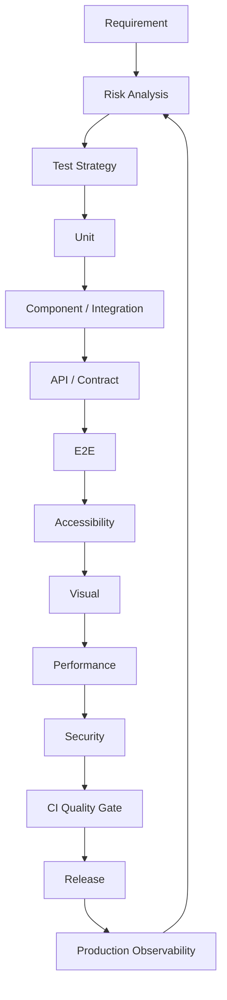
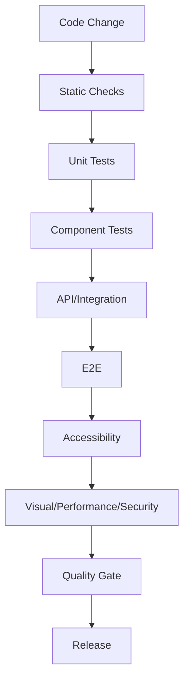
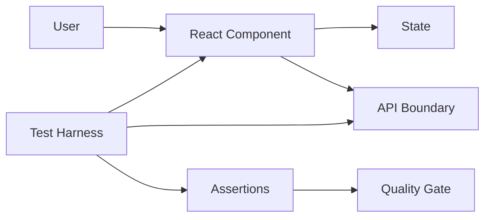

# FRONTEND TESTING & QUALITY ASSURANCE MASTER HANDBOOK

> Enterprise reference for beginner, intermediate, senior, Staff, QA, SDET and test-architecture preparation.

## Publication Scope

This source contains the requested 20-module curriculum with every listed module and a broad set of concrete topics. Markdown does not have a fixed page count; the final printed page count depends on typography, code formatting, diagrams, page size and publishing layout.

## Master Quality Lifecycle



## Enterprise Test Folder Structure

```text
frontend/
├── src/
├── tests/
│   ├── unit/
│   ├── integration/
│   ├── e2e/
│   ├── accessibility/
│   ├── visual/
│   ├── performance/
│   ├── fixtures/
│   ├── mocks/
│   └── utilities/
├── storybook/
├── playwright/
└── .github/workflows/
```

## Testing Pyramid

```text
             E2E
          Integration
       Component / API
            Unit
```

## Core Principles

1. Test behavior, not implementation details.
2. Keep tests deterministic.
3. Match the test level to risk.
4. Mock external boundaries, not the subject under test.
5. Accessibility, performance and security are quality dimensions.
6. Coverage is a signal, not a guarantee.
7. Treat test infrastructure as production software.


# Testing Fundamentals

## Module Objective

This module provides a consistent beginner-to-Principal learning path for Testing Fundamentals.


## Software Testing and Quality

### Introduction
**Software Testing and Quality** is a production testing capability within **Testing Fundamentals**. The goal is to protect observable behavior, reduce regression risk, and provide fast, trustworthy feedback.

### Definition
Testing this topic means verifying its public behavior under normal, boundary, failure, accessibility, performance, and security conditions.

### Why this topic exists
It reduces escaped defects, documents behavior, enables safe refactoring, and creates confidence during continuous delivery.

### History
Frontend testing evolved from manual browser verification into layered unit, component, integration, API, E2E, visual, accessibility, performance, and security quality engineering.

### Internal Working
```text
Arrange → Act → Observe → Assert → Cleanup → Report
```

### Architecture
```text
Change → Static Checks → Unit → Component/Integration → API/Contract → E2E → Accessibility/Visual/Performance/Security → Quality Gate → Release
```

### Flow Diagram


### Browser Internals
Browser tests interact with the DOM, event system, network stack, storage, rendering pipeline, accessibility tree, and browser automation protocol. Prefer observable behavior over private browser implementation details.

### React Internals
React tests observe rendering, state updates, effects, Suspense, context, event handling, and asynchronous updates. Avoid making internal component state an accidental contract.

### JavaScript Internals
Promises schedule microtasks; timers depend on the host environment; DOM APIs are browser capabilities. Async tests must await the actual observable completion condition.

### TypeScript Example
```typescript
export function normalize(value: string): string {
  if (!value.trim()) throw new Error("value is required");
  return value.trim();
}
```

### JavaScript Example
```javascript
export function normalize(value) {
  if (typeof value !== "string" || !value.trim()) throw new TypeError("value is required");
  return value.trim();
}
```

### React Example
```tsx
import { useState } from "react";

type Props = { label: string; onSubmit: (value: string) => Promise<void> | void };

export function SearchForm({ label, onSubmit }: Props) {
  const [value, setValue] = useState("");
  return (
    <form aria-label={label} onSubmit={async e => { e.preventDefault(); if (value.trim()) await onSubmit(value.trim()); }}>
      <label htmlFor="search">{label}</label>
      <input id="search" value={value} onChange={e => setValue(e.target.value)} />
      <button type="submit">Search</button>
    </form>
  );
}
```

### Production Test Example
```tsx
import { render, screen } from "@testing-library/react";
import userEvent from "@testing-library/user-event";
import { vi, describe, test, expect } from "vitest";
import { SearchForm } from "./SearchForm";

describe("Software Testing and Quality", () => {
  test("submits normalized user input", async () => {
    const user = userEvent.setup();
    const onSubmit = vi.fn();
    render(<SearchForm label="Search" onSubmit={onSubmit} />);
    await user.type(screen.getByRole("textbox", { name: "Search" }), "  React  ");
    await user.click(screen.getByRole("button", { name: "Search" }));
    expect(onSubmit).toHaveBeenCalledWith("React");
  });
});
```

### Unit Test
Test pure logic directly with deterministic inputs and explicit boundary cases.

### Integration Test
Render the real component boundary and mock only uncontrolled external dependencies such as network services.

### E2E Test
Use a real browser for critical user journeys. Prefer role/name based locators and condition-based synchronization instead of arbitrary sleeps.

### Mocking
Use mocks for external systems you do not control. Avoid mocking the implementation under test because it can create false confidence. MSW is useful for realistic HTTP boundary mocking.

### Coverage
Coverage measures executed code paths, not quality. Track branch and statement coverage together with risk-based test completeness and escaped-defect trends.

### Edge Cases
Empty data, loading, error, retry, timeout, duplicate actions, slow network, keyboard-only use, mobile viewport, expired authentication, permission changes, and very large datasets.

### Accessibility Tests
Verify accessible names, semantics, keyboard operation, focus order, visible focus, labels, error announcements, and dialog behavior. Automated axe-style checks are useful but do not replace manual accessibility evaluation.

### Performance Tests
Measure test runtime, browser startup, render cost, network waits, memory growth, and CI queue time. Do not introduce arbitrary waits merely to make timing appear stable.

### Debugging
Use focused tests, watch mode, browser traces, screenshots, console output, network inspection, React DevTools, coverage reports, and failure artifacts. Reproduce before changing retries.

### Best Practices
- Test behavior rather than implementation details.
- Keep tests deterministic and isolated.
- Use realistic interactions.
- Make failures diagnostic.
- Keep setup explicit.
- Match test level to risk.
- Treat accessibility as a quality dimension.
- Review test code like production code.

### Common Mistakes
- Arbitrary sleeps
- Shared mutable fixtures
- Excessive mocking
- Snapshot overuse
- Testing private state
- Ignoring cleanup
- Treating coverage as quality
- Running every check in every PR regardless of value

### Anti-pattern
```text
Bad: click → wait(5000) → expect
Good: click → await findByRole(...) → expect
```

### Security
Do not store production secrets in tests. Test authentication and authorization boundaries, untrusted input, safe rendering, cookies, headers, file uploads, and dependency risks.

### Trade-offs
| Strategy | Strength | Cost |
|---|---|---|
| Unit | Fast feedback | Limited integration confidence |
| Integration | Realistic boundary | More setup |
| E2E | High user-flow confidence | Slower and more environment-sensitive |
| Mock | Isolation | Risk of drift |
| Real dependency | High fidelity | Higher cost |

### Interview Questions
1. What behavior should be protected?
2. Which test level is appropriate and why?
3. What should be mocked?
4. How do you make this deterministic?
5. How do you test failure states?
6. How do you test accessibility?
7. How do you diagnose CI-only failures?
8. How do you measure useful coverage?
9. How would you scale the suite?
10. What would you change if test runtime doubled?

### Senior Interview Questions
- Design this test boundary for a large React monorepo.
- How would you reduce CI time without reducing confidence?
- How would you identify and govern flaky tests?
- How would you prevent mocks from drifting from production APIs?
- Which quality gates should block release?

### FAANG Questions
- Design a test architecture for thousands of browser tests.
- Explain unit/integration/E2E trade-offs under strict deployment frequency.
- How would you test eventual consistency?
- How would you combine accessibility, performance, security, and functional gates?

### Production Scenario
A test passes locally but fails in CI: compare runtime versions, inspect network timing, capture a browser trace, remove sleeps, check environment variables, isolate shared state, and reproduce the smallest failing case. Fix the root cause rather than increasing retries blindly.

### Checklist
- [ ] Clear test purpose
- [ ] Deterministic setup
- [ ] Observable assertion
- [ ] Async work awaited
- [ ] Cleanup performed
- [ ] Accessibility considered
- [ ] Failure diagnostics available
- [ ] Correct test level
- [ ] No production secrets
- [ ] CI reproducible

### Cheat Sheet
```text
Unit → isolated logic
Integration → boundaries together
RTL → user-facing React behavior
MSW → realistic HTTP boundary
Playwright → browser workflow + traces
axe → automated accessibility rules
Storybook → component states
Coverage → risk signal, not quality itself
```

### Revision Notes
A high-quality test is deterministic, behavior-focused, appropriately scoped, and valuable enough to maintain.

### Exercises
1. Add the happy path.
2. Add empty/loading/error states.
3. Add accessibility assertions.
4. Add a network failure.
5. Run in CI and inspect diagnostics.

### Hands-on Assignment
Build a small React feature with a form, loading state, success/error states, retry, keyboard support, API mocking, unit tests, integration tests, and one E2E workflow.

### Mini Project
**Enterprise Search Widget:** debounced search, result list, empty/error states, keyboard navigation, accessible labels, MSW API mocks, unit/integration tests, Playwright E2E, and performance measurement.

### Mock Interview
Explain the requirement, risk, test boundary, data strategy, assertions, failure modes, CI placement, and production monitoring before naming tools.

### Mermaid Architecture


### Code Review Checklist
- Is behavior tested instead of implementation detail?
- Are assertions precise?
- Are async operations awaited?
- Are fixtures isolated?
- Are accessibility states covered?
- Is the test at the cheapest reliable level?
- Will the test produce useful failure diagnostics?


## Testing Pyramid

### Introduction
**Testing Pyramid** is a production testing capability within **Testing Fundamentals**. The goal is to protect observable behavior, reduce regression risk, and provide fast, trustworthy feedback.

### Definition
Testing this topic means verifying its public behavior under normal, boundary, failure, accessibility, performance, and security conditions.

### Why this topic exists
It reduces escaped defects, documents behavior, enables safe refactoring, and creates confidence during continuous delivery.

### History
Frontend testing evolved from manual browser verification into layered unit, component, integration, API, E2E, visual, accessibility, performance, and security quality engineering.

### Internal Working
```text
Arrange → Act → Observe → Assert → Cleanup → Report
```

### Architecture
```text
Change → Static Checks → Unit → Component/Integration → API/Contract → E2E → Accessibility/Visual/Performance/Security → Quality Gate → Release
```

### Flow Diagram


### Browser Internals
Browser tests interact with the DOM, event system, network stack, storage, rendering pipeline, accessibility tree, and browser automation protocol. Prefer observable behavior over private browser implementation details.

### React Internals
React tests observe rendering, state updates, effects, Suspense, context, event handling, and asynchronous updates. Avoid making internal component state an accidental contract.

### JavaScript Internals
Promises schedule microtasks; timers depend on the host environment; DOM APIs are browser capabilities. Async tests must await the actual observable completion condition.

### TypeScript Example
```typescript
export function normalize(value: string): string {
  if (!value.trim()) throw new Error("value is required");
  return value.trim();
}
```

### JavaScript Example
```javascript
export function normalize(value) {
  if (typeof value !== "string" || !value.trim()) throw new TypeError("value is required");
  return value.trim();
}
```

### React Example
```tsx
import { useState } from "react";

type Props = { label: string; onSubmit: (value: string) => Promise<void> | void };

export function SearchForm({ label, onSubmit }: Props) {
  const [value, setValue] = useState("");
  return (
    <form aria-label={label} onSubmit={async e => { e.preventDefault(); if (value.trim()) await onSubmit(value.trim()); }}>
      <label htmlFor="search">{label}</label>
      <input id="search" value={value} onChange={e => setValue(e.target.value)} />
      <button type="submit">Search</button>
    </form>
  );
}
```

### Production Test Example
```tsx
import { render, screen } from "@testing-library/react";
import userEvent from "@testing-library/user-event";
import { vi, describe, test, expect } from "vitest";
import { SearchForm } from "./SearchForm";

describe("Testing Pyramid", () => {
  test("submits normalized user input", async () => {
    const user = userEvent.setup();
    const onSubmit = vi.fn();
    render(<SearchForm label="Search" onSubmit={onSubmit} />);
    await user.type(screen.getByRole("textbox", { name: "Search" }), "  React  ");
    await user.click(screen.getByRole("button", { name: "Search" }));
    expect(onSubmit).toHaveBeenCalledWith("React");
  });
});
```

### Unit Test
Test pure logic directly with deterministic inputs and explicit boundary cases.

### Integration Test
Render the real component boundary and mock only uncontrolled external dependencies such as network services.

### E2E Test
Use a real browser for critical user journeys. Prefer role/name based locators and condition-based synchronization instead of arbitrary sleeps.

### Mocking
Use mocks for external systems you do not control. Avoid mocking the implementation under test because it can create false confidence. MSW is useful for realistic HTTP boundary mocking.

### Coverage
Coverage measures executed code paths, not quality. Track branch and statement coverage together with risk-based test completeness and escaped-defect trends.

### Edge Cases
Empty data, loading, error, retry, timeout, duplicate actions, slow network, keyboard-only use, mobile viewport, expired authentication, permission changes, and very large datasets.

### Accessibility Tests
Verify accessible names, semantics, keyboard operation, focus order, visible focus, labels, error announcements, and dialog behavior. Automated axe-style checks are useful but do not replace manual accessibility evaluation.

### Performance Tests
Measure test runtime, browser startup, render cost, network waits, memory growth, and CI queue time. Do not introduce arbitrary waits merely to make timing appear stable.

### Debugging
Use focused tests, watch mode, browser traces, screenshots, console output, network inspection, React DevTools, coverage reports, and failure artifacts. Reproduce before changing retries.

### Best Practices
- Test behavior rather than implementation details.
- Keep tests deterministic and isolated.
- Use realistic interactions.
- Make failures diagnostic.
- Keep setup explicit.
- Match test level to risk.
- Treat accessibility as a quality dimension.
- Review test code like production code.

### Common Mistakes
- Arbitrary sleeps
- Shared mutable fixtures
- Excessive mocking
- Snapshot overuse
- Testing private state
- Ignoring cleanup
- Treating coverage as quality
- Running every check in every PR regardless of value

### Anti-pattern
```text
Bad: click → wait(5000) → expect
Good: click → await findByRole(...) → expect
```

### Security
Do not store production secrets in tests. Test authentication and authorization boundaries, untrusted input, safe rendering, cookies, headers, file uploads, and dependency risks.

### Trade-offs
| Strategy | Strength | Cost |
|---|---|---|
| Unit | Fast feedback | Limited integration confidence |
| Integration | Realistic boundary | More setup |
| E2E | High user-flow confidence | Slower and more environment-sensitive |
| Mock | Isolation | Risk of drift |
| Real dependency | High fidelity | Higher cost |

### Interview Questions
1. What behavior should be protected?
2. Which test level is appropriate and why?
3. What should be mocked?
4. How do you make this deterministic?
5. How do you test failure states?
6. How do you test accessibility?
7. How do you diagnose CI-only failures?
8. How do you measure useful coverage?
9. How would you scale the suite?
10. What would you change if test runtime doubled?

### Senior Interview Questions
- Design this test boundary for a large React monorepo.
- How would you reduce CI time without reducing confidence?
- How would you identify and govern flaky tests?
- How would you prevent mocks from drifting from production APIs?
- Which quality gates should block release?

### FAANG Questions
- Design a test architecture for thousands of browser tests.
- Explain unit/integration/E2E trade-offs under strict deployment frequency.
- How would you test eventual consistency?
- How would you combine accessibility, performance, security, and functional gates?

### Production Scenario
A test passes locally but fails in CI: compare runtime versions, inspect network timing, capture a browser trace, remove sleeps, check environment variables, isolate shared state, and reproduce the smallest failing case. Fix the root cause rather than increasing retries blindly.

### Checklist
- [ ] Clear test purpose
- [ ] Deterministic setup
- [ ] Observable assertion
- [ ] Async work awaited
- [ ] Cleanup performed
- [ ] Accessibility considered
- [ ] Failure diagnostics available
- [ ] Correct test level
- [ ] No production secrets
- [ ] CI reproducible

### Cheat Sheet
```text
Unit → isolated logic
Integration → boundaries together
RTL → user-facing React behavior
MSW → realistic HTTP boundary
Playwright → browser workflow + traces
axe → automated accessibility rules
Storybook → component states
Coverage → risk signal, not quality itself
```

### Revision Notes
A high-quality test is deterministic, behavior-focused, appropriately scoped, and valuable enough to maintain.

### Exercises
1. Add the happy path.
2. Add empty/loading/error states.
3. Add accessibility assertions.
4. Add a network failure.
5. Run in CI and inspect diagnostics.

### Hands-on Assignment
Build a small React feature with a form, loading state, success/error states, retry, keyboard support, API mocking, unit tests, integration tests, and one E2E workflow.

### Mini Project
**Enterprise Search Widget:** debounced search, result list, empty/error states, keyboard navigation, accessible labels, MSW API mocks, unit/integration tests, Playwright E2E, and performance measurement.

### Mock Interview
Explain the requirement, risk, test boundary, data strategy, assertions, failure modes, CI placement, and production monitoring before naming tools.

### Mermaid Architecture


### Code Review Checklist
- Is behavior tested instead of implementation detail?
- Are assertions precise?
- Are async operations awaited?
- Are fixtures isolated?
- Are accessibility states covered?
- Is the test at the cheapest reliable level?
- Will the test produce useful failure diagnostics?


## Testing Trophy

### Introduction
**Testing Trophy** is a production testing capability within **Testing Fundamentals**. The goal is to protect observable behavior, reduce regression risk, and provide fast, trustworthy feedback.

### Definition
Testing this topic means verifying its public behavior under normal, boundary, failure, accessibility, performance, and security conditions.

### Why this topic exists
It reduces escaped defects, documents behavior, enables safe refactoring, and creates confidence during continuous delivery.

### History
Frontend testing evolved from manual browser verification into layered unit, component, integration, API, E2E, visual, accessibility, performance, and security quality engineering.

### Internal Working
```text
Arrange → Act → Observe → Assert → Cleanup → Report
```

### Architecture
```text
Change → Static Checks → Unit → Component/Integration → API/Contract → E2E → Accessibility/Visual/Performance/Security → Quality Gate → Release
```

### Flow Diagram


### Browser Internals
Browser tests interact with the DOM, event system, network stack, storage, rendering pipeline, accessibility tree, and browser automation protocol. Prefer observable behavior over private browser implementation details.

### React Internals
React tests observe rendering, state updates, effects, Suspense, context, event handling, and asynchronous updates. Avoid making internal component state an accidental contract.

### JavaScript Internals
Promises schedule microtasks; timers depend on the host environment; DOM APIs are browser capabilities. Async tests must await the actual observable completion condition.

### TypeScript Example
```typescript
export function normalize(value: string): string {
  if (!value.trim()) throw new Error("value is required");
  return value.trim();
}
```

### JavaScript Example
```javascript
export function normalize(value) {
  if (typeof value !== "string" || !value.trim()) throw new TypeError("value is required");
  return value.trim();
}
```

### React Example
```tsx
import { useState } from "react";

type Props = { label: string; onSubmit: (value: string) => Promise<void> | void };

export function SearchForm({ label, onSubmit }: Props) {
  const [value, setValue] = useState("");
  return (
    <form aria-label={label} onSubmit={async e => { e.preventDefault(); if (value.trim()) await onSubmit(value.trim()); }}>
      <label htmlFor="search">{label}</label>
      <input id="search" value={value} onChange={e => setValue(e.target.value)} />
      <button type="submit">Search</button>
    </form>
  );
}
```

### Production Test Example
```tsx
import { render, screen } from "@testing-library/react";
import userEvent from "@testing-library/user-event";
import { vi, describe, test, expect } from "vitest";
import { SearchForm } from "./SearchForm";

describe("Testing Trophy", () => {
  test("submits normalized user input", async () => {
    const user = userEvent.setup();
    const onSubmit = vi.fn();
    render(<SearchForm label="Search" onSubmit={onSubmit} />);
    await user.type(screen.getByRole("textbox", { name: "Search" }), "  React  ");
    await user.click(screen.getByRole("button", { name: "Search" }));
    expect(onSubmit).toHaveBeenCalledWith("React");
  });
});
```

### Unit Test
Test pure logic directly with deterministic inputs and explicit boundary cases.

### Integration Test
Render the real component boundary and mock only uncontrolled external dependencies such as network services.

### E2E Test
Use a real browser for critical user journeys. Prefer role/name based locators and condition-based synchronization instead of arbitrary sleeps.

### Mocking
Use mocks for external systems you do not control. Avoid mocking the implementation under test because it can create false confidence. MSW is useful for realistic HTTP boundary mocking.

### Coverage
Coverage measures executed code paths, not quality. Track branch and statement coverage together with risk-based test completeness and escaped-defect trends.

### Edge Cases
Empty data, loading, error, retry, timeout, duplicate actions, slow network, keyboard-only use, mobile viewport, expired authentication, permission changes, and very large datasets.

### Accessibility Tests
Verify accessible names, semantics, keyboard operation, focus order, visible focus, labels, error announcements, and dialog behavior. Automated axe-style checks are useful but do not replace manual accessibility evaluation.

### Performance Tests
Measure test runtime, browser startup, render cost, network waits, memory growth, and CI queue time. Do not introduce arbitrary waits merely to make timing appear stable.

### Debugging
Use focused tests, watch mode, browser traces, screenshots, console output, network inspection, React DevTools, coverage reports, and failure artifacts. Reproduce before changing retries.

### Best Practices
- Test behavior rather than implementation details.
- Keep tests deterministic and isolated.
- Use realistic interactions.
- Make failures diagnostic.
- Keep setup explicit.
- Match test level to risk.
- Treat accessibility as a quality dimension.
- Review test code like production code.

### Common Mistakes
- Arbitrary sleeps
- Shared mutable fixtures
- Excessive mocking
- Snapshot overuse
- Testing private state
- Ignoring cleanup
- Treating coverage as quality
- Running every check in every PR regardless of value

### Anti-pattern
```text
Bad: click → wait(5000) → expect
Good: click → await findByRole(...) → expect
```

### Security
Do not store production secrets in tests. Test authentication and authorization boundaries, untrusted input, safe rendering, cookies, headers, file uploads, and dependency risks.

### Trade-offs
| Strategy | Strength | Cost |
|---|---|---|
| Unit | Fast feedback | Limited integration confidence |
| Integration | Realistic boundary | More setup |
| E2E | High user-flow confidence | Slower and more environment-sensitive |
| Mock | Isolation | Risk of drift |
| Real dependency | High fidelity | Higher cost |

### Interview Questions
1. What behavior should be protected?
2. Which test level is appropriate and why?
3. What should be mocked?
4. How do you make this deterministic?
5. How do you test failure states?
6. How do you test accessibility?
7. How do you diagnose CI-only failures?
8. How do you measure useful coverage?
9. How would you scale the suite?
10. What would you change if test runtime doubled?

### Senior Interview Questions
- Design this test boundary for a large React monorepo.
- How would you reduce CI time without reducing confidence?
- How would you identify and govern flaky tests?
- How would you prevent mocks from drifting from production APIs?
- Which quality gates should block release?

### FAANG Questions
- Design a test architecture for thousands of browser tests.
- Explain unit/integration/E2E trade-offs under strict deployment frequency.
- How would you test eventual consistency?
- How would you combine accessibility, performance, security, and functional gates?

### Production Scenario
A test passes locally but fails in CI: compare runtime versions, inspect network timing, capture a browser trace, remove sleeps, check environment variables, isolate shared state, and reproduce the smallest failing case. Fix the root cause rather than increasing retries blindly.

### Checklist
- [ ] Clear test purpose
- [ ] Deterministic setup
- [ ] Observable assertion
- [ ] Async work awaited
- [ ] Cleanup performed
- [ ] Accessibility considered
- [ ] Failure diagnostics available
- [ ] Correct test level
- [ ] No production secrets
- [ ] CI reproducible

### Cheat Sheet
```text
Unit → isolated logic
Integration → boundaries together
RTL → user-facing React behavior
MSW → realistic HTTP boundary
Playwright → browser workflow + traces
axe → automated accessibility rules
Storybook → component states
Coverage → risk signal, not quality itself
```

### Revision Notes
A high-quality test is deterministic, behavior-focused, appropriately scoped, and valuable enough to maintain.

### Exercises
1. Add the happy path.
2. Add empty/loading/error states.
3. Add accessibility assertions.
4. Add a network failure.
5. Run in CI and inspect diagnostics.

### Hands-on Assignment
Build a small React feature with a form, loading state, success/error states, retry, keyboard support, API mocking, unit tests, integration tests, and one E2E workflow.

### Mini Project
**Enterprise Search Widget:** debounced search, result list, empty/error states, keyboard navigation, accessible labels, MSW API mocks, unit/integration tests, Playwright E2E, and performance measurement.

### Mock Interview
Explain the requirement, risk, test boundary, data strategy, assertions, failure modes, CI placement, and production monitoring before naming tools.

### Mermaid Architecture


### Code Review Checklist
- Is behavior tested instead of implementation detail?
- Are assertions precise?
- Are async operations awaited?
- Are fixtures isolated?
- Are accessibility states covered?
- Is the test at the cheapest reliable level?
- Will the test produce useful failure diagnostics?


## Manual vs Automated Testing

### Introduction
**Manual vs Automated Testing** is a production testing capability within **Testing Fundamentals**. The goal is to protect observable behavior, reduce regression risk, and provide fast, trustworthy feedback.

### Definition
Testing this topic means verifying its public behavior under normal, boundary, failure, accessibility, performance, and security conditions.

### Why this topic exists
It reduces escaped defects, documents behavior, enables safe refactoring, and creates confidence during continuous delivery.

### History
Frontend testing evolved from manual browser verification into layered unit, component, integration, API, E2E, visual, accessibility, performance, and security quality engineering.

### Internal Working
```text
Arrange → Act → Observe → Assert → Cleanup → Report
```

### Architecture
```text
Change → Static Checks → Unit → Component/Integration → API/Contract → E2E → Accessibility/Visual/Performance/Security → Quality Gate → Release
```

### Flow Diagram


### Browser Internals
Browser tests interact with the DOM, event system, network stack, storage, rendering pipeline, accessibility tree, and browser automation protocol. Prefer observable behavior over private browser implementation details.

### React Internals
React tests observe rendering, state updates, effects, Suspense, context, event handling, and asynchronous updates. Avoid making internal component state an accidental contract.

### JavaScript Internals
Promises schedule microtasks; timers depend on the host environment; DOM APIs are browser capabilities. Async tests must await the actual observable completion condition.

### TypeScript Example
```typescript
export function normalize(value: string): string {
  if (!value.trim()) throw new Error("value is required");
  return value.trim();
}
```

### JavaScript Example
```javascript
export function normalize(value) {
  if (typeof value !== "string" || !value.trim()) throw new TypeError("value is required");
  return value.trim();
}
```

### React Example
```tsx
import { useState } from "react";

type Props = { label: string; onSubmit: (value: string) => Promise<void> | void };

export function SearchForm({ label, onSubmit }: Props) {
  const [value, setValue] = useState("");
  return (
    <form aria-label={label} onSubmit={async e => { e.preventDefault(); if (value.trim()) await onSubmit(value.trim()); }}>
      <label htmlFor="search">{label}</label>
      <input id="search" value={value} onChange={e => setValue(e.target.value)} />
      <button type="submit">Search</button>
    </form>
  );
}
```

### Production Test Example
```tsx
import { render, screen } from "@testing-library/react";
import userEvent from "@testing-library/user-event";
import { vi, describe, test, expect } from "vitest";
import { SearchForm } from "./SearchForm";

describe("Manual vs Automated Testing", () => {
  test("submits normalized user input", async () => {
    const user = userEvent.setup();
    const onSubmit = vi.fn();
    render(<SearchForm label="Search" onSubmit={onSubmit} />);
    await user.type(screen.getByRole("textbox", { name: "Search" }), "  React  ");
    await user.click(screen.getByRole("button", { name: "Search" }));
    expect(onSubmit).toHaveBeenCalledWith("React");
  });
});
```

### Unit Test
Test pure logic directly with deterministic inputs and explicit boundary cases.

### Integration Test
Render the real component boundary and mock only uncontrolled external dependencies such as network services.

### E2E Test
Use a real browser for critical user journeys. Prefer role/name based locators and condition-based synchronization instead of arbitrary sleeps.

### Mocking
Use mocks for external systems you do not control. Avoid mocking the implementation under test because it can create false confidence. MSW is useful for realistic HTTP boundary mocking.

### Coverage
Coverage measures executed code paths, not quality. Track branch and statement coverage together with risk-based test completeness and escaped-defect trends.

### Edge Cases
Empty data, loading, error, retry, timeout, duplicate actions, slow network, keyboard-only use, mobile viewport, expired authentication, permission changes, and very large datasets.

### Accessibility Tests
Verify accessible names, semantics, keyboard operation, focus order, visible focus, labels, error announcements, and dialog behavior. Automated axe-style checks are useful but do not replace manual accessibility evaluation.

### Performance Tests
Measure test runtime, browser startup, render cost, network waits, memory growth, and CI queue time. Do not introduce arbitrary waits merely to make timing appear stable.

### Debugging
Use focused tests, watch mode, browser traces, screenshots, console output, network inspection, React DevTools, coverage reports, and failure artifacts. Reproduce before changing retries.

### Best Practices
- Test behavior rather than implementation details.
- Keep tests deterministic and isolated.
- Use realistic interactions.
- Make failures diagnostic.
- Keep setup explicit.
- Match test level to risk.
- Treat accessibility as a quality dimension.
- Review test code like production code.

### Common Mistakes
- Arbitrary sleeps
- Shared mutable fixtures
- Excessive mocking
- Snapshot overuse
- Testing private state
- Ignoring cleanup
- Treating coverage as quality
- Running every check in every PR regardless of value

### Anti-pattern
```text
Bad: click → wait(5000) → expect
Good: click → await findByRole(...) → expect
```

### Security
Do not store production secrets in tests. Test authentication and authorization boundaries, untrusted input, safe rendering, cookies, headers, file uploads, and dependency risks.

### Trade-offs
| Strategy | Strength | Cost |
|---|---|---|
| Unit | Fast feedback | Limited integration confidence |
| Integration | Realistic boundary | More setup |
| E2E | High user-flow confidence | Slower and more environment-sensitive |
| Mock | Isolation | Risk of drift |
| Real dependency | High fidelity | Higher cost |

### Interview Questions
1. What behavior should be protected?
2. Which test level is appropriate and why?
3. What should be mocked?
4. How do you make this deterministic?
5. How do you test failure states?
6. How do you test accessibility?
7. How do you diagnose CI-only failures?
8. How do you measure useful coverage?
9. How would you scale the suite?
10. What would you change if test runtime doubled?

### Senior Interview Questions
- Design this test boundary for a large React monorepo.
- How would you reduce CI time without reducing confidence?
- How would you identify and govern flaky tests?
- How would you prevent mocks from drifting from production APIs?
- Which quality gates should block release?

### FAANG Questions
- Design a test architecture for thousands of browser tests.
- Explain unit/integration/E2E trade-offs under strict deployment frequency.
- How would you test eventual consistency?
- How would you combine accessibility, performance, security, and functional gates?

### Production Scenario
A test passes locally but fails in CI: compare runtime versions, inspect network timing, capture a browser trace, remove sleeps, check environment variables, isolate shared state, and reproduce the smallest failing case. Fix the root cause rather than increasing retries blindly.

### Checklist
- [ ] Clear test purpose
- [ ] Deterministic setup
- [ ] Observable assertion
- [ ] Async work awaited
- [ ] Cleanup performed
- [ ] Accessibility considered
- [ ] Failure diagnostics available
- [ ] Correct test level
- [ ] No production secrets
- [ ] CI reproducible

### Cheat Sheet
```text
Unit → isolated logic
Integration → boundaries together
RTL → user-facing React behavior
MSW → realistic HTTP boundary
Playwright → browser workflow + traces
axe → automated accessibility rules
Storybook → component states
Coverage → risk signal, not quality itself
```

### Revision Notes
A high-quality test is deterministic, behavior-focused, appropriately scoped, and valuable enough to maintain.

### Exercises
1. Add the happy path.
2. Add empty/loading/error states.
3. Add accessibility assertions.
4. Add a network failure.
5. Run in CI and inspect diagnostics.

### Hands-on Assignment
Build a small React feature with a form, loading state, success/error states, retry, keyboard support, API mocking, unit tests, integration tests, and one E2E workflow.

### Mini Project
**Enterprise Search Widget:** debounced search, result list, empty/error states, keyboard navigation, accessible labels, MSW API mocks, unit/integration tests, Playwright E2E, and performance measurement.

### Mock Interview
Explain the requirement, risk, test boundary, data strategy, assertions, failure modes, CI placement, and production monitoring before naming tools.

### Mermaid Architecture


### Code Review Checklist
- Is behavior tested instead of implementation detail?
- Are assertions precise?
- Are async operations awaited?
- Are fixtures isolated?
- Are accessibility states covered?
- Is the test at the cheapest reliable level?
- Will the test produce useful failure diagnostics?


## Unit Testing

### Introduction
**Unit Testing** is a production testing capability within **Testing Fundamentals**. The goal is to protect observable behavior, reduce regression risk, and provide fast, trustworthy feedback.

### Definition
Testing this topic means verifying its public behavior under normal, boundary, failure, accessibility, performance, and security conditions.

### Why this topic exists
It reduces escaped defects, documents behavior, enables safe refactoring, and creates confidence during continuous delivery.

### History
Frontend testing evolved from manual browser verification into layered unit, component, integration, API, E2E, visual, accessibility, performance, and security quality engineering.

### Internal Working
```text
Arrange → Act → Observe → Assert → Cleanup → Report
```

### Architecture
```text
Change → Static Checks → Unit → Component/Integration → API/Contract → E2E → Accessibility/Visual/Performance/Security → Quality Gate → Release
```

### Flow Diagram


### Browser Internals
Browser tests interact with the DOM, event system, network stack, storage, rendering pipeline, accessibility tree, and browser automation protocol. Prefer observable behavior over private browser implementation details.

### React Internals
React tests observe rendering, state updates, effects, Suspense, context, event handling, and asynchronous updates. Avoid making internal component state an accidental contract.

### JavaScript Internals
Promises schedule microtasks; timers depend on the host environment; DOM APIs are browser capabilities. Async tests must await the actual observable completion condition.

### TypeScript Example
```typescript
export function normalize(value: string): string {
  if (!value.trim()) throw new Error("value is required");
  return value.trim();
}
```

### JavaScript Example
```javascript
export function normalize(value) {
  if (typeof value !== "string" || !value.trim()) throw new TypeError("value is required");
  return value.trim();
}
```

### React Example
```tsx
import { useState } from "react";

type Props = { label: string; onSubmit: (value: string) => Promise<void> | void };

export function SearchForm({ label, onSubmit }: Props) {
  const [value, setValue] = useState("");
  return (
    <form aria-label={label} onSubmit={async e => { e.preventDefault(); if (value.trim()) await onSubmit(value.trim()); }}>
      <label htmlFor="search">{label}</label>
      <input id="search" value={value} onChange={e => setValue(e.target.value)} />
      <button type="submit">Search</button>
    </form>
  );
}
```

### Production Test Example
```tsx
import { render, screen } from "@testing-library/react";
import userEvent from "@testing-library/user-event";
import { vi, describe, test, expect } from "vitest";
import { SearchForm } from "./SearchForm";

describe("Unit Testing", () => {
  test("submits normalized user input", async () => {
    const user = userEvent.setup();
    const onSubmit = vi.fn();
    render(<SearchForm label="Search" onSubmit={onSubmit} />);
    await user.type(screen.getByRole("textbox", { name: "Search" }), "  React  ");
    await user.click(screen.getByRole("button", { name: "Search" }));
    expect(onSubmit).toHaveBeenCalledWith("React");
  });
});
```

### Unit Test
Test pure logic directly with deterministic inputs and explicit boundary cases.

### Integration Test
Render the real component boundary and mock only uncontrolled external dependencies such as network services.

### E2E Test
Use a real browser for critical user journeys. Prefer role/name based locators and condition-based synchronization instead of arbitrary sleeps.

### Mocking
Use mocks for external systems you do not control. Avoid mocking the implementation under test because it can create false confidence. MSW is useful for realistic HTTP boundary mocking.

### Coverage
Coverage measures executed code paths, not quality. Track branch and statement coverage together with risk-based test completeness and escaped-defect trends.

### Edge Cases
Empty data, loading, error, retry, timeout, duplicate actions, slow network, keyboard-only use, mobile viewport, expired authentication, permission changes, and very large datasets.

### Accessibility Tests
Verify accessible names, semantics, keyboard operation, focus order, visible focus, labels, error announcements, and dialog behavior. Automated axe-style checks are useful but do not replace manual accessibility evaluation.

### Performance Tests
Measure test runtime, browser startup, render cost, network waits, memory growth, and CI queue time. Do not introduce arbitrary waits merely to make timing appear stable.

### Debugging
Use focused tests, watch mode, browser traces, screenshots, console output, network inspection, React DevTools, coverage reports, and failure artifacts. Reproduce before changing retries.

### Best Practices
- Test behavior rather than implementation details.
- Keep tests deterministic and isolated.
- Use realistic interactions.
- Make failures diagnostic.
- Keep setup explicit.
- Match test level to risk.
- Treat accessibility as a quality dimension.
- Review test code like production code.

### Common Mistakes
- Arbitrary sleeps
- Shared mutable fixtures
- Excessive mocking
- Snapshot overuse
- Testing private state
- Ignoring cleanup
- Treating coverage as quality
- Running every check in every PR regardless of value

### Anti-pattern
```text
Bad: click → wait(5000) → expect
Good: click → await findByRole(...) → expect
```

### Security
Do not store production secrets in tests. Test authentication and authorization boundaries, untrusted input, safe rendering, cookies, headers, file uploads, and dependency risks.

### Trade-offs
| Strategy | Strength | Cost |
|---|---|---|
| Unit | Fast feedback | Limited integration confidence |
| Integration | Realistic boundary | More setup |
| E2E | High user-flow confidence | Slower and more environment-sensitive |
| Mock | Isolation | Risk of drift |
| Real dependency | High fidelity | Higher cost |

### Interview Questions
1. What behavior should be protected?
2. Which test level is appropriate and why?
3. What should be mocked?
4. How do you make this deterministic?
5. How do you test failure states?
6. How do you test accessibility?
7. How do you diagnose CI-only failures?
8. How do you measure useful coverage?
9. How would you scale the suite?
10. What would you change if test runtime doubled?

### Senior Interview Questions
- Design this test boundary for a large React monorepo.
- How would you reduce CI time without reducing confidence?
- How would you identify and govern flaky tests?
- How would you prevent mocks from drifting from production APIs?
- Which quality gates should block release?

### FAANG Questions
- Design a test architecture for thousands of browser tests.
- Explain unit/integration/E2E trade-offs under strict deployment frequency.
- How would you test eventual consistency?
- How would you combine accessibility, performance, security, and functional gates?

### Production Scenario
A test passes locally but fails in CI: compare runtime versions, inspect network timing, capture a browser trace, remove sleeps, check environment variables, isolate shared state, and reproduce the smallest failing case. Fix the root cause rather than increasing retries blindly.

### Checklist
- [ ] Clear test purpose
- [ ] Deterministic setup
- [ ] Observable assertion
- [ ] Async work awaited
- [ ] Cleanup performed
- [ ] Accessibility considered
- [ ] Failure diagnostics available
- [ ] Correct test level
- [ ] No production secrets
- [ ] CI reproducible

### Cheat Sheet
```text
Unit → isolated logic
Integration → boundaries together
RTL → user-facing React behavior
MSW → realistic HTTP boundary
Playwright → browser workflow + traces
axe → automated accessibility rules
Storybook → component states
Coverage → risk signal, not quality itself
```

### Revision Notes
A high-quality test is deterministic, behavior-focused, appropriately scoped, and valuable enough to maintain.

### Exercises
1. Add the happy path.
2. Add empty/loading/error states.
3. Add accessibility assertions.
4. Add a network failure.
5. Run in CI and inspect diagnostics.

### Hands-on Assignment
Build a small React feature with a form, loading state, success/error states, retry, keyboard support, API mocking, unit tests, integration tests, and one E2E workflow.

### Mini Project
**Enterprise Search Widget:** debounced search, result list, empty/error states, keyboard navigation, accessible labels, MSW API mocks, unit/integration tests, Playwright E2E, and performance measurement.

### Mock Interview
Explain the requirement, risk, test boundary, data strategy, assertions, failure modes, CI placement, and production monitoring before naming tools.

### Mermaid Architecture


### Code Review Checklist
- Is behavior tested instead of implementation detail?
- Are assertions precise?
- Are async operations awaited?
- Are fixtures isolated?
- Are accessibility states covered?
- Is the test at the cheapest reliable level?
- Will the test produce useful failure diagnostics?


## Integration Testing

### Introduction
**Integration Testing** is a production testing capability within **Testing Fundamentals**. The goal is to protect observable behavior, reduce regression risk, and provide fast, trustworthy feedback.

### Definition
Testing this topic means verifying its public behavior under normal, boundary, failure, accessibility, performance, and security conditions.

### Why this topic exists
It reduces escaped defects, documents behavior, enables safe refactoring, and creates confidence during continuous delivery.

### History
Frontend testing evolved from manual browser verification into layered unit, component, integration, API, E2E, visual, accessibility, performance, and security quality engineering.

### Internal Working
```text
Arrange → Act → Observe → Assert → Cleanup → Report
```

### Architecture
```text
Change → Static Checks → Unit → Component/Integration → API/Contract → E2E → Accessibility/Visual/Performance/Security → Quality Gate → Release
```

### Flow Diagram


### Browser Internals
Browser tests interact with the DOM, event system, network stack, storage, rendering pipeline, accessibility tree, and browser automation protocol. Prefer observable behavior over private browser implementation details.

### React Internals
React tests observe rendering, state updates, effects, Suspense, context, event handling, and asynchronous updates. Avoid making internal component state an accidental contract.

### JavaScript Internals
Promises schedule microtasks; timers depend on the host environment; DOM APIs are browser capabilities. Async tests must await the actual observable completion condition.

### TypeScript Example
```typescript
export function normalize(value: string): string {
  if (!value.trim()) throw new Error("value is required");
  return value.trim();
}
```

### JavaScript Example
```javascript
export function normalize(value) {
  if (typeof value !== "string" || !value.trim()) throw new TypeError("value is required");
  return value.trim();
}
```

### React Example
```tsx
import { useState } from "react";

type Props = { label: string; onSubmit: (value: string) => Promise<void> | void };

export function SearchForm({ label, onSubmit }: Props) {
  const [value, setValue] = useState("");
  return (
    <form aria-label={label} onSubmit={async e => { e.preventDefault(); if (value.trim()) await onSubmit(value.trim()); }}>
      <label htmlFor="search">{label}</label>
      <input id="search" value={value} onChange={e => setValue(e.target.value)} />
      <button type="submit">Search</button>
    </form>
  );
}
```

### Production Test Example
```tsx
import { render, screen } from "@testing-library/react";
import userEvent from "@testing-library/user-event";
import { vi, describe, test, expect } from "vitest";
import { SearchForm } from "./SearchForm";

describe("Integration Testing", () => {
  test("submits normalized user input", async () => {
    const user = userEvent.setup();
    const onSubmit = vi.fn();
    render(<SearchForm label="Search" onSubmit={onSubmit} />);
    await user.type(screen.getByRole("textbox", { name: "Search" }), "  React  ");
    await user.click(screen.getByRole("button", { name: "Search" }));
    expect(onSubmit).toHaveBeenCalledWith("React");
  });
});
```

### Unit Test
Test pure logic directly with deterministic inputs and explicit boundary cases.

### Integration Test
Render the real component boundary and mock only uncontrolled external dependencies such as network services.

### E2E Test
Use a real browser for critical user journeys. Prefer role/name based locators and condition-based synchronization instead of arbitrary sleeps.

### Mocking
Use mocks for external systems you do not control. Avoid mocking the implementation under test because it can create false confidence. MSW is useful for realistic HTTP boundary mocking.

### Coverage
Coverage measures executed code paths, not quality. Track branch and statement coverage together with risk-based test completeness and escaped-defect trends.

### Edge Cases
Empty data, loading, error, retry, timeout, duplicate actions, slow network, keyboard-only use, mobile viewport, expired authentication, permission changes, and very large datasets.

### Accessibility Tests
Verify accessible names, semantics, keyboard operation, focus order, visible focus, labels, error announcements, and dialog behavior. Automated axe-style checks are useful but do not replace manual accessibility evaluation.

### Performance Tests
Measure test runtime, browser startup, render cost, network waits, memory growth, and CI queue time. Do not introduce arbitrary waits merely to make timing appear stable.

### Debugging
Use focused tests, watch mode, browser traces, screenshots, console output, network inspection, React DevTools, coverage reports, and failure artifacts. Reproduce before changing retries.

### Best Practices
- Test behavior rather than implementation details.
- Keep tests deterministic and isolated.
- Use realistic interactions.
- Make failures diagnostic.
- Keep setup explicit.
- Match test level to risk.
- Treat accessibility as a quality dimension.
- Review test code like production code.

### Common Mistakes
- Arbitrary sleeps
- Shared mutable fixtures
- Excessive mocking
- Snapshot overuse
- Testing private state
- Ignoring cleanup
- Treating coverage as quality
- Running every check in every PR regardless of value

### Anti-pattern
```text
Bad: click → wait(5000) → expect
Good: click → await findByRole(...) → expect
```

### Security
Do not store production secrets in tests. Test authentication and authorization boundaries, untrusted input, safe rendering, cookies, headers, file uploads, and dependency risks.

### Trade-offs
| Strategy | Strength | Cost |
|---|---|---|
| Unit | Fast feedback | Limited integration confidence |
| Integration | Realistic boundary | More setup |
| E2E | High user-flow confidence | Slower and more environment-sensitive |
| Mock | Isolation | Risk of drift |
| Real dependency | High fidelity | Higher cost |

### Interview Questions
1. What behavior should be protected?
2. Which test level is appropriate and why?
3. What should be mocked?
4. How do you make this deterministic?
5. How do you test failure states?
6. How do you test accessibility?
7. How do you diagnose CI-only failures?
8. How do you measure useful coverage?
9. How would you scale the suite?
10. What would you change if test runtime doubled?

### Senior Interview Questions
- Design this test boundary for a large React monorepo.
- How would you reduce CI time without reducing confidence?
- How would you identify and govern flaky tests?
- How would you prevent mocks from drifting from production APIs?
- Which quality gates should block release?

### FAANG Questions
- Design a test architecture for thousands of browser tests.
- Explain unit/integration/E2E trade-offs under strict deployment frequency.
- How would you test eventual consistency?
- How would you combine accessibility, performance, security, and functional gates?

### Production Scenario
A test passes locally but fails in CI: compare runtime versions, inspect network timing, capture a browser trace, remove sleeps, check environment variables, isolate shared state, and reproduce the smallest failing case. Fix the root cause rather than increasing retries blindly.

### Checklist
- [ ] Clear test purpose
- [ ] Deterministic setup
- [ ] Observable assertion
- [ ] Async work awaited
- [ ] Cleanup performed
- [ ] Accessibility considered
- [ ] Failure diagnostics available
- [ ] Correct test level
- [ ] No production secrets
- [ ] CI reproducible

### Cheat Sheet
```text
Unit → isolated logic
Integration → boundaries together
RTL → user-facing React behavior
MSW → realistic HTTP boundary
Playwright → browser workflow + traces
axe → automated accessibility rules
Storybook → component states
Coverage → risk signal, not quality itself
```

### Revision Notes
A high-quality test is deterministic, behavior-focused, appropriately scoped, and valuable enough to maintain.

### Exercises
1. Add the happy path.
2. Add empty/loading/error states.
3. Add accessibility assertions.
4. Add a network failure.
5. Run in CI and inspect diagnostics.

### Hands-on Assignment
Build a small React feature with a form, loading state, success/error states, retry, keyboard support, API mocking, unit tests, integration tests, and one E2E workflow.

### Mini Project
**Enterprise Search Widget:** debounced search, result list, empty/error states, keyboard navigation, accessible labels, MSW API mocks, unit/integration tests, Playwright E2E, and performance measurement.

### Mock Interview
Explain the requirement, risk, test boundary, data strategy, assertions, failure modes, CI placement, and production monitoring before naming tools.

### Mermaid Architecture


### Code Review Checklist
- Is behavior tested instead of implementation detail?
- Are assertions precise?
- Are async operations awaited?
- Are fixtures isolated?
- Are accessibility states covered?
- Is the test at the cheapest reliable level?
- Will the test produce useful failure diagnostics?


## End-to-End Testing

### Introduction
**End-to-End Testing** is a production testing capability within **Testing Fundamentals**. The goal is to protect observable behavior, reduce regression risk, and provide fast, trustworthy feedback.

### Definition
Testing this topic means verifying its public behavior under normal, boundary, failure, accessibility, performance, and security conditions.

### Why this topic exists
It reduces escaped defects, documents behavior, enables safe refactoring, and creates confidence during continuous delivery.

### History
Frontend testing evolved from manual browser verification into layered unit, component, integration, API, E2E, visual, accessibility, performance, and security quality engineering.

### Internal Working
```text
Arrange → Act → Observe → Assert → Cleanup → Report
```

### Architecture
```text
Change → Static Checks → Unit → Component/Integration → API/Contract → E2E → Accessibility/Visual/Performance/Security → Quality Gate → Release
```

### Flow Diagram


### Browser Internals
Browser tests interact with the DOM, event system, network stack, storage, rendering pipeline, accessibility tree, and browser automation protocol. Prefer observable behavior over private browser implementation details.

### React Internals
React tests observe rendering, state updates, effects, Suspense, context, event handling, and asynchronous updates. Avoid making internal component state an accidental contract.

### JavaScript Internals
Promises schedule microtasks; timers depend on the host environment; DOM APIs are browser capabilities. Async tests must await the actual observable completion condition.

### TypeScript Example
```typescript
export function normalize(value: string): string {
  if (!value.trim()) throw new Error("value is required");
  return value.trim();
}
```

### JavaScript Example
```javascript
export function normalize(value) {
  if (typeof value !== "string" || !value.trim()) throw new TypeError("value is required");
  return value.trim();
}
```

### React Example
```tsx
import { useState } from "react";

type Props = { label: string; onSubmit: (value: string) => Promise<void> | void };

export function SearchForm({ label, onSubmit }: Props) {
  const [value, setValue] = useState("");
  return (
    <form aria-label={label} onSubmit={async e => { e.preventDefault(); if (value.trim()) await onSubmit(value.trim()); }}>
      <label htmlFor="search">{label}</label>
      <input id="search" value={value} onChange={e => setValue(e.target.value)} />
      <button type="submit">Search</button>
    </form>
  );
}
```

### Production Test Example
```tsx
import { render, screen } from "@testing-library/react";
import userEvent from "@testing-library/user-event";
import { vi, describe, test, expect } from "vitest";
import { SearchForm } from "./SearchForm";

describe("End-to-End Testing", () => {
  test("submits normalized user input", async () => {
    const user = userEvent.setup();
    const onSubmit = vi.fn();
    render(<SearchForm label="Search" onSubmit={onSubmit} />);
    await user.type(screen.getByRole("textbox", { name: "Search" }), "  React  ");
    await user.click(screen.getByRole("button", { name: "Search" }));
    expect(onSubmit).toHaveBeenCalledWith("React");
  });
});
```

### Unit Test
Test pure logic directly with deterministic inputs and explicit boundary cases.

### Integration Test
Render the real component boundary and mock only uncontrolled external dependencies such as network services.

### E2E Test
Use a real browser for critical user journeys. Prefer role/name based locators and condition-based synchronization instead of arbitrary sleeps.

### Mocking
Use mocks for external systems you do not control. Avoid mocking the implementation under test because it can create false confidence. MSW is useful for realistic HTTP boundary mocking.

### Coverage
Coverage measures executed code paths, not quality. Track branch and statement coverage together with risk-based test completeness and escaped-defect trends.

### Edge Cases
Empty data, loading, error, retry, timeout, duplicate actions, slow network, keyboard-only use, mobile viewport, expired authentication, permission changes, and very large datasets.

### Accessibility Tests
Verify accessible names, semantics, keyboard operation, focus order, visible focus, labels, error announcements, and dialog behavior. Automated axe-style checks are useful but do not replace manual accessibility evaluation.

### Performance Tests
Measure test runtime, browser startup, render cost, network waits, memory growth, and CI queue time. Do not introduce arbitrary waits merely to make timing appear stable.

### Debugging
Use focused tests, watch mode, browser traces, screenshots, console output, network inspection, React DevTools, coverage reports, and failure artifacts. Reproduce before changing retries.

### Best Practices
- Test behavior rather than implementation details.
- Keep tests deterministic and isolated.
- Use realistic interactions.
- Make failures diagnostic.
- Keep setup explicit.
- Match test level to risk.
- Treat accessibility as a quality dimension.
- Review test code like production code.

### Common Mistakes
- Arbitrary sleeps
- Shared mutable fixtures
- Excessive mocking
- Snapshot overuse
- Testing private state
- Ignoring cleanup
- Treating coverage as quality
- Running every check in every PR regardless of value

### Anti-pattern
```text
Bad: click → wait(5000) → expect
Good: click → await findByRole(...) → expect
```

### Security
Do not store production secrets in tests. Test authentication and authorization boundaries, untrusted input, safe rendering, cookies, headers, file uploads, and dependency risks.

### Trade-offs
| Strategy | Strength | Cost |
|---|---|---|
| Unit | Fast feedback | Limited integration confidence |
| Integration | Realistic boundary | More setup |
| E2E | High user-flow confidence | Slower and more environment-sensitive |
| Mock | Isolation | Risk of drift |
| Real dependency | High fidelity | Higher cost |

### Interview Questions
1. What behavior should be protected?
2. Which test level is appropriate and why?
3. What should be mocked?
4. How do you make this deterministic?
5. How do you test failure states?
6. How do you test accessibility?
7. How do you diagnose CI-only failures?
8. How do you measure useful coverage?
9. How would you scale the suite?
10. What would you change if test runtime doubled?

### Senior Interview Questions
- Design this test boundary for a large React monorepo.
- How would you reduce CI time without reducing confidence?
- How would you identify and govern flaky tests?
- How would you prevent mocks from drifting from production APIs?
- Which quality gates should block release?

### FAANG Questions
- Design a test architecture for thousands of browser tests.
- Explain unit/integration/E2E trade-offs under strict deployment frequency.
- How would you test eventual consistency?
- How would you combine accessibility, performance, security, and functional gates?

### Production Scenario
A test passes locally but fails in CI: compare runtime versions, inspect network timing, capture a browser trace, remove sleeps, check environment variables, isolate shared state, and reproduce the smallest failing case. Fix the root cause rather than increasing retries blindly.

### Checklist
- [ ] Clear test purpose
- [ ] Deterministic setup
- [ ] Observable assertion
- [ ] Async work awaited
- [ ] Cleanup performed
- [ ] Accessibility considered
- [ ] Failure diagnostics available
- [ ] Correct test level
- [ ] No production secrets
- [ ] CI reproducible

### Cheat Sheet
```text
Unit → isolated logic
Integration → boundaries together
RTL → user-facing React behavior
MSW → realistic HTTP boundary
Playwright → browser workflow + traces
axe → automated accessibility rules
Storybook → component states
Coverage → risk signal, not quality itself
```

### Revision Notes
A high-quality test is deterministic, behavior-focused, appropriately scoped, and valuable enough to maintain.

### Exercises
1. Add the happy path.
2. Add empty/loading/error states.
3. Add accessibility assertions.
4. Add a network failure.
5. Run in CI and inspect diagnostics.

### Hands-on Assignment
Build a small React feature with a form, loading state, success/error states, retry, keyboard support, API mocking, unit tests, integration tests, and one E2E workflow.

### Mini Project
**Enterprise Search Widget:** debounced search, result list, empty/error states, keyboard navigation, accessible labels, MSW API mocks, unit/integration tests, Playwright E2E, and performance measurement.

### Mock Interview
Explain the requirement, risk, test boundary, data strategy, assertions, failure modes, CI placement, and production monitoring before naming tools.

### Mermaid Architecture


### Code Review Checklist
- Is behavior tested instead of implementation detail?
- Are assertions precise?
- Are async operations awaited?
- Are fixtures isolated?
- Are accessibility states covered?
- Is the test at the cheapest reliable level?
- Will the test produce useful failure diagnostics?


## Functional and Non-functional Testing

### Introduction
**Functional and Non-functional Testing** is a production testing capability within **Testing Fundamentals**. The goal is to protect observable behavior, reduce regression risk, and provide fast, trustworthy feedback.

### Definition
Testing this topic means verifying its public behavior under normal, boundary, failure, accessibility, performance, and security conditions.

### Why this topic exists
It reduces escaped defects, documents behavior, enables safe refactoring, and creates confidence during continuous delivery.

### History
Frontend testing evolved from manual browser verification into layered unit, component, integration, API, E2E, visual, accessibility, performance, and security quality engineering.

### Internal Working
```text
Arrange → Act → Observe → Assert → Cleanup → Report
```

### Architecture
```text
Change → Static Checks → Unit → Component/Integration → API/Contract → E2E → Accessibility/Visual/Performance/Security → Quality Gate → Release
```

### Flow Diagram


### Browser Internals
Browser tests interact with the DOM, event system, network stack, storage, rendering pipeline, accessibility tree, and browser automation protocol. Prefer observable behavior over private browser implementation details.

### React Internals
React tests observe rendering, state updates, effects, Suspense, context, event handling, and asynchronous updates. Avoid making internal component state an accidental contract.

### JavaScript Internals
Promises schedule microtasks; timers depend on the host environment; DOM APIs are browser capabilities. Async tests must await the actual observable completion condition.

### TypeScript Example
```typescript
export function normalize(value: string): string {
  if (!value.trim()) throw new Error("value is required");
  return value.trim();
}
```

### JavaScript Example
```javascript
export function normalize(value) {
  if (typeof value !== "string" || !value.trim()) throw new TypeError("value is required");
  return value.trim();
}
```

### React Example
```tsx
import { useState } from "react";

type Props = { label: string; onSubmit: (value: string) => Promise<void> | void };

export function SearchForm({ label, onSubmit }: Props) {
  const [value, setValue] = useState("");
  return (
    <form aria-label={label} onSubmit={async e => { e.preventDefault(); if (value.trim()) await onSubmit(value.trim()); }}>
      <label htmlFor="search">{label}</label>
      <input id="search" value={value} onChange={e => setValue(e.target.value)} />
      <button type="submit">Search</button>
    </form>
  );
}
```

### Production Test Example
```tsx
import { render, screen } from "@testing-library/react";
import userEvent from "@testing-library/user-event";
import { vi, describe, test, expect } from "vitest";
import { SearchForm } from "./SearchForm";

describe("Functional and Non-functional Testing", () => {
  test("submits normalized user input", async () => {
    const user = userEvent.setup();
    const onSubmit = vi.fn();
    render(<SearchForm label="Search" onSubmit={onSubmit} />);
    await user.type(screen.getByRole("textbox", { name: "Search" }), "  React  ");
    await user.click(screen.getByRole("button", { name: "Search" }));
    expect(onSubmit).toHaveBeenCalledWith("React");
  });
});
```

### Unit Test
Test pure logic directly with deterministic inputs and explicit boundary cases.

### Integration Test
Render the real component boundary and mock only uncontrolled external dependencies such as network services.

### E2E Test
Use a real browser for critical user journeys. Prefer role/name based locators and condition-based synchronization instead of arbitrary sleeps.

### Mocking
Use mocks for external systems you do not control. Avoid mocking the implementation under test because it can create false confidence. MSW is useful for realistic HTTP boundary mocking.

### Coverage
Coverage measures executed code paths, not quality. Track branch and statement coverage together with risk-based test completeness and escaped-defect trends.

### Edge Cases
Empty data, loading, error, retry, timeout, duplicate actions, slow network, keyboard-only use, mobile viewport, expired authentication, permission changes, and very large datasets.

### Accessibility Tests
Verify accessible names, semantics, keyboard operation, focus order, visible focus, labels, error announcements, and dialog behavior. Automated axe-style checks are useful but do not replace manual accessibility evaluation.

### Performance Tests
Measure test runtime, browser startup, render cost, network waits, memory growth, and CI queue time. Do not introduce arbitrary waits merely to make timing appear stable.

### Debugging
Use focused tests, watch mode, browser traces, screenshots, console output, network inspection, React DevTools, coverage reports, and failure artifacts. Reproduce before changing retries.

### Best Practices
- Test behavior rather than implementation details.
- Keep tests deterministic and isolated.
- Use realistic interactions.
- Make failures diagnostic.
- Keep setup explicit.
- Match test level to risk.
- Treat accessibility as a quality dimension.
- Review test code like production code.

### Common Mistakes
- Arbitrary sleeps
- Shared mutable fixtures
- Excessive mocking
- Snapshot overuse
- Testing private state
- Ignoring cleanup
- Treating coverage as quality
- Running every check in every PR regardless of value

### Anti-pattern
```text
Bad: click → wait(5000) → expect
Good: click → await findByRole(...) → expect
```

### Security
Do not store production secrets in tests. Test authentication and authorization boundaries, untrusted input, safe rendering, cookies, headers, file uploads, and dependency risks.

### Trade-offs
| Strategy | Strength | Cost |
|---|---|---|
| Unit | Fast feedback | Limited integration confidence |
| Integration | Realistic boundary | More setup |
| E2E | High user-flow confidence | Slower and more environment-sensitive |
| Mock | Isolation | Risk of drift |
| Real dependency | High fidelity | Higher cost |

### Interview Questions
1. What behavior should be protected?
2. Which test level is appropriate and why?
3. What should be mocked?
4. How do you make this deterministic?
5. How do you test failure states?
6. How do you test accessibility?
7. How do you diagnose CI-only failures?
8. How do you measure useful coverage?
9. How would you scale the suite?
10. What would you change if test runtime doubled?

### Senior Interview Questions
- Design this test boundary for a large React monorepo.
- How would you reduce CI time without reducing confidence?
- How would you identify and govern flaky tests?
- How would you prevent mocks from drifting from production APIs?
- Which quality gates should block release?

### FAANG Questions
- Design a test architecture for thousands of browser tests.
- Explain unit/integration/E2E trade-offs under strict deployment frequency.
- How would you test eventual consistency?
- How would you combine accessibility, performance, security, and functional gates?

### Production Scenario
A test passes locally but fails in CI: compare runtime versions, inspect network timing, capture a browser trace, remove sleeps, check environment variables, isolate shared state, and reproduce the smallest failing case. Fix the root cause rather than increasing retries blindly.

### Checklist
- [ ] Clear test purpose
- [ ] Deterministic setup
- [ ] Observable assertion
- [ ] Async work awaited
- [ ] Cleanup performed
- [ ] Accessibility considered
- [ ] Failure diagnostics available
- [ ] Correct test level
- [ ] No production secrets
- [ ] CI reproducible

### Cheat Sheet
```text
Unit → isolated logic
Integration → boundaries together
RTL → user-facing React behavior
MSW → realistic HTTP boundary
Playwright → browser workflow + traces
axe → automated accessibility rules
Storybook → component states
Coverage → risk signal, not quality itself
```

### Revision Notes
A high-quality test is deterministic, behavior-focused, appropriately scoped, and valuable enough to maintain.

### Exercises
1. Add the happy path.
2. Add empty/loading/error states.
3. Add accessibility assertions.
4. Add a network failure.
5. Run in CI and inspect diagnostics.

### Hands-on Assignment
Build a small React feature with a form, loading state, success/error states, retry, keyboard support, API mocking, unit tests, integration tests, and one E2E workflow.

### Mini Project
**Enterprise Search Widget:** debounced search, result list, empty/error states, keyboard navigation, accessible labels, MSW API mocks, unit/integration tests, Playwright E2E, and performance measurement.

### Mock Interview
Explain the requirement, risk, test boundary, data strategy, assertions, failure modes, CI placement, and production monitoring before naming tools.

### Mermaid Architecture


### Code Review Checklist
- Is behavior tested instead of implementation detail?
- Are assertions precise?
- Are async operations awaited?
- Are fixtures isolated?
- Are accessibility states covered?
- Is the test at the cheapest reliable level?
- Will the test produce useful failure diagnostics?


## Smoke, Sanity and Regression Testing

### Introduction
**Smoke, Sanity and Regression Testing** is a production testing capability within **Testing Fundamentals**. The goal is to protect observable behavior, reduce regression risk, and provide fast, trustworthy feedback.

### Definition
Testing this topic means verifying its public behavior under normal, boundary, failure, accessibility, performance, and security conditions.

### Why this topic exists
It reduces escaped defects, documents behavior, enables safe refactoring, and creates confidence during continuous delivery.

### History
Frontend testing evolved from manual browser verification into layered unit, component, integration, API, E2E, visual, accessibility, performance, and security quality engineering.

### Internal Working
```text
Arrange → Act → Observe → Assert → Cleanup → Report
```

### Architecture
```text
Change → Static Checks → Unit → Component/Integration → API/Contract → E2E → Accessibility/Visual/Performance/Security → Quality Gate → Release
```

### Flow Diagram


### Browser Internals
Browser tests interact with the DOM, event system, network stack, storage, rendering pipeline, accessibility tree, and browser automation protocol. Prefer observable behavior over private browser implementation details.

### React Internals
React tests observe rendering, state updates, effects, Suspense, context, event handling, and asynchronous updates. Avoid making internal component state an accidental contract.

### JavaScript Internals
Promises schedule microtasks; timers depend on the host environment; DOM APIs are browser capabilities. Async tests must await the actual observable completion condition.

### TypeScript Example
```typescript
export function normalize(value: string): string {
  if (!value.trim()) throw new Error("value is required");
  return value.trim();
}
```

### JavaScript Example
```javascript
export function normalize(value) {
  if (typeof value !== "string" || !value.trim()) throw new TypeError("value is required");
  return value.trim();
}
```

### React Example
```tsx
import { useState } from "react";

type Props = { label: string; onSubmit: (value: string) => Promise<void> | void };

export function SearchForm({ label, onSubmit }: Props) {
  const [value, setValue] = useState("");
  return (
    <form aria-label={label} onSubmit={async e => { e.preventDefault(); if (value.trim()) await onSubmit(value.trim()); }}>
      <label htmlFor="search">{label}</label>
      <input id="search" value={value} onChange={e => setValue(e.target.value)} />
      <button type="submit">Search</button>
    </form>
  );
}
```

### Production Test Example
```tsx
import { render, screen } from "@testing-library/react";
import userEvent from "@testing-library/user-event";
import { vi, describe, test, expect } from "vitest";
import { SearchForm } from "./SearchForm";

describe("Smoke, Sanity and Regression Testing", () => {
  test("submits normalized user input", async () => {
    const user = userEvent.setup();
    const onSubmit = vi.fn();
    render(<SearchForm label="Search" onSubmit={onSubmit} />);
    await user.type(screen.getByRole("textbox", { name: "Search" }), "  React  ");
    await user.click(screen.getByRole("button", { name: "Search" }));
    expect(onSubmit).toHaveBeenCalledWith("React");
  });
});
```

### Unit Test
Test pure logic directly with deterministic inputs and explicit boundary cases.

### Integration Test
Render the real component boundary and mock only uncontrolled external dependencies such as network services.

### E2E Test
Use a real browser for critical user journeys. Prefer role/name based locators and condition-based synchronization instead of arbitrary sleeps.

### Mocking
Use mocks for external systems you do not control. Avoid mocking the implementation under test because it can create false confidence. MSW is useful for realistic HTTP boundary mocking.

### Coverage
Coverage measures executed code paths, not quality. Track branch and statement coverage together with risk-based test completeness and escaped-defect trends.

### Edge Cases
Empty data, loading, error, retry, timeout, duplicate actions, slow network, keyboard-only use, mobile viewport, expired authentication, permission changes, and very large datasets.

### Accessibility Tests
Verify accessible names, semantics, keyboard operation, focus order, visible focus, labels, error announcements, and dialog behavior. Automated axe-style checks are useful but do not replace manual accessibility evaluation.

### Performance Tests
Measure test runtime, browser startup, render cost, network waits, memory growth, and CI queue time. Do not introduce arbitrary waits merely to make timing appear stable.

### Debugging
Use focused tests, watch mode, browser traces, screenshots, console output, network inspection, React DevTools, coverage reports, and failure artifacts. Reproduce before changing retries.

### Best Practices
- Test behavior rather than implementation details.
- Keep tests deterministic and isolated.
- Use realistic interactions.
- Make failures diagnostic.
- Keep setup explicit.
- Match test level to risk.
- Treat accessibility as a quality dimension.
- Review test code like production code.

### Common Mistakes
- Arbitrary sleeps
- Shared mutable fixtures
- Excessive mocking
- Snapshot overuse
- Testing private state
- Ignoring cleanup
- Treating coverage as quality
- Running every check in every PR regardless of value

### Anti-pattern
```text
Bad: click → wait(5000) → expect
Good: click → await findByRole(...) → expect
```

### Security
Do not store production secrets in tests. Test authentication and authorization boundaries, untrusted input, safe rendering, cookies, headers, file uploads, and dependency risks.

### Trade-offs
| Strategy | Strength | Cost |
|---|---|---|
| Unit | Fast feedback | Limited integration confidence |
| Integration | Realistic boundary | More setup |
| E2E | High user-flow confidence | Slower and more environment-sensitive |
| Mock | Isolation | Risk of drift |
| Real dependency | High fidelity | Higher cost |

### Interview Questions
1. What behavior should be protected?
2. Which test level is appropriate and why?
3. What should be mocked?
4. How do you make this deterministic?
5. How do you test failure states?
6. How do you test accessibility?
7. How do you diagnose CI-only failures?
8. How do you measure useful coverage?
9. How would you scale the suite?
10. What would you change if test runtime doubled?

### Senior Interview Questions
- Design this test boundary for a large React monorepo.
- How would you reduce CI time without reducing confidence?
- How would you identify and govern flaky tests?
- How would you prevent mocks from drifting from production APIs?
- Which quality gates should block release?

### FAANG Questions
- Design a test architecture for thousands of browser tests.
- Explain unit/integration/E2E trade-offs under strict deployment frequency.
- How would you test eventual consistency?
- How would you combine accessibility, performance, security, and functional gates?

### Production Scenario
A test passes locally but fails in CI: compare runtime versions, inspect network timing, capture a browser trace, remove sleeps, check environment variables, isolate shared state, and reproduce the smallest failing case. Fix the root cause rather than increasing retries blindly.

### Checklist
- [ ] Clear test purpose
- [ ] Deterministic setup
- [ ] Observable assertion
- [ ] Async work awaited
- [ ] Cleanup performed
- [ ] Accessibility considered
- [ ] Failure diagnostics available
- [ ] Correct test level
- [ ] No production secrets
- [ ] CI reproducible

### Cheat Sheet
```text
Unit → isolated logic
Integration → boundaries together
RTL → user-facing React behavior
MSW → realistic HTTP boundary
Playwright → browser workflow + traces
axe → automated accessibility rules
Storybook → component states
Coverage → risk signal, not quality itself
```

### Revision Notes
A high-quality test is deterministic, behavior-focused, appropriately scoped, and valuable enough to maintain.

### Exercises
1. Add the happy path.
2. Add empty/loading/error states.
3. Add accessibility assertions.
4. Add a network failure.
5. Run in CI and inspect diagnostics.

### Hands-on Assignment
Build a small React feature with a form, loading state, success/error states, retry, keyboard support, API mocking, unit tests, integration tests, and one E2E workflow.

### Mini Project
**Enterprise Search Widget:** debounced search, result list, empty/error states, keyboard navigation, accessible labels, MSW API mocks, unit/integration tests, Playwright E2E, and performance measurement.

### Mock Interview
Explain the requirement, risk, test boundary, data strategy, assertions, failure modes, CI placement, and production monitoring before naming tools.

### Mermaid Architecture


### Code Review Checklist
- Is behavior tested instead of implementation detail?
- Are assertions precise?
- Are async operations awaited?
- Are fixtures isolated?
- Are accessibility states covered?
- Is the test at the cheapest reliable level?
- Will the test produce useful failure diagnostics?


## Black-box and White-box Testing

### Introduction
**Black-box and White-box Testing** is a production testing capability within **Testing Fundamentals**. The goal is to protect observable behavior, reduce regression risk, and provide fast, trustworthy feedback.

### Definition
Testing this topic means verifying its public behavior under normal, boundary, failure, accessibility, performance, and security conditions.

### Why this topic exists
It reduces escaped defects, documents behavior, enables safe refactoring, and creates confidence during continuous delivery.

### History
Frontend testing evolved from manual browser verification into layered unit, component, integration, API, E2E, visual, accessibility, performance, and security quality engineering.

### Internal Working
```text
Arrange → Act → Observe → Assert → Cleanup → Report
```

### Architecture
```text
Change → Static Checks → Unit → Component/Integration → API/Contract → E2E → Accessibility/Visual/Performance/Security → Quality Gate → Release
```

### Flow Diagram


### Browser Internals
Browser tests interact with the DOM, event system, network stack, storage, rendering pipeline, accessibility tree, and browser automation protocol. Prefer observable behavior over private browser implementation details.

### React Internals
React tests observe rendering, state updates, effects, Suspense, context, event handling, and asynchronous updates. Avoid making internal component state an accidental contract.

### JavaScript Internals
Promises schedule microtasks; timers depend on the host environment; DOM APIs are browser capabilities. Async tests must await the actual observable completion condition.

### TypeScript Example
```typescript
export function normalize(value: string): string {
  if (!value.trim()) throw new Error("value is required");
  return value.trim();
}
```

### JavaScript Example
```javascript
export function normalize(value) {
  if (typeof value !== "string" || !value.trim()) throw new TypeError("value is required");
  return value.trim();
}
```

### React Example
```tsx
import { useState } from "react";

type Props = { label: string; onSubmit: (value: string) => Promise<void> | void };

export function SearchForm({ label, onSubmit }: Props) {
  const [value, setValue] = useState("");
  return (
    <form aria-label={label} onSubmit={async e => { e.preventDefault(); if (value.trim()) await onSubmit(value.trim()); }}>
      <label htmlFor="search">{label}</label>
      <input id="search" value={value} onChange={e => setValue(e.target.value)} />
      <button type="submit">Search</button>
    </form>
  );
}
```

### Production Test Example
```tsx
import { render, screen } from "@testing-library/react";
import userEvent from "@testing-library/user-event";
import { vi, describe, test, expect } from "vitest";
import { SearchForm } from "./SearchForm";

describe("Black-box and White-box Testing", () => {
  test("submits normalized user input", async () => {
    const user = userEvent.setup();
    const onSubmit = vi.fn();
    render(<SearchForm label="Search" onSubmit={onSubmit} />);
    await user.type(screen.getByRole("textbox", { name: "Search" }), "  React  ");
    await user.click(screen.getByRole("button", { name: "Search" }));
    expect(onSubmit).toHaveBeenCalledWith("React");
  });
});
```

### Unit Test
Test pure logic directly with deterministic inputs and explicit boundary cases.

### Integration Test
Render the real component boundary and mock only uncontrolled external dependencies such as network services.

### E2E Test
Use a real browser for critical user journeys. Prefer role/name based locators and condition-based synchronization instead of arbitrary sleeps.

### Mocking
Use mocks for external systems you do not control. Avoid mocking the implementation under test because it can create false confidence. MSW is useful for realistic HTTP boundary mocking.

### Coverage
Coverage measures executed code paths, not quality. Track branch and statement coverage together with risk-based test completeness and escaped-defect trends.

### Edge Cases
Empty data, loading, error, retry, timeout, duplicate actions, slow network, keyboard-only use, mobile viewport, expired authentication, permission changes, and very large datasets.

### Accessibility Tests
Verify accessible names, semantics, keyboard operation, focus order, visible focus, labels, error announcements, and dialog behavior. Automated axe-style checks are useful but do not replace manual accessibility evaluation.

### Performance Tests
Measure test runtime, browser startup, render cost, network waits, memory growth, and CI queue time. Do not introduce arbitrary waits merely to make timing appear stable.

### Debugging
Use focused tests, watch mode, browser traces, screenshots, console output, network inspection, React DevTools, coverage reports, and failure artifacts. Reproduce before changing retries.

### Best Practices
- Test behavior rather than implementation details.
- Keep tests deterministic and isolated.
- Use realistic interactions.
- Make failures diagnostic.
- Keep setup explicit.
- Match test level to risk.
- Treat accessibility as a quality dimension.
- Review test code like production code.

### Common Mistakes
- Arbitrary sleeps
- Shared mutable fixtures
- Excessive mocking
- Snapshot overuse
- Testing private state
- Ignoring cleanup
- Treating coverage as quality
- Running every check in every PR regardless of value

### Anti-pattern
```text
Bad: click → wait(5000) → expect
Good: click → await findByRole(...) → expect
```

### Security
Do not store production secrets in tests. Test authentication and authorization boundaries, untrusted input, safe rendering, cookies, headers, file uploads, and dependency risks.

### Trade-offs
| Strategy | Strength | Cost |
|---|---|---|
| Unit | Fast feedback | Limited integration confidence |
| Integration | Realistic boundary | More setup |
| E2E | High user-flow confidence | Slower and more environment-sensitive |
| Mock | Isolation | Risk of drift |
| Real dependency | High fidelity | Higher cost |

### Interview Questions
1. What behavior should be protected?
2. Which test level is appropriate and why?
3. What should be mocked?
4. How do you make this deterministic?
5. How do you test failure states?
6. How do you test accessibility?
7. How do you diagnose CI-only failures?
8. How do you measure useful coverage?
9. How would you scale the suite?
10. What would you change if test runtime doubled?

### Senior Interview Questions
- Design this test boundary for a large React monorepo.
- How would you reduce CI time without reducing confidence?
- How would you identify and govern flaky tests?
- How would you prevent mocks from drifting from production APIs?
- Which quality gates should block release?

### FAANG Questions
- Design a test architecture for thousands of browser tests.
- Explain unit/integration/E2E trade-offs under strict deployment frequency.
- How would you test eventual consistency?
- How would you combine accessibility, performance, security, and functional gates?

### Production Scenario
A test passes locally but fails in CI: compare runtime versions, inspect network timing, capture a browser trace, remove sleeps, check environment variables, isolate shared state, and reproduce the smallest failing case. Fix the root cause rather than increasing retries blindly.

### Checklist
- [ ] Clear test purpose
- [ ] Deterministic setup
- [ ] Observable assertion
- [ ] Async work awaited
- [ ] Cleanup performed
- [ ] Accessibility considered
- [ ] Failure diagnostics available
- [ ] Correct test level
- [ ] No production secrets
- [ ] CI reproducible

### Cheat Sheet
```text
Unit → isolated logic
Integration → boundaries together
RTL → user-facing React behavior
MSW → realistic HTTP boundary
Playwright → browser workflow + traces
axe → automated accessibility rules
Storybook → component states
Coverage → risk signal, not quality itself
```

### Revision Notes
A high-quality test is deterministic, behavior-focused, appropriately scoped, and valuable enough to maintain.

### Exercises
1. Add the happy path.
2. Add empty/loading/error states.
3. Add accessibility assertions.
4. Add a network failure.
5. Run in CI and inspect diagnostics.

### Hands-on Assignment
Build a small React feature with a form, loading state, success/error states, retry, keyboard support, API mocking, unit tests, integration tests, and one E2E workflow.

### Mini Project
**Enterprise Search Widget:** debounced search, result list, empty/error states, keyboard navigation, accessible labels, MSW API mocks, unit/integration tests, Playwright E2E, and performance measurement.

### Mock Interview
Explain the requirement, risk, test boundary, data strategy, assertions, failure modes, CI placement, and production monitoring before naming tools.

### Mermaid Architecture
```mermaid
flowchart LR
 U[User] --> C[React Component]
 C --> S[State]
 C --> A[API Boundary]
 T[Test Harness] --> C
 T --> A
 T --> R[Assertions]
 R --> G[Quality Gate]
```

### Code Review Checklist
- Is behavior tested instead of implementation detail?
- Are assertions precise?
- Are async operations awaited?
- Are fixtures isolated?
- Are accessibility states covered?
- Is the test at the cheapest reliable level?
- Will the test produce useful failure diagnostics?


## Test Coverage

### Introduction
**Test Coverage** is a production testing capability within **Testing Fundamentals**. The goal is to protect observable behavior, reduce regression risk, and provide fast, trustworthy feedback.

### Definition
Testing this topic means verifying its public behavior under normal, boundary, failure, accessibility, performance, and security conditions.

### Why this topic exists
It reduces escaped defects, documents behavior, enables safe refactoring, and creates confidence during continuous delivery.

### History
Frontend testing evolved from manual browser verification into layered unit, component, integration, API, E2E, visual, accessibility, performance, and security quality engineering.

### Internal Working
```text
Arrange → Act → Observe → Assert → Cleanup → Report
```

### Architecture
```text
Change → Static Checks → Unit → Component/Integration → API/Contract → E2E → Accessibility/Visual/Performance/Security → Quality Gate → Release
```

### Flow Diagram
```mermaid
flowchart TD
 A[Code Change] --> B[Static Checks]
 B --> C[Unit Tests]
 C --> D[Component Tests]
 D --> E[API/Integration]
 E --> F[E2E]
 F --> G[Accessibility]
 G --> H[Visual/Performance/Security]
 H --> I[Quality Gate]
 I --> J[Release]
```

### Browser Internals
Browser tests interact with the DOM, event system, network stack, storage, rendering pipeline, accessibility tree, and browser automation protocol. Prefer observable behavior over private browser implementation details.

### React Internals
React tests observe rendering, state updates, effects, Suspense, context, event handling, and asynchronous updates. Avoid making internal component state an accidental contract.

### JavaScript Internals
Promises schedule microtasks; timers depend on the host environment; DOM APIs are browser capabilities. Async tests must await the actual observable completion condition.

### TypeScript Example
```typescript
export function normalize(value: string): string {
  if (!value.trim()) throw new Error("value is required");
  return value.trim();
}
```

### JavaScript Example
```javascript
export function normalize(value) {
  if (typeof value !== "string" || !value.trim()) throw new TypeError("value is required");
  return value.trim();
}
```

### React Example
```tsx
import { useState } from "react";

type Props = { label: string; onSubmit: (value: string) => Promise<void> | void };

export function SearchForm({ label, onSubmit }: Props) {
  const [value, setValue] = useState("");
  return (
    <form aria-label={label} onSubmit={async e => { e.preventDefault(); if (value.trim()) await onSubmit(value.trim()); }}>
      <label htmlFor="search">{label}</label>
      <input id="search" value={value} onChange={e => setValue(e.target.value)} />
      <button type="submit">Search</button>
    </form>
  );
}
```

### Production Test Example
```tsx
import { render, screen } from "@testing-library/react";
import userEvent from "@testing-library/user-event";
import { vi, describe, test, expect } from "vitest";
import { SearchForm } from "./SearchForm";

describe("Test Coverage", () => {
  test("submits normalized user input", async () => {
    const user = userEvent.setup();
    const onSubmit = vi.fn();
    render(<SearchForm label="Search" onSubmit={onSubmit} />);
    await user.type(screen.getByRole("textbox", { name: "Search" }), "  React  ");
    await user.click(screen.getByRole("button", { name: "Search" }));
    expect(onSubmit).toHaveBeenCalledWith("React");
  });
});
```

### Unit Test
Test pure logic directly with deterministic inputs and explicit boundary cases.

### Integration Test
Render the real component boundary and mock only uncontrolled external dependencies such as network services.

### E2E Test
Use a real browser for critical user journeys. Prefer role/name based locators and condition-based synchronization instead of arbitrary sleeps.

### Mocking
Use mocks for external systems you do not control. Avoid mocking the implementation under test because it can create false confidence. MSW is useful for realistic HTTP boundary mocking.

### Coverage
Coverage measures executed code paths, not quality. Track branch and statement coverage together with risk-based test completeness and escaped-defect trends.

### Edge Cases
Empty data, loading, error, retry, timeout, duplicate actions, slow network, keyboard-only use, mobile viewport, expired authentication, permission changes, and very large datasets.

### Accessibility Tests
Verify accessible names, semantics, keyboard operation, focus order, visible focus, labels, error announcements, and dialog behavior. Automated axe-style checks are useful but do not replace manual accessibility evaluation.

### Performance Tests
Measure test runtime, browser startup, render cost, network waits, memory growth, and CI queue time. Do not introduce arbitrary waits merely to make timing appear stable.

### Debugging
Use focused tests, watch mode, browser traces, screenshots, console output, network inspection, React DevTools, coverage reports, and failure artifacts. Reproduce before changing retries.

### Best Practices
- Test behavior rather than implementation details.
- Keep tests deterministic and isolated.
- Use realistic interactions.
- Make failures diagnostic.
- Keep setup explicit.
- Match test level to risk.
- Treat accessibility as a quality dimension.
- Review test code like production code.

### Common Mistakes
- Arbitrary sleeps
- Shared mutable fixtures
- Excessive mocking
- Snapshot overuse
- Testing private state
- Ignoring cleanup
- Treating coverage as quality
- Running every check in every PR regardless of value

### Anti-pattern
```text
Bad: click → wait(5000) → expect
Good: click → await findByRole(...) → expect
```

### Security
Do not store production secrets in tests. Test authentication and authorization boundaries, untrusted input, safe rendering, cookies, headers, file uploads, and dependency risks.

### Trade-offs
| Strategy | Strength | Cost |
|---|---|---|
| Unit | Fast feedback | Limited integration confidence |
| Integration | Realistic boundary | More setup |
| E2E | High user-flow confidence | Slower and more environment-sensitive |
| Mock | Isolation | Risk of drift |
| Real dependency | High fidelity | Higher cost |

### Interview Questions
1. What behavior should be protected?
2. Which test level is appropriate and why?
3. What should be mocked?
4. How do you make this deterministic?
5. How do you test failure states?
6. How do you test accessibility?
7. How do you diagnose CI-only failures?
8. How do you measure useful coverage?
9. How would you scale the suite?
10. What would you change if test runtime doubled?

### Senior Interview Questions
- Design this test boundary for a large React monorepo.
- How would you reduce CI time without reducing confidence?
- How would you identify and govern flaky tests?
- How would you prevent mocks from drifting from production APIs?
- Which quality gates should block release?

### FAANG Questions
- Design a test architecture for thousands of browser tests.
- Explain unit/integration/E2E trade-offs under strict deployment frequency.
- How would you test eventual consistency?
- How would you combine accessibility, performance, security, and functional gates?

### Production Scenario
A test passes locally but fails in CI: compare runtime versions, inspect network timing, capture a browser trace, remove sleeps, check environment variables, isolate shared state, and reproduce the smallest failing case. Fix the root cause rather than increasing retries blindly.

### Checklist
- [ ] Clear test purpose
- [ ] Deterministic setup
- [ ] Observable assertion
- [ ] Async work awaited
- [ ] Cleanup performed
- [ ] Accessibility considered
- [ ] Failure diagnostics available
- [ ] Correct test level
- [ ] No production secrets
- [ ] CI reproducible

### Cheat Sheet
```text
Unit → isolated logic
Integration → boundaries together
RTL → user-facing React behavior
MSW → realistic HTTP boundary
Playwright → browser workflow + traces
axe → automated accessibility rules
Storybook → component states
Coverage → risk signal, not quality itself
```

### Revision Notes
A high-quality test is deterministic, behavior-focused, appropriately scoped, and valuable enough to maintain.

### Exercises
1. Add the happy path.
2. Add empty/loading/error states.
3. Add accessibility assertions.
4. Add a network failure.
5. Run in CI and inspect diagnostics.

### Hands-on Assignment
Build a small React feature with a form, loading state, success/error states, retry, keyboard support, API mocking, unit tests, integration tests, and one E2E workflow.

### Mini Project
**Enterprise Search Widget:** debounced search, result list, empty/error states, keyboard navigation, accessible labels, MSW API mocks, unit/integration tests, Playwright E2E, and performance measurement.

### Mock Interview
Explain the requirement, risk, test boundary, data strategy, assertions, failure modes, CI placement, and production monitoring before naming tools.

### Mermaid Architecture
```mermaid
flowchart LR
 U[User] --> C[React Component]
 C --> S[State]
 C --> A[API Boundary]
 T[Test Harness] --> C
 T --> A
 T --> R[Assertions]
 R --> G[Quality Gate]
```

### Code Review Checklist
- Is behavior tested instead of implementation detail?
- Are assertions precise?
- Are async operations awaited?
- Are fixtures isolated?
- Are accessibility states covered?
- Is the test at the cheapest reliable level?
- Will the test produce useful failure diagnostics?


## Test Strategy and Test Planning

### Introduction
**Test Strategy and Test Planning** is a production testing capability within **Testing Fundamentals**. The goal is to protect observable behavior, reduce regression risk, and provide fast, trustworthy feedback.

### Definition
Testing this topic means verifying its public behavior under normal, boundary, failure, accessibility, performance, and security conditions.

### Why this topic exists
It reduces escaped defects, documents behavior, enables safe refactoring, and creates confidence during continuous delivery.

### History
Frontend testing evolved from manual browser verification into layered unit, component, integration, API, E2E, visual, accessibility, performance, and security quality engineering.

### Internal Working
```text
Arrange → Act → Observe → Assert → Cleanup → Report
```

### Architecture
```text
Change → Static Checks → Unit → Component/Integration → API/Contract → E2E → Accessibility/Visual/Performance/Security → Quality Gate → Release
```

### Flow Diagram
```mermaid
flowchart TD
 A[Code Change] --> B[Static Checks]
 B --> C[Unit Tests]
 C --> D[Component Tests]
 D --> E[API/Integration]
 E --> F[E2E]
 F --> G[Accessibility]
 G --> H[Visual/Performance/Security]
 H --> I[Quality Gate]
 I --> J[Release]
```

### Browser Internals
Browser tests interact with the DOM, event system, network stack, storage, rendering pipeline, accessibility tree, and browser automation protocol. Prefer observable behavior over private browser implementation details.

### React Internals
React tests observe rendering, state updates, effects, Suspense, context, event handling, and asynchronous updates. Avoid making internal component state an accidental contract.

### JavaScript Internals
Promises schedule microtasks; timers depend on the host environment; DOM APIs are browser capabilities. Async tests must await the actual observable completion condition.

### TypeScript Example
```typescript
export function normalize(value: string): string {
  if (!value.trim()) throw new Error("value is required");
  return value.trim();
}
```

### JavaScript Example
```javascript
export function normalize(value) {
  if (typeof value !== "string" || !value.trim()) throw new TypeError("value is required");
  return value.trim();
}
```

### React Example
```tsx
import { useState } from "react";

type Props = { label: string; onSubmit: (value: string) => Promise<void> | void };

export function SearchForm({ label, onSubmit }: Props) {
  const [value, setValue] = useState("");
  return (
    <form aria-label={label} onSubmit={async e => { e.preventDefault(); if (value.trim()) await onSubmit(value.trim()); }}>
      <label htmlFor="search">{label}</label>
      <input id="search" value={value} onChange={e => setValue(e.target.value)} />
      <button type="submit">Search</button>
    </form>
  );
}
```

### Production Test Example
```tsx
import { render, screen } from "@testing-library/react";
import userEvent from "@testing-library/user-event";
import { vi, describe, test, expect } from "vitest";
import { SearchForm } from "./SearchForm";

describe("Test Strategy and Test Planning", () => {
  test("submits normalized user input", async () => {
    const user = userEvent.setup();
    const onSubmit = vi.fn();
    render(<SearchForm label="Search" onSubmit={onSubmit} />);
    await user.type(screen.getByRole("textbox", { name: "Search" }), "  React  ");
    await user.click(screen.getByRole("button", { name: "Search" }));
    expect(onSubmit).toHaveBeenCalledWith("React");
  });
});
```

### Unit Test
Test pure logic directly with deterministic inputs and explicit boundary cases.

### Integration Test
Render the real component boundary and mock only uncontrolled external dependencies such as network services.

### E2E Test
Use a real browser for critical user journeys. Prefer role/name based locators and condition-based synchronization instead of arbitrary sleeps.

### Mocking
Use mocks for external systems you do not control. Avoid mocking the implementation under test because it can create false confidence. MSW is useful for realistic HTTP boundary mocking.

### Coverage
Coverage measures executed code paths, not quality. Track branch and statement coverage together with risk-based test completeness and escaped-defect trends.

### Edge Cases
Empty data, loading, error, retry, timeout, duplicate actions, slow network, keyboard-only use, mobile viewport, expired authentication, permission changes, and very large datasets.

### Accessibility Tests
Verify accessible names, semantics, keyboard operation, focus order, visible focus, labels, error announcements, and dialog behavior. Automated axe-style checks are useful but do not replace manual accessibility evaluation.

### Performance Tests
Measure test runtime, browser startup, render cost, network waits, memory growth, and CI queue time. Do not introduce arbitrary waits merely to make timing appear stable.

### Debugging
Use focused tests, watch mode, browser traces, screenshots, console output, network inspection, React DevTools, coverage reports, and failure artifacts. Reproduce before changing retries.

### Best Practices
- Test behavior rather than implementation details.
- Keep tests deterministic and isolated.
- Use realistic interactions.
- Make failures diagnostic.
- Keep setup explicit.
- Match test level to risk.
- Treat accessibility as a quality dimension.
- Review test code like production code.

### Common Mistakes
- Arbitrary sleeps
- Shared mutable fixtures
- Excessive mocking
- Snapshot overuse
- Testing private state
- Ignoring cleanup
- Treating coverage as quality
- Running every check in every PR regardless of value

### Anti-pattern
```text
Bad: click → wait(5000) → expect
Good: click → await findByRole(...) → expect
```

### Security
Do not store production secrets in tests. Test authentication and authorization boundaries, untrusted input, safe rendering, cookies, headers, file uploads, and dependency risks.

### Trade-offs
| Strategy | Strength | Cost |
|---|---|---|
| Unit | Fast feedback | Limited integration confidence |
| Integration | Realistic boundary | More setup |
| E2E | High user-flow confidence | Slower and more environment-sensitive |
| Mock | Isolation | Risk of drift |
| Real dependency | High fidelity | Higher cost |

### Interview Questions
1. What behavior should be protected?
2. Which test level is appropriate and why?
3. What should be mocked?
4. How do you make this deterministic?
5. How do you test failure states?
6. How do you test accessibility?
7. How do you diagnose CI-only failures?
8. How do you measure useful coverage?
9. How would you scale the suite?
10. What would you change if test runtime doubled?

### Senior Interview Questions
- Design this test boundary for a large React monorepo.
- How would you reduce CI time without reducing confidence?
- How would you identify and govern flaky tests?
- How would you prevent mocks from drifting from production APIs?
- Which quality gates should block release?

### FAANG Questions
- Design a test architecture for thousands of browser tests.
- Explain unit/integration/E2E trade-offs under strict deployment frequency.
- How would you test eventual consistency?
- How would you combine accessibility, performance, security, and functional gates?

### Production Scenario
A test passes locally but fails in CI: compare runtime versions, inspect network timing, capture a browser trace, remove sleeps, check environment variables, isolate shared state, and reproduce the smallest failing case. Fix the root cause rather than increasing retries blindly.

### Checklist
- [ ] Clear test purpose
- [ ] Deterministic setup
- [ ] Observable assertion
- [ ] Async work awaited
- [ ] Cleanup performed
- [ ] Accessibility considered
- [ ] Failure diagnostics available
- [ ] Correct test level
- [ ] No production secrets
- [ ] CI reproducible

### Cheat Sheet
```text
Unit → isolated logic
Integration → boundaries together
RTL → user-facing React behavior
MSW → realistic HTTP boundary
Playwright → browser workflow + traces
axe → automated accessibility rules
Storybook → component states
Coverage → risk signal, not quality itself
```

### Revision Notes
A high-quality test is deterministic, behavior-focused, appropriately scoped, and valuable enough to maintain.

### Exercises
1. Add the happy path.
2. Add empty/loading/error states.
3. Add accessibility assertions.
4. Add a network failure.
5. Run in CI and inspect diagnostics.

### Hands-on Assignment
Build a small React feature with a form, loading state, success/error states, retry, keyboard support, API mocking, unit tests, integration tests, and one E2E workflow.

### Mini Project
**Enterprise Search Widget:** debounced search, result list, empty/error states, keyboard navigation, accessible labels, MSW API mocks, unit/integration tests, Playwright E2E, and performance measurement.

### Mock Interview
Explain the requirement, risk, test boundary, data strategy, assertions, failure modes, CI placement, and production monitoring before naming tools.

### Mermaid Architecture
```mermaid
flowchart LR
 U[User] --> C[React Component]
 C --> S[State]
 C --> A[API Boundary]
 T[Test Harness] --> C
 T --> A
 T --> R[Assertions]
 R --> G[Quality Gate]
```

### Code Review Checklist
- Is behavior tested instead of implementation detail?
- Are assertions precise?
- Are async operations awaited?
- Are fixtures isolated?
- Are accessibility states covered?
- Is the test at the cheapest reliable level?
- Will the test produce useful failure diagnostics?


## Test Isolation and Determinism

### Introduction
**Test Isolation and Determinism** is a production testing capability within **Testing Fundamentals**. The goal is to protect observable behavior, reduce regression risk, and provide fast, trustworthy feedback.

### Definition
Testing this topic means verifying its public behavior under normal, boundary, failure, accessibility, performance, and security conditions.

### Why this topic exists
It reduces escaped defects, documents behavior, enables safe refactoring, and creates confidence during continuous delivery.

### History
Frontend testing evolved from manual browser verification into layered unit, component, integration, API, E2E, visual, accessibility, performance, and security quality engineering.

### Internal Working
```text
Arrange → Act → Observe → Assert → Cleanup → Report
```

### Architecture
```text
Change → Static Checks → Unit → Component/Integration → API/Contract → E2E → Accessibility/Visual/Performance/Security → Quality Gate → Release
```

### Flow Diagram
```mermaid
flowchart TD
 A[Code Change] --> B[Static Checks]
 B --> C[Unit Tests]
 C --> D[Component Tests]
 D --> E[API/Integration]
 E --> F[E2E]
 F --> G[Accessibility]
 G --> H[Visual/Performance/Security]
 H --> I[Quality Gate]
 I --> J[Release]
```

### Browser Internals
Browser tests interact with the DOM, event system, network stack, storage, rendering pipeline, accessibility tree, and browser automation protocol. Prefer observable behavior over private browser implementation details.

### React Internals
React tests observe rendering, state updates, effects, Suspense, context, event handling, and asynchronous updates. Avoid making internal component state an accidental contract.

### JavaScript Internals
Promises schedule microtasks; timers depend on the host environment; DOM APIs are browser capabilities. Async tests must await the actual observable completion condition.

### TypeScript Example
```typescript
export function normalize(value: string): string {
  if (!value.trim()) throw new Error("value is required");
  return value.trim();
}
```

### JavaScript Example
```javascript
export function normalize(value) {
  if (typeof value !== "string" || !value.trim()) throw new TypeError("value is required");
  return value.trim();
}
```

### React Example
```tsx
import { useState } from "react";

type Props = { label: string; onSubmit: (value: string) => Promise<void> | void };

export function SearchForm({ label, onSubmit }: Props) {
  const [value, setValue] = useState("");
  return (
    <form aria-label={label} onSubmit={async e => { e.preventDefault(); if (value.trim()) await onSubmit(value.trim()); }}>
      <label htmlFor="search">{label}</label>
      <input id="search" value={value} onChange={e => setValue(e.target.value)} />
      <button type="submit">Search</button>
    </form>
  );
}
```

### Production Test Example
```tsx
import { render, screen } from "@testing-library/react";
import userEvent from "@testing-library/user-event";
import { vi, describe, test, expect } from "vitest";
import { SearchForm } from "./SearchForm";

describe("Test Isolation and Determinism", () => {
  test("submits normalized user input", async () => {
    const user = userEvent.setup();
    const onSubmit = vi.fn();
    render(<SearchForm label="Search" onSubmit={onSubmit} />);
    await user.type(screen.getByRole("textbox", { name: "Search" }), "  React  ");
    await user.click(screen.getByRole("button", { name: "Search" }));
    expect(onSubmit).toHaveBeenCalledWith("React");
  });
});
```

### Unit Test
Test pure logic directly with deterministic inputs and explicit boundary cases.

### Integration Test
Render the real component boundary and mock only uncontrolled external dependencies such as network services.

### E2E Test
Use a real browser for critical user journeys. Prefer role/name based locators and condition-based synchronization instead of arbitrary sleeps.

### Mocking
Use mocks for external systems you do not control. Avoid mocking the implementation under test because it can create false confidence. MSW is useful for realistic HTTP boundary mocking.

### Coverage
Coverage measures executed code paths, not quality. Track branch and statement coverage together with risk-based test completeness and escaped-defect trends.

### Edge Cases
Empty data, loading, error, retry, timeout, duplicate actions, slow network, keyboard-only use, mobile viewport, expired authentication, permission changes, and very large datasets.

### Accessibility Tests
Verify accessible names, semantics, keyboard operation, focus order, visible focus, labels, error announcements, and dialog behavior. Automated axe-style checks are useful but do not replace manual accessibility evaluation.

### Performance Tests
Measure test runtime, browser startup, render cost, network waits, memory growth, and CI queue time. Do not introduce arbitrary waits merely to make timing appear stable.

### Debugging
Use focused tests, watch mode, browser traces, screenshots, console output, network inspection, React DevTools, coverage reports, and failure artifacts. Reproduce before changing retries.

### Best Practices
- Test behavior rather than implementation details.
- Keep tests deterministic and isolated.
- Use realistic interactions.
- Make failures diagnostic.
- Keep setup explicit.
- Match test level to risk.
- Treat accessibility as a quality dimension.
- Review test code like production code.

### Common Mistakes
- Arbitrary sleeps
- Shared mutable fixtures
- Excessive mocking
- Snapshot overuse
- Testing private state
- Ignoring cleanup
- Treating coverage as quality
- Running every check in every PR regardless of value

### Anti-pattern
```text
Bad: click → wait(5000) → expect
Good: click → await findByRole(...) → expect
```

### Security
Do not store production secrets in tests. Test authentication and authorization boundaries, untrusted input, safe rendering, cookies, headers, file uploads, and dependency risks.

### Trade-offs
| Strategy | Strength | Cost |
|---|---|---|
| Unit | Fast feedback | Limited integration confidence |
| Integration | Realistic boundary | More setup |
| E2E | High user-flow confidence | Slower and more environment-sensitive |
| Mock | Isolation | Risk of drift |
| Real dependency | High fidelity | Higher cost |

### Interview Questions
1. What behavior should be protected?
2. Which test level is appropriate and why?
3. What should be mocked?
4. How do you make this deterministic?
5. How do you test failure states?
6. How do you test accessibility?
7. How do you diagnose CI-only failures?
8. How do you measure useful coverage?
9. How would you scale the suite?
10. What would you change if test runtime doubled?

### Senior Interview Questions
- Design this test boundary for a large React monorepo.
- How would you reduce CI time without reducing confidence?
- How would you identify and govern flaky tests?
- How would you prevent mocks from drifting from production APIs?
- Which quality gates should block release?

### FAANG Questions
- Design a test architecture for thousands of browser tests.
- Explain unit/integration/E2E trade-offs under strict deployment frequency.
- How would you test eventual consistency?
- How would you combine accessibility, performance, security, and functional gates?

### Production Scenario
A test passes locally but fails in CI: compare runtime versions, inspect network timing, capture a browser trace, remove sleeps, check environment variables, isolate shared state, and reproduce the smallest failing case. Fix the root cause rather than increasing retries blindly.

### Checklist
- [ ] Clear test purpose
- [ ] Deterministic setup
- [ ] Observable assertion
- [ ] Async work awaited
- [ ] Cleanup performed
- [ ] Accessibility considered
- [ ] Failure diagnostics available
- [ ] Correct test level
- [ ] No production secrets
- [ ] CI reproducible

### Cheat Sheet
```text
Unit → isolated logic
Integration → boundaries together
RTL → user-facing React behavior
MSW → realistic HTTP boundary
Playwright → browser workflow + traces
axe → automated accessibility rules
Storybook → component states
Coverage → risk signal, not quality itself
```

### Revision Notes
A high-quality test is deterministic, behavior-focused, appropriately scoped, and valuable enough to maintain.

### Exercises
1. Add the happy path.
2. Add empty/loading/error states.
3. Add accessibility assertions.
4. Add a network failure.
5. Run in CI and inspect diagnostics.

### Hands-on Assignment
Build a small React feature with a form, loading state, success/error states, retry, keyboard support, API mocking, unit tests, integration tests, and one E2E workflow.

### Mini Project
**Enterprise Search Widget:** debounced search, result list, empty/error states, keyboard navigation, accessible labels, MSW API mocks, unit/integration tests, Playwright E2E, and performance measurement.

### Mock Interview
Explain the requirement, risk, test boundary, data strategy, assertions, failure modes, CI placement, and production monitoring before naming tools.

### Mermaid Architecture
```mermaid
flowchart LR
 U[User] --> C[React Component]
 C --> S[State]
 C --> A[API Boundary]
 T[Test Harness] --> C
 T --> A
 T --> R[Assertions]
 R --> G[Quality Gate]
```

### Code Review Checklist
- Is behavior tested instead of implementation detail?
- Are assertions precise?
- Are async operations awaited?
- Are fixtures isolated?
- Are accessibility states covered?
- Is the test at the cheapest reliable level?
- Will the test produce useful failure diagnostics?


## Test Data and Fixtures

### Introduction
**Test Data and Fixtures** is a production testing capability within **Testing Fundamentals**. The goal is to protect observable behavior, reduce regression risk, and provide fast, trustworthy feedback.

### Definition
Testing this topic means verifying its public behavior under normal, boundary, failure, accessibility, performance, and security conditions.

### Why this topic exists
It reduces escaped defects, documents behavior, enables safe refactoring, and creates confidence during continuous delivery.

### History
Frontend testing evolved from manual browser verification into layered unit, component, integration, API, E2E, visual, accessibility, performance, and security quality engineering.

### Internal Working
```text
Arrange → Act → Observe → Assert → Cleanup → Report
```

### Architecture
```text
Change → Static Checks → Unit → Component/Integration → API/Contract → E2E → Accessibility/Visual/Performance/Security → Quality Gate → Release
```

### Flow Diagram
```mermaid
flowchart TD
 A[Code Change] --> B[Static Checks]
 B --> C[Unit Tests]
 C --> D[Component Tests]
 D --> E[API/Integration]
 E --> F[E2E]
 F --> G[Accessibility]
 G --> H[Visual/Performance/Security]
 H --> I[Quality Gate]
 I --> J[Release]
```

### Browser Internals
Browser tests interact with the DOM, event system, network stack, storage, rendering pipeline, accessibility tree, and browser automation protocol. Prefer observable behavior over private browser implementation details.

### React Internals
React tests observe rendering, state updates, effects, Suspense, context, event handling, and asynchronous updates. Avoid making internal component state an accidental contract.

### JavaScript Internals
Promises schedule microtasks; timers depend on the host environment; DOM APIs are browser capabilities. Async tests must await the actual observable completion condition.

### TypeScript Example
```typescript
export function normalize(value: string): string {
  if (!value.trim()) throw new Error("value is required");
  return value.trim();
}
```

### JavaScript Example
```javascript
export function normalize(value) {
  if (typeof value !== "string" || !value.trim()) throw new TypeError("value is required");
  return value.trim();
}
```

### React Example
```tsx
import { useState } from "react";

type Props = { label: string; onSubmit: (value: string) => Promise<void> | void };

export function SearchForm({ label, onSubmit }: Props) {
  const [value, setValue] = useState("");
  return (
    <form aria-label={label} onSubmit={async e => { e.preventDefault(); if (value.trim()) await onSubmit(value.trim()); }}>
      <label htmlFor="search">{label}</label>
      <input id="search" value={value} onChange={e => setValue(e.target.value)} />
      <button type="submit">Search</button>
    </form>
  );
}
```

### Production Test Example
```tsx
import { render, screen } from "@testing-library/react";
import userEvent from "@testing-library/user-event";
import { vi, describe, test, expect } from "vitest";
import { SearchForm } from "./SearchForm";

describe("Test Data and Fixtures", () => {
  test("submits normalized user input", async () => {
    const user = userEvent.setup();
    const onSubmit = vi.fn();
    render(<SearchForm label="Search" onSubmit={onSubmit} />);
    await user.type(screen.getByRole("textbox", { name: "Search" }), "  React  ");
    await user.click(screen.getByRole("button", { name: "Search" }));
    expect(onSubmit).toHaveBeenCalledWith("React");
  });
});
```

### Unit Test
Test pure logic directly with deterministic inputs and explicit boundary cases.

### Integration Test
Render the real component boundary and mock only uncontrolled external dependencies such as network services.

### E2E Test
Use a real browser for critical user journeys. Prefer role/name based locators and condition-based synchronization instead of arbitrary sleeps.

### Mocking
Use mocks for external systems you do not control. Avoid mocking the implementation under test because it can create false confidence. MSW is useful for realistic HTTP boundary mocking.

### Coverage
Coverage measures executed code paths, not quality. Track branch and statement coverage together with risk-based test completeness and escaped-defect trends.

### Edge Cases
Empty data, loading, error, retry, timeout, duplicate actions, slow network, keyboard-only use, mobile viewport, expired authentication, permission changes, and very large datasets.

### Accessibility Tests
Verify accessible names, semantics, keyboard operation, focus order, visible focus, labels, error announcements, and dialog behavior. Automated axe-style checks are useful but do not replace manual accessibility evaluation.

### Performance Tests
Measure test runtime, browser startup, render cost, network waits, memory growth, and CI queue time. Do not introduce arbitrary waits merely to make timing appear stable.

### Debugging
Use focused tests, watch mode, browser traces, screenshots, console output, network inspection, React DevTools, coverage reports, and failure artifacts. Reproduce before changing retries.

### Best Practices
- Test behavior rather than implementation details.
- Keep tests deterministic and isolated.
- Use realistic interactions.
- Make failures diagnostic.
- Keep setup explicit.
- Match test level to risk.
- Treat accessibility as a quality dimension.
- Review test code like production code.

### Common Mistakes
- Arbitrary sleeps
- Shared mutable fixtures
- Excessive mocking
- Snapshot overuse
- Testing private state
- Ignoring cleanup
- Treating coverage as quality
- Running every check in every PR regardless of value

### Anti-pattern
```text
Bad: click → wait(5000) → expect
Good: click → await findByRole(...) → expect
```

### Security
Do not store production secrets in tests. Test authentication and authorization boundaries, untrusted input, safe rendering, cookies, headers, file uploads, and dependency risks.

### Trade-offs
| Strategy | Strength | Cost |
|---|---|---|
| Unit | Fast feedback | Limited integration confidence |
| Integration | Realistic boundary | More setup |
| E2E | High user-flow confidence | Slower and more environment-sensitive |
| Mock | Isolation | Risk of drift |
| Real dependency | High fidelity | Higher cost |

### Interview Questions
1. What behavior should be protected?
2. Which test level is appropriate and why?
3. What should be mocked?
4. How do you make this deterministic?
5. How do you test failure states?
6. How do you test accessibility?
7. How do you diagnose CI-only failures?
8. How do you measure useful coverage?
9. How would you scale the suite?
10. What would you change if test runtime doubled?

### Senior Interview Questions
- Design this test boundary for a large React monorepo.
- How would you reduce CI time without reducing confidence?
- How would you identify and govern flaky tests?
- How would you prevent mocks from drifting from production APIs?
- Which quality gates should block release?

### FAANG Questions
- Design a test architecture for thousands of browser tests.
- Explain unit/integration/E2E trade-offs under strict deployment frequency.
- How would you test eventual consistency?
- How would you combine accessibility, performance, security, and functional gates?

### Production Scenario
A test passes locally but fails in CI: compare runtime versions, inspect network timing, capture a browser trace, remove sleeps, check environment variables, isolate shared state, and reproduce the smallest failing case. Fix the root cause rather than increasing retries blindly.

### Checklist
- [ ] Clear test purpose
- [ ] Deterministic setup
- [ ] Observable assertion
- [ ] Async work awaited
- [ ] Cleanup performed
- [ ] Accessibility considered
- [ ] Failure diagnostics available
- [ ] Correct test level
- [ ] No production secrets
- [ ] CI reproducible

### Cheat Sheet
```text
Unit → isolated logic
Integration → boundaries together
RTL → user-facing React behavior
MSW → realistic HTTP boundary
Playwright → browser workflow + traces
axe → automated accessibility rules
Storybook → component states
Coverage → risk signal, not quality itself
```

### Revision Notes
A high-quality test is deterministic, behavior-focused, appropriately scoped, and valuable enough to maintain.

### Exercises
1. Add the happy path.
2. Add empty/loading/error states.
3. Add accessibility assertions.
4. Add a network failure.
5. Run in CI and inspect diagnostics.

### Hands-on Assignment
Build a small React feature with a form, loading state, success/error states, retry, keyboard support, API mocking, unit tests, integration tests, and one E2E workflow.

### Mini Project
**Enterprise Search Widget:** debounced search, result list, empty/error states, keyboard navigation, accessible labels, MSW API mocks, unit/integration tests, Playwright E2E, and performance measurement.

### Mock Interview
Explain the requirement, risk, test boundary, data strategy, assertions, failure modes, CI placement, and production monitoring before naming tools.

### Mermaid Architecture
```mermaid
flowchart LR
 U[User] --> C[React Component]
 C --> S[State]
 C --> A[API Boundary]
 T[Test Harness] --> C
 T --> A
 T --> R[Assertions]
 R --> G[Quality Gate]
```

### Code Review Checklist
- Is behavior tested instead of implementation detail?
- Are assertions precise?
- Are async operations awaited?
- Are fixtures isolated?
- Are accessibility states covered?
- Is the test at the cheapest reliable level?
- Will the test produce useful failure diagnostics?


## Quality Engineering Best Practices

### Introduction
**Quality Engineering Best Practices** is a production testing capability within **Testing Fundamentals**. The goal is to protect observable behavior, reduce regression risk, and provide fast, trustworthy feedback.

### Definition
Testing this topic means verifying its public behavior under normal, boundary, failure, accessibility, performance, and security conditions.

### Why this topic exists
It reduces escaped defects, documents behavior, enables safe refactoring, and creates confidence during continuous delivery.

### History
Frontend testing evolved from manual browser verification into layered unit, component, integration, API, E2E, visual, accessibility, performance, and security quality engineering.

### Internal Working
```text
Arrange → Act → Observe → Assert → Cleanup → Report
```

### Architecture
```text
Change → Static Checks → Unit → Component/Integration → API/Contract → E2E → Accessibility/Visual/Performance/Security → Quality Gate → Release
```

### Flow Diagram
```mermaid
flowchart TD
 A[Code Change] --> B[Static Checks]
 B --> C[Unit Tests]
 C --> D[Component Tests]
 D --> E[API/Integration]
 E --> F[E2E]
 F --> G[Accessibility]
 G --> H[Visual/Performance/Security]
 H --> I[Quality Gate]
 I --> J[Release]
```

### Browser Internals
Browser tests interact with the DOM, event system, network stack, storage, rendering pipeline, accessibility tree, and browser automation protocol. Prefer observable behavior over private browser implementation details.

### React Internals
React tests observe rendering, state updates, effects, Suspense, context, event handling, and asynchronous updates. Avoid making internal component state an accidental contract.

### JavaScript Internals
Promises schedule microtasks; timers depend on the host environment; DOM APIs are browser capabilities. Async tests must await the actual observable completion condition.

### TypeScript Example
```typescript
export function normalize(value: string): string {
  if (!value.trim()) throw new Error("value is required");
  return value.trim();
}
```

### JavaScript Example
```javascript
export function normalize(value) {
  if (typeof value !== "string" || !value.trim()) throw new TypeError("value is required");
  return value.trim();
}
```

### React Example
```tsx
import { useState } from "react";

type Props = { label: string; onSubmit: (value: string) => Promise<void> | void };

export function SearchForm({ label, onSubmit }: Props) {
  const [value, setValue] = useState("");
  return (
    <form aria-label={label} onSubmit={async e => { e.preventDefault(); if (value.trim()) await onSubmit(value.trim()); }}>
      <label htmlFor="search">{label}</label>
      <input id="search" value={value} onChange={e => setValue(e.target.value)} />
      <button type="submit">Search</button>
    </form>
  );
}
```

### Production Test Example
```tsx
import { render, screen } from "@testing-library/react";
import userEvent from "@testing-library/user-event";
import { vi, describe, test, expect } from "vitest";
import { SearchForm } from "./SearchForm";

describe("Quality Engineering Best Practices", () => {
  test("submits normalized user input", async () => {
    const user = userEvent.setup();
    const onSubmit = vi.fn();
    render(<SearchForm label="Search" onSubmit={onSubmit} />);
    await user.type(screen.getByRole("textbox", { name: "Search" }), "  React  ");
    await user.click(screen.getByRole("button", { name: "Search" }));
    expect(onSubmit).toHaveBeenCalledWith("React");
  });
});
```

### Unit Test
Test pure logic directly with deterministic inputs and explicit boundary cases.

### Integration Test
Render the real component boundary and mock only uncontrolled external dependencies such as network services.

### E2E Test
Use a real browser for critical user journeys. Prefer role/name based locators and condition-based synchronization instead of arbitrary sleeps.

### Mocking
Use mocks for external systems you do not control. Avoid mocking the implementation under test because it can create false confidence. MSW is useful for realistic HTTP boundary mocking.

### Coverage
Coverage measures executed code paths, not quality. Track branch and statement coverage together with risk-based test completeness and escaped-defect trends.

### Edge Cases
Empty data, loading, error, retry, timeout, duplicate actions, slow network, keyboard-only use, mobile viewport, expired authentication, permission changes, and very large datasets.

### Accessibility Tests
Verify accessible names, semantics, keyboard operation, focus order, visible focus, labels, error announcements, and dialog behavior. Automated axe-style checks are useful but do not replace manual accessibility evaluation.

### Performance Tests
Measure test runtime, browser startup, render cost, network waits, memory growth, and CI queue time. Do not introduce arbitrary waits merely to make timing appear stable.

### Debugging
Use focused tests, watch mode, browser traces, screenshots, console output, network inspection, React DevTools, coverage reports, and failure artifacts. Reproduce before changing retries.

### Best Practices
- Test behavior rather than implementation details.
- Keep tests deterministic and isolated.
- Use realistic interactions.
- Make failures diagnostic.
- Keep setup explicit.
- Match test level to risk.
- Treat accessibility as a quality dimension.
- Review test code like production code.

### Common Mistakes
- Arbitrary sleeps
- Shared mutable fixtures
- Excessive mocking
- Snapshot overuse
- Testing private state
- Ignoring cleanup
- Treating coverage as quality
- Running every check in every PR regardless of value

### Anti-pattern
```text
Bad: click → wait(5000) → expect
Good: click → await findByRole(...) → expect
```

### Security
Do not store production secrets in tests. Test authentication and authorization boundaries, untrusted input, safe rendering, cookies, headers, file uploads, and dependency risks.

### Trade-offs
| Strategy | Strength | Cost |
|---|---|---|
| Unit | Fast feedback | Limited integration confidence |
| Integration | Realistic boundary | More setup |
| E2E | High user-flow confidence | Slower and more environment-sensitive |
| Mock | Isolation | Risk of drift |
| Real dependency | High fidelity | Higher cost |

### Interview Questions
1. What behavior should be protected?
2. Which test level is appropriate and why?
3. What should be mocked?
4. How do you make this deterministic?
5. How do you test failure states?
6. How do you test accessibility?
7. How do you diagnose CI-only failures?
8. How do you measure useful coverage?
9. How would you scale the suite?
10. What would you change if test runtime doubled?

### Senior Interview Questions
- Design this test boundary for a large React monorepo.
- How would you reduce CI time without reducing confidence?
- How would you identify and govern flaky tests?
- How would you prevent mocks from drifting from production APIs?
- Which quality gates should block release?

### FAANG Questions
- Design a test architecture for thousands of browser tests.
- Explain unit/integration/E2E trade-offs under strict deployment frequency.
- How would you test eventual consistency?
- How would you combine accessibility, performance, security, and functional gates?

### Production Scenario
A test passes locally but fails in CI: compare runtime versions, inspect network timing, capture a browser trace, remove sleeps, check environment variables, isolate shared state, and reproduce the smallest failing case. Fix the root cause rather than increasing retries blindly.

### Checklist
- [ ] Clear test purpose
- [ ] Deterministic setup
- [ ] Observable assertion
- [ ] Async work awaited
- [ ] Cleanup performed
- [ ] Accessibility considered
- [ ] Failure diagnostics available
- [ ] Correct test level
- [ ] No production secrets
- [ ] CI reproducible

### Cheat Sheet
```text
Unit → isolated logic
Integration → boundaries together
RTL → user-facing React behavior
MSW → realistic HTTP boundary
Playwright → browser workflow + traces
axe → automated accessibility rules
Storybook → component states
Coverage → risk signal, not quality itself
```

### Revision Notes
A high-quality test is deterministic, behavior-focused, appropriately scoped, and valuable enough to maintain.

### Exercises
1. Add the happy path.
2. Add empty/loading/error states.
3. Add accessibility assertions.
4. Add a network failure.
5. Run in CI and inspect diagnostics.

### Hands-on Assignment
Build a small React feature with a form, loading state, success/error states, retry, keyboard support, API mocking, unit tests, integration tests, and one E2E workflow.

### Mini Project
**Enterprise Search Widget:** debounced search, result list, empty/error states, keyboard navigation, accessible labels, MSW API mocks, unit/integration tests, Playwright E2E, and performance measurement.

### Mock Interview
Explain the requirement, risk, test boundary, data strategy, assertions, failure modes, CI placement, and production monitoring before naming tools.

### Mermaid Architecture
```mermaid
flowchart LR
 U[User] --> C[React Component]
 C --> S[State]
 C --> A[API Boundary]
 T[Test Harness] --> C
 T --> A
 T --> R[Assertions]
 R --> G[Quality Gate]
```

### Code Review Checklist
- Is behavior tested instead of implementation detail?
- Are assertions precise?
- Are async operations awaited?
- Are fixtures isolated?
- Are accessibility states covered?
- Is the test at the cheapest reliable level?
- Will the test produce useful failure diagnostics?


## Testing Fundamentals — Module Review

### Summary
Review the observable behavior, risk, test boundary, diagnostics and production trade-offs for every topic.

### Revision Notes
- Prefer deterministic synchronization.
- Keep assertions user-observable.
- Test failure and edge states.
- Use the cheapest reliable test layer.

### Cheat Sheet
```text
Unit → logic
Component → UI behavior
Integration → boundaries
API/Contract → service compatibility
E2E → critical journey
Accessibility → inclusive interaction
Visual → appearance
Performance → user/system budgets
Security → trust boundaries
```

### Interview Tips
Explain the risk first, then the test boundary, data, assertions, failure modes and CI strategy.

### Senior Questions
How would you scale this across many teams? How would you reduce cost? How would you govern flaky tests?

### FAANG Questions
Design the architecture at 10x test volume and explain reliability, cost and feedback-time trade-offs.

### Production Scenarios
CI-only failure, race condition, API contract drift, accessibility regression, visual regression, performance regression and authentication expiry.

### Exercises
Implement a happy path, boundary cases, failure state, accessibility checks and CI execution.

### Hands-on Assignment
Build one enterprise feature with unit, integration, API, accessibility and E2E coverage.

### Mini Projects
Login suite; search suite; checkout suite; dashboard suite; accessible form suite.

### Mock Interview
Present the test plan, justify each layer, debug a failure and defend the quality gates.

# JavaScript Testing

## Module Objective

This module provides a consistent beginner-to-Principal learning path for JavaScript Testing.


## Pure Functions

### Introduction
**Pure Functions** is a production testing capability within **JavaScript Testing**. The goal is to protect observable behavior, reduce regression risk, and provide fast, trustworthy feedback.

### Definition
Testing this topic means verifying its public behavior under normal, boundary, failure, accessibility, performance, and security conditions.

### Why this topic exists
It reduces escaped defects, documents behavior, enables safe refactoring, and creates confidence during continuous delivery.

### History
Frontend testing evolved from manual browser verification into layered unit, component, integration, API, E2E, visual, accessibility, performance, and security quality engineering.

### Internal Working
```text
Arrange → Act → Observe → Assert → Cleanup → Report
```

### Architecture
```text
Change → Static Checks → Unit → Component/Integration → API/Contract → E2E → Accessibility/Visual/Performance/Security → Quality Gate → Release
```

### Flow Diagram
```mermaid
flowchart TD
 A[Code Change] --> B[Static Checks]
 B --> C[Unit Tests]
 C --> D[Component Tests]
 D --> E[API/Integration]
 E --> F[E2E]
 F --> G[Accessibility]
 G --> H[Visual/Performance/Security]
 H --> I[Quality Gate]
 I --> J[Release]
```

### Browser Internals
Browser tests interact with the DOM, event system, network stack, storage, rendering pipeline, accessibility tree, and browser automation protocol. Prefer observable behavior over private browser implementation details.

### React Internals
React tests observe rendering, state updates, effects, Suspense, context, event handling, and asynchronous updates. Avoid making internal component state an accidental contract.

### JavaScript Internals
Promises schedule microtasks; timers depend on the host environment; DOM APIs are browser capabilities. Async tests must await the actual observable completion condition.

### TypeScript Example
```typescript
export function normalize(value: string): string {
  if (!value.trim()) throw new Error("value is required");
  return value.trim();
}
```

### JavaScript Example
```javascript
export function normalize(value) {
  if (typeof value !== "string" || !value.trim()) throw new TypeError("value is required");
  return value.trim();
}
```

### React Example
```tsx
import { useState } from "react";

type Props = { label: string; onSubmit: (value: string) => Promise<void> | void };

export function SearchForm({ label, onSubmit }: Props) {
  const [value, setValue] = useState("");
  return (
    <form aria-label={label} onSubmit={async e => { e.preventDefault(); if (value.trim()) await onSubmit(value.trim()); }}>
      <label htmlFor="search">{label}</label>
      <input id="search" value={value} onChange={e => setValue(e.target.value)} />
      <button type="submit">Search</button>
    </form>
  );
}
```

### Production Test Example
```tsx
import { render, screen } from "@testing-library/react";
import userEvent from "@testing-library/user-event";
import { vi, describe, test, expect } from "vitest";
import { SearchForm } from "./SearchForm";

describe("Pure Functions", () => {
  test("submits normalized user input", async () => {
    const user = userEvent.setup();
    const onSubmit = vi.fn();
    render(<SearchForm label="Search" onSubmit={onSubmit} />);
    await user.type(screen.getByRole("textbox", { name: "Search" }), "  React  ");
    await user.click(screen.getByRole("button", { name: "Search" }));
    expect(onSubmit).toHaveBeenCalledWith("React");
  });
});
```

### Unit Test
Test pure logic directly with deterministic inputs and explicit boundary cases.

### Integration Test
Render the real component boundary and mock only uncontrolled external dependencies such as network services.

### E2E Test
Use a real browser for critical user journeys. Prefer role/name based locators and condition-based synchronization instead of arbitrary sleeps.

### Mocking
Use mocks for external systems you do not control. Avoid mocking the implementation under test because it can create false confidence. MSW is useful for realistic HTTP boundary mocking.

### Coverage
Coverage measures executed code paths, not quality. Track branch and statement coverage together with risk-based test completeness and escaped-defect trends.

### Edge Cases
Empty data, loading, error, retry, timeout, duplicate actions, slow network, keyboard-only use, mobile viewport, expired authentication, permission changes, and very large datasets.

### Accessibility Tests
Verify accessible names, semantics, keyboard operation, focus order, visible focus, labels, error announcements, and dialog behavior. Automated axe-style checks are useful but do not replace manual accessibility evaluation.

### Performance Tests
Measure test runtime, browser startup, render cost, network waits, memory growth, and CI queue time. Do not introduce arbitrary waits merely to make timing appear stable.

### Debugging
Use focused tests, watch mode, browser traces, screenshots, console output, network inspection, React DevTools, coverage reports, and failure artifacts. Reproduce before changing retries.

### Best Practices
- Test behavior rather than implementation details.
- Keep tests deterministic and isolated.
- Use realistic interactions.
- Make failures diagnostic.
- Keep setup explicit.
- Match test level to risk.
- Treat accessibility as a quality dimension.
- Review test code like production code.

### Common Mistakes
- Arbitrary sleeps
- Shared mutable fixtures
- Excessive mocking
- Snapshot overuse
- Testing private state
- Ignoring cleanup
- Treating coverage as quality
- Running every check in every PR regardless of value

### Anti-pattern
```text
Bad: click → wait(5000) → expect
Good: click → await findByRole(...) → expect
```

### Security
Do not store production secrets in tests. Test authentication and authorization boundaries, untrusted input, safe rendering, cookies, headers, file uploads, and dependency risks.

### Trade-offs
| Strategy | Strength | Cost |
|---|---|---|
| Unit | Fast feedback | Limited integration confidence |
| Integration | Realistic boundary | More setup |
| E2E | High user-flow confidence | Slower and more environment-sensitive |
| Mock | Isolation | Risk of drift |
| Real dependency | High fidelity | Higher cost |

### Interview Questions
1. What behavior should be protected?
2. Which test level is appropriate and why?
3. What should be mocked?
4. How do you make this deterministic?
5. How do you test failure states?
6. How do you test accessibility?
7. How do you diagnose CI-only failures?
8. How do you measure useful coverage?
9. How would you scale the suite?
10. What would you change if test runtime doubled?

### Senior Interview Questions
- Design this test boundary for a large React monorepo.
- How would you reduce CI time without reducing confidence?
- How would you identify and govern flaky tests?
- How would you prevent mocks from drifting from production APIs?
- Which quality gates should block release?

### FAANG Questions
- Design a test architecture for thousands of browser tests.
- Explain unit/integration/E2E trade-offs under strict deployment frequency.
- How would you test eventual consistency?
- How would you combine accessibility, performance, security, and functional gates?

### Production Scenario
A test passes locally but fails in CI: compare runtime versions, inspect network timing, capture a browser trace, remove sleeps, check environment variables, isolate shared state, and reproduce the smallest failing case. Fix the root cause rather than increasing retries blindly.

### Checklist
- [ ] Clear test purpose
- [ ] Deterministic setup
- [ ] Observable assertion
- [ ] Async work awaited
- [ ] Cleanup performed
- [ ] Accessibility considered
- [ ] Failure diagnostics available
- [ ] Correct test level
- [ ] No production secrets
- [ ] CI reproducible

### Cheat Sheet
```text
Unit → isolated logic
Integration → boundaries together
RTL → user-facing React behavior
MSW → realistic HTTP boundary
Playwright → browser workflow + traces
axe → automated accessibility rules
Storybook → component states
Coverage → risk signal, not quality itself
```

### Revision Notes
A high-quality test is deterministic, behavior-focused, appropriately scoped, and valuable enough to maintain.

### Exercises
1. Add the happy path.
2. Add empty/loading/error states.
3. Add accessibility assertions.
4. Add a network failure.
5. Run in CI and inspect diagnostics.

### Hands-on Assignment
Build a small React feature with a form, loading state, success/error states, retry, keyboard support, API mocking, unit tests, integration tests, and one E2E workflow.

### Mini Project
**Enterprise Search Widget:** debounced search, result list, empty/error states, keyboard navigation, accessible labels, MSW API mocks, unit/integration tests, Playwright E2E, and performance measurement.

### Mock Interview
Explain the requirement, risk, test boundary, data strategy, assertions, failure modes, CI placement, and production monitoring before naming tools.

### Mermaid Architecture
```mermaid
flowchart LR
 U[User] --> C[React Component]
 C --> S[State]
 C --> A[API Boundary]
 T[Test Harness] --> C
 T --> A
 T --> R[Assertions]
 R --> G[Quality Gate]
```

### Code Review Checklist
- Is behavior tested instead of implementation detail?
- Are assertions precise?
- Are async operations awaited?
- Are fixtures isolated?
- Are accessibility states covered?
- Is the test at the cheapest reliable level?
- Will the test produce useful failure diagnostics?


## Side Effects

### Introduction
**Side Effects** is a production testing capability within **JavaScript Testing**. The goal is to protect observable behavior, reduce regression risk, and provide fast, trustworthy feedback.

### Definition
Testing this topic means verifying its public behavior under normal, boundary, failure, accessibility, performance, and security conditions.

### Why this topic exists
It reduces escaped defects, documents behavior, enables safe refactoring, and creates confidence during continuous delivery.

### History
Frontend testing evolved from manual browser verification into layered unit, component, integration, API, E2E, visual, accessibility, performance, and security quality engineering.

### Internal Working
```text
Arrange → Act → Observe → Assert → Cleanup → Report
```

### Architecture
```text
Change → Static Checks → Unit → Component/Integration → API/Contract → E2E → Accessibility/Visual/Performance/Security → Quality Gate → Release
```

### Flow Diagram
```mermaid
flowchart TD
 A[Code Change] --> B[Static Checks]
 B --> C[Unit Tests]
 C --> D[Component Tests]
 D --> E[API/Integration]
 E --> F[E2E]
 F --> G[Accessibility]
 G --> H[Visual/Performance/Security]
 H --> I[Quality Gate]
 I --> J[Release]
```

### Browser Internals
Browser tests interact with the DOM, event system, network stack, storage, rendering pipeline, accessibility tree, and browser automation protocol. Prefer observable behavior over private browser implementation details.

### React Internals
React tests observe rendering, state updates, effects, Suspense, context, event handling, and asynchronous updates. Avoid making internal component state an accidental contract.

### JavaScript Internals
Promises schedule microtasks; timers depend on the host environment; DOM APIs are browser capabilities. Async tests must await the actual observable completion condition.

### TypeScript Example
```typescript
export function normalize(value: string): string {
  if (!value.trim()) throw new Error("value is required");
  return value.trim();
}
```

### JavaScript Example
```javascript
export function normalize(value) {
  if (typeof value !== "string" || !value.trim()) throw new TypeError("value is required");
  return value.trim();
}
```

### React Example
```tsx
import { useState } from "react";

type Props = { label: string; onSubmit: (value: string) => Promise<void> | void };

export function SearchForm({ label, onSubmit }: Props) {
  const [value, setValue] = useState("");
  return (
    <form aria-label={label} onSubmit={async e => { e.preventDefault(); if (value.trim()) await onSubmit(value.trim()); }}>
      <label htmlFor="search">{label}</label>
      <input id="search" value={value} onChange={e => setValue(e.target.value)} />
      <button type="submit">Search</button>
    </form>
  );
}
```

### Production Test Example
```tsx
import { render, screen } from "@testing-library/react";
import userEvent from "@testing-library/user-event";
import { vi, describe, test, expect } from "vitest";
import { SearchForm } from "./SearchForm";

describe("Side Effects", () => {
  test("submits normalized user input", async () => {
    const user = userEvent.setup();
    const onSubmit = vi.fn();
    render(<SearchForm label="Search" onSubmit={onSubmit} />);
    await user.type(screen.getByRole("textbox", { name: "Search" }), "  React  ");
    await user.click(screen.getByRole("button", { name: "Search" }));
    expect(onSubmit).toHaveBeenCalledWith("React");
  });
});
```

### Unit Test
Test pure logic directly with deterministic inputs and explicit boundary cases.

### Integration Test
Render the real component boundary and mock only uncontrolled external dependencies such as network services.

### E2E Test
Use a real browser for critical user journeys. Prefer role/name based locators and condition-based synchronization instead of arbitrary sleeps.

### Mocking
Use mocks for external systems you do not control. Avoid mocking the implementation under test because it can create false confidence. MSW is useful for realistic HTTP boundary mocking.

### Coverage
Coverage measures executed code paths, not quality. Track branch and statement coverage together with risk-based test completeness and escaped-defect trends.

### Edge Cases
Empty data, loading, error, retry, timeout, duplicate actions, slow network, keyboard-only use, mobile viewport, expired authentication, permission changes, and very large datasets.

### Accessibility Tests
Verify accessible names, semantics, keyboard operation, focus order, visible focus, labels, error announcements, and dialog behavior. Automated axe-style checks are useful but do not replace manual accessibility evaluation.

### Performance Tests
Measure test runtime, browser startup, render cost, network waits, memory growth, and CI queue time. Do not introduce arbitrary waits merely to make timing appear stable.

### Debugging
Use focused tests, watch mode, browser traces, screenshots, console output, network inspection, React DevTools, coverage reports, and failure artifacts. Reproduce before changing retries.

### Best Practices
- Test behavior rather than implementation details.
- Keep tests deterministic and isolated.
- Use realistic interactions.
- Make failures diagnostic.
- Keep setup explicit.
- Match test level to risk.
- Treat accessibility as a quality dimension.
- Review test code like production code.

### Common Mistakes
- Arbitrary sleeps
- Shared mutable fixtures
- Excessive mocking
- Snapshot overuse
- Testing private state
- Ignoring cleanup
- Treating coverage as quality
- Running every check in every PR regardless of value

### Anti-pattern
```text
Bad: click → wait(5000) → expect
Good: click → await findByRole(...) → expect
```

### Security
Do not store production secrets in tests. Test authentication and authorization boundaries, untrusted input, safe rendering, cookies, headers, file uploads, and dependency risks.

### Trade-offs
| Strategy | Strength | Cost |
|---|---|---|
| Unit | Fast feedback | Limited integration confidence |
| Integration | Realistic boundary | More setup |
| E2E | High user-flow confidence | Slower and more environment-sensitive |
| Mock | Isolation | Risk of drift |
| Real dependency | High fidelity | Higher cost |

### Interview Questions
1. What behavior should be protected?
2. Which test level is appropriate and why?
3. What should be mocked?
4. How do you make this deterministic?
5. How do you test failure states?
6. How do you test accessibility?
7. How do you diagnose CI-only failures?
8. How do you measure useful coverage?
9. How would you scale the suite?
10. What would you change if test runtime doubled?

### Senior Interview Questions
- Design this test boundary for a large React monorepo.
- How would you reduce CI time without reducing confidence?
- How would you identify and govern flaky tests?
- How would you prevent mocks from drifting from production APIs?
- Which quality gates should block release?

### FAANG Questions
- Design a test architecture for thousands of browser tests.
- Explain unit/integration/E2E trade-offs under strict deployment frequency.
- How would you test eventual consistency?
- How would you combine accessibility, performance, security, and functional gates?

### Production Scenario
A test passes locally but fails in CI: compare runtime versions, inspect network timing, capture a browser trace, remove sleeps, check environment variables, isolate shared state, and reproduce the smallest failing case. Fix the root cause rather than increasing retries blindly.

### Checklist
- [ ] Clear test purpose
- [ ] Deterministic setup
- [ ] Observable assertion
- [ ] Async work awaited
- [ ] Cleanup performed
- [ ] Accessibility considered
- [ ] Failure diagnostics available
- [ ] Correct test level
- [ ] No production secrets
- [ ] CI reproducible

### Cheat Sheet
```text
Unit → isolated logic
Integration → boundaries together
RTL → user-facing React behavior
MSW → realistic HTTP boundary
Playwright → browser workflow + traces
axe → automated accessibility rules
Storybook → component states
Coverage → risk signal, not quality itself
```

### Revision Notes
A high-quality test is deterministic, behavior-focused, appropriately scoped, and valuable enough to maintain.

### Exercises
1. Add the happy path.
2. Add empty/loading/error states.
3. Add accessibility assertions.
4. Add a network failure.
5. Run in CI and inspect diagnostics.

### Hands-on Assignment
Build a small React feature with a form, loading state, success/error states, retry, keyboard support, API mocking, unit tests, integration tests, and one E2E workflow.

### Mini Project
**Enterprise Search Widget:** debounced search, result list, empty/error states, keyboard navigation, accessible labels, MSW API mocks, unit/integration tests, Playwright E2E, and performance measurement.

### Mock Interview
Explain the requirement, risk, test boundary, data strategy, assertions, failure modes, CI placement, and production monitoring before naming tools.

### Mermaid Architecture
```mermaid
flowchart LR
 U[User] --> C[React Component]
 C --> S[State]
 C --> A[API Boundary]
 T[Test Harness] --> C
 T --> A
 T --> R[Assertions]
 R --> G[Quality Gate]
```

### Code Review Checklist
- Is behavior tested instead of implementation detail?
- Are assertions precise?
- Are async operations awaited?
- Are fixtures isolated?
- Are accessibility states covered?
- Is the test at the cheapest reliable level?
- Will the test produce useful failure diagnostics?


## Mock Functions

### Introduction
**Mock Functions** is a production testing capability within **JavaScript Testing**. The goal is to protect observable behavior, reduce regression risk, and provide fast, trustworthy feedback.

### Definition
Testing this topic means verifying its public behavior under normal, boundary, failure, accessibility, performance, and security conditions.

### Why this topic exists
It reduces escaped defects, documents behavior, enables safe refactoring, and creates confidence during continuous delivery.

### History
Frontend testing evolved from manual browser verification into layered unit, component, integration, API, E2E, visual, accessibility, performance, and security quality engineering.

### Internal Working
```text
Arrange → Act → Observe → Assert → Cleanup → Report
```

### Architecture
```text
Change → Static Checks → Unit → Component/Integration → API/Contract → E2E → Accessibility/Visual/Performance/Security → Quality Gate → Release
```

### Flow Diagram
```mermaid
flowchart TD
 A[Code Change] --> B[Static Checks]
 B --> C[Unit Tests]
 C --> D[Component Tests]
 D --> E[API/Integration]
 E --> F[E2E]
 F --> G[Accessibility]
 G --> H[Visual/Performance/Security]
 H --> I[Quality Gate]
 I --> J[Release]
```

### Browser Internals
Browser tests interact with the DOM, event system, network stack, storage, rendering pipeline, accessibility tree, and browser automation protocol. Prefer observable behavior over private browser implementation details.

### React Internals
React tests observe rendering, state updates, effects, Suspense, context, event handling, and asynchronous updates. Avoid making internal component state an accidental contract.

### JavaScript Internals
Promises schedule microtasks; timers depend on the host environment; DOM APIs are browser capabilities. Async tests must await the actual observable completion condition.

### TypeScript Example
```typescript
export function normalize(value: string): string {
  if (!value.trim()) throw new Error("value is required");
  return value.trim();
}
```

### JavaScript Example
```javascript
export function normalize(value) {
  if (typeof value !== "string" || !value.trim()) throw new TypeError("value is required");
  return value.trim();
}
```

### React Example
```tsx
import { useState } from "react";

type Props = { label: string; onSubmit: (value: string) => Promise<void> | void };

export function SearchForm({ label, onSubmit }: Props) {
  const [value, setValue] = useState("");
  return (
    <form aria-label={label} onSubmit={async e => { e.preventDefault(); if (value.trim()) await onSubmit(value.trim()); }}>
      <label htmlFor="search">{label}</label>
      <input id="search" value={value} onChange={e => setValue(e.target.value)} />
      <button type="submit">Search</button>
    </form>
  );
}
```

### Production Test Example
```tsx
import { render, screen } from "@testing-library/react";
import userEvent from "@testing-library/user-event";
import { vi, describe, test, expect } from "vitest";
import { SearchForm } from "./SearchForm";

describe("Mock Functions", () => {
  test("submits normalized user input", async () => {
    const user = userEvent.setup();
    const onSubmit = vi.fn();
    render(<SearchForm label="Search" onSubmit={onSubmit} />);
    await user.type(screen.getByRole("textbox", { name: "Search" }), "  React  ");
    await user.click(screen.getByRole("button", { name: "Search" }));
    expect(onSubmit).toHaveBeenCalledWith("React");
  });
});
```

### Unit Test
Test pure logic directly with deterministic inputs and explicit boundary cases.

### Integration Test
Render the real component boundary and mock only uncontrolled external dependencies such as network services.

### E2E Test
Use a real browser for critical user journeys. Prefer role/name based locators and condition-based synchronization instead of arbitrary sleeps.

### Mocking
Use mocks for external systems you do not control. Avoid mocking the implementation under test because it can create false confidence. MSW is useful for realistic HTTP boundary mocking.

### Coverage
Coverage measures executed code paths, not quality. Track branch and statement coverage together with risk-based test completeness and escaped-defect trends.

### Edge Cases
Empty data, loading, error, retry, timeout, duplicate actions, slow network, keyboard-only use, mobile viewport, expired authentication, permission changes, and very large datasets.

### Accessibility Tests
Verify accessible names, semantics, keyboard operation, focus order, visible focus, labels, error announcements, and dialog behavior. Automated axe-style checks are useful but do not replace manual accessibility evaluation.

### Performance Tests
Measure test runtime, browser startup, render cost, network waits, memory growth, and CI queue time. Do not introduce arbitrary waits merely to make timing appear stable.

### Debugging
Use focused tests, watch mode, browser traces, screenshots, console output, network inspection, React DevTools, coverage reports, and failure artifacts. Reproduce before changing retries.

### Best Practices
- Test behavior rather than implementation details.
- Keep tests deterministic and isolated.
- Use realistic interactions.
- Make failures diagnostic.
- Keep setup explicit.
- Match test level to risk.
- Treat accessibility as a quality dimension.
- Review test code like production code.

### Common Mistakes
- Arbitrary sleeps
- Shared mutable fixtures
- Excessive mocking
- Snapshot overuse
- Testing private state
- Ignoring cleanup
- Treating coverage as quality
- Running every check in every PR regardless of value

### Anti-pattern
```text
Bad: click → wait(5000) → expect
Good: click → await findByRole(...) → expect
```

### Security
Do not store production secrets in tests. Test authentication and authorization boundaries, untrusted input, safe rendering, cookies, headers, file uploads, and dependency risks.

### Trade-offs
| Strategy | Strength | Cost |
|---|---|---|
| Unit | Fast feedback | Limited integration confidence |
| Integration | Realistic boundary | More setup |
| E2E | High user-flow confidence | Slower and more environment-sensitive |
| Mock | Isolation | Risk of drift |
| Real dependency | High fidelity | Higher cost |

### Interview Questions
1. What behavior should be protected?
2. Which test level is appropriate and why?
3. What should be mocked?
4. How do you make this deterministic?
5. How do you test failure states?
6. How do you test accessibility?
7. How do you diagnose CI-only failures?
8. How do you measure useful coverage?
9. How would you scale the suite?
10. What would you change if test runtime doubled?

### Senior Interview Questions
- Design this test boundary for a large React monorepo.
- How would you reduce CI time without reducing confidence?
- How would you identify and govern flaky tests?
- How would you prevent mocks from drifting from production APIs?
- Which quality gates should block release?

### FAANG Questions
- Design a test architecture for thousands of browser tests.
- Explain unit/integration/E2E trade-offs under strict deployment frequency.
- How would you test eventual consistency?
- How would you combine accessibility, performance, security, and functional gates?

### Production Scenario
A test passes locally but fails in CI: compare runtime versions, inspect network timing, capture a browser trace, remove sleeps, check environment variables, isolate shared state, and reproduce the smallest failing case. Fix the root cause rather than increasing retries blindly.

### Checklist
- [ ] Clear test purpose
- [ ] Deterministic setup
- [ ] Observable assertion
- [ ] Async work awaited
- [ ] Cleanup performed
- [ ] Accessibility considered
- [ ] Failure diagnostics available
- [ ] Correct test level
- [ ] No production secrets
- [ ] CI reproducible

### Cheat Sheet
```text
Unit → isolated logic
Integration → boundaries together
RTL → user-facing React behavior
MSW → realistic HTTP boundary
Playwright → browser workflow + traces
axe → automated accessibility rules
Storybook → component states
Coverage → risk signal, not quality itself
```

### Revision Notes
A high-quality test is deterministic, behavior-focused, appropriately scoped, and valuable enough to maintain.

### Exercises
1. Add the happy path.
2. Add empty/loading/error states.
3. Add accessibility assertions.
4. Add a network failure.
5. Run in CI and inspect diagnostics.

### Hands-on Assignment
Build a small React feature with a form, loading state, success/error states, retry, keyboard support, API mocking, unit tests, integration tests, and one E2E workflow.

### Mini Project
**Enterprise Search Widget:** debounced search, result list, empty/error states, keyboard navigation, accessible labels, MSW API mocks, unit/integration tests, Playwright E2E, and performance measurement.

### Mock Interview
Explain the requirement, risk, test boundary, data strategy, assertions, failure modes, CI placement, and production monitoring before naming tools.

### Mermaid Architecture
```mermaid
flowchart LR
 U[User] --> C[React Component]
 C --> S[State]
 C --> A[API Boundary]
 T[Test Harness] --> C
 T --> A
 T --> R[Assertions]
 R --> G[Quality Gate]
```

### Code Review Checklist
- Is behavior tested instead of implementation detail?
- Are assertions precise?
- Are async operations awaited?
- Are fixtures isolated?
- Are accessibility states covered?
- Is the test at the cheapest reliable level?
- Will the test produce useful failure diagnostics?


## Spy Functions

### Introduction
**Spy Functions** is a production testing capability within **JavaScript Testing**. The goal is to protect observable behavior, reduce regression risk, and provide fast, trustworthy feedback.

### Definition
Testing this topic means verifying its public behavior under normal, boundary, failure, accessibility, performance, and security conditions.

### Why this topic exists
It reduces escaped defects, documents behavior, enables safe refactoring, and creates confidence during continuous delivery.

### History
Frontend testing evolved from manual browser verification into layered unit, component, integration, API, E2E, visual, accessibility, performance, and security quality engineering.

### Internal Working
```text
Arrange → Act → Observe → Assert → Cleanup → Report
```

### Architecture
```text
Change → Static Checks → Unit → Component/Integration → API/Contract → E2E → Accessibility/Visual/Performance/Security → Quality Gate → Release
```

### Flow Diagram
```mermaid
flowchart TD
 A[Code Change] --> B[Static Checks]
 B --> C[Unit Tests]
 C --> D[Component Tests]
 D --> E[API/Integration]
 E --> F[E2E]
 F --> G[Accessibility]
 G --> H[Visual/Performance/Security]
 H --> I[Quality Gate]
 I --> J[Release]
```

### Browser Internals
Browser tests interact with the DOM, event system, network stack, storage, rendering pipeline, accessibility tree, and browser automation protocol. Prefer observable behavior over private browser implementation details.

### React Internals
React tests observe rendering, state updates, effects, Suspense, context, event handling, and asynchronous updates. Avoid making internal component state an accidental contract.

### JavaScript Internals
Promises schedule microtasks; timers depend on the host environment; DOM APIs are browser capabilities. Async tests must await the actual observable completion condition.

### TypeScript Example
```typescript
export function normalize(value: string): string {
  if (!value.trim()) throw new Error("value is required");
  return value.trim();
}
```

### JavaScript Example
```javascript
export function normalize(value) {
  if (typeof value !== "string" || !value.trim()) throw new TypeError("value is required");
  return value.trim();
}
```

### React Example
```tsx
import { useState } from "react";

type Props = { label: string; onSubmit: (value: string) => Promise<void> | void };

export function SearchForm({ label, onSubmit }: Props) {
  const [value, setValue] = useState("");
  return (
    <form aria-label={label} onSubmit={async e => { e.preventDefault(); if (value.trim()) await onSubmit(value.trim()); }}>
      <label htmlFor="search">{label}</label>
      <input id="search" value={value} onChange={e => setValue(e.target.value)} />
      <button type="submit">Search</button>
    </form>
  );
}
```

### Production Test Example
```tsx
import { render, screen } from "@testing-library/react";
import userEvent from "@testing-library/user-event";
import { vi, describe, test, expect } from "vitest";
import { SearchForm } from "./SearchForm";

describe("Spy Functions", () => {
  test("submits normalized user input", async () => {
    const user = userEvent.setup();
    const onSubmit = vi.fn();
    render(<SearchForm label="Search" onSubmit={onSubmit} />);
    await user.type(screen.getByRole("textbox", { name: "Search" }), "  React  ");
    await user.click(screen.getByRole("button", { name: "Search" }));
    expect(onSubmit).toHaveBeenCalledWith("React");
  });
});
```

### Unit Test
Test pure logic directly with deterministic inputs and explicit boundary cases.

### Integration Test
Render the real component boundary and mock only uncontrolled external dependencies such as network services.

### E2E Test
Use a real browser for critical user journeys. Prefer role/name based locators and condition-based synchronization instead of arbitrary sleeps.

### Mocking
Use mocks for external systems you do not control. Avoid mocking the implementation under test because it can create false confidence. MSW is useful for realistic HTTP boundary mocking.

### Coverage
Coverage measures executed code paths, not quality. Track branch and statement coverage together with risk-based test completeness and escaped-defect trends.

### Edge Cases
Empty data, loading, error, retry, timeout, duplicate actions, slow network, keyboard-only use, mobile viewport, expired authentication, permission changes, and very large datasets.

### Accessibility Tests
Verify accessible names, semantics, keyboard operation, focus order, visible focus, labels, error announcements, and dialog behavior. Automated axe-style checks are useful but do not replace manual accessibility evaluation.

### Performance Tests
Measure test runtime, browser startup, render cost, network waits, memory growth, and CI queue time. Do not introduce arbitrary waits merely to make timing appear stable.

### Debugging
Use focused tests, watch mode, browser traces, screenshots, console output, network inspection, React DevTools, coverage reports, and failure artifacts. Reproduce before changing retries.

### Best Practices
- Test behavior rather than implementation details.
- Keep tests deterministic and isolated.
- Use realistic interactions.
- Make failures diagnostic.
- Keep setup explicit.
- Match test level to risk.
- Treat accessibility as a quality dimension.
- Review test code like production code.

### Common Mistakes
- Arbitrary sleeps
- Shared mutable fixtures
- Excessive mocking
- Snapshot overuse
- Testing private state
- Ignoring cleanup
- Treating coverage as quality
- Running every check in every PR regardless of value

### Anti-pattern
```text
Bad: click → wait(5000) → expect
Good: click → await findByRole(...) → expect
```

### Security
Do not store production secrets in tests. Test authentication and authorization boundaries, untrusted input, safe rendering, cookies, headers, file uploads, and dependency risks.

### Trade-offs
| Strategy | Strength | Cost |
|---|---|---|
| Unit | Fast feedback | Limited integration confidence |
| Integration | Realistic boundary | More setup |
| E2E | High user-flow confidence | Slower and more environment-sensitive |
| Mock | Isolation | Risk of drift |
| Real dependency | High fidelity | Higher cost |

### Interview Questions
1. What behavior should be protected?
2. Which test level is appropriate and why?
3. What should be mocked?
4. How do you make this deterministic?
5. How do you test failure states?
6. How do you test accessibility?
7. How do you diagnose CI-only failures?
8. How do you measure useful coverage?
9. How would you scale the suite?
10. What would you change if test runtime doubled?

### Senior Interview Questions
- Design this test boundary for a large React monorepo.
- How would you reduce CI time without reducing confidence?
- How would you identify and govern flaky tests?
- How would you prevent mocks from drifting from production APIs?
- Which quality gates should block release?

### FAANG Questions
- Design a test architecture for thousands of browser tests.
- Explain unit/integration/E2E trade-offs under strict deployment frequency.
- How would you test eventual consistency?
- How would you combine accessibility, performance, security, and functional gates?

### Production Scenario
A test passes locally but fails in CI: compare runtime versions, inspect network timing, capture a browser trace, remove sleeps, check environment variables, isolate shared state, and reproduce the smallest failing case. Fix the root cause rather than increasing retries blindly.

### Checklist
- [ ] Clear test purpose
- [ ] Deterministic setup
- [ ] Observable assertion
- [ ] Async work awaited
- [ ] Cleanup performed
- [ ] Accessibility considered
- [ ] Failure diagnostics available
- [ ] Correct test level
- [ ] No production secrets
- [ ] CI reproducible

### Cheat Sheet
```text
Unit → isolated logic
Integration → boundaries together
RTL → user-facing React behavior
MSW → realistic HTTP boundary
Playwright → browser workflow + traces
axe → automated accessibility rules
Storybook → component states
Coverage → risk signal, not quality itself
```

### Revision Notes
A high-quality test is deterministic, behavior-focused, appropriately scoped, and valuable enough to maintain.

### Exercises
1. Add the happy path.
2. Add empty/loading/error states.
3. Add accessibility assertions.
4. Add a network failure.
5. Run in CI and inspect diagnostics.

### Hands-on Assignment
Build a small React feature with a form, loading state, success/error states, retry, keyboard support, API mocking, unit tests, integration tests, and one E2E workflow.

### Mini Project
**Enterprise Search Widget:** debounced search, result list, empty/error states, keyboard navigation, accessible labels, MSW API mocks, unit/integration tests, Playwright E2E, and performance measurement.

### Mock Interview
Explain the requirement, risk, test boundary, data strategy, assertions, failure modes, CI placement, and production monitoring before naming tools.

### Mermaid Architecture
```mermaid
flowchart LR
 U[User] --> C[React Component]
 C --> S[State]
 C --> A[API Boundary]
 T[Test Harness] --> C
 T --> A
 T --> R[Assertions]
 R --> G[Quality Gate]
```

### Code Review Checklist
- Is behavior tested instead of implementation detail?
- Are assertions precise?
- Are async operations awaited?
- Are fixtures isolated?
- Are accessibility states covered?
- Is the test at the cheapest reliable level?
- Will the test produce useful failure diagnostics?


## Stubs and Fakes

### Introduction
**Stubs and Fakes** is a production testing capability within **JavaScript Testing**. The goal is to protect observable behavior, reduce regression risk, and provide fast, trustworthy feedback.

### Definition
Testing this topic means verifying its public behavior under normal, boundary, failure, accessibility, performance, and security conditions.

### Why this topic exists
It reduces escaped defects, documents behavior, enables safe refactoring, and creates confidence during continuous delivery.

### History
Frontend testing evolved from manual browser verification into layered unit, component, integration, API, E2E, visual, accessibility, performance, and security quality engineering.

### Internal Working
```text
Arrange → Act → Observe → Assert → Cleanup → Report
```

### Architecture
```text
Change → Static Checks → Unit → Component/Integration → API/Contract → E2E → Accessibility/Visual/Performance/Security → Quality Gate → Release
```

### Flow Diagram
```mermaid
flowchart TD
 A[Code Change] --> B[Static Checks]
 B --> C[Unit Tests]
 C --> D[Component Tests]
 D --> E[API/Integration]
 E --> F[E2E]
 F --> G[Accessibility]
 G --> H[Visual/Performance/Security]
 H --> I[Quality Gate]
 I --> J[Release]
```

### Browser Internals
Browser tests interact with the DOM, event system, network stack, storage, rendering pipeline, accessibility tree, and browser automation protocol. Prefer observable behavior over private browser implementation details.

### React Internals
React tests observe rendering, state updates, effects, Suspense, context, event handling, and asynchronous updates. Avoid making internal component state an accidental contract.

### JavaScript Internals
Promises schedule microtasks; timers depend on the host environment; DOM APIs are browser capabilities. Async tests must await the actual observable completion condition.

### TypeScript Example
```typescript
export function normalize(value: string): string {
  if (!value.trim()) throw new Error("value is required");
  return value.trim();
}
```

### JavaScript Example
```javascript
export function normalize(value) {
  if (typeof value !== "string" || !value.trim()) throw new TypeError("value is required");
  return value.trim();
}
```

### React Example
```tsx
import { useState } from "react";

type Props = { label: string; onSubmit: (value: string) => Promise<void> | void };

export function SearchForm({ label, onSubmit }: Props) {
  const [value, setValue] = useState("");
  return (
    <form aria-label={label} onSubmit={async e => { e.preventDefault(); if (value.trim()) await onSubmit(value.trim()); }}>
      <label htmlFor="search">{label}</label>
      <input id="search" value={value} onChange={e => setValue(e.target.value)} />
      <button type="submit">Search</button>
    </form>
  );
}
```

### Production Test Example
```tsx
import { render, screen } from "@testing-library/react";
import userEvent from "@testing-library/user-event";
import { vi, describe, test, expect } from "vitest";
import { SearchForm } from "./SearchForm";

describe("Stubs and Fakes", () => {
  test("submits normalized user input", async () => {
    const user = userEvent.setup();
    const onSubmit = vi.fn();
    render(<SearchForm label="Search" onSubmit={onSubmit} />);
    await user.type(screen.getByRole("textbox", { name: "Search" }), "  React  ");
    await user.click(screen.getByRole("button", { name: "Search" }));
    expect(onSubmit).toHaveBeenCalledWith("React");
  });
});
```

### Unit Test
Test pure logic directly with deterministic inputs and explicit boundary cases.

### Integration Test
Render the real component boundary and mock only uncontrolled external dependencies such as network services.

### E2E Test
Use a real browser for critical user journeys. Prefer role/name based locators and condition-based synchronization instead of arbitrary sleeps.

### Mocking
Use mocks for external systems you do not control. Avoid mocking the implementation under test because it can create false confidence. MSW is useful for realistic HTTP boundary mocking.

### Coverage
Coverage measures executed code paths, not quality. Track branch and statement coverage together with risk-based test completeness and escaped-defect trends.

### Edge Cases
Empty data, loading, error, retry, timeout, duplicate actions, slow network, keyboard-only use, mobile viewport, expired authentication, permission changes, and very large datasets.

### Accessibility Tests
Verify accessible names, semantics, keyboard operation, focus order, visible focus, labels, error announcements, and dialog behavior. Automated axe-style checks are useful but do not replace manual accessibility evaluation.

### Performance Tests
Measure test runtime, browser startup, render cost, network waits, memory growth, and CI queue time. Do not introduce arbitrary waits merely to make timing appear stable.

### Debugging
Use focused tests, watch mode, browser traces, screenshots, console output, network inspection, React DevTools, coverage reports, and failure artifacts. Reproduce before changing retries.

### Best Practices
- Test behavior rather than implementation details.
- Keep tests deterministic and isolated.
- Use realistic interactions.
- Make failures diagnostic.
- Keep setup explicit.
- Match test level to risk.
- Treat accessibility as a quality dimension.
- Review test code like production code.

### Common Mistakes
- Arbitrary sleeps
- Shared mutable fixtures
- Excessive mocking
- Snapshot overuse
- Testing private state
- Ignoring cleanup
- Treating coverage as quality
- Running every check in every PR regardless of value

### Anti-pattern
```text
Bad: click → wait(5000) → expect
Good: click → await findByRole(...) → expect
```

### Security
Do not store production secrets in tests. Test authentication and authorization boundaries, untrusted input, safe rendering, cookies, headers, file uploads, and dependency risks.

### Trade-offs
| Strategy | Strength | Cost |
|---|---|---|
| Unit | Fast feedback | Limited integration confidence |
| Integration | Realistic boundary | More setup |
| E2E | High user-flow confidence | Slower and more environment-sensitive |
| Mock | Isolation | Risk of drift |
| Real dependency | High fidelity | Higher cost |

### Interview Questions
1. What behavior should be protected?
2. Which test level is appropriate and why?
3. What should be mocked?
4. How do you make this deterministic?
5. How do you test failure states?
6. How do you test accessibility?
7. How do you diagnose CI-only failures?
8. How do you measure useful coverage?
9. How would you scale the suite?
10. What would you change if test runtime doubled?

### Senior Interview Questions
- Design this test boundary for a large React monorepo.
- How would you reduce CI time without reducing confidence?
- How would you identify and govern flaky tests?
- How would you prevent mocks from drifting from production APIs?
- Which quality gates should block release?

### FAANG Questions
- Design a test architecture for thousands of browser tests.
- Explain unit/integration/E2E trade-offs under strict deployment frequency.
- How would you test eventual consistency?
- How would you combine accessibility, performance, security, and functional gates?

### Production Scenario
A test passes locally but fails in CI: compare runtime versions, inspect network timing, capture a browser trace, remove sleeps, check environment variables, isolate shared state, and reproduce the smallest failing case. Fix the root cause rather than increasing retries blindly.

### Checklist
- [ ] Clear test purpose
- [ ] Deterministic setup
- [ ] Observable assertion
- [ ] Async work awaited
- [ ] Cleanup performed
- [ ] Accessibility considered
- [ ] Failure diagnostics available
- [ ] Correct test level
- [ ] No production secrets
- [ ] CI reproducible

### Cheat Sheet
```text
Unit → isolated logic
Integration → boundaries together
RTL → user-facing React behavior
MSW → realistic HTTP boundary
Playwright → browser workflow + traces
axe → automated accessibility rules
Storybook → component states
Coverage → risk signal, not quality itself
```

### Revision Notes
A high-quality test is deterministic, behavior-focused, appropriately scoped, and valuable enough to maintain.

### Exercises
1. Add the happy path.
2. Add empty/loading/error states.
3. Add accessibility assertions.
4. Add a network failure.
5. Run in CI and inspect diagnostics.

### Hands-on Assignment
Build a small React feature with a form, loading state, success/error states, retry, keyboard support, API mocking, unit tests, integration tests, and one E2E workflow.

### Mini Project
**Enterprise Search Widget:** debounced search, result list, empty/error states, keyboard navigation, accessible labels, MSW API mocks, unit/integration tests, Playwright E2E, and performance measurement.

### Mock Interview
Explain the requirement, risk, test boundary, data strategy, assertions, failure modes, CI placement, and production monitoring before naming tools.

### Mermaid Architecture
```mermaid
flowchart LR
 U[User] --> C[React Component]
 C --> S[State]
 C --> A[API Boundary]
 T[Test Harness] --> C
 T --> A
 T --> R[Assertions]
 R --> G[Quality Gate]
```

### Code Review Checklist
- Is behavior tested instead of implementation detail?
- Are assertions precise?
- Are async operations awaited?
- Are fixtures isolated?
- Are accessibility states covered?
- Is the test at the cheapest reliable level?
- Will the test produce useful failure diagnostics?


## Fake Timers

### Introduction
**Fake Timers** is a production testing capability within **JavaScript Testing**. The goal is to protect observable behavior, reduce regression risk, and provide fast, trustworthy feedback.

### Definition
Testing this topic means verifying its public behavior under normal, boundary, failure, accessibility, performance, and security conditions.

### Why this topic exists
It reduces escaped defects, documents behavior, enables safe refactoring, and creates confidence during continuous delivery.

### History
Frontend testing evolved from manual browser verification into layered unit, component, integration, API, E2E, visual, accessibility, performance, and security quality engineering.

### Internal Working
```text
Arrange → Act → Observe → Assert → Cleanup → Report
```

### Architecture
```text
Change → Static Checks → Unit → Component/Integration → API/Contract → E2E → Accessibility/Visual/Performance/Security → Quality Gate → Release
```

### Flow Diagram
```mermaid
flowchart TD
 A[Code Change] --> B[Static Checks]
 B --> C[Unit Tests]
 C --> D[Component Tests]
 D --> E[API/Integration]
 E --> F[E2E]
 F --> G[Accessibility]
 G --> H[Visual/Performance/Security]
 H --> I[Quality Gate]
 I --> J[Release]
```

### Browser Internals
Browser tests interact with the DOM, event system, network stack, storage, rendering pipeline, accessibility tree, and browser automation protocol. Prefer observable behavior over private browser implementation details.

### React Internals
React tests observe rendering, state updates, effects, Suspense, context, event handling, and asynchronous updates. Avoid making internal component state an accidental contract.

### JavaScript Internals
Promises schedule microtasks; timers depend on the host environment; DOM APIs are browser capabilities. Async tests must await the actual observable completion condition.

### TypeScript Example
```typescript
export function normalize(value: string): string {
  if (!value.trim()) throw new Error("value is required");
  return value.trim();
}
```

### JavaScript Example
```javascript
export function normalize(value) {
  if (typeof value !== "string" || !value.trim()) throw new TypeError("value is required");
  return value.trim();
}
```

### React Example
```tsx
import { useState } from "react";

type Props = { label: string; onSubmit: (value: string) => Promise<void> | void };

export function SearchForm({ label, onSubmit }: Props) {
  const [value, setValue] = useState("");
  return (
    <form aria-label={label} onSubmit={async e => { e.preventDefault(); if (value.trim()) await onSubmit(value.trim()); }}>
      <label htmlFor="search">{label}</label>
      <input id="search" value={value} onChange={e => setValue(e.target.value)} />
      <button type="submit">Search</button>
    </form>
  );
}
```

### Production Test Example
```tsx
import { render, screen } from "@testing-library/react";
import userEvent from "@testing-library/user-event";
import { vi, describe, test, expect } from "vitest";
import { SearchForm } from "./SearchForm";

describe("Fake Timers", () => {
  test("submits normalized user input", async () => {
    const user = userEvent.setup();
    const onSubmit = vi.fn();
    render(<SearchForm label="Search" onSubmit={onSubmit} />);
    await user.type(screen.getByRole("textbox", { name: "Search" }), "  React  ");
    await user.click(screen.getByRole("button", { name: "Search" }));
    expect(onSubmit).toHaveBeenCalledWith("React");
  });
});
```

### Unit Test
Test pure logic directly with deterministic inputs and explicit boundary cases.

### Integration Test
Render the real component boundary and mock only uncontrolled external dependencies such as network services.

### E2E Test
Use a real browser for critical user journeys. Prefer role/name based locators and condition-based synchronization instead of arbitrary sleeps.

### Mocking
Use mocks for external systems you do not control. Avoid mocking the implementation under test because it can create false confidence. MSW is useful for realistic HTTP boundary mocking.

### Coverage
Coverage measures executed code paths, not quality. Track branch and statement coverage together with risk-based test completeness and escaped-defect trends.

### Edge Cases
Empty data, loading, error, retry, timeout, duplicate actions, slow network, keyboard-only use, mobile viewport, expired authentication, permission changes, and very large datasets.

### Accessibility Tests
Verify accessible names, semantics, keyboard operation, focus order, visible focus, labels, error announcements, and dialog behavior. Automated axe-style checks are useful but do not replace manual accessibility evaluation.

### Performance Tests
Measure test runtime, browser startup, render cost, network waits, memory growth, and CI queue time. Do not introduce arbitrary waits merely to make timing appear stable.

### Debugging
Use focused tests, watch mode, browser traces, screenshots, console output, network inspection, React DevTools, coverage reports, and failure artifacts. Reproduce before changing retries.

### Best Practices
- Test behavior rather than implementation details.
- Keep tests deterministic and isolated.
- Use realistic interactions.
- Make failures diagnostic.
- Keep setup explicit.
- Match test level to risk.
- Treat accessibility as a quality dimension.
- Review test code like production code.

### Common Mistakes
- Arbitrary sleeps
- Shared mutable fixtures
- Excessive mocking
- Snapshot overuse
- Testing private state
- Ignoring cleanup
- Treating coverage as quality
- Running every check in every PR regardless of value

### Anti-pattern
```text
Bad: click → wait(5000) → expect
Good: click → await findByRole(...) → expect
```

### Security
Do not store production secrets in tests. Test authentication and authorization boundaries, untrusted input, safe rendering, cookies, headers, file uploads, and dependency risks.

### Trade-offs
| Strategy | Strength | Cost |
|---|---|---|
| Unit | Fast feedback | Limited integration confidence |
| Integration | Realistic boundary | More setup |
| E2E | High user-flow confidence | Slower and more environment-sensitive |
| Mock | Isolation | Risk of drift |
| Real dependency | High fidelity | Higher cost |

### Interview Questions
1. What behavior should be protected?
2. Which test level is appropriate and why?
3. What should be mocked?
4. How do you make this deterministic?
5. How do you test failure states?
6. How do you test accessibility?
7. How do you diagnose CI-only failures?
8. How do you measure useful coverage?
9. How would you scale the suite?
10. What would you change if test runtime doubled?

### Senior Interview Questions
- Design this test boundary for a large React monorepo.
- How would you reduce CI time without reducing confidence?
- How would you identify and govern flaky tests?
- How would you prevent mocks from drifting from production APIs?
- Which quality gates should block release?

### FAANG Questions
- Design a test architecture for thousands of browser tests.
- Explain unit/integration/E2E trade-offs under strict deployment frequency.
- How would you test eventual consistency?
- How would you combine accessibility, performance, security, and functional gates?

### Production Scenario
A test passes locally but fails in CI: compare runtime versions, inspect network timing, capture a browser trace, remove sleeps, check environment variables, isolate shared state, and reproduce the smallest failing case. Fix the root cause rather than increasing retries blindly.

### Checklist
- [ ] Clear test purpose
- [ ] Deterministic setup
- [ ] Observable assertion
- [ ] Async work awaited
- [ ] Cleanup performed
- [ ] Accessibility considered
- [ ] Failure diagnostics available
- [ ] Correct test level
- [ ] No production secrets
- [ ] CI reproducible

### Cheat Sheet
```text
Unit → isolated logic
Integration → boundaries together
RTL → user-facing React behavior
MSW → realistic HTTP boundary
Playwright → browser workflow + traces
axe → automated accessibility rules
Storybook → component states
Coverage → risk signal, not quality itself
```

### Revision Notes
A high-quality test is deterministic, behavior-focused, appropriately scoped, and valuable enough to maintain.

### Exercises
1. Add the happy path.
2. Add empty/loading/error states.
3. Add accessibility assertions.
4. Add a network failure.
5. Run in CI and inspect diagnostics.

### Hands-on Assignment
Build a small React feature with a form, loading state, success/error states, retry, keyboard support, API mocking, unit tests, integration tests, and one E2E workflow.

### Mini Project
**Enterprise Search Widget:** debounced search, result list, empty/error states, keyboard navigation, accessible labels, MSW API mocks, unit/integration tests, Playwright E2E, and performance measurement.

### Mock Interview
Explain the requirement, risk, test boundary, data strategy, assertions, failure modes, CI placement, and production monitoring before naming tools.

### Mermaid Architecture
```mermaid
flowchart LR
 U[User] --> C[React Component]
 C --> S[State]
 C --> A[API Boundary]
 T[Test Harness] --> C
 T --> A
 T --> R[Assertions]
 R --> G[Quality Gate]
```

### Code Review Checklist
- Is behavior tested instead of implementation detail?
- Are assertions precise?
- Are async operations awaited?
- Are fixtures isolated?
- Are accessibility states covered?
- Is the test at the cheapest reliable level?
- Will the test produce useful failure diagnostics?


## Async Testing

### Introduction
**Async Testing** is a production testing capability within **JavaScript Testing**. The goal is to protect observable behavior, reduce regression risk, and provide fast, trustworthy feedback.

### Definition
Testing this topic means verifying its public behavior under normal, boundary, failure, accessibility, performance, and security conditions.

### Why this topic exists
It reduces escaped defects, documents behavior, enables safe refactoring, and creates confidence during continuous delivery.

### History
Frontend testing evolved from manual browser verification into layered unit, component, integration, API, E2E, visual, accessibility, performance, and security quality engineering.

### Internal Working
```text
Arrange → Act → Observe → Assert → Cleanup → Report
```

### Architecture
```text
Change → Static Checks → Unit → Component/Integration → API/Contract → E2E → Accessibility/Visual/Performance/Security → Quality Gate → Release
```

### Flow Diagram
```mermaid
flowchart TD
 A[Code Change] --> B[Static Checks]
 B --> C[Unit Tests]
 C --> D[Component Tests]
 D --> E[API/Integration]
 E --> F[E2E]
 F --> G[Accessibility]
 G --> H[Visual/Performance/Security]
 H --> I[Quality Gate]
 I --> J[Release]
```

### Browser Internals
Browser tests interact with the DOM, event system, network stack, storage, rendering pipeline, accessibility tree, and browser automation protocol. Prefer observable behavior over private browser implementation details.

### React Internals
React tests observe rendering, state updates, effects, Suspense, context, event handling, and asynchronous updates. Avoid making internal component state an accidental contract.

### JavaScript Internals
Promises schedule microtasks; timers depend on the host environment; DOM APIs are browser capabilities. Async tests must await the actual observable completion condition.

### TypeScript Example
```typescript
export function normalize(value: string): string {
  if (!value.trim()) throw new Error("value is required");
  return value.trim();
}
```

### JavaScript Example
```javascript
export function normalize(value) {
  if (typeof value !== "string" || !value.trim()) throw new TypeError("value is required");
  return value.trim();
}
```

### React Example
```tsx
import { useState } from "react";

type Props = { label: string; onSubmit: (value: string) => Promise<void> | void };

export function SearchForm({ label, onSubmit }: Props) {
  const [value, setValue] = useState("");
  return (
    <form aria-label={label} onSubmit={async e => { e.preventDefault(); if (value.trim()) await onSubmit(value.trim()); }}>
      <label htmlFor="search">{label}</label>
      <input id="search" value={value} onChange={e => setValue(e.target.value)} />
      <button type="submit">Search</button>
    </form>
  );
}
```

### Production Test Example
```tsx
import { render, screen } from "@testing-library/react";
import userEvent from "@testing-library/user-event";
import { vi, describe, test, expect } from "vitest";
import { SearchForm } from "./SearchForm";

describe("Async Testing", () => {
  test("submits normalized user input", async () => {
    const user = userEvent.setup();
    const onSubmit = vi.fn();
    render(<SearchForm label="Search" onSubmit={onSubmit} />);
    await user.type(screen.getByRole("textbox", { name: "Search" }), "  React  ");
    await user.click(screen.getByRole("button", { name: "Search" }));
    expect(onSubmit).toHaveBeenCalledWith("React");
  });
});
```

### Unit Test
Test pure logic directly with deterministic inputs and explicit boundary cases.

### Integration Test
Render the real component boundary and mock only uncontrolled external dependencies such as network services.

### E2E Test
Use a real browser for critical user journeys. Prefer role/name based locators and condition-based synchronization instead of arbitrary sleeps.

### Mocking
Use mocks for external systems you do not control. Avoid mocking the implementation under test because it can create false confidence. MSW is useful for realistic HTTP boundary mocking.

### Coverage
Coverage measures executed code paths, not quality. Track branch and statement coverage together with risk-based test completeness and escaped-defect trends.

### Edge Cases
Empty data, loading, error, retry, timeout, duplicate actions, slow network, keyboard-only use, mobile viewport, expired authentication, permission changes, and very large datasets.

### Accessibility Tests
Verify accessible names, semantics, keyboard operation, focus order, visible focus, labels, error announcements, and dialog behavior. Automated axe-style checks are useful but do not replace manual accessibility evaluation.

### Performance Tests
Measure test runtime, browser startup, render cost, network waits, memory growth, and CI queue time. Do not introduce arbitrary waits merely to make timing appear stable.

### Debugging
Use focused tests, watch mode, browser traces, screenshots, console output, network inspection, React DevTools, coverage reports, and failure artifacts. Reproduce before changing retries.

### Best Practices
- Test behavior rather than implementation details.
- Keep tests deterministic and isolated.
- Use realistic interactions.
- Make failures diagnostic.
- Keep setup explicit.
- Match test level to risk.
- Treat accessibility as a quality dimension.
- Review test code like production code.

### Common Mistakes
- Arbitrary sleeps
- Shared mutable fixtures
- Excessive mocking
- Snapshot overuse
- Testing private state
- Ignoring cleanup
- Treating coverage as quality
- Running every check in every PR regardless of value

### Anti-pattern
```text
Bad: click → wait(5000) → expect
Good: click → await findByRole(...) → expect
```

### Security
Do not store production secrets in tests. Test authentication and authorization boundaries, untrusted input, safe rendering, cookies, headers, file uploads, and dependency risks.

### Trade-offs
| Strategy | Strength | Cost |
|---|---|---|
| Unit | Fast feedback | Limited integration confidence |
| Integration | Realistic boundary | More setup |
| E2E | High user-flow confidence | Slower and more environment-sensitive |
| Mock | Isolation | Risk of drift |
| Real dependency | High fidelity | Higher cost |

### Interview Questions
1. What behavior should be protected?
2. Which test level is appropriate and why?
3. What should be mocked?
4. How do you make this deterministic?
5. How do you test failure states?
6. How do you test accessibility?
7. How do you diagnose CI-only failures?
8. How do you measure useful coverage?
9. How would you scale the suite?
10. What would you change if test runtime doubled?

### Senior Interview Questions
- Design this test boundary for a large React monorepo.
- How would you reduce CI time without reducing confidence?
- How would you identify and govern flaky tests?
- How would you prevent mocks from drifting from production APIs?
- Which quality gates should block release?

### FAANG Questions
- Design a test architecture for thousands of browser tests.
- Explain unit/integration/E2E trade-offs under strict deployment frequency.
- How would you test eventual consistency?
- How would you combine accessibility, performance, security, and functional gates?

### Production Scenario
A test passes locally but fails in CI: compare runtime versions, inspect network timing, capture a browser trace, remove sleeps, check environment variables, isolate shared state, and reproduce the smallest failing case. Fix the root cause rather than increasing retries blindly.

### Checklist
- [ ] Clear test purpose
- [ ] Deterministic setup
- [ ] Observable assertion
- [ ] Async work awaited
- [ ] Cleanup performed
- [ ] Accessibility considered
- [ ] Failure diagnostics available
- [ ] Correct test level
- [ ] No production secrets
- [ ] CI reproducible

### Cheat Sheet
```text
Unit → isolated logic
Integration → boundaries together
RTL → user-facing React behavior
MSW → realistic HTTP boundary
Playwright → browser workflow + traces
axe → automated accessibility rules
Storybook → component states
Coverage → risk signal, not quality itself
```

### Revision Notes
A high-quality test is deterministic, behavior-focused, appropriately scoped, and valuable enough to maintain.

### Exercises
1. Add the happy path.
2. Add empty/loading/error states.
3. Add accessibility assertions.
4. Add a network failure.
5. Run in CI and inspect diagnostics.

### Hands-on Assignment
Build a small React feature with a form, loading state, success/error states, retry, keyboard support, API mocking, unit tests, integration tests, and one E2E workflow.

### Mini Project
**Enterprise Search Widget:** debounced search, result list, empty/error states, keyboard navigation, accessible labels, MSW API mocks, unit/integration tests, Playwright E2E, and performance measurement.

### Mock Interview
Explain the requirement, risk, test boundary, data strategy, assertions, failure modes, CI placement, and production monitoring before naming tools.

### Mermaid Architecture
```mermaid
flowchart LR
 U[User] --> C[React Component]
 C --> S[State]
 C --> A[API Boundary]
 T[Test Harness] --> C
 T --> A
 T --> R[Assertions]
 R --> G[Quality Gate]
```

### Code Review Checklist
- Is behavior tested instead of implementation detail?
- Are assertions precise?
- Are async operations awaited?
- Are fixtures isolated?
- Are accessibility states covered?
- Is the test at the cheapest reliable level?
- Will the test produce useful failure diagnostics?


## Callback Testing

### Introduction
**Callback Testing** is a production testing capability within **JavaScript Testing**. The goal is to protect observable behavior, reduce regression risk, and provide fast, trustworthy feedback.

### Definition
Testing this topic means verifying its public behavior under normal, boundary, failure, accessibility, performance, and security conditions.

### Why this topic exists
It reduces escaped defects, documents behavior, enables safe refactoring, and creates confidence during continuous delivery.

### History
Frontend testing evolved from manual browser verification into layered unit, component, integration, API, E2E, visual, accessibility, performance, and security quality engineering.

### Internal Working
```text
Arrange → Act → Observe → Assert → Cleanup → Report
```

### Architecture
```text
Change → Static Checks → Unit → Component/Integration → API/Contract → E2E → Accessibility/Visual/Performance/Security → Quality Gate → Release
```

### Flow Diagram
```mermaid
flowchart TD
 A[Code Change] --> B[Static Checks]
 B --> C[Unit Tests]
 C --> D[Component Tests]
 D --> E[API/Integration]
 E --> F[E2E]
 F --> G[Accessibility]
 G --> H[Visual/Performance/Security]
 H --> I[Quality Gate]
 I --> J[Release]
```

### Browser Internals
Browser tests interact with the DOM, event system, network stack, storage, rendering pipeline, accessibility tree, and browser automation protocol. Prefer observable behavior over private browser implementation details.

### React Internals
React tests observe rendering, state updates, effects, Suspense, context, event handling, and asynchronous updates. Avoid making internal component state an accidental contract.

### JavaScript Internals
Promises schedule microtasks; timers depend on the host environment; DOM APIs are browser capabilities. Async tests must await the actual observable completion condition.

### TypeScript Example
```typescript
export function normalize(value: string): string {
  if (!value.trim()) throw new Error("value is required");
  return value.trim();
}
```

### JavaScript Example
```javascript
export function normalize(value) {
  if (typeof value !== "string" || !value.trim()) throw new TypeError("value is required");
  return value.trim();
}
```

### React Example
```tsx
import { useState } from "react";

type Props = { label: string; onSubmit: (value: string) => Promise<void> | void };

export function SearchForm({ label, onSubmit }: Props) {
  const [value, setValue] = useState("");
  return (
    <form aria-label={label} onSubmit={async e => { e.preventDefault(); if (value.trim()) await onSubmit(value.trim()); }}>
      <label htmlFor="search">{label}</label>
      <input id="search" value={value} onChange={e => setValue(e.target.value)} />
      <button type="submit">Search</button>
    </form>
  );
}
```

### Production Test Example
```tsx
import { render, screen } from "@testing-library/react";
import userEvent from "@testing-library/user-event";
import { vi, describe, test, expect } from "vitest";
import { SearchForm } from "./SearchForm";

describe("Callback Testing", () => {
  test("submits normalized user input", async () => {
    const user = userEvent.setup();
    const onSubmit = vi.fn();
    render(<SearchForm label="Search" onSubmit={onSubmit} />);
    await user.type(screen.getByRole("textbox", { name: "Search" }), "  React  ");
    await user.click(screen.getByRole("button", { name: "Search" }));
    expect(onSubmit).toHaveBeenCalledWith("React");
  });
});
```

### Unit Test
Test pure logic directly with deterministic inputs and explicit boundary cases.

### Integration Test
Render the real component boundary and mock only uncontrolled external dependencies such as network services.

### E2E Test
Use a real browser for critical user journeys. Prefer role/name based locators and condition-based synchronization instead of arbitrary sleeps.

### Mocking
Use mocks for external systems you do not control. Avoid mocking the implementation under test because it can create false confidence. MSW is useful for realistic HTTP boundary mocking.

### Coverage
Coverage measures executed code paths, not quality. Track branch and statement coverage together with risk-based test completeness and escaped-defect trends.

### Edge Cases
Empty data, loading, error, retry, timeout, duplicate actions, slow network, keyboard-only use, mobile viewport, expired authentication, permission changes, and very large datasets.

### Accessibility Tests
Verify accessible names, semantics, keyboard operation, focus order, visible focus, labels, error announcements, and dialog behavior. Automated axe-style checks are useful but do not replace manual accessibility evaluation.

### Performance Tests
Measure test runtime, browser startup, render cost, network waits, memory growth, and CI queue time. Do not introduce arbitrary waits merely to make timing appear stable.

### Debugging
Use focused tests, watch mode, browser traces, screenshots, console output, network inspection, React DevTools, coverage reports, and failure artifacts. Reproduce before changing retries.

### Best Practices
- Test behavior rather than implementation details.
- Keep tests deterministic and isolated.
- Use realistic interactions.
- Make failures diagnostic.
- Keep setup explicit.
- Match test level to risk.
- Treat accessibility as a quality dimension.
- Review test code like production code.

### Common Mistakes
- Arbitrary sleeps
- Shared mutable fixtures
- Excessive mocking
- Snapshot overuse
- Testing private state
- Ignoring cleanup
- Treating coverage as quality
- Running every check in every PR regardless of value

### Anti-pattern
```text
Bad: click → wait(5000) → expect
Good: click → await findByRole(...) → expect
```

### Security
Do not store production secrets in tests. Test authentication and authorization boundaries, untrusted input, safe rendering, cookies, headers, file uploads, and dependency risks.

### Trade-offs
| Strategy | Strength | Cost |
|---|---|---|
| Unit | Fast feedback | Limited integration confidence |
| Integration | Realistic boundary | More setup |
| E2E | High user-flow confidence | Slower and more environment-sensitive |
| Mock | Isolation | Risk of drift |
| Real dependency | High fidelity | Higher cost |

### Interview Questions
1. What behavior should be protected?
2. Which test level is appropriate and why?
3. What should be mocked?
4. How do you make this deterministic?
5. How do you test failure states?
6. How do you test accessibility?
7. How do you diagnose CI-only failures?
8. How do you measure useful coverage?
9. How would you scale the suite?
10. What would you change if test runtime doubled?

### Senior Interview Questions
- Design this test boundary for a large React monorepo.
- How would you reduce CI time without reducing confidence?
- How would you identify and govern flaky tests?
- How would you prevent mocks from drifting from production APIs?
- Which quality gates should block release?

### FAANG Questions
- Design a test architecture for thousands of browser tests.
- Explain unit/integration/E2E trade-offs under strict deployment frequency.
- How would you test eventual consistency?
- How would you combine accessibility, performance, security, and functional gates?

### Production Scenario
A test passes locally but fails in CI: compare runtime versions, inspect network timing, capture a browser trace, remove sleeps, check environment variables, isolate shared state, and reproduce the smallest failing case. Fix the root cause rather than increasing retries blindly.

### Checklist
- [ ] Clear test purpose
- [ ] Deterministic setup
- [ ] Observable assertion
- [ ] Async work awaited
- [ ] Cleanup performed
- [ ] Accessibility considered
- [ ] Failure diagnostics available
- [ ] Correct test level
- [ ] No production secrets
- [ ] CI reproducible

### Cheat Sheet
```text
Unit → isolated logic
Integration → boundaries together
RTL → user-facing React behavior
MSW → realistic HTTP boundary
Playwright → browser workflow + traces
axe → automated accessibility rules
Storybook → component states
Coverage → risk signal, not quality itself
```

### Revision Notes
A high-quality test is deterministic, behavior-focused, appropriately scoped, and valuable enough to maintain.

### Exercises
1. Add the happy path.
2. Add empty/loading/error states.
3. Add accessibility assertions.
4. Add a network failure.
5. Run in CI and inspect diagnostics.

### Hands-on Assignment
Build a small React feature with a form, loading state, success/error states, retry, keyboard support, API mocking, unit tests, integration tests, and one E2E workflow.

### Mini Project
**Enterprise Search Widget:** debounced search, result list, empty/error states, keyboard navigation, accessible labels, MSW API mocks, unit/integration tests, Playwright E2E, and performance measurement.

### Mock Interview
Explain the requirement, risk, test boundary, data strategy, assertions, failure modes, CI placement, and production monitoring before naming tools.

### Mermaid Architecture
```mermaid
flowchart LR
 U[User] --> C[React Component]
 C --> S[State]
 C --> A[API Boundary]
 T[Test Harness] --> C
 T --> A
 T --> R[Assertions]
 R --> G[Quality Gate]
```

### Code Review Checklist
- Is behavior tested instead of implementation detail?
- Are assertions precise?
- Are async operations awaited?
- Are fixtures isolated?
- Are accessibility states covered?
- Is the test at the cheapest reliable level?
- Will the test produce useful failure diagnostics?


## Promise Testing

### Introduction
**Promise Testing** is a production testing capability within **JavaScript Testing**. The goal is to protect observable behavior, reduce regression risk, and provide fast, trustworthy feedback.

### Definition
Testing this topic means verifying its public behavior under normal, boundary, failure, accessibility, performance, and security conditions.

### Why this topic exists
It reduces escaped defects, documents behavior, enables safe refactoring, and creates confidence during continuous delivery.

### History
Frontend testing evolved from manual browser verification into layered unit, component, integration, API, E2E, visual, accessibility, performance, and security quality engineering.

### Internal Working
```text
Arrange → Act → Observe → Assert → Cleanup → Report
```

### Architecture
```text
Change → Static Checks → Unit → Component/Integration → API/Contract → E2E → Accessibility/Visual/Performance/Security → Quality Gate → Release
```

### Flow Diagram
```mermaid
flowchart TD
 A[Code Change] --> B[Static Checks]
 B --> C[Unit Tests]
 C --> D[Component Tests]
 D --> E[API/Integration]
 E --> F[E2E]
 F --> G[Accessibility]
 G --> H[Visual/Performance/Security]
 H --> I[Quality Gate]
 I --> J[Release]
```

### Browser Internals
Browser tests interact with the DOM, event system, network stack, storage, rendering pipeline, accessibility tree, and browser automation protocol. Prefer observable behavior over private browser implementation details.

### React Internals
React tests observe rendering, state updates, effects, Suspense, context, event handling, and asynchronous updates. Avoid making internal component state an accidental contract.

### JavaScript Internals
Promises schedule microtasks; timers depend on the host environment; DOM APIs are browser capabilities. Async tests must await the actual observable completion condition.

### TypeScript Example
```typescript
export function normalize(value: string): string {
  if (!value.trim()) throw new Error("value is required");
  return value.trim();
}
```

### JavaScript Example
```javascript
export function normalize(value) {
  if (typeof value !== "string" || !value.trim()) throw new TypeError("value is required");
  return value.trim();
}
```

### React Example
```tsx
import { useState } from "react";

type Props = { label: string; onSubmit: (value: string) => Promise<void> | void };

export function SearchForm({ label, onSubmit }: Props) {
  const [value, setValue] = useState("");
  return (
    <form aria-label={label} onSubmit={async e => { e.preventDefault(); if (value.trim()) await onSubmit(value.trim()); }}>
      <label htmlFor="search">{label}</label>
      <input id="search" value={value} onChange={e => setValue(e.target.value)} />
      <button type="submit">Search</button>
    </form>
  );
}
```

### Production Test Example
```tsx
import { render, screen } from "@testing-library/react";
import userEvent from "@testing-library/user-event";
import { vi, describe, test, expect } from "vitest";
import { SearchForm } from "./SearchForm";

describe("Promise Testing", () => {
  test("submits normalized user input", async () => {
    const user = userEvent.setup();
    const onSubmit = vi.fn();
    render(<SearchForm label="Search" onSubmit={onSubmit} />);
    await user.type(screen.getByRole("textbox", { name: "Search" }), "  React  ");
    await user.click(screen.getByRole("button", { name: "Search" }));
    expect(onSubmit).toHaveBeenCalledWith("React");
  });
});
```

### Unit Test
Test pure logic directly with deterministic inputs and explicit boundary cases.

### Integration Test
Render the real component boundary and mock only uncontrolled external dependencies such as network services.

### E2E Test
Use a real browser for critical user journeys. Prefer role/name based locators and condition-based synchronization instead of arbitrary sleeps.

### Mocking
Use mocks for external systems you do not control. Avoid mocking the implementation under test because it can create false confidence. MSW is useful for realistic HTTP boundary mocking.

### Coverage
Coverage measures executed code paths, not quality. Track branch and statement coverage together with risk-based test completeness and escaped-defect trends.

### Edge Cases
Empty data, loading, error, retry, timeout, duplicate actions, slow network, keyboard-only use, mobile viewport, expired authentication, permission changes, and very large datasets.

### Accessibility Tests
Verify accessible names, semantics, keyboard operation, focus order, visible focus, labels, error announcements, and dialog behavior. Automated axe-style checks are useful but do not replace manual accessibility evaluation.

### Performance Tests
Measure test runtime, browser startup, render cost, network waits, memory growth, and CI queue time. Do not introduce arbitrary waits merely to make timing appear stable.

### Debugging
Use focused tests, watch mode, browser traces, screenshots, console output, network inspection, React DevTools, coverage reports, and failure artifacts. Reproduce before changing retries.

### Best Practices
- Test behavior rather than implementation details.
- Keep tests deterministic and isolated.
- Use realistic interactions.
- Make failures diagnostic.
- Keep setup explicit.
- Match test level to risk.
- Treat accessibility as a quality dimension.
- Review test code like production code.

### Common Mistakes
- Arbitrary sleeps
- Shared mutable fixtures
- Excessive mocking
- Snapshot overuse
- Testing private state
- Ignoring cleanup
- Treating coverage as quality
- Running every check in every PR regardless of value

### Anti-pattern
```text
Bad: click → wait(5000) → expect
Good: click → await findByRole(...) → expect
```

### Security
Do not store production secrets in tests. Test authentication and authorization boundaries, untrusted input, safe rendering, cookies, headers, file uploads, and dependency risks.

### Trade-offs
| Strategy | Strength | Cost |
|---|---|---|
| Unit | Fast feedback | Limited integration confidence |
| Integration | Realistic boundary | More setup |
| E2E | High user-flow confidence | Slower and more environment-sensitive |
| Mock | Isolation | Risk of drift |
| Real dependency | High fidelity | Higher cost |

### Interview Questions
1. What behavior should be protected?
2. Which test level is appropriate and why?
3. What should be mocked?
4. How do you make this deterministic?
5. How do you test failure states?
6. How do you test accessibility?
7. How do you diagnose CI-only failures?
8. How do you measure useful coverage?
9. How would you scale the suite?
10. What would you change if test runtime doubled?

### Senior Interview Questions
- Design this test boundary for a large React monorepo.
- How would you reduce CI time without reducing confidence?
- How would you identify and govern flaky tests?
- How would you prevent mocks from drifting from production APIs?
- Which quality gates should block release?

### FAANG Questions
- Design a test architecture for thousands of browser tests.
- Explain unit/integration/E2E trade-offs under strict deployment frequency.
- How would you test eventual consistency?
- How would you combine accessibility, performance, security, and functional gates?

### Production Scenario
A test passes locally but fails in CI: compare runtime versions, inspect network timing, capture a browser trace, remove sleeps, check environment variables, isolate shared state, and reproduce the smallest failing case. Fix the root cause rather than increasing retries blindly.

### Checklist
- [ ] Clear test purpose
- [ ] Deterministic setup
- [ ] Observable assertion
- [ ] Async work awaited
- [ ] Cleanup performed
- [ ] Accessibility considered
- [ ] Failure diagnostics available
- [ ] Correct test level
- [ ] No production secrets
- [ ] CI reproducible

### Cheat Sheet
```text
Unit → isolated logic
Integration → boundaries together
RTL → user-facing React behavior
MSW → realistic HTTP boundary
Playwright → browser workflow + traces
axe → automated accessibility rules
Storybook → component states
Coverage → risk signal, not quality itself
```

### Revision Notes
A high-quality test is deterministic, behavior-focused, appropriately scoped, and valuable enough to maintain.

### Exercises
1. Add the happy path.
2. Add empty/loading/error states.
3. Add accessibility assertions.
4. Add a network failure.
5. Run in CI and inspect diagnostics.

### Hands-on Assignment
Build a small React feature with a form, loading state, success/error states, retry, keyboard support, API mocking, unit tests, integration tests, and one E2E workflow.

### Mini Project
**Enterprise Search Widget:** debounced search, result list, empty/error states, keyboard navigation, accessible labels, MSW API mocks, unit/integration tests, Playwright E2E, and performance measurement.

### Mock Interview
Explain the requirement, risk, test boundary, data strategy, assertions, failure modes, CI placement, and production monitoring before naming tools.

### Mermaid Architecture
```mermaid
flowchart LR
 U[User] --> C[React Component]
 C --> S[State]
 C --> A[API Boundary]
 T[Test Harness] --> C
 T --> A
 T --> R[Assertions]
 R --> G[Quality Gate]
```

### Code Review Checklist
- Is behavior tested instead of implementation detail?
- Are assertions precise?
- Are async operations awaited?
- Are fixtures isolated?
- Are accessibility states covered?
- Is the test at the cheapest reliable level?
- Will the test produce useful failure diagnostics?


## Exception Testing

### Introduction
**Exception Testing** is a production testing capability within **JavaScript Testing**. The goal is to protect observable behavior, reduce regression risk, and provide fast, trustworthy feedback.

### Definition
Testing this topic means verifying its public behavior under normal, boundary, failure, accessibility, performance, and security conditions.

### Why this topic exists
It reduces escaped defects, documents behavior, enables safe refactoring, and creates confidence during continuous delivery.

### History
Frontend testing evolved from manual browser verification into layered unit, component, integration, API, E2E, visual, accessibility, performance, and security quality engineering.

### Internal Working
```text
Arrange → Act → Observe → Assert → Cleanup → Report
```

### Architecture
```text
Change → Static Checks → Unit → Component/Integration → API/Contract → E2E → Accessibility/Visual/Performance/Security → Quality Gate → Release
```

### Flow Diagram
```mermaid
flowchart TD
 A[Code Change] --> B[Static Checks]
 B --> C[Unit Tests]
 C --> D[Component Tests]
 D --> E[API/Integration]
 E --> F[E2E]
 F --> G[Accessibility]
 G --> H[Visual/Performance/Security]
 H --> I[Quality Gate]
 I --> J[Release]
```

### Browser Internals
Browser tests interact with the DOM, event system, network stack, storage, rendering pipeline, accessibility tree, and browser automation protocol. Prefer observable behavior over private browser implementation details.

### React Internals
React tests observe rendering, state updates, effects, Suspense, context, event handling, and asynchronous updates. Avoid making internal component state an accidental contract.

### JavaScript Internals
Promises schedule microtasks; timers depend on the host environment; DOM APIs are browser capabilities. Async tests must await the actual observable completion condition.

### TypeScript Example
```typescript
export function normalize(value: string): string {
  if (!value.trim()) throw new Error("value is required");
  return value.trim();
}
```

### JavaScript Example
```javascript
export function normalize(value) {
  if (typeof value !== "string" || !value.trim()) throw new TypeError("value is required");
  return value.trim();
}
```

### React Example
```tsx
import { useState } from "react";

type Props = { label: string; onSubmit: (value: string) => Promise<void> | void };

export function SearchForm({ label, onSubmit }: Props) {
  const [value, setValue] = useState("");
  return (
    <form aria-label={label} onSubmit={async e => { e.preventDefault(); if (value.trim()) await onSubmit(value.trim()); }}>
      <label htmlFor="search">{label}</label>
      <input id="search" value={value} onChange={e => setValue(e.target.value)} />
      <button type="submit">Search</button>
    </form>
  );
}
```

### Production Test Example
```tsx
import { render, screen } from "@testing-library/react";
import userEvent from "@testing-library/user-event";
import { vi, describe, test, expect } from "vitest";
import { SearchForm } from "./SearchForm";

describe("Exception Testing", () => {
  test("submits normalized user input", async () => {
    const user = userEvent.setup();
    const onSubmit = vi.fn();
    render(<SearchForm label="Search" onSubmit={onSubmit} />);
    await user.type(screen.getByRole("textbox", { name: "Search" }), "  React  ");
    await user.click(screen.getByRole("button", { name: "Search" }));
    expect(onSubmit).toHaveBeenCalledWith("React");
  });
});
```

### Unit Test
Test pure logic directly with deterministic inputs and explicit boundary cases.

### Integration Test
Render the real component boundary and mock only uncontrolled external dependencies such as network services.

### E2E Test
Use a real browser for critical user journeys. Prefer role/name based locators and condition-based synchronization instead of arbitrary sleeps.

### Mocking
Use mocks for external systems you do not control. Avoid mocking the implementation under test because it can create false confidence. MSW is useful for realistic HTTP boundary mocking.

### Coverage
Coverage measures executed code paths, not quality. Track branch and statement coverage together with risk-based test completeness and escaped-defect trends.

### Edge Cases
Empty data, loading, error, retry, timeout, duplicate actions, slow network, keyboard-only use, mobile viewport, expired authentication, permission changes, and very large datasets.

### Accessibility Tests
Verify accessible names, semantics, keyboard operation, focus order, visible focus, labels, error announcements, and dialog behavior. Automated axe-style checks are useful but do not replace manual accessibility evaluation.

### Performance Tests
Measure test runtime, browser startup, render cost, network waits, memory growth, and CI queue time. Do not introduce arbitrary waits merely to make timing appear stable.

### Debugging
Use focused tests, watch mode, browser traces, screenshots, console output, network inspection, React DevTools, coverage reports, and failure artifacts. Reproduce before changing retries.

### Best Practices
- Test behavior rather than implementation details.
- Keep tests deterministic and isolated.
- Use realistic interactions.
- Make failures diagnostic.
- Keep setup explicit.
- Match test level to risk.
- Treat accessibility as a quality dimension.
- Review test code like production code.

### Common Mistakes
- Arbitrary sleeps
- Shared mutable fixtures
- Excessive mocking
- Snapshot overuse
- Testing private state
- Ignoring cleanup
- Treating coverage as quality
- Running every check in every PR regardless of value

### Anti-pattern
```text
Bad: click → wait(5000) → expect
Good: click → await findByRole(...) → expect
```

### Security
Do not store production secrets in tests. Test authentication and authorization boundaries, untrusted input, safe rendering, cookies, headers, file uploads, and dependency risks.

### Trade-offs
| Strategy | Strength | Cost |
|---|---|---|
| Unit | Fast feedback | Limited integration confidence |
| Integration | Realistic boundary | More setup |
| E2E | High user-flow confidence | Slower and more environment-sensitive |
| Mock | Isolation | Risk of drift |
| Real dependency | High fidelity | Higher cost |

### Interview Questions
1. What behavior should be protected?
2. Which test level is appropriate and why?
3. What should be mocked?
4. How do you make this deterministic?
5. How do you test failure states?
6. How do you test accessibility?
7. How do you diagnose CI-only failures?
8. How do you measure useful coverage?
9. How would you scale the suite?
10. What would you change if test runtime doubled?

### Senior Interview Questions
- Design this test boundary for a large React monorepo.
- How would you reduce CI time without reducing confidence?
- How would you identify and govern flaky tests?
- How would you prevent mocks from drifting from production APIs?
- Which quality gates should block release?

### FAANG Questions
- Design a test architecture for thousands of browser tests.
- Explain unit/integration/E2E trade-offs under strict deployment frequency.
- How would you test eventual consistency?
- How would you combine accessibility, performance, security, and functional gates?

### Production Scenario
A test passes locally but fails in CI: compare runtime versions, inspect network timing, capture a browser trace, remove sleeps, check environment variables, isolate shared state, and reproduce the smallest failing case. Fix the root cause rather than increasing retries blindly.

### Checklist
- [ ] Clear test purpose
- [ ] Deterministic setup
- [ ] Observable assertion
- [ ] Async work awaited
- [ ] Cleanup performed
- [ ] Accessibility considered
- [ ] Failure diagnostics available
- [ ] Correct test level
- [ ] No production secrets
- [ ] CI reproducible

### Cheat Sheet
```text
Unit → isolated logic
Integration → boundaries together
RTL → user-facing React behavior
MSW → realistic HTTP boundary
Playwright → browser workflow + traces
axe → automated accessibility rules
Storybook → component states
Coverage → risk signal, not quality itself
```

### Revision Notes
A high-quality test is deterministic, behavior-focused, appropriately scoped, and valuable enough to maintain.

### Exercises
1. Add the happy path.
2. Add empty/loading/error states.
3. Add accessibility assertions.
4. Add a network failure.
5. Run in CI and inspect diagnostics.

### Hands-on Assignment
Build a small React feature with a form, loading state, success/error states, retry, keyboard support, API mocking, unit tests, integration tests, and one E2E workflow.

### Mini Project
**Enterprise Search Widget:** debounced search, result list, empty/error states, keyboard navigation, accessible labels, MSW API mocks, unit/integration tests, Playwright E2E, and performance measurement.

### Mock Interview
Explain the requirement, risk, test boundary, data strategy, assertions, failure modes, CI placement, and production monitoring before naming tools.

### Mermaid Architecture
```mermaid
flowchart LR
 U[User] --> C[React Component]
 C --> S[State]
 C --> A[API Boundary]
 T[Test Harness] --> C
 T --> A
 T --> R[Assertions]
 R --> G[Quality Gate]
```

### Code Review Checklist
- Is behavior tested instead of implementation detail?
- Are assertions precise?
- Are async operations awaited?
- Are fixtures isolated?
- Are accessibility states covered?
- Is the test at the cheapest reliable level?
- Will the test produce useful failure diagnostics?


## Parameterized Tests

### Introduction
**Parameterized Tests** is a production testing capability within **JavaScript Testing**. The goal is to protect observable behavior, reduce regression risk, and provide fast, trustworthy feedback.

### Definition
Testing this topic means verifying its public behavior under normal, boundary, failure, accessibility, performance, and security conditions.

### Why this topic exists
It reduces escaped defects, documents behavior, enables safe refactoring, and creates confidence during continuous delivery.

### History
Frontend testing evolved from manual browser verification into layered unit, component, integration, API, E2E, visual, accessibility, performance, and security quality engineering.

### Internal Working
```text
Arrange → Act → Observe → Assert → Cleanup → Report
```

### Architecture
```text
Change → Static Checks → Unit → Component/Integration → API/Contract → E2E → Accessibility/Visual/Performance/Security → Quality Gate → Release
```

### Flow Diagram
```mermaid
flowchart TD
 A[Code Change] --> B[Static Checks]
 B --> C[Unit Tests]
 C --> D[Component Tests]
 D --> E[API/Integration]
 E --> F[E2E]
 F --> G[Accessibility]
 G --> H[Visual/Performance/Security]
 H --> I[Quality Gate]
 I --> J[Release]
```

### Browser Internals
Browser tests interact with the DOM, event system, network stack, storage, rendering pipeline, accessibility tree, and browser automation protocol. Prefer observable behavior over private browser implementation details.

### React Internals
React tests observe rendering, state updates, effects, Suspense, context, event handling, and asynchronous updates. Avoid making internal component state an accidental contract.

### JavaScript Internals
Promises schedule microtasks; timers depend on the host environment; DOM APIs are browser capabilities. Async tests must await the actual observable completion condition.

### TypeScript Example
```typescript
export function normalize(value: string): string {
  if (!value.trim()) throw new Error("value is required");
  return value.trim();
}
```

### JavaScript Example
```javascript
export function normalize(value) {
  if (typeof value !== "string" || !value.trim()) throw new TypeError("value is required");
  return value.trim();
}
```

### React Example
```tsx
import { useState } from "react";

type Props = { label: string; onSubmit: (value: string) => Promise<void> | void };

export function SearchForm({ label, onSubmit }: Props) {
  const [value, setValue] = useState("");
  return (
    <form aria-label={label} onSubmit={async e => { e.preventDefault(); if (value.trim()) await onSubmit(value.trim()); }}>
      <label htmlFor="search">{label}</label>
      <input id="search" value={value} onChange={e => setValue(e.target.value)} />
      <button type="submit">Search</button>
    </form>
  );
}
```

### Production Test Example
```tsx
import { render, screen } from "@testing-library/react";
import userEvent from "@testing-library/user-event";
import { vi, describe, test, expect } from "vitest";
import { SearchForm } from "./SearchForm";

describe("Parameterized Tests", () => {
  test("submits normalized user input", async () => {
    const user = userEvent.setup();
    const onSubmit = vi.fn();
    render(<SearchForm label="Search" onSubmit={onSubmit} />);
    await user.type(screen.getByRole("textbox", { name: "Search" }), "  React  ");
    await user.click(screen.getByRole("button", { name: "Search" }));
    expect(onSubmit).toHaveBeenCalledWith("React");
  });
});
```

### Unit Test
Test pure logic directly with deterministic inputs and explicit boundary cases.

### Integration Test
Render the real component boundary and mock only uncontrolled external dependencies such as network services.

### E2E Test
Use a real browser for critical user journeys. Prefer role/name based locators and condition-based synchronization instead of arbitrary sleeps.

### Mocking
Use mocks for external systems you do not control. Avoid mocking the implementation under test because it can create false confidence. MSW is useful for realistic HTTP boundary mocking.

### Coverage
Coverage measures executed code paths, not quality. Track branch and statement coverage together with risk-based test completeness and escaped-defect trends.

### Edge Cases
Empty data, loading, error, retry, timeout, duplicate actions, slow network, keyboard-only use, mobile viewport, expired authentication, permission changes, and very large datasets.

### Accessibility Tests
Verify accessible names, semantics, keyboard operation, focus order, visible focus, labels, error announcements, and dialog behavior. Automated axe-style checks are useful but do not replace manual accessibility evaluation.

### Performance Tests
Measure test runtime, browser startup, render cost, network waits, memory growth, and CI queue time. Do not introduce arbitrary waits merely to make timing appear stable.

### Debugging
Use focused tests, watch mode, browser traces, screenshots, console output, network inspection, React DevTools, coverage reports, and failure artifacts. Reproduce before changing retries.

### Best Practices
- Test behavior rather than implementation details.
- Keep tests deterministic and isolated.
- Use realistic interactions.
- Make failures diagnostic.
- Keep setup explicit.
- Match test level to risk.
- Treat accessibility as a quality dimension.
- Review test code like production code.

### Common Mistakes
- Arbitrary sleeps
- Shared mutable fixtures
- Excessive mocking
- Snapshot overuse
- Testing private state
- Ignoring cleanup
- Treating coverage as quality
- Running every check in every PR regardless of value

### Anti-pattern
```text
Bad: click → wait(5000) → expect
Good: click → await findByRole(...) → expect
```

### Security
Do not store production secrets in tests. Test authentication and authorization boundaries, untrusted input, safe rendering, cookies, headers, file uploads, and dependency risks.

### Trade-offs
| Strategy | Strength | Cost |
|---|---|---|
| Unit | Fast feedback | Limited integration confidence |
| Integration | Realistic boundary | More setup |
| E2E | High user-flow confidence | Slower and more environment-sensitive |
| Mock | Isolation | Risk of drift |
| Real dependency | High fidelity | Higher cost |

### Interview Questions
1. What behavior should be protected?
2. Which test level is appropriate and why?
3. What should be mocked?
4. How do you make this deterministic?
5. How do you test failure states?
6. How do you test accessibility?
7. How do you diagnose CI-only failures?
8. How do you measure useful coverage?
9. How would you scale the suite?
10. What would you change if test runtime doubled?

### Senior Interview Questions
- Design this test boundary for a large React monorepo.
- How would you reduce CI time without reducing confidence?
- How would you identify and govern flaky tests?
- How would you prevent mocks from drifting from production APIs?
- Which quality gates should block release?

### FAANG Questions
- Design a test architecture for thousands of browser tests.
- Explain unit/integration/E2E trade-offs under strict deployment frequency.
- How would you test eventual consistency?
- How would you combine accessibility, performance, security, and functional gates?

### Production Scenario
A test passes locally but fails in CI: compare runtime versions, inspect network timing, capture a browser trace, remove sleeps, check environment variables, isolate shared state, and reproduce the smallest failing case. Fix the root cause rather than increasing retries blindly.

### Checklist
- [ ] Clear test purpose
- [ ] Deterministic setup
- [ ] Observable assertion
- [ ] Async work awaited
- [ ] Cleanup performed
- [ ] Accessibility considered
- [ ] Failure diagnostics available
- [ ] Correct test level
- [ ] No production secrets
- [ ] CI reproducible

### Cheat Sheet
```text
Unit → isolated logic
Integration → boundaries together
RTL → user-facing React behavior
MSW → realistic HTTP boundary
Playwright → browser workflow + traces
axe → automated accessibility rules
Storybook → component states
Coverage → risk signal, not quality itself
```

### Revision Notes
A high-quality test is deterministic, behavior-focused, appropriately scoped, and valuable enough to maintain.

### Exercises
1. Add the happy path.
2. Add empty/loading/error states.
3. Add accessibility assertions.
4. Add a network failure.
5. Run in CI and inspect diagnostics.

### Hands-on Assignment
Build a small React feature with a form, loading state, success/error states, retry, keyboard support, API mocking, unit tests, integration tests, and one E2E workflow.

### Mini Project
**Enterprise Search Widget:** debounced search, result list, empty/error states, keyboard navigation, accessible labels, MSW API mocks, unit/integration tests, Playwright E2E, and performance measurement.

### Mock Interview
Explain the requirement, risk, test boundary, data strategy, assertions, failure modes, CI placement, and production monitoring before naming tools.

### Mermaid Architecture
```mermaid
flowchart LR
 U[User] --> C[React Component]
 C --> S[State]
 C --> A[API Boundary]
 T[Test Harness] --> C
 T --> A
 T --> R[Assertions]
 R --> G[Quality Gate]
```

### Code Review Checklist
- Is behavior tested instead of implementation detail?
- Are assertions precise?
- Are async operations awaited?
- Are fixtures isolated?
- Are accessibility states covered?
- Is the test at the cheapest reliable level?
- Will the test produce useful failure diagnostics?


## Boundary and Edge-case Testing

### Introduction
**Boundary and Edge-case Testing** is a production testing capability within **JavaScript Testing**. The goal is to protect observable behavior, reduce regression risk, and provide fast, trustworthy feedback.

### Definition
Testing this topic means verifying its public behavior under normal, boundary, failure, accessibility, performance, and security conditions.

### Why this topic exists
It reduces escaped defects, documents behavior, enables safe refactoring, and creates confidence during continuous delivery.

### History
Frontend testing evolved from manual browser verification into layered unit, component, integration, API, E2E, visual, accessibility, performance, and security quality engineering.

### Internal Working
```text
Arrange → Act → Observe → Assert → Cleanup → Report
```

### Architecture
```text
Change → Static Checks → Unit → Component/Integration → API/Contract → E2E → Accessibility/Visual/Performance/Security → Quality Gate → Release
```

### Flow Diagram
```mermaid
flowchart TD
 A[Code Change] --> B[Static Checks]
 B --> C[Unit Tests]
 C --> D[Component Tests]
 D --> E[API/Integration]
 E --> F[E2E]
 F --> G[Accessibility]
 G --> H[Visual/Performance/Security]
 H --> I[Quality Gate]
 I --> J[Release]
```

### Browser Internals
Browser tests interact with the DOM, event system, network stack, storage, rendering pipeline, accessibility tree, and browser automation protocol. Prefer observable behavior over private browser implementation details.

### React Internals
React tests observe rendering, state updates, effects, Suspense, context, event handling, and asynchronous updates. Avoid making internal component state an accidental contract.

### JavaScript Internals
Promises schedule microtasks; timers depend on the host environment; DOM APIs are browser capabilities. Async tests must await the actual observable completion condition.

### TypeScript Example
```typescript
export function normalize(value: string): string {
  if (!value.trim()) throw new Error("value is required");
  return value.trim();
}
```

### JavaScript Example
```javascript
export function normalize(value) {
  if (typeof value !== "string" || !value.trim()) throw new TypeError("value is required");
  return value.trim();
}
```

### React Example
```tsx
import { useState } from "react";

type Props = { label: string; onSubmit: (value: string) => Promise<void> | void };

export function SearchForm({ label, onSubmit }: Props) {
  const [value, setValue] = useState("");
  return (
    <form aria-label={label} onSubmit={async e => { e.preventDefault(); if (value.trim()) await onSubmit(value.trim()); }}>
      <label htmlFor="search">{label}</label>
      <input id="search" value={value} onChange={e => setValue(e.target.value)} />
      <button type="submit">Search</button>
    </form>
  );
}
```

### Production Test Example
```tsx
import { render, screen } from "@testing-library/react";
import userEvent from "@testing-library/user-event";
import { vi, describe, test, expect } from "vitest";
import { SearchForm } from "./SearchForm";

describe("Boundary and Edge-case Testing", () => {
  test("submits normalized user input", async () => {
    const user = userEvent.setup();
    const onSubmit = vi.fn();
    render(<SearchForm label="Search" onSubmit={onSubmit} />);
    await user.type(screen.getByRole("textbox", { name: "Search" }), "  React  ");
    await user.click(screen.getByRole("button", { name: "Search" }));
    expect(onSubmit).toHaveBeenCalledWith("React");
  });
});
```

### Unit Test
Test pure logic directly with deterministic inputs and explicit boundary cases.

### Integration Test
Render the real component boundary and mock only uncontrolled external dependencies such as network services.

### E2E Test
Use a real browser for critical user journeys. Prefer role/name based locators and condition-based synchronization instead of arbitrary sleeps.

### Mocking
Use mocks for external systems you do not control. Avoid mocking the implementation under test because it can create false confidence. MSW is useful for realistic HTTP boundary mocking.

### Coverage
Coverage measures executed code paths, not quality. Track branch and statement coverage together with risk-based test completeness and escaped-defect trends.

### Edge Cases
Empty data, loading, error, retry, timeout, duplicate actions, slow network, keyboard-only use, mobile viewport, expired authentication, permission changes, and very large datasets.

### Accessibility Tests
Verify accessible names, semantics, keyboard operation, focus order, visible focus, labels, error announcements, and dialog behavior. Automated axe-style checks are useful but do not replace manual accessibility evaluation.

### Performance Tests
Measure test runtime, browser startup, render cost, network waits, memory growth, and CI queue time. Do not introduce arbitrary waits merely to make timing appear stable.

### Debugging
Use focused tests, watch mode, browser traces, screenshots, console output, network inspection, React DevTools, coverage reports, and failure artifacts. Reproduce before changing retries.

### Best Practices
- Test behavior rather than implementation details.
- Keep tests deterministic and isolated.
- Use realistic interactions.
- Make failures diagnostic.
- Keep setup explicit.
- Match test level to risk.
- Treat accessibility as a quality dimension.
- Review test code like production code.

### Common Mistakes
- Arbitrary sleeps
- Shared mutable fixtures
- Excessive mocking
- Snapshot overuse
- Testing private state
- Ignoring cleanup
- Treating coverage as quality
- Running every check in every PR regardless of value

### Anti-pattern
```text
Bad: click → wait(5000) → expect
Good: click → await findByRole(...) → expect
```

### Security
Do not store production secrets in tests. Test authentication and authorization boundaries, untrusted input, safe rendering, cookies, headers, file uploads, and dependency risks.

### Trade-offs
| Strategy | Strength | Cost |
|---|---|---|
| Unit | Fast feedback | Limited integration confidence |
| Integration | Realistic boundary | More setup |
| E2E | High user-flow confidence | Slower and more environment-sensitive |
| Mock | Isolation | Risk of drift |
| Real dependency | High fidelity | Higher cost |

### Interview Questions
1. What behavior should be protected?
2. Which test level is appropriate and why?
3. What should be mocked?
4. How do you make this deterministic?
5. How do you test failure states?
6. How do you test accessibility?
7. How do you diagnose CI-only failures?
8. How do you measure useful coverage?
9. How would you scale the suite?
10. What would you change if test runtime doubled?

### Senior Interview Questions
- Design this test boundary for a large React monorepo.
- How would you reduce CI time without reducing confidence?
- How would you identify and govern flaky tests?
- How would you prevent mocks from drifting from production APIs?
- Which quality gates should block release?

### FAANG Questions
- Design a test architecture for thousands of browser tests.
- Explain unit/integration/E2E trade-offs under strict deployment frequency.
- How would you test eventual consistency?
- How would you combine accessibility, performance, security, and functional gates?

### Production Scenario
A test passes locally but fails in CI: compare runtime versions, inspect network timing, capture a browser trace, remove sleeps, check environment variables, isolate shared state, and reproduce the smallest failing case. Fix the root cause rather than increasing retries blindly.

### Checklist
- [ ] Clear test purpose
- [ ] Deterministic setup
- [ ] Observable assertion
- [ ] Async work awaited
- [ ] Cleanup performed
- [ ] Accessibility considered
- [ ] Failure diagnostics available
- [ ] Correct test level
- [ ] No production secrets
- [ ] CI reproducible

### Cheat Sheet
```text
Unit → isolated logic
Integration → boundaries together
RTL → user-facing React behavior
MSW → realistic HTTP boundary
Playwright → browser workflow + traces
axe → automated accessibility rules
Storybook → component states
Coverage → risk signal, not quality itself
```

### Revision Notes
A high-quality test is deterministic, behavior-focused, appropriately scoped, and valuable enough to maintain.

### Exercises
1. Add the happy path.
2. Add empty/loading/error states.
3. Add accessibility assertions.
4. Add a network failure.
5. Run in CI and inspect diagnostics.

### Hands-on Assignment
Build a small React feature with a form, loading state, success/error states, retry, keyboard support, API mocking, unit tests, integration tests, and one E2E workflow.

### Mini Project
**Enterprise Search Widget:** debounced search, result list, empty/error states, keyboard navigation, accessible labels, MSW API mocks, unit/integration tests, Playwright E2E, and performance measurement.

### Mock Interview
Explain the requirement, risk, test boundary, data strategy, assertions, failure modes, CI placement, and production monitoring before naming tools.

### Mermaid Architecture
```mermaid
flowchart LR
 U[User] --> C[React Component]
 C --> S[State]
 C --> A[API Boundary]
 T[Test Harness] --> C
 T --> A
 T --> R[Assertions]
 R --> G[Quality Gate]
```

### Code Review Checklist
- Is behavior tested instead of implementation detail?
- Are assertions precise?
- Are async operations awaited?
- Are fixtures isolated?
- Are accessibility states covered?
- Is the test at the cheapest reliable level?
- Will the test produce useful failure diagnostics?


## Performance Testing

### Introduction
**Performance Testing** is a production testing capability within **JavaScript Testing**. The goal is to protect observable behavior, reduce regression risk, and provide fast, trustworthy feedback.

### Definition
Testing this topic means verifying its public behavior under normal, boundary, failure, accessibility, performance, and security conditions.

### Why this topic exists
It reduces escaped defects, documents behavior, enables safe refactoring, and creates confidence during continuous delivery.

### History
Frontend testing evolved from manual browser verification into layered unit, component, integration, API, E2E, visual, accessibility, performance, and security quality engineering.

### Internal Working
```text
Arrange → Act → Observe → Assert → Cleanup → Report
```

### Architecture
```text
Change → Static Checks → Unit → Component/Integration → API/Contract → E2E → Accessibility/Visual/Performance/Security → Quality Gate → Release
```

### Flow Diagram
```mermaid
flowchart TD
 A[Code Change] --> B[Static Checks]
 B --> C[Unit Tests]
 C --> D[Component Tests]
 D --> E[API/Integration]
 E --> F[E2E]
 F --> G[Accessibility]
 G --> H[Visual/Performance/Security]
 H --> I[Quality Gate]
 I --> J[Release]
```

### Browser Internals
Browser tests interact with the DOM, event system, network stack, storage, rendering pipeline, accessibility tree, and browser automation protocol. Prefer observable behavior over private browser implementation details.

### React Internals
React tests observe rendering, state updates, effects, Suspense, context, event handling, and asynchronous updates. Avoid making internal component state an accidental contract.

### JavaScript Internals
Promises schedule microtasks; timers depend on the host environment; DOM APIs are browser capabilities. Async tests must await the actual observable completion condition.

### TypeScript Example
```typescript
export function normalize(value: string): string {
  if (!value.trim()) throw new Error("value is required");
  return value.trim();
}
```

### JavaScript Example
```javascript
export function normalize(value) {
  if (typeof value !== "string" || !value.trim()) throw new TypeError("value is required");
  return value.trim();
}
```

### React Example
```tsx
import { useState } from "react";

type Props = { label: string; onSubmit: (value: string) => Promise<void> | void };

export function SearchForm({ label, onSubmit }: Props) {
  const [value, setValue] = useState("");
  return (
    <form aria-label={label} onSubmit={async e => { e.preventDefault(); if (value.trim()) await onSubmit(value.trim()); }}>
      <label htmlFor="search">{label}</label>
      <input id="search" value={value} onChange={e => setValue(e.target.value)} />
      <button type="submit">Search</button>
    </form>
  );
}
```

### Production Test Example
```tsx
import { render, screen } from "@testing-library/react";
import userEvent from "@testing-library/user-event";
import { vi, describe, test, expect } from "vitest";
import { SearchForm } from "./SearchForm";

describe("Performance Testing", () => {
  test("submits normalized user input", async () => {
    const user = userEvent.setup();
    const onSubmit = vi.fn();
    render(<SearchForm label="Search" onSubmit={onSubmit} />);
    await user.type(screen.getByRole("textbox", { name: "Search" }), "  React  ");
    await user.click(screen.getByRole("button", { name: "Search" }));
    expect(onSubmit).toHaveBeenCalledWith("React");
  });
});
```

### Unit Test
Test pure logic directly with deterministic inputs and explicit boundary cases.

### Integration Test
Render the real component boundary and mock only uncontrolled external dependencies such as network services.

### E2E Test
Use a real browser for critical user journeys. Prefer role/name based locators and condition-based synchronization instead of arbitrary sleeps.

### Mocking
Use mocks for external systems you do not control. Avoid mocking the implementation under test because it can create false confidence. MSW is useful for realistic HTTP boundary mocking.

### Coverage
Coverage measures executed code paths, not quality. Track branch and statement coverage together with risk-based test completeness and escaped-defect trends.

### Edge Cases
Empty data, loading, error, retry, timeout, duplicate actions, slow network, keyboard-only use, mobile viewport, expired authentication, permission changes, and very large datasets.

### Accessibility Tests
Verify accessible names, semantics, keyboard operation, focus order, visible focus, labels, error announcements, and dialog behavior. Automated axe-style checks are useful but do not replace manual accessibility evaluation.

### Performance Tests
Measure test runtime, browser startup, render cost, network waits, memory growth, and CI queue time. Do not introduce arbitrary waits merely to make timing appear stable.

### Debugging
Use focused tests, watch mode, browser traces, screenshots, console output, network inspection, React DevTools, coverage reports, and failure artifacts. Reproduce before changing retries.

### Best Practices
- Test behavior rather than implementation details.
- Keep tests deterministic and isolated.
- Use realistic interactions.
- Make failures diagnostic.
- Keep setup explicit.
- Match test level to risk.
- Treat accessibility as a quality dimension.
- Review test code like production code.

### Common Mistakes
- Arbitrary sleeps
- Shared mutable fixtures
- Excessive mocking
- Snapshot overuse
- Testing private state
- Ignoring cleanup
- Treating coverage as quality
- Running every check in every PR regardless of value

### Anti-pattern
```text
Bad: click → wait(5000) → expect
Good: click → await findByRole(...) → expect
```

### Security
Do not store production secrets in tests. Test authentication and authorization boundaries, untrusted input, safe rendering, cookies, headers, file uploads, and dependency risks.

### Trade-offs
| Strategy | Strength | Cost |
|---|---|---|
| Unit | Fast feedback | Limited integration confidence |
| Integration | Realistic boundary | More setup |
| E2E | High user-flow confidence | Slower and more environment-sensitive |
| Mock | Isolation | Risk of drift |
| Real dependency | High fidelity | Higher cost |

### Interview Questions
1. What behavior should be protected?
2. Which test level is appropriate and why?
3. What should be mocked?
4. How do you make this deterministic?
5. How do you test failure states?
6. How do you test accessibility?
7. How do you diagnose CI-only failures?
8. How do you measure useful coverage?
9. How would you scale the suite?
10. What would you change if test runtime doubled?

### Senior Interview Questions
- Design this test boundary for a large React monorepo.
- How would you reduce CI time without reducing confidence?
- How would you identify and govern flaky tests?
- How would you prevent mocks from drifting from production APIs?
- Which quality gates should block release?

### FAANG Questions
- Design a test architecture for thousands of browser tests.
- Explain unit/integration/E2E trade-offs under strict deployment frequency.
- How would you test eventual consistency?
- How would you combine accessibility, performance, security, and functional gates?

### Production Scenario
A test passes locally but fails in CI: compare runtime versions, inspect network timing, capture a browser trace, remove sleeps, check environment variables, isolate shared state, and reproduce the smallest failing case. Fix the root cause rather than increasing retries blindly.

### Checklist
- [ ] Clear test purpose
- [ ] Deterministic setup
- [ ] Observable assertion
- [ ] Async work awaited
- [ ] Cleanup performed
- [ ] Accessibility considered
- [ ] Failure diagnostics available
- [ ] Correct test level
- [ ] No production secrets
- [ ] CI reproducible

### Cheat Sheet
```text
Unit → isolated logic
Integration → boundaries together
RTL → user-facing React behavior
MSW → realistic HTTP boundary
Playwright → browser workflow + traces
axe → automated accessibility rules
Storybook → component states
Coverage → risk signal, not quality itself
```

### Revision Notes
A high-quality test is deterministic, behavior-focused, appropriately scoped, and valuable enough to maintain.

### Exercises
1. Add the happy path.
2. Add empty/loading/error states.
3. Add accessibility assertions.
4. Add a network failure.
5. Run in CI and inspect diagnostics.

### Hands-on Assignment
Build a small React feature with a form, loading state, success/error states, retry, keyboard support, API mocking, unit tests, integration tests, and one E2E workflow.

### Mini Project
**Enterprise Search Widget:** debounced search, result list, empty/error states, keyboard navigation, accessible labels, MSW API mocks, unit/integration tests, Playwright E2E, and performance measurement.

### Mock Interview
Explain the requirement, risk, test boundary, data strategy, assertions, failure modes, CI placement, and production monitoring before naming tools.

### Mermaid Architecture
```mermaid
flowchart LR
 U[User] --> C[React Component]
 C --> S[State]
 C --> A[API Boundary]
 T[Test Harness] --> C
 T --> A
 T --> R[Assertions]
 R --> G[Quality Gate]
```

### Code Review Checklist
- Is behavior tested instead of implementation detail?
- Are assertions precise?
- Are async operations awaited?
- Are fixtures isolated?
- Are accessibility states covered?
- Is the test at the cheapest reliable level?
- Will the test produce useful failure diagnostics?


## Coverage and Debugging

### Introduction
**Coverage and Debugging** is a production testing capability within **JavaScript Testing**. The goal is to protect observable behavior, reduce regression risk, and provide fast, trustworthy feedback.

### Definition
Testing this topic means verifying its public behavior under normal, boundary, failure, accessibility, performance, and security conditions.

### Why this topic exists
It reduces escaped defects, documents behavior, enables safe refactoring, and creates confidence during continuous delivery.

### History
Frontend testing evolved from manual browser verification into layered unit, component, integration, API, E2E, visual, accessibility, performance, and security quality engineering.

### Internal Working
```text
Arrange → Act → Observe → Assert → Cleanup → Report
```

### Architecture
```text
Change → Static Checks → Unit → Component/Integration → API/Contract → E2E → Accessibility/Visual/Performance/Security → Quality Gate → Release
```

### Flow Diagram
```mermaid
flowchart TD
 A[Code Change] --> B[Static Checks]
 B --> C[Unit Tests]
 C --> D[Component Tests]
 D --> E[API/Integration]
 E --> F[E2E]
 F --> G[Accessibility]
 G --> H[Visual/Performance/Security]
 H --> I[Quality Gate]
 I --> J[Release]
```

### Browser Internals
Browser tests interact with the DOM, event system, network stack, storage, rendering pipeline, accessibility tree, and browser automation protocol. Prefer observable behavior over private browser implementation details.

### React Internals
React tests observe rendering, state updates, effects, Suspense, context, event handling, and asynchronous updates. Avoid making internal component state an accidental contract.

### JavaScript Internals
Promises schedule microtasks; timers depend on the host environment; DOM APIs are browser capabilities. Async tests must await the actual observable completion condition.

### TypeScript Example
```typescript
export function normalize(value: string): string {
  if (!value.trim()) throw new Error("value is required");
  return value.trim();
}
```

### JavaScript Example
```javascript
export function normalize(value) {
  if (typeof value !== "string" || !value.trim()) throw new TypeError("value is required");
  return value.trim();
}
```

### React Example
```tsx
import { useState } from "react";

type Props = { label: string; onSubmit: (value: string) => Promise<void> | void };

export function SearchForm({ label, onSubmit }: Props) {
  const [value, setValue] = useState("");
  return (
    <form aria-label={label} onSubmit={async e => { e.preventDefault(); if (value.trim()) await onSubmit(value.trim()); }}>
      <label htmlFor="search">{label}</label>
      <input id="search" value={value} onChange={e => setValue(e.target.value)} />
      <button type="submit">Search</button>
    </form>
  );
}
```

### Production Test Example
```tsx
import { render, screen } from "@testing-library/react";
import userEvent from "@testing-library/user-event";
import { vi, describe, test, expect } from "vitest";
import { SearchForm } from "./SearchForm";

describe("Coverage and Debugging", () => {
  test("submits normalized user input", async () => {
    const user = userEvent.setup();
    const onSubmit = vi.fn();
    render(<SearchForm label="Search" onSubmit={onSubmit} />);
    await user.type(screen.getByRole("textbox", { name: "Search" }), "  React  ");
    await user.click(screen.getByRole("button", { name: "Search" }));
    expect(onSubmit).toHaveBeenCalledWith("React");
  });
});
```

### Unit Test
Test pure logic directly with deterministic inputs and explicit boundary cases.

### Integration Test
Render the real component boundary and mock only uncontrolled external dependencies such as network services.

### E2E Test
Use a real browser for critical user journeys. Prefer role/name based locators and condition-based synchronization instead of arbitrary sleeps.

### Mocking
Use mocks for external systems you do not control. Avoid mocking the implementation under test because it can create false confidence. MSW is useful for realistic HTTP boundary mocking.

### Coverage
Coverage measures executed code paths, not quality. Track branch and statement coverage together with risk-based test completeness and escaped-defect trends.

### Edge Cases
Empty data, loading, error, retry, timeout, duplicate actions, slow network, keyboard-only use, mobile viewport, expired authentication, permission changes, and very large datasets.

### Accessibility Tests
Verify accessible names, semantics, keyboard operation, focus order, visible focus, labels, error announcements, and dialog behavior. Automated axe-style checks are useful but do not replace manual accessibility evaluation.

### Performance Tests
Measure test runtime, browser startup, render cost, network waits, memory growth, and CI queue time. Do not introduce arbitrary waits merely to make timing appear stable.

### Debugging
Use focused tests, watch mode, browser traces, screenshots, console output, network inspection, React DevTools, coverage reports, and failure artifacts. Reproduce before changing retries.

### Best Practices
- Test behavior rather than implementation details.
- Keep tests deterministic and isolated.
- Use realistic interactions.
- Make failures diagnostic.
- Keep setup explicit.
- Match test level to risk.
- Treat accessibility as a quality dimension.
- Review test code like production code.

### Common Mistakes
- Arbitrary sleeps
- Shared mutable fixtures
- Excessive mocking
- Snapshot overuse
- Testing private state
- Ignoring cleanup
- Treating coverage as quality
- Running every check in every PR regardless of value

### Anti-pattern
```text
Bad: click → wait(5000) → expect
Good: click → await findByRole(...) → expect
```

### Security
Do not store production secrets in tests. Test authentication and authorization boundaries, untrusted input, safe rendering, cookies, headers, file uploads, and dependency risks.

### Trade-offs
| Strategy | Strength | Cost |
|---|---|---|
| Unit | Fast feedback | Limited integration confidence |
| Integration | Realistic boundary | More setup |
| E2E | High user-flow confidence | Slower and more environment-sensitive |
| Mock | Isolation | Risk of drift |
| Real dependency | High fidelity | Higher cost |

### Interview Questions
1. What behavior should be protected?
2. Which test level is appropriate and why?
3. What should be mocked?
4. How do you make this deterministic?
5. How do you test failure states?
6. How do you test accessibility?
7. How do you diagnose CI-only failures?
8. How do you measure useful coverage?
9. How would you scale the suite?
10. What would you change if test runtime doubled?

### Senior Interview Questions
- Design this test boundary for a large React monorepo.
- How would you reduce CI time without reducing confidence?
- How would you identify and govern flaky tests?
- How would you prevent mocks from drifting from production APIs?
- Which quality gates should block release?

### FAANG Questions
- Design a test architecture for thousands of browser tests.
- Explain unit/integration/E2E trade-offs under strict deployment frequency.
- How would you test eventual consistency?
- How would you combine accessibility, performance, security, and functional gates?

### Production Scenario
A test passes locally but fails in CI: compare runtime versions, inspect network timing, capture a browser trace, remove sleeps, check environment variables, isolate shared state, and reproduce the smallest failing case. Fix the root cause rather than increasing retries blindly.

### Checklist
- [ ] Clear test purpose
- [ ] Deterministic setup
- [ ] Observable assertion
- [ ] Async work awaited
- [ ] Cleanup performed
- [ ] Accessibility considered
- [ ] Failure diagnostics available
- [ ] Correct test level
- [ ] No production secrets
- [ ] CI reproducible

### Cheat Sheet
```text
Unit → isolated logic
Integration → boundaries together
RTL → user-facing React behavior
MSW → realistic HTTP boundary
Playwright → browser workflow + traces
axe → automated accessibility rules
Storybook → component states
Coverage → risk signal, not quality itself
```

### Revision Notes
A high-quality test is deterministic, behavior-focused, appropriately scoped, and valuable enough to maintain.

### Exercises
1. Add the happy path.
2. Add empty/loading/error states.
3. Add accessibility assertions.
4. Add a network failure.
5. Run in CI and inspect diagnostics.

### Hands-on Assignment
Build a small React feature with a form, loading state, success/error states, retry, keyboard support, API mocking, unit tests, integration tests, and one E2E workflow.

### Mini Project
**Enterprise Search Widget:** debounced search, result list, empty/error states, keyboard navigation, accessible labels, MSW API mocks, unit/integration tests, Playwright E2E, and performance measurement.

### Mock Interview
Explain the requirement, risk, test boundary, data strategy, assertions, failure modes, CI placement, and production monitoring before naming tools.

### Mermaid Architecture
```mermaid
flowchart LR
 U[User] --> C[React Component]
 C --> S[State]
 C --> A[API Boundary]
 T[Test Harness] --> C
 T --> A
 T --> R[Assertions]
 R --> G[Quality Gate]
```

### Code Review Checklist
- Is behavior tested instead of implementation detail?
- Are assertions precise?
- Are async operations awaited?
- Are fixtures isolated?
- Are accessibility states covered?
- Is the test at the cheapest reliable level?
- Will the test produce useful failure diagnostics?


## JavaScript Testing Architecture

### Introduction
**JavaScript Testing Architecture** is a production testing capability within **JavaScript Testing**. The goal is to protect observable behavior, reduce regression risk, and provide fast, trustworthy feedback.

### Definition
Testing this topic means verifying its public behavior under normal, boundary, failure, accessibility, performance, and security conditions.

### Why this topic exists
It reduces escaped defects, documents behavior, enables safe refactoring, and creates confidence during continuous delivery.

### History
Frontend testing evolved from manual browser verification into layered unit, component, integration, API, E2E, visual, accessibility, performance, and security quality engineering.

### Internal Working
```text
Arrange → Act → Observe → Assert → Cleanup → Report
```

### Architecture
```text
Change → Static Checks → Unit → Component/Integration → API/Contract → E2E → Accessibility/Visual/Performance/Security → Quality Gate → Release
```

### Flow Diagram
```mermaid
flowchart TD
 A[Code Change] --> B[Static Checks]
 B --> C[Unit Tests]
 C --> D[Component Tests]
 D --> E[API/Integration]
 E --> F[E2E]
 F --> G[Accessibility]
 G --> H[Visual/Performance/Security]
 H --> I[Quality Gate]
 I --> J[Release]
```

### Browser Internals
Browser tests interact with the DOM, event system, network stack, storage, rendering pipeline, accessibility tree, and browser automation protocol. Prefer observable behavior over private browser implementation details.

### React Internals
React tests observe rendering, state updates, effects, Suspense, context, event handling, and asynchronous updates. Avoid making internal component state an accidental contract.

### JavaScript Internals
Promises schedule microtasks; timers depend on the host environment; DOM APIs are browser capabilities. Async tests must await the actual observable completion condition.

### TypeScript Example
```typescript
export function normalize(value: string): string {
  if (!value.trim()) throw new Error("value is required");
  return value.trim();
}
```

### JavaScript Example
```javascript
export function normalize(value) {
  if (typeof value !== "string" || !value.trim()) throw new TypeError("value is required");
  return value.trim();
}
```

### React Example
```tsx
import { useState } from "react";

type Props = { label: string; onSubmit: (value: string) => Promise<void> | void };

export function SearchForm({ label, onSubmit }: Props) {
  const [value, setValue] = useState("");
  return (
    <form aria-label={label} onSubmit={async e => { e.preventDefault(); if (value.trim()) await onSubmit(value.trim()); }}>
      <label htmlFor="search">{label}</label>
      <input id="search" value={value} onChange={e => setValue(e.target.value)} />
      <button type="submit">Search</button>
    </form>
  );
}
```

### Production Test Example
```tsx
import { render, screen } from "@testing-library/react";
import userEvent from "@testing-library/user-event";
import { vi, describe, test, expect } from "vitest";
import { SearchForm } from "./SearchForm";

describe("JavaScript Testing Architecture", () => {
  test("submits normalized user input", async () => {
    const user = userEvent.setup();
    const onSubmit = vi.fn();
    render(<SearchForm label="Search" onSubmit={onSubmit} />);
    await user.type(screen.getByRole("textbox", { name: "Search" }), "  React  ");
    await user.click(screen.getByRole("button", { name: "Search" }));
    expect(onSubmit).toHaveBeenCalledWith("React");
  });
});
```

### Unit Test
Test pure logic directly with deterministic inputs and explicit boundary cases.

### Integration Test
Render the real component boundary and mock only uncontrolled external dependencies such as network services.

### E2E Test
Use a real browser for critical user journeys. Prefer role/name based locators and condition-based synchronization instead of arbitrary sleeps.

### Mocking
Use mocks for external systems you do not control. Avoid mocking the implementation under test because it can create false confidence. MSW is useful for realistic HTTP boundary mocking.

### Coverage
Coverage measures executed code paths, not quality. Track branch and statement coverage together with risk-based test completeness and escaped-defect trends.

### Edge Cases
Empty data, loading, error, retry, timeout, duplicate actions, slow network, keyboard-only use, mobile viewport, expired authentication, permission changes, and very large datasets.

### Accessibility Tests
Verify accessible names, semantics, keyboard operation, focus order, visible focus, labels, error announcements, and dialog behavior. Automated axe-style checks are useful but do not replace manual accessibility evaluation.

### Performance Tests
Measure test runtime, browser startup, render cost, network waits, memory growth, and CI queue time. Do not introduce arbitrary waits merely to make timing appear stable.

### Debugging
Use focused tests, watch mode, browser traces, screenshots, console output, network inspection, React DevTools, coverage reports, and failure artifacts. Reproduce before changing retries.

### Best Practices
- Test behavior rather than implementation details.
- Keep tests deterministic and isolated.
- Use realistic interactions.
- Make failures diagnostic.
- Keep setup explicit.
- Match test level to risk.
- Treat accessibility as a quality dimension.
- Review test code like production code.

### Common Mistakes
- Arbitrary sleeps
- Shared mutable fixtures
- Excessive mocking
- Snapshot overuse
- Testing private state
- Ignoring cleanup
- Treating coverage as quality
- Running every check in every PR regardless of value

### Anti-pattern
```text
Bad: click → wait(5000) → expect
Good: click → await findByRole(...) → expect
```

### Security
Do not store production secrets in tests. Test authentication and authorization boundaries, untrusted input, safe rendering, cookies, headers, file uploads, and dependency risks.

### Trade-offs
| Strategy | Strength | Cost |
|---|---|---|
| Unit | Fast feedback | Limited integration confidence |
| Integration | Realistic boundary | More setup |
| E2E | High user-flow confidence | Slower and more environment-sensitive |
| Mock | Isolation | Risk of drift |
| Real dependency | High fidelity | Higher cost |

### Interview Questions
1. What behavior should be protected?
2. Which test level is appropriate and why?
3. What should be mocked?
4. How do you make this deterministic?
5. How do you test failure states?
6. How do you test accessibility?
7. How do you diagnose CI-only failures?
8. How do you measure useful coverage?
9. How would you scale the suite?
10. What would you change if test runtime doubled?

### Senior Interview Questions
- Design this test boundary for a large React monorepo.
- How would you reduce CI time without reducing confidence?
- How would you identify and govern flaky tests?
- How would you prevent mocks from drifting from production APIs?
- Which quality gates should block release?

### FAANG Questions
- Design a test architecture for thousands of browser tests.
- Explain unit/integration/E2E trade-offs under strict deployment frequency.
- How would you test eventual consistency?
- How would you combine accessibility, performance, security, and functional gates?

### Production Scenario
A test passes locally but fails in CI: compare runtime versions, inspect network timing, capture a browser trace, remove sleeps, check environment variables, isolate shared state, and reproduce the smallest failing case. Fix the root cause rather than increasing retries blindly.

### Checklist
- [ ] Clear test purpose
- [ ] Deterministic setup
- [ ] Observable assertion
- [ ] Async work awaited
- [ ] Cleanup performed
- [ ] Accessibility considered
- [ ] Failure diagnostics available
- [ ] Correct test level
- [ ] No production secrets
- [ ] CI reproducible

### Cheat Sheet
```text
Unit → isolated logic
Integration → boundaries together
RTL → user-facing React behavior
MSW → realistic HTTP boundary
Playwright → browser workflow + traces
axe → automated accessibility rules
Storybook → component states
Coverage → risk signal, not quality itself
```

### Revision Notes
A high-quality test is deterministic, behavior-focused, appropriately scoped, and valuable enough to maintain.

### Exercises
1. Add the happy path.
2. Add empty/loading/error states.
3. Add accessibility assertions.
4. Add a network failure.
5. Run in CI and inspect diagnostics.

### Hands-on Assignment
Build a small React feature with a form, loading state, success/error states, retry, keyboard support, API mocking, unit tests, integration tests, and one E2E workflow.

### Mini Project
**Enterprise Search Widget:** debounced search, result list, empty/error states, keyboard navigation, accessible labels, MSW API mocks, unit/integration tests, Playwright E2E, and performance measurement.

### Mock Interview
Explain the requirement, risk, test boundary, data strategy, assertions, failure modes, CI placement, and production monitoring before naming tools.

### Mermaid Architecture
```mermaid
flowchart LR
 U[User] --> C[React Component]
 C --> S[State]
 C --> A[API Boundary]
 T[Test Harness] --> C
 T --> A
 T --> R[Assertions]
 R --> G[Quality Gate]
```

### Code Review Checklist
- Is behavior tested instead of implementation detail?
- Are assertions precise?
- Are async operations awaited?
- Are fixtures isolated?
- Are accessibility states covered?
- Is the test at the cheapest reliable level?
- Will the test produce useful failure diagnostics?


## JavaScript Testing — Module Review

### Summary
Review the observable behavior, risk, test boundary, diagnostics and production trade-offs for every topic.

### Revision Notes
- Prefer deterministic synchronization.
- Keep assertions user-observable.
- Test failure and edge states.
- Use the cheapest reliable test layer.

### Cheat Sheet
```text
Unit → logic
Component → UI behavior
Integration → boundaries
API/Contract → service compatibility
E2E → critical journey
Accessibility → inclusive interaction
Visual → appearance
Performance → user/system budgets
Security → trust boundaries
```

### Interview Tips
Explain the risk first, then the test boundary, data, assertions, failure modes and CI strategy.

### Senior Questions
How would you scale this across many teams? How would you reduce cost? How would you govern flaky tests?

### FAANG Questions
Design the architecture at 10x test volume and explain reliability, cost and feedback-time trade-offs.

### Production Scenarios
CI-only failure, race condition, API contract drift, accessibility regression, visual regression, performance regression and authentication expiry.

### Exercises
Implement a happy path, boundary cases, failure state, accessibility checks and CI execution.

### Hands-on Assignment
Build one enterprise feature with unit, integration, API, accessibility and E2E coverage.

### Mini Projects
Login suite; search suite; checkout suite; dashboard suite; accessible form suite.

### Mock Interview
Present the test plan, justify each layer, debug a failure and defend the quality gates.

# Jest

## Module Objective

This module provides a consistent beginner-to-Principal learning path for Jest.


## Jest Installation and Project Setup

### Introduction
**Jest Installation and Project Setup** is a production testing capability within **Jest**. The goal is to protect observable behavior, reduce regression risk, and provide fast, trustworthy feedback.

### Definition
Testing this topic means verifying its public behavior under normal, boundary, failure, accessibility, performance, and security conditions.

### Why this topic exists
It reduces escaped defects, documents behavior, enables safe refactoring, and creates confidence during continuous delivery.

### History
Frontend testing evolved from manual browser verification into layered unit, component, integration, API, E2E, visual, accessibility, performance, and security quality engineering.

### Internal Working
```text
Arrange → Act → Observe → Assert → Cleanup → Report
```

### Architecture
```text
Change → Static Checks → Unit → Component/Integration → API/Contract → E2E → Accessibility/Visual/Performance/Security → Quality Gate → Release
```

### Flow Diagram
```mermaid
flowchart TD
 A[Code Change] --> B[Static Checks]
 B --> C[Unit Tests]
 C --> D[Component Tests]
 D --> E[API/Integration]
 E --> F[E2E]
 F --> G[Accessibility]
 G --> H[Visual/Performance/Security]
 H --> I[Quality Gate]
 I --> J[Release]
```

### Browser Internals
Browser tests interact with the DOM, event system, network stack, storage, rendering pipeline, accessibility tree, and browser automation protocol. Prefer observable behavior over private browser implementation details.

### React Internals
React tests observe rendering, state updates, effects, Suspense, context, event handling, and asynchronous updates. Avoid making internal component state an accidental contract.

### JavaScript Internals
Promises schedule microtasks; timers depend on the host environment; DOM APIs are browser capabilities. Async tests must await the actual observable completion condition.

### TypeScript Example
```typescript
export function normalize(value: string): string {
  if (!value.trim()) throw new Error("value is required");
  return value.trim();
}
```

### JavaScript Example
```javascript
export function normalize(value) {
  if (typeof value !== "string" || !value.trim()) throw new TypeError("value is required");
  return value.trim();
}
```

### React Example
```tsx
import { useState } from "react";

type Props = { label: string; onSubmit: (value: string) => Promise<void> | void };

export function SearchForm({ label, onSubmit }: Props) {
  const [value, setValue] = useState("");
  return (
    <form aria-label={label} onSubmit={async e => { e.preventDefault(); if (value.trim()) await onSubmit(value.trim()); }}>
      <label htmlFor="search">{label}</label>
      <input id="search" value={value} onChange={e => setValue(e.target.value)} />
      <button type="submit">Search</button>
    </form>
  );
}
```

### Production Test Example
```tsx
import { render, screen } from "@testing-library/react";
import userEvent from "@testing-library/user-event";
import { vi, describe, test, expect } from "vitest";
import { SearchForm } from "./SearchForm";

describe("Jest Installation and Project Setup", () => {
  test("submits normalized user input", async () => {
    const user = userEvent.setup();
    const onSubmit = vi.fn();
    render(<SearchForm label="Search" onSubmit={onSubmit} />);
    await user.type(screen.getByRole("textbox", { name: "Search" }), "  React  ");
    await user.click(screen.getByRole("button", { name: "Search" }));
    expect(onSubmit).toHaveBeenCalledWith("React");
  });
});
```

### Unit Test
Test pure logic directly with deterministic inputs and explicit boundary cases.

### Integration Test
Render the real component boundary and mock only uncontrolled external dependencies such as network services.

### E2E Test
Use a real browser for critical user journeys. Prefer role/name based locators and condition-based synchronization instead of arbitrary sleeps.

### Mocking
Use mocks for external systems you do not control. Avoid mocking the implementation under test because it can create false confidence. MSW is useful for realistic HTTP boundary mocking.

### Coverage
Coverage measures executed code paths, not quality. Track branch and statement coverage together with risk-based test completeness and escaped-defect trends.

### Edge Cases
Empty data, loading, error, retry, timeout, duplicate actions, slow network, keyboard-only use, mobile viewport, expired authentication, permission changes, and very large datasets.

### Accessibility Tests
Verify accessible names, semantics, keyboard operation, focus order, visible focus, labels, error announcements, and dialog behavior. Automated axe-style checks are useful but do not replace manual accessibility evaluation.

### Performance Tests
Measure test runtime, browser startup, render cost, network waits, memory growth, and CI queue time. Do not introduce arbitrary waits merely to make timing appear stable.

### Debugging
Use focused tests, watch mode, browser traces, screenshots, console output, network inspection, React DevTools, coverage reports, and failure artifacts. Reproduce before changing retries.

### Best Practices
- Test behavior rather than implementation details.
- Keep tests deterministic and isolated.
- Use realistic interactions.
- Make failures diagnostic.
- Keep setup explicit.
- Match test level to risk.
- Treat accessibility as a quality dimension.
- Review test code like production code.

### Common Mistakes
- Arbitrary sleeps
- Shared mutable fixtures
- Excessive mocking
- Snapshot overuse
- Testing private state
- Ignoring cleanup
- Treating coverage as quality
- Running every check in every PR regardless of value

### Anti-pattern
```text
Bad: click → wait(5000) → expect
Good: click → await findByRole(...) → expect
```

### Security
Do not store production secrets in tests. Test authentication and authorization boundaries, untrusted input, safe rendering, cookies, headers, file uploads, and dependency risks.

### Trade-offs
| Strategy | Strength | Cost |
|---|---|---|
| Unit | Fast feedback | Limited integration confidence |
| Integration | Realistic boundary | More setup |
| E2E | High user-flow confidence | Slower and more environment-sensitive |
| Mock | Isolation | Risk of drift |
| Real dependency | High fidelity | Higher cost |

### Interview Questions
1. What behavior should be protected?
2. Which test level is appropriate and why?
3. What should be mocked?
4. How do you make this deterministic?
5. How do you test failure states?
6. How do you test accessibility?
7. How do you diagnose CI-only failures?
8. How do you measure useful coverage?
9. How would you scale the suite?
10. What would you change if test runtime doubled?

### Senior Interview Questions
- Design this test boundary for a large React monorepo.
- How would you reduce CI time without reducing confidence?
- How would you identify and govern flaky tests?
- How would you prevent mocks from drifting from production APIs?
- Which quality gates should block release?

### FAANG Questions
- Design a test architecture for thousands of browser tests.
- Explain unit/integration/E2E trade-offs under strict deployment frequency.
- How would you test eventual consistency?
- How would you combine accessibility, performance, security, and functional gates?

### Production Scenario
A test passes locally but fails in CI: compare runtime versions, inspect network timing, capture a browser trace, remove sleeps, check environment variables, isolate shared state, and reproduce the smallest failing case. Fix the root cause rather than increasing retries blindly.

### Checklist
- [ ] Clear test purpose
- [ ] Deterministic setup
- [ ] Observable assertion
- [ ] Async work awaited
- [ ] Cleanup performed
- [ ] Accessibility considered
- [ ] Failure diagnostics available
- [ ] Correct test level
- [ ] No production secrets
- [ ] CI reproducible

### Cheat Sheet
```text
Unit → isolated logic
Integration → boundaries together
RTL → user-facing React behavior
MSW → realistic HTTP boundary
Playwright → browser workflow + traces
axe → automated accessibility rules
Storybook → component states
Coverage → risk signal, not quality itself
```

### Revision Notes
A high-quality test is deterministic, behavior-focused, appropriately scoped, and valuable enough to maintain.

### Exercises
1. Add the happy path.
2. Add empty/loading/error states.
3. Add accessibility assertions.
4. Add a network failure.
5. Run in CI and inspect diagnostics.

### Hands-on Assignment
Build a small React feature with a form, loading state, success/error states, retry, keyboard support, API mocking, unit tests, integration tests, and one E2E workflow.

### Mini Project
**Enterprise Search Widget:** debounced search, result list, empty/error states, keyboard navigation, accessible labels, MSW API mocks, unit/integration tests, Playwright E2E, and performance measurement.

### Mock Interview
Explain the requirement, risk, test boundary, data strategy, assertions, failure modes, CI placement, and production monitoring before naming tools.

### Mermaid Architecture
```mermaid
flowchart LR
 U[User] --> C[React Component]
 C --> S[State]
 C --> A[API Boundary]
 T[Test Harness] --> C
 T --> A
 T --> R[Assertions]
 R --> G[Quality Gate]
```

### Code Review Checklist
- Is behavior tested instead of implementation detail?
- Are assertions precise?
- Are async operations awaited?
- Are fixtures isolated?
- Are accessibility states covered?
- Is the test at the cheapest reliable level?
- Will the test produce useful failure diagnostics?


## Jest Configuration

### Introduction
**Jest Configuration** is a production testing capability within **Jest**. The goal is to protect observable behavior, reduce regression risk, and provide fast, trustworthy feedback.

### Definition
Testing this topic means verifying its public behavior under normal, boundary, failure, accessibility, performance, and security conditions.

### Why this topic exists
It reduces escaped defects, documents behavior, enables safe refactoring, and creates confidence during continuous delivery.

### History
Frontend testing evolved from manual browser verification into layered unit, component, integration, API, E2E, visual, accessibility, performance, and security quality engineering.

### Internal Working
```text
Arrange → Act → Observe → Assert → Cleanup → Report
```

### Architecture
```text
Change → Static Checks → Unit → Component/Integration → API/Contract → E2E → Accessibility/Visual/Performance/Security → Quality Gate → Release
```

### Flow Diagram
```mermaid
flowchart TD
 A[Code Change] --> B[Static Checks]
 B --> C[Unit Tests]
 C --> D[Component Tests]
 D --> E[API/Integration]
 E --> F[E2E]
 F --> G[Accessibility]
 G --> H[Visual/Performance/Security]
 H --> I[Quality Gate]
 I --> J[Release]
```

### Browser Internals
Browser tests interact with the DOM, event system, network stack, storage, rendering pipeline, accessibility tree, and browser automation protocol. Prefer observable behavior over private browser implementation details.

### React Internals
React tests observe rendering, state updates, effects, Suspense, context, event handling, and asynchronous updates. Avoid making internal component state an accidental contract.

### JavaScript Internals
Promises schedule microtasks; timers depend on the host environment; DOM APIs are browser capabilities. Async tests must await the actual observable completion condition.

### TypeScript Example
```typescript
export function normalize(value: string): string {
  if (!value.trim()) throw new Error("value is required");
  return value.trim();
}
```

### JavaScript Example
```javascript
export function normalize(value) {
  if (typeof value !== "string" || !value.trim()) throw new TypeError("value is required");
  return value.trim();
}
```

### React Example
```tsx
import { useState } from "react";

type Props = { label: string; onSubmit: (value: string) => Promise<void> | void };

export function SearchForm({ label, onSubmit }: Props) {
  const [value, setValue] = useState("");
  return (
    <form aria-label={label} onSubmit={async e => { e.preventDefault(); if (value.trim()) await onSubmit(value.trim()); }}>
      <label htmlFor="search">{label}</label>
      <input id="search" value={value} onChange={e => setValue(e.target.value)} />
      <button type="submit">Search</button>
    </form>
  );
}
```

### Production Test Example
```tsx
import { render, screen } from "@testing-library/react";
import userEvent from "@testing-library/user-event";
import { vi, describe, test, expect } from "vitest";
import { SearchForm } from "./SearchForm";

describe("Jest Configuration", () => {
  test("submits normalized user input", async () => {
    const user = userEvent.setup();
    const onSubmit = vi.fn();
    render(<SearchForm label="Search" onSubmit={onSubmit} />);
    await user.type(screen.getByRole("textbox", { name: "Search" }), "  React  ");
    await user.click(screen.getByRole("button", { name: "Search" }));
    expect(onSubmit).toHaveBeenCalledWith("React");
  });
});
```

### Unit Test
Test pure logic directly with deterministic inputs and explicit boundary cases.

### Integration Test
Render the real component boundary and mock only uncontrolled external dependencies such as network services.

### E2E Test
Use a real browser for critical user journeys. Prefer role/name based locators and condition-based synchronization instead of arbitrary sleeps.

### Mocking
Use mocks for external systems you do not control. Avoid mocking the implementation under test because it can create false confidence. MSW is useful for realistic HTTP boundary mocking.

### Coverage
Coverage measures executed code paths, not quality. Track branch and statement coverage together with risk-based test completeness and escaped-defect trends.

### Edge Cases
Empty data, loading, error, retry, timeout, duplicate actions, slow network, keyboard-only use, mobile viewport, expired authentication, permission changes, and very large datasets.

### Accessibility Tests
Verify accessible names, semantics, keyboard operation, focus order, visible focus, labels, error announcements, and dialog behavior. Automated axe-style checks are useful but do not replace manual accessibility evaluation.

### Performance Tests
Measure test runtime, browser startup, render cost, network waits, memory growth, and CI queue time. Do not introduce arbitrary waits merely to make timing appear stable.

### Debugging
Use focused tests, watch mode, browser traces, screenshots, console output, network inspection, React DevTools, coverage reports, and failure artifacts. Reproduce before changing retries.

### Best Practices
- Test behavior rather than implementation details.
- Keep tests deterministic and isolated.
- Use realistic interactions.
- Make failures diagnostic.
- Keep setup explicit.
- Match test level to risk.
- Treat accessibility as a quality dimension.
- Review test code like production code.

### Common Mistakes
- Arbitrary sleeps
- Shared mutable fixtures
- Excessive mocking
- Snapshot overuse
- Testing private state
- Ignoring cleanup
- Treating coverage as quality
- Running every check in every PR regardless of value

### Anti-pattern
```text
Bad: click → wait(5000) → expect
Good: click → await findByRole(...) → expect
```

### Security
Do not store production secrets in tests. Test authentication and authorization boundaries, untrusted input, safe rendering, cookies, headers, file uploads, and dependency risks.

### Trade-offs
| Strategy | Strength | Cost |
|---|---|---|
| Unit | Fast feedback | Limited integration confidence |
| Integration | Realistic boundary | More setup |
| E2E | High user-flow confidence | Slower and more environment-sensitive |
| Mock | Isolation | Risk of drift |
| Real dependency | High fidelity | Higher cost |

### Interview Questions
1. What behavior should be protected?
2. Which test level is appropriate and why?
3. What should be mocked?
4. How do you make this deterministic?
5. How do you test failure states?
6. How do you test accessibility?
7. How do you diagnose CI-only failures?
8. How do you measure useful coverage?
9. How would you scale the suite?
10. What would you change if test runtime doubled?

### Senior Interview Questions
- Design this test boundary for a large React monorepo.
- How would you reduce CI time without reducing confidence?
- How would you identify and govern flaky tests?
- How would you prevent mocks from drifting from production APIs?
- Which quality gates should block release?

### FAANG Questions
- Design a test architecture for thousands of browser tests.
- Explain unit/integration/E2E trade-offs under strict deployment frequency.
- How would you test eventual consistency?
- How would you combine accessibility, performance, security, and functional gates?

### Production Scenario
A test passes locally but fails in CI: compare runtime versions, inspect network timing, capture a browser trace, remove sleeps, check environment variables, isolate shared state, and reproduce the smallest failing case. Fix the root cause rather than increasing retries blindly.

### Checklist
- [ ] Clear test purpose
- [ ] Deterministic setup
- [ ] Observable assertion
- [ ] Async work awaited
- [ ] Cleanup performed
- [ ] Accessibility considered
- [ ] Failure diagnostics available
- [ ] Correct test level
- [ ] No production secrets
- [ ] CI reproducible

### Cheat Sheet
```text
Unit → isolated logic
Integration → boundaries together
RTL → user-facing React behavior
MSW → realistic HTTP boundary
Playwright → browser workflow + traces
axe → automated accessibility rules
Storybook → component states
Coverage → risk signal, not quality itself
```

### Revision Notes
A high-quality test is deterministic, behavior-focused, appropriately scoped, and valuable enough to maintain.

### Exercises
1. Add the happy path.
2. Add empty/loading/error states.
3. Add accessibility assertions.
4. Add a network failure.
5. Run in CI and inspect diagnostics.

### Hands-on Assignment
Build a small React feature with a form, loading state, success/error states, retry, keyboard support, API mocking, unit tests, integration tests, and one E2E workflow.

### Mini Project
**Enterprise Search Widget:** debounced search, result list, empty/error states, keyboard navigation, accessible labels, MSW API mocks, unit/integration tests, Playwright E2E, and performance measurement.

### Mock Interview
Explain the requirement, risk, test boundary, data strategy, assertions, failure modes, CI placement, and production monitoring before naming tools.

### Mermaid Architecture
```mermaid
flowchart LR
 U[User] --> C[React Component]
 C --> S[State]
 C --> A[API Boundary]
 T[Test Harness] --> C
 T --> A
 T --> R[Assertions]
 R --> G[Quality Gate]
```

### Code Review Checklist
- Is behavior tested instead of implementation detail?
- Are assertions precise?
- Are async operations awaited?
- Are fixtures isolated?
- Are accessibility states covered?
- Is the test at the cheapest reliable level?
- Will the test produce useful failure diagnostics?


## Test Suites and Test Cases

### Introduction
**Test Suites and Test Cases** is a production testing capability within **Jest**. The goal is to protect observable behavior, reduce regression risk, and provide fast, trustworthy feedback.

### Definition
Testing this topic means verifying its public behavior under normal, boundary, failure, accessibility, performance, and security conditions.

### Why this topic exists
It reduces escaped defects, documents behavior, enables safe refactoring, and creates confidence during continuous delivery.

### History
Frontend testing evolved from manual browser verification into layered unit, component, integration, API, E2E, visual, accessibility, performance, and security quality engineering.

### Internal Working
```text
Arrange → Act → Observe → Assert → Cleanup → Report
```

### Architecture
```text
Change → Static Checks → Unit → Component/Integration → API/Contract → E2E → Accessibility/Visual/Performance/Security → Quality Gate → Release
```

### Flow Diagram
```mermaid
flowchart TD
 A[Code Change] --> B[Static Checks]
 B --> C[Unit Tests]
 C --> D[Component Tests]
 D --> E[API/Integration]
 E --> F[E2E]
 F --> G[Accessibility]
 G --> H[Visual/Performance/Security]
 H --> I[Quality Gate]
 I --> J[Release]
```

### Browser Internals
Browser tests interact with the DOM, event system, network stack, storage, rendering pipeline, accessibility tree, and browser automation protocol. Prefer observable behavior over private browser implementation details.

### React Internals
React tests observe rendering, state updates, effects, Suspense, context, event handling, and asynchronous updates. Avoid making internal component state an accidental contract.

### JavaScript Internals
Promises schedule microtasks; timers depend on the host environment; DOM APIs are browser capabilities. Async tests must await the actual observable completion condition.

### TypeScript Example
```typescript
export function normalize(value: string): string {
  if (!value.trim()) throw new Error("value is required");
  return value.trim();
}
```

### JavaScript Example
```javascript
export function normalize(value) {
  if (typeof value !== "string" || !value.trim()) throw new TypeError("value is required");
  return value.trim();
}
```

### React Example
```tsx
import { useState } from "react";

type Props = { label: string; onSubmit: (value: string) => Promise<void> | void };

export function SearchForm({ label, onSubmit }: Props) {
  const [value, setValue] = useState("");
  return (
    <form aria-label={label} onSubmit={async e => { e.preventDefault(); if (value.trim()) await onSubmit(value.trim()); }}>
      <label htmlFor="search">{label}</label>
      <input id="search" value={value} onChange={e => setValue(e.target.value)} />
      <button type="submit">Search</button>
    </form>
  );
}
```

### Production Test Example
```tsx
import { render, screen } from "@testing-library/react";
import userEvent from "@testing-library/user-event";
import { vi, describe, test, expect } from "vitest";
import { SearchForm } from "./SearchForm";

describe("Test Suites and Test Cases", () => {
  test("submits normalized user input", async () => {
    const user = userEvent.setup();
    const onSubmit = vi.fn();
    render(<SearchForm label="Search" onSubmit={onSubmit} />);
    await user.type(screen.getByRole("textbox", { name: "Search" }), "  React  ");
    await user.click(screen.getByRole("button", { name: "Search" }));
    expect(onSubmit).toHaveBeenCalledWith("React");
  });
});
```

### Unit Test
Test pure logic directly with deterministic inputs and explicit boundary cases.

### Integration Test
Render the real component boundary and mock only uncontrolled external dependencies such as network services.

### E2E Test
Use a real browser for critical user journeys. Prefer role/name based locators and condition-based synchronization instead of arbitrary sleeps.

### Mocking
Use mocks for external systems you do not control. Avoid mocking the implementation under test because it can create false confidence. MSW is useful for realistic HTTP boundary mocking.

### Coverage
Coverage measures executed code paths, not quality. Track branch and statement coverage together with risk-based test completeness and escaped-defect trends.

### Edge Cases
Empty data, loading, error, retry, timeout, duplicate actions, slow network, keyboard-only use, mobile viewport, expired authentication, permission changes, and very large datasets.

### Accessibility Tests
Verify accessible names, semantics, keyboard operation, focus order, visible focus, labels, error announcements, and dialog behavior. Automated axe-style checks are useful but do not replace manual accessibility evaluation.

### Performance Tests
Measure test runtime, browser startup, render cost, network waits, memory growth, and CI queue time. Do not introduce arbitrary waits merely to make timing appear stable.

### Debugging
Use focused tests, watch mode, browser traces, screenshots, console output, network inspection, React DevTools, coverage reports, and failure artifacts. Reproduce before changing retries.

### Best Practices
- Test behavior rather than implementation details.
- Keep tests deterministic and isolated.
- Use realistic interactions.
- Make failures diagnostic.
- Keep setup explicit.
- Match test level to risk.
- Treat accessibility as a quality dimension.
- Review test code like production code.

### Common Mistakes
- Arbitrary sleeps
- Shared mutable fixtures
- Excessive mocking
- Snapshot overuse
- Testing private state
- Ignoring cleanup
- Treating coverage as quality
- Running every check in every PR regardless of value

### Anti-pattern
```text
Bad: click → wait(5000) → expect
Good: click → await findByRole(...) → expect
```

### Security
Do not store production secrets in tests. Test authentication and authorization boundaries, untrusted input, safe rendering, cookies, headers, file uploads, and dependency risks.

### Trade-offs
| Strategy | Strength | Cost |
|---|---|---|
| Unit | Fast feedback | Limited integration confidence |
| Integration | Realistic boundary | More setup |
| E2E | High user-flow confidence | Slower and more environment-sensitive |
| Mock | Isolation | Risk of drift |
| Real dependency | High fidelity | Higher cost |

### Interview Questions
1. What behavior should be protected?
2. Which test level is appropriate and why?
3. What should be mocked?
4. How do you make this deterministic?
5. How do you test failure states?
6. How do you test accessibility?
7. How do you diagnose CI-only failures?
8. How do you measure useful coverage?
9. How would you scale the suite?
10. What would you change if test runtime doubled?

### Senior Interview Questions
- Design this test boundary for a large React monorepo.
- How would you reduce CI time without reducing confidence?
- How would you identify and govern flaky tests?
- How would you prevent mocks from drifting from production APIs?
- Which quality gates should block release?

### FAANG Questions
- Design a test architecture for thousands of browser tests.
- Explain unit/integration/E2E trade-offs under strict deployment frequency.
- How would you test eventual consistency?
- How would you combine accessibility, performance, security, and functional gates?

### Production Scenario
A test passes locally but fails in CI: compare runtime versions, inspect network timing, capture a browser trace, remove sleeps, check environment variables, isolate shared state, and reproduce the smallest failing case. Fix the root cause rather than increasing retries blindly.

### Checklist
- [ ] Clear test purpose
- [ ] Deterministic setup
- [ ] Observable assertion
- [ ] Async work awaited
- [ ] Cleanup performed
- [ ] Accessibility considered
- [ ] Failure diagnostics available
- [ ] Correct test level
- [ ] No production secrets
- [ ] CI reproducible

### Cheat Sheet
```text
Unit → isolated logic
Integration → boundaries together
RTL → user-facing React behavior
MSW → realistic HTTP boundary
Playwright → browser workflow + traces
axe → automated accessibility rules
Storybook → component states
Coverage → risk signal, not quality itself
```

### Revision Notes
A high-quality test is deterministic, behavior-focused, appropriately scoped, and valuable enough to maintain.

### Exercises
1. Add the happy path.
2. Add empty/loading/error states.
3. Add accessibility assertions.
4. Add a network failure.
5. Run in CI and inspect diagnostics.

### Hands-on Assignment
Build a small React feature with a form, loading state, success/error states, retry, keyboard support, API mocking, unit tests, integration tests, and one E2E workflow.

### Mini Project
**Enterprise Search Widget:** debounced search, result list, empty/error states, keyboard navigation, accessible labels, MSW API mocks, unit/integration tests, Playwright E2E, and performance measurement.

### Mock Interview
Explain the requirement, risk, test boundary, data strategy, assertions, failure modes, CI placement, and production monitoring before naming tools.

### Mermaid Architecture
```mermaid
flowchart LR
 U[User] --> C[React Component]
 C --> S[State]
 C --> A[API Boundary]
 T[Test Harness] --> C
 T --> A
 T --> R[Assertions]
 R --> G[Quality Gate]
```

### Code Review Checklist
- Is behavior tested instead of implementation detail?
- Are assertions precise?
- Are async operations awaited?
- Are fixtures isolated?
- Are accessibility states covered?
- Is the test at the cheapest reliable level?
- Will the test produce useful failure diagnostics?


## Assertions and Matchers

### Introduction
**Assertions and Matchers** is a production testing capability within **Jest**. The goal is to protect observable behavior, reduce regression risk, and provide fast, trustworthy feedback.

### Definition
Testing this topic means verifying its public behavior under normal, boundary, failure, accessibility, performance, and security conditions.

### Why this topic exists
It reduces escaped defects, documents behavior, enables safe refactoring, and creates confidence during continuous delivery.

### History
Frontend testing evolved from manual browser verification into layered unit, component, integration, API, E2E, visual, accessibility, performance, and security quality engineering.

### Internal Working
```text
Arrange → Act → Observe → Assert → Cleanup → Report
```

### Architecture
```text
Change → Static Checks → Unit → Component/Integration → API/Contract → E2E → Accessibility/Visual/Performance/Security → Quality Gate → Release
```

### Flow Diagram
```mermaid
flowchart TD
 A[Code Change] --> B[Static Checks]
 B --> C[Unit Tests]
 C --> D[Component Tests]
 D --> E[API/Integration]
 E --> F[E2E]
 F --> G[Accessibility]
 G --> H[Visual/Performance/Security]
 H --> I[Quality Gate]
 I --> J[Release]
```

### Browser Internals
Browser tests interact with the DOM, event system, network stack, storage, rendering pipeline, accessibility tree, and browser automation protocol. Prefer observable behavior over private browser implementation details.

### React Internals
React tests observe rendering, state updates, effects, Suspense, context, event handling, and asynchronous updates. Avoid making internal component state an accidental contract.

### JavaScript Internals
Promises schedule microtasks; timers depend on the host environment; DOM APIs are browser capabilities. Async tests must await the actual observable completion condition.

### TypeScript Example
```typescript
export function normalize(value: string): string {
  if (!value.trim()) throw new Error("value is required");
  return value.trim();
}
```

### JavaScript Example
```javascript
export function normalize(value) {
  if (typeof value !== "string" || !value.trim()) throw new TypeError("value is required");
  return value.trim();
}
```

### React Example
```tsx
import { useState } from "react";

type Props = { label: string; onSubmit: (value: string) => Promise<void> | void };

export function SearchForm({ label, onSubmit }: Props) {
  const [value, setValue] = useState("");
  return (
    <form aria-label={label} onSubmit={async e => { e.preventDefault(); if (value.trim()) await onSubmit(value.trim()); }}>
      <label htmlFor="search">{label}</label>
      <input id="search" value={value} onChange={e => setValue(e.target.value)} />
      <button type="submit">Search</button>
    </form>
  );
}
```

### Production Test Example
```tsx
import { render, screen } from "@testing-library/react";
import userEvent from "@testing-library/user-event";
import { vi, describe, test, expect } from "vitest";
import { SearchForm } from "./SearchForm";

describe("Assertions and Matchers", () => {
  test("submits normalized user input", async () => {
    const user = userEvent.setup();
    const onSubmit = vi.fn();
    render(<SearchForm label="Search" onSubmit={onSubmit} />);
    await user.type(screen.getByRole("textbox", { name: "Search" }), "  React  ");
    await user.click(screen.getByRole("button", { name: "Search" }));
    expect(onSubmit).toHaveBeenCalledWith("React");
  });
});
```

### Unit Test
Test pure logic directly with deterministic inputs and explicit boundary cases.

### Integration Test
Render the real component boundary and mock only uncontrolled external dependencies such as network services.

### E2E Test
Use a real browser for critical user journeys. Prefer role/name based locators and condition-based synchronization instead of arbitrary sleeps.

### Mocking
Use mocks for external systems you do not control. Avoid mocking the implementation under test because it can create false confidence. MSW is useful for realistic HTTP boundary mocking.

### Coverage
Coverage measures executed code paths, not quality. Track branch and statement coverage together with risk-based test completeness and escaped-defect trends.

### Edge Cases
Empty data, loading, error, retry, timeout, duplicate actions, slow network, keyboard-only use, mobile viewport, expired authentication, permission changes, and very large datasets.

### Accessibility Tests
Verify accessible names, semantics, keyboard operation, focus order, visible focus, labels, error announcements, and dialog behavior. Automated axe-style checks are useful but do not replace manual accessibility evaluation.

### Performance Tests
Measure test runtime, browser startup, render cost, network waits, memory growth, and CI queue time. Do not introduce arbitrary waits merely to make timing appear stable.

### Debugging
Use focused tests, watch mode, browser traces, screenshots, console output, network inspection, React DevTools, coverage reports, and failure artifacts. Reproduce before changing retries.

### Best Practices
- Test behavior rather than implementation details.
- Keep tests deterministic and isolated.
- Use realistic interactions.
- Make failures diagnostic.
- Keep setup explicit.
- Match test level to risk.
- Treat accessibility as a quality dimension.
- Review test code like production code.

### Common Mistakes
- Arbitrary sleeps
- Shared mutable fixtures
- Excessive mocking
- Snapshot overuse
- Testing private state
- Ignoring cleanup
- Treating coverage as quality
- Running every check in every PR regardless of value

### Anti-pattern
```text
Bad: click → wait(5000) → expect
Good: click → await findByRole(...) → expect
```

### Security
Do not store production secrets in tests. Test authentication and authorization boundaries, untrusted input, safe rendering, cookies, headers, file uploads, and dependency risks.

### Trade-offs
| Strategy | Strength | Cost |
|---|---|---|
| Unit | Fast feedback | Limited integration confidence |
| Integration | Realistic boundary | More setup |
| E2E | High user-flow confidence | Slower and more environment-sensitive |
| Mock | Isolation | Risk of drift |
| Real dependency | High fidelity | Higher cost |

### Interview Questions
1. What behavior should be protected?
2. Which test level is appropriate and why?
3. What should be mocked?
4. How do you make this deterministic?
5. How do you test failure states?
6. How do you test accessibility?
7. How do you diagnose CI-only failures?
8. How do you measure useful coverage?
9. How would you scale the suite?
10. What would you change if test runtime doubled?

### Senior Interview Questions
- Design this test boundary for a large React monorepo.
- How would you reduce CI time without reducing confidence?
- How would you identify and govern flaky tests?
- How would you prevent mocks from drifting from production APIs?
- Which quality gates should block release?

### FAANG Questions
- Design a test architecture for thousands of browser tests.
- Explain unit/integration/E2E trade-offs under strict deployment frequency.
- How would you test eventual consistency?
- How would you combine accessibility, performance, security, and functional gates?

### Production Scenario
A test passes locally but fails in CI: compare runtime versions, inspect network timing, capture a browser trace, remove sleeps, check environment variables, isolate shared state, and reproduce the smallest failing case. Fix the root cause rather than increasing retries blindly.

### Checklist
- [ ] Clear test purpose
- [ ] Deterministic setup
- [ ] Observable assertion
- [ ] Async work awaited
- [ ] Cleanup performed
- [ ] Accessibility considered
- [ ] Failure diagnostics available
- [ ] Correct test level
- [ ] No production secrets
- [ ] CI reproducible

### Cheat Sheet
```text
Unit → isolated logic
Integration → boundaries together
RTL → user-facing React behavior
MSW → realistic HTTP boundary
Playwright → browser workflow + traces
axe → automated accessibility rules
Storybook → component states
Coverage → risk signal, not quality itself
```

### Revision Notes
A high-quality test is deterministic, behavior-focused, appropriately scoped, and valuable enough to maintain.

### Exercises
1. Add the happy path.
2. Add empty/loading/error states.
3. Add accessibility assertions.
4. Add a network failure.
5. Run in CI and inspect diagnostics.

### Hands-on Assignment
Build a small React feature with a form, loading state, success/error states, retry, keyboard support, API mocking, unit tests, integration tests, and one E2E workflow.

### Mini Project
**Enterprise Search Widget:** debounced search, result list, empty/error states, keyboard navigation, accessible labels, MSW API mocks, unit/integration tests, Playwright E2E, and performance measurement.

### Mock Interview
Explain the requirement, risk, test boundary, data strategy, assertions, failure modes, CI placement, and production monitoring before naming tools.

### Mermaid Architecture
```mermaid
flowchart LR
 U[User] --> C[React Component]
 C --> S[State]
 C --> A[API Boundary]
 T[Test Harness] --> C
 T --> A
 T --> R[Assertions]
 R --> G[Quality Gate]
```

### Code Review Checklist
- Is behavior tested instead of implementation detail?
- Are assertions precise?
- Are async operations awaited?
- Are fixtures isolated?
- Are accessibility states covered?
- Is the test at the cheapest reliable level?
- Will the test produce useful failure diagnostics?


## Mock Functions

### Introduction
**Mock Functions** is a production testing capability within **Jest**. The goal is to protect observable behavior, reduce regression risk, and provide fast, trustworthy feedback.

### Definition
Testing this topic means verifying its public behavior under normal, boundary, failure, accessibility, performance, and security conditions.

### Why this topic exists
It reduces escaped defects, documents behavior, enables safe refactoring, and creates confidence during continuous delivery.

### History
Frontend testing evolved from manual browser verification into layered unit, component, integration, API, E2E, visual, accessibility, performance, and security quality engineering.

### Internal Working
```text
Arrange → Act → Observe → Assert → Cleanup → Report
```

### Architecture
```text
Change → Static Checks → Unit → Component/Integration → API/Contract → E2E → Accessibility/Visual/Performance/Security → Quality Gate → Release
```

### Flow Diagram
```mermaid
flowchart TD
 A[Code Change] --> B[Static Checks]
 B --> C[Unit Tests]
 C --> D[Component Tests]
 D --> E[API/Integration]
 E --> F[E2E]
 F --> G[Accessibility]
 G --> H[Visual/Performance/Security]
 H --> I[Quality Gate]
 I --> J[Release]
```

### Browser Internals
Browser tests interact with the DOM, event system, network stack, storage, rendering pipeline, accessibility tree, and browser automation protocol. Prefer observable behavior over private browser implementation details.

### React Internals
React tests observe rendering, state updates, effects, Suspense, context, event handling, and asynchronous updates. Avoid making internal component state an accidental contract.

### JavaScript Internals
Promises schedule microtasks; timers depend on the host environment; DOM APIs are browser capabilities. Async tests must await the actual observable completion condition.

### TypeScript Example
```typescript
export function normalize(value: string): string {
  if (!value.trim()) throw new Error("value is required");
  return value.trim();
}
```

### JavaScript Example
```javascript
export function normalize(value) {
  if (typeof value !== "string" || !value.trim()) throw new TypeError("value is required");
  return value.trim();
}
```

### React Example
```tsx
import { useState } from "react";

type Props = { label: string; onSubmit: (value: string) => Promise<void> | void };

export function SearchForm({ label, onSubmit }: Props) {
  const [value, setValue] = useState("");
  return (
    <form aria-label={label} onSubmit={async e => { e.preventDefault(); if (value.trim()) await onSubmit(value.trim()); }}>
      <label htmlFor="search">{label}</label>
      <input id="search" value={value} onChange={e => setValue(e.target.value)} />
      <button type="submit">Search</button>
    </form>
  );
}
```

### Production Test Example
```tsx
import { render, screen } from "@testing-library/react";
import userEvent from "@testing-library/user-event";
import { vi, describe, test, expect } from "vitest";
import { SearchForm } from "./SearchForm";

describe("Mock Functions", () => {
  test("submits normalized user input", async () => {
    const user = userEvent.setup();
    const onSubmit = vi.fn();
    render(<SearchForm label="Search" onSubmit={onSubmit} />);
    await user.type(screen.getByRole("textbox", { name: "Search" }), "  React  ");
    await user.click(screen.getByRole("button", { name: "Search" }));
    expect(onSubmit).toHaveBeenCalledWith("React");
  });
});
```

### Unit Test
Test pure logic directly with deterministic inputs and explicit boundary cases.

### Integration Test
Render the real component boundary and mock only uncontrolled external dependencies such as network services.

### E2E Test
Use a real browser for critical user journeys. Prefer role/name based locators and condition-based synchronization instead of arbitrary sleeps.

### Mocking
Use mocks for external systems you do not control. Avoid mocking the implementation under test because it can create false confidence. MSW is useful for realistic HTTP boundary mocking.

### Coverage
Coverage measures executed code paths, not quality. Track branch and statement coverage together with risk-based test completeness and escaped-defect trends.

### Edge Cases
Empty data, loading, error, retry, timeout, duplicate actions, slow network, keyboard-only use, mobile viewport, expired authentication, permission changes, and very large datasets.

### Accessibility Tests
Verify accessible names, semantics, keyboard operation, focus order, visible focus, labels, error announcements, and dialog behavior. Automated axe-style checks are useful but do not replace manual accessibility evaluation.

### Performance Tests
Measure test runtime, browser startup, render cost, network waits, memory growth, and CI queue time. Do not introduce arbitrary waits merely to make timing appear stable.

### Debugging
Use focused tests, watch mode, browser traces, screenshots, console output, network inspection, React DevTools, coverage reports, and failure artifacts. Reproduce before changing retries.

### Best Practices
- Test behavior rather than implementation details.
- Keep tests deterministic and isolated.
- Use realistic interactions.
- Make failures diagnostic.
- Keep setup explicit.
- Match test level to risk.
- Treat accessibility as a quality dimension.
- Review test code like production code.

### Common Mistakes
- Arbitrary sleeps
- Shared mutable fixtures
- Excessive mocking
- Snapshot overuse
- Testing private state
- Ignoring cleanup
- Treating coverage as quality
- Running every check in every PR regardless of value

### Anti-pattern
```text
Bad: click → wait(5000) → expect
Good: click → await findByRole(...) → expect
```

### Security
Do not store production secrets in tests. Test authentication and authorization boundaries, untrusted input, safe rendering, cookies, headers, file uploads, and dependency risks.

### Trade-offs
| Strategy | Strength | Cost |
|---|---|---|
| Unit | Fast feedback | Limited integration confidence |
| Integration | Realistic boundary | More setup |
| E2E | High user-flow confidence | Slower and more environment-sensitive |
| Mock | Isolation | Risk of drift |
| Real dependency | High fidelity | Higher cost |

### Interview Questions
1. What behavior should be protected?
2. Which test level is appropriate and why?
3. What should be mocked?
4. How do you make this deterministic?
5. How do you test failure states?
6. How do you test accessibility?
7. How do you diagnose CI-only failures?
8. How do you measure useful coverage?
9. How would you scale the suite?
10. What would you change if test runtime doubled?

### Senior Interview Questions
- Design this test boundary for a large React monorepo.
- How would you reduce CI time without reducing confidence?
- How would you identify and govern flaky tests?
- How would you prevent mocks from drifting from production APIs?
- Which quality gates should block release?

### FAANG Questions
- Design a test architecture for thousands of browser tests.
- Explain unit/integration/E2E trade-offs under strict deployment frequency.
- How would you test eventual consistency?
- How would you combine accessibility, performance, security, and functional gates?

### Production Scenario
A test passes locally but fails in CI: compare runtime versions, inspect network timing, capture a browser trace, remove sleeps, check environment variables, isolate shared state, and reproduce the smallest failing case. Fix the root cause rather than increasing retries blindly.

### Checklist
- [ ] Clear test purpose
- [ ] Deterministic setup
- [ ] Observable assertion
- [ ] Async work awaited
- [ ] Cleanup performed
- [ ] Accessibility considered
- [ ] Failure diagnostics available
- [ ] Correct test level
- [ ] No production secrets
- [ ] CI reproducible

### Cheat Sheet
```text
Unit → isolated logic
Integration → boundaries together
RTL → user-facing React behavior
MSW → realistic HTTP boundary
Playwright → browser workflow + traces
axe → automated accessibility rules
Storybook → component states
Coverage → risk signal, not quality itself
```

### Revision Notes
A high-quality test is deterministic, behavior-focused, appropriately scoped, and valuable enough to maintain.

### Exercises
1. Add the happy path.
2. Add empty/loading/error states.
3. Add accessibility assertions.
4. Add a network failure.
5. Run in CI and inspect diagnostics.

### Hands-on Assignment
Build a small React feature with a form, loading state, success/error states, retry, keyboard support, API mocking, unit tests, integration tests, and one E2E workflow.

### Mini Project
**Enterprise Search Widget:** debounced search, result list, empty/error states, keyboard navigation, accessible labels, MSW API mocks, unit/integration tests, Playwright E2E, and performance measurement.

### Mock Interview
Explain the requirement, risk, test boundary, data strategy, assertions, failure modes, CI placement, and production monitoring before naming tools.

### Mermaid Architecture
```mermaid
flowchart LR
 U[User] --> C[React Component]
 C --> S[State]
 C --> A[API Boundary]
 T[Test Harness] --> C
 T --> A
 T --> R[Assertions]
 R --> G[Quality Gate]
```

### Code Review Checklist
- Is behavior tested instead of implementation detail?
- Are assertions precise?
- Are async operations awaited?
- Are fixtures isolated?
- Are accessibility states covered?
- Is the test at the cheapest reliable level?
- Will the test produce useful failure diagnostics?


## Mock Modules

### Introduction
**Mock Modules** is a production testing capability within **Jest**. The goal is to protect observable behavior, reduce regression risk, and provide fast, trustworthy feedback.

### Definition
Testing this topic means verifying its public behavior under normal, boundary, failure, accessibility, performance, and security conditions.

### Why this topic exists
It reduces escaped defects, documents behavior, enables safe refactoring, and creates confidence during continuous delivery.

### History
Frontend testing evolved from manual browser verification into layered unit, component, integration, API, E2E, visual, accessibility, performance, and security quality engineering.

### Internal Working
```text
Arrange → Act → Observe → Assert → Cleanup → Report
```

### Architecture
```text
Change → Static Checks → Unit → Component/Integration → API/Contract → E2E → Accessibility/Visual/Performance/Security → Quality Gate → Release
```

### Flow Diagram
```mermaid
flowchart TD
 A[Code Change] --> B[Static Checks]
 B --> C[Unit Tests]
 C --> D[Component Tests]
 D --> E[API/Integration]
 E --> F[E2E]
 F --> G[Accessibility]
 G --> H[Visual/Performance/Security]
 H --> I[Quality Gate]
 I --> J[Release]
```

### Browser Internals
Browser tests interact with the DOM, event system, network stack, storage, rendering pipeline, accessibility tree, and browser automation protocol. Prefer observable behavior over private browser implementation details.

### React Internals
React tests observe rendering, state updates, effects, Suspense, context, event handling, and asynchronous updates. Avoid making internal component state an accidental contract.

### JavaScript Internals
Promises schedule microtasks; timers depend on the host environment; DOM APIs are browser capabilities. Async tests must await the actual observable completion condition.

### TypeScript Example
```typescript
export function normalize(value: string): string {
  if (!value.trim()) throw new Error("value is required");
  return value.trim();
}
```

### JavaScript Example
```javascript
export function normalize(value) {
  if (typeof value !== "string" || !value.trim()) throw new TypeError("value is required");
  return value.trim();
}
```

### React Example
```tsx
import { useState } from "react";

type Props = { label: string; onSubmit: (value: string) => Promise<void> | void };

export function SearchForm({ label, onSubmit }: Props) {
  const [value, setValue] = useState("");
  return (
    <form aria-label={label} onSubmit={async e => { e.preventDefault(); if (value.trim()) await onSubmit(value.trim()); }}>
      <label htmlFor="search">{label}</label>
      <input id="search" value={value} onChange={e => setValue(e.target.value)} />
      <button type="submit">Search</button>
    </form>
  );
}
```

### Production Test Example
```tsx
import { render, screen } from "@testing-library/react";
import userEvent from "@testing-library/user-event";
import { vi, describe, test, expect } from "vitest";
import { SearchForm } from "./SearchForm";

describe("Mock Modules", () => {
  test("submits normalized user input", async () => {
    const user = userEvent.setup();
    const onSubmit = vi.fn();
    render(<SearchForm label="Search" onSubmit={onSubmit} />);
    await user.type(screen.getByRole("textbox", { name: "Search" }), "  React  ");
    await user.click(screen.getByRole("button", { name: "Search" }));
    expect(onSubmit).toHaveBeenCalledWith("React");
  });
});
```

### Unit Test
Test pure logic directly with deterministic inputs and explicit boundary cases.

### Integration Test
Render the real component boundary and mock only uncontrolled external dependencies such as network services.

### E2E Test
Use a real browser for critical user journeys. Prefer role/name based locators and condition-based synchronization instead of arbitrary sleeps.

### Mocking
Use mocks for external systems you do not control. Avoid mocking the implementation under test because it can create false confidence. MSW is useful for realistic HTTP boundary mocking.

### Coverage
Coverage measures executed code paths, not quality. Track branch and statement coverage together with risk-based test completeness and escaped-defect trends.

### Edge Cases
Empty data, loading, error, retry, timeout, duplicate actions, slow network, keyboard-only use, mobile viewport, expired authentication, permission changes, and very large datasets.

### Accessibility Tests
Verify accessible names, semantics, keyboard operation, focus order, visible focus, labels, error announcements, and dialog behavior. Automated axe-style checks are useful but do not replace manual accessibility evaluation.

### Performance Tests
Measure test runtime, browser startup, render cost, network waits, memory growth, and CI queue time. Do not introduce arbitrary waits merely to make timing appear stable.

### Debugging
Use focused tests, watch mode, browser traces, screenshots, console output, network inspection, React DevTools, coverage reports, and failure artifacts. Reproduce before changing retries.

### Best Practices
- Test behavior rather than implementation details.
- Keep tests deterministic and isolated.
- Use realistic interactions.
- Make failures diagnostic.
- Keep setup explicit.
- Match test level to risk.
- Treat accessibility as a quality dimension.
- Review test code like production code.

### Common Mistakes
- Arbitrary sleeps
- Shared mutable fixtures
- Excessive mocking
- Snapshot overuse
- Testing private state
- Ignoring cleanup
- Treating coverage as quality
- Running every check in every PR regardless of value

### Anti-pattern
```text
Bad: click → wait(5000) → expect
Good: click → await findByRole(...) → expect
```

### Security
Do not store production secrets in tests. Test authentication and authorization boundaries, untrusted input, safe rendering, cookies, headers, file uploads, and dependency risks.

### Trade-offs
| Strategy | Strength | Cost |
|---|---|---|
| Unit | Fast feedback | Limited integration confidence |
| Integration | Realistic boundary | More setup |
| E2E | High user-flow confidence | Slower and more environment-sensitive |
| Mock | Isolation | Risk of drift |
| Real dependency | High fidelity | Higher cost |

### Interview Questions
1. What behavior should be protected?
2. Which test level is appropriate and why?
3. What should be mocked?
4. How do you make this deterministic?
5. How do you test failure states?
6. How do you test accessibility?
7. How do you diagnose CI-only failures?
8. How do you measure useful coverage?
9. How would you scale the suite?
10. What would you change if test runtime doubled?

### Senior Interview Questions
- Design this test boundary for a large React monorepo.
- How would you reduce CI time without reducing confidence?
- How would you identify and govern flaky tests?
- How would you prevent mocks from drifting from production APIs?
- Which quality gates should block release?

### FAANG Questions
- Design a test architecture for thousands of browser tests.
- Explain unit/integration/E2E trade-offs under strict deployment frequency.
- How would you test eventual consistency?
- How would you combine accessibility, performance, security, and functional gates?

### Production Scenario
A test passes locally but fails in CI: compare runtime versions, inspect network timing, capture a browser trace, remove sleeps, check environment variables, isolate shared state, and reproduce the smallest failing case. Fix the root cause rather than increasing retries blindly.

### Checklist
- [ ] Clear test purpose
- [ ] Deterministic setup
- [ ] Observable assertion
- [ ] Async work awaited
- [ ] Cleanup performed
- [ ] Accessibility considered
- [ ] Failure diagnostics available
- [ ] Correct test level
- [ ] No production secrets
- [ ] CI reproducible

### Cheat Sheet
```text
Unit → isolated logic
Integration → boundaries together
RTL → user-facing React behavior
MSW → realistic HTTP boundary
Playwright → browser workflow + traces
axe → automated accessibility rules
Storybook → component states
Coverage → risk signal, not quality itself
```

### Revision Notes
A high-quality test is deterministic, behavior-focused, appropriately scoped, and valuable enough to maintain.

### Exercises
1. Add the happy path.
2. Add empty/loading/error states.
3. Add accessibility assertions.
4. Add a network failure.
5. Run in CI and inspect diagnostics.

### Hands-on Assignment
Build a small React feature with a form, loading state, success/error states, retry, keyboard support, API mocking, unit tests, integration tests, and one E2E workflow.

### Mini Project
**Enterprise Search Widget:** debounced search, result list, empty/error states, keyboard navigation, accessible labels, MSW API mocks, unit/integration tests, Playwright E2E, and performance measurement.

### Mock Interview
Explain the requirement, risk, test boundary, data strategy, assertions, failure modes, CI placement, and production monitoring before naming tools.

### Mermaid Architecture
```mermaid
flowchart LR
 U[User] --> C[React Component]
 C --> S[State]
 C --> A[API Boundary]
 T[Test Harness] --> C
 T --> A
 T --> R[Assertions]
 R --> G[Quality Gate]
```

### Code Review Checklist
- Is behavior tested instead of implementation detail?
- Are assertions precise?
- Are async operations awaited?
- Are fixtures isolated?
- Are accessibility states covered?
- Is the test at the cheapest reliable level?
- Will the test produce useful failure diagnostics?


## Timers and Fake Timers

### Introduction
**Timers and Fake Timers** is a production testing capability within **Jest**. The goal is to protect observable behavior, reduce regression risk, and provide fast, trustworthy feedback.

### Definition
Testing this topic means verifying its public behavior under normal, boundary, failure, accessibility, performance, and security conditions.

### Why this topic exists
It reduces escaped defects, documents behavior, enables safe refactoring, and creates confidence during continuous delivery.

### History
Frontend testing evolved from manual browser verification into layered unit, component, integration, API, E2E, visual, accessibility, performance, and security quality engineering.

### Internal Working
```text
Arrange → Act → Observe → Assert → Cleanup → Report
```

### Architecture
```text
Change → Static Checks → Unit → Component/Integration → API/Contract → E2E → Accessibility/Visual/Performance/Security → Quality Gate → Release
```

### Flow Diagram
```mermaid
flowchart TD
 A[Code Change] --> B[Static Checks]
 B --> C[Unit Tests]
 C --> D[Component Tests]
 D --> E[API/Integration]
 E --> F[E2E]
 F --> G[Accessibility]
 G --> H[Visual/Performance/Security]
 H --> I[Quality Gate]
 I --> J[Release]
```

### Browser Internals
Browser tests interact with the DOM, event system, network stack, storage, rendering pipeline, accessibility tree, and browser automation protocol. Prefer observable behavior over private browser implementation details.

### React Internals
React tests observe rendering, state updates, effects, Suspense, context, event handling, and asynchronous updates. Avoid making internal component state an accidental contract.

### JavaScript Internals
Promises schedule microtasks; timers depend on the host environment; DOM APIs are browser capabilities. Async tests must await the actual observable completion condition.

### TypeScript Example
```typescript
export function normalize(value: string): string {
  if (!value.trim()) throw new Error("value is required");
  return value.trim();
}
```

### JavaScript Example
```javascript
export function normalize(value) {
  if (typeof value !== "string" || !value.trim()) throw new TypeError("value is required");
  return value.trim();
}
```

### React Example
```tsx
import { useState } from "react";

type Props = { label: string; onSubmit: (value: string) => Promise<void> | void };

export function SearchForm({ label, onSubmit }: Props) {
  const [value, setValue] = useState("");
  return (
    <form aria-label={label} onSubmit={async e => { e.preventDefault(); if (value.trim()) await onSubmit(value.trim()); }}>
      <label htmlFor="search">{label}</label>
      <input id="search" value={value} onChange={e => setValue(e.target.value)} />
      <button type="submit">Search</button>
    </form>
  );
}
```

### Production Test Example
```tsx
import { render, screen } from "@testing-library/react";
import userEvent from "@testing-library/user-event";
import { vi, describe, test, expect } from "vitest";
import { SearchForm } from "./SearchForm";

describe("Timers and Fake Timers", () => {
  test("submits normalized user input", async () => {
    const user = userEvent.setup();
    const onSubmit = vi.fn();
    render(<SearchForm label="Search" onSubmit={onSubmit} />);
    await user.type(screen.getByRole("textbox", { name: "Search" }), "  React  ");
    await user.click(screen.getByRole("button", { name: "Search" }));
    expect(onSubmit).toHaveBeenCalledWith("React");
  });
});
```

### Unit Test
Test pure logic directly with deterministic inputs and explicit boundary cases.

### Integration Test
Render the real component boundary and mock only uncontrolled external dependencies such as network services.

### E2E Test
Use a real browser for critical user journeys. Prefer role/name based locators and condition-based synchronization instead of arbitrary sleeps.

### Mocking
Use mocks for external systems you do not control. Avoid mocking the implementation under test because it can create false confidence. MSW is useful for realistic HTTP boundary mocking.

### Coverage
Coverage measures executed code paths, not quality. Track branch and statement coverage together with risk-based test completeness and escaped-defect trends.

### Edge Cases
Empty data, loading, error, retry, timeout, duplicate actions, slow network, keyboard-only use, mobile viewport, expired authentication, permission changes, and very large datasets.

### Accessibility Tests
Verify accessible names, semantics, keyboard operation, focus order, visible focus, labels, error announcements, and dialog behavior. Automated axe-style checks are useful but do not replace manual accessibility evaluation.

### Performance Tests
Measure test runtime, browser startup, render cost, network waits, memory growth, and CI queue time. Do not introduce arbitrary waits merely to make timing appear stable.

### Debugging
Use focused tests, watch mode, browser traces, screenshots, console output, network inspection, React DevTools, coverage reports, and failure artifacts. Reproduce before changing retries.

### Best Practices
- Test behavior rather than implementation details.
- Keep tests deterministic and isolated.
- Use realistic interactions.
- Make failures diagnostic.
- Keep setup explicit.
- Match test level to risk.
- Treat accessibility as a quality dimension.
- Review test code like production code.

### Common Mistakes
- Arbitrary sleeps
- Shared mutable fixtures
- Excessive mocking
- Snapshot overuse
- Testing private state
- Ignoring cleanup
- Treating coverage as quality
- Running every check in every PR regardless of value

### Anti-pattern
```text
Bad: click → wait(5000) → expect
Good: click → await findByRole(...) → expect
```

### Security
Do not store production secrets in tests. Test authentication and authorization boundaries, untrusted input, safe rendering, cookies, headers, file uploads, and dependency risks.

### Trade-offs
| Strategy | Strength | Cost |
|---|---|---|
| Unit | Fast feedback | Limited integration confidence |
| Integration | Realistic boundary | More setup |
| E2E | High user-flow confidence | Slower and more environment-sensitive |
| Mock | Isolation | Risk of drift |
| Real dependency | High fidelity | Higher cost |

### Interview Questions
1. What behavior should be protected?
2. Which test level is appropriate and why?
3. What should be mocked?
4. How do you make this deterministic?
5. How do you test failure states?
6. How do you test accessibility?
7. How do you diagnose CI-only failures?
8. How do you measure useful coverage?
9. How would you scale the suite?
10. What would you change if test runtime doubled?

### Senior Interview Questions
- Design this test boundary for a large React monorepo.
- How would you reduce CI time without reducing confidence?
- How would you identify and govern flaky tests?
- How would you prevent mocks from drifting from production APIs?
- Which quality gates should block release?

### FAANG Questions
- Design a test architecture for thousands of browser tests.
- Explain unit/integration/E2E trade-offs under strict deployment frequency.
- How would you test eventual consistency?
- How would you combine accessibility, performance, security, and functional gates?

### Production Scenario
A test passes locally but fails in CI: compare runtime versions, inspect network timing, capture a browser trace, remove sleeps, check environment variables, isolate shared state, and reproduce the smallest failing case. Fix the root cause rather than increasing retries blindly.

### Checklist
- [ ] Clear test purpose
- [ ] Deterministic setup
- [ ] Observable assertion
- [ ] Async work awaited
- [ ] Cleanup performed
- [ ] Accessibility considered
- [ ] Failure diagnostics available
- [ ] Correct test level
- [ ] No production secrets
- [ ] CI reproducible

### Cheat Sheet
```text
Unit → isolated logic
Integration → boundaries together
RTL → user-facing React behavior
MSW → realistic HTTP boundary
Playwright → browser workflow + traces
axe → automated accessibility rules
Storybook → component states
Coverage → risk signal, not quality itself
```

### Revision Notes
A high-quality test is deterministic, behavior-focused, appropriately scoped, and valuable enough to maintain.

### Exercises
1. Add the happy path.
2. Add empty/loading/error states.
3. Add accessibility assertions.
4. Add a network failure.
5. Run in CI and inspect diagnostics.

### Hands-on Assignment
Build a small React feature with a form, loading state, success/error states, retry, keyboard support, API mocking, unit tests, integration tests, and one E2E workflow.

### Mini Project
**Enterprise Search Widget:** debounced search, result list, empty/error states, keyboard navigation, accessible labels, MSW API mocks, unit/integration tests, Playwright E2E, and performance measurement.

### Mock Interview
Explain the requirement, risk, test boundary, data strategy, assertions, failure modes, CI placement, and production monitoring before naming tools.

### Mermaid Architecture
```mermaid
flowchart LR
 U[User] --> C[React Component]
 C --> S[State]
 C --> A[API Boundary]
 T[Test Harness] --> C
 T --> A
 T --> R[Assertions]
 R --> G[Quality Gate]
```

### Code Review Checklist
- Is behavior tested instead of implementation detail?
- Are assertions precise?
- Are async operations awaited?
- Are fixtures isolated?
- Are accessibility states covered?
- Is the test at the cheapest reliable level?
- Will the test produce useful failure diagnostics?


## Async Tests

### Introduction
**Async Tests** is a production testing capability within **Jest**. The goal is to protect observable behavior, reduce regression risk, and provide fast, trustworthy feedback.

### Definition
Testing this topic means verifying its public behavior under normal, boundary, failure, accessibility, performance, and security conditions.

### Why this topic exists
It reduces escaped defects, documents behavior, enables safe refactoring, and creates confidence during continuous delivery.

### History
Frontend testing evolved from manual browser verification into layered unit, component, integration, API, E2E, visual, accessibility, performance, and security quality engineering.

### Internal Working
```text
Arrange → Act → Observe → Assert → Cleanup → Report
```

### Architecture
```text
Change → Static Checks → Unit → Component/Integration → API/Contract → E2E → Accessibility/Visual/Performance/Security → Quality Gate → Release
```

### Flow Diagram
```mermaid
flowchart TD
 A[Code Change] --> B[Static Checks]
 B --> C[Unit Tests]
 C --> D[Component Tests]
 D --> E[API/Integration]
 E --> F[E2E]
 F --> G[Accessibility]
 G --> H[Visual/Performance/Security]
 H --> I[Quality Gate]
 I --> J[Release]
```

### Browser Internals
Browser tests interact with the DOM, event system, network stack, storage, rendering pipeline, accessibility tree, and browser automation protocol. Prefer observable behavior over private browser implementation details.

### React Internals
React tests observe rendering, state updates, effects, Suspense, context, event handling, and asynchronous updates. Avoid making internal component state an accidental contract.

### JavaScript Internals
Promises schedule microtasks; timers depend on the host environment; DOM APIs are browser capabilities. Async tests must await the actual observable completion condition.

### TypeScript Example
```typescript
export function normalize(value: string): string {
  if (!value.trim()) throw new Error("value is required");
  return value.trim();
}
```

### JavaScript Example
```javascript
export function normalize(value) {
  if (typeof value !== "string" || !value.trim()) throw new TypeError("value is required");
  return value.trim();
}
```

### React Example
```tsx
import { useState } from "react";

type Props = { label: string; onSubmit: (value: string) => Promise<void> | void };

export function SearchForm({ label, onSubmit }: Props) {
  const [value, setValue] = useState("");
  return (
    <form aria-label={label} onSubmit={async e => { e.preventDefault(); if (value.trim()) await onSubmit(value.trim()); }}>
      <label htmlFor="search">{label}</label>
      <input id="search" value={value} onChange={e => setValue(e.target.value)} />
      <button type="submit">Search</button>
    </form>
  );
}
```

### Production Test Example
```tsx
import { render, screen } from "@testing-library/react";
import userEvent from "@testing-library/user-event";
import { vi, describe, test, expect } from "vitest";
import { SearchForm } from "./SearchForm";

describe("Async Tests", () => {
  test("submits normalized user input", async () => {
    const user = userEvent.setup();
    const onSubmit = vi.fn();
    render(<SearchForm label="Search" onSubmit={onSubmit} />);
    await user.type(screen.getByRole("textbox", { name: "Search" }), "  React  ");
    await user.click(screen.getByRole("button", { name: "Search" }));
    expect(onSubmit).toHaveBeenCalledWith("React");
  });
});
```

### Unit Test
Test pure logic directly with deterministic inputs and explicit boundary cases.

### Integration Test
Render the real component boundary and mock only uncontrolled external dependencies such as network services.

### E2E Test
Use a real browser for critical user journeys. Prefer role/name based locators and condition-based synchronization instead of arbitrary sleeps.

### Mocking
Use mocks for external systems you do not control. Avoid mocking the implementation under test because it can create false confidence. MSW is useful for realistic HTTP boundary mocking.

### Coverage
Coverage measures executed code paths, not quality. Track branch and statement coverage together with risk-based test completeness and escaped-defect trends.

### Edge Cases
Empty data, loading, error, retry, timeout, duplicate actions, slow network, keyboard-only use, mobile viewport, expired authentication, permission changes, and very large datasets.

### Accessibility Tests
Verify accessible names, semantics, keyboard operation, focus order, visible focus, labels, error announcements, and dialog behavior. Automated axe-style checks are useful but do not replace manual accessibility evaluation.

### Performance Tests
Measure test runtime, browser startup, render cost, network waits, memory growth, and CI queue time. Do not introduce arbitrary waits merely to make timing appear stable.

### Debugging
Use focused tests, watch mode, browser traces, screenshots, console output, network inspection, React DevTools, coverage reports, and failure artifacts. Reproduce before changing retries.

### Best Practices
- Test behavior rather than implementation details.
- Keep tests deterministic and isolated.
- Use realistic interactions.
- Make failures diagnostic.
- Keep setup explicit.
- Match test level to risk.
- Treat accessibility as a quality dimension.
- Review test code like production code.

### Common Mistakes
- Arbitrary sleeps
- Shared mutable fixtures
- Excessive mocking
- Snapshot overuse
- Testing private state
- Ignoring cleanup
- Treating coverage as quality
- Running every check in every PR regardless of value

### Anti-pattern
```text
Bad: click → wait(5000) → expect
Good: click → await findByRole(...) → expect
```

### Security
Do not store production secrets in tests. Test authentication and authorization boundaries, untrusted input, safe rendering, cookies, headers, file uploads, and dependency risks.

### Trade-offs
| Strategy | Strength | Cost |
|---|---|---|
| Unit | Fast feedback | Limited integration confidence |
| Integration | Realistic boundary | More setup |
| E2E | High user-flow confidence | Slower and more environment-sensitive |
| Mock | Isolation | Risk of drift |
| Real dependency | High fidelity | Higher cost |

### Interview Questions
1. What behavior should be protected?
2. Which test level is appropriate and why?
3. What should be mocked?
4. How do you make this deterministic?
5. How do you test failure states?
6. How do you test accessibility?
7. How do you diagnose CI-only failures?
8. How do you measure useful coverage?
9. How would you scale the suite?
10. What would you change if test runtime doubled?

### Senior Interview Questions
- Design this test boundary for a large React monorepo.
- How would you reduce CI time without reducing confidence?
- How would you identify and govern flaky tests?
- How would you prevent mocks from drifting from production APIs?
- Which quality gates should block release?

### FAANG Questions
- Design a test architecture for thousands of browser tests.
- Explain unit/integration/E2E trade-offs under strict deployment frequency.
- How would you test eventual consistency?
- How would you combine accessibility, performance, security, and functional gates?

### Production Scenario
A test passes locally but fails in CI: compare runtime versions, inspect network timing, capture a browser trace, remove sleeps, check environment variables, isolate shared state, and reproduce the smallest failing case. Fix the root cause rather than increasing retries blindly.

### Checklist
- [ ] Clear test purpose
- [ ] Deterministic setup
- [ ] Observable assertion
- [ ] Async work awaited
- [ ] Cleanup performed
- [ ] Accessibility considered
- [ ] Failure diagnostics available
- [ ] Correct test level
- [ ] No production secrets
- [ ] CI reproducible

### Cheat Sheet
```text
Unit → isolated logic
Integration → boundaries together
RTL → user-facing React behavior
MSW → realistic HTTP boundary
Playwright → browser workflow + traces
axe → automated accessibility rules
Storybook → component states
Coverage → risk signal, not quality itself
```

### Revision Notes
A high-quality test is deterministic, behavior-focused, appropriately scoped, and valuable enough to maintain.

### Exercises
1. Add the happy path.
2. Add empty/loading/error states.
3. Add accessibility assertions.
4. Add a network failure.
5. Run in CI and inspect diagnostics.

### Hands-on Assignment
Build a small React feature with a form, loading state, success/error states, retry, keyboard support, API mocking, unit tests, integration tests, and one E2E workflow.

### Mini Project
**Enterprise Search Widget:** debounced search, result list, empty/error states, keyboard navigation, accessible labels, MSW API mocks, unit/integration tests, Playwright E2E, and performance measurement.

### Mock Interview
Explain the requirement, risk, test boundary, data strategy, assertions, failure modes, CI placement, and production monitoring before naming tools.

### Mermaid Architecture
```mermaid
flowchart LR
 U[User] --> C[React Component]
 C --> S[State]
 C --> A[API Boundary]
 T[Test Harness] --> C
 T --> A
 T --> R[Assertions]
 R --> G[Quality Gate]
```

### Code Review Checklist
- Is behavior tested instead of implementation detail?
- Are assertions precise?
- Are async operations awaited?
- Are fixtures isolated?
- Are accessibility states covered?
- Is the test at the cheapest reliable level?
- Will the test produce useful failure diagnostics?


## Snapshot Testing

### Introduction
**Snapshot Testing** is a production testing capability within **Jest**. The goal is to protect observable behavior, reduce regression risk, and provide fast, trustworthy feedback.

### Definition
Testing this topic means verifying its public behavior under normal, boundary, failure, accessibility, performance, and security conditions.

### Why this topic exists
It reduces escaped defects, documents behavior, enables safe refactoring, and creates confidence during continuous delivery.

### History
Frontend testing evolved from manual browser verification into layered unit, component, integration, API, E2E, visual, accessibility, performance, and security quality engineering.

### Internal Working
```text
Arrange → Act → Observe → Assert → Cleanup → Report
```

### Architecture
```text
Change → Static Checks → Unit → Component/Integration → API/Contract → E2E → Accessibility/Visual/Performance/Security → Quality Gate → Release
```

### Flow Diagram
```mermaid
flowchart TD
 A[Code Change] --> B[Static Checks]
 B --> C[Unit Tests]
 C --> D[Component Tests]
 D --> E[API/Integration]
 E --> F[E2E]
 F --> G[Accessibility]
 G --> H[Visual/Performance/Security]
 H --> I[Quality Gate]
 I --> J[Release]
```

### Browser Internals
Browser tests interact with the DOM, event system, network stack, storage, rendering pipeline, accessibility tree, and browser automation protocol. Prefer observable behavior over private browser implementation details.

### React Internals
React tests observe rendering, state updates, effects, Suspense, context, event handling, and asynchronous updates. Avoid making internal component state an accidental contract.

### JavaScript Internals
Promises schedule microtasks; timers depend on the host environment; DOM APIs are browser capabilities. Async tests must await the actual observable completion condition.

### TypeScript Example
```typescript
export function normalize(value: string): string {
  if (!value.trim()) throw new Error("value is required");
  return value.trim();
}
```

### JavaScript Example
```javascript
export function normalize(value) {
  if (typeof value !== "string" || !value.trim()) throw new TypeError("value is required");
  return value.trim();
}
```

### React Example
```tsx
import { useState } from "react";

type Props = { label: string; onSubmit: (value: string) => Promise<void> | void };

export function SearchForm({ label, onSubmit }: Props) {
  const [value, setValue] = useState("");
  return (
    <form aria-label={label} onSubmit={async e => { e.preventDefault(); if (value.trim()) await onSubmit(value.trim()); }}>
      <label htmlFor="search">{label}</label>
      <input id="search" value={value} onChange={e => setValue(e.target.value)} />
      <button type="submit">Search</button>
    </form>
  );
}
```

### Production Test Example
```tsx
import { render, screen } from "@testing-library/react";
import userEvent from "@testing-library/user-event";
import { vi, describe, test, expect } from "vitest";
import { SearchForm } from "./SearchForm";

describe("Snapshot Testing", () => {
  test("submits normalized user input", async () => {
    const user = userEvent.setup();
    const onSubmit = vi.fn();
    render(<SearchForm label="Search" onSubmit={onSubmit} />);
    await user.type(screen.getByRole("textbox", { name: "Search" }), "  React  ");
    await user.click(screen.getByRole("button", { name: "Search" }));
    expect(onSubmit).toHaveBeenCalledWith("React");
  });
});
```

### Unit Test
Test pure logic directly with deterministic inputs and explicit boundary cases.

### Integration Test
Render the real component boundary and mock only uncontrolled external dependencies such as network services.

### E2E Test
Use a real browser for critical user journeys. Prefer role/name based locators and condition-based synchronization instead of arbitrary sleeps.

### Mocking
Use mocks for external systems you do not control. Avoid mocking the implementation under test because it can create false confidence. MSW is useful for realistic HTTP boundary mocking.

### Coverage
Coverage measures executed code paths, not quality. Track branch and statement coverage together with risk-based test completeness and escaped-defect trends.

### Edge Cases
Empty data, loading, error, retry, timeout, duplicate actions, slow network, keyboard-only use, mobile viewport, expired authentication, permission changes, and very large datasets.

### Accessibility Tests
Verify accessible names, semantics, keyboard operation, focus order, visible focus, labels, error announcements, and dialog behavior. Automated axe-style checks are useful but do not replace manual accessibility evaluation.

### Performance Tests
Measure test runtime, browser startup, render cost, network waits, memory growth, and CI queue time. Do not introduce arbitrary waits merely to make timing appear stable.

### Debugging
Use focused tests, watch mode, browser traces, screenshots, console output, network inspection, React DevTools, coverage reports, and failure artifacts. Reproduce before changing retries.

### Best Practices
- Test behavior rather than implementation details.
- Keep tests deterministic and isolated.
- Use realistic interactions.
- Make failures diagnostic.
- Keep setup explicit.
- Match test level to risk.
- Treat accessibility as a quality dimension.
- Review test code like production code.

### Common Mistakes
- Arbitrary sleeps
- Shared mutable fixtures
- Excessive mocking
- Snapshot overuse
- Testing private state
- Ignoring cleanup
- Treating coverage as quality
- Running every check in every PR regardless of value

### Anti-pattern
```text
Bad: click → wait(5000) → expect
Good: click → await findByRole(...) → expect
```

### Security
Do not store production secrets in tests. Test authentication and authorization boundaries, untrusted input, safe rendering, cookies, headers, file uploads, and dependency risks.

### Trade-offs
| Strategy | Strength | Cost |
|---|---|---|
| Unit | Fast feedback | Limited integration confidence |
| Integration | Realistic boundary | More setup |
| E2E | High user-flow confidence | Slower and more environment-sensitive |
| Mock | Isolation | Risk of drift |
| Real dependency | High fidelity | Higher cost |

### Interview Questions
1. What behavior should be protected?
2. Which test level is appropriate and why?
3. What should be mocked?
4. How do you make this deterministic?
5. How do you test failure states?
6. How do you test accessibility?
7. How do you diagnose CI-only failures?
8. How do you measure useful coverage?
9. How would you scale the suite?
10. What would you change if test runtime doubled?

### Senior Interview Questions
- Design this test boundary for a large React monorepo.
- How would you reduce CI time without reducing confidence?
- How would you identify and govern flaky tests?
- How would you prevent mocks from drifting from production APIs?
- Which quality gates should block release?

### FAANG Questions
- Design a test architecture for thousands of browser tests.
- Explain unit/integration/E2E trade-offs under strict deployment frequency.
- How would you test eventual consistency?
- How would you combine accessibility, performance, security, and functional gates?

### Production Scenario
A test passes locally but fails in CI: compare runtime versions, inspect network timing, capture a browser trace, remove sleeps, check environment variables, isolate shared state, and reproduce the smallest failing case. Fix the root cause rather than increasing retries blindly.

### Checklist
- [ ] Clear test purpose
- [ ] Deterministic setup
- [ ] Observable assertion
- [ ] Async work awaited
- [ ] Cleanup performed
- [ ] Accessibility considered
- [ ] Failure diagnostics available
- [ ] Correct test level
- [ ] No production secrets
- [ ] CI reproducible

### Cheat Sheet
```text
Unit → isolated logic
Integration → boundaries together
RTL → user-facing React behavior
MSW → realistic HTTP boundary
Playwright → browser workflow + traces
axe → automated accessibility rules
Storybook → component states
Coverage → risk signal, not quality itself
```

### Revision Notes
A high-quality test is deterministic, behavior-focused, appropriately scoped, and valuable enough to maintain.

### Exercises
1. Add the happy path.
2. Add empty/loading/error states.
3. Add accessibility assertions.
4. Add a network failure.
5. Run in CI and inspect diagnostics.

### Hands-on Assignment
Build a small React feature with a form, loading state, success/error states, retry, keyboard support, API mocking, unit tests, integration tests, and one E2E workflow.

### Mini Project
**Enterprise Search Widget:** debounced search, result list, empty/error states, keyboard navigation, accessible labels, MSW API mocks, unit/integration tests, Playwright E2E, and performance measurement.

### Mock Interview
Explain the requirement, risk, test boundary, data strategy, assertions, failure modes, CI placement, and production monitoring before naming tools.

### Mermaid Architecture
```mermaid
flowchart LR
 U[User] --> C[React Component]
 C --> S[State]
 C --> A[API Boundary]
 T[Test Harness] --> C
 T --> A
 T --> R[Assertions]
 R --> G[Quality Gate]
```

### Code Review Checklist
- Is behavior tested instead of implementation detail?
- Are assertions precise?
- Are async operations awaited?
- Are fixtures isolated?
- Are accessibility states covered?
- Is the test at the cheapest reliable level?
- Will the test produce useful failure diagnostics?


## beforeEach and afterEach

### Introduction
**beforeEach and afterEach** is a production testing capability within **Jest**. The goal is to protect observable behavior, reduce regression risk, and provide fast, trustworthy feedback.

### Definition
Testing this topic means verifying its public behavior under normal, boundary, failure, accessibility, performance, and security conditions.

### Why this topic exists
It reduces escaped defects, documents behavior, enables safe refactoring, and creates confidence during continuous delivery.

### History
Frontend testing evolved from manual browser verification into layered unit, component, integration, API, E2E, visual, accessibility, performance, and security quality engineering.

### Internal Working
```text
Arrange → Act → Observe → Assert → Cleanup → Report
```

### Architecture
```text
Change → Static Checks → Unit → Component/Integration → API/Contract → E2E → Accessibility/Visual/Performance/Security → Quality Gate → Release
```

### Flow Diagram
```mermaid
flowchart TD
 A[Code Change] --> B[Static Checks]
 B --> C[Unit Tests]
 C --> D[Component Tests]
 D --> E[API/Integration]
 E --> F[E2E]
 F --> G[Accessibility]
 G --> H[Visual/Performance/Security]
 H --> I[Quality Gate]
 I --> J[Release]
```

### Browser Internals
Browser tests interact with the DOM, event system, network stack, storage, rendering pipeline, accessibility tree, and browser automation protocol. Prefer observable behavior over private browser implementation details.

### React Internals
React tests observe rendering, state updates, effects, Suspense, context, event handling, and asynchronous updates. Avoid making internal component state an accidental contract.

### JavaScript Internals
Promises schedule microtasks; timers depend on the host environment; DOM APIs are browser capabilities. Async tests must await the actual observable completion condition.

### TypeScript Example
```typescript
export function normalize(value: string): string {
  if (!value.trim()) throw new Error("value is required");
  return value.trim();
}
```

### JavaScript Example
```javascript
export function normalize(value) {
  if (typeof value !== "string" || !value.trim()) throw new TypeError("value is required");
  return value.trim();
}
```

### React Example
```tsx
import { useState } from "react";

type Props = { label: string; onSubmit: (value: string) => Promise<void> | void };

export function SearchForm({ label, onSubmit }: Props) {
  const [value, setValue] = useState("");
  return (
    <form aria-label={label} onSubmit={async e => { e.preventDefault(); if (value.trim()) await onSubmit(value.trim()); }}>
      <label htmlFor="search">{label}</label>
      <input id="search" value={value} onChange={e => setValue(e.target.value)} />
      <button type="submit">Search</button>
    </form>
  );
}
```

### Production Test Example
```tsx
import { render, screen } from "@testing-library/react";
import userEvent from "@testing-library/user-event";
import { vi, describe, test, expect } from "vitest";
import { SearchForm } from "./SearchForm";

describe("beforeEach and afterEach", () => {
  test("submits normalized user input", async () => {
    const user = userEvent.setup();
    const onSubmit = vi.fn();
    render(<SearchForm label="Search" onSubmit={onSubmit} />);
    await user.type(screen.getByRole("textbox", { name: "Search" }), "  React  ");
    await user.click(screen.getByRole("button", { name: "Search" }));
    expect(onSubmit).toHaveBeenCalledWith("React");
  });
});
```

### Unit Test
Test pure logic directly with deterministic inputs and explicit boundary cases.

### Integration Test
Render the real component boundary and mock only uncontrolled external dependencies such as network services.

### E2E Test
Use a real browser for critical user journeys. Prefer role/name based locators and condition-based synchronization instead of arbitrary sleeps.

### Mocking
Use mocks for external systems you do not control. Avoid mocking the implementation under test because it can create false confidence. MSW is useful for realistic HTTP boundary mocking.

### Coverage
Coverage measures executed code paths, not quality. Track branch and statement coverage together with risk-based test completeness and escaped-defect trends.

### Edge Cases
Empty data, loading, error, retry, timeout, duplicate actions, slow network, keyboard-only use, mobile viewport, expired authentication, permission changes, and very large datasets.

### Accessibility Tests
Verify accessible names, semantics, keyboard operation, focus order, visible focus, labels, error announcements, and dialog behavior. Automated axe-style checks are useful but do not replace manual accessibility evaluation.

### Performance Tests
Measure test runtime, browser startup, render cost, network waits, memory growth, and CI queue time. Do not introduce arbitrary waits merely to make timing appear stable.

### Debugging
Use focused tests, watch mode, browser traces, screenshots, console output, network inspection, React DevTools, coverage reports, and failure artifacts. Reproduce before changing retries.

### Best Practices
- Test behavior rather than implementation details.
- Keep tests deterministic and isolated.
- Use realistic interactions.
- Make failures diagnostic.
- Keep setup explicit.
- Match test level to risk.
- Treat accessibility as a quality dimension.
- Review test code like production code.

### Common Mistakes
- Arbitrary sleeps
- Shared mutable fixtures
- Excessive mocking
- Snapshot overuse
- Testing private state
- Ignoring cleanup
- Treating coverage as quality
- Running every check in every PR regardless of value

### Anti-pattern
```text
Bad: click → wait(5000) → expect
Good: click → await findByRole(...) → expect
```

### Security
Do not store production secrets in tests. Test authentication and authorization boundaries, untrusted input, safe rendering, cookies, headers, file uploads, and dependency risks.

### Trade-offs
| Strategy | Strength | Cost |
|---|---|---|
| Unit | Fast feedback | Limited integration confidence |
| Integration | Realistic boundary | More setup |
| E2E | High user-flow confidence | Slower and more environment-sensitive |
| Mock | Isolation | Risk of drift |
| Real dependency | High fidelity | Higher cost |

### Interview Questions
1. What behavior should be protected?
2. Which test level is appropriate and why?
3. What should be mocked?
4. How do you make this deterministic?
5. How do you test failure states?
6. How do you test accessibility?
7. How do you diagnose CI-only failures?
8. How do you measure useful coverage?
9. How would you scale the suite?
10. What would you change if test runtime doubled?

### Senior Interview Questions
- Design this test boundary for a large React monorepo.
- How would you reduce CI time without reducing confidence?
- How would you identify and govern flaky tests?
- How would you prevent mocks from drifting from production APIs?
- Which quality gates should block release?

### FAANG Questions
- Design a test architecture for thousands of browser tests.
- Explain unit/integration/E2E trade-offs under strict deployment frequency.
- How would you test eventual consistency?
- How would you combine accessibility, performance, security, and functional gates?

### Production Scenario
A test passes locally but fails in CI: compare runtime versions, inspect network timing, capture a browser trace, remove sleeps, check environment variables, isolate shared state, and reproduce the smallest failing case. Fix the root cause rather than increasing retries blindly.

### Checklist
- [ ] Clear test purpose
- [ ] Deterministic setup
- [ ] Observable assertion
- [ ] Async work awaited
- [ ] Cleanup performed
- [ ] Accessibility considered
- [ ] Failure diagnostics available
- [ ] Correct test level
- [ ] No production secrets
- [ ] CI reproducible

### Cheat Sheet
```text
Unit → isolated logic
Integration → boundaries together
RTL → user-facing React behavior
MSW → realistic HTTP boundary
Playwright → browser workflow + traces
axe → automated accessibility rules
Storybook → component states
Coverage → risk signal, not quality itself
```

### Revision Notes
A high-quality test is deterministic, behavior-focused, appropriately scoped, and valuable enough to maintain.

### Exercises
1. Add the happy path.
2. Add empty/loading/error states.
3. Add accessibility assertions.
4. Add a network failure.
5. Run in CI and inspect diagnostics.

### Hands-on Assignment
Build a small React feature with a form, loading state, success/error states, retry, keyboard support, API mocking, unit tests, integration tests, and one E2E workflow.

### Mini Project
**Enterprise Search Widget:** debounced search, result list, empty/error states, keyboard navigation, accessible labels, MSW API mocks, unit/integration tests, Playwright E2E, and performance measurement.

### Mock Interview
Explain the requirement, risk, test boundary, data strategy, assertions, failure modes, CI placement, and production monitoring before naming tools.

### Mermaid Architecture
```mermaid
flowchart LR
 U[User] --> C[React Component]
 C --> S[State]
 C --> A[API Boundary]
 T[Test Harness] --> C
 T --> A
 T --> R[Assertions]
 R --> G[Quality Gate]
```

### Code Review Checklist
- Is behavior tested instead of implementation detail?
- Are assertions precise?
- Are async operations awaited?
- Are fixtures isolated?
- Are accessibility states covered?
- Is the test at the cheapest reliable level?
- Will the test produce useful failure diagnostics?


## beforeAll and afterAll

### Introduction
**beforeAll and afterAll** is a production testing capability within **Jest**. The goal is to protect observable behavior, reduce regression risk, and provide fast, trustworthy feedback.

### Definition
Testing this topic means verifying its public behavior under normal, boundary, failure, accessibility, performance, and security conditions.

### Why this topic exists
It reduces escaped defects, documents behavior, enables safe refactoring, and creates confidence during continuous delivery.

### History
Frontend testing evolved from manual browser verification into layered unit, component, integration, API, E2E, visual, accessibility, performance, and security quality engineering.

### Internal Working
```text
Arrange → Act → Observe → Assert → Cleanup → Report
```

### Architecture
```text
Change → Static Checks → Unit → Component/Integration → API/Contract → E2E → Accessibility/Visual/Performance/Security → Quality Gate → Release
```

### Flow Diagram
```mermaid
flowchart TD
 A[Code Change] --> B[Static Checks]
 B --> C[Unit Tests]
 C --> D[Component Tests]
 D --> E[API/Integration]
 E --> F[E2E]
 F --> G[Accessibility]
 G --> H[Visual/Performance/Security]
 H --> I[Quality Gate]
 I --> J[Release]
```

### Browser Internals
Browser tests interact with the DOM, event system, network stack, storage, rendering pipeline, accessibility tree, and browser automation protocol. Prefer observable behavior over private browser implementation details.

### React Internals
React tests observe rendering, state updates, effects, Suspense, context, event handling, and asynchronous updates. Avoid making internal component state an accidental contract.

### JavaScript Internals
Promises schedule microtasks; timers depend on the host environment; DOM APIs are browser capabilities. Async tests must await the actual observable completion condition.

### TypeScript Example
```typescript
export function normalize(value: string): string {
  if (!value.trim()) throw new Error("value is required");
  return value.trim();
}
```

### JavaScript Example
```javascript
export function normalize(value) {
  if (typeof value !== "string" || !value.trim()) throw new TypeError("value is required");
  return value.trim();
}
```

### React Example
```tsx
import { useState } from "react";

type Props = { label: string; onSubmit: (value: string) => Promise<void> | void };

export function SearchForm({ label, onSubmit }: Props) {
  const [value, setValue] = useState("");
  return (
    <form aria-label={label} onSubmit={async e => { e.preventDefault(); if (value.trim()) await onSubmit(value.trim()); }}>
      <label htmlFor="search">{label}</label>
      <input id="search" value={value} onChange={e => setValue(e.target.value)} />
      <button type="submit">Search</button>
    </form>
  );
}
```

### Production Test Example
```tsx
import { render, screen } from "@testing-library/react";
import userEvent from "@testing-library/user-event";
import { vi, describe, test, expect } from "vitest";
import { SearchForm } from "./SearchForm";

describe("beforeAll and afterAll", () => {
  test("submits normalized user input", async () => {
    const user = userEvent.setup();
    const onSubmit = vi.fn();
    render(<SearchForm label="Search" onSubmit={onSubmit} />);
    await user.type(screen.getByRole("textbox", { name: "Search" }), "  React  ");
    await user.click(screen.getByRole("button", { name: "Search" }));
    expect(onSubmit).toHaveBeenCalledWith("React");
  });
});
```

### Unit Test
Test pure logic directly with deterministic inputs and explicit boundary cases.

### Integration Test
Render the real component boundary and mock only uncontrolled external dependencies such as network services.

### E2E Test
Use a real browser for critical user journeys. Prefer role/name based locators and condition-based synchronization instead of arbitrary sleeps.

### Mocking
Use mocks for external systems you do not control. Avoid mocking the implementation under test because it can create false confidence. MSW is useful for realistic HTTP boundary mocking.

### Coverage
Coverage measures executed code paths, not quality. Track branch and statement coverage together with risk-based test completeness and escaped-defect trends.

### Edge Cases
Empty data, loading, error, retry, timeout, duplicate actions, slow network, keyboard-only use, mobile viewport, expired authentication, permission changes, and very large datasets.

### Accessibility Tests
Verify accessible names, semantics, keyboard operation, focus order, visible focus, labels, error announcements, and dialog behavior. Automated axe-style checks are useful but do not replace manual accessibility evaluation.

### Performance Tests
Measure test runtime, browser startup, render cost, network waits, memory growth, and CI queue time. Do not introduce arbitrary waits merely to make timing appear stable.

### Debugging
Use focused tests, watch mode, browser traces, screenshots, console output, network inspection, React DevTools, coverage reports, and failure artifacts. Reproduce before changing retries.

### Best Practices
- Test behavior rather than implementation details.
- Keep tests deterministic and isolated.
- Use realistic interactions.
- Make failures diagnostic.
- Keep setup explicit.
- Match test level to risk.
- Treat accessibility as a quality dimension.
- Review test code like production code.

### Common Mistakes
- Arbitrary sleeps
- Shared mutable fixtures
- Excessive mocking
- Snapshot overuse
- Testing private state
- Ignoring cleanup
- Treating coverage as quality
- Running every check in every PR regardless of value

### Anti-pattern
```text
Bad: click → wait(5000) → expect
Good: click → await findByRole(...) → expect
```

### Security
Do not store production secrets in tests. Test authentication and authorization boundaries, untrusted input, safe rendering, cookies, headers, file uploads, and dependency risks.

### Trade-offs
| Strategy | Strength | Cost |
|---|---|---|
| Unit | Fast feedback | Limited integration confidence |
| Integration | Realistic boundary | More setup |
| E2E | High user-flow confidence | Slower and more environment-sensitive |
| Mock | Isolation | Risk of drift |
| Real dependency | High fidelity | Higher cost |

### Interview Questions
1. What behavior should be protected?
2. Which test level is appropriate and why?
3. What should be mocked?
4. How do you make this deterministic?
5. How do you test failure states?
6. How do you test accessibility?
7. How do you diagnose CI-only failures?
8. How do you measure useful coverage?
9. How would you scale the suite?
10. What would you change if test runtime doubled?

### Senior Interview Questions
- Design this test boundary for a large React monorepo.
- How would you reduce CI time without reducing confidence?
- How would you identify and govern flaky tests?
- How would you prevent mocks from drifting from production APIs?
- Which quality gates should block release?

### FAANG Questions
- Design a test architecture for thousands of browser tests.
- Explain unit/integration/E2E trade-offs under strict deployment frequency.
- How would you test eventual consistency?
- How would you combine accessibility, performance, security, and functional gates?

### Production Scenario
A test passes locally but fails in CI: compare runtime versions, inspect network timing, capture a browser trace, remove sleeps, check environment variables, isolate shared state, and reproduce the smallest failing case. Fix the root cause rather than increasing retries blindly.

### Checklist
- [ ] Clear test purpose
- [ ] Deterministic setup
- [ ] Observable assertion
- [ ] Async work awaited
- [ ] Cleanup performed
- [ ] Accessibility considered
- [ ] Failure diagnostics available
- [ ] Correct test level
- [ ] No production secrets
- [ ] CI reproducible

### Cheat Sheet
```text
Unit → isolated logic
Integration → boundaries together
RTL → user-facing React behavior
MSW → realistic HTTP boundary
Playwright → browser workflow + traces
axe → automated accessibility rules
Storybook → component states
Coverage → risk signal, not quality itself
```

### Revision Notes
A high-quality test is deterministic, behavior-focused, appropriately scoped, and valuable enough to maintain.

### Exercises
1. Add the happy path.
2. Add empty/loading/error states.
3. Add accessibility assertions.
4. Add a network failure.
5. Run in CI and inspect diagnostics.

### Hands-on Assignment
Build a small React feature with a form, loading state, success/error states, retry, keyboard support, API mocking, unit tests, integration tests, and one E2E workflow.

### Mini Project
**Enterprise Search Widget:** debounced search, result list, empty/error states, keyboard navigation, accessible labels, MSW API mocks, unit/integration tests, Playwright E2E, and performance measurement.

### Mock Interview
Explain the requirement, risk, test boundary, data strategy, assertions, failure modes, CI placement, and production monitoring before naming tools.

### Mermaid Architecture
```mermaid
flowchart LR
 U[User] --> C[React Component]
 C --> S[State]
 C --> A[API Boundary]
 T[Test Harness] --> C
 T --> A
 T --> R[Assertions]
 R --> G[Quality Gate]
```

### Code Review Checklist
- Is behavior tested instead of implementation detail?
- Are assertions precise?
- Are async operations awaited?
- Are fixtures isolated?
- Are accessibility states covered?
- Is the test at the cheapest reliable level?
- Will the test produce useful failure diagnostics?


## Coverage Reports

### Introduction
**Coverage Reports** is a production testing capability within **Jest**. The goal is to protect observable behavior, reduce regression risk, and provide fast, trustworthy feedback.

### Definition
Testing this topic means verifying its public behavior under normal, boundary, failure, accessibility, performance, and security conditions.

### Why this topic exists
It reduces escaped defects, documents behavior, enables safe refactoring, and creates confidence during continuous delivery.

### History
Frontend testing evolved from manual browser verification into layered unit, component, integration, API, E2E, visual, accessibility, performance, and security quality engineering.

### Internal Working
```text
Arrange → Act → Observe → Assert → Cleanup → Report
```

### Architecture
```text
Change → Static Checks → Unit → Component/Integration → API/Contract → E2E → Accessibility/Visual/Performance/Security → Quality Gate → Release
```

### Flow Diagram
```mermaid
flowchart TD
 A[Code Change] --> B[Static Checks]
 B --> C[Unit Tests]
 C --> D[Component Tests]
 D --> E[API/Integration]
 E --> F[E2E]
 F --> G[Accessibility]
 G --> H[Visual/Performance/Security]
 H --> I[Quality Gate]
 I --> J[Release]
```

### Browser Internals
Browser tests interact with the DOM, event system, network stack, storage, rendering pipeline, accessibility tree, and browser automation protocol. Prefer observable behavior over private browser implementation details.

### React Internals
React tests observe rendering, state updates, effects, Suspense, context, event handling, and asynchronous updates. Avoid making internal component state an accidental contract.

### JavaScript Internals
Promises schedule microtasks; timers depend on the host environment; DOM APIs are browser capabilities. Async tests must await the actual observable completion condition.

### TypeScript Example
```typescript
export function normalize(value: string): string {
  if (!value.trim()) throw new Error("value is required");
  return value.trim();
}
```

### JavaScript Example
```javascript
export function normalize(value) {
  if (typeof value !== "string" || !value.trim()) throw new TypeError("value is required");
  return value.trim();
}
```

### React Example
```tsx
import { useState } from "react";

type Props = { label: string; onSubmit: (value: string) => Promise<void> | void };

export function SearchForm({ label, onSubmit }: Props) {
  const [value, setValue] = useState("");
  return (
    <form aria-label={label} onSubmit={async e => { e.preventDefault(); if (value.trim()) await onSubmit(value.trim()); }}>
      <label htmlFor="search">{label}</label>
      <input id="search" value={value} onChange={e => setValue(e.target.value)} />
      <button type="submit">Search</button>
    </form>
  );
}
```

### Production Test Example
```tsx
import { render, screen } from "@testing-library/react";
import userEvent from "@testing-library/user-event";
import { vi, describe, test, expect } from "vitest";
import { SearchForm } from "./SearchForm";

describe("Coverage Reports", () => {
  test("submits normalized user input", async () => {
    const user = userEvent.setup();
    const onSubmit = vi.fn();
    render(<SearchForm label="Search" onSubmit={onSubmit} />);
    await user.type(screen.getByRole("textbox", { name: "Search" }), "  React  ");
    await user.click(screen.getByRole("button", { name: "Search" }));
    expect(onSubmit).toHaveBeenCalledWith("React");
  });
});
```

### Unit Test
Test pure logic directly with deterministic inputs and explicit boundary cases.

### Integration Test
Render the real component boundary and mock only uncontrolled external dependencies such as network services.

### E2E Test
Use a real browser for critical user journeys. Prefer role/name based locators and condition-based synchronization instead of arbitrary sleeps.

### Mocking
Use mocks for external systems you do not control. Avoid mocking the implementation under test because it can create false confidence. MSW is useful for realistic HTTP boundary mocking.

### Coverage
Coverage measures executed code paths, not quality. Track branch and statement coverage together with risk-based test completeness and escaped-defect trends.

### Edge Cases
Empty data, loading, error, retry, timeout, duplicate actions, slow network, keyboard-only use, mobile viewport, expired authentication, permission changes, and very large datasets.

### Accessibility Tests
Verify accessible names, semantics, keyboard operation, focus order, visible focus, labels, error announcements, and dialog behavior. Automated axe-style checks are useful but do not replace manual accessibility evaluation.

### Performance Tests
Measure test runtime, browser startup, render cost, network waits, memory growth, and CI queue time. Do not introduce arbitrary waits merely to make timing appear stable.

### Debugging
Use focused tests, watch mode, browser traces, screenshots, console output, network inspection, React DevTools, coverage reports, and failure artifacts. Reproduce before changing retries.

### Best Practices
- Test behavior rather than implementation details.
- Keep tests deterministic and isolated.
- Use realistic interactions.
- Make failures diagnostic.
- Keep setup explicit.
- Match test level to risk.
- Treat accessibility as a quality dimension.
- Review test code like production code.

### Common Mistakes
- Arbitrary sleeps
- Shared mutable fixtures
- Excessive mocking
- Snapshot overuse
- Testing private state
- Ignoring cleanup
- Treating coverage as quality
- Running every check in every PR regardless of value

### Anti-pattern
```text
Bad: click → wait(5000) → expect
Good: click → await findByRole(...) → expect
```

### Security
Do not store production secrets in tests. Test authentication and authorization boundaries, untrusted input, safe rendering, cookies, headers, file uploads, and dependency risks.

### Trade-offs
| Strategy | Strength | Cost |
|---|---|---|
| Unit | Fast feedback | Limited integration confidence |
| Integration | Realistic boundary | More setup |
| E2E | High user-flow confidence | Slower and more environment-sensitive |
| Mock | Isolation | Risk of drift |
| Real dependency | High fidelity | Higher cost |

### Interview Questions
1. What behavior should be protected?
2. Which test level is appropriate and why?
3. What should be mocked?
4. How do you make this deterministic?
5. How do you test failure states?
6. How do you test accessibility?
7. How do you diagnose CI-only failures?
8. How do you measure useful coverage?
9. How would you scale the suite?
10. What would you change if test runtime doubled?

### Senior Interview Questions
- Design this test boundary for a large React monorepo.
- How would you reduce CI time without reducing confidence?
- How would you identify and govern flaky tests?
- How would you prevent mocks from drifting from production APIs?
- Which quality gates should block release?

### FAANG Questions
- Design a test architecture for thousands of browser tests.
- Explain unit/integration/E2E trade-offs under strict deployment frequency.
- How would you test eventual consistency?
- How would you combine accessibility, performance, security, and functional gates?

### Production Scenario
A test passes locally but fails in CI: compare runtime versions, inspect network timing, capture a browser trace, remove sleeps, check environment variables, isolate shared state, and reproduce the smallest failing case. Fix the root cause rather than increasing retries blindly.

### Checklist
- [ ] Clear test purpose
- [ ] Deterministic setup
- [ ] Observable assertion
- [ ] Async work awaited
- [ ] Cleanup performed
- [ ] Accessibility considered
- [ ] Failure diagnostics available
- [ ] Correct test level
- [ ] No production secrets
- [ ] CI reproducible

### Cheat Sheet
```text
Unit → isolated logic
Integration → boundaries together
RTL → user-facing React behavior
MSW → realistic HTTP boundary
Playwright → browser workflow + traces
axe → automated accessibility rules
Storybook → component states
Coverage → risk signal, not quality itself
```

### Revision Notes
A high-quality test is deterministic, behavior-focused, appropriately scoped, and valuable enough to maintain.

### Exercises
1. Add the happy path.
2. Add empty/loading/error states.
3. Add accessibility assertions.
4. Add a network failure.
5. Run in CI and inspect diagnostics.

### Hands-on Assignment
Build a small React feature with a form, loading state, success/error states, retry, keyboard support, API mocking, unit tests, integration tests, and one E2E workflow.

### Mini Project
**Enterprise Search Widget:** debounced search, result list, empty/error states, keyboard navigation, accessible labels, MSW API mocks, unit/integration tests, Playwright E2E, and performance measurement.

### Mock Interview
Explain the requirement, risk, test boundary, data strategy, assertions, failure modes, CI placement, and production monitoring before naming tools.

### Mermaid Architecture
```mermaid
flowchart LR
 U[User] --> C[React Component]
 C --> S[State]
 C --> A[API Boundary]
 T[Test Harness] --> C
 T --> A
 T --> R[Assertions]
 R --> G[Quality Gate]
```

### Code Review Checklist
- Is behavior tested instead of implementation detail?
- Are assertions precise?
- Are async operations awaited?
- Are fixtures isolated?
- Are accessibility states covered?
- Is the test at the cheapest reliable level?
- Will the test produce useful failure diagnostics?


## Jest CLI and Watch Mode

### Introduction
**Jest CLI and Watch Mode** is a production testing capability within **Jest**. The goal is to protect observable behavior, reduce regression risk, and provide fast, trustworthy feedback.

### Definition
Testing this topic means verifying its public behavior under normal, boundary, failure, accessibility, performance, and security conditions.

### Why this topic exists
It reduces escaped defects, documents behavior, enables safe refactoring, and creates confidence during continuous delivery.

### History
Frontend testing evolved from manual browser verification into layered unit, component, integration, API, E2E, visual, accessibility, performance, and security quality engineering.

### Internal Working
```text
Arrange → Act → Observe → Assert → Cleanup → Report
```

### Architecture
```text
Change → Static Checks → Unit → Component/Integration → API/Contract → E2E → Accessibility/Visual/Performance/Security → Quality Gate → Release
```

### Flow Diagram
```mermaid
flowchart TD
 A[Code Change] --> B[Static Checks]
 B --> C[Unit Tests]
 C --> D[Component Tests]
 D --> E[API/Integration]
 E --> F[E2E]
 F --> G[Accessibility]
 G --> H[Visual/Performance/Security]
 H --> I[Quality Gate]
 I --> J[Release]
```

### Browser Internals
Browser tests interact with the DOM, event system, network stack, storage, rendering pipeline, accessibility tree, and browser automation protocol. Prefer observable behavior over private browser implementation details.

### React Internals
React tests observe rendering, state updates, effects, Suspense, context, event handling, and asynchronous updates. Avoid making internal component state an accidental contract.

### JavaScript Internals
Promises schedule microtasks; timers depend on the host environment; DOM APIs are browser capabilities. Async tests must await the actual observable completion condition.

### TypeScript Example
```typescript
export function normalize(value: string): string {
  if (!value.trim()) throw new Error("value is required");
  return value.trim();
}
```

### JavaScript Example
```javascript
export function normalize(value) {
  if (typeof value !== "string" || !value.trim()) throw new TypeError("value is required");
  return value.trim();
}
```

### React Example
```tsx
import { useState } from "react";

type Props = { label: string; onSubmit: (value: string) => Promise<void> | void };

export function SearchForm({ label, onSubmit }: Props) {
  const [value, setValue] = useState("");
  return (
    <form aria-label={label} onSubmit={async e => { e.preventDefault(); if (value.trim()) await onSubmit(value.trim()); }}>
      <label htmlFor="search">{label}</label>
      <input id="search" value={value} onChange={e => setValue(e.target.value)} />
      <button type="submit">Search</button>
    </form>
  );
}
```

### Production Test Example
```tsx
import { render, screen } from "@testing-library/react";
import userEvent from "@testing-library/user-event";
import { vi, describe, test, expect } from "vitest";
import { SearchForm } from "./SearchForm";

describe("Jest CLI and Watch Mode", () => {
  test("submits normalized user input", async () => {
    const user = userEvent.setup();
    const onSubmit = vi.fn();
    render(<SearchForm label="Search" onSubmit={onSubmit} />);
    await user.type(screen.getByRole("textbox", { name: "Search" }), "  React  ");
    await user.click(screen.getByRole("button", { name: "Search" }));
    expect(onSubmit).toHaveBeenCalledWith("React");
  });
});
```

### Unit Test
Test pure logic directly with deterministic inputs and explicit boundary cases.

### Integration Test
Render the real component boundary and mock only uncontrolled external dependencies such as network services.

### E2E Test
Use a real browser for critical user journeys. Prefer role/name based locators and condition-based synchronization instead of arbitrary sleeps.

### Mocking
Use mocks for external systems you do not control. Avoid mocking the implementation under test because it can create false confidence. MSW is useful for realistic HTTP boundary mocking.

### Coverage
Coverage measures executed code paths, not quality. Track branch and statement coverage together with risk-based test completeness and escaped-defect trends.

### Edge Cases
Empty data, loading, error, retry, timeout, duplicate actions, slow network, keyboard-only use, mobile viewport, expired authentication, permission changes, and very large datasets.

### Accessibility Tests
Verify accessible names, semantics, keyboard operation, focus order, visible focus, labels, error announcements, and dialog behavior. Automated axe-style checks are useful but do not replace manual accessibility evaluation.

### Performance Tests
Measure test runtime, browser startup, render cost, network waits, memory growth, and CI queue time. Do not introduce arbitrary waits merely to make timing appear stable.

### Debugging
Use focused tests, watch mode, browser traces, screenshots, console output, network inspection, React DevTools, coverage reports, and failure artifacts. Reproduce before changing retries.

### Best Practices
- Test behavior rather than implementation details.
- Keep tests deterministic and isolated.
- Use realistic interactions.
- Make failures diagnostic.
- Keep setup explicit.
- Match test level to risk.
- Treat accessibility as a quality dimension.
- Review test code like production code.

### Common Mistakes
- Arbitrary sleeps
- Shared mutable fixtures
- Excessive mocking
- Snapshot overuse
- Testing private state
- Ignoring cleanup
- Treating coverage as quality
- Running every check in every PR regardless of value

### Anti-pattern
```text
Bad: click → wait(5000) → expect
Good: click → await findByRole(...) → expect
```

### Security
Do not store production secrets in tests. Test authentication and authorization boundaries, untrusted input, safe rendering, cookies, headers, file uploads, and dependency risks.

### Trade-offs
| Strategy | Strength | Cost |
|---|---|---|
| Unit | Fast feedback | Limited integration confidence |
| Integration | Realistic boundary | More setup |
| E2E | High user-flow confidence | Slower and more environment-sensitive |
| Mock | Isolation | Risk of drift |
| Real dependency | High fidelity | Higher cost |

### Interview Questions
1. What behavior should be protected?
2. Which test level is appropriate and why?
3. What should be mocked?
4. How do you make this deterministic?
5. How do you test failure states?
6. How do you test accessibility?
7. How do you diagnose CI-only failures?
8. How do you measure useful coverage?
9. How would you scale the suite?
10. What would you change if test runtime doubled?

### Senior Interview Questions
- Design this test boundary for a large React monorepo.
- How would you reduce CI time without reducing confidence?
- How would you identify and govern flaky tests?
- How would you prevent mocks from drifting from production APIs?
- Which quality gates should block release?

### FAANG Questions
- Design a test architecture for thousands of browser tests.
- Explain unit/integration/E2E trade-offs under strict deployment frequency.
- How would you test eventual consistency?
- How would you combine accessibility, performance, security, and functional gates?

### Production Scenario
A test passes locally but fails in CI: compare runtime versions, inspect network timing, capture a browser trace, remove sleeps, check environment variables, isolate shared state, and reproduce the smallest failing case. Fix the root cause rather than increasing retries blindly.

### Checklist
- [ ] Clear test purpose
- [ ] Deterministic setup
- [ ] Observable assertion
- [ ] Async work awaited
- [ ] Cleanup performed
- [ ] Accessibility considered
- [ ] Failure diagnostics available
- [ ] Correct test level
- [ ] No production secrets
- [ ] CI reproducible

### Cheat Sheet
```text
Unit → isolated logic
Integration → boundaries together
RTL → user-facing React behavior
MSW → realistic HTTP boundary
Playwright → browser workflow + traces
axe → automated accessibility rules
Storybook → component states
Coverage → risk signal, not quality itself
```

### Revision Notes
A high-quality test is deterministic, behavior-focused, appropriately scoped, and valuable enough to maintain.

### Exercises
1. Add the happy path.
2. Add empty/loading/error states.
3. Add accessibility assertions.
4. Add a network failure.
5. Run in CI and inspect diagnostics.

### Hands-on Assignment
Build a small React feature with a form, loading state, success/error states, retry, keyboard support, API mocking, unit tests, integration tests, and one E2E workflow.

### Mini Project
**Enterprise Search Widget:** debounced search, result list, empty/error states, keyboard navigation, accessible labels, MSW API mocks, unit/integration tests, Playwright E2E, and performance measurement.

### Mock Interview
Explain the requirement, risk, test boundary, data strategy, assertions, failure modes, CI placement, and production monitoring before naming tools.

### Mermaid Architecture
```mermaid
flowchart LR
 U[User] --> C[React Component]
 C --> S[State]
 C --> A[API Boundary]
 T[Test Harness] --> C
 T --> A
 T --> R[Assertions]
 R --> G[Quality Gate]
```

### Code Review Checklist
- Is behavior tested instead of implementation detail?
- Are assertions precise?
- Are async operations awaited?
- Are fixtures isolated?
- Are accessibility states covered?
- Is the test at the cheapest reliable level?
- Will the test produce useful failure diagnostics?


## Debugging and Performance

### Introduction
**Debugging and Performance** is a production testing capability within **Jest**. The goal is to protect observable behavior, reduce regression risk, and provide fast, trustworthy feedback.

### Definition
Testing this topic means verifying its public behavior under normal, boundary, failure, accessibility, performance, and security conditions.

### Why this topic exists
It reduces escaped defects, documents behavior, enables safe refactoring, and creates confidence during continuous delivery.

### History
Frontend testing evolved from manual browser verification into layered unit, component, integration, API, E2E, visual, accessibility, performance, and security quality engineering.

### Internal Working
```text
Arrange → Act → Observe → Assert → Cleanup → Report
```

### Architecture
```text
Change → Static Checks → Unit → Component/Integration → API/Contract → E2E → Accessibility/Visual/Performance/Security → Quality Gate → Release
```

### Flow Diagram
```mermaid
flowchart TD
 A[Code Change] --> B[Static Checks]
 B --> C[Unit Tests]
 C --> D[Component Tests]
 D --> E[API/Integration]
 E --> F[E2E]
 F --> G[Accessibility]
 G --> H[Visual/Performance/Security]
 H --> I[Quality Gate]
 I --> J[Release]
```

### Browser Internals
Browser tests interact with the DOM, event system, network stack, storage, rendering pipeline, accessibility tree, and browser automation protocol. Prefer observable behavior over private browser implementation details.

### React Internals
React tests observe rendering, state updates, effects, Suspense, context, event handling, and asynchronous updates. Avoid making internal component state an accidental contract.

### JavaScript Internals
Promises schedule microtasks; timers depend on the host environment; DOM APIs are browser capabilities. Async tests must await the actual observable completion condition.

### TypeScript Example
```typescript
export function normalize(value: string): string {
  if (!value.trim()) throw new Error("value is required");
  return value.trim();
}
```

### JavaScript Example
```javascript
export function normalize(value) {
  if (typeof value !== "string" || !value.trim()) throw new TypeError("value is required");
  return value.trim();
}
```

### React Example
```tsx
import { useState } from "react";

type Props = { label: string; onSubmit: (value: string) => Promise<void> | void };

export function SearchForm({ label, onSubmit }: Props) {
  const [value, setValue] = useState("");
  return (
    <form aria-label={label} onSubmit={async e => { e.preventDefault(); if (value.trim()) await onSubmit(value.trim()); }}>
      <label htmlFor="search">{label}</label>
      <input id="search" value={value} onChange={e => setValue(e.target.value)} />
      <button type="submit">Search</button>
    </form>
  );
}
```

### Production Test Example
```tsx
import { render, screen } from "@testing-library/react";
import userEvent from "@testing-library/user-event";
import { vi, describe, test, expect } from "vitest";
import { SearchForm } from "./SearchForm";

describe("Debugging and Performance", () => {
  test("submits normalized user input", async () => {
    const user = userEvent.setup();
    const onSubmit = vi.fn();
    render(<SearchForm label="Search" onSubmit={onSubmit} />);
    await user.type(screen.getByRole("textbox", { name: "Search" }), "  React  ");
    await user.click(screen.getByRole("button", { name: "Search" }));
    expect(onSubmit).toHaveBeenCalledWith("React");
  });
});
```

### Unit Test
Test pure logic directly with deterministic inputs and explicit boundary cases.

### Integration Test
Render the real component boundary and mock only uncontrolled external dependencies such as network services.

### E2E Test
Use a real browser for critical user journeys. Prefer role/name based locators and condition-based synchronization instead of arbitrary sleeps.

### Mocking
Use mocks for external systems you do not control. Avoid mocking the implementation under test because it can create false confidence. MSW is useful for realistic HTTP boundary mocking.

### Coverage
Coverage measures executed code paths, not quality. Track branch and statement coverage together with risk-based test completeness and escaped-defect trends.

### Edge Cases
Empty data, loading, error, retry, timeout, duplicate actions, slow network, keyboard-only use, mobile viewport, expired authentication, permission changes, and very large datasets.

### Accessibility Tests
Verify accessible names, semantics, keyboard operation, focus order, visible focus, labels, error announcements, and dialog behavior. Automated axe-style checks are useful but do not replace manual accessibility evaluation.

### Performance Tests
Measure test runtime, browser startup, render cost, network waits, memory growth, and CI queue time. Do not introduce arbitrary waits merely to make timing appear stable.

### Debugging
Use focused tests, watch mode, browser traces, screenshots, console output, network inspection, React DevTools, coverage reports, and failure artifacts. Reproduce before changing retries.

### Best Practices
- Test behavior rather than implementation details.
- Keep tests deterministic and isolated.
- Use realistic interactions.
- Make failures diagnostic.
- Keep setup explicit.
- Match test level to risk.
- Treat accessibility as a quality dimension.
- Review test code like production code.

### Common Mistakes
- Arbitrary sleeps
- Shared mutable fixtures
- Excessive mocking
- Snapshot overuse
- Testing private state
- Ignoring cleanup
- Treating coverage as quality
- Running every check in every PR regardless of value

### Anti-pattern
```text
Bad: click → wait(5000) → expect
Good: click → await findByRole(...) → expect
```

### Security
Do not store production secrets in tests. Test authentication and authorization boundaries, untrusted input, safe rendering, cookies, headers, file uploads, and dependency risks.

### Trade-offs
| Strategy | Strength | Cost |
|---|---|---|
| Unit | Fast feedback | Limited integration confidence |
| Integration | Realistic boundary | More setup |
| E2E | High user-flow confidence | Slower and more environment-sensitive |
| Mock | Isolation | Risk of drift |
| Real dependency | High fidelity | Higher cost |

### Interview Questions
1. What behavior should be protected?
2. Which test level is appropriate and why?
3. What should be mocked?
4. How do you make this deterministic?
5. How do you test failure states?
6. How do you test accessibility?
7. How do you diagnose CI-only failures?
8. How do you measure useful coverage?
9. How would you scale the suite?
10. What would you change if test runtime doubled?

### Senior Interview Questions
- Design this test boundary for a large React monorepo.
- How would you reduce CI time without reducing confidence?
- How would you identify and govern flaky tests?
- How would you prevent mocks from drifting from production APIs?
- Which quality gates should block release?

### FAANG Questions
- Design a test architecture for thousands of browser tests.
- Explain unit/integration/E2E trade-offs under strict deployment frequency.
- How would you test eventual consistency?
- How would you combine accessibility, performance, security, and functional gates?

### Production Scenario
A test passes locally but fails in CI: compare runtime versions, inspect network timing, capture a browser trace, remove sleeps, check environment variables, isolate shared state, and reproduce the smallest failing case. Fix the root cause rather than increasing retries blindly.

### Checklist
- [ ] Clear test purpose
- [ ] Deterministic setup
- [ ] Observable assertion
- [ ] Async work awaited
- [ ] Cleanup performed
- [ ] Accessibility considered
- [ ] Failure diagnostics available
- [ ] Correct test level
- [ ] No production secrets
- [ ] CI reproducible

### Cheat Sheet
```text
Unit → isolated logic
Integration → boundaries together
RTL → user-facing React behavior
MSW → realistic HTTP boundary
Playwright → browser workflow + traces
axe → automated accessibility rules
Storybook → component states
Coverage → risk signal, not quality itself
```

### Revision Notes
A high-quality test is deterministic, behavior-focused, appropriately scoped, and valuable enough to maintain.

### Exercises
1. Add the happy path.
2. Add empty/loading/error states.
3. Add accessibility assertions.
4. Add a network failure.
5. Run in CI and inspect diagnostics.

### Hands-on Assignment
Build a small React feature with a form, loading state, success/error states, retry, keyboard support, API mocking, unit tests, integration tests, and one E2E workflow.

### Mini Project
**Enterprise Search Widget:** debounced search, result list, empty/error states, keyboard navigation, accessible labels, MSW API mocks, unit/integration tests, Playwright E2E, and performance measurement.

### Mock Interview
Explain the requirement, risk, test boundary, data strategy, assertions, failure modes, CI placement, and production monitoring before naming tools.

### Mermaid Architecture
```mermaid
flowchart LR
 U[User] --> C[React Component]
 C --> S[State]
 C --> A[API Boundary]
 T[Test Harness] --> C
 T --> A
 T --> R[Assertions]
 R --> G[Quality Gate]
```

### Code Review Checklist
- Is behavior tested instead of implementation detail?
- Are assertions precise?
- Are async operations awaited?
- Are fixtures isolated?
- Are accessibility states covered?
- Is the test at the cheapest reliable level?
- Will the test produce useful failure diagnostics?


## Enterprise Jest Configuration

### Introduction
**Enterprise Jest Configuration** is a production testing capability within **Jest**. The goal is to protect observable behavior, reduce regression risk, and provide fast, trustworthy feedback.

### Definition
Testing this topic means verifying its public behavior under normal, boundary, failure, accessibility, performance, and security conditions.

### Why this topic exists
It reduces escaped defects, documents behavior, enables safe refactoring, and creates confidence during continuous delivery.

### History
Frontend testing evolved from manual browser verification into layered unit, component, integration, API, E2E, visual, accessibility, performance, and security quality engineering.

### Internal Working
```text
Arrange → Act → Observe → Assert → Cleanup → Report
```

### Architecture
```text
Change → Static Checks → Unit → Component/Integration → API/Contract → E2E → Accessibility/Visual/Performance/Security → Quality Gate → Release
```

### Flow Diagram
```mermaid
flowchart TD
 A[Code Change] --> B[Static Checks]
 B --> C[Unit Tests]
 C --> D[Component Tests]
 D --> E[API/Integration]
 E --> F[E2E]
 F --> G[Accessibility]
 G --> H[Visual/Performance/Security]
 H --> I[Quality Gate]
 I --> J[Release]
```

### Browser Internals
Browser tests interact with the DOM, event system, network stack, storage, rendering pipeline, accessibility tree, and browser automation protocol. Prefer observable behavior over private browser implementation details.

### React Internals
React tests observe rendering, state updates, effects, Suspense, context, event handling, and asynchronous updates. Avoid making internal component state an accidental contract.

### JavaScript Internals
Promises schedule microtasks; timers depend on the host environment; DOM APIs are browser capabilities. Async tests must await the actual observable completion condition.

### TypeScript Example
```typescript
export function normalize(value: string): string {
  if (!value.trim()) throw new Error("value is required");
  return value.trim();
}
```

### JavaScript Example
```javascript
export function normalize(value) {
  if (typeof value !== "string" || !value.trim()) throw new TypeError("value is required");
  return value.trim();
}
```

### React Example
```tsx
import { useState } from "react";

type Props = { label: string; onSubmit: (value: string) => Promise<void> | void };

export function SearchForm({ label, onSubmit }: Props) {
  const [value, setValue] = useState("");
  return (
    <form aria-label={label} onSubmit={async e => { e.preventDefault(); if (value.trim()) await onSubmit(value.trim()); }}>
      <label htmlFor="search">{label}</label>
      <input id="search" value={value} onChange={e => setValue(e.target.value)} />
      <button type="submit">Search</button>
    </form>
  );
}
```

### Production Test Example
```tsx
import { render, screen } from "@testing-library/react";
import userEvent from "@testing-library/user-event";
import { vi, describe, test, expect } from "vitest";
import { SearchForm } from "./SearchForm";

describe("Enterprise Jest Configuration", () => {
  test("submits normalized user input", async () => {
    const user = userEvent.setup();
    const onSubmit = vi.fn();
    render(<SearchForm label="Search" onSubmit={onSubmit} />);
    await user.type(screen.getByRole("textbox", { name: "Search" }), "  React  ");
    await user.click(screen.getByRole("button", { name: "Search" }));
    expect(onSubmit).toHaveBeenCalledWith("React");
  });
});
```

### Unit Test
Test pure logic directly with deterministic inputs and explicit boundary cases.

### Integration Test
Render the real component boundary and mock only uncontrolled external dependencies such as network services.

### E2E Test
Use a real browser for critical user journeys. Prefer role/name based locators and condition-based synchronization instead of arbitrary sleeps.

### Mocking
Use mocks for external systems you do not control. Avoid mocking the implementation under test because it can create false confidence. MSW is useful for realistic HTTP boundary mocking.

### Coverage
Coverage measures executed code paths, not quality. Track branch and statement coverage together with risk-based test completeness and escaped-defect trends.

### Edge Cases
Empty data, loading, error, retry, timeout, duplicate actions, slow network, keyboard-only use, mobile viewport, expired authentication, permission changes, and very large datasets.

### Accessibility Tests
Verify accessible names, semantics, keyboard operation, focus order, visible focus, labels, error announcements, and dialog behavior. Automated axe-style checks are useful but do not replace manual accessibility evaluation.

### Performance Tests
Measure test runtime, browser startup, render cost, network waits, memory growth, and CI queue time. Do not introduce arbitrary waits merely to make timing appear stable.

### Debugging
Use focused tests, watch mode, browser traces, screenshots, console output, network inspection, React DevTools, coverage reports, and failure artifacts. Reproduce before changing retries.

### Best Practices
- Test behavior rather than implementation details.
- Keep tests deterministic and isolated.
- Use realistic interactions.
- Make failures diagnostic.
- Keep setup explicit.
- Match test level to risk.
- Treat accessibility as a quality dimension.
- Review test code like production code.

### Common Mistakes
- Arbitrary sleeps
- Shared mutable fixtures
- Excessive mocking
- Snapshot overuse
- Testing private state
- Ignoring cleanup
- Treating coverage as quality
- Running every check in every PR regardless of value

### Anti-pattern
```text
Bad: click → wait(5000) → expect
Good: click → await findByRole(...) → expect
```

### Security
Do not store production secrets in tests. Test authentication and authorization boundaries, untrusted input, safe rendering, cookies, headers, file uploads, and dependency risks.

### Trade-offs
| Strategy | Strength | Cost |
|---|---|---|
| Unit | Fast feedback | Limited integration confidence |
| Integration | Realistic boundary | More setup |
| E2E | High user-flow confidence | Slower and more environment-sensitive |
| Mock | Isolation | Risk of drift |
| Real dependency | High fidelity | Higher cost |

### Interview Questions
1. What behavior should be protected?
2. Which test level is appropriate and why?
3. What should be mocked?
4. How do you make this deterministic?
5. How do you test failure states?
6. How do you test accessibility?
7. How do you diagnose CI-only failures?
8. How do you measure useful coverage?
9. How would you scale the suite?
10. What would you change if test runtime doubled?

### Senior Interview Questions
- Design this test boundary for a large React monorepo.
- How would you reduce CI time without reducing confidence?
- How would you identify and govern flaky tests?
- How would you prevent mocks from drifting from production APIs?
- Which quality gates should block release?

### FAANG Questions
- Design a test architecture for thousands of browser tests.
- Explain unit/integration/E2E trade-offs under strict deployment frequency.
- How would you test eventual consistency?
- How would you combine accessibility, performance, security, and functional gates?

### Production Scenario
A test passes locally but fails in CI: compare runtime versions, inspect network timing, capture a browser trace, remove sleeps, check environment variables, isolate shared state, and reproduce the smallest failing case. Fix the root cause rather than increasing retries blindly.

### Checklist
- [ ] Clear test purpose
- [ ] Deterministic setup
- [ ] Observable assertion
- [ ] Async work awaited
- [ ] Cleanup performed
- [ ] Accessibility considered
- [ ] Failure diagnostics available
- [ ] Correct test level
- [ ] No production secrets
- [ ] CI reproducible

### Cheat Sheet
```text
Unit → isolated logic
Integration → boundaries together
RTL → user-facing React behavior
MSW → realistic HTTP boundary
Playwright → browser workflow + traces
axe → automated accessibility rules
Storybook → component states
Coverage → risk signal, not quality itself
```

### Revision Notes
A high-quality test is deterministic, behavior-focused, appropriately scoped, and valuable enough to maintain.

### Exercises
1. Add the happy path.
2. Add empty/loading/error states.
3. Add accessibility assertions.
4. Add a network failure.
5. Run in CI and inspect diagnostics.

### Hands-on Assignment
Build a small React feature with a form, loading state, success/error states, retry, keyboard support, API mocking, unit tests, integration tests, and one E2E workflow.

### Mini Project
**Enterprise Search Widget:** debounced search, result list, empty/error states, keyboard navigation, accessible labels, MSW API mocks, unit/integration tests, Playwright E2E, and performance measurement.

### Mock Interview
Explain the requirement, risk, test boundary, data strategy, assertions, failure modes, CI placement, and production monitoring before naming tools.

### Mermaid Architecture
```mermaid
flowchart LR
 U[User] --> C[React Component]
 C --> S[State]
 C --> A[API Boundary]
 T[Test Harness] --> C
 T --> A
 T --> R[Assertions]
 R --> G[Quality Gate]
```

### Code Review Checklist
- Is behavior tested instead of implementation detail?
- Are assertions precise?
- Are async operations awaited?
- Are fixtures isolated?
- Are accessibility states covered?
- Is the test at the cheapest reliable level?
- Will the test produce useful failure diagnostics?


## Jest — Module Review

### Summary
Review the observable behavior, risk, test boundary, diagnostics and production trade-offs for every topic.

### Revision Notes
- Prefer deterministic synchronization.
- Keep assertions user-observable.
- Test failure and edge states.
- Use the cheapest reliable test layer.

### Cheat Sheet
```text
Unit → logic
Component → UI behavior
Integration → boundaries
API/Contract → service compatibility
E2E → critical journey
Accessibility → inclusive interaction
Visual → appearance
Performance → user/system budgets
Security → trust boundaries
```

### Interview Tips
Explain the risk first, then the test boundary, data, assertions, failure modes and CI strategy.

### Senior Questions
How would you scale this across many teams? How would you reduce cost? How would you govern flaky tests?

### FAANG Questions
Design the architecture at 10x test volume and explain reliability, cost and feedback-time trade-offs.

### Production Scenarios
CI-only failure, race condition, API contract drift, accessibility regression, visual regression, performance regression and authentication expiry.

### Exercises
Implement a happy path, boundary cases, failure state, accessibility checks and CI execution.

### Hands-on Assignment
Build one enterprise feature with unit, integration, API, accessibility and E2E coverage.

### Mini Projects
Login suite; search suite; checkout suite; dashboard suite; accessible form suite.

### Mock Interview
Present the test plan, justify each layer, debug a failure and defend the quality gates.

# React Testing Library

## Module Objective

This module provides a consistent beginner-to-Principal learning path for React Testing Library.


## RTL Philosophy and render

### Introduction
**RTL Philosophy and render** is a production testing capability within **React Testing Library**. The goal is to protect observable behavior, reduce regression risk, and provide fast, trustworthy feedback.

### Definition
Testing this topic means verifying its public behavior under normal, boundary, failure, accessibility, performance, and security conditions.

### Why this topic exists
It reduces escaped defects, documents behavior, enables safe refactoring, and creates confidence during continuous delivery.

### History
Frontend testing evolved from manual browser verification into layered unit, component, integration, API, E2E, visual, accessibility, performance, and security quality engineering.

### Internal Working
```text
Arrange → Act → Observe → Assert → Cleanup → Report
```

### Architecture
```text
Change → Static Checks → Unit → Component/Integration → API/Contract → E2E → Accessibility/Visual/Performance/Security → Quality Gate → Release
```

### Flow Diagram
```mermaid
flowchart TD
 A[Code Change] --> B[Static Checks]
 B --> C[Unit Tests]
 C --> D[Component Tests]
 D --> E[API/Integration]
 E --> F[E2E]
 F --> G[Accessibility]
 G --> H[Visual/Performance/Security]
 H --> I[Quality Gate]
 I --> J[Release]
```

### Browser Internals
Browser tests interact with the DOM, event system, network stack, storage, rendering pipeline, accessibility tree, and browser automation protocol. Prefer observable behavior over private browser implementation details.

### React Internals
React tests observe rendering, state updates, effects, Suspense, context, event handling, and asynchronous updates. Avoid making internal component state an accidental contract.

### JavaScript Internals
Promises schedule microtasks; timers depend on the host environment; DOM APIs are browser capabilities. Async tests must await the actual observable completion condition.

### TypeScript Example
```typescript
export function normalize(value: string): string {
  if (!value.trim()) throw new Error("value is required");
  return value.trim();
}
```

### JavaScript Example
```javascript
export function normalize(value) {
  if (typeof value !== "string" || !value.trim()) throw new TypeError("value is required");
  return value.trim();
}
```

### React Example
```tsx
import { useState } from "react";

type Props = { label: string; onSubmit: (value: string) => Promise<void> | void };

export function SearchForm({ label, onSubmit }: Props) {
  const [value, setValue] = useState("");
  return (
    <form aria-label={label} onSubmit={async e => { e.preventDefault(); if (value.trim()) await onSubmit(value.trim()); }}>
      <label htmlFor="search">{label}</label>
      <input id="search" value={value} onChange={e => setValue(e.target.value)} />
      <button type="submit">Search</button>
    </form>
  );
}
```

### Production Test Example
```tsx
import { render, screen } from "@testing-library/react";
import userEvent from "@testing-library/user-event";
import { vi, describe, test, expect } from "vitest";
import { SearchForm } from "./SearchForm";

describe("RTL Philosophy and render", () => {
  test("submits normalized user input", async () => {
    const user = userEvent.setup();
    const onSubmit = vi.fn();
    render(<SearchForm label="Search" onSubmit={onSubmit} />);
    await user.type(screen.getByRole("textbox", { name: "Search" }), "  React  ");
    await user.click(screen.getByRole("button", { name: "Search" }));
    expect(onSubmit).toHaveBeenCalledWith("React");
  });
});
```

### Unit Test
Test pure logic directly with deterministic inputs and explicit boundary cases.

### Integration Test
Render the real component boundary and mock only uncontrolled external dependencies such as network services.

### E2E Test
Use a real browser for critical user journeys. Prefer role/name based locators and condition-based synchronization instead of arbitrary sleeps.

### Mocking
Use mocks for external systems you do not control. Avoid mocking the implementation under test because it can create false confidence. MSW is useful for realistic HTTP boundary mocking.

### Coverage
Coverage measures executed code paths, not quality. Track branch and statement coverage together with risk-based test completeness and escaped-defect trends.

### Edge Cases
Empty data, loading, error, retry, timeout, duplicate actions, slow network, keyboard-only use, mobile viewport, expired authentication, permission changes, and very large datasets.

### Accessibility Tests
Verify accessible names, semantics, keyboard operation, focus order, visible focus, labels, error announcements, and dialog behavior. Automated axe-style checks are useful but do not replace manual accessibility evaluation.

### Performance Tests
Measure test runtime, browser startup, render cost, network waits, memory growth, and CI queue time. Do not introduce arbitrary waits merely to make timing appear stable.

### Debugging
Use focused tests, watch mode, browser traces, screenshots, console output, network inspection, React DevTools, coverage reports, and failure artifacts. Reproduce before changing retries.

### Best Practices
- Test behavior rather than implementation details.
- Keep tests deterministic and isolated.
- Use realistic interactions.
- Make failures diagnostic.
- Keep setup explicit.
- Match test level to risk.
- Treat accessibility as a quality dimension.
- Review test code like production code.

### Common Mistakes
- Arbitrary sleeps
- Shared mutable fixtures
- Excessive mocking
- Snapshot overuse
- Testing private state
- Ignoring cleanup
- Treating coverage as quality
- Running every check in every PR regardless of value

### Anti-pattern
```text
Bad: click → wait(5000) → expect
Good: click → await findByRole(...) → expect
```

### Security
Do not store production secrets in tests. Test authentication and authorization boundaries, untrusted input, safe rendering, cookies, headers, file uploads, and dependency risks.

### Trade-offs
| Strategy | Strength | Cost |
|---|---|---|
| Unit | Fast feedback | Limited integration confidence |
| Integration | Realistic boundary | More setup |
| E2E | High user-flow confidence | Slower and more environment-sensitive |
| Mock | Isolation | Risk of drift |
| Real dependency | High fidelity | Higher cost |

### Interview Questions
1. What behavior should be protected?
2. Which test level is appropriate and why?
3. What should be mocked?
4. How do you make this deterministic?
5. How do you test failure states?
6. How do you test accessibility?
7. How do you diagnose CI-only failures?
8. How do you measure useful coverage?
9. How would you scale the suite?
10. What would you change if test runtime doubled?

### Senior Interview Questions
- Design this test boundary for a large React monorepo.
- How would you reduce CI time without reducing confidence?
- How would you identify and govern flaky tests?
- How would you prevent mocks from drifting from production APIs?
- Which quality gates should block release?

### FAANG Questions
- Design a test architecture for thousands of browser tests.
- Explain unit/integration/E2E trade-offs under strict deployment frequency.
- How would you test eventual consistency?
- How would you combine accessibility, performance, security, and functional gates?

### Production Scenario
A test passes locally but fails in CI: compare runtime versions, inspect network timing, capture a browser trace, remove sleeps, check environment variables, isolate shared state, and reproduce the smallest failing case. Fix the root cause rather than increasing retries blindly.

### Checklist
- [ ] Clear test purpose
- [ ] Deterministic setup
- [ ] Observable assertion
- [ ] Async work awaited
- [ ] Cleanup performed
- [ ] Accessibility considered
- [ ] Failure diagnostics available
- [ ] Correct test level
- [ ] No production secrets
- [ ] CI reproducible

### Cheat Sheet
```text
Unit → isolated logic
Integration → boundaries together
RTL → user-facing React behavior
MSW → realistic HTTP boundary
Playwright → browser workflow + traces
axe → automated accessibility rules
Storybook → component states
Coverage → risk signal, not quality itself
```

### Revision Notes
A high-quality test is deterministic, behavior-focused, appropriately scoped, and valuable enough to maintain.

### Exercises
1. Add the happy path.
2. Add empty/loading/error states.
3. Add accessibility assertions.
4. Add a network failure.
5. Run in CI and inspect diagnostics.

### Hands-on Assignment
Build a small React feature with a form, loading state, success/error states, retry, keyboard support, API mocking, unit tests, integration tests, and one E2E workflow.

### Mini Project
**Enterprise Search Widget:** debounced search, result list, empty/error states, keyboard navigation, accessible labels, MSW API mocks, unit/integration tests, Playwright E2E, and performance measurement.

### Mock Interview
Explain the requirement, risk, test boundary, data strategy, assertions, failure modes, CI placement, and production monitoring before naming tools.

### Mermaid Architecture
```mermaid
flowchart LR
 U[User] --> C[React Component]
 C --> S[State]
 C --> A[API Boundary]
 T[Test Harness] --> C
 T --> A
 T --> R[Assertions]
 R --> G[Quality Gate]
```

### Code Review Checklist
- Is behavior tested instead of implementation detail?
- Are assertions precise?
- Are async operations awaited?
- Are fixtures isolated?
- Are accessibility states covered?
- Is the test at the cheapest reliable level?
- Will the test produce useful failure diagnostics?


## screen and Query Model

### Introduction
**screen and Query Model** is a production testing capability within **React Testing Library**. The goal is to protect observable behavior, reduce regression risk, and provide fast, trustworthy feedback.

### Definition
Testing this topic means verifying its public behavior under normal, boundary, failure, accessibility, performance, and security conditions.

### Why this topic exists
It reduces escaped defects, documents behavior, enables safe refactoring, and creates confidence during continuous delivery.

### History
Frontend testing evolved from manual browser verification into layered unit, component, integration, API, E2E, visual, accessibility, performance, and security quality engineering.

### Internal Working
```text
Arrange → Act → Observe → Assert → Cleanup → Report
```

### Architecture
```text
Change → Static Checks → Unit → Component/Integration → API/Contract → E2E → Accessibility/Visual/Performance/Security → Quality Gate → Release
```

### Flow Diagram
```mermaid
flowchart TD
 A[Code Change] --> B[Static Checks]
 B --> C[Unit Tests]
 C --> D[Component Tests]
 D --> E[API/Integration]
 E --> F[E2E]
 F --> G[Accessibility]
 G --> H[Visual/Performance/Security]
 H --> I[Quality Gate]
 I --> J[Release]
```

### Browser Internals
Browser tests interact with the DOM, event system, network stack, storage, rendering pipeline, accessibility tree, and browser automation protocol. Prefer observable behavior over private browser implementation details.

### React Internals
React tests observe rendering, state updates, effects, Suspense, context, event handling, and asynchronous updates. Avoid making internal component state an accidental contract.

### JavaScript Internals
Promises schedule microtasks; timers depend on the host environment; DOM APIs are browser capabilities. Async tests must await the actual observable completion condition.

### TypeScript Example
```typescript
export function normalize(value: string): string {
  if (!value.trim()) throw new Error("value is required");
  return value.trim();
}
```

### JavaScript Example
```javascript
export function normalize(value) {
  if (typeof value !== "string" || !value.trim()) throw new TypeError("value is required");
  return value.trim();
}
```

### React Example
```tsx
import { useState } from "react";

type Props = { label: string; onSubmit: (value: string) => Promise<void> | void };

export function SearchForm({ label, onSubmit }: Props) {
  const [value, setValue] = useState("");
  return (
    <form aria-label={label} onSubmit={async e => { e.preventDefault(); if (value.trim()) await onSubmit(value.trim()); }}>
      <label htmlFor="search">{label}</label>
      <input id="search" value={value} onChange={e => setValue(e.target.value)} />
      <button type="submit">Search</button>
    </form>
  );
}
```

### Production Test Example
```tsx
import { render, screen } from "@testing-library/react";
import userEvent from "@testing-library/user-event";
import { vi, describe, test, expect } from "vitest";
import { SearchForm } from "./SearchForm";

describe("screen and Query Model", () => {
  test("submits normalized user input", async () => {
    const user = userEvent.setup();
    const onSubmit = vi.fn();
    render(<SearchForm label="Search" onSubmit={onSubmit} />);
    await user.type(screen.getByRole("textbox", { name: "Search" }), "  React  ");
    await user.click(screen.getByRole("button", { name: "Search" }));
    expect(onSubmit).toHaveBeenCalledWith("React");
  });
});
```

### Unit Test
Test pure logic directly with deterministic inputs and explicit boundary cases.

### Integration Test
Render the real component boundary and mock only uncontrolled external dependencies such as network services.

### E2E Test
Use a real browser for critical user journeys. Prefer role/name based locators and condition-based synchronization instead of arbitrary sleeps.

### Mocking
Use mocks for external systems you do not control. Avoid mocking the implementation under test because it can create false confidence. MSW is useful for realistic HTTP boundary mocking.

### Coverage
Coverage measures executed code paths, not quality. Track branch and statement coverage together with risk-based test completeness and escaped-defect trends.

### Edge Cases
Empty data, loading, error, retry, timeout, duplicate actions, slow network, keyboard-only use, mobile viewport, expired authentication, permission changes, and very large datasets.

### Accessibility Tests
Verify accessible names, semantics, keyboard operation, focus order, visible focus, labels, error announcements, and dialog behavior. Automated axe-style checks are useful but do not replace manual accessibility evaluation.

### Performance Tests
Measure test runtime, browser startup, render cost, network waits, memory growth, and CI queue time. Do not introduce arbitrary waits merely to make timing appear stable.

### Debugging
Use focused tests, watch mode, browser traces, screenshots, console output, network inspection, React DevTools, coverage reports, and failure artifacts. Reproduce before changing retries.

### Best Practices
- Test behavior rather than implementation details.
- Keep tests deterministic and isolated.
- Use realistic interactions.
- Make failures diagnostic.
- Keep setup explicit.
- Match test level to risk.
- Treat accessibility as a quality dimension.
- Review test code like production code.

### Common Mistakes
- Arbitrary sleeps
- Shared mutable fixtures
- Excessive mocking
- Snapshot overuse
- Testing private state
- Ignoring cleanup
- Treating coverage as quality
- Running every check in every PR regardless of value

### Anti-pattern
```text
Bad: click → wait(5000) → expect
Good: click → await findByRole(...) → expect
```

### Security
Do not store production secrets in tests. Test authentication and authorization boundaries, untrusted input, safe rendering, cookies, headers, file uploads, and dependency risks.

### Trade-offs
| Strategy | Strength | Cost |
|---|---|---|
| Unit | Fast feedback | Limited integration confidence |
| Integration | Realistic boundary | More setup |
| E2E | High user-flow confidence | Slower and more environment-sensitive |
| Mock | Isolation | Risk of drift |
| Real dependency | High fidelity | Higher cost |

### Interview Questions
1. What behavior should be protected?
2. Which test level is appropriate and why?
3. What should be mocked?
4. How do you make this deterministic?
5. How do you test failure states?
6. How do you test accessibility?
7. How do you diagnose CI-only failures?
8. How do you measure useful coverage?
9. How would you scale the suite?
10. What would you change if test runtime doubled?

### Senior Interview Questions
- Design this test boundary for a large React monorepo.
- How would you reduce CI time without reducing confidence?
- How would you identify and govern flaky tests?
- How would you prevent mocks from drifting from production APIs?
- Which quality gates should block release?

### FAANG Questions
- Design a test architecture for thousands of browser tests.
- Explain unit/integration/E2E trade-offs under strict deployment frequency.
- How would you test eventual consistency?
- How would you combine accessibility, performance, security, and functional gates?

### Production Scenario
A test passes locally but fails in CI: compare runtime versions, inspect network timing, capture a browser trace, remove sleeps, check environment variables, isolate shared state, and reproduce the smallest failing case. Fix the root cause rather than increasing retries blindly.

### Checklist
- [ ] Clear test purpose
- [ ] Deterministic setup
- [ ] Observable assertion
- [ ] Async work awaited
- [ ] Cleanup performed
- [ ] Accessibility considered
- [ ] Failure diagnostics available
- [ ] Correct test level
- [ ] No production secrets
- [ ] CI reproducible

### Cheat Sheet
```text
Unit → isolated logic
Integration → boundaries together
RTL → user-facing React behavior
MSW → realistic HTTP boundary
Playwright → browser workflow + traces
axe → automated accessibility rules
Storybook → component states
Coverage → risk signal, not quality itself
```

### Revision Notes
A high-quality test is deterministic, behavior-focused, appropriately scoped, and valuable enough to maintain.

### Exercises
1. Add the happy path.
2. Add empty/loading/error states.
3. Add accessibility assertions.
4. Add a network failure.
5. Run in CI and inspect diagnostics.

### Hands-on Assignment
Build a small React feature with a form, loading state, success/error states, retry, keyboard support, API mocking, unit tests, integration tests, and one E2E workflow.

### Mini Project
**Enterprise Search Widget:** debounced search, result list, empty/error states, keyboard navigation, accessible labels, MSW API mocks, unit/integration tests, Playwright E2E, and performance measurement.

### Mock Interview
Explain the requirement, risk, test boundary, data strategy, assertions, failure modes, CI placement, and production monitoring before naming tools.

### Mermaid Architecture
```mermaid
flowchart LR
 U[User] --> C[React Component]
 C --> S[State]
 C --> A[API Boundary]
 T[Test Harness] --> C
 T --> A
 T --> R[Assertions]
 R --> G[Quality Gate]
```

### Code Review Checklist
- Is behavior tested instead of implementation detail?
- Are assertions precise?
- Are async operations awaited?
- Are fixtures isolated?
- Are accessibility states covered?
- Is the test at the cheapest reliable level?
- Will the test produce useful failure diagnostics?


## getByRole

### Introduction
**getByRole** is a production testing capability within **React Testing Library**. The goal is to protect observable behavior, reduce regression risk, and provide fast, trustworthy feedback.

### Definition
Testing this topic means verifying its public behavior under normal, boundary, failure, accessibility, performance, and security conditions.

### Why this topic exists
It reduces escaped defects, documents behavior, enables safe refactoring, and creates confidence during continuous delivery.

### History
Frontend testing evolved from manual browser verification into layered unit, component, integration, API, E2E, visual, accessibility, performance, and security quality engineering.

### Internal Working
```text
Arrange → Act → Observe → Assert → Cleanup → Report
```

### Architecture
```text
Change → Static Checks → Unit → Component/Integration → API/Contract → E2E → Accessibility/Visual/Performance/Security → Quality Gate → Release
```

### Flow Diagram
```mermaid
flowchart TD
 A[Code Change] --> B[Static Checks]
 B --> C[Unit Tests]
 C --> D[Component Tests]
 D --> E[API/Integration]
 E --> F[E2E]
 F --> G[Accessibility]
 G --> H[Visual/Performance/Security]
 H --> I[Quality Gate]
 I --> J[Release]
```

### Browser Internals
Browser tests interact with the DOM, event system, network stack, storage, rendering pipeline, accessibility tree, and browser automation protocol. Prefer observable behavior over private browser implementation details.

### React Internals
React tests observe rendering, state updates, effects, Suspense, context, event handling, and asynchronous updates. Avoid making internal component state an accidental contract.

### JavaScript Internals
Promises schedule microtasks; timers depend on the host environment; DOM APIs are browser capabilities. Async tests must await the actual observable completion condition.

### TypeScript Example
```typescript
export function normalize(value: string): string {
  if (!value.trim()) throw new Error("value is required");
  return value.trim();
}
```

### JavaScript Example
```javascript
export function normalize(value) {
  if (typeof value !== "string" || !value.trim()) throw new TypeError("value is required");
  return value.trim();
}
```

### React Example
```tsx
import { useState } from "react";

type Props = { label: string; onSubmit: (value: string) => Promise<void> | void };

export function SearchForm({ label, onSubmit }: Props) {
  const [value, setValue] = useState("");
  return (
    <form aria-label={label} onSubmit={async e => { e.preventDefault(); if (value.trim()) await onSubmit(value.trim()); }}>
      <label htmlFor="search">{label}</label>
      <input id="search" value={value} onChange={e => setValue(e.target.value)} />
      <button type="submit">Search</button>
    </form>
  );
}
```

### Production Test Example
```tsx
import { render, screen } from "@testing-library/react";
import userEvent from "@testing-library/user-event";
import { vi, describe, test, expect } from "vitest";
import { SearchForm } from "./SearchForm";

describe("getByRole", () => {
  test("submits normalized user input", async () => {
    const user = userEvent.setup();
    const onSubmit = vi.fn();
    render(<SearchForm label="Search" onSubmit={onSubmit} />);
    await user.type(screen.getByRole("textbox", { name: "Search" }), "  React  ");
    await user.click(screen.getByRole("button", { name: "Search" }));
    expect(onSubmit).toHaveBeenCalledWith("React");
  });
});
```

### Unit Test
Test pure logic directly with deterministic inputs and explicit boundary cases.

### Integration Test
Render the real component boundary and mock only uncontrolled external dependencies such as network services.

### E2E Test
Use a real browser for critical user journeys. Prefer role/name based locators and condition-based synchronization instead of arbitrary sleeps.

### Mocking
Use mocks for external systems you do not control. Avoid mocking the implementation under test because it can create false confidence. MSW is useful for realistic HTTP boundary mocking.

### Coverage
Coverage measures executed code paths, not quality. Track branch and statement coverage together with risk-based test completeness and escaped-defect trends.

### Edge Cases
Empty data, loading, error, retry, timeout, duplicate actions, slow network, keyboard-only use, mobile viewport, expired authentication, permission changes, and very large datasets.

### Accessibility Tests
Verify accessible names, semantics, keyboard operation, focus order, visible focus, labels, error announcements, and dialog behavior. Automated axe-style checks are useful but do not replace manual accessibility evaluation.

### Performance Tests
Measure test runtime, browser startup, render cost, network waits, memory growth, and CI queue time. Do not introduce arbitrary waits merely to make timing appear stable.

### Debugging
Use focused tests, watch mode, browser traces, screenshots, console output, network inspection, React DevTools, coverage reports, and failure artifacts. Reproduce before changing retries.

### Best Practices
- Test behavior rather than implementation details.
- Keep tests deterministic and isolated.
- Use realistic interactions.
- Make failures diagnostic.
- Keep setup explicit.
- Match test level to risk.
- Treat accessibility as a quality dimension.
- Review test code like production code.

### Common Mistakes
- Arbitrary sleeps
- Shared mutable fixtures
- Excessive mocking
- Snapshot overuse
- Testing private state
- Ignoring cleanup
- Treating coverage as quality
- Running every check in every PR regardless of value

### Anti-pattern
```text
Bad: click → wait(5000) → expect
Good: click → await findByRole(...) → expect
```

### Security
Do not store production secrets in tests. Test authentication and authorization boundaries, untrusted input, safe rendering, cookies, headers, file uploads, and dependency risks.

### Trade-offs
| Strategy | Strength | Cost |
|---|---|---|
| Unit | Fast feedback | Limited integration confidence |
| Integration | Realistic boundary | More setup |
| E2E | High user-flow confidence | Slower and more environment-sensitive |
| Mock | Isolation | Risk of drift |
| Real dependency | High fidelity | Higher cost |

### Interview Questions
1. What behavior should be protected?
2. Which test level is appropriate and why?
3. What should be mocked?
4. How do you make this deterministic?
5. How do you test failure states?
6. How do you test accessibility?
7. How do you diagnose CI-only failures?
8. How do you measure useful coverage?
9. How would you scale the suite?
10. What would you change if test runtime doubled?

### Senior Interview Questions
- Design this test boundary for a large React monorepo.
- How would you reduce CI time without reducing confidence?
- How would you identify and govern flaky tests?
- How would you prevent mocks from drifting from production APIs?
- Which quality gates should block release?

### FAANG Questions
- Design a test architecture for thousands of browser tests.
- Explain unit/integration/E2E trade-offs under strict deployment frequency.
- How would you test eventual consistency?
- How would you combine accessibility, performance, security, and functional gates?

### Production Scenario
A test passes locally but fails in CI: compare runtime versions, inspect network timing, capture a browser trace, remove sleeps, check environment variables, isolate shared state, and reproduce the smallest failing case. Fix the root cause rather than increasing retries blindly.

### Checklist
- [ ] Clear test purpose
- [ ] Deterministic setup
- [ ] Observable assertion
- [ ] Async work awaited
- [ ] Cleanup performed
- [ ] Accessibility considered
- [ ] Failure diagnostics available
- [ ] Correct test level
- [ ] No production secrets
- [ ] CI reproducible

### Cheat Sheet
```text
Unit → isolated logic
Integration → boundaries together
RTL → user-facing React behavior
MSW → realistic HTTP boundary
Playwright → browser workflow + traces
axe → automated accessibility rules
Storybook → component states
Coverage → risk signal, not quality itself
```

### Revision Notes
A high-quality test is deterministic, behavior-focused, appropriately scoped, and valuable enough to maintain.

### Exercises
1. Add the happy path.
2. Add empty/loading/error states.
3. Add accessibility assertions.
4. Add a network failure.
5. Run in CI and inspect diagnostics.

### Hands-on Assignment
Build a small React feature with a form, loading state, success/error states, retry, keyboard support, API mocking, unit tests, integration tests, and one E2E workflow.

### Mini Project
**Enterprise Search Widget:** debounced search, result list, empty/error states, keyboard navigation, accessible labels, MSW API mocks, unit/integration tests, Playwright E2E, and performance measurement.

### Mock Interview
Explain the requirement, risk, test boundary, data strategy, assertions, failure modes, CI placement, and production monitoring before naming tools.

### Mermaid Architecture
```mermaid
flowchart LR
 U[User] --> C[React Component]
 C --> S[State]
 C --> A[API Boundary]
 T[Test Harness] --> C
 T --> A
 T --> R[Assertions]
 R --> G[Quality Gate]
```

### Code Review Checklist
- Is behavior tested instead of implementation detail?
- Are assertions precise?
- Are async operations awaited?
- Are fixtures isolated?
- Are accessibility states covered?
- Is the test at the cheapest reliable level?
- Will the test produce useful failure diagnostics?


## getByLabelText and Form Queries

### Introduction
**getByLabelText and Form Queries** is a production testing capability within **React Testing Library**. The goal is to protect observable behavior, reduce regression risk, and provide fast, trustworthy feedback.

### Definition
Testing this topic means verifying its public behavior under normal, boundary, failure, accessibility, performance, and security conditions.

### Why this topic exists
It reduces escaped defects, documents behavior, enables safe refactoring, and creates confidence during continuous delivery.

### History
Frontend testing evolved from manual browser verification into layered unit, component, integration, API, E2E, visual, accessibility, performance, and security quality engineering.

### Internal Working
```text
Arrange → Act → Observe → Assert → Cleanup → Report
```

### Architecture
```text
Change → Static Checks → Unit → Component/Integration → API/Contract → E2E → Accessibility/Visual/Performance/Security → Quality Gate → Release
```

### Flow Diagram
```mermaid
flowchart TD
 A[Code Change] --> B[Static Checks]
 B --> C[Unit Tests]
 C --> D[Component Tests]
 D --> E[API/Integration]
 E --> F[E2E]
 F --> G[Accessibility]
 G --> H[Visual/Performance/Security]
 H --> I[Quality Gate]
 I --> J[Release]
```

### Browser Internals
Browser tests interact with the DOM, event system, network stack, storage, rendering pipeline, accessibility tree, and browser automation protocol. Prefer observable behavior over private browser implementation details.

### React Internals
React tests observe rendering, state updates, effects, Suspense, context, event handling, and asynchronous updates. Avoid making internal component state an accidental contract.

### JavaScript Internals
Promises schedule microtasks; timers depend on the host environment; DOM APIs are browser capabilities. Async tests must await the actual observable completion condition.

### TypeScript Example
```typescript
export function normalize(value: string): string {
  if (!value.trim()) throw new Error("value is required");
  return value.trim();
}
```

### JavaScript Example
```javascript
export function normalize(value) {
  if (typeof value !== "string" || !value.trim()) throw new TypeError("value is required");
  return value.trim();
}
```

### React Example
```tsx
import { useState } from "react";

type Props = { label: string; onSubmit: (value: string) => Promise<void> | void };

export function SearchForm({ label, onSubmit }: Props) {
  const [value, setValue] = useState("");
  return (
    <form aria-label={label} onSubmit={async e => { e.preventDefault(); if (value.trim()) await onSubmit(value.trim()); }}>
      <label htmlFor="search">{label}</label>
      <input id="search" value={value} onChange={e => setValue(e.target.value)} />
      <button type="submit">Search</button>
    </form>
  );
}
```

### Production Test Example
```tsx
import { render, screen } from "@testing-library/react";
import userEvent from "@testing-library/user-event";
import { vi, describe, test, expect } from "vitest";
import { SearchForm } from "./SearchForm";

describe("getByLabelText and Form Queries", () => {
  test("submits normalized user input", async () => {
    const user = userEvent.setup();
    const onSubmit = vi.fn();
    render(<SearchForm label="Search" onSubmit={onSubmit} />);
    await user.type(screen.getByRole("textbox", { name: "Search" }), "  React  ");
    await user.click(screen.getByRole("button", { name: "Search" }));
    expect(onSubmit).toHaveBeenCalledWith("React");
  });
});
```

### Unit Test
Test pure logic directly with deterministic inputs and explicit boundary cases.

### Integration Test
Render the real component boundary and mock only uncontrolled external dependencies such as network services.

### E2E Test
Use a real browser for critical user journeys. Prefer role/name based locators and condition-based synchronization instead of arbitrary sleeps.

### Mocking
Use mocks for external systems you do not control. Avoid mocking the implementation under test because it can create false confidence. MSW is useful for realistic HTTP boundary mocking.

### Coverage
Coverage measures executed code paths, not quality. Track branch and statement coverage together with risk-based test completeness and escaped-defect trends.

### Edge Cases
Empty data, loading, error, retry, timeout, duplicate actions, slow network, keyboard-only use, mobile viewport, expired authentication, permission changes, and very large datasets.

### Accessibility Tests
Verify accessible names, semantics, keyboard operation, focus order, visible focus, labels, error announcements, and dialog behavior. Automated axe-style checks are useful but do not replace manual accessibility evaluation.

### Performance Tests
Measure test runtime, browser startup, render cost, network waits, memory growth, and CI queue time. Do not introduce arbitrary waits merely to make timing appear stable.

### Debugging
Use focused tests, watch mode, browser traces, screenshots, console output, network inspection, React DevTools, coverage reports, and failure artifacts. Reproduce before changing retries.

### Best Practices
- Test behavior rather than implementation details.
- Keep tests deterministic and isolated.
- Use realistic interactions.
- Make failures diagnostic.
- Keep setup explicit.
- Match test level to risk.
- Treat accessibility as a quality dimension.
- Review test code like production code.

### Common Mistakes
- Arbitrary sleeps
- Shared mutable fixtures
- Excessive mocking
- Snapshot overuse
- Testing private state
- Ignoring cleanup
- Treating coverage as quality
- Running every check in every PR regardless of value

### Anti-pattern
```text
Bad: click → wait(5000) → expect
Good: click → await findByRole(...) → expect
```

### Security
Do not store production secrets in tests. Test authentication and authorization boundaries, untrusted input, safe rendering, cookies, headers, file uploads, and dependency risks.

### Trade-offs
| Strategy | Strength | Cost |
|---|---|---|
| Unit | Fast feedback | Limited integration confidence |
| Integration | Realistic boundary | More setup |
| E2E | High user-flow confidence | Slower and more environment-sensitive |
| Mock | Isolation | Risk of drift |
| Real dependency | High fidelity | Higher cost |

### Interview Questions
1. What behavior should be protected?
2. Which test level is appropriate and why?
3. What should be mocked?
4. How do you make this deterministic?
5. How do you test failure states?
6. How do you test accessibility?
7. How do you diagnose CI-only failures?
8. How do you measure useful coverage?
9. How would you scale the suite?
10. What would you change if test runtime doubled?

### Senior Interview Questions
- Design this test boundary for a large React monorepo.
- How would you reduce CI time without reducing confidence?
- How would you identify and govern flaky tests?
- How would you prevent mocks from drifting from production APIs?
- Which quality gates should block release?

### FAANG Questions
- Design a test architecture for thousands of browser tests.
- Explain unit/integration/E2E trade-offs under strict deployment frequency.
- How would you test eventual consistency?
- How would you combine accessibility, performance, security, and functional gates?

### Production Scenario
A test passes locally but fails in CI: compare runtime versions, inspect network timing, capture a browser trace, remove sleeps, check environment variables, isolate shared state, and reproduce the smallest failing case. Fix the root cause rather than increasing retries blindly.

### Checklist
- [ ] Clear test purpose
- [ ] Deterministic setup
- [ ] Observable assertion
- [ ] Async work awaited
- [ ] Cleanup performed
- [ ] Accessibility considered
- [ ] Failure diagnostics available
- [ ] Correct test level
- [ ] No production secrets
- [ ] CI reproducible

### Cheat Sheet
```text
Unit → isolated logic
Integration → boundaries together
RTL → user-facing React behavior
MSW → realistic HTTP boundary
Playwright → browser workflow + traces
axe → automated accessibility rules
Storybook → component states
Coverage → risk signal, not quality itself
```

### Revision Notes
A high-quality test is deterministic, behavior-focused, appropriately scoped, and valuable enough to maintain.

### Exercises
1. Add the happy path.
2. Add empty/loading/error states.
3. Add accessibility assertions.
4. Add a network failure.
5. Run in CI and inspect diagnostics.

### Hands-on Assignment
Build a small React feature with a form, loading state, success/error states, retry, keyboard support, API mocking, unit tests, integration tests, and one E2E workflow.

### Mini Project
**Enterprise Search Widget:** debounced search, result list, empty/error states, keyboard navigation, accessible labels, MSW API mocks, unit/integration tests, Playwright E2E, and performance measurement.

### Mock Interview
Explain the requirement, risk, test boundary, data strategy, assertions, failure modes, CI placement, and production monitoring before naming tools.

### Mermaid Architecture
```mermaid
flowchart LR
 U[User] --> C[React Component]
 C --> S[State]
 C --> A[API Boundary]
 T[Test Harness] --> C
 T --> A
 T --> R[Assertions]
 R --> G[Quality Gate]
```

### Code Review Checklist
- Is behavior tested instead of implementation detail?
- Are assertions precise?
- Are async operations awaited?
- Are fixtures isolated?
- Are accessibility states covered?
- Is the test at the cheapest reliable level?
- Will the test produce useful failure diagnostics?


## getByText

### Introduction
**getByText** is a production testing capability within **React Testing Library**. The goal is to protect observable behavior, reduce regression risk, and provide fast, trustworthy feedback.

### Definition
Testing this topic means verifying its public behavior under normal, boundary, failure, accessibility, performance, and security conditions.

### Why this topic exists
It reduces escaped defects, documents behavior, enables safe refactoring, and creates confidence during continuous delivery.

### History
Frontend testing evolved from manual browser verification into layered unit, component, integration, API, E2E, visual, accessibility, performance, and security quality engineering.

### Internal Working
```text
Arrange → Act → Observe → Assert → Cleanup → Report
```

### Architecture
```text
Change → Static Checks → Unit → Component/Integration → API/Contract → E2E → Accessibility/Visual/Performance/Security → Quality Gate → Release
```

### Flow Diagram
```mermaid
flowchart TD
 A[Code Change] --> B[Static Checks]
 B --> C[Unit Tests]
 C --> D[Component Tests]
 D --> E[API/Integration]
 E --> F[E2E]
 F --> G[Accessibility]
 G --> H[Visual/Performance/Security]
 H --> I[Quality Gate]
 I --> J[Release]
```

### Browser Internals
Browser tests interact with the DOM, event system, network stack, storage, rendering pipeline, accessibility tree, and browser automation protocol. Prefer observable behavior over private browser implementation details.

### React Internals
React tests observe rendering, state updates, effects, Suspense, context, event handling, and asynchronous updates. Avoid making internal component state an accidental contract.

### JavaScript Internals
Promises schedule microtasks; timers depend on the host environment; DOM APIs are browser capabilities. Async tests must await the actual observable completion condition.

### TypeScript Example
```typescript
export function normalize(value: string): string {
  if (!value.trim()) throw new Error("value is required");
  return value.trim();
}
```

### JavaScript Example
```javascript
export function normalize(value) {
  if (typeof value !== "string" || !value.trim()) throw new TypeError("value is required");
  return value.trim();
}
```

### React Example
```tsx
import { useState } from "react";

type Props = { label: string; onSubmit: (value: string) => Promise<void> | void };

export function SearchForm({ label, onSubmit }: Props) {
  const [value, setValue] = useState("");
  return (
    <form aria-label={label} onSubmit={async e => { e.preventDefault(); if (value.trim()) await onSubmit(value.trim()); }}>
      <label htmlFor="search">{label}</label>
      <input id="search" value={value} onChange={e => setValue(e.target.value)} />
      <button type="submit">Search</button>
    </form>
  );
}
```

### Production Test Example
```tsx
import { render, screen } from "@testing-library/react";
import userEvent from "@testing-library/user-event";
import { vi, describe, test, expect } from "vitest";
import { SearchForm } from "./SearchForm";

describe("getByText", () => {
  test("submits normalized user input", async () => {
    const user = userEvent.setup();
    const onSubmit = vi.fn();
    render(<SearchForm label="Search" onSubmit={onSubmit} />);
    await user.type(screen.getByRole("textbox", { name: "Search" }), "  React  ");
    await user.click(screen.getByRole("button", { name: "Search" }));
    expect(onSubmit).toHaveBeenCalledWith("React");
  });
});
```

### Unit Test
Test pure logic directly with deterministic inputs and explicit boundary cases.

### Integration Test
Render the real component boundary and mock only uncontrolled external dependencies such as network services.

### E2E Test
Use a real browser for critical user journeys. Prefer role/name based locators and condition-based synchronization instead of arbitrary sleeps.

### Mocking
Use mocks for external systems you do not control. Avoid mocking the implementation under test because it can create false confidence. MSW is useful for realistic HTTP boundary mocking.

### Coverage
Coverage measures executed code paths, not quality. Track branch and statement coverage together with risk-based test completeness and escaped-defect trends.

### Edge Cases
Empty data, loading, error, retry, timeout, duplicate actions, slow network, keyboard-only use, mobile viewport, expired authentication, permission changes, and very large datasets.

### Accessibility Tests
Verify accessible names, semantics, keyboard operation, focus order, visible focus, labels, error announcements, and dialog behavior. Automated axe-style checks are useful but do not replace manual accessibility evaluation.

### Performance Tests
Measure test runtime, browser startup, render cost, network waits, memory growth, and CI queue time. Do not introduce arbitrary waits merely to make timing appear stable.

### Debugging
Use focused tests, watch mode, browser traces, screenshots, console output, network inspection, React DevTools, coverage reports, and failure artifacts. Reproduce before changing retries.

### Best Practices
- Test behavior rather than implementation details.
- Keep tests deterministic and isolated.
- Use realistic interactions.
- Make failures diagnostic.
- Keep setup explicit.
- Match test level to risk.
- Treat accessibility as a quality dimension.
- Review test code like production code.

### Common Mistakes
- Arbitrary sleeps
- Shared mutable fixtures
- Excessive mocking
- Snapshot overuse
- Testing private state
- Ignoring cleanup
- Treating coverage as quality
- Running every check in every PR regardless of value

### Anti-pattern
```text
Bad: click → wait(5000) → expect
Good: click → await findByRole(...) → expect
```

### Security
Do not store production secrets in tests. Test authentication and authorization boundaries, untrusted input, safe rendering, cookies, headers, file uploads, and dependency risks.

### Trade-offs
| Strategy | Strength | Cost |
|---|---|---|
| Unit | Fast feedback | Limited integration confidence |
| Integration | Realistic boundary | More setup |
| E2E | High user-flow confidence | Slower and more environment-sensitive |
| Mock | Isolation | Risk of drift |
| Real dependency | High fidelity | Higher cost |

### Interview Questions
1. What behavior should be protected?
2. Which test level is appropriate and why?
3. What should be mocked?
4. How do you make this deterministic?
5. How do you test failure states?
6. How do you test accessibility?
7. How do you diagnose CI-only failures?
8. How do you measure useful coverage?
9. How would you scale the suite?
10. What would you change if test runtime doubled?

### Senior Interview Questions
- Design this test boundary for a large React monorepo.
- How would you reduce CI time without reducing confidence?
- How would you identify and govern flaky tests?
- How would you prevent mocks from drifting from production APIs?
- Which quality gates should block release?

### FAANG Questions
- Design a test architecture for thousands of browser tests.
- Explain unit/integration/E2E trade-offs under strict deployment frequency.
- How would you test eventual consistency?
- How would you combine accessibility, performance, security, and functional gates?

### Production Scenario
A test passes locally but fails in CI: compare runtime versions, inspect network timing, capture a browser trace, remove sleeps, check environment variables, isolate shared state, and reproduce the smallest failing case. Fix the root cause rather than increasing retries blindly.

### Checklist
- [ ] Clear test purpose
- [ ] Deterministic setup
- [ ] Observable assertion
- [ ] Async work awaited
- [ ] Cleanup performed
- [ ] Accessibility considered
- [ ] Failure diagnostics available
- [ ] Correct test level
- [ ] No production secrets
- [ ] CI reproducible

### Cheat Sheet
```text
Unit → isolated logic
Integration → boundaries together
RTL → user-facing React behavior
MSW → realistic HTTP boundary
Playwright → browser workflow + traces
axe → automated accessibility rules
Storybook → component states
Coverage → risk signal, not quality itself
```

### Revision Notes
A high-quality test is deterministic, behavior-focused, appropriately scoped, and valuable enough to maintain.

### Exercises
1. Add the happy path.
2. Add empty/loading/error states.
3. Add accessibility assertions.
4. Add a network failure.
5. Run in CI and inspect diagnostics.

### Hands-on Assignment
Build a small React feature with a form, loading state, success/error states, retry, keyboard support, API mocking, unit tests, integration tests, and one E2E workflow.

### Mini Project
**Enterprise Search Widget:** debounced search, result list, empty/error states, keyboard navigation, accessible labels, MSW API mocks, unit/integration tests, Playwright E2E, and performance measurement.

### Mock Interview
Explain the requirement, risk, test boundary, data strategy, assertions, failure modes, CI placement, and production monitoring before naming tools.

### Mermaid Architecture
```mermaid
flowchart LR
 U[User] --> C[React Component]
 C --> S[State]
 C --> A[API Boundary]
 T[Test Harness] --> C
 T --> A
 T --> R[Assertions]
 R --> G[Quality Gate]
```

### Code Review Checklist
- Is behavior tested instead of implementation detail?
- Are assertions precise?
- Are async operations awaited?
- Are fixtures isolated?
- Are accessibility states covered?
- Is the test at the cheapest reliable level?
- Will the test produce useful failure diagnostics?


## findBy Queries

### Introduction
**findBy Queries** is a production testing capability within **React Testing Library**. The goal is to protect observable behavior, reduce regression risk, and provide fast, trustworthy feedback.

### Definition
Testing this topic means verifying its public behavior under normal, boundary, failure, accessibility, performance, and security conditions.

### Why this topic exists
It reduces escaped defects, documents behavior, enables safe refactoring, and creates confidence during continuous delivery.

### History
Frontend testing evolved from manual browser verification into layered unit, component, integration, API, E2E, visual, accessibility, performance, and security quality engineering.

### Internal Working
```text
Arrange → Act → Observe → Assert → Cleanup → Report
```

### Architecture
```text
Change → Static Checks → Unit → Component/Integration → API/Contract → E2E → Accessibility/Visual/Performance/Security → Quality Gate → Release
```

### Flow Diagram
```mermaid
flowchart TD
 A[Code Change] --> B[Static Checks]
 B --> C[Unit Tests]
 C --> D[Component Tests]
 D --> E[API/Integration]
 E --> F[E2E]
 F --> G[Accessibility]
 G --> H[Visual/Performance/Security]
 H --> I[Quality Gate]
 I --> J[Release]
```

### Browser Internals
Browser tests interact with the DOM, event system, network stack, storage, rendering pipeline, accessibility tree, and browser automation protocol. Prefer observable behavior over private browser implementation details.

### React Internals
React tests observe rendering, state updates, effects, Suspense, context, event handling, and asynchronous updates. Avoid making internal component state an accidental contract.

### JavaScript Internals
Promises schedule microtasks; timers depend on the host environment; DOM APIs are browser capabilities. Async tests must await the actual observable completion condition.

### TypeScript Example
```typescript
export function normalize(value: string): string {
  if (!value.trim()) throw new Error("value is required");
  return value.trim();
}
```

### JavaScript Example
```javascript
export function normalize(value) {
  if (typeof value !== "string" || !value.trim()) throw new TypeError("value is required");
  return value.trim();
}
```

### React Example
```tsx
import { useState } from "react";

type Props = { label: string; onSubmit: (value: string) => Promise<void> | void };

export function SearchForm({ label, onSubmit }: Props) {
  const [value, setValue] = useState("");
  return (
    <form aria-label={label} onSubmit={async e => { e.preventDefault(); if (value.trim()) await onSubmit(value.trim()); }}>
      <label htmlFor="search">{label}</label>
      <input id="search" value={value} onChange={e => setValue(e.target.value)} />
      <button type="submit">Search</button>
    </form>
  );
}
```

### Production Test Example
```tsx
import { render, screen } from "@testing-library/react";
import userEvent from "@testing-library/user-event";
import { vi, describe, test, expect } from "vitest";
import { SearchForm } from "./SearchForm";

describe("findBy Queries", () => {
  test("submits normalized user input", async () => {
    const user = userEvent.setup();
    const onSubmit = vi.fn();
    render(<SearchForm label="Search" onSubmit={onSubmit} />);
    await user.type(screen.getByRole("textbox", { name: "Search" }), "  React  ");
    await user.click(screen.getByRole("button", { name: "Search" }));
    expect(onSubmit).toHaveBeenCalledWith("React");
  });
});
```

### Unit Test
Test pure logic directly with deterministic inputs and explicit boundary cases.

### Integration Test
Render the real component boundary and mock only uncontrolled external dependencies such as network services.

### E2E Test
Use a real browser for critical user journeys. Prefer role/name based locators and condition-based synchronization instead of arbitrary sleeps.

### Mocking
Use mocks for external systems you do not control. Avoid mocking the implementation under test because it can create false confidence. MSW is useful for realistic HTTP boundary mocking.

### Coverage
Coverage measures executed code paths, not quality. Track branch and statement coverage together with risk-based test completeness and escaped-defect trends.

### Edge Cases
Empty data, loading, error, retry, timeout, duplicate actions, slow network, keyboard-only use, mobile viewport, expired authentication, permission changes, and very large datasets.

### Accessibility Tests
Verify accessible names, semantics, keyboard operation, focus order, visible focus, labels, error announcements, and dialog behavior. Automated axe-style checks are useful but do not replace manual accessibility evaluation.

### Performance Tests
Measure test runtime, browser startup, render cost, network waits, memory growth, and CI queue time. Do not introduce arbitrary waits merely to make timing appear stable.

### Debugging
Use focused tests, watch mode, browser traces, screenshots, console output, network inspection, React DevTools, coverage reports, and failure artifacts. Reproduce before changing retries.

### Best Practices
- Test behavior rather than implementation details.
- Keep tests deterministic and isolated.
- Use realistic interactions.
- Make failures diagnostic.
- Keep setup explicit.
- Match test level to risk.
- Treat accessibility as a quality dimension.
- Review test code like production code.

### Common Mistakes
- Arbitrary sleeps
- Shared mutable fixtures
- Excessive mocking
- Snapshot overuse
- Testing private state
- Ignoring cleanup
- Treating coverage as quality
- Running every check in every PR regardless of value

### Anti-pattern
```text
Bad: click → wait(5000) → expect
Good: click → await findByRole(...) → expect
```

### Security
Do not store production secrets in tests. Test authentication and authorization boundaries, untrusted input, safe rendering, cookies, headers, file uploads, and dependency risks.

### Trade-offs
| Strategy | Strength | Cost |
|---|---|---|
| Unit | Fast feedback | Limited integration confidence |
| Integration | Realistic boundary | More setup |
| E2E | High user-flow confidence | Slower and more environment-sensitive |
| Mock | Isolation | Risk of drift |
| Real dependency | High fidelity | Higher cost |

### Interview Questions
1. What behavior should be protected?
2. Which test level is appropriate and why?
3. What should be mocked?
4. How do you make this deterministic?
5. How do you test failure states?
6. How do you test accessibility?
7. How do you diagnose CI-only failures?
8. How do you measure useful coverage?
9. How would you scale the suite?
10. What would you change if test runtime doubled?

### Senior Interview Questions
- Design this test boundary for a large React monorepo.
- How would you reduce CI time without reducing confidence?
- How would you identify and govern flaky tests?
- How would you prevent mocks from drifting from production APIs?
- Which quality gates should block release?

### FAANG Questions
- Design a test architecture for thousands of browser tests.
- Explain unit/integration/E2E trade-offs under strict deployment frequency.
- How would you test eventual consistency?
- How would you combine accessibility, performance, security, and functional gates?

### Production Scenario
A test passes locally but fails in CI: compare runtime versions, inspect network timing, capture a browser trace, remove sleeps, check environment variables, isolate shared state, and reproduce the smallest failing case. Fix the root cause rather than increasing retries blindly.

### Checklist
- [ ] Clear test purpose
- [ ] Deterministic setup
- [ ] Observable assertion
- [ ] Async work awaited
- [ ] Cleanup performed
- [ ] Accessibility considered
- [ ] Failure diagnostics available
- [ ] Correct test level
- [ ] No production secrets
- [ ] CI reproducible

### Cheat Sheet
```text
Unit → isolated logic
Integration → boundaries together
RTL → user-facing React behavior
MSW → realistic HTTP boundary
Playwright → browser workflow + traces
axe → automated accessibility rules
Storybook → component states
Coverage → risk signal, not quality itself
```

### Revision Notes
A high-quality test is deterministic, behavior-focused, appropriately scoped, and valuable enough to maintain.

### Exercises
1. Add the happy path.
2. Add empty/loading/error states.
3. Add accessibility assertions.
4. Add a network failure.
5. Run in CI and inspect diagnostics.

### Hands-on Assignment
Build a small React feature with a form, loading state, success/error states, retry, keyboard support, API mocking, unit tests, integration tests, and one E2E workflow.

### Mini Project
**Enterprise Search Widget:** debounced search, result list, empty/error states, keyboard navigation, accessible labels, MSW API mocks, unit/integration tests, Playwright E2E, and performance measurement.

### Mock Interview
Explain the requirement, risk, test boundary, data strategy, assertions, failure modes, CI placement, and production monitoring before naming tools.

### Mermaid Architecture
```mermaid
flowchart LR
 U[User] --> C[React Component]
 C --> S[State]
 C --> A[API Boundary]
 T[Test Harness] --> C
 T --> A
 T --> R[Assertions]
 R --> G[Quality Gate]
```

### Code Review Checklist
- Is behavior tested instead of implementation detail?
- Are assertions precise?
- Are async operations awaited?
- Are fixtures isolated?
- Are accessibility states covered?
- Is the test at the cheapest reliable level?
- Will the test produce useful failure diagnostics?


## queryBy Queries

### Introduction
**queryBy Queries** is a production testing capability within **React Testing Library**. The goal is to protect observable behavior, reduce regression risk, and provide fast, trustworthy feedback.

### Definition
Testing this topic means verifying its public behavior under normal, boundary, failure, accessibility, performance, and security conditions.

### Why this topic exists
It reduces escaped defects, documents behavior, enables safe refactoring, and creates confidence during continuous delivery.

### History
Frontend testing evolved from manual browser verification into layered unit, component, integration, API, E2E, visual, accessibility, performance, and security quality engineering.

### Internal Working
```text
Arrange → Act → Observe → Assert → Cleanup → Report
```

### Architecture
```text
Change → Static Checks → Unit → Component/Integration → API/Contract → E2E → Accessibility/Visual/Performance/Security → Quality Gate → Release
```

### Flow Diagram
```mermaid
flowchart TD
 A[Code Change] --> B[Static Checks]
 B --> C[Unit Tests]
 C --> D[Component Tests]
 D --> E[API/Integration]
 E --> F[E2E]
 F --> G[Accessibility]
 G --> H[Visual/Performance/Security]
 H --> I[Quality Gate]
 I --> J[Release]
```

### Browser Internals
Browser tests interact with the DOM, event system, network stack, storage, rendering pipeline, accessibility tree, and browser automation protocol. Prefer observable behavior over private browser implementation details.

### React Internals
React tests observe rendering, state updates, effects, Suspense, context, event handling, and asynchronous updates. Avoid making internal component state an accidental contract.

### JavaScript Internals
Promises schedule microtasks; timers depend on the host environment; DOM APIs are browser capabilities. Async tests must await the actual observable completion condition.

### TypeScript Example
```typescript
export function normalize(value: string): string {
  if (!value.trim()) throw new Error("value is required");
  return value.trim();
}
```

### JavaScript Example
```javascript
export function normalize(value) {
  if (typeof value !== "string" || !value.trim()) throw new TypeError("value is required");
  return value.trim();
}
```

### React Example
```tsx
import { useState } from "react";

type Props = { label: string; onSubmit: (value: string) => Promise<void> | void };

export function SearchForm({ label, onSubmit }: Props) {
  const [value, setValue] = useState("");
  return (
    <form aria-label={label} onSubmit={async e => { e.preventDefault(); if (value.trim()) await onSubmit(value.trim()); }}>
      <label htmlFor="search">{label}</label>
      <input id="search" value={value} onChange={e => setValue(e.target.value)} />
      <button type="submit">Search</button>
    </form>
  );
}
```

### Production Test Example
```tsx
import { render, screen } from "@testing-library/react";
import userEvent from "@testing-library/user-event";
import { vi, describe, test, expect } from "vitest";
import { SearchForm } from "./SearchForm";

describe("queryBy Queries", () => {
  test("submits normalized user input", async () => {
    const user = userEvent.setup();
    const onSubmit = vi.fn();
    render(<SearchForm label="Search" onSubmit={onSubmit} />);
    await user.type(screen.getByRole("textbox", { name: "Search" }), "  React  ");
    await user.click(screen.getByRole("button", { name: "Search" }));
    expect(onSubmit).toHaveBeenCalledWith("React");
  });
});
```

### Unit Test
Test pure logic directly with deterministic inputs and explicit boundary cases.

### Integration Test
Render the real component boundary and mock only uncontrolled external dependencies such as network services.

### E2E Test
Use a real browser for critical user journeys. Prefer role/name based locators and condition-based synchronization instead of arbitrary sleeps.

### Mocking
Use mocks for external systems you do not control. Avoid mocking the implementation under test because it can create false confidence. MSW is useful for realistic HTTP boundary mocking.

### Coverage
Coverage measures executed code paths, not quality. Track branch and statement coverage together with risk-based test completeness and escaped-defect trends.

### Edge Cases
Empty data, loading, error, retry, timeout, duplicate actions, slow network, keyboard-only use, mobile viewport, expired authentication, permission changes, and very large datasets.

### Accessibility Tests
Verify accessible names, semantics, keyboard operation, focus order, visible focus, labels, error announcements, and dialog behavior. Automated axe-style checks are useful but do not replace manual accessibility evaluation.

### Performance Tests
Measure test runtime, browser startup, render cost, network waits, memory growth, and CI queue time. Do not introduce arbitrary waits merely to make timing appear stable.

### Debugging
Use focused tests, watch mode, browser traces, screenshots, console output, network inspection, React DevTools, coverage reports, and failure artifacts. Reproduce before changing retries.

### Best Practices
- Test behavior rather than implementation details.
- Keep tests deterministic and isolated.
- Use realistic interactions.
- Make failures diagnostic.
- Keep setup explicit.
- Match test level to risk.
- Treat accessibility as a quality dimension.
- Review test code like production code.

### Common Mistakes
- Arbitrary sleeps
- Shared mutable fixtures
- Excessive mocking
- Snapshot overuse
- Testing private state
- Ignoring cleanup
- Treating coverage as quality
- Running every check in every PR regardless of value

### Anti-pattern
```text
Bad: click → wait(5000) → expect
Good: click → await findByRole(...) → expect
```

### Security
Do not store production secrets in tests. Test authentication and authorization boundaries, untrusted input, safe rendering, cookies, headers, file uploads, and dependency risks.

### Trade-offs
| Strategy | Strength | Cost |
|---|---|---|
| Unit | Fast feedback | Limited integration confidence |
| Integration | Realistic boundary | More setup |
| E2E | High user-flow confidence | Slower and more environment-sensitive |
| Mock | Isolation | Risk of drift |
| Real dependency | High fidelity | Higher cost |

### Interview Questions
1. What behavior should be protected?
2. Which test level is appropriate and why?
3. What should be mocked?
4. How do you make this deterministic?
5. How do you test failure states?
6. How do you test accessibility?
7. How do you diagnose CI-only failures?
8. How do you measure useful coverage?
9. How would you scale the suite?
10. What would you change if test runtime doubled?

### Senior Interview Questions
- Design this test boundary for a large React monorepo.
- How would you reduce CI time without reducing confidence?
- How would you identify and govern flaky tests?
- How would you prevent mocks from drifting from production APIs?
- Which quality gates should block release?

### FAANG Questions
- Design a test architecture for thousands of browser tests.
- Explain unit/integration/E2E trade-offs under strict deployment frequency.
- How would you test eventual consistency?
- How would you combine accessibility, performance, security, and functional gates?

### Production Scenario
A test passes locally but fails in CI: compare runtime versions, inspect network timing, capture a browser trace, remove sleeps, check environment variables, isolate shared state, and reproduce the smallest failing case. Fix the root cause rather than increasing retries blindly.

### Checklist
- [ ] Clear test purpose
- [ ] Deterministic setup
- [ ] Observable assertion
- [ ] Async work awaited
- [ ] Cleanup performed
- [ ] Accessibility considered
- [ ] Failure diagnostics available
- [ ] Correct test level
- [ ] No production secrets
- [ ] CI reproducible

### Cheat Sheet
```text
Unit → isolated logic
Integration → boundaries together
RTL → user-facing React behavior
MSW → realistic HTTP boundary
Playwright → browser workflow + traces
axe → automated accessibility rules
Storybook → component states
Coverage → risk signal, not quality itself
```

### Revision Notes
A high-quality test is deterministic, behavior-focused, appropriately scoped, and valuable enough to maintain.

### Exercises
1. Add the happy path.
2. Add empty/loading/error states.
3. Add accessibility assertions.
4. Add a network failure.
5. Run in CI and inspect diagnostics.

### Hands-on Assignment
Build a small React feature with a form, loading state, success/error states, retry, keyboard support, API mocking, unit tests, integration tests, and one E2E workflow.

### Mini Project
**Enterprise Search Widget:** debounced search, result list, empty/error states, keyboard navigation, accessible labels, MSW API mocks, unit/integration tests, Playwright E2E, and performance measurement.

### Mock Interview
Explain the requirement, risk, test boundary, data strategy, assertions, failure modes, CI placement, and production monitoring before naming tools.

### Mermaid Architecture
```mermaid
flowchart LR
 U[User] --> C[React Component]
 C --> S[State]
 C --> A[API Boundary]
 T[Test Harness] --> C
 T --> A
 T --> R[Assertions]
 R --> G[Quality Gate]
```

### Code Review Checklist
- Is behavior tested instead of implementation detail?
- Are assertions precise?
- Are async operations awaited?
- Are fixtures isolated?
- Are accessibility states covered?
- Is the test at the cheapest reliable level?
- Will the test produce useful failure diagnostics?


## userEvent

### Introduction
**userEvent** is a production testing capability within **React Testing Library**. The goal is to protect observable behavior, reduce regression risk, and provide fast, trustworthy feedback.

### Definition
Testing this topic means verifying its public behavior under normal, boundary, failure, accessibility, performance, and security conditions.

### Why this topic exists
It reduces escaped defects, documents behavior, enables safe refactoring, and creates confidence during continuous delivery.

### History
Frontend testing evolved from manual browser verification into layered unit, component, integration, API, E2E, visual, accessibility, performance, and security quality engineering.

### Internal Working
```text
Arrange → Act → Observe → Assert → Cleanup → Report
```

### Architecture
```text
Change → Static Checks → Unit → Component/Integration → API/Contract → E2E → Accessibility/Visual/Performance/Security → Quality Gate → Release
```

### Flow Diagram
```mermaid
flowchart TD
 A[Code Change] --> B[Static Checks]
 B --> C[Unit Tests]
 C --> D[Component Tests]
 D --> E[API/Integration]
 E --> F[E2E]
 F --> G[Accessibility]
 G --> H[Visual/Performance/Security]
 H --> I[Quality Gate]
 I --> J[Release]
```

### Browser Internals
Browser tests interact with the DOM, event system, network stack, storage, rendering pipeline, accessibility tree, and browser automation protocol. Prefer observable behavior over private browser implementation details.

### React Internals
React tests observe rendering, state updates, effects, Suspense, context, event handling, and asynchronous updates. Avoid making internal component state an accidental contract.

### JavaScript Internals
Promises schedule microtasks; timers depend on the host environment; DOM APIs are browser capabilities. Async tests must await the actual observable completion condition.

### TypeScript Example
```typescript
export function normalize(value: string): string {
  if (!value.trim()) throw new Error("value is required");
  return value.trim();
}
```

### JavaScript Example
```javascript
export function normalize(value) {
  if (typeof value !== "string" || !value.trim()) throw new TypeError("value is required");
  return value.trim();
}
```

### React Example
```tsx
import { useState } from "react";

type Props = { label: string; onSubmit: (value: string) => Promise<void> | void };

export function SearchForm({ label, onSubmit }: Props) {
  const [value, setValue] = useState("");
  return (
    <form aria-label={label} onSubmit={async e => { e.preventDefault(); if (value.trim()) await onSubmit(value.trim()); }}>
      <label htmlFor="search">{label}</label>
      <input id="search" value={value} onChange={e => setValue(e.target.value)} />
      <button type="submit">Search</button>
    </form>
  );
}
```

### Production Test Example
```tsx
import { render, screen } from "@testing-library/react";
import userEvent from "@testing-library/user-event";
import { vi, describe, test, expect } from "vitest";
import { SearchForm } from "./SearchForm";

describe("userEvent", () => {
  test("submits normalized user input", async () => {
    const user = userEvent.setup();
    const onSubmit = vi.fn();
    render(<SearchForm label="Search" onSubmit={onSubmit} />);
    await user.type(screen.getByRole("textbox", { name: "Search" }), "  React  ");
    await user.click(screen.getByRole("button", { name: "Search" }));
    expect(onSubmit).toHaveBeenCalledWith("React");
  });
});
```

### Unit Test
Test pure logic directly with deterministic inputs and explicit boundary cases.

### Integration Test
Render the real component boundary and mock only uncontrolled external dependencies such as network services.

### E2E Test
Use a real browser for critical user journeys. Prefer role/name based locators and condition-based synchronization instead of arbitrary sleeps.

### Mocking
Use mocks for external systems you do not control. Avoid mocking the implementation under test because it can create false confidence. MSW is useful for realistic HTTP boundary mocking.

### Coverage
Coverage measures executed code paths, not quality. Track branch and statement coverage together with risk-based test completeness and escaped-defect trends.

### Edge Cases
Empty data, loading, error, retry, timeout, duplicate actions, slow network, keyboard-only use, mobile viewport, expired authentication, permission changes, and very large datasets.

### Accessibility Tests
Verify accessible names, semantics, keyboard operation, focus order, visible focus, labels, error announcements, and dialog behavior. Automated axe-style checks are useful but do not replace manual accessibility evaluation.

### Performance Tests
Measure test runtime, browser startup, render cost, network waits, memory growth, and CI queue time. Do not introduce arbitrary waits merely to make timing appear stable.

### Debugging
Use focused tests, watch mode, browser traces, screenshots, console output, network inspection, React DevTools, coverage reports, and failure artifacts. Reproduce before changing retries.

### Best Practices
- Test behavior rather than implementation details.
- Keep tests deterministic and isolated.
- Use realistic interactions.
- Make failures diagnostic.
- Keep setup explicit.
- Match test level to risk.
- Treat accessibility as a quality dimension.
- Review test code like production code.

### Common Mistakes
- Arbitrary sleeps
- Shared mutable fixtures
- Excessive mocking
- Snapshot overuse
- Testing private state
- Ignoring cleanup
- Treating coverage as quality
- Running every check in every PR regardless of value

### Anti-pattern
```text
Bad: click → wait(5000) → expect
Good: click → await findByRole(...) → expect
```

### Security
Do not store production secrets in tests. Test authentication and authorization boundaries, untrusted input, safe rendering, cookies, headers, file uploads, and dependency risks.

### Trade-offs
| Strategy | Strength | Cost |
|---|---|---|
| Unit | Fast feedback | Limited integration confidence |
| Integration | Realistic boundary | More setup |
| E2E | High user-flow confidence | Slower and more environment-sensitive |
| Mock | Isolation | Risk of drift |
| Real dependency | High fidelity | Higher cost |

### Interview Questions
1. What behavior should be protected?
2. Which test level is appropriate and why?
3. What should be mocked?
4. How do you make this deterministic?
5. How do you test failure states?
6. How do you test accessibility?
7. How do you diagnose CI-only failures?
8. How do you measure useful coverage?
9. How would you scale the suite?
10. What would you change if test runtime doubled?

### Senior Interview Questions
- Design this test boundary for a large React monorepo.
- How would you reduce CI time without reducing confidence?
- How would you identify and govern flaky tests?
- How would you prevent mocks from drifting from production APIs?
- Which quality gates should block release?

### FAANG Questions
- Design a test architecture for thousands of browser tests.
- Explain unit/integration/E2E trade-offs under strict deployment frequency.
- How would you test eventual consistency?
- How would you combine accessibility, performance, security, and functional gates?

### Production Scenario
A test passes locally but fails in CI: compare runtime versions, inspect network timing, capture a browser trace, remove sleeps, check environment variables, isolate shared state, and reproduce the smallest failing case. Fix the root cause rather than increasing retries blindly.

### Checklist
- [ ] Clear test purpose
- [ ] Deterministic setup
- [ ] Observable assertion
- [ ] Async work awaited
- [ ] Cleanup performed
- [ ] Accessibility considered
- [ ] Failure diagnostics available
- [ ] Correct test level
- [ ] No production secrets
- [ ] CI reproducible

### Cheat Sheet
```text
Unit → isolated logic
Integration → boundaries together
RTL → user-facing React behavior
MSW → realistic HTTP boundary
Playwright → browser workflow + traces
axe → automated accessibility rules
Storybook → component states
Coverage → risk signal, not quality itself
```

### Revision Notes
A high-quality test is deterministic, behavior-focused, appropriately scoped, and valuable enough to maintain.

### Exercises
1. Add the happy path.
2. Add empty/loading/error states.
3. Add accessibility assertions.
4. Add a network failure.
5. Run in CI and inspect diagnostics.

### Hands-on Assignment
Build a small React feature with a form, loading state, success/error states, retry, keyboard support, API mocking, unit tests, integration tests, and one E2E workflow.

### Mini Project
**Enterprise Search Widget:** debounced search, result list, empty/error states, keyboard navigation, accessible labels, MSW API mocks, unit/integration tests, Playwright E2E, and performance measurement.

### Mock Interview
Explain the requirement, risk, test boundary, data strategy, assertions, failure modes, CI placement, and production monitoring before naming tools.

### Mermaid Architecture
```mermaid
flowchart LR
 U[User] --> C[React Component]
 C --> S[State]
 C --> A[API Boundary]
 T[Test Harness] --> C
 T --> A
 T --> R[Assertions]
 R --> G[Quality Gate]
```

### Code Review Checklist
- Is behavior tested instead of implementation detail?
- Are assertions precise?
- Are async operations awaited?
- Are fixtures isolated?
- Are accessibility states covered?
- Is the test at the cheapest reliable level?
- Will the test produce useful failure diagnostics?


## fireEvent

### Introduction
**fireEvent** is a production testing capability within **React Testing Library**. The goal is to protect observable behavior, reduce regression risk, and provide fast, trustworthy feedback.

### Definition
Testing this topic means verifying its public behavior under normal, boundary, failure, accessibility, performance, and security conditions.

### Why this topic exists
It reduces escaped defects, documents behavior, enables safe refactoring, and creates confidence during continuous delivery.

### History
Frontend testing evolved from manual browser verification into layered unit, component, integration, API, E2E, visual, accessibility, performance, and security quality engineering.

### Internal Working
```text
Arrange → Act → Observe → Assert → Cleanup → Report
```

### Architecture
```text
Change → Static Checks → Unit → Component/Integration → API/Contract → E2E → Accessibility/Visual/Performance/Security → Quality Gate → Release
```

### Flow Diagram
```mermaid
flowchart TD
 A[Code Change] --> B[Static Checks]
 B --> C[Unit Tests]
 C --> D[Component Tests]
 D --> E[API/Integration]
 E --> F[E2E]
 F --> G[Accessibility]
 G --> H[Visual/Performance/Security]
 H --> I[Quality Gate]
 I --> J[Release]
```

### Browser Internals
Browser tests interact with the DOM, event system, network stack, storage, rendering pipeline, accessibility tree, and browser automation protocol. Prefer observable behavior over private browser implementation details.

### React Internals
React tests observe rendering, state updates, effects, Suspense, context, event handling, and asynchronous updates. Avoid making internal component state an accidental contract.

### JavaScript Internals
Promises schedule microtasks; timers depend on the host environment; DOM APIs are browser capabilities. Async tests must await the actual observable completion condition.

### TypeScript Example
```typescript
export function normalize(value: string): string {
  if (!value.trim()) throw new Error("value is required");
  return value.trim();
}
```

### JavaScript Example
```javascript
export function normalize(value) {
  if (typeof value !== "string" || !value.trim()) throw new TypeError("value is required");
  return value.trim();
}
```

### React Example
```tsx
import { useState } from "react";

type Props = { label: string; onSubmit: (value: string) => Promise<void> | void };

export function SearchForm({ label, onSubmit }: Props) {
  const [value, setValue] = useState("");
  return (
    <form aria-label={label} onSubmit={async e => { e.preventDefault(); if (value.trim()) await onSubmit(value.trim()); }}>
      <label htmlFor="search">{label}</label>
      <input id="search" value={value} onChange={e => setValue(e.target.value)} />
      <button type="submit">Search</button>
    </form>
  );
}
```

### Production Test Example
```tsx
import { render, screen } from "@testing-library/react";
import userEvent from "@testing-library/user-event";
import { vi, describe, test, expect } from "vitest";
import { SearchForm } from "./SearchForm";

describe("fireEvent", () => {
  test("submits normalized user input", async () => {
    const user = userEvent.setup();
    const onSubmit = vi.fn();
    render(<SearchForm label="Search" onSubmit={onSubmit} />);
    await user.type(screen.getByRole("textbox", { name: "Search" }), "  React  ");
    await user.click(screen.getByRole("button", { name: "Search" }));
    expect(onSubmit).toHaveBeenCalledWith("React");
  });
});
```

### Unit Test
Test pure logic directly with deterministic inputs and explicit boundary cases.

### Integration Test
Render the real component boundary and mock only uncontrolled external dependencies such as network services.

### E2E Test
Use a real browser for critical user journeys. Prefer role/name based locators and condition-based synchronization instead of arbitrary sleeps.

### Mocking
Use mocks for external systems you do not control. Avoid mocking the implementation under test because it can create false confidence. MSW is useful for realistic HTTP boundary mocking.

### Coverage
Coverage measures executed code paths, not quality. Track branch and statement coverage together with risk-based test completeness and escaped-defect trends.

### Edge Cases
Empty data, loading, error, retry, timeout, duplicate actions, slow network, keyboard-only use, mobile viewport, expired authentication, permission changes, and very large datasets.

### Accessibility Tests
Verify accessible names, semantics, keyboard operation, focus order, visible focus, labels, error announcements, and dialog behavior. Automated axe-style checks are useful but do not replace manual accessibility evaluation.

### Performance Tests
Measure test runtime, browser startup, render cost, network waits, memory growth, and CI queue time. Do not introduce arbitrary waits merely to make timing appear stable.

### Debugging
Use focused tests, watch mode, browser traces, screenshots, console output, network inspection, React DevTools, coverage reports, and failure artifacts. Reproduce before changing retries.

### Best Practices
- Test behavior rather than implementation details.
- Keep tests deterministic and isolated.
- Use realistic interactions.
- Make failures diagnostic.
- Keep setup explicit.
- Match test level to risk.
- Treat accessibility as a quality dimension.
- Review test code like production code.

### Common Mistakes
- Arbitrary sleeps
- Shared mutable fixtures
- Excessive mocking
- Snapshot overuse
- Testing private state
- Ignoring cleanup
- Treating coverage as quality
- Running every check in every PR regardless of value

### Anti-pattern
```text
Bad: click → wait(5000) → expect
Good: click → await findByRole(...) → expect
```

### Security
Do not store production secrets in tests. Test authentication and authorization boundaries, untrusted input, safe rendering, cookies, headers, file uploads, and dependency risks.

### Trade-offs
| Strategy | Strength | Cost |
|---|---|---|
| Unit | Fast feedback | Limited integration confidence |
| Integration | Realistic boundary | More setup |
| E2E | High user-flow confidence | Slower and more environment-sensitive |
| Mock | Isolation | Risk of drift |
| Real dependency | High fidelity | Higher cost |

### Interview Questions
1. What behavior should be protected?
2. Which test level is appropriate and why?
3. What should be mocked?
4. How do you make this deterministic?
5. How do you test failure states?
6. How do you test accessibility?
7. How do you diagnose CI-only failures?
8. How do you measure useful coverage?
9. How would you scale the suite?
10. What would you change if test runtime doubled?

### Senior Interview Questions
- Design this test boundary for a large React monorepo.
- How would you reduce CI time without reducing confidence?
- How would you identify and govern flaky tests?
- How would you prevent mocks from drifting from production APIs?
- Which quality gates should block release?

### FAANG Questions
- Design a test architecture for thousands of browser tests.
- Explain unit/integration/E2E trade-offs under strict deployment frequency.
- How would you test eventual consistency?
- How would you combine accessibility, performance, security, and functional gates?

### Production Scenario
A test passes locally but fails in CI: compare runtime versions, inspect network timing, capture a browser trace, remove sleeps, check environment variables, isolate shared state, and reproduce the smallest failing case. Fix the root cause rather than increasing retries blindly.

### Checklist
- [ ] Clear test purpose
- [ ] Deterministic setup
- [ ] Observable assertion
- [ ] Async work awaited
- [ ] Cleanup performed
- [ ] Accessibility considered
- [ ] Failure diagnostics available
- [ ] Correct test level
- [ ] No production secrets
- [ ] CI reproducible

### Cheat Sheet
```text
Unit → isolated logic
Integration → boundaries together
RTL → user-facing React behavior
MSW → realistic HTTP boundary
Playwright → browser workflow + traces
axe → automated accessibility rules
Storybook → component states
Coverage → risk signal, not quality itself
```

### Revision Notes
A high-quality test is deterministic, behavior-focused, appropriately scoped, and valuable enough to maintain.

### Exercises
1. Add the happy path.
2. Add empty/loading/error states.
3. Add accessibility assertions.
4. Add a network failure.
5. Run in CI and inspect diagnostics.

### Hands-on Assignment
Build a small React feature with a form, loading state, success/error states, retry, keyboard support, API mocking, unit tests, integration tests, and one E2E workflow.

### Mini Project
**Enterprise Search Widget:** debounced search, result list, empty/error states, keyboard navigation, accessible labels, MSW API mocks, unit/integration tests, Playwright E2E, and performance measurement.

### Mock Interview
Explain the requirement, risk, test boundary, data strategy, assertions, failure modes, CI placement, and production monitoring before naming tools.

### Mermaid Architecture
```mermaid
flowchart LR
 U[User] --> C[React Component]
 C --> S[State]
 C --> A[API Boundary]
 T[Test Harness] --> C
 T --> A
 T --> R[Assertions]
 R --> G[Quality Gate]
```

### Code Review Checklist
- Is behavior tested instead of implementation detail?
- Are assertions precise?
- Are async operations awaited?
- Are fixtures isolated?
- Are accessibility states covered?
- Is the test at the cheapest reliable level?
- Will the test produce useful failure diagnostics?


## Testing Forms

### Introduction
**Testing Forms** is a production testing capability within **React Testing Library**. The goal is to protect observable behavior, reduce regression risk, and provide fast, trustworthy feedback.

### Definition
Testing this topic means verifying its public behavior under normal, boundary, failure, accessibility, performance, and security conditions.

### Why this topic exists
It reduces escaped defects, documents behavior, enables safe refactoring, and creates confidence during continuous delivery.

### History
Frontend testing evolved from manual browser verification into layered unit, component, integration, API, E2E, visual, accessibility, performance, and security quality engineering.

### Internal Working
```text
Arrange → Act → Observe → Assert → Cleanup → Report
```

### Architecture
```text
Change → Static Checks → Unit → Component/Integration → API/Contract → E2E → Accessibility/Visual/Performance/Security → Quality Gate → Release
```

### Flow Diagram
```mermaid
flowchart TD
 A[Code Change] --> B[Static Checks]
 B --> C[Unit Tests]
 C --> D[Component Tests]
 D --> E[API/Integration]
 E --> F[E2E]
 F --> G[Accessibility]
 G --> H[Visual/Performance/Security]
 H --> I[Quality Gate]
 I --> J[Release]
```

### Browser Internals
Browser tests interact with the DOM, event system, network stack, storage, rendering pipeline, accessibility tree, and browser automation protocol. Prefer observable behavior over private browser implementation details.

### React Internals
React tests observe rendering, state updates, effects, Suspense, context, event handling, and asynchronous updates. Avoid making internal component state an accidental contract.

### JavaScript Internals
Promises schedule microtasks; timers depend on the host environment; DOM APIs are browser capabilities. Async tests must await the actual observable completion condition.

### TypeScript Example
```typescript
export function normalize(value: string): string {
  if (!value.trim()) throw new Error("value is required");
  return value.trim();
}
```

### JavaScript Example
```javascript
export function normalize(value) {
  if (typeof value !== "string" || !value.trim()) throw new TypeError("value is required");
  return value.trim();
}
```

### React Example
```tsx
import { useState } from "react";

type Props = { label: string; onSubmit: (value: string) => Promise<void> | void };

export function SearchForm({ label, onSubmit }: Props) {
  const [value, setValue] = useState("");
  return (
    <form aria-label={label} onSubmit={async e => { e.preventDefault(); if (value.trim()) await onSubmit(value.trim()); }}>
      <label htmlFor="search">{label}</label>
      <input id="search" value={value} onChange={e => setValue(e.target.value)} />
      <button type="submit">Search</button>
    </form>
  );
}
```

### Production Test Example
```tsx
import { render, screen } from "@testing-library/react";
import userEvent from "@testing-library/user-event";
import { vi, describe, test, expect } from "vitest";
import { SearchForm } from "./SearchForm";

describe("Testing Forms", () => {
  test("submits normalized user input", async () => {
    const user = userEvent.setup();
    const onSubmit = vi.fn();
    render(<SearchForm label="Search" onSubmit={onSubmit} />);
    await user.type(screen.getByRole("textbox", { name: "Search" }), "  React  ");
    await user.click(screen.getByRole("button", { name: "Search" }));
    expect(onSubmit).toHaveBeenCalledWith("React");
  });
});
```

### Unit Test
Test pure logic directly with deterministic inputs and explicit boundary cases.

### Integration Test
Render the real component boundary and mock only uncontrolled external dependencies such as network services.

### E2E Test
Use a real browser for critical user journeys. Prefer role/name based locators and condition-based synchronization instead of arbitrary sleeps.

### Mocking
Use mocks for external systems you do not control. Avoid mocking the implementation under test because it can create false confidence. MSW is useful for realistic HTTP boundary mocking.

### Coverage
Coverage measures executed code paths, not quality. Track branch and statement coverage together with risk-based test completeness and escaped-defect trends.

### Edge Cases
Empty data, loading, error, retry, timeout, duplicate actions, slow network, keyboard-only use, mobile viewport, expired authentication, permission changes, and very large datasets.

### Accessibility Tests
Verify accessible names, semantics, keyboard operation, focus order, visible focus, labels, error announcements, and dialog behavior. Automated axe-style checks are useful but do not replace manual accessibility evaluation.

### Performance Tests
Measure test runtime, browser startup, render cost, network waits, memory growth, and CI queue time. Do not introduce arbitrary waits merely to make timing appear stable.

### Debugging
Use focused tests, watch mode, browser traces, screenshots, console output, network inspection, React DevTools, coverage reports, and failure artifacts. Reproduce before changing retries.

### Best Practices
- Test behavior rather than implementation details.
- Keep tests deterministic and isolated.
- Use realistic interactions.
- Make failures diagnostic.
- Keep setup explicit.
- Match test level to risk.
- Treat accessibility as a quality dimension.
- Review test code like production code.

### Common Mistakes
- Arbitrary sleeps
- Shared mutable fixtures
- Excessive mocking
- Snapshot overuse
- Testing private state
- Ignoring cleanup
- Treating coverage as quality
- Running every check in every PR regardless of value

### Anti-pattern
```text
Bad: click → wait(5000) → expect
Good: click → await findByRole(...) → expect
```

### Security
Do not store production secrets in tests. Test authentication and authorization boundaries, untrusted input, safe rendering, cookies, headers, file uploads, and dependency risks.

### Trade-offs
| Strategy | Strength | Cost |
|---|---|---|
| Unit | Fast feedback | Limited integration confidence |
| Integration | Realistic boundary | More setup |
| E2E | High user-flow confidence | Slower and more environment-sensitive |
| Mock | Isolation | Risk of drift |
| Real dependency | High fidelity | Higher cost |

### Interview Questions
1. What behavior should be protected?
2. Which test level is appropriate and why?
3. What should be mocked?
4. How do you make this deterministic?
5. How do you test failure states?
6. How do you test accessibility?
7. How do you diagnose CI-only failures?
8. How do you measure useful coverage?
9. How would you scale the suite?
10. What would you change if test runtime doubled?

### Senior Interview Questions
- Design this test boundary for a large React monorepo.
- How would you reduce CI time without reducing confidence?
- How would you identify and govern flaky tests?
- How would you prevent mocks from drifting from production APIs?
- Which quality gates should block release?

### FAANG Questions
- Design a test architecture for thousands of browser tests.
- Explain unit/integration/E2E trade-offs under strict deployment frequency.
- How would you test eventual consistency?
- How would you combine accessibility, performance, security, and functional gates?

### Production Scenario
A test passes locally but fails in CI: compare runtime versions, inspect network timing, capture a browser trace, remove sleeps, check environment variables, isolate shared state, and reproduce the smallest failing case. Fix the root cause rather than increasing retries blindly.

### Checklist
- [ ] Clear test purpose
- [ ] Deterministic setup
- [ ] Observable assertion
- [ ] Async work awaited
- [ ] Cleanup performed
- [ ] Accessibility considered
- [ ] Failure diagnostics available
- [ ] Correct test level
- [ ] No production secrets
- [ ] CI reproducible

### Cheat Sheet
```text
Unit → isolated logic
Integration → boundaries together
RTL → user-facing React behavior
MSW → realistic HTTP boundary
Playwright → browser workflow + traces
axe → automated accessibility rules
Storybook → component states
Coverage → risk signal, not quality itself
```

### Revision Notes
A high-quality test is deterministic, behavior-focused, appropriately scoped, and valuable enough to maintain.

### Exercises
1. Add the happy path.
2. Add empty/loading/error states.
3. Add accessibility assertions.
4. Add a network failure.
5. Run in CI and inspect diagnostics.

### Hands-on Assignment
Build a small React feature with a form, loading state, success/error states, retry, keyboard support, API mocking, unit tests, integration tests, and one E2E workflow.

### Mini Project
**Enterprise Search Widget:** debounced search, result list, empty/error states, keyboard navigation, accessible labels, MSW API mocks, unit/integration tests, Playwright E2E, and performance measurement.

### Mock Interview
Explain the requirement, risk, test boundary, data strategy, assertions, failure modes, CI placement, and production monitoring before naming tools.

### Mermaid Architecture
```mermaid
flowchart LR
 U[User] --> C[React Component]
 C --> S[State]
 C --> A[API Boundary]
 T[Test Harness] --> C
 T --> A
 T --> R[Assertions]
 R --> G[Quality Gate]
```

### Code Review Checklist
- Is behavior tested instead of implementation detail?
- Are assertions precise?
- Are async operations awaited?
- Are fixtures isolated?
- Are accessibility states covered?
- Is the test at the cheapest reliable level?
- Will the test produce useful failure diagnostics?


## Testing Async UI

### Introduction
**Testing Async UI** is a production testing capability within **React Testing Library**. The goal is to protect observable behavior, reduce regression risk, and provide fast, trustworthy feedback.

### Definition
Testing this topic means verifying its public behavior under normal, boundary, failure, accessibility, performance, and security conditions.

### Why this topic exists
It reduces escaped defects, documents behavior, enables safe refactoring, and creates confidence during continuous delivery.

### History
Frontend testing evolved from manual browser verification into layered unit, component, integration, API, E2E, visual, accessibility, performance, and security quality engineering.

### Internal Working
```text
Arrange → Act → Observe → Assert → Cleanup → Report
```

### Architecture
```text
Change → Static Checks → Unit → Component/Integration → API/Contract → E2E → Accessibility/Visual/Performance/Security → Quality Gate → Release
```

### Flow Diagram
```mermaid
flowchart TD
 A[Code Change] --> B[Static Checks]
 B --> C[Unit Tests]
 C --> D[Component Tests]
 D --> E[API/Integration]
 E --> F[E2E]
 F --> G[Accessibility]
 G --> H[Visual/Performance/Security]
 H --> I[Quality Gate]
 I --> J[Release]
```

### Browser Internals
Browser tests interact with the DOM, event system, network stack, storage, rendering pipeline, accessibility tree, and browser automation protocol. Prefer observable behavior over private browser implementation details.

### React Internals
React tests observe rendering, state updates, effects, Suspense, context, event handling, and asynchronous updates. Avoid making internal component state an accidental contract.

### JavaScript Internals
Promises schedule microtasks; timers depend on the host environment; DOM APIs are browser capabilities. Async tests must await the actual observable completion condition.

### TypeScript Example
```typescript
export function normalize(value: string): string {
  if (!value.trim()) throw new Error("value is required");
  return value.trim();
}
```

### JavaScript Example
```javascript
export function normalize(value) {
  if (typeof value !== "string" || !value.trim()) throw new TypeError("value is required");
  return value.trim();
}
```

### React Example
```tsx
import { useState } from "react";

type Props = { label: string; onSubmit: (value: string) => Promise<void> | void };

export function SearchForm({ label, onSubmit }: Props) {
  const [value, setValue] = useState("");
  return (
    <form aria-label={label} onSubmit={async e => { e.preventDefault(); if (value.trim()) await onSubmit(value.trim()); }}>
      <label htmlFor="search">{label}</label>
      <input id="search" value={value} onChange={e => setValue(e.target.value)} />
      <button type="submit">Search</button>
    </form>
  );
}
```

### Production Test Example
```tsx
import { render, screen } from "@testing-library/react";
import userEvent from "@testing-library/user-event";
import { vi, describe, test, expect } from "vitest";
import { SearchForm } from "./SearchForm";

describe("Testing Async UI", () => {
  test("submits normalized user input", async () => {
    const user = userEvent.setup();
    const onSubmit = vi.fn();
    render(<SearchForm label="Search" onSubmit={onSubmit} />);
    await user.type(screen.getByRole("textbox", { name: "Search" }), "  React  ");
    await user.click(screen.getByRole("button", { name: "Search" }));
    expect(onSubmit).toHaveBeenCalledWith("React");
  });
});
```

### Unit Test
Test pure logic directly with deterministic inputs and explicit boundary cases.

### Integration Test
Render the real component boundary and mock only uncontrolled external dependencies such as network services.

### E2E Test
Use a real browser for critical user journeys. Prefer role/name based locators and condition-based synchronization instead of arbitrary sleeps.

### Mocking
Use mocks for external systems you do not control. Avoid mocking the implementation under test because it can create false confidence. MSW is useful for realistic HTTP boundary mocking.

### Coverage
Coverage measures executed code paths, not quality. Track branch and statement coverage together with risk-based test completeness and escaped-defect trends.

### Edge Cases
Empty data, loading, error, retry, timeout, duplicate actions, slow network, keyboard-only use, mobile viewport, expired authentication, permission changes, and very large datasets.

### Accessibility Tests
Verify accessible names, semantics, keyboard operation, focus order, visible focus, labels, error announcements, and dialog behavior. Automated axe-style checks are useful but do not replace manual accessibility evaluation.

### Performance Tests
Measure test runtime, browser startup, render cost, network waits, memory growth, and CI queue time. Do not introduce arbitrary waits merely to make timing appear stable.

### Debugging
Use focused tests, watch mode, browser traces, screenshots, console output, network inspection, React DevTools, coverage reports, and failure artifacts. Reproduce before changing retries.

### Best Practices
- Test behavior rather than implementation details.
- Keep tests deterministic and isolated.
- Use realistic interactions.
- Make failures diagnostic.
- Keep setup explicit.
- Match test level to risk.
- Treat accessibility as a quality dimension.
- Review test code like production code.

### Common Mistakes
- Arbitrary sleeps
- Shared mutable fixtures
- Excessive mocking
- Snapshot overuse
- Testing private state
- Ignoring cleanup
- Treating coverage as quality
- Running every check in every PR regardless of value

### Anti-pattern
```text
Bad: click → wait(5000) → expect
Good: click → await findByRole(...) → expect
```

### Security
Do not store production secrets in tests. Test authentication and authorization boundaries, untrusted input, safe rendering, cookies, headers, file uploads, and dependency risks.

### Trade-offs
| Strategy | Strength | Cost |
|---|---|---|
| Unit | Fast feedback | Limited integration confidence |
| Integration | Realistic boundary | More setup |
| E2E | High user-flow confidence | Slower and more environment-sensitive |
| Mock | Isolation | Risk of drift |
| Real dependency | High fidelity | Higher cost |

### Interview Questions
1. What behavior should be protected?
2. Which test level is appropriate and why?
3. What should be mocked?
4. How do you make this deterministic?
5. How do you test failure states?
6. How do you test accessibility?
7. How do you diagnose CI-only failures?
8. How do you measure useful coverage?
9. How would you scale the suite?
10. What would you change if test runtime doubled?

### Senior Interview Questions
- Design this test boundary for a large React monorepo.
- How would you reduce CI time without reducing confidence?
- How would you identify and govern flaky tests?
- How would you prevent mocks from drifting from production APIs?
- Which quality gates should block release?

### FAANG Questions
- Design a test architecture for thousands of browser tests.
- Explain unit/integration/E2E trade-offs under strict deployment frequency.
- How would you test eventual consistency?
- How would you combine accessibility, performance, security, and functional gates?

### Production Scenario
A test passes locally but fails in CI: compare runtime versions, inspect network timing, capture a browser trace, remove sleeps, check environment variables, isolate shared state, and reproduce the smallest failing case. Fix the root cause rather than increasing retries blindly.

### Checklist
- [ ] Clear test purpose
- [ ] Deterministic setup
- [ ] Observable assertion
- [ ] Async work awaited
- [ ] Cleanup performed
- [ ] Accessibility considered
- [ ] Failure diagnostics available
- [ ] Correct test level
- [ ] No production secrets
- [ ] CI reproducible

### Cheat Sheet
```text
Unit → isolated logic
Integration → boundaries together
RTL → user-facing React behavior
MSW → realistic HTTP boundary
Playwright → browser workflow + traces
axe → automated accessibility rules
Storybook → component states
Coverage → risk signal, not quality itself
```

### Revision Notes
A high-quality test is deterministic, behavior-focused, appropriately scoped, and valuable enough to maintain.

### Exercises
1. Add the happy path.
2. Add empty/loading/error states.
3. Add accessibility assertions.
4. Add a network failure.
5. Run in CI and inspect diagnostics.

### Hands-on Assignment
Build a small React feature with a form, loading state, success/error states, retry, keyboard support, API mocking, unit tests, integration tests, and one E2E workflow.

### Mini Project
**Enterprise Search Widget:** debounced search, result list, empty/error states, keyboard navigation, accessible labels, MSW API mocks, unit/integration tests, Playwright E2E, and performance measurement.

### Mock Interview
Explain the requirement, risk, test boundary, data strategy, assertions, failure modes, CI placement, and production monitoring before naming tools.

### Mermaid Architecture
```mermaid
flowchart LR
 U[User] --> C[React Component]
 C --> S[State]
 C --> A[API Boundary]
 T[Test Harness] --> C
 T --> A
 T --> R[Assertions]
 R --> G[Quality Gate]
```

### Code Review Checklist
- Is behavior tested instead of implementation detail?
- Are assertions precise?
- Are async operations awaited?
- Are fixtures isolated?
- Are accessibility states covered?
- Is the test at the cheapest reliable level?
- Will the test produce useful failure diagnostics?


## Router Testing

### Introduction
**Router Testing** is a production testing capability within **React Testing Library**. The goal is to protect observable behavior, reduce regression risk, and provide fast, trustworthy feedback.

### Definition
Testing this topic means verifying its public behavior under normal, boundary, failure, accessibility, performance, and security conditions.

### Why this topic exists
It reduces escaped defects, documents behavior, enables safe refactoring, and creates confidence during continuous delivery.

### History
Frontend testing evolved from manual browser verification into layered unit, component, integration, API, E2E, visual, accessibility, performance, and security quality engineering.

### Internal Working
```text
Arrange → Act → Observe → Assert → Cleanup → Report
```

### Architecture
```text
Change → Static Checks → Unit → Component/Integration → API/Contract → E2E → Accessibility/Visual/Performance/Security → Quality Gate → Release
```

### Flow Diagram
```mermaid
flowchart TD
 A[Code Change] --> B[Static Checks]
 B --> C[Unit Tests]
 C --> D[Component Tests]
 D --> E[API/Integration]
 E --> F[E2E]
 F --> G[Accessibility]
 G --> H[Visual/Performance/Security]
 H --> I[Quality Gate]
 I --> J[Release]
```

### Browser Internals
Browser tests interact with the DOM, event system, network stack, storage, rendering pipeline, accessibility tree, and browser automation protocol. Prefer observable behavior over private browser implementation details.

### React Internals
React tests observe rendering, state updates, effects, Suspense, context, event handling, and asynchronous updates. Avoid making internal component state an accidental contract.

### JavaScript Internals
Promises schedule microtasks; timers depend on the host environment; DOM APIs are browser capabilities. Async tests must await the actual observable completion condition.

### TypeScript Example
```typescript
export function normalize(value: string): string {
  if (!value.trim()) throw new Error("value is required");
  return value.trim();
}
```

### JavaScript Example
```javascript
export function normalize(value) {
  if (typeof value !== "string" || !value.trim()) throw new TypeError("value is required");
  return value.trim();
}
```

### React Example
```tsx
import { useState } from "react";

type Props = { label: string; onSubmit: (value: string) => Promise<void> | void };

export function SearchForm({ label, onSubmit }: Props) {
  const [value, setValue] = useState("");
  return (
    <form aria-label={label} onSubmit={async e => { e.preventDefault(); if (value.trim()) await onSubmit(value.trim()); }}>
      <label htmlFor="search">{label}</label>
      <input id="search" value={value} onChange={e => setValue(e.target.value)} />
      <button type="submit">Search</button>
    </form>
  );
}
```

### Production Test Example
```tsx
import { render, screen } from "@testing-library/react";
import userEvent from "@testing-library/user-event";
import { vi, describe, test, expect } from "vitest";
import { SearchForm } from "./SearchForm";

describe("Router Testing", () => {
  test("submits normalized user input", async () => {
    const user = userEvent.setup();
    const onSubmit = vi.fn();
    render(<SearchForm label="Search" onSubmit={onSubmit} />);
    await user.type(screen.getByRole("textbox", { name: "Search" }), "  React  ");
    await user.click(screen.getByRole("button", { name: "Search" }));
    expect(onSubmit).toHaveBeenCalledWith("React");
  });
});
```

### Unit Test
Test pure logic directly with deterministic inputs and explicit boundary cases.

### Integration Test
Render the real component boundary and mock only uncontrolled external dependencies such as network services.

### E2E Test
Use a real browser for critical user journeys. Prefer role/name based locators and condition-based synchronization instead of arbitrary sleeps.

### Mocking
Use mocks for external systems you do not control. Avoid mocking the implementation under test because it can create false confidence. MSW is useful for realistic HTTP boundary mocking.

### Coverage
Coverage measures executed code paths, not quality. Track branch and statement coverage together with risk-based test completeness and escaped-defect trends.

### Edge Cases
Empty data, loading, error, retry, timeout, duplicate actions, slow network, keyboard-only use, mobile viewport, expired authentication, permission changes, and very large datasets.

### Accessibility Tests
Verify accessible names, semantics, keyboard operation, focus order, visible focus, labels, error announcements, and dialog behavior. Automated axe-style checks are useful but do not replace manual accessibility evaluation.

### Performance Tests
Measure test runtime, browser startup, render cost, network waits, memory growth, and CI queue time. Do not introduce arbitrary waits merely to make timing appear stable.

### Debugging
Use focused tests, watch mode, browser traces, screenshots, console output, network inspection, React DevTools, coverage reports, and failure artifacts. Reproduce before changing retries.

### Best Practices
- Test behavior rather than implementation details.
- Keep tests deterministic and isolated.
- Use realistic interactions.
- Make failures diagnostic.
- Keep setup explicit.
- Match test level to risk.
- Treat accessibility as a quality dimension.
- Review test code like production code.

### Common Mistakes
- Arbitrary sleeps
- Shared mutable fixtures
- Excessive mocking
- Snapshot overuse
- Testing private state
- Ignoring cleanup
- Treating coverage as quality
- Running every check in every PR regardless of value

### Anti-pattern
```text
Bad: click → wait(5000) → expect
Good: click → await findByRole(...) → expect
```

### Security
Do not store production secrets in tests. Test authentication and authorization boundaries, untrusted input, safe rendering, cookies, headers, file uploads, and dependency risks.

### Trade-offs
| Strategy | Strength | Cost |
|---|---|---|
| Unit | Fast feedback | Limited integration confidence |
| Integration | Realistic boundary | More setup |
| E2E | High user-flow confidence | Slower and more environment-sensitive |
| Mock | Isolation | Risk of drift |
| Real dependency | High fidelity | Higher cost |

### Interview Questions
1. What behavior should be protected?
2. Which test level is appropriate and why?
3. What should be mocked?
4. How do you make this deterministic?
5. How do you test failure states?
6. How do you test accessibility?
7. How do you diagnose CI-only failures?
8. How do you measure useful coverage?
9. How would you scale the suite?
10. What would you change if test runtime doubled?

### Senior Interview Questions
- Design this test boundary for a large React monorepo.
- How would you reduce CI time without reducing confidence?
- How would you identify and govern flaky tests?
- How would you prevent mocks from drifting from production APIs?
- Which quality gates should block release?

### FAANG Questions
- Design a test architecture for thousands of browser tests.
- Explain unit/integration/E2E trade-offs under strict deployment frequency.
- How would you test eventual consistency?
- How would you combine accessibility, performance, security, and functional gates?

### Production Scenario
A test passes locally but fails in CI: compare runtime versions, inspect network timing, capture a browser trace, remove sleeps, check environment variables, isolate shared state, and reproduce the smallest failing case. Fix the root cause rather than increasing retries blindly.

### Checklist
- [ ] Clear test purpose
- [ ] Deterministic setup
- [ ] Observable assertion
- [ ] Async work awaited
- [ ] Cleanup performed
- [ ] Accessibility considered
- [ ] Failure diagnostics available
- [ ] Correct test level
- [ ] No production secrets
- [ ] CI reproducible

### Cheat Sheet
```text
Unit → isolated logic
Integration → boundaries together
RTL → user-facing React behavior
MSW → realistic HTTP boundary
Playwright → browser workflow + traces
axe → automated accessibility rules
Storybook → component states
Coverage → risk signal, not quality itself
```

### Revision Notes
A high-quality test is deterministic, behavior-focused, appropriately scoped, and valuable enough to maintain.

### Exercises
1. Add the happy path.
2. Add empty/loading/error states.
3. Add accessibility assertions.
4. Add a network failure.
5. Run in CI and inspect diagnostics.

### Hands-on Assignment
Build a small React feature with a form, loading state, success/error states, retry, keyboard support, API mocking, unit tests, integration tests, and one E2E workflow.

### Mini Project
**Enterprise Search Widget:** debounced search, result list, empty/error states, keyboard navigation, accessible labels, MSW API mocks, unit/integration tests, Playwright E2E, and performance measurement.

### Mock Interview
Explain the requirement, risk, test boundary, data strategy, assertions, failure modes, CI placement, and production monitoring before naming tools.

### Mermaid Architecture
```mermaid
flowchart LR
 U[User] --> C[React Component]
 C --> S[State]
 C --> A[API Boundary]
 T[Test Harness] --> C
 T --> A
 T --> R[Assertions]
 R --> G[Quality Gate]
```

### Code Review Checklist
- Is behavior tested instead of implementation detail?
- Are assertions precise?
- Are async operations awaited?
- Are fixtures isolated?
- Are accessibility states covered?
- Is the test at the cheapest reliable level?
- Will the test produce useful failure diagnostics?


## Context Testing

### Introduction
**Context Testing** is a production testing capability within **React Testing Library**. The goal is to protect observable behavior, reduce regression risk, and provide fast, trustworthy feedback.

### Definition
Testing this topic means verifying its public behavior under normal, boundary, failure, accessibility, performance, and security conditions.

### Why this topic exists
It reduces escaped defects, documents behavior, enables safe refactoring, and creates confidence during continuous delivery.

### History
Frontend testing evolved from manual browser verification into layered unit, component, integration, API, E2E, visual, accessibility, performance, and security quality engineering.

### Internal Working
```text
Arrange → Act → Observe → Assert → Cleanup → Report
```

### Architecture
```text
Change → Static Checks → Unit → Component/Integration → API/Contract → E2E → Accessibility/Visual/Performance/Security → Quality Gate → Release
```

### Flow Diagram
```mermaid
flowchart TD
 A[Code Change] --> B[Static Checks]
 B --> C[Unit Tests]
 C --> D[Component Tests]
 D --> E[API/Integration]
 E --> F[E2E]
 F --> G[Accessibility]
 G --> H[Visual/Performance/Security]
 H --> I[Quality Gate]
 I --> J[Release]
```

### Browser Internals
Browser tests interact with the DOM, event system, network stack, storage, rendering pipeline, accessibility tree, and browser automation protocol. Prefer observable behavior over private browser implementation details.

### React Internals
React tests observe rendering, state updates, effects, Suspense, context, event handling, and asynchronous updates. Avoid making internal component state an accidental contract.

### JavaScript Internals
Promises schedule microtasks; timers depend on the host environment; DOM APIs are browser capabilities. Async tests must await the actual observable completion condition.

### TypeScript Example
```typescript
export function normalize(value: string): string {
  if (!value.trim()) throw new Error("value is required");
  return value.trim();
}
```

### JavaScript Example
```javascript
export function normalize(value) {
  if (typeof value !== "string" || !value.trim()) throw new TypeError("value is required");
  return value.trim();
}
```

### React Example
```tsx
import { useState } from "react";

type Props = { label: string; onSubmit: (value: string) => Promise<void> | void };

export function SearchForm({ label, onSubmit }: Props) {
  const [value, setValue] = useState("");
  return (
    <form aria-label={label} onSubmit={async e => { e.preventDefault(); if (value.trim()) await onSubmit(value.trim()); }}>
      <label htmlFor="search">{label}</label>
      <input id="search" value={value} onChange={e => setValue(e.target.value)} />
      <button type="submit">Search</button>
    </form>
  );
}
```

### Production Test Example
```tsx
import { render, screen } from "@testing-library/react";
import userEvent from "@testing-library/user-event";
import { vi, describe, test, expect } from "vitest";
import { SearchForm } from "./SearchForm";

describe("Context Testing", () => {
  test("submits normalized user input", async () => {
    const user = userEvent.setup();
    const onSubmit = vi.fn();
    render(<SearchForm label="Search" onSubmit={onSubmit} />);
    await user.type(screen.getByRole("textbox", { name: "Search" }), "  React  ");
    await user.click(screen.getByRole("button", { name: "Search" }));
    expect(onSubmit).toHaveBeenCalledWith("React");
  });
});
```

### Unit Test
Test pure logic directly with deterministic inputs and explicit boundary cases.

### Integration Test
Render the real component boundary and mock only uncontrolled external dependencies such as network services.

### E2E Test
Use a real browser for critical user journeys. Prefer role/name based locators and condition-based synchronization instead of arbitrary sleeps.

### Mocking
Use mocks for external systems you do not control. Avoid mocking the implementation under test because it can create false confidence. MSW is useful for realistic HTTP boundary mocking.

### Coverage
Coverage measures executed code paths, not quality. Track branch and statement coverage together with risk-based test completeness and escaped-defect trends.

### Edge Cases
Empty data, loading, error, retry, timeout, duplicate actions, slow network, keyboard-only use, mobile viewport, expired authentication, permission changes, and very large datasets.

### Accessibility Tests
Verify accessible names, semantics, keyboard operation, focus order, visible focus, labels, error announcements, and dialog behavior. Automated axe-style checks are useful but do not replace manual accessibility evaluation.

### Performance Tests
Measure test runtime, browser startup, render cost, network waits, memory growth, and CI queue time. Do not introduce arbitrary waits merely to make timing appear stable.

### Debugging
Use focused tests, watch mode, browser traces, screenshots, console output, network inspection, React DevTools, coverage reports, and failure artifacts. Reproduce before changing retries.

### Best Practices
- Test behavior rather than implementation details.
- Keep tests deterministic and isolated.
- Use realistic interactions.
- Make failures diagnostic.
- Keep setup explicit.
- Match test level to risk.
- Treat accessibility as a quality dimension.
- Review test code like production code.

### Common Mistakes
- Arbitrary sleeps
- Shared mutable fixtures
- Excessive mocking
- Snapshot overuse
- Testing private state
- Ignoring cleanup
- Treating coverage as quality
- Running every check in every PR regardless of value

### Anti-pattern
```text
Bad: click → wait(5000) → expect
Good: click → await findByRole(...) → expect
```

### Security
Do not store production secrets in tests. Test authentication and authorization boundaries, untrusted input, safe rendering, cookies, headers, file uploads, and dependency risks.

### Trade-offs
| Strategy | Strength | Cost |
|---|---|---|
| Unit | Fast feedback | Limited integration confidence |
| Integration | Realistic boundary | More setup |
| E2E | High user-flow confidence | Slower and more environment-sensitive |
| Mock | Isolation | Risk of drift |
| Real dependency | High fidelity | Higher cost |

### Interview Questions
1. What behavior should be protected?
2. Which test level is appropriate and why?
3. What should be mocked?
4. How do you make this deterministic?
5. How do you test failure states?
6. How do you test accessibility?
7. How do you diagnose CI-only failures?
8. How do you measure useful coverage?
9. How would you scale the suite?
10. What would you change if test runtime doubled?

### Senior Interview Questions
- Design this test boundary for a large React monorepo.
- How would you reduce CI time without reducing confidence?
- How would you identify and govern flaky tests?
- How would you prevent mocks from drifting from production APIs?
- Which quality gates should block release?

### FAANG Questions
- Design a test architecture for thousands of browser tests.
- Explain unit/integration/E2E trade-offs under strict deployment frequency.
- How would you test eventual consistency?
- How would you combine accessibility, performance, security, and functional gates?

### Production Scenario
A test passes locally but fails in CI: compare runtime versions, inspect network timing, capture a browser trace, remove sleeps, check environment variables, isolate shared state, and reproduce the smallest failing case. Fix the root cause rather than increasing retries blindly.

### Checklist
- [ ] Clear test purpose
- [ ] Deterministic setup
- [ ] Observable assertion
- [ ] Async work awaited
- [ ] Cleanup performed
- [ ] Accessibility considered
- [ ] Failure diagnostics available
- [ ] Correct test level
- [ ] No production secrets
- [ ] CI reproducible

### Cheat Sheet
```text
Unit → isolated logic
Integration → boundaries together
RTL → user-facing React behavior
MSW → realistic HTTP boundary
Playwright → browser workflow + traces
axe → automated accessibility rules
Storybook → component states
Coverage → risk signal, not quality itself
```

### Revision Notes
A high-quality test is deterministic, behavior-focused, appropriately scoped, and valuable enough to maintain.

### Exercises
1. Add the happy path.
2. Add empty/loading/error states.
3. Add accessibility assertions.
4. Add a network failure.
5. Run in CI and inspect diagnostics.

### Hands-on Assignment
Build a small React feature with a form, loading state, success/error states, retry, keyboard support, API mocking, unit tests, integration tests, and one E2E workflow.

### Mini Project
**Enterprise Search Widget:** debounced search, result list, empty/error states, keyboard navigation, accessible labels, MSW API mocks, unit/integration tests, Playwright E2E, and performance measurement.

### Mock Interview
Explain the requirement, risk, test boundary, data strategy, assertions, failure modes, CI placement, and production monitoring before naming tools.

### Mermaid Architecture
```mermaid
flowchart LR
 U[User] --> C[React Component]
 C --> S[State]
 C --> A[API Boundary]
 T[Test Harness] --> C
 T --> A
 T --> R[Assertions]
 R --> G[Quality Gate]
```

### Code Review Checklist
- Is behavior tested instead of implementation detail?
- Are assertions precise?
- Are async operations awaited?
- Are fixtures isolated?
- Are accessibility states covered?
- Is the test at the cheapest reliable level?
- Will the test produce useful failure diagnostics?


## Redux Testing

### Introduction
**Redux Testing** is a production testing capability within **React Testing Library**. The goal is to protect observable behavior, reduce regression risk, and provide fast, trustworthy feedback.

### Definition
Testing this topic means verifying its public behavior under normal, boundary, failure, accessibility, performance, and security conditions.

### Why this topic exists
It reduces escaped defects, documents behavior, enables safe refactoring, and creates confidence during continuous delivery.

### History
Frontend testing evolved from manual browser verification into layered unit, component, integration, API, E2E, visual, accessibility, performance, and security quality engineering.

### Internal Working
```text
Arrange → Act → Observe → Assert → Cleanup → Report
```

### Architecture
```text
Change → Static Checks → Unit → Component/Integration → API/Contract → E2E → Accessibility/Visual/Performance/Security → Quality Gate → Release
```

### Flow Diagram
```mermaid
flowchart TD
 A[Code Change] --> B[Static Checks]
 B --> C[Unit Tests]
 C --> D[Component Tests]
 D --> E[API/Integration]
 E --> F[E2E]
 F --> G[Accessibility]
 G --> H[Visual/Performance/Security]
 H --> I[Quality Gate]
 I --> J[Release]
```

### Browser Internals
Browser tests interact with the DOM, event system, network stack, storage, rendering pipeline, accessibility tree, and browser automation protocol. Prefer observable behavior over private browser implementation details.

### React Internals
React tests observe rendering, state updates, effects, Suspense, context, event handling, and asynchronous updates. Avoid making internal component state an accidental contract.

### JavaScript Internals
Promises schedule microtasks; timers depend on the host environment; DOM APIs are browser capabilities. Async tests must await the actual observable completion condition.

### TypeScript Example
```typescript
export function normalize(value: string): string {
  if (!value.trim()) throw new Error("value is required");
  return value.trim();
}
```

### JavaScript Example
```javascript
export function normalize(value) {
  if (typeof value !== "string" || !value.trim()) throw new TypeError("value is required");
  return value.trim();
}
```

### React Example
```tsx
import { useState } from "react";

type Props = { label: string; onSubmit: (value: string) => Promise<void> | void };

export function SearchForm({ label, onSubmit }: Props) {
  const [value, setValue] = useState("");
  return (
    <form aria-label={label} onSubmit={async e => { e.preventDefault(); if (value.trim()) await onSubmit(value.trim()); }}>
      <label htmlFor="search">{label}</label>
      <input id="search" value={value} onChange={e => setValue(e.target.value)} />
      <button type="submit">Search</button>
    </form>
  );
}
```

### Production Test Example
```tsx
import { render, screen } from "@testing-library/react";
import userEvent from "@testing-library/user-event";
import { vi, describe, test, expect } from "vitest";
import { SearchForm } from "./SearchForm";

describe("Redux Testing", () => {
  test("submits normalized user input", async () => {
    const user = userEvent.setup();
    const onSubmit = vi.fn();
    render(<SearchForm label="Search" onSubmit={onSubmit} />);
    await user.type(screen.getByRole("textbox", { name: "Search" }), "  React  ");
    await user.click(screen.getByRole("button", { name: "Search" }));
    expect(onSubmit).toHaveBeenCalledWith("React");
  });
});
```

### Unit Test
Test pure logic directly with deterministic inputs and explicit boundary cases.

### Integration Test
Render the real component boundary and mock only uncontrolled external dependencies such as network services.

### E2E Test
Use a real browser for critical user journeys. Prefer role/name based locators and condition-based synchronization instead of arbitrary sleeps.

### Mocking
Use mocks for external systems you do not control. Avoid mocking the implementation under test because it can create false confidence. MSW is useful for realistic HTTP boundary mocking.

### Coverage
Coverage measures executed code paths, not quality. Track branch and statement coverage together with risk-based test completeness and escaped-defect trends.

### Edge Cases
Empty data, loading, error, retry, timeout, duplicate actions, slow network, keyboard-only use, mobile viewport, expired authentication, permission changes, and very large datasets.

### Accessibility Tests
Verify accessible names, semantics, keyboard operation, focus order, visible focus, labels, error announcements, and dialog behavior. Automated axe-style checks are useful but do not replace manual accessibility evaluation.

### Performance Tests
Measure test runtime, browser startup, render cost, network waits, memory growth, and CI queue time. Do not introduce arbitrary waits merely to make timing appear stable.

### Debugging
Use focused tests, watch mode, browser traces, screenshots, console output, network inspection, React DevTools, coverage reports, and failure artifacts. Reproduce before changing retries.

### Best Practices
- Test behavior rather than implementation details.
- Keep tests deterministic and isolated.
- Use realistic interactions.
- Make failures diagnostic.
- Keep setup explicit.
- Match test level to risk.
- Treat accessibility as a quality dimension.
- Review test code like production code.

### Common Mistakes
- Arbitrary sleeps
- Shared mutable fixtures
- Excessive mocking
- Snapshot overuse
- Testing private state
- Ignoring cleanup
- Treating coverage as quality
- Running every check in every PR regardless of value

### Anti-pattern
```text
Bad: click → wait(5000) → expect
Good: click → await findByRole(...) → expect
```

### Security
Do not store production secrets in tests. Test authentication and authorization boundaries, untrusted input, safe rendering, cookies, headers, file uploads, and dependency risks.

### Trade-offs
| Strategy | Strength | Cost |
|---|---|---|
| Unit | Fast feedback | Limited integration confidence |
| Integration | Realistic boundary | More setup |
| E2E | High user-flow confidence | Slower and more environment-sensitive |
| Mock | Isolation | Risk of drift |
| Real dependency | High fidelity | Higher cost |

### Interview Questions
1. What behavior should be protected?
2. Which test level is appropriate and why?
3. What should be mocked?
4. How do you make this deterministic?
5. How do you test failure states?
6. How do you test accessibility?
7. How do you diagnose CI-only failures?
8. How do you measure useful coverage?
9. How would you scale the suite?
10. What would you change if test runtime doubled?

### Senior Interview Questions
- Design this test boundary for a large React monorepo.
- How would you reduce CI time without reducing confidence?
- How would you identify and govern flaky tests?
- How would you prevent mocks from drifting from production APIs?
- Which quality gates should block release?

### FAANG Questions
- Design a test architecture for thousands of browser tests.
- Explain unit/integration/E2E trade-offs under strict deployment frequency.
- How would you test eventual consistency?
- How would you combine accessibility, performance, security, and functional gates?

### Production Scenario
A test passes locally but fails in CI: compare runtime versions, inspect network timing, capture a browser trace, remove sleeps, check environment variables, isolate shared state, and reproduce the smallest failing case. Fix the root cause rather than increasing retries blindly.

### Checklist
- [ ] Clear test purpose
- [ ] Deterministic setup
- [ ] Observable assertion
- [ ] Async work awaited
- [ ] Cleanup performed
- [ ] Accessibility considered
- [ ] Failure diagnostics available
- [ ] Correct test level
- [ ] No production secrets
- [ ] CI reproducible

### Cheat Sheet
```text
Unit → isolated logic
Integration → boundaries together
RTL → user-facing React behavior
MSW → realistic HTTP boundary
Playwright → browser workflow + traces
axe → automated accessibility rules
Storybook → component states
Coverage → risk signal, not quality itself
```

### Revision Notes
A high-quality test is deterministic, behavior-focused, appropriately scoped, and valuable enough to maintain.

### Exercises
1. Add the happy path.
2. Add empty/loading/error states.
3. Add accessibility assertions.
4. Add a network failure.
5. Run in CI and inspect diagnostics.

### Hands-on Assignment
Build a small React feature with a form, loading state, success/error states, retry, keyboard support, API mocking, unit tests, integration tests, and one E2E workflow.

### Mini Project
**Enterprise Search Widget:** debounced search, result list, empty/error states, keyboard navigation, accessible labels, MSW API mocks, unit/integration tests, Playwright E2E, and performance measurement.

### Mock Interview
Explain the requirement, risk, test boundary, data strategy, assertions, failure modes, CI placement, and production monitoring before naming tools.

### Mermaid Architecture
```mermaid
flowchart LR
 U[User] --> C[React Component]
 C --> S[State]
 C --> A[API Boundary]
 T[Test Harness] --> C
 T --> A
 T --> R[Assertions]
 R --> G[Quality Gate]
```

### Code Review Checklist
- Is behavior tested instead of implementation detail?
- Are assertions precise?
- Are async operations awaited?
- Are fixtures isolated?
- Are accessibility states covered?
- Is the test at the cheapest reliable level?
- Will the test produce useful failure diagnostics?


## API Testing and RTL Best Practices

### Introduction
**API Testing and RTL Best Practices** is a production testing capability within **React Testing Library**. The goal is to protect observable behavior, reduce regression risk, and provide fast, trustworthy feedback.

### Definition
Testing this topic means verifying its public behavior under normal, boundary, failure, accessibility, performance, and security conditions.

### Why this topic exists
It reduces escaped defects, documents behavior, enables safe refactoring, and creates confidence during continuous delivery.

### History
Frontend testing evolved from manual browser verification into layered unit, component, integration, API, E2E, visual, accessibility, performance, and security quality engineering.

### Internal Working
```text
Arrange → Act → Observe → Assert → Cleanup → Report
```

### Architecture
```text
Change → Static Checks → Unit → Component/Integration → API/Contract → E2E → Accessibility/Visual/Performance/Security → Quality Gate → Release
```

### Flow Diagram
```mermaid
flowchart TD
 A[Code Change] --> B[Static Checks]
 B --> C[Unit Tests]
 C --> D[Component Tests]
 D --> E[API/Integration]
 E --> F[E2E]
 F --> G[Accessibility]
 G --> H[Visual/Performance/Security]
 H --> I[Quality Gate]
 I --> J[Release]
```

### Browser Internals
Browser tests interact with the DOM, event system, network stack, storage, rendering pipeline, accessibility tree, and browser automation protocol. Prefer observable behavior over private browser implementation details.

### React Internals
React tests observe rendering, state updates, effects, Suspense, context, event handling, and asynchronous updates. Avoid making internal component state an accidental contract.

### JavaScript Internals
Promises schedule microtasks; timers depend on the host environment; DOM APIs are browser capabilities. Async tests must await the actual observable completion condition.

### TypeScript Example
```typescript
export function normalize(value: string): string {
  if (!value.trim()) throw new Error("value is required");
  return value.trim();
}
```

### JavaScript Example
```javascript
export function normalize(value) {
  if (typeof value !== "string" || !value.trim()) throw new TypeError("value is required");
  return value.trim();
}
```

### React Example
```tsx
import { useState } from "react";

type Props = { label: string; onSubmit: (value: string) => Promise<void> | void };

export function SearchForm({ label, onSubmit }: Props) {
  const [value, setValue] = useState("");
  return (
    <form aria-label={label} onSubmit={async e => { e.preventDefault(); if (value.trim()) await onSubmit(value.trim()); }}>
      <label htmlFor="search">{label}</label>
      <input id="search" value={value} onChange={e => setValue(e.target.value)} />
      <button type="submit">Search</button>
    </form>
  );
}
```

### Production Test Example
```tsx
import { render, screen } from "@testing-library/react";
import userEvent from "@testing-library/user-event";
import { vi, describe, test, expect } from "vitest";
import { SearchForm } from "./SearchForm";

describe("API Testing and RTL Best Practices", () => {
  test("submits normalized user input", async () => {
    const user = userEvent.setup();
    const onSubmit = vi.fn();
    render(<SearchForm label="Search" onSubmit={onSubmit} />);
    await user.type(screen.getByRole("textbox", { name: "Search" }), "  React  ");
    await user.click(screen.getByRole("button", { name: "Search" }));
    expect(onSubmit).toHaveBeenCalledWith("React");
  });
});
```

### Unit Test
Test pure logic directly with deterministic inputs and explicit boundary cases.

### Integration Test
Render the real component boundary and mock only uncontrolled external dependencies such as network services.

### E2E Test
Use a real browser for critical user journeys. Prefer role/name based locators and condition-based synchronization instead of arbitrary sleeps.

### Mocking
Use mocks for external systems you do not control. Avoid mocking the implementation under test because it can create false confidence. MSW is useful for realistic HTTP boundary mocking.

### Coverage
Coverage measures executed code paths, not quality. Track branch and statement coverage together with risk-based test completeness and escaped-defect trends.

### Edge Cases
Empty data, loading, error, retry, timeout, duplicate actions, slow network, keyboard-only use, mobile viewport, expired authentication, permission changes, and very large datasets.

### Accessibility Tests
Verify accessible names, semantics, keyboard operation, focus order, visible focus, labels, error announcements, and dialog behavior. Automated axe-style checks are useful but do not replace manual accessibility evaluation.

### Performance Tests
Measure test runtime, browser startup, render cost, network waits, memory growth, and CI queue time. Do not introduce arbitrary waits merely to make timing appear stable.

### Debugging
Use focused tests, watch mode, browser traces, screenshots, console output, network inspection, React DevTools, coverage reports, and failure artifacts. Reproduce before changing retries.

### Best Practices
- Test behavior rather than implementation details.
- Keep tests deterministic and isolated.
- Use realistic interactions.
- Make failures diagnostic.
- Keep setup explicit.
- Match test level to risk.
- Treat accessibility as a quality dimension.
- Review test code like production code.

### Common Mistakes
- Arbitrary sleeps
- Shared mutable fixtures
- Excessive mocking
- Snapshot overuse
- Testing private state
- Ignoring cleanup
- Treating coverage as quality
- Running every check in every PR regardless of value

### Anti-pattern
```text
Bad: click → wait(5000) → expect
Good: click → await findByRole(...) → expect
```

### Security
Do not store production secrets in tests. Test authentication and authorization boundaries, untrusted input, safe rendering, cookies, headers, file uploads, and dependency risks.

### Trade-offs
| Strategy | Strength | Cost |
|---|---|---|
| Unit | Fast feedback | Limited integration confidence |
| Integration | Realistic boundary | More setup |
| E2E | High user-flow confidence | Slower and more environment-sensitive |
| Mock | Isolation | Risk of drift |
| Real dependency | High fidelity | Higher cost |

### Interview Questions
1. What behavior should be protected?
2. Which test level is appropriate and why?
3. What should be mocked?
4. How do you make this deterministic?
5. How do you test failure states?
6. How do you test accessibility?
7. How do you diagnose CI-only failures?
8. How do you measure useful coverage?
9. How would you scale the suite?
10. What would you change if test runtime doubled?

### Senior Interview Questions
- Design this test boundary for a large React monorepo.
- How would you reduce CI time without reducing confidence?
- How would you identify and govern flaky tests?
- How would you prevent mocks from drifting from production APIs?
- Which quality gates should block release?

### FAANG Questions
- Design a test architecture for thousands of browser tests.
- Explain unit/integration/E2E trade-offs under strict deployment frequency.
- How would you test eventual consistency?
- How would you combine accessibility, performance, security, and functional gates?

### Production Scenario
A test passes locally but fails in CI: compare runtime versions, inspect network timing, capture a browser trace, remove sleeps, check environment variables, isolate shared state, and reproduce the smallest failing case. Fix the root cause rather than increasing retries blindly.

### Checklist
- [ ] Clear test purpose
- [ ] Deterministic setup
- [ ] Observable assertion
- [ ] Async work awaited
- [ ] Cleanup performed
- [ ] Accessibility considered
- [ ] Failure diagnostics available
- [ ] Correct test level
- [ ] No production secrets
- [ ] CI reproducible

### Cheat Sheet
```text
Unit → isolated logic
Integration → boundaries together
RTL → user-facing React behavior
MSW → realistic HTTP boundary
Playwright → browser workflow + traces
axe → automated accessibility rules
Storybook → component states
Coverage → risk signal, not quality itself
```

### Revision Notes
A high-quality test is deterministic, behavior-focused, appropriately scoped, and valuable enough to maintain.

### Exercises
1. Add the happy path.
2. Add empty/loading/error states.
3. Add accessibility assertions.
4. Add a network failure.
5. Run in CI and inspect diagnostics.

### Hands-on Assignment
Build a small React feature with a form, loading state, success/error states, retry, keyboard support, API mocking, unit tests, integration tests, and one E2E workflow.

### Mini Project
**Enterprise Search Widget:** debounced search, result list, empty/error states, keyboard navigation, accessible labels, MSW API mocks, unit/integration tests, Playwright E2E, and performance measurement.

### Mock Interview
Explain the requirement, risk, test boundary, data strategy, assertions, failure modes, CI placement, and production monitoring before naming tools.

### Mermaid Architecture
```mermaid
flowchart LR
 U[User] --> C[React Component]
 C --> S[State]
 C --> A[API Boundary]
 T[Test Harness] --> C
 T --> A
 T --> R[Assertions]
 R --> G[Quality Gate]
```

### Code Review Checklist
- Is behavior tested instead of implementation detail?
- Are assertions precise?
- Are async operations awaited?
- Are fixtures isolated?
- Are accessibility states covered?
- Is the test at the cheapest reliable level?
- Will the test produce useful failure diagnostics?


## React Testing Library — Module Review

### Summary
Review the observable behavior, risk, test boundary, diagnostics and production trade-offs for every topic.

### Revision Notes
- Prefer deterministic synchronization.
- Keep assertions user-observable.
- Test failure and edge states.
- Use the cheapest reliable test layer.

### Cheat Sheet
```text
Unit → logic
Component → UI behavior
Integration → boundaries
API/Contract → service compatibility
E2E → critical journey
Accessibility → inclusive interaction
Visual → appearance
Performance → user/system budgets
Security → trust boundaries
```

### Interview Tips
Explain the risk first, then the test boundary, data, assertions, failure modes and CI strategy.

### Senior Questions
How would you scale this across many teams? How would you reduce cost? How would you govern flaky tests?

### FAANG Questions
Design the architecture at 10x test volume and explain reliability, cost and feedback-time trade-offs.

### Production Scenarios
CI-only failure, race condition, API contract drift, accessibility regression, visual regression, performance regression and authentication expiry.

### Exercises
Implement a happy path, boundary cases, failure state, accessibility checks and CI execution.

### Hands-on Assignment
Build one enterprise feature with unit, integration, API, accessibility and E2E coverage.

### Mini Projects
Login suite; search suite; checkout suite; dashboard suite; accessible form suite.

### Mock Interview
Present the test plan, justify each layer, debug a failure and defend the quality gates.

# Component Testing

## Module Objective

This module provides a consistent beginner-to-Principal learning path for Component Testing.


## Button

### Introduction
**Button** is a production testing capability within **Component Testing**. The goal is to protect observable behavior, reduce regression risk, and provide fast, trustworthy feedback.

### Definition
Testing this topic means verifying its public behavior under normal, boundary, failure, accessibility, performance, and security conditions.

### Why this topic exists
It reduces escaped defects, documents behavior, enables safe refactoring, and creates confidence during continuous delivery.

### History
Frontend testing evolved from manual browser verification into layered unit, component, integration, API, E2E, visual, accessibility, performance, and security quality engineering.

### Internal Working
```text
Arrange → Act → Observe → Assert → Cleanup → Report
```

### Architecture
```text
Change → Static Checks → Unit → Component/Integration → API/Contract → E2E → Accessibility/Visual/Performance/Security → Quality Gate → Release
```

### Flow Diagram
```mermaid
flowchart TD
 A[Code Change] --> B[Static Checks]
 B --> C[Unit Tests]
 C --> D[Component Tests]
 D --> E[API/Integration]
 E --> F[E2E]
 F --> G[Accessibility]
 G --> H[Visual/Performance/Security]
 H --> I[Quality Gate]
 I --> J[Release]
```

### Browser Internals
Browser tests interact with the DOM, event system, network stack, storage, rendering pipeline, accessibility tree, and browser automation protocol. Prefer observable behavior over private browser implementation details.

### React Internals
React tests observe rendering, state updates, effects, Suspense, context, event handling, and asynchronous updates. Avoid making internal component state an accidental contract.

### JavaScript Internals
Promises schedule microtasks; timers depend on the host environment; DOM APIs are browser capabilities. Async tests must await the actual observable completion condition.

### TypeScript Example
```typescript
export function normalize(value: string): string {
  if (!value.trim()) throw new Error("value is required");
  return value.trim();
}
```

### JavaScript Example
```javascript
export function normalize(value) {
  if (typeof value !== "string" || !value.trim()) throw new TypeError("value is required");
  return value.trim();
}
```

### React Example
```tsx
import { useState } from "react";

type Props = { label: string; onSubmit: (value: string) => Promise<void> | void };

export function SearchForm({ label, onSubmit }: Props) {
  const [value, setValue] = useState("");
  return (
    <form aria-label={label} onSubmit={async e => { e.preventDefault(); if (value.trim()) await onSubmit(value.trim()); }}>
      <label htmlFor="search">{label}</label>
      <input id="search" value={value} onChange={e => setValue(e.target.value)} />
      <button type="submit">Search</button>
    </form>
  );
}
```

### Production Test Example
```tsx
import { render, screen } from "@testing-library/react";
import userEvent from "@testing-library/user-event";
import { vi, describe, test, expect } from "vitest";
import { SearchForm } from "./SearchForm";

describe("Button", () => {
  test("submits normalized user input", async () => {
    const user = userEvent.setup();
    const onSubmit = vi.fn();
    render(<SearchForm label="Search" onSubmit={onSubmit} />);
    await user.type(screen.getByRole("textbox", { name: "Search" }), "  React  ");
    await user.click(screen.getByRole("button", { name: "Search" }));
    expect(onSubmit).toHaveBeenCalledWith("React");
  });
});
```

### Unit Test
Test pure logic directly with deterministic inputs and explicit boundary cases.

### Integration Test
Render the real component boundary and mock only uncontrolled external dependencies such as network services.

### E2E Test
Use a real browser for critical user journeys. Prefer role/name based locators and condition-based synchronization instead of arbitrary sleeps.

### Mocking
Use mocks for external systems you do not control. Avoid mocking the implementation under test because it can create false confidence. MSW is useful for realistic HTTP boundary mocking.

### Coverage
Coverage measures executed code paths, not quality. Track branch and statement coverage together with risk-based test completeness and escaped-defect trends.

### Edge Cases
Empty data, loading, error, retry, timeout, duplicate actions, slow network, keyboard-only use, mobile viewport, expired authentication, permission changes, and very large datasets.

### Accessibility Tests
Verify accessible names, semantics, keyboard operation, focus order, visible focus, labels, error announcements, and dialog behavior. Automated axe-style checks are useful but do not replace manual accessibility evaluation.

### Performance Tests
Measure test runtime, browser startup, render cost, network waits, memory growth, and CI queue time. Do not introduce arbitrary waits merely to make timing appear stable.

### Debugging
Use focused tests, watch mode, browser traces, screenshots, console output, network inspection, React DevTools, coverage reports, and failure artifacts. Reproduce before changing retries.

### Best Practices
- Test behavior rather than implementation details.
- Keep tests deterministic and isolated.
- Use realistic interactions.
- Make failures diagnostic.
- Keep setup explicit.
- Match test level to risk.
- Treat accessibility as a quality dimension.
- Review test code like production code.

### Common Mistakes
- Arbitrary sleeps
- Shared mutable fixtures
- Excessive mocking
- Snapshot overuse
- Testing private state
- Ignoring cleanup
- Treating coverage as quality
- Running every check in every PR regardless of value

### Anti-pattern
```text
Bad: click → wait(5000) → expect
Good: click → await findByRole(...) → expect
```

### Security
Do not store production secrets in tests. Test authentication and authorization boundaries, untrusted input, safe rendering, cookies, headers, file uploads, and dependency risks.

### Trade-offs
| Strategy | Strength | Cost |
|---|---|---|
| Unit | Fast feedback | Limited integration confidence |
| Integration | Realistic boundary | More setup |
| E2E | High user-flow confidence | Slower and more environment-sensitive |
| Mock | Isolation | Risk of drift |
| Real dependency | High fidelity | Higher cost |

### Interview Questions
1. What behavior should be protected?
2. Which test level is appropriate and why?
3. What should be mocked?
4. How do you make this deterministic?
5. How do you test failure states?
6. How do you test accessibility?
7. How do you diagnose CI-only failures?
8. How do you measure useful coverage?
9. How would you scale the suite?
10. What would you change if test runtime doubled?

### Senior Interview Questions
- Design this test boundary for a large React monorepo.
- How would you reduce CI time without reducing confidence?
- How would you identify and govern flaky tests?
- How would you prevent mocks from drifting from production APIs?
- Which quality gates should block release?

### FAANG Questions
- Design a test architecture for thousands of browser tests.
- Explain unit/integration/E2E trade-offs under strict deployment frequency.
- How would you test eventual consistency?
- How would you combine accessibility, performance, security, and functional gates?

### Production Scenario
A test passes locally but fails in CI: compare runtime versions, inspect network timing, capture a browser trace, remove sleeps, check environment variables, isolate shared state, and reproduce the smallest failing case. Fix the root cause rather than increasing retries blindly.

### Checklist
- [ ] Clear test purpose
- [ ] Deterministic setup
- [ ] Observable assertion
- [ ] Async work awaited
- [ ] Cleanup performed
- [ ] Accessibility considered
- [ ] Failure diagnostics available
- [ ] Correct test level
- [ ] No production secrets
- [ ] CI reproducible

### Cheat Sheet
```text
Unit → isolated logic
Integration → boundaries together
RTL → user-facing React behavior
MSW → realistic HTTP boundary
Playwright → browser workflow + traces
axe → automated accessibility rules
Storybook → component states
Coverage → risk signal, not quality itself
```

### Revision Notes
A high-quality test is deterministic, behavior-focused, appropriately scoped, and valuable enough to maintain.

### Exercises
1. Add the happy path.
2. Add empty/loading/error states.
3. Add accessibility assertions.
4. Add a network failure.
5. Run in CI and inspect diagnostics.

### Hands-on Assignment
Build a small React feature with a form, loading state, success/error states, retry, keyboard support, API mocking, unit tests, integration tests, and one E2E workflow.

### Mini Project
**Enterprise Search Widget:** debounced search, result list, empty/error states, keyboard navigation, accessible labels, MSW API mocks, unit/integration tests, Playwright E2E, and performance measurement.

### Mock Interview
Explain the requirement, risk, test boundary, data strategy, assertions, failure modes, CI placement, and production monitoring before naming tools.

### Mermaid Architecture
```mermaid
flowchart LR
 U[User] --> C[React Component]
 C --> S[State]
 C --> A[API Boundary]
 T[Test Harness] --> C
 T --> A
 T --> R[Assertions]
 R --> G[Quality Gate]
```

### Code Review Checklist
- Is behavior tested instead of implementation detail?
- Are assertions precise?
- Are async operations awaited?
- Are fixtures isolated?
- Are accessibility states covered?
- Is the test at the cheapest reliable level?
- Will the test produce useful failure diagnostics?


## Modal

### Introduction
**Modal** is a production testing capability within **Component Testing**. The goal is to protect observable behavior, reduce regression risk, and provide fast, trustworthy feedback.

### Definition
Testing this topic means verifying its public behavior under normal, boundary, failure, accessibility, performance, and security conditions.

### Why this topic exists
It reduces escaped defects, documents behavior, enables safe refactoring, and creates confidence during continuous delivery.

### History
Frontend testing evolved from manual browser verification into layered unit, component, integration, API, E2E, visual, accessibility, performance, and security quality engineering.

### Internal Working
```text
Arrange → Act → Observe → Assert → Cleanup → Report
```

### Architecture
```text
Change → Static Checks → Unit → Component/Integration → API/Contract → E2E → Accessibility/Visual/Performance/Security → Quality Gate → Release
```

### Flow Diagram
```mermaid
flowchart TD
 A[Code Change] --> B[Static Checks]
 B --> C[Unit Tests]
 C --> D[Component Tests]
 D --> E[API/Integration]
 E --> F[E2E]
 F --> G[Accessibility]
 G --> H[Visual/Performance/Security]
 H --> I[Quality Gate]
 I --> J[Release]
```

### Browser Internals
Browser tests interact with the DOM, event system, network stack, storage, rendering pipeline, accessibility tree, and browser automation protocol. Prefer observable behavior over private browser implementation details.

### React Internals
React tests observe rendering, state updates, effects, Suspense, context, event handling, and asynchronous updates. Avoid making internal component state an accidental contract.

### JavaScript Internals
Promises schedule microtasks; timers depend on the host environment; DOM APIs are browser capabilities. Async tests must await the actual observable completion condition.

### TypeScript Example
```typescript
export function normalize(value: string): string {
  if (!value.trim()) throw new Error("value is required");
  return value.trim();
}
```

### JavaScript Example
```javascript
export function normalize(value) {
  if (typeof value !== "string" || !value.trim()) throw new TypeError("value is required");
  return value.trim();
}
```

### React Example
```tsx
import { useState } from "react";

type Props = { label: string; onSubmit: (value: string) => Promise<void> | void };

export function SearchForm({ label, onSubmit }: Props) {
  const [value, setValue] = useState("");
  return (
    <form aria-label={label} onSubmit={async e => { e.preventDefault(); if (value.trim()) await onSubmit(value.trim()); }}>
      <label htmlFor="search">{label}</label>
      <input id="search" value={value} onChange={e => setValue(e.target.value)} />
      <button type="submit">Search</button>
    </form>
  );
}
```

### Production Test Example
```tsx
import { render, screen } from "@testing-library/react";
import userEvent from "@testing-library/user-event";
import { vi, describe, test, expect } from "vitest";
import { SearchForm } from "./SearchForm";

describe("Modal", () => {
  test("submits normalized user input", async () => {
    const user = userEvent.setup();
    const onSubmit = vi.fn();
    render(<SearchForm label="Search" onSubmit={onSubmit} />);
    await user.type(screen.getByRole("textbox", { name: "Search" }), "  React  ");
    await user.click(screen.getByRole("button", { name: "Search" }));
    expect(onSubmit).toHaveBeenCalledWith("React");
  });
});
```

### Unit Test
Test pure logic directly with deterministic inputs and explicit boundary cases.

### Integration Test
Render the real component boundary and mock only uncontrolled external dependencies such as network services.

### E2E Test
Use a real browser for critical user journeys. Prefer role/name based locators and condition-based synchronization instead of arbitrary sleeps.

### Mocking
Use mocks for external systems you do not control. Avoid mocking the implementation under test because it can create false confidence. MSW is useful for realistic HTTP boundary mocking.

### Coverage
Coverage measures executed code paths, not quality. Track branch and statement coverage together with risk-based test completeness and escaped-defect trends.

### Edge Cases
Empty data, loading, error, retry, timeout, duplicate actions, slow network, keyboard-only use, mobile viewport, expired authentication, permission changes, and very large datasets.

### Accessibility Tests
Verify accessible names, semantics, keyboard operation, focus order, visible focus, labels, error announcements, and dialog behavior. Automated axe-style checks are useful but do not replace manual accessibility evaluation.

### Performance Tests
Measure test runtime, browser startup, render cost, network waits, memory growth, and CI queue time. Do not introduce arbitrary waits merely to make timing appear stable.

### Debugging
Use focused tests, watch mode, browser traces, screenshots, console output, network inspection, React DevTools, coverage reports, and failure artifacts. Reproduce before changing retries.

### Best Practices
- Test behavior rather than implementation details.
- Keep tests deterministic and isolated.
- Use realistic interactions.
- Make failures diagnostic.
- Keep setup explicit.
- Match test level to risk.
- Treat accessibility as a quality dimension.
- Review test code like production code.

### Common Mistakes
- Arbitrary sleeps
- Shared mutable fixtures
- Excessive mocking
- Snapshot overuse
- Testing private state
- Ignoring cleanup
- Treating coverage as quality
- Running every check in every PR regardless of value

### Anti-pattern
```text
Bad: click → wait(5000) → expect
Good: click → await findByRole(...) → expect
```

### Security
Do not store production secrets in tests. Test authentication and authorization boundaries, untrusted input, safe rendering, cookies, headers, file uploads, and dependency risks.

### Trade-offs
| Strategy | Strength | Cost |
|---|---|---|
| Unit | Fast feedback | Limited integration confidence |
| Integration | Realistic boundary | More setup |
| E2E | High user-flow confidence | Slower and more environment-sensitive |
| Mock | Isolation | Risk of drift |
| Real dependency | High fidelity | Higher cost |

### Interview Questions
1. What behavior should be protected?
2. Which test level is appropriate and why?
3. What should be mocked?
4. How do you make this deterministic?
5. How do you test failure states?
6. How do you test accessibility?
7. How do you diagnose CI-only failures?
8. How do you measure useful coverage?
9. How would you scale the suite?
10. What would you change if test runtime doubled?

### Senior Interview Questions
- Design this test boundary for a large React monorepo.
- How would you reduce CI time without reducing confidence?
- How would you identify and govern flaky tests?
- How would you prevent mocks from drifting from production APIs?
- Which quality gates should block release?

### FAANG Questions
- Design a test architecture for thousands of browser tests.
- Explain unit/integration/E2E trade-offs under strict deployment frequency.
- How would you test eventual consistency?
- How would you combine accessibility, performance, security, and functional gates?

### Production Scenario
A test passes locally but fails in CI: compare runtime versions, inspect network timing, capture a browser trace, remove sleeps, check environment variables, isolate shared state, and reproduce the smallest failing case. Fix the root cause rather than increasing retries blindly.

### Checklist
- [ ] Clear test purpose
- [ ] Deterministic setup
- [ ] Observable assertion
- [ ] Async work awaited
- [ ] Cleanup performed
- [ ] Accessibility considered
- [ ] Failure diagnostics available
- [ ] Correct test level
- [ ] No production secrets
- [ ] CI reproducible

### Cheat Sheet
```text
Unit → isolated logic
Integration → boundaries together
RTL → user-facing React behavior
MSW → realistic HTTP boundary
Playwright → browser workflow + traces
axe → automated accessibility rules
Storybook → component states
Coverage → risk signal, not quality itself
```

### Revision Notes
A high-quality test is deterministic, behavior-focused, appropriately scoped, and valuable enough to maintain.

### Exercises
1. Add the happy path.
2. Add empty/loading/error states.
3. Add accessibility assertions.
4. Add a network failure.
5. Run in CI and inspect diagnostics.

### Hands-on Assignment
Build a small React feature with a form, loading state, success/error states, retry, keyboard support, API mocking, unit tests, integration tests, and one E2E workflow.

### Mini Project
**Enterprise Search Widget:** debounced search, result list, empty/error states, keyboard navigation, accessible labels, MSW API mocks, unit/integration tests, Playwright E2E, and performance measurement.

### Mock Interview
Explain the requirement, risk, test boundary, data strategy, assertions, failure modes, CI placement, and production monitoring before naming tools.

### Mermaid Architecture
```mermaid
flowchart LR
 U[User] --> C[React Component]
 C --> S[State]
 C --> A[API Boundary]
 T[Test Harness] --> C
 T --> A
 T --> R[Assertions]
 R --> G[Quality Gate]
```

### Code Review Checklist
- Is behavior tested instead of implementation detail?
- Are assertions precise?
- Are async operations awaited?
- Are fixtures isolated?
- Are accessibility states covered?
- Is the test at the cheapest reliable level?
- Will the test produce useful failure diagnostics?


## Accordion

### Introduction
**Accordion** is a production testing capability within **Component Testing**. The goal is to protect observable behavior, reduce regression risk, and provide fast, trustworthy feedback.

### Definition
Testing this topic means verifying its public behavior under normal, boundary, failure, accessibility, performance, and security conditions.

### Why this topic exists
It reduces escaped defects, documents behavior, enables safe refactoring, and creates confidence during continuous delivery.

### History
Frontend testing evolved from manual browser verification into layered unit, component, integration, API, E2E, visual, accessibility, performance, and security quality engineering.

### Internal Working
```text
Arrange → Act → Observe → Assert → Cleanup → Report
```

### Architecture
```text
Change → Static Checks → Unit → Component/Integration → API/Contract → E2E → Accessibility/Visual/Performance/Security → Quality Gate → Release
```

### Flow Diagram
```mermaid
flowchart TD
 A[Code Change] --> B[Static Checks]
 B --> C[Unit Tests]
 C --> D[Component Tests]
 D --> E[API/Integration]
 E --> F[E2E]
 F --> G[Accessibility]
 G --> H[Visual/Performance/Security]
 H --> I[Quality Gate]
 I --> J[Release]
```

### Browser Internals
Browser tests interact with the DOM, event system, network stack, storage, rendering pipeline, accessibility tree, and browser automation protocol. Prefer observable behavior over private browser implementation details.

### React Internals
React tests observe rendering, state updates, effects, Suspense, context, event handling, and asynchronous updates. Avoid making internal component state an accidental contract.

### JavaScript Internals
Promises schedule microtasks; timers depend on the host environment; DOM APIs are browser capabilities. Async tests must await the actual observable completion condition.

### TypeScript Example
```typescript
export function normalize(value: string): string {
  if (!value.trim()) throw new Error("value is required");
  return value.trim();
}
```

### JavaScript Example
```javascript
export function normalize(value) {
  if (typeof value !== "string" || !value.trim()) throw new TypeError("value is required");
  return value.trim();
}
```

### React Example
```tsx
import { useState } from "react";

type Props = { label: string; onSubmit: (value: string) => Promise<void> | void };

export function SearchForm({ label, onSubmit }: Props) {
  const [value, setValue] = useState("");
  return (
    <form aria-label={label} onSubmit={async e => { e.preventDefault(); if (value.trim()) await onSubmit(value.trim()); }}>
      <label htmlFor="search">{label}</label>
      <input id="search" value={value} onChange={e => setValue(e.target.value)} />
      <button type="submit">Search</button>
    </form>
  );
}
```

### Production Test Example
```tsx
import { render, screen } from "@testing-library/react";
import userEvent from "@testing-library/user-event";
import { vi, describe, test, expect } from "vitest";
import { SearchForm } from "./SearchForm";

describe("Accordion", () => {
  test("submits normalized user input", async () => {
    const user = userEvent.setup();
    const onSubmit = vi.fn();
    render(<SearchForm label="Search" onSubmit={onSubmit} />);
    await user.type(screen.getByRole("textbox", { name: "Search" }), "  React  ");
    await user.click(screen.getByRole("button", { name: "Search" }));
    expect(onSubmit).toHaveBeenCalledWith("React");
  });
});
```

### Unit Test
Test pure logic directly with deterministic inputs and explicit boundary cases.

### Integration Test
Render the real component boundary and mock only uncontrolled external dependencies such as network services.

### E2E Test
Use a real browser for critical user journeys. Prefer role/name based locators and condition-based synchronization instead of arbitrary sleeps.

### Mocking
Use mocks for external systems you do not control. Avoid mocking the implementation under test because it can create false confidence. MSW is useful for realistic HTTP boundary mocking.

### Coverage
Coverage measures executed code paths, not quality. Track branch and statement coverage together with risk-based test completeness and escaped-defect trends.

### Edge Cases
Empty data, loading, error, retry, timeout, duplicate actions, slow network, keyboard-only use, mobile viewport, expired authentication, permission changes, and very large datasets.

### Accessibility Tests
Verify accessible names, semantics, keyboard operation, focus order, visible focus, labels, error announcements, and dialog behavior. Automated axe-style checks are useful but do not replace manual accessibility evaluation.

### Performance Tests
Measure test runtime, browser startup, render cost, network waits, memory growth, and CI queue time. Do not introduce arbitrary waits merely to make timing appear stable.

### Debugging
Use focused tests, watch mode, browser traces, screenshots, console output, network inspection, React DevTools, coverage reports, and failure artifacts. Reproduce before changing retries.

### Best Practices
- Test behavior rather than implementation details.
- Keep tests deterministic and isolated.
- Use realistic interactions.
- Make failures diagnostic.
- Keep setup explicit.
- Match test level to risk.
- Treat accessibility as a quality dimension.
- Review test code like production code.

### Common Mistakes
- Arbitrary sleeps
- Shared mutable fixtures
- Excessive mocking
- Snapshot overuse
- Testing private state
- Ignoring cleanup
- Treating coverage as quality
- Running every check in every PR regardless of value

### Anti-pattern
```text
Bad: click → wait(5000) → expect
Good: click → await findByRole(...) → expect
```

### Security
Do not store production secrets in tests. Test authentication and authorization boundaries, untrusted input, safe rendering, cookies, headers, file uploads, and dependency risks.

### Trade-offs
| Strategy | Strength | Cost |
|---|---|---|
| Unit | Fast feedback | Limited integration confidence |
| Integration | Realistic boundary | More setup |
| E2E | High user-flow confidence | Slower and more environment-sensitive |
| Mock | Isolation | Risk of drift |
| Real dependency | High fidelity | Higher cost |

### Interview Questions
1. What behavior should be protected?
2. Which test level is appropriate and why?
3. What should be mocked?
4. How do you make this deterministic?
5. How do you test failure states?
6. How do you test accessibility?
7. How do you diagnose CI-only failures?
8. How do you measure useful coverage?
9. How would you scale the suite?
10. What would you change if test runtime doubled?

### Senior Interview Questions
- Design this test boundary for a large React monorepo.
- How would you reduce CI time without reducing confidence?
- How would you identify and govern flaky tests?
- How would you prevent mocks from drifting from production APIs?
- Which quality gates should block release?

### FAANG Questions
- Design a test architecture for thousands of browser tests.
- Explain unit/integration/E2E trade-offs under strict deployment frequency.
- How would you test eventual consistency?
- How would you combine accessibility, performance, security, and functional gates?

### Production Scenario
A test passes locally but fails in CI: compare runtime versions, inspect network timing, capture a browser trace, remove sleeps, check environment variables, isolate shared state, and reproduce the smallest failing case. Fix the root cause rather than increasing retries blindly.

### Checklist
- [ ] Clear test purpose
- [ ] Deterministic setup
- [ ] Observable assertion
- [ ] Async work awaited
- [ ] Cleanup performed
- [ ] Accessibility considered
- [ ] Failure diagnostics available
- [ ] Correct test level
- [ ] No production secrets
- [ ] CI reproducible

### Cheat Sheet
```text
Unit → isolated logic
Integration → boundaries together
RTL → user-facing React behavior
MSW → realistic HTTP boundary
Playwright → browser workflow + traces
axe → automated accessibility rules
Storybook → component states
Coverage → risk signal, not quality itself
```

### Revision Notes
A high-quality test is deterministic, behavior-focused, appropriately scoped, and valuable enough to maintain.

### Exercises
1. Add the happy path.
2. Add empty/loading/error states.
3. Add accessibility assertions.
4. Add a network failure.
5. Run in CI and inspect diagnostics.

### Hands-on Assignment
Build a small React feature with a form, loading state, success/error states, retry, keyboard support, API mocking, unit tests, integration tests, and one E2E workflow.

### Mini Project
**Enterprise Search Widget:** debounced search, result list, empty/error states, keyboard navigation, accessible labels, MSW API mocks, unit/integration tests, Playwright E2E, and performance measurement.

### Mock Interview
Explain the requirement, risk, test boundary, data strategy, assertions, failure modes, CI placement, and production monitoring before naming tools.

### Mermaid Architecture
```mermaid
flowchart LR
 U[User] --> C[React Component]
 C --> S[State]
 C --> A[API Boundary]
 T[Test Harness] --> C
 T --> A
 T --> R[Assertions]
 R --> G[Quality Gate]
```

### Code Review Checklist
- Is behavior tested instead of implementation detail?
- Are assertions precise?
- Are async operations awaited?
- Are fixtures isolated?
- Are accessibility states covered?
- Is the test at the cheapest reliable level?
- Will the test produce useful failure diagnostics?


## Tabs

### Introduction
**Tabs** is a production testing capability within **Component Testing**. The goal is to protect observable behavior, reduce regression risk, and provide fast, trustworthy feedback.

### Definition
Testing this topic means verifying its public behavior under normal, boundary, failure, accessibility, performance, and security conditions.

### Why this topic exists
It reduces escaped defects, documents behavior, enables safe refactoring, and creates confidence during continuous delivery.

### History
Frontend testing evolved from manual browser verification into layered unit, component, integration, API, E2E, visual, accessibility, performance, and security quality engineering.

### Internal Working
```text
Arrange → Act → Observe → Assert → Cleanup → Report
```

### Architecture
```text
Change → Static Checks → Unit → Component/Integration → API/Contract → E2E → Accessibility/Visual/Performance/Security → Quality Gate → Release
```

### Flow Diagram
```mermaid
flowchart TD
 A[Code Change] --> B[Static Checks]
 B --> C[Unit Tests]
 C --> D[Component Tests]
 D --> E[API/Integration]
 E --> F[E2E]
 F --> G[Accessibility]
 G --> H[Visual/Performance/Security]
 H --> I[Quality Gate]
 I --> J[Release]
```

### Browser Internals
Browser tests interact with the DOM, event system, network stack, storage, rendering pipeline, accessibility tree, and browser automation protocol. Prefer observable behavior over private browser implementation details.

### React Internals
React tests observe rendering, state updates, effects, Suspense, context, event handling, and asynchronous updates. Avoid making internal component state an accidental contract.

### JavaScript Internals
Promises schedule microtasks; timers depend on the host environment; DOM APIs are browser capabilities. Async tests must await the actual observable completion condition.

### TypeScript Example
```typescript
export function normalize(value: string): string {
  if (!value.trim()) throw new Error("value is required");
  return value.trim();
}
```

### JavaScript Example
```javascript
export function normalize(value) {
  if (typeof value !== "string" || !value.trim()) throw new TypeError("value is required");
  return value.trim();
}
```

### React Example
```tsx
import { useState } from "react";

type Props = { label: string; onSubmit: (value: string) => Promise<void> | void };

export function SearchForm({ label, onSubmit }: Props) {
  const [value, setValue] = useState("");
  return (
    <form aria-label={label} onSubmit={async e => { e.preventDefault(); if (value.trim()) await onSubmit(value.trim()); }}>
      <label htmlFor="search">{label}</label>
      <input id="search" value={value} onChange={e => setValue(e.target.value)} />
      <button type="submit">Search</button>
    </form>
  );
}
```

### Production Test Example
```tsx
import { render, screen } from "@testing-library/react";
import userEvent from "@testing-library/user-event";
import { vi, describe, test, expect } from "vitest";
import { SearchForm } from "./SearchForm";

describe("Tabs", () => {
  test("submits normalized user input", async () => {
    const user = userEvent.setup();
    const onSubmit = vi.fn();
    render(<SearchForm label="Search" onSubmit={onSubmit} />);
    await user.type(screen.getByRole("textbox", { name: "Search" }), "  React  ");
    await user.click(screen.getByRole("button", { name: "Search" }));
    expect(onSubmit).toHaveBeenCalledWith("React");
  });
});
```

### Unit Test
Test pure logic directly with deterministic inputs and explicit boundary cases.

### Integration Test
Render the real component boundary and mock only uncontrolled external dependencies such as network services.

### E2E Test
Use a real browser for critical user journeys. Prefer role/name based locators and condition-based synchronization instead of arbitrary sleeps.

### Mocking
Use mocks for external systems you do not control. Avoid mocking the implementation under test because it can create false confidence. MSW is useful for realistic HTTP boundary mocking.

### Coverage
Coverage measures executed code paths, not quality. Track branch and statement coverage together with risk-based test completeness and escaped-defect trends.

### Edge Cases
Empty data, loading, error, retry, timeout, duplicate actions, slow network, keyboard-only use, mobile viewport, expired authentication, permission changes, and very large datasets.

### Accessibility Tests
Verify accessible names, semantics, keyboard operation, focus order, visible focus, labels, error announcements, and dialog behavior. Automated axe-style checks are useful but do not replace manual accessibility evaluation.

### Performance Tests
Measure test runtime, browser startup, render cost, network waits, memory growth, and CI queue time. Do not introduce arbitrary waits merely to make timing appear stable.

### Debugging
Use focused tests, watch mode, browser traces, screenshots, console output, network inspection, React DevTools, coverage reports, and failure artifacts. Reproduce before changing retries.

### Best Practices
- Test behavior rather than implementation details.
- Keep tests deterministic and isolated.
- Use realistic interactions.
- Make failures diagnostic.
- Keep setup explicit.
- Match test level to risk.
- Treat accessibility as a quality dimension.
- Review test code like production code.

### Common Mistakes
- Arbitrary sleeps
- Shared mutable fixtures
- Excessive mocking
- Snapshot overuse
- Testing private state
- Ignoring cleanup
- Treating coverage as quality
- Running every check in every PR regardless of value

### Anti-pattern
```text
Bad: click → wait(5000) → expect
Good: click → await findByRole(...) → expect
```

### Security
Do not store production secrets in tests. Test authentication and authorization boundaries, untrusted input, safe rendering, cookies, headers, file uploads, and dependency risks.

### Trade-offs
| Strategy | Strength | Cost |
|---|---|---|
| Unit | Fast feedback | Limited integration confidence |
| Integration | Realistic boundary | More setup |
| E2E | High user-flow confidence | Slower and more environment-sensitive |
| Mock | Isolation | Risk of drift |
| Real dependency | High fidelity | Higher cost |

### Interview Questions
1. What behavior should be protected?
2. Which test level is appropriate and why?
3. What should be mocked?
4. How do you make this deterministic?
5. How do you test failure states?
6. How do you test accessibility?
7. How do you diagnose CI-only failures?
8. How do you measure useful coverage?
9. How would you scale the suite?
10. What would you change if test runtime doubled?

### Senior Interview Questions
- Design this test boundary for a large React monorepo.
- How would you reduce CI time without reducing confidence?
- How would you identify and govern flaky tests?
- How would you prevent mocks from drifting from production APIs?
- Which quality gates should block release?

### FAANG Questions
- Design a test architecture for thousands of browser tests.
- Explain unit/integration/E2E trade-offs under strict deployment frequency.
- How would you test eventual consistency?
- How would you combine accessibility, performance, security, and functional gates?

### Production Scenario
A test passes locally but fails in CI: compare runtime versions, inspect network timing, capture a browser trace, remove sleeps, check environment variables, isolate shared state, and reproduce the smallest failing case. Fix the root cause rather than increasing retries blindly.

### Checklist
- [ ] Clear test purpose
- [ ] Deterministic setup
- [ ] Observable assertion
- [ ] Async work awaited
- [ ] Cleanup performed
- [ ] Accessibility considered
- [ ] Failure diagnostics available
- [ ] Correct test level
- [ ] No production secrets
- [ ] CI reproducible

### Cheat Sheet
```text
Unit → isolated logic
Integration → boundaries together
RTL → user-facing React behavior
MSW → realistic HTTP boundary
Playwright → browser workflow + traces
axe → automated accessibility rules
Storybook → component states
Coverage → risk signal, not quality itself
```

### Revision Notes
A high-quality test is deterministic, behavior-focused, appropriately scoped, and valuable enough to maintain.

### Exercises
1. Add the happy path.
2. Add empty/loading/error states.
3. Add accessibility assertions.
4. Add a network failure.
5. Run in CI and inspect diagnostics.

### Hands-on Assignment
Build a small React feature with a form, loading state, success/error states, retry, keyboard support, API mocking, unit tests, integration tests, and one E2E workflow.

### Mini Project
**Enterprise Search Widget:** debounced search, result list, empty/error states, keyboard navigation, accessible labels, MSW API mocks, unit/integration tests, Playwright E2E, and performance measurement.

### Mock Interview
Explain the requirement, risk, test boundary, data strategy, assertions, failure modes, CI placement, and production monitoring before naming tools.

### Mermaid Architecture
```mermaid
flowchart LR
 U[User] --> C[React Component]
 C --> S[State]
 C --> A[API Boundary]
 T[Test Harness] --> C
 T --> A
 T --> R[Assertions]
 R --> G[Quality Gate]
```

### Code Review Checklist
- Is behavior tested instead of implementation detail?
- Are assertions precise?
- Are async operations awaited?
- Are fixtures isolated?
- Are accessibility states covered?
- Is the test at the cheapest reliable level?
- Will the test produce useful failure diagnostics?


## Dropdown

### Introduction
**Dropdown** is a production testing capability within **Component Testing**. The goal is to protect observable behavior, reduce regression risk, and provide fast, trustworthy feedback.

### Definition
Testing this topic means verifying its public behavior under normal, boundary, failure, accessibility, performance, and security conditions.

### Why this topic exists
It reduces escaped defects, documents behavior, enables safe refactoring, and creates confidence during continuous delivery.

### History
Frontend testing evolved from manual browser verification into layered unit, component, integration, API, E2E, visual, accessibility, performance, and security quality engineering.

### Internal Working
```text
Arrange → Act → Observe → Assert → Cleanup → Report
```

### Architecture
```text
Change → Static Checks → Unit → Component/Integration → API/Contract → E2E → Accessibility/Visual/Performance/Security → Quality Gate → Release
```

### Flow Diagram
```mermaid
flowchart TD
 A[Code Change] --> B[Static Checks]
 B --> C[Unit Tests]
 C --> D[Component Tests]
 D --> E[API/Integration]
 E --> F[E2E]
 F --> G[Accessibility]
 G --> H[Visual/Performance/Security]
 H --> I[Quality Gate]
 I --> J[Release]
```

### Browser Internals
Browser tests interact with the DOM, event system, network stack, storage, rendering pipeline, accessibility tree, and browser automation protocol. Prefer observable behavior over private browser implementation details.

### React Internals
React tests observe rendering, state updates, effects, Suspense, context, event handling, and asynchronous updates. Avoid making internal component state an accidental contract.

### JavaScript Internals
Promises schedule microtasks; timers depend on the host environment; DOM APIs are browser capabilities. Async tests must await the actual observable completion condition.

### TypeScript Example
```typescript
export function normalize(value: string): string {
  if (!value.trim()) throw new Error("value is required");
  return value.trim();
}
```

### JavaScript Example
```javascript
export function normalize(value) {
  if (typeof value !== "string" || !value.trim()) throw new TypeError("value is required");
  return value.trim();
}
```

### React Example
```tsx
import { useState } from "react";

type Props = { label: string; onSubmit: (value: string) => Promise<void> | void };

export function SearchForm({ label, onSubmit }: Props) {
  const [value, setValue] = useState("");
  return (
    <form aria-label={label} onSubmit={async e => { e.preventDefault(); if (value.trim()) await onSubmit(value.trim()); }}>
      <label htmlFor="search">{label}</label>
      <input id="search" value={value} onChange={e => setValue(e.target.value)} />
      <button type="submit">Search</button>
    </form>
  );
}
```

### Production Test Example
```tsx
import { render, screen } from "@testing-library/react";
import userEvent from "@testing-library/user-event";
import { vi, describe, test, expect } from "vitest";
import { SearchForm } from "./SearchForm";

describe("Dropdown", () => {
  test("submits normalized user input", async () => {
    const user = userEvent.setup();
    const onSubmit = vi.fn();
    render(<SearchForm label="Search" onSubmit={onSubmit} />);
    await user.type(screen.getByRole("textbox", { name: "Search" }), "  React  ");
    await user.click(screen.getByRole("button", { name: "Search" }));
    expect(onSubmit).toHaveBeenCalledWith("React");
  });
});
```

### Unit Test
Test pure logic directly with deterministic inputs and explicit boundary cases.

### Integration Test
Render the real component boundary and mock only uncontrolled external dependencies such as network services.

### E2E Test
Use a real browser for critical user journeys. Prefer role/name based locators and condition-based synchronization instead of arbitrary sleeps.

### Mocking
Use mocks for external systems you do not control. Avoid mocking the implementation under test because it can create false confidence. MSW is useful for realistic HTTP boundary mocking.

### Coverage
Coverage measures executed code paths, not quality. Track branch and statement coverage together with risk-based test completeness and escaped-defect trends.

### Edge Cases
Empty data, loading, error, retry, timeout, duplicate actions, slow network, keyboard-only use, mobile viewport, expired authentication, permission changes, and very large datasets.

### Accessibility Tests
Verify accessible names, semantics, keyboard operation, focus order, visible focus, labels, error announcements, and dialog behavior. Automated axe-style checks are useful but do not replace manual accessibility evaluation.

### Performance Tests
Measure test runtime, browser startup, render cost, network waits, memory growth, and CI queue time. Do not introduce arbitrary waits merely to make timing appear stable.

### Debugging
Use focused tests, watch mode, browser traces, screenshots, console output, network inspection, React DevTools, coverage reports, and failure artifacts. Reproduce before changing retries.

### Best Practices
- Test behavior rather than implementation details.
- Keep tests deterministic and isolated.
- Use realistic interactions.
- Make failures diagnostic.
- Keep setup explicit.
- Match test level to risk.
- Treat accessibility as a quality dimension.
- Review test code like production code.

### Common Mistakes
- Arbitrary sleeps
- Shared mutable fixtures
- Excessive mocking
- Snapshot overuse
- Testing private state
- Ignoring cleanup
- Treating coverage as quality
- Running every check in every PR regardless of value

### Anti-pattern
```text
Bad: click → wait(5000) → expect
Good: click → await findByRole(...) → expect
```

### Security
Do not store production secrets in tests. Test authentication and authorization boundaries, untrusted input, safe rendering, cookies, headers, file uploads, and dependency risks.

### Trade-offs
| Strategy | Strength | Cost |
|---|---|---|
| Unit | Fast feedback | Limited integration confidence |
| Integration | Realistic boundary | More setup |
| E2E | High user-flow confidence | Slower and more environment-sensitive |
| Mock | Isolation | Risk of drift |
| Real dependency | High fidelity | Higher cost |

### Interview Questions
1. What behavior should be protected?
2. Which test level is appropriate and why?
3. What should be mocked?
4. How do you make this deterministic?
5. How do you test failure states?
6. How do you test accessibility?
7. How do you diagnose CI-only failures?
8. How do you measure useful coverage?
9. How would you scale the suite?
10. What would you change if test runtime doubled?

### Senior Interview Questions
- Design this test boundary for a large React monorepo.
- How would you reduce CI time without reducing confidence?
- How would you identify and govern flaky tests?
- How would you prevent mocks from drifting from production APIs?
- Which quality gates should block release?

### FAANG Questions
- Design a test architecture for thousands of browser tests.
- Explain unit/integration/E2E trade-offs under strict deployment frequency.
- How would you test eventual consistency?
- How would you combine accessibility, performance, security, and functional gates?

### Production Scenario
A test passes locally but fails in CI: compare runtime versions, inspect network timing, capture a browser trace, remove sleeps, check environment variables, isolate shared state, and reproduce the smallest failing case. Fix the root cause rather than increasing retries blindly.

### Checklist
- [ ] Clear test purpose
- [ ] Deterministic setup
- [ ] Observable assertion
- [ ] Async work awaited
- [ ] Cleanup performed
- [ ] Accessibility considered
- [ ] Failure diagnostics available
- [ ] Correct test level
- [ ] No production secrets
- [ ] CI reproducible

### Cheat Sheet
```text
Unit → isolated logic
Integration → boundaries together
RTL → user-facing React behavior
MSW → realistic HTTP boundary
Playwright → browser workflow + traces
axe → automated accessibility rules
Storybook → component states
Coverage → risk signal, not quality itself
```

### Revision Notes
A high-quality test is deterministic, behavior-focused, appropriately scoped, and valuable enough to maintain.

### Exercises
1. Add the happy path.
2. Add empty/loading/error states.
3. Add accessibility assertions.
4. Add a network failure.
5. Run in CI and inspect diagnostics.

### Hands-on Assignment
Build a small React feature with a form, loading state, success/error states, retry, keyboard support, API mocking, unit tests, integration tests, and one E2E workflow.

### Mini Project
**Enterprise Search Widget:** debounced search, result list, empty/error states, keyboard navigation, accessible labels, MSW API mocks, unit/integration tests, Playwright E2E, and performance measurement.

### Mock Interview
Explain the requirement, risk, test boundary, data strategy, assertions, failure modes, CI placement, and production monitoring before naming tools.

### Mermaid Architecture
```mermaid
flowchart LR
 U[User] --> C[React Component]
 C --> S[State]
 C --> A[API Boundary]
 T[Test Harness] --> C
 T --> A
 T --> R[Assertions]
 R --> G[Quality Gate]
```

### Code Review Checklist
- Is behavior tested instead of implementation detail?
- Are assertions precise?
- Are async operations awaited?
- Are fixtures isolated?
- Are accessibility states covered?
- Is the test at the cheapest reliable level?
- Will the test produce useful failure diagnostics?


## Tooltip and Popover

### Introduction
**Tooltip and Popover** is a production testing capability within **Component Testing**. The goal is to protect observable behavior, reduce regression risk, and provide fast, trustworthy feedback.

### Definition
Testing this topic means verifying its public behavior under normal, boundary, failure, accessibility, performance, and security conditions.

### Why this topic exists
It reduces escaped defects, documents behavior, enables safe refactoring, and creates confidence during continuous delivery.

### History
Frontend testing evolved from manual browser verification into layered unit, component, integration, API, E2E, visual, accessibility, performance, and security quality engineering.

### Internal Working
```text
Arrange → Act → Observe → Assert → Cleanup → Report
```

### Architecture
```text
Change → Static Checks → Unit → Component/Integration → API/Contract → E2E → Accessibility/Visual/Performance/Security → Quality Gate → Release
```

### Flow Diagram
```mermaid
flowchart TD
 A[Code Change] --> B[Static Checks]
 B --> C[Unit Tests]
 C --> D[Component Tests]
 D --> E[API/Integration]
 E --> F[E2E]
 F --> G[Accessibility]
 G --> H[Visual/Performance/Security]
 H --> I[Quality Gate]
 I --> J[Release]
```

### Browser Internals
Browser tests interact with the DOM, event system, network stack, storage, rendering pipeline, accessibility tree, and browser automation protocol. Prefer observable behavior over private browser implementation details.

### React Internals
React tests observe rendering, state updates, effects, Suspense, context, event handling, and asynchronous updates. Avoid making internal component state an accidental contract.

### JavaScript Internals
Promises schedule microtasks; timers depend on the host environment; DOM APIs are browser capabilities. Async tests must await the actual observable completion condition.

### TypeScript Example
```typescript
export function normalize(value: string): string {
  if (!value.trim()) throw new Error("value is required");
  return value.trim();
}
```

### JavaScript Example
```javascript
export function normalize(value) {
  if (typeof value !== "string" || !value.trim()) throw new TypeError("value is required");
  return value.trim();
}
```

### React Example
```tsx
import { useState } from "react";

type Props = { label: string; onSubmit: (value: string) => Promise<void> | void };

export function SearchForm({ label, onSubmit }: Props) {
  const [value, setValue] = useState("");
  return (
    <form aria-label={label} onSubmit={async e => { e.preventDefault(); if (value.trim()) await onSubmit(value.trim()); }}>
      <label htmlFor="search">{label}</label>
      <input id="search" value={value} onChange={e => setValue(e.target.value)} />
      <button type="submit">Search</button>
    </form>
  );
}
```

### Production Test Example
```tsx
import { render, screen } from "@testing-library/react";
import userEvent from "@testing-library/user-event";
import { vi, describe, test, expect } from "vitest";
import { SearchForm } from "./SearchForm";

describe("Tooltip and Popover", () => {
  test("submits normalized user input", async () => {
    const user = userEvent.setup();
    const onSubmit = vi.fn();
    render(<SearchForm label="Search" onSubmit={onSubmit} />);
    await user.type(screen.getByRole("textbox", { name: "Search" }), "  React  ");
    await user.click(screen.getByRole("button", { name: "Search" }));
    expect(onSubmit).toHaveBeenCalledWith("React");
  });
});
```

### Unit Test
Test pure logic directly with deterministic inputs and explicit boundary cases.

### Integration Test
Render the real component boundary and mock only uncontrolled external dependencies such as network services.

### E2E Test
Use a real browser for critical user journeys. Prefer role/name based locators and condition-based synchronization instead of arbitrary sleeps.

### Mocking
Use mocks for external systems you do not control. Avoid mocking the implementation under test because it can create false confidence. MSW is useful for realistic HTTP boundary mocking.

### Coverage
Coverage measures executed code paths, not quality. Track branch and statement coverage together with risk-based test completeness and escaped-defect trends.

### Edge Cases
Empty data, loading, error, retry, timeout, duplicate actions, slow network, keyboard-only use, mobile viewport, expired authentication, permission changes, and very large datasets.

### Accessibility Tests
Verify accessible names, semantics, keyboard operation, focus order, visible focus, labels, error announcements, and dialog behavior. Automated axe-style checks are useful but do not replace manual accessibility evaluation.

### Performance Tests
Measure test runtime, browser startup, render cost, network waits, memory growth, and CI queue time. Do not introduce arbitrary waits merely to make timing appear stable.

### Debugging
Use focused tests, watch mode, browser traces, screenshots, console output, network inspection, React DevTools, coverage reports, and failure artifacts. Reproduce before changing retries.

### Best Practices
- Test behavior rather than implementation details.
- Keep tests deterministic and isolated.
- Use realistic interactions.
- Make failures diagnostic.
- Keep setup explicit.
- Match test level to risk.
- Treat accessibility as a quality dimension.
- Review test code like production code.

### Common Mistakes
- Arbitrary sleeps
- Shared mutable fixtures
- Excessive mocking
- Snapshot overuse
- Testing private state
- Ignoring cleanup
- Treating coverage as quality
- Running every check in every PR regardless of value

### Anti-pattern
```text
Bad: click → wait(5000) → expect
Good: click → await findByRole(...) → expect
```

### Security
Do not store production secrets in tests. Test authentication and authorization boundaries, untrusted input, safe rendering, cookies, headers, file uploads, and dependency risks.

### Trade-offs
| Strategy | Strength | Cost |
|---|---|---|
| Unit | Fast feedback | Limited integration confidence |
| Integration | Realistic boundary | More setup |
| E2E | High user-flow confidence | Slower and more environment-sensitive |
| Mock | Isolation | Risk of drift |
| Real dependency | High fidelity | Higher cost |

### Interview Questions
1. What behavior should be protected?
2. Which test level is appropriate and why?
3. What should be mocked?
4. How do you make this deterministic?
5. How do you test failure states?
6. How do you test accessibility?
7. How do you diagnose CI-only failures?
8. How do you measure useful coverage?
9. How would you scale the suite?
10. What would you change if test runtime doubled?

### Senior Interview Questions
- Design this test boundary for a large React monorepo.
- How would you reduce CI time without reducing confidence?
- How would you identify and govern flaky tests?
- How would you prevent mocks from drifting from production APIs?
- Which quality gates should block release?

### FAANG Questions
- Design a test architecture for thousands of browser tests.
- Explain unit/integration/E2E trade-offs under strict deployment frequency.
- How would you test eventual consistency?
- How would you combine accessibility, performance, security, and functional gates?

### Production Scenario
A test passes locally but fails in CI: compare runtime versions, inspect network timing, capture a browser trace, remove sleeps, check environment variables, isolate shared state, and reproduce the smallest failing case. Fix the root cause rather than increasing retries blindly.

### Checklist
- [ ] Clear test purpose
- [ ] Deterministic setup
- [ ] Observable assertion
- [ ] Async work awaited
- [ ] Cleanup performed
- [ ] Accessibility considered
- [ ] Failure diagnostics available
- [ ] Correct test level
- [ ] No production secrets
- [ ] CI reproducible

### Cheat Sheet
```text
Unit → isolated logic
Integration → boundaries together
RTL → user-facing React behavior
MSW → realistic HTTP boundary
Playwright → browser workflow + traces
axe → automated accessibility rules
Storybook → component states
Coverage → risk signal, not quality itself
```

### Revision Notes
A high-quality test is deterministic, behavior-focused, appropriately scoped, and valuable enough to maintain.

### Exercises
1. Add the happy path.
2. Add empty/loading/error states.
3. Add accessibility assertions.
4. Add a network failure.
5. Run in CI and inspect diagnostics.

### Hands-on Assignment
Build a small React feature with a form, loading state, success/error states, retry, keyboard support, API mocking, unit tests, integration tests, and one E2E workflow.

### Mini Project
**Enterprise Search Widget:** debounced search, result list, empty/error states, keyboard navigation, accessible labels, MSW API mocks, unit/integration tests, Playwright E2E, and performance measurement.

### Mock Interview
Explain the requirement, risk, test boundary, data strategy, assertions, failure modes, CI placement, and production monitoring before naming tools.

### Mermaid Architecture
```mermaid
flowchart LR
 U[User] --> C[React Component]
 C --> S[State]
 C --> A[API Boundary]
 T[Test Harness] --> C
 T --> A
 T --> R[Assertions]
 R --> G[Quality Gate]
```

### Code Review Checklist
- Is behavior tested instead of implementation detail?
- Are assertions precise?
- Are async operations awaited?
- Are fixtures isolated?
- Are accessibility states covered?
- Is the test at the cheapest reliable level?
- Will the test produce useful failure diagnostics?


## Sidebar and Navbar

### Introduction
**Sidebar and Navbar** is a production testing capability within **Component Testing**. The goal is to protect observable behavior, reduce regression risk, and provide fast, trustworthy feedback.

### Definition
Testing this topic means verifying its public behavior under normal, boundary, failure, accessibility, performance, and security conditions.

### Why this topic exists
It reduces escaped defects, documents behavior, enables safe refactoring, and creates confidence during continuous delivery.

### History
Frontend testing evolved from manual browser verification into layered unit, component, integration, API, E2E, visual, accessibility, performance, and security quality engineering.

### Internal Working
```text
Arrange → Act → Observe → Assert → Cleanup → Report
```

### Architecture
```text
Change → Static Checks → Unit → Component/Integration → API/Contract → E2E → Accessibility/Visual/Performance/Security → Quality Gate → Release
```

### Flow Diagram
```mermaid
flowchart TD
 A[Code Change] --> B[Static Checks]
 B --> C[Unit Tests]
 C --> D[Component Tests]
 D --> E[API/Integration]
 E --> F[E2E]
 F --> G[Accessibility]
 G --> H[Visual/Performance/Security]
 H --> I[Quality Gate]
 I --> J[Release]
```

### Browser Internals
Browser tests interact with the DOM, event system, network stack, storage, rendering pipeline, accessibility tree, and browser automation protocol. Prefer observable behavior over private browser implementation details.

### React Internals
React tests observe rendering, state updates, effects, Suspense, context, event handling, and asynchronous updates. Avoid making internal component state an accidental contract.

### JavaScript Internals
Promises schedule microtasks; timers depend on the host environment; DOM APIs are browser capabilities. Async tests must await the actual observable completion condition.

### TypeScript Example
```typescript
export function normalize(value: string): string {
  if (!value.trim()) throw new Error("value is required");
  return value.trim();
}
```

### JavaScript Example
```javascript
export function normalize(value) {
  if (typeof value !== "string" || !value.trim()) throw new TypeError("value is required");
  return value.trim();
}
```

### React Example
```tsx
import { useState } from "react";

type Props = { label: string; onSubmit: (value: string) => Promise<void> | void };

export function SearchForm({ label, onSubmit }: Props) {
  const [value, setValue] = useState("");
  return (
    <form aria-label={label} onSubmit={async e => { e.preventDefault(); if (value.trim()) await onSubmit(value.trim()); }}>
      <label htmlFor="search">{label}</label>
      <input id="search" value={value} onChange={e => setValue(e.target.value)} />
      <button type="submit">Search</button>
    </form>
  );
}
```

### Production Test Example
```tsx
import { render, screen } from "@testing-library/react";
import userEvent from "@testing-library/user-event";
import { vi, describe, test, expect } from "vitest";
import { SearchForm } from "./SearchForm";

describe("Sidebar and Navbar", () => {
  test("submits normalized user input", async () => {
    const user = userEvent.setup();
    const onSubmit = vi.fn();
    render(<SearchForm label="Search" onSubmit={onSubmit} />);
    await user.type(screen.getByRole("textbox", { name: "Search" }), "  React  ");
    await user.click(screen.getByRole("button", { name: "Search" }));
    expect(onSubmit).toHaveBeenCalledWith("React");
  });
});
```

### Unit Test
Test pure logic directly with deterministic inputs and explicit boundary cases.

### Integration Test
Render the real component boundary and mock only uncontrolled external dependencies such as network services.

### E2E Test
Use a real browser for critical user journeys. Prefer role/name based locators and condition-based synchronization instead of arbitrary sleeps.

### Mocking
Use mocks for external systems you do not control. Avoid mocking the implementation under test because it can create false confidence. MSW is useful for realistic HTTP boundary mocking.

### Coverage
Coverage measures executed code paths, not quality. Track branch and statement coverage together with risk-based test completeness and escaped-defect trends.

### Edge Cases
Empty data, loading, error, retry, timeout, duplicate actions, slow network, keyboard-only use, mobile viewport, expired authentication, permission changes, and very large datasets.

### Accessibility Tests
Verify accessible names, semantics, keyboard operation, focus order, visible focus, labels, error announcements, and dialog behavior. Automated axe-style checks are useful but do not replace manual accessibility evaluation.

### Performance Tests
Measure test runtime, browser startup, render cost, network waits, memory growth, and CI queue time. Do not introduce arbitrary waits merely to make timing appear stable.

### Debugging
Use focused tests, watch mode, browser traces, screenshots, console output, network inspection, React DevTools, coverage reports, and failure artifacts. Reproduce before changing retries.

### Best Practices
- Test behavior rather than implementation details.
- Keep tests deterministic and isolated.
- Use realistic interactions.
- Make failures diagnostic.
- Keep setup explicit.
- Match test level to risk.
- Treat accessibility as a quality dimension.
- Review test code like production code.

### Common Mistakes
- Arbitrary sleeps
- Shared mutable fixtures
- Excessive mocking
- Snapshot overuse
- Testing private state
- Ignoring cleanup
- Treating coverage as quality
- Running every check in every PR regardless of value

### Anti-pattern
```text
Bad: click → wait(5000) → expect
Good: click → await findByRole(...) → expect
```

### Security
Do not store production secrets in tests. Test authentication and authorization boundaries, untrusted input, safe rendering, cookies, headers, file uploads, and dependency risks.

### Trade-offs
| Strategy | Strength | Cost |
|---|---|---|
| Unit | Fast feedback | Limited integration confidence |
| Integration | Realistic boundary | More setup |
| E2E | High user-flow confidence | Slower and more environment-sensitive |
| Mock | Isolation | Risk of drift |
| Real dependency | High fidelity | Higher cost |

### Interview Questions
1. What behavior should be protected?
2. Which test level is appropriate and why?
3. What should be mocked?
4. How do you make this deterministic?
5. How do you test failure states?
6. How do you test accessibility?
7. How do you diagnose CI-only failures?
8. How do you measure useful coverage?
9. How would you scale the suite?
10. What would you change if test runtime doubled?

### Senior Interview Questions
- Design this test boundary for a large React monorepo.
- How would you reduce CI time without reducing confidence?
- How would you identify and govern flaky tests?
- How would you prevent mocks from drifting from production APIs?
- Which quality gates should block release?

### FAANG Questions
- Design a test architecture for thousands of browser tests.
- Explain unit/integration/E2E trade-offs under strict deployment frequency.
- How would you test eventual consistency?
- How would you combine accessibility, performance, security, and functional gates?

### Production Scenario
A test passes locally but fails in CI: compare runtime versions, inspect network timing, capture a browser trace, remove sleeps, check environment variables, isolate shared state, and reproduce the smallest failing case. Fix the root cause rather than increasing retries blindly.

### Checklist
- [ ] Clear test purpose
- [ ] Deterministic setup
- [ ] Observable assertion
- [ ] Async work awaited
- [ ] Cleanup performed
- [ ] Accessibility considered
- [ ] Failure diagnostics available
- [ ] Correct test level
- [ ] No production secrets
- [ ] CI reproducible

### Cheat Sheet
```text
Unit → isolated logic
Integration → boundaries together
RTL → user-facing React behavior
MSW → realistic HTTP boundary
Playwright → browser workflow + traces
axe → automated accessibility rules
Storybook → component states
Coverage → risk signal, not quality itself
```

### Revision Notes
A high-quality test is deterministic, behavior-focused, appropriately scoped, and valuable enough to maintain.

### Exercises
1. Add the happy path.
2. Add empty/loading/error states.
3. Add accessibility assertions.
4. Add a network failure.
5. Run in CI and inspect diagnostics.

### Hands-on Assignment
Build a small React feature with a form, loading state, success/error states, retry, keyboard support, API mocking, unit tests, integration tests, and one E2E workflow.

### Mini Project
**Enterprise Search Widget:** debounced search, result list, empty/error states, keyboard navigation, accessible labels, MSW API mocks, unit/integration tests, Playwright E2E, and performance measurement.

### Mock Interview
Explain the requirement, risk, test boundary, data strategy, assertions, failure modes, CI placement, and production monitoring before naming tools.

### Mermaid Architecture
```mermaid
flowchart LR
 U[User] --> C[React Component]
 C --> S[State]
 C --> A[API Boundary]
 T[Test Harness] --> C
 T --> A
 T --> R[Assertions]
 R --> G[Quality Gate]
```

### Code Review Checklist
- Is behavior tested instead of implementation detail?
- Are assertions precise?
- Are async operations awaited?
- Are fixtures isolated?
- Are accessibility states covered?
- Is the test at the cheapest reliable level?
- Will the test produce useful failure diagnostics?


## Data Grid

### Introduction
**Data Grid** is a production testing capability within **Component Testing**. The goal is to protect observable behavior, reduce regression risk, and provide fast, trustworthy feedback.

### Definition
Testing this topic means verifying its public behavior under normal, boundary, failure, accessibility, performance, and security conditions.

### Why this topic exists
It reduces escaped defects, documents behavior, enables safe refactoring, and creates confidence during continuous delivery.

### History
Frontend testing evolved from manual browser verification into layered unit, component, integration, API, E2E, visual, accessibility, performance, and security quality engineering.

### Internal Working
```text
Arrange → Act → Observe → Assert → Cleanup → Report
```

### Architecture
```text
Change → Static Checks → Unit → Component/Integration → API/Contract → E2E → Accessibility/Visual/Performance/Security → Quality Gate → Release
```

### Flow Diagram
```mermaid
flowchart TD
 A[Code Change] --> B[Static Checks]
 B --> C[Unit Tests]
 C --> D[Component Tests]
 D --> E[API/Integration]
 E --> F[E2E]
 F --> G[Accessibility]
 G --> H[Visual/Performance/Security]
 H --> I[Quality Gate]
 I --> J[Release]
```

### Browser Internals
Browser tests interact with the DOM, event system, network stack, storage, rendering pipeline, accessibility tree, and browser automation protocol. Prefer observable behavior over private browser implementation details.

### React Internals
React tests observe rendering, state updates, effects, Suspense, context, event handling, and asynchronous updates. Avoid making internal component state an accidental contract.

### JavaScript Internals
Promises schedule microtasks; timers depend on the host environment; DOM APIs are browser capabilities. Async tests must await the actual observable completion condition.

### TypeScript Example
```typescript
export function normalize(value: string): string {
  if (!value.trim()) throw new Error("value is required");
  return value.trim();
}
```

### JavaScript Example
```javascript
export function normalize(value) {
  if (typeof value !== "string" || !value.trim()) throw new TypeError("value is required");
  return value.trim();
}
```

### React Example
```tsx
import { useState } from "react";

type Props = { label: string; onSubmit: (value: string) => Promise<void> | void };

export function SearchForm({ label, onSubmit }: Props) {
  const [value, setValue] = useState("");
  return (
    <form aria-label={label} onSubmit={async e => { e.preventDefault(); if (value.trim()) await onSubmit(value.trim()); }}>
      <label htmlFor="search">{label}</label>
      <input id="search" value={value} onChange={e => setValue(e.target.value)} />
      <button type="submit">Search</button>
    </form>
  );
}
```

### Production Test Example
```tsx
import { render, screen } from "@testing-library/react";
import userEvent from "@testing-library/user-event";
import { vi, describe, test, expect } from "vitest";
import { SearchForm } from "./SearchForm";

describe("Data Grid", () => {
  test("submits normalized user input", async () => {
    const user = userEvent.setup();
    const onSubmit = vi.fn();
    render(<SearchForm label="Search" onSubmit={onSubmit} />);
    await user.type(screen.getByRole("textbox", { name: "Search" }), "  React  ");
    await user.click(screen.getByRole("button", { name: "Search" }));
    expect(onSubmit).toHaveBeenCalledWith("React");
  });
});
```

### Unit Test
Test pure logic directly with deterministic inputs and explicit boundary cases.

### Integration Test
Render the real component boundary and mock only uncontrolled external dependencies such as network services.

### E2E Test
Use a real browser for critical user journeys. Prefer role/name based locators and condition-based synchronization instead of arbitrary sleeps.

### Mocking
Use mocks for external systems you do not control. Avoid mocking the implementation under test because it can create false confidence. MSW is useful for realistic HTTP boundary mocking.

### Coverage
Coverage measures executed code paths, not quality. Track branch and statement coverage together with risk-based test completeness and escaped-defect trends.

### Edge Cases
Empty data, loading, error, retry, timeout, duplicate actions, slow network, keyboard-only use, mobile viewport, expired authentication, permission changes, and very large datasets.

### Accessibility Tests
Verify accessible names, semantics, keyboard operation, focus order, visible focus, labels, error announcements, and dialog behavior. Automated axe-style checks are useful but do not replace manual accessibility evaluation.

### Performance Tests
Measure test runtime, browser startup, render cost, network waits, memory growth, and CI queue time. Do not introduce arbitrary waits merely to make timing appear stable.

### Debugging
Use focused tests, watch mode, browser traces, screenshots, console output, network inspection, React DevTools, coverage reports, and failure artifacts. Reproduce before changing retries.

### Best Practices
- Test behavior rather than implementation details.
- Keep tests deterministic and isolated.
- Use realistic interactions.
- Make failures diagnostic.
- Keep setup explicit.
- Match test level to risk.
- Treat accessibility as a quality dimension.
- Review test code like production code.

### Common Mistakes
- Arbitrary sleeps
- Shared mutable fixtures
- Excessive mocking
- Snapshot overuse
- Testing private state
- Ignoring cleanup
- Treating coverage as quality
- Running every check in every PR regardless of value

### Anti-pattern
```text
Bad: click → wait(5000) → expect
Good: click → await findByRole(...) → expect
```

### Security
Do not store production secrets in tests. Test authentication and authorization boundaries, untrusted input, safe rendering, cookies, headers, file uploads, and dependency risks.

### Trade-offs
| Strategy | Strength | Cost |
|---|---|---|
| Unit | Fast feedback | Limited integration confidence |
| Integration | Realistic boundary | More setup |
| E2E | High user-flow confidence | Slower and more environment-sensitive |
| Mock | Isolation | Risk of drift |
| Real dependency | High fidelity | Higher cost |

### Interview Questions
1. What behavior should be protected?
2. Which test level is appropriate and why?
3. What should be mocked?
4. How do you make this deterministic?
5. How do you test failure states?
6. How do you test accessibility?
7. How do you diagnose CI-only failures?
8. How do you measure useful coverage?
9. How would you scale the suite?
10. What would you change if test runtime doubled?

### Senior Interview Questions
- Design this test boundary for a large React monorepo.
- How would you reduce CI time without reducing confidence?
- How would you identify and govern flaky tests?
- How would you prevent mocks from drifting from production APIs?
- Which quality gates should block release?

### FAANG Questions
- Design a test architecture for thousands of browser tests.
- Explain unit/integration/E2E trade-offs under strict deployment frequency.
- How would you test eventual consistency?
- How would you combine accessibility, performance, security, and functional gates?

### Production Scenario
A test passes locally but fails in CI: compare runtime versions, inspect network timing, capture a browser trace, remove sleeps, check environment variables, isolate shared state, and reproduce the smallest failing case. Fix the root cause rather than increasing retries blindly.

### Checklist
- [ ] Clear test purpose
- [ ] Deterministic setup
- [ ] Observable assertion
- [ ] Async work awaited
- [ ] Cleanup performed
- [ ] Accessibility considered
- [ ] Failure diagnostics available
- [ ] Correct test level
- [ ] No production secrets
- [ ] CI reproducible

### Cheat Sheet
```text
Unit → isolated logic
Integration → boundaries together
RTL → user-facing React behavior
MSW → realistic HTTP boundary
Playwright → browser workflow + traces
axe → automated accessibility rules
Storybook → component states
Coverage → risk signal, not quality itself
```

### Revision Notes
A high-quality test is deterministic, behavior-focused, appropriately scoped, and valuable enough to maintain.

### Exercises
1. Add the happy path.
2. Add empty/loading/error states.
3. Add accessibility assertions.
4. Add a network failure.
5. Run in CI and inspect diagnostics.

### Hands-on Assignment
Build a small React feature with a form, loading state, success/error states, retry, keyboard support, API mocking, unit tests, integration tests, and one E2E workflow.

### Mini Project
**Enterprise Search Widget:** debounced search, result list, empty/error states, keyboard navigation, accessible labels, MSW API mocks, unit/integration tests, Playwright E2E, and performance measurement.

### Mock Interview
Explain the requirement, risk, test boundary, data strategy, assertions, failure modes, CI placement, and production monitoring before naming tools.

### Mermaid Architecture
```mermaid
flowchart LR
 U[User] --> C[React Component]
 C --> S[State]
 C --> A[API Boundary]
 T[Test Harness] --> C
 T --> A
 T --> R[Assertions]
 R --> G[Quality Gate]
```

### Code Review Checklist
- Is behavior tested instead of implementation detail?
- Are assertions precise?
- Are async operations awaited?
- Are fixtures isolated?
- Are accessibility states covered?
- Is the test at the cheapest reliable level?
- Will the test produce useful failure diagnostics?


## Tree View

### Introduction
**Tree View** is a production testing capability within **Component Testing**. The goal is to protect observable behavior, reduce regression risk, and provide fast, trustworthy feedback.

### Definition
Testing this topic means verifying its public behavior under normal, boundary, failure, accessibility, performance, and security conditions.

### Why this topic exists
It reduces escaped defects, documents behavior, enables safe refactoring, and creates confidence during continuous delivery.

### History
Frontend testing evolved from manual browser verification into layered unit, component, integration, API, E2E, visual, accessibility, performance, and security quality engineering.

### Internal Working
```text
Arrange → Act → Observe → Assert → Cleanup → Report
```

### Architecture
```text
Change → Static Checks → Unit → Component/Integration → API/Contract → E2E → Accessibility/Visual/Performance/Security → Quality Gate → Release
```

### Flow Diagram
```mermaid
flowchart TD
 A[Code Change] --> B[Static Checks]
 B --> C[Unit Tests]
 C --> D[Component Tests]
 D --> E[API/Integration]
 E --> F[E2E]
 F --> G[Accessibility]
 G --> H[Visual/Performance/Security]
 H --> I[Quality Gate]
 I --> J[Release]
```

### Browser Internals
Browser tests interact with the DOM, event system, network stack, storage, rendering pipeline, accessibility tree, and browser automation protocol. Prefer observable behavior over private browser implementation details.

### React Internals
React tests observe rendering, state updates, effects, Suspense, context, event handling, and asynchronous updates. Avoid making internal component state an accidental contract.

### JavaScript Internals
Promises schedule microtasks; timers depend on the host environment; DOM APIs are browser capabilities. Async tests must await the actual observable completion condition.

### TypeScript Example
```typescript
export function normalize(value: string): string {
  if (!value.trim()) throw new Error("value is required");
  return value.trim();
}
```

### JavaScript Example
```javascript
export function normalize(value) {
  if (typeof value !== "string" || !value.trim()) throw new TypeError("value is required");
  return value.trim();
}
```

### React Example
```tsx
import { useState } from "react";

type Props = { label: string; onSubmit: (value: string) => Promise<void> | void };

export function SearchForm({ label, onSubmit }: Props) {
  const [value, setValue] = useState("");
  return (
    <form aria-label={label} onSubmit={async e => { e.preventDefault(); if (value.trim()) await onSubmit(value.trim()); }}>
      <label htmlFor="search">{label}</label>
      <input id="search" value={value} onChange={e => setValue(e.target.value)} />
      <button type="submit">Search</button>
    </form>
  );
}
```

### Production Test Example
```tsx
import { render, screen } from "@testing-library/react";
import userEvent from "@testing-library/user-event";
import { vi, describe, test, expect } from "vitest";
import { SearchForm } from "./SearchForm";

describe("Tree View", () => {
  test("submits normalized user input", async () => {
    const user = userEvent.setup();
    const onSubmit = vi.fn();
    render(<SearchForm label="Search" onSubmit={onSubmit} />);
    await user.type(screen.getByRole("textbox", { name: "Search" }), "  React  ");
    await user.click(screen.getByRole("button", { name: "Search" }));
    expect(onSubmit).toHaveBeenCalledWith("React");
  });
});
```

### Unit Test
Test pure logic directly with deterministic inputs and explicit boundary cases.

### Integration Test
Render the real component boundary and mock only uncontrolled external dependencies such as network services.

### E2E Test
Use a real browser for critical user journeys. Prefer role/name based locators and condition-based synchronization instead of arbitrary sleeps.

### Mocking
Use mocks for external systems you do not control. Avoid mocking the implementation under test because it can create false confidence. MSW is useful for realistic HTTP boundary mocking.

### Coverage
Coverage measures executed code paths, not quality. Track branch and statement coverage together with risk-based test completeness and escaped-defect trends.

### Edge Cases
Empty data, loading, error, retry, timeout, duplicate actions, slow network, keyboard-only use, mobile viewport, expired authentication, permission changes, and very large datasets.

### Accessibility Tests
Verify accessible names, semantics, keyboard operation, focus order, visible focus, labels, error announcements, and dialog behavior. Automated axe-style checks are useful but do not replace manual accessibility evaluation.

### Performance Tests
Measure test runtime, browser startup, render cost, network waits, memory growth, and CI queue time. Do not introduce arbitrary waits merely to make timing appear stable.

### Debugging
Use focused tests, watch mode, browser traces, screenshots, console output, network inspection, React DevTools, coverage reports, and failure artifacts. Reproduce before changing retries.

### Best Practices
- Test behavior rather than implementation details.
- Keep tests deterministic and isolated.
- Use realistic interactions.
- Make failures diagnostic.
- Keep setup explicit.
- Match test level to risk.
- Treat accessibility as a quality dimension.
- Review test code like production code.

### Common Mistakes
- Arbitrary sleeps
- Shared mutable fixtures
- Excessive mocking
- Snapshot overuse
- Testing private state
- Ignoring cleanup
- Treating coverage as quality
- Running every check in every PR regardless of value

### Anti-pattern
```text
Bad: click → wait(5000) → expect
Good: click → await findByRole(...) → expect
```

### Security
Do not store production secrets in tests. Test authentication and authorization boundaries, untrusted input, safe rendering, cookies, headers, file uploads, and dependency risks.

### Trade-offs
| Strategy | Strength | Cost |
|---|---|---|
| Unit | Fast feedback | Limited integration confidence |
| Integration | Realistic boundary | More setup |
| E2E | High user-flow confidence | Slower and more environment-sensitive |
| Mock | Isolation | Risk of drift |
| Real dependency | High fidelity | Higher cost |

### Interview Questions
1. What behavior should be protected?
2. Which test level is appropriate and why?
3. What should be mocked?
4. How do you make this deterministic?
5. How do you test failure states?
6. How do you test accessibility?
7. How do you diagnose CI-only failures?
8. How do you measure useful coverage?
9. How would you scale the suite?
10. What would you change if test runtime doubled?

### Senior Interview Questions
- Design this test boundary for a large React monorepo.
- How would you reduce CI time without reducing confidence?
- How would you identify and govern flaky tests?
- How would you prevent mocks from drifting from production APIs?
- Which quality gates should block release?

### FAANG Questions
- Design a test architecture for thousands of browser tests.
- Explain unit/integration/E2E trade-offs under strict deployment frequency.
- How would you test eventual consistency?
- How would you combine accessibility, performance, security, and functional gates?

### Production Scenario
A test passes locally but fails in CI: compare runtime versions, inspect network timing, capture a browser trace, remove sleeps, check environment variables, isolate shared state, and reproduce the smallest failing case. Fix the root cause rather than increasing retries blindly.

### Checklist
- [ ] Clear test purpose
- [ ] Deterministic setup
- [ ] Observable assertion
- [ ] Async work awaited
- [ ] Cleanup performed
- [ ] Accessibility considered
- [ ] Failure diagnostics available
- [ ] Correct test level
- [ ] No production secrets
- [ ] CI reproducible

### Cheat Sheet
```text
Unit → isolated logic
Integration → boundaries together
RTL → user-facing React behavior
MSW → realistic HTTP boundary
Playwright → browser workflow + traces
axe → automated accessibility rules
Storybook → component states
Coverage → risk signal, not quality itself
```

### Revision Notes
A high-quality test is deterministic, behavior-focused, appropriately scoped, and valuable enough to maintain.

### Exercises
1. Add the happy path.
2. Add empty/loading/error states.
3. Add accessibility assertions.
4. Add a network failure.
5. Run in CI and inspect diagnostics.

### Hands-on Assignment
Build a small React feature with a form, loading state, success/error states, retry, keyboard support, API mocking, unit tests, integration tests, and one E2E workflow.

### Mini Project
**Enterprise Search Widget:** debounced search, result list, empty/error states, keyboard navigation, accessible labels, MSW API mocks, unit/integration tests, Playwright E2E, and performance measurement.

### Mock Interview
Explain the requirement, risk, test boundary, data strategy, assertions, failure modes, CI placement, and production monitoring before naming tools.

### Mermaid Architecture
```mermaid
flowchart LR
 U[User] --> C[React Component]
 C --> S[State]
 C --> A[API Boundary]
 T[Test Harness] --> C
 T --> A
 T --> R[Assertions]
 R --> G[Quality Gate]
```

### Code Review Checklist
- Is behavior tested instead of implementation detail?
- Are assertions precise?
- Are async operations awaited?
- Are fixtures isolated?
- Are accessibility states covered?
- Is the test at the cheapest reliable level?
- Will the test produce useful failure diagnostics?


## Calendar

### Introduction
**Calendar** is a production testing capability within **Component Testing**. The goal is to protect observable behavior, reduce regression risk, and provide fast, trustworthy feedback.

### Definition
Testing this topic means verifying its public behavior under normal, boundary, failure, accessibility, performance, and security conditions.

### Why this topic exists
It reduces escaped defects, documents behavior, enables safe refactoring, and creates confidence during continuous delivery.

### History
Frontend testing evolved from manual browser verification into layered unit, component, integration, API, E2E, visual, accessibility, performance, and security quality engineering.

### Internal Working
```text
Arrange → Act → Observe → Assert → Cleanup → Report
```

### Architecture
```text
Change → Static Checks → Unit → Component/Integration → API/Contract → E2E → Accessibility/Visual/Performance/Security → Quality Gate → Release
```

### Flow Diagram
```mermaid
flowchart TD
 A[Code Change] --> B[Static Checks]
 B --> C[Unit Tests]
 C --> D[Component Tests]
 D --> E[API/Integration]
 E --> F[E2E]
 F --> G[Accessibility]
 G --> H[Visual/Performance/Security]
 H --> I[Quality Gate]
 I --> J[Release]
```

### Browser Internals
Browser tests interact with the DOM, event system, network stack, storage, rendering pipeline, accessibility tree, and browser automation protocol. Prefer observable behavior over private browser implementation details.

### React Internals
React tests observe rendering, state updates, effects, Suspense, context, event handling, and asynchronous updates. Avoid making internal component state an accidental contract.

### JavaScript Internals
Promises schedule microtasks; timers depend on the host environment; DOM APIs are browser capabilities. Async tests must await the actual observable completion condition.

### TypeScript Example
```typescript
export function normalize(value: string): string {
  if (!value.trim()) throw new Error("value is required");
  return value.trim();
}
```

### JavaScript Example
```javascript
export function normalize(value) {
  if (typeof value !== "string" || !value.trim()) throw new TypeError("value is required");
  return value.trim();
}
```

### React Example
```tsx
import { useState } from "react";

type Props = { label: string; onSubmit: (value: string) => Promise<void> | void };

export function SearchForm({ label, onSubmit }: Props) {
  const [value, setValue] = useState("");
  return (
    <form aria-label={label} onSubmit={async e => { e.preventDefault(); if (value.trim()) await onSubmit(value.trim()); }}>
      <label htmlFor="search">{label}</label>
      <input id="search" value={value} onChange={e => setValue(e.target.value)} />
      <button type="submit">Search</button>
    </form>
  );
}
```

### Production Test Example
```tsx
import { render, screen } from "@testing-library/react";
import userEvent from "@testing-library/user-event";
import { vi, describe, test, expect } from "vitest";
import { SearchForm } from "./SearchForm";

describe("Calendar", () => {
  test("submits normalized user input", async () => {
    const user = userEvent.setup();
    const onSubmit = vi.fn();
    render(<SearchForm label="Search" onSubmit={onSubmit} />);
    await user.type(screen.getByRole("textbox", { name: "Search" }), "  React  ");
    await user.click(screen.getByRole("button", { name: "Search" }));
    expect(onSubmit).toHaveBeenCalledWith("React");
  });
});
```

### Unit Test
Test pure logic directly with deterministic inputs and explicit boundary cases.

### Integration Test
Render the real component boundary and mock only uncontrolled external dependencies such as network services.

### E2E Test
Use a real browser for critical user journeys. Prefer role/name based locators and condition-based synchronization instead of arbitrary sleeps.

### Mocking
Use mocks for external systems you do not control. Avoid mocking the implementation under test because it can create false confidence. MSW is useful for realistic HTTP boundary mocking.

### Coverage
Coverage measures executed code paths, not quality. Track branch and statement coverage together with risk-based test completeness and escaped-defect trends.

### Edge Cases
Empty data, loading, error, retry, timeout, duplicate actions, slow network, keyboard-only use, mobile viewport, expired authentication, permission changes, and very large datasets.

### Accessibility Tests
Verify accessible names, semantics, keyboard operation, focus order, visible focus, labels, error announcements, and dialog behavior. Automated axe-style checks are useful but do not replace manual accessibility evaluation.

### Performance Tests
Measure test runtime, browser startup, render cost, network waits, memory growth, and CI queue time. Do not introduce arbitrary waits merely to make timing appear stable.

### Debugging
Use focused tests, watch mode, browser traces, screenshots, console output, network inspection, React DevTools, coverage reports, and failure artifacts. Reproduce before changing retries.

### Best Practices
- Test behavior rather than implementation details.
- Keep tests deterministic and isolated.
- Use realistic interactions.
- Make failures diagnostic.
- Keep setup explicit.
- Match test level to risk.
- Treat accessibility as a quality dimension.
- Review test code like production code.

### Common Mistakes
- Arbitrary sleeps
- Shared mutable fixtures
- Excessive mocking
- Snapshot overuse
- Testing private state
- Ignoring cleanup
- Treating coverage as quality
- Running every check in every PR regardless of value

### Anti-pattern
```text
Bad: click → wait(5000) → expect
Good: click → await findByRole(...) → expect
```

### Security
Do not store production secrets in tests. Test authentication and authorization boundaries, untrusted input, safe rendering, cookies, headers, file uploads, and dependency risks.

### Trade-offs
| Strategy | Strength | Cost |
|---|---|---|
| Unit | Fast feedback | Limited integration confidence |
| Integration | Realistic boundary | More setup |
| E2E | High user-flow confidence | Slower and more environment-sensitive |
| Mock | Isolation | Risk of drift |
| Real dependency | High fidelity | Higher cost |

### Interview Questions
1. What behavior should be protected?
2. Which test level is appropriate and why?
3. What should be mocked?
4. How do you make this deterministic?
5. How do you test failure states?
6. How do you test accessibility?
7. How do you diagnose CI-only failures?
8. How do you measure useful coverage?
9. How would you scale the suite?
10. What would you change if test runtime doubled?

### Senior Interview Questions
- Design this test boundary for a large React monorepo.
- How would you reduce CI time without reducing confidence?
- How would you identify and govern flaky tests?
- How would you prevent mocks from drifting from production APIs?
- Which quality gates should block release?

### FAANG Questions
- Design a test architecture for thousands of browser tests.
- Explain unit/integration/E2E trade-offs under strict deployment frequency.
- How would you test eventual consistency?
- How would you combine accessibility, performance, security, and functional gates?

### Production Scenario
A test passes locally but fails in CI: compare runtime versions, inspect network timing, capture a browser trace, remove sleeps, check environment variables, isolate shared state, and reproduce the smallest failing case. Fix the root cause rather than increasing retries blindly.

### Checklist
- [ ] Clear test purpose
- [ ] Deterministic setup
- [ ] Observable assertion
- [ ] Async work awaited
- [ ] Cleanup performed
- [ ] Accessibility considered
- [ ] Failure diagnostics available
- [ ] Correct test level
- [ ] No production secrets
- [ ] CI reproducible

### Cheat Sheet
```text
Unit → isolated logic
Integration → boundaries together
RTL → user-facing React behavior
MSW → realistic HTTP boundary
Playwright → browser workflow + traces
axe → automated accessibility rules
Storybook → component states
Coverage → risk signal, not quality itself
```

### Revision Notes
A high-quality test is deterministic, behavior-focused, appropriately scoped, and valuable enough to maintain.

### Exercises
1. Add the happy path.
2. Add empty/loading/error states.
3. Add accessibility assertions.
4. Add a network failure.
5. Run in CI and inspect diagnostics.

### Hands-on Assignment
Build a small React feature with a form, loading state, success/error states, retry, keyboard support, API mocking, unit tests, integration tests, and one E2E workflow.

### Mini Project
**Enterprise Search Widget:** debounced search, result list, empty/error states, keyboard navigation, accessible labels, MSW API mocks, unit/integration tests, Playwright E2E, and performance measurement.

### Mock Interview
Explain the requirement, risk, test boundary, data strategy, assertions, failure modes, CI placement, and production monitoring before naming tools.

### Mermaid Architecture
```mermaid
flowchart LR
 U[User] --> C[React Component]
 C --> S[State]
 C --> A[API Boundary]
 T[Test Harness] --> C
 T --> A
 T --> R[Assertions]
 R --> G[Quality Gate]
```

### Code Review Checklist
- Is behavior tested instead of implementation detail?
- Are assertions precise?
- Are async operations awaited?
- Are fixtures isolated?
- Are accessibility states covered?
- Is the test at the cheapest reliable level?
- Will the test produce useful failure diagnostics?


## File Upload

### Introduction
**File Upload** is a production testing capability within **Component Testing**. The goal is to protect observable behavior, reduce regression risk, and provide fast, trustworthy feedback.

### Definition
Testing this topic means verifying its public behavior under normal, boundary, failure, accessibility, performance, and security conditions.

### Why this topic exists
It reduces escaped defects, documents behavior, enables safe refactoring, and creates confidence during continuous delivery.

### History
Frontend testing evolved from manual browser verification into layered unit, component, integration, API, E2E, visual, accessibility, performance, and security quality engineering.

### Internal Working
```text
Arrange → Act → Observe → Assert → Cleanup → Report
```

### Architecture
```text
Change → Static Checks → Unit → Component/Integration → API/Contract → E2E → Accessibility/Visual/Performance/Security → Quality Gate → Release
```

### Flow Diagram
```mermaid
flowchart TD
 A[Code Change] --> B[Static Checks]
 B --> C[Unit Tests]
 C --> D[Component Tests]
 D --> E[API/Integration]
 E --> F[E2E]
 F --> G[Accessibility]
 G --> H[Visual/Performance/Security]
 H --> I[Quality Gate]
 I --> J[Release]
```

### Browser Internals
Browser tests interact with the DOM, event system, network stack, storage, rendering pipeline, accessibility tree, and browser automation protocol. Prefer observable behavior over private browser implementation details.

### React Internals
React tests observe rendering, state updates, effects, Suspense, context, event handling, and asynchronous updates. Avoid making internal component state an accidental contract.

### JavaScript Internals
Promises schedule microtasks; timers depend on the host environment; DOM APIs are browser capabilities. Async tests must await the actual observable completion condition.

### TypeScript Example
```typescript
export function normalize(value: string): string {
  if (!value.trim()) throw new Error("value is required");
  return value.trim();
}
```

### JavaScript Example
```javascript
export function normalize(value) {
  if (typeof value !== "string" || !value.trim()) throw new TypeError("value is required");
  return value.trim();
}
```

### React Example
```tsx
import { useState } from "react";

type Props = { label: string; onSubmit: (value: string) => Promise<void> | void };

export function SearchForm({ label, onSubmit }: Props) {
  const [value, setValue] = useState("");
  return (
    <form aria-label={label} onSubmit={async e => { e.preventDefault(); if (value.trim()) await onSubmit(value.trim()); }}>
      <label htmlFor="search">{label}</label>
      <input id="search" value={value} onChange={e => setValue(e.target.value)} />
      <button type="submit">Search</button>
    </form>
  );
}
```

### Production Test Example
```tsx
import { render, screen } from "@testing-library/react";
import userEvent from "@testing-library/user-event";
import { vi, describe, test, expect } from "vitest";
import { SearchForm } from "./SearchForm";

describe("File Upload", () => {
  test("submits normalized user input", async () => {
    const user = userEvent.setup();
    const onSubmit = vi.fn();
    render(<SearchForm label="Search" onSubmit={onSubmit} />);
    await user.type(screen.getByRole("textbox", { name: "Search" }), "  React  ");
    await user.click(screen.getByRole("button", { name: "Search" }));
    expect(onSubmit).toHaveBeenCalledWith("React");
  });
});
```

### Unit Test
Test pure logic directly with deterministic inputs and explicit boundary cases.

### Integration Test
Render the real component boundary and mock only uncontrolled external dependencies such as network services.

### E2E Test
Use a real browser for critical user journeys. Prefer role/name based locators and condition-based synchronization instead of arbitrary sleeps.

### Mocking
Use mocks for external systems you do not control. Avoid mocking the implementation under test because it can create false confidence. MSW is useful for realistic HTTP boundary mocking.

### Coverage
Coverage measures executed code paths, not quality. Track branch and statement coverage together with risk-based test completeness and escaped-defect trends.

### Edge Cases
Empty data, loading, error, retry, timeout, duplicate actions, slow network, keyboard-only use, mobile viewport, expired authentication, permission changes, and very large datasets.

### Accessibility Tests
Verify accessible names, semantics, keyboard operation, focus order, visible focus, labels, error announcements, and dialog behavior. Automated axe-style checks are useful but do not replace manual accessibility evaluation.

### Performance Tests
Measure test runtime, browser startup, render cost, network waits, memory growth, and CI queue time. Do not introduce arbitrary waits merely to make timing appear stable.

### Debugging
Use focused tests, watch mode, browser traces, screenshots, console output, network inspection, React DevTools, coverage reports, and failure artifacts. Reproduce before changing retries.

### Best Practices
- Test behavior rather than implementation details.
- Keep tests deterministic and isolated.
- Use realistic interactions.
- Make failures diagnostic.
- Keep setup explicit.
- Match test level to risk.
- Treat accessibility as a quality dimension.
- Review test code like production code.

### Common Mistakes
- Arbitrary sleeps
- Shared mutable fixtures
- Excessive mocking
- Snapshot overuse
- Testing private state
- Ignoring cleanup
- Treating coverage as quality
- Running every check in every PR regardless of value

### Anti-pattern
```text
Bad: click → wait(5000) → expect
Good: click → await findByRole(...) → expect
```

### Security
Do not store production secrets in tests. Test authentication and authorization boundaries, untrusted input, safe rendering, cookies, headers, file uploads, and dependency risks.

### Trade-offs
| Strategy | Strength | Cost |
|---|---|---|
| Unit | Fast feedback | Limited integration confidence |
| Integration | Realistic boundary | More setup |
| E2E | High user-flow confidence | Slower and more environment-sensitive |
| Mock | Isolation | Risk of drift |
| Real dependency | High fidelity | Higher cost |

### Interview Questions
1. What behavior should be protected?
2. Which test level is appropriate and why?
3. What should be mocked?
4. How do you make this deterministic?
5. How do you test failure states?
6. How do you test accessibility?
7. How do you diagnose CI-only failures?
8. How do you measure useful coverage?
9. How would you scale the suite?
10. What would you change if test runtime doubled?

### Senior Interview Questions
- Design this test boundary for a large React monorepo.
- How would you reduce CI time without reducing confidence?
- How would you identify and govern flaky tests?
- How would you prevent mocks from drifting from production APIs?
- Which quality gates should block release?

### FAANG Questions
- Design a test architecture for thousands of browser tests.
- Explain unit/integration/E2E trade-offs under strict deployment frequency.
- How would you test eventual consistency?
- How would you combine accessibility, performance, security, and functional gates?

### Production Scenario
A test passes locally but fails in CI: compare runtime versions, inspect network timing, capture a browser trace, remove sleeps, check environment variables, isolate shared state, and reproduce the smallest failing case. Fix the root cause rather than increasing retries blindly.

### Checklist
- [ ] Clear test purpose
- [ ] Deterministic setup
- [ ] Observable assertion
- [ ] Async work awaited
- [ ] Cleanup performed
- [ ] Accessibility considered
- [ ] Failure diagnostics available
- [ ] Correct test level
- [ ] No production secrets
- [ ] CI reproducible

### Cheat Sheet
```text
Unit → isolated logic
Integration → boundaries together
RTL → user-facing React behavior
MSW → realistic HTTP boundary
Playwright → browser workflow + traces
axe → automated accessibility rules
Storybook → component states
Coverage → risk signal, not quality itself
```

### Revision Notes
A high-quality test is deterministic, behavior-focused, appropriately scoped, and valuable enough to maintain.

### Exercises
1. Add the happy path.
2. Add empty/loading/error states.
3. Add accessibility assertions.
4. Add a network failure.
5. Run in CI and inspect diagnostics.

### Hands-on Assignment
Build a small React feature with a form, loading state, success/error states, retry, keyboard support, API mocking, unit tests, integration tests, and one E2E workflow.

### Mini Project
**Enterprise Search Widget:** debounced search, result list, empty/error states, keyboard navigation, accessible labels, MSW API mocks, unit/integration tests, Playwright E2E, and performance measurement.

### Mock Interview
Explain the requirement, risk, test boundary, data strategy, assertions, failure modes, CI placement, and production monitoring before naming tools.

### Mermaid Architecture
```mermaid
flowchart LR
 U[User] --> C[React Component]
 C --> S[State]
 C --> A[API Boundary]
 T[Test Harness] --> C
 T --> A
 T --> R[Assertions]
 R --> G[Quality Gate]
```

### Code Review Checklist
- Is behavior tested instead of implementation detail?
- Are assertions precise?
- Are async operations awaited?
- Are fixtures isolated?
- Are accessibility states covered?
- Is the test at the cheapest reliable level?
- Will the test produce useful failure diagnostics?


## Infinite Scroll

### Introduction
**Infinite Scroll** is a production testing capability within **Component Testing**. The goal is to protect observable behavior, reduce regression risk, and provide fast, trustworthy feedback.

### Definition
Testing this topic means verifying its public behavior under normal, boundary, failure, accessibility, performance, and security conditions.

### Why this topic exists
It reduces escaped defects, documents behavior, enables safe refactoring, and creates confidence during continuous delivery.

### History
Frontend testing evolved from manual browser verification into layered unit, component, integration, API, E2E, visual, accessibility, performance, and security quality engineering.

### Internal Working
```text
Arrange → Act → Observe → Assert → Cleanup → Report
```

### Architecture
```text
Change → Static Checks → Unit → Component/Integration → API/Contract → E2E → Accessibility/Visual/Performance/Security → Quality Gate → Release
```

### Flow Diagram
```mermaid
flowchart TD
 A[Code Change] --> B[Static Checks]
 B --> C[Unit Tests]
 C --> D[Component Tests]
 D --> E[API/Integration]
 E --> F[E2E]
 F --> G[Accessibility]
 G --> H[Visual/Performance/Security]
 H --> I[Quality Gate]
 I --> J[Release]
```

### Browser Internals
Browser tests interact with the DOM, event system, network stack, storage, rendering pipeline, accessibility tree, and browser automation protocol. Prefer observable behavior over private browser implementation details.

### React Internals
React tests observe rendering, state updates, effects, Suspense, context, event handling, and asynchronous updates. Avoid making internal component state an accidental contract.

### JavaScript Internals
Promises schedule microtasks; timers depend on the host environment; DOM APIs are browser capabilities. Async tests must await the actual observable completion condition.

### TypeScript Example
```typescript
export function normalize(value: string): string {
  if (!value.trim()) throw new Error("value is required");
  return value.trim();
}
```

### JavaScript Example
```javascript
export function normalize(value) {
  if (typeof value !== "string" || !value.trim()) throw new TypeError("value is required");
  return value.trim();
}
```

### React Example
```tsx
import { useState } from "react";

type Props = { label: string; onSubmit: (value: string) => Promise<void> | void };

export function SearchForm({ label, onSubmit }: Props) {
  const [value, setValue] = useState("");
  return (
    <form aria-label={label} onSubmit={async e => { e.preventDefault(); if (value.trim()) await onSubmit(value.trim()); }}>
      <label htmlFor="search">{label}</label>
      <input id="search" value={value} onChange={e => setValue(e.target.value)} />
      <button type="submit">Search</button>
    </form>
  );
}
```

### Production Test Example
```tsx
import { render, screen } from "@testing-library/react";
import userEvent from "@testing-library/user-event";
import { vi, describe, test, expect } from "vitest";
import { SearchForm } from "./SearchForm";

describe("Infinite Scroll", () => {
  test("submits normalized user input", async () => {
    const user = userEvent.setup();
    const onSubmit = vi.fn();
    render(<SearchForm label="Search" onSubmit={onSubmit} />);
    await user.type(screen.getByRole("textbox", { name: "Search" }), "  React  ");
    await user.click(screen.getByRole("button", { name: "Search" }));
    expect(onSubmit).toHaveBeenCalledWith("React");
  });
});
```

### Unit Test
Test pure logic directly with deterministic inputs and explicit boundary cases.

### Integration Test
Render the real component boundary and mock only uncontrolled external dependencies such as network services.

### E2E Test
Use a real browser for critical user journeys. Prefer role/name based locators and condition-based synchronization instead of arbitrary sleeps.

### Mocking
Use mocks for external systems you do not control. Avoid mocking the implementation under test because it can create false confidence. MSW is useful for realistic HTTP boundary mocking.

### Coverage
Coverage measures executed code paths, not quality. Track branch and statement coverage together with risk-based test completeness and escaped-defect trends.

### Edge Cases
Empty data, loading, error, retry, timeout, duplicate actions, slow network, keyboard-only use, mobile viewport, expired authentication, permission changes, and very large datasets.

### Accessibility Tests
Verify accessible names, semantics, keyboard operation, focus order, visible focus, labels, error announcements, and dialog behavior. Automated axe-style checks are useful but do not replace manual accessibility evaluation.

### Performance Tests
Measure test runtime, browser startup, render cost, network waits, memory growth, and CI queue time. Do not introduce arbitrary waits merely to make timing appear stable.

### Debugging
Use focused tests, watch mode, browser traces, screenshots, console output, network inspection, React DevTools, coverage reports, and failure artifacts. Reproduce before changing retries.

### Best Practices
- Test behavior rather than implementation details.
- Keep tests deterministic and isolated.
- Use realistic interactions.
- Make failures diagnostic.
- Keep setup explicit.
- Match test level to risk.
- Treat accessibility as a quality dimension.
- Review test code like production code.

### Common Mistakes
- Arbitrary sleeps
- Shared mutable fixtures
- Excessive mocking
- Snapshot overuse
- Testing private state
- Ignoring cleanup
- Treating coverage as quality
- Running every check in every PR regardless of value

### Anti-pattern
```text
Bad: click → wait(5000) → expect
Good: click → await findByRole(...) → expect
```

### Security
Do not store production secrets in tests. Test authentication and authorization boundaries, untrusted input, safe rendering, cookies, headers, file uploads, and dependency risks.

### Trade-offs
| Strategy | Strength | Cost |
|---|---|---|
| Unit | Fast feedback | Limited integration confidence |
| Integration | Realistic boundary | More setup |
| E2E | High user-flow confidence | Slower and more environment-sensitive |
| Mock | Isolation | Risk of drift |
| Real dependency | High fidelity | Higher cost |

### Interview Questions
1. What behavior should be protected?
2. Which test level is appropriate and why?
3. What should be mocked?
4. How do you make this deterministic?
5. How do you test failure states?
6. How do you test accessibility?
7. How do you diagnose CI-only failures?
8. How do you measure useful coverage?
9. How would you scale the suite?
10. What would you change if test runtime doubled?

### Senior Interview Questions
- Design this test boundary for a large React monorepo.
- How would you reduce CI time without reducing confidence?
- How would you identify and govern flaky tests?
- How would you prevent mocks from drifting from production APIs?
- Which quality gates should block release?

### FAANG Questions
- Design a test architecture for thousands of browser tests.
- Explain unit/integration/E2E trade-offs under strict deployment frequency.
- How would you test eventual consistency?
- How would you combine accessibility, performance, security, and functional gates?

### Production Scenario
A test passes locally but fails in CI: compare runtime versions, inspect network timing, capture a browser trace, remove sleeps, check environment variables, isolate shared state, and reproduce the smallest failing case. Fix the root cause rather than increasing retries blindly.

### Checklist
- [ ] Clear test purpose
- [ ] Deterministic setup
- [ ] Observable assertion
- [ ] Async work awaited
- [ ] Cleanup performed
- [ ] Accessibility considered
- [ ] Failure diagnostics available
- [ ] Correct test level
- [ ] No production secrets
- [ ] CI reproducible

### Cheat Sheet
```text
Unit → isolated logic
Integration → boundaries together
RTL → user-facing React behavior
MSW → realistic HTTP boundary
Playwright → browser workflow + traces
axe → automated accessibility rules
Storybook → component states
Coverage → risk signal, not quality itself
```

### Revision Notes
A high-quality test is deterministic, behavior-focused, appropriately scoped, and valuable enough to maintain.

### Exercises
1. Add the happy path.
2. Add empty/loading/error states.
3. Add accessibility assertions.
4. Add a network failure.
5. Run in CI and inspect diagnostics.

### Hands-on Assignment
Build a small React feature with a form, loading state, success/error states, retry, keyboard support, API mocking, unit tests, integration tests, and one E2E workflow.

### Mini Project
**Enterprise Search Widget:** debounced search, result list, empty/error states, keyboard navigation, accessible labels, MSW API mocks, unit/integration tests, Playwright E2E, and performance measurement.

### Mock Interview
Explain the requirement, risk, test boundary, data strategy, assertions, failure modes, CI placement, and production monitoring before naming tools.

### Mermaid Architecture
```mermaid
flowchart LR
 U[User] --> C[React Component]
 C --> S[State]
 C --> A[API Boundary]
 T[Test Harness] --> C
 T --> A
 T --> R[Assertions]
 R --> G[Quality Gate]
```

### Code Review Checklist
- Is behavior tested instead of implementation detail?
- Are assertions precise?
- Are async operations awaited?
- Are fixtures isolated?
- Are accessibility states covered?
- Is the test at the cheapest reliable level?
- Will the test produce useful failure diagnostics?


## Virtual List

### Introduction
**Virtual List** is a production testing capability within **Component Testing**. The goal is to protect observable behavior, reduce regression risk, and provide fast, trustworthy feedback.

### Definition
Testing this topic means verifying its public behavior under normal, boundary, failure, accessibility, performance, and security conditions.

### Why this topic exists
It reduces escaped defects, documents behavior, enables safe refactoring, and creates confidence during continuous delivery.

### History
Frontend testing evolved from manual browser verification into layered unit, component, integration, API, E2E, visual, accessibility, performance, and security quality engineering.

### Internal Working
```text
Arrange → Act → Observe → Assert → Cleanup → Report
```

### Architecture
```text
Change → Static Checks → Unit → Component/Integration → API/Contract → E2E → Accessibility/Visual/Performance/Security → Quality Gate → Release
```

### Flow Diagram
```mermaid
flowchart TD
 A[Code Change] --> B[Static Checks]
 B --> C[Unit Tests]
 C --> D[Component Tests]
 D --> E[API/Integration]
 E --> F[E2E]
 F --> G[Accessibility]
 G --> H[Visual/Performance/Security]
 H --> I[Quality Gate]
 I --> J[Release]
```

### Browser Internals
Browser tests interact with the DOM, event system, network stack, storage, rendering pipeline, accessibility tree, and browser automation protocol. Prefer observable behavior over private browser implementation details.

### React Internals
React tests observe rendering, state updates, effects, Suspense, context, event handling, and asynchronous updates. Avoid making internal component state an accidental contract.

### JavaScript Internals
Promises schedule microtasks; timers depend on the host environment; DOM APIs are browser capabilities. Async tests must await the actual observable completion condition.

### TypeScript Example
```typescript
export function normalize(value: string): string {
  if (!value.trim()) throw new Error("value is required");
  return value.trim();
}
```

### JavaScript Example
```javascript
export function normalize(value) {
  if (typeof value !== "string" || !value.trim()) throw new TypeError("value is required");
  return value.trim();
}
```

### React Example
```tsx
import { useState } from "react";

type Props = { label: string; onSubmit: (value: string) => Promise<void> | void };

export function SearchForm({ label, onSubmit }: Props) {
  const [value, setValue] = useState("");
  return (
    <form aria-label={label} onSubmit={async e => { e.preventDefault(); if (value.trim()) await onSubmit(value.trim()); }}>
      <label htmlFor="search">{label}</label>
      <input id="search" value={value} onChange={e => setValue(e.target.value)} />
      <button type="submit">Search</button>
    </form>
  );
}
```

### Production Test Example
```tsx
import { render, screen } from "@testing-library/react";
import userEvent from "@testing-library/user-event";
import { vi, describe, test, expect } from "vitest";
import { SearchForm } from "./SearchForm";

describe("Virtual List", () => {
  test("submits normalized user input", async () => {
    const user = userEvent.setup();
    const onSubmit = vi.fn();
    render(<SearchForm label="Search" onSubmit={onSubmit} />);
    await user.type(screen.getByRole("textbox", { name: "Search" }), "  React  ");
    await user.click(screen.getByRole("button", { name: "Search" }));
    expect(onSubmit).toHaveBeenCalledWith("React");
  });
});
```

### Unit Test
Test pure logic directly with deterministic inputs and explicit boundary cases.

### Integration Test
Render the real component boundary and mock only uncontrolled external dependencies such as network services.

### E2E Test
Use a real browser for critical user journeys. Prefer role/name based locators and condition-based synchronization instead of arbitrary sleeps.

### Mocking
Use mocks for external systems you do not control. Avoid mocking the implementation under test because it can create false confidence. MSW is useful for realistic HTTP boundary mocking.

### Coverage
Coverage measures executed code paths, not quality. Track branch and statement coverage together with risk-based test completeness and escaped-defect trends.

### Edge Cases
Empty data, loading, error, retry, timeout, duplicate actions, slow network, keyboard-only use, mobile viewport, expired authentication, permission changes, and very large datasets.

### Accessibility Tests
Verify accessible names, semantics, keyboard operation, focus order, visible focus, labels, error announcements, and dialog behavior. Automated axe-style checks are useful but do not replace manual accessibility evaluation.

### Performance Tests
Measure test runtime, browser startup, render cost, network waits, memory growth, and CI queue time. Do not introduce arbitrary waits merely to make timing appear stable.

### Debugging
Use focused tests, watch mode, browser traces, screenshots, console output, network inspection, React DevTools, coverage reports, and failure artifacts. Reproduce before changing retries.

### Best Practices
- Test behavior rather than implementation details.
- Keep tests deterministic and isolated.
- Use realistic interactions.
- Make failures diagnostic.
- Keep setup explicit.
- Match test level to risk.
- Treat accessibility as a quality dimension.
- Review test code like production code.

### Common Mistakes
- Arbitrary sleeps
- Shared mutable fixtures
- Excessive mocking
- Snapshot overuse
- Testing private state
- Ignoring cleanup
- Treating coverage as quality
- Running every check in every PR regardless of value

### Anti-pattern
```text
Bad: click → wait(5000) → expect
Good: click → await findByRole(...) → expect
```

### Security
Do not store production secrets in tests. Test authentication and authorization boundaries, untrusted input, safe rendering, cookies, headers, file uploads, and dependency risks.

### Trade-offs
| Strategy | Strength | Cost |
|---|---|---|
| Unit | Fast feedback | Limited integration confidence |
| Integration | Realistic boundary | More setup |
| E2E | High user-flow confidence | Slower and more environment-sensitive |
| Mock | Isolation | Risk of drift |
| Real dependency | High fidelity | Higher cost |

### Interview Questions
1. What behavior should be protected?
2. Which test level is appropriate and why?
3. What should be mocked?
4. How do you make this deterministic?
5. How do you test failure states?
6. How do you test accessibility?
7. How do you diagnose CI-only failures?
8. How do you measure useful coverage?
9. How would you scale the suite?
10. What would you change if test runtime doubled?

### Senior Interview Questions
- Design this test boundary for a large React monorepo.
- How would you reduce CI time without reducing confidence?
- How would you identify and govern flaky tests?
- How would you prevent mocks from drifting from production APIs?
- Which quality gates should block release?

### FAANG Questions
- Design a test architecture for thousands of browser tests.
- Explain unit/integration/E2E trade-offs under strict deployment frequency.
- How would you test eventual consistency?
- How would you combine accessibility, performance, security, and functional gates?

### Production Scenario
A test passes locally but fails in CI: compare runtime versions, inspect network timing, capture a browser trace, remove sleeps, check environment variables, isolate shared state, and reproduce the smallest failing case. Fix the root cause rather than increasing retries blindly.

### Checklist
- [ ] Clear test purpose
- [ ] Deterministic setup
- [ ] Observable assertion
- [ ] Async work awaited
- [ ] Cleanup performed
- [ ] Accessibility considered
- [ ] Failure diagnostics available
- [ ] Correct test level
- [ ] No production secrets
- [ ] CI reproducible

### Cheat Sheet
```text
Unit → isolated logic
Integration → boundaries together
RTL → user-facing React behavior
MSW → realistic HTTP boundary
Playwright → browser workflow + traces
axe → automated accessibility rules
Storybook → component states
Coverage → risk signal, not quality itself
```

### Revision Notes
A high-quality test is deterministic, behavior-focused, appropriately scoped, and valuable enough to maintain.

### Exercises
1. Add the happy path.
2. Add empty/loading/error states.
3. Add accessibility assertions.
4. Add a network failure.
5. Run in CI and inspect diagnostics.

### Hands-on Assignment
Build a small React feature with a form, loading state, success/error states, retry, keyboard support, API mocking, unit tests, integration tests, and one E2E workflow.

### Mini Project
**Enterprise Search Widget:** debounced search, result list, empty/error states, keyboard navigation, accessible labels, MSW API mocks, unit/integration tests, Playwright E2E, and performance measurement.

### Mock Interview
Explain the requirement, risk, test boundary, data strategy, assertions, failure modes, CI placement, and production monitoring before naming tools.

### Mermaid Architecture
```mermaid
flowchart LR
 U[User] --> C[React Component]
 C --> S[State]
 C --> A[API Boundary]
 T[Test Harness] --> C
 T --> A
 T --> R[Assertions]
 R --> G[Quality Gate]
```

### Code Review Checklist
- Is behavior tested instead of implementation detail?
- Are assertions precise?
- Are async operations awaited?
- Are fixtures isolated?
- Are accessibility states covered?
- Is the test at the cheapest reliable level?
- Will the test produce useful failure diagnostics?


## Chat Window

### Introduction
**Chat Window** is a production testing capability within **Component Testing**. The goal is to protect observable behavior, reduce regression risk, and provide fast, trustworthy feedback.

### Definition
Testing this topic means verifying its public behavior under normal, boundary, failure, accessibility, performance, and security conditions.

### Why this topic exists
It reduces escaped defects, documents behavior, enables safe refactoring, and creates confidence during continuous delivery.

### History
Frontend testing evolved from manual browser verification into layered unit, component, integration, API, E2E, visual, accessibility, performance, and security quality engineering.

### Internal Working
```text
Arrange → Act → Observe → Assert → Cleanup → Report
```

### Architecture
```text
Change → Static Checks → Unit → Component/Integration → API/Contract → E2E → Accessibility/Visual/Performance/Security → Quality Gate → Release
```

### Flow Diagram
```mermaid
flowchart TD
 A[Code Change] --> B[Static Checks]
 B --> C[Unit Tests]
 C --> D[Component Tests]
 D --> E[API/Integration]
 E --> F[E2E]
 F --> G[Accessibility]
 G --> H[Visual/Performance/Security]
 H --> I[Quality Gate]
 I --> J[Release]
```

### Browser Internals
Browser tests interact with the DOM, event system, network stack, storage, rendering pipeline, accessibility tree, and browser automation protocol. Prefer observable behavior over private browser implementation details.

### React Internals
React tests observe rendering, state updates, effects, Suspense, context, event handling, and asynchronous updates. Avoid making internal component state an accidental contract.

### JavaScript Internals
Promises schedule microtasks; timers depend on the host environment; DOM APIs are browser capabilities. Async tests must await the actual observable completion condition.

### TypeScript Example
```typescript
export function normalize(value: string): string {
  if (!value.trim()) throw new Error("value is required");
  return value.trim();
}
```

### JavaScript Example
```javascript
export function normalize(value) {
  if (typeof value !== "string" || !value.trim()) throw new TypeError("value is required");
  return value.trim();
}
```

### React Example
```tsx
import { useState } from "react";

type Props = { label: string; onSubmit: (value: string) => Promise<void> | void };

export function SearchForm({ label, onSubmit }: Props) {
  const [value, setValue] = useState("");
  return (
    <form aria-label={label} onSubmit={async e => { e.preventDefault(); if (value.trim()) await onSubmit(value.trim()); }}>
      <label htmlFor="search">{label}</label>
      <input id="search" value={value} onChange={e => setValue(e.target.value)} />
      <button type="submit">Search</button>
    </form>
  );
}
```

### Production Test Example
```tsx
import { render, screen } from "@testing-library/react";
import userEvent from "@testing-library/user-event";
import { vi, describe, test, expect } from "vitest";
import { SearchForm } from "./SearchForm";

describe("Chat Window", () => {
  test("submits normalized user input", async () => {
    const user = userEvent.setup();
    const onSubmit = vi.fn();
    render(<SearchForm label="Search" onSubmit={onSubmit} />);
    await user.type(screen.getByRole("textbox", { name: "Search" }), "  React  ");
    await user.click(screen.getByRole("button", { name: "Search" }));
    expect(onSubmit).toHaveBeenCalledWith("React");
  });
});
```

### Unit Test
Test pure logic directly with deterministic inputs and explicit boundary cases.

### Integration Test
Render the real component boundary and mock only uncontrolled external dependencies such as network services.

### E2E Test
Use a real browser for critical user journeys. Prefer role/name based locators and condition-based synchronization instead of arbitrary sleeps.

### Mocking
Use mocks for external systems you do not control. Avoid mocking the implementation under test because it can create false confidence. MSW is useful for realistic HTTP boundary mocking.

### Coverage
Coverage measures executed code paths, not quality. Track branch and statement coverage together with risk-based test completeness and escaped-defect trends.

### Edge Cases
Empty data, loading, error, retry, timeout, duplicate actions, slow network, keyboard-only use, mobile viewport, expired authentication, permission changes, and very large datasets.

### Accessibility Tests
Verify accessible names, semantics, keyboard operation, focus order, visible focus, labels, error announcements, and dialog behavior. Automated axe-style checks are useful but do not replace manual accessibility evaluation.

### Performance Tests
Measure test runtime, browser startup, render cost, network waits, memory growth, and CI queue time. Do not introduce arbitrary waits merely to make timing appear stable.

### Debugging
Use focused tests, watch mode, browser traces, screenshots, console output, network inspection, React DevTools, coverage reports, and failure artifacts. Reproduce before changing retries.

### Best Practices
- Test behavior rather than implementation details.
- Keep tests deterministic and isolated.
- Use realistic interactions.
- Make failures diagnostic.
- Keep setup explicit.
- Match test level to risk.
- Treat accessibility as a quality dimension.
- Review test code like production code.

### Common Mistakes
- Arbitrary sleeps
- Shared mutable fixtures
- Excessive mocking
- Snapshot overuse
- Testing private state
- Ignoring cleanup
- Treating coverage as quality
- Running every check in every PR regardless of value

### Anti-pattern
```text
Bad: click → wait(5000) → expect
Good: click → await findByRole(...) → expect
```

### Security
Do not store production secrets in tests. Test authentication and authorization boundaries, untrusted input, safe rendering, cookies, headers, file uploads, and dependency risks.

### Trade-offs
| Strategy | Strength | Cost |
|---|---|---|
| Unit | Fast feedback | Limited integration confidence |
| Integration | Realistic boundary | More setup |
| E2E | High user-flow confidence | Slower and more environment-sensitive |
| Mock | Isolation | Risk of drift |
| Real dependency | High fidelity | Higher cost |

### Interview Questions
1. What behavior should be protected?
2. Which test level is appropriate and why?
3. What should be mocked?
4. How do you make this deterministic?
5. How do you test failure states?
6. How do you test accessibility?
7. How do you diagnose CI-only failures?
8. How do you measure useful coverage?
9. How would you scale the suite?
10. What would you change if test runtime doubled?

### Senior Interview Questions
- Design this test boundary for a large React monorepo.
- How would you reduce CI time without reducing confidence?
- How would you identify and govern flaky tests?
- How would you prevent mocks from drifting from production APIs?
- Which quality gates should block release?

### FAANG Questions
- Design a test architecture for thousands of browser tests.
- Explain unit/integration/E2E trade-offs under strict deployment frequency.
- How would you test eventual consistency?
- How would you combine accessibility, performance, security, and functional gates?

### Production Scenario
A test passes locally but fails in CI: compare runtime versions, inspect network timing, capture a browser trace, remove sleeps, check environment variables, isolate shared state, and reproduce the smallest failing case. Fix the root cause rather than increasing retries blindly.

### Checklist
- [ ] Clear test purpose
- [ ] Deterministic setup
- [ ] Observable assertion
- [ ] Async work awaited
- [ ] Cleanup performed
- [ ] Accessibility considered
- [ ] Failure diagnostics available
- [ ] Correct test level
- [ ] No production secrets
- [ ] CI reproducible

### Cheat Sheet
```text
Unit → isolated logic
Integration → boundaries together
RTL → user-facing React behavior
MSW → realistic HTTP boundary
Playwright → browser workflow + traces
axe → automated accessibility rules
Storybook → component states
Coverage → risk signal, not quality itself
```

### Revision Notes
A high-quality test is deterministic, behavior-focused, appropriately scoped, and valuable enough to maintain.

### Exercises
1. Add the happy path.
2. Add empty/loading/error states.
3. Add accessibility assertions.
4. Add a network failure.
5. Run in CI and inspect diagnostics.

### Hands-on Assignment
Build a small React feature with a form, loading state, success/error states, retry, keyboard support, API mocking, unit tests, integration tests, and one E2E workflow.

### Mini Project
**Enterprise Search Widget:** debounced search, result list, empty/error states, keyboard navigation, accessible labels, MSW API mocks, unit/integration tests, Playwright E2E, and performance measurement.

### Mock Interview
Explain the requirement, risk, test boundary, data strategy, assertions, failure modes, CI placement, and production monitoring before naming tools.

### Mermaid Architecture
```mermaid
flowchart LR
 U[User] --> C[React Component]
 C --> S[State]
 C --> A[API Boundary]
 T[Test Harness] --> C
 T --> A
 T --> R[Assertions]
 R --> G[Quality Gate]
```

### Code Review Checklist
- Is behavior tested instead of implementation detail?
- Are assertions precise?
- Are async operations awaited?
- Are fixtures isolated?
- Are accessibility states covered?
- Is the test at the cheapest reliable level?
- Will the test produce useful failure diagnostics?


## Dashboard Widgets

### Introduction
**Dashboard Widgets** is a production testing capability within **Component Testing**. The goal is to protect observable behavior, reduce regression risk, and provide fast, trustworthy feedback.

### Definition
Testing this topic means verifying its public behavior under normal, boundary, failure, accessibility, performance, and security conditions.

### Why this topic exists
It reduces escaped defects, documents behavior, enables safe refactoring, and creates confidence during continuous delivery.

### History
Frontend testing evolved from manual browser verification into layered unit, component, integration, API, E2E, visual, accessibility, performance, and security quality engineering.

### Internal Working
```text
Arrange → Act → Observe → Assert → Cleanup → Report
```

### Architecture
```text
Change → Static Checks → Unit → Component/Integration → API/Contract → E2E → Accessibility/Visual/Performance/Security → Quality Gate → Release
```

### Flow Diagram
```mermaid
flowchart TD
 A[Code Change] --> B[Static Checks]
 B --> C[Unit Tests]
 C --> D[Component Tests]
 D --> E[API/Integration]
 E --> F[E2E]
 F --> G[Accessibility]
 G --> H[Visual/Performance/Security]
 H --> I[Quality Gate]
 I --> J[Release]
```

### Browser Internals
Browser tests interact with the DOM, event system, network stack, storage, rendering pipeline, accessibility tree, and browser automation protocol. Prefer observable behavior over private browser implementation details.

### React Internals
React tests observe rendering, state updates, effects, Suspense, context, event handling, and asynchronous updates. Avoid making internal component state an accidental contract.

### JavaScript Internals
Promises schedule microtasks; timers depend on the host environment; DOM APIs are browser capabilities. Async tests must await the actual observable completion condition.

### TypeScript Example
```typescript
export function normalize(value: string): string {
  if (!value.trim()) throw new Error("value is required");
  return value.trim();
}
```

### JavaScript Example
```javascript
export function normalize(value) {
  if (typeof value !== "string" || !value.trim()) throw new TypeError("value is required");
  return value.trim();
}
```

### React Example
```tsx
import { useState } from "react";

type Props = { label: string; onSubmit: (value: string) => Promise<void> | void };

export function SearchForm({ label, onSubmit }: Props) {
  const [value, setValue] = useState("");
  return (
    <form aria-label={label} onSubmit={async e => { e.preventDefault(); if (value.trim()) await onSubmit(value.trim()); }}>
      <label htmlFor="search">{label}</label>
      <input id="search" value={value} onChange={e => setValue(e.target.value)} />
      <button type="submit">Search</button>
    </form>
  );
}
```

### Production Test Example
```tsx
import { render, screen } from "@testing-library/react";
import userEvent from "@testing-library/user-event";
import { vi, describe, test, expect } from "vitest";
import { SearchForm } from "./SearchForm";

describe("Dashboard Widgets", () => {
  test("submits normalized user input", async () => {
    const user = userEvent.setup();
    const onSubmit = vi.fn();
    render(<SearchForm label="Search" onSubmit={onSubmit} />);
    await user.type(screen.getByRole("textbox", { name: "Search" }), "  React  ");
    await user.click(screen.getByRole("button", { name: "Search" }));
    expect(onSubmit).toHaveBeenCalledWith("React");
  });
});
```

### Unit Test
Test pure logic directly with deterministic inputs and explicit boundary cases.

### Integration Test
Render the real component boundary and mock only uncontrolled external dependencies such as network services.

### E2E Test
Use a real browser for critical user journeys. Prefer role/name based locators and condition-based synchronization instead of arbitrary sleeps.

### Mocking
Use mocks for external systems you do not control. Avoid mocking the implementation under test because it can create false confidence. MSW is useful for realistic HTTP boundary mocking.

### Coverage
Coverage measures executed code paths, not quality. Track branch and statement coverage together with risk-based test completeness and escaped-defect trends.

### Edge Cases
Empty data, loading, error, retry, timeout, duplicate actions, slow network, keyboard-only use, mobile viewport, expired authentication, permission changes, and very large datasets.

### Accessibility Tests
Verify accessible names, semantics, keyboard operation, focus order, visible focus, labels, error announcements, and dialog behavior. Automated axe-style checks are useful but do not replace manual accessibility evaluation.

### Performance Tests
Measure test runtime, browser startup, render cost, network waits, memory growth, and CI queue time. Do not introduce arbitrary waits merely to make timing appear stable.

### Debugging
Use focused tests, watch mode, browser traces, screenshots, console output, network inspection, React DevTools, coverage reports, and failure artifacts. Reproduce before changing retries.

### Best Practices
- Test behavior rather than implementation details.
- Keep tests deterministic and isolated.
- Use realistic interactions.
- Make failures diagnostic.
- Keep setup explicit.
- Match test level to risk.
- Treat accessibility as a quality dimension.
- Review test code like production code.

### Common Mistakes
- Arbitrary sleeps
- Shared mutable fixtures
- Excessive mocking
- Snapshot overuse
- Testing private state
- Ignoring cleanup
- Treating coverage as quality
- Running every check in every PR regardless of value

### Anti-pattern
```text
Bad: click → wait(5000) → expect
Good: click → await findByRole(...) → expect
```

### Security
Do not store production secrets in tests. Test authentication and authorization boundaries, untrusted input, safe rendering, cookies, headers, file uploads, and dependency risks.

### Trade-offs
| Strategy | Strength | Cost |
|---|---|---|
| Unit | Fast feedback | Limited integration confidence |
| Integration | Realistic boundary | More setup |
| E2E | High user-flow confidence | Slower and more environment-sensitive |
| Mock | Isolation | Risk of drift |
| Real dependency | High fidelity | Higher cost |

### Interview Questions
1. What behavior should be protected?
2. Which test level is appropriate and why?
3. What should be mocked?
4. How do you make this deterministic?
5. How do you test failure states?
6. How do you test accessibility?
7. How do you diagnose CI-only failures?
8. How do you measure useful coverage?
9. How would you scale the suite?
10. What would you change if test runtime doubled?

### Senior Interview Questions
- Design this test boundary for a large React monorepo.
- How would you reduce CI time without reducing confidence?
- How would you identify and govern flaky tests?
- How would you prevent mocks from drifting from production APIs?
- Which quality gates should block release?

### FAANG Questions
- Design a test architecture for thousands of browser tests.
- Explain unit/integration/E2E trade-offs under strict deployment frequency.
- How would you test eventual consistency?
- How would you combine accessibility, performance, security, and functional gates?

### Production Scenario
A test passes locally but fails in CI: compare runtime versions, inspect network timing, capture a browser trace, remove sleeps, check environment variables, isolate shared state, and reproduce the smallest failing case. Fix the root cause rather than increasing retries blindly.

### Checklist
- [ ] Clear test purpose
- [ ] Deterministic setup
- [ ] Observable assertion
- [ ] Async work awaited
- [ ] Cleanup performed
- [ ] Accessibility considered
- [ ] Failure diagnostics available
- [ ] Correct test level
- [ ] No production secrets
- [ ] CI reproducible

### Cheat Sheet
```text
Unit → isolated logic
Integration → boundaries together
RTL → user-facing React behavior
MSW → realistic HTTP boundary
Playwright → browser workflow + traces
axe → automated accessibility rules
Storybook → component states
Coverage → risk signal, not quality itself
```

### Revision Notes
A high-quality test is deterministic, behavior-focused, appropriately scoped, and valuable enough to maintain.

### Exercises
1. Add the happy path.
2. Add empty/loading/error states.
3. Add accessibility assertions.
4. Add a network failure.
5. Run in CI and inspect diagnostics.

### Hands-on Assignment
Build a small React feature with a form, loading state, success/error states, retry, keyboard support, API mocking, unit tests, integration tests, and one E2E workflow.

### Mini Project
**Enterprise Search Widget:** debounced search, result list, empty/error states, keyboard navigation, accessible labels, MSW API mocks, unit/integration tests, Playwright E2E, and performance measurement.

### Mock Interview
Explain the requirement, risk, test boundary, data strategy, assertions, failure modes, CI placement, and production monitoring before naming tools.

### Mermaid Architecture
```mermaid
flowchart LR
 U[User] --> C[React Component]
 C --> S[State]
 C --> A[API Boundary]
 T[Test Harness] --> C
 T --> A
 T --> R[Assertions]
 R --> G[Quality Gate]
```

### Code Review Checklist
- Is behavior tested instead of implementation detail?
- Are assertions precise?
- Are async operations awaited?
- Are fixtures isolated?
- Are accessibility states covered?
- Is the test at the cheapest reliable level?
- Will the test produce useful failure diagnostics?


## Forms

### Introduction
**Forms** is a production testing capability within **Component Testing**. The goal is to protect observable behavior, reduce regression risk, and provide fast, trustworthy feedback.

### Definition
Testing this topic means verifying its public behavior under normal, boundary, failure, accessibility, performance, and security conditions.

### Why this topic exists
It reduces escaped defects, documents behavior, enables safe refactoring, and creates confidence during continuous delivery.

### History
Frontend testing evolved from manual browser verification into layered unit, component, integration, API, E2E, visual, accessibility, performance, and security quality engineering.

### Internal Working
```text
Arrange → Act → Observe → Assert → Cleanup → Report
```

### Architecture
```text
Change → Static Checks → Unit → Component/Integration → API/Contract → E2E → Accessibility/Visual/Performance/Security → Quality Gate → Release
```

### Flow Diagram
```mermaid
flowchart TD
 A[Code Change] --> B[Static Checks]
 B --> C[Unit Tests]
 C --> D[Component Tests]
 D --> E[API/Integration]
 E --> F[E2E]
 F --> G[Accessibility]
 G --> H[Visual/Performance/Security]
 H --> I[Quality Gate]
 I --> J[Release]
```

### Browser Internals
Browser tests interact with the DOM, event system, network stack, storage, rendering pipeline, accessibility tree, and browser automation protocol. Prefer observable behavior over private browser implementation details.

### React Internals
React tests observe rendering, state updates, effects, Suspense, context, event handling, and asynchronous updates. Avoid making internal component state an accidental contract.

### JavaScript Internals
Promises schedule microtasks; timers depend on the host environment; DOM APIs are browser capabilities. Async tests must await the actual observable completion condition.

### TypeScript Example
```typescript
export function normalize(value: string): string {
  if (!value.trim()) throw new Error("value is required");
  return value.trim();
}
```

### JavaScript Example
```javascript
export function normalize(value) {
  if (typeof value !== "string" || !value.trim()) throw new TypeError("value is required");
  return value.trim();
}
```

### React Example
```tsx
import { useState } from "react";

type Props = { label: string; onSubmit: (value: string) => Promise<void> | void };

export function SearchForm({ label, onSubmit }: Props) {
  const [value, setValue] = useState("");
  return (
    <form aria-label={label} onSubmit={async e => { e.preventDefault(); if (value.trim()) await onSubmit(value.trim()); }}>
      <label htmlFor="search">{label}</label>
      <input id="search" value={value} onChange={e => setValue(e.target.value)} />
      <button type="submit">Search</button>
    </form>
  );
}
```

### Production Test Example
```tsx
import { render, screen } from "@testing-library/react";
import userEvent from "@testing-library/user-event";
import { vi, describe, test, expect } from "vitest";
import { SearchForm } from "./SearchForm";

describe("Forms", () => {
  test("submits normalized user input", async () => {
    const user = userEvent.setup();
    const onSubmit = vi.fn();
    render(<SearchForm label="Search" onSubmit={onSubmit} />);
    await user.type(screen.getByRole("textbox", { name: "Search" }), "  React  ");
    await user.click(screen.getByRole("button", { name: "Search" }));
    expect(onSubmit).toHaveBeenCalledWith("React");
  });
});
```

### Unit Test
Test pure logic directly with deterministic inputs and explicit boundary cases.

### Integration Test
Render the real component boundary and mock only uncontrolled external dependencies such as network services.

### E2E Test
Use a real browser for critical user journeys. Prefer role/name based locators and condition-based synchronization instead of arbitrary sleeps.

### Mocking
Use mocks for external systems you do not control. Avoid mocking the implementation under test because it can create false confidence. MSW is useful for realistic HTTP boundary mocking.

### Coverage
Coverage measures executed code paths, not quality. Track branch and statement coverage together with risk-based test completeness and escaped-defect trends.

### Edge Cases
Empty data, loading, error, retry, timeout, duplicate actions, slow network, keyboard-only use, mobile viewport, expired authentication, permission changes, and very large datasets.

### Accessibility Tests
Verify accessible names, semantics, keyboard operation, focus order, visible focus, labels, error announcements, and dialog behavior. Automated axe-style checks are useful but do not replace manual accessibility evaluation.

### Performance Tests
Measure test runtime, browser startup, render cost, network waits, memory growth, and CI queue time. Do not introduce arbitrary waits merely to make timing appear stable.

### Debugging
Use focused tests, watch mode, browser traces, screenshots, console output, network inspection, React DevTools, coverage reports, and failure artifacts. Reproduce before changing retries.

### Best Practices
- Test behavior rather than implementation details.
- Keep tests deterministic and isolated.
- Use realistic interactions.
- Make failures diagnostic.
- Keep setup explicit.
- Match test level to risk.
- Treat accessibility as a quality dimension.
- Review test code like production code.

### Common Mistakes
- Arbitrary sleeps
- Shared mutable fixtures
- Excessive mocking
- Snapshot overuse
- Testing private state
- Ignoring cleanup
- Treating coverage as quality
- Running every check in every PR regardless of value

### Anti-pattern
```text
Bad: click → wait(5000) → expect
Good: click → await findByRole(...) → expect
```

### Security
Do not store production secrets in tests. Test authentication and authorization boundaries, untrusted input, safe rendering, cookies, headers, file uploads, and dependency risks.

### Trade-offs
| Strategy | Strength | Cost |
|---|---|---|
| Unit | Fast feedback | Limited integration confidence |
| Integration | Realistic boundary | More setup |
| E2E | High user-flow confidence | Slower and more environment-sensitive |
| Mock | Isolation | Risk of drift |
| Real dependency | High fidelity | Higher cost |

### Interview Questions
1. What behavior should be protected?
2. Which test level is appropriate and why?
3. What should be mocked?
4. How do you make this deterministic?
5. How do you test failure states?
6. How do you test accessibility?
7. How do you diagnose CI-only failures?
8. How do you measure useful coverage?
9. How would you scale the suite?
10. What would you change if test runtime doubled?

### Senior Interview Questions
- Design this test boundary for a large React monorepo.
- How would you reduce CI time without reducing confidence?
- How would you identify and govern flaky tests?
- How would you prevent mocks from drifting from production APIs?
- Which quality gates should block release?

### FAANG Questions
- Design a test architecture for thousands of browser tests.
- Explain unit/integration/E2E trade-offs under strict deployment frequency.
- How would you test eventual consistency?
- How would you combine accessibility, performance, security, and functional gates?

### Production Scenario
A test passes locally but fails in CI: compare runtime versions, inspect network timing, capture a browser trace, remove sleeps, check environment variables, isolate shared state, and reproduce the smallest failing case. Fix the root cause rather than increasing retries blindly.

### Checklist
- [ ] Clear test purpose
- [ ] Deterministic setup
- [ ] Observable assertion
- [ ] Async work awaited
- [ ] Cleanup performed
- [ ] Accessibility considered
- [ ] Failure diagnostics available
- [ ] Correct test level
- [ ] No production secrets
- [ ] CI reproducible

### Cheat Sheet
```text
Unit → isolated logic
Integration → boundaries together
RTL → user-facing React behavior
MSW → realistic HTTP boundary
Playwright → browser workflow + traces
axe → automated accessibility rules
Storybook → component states
Coverage → risk signal, not quality itself
```

### Revision Notes
A high-quality test is deterministic, behavior-focused, appropriately scoped, and valuable enough to maintain.

### Exercises
1. Add the happy path.
2. Add empty/loading/error states.
3. Add accessibility assertions.
4. Add a network failure.
5. Run in CI and inspect diagnostics.

### Hands-on Assignment
Build a small React feature with a form, loading state, success/error states, retry, keyboard support, API mocking, unit tests, integration tests, and one E2E workflow.

### Mini Project
**Enterprise Search Widget:** debounced search, result list, empty/error states, keyboard navigation, accessible labels, MSW API mocks, unit/integration tests, Playwright E2E, and performance measurement.

### Mock Interview
Explain the requirement, risk, test boundary, data strategy, assertions, failure modes, CI placement, and production monitoring before naming tools.

### Mermaid Architecture
```mermaid
flowchart LR
 U[User] --> C[React Component]
 C --> S[State]
 C --> A[API Boundary]
 T[Test Harness] --> C
 T --> A
 T --> R[Assertions]
 R --> G[Quality Gate]
```

### Code Review Checklist
- Is behavior tested instead of implementation detail?
- Are assertions precise?
- Are async operations awaited?
- Are fixtures isolated?
- Are accessibility states covered?
- Is the test at the cheapest reliable level?
- Will the test produce useful failure diagnostics?


## Protected Routes

### Introduction
**Protected Routes** is a production testing capability within **Component Testing**. The goal is to protect observable behavior, reduce regression risk, and provide fast, trustworthy feedback.

### Definition
Testing this topic means verifying its public behavior under normal, boundary, failure, accessibility, performance, and security conditions.

### Why this topic exists
It reduces escaped defects, documents behavior, enables safe refactoring, and creates confidence during continuous delivery.

### History
Frontend testing evolved from manual browser verification into layered unit, component, integration, API, E2E, visual, accessibility, performance, and security quality engineering.

### Internal Working
```text
Arrange → Act → Observe → Assert → Cleanup → Report
```

### Architecture
```text
Change → Static Checks → Unit → Component/Integration → API/Contract → E2E → Accessibility/Visual/Performance/Security → Quality Gate → Release
```

### Flow Diagram
```mermaid
flowchart TD
 A[Code Change] --> B[Static Checks]
 B --> C[Unit Tests]
 C --> D[Component Tests]
 D --> E[API/Integration]
 E --> F[E2E]
 F --> G[Accessibility]
 G --> H[Visual/Performance/Security]
 H --> I[Quality Gate]
 I --> J[Release]
```

### Browser Internals
Browser tests interact with the DOM, event system, network stack, storage, rendering pipeline, accessibility tree, and browser automation protocol. Prefer observable behavior over private browser implementation details.

### React Internals
React tests observe rendering, state updates, effects, Suspense, context, event handling, and asynchronous updates. Avoid making internal component state an accidental contract.

### JavaScript Internals
Promises schedule microtasks; timers depend on the host environment; DOM APIs are browser capabilities. Async tests must await the actual observable completion condition.

### TypeScript Example
```typescript
export function normalize(value: string): string {
  if (!value.trim()) throw new Error("value is required");
  return value.trim();
}
```

### JavaScript Example
```javascript
export function normalize(value) {
  if (typeof value !== "string" || !value.trim()) throw new TypeError("value is required");
  return value.trim();
}
```

### React Example
```tsx
import { useState } from "react";

type Props = { label: string; onSubmit: (value: string) => Promise<void> | void };

export function SearchForm({ label, onSubmit }: Props) {
  const [value, setValue] = useState("");
  return (
    <form aria-label={label} onSubmit={async e => { e.preventDefault(); if (value.trim()) await onSubmit(value.trim()); }}>
      <label htmlFor="search">{label}</label>
      <input id="search" value={value} onChange={e => setValue(e.target.value)} />
      <button type="submit">Search</button>
    </form>
  );
}
```

### Production Test Example
```tsx
import { render, screen } from "@testing-library/react";
import userEvent from "@testing-library/user-event";
import { vi, describe, test, expect } from "vitest";
import { SearchForm } from "./SearchForm";

describe("Protected Routes", () => {
  test("submits normalized user input", async () => {
    const user = userEvent.setup();
    const onSubmit = vi.fn();
    render(<SearchForm label="Search" onSubmit={onSubmit} />);
    await user.type(screen.getByRole("textbox", { name: "Search" }), "  React  ");
    await user.click(screen.getByRole("button", { name: "Search" }));
    expect(onSubmit).toHaveBeenCalledWith("React");
  });
});
```

### Unit Test
Test pure logic directly with deterministic inputs and explicit boundary cases.

### Integration Test
Render the real component boundary and mock only uncontrolled external dependencies such as network services.

### E2E Test
Use a real browser for critical user journeys. Prefer role/name based locators and condition-based synchronization instead of arbitrary sleeps.

### Mocking
Use mocks for external systems you do not control. Avoid mocking the implementation under test because it can create false confidence. MSW is useful for realistic HTTP boundary mocking.

### Coverage
Coverage measures executed code paths, not quality. Track branch and statement coverage together with risk-based test completeness and escaped-defect trends.

### Edge Cases
Empty data, loading, error, retry, timeout, duplicate actions, slow network, keyboard-only use, mobile viewport, expired authentication, permission changes, and very large datasets.

### Accessibility Tests
Verify accessible names, semantics, keyboard operation, focus order, visible focus, labels, error announcements, and dialog behavior. Automated axe-style checks are useful but do not replace manual accessibility evaluation.

### Performance Tests
Measure test runtime, browser startup, render cost, network waits, memory growth, and CI queue time. Do not introduce arbitrary waits merely to make timing appear stable.

### Debugging
Use focused tests, watch mode, browser traces, screenshots, console output, network inspection, React DevTools, coverage reports, and failure artifacts. Reproduce before changing retries.

### Best Practices
- Test behavior rather than implementation details.
- Keep tests deterministic and isolated.
- Use realistic interactions.
- Make failures diagnostic.
- Keep setup explicit.
- Match test level to risk.
- Treat accessibility as a quality dimension.
- Review test code like production code.

### Common Mistakes
- Arbitrary sleeps
- Shared mutable fixtures
- Excessive mocking
- Snapshot overuse
- Testing private state
- Ignoring cleanup
- Treating coverage as quality
- Running every check in every PR regardless of value

### Anti-pattern
```text
Bad: click → wait(5000) → expect
Good: click → await findByRole(...) → expect
```

### Security
Do not store production secrets in tests. Test authentication and authorization boundaries, untrusted input, safe rendering, cookies, headers, file uploads, and dependency risks.

### Trade-offs
| Strategy | Strength | Cost |
|---|---|---|
| Unit | Fast feedback | Limited integration confidence |
| Integration | Realistic boundary | More setup |
| E2E | High user-flow confidence | Slower and more environment-sensitive |
| Mock | Isolation | Risk of drift |
| Real dependency | High fidelity | Higher cost |

### Interview Questions
1. What behavior should be protected?
2. Which test level is appropriate and why?
3. What should be mocked?
4. How do you make this deterministic?
5. How do you test failure states?
6. How do you test accessibility?
7. How do you diagnose CI-only failures?
8. How do you measure useful coverage?
9. How would you scale the suite?
10. What would you change if test runtime doubled?

### Senior Interview Questions
- Design this test boundary for a large React monorepo.
- How would you reduce CI time without reducing confidence?
- How would you identify and govern flaky tests?
- How would you prevent mocks from drifting from production APIs?
- Which quality gates should block release?

### FAANG Questions
- Design a test architecture for thousands of browser tests.
- Explain unit/integration/E2E trade-offs under strict deployment frequency.
- How would you test eventual consistency?
- How would you combine accessibility, performance, security, and functional gates?

### Production Scenario
A test passes locally but fails in CI: compare runtime versions, inspect network timing, capture a browser trace, remove sleeps, check environment variables, isolate shared state, and reproduce the smallest failing case. Fix the root cause rather than increasing retries blindly.

### Checklist
- [ ] Clear test purpose
- [ ] Deterministic setup
- [ ] Observable assertion
- [ ] Async work awaited
- [ ] Cleanup performed
- [ ] Accessibility considered
- [ ] Failure diagnostics available
- [ ] Correct test level
- [ ] No production secrets
- [ ] CI reproducible

### Cheat Sheet
```text
Unit → isolated logic
Integration → boundaries together
RTL → user-facing React behavior
MSW → realistic HTTP boundary
Playwright → browser workflow + traces
axe → automated accessibility rules
Storybook → component states
Coverage → risk signal, not quality itself
```

### Revision Notes
A high-quality test is deterministic, behavior-focused, appropriately scoped, and valuable enough to maintain.

### Exercises
1. Add the happy path.
2. Add empty/loading/error states.
3. Add accessibility assertions.
4. Add a network failure.
5. Run in CI and inspect diagnostics.

### Hands-on Assignment
Build a small React feature with a form, loading state, success/error states, retry, keyboard support, API mocking, unit tests, integration tests, and one E2E workflow.

### Mini Project
**Enterprise Search Widget:** debounced search, result list, empty/error states, keyboard navigation, accessible labels, MSW API mocks, unit/integration tests, Playwright E2E, and performance measurement.

### Mock Interview
Explain the requirement, risk, test boundary, data strategy, assertions, failure modes, CI placement, and production monitoring before naming tools.

### Mermaid Architecture
```mermaid
flowchart LR
 U[User] --> C[React Component]
 C --> S[State]
 C --> A[API Boundary]
 T[Test Harness] --> C
 T --> A
 T --> R[Assertions]
 R --> G[Quality Gate]
```

### Code Review Checklist
- Is behavior tested instead of implementation detail?
- Are assertions precise?
- Are async operations awaited?
- Are fixtures isolated?
- Are accessibility states covered?
- Is the test at the cheapest reliable level?
- Will the test produce useful failure diagnostics?


## Lazy Components and Suspense

### Introduction
**Lazy Components and Suspense** is a production testing capability within **Component Testing**. The goal is to protect observable behavior, reduce regression risk, and provide fast, trustworthy feedback.

### Definition
Testing this topic means verifying its public behavior under normal, boundary, failure, accessibility, performance, and security conditions.

### Why this topic exists
It reduces escaped defects, documents behavior, enables safe refactoring, and creates confidence during continuous delivery.

### History
Frontend testing evolved from manual browser verification into layered unit, component, integration, API, E2E, visual, accessibility, performance, and security quality engineering.

### Internal Working
```text
Arrange → Act → Observe → Assert → Cleanup → Report
```

### Architecture
```text
Change → Static Checks → Unit → Component/Integration → API/Contract → E2E → Accessibility/Visual/Performance/Security → Quality Gate → Release
```

### Flow Diagram
```mermaid
flowchart TD
 A[Code Change] --> B[Static Checks]
 B --> C[Unit Tests]
 C --> D[Component Tests]
 D --> E[API/Integration]
 E --> F[E2E]
 F --> G[Accessibility]
 G --> H[Visual/Performance/Security]
 H --> I[Quality Gate]
 I --> J[Release]
```

### Browser Internals
Browser tests interact with the DOM, event system, network stack, storage, rendering pipeline, accessibility tree, and browser automation protocol. Prefer observable behavior over private browser implementation details.

### React Internals
React tests observe rendering, state updates, effects, Suspense, context, event handling, and asynchronous updates. Avoid making internal component state an accidental contract.

### JavaScript Internals
Promises schedule microtasks; timers depend on the host environment; DOM APIs are browser capabilities. Async tests must await the actual observable completion condition.

### TypeScript Example
```typescript
export function normalize(value: string): string {
  if (!value.trim()) throw new Error("value is required");
  return value.trim();
}
```

### JavaScript Example
```javascript
export function normalize(value) {
  if (typeof value !== "string" || !value.trim()) throw new TypeError("value is required");
  return value.trim();
}
```

### React Example
```tsx
import { useState } from "react";

type Props = { label: string; onSubmit: (value: string) => Promise<void> | void };

export function SearchForm({ label, onSubmit }: Props) {
  const [value, setValue] = useState("");
  return (
    <form aria-label={label} onSubmit={async e => { e.preventDefault(); if (value.trim()) await onSubmit(value.trim()); }}>
      <label htmlFor="search">{label}</label>
      <input id="search" value={value} onChange={e => setValue(e.target.value)} />
      <button type="submit">Search</button>
    </form>
  );
}
```

### Production Test Example
```tsx
import { render, screen } from "@testing-library/react";
import userEvent from "@testing-library/user-event";
import { vi, describe, test, expect } from "vitest";
import { SearchForm } from "./SearchForm";

describe("Lazy Components and Suspense", () => {
  test("submits normalized user input", async () => {
    const user = userEvent.setup();
    const onSubmit = vi.fn();
    render(<SearchForm label="Search" onSubmit={onSubmit} />);
    await user.type(screen.getByRole("textbox", { name: "Search" }), "  React  ");
    await user.click(screen.getByRole("button", { name: "Search" }));
    expect(onSubmit).toHaveBeenCalledWith("React");
  });
});
```

### Unit Test
Test pure logic directly with deterministic inputs and explicit boundary cases.

### Integration Test
Render the real component boundary and mock only uncontrolled external dependencies such as network services.

### E2E Test
Use a real browser for critical user journeys. Prefer role/name based locators and condition-based synchronization instead of arbitrary sleeps.

### Mocking
Use mocks for external systems you do not control. Avoid mocking the implementation under test because it can create false confidence. MSW is useful for realistic HTTP boundary mocking.

### Coverage
Coverage measures executed code paths, not quality. Track branch and statement coverage together with risk-based test completeness and escaped-defect trends.

### Edge Cases
Empty data, loading, error, retry, timeout, duplicate actions, slow network, keyboard-only use, mobile viewport, expired authentication, permission changes, and very large datasets.

### Accessibility Tests
Verify accessible names, semantics, keyboard operation, focus order, visible focus, labels, error announcements, and dialog behavior. Automated axe-style checks are useful but do not replace manual accessibility evaluation.

### Performance Tests
Measure test runtime, browser startup, render cost, network waits, memory growth, and CI queue time. Do not introduce arbitrary waits merely to make timing appear stable.

### Debugging
Use focused tests, watch mode, browser traces, screenshots, console output, network inspection, React DevTools, coverage reports, and failure artifacts. Reproduce before changing retries.

### Best Practices
- Test behavior rather than implementation details.
- Keep tests deterministic and isolated.
- Use realistic interactions.
- Make failures diagnostic.
- Keep setup explicit.
- Match test level to risk.
- Treat accessibility as a quality dimension.
- Review test code like production code.

### Common Mistakes
- Arbitrary sleeps
- Shared mutable fixtures
- Excessive mocking
- Snapshot overuse
- Testing private state
- Ignoring cleanup
- Treating coverage as quality
- Running every check in every PR regardless of value

### Anti-pattern
```text
Bad: click → wait(5000) → expect
Good: click → await findByRole(...) → expect
```

### Security
Do not store production secrets in tests. Test authentication and authorization boundaries, untrusted input, safe rendering, cookies, headers, file uploads, and dependency risks.

### Trade-offs
| Strategy | Strength | Cost |
|---|---|---|
| Unit | Fast feedback | Limited integration confidence |
| Integration | Realistic boundary | More setup |
| E2E | High user-flow confidence | Slower and more environment-sensitive |
| Mock | Isolation | Risk of drift |
| Real dependency | High fidelity | Higher cost |

### Interview Questions
1. What behavior should be protected?
2. Which test level is appropriate and why?
3. What should be mocked?
4. How do you make this deterministic?
5. How do you test failure states?
6. How do you test accessibility?
7. How do you diagnose CI-only failures?
8. How do you measure useful coverage?
9. How would you scale the suite?
10. What would you change if test runtime doubled?

### Senior Interview Questions
- Design this test boundary for a large React monorepo.
- How would you reduce CI time without reducing confidence?
- How would you identify and govern flaky tests?
- How would you prevent mocks from drifting from production APIs?
- Which quality gates should block release?

### FAANG Questions
- Design a test architecture for thousands of browser tests.
- Explain unit/integration/E2E trade-offs under strict deployment frequency.
- How would you test eventual consistency?
- How would you combine accessibility, performance, security, and functional gates?

### Production Scenario
A test passes locally but fails in CI: compare runtime versions, inspect network timing, capture a browser trace, remove sleeps, check environment variables, isolate shared state, and reproduce the smallest failing case. Fix the root cause rather than increasing retries blindly.

### Checklist
- [ ] Clear test purpose
- [ ] Deterministic setup
- [ ] Observable assertion
- [ ] Async work awaited
- [ ] Cleanup performed
- [ ] Accessibility considered
- [ ] Failure diagnostics available
- [ ] Correct test level
- [ ] No production secrets
- [ ] CI reproducible

### Cheat Sheet
```text
Unit → isolated logic
Integration → boundaries together
RTL → user-facing React behavior
MSW → realistic HTTP boundary
Playwright → browser workflow + traces
axe → automated accessibility rules
Storybook → component states
Coverage → risk signal, not quality itself
```

### Revision Notes
A high-quality test is deterministic, behavior-focused, appropriately scoped, and valuable enough to maintain.

### Exercises
1. Add the happy path.
2. Add empty/loading/error states.
3. Add accessibility assertions.
4. Add a network failure.
5. Run in CI and inspect diagnostics.

### Hands-on Assignment
Build a small React feature with a form, loading state, success/error states, retry, keyboard support, API mocking, unit tests, integration tests, and one E2E workflow.

### Mini Project
**Enterprise Search Widget:** debounced search, result list, empty/error states, keyboard navigation, accessible labels, MSW API mocks, unit/integration tests, Playwright E2E, and performance measurement.

### Mock Interview
Explain the requirement, risk, test boundary, data strategy, assertions, failure modes, CI placement, and production monitoring before naming tools.

### Mermaid Architecture
```mermaid
flowchart LR
 U[User] --> C[React Component]
 C --> S[State]
 C --> A[API Boundary]
 T[Test Harness] --> C
 T --> A
 T --> R[Assertions]
 R --> G[Quality Gate]
```

### Code Review Checklist
- Is behavior tested instead of implementation detail?
- Are assertions precise?
- Are async operations awaited?
- Are fixtures isolated?
- Are accessibility states covered?
- Is the test at the cheapest reliable level?
- Will the test produce useful failure diagnostics?


## Component Testing — Module Review

### Summary
Review the observable behavior, risk, test boundary, diagnostics and production trade-offs for every topic.

### Revision Notes
- Prefer deterministic synchronization.
- Keep assertions user-observable.
- Test failure and edge states.
- Use the cheapest reliable test layer.

### Cheat Sheet
```text
Unit → logic
Component → UI behavior
Integration → boundaries
API/Contract → service compatibility
E2E → critical journey
Accessibility → inclusive interaction
Visual → appearance
Performance → user/system budgets
Security → trust boundaries
```

### Interview Tips
Explain the risk first, then the test boundary, data, assertions, failure modes and CI strategy.

### Senior Questions
How would you scale this across many teams? How would you reduce cost? How would you govern flaky tests?

### FAANG Questions
Design the architecture at 10x test volume and explain reliability, cost and feedback-time trade-offs.

### Production Scenarios
CI-only failure, race condition, API contract drift, accessibility regression, visual regression, performance regression and authentication expiry.

### Exercises
Implement a happy path, boundary cases, failure state, accessibility checks and CI execution.

### Hands-on Assignment
Build one enterprise feature with unit, integration, API, accessibility and E2E coverage.

### Mini Projects
Login suite; search suite; checkout suite; dashboard suite; accessible form suite.

### Mock Interview
Present the test plan, justify each layer, debug a failure and defend the quality gates.

# Hook Testing

## Module Objective

This module provides a consistent beginner-to-Principal learning path for Hook Testing.


## useState

### Introduction
**useState** is a production testing capability within **Hook Testing**. The goal is to protect observable behavior, reduce regression risk, and provide fast, trustworthy feedback.

### Definition
Testing this topic means verifying its public behavior under normal, boundary, failure, accessibility, performance, and security conditions.

### Why this topic exists
It reduces escaped defects, documents behavior, enables safe refactoring, and creates confidence during continuous delivery.

### History
Frontend testing evolved from manual browser verification into layered unit, component, integration, API, E2E, visual, accessibility, performance, and security quality engineering.

### Internal Working
```text
Arrange → Act → Observe → Assert → Cleanup → Report
```

### Architecture
```text
Change → Static Checks → Unit → Component/Integration → API/Contract → E2E → Accessibility/Visual/Performance/Security → Quality Gate → Release
```

### Flow Diagram
```mermaid
flowchart TD
 A[Code Change] --> B[Static Checks]
 B --> C[Unit Tests]
 C --> D[Component Tests]
 D --> E[API/Integration]
 E --> F[E2E]
 F --> G[Accessibility]
 G --> H[Visual/Performance/Security]
 H --> I[Quality Gate]
 I --> J[Release]
```

### Browser Internals
Browser tests interact with the DOM, event system, network stack, storage, rendering pipeline, accessibility tree, and browser automation protocol. Prefer observable behavior over private browser implementation details.

### React Internals
React tests observe rendering, state updates, effects, Suspense, context, event handling, and asynchronous updates. Avoid making internal component state an accidental contract.

### JavaScript Internals
Promises schedule microtasks; timers depend on the host environment; DOM APIs are browser capabilities. Async tests must await the actual observable completion condition.

### TypeScript Example
```typescript
export function normalize(value: string): string {
  if (!value.trim()) throw new Error("value is required");
  return value.trim();
}
```

### JavaScript Example
```javascript
export function normalize(value) {
  if (typeof value !== "string" || !value.trim()) throw new TypeError("value is required");
  return value.trim();
}
```

### React Example
```tsx
import { useState } from "react";

type Props = { label: string; onSubmit: (value: string) => Promise<void> | void };

export function SearchForm({ label, onSubmit }: Props) {
  const [value, setValue] = useState("");
  return (
    <form aria-label={label} onSubmit={async e => { e.preventDefault(); if (value.trim()) await onSubmit(value.trim()); }}>
      <label htmlFor="search">{label}</label>
      <input id="search" value={value} onChange={e => setValue(e.target.value)} />
      <button type="submit">Search</button>
    </form>
  );
}
```

### Production Test Example
```tsx
import { render, screen } from "@testing-library/react";
import userEvent from "@testing-library/user-event";
import { vi, describe, test, expect } from "vitest";
import { SearchForm } from "./SearchForm";

describe("useState", () => {
  test("submits normalized user input", async () => {
    const user = userEvent.setup();
    const onSubmit = vi.fn();
    render(<SearchForm label="Search" onSubmit={onSubmit} />);
    await user.type(screen.getByRole("textbox", { name: "Search" }), "  React  ");
    await user.click(screen.getByRole("button", { name: "Search" }));
    expect(onSubmit).toHaveBeenCalledWith("React");
  });
});
```

### Unit Test
Test pure logic directly with deterministic inputs and explicit boundary cases.

### Integration Test
Render the real component boundary and mock only uncontrolled external dependencies such as network services.

### E2E Test
Use a real browser for critical user journeys. Prefer role/name based locators and condition-based synchronization instead of arbitrary sleeps.

### Mocking
Use mocks for external systems you do not control. Avoid mocking the implementation under test because it can create false confidence. MSW is useful for realistic HTTP boundary mocking.

### Coverage
Coverage measures executed code paths, not quality. Track branch and statement coverage together with risk-based test completeness and escaped-defect trends.

### Edge Cases
Empty data, loading, error, retry, timeout, duplicate actions, slow network, keyboard-only use, mobile viewport, expired authentication, permission changes, and very large datasets.

### Accessibility Tests
Verify accessible names, semantics, keyboard operation, focus order, visible focus, labels, error announcements, and dialog behavior. Automated axe-style checks are useful but do not replace manual accessibility evaluation.

### Performance Tests
Measure test runtime, browser startup, render cost, network waits, memory growth, and CI queue time. Do not introduce arbitrary waits merely to make timing appear stable.

### Debugging
Use focused tests, watch mode, browser traces, screenshots, console output, network inspection, React DevTools, coverage reports, and failure artifacts. Reproduce before changing retries.

### Best Practices
- Test behavior rather than implementation details.
- Keep tests deterministic and isolated.
- Use realistic interactions.
- Make failures diagnostic.
- Keep setup explicit.
- Match test level to risk.
- Treat accessibility as a quality dimension.
- Review test code like production code.

### Common Mistakes
- Arbitrary sleeps
- Shared mutable fixtures
- Excessive mocking
- Snapshot overuse
- Testing private state
- Ignoring cleanup
- Treating coverage as quality
- Running every check in every PR regardless of value

### Anti-pattern
```text
Bad: click → wait(5000) → expect
Good: click → await findByRole(...) → expect
```

### Security
Do not store production secrets in tests. Test authentication and authorization boundaries, untrusted input, safe rendering, cookies, headers, file uploads, and dependency risks.

### Trade-offs
| Strategy | Strength | Cost |
|---|---|---|
| Unit | Fast feedback | Limited integration confidence |
| Integration | Realistic boundary | More setup |
| E2E | High user-flow confidence | Slower and more environment-sensitive |
| Mock | Isolation | Risk of drift |
| Real dependency | High fidelity | Higher cost |

### Interview Questions
1. What behavior should be protected?
2. Which test level is appropriate and why?
3. What should be mocked?
4. How do you make this deterministic?
5. How do you test failure states?
6. How do you test accessibility?
7. How do you diagnose CI-only failures?
8. How do you measure useful coverage?
9. How would you scale the suite?
10. What would you change if test runtime doubled?

### Senior Interview Questions
- Design this test boundary for a large React monorepo.
- How would you reduce CI time without reducing confidence?
- How would you identify and govern flaky tests?
- How would you prevent mocks from drifting from production APIs?
- Which quality gates should block release?

### FAANG Questions
- Design a test architecture for thousands of browser tests.
- Explain unit/integration/E2E trade-offs under strict deployment frequency.
- How would you test eventual consistency?
- How would you combine accessibility, performance, security, and functional gates?

### Production Scenario
A test passes locally but fails in CI: compare runtime versions, inspect network timing, capture a browser trace, remove sleeps, check environment variables, isolate shared state, and reproduce the smallest failing case. Fix the root cause rather than increasing retries blindly.

### Checklist
- [ ] Clear test purpose
- [ ] Deterministic setup
- [ ] Observable assertion
- [ ] Async work awaited
- [ ] Cleanup performed
- [ ] Accessibility considered
- [ ] Failure diagnostics available
- [ ] Correct test level
- [ ] No production secrets
- [ ] CI reproducible

### Cheat Sheet
```text
Unit → isolated logic
Integration → boundaries together
RTL → user-facing React behavior
MSW → realistic HTTP boundary
Playwright → browser workflow + traces
axe → automated accessibility rules
Storybook → component states
Coverage → risk signal, not quality itself
```

### Revision Notes
A high-quality test is deterministic, behavior-focused, appropriately scoped, and valuable enough to maintain.

### Exercises
1. Add the happy path.
2. Add empty/loading/error states.
3. Add accessibility assertions.
4. Add a network failure.
5. Run in CI and inspect diagnostics.

### Hands-on Assignment
Build a small React feature with a form, loading state, success/error states, retry, keyboard support, API mocking, unit tests, integration tests, and one E2E workflow.

### Mini Project
**Enterprise Search Widget:** debounced search, result list, empty/error states, keyboard navigation, accessible labels, MSW API mocks, unit/integration tests, Playwright E2E, and performance measurement.

### Mock Interview
Explain the requirement, risk, test boundary, data strategy, assertions, failure modes, CI placement, and production monitoring before naming tools.

### Mermaid Architecture
```mermaid
flowchart LR
 U[User] --> C[React Component]
 C --> S[State]
 C --> A[API Boundary]
 T[Test Harness] --> C
 T --> A
 T --> R[Assertions]
 R --> G[Quality Gate]
```

### Code Review Checklist
- Is behavior tested instead of implementation detail?
- Are assertions precise?
- Are async operations awaited?
- Are fixtures isolated?
- Are accessibility states covered?
- Is the test at the cheapest reliable level?
- Will the test produce useful failure diagnostics?


## useEffect

### Introduction
**useEffect** is a production testing capability within **Hook Testing**. The goal is to protect observable behavior, reduce regression risk, and provide fast, trustworthy feedback.

### Definition
Testing this topic means verifying its public behavior under normal, boundary, failure, accessibility, performance, and security conditions.

### Why this topic exists
It reduces escaped defects, documents behavior, enables safe refactoring, and creates confidence during continuous delivery.

### History
Frontend testing evolved from manual browser verification into layered unit, component, integration, API, E2E, visual, accessibility, performance, and security quality engineering.

### Internal Working
```text
Arrange → Act → Observe → Assert → Cleanup → Report
```

### Architecture
```text
Change → Static Checks → Unit → Component/Integration → API/Contract → E2E → Accessibility/Visual/Performance/Security → Quality Gate → Release
```

### Flow Diagram
```mermaid
flowchart TD
 A[Code Change] --> B[Static Checks]
 B --> C[Unit Tests]
 C --> D[Component Tests]
 D --> E[API/Integration]
 E --> F[E2E]
 F --> G[Accessibility]
 G --> H[Visual/Performance/Security]
 H --> I[Quality Gate]
 I --> J[Release]
```

### Browser Internals
Browser tests interact with the DOM, event system, network stack, storage, rendering pipeline, accessibility tree, and browser automation protocol. Prefer observable behavior over private browser implementation details.

### React Internals
React tests observe rendering, state updates, effects, Suspense, context, event handling, and asynchronous updates. Avoid making internal component state an accidental contract.

### JavaScript Internals
Promises schedule microtasks; timers depend on the host environment; DOM APIs are browser capabilities. Async tests must await the actual observable completion condition.

### TypeScript Example
```typescript
export function normalize(value: string): string {
  if (!value.trim()) throw new Error("value is required");
  return value.trim();
}
```

### JavaScript Example
```javascript
export function normalize(value) {
  if (typeof value !== "string" || !value.trim()) throw new TypeError("value is required");
  return value.trim();
}
```

### React Example
```tsx
import { useState } from "react";

type Props = { label: string; onSubmit: (value: string) => Promise<void> | void };

export function SearchForm({ label, onSubmit }: Props) {
  const [value, setValue] = useState("");
  return (
    <form aria-label={label} onSubmit={async e => { e.preventDefault(); if (value.trim()) await onSubmit(value.trim()); }}>
      <label htmlFor="search">{label}</label>
      <input id="search" value={value} onChange={e => setValue(e.target.value)} />
      <button type="submit">Search</button>
    </form>
  );
}
```

### Production Test Example
```tsx
import { render, screen } from "@testing-library/react";
import userEvent from "@testing-library/user-event";
import { vi, describe, test, expect } from "vitest";
import { SearchForm } from "./SearchForm";

describe("useEffect", () => {
  test("submits normalized user input", async () => {
    const user = userEvent.setup();
    const onSubmit = vi.fn();
    render(<SearchForm label="Search" onSubmit={onSubmit} />);
    await user.type(screen.getByRole("textbox", { name: "Search" }), "  React  ");
    await user.click(screen.getByRole("button", { name: "Search" }));
    expect(onSubmit).toHaveBeenCalledWith("React");
  });
});
```

### Unit Test
Test pure logic directly with deterministic inputs and explicit boundary cases.

### Integration Test
Render the real component boundary and mock only uncontrolled external dependencies such as network services.

### E2E Test
Use a real browser for critical user journeys. Prefer role/name based locators and condition-based synchronization instead of arbitrary sleeps.

### Mocking
Use mocks for external systems you do not control. Avoid mocking the implementation under test because it can create false confidence. MSW is useful for realistic HTTP boundary mocking.

### Coverage
Coverage measures executed code paths, not quality. Track branch and statement coverage together with risk-based test completeness and escaped-defect trends.

### Edge Cases
Empty data, loading, error, retry, timeout, duplicate actions, slow network, keyboard-only use, mobile viewport, expired authentication, permission changes, and very large datasets.

### Accessibility Tests
Verify accessible names, semantics, keyboard operation, focus order, visible focus, labels, error announcements, and dialog behavior. Automated axe-style checks are useful but do not replace manual accessibility evaluation.

### Performance Tests
Measure test runtime, browser startup, render cost, network waits, memory growth, and CI queue time. Do not introduce arbitrary waits merely to make timing appear stable.

### Debugging
Use focused tests, watch mode, browser traces, screenshots, console output, network inspection, React DevTools, coverage reports, and failure artifacts. Reproduce before changing retries.

### Best Practices
- Test behavior rather than implementation details.
- Keep tests deterministic and isolated.
- Use realistic interactions.
- Make failures diagnostic.
- Keep setup explicit.
- Match test level to risk.
- Treat accessibility as a quality dimension.
- Review test code like production code.

### Common Mistakes
- Arbitrary sleeps
- Shared mutable fixtures
- Excessive mocking
- Snapshot overuse
- Testing private state
- Ignoring cleanup
- Treating coverage as quality
- Running every check in every PR regardless of value

### Anti-pattern
```text
Bad: click → wait(5000) → expect
Good: click → await findByRole(...) → expect
```

### Security
Do not store production secrets in tests. Test authentication and authorization boundaries, untrusted input, safe rendering, cookies, headers, file uploads, and dependency risks.

### Trade-offs
| Strategy | Strength | Cost |
|---|---|---|
| Unit | Fast feedback | Limited integration confidence |
| Integration | Realistic boundary | More setup |
| E2E | High user-flow confidence | Slower and more environment-sensitive |
| Mock | Isolation | Risk of drift |
| Real dependency | High fidelity | Higher cost |

### Interview Questions
1. What behavior should be protected?
2. Which test level is appropriate and why?
3. What should be mocked?
4. How do you make this deterministic?
5. How do you test failure states?
6. How do you test accessibility?
7. How do you diagnose CI-only failures?
8. How do you measure useful coverage?
9. How would you scale the suite?
10. What would you change if test runtime doubled?

### Senior Interview Questions
- Design this test boundary for a large React monorepo.
- How would you reduce CI time without reducing confidence?
- How would you identify and govern flaky tests?
- How would you prevent mocks from drifting from production APIs?
- Which quality gates should block release?

### FAANG Questions
- Design a test architecture for thousands of browser tests.
- Explain unit/integration/E2E trade-offs under strict deployment frequency.
- How would you test eventual consistency?
- How would you combine accessibility, performance, security, and functional gates?

### Production Scenario
A test passes locally but fails in CI: compare runtime versions, inspect network timing, capture a browser trace, remove sleeps, check environment variables, isolate shared state, and reproduce the smallest failing case. Fix the root cause rather than increasing retries blindly.

### Checklist
- [ ] Clear test purpose
- [ ] Deterministic setup
- [ ] Observable assertion
- [ ] Async work awaited
- [ ] Cleanup performed
- [ ] Accessibility considered
- [ ] Failure diagnostics available
- [ ] Correct test level
- [ ] No production secrets
- [ ] CI reproducible

### Cheat Sheet
```text
Unit → isolated logic
Integration → boundaries together
RTL → user-facing React behavior
MSW → realistic HTTP boundary
Playwright → browser workflow + traces
axe → automated accessibility rules
Storybook → component states
Coverage → risk signal, not quality itself
```

### Revision Notes
A high-quality test is deterministic, behavior-focused, appropriately scoped, and valuable enough to maintain.

### Exercises
1. Add the happy path.
2. Add empty/loading/error states.
3. Add accessibility assertions.
4. Add a network failure.
5. Run in CI and inspect diagnostics.

### Hands-on Assignment
Build a small React feature with a form, loading state, success/error states, retry, keyboard support, API mocking, unit tests, integration tests, and one E2E workflow.

### Mini Project
**Enterprise Search Widget:** debounced search, result list, empty/error states, keyboard navigation, accessible labels, MSW API mocks, unit/integration tests, Playwright E2E, and performance measurement.

### Mock Interview
Explain the requirement, risk, test boundary, data strategy, assertions, failure modes, CI placement, and production monitoring before naming tools.

### Mermaid Architecture
```mermaid
flowchart LR
 U[User] --> C[React Component]
 C --> S[State]
 C --> A[API Boundary]
 T[Test Harness] --> C
 T --> A
 T --> R[Assertions]
 R --> G[Quality Gate]
```

### Code Review Checklist
- Is behavior tested instead of implementation detail?
- Are assertions precise?
- Are async operations awaited?
- Are fixtures isolated?
- Are accessibility states covered?
- Is the test at the cheapest reliable level?
- Will the test produce useful failure diagnostics?


## useReducer

### Introduction
**useReducer** is a production testing capability within **Hook Testing**. The goal is to protect observable behavior, reduce regression risk, and provide fast, trustworthy feedback.

### Definition
Testing this topic means verifying its public behavior under normal, boundary, failure, accessibility, performance, and security conditions.

### Why this topic exists
It reduces escaped defects, documents behavior, enables safe refactoring, and creates confidence during continuous delivery.

### History
Frontend testing evolved from manual browser verification into layered unit, component, integration, API, E2E, visual, accessibility, performance, and security quality engineering.

### Internal Working
```text
Arrange → Act → Observe → Assert → Cleanup → Report
```

### Architecture
```text
Change → Static Checks → Unit → Component/Integration → API/Contract → E2E → Accessibility/Visual/Performance/Security → Quality Gate → Release
```

### Flow Diagram
```mermaid
flowchart TD
 A[Code Change] --> B[Static Checks]
 B --> C[Unit Tests]
 C --> D[Component Tests]
 D --> E[API/Integration]
 E --> F[E2E]
 F --> G[Accessibility]
 G --> H[Visual/Performance/Security]
 H --> I[Quality Gate]
 I --> J[Release]
```

### Browser Internals
Browser tests interact with the DOM, event system, network stack, storage, rendering pipeline, accessibility tree, and browser automation protocol. Prefer observable behavior over private browser implementation details.

### React Internals
React tests observe rendering, state updates, effects, Suspense, context, event handling, and asynchronous updates. Avoid making internal component state an accidental contract.

### JavaScript Internals
Promises schedule microtasks; timers depend on the host environment; DOM APIs are browser capabilities. Async tests must await the actual observable completion condition.

### TypeScript Example
```typescript
export function normalize(value: string): string {
  if (!value.trim()) throw new Error("value is required");
  return value.trim();
}
```

### JavaScript Example
```javascript
export function normalize(value) {
  if (typeof value !== "string" || !value.trim()) throw new TypeError("value is required");
  return value.trim();
}
```

### React Example
```tsx
import { useState } from "react";

type Props = { label: string; onSubmit: (value: string) => Promise<void> | void };

export function SearchForm({ label, onSubmit }: Props) {
  const [value, setValue] = useState("");
  return (
    <form aria-label={label} onSubmit={async e => { e.preventDefault(); if (value.trim()) await onSubmit(value.trim()); }}>
      <label htmlFor="search">{label}</label>
      <input id="search" value={value} onChange={e => setValue(e.target.value)} />
      <button type="submit">Search</button>
    </form>
  );
}
```

### Production Test Example
```tsx
import { render, screen } from "@testing-library/react";
import userEvent from "@testing-library/user-event";
import { vi, describe, test, expect } from "vitest";
import { SearchForm } from "./SearchForm";

describe("useReducer", () => {
  test("submits normalized user input", async () => {
    const user = userEvent.setup();
    const onSubmit = vi.fn();
    render(<SearchForm label="Search" onSubmit={onSubmit} />);
    await user.type(screen.getByRole("textbox", { name: "Search" }), "  React  ");
    await user.click(screen.getByRole("button", { name: "Search" }));
    expect(onSubmit).toHaveBeenCalledWith("React");
  });
});
```

### Unit Test
Test pure logic directly with deterministic inputs and explicit boundary cases.

### Integration Test
Render the real component boundary and mock only uncontrolled external dependencies such as network services.

### E2E Test
Use a real browser for critical user journeys. Prefer role/name based locators and condition-based synchronization instead of arbitrary sleeps.

### Mocking
Use mocks for external systems you do not control. Avoid mocking the implementation under test because it can create false confidence. MSW is useful for realistic HTTP boundary mocking.

### Coverage
Coverage measures executed code paths, not quality. Track branch and statement coverage together with risk-based test completeness and escaped-defect trends.

### Edge Cases
Empty data, loading, error, retry, timeout, duplicate actions, slow network, keyboard-only use, mobile viewport, expired authentication, permission changes, and very large datasets.

### Accessibility Tests
Verify accessible names, semantics, keyboard operation, focus order, visible focus, labels, error announcements, and dialog behavior. Automated axe-style checks are useful but do not replace manual accessibility evaluation.

### Performance Tests
Measure test runtime, browser startup, render cost, network waits, memory growth, and CI queue time. Do not introduce arbitrary waits merely to make timing appear stable.

### Debugging
Use focused tests, watch mode, browser traces, screenshots, console output, network inspection, React DevTools, coverage reports, and failure artifacts. Reproduce before changing retries.

### Best Practices
- Test behavior rather than implementation details.
- Keep tests deterministic and isolated.
- Use realistic interactions.
- Make failures diagnostic.
- Keep setup explicit.
- Match test level to risk.
- Treat accessibility as a quality dimension.
- Review test code like production code.

### Common Mistakes
- Arbitrary sleeps
- Shared mutable fixtures
- Excessive mocking
- Snapshot overuse
- Testing private state
- Ignoring cleanup
- Treating coverage as quality
- Running every check in every PR regardless of value

### Anti-pattern
```text
Bad: click → wait(5000) → expect
Good: click → await findByRole(...) → expect
```

### Security
Do not store production secrets in tests. Test authentication and authorization boundaries, untrusted input, safe rendering, cookies, headers, file uploads, and dependency risks.

### Trade-offs
| Strategy | Strength | Cost |
|---|---|---|
| Unit | Fast feedback | Limited integration confidence |
| Integration | Realistic boundary | More setup |
| E2E | High user-flow confidence | Slower and more environment-sensitive |
| Mock | Isolation | Risk of drift |
| Real dependency | High fidelity | Higher cost |

### Interview Questions
1. What behavior should be protected?
2. Which test level is appropriate and why?
3. What should be mocked?
4. How do you make this deterministic?
5. How do you test failure states?
6. How do you test accessibility?
7. How do you diagnose CI-only failures?
8. How do you measure useful coverage?
9. How would you scale the suite?
10. What would you change if test runtime doubled?

### Senior Interview Questions
- Design this test boundary for a large React monorepo.
- How would you reduce CI time without reducing confidence?
- How would you identify and govern flaky tests?
- How would you prevent mocks from drifting from production APIs?
- Which quality gates should block release?

### FAANG Questions
- Design a test architecture for thousands of browser tests.
- Explain unit/integration/E2E trade-offs under strict deployment frequency.
- How would you test eventual consistency?
- How would you combine accessibility, performance, security, and functional gates?

### Production Scenario
A test passes locally but fails in CI: compare runtime versions, inspect network timing, capture a browser trace, remove sleeps, check environment variables, isolate shared state, and reproduce the smallest failing case. Fix the root cause rather than increasing retries blindly.

### Checklist
- [ ] Clear test purpose
- [ ] Deterministic setup
- [ ] Observable assertion
- [ ] Async work awaited
- [ ] Cleanup performed
- [ ] Accessibility considered
- [ ] Failure diagnostics available
- [ ] Correct test level
- [ ] No production secrets
- [ ] CI reproducible

### Cheat Sheet
```text
Unit → isolated logic
Integration → boundaries together
RTL → user-facing React behavior
MSW → realistic HTTP boundary
Playwright → browser workflow + traces
axe → automated accessibility rules
Storybook → component states
Coverage → risk signal, not quality itself
```

### Revision Notes
A high-quality test is deterministic, behavior-focused, appropriately scoped, and valuable enough to maintain.

### Exercises
1. Add the happy path.
2. Add empty/loading/error states.
3. Add accessibility assertions.
4. Add a network failure.
5. Run in CI and inspect diagnostics.

### Hands-on Assignment
Build a small React feature with a form, loading state, success/error states, retry, keyboard support, API mocking, unit tests, integration tests, and one E2E workflow.

### Mini Project
**Enterprise Search Widget:** debounced search, result list, empty/error states, keyboard navigation, accessible labels, MSW API mocks, unit/integration tests, Playwright E2E, and performance measurement.

### Mock Interview
Explain the requirement, risk, test boundary, data strategy, assertions, failure modes, CI placement, and production monitoring before naming tools.

### Mermaid Architecture
```mermaid
flowchart LR
 U[User] --> C[React Component]
 C --> S[State]
 C --> A[API Boundary]
 T[Test Harness] --> C
 T --> A
 T --> R[Assertions]
 R --> G[Quality Gate]
```

### Code Review Checklist
- Is behavior tested instead of implementation detail?
- Are assertions precise?
- Are async operations awaited?
- Are fixtures isolated?
- Are accessibility states covered?
- Is the test at the cheapest reliable level?
- Will the test produce useful failure diagnostics?


## useRef

### Introduction
**useRef** is a production testing capability within **Hook Testing**. The goal is to protect observable behavior, reduce regression risk, and provide fast, trustworthy feedback.

### Definition
Testing this topic means verifying its public behavior under normal, boundary, failure, accessibility, performance, and security conditions.

### Why this topic exists
It reduces escaped defects, documents behavior, enables safe refactoring, and creates confidence during continuous delivery.

### History
Frontend testing evolved from manual browser verification into layered unit, component, integration, API, E2E, visual, accessibility, performance, and security quality engineering.

### Internal Working
```text
Arrange → Act → Observe → Assert → Cleanup → Report
```

### Architecture
```text
Change → Static Checks → Unit → Component/Integration → API/Contract → E2E → Accessibility/Visual/Performance/Security → Quality Gate → Release
```

### Flow Diagram
```mermaid
flowchart TD
 A[Code Change] --> B[Static Checks]
 B --> C[Unit Tests]
 C --> D[Component Tests]
 D --> E[API/Integration]
 E --> F[E2E]
 F --> G[Accessibility]
 G --> H[Visual/Performance/Security]
 H --> I[Quality Gate]
 I --> J[Release]
```

### Browser Internals
Browser tests interact with the DOM, event system, network stack, storage, rendering pipeline, accessibility tree, and browser automation protocol. Prefer observable behavior over private browser implementation details.

### React Internals
React tests observe rendering, state updates, effects, Suspense, context, event handling, and asynchronous updates. Avoid making internal component state an accidental contract.

### JavaScript Internals
Promises schedule microtasks; timers depend on the host environment; DOM APIs are browser capabilities. Async tests must await the actual observable completion condition.

### TypeScript Example
```typescript
export function normalize(value: string): string {
  if (!value.trim()) throw new Error("value is required");
  return value.trim();
}
```

### JavaScript Example
```javascript
export function normalize(value) {
  if (typeof value !== "string" || !value.trim()) throw new TypeError("value is required");
  return value.trim();
}
```

### React Example
```tsx
import { useState } from "react";

type Props = { label: string; onSubmit: (value: string) => Promise<void> | void };

export function SearchForm({ label, onSubmit }: Props) {
  const [value, setValue] = useState("");
  return (
    <form aria-label={label} onSubmit={async e => { e.preventDefault(); if (value.trim()) await onSubmit(value.trim()); }}>
      <label htmlFor="search">{label}</label>
      <input id="search" value={value} onChange={e => setValue(e.target.value)} />
      <button type="submit">Search</button>
    </form>
  );
}
```

### Production Test Example
```tsx
import { render, screen } from "@testing-library/react";
import userEvent from "@testing-library/user-event";
import { vi, describe, test, expect } from "vitest";
import { SearchForm } from "./SearchForm";

describe("useRef", () => {
  test("submits normalized user input", async () => {
    const user = userEvent.setup();
    const onSubmit = vi.fn();
    render(<SearchForm label="Search" onSubmit={onSubmit} />);
    await user.type(screen.getByRole("textbox", { name: "Search" }), "  React  ");
    await user.click(screen.getByRole("button", { name: "Search" }));
    expect(onSubmit).toHaveBeenCalledWith("React");
  });
});
```

### Unit Test
Test pure logic directly with deterministic inputs and explicit boundary cases.

### Integration Test
Render the real component boundary and mock only uncontrolled external dependencies such as network services.

### E2E Test
Use a real browser for critical user journeys. Prefer role/name based locators and condition-based synchronization instead of arbitrary sleeps.

### Mocking
Use mocks for external systems you do not control. Avoid mocking the implementation under test because it can create false confidence. MSW is useful for realistic HTTP boundary mocking.

### Coverage
Coverage measures executed code paths, not quality. Track branch and statement coverage together with risk-based test completeness and escaped-defect trends.

### Edge Cases
Empty data, loading, error, retry, timeout, duplicate actions, slow network, keyboard-only use, mobile viewport, expired authentication, permission changes, and very large datasets.

### Accessibility Tests
Verify accessible names, semantics, keyboard operation, focus order, visible focus, labels, error announcements, and dialog behavior. Automated axe-style checks are useful but do not replace manual accessibility evaluation.

### Performance Tests
Measure test runtime, browser startup, render cost, network waits, memory growth, and CI queue time. Do not introduce arbitrary waits merely to make timing appear stable.

### Debugging
Use focused tests, watch mode, browser traces, screenshots, console output, network inspection, React DevTools, coverage reports, and failure artifacts. Reproduce before changing retries.

### Best Practices
- Test behavior rather than implementation details.
- Keep tests deterministic and isolated.
- Use realistic interactions.
- Make failures diagnostic.
- Keep setup explicit.
- Match test level to risk.
- Treat accessibility as a quality dimension.
- Review test code like production code.

### Common Mistakes
- Arbitrary sleeps
- Shared mutable fixtures
- Excessive mocking
- Snapshot overuse
- Testing private state
- Ignoring cleanup
- Treating coverage as quality
- Running every check in every PR regardless of value

### Anti-pattern
```text
Bad: click → wait(5000) → expect
Good: click → await findByRole(...) → expect
```

### Security
Do not store production secrets in tests. Test authentication and authorization boundaries, untrusted input, safe rendering, cookies, headers, file uploads, and dependency risks.

### Trade-offs
| Strategy | Strength | Cost |
|---|---|---|
| Unit | Fast feedback | Limited integration confidence |
| Integration | Realistic boundary | More setup |
| E2E | High user-flow confidence | Slower and more environment-sensitive |
| Mock | Isolation | Risk of drift |
| Real dependency | High fidelity | Higher cost |

### Interview Questions
1. What behavior should be protected?
2. Which test level is appropriate and why?
3. What should be mocked?
4. How do you make this deterministic?
5. How do you test failure states?
6. How do you test accessibility?
7. How do you diagnose CI-only failures?
8. How do you measure useful coverage?
9. How would you scale the suite?
10. What would you change if test runtime doubled?

### Senior Interview Questions
- Design this test boundary for a large React monorepo.
- How would you reduce CI time without reducing confidence?
- How would you identify and govern flaky tests?
- How would you prevent mocks from drifting from production APIs?
- Which quality gates should block release?

### FAANG Questions
- Design a test architecture for thousands of browser tests.
- Explain unit/integration/E2E trade-offs under strict deployment frequency.
- How would you test eventual consistency?
- How would you combine accessibility, performance, security, and functional gates?

### Production Scenario
A test passes locally but fails in CI: compare runtime versions, inspect network timing, capture a browser trace, remove sleeps, check environment variables, isolate shared state, and reproduce the smallest failing case. Fix the root cause rather than increasing retries blindly.

### Checklist
- [ ] Clear test purpose
- [ ] Deterministic setup
- [ ] Observable assertion
- [ ] Async work awaited
- [ ] Cleanup performed
- [ ] Accessibility considered
- [ ] Failure diagnostics available
- [ ] Correct test level
- [ ] No production secrets
- [ ] CI reproducible

### Cheat Sheet
```text
Unit → isolated logic
Integration → boundaries together
RTL → user-facing React behavior
MSW → realistic HTTP boundary
Playwright → browser workflow + traces
axe → automated accessibility rules
Storybook → component states
Coverage → risk signal, not quality itself
```

### Revision Notes
A high-quality test is deterministic, behavior-focused, appropriately scoped, and valuable enough to maintain.

### Exercises
1. Add the happy path.
2. Add empty/loading/error states.
3. Add accessibility assertions.
4. Add a network failure.
5. Run in CI and inspect diagnostics.

### Hands-on Assignment
Build a small React feature with a form, loading state, success/error states, retry, keyboard support, API mocking, unit tests, integration tests, and one E2E workflow.

### Mini Project
**Enterprise Search Widget:** debounced search, result list, empty/error states, keyboard navigation, accessible labels, MSW API mocks, unit/integration tests, Playwright E2E, and performance measurement.

### Mock Interview
Explain the requirement, risk, test boundary, data strategy, assertions, failure modes, CI placement, and production monitoring before naming tools.

### Mermaid Architecture
```mermaid
flowchart LR
 U[User] --> C[React Component]
 C --> S[State]
 C --> A[API Boundary]
 T[Test Harness] --> C
 T --> A
 T --> R[Assertions]
 R --> G[Quality Gate]
```

### Code Review Checklist
- Is behavior tested instead of implementation detail?
- Are assertions precise?
- Are async operations awaited?
- Are fixtures isolated?
- Are accessibility states covered?
- Is the test at the cheapest reliable level?
- Will the test produce useful failure diagnostics?


## useMemo

### Introduction
**useMemo** is a production testing capability within **Hook Testing**. The goal is to protect observable behavior, reduce regression risk, and provide fast, trustworthy feedback.

### Definition
Testing this topic means verifying its public behavior under normal, boundary, failure, accessibility, performance, and security conditions.

### Why this topic exists
It reduces escaped defects, documents behavior, enables safe refactoring, and creates confidence during continuous delivery.

### History
Frontend testing evolved from manual browser verification into layered unit, component, integration, API, E2E, visual, accessibility, performance, and security quality engineering.

### Internal Working
```text
Arrange → Act → Observe → Assert → Cleanup → Report
```

### Architecture
```text
Change → Static Checks → Unit → Component/Integration → API/Contract → E2E → Accessibility/Visual/Performance/Security → Quality Gate → Release
```

### Flow Diagram
```mermaid
flowchart TD
 A[Code Change] --> B[Static Checks]
 B --> C[Unit Tests]
 C --> D[Component Tests]
 D --> E[API/Integration]
 E --> F[E2E]
 F --> G[Accessibility]
 G --> H[Visual/Performance/Security]
 H --> I[Quality Gate]
 I --> J[Release]
```

### Browser Internals
Browser tests interact with the DOM, event system, network stack, storage, rendering pipeline, accessibility tree, and browser automation protocol. Prefer observable behavior over private browser implementation details.

### React Internals
React tests observe rendering, state updates, effects, Suspense, context, event handling, and asynchronous updates. Avoid making internal component state an accidental contract.

### JavaScript Internals
Promises schedule microtasks; timers depend on the host environment; DOM APIs are browser capabilities. Async tests must await the actual observable completion condition.

### TypeScript Example
```typescript
export function normalize(value: string): string {
  if (!value.trim()) throw new Error("value is required");
  return value.trim();
}
```

### JavaScript Example
```javascript
export function normalize(value) {
  if (typeof value !== "string" || !value.trim()) throw new TypeError("value is required");
  return value.trim();
}
```

### React Example
```tsx
import { useState } from "react";

type Props = { label: string; onSubmit: (value: string) => Promise<void> | void };

export function SearchForm({ label, onSubmit }: Props) {
  const [value, setValue] = useState("");
  return (
    <form aria-label={label} onSubmit={async e => { e.preventDefault(); if (value.trim()) await onSubmit(value.trim()); }}>
      <label htmlFor="search">{label}</label>
      <input id="search" value={value} onChange={e => setValue(e.target.value)} />
      <button type="submit">Search</button>
    </form>
  );
}
```

### Production Test Example
```tsx
import { render, screen } from "@testing-library/react";
import userEvent from "@testing-library/user-event";
import { vi, describe, test, expect } from "vitest";
import { SearchForm } from "./SearchForm";

describe("useMemo", () => {
  test("submits normalized user input", async () => {
    const user = userEvent.setup();
    const onSubmit = vi.fn();
    render(<SearchForm label="Search" onSubmit={onSubmit} />);
    await user.type(screen.getByRole("textbox", { name: "Search" }), "  React  ");
    await user.click(screen.getByRole("button", { name: "Search" }));
    expect(onSubmit).toHaveBeenCalledWith("React");
  });
});
```

### Unit Test
Test pure logic directly with deterministic inputs and explicit boundary cases.

### Integration Test
Render the real component boundary and mock only uncontrolled external dependencies such as network services.

### E2E Test
Use a real browser for critical user journeys. Prefer role/name based locators and condition-based synchronization instead of arbitrary sleeps.

### Mocking
Use mocks for external systems you do not control. Avoid mocking the implementation under test because it can create false confidence. MSW is useful for realistic HTTP boundary mocking.

### Coverage
Coverage measures executed code paths, not quality. Track branch and statement coverage together with risk-based test completeness and escaped-defect trends.

### Edge Cases
Empty data, loading, error, retry, timeout, duplicate actions, slow network, keyboard-only use, mobile viewport, expired authentication, permission changes, and very large datasets.

### Accessibility Tests
Verify accessible names, semantics, keyboard operation, focus order, visible focus, labels, error announcements, and dialog behavior. Automated axe-style checks are useful but do not replace manual accessibility evaluation.

### Performance Tests
Measure test runtime, browser startup, render cost, network waits, memory growth, and CI queue time. Do not introduce arbitrary waits merely to make timing appear stable.

### Debugging
Use focused tests, watch mode, browser traces, screenshots, console output, network inspection, React DevTools, coverage reports, and failure artifacts. Reproduce before changing retries.

### Best Practices
- Test behavior rather than implementation details.
- Keep tests deterministic and isolated.
- Use realistic interactions.
- Make failures diagnostic.
- Keep setup explicit.
- Match test level to risk.
- Treat accessibility as a quality dimension.
- Review test code like production code.

### Common Mistakes
- Arbitrary sleeps
- Shared mutable fixtures
- Excessive mocking
- Snapshot overuse
- Testing private state
- Ignoring cleanup
- Treating coverage as quality
- Running every check in every PR regardless of value

### Anti-pattern
```text
Bad: click → wait(5000) → expect
Good: click → await findByRole(...) → expect
```

### Security
Do not store production secrets in tests. Test authentication and authorization boundaries, untrusted input, safe rendering, cookies, headers, file uploads, and dependency risks.

### Trade-offs
| Strategy | Strength | Cost |
|---|---|---|
| Unit | Fast feedback | Limited integration confidence |
| Integration | Realistic boundary | More setup |
| E2E | High user-flow confidence | Slower and more environment-sensitive |
| Mock | Isolation | Risk of drift |
| Real dependency | High fidelity | Higher cost |

### Interview Questions
1. What behavior should be protected?
2. Which test level is appropriate and why?
3. What should be mocked?
4. How do you make this deterministic?
5. How do you test failure states?
6. How do you test accessibility?
7. How do you diagnose CI-only failures?
8. How do you measure useful coverage?
9. How would you scale the suite?
10. What would you change if test runtime doubled?

### Senior Interview Questions
- Design this test boundary for a large React monorepo.
- How would you reduce CI time without reducing confidence?
- How would you identify and govern flaky tests?
- How would you prevent mocks from drifting from production APIs?
- Which quality gates should block release?

### FAANG Questions
- Design a test architecture for thousands of browser tests.
- Explain unit/integration/E2E trade-offs under strict deployment frequency.
- How would you test eventual consistency?
- How would you combine accessibility, performance, security, and functional gates?

### Production Scenario
A test passes locally but fails in CI: compare runtime versions, inspect network timing, capture a browser trace, remove sleeps, check environment variables, isolate shared state, and reproduce the smallest failing case. Fix the root cause rather than increasing retries blindly.

### Checklist
- [ ] Clear test purpose
- [ ] Deterministic setup
- [ ] Observable assertion
- [ ] Async work awaited
- [ ] Cleanup performed
- [ ] Accessibility considered
- [ ] Failure diagnostics available
- [ ] Correct test level
- [ ] No production secrets
- [ ] CI reproducible

### Cheat Sheet
```text
Unit → isolated logic
Integration → boundaries together
RTL → user-facing React behavior
MSW → realistic HTTP boundary
Playwright → browser workflow + traces
axe → automated accessibility rules
Storybook → component states
Coverage → risk signal, not quality itself
```

### Revision Notes
A high-quality test is deterministic, behavior-focused, appropriately scoped, and valuable enough to maintain.

### Exercises
1. Add the happy path.
2. Add empty/loading/error states.
3. Add accessibility assertions.
4. Add a network failure.
5. Run in CI and inspect diagnostics.

### Hands-on Assignment
Build a small React feature with a form, loading state, success/error states, retry, keyboard support, API mocking, unit tests, integration tests, and one E2E workflow.

### Mini Project
**Enterprise Search Widget:** debounced search, result list, empty/error states, keyboard navigation, accessible labels, MSW API mocks, unit/integration tests, Playwright E2E, and performance measurement.

### Mock Interview
Explain the requirement, risk, test boundary, data strategy, assertions, failure modes, CI placement, and production monitoring before naming tools.

### Mermaid Architecture
```mermaid
flowchart LR
 U[User] --> C[React Component]
 C --> S[State]
 C --> A[API Boundary]
 T[Test Harness] --> C
 T --> A
 T --> R[Assertions]
 R --> G[Quality Gate]
```

### Code Review Checklist
- Is behavior tested instead of implementation detail?
- Are assertions precise?
- Are async operations awaited?
- Are fixtures isolated?
- Are accessibility states covered?
- Is the test at the cheapest reliable level?
- Will the test produce useful failure diagnostics?


## useCallback

### Introduction
**useCallback** is a production testing capability within **Hook Testing**. The goal is to protect observable behavior, reduce regression risk, and provide fast, trustworthy feedback.

### Definition
Testing this topic means verifying its public behavior under normal, boundary, failure, accessibility, performance, and security conditions.

### Why this topic exists
It reduces escaped defects, documents behavior, enables safe refactoring, and creates confidence during continuous delivery.

### History
Frontend testing evolved from manual browser verification into layered unit, component, integration, API, E2E, visual, accessibility, performance, and security quality engineering.

### Internal Working
```text
Arrange → Act → Observe → Assert → Cleanup → Report
```

### Architecture
```text
Change → Static Checks → Unit → Component/Integration → API/Contract → E2E → Accessibility/Visual/Performance/Security → Quality Gate → Release
```

### Flow Diagram
```mermaid
flowchart TD
 A[Code Change] --> B[Static Checks]
 B --> C[Unit Tests]
 C --> D[Component Tests]
 D --> E[API/Integration]
 E --> F[E2E]
 F --> G[Accessibility]
 G --> H[Visual/Performance/Security]
 H --> I[Quality Gate]
 I --> J[Release]
```

### Browser Internals
Browser tests interact with the DOM, event system, network stack, storage, rendering pipeline, accessibility tree, and browser automation protocol. Prefer observable behavior over private browser implementation details.

### React Internals
React tests observe rendering, state updates, effects, Suspense, context, event handling, and asynchronous updates. Avoid making internal component state an accidental contract.

### JavaScript Internals
Promises schedule microtasks; timers depend on the host environment; DOM APIs are browser capabilities. Async tests must await the actual observable completion condition.

### TypeScript Example
```typescript
export function normalize(value: string): string {
  if (!value.trim()) throw new Error("value is required");
  return value.trim();
}
```

### JavaScript Example
```javascript
export function normalize(value) {
  if (typeof value !== "string" || !value.trim()) throw new TypeError("value is required");
  return value.trim();
}
```

### React Example
```tsx
import { useState } from "react";

type Props = { label: string; onSubmit: (value: string) => Promise<void> | void };

export function SearchForm({ label, onSubmit }: Props) {
  const [value, setValue] = useState("");
  return (
    <form aria-label={label} onSubmit={async e => { e.preventDefault(); if (value.trim()) await onSubmit(value.trim()); }}>
      <label htmlFor="search">{label}</label>
      <input id="search" value={value} onChange={e => setValue(e.target.value)} />
      <button type="submit">Search</button>
    </form>
  );
}
```

### Production Test Example
```tsx
import { render, screen } from "@testing-library/react";
import userEvent from "@testing-library/user-event";
import { vi, describe, test, expect } from "vitest";
import { SearchForm } from "./SearchForm";

describe("useCallback", () => {
  test("submits normalized user input", async () => {
    const user = userEvent.setup();
    const onSubmit = vi.fn();
    render(<SearchForm label="Search" onSubmit={onSubmit} />);
    await user.type(screen.getByRole("textbox", { name: "Search" }), "  React  ");
    await user.click(screen.getByRole("button", { name: "Search" }));
    expect(onSubmit).toHaveBeenCalledWith("React");
  });
});
```

### Unit Test
Test pure logic directly with deterministic inputs and explicit boundary cases.

### Integration Test
Render the real component boundary and mock only uncontrolled external dependencies such as network services.

### E2E Test
Use a real browser for critical user journeys. Prefer role/name based locators and condition-based synchronization instead of arbitrary sleeps.

### Mocking
Use mocks for external systems you do not control. Avoid mocking the implementation under test because it can create false confidence. MSW is useful for realistic HTTP boundary mocking.

### Coverage
Coverage measures executed code paths, not quality. Track branch and statement coverage together with risk-based test completeness and escaped-defect trends.

### Edge Cases
Empty data, loading, error, retry, timeout, duplicate actions, slow network, keyboard-only use, mobile viewport, expired authentication, permission changes, and very large datasets.

### Accessibility Tests
Verify accessible names, semantics, keyboard operation, focus order, visible focus, labels, error announcements, and dialog behavior. Automated axe-style checks are useful but do not replace manual accessibility evaluation.

### Performance Tests
Measure test runtime, browser startup, render cost, network waits, memory growth, and CI queue time. Do not introduce arbitrary waits merely to make timing appear stable.

### Debugging
Use focused tests, watch mode, browser traces, screenshots, console output, network inspection, React DevTools, coverage reports, and failure artifacts. Reproduce before changing retries.

### Best Practices
- Test behavior rather than implementation details.
- Keep tests deterministic and isolated.
- Use realistic interactions.
- Make failures diagnostic.
- Keep setup explicit.
- Match test level to risk.
- Treat accessibility as a quality dimension.
- Review test code like production code.

### Common Mistakes
- Arbitrary sleeps
- Shared mutable fixtures
- Excessive mocking
- Snapshot overuse
- Testing private state
- Ignoring cleanup
- Treating coverage as quality
- Running every check in every PR regardless of value

### Anti-pattern
```text
Bad: click → wait(5000) → expect
Good: click → await findByRole(...) → expect
```

### Security
Do not store production secrets in tests. Test authentication and authorization boundaries, untrusted input, safe rendering, cookies, headers, file uploads, and dependency risks.

### Trade-offs
| Strategy | Strength | Cost |
|---|---|---|
| Unit | Fast feedback | Limited integration confidence |
| Integration | Realistic boundary | More setup |
| E2E | High user-flow confidence | Slower and more environment-sensitive |
| Mock | Isolation | Risk of drift |
| Real dependency | High fidelity | Higher cost |

### Interview Questions
1. What behavior should be protected?
2. Which test level is appropriate and why?
3. What should be mocked?
4. How do you make this deterministic?
5. How do you test failure states?
6. How do you test accessibility?
7. How do you diagnose CI-only failures?
8. How do you measure useful coverage?
9. How would you scale the suite?
10. What would you change if test runtime doubled?

### Senior Interview Questions
- Design this test boundary for a large React monorepo.
- How would you reduce CI time without reducing confidence?
- How would you identify and govern flaky tests?
- How would you prevent mocks from drifting from production APIs?
- Which quality gates should block release?

### FAANG Questions
- Design a test architecture for thousands of browser tests.
- Explain unit/integration/E2E trade-offs under strict deployment frequency.
- How would you test eventual consistency?
- How would you combine accessibility, performance, security, and functional gates?

### Production Scenario
A test passes locally but fails in CI: compare runtime versions, inspect network timing, capture a browser trace, remove sleeps, check environment variables, isolate shared state, and reproduce the smallest failing case. Fix the root cause rather than increasing retries blindly.

### Checklist
- [ ] Clear test purpose
- [ ] Deterministic setup
- [ ] Observable assertion
- [ ] Async work awaited
- [ ] Cleanup performed
- [ ] Accessibility considered
- [ ] Failure diagnostics available
- [ ] Correct test level
- [ ] No production secrets
- [ ] CI reproducible

### Cheat Sheet
```text
Unit → isolated logic
Integration → boundaries together
RTL → user-facing React behavior
MSW → realistic HTTP boundary
Playwright → browser workflow + traces
axe → automated accessibility rules
Storybook → component states
Coverage → risk signal, not quality itself
```

### Revision Notes
A high-quality test is deterministic, behavior-focused, appropriately scoped, and valuable enough to maintain.

### Exercises
1. Add the happy path.
2. Add empty/loading/error states.
3. Add accessibility assertions.
4. Add a network failure.
5. Run in CI and inspect diagnostics.

### Hands-on Assignment
Build a small React feature with a form, loading state, success/error states, retry, keyboard support, API mocking, unit tests, integration tests, and one E2E workflow.

### Mini Project
**Enterprise Search Widget:** debounced search, result list, empty/error states, keyboard navigation, accessible labels, MSW API mocks, unit/integration tests, Playwright E2E, and performance measurement.

### Mock Interview
Explain the requirement, risk, test boundary, data strategy, assertions, failure modes, CI placement, and production monitoring before naming tools.

### Mermaid Architecture
```mermaid
flowchart LR
 U[User] --> C[React Component]
 C --> S[State]
 C --> A[API Boundary]
 T[Test Harness] --> C
 T --> A
 T --> R[Assertions]
 R --> G[Quality Gate]
```

### Code Review Checklist
- Is behavior tested instead of implementation detail?
- Are assertions precise?
- Are async operations awaited?
- Are fixtures isolated?
- Are accessibility states covered?
- Is the test at the cheapest reliable level?
- Will the test produce useful failure diagnostics?


## useContext

### Introduction
**useContext** is a production testing capability within **Hook Testing**. The goal is to protect observable behavior, reduce regression risk, and provide fast, trustworthy feedback.

### Definition
Testing this topic means verifying its public behavior under normal, boundary, failure, accessibility, performance, and security conditions.

### Why this topic exists
It reduces escaped defects, documents behavior, enables safe refactoring, and creates confidence during continuous delivery.

### History
Frontend testing evolved from manual browser verification into layered unit, component, integration, API, E2E, visual, accessibility, performance, and security quality engineering.

### Internal Working
```text
Arrange → Act → Observe → Assert → Cleanup → Report
```

### Architecture
```text
Change → Static Checks → Unit → Component/Integration → API/Contract → E2E → Accessibility/Visual/Performance/Security → Quality Gate → Release
```

### Flow Diagram
```mermaid
flowchart TD
 A[Code Change] --> B[Static Checks]
 B --> C[Unit Tests]
 C --> D[Component Tests]
 D --> E[API/Integration]
 E --> F[E2E]
 F --> G[Accessibility]
 G --> H[Visual/Performance/Security]
 H --> I[Quality Gate]
 I --> J[Release]
```

### Browser Internals
Browser tests interact with the DOM, event system, network stack, storage, rendering pipeline, accessibility tree, and browser automation protocol. Prefer observable behavior over private browser implementation details.

### React Internals
React tests observe rendering, state updates, effects, Suspense, context, event handling, and asynchronous updates. Avoid making internal component state an accidental contract.

### JavaScript Internals
Promises schedule microtasks; timers depend on the host environment; DOM APIs are browser capabilities. Async tests must await the actual observable completion condition.

### TypeScript Example
```typescript
export function normalize(value: string): string {
  if (!value.trim()) throw new Error("value is required");
  return value.trim();
}
```

### JavaScript Example
```javascript
export function normalize(value) {
  if (typeof value !== "string" || !value.trim()) throw new TypeError("value is required");
  return value.trim();
}
```

### React Example
```tsx
import { useState } from "react";

type Props = { label: string; onSubmit: (value: string) => Promise<void> | void };

export function SearchForm({ label, onSubmit }: Props) {
  const [value, setValue] = useState("");
  return (
    <form aria-label={label} onSubmit={async e => { e.preventDefault(); if (value.trim()) await onSubmit(value.trim()); }}>
      <label htmlFor="search">{label}</label>
      <input id="search" value={value} onChange={e => setValue(e.target.value)} />
      <button type="submit">Search</button>
    </form>
  );
}
```

### Production Test Example
```tsx
import { render, screen } from "@testing-library/react";
import userEvent from "@testing-library/user-event";
import { vi, describe, test, expect } from "vitest";
import { SearchForm } from "./SearchForm";

describe("useContext", () => {
  test("submits normalized user input", async () => {
    const user = userEvent.setup();
    const onSubmit = vi.fn();
    render(<SearchForm label="Search" onSubmit={onSubmit} />);
    await user.type(screen.getByRole("textbox", { name: "Search" }), "  React  ");
    await user.click(screen.getByRole("button", { name: "Search" }));
    expect(onSubmit).toHaveBeenCalledWith("React");
  });
});
```

### Unit Test
Test pure logic directly with deterministic inputs and explicit boundary cases.

### Integration Test
Render the real component boundary and mock only uncontrolled external dependencies such as network services.

### E2E Test
Use a real browser for critical user journeys. Prefer role/name based locators and condition-based synchronization instead of arbitrary sleeps.

### Mocking
Use mocks for external systems you do not control. Avoid mocking the implementation under test because it can create false confidence. MSW is useful for realistic HTTP boundary mocking.

### Coverage
Coverage measures executed code paths, not quality. Track branch and statement coverage together with risk-based test completeness and escaped-defect trends.

### Edge Cases
Empty data, loading, error, retry, timeout, duplicate actions, slow network, keyboard-only use, mobile viewport, expired authentication, permission changes, and very large datasets.

### Accessibility Tests
Verify accessible names, semantics, keyboard operation, focus order, visible focus, labels, error announcements, and dialog behavior. Automated axe-style checks are useful but do not replace manual accessibility evaluation.

### Performance Tests
Measure test runtime, browser startup, render cost, network waits, memory growth, and CI queue time. Do not introduce arbitrary waits merely to make timing appear stable.

### Debugging
Use focused tests, watch mode, browser traces, screenshots, console output, network inspection, React DevTools, coverage reports, and failure artifacts. Reproduce before changing retries.

### Best Practices
- Test behavior rather than implementation details.
- Keep tests deterministic and isolated.
- Use realistic interactions.
- Make failures diagnostic.
- Keep setup explicit.
- Match test level to risk.
- Treat accessibility as a quality dimension.
- Review test code like production code.

### Common Mistakes
- Arbitrary sleeps
- Shared mutable fixtures
- Excessive mocking
- Snapshot overuse
- Testing private state
- Ignoring cleanup
- Treating coverage as quality
- Running every check in every PR regardless of value

### Anti-pattern
```text
Bad: click → wait(5000) → expect
Good: click → await findByRole(...) → expect
```

### Security
Do not store production secrets in tests. Test authentication and authorization boundaries, untrusted input, safe rendering, cookies, headers, file uploads, and dependency risks.

### Trade-offs
| Strategy | Strength | Cost |
|---|---|---|
| Unit | Fast feedback | Limited integration confidence |
| Integration | Realistic boundary | More setup |
| E2E | High user-flow confidence | Slower and more environment-sensitive |
| Mock | Isolation | Risk of drift |
| Real dependency | High fidelity | Higher cost |

### Interview Questions
1. What behavior should be protected?
2. Which test level is appropriate and why?
3. What should be mocked?
4. How do you make this deterministic?
5. How do you test failure states?
6. How do you test accessibility?
7. How do you diagnose CI-only failures?
8. How do you measure useful coverage?
9. How would you scale the suite?
10. What would you change if test runtime doubled?

### Senior Interview Questions
- Design this test boundary for a large React monorepo.
- How would you reduce CI time without reducing confidence?
- How would you identify and govern flaky tests?
- How would you prevent mocks from drifting from production APIs?
- Which quality gates should block release?

### FAANG Questions
- Design a test architecture for thousands of browser tests.
- Explain unit/integration/E2E trade-offs under strict deployment frequency.
- How would you test eventual consistency?
- How would you combine accessibility, performance, security, and functional gates?

### Production Scenario
A test passes locally but fails in CI: compare runtime versions, inspect network timing, capture a browser trace, remove sleeps, check environment variables, isolate shared state, and reproduce the smallest failing case. Fix the root cause rather than increasing retries blindly.

### Checklist
- [ ] Clear test purpose
- [ ] Deterministic setup
- [ ] Observable assertion
- [ ] Async work awaited
- [ ] Cleanup performed
- [ ] Accessibility considered
- [ ] Failure diagnostics available
- [ ] Correct test level
- [ ] No production secrets
- [ ] CI reproducible

### Cheat Sheet
```text
Unit → isolated logic
Integration → boundaries together
RTL → user-facing React behavior
MSW → realistic HTTP boundary
Playwright → browser workflow + traces
axe → automated accessibility rules
Storybook → component states
Coverage → risk signal, not quality itself
```

### Revision Notes
A high-quality test is deterministic, behavior-focused, appropriately scoped, and valuable enough to maintain.

### Exercises
1. Add the happy path.
2. Add empty/loading/error states.
3. Add accessibility assertions.
4. Add a network failure.
5. Run in CI and inspect diagnostics.

### Hands-on Assignment
Build a small React feature with a form, loading state, success/error states, retry, keyboard support, API mocking, unit tests, integration tests, and one E2E workflow.

### Mini Project
**Enterprise Search Widget:** debounced search, result list, empty/error states, keyboard navigation, accessible labels, MSW API mocks, unit/integration tests, Playwright E2E, and performance measurement.

### Mock Interview
Explain the requirement, risk, test boundary, data strategy, assertions, failure modes, CI placement, and production monitoring before naming tools.

### Mermaid Architecture
```mermaid
flowchart LR
 U[User] --> C[React Component]
 C --> S[State]
 C --> A[API Boundary]
 T[Test Harness] --> C
 T --> A
 T --> R[Assertions]
 R --> G[Quality Gate]
```

### Code Review Checklist
- Is behavior tested instead of implementation detail?
- Are assertions precise?
- Are async operations awaited?
- Are fixtures isolated?
- Are accessibility states covered?
- Is the test at the cheapest reliable level?
- Will the test produce useful failure diagnostics?


## Custom Hooks

### Introduction
**Custom Hooks** is a production testing capability within **Hook Testing**. The goal is to protect observable behavior, reduce regression risk, and provide fast, trustworthy feedback.

### Definition
Testing this topic means verifying its public behavior under normal, boundary, failure, accessibility, performance, and security conditions.

### Why this topic exists
It reduces escaped defects, documents behavior, enables safe refactoring, and creates confidence during continuous delivery.

### History
Frontend testing evolved from manual browser verification into layered unit, component, integration, API, E2E, visual, accessibility, performance, and security quality engineering.

### Internal Working
```text
Arrange → Act → Observe → Assert → Cleanup → Report
```

### Architecture
```text
Change → Static Checks → Unit → Component/Integration → API/Contract → E2E → Accessibility/Visual/Performance/Security → Quality Gate → Release
```

### Flow Diagram
```mermaid
flowchart TD
 A[Code Change] --> B[Static Checks]
 B --> C[Unit Tests]
 C --> D[Component Tests]
 D --> E[API/Integration]
 E --> F[E2E]
 F --> G[Accessibility]
 G --> H[Visual/Performance/Security]
 H --> I[Quality Gate]
 I --> J[Release]
```

### Browser Internals
Browser tests interact with the DOM, event system, network stack, storage, rendering pipeline, accessibility tree, and browser automation protocol. Prefer observable behavior over private browser implementation details.

### React Internals
React tests observe rendering, state updates, effects, Suspense, context, event handling, and asynchronous updates. Avoid making internal component state an accidental contract.

### JavaScript Internals
Promises schedule microtasks; timers depend on the host environment; DOM APIs are browser capabilities. Async tests must await the actual observable completion condition.

### TypeScript Example
```typescript
export function normalize(value: string): string {
  if (!value.trim()) throw new Error("value is required");
  return value.trim();
}
```

### JavaScript Example
```javascript
export function normalize(value) {
  if (typeof value !== "string" || !value.trim()) throw new TypeError("value is required");
  return value.trim();
}
```

### React Example
```tsx
import { useState } from "react";

type Props = { label: string; onSubmit: (value: string) => Promise<void> | void };

export function SearchForm({ label, onSubmit }: Props) {
  const [value, setValue] = useState("");
  return (
    <form aria-label={label} onSubmit={async e => { e.preventDefault(); if (value.trim()) await onSubmit(value.trim()); }}>
      <label htmlFor="search">{label}</label>
      <input id="search" value={value} onChange={e => setValue(e.target.value)} />
      <button type="submit">Search</button>
    </form>
  );
}
```

### Production Test Example
```tsx
import { render, screen } from "@testing-library/react";
import userEvent from "@testing-library/user-event";
import { vi, describe, test, expect } from "vitest";
import { SearchForm } from "./SearchForm";

describe("Custom Hooks", () => {
  test("submits normalized user input", async () => {
    const user = userEvent.setup();
    const onSubmit = vi.fn();
    render(<SearchForm label="Search" onSubmit={onSubmit} />);
    await user.type(screen.getByRole("textbox", { name: "Search" }), "  React  ");
    await user.click(screen.getByRole("button", { name: "Search" }));
    expect(onSubmit).toHaveBeenCalledWith("React");
  });
});
```

### Unit Test
Test pure logic directly with deterministic inputs and explicit boundary cases.

### Integration Test
Render the real component boundary and mock only uncontrolled external dependencies such as network services.

### E2E Test
Use a real browser for critical user journeys. Prefer role/name based locators and condition-based synchronization instead of arbitrary sleeps.

### Mocking
Use mocks for external systems you do not control. Avoid mocking the implementation under test because it can create false confidence. MSW is useful for realistic HTTP boundary mocking.

### Coverage
Coverage measures executed code paths, not quality. Track branch and statement coverage together with risk-based test completeness and escaped-defect trends.

### Edge Cases
Empty data, loading, error, retry, timeout, duplicate actions, slow network, keyboard-only use, mobile viewport, expired authentication, permission changes, and very large datasets.

### Accessibility Tests
Verify accessible names, semantics, keyboard operation, focus order, visible focus, labels, error announcements, and dialog behavior. Automated axe-style checks are useful but do not replace manual accessibility evaluation.

### Performance Tests
Measure test runtime, browser startup, render cost, network waits, memory growth, and CI queue time. Do not introduce arbitrary waits merely to make timing appear stable.

### Debugging
Use focused tests, watch mode, browser traces, screenshots, console output, network inspection, React DevTools, coverage reports, and failure artifacts. Reproduce before changing retries.

### Best Practices
- Test behavior rather than implementation details.
- Keep tests deterministic and isolated.
- Use realistic interactions.
- Make failures diagnostic.
- Keep setup explicit.
- Match test level to risk.
- Treat accessibility as a quality dimension.
- Review test code like production code.

### Common Mistakes
- Arbitrary sleeps
- Shared mutable fixtures
- Excessive mocking
- Snapshot overuse
- Testing private state
- Ignoring cleanup
- Treating coverage as quality
- Running every check in every PR regardless of value

### Anti-pattern
```text
Bad: click → wait(5000) → expect
Good: click → await findByRole(...) → expect
```

### Security
Do not store production secrets in tests. Test authentication and authorization boundaries, untrusted input, safe rendering, cookies, headers, file uploads, and dependency risks.

### Trade-offs
| Strategy | Strength | Cost |
|---|---|---|
| Unit | Fast feedback | Limited integration confidence |
| Integration | Realistic boundary | More setup |
| E2E | High user-flow confidence | Slower and more environment-sensitive |
| Mock | Isolation | Risk of drift |
| Real dependency | High fidelity | Higher cost |

### Interview Questions
1. What behavior should be protected?
2. Which test level is appropriate and why?
3. What should be mocked?
4. How do you make this deterministic?
5. How do you test failure states?
6. How do you test accessibility?
7. How do you diagnose CI-only failures?
8. How do you measure useful coverage?
9. How would you scale the suite?
10. What would you change if test runtime doubled?

### Senior Interview Questions
- Design this test boundary for a large React monorepo.
- How would you reduce CI time without reducing confidence?
- How would you identify and govern flaky tests?
- How would you prevent mocks from drifting from production APIs?
- Which quality gates should block release?

### FAANG Questions
- Design a test architecture for thousands of browser tests.
- Explain unit/integration/E2E trade-offs under strict deployment frequency.
- How would you test eventual consistency?
- How would you combine accessibility, performance, security, and functional gates?

### Production Scenario
A test passes locally but fails in CI: compare runtime versions, inspect network timing, capture a browser trace, remove sleeps, check environment variables, isolate shared state, and reproduce the smallest failing case. Fix the root cause rather than increasing retries blindly.

### Checklist
- [ ] Clear test purpose
- [ ] Deterministic setup
- [ ] Observable assertion
- [ ] Async work awaited
- [ ] Cleanup performed
- [ ] Accessibility considered
- [ ] Failure diagnostics available
- [ ] Correct test level
- [ ] No production secrets
- [ ] CI reproducible

### Cheat Sheet
```text
Unit → isolated logic
Integration → boundaries together
RTL → user-facing React behavior
MSW → realistic HTTP boundary
Playwright → browser workflow + traces
axe → automated accessibility rules
Storybook → component states
Coverage → risk signal, not quality itself
```

### Revision Notes
A high-quality test is deterministic, behavior-focused, appropriately scoped, and valuable enough to maintain.

### Exercises
1. Add the happy path.
2. Add empty/loading/error states.
3. Add accessibility assertions.
4. Add a network failure.
5. Run in CI and inspect diagnostics.

### Hands-on Assignment
Build a small React feature with a form, loading state, success/error states, retry, keyboard support, API mocking, unit tests, integration tests, and one E2E workflow.

### Mini Project
**Enterprise Search Widget:** debounced search, result list, empty/error states, keyboard navigation, accessible labels, MSW API mocks, unit/integration tests, Playwright E2E, and performance measurement.

### Mock Interview
Explain the requirement, risk, test boundary, data strategy, assertions, failure modes, CI placement, and production monitoring before naming tools.

### Mermaid Architecture
```mermaid
flowchart LR
 U[User] --> C[React Component]
 C --> S[State]
 C --> A[API Boundary]
 T[Test Harness] --> C
 T --> A
 T --> R[Assertions]
 R --> G[Quality Gate]
```

### Code Review Checklist
- Is behavior tested instead of implementation detail?
- Are assertions precise?
- Are async operations awaited?
- Are fixtures isolated?
- Are accessibility states covered?
- Is the test at the cheapest reliable level?
- Will the test produce useful failure diagnostics?


## Async Hooks

### Introduction
**Async Hooks** is a production testing capability within **Hook Testing**. The goal is to protect observable behavior, reduce regression risk, and provide fast, trustworthy feedback.

### Definition
Testing this topic means verifying its public behavior under normal, boundary, failure, accessibility, performance, and security conditions.

### Why this topic exists
It reduces escaped defects, documents behavior, enables safe refactoring, and creates confidence during continuous delivery.

### History
Frontend testing evolved from manual browser verification into layered unit, component, integration, API, E2E, visual, accessibility, performance, and security quality engineering.

### Internal Working
```text
Arrange → Act → Observe → Assert → Cleanup → Report
```

### Architecture
```text
Change → Static Checks → Unit → Component/Integration → API/Contract → E2E → Accessibility/Visual/Performance/Security → Quality Gate → Release
```

### Flow Diagram
```mermaid
flowchart TD
 A[Code Change] --> B[Static Checks]
 B --> C[Unit Tests]
 C --> D[Component Tests]
 D --> E[API/Integration]
 E --> F[E2E]
 F --> G[Accessibility]
 G --> H[Visual/Performance/Security]
 H --> I[Quality Gate]
 I --> J[Release]
```

### Browser Internals
Browser tests interact with the DOM, event system, network stack, storage, rendering pipeline, accessibility tree, and browser automation protocol. Prefer observable behavior over private browser implementation details.

### React Internals
React tests observe rendering, state updates, effects, Suspense, context, event handling, and asynchronous updates. Avoid making internal component state an accidental contract.

### JavaScript Internals
Promises schedule microtasks; timers depend on the host environment; DOM APIs are browser capabilities. Async tests must await the actual observable completion condition.

### TypeScript Example
```typescript
export function normalize(value: string): string {
  if (!value.trim()) throw new Error("value is required");
  return value.trim();
}
```

### JavaScript Example
```javascript
export function normalize(value) {
  if (typeof value !== "string" || !value.trim()) throw new TypeError("value is required");
  return value.trim();
}
```

### React Example
```tsx
import { useState } from "react";

type Props = { label: string; onSubmit: (value: string) => Promise<void> | void };

export function SearchForm({ label, onSubmit }: Props) {
  const [value, setValue] = useState("");
  return (
    <form aria-label={label} onSubmit={async e => { e.preventDefault(); if (value.trim()) await onSubmit(value.trim()); }}>
      <label htmlFor="search">{label}</label>
      <input id="search" value={value} onChange={e => setValue(e.target.value)} />
      <button type="submit">Search</button>
    </form>
  );
}
```

### Production Test Example
```tsx
import { render, screen } from "@testing-library/react";
import userEvent from "@testing-library/user-event";
import { vi, describe, test, expect } from "vitest";
import { SearchForm } from "./SearchForm";

describe("Async Hooks", () => {
  test("submits normalized user input", async () => {
    const user = userEvent.setup();
    const onSubmit = vi.fn();
    render(<SearchForm label="Search" onSubmit={onSubmit} />);
    await user.type(screen.getByRole("textbox", { name: "Search" }), "  React  ");
    await user.click(screen.getByRole("button", { name: "Search" }));
    expect(onSubmit).toHaveBeenCalledWith("React");
  });
});
```

### Unit Test
Test pure logic directly with deterministic inputs and explicit boundary cases.

### Integration Test
Render the real component boundary and mock only uncontrolled external dependencies such as network services.

### E2E Test
Use a real browser for critical user journeys. Prefer role/name based locators and condition-based synchronization instead of arbitrary sleeps.

### Mocking
Use mocks for external systems you do not control. Avoid mocking the implementation under test because it can create false confidence. MSW is useful for realistic HTTP boundary mocking.

### Coverage
Coverage measures executed code paths, not quality. Track branch and statement coverage together with risk-based test completeness and escaped-defect trends.

### Edge Cases
Empty data, loading, error, retry, timeout, duplicate actions, slow network, keyboard-only use, mobile viewport, expired authentication, permission changes, and very large datasets.

### Accessibility Tests
Verify accessible names, semantics, keyboard operation, focus order, visible focus, labels, error announcements, and dialog behavior. Automated axe-style checks are useful but do not replace manual accessibility evaluation.

### Performance Tests
Measure test runtime, browser startup, render cost, network waits, memory growth, and CI queue time. Do not introduce arbitrary waits merely to make timing appear stable.

### Debugging
Use focused tests, watch mode, browser traces, screenshots, console output, network inspection, React DevTools, coverage reports, and failure artifacts. Reproduce before changing retries.

### Best Practices
- Test behavior rather than implementation details.
- Keep tests deterministic and isolated.
- Use realistic interactions.
- Make failures diagnostic.
- Keep setup explicit.
- Match test level to risk.
- Treat accessibility as a quality dimension.
- Review test code like production code.

### Common Mistakes
- Arbitrary sleeps
- Shared mutable fixtures
- Excessive mocking
- Snapshot overuse
- Testing private state
- Ignoring cleanup
- Treating coverage as quality
- Running every check in every PR regardless of value

### Anti-pattern
```text
Bad: click → wait(5000) → expect
Good: click → await findByRole(...) → expect
```

### Security
Do not store production secrets in tests. Test authentication and authorization boundaries, untrusted input, safe rendering, cookies, headers, file uploads, and dependency risks.

### Trade-offs
| Strategy | Strength | Cost |
|---|---|---|
| Unit | Fast feedback | Limited integration confidence |
| Integration | Realistic boundary | More setup |
| E2E | High user-flow confidence | Slower and more environment-sensitive |
| Mock | Isolation | Risk of drift |
| Real dependency | High fidelity | Higher cost |

### Interview Questions
1. What behavior should be protected?
2. Which test level is appropriate and why?
3. What should be mocked?
4. How do you make this deterministic?
5. How do you test failure states?
6. How do you test accessibility?
7. How do you diagnose CI-only failures?
8. How do you measure useful coverage?
9. How would you scale the suite?
10. What would you change if test runtime doubled?

### Senior Interview Questions
- Design this test boundary for a large React monorepo.
- How would you reduce CI time without reducing confidence?
- How would you identify and govern flaky tests?
- How would you prevent mocks from drifting from production APIs?
- Which quality gates should block release?

### FAANG Questions
- Design a test architecture for thousands of browser tests.
- Explain unit/integration/E2E trade-offs under strict deployment frequency.
- How would you test eventual consistency?
- How would you combine accessibility, performance, security, and functional gates?

### Production Scenario
A test passes locally but fails in CI: compare runtime versions, inspect network timing, capture a browser trace, remove sleeps, check environment variables, isolate shared state, and reproduce the smallest failing case. Fix the root cause rather than increasing retries blindly.

### Checklist
- [ ] Clear test purpose
- [ ] Deterministic setup
- [ ] Observable assertion
- [ ] Async work awaited
- [ ] Cleanup performed
- [ ] Accessibility considered
- [ ] Failure diagnostics available
- [ ] Correct test level
- [ ] No production secrets
- [ ] CI reproducible

### Cheat Sheet
```text
Unit → isolated logic
Integration → boundaries together
RTL → user-facing React behavior
MSW → realistic HTTP boundary
Playwright → browser workflow + traces
axe → automated accessibility rules
Storybook → component states
Coverage → risk signal, not quality itself
```

### Revision Notes
A high-quality test is deterministic, behavior-focused, appropriately scoped, and valuable enough to maintain.

### Exercises
1. Add the happy path.
2. Add empty/loading/error states.
3. Add accessibility assertions.
4. Add a network failure.
5. Run in CI and inspect diagnostics.

### Hands-on Assignment
Build a small React feature with a form, loading state, success/error states, retry, keyboard support, API mocking, unit tests, integration tests, and one E2E workflow.

### Mini Project
**Enterprise Search Widget:** debounced search, result list, empty/error states, keyboard navigation, accessible labels, MSW API mocks, unit/integration tests, Playwright E2E, and performance measurement.

### Mock Interview
Explain the requirement, risk, test boundary, data strategy, assertions, failure modes, CI placement, and production monitoring before naming tools.

### Mermaid Architecture
```mermaid
flowchart LR
 U[User] --> C[React Component]
 C --> S[State]
 C --> A[API Boundary]
 T[Test Harness] --> C
 T --> A
 T --> R[Assertions]
 R --> G[Quality Gate]
```

### Code Review Checklist
- Is behavior tested instead of implementation detail?
- Are assertions precise?
- Are async operations awaited?
- Are fixtures isolated?
- Are accessibility states covered?
- Is the test at the cheapest reliable level?
- Will the test produce useful failure diagnostics?


## Optimistic Hooks

### Introduction
**Optimistic Hooks** is a production testing capability within **Hook Testing**. The goal is to protect observable behavior, reduce regression risk, and provide fast, trustworthy feedback.

### Definition
Testing this topic means verifying its public behavior under normal, boundary, failure, accessibility, performance, and security conditions.

### Why this topic exists
It reduces escaped defects, documents behavior, enables safe refactoring, and creates confidence during continuous delivery.

### History
Frontend testing evolved from manual browser verification into layered unit, component, integration, API, E2E, visual, accessibility, performance, and security quality engineering.

### Internal Working
```text
Arrange → Act → Observe → Assert → Cleanup → Report
```

### Architecture
```text
Change → Static Checks → Unit → Component/Integration → API/Contract → E2E → Accessibility/Visual/Performance/Security → Quality Gate → Release
```

### Flow Diagram
```mermaid
flowchart TD
 A[Code Change] --> B[Static Checks]
 B --> C[Unit Tests]
 C --> D[Component Tests]
 D --> E[API/Integration]
 E --> F[E2E]
 F --> G[Accessibility]
 G --> H[Visual/Performance/Security]
 H --> I[Quality Gate]
 I --> J[Release]
```

### Browser Internals
Browser tests interact with the DOM, event system, network stack, storage, rendering pipeline, accessibility tree, and browser automation protocol. Prefer observable behavior over private browser implementation details.

### React Internals
React tests observe rendering, state updates, effects, Suspense, context, event handling, and asynchronous updates. Avoid making internal component state an accidental contract.

### JavaScript Internals
Promises schedule microtasks; timers depend on the host environment; DOM APIs are browser capabilities. Async tests must await the actual observable completion condition.

### TypeScript Example
```typescript
export function normalize(value: string): string {
  if (!value.trim()) throw new Error("value is required");
  return value.trim();
}
```

### JavaScript Example
```javascript
export function normalize(value) {
  if (typeof value !== "string" || !value.trim()) throw new TypeError("value is required");
  return value.trim();
}
```

### React Example
```tsx
import { useState } from "react";

type Props = { label: string; onSubmit: (value: string) => Promise<void> | void };

export function SearchForm({ label, onSubmit }: Props) {
  const [value, setValue] = useState("");
  return (
    <form aria-label={label} onSubmit={async e => { e.preventDefault(); if (value.trim()) await onSubmit(value.trim()); }}>
      <label htmlFor="search">{label}</label>
      <input id="search" value={value} onChange={e => setValue(e.target.value)} />
      <button type="submit">Search</button>
    </form>
  );
}
```

### Production Test Example
```tsx
import { render, screen } from "@testing-library/react";
import userEvent from "@testing-library/user-event";
import { vi, describe, test, expect } from "vitest";
import { SearchForm } from "./SearchForm";

describe("Optimistic Hooks", () => {
  test("submits normalized user input", async () => {
    const user = userEvent.setup();
    const onSubmit = vi.fn();
    render(<SearchForm label="Search" onSubmit={onSubmit} />);
    await user.type(screen.getByRole("textbox", { name: "Search" }), "  React  ");
    await user.click(screen.getByRole("button", { name: "Search" }));
    expect(onSubmit).toHaveBeenCalledWith("React");
  });
});
```

### Unit Test
Test pure logic directly with deterministic inputs and explicit boundary cases.

### Integration Test
Render the real component boundary and mock only uncontrolled external dependencies such as network services.

### E2E Test
Use a real browser for critical user journeys. Prefer role/name based locators and condition-based synchronization instead of arbitrary sleeps.

### Mocking
Use mocks for external systems you do not control. Avoid mocking the implementation under test because it can create false confidence. MSW is useful for realistic HTTP boundary mocking.

### Coverage
Coverage measures executed code paths, not quality. Track branch and statement coverage together with risk-based test completeness and escaped-defect trends.

### Edge Cases
Empty data, loading, error, retry, timeout, duplicate actions, slow network, keyboard-only use, mobile viewport, expired authentication, permission changes, and very large datasets.

### Accessibility Tests
Verify accessible names, semantics, keyboard operation, focus order, visible focus, labels, error announcements, and dialog behavior. Automated axe-style checks are useful but do not replace manual accessibility evaluation.

### Performance Tests
Measure test runtime, browser startup, render cost, network waits, memory growth, and CI queue time. Do not introduce arbitrary waits merely to make timing appear stable.

### Debugging
Use focused tests, watch mode, browser traces, screenshots, console output, network inspection, React DevTools, coverage reports, and failure artifacts. Reproduce before changing retries.

### Best Practices
- Test behavior rather than implementation details.
- Keep tests deterministic and isolated.
- Use realistic interactions.
- Make failures diagnostic.
- Keep setup explicit.
- Match test level to risk.
- Treat accessibility as a quality dimension.
- Review test code like production code.

### Common Mistakes
- Arbitrary sleeps
- Shared mutable fixtures
- Excessive mocking
- Snapshot overuse
- Testing private state
- Ignoring cleanup
- Treating coverage as quality
- Running every check in every PR regardless of value

### Anti-pattern
```text
Bad: click → wait(5000) → expect
Good: click → await findByRole(...) → expect
```

### Security
Do not store production secrets in tests. Test authentication and authorization boundaries, untrusted input, safe rendering, cookies, headers, file uploads, and dependency risks.

### Trade-offs
| Strategy | Strength | Cost |
|---|---|---|
| Unit | Fast feedback | Limited integration confidence |
| Integration | Realistic boundary | More setup |
| E2E | High user-flow confidence | Slower and more environment-sensitive |
| Mock | Isolation | Risk of drift |
| Real dependency | High fidelity | Higher cost |

### Interview Questions
1. What behavior should be protected?
2. Which test level is appropriate and why?
3. What should be mocked?
4. How do you make this deterministic?
5. How do you test failure states?
6. How do you test accessibility?
7. How do you diagnose CI-only failures?
8. How do you measure useful coverage?
9. How would you scale the suite?
10. What would you change if test runtime doubled?

### Senior Interview Questions
- Design this test boundary for a large React monorepo.
- How would you reduce CI time without reducing confidence?
- How would you identify and govern flaky tests?
- How would you prevent mocks from drifting from production APIs?
- Which quality gates should block release?

### FAANG Questions
- Design a test architecture for thousands of browser tests.
- Explain unit/integration/E2E trade-offs under strict deployment frequency.
- How would you test eventual consistency?
- How would you combine accessibility, performance, security, and functional gates?

### Production Scenario
A test passes locally but fails in CI: compare runtime versions, inspect network timing, capture a browser trace, remove sleeps, check environment variables, isolate shared state, and reproduce the smallest failing case. Fix the root cause rather than increasing retries blindly.

### Checklist
- [ ] Clear test purpose
- [ ] Deterministic setup
- [ ] Observable assertion
- [ ] Async work awaited
- [ ] Cleanup performed
- [ ] Accessibility considered
- [ ] Failure diagnostics available
- [ ] Correct test level
- [ ] No production secrets
- [ ] CI reproducible

### Cheat Sheet
```text
Unit → isolated logic
Integration → boundaries together
RTL → user-facing React behavior
MSW → realistic HTTP boundary
Playwright → browser workflow + traces
axe → automated accessibility rules
Storybook → component states
Coverage → risk signal, not quality itself
```

### Revision Notes
A high-quality test is deterministic, behavior-focused, appropriately scoped, and valuable enough to maintain.

### Exercises
1. Add the happy path.
2. Add empty/loading/error states.
3. Add accessibility assertions.
4. Add a network failure.
5. Run in CI and inspect diagnostics.

### Hands-on Assignment
Build a small React feature with a form, loading state, success/error states, retry, keyboard support, API mocking, unit tests, integration tests, and one E2E workflow.

### Mini Project
**Enterprise Search Widget:** debounced search, result list, empty/error states, keyboard navigation, accessible labels, MSW API mocks, unit/integration tests, Playwright E2E, and performance measurement.

### Mock Interview
Explain the requirement, risk, test boundary, data strategy, assertions, failure modes, CI placement, and production monitoring before naming tools.

### Mermaid Architecture
```mermaid
flowchart LR
 U[User] --> C[React Component]
 C --> S[State]
 C --> A[API Boundary]
 T[Test Harness] --> C
 T --> A
 T --> R[Assertions]
 R --> G[Quality Gate]
```

### Code Review Checklist
- Is behavior tested instead of implementation detail?
- Are assertions precise?
- Are async operations awaited?
- Are fixtures isolated?
- Are accessibility states covered?
- Is the test at the cheapest reliable level?
- Will the test produce useful failure diagnostics?


## API Hooks

### Introduction
**API Hooks** is a production testing capability within **Hook Testing**. The goal is to protect observable behavior, reduce regression risk, and provide fast, trustworthy feedback.

### Definition
Testing this topic means verifying its public behavior under normal, boundary, failure, accessibility, performance, and security conditions.

### Why this topic exists
It reduces escaped defects, documents behavior, enables safe refactoring, and creates confidence during continuous delivery.

### History
Frontend testing evolved from manual browser verification into layered unit, component, integration, API, E2E, visual, accessibility, performance, and security quality engineering.

### Internal Working
```text
Arrange → Act → Observe → Assert → Cleanup → Report
```

### Architecture
```text
Change → Static Checks → Unit → Component/Integration → API/Contract → E2E → Accessibility/Visual/Performance/Security → Quality Gate → Release
```

### Flow Diagram
```mermaid
flowchart TD
 A[Code Change] --> B[Static Checks]
 B --> C[Unit Tests]
 C --> D[Component Tests]
 D --> E[API/Integration]
 E --> F[E2E]
 F --> G[Accessibility]
 G --> H[Visual/Performance/Security]
 H --> I[Quality Gate]
 I --> J[Release]
```

### Browser Internals
Browser tests interact with the DOM, event system, network stack, storage, rendering pipeline, accessibility tree, and browser automation protocol. Prefer observable behavior over private browser implementation details.

### React Internals
React tests observe rendering, state updates, effects, Suspense, context, event handling, and asynchronous updates. Avoid making internal component state an accidental contract.

### JavaScript Internals
Promises schedule microtasks; timers depend on the host environment; DOM APIs are browser capabilities. Async tests must await the actual observable completion condition.

### TypeScript Example
```typescript
export function normalize(value: string): string {
  if (!value.trim()) throw new Error("value is required");
  return value.trim();
}
```

### JavaScript Example
```javascript
export function normalize(value) {
  if (typeof value !== "string" || !value.trim()) throw new TypeError("value is required");
  return value.trim();
}
```

### React Example
```tsx
import { useState } from "react";

type Props = { label: string; onSubmit: (value: string) => Promise<void> | void };

export function SearchForm({ label, onSubmit }: Props) {
  const [value, setValue] = useState("");
  return (
    <form aria-label={label} onSubmit={async e => { e.preventDefault(); if (value.trim()) await onSubmit(value.trim()); }}>
      <label htmlFor="search">{label}</label>
      <input id="search" value={value} onChange={e => setValue(e.target.value)} />
      <button type="submit">Search</button>
    </form>
  );
}
```

### Production Test Example
```tsx
import { render, screen } from "@testing-library/react";
import userEvent from "@testing-library/user-event";
import { vi, describe, test, expect } from "vitest";
import { SearchForm } from "./SearchForm";

describe("API Hooks", () => {
  test("submits normalized user input", async () => {
    const user = userEvent.setup();
    const onSubmit = vi.fn();
    render(<SearchForm label="Search" onSubmit={onSubmit} />);
    await user.type(screen.getByRole("textbox", { name: "Search" }), "  React  ");
    await user.click(screen.getByRole("button", { name: "Search" }));
    expect(onSubmit).toHaveBeenCalledWith("React");
  });
});
```

### Unit Test
Test pure logic directly with deterministic inputs and explicit boundary cases.

### Integration Test
Render the real component boundary and mock only uncontrolled external dependencies such as network services.

### E2E Test
Use a real browser for critical user journeys. Prefer role/name based locators and condition-based synchronization instead of arbitrary sleeps.

### Mocking
Use mocks for external systems you do not control. Avoid mocking the implementation under test because it can create false confidence. MSW is useful for realistic HTTP boundary mocking.

### Coverage
Coverage measures executed code paths, not quality. Track branch and statement coverage together with risk-based test completeness and escaped-defect trends.

### Edge Cases
Empty data, loading, error, retry, timeout, duplicate actions, slow network, keyboard-only use, mobile viewport, expired authentication, permission changes, and very large datasets.

### Accessibility Tests
Verify accessible names, semantics, keyboard operation, focus order, visible focus, labels, error announcements, and dialog behavior. Automated axe-style checks are useful but do not replace manual accessibility evaluation.

### Performance Tests
Measure test runtime, browser startup, render cost, network waits, memory growth, and CI queue time. Do not introduce arbitrary waits merely to make timing appear stable.

### Debugging
Use focused tests, watch mode, browser traces, screenshots, console output, network inspection, React DevTools, coverage reports, and failure artifacts. Reproduce before changing retries.

### Best Practices
- Test behavior rather than implementation details.
- Keep tests deterministic and isolated.
- Use realistic interactions.
- Make failures diagnostic.
- Keep setup explicit.
- Match test level to risk.
- Treat accessibility as a quality dimension.
- Review test code like production code.

### Common Mistakes
- Arbitrary sleeps
- Shared mutable fixtures
- Excessive mocking
- Snapshot overuse
- Testing private state
- Ignoring cleanup
- Treating coverage as quality
- Running every check in every PR regardless of value

### Anti-pattern
```text
Bad: click → wait(5000) → expect
Good: click → await findByRole(...) → expect
```

### Security
Do not store production secrets in tests. Test authentication and authorization boundaries, untrusted input, safe rendering, cookies, headers, file uploads, and dependency risks.

### Trade-offs
| Strategy | Strength | Cost |
|---|---|---|
| Unit | Fast feedback | Limited integration confidence |
| Integration | Realistic boundary | More setup |
| E2E | High user-flow confidence | Slower and more environment-sensitive |
| Mock | Isolation | Risk of drift |
| Real dependency | High fidelity | Higher cost |

### Interview Questions
1. What behavior should be protected?
2. Which test level is appropriate and why?
3. What should be mocked?
4. How do you make this deterministic?
5. How do you test failure states?
6. How do you test accessibility?
7. How do you diagnose CI-only failures?
8. How do you measure useful coverage?
9. How would you scale the suite?
10. What would you change if test runtime doubled?

### Senior Interview Questions
- Design this test boundary for a large React monorepo.
- How would you reduce CI time without reducing confidence?
- How would you identify and govern flaky tests?
- How would you prevent mocks from drifting from production APIs?
- Which quality gates should block release?

### FAANG Questions
- Design a test architecture for thousands of browser tests.
- Explain unit/integration/E2E trade-offs under strict deployment frequency.
- How would you test eventual consistency?
- How would you combine accessibility, performance, security, and functional gates?

### Production Scenario
A test passes locally but fails in CI: compare runtime versions, inspect network timing, capture a browser trace, remove sleeps, check environment variables, isolate shared state, and reproduce the smallest failing case. Fix the root cause rather than increasing retries blindly.

### Checklist
- [ ] Clear test purpose
- [ ] Deterministic setup
- [ ] Observable assertion
- [ ] Async work awaited
- [ ] Cleanup performed
- [ ] Accessibility considered
- [ ] Failure diagnostics available
- [ ] Correct test level
- [ ] No production secrets
- [ ] CI reproducible

### Cheat Sheet
```text
Unit → isolated logic
Integration → boundaries together
RTL → user-facing React behavior
MSW → realistic HTTP boundary
Playwright → browser workflow + traces
axe → automated accessibility rules
Storybook → component states
Coverage → risk signal, not quality itself
```

### Revision Notes
A high-quality test is deterministic, behavior-focused, appropriately scoped, and valuable enough to maintain.

### Exercises
1. Add the happy path.
2. Add empty/loading/error states.
3. Add accessibility assertions.
4. Add a network failure.
5. Run in CI and inspect diagnostics.

### Hands-on Assignment
Build a small React feature with a form, loading state, success/error states, retry, keyboard support, API mocking, unit tests, integration tests, and one E2E workflow.

### Mini Project
**Enterprise Search Widget:** debounced search, result list, empty/error states, keyboard navigation, accessible labels, MSW API mocks, unit/integration tests, Playwright E2E, and performance measurement.

### Mock Interview
Explain the requirement, risk, test boundary, data strategy, assertions, failure modes, CI placement, and production monitoring before naming tools.

### Mermaid Architecture
```mermaid
flowchart LR
 U[User] --> C[React Component]
 C --> S[State]
 C --> A[API Boundary]
 T[Test Harness] --> C
 T --> A
 T --> R[Assertions]
 R --> G[Quality Gate]
```

### Code Review Checklist
- Is behavior tested instead of implementation detail?
- Are assertions precise?
- Are async operations awaited?
- Are fixtures isolated?
- Are accessibility states covered?
- Is the test at the cheapest reliable level?
- Will the test produce useful failure diagnostics?


## Timer Hooks

### Introduction
**Timer Hooks** is a production testing capability within **Hook Testing**. The goal is to protect observable behavior, reduce regression risk, and provide fast, trustworthy feedback.

### Definition
Testing this topic means verifying its public behavior under normal, boundary, failure, accessibility, performance, and security conditions.

### Why this topic exists
It reduces escaped defects, documents behavior, enables safe refactoring, and creates confidence during continuous delivery.

### History
Frontend testing evolved from manual browser verification into layered unit, component, integration, API, E2E, visual, accessibility, performance, and security quality engineering.

### Internal Working
```text
Arrange → Act → Observe → Assert → Cleanup → Report
```

### Architecture
```text
Change → Static Checks → Unit → Component/Integration → API/Contract → E2E → Accessibility/Visual/Performance/Security → Quality Gate → Release
```

### Flow Diagram
```mermaid
flowchart TD
 A[Code Change] --> B[Static Checks]
 B --> C[Unit Tests]
 C --> D[Component Tests]
 D --> E[API/Integration]
 E --> F[E2E]
 F --> G[Accessibility]
 G --> H[Visual/Performance/Security]
 H --> I[Quality Gate]
 I --> J[Release]
```

### Browser Internals
Browser tests interact with the DOM, event system, network stack, storage, rendering pipeline, accessibility tree, and browser automation protocol. Prefer observable behavior over private browser implementation details.

### React Internals
React tests observe rendering, state updates, effects, Suspense, context, event handling, and asynchronous updates. Avoid making internal component state an accidental contract.

### JavaScript Internals
Promises schedule microtasks; timers depend on the host environment; DOM APIs are browser capabilities. Async tests must await the actual observable completion condition.

### TypeScript Example
```typescript
export function normalize(value: string): string {
  if (!value.trim()) throw new Error("value is required");
  return value.trim();
}
```

### JavaScript Example
```javascript
export function normalize(value) {
  if (typeof value !== "string" || !value.trim()) throw new TypeError("value is required");
  return value.trim();
}
```

### React Example
```tsx
import { useState } from "react";

type Props = { label: string; onSubmit: (value: string) => Promise<void> | void };

export function SearchForm({ label, onSubmit }: Props) {
  const [value, setValue] = useState("");
  return (
    <form aria-label={label} onSubmit={async e => { e.preventDefault(); if (value.trim()) await onSubmit(value.trim()); }}>
      <label htmlFor="search">{label}</label>
      <input id="search" value={value} onChange={e => setValue(e.target.value)} />
      <button type="submit">Search</button>
    </form>
  );
}
```

### Production Test Example
```tsx
import { render, screen } from "@testing-library/react";
import userEvent from "@testing-library/user-event";
import { vi, describe, test, expect } from "vitest";
import { SearchForm } from "./SearchForm";

describe("Timer Hooks", () => {
  test("submits normalized user input", async () => {
    const user = userEvent.setup();
    const onSubmit = vi.fn();
    render(<SearchForm label="Search" onSubmit={onSubmit} />);
    await user.type(screen.getByRole("textbox", { name: "Search" }), "  React  ");
    await user.click(screen.getByRole("button", { name: "Search" }));
    expect(onSubmit).toHaveBeenCalledWith("React");
  });
});
```

### Unit Test
Test pure logic directly with deterministic inputs and explicit boundary cases.

### Integration Test
Render the real component boundary and mock only uncontrolled external dependencies such as network services.

### E2E Test
Use a real browser for critical user journeys. Prefer role/name based locators and condition-based synchronization instead of arbitrary sleeps.

### Mocking
Use mocks for external systems you do not control. Avoid mocking the implementation under test because it can create false confidence. MSW is useful for realistic HTTP boundary mocking.

### Coverage
Coverage measures executed code paths, not quality. Track branch and statement coverage together with risk-based test completeness and escaped-defect trends.

### Edge Cases
Empty data, loading, error, retry, timeout, duplicate actions, slow network, keyboard-only use, mobile viewport, expired authentication, permission changes, and very large datasets.

### Accessibility Tests
Verify accessible names, semantics, keyboard operation, focus order, visible focus, labels, error announcements, and dialog behavior. Automated axe-style checks are useful but do not replace manual accessibility evaluation.

### Performance Tests
Measure test runtime, browser startup, render cost, network waits, memory growth, and CI queue time. Do not introduce arbitrary waits merely to make timing appear stable.

### Debugging
Use focused tests, watch mode, browser traces, screenshots, console output, network inspection, React DevTools, coverage reports, and failure artifacts. Reproduce before changing retries.

### Best Practices
- Test behavior rather than implementation details.
- Keep tests deterministic and isolated.
- Use realistic interactions.
- Make failures diagnostic.
- Keep setup explicit.
- Match test level to risk.
- Treat accessibility as a quality dimension.
- Review test code like production code.

### Common Mistakes
- Arbitrary sleeps
- Shared mutable fixtures
- Excessive mocking
- Snapshot overuse
- Testing private state
- Ignoring cleanup
- Treating coverage as quality
- Running every check in every PR regardless of value

### Anti-pattern
```text
Bad: click → wait(5000) → expect
Good: click → await findByRole(...) → expect
```

### Security
Do not store production secrets in tests. Test authentication and authorization boundaries, untrusted input, safe rendering, cookies, headers, file uploads, and dependency risks.

### Trade-offs
| Strategy | Strength | Cost |
|---|---|---|
| Unit | Fast feedback | Limited integration confidence |
| Integration | Realistic boundary | More setup |
| E2E | High user-flow confidence | Slower and more environment-sensitive |
| Mock | Isolation | Risk of drift |
| Real dependency | High fidelity | Higher cost |

### Interview Questions
1. What behavior should be protected?
2. Which test level is appropriate and why?
3. What should be mocked?
4. How do you make this deterministic?
5. How do you test failure states?
6. How do you test accessibility?
7. How do you diagnose CI-only failures?
8. How do you measure useful coverage?
9. How would you scale the suite?
10. What would you change if test runtime doubled?

### Senior Interview Questions
- Design this test boundary for a large React monorepo.
- How would you reduce CI time without reducing confidence?
- How would you identify and govern flaky tests?
- How would you prevent mocks from drifting from production APIs?
- Which quality gates should block release?

### FAANG Questions
- Design a test architecture for thousands of browser tests.
- Explain unit/integration/E2E trade-offs under strict deployment frequency.
- How would you test eventual consistency?
- How would you combine accessibility, performance, security, and functional gates?

### Production Scenario
A test passes locally but fails in CI: compare runtime versions, inspect network timing, capture a browser trace, remove sleeps, check environment variables, isolate shared state, and reproduce the smallest failing case. Fix the root cause rather than increasing retries blindly.

### Checklist
- [ ] Clear test purpose
- [ ] Deterministic setup
- [ ] Observable assertion
- [ ] Async work awaited
- [ ] Cleanup performed
- [ ] Accessibility considered
- [ ] Failure diagnostics available
- [ ] Correct test level
- [ ] No production secrets
- [ ] CI reproducible

### Cheat Sheet
```text
Unit → isolated logic
Integration → boundaries together
RTL → user-facing React behavior
MSW → realistic HTTP boundary
Playwright → browser workflow + traces
axe → automated accessibility rules
Storybook → component states
Coverage → risk signal, not quality itself
```

### Revision Notes
A high-quality test is deterministic, behavior-focused, appropriately scoped, and valuable enough to maintain.

### Exercises
1. Add the happy path.
2. Add empty/loading/error states.
3. Add accessibility assertions.
4. Add a network failure.
5. Run in CI and inspect diagnostics.

### Hands-on Assignment
Build a small React feature with a form, loading state, success/error states, retry, keyboard support, API mocking, unit tests, integration tests, and one E2E workflow.

### Mini Project
**Enterprise Search Widget:** debounced search, result list, empty/error states, keyboard navigation, accessible labels, MSW API mocks, unit/integration tests, Playwright E2E, and performance measurement.

### Mock Interview
Explain the requirement, risk, test boundary, data strategy, assertions, failure modes, CI placement, and production monitoring before naming tools.

### Mermaid Architecture
```mermaid
flowchart LR
 U[User] --> C[React Component]
 C --> S[State]
 C --> A[API Boundary]
 T[Test Harness] --> C
 T --> A
 T --> R[Assertions]
 R --> G[Quality Gate]
```

### Code Review Checklist
- Is behavior tested instead of implementation detail?
- Are assertions precise?
- Are async operations awaited?
- Are fixtures isolated?
- Are accessibility states covered?
- Is the test at the cheapest reliable level?
- Will the test produce useful failure diagnostics?


## Cleanup Functions

### Introduction
**Cleanup Functions** is a production testing capability within **Hook Testing**. The goal is to protect observable behavior, reduce regression risk, and provide fast, trustworthy feedback.

### Definition
Testing this topic means verifying its public behavior under normal, boundary, failure, accessibility, performance, and security conditions.

### Why this topic exists
It reduces escaped defects, documents behavior, enables safe refactoring, and creates confidence during continuous delivery.

### History
Frontend testing evolved from manual browser verification into layered unit, component, integration, API, E2E, visual, accessibility, performance, and security quality engineering.

### Internal Working
```text
Arrange → Act → Observe → Assert → Cleanup → Report
```

### Architecture
```text
Change → Static Checks → Unit → Component/Integration → API/Contract → E2E → Accessibility/Visual/Performance/Security → Quality Gate → Release
```

### Flow Diagram
```mermaid
flowchart TD
 A[Code Change] --> B[Static Checks]
 B --> C[Unit Tests]
 C --> D[Component Tests]
 D --> E[API/Integration]
 E --> F[E2E]
 F --> G[Accessibility]
 G --> H[Visual/Performance/Security]
 H --> I[Quality Gate]
 I --> J[Release]
```

### Browser Internals
Browser tests interact with the DOM, event system, network stack, storage, rendering pipeline, accessibility tree, and browser automation protocol. Prefer observable behavior over private browser implementation details.

### React Internals
React tests observe rendering, state updates, effects, Suspense, context, event handling, and asynchronous updates. Avoid making internal component state an accidental contract.

### JavaScript Internals
Promises schedule microtasks; timers depend on the host environment; DOM APIs are browser capabilities. Async tests must await the actual observable completion condition.

### TypeScript Example
```typescript
export function normalize(value: string): string {
  if (!value.trim()) throw new Error("value is required");
  return value.trim();
}
```

### JavaScript Example
```javascript
export function normalize(value) {
  if (typeof value !== "string" || !value.trim()) throw new TypeError("value is required");
  return value.trim();
}
```

### React Example
```tsx
import { useState } from "react";

type Props = { label: string; onSubmit: (value: string) => Promise<void> | void };

export function SearchForm({ label, onSubmit }: Props) {
  const [value, setValue] = useState("");
  return (
    <form aria-label={label} onSubmit={async e => { e.preventDefault(); if (value.trim()) await onSubmit(value.trim()); }}>
      <label htmlFor="search">{label}</label>
      <input id="search" value={value} onChange={e => setValue(e.target.value)} />
      <button type="submit">Search</button>
    </form>
  );
}
```

### Production Test Example
```tsx
import { render, screen } from "@testing-library/react";
import userEvent from "@testing-library/user-event";
import { vi, describe, test, expect } from "vitest";
import { SearchForm } from "./SearchForm";

describe("Cleanup Functions", () => {
  test("submits normalized user input", async () => {
    const user = userEvent.setup();
    const onSubmit = vi.fn();
    render(<SearchForm label="Search" onSubmit={onSubmit} />);
    await user.type(screen.getByRole("textbox", { name: "Search" }), "  React  ");
    await user.click(screen.getByRole("button", { name: "Search" }));
    expect(onSubmit).toHaveBeenCalledWith("React");
  });
});
```

### Unit Test
Test pure logic directly with deterministic inputs and explicit boundary cases.

### Integration Test
Render the real component boundary and mock only uncontrolled external dependencies such as network services.

### E2E Test
Use a real browser for critical user journeys. Prefer role/name based locators and condition-based synchronization instead of arbitrary sleeps.

### Mocking
Use mocks for external systems you do not control. Avoid mocking the implementation under test because it can create false confidence. MSW is useful for realistic HTTP boundary mocking.

### Coverage
Coverage measures executed code paths, not quality. Track branch and statement coverage together with risk-based test completeness and escaped-defect trends.

### Edge Cases
Empty data, loading, error, retry, timeout, duplicate actions, slow network, keyboard-only use, mobile viewport, expired authentication, permission changes, and very large datasets.

### Accessibility Tests
Verify accessible names, semantics, keyboard operation, focus order, visible focus, labels, error announcements, and dialog behavior. Automated axe-style checks are useful but do not replace manual accessibility evaluation.

### Performance Tests
Measure test runtime, browser startup, render cost, network waits, memory growth, and CI queue time. Do not introduce arbitrary waits merely to make timing appear stable.

### Debugging
Use focused tests, watch mode, browser traces, screenshots, console output, network inspection, React DevTools, coverage reports, and failure artifacts. Reproduce before changing retries.

### Best Practices
- Test behavior rather than implementation details.
- Keep tests deterministic and isolated.
- Use realistic interactions.
- Make failures diagnostic.
- Keep setup explicit.
- Match test level to risk.
- Treat accessibility as a quality dimension.
- Review test code like production code.

### Common Mistakes
- Arbitrary sleeps
- Shared mutable fixtures
- Excessive mocking
- Snapshot overuse
- Testing private state
- Ignoring cleanup
- Treating coverage as quality
- Running every check in every PR regardless of value

### Anti-pattern
```text
Bad: click → wait(5000) → expect
Good: click → await findByRole(...) → expect
```

### Security
Do not store production secrets in tests. Test authentication and authorization boundaries, untrusted input, safe rendering, cookies, headers, file uploads, and dependency risks.

### Trade-offs
| Strategy | Strength | Cost |
|---|---|---|
| Unit | Fast feedback | Limited integration confidence |
| Integration | Realistic boundary | More setup |
| E2E | High user-flow confidence | Slower and more environment-sensitive |
| Mock | Isolation | Risk of drift |
| Real dependency | High fidelity | Higher cost |

### Interview Questions
1. What behavior should be protected?
2. Which test level is appropriate and why?
3. What should be mocked?
4. How do you make this deterministic?
5. How do you test failure states?
6. How do you test accessibility?
7. How do you diagnose CI-only failures?
8. How do you measure useful coverage?
9. How would you scale the suite?
10. What would you change if test runtime doubled?

### Senior Interview Questions
- Design this test boundary for a large React monorepo.
- How would you reduce CI time without reducing confidence?
- How would you identify and govern flaky tests?
- How would you prevent mocks from drifting from production APIs?
- Which quality gates should block release?

### FAANG Questions
- Design a test architecture for thousands of browser tests.
- Explain unit/integration/E2E trade-offs under strict deployment frequency.
- How would you test eventual consistency?
- How would you combine accessibility, performance, security, and functional gates?

### Production Scenario
A test passes locally but fails in CI: compare runtime versions, inspect network timing, capture a browser trace, remove sleeps, check environment variables, isolate shared state, and reproduce the smallest failing case. Fix the root cause rather than increasing retries blindly.

### Checklist
- [ ] Clear test purpose
- [ ] Deterministic setup
- [ ] Observable assertion
- [ ] Async work awaited
- [ ] Cleanup performed
- [ ] Accessibility considered
- [ ] Failure diagnostics available
- [ ] Correct test level
- [ ] No production secrets
- [ ] CI reproducible

### Cheat Sheet
```text
Unit → isolated logic
Integration → boundaries together
RTL → user-facing React behavior
MSW → realistic HTTP boundary
Playwright → browser workflow + traces
axe → automated accessibility rules
Storybook → component states
Coverage → risk signal, not quality itself
```

### Revision Notes
A high-quality test is deterministic, behavior-focused, appropriately scoped, and valuable enough to maintain.

### Exercises
1. Add the happy path.
2. Add empty/loading/error states.
3. Add accessibility assertions.
4. Add a network failure.
5. Run in CI and inspect diagnostics.

### Hands-on Assignment
Build a small React feature with a form, loading state, success/error states, retry, keyboard support, API mocking, unit tests, integration tests, and one E2E workflow.

### Mini Project
**Enterprise Search Widget:** debounced search, result list, empty/error states, keyboard navigation, accessible labels, MSW API mocks, unit/integration tests, Playwright E2E, and performance measurement.

### Mock Interview
Explain the requirement, risk, test boundary, data strategy, assertions, failure modes, CI placement, and production monitoring before naming tools.

### Mermaid Architecture
```mermaid
flowchart LR
 U[User] --> C[React Component]
 C --> S[State]
 C --> A[API Boundary]
 T[Test Harness] --> C
 T --> A
 T --> R[Assertions]
 R --> G[Quality Gate]
```

### Code Review Checklist
- Is behavior tested instead of implementation detail?
- Are assertions precise?
- Are async operations awaited?
- Are fixtures isolated?
- Are accessibility states covered?
- Is the test at the cheapest reliable level?
- Will the test produce useful failure diagnostics?


## Retry Logic

### Introduction
**Retry Logic** is a production testing capability within **Hook Testing**. The goal is to protect observable behavior, reduce regression risk, and provide fast, trustworthy feedback.

### Definition
Testing this topic means verifying its public behavior under normal, boundary, failure, accessibility, performance, and security conditions.

### Why this topic exists
It reduces escaped defects, documents behavior, enables safe refactoring, and creates confidence during continuous delivery.

### History
Frontend testing evolved from manual browser verification into layered unit, component, integration, API, E2E, visual, accessibility, performance, and security quality engineering.

### Internal Working
```text
Arrange → Act → Observe → Assert → Cleanup → Report
```

### Architecture
```text
Change → Static Checks → Unit → Component/Integration → API/Contract → E2E → Accessibility/Visual/Performance/Security → Quality Gate → Release
```

### Flow Diagram
```mermaid
flowchart TD
 A[Code Change] --> B[Static Checks]
 B --> C[Unit Tests]
 C --> D[Component Tests]
 D --> E[API/Integration]
 E --> F[E2E]
 F --> G[Accessibility]
 G --> H[Visual/Performance/Security]
 H --> I[Quality Gate]
 I --> J[Release]
```

### Browser Internals
Browser tests interact with the DOM, event system, network stack, storage, rendering pipeline, accessibility tree, and browser automation protocol. Prefer observable behavior over private browser implementation details.

### React Internals
React tests observe rendering, state updates, effects, Suspense, context, event handling, and asynchronous updates. Avoid making internal component state an accidental contract.

### JavaScript Internals
Promises schedule microtasks; timers depend on the host environment; DOM APIs are browser capabilities. Async tests must await the actual observable completion condition.

### TypeScript Example
```typescript
export function normalize(value: string): string {
  if (!value.trim()) throw new Error("value is required");
  return value.trim();
}
```

### JavaScript Example
```javascript
export function normalize(value) {
  if (typeof value !== "string" || !value.trim()) throw new TypeError("value is required");
  return value.trim();
}
```

### React Example
```tsx
import { useState } from "react";

type Props = { label: string; onSubmit: (value: string) => Promise<void> | void };

export function SearchForm({ label, onSubmit }: Props) {
  const [value, setValue] = useState("");
  return (
    <form aria-label={label} onSubmit={async e => { e.preventDefault(); if (value.trim()) await onSubmit(value.trim()); }}>
      <label htmlFor="search">{label}</label>
      <input id="search" value={value} onChange={e => setValue(e.target.value)} />
      <button type="submit">Search</button>
    </form>
  );
}
```

### Production Test Example
```tsx
import { render, screen } from "@testing-library/react";
import userEvent from "@testing-library/user-event";
import { vi, describe, test, expect } from "vitest";
import { SearchForm } from "./SearchForm";

describe("Retry Logic", () => {
  test("submits normalized user input", async () => {
    const user = userEvent.setup();
    const onSubmit = vi.fn();
    render(<SearchForm label="Search" onSubmit={onSubmit} />);
    await user.type(screen.getByRole("textbox", { name: "Search" }), "  React  ");
    await user.click(screen.getByRole("button", { name: "Search" }));
    expect(onSubmit).toHaveBeenCalledWith("React");
  });
});
```

### Unit Test
Test pure logic directly with deterministic inputs and explicit boundary cases.

### Integration Test
Render the real component boundary and mock only uncontrolled external dependencies such as network services.

### E2E Test
Use a real browser for critical user journeys. Prefer role/name based locators and condition-based synchronization instead of arbitrary sleeps.

### Mocking
Use mocks for external systems you do not control. Avoid mocking the implementation under test because it can create false confidence. MSW is useful for realistic HTTP boundary mocking.

### Coverage
Coverage measures executed code paths, not quality. Track branch and statement coverage together with risk-based test completeness and escaped-defect trends.

### Edge Cases
Empty data, loading, error, retry, timeout, duplicate actions, slow network, keyboard-only use, mobile viewport, expired authentication, permission changes, and very large datasets.

### Accessibility Tests
Verify accessible names, semantics, keyboard operation, focus order, visible focus, labels, error announcements, and dialog behavior. Automated axe-style checks are useful but do not replace manual accessibility evaluation.

### Performance Tests
Measure test runtime, browser startup, render cost, network waits, memory growth, and CI queue time. Do not introduce arbitrary waits merely to make timing appear stable.

### Debugging
Use focused tests, watch mode, browser traces, screenshots, console output, network inspection, React DevTools, coverage reports, and failure artifacts. Reproduce before changing retries.

### Best Practices
- Test behavior rather than implementation details.
- Keep tests deterministic and isolated.
- Use realistic interactions.
- Make failures diagnostic.
- Keep setup explicit.
- Match test level to risk.
- Treat accessibility as a quality dimension.
- Review test code like production code.

### Common Mistakes
- Arbitrary sleeps
- Shared mutable fixtures
- Excessive mocking
- Snapshot overuse
- Testing private state
- Ignoring cleanup
- Treating coverage as quality
- Running every check in every PR regardless of value

### Anti-pattern
```text
Bad: click → wait(5000) → expect
Good: click → await findByRole(...) → expect
```

### Security
Do not store production secrets in tests. Test authentication and authorization boundaries, untrusted input, safe rendering, cookies, headers, file uploads, and dependency risks.

### Trade-offs
| Strategy | Strength | Cost |
|---|---|---|
| Unit | Fast feedback | Limited integration confidence |
| Integration | Realistic boundary | More setup |
| E2E | High user-flow confidence | Slower and more environment-sensitive |
| Mock | Isolation | Risk of drift |
| Real dependency | High fidelity | Higher cost |

### Interview Questions
1. What behavior should be protected?
2. Which test level is appropriate and why?
3. What should be mocked?
4. How do you make this deterministic?
5. How do you test failure states?
6. How do you test accessibility?
7. How do you diagnose CI-only failures?
8. How do you measure useful coverage?
9. How would you scale the suite?
10. What would you change if test runtime doubled?

### Senior Interview Questions
- Design this test boundary for a large React monorepo.
- How would you reduce CI time without reducing confidence?
- How would you identify and govern flaky tests?
- How would you prevent mocks from drifting from production APIs?
- Which quality gates should block release?

### FAANG Questions
- Design a test architecture for thousands of browser tests.
- Explain unit/integration/E2E trade-offs under strict deployment frequency.
- How would you test eventual consistency?
- How would you combine accessibility, performance, security, and functional gates?

### Production Scenario
A test passes locally but fails in CI: compare runtime versions, inspect network timing, capture a browser trace, remove sleeps, check environment variables, isolate shared state, and reproduce the smallest failing case. Fix the root cause rather than increasing retries blindly.

### Checklist
- [ ] Clear test purpose
- [ ] Deterministic setup
- [ ] Observable assertion
- [ ] Async work awaited
- [ ] Cleanup performed
- [ ] Accessibility considered
- [ ] Failure diagnostics available
- [ ] Correct test level
- [ ] No production secrets
- [ ] CI reproducible

### Cheat Sheet
```text
Unit → isolated logic
Integration → boundaries together
RTL → user-facing React behavior
MSW → realistic HTTP boundary
Playwright → browser workflow + traces
axe → automated accessibility rules
Storybook → component states
Coverage → risk signal, not quality itself
```

### Revision Notes
A high-quality test is deterministic, behavior-focused, appropriately scoped, and valuable enough to maintain.

### Exercises
1. Add the happy path.
2. Add empty/loading/error states.
3. Add accessibility assertions.
4. Add a network failure.
5. Run in CI and inspect diagnostics.

### Hands-on Assignment
Build a small React feature with a form, loading state, success/error states, retry, keyboard support, API mocking, unit tests, integration tests, and one E2E workflow.

### Mini Project
**Enterprise Search Widget:** debounced search, result list, empty/error states, keyboard navigation, accessible labels, MSW API mocks, unit/integration tests, Playwright E2E, and performance measurement.

### Mock Interview
Explain the requirement, risk, test boundary, data strategy, assertions, failure modes, CI placement, and production monitoring before naming tools.

### Mermaid Architecture
```mermaid
flowchart LR
 U[User] --> C[React Component]
 C --> S[State]
 C --> A[API Boundary]
 T[Test Harness] --> C
 T --> A
 T --> R[Assertions]
 R --> G[Quality Gate]
```

### Code Review Checklist
- Is behavior tested instead of implementation detail?
- Are assertions precise?
- Are async operations awaited?
- Are fixtures isolated?
- Are accessibility states covered?
- Is the test at the cheapest reliable level?
- Will the test produce useful failure diagnostics?


## Hook Testing Architecture

### Introduction
**Hook Testing Architecture** is a production testing capability within **Hook Testing**. The goal is to protect observable behavior, reduce regression risk, and provide fast, trustworthy feedback.

### Definition
Testing this topic means verifying its public behavior under normal, boundary, failure, accessibility, performance, and security conditions.

### Why this topic exists
It reduces escaped defects, documents behavior, enables safe refactoring, and creates confidence during continuous delivery.

### History
Frontend testing evolved from manual browser verification into layered unit, component, integration, API, E2E, visual, accessibility, performance, and security quality engineering.

### Internal Working
```text
Arrange → Act → Observe → Assert → Cleanup → Report
```

### Architecture
```text
Change → Static Checks → Unit → Component/Integration → API/Contract → E2E → Accessibility/Visual/Performance/Security → Quality Gate → Release
```

### Flow Diagram
```mermaid
flowchart TD
 A[Code Change] --> B[Static Checks]
 B --> C[Unit Tests]
 C --> D[Component Tests]
 D --> E[API/Integration]
 E --> F[E2E]
 F --> G[Accessibility]
 G --> H[Visual/Performance/Security]
 H --> I[Quality Gate]
 I --> J[Release]
```

### Browser Internals
Browser tests interact with the DOM, event system, network stack, storage, rendering pipeline, accessibility tree, and browser automation protocol. Prefer observable behavior over private browser implementation details.

### React Internals
React tests observe rendering, state updates, effects, Suspense, context, event handling, and asynchronous updates. Avoid making internal component state an accidental contract.

### JavaScript Internals
Promises schedule microtasks; timers depend on the host environment; DOM APIs are browser capabilities. Async tests must await the actual observable completion condition.

### TypeScript Example
```typescript
export function normalize(value: string): string {
  if (!value.trim()) throw new Error("value is required");
  return value.trim();
}
```

### JavaScript Example
```javascript
export function normalize(value) {
  if (typeof value !== "string" || !value.trim()) throw new TypeError("value is required");
  return value.trim();
}
```

### React Example
```tsx
import { useState } from "react";

type Props = { label: string; onSubmit: (value: string) => Promise<void> | void };

export function SearchForm({ label, onSubmit }: Props) {
  const [value, setValue] = useState("");
  return (
    <form aria-label={label} onSubmit={async e => { e.preventDefault(); if (value.trim()) await onSubmit(value.trim()); }}>
      <label htmlFor="search">{label}</label>
      <input id="search" value={value} onChange={e => setValue(e.target.value)} />
      <button type="submit">Search</button>
    </form>
  );
}
```

### Production Test Example
```tsx
import { render, screen } from "@testing-library/react";
import userEvent from "@testing-library/user-event";
import { vi, describe, test, expect } from "vitest";
import { SearchForm } from "./SearchForm";

describe("Hook Testing Architecture", () => {
  test("submits normalized user input", async () => {
    const user = userEvent.setup();
    const onSubmit = vi.fn();
    render(<SearchForm label="Search" onSubmit={onSubmit} />);
    await user.type(screen.getByRole("textbox", { name: "Search" }), "  React  ");
    await user.click(screen.getByRole("button", { name: "Search" }));
    expect(onSubmit).toHaveBeenCalledWith("React");
  });
});
```

### Unit Test
Test pure logic directly with deterministic inputs and explicit boundary cases.

### Integration Test
Render the real component boundary and mock only uncontrolled external dependencies such as network services.

### E2E Test
Use a real browser for critical user journeys. Prefer role/name based locators and condition-based synchronization instead of arbitrary sleeps.

### Mocking
Use mocks for external systems you do not control. Avoid mocking the implementation under test because it can create false confidence. MSW is useful for realistic HTTP boundary mocking.

### Coverage
Coverage measures executed code paths, not quality. Track branch and statement coverage together with risk-based test completeness and escaped-defect trends.

### Edge Cases
Empty data, loading, error, retry, timeout, duplicate actions, slow network, keyboard-only use, mobile viewport, expired authentication, permission changes, and very large datasets.

### Accessibility Tests
Verify accessible names, semantics, keyboard operation, focus order, visible focus, labels, error announcements, and dialog behavior. Automated axe-style checks are useful but do not replace manual accessibility evaluation.

### Performance Tests
Measure test runtime, browser startup, render cost, network waits, memory growth, and CI queue time. Do not introduce arbitrary waits merely to make timing appear stable.

### Debugging
Use focused tests, watch mode, browser traces, screenshots, console output, network inspection, React DevTools, coverage reports, and failure artifacts. Reproduce before changing retries.

### Best Practices
- Test behavior rather than implementation details.
- Keep tests deterministic and isolated.
- Use realistic interactions.
- Make failures diagnostic.
- Keep setup explicit.
- Match test level to risk.
- Treat accessibility as a quality dimension.
- Review test code like production code.

### Common Mistakes
- Arbitrary sleeps
- Shared mutable fixtures
- Excessive mocking
- Snapshot overuse
- Testing private state
- Ignoring cleanup
- Treating coverage as quality
- Running every check in every PR regardless of value

### Anti-pattern
```text
Bad: click → wait(5000) → expect
Good: click → await findByRole(...) → expect
```

### Security
Do not store production secrets in tests. Test authentication and authorization boundaries, untrusted input, safe rendering, cookies, headers, file uploads, and dependency risks.

### Trade-offs
| Strategy | Strength | Cost |
|---|---|---|
| Unit | Fast feedback | Limited integration confidence |
| Integration | Realistic boundary | More setup |
| E2E | High user-flow confidence | Slower and more environment-sensitive |
| Mock | Isolation | Risk of drift |
| Real dependency | High fidelity | Higher cost |

### Interview Questions
1. What behavior should be protected?
2. Which test level is appropriate and why?
3. What should be mocked?
4. How do you make this deterministic?
5. How do you test failure states?
6. How do you test accessibility?
7. How do you diagnose CI-only failures?
8. How do you measure useful coverage?
9. How would you scale the suite?
10. What would you change if test runtime doubled?

### Senior Interview Questions
- Design this test boundary for a large React monorepo.
- How would you reduce CI time without reducing confidence?
- How would you identify and govern flaky tests?
- How would you prevent mocks from drifting from production APIs?
- Which quality gates should block release?

### FAANG Questions
- Design a test architecture for thousands of browser tests.
- Explain unit/integration/E2E trade-offs under strict deployment frequency.
- How would you test eventual consistency?
- How would you combine accessibility, performance, security, and functional gates?

### Production Scenario
A test passes locally but fails in CI: compare runtime versions, inspect network timing, capture a browser trace, remove sleeps, check environment variables, isolate shared state, and reproduce the smallest failing case. Fix the root cause rather than increasing retries blindly.

### Checklist
- [ ] Clear test purpose
- [ ] Deterministic setup
- [ ] Observable assertion
- [ ] Async work awaited
- [ ] Cleanup performed
- [ ] Accessibility considered
- [ ] Failure diagnostics available
- [ ] Correct test level
- [ ] No production secrets
- [ ] CI reproducible

### Cheat Sheet
```text
Unit → isolated logic
Integration → boundaries together
RTL → user-facing React behavior
MSW → realistic HTTP boundary
Playwright → browser workflow + traces
axe → automated accessibility rules
Storybook → component states
Coverage → risk signal, not quality itself
```

### Revision Notes
A high-quality test is deterministic, behavior-focused, appropriately scoped, and valuable enough to maintain.

### Exercises
1. Add the happy path.
2. Add empty/loading/error states.
3. Add accessibility assertions.
4. Add a network failure.
5. Run in CI and inspect diagnostics.

### Hands-on Assignment
Build a small React feature with a form, loading state, success/error states, retry, keyboard support, API mocking, unit tests, integration tests, and one E2E workflow.

### Mini Project
**Enterprise Search Widget:** debounced search, result list, empty/error states, keyboard navigation, accessible labels, MSW API mocks, unit/integration tests, Playwright E2E, and performance measurement.

### Mock Interview
Explain the requirement, risk, test boundary, data strategy, assertions, failure modes, CI placement, and production monitoring before naming tools.

### Mermaid Architecture
```mermaid
flowchart LR
 U[User] --> C[React Component]
 C --> S[State]
 C --> A[API Boundary]
 T[Test Harness] --> C
 T --> A
 T --> R[Assertions]
 R --> G[Quality Gate]
```

### Code Review Checklist
- Is behavior tested instead of implementation detail?
- Are assertions precise?
- Are async operations awaited?
- Are fixtures isolated?
- Are accessibility states covered?
- Is the test at the cheapest reliable level?
- Will the test produce useful failure diagnostics?


## Hook Testing — Module Review

### Summary
Review the observable behavior, risk, test boundary, diagnostics and production trade-offs for every topic.

### Revision Notes
- Prefer deterministic synchronization.
- Keep assertions user-observable.
- Test failure and edge states.
- Use the cheapest reliable test layer.

### Cheat Sheet
```text
Unit → logic
Component → UI behavior
Integration → boundaries
API/Contract → service compatibility
E2E → critical journey
Accessibility → inclusive interaction
Visual → appearance
Performance → user/system budgets
Security → trust boundaries
```

### Interview Tips
Explain the risk first, then the test boundary, data, assertions, failure modes and CI strategy.

### Senior Questions
How would you scale this across many teams? How would you reduce cost? How would you govern flaky tests?

### FAANG Questions
Design the architecture at 10x test volume and explain reliability, cost and feedback-time trade-offs.

### Production Scenarios
CI-only failure, race condition, API contract drift, accessibility regression, visual regression, performance regression and authentication expiry.

### Exercises
Implement a happy path, boundary cases, failure state, accessibility checks and CI execution.

### Hands-on Assignment
Build one enterprise feature with unit, integration, API, accessibility and E2E coverage.

### Mini Projects
Login suite; search suite; checkout suite; dashboard suite; accessible form suite.

### Mock Interview
Present the test plan, justify each layer, debug a failure and defend the quality gates.

# Redux Testing

## Module Objective

This module provides a consistent beginner-to-Principal learning path for Redux Testing.


## Reducers

### Introduction
**Reducers** is a production testing capability within **Redux Testing**. The goal is to protect observable behavior, reduce regression risk, and provide fast, trustworthy feedback.

### Definition
Testing this topic means verifying its public behavior under normal, boundary, failure, accessibility, performance, and security conditions.

### Why this topic exists
It reduces escaped defects, documents behavior, enables safe refactoring, and creates confidence during continuous delivery.

### History
Frontend testing evolved from manual browser verification into layered unit, component, integration, API, E2E, visual, accessibility, performance, and security quality engineering.

### Internal Working
```text
Arrange → Act → Observe → Assert → Cleanup → Report
```

### Architecture
```text
Change → Static Checks → Unit → Component/Integration → API/Contract → E2E → Accessibility/Visual/Performance/Security → Quality Gate → Release
```

### Flow Diagram
```mermaid
flowchart TD
 A[Code Change] --> B[Static Checks]
 B --> C[Unit Tests]
 C --> D[Component Tests]
 D --> E[API/Integration]
 E --> F[E2E]
 F --> G[Accessibility]
 G --> H[Visual/Performance/Security]
 H --> I[Quality Gate]
 I --> J[Release]
```

### Browser Internals
Browser tests interact with the DOM, event system, network stack, storage, rendering pipeline, accessibility tree, and browser automation protocol. Prefer observable behavior over private browser implementation details.

### React Internals
React tests observe rendering, state updates, effects, Suspense, context, event handling, and asynchronous updates. Avoid making internal component state an accidental contract.

### JavaScript Internals
Promises schedule microtasks; timers depend on the host environment; DOM APIs are browser capabilities. Async tests must await the actual observable completion condition.

### TypeScript Example
```typescript
export function normalize(value: string): string {
  if (!value.trim()) throw new Error("value is required");
  return value.trim();
}
```

### JavaScript Example
```javascript
export function normalize(value) {
  if (typeof value !== "string" || !value.trim()) throw new TypeError("value is required");
  return value.trim();
}
```

### React Example
```tsx
import { useState } from "react";

type Props = { label: string; onSubmit: (value: string) => Promise<void> | void };

export function SearchForm({ label, onSubmit }: Props) {
  const [value, setValue] = useState("");
  return (
    <form aria-label={label} onSubmit={async e => { e.preventDefault(); if (value.trim()) await onSubmit(value.trim()); }}>
      <label htmlFor="search">{label}</label>
      <input id="search" value={value} onChange={e => setValue(e.target.value)} />
      <button type="submit">Search</button>
    </form>
  );
}
```

### Production Test Example
```tsx
import { render, screen } from "@testing-library/react";
import userEvent from "@testing-library/user-event";
import { vi, describe, test, expect } from "vitest";
import { SearchForm } from "./SearchForm";

describe("Reducers", () => {
  test("submits normalized user input", async () => {
    const user = userEvent.setup();
    const onSubmit = vi.fn();
    render(<SearchForm label="Search" onSubmit={onSubmit} />);
    await user.type(screen.getByRole("textbox", { name: "Search" }), "  React  ");
    await user.click(screen.getByRole("button", { name: "Search" }));
    expect(onSubmit).toHaveBeenCalledWith("React");
  });
});
```

### Unit Test
Test pure logic directly with deterministic inputs and explicit boundary cases.

### Integration Test
Render the real component boundary and mock only uncontrolled external dependencies such as network services.

### E2E Test
Use a real browser for critical user journeys. Prefer role/name based locators and condition-based synchronization instead of arbitrary sleeps.

### Mocking
Use mocks for external systems you do not control. Avoid mocking the implementation under test because it can create false confidence. MSW is useful for realistic HTTP boundary mocking.

### Coverage
Coverage measures executed code paths, not quality. Track branch and statement coverage together with risk-based test completeness and escaped-defect trends.

### Edge Cases
Empty data, loading, error, retry, timeout, duplicate actions, slow network, keyboard-only use, mobile viewport, expired authentication, permission changes, and very large datasets.

### Accessibility Tests
Verify accessible names, semantics, keyboard operation, focus order, visible focus, labels, error announcements, and dialog behavior. Automated axe-style checks are useful but do not replace manual accessibility evaluation.

### Performance Tests
Measure test runtime, browser startup, render cost, network waits, memory growth, and CI queue time. Do not introduce arbitrary waits merely to make timing appear stable.

### Debugging
Use focused tests, watch mode, browser traces, screenshots, console output, network inspection, React DevTools, coverage reports, and failure artifacts. Reproduce before changing retries.

### Best Practices
- Test behavior rather than implementation details.
- Keep tests deterministic and isolated.
- Use realistic interactions.
- Make failures diagnostic.
- Keep setup explicit.
- Match test level to risk.
- Treat accessibility as a quality dimension.
- Review test code like production code.

### Common Mistakes
- Arbitrary sleeps
- Shared mutable fixtures
- Excessive mocking
- Snapshot overuse
- Testing private state
- Ignoring cleanup
- Treating coverage as quality
- Running every check in every PR regardless of value

### Anti-pattern
```text
Bad: click → wait(5000) → expect
Good: click → await findByRole(...) → expect
```

### Security
Do not store production secrets in tests. Test authentication and authorization boundaries, untrusted input, safe rendering, cookies, headers, file uploads, and dependency risks.

### Trade-offs
| Strategy | Strength | Cost |
|---|---|---|
| Unit | Fast feedback | Limited integration confidence |
| Integration | Realistic boundary | More setup |
| E2E | High user-flow confidence | Slower and more environment-sensitive |
| Mock | Isolation | Risk of drift |
| Real dependency | High fidelity | Higher cost |

### Interview Questions
1. What behavior should be protected?
2. Which test level is appropriate and why?
3. What should be mocked?
4. How do you make this deterministic?
5. How do you test failure states?
6. How do you test accessibility?
7. How do you diagnose CI-only failures?
8. How do you measure useful coverage?
9. How would you scale the suite?
10. What would you change if test runtime doubled?

### Senior Interview Questions
- Design this test boundary for a large React monorepo.
- How would you reduce CI time without reducing confidence?
- How would you identify and govern flaky tests?
- How would you prevent mocks from drifting from production APIs?
- Which quality gates should block release?

### FAANG Questions
- Design a test architecture for thousands of browser tests.
- Explain unit/integration/E2E trade-offs under strict deployment frequency.
- How would you test eventual consistency?
- How would you combine accessibility, performance, security, and functional gates?

### Production Scenario
A test passes locally but fails in CI: compare runtime versions, inspect network timing, capture a browser trace, remove sleeps, check environment variables, isolate shared state, and reproduce the smallest failing case. Fix the root cause rather than increasing retries blindly.

### Checklist
- [ ] Clear test purpose
- [ ] Deterministic setup
- [ ] Observable assertion
- [ ] Async work awaited
- [ ] Cleanup performed
- [ ] Accessibility considered
- [ ] Failure diagnostics available
- [ ] Correct test level
- [ ] No production secrets
- [ ] CI reproducible

### Cheat Sheet
```text
Unit → isolated logic
Integration → boundaries together
RTL → user-facing React behavior
MSW → realistic HTTP boundary
Playwright → browser workflow + traces
axe → automated accessibility rules
Storybook → component states
Coverage → risk signal, not quality itself
```

### Revision Notes
A high-quality test is deterministic, behavior-focused, appropriately scoped, and valuable enough to maintain.

### Exercises
1. Add the happy path.
2. Add empty/loading/error states.
3. Add accessibility assertions.
4. Add a network failure.
5. Run in CI and inspect diagnostics.

### Hands-on Assignment
Build a small React feature with a form, loading state, success/error states, retry, keyboard support, API mocking, unit tests, integration tests, and one E2E workflow.

### Mini Project
**Enterprise Search Widget:** debounced search, result list, empty/error states, keyboard navigation, accessible labels, MSW API mocks, unit/integration tests, Playwright E2E, and performance measurement.

### Mock Interview
Explain the requirement, risk, test boundary, data strategy, assertions, failure modes, CI placement, and production monitoring before naming tools.

### Mermaid Architecture
```mermaid
flowchart LR
 U[User] --> C[React Component]
 C --> S[State]
 C --> A[API Boundary]
 T[Test Harness] --> C
 T --> A
 T --> R[Assertions]
 R --> G[Quality Gate]
```

### Code Review Checklist
- Is behavior tested instead of implementation detail?
- Are assertions precise?
- Are async operations awaited?
- Are fixtures isolated?
- Are accessibility states covered?
- Is the test at the cheapest reliable level?
- Will the test produce useful failure diagnostics?


## Actions

### Introduction
**Actions** is a production testing capability within **Redux Testing**. The goal is to protect observable behavior, reduce regression risk, and provide fast, trustworthy feedback.

### Definition
Testing this topic means verifying its public behavior under normal, boundary, failure, accessibility, performance, and security conditions.

### Why this topic exists
It reduces escaped defects, documents behavior, enables safe refactoring, and creates confidence during continuous delivery.

### History
Frontend testing evolved from manual browser verification into layered unit, component, integration, API, E2E, visual, accessibility, performance, and security quality engineering.

### Internal Working
```text
Arrange → Act → Observe → Assert → Cleanup → Report
```

### Architecture
```text
Change → Static Checks → Unit → Component/Integration → API/Contract → E2E → Accessibility/Visual/Performance/Security → Quality Gate → Release
```

### Flow Diagram
```mermaid
flowchart TD
 A[Code Change] --> B[Static Checks]
 B --> C[Unit Tests]
 C --> D[Component Tests]
 D --> E[API/Integration]
 E --> F[E2E]
 F --> G[Accessibility]
 G --> H[Visual/Performance/Security]
 H --> I[Quality Gate]
 I --> J[Release]
```

### Browser Internals
Browser tests interact with the DOM, event system, network stack, storage, rendering pipeline, accessibility tree, and browser automation protocol. Prefer observable behavior over private browser implementation details.

### React Internals
React tests observe rendering, state updates, effects, Suspense, context, event handling, and asynchronous updates. Avoid making internal component state an accidental contract.

### JavaScript Internals
Promises schedule microtasks; timers depend on the host environment; DOM APIs are browser capabilities. Async tests must await the actual observable completion condition.

### TypeScript Example
```typescript
export function normalize(value: string): string {
  if (!value.trim()) throw new Error("value is required");
  return value.trim();
}
```

### JavaScript Example
```javascript
export function normalize(value) {
  if (typeof value !== "string" || !value.trim()) throw new TypeError("value is required");
  return value.trim();
}
```

### React Example
```tsx
import { useState } from "react";

type Props = { label: string; onSubmit: (value: string) => Promise<void> | void };

export function SearchForm({ label, onSubmit }: Props) {
  const [value, setValue] = useState("");
  return (
    <form aria-label={label} onSubmit={async e => { e.preventDefault(); if (value.trim()) await onSubmit(value.trim()); }}>
      <label htmlFor="search">{label}</label>
      <input id="search" value={value} onChange={e => setValue(e.target.value)} />
      <button type="submit">Search</button>
    </form>
  );
}
```

### Production Test Example
```tsx
import { render, screen } from "@testing-library/react";
import userEvent from "@testing-library/user-event";
import { vi, describe, test, expect } from "vitest";
import { SearchForm } from "./SearchForm";

describe("Actions", () => {
  test("submits normalized user input", async () => {
    const user = userEvent.setup();
    const onSubmit = vi.fn();
    render(<SearchForm label="Search" onSubmit={onSubmit} />);
    await user.type(screen.getByRole("textbox", { name: "Search" }), "  React  ");
    await user.click(screen.getByRole("button", { name: "Search" }));
    expect(onSubmit).toHaveBeenCalledWith("React");
  });
});
```

### Unit Test
Test pure logic directly with deterministic inputs and explicit boundary cases.

### Integration Test
Render the real component boundary and mock only uncontrolled external dependencies such as network services.

### E2E Test
Use a real browser for critical user journeys. Prefer role/name based locators and condition-based synchronization instead of arbitrary sleeps.

### Mocking
Use mocks for external systems you do not control. Avoid mocking the implementation under test because it can create false confidence. MSW is useful for realistic HTTP boundary mocking.

### Coverage
Coverage measures executed code paths, not quality. Track branch and statement coverage together with risk-based test completeness and escaped-defect trends.

### Edge Cases
Empty data, loading, error, retry, timeout, duplicate actions, slow network, keyboard-only use, mobile viewport, expired authentication, permission changes, and very large datasets.

### Accessibility Tests
Verify accessible names, semantics, keyboard operation, focus order, visible focus, labels, error announcements, and dialog behavior. Automated axe-style checks are useful but do not replace manual accessibility evaluation.

### Performance Tests
Measure test runtime, browser startup, render cost, network waits, memory growth, and CI queue time. Do not introduce arbitrary waits merely to make timing appear stable.

### Debugging
Use focused tests, watch mode, browser traces, screenshots, console output, network inspection, React DevTools, coverage reports, and failure artifacts. Reproduce before changing retries.

### Best Practices
- Test behavior rather than implementation details.
- Keep tests deterministic and isolated.
- Use realistic interactions.
- Make failures diagnostic.
- Keep setup explicit.
- Match test level to risk.
- Treat accessibility as a quality dimension.
- Review test code like production code.

### Common Mistakes
- Arbitrary sleeps
- Shared mutable fixtures
- Excessive mocking
- Snapshot overuse
- Testing private state
- Ignoring cleanup
- Treating coverage as quality
- Running every check in every PR regardless of value

### Anti-pattern
```text
Bad: click → wait(5000) → expect
Good: click → await findByRole(...) → expect
```

### Security
Do not store production secrets in tests. Test authentication and authorization boundaries, untrusted input, safe rendering, cookies, headers, file uploads, and dependency risks.

### Trade-offs
| Strategy | Strength | Cost |
|---|---|---|
| Unit | Fast feedback | Limited integration confidence |
| Integration | Realistic boundary | More setup |
| E2E | High user-flow confidence | Slower and more environment-sensitive |
| Mock | Isolation | Risk of drift |
| Real dependency | High fidelity | Higher cost |

### Interview Questions
1. What behavior should be protected?
2. Which test level is appropriate and why?
3. What should be mocked?
4. How do you make this deterministic?
5. How do you test failure states?
6. How do you test accessibility?
7. How do you diagnose CI-only failures?
8. How do you measure useful coverage?
9. How would you scale the suite?
10. What would you change if test runtime doubled?

### Senior Interview Questions
- Design this test boundary for a large React monorepo.
- How would you reduce CI time without reducing confidence?
- How would you identify and govern flaky tests?
- How would you prevent mocks from drifting from production APIs?
- Which quality gates should block release?

### FAANG Questions
- Design a test architecture for thousands of browser tests.
- Explain unit/integration/E2E trade-offs under strict deployment frequency.
- How would you test eventual consistency?
- How would you combine accessibility, performance, security, and functional gates?

### Production Scenario
A test passes locally but fails in CI: compare runtime versions, inspect network timing, capture a browser trace, remove sleeps, check environment variables, isolate shared state, and reproduce the smallest failing case. Fix the root cause rather than increasing retries blindly.

### Checklist
- [ ] Clear test purpose
- [ ] Deterministic setup
- [ ] Observable assertion
- [ ] Async work awaited
- [ ] Cleanup performed
- [ ] Accessibility considered
- [ ] Failure diagnostics available
- [ ] Correct test level
- [ ] No production secrets
- [ ] CI reproducible

### Cheat Sheet
```text
Unit → isolated logic
Integration → boundaries together
RTL → user-facing React behavior
MSW → realistic HTTP boundary
Playwright → browser workflow + traces
axe → automated accessibility rules
Storybook → component states
Coverage → risk signal, not quality itself
```

### Revision Notes
A high-quality test is deterministic, behavior-focused, appropriately scoped, and valuable enough to maintain.

### Exercises
1. Add the happy path.
2. Add empty/loading/error states.
3. Add accessibility assertions.
4. Add a network failure.
5. Run in CI and inspect diagnostics.

### Hands-on Assignment
Build a small React feature with a form, loading state, success/error states, retry, keyboard support, API mocking, unit tests, integration tests, and one E2E workflow.

### Mini Project
**Enterprise Search Widget:** debounced search, result list, empty/error states, keyboard navigation, accessible labels, MSW API mocks, unit/integration tests, Playwright E2E, and performance measurement.

### Mock Interview
Explain the requirement, risk, test boundary, data strategy, assertions, failure modes, CI placement, and production monitoring before naming tools.

### Mermaid Architecture
```mermaid
flowchart LR
 U[User] --> C[React Component]
 C --> S[State]
 C --> A[API Boundary]
 T[Test Harness] --> C
 T --> A
 T --> R[Assertions]
 R --> G[Quality Gate]
```

### Code Review Checklist
- Is behavior tested instead of implementation detail?
- Are assertions precise?
- Are async operations awaited?
- Are fixtures isolated?
- Are accessibility states covered?
- Is the test at the cheapest reliable level?
- Will the test produce useful failure diagnostics?


## Slices

### Introduction
**Slices** is a production testing capability within **Redux Testing**. The goal is to protect observable behavior, reduce regression risk, and provide fast, trustworthy feedback.

### Definition
Testing this topic means verifying its public behavior under normal, boundary, failure, accessibility, performance, and security conditions.

### Why this topic exists
It reduces escaped defects, documents behavior, enables safe refactoring, and creates confidence during continuous delivery.

### History
Frontend testing evolved from manual browser verification into layered unit, component, integration, API, E2E, visual, accessibility, performance, and security quality engineering.

### Internal Working
```text
Arrange → Act → Observe → Assert → Cleanup → Report
```

### Architecture
```text
Change → Static Checks → Unit → Component/Integration → API/Contract → E2E → Accessibility/Visual/Performance/Security → Quality Gate → Release
```

### Flow Diagram
```mermaid
flowchart TD
 A[Code Change] --> B[Static Checks]
 B --> C[Unit Tests]
 C --> D[Component Tests]
 D --> E[API/Integration]
 E --> F[E2E]
 F --> G[Accessibility]
 G --> H[Visual/Performance/Security]
 H --> I[Quality Gate]
 I --> J[Release]
```

### Browser Internals
Browser tests interact with the DOM, event system, network stack, storage, rendering pipeline, accessibility tree, and browser automation protocol. Prefer observable behavior over private browser implementation details.

### React Internals
React tests observe rendering, state updates, effects, Suspense, context, event handling, and asynchronous updates. Avoid making internal component state an accidental contract.

### JavaScript Internals
Promises schedule microtasks; timers depend on the host environment; DOM APIs are browser capabilities. Async tests must await the actual observable completion condition.

### TypeScript Example
```typescript
export function normalize(value: string): string {
  if (!value.trim()) throw new Error("value is required");
  return value.trim();
}
```

### JavaScript Example
```javascript
export function normalize(value) {
  if (typeof value !== "string" || !value.trim()) throw new TypeError("value is required");
  return value.trim();
}
```

### React Example
```tsx
import { useState } from "react";

type Props = { label: string; onSubmit: (value: string) => Promise<void> | void };

export function SearchForm({ label, onSubmit }: Props) {
  const [value, setValue] = useState("");
  return (
    <form aria-label={label} onSubmit={async e => { e.preventDefault(); if (value.trim()) await onSubmit(value.trim()); }}>
      <label htmlFor="search">{label}</label>
      <input id="search" value={value} onChange={e => setValue(e.target.value)} />
      <button type="submit">Search</button>
    </form>
  );
}
```

### Production Test Example
```tsx
import { render, screen } from "@testing-library/react";
import userEvent from "@testing-library/user-event";
import { vi, describe, test, expect } from "vitest";
import { SearchForm } from "./SearchForm";

describe("Slices", () => {
  test("submits normalized user input", async () => {
    const user = userEvent.setup();
    const onSubmit = vi.fn();
    render(<SearchForm label="Search" onSubmit={onSubmit} />);
    await user.type(screen.getByRole("textbox", { name: "Search" }), "  React  ");
    await user.click(screen.getByRole("button", { name: "Search" }));
    expect(onSubmit).toHaveBeenCalledWith("React");
  });
});
```

### Unit Test
Test pure logic directly with deterministic inputs and explicit boundary cases.

### Integration Test
Render the real component boundary and mock only uncontrolled external dependencies such as network services.

### E2E Test
Use a real browser for critical user journeys. Prefer role/name based locators and condition-based synchronization instead of arbitrary sleeps.

### Mocking
Use mocks for external systems you do not control. Avoid mocking the implementation under test because it can create false confidence. MSW is useful for realistic HTTP boundary mocking.

### Coverage
Coverage measures executed code paths, not quality. Track branch and statement coverage together with risk-based test completeness and escaped-defect trends.

### Edge Cases
Empty data, loading, error, retry, timeout, duplicate actions, slow network, keyboard-only use, mobile viewport, expired authentication, permission changes, and very large datasets.

### Accessibility Tests
Verify accessible names, semantics, keyboard operation, focus order, visible focus, labels, error announcements, and dialog behavior. Automated axe-style checks are useful but do not replace manual accessibility evaluation.

### Performance Tests
Measure test runtime, browser startup, render cost, network waits, memory growth, and CI queue time. Do not introduce arbitrary waits merely to make timing appear stable.

### Debugging
Use focused tests, watch mode, browser traces, screenshots, console output, network inspection, React DevTools, coverage reports, and failure artifacts. Reproduce before changing retries.

### Best Practices
- Test behavior rather than implementation details.
- Keep tests deterministic and isolated.
- Use realistic interactions.
- Make failures diagnostic.
- Keep setup explicit.
- Match test level to risk.
- Treat accessibility as a quality dimension.
- Review test code like production code.

### Common Mistakes
- Arbitrary sleeps
- Shared mutable fixtures
- Excessive mocking
- Snapshot overuse
- Testing private state
- Ignoring cleanup
- Treating coverage as quality
- Running every check in every PR regardless of value

### Anti-pattern
```text
Bad: click → wait(5000) → expect
Good: click → await findByRole(...) → expect
```

### Security
Do not store production secrets in tests. Test authentication and authorization boundaries, untrusted input, safe rendering, cookies, headers, file uploads, and dependency risks.

### Trade-offs
| Strategy | Strength | Cost |
|---|---|---|
| Unit | Fast feedback | Limited integration confidence |
| Integration | Realistic boundary | More setup |
| E2E | High user-flow confidence | Slower and more environment-sensitive |
| Mock | Isolation | Risk of drift |
| Real dependency | High fidelity | Higher cost |

### Interview Questions
1. What behavior should be protected?
2. Which test level is appropriate and why?
3. What should be mocked?
4. How do you make this deterministic?
5. How do you test failure states?
6. How do you test accessibility?
7. How do you diagnose CI-only failures?
8. How do you measure useful coverage?
9. How would you scale the suite?
10. What would you change if test runtime doubled?

### Senior Interview Questions
- Design this test boundary for a large React monorepo.
- How would you reduce CI time without reducing confidence?
- How would you identify and govern flaky tests?
- How would you prevent mocks from drifting from production APIs?
- Which quality gates should block release?

### FAANG Questions
- Design a test architecture for thousands of browser tests.
- Explain unit/integration/E2E trade-offs under strict deployment frequency.
- How would you test eventual consistency?
- How would you combine accessibility, performance, security, and functional gates?

### Production Scenario
A test passes locally but fails in CI: compare runtime versions, inspect network timing, capture a browser trace, remove sleeps, check environment variables, isolate shared state, and reproduce the smallest failing case. Fix the root cause rather than increasing retries blindly.

### Checklist
- [ ] Clear test purpose
- [ ] Deterministic setup
- [ ] Observable assertion
- [ ] Async work awaited
- [ ] Cleanup performed
- [ ] Accessibility considered
- [ ] Failure diagnostics available
- [ ] Correct test level
- [ ] No production secrets
- [ ] CI reproducible

### Cheat Sheet
```text
Unit → isolated logic
Integration → boundaries together
RTL → user-facing React behavior
MSW → realistic HTTP boundary
Playwright → browser workflow + traces
axe → automated accessibility rules
Storybook → component states
Coverage → risk signal, not quality itself
```

### Revision Notes
A high-quality test is deterministic, behavior-focused, appropriately scoped, and valuable enough to maintain.

### Exercises
1. Add the happy path.
2. Add empty/loading/error states.
3. Add accessibility assertions.
4. Add a network failure.
5. Run in CI and inspect diagnostics.

### Hands-on Assignment
Build a small React feature with a form, loading state, success/error states, retry, keyboard support, API mocking, unit tests, integration tests, and one E2E workflow.

### Mini Project
**Enterprise Search Widget:** debounced search, result list, empty/error states, keyboard navigation, accessible labels, MSW API mocks, unit/integration tests, Playwright E2E, and performance measurement.

### Mock Interview
Explain the requirement, risk, test boundary, data strategy, assertions, failure modes, CI placement, and production monitoring before naming tools.

### Mermaid Architecture
```mermaid
flowchart LR
 U[User] --> C[React Component]
 C --> S[State]
 C --> A[API Boundary]
 T[Test Harness] --> C
 T --> A
 T --> R[Assertions]
 R --> G[Quality Gate]
```

### Code Review Checklist
- Is behavior tested instead of implementation detail?
- Are assertions precise?
- Are async operations awaited?
- Are fixtures isolated?
- Are accessibility states covered?
- Is the test at the cheapest reliable level?
- Will the test produce useful failure diagnostics?


## Selectors

### Introduction
**Selectors** is a production testing capability within **Redux Testing**. The goal is to protect observable behavior, reduce regression risk, and provide fast, trustworthy feedback.

### Definition
Testing this topic means verifying its public behavior under normal, boundary, failure, accessibility, performance, and security conditions.

### Why this topic exists
It reduces escaped defects, documents behavior, enables safe refactoring, and creates confidence during continuous delivery.

### History
Frontend testing evolved from manual browser verification into layered unit, component, integration, API, E2E, visual, accessibility, performance, and security quality engineering.

### Internal Working
```text
Arrange → Act → Observe → Assert → Cleanup → Report
```

### Architecture
```text
Change → Static Checks → Unit → Component/Integration → API/Contract → E2E → Accessibility/Visual/Performance/Security → Quality Gate → Release
```

### Flow Diagram
```mermaid
flowchart TD
 A[Code Change] --> B[Static Checks]
 B --> C[Unit Tests]
 C --> D[Component Tests]
 D --> E[API/Integration]
 E --> F[E2E]
 F --> G[Accessibility]
 G --> H[Visual/Performance/Security]
 H --> I[Quality Gate]
 I --> J[Release]
```

### Browser Internals
Browser tests interact with the DOM, event system, network stack, storage, rendering pipeline, accessibility tree, and browser automation protocol. Prefer observable behavior over private browser implementation details.

### React Internals
React tests observe rendering, state updates, effects, Suspense, context, event handling, and asynchronous updates. Avoid making internal component state an accidental contract.

### JavaScript Internals
Promises schedule microtasks; timers depend on the host environment; DOM APIs are browser capabilities. Async tests must await the actual observable completion condition.

### TypeScript Example
```typescript
export function normalize(value: string): string {
  if (!value.trim()) throw new Error("value is required");
  return value.trim();
}
```

### JavaScript Example
```javascript
export function normalize(value) {
  if (typeof value !== "string" || !value.trim()) throw new TypeError("value is required");
  return value.trim();
}
```

### React Example
```tsx
import { useState } from "react";

type Props = { label: string; onSubmit: (value: string) => Promise<void> | void };

export function SearchForm({ label, onSubmit }: Props) {
  const [value, setValue] = useState("");
  return (
    <form aria-label={label} onSubmit={async e => { e.preventDefault(); if (value.trim()) await onSubmit(value.trim()); }}>
      <label htmlFor="search">{label}</label>
      <input id="search" value={value} onChange={e => setValue(e.target.value)} />
      <button type="submit">Search</button>
    </form>
  );
}
```

### Production Test Example
```tsx
import { render, screen } from "@testing-library/react";
import userEvent from "@testing-library/user-event";
import { vi, describe, test, expect } from "vitest";
import { SearchForm } from "./SearchForm";

describe("Selectors", () => {
  test("submits normalized user input", async () => {
    const user = userEvent.setup();
    const onSubmit = vi.fn();
    render(<SearchForm label="Search" onSubmit={onSubmit} />);
    await user.type(screen.getByRole("textbox", { name: "Search" }), "  React  ");
    await user.click(screen.getByRole("button", { name: "Search" }));
    expect(onSubmit).toHaveBeenCalledWith("React");
  });
});
```

### Unit Test
Test pure logic directly with deterministic inputs and explicit boundary cases.

### Integration Test
Render the real component boundary and mock only uncontrolled external dependencies such as network services.

### E2E Test
Use a real browser for critical user journeys. Prefer role/name based locators and condition-based synchronization instead of arbitrary sleeps.

### Mocking
Use mocks for external systems you do not control. Avoid mocking the implementation under test because it can create false confidence. MSW is useful for realistic HTTP boundary mocking.

### Coverage
Coverage measures executed code paths, not quality. Track branch and statement coverage together with risk-based test completeness and escaped-defect trends.

### Edge Cases
Empty data, loading, error, retry, timeout, duplicate actions, slow network, keyboard-only use, mobile viewport, expired authentication, permission changes, and very large datasets.

### Accessibility Tests
Verify accessible names, semantics, keyboard operation, focus order, visible focus, labels, error announcements, and dialog behavior. Automated axe-style checks are useful but do not replace manual accessibility evaluation.

### Performance Tests
Measure test runtime, browser startup, render cost, network waits, memory growth, and CI queue time. Do not introduce arbitrary waits merely to make timing appear stable.

### Debugging
Use focused tests, watch mode, browser traces, screenshots, console output, network inspection, React DevTools, coverage reports, and failure artifacts. Reproduce before changing retries.

### Best Practices
- Test behavior rather than implementation details.
- Keep tests deterministic and isolated.
- Use realistic interactions.
- Make failures diagnostic.
- Keep setup explicit.
- Match test level to risk.
- Treat accessibility as a quality dimension.
- Review test code like production code.

### Common Mistakes
- Arbitrary sleeps
- Shared mutable fixtures
- Excessive mocking
- Snapshot overuse
- Testing private state
- Ignoring cleanup
- Treating coverage as quality
- Running every check in every PR regardless of value

### Anti-pattern
```text
Bad: click → wait(5000) → expect
Good: click → await findByRole(...) → expect
```

### Security
Do not store production secrets in tests. Test authentication and authorization boundaries, untrusted input, safe rendering, cookies, headers, file uploads, and dependency risks.

### Trade-offs
| Strategy | Strength | Cost |
|---|---|---|
| Unit | Fast feedback | Limited integration confidence |
| Integration | Realistic boundary | More setup |
| E2E | High user-flow confidence | Slower and more environment-sensitive |
| Mock | Isolation | Risk of drift |
| Real dependency | High fidelity | Higher cost |

### Interview Questions
1. What behavior should be protected?
2. Which test level is appropriate and why?
3. What should be mocked?
4. How do you make this deterministic?
5. How do you test failure states?
6. How do you test accessibility?
7. How do you diagnose CI-only failures?
8. How do you measure useful coverage?
9. How would you scale the suite?
10. What would you change if test runtime doubled?

### Senior Interview Questions
- Design this test boundary for a large React monorepo.
- How would you reduce CI time without reducing confidence?
- How would you identify and govern flaky tests?
- How would you prevent mocks from drifting from production APIs?
- Which quality gates should block release?

### FAANG Questions
- Design a test architecture for thousands of browser tests.
- Explain unit/integration/E2E trade-offs under strict deployment frequency.
- How would you test eventual consistency?
- How would you combine accessibility, performance, security, and functional gates?

### Production Scenario
A test passes locally but fails in CI: compare runtime versions, inspect network timing, capture a browser trace, remove sleeps, check environment variables, isolate shared state, and reproduce the smallest failing case. Fix the root cause rather than increasing retries blindly.

### Checklist
- [ ] Clear test purpose
- [ ] Deterministic setup
- [ ] Observable assertion
- [ ] Async work awaited
- [ ] Cleanup performed
- [ ] Accessibility considered
- [ ] Failure diagnostics available
- [ ] Correct test level
- [ ] No production secrets
- [ ] CI reproducible

### Cheat Sheet
```text
Unit → isolated logic
Integration → boundaries together
RTL → user-facing React behavior
MSW → realistic HTTP boundary
Playwright → browser workflow + traces
axe → automated accessibility rules
Storybook → component states
Coverage → risk signal, not quality itself
```

### Revision Notes
A high-quality test is deterministic, behavior-focused, appropriately scoped, and valuable enough to maintain.

### Exercises
1. Add the happy path.
2. Add empty/loading/error states.
3. Add accessibility assertions.
4. Add a network failure.
5. Run in CI and inspect diagnostics.

### Hands-on Assignment
Build a small React feature with a form, loading state, success/error states, retry, keyboard support, API mocking, unit tests, integration tests, and one E2E workflow.

### Mini Project
**Enterprise Search Widget:** debounced search, result list, empty/error states, keyboard navigation, accessible labels, MSW API mocks, unit/integration tests, Playwright E2E, and performance measurement.

### Mock Interview
Explain the requirement, risk, test boundary, data strategy, assertions, failure modes, CI placement, and production monitoring before naming tools.

### Mermaid Architecture
```mermaid
flowchart LR
 U[User] --> C[React Component]
 C --> S[State]
 C --> A[API Boundary]
 T[Test Harness] --> C
 T --> A
 T --> R[Assertions]
 R --> G[Quality Gate]
```

### Code Review Checklist
- Is behavior tested instead of implementation detail?
- Are assertions precise?
- Are async operations awaited?
- Are fixtures isolated?
- Are accessibility states covered?
- Is the test at the cheapest reliable level?
- Will the test produce useful failure diagnostics?


## Async Thunks

### Introduction
**Async Thunks** is a production testing capability within **Redux Testing**. The goal is to protect observable behavior, reduce regression risk, and provide fast, trustworthy feedback.

### Definition
Testing this topic means verifying its public behavior under normal, boundary, failure, accessibility, performance, and security conditions.

### Why this topic exists
It reduces escaped defects, documents behavior, enables safe refactoring, and creates confidence during continuous delivery.

### History
Frontend testing evolved from manual browser verification into layered unit, component, integration, API, E2E, visual, accessibility, performance, and security quality engineering.

### Internal Working
```text
Arrange → Act → Observe → Assert → Cleanup → Report
```

### Architecture
```text
Change → Static Checks → Unit → Component/Integration → API/Contract → E2E → Accessibility/Visual/Performance/Security → Quality Gate → Release
```

### Flow Diagram
```mermaid
flowchart TD
 A[Code Change] --> B[Static Checks]
 B --> C[Unit Tests]
 C --> D[Component Tests]
 D --> E[API/Integration]
 E --> F[E2E]
 F --> G[Accessibility]
 G --> H[Visual/Performance/Security]
 H --> I[Quality Gate]
 I --> J[Release]
```

### Browser Internals
Browser tests interact with the DOM, event system, network stack, storage, rendering pipeline, accessibility tree, and browser automation protocol. Prefer observable behavior over private browser implementation details.

### React Internals
React tests observe rendering, state updates, effects, Suspense, context, event handling, and asynchronous updates. Avoid making internal component state an accidental contract.

### JavaScript Internals
Promises schedule microtasks; timers depend on the host environment; DOM APIs are browser capabilities. Async tests must await the actual observable completion condition.

### TypeScript Example
```typescript
export function normalize(value: string): string {
  if (!value.trim()) throw new Error("value is required");
  return value.trim();
}
```

### JavaScript Example
```javascript
export function normalize(value) {
  if (typeof value !== "string" || !value.trim()) throw new TypeError("value is required");
  return value.trim();
}
```

### React Example
```tsx
import { useState } from "react";

type Props = { label: string; onSubmit: (value: string) => Promise<void> | void };

export function SearchForm({ label, onSubmit }: Props) {
  const [value, setValue] = useState("");
  return (
    <form aria-label={label} onSubmit={async e => { e.preventDefault(); if (value.trim()) await onSubmit(value.trim()); }}>
      <label htmlFor="search">{label}</label>
      <input id="search" value={value} onChange={e => setValue(e.target.value)} />
      <button type="submit">Search</button>
    </form>
  );
}
```

### Production Test Example
```tsx
import { render, screen } from "@testing-library/react";
import userEvent from "@testing-library/user-event";
import { vi, describe, test, expect } from "vitest";
import { SearchForm } from "./SearchForm";

describe("Async Thunks", () => {
  test("submits normalized user input", async () => {
    const user = userEvent.setup();
    const onSubmit = vi.fn();
    render(<SearchForm label="Search" onSubmit={onSubmit} />);
    await user.type(screen.getByRole("textbox", { name: "Search" }), "  React  ");
    await user.click(screen.getByRole("button", { name: "Search" }));
    expect(onSubmit).toHaveBeenCalledWith("React");
  });
});
```

### Unit Test
Test pure logic directly with deterministic inputs and explicit boundary cases.

### Integration Test
Render the real component boundary and mock only uncontrolled external dependencies such as network services.

### E2E Test
Use a real browser for critical user journeys. Prefer role/name based locators and condition-based synchronization instead of arbitrary sleeps.

### Mocking
Use mocks for external systems you do not control. Avoid mocking the implementation under test because it can create false confidence. MSW is useful for realistic HTTP boundary mocking.

### Coverage
Coverage measures executed code paths, not quality. Track branch and statement coverage together with risk-based test completeness and escaped-defect trends.

### Edge Cases
Empty data, loading, error, retry, timeout, duplicate actions, slow network, keyboard-only use, mobile viewport, expired authentication, permission changes, and very large datasets.

### Accessibility Tests
Verify accessible names, semantics, keyboard operation, focus order, visible focus, labels, error announcements, and dialog behavior. Automated axe-style checks are useful but do not replace manual accessibility evaluation.

### Performance Tests
Measure test runtime, browser startup, render cost, network waits, memory growth, and CI queue time. Do not introduce arbitrary waits merely to make timing appear stable.

### Debugging
Use focused tests, watch mode, browser traces, screenshots, console output, network inspection, React DevTools, coverage reports, and failure artifacts. Reproduce before changing retries.

### Best Practices
- Test behavior rather than implementation details.
- Keep tests deterministic and isolated.
- Use realistic interactions.
- Make failures diagnostic.
- Keep setup explicit.
- Match test level to risk.
- Treat accessibility as a quality dimension.
- Review test code like production code.

### Common Mistakes
- Arbitrary sleeps
- Shared mutable fixtures
- Excessive mocking
- Snapshot overuse
- Testing private state
- Ignoring cleanup
- Treating coverage as quality
- Running every check in every PR regardless of value

### Anti-pattern
```text
Bad: click → wait(5000) → expect
Good: click → await findByRole(...) → expect
```

### Security
Do not store production secrets in tests. Test authentication and authorization boundaries, untrusted input, safe rendering, cookies, headers, file uploads, and dependency risks.

### Trade-offs
| Strategy | Strength | Cost |
|---|---|---|
| Unit | Fast feedback | Limited integration confidence |
| Integration | Realistic boundary | More setup |
| E2E | High user-flow confidence | Slower and more environment-sensitive |
| Mock | Isolation | Risk of drift |
| Real dependency | High fidelity | Higher cost |

### Interview Questions
1. What behavior should be protected?
2. Which test level is appropriate and why?
3. What should be mocked?
4. How do you make this deterministic?
5. How do you test failure states?
6. How do you test accessibility?
7. How do you diagnose CI-only failures?
8. How do you measure useful coverage?
9. How would you scale the suite?
10. What would you change if test runtime doubled?

### Senior Interview Questions
- Design this test boundary for a large React monorepo.
- How would you reduce CI time without reducing confidence?
- How would you identify and govern flaky tests?
- How would you prevent mocks from drifting from production APIs?
- Which quality gates should block release?

### FAANG Questions
- Design a test architecture for thousands of browser tests.
- Explain unit/integration/E2E trade-offs under strict deployment frequency.
- How would you test eventual consistency?
- How would you combine accessibility, performance, security, and functional gates?

### Production Scenario
A test passes locally but fails in CI: compare runtime versions, inspect network timing, capture a browser trace, remove sleeps, check environment variables, isolate shared state, and reproduce the smallest failing case. Fix the root cause rather than increasing retries blindly.

### Checklist
- [ ] Clear test purpose
- [ ] Deterministic setup
- [ ] Observable assertion
- [ ] Async work awaited
- [ ] Cleanup performed
- [ ] Accessibility considered
- [ ] Failure diagnostics available
- [ ] Correct test level
- [ ] No production secrets
- [ ] CI reproducible

### Cheat Sheet
```text
Unit → isolated logic
Integration → boundaries together
RTL → user-facing React behavior
MSW → realistic HTTP boundary
Playwright → browser workflow + traces
axe → automated accessibility rules
Storybook → component states
Coverage → risk signal, not quality itself
```

### Revision Notes
A high-quality test is deterministic, behavior-focused, appropriately scoped, and valuable enough to maintain.

### Exercises
1. Add the happy path.
2. Add empty/loading/error states.
3. Add accessibility assertions.
4. Add a network failure.
5. Run in CI and inspect diagnostics.

### Hands-on Assignment
Build a small React feature with a form, loading state, success/error states, retry, keyboard support, API mocking, unit tests, integration tests, and one E2E workflow.

### Mini Project
**Enterprise Search Widget:** debounced search, result list, empty/error states, keyboard navigation, accessible labels, MSW API mocks, unit/integration tests, Playwright E2E, and performance measurement.

### Mock Interview
Explain the requirement, risk, test boundary, data strategy, assertions, failure modes, CI placement, and production monitoring before naming tools.

### Mermaid Architecture
```mermaid
flowchart LR
 U[User] --> C[React Component]
 C --> S[State]
 C --> A[API Boundary]
 T[Test Harness] --> C
 T --> A
 T --> R[Assertions]
 R --> G[Quality Gate]
```

### Code Review Checklist
- Is behavior tested instead of implementation detail?
- Are assertions precise?
- Are async operations awaited?
- Are fixtures isolated?
- Are accessibility states covered?
- Is the test at the cheapest reliable level?
- Will the test produce useful failure diagnostics?


## RTK Query

### Introduction
**RTK Query** is a production testing capability within **Redux Testing**. The goal is to protect observable behavior, reduce regression risk, and provide fast, trustworthy feedback.

### Definition
Testing this topic means verifying its public behavior under normal, boundary, failure, accessibility, performance, and security conditions.

### Why this topic exists
It reduces escaped defects, documents behavior, enables safe refactoring, and creates confidence during continuous delivery.

### History
Frontend testing evolved from manual browser verification into layered unit, component, integration, API, E2E, visual, accessibility, performance, and security quality engineering.

### Internal Working
```text
Arrange → Act → Observe → Assert → Cleanup → Report
```

### Architecture
```text
Change → Static Checks → Unit → Component/Integration → API/Contract → E2E → Accessibility/Visual/Performance/Security → Quality Gate → Release
```

### Flow Diagram
```mermaid
flowchart TD
 A[Code Change] --> B[Static Checks]
 B --> C[Unit Tests]
 C --> D[Component Tests]
 D --> E[API/Integration]
 E --> F[E2E]
 F --> G[Accessibility]
 G --> H[Visual/Performance/Security]
 H --> I[Quality Gate]
 I --> J[Release]
```

### Browser Internals
Browser tests interact with the DOM, event system, network stack, storage, rendering pipeline, accessibility tree, and browser automation protocol. Prefer observable behavior over private browser implementation details.

### React Internals
React tests observe rendering, state updates, effects, Suspense, context, event handling, and asynchronous updates. Avoid making internal component state an accidental contract.

### JavaScript Internals
Promises schedule microtasks; timers depend on the host environment; DOM APIs are browser capabilities. Async tests must await the actual observable completion condition.

### TypeScript Example
```typescript
export function normalize(value: string): string {
  if (!value.trim()) throw new Error("value is required");
  return value.trim();
}
```

### JavaScript Example
```javascript
export function normalize(value) {
  if (typeof value !== "string" || !value.trim()) throw new TypeError("value is required");
  return value.trim();
}
```

### React Example
```tsx
import { useState } from "react";

type Props = { label: string; onSubmit: (value: string) => Promise<void> | void };

export function SearchForm({ label, onSubmit }: Props) {
  const [value, setValue] = useState("");
  return (
    <form aria-label={label} onSubmit={async e => { e.preventDefault(); if (value.trim()) await onSubmit(value.trim()); }}>
      <label htmlFor="search">{label}</label>
      <input id="search" value={value} onChange={e => setValue(e.target.value)} />
      <button type="submit">Search</button>
    </form>
  );
}
```

### Production Test Example
```tsx
import { render, screen } from "@testing-library/react";
import userEvent from "@testing-library/user-event";
import { vi, describe, test, expect } from "vitest";
import { SearchForm } from "./SearchForm";

describe("RTK Query", () => {
  test("submits normalized user input", async () => {
    const user = userEvent.setup();
    const onSubmit = vi.fn();
    render(<SearchForm label="Search" onSubmit={onSubmit} />);
    await user.type(screen.getByRole("textbox", { name: "Search" }), "  React  ");
    await user.click(screen.getByRole("button", { name: "Search" }));
    expect(onSubmit).toHaveBeenCalledWith("React");
  });
});
```

### Unit Test
Test pure logic directly with deterministic inputs and explicit boundary cases.

### Integration Test
Render the real component boundary and mock only uncontrolled external dependencies such as network services.

### E2E Test
Use a real browser for critical user journeys. Prefer role/name based locators and condition-based synchronization instead of arbitrary sleeps.

### Mocking
Use mocks for external systems you do not control. Avoid mocking the implementation under test because it can create false confidence. MSW is useful for realistic HTTP boundary mocking.

### Coverage
Coverage measures executed code paths, not quality. Track branch and statement coverage together with risk-based test completeness and escaped-defect trends.

### Edge Cases
Empty data, loading, error, retry, timeout, duplicate actions, slow network, keyboard-only use, mobile viewport, expired authentication, permission changes, and very large datasets.

### Accessibility Tests
Verify accessible names, semantics, keyboard operation, focus order, visible focus, labels, error announcements, and dialog behavior. Automated axe-style checks are useful but do not replace manual accessibility evaluation.

### Performance Tests
Measure test runtime, browser startup, render cost, network waits, memory growth, and CI queue time. Do not introduce arbitrary waits merely to make timing appear stable.

### Debugging
Use focused tests, watch mode, browser traces, screenshots, console output, network inspection, React DevTools, coverage reports, and failure artifacts. Reproduce before changing retries.

### Best Practices
- Test behavior rather than implementation details.
- Keep tests deterministic and isolated.
- Use realistic interactions.
- Make failures diagnostic.
- Keep setup explicit.
- Match test level to risk.
- Treat accessibility as a quality dimension.
- Review test code like production code.

### Common Mistakes
- Arbitrary sleeps
- Shared mutable fixtures
- Excessive mocking
- Snapshot overuse
- Testing private state
- Ignoring cleanup
- Treating coverage as quality
- Running every check in every PR regardless of value

### Anti-pattern
```text
Bad: click → wait(5000) → expect
Good: click → await findByRole(...) → expect
```

### Security
Do not store production secrets in tests. Test authentication and authorization boundaries, untrusted input, safe rendering, cookies, headers, file uploads, and dependency risks.

### Trade-offs
| Strategy | Strength | Cost |
|---|---|---|
| Unit | Fast feedback | Limited integration confidence |
| Integration | Realistic boundary | More setup |
| E2E | High user-flow confidence | Slower and more environment-sensitive |
| Mock | Isolation | Risk of drift |
| Real dependency | High fidelity | Higher cost |

### Interview Questions
1. What behavior should be protected?
2. Which test level is appropriate and why?
3. What should be mocked?
4. How do you make this deterministic?
5. How do you test failure states?
6. How do you test accessibility?
7. How do you diagnose CI-only failures?
8. How do you measure useful coverage?
9. How would you scale the suite?
10. What would you change if test runtime doubled?

### Senior Interview Questions
- Design this test boundary for a large React monorepo.
- How would you reduce CI time without reducing confidence?
- How would you identify and govern flaky tests?
- How would you prevent mocks from drifting from production APIs?
- Which quality gates should block release?

### FAANG Questions
- Design a test architecture for thousands of browser tests.
- Explain unit/integration/E2E trade-offs under strict deployment frequency.
- How would you test eventual consistency?
- How would you combine accessibility, performance, security, and functional gates?

### Production Scenario
A test passes locally but fails in CI: compare runtime versions, inspect network timing, capture a browser trace, remove sleeps, check environment variables, isolate shared state, and reproduce the smallest failing case. Fix the root cause rather than increasing retries blindly.

### Checklist
- [ ] Clear test purpose
- [ ] Deterministic setup
- [ ] Observable assertion
- [ ] Async work awaited
- [ ] Cleanup performed
- [ ] Accessibility considered
- [ ] Failure diagnostics available
- [ ] Correct test level
- [ ] No production secrets
- [ ] CI reproducible

### Cheat Sheet
```text
Unit → isolated logic
Integration → boundaries together
RTL → user-facing React behavior
MSW → realistic HTTP boundary
Playwright → browser workflow + traces
axe → automated accessibility rules
Storybook → component states
Coverage → risk signal, not quality itself
```

### Revision Notes
A high-quality test is deterministic, behavior-focused, appropriately scoped, and valuable enough to maintain.

### Exercises
1. Add the happy path.
2. Add empty/loading/error states.
3. Add accessibility assertions.
4. Add a network failure.
5. Run in CI and inspect diagnostics.

### Hands-on Assignment
Build a small React feature with a form, loading state, success/error states, retry, keyboard support, API mocking, unit tests, integration tests, and one E2E workflow.

### Mini Project
**Enterprise Search Widget:** debounced search, result list, empty/error states, keyboard navigation, accessible labels, MSW API mocks, unit/integration tests, Playwright E2E, and performance measurement.

### Mock Interview
Explain the requirement, risk, test boundary, data strategy, assertions, failure modes, CI placement, and production monitoring before naming tools.

### Mermaid Architecture
```mermaid
flowchart LR
 U[User] --> C[React Component]
 C --> S[State]
 C --> A[API Boundary]
 T[Test Harness] --> C
 T --> A
 T --> R[Assertions]
 R --> G[Quality Gate]
```

### Code Review Checklist
- Is behavior tested instead of implementation detail?
- Are assertions precise?
- Are async operations awaited?
- Are fixtures isolated?
- Are accessibility states covered?
- Is the test at the cheapest reliable level?
- Will the test produce useful failure diagnostics?


## Middleware

### Introduction
**Middleware** is a production testing capability within **Redux Testing**. The goal is to protect observable behavior, reduce regression risk, and provide fast, trustworthy feedback.

### Definition
Testing this topic means verifying its public behavior under normal, boundary, failure, accessibility, performance, and security conditions.

### Why this topic exists
It reduces escaped defects, documents behavior, enables safe refactoring, and creates confidence during continuous delivery.

### History
Frontend testing evolved from manual browser verification into layered unit, component, integration, API, E2E, visual, accessibility, performance, and security quality engineering.

### Internal Working
```text
Arrange → Act → Observe → Assert → Cleanup → Report
```

### Architecture
```text
Change → Static Checks → Unit → Component/Integration → API/Contract → E2E → Accessibility/Visual/Performance/Security → Quality Gate → Release
```

### Flow Diagram
```mermaid
flowchart TD
 A[Code Change] --> B[Static Checks]
 B --> C[Unit Tests]
 C --> D[Component Tests]
 D --> E[API/Integration]
 E --> F[E2E]
 F --> G[Accessibility]
 G --> H[Visual/Performance/Security]
 H --> I[Quality Gate]
 I --> J[Release]
```

### Browser Internals
Browser tests interact with the DOM, event system, network stack, storage, rendering pipeline, accessibility tree, and browser automation protocol. Prefer observable behavior over private browser implementation details.

### React Internals
React tests observe rendering, state updates, effects, Suspense, context, event handling, and asynchronous updates. Avoid making internal component state an accidental contract.

### JavaScript Internals
Promises schedule microtasks; timers depend on the host environment; DOM APIs are browser capabilities. Async tests must await the actual observable completion condition.

### TypeScript Example
```typescript
export function normalize(value: string): string {
  if (!value.trim()) throw new Error("value is required");
  return value.trim();
}
```

### JavaScript Example
```javascript
export function normalize(value) {
  if (typeof value !== "string" || !value.trim()) throw new TypeError("value is required");
  return value.trim();
}
```

### React Example
```tsx
import { useState } from "react";

type Props = { label: string; onSubmit: (value: string) => Promise<void> | void };

export function SearchForm({ label, onSubmit }: Props) {
  const [value, setValue] = useState("");
  return (
    <form aria-label={label} onSubmit={async e => { e.preventDefault(); if (value.trim()) await onSubmit(value.trim()); }}>
      <label htmlFor="search">{label}</label>
      <input id="search" value={value} onChange={e => setValue(e.target.value)} />
      <button type="submit">Search</button>
    </form>
  );
}
```

### Production Test Example
```tsx
import { render, screen } from "@testing-library/react";
import userEvent from "@testing-library/user-event";
import { vi, describe, test, expect } from "vitest";
import { SearchForm } from "./SearchForm";

describe("Middleware", () => {
  test("submits normalized user input", async () => {
    const user = userEvent.setup();
    const onSubmit = vi.fn();
    render(<SearchForm label="Search" onSubmit={onSubmit} />);
    await user.type(screen.getByRole("textbox", { name: "Search" }), "  React  ");
    await user.click(screen.getByRole("button", { name: "Search" }));
    expect(onSubmit).toHaveBeenCalledWith("React");
  });
});
```

### Unit Test
Test pure logic directly with deterministic inputs and explicit boundary cases.

### Integration Test
Render the real component boundary and mock only uncontrolled external dependencies such as network services.

### E2E Test
Use a real browser for critical user journeys. Prefer role/name based locators and condition-based synchronization instead of arbitrary sleeps.

### Mocking
Use mocks for external systems you do not control. Avoid mocking the implementation under test because it can create false confidence. MSW is useful for realistic HTTP boundary mocking.

### Coverage
Coverage measures executed code paths, not quality. Track branch and statement coverage together with risk-based test completeness and escaped-defect trends.

### Edge Cases
Empty data, loading, error, retry, timeout, duplicate actions, slow network, keyboard-only use, mobile viewport, expired authentication, permission changes, and very large datasets.

### Accessibility Tests
Verify accessible names, semantics, keyboard operation, focus order, visible focus, labels, error announcements, and dialog behavior. Automated axe-style checks are useful but do not replace manual accessibility evaluation.

### Performance Tests
Measure test runtime, browser startup, render cost, network waits, memory growth, and CI queue time. Do not introduce arbitrary waits merely to make timing appear stable.

### Debugging
Use focused tests, watch mode, browser traces, screenshots, console output, network inspection, React DevTools, coverage reports, and failure artifacts. Reproduce before changing retries.

### Best Practices
- Test behavior rather than implementation details.
- Keep tests deterministic and isolated.
- Use realistic interactions.
- Make failures diagnostic.
- Keep setup explicit.
- Match test level to risk.
- Treat accessibility as a quality dimension.
- Review test code like production code.

### Common Mistakes
- Arbitrary sleeps
- Shared mutable fixtures
- Excessive mocking
- Snapshot overuse
- Testing private state
- Ignoring cleanup
- Treating coverage as quality
- Running every check in every PR regardless of value

### Anti-pattern
```text
Bad: click → wait(5000) → expect
Good: click → await findByRole(...) → expect
```

### Security
Do not store production secrets in tests. Test authentication and authorization boundaries, untrusted input, safe rendering, cookies, headers, file uploads, and dependency risks.

### Trade-offs
| Strategy | Strength | Cost |
|---|---|---|
| Unit | Fast feedback | Limited integration confidence |
| Integration | Realistic boundary | More setup |
| E2E | High user-flow confidence | Slower and more environment-sensitive |
| Mock | Isolation | Risk of drift |
| Real dependency | High fidelity | Higher cost |

### Interview Questions
1. What behavior should be protected?
2. Which test level is appropriate and why?
3. What should be mocked?
4. How do you make this deterministic?
5. How do you test failure states?
6. How do you test accessibility?
7. How do you diagnose CI-only failures?
8. How do you measure useful coverage?
9. How would you scale the suite?
10. What would you change if test runtime doubled?

### Senior Interview Questions
- Design this test boundary for a large React monorepo.
- How would you reduce CI time without reducing confidence?
- How would you identify and govern flaky tests?
- How would you prevent mocks from drifting from production APIs?
- Which quality gates should block release?

### FAANG Questions
- Design a test architecture for thousands of browser tests.
- Explain unit/integration/E2E trade-offs under strict deployment frequency.
- How would you test eventual consistency?
- How would you combine accessibility, performance, security, and functional gates?

### Production Scenario
A test passes locally but fails in CI: compare runtime versions, inspect network timing, capture a browser trace, remove sleeps, check environment variables, isolate shared state, and reproduce the smallest failing case. Fix the root cause rather than increasing retries blindly.

### Checklist
- [ ] Clear test purpose
- [ ] Deterministic setup
- [ ] Observable assertion
- [ ] Async work awaited
- [ ] Cleanup performed
- [ ] Accessibility considered
- [ ] Failure diagnostics available
- [ ] Correct test level
- [ ] No production secrets
- [ ] CI reproducible

### Cheat Sheet
```text
Unit → isolated logic
Integration → boundaries together
RTL → user-facing React behavior
MSW → realistic HTTP boundary
Playwright → browser workflow + traces
axe → automated accessibility rules
Storybook → component states
Coverage → risk signal, not quality itself
```

### Revision Notes
A high-quality test is deterministic, behavior-focused, appropriately scoped, and valuable enough to maintain.

### Exercises
1. Add the happy path.
2. Add empty/loading/error states.
3. Add accessibility assertions.
4. Add a network failure.
5. Run in CI and inspect diagnostics.

### Hands-on Assignment
Build a small React feature with a form, loading state, success/error states, retry, keyboard support, API mocking, unit tests, integration tests, and one E2E workflow.

### Mini Project
**Enterprise Search Widget:** debounced search, result list, empty/error states, keyboard navigation, accessible labels, MSW API mocks, unit/integration tests, Playwright E2E, and performance measurement.

### Mock Interview
Explain the requirement, risk, test boundary, data strategy, assertions, failure modes, CI placement, and production monitoring before naming tools.

### Mermaid Architecture
```mermaid
flowchart LR
 U[User] --> C[React Component]
 C --> S[State]
 C --> A[API Boundary]
 T[Test Harness] --> C
 T --> A
 T --> R[Assertions]
 R --> G[Quality Gate]
```

### Code Review Checklist
- Is behavior tested instead of implementation detail?
- Are assertions precise?
- Are async operations awaited?
- Are fixtures isolated?
- Are accessibility states covered?
- Is the test at the cheapest reliable level?
- Will the test produce useful failure diagnostics?


## Store Testing

### Introduction
**Store Testing** is a production testing capability within **Redux Testing**. The goal is to protect observable behavior, reduce regression risk, and provide fast, trustworthy feedback.

### Definition
Testing this topic means verifying its public behavior under normal, boundary, failure, accessibility, performance, and security conditions.

### Why this topic exists
It reduces escaped defects, documents behavior, enables safe refactoring, and creates confidence during continuous delivery.

### History
Frontend testing evolved from manual browser verification into layered unit, component, integration, API, E2E, visual, accessibility, performance, and security quality engineering.

### Internal Working
```text
Arrange → Act → Observe → Assert → Cleanup → Report
```

### Architecture
```text
Change → Static Checks → Unit → Component/Integration → API/Contract → E2E → Accessibility/Visual/Performance/Security → Quality Gate → Release
```

### Flow Diagram
```mermaid
flowchart TD
 A[Code Change] --> B[Static Checks]
 B --> C[Unit Tests]
 C --> D[Component Tests]
 D --> E[API/Integration]
 E --> F[E2E]
 F --> G[Accessibility]
 G --> H[Visual/Performance/Security]
 H --> I[Quality Gate]
 I --> J[Release]
```

### Browser Internals
Browser tests interact with the DOM, event system, network stack, storage, rendering pipeline, accessibility tree, and browser automation protocol. Prefer observable behavior over private browser implementation details.

### React Internals
React tests observe rendering, state updates, effects, Suspense, context, event handling, and asynchronous updates. Avoid making internal component state an accidental contract.

### JavaScript Internals
Promises schedule microtasks; timers depend on the host environment; DOM APIs are browser capabilities. Async tests must await the actual observable completion condition.

### TypeScript Example
```typescript
export function normalize(value: string): string {
  if (!value.trim()) throw new Error("value is required");
  return value.trim();
}
```

### JavaScript Example
```javascript
export function normalize(value) {
  if (typeof value !== "string" || !value.trim()) throw new TypeError("value is required");
  return value.trim();
}
```

### React Example
```tsx
import { useState } from "react";

type Props = { label: string; onSubmit: (value: string) => Promise<void> | void };

export function SearchForm({ label, onSubmit }: Props) {
  const [value, setValue] = useState("");
  return (
    <form aria-label={label} onSubmit={async e => { e.preventDefault(); if (value.trim()) await onSubmit(value.trim()); }}>
      <label htmlFor="search">{label}</label>
      <input id="search" value={value} onChange={e => setValue(e.target.value)} />
      <button type="submit">Search</button>
    </form>
  );
}
```

### Production Test Example
```tsx
import { render, screen } from "@testing-library/react";
import userEvent from "@testing-library/user-event";
import { vi, describe, test, expect } from "vitest";
import { SearchForm } from "./SearchForm";

describe("Store Testing", () => {
  test("submits normalized user input", async () => {
    const user = userEvent.setup();
    const onSubmit = vi.fn();
    render(<SearchForm label="Search" onSubmit={onSubmit} />);
    await user.type(screen.getByRole("textbox", { name: "Search" }), "  React  ");
    await user.click(screen.getByRole("button", { name: "Search" }));
    expect(onSubmit).toHaveBeenCalledWith("React");
  });
});
```

### Unit Test
Test pure logic directly with deterministic inputs and explicit boundary cases.

### Integration Test
Render the real component boundary and mock only uncontrolled external dependencies such as network services.

### E2E Test
Use a real browser for critical user journeys. Prefer role/name based locators and condition-based synchronization instead of arbitrary sleeps.

### Mocking
Use mocks for external systems you do not control. Avoid mocking the implementation under test because it can create false confidence. MSW is useful for realistic HTTP boundary mocking.

### Coverage
Coverage measures executed code paths, not quality. Track branch and statement coverage together with risk-based test completeness and escaped-defect trends.

### Edge Cases
Empty data, loading, error, retry, timeout, duplicate actions, slow network, keyboard-only use, mobile viewport, expired authentication, permission changes, and very large datasets.

### Accessibility Tests
Verify accessible names, semantics, keyboard operation, focus order, visible focus, labels, error announcements, and dialog behavior. Automated axe-style checks are useful but do not replace manual accessibility evaluation.

### Performance Tests
Measure test runtime, browser startup, render cost, network waits, memory growth, and CI queue time. Do not introduce arbitrary waits merely to make timing appear stable.

### Debugging
Use focused tests, watch mode, browser traces, screenshots, console output, network inspection, React DevTools, coverage reports, and failure artifacts. Reproduce before changing retries.

### Best Practices
- Test behavior rather than implementation details.
- Keep tests deterministic and isolated.
- Use realistic interactions.
- Make failures diagnostic.
- Keep setup explicit.
- Match test level to risk.
- Treat accessibility as a quality dimension.
- Review test code like production code.

### Common Mistakes
- Arbitrary sleeps
- Shared mutable fixtures
- Excessive mocking
- Snapshot overuse
- Testing private state
- Ignoring cleanup
- Treating coverage as quality
- Running every check in every PR regardless of value

### Anti-pattern
```text
Bad: click → wait(5000) → expect
Good: click → await findByRole(...) → expect
```

### Security
Do not store production secrets in tests. Test authentication and authorization boundaries, untrusted input, safe rendering, cookies, headers, file uploads, and dependency risks.

### Trade-offs
| Strategy | Strength | Cost |
|---|---|---|
| Unit | Fast feedback | Limited integration confidence |
| Integration | Realistic boundary | More setup |
| E2E | High user-flow confidence | Slower and more environment-sensitive |
| Mock | Isolation | Risk of drift |
| Real dependency | High fidelity | Higher cost |

### Interview Questions
1. What behavior should be protected?
2. Which test level is appropriate and why?
3. What should be mocked?
4. How do you make this deterministic?
5. How do you test failure states?
6. How do you test accessibility?
7. How do you diagnose CI-only failures?
8. How do you measure useful coverage?
9. How would you scale the suite?
10. What would you change if test runtime doubled?

### Senior Interview Questions
- Design this test boundary for a large React monorepo.
- How would you reduce CI time without reducing confidence?
- How would you identify and govern flaky tests?
- How would you prevent mocks from drifting from production APIs?
- Which quality gates should block release?

### FAANG Questions
- Design a test architecture for thousands of browser tests.
- Explain unit/integration/E2E trade-offs under strict deployment frequency.
- How would you test eventual consistency?
- How would you combine accessibility, performance, security, and functional gates?

### Production Scenario
A test passes locally but fails in CI: compare runtime versions, inspect network timing, capture a browser trace, remove sleeps, check environment variables, isolate shared state, and reproduce the smallest failing case. Fix the root cause rather than increasing retries blindly.

### Checklist
- [ ] Clear test purpose
- [ ] Deterministic setup
- [ ] Observable assertion
- [ ] Async work awaited
- [ ] Cleanup performed
- [ ] Accessibility considered
- [ ] Failure diagnostics available
- [ ] Correct test level
- [ ] No production secrets
- [ ] CI reproducible

### Cheat Sheet
```text
Unit → isolated logic
Integration → boundaries together
RTL → user-facing React behavior
MSW → realistic HTTP boundary
Playwright → browser workflow + traces
axe → automated accessibility rules
Storybook → component states
Coverage → risk signal, not quality itself
```

### Revision Notes
A high-quality test is deterministic, behavior-focused, appropriately scoped, and valuable enough to maintain.

### Exercises
1. Add the happy path.
2. Add empty/loading/error states.
3. Add accessibility assertions.
4. Add a network failure.
5. Run in CI and inspect diagnostics.

### Hands-on Assignment
Build a small React feature with a form, loading state, success/error states, retry, keyboard support, API mocking, unit tests, integration tests, and one E2E workflow.

### Mini Project
**Enterprise Search Widget:** debounced search, result list, empty/error states, keyboard navigation, accessible labels, MSW API mocks, unit/integration tests, Playwright E2E, and performance measurement.

### Mock Interview
Explain the requirement, risk, test boundary, data strategy, assertions, failure modes, CI placement, and production monitoring before naming tools.

### Mermaid Architecture
```mermaid
flowchart LR
 U[User] --> C[React Component]
 C --> S[State]
 C --> A[API Boundary]
 T[Test Harness] --> C
 T --> A
 T --> R[Assertions]
 R --> G[Quality Gate]
```

### Code Review Checklist
- Is behavior tested instead of implementation detail?
- Are assertions precise?
- Are async operations awaited?
- Are fixtures isolated?
- Are accessibility states covered?
- Is the test at the cheapest reliable level?
- Will the test produce useful failure diagnostics?


## Authentication State

### Introduction
**Authentication State** is a production testing capability within **Redux Testing**. The goal is to protect observable behavior, reduce regression risk, and provide fast, trustworthy feedback.

### Definition
Testing this topic means verifying its public behavior under normal, boundary, failure, accessibility, performance, and security conditions.

### Why this topic exists
It reduces escaped defects, documents behavior, enables safe refactoring, and creates confidence during continuous delivery.

### History
Frontend testing evolved from manual browser verification into layered unit, component, integration, API, E2E, visual, accessibility, performance, and security quality engineering.

### Internal Working
```text
Arrange → Act → Observe → Assert → Cleanup → Report
```

### Architecture
```text
Change → Static Checks → Unit → Component/Integration → API/Contract → E2E → Accessibility/Visual/Performance/Security → Quality Gate → Release
```

### Flow Diagram
```mermaid
flowchart TD
 A[Code Change] --> B[Static Checks]
 B --> C[Unit Tests]
 C --> D[Component Tests]
 D --> E[API/Integration]
 E --> F[E2E]
 F --> G[Accessibility]
 G --> H[Visual/Performance/Security]
 H --> I[Quality Gate]
 I --> J[Release]
```

### Browser Internals
Browser tests interact with the DOM, event system, network stack, storage, rendering pipeline, accessibility tree, and browser automation protocol. Prefer observable behavior over private browser implementation details.

### React Internals
React tests observe rendering, state updates, effects, Suspense, context, event handling, and asynchronous updates. Avoid making internal component state an accidental contract.

### JavaScript Internals
Promises schedule microtasks; timers depend on the host environment; DOM APIs are browser capabilities. Async tests must await the actual observable completion condition.

### TypeScript Example
```typescript
export function normalize(value: string): string {
  if (!value.trim()) throw new Error("value is required");
  return value.trim();
}
```

### JavaScript Example
```javascript
export function normalize(value) {
  if (typeof value !== "string" || !value.trim()) throw new TypeError("value is required");
  return value.trim();
}
```

### React Example
```tsx
import { useState } from "react";

type Props = { label: string; onSubmit: (value: string) => Promise<void> | void };

export function SearchForm({ label, onSubmit }: Props) {
  const [value, setValue] = useState("");
  return (
    <form aria-label={label} onSubmit={async e => { e.preventDefault(); if (value.trim()) await onSubmit(value.trim()); }}>
      <label htmlFor="search">{label}</label>
      <input id="search" value={value} onChange={e => setValue(e.target.value)} />
      <button type="submit">Search</button>
    </form>
  );
}
```

### Production Test Example
```tsx
import { render, screen } from "@testing-library/react";
import userEvent from "@testing-library/user-event";
import { vi, describe, test, expect } from "vitest";
import { SearchForm } from "./SearchForm";

describe("Authentication State", () => {
  test("submits normalized user input", async () => {
    const user = userEvent.setup();
    const onSubmit = vi.fn();
    render(<SearchForm label="Search" onSubmit={onSubmit} />);
    await user.type(screen.getByRole("textbox", { name: "Search" }), "  React  ");
    await user.click(screen.getByRole("button", { name: "Search" }));
    expect(onSubmit).toHaveBeenCalledWith("React");
  });
});
```

### Unit Test
Test pure logic directly with deterministic inputs and explicit boundary cases.

### Integration Test
Render the real component boundary and mock only uncontrolled external dependencies such as network services.

### E2E Test
Use a real browser for critical user journeys. Prefer role/name based locators and condition-based synchronization instead of arbitrary sleeps.

### Mocking
Use mocks for external systems you do not control. Avoid mocking the implementation under test because it can create false confidence. MSW is useful for realistic HTTP boundary mocking.

### Coverage
Coverage measures executed code paths, not quality. Track branch and statement coverage together with risk-based test completeness and escaped-defect trends.

### Edge Cases
Empty data, loading, error, retry, timeout, duplicate actions, slow network, keyboard-only use, mobile viewport, expired authentication, permission changes, and very large datasets.

### Accessibility Tests
Verify accessible names, semantics, keyboard operation, focus order, visible focus, labels, error announcements, and dialog behavior. Automated axe-style checks are useful but do not replace manual accessibility evaluation.

### Performance Tests
Measure test runtime, browser startup, render cost, network waits, memory growth, and CI queue time. Do not introduce arbitrary waits merely to make timing appear stable.

### Debugging
Use focused tests, watch mode, browser traces, screenshots, console output, network inspection, React DevTools, coverage reports, and failure artifacts. Reproduce before changing retries.

### Best Practices
- Test behavior rather than implementation details.
- Keep tests deterministic and isolated.
- Use realistic interactions.
- Make failures diagnostic.
- Keep setup explicit.
- Match test level to risk.
- Treat accessibility as a quality dimension.
- Review test code like production code.

### Common Mistakes
- Arbitrary sleeps
- Shared mutable fixtures
- Excessive mocking
- Snapshot overuse
- Testing private state
- Ignoring cleanup
- Treating coverage as quality
- Running every check in every PR regardless of value

### Anti-pattern
```text
Bad: click → wait(5000) → expect
Good: click → await findByRole(...) → expect
```

### Security
Do not store production secrets in tests. Test authentication and authorization boundaries, untrusted input, safe rendering, cookies, headers, file uploads, and dependency risks.

### Trade-offs
| Strategy | Strength | Cost |
|---|---|---|
| Unit | Fast feedback | Limited integration confidence |
| Integration | Realistic boundary | More setup |
| E2E | High user-flow confidence | Slower and more environment-sensitive |
| Mock | Isolation | Risk of drift |
| Real dependency | High fidelity | Higher cost |

### Interview Questions
1. What behavior should be protected?
2. Which test level is appropriate and why?
3. What should be mocked?
4. How do you make this deterministic?
5. How do you test failure states?
6. How do you test accessibility?
7. How do you diagnose CI-only failures?
8. How do you measure useful coverage?
9. How would you scale the suite?
10. What would you change if test runtime doubled?

### Senior Interview Questions
- Design this test boundary for a large React monorepo.
- How would you reduce CI time without reducing confidence?
- How would you identify and govern flaky tests?
- How would you prevent mocks from drifting from production APIs?
- Which quality gates should block release?

### FAANG Questions
- Design a test architecture for thousands of browser tests.
- Explain unit/integration/E2E trade-offs under strict deployment frequency.
- How would you test eventual consistency?
- How would you combine accessibility, performance, security, and functional gates?

### Production Scenario
A test passes locally but fails in CI: compare runtime versions, inspect network timing, capture a browser trace, remove sleeps, check environment variables, isolate shared state, and reproduce the smallest failing case. Fix the root cause rather than increasing retries blindly.

### Checklist
- [ ] Clear test purpose
- [ ] Deterministic setup
- [ ] Observable assertion
- [ ] Async work awaited
- [ ] Cleanup performed
- [ ] Accessibility considered
- [ ] Failure diagnostics available
- [ ] Correct test level
- [ ] No production secrets
- [ ] CI reproducible

### Cheat Sheet
```text
Unit → isolated logic
Integration → boundaries together
RTL → user-facing React behavior
MSW → realistic HTTP boundary
Playwright → browser workflow + traces
axe → automated accessibility rules
Storybook → component states
Coverage → risk signal, not quality itself
```

### Revision Notes
A high-quality test is deterministic, behavior-focused, appropriately scoped, and valuable enough to maintain.

### Exercises
1. Add the happy path.
2. Add empty/loading/error states.
3. Add accessibility assertions.
4. Add a network failure.
5. Run in CI and inspect diagnostics.

### Hands-on Assignment
Build a small React feature with a form, loading state, success/error states, retry, keyboard support, API mocking, unit tests, integration tests, and one E2E workflow.

### Mini Project
**Enterprise Search Widget:** debounced search, result list, empty/error states, keyboard navigation, accessible labels, MSW API mocks, unit/integration tests, Playwright E2E, and performance measurement.

### Mock Interview
Explain the requirement, risk, test boundary, data strategy, assertions, failure modes, CI placement, and production monitoring before naming tools.

### Mermaid Architecture
```mermaid
flowchart LR
 U[User] --> C[React Component]
 C --> S[State]
 C --> A[API Boundary]
 T[Test Harness] --> C
 T --> A
 T --> R[Assertions]
 R --> G[Quality Gate]
```

### Code Review Checklist
- Is behavior tested instead of implementation detail?
- Are assertions precise?
- Are async operations awaited?
- Are fixtures isolated?
- Are accessibility states covered?
- Is the test at the cheapest reliable level?
- Will the test produce useful failure diagnostics?


## Loading and Error States

### Introduction
**Loading and Error States** is a production testing capability within **Redux Testing**. The goal is to protect observable behavior, reduce regression risk, and provide fast, trustworthy feedback.

### Definition
Testing this topic means verifying its public behavior under normal, boundary, failure, accessibility, performance, and security conditions.

### Why this topic exists
It reduces escaped defects, documents behavior, enables safe refactoring, and creates confidence during continuous delivery.

### History
Frontend testing evolved from manual browser verification into layered unit, component, integration, API, E2E, visual, accessibility, performance, and security quality engineering.

### Internal Working
```text
Arrange → Act → Observe → Assert → Cleanup → Report
```

### Architecture
```text
Change → Static Checks → Unit → Component/Integration → API/Contract → E2E → Accessibility/Visual/Performance/Security → Quality Gate → Release
```

### Flow Diagram
```mermaid
flowchart TD
 A[Code Change] --> B[Static Checks]
 B --> C[Unit Tests]
 C --> D[Component Tests]
 D --> E[API/Integration]
 E --> F[E2E]
 F --> G[Accessibility]
 G --> H[Visual/Performance/Security]
 H --> I[Quality Gate]
 I --> J[Release]
```

### Browser Internals
Browser tests interact with the DOM, event system, network stack, storage, rendering pipeline, accessibility tree, and browser automation protocol. Prefer observable behavior over private browser implementation details.

### React Internals
React tests observe rendering, state updates, effects, Suspense, context, event handling, and asynchronous updates. Avoid making internal component state an accidental contract.

### JavaScript Internals
Promises schedule microtasks; timers depend on the host environment; DOM APIs are browser capabilities. Async tests must await the actual observable completion condition.

### TypeScript Example
```typescript
export function normalize(value: string): string {
  if (!value.trim()) throw new Error("value is required");
  return value.trim();
}
```

### JavaScript Example
```javascript
export function normalize(value) {
  if (typeof value !== "string" || !value.trim()) throw new TypeError("value is required");
  return value.trim();
}
```

### React Example
```tsx
import { useState } from "react";

type Props = { label: string; onSubmit: (value: string) => Promise<void> | void };

export function SearchForm({ label, onSubmit }: Props) {
  const [value, setValue] = useState("");
  return (
    <form aria-label={label} onSubmit={async e => { e.preventDefault(); if (value.trim()) await onSubmit(value.trim()); }}>
      <label htmlFor="search">{label}</label>
      <input id="search" value={value} onChange={e => setValue(e.target.value)} />
      <button type="submit">Search</button>
    </form>
  );
}
```

### Production Test Example
```tsx
import { render, screen } from "@testing-library/react";
import userEvent from "@testing-library/user-event";
import { vi, describe, test, expect } from "vitest";
import { SearchForm } from "./SearchForm";

describe("Loading and Error States", () => {
  test("submits normalized user input", async () => {
    const user = userEvent.setup();
    const onSubmit = vi.fn();
    render(<SearchForm label="Search" onSubmit={onSubmit} />);
    await user.type(screen.getByRole("textbox", { name: "Search" }), "  React  ");
    await user.click(screen.getByRole("button", { name: "Search" }));
    expect(onSubmit).toHaveBeenCalledWith("React");
  });
});
```

### Unit Test
Test pure logic directly with deterministic inputs and explicit boundary cases.

### Integration Test
Render the real component boundary and mock only uncontrolled external dependencies such as network services.

### E2E Test
Use a real browser for critical user journeys. Prefer role/name based locators and condition-based synchronization instead of arbitrary sleeps.

### Mocking
Use mocks for external systems you do not control. Avoid mocking the implementation under test because it can create false confidence. MSW is useful for realistic HTTP boundary mocking.

### Coverage
Coverage measures executed code paths, not quality. Track branch and statement coverage together with risk-based test completeness and escaped-defect trends.

### Edge Cases
Empty data, loading, error, retry, timeout, duplicate actions, slow network, keyboard-only use, mobile viewport, expired authentication, permission changes, and very large datasets.

### Accessibility Tests
Verify accessible names, semantics, keyboard operation, focus order, visible focus, labels, error announcements, and dialog behavior. Automated axe-style checks are useful but do not replace manual accessibility evaluation.

### Performance Tests
Measure test runtime, browser startup, render cost, network waits, memory growth, and CI queue time. Do not introduce arbitrary waits merely to make timing appear stable.

### Debugging
Use focused tests, watch mode, browser traces, screenshots, console output, network inspection, React DevTools, coverage reports, and failure artifacts. Reproduce before changing retries.

### Best Practices
- Test behavior rather than implementation details.
- Keep tests deterministic and isolated.
- Use realistic interactions.
- Make failures diagnostic.
- Keep setup explicit.
- Match test level to risk.
- Treat accessibility as a quality dimension.
- Review test code like production code.

### Common Mistakes
- Arbitrary sleeps
- Shared mutable fixtures
- Excessive mocking
- Snapshot overuse
- Testing private state
- Ignoring cleanup
- Treating coverage as quality
- Running every check in every PR regardless of value

### Anti-pattern
```text
Bad: click → wait(5000) → expect
Good: click → await findByRole(...) → expect
```

### Security
Do not store production secrets in tests. Test authentication and authorization boundaries, untrusted input, safe rendering, cookies, headers, file uploads, and dependency risks.

### Trade-offs
| Strategy | Strength | Cost |
|---|---|---|
| Unit | Fast feedback | Limited integration confidence |
| Integration | Realistic boundary | More setup |
| E2E | High user-flow confidence | Slower and more environment-sensitive |
| Mock | Isolation | Risk of drift |
| Real dependency | High fidelity | Higher cost |

### Interview Questions
1. What behavior should be protected?
2. Which test level is appropriate and why?
3. What should be mocked?
4. How do you make this deterministic?
5. How do you test failure states?
6. How do you test accessibility?
7. How do you diagnose CI-only failures?
8. How do you measure useful coverage?
9. How would you scale the suite?
10. What would you change if test runtime doubled?

### Senior Interview Questions
- Design this test boundary for a large React monorepo.
- How would you reduce CI time without reducing confidence?
- How would you identify and govern flaky tests?
- How would you prevent mocks from drifting from production APIs?
- Which quality gates should block release?

### FAANG Questions
- Design a test architecture for thousands of browser tests.
- Explain unit/integration/E2E trade-offs under strict deployment frequency.
- How would you test eventual consistency?
- How would you combine accessibility, performance, security, and functional gates?

### Production Scenario
A test passes locally but fails in CI: compare runtime versions, inspect network timing, capture a browser trace, remove sleeps, check environment variables, isolate shared state, and reproduce the smallest failing case. Fix the root cause rather than increasing retries blindly.

### Checklist
- [ ] Clear test purpose
- [ ] Deterministic setup
- [ ] Observable assertion
- [ ] Async work awaited
- [ ] Cleanup performed
- [ ] Accessibility considered
- [ ] Failure diagnostics available
- [ ] Correct test level
- [ ] No production secrets
- [ ] CI reproducible

### Cheat Sheet
```text
Unit → isolated logic
Integration → boundaries together
RTL → user-facing React behavior
MSW → realistic HTTP boundary
Playwright → browser workflow + traces
axe → automated accessibility rules
Storybook → component states
Coverage → risk signal, not quality itself
```

### Revision Notes
A high-quality test is deterministic, behavior-focused, appropriately scoped, and valuable enough to maintain.

### Exercises
1. Add the happy path.
2. Add empty/loading/error states.
3. Add accessibility assertions.
4. Add a network failure.
5. Run in CI and inspect diagnostics.

### Hands-on Assignment
Build a small React feature with a form, loading state, success/error states, retry, keyboard support, API mocking, unit tests, integration tests, and one E2E workflow.

### Mini Project
**Enterprise Search Widget:** debounced search, result list, empty/error states, keyboard navigation, accessible labels, MSW API mocks, unit/integration tests, Playwright E2E, and performance measurement.

### Mock Interview
Explain the requirement, risk, test boundary, data strategy, assertions, failure modes, CI placement, and production monitoring before naming tools.

### Mermaid Architecture
```mermaid
flowchart LR
 U[User] --> C[React Component]
 C --> S[State]
 C --> A[API Boundary]
 T[Test Harness] --> C
 T --> A
 T --> R[Assertions]
 R --> G[Quality Gate]
```

### Code Review Checklist
- Is behavior tested instead of implementation detail?
- Are assertions precise?
- Are async operations awaited?
- Are fixtures isolated?
- Are accessibility states covered?
- Is the test at the cheapest reliable level?
- Will the test produce useful failure diagnostics?


## API Mocking

### Introduction
**API Mocking** is a production testing capability within **Redux Testing**. The goal is to protect observable behavior, reduce regression risk, and provide fast, trustworthy feedback.

### Definition
Testing this topic means verifying its public behavior under normal, boundary, failure, accessibility, performance, and security conditions.

### Why this topic exists
It reduces escaped defects, documents behavior, enables safe refactoring, and creates confidence during continuous delivery.

### History
Frontend testing evolved from manual browser verification into layered unit, component, integration, API, E2E, visual, accessibility, performance, and security quality engineering.

### Internal Working
```text
Arrange → Act → Observe → Assert → Cleanup → Report
```

### Architecture
```text
Change → Static Checks → Unit → Component/Integration → API/Contract → E2E → Accessibility/Visual/Performance/Security → Quality Gate → Release
```

### Flow Diagram
```mermaid
flowchart TD
 A[Code Change] --> B[Static Checks]
 B --> C[Unit Tests]
 C --> D[Component Tests]
 D --> E[API/Integration]
 E --> F[E2E]
 F --> G[Accessibility]
 G --> H[Visual/Performance/Security]
 H --> I[Quality Gate]
 I --> J[Release]
```

### Browser Internals
Browser tests interact with the DOM, event system, network stack, storage, rendering pipeline, accessibility tree, and browser automation protocol. Prefer observable behavior over private browser implementation details.

### React Internals
React tests observe rendering, state updates, effects, Suspense, context, event handling, and asynchronous updates. Avoid making internal component state an accidental contract.

### JavaScript Internals
Promises schedule microtasks; timers depend on the host environment; DOM APIs are browser capabilities. Async tests must await the actual observable completion condition.

### TypeScript Example
```typescript
export function normalize(value: string): string {
  if (!value.trim()) throw new Error("value is required");
  return value.trim();
}
```

### JavaScript Example
```javascript
export function normalize(value) {
  if (typeof value !== "string" || !value.trim()) throw new TypeError("value is required");
  return value.trim();
}
```

### React Example
```tsx
import { useState } from "react";

type Props = { label: string; onSubmit: (value: string) => Promise<void> | void };

export function SearchForm({ label, onSubmit }: Props) {
  const [value, setValue] = useState("");
  return (
    <form aria-label={label} onSubmit={async e => { e.preventDefault(); if (value.trim()) await onSubmit(value.trim()); }}>
      <label htmlFor="search">{label}</label>
      <input id="search" value={value} onChange={e => setValue(e.target.value)} />
      <button type="submit">Search</button>
    </form>
  );
}
```

### Production Test Example
```tsx
import { render, screen } from "@testing-library/react";
import userEvent from "@testing-library/user-event";
import { vi, describe, test, expect } from "vitest";
import { SearchForm } from "./SearchForm";

describe("API Mocking", () => {
  test("submits normalized user input", async () => {
    const user = userEvent.setup();
    const onSubmit = vi.fn();
    render(<SearchForm label="Search" onSubmit={onSubmit} />);
    await user.type(screen.getByRole("textbox", { name: "Search" }), "  React  ");
    await user.click(screen.getByRole("button", { name: "Search" }));
    expect(onSubmit).toHaveBeenCalledWith("React");
  });
});
```

### Unit Test
Test pure logic directly with deterministic inputs and explicit boundary cases.

### Integration Test
Render the real component boundary and mock only uncontrolled external dependencies such as network services.

### E2E Test
Use a real browser for critical user journeys. Prefer role/name based locators and condition-based synchronization instead of arbitrary sleeps.

### Mocking
Use mocks for external systems you do not control. Avoid mocking the implementation under test because it can create false confidence. MSW is useful for realistic HTTP boundary mocking.

### Coverage
Coverage measures executed code paths, not quality. Track branch and statement coverage together with risk-based test completeness and escaped-defect trends.

### Edge Cases
Empty data, loading, error, retry, timeout, duplicate actions, slow network, keyboard-only use, mobile viewport, expired authentication, permission changes, and very large datasets.

### Accessibility Tests
Verify accessible names, semantics, keyboard operation, focus order, visible focus, labels, error announcements, and dialog behavior. Automated axe-style checks are useful but do not replace manual accessibility evaluation.

### Performance Tests
Measure test runtime, browser startup, render cost, network waits, memory growth, and CI queue time. Do not introduce arbitrary waits merely to make timing appear stable.

### Debugging
Use focused tests, watch mode, browser traces, screenshots, console output, network inspection, React DevTools, coverage reports, and failure artifacts. Reproduce before changing retries.

### Best Practices
- Test behavior rather than implementation details.
- Keep tests deterministic and isolated.
- Use realistic interactions.
- Make failures diagnostic.
- Keep setup explicit.
- Match test level to risk.
- Treat accessibility as a quality dimension.
- Review test code like production code.

### Common Mistakes
- Arbitrary sleeps
- Shared mutable fixtures
- Excessive mocking
- Snapshot overuse
- Testing private state
- Ignoring cleanup
- Treating coverage as quality
- Running every check in every PR regardless of value

### Anti-pattern
```text
Bad: click → wait(5000) → expect
Good: click → await findByRole(...) → expect
```

### Security
Do not store production secrets in tests. Test authentication and authorization boundaries, untrusted input, safe rendering, cookies, headers, file uploads, and dependency risks.

### Trade-offs
| Strategy | Strength | Cost |
|---|---|---|
| Unit | Fast feedback | Limited integration confidence |
| Integration | Realistic boundary | More setup |
| E2E | High user-flow confidence | Slower and more environment-sensitive |
| Mock | Isolation | Risk of drift |
| Real dependency | High fidelity | Higher cost |

### Interview Questions
1. What behavior should be protected?
2. Which test level is appropriate and why?
3. What should be mocked?
4. How do you make this deterministic?
5. How do you test failure states?
6. How do you test accessibility?
7. How do you diagnose CI-only failures?
8. How do you measure useful coverage?
9. How would you scale the suite?
10. What would you change if test runtime doubled?

### Senior Interview Questions
- Design this test boundary for a large React monorepo.
- How would you reduce CI time without reducing confidence?
- How would you identify and govern flaky tests?
- How would you prevent mocks from drifting from production APIs?
- Which quality gates should block release?

### FAANG Questions
- Design a test architecture for thousands of browser tests.
- Explain unit/integration/E2E trade-offs under strict deployment frequency.
- How would you test eventual consistency?
- How would you combine accessibility, performance, security, and functional gates?

### Production Scenario
A test passes locally but fails in CI: compare runtime versions, inspect network timing, capture a browser trace, remove sleeps, check environment variables, isolate shared state, and reproduce the smallest failing case. Fix the root cause rather than increasing retries blindly.

### Checklist
- [ ] Clear test purpose
- [ ] Deterministic setup
- [ ] Observable assertion
- [ ] Async work awaited
- [ ] Cleanup performed
- [ ] Accessibility considered
- [ ] Failure diagnostics available
- [ ] Correct test level
- [ ] No production secrets
- [ ] CI reproducible

### Cheat Sheet
```text
Unit → isolated logic
Integration → boundaries together
RTL → user-facing React behavior
MSW → realistic HTTP boundary
Playwright → browser workflow + traces
axe → automated accessibility rules
Storybook → component states
Coverage → risk signal, not quality itself
```

### Revision Notes
A high-quality test is deterministic, behavior-focused, appropriately scoped, and valuable enough to maintain.

### Exercises
1. Add the happy path.
2. Add empty/loading/error states.
3. Add accessibility assertions.
4. Add a network failure.
5. Run in CI and inspect diagnostics.

### Hands-on Assignment
Build a small React feature with a form, loading state, success/error states, retry, keyboard support, API mocking, unit tests, integration tests, and one E2E workflow.

### Mini Project
**Enterprise Search Widget:** debounced search, result list, empty/error states, keyboard navigation, accessible labels, MSW API mocks, unit/integration tests, Playwright E2E, and performance measurement.

### Mock Interview
Explain the requirement, risk, test boundary, data strategy, assertions, failure modes, CI placement, and production monitoring before naming tools.

### Mermaid Architecture
```mermaid
flowchart LR
 U[User] --> C[React Component]
 C --> S[State]
 C --> A[API Boundary]
 T[Test Harness] --> C
 T --> A
 T --> R[Assertions]
 R --> G[Quality Gate]
```

### Code Review Checklist
- Is behavior tested instead of implementation detail?
- Are assertions precise?
- Are async operations awaited?
- Are fixtures isolated?
- Are accessibility states covered?
- Is the test at the cheapest reliable level?
- Will the test produce useful failure diagnostics?


## Integration Testing

### Introduction
**Integration Testing** is a production testing capability within **Redux Testing**. The goal is to protect observable behavior, reduce regression risk, and provide fast, trustworthy feedback.

### Definition
Testing this topic means verifying its public behavior under normal, boundary, failure, accessibility, performance, and security conditions.

### Why this topic exists
It reduces escaped defects, documents behavior, enables safe refactoring, and creates confidence during continuous delivery.

### History
Frontend testing evolved from manual browser verification into layered unit, component, integration, API, E2E, visual, accessibility, performance, and security quality engineering.

### Internal Working
```text
Arrange → Act → Observe → Assert → Cleanup → Report
```

### Architecture
```text
Change → Static Checks → Unit → Component/Integration → API/Contract → E2E → Accessibility/Visual/Performance/Security → Quality Gate → Release
```

### Flow Diagram
```mermaid
flowchart TD
 A[Code Change] --> B[Static Checks]
 B --> C[Unit Tests]
 C --> D[Component Tests]
 D --> E[API/Integration]
 E --> F[E2E]
 F --> G[Accessibility]
 G --> H[Visual/Performance/Security]
 H --> I[Quality Gate]
 I --> J[Release]
```

### Browser Internals
Browser tests interact with the DOM, event system, network stack, storage, rendering pipeline, accessibility tree, and browser automation protocol. Prefer observable behavior over private browser implementation details.

### React Internals
React tests observe rendering, state updates, effects, Suspense, context, event handling, and asynchronous updates. Avoid making internal component state an accidental contract.

### JavaScript Internals
Promises schedule microtasks; timers depend on the host environment; DOM APIs are browser capabilities. Async tests must await the actual observable completion condition.

### TypeScript Example
```typescript
export function normalize(value: string): string {
  if (!value.trim()) throw new Error("value is required");
  return value.trim();
}
```

### JavaScript Example
```javascript
export function normalize(value) {
  if (typeof value !== "string" || !value.trim()) throw new TypeError("value is required");
  return value.trim();
}
```

### React Example
```tsx
import { useState } from "react";

type Props = { label: string; onSubmit: (value: string) => Promise<void> | void };

export function SearchForm({ label, onSubmit }: Props) {
  const [value, setValue] = useState("");
  return (
    <form aria-label={label} onSubmit={async e => { e.preventDefault(); if (value.trim()) await onSubmit(value.trim()); }}>
      <label htmlFor="search">{label}</label>
      <input id="search" value={value} onChange={e => setValue(e.target.value)} />
      <button type="submit">Search</button>
    </form>
  );
}
```

### Production Test Example
```tsx
import { render, screen } from "@testing-library/react";
import userEvent from "@testing-library/user-event";
import { vi, describe, test, expect } from "vitest";
import { SearchForm } from "./SearchForm";

describe("Integration Testing", () => {
  test("submits normalized user input", async () => {
    const user = userEvent.setup();
    const onSubmit = vi.fn();
    render(<SearchForm label="Search" onSubmit={onSubmit} />);
    await user.type(screen.getByRole("textbox", { name: "Search" }), "  React  ");
    await user.click(screen.getByRole("button", { name: "Search" }));
    expect(onSubmit).toHaveBeenCalledWith("React");
  });
});
```

### Unit Test
Test pure logic directly with deterministic inputs and explicit boundary cases.

### Integration Test
Render the real component boundary and mock only uncontrolled external dependencies such as network services.

### E2E Test
Use a real browser for critical user journeys. Prefer role/name based locators and condition-based synchronization instead of arbitrary sleeps.

### Mocking
Use mocks for external systems you do not control. Avoid mocking the implementation under test because it can create false confidence. MSW is useful for realistic HTTP boundary mocking.

### Coverage
Coverage measures executed code paths, not quality. Track branch and statement coverage together with risk-based test completeness and escaped-defect trends.

### Edge Cases
Empty data, loading, error, retry, timeout, duplicate actions, slow network, keyboard-only use, mobile viewport, expired authentication, permission changes, and very large datasets.

### Accessibility Tests
Verify accessible names, semantics, keyboard operation, focus order, visible focus, labels, error announcements, and dialog behavior. Automated axe-style checks are useful but do not replace manual accessibility evaluation.

### Performance Tests
Measure test runtime, browser startup, render cost, network waits, memory growth, and CI queue time. Do not introduce arbitrary waits merely to make timing appear stable.

### Debugging
Use focused tests, watch mode, browser traces, screenshots, console output, network inspection, React DevTools, coverage reports, and failure artifacts. Reproduce before changing retries.

### Best Practices
- Test behavior rather than implementation details.
- Keep tests deterministic and isolated.
- Use realistic interactions.
- Make failures diagnostic.
- Keep setup explicit.
- Match test level to risk.
- Treat accessibility as a quality dimension.
- Review test code like production code.

### Common Mistakes
- Arbitrary sleeps
- Shared mutable fixtures
- Excessive mocking
- Snapshot overuse
- Testing private state
- Ignoring cleanup
- Treating coverage as quality
- Running every check in every PR regardless of value

### Anti-pattern
```text
Bad: click → wait(5000) → expect
Good: click → await findByRole(...) → expect
```

### Security
Do not store production secrets in tests. Test authentication and authorization boundaries, untrusted input, safe rendering, cookies, headers, file uploads, and dependency risks.

### Trade-offs
| Strategy | Strength | Cost |
|---|---|---|
| Unit | Fast feedback | Limited integration confidence |
| Integration | Realistic boundary | More setup |
| E2E | High user-flow confidence | Slower and more environment-sensitive |
| Mock | Isolation | Risk of drift |
| Real dependency | High fidelity | Higher cost |

### Interview Questions
1. What behavior should be protected?
2. Which test level is appropriate and why?
3. What should be mocked?
4. How do you make this deterministic?
5. How do you test failure states?
6. How do you test accessibility?
7. How do you diagnose CI-only failures?
8. How do you measure useful coverage?
9. How would you scale the suite?
10. What would you change if test runtime doubled?

### Senior Interview Questions
- Design this test boundary for a large React monorepo.
- How would you reduce CI time without reducing confidence?
- How would you identify and govern flaky tests?
- How would you prevent mocks from drifting from production APIs?
- Which quality gates should block release?

### FAANG Questions
- Design a test architecture for thousands of browser tests.
- Explain unit/integration/E2E trade-offs under strict deployment frequency.
- How would you test eventual consistency?
- How would you combine accessibility, performance, security, and functional gates?

### Production Scenario
A test passes locally but fails in CI: compare runtime versions, inspect network timing, capture a browser trace, remove sleeps, check environment variables, isolate shared state, and reproduce the smallest failing case. Fix the root cause rather than increasing retries blindly.

### Checklist
- [ ] Clear test purpose
- [ ] Deterministic setup
- [ ] Observable assertion
- [ ] Async work awaited
- [ ] Cleanup performed
- [ ] Accessibility considered
- [ ] Failure diagnostics available
- [ ] Correct test level
- [ ] No production secrets
- [ ] CI reproducible

### Cheat Sheet
```text
Unit → isolated logic
Integration → boundaries together
RTL → user-facing React behavior
MSW → realistic HTTP boundary
Playwright → browser workflow + traces
axe → automated accessibility rules
Storybook → component states
Coverage → risk signal, not quality itself
```

### Revision Notes
A high-quality test is deterministic, behavior-focused, appropriately scoped, and valuable enough to maintain.

### Exercises
1. Add the happy path.
2. Add empty/loading/error states.
3. Add accessibility assertions.
4. Add a network failure.
5. Run in CI and inspect diagnostics.

### Hands-on Assignment
Build a small React feature with a form, loading state, success/error states, retry, keyboard support, API mocking, unit tests, integration tests, and one E2E workflow.

### Mini Project
**Enterprise Search Widget:** debounced search, result list, empty/error states, keyboard navigation, accessible labels, MSW API mocks, unit/integration tests, Playwright E2E, and performance measurement.

### Mock Interview
Explain the requirement, risk, test boundary, data strategy, assertions, failure modes, CI placement, and production monitoring before naming tools.

### Mermaid Architecture
```mermaid
flowchart LR
 U[User] --> C[React Component]
 C --> S[State]
 C --> A[API Boundary]
 T[Test Harness] --> C
 T --> A
 T --> R[Assertions]
 R --> G[Quality Gate]
```

### Code Review Checklist
- Is behavior tested instead of implementation detail?
- Are assertions precise?
- Are async operations awaited?
- Are fixtures isolated?
- Are accessibility states covered?
- Is the test at the cheapest reliable level?
- Will the test produce useful failure diagnostics?


## State Normalization

### Introduction
**State Normalization** is a production testing capability within **Redux Testing**. The goal is to protect observable behavior, reduce regression risk, and provide fast, trustworthy feedback.

### Definition
Testing this topic means verifying its public behavior under normal, boundary, failure, accessibility, performance, and security conditions.

### Why this topic exists
It reduces escaped defects, documents behavior, enables safe refactoring, and creates confidence during continuous delivery.

### History
Frontend testing evolved from manual browser verification into layered unit, component, integration, API, E2E, visual, accessibility, performance, and security quality engineering.

### Internal Working
```text
Arrange → Act → Observe → Assert → Cleanup → Report
```

### Architecture
```text
Change → Static Checks → Unit → Component/Integration → API/Contract → E2E → Accessibility/Visual/Performance/Security → Quality Gate → Release
```

### Flow Diagram
```mermaid
flowchart TD
 A[Code Change] --> B[Static Checks]
 B --> C[Unit Tests]
 C --> D[Component Tests]
 D --> E[API/Integration]
 E --> F[E2E]
 F --> G[Accessibility]
 G --> H[Visual/Performance/Security]
 H --> I[Quality Gate]
 I --> J[Release]
```

### Browser Internals
Browser tests interact with the DOM, event system, network stack, storage, rendering pipeline, accessibility tree, and browser automation protocol. Prefer observable behavior over private browser implementation details.

### React Internals
React tests observe rendering, state updates, effects, Suspense, context, event handling, and asynchronous updates. Avoid making internal component state an accidental contract.

### JavaScript Internals
Promises schedule microtasks; timers depend on the host environment; DOM APIs are browser capabilities. Async tests must await the actual observable completion condition.

### TypeScript Example
```typescript
export function normalize(value: string): string {
  if (!value.trim()) throw new Error("value is required");
  return value.trim();
}
```

### JavaScript Example
```javascript
export function normalize(value) {
  if (typeof value !== "string" || !value.trim()) throw new TypeError("value is required");
  return value.trim();
}
```

### React Example
```tsx
import { useState } from "react";

type Props = { label: string; onSubmit: (value: string) => Promise<void> | void };

export function SearchForm({ label, onSubmit }: Props) {
  const [value, setValue] = useState("");
  return (
    <form aria-label={label} onSubmit={async e => { e.preventDefault(); if (value.trim()) await onSubmit(value.trim()); }}>
      <label htmlFor="search">{label}</label>
      <input id="search" value={value} onChange={e => setValue(e.target.value)} />
      <button type="submit">Search</button>
    </form>
  );
}
```

### Production Test Example
```tsx
import { render, screen } from "@testing-library/react";
import userEvent from "@testing-library/user-event";
import { vi, describe, test, expect } from "vitest";
import { SearchForm } from "./SearchForm";

describe("State Normalization", () => {
  test("submits normalized user input", async () => {
    const user = userEvent.setup();
    const onSubmit = vi.fn();
    render(<SearchForm label="Search" onSubmit={onSubmit} />);
    await user.type(screen.getByRole("textbox", { name: "Search" }), "  React  ");
    await user.click(screen.getByRole("button", { name: "Search" }));
    expect(onSubmit).toHaveBeenCalledWith("React");
  });
});
```

### Unit Test
Test pure logic directly with deterministic inputs and explicit boundary cases.

### Integration Test
Render the real component boundary and mock only uncontrolled external dependencies such as network services.

### E2E Test
Use a real browser for critical user journeys. Prefer role/name based locators and condition-based synchronization instead of arbitrary sleeps.

### Mocking
Use mocks for external systems you do not control. Avoid mocking the implementation under test because it can create false confidence. MSW is useful for realistic HTTP boundary mocking.

### Coverage
Coverage measures executed code paths, not quality. Track branch and statement coverage together with risk-based test completeness and escaped-defect trends.

### Edge Cases
Empty data, loading, error, retry, timeout, duplicate actions, slow network, keyboard-only use, mobile viewport, expired authentication, permission changes, and very large datasets.

### Accessibility Tests
Verify accessible names, semantics, keyboard operation, focus order, visible focus, labels, error announcements, and dialog behavior. Automated axe-style checks are useful but do not replace manual accessibility evaluation.

### Performance Tests
Measure test runtime, browser startup, render cost, network waits, memory growth, and CI queue time. Do not introduce arbitrary waits merely to make timing appear stable.

### Debugging
Use focused tests, watch mode, browser traces, screenshots, console output, network inspection, React DevTools, coverage reports, and failure artifacts. Reproduce before changing retries.

### Best Practices
- Test behavior rather than implementation details.
- Keep tests deterministic and isolated.
- Use realistic interactions.
- Make failures diagnostic.
- Keep setup explicit.
- Match test level to risk.
- Treat accessibility as a quality dimension.
- Review test code like production code.

### Common Mistakes
- Arbitrary sleeps
- Shared mutable fixtures
- Excessive mocking
- Snapshot overuse
- Testing private state
- Ignoring cleanup
- Treating coverage as quality
- Running every check in every PR regardless of value

### Anti-pattern
```text
Bad: click → wait(5000) → expect
Good: click → await findByRole(...) → expect
```

### Security
Do not store production secrets in tests. Test authentication and authorization boundaries, untrusted input, safe rendering, cookies, headers, file uploads, and dependency risks.

### Trade-offs
| Strategy | Strength | Cost |
|---|---|---|
| Unit | Fast feedback | Limited integration confidence |
| Integration | Realistic boundary | More setup |
| E2E | High user-flow confidence | Slower and more environment-sensitive |
| Mock | Isolation | Risk of drift |
| Real dependency | High fidelity | Higher cost |

### Interview Questions
1. What behavior should be protected?
2. Which test level is appropriate and why?
3. What should be mocked?
4. How do you make this deterministic?
5. How do you test failure states?
6. How do you test accessibility?
7. How do you diagnose CI-only failures?
8. How do you measure useful coverage?
9. How would you scale the suite?
10. What would you change if test runtime doubled?

### Senior Interview Questions
- Design this test boundary for a large React monorepo.
- How would you reduce CI time without reducing confidence?
- How would you identify and govern flaky tests?
- How would you prevent mocks from drifting from production APIs?
- Which quality gates should block release?

### FAANG Questions
- Design a test architecture for thousands of browser tests.
- Explain unit/integration/E2E trade-offs under strict deployment frequency.
- How would you test eventual consistency?
- How would you combine accessibility, performance, security, and functional gates?

### Production Scenario
A test passes locally but fails in CI: compare runtime versions, inspect network timing, capture a browser trace, remove sleeps, check environment variables, isolate shared state, and reproduce the smallest failing case. Fix the root cause rather than increasing retries blindly.

### Checklist
- [ ] Clear test purpose
- [ ] Deterministic setup
- [ ] Observable assertion
- [ ] Async work awaited
- [ ] Cleanup performed
- [ ] Accessibility considered
- [ ] Failure diagnostics available
- [ ] Correct test level
- [ ] No production secrets
- [ ] CI reproducible

### Cheat Sheet
```text
Unit → isolated logic
Integration → boundaries together
RTL → user-facing React behavior
MSW → realistic HTTP boundary
Playwright → browser workflow + traces
axe → automated accessibility rules
Storybook → component states
Coverage → risk signal, not quality itself
```

### Revision Notes
A high-quality test is deterministic, behavior-focused, appropriately scoped, and valuable enough to maintain.

### Exercises
1. Add the happy path.
2. Add empty/loading/error states.
3. Add accessibility assertions.
4. Add a network failure.
5. Run in CI and inspect diagnostics.

### Hands-on Assignment
Build a small React feature with a form, loading state, success/error states, retry, keyboard support, API mocking, unit tests, integration tests, and one E2E workflow.

### Mini Project
**Enterprise Search Widget:** debounced search, result list, empty/error states, keyboard navigation, accessible labels, MSW API mocks, unit/integration tests, Playwright E2E, and performance measurement.

### Mock Interview
Explain the requirement, risk, test boundary, data strategy, assertions, failure modes, CI placement, and production monitoring before naming tools.

### Mermaid Architecture
```mermaid
flowchart LR
 U[User] --> C[React Component]
 C --> S[State]
 C --> A[API Boundary]
 T[Test Harness] --> C
 T --> A
 T --> R[Assertions]
 R --> G[Quality Gate]
```

### Code Review Checklist
- Is behavior tested instead of implementation detail?
- Are assertions precise?
- Are async operations awaited?
- Are fixtures isolated?
- Are accessibility states covered?
- Is the test at the cheapest reliable level?
- Will the test produce useful failure diagnostics?


## Redux Test Utilities

### Introduction
**Redux Test Utilities** is a production testing capability within **Redux Testing**. The goal is to protect observable behavior, reduce regression risk, and provide fast, trustworthy feedback.

### Definition
Testing this topic means verifying its public behavior under normal, boundary, failure, accessibility, performance, and security conditions.

### Why this topic exists
It reduces escaped defects, documents behavior, enables safe refactoring, and creates confidence during continuous delivery.

### History
Frontend testing evolved from manual browser verification into layered unit, component, integration, API, E2E, visual, accessibility, performance, and security quality engineering.

### Internal Working
```text
Arrange → Act → Observe → Assert → Cleanup → Report
```

### Architecture
```text
Change → Static Checks → Unit → Component/Integration → API/Contract → E2E → Accessibility/Visual/Performance/Security → Quality Gate → Release
```

### Flow Diagram
```mermaid
flowchart TD
 A[Code Change] --> B[Static Checks]
 B --> C[Unit Tests]
 C --> D[Component Tests]
 D --> E[API/Integration]
 E --> F[E2E]
 F --> G[Accessibility]
 G --> H[Visual/Performance/Security]
 H --> I[Quality Gate]
 I --> J[Release]
```

### Browser Internals
Browser tests interact with the DOM, event system, network stack, storage, rendering pipeline, accessibility tree, and browser automation protocol. Prefer observable behavior over private browser implementation details.

### React Internals
React tests observe rendering, state updates, effects, Suspense, context, event handling, and asynchronous updates. Avoid making internal component state an accidental contract.

### JavaScript Internals
Promises schedule microtasks; timers depend on the host environment; DOM APIs are browser capabilities. Async tests must await the actual observable completion condition.

### TypeScript Example
```typescript
export function normalize(value: string): string {
  if (!value.trim()) throw new Error("value is required");
  return value.trim();
}
```

### JavaScript Example
```javascript
export function normalize(value) {
  if (typeof value !== "string" || !value.trim()) throw new TypeError("value is required");
  return value.trim();
}
```

### React Example
```tsx
import { useState } from "react";

type Props = { label: string; onSubmit: (value: string) => Promise<void> | void };

export function SearchForm({ label, onSubmit }: Props) {
  const [value, setValue] = useState("");
  return (
    <form aria-label={label} onSubmit={async e => { e.preventDefault(); if (value.trim()) await onSubmit(value.trim()); }}>
      <label htmlFor="search">{label}</label>
      <input id="search" value={value} onChange={e => setValue(e.target.value)} />
      <button type="submit">Search</button>
    </form>
  );
}
```

### Production Test Example
```tsx
import { render, screen } from "@testing-library/react";
import userEvent from "@testing-library/user-event";
import { vi, describe, test, expect } from "vitest";
import { SearchForm } from "./SearchForm";

describe("Redux Test Utilities", () => {
  test("submits normalized user input", async () => {
    const user = userEvent.setup();
    const onSubmit = vi.fn();
    render(<SearchForm label="Search" onSubmit={onSubmit} />);
    await user.type(screen.getByRole("textbox", { name: "Search" }), "  React  ");
    await user.click(screen.getByRole("button", { name: "Search" }));
    expect(onSubmit).toHaveBeenCalledWith("React");
  });
});
```

### Unit Test
Test pure logic directly with deterministic inputs and explicit boundary cases.

### Integration Test
Render the real component boundary and mock only uncontrolled external dependencies such as network services.

### E2E Test
Use a real browser for critical user journeys. Prefer role/name based locators and condition-based synchronization instead of arbitrary sleeps.

### Mocking
Use mocks for external systems you do not control. Avoid mocking the implementation under test because it can create false confidence. MSW is useful for realistic HTTP boundary mocking.

### Coverage
Coverage measures executed code paths, not quality. Track branch and statement coverage together with risk-based test completeness and escaped-defect trends.

### Edge Cases
Empty data, loading, error, retry, timeout, duplicate actions, slow network, keyboard-only use, mobile viewport, expired authentication, permission changes, and very large datasets.

### Accessibility Tests
Verify accessible names, semantics, keyboard operation, focus order, visible focus, labels, error announcements, and dialog behavior. Automated axe-style checks are useful but do not replace manual accessibility evaluation.

### Performance Tests
Measure test runtime, browser startup, render cost, network waits, memory growth, and CI queue time. Do not introduce arbitrary waits merely to make timing appear stable.

### Debugging
Use focused tests, watch mode, browser traces, screenshots, console output, network inspection, React DevTools, coverage reports, and failure artifacts. Reproduce before changing retries.

### Best Practices
- Test behavior rather than implementation details.
- Keep tests deterministic and isolated.
- Use realistic interactions.
- Make failures diagnostic.
- Keep setup explicit.
- Match test level to risk.
- Treat accessibility as a quality dimension.
- Review test code like production code.

### Common Mistakes
- Arbitrary sleeps
- Shared mutable fixtures
- Excessive mocking
- Snapshot overuse
- Testing private state
- Ignoring cleanup
- Treating coverage as quality
- Running every check in every PR regardless of value

### Anti-pattern
```text
Bad: click → wait(5000) → expect
Good: click → await findByRole(...) → expect
```

### Security
Do not store production secrets in tests. Test authentication and authorization boundaries, untrusted input, safe rendering, cookies, headers, file uploads, and dependency risks.

### Trade-offs
| Strategy | Strength | Cost |
|---|---|---|
| Unit | Fast feedback | Limited integration confidence |
| Integration | Realistic boundary | More setup |
| E2E | High user-flow confidence | Slower and more environment-sensitive |
| Mock | Isolation | Risk of drift |
| Real dependency | High fidelity | Higher cost |

### Interview Questions
1. What behavior should be protected?
2. Which test level is appropriate and why?
3. What should be mocked?
4. How do you make this deterministic?
5. How do you test failure states?
6. How do you test accessibility?
7. How do you diagnose CI-only failures?
8. How do you measure useful coverage?
9. How would you scale the suite?
10. What would you change if test runtime doubled?

### Senior Interview Questions
- Design this test boundary for a large React monorepo.
- How would you reduce CI time without reducing confidence?
- How would you identify and govern flaky tests?
- How would you prevent mocks from drifting from production APIs?
- Which quality gates should block release?

### FAANG Questions
- Design a test architecture for thousands of browser tests.
- Explain unit/integration/E2E trade-offs under strict deployment frequency.
- How would you test eventual consistency?
- How would you combine accessibility, performance, security, and functional gates?

### Production Scenario
A test passes locally but fails in CI: compare runtime versions, inspect network timing, capture a browser trace, remove sleeps, check environment variables, isolate shared state, and reproduce the smallest failing case. Fix the root cause rather than increasing retries blindly.

### Checklist
- [ ] Clear test purpose
- [ ] Deterministic setup
- [ ] Observable assertion
- [ ] Async work awaited
- [ ] Cleanup performed
- [ ] Accessibility considered
- [ ] Failure diagnostics available
- [ ] Correct test level
- [ ] No production secrets
- [ ] CI reproducible

### Cheat Sheet
```text
Unit → isolated logic
Integration → boundaries together
RTL → user-facing React behavior
MSW → realistic HTTP boundary
Playwright → browser workflow + traces
axe → automated accessibility rules
Storybook → component states
Coverage → risk signal, not quality itself
```

### Revision Notes
A high-quality test is deterministic, behavior-focused, appropriately scoped, and valuable enough to maintain.

### Exercises
1. Add the happy path.
2. Add empty/loading/error states.
3. Add accessibility assertions.
4. Add a network failure.
5. Run in CI and inspect diagnostics.

### Hands-on Assignment
Build a small React feature with a form, loading state, success/error states, retry, keyboard support, API mocking, unit tests, integration tests, and one E2E workflow.

### Mini Project
**Enterprise Search Widget:** debounced search, result list, empty/error states, keyboard navigation, accessible labels, MSW API mocks, unit/integration tests, Playwright E2E, and performance measurement.

### Mock Interview
Explain the requirement, risk, test boundary, data strategy, assertions, failure modes, CI placement, and production monitoring before naming tools.

### Mermaid Architecture
```mermaid
flowchart LR
 U[User] --> C[React Component]
 C --> S[State]
 C --> A[API Boundary]
 T[Test Harness] --> C
 T --> A
 T --> R[Assertions]
 R --> G[Quality Gate]
```

### Code Review Checklist
- Is behavior tested instead of implementation detail?
- Are assertions precise?
- Are async operations awaited?
- Are fixtures isolated?
- Are accessibility states covered?
- Is the test at the cheapest reliable level?
- Will the test produce useful failure diagnostics?


## Enterprise Redux Testing

### Introduction
**Enterprise Redux Testing** is a production testing capability within **Redux Testing**. The goal is to protect observable behavior, reduce regression risk, and provide fast, trustworthy feedback.

### Definition
Testing this topic means verifying its public behavior under normal, boundary, failure, accessibility, performance, and security conditions.

### Why this topic exists
It reduces escaped defects, documents behavior, enables safe refactoring, and creates confidence during continuous delivery.

### History
Frontend testing evolved from manual browser verification into layered unit, component, integration, API, E2E, visual, accessibility, performance, and security quality engineering.

### Internal Working
```text
Arrange → Act → Observe → Assert → Cleanup → Report
```

### Architecture
```text
Change → Static Checks → Unit → Component/Integration → API/Contract → E2E → Accessibility/Visual/Performance/Security → Quality Gate → Release
```

### Flow Diagram
```mermaid
flowchart TD
 A[Code Change] --> B[Static Checks]
 B --> C[Unit Tests]
 C --> D[Component Tests]
 D --> E[API/Integration]
 E --> F[E2E]
 F --> G[Accessibility]
 G --> H[Visual/Performance/Security]
 H --> I[Quality Gate]
 I --> J[Release]
```

### Browser Internals
Browser tests interact with the DOM, event system, network stack, storage, rendering pipeline, accessibility tree, and browser automation protocol. Prefer observable behavior over private browser implementation details.

### React Internals
React tests observe rendering, state updates, effects, Suspense, context, event handling, and asynchronous updates. Avoid making internal component state an accidental contract.

### JavaScript Internals
Promises schedule microtasks; timers depend on the host environment; DOM APIs are browser capabilities. Async tests must await the actual observable completion condition.

### TypeScript Example
```typescript
export function normalize(value: string): string {
  if (!value.trim()) throw new Error("value is required");
  return value.trim();
}
```

### JavaScript Example
```javascript
export function normalize(value) {
  if (typeof value !== "string" || !value.trim()) throw new TypeError("value is required");
  return value.trim();
}
```

### React Example
```tsx
import { useState } from "react";

type Props = { label: string; onSubmit: (value: string) => Promise<void> | void };

export function SearchForm({ label, onSubmit }: Props) {
  const [value, setValue] = useState("");
  return (
    <form aria-label={label} onSubmit={async e => { e.preventDefault(); if (value.trim()) await onSubmit(value.trim()); }}>
      <label htmlFor="search">{label}</label>
      <input id="search" value={value} onChange={e => setValue(e.target.value)} />
      <button type="submit">Search</button>
    </form>
  );
}
```

### Production Test Example
```tsx
import { render, screen } from "@testing-library/react";
import userEvent from "@testing-library/user-event";
import { vi, describe, test, expect } from "vitest";
import { SearchForm } from "./SearchForm";

describe("Enterprise Redux Testing", () => {
  test("submits normalized user input", async () => {
    const user = userEvent.setup();
    const onSubmit = vi.fn();
    render(<SearchForm label="Search" onSubmit={onSubmit} />);
    await user.type(screen.getByRole("textbox", { name: "Search" }), "  React  ");
    await user.click(screen.getByRole("button", { name: "Search" }));
    expect(onSubmit).toHaveBeenCalledWith("React");
  });
});
```

### Unit Test
Test pure logic directly with deterministic inputs and explicit boundary cases.

### Integration Test
Render the real component boundary and mock only uncontrolled external dependencies such as network services.

### E2E Test
Use a real browser for critical user journeys. Prefer role/name based locators and condition-based synchronization instead of arbitrary sleeps.

### Mocking
Use mocks for external systems you do not control. Avoid mocking the implementation under test because it can create false confidence. MSW is useful for realistic HTTP boundary mocking.

### Coverage
Coverage measures executed code paths, not quality. Track branch and statement coverage together with risk-based test completeness and escaped-defect trends.

### Edge Cases
Empty data, loading, error, retry, timeout, duplicate actions, slow network, keyboard-only use, mobile viewport, expired authentication, permission changes, and very large datasets.

### Accessibility Tests
Verify accessible names, semantics, keyboard operation, focus order, visible focus, labels, error announcements, and dialog behavior. Automated axe-style checks are useful but do not replace manual accessibility evaluation.

### Performance Tests
Measure test runtime, browser startup, render cost, network waits, memory growth, and CI queue time. Do not introduce arbitrary waits merely to make timing appear stable.

### Debugging
Use focused tests, watch mode, browser traces, screenshots, console output, network inspection, React DevTools, coverage reports, and failure artifacts. Reproduce before changing retries.

### Best Practices
- Test behavior rather than implementation details.
- Keep tests deterministic and isolated.
- Use realistic interactions.
- Make failures diagnostic.
- Keep setup explicit.
- Match test level to risk.
- Treat accessibility as a quality dimension.
- Review test code like production code.

### Common Mistakes
- Arbitrary sleeps
- Shared mutable fixtures
- Excessive mocking
- Snapshot overuse
- Testing private state
- Ignoring cleanup
- Treating coverage as quality
- Running every check in every PR regardless of value

### Anti-pattern
```text
Bad: click → wait(5000) → expect
Good: click → await findByRole(...) → expect
```

### Security
Do not store production secrets in tests. Test authentication and authorization boundaries, untrusted input, safe rendering, cookies, headers, file uploads, and dependency risks.

### Trade-offs
| Strategy | Strength | Cost |
|---|---|---|
| Unit | Fast feedback | Limited integration confidence |
| Integration | Realistic boundary | More setup |
| E2E | High user-flow confidence | Slower and more environment-sensitive |
| Mock | Isolation | Risk of drift |
| Real dependency | High fidelity | Higher cost |

### Interview Questions
1. What behavior should be protected?
2. Which test level is appropriate and why?
3. What should be mocked?
4. How do you make this deterministic?
5. How do you test failure states?
6. How do you test accessibility?
7. How do you diagnose CI-only failures?
8. How do you measure useful coverage?
9. How would you scale the suite?
10. What would you change if test runtime doubled?

### Senior Interview Questions
- Design this test boundary for a large React monorepo.
- How would you reduce CI time without reducing confidence?
- How would you identify and govern flaky tests?
- How would you prevent mocks from drifting from production APIs?
- Which quality gates should block release?

### FAANG Questions
- Design a test architecture for thousands of browser tests.
- Explain unit/integration/E2E trade-offs under strict deployment frequency.
- How would you test eventual consistency?
- How would you combine accessibility, performance, security, and functional gates?

### Production Scenario
A test passes locally but fails in CI: compare runtime versions, inspect network timing, capture a browser trace, remove sleeps, check environment variables, isolate shared state, and reproduce the smallest failing case. Fix the root cause rather than increasing retries blindly.

### Checklist
- [ ] Clear test purpose
- [ ] Deterministic setup
- [ ] Observable assertion
- [ ] Async work awaited
- [ ] Cleanup performed
- [ ] Accessibility considered
- [ ] Failure diagnostics available
- [ ] Correct test level
- [ ] No production secrets
- [ ] CI reproducible

### Cheat Sheet
```text
Unit → isolated logic
Integration → boundaries together
RTL → user-facing React behavior
MSW → realistic HTTP boundary
Playwright → browser workflow + traces
axe → automated accessibility rules
Storybook → component states
Coverage → risk signal, not quality itself
```

### Revision Notes
A high-quality test is deterministic, behavior-focused, appropriately scoped, and valuable enough to maintain.

### Exercises
1. Add the happy path.
2. Add empty/loading/error states.
3. Add accessibility assertions.
4. Add a network failure.
5. Run in CI and inspect diagnostics.

### Hands-on Assignment
Build a small React feature with a form, loading state, success/error states, retry, keyboard support, API mocking, unit tests, integration tests, and one E2E workflow.

### Mini Project
**Enterprise Search Widget:** debounced search, result list, empty/error states, keyboard navigation, accessible labels, MSW API mocks, unit/integration tests, Playwright E2E, and performance measurement.

### Mock Interview
Explain the requirement, risk, test boundary, data strategy, assertions, failure modes, CI placement, and production monitoring before naming tools.

### Mermaid Architecture
```mermaid
flowchart LR
 U[User] --> C[React Component]
 C --> S[State]
 C --> A[API Boundary]
 T[Test Harness] --> C
 T --> A
 T --> R[Assertions]
 R --> G[Quality Gate]
```

### Code Review Checklist
- Is behavior tested instead of implementation detail?
- Are assertions precise?
- Are async operations awaited?
- Are fixtures isolated?
- Are accessibility states covered?
- Is the test at the cheapest reliable level?
- Will the test produce useful failure diagnostics?


## Redux Testing — Module Review

### Summary
Review the observable behavior, risk, test boundary, diagnostics and production trade-offs for every topic.

### Revision Notes
- Prefer deterministic synchronization.
- Keep assertions user-observable.
- Test failure and edge states.
- Use the cheapest reliable test layer.

### Cheat Sheet
```text
Unit → logic
Component → UI behavior
Integration → boundaries
API/Contract → service compatibility
E2E → critical journey
Accessibility → inclusive interaction
Visual → appearance
Performance → user/system budgets
Security → trust boundaries
```

### Interview Tips
Explain the risk first, then the test boundary, data, assertions, failure modes and CI strategy.

### Senior Questions
How would you scale this across many teams? How would you reduce cost? How would you govern flaky tests?

### FAANG Questions
Design the architecture at 10x test volume and explain reliability, cost and feedback-time trade-offs.

### Production Scenarios
CI-only failure, race condition, API contract drift, accessibility regression, visual regression, performance regression and authentication expiry.

### Exercises
Implement a happy path, boundary cases, failure state, accessibility checks and CI execution.

### Hands-on Assignment
Build one enterprise feature with unit, integration, API, accessibility and E2E coverage.

### Mini Projects
Login suite; search suite; checkout suite; dashboard suite; accessible form suite.

### Mock Interview
Present the test plan, justify each layer, debug a failure and defend the quality gates.

# API Testing

## Module Objective

This module provides a consistent beginner-to-Principal learning path for API Testing.


## REST API Testing

### Introduction
**REST API Testing** is a production testing capability within **API Testing**. The goal is to protect observable behavior, reduce regression risk, and provide fast, trustworthy feedback.

### Definition
Testing this topic means verifying its public behavior under normal, boundary, failure, accessibility, performance, and security conditions.

### Why this topic exists
It reduces escaped defects, documents behavior, enables safe refactoring, and creates confidence during continuous delivery.

### History
Frontend testing evolved from manual browser verification into layered unit, component, integration, API, E2E, visual, accessibility, performance, and security quality engineering.

### Internal Working
```text
Arrange → Act → Observe → Assert → Cleanup → Report
```

### Architecture
```text
Change → Static Checks → Unit → Component/Integration → API/Contract → E2E → Accessibility/Visual/Performance/Security → Quality Gate → Release
```

### Flow Diagram
```mermaid
flowchart TD
 A[Code Change] --> B[Static Checks]
 B --> C[Unit Tests]
 C --> D[Component Tests]
 D --> E[API/Integration]
 E --> F[E2E]
 F --> G[Accessibility]
 G --> H[Visual/Performance/Security]
 H --> I[Quality Gate]
 I --> J[Release]
```

### Browser Internals
Browser tests interact with the DOM, event system, network stack, storage, rendering pipeline, accessibility tree, and browser automation protocol. Prefer observable behavior over private browser implementation details.

### React Internals
React tests observe rendering, state updates, effects, Suspense, context, event handling, and asynchronous updates. Avoid making internal component state an accidental contract.

### JavaScript Internals
Promises schedule microtasks; timers depend on the host environment; DOM APIs are browser capabilities. Async tests must await the actual observable completion condition.

### TypeScript Example
```typescript
export function normalize(value: string): string {
  if (!value.trim()) throw new Error("value is required");
  return value.trim();
}
```

### JavaScript Example
```javascript
export function normalize(value) {
  if (typeof value !== "string" || !value.trim()) throw new TypeError("value is required");
  return value.trim();
}
```

### React Example
```tsx
import { useState } from "react";

type Props = { label: string; onSubmit: (value: string) => Promise<void> | void };

export function SearchForm({ label, onSubmit }: Props) {
  const [value, setValue] = useState("");
  return (
    <form aria-label={label} onSubmit={async e => { e.preventDefault(); if (value.trim()) await onSubmit(value.trim()); }}>
      <label htmlFor="search">{label}</label>
      <input id="search" value={value} onChange={e => setValue(e.target.value)} />
      <button type="submit">Search</button>
    </form>
  );
}
```

### Production Test Example
```tsx
import { render, screen } from "@testing-library/react";
import userEvent from "@testing-library/user-event";
import { vi, describe, test, expect } from "vitest";
import { SearchForm } from "./SearchForm";

describe("REST API Testing", () => {
  test("submits normalized user input", async () => {
    const user = userEvent.setup();
    const onSubmit = vi.fn();
    render(<SearchForm label="Search" onSubmit={onSubmit} />);
    await user.type(screen.getByRole("textbox", { name: "Search" }), "  React  ");
    await user.click(screen.getByRole("button", { name: "Search" }));
    expect(onSubmit).toHaveBeenCalledWith("React");
  });
});
```

### Unit Test
Test pure logic directly with deterministic inputs and explicit boundary cases.

### Integration Test
Render the real component boundary and mock only uncontrolled external dependencies such as network services.

### E2E Test
Use a real browser for critical user journeys. Prefer role/name based locators and condition-based synchronization instead of arbitrary sleeps.

### Mocking
Use mocks for external systems you do not control. Avoid mocking the implementation under test because it can create false confidence. MSW is useful for realistic HTTP boundary mocking.

### Coverage
Coverage measures executed code paths, not quality. Track branch and statement coverage together with risk-based test completeness and escaped-defect trends.

### Edge Cases
Empty data, loading, error, retry, timeout, duplicate actions, slow network, keyboard-only use, mobile viewport, expired authentication, permission changes, and very large datasets.

### Accessibility Tests
Verify accessible names, semantics, keyboard operation, focus order, visible focus, labels, error announcements, and dialog behavior. Automated axe-style checks are useful but do not replace manual accessibility evaluation.

### Performance Tests
Measure test runtime, browser startup, render cost, network waits, memory growth, and CI queue time. Do not introduce arbitrary waits merely to make timing appear stable.

### Debugging
Use focused tests, watch mode, browser traces, screenshots, console output, network inspection, React DevTools, coverage reports, and failure artifacts. Reproduce before changing retries.

### Best Practices
- Test behavior rather than implementation details.
- Keep tests deterministic and isolated.
- Use realistic interactions.
- Make failures diagnostic.
- Keep setup explicit.
- Match test level to risk.
- Treat accessibility as a quality dimension.
- Review test code like production code.

### Common Mistakes
- Arbitrary sleeps
- Shared mutable fixtures
- Excessive mocking
- Snapshot overuse
- Testing private state
- Ignoring cleanup
- Treating coverage as quality
- Running every check in every PR regardless of value

### Anti-pattern
```text
Bad: click → wait(5000) → expect
Good: click → await findByRole(...) → expect
```

### Security
Do not store production secrets in tests. Test authentication and authorization boundaries, untrusted input, safe rendering, cookies, headers, file uploads, and dependency risks.

### Trade-offs
| Strategy | Strength | Cost |
|---|---|---|
| Unit | Fast feedback | Limited integration confidence |
| Integration | Realistic boundary | More setup |
| E2E | High user-flow confidence | Slower and more environment-sensitive |
| Mock | Isolation | Risk of drift |
| Real dependency | High fidelity | Higher cost |

### Interview Questions
1. What behavior should be protected?
2. Which test level is appropriate and why?
3. What should be mocked?
4. How do you make this deterministic?
5. How do you test failure states?
6. How do you test accessibility?
7. How do you diagnose CI-only failures?
8. How do you measure useful coverage?
9. How would you scale the suite?
10. What would you change if test runtime doubled?

### Senior Interview Questions
- Design this test boundary for a large React monorepo.
- How would you reduce CI time without reducing confidence?
- How would you identify and govern flaky tests?
- How would you prevent mocks from drifting from production APIs?
- Which quality gates should block release?

### FAANG Questions
- Design a test architecture for thousands of browser tests.
- Explain unit/integration/E2E trade-offs under strict deployment frequency.
- How would you test eventual consistency?
- How would you combine accessibility, performance, security, and functional gates?

### Production Scenario
A test passes locally but fails in CI: compare runtime versions, inspect network timing, capture a browser trace, remove sleeps, check environment variables, isolate shared state, and reproduce the smallest failing case. Fix the root cause rather than increasing retries blindly.

### Checklist
- [ ] Clear test purpose
- [ ] Deterministic setup
- [ ] Observable assertion
- [ ] Async work awaited
- [ ] Cleanup performed
- [ ] Accessibility considered
- [ ] Failure diagnostics available
- [ ] Correct test level
- [ ] No production secrets
- [ ] CI reproducible

### Cheat Sheet
```text
Unit → isolated logic
Integration → boundaries together
RTL → user-facing React behavior
MSW → realistic HTTP boundary
Playwright → browser workflow + traces
axe → automated accessibility rules
Storybook → component states
Coverage → risk signal, not quality itself
```

### Revision Notes
A high-quality test is deterministic, behavior-focused, appropriately scoped, and valuable enough to maintain.

### Exercises
1. Add the happy path.
2. Add empty/loading/error states.
3. Add accessibility assertions.
4. Add a network failure.
5. Run in CI and inspect diagnostics.

### Hands-on Assignment
Build a small React feature with a form, loading state, success/error states, retry, keyboard support, API mocking, unit tests, integration tests, and one E2E workflow.

### Mini Project
**Enterprise Search Widget:** debounced search, result list, empty/error states, keyboard navigation, accessible labels, MSW API mocks, unit/integration tests, Playwright E2E, and performance measurement.

### Mock Interview
Explain the requirement, risk, test boundary, data strategy, assertions, failure modes, CI placement, and production monitoring before naming tools.

### Mermaid Architecture
```mermaid
flowchart LR
 U[User] --> C[React Component]
 C --> S[State]
 C --> A[API Boundary]
 T[Test Harness] --> C
 T --> A
 T --> R[Assertions]
 R --> G[Quality Gate]
```

### Code Review Checklist
- Is behavior tested instead of implementation detail?
- Are assertions precise?
- Are async operations awaited?
- Are fixtures isolated?
- Are accessibility states covered?
- Is the test at the cheapest reliable level?
- Will the test produce useful failure diagnostics?


## GraphQL Testing

### Introduction
**GraphQL Testing** is a production testing capability within **API Testing**. The goal is to protect observable behavior, reduce regression risk, and provide fast, trustworthy feedback.

### Definition
Testing this topic means verifying its public behavior under normal, boundary, failure, accessibility, performance, and security conditions.

### Why this topic exists
It reduces escaped defects, documents behavior, enables safe refactoring, and creates confidence during continuous delivery.

### History
Frontend testing evolved from manual browser verification into layered unit, component, integration, API, E2E, visual, accessibility, performance, and security quality engineering.

### Internal Working
```text
Arrange → Act → Observe → Assert → Cleanup → Report
```

### Architecture
```text
Change → Static Checks → Unit → Component/Integration → API/Contract → E2E → Accessibility/Visual/Performance/Security → Quality Gate → Release
```

### Flow Diagram
```mermaid
flowchart TD
 A[Code Change] --> B[Static Checks]
 B --> C[Unit Tests]
 C --> D[Component Tests]
 D --> E[API/Integration]
 E --> F[E2E]
 F --> G[Accessibility]
 G --> H[Visual/Performance/Security]
 H --> I[Quality Gate]
 I --> J[Release]
```

### Browser Internals
Browser tests interact with the DOM, event system, network stack, storage, rendering pipeline, accessibility tree, and browser automation protocol. Prefer observable behavior over private browser implementation details.

### React Internals
React tests observe rendering, state updates, effects, Suspense, context, event handling, and asynchronous updates. Avoid making internal component state an accidental contract.

### JavaScript Internals
Promises schedule microtasks; timers depend on the host environment; DOM APIs are browser capabilities. Async tests must await the actual observable completion condition.

### TypeScript Example
```typescript
export function normalize(value: string): string {
  if (!value.trim()) throw new Error("value is required");
  return value.trim();
}
```

### JavaScript Example
```javascript
export function normalize(value) {
  if (typeof value !== "string" || !value.trim()) throw new TypeError("value is required");
  return value.trim();
}
```

### React Example
```tsx
import { useState } from "react";

type Props = { label: string; onSubmit: (value: string) => Promise<void> | void };

export function SearchForm({ label, onSubmit }: Props) {
  const [value, setValue] = useState("");
  return (
    <form aria-label={label} onSubmit={async e => { e.preventDefault(); if (value.trim()) await onSubmit(value.trim()); }}>
      <label htmlFor="search">{label}</label>
      <input id="search" value={value} onChange={e => setValue(e.target.value)} />
      <button type="submit">Search</button>
    </form>
  );
}
```

### Production Test Example
```tsx
import { render, screen } from "@testing-library/react";
import userEvent from "@testing-library/user-event";
import { vi, describe, test, expect } from "vitest";
import { SearchForm } from "./SearchForm";

describe("GraphQL Testing", () => {
  test("submits normalized user input", async () => {
    const user = userEvent.setup();
    const onSubmit = vi.fn();
    render(<SearchForm label="Search" onSubmit={onSubmit} />);
    await user.type(screen.getByRole("textbox", { name: "Search" }), "  React  ");
    await user.click(screen.getByRole("button", { name: "Search" }));
    expect(onSubmit).toHaveBeenCalledWith("React");
  });
});
```

### Unit Test
Test pure logic directly with deterministic inputs and explicit boundary cases.

### Integration Test
Render the real component boundary and mock only uncontrolled external dependencies such as network services.

### E2E Test
Use a real browser for critical user journeys. Prefer role/name based locators and condition-based synchronization instead of arbitrary sleeps.

### Mocking
Use mocks for external systems you do not control. Avoid mocking the implementation under test because it can create false confidence. MSW is useful for realistic HTTP boundary mocking.

### Coverage
Coverage measures executed code paths, not quality. Track branch and statement coverage together with risk-based test completeness and escaped-defect trends.

### Edge Cases
Empty data, loading, error, retry, timeout, duplicate actions, slow network, keyboard-only use, mobile viewport, expired authentication, permission changes, and very large datasets.

### Accessibility Tests
Verify accessible names, semantics, keyboard operation, focus order, visible focus, labels, error announcements, and dialog behavior. Automated axe-style checks are useful but do not replace manual accessibility evaluation.

### Performance Tests
Measure test runtime, browser startup, render cost, network waits, memory growth, and CI queue time. Do not introduce arbitrary waits merely to make timing appear stable.

### Debugging
Use focused tests, watch mode, browser traces, screenshots, console output, network inspection, React DevTools, coverage reports, and failure artifacts. Reproduce before changing retries.

### Best Practices
- Test behavior rather than implementation details.
- Keep tests deterministic and isolated.
- Use realistic interactions.
- Make failures diagnostic.
- Keep setup explicit.
- Match test level to risk.
- Treat accessibility as a quality dimension.
- Review test code like production code.

### Common Mistakes
- Arbitrary sleeps
- Shared mutable fixtures
- Excessive mocking
- Snapshot overuse
- Testing private state
- Ignoring cleanup
- Treating coverage as quality
- Running every check in every PR regardless of value

### Anti-pattern
```text
Bad: click → wait(5000) → expect
Good: click → await findByRole(...) → expect
```

### Security
Do not store production secrets in tests. Test authentication and authorization boundaries, untrusted input, safe rendering, cookies, headers, file uploads, and dependency risks.

### Trade-offs
| Strategy | Strength | Cost |
|---|---|---|
| Unit | Fast feedback | Limited integration confidence |
| Integration | Realistic boundary | More setup |
| E2E | High user-flow confidence | Slower and more environment-sensitive |
| Mock | Isolation | Risk of drift |
| Real dependency | High fidelity | Higher cost |

### Interview Questions
1. What behavior should be protected?
2. Which test level is appropriate and why?
3. What should be mocked?
4. How do you make this deterministic?
5. How do you test failure states?
6. How do you test accessibility?
7. How do you diagnose CI-only failures?
8. How do you measure useful coverage?
9. How would you scale the suite?
10. What would you change if test runtime doubled?

### Senior Interview Questions
- Design this test boundary for a large React monorepo.
- How would you reduce CI time without reducing confidence?
- How would you identify and govern flaky tests?
- How would you prevent mocks from drifting from production APIs?
- Which quality gates should block release?

### FAANG Questions
- Design a test architecture for thousands of browser tests.
- Explain unit/integration/E2E trade-offs under strict deployment frequency.
- How would you test eventual consistency?
- How would you combine accessibility, performance, security, and functional gates?

### Production Scenario
A test passes locally but fails in CI: compare runtime versions, inspect network timing, capture a browser trace, remove sleeps, check environment variables, isolate shared state, and reproduce the smallest failing case. Fix the root cause rather than increasing retries blindly.

### Checklist
- [ ] Clear test purpose
- [ ] Deterministic setup
- [ ] Observable assertion
- [ ] Async work awaited
- [ ] Cleanup performed
- [ ] Accessibility considered
- [ ] Failure diagnostics available
- [ ] Correct test level
- [ ] No production secrets
- [ ] CI reproducible

### Cheat Sheet
```text
Unit → isolated logic
Integration → boundaries together
RTL → user-facing React behavior
MSW → realistic HTTP boundary
Playwright → browser workflow + traces
axe → automated accessibility rules
Storybook → component states
Coverage → risk signal, not quality itself
```

### Revision Notes
A high-quality test is deterministic, behavior-focused, appropriately scoped, and valuable enough to maintain.

### Exercises
1. Add the happy path.
2. Add empty/loading/error states.
3. Add accessibility assertions.
4. Add a network failure.
5. Run in CI and inspect diagnostics.

### Hands-on Assignment
Build a small React feature with a form, loading state, success/error states, retry, keyboard support, API mocking, unit tests, integration tests, and one E2E workflow.

### Mini Project
**Enterprise Search Widget:** debounced search, result list, empty/error states, keyboard navigation, accessible labels, MSW API mocks, unit/integration tests, Playwright E2E, and performance measurement.

### Mock Interview
Explain the requirement, risk, test boundary, data strategy, assertions, failure modes, CI placement, and production monitoring before naming tools.

### Mermaid Architecture
```mermaid
flowchart LR
 U[User] --> C[React Component]
 C --> S[State]
 C --> A[API Boundary]
 T[Test Harness] --> C
 T --> A
 T --> R[Assertions]
 R --> G[Quality Gate]
```

### Code Review Checklist
- Is behavior tested instead of implementation detail?
- Are assertions precise?
- Are async operations awaited?
- Are fixtures isolated?
- Are accessibility states covered?
- Is the test at the cheapest reliable level?
- Will the test produce useful failure diagnostics?


## WebSocket Testing

### Introduction
**WebSocket Testing** is a production testing capability within **API Testing**. The goal is to protect observable behavior, reduce regression risk, and provide fast, trustworthy feedback.

### Definition
Testing this topic means verifying its public behavior under normal, boundary, failure, accessibility, performance, and security conditions.

### Why this topic exists
It reduces escaped defects, documents behavior, enables safe refactoring, and creates confidence during continuous delivery.

### History
Frontend testing evolved from manual browser verification into layered unit, component, integration, API, E2E, visual, accessibility, performance, and security quality engineering.

### Internal Working
```text
Arrange → Act → Observe → Assert → Cleanup → Report
```

### Architecture
```text
Change → Static Checks → Unit → Component/Integration → API/Contract → E2E → Accessibility/Visual/Performance/Security → Quality Gate → Release
```

### Flow Diagram
```mermaid
flowchart TD
 A[Code Change] --> B[Static Checks]
 B --> C[Unit Tests]
 C --> D[Component Tests]
 D --> E[API/Integration]
 E --> F[E2E]
 F --> G[Accessibility]
 G --> H[Visual/Performance/Security]
 H --> I[Quality Gate]
 I --> J[Release]
```

### Browser Internals
Browser tests interact with the DOM, event system, network stack, storage, rendering pipeline, accessibility tree, and browser automation protocol. Prefer observable behavior over private browser implementation details.

### React Internals
React tests observe rendering, state updates, effects, Suspense, context, event handling, and asynchronous updates. Avoid making internal component state an accidental contract.

### JavaScript Internals
Promises schedule microtasks; timers depend on the host environment; DOM APIs are browser capabilities. Async tests must await the actual observable completion condition.

### TypeScript Example
```typescript
export function normalize(value: string): string {
  if (!value.trim()) throw new Error("value is required");
  return value.trim();
}
```

### JavaScript Example
```javascript
export function normalize(value) {
  if (typeof value !== "string" || !value.trim()) throw new TypeError("value is required");
  return value.trim();
}
```

### React Example
```tsx
import { useState } from "react";

type Props = { label: string; onSubmit: (value: string) => Promise<void> | void };

export function SearchForm({ label, onSubmit }: Props) {
  const [value, setValue] = useState("");
  return (
    <form aria-label={label} onSubmit={async e => { e.preventDefault(); if (value.trim()) await onSubmit(value.trim()); }}>
      <label htmlFor="search">{label}</label>
      <input id="search" value={value} onChange={e => setValue(e.target.value)} />
      <button type="submit">Search</button>
    </form>
  );
}
```

### Production Test Example
```tsx
import { render, screen } from "@testing-library/react";
import userEvent from "@testing-library/user-event";
import { vi, describe, test, expect } from "vitest";
import { SearchForm } from "./SearchForm";

describe("WebSocket Testing", () => {
  test("submits normalized user input", async () => {
    const user = userEvent.setup();
    const onSubmit = vi.fn();
    render(<SearchForm label="Search" onSubmit={onSubmit} />);
    await user.type(screen.getByRole("textbox", { name: "Search" }), "  React  ");
    await user.click(screen.getByRole("button", { name: "Search" }));
    expect(onSubmit).toHaveBeenCalledWith("React");
  });
});
```

### Unit Test
Test pure logic directly with deterministic inputs and explicit boundary cases.

### Integration Test
Render the real component boundary and mock only uncontrolled external dependencies such as network services.

### E2E Test
Use a real browser for critical user journeys. Prefer role/name based locators and condition-based synchronization instead of arbitrary sleeps.

### Mocking
Use mocks for external systems you do not control. Avoid mocking the implementation under test because it can create false confidence. MSW is useful for realistic HTTP boundary mocking.

### Coverage
Coverage measures executed code paths, not quality. Track branch and statement coverage together with risk-based test completeness and escaped-defect trends.

### Edge Cases
Empty data, loading, error, retry, timeout, duplicate actions, slow network, keyboard-only use, mobile viewport, expired authentication, permission changes, and very large datasets.

### Accessibility Tests
Verify accessible names, semantics, keyboard operation, focus order, visible focus, labels, error announcements, and dialog behavior. Automated axe-style checks are useful but do not replace manual accessibility evaluation.

### Performance Tests
Measure test runtime, browser startup, render cost, network waits, memory growth, and CI queue time. Do not introduce arbitrary waits merely to make timing appear stable.

### Debugging
Use focused tests, watch mode, browser traces, screenshots, console output, network inspection, React DevTools, coverage reports, and failure artifacts. Reproduce before changing retries.

### Best Practices
- Test behavior rather than implementation details.
- Keep tests deterministic and isolated.
- Use realistic interactions.
- Make failures diagnostic.
- Keep setup explicit.
- Match test level to risk.
- Treat accessibility as a quality dimension.
- Review test code like production code.

### Common Mistakes
- Arbitrary sleeps
- Shared mutable fixtures
- Excessive mocking
- Snapshot overuse
- Testing private state
- Ignoring cleanup
- Treating coverage as quality
- Running every check in every PR regardless of value

### Anti-pattern
```text
Bad: click → wait(5000) → expect
Good: click → await findByRole(...) → expect
```

### Security
Do not store production secrets in tests. Test authentication and authorization boundaries, untrusted input, safe rendering, cookies, headers, file uploads, and dependency risks.

### Trade-offs
| Strategy | Strength | Cost |
|---|---|---|
| Unit | Fast feedback | Limited integration confidence |
| Integration | Realistic boundary | More setup |
| E2E | High user-flow confidence | Slower and more environment-sensitive |
| Mock | Isolation | Risk of drift |
| Real dependency | High fidelity | Higher cost |

### Interview Questions
1. What behavior should be protected?
2. Which test level is appropriate and why?
3. What should be mocked?
4. How do you make this deterministic?
5. How do you test failure states?
6. How do you test accessibility?
7. How do you diagnose CI-only failures?
8. How do you measure useful coverage?
9. How would you scale the suite?
10. What would you change if test runtime doubled?

### Senior Interview Questions
- Design this test boundary for a large React monorepo.
- How would you reduce CI time without reducing confidence?
- How would you identify and govern flaky tests?
- How would you prevent mocks from drifting from production APIs?
- Which quality gates should block release?

### FAANG Questions
- Design a test architecture for thousands of browser tests.
- Explain unit/integration/E2E trade-offs under strict deployment frequency.
- How would you test eventual consistency?
- How would you combine accessibility, performance, security, and functional gates?

### Production Scenario
A test passes locally but fails in CI: compare runtime versions, inspect network timing, capture a browser trace, remove sleeps, check environment variables, isolate shared state, and reproduce the smallest failing case. Fix the root cause rather than increasing retries blindly.

### Checklist
- [ ] Clear test purpose
- [ ] Deterministic setup
- [ ] Observable assertion
- [ ] Async work awaited
- [ ] Cleanup performed
- [ ] Accessibility considered
- [ ] Failure diagnostics available
- [ ] Correct test level
- [ ] No production secrets
- [ ] CI reproducible

### Cheat Sheet
```text
Unit → isolated logic
Integration → boundaries together
RTL → user-facing React behavior
MSW → realistic HTTP boundary
Playwright → browser workflow + traces
axe → automated accessibility rules
Storybook → component states
Coverage → risk signal, not quality itself
```

### Revision Notes
A high-quality test is deterministic, behavior-focused, appropriately scoped, and valuable enough to maintain.

### Exercises
1. Add the happy path.
2. Add empty/loading/error states.
3. Add accessibility assertions.
4. Add a network failure.
5. Run in CI and inspect diagnostics.

### Hands-on Assignment
Build a small React feature with a form, loading state, success/error states, retry, keyboard support, API mocking, unit tests, integration tests, and one E2E workflow.

### Mini Project
**Enterprise Search Widget:** debounced search, result list, empty/error states, keyboard navigation, accessible labels, MSW API mocks, unit/integration tests, Playwright E2E, and performance measurement.

### Mock Interview
Explain the requirement, risk, test boundary, data strategy, assertions, failure modes, CI placement, and production monitoring before naming tools.

### Mermaid Architecture
```mermaid
flowchart LR
 U[User] --> C[React Component]
 C --> S[State]
 C --> A[API Boundary]
 T[Test Harness] --> C
 T --> A
 T --> R[Assertions]
 R --> G[Quality Gate]
```

### Code Review Checklist
- Is behavior tested instead of implementation detail?
- Are assertions precise?
- Are async operations awaited?
- Are fixtures isolated?
- Are accessibility states covered?
- Is the test at the cheapest reliable level?
- Will the test produce useful failure diagnostics?


## SSE Testing

### Introduction
**SSE Testing** is a production testing capability within **API Testing**. The goal is to protect observable behavior, reduce regression risk, and provide fast, trustworthy feedback.

### Definition
Testing this topic means verifying its public behavior under normal, boundary, failure, accessibility, performance, and security conditions.

### Why this topic exists
It reduces escaped defects, documents behavior, enables safe refactoring, and creates confidence during continuous delivery.

### History
Frontend testing evolved from manual browser verification into layered unit, component, integration, API, E2E, visual, accessibility, performance, and security quality engineering.

### Internal Working
```text
Arrange → Act → Observe → Assert → Cleanup → Report
```

### Architecture
```text
Change → Static Checks → Unit → Component/Integration → API/Contract → E2E → Accessibility/Visual/Performance/Security → Quality Gate → Release
```

### Flow Diagram
```mermaid
flowchart TD
 A[Code Change] --> B[Static Checks]
 B --> C[Unit Tests]
 C --> D[Component Tests]
 D --> E[API/Integration]
 E --> F[E2E]
 F --> G[Accessibility]
 G --> H[Visual/Performance/Security]
 H --> I[Quality Gate]
 I --> J[Release]
```

### Browser Internals
Browser tests interact with the DOM, event system, network stack, storage, rendering pipeline, accessibility tree, and browser automation protocol. Prefer observable behavior over private browser implementation details.

### React Internals
React tests observe rendering, state updates, effects, Suspense, context, event handling, and asynchronous updates. Avoid making internal component state an accidental contract.

### JavaScript Internals
Promises schedule microtasks; timers depend on the host environment; DOM APIs are browser capabilities. Async tests must await the actual observable completion condition.

### TypeScript Example
```typescript
export function normalize(value: string): string {
  if (!value.trim()) throw new Error("value is required");
  return value.trim();
}
```

### JavaScript Example
```javascript
export function normalize(value) {
  if (typeof value !== "string" || !value.trim()) throw new TypeError("value is required");
  return value.trim();
}
```

### React Example
```tsx
import { useState } from "react";

type Props = { label: string; onSubmit: (value: string) => Promise<void> | void };

export function SearchForm({ label, onSubmit }: Props) {
  const [value, setValue] = useState("");
  return (
    <form aria-label={label} onSubmit={async e => { e.preventDefault(); if (value.trim()) await onSubmit(value.trim()); }}>
      <label htmlFor="search">{label}</label>
      <input id="search" value={value} onChange={e => setValue(e.target.value)} />
      <button type="submit">Search</button>
    </form>
  );
}
```

### Production Test Example
```tsx
import { render, screen } from "@testing-library/react";
import userEvent from "@testing-library/user-event";
import { vi, describe, test, expect } from "vitest";
import { SearchForm } from "./SearchForm";

describe("SSE Testing", () => {
  test("submits normalized user input", async () => {
    const user = userEvent.setup();
    const onSubmit = vi.fn();
    render(<SearchForm label="Search" onSubmit={onSubmit} />);
    await user.type(screen.getByRole("textbox", { name: "Search" }), "  React  ");
    await user.click(screen.getByRole("button", { name: "Search" }));
    expect(onSubmit).toHaveBeenCalledWith("React");
  });
});
```

### Unit Test
Test pure logic directly with deterministic inputs and explicit boundary cases.

### Integration Test
Render the real component boundary and mock only uncontrolled external dependencies such as network services.

### E2E Test
Use a real browser for critical user journeys. Prefer role/name based locators and condition-based synchronization instead of arbitrary sleeps.

### Mocking
Use mocks for external systems you do not control. Avoid mocking the implementation under test because it can create false confidence. MSW is useful for realistic HTTP boundary mocking.

### Coverage
Coverage measures executed code paths, not quality. Track branch and statement coverage together with risk-based test completeness and escaped-defect trends.

### Edge Cases
Empty data, loading, error, retry, timeout, duplicate actions, slow network, keyboard-only use, mobile viewport, expired authentication, permission changes, and very large datasets.

### Accessibility Tests
Verify accessible names, semantics, keyboard operation, focus order, visible focus, labels, error announcements, and dialog behavior. Automated axe-style checks are useful but do not replace manual accessibility evaluation.

### Performance Tests
Measure test runtime, browser startup, render cost, network waits, memory growth, and CI queue time. Do not introduce arbitrary waits merely to make timing appear stable.

### Debugging
Use focused tests, watch mode, browser traces, screenshots, console output, network inspection, React DevTools, coverage reports, and failure artifacts. Reproduce before changing retries.

### Best Practices
- Test behavior rather than implementation details.
- Keep tests deterministic and isolated.
- Use realistic interactions.
- Make failures diagnostic.
- Keep setup explicit.
- Match test level to risk.
- Treat accessibility as a quality dimension.
- Review test code like production code.

### Common Mistakes
- Arbitrary sleeps
- Shared mutable fixtures
- Excessive mocking
- Snapshot overuse
- Testing private state
- Ignoring cleanup
- Treating coverage as quality
- Running every check in every PR regardless of value

### Anti-pattern
```text
Bad: click → wait(5000) → expect
Good: click → await findByRole(...) → expect
```

### Security
Do not store production secrets in tests. Test authentication and authorization boundaries, untrusted input, safe rendering, cookies, headers, file uploads, and dependency risks.

### Trade-offs
| Strategy | Strength | Cost |
|---|---|---|
| Unit | Fast feedback | Limited integration confidence |
| Integration | Realistic boundary | More setup |
| E2E | High user-flow confidence | Slower and more environment-sensitive |
| Mock | Isolation | Risk of drift |
| Real dependency | High fidelity | Higher cost |

### Interview Questions
1. What behavior should be protected?
2. Which test level is appropriate and why?
3. What should be mocked?
4. How do you make this deterministic?
5. How do you test failure states?
6. How do you test accessibility?
7. How do you diagnose CI-only failures?
8. How do you measure useful coverage?
9. How would you scale the suite?
10. What would you change if test runtime doubled?

### Senior Interview Questions
- Design this test boundary for a large React monorepo.
- How would you reduce CI time without reducing confidence?
- How would you identify and govern flaky tests?
- How would you prevent mocks from drifting from production APIs?
- Which quality gates should block release?

### FAANG Questions
- Design a test architecture for thousands of browser tests.
- Explain unit/integration/E2E trade-offs under strict deployment frequency.
- How would you test eventual consistency?
- How would you combine accessibility, performance, security, and functional gates?

### Production Scenario
A test passes locally but fails in CI: compare runtime versions, inspect network timing, capture a browser trace, remove sleeps, check environment variables, isolate shared state, and reproduce the smallest failing case. Fix the root cause rather than increasing retries blindly.

### Checklist
- [ ] Clear test purpose
- [ ] Deterministic setup
- [ ] Observable assertion
- [ ] Async work awaited
- [ ] Cleanup performed
- [ ] Accessibility considered
- [ ] Failure diagnostics available
- [ ] Correct test level
- [ ] No production secrets
- [ ] CI reproducible

### Cheat Sheet
```text
Unit → isolated logic
Integration → boundaries together
RTL → user-facing React behavior
MSW → realistic HTTP boundary
Playwright → browser workflow + traces
axe → automated accessibility rules
Storybook → component states
Coverage → risk signal, not quality itself
```

### Revision Notes
A high-quality test is deterministic, behavior-focused, appropriately scoped, and valuable enough to maintain.

### Exercises
1. Add the happy path.
2. Add empty/loading/error states.
3. Add accessibility assertions.
4. Add a network failure.
5. Run in CI and inspect diagnostics.

### Hands-on Assignment
Build a small React feature with a form, loading state, success/error states, retry, keyboard support, API mocking, unit tests, integration tests, and one E2E workflow.

### Mini Project
**Enterprise Search Widget:** debounced search, result list, empty/error states, keyboard navigation, accessible labels, MSW API mocks, unit/integration tests, Playwright E2E, and performance measurement.

### Mock Interview
Explain the requirement, risk, test boundary, data strategy, assertions, failure modes, CI placement, and production monitoring before naming tools.

### Mermaid Architecture
```mermaid
flowchart LR
 U[User] --> C[React Component]
 C --> S[State]
 C --> A[API Boundary]
 T[Test Harness] --> C
 T --> A
 T --> R[Assertions]
 R --> G[Quality Gate]
```

### Code Review Checklist
- Is behavior tested instead of implementation detail?
- Are assertions precise?
- Are async operations awaited?
- Are fixtures isolated?
- Are accessibility states covered?
- Is the test at the cheapest reliable level?
- Will the test produce useful failure diagnostics?


## Pagination

### Introduction
**Pagination** is a production testing capability within **API Testing**. The goal is to protect observable behavior, reduce regression risk, and provide fast, trustworthy feedback.

### Definition
Testing this topic means verifying its public behavior under normal, boundary, failure, accessibility, performance, and security conditions.

### Why this topic exists
It reduces escaped defects, documents behavior, enables safe refactoring, and creates confidence during continuous delivery.

### History
Frontend testing evolved from manual browser verification into layered unit, component, integration, API, E2E, visual, accessibility, performance, and security quality engineering.

### Internal Working
```text
Arrange → Act → Observe → Assert → Cleanup → Report
```

### Architecture
```text
Change → Static Checks → Unit → Component/Integration → API/Contract → E2E → Accessibility/Visual/Performance/Security → Quality Gate → Release
```

### Flow Diagram
```mermaid
flowchart TD
 A[Code Change] --> B[Static Checks]
 B --> C[Unit Tests]
 C --> D[Component Tests]
 D --> E[API/Integration]
 E --> F[E2E]
 F --> G[Accessibility]
 G --> H[Visual/Performance/Security]
 H --> I[Quality Gate]
 I --> J[Release]
```

### Browser Internals
Browser tests interact with the DOM, event system, network stack, storage, rendering pipeline, accessibility tree, and browser automation protocol. Prefer observable behavior over private browser implementation details.

### React Internals
React tests observe rendering, state updates, effects, Suspense, context, event handling, and asynchronous updates. Avoid making internal component state an accidental contract.

### JavaScript Internals
Promises schedule microtasks; timers depend on the host environment; DOM APIs are browser capabilities. Async tests must await the actual observable completion condition.

### TypeScript Example
```typescript
export function normalize(value: string): string {
  if (!value.trim()) throw new Error("value is required");
  return value.trim();
}
```

### JavaScript Example
```javascript
export function normalize(value) {
  if (typeof value !== "string" || !value.trim()) throw new TypeError("value is required");
  return value.trim();
}
```

### React Example
```tsx
import { useState } from "react";

type Props = { label: string; onSubmit: (value: string) => Promise<void> | void };

export function SearchForm({ label, onSubmit }: Props) {
  const [value, setValue] = useState("");
  return (
    <form aria-label={label} onSubmit={async e => { e.preventDefault(); if (value.trim()) await onSubmit(value.trim()); }}>
      <label htmlFor="search">{label}</label>
      <input id="search" value={value} onChange={e => setValue(e.target.value)} />
      <button type="submit">Search</button>
    </form>
  );
}
```

### Production Test Example
```tsx
import { render, screen } from "@testing-library/react";
import userEvent from "@testing-library/user-event";
import { vi, describe, test, expect } from "vitest";
import { SearchForm } from "./SearchForm";

describe("Pagination", () => {
  test("submits normalized user input", async () => {
    const user = userEvent.setup();
    const onSubmit = vi.fn();
    render(<SearchForm label="Search" onSubmit={onSubmit} />);
    await user.type(screen.getByRole("textbox", { name: "Search" }), "  React  ");
    await user.click(screen.getByRole("button", { name: "Search" }));
    expect(onSubmit).toHaveBeenCalledWith("React");
  });
});
```

### Unit Test
Test pure logic directly with deterministic inputs and explicit boundary cases.

### Integration Test
Render the real component boundary and mock only uncontrolled external dependencies such as network services.

### E2E Test
Use a real browser for critical user journeys. Prefer role/name based locators and condition-based synchronization instead of arbitrary sleeps.

### Mocking
Use mocks for external systems you do not control. Avoid mocking the implementation under test because it can create false confidence. MSW is useful for realistic HTTP boundary mocking.

### Coverage
Coverage measures executed code paths, not quality. Track branch and statement coverage together with risk-based test completeness and escaped-defect trends.

### Edge Cases
Empty data, loading, error, retry, timeout, duplicate actions, slow network, keyboard-only use, mobile viewport, expired authentication, permission changes, and very large datasets.

### Accessibility Tests
Verify accessible names, semantics, keyboard operation, focus order, visible focus, labels, error announcements, and dialog behavior. Automated axe-style checks are useful but do not replace manual accessibility evaluation.

### Performance Tests
Measure test runtime, browser startup, render cost, network waits, memory growth, and CI queue time. Do not introduce arbitrary waits merely to make timing appear stable.

### Debugging
Use focused tests, watch mode, browser traces, screenshots, console output, network inspection, React DevTools, coverage reports, and failure artifacts. Reproduce before changing retries.

### Best Practices
- Test behavior rather than implementation details.
- Keep tests deterministic and isolated.
- Use realistic interactions.
- Make failures diagnostic.
- Keep setup explicit.
- Match test level to risk.
- Treat accessibility as a quality dimension.
- Review test code like production code.

### Common Mistakes
- Arbitrary sleeps
- Shared mutable fixtures
- Excessive mocking
- Snapshot overuse
- Testing private state
- Ignoring cleanup
- Treating coverage as quality
- Running every check in every PR regardless of value

### Anti-pattern
```text
Bad: click → wait(5000) → expect
Good: click → await findByRole(...) → expect
```

### Security
Do not store production secrets in tests. Test authentication and authorization boundaries, untrusted input, safe rendering, cookies, headers, file uploads, and dependency risks.

### Trade-offs
| Strategy | Strength | Cost |
|---|---|---|
| Unit | Fast feedback | Limited integration confidence |
| Integration | Realistic boundary | More setup |
| E2E | High user-flow confidence | Slower and more environment-sensitive |
| Mock | Isolation | Risk of drift |
| Real dependency | High fidelity | Higher cost |

### Interview Questions
1. What behavior should be protected?
2. Which test level is appropriate and why?
3. What should be mocked?
4. How do you make this deterministic?
5. How do you test failure states?
6. How do you test accessibility?
7. How do you diagnose CI-only failures?
8. How do you measure useful coverage?
9. How would you scale the suite?
10. What would you change if test runtime doubled?

### Senior Interview Questions
- Design this test boundary for a large React monorepo.
- How would you reduce CI time without reducing confidence?
- How would you identify and govern flaky tests?
- How would you prevent mocks from drifting from production APIs?
- Which quality gates should block release?

### FAANG Questions
- Design a test architecture for thousands of browser tests.
- Explain unit/integration/E2E trade-offs under strict deployment frequency.
- How would you test eventual consistency?
- How would you combine accessibility, performance, security, and functional gates?

### Production Scenario
A test passes locally but fails in CI: compare runtime versions, inspect network timing, capture a browser trace, remove sleeps, check environment variables, isolate shared state, and reproduce the smallest failing case. Fix the root cause rather than increasing retries blindly.

### Checklist
- [ ] Clear test purpose
- [ ] Deterministic setup
- [ ] Observable assertion
- [ ] Async work awaited
- [ ] Cleanup performed
- [ ] Accessibility considered
- [ ] Failure diagnostics available
- [ ] Correct test level
- [ ] No production secrets
- [ ] CI reproducible

### Cheat Sheet
```text
Unit → isolated logic
Integration → boundaries together
RTL → user-facing React behavior
MSW → realistic HTTP boundary
Playwright → browser workflow + traces
axe → automated accessibility rules
Storybook → component states
Coverage → risk signal, not quality itself
```

### Revision Notes
A high-quality test is deterministic, behavior-focused, appropriately scoped, and valuable enough to maintain.

### Exercises
1. Add the happy path.
2. Add empty/loading/error states.
3. Add accessibility assertions.
4. Add a network failure.
5. Run in CI and inspect diagnostics.

### Hands-on Assignment
Build a small React feature with a form, loading state, success/error states, retry, keyboard support, API mocking, unit tests, integration tests, and one E2E workflow.

### Mini Project
**Enterprise Search Widget:** debounced search, result list, empty/error states, keyboard navigation, accessible labels, MSW API mocks, unit/integration tests, Playwright E2E, and performance measurement.

### Mock Interview
Explain the requirement, risk, test boundary, data strategy, assertions, failure modes, CI placement, and production monitoring before naming tools.

### Mermaid Architecture
```mermaid
flowchart LR
 U[User] --> C[React Component]
 C --> S[State]
 C --> A[API Boundary]
 T[Test Harness] --> C
 T --> A
 T --> R[Assertions]
 R --> G[Quality Gate]
```

### Code Review Checklist
- Is behavior tested instead of implementation detail?
- Are assertions precise?
- Are async operations awaited?
- Are fixtures isolated?
- Are accessibility states covered?
- Is the test at the cheapest reliable level?
- Will the test produce useful failure diagnostics?


## Infinite Scroll APIs

### Introduction
**Infinite Scroll APIs** is a production testing capability within **API Testing**. The goal is to protect observable behavior, reduce regression risk, and provide fast, trustworthy feedback.

### Definition
Testing this topic means verifying its public behavior under normal, boundary, failure, accessibility, performance, and security conditions.

### Why this topic exists
It reduces escaped defects, documents behavior, enables safe refactoring, and creates confidence during continuous delivery.

### History
Frontend testing evolved from manual browser verification into layered unit, component, integration, API, E2E, visual, accessibility, performance, and security quality engineering.

### Internal Working
```text
Arrange → Act → Observe → Assert → Cleanup → Report
```

### Architecture
```text
Change → Static Checks → Unit → Component/Integration → API/Contract → E2E → Accessibility/Visual/Performance/Security → Quality Gate → Release
```

### Flow Diagram
```mermaid
flowchart TD
 A[Code Change] --> B[Static Checks]
 B --> C[Unit Tests]
 C --> D[Component Tests]
 D --> E[API/Integration]
 E --> F[E2E]
 F --> G[Accessibility]
 G --> H[Visual/Performance/Security]
 H --> I[Quality Gate]
 I --> J[Release]
```

### Browser Internals
Browser tests interact with the DOM, event system, network stack, storage, rendering pipeline, accessibility tree, and browser automation protocol. Prefer observable behavior over private browser implementation details.

### React Internals
React tests observe rendering, state updates, effects, Suspense, context, event handling, and asynchronous updates. Avoid making internal component state an accidental contract.

### JavaScript Internals
Promises schedule microtasks; timers depend on the host environment; DOM APIs are browser capabilities. Async tests must await the actual observable completion condition.

### TypeScript Example
```typescript
export function normalize(value: string): string {
  if (!value.trim()) throw new Error("value is required");
  return value.trim();
}
```

### JavaScript Example
```javascript
export function normalize(value) {
  if (typeof value !== "string" || !value.trim()) throw new TypeError("value is required");
  return value.trim();
}
```

### React Example
```tsx
import { useState } from "react";

type Props = { label: string; onSubmit: (value: string) => Promise<void> | void };

export function SearchForm({ label, onSubmit }: Props) {
  const [value, setValue] = useState("");
  return (
    <form aria-label={label} onSubmit={async e => { e.preventDefault(); if (value.trim()) await onSubmit(value.trim()); }}>
      <label htmlFor="search">{label}</label>
      <input id="search" value={value} onChange={e => setValue(e.target.value)} />
      <button type="submit">Search</button>
    </form>
  );
}
```

### Production Test Example
```tsx
import { render, screen } from "@testing-library/react";
import userEvent from "@testing-library/user-event";
import { vi, describe, test, expect } from "vitest";
import { SearchForm } from "./SearchForm";

describe("Infinite Scroll APIs", () => {
  test("submits normalized user input", async () => {
    const user = userEvent.setup();
    const onSubmit = vi.fn();
    render(<SearchForm label="Search" onSubmit={onSubmit} />);
    await user.type(screen.getByRole("textbox", { name: "Search" }), "  React  ");
    await user.click(screen.getByRole("button", { name: "Search" }));
    expect(onSubmit).toHaveBeenCalledWith("React");
  });
});
```

### Unit Test
Test pure logic directly with deterministic inputs and explicit boundary cases.

### Integration Test
Render the real component boundary and mock only uncontrolled external dependencies such as network services.

### E2E Test
Use a real browser for critical user journeys. Prefer role/name based locators and condition-based synchronization instead of arbitrary sleeps.

### Mocking
Use mocks for external systems you do not control. Avoid mocking the implementation under test because it can create false confidence. MSW is useful for realistic HTTP boundary mocking.

### Coverage
Coverage measures executed code paths, not quality. Track branch and statement coverage together with risk-based test completeness and escaped-defect trends.

### Edge Cases
Empty data, loading, error, retry, timeout, duplicate actions, slow network, keyboard-only use, mobile viewport, expired authentication, permission changes, and very large datasets.

### Accessibility Tests
Verify accessible names, semantics, keyboard operation, focus order, visible focus, labels, error announcements, and dialog behavior. Automated axe-style checks are useful but do not replace manual accessibility evaluation.

### Performance Tests
Measure test runtime, browser startup, render cost, network waits, memory growth, and CI queue time. Do not introduce arbitrary waits merely to make timing appear stable.

### Debugging
Use focused tests, watch mode, browser traces, screenshots, console output, network inspection, React DevTools, coverage reports, and failure artifacts. Reproduce before changing retries.

### Best Practices
- Test behavior rather than implementation details.
- Keep tests deterministic and isolated.
- Use realistic interactions.
- Make failures diagnostic.
- Keep setup explicit.
- Match test level to risk.
- Treat accessibility as a quality dimension.
- Review test code like production code.

### Common Mistakes
- Arbitrary sleeps
- Shared mutable fixtures
- Excessive mocking
- Snapshot overuse
- Testing private state
- Ignoring cleanup
- Treating coverage as quality
- Running every check in every PR regardless of value

### Anti-pattern
```text
Bad: click → wait(5000) → expect
Good: click → await findByRole(...) → expect
```

### Security
Do not store production secrets in tests. Test authentication and authorization boundaries, untrusted input, safe rendering, cookies, headers, file uploads, and dependency risks.

### Trade-offs
| Strategy | Strength | Cost |
|---|---|---|
| Unit | Fast feedback | Limited integration confidence |
| Integration | Realistic boundary | More setup |
| E2E | High user-flow confidence | Slower and more environment-sensitive |
| Mock | Isolation | Risk of drift |
| Real dependency | High fidelity | Higher cost |

### Interview Questions
1. What behavior should be protected?
2. Which test level is appropriate and why?
3. What should be mocked?
4. How do you make this deterministic?
5. How do you test failure states?
6. How do you test accessibility?
7. How do you diagnose CI-only failures?
8. How do you measure useful coverage?
9. How would you scale the suite?
10. What would you change if test runtime doubled?

### Senior Interview Questions
- Design this test boundary for a large React monorepo.
- How would you reduce CI time without reducing confidence?
- How would you identify and govern flaky tests?
- How would you prevent mocks from drifting from production APIs?
- Which quality gates should block release?

### FAANG Questions
- Design a test architecture for thousands of browser tests.
- Explain unit/integration/E2E trade-offs under strict deployment frequency.
- How would you test eventual consistency?
- How would you combine accessibility, performance, security, and functional gates?

### Production Scenario
A test passes locally but fails in CI: compare runtime versions, inspect network timing, capture a browser trace, remove sleeps, check environment variables, isolate shared state, and reproduce the smallest failing case. Fix the root cause rather than increasing retries blindly.

### Checklist
- [ ] Clear test purpose
- [ ] Deterministic setup
- [ ] Observable assertion
- [ ] Async work awaited
- [ ] Cleanup performed
- [ ] Accessibility considered
- [ ] Failure diagnostics available
- [ ] Correct test level
- [ ] No production secrets
- [ ] CI reproducible

### Cheat Sheet
```text
Unit → isolated logic
Integration → boundaries together
RTL → user-facing React behavior
MSW → realistic HTTP boundary
Playwright → browser workflow + traces
axe → automated accessibility rules
Storybook → component states
Coverage → risk signal, not quality itself
```

### Revision Notes
A high-quality test is deterministic, behavior-focused, appropriately scoped, and valuable enough to maintain.

### Exercises
1. Add the happy path.
2. Add empty/loading/error states.
3. Add accessibility assertions.
4. Add a network failure.
5. Run in CI and inspect diagnostics.

### Hands-on Assignment
Build a small React feature with a form, loading state, success/error states, retry, keyboard support, API mocking, unit tests, integration tests, and one E2E workflow.

### Mini Project
**Enterprise Search Widget:** debounced search, result list, empty/error states, keyboard navigation, accessible labels, MSW API mocks, unit/integration tests, Playwright E2E, and performance measurement.

### Mock Interview
Explain the requirement, risk, test boundary, data strategy, assertions, failure modes, CI placement, and production monitoring before naming tools.

### Mermaid Architecture
```mermaid
flowchart LR
 U[User] --> C[React Component]
 C --> S[State]
 C --> A[API Boundary]
 T[Test Harness] --> C
 T --> A
 T --> R[Assertions]
 R --> G[Quality Gate]
```

### Code Review Checklist
- Is behavior tested instead of implementation detail?
- Are assertions precise?
- Are async operations awaited?
- Are fixtures isolated?
- Are accessibility states covered?
- Is the test at the cheapest reliable level?
- Will the test produce useful failure diagnostics?


## Authentication APIs

### Introduction
**Authentication APIs** is a production testing capability within **API Testing**. The goal is to protect observable behavior, reduce regression risk, and provide fast, trustworthy feedback.

### Definition
Testing this topic means verifying its public behavior under normal, boundary, failure, accessibility, performance, and security conditions.

### Why this topic exists
It reduces escaped defects, documents behavior, enables safe refactoring, and creates confidence during continuous delivery.

### History
Frontend testing evolved from manual browser verification into layered unit, component, integration, API, E2E, visual, accessibility, performance, and security quality engineering.

### Internal Working
```text
Arrange → Act → Observe → Assert → Cleanup → Report
```

### Architecture
```text
Change → Static Checks → Unit → Component/Integration → API/Contract → E2E → Accessibility/Visual/Performance/Security → Quality Gate → Release
```

### Flow Diagram
```mermaid
flowchart TD
 A[Code Change] --> B[Static Checks]
 B --> C[Unit Tests]
 C --> D[Component Tests]
 D --> E[API/Integration]
 E --> F[E2E]
 F --> G[Accessibility]
 G --> H[Visual/Performance/Security]
 H --> I[Quality Gate]
 I --> J[Release]
```

### Browser Internals
Browser tests interact with the DOM, event system, network stack, storage, rendering pipeline, accessibility tree, and browser automation protocol. Prefer observable behavior over private browser implementation details.

### React Internals
React tests observe rendering, state updates, effects, Suspense, context, event handling, and asynchronous updates. Avoid making internal component state an accidental contract.

### JavaScript Internals
Promises schedule microtasks; timers depend on the host environment; DOM APIs are browser capabilities. Async tests must await the actual observable completion condition.

### TypeScript Example
```typescript
export function normalize(value: string): string {
  if (!value.trim()) throw new Error("value is required");
  return value.trim();
}
```

### JavaScript Example
```javascript
export function normalize(value) {
  if (typeof value !== "string" || !value.trim()) throw new TypeError("value is required");
  return value.trim();
}
```

### React Example
```tsx
import { useState } from "react";

type Props = { label: string; onSubmit: (value: string) => Promise<void> | void };

export function SearchForm({ label, onSubmit }: Props) {
  const [value, setValue] = useState("");
  return (
    <form aria-label={label} onSubmit={async e => { e.preventDefault(); if (value.trim()) await onSubmit(value.trim()); }}>
      <label htmlFor="search">{label}</label>
      <input id="search" value={value} onChange={e => setValue(e.target.value)} />
      <button type="submit">Search</button>
    </form>
  );
}
```

### Production Test Example
```tsx
import { render, screen } from "@testing-library/react";
import userEvent from "@testing-library/user-event";
import { vi, describe, test, expect } from "vitest";
import { SearchForm } from "./SearchForm";

describe("Authentication APIs", () => {
  test("submits normalized user input", async () => {
    const user = userEvent.setup();
    const onSubmit = vi.fn();
    render(<SearchForm label="Search" onSubmit={onSubmit} />);
    await user.type(screen.getByRole("textbox", { name: "Search" }), "  React  ");
    await user.click(screen.getByRole("button", { name: "Search" }));
    expect(onSubmit).toHaveBeenCalledWith("React");
  });
});
```

### Unit Test
Test pure logic directly with deterministic inputs and explicit boundary cases.

### Integration Test
Render the real component boundary and mock only uncontrolled external dependencies such as network services.

### E2E Test
Use a real browser for critical user journeys. Prefer role/name based locators and condition-based synchronization instead of arbitrary sleeps.

### Mocking
Use mocks for external systems you do not control. Avoid mocking the implementation under test because it can create false confidence. MSW is useful for realistic HTTP boundary mocking.

### Coverage
Coverage measures executed code paths, not quality. Track branch and statement coverage together with risk-based test completeness and escaped-defect trends.

### Edge Cases
Empty data, loading, error, retry, timeout, duplicate actions, slow network, keyboard-only use, mobile viewport, expired authentication, permission changes, and very large datasets.

### Accessibility Tests
Verify accessible names, semantics, keyboard operation, focus order, visible focus, labels, error announcements, and dialog behavior. Automated axe-style checks are useful but do not replace manual accessibility evaluation.

### Performance Tests
Measure test runtime, browser startup, render cost, network waits, memory growth, and CI queue time. Do not introduce arbitrary waits merely to make timing appear stable.

### Debugging
Use focused tests, watch mode, browser traces, screenshots, console output, network inspection, React DevTools, coverage reports, and failure artifacts. Reproduce before changing retries.

### Best Practices
- Test behavior rather than implementation details.
- Keep tests deterministic and isolated.
- Use realistic interactions.
- Make failures diagnostic.
- Keep setup explicit.
- Match test level to risk.
- Treat accessibility as a quality dimension.
- Review test code like production code.

### Common Mistakes
- Arbitrary sleeps
- Shared mutable fixtures
- Excessive mocking
- Snapshot overuse
- Testing private state
- Ignoring cleanup
- Treating coverage as quality
- Running every check in every PR regardless of value

### Anti-pattern
```text
Bad: click → wait(5000) → expect
Good: click → await findByRole(...) → expect
```

### Security
Do not store production secrets in tests. Test authentication and authorization boundaries, untrusted input, safe rendering, cookies, headers, file uploads, and dependency risks.

### Trade-offs
| Strategy | Strength | Cost |
|---|---|---|
| Unit | Fast feedback | Limited integration confidence |
| Integration | Realistic boundary | More setup |
| E2E | High user-flow confidence | Slower and more environment-sensitive |
| Mock | Isolation | Risk of drift |
| Real dependency | High fidelity | Higher cost |

### Interview Questions
1. What behavior should be protected?
2. Which test level is appropriate and why?
3. What should be mocked?
4. How do you make this deterministic?
5. How do you test failure states?
6. How do you test accessibility?
7. How do you diagnose CI-only failures?
8. How do you measure useful coverage?
9. How would you scale the suite?
10. What would you change if test runtime doubled?

### Senior Interview Questions
- Design this test boundary for a large React monorepo.
- How would you reduce CI time without reducing confidence?
- How would you identify and govern flaky tests?
- How would you prevent mocks from drifting from production APIs?
- Which quality gates should block release?

### FAANG Questions
- Design a test architecture for thousands of browser tests.
- Explain unit/integration/E2E trade-offs under strict deployment frequency.
- How would you test eventual consistency?
- How would you combine accessibility, performance, security, and functional gates?

### Production Scenario
A test passes locally but fails in CI: compare runtime versions, inspect network timing, capture a browser trace, remove sleeps, check environment variables, isolate shared state, and reproduce the smallest failing case. Fix the root cause rather than increasing retries blindly.

### Checklist
- [ ] Clear test purpose
- [ ] Deterministic setup
- [ ] Observable assertion
- [ ] Async work awaited
- [ ] Cleanup performed
- [ ] Accessibility considered
- [ ] Failure diagnostics available
- [ ] Correct test level
- [ ] No production secrets
- [ ] CI reproducible

### Cheat Sheet
```text
Unit → isolated logic
Integration → boundaries together
RTL → user-facing React behavior
MSW → realistic HTTP boundary
Playwright → browser workflow + traces
axe → automated accessibility rules
Storybook → component states
Coverage → risk signal, not quality itself
```

### Revision Notes
A high-quality test is deterministic, behavior-focused, appropriately scoped, and valuable enough to maintain.

### Exercises
1. Add the happy path.
2. Add empty/loading/error states.
3. Add accessibility assertions.
4. Add a network failure.
5. Run in CI and inspect diagnostics.

### Hands-on Assignment
Build a small React feature with a form, loading state, success/error states, retry, keyboard support, API mocking, unit tests, integration tests, and one E2E workflow.

### Mini Project
**Enterprise Search Widget:** debounced search, result list, empty/error states, keyboard navigation, accessible labels, MSW API mocks, unit/integration tests, Playwright E2E, and performance measurement.

### Mock Interview
Explain the requirement, risk, test boundary, data strategy, assertions, failure modes, CI placement, and production monitoring before naming tools.

### Mermaid Architecture
```mermaid
flowchart LR
 U[User] --> C[React Component]
 C --> S[State]
 C --> A[API Boundary]
 T[Test Harness] --> C
 T --> A
 T --> R[Assertions]
 R --> G[Quality Gate]
```

### Code Review Checklist
- Is behavior tested instead of implementation detail?
- Are assertions precise?
- Are async operations awaited?
- Are fixtures isolated?
- Are accessibility states covered?
- Is the test at the cheapest reliable level?
- Will the test produce useful failure diagnostics?


## Authorization APIs

### Introduction
**Authorization APIs** is a production testing capability within **API Testing**. The goal is to protect observable behavior, reduce regression risk, and provide fast, trustworthy feedback.

### Definition
Testing this topic means verifying its public behavior under normal, boundary, failure, accessibility, performance, and security conditions.

### Why this topic exists
It reduces escaped defects, documents behavior, enables safe refactoring, and creates confidence during continuous delivery.

### History
Frontend testing evolved from manual browser verification into layered unit, component, integration, API, E2E, visual, accessibility, performance, and security quality engineering.

### Internal Working
```text
Arrange → Act → Observe → Assert → Cleanup → Report
```

### Architecture
```text
Change → Static Checks → Unit → Component/Integration → API/Contract → E2E → Accessibility/Visual/Performance/Security → Quality Gate → Release
```

### Flow Diagram
```mermaid
flowchart TD
 A[Code Change] --> B[Static Checks]
 B --> C[Unit Tests]
 C --> D[Component Tests]
 D --> E[API/Integration]
 E --> F[E2E]
 F --> G[Accessibility]
 G --> H[Visual/Performance/Security]
 H --> I[Quality Gate]
 I --> J[Release]
```

### Browser Internals
Browser tests interact with the DOM, event system, network stack, storage, rendering pipeline, accessibility tree, and browser automation protocol. Prefer observable behavior over private browser implementation details.

### React Internals
React tests observe rendering, state updates, effects, Suspense, context, event handling, and asynchronous updates. Avoid making internal component state an accidental contract.

### JavaScript Internals
Promises schedule microtasks; timers depend on the host environment; DOM APIs are browser capabilities. Async tests must await the actual observable completion condition.

### TypeScript Example
```typescript
export function normalize(value: string): string {
  if (!value.trim()) throw new Error("value is required");
  return value.trim();
}
```

### JavaScript Example
```javascript
export function normalize(value) {
  if (typeof value !== "string" || !value.trim()) throw new TypeError("value is required");
  return value.trim();
}
```

### React Example
```tsx
import { useState } from "react";

type Props = { label: string; onSubmit: (value: string) => Promise<void> | void };

export function SearchForm({ label, onSubmit }: Props) {
  const [value, setValue] = useState("");
  return (
    <form aria-label={label} onSubmit={async e => { e.preventDefault(); if (value.trim()) await onSubmit(value.trim()); }}>
      <label htmlFor="search">{label}</label>
      <input id="search" value={value} onChange={e => setValue(e.target.value)} />
      <button type="submit">Search</button>
    </form>
  );
}
```

### Production Test Example
```tsx
import { render, screen } from "@testing-library/react";
import userEvent from "@testing-library/user-event";
import { vi, describe, test, expect } from "vitest";
import { SearchForm } from "./SearchForm";

describe("Authorization APIs", () => {
  test("submits normalized user input", async () => {
    const user = userEvent.setup();
    const onSubmit = vi.fn();
    render(<SearchForm label="Search" onSubmit={onSubmit} />);
    await user.type(screen.getByRole("textbox", { name: "Search" }), "  React  ");
    await user.click(screen.getByRole("button", { name: "Search" }));
    expect(onSubmit).toHaveBeenCalledWith("React");
  });
});
```

### Unit Test
Test pure logic directly with deterministic inputs and explicit boundary cases.

### Integration Test
Render the real component boundary and mock only uncontrolled external dependencies such as network services.

### E2E Test
Use a real browser for critical user journeys. Prefer role/name based locators and condition-based synchronization instead of arbitrary sleeps.

### Mocking
Use mocks for external systems you do not control. Avoid mocking the implementation under test because it can create false confidence. MSW is useful for realistic HTTP boundary mocking.

### Coverage
Coverage measures executed code paths, not quality. Track branch and statement coverage together with risk-based test completeness and escaped-defect trends.

### Edge Cases
Empty data, loading, error, retry, timeout, duplicate actions, slow network, keyboard-only use, mobile viewport, expired authentication, permission changes, and very large datasets.

### Accessibility Tests
Verify accessible names, semantics, keyboard operation, focus order, visible focus, labels, error announcements, and dialog behavior. Automated axe-style checks are useful but do not replace manual accessibility evaluation.

### Performance Tests
Measure test runtime, browser startup, render cost, network waits, memory growth, and CI queue time. Do not introduce arbitrary waits merely to make timing appear stable.

### Debugging
Use focused tests, watch mode, browser traces, screenshots, console output, network inspection, React DevTools, coverage reports, and failure artifacts. Reproduce before changing retries.

### Best Practices
- Test behavior rather than implementation details.
- Keep tests deterministic and isolated.
- Use realistic interactions.
- Make failures diagnostic.
- Keep setup explicit.
- Match test level to risk.
- Treat accessibility as a quality dimension.
- Review test code like production code.

### Common Mistakes
- Arbitrary sleeps
- Shared mutable fixtures
- Excessive mocking
- Snapshot overuse
- Testing private state
- Ignoring cleanup
- Treating coverage as quality
- Running every check in every PR regardless of value

### Anti-pattern
```text
Bad: click → wait(5000) → expect
Good: click → await findByRole(...) → expect
```

### Security
Do not store production secrets in tests. Test authentication and authorization boundaries, untrusted input, safe rendering, cookies, headers, file uploads, and dependency risks.

### Trade-offs
| Strategy | Strength | Cost |
|---|---|---|
| Unit | Fast feedback | Limited integration confidence |
| Integration | Realistic boundary | More setup |
| E2E | High user-flow confidence | Slower and more environment-sensitive |
| Mock | Isolation | Risk of drift |
| Real dependency | High fidelity | Higher cost |

### Interview Questions
1. What behavior should be protected?
2. Which test level is appropriate and why?
3. What should be mocked?
4. How do you make this deterministic?
5. How do you test failure states?
6. How do you test accessibility?
7. How do you diagnose CI-only failures?
8. How do you measure useful coverage?
9. How would you scale the suite?
10. What would you change if test runtime doubled?

### Senior Interview Questions
- Design this test boundary for a large React monorepo.
- How would you reduce CI time without reducing confidence?
- How would you identify and govern flaky tests?
- How would you prevent mocks from drifting from production APIs?
- Which quality gates should block release?

### FAANG Questions
- Design a test architecture for thousands of browser tests.
- Explain unit/integration/E2E trade-offs under strict deployment frequency.
- How would you test eventual consistency?
- How would you combine accessibility, performance, security, and functional gates?

### Production Scenario
A test passes locally but fails in CI: compare runtime versions, inspect network timing, capture a browser trace, remove sleeps, check environment variables, isolate shared state, and reproduce the smallest failing case. Fix the root cause rather than increasing retries blindly.

### Checklist
- [ ] Clear test purpose
- [ ] Deterministic setup
- [ ] Observable assertion
- [ ] Async work awaited
- [ ] Cleanup performed
- [ ] Accessibility considered
- [ ] Failure diagnostics available
- [ ] Correct test level
- [ ] No production secrets
- [ ] CI reproducible

### Cheat Sheet
```text
Unit → isolated logic
Integration → boundaries together
RTL → user-facing React behavior
MSW → realistic HTTP boundary
Playwright → browser workflow + traces
axe → automated accessibility rules
Storybook → component states
Coverage → risk signal, not quality itself
```

### Revision Notes
A high-quality test is deterministic, behavior-focused, appropriately scoped, and valuable enough to maintain.

### Exercises
1. Add the happy path.
2. Add empty/loading/error states.
3. Add accessibility assertions.
4. Add a network failure.
5. Run in CI and inspect diagnostics.

### Hands-on Assignment
Build a small React feature with a form, loading state, success/error states, retry, keyboard support, API mocking, unit tests, integration tests, and one E2E workflow.

### Mini Project
**Enterprise Search Widget:** debounced search, result list, empty/error states, keyboard navigation, accessible labels, MSW API mocks, unit/integration tests, Playwright E2E, and performance measurement.

### Mock Interview
Explain the requirement, risk, test boundary, data strategy, assertions, failure modes, CI placement, and production monitoring before naming tools.

### Mermaid Architecture
```mermaid
flowchart LR
 U[User] --> C[React Component]
 C --> S[State]
 C --> A[API Boundary]
 T[Test Harness] --> C
 T --> A
 T --> R[Assertions]
 R --> G[Quality Gate]
```

### Code Review Checklist
- Is behavior tested instead of implementation detail?
- Are assertions precise?
- Are async operations awaited?
- Are fixtures isolated?
- Are accessibility states covered?
- Is the test at the cheapest reliable level?
- Will the test produce useful failure diagnostics?


## Mock Service Worker

### Introduction
**Mock Service Worker** is a production testing capability within **API Testing**. The goal is to protect observable behavior, reduce regression risk, and provide fast, trustworthy feedback.

### Definition
Testing this topic means verifying its public behavior under normal, boundary, failure, accessibility, performance, and security conditions.

### Why this topic exists
It reduces escaped defects, documents behavior, enables safe refactoring, and creates confidence during continuous delivery.

### History
Frontend testing evolved from manual browser verification into layered unit, component, integration, API, E2E, visual, accessibility, performance, and security quality engineering.

### Internal Working
```text
Arrange → Act → Observe → Assert → Cleanup → Report
```

### Architecture
```text
Change → Static Checks → Unit → Component/Integration → API/Contract → E2E → Accessibility/Visual/Performance/Security → Quality Gate → Release
```

### Flow Diagram
```mermaid
flowchart TD
 A[Code Change] --> B[Static Checks]
 B --> C[Unit Tests]
 C --> D[Component Tests]
 D --> E[API/Integration]
 E --> F[E2E]
 F --> G[Accessibility]
 G --> H[Visual/Performance/Security]
 H --> I[Quality Gate]
 I --> J[Release]
```

### Browser Internals
Browser tests interact with the DOM, event system, network stack, storage, rendering pipeline, accessibility tree, and browser automation protocol. Prefer observable behavior over private browser implementation details.

### React Internals
React tests observe rendering, state updates, effects, Suspense, context, event handling, and asynchronous updates. Avoid making internal component state an accidental contract.

### JavaScript Internals
Promises schedule microtasks; timers depend on the host environment; DOM APIs are browser capabilities. Async tests must await the actual observable completion condition.

### TypeScript Example
```typescript
export function normalize(value: string): string {
  if (!value.trim()) throw new Error("value is required");
  return value.trim();
}
```

### JavaScript Example
```javascript
export function normalize(value) {
  if (typeof value !== "string" || !value.trim()) throw new TypeError("value is required");
  return value.trim();
}
```

### React Example
```tsx
import { useState } from "react";

type Props = { label: string; onSubmit: (value: string) => Promise<void> | void };

export function SearchForm({ label, onSubmit }: Props) {
  const [value, setValue] = useState("");
  return (
    <form aria-label={label} onSubmit={async e => { e.preventDefault(); if (value.trim()) await onSubmit(value.trim()); }}>
      <label htmlFor="search">{label}</label>
      <input id="search" value={value} onChange={e => setValue(e.target.value)} />
      <button type="submit">Search</button>
    </form>
  );
}
```

### Production Test Example
```tsx
import { render, screen } from "@testing-library/react";
import userEvent from "@testing-library/user-event";
import { vi, describe, test, expect } from "vitest";
import { SearchForm } from "./SearchForm";

describe("Mock Service Worker", () => {
  test("submits normalized user input", async () => {
    const user = userEvent.setup();
    const onSubmit = vi.fn();
    render(<SearchForm label="Search" onSubmit={onSubmit} />);
    await user.type(screen.getByRole("textbox", { name: "Search" }), "  React  ");
    await user.click(screen.getByRole("button", { name: "Search" }));
    expect(onSubmit).toHaveBeenCalledWith("React");
  });
});
```

### Unit Test
Test pure logic directly with deterministic inputs and explicit boundary cases.

### Integration Test
Render the real component boundary and mock only uncontrolled external dependencies such as network services.

### E2E Test
Use a real browser for critical user journeys. Prefer role/name based locators and condition-based synchronization instead of arbitrary sleeps.

### Mocking
Use mocks for external systems you do not control. Avoid mocking the implementation under test because it can create false confidence. MSW is useful for realistic HTTP boundary mocking.

### Coverage
Coverage measures executed code paths, not quality. Track branch and statement coverage together with risk-based test completeness and escaped-defect trends.

### Edge Cases
Empty data, loading, error, retry, timeout, duplicate actions, slow network, keyboard-only use, mobile viewport, expired authentication, permission changes, and very large datasets.

### Accessibility Tests
Verify accessible names, semantics, keyboard operation, focus order, visible focus, labels, error announcements, and dialog behavior. Automated axe-style checks are useful but do not replace manual accessibility evaluation.

### Performance Tests
Measure test runtime, browser startup, render cost, network waits, memory growth, and CI queue time. Do not introduce arbitrary waits merely to make timing appear stable.

### Debugging
Use focused tests, watch mode, browser traces, screenshots, console output, network inspection, React DevTools, coverage reports, and failure artifacts. Reproduce before changing retries.

### Best Practices
- Test behavior rather than implementation details.
- Keep tests deterministic and isolated.
- Use realistic interactions.
- Make failures diagnostic.
- Keep setup explicit.
- Match test level to risk.
- Treat accessibility as a quality dimension.
- Review test code like production code.

### Common Mistakes
- Arbitrary sleeps
- Shared mutable fixtures
- Excessive mocking
- Snapshot overuse
- Testing private state
- Ignoring cleanup
- Treating coverage as quality
- Running every check in every PR regardless of value

### Anti-pattern
```text
Bad: click → wait(5000) → expect
Good: click → await findByRole(...) → expect
```

### Security
Do not store production secrets in tests. Test authentication and authorization boundaries, untrusted input, safe rendering, cookies, headers, file uploads, and dependency risks.

### Trade-offs
| Strategy | Strength | Cost |
|---|---|---|
| Unit | Fast feedback | Limited integration confidence |
| Integration | Realistic boundary | More setup |
| E2E | High user-flow confidence | Slower and more environment-sensitive |
| Mock | Isolation | Risk of drift |
| Real dependency | High fidelity | Higher cost |

### Interview Questions
1. What behavior should be protected?
2. Which test level is appropriate and why?
3. What should be mocked?
4. How do you make this deterministic?
5. How do you test failure states?
6. How do you test accessibility?
7. How do you diagnose CI-only failures?
8. How do you measure useful coverage?
9. How would you scale the suite?
10. What would you change if test runtime doubled?

### Senior Interview Questions
- Design this test boundary for a large React monorepo.
- How would you reduce CI time without reducing confidence?
- How would you identify and govern flaky tests?
- How would you prevent mocks from drifting from production APIs?
- Which quality gates should block release?

### FAANG Questions
- Design a test architecture for thousands of browser tests.
- Explain unit/integration/E2E trade-offs under strict deployment frequency.
- How would you test eventual consistency?
- How would you combine accessibility, performance, security, and functional gates?

### Production Scenario
A test passes locally but fails in CI: compare runtime versions, inspect network timing, capture a browser trace, remove sleeps, check environment variables, isolate shared state, and reproduce the smallest failing case. Fix the root cause rather than increasing retries blindly.

### Checklist
- [ ] Clear test purpose
- [ ] Deterministic setup
- [ ] Observable assertion
- [ ] Async work awaited
- [ ] Cleanup performed
- [ ] Accessibility considered
- [ ] Failure diagnostics available
- [ ] Correct test level
- [ ] No production secrets
- [ ] CI reproducible

### Cheat Sheet
```text
Unit → isolated logic
Integration → boundaries together
RTL → user-facing React behavior
MSW → realistic HTTP boundary
Playwright → browser workflow + traces
axe → automated accessibility rules
Storybook → component states
Coverage → risk signal, not quality itself
```

### Revision Notes
A high-quality test is deterministic, behavior-focused, appropriately scoped, and valuable enough to maintain.

### Exercises
1. Add the happy path.
2. Add empty/loading/error states.
3. Add accessibility assertions.
4. Add a network failure.
5. Run in CI and inspect diagnostics.

### Hands-on Assignment
Build a small React feature with a form, loading state, success/error states, retry, keyboard support, API mocking, unit tests, integration tests, and one E2E workflow.

### Mini Project
**Enterprise Search Widget:** debounced search, result list, empty/error states, keyboard navigation, accessible labels, MSW API mocks, unit/integration tests, Playwright E2E, and performance measurement.

### Mock Interview
Explain the requirement, risk, test boundary, data strategy, assertions, failure modes, CI placement, and production monitoring before naming tools.

### Mermaid Architecture
```mermaid
flowchart LR
 U[User] --> C[React Component]
 C --> S[State]
 C --> A[API Boundary]
 T[Test Harness] --> C
 T --> A
 T --> R[Assertions]
 R --> G[Quality Gate]
```

### Code Review Checklist
- Is behavior tested instead of implementation detail?
- Are assertions precise?
- Are async operations awaited?
- Are fixtures isolated?
- Are accessibility states covered?
- Is the test at the cheapest reliable level?
- Will the test produce useful failure diagnostics?


## Fetch Mocking

### Introduction
**Fetch Mocking** is a production testing capability within **API Testing**. The goal is to protect observable behavior, reduce regression risk, and provide fast, trustworthy feedback.

### Definition
Testing this topic means verifying its public behavior under normal, boundary, failure, accessibility, performance, and security conditions.

### Why this topic exists
It reduces escaped defects, documents behavior, enables safe refactoring, and creates confidence during continuous delivery.

### History
Frontend testing evolved from manual browser verification into layered unit, component, integration, API, E2E, visual, accessibility, performance, and security quality engineering.

### Internal Working
```text
Arrange → Act → Observe → Assert → Cleanup → Report
```

### Architecture
```text
Change → Static Checks → Unit → Component/Integration → API/Contract → E2E → Accessibility/Visual/Performance/Security → Quality Gate → Release
```

### Flow Diagram
```mermaid
flowchart TD
 A[Code Change] --> B[Static Checks]
 B --> C[Unit Tests]
 C --> D[Component Tests]
 D --> E[API/Integration]
 E --> F[E2E]
 F --> G[Accessibility]
 G --> H[Visual/Performance/Security]
 H --> I[Quality Gate]
 I --> J[Release]
```

### Browser Internals
Browser tests interact with the DOM, event system, network stack, storage, rendering pipeline, accessibility tree, and browser automation protocol. Prefer observable behavior over private browser implementation details.

### React Internals
React tests observe rendering, state updates, effects, Suspense, context, event handling, and asynchronous updates. Avoid making internal component state an accidental contract.

### JavaScript Internals
Promises schedule microtasks; timers depend on the host environment; DOM APIs are browser capabilities. Async tests must await the actual observable completion condition.

### TypeScript Example
```typescript
export function normalize(value: string): string {
  if (!value.trim()) throw new Error("value is required");
  return value.trim();
}
```

### JavaScript Example
```javascript
export function normalize(value) {
  if (typeof value !== "string" || !value.trim()) throw new TypeError("value is required");
  return value.trim();
}
```

### React Example
```tsx
import { useState } from "react";

type Props = { label: string; onSubmit: (value: string) => Promise<void> | void };

export function SearchForm({ label, onSubmit }: Props) {
  const [value, setValue] = useState("");
  return (
    <form aria-label={label} onSubmit={async e => { e.preventDefault(); if (value.trim()) await onSubmit(value.trim()); }}>
      <label htmlFor="search">{label}</label>
      <input id="search" value={value} onChange={e => setValue(e.target.value)} />
      <button type="submit">Search</button>
    </form>
  );
}
```

### Production Test Example
```tsx
import { render, screen } from "@testing-library/react";
import userEvent from "@testing-library/user-event";
import { vi, describe, test, expect } from "vitest";
import { SearchForm } from "./SearchForm";

describe("Fetch Mocking", () => {
  test("submits normalized user input", async () => {
    const user = userEvent.setup();
    const onSubmit = vi.fn();
    render(<SearchForm label="Search" onSubmit={onSubmit} />);
    await user.type(screen.getByRole("textbox", { name: "Search" }), "  React  ");
    await user.click(screen.getByRole("button", { name: "Search" }));
    expect(onSubmit).toHaveBeenCalledWith("React");
  });
});
```

### Unit Test
Test pure logic directly with deterministic inputs and explicit boundary cases.

### Integration Test
Render the real component boundary and mock only uncontrolled external dependencies such as network services.

### E2E Test
Use a real browser for critical user journeys. Prefer role/name based locators and condition-based synchronization instead of arbitrary sleeps.

### Mocking
Use mocks for external systems you do not control. Avoid mocking the implementation under test because it can create false confidence. MSW is useful for realistic HTTP boundary mocking.

### Coverage
Coverage measures executed code paths, not quality. Track branch and statement coverage together with risk-based test completeness and escaped-defect trends.

### Edge Cases
Empty data, loading, error, retry, timeout, duplicate actions, slow network, keyboard-only use, mobile viewport, expired authentication, permission changes, and very large datasets.

### Accessibility Tests
Verify accessible names, semantics, keyboard operation, focus order, visible focus, labels, error announcements, and dialog behavior. Automated axe-style checks are useful but do not replace manual accessibility evaluation.

### Performance Tests
Measure test runtime, browser startup, render cost, network waits, memory growth, and CI queue time. Do not introduce arbitrary waits merely to make timing appear stable.

### Debugging
Use focused tests, watch mode, browser traces, screenshots, console output, network inspection, React DevTools, coverage reports, and failure artifacts. Reproduce before changing retries.

### Best Practices
- Test behavior rather than implementation details.
- Keep tests deterministic and isolated.
- Use realistic interactions.
- Make failures diagnostic.
- Keep setup explicit.
- Match test level to risk.
- Treat accessibility as a quality dimension.
- Review test code like production code.

### Common Mistakes
- Arbitrary sleeps
- Shared mutable fixtures
- Excessive mocking
- Snapshot overuse
- Testing private state
- Ignoring cleanup
- Treating coverage as quality
- Running every check in every PR regardless of value

### Anti-pattern
```text
Bad: click → wait(5000) → expect
Good: click → await findByRole(...) → expect
```

### Security
Do not store production secrets in tests. Test authentication and authorization boundaries, untrusted input, safe rendering, cookies, headers, file uploads, and dependency risks.

### Trade-offs
| Strategy | Strength | Cost |
|---|---|---|
| Unit | Fast feedback | Limited integration confidence |
| Integration | Realistic boundary | More setup |
| E2E | High user-flow confidence | Slower and more environment-sensitive |
| Mock | Isolation | Risk of drift |
| Real dependency | High fidelity | Higher cost |

### Interview Questions
1. What behavior should be protected?
2. Which test level is appropriate and why?
3. What should be mocked?
4. How do you make this deterministic?
5. How do you test failure states?
6. How do you test accessibility?
7. How do you diagnose CI-only failures?
8. How do you measure useful coverage?
9. How would you scale the suite?
10. What would you change if test runtime doubled?

### Senior Interview Questions
- Design this test boundary for a large React monorepo.
- How would you reduce CI time without reducing confidence?
- How would you identify and govern flaky tests?
- How would you prevent mocks from drifting from production APIs?
- Which quality gates should block release?

### FAANG Questions
- Design a test architecture for thousands of browser tests.
- Explain unit/integration/E2E trade-offs under strict deployment frequency.
- How would you test eventual consistency?
- How would you combine accessibility, performance, security, and functional gates?

### Production Scenario
A test passes locally but fails in CI: compare runtime versions, inspect network timing, capture a browser trace, remove sleeps, check environment variables, isolate shared state, and reproduce the smallest failing case. Fix the root cause rather than increasing retries blindly.

### Checklist
- [ ] Clear test purpose
- [ ] Deterministic setup
- [ ] Observable assertion
- [ ] Async work awaited
- [ ] Cleanup performed
- [ ] Accessibility considered
- [ ] Failure diagnostics available
- [ ] Correct test level
- [ ] No production secrets
- [ ] CI reproducible

### Cheat Sheet
```text
Unit → isolated logic
Integration → boundaries together
RTL → user-facing React behavior
MSW → realistic HTTP boundary
Playwright → browser workflow + traces
axe → automated accessibility rules
Storybook → component states
Coverage → risk signal, not quality itself
```

### Revision Notes
A high-quality test is deterministic, behavior-focused, appropriately scoped, and valuable enough to maintain.

### Exercises
1. Add the happy path.
2. Add empty/loading/error states.
3. Add accessibility assertions.
4. Add a network failure.
5. Run in CI and inspect diagnostics.

### Hands-on Assignment
Build a small React feature with a form, loading state, success/error states, retry, keyboard support, API mocking, unit tests, integration tests, and one E2E workflow.

### Mini Project
**Enterprise Search Widget:** debounced search, result list, empty/error states, keyboard navigation, accessible labels, MSW API mocks, unit/integration tests, Playwright E2E, and performance measurement.

### Mock Interview
Explain the requirement, risk, test boundary, data strategy, assertions, failure modes, CI placement, and production monitoring before naming tools.

### Mermaid Architecture
```mermaid
flowchart LR
 U[User] --> C[React Component]
 C --> S[State]
 C --> A[API Boundary]
 T[Test Harness] --> C
 T --> A
 T --> R[Assertions]
 R --> G[Quality Gate]
```

### Code Review Checklist
- Is behavior tested instead of implementation detail?
- Are assertions precise?
- Are async operations awaited?
- Are fixtures isolated?
- Are accessibility states covered?
- Is the test at the cheapest reliable level?
- Will the test produce useful failure diagnostics?


## Axios Mocking

### Introduction
**Axios Mocking** is a production testing capability within **API Testing**. The goal is to protect observable behavior, reduce regression risk, and provide fast, trustworthy feedback.

### Definition
Testing this topic means verifying its public behavior under normal, boundary, failure, accessibility, performance, and security conditions.

### Why this topic exists
It reduces escaped defects, documents behavior, enables safe refactoring, and creates confidence during continuous delivery.

### History
Frontend testing evolved from manual browser verification into layered unit, component, integration, API, E2E, visual, accessibility, performance, and security quality engineering.

### Internal Working
```text
Arrange → Act → Observe → Assert → Cleanup → Report
```

### Architecture
```text
Change → Static Checks → Unit → Component/Integration → API/Contract → E2E → Accessibility/Visual/Performance/Security → Quality Gate → Release
```

### Flow Diagram
```mermaid
flowchart TD
 A[Code Change] --> B[Static Checks]
 B --> C[Unit Tests]
 C --> D[Component Tests]
 D --> E[API/Integration]
 E --> F[E2E]
 F --> G[Accessibility]
 G --> H[Visual/Performance/Security]
 H --> I[Quality Gate]
 I --> J[Release]
```

### Browser Internals
Browser tests interact with the DOM, event system, network stack, storage, rendering pipeline, accessibility tree, and browser automation protocol. Prefer observable behavior over private browser implementation details.

### React Internals
React tests observe rendering, state updates, effects, Suspense, context, event handling, and asynchronous updates. Avoid making internal component state an accidental contract.

### JavaScript Internals
Promises schedule microtasks; timers depend on the host environment; DOM APIs are browser capabilities. Async tests must await the actual observable completion condition.

### TypeScript Example
```typescript
export function normalize(value: string): string {
  if (!value.trim()) throw new Error("value is required");
  return value.trim();
}
```

### JavaScript Example
```javascript
export function normalize(value) {
  if (typeof value !== "string" || !value.trim()) throw new TypeError("value is required");
  return value.trim();
}
```

### React Example
```tsx
import { useState } from "react";

type Props = { label: string; onSubmit: (value: string) => Promise<void> | void };

export function SearchForm({ label, onSubmit }: Props) {
  const [value, setValue] = useState("");
  return (
    <form aria-label={label} onSubmit={async e => { e.preventDefault(); if (value.trim()) await onSubmit(value.trim()); }}>
      <label htmlFor="search">{label}</label>
      <input id="search" value={value} onChange={e => setValue(e.target.value)} />
      <button type="submit">Search</button>
    </form>
  );
}
```

### Production Test Example
```tsx
import { render, screen } from "@testing-library/react";
import userEvent from "@testing-library/user-event";
import { vi, describe, test, expect } from "vitest";
import { SearchForm } from "./SearchForm";

describe("Axios Mocking", () => {
  test("submits normalized user input", async () => {
    const user = userEvent.setup();
    const onSubmit = vi.fn();
    render(<SearchForm label="Search" onSubmit={onSubmit} />);
    await user.type(screen.getByRole("textbox", { name: "Search" }), "  React  ");
    await user.click(screen.getByRole("button", { name: "Search" }));
    expect(onSubmit).toHaveBeenCalledWith("React");
  });
});
```

### Unit Test
Test pure logic directly with deterministic inputs and explicit boundary cases.

### Integration Test
Render the real component boundary and mock only uncontrolled external dependencies such as network services.

### E2E Test
Use a real browser for critical user journeys. Prefer role/name based locators and condition-based synchronization instead of arbitrary sleeps.

### Mocking
Use mocks for external systems you do not control. Avoid mocking the implementation under test because it can create false confidence. MSW is useful for realistic HTTP boundary mocking.

### Coverage
Coverage measures executed code paths, not quality. Track branch and statement coverage together with risk-based test completeness and escaped-defect trends.

### Edge Cases
Empty data, loading, error, retry, timeout, duplicate actions, slow network, keyboard-only use, mobile viewport, expired authentication, permission changes, and very large datasets.

### Accessibility Tests
Verify accessible names, semantics, keyboard operation, focus order, visible focus, labels, error announcements, and dialog behavior. Automated axe-style checks are useful but do not replace manual accessibility evaluation.

### Performance Tests
Measure test runtime, browser startup, render cost, network waits, memory growth, and CI queue time. Do not introduce arbitrary waits merely to make timing appear stable.

### Debugging
Use focused tests, watch mode, browser traces, screenshots, console output, network inspection, React DevTools, coverage reports, and failure artifacts. Reproduce before changing retries.

### Best Practices
- Test behavior rather than implementation details.
- Keep tests deterministic and isolated.
- Use realistic interactions.
- Make failures diagnostic.
- Keep setup explicit.
- Match test level to risk.
- Treat accessibility as a quality dimension.
- Review test code like production code.

### Common Mistakes
- Arbitrary sleeps
- Shared mutable fixtures
- Excessive mocking
- Snapshot overuse
- Testing private state
- Ignoring cleanup
- Treating coverage as quality
- Running every check in every PR regardless of value

### Anti-pattern
```text
Bad: click → wait(5000) → expect
Good: click → await findByRole(...) → expect
```

### Security
Do not store production secrets in tests. Test authentication and authorization boundaries, untrusted input, safe rendering, cookies, headers, file uploads, and dependency risks.

### Trade-offs
| Strategy | Strength | Cost |
|---|---|---|
| Unit | Fast feedback | Limited integration confidence |
| Integration | Realistic boundary | More setup |
| E2E | High user-flow confidence | Slower and more environment-sensitive |
| Mock | Isolation | Risk of drift |
| Real dependency | High fidelity | Higher cost |

### Interview Questions
1. What behavior should be protected?
2. Which test level is appropriate and why?
3. What should be mocked?
4. How do you make this deterministic?
5. How do you test failure states?
6. How do you test accessibility?
7. How do you diagnose CI-only failures?
8. How do you measure useful coverage?
9. How would you scale the suite?
10. What would you change if test runtime doubled?

### Senior Interview Questions
- Design this test boundary for a large React monorepo.
- How would you reduce CI time without reducing confidence?
- How would you identify and govern flaky tests?
- How would you prevent mocks from drifting from production APIs?
- Which quality gates should block release?

### FAANG Questions
- Design a test architecture for thousands of browser tests.
- Explain unit/integration/E2E trade-offs under strict deployment frequency.
- How would you test eventual consistency?
- How would you combine accessibility, performance, security, and functional gates?

### Production Scenario
A test passes locally but fails in CI: compare runtime versions, inspect network timing, capture a browser trace, remove sleeps, check environment variables, isolate shared state, and reproduce the smallest failing case. Fix the root cause rather than increasing retries blindly.

### Checklist
- [ ] Clear test purpose
- [ ] Deterministic setup
- [ ] Observable assertion
- [ ] Async work awaited
- [ ] Cleanup performed
- [ ] Accessibility considered
- [ ] Failure diagnostics available
- [ ] Correct test level
- [ ] No production secrets
- [ ] CI reproducible

### Cheat Sheet
```text
Unit → isolated logic
Integration → boundaries together
RTL → user-facing React behavior
MSW → realistic HTTP boundary
Playwright → browser workflow + traces
axe → automated accessibility rules
Storybook → component states
Coverage → risk signal, not quality itself
```

### Revision Notes
A high-quality test is deterministic, behavior-focused, appropriately scoped, and valuable enough to maintain.

### Exercises
1. Add the happy path.
2. Add empty/loading/error states.
3. Add accessibility assertions.
4. Add a network failure.
5. Run in CI and inspect diagnostics.

### Hands-on Assignment
Build a small React feature with a form, loading state, success/error states, retry, keyboard support, API mocking, unit tests, integration tests, and one E2E workflow.

### Mini Project
**Enterprise Search Widget:** debounced search, result list, empty/error states, keyboard navigation, accessible labels, MSW API mocks, unit/integration tests, Playwright E2E, and performance measurement.

### Mock Interview
Explain the requirement, risk, test boundary, data strategy, assertions, failure modes, CI placement, and production monitoring before naming tools.

### Mermaid Architecture
```mermaid
flowchart LR
 U[User] --> C[React Component]
 C --> S[State]
 C --> A[API Boundary]
 T[Test Harness] --> C
 T --> A
 T --> R[Assertions]
 R --> G[Quality Gate]
```

### Code Review Checklist
- Is behavior tested instead of implementation detail?
- Are assertions precise?
- Are async operations awaited?
- Are fixtures isolated?
- Are accessibility states covered?
- Is the test at the cheapest reliable level?
- Will the test produce useful failure diagnostics?


## Caching

### Introduction
**Caching** is a production testing capability within **API Testing**. The goal is to protect observable behavior, reduce regression risk, and provide fast, trustworthy feedback.

### Definition
Testing this topic means verifying its public behavior under normal, boundary, failure, accessibility, performance, and security conditions.

### Why this topic exists
It reduces escaped defects, documents behavior, enables safe refactoring, and creates confidence during continuous delivery.

### History
Frontend testing evolved from manual browser verification into layered unit, component, integration, API, E2E, visual, accessibility, performance, and security quality engineering.

### Internal Working
```text
Arrange → Act → Observe → Assert → Cleanup → Report
```

### Architecture
```text
Change → Static Checks → Unit → Component/Integration → API/Contract → E2E → Accessibility/Visual/Performance/Security → Quality Gate → Release
```

### Flow Diagram
```mermaid
flowchart TD
 A[Code Change] --> B[Static Checks]
 B --> C[Unit Tests]
 C --> D[Component Tests]
 D --> E[API/Integration]
 E --> F[E2E]
 F --> G[Accessibility]
 G --> H[Visual/Performance/Security]
 H --> I[Quality Gate]
 I --> J[Release]
```

### Browser Internals
Browser tests interact with the DOM, event system, network stack, storage, rendering pipeline, accessibility tree, and browser automation protocol. Prefer observable behavior over private browser implementation details.

### React Internals
React tests observe rendering, state updates, effects, Suspense, context, event handling, and asynchronous updates. Avoid making internal component state an accidental contract.

### JavaScript Internals
Promises schedule microtasks; timers depend on the host environment; DOM APIs are browser capabilities. Async tests must await the actual observable completion condition.

### TypeScript Example
```typescript
export function normalize(value: string): string {
  if (!value.trim()) throw new Error("value is required");
  return value.trim();
}
```

### JavaScript Example
```javascript
export function normalize(value) {
  if (typeof value !== "string" || !value.trim()) throw new TypeError("value is required");
  return value.trim();
}
```

### React Example
```tsx
import { useState } from "react";

type Props = { label: string; onSubmit: (value: string) => Promise<void> | void };

export function SearchForm({ label, onSubmit }: Props) {
  const [value, setValue] = useState("");
  return (
    <form aria-label={label} onSubmit={async e => { e.preventDefault(); if (value.trim()) await onSubmit(value.trim()); }}>
      <label htmlFor="search">{label}</label>
      <input id="search" value={value} onChange={e => setValue(e.target.value)} />
      <button type="submit">Search</button>
    </form>
  );
}
```

### Production Test Example
```tsx
import { render, screen } from "@testing-library/react";
import userEvent from "@testing-library/user-event";
import { vi, describe, test, expect } from "vitest";
import { SearchForm } from "./SearchForm";

describe("Caching", () => {
  test("submits normalized user input", async () => {
    const user = userEvent.setup();
    const onSubmit = vi.fn();
    render(<SearchForm label="Search" onSubmit={onSubmit} />);
    await user.type(screen.getByRole("textbox", { name: "Search" }), "  React  ");
    await user.click(screen.getByRole("button", { name: "Search" }));
    expect(onSubmit).toHaveBeenCalledWith("React");
  });
});
```

### Unit Test
Test pure logic directly with deterministic inputs and explicit boundary cases.

### Integration Test
Render the real component boundary and mock only uncontrolled external dependencies such as network services.

### E2E Test
Use a real browser for critical user journeys. Prefer role/name based locators and condition-based synchronization instead of arbitrary sleeps.

### Mocking
Use mocks for external systems you do not control. Avoid mocking the implementation under test because it can create false confidence. MSW is useful for realistic HTTP boundary mocking.

### Coverage
Coverage measures executed code paths, not quality. Track branch and statement coverage together with risk-based test completeness and escaped-defect trends.

### Edge Cases
Empty data, loading, error, retry, timeout, duplicate actions, slow network, keyboard-only use, mobile viewport, expired authentication, permission changes, and very large datasets.

### Accessibility Tests
Verify accessible names, semantics, keyboard operation, focus order, visible focus, labels, error announcements, and dialog behavior. Automated axe-style checks are useful but do not replace manual accessibility evaluation.

### Performance Tests
Measure test runtime, browser startup, render cost, network waits, memory growth, and CI queue time. Do not introduce arbitrary waits merely to make timing appear stable.

### Debugging
Use focused tests, watch mode, browser traces, screenshots, console output, network inspection, React DevTools, coverage reports, and failure artifacts. Reproduce before changing retries.

### Best Practices
- Test behavior rather than implementation details.
- Keep tests deterministic and isolated.
- Use realistic interactions.
- Make failures diagnostic.
- Keep setup explicit.
- Match test level to risk.
- Treat accessibility as a quality dimension.
- Review test code like production code.

### Common Mistakes
- Arbitrary sleeps
- Shared mutable fixtures
- Excessive mocking
- Snapshot overuse
- Testing private state
- Ignoring cleanup
- Treating coverage as quality
- Running every check in every PR regardless of value

### Anti-pattern
```text
Bad: click → wait(5000) → expect
Good: click → await findByRole(...) → expect
```

### Security
Do not store production secrets in tests. Test authentication and authorization boundaries, untrusted input, safe rendering, cookies, headers, file uploads, and dependency risks.

### Trade-offs
| Strategy | Strength | Cost |
|---|---|---|
| Unit | Fast feedback | Limited integration confidence |
| Integration | Realistic boundary | More setup |
| E2E | High user-flow confidence | Slower and more environment-sensitive |
| Mock | Isolation | Risk of drift |
| Real dependency | High fidelity | Higher cost |

### Interview Questions
1. What behavior should be protected?
2. Which test level is appropriate and why?
3. What should be mocked?
4. How do you make this deterministic?
5. How do you test failure states?
6. How do you test accessibility?
7. How do you diagnose CI-only failures?
8. How do you measure useful coverage?
9. How would you scale the suite?
10. What would you change if test runtime doubled?

### Senior Interview Questions
- Design this test boundary for a large React monorepo.
- How would you reduce CI time without reducing confidence?
- How would you identify and govern flaky tests?
- How would you prevent mocks from drifting from production APIs?
- Which quality gates should block release?

### FAANG Questions
- Design a test architecture for thousands of browser tests.
- Explain unit/integration/E2E trade-offs under strict deployment frequency.
- How would you test eventual consistency?
- How would you combine accessibility, performance, security, and functional gates?

### Production Scenario
A test passes locally but fails in CI: compare runtime versions, inspect network timing, capture a browser trace, remove sleeps, check environment variables, isolate shared state, and reproduce the smallest failing case. Fix the root cause rather than increasing retries blindly.

### Checklist
- [ ] Clear test purpose
- [ ] Deterministic setup
- [ ] Observable assertion
- [ ] Async work awaited
- [ ] Cleanup performed
- [ ] Accessibility considered
- [ ] Failure diagnostics available
- [ ] Correct test level
- [ ] No production secrets
- [ ] CI reproducible

### Cheat Sheet
```text
Unit → isolated logic
Integration → boundaries together
RTL → user-facing React behavior
MSW → realistic HTTP boundary
Playwright → browser workflow + traces
axe → automated accessibility rules
Storybook → component states
Coverage → risk signal, not quality itself
```

### Revision Notes
A high-quality test is deterministic, behavior-focused, appropriately scoped, and valuable enough to maintain.

### Exercises
1. Add the happy path.
2. Add empty/loading/error states.
3. Add accessibility assertions.
4. Add a network failure.
5. Run in CI and inspect diagnostics.

### Hands-on Assignment
Build a small React feature with a form, loading state, success/error states, retry, keyboard support, API mocking, unit tests, integration tests, and one E2E workflow.

### Mini Project
**Enterprise Search Widget:** debounced search, result list, empty/error states, keyboard navigation, accessible labels, MSW API mocks, unit/integration tests, Playwright E2E, and performance measurement.

### Mock Interview
Explain the requirement, risk, test boundary, data strategy, assertions, failure modes, CI placement, and production monitoring before naming tools.

### Mermaid Architecture
```mermaid
flowchart LR
 U[User] --> C[React Component]
 C --> S[State]
 C --> A[API Boundary]
 T[Test Harness] --> C
 T --> A
 T --> R[Assertions]
 R --> G[Quality Gate]
```

### Code Review Checklist
- Is behavior tested instead of implementation detail?
- Are assertions precise?
- Are async operations awaited?
- Are fixtures isolated?
- Are accessibility states covered?
- Is the test at the cheapest reliable level?
- Will the test produce useful failure diagnostics?


## Offline Scenarios

### Introduction
**Offline Scenarios** is a production testing capability within **API Testing**. The goal is to protect observable behavior, reduce regression risk, and provide fast, trustworthy feedback.

### Definition
Testing this topic means verifying its public behavior under normal, boundary, failure, accessibility, performance, and security conditions.

### Why this topic exists
It reduces escaped defects, documents behavior, enables safe refactoring, and creates confidence during continuous delivery.

### History
Frontend testing evolved from manual browser verification into layered unit, component, integration, API, E2E, visual, accessibility, performance, and security quality engineering.

### Internal Working
```text
Arrange → Act → Observe → Assert → Cleanup → Report
```

### Architecture
```text
Change → Static Checks → Unit → Component/Integration → API/Contract → E2E → Accessibility/Visual/Performance/Security → Quality Gate → Release
```

### Flow Diagram
```mermaid
flowchart TD
 A[Code Change] --> B[Static Checks]
 B --> C[Unit Tests]
 C --> D[Component Tests]
 D --> E[API/Integration]
 E --> F[E2E]
 F --> G[Accessibility]
 G --> H[Visual/Performance/Security]
 H --> I[Quality Gate]
 I --> J[Release]
```

### Browser Internals
Browser tests interact with the DOM, event system, network stack, storage, rendering pipeline, accessibility tree, and browser automation protocol. Prefer observable behavior over private browser implementation details.

### React Internals
React tests observe rendering, state updates, effects, Suspense, context, event handling, and asynchronous updates. Avoid making internal component state an accidental contract.

### JavaScript Internals
Promises schedule microtasks; timers depend on the host environment; DOM APIs are browser capabilities. Async tests must await the actual observable completion condition.

### TypeScript Example
```typescript
export function normalize(value: string): string {
  if (!value.trim()) throw new Error("value is required");
  return value.trim();
}
```

### JavaScript Example
```javascript
export function normalize(value) {
  if (typeof value !== "string" || !value.trim()) throw new TypeError("value is required");
  return value.trim();
}
```

### React Example
```tsx
import { useState } from "react";

type Props = { label: string; onSubmit: (value: string) => Promise<void> | void };

export function SearchForm({ label, onSubmit }: Props) {
  const [value, setValue] = useState("");
  return (
    <form aria-label={label} onSubmit={async e => { e.preventDefault(); if (value.trim()) await onSubmit(value.trim()); }}>
      <label htmlFor="search">{label}</label>
      <input id="search" value={value} onChange={e => setValue(e.target.value)} />
      <button type="submit">Search</button>
    </form>
  );
}
```

### Production Test Example
```tsx
import { render, screen } from "@testing-library/react";
import userEvent from "@testing-library/user-event";
import { vi, describe, test, expect } from "vitest";
import { SearchForm } from "./SearchForm";

describe("Offline Scenarios", () => {
  test("submits normalized user input", async () => {
    const user = userEvent.setup();
    const onSubmit = vi.fn();
    render(<SearchForm label="Search" onSubmit={onSubmit} />);
    await user.type(screen.getByRole("textbox", { name: "Search" }), "  React  ");
    await user.click(screen.getByRole("button", { name: "Search" }));
    expect(onSubmit).toHaveBeenCalledWith("React");
  });
});
```

### Unit Test
Test pure logic directly with deterministic inputs and explicit boundary cases.

### Integration Test
Render the real component boundary and mock only uncontrolled external dependencies such as network services.

### E2E Test
Use a real browser for critical user journeys. Prefer role/name based locators and condition-based synchronization instead of arbitrary sleeps.

### Mocking
Use mocks for external systems you do not control. Avoid mocking the implementation under test because it can create false confidence. MSW is useful for realistic HTTP boundary mocking.

### Coverage
Coverage measures executed code paths, not quality. Track branch and statement coverage together with risk-based test completeness and escaped-defect trends.

### Edge Cases
Empty data, loading, error, retry, timeout, duplicate actions, slow network, keyboard-only use, mobile viewport, expired authentication, permission changes, and very large datasets.

### Accessibility Tests
Verify accessible names, semantics, keyboard operation, focus order, visible focus, labels, error announcements, and dialog behavior. Automated axe-style checks are useful but do not replace manual accessibility evaluation.

### Performance Tests
Measure test runtime, browser startup, render cost, network waits, memory growth, and CI queue time. Do not introduce arbitrary waits merely to make timing appear stable.

### Debugging
Use focused tests, watch mode, browser traces, screenshots, console output, network inspection, React DevTools, coverage reports, and failure artifacts. Reproduce before changing retries.

### Best Practices
- Test behavior rather than implementation details.
- Keep tests deterministic and isolated.
- Use realistic interactions.
- Make failures diagnostic.
- Keep setup explicit.
- Match test level to risk.
- Treat accessibility as a quality dimension.
- Review test code like production code.

### Common Mistakes
- Arbitrary sleeps
- Shared mutable fixtures
- Excessive mocking
- Snapshot overuse
- Testing private state
- Ignoring cleanup
- Treating coverage as quality
- Running every check in every PR regardless of value

### Anti-pattern
```text
Bad: click → wait(5000) → expect
Good: click → await findByRole(...) → expect
```

### Security
Do not store production secrets in tests. Test authentication and authorization boundaries, untrusted input, safe rendering, cookies, headers, file uploads, and dependency risks.

### Trade-offs
| Strategy | Strength | Cost |
|---|---|---|
| Unit | Fast feedback | Limited integration confidence |
| Integration | Realistic boundary | More setup |
| E2E | High user-flow confidence | Slower and more environment-sensitive |
| Mock | Isolation | Risk of drift |
| Real dependency | High fidelity | Higher cost |

### Interview Questions
1. What behavior should be protected?
2. Which test level is appropriate and why?
3. What should be mocked?
4. How do you make this deterministic?
5. How do you test failure states?
6. How do you test accessibility?
7. How do you diagnose CI-only failures?
8. How do you measure useful coverage?
9. How would you scale the suite?
10. What would you change if test runtime doubled?

### Senior Interview Questions
- Design this test boundary for a large React monorepo.
- How would you reduce CI time without reducing confidence?
- How would you identify and govern flaky tests?
- How would you prevent mocks from drifting from production APIs?
- Which quality gates should block release?

### FAANG Questions
- Design a test architecture for thousands of browser tests.
- Explain unit/integration/E2E trade-offs under strict deployment frequency.
- How would you test eventual consistency?
- How would you combine accessibility, performance, security, and functional gates?

### Production Scenario
A test passes locally but fails in CI: compare runtime versions, inspect network timing, capture a browser trace, remove sleeps, check environment variables, isolate shared state, and reproduce the smallest failing case. Fix the root cause rather than increasing retries blindly.

### Checklist
- [ ] Clear test purpose
- [ ] Deterministic setup
- [ ] Observable assertion
- [ ] Async work awaited
- [ ] Cleanup performed
- [ ] Accessibility considered
- [ ] Failure diagnostics available
- [ ] Correct test level
- [ ] No production secrets
- [ ] CI reproducible

### Cheat Sheet
```text
Unit → isolated logic
Integration → boundaries together
RTL → user-facing React behavior
MSW → realistic HTTP boundary
Playwright → browser workflow + traces
axe → automated accessibility rules
Storybook → component states
Coverage → risk signal, not quality itself
```

### Revision Notes
A high-quality test is deterministic, behavior-focused, appropriately scoped, and valuable enough to maintain.

### Exercises
1. Add the happy path.
2. Add empty/loading/error states.
3. Add accessibility assertions.
4. Add a network failure.
5. Run in CI and inspect diagnostics.

### Hands-on Assignment
Build a small React feature with a form, loading state, success/error states, retry, keyboard support, API mocking, unit tests, integration tests, and one E2E workflow.

### Mini Project
**Enterprise Search Widget:** debounced search, result list, empty/error states, keyboard navigation, accessible labels, MSW API mocks, unit/integration tests, Playwright E2E, and performance measurement.

### Mock Interview
Explain the requirement, risk, test boundary, data strategy, assertions, failure modes, CI placement, and production monitoring before naming tools.

### Mermaid Architecture
```mermaid
flowchart LR
 U[User] --> C[React Component]
 C --> S[State]
 C --> A[API Boundary]
 T[Test Harness] --> C
 T --> A
 T --> R[Assertions]
 R --> G[Quality Gate]
```

### Code Review Checklist
- Is behavior tested instead of implementation detail?
- Are assertions precise?
- Are async operations awaited?
- Are fixtures isolated?
- Are accessibility states covered?
- Is the test at the cheapest reliable level?
- Will the test produce useful failure diagnostics?


## Retries and Timeouts

### Introduction
**Retries and Timeouts** is a production testing capability within **API Testing**. The goal is to protect observable behavior, reduce regression risk, and provide fast, trustworthy feedback.

### Definition
Testing this topic means verifying its public behavior under normal, boundary, failure, accessibility, performance, and security conditions.

### Why this topic exists
It reduces escaped defects, documents behavior, enables safe refactoring, and creates confidence during continuous delivery.

### History
Frontend testing evolved from manual browser verification into layered unit, component, integration, API, E2E, visual, accessibility, performance, and security quality engineering.

### Internal Working
```text
Arrange → Act → Observe → Assert → Cleanup → Report
```

### Architecture
```text
Change → Static Checks → Unit → Component/Integration → API/Contract → E2E → Accessibility/Visual/Performance/Security → Quality Gate → Release
```

### Flow Diagram
```mermaid
flowchart TD
 A[Code Change] --> B[Static Checks]
 B --> C[Unit Tests]
 C --> D[Component Tests]
 D --> E[API/Integration]
 E --> F[E2E]
 F --> G[Accessibility]
 G --> H[Visual/Performance/Security]
 H --> I[Quality Gate]
 I --> J[Release]
```

### Browser Internals
Browser tests interact with the DOM, event system, network stack, storage, rendering pipeline, accessibility tree, and browser automation protocol. Prefer observable behavior over private browser implementation details.

### React Internals
React tests observe rendering, state updates, effects, Suspense, context, event handling, and asynchronous updates. Avoid making internal component state an accidental contract.

### JavaScript Internals
Promises schedule microtasks; timers depend on the host environment; DOM APIs are browser capabilities. Async tests must await the actual observable completion condition.

### TypeScript Example
```typescript
export function normalize(value: string): string {
  if (!value.trim()) throw new Error("value is required");
  return value.trim();
}
```

### JavaScript Example
```javascript
export function normalize(value) {
  if (typeof value !== "string" || !value.trim()) throw new TypeError("value is required");
  return value.trim();
}
```

### React Example
```tsx
import { useState } from "react";

type Props = { label: string; onSubmit: (value: string) => Promise<void> | void };

export function SearchForm({ label, onSubmit }: Props) {
  const [value, setValue] = useState("");
  return (
    <form aria-label={label} onSubmit={async e => { e.preventDefault(); if (value.trim()) await onSubmit(value.trim()); }}>
      <label htmlFor="search">{label}</label>
      <input id="search" value={value} onChange={e => setValue(e.target.value)} />
      <button type="submit">Search</button>
    </form>
  );
}
```

### Production Test Example
```tsx
import { render, screen } from "@testing-library/react";
import userEvent from "@testing-library/user-event";
import { vi, describe, test, expect } from "vitest";
import { SearchForm } from "./SearchForm";

describe("Retries and Timeouts", () => {
  test("submits normalized user input", async () => {
    const user = userEvent.setup();
    const onSubmit = vi.fn();
    render(<SearchForm label="Search" onSubmit={onSubmit} />);
    await user.type(screen.getByRole("textbox", { name: "Search" }), "  React  ");
    await user.click(screen.getByRole("button", { name: "Search" }));
    expect(onSubmit).toHaveBeenCalledWith("React");
  });
});
```

### Unit Test
Test pure logic directly with deterministic inputs and explicit boundary cases.

### Integration Test
Render the real component boundary and mock only uncontrolled external dependencies such as network services.

### E2E Test
Use a real browser for critical user journeys. Prefer role/name based locators and condition-based synchronization instead of arbitrary sleeps.

### Mocking
Use mocks for external systems you do not control. Avoid mocking the implementation under test because it can create false confidence. MSW is useful for realistic HTTP boundary mocking.

### Coverage
Coverage measures executed code paths, not quality. Track branch and statement coverage together with risk-based test completeness and escaped-defect trends.

### Edge Cases
Empty data, loading, error, retry, timeout, duplicate actions, slow network, keyboard-only use, mobile viewport, expired authentication, permission changes, and very large datasets.

### Accessibility Tests
Verify accessible names, semantics, keyboard operation, focus order, visible focus, labels, error announcements, and dialog behavior. Automated axe-style checks are useful but do not replace manual accessibility evaluation.

### Performance Tests
Measure test runtime, browser startup, render cost, network waits, memory growth, and CI queue time. Do not introduce arbitrary waits merely to make timing appear stable.

### Debugging
Use focused tests, watch mode, browser traces, screenshots, console output, network inspection, React DevTools, coverage reports, and failure artifacts. Reproduce before changing retries.

### Best Practices
- Test behavior rather than implementation details.
- Keep tests deterministic and isolated.
- Use realistic interactions.
- Make failures diagnostic.
- Keep setup explicit.
- Match test level to risk.
- Treat accessibility as a quality dimension.
- Review test code like production code.

### Common Mistakes
- Arbitrary sleeps
- Shared mutable fixtures
- Excessive mocking
- Snapshot overuse
- Testing private state
- Ignoring cleanup
- Treating coverage as quality
- Running every check in every PR regardless of value

### Anti-pattern
```text
Bad: click → wait(5000) → expect
Good: click → await findByRole(...) → expect
```

### Security
Do not store production secrets in tests. Test authentication and authorization boundaries, untrusted input, safe rendering, cookies, headers, file uploads, and dependency risks.

### Trade-offs
| Strategy | Strength | Cost |
|---|---|---|
| Unit | Fast feedback | Limited integration confidence |
| Integration | Realistic boundary | More setup |
| E2E | High user-flow confidence | Slower and more environment-sensitive |
| Mock | Isolation | Risk of drift |
| Real dependency | High fidelity | Higher cost |

### Interview Questions
1. What behavior should be protected?
2. Which test level is appropriate and why?
3. What should be mocked?
4. How do you make this deterministic?
5. How do you test failure states?
6. How do you test accessibility?
7. How do you diagnose CI-only failures?
8. How do you measure useful coverage?
9. How would you scale the suite?
10. What would you change if test runtime doubled?

### Senior Interview Questions
- Design this test boundary for a large React monorepo.
- How would you reduce CI time without reducing confidence?
- How would you identify and govern flaky tests?
- How would you prevent mocks from drifting from production APIs?
- Which quality gates should block release?

### FAANG Questions
- Design a test architecture for thousands of browser tests.
- Explain unit/integration/E2E trade-offs under strict deployment frequency.
- How would you test eventual consistency?
- How would you combine accessibility, performance, security, and functional gates?

### Production Scenario
A test passes locally but fails in CI: compare runtime versions, inspect network timing, capture a browser trace, remove sleeps, check environment variables, isolate shared state, and reproduce the smallest failing case. Fix the root cause rather than increasing retries blindly.

### Checklist
- [ ] Clear test purpose
- [ ] Deterministic setup
- [ ] Observable assertion
- [ ] Async work awaited
- [ ] Cleanup performed
- [ ] Accessibility considered
- [ ] Failure diagnostics available
- [ ] Correct test level
- [ ] No production secrets
- [ ] CI reproducible

### Cheat Sheet
```text
Unit → isolated logic
Integration → boundaries together
RTL → user-facing React behavior
MSW → realistic HTTP boundary
Playwright → browser workflow + traces
axe → automated accessibility rules
Storybook → component states
Coverage → risk signal, not quality itself
```

### Revision Notes
A high-quality test is deterministic, behavior-focused, appropriately scoped, and valuable enough to maintain.

### Exercises
1. Add the happy path.
2. Add empty/loading/error states.
3. Add accessibility assertions.
4. Add a network failure.
5. Run in CI and inspect diagnostics.

### Hands-on Assignment
Build a small React feature with a form, loading state, success/error states, retry, keyboard support, API mocking, unit tests, integration tests, and one E2E workflow.

### Mini Project
**Enterprise Search Widget:** debounced search, result list, empty/error states, keyboard navigation, accessible labels, MSW API mocks, unit/integration tests, Playwright E2E, and performance measurement.

### Mock Interview
Explain the requirement, risk, test boundary, data strategy, assertions, failure modes, CI placement, and production monitoring before naming tools.

### Mermaid Architecture
```mermaid
flowchart LR
 U[User] --> C[React Component]
 C --> S[State]
 C --> A[API Boundary]
 T[Test Harness] --> C
 T --> A
 T --> R[Assertions]
 R --> G[Quality Gate]
```

### Code Review Checklist
- Is behavior tested instead of implementation detail?
- Are assertions precise?
- Are async operations awaited?
- Are fixtures isolated?
- Are accessibility states covered?
- Is the test at the cheapest reliable level?
- Will the test produce useful failure diagnostics?


## AbortController

### Introduction
**AbortController** is a production testing capability within **API Testing**. The goal is to protect observable behavior, reduce regression risk, and provide fast, trustworthy feedback.

### Definition
Testing this topic means verifying its public behavior under normal, boundary, failure, accessibility, performance, and security conditions.

### Why this topic exists
It reduces escaped defects, documents behavior, enables safe refactoring, and creates confidence during continuous delivery.

### History
Frontend testing evolved from manual browser verification into layered unit, component, integration, API, E2E, visual, accessibility, performance, and security quality engineering.

### Internal Working
```text
Arrange → Act → Observe → Assert → Cleanup → Report
```

### Architecture
```text
Change → Static Checks → Unit → Component/Integration → API/Contract → E2E → Accessibility/Visual/Performance/Security → Quality Gate → Release
```

### Flow Diagram
```mermaid
flowchart TD
 A[Code Change] --> B[Static Checks]
 B --> C[Unit Tests]
 C --> D[Component Tests]
 D --> E[API/Integration]
 E --> F[E2E]
 F --> G[Accessibility]
 G --> H[Visual/Performance/Security]
 H --> I[Quality Gate]
 I --> J[Release]
```

### Browser Internals
Browser tests interact with the DOM, event system, network stack, storage, rendering pipeline, accessibility tree, and browser automation protocol. Prefer observable behavior over private browser implementation details.

### React Internals
React tests observe rendering, state updates, effects, Suspense, context, event handling, and asynchronous updates. Avoid making internal component state an accidental contract.

### JavaScript Internals
Promises schedule microtasks; timers depend on the host environment; DOM APIs are browser capabilities. Async tests must await the actual observable completion condition.

### TypeScript Example
```typescript
export function normalize(value: string): string {
  if (!value.trim()) throw new Error("value is required");
  return value.trim();
}
```

### JavaScript Example
```javascript
export function normalize(value) {
  if (typeof value !== "string" || !value.trim()) throw new TypeError("value is required");
  return value.trim();
}
```

### React Example
```tsx
import { useState } from "react";

type Props = { label: string; onSubmit: (value: string) => Promise<void> | void };

export function SearchForm({ label, onSubmit }: Props) {
  const [value, setValue] = useState("");
  return (
    <form aria-label={label} onSubmit={async e => { e.preventDefault(); if (value.trim()) await onSubmit(value.trim()); }}>
      <label htmlFor="search">{label}</label>
      <input id="search" value={value} onChange={e => setValue(e.target.value)} />
      <button type="submit">Search</button>
    </form>
  );
}
```

### Production Test Example
```tsx
import { render, screen } from "@testing-library/react";
import userEvent from "@testing-library/user-event";
import { vi, describe, test, expect } from "vitest";
import { SearchForm } from "./SearchForm";

describe("AbortController", () => {
  test("submits normalized user input", async () => {
    const user = userEvent.setup();
    const onSubmit = vi.fn();
    render(<SearchForm label="Search" onSubmit={onSubmit} />);
    await user.type(screen.getByRole("textbox", { name: "Search" }), "  React  ");
    await user.click(screen.getByRole("button", { name: "Search" }));
    expect(onSubmit).toHaveBeenCalledWith("React");
  });
});
```

### Unit Test
Test pure logic directly with deterministic inputs and explicit boundary cases.

### Integration Test
Render the real component boundary and mock only uncontrolled external dependencies such as network services.

### E2E Test
Use a real browser for critical user journeys. Prefer role/name based locators and condition-based synchronization instead of arbitrary sleeps.

### Mocking
Use mocks for external systems you do not control. Avoid mocking the implementation under test because it can create false confidence. MSW is useful for realistic HTTP boundary mocking.

### Coverage
Coverage measures executed code paths, not quality. Track branch and statement coverage together with risk-based test completeness and escaped-defect trends.

### Edge Cases
Empty data, loading, error, retry, timeout, duplicate actions, slow network, keyboard-only use, mobile viewport, expired authentication, permission changes, and very large datasets.

### Accessibility Tests
Verify accessible names, semantics, keyboard operation, focus order, visible focus, labels, error announcements, and dialog behavior. Automated axe-style checks are useful but do not replace manual accessibility evaluation.

### Performance Tests
Measure test runtime, browser startup, render cost, network waits, memory growth, and CI queue time. Do not introduce arbitrary waits merely to make timing appear stable.

### Debugging
Use focused tests, watch mode, browser traces, screenshots, console output, network inspection, React DevTools, coverage reports, and failure artifacts. Reproduce before changing retries.

### Best Practices
- Test behavior rather than implementation details.
- Keep tests deterministic and isolated.
- Use realistic interactions.
- Make failures diagnostic.
- Keep setup explicit.
- Match test level to risk.
- Treat accessibility as a quality dimension.
- Review test code like production code.

### Common Mistakes
- Arbitrary sleeps
- Shared mutable fixtures
- Excessive mocking
- Snapshot overuse
- Testing private state
- Ignoring cleanup
- Treating coverage as quality
- Running every check in every PR regardless of value

### Anti-pattern
```text
Bad: click → wait(5000) → expect
Good: click → await findByRole(...) → expect
```

### Security
Do not store production secrets in tests. Test authentication and authorization boundaries, untrusted input, safe rendering, cookies, headers, file uploads, and dependency risks.

### Trade-offs
| Strategy | Strength | Cost |
|---|---|---|
| Unit | Fast feedback | Limited integration confidence |
| Integration | Realistic boundary | More setup |
| E2E | High user-flow confidence | Slower and more environment-sensitive |
| Mock | Isolation | Risk of drift |
| Real dependency | High fidelity | Higher cost |

### Interview Questions
1. What behavior should be protected?
2. Which test level is appropriate and why?
3. What should be mocked?
4. How do you make this deterministic?
5. How do you test failure states?
6. How do you test accessibility?
7. How do you diagnose CI-only failures?
8. How do you measure useful coverage?
9. How would you scale the suite?
10. What would you change if test runtime doubled?

### Senior Interview Questions
- Design this test boundary for a large React monorepo.
- How would you reduce CI time without reducing confidence?
- How would you identify and govern flaky tests?
- How would you prevent mocks from drifting from production APIs?
- Which quality gates should block release?

### FAANG Questions
- Design a test architecture for thousands of browser tests.
- Explain unit/integration/E2E trade-offs under strict deployment frequency.
- How would you test eventual consistency?
- How would you combine accessibility, performance, security, and functional gates?

### Production Scenario
A test passes locally but fails in CI: compare runtime versions, inspect network timing, capture a browser trace, remove sleeps, check environment variables, isolate shared state, and reproduce the smallest failing case. Fix the root cause rather than increasing retries blindly.

### Checklist
- [ ] Clear test purpose
- [ ] Deterministic setup
- [ ] Observable assertion
- [ ] Async work awaited
- [ ] Cleanup performed
- [ ] Accessibility considered
- [ ] Failure diagnostics available
- [ ] Correct test level
- [ ] No production secrets
- [ ] CI reproducible

### Cheat Sheet
```text
Unit → isolated logic
Integration → boundaries together
RTL → user-facing React behavior
MSW → realistic HTTP boundary
Playwright → browser workflow + traces
axe → automated accessibility rules
Storybook → component states
Coverage → risk signal, not quality itself
```

### Revision Notes
A high-quality test is deterministic, behavior-focused, appropriately scoped, and valuable enough to maintain.

### Exercises
1. Add the happy path.
2. Add empty/loading/error states.
3. Add accessibility assertions.
4. Add a network failure.
5. Run in CI and inspect diagnostics.

### Hands-on Assignment
Build a small React feature with a form, loading state, success/error states, retry, keyboard support, API mocking, unit tests, integration tests, and one E2E workflow.

### Mini Project
**Enterprise Search Widget:** debounced search, result list, empty/error states, keyboard navigation, accessible labels, MSW API mocks, unit/integration tests, Playwright E2E, and performance measurement.

### Mock Interview
Explain the requirement, risk, test boundary, data strategy, assertions, failure modes, CI placement, and production monitoring before naming tools.

### Mermaid Architecture
```mermaid
flowchart LR
 U[User] --> C[React Component]
 C --> S[State]
 C --> A[API Boundary]
 T[Test Harness] --> C
 T --> A
 T --> R[Assertions]
 R --> G[Quality Gate]
```

### Code Review Checklist
- Is behavior tested instead of implementation detail?
- Are assertions precise?
- Are async operations awaited?
- Are fixtures isolated?
- Are accessibility states covered?
- Is the test at the cheapest reliable level?
- Will the test produce useful failure diagnostics?


## API Contract Testing

### Introduction
**API Contract Testing** is a production testing capability within **API Testing**. The goal is to protect observable behavior, reduce regression risk, and provide fast, trustworthy feedback.

### Definition
Testing this topic means verifying its public behavior under normal, boundary, failure, accessibility, performance, and security conditions.

### Why this topic exists
It reduces escaped defects, documents behavior, enables safe refactoring, and creates confidence during continuous delivery.

### History
Frontend testing evolved from manual browser verification into layered unit, component, integration, API, E2E, visual, accessibility, performance, and security quality engineering.

### Internal Working
```text
Arrange → Act → Observe → Assert → Cleanup → Report
```

### Architecture
```text
Change → Static Checks → Unit → Component/Integration → API/Contract → E2E → Accessibility/Visual/Performance/Security → Quality Gate → Release
```

### Flow Diagram
```mermaid
flowchart TD
 A[Code Change] --> B[Static Checks]
 B --> C[Unit Tests]
 C --> D[Component Tests]
 D --> E[API/Integration]
 E --> F[E2E]
 F --> G[Accessibility]
 G --> H[Visual/Performance/Security]
 H --> I[Quality Gate]
 I --> J[Release]
```

### Browser Internals
Browser tests interact with the DOM, event system, network stack, storage, rendering pipeline, accessibility tree, and browser automation protocol. Prefer observable behavior over private browser implementation details.

### React Internals
React tests observe rendering, state updates, effects, Suspense, context, event handling, and asynchronous updates. Avoid making internal component state an accidental contract.

### JavaScript Internals
Promises schedule microtasks; timers depend on the host environment; DOM APIs are browser capabilities. Async tests must await the actual observable completion condition.

### TypeScript Example
```typescript
export function normalize(value: string): string {
  if (!value.trim()) throw new Error("value is required");
  return value.trim();
}
```

### JavaScript Example
```javascript
export function normalize(value) {
  if (typeof value !== "string" || !value.trim()) throw new TypeError("value is required");
  return value.trim();
}
```

### React Example
```tsx
import { useState } from "react";

type Props = { label: string; onSubmit: (value: string) => Promise<void> | void };

export function SearchForm({ label, onSubmit }: Props) {
  const [value, setValue] = useState("");
  return (
    <form aria-label={label} onSubmit={async e => { e.preventDefault(); if (value.trim()) await onSubmit(value.trim()); }}>
      <label htmlFor="search">{label}</label>
      <input id="search" value={value} onChange={e => setValue(e.target.value)} />
      <button type="submit">Search</button>
    </form>
  );
}
```

### Production Test Example
```tsx
import { render, screen } from "@testing-library/react";
import userEvent from "@testing-library/user-event";
import { vi, describe, test, expect } from "vitest";
import { SearchForm } from "./SearchForm";

describe("API Contract Testing", () => {
  test("submits normalized user input", async () => {
    const user = userEvent.setup();
    const onSubmit = vi.fn();
    render(<SearchForm label="Search" onSubmit={onSubmit} />);
    await user.type(screen.getByRole("textbox", { name: "Search" }), "  React  ");
    await user.click(screen.getByRole("button", { name: "Search" }));
    expect(onSubmit).toHaveBeenCalledWith("React");
  });
});
```

### Unit Test
Test pure logic directly with deterministic inputs and explicit boundary cases.

### Integration Test
Render the real component boundary and mock only uncontrolled external dependencies such as network services.

### E2E Test
Use a real browser for critical user journeys. Prefer role/name based locators and condition-based synchronization instead of arbitrary sleeps.

### Mocking
Use mocks for external systems you do not control. Avoid mocking the implementation under test because it can create false confidence. MSW is useful for realistic HTTP boundary mocking.

### Coverage
Coverage measures executed code paths, not quality. Track branch and statement coverage together with risk-based test completeness and escaped-defect trends.

### Edge Cases
Empty data, loading, error, retry, timeout, duplicate actions, slow network, keyboard-only use, mobile viewport, expired authentication, permission changes, and very large datasets.

### Accessibility Tests
Verify accessible names, semantics, keyboard operation, focus order, visible focus, labels, error announcements, and dialog behavior. Automated axe-style checks are useful but do not replace manual accessibility evaluation.

### Performance Tests
Measure test runtime, browser startup, render cost, network waits, memory growth, and CI queue time. Do not introduce arbitrary waits merely to make timing appear stable.

### Debugging
Use focused tests, watch mode, browser traces, screenshots, console output, network inspection, React DevTools, coverage reports, and failure artifacts. Reproduce before changing retries.

### Best Practices
- Test behavior rather than implementation details.
- Keep tests deterministic and isolated.
- Use realistic interactions.
- Make failures diagnostic.
- Keep setup explicit.
- Match test level to risk.
- Treat accessibility as a quality dimension.
- Review test code like production code.

### Common Mistakes
- Arbitrary sleeps
- Shared mutable fixtures
- Excessive mocking
- Snapshot overuse
- Testing private state
- Ignoring cleanup
- Treating coverage as quality
- Running every check in every PR regardless of value

### Anti-pattern
```text
Bad: click → wait(5000) → expect
Good: click → await findByRole(...) → expect
```

### Security
Do not store production secrets in tests. Test authentication and authorization boundaries, untrusted input, safe rendering, cookies, headers, file uploads, and dependency risks.

### Trade-offs
| Strategy | Strength | Cost |
|---|---|---|
| Unit | Fast feedback | Limited integration confidence |
| Integration | Realistic boundary | More setup |
| E2E | High user-flow confidence | Slower and more environment-sensitive |
| Mock | Isolation | Risk of drift |
| Real dependency | High fidelity | Higher cost |

### Interview Questions
1. What behavior should be protected?
2. Which test level is appropriate and why?
3. What should be mocked?
4. How do you make this deterministic?
5. How do you test failure states?
6. How do you test accessibility?
7. How do you diagnose CI-only failures?
8. How do you measure useful coverage?
9. How would you scale the suite?
10. What would you change if test runtime doubled?

### Senior Interview Questions
- Design this test boundary for a large React monorepo.
- How would you reduce CI time without reducing confidence?
- How would you identify and govern flaky tests?
- How would you prevent mocks from drifting from production APIs?
- Which quality gates should block release?

### FAANG Questions
- Design a test architecture for thousands of browser tests.
- Explain unit/integration/E2E trade-offs under strict deployment frequency.
- How would you test eventual consistency?
- How would you combine accessibility, performance, security, and functional gates?

### Production Scenario
A test passes locally but fails in CI: compare runtime versions, inspect network timing, capture a browser trace, remove sleeps, check environment variables, isolate shared state, and reproduce the smallest failing case. Fix the root cause rather than increasing retries blindly.

### Checklist
- [ ] Clear test purpose
- [ ] Deterministic setup
- [ ] Observable assertion
- [ ] Async work awaited
- [ ] Cleanup performed
- [ ] Accessibility considered
- [ ] Failure diagnostics available
- [ ] Correct test level
- [ ] No production secrets
- [ ] CI reproducible

### Cheat Sheet
```text
Unit → isolated logic
Integration → boundaries together
RTL → user-facing React behavior
MSW → realistic HTTP boundary
Playwright → browser workflow + traces
axe → automated accessibility rules
Storybook → component states
Coverage → risk signal, not quality itself
```

### Revision Notes
A high-quality test is deterministic, behavior-focused, appropriately scoped, and valuable enough to maintain.

### Exercises
1. Add the happy path.
2. Add empty/loading/error states.
3. Add accessibility assertions.
4. Add a network failure.
5. Run in CI and inspect diagnostics.

### Hands-on Assignment
Build a small React feature with a form, loading state, success/error states, retry, keyboard support, API mocking, unit tests, integration tests, and one E2E workflow.

### Mini Project
**Enterprise Search Widget:** debounced search, result list, empty/error states, keyboard navigation, accessible labels, MSW API mocks, unit/integration tests, Playwright E2E, and performance measurement.

### Mock Interview
Explain the requirement, risk, test boundary, data strategy, assertions, failure modes, CI placement, and production monitoring before naming tools.

### Mermaid Architecture
```mermaid
flowchart LR
 U[User] --> C[React Component]
 C --> S[State]
 C --> A[API Boundary]
 T[Test Harness] --> C
 T --> A
 T --> R[Assertions]
 R --> G[Quality Gate]
```

### Code Review Checklist
- Is behavior tested instead of implementation detail?
- Are assertions precise?
- Are async operations awaited?
- Are fixtures isolated?
- Are accessibility states covered?
- Is the test at the cheapest reliable level?
- Will the test produce useful failure diagnostics?


## API Testing — Module Review

### Summary
Review the observable behavior, risk, test boundary, diagnostics and production trade-offs for every topic.

### Revision Notes
- Prefer deterministic synchronization.
- Keep assertions user-observable.
- Test failure and edge states.
- Use the cheapest reliable test layer.

### Cheat Sheet
```text
Unit → logic
Component → UI behavior
Integration → boundaries
API/Contract → service compatibility
E2E → critical journey
Accessibility → inclusive interaction
Visual → appearance
Performance → user/system budgets
Security → trust boundaries
```

### Interview Tips
Explain the risk first, then the test boundary, data, assertions, failure modes and CI strategy.

### Senior Questions
How would you scale this across many teams? How would you reduce cost? How would you govern flaky tests?

### FAANG Questions
Design the architecture at 10x test volume and explain reliability, cost and feedback-time trade-offs.

### Production Scenarios
CI-only failure, race condition, API contract drift, accessibility regression, visual regression, performance regression and authentication expiry.

### Exercises
Implement a happy path, boundary cases, failure state, accessibility checks and CI execution.

### Hands-on Assignment
Build one enterprise feature with unit, integration, API, accessibility and E2E coverage.

### Mini Projects
Login suite; search suite; checkout suite; dashboard suite; accessible form suite.

### Mock Interview
Present the test plan, justify each layer, debug a failure and defend the quality gates.

# End-to-End Testing

## Module Objective

This module provides a consistent beginner-to-Principal learning path for End-to-End Testing.


## Playwright Architecture

### Introduction
**Playwright Architecture** is a production testing capability within **End-to-End Testing**. The goal is to protect observable behavior, reduce regression risk, and provide fast, trustworthy feedback.

### Definition
Testing this topic means verifying its public behavior under normal, boundary, failure, accessibility, performance, and security conditions.

### Why this topic exists
It reduces escaped defects, documents behavior, enables safe refactoring, and creates confidence during continuous delivery.

### History
Frontend testing evolved from manual browser verification into layered unit, component, integration, API, E2E, visual, accessibility, performance, and security quality engineering.

### Internal Working
```text
Arrange → Act → Observe → Assert → Cleanup → Report
```

### Architecture
```text
Change → Static Checks → Unit → Component/Integration → API/Contract → E2E → Accessibility/Visual/Performance/Security → Quality Gate → Release
```

### Flow Diagram
```mermaid
flowchart TD
 A[Code Change] --> B[Static Checks]
 B --> C[Unit Tests]
 C --> D[Component Tests]
 D --> E[API/Integration]
 E --> F[E2E]
 F --> G[Accessibility]
 G --> H[Visual/Performance/Security]
 H --> I[Quality Gate]
 I --> J[Release]
```

### Browser Internals
Browser tests interact with the DOM, event system, network stack, storage, rendering pipeline, accessibility tree, and browser automation protocol. Prefer observable behavior over private browser implementation details.

### React Internals
React tests observe rendering, state updates, effects, Suspense, context, event handling, and asynchronous updates. Avoid making internal component state an accidental contract.

### JavaScript Internals
Promises schedule microtasks; timers depend on the host environment; DOM APIs are browser capabilities. Async tests must await the actual observable completion condition.

### TypeScript Example
```typescript
export function normalize(value: string): string {
  if (!value.trim()) throw new Error("value is required");
  return value.trim();
}
```

### JavaScript Example
```javascript
export function normalize(value) {
  if (typeof value !== "string" || !value.trim()) throw new TypeError("value is required");
  return value.trim();
}
```

### React Example
```tsx
import { useState } from "react";

type Props = { label: string; onSubmit: (value: string) => Promise<void> | void };

export function SearchForm({ label, onSubmit }: Props) {
  const [value, setValue] = useState("");
  return (
    <form aria-label={label} onSubmit={async e => { e.preventDefault(); if (value.trim()) await onSubmit(value.trim()); }}>
      <label htmlFor="search">{label}</label>
      <input id="search" value={value} onChange={e => setValue(e.target.value)} />
      <button type="submit">Search</button>
    </form>
  );
}
```

### Production Test Example
```tsx
import { render, screen } from "@testing-library/react";
import userEvent from "@testing-library/user-event";
import { vi, describe, test, expect } from "vitest";
import { SearchForm } from "./SearchForm";

describe("Playwright Architecture", () => {
  test("submits normalized user input", async () => {
    const user = userEvent.setup();
    const onSubmit = vi.fn();
    render(<SearchForm label="Search" onSubmit={onSubmit} />);
    await user.type(screen.getByRole("textbox", { name: "Search" }), "  React  ");
    await user.click(screen.getByRole("button", { name: "Search" }));
    expect(onSubmit).toHaveBeenCalledWith("React");
  });
});
```

### Unit Test
Test pure logic directly with deterministic inputs and explicit boundary cases.

### Integration Test
Render the real component boundary and mock only uncontrolled external dependencies such as network services.

### E2E Test
Use a real browser for critical user journeys. Prefer role/name based locators and condition-based synchronization instead of arbitrary sleeps.

### Mocking
Use mocks for external systems you do not control. Avoid mocking the implementation under test because it can create false confidence. MSW is useful for realistic HTTP boundary mocking.

### Coverage
Coverage measures executed code paths, not quality. Track branch and statement coverage together with risk-based test completeness and escaped-defect trends.

### Edge Cases
Empty data, loading, error, retry, timeout, duplicate actions, slow network, keyboard-only use, mobile viewport, expired authentication, permission changes, and very large datasets.

### Accessibility Tests
Verify accessible names, semantics, keyboard operation, focus order, visible focus, labels, error announcements, and dialog behavior. Automated axe-style checks are useful but do not replace manual accessibility evaluation.

### Performance Tests
Measure test runtime, browser startup, render cost, network waits, memory growth, and CI queue time. Do not introduce arbitrary waits merely to make timing appear stable.

### Debugging
Use focused tests, watch mode, browser traces, screenshots, console output, network inspection, React DevTools, coverage reports, and failure artifacts. Reproduce before changing retries.

### Best Practices
- Test behavior rather than implementation details.
- Keep tests deterministic and isolated.
- Use realistic interactions.
- Make failures diagnostic.
- Keep setup explicit.
- Match test level to risk.
- Treat accessibility as a quality dimension.
- Review test code like production code.

### Common Mistakes
- Arbitrary sleeps
- Shared mutable fixtures
- Excessive mocking
- Snapshot overuse
- Testing private state
- Ignoring cleanup
- Treating coverage as quality
- Running every check in every PR regardless of value

### Anti-pattern
```text
Bad: click → wait(5000) → expect
Good: click → await findByRole(...) → expect
```

### Security
Do not store production secrets in tests. Test authentication and authorization boundaries, untrusted input, safe rendering, cookies, headers, file uploads, and dependency risks.

### Trade-offs
| Strategy | Strength | Cost |
|---|---|---|
| Unit | Fast feedback | Limited integration confidence |
| Integration | Realistic boundary | More setup |
| E2E | High user-flow confidence | Slower and more environment-sensitive |
| Mock | Isolation | Risk of drift |
| Real dependency | High fidelity | Higher cost |

### Interview Questions
1. What behavior should be protected?
2. Which test level is appropriate and why?
3. What should be mocked?
4. How do you make this deterministic?
5. How do you test failure states?
6. How do you test accessibility?
7. How do you diagnose CI-only failures?
8. How do you measure useful coverage?
9. How would you scale the suite?
10. What would you change if test runtime doubled?

### Senior Interview Questions
- Design this test boundary for a large React monorepo.
- How would you reduce CI time without reducing confidence?
- How would you identify and govern flaky tests?
- How would you prevent mocks from drifting from production APIs?
- Which quality gates should block release?

### FAANG Questions
- Design a test architecture for thousands of browser tests.
- Explain unit/integration/E2E trade-offs under strict deployment frequency.
- How would you test eventual consistency?
- How would you combine accessibility, performance, security, and functional gates?

### Production Scenario
A test passes locally but fails in CI: compare runtime versions, inspect network timing, capture a browser trace, remove sleeps, check environment variables, isolate shared state, and reproduce the smallest failing case. Fix the root cause rather than increasing retries blindly.

### Checklist
- [ ] Clear test purpose
- [ ] Deterministic setup
- [ ] Observable assertion
- [ ] Async work awaited
- [ ] Cleanup performed
- [ ] Accessibility considered
- [ ] Failure diagnostics available
- [ ] Correct test level
- [ ] No production secrets
- [ ] CI reproducible

### Cheat Sheet
```text
Unit → isolated logic
Integration → boundaries together
RTL → user-facing React behavior
MSW → realistic HTTP boundary
Playwright → browser workflow + traces
axe → automated accessibility rules
Storybook → component states
Coverage → risk signal, not quality itself
```

### Revision Notes
A high-quality test is deterministic, behavior-focused, appropriately scoped, and valuable enough to maintain.

### Exercises
1. Add the happy path.
2. Add empty/loading/error states.
3. Add accessibility assertions.
4. Add a network failure.
5. Run in CI and inspect diagnostics.

### Hands-on Assignment
Build a small React feature with a form, loading state, success/error states, retry, keyboard support, API mocking, unit tests, integration tests, and one E2E workflow.

### Mini Project
**Enterprise Search Widget:** debounced search, result list, empty/error states, keyboard navigation, accessible labels, MSW API mocks, unit/integration tests, Playwright E2E, and performance measurement.

### Mock Interview
Explain the requirement, risk, test boundary, data strategy, assertions, failure modes, CI placement, and production monitoring before naming tools.

### Mermaid Architecture
```mermaid
flowchart LR
 U[User] --> C[React Component]
 C --> S[State]
 C --> A[API Boundary]
 T[Test Harness] --> C
 T --> A
 T --> R[Assertions]
 R --> G[Quality Gate]
```

### Code Review Checklist
- Is behavior tested instead of implementation detail?
- Are assertions precise?
- Are async operations awaited?
- Are fixtures isolated?
- Are accessibility states covered?
- Is the test at the cheapest reliable level?
- Will the test produce useful failure diagnostics?


## Cypress Architecture

### Introduction
**Cypress Architecture** is a production testing capability within **End-to-End Testing**. The goal is to protect observable behavior, reduce regression risk, and provide fast, trustworthy feedback.

### Definition
Testing this topic means verifying its public behavior under normal, boundary, failure, accessibility, performance, and security conditions.

### Why this topic exists
It reduces escaped defects, documents behavior, enables safe refactoring, and creates confidence during continuous delivery.

### History
Frontend testing evolved from manual browser verification into layered unit, component, integration, API, E2E, visual, accessibility, performance, and security quality engineering.

### Internal Working
```text
Arrange → Act → Observe → Assert → Cleanup → Report
```

### Architecture
```text
Change → Static Checks → Unit → Component/Integration → API/Contract → E2E → Accessibility/Visual/Performance/Security → Quality Gate → Release
```

### Flow Diagram
```mermaid
flowchart TD
 A[Code Change] --> B[Static Checks]
 B --> C[Unit Tests]
 C --> D[Component Tests]
 D --> E[API/Integration]
 E --> F[E2E]
 F --> G[Accessibility]
 G --> H[Visual/Performance/Security]
 H --> I[Quality Gate]
 I --> J[Release]
```

### Browser Internals
Browser tests interact with the DOM, event system, network stack, storage, rendering pipeline, accessibility tree, and browser automation protocol. Prefer observable behavior over private browser implementation details.

### React Internals
React tests observe rendering, state updates, effects, Suspense, context, event handling, and asynchronous updates. Avoid making internal component state an accidental contract.

### JavaScript Internals
Promises schedule microtasks; timers depend on the host environment; DOM APIs are browser capabilities. Async tests must await the actual observable completion condition.

### TypeScript Example
```typescript
export function normalize(value: string): string {
  if (!value.trim()) throw new Error("value is required");
  return value.trim();
}
```

### JavaScript Example
```javascript
export function normalize(value) {
  if (typeof value !== "string" || !value.trim()) throw new TypeError("value is required");
  return value.trim();
}
```

### React Example
```tsx
import { useState } from "react";

type Props = { label: string; onSubmit: (value: string) => Promise<void> | void };

export function SearchForm({ label, onSubmit }: Props) {
  const [value, setValue] = useState("");
  return (
    <form aria-label={label} onSubmit={async e => { e.preventDefault(); if (value.trim()) await onSubmit(value.trim()); }}>
      <label htmlFor="search">{label}</label>
      <input id="search" value={value} onChange={e => setValue(e.target.value)} />
      <button type="submit">Search</button>
    </form>
  );
}
```

### Production Test Example
```tsx
import { render, screen } from "@testing-library/react";
import userEvent from "@testing-library/user-event";
import { vi, describe, test, expect } from "vitest";
import { SearchForm } from "./SearchForm";

describe("Cypress Architecture", () => {
  test("submits normalized user input", async () => {
    const user = userEvent.setup();
    const onSubmit = vi.fn();
    render(<SearchForm label="Search" onSubmit={onSubmit} />);
    await user.type(screen.getByRole("textbox", { name: "Search" }), "  React  ");
    await user.click(screen.getByRole("button", { name: "Search" }));
    expect(onSubmit).toHaveBeenCalledWith("React");
  });
});
```

### Unit Test
Test pure logic directly with deterministic inputs and explicit boundary cases.

### Integration Test
Render the real component boundary and mock only uncontrolled external dependencies such as network services.

### E2E Test
Use a real browser for critical user journeys. Prefer role/name based locators and condition-based synchronization instead of arbitrary sleeps.

### Mocking
Use mocks for external systems you do not control. Avoid mocking the implementation under test because it can create false confidence. MSW is useful for realistic HTTP boundary mocking.

### Coverage
Coverage measures executed code paths, not quality. Track branch and statement coverage together with risk-based test completeness and escaped-defect trends.

### Edge Cases
Empty data, loading, error, retry, timeout, duplicate actions, slow network, keyboard-only use, mobile viewport, expired authentication, permission changes, and very large datasets.

### Accessibility Tests
Verify accessible names, semantics, keyboard operation, focus order, visible focus, labels, error announcements, and dialog behavior. Automated axe-style checks are useful but do not replace manual accessibility evaluation.

### Performance Tests
Measure test runtime, browser startup, render cost, network waits, memory growth, and CI queue time. Do not introduce arbitrary waits merely to make timing appear stable.

### Debugging
Use focused tests, watch mode, browser traces, screenshots, console output, network inspection, React DevTools, coverage reports, and failure artifacts. Reproduce before changing retries.

### Best Practices
- Test behavior rather than implementation details.
- Keep tests deterministic and isolated.
- Use realistic interactions.
- Make failures diagnostic.
- Keep setup explicit.
- Match test level to risk.
- Treat accessibility as a quality dimension.
- Review test code like production code.

### Common Mistakes
- Arbitrary sleeps
- Shared mutable fixtures
- Excessive mocking
- Snapshot overuse
- Testing private state
- Ignoring cleanup
- Treating coverage as quality
- Running every check in every PR regardless of value

### Anti-pattern
```text
Bad: click → wait(5000) → expect
Good: click → await findByRole(...) → expect
```

### Security
Do not store production secrets in tests. Test authentication and authorization boundaries, untrusted input, safe rendering, cookies, headers, file uploads, and dependency risks.

### Trade-offs
| Strategy | Strength | Cost |
|---|---|---|
| Unit | Fast feedback | Limited integration confidence |
| Integration | Realistic boundary | More setup |
| E2E | High user-flow confidence | Slower and more environment-sensitive |
| Mock | Isolation | Risk of drift |
| Real dependency | High fidelity | Higher cost |

### Interview Questions
1. What behavior should be protected?
2. Which test level is appropriate and why?
3. What should be mocked?
4. How do you make this deterministic?
5. How do you test failure states?
6. How do you test accessibility?
7. How do you diagnose CI-only failures?
8. How do you measure useful coverage?
9. How would you scale the suite?
10. What would you change if test runtime doubled?

### Senior Interview Questions
- Design this test boundary for a large React monorepo.
- How would you reduce CI time without reducing confidence?
- How would you identify and govern flaky tests?
- How would you prevent mocks from drifting from production APIs?
- Which quality gates should block release?

### FAANG Questions
- Design a test architecture for thousands of browser tests.
- Explain unit/integration/E2E trade-offs under strict deployment frequency.
- How would you test eventual consistency?
- How would you combine accessibility, performance, security, and functional gates?

### Production Scenario
A test passes locally but fails in CI: compare runtime versions, inspect network timing, capture a browser trace, remove sleeps, check environment variables, isolate shared state, and reproduce the smallest failing case. Fix the root cause rather than increasing retries blindly.

### Checklist
- [ ] Clear test purpose
- [ ] Deterministic setup
- [ ] Observable assertion
- [ ] Async work awaited
- [ ] Cleanup performed
- [ ] Accessibility considered
- [ ] Failure diagnostics available
- [ ] Correct test level
- [ ] No production secrets
- [ ] CI reproducible

### Cheat Sheet
```text
Unit → isolated logic
Integration → boundaries together
RTL → user-facing React behavior
MSW → realistic HTTP boundary
Playwright → browser workflow + traces
axe → automated accessibility rules
Storybook → component states
Coverage → risk signal, not quality itself
```

### Revision Notes
A high-quality test is deterministic, behavior-focused, appropriately scoped, and valuable enough to maintain.

### Exercises
1. Add the happy path.
2. Add empty/loading/error states.
3. Add accessibility assertions.
4. Add a network failure.
5. Run in CI and inspect diagnostics.

### Hands-on Assignment
Build a small React feature with a form, loading state, success/error states, retry, keyboard support, API mocking, unit tests, integration tests, and one E2E workflow.

### Mini Project
**Enterprise Search Widget:** debounced search, result list, empty/error states, keyboard navigation, accessible labels, MSW API mocks, unit/integration tests, Playwright E2E, and performance measurement.

### Mock Interview
Explain the requirement, risk, test boundary, data strategy, assertions, failure modes, CI placement, and production monitoring before naming tools.

### Mermaid Architecture
```mermaid
flowchart LR
 U[User] --> C[React Component]
 C --> S[State]
 C --> A[API Boundary]
 T[Test Harness] --> C
 T --> A
 T --> R[Assertions]
 R --> G[Quality Gate]
```

### Code Review Checklist
- Is behavior tested instead of implementation detail?
- Are assertions precise?
- Are async operations awaited?
- Are fixtures isolated?
- Are accessibility states covered?
- Is the test at the cheapest reliable level?
- Will the test produce useful failure diagnostics?


## Selenium Overview

### Introduction
**Selenium Overview** is a production testing capability within **End-to-End Testing**. The goal is to protect observable behavior, reduce regression risk, and provide fast, trustworthy feedback.

### Definition
Testing this topic means verifying its public behavior under normal, boundary, failure, accessibility, performance, and security conditions.

### Why this topic exists
It reduces escaped defects, documents behavior, enables safe refactoring, and creates confidence during continuous delivery.

### History
Frontend testing evolved from manual browser verification into layered unit, component, integration, API, E2E, visual, accessibility, performance, and security quality engineering.

### Internal Working
```text
Arrange → Act → Observe → Assert → Cleanup → Report
```

### Architecture
```text
Change → Static Checks → Unit → Component/Integration → API/Contract → E2E → Accessibility/Visual/Performance/Security → Quality Gate → Release
```

### Flow Diagram
```mermaid
flowchart TD
 A[Code Change] --> B[Static Checks]
 B --> C[Unit Tests]
 C --> D[Component Tests]
 D --> E[API/Integration]
 E --> F[E2E]
 F --> G[Accessibility]
 G --> H[Visual/Performance/Security]
 H --> I[Quality Gate]
 I --> J[Release]
```

### Browser Internals
Browser tests interact with the DOM, event system, network stack, storage, rendering pipeline, accessibility tree, and browser automation protocol. Prefer observable behavior over private browser implementation details.

### React Internals
React tests observe rendering, state updates, effects, Suspense, context, event handling, and asynchronous updates. Avoid making internal component state an accidental contract.

### JavaScript Internals
Promises schedule microtasks; timers depend on the host environment; DOM APIs are browser capabilities. Async tests must await the actual observable completion condition.

### TypeScript Example
```typescript
export function normalize(value: string): string {
  if (!value.trim()) throw new Error("value is required");
  return value.trim();
}
```

### JavaScript Example
```javascript
export function normalize(value) {
  if (typeof value !== "string" || !value.trim()) throw new TypeError("value is required");
  return value.trim();
}
```

### React Example
```tsx
import { useState } from "react";

type Props = { label: string; onSubmit: (value: string) => Promise<void> | void };

export function SearchForm({ label, onSubmit }: Props) {
  const [value, setValue] = useState("");
  return (
    <form aria-label={label} onSubmit={async e => { e.preventDefault(); if (value.trim()) await onSubmit(value.trim()); }}>
      <label htmlFor="search">{label}</label>
      <input id="search" value={value} onChange={e => setValue(e.target.value)} />
      <button type="submit">Search</button>
    </form>
  );
}
```

### Production Test Example
```tsx
import { render, screen } from "@testing-library/react";
import userEvent from "@testing-library/user-event";
import { vi, describe, test, expect } from "vitest";
import { SearchForm } from "./SearchForm";

describe("Selenium Overview", () => {
  test("submits normalized user input", async () => {
    const user = userEvent.setup();
    const onSubmit = vi.fn();
    render(<SearchForm label="Search" onSubmit={onSubmit} />);
    await user.type(screen.getByRole("textbox", { name: "Search" }), "  React  ");
    await user.click(screen.getByRole("button", { name: "Search" }));
    expect(onSubmit).toHaveBeenCalledWith("React");
  });
});
```

### Unit Test
Test pure logic directly with deterministic inputs and explicit boundary cases.

### Integration Test
Render the real component boundary and mock only uncontrolled external dependencies such as network services.

### E2E Test
Use a real browser for critical user journeys. Prefer role/name based locators and condition-based synchronization instead of arbitrary sleeps.

### Mocking
Use mocks for external systems you do not control. Avoid mocking the implementation under test because it can create false confidence. MSW is useful for realistic HTTP boundary mocking.

### Coverage
Coverage measures executed code paths, not quality. Track branch and statement coverage together with risk-based test completeness and escaped-defect trends.

### Edge Cases
Empty data, loading, error, retry, timeout, duplicate actions, slow network, keyboard-only use, mobile viewport, expired authentication, permission changes, and very large datasets.

### Accessibility Tests
Verify accessible names, semantics, keyboard operation, focus order, visible focus, labels, error announcements, and dialog behavior. Automated axe-style checks are useful but do not replace manual accessibility evaluation.

### Performance Tests
Measure test runtime, browser startup, render cost, network waits, memory growth, and CI queue time. Do not introduce arbitrary waits merely to make timing appear stable.

### Debugging
Use focused tests, watch mode, browser traces, screenshots, console output, network inspection, React DevTools, coverage reports, and failure artifacts. Reproduce before changing retries.

### Best Practices
- Test behavior rather than implementation details.
- Keep tests deterministic and isolated.
- Use realistic interactions.
- Make failures diagnostic.
- Keep setup explicit.
- Match test level to risk.
- Treat accessibility as a quality dimension.
- Review test code like production code.

### Common Mistakes
- Arbitrary sleeps
- Shared mutable fixtures
- Excessive mocking
- Snapshot overuse
- Testing private state
- Ignoring cleanup
- Treating coverage as quality
- Running every check in every PR regardless of value

### Anti-pattern
```text
Bad: click → wait(5000) → expect
Good: click → await findByRole(...) → expect
```

### Security
Do not store production secrets in tests. Test authentication and authorization boundaries, untrusted input, safe rendering, cookies, headers, file uploads, and dependency risks.

### Trade-offs
| Strategy | Strength | Cost |
|---|---|---|
| Unit | Fast feedback | Limited integration confidence |
| Integration | Realistic boundary | More setup |
| E2E | High user-flow confidence | Slower and more environment-sensitive |
| Mock | Isolation | Risk of drift |
| Real dependency | High fidelity | Higher cost |

### Interview Questions
1. What behavior should be protected?
2. Which test level is appropriate and why?
3. What should be mocked?
4. How do you make this deterministic?
5. How do you test failure states?
6. How do you test accessibility?
7. How do you diagnose CI-only failures?
8. How do you measure useful coverage?
9. How would you scale the suite?
10. What would you change if test runtime doubled?

### Senior Interview Questions
- Design this test boundary for a large React monorepo.
- How would you reduce CI time without reducing confidence?
- How would you identify and govern flaky tests?
- How would you prevent mocks from drifting from production APIs?
- Which quality gates should block release?

### FAANG Questions
- Design a test architecture for thousands of browser tests.
- Explain unit/integration/E2E trade-offs under strict deployment frequency.
- How would you test eventual consistency?
- How would you combine accessibility, performance, security, and functional gates?

### Production Scenario
A test passes locally but fails in CI: compare runtime versions, inspect network timing, capture a browser trace, remove sleeps, check environment variables, isolate shared state, and reproduce the smallest failing case. Fix the root cause rather than increasing retries blindly.

### Checklist
- [ ] Clear test purpose
- [ ] Deterministic setup
- [ ] Observable assertion
- [ ] Async work awaited
- [ ] Cleanup performed
- [ ] Accessibility considered
- [ ] Failure diagnostics available
- [ ] Correct test level
- [ ] No production secrets
- [ ] CI reproducible

### Cheat Sheet
```text
Unit → isolated logic
Integration → boundaries together
RTL → user-facing React behavior
MSW → realistic HTTP boundary
Playwright → browser workflow + traces
axe → automated accessibility rules
Storybook → component states
Coverage → risk signal, not quality itself
```

### Revision Notes
A high-quality test is deterministic, behavior-focused, appropriately scoped, and valuable enough to maintain.

### Exercises
1. Add the happy path.
2. Add empty/loading/error states.
3. Add accessibility assertions.
4. Add a network failure.
5. Run in CI and inspect diagnostics.

### Hands-on Assignment
Build a small React feature with a form, loading state, success/error states, retry, keyboard support, API mocking, unit tests, integration tests, and one E2E workflow.

### Mini Project
**Enterprise Search Widget:** debounced search, result list, empty/error states, keyboard navigation, accessible labels, MSW API mocks, unit/integration tests, Playwright E2E, and performance measurement.

### Mock Interview
Explain the requirement, risk, test boundary, data strategy, assertions, failure modes, CI placement, and production monitoring before naming tools.

### Mermaid Architecture
```mermaid
flowchart LR
 U[User] --> C[React Component]
 C --> S[State]
 C --> A[API Boundary]
 T[Test Harness] --> C
 T --> A
 T --> R[Assertions]
 R --> G[Quality Gate]
```

### Code Review Checklist
- Is behavior tested instead of implementation detail?
- Are assertions precise?
- Are async operations awaited?
- Are fixtures isolated?
- Are accessibility states covered?
- Is the test at the cheapest reliable level?
- Will the test produce useful failure diagnostics?


## Login and Logout

### Introduction
**Login and Logout** is a production testing capability within **End-to-End Testing**. The goal is to protect observable behavior, reduce regression risk, and provide fast, trustworthy feedback.

### Definition
Testing this topic means verifying its public behavior under normal, boundary, failure, accessibility, performance, and security conditions.

### Why this topic exists
It reduces escaped defects, documents behavior, enables safe refactoring, and creates confidence during continuous delivery.

### History
Frontend testing evolved from manual browser verification into layered unit, component, integration, API, E2E, visual, accessibility, performance, and security quality engineering.

### Internal Working
```text
Arrange → Act → Observe → Assert → Cleanup → Report
```

### Architecture
```text
Change → Static Checks → Unit → Component/Integration → API/Contract → E2E → Accessibility/Visual/Performance/Security → Quality Gate → Release
```

### Flow Diagram
```mermaid
flowchart TD
 A[Code Change] --> B[Static Checks]
 B --> C[Unit Tests]
 C --> D[Component Tests]
 D --> E[API/Integration]
 E --> F[E2E]
 F --> G[Accessibility]
 G --> H[Visual/Performance/Security]
 H --> I[Quality Gate]
 I --> J[Release]
```

### Browser Internals
Browser tests interact with the DOM, event system, network stack, storage, rendering pipeline, accessibility tree, and browser automation protocol. Prefer observable behavior over private browser implementation details.

### React Internals
React tests observe rendering, state updates, effects, Suspense, context, event handling, and asynchronous updates. Avoid making internal component state an accidental contract.

### JavaScript Internals
Promises schedule microtasks; timers depend on the host environment; DOM APIs are browser capabilities. Async tests must await the actual observable completion condition.

### TypeScript Example
```typescript
export function normalize(value: string): string {
  if (!value.trim()) throw new Error("value is required");
  return value.trim();
}
```

### JavaScript Example
```javascript
export function normalize(value) {
  if (typeof value !== "string" || !value.trim()) throw new TypeError("value is required");
  return value.trim();
}
```

### React Example
```tsx
import { useState } from "react";

type Props = { label: string; onSubmit: (value: string) => Promise<void> | void };

export function SearchForm({ label, onSubmit }: Props) {
  const [value, setValue] = useState("");
  return (
    <form aria-label={label} onSubmit={async e => { e.preventDefault(); if (value.trim()) await onSubmit(value.trim()); }}>
      <label htmlFor="search">{label}</label>
      <input id="search" value={value} onChange={e => setValue(e.target.value)} />
      <button type="submit">Search</button>
    </form>
  );
}
```

### Production Test Example
```tsx
import { render, screen } from "@testing-library/react";
import userEvent from "@testing-library/user-event";
import { vi, describe, test, expect } from "vitest";
import { SearchForm } from "./SearchForm";

describe("Login and Logout", () => {
  test("submits normalized user input", async () => {
    const user = userEvent.setup();
    const onSubmit = vi.fn();
    render(<SearchForm label="Search" onSubmit={onSubmit} />);
    await user.type(screen.getByRole("textbox", { name: "Search" }), "  React  ");
    await user.click(screen.getByRole("button", { name: "Search" }));
    expect(onSubmit).toHaveBeenCalledWith("React");
  });
});
```

### Unit Test
Test pure logic directly with deterministic inputs and explicit boundary cases.

### Integration Test
Render the real component boundary and mock only uncontrolled external dependencies such as network services.

### E2E Test
Use a real browser for critical user journeys. Prefer role/name based locators and condition-based synchronization instead of arbitrary sleeps.

### Mocking
Use mocks for external systems you do not control. Avoid mocking the implementation under test because it can create false confidence. MSW is useful for realistic HTTP boundary mocking.

### Coverage
Coverage measures executed code paths, not quality. Track branch and statement coverage together with risk-based test completeness and escaped-defect trends.

### Edge Cases
Empty data, loading, error, retry, timeout, duplicate actions, slow network, keyboard-only use, mobile viewport, expired authentication, permission changes, and very large datasets.

### Accessibility Tests
Verify accessible names, semantics, keyboard operation, focus order, visible focus, labels, error announcements, and dialog behavior. Automated axe-style checks are useful but do not replace manual accessibility evaluation.

### Performance Tests
Measure test runtime, browser startup, render cost, network waits, memory growth, and CI queue time. Do not introduce arbitrary waits merely to make timing appear stable.

### Debugging
Use focused tests, watch mode, browser traces, screenshots, console output, network inspection, React DevTools, coverage reports, and failure artifacts. Reproduce before changing retries.

### Best Practices
- Test behavior rather than implementation details.
- Keep tests deterministic and isolated.
- Use realistic interactions.
- Make failures diagnostic.
- Keep setup explicit.
- Match test level to risk.
- Treat accessibility as a quality dimension.
- Review test code like production code.

### Common Mistakes
- Arbitrary sleeps
- Shared mutable fixtures
- Excessive mocking
- Snapshot overuse
- Testing private state
- Ignoring cleanup
- Treating coverage as quality
- Running every check in every PR regardless of value

### Anti-pattern
```text
Bad: click → wait(5000) → expect
Good: click → await findByRole(...) → expect
```

### Security
Do not store production secrets in tests. Test authentication and authorization boundaries, untrusted input, safe rendering, cookies, headers, file uploads, and dependency risks.

### Trade-offs
| Strategy | Strength | Cost |
|---|---|---|
| Unit | Fast feedback | Limited integration confidence |
| Integration | Realistic boundary | More setup |
| E2E | High user-flow confidence | Slower and more environment-sensitive |
| Mock | Isolation | Risk of drift |
| Real dependency | High fidelity | Higher cost |

### Interview Questions
1. What behavior should be protected?
2. Which test level is appropriate and why?
3. What should be mocked?
4. How do you make this deterministic?
5. How do you test failure states?
6. How do you test accessibility?
7. How do you diagnose CI-only failures?
8. How do you measure useful coverage?
9. How would you scale the suite?
10. What would you change if test runtime doubled?

### Senior Interview Questions
- Design this test boundary for a large React monorepo.
- How would you reduce CI time without reducing confidence?
- How would you identify and govern flaky tests?
- How would you prevent mocks from drifting from production APIs?
- Which quality gates should block release?

### FAANG Questions
- Design a test architecture for thousands of browser tests.
- Explain unit/integration/E2E trade-offs under strict deployment frequency.
- How would you test eventual consistency?
- How would you combine accessibility, performance, security, and functional gates?

### Production Scenario
A test passes locally but fails in CI: compare runtime versions, inspect network timing, capture a browser trace, remove sleeps, check environment variables, isolate shared state, and reproduce the smallest failing case. Fix the root cause rather than increasing retries blindly.

### Checklist
- [ ] Clear test purpose
- [ ] Deterministic setup
- [ ] Observable assertion
- [ ] Async work awaited
- [ ] Cleanup performed
- [ ] Accessibility considered
- [ ] Failure diagnostics available
- [ ] Correct test level
- [ ] No production secrets
- [ ] CI reproducible

### Cheat Sheet
```text
Unit → isolated logic
Integration → boundaries together
RTL → user-facing React behavior
MSW → realistic HTTP boundary
Playwright → browser workflow + traces
axe → automated accessibility rules
Storybook → component states
Coverage → risk signal, not quality itself
```

### Revision Notes
A high-quality test is deterministic, behavior-focused, appropriately scoped, and valuable enough to maintain.

### Exercises
1. Add the happy path.
2. Add empty/loading/error states.
3. Add accessibility assertions.
4. Add a network failure.
5. Run in CI and inspect diagnostics.

### Hands-on Assignment
Build a small React feature with a form, loading state, success/error states, retry, keyboard support, API mocking, unit tests, integration tests, and one E2E workflow.

### Mini Project
**Enterprise Search Widget:** debounced search, result list, empty/error states, keyboard navigation, accessible labels, MSW API mocks, unit/integration tests, Playwright E2E, and performance measurement.

### Mock Interview
Explain the requirement, risk, test boundary, data strategy, assertions, failure modes, CI placement, and production monitoring before naming tools.

### Mermaid Architecture
```mermaid
flowchart LR
 U[User] --> C[React Component]
 C --> S[State]
 C --> A[API Boundary]
 T[Test Harness] --> C
 T --> A
 T --> R[Assertions]
 R --> G[Quality Gate]
```

### Code Review Checklist
- Is behavior tested instead of implementation detail?
- Are assertions precise?
- Are async operations awaited?
- Are fixtures isolated?
- Are accessibility states covered?
- Is the test at the cheapest reliable level?
- Will the test produce useful failure diagnostics?


## Checkout Flow

### Introduction
**Checkout Flow** is a production testing capability within **End-to-End Testing**. The goal is to protect observable behavior, reduce regression risk, and provide fast, trustworthy feedback.

### Definition
Testing this topic means verifying its public behavior under normal, boundary, failure, accessibility, performance, and security conditions.

### Why this topic exists
It reduces escaped defects, documents behavior, enables safe refactoring, and creates confidence during continuous delivery.

### History
Frontend testing evolved from manual browser verification into layered unit, component, integration, API, E2E, visual, accessibility, performance, and security quality engineering.

### Internal Working
```text
Arrange → Act → Observe → Assert → Cleanup → Report
```

### Architecture
```text
Change → Static Checks → Unit → Component/Integration → API/Contract → E2E → Accessibility/Visual/Performance/Security → Quality Gate → Release
```

### Flow Diagram
```mermaid
flowchart TD
 A[Code Change] --> B[Static Checks]
 B --> C[Unit Tests]
 C --> D[Component Tests]
 D --> E[API/Integration]
 E --> F[E2E]
 F --> G[Accessibility]
 G --> H[Visual/Performance/Security]
 H --> I[Quality Gate]
 I --> J[Release]
```

### Browser Internals
Browser tests interact with the DOM, event system, network stack, storage, rendering pipeline, accessibility tree, and browser automation protocol. Prefer observable behavior over private browser implementation details.

### React Internals
React tests observe rendering, state updates, effects, Suspense, context, event handling, and asynchronous updates. Avoid making internal component state an accidental contract.

### JavaScript Internals
Promises schedule microtasks; timers depend on the host environment; DOM APIs are browser capabilities. Async tests must await the actual observable completion condition.

### TypeScript Example
```typescript
export function normalize(value: string): string {
  if (!value.trim()) throw new Error("value is required");
  return value.trim();
}
```

### JavaScript Example
```javascript
export function normalize(value) {
  if (typeof value !== "string" || !value.trim()) throw new TypeError("value is required");
  return value.trim();
}
```

### React Example
```tsx
import { useState } from "react";

type Props = { label: string; onSubmit: (value: string) => Promise<void> | void };

export function SearchForm({ label, onSubmit }: Props) {
  const [value, setValue] = useState("");
  return (
    <form aria-label={label} onSubmit={async e => { e.preventDefault(); if (value.trim()) await onSubmit(value.trim()); }}>
      <label htmlFor="search">{label}</label>
      <input id="search" value={value} onChange={e => setValue(e.target.value)} />
      <button type="submit">Search</button>
    </form>
  );
}
```

### Production Test Example
```tsx
import { render, screen } from "@testing-library/react";
import userEvent from "@testing-library/user-event";
import { vi, describe, test, expect } from "vitest";
import { SearchForm } from "./SearchForm";

describe("Checkout Flow", () => {
  test("submits normalized user input", async () => {
    const user = userEvent.setup();
    const onSubmit = vi.fn();
    render(<SearchForm label="Search" onSubmit={onSubmit} />);
    await user.type(screen.getByRole("textbox", { name: "Search" }), "  React  ");
    await user.click(screen.getByRole("button", { name: "Search" }));
    expect(onSubmit).toHaveBeenCalledWith("React");
  });
});
```

### Unit Test
Test pure logic directly with deterministic inputs and explicit boundary cases.

### Integration Test
Render the real component boundary and mock only uncontrolled external dependencies such as network services.

### E2E Test
Use a real browser for critical user journeys. Prefer role/name based locators and condition-based synchronization instead of arbitrary sleeps.

### Mocking
Use mocks for external systems you do not control. Avoid mocking the implementation under test because it can create false confidence. MSW is useful for realistic HTTP boundary mocking.

### Coverage
Coverage measures executed code paths, not quality. Track branch and statement coverage together with risk-based test completeness and escaped-defect trends.

### Edge Cases
Empty data, loading, error, retry, timeout, duplicate actions, slow network, keyboard-only use, mobile viewport, expired authentication, permission changes, and very large datasets.

### Accessibility Tests
Verify accessible names, semantics, keyboard operation, focus order, visible focus, labels, error announcements, and dialog behavior. Automated axe-style checks are useful but do not replace manual accessibility evaluation.

### Performance Tests
Measure test runtime, browser startup, render cost, network waits, memory growth, and CI queue time. Do not introduce arbitrary waits merely to make timing appear stable.

### Debugging
Use focused tests, watch mode, browser traces, screenshots, console output, network inspection, React DevTools, coverage reports, and failure artifacts. Reproduce before changing retries.

### Best Practices
- Test behavior rather than implementation details.
- Keep tests deterministic and isolated.
- Use realistic interactions.
- Make failures diagnostic.
- Keep setup explicit.
- Match test level to risk.
- Treat accessibility as a quality dimension.
- Review test code like production code.

### Common Mistakes
- Arbitrary sleeps
- Shared mutable fixtures
- Excessive mocking
- Snapshot overuse
- Testing private state
- Ignoring cleanup
- Treating coverage as quality
- Running every check in every PR regardless of value

### Anti-pattern
```text
Bad: click → wait(5000) → expect
Good: click → await findByRole(...) → expect
```

### Security
Do not store production secrets in tests. Test authentication and authorization boundaries, untrusted input, safe rendering, cookies, headers, file uploads, and dependency risks.

### Trade-offs
| Strategy | Strength | Cost |
|---|---|---|
| Unit | Fast feedback | Limited integration confidence |
| Integration | Realistic boundary | More setup |
| E2E | High user-flow confidence | Slower and more environment-sensitive |
| Mock | Isolation | Risk of drift |
| Real dependency | High fidelity | Higher cost |

### Interview Questions
1. What behavior should be protected?
2. Which test level is appropriate and why?
3. What should be mocked?
4. How do you make this deterministic?
5. How do you test failure states?
6. How do you test accessibility?
7. How do you diagnose CI-only failures?
8. How do you measure useful coverage?
9. How would you scale the suite?
10. What would you change if test runtime doubled?

### Senior Interview Questions
- Design this test boundary for a large React monorepo.
- How would you reduce CI time without reducing confidence?
- How would you identify and govern flaky tests?
- How would you prevent mocks from drifting from production APIs?
- Which quality gates should block release?

### FAANG Questions
- Design a test architecture for thousands of browser tests.
- Explain unit/integration/E2E trade-offs under strict deployment frequency.
- How would you test eventual consistency?
- How would you combine accessibility, performance, security, and functional gates?

### Production Scenario
A test passes locally but fails in CI: compare runtime versions, inspect network timing, capture a browser trace, remove sleeps, check environment variables, isolate shared state, and reproduce the smallest failing case. Fix the root cause rather than increasing retries blindly.

### Checklist
- [ ] Clear test purpose
- [ ] Deterministic setup
- [ ] Observable assertion
- [ ] Async work awaited
- [ ] Cleanup performed
- [ ] Accessibility considered
- [ ] Failure diagnostics available
- [ ] Correct test level
- [ ] No production secrets
- [ ] CI reproducible

### Cheat Sheet
```text
Unit → isolated logic
Integration → boundaries together
RTL → user-facing React behavior
MSW → realistic HTTP boundary
Playwright → browser workflow + traces
axe → automated accessibility rules
Storybook → component states
Coverage → risk signal, not quality itself
```

### Revision Notes
A high-quality test is deterministic, behavior-focused, appropriately scoped, and valuable enough to maintain.

### Exercises
1. Add the happy path.
2. Add empty/loading/error states.
3. Add accessibility assertions.
4. Add a network failure.
5. Run in CI and inspect diagnostics.

### Hands-on Assignment
Build a small React feature with a form, loading state, success/error states, retry, keyboard support, API mocking, unit tests, integration tests, and one E2E workflow.

### Mini Project
**Enterprise Search Widget:** debounced search, result list, empty/error states, keyboard navigation, accessible labels, MSW API mocks, unit/integration tests, Playwright E2E, and performance measurement.

### Mock Interview
Explain the requirement, risk, test boundary, data strategy, assertions, failure modes, CI placement, and production monitoring before naming tools.

### Mermaid Architecture
```mermaid
flowchart LR
 U[User] --> C[React Component]
 C --> S[State]
 C --> A[API Boundary]
 T[Test Harness] --> C
 T --> A
 T --> R[Assertions]
 R --> G[Quality Gate]
```

### Code Review Checklist
- Is behavior tested instead of implementation detail?
- Are assertions precise?
- Are async operations awaited?
- Are fixtures isolated?
- Are accessibility states covered?
- Is the test at the cheapest reliable level?
- Will the test produce useful failure diagnostics?


## Dashboard Flow

### Introduction
**Dashboard Flow** is a production testing capability within **End-to-End Testing**. The goal is to protect observable behavior, reduce regression risk, and provide fast, trustworthy feedback.

### Definition
Testing this topic means verifying its public behavior under normal, boundary, failure, accessibility, performance, and security conditions.

### Why this topic exists
It reduces escaped defects, documents behavior, enables safe refactoring, and creates confidence during continuous delivery.

### History
Frontend testing evolved from manual browser verification into layered unit, component, integration, API, E2E, visual, accessibility, performance, and security quality engineering.

### Internal Working
```text
Arrange → Act → Observe → Assert → Cleanup → Report
```

### Architecture
```text
Change → Static Checks → Unit → Component/Integration → API/Contract → E2E → Accessibility/Visual/Performance/Security → Quality Gate → Release
```

### Flow Diagram
```mermaid
flowchart TD
 A[Code Change] --> B[Static Checks]
 B --> C[Unit Tests]
 C --> D[Component Tests]
 D --> E[API/Integration]
 E --> F[E2E]
 F --> G[Accessibility]
 G --> H[Visual/Performance/Security]
 H --> I[Quality Gate]
 I --> J[Release]
```

### Browser Internals
Browser tests interact with the DOM, event system, network stack, storage, rendering pipeline, accessibility tree, and browser automation protocol. Prefer observable behavior over private browser implementation details.

### React Internals
React tests observe rendering, state updates, effects, Suspense, context, event handling, and asynchronous updates. Avoid making internal component state an accidental contract.

### JavaScript Internals
Promises schedule microtasks; timers depend on the host environment; DOM APIs are browser capabilities. Async tests must await the actual observable completion condition.

### TypeScript Example
```typescript
export function normalize(value: string): string {
  if (!value.trim()) throw new Error("value is required");
  return value.trim();
}
```

### JavaScript Example
```javascript
export function normalize(value) {
  if (typeof value !== "string" || !value.trim()) throw new TypeError("value is required");
  return value.trim();
}
```

### React Example
```tsx
import { useState } from "react";

type Props = { label: string; onSubmit: (value: string) => Promise<void> | void };

export function SearchForm({ label, onSubmit }: Props) {
  const [value, setValue] = useState("");
  return (
    <form aria-label={label} onSubmit={async e => { e.preventDefault(); if (value.trim()) await onSubmit(value.trim()); }}>
      <label htmlFor="search">{label}</label>
      <input id="search" value={value} onChange={e => setValue(e.target.value)} />
      <button type="submit">Search</button>
    </form>
  );
}
```

### Production Test Example
```tsx
import { render, screen } from "@testing-library/react";
import userEvent from "@testing-library/user-event";
import { vi, describe, test, expect } from "vitest";
import { SearchForm } from "./SearchForm";

describe("Dashboard Flow", () => {
  test("submits normalized user input", async () => {
    const user = userEvent.setup();
    const onSubmit = vi.fn();
    render(<SearchForm label="Search" onSubmit={onSubmit} />);
    await user.type(screen.getByRole("textbox", { name: "Search" }), "  React  ");
    await user.click(screen.getByRole("button", { name: "Search" }));
    expect(onSubmit).toHaveBeenCalledWith("React");
  });
});
```

### Unit Test
Test pure logic directly with deterministic inputs and explicit boundary cases.

### Integration Test
Render the real component boundary and mock only uncontrolled external dependencies such as network services.

### E2E Test
Use a real browser for critical user journeys. Prefer role/name based locators and condition-based synchronization instead of arbitrary sleeps.

### Mocking
Use mocks for external systems you do not control. Avoid mocking the implementation under test because it can create false confidence. MSW is useful for realistic HTTP boundary mocking.

### Coverage
Coverage measures executed code paths, not quality. Track branch and statement coverage together with risk-based test completeness and escaped-defect trends.

### Edge Cases
Empty data, loading, error, retry, timeout, duplicate actions, slow network, keyboard-only use, mobile viewport, expired authentication, permission changes, and very large datasets.

### Accessibility Tests
Verify accessible names, semantics, keyboard operation, focus order, visible focus, labels, error announcements, and dialog behavior. Automated axe-style checks are useful but do not replace manual accessibility evaluation.

### Performance Tests
Measure test runtime, browser startup, render cost, network waits, memory growth, and CI queue time. Do not introduce arbitrary waits merely to make timing appear stable.

### Debugging
Use focused tests, watch mode, browser traces, screenshots, console output, network inspection, React DevTools, coverage reports, and failure artifacts. Reproduce before changing retries.

### Best Practices
- Test behavior rather than implementation details.
- Keep tests deterministic and isolated.
- Use realistic interactions.
- Make failures diagnostic.
- Keep setup explicit.
- Match test level to risk.
- Treat accessibility as a quality dimension.
- Review test code like production code.

### Common Mistakes
- Arbitrary sleeps
- Shared mutable fixtures
- Excessive mocking
- Snapshot overuse
- Testing private state
- Ignoring cleanup
- Treating coverage as quality
- Running every check in every PR regardless of value

### Anti-pattern
```text
Bad: click → wait(5000) → expect
Good: click → await findByRole(...) → expect
```

### Security
Do not store production secrets in tests. Test authentication and authorization boundaries, untrusted input, safe rendering, cookies, headers, file uploads, and dependency risks.

### Trade-offs
| Strategy | Strength | Cost |
|---|---|---|
| Unit | Fast feedback | Limited integration confidence |
| Integration | Realistic boundary | More setup |
| E2E | High user-flow confidence | Slower and more environment-sensitive |
| Mock | Isolation | Risk of drift |
| Real dependency | High fidelity | Higher cost |

### Interview Questions
1. What behavior should be protected?
2. Which test level is appropriate and why?
3. What should be mocked?
4. How do you make this deterministic?
5. How do you test failure states?
6. How do you test accessibility?
7. How do you diagnose CI-only failures?
8. How do you measure useful coverage?
9. How would you scale the suite?
10. What would you change if test runtime doubled?

### Senior Interview Questions
- Design this test boundary for a large React monorepo.
- How would you reduce CI time without reducing confidence?
- How would you identify and govern flaky tests?
- How would you prevent mocks from drifting from production APIs?
- Which quality gates should block release?

### FAANG Questions
- Design a test architecture for thousands of browser tests.
- Explain unit/integration/E2E trade-offs under strict deployment frequency.
- How would you test eventual consistency?
- How would you combine accessibility, performance, security, and functional gates?

### Production Scenario
A test passes locally but fails in CI: compare runtime versions, inspect network timing, capture a browser trace, remove sleeps, check environment variables, isolate shared state, and reproduce the smallest failing case. Fix the root cause rather than increasing retries blindly.

### Checklist
- [ ] Clear test purpose
- [ ] Deterministic setup
- [ ] Observable assertion
- [ ] Async work awaited
- [ ] Cleanup performed
- [ ] Accessibility considered
- [ ] Failure diagnostics available
- [ ] Correct test level
- [ ] No production secrets
- [ ] CI reproducible

### Cheat Sheet
```text
Unit → isolated logic
Integration → boundaries together
RTL → user-facing React behavior
MSW → realistic HTTP boundary
Playwright → browser workflow + traces
axe → automated accessibility rules
Storybook → component states
Coverage → risk signal, not quality itself
```

### Revision Notes
A high-quality test is deterministic, behavior-focused, appropriately scoped, and valuable enough to maintain.

### Exercises
1. Add the happy path.
2. Add empty/loading/error states.
3. Add accessibility assertions.
4. Add a network failure.
5. Run in CI and inspect diagnostics.

### Hands-on Assignment
Build a small React feature with a form, loading state, success/error states, retry, keyboard support, API mocking, unit tests, integration tests, and one E2E workflow.

### Mini Project
**Enterprise Search Widget:** debounced search, result list, empty/error states, keyboard navigation, accessible labels, MSW API mocks, unit/integration tests, Playwright E2E, and performance measurement.

### Mock Interview
Explain the requirement, risk, test boundary, data strategy, assertions, failure modes, CI placement, and production monitoring before naming tools.

### Mermaid Architecture
```mermaid
flowchart LR
 U[User] --> C[React Component]
 C --> S[State]
 C --> A[API Boundary]
 T[Test Harness] --> C
 T --> A
 T --> R[Assertions]
 R --> G[Quality Gate]
```

### Code Review Checklist
- Is behavior tested instead of implementation detail?
- Are assertions precise?
- Are async operations awaited?
- Are fixtures isolated?
- Are accessibility states covered?
- Is the test at the cheapest reliable level?
- Will the test produce useful failure diagnostics?


## Forms

### Introduction
**Forms** is a production testing capability within **End-to-End Testing**. The goal is to protect observable behavior, reduce regression risk, and provide fast, trustworthy feedback.

### Definition
Testing this topic means verifying its public behavior under normal, boundary, failure, accessibility, performance, and security conditions.

### Why this topic exists
It reduces escaped defects, documents behavior, enables safe refactoring, and creates confidence during continuous delivery.

### History
Frontend testing evolved from manual browser verification into layered unit, component, integration, API, E2E, visual, accessibility, performance, and security quality engineering.

### Internal Working
```text
Arrange → Act → Observe → Assert → Cleanup → Report
```

### Architecture
```text
Change → Static Checks → Unit → Component/Integration → API/Contract → E2E → Accessibility/Visual/Performance/Security → Quality Gate → Release
```

### Flow Diagram
```mermaid
flowchart TD
 A[Code Change] --> B[Static Checks]
 B --> C[Unit Tests]
 C --> D[Component Tests]
 D --> E[API/Integration]
 E --> F[E2E]
 F --> G[Accessibility]
 G --> H[Visual/Performance/Security]
 H --> I[Quality Gate]
 I --> J[Release]
```

### Browser Internals
Browser tests interact with the DOM, event system, network stack, storage, rendering pipeline, accessibility tree, and browser automation protocol. Prefer observable behavior over private browser implementation details.

### React Internals
React tests observe rendering, state updates, effects, Suspense, context, event handling, and asynchronous updates. Avoid making internal component state an accidental contract.

### JavaScript Internals
Promises schedule microtasks; timers depend on the host environment; DOM APIs are browser capabilities. Async tests must await the actual observable completion condition.

### TypeScript Example
```typescript
export function normalize(value: string): string {
  if (!value.trim()) throw new Error("value is required");
  return value.trim();
}
```

### JavaScript Example
```javascript
export function normalize(value) {
  if (typeof value !== "string" || !value.trim()) throw new TypeError("value is required");
  return value.trim();
}
```

### React Example
```tsx
import { useState } from "react";

type Props = { label: string; onSubmit: (value: string) => Promise<void> | void };

export function SearchForm({ label, onSubmit }: Props) {
  const [value, setValue] = useState("");
  return (
    <form aria-label={label} onSubmit={async e => { e.preventDefault(); if (value.trim()) await onSubmit(value.trim()); }}>
      <label htmlFor="search">{label}</label>
      <input id="search" value={value} onChange={e => setValue(e.target.value)} />
      <button type="submit">Search</button>
    </form>
  );
}
```

### Production Test Example
```tsx
import { render, screen } from "@testing-library/react";
import userEvent from "@testing-library/user-event";
import { vi, describe, test, expect } from "vitest";
import { SearchForm } from "./SearchForm";

describe("Forms", () => {
  test("submits normalized user input", async () => {
    const user = userEvent.setup();
    const onSubmit = vi.fn();
    render(<SearchForm label="Search" onSubmit={onSubmit} />);
    await user.type(screen.getByRole("textbox", { name: "Search" }), "  React  ");
    await user.click(screen.getByRole("button", { name: "Search" }));
    expect(onSubmit).toHaveBeenCalledWith("React");
  });
});
```

### Unit Test
Test pure logic directly with deterministic inputs and explicit boundary cases.

### Integration Test
Render the real component boundary and mock only uncontrolled external dependencies such as network services.

### E2E Test
Use a real browser for critical user journeys. Prefer role/name based locators and condition-based synchronization instead of arbitrary sleeps.

### Mocking
Use mocks for external systems you do not control. Avoid mocking the implementation under test because it can create false confidence. MSW is useful for realistic HTTP boundary mocking.

### Coverage
Coverage measures executed code paths, not quality. Track branch and statement coverage together with risk-based test completeness and escaped-defect trends.

### Edge Cases
Empty data, loading, error, retry, timeout, duplicate actions, slow network, keyboard-only use, mobile viewport, expired authentication, permission changes, and very large datasets.

### Accessibility Tests
Verify accessible names, semantics, keyboard operation, focus order, visible focus, labels, error announcements, and dialog behavior. Automated axe-style checks are useful but do not replace manual accessibility evaluation.

### Performance Tests
Measure test runtime, browser startup, render cost, network waits, memory growth, and CI queue time. Do not introduce arbitrary waits merely to make timing appear stable.

### Debugging
Use focused tests, watch mode, browser traces, screenshots, console output, network inspection, React DevTools, coverage reports, and failure artifacts. Reproduce before changing retries.

### Best Practices
- Test behavior rather than implementation details.
- Keep tests deterministic and isolated.
- Use realistic interactions.
- Make failures diagnostic.
- Keep setup explicit.
- Match test level to risk.
- Treat accessibility as a quality dimension.
- Review test code like production code.

### Common Mistakes
- Arbitrary sleeps
- Shared mutable fixtures
- Excessive mocking
- Snapshot overuse
- Testing private state
- Ignoring cleanup
- Treating coverage as quality
- Running every check in every PR regardless of value

### Anti-pattern
```text
Bad: click → wait(5000) → expect
Good: click → await findByRole(...) → expect
```

### Security
Do not store production secrets in tests. Test authentication and authorization boundaries, untrusted input, safe rendering, cookies, headers, file uploads, and dependency risks.

### Trade-offs
| Strategy | Strength | Cost |
|---|---|---|
| Unit | Fast feedback | Limited integration confidence |
| Integration | Realistic boundary | More setup |
| E2E | High user-flow confidence | Slower and more environment-sensitive |
| Mock | Isolation | Risk of drift |
| Real dependency | High fidelity | Higher cost |

### Interview Questions
1. What behavior should be protected?
2. Which test level is appropriate and why?
3. What should be mocked?
4. How do you make this deterministic?
5. How do you test failure states?
6. How do you test accessibility?
7. How do you diagnose CI-only failures?
8. How do you measure useful coverage?
9. How would you scale the suite?
10. What would you change if test runtime doubled?

### Senior Interview Questions
- Design this test boundary for a large React monorepo.
- How would you reduce CI time without reducing confidence?
- How would you identify and govern flaky tests?
- How would you prevent mocks from drifting from production APIs?
- Which quality gates should block release?

### FAANG Questions
- Design a test architecture for thousands of browser tests.
- Explain unit/integration/E2E trade-offs under strict deployment frequency.
- How would you test eventual consistency?
- How would you combine accessibility, performance, security, and functional gates?

### Production Scenario
A test passes locally but fails in CI: compare runtime versions, inspect network timing, capture a browser trace, remove sleeps, check environment variables, isolate shared state, and reproduce the smallest failing case. Fix the root cause rather than increasing retries blindly.

### Checklist
- [ ] Clear test purpose
- [ ] Deterministic setup
- [ ] Observable assertion
- [ ] Async work awaited
- [ ] Cleanup performed
- [ ] Accessibility considered
- [ ] Failure diagnostics available
- [ ] Correct test level
- [ ] No production secrets
- [ ] CI reproducible

### Cheat Sheet
```text
Unit → isolated logic
Integration → boundaries together
RTL → user-facing React behavior
MSW → realistic HTTP boundary
Playwright → browser workflow + traces
axe → automated accessibility rules
Storybook → component states
Coverage → risk signal, not quality itself
```

### Revision Notes
A high-quality test is deterministic, behavior-focused, appropriately scoped, and valuable enough to maintain.

### Exercises
1. Add the happy path.
2. Add empty/loading/error states.
3. Add accessibility assertions.
4. Add a network failure.
5. Run in CI and inspect diagnostics.

### Hands-on Assignment
Build a small React feature with a form, loading state, success/error states, retry, keyboard support, API mocking, unit tests, integration tests, and one E2E workflow.

### Mini Project
**Enterprise Search Widget:** debounced search, result list, empty/error states, keyboard navigation, accessible labels, MSW API mocks, unit/integration tests, Playwright E2E, and performance measurement.

### Mock Interview
Explain the requirement, risk, test boundary, data strategy, assertions, failure modes, CI placement, and production monitoring before naming tools.

### Mermaid Architecture
```mermaid
flowchart LR
 U[User] --> C[React Component]
 C --> S[State]
 C --> A[API Boundary]
 T[Test Harness] --> C
 T --> A
 T --> R[Assertions]
 R --> G[Quality Gate]
```

### Code Review Checklist
- Is behavior tested instead of implementation detail?
- Are assertions precise?
- Are async operations awaited?
- Are fixtures isolated?
- Are accessibility states covered?
- Is the test at the cheapest reliable level?
- Will the test produce useful failure diagnostics?


## Navigation

### Introduction
**Navigation** is a production testing capability within **End-to-End Testing**. The goal is to protect observable behavior, reduce regression risk, and provide fast, trustworthy feedback.

### Definition
Testing this topic means verifying its public behavior under normal, boundary, failure, accessibility, performance, and security conditions.

### Why this topic exists
It reduces escaped defects, documents behavior, enables safe refactoring, and creates confidence during continuous delivery.

### History
Frontend testing evolved from manual browser verification into layered unit, component, integration, API, E2E, visual, accessibility, performance, and security quality engineering.

### Internal Working
```text
Arrange → Act → Observe → Assert → Cleanup → Report
```

### Architecture
```text
Change → Static Checks → Unit → Component/Integration → API/Contract → E2E → Accessibility/Visual/Performance/Security → Quality Gate → Release
```

### Flow Diagram
```mermaid
flowchart TD
 A[Code Change] --> B[Static Checks]
 B --> C[Unit Tests]
 C --> D[Component Tests]
 D --> E[API/Integration]
 E --> F[E2E]
 F --> G[Accessibility]
 G --> H[Visual/Performance/Security]
 H --> I[Quality Gate]
 I --> J[Release]
```

### Browser Internals
Browser tests interact with the DOM, event system, network stack, storage, rendering pipeline, accessibility tree, and browser automation protocol. Prefer observable behavior over private browser implementation details.

### React Internals
React tests observe rendering, state updates, effects, Suspense, context, event handling, and asynchronous updates. Avoid making internal component state an accidental contract.

### JavaScript Internals
Promises schedule microtasks; timers depend on the host environment; DOM APIs are browser capabilities. Async tests must await the actual observable completion condition.

### TypeScript Example
```typescript
export function normalize(value: string): string {
  if (!value.trim()) throw new Error("value is required");
  return value.trim();
}
```

### JavaScript Example
```javascript
export function normalize(value) {
  if (typeof value !== "string" || !value.trim()) throw new TypeError("value is required");
  return value.trim();
}
```

### React Example
```tsx
import { useState } from "react";

type Props = { label: string; onSubmit: (value: string) => Promise<void> | void };

export function SearchForm({ label, onSubmit }: Props) {
  const [value, setValue] = useState("");
  return (
    <form aria-label={label} onSubmit={async e => { e.preventDefault(); if (value.trim()) await onSubmit(value.trim()); }}>
      <label htmlFor="search">{label}</label>
      <input id="search" value={value} onChange={e => setValue(e.target.value)} />
      <button type="submit">Search</button>
    </form>
  );
}
```

### Production Test Example
```tsx
import { render, screen } from "@testing-library/react";
import userEvent from "@testing-library/user-event";
import { vi, describe, test, expect } from "vitest";
import { SearchForm } from "./SearchForm";

describe("Navigation", () => {
  test("submits normalized user input", async () => {
    const user = userEvent.setup();
    const onSubmit = vi.fn();
    render(<SearchForm label="Search" onSubmit={onSubmit} />);
    await user.type(screen.getByRole("textbox", { name: "Search" }), "  React  ");
    await user.click(screen.getByRole("button", { name: "Search" }));
    expect(onSubmit).toHaveBeenCalledWith("React");
  });
});
```

### Unit Test
Test pure logic directly with deterministic inputs and explicit boundary cases.

### Integration Test
Render the real component boundary and mock only uncontrolled external dependencies such as network services.

### E2E Test
Use a real browser for critical user journeys. Prefer role/name based locators and condition-based synchronization instead of arbitrary sleeps.

### Mocking
Use mocks for external systems you do not control. Avoid mocking the implementation under test because it can create false confidence. MSW is useful for realistic HTTP boundary mocking.

### Coverage
Coverage measures executed code paths, not quality. Track branch and statement coverage together with risk-based test completeness and escaped-defect trends.

### Edge Cases
Empty data, loading, error, retry, timeout, duplicate actions, slow network, keyboard-only use, mobile viewport, expired authentication, permission changes, and very large datasets.

### Accessibility Tests
Verify accessible names, semantics, keyboard operation, focus order, visible focus, labels, error announcements, and dialog behavior. Automated axe-style checks are useful but do not replace manual accessibility evaluation.

### Performance Tests
Measure test runtime, browser startup, render cost, network waits, memory growth, and CI queue time. Do not introduce arbitrary waits merely to make timing appear stable.

### Debugging
Use focused tests, watch mode, browser traces, screenshots, console output, network inspection, React DevTools, coverage reports, and failure artifacts. Reproduce before changing retries.

### Best Practices
- Test behavior rather than implementation details.
- Keep tests deterministic and isolated.
- Use realistic interactions.
- Make failures diagnostic.
- Keep setup explicit.
- Match test level to risk.
- Treat accessibility as a quality dimension.
- Review test code like production code.

### Common Mistakes
- Arbitrary sleeps
- Shared mutable fixtures
- Excessive mocking
- Snapshot overuse
- Testing private state
- Ignoring cleanup
- Treating coverage as quality
- Running every check in every PR regardless of value

### Anti-pattern
```text
Bad: click → wait(5000) → expect
Good: click → await findByRole(...) → expect
```

### Security
Do not store production secrets in tests. Test authentication and authorization boundaries, untrusted input, safe rendering, cookies, headers, file uploads, and dependency risks.

### Trade-offs
| Strategy | Strength | Cost |
|---|---|---|
| Unit | Fast feedback | Limited integration confidence |
| Integration | Realistic boundary | More setup |
| E2E | High user-flow confidence | Slower and more environment-sensitive |
| Mock | Isolation | Risk of drift |
| Real dependency | High fidelity | Higher cost |

### Interview Questions
1. What behavior should be protected?
2. Which test level is appropriate and why?
3. What should be mocked?
4. How do you make this deterministic?
5. How do you test failure states?
6. How do you test accessibility?
7. How do you diagnose CI-only failures?
8. How do you measure useful coverage?
9. How would you scale the suite?
10. What would you change if test runtime doubled?

### Senior Interview Questions
- Design this test boundary for a large React monorepo.
- How would you reduce CI time without reducing confidence?
- How would you identify and govern flaky tests?
- How would you prevent mocks from drifting from production APIs?
- Which quality gates should block release?

### FAANG Questions
- Design a test architecture for thousands of browser tests.
- Explain unit/integration/E2E trade-offs under strict deployment frequency.
- How would you test eventual consistency?
- How would you combine accessibility, performance, security, and functional gates?

### Production Scenario
A test passes locally but fails in CI: compare runtime versions, inspect network timing, capture a browser trace, remove sleeps, check environment variables, isolate shared state, and reproduce the smallest failing case. Fix the root cause rather than increasing retries blindly.

### Checklist
- [ ] Clear test purpose
- [ ] Deterministic setup
- [ ] Observable assertion
- [ ] Async work awaited
- [ ] Cleanup performed
- [ ] Accessibility considered
- [ ] Failure diagnostics available
- [ ] Correct test level
- [ ] No production secrets
- [ ] CI reproducible

### Cheat Sheet
```text
Unit → isolated logic
Integration → boundaries together
RTL → user-facing React behavior
MSW → realistic HTTP boundary
Playwright → browser workflow + traces
axe → automated accessibility rules
Storybook → component states
Coverage → risk signal, not quality itself
```

### Revision Notes
A high-quality test is deterministic, behavior-focused, appropriately scoped, and valuable enough to maintain.

### Exercises
1. Add the happy path.
2. Add empty/loading/error states.
3. Add accessibility assertions.
4. Add a network failure.
5. Run in CI and inspect diagnostics.

### Hands-on Assignment
Build a small React feature with a form, loading state, success/error states, retry, keyboard support, API mocking, unit tests, integration tests, and one E2E workflow.

### Mini Project
**Enterprise Search Widget:** debounced search, result list, empty/error states, keyboard navigation, accessible labels, MSW API mocks, unit/integration tests, Playwright E2E, and performance measurement.

### Mock Interview
Explain the requirement, risk, test boundary, data strategy, assertions, failure modes, CI placement, and production monitoring before naming tools.

### Mermaid Architecture
```mermaid
flowchart LR
 U[User] --> C[React Component]
 C --> S[State]
 C --> A[API Boundary]
 T[Test Harness] --> C
 T --> A
 T --> R[Assertions]
 R --> G[Quality Gate]
```

### Code Review Checklist
- Is behavior tested instead of implementation detail?
- Are assertions precise?
- Are async operations awaited?
- Are fixtures isolated?
- Are accessibility states covered?
- Is the test at the cheapest reliable level?
- Will the test produce useful failure diagnostics?


## Authentication

### Introduction
**Authentication** is a production testing capability within **End-to-End Testing**. The goal is to protect observable behavior, reduce regression risk, and provide fast, trustworthy feedback.

### Definition
Testing this topic means verifying its public behavior under normal, boundary, failure, accessibility, performance, and security conditions.

### Why this topic exists
It reduces escaped defects, documents behavior, enables safe refactoring, and creates confidence during continuous delivery.

### History
Frontend testing evolved from manual browser verification into layered unit, component, integration, API, E2E, visual, accessibility, performance, and security quality engineering.

### Internal Working
```text
Arrange → Act → Observe → Assert → Cleanup → Report
```

### Architecture
```text
Change → Static Checks → Unit → Component/Integration → API/Contract → E2E → Accessibility/Visual/Performance/Security → Quality Gate → Release
```

### Flow Diagram
```mermaid
flowchart TD
 A[Code Change] --> B[Static Checks]
 B --> C[Unit Tests]
 C --> D[Component Tests]
 D --> E[API/Integration]
 E --> F[E2E]
 F --> G[Accessibility]
 G --> H[Visual/Performance/Security]
 H --> I[Quality Gate]
 I --> J[Release]
```

### Browser Internals
Browser tests interact with the DOM, event system, network stack, storage, rendering pipeline, accessibility tree, and browser automation protocol. Prefer observable behavior over private browser implementation details.

### React Internals
React tests observe rendering, state updates, effects, Suspense, context, event handling, and asynchronous updates. Avoid making internal component state an accidental contract.

### JavaScript Internals
Promises schedule microtasks; timers depend on the host environment; DOM APIs are browser capabilities. Async tests must await the actual observable completion condition.

### TypeScript Example
```typescript
export function normalize(value: string): string {
  if (!value.trim()) throw new Error("value is required");
  return value.trim();
}
```

### JavaScript Example
```javascript
export function normalize(value) {
  if (typeof value !== "string" || !value.trim()) throw new TypeError("value is required");
  return value.trim();
}
```

### React Example
```tsx
import { useState } from "react";

type Props = { label: string; onSubmit: (value: string) => Promise<void> | void };

export function SearchForm({ label, onSubmit }: Props) {
  const [value, setValue] = useState("");
  return (
    <form aria-label={label} onSubmit={async e => { e.preventDefault(); if (value.trim()) await onSubmit(value.trim()); }}>
      <label htmlFor="search">{label}</label>
      <input id="search" value={value} onChange={e => setValue(e.target.value)} />
      <button type="submit">Search</button>
    </form>
  );
}
```

### Production Test Example
```tsx
import { render, screen } from "@testing-library/react";
import userEvent from "@testing-library/user-event";
import { vi, describe, test, expect } from "vitest";
import { SearchForm } from "./SearchForm";

describe("Authentication", () => {
  test("submits normalized user input", async () => {
    const user = userEvent.setup();
    const onSubmit = vi.fn();
    render(<SearchForm label="Search" onSubmit={onSubmit} />);
    await user.type(screen.getByRole("textbox", { name: "Search" }), "  React  ");
    await user.click(screen.getByRole("button", { name: "Search" }));
    expect(onSubmit).toHaveBeenCalledWith("React");
  });
});
```

### Unit Test
Test pure logic directly with deterministic inputs and explicit boundary cases.

### Integration Test
Render the real component boundary and mock only uncontrolled external dependencies such as network services.

### E2E Test
Use a real browser for critical user journeys. Prefer role/name based locators and condition-based synchronization instead of arbitrary sleeps.

### Mocking
Use mocks for external systems you do not control. Avoid mocking the implementation under test because it can create false confidence. MSW is useful for realistic HTTP boundary mocking.

### Coverage
Coverage measures executed code paths, not quality. Track branch and statement coverage together with risk-based test completeness and escaped-defect trends.

### Edge Cases
Empty data, loading, error, retry, timeout, duplicate actions, slow network, keyboard-only use, mobile viewport, expired authentication, permission changes, and very large datasets.

### Accessibility Tests
Verify accessible names, semantics, keyboard operation, focus order, visible focus, labels, error announcements, and dialog behavior. Automated axe-style checks are useful but do not replace manual accessibility evaluation.

### Performance Tests
Measure test runtime, browser startup, render cost, network waits, memory growth, and CI queue time. Do not introduce arbitrary waits merely to make timing appear stable.

### Debugging
Use focused tests, watch mode, browser traces, screenshots, console output, network inspection, React DevTools, coverage reports, and failure artifacts. Reproduce before changing retries.

### Best Practices
- Test behavior rather than implementation details.
- Keep tests deterministic and isolated.
- Use realistic interactions.
- Make failures diagnostic.
- Keep setup explicit.
- Match test level to risk.
- Treat accessibility as a quality dimension.
- Review test code like production code.

### Common Mistakes
- Arbitrary sleeps
- Shared mutable fixtures
- Excessive mocking
- Snapshot overuse
- Testing private state
- Ignoring cleanup
- Treating coverage as quality
- Running every check in every PR regardless of value

### Anti-pattern
```text
Bad: click → wait(5000) → expect
Good: click → await findByRole(...) → expect
```

### Security
Do not store production secrets in tests. Test authentication and authorization boundaries, untrusted input, safe rendering, cookies, headers, file uploads, and dependency risks.

### Trade-offs
| Strategy | Strength | Cost |
|---|---|---|
| Unit | Fast feedback | Limited integration confidence |
| Integration | Realistic boundary | More setup |
| E2E | High user-flow confidence | Slower and more environment-sensitive |
| Mock | Isolation | Risk of drift |
| Real dependency | High fidelity | Higher cost |

### Interview Questions
1. What behavior should be protected?
2. Which test level is appropriate and why?
3. What should be mocked?
4. How do you make this deterministic?
5. How do you test failure states?
6. How do you test accessibility?
7. How do you diagnose CI-only failures?
8. How do you measure useful coverage?
9. How would you scale the suite?
10. What would you change if test runtime doubled?

### Senior Interview Questions
- Design this test boundary for a large React monorepo.
- How would you reduce CI time without reducing confidence?
- How would you identify and govern flaky tests?
- How would you prevent mocks from drifting from production APIs?
- Which quality gates should block release?

### FAANG Questions
- Design a test architecture for thousands of browser tests.
- Explain unit/integration/E2E trade-offs under strict deployment frequency.
- How would you test eventual consistency?
- How would you combine accessibility, performance, security, and functional gates?

### Production Scenario
A test passes locally but fails in CI: compare runtime versions, inspect network timing, capture a browser trace, remove sleeps, check environment variables, isolate shared state, and reproduce the smallest failing case. Fix the root cause rather than increasing retries blindly.

### Checklist
- [ ] Clear test purpose
- [ ] Deterministic setup
- [ ] Observable assertion
- [ ] Async work awaited
- [ ] Cleanup performed
- [ ] Accessibility considered
- [ ] Failure diagnostics available
- [ ] Correct test level
- [ ] No production secrets
- [ ] CI reproducible

### Cheat Sheet
```text
Unit → isolated logic
Integration → boundaries together
RTL → user-facing React behavior
MSW → realistic HTTP boundary
Playwright → browser workflow + traces
axe → automated accessibility rules
Storybook → component states
Coverage → risk signal, not quality itself
```

### Revision Notes
A high-quality test is deterministic, behavior-focused, appropriately scoped, and valuable enough to maintain.

### Exercises
1. Add the happy path.
2. Add empty/loading/error states.
3. Add accessibility assertions.
4. Add a network failure.
5. Run in CI and inspect diagnostics.

### Hands-on Assignment
Build a small React feature with a form, loading state, success/error states, retry, keyboard support, API mocking, unit tests, integration tests, and one E2E workflow.

### Mini Project
**Enterprise Search Widget:** debounced search, result list, empty/error states, keyboard navigation, accessible labels, MSW API mocks, unit/integration tests, Playwright E2E, and performance measurement.

### Mock Interview
Explain the requirement, risk, test boundary, data strategy, assertions, failure modes, CI placement, and production monitoring before naming tools.

### Mermaid Architecture
```mermaid
flowchart LR
 U[User] --> C[React Component]
 C --> S[State]
 C --> A[API Boundary]
 T[Test Harness] --> C
 T --> A
 T --> R[Assertions]
 R --> G[Quality Gate]
```

### Code Review Checklist
- Is behavior tested instead of implementation detail?
- Are assertions precise?
- Are async operations awaited?
- Are fixtures isolated?
- Are accessibility states covered?
- Is the test at the cheapest reliable level?
- Will the test produce useful failure diagnostics?


## Authorization

### Introduction
**Authorization** is a production testing capability within **End-to-End Testing**. The goal is to protect observable behavior, reduce regression risk, and provide fast, trustworthy feedback.

### Definition
Testing this topic means verifying its public behavior under normal, boundary, failure, accessibility, performance, and security conditions.

### Why this topic exists
It reduces escaped defects, documents behavior, enables safe refactoring, and creates confidence during continuous delivery.

### History
Frontend testing evolved from manual browser verification into layered unit, component, integration, API, E2E, visual, accessibility, performance, and security quality engineering.

### Internal Working
```text
Arrange → Act → Observe → Assert → Cleanup → Report
```

### Architecture
```text
Change → Static Checks → Unit → Component/Integration → API/Contract → E2E → Accessibility/Visual/Performance/Security → Quality Gate → Release
```

### Flow Diagram
```mermaid
flowchart TD
 A[Code Change] --> B[Static Checks]
 B --> C[Unit Tests]
 C --> D[Component Tests]
 D --> E[API/Integration]
 E --> F[E2E]
 F --> G[Accessibility]
 G --> H[Visual/Performance/Security]
 H --> I[Quality Gate]
 I --> J[Release]
```

### Browser Internals
Browser tests interact with the DOM, event system, network stack, storage, rendering pipeline, accessibility tree, and browser automation protocol. Prefer observable behavior over private browser implementation details.

### React Internals
React tests observe rendering, state updates, effects, Suspense, context, event handling, and asynchronous updates. Avoid making internal component state an accidental contract.

### JavaScript Internals
Promises schedule microtasks; timers depend on the host environment; DOM APIs are browser capabilities. Async tests must await the actual observable completion condition.

### TypeScript Example
```typescript
export function normalize(value: string): string {
  if (!value.trim()) throw new Error("value is required");
  return value.trim();
}
```

### JavaScript Example
```javascript
export function normalize(value) {
  if (typeof value !== "string" || !value.trim()) throw new TypeError("value is required");
  return value.trim();
}
```

### React Example
```tsx
import { useState } from "react";

type Props = { label: string; onSubmit: (value: string) => Promise<void> | void };

export function SearchForm({ label, onSubmit }: Props) {
  const [value, setValue] = useState("");
  return (
    <form aria-label={label} onSubmit={async e => { e.preventDefault(); if (value.trim()) await onSubmit(value.trim()); }}>
      <label htmlFor="search">{label}</label>
      <input id="search" value={value} onChange={e => setValue(e.target.value)} />
      <button type="submit">Search</button>
    </form>
  );
}
```

### Production Test Example
```tsx
import { render, screen } from "@testing-library/react";
import userEvent from "@testing-library/user-event";
import { vi, describe, test, expect } from "vitest";
import { SearchForm } from "./SearchForm";

describe("Authorization", () => {
  test("submits normalized user input", async () => {
    const user = userEvent.setup();
    const onSubmit = vi.fn();
    render(<SearchForm label="Search" onSubmit={onSubmit} />);
    await user.type(screen.getByRole("textbox", { name: "Search" }), "  React  ");
    await user.click(screen.getByRole("button", { name: "Search" }));
    expect(onSubmit).toHaveBeenCalledWith("React");
  });
});
```

### Unit Test
Test pure logic directly with deterministic inputs and explicit boundary cases.

### Integration Test
Render the real component boundary and mock only uncontrolled external dependencies such as network services.

### E2E Test
Use a real browser for critical user journeys. Prefer role/name based locators and condition-based synchronization instead of arbitrary sleeps.

### Mocking
Use mocks for external systems you do not control. Avoid mocking the implementation under test because it can create false confidence. MSW is useful for realistic HTTP boundary mocking.

### Coverage
Coverage measures executed code paths, not quality. Track branch and statement coverage together with risk-based test completeness and escaped-defect trends.

### Edge Cases
Empty data, loading, error, retry, timeout, duplicate actions, slow network, keyboard-only use, mobile viewport, expired authentication, permission changes, and very large datasets.

### Accessibility Tests
Verify accessible names, semantics, keyboard operation, focus order, visible focus, labels, error announcements, and dialog behavior. Automated axe-style checks are useful but do not replace manual accessibility evaluation.

### Performance Tests
Measure test runtime, browser startup, render cost, network waits, memory growth, and CI queue time. Do not introduce arbitrary waits merely to make timing appear stable.

### Debugging
Use focused tests, watch mode, browser traces, screenshots, console output, network inspection, React DevTools, coverage reports, and failure artifacts. Reproduce before changing retries.

### Best Practices
- Test behavior rather than implementation details.
- Keep tests deterministic and isolated.
- Use realistic interactions.
- Make failures diagnostic.
- Keep setup explicit.
- Match test level to risk.
- Treat accessibility as a quality dimension.
- Review test code like production code.

### Common Mistakes
- Arbitrary sleeps
- Shared mutable fixtures
- Excessive mocking
- Snapshot overuse
- Testing private state
- Ignoring cleanup
- Treating coverage as quality
- Running every check in every PR regardless of value

### Anti-pattern
```text
Bad: click → wait(5000) → expect
Good: click → await findByRole(...) → expect
```

### Security
Do not store production secrets in tests. Test authentication and authorization boundaries, untrusted input, safe rendering, cookies, headers, file uploads, and dependency risks.

### Trade-offs
| Strategy | Strength | Cost |
|---|---|---|
| Unit | Fast feedback | Limited integration confidence |
| Integration | Realistic boundary | More setup |
| E2E | High user-flow confidence | Slower and more environment-sensitive |
| Mock | Isolation | Risk of drift |
| Real dependency | High fidelity | Higher cost |

### Interview Questions
1. What behavior should be protected?
2. Which test level is appropriate and why?
3. What should be mocked?
4. How do you make this deterministic?
5. How do you test failure states?
6. How do you test accessibility?
7. How do you diagnose CI-only failures?
8. How do you measure useful coverage?
9. How would you scale the suite?
10. What would you change if test runtime doubled?

### Senior Interview Questions
- Design this test boundary for a large React monorepo.
- How would you reduce CI time without reducing confidence?
- How would you identify and govern flaky tests?
- How would you prevent mocks from drifting from production APIs?
- Which quality gates should block release?

### FAANG Questions
- Design a test architecture for thousands of browser tests.
- Explain unit/integration/E2E trade-offs under strict deployment frequency.
- How would you test eventual consistency?
- How would you combine accessibility, performance, security, and functional gates?

### Production Scenario
A test passes locally but fails in CI: compare runtime versions, inspect network timing, capture a browser trace, remove sleeps, check environment variables, isolate shared state, and reproduce the smallest failing case. Fix the root cause rather than increasing retries blindly.

### Checklist
- [ ] Clear test purpose
- [ ] Deterministic setup
- [ ] Observable assertion
- [ ] Async work awaited
- [ ] Cleanup performed
- [ ] Accessibility considered
- [ ] Failure diagnostics available
- [ ] Correct test level
- [ ] No production secrets
- [ ] CI reproducible

### Cheat Sheet
```text
Unit → isolated logic
Integration → boundaries together
RTL → user-facing React behavior
MSW → realistic HTTP boundary
Playwright → browser workflow + traces
axe → automated accessibility rules
Storybook → component states
Coverage → risk signal, not quality itself
```

### Revision Notes
A high-quality test is deterministic, behavior-focused, appropriately scoped, and valuable enough to maintain.

### Exercises
1. Add the happy path.
2. Add empty/loading/error states.
3. Add accessibility assertions.
4. Add a network failure.
5. Run in CI and inspect diagnostics.

### Hands-on Assignment
Build a small React feature with a form, loading state, success/error states, retry, keyboard support, API mocking, unit tests, integration tests, and one E2E workflow.

### Mini Project
**Enterprise Search Widget:** debounced search, result list, empty/error states, keyboard navigation, accessible labels, MSW API mocks, unit/integration tests, Playwright E2E, and performance measurement.

### Mock Interview
Explain the requirement, risk, test boundary, data strategy, assertions, failure modes, CI placement, and production monitoring before naming tools.

### Mermaid Architecture
```mermaid
flowchart LR
 U[User] --> C[React Component]
 C --> S[State]
 C --> A[API Boundary]
 T[Test Harness] --> C
 T --> A
 T --> R[Assertions]
 R --> G[Quality Gate]
```

### Code Review Checklist
- Is behavior tested instead of implementation detail?
- Are assertions precise?
- Are async operations awaited?
- Are fixtures isolated?
- Are accessibility states covered?
- Is the test at the cheapest reliable level?
- Will the test produce useful failure diagnostics?


## Downloads

### Introduction
**Downloads** is a production testing capability within **End-to-End Testing**. The goal is to protect observable behavior, reduce regression risk, and provide fast, trustworthy feedback.

### Definition
Testing this topic means verifying its public behavior under normal, boundary, failure, accessibility, performance, and security conditions.

### Why this topic exists
It reduces escaped defects, documents behavior, enables safe refactoring, and creates confidence during continuous delivery.

### History
Frontend testing evolved from manual browser verification into layered unit, component, integration, API, E2E, visual, accessibility, performance, and security quality engineering.

### Internal Working
```text
Arrange → Act → Observe → Assert → Cleanup → Report
```

### Architecture
```text
Change → Static Checks → Unit → Component/Integration → API/Contract → E2E → Accessibility/Visual/Performance/Security → Quality Gate → Release
```

### Flow Diagram
```mermaid
flowchart TD
 A[Code Change] --> B[Static Checks]
 B --> C[Unit Tests]
 C --> D[Component Tests]
 D --> E[API/Integration]
 E --> F[E2E]
 F --> G[Accessibility]
 G --> H[Visual/Performance/Security]
 H --> I[Quality Gate]
 I --> J[Release]
```

### Browser Internals
Browser tests interact with the DOM, event system, network stack, storage, rendering pipeline, accessibility tree, and browser automation protocol. Prefer observable behavior over private browser implementation details.

### React Internals
React tests observe rendering, state updates, effects, Suspense, context, event handling, and asynchronous updates. Avoid making internal component state an accidental contract.

### JavaScript Internals
Promises schedule microtasks; timers depend on the host environment; DOM APIs are browser capabilities. Async tests must await the actual observable completion condition.

### TypeScript Example
```typescript
export function normalize(value: string): string {
  if (!value.trim()) throw new Error("value is required");
  return value.trim();
}
```

### JavaScript Example
```javascript
export function normalize(value) {
  if (typeof value !== "string" || !value.trim()) throw new TypeError("value is required");
  return value.trim();
}
```

### React Example
```tsx
import { useState } from "react";

type Props = { label: string; onSubmit: (value: string) => Promise<void> | void };

export function SearchForm({ label, onSubmit }: Props) {
  const [value, setValue] = useState("");
  return (
    <form aria-label={label} onSubmit={async e => { e.preventDefault(); if (value.trim()) await onSubmit(value.trim()); }}>
      <label htmlFor="search">{label}</label>
      <input id="search" value={value} onChange={e => setValue(e.target.value)} />
      <button type="submit">Search</button>
    </form>
  );
}
```

### Production Test Example
```tsx
import { render, screen } from "@testing-library/react";
import userEvent from "@testing-library/user-event";
import { vi, describe, test, expect } from "vitest";
import { SearchForm } from "./SearchForm";

describe("Downloads", () => {
  test("submits normalized user input", async () => {
    const user = userEvent.setup();
    const onSubmit = vi.fn();
    render(<SearchForm label="Search" onSubmit={onSubmit} />);
    await user.type(screen.getByRole("textbox", { name: "Search" }), "  React  ");
    await user.click(screen.getByRole("button", { name: "Search" }));
    expect(onSubmit).toHaveBeenCalledWith("React");
  });
});
```

### Unit Test
Test pure logic directly with deterministic inputs and explicit boundary cases.

### Integration Test
Render the real component boundary and mock only uncontrolled external dependencies such as network services.

### E2E Test
Use a real browser for critical user journeys. Prefer role/name based locators and condition-based synchronization instead of arbitrary sleeps.

### Mocking
Use mocks for external systems you do not control. Avoid mocking the implementation under test because it can create false confidence. MSW is useful for realistic HTTP boundary mocking.

### Coverage
Coverage measures executed code paths, not quality. Track branch and statement coverage together with risk-based test completeness and escaped-defect trends.

### Edge Cases
Empty data, loading, error, retry, timeout, duplicate actions, slow network, keyboard-only use, mobile viewport, expired authentication, permission changes, and very large datasets.

### Accessibility Tests
Verify accessible names, semantics, keyboard operation, focus order, visible focus, labels, error announcements, and dialog behavior. Automated axe-style checks are useful but do not replace manual accessibility evaluation.

### Performance Tests
Measure test runtime, browser startup, render cost, network waits, memory growth, and CI queue time. Do not introduce arbitrary waits merely to make timing appear stable.

### Debugging
Use focused tests, watch mode, browser traces, screenshots, console output, network inspection, React DevTools, coverage reports, and failure artifacts. Reproduce before changing retries.

### Best Practices
- Test behavior rather than implementation details.
- Keep tests deterministic and isolated.
- Use realistic interactions.
- Make failures diagnostic.
- Keep setup explicit.
- Match test level to risk.
- Treat accessibility as a quality dimension.
- Review test code like production code.

### Common Mistakes
- Arbitrary sleeps
- Shared mutable fixtures
- Excessive mocking
- Snapshot overuse
- Testing private state
- Ignoring cleanup
- Treating coverage as quality
- Running every check in every PR regardless of value

### Anti-pattern
```text
Bad: click → wait(5000) → expect
Good: click → await findByRole(...) → expect
```

### Security
Do not store production secrets in tests. Test authentication and authorization boundaries, untrusted input, safe rendering, cookies, headers, file uploads, and dependency risks.

### Trade-offs
| Strategy | Strength | Cost |
|---|---|---|
| Unit | Fast feedback | Limited integration confidence |
| Integration | Realistic boundary | More setup |
| E2E | High user-flow confidence | Slower and more environment-sensitive |
| Mock | Isolation | Risk of drift |
| Real dependency | High fidelity | Higher cost |

### Interview Questions
1. What behavior should be protected?
2. Which test level is appropriate and why?
3. What should be mocked?
4. How do you make this deterministic?
5. How do you test failure states?
6. How do you test accessibility?
7. How do you diagnose CI-only failures?
8. How do you measure useful coverage?
9. How would you scale the suite?
10. What would you change if test runtime doubled?

### Senior Interview Questions
- Design this test boundary for a large React monorepo.
- How would you reduce CI time without reducing confidence?
- How would you identify and govern flaky tests?
- How would you prevent mocks from drifting from production APIs?
- Which quality gates should block release?

### FAANG Questions
- Design a test architecture for thousands of browser tests.
- Explain unit/integration/E2E trade-offs under strict deployment frequency.
- How would you test eventual consistency?
- How would you combine accessibility, performance, security, and functional gates?

### Production Scenario
A test passes locally but fails in CI: compare runtime versions, inspect network timing, capture a browser trace, remove sleeps, check environment variables, isolate shared state, and reproduce the smallest failing case. Fix the root cause rather than increasing retries blindly.

### Checklist
- [ ] Clear test purpose
- [ ] Deterministic setup
- [ ] Observable assertion
- [ ] Async work awaited
- [ ] Cleanup performed
- [ ] Accessibility considered
- [ ] Failure diagnostics available
- [ ] Correct test level
- [ ] No production secrets
- [ ] CI reproducible

### Cheat Sheet
```text
Unit → isolated logic
Integration → boundaries together
RTL → user-facing React behavior
MSW → realistic HTTP boundary
Playwright → browser workflow + traces
axe → automated accessibility rules
Storybook → component states
Coverage → risk signal, not quality itself
```

### Revision Notes
A high-quality test is deterministic, behavior-focused, appropriately scoped, and valuable enough to maintain.

### Exercises
1. Add the happy path.
2. Add empty/loading/error states.
3. Add accessibility assertions.
4. Add a network failure.
5. Run in CI and inspect diagnostics.

### Hands-on Assignment
Build a small React feature with a form, loading state, success/error states, retry, keyboard support, API mocking, unit tests, integration tests, and one E2E workflow.

### Mini Project
**Enterprise Search Widget:** debounced search, result list, empty/error states, keyboard navigation, accessible labels, MSW API mocks, unit/integration tests, Playwright E2E, and performance measurement.

### Mock Interview
Explain the requirement, risk, test boundary, data strategy, assertions, failure modes, CI placement, and production monitoring before naming tools.

### Mermaid Architecture
```mermaid
flowchart LR
 U[User] --> C[React Component]
 C --> S[State]
 C --> A[API Boundary]
 T[Test Harness] --> C
 T --> A
 T --> R[Assertions]
 R --> G[Quality Gate]
```

### Code Review Checklist
- Is behavior tested instead of implementation detail?
- Are assertions precise?
- Are async operations awaited?
- Are fixtures isolated?
- Are accessibility states covered?
- Is the test at the cheapest reliable level?
- Will the test produce useful failure diagnostics?


## Uploads

### Introduction
**Uploads** is a production testing capability within **End-to-End Testing**. The goal is to protect observable behavior, reduce regression risk, and provide fast, trustworthy feedback.

### Definition
Testing this topic means verifying its public behavior under normal, boundary, failure, accessibility, performance, and security conditions.

### Why this topic exists
It reduces escaped defects, documents behavior, enables safe refactoring, and creates confidence during continuous delivery.

### History
Frontend testing evolved from manual browser verification into layered unit, component, integration, API, E2E, visual, accessibility, performance, and security quality engineering.

### Internal Working
```text
Arrange → Act → Observe → Assert → Cleanup → Report
```

### Architecture
```text
Change → Static Checks → Unit → Component/Integration → API/Contract → E2E → Accessibility/Visual/Performance/Security → Quality Gate → Release
```

### Flow Diagram
```mermaid
flowchart TD
 A[Code Change] --> B[Static Checks]
 B --> C[Unit Tests]
 C --> D[Component Tests]
 D --> E[API/Integration]
 E --> F[E2E]
 F --> G[Accessibility]
 G --> H[Visual/Performance/Security]
 H --> I[Quality Gate]
 I --> J[Release]
```

### Browser Internals
Browser tests interact with the DOM, event system, network stack, storage, rendering pipeline, accessibility tree, and browser automation protocol. Prefer observable behavior over private browser implementation details.

### React Internals
React tests observe rendering, state updates, effects, Suspense, context, event handling, and asynchronous updates. Avoid making internal component state an accidental contract.

### JavaScript Internals
Promises schedule microtasks; timers depend on the host environment; DOM APIs are browser capabilities. Async tests must await the actual observable completion condition.

### TypeScript Example
```typescript
export function normalize(value: string): string {
  if (!value.trim()) throw new Error("value is required");
  return value.trim();
}
```

### JavaScript Example
```javascript
export function normalize(value) {
  if (typeof value !== "string" || !value.trim()) throw new TypeError("value is required");
  return value.trim();
}
```

### React Example
```tsx
import { useState } from "react";

type Props = { label: string; onSubmit: (value: string) => Promise<void> | void };

export function SearchForm({ label, onSubmit }: Props) {
  const [value, setValue] = useState("");
  return (
    <form aria-label={label} onSubmit={async e => { e.preventDefault(); if (value.trim()) await onSubmit(value.trim()); }}>
      <label htmlFor="search">{label}</label>
      <input id="search" value={value} onChange={e => setValue(e.target.value)} />
      <button type="submit">Search</button>
    </form>
  );
}
```

### Production Test Example
```tsx
import { render, screen } from "@testing-library/react";
import userEvent from "@testing-library/user-event";
import { vi, describe, test, expect } from "vitest";
import { SearchForm } from "./SearchForm";

describe("Uploads", () => {
  test("submits normalized user input", async () => {
    const user = userEvent.setup();
    const onSubmit = vi.fn();
    render(<SearchForm label="Search" onSubmit={onSubmit} />);
    await user.type(screen.getByRole("textbox", { name: "Search" }), "  React  ");
    await user.click(screen.getByRole("button", { name: "Search" }));
    expect(onSubmit).toHaveBeenCalledWith("React");
  });
});
```

### Unit Test
Test pure logic directly with deterministic inputs and explicit boundary cases.

### Integration Test
Render the real component boundary and mock only uncontrolled external dependencies such as network services.

### E2E Test
Use a real browser for critical user journeys. Prefer role/name based locators and condition-based synchronization instead of arbitrary sleeps.

### Mocking
Use mocks for external systems you do not control. Avoid mocking the implementation under test because it can create false confidence. MSW is useful for realistic HTTP boundary mocking.

### Coverage
Coverage measures executed code paths, not quality. Track branch and statement coverage together with risk-based test completeness and escaped-defect trends.

### Edge Cases
Empty data, loading, error, retry, timeout, duplicate actions, slow network, keyboard-only use, mobile viewport, expired authentication, permission changes, and very large datasets.

### Accessibility Tests
Verify accessible names, semantics, keyboard operation, focus order, visible focus, labels, error announcements, and dialog behavior. Automated axe-style checks are useful but do not replace manual accessibility evaluation.

### Performance Tests
Measure test runtime, browser startup, render cost, network waits, memory growth, and CI queue time. Do not introduce arbitrary waits merely to make timing appear stable.

### Debugging
Use focused tests, watch mode, browser traces, screenshots, console output, network inspection, React DevTools, coverage reports, and failure artifacts. Reproduce before changing retries.

### Best Practices
- Test behavior rather than implementation details.
- Keep tests deterministic and isolated.
- Use realistic interactions.
- Make failures diagnostic.
- Keep setup explicit.
- Match test level to risk.
- Treat accessibility as a quality dimension.
- Review test code like production code.

### Common Mistakes
- Arbitrary sleeps
- Shared mutable fixtures
- Excessive mocking
- Snapshot overuse
- Testing private state
- Ignoring cleanup
- Treating coverage as quality
- Running every check in every PR regardless of value

### Anti-pattern
```text
Bad: click → wait(5000) → expect
Good: click → await findByRole(...) → expect
```

### Security
Do not store production secrets in tests. Test authentication and authorization boundaries, untrusted input, safe rendering, cookies, headers, file uploads, and dependency risks.

### Trade-offs
| Strategy | Strength | Cost |
|---|---|---|
| Unit | Fast feedback | Limited integration confidence |
| Integration | Realistic boundary | More setup |
| E2E | High user-flow confidence | Slower and more environment-sensitive |
| Mock | Isolation | Risk of drift |
| Real dependency | High fidelity | Higher cost |

### Interview Questions
1. What behavior should be protected?
2. Which test level is appropriate and why?
3. What should be mocked?
4. How do you make this deterministic?
5. How do you test failure states?
6. How do you test accessibility?
7. How do you diagnose CI-only failures?
8. How do you measure useful coverage?
9. How would you scale the suite?
10. What would you change if test runtime doubled?

### Senior Interview Questions
- Design this test boundary for a large React monorepo.
- How would you reduce CI time without reducing confidence?
- How would you identify and govern flaky tests?
- How would you prevent mocks from drifting from production APIs?
- Which quality gates should block release?

### FAANG Questions
- Design a test architecture for thousands of browser tests.
- Explain unit/integration/E2E trade-offs under strict deployment frequency.
- How would you test eventual consistency?
- How would you combine accessibility, performance, security, and functional gates?

### Production Scenario
A test passes locally but fails in CI: compare runtime versions, inspect network timing, capture a browser trace, remove sleeps, check environment variables, isolate shared state, and reproduce the smallest failing case. Fix the root cause rather than increasing retries blindly.

### Checklist
- [ ] Clear test purpose
- [ ] Deterministic setup
- [ ] Observable assertion
- [ ] Async work awaited
- [ ] Cleanup performed
- [ ] Accessibility considered
- [ ] Failure diagnostics available
- [ ] Correct test level
- [ ] No production secrets
- [ ] CI reproducible

### Cheat Sheet
```text
Unit → isolated logic
Integration → boundaries together
RTL → user-facing React behavior
MSW → realistic HTTP boundary
Playwright → browser workflow + traces
axe → automated accessibility rules
Storybook → component states
Coverage → risk signal, not quality itself
```

### Revision Notes
A high-quality test is deterministic, behavior-focused, appropriately scoped, and valuable enough to maintain.

### Exercises
1. Add the happy path.
2. Add empty/loading/error states.
3. Add accessibility assertions.
4. Add a network failure.
5. Run in CI and inspect diagnostics.

### Hands-on Assignment
Build a small React feature with a form, loading state, success/error states, retry, keyboard support, API mocking, unit tests, integration tests, and one E2E workflow.

### Mini Project
**Enterprise Search Widget:** debounced search, result list, empty/error states, keyboard navigation, accessible labels, MSW API mocks, unit/integration tests, Playwright E2E, and performance measurement.

### Mock Interview
Explain the requirement, risk, test boundary, data strategy, assertions, failure modes, CI placement, and production monitoring before naming tools.

### Mermaid Architecture
```mermaid
flowchart LR
 U[User] --> C[React Component]
 C --> S[State]
 C --> A[API Boundary]
 T[Test Harness] --> C
 T --> A
 T --> R[Assertions]
 R --> G[Quality Gate]
```

### Code Review Checklist
- Is behavior tested instead of implementation detail?
- Are assertions precise?
- Are async operations awaited?
- Are fixtures isolated?
- Are accessibility states covered?
- Is the test at the cheapest reliable level?
- Will the test produce useful failure diagnostics?


## Responsive Testing

### Introduction
**Responsive Testing** is a production testing capability within **End-to-End Testing**. The goal is to protect observable behavior, reduce regression risk, and provide fast, trustworthy feedback.

### Definition
Testing this topic means verifying its public behavior under normal, boundary, failure, accessibility, performance, and security conditions.

### Why this topic exists
It reduces escaped defects, documents behavior, enables safe refactoring, and creates confidence during continuous delivery.

### History
Frontend testing evolved from manual browser verification into layered unit, component, integration, API, E2E, visual, accessibility, performance, and security quality engineering.

### Internal Working
```text
Arrange → Act → Observe → Assert → Cleanup → Report
```

### Architecture
```text
Change → Static Checks → Unit → Component/Integration → API/Contract → E2E → Accessibility/Visual/Performance/Security → Quality Gate → Release
```

### Flow Diagram
```mermaid
flowchart TD
 A[Code Change] --> B[Static Checks]
 B --> C[Unit Tests]
 C --> D[Component Tests]
 D --> E[API/Integration]
 E --> F[E2E]
 F --> G[Accessibility]
 G --> H[Visual/Performance/Security]
 H --> I[Quality Gate]
 I --> J[Release]
```

### Browser Internals
Browser tests interact with the DOM, event system, network stack, storage, rendering pipeline, accessibility tree, and browser automation protocol. Prefer observable behavior over private browser implementation details.

### React Internals
React tests observe rendering, state updates, effects, Suspense, context, event handling, and asynchronous updates. Avoid making internal component state an accidental contract.

### JavaScript Internals
Promises schedule microtasks; timers depend on the host environment; DOM APIs are browser capabilities. Async tests must await the actual observable completion condition.

### TypeScript Example
```typescript
export function normalize(value: string): string {
  if (!value.trim()) throw new Error("value is required");
  return value.trim();
}
```

### JavaScript Example
```javascript
export function normalize(value) {
  if (typeof value !== "string" || !value.trim()) throw new TypeError("value is required");
  return value.trim();
}
```

### React Example
```tsx
import { useState } from "react";

type Props = { label: string; onSubmit: (value: string) => Promise<void> | void };

export function SearchForm({ label, onSubmit }: Props) {
  const [value, setValue] = useState("");
  return (
    <form aria-label={label} onSubmit={async e => { e.preventDefault(); if (value.trim()) await onSubmit(value.trim()); }}>
      <label htmlFor="search">{label}</label>
      <input id="search" value={value} onChange={e => setValue(e.target.value)} />
      <button type="submit">Search</button>
    </form>
  );
}
```

### Production Test Example
```tsx
import { render, screen } from "@testing-library/react";
import userEvent from "@testing-library/user-event";
import { vi, describe, test, expect } from "vitest";
import { SearchForm } from "./SearchForm";

describe("Responsive Testing", () => {
  test("submits normalized user input", async () => {
    const user = userEvent.setup();
    const onSubmit = vi.fn();
    render(<SearchForm label="Search" onSubmit={onSubmit} />);
    await user.type(screen.getByRole("textbox", { name: "Search" }), "  React  ");
    await user.click(screen.getByRole("button", { name: "Search" }));
    expect(onSubmit).toHaveBeenCalledWith("React");
  });
});
```

### Unit Test
Test pure logic directly with deterministic inputs and explicit boundary cases.

### Integration Test
Render the real component boundary and mock only uncontrolled external dependencies such as network services.

### E2E Test
Use a real browser for critical user journeys. Prefer role/name based locators and condition-based synchronization instead of arbitrary sleeps.

### Mocking
Use mocks for external systems you do not control. Avoid mocking the implementation under test because it can create false confidence. MSW is useful for realistic HTTP boundary mocking.

### Coverage
Coverage measures executed code paths, not quality. Track branch and statement coverage together with risk-based test completeness and escaped-defect trends.

### Edge Cases
Empty data, loading, error, retry, timeout, duplicate actions, slow network, keyboard-only use, mobile viewport, expired authentication, permission changes, and very large datasets.

### Accessibility Tests
Verify accessible names, semantics, keyboard operation, focus order, visible focus, labels, error announcements, and dialog behavior. Automated axe-style checks are useful but do not replace manual accessibility evaluation.

### Performance Tests
Measure test runtime, browser startup, render cost, network waits, memory growth, and CI queue time. Do not introduce arbitrary waits merely to make timing appear stable.

### Debugging
Use focused tests, watch mode, browser traces, screenshots, console output, network inspection, React DevTools, coverage reports, and failure artifacts. Reproduce before changing retries.

### Best Practices
- Test behavior rather than implementation details.
- Keep tests deterministic and isolated.
- Use realistic interactions.
- Make failures diagnostic.
- Keep setup explicit.
- Match test level to risk.
- Treat accessibility as a quality dimension.
- Review test code like production code.

### Common Mistakes
- Arbitrary sleeps
- Shared mutable fixtures
- Excessive mocking
- Snapshot overuse
- Testing private state
- Ignoring cleanup
- Treating coverage as quality
- Running every check in every PR regardless of value

### Anti-pattern
```text
Bad: click → wait(5000) → expect
Good: click → await findByRole(...) → expect
```

### Security
Do not store production secrets in tests. Test authentication and authorization boundaries, untrusted input, safe rendering, cookies, headers, file uploads, and dependency risks.

### Trade-offs
| Strategy | Strength | Cost |
|---|---|---|
| Unit | Fast feedback | Limited integration confidence |
| Integration | Realistic boundary | More setup |
| E2E | High user-flow confidence | Slower and more environment-sensitive |
| Mock | Isolation | Risk of drift |
| Real dependency | High fidelity | Higher cost |

### Interview Questions
1. What behavior should be protected?
2. Which test level is appropriate and why?
3. What should be mocked?
4. How do you make this deterministic?
5. How do you test failure states?
6. How do you test accessibility?
7. How do you diagnose CI-only failures?
8. How do you measure useful coverage?
9. How would you scale the suite?
10. What would you change if test runtime doubled?

### Senior Interview Questions
- Design this test boundary for a large React monorepo.
- How would you reduce CI time without reducing confidence?
- How would you identify and govern flaky tests?
- How would you prevent mocks from drifting from production APIs?
- Which quality gates should block release?

### FAANG Questions
- Design a test architecture for thousands of browser tests.
- Explain unit/integration/E2E trade-offs under strict deployment frequency.
- How would you test eventual consistency?
- How would you combine accessibility, performance, security, and functional gates?

### Production Scenario
A test passes locally but fails in CI: compare runtime versions, inspect network timing, capture a browser trace, remove sleeps, check environment variables, isolate shared state, and reproduce the smallest failing case. Fix the root cause rather than increasing retries blindly.

### Checklist
- [ ] Clear test purpose
- [ ] Deterministic setup
- [ ] Observable assertion
- [ ] Async work awaited
- [ ] Cleanup performed
- [ ] Accessibility considered
- [ ] Failure diagnostics available
- [ ] Correct test level
- [ ] No production secrets
- [ ] CI reproducible

### Cheat Sheet
```text
Unit → isolated logic
Integration → boundaries together
RTL → user-facing React behavior
MSW → realistic HTTP boundary
Playwright → browser workflow + traces
axe → automated accessibility rules
Storybook → component states
Coverage → risk signal, not quality itself
```

### Revision Notes
A high-quality test is deterministic, behavior-focused, appropriately scoped, and valuable enough to maintain.

### Exercises
1. Add the happy path.
2. Add empty/loading/error states.
3. Add accessibility assertions.
4. Add a network failure.
5. Run in CI and inspect diagnostics.

### Hands-on Assignment
Build a small React feature with a form, loading state, success/error states, retry, keyboard support, API mocking, unit tests, integration tests, and one E2E workflow.

### Mini Project
**Enterprise Search Widget:** debounced search, result list, empty/error states, keyboard navigation, accessible labels, MSW API mocks, unit/integration tests, Playwright E2E, and performance measurement.

### Mock Interview
Explain the requirement, risk, test boundary, data strategy, assertions, failure modes, CI placement, and production monitoring before naming tools.

### Mermaid Architecture
```mermaid
flowchart LR
 U[User] --> C[React Component]
 C --> S[State]
 C --> A[API Boundary]
 T[Test Harness] --> C
 T --> A
 T --> R[Assertions]
 R --> G[Quality Gate]
```

### Code Review Checklist
- Is behavior tested instead of implementation detail?
- Are assertions precise?
- Are async operations awaited?
- Are fixtures isolated?
- Are accessibility states covered?
- Is the test at the cheapest reliable level?
- Will the test produce useful failure diagnostics?


## Cross-browser Testing

### Introduction
**Cross-browser Testing** is a production testing capability within **End-to-End Testing**. The goal is to protect observable behavior, reduce regression risk, and provide fast, trustworthy feedback.

### Definition
Testing this topic means verifying its public behavior under normal, boundary, failure, accessibility, performance, and security conditions.

### Why this topic exists
It reduces escaped defects, documents behavior, enables safe refactoring, and creates confidence during continuous delivery.

### History
Frontend testing evolved from manual browser verification into layered unit, component, integration, API, E2E, visual, accessibility, performance, and security quality engineering.

### Internal Working
```text
Arrange → Act → Observe → Assert → Cleanup → Report
```

### Architecture
```text
Change → Static Checks → Unit → Component/Integration → API/Contract → E2E → Accessibility/Visual/Performance/Security → Quality Gate → Release
```

### Flow Diagram
```mermaid
flowchart TD
 A[Code Change] --> B[Static Checks]
 B --> C[Unit Tests]
 C --> D[Component Tests]
 D --> E[API/Integration]
 E --> F[E2E]
 F --> G[Accessibility]
 G --> H[Visual/Performance/Security]
 H --> I[Quality Gate]
 I --> J[Release]
```

### Browser Internals
Browser tests interact with the DOM, event system, network stack, storage, rendering pipeline, accessibility tree, and browser automation protocol. Prefer observable behavior over private browser implementation details.

### React Internals
React tests observe rendering, state updates, effects, Suspense, context, event handling, and asynchronous updates. Avoid making internal component state an accidental contract.

### JavaScript Internals
Promises schedule microtasks; timers depend on the host environment; DOM APIs are browser capabilities. Async tests must await the actual observable completion condition.

### TypeScript Example
```typescript
export function normalize(value: string): string {
  if (!value.trim()) throw new Error("value is required");
  return value.trim();
}
```

### JavaScript Example
```javascript
export function normalize(value) {
  if (typeof value !== "string" || !value.trim()) throw new TypeError("value is required");
  return value.trim();
}
```

### React Example
```tsx
import { useState } from "react";

type Props = { label: string; onSubmit: (value: string) => Promise<void> | void };

export function SearchForm({ label, onSubmit }: Props) {
  const [value, setValue] = useState("");
  return (
    <form aria-label={label} onSubmit={async e => { e.preventDefault(); if (value.trim()) await onSubmit(value.trim()); }}>
      <label htmlFor="search">{label}</label>
      <input id="search" value={value} onChange={e => setValue(e.target.value)} />
      <button type="submit">Search</button>
    </form>
  );
}
```

### Production Test Example
```tsx
import { render, screen } from "@testing-library/react";
import userEvent from "@testing-library/user-event";
import { vi, describe, test, expect } from "vitest";
import { SearchForm } from "./SearchForm";

describe("Cross-browser Testing", () => {
  test("submits normalized user input", async () => {
    const user = userEvent.setup();
    const onSubmit = vi.fn();
    render(<SearchForm label="Search" onSubmit={onSubmit} />);
    await user.type(screen.getByRole("textbox", { name: "Search" }), "  React  ");
    await user.click(screen.getByRole("button", { name: "Search" }));
    expect(onSubmit).toHaveBeenCalledWith("React");
  });
});
```

### Unit Test
Test pure logic directly with deterministic inputs and explicit boundary cases.

### Integration Test
Render the real component boundary and mock only uncontrolled external dependencies such as network services.

### E2E Test
Use a real browser for critical user journeys. Prefer role/name based locators and condition-based synchronization instead of arbitrary sleeps.

### Mocking
Use mocks for external systems you do not control. Avoid mocking the implementation under test because it can create false confidence. MSW is useful for realistic HTTP boundary mocking.

### Coverage
Coverage measures executed code paths, not quality. Track branch and statement coverage together with risk-based test completeness and escaped-defect trends.

### Edge Cases
Empty data, loading, error, retry, timeout, duplicate actions, slow network, keyboard-only use, mobile viewport, expired authentication, permission changes, and very large datasets.

### Accessibility Tests
Verify accessible names, semantics, keyboard operation, focus order, visible focus, labels, error announcements, and dialog behavior. Automated axe-style checks are useful but do not replace manual accessibility evaluation.

### Performance Tests
Measure test runtime, browser startup, render cost, network waits, memory growth, and CI queue time. Do not introduce arbitrary waits merely to make timing appear stable.

### Debugging
Use focused tests, watch mode, browser traces, screenshots, console output, network inspection, React DevTools, coverage reports, and failure artifacts. Reproduce before changing retries.

### Best Practices
- Test behavior rather than implementation details.
- Keep tests deterministic and isolated.
- Use realistic interactions.
- Make failures diagnostic.
- Keep setup explicit.
- Match test level to risk.
- Treat accessibility as a quality dimension.
- Review test code like production code.

### Common Mistakes
- Arbitrary sleeps
- Shared mutable fixtures
- Excessive mocking
- Snapshot overuse
- Testing private state
- Ignoring cleanup
- Treating coverage as quality
- Running every check in every PR regardless of value

### Anti-pattern
```text
Bad: click → wait(5000) → expect
Good: click → await findByRole(...) → expect
```

### Security
Do not store production secrets in tests. Test authentication and authorization boundaries, untrusted input, safe rendering, cookies, headers, file uploads, and dependency risks.

### Trade-offs
| Strategy | Strength | Cost |
|---|---|---|
| Unit | Fast feedback | Limited integration confidence |
| Integration | Realistic boundary | More setup |
| E2E | High user-flow confidence | Slower and more environment-sensitive |
| Mock | Isolation | Risk of drift |
| Real dependency | High fidelity | Higher cost |

### Interview Questions
1. What behavior should be protected?
2. Which test level is appropriate and why?
3. What should be mocked?
4. How do you make this deterministic?
5. How do you test failure states?
6. How do you test accessibility?
7. How do you diagnose CI-only failures?
8. How do you measure useful coverage?
9. How would you scale the suite?
10. What would you change if test runtime doubled?

### Senior Interview Questions
- Design this test boundary for a large React monorepo.
- How would you reduce CI time without reducing confidence?
- How would you identify and govern flaky tests?
- How would you prevent mocks from drifting from production APIs?
- Which quality gates should block release?

### FAANG Questions
- Design a test architecture for thousands of browser tests.
- Explain unit/integration/E2E trade-offs under strict deployment frequency.
- How would you test eventual consistency?
- How would you combine accessibility, performance, security, and functional gates?

### Production Scenario
A test passes locally but fails in CI: compare runtime versions, inspect network timing, capture a browser trace, remove sleeps, check environment variables, isolate shared state, and reproduce the smallest failing case. Fix the root cause rather than increasing retries blindly.

### Checklist
- [ ] Clear test purpose
- [ ] Deterministic setup
- [ ] Observable assertion
- [ ] Async work awaited
- [ ] Cleanup performed
- [ ] Accessibility considered
- [ ] Failure diagnostics available
- [ ] Correct test level
- [ ] No production secrets
- [ ] CI reproducible

### Cheat Sheet
```text
Unit → isolated logic
Integration → boundaries together
RTL → user-facing React behavior
MSW → realistic HTTP boundary
Playwright → browser workflow + traces
axe → automated accessibility rules
Storybook → component states
Coverage → risk signal, not quality itself
```

### Revision Notes
A high-quality test is deterministic, behavior-focused, appropriately scoped, and valuable enough to maintain.

### Exercises
1. Add the happy path.
2. Add empty/loading/error states.
3. Add accessibility assertions.
4. Add a network failure.
5. Run in CI and inspect diagnostics.

### Hands-on Assignment
Build a small React feature with a form, loading state, success/error states, retry, keyboard support, API mocking, unit tests, integration tests, and one E2E workflow.

### Mini Project
**Enterprise Search Widget:** debounced search, result list, empty/error states, keyboard navigation, accessible labels, MSW API mocks, unit/integration tests, Playwright E2E, and performance measurement.

### Mock Interview
Explain the requirement, risk, test boundary, data strategy, assertions, failure modes, CI placement, and production monitoring before naming tools.

### Mermaid Architecture
```mermaid
flowchart LR
 U[User] --> C[React Component]
 C --> S[State]
 C --> A[API Boundary]
 T[Test Harness] --> C
 T --> A
 T --> R[Assertions]
 R --> G[Quality Gate]
```

### Code Review Checklist
- Is behavior tested instead of implementation detail?
- Are assertions precise?
- Are async operations awaited?
- Are fixtures isolated?
- Are accessibility states covered?
- Is the test at the cheapest reliable level?
- Will the test produce useful failure diagnostics?


## Mobile Browser Testing

### Introduction
**Mobile Browser Testing** is a production testing capability within **End-to-End Testing**. The goal is to protect observable behavior, reduce regression risk, and provide fast, trustworthy feedback.

### Definition
Testing this topic means verifying its public behavior under normal, boundary, failure, accessibility, performance, and security conditions.

### Why this topic exists
It reduces escaped defects, documents behavior, enables safe refactoring, and creates confidence during continuous delivery.

### History
Frontend testing evolved from manual browser verification into layered unit, component, integration, API, E2E, visual, accessibility, performance, and security quality engineering.

### Internal Working
```text
Arrange → Act → Observe → Assert → Cleanup → Report
```

### Architecture
```text
Change → Static Checks → Unit → Component/Integration → API/Contract → E2E → Accessibility/Visual/Performance/Security → Quality Gate → Release
```

### Flow Diagram
```mermaid
flowchart TD
 A[Code Change] --> B[Static Checks]
 B --> C[Unit Tests]
 C --> D[Component Tests]
 D --> E[API/Integration]
 E --> F[E2E]
 F --> G[Accessibility]
 G --> H[Visual/Performance/Security]
 H --> I[Quality Gate]
 I --> J[Release]
```

### Browser Internals
Browser tests interact with the DOM, event system, network stack, storage, rendering pipeline, accessibility tree, and browser automation protocol. Prefer observable behavior over private browser implementation details.

### React Internals
React tests observe rendering, state updates, effects, Suspense, context, event handling, and asynchronous updates. Avoid making internal component state an accidental contract.

### JavaScript Internals
Promises schedule microtasks; timers depend on the host environment; DOM APIs are browser capabilities. Async tests must await the actual observable completion condition.

### TypeScript Example
```typescript
export function normalize(value: string): string {
  if (!value.trim()) throw new Error("value is required");
  return value.trim();
}
```

### JavaScript Example
```javascript
export function normalize(value) {
  if (typeof value !== "string" || !value.trim()) throw new TypeError("value is required");
  return value.trim();
}
```

### React Example
```tsx
import { useState } from "react";

type Props = { label: string; onSubmit: (value: string) => Promise<void> | void };

export function SearchForm({ label, onSubmit }: Props) {
  const [value, setValue] = useState("");
  return (
    <form aria-label={label} onSubmit={async e => { e.preventDefault(); if (value.trim()) await onSubmit(value.trim()); }}>
      <label htmlFor="search">{label}</label>
      <input id="search" value={value} onChange={e => setValue(e.target.value)} />
      <button type="submit">Search</button>
    </form>
  );
}
```

### Production Test Example
```tsx
import { render, screen } from "@testing-library/react";
import userEvent from "@testing-library/user-event";
import { vi, describe, test, expect } from "vitest";
import { SearchForm } from "./SearchForm";

describe("Mobile Browser Testing", () => {
  test("submits normalized user input", async () => {
    const user = userEvent.setup();
    const onSubmit = vi.fn();
    render(<SearchForm label="Search" onSubmit={onSubmit} />);
    await user.type(screen.getByRole("textbox", { name: "Search" }), "  React  ");
    await user.click(screen.getByRole("button", { name: "Search" }));
    expect(onSubmit).toHaveBeenCalledWith("React");
  });
});
```

### Unit Test
Test pure logic directly with deterministic inputs and explicit boundary cases.

### Integration Test
Render the real component boundary and mock only uncontrolled external dependencies such as network services.

### E2E Test
Use a real browser for critical user journeys. Prefer role/name based locators and condition-based synchronization instead of arbitrary sleeps.

### Mocking
Use mocks for external systems you do not control. Avoid mocking the implementation under test because it can create false confidence. MSW is useful for realistic HTTP boundary mocking.

### Coverage
Coverage measures executed code paths, not quality. Track branch and statement coverage together with risk-based test completeness and escaped-defect trends.

### Edge Cases
Empty data, loading, error, retry, timeout, duplicate actions, slow network, keyboard-only use, mobile viewport, expired authentication, permission changes, and very large datasets.

### Accessibility Tests
Verify accessible names, semantics, keyboard operation, focus order, visible focus, labels, error announcements, and dialog behavior. Automated axe-style checks are useful but do not replace manual accessibility evaluation.

### Performance Tests
Measure test runtime, browser startup, render cost, network waits, memory growth, and CI queue time. Do not introduce arbitrary waits merely to make timing appear stable.

### Debugging
Use focused tests, watch mode, browser traces, screenshots, console output, network inspection, React DevTools, coverage reports, and failure artifacts. Reproduce before changing retries.

### Best Practices
- Test behavior rather than implementation details.
- Keep tests deterministic and isolated.
- Use realistic interactions.
- Make failures diagnostic.
- Keep setup explicit.
- Match test level to risk.
- Treat accessibility as a quality dimension.
- Review test code like production code.

### Common Mistakes
- Arbitrary sleeps
- Shared mutable fixtures
- Excessive mocking
- Snapshot overuse
- Testing private state
- Ignoring cleanup
- Treating coverage as quality
- Running every check in every PR regardless of value

### Anti-pattern
```text
Bad: click → wait(5000) → expect
Good: click → await findByRole(...) → expect
```

### Security
Do not store production secrets in tests. Test authentication and authorization boundaries, untrusted input, safe rendering, cookies, headers, file uploads, and dependency risks.

### Trade-offs
| Strategy | Strength | Cost |
|---|---|---|
| Unit | Fast feedback | Limited integration confidence |
| Integration | Realistic boundary | More setup |
| E2E | High user-flow confidence | Slower and more environment-sensitive |
| Mock | Isolation | Risk of drift |
| Real dependency | High fidelity | Higher cost |

### Interview Questions
1. What behavior should be protected?
2. Which test level is appropriate and why?
3. What should be mocked?
4. How do you make this deterministic?
5. How do you test failure states?
6. How do you test accessibility?
7. How do you diagnose CI-only failures?
8. How do you measure useful coverage?
9. How would you scale the suite?
10. What would you change if test runtime doubled?

### Senior Interview Questions
- Design this test boundary for a large React monorepo.
- How would you reduce CI time without reducing confidence?
- How would you identify and govern flaky tests?
- How would you prevent mocks from drifting from production APIs?
- Which quality gates should block release?

### FAANG Questions
- Design a test architecture for thousands of browser tests.
- Explain unit/integration/E2E trade-offs under strict deployment frequency.
- How would you test eventual consistency?
- How would you combine accessibility, performance, security, and functional gates?

### Production Scenario
A test passes locally but fails in CI: compare runtime versions, inspect network timing, capture a browser trace, remove sleeps, check environment variables, isolate shared state, and reproduce the smallest failing case. Fix the root cause rather than increasing retries blindly.

### Checklist
- [ ] Clear test purpose
- [ ] Deterministic setup
- [ ] Observable assertion
- [ ] Async work awaited
- [ ] Cleanup performed
- [ ] Accessibility considered
- [ ] Failure diagnostics available
- [ ] Correct test level
- [ ] No production secrets
- [ ] CI reproducible

### Cheat Sheet
```text
Unit → isolated logic
Integration → boundaries together
RTL → user-facing React behavior
MSW → realistic HTTP boundary
Playwright → browser workflow + traces
axe → automated accessibility rules
Storybook → component states
Coverage → risk signal, not quality itself
```

### Revision Notes
A high-quality test is deterministic, behavior-focused, appropriately scoped, and valuable enough to maintain.

### Exercises
1. Add the happy path.
2. Add empty/loading/error states.
3. Add accessibility assertions.
4. Add a network failure.
5. Run in CI and inspect diagnostics.

### Hands-on Assignment
Build a small React feature with a form, loading state, success/error states, retry, keyboard support, API mocking, unit tests, integration tests, and one E2E workflow.

### Mini Project
**Enterprise Search Widget:** debounced search, result list, empty/error states, keyboard navigation, accessible labels, MSW API mocks, unit/integration tests, Playwright E2E, and performance measurement.

### Mock Interview
Explain the requirement, risk, test boundary, data strategy, assertions, failure modes, CI placement, and production monitoring before naming tools.

### Mermaid Architecture
```mermaid
flowchart LR
 U[User] --> C[React Component]
 C --> S[State]
 C --> A[API Boundary]
 T[Test Harness] --> C
 T --> A
 T --> R[Assertions]
 R --> G[Quality Gate]
```

### Code Review Checklist
- Is behavior tested instead of implementation detail?
- Are assertions precise?
- Are async operations awaited?
- Are fixtures isolated?
- Are accessibility states covered?
- Is the test at the cheapest reliable level?
- Will the test produce useful failure diagnostics?


## E2E Test Reliability

### Introduction
**E2E Test Reliability** is a production testing capability within **End-to-End Testing**. The goal is to protect observable behavior, reduce regression risk, and provide fast, trustworthy feedback.

### Definition
Testing this topic means verifying its public behavior under normal, boundary, failure, accessibility, performance, and security conditions.

### Why this topic exists
It reduces escaped defects, documents behavior, enables safe refactoring, and creates confidence during continuous delivery.

### History
Frontend testing evolved from manual browser verification into layered unit, component, integration, API, E2E, visual, accessibility, performance, and security quality engineering.

### Internal Working
```text
Arrange → Act → Observe → Assert → Cleanup → Report
```

### Architecture
```text
Change → Static Checks → Unit → Component/Integration → API/Contract → E2E → Accessibility/Visual/Performance/Security → Quality Gate → Release
```

### Flow Diagram
```mermaid
flowchart TD
 A[Code Change] --> B[Static Checks]
 B --> C[Unit Tests]
 C --> D[Component Tests]
 D --> E[API/Integration]
 E --> F[E2E]
 F --> G[Accessibility]
 G --> H[Visual/Performance/Security]
 H --> I[Quality Gate]
 I --> J[Release]
```

### Browser Internals
Browser tests interact with the DOM, event system, network stack, storage, rendering pipeline, accessibility tree, and browser automation protocol. Prefer observable behavior over private browser implementation details.

### React Internals
React tests observe rendering, state updates, effects, Suspense, context, event handling, and asynchronous updates. Avoid making internal component state an accidental contract.

### JavaScript Internals
Promises schedule microtasks; timers depend on the host environment; DOM APIs are browser capabilities. Async tests must await the actual observable completion condition.

### TypeScript Example
```typescript
export function normalize(value: string): string {
  if (!value.trim()) throw new Error("value is required");
  return value.trim();
}
```

### JavaScript Example
```javascript
export function normalize(value) {
  if (typeof value !== "string" || !value.trim()) throw new TypeError("value is required");
  return value.trim();
}
```

### React Example
```tsx
import { useState } from "react";

type Props = { label: string; onSubmit: (value: string) => Promise<void> | void };

export function SearchForm({ label, onSubmit }: Props) {
  const [value, setValue] = useState("");
  return (
    <form aria-label={label} onSubmit={async e => { e.preventDefault(); if (value.trim()) await onSubmit(value.trim()); }}>
      <label htmlFor="search">{label}</label>
      <input id="search" value={value} onChange={e => setValue(e.target.value)} />
      <button type="submit">Search</button>
    </form>
  );
}
```

### Production Test Example
```tsx
import { render, screen } from "@testing-library/react";
import userEvent from "@testing-library/user-event";
import { vi, describe, test, expect } from "vitest";
import { SearchForm } from "./SearchForm";

describe("E2E Test Reliability", () => {
  test("submits normalized user input", async () => {
    const user = userEvent.setup();
    const onSubmit = vi.fn();
    render(<SearchForm label="Search" onSubmit={onSubmit} />);
    await user.type(screen.getByRole("textbox", { name: "Search" }), "  React  ");
    await user.click(screen.getByRole("button", { name: "Search" }));
    expect(onSubmit).toHaveBeenCalledWith("React");
  });
});
```

### Unit Test
Test pure logic directly with deterministic inputs and explicit boundary cases.

### Integration Test
Render the real component boundary and mock only uncontrolled external dependencies such as network services.

### E2E Test
Use a real browser for critical user journeys. Prefer role/name based locators and condition-based synchronization instead of arbitrary sleeps.

### Mocking
Use mocks for external systems you do not control. Avoid mocking the implementation under test because it can create false confidence. MSW is useful for realistic HTTP boundary mocking.

### Coverage
Coverage measures executed code paths, not quality. Track branch and statement coverage together with risk-based test completeness and escaped-defect trends.

### Edge Cases
Empty data, loading, error, retry, timeout, duplicate actions, slow network, keyboard-only use, mobile viewport, expired authentication, permission changes, and very large datasets.

### Accessibility Tests
Verify accessible names, semantics, keyboard operation, focus order, visible focus, labels, error announcements, and dialog behavior. Automated axe-style checks are useful but do not replace manual accessibility evaluation.

### Performance Tests
Measure test runtime, browser startup, render cost, network waits, memory growth, and CI queue time. Do not introduce arbitrary waits merely to make timing appear stable.

### Debugging
Use focused tests, watch mode, browser traces, screenshots, console output, network inspection, React DevTools, coverage reports, and failure artifacts. Reproduce before changing retries.

### Best Practices
- Test behavior rather than implementation details.
- Keep tests deterministic and isolated.
- Use realistic interactions.
- Make failures diagnostic.
- Keep setup explicit.
- Match test level to risk.
- Treat accessibility as a quality dimension.
- Review test code like production code.

### Common Mistakes
- Arbitrary sleeps
- Shared mutable fixtures
- Excessive mocking
- Snapshot overuse
- Testing private state
- Ignoring cleanup
- Treating coverage as quality
- Running every check in every PR regardless of value

### Anti-pattern
```text
Bad: click → wait(5000) → expect
Good: click → await findByRole(...) → expect
```

### Security
Do not store production secrets in tests. Test authentication and authorization boundaries, untrusted input, safe rendering, cookies, headers, file uploads, and dependency risks.

### Trade-offs
| Strategy | Strength | Cost |
|---|---|---|
| Unit | Fast feedback | Limited integration confidence |
| Integration | Realistic boundary | More setup |
| E2E | High user-flow confidence | Slower and more environment-sensitive |
| Mock | Isolation | Risk of drift |
| Real dependency | High fidelity | Higher cost |

### Interview Questions
1. What behavior should be protected?
2. Which test level is appropriate and why?
3. What should be mocked?
4. How do you make this deterministic?
5. How do you test failure states?
6. How do you test accessibility?
7. How do you diagnose CI-only failures?
8. How do you measure useful coverage?
9. How would you scale the suite?
10. What would you change if test runtime doubled?

### Senior Interview Questions
- Design this test boundary for a large React monorepo.
- How would you reduce CI time without reducing confidence?
- How would you identify and govern flaky tests?
- How would you prevent mocks from drifting from production APIs?
- Which quality gates should block release?

### FAANG Questions
- Design a test architecture for thousands of browser tests.
- Explain unit/integration/E2E trade-offs under strict deployment frequency.
- How would you test eventual consistency?
- How would you combine accessibility, performance, security, and functional gates?

### Production Scenario
A test passes locally but fails in CI: compare runtime versions, inspect network timing, capture a browser trace, remove sleeps, check environment variables, isolate shared state, and reproduce the smallest failing case. Fix the root cause rather than increasing retries blindly.

### Checklist
- [ ] Clear test purpose
- [ ] Deterministic setup
- [ ] Observable assertion
- [ ] Async work awaited
- [ ] Cleanup performed
- [ ] Accessibility considered
- [ ] Failure diagnostics available
- [ ] Correct test level
- [ ] No production secrets
- [ ] CI reproducible

### Cheat Sheet
```text
Unit → isolated logic
Integration → boundaries together
RTL → user-facing React behavior
MSW → realistic HTTP boundary
Playwright → browser workflow + traces
axe → automated accessibility rules
Storybook → component states
Coverage → risk signal, not quality itself
```

### Revision Notes
A high-quality test is deterministic, behavior-focused, appropriately scoped, and valuable enough to maintain.

### Exercises
1. Add the happy path.
2. Add empty/loading/error states.
3. Add accessibility assertions.
4. Add a network failure.
5. Run in CI and inspect diagnostics.

### Hands-on Assignment
Build a small React feature with a form, loading state, success/error states, retry, keyboard support, API mocking, unit tests, integration tests, and one E2E workflow.

### Mini Project
**Enterprise Search Widget:** debounced search, result list, empty/error states, keyboard navigation, accessible labels, MSW API mocks, unit/integration tests, Playwright E2E, and performance measurement.

### Mock Interview
Explain the requirement, risk, test boundary, data strategy, assertions, failure modes, CI placement, and production monitoring before naming tools.

### Mermaid Architecture
```mermaid
flowchart LR
 U[User] --> C[React Component]
 C --> S[State]
 C --> A[API Boundary]
 T[Test Harness] --> C
 T --> A
 T --> R[Assertions]
 R --> G[Quality Gate]
```

### Code Review Checklist
- Is behavior tested instead of implementation detail?
- Are assertions precise?
- Are async operations awaited?
- Are fixtures isolated?
- Are accessibility states covered?
- Is the test at the cheapest reliable level?
- Will the test produce useful failure diagnostics?


## End-to-End Testing — Module Review

### Summary
Review the observable behavior, risk, test boundary, diagnostics and production trade-offs for every topic.

### Revision Notes
- Prefer deterministic synchronization.
- Keep assertions user-observable.
- Test failure and edge states.
- Use the cheapest reliable test layer.

### Cheat Sheet
```text
Unit → logic
Component → UI behavior
Integration → boundaries
API/Contract → service compatibility
E2E → critical journey
Accessibility → inclusive interaction
Visual → appearance
Performance → user/system budgets
Security → trust boundaries
```

### Interview Tips
Explain the risk first, then the test boundary, data, assertions, failure modes and CI strategy.

### Senior Questions
How would you scale this across many teams? How would you reduce cost? How would you govern flaky tests?

### FAANG Questions
Design the architecture at 10x test volume and explain reliability, cost and feedback-time trade-offs.

### Production Scenarios
CI-only failure, race condition, API contract drift, accessibility regression, visual regression, performance regression and authentication expiry.

### Exercises
Implement a happy path, boundary cases, failure state, accessibility checks and CI execution.

### Hands-on Assignment
Build one enterprise feature with unit, integration, API, accessibility and E2E coverage.

### Mini Projects
Login suite; search suite; checkout suite; dashboard suite; accessible form suite.

### Mock Interview
Present the test plan, justify each layer, debug a failure and defend the quality gates.

# Accessibility Testing

## Module Objective

This module provides a consistent beginner-to-Principal learning path for Accessibility Testing.


## WCAG Fundamentals

### Introduction
**WCAG Fundamentals** is a production testing capability within **Accessibility Testing**. The goal is to protect observable behavior, reduce regression risk, and provide fast, trustworthy feedback.

### Definition
Testing this topic means verifying its public behavior under normal, boundary, failure, accessibility, performance, and security conditions.

### Why this topic exists
It reduces escaped defects, documents behavior, enables safe refactoring, and creates confidence during continuous delivery.

### History
Frontend testing evolved from manual browser verification into layered unit, component, integration, API, E2E, visual, accessibility, performance, and security quality engineering.

### Internal Working
```text
Arrange → Act → Observe → Assert → Cleanup → Report
```

### Architecture
```text
Change → Static Checks → Unit → Component/Integration → API/Contract → E2E → Accessibility/Visual/Performance/Security → Quality Gate → Release
```

### Flow Diagram
```mermaid
flowchart TD
 A[Code Change] --> B[Static Checks]
 B --> C[Unit Tests]
 C --> D[Component Tests]
 D --> E[API/Integration]
 E --> F[E2E]
 F --> G[Accessibility]
 G --> H[Visual/Performance/Security]
 H --> I[Quality Gate]
 I --> J[Release]
```

### Browser Internals
Browser tests interact with the DOM, event system, network stack, storage, rendering pipeline, accessibility tree, and browser automation protocol. Prefer observable behavior over private browser implementation details.

### React Internals
React tests observe rendering, state updates, effects, Suspense, context, event handling, and asynchronous updates. Avoid making internal component state an accidental contract.

### JavaScript Internals
Promises schedule microtasks; timers depend on the host environment; DOM APIs are browser capabilities. Async tests must await the actual observable completion condition.

### TypeScript Example
```typescript
export function normalize(value: string): string {
  if (!value.trim()) throw new Error("value is required");
  return value.trim();
}
```

### JavaScript Example
```javascript
export function normalize(value) {
  if (typeof value !== "string" || !value.trim()) throw new TypeError("value is required");
  return value.trim();
}
```

### React Example
```tsx
import { useState } from "react";

type Props = { label: string; onSubmit: (value: string) => Promise<void> | void };

export function SearchForm({ label, onSubmit }: Props) {
  const [value, setValue] = useState("");
  return (
    <form aria-label={label} onSubmit={async e => { e.preventDefault(); if (value.trim()) await onSubmit(value.trim()); }}>
      <label htmlFor="search">{label}</label>
      <input id="search" value={value} onChange={e => setValue(e.target.value)} />
      <button type="submit">Search</button>
    </form>
  );
}
```

### Production Test Example
```tsx
import { render, screen } from "@testing-library/react";
import userEvent from "@testing-library/user-event";
import { vi, describe, test, expect } from "vitest";
import { SearchForm } from "./SearchForm";

describe("WCAG Fundamentals", () => {
  test("submits normalized user input", async () => {
    const user = userEvent.setup();
    const onSubmit = vi.fn();
    render(<SearchForm label="Search" onSubmit={onSubmit} />);
    await user.type(screen.getByRole("textbox", { name: "Search" }), "  React  ");
    await user.click(screen.getByRole("button", { name: "Search" }));
    expect(onSubmit).toHaveBeenCalledWith("React");
  });
});
```

### Unit Test
Test pure logic directly with deterministic inputs and explicit boundary cases.

### Integration Test
Render the real component boundary and mock only uncontrolled external dependencies such as network services.

### E2E Test
Use a real browser for critical user journeys. Prefer role/name based locators and condition-based synchronization instead of arbitrary sleeps.

### Mocking
Use mocks for external systems you do not control. Avoid mocking the implementation under test because it can create false confidence. MSW is useful for realistic HTTP boundary mocking.

### Coverage
Coverage measures executed code paths, not quality. Track branch and statement coverage together with risk-based test completeness and escaped-defect trends.

### Edge Cases
Empty data, loading, error, retry, timeout, duplicate actions, slow network, keyboard-only use, mobile viewport, expired authentication, permission changes, and very large datasets.

### Accessibility Tests
Verify accessible names, semantics, keyboard operation, focus order, visible focus, labels, error announcements, and dialog behavior. Automated axe-style checks are useful but do not replace manual accessibility evaluation.

### Performance Tests
Measure test runtime, browser startup, render cost, network waits, memory growth, and CI queue time. Do not introduce arbitrary waits merely to make timing appear stable.

### Debugging
Use focused tests, watch mode, browser traces, screenshots, console output, network inspection, React DevTools, coverage reports, and failure artifacts. Reproduce before changing retries.

### Best Practices
- Test behavior rather than implementation details.
- Keep tests deterministic and isolated.
- Use realistic interactions.
- Make failures diagnostic.
- Keep setup explicit.
- Match test level to risk.
- Treat accessibility as a quality dimension.
- Review test code like production code.

### Common Mistakes
- Arbitrary sleeps
- Shared mutable fixtures
- Excessive mocking
- Snapshot overuse
- Testing private state
- Ignoring cleanup
- Treating coverage as quality
- Running every check in every PR regardless of value

### Anti-pattern
```text
Bad: click → wait(5000) → expect
Good: click → await findByRole(...) → expect
```

### Security
Do not store production secrets in tests. Test authentication and authorization boundaries, untrusted input, safe rendering, cookies, headers, file uploads, and dependency risks.

### Trade-offs
| Strategy | Strength | Cost |
|---|---|---|
| Unit | Fast feedback | Limited integration confidence |
| Integration | Realistic boundary | More setup |
| E2E | High user-flow confidence | Slower and more environment-sensitive |
| Mock | Isolation | Risk of drift |
| Real dependency | High fidelity | Higher cost |

### Interview Questions
1. What behavior should be protected?
2. Which test level is appropriate and why?
3. What should be mocked?
4. How do you make this deterministic?
5. How do you test failure states?
6. How do you test accessibility?
7. How do you diagnose CI-only failures?
8. How do you measure useful coverage?
9. How would you scale the suite?
10. What would you change if test runtime doubled?

### Senior Interview Questions
- Design this test boundary for a large React monorepo.
- How would you reduce CI time without reducing confidence?
- How would you identify and govern flaky tests?
- How would you prevent mocks from drifting from production APIs?
- Which quality gates should block release?

### FAANG Questions
- Design a test architecture for thousands of browser tests.
- Explain unit/integration/E2E trade-offs under strict deployment frequency.
- How would you test eventual consistency?
- How would you combine accessibility, performance, security, and functional gates?

### Production Scenario
A test passes locally but fails in CI: compare runtime versions, inspect network timing, capture a browser trace, remove sleeps, check environment variables, isolate shared state, and reproduce the smallest failing case. Fix the root cause rather than increasing retries blindly.

### Checklist
- [ ] Clear test purpose
- [ ] Deterministic setup
- [ ] Observable assertion
- [ ] Async work awaited
- [ ] Cleanup performed
- [ ] Accessibility considered
- [ ] Failure diagnostics available
- [ ] Correct test level
- [ ] No production secrets
- [ ] CI reproducible

### Cheat Sheet
```text
Unit → isolated logic
Integration → boundaries together
RTL → user-facing React behavior
MSW → realistic HTTP boundary
Playwright → browser workflow + traces
axe → automated accessibility rules
Storybook → component states
Coverage → risk signal, not quality itself
```

### Revision Notes
A high-quality test is deterministic, behavior-focused, appropriately scoped, and valuable enough to maintain.

### Exercises
1. Add the happy path.
2. Add empty/loading/error states.
3. Add accessibility assertions.
4. Add a network failure.
5. Run in CI and inspect diagnostics.

### Hands-on Assignment
Build a small React feature with a form, loading state, success/error states, retry, keyboard support, API mocking, unit tests, integration tests, and one E2E workflow.

### Mini Project
**Enterprise Search Widget:** debounced search, result list, empty/error states, keyboard navigation, accessible labels, MSW API mocks, unit/integration tests, Playwright E2E, and performance measurement.

### Mock Interview
Explain the requirement, risk, test boundary, data strategy, assertions, failure modes, CI placement, and production monitoring before naming tools.

### Mermaid Architecture
```mermaid
flowchart LR
 U[User] --> C[React Component]
 C --> S[State]
 C --> A[API Boundary]
 T[Test Harness] --> C
 T --> A
 T --> R[Assertions]
 R --> G[Quality Gate]
```

### Code Review Checklist
- Is behavior tested instead of implementation detail?
- Are assertions precise?
- Are async operations awaited?
- Are fixtures isolated?
- Are accessibility states covered?
- Is the test at the cheapest reliable level?
- Will the test produce useful failure diagnostics?


## Semantic HTML

### Introduction
**Semantic HTML** is a production testing capability within **Accessibility Testing**. The goal is to protect observable behavior, reduce regression risk, and provide fast, trustworthy feedback.

### Definition
Testing this topic means verifying its public behavior under normal, boundary, failure, accessibility, performance, and security conditions.

### Why this topic exists
It reduces escaped defects, documents behavior, enables safe refactoring, and creates confidence during continuous delivery.

### History
Frontend testing evolved from manual browser verification into layered unit, component, integration, API, E2E, visual, accessibility, performance, and security quality engineering.

### Internal Working
```text
Arrange → Act → Observe → Assert → Cleanup → Report
```

### Architecture
```text
Change → Static Checks → Unit → Component/Integration → API/Contract → E2E → Accessibility/Visual/Performance/Security → Quality Gate → Release
```

### Flow Diagram
```mermaid
flowchart TD
 A[Code Change] --> B[Static Checks]
 B --> C[Unit Tests]
 C --> D[Component Tests]
 D --> E[API/Integration]
 E --> F[E2E]
 F --> G[Accessibility]
 G --> H[Visual/Performance/Security]
 H --> I[Quality Gate]
 I --> J[Release]
```

### Browser Internals
Browser tests interact with the DOM, event system, network stack, storage, rendering pipeline, accessibility tree, and browser automation protocol. Prefer observable behavior over private browser implementation details.

### React Internals
React tests observe rendering, state updates, effects, Suspense, context, event handling, and asynchronous updates. Avoid making internal component state an accidental contract.

### JavaScript Internals
Promises schedule microtasks; timers depend on the host environment; DOM APIs are browser capabilities. Async tests must await the actual observable completion condition.

### TypeScript Example
```typescript
export function normalize(value: string): string {
  if (!value.trim()) throw new Error("value is required");
  return value.trim();
}
```

### JavaScript Example
```javascript
export function normalize(value) {
  if (typeof value !== "string" || !value.trim()) throw new TypeError("value is required");
  return value.trim();
}
```

### React Example
```tsx
import { useState } from "react";

type Props = { label: string; onSubmit: (value: string) => Promise<void> | void };

export function SearchForm({ label, onSubmit }: Props) {
  const [value, setValue] = useState("");
  return (
    <form aria-label={label} onSubmit={async e => { e.preventDefault(); if (value.trim()) await onSubmit(value.trim()); }}>
      <label htmlFor="search">{label}</label>
      <input id="search" value={value} onChange={e => setValue(e.target.value)} />
      <button type="submit">Search</button>
    </form>
  );
}
```

### Production Test Example
```tsx
import { render, screen } from "@testing-library/react";
import userEvent from "@testing-library/user-event";
import { vi, describe, test, expect } from "vitest";
import { SearchForm } from "./SearchForm";

describe("Semantic HTML", () => {
  test("submits normalized user input", async () => {
    const user = userEvent.setup();
    const onSubmit = vi.fn();
    render(<SearchForm label="Search" onSubmit={onSubmit} />);
    await user.type(screen.getByRole("textbox", { name: "Search" }), "  React  ");
    await user.click(screen.getByRole("button", { name: "Search" }));
    expect(onSubmit).toHaveBeenCalledWith("React");
  });
});
```

### Unit Test
Test pure logic directly with deterministic inputs and explicit boundary cases.

### Integration Test
Render the real component boundary and mock only uncontrolled external dependencies such as network services.

### E2E Test
Use a real browser for critical user journeys. Prefer role/name based locators and condition-based synchronization instead of arbitrary sleeps.

### Mocking
Use mocks for external systems you do not control. Avoid mocking the implementation under test because it can create false confidence. MSW is useful for realistic HTTP boundary mocking.

### Coverage
Coverage measures executed code paths, not quality. Track branch and statement coverage together with risk-based test completeness and escaped-defect trends.

### Edge Cases
Empty data, loading, error, retry, timeout, duplicate actions, slow network, keyboard-only use, mobile viewport, expired authentication, permission changes, and very large datasets.

### Accessibility Tests
Verify accessible names, semantics, keyboard operation, focus order, visible focus, labels, error announcements, and dialog behavior. Automated axe-style checks are useful but do not replace manual accessibility evaluation.

### Performance Tests
Measure test runtime, browser startup, render cost, network waits, memory growth, and CI queue time. Do not introduce arbitrary waits merely to make timing appear stable.

### Debugging
Use focused tests, watch mode, browser traces, screenshots, console output, network inspection, React DevTools, coverage reports, and failure artifacts. Reproduce before changing retries.

### Best Practices
- Test behavior rather than implementation details.
- Keep tests deterministic and isolated.
- Use realistic interactions.
- Make failures diagnostic.
- Keep setup explicit.
- Match test level to risk.
- Treat accessibility as a quality dimension.
- Review test code like production code.

### Common Mistakes
- Arbitrary sleeps
- Shared mutable fixtures
- Excessive mocking
- Snapshot overuse
- Testing private state
- Ignoring cleanup
- Treating coverage as quality
- Running every check in every PR regardless of value

### Anti-pattern
```text
Bad: click → wait(5000) → expect
Good: click → await findByRole(...) → expect
```

### Security
Do not store production secrets in tests. Test authentication and authorization boundaries, untrusted input, safe rendering, cookies, headers, file uploads, and dependency risks.

### Trade-offs
| Strategy | Strength | Cost |
|---|---|---|
| Unit | Fast feedback | Limited integration confidence |
| Integration | Realistic boundary | More setup |
| E2E | High user-flow confidence | Slower and more environment-sensitive |
| Mock | Isolation | Risk of drift |
| Real dependency | High fidelity | Higher cost |

### Interview Questions
1. What behavior should be protected?
2. Which test level is appropriate and why?
3. What should be mocked?
4. How do you make this deterministic?
5. How do you test failure states?
6. How do you test accessibility?
7. How do you diagnose CI-only failures?
8. How do you measure useful coverage?
9. How would you scale the suite?
10. What would you change if test runtime doubled?

### Senior Interview Questions
- Design this test boundary for a large React monorepo.
- How would you reduce CI time without reducing confidence?
- How would you identify and govern flaky tests?
- How would you prevent mocks from drifting from production APIs?
- Which quality gates should block release?

### FAANG Questions
- Design a test architecture for thousands of browser tests.
- Explain unit/integration/E2E trade-offs under strict deployment frequency.
- How would you test eventual consistency?
- How would you combine accessibility, performance, security, and functional gates?

### Production Scenario
A test passes locally but fails in CI: compare runtime versions, inspect network timing, capture a browser trace, remove sleeps, check environment variables, isolate shared state, and reproduce the smallest failing case. Fix the root cause rather than increasing retries blindly.

### Checklist
- [ ] Clear test purpose
- [ ] Deterministic setup
- [ ] Observable assertion
- [ ] Async work awaited
- [ ] Cleanup performed
- [ ] Accessibility considered
- [ ] Failure diagnostics available
- [ ] Correct test level
- [ ] No production secrets
- [ ] CI reproducible

### Cheat Sheet
```text
Unit → isolated logic
Integration → boundaries together
RTL → user-facing React behavior
MSW → realistic HTTP boundary
Playwright → browser workflow + traces
axe → automated accessibility rules
Storybook → component states
Coverage → risk signal, not quality itself
```

### Revision Notes
A high-quality test is deterministic, behavior-focused, appropriately scoped, and valuable enough to maintain.

### Exercises
1. Add the happy path.
2. Add empty/loading/error states.
3. Add accessibility assertions.
4. Add a network failure.
5. Run in CI and inspect diagnostics.

### Hands-on Assignment
Build a small React feature with a form, loading state, success/error states, retry, keyboard support, API mocking, unit tests, integration tests, and one E2E workflow.

### Mini Project
**Enterprise Search Widget:** debounced search, result list, empty/error states, keyboard navigation, accessible labels, MSW API mocks, unit/integration tests, Playwright E2E, and performance measurement.

### Mock Interview
Explain the requirement, risk, test boundary, data strategy, assertions, failure modes, CI placement, and production monitoring before naming tools.

### Mermaid Architecture
```mermaid
flowchart LR
 U[User] --> C[React Component]
 C --> S[State]
 C --> A[API Boundary]
 T[Test Harness] --> C
 T --> A
 T --> R[Assertions]
 R --> G[Quality Gate]
```

### Code Review Checklist
- Is behavior tested instead of implementation detail?
- Are assertions precise?
- Are async operations awaited?
- Are fixtures isolated?
- Are accessibility states covered?
- Is the test at the cheapest reliable level?
- Will the test produce useful failure diagnostics?


## ARIA

### Introduction
**ARIA** is a production testing capability within **Accessibility Testing**. The goal is to protect observable behavior, reduce regression risk, and provide fast, trustworthy feedback.

### Definition
Testing this topic means verifying its public behavior under normal, boundary, failure, accessibility, performance, and security conditions.

### Why this topic exists
It reduces escaped defects, documents behavior, enables safe refactoring, and creates confidence during continuous delivery.

### History
Frontend testing evolved from manual browser verification into layered unit, component, integration, API, E2E, visual, accessibility, performance, and security quality engineering.

### Internal Working
```text
Arrange → Act → Observe → Assert → Cleanup → Report
```

### Architecture
```text
Change → Static Checks → Unit → Component/Integration → API/Contract → E2E → Accessibility/Visual/Performance/Security → Quality Gate → Release
```

### Flow Diagram
```mermaid
flowchart TD
 A[Code Change] --> B[Static Checks]
 B --> C[Unit Tests]
 C --> D[Component Tests]
 D --> E[API/Integration]
 E --> F[E2E]
 F --> G[Accessibility]
 G --> H[Visual/Performance/Security]
 H --> I[Quality Gate]
 I --> J[Release]
```

### Browser Internals
Browser tests interact with the DOM, event system, network stack, storage, rendering pipeline, accessibility tree, and browser automation protocol. Prefer observable behavior over private browser implementation details.

### React Internals
React tests observe rendering, state updates, effects, Suspense, context, event handling, and asynchronous updates. Avoid making internal component state an accidental contract.

### JavaScript Internals
Promises schedule microtasks; timers depend on the host environment; DOM APIs are browser capabilities. Async tests must await the actual observable completion condition.

### TypeScript Example
```typescript
export function normalize(value: string): string {
  if (!value.trim()) throw new Error("value is required");
  return value.trim();
}
```

### JavaScript Example
```javascript
export function normalize(value) {
  if (typeof value !== "string" || !value.trim()) throw new TypeError("value is required");
  return value.trim();
}
```

### React Example
```tsx
import { useState } from "react";

type Props = { label: string; onSubmit: (value: string) => Promise<void> | void };

export function SearchForm({ label, onSubmit }: Props) {
  const [value, setValue] = useState("");
  return (
    <form aria-label={label} onSubmit={async e => { e.preventDefault(); if (value.trim()) await onSubmit(value.trim()); }}>
      <label htmlFor="search">{label}</label>
      <input id="search" value={value} onChange={e => setValue(e.target.value)} />
      <button type="submit">Search</button>
    </form>
  );
}
```

### Production Test Example
```tsx
import { render, screen } from "@testing-library/react";
import userEvent from "@testing-library/user-event";
import { vi, describe, test, expect } from "vitest";
import { SearchForm } from "./SearchForm";

describe("ARIA", () => {
  test("submits normalized user input", async () => {
    const user = userEvent.setup();
    const onSubmit = vi.fn();
    render(<SearchForm label="Search" onSubmit={onSubmit} />);
    await user.type(screen.getByRole("textbox", { name: "Search" }), "  React  ");
    await user.click(screen.getByRole("button", { name: "Search" }));
    expect(onSubmit).toHaveBeenCalledWith("React");
  });
});
```

### Unit Test
Test pure logic directly with deterministic inputs and explicit boundary cases.

### Integration Test
Render the real component boundary and mock only uncontrolled external dependencies such as network services.

### E2E Test
Use a real browser for critical user journeys. Prefer role/name based locators and condition-based synchronization instead of arbitrary sleeps.

### Mocking
Use mocks for external systems you do not control. Avoid mocking the implementation under test because it can create false confidence. MSW is useful for realistic HTTP boundary mocking.

### Coverage
Coverage measures executed code paths, not quality. Track branch and statement coverage together with risk-based test completeness and escaped-defect trends.

### Edge Cases
Empty data, loading, error, retry, timeout, duplicate actions, slow network, keyboard-only use, mobile viewport, expired authentication, permission changes, and very large datasets.

### Accessibility Tests
Verify accessible names, semantics, keyboard operation, focus order, visible focus, labels, error announcements, and dialog behavior. Automated axe-style checks are useful but do not replace manual accessibility evaluation.

### Performance Tests
Measure test runtime, browser startup, render cost, network waits, memory growth, and CI queue time. Do not introduce arbitrary waits merely to make timing appear stable.

### Debugging
Use focused tests, watch mode, browser traces, screenshots, console output, network inspection, React DevTools, coverage reports, and failure artifacts. Reproduce before changing retries.

### Best Practices
- Test behavior rather than implementation details.
- Keep tests deterministic and isolated.
- Use realistic interactions.
- Make failures diagnostic.
- Keep setup explicit.
- Match test level to risk.
- Treat accessibility as a quality dimension.
- Review test code like production code.

### Common Mistakes
- Arbitrary sleeps
- Shared mutable fixtures
- Excessive mocking
- Snapshot overuse
- Testing private state
- Ignoring cleanup
- Treating coverage as quality
- Running every check in every PR regardless of value

### Anti-pattern
```text
Bad: click → wait(5000) → expect
Good: click → await findByRole(...) → expect
```

### Security
Do not store production secrets in tests. Test authentication and authorization boundaries, untrusted input, safe rendering, cookies, headers, file uploads, and dependency risks.

### Trade-offs
| Strategy | Strength | Cost |
|---|---|---|
| Unit | Fast feedback | Limited integration confidence |
| Integration | Realistic boundary | More setup |
| E2E | High user-flow confidence | Slower and more environment-sensitive |
| Mock | Isolation | Risk of drift |
| Real dependency | High fidelity | Higher cost |

### Interview Questions
1. What behavior should be protected?
2. Which test level is appropriate and why?
3. What should be mocked?
4. How do you make this deterministic?
5. How do you test failure states?
6. How do you test accessibility?
7. How do you diagnose CI-only failures?
8. How do you measure useful coverage?
9. How would you scale the suite?
10. What would you change if test runtime doubled?

### Senior Interview Questions
- Design this test boundary for a large React monorepo.
- How would you reduce CI time without reducing confidence?
- How would you identify and govern flaky tests?
- How would you prevent mocks from drifting from production APIs?
- Which quality gates should block release?

### FAANG Questions
- Design a test architecture for thousands of browser tests.
- Explain unit/integration/E2E trade-offs under strict deployment frequency.
- How would you test eventual consistency?
- How would you combine accessibility, performance, security, and functional gates?

### Production Scenario
A test passes locally but fails in CI: compare runtime versions, inspect network timing, capture a browser trace, remove sleeps, check environment variables, isolate shared state, and reproduce the smallest failing case. Fix the root cause rather than increasing retries blindly.

### Checklist
- [ ] Clear test purpose
- [ ] Deterministic setup
- [ ] Observable assertion
- [ ] Async work awaited
- [ ] Cleanup performed
- [ ] Accessibility considered
- [ ] Failure diagnostics available
- [ ] Correct test level
- [ ] No production secrets
- [ ] CI reproducible

### Cheat Sheet
```text
Unit → isolated logic
Integration → boundaries together
RTL → user-facing React behavior
MSW → realistic HTTP boundary
Playwright → browser workflow + traces
axe → automated accessibility rules
Storybook → component states
Coverage → risk signal, not quality itself
```

### Revision Notes
A high-quality test is deterministic, behavior-focused, appropriately scoped, and valuable enough to maintain.

### Exercises
1. Add the happy path.
2. Add empty/loading/error states.
3. Add accessibility assertions.
4. Add a network failure.
5. Run in CI and inspect diagnostics.

### Hands-on Assignment
Build a small React feature with a form, loading state, success/error states, retry, keyboard support, API mocking, unit tests, integration tests, and one E2E workflow.

### Mini Project
**Enterprise Search Widget:** debounced search, result list, empty/error states, keyboard navigation, accessible labels, MSW API mocks, unit/integration tests, Playwright E2E, and performance measurement.

### Mock Interview
Explain the requirement, risk, test boundary, data strategy, assertions, failure modes, CI placement, and production monitoring before naming tools.

### Mermaid Architecture
```mermaid
flowchart LR
 U[User] --> C[React Component]
 C --> S[State]
 C --> A[API Boundary]
 T[Test Harness] --> C
 T --> A
 T --> R[Assertions]
 R --> G[Quality Gate]
```

### Code Review Checklist
- Is behavior tested instead of implementation detail?
- Are assertions precise?
- Are async operations awaited?
- Are fixtures isolated?
- Are accessibility states covered?
- Is the test at the cheapest reliable level?
- Will the test produce useful failure diagnostics?


## Keyboard Navigation

### Introduction
**Keyboard Navigation** is a production testing capability within **Accessibility Testing**. The goal is to protect observable behavior, reduce regression risk, and provide fast, trustworthy feedback.

### Definition
Testing this topic means verifying its public behavior under normal, boundary, failure, accessibility, performance, and security conditions.

### Why this topic exists
It reduces escaped defects, documents behavior, enables safe refactoring, and creates confidence during continuous delivery.

### History
Frontend testing evolved from manual browser verification into layered unit, component, integration, API, E2E, visual, accessibility, performance, and security quality engineering.

### Internal Working
```text
Arrange → Act → Observe → Assert → Cleanup → Report
```

### Architecture
```text
Change → Static Checks → Unit → Component/Integration → API/Contract → E2E → Accessibility/Visual/Performance/Security → Quality Gate → Release
```

### Flow Diagram
```mermaid
flowchart TD
 A[Code Change] --> B[Static Checks]
 B --> C[Unit Tests]
 C --> D[Component Tests]
 D --> E[API/Integration]
 E --> F[E2E]
 F --> G[Accessibility]
 G --> H[Visual/Performance/Security]
 H --> I[Quality Gate]
 I --> J[Release]
```

### Browser Internals
Browser tests interact with the DOM, event system, network stack, storage, rendering pipeline, accessibility tree, and browser automation protocol. Prefer observable behavior over private browser implementation details.

### React Internals
React tests observe rendering, state updates, effects, Suspense, context, event handling, and asynchronous updates. Avoid making internal component state an accidental contract.

### JavaScript Internals
Promises schedule microtasks; timers depend on the host environment; DOM APIs are browser capabilities. Async tests must await the actual observable completion condition.

### TypeScript Example
```typescript
export function normalize(value: string): string {
  if (!value.trim()) throw new Error("value is required");
  return value.trim();
}
```

### JavaScript Example
```javascript
export function normalize(value) {
  if (typeof value !== "string" || !value.trim()) throw new TypeError("value is required");
  return value.trim();
}
```

### React Example
```tsx
import { useState } from "react";

type Props = { label: string; onSubmit: (value: string) => Promise<void> | void };

export function SearchForm({ label, onSubmit }: Props) {
  const [value, setValue] = useState("");
  return (
    <form aria-label={label} onSubmit={async e => { e.preventDefault(); if (value.trim()) await onSubmit(value.trim()); }}>
      <label htmlFor="search">{label}</label>
      <input id="search" value={value} onChange={e => setValue(e.target.value)} />
      <button type="submit">Search</button>
    </form>
  );
}
```

### Production Test Example
```tsx
import { render, screen } from "@testing-library/react";
import userEvent from "@testing-library/user-event";
import { vi, describe, test, expect } from "vitest";
import { SearchForm } from "./SearchForm";

describe("Keyboard Navigation", () => {
  test("submits normalized user input", async () => {
    const user = userEvent.setup();
    const onSubmit = vi.fn();
    render(<SearchForm label="Search" onSubmit={onSubmit} />);
    await user.type(screen.getByRole("textbox", { name: "Search" }), "  React  ");
    await user.click(screen.getByRole("button", { name: "Search" }));
    expect(onSubmit).toHaveBeenCalledWith("React");
  });
});
```

### Unit Test
Test pure logic directly with deterministic inputs and explicit boundary cases.

### Integration Test
Render the real component boundary and mock only uncontrolled external dependencies such as network services.

### E2E Test
Use a real browser for critical user journeys. Prefer role/name based locators and condition-based synchronization instead of arbitrary sleeps.

### Mocking
Use mocks for external systems you do not control. Avoid mocking the implementation under test because it can create false confidence. MSW is useful for realistic HTTP boundary mocking.

### Coverage
Coverage measures executed code paths, not quality. Track branch and statement coverage together with risk-based test completeness and escaped-defect trends.

### Edge Cases
Empty data, loading, error, retry, timeout, duplicate actions, slow network, keyboard-only use, mobile viewport, expired authentication, permission changes, and very large datasets.

### Accessibility Tests
Verify accessible names, semantics, keyboard operation, focus order, visible focus, labels, error announcements, and dialog behavior. Automated axe-style checks are useful but do not replace manual accessibility evaluation.

### Performance Tests
Measure test runtime, browser startup, render cost, network waits, memory growth, and CI queue time. Do not introduce arbitrary waits merely to make timing appear stable.

### Debugging
Use focused tests, watch mode, browser traces, screenshots, console output, network inspection, React DevTools, coverage reports, and failure artifacts. Reproduce before changing retries.

### Best Practices
- Test behavior rather than implementation details.
- Keep tests deterministic and isolated.
- Use realistic interactions.
- Make failures diagnostic.
- Keep setup explicit.
- Match test level to risk.
- Treat accessibility as a quality dimension.
- Review test code like production code.

### Common Mistakes
- Arbitrary sleeps
- Shared mutable fixtures
- Excessive mocking
- Snapshot overuse
- Testing private state
- Ignoring cleanup
- Treating coverage as quality
- Running every check in every PR regardless of value

### Anti-pattern
```text
Bad: click → wait(5000) → expect
Good: click → await findByRole(...) → expect
```

### Security
Do not store production secrets in tests. Test authentication and authorization boundaries, untrusted input, safe rendering, cookies, headers, file uploads, and dependency risks.

### Trade-offs
| Strategy | Strength | Cost |
|---|---|---|
| Unit | Fast feedback | Limited integration confidence |
| Integration | Realistic boundary | More setup |
| E2E | High user-flow confidence | Slower and more environment-sensitive |
| Mock | Isolation | Risk of drift |
| Real dependency | High fidelity | Higher cost |

### Interview Questions
1. What behavior should be protected?
2. Which test level is appropriate and why?
3. What should be mocked?
4. How do you make this deterministic?
5. How do you test failure states?
6. How do you test accessibility?
7. How do you diagnose CI-only failures?
8. How do you measure useful coverage?
9. How would you scale the suite?
10. What would you change if test runtime doubled?

### Senior Interview Questions
- Design this test boundary for a large React monorepo.
- How would you reduce CI time without reducing confidence?
- How would you identify and govern flaky tests?
- How would you prevent mocks from drifting from production APIs?
- Which quality gates should block release?

### FAANG Questions
- Design a test architecture for thousands of browser tests.
- Explain unit/integration/E2E trade-offs under strict deployment frequency.
- How would you test eventual consistency?
- How would you combine accessibility, performance, security, and functional gates?

### Production Scenario
A test passes locally but fails in CI: compare runtime versions, inspect network timing, capture a browser trace, remove sleeps, check environment variables, isolate shared state, and reproduce the smallest failing case. Fix the root cause rather than increasing retries blindly.

### Checklist
- [ ] Clear test purpose
- [ ] Deterministic setup
- [ ] Observable assertion
- [ ] Async work awaited
- [ ] Cleanup performed
- [ ] Accessibility considered
- [ ] Failure diagnostics available
- [ ] Correct test level
- [ ] No production secrets
- [ ] CI reproducible

### Cheat Sheet
```text
Unit → isolated logic
Integration → boundaries together
RTL → user-facing React behavior
MSW → realistic HTTP boundary
Playwright → browser workflow + traces
axe → automated accessibility rules
Storybook → component states
Coverage → risk signal, not quality itself
```

### Revision Notes
A high-quality test is deterministic, behavior-focused, appropriately scoped, and valuable enough to maintain.

### Exercises
1. Add the happy path.
2. Add empty/loading/error states.
3. Add accessibility assertions.
4. Add a network failure.
5. Run in CI and inspect diagnostics.

### Hands-on Assignment
Build a small React feature with a form, loading state, success/error states, retry, keyboard support, API mocking, unit tests, integration tests, and one E2E workflow.

### Mini Project
**Enterprise Search Widget:** debounced search, result list, empty/error states, keyboard navigation, accessible labels, MSW API mocks, unit/integration tests, Playwright E2E, and performance measurement.

### Mock Interview
Explain the requirement, risk, test boundary, data strategy, assertions, failure modes, CI placement, and production monitoring before naming tools.

### Mermaid Architecture
```mermaid
flowchart LR
 U[User] --> C[React Component]
 C --> S[State]
 C --> A[API Boundary]
 T[Test Harness] --> C
 T --> A
 T --> R[Assertions]
 R --> G[Quality Gate]
```

### Code Review Checklist
- Is behavior tested instead of implementation detail?
- Are assertions precise?
- Are async operations awaited?
- Are fixtures isolated?
- Are accessibility states covered?
- Is the test at the cheapest reliable level?
- Will the test produce useful failure diagnostics?


## Screen Readers

### Introduction
**Screen Readers** is a production testing capability within **Accessibility Testing**. The goal is to protect observable behavior, reduce regression risk, and provide fast, trustworthy feedback.

### Definition
Testing this topic means verifying its public behavior under normal, boundary, failure, accessibility, performance, and security conditions.

### Why this topic exists
It reduces escaped defects, documents behavior, enables safe refactoring, and creates confidence during continuous delivery.

### History
Frontend testing evolved from manual browser verification into layered unit, component, integration, API, E2E, visual, accessibility, performance, and security quality engineering.

### Internal Working
```text
Arrange → Act → Observe → Assert → Cleanup → Report
```

### Architecture
```text
Change → Static Checks → Unit → Component/Integration → API/Contract → E2E → Accessibility/Visual/Performance/Security → Quality Gate → Release
```

### Flow Diagram
```mermaid
flowchart TD
 A[Code Change] --> B[Static Checks]
 B --> C[Unit Tests]
 C --> D[Component Tests]
 D --> E[API/Integration]
 E --> F[E2E]
 F --> G[Accessibility]
 G --> H[Visual/Performance/Security]
 H --> I[Quality Gate]
 I --> J[Release]
```

### Browser Internals
Browser tests interact with the DOM, event system, network stack, storage, rendering pipeline, accessibility tree, and browser automation protocol. Prefer observable behavior over private browser implementation details.

### React Internals
React tests observe rendering, state updates, effects, Suspense, context, event handling, and asynchronous updates. Avoid making internal component state an accidental contract.

### JavaScript Internals
Promises schedule microtasks; timers depend on the host environment; DOM APIs are browser capabilities. Async tests must await the actual observable completion condition.

### TypeScript Example
```typescript
export function normalize(value: string): string {
  if (!value.trim()) throw new Error("value is required");
  return value.trim();
}
```

### JavaScript Example
```javascript
export function normalize(value) {
  if (typeof value !== "string" || !value.trim()) throw new TypeError("value is required");
  return value.trim();
}
```

### React Example
```tsx
import { useState } from "react";

type Props = { label: string; onSubmit: (value: string) => Promise<void> | void };

export function SearchForm({ label, onSubmit }: Props) {
  const [value, setValue] = useState("");
  return (
    <form aria-label={label} onSubmit={async e => { e.preventDefault(); if (value.trim()) await onSubmit(value.trim()); }}>
      <label htmlFor="search">{label}</label>
      <input id="search" value={value} onChange={e => setValue(e.target.value)} />
      <button type="submit">Search</button>
    </form>
  );
}
```

### Production Test Example
```tsx
import { render, screen } from "@testing-library/react";
import userEvent from "@testing-library/user-event";
import { vi, describe, test, expect } from "vitest";
import { SearchForm } from "./SearchForm";

describe("Screen Readers", () => {
  test("submits normalized user input", async () => {
    const user = userEvent.setup();
    const onSubmit = vi.fn();
    render(<SearchForm label="Search" onSubmit={onSubmit} />);
    await user.type(screen.getByRole("textbox", { name: "Search" }), "  React  ");
    await user.click(screen.getByRole("button", { name: "Search" }));
    expect(onSubmit).toHaveBeenCalledWith("React");
  });
});
```

### Unit Test
Test pure logic directly with deterministic inputs and explicit boundary cases.

### Integration Test
Render the real component boundary and mock only uncontrolled external dependencies such as network services.

### E2E Test
Use a real browser for critical user journeys. Prefer role/name based locators and condition-based synchronization instead of arbitrary sleeps.

### Mocking
Use mocks for external systems you do not control. Avoid mocking the implementation under test because it can create false confidence. MSW is useful for realistic HTTP boundary mocking.

### Coverage
Coverage measures executed code paths, not quality. Track branch and statement coverage together with risk-based test completeness and escaped-defect trends.

### Edge Cases
Empty data, loading, error, retry, timeout, duplicate actions, slow network, keyboard-only use, mobile viewport, expired authentication, permission changes, and very large datasets.

### Accessibility Tests
Verify accessible names, semantics, keyboard operation, focus order, visible focus, labels, error announcements, and dialog behavior. Automated axe-style checks are useful but do not replace manual accessibility evaluation.

### Performance Tests
Measure test runtime, browser startup, render cost, network waits, memory growth, and CI queue time. Do not introduce arbitrary waits merely to make timing appear stable.

### Debugging
Use focused tests, watch mode, browser traces, screenshots, console output, network inspection, React DevTools, coverage reports, and failure artifacts. Reproduce before changing retries.

### Best Practices
- Test behavior rather than implementation details.
- Keep tests deterministic and isolated.
- Use realistic interactions.
- Make failures diagnostic.
- Keep setup explicit.
- Match test level to risk.
- Treat accessibility as a quality dimension.
- Review test code like production code.

### Common Mistakes
- Arbitrary sleeps
- Shared mutable fixtures
- Excessive mocking
- Snapshot overuse
- Testing private state
- Ignoring cleanup
- Treating coverage as quality
- Running every check in every PR regardless of value

### Anti-pattern
```text
Bad: click → wait(5000) → expect
Good: click → await findByRole(...) → expect
```

### Security
Do not store production secrets in tests. Test authentication and authorization boundaries, untrusted input, safe rendering, cookies, headers, file uploads, and dependency risks.

### Trade-offs
| Strategy | Strength | Cost |
|---|---|---|
| Unit | Fast feedback | Limited integration confidence |
| Integration | Realistic boundary | More setup |
| E2E | High user-flow confidence | Slower and more environment-sensitive |
| Mock | Isolation | Risk of drift |
| Real dependency | High fidelity | Higher cost |

### Interview Questions
1. What behavior should be protected?
2. Which test level is appropriate and why?
3. What should be mocked?
4. How do you make this deterministic?
5. How do you test failure states?
6. How do you test accessibility?
7. How do you diagnose CI-only failures?
8. How do you measure useful coverage?
9. How would you scale the suite?
10. What would you change if test runtime doubled?

### Senior Interview Questions
- Design this test boundary for a large React monorepo.
- How would you reduce CI time without reducing confidence?
- How would you identify and govern flaky tests?
- How would you prevent mocks from drifting from production APIs?
- Which quality gates should block release?

### FAANG Questions
- Design a test architecture for thousands of browser tests.
- Explain unit/integration/E2E trade-offs under strict deployment frequency.
- How would you test eventual consistency?
- How would you combine accessibility, performance, security, and functional gates?

### Production Scenario
A test passes locally but fails in CI: compare runtime versions, inspect network timing, capture a browser trace, remove sleeps, check environment variables, isolate shared state, and reproduce the smallest failing case. Fix the root cause rather than increasing retries blindly.

### Checklist
- [ ] Clear test purpose
- [ ] Deterministic setup
- [ ] Observable assertion
- [ ] Async work awaited
- [ ] Cleanup performed
- [ ] Accessibility considered
- [ ] Failure diagnostics available
- [ ] Correct test level
- [ ] No production secrets
- [ ] CI reproducible

### Cheat Sheet
```text
Unit → isolated logic
Integration → boundaries together
RTL → user-facing React behavior
MSW → realistic HTTP boundary
Playwright → browser workflow + traces
axe → automated accessibility rules
Storybook → component states
Coverage → risk signal, not quality itself
```

### Revision Notes
A high-quality test is deterministic, behavior-focused, appropriately scoped, and valuable enough to maintain.

### Exercises
1. Add the happy path.
2. Add empty/loading/error states.
3. Add accessibility assertions.
4. Add a network failure.
5. Run in CI and inspect diagnostics.

### Hands-on Assignment
Build a small React feature with a form, loading state, success/error states, retry, keyboard support, API mocking, unit tests, integration tests, and one E2E workflow.

### Mini Project
**Enterprise Search Widget:** debounced search, result list, empty/error states, keyboard navigation, accessible labels, MSW API mocks, unit/integration tests, Playwright E2E, and performance measurement.

### Mock Interview
Explain the requirement, risk, test boundary, data strategy, assertions, failure modes, CI placement, and production monitoring before naming tools.

### Mermaid Architecture
```mermaid
flowchart LR
 U[User] --> C[React Component]
 C --> S[State]
 C --> A[API Boundary]
 T[Test Harness] --> C
 T --> A
 T --> R[Assertions]
 R --> G[Quality Gate]
```

### Code Review Checklist
- Is behavior tested instead of implementation detail?
- Are assertions precise?
- Are async operations awaited?
- Are fixtures isolated?
- Are accessibility states covered?
- Is the test at the cheapest reliable level?
- Will the test produce useful failure diagnostics?


## Focus Management

### Introduction
**Focus Management** is a production testing capability within **Accessibility Testing**. The goal is to protect observable behavior, reduce regression risk, and provide fast, trustworthy feedback.

### Definition
Testing this topic means verifying its public behavior under normal, boundary, failure, accessibility, performance, and security conditions.

### Why this topic exists
It reduces escaped defects, documents behavior, enables safe refactoring, and creates confidence during continuous delivery.

### History
Frontend testing evolved from manual browser verification into layered unit, component, integration, API, E2E, visual, accessibility, performance, and security quality engineering.

### Internal Working
```text
Arrange → Act → Observe → Assert → Cleanup → Report
```

### Architecture
```text
Change → Static Checks → Unit → Component/Integration → API/Contract → E2E → Accessibility/Visual/Performance/Security → Quality Gate → Release
```

### Flow Diagram
```mermaid
flowchart TD
 A[Code Change] --> B[Static Checks]
 B --> C[Unit Tests]
 C --> D[Component Tests]
 D --> E[API/Integration]
 E --> F[E2E]
 F --> G[Accessibility]
 G --> H[Visual/Performance/Security]
 H --> I[Quality Gate]
 I --> J[Release]
```

### Browser Internals
Browser tests interact with the DOM, event system, network stack, storage, rendering pipeline, accessibility tree, and browser automation protocol. Prefer observable behavior over private browser implementation details.

### React Internals
React tests observe rendering, state updates, effects, Suspense, context, event handling, and asynchronous updates. Avoid making internal component state an accidental contract.

### JavaScript Internals
Promises schedule microtasks; timers depend on the host environment; DOM APIs are browser capabilities. Async tests must await the actual observable completion condition.

### TypeScript Example
```typescript
export function normalize(value: string): string {
  if (!value.trim()) throw new Error("value is required");
  return value.trim();
}
```

### JavaScript Example
```javascript
export function normalize(value) {
  if (typeof value !== "string" || !value.trim()) throw new TypeError("value is required");
  return value.trim();
}
```

### React Example
```tsx
import { useState } from "react";

type Props = { label: string; onSubmit: (value: string) => Promise<void> | void };

export function SearchForm({ label, onSubmit }: Props) {
  const [value, setValue] = useState("");
  return (
    <form aria-label={label} onSubmit={async e => { e.preventDefault(); if (value.trim()) await onSubmit(value.trim()); }}>
      <label htmlFor="search">{label}</label>
      <input id="search" value={value} onChange={e => setValue(e.target.value)} />
      <button type="submit">Search</button>
    </form>
  );
}
```

### Production Test Example
```tsx
import { render, screen } from "@testing-library/react";
import userEvent from "@testing-library/user-event";
import { vi, describe, test, expect } from "vitest";
import { SearchForm } from "./SearchForm";

describe("Focus Management", () => {
  test("submits normalized user input", async () => {
    const user = userEvent.setup();
    const onSubmit = vi.fn();
    render(<SearchForm label="Search" onSubmit={onSubmit} />);
    await user.type(screen.getByRole("textbox", { name: "Search" }), "  React  ");
    await user.click(screen.getByRole("button", { name: "Search" }));
    expect(onSubmit).toHaveBeenCalledWith("React");
  });
});
```

### Unit Test
Test pure logic directly with deterministic inputs and explicit boundary cases.

### Integration Test
Render the real component boundary and mock only uncontrolled external dependencies such as network services.

### E2E Test
Use a real browser for critical user journeys. Prefer role/name based locators and condition-based synchronization instead of arbitrary sleeps.

### Mocking
Use mocks for external systems you do not control. Avoid mocking the implementation under test because it can create false confidence. MSW is useful for realistic HTTP boundary mocking.

### Coverage
Coverage measures executed code paths, not quality. Track branch and statement coverage together with risk-based test completeness and escaped-defect trends.

### Edge Cases
Empty data, loading, error, retry, timeout, duplicate actions, slow network, keyboard-only use, mobile viewport, expired authentication, permission changes, and very large datasets.

### Accessibility Tests
Verify accessible names, semantics, keyboard operation, focus order, visible focus, labels, error announcements, and dialog behavior. Automated axe-style checks are useful but do not replace manual accessibility evaluation.

### Performance Tests
Measure test runtime, browser startup, render cost, network waits, memory growth, and CI queue time. Do not introduce arbitrary waits merely to make timing appear stable.

### Debugging
Use focused tests, watch mode, browser traces, screenshots, console output, network inspection, React DevTools, coverage reports, and failure artifacts. Reproduce before changing retries.

### Best Practices
- Test behavior rather than implementation details.
- Keep tests deterministic and isolated.
- Use realistic interactions.
- Make failures diagnostic.
- Keep setup explicit.
- Match test level to risk.
- Treat accessibility as a quality dimension.
- Review test code like production code.

### Common Mistakes
- Arbitrary sleeps
- Shared mutable fixtures
- Excessive mocking
- Snapshot overuse
- Testing private state
- Ignoring cleanup
- Treating coverage as quality
- Running every check in every PR regardless of value

### Anti-pattern
```text
Bad: click → wait(5000) → expect
Good: click → await findByRole(...) → expect
```

### Security
Do not store production secrets in tests. Test authentication and authorization boundaries, untrusted input, safe rendering, cookies, headers, file uploads, and dependency risks.

### Trade-offs
| Strategy | Strength | Cost |
|---|---|---|
| Unit | Fast feedback | Limited integration confidence |
| Integration | Realistic boundary | More setup |
| E2E | High user-flow confidence | Slower and more environment-sensitive |
| Mock | Isolation | Risk of drift |
| Real dependency | High fidelity | Higher cost |

### Interview Questions
1. What behavior should be protected?
2. Which test level is appropriate and why?
3. What should be mocked?
4. How do you make this deterministic?
5. How do you test failure states?
6. How do you test accessibility?
7. How do you diagnose CI-only failures?
8. How do you measure useful coverage?
9. How would you scale the suite?
10. What would you change if test runtime doubled?

### Senior Interview Questions
- Design this test boundary for a large React monorepo.
- How would you reduce CI time without reducing confidence?
- How would you identify and govern flaky tests?
- How would you prevent mocks from drifting from production APIs?
- Which quality gates should block release?

### FAANG Questions
- Design a test architecture for thousands of browser tests.
- Explain unit/integration/E2E trade-offs under strict deployment frequency.
- How would you test eventual consistency?
- How would you combine accessibility, performance, security, and functional gates?

### Production Scenario
A test passes locally but fails in CI: compare runtime versions, inspect network timing, capture a browser trace, remove sleeps, check environment variables, isolate shared state, and reproduce the smallest failing case. Fix the root cause rather than increasing retries blindly.

### Checklist
- [ ] Clear test purpose
- [ ] Deterministic setup
- [ ] Observable assertion
- [ ] Async work awaited
- [ ] Cleanup performed
- [ ] Accessibility considered
- [ ] Failure diagnostics available
- [ ] Correct test level
- [ ] No production secrets
- [ ] CI reproducible

### Cheat Sheet
```text
Unit → isolated logic
Integration → boundaries together
RTL → user-facing React behavior
MSW → realistic HTTP boundary
Playwright → browser workflow + traces
axe → automated accessibility rules
Storybook → component states
Coverage → risk signal, not quality itself
```

### Revision Notes
A high-quality test is deterministic, behavior-focused, appropriately scoped, and valuable enough to maintain.

### Exercises
1. Add the happy path.
2. Add empty/loading/error states.
3. Add accessibility assertions.
4. Add a network failure.
5. Run in CI and inspect diagnostics.

### Hands-on Assignment
Build a small React feature with a form, loading state, success/error states, retry, keyboard support, API mocking, unit tests, integration tests, and one E2E workflow.

### Mini Project
**Enterprise Search Widget:** debounced search, result list, empty/error states, keyboard navigation, accessible labels, MSW API mocks, unit/integration tests, Playwright E2E, and performance measurement.

### Mock Interview
Explain the requirement, risk, test boundary, data strategy, assertions, failure modes, CI placement, and production monitoring before naming tools.

### Mermaid Architecture
```mermaid
flowchart LR
 U[User] --> C[React Component]
 C --> S[State]
 C --> A[API Boundary]
 T[Test Harness] --> C
 T --> A
 T --> R[Assertions]
 R --> G[Quality Gate]
```

### Code Review Checklist
- Is behavior tested instead of implementation detail?
- Are assertions precise?
- Are async operations awaited?
- Are fixtures isolated?
- Are accessibility states covered?
- Is the test at the cheapest reliable level?
- Will the test produce useful failure diagnostics?


## Accessible Forms

### Introduction
**Accessible Forms** is a production testing capability within **Accessibility Testing**. The goal is to protect observable behavior, reduce regression risk, and provide fast, trustworthy feedback.

### Definition
Testing this topic means verifying its public behavior under normal, boundary, failure, accessibility, performance, and security conditions.

### Why this topic exists
It reduces escaped defects, documents behavior, enables safe refactoring, and creates confidence during continuous delivery.

### History
Frontend testing evolved from manual browser verification into layered unit, component, integration, API, E2E, visual, accessibility, performance, and security quality engineering.

### Internal Working
```text
Arrange → Act → Observe → Assert → Cleanup → Report
```

### Architecture
```text
Change → Static Checks → Unit → Component/Integration → API/Contract → E2E → Accessibility/Visual/Performance/Security → Quality Gate → Release
```

### Flow Diagram
```mermaid
flowchart TD
 A[Code Change] --> B[Static Checks]
 B --> C[Unit Tests]
 C --> D[Component Tests]
 D --> E[API/Integration]
 E --> F[E2E]
 F --> G[Accessibility]
 G --> H[Visual/Performance/Security]
 H --> I[Quality Gate]
 I --> J[Release]
```

### Browser Internals
Browser tests interact with the DOM, event system, network stack, storage, rendering pipeline, accessibility tree, and browser automation protocol. Prefer observable behavior over private browser implementation details.

### React Internals
React tests observe rendering, state updates, effects, Suspense, context, event handling, and asynchronous updates. Avoid making internal component state an accidental contract.

### JavaScript Internals
Promises schedule microtasks; timers depend on the host environment; DOM APIs are browser capabilities. Async tests must await the actual observable completion condition.

### TypeScript Example
```typescript
export function normalize(value: string): string {
  if (!value.trim()) throw new Error("value is required");
  return value.trim();
}
```

### JavaScript Example
```javascript
export function normalize(value) {
  if (typeof value !== "string" || !value.trim()) throw new TypeError("value is required");
  return value.trim();
}
```

### React Example
```tsx
import { useState } from "react";

type Props = { label: string; onSubmit: (value: string) => Promise<void> | void };

export function SearchForm({ label, onSubmit }: Props) {
  const [value, setValue] = useState("");
  return (
    <form aria-label={label} onSubmit={async e => { e.preventDefault(); if (value.trim()) await onSubmit(value.trim()); }}>
      <label htmlFor="search">{label}</label>
      <input id="search" value={value} onChange={e => setValue(e.target.value)} />
      <button type="submit">Search</button>
    </form>
  );
}
```

### Production Test Example
```tsx
import { render, screen } from "@testing-library/react";
import userEvent from "@testing-library/user-event";
import { vi, describe, test, expect } from "vitest";
import { SearchForm } from "./SearchForm";

describe("Accessible Forms", () => {
  test("submits normalized user input", async () => {
    const user = userEvent.setup();
    const onSubmit = vi.fn();
    render(<SearchForm label="Search" onSubmit={onSubmit} />);
    await user.type(screen.getByRole("textbox", { name: "Search" }), "  React  ");
    await user.click(screen.getByRole("button", { name: "Search" }));
    expect(onSubmit).toHaveBeenCalledWith("React");
  });
});
```

### Unit Test
Test pure logic directly with deterministic inputs and explicit boundary cases.

### Integration Test
Render the real component boundary and mock only uncontrolled external dependencies such as network services.

### E2E Test
Use a real browser for critical user journeys. Prefer role/name based locators and condition-based synchronization instead of arbitrary sleeps.

### Mocking
Use mocks for external systems you do not control. Avoid mocking the implementation under test because it can create false confidence. MSW is useful for realistic HTTP boundary mocking.

### Coverage
Coverage measures executed code paths, not quality. Track branch and statement coverage together with risk-based test completeness and escaped-defect trends.

### Edge Cases
Empty data, loading, error, retry, timeout, duplicate actions, slow network, keyboard-only use, mobile viewport, expired authentication, permission changes, and very large datasets.

### Accessibility Tests
Verify accessible names, semantics, keyboard operation, focus order, visible focus, labels, error announcements, and dialog behavior. Automated axe-style checks are useful but do not replace manual accessibility evaluation.

### Performance Tests
Measure test runtime, browser startup, render cost, network waits, memory growth, and CI queue time. Do not introduce arbitrary waits merely to make timing appear stable.

### Debugging
Use focused tests, watch mode, browser traces, screenshots, console output, network inspection, React DevTools, coverage reports, and failure artifacts. Reproduce before changing retries.

### Best Practices
- Test behavior rather than implementation details.
- Keep tests deterministic and isolated.
- Use realistic interactions.
- Make failures diagnostic.
- Keep setup explicit.
- Match test level to risk.
- Treat accessibility as a quality dimension.
- Review test code like production code.

### Common Mistakes
- Arbitrary sleeps
- Shared mutable fixtures
- Excessive mocking
- Snapshot overuse
- Testing private state
- Ignoring cleanup
- Treating coverage as quality
- Running every check in every PR regardless of value

### Anti-pattern
```text
Bad: click → wait(5000) → expect
Good: click → await findByRole(...) → expect
```

### Security
Do not store production secrets in tests. Test authentication and authorization boundaries, untrusted input, safe rendering, cookies, headers, file uploads, and dependency risks.

### Trade-offs
| Strategy | Strength | Cost |
|---|---|---|
| Unit | Fast feedback | Limited integration confidence |
| Integration | Realistic boundary | More setup |
| E2E | High user-flow confidence | Slower and more environment-sensitive |
| Mock | Isolation | Risk of drift |
| Real dependency | High fidelity | Higher cost |

### Interview Questions
1. What behavior should be protected?
2. Which test level is appropriate and why?
3. What should be mocked?
4. How do you make this deterministic?
5. How do you test failure states?
6. How do you test accessibility?
7. How do you diagnose CI-only failures?
8. How do you measure useful coverage?
9. How would you scale the suite?
10. What would you change if test runtime doubled?

### Senior Interview Questions
- Design this test boundary for a large React monorepo.
- How would you reduce CI time without reducing confidence?
- How would you identify and govern flaky tests?
- How would you prevent mocks from drifting from production APIs?
- Which quality gates should block release?

### FAANG Questions
- Design a test architecture for thousands of browser tests.
- Explain unit/integration/E2E trade-offs under strict deployment frequency.
- How would you test eventual consistency?
- How would you combine accessibility, performance, security, and functional gates?

### Production Scenario
A test passes locally but fails in CI: compare runtime versions, inspect network timing, capture a browser trace, remove sleeps, check environment variables, isolate shared state, and reproduce the smallest failing case. Fix the root cause rather than increasing retries blindly.

### Checklist
- [ ] Clear test purpose
- [ ] Deterministic setup
- [ ] Observable assertion
- [ ] Async work awaited
- [ ] Cleanup performed
- [ ] Accessibility considered
- [ ] Failure diagnostics available
- [ ] Correct test level
- [ ] No production secrets
- [ ] CI reproducible

### Cheat Sheet
```text
Unit → isolated logic
Integration → boundaries together
RTL → user-facing React behavior
MSW → realistic HTTP boundary
Playwright → browser workflow + traces
axe → automated accessibility rules
Storybook → component states
Coverage → risk signal, not quality itself
```

### Revision Notes
A high-quality test is deterministic, behavior-focused, appropriately scoped, and valuable enough to maintain.

### Exercises
1. Add the happy path.
2. Add empty/loading/error states.
3. Add accessibility assertions.
4. Add a network failure.
5. Run in CI and inspect diagnostics.

### Hands-on Assignment
Build a small React feature with a form, loading state, success/error states, retry, keyboard support, API mocking, unit tests, integration tests, and one E2E workflow.

### Mini Project
**Enterprise Search Widget:** debounced search, result list, empty/error states, keyboard navigation, accessible labels, MSW API mocks, unit/integration tests, Playwright E2E, and performance measurement.

### Mock Interview
Explain the requirement, risk, test boundary, data strategy, assertions, failure modes, CI placement, and production monitoring before naming tools.

### Mermaid Architecture
```mermaid
flowchart LR
 U[User] --> C[React Component]
 C --> S[State]
 C --> A[API Boundary]
 T[Test Harness] --> C
 T --> A
 T --> R[Assertions]
 R --> G[Quality Gate]
```

### Code Review Checklist
- Is behavior tested instead of implementation detail?
- Are assertions precise?
- Are async operations awaited?
- Are fixtures isolated?
- Are accessibility states covered?
- Is the test at the cheapest reliable level?
- Will the test produce useful failure diagnostics?


## Dialogs and Modals

### Introduction
**Dialogs and Modals** is a production testing capability within **Accessibility Testing**. The goal is to protect observable behavior, reduce regression risk, and provide fast, trustworthy feedback.

### Definition
Testing this topic means verifying its public behavior under normal, boundary, failure, accessibility, performance, and security conditions.

### Why this topic exists
It reduces escaped defects, documents behavior, enables safe refactoring, and creates confidence during continuous delivery.

### History
Frontend testing evolved from manual browser verification into layered unit, component, integration, API, E2E, visual, accessibility, performance, and security quality engineering.

### Internal Working
```text
Arrange → Act → Observe → Assert → Cleanup → Report
```

### Architecture
```text
Change → Static Checks → Unit → Component/Integration → API/Contract → E2E → Accessibility/Visual/Performance/Security → Quality Gate → Release
```

### Flow Diagram
```mermaid
flowchart TD
 A[Code Change] --> B[Static Checks]
 B --> C[Unit Tests]
 C --> D[Component Tests]
 D --> E[API/Integration]
 E --> F[E2E]
 F --> G[Accessibility]
 G --> H[Visual/Performance/Security]
 H --> I[Quality Gate]
 I --> J[Release]
```

### Browser Internals
Browser tests interact with the DOM, event system, network stack, storage, rendering pipeline, accessibility tree, and browser automation protocol. Prefer observable behavior over private browser implementation details.

### React Internals
React tests observe rendering, state updates, effects, Suspense, context, event handling, and asynchronous updates. Avoid making internal component state an accidental contract.

### JavaScript Internals
Promises schedule microtasks; timers depend on the host environment; DOM APIs are browser capabilities. Async tests must await the actual observable completion condition.

### TypeScript Example
```typescript
export function normalize(value: string): string {
  if (!value.trim()) throw new Error("value is required");
  return value.trim();
}
```

### JavaScript Example
```javascript
export function normalize(value) {
  if (typeof value !== "string" || !value.trim()) throw new TypeError("value is required");
  return value.trim();
}
```

### React Example
```tsx
import { useState } from "react";

type Props = { label: string; onSubmit: (value: string) => Promise<void> | void };

export function SearchForm({ label, onSubmit }: Props) {
  const [value, setValue] = useState("");
  return (
    <form aria-label={label} onSubmit={async e => { e.preventDefault(); if (value.trim()) await onSubmit(value.trim()); }}>
      <label htmlFor="search">{label}</label>
      <input id="search" value={value} onChange={e => setValue(e.target.value)} />
      <button type="submit">Search</button>
    </form>
  );
}
```

### Production Test Example
```tsx
import { render, screen } from "@testing-library/react";
import userEvent from "@testing-library/user-event";
import { vi, describe, test, expect } from "vitest";
import { SearchForm } from "./SearchForm";

describe("Dialogs and Modals", () => {
  test("submits normalized user input", async () => {
    const user = userEvent.setup();
    const onSubmit = vi.fn();
    render(<SearchForm label="Search" onSubmit={onSubmit} />);
    await user.type(screen.getByRole("textbox", { name: "Search" }), "  React  ");
    await user.click(screen.getByRole("button", { name: "Search" }));
    expect(onSubmit).toHaveBeenCalledWith("React");
  });
});
```

### Unit Test
Test pure logic directly with deterministic inputs and explicit boundary cases.

### Integration Test
Render the real component boundary and mock only uncontrolled external dependencies such as network services.

### E2E Test
Use a real browser for critical user journeys. Prefer role/name based locators and condition-based synchronization instead of arbitrary sleeps.

### Mocking
Use mocks for external systems you do not control. Avoid mocking the implementation under test because it can create false confidence. MSW is useful for realistic HTTP boundary mocking.

### Coverage
Coverage measures executed code paths, not quality. Track branch and statement coverage together with risk-based test completeness and escaped-defect trends.

### Edge Cases
Empty data, loading, error, retry, timeout, duplicate actions, slow network, keyboard-only use, mobile viewport, expired authentication, permission changes, and very large datasets.

### Accessibility Tests
Verify accessible names, semantics, keyboard operation, focus order, visible focus, labels, error announcements, and dialog behavior. Automated axe-style checks are useful but do not replace manual accessibility evaluation.

### Performance Tests
Measure test runtime, browser startup, render cost, network waits, memory growth, and CI queue time. Do not introduce arbitrary waits merely to make timing appear stable.

### Debugging
Use focused tests, watch mode, browser traces, screenshots, console output, network inspection, React DevTools, coverage reports, and failure artifacts. Reproduce before changing retries.

### Best Practices
- Test behavior rather than implementation details.
- Keep tests deterministic and isolated.
- Use realistic interactions.
- Make failures diagnostic.
- Keep setup explicit.
- Match test level to risk.
- Treat accessibility as a quality dimension.
- Review test code like production code.

### Common Mistakes
- Arbitrary sleeps
- Shared mutable fixtures
- Excessive mocking
- Snapshot overuse
- Testing private state
- Ignoring cleanup
- Treating coverage as quality
- Running every check in every PR regardless of value

### Anti-pattern
```text
Bad: click → wait(5000) → expect
Good: click → await findByRole(...) → expect
```

### Security
Do not store production secrets in tests. Test authentication and authorization boundaries, untrusted input, safe rendering, cookies, headers, file uploads, and dependency risks.

### Trade-offs
| Strategy | Strength | Cost |
|---|---|---|
| Unit | Fast feedback | Limited integration confidence |
| Integration | Realistic boundary | More setup |
| E2E | High user-flow confidence | Slower and more environment-sensitive |
| Mock | Isolation | Risk of drift |
| Real dependency | High fidelity | Higher cost |

### Interview Questions
1. What behavior should be protected?
2. Which test level is appropriate and why?
3. What should be mocked?
4. How do you make this deterministic?
5. How do you test failure states?
6. How do you test accessibility?
7. How do you diagnose CI-only failures?
8. How do you measure useful coverage?
9. How would you scale the suite?
10. What would you change if test runtime doubled?

### Senior Interview Questions
- Design this test boundary for a large React monorepo.
- How would you reduce CI time without reducing confidence?
- How would you identify and govern flaky tests?
- How would you prevent mocks from drifting from production APIs?
- Which quality gates should block release?

### FAANG Questions
- Design a test architecture for thousands of browser tests.
- Explain unit/integration/E2E trade-offs under strict deployment frequency.
- How would you test eventual consistency?
- How would you combine accessibility, performance, security, and functional gates?

### Production Scenario
A test passes locally but fails in CI: compare runtime versions, inspect network timing, capture a browser trace, remove sleeps, check environment variables, isolate shared state, and reproduce the smallest failing case. Fix the root cause rather than increasing retries blindly.

### Checklist
- [ ] Clear test purpose
- [ ] Deterministic setup
- [ ] Observable assertion
- [ ] Async work awaited
- [ ] Cleanup performed
- [ ] Accessibility considered
- [ ] Failure diagnostics available
- [ ] Correct test level
- [ ] No production secrets
- [ ] CI reproducible

### Cheat Sheet
```text
Unit → isolated logic
Integration → boundaries together
RTL → user-facing React behavior
MSW → realistic HTTP boundary
Playwright → browser workflow + traces
axe → automated accessibility rules
Storybook → component states
Coverage → risk signal, not quality itself
```

### Revision Notes
A high-quality test is deterministic, behavior-focused, appropriately scoped, and valuable enough to maintain.

### Exercises
1. Add the happy path.
2. Add empty/loading/error states.
3. Add accessibility assertions.
4. Add a network failure.
5. Run in CI and inspect diagnostics.

### Hands-on Assignment
Build a small React feature with a form, loading state, success/error states, retry, keyboard support, API mocking, unit tests, integration tests, and one E2E workflow.

### Mini Project
**Enterprise Search Widget:** debounced search, result list, empty/error states, keyboard navigation, accessible labels, MSW API mocks, unit/integration tests, Playwright E2E, and performance measurement.

### Mock Interview
Explain the requirement, risk, test boundary, data strategy, assertions, failure modes, CI placement, and production monitoring before naming tools.

### Mermaid Architecture
```mermaid
flowchart LR
 U[User] --> C[React Component]
 C --> S[State]
 C --> A[API Boundary]
 T[Test Harness] --> C
 T --> A
 T --> R[Assertions]
 R --> G[Quality Gate]
```

### Code Review Checklist
- Is behavior tested instead of implementation detail?
- Are assertions precise?
- Are async operations awaited?
- Are fixtures isolated?
- Are accessibility states covered?
- Is the test at the cheapest reliable level?
- Will the test produce useful failure diagnostics?


## Tables and Data Grids

### Introduction
**Tables and Data Grids** is a production testing capability within **Accessibility Testing**. The goal is to protect observable behavior, reduce regression risk, and provide fast, trustworthy feedback.

### Definition
Testing this topic means verifying its public behavior under normal, boundary, failure, accessibility, performance, and security conditions.

### Why this topic exists
It reduces escaped defects, documents behavior, enables safe refactoring, and creates confidence during continuous delivery.

### History
Frontend testing evolved from manual browser verification into layered unit, component, integration, API, E2E, visual, accessibility, performance, and security quality engineering.

### Internal Working
```text
Arrange → Act → Observe → Assert → Cleanup → Report
```

### Architecture
```text
Change → Static Checks → Unit → Component/Integration → API/Contract → E2E → Accessibility/Visual/Performance/Security → Quality Gate → Release
```

### Flow Diagram
```mermaid
flowchart TD
 A[Code Change] --> B[Static Checks]
 B --> C[Unit Tests]
 C --> D[Component Tests]
 D --> E[API/Integration]
 E --> F[E2E]
 F --> G[Accessibility]
 G --> H[Visual/Performance/Security]
 H --> I[Quality Gate]
 I --> J[Release]
```

### Browser Internals
Browser tests interact with the DOM, event system, network stack, storage, rendering pipeline, accessibility tree, and browser automation protocol. Prefer observable behavior over private browser implementation details.

### React Internals
React tests observe rendering, state updates, effects, Suspense, context, event handling, and asynchronous updates. Avoid making internal component state an accidental contract.

### JavaScript Internals
Promises schedule microtasks; timers depend on the host environment; DOM APIs are browser capabilities. Async tests must await the actual observable completion condition.

### TypeScript Example
```typescript
export function normalize(value: string): string {
  if (!value.trim()) throw new Error("value is required");
  return value.trim();
}
```

### JavaScript Example
```javascript
export function normalize(value) {
  if (typeof value !== "string" || !value.trim()) throw new TypeError("value is required");
  return value.trim();
}
```

### React Example
```tsx
import { useState } from "react";

type Props = { label: string; onSubmit: (value: string) => Promise<void> | void };

export function SearchForm({ label, onSubmit }: Props) {
  const [value, setValue] = useState("");
  return (
    <form aria-label={label} onSubmit={async e => { e.preventDefault(); if (value.trim()) await onSubmit(value.trim()); }}>
      <label htmlFor="search">{label}</label>
      <input id="search" value={value} onChange={e => setValue(e.target.value)} />
      <button type="submit">Search</button>
    </form>
  );
}
```

### Production Test Example
```tsx
import { render, screen } from "@testing-library/react";
import userEvent from "@testing-library/user-event";
import { vi, describe, test, expect } from "vitest";
import { SearchForm } from "./SearchForm";

describe("Tables and Data Grids", () => {
  test("submits normalized user input", async () => {
    const user = userEvent.setup();
    const onSubmit = vi.fn();
    render(<SearchForm label="Search" onSubmit={onSubmit} />);
    await user.type(screen.getByRole("textbox", { name: "Search" }), "  React  ");
    await user.click(screen.getByRole("button", { name: "Search" }));
    expect(onSubmit).toHaveBeenCalledWith("React");
  });
});
```

### Unit Test
Test pure logic directly with deterministic inputs and explicit boundary cases.

### Integration Test
Render the real component boundary and mock only uncontrolled external dependencies such as network services.

### E2E Test
Use a real browser for critical user journeys. Prefer role/name based locators and condition-based synchronization instead of arbitrary sleeps.

### Mocking
Use mocks for external systems you do not control. Avoid mocking the implementation under test because it can create false confidence. MSW is useful for realistic HTTP boundary mocking.

### Coverage
Coverage measures executed code paths, not quality. Track branch and statement coverage together with risk-based test completeness and escaped-defect trends.

### Edge Cases
Empty data, loading, error, retry, timeout, duplicate actions, slow network, keyboard-only use, mobile viewport, expired authentication, permission changes, and very large datasets.

### Accessibility Tests
Verify accessible names, semantics, keyboard operation, focus order, visible focus, labels, error announcements, and dialog behavior. Automated axe-style checks are useful but do not replace manual accessibility evaluation.

### Performance Tests
Measure test runtime, browser startup, render cost, network waits, memory growth, and CI queue time. Do not introduce arbitrary waits merely to make timing appear stable.

### Debugging
Use focused tests, watch mode, browser traces, screenshots, console output, network inspection, React DevTools, coverage reports, and failure artifacts. Reproduce before changing retries.

### Best Practices
- Test behavior rather than implementation details.
- Keep tests deterministic and isolated.
- Use realistic interactions.
- Make failures diagnostic.
- Keep setup explicit.
- Match test level to risk.
- Treat accessibility as a quality dimension.
- Review test code like production code.

### Common Mistakes
- Arbitrary sleeps
- Shared mutable fixtures
- Excessive mocking
- Snapshot overuse
- Testing private state
- Ignoring cleanup
- Treating coverage as quality
- Running every check in every PR regardless of value

### Anti-pattern
```text
Bad: click → wait(5000) → expect
Good: click → await findByRole(...) → expect
```

### Security
Do not store production secrets in tests. Test authentication and authorization boundaries, untrusted input, safe rendering, cookies, headers, file uploads, and dependency risks.

### Trade-offs
| Strategy | Strength | Cost |
|---|---|---|
| Unit | Fast feedback | Limited integration confidence |
| Integration | Realistic boundary | More setup |
| E2E | High user-flow confidence | Slower and more environment-sensitive |
| Mock | Isolation | Risk of drift |
| Real dependency | High fidelity | Higher cost |

### Interview Questions
1. What behavior should be protected?
2. Which test level is appropriate and why?
3. What should be mocked?
4. How do you make this deterministic?
5. How do you test failure states?
6. How do you test accessibility?
7. How do you diagnose CI-only failures?
8. How do you measure useful coverage?
9. How would you scale the suite?
10. What would you change if test runtime doubled?

### Senior Interview Questions
- Design this test boundary for a large React monorepo.
- How would you reduce CI time without reducing confidence?
- How would you identify and govern flaky tests?
- How would you prevent mocks from drifting from production APIs?
- Which quality gates should block release?

### FAANG Questions
- Design a test architecture for thousands of browser tests.
- Explain unit/integration/E2E trade-offs under strict deployment frequency.
- How would you test eventual consistency?
- How would you combine accessibility, performance, security, and functional gates?

### Production Scenario
A test passes locally but fails in CI: compare runtime versions, inspect network timing, capture a browser trace, remove sleeps, check environment variables, isolate shared state, and reproduce the smallest failing case. Fix the root cause rather than increasing retries blindly.

### Checklist
- [ ] Clear test purpose
- [ ] Deterministic setup
- [ ] Observable assertion
- [ ] Async work awaited
- [ ] Cleanup performed
- [ ] Accessibility considered
- [ ] Failure diagnostics available
- [ ] Correct test level
- [ ] No production secrets
- [ ] CI reproducible

### Cheat Sheet
```text
Unit → isolated logic
Integration → boundaries together
RTL → user-facing React behavior
MSW → realistic HTTP boundary
Playwright → browser workflow + traces
axe → automated accessibility rules
Storybook → component states
Coverage → risk signal, not quality itself
```

### Revision Notes
A high-quality test is deterministic, behavior-focused, appropriately scoped, and valuable enough to maintain.

### Exercises
1. Add the happy path.
2. Add empty/loading/error states.
3. Add accessibility assertions.
4. Add a network failure.
5. Run in CI and inspect diagnostics.

### Hands-on Assignment
Build a small React feature with a form, loading state, success/error states, retry, keyboard support, API mocking, unit tests, integration tests, and one E2E workflow.

### Mini Project
**Enterprise Search Widget:** debounced search, result list, empty/error states, keyboard navigation, accessible labels, MSW API mocks, unit/integration tests, Playwright E2E, and performance measurement.

### Mock Interview
Explain the requirement, risk, test boundary, data strategy, assertions, failure modes, CI placement, and production monitoring before naming tools.

### Mermaid Architecture
```mermaid
flowchart LR
 U[User] --> C[React Component]
 C --> S[State]
 C --> A[API Boundary]
 T[Test Harness] --> C
 T --> A
 T --> R[Assertions]
 R --> G[Quality Gate]
```

### Code Review Checklist
- Is behavior tested instead of implementation detail?
- Are assertions precise?
- Are async operations awaited?
- Are fixtures isolated?
- Are accessibility states covered?
- Is the test at the cheapest reliable level?
- Will the test produce useful failure diagnostics?


## axe-core

### Introduction
**axe-core** is a production testing capability within **Accessibility Testing**. The goal is to protect observable behavior, reduce regression risk, and provide fast, trustworthy feedback.

### Definition
Testing this topic means verifying its public behavior under normal, boundary, failure, accessibility, performance, and security conditions.

### Why this topic exists
It reduces escaped defects, documents behavior, enables safe refactoring, and creates confidence during continuous delivery.

### History
Frontend testing evolved from manual browser verification into layered unit, component, integration, API, E2E, visual, accessibility, performance, and security quality engineering.

### Internal Working
```text
Arrange → Act → Observe → Assert → Cleanup → Report
```

### Architecture
```text
Change → Static Checks → Unit → Component/Integration → API/Contract → E2E → Accessibility/Visual/Performance/Security → Quality Gate → Release
```

### Flow Diagram
```mermaid
flowchart TD
 A[Code Change] --> B[Static Checks]
 B --> C[Unit Tests]
 C --> D[Component Tests]
 D --> E[API/Integration]
 E --> F[E2E]
 F --> G[Accessibility]
 G --> H[Visual/Performance/Security]
 H --> I[Quality Gate]
 I --> J[Release]
```

### Browser Internals
Browser tests interact with the DOM, event system, network stack, storage, rendering pipeline, accessibility tree, and browser automation protocol. Prefer observable behavior over private browser implementation details.

### React Internals
React tests observe rendering, state updates, effects, Suspense, context, event handling, and asynchronous updates. Avoid making internal component state an accidental contract.

### JavaScript Internals
Promises schedule microtasks; timers depend on the host environment; DOM APIs are browser capabilities. Async tests must await the actual observable completion condition.

### TypeScript Example
```typescript
export function normalize(value: string): string {
  if (!value.trim()) throw new Error("value is required");
  return value.trim();
}
```

### JavaScript Example
```javascript
export function normalize(value) {
  if (typeof value !== "string" || !value.trim()) throw new TypeError("value is required");
  return value.trim();
}
```

### React Example
```tsx
import { useState } from "react";

type Props = { label: string; onSubmit: (value: string) => Promise<void> | void };

export function SearchForm({ label, onSubmit }: Props) {
  const [value, setValue] = useState("");
  return (
    <form aria-label={label} onSubmit={async e => { e.preventDefault(); if (value.trim()) await onSubmit(value.trim()); }}>
      <label htmlFor="search">{label}</label>
      <input id="search" value={value} onChange={e => setValue(e.target.value)} />
      <button type="submit">Search</button>
    </form>
  );
}
```

### Production Test Example
```tsx
import { render, screen } from "@testing-library/react";
import userEvent from "@testing-library/user-event";
import { vi, describe, test, expect } from "vitest";
import { SearchForm } from "./SearchForm";

describe("axe-core", () => {
  test("submits normalized user input", async () => {
    const user = userEvent.setup();
    const onSubmit = vi.fn();
    render(<SearchForm label="Search" onSubmit={onSubmit} />);
    await user.type(screen.getByRole("textbox", { name: "Search" }), "  React  ");
    await user.click(screen.getByRole("button", { name: "Search" }));
    expect(onSubmit).toHaveBeenCalledWith("React");
  });
});
```

### Unit Test
Test pure logic directly with deterministic inputs and explicit boundary cases.

### Integration Test
Render the real component boundary and mock only uncontrolled external dependencies such as network services.

### E2E Test
Use a real browser for critical user journeys. Prefer role/name based locators and condition-based synchronization instead of arbitrary sleeps.

### Mocking
Use mocks for external systems you do not control. Avoid mocking the implementation under test because it can create false confidence. MSW is useful for realistic HTTP boundary mocking.

### Coverage
Coverage measures executed code paths, not quality. Track branch and statement coverage together with risk-based test completeness and escaped-defect trends.

### Edge Cases
Empty data, loading, error, retry, timeout, duplicate actions, slow network, keyboard-only use, mobile viewport, expired authentication, permission changes, and very large datasets.

### Accessibility Tests
Verify accessible names, semantics, keyboard operation, focus order, visible focus, labels, error announcements, and dialog behavior. Automated axe-style checks are useful but do not replace manual accessibility evaluation.

### Performance Tests
Measure test runtime, browser startup, render cost, network waits, memory growth, and CI queue time. Do not introduce arbitrary waits merely to make timing appear stable.

### Debugging
Use focused tests, watch mode, browser traces, screenshots, console output, network inspection, React DevTools, coverage reports, and failure artifacts. Reproduce before changing retries.

### Best Practices
- Test behavior rather than implementation details.
- Keep tests deterministic and isolated.
- Use realistic interactions.
- Make failures diagnostic.
- Keep setup explicit.
- Match test level to risk.
- Treat accessibility as a quality dimension.
- Review test code like production code.

### Common Mistakes
- Arbitrary sleeps
- Shared mutable fixtures
- Excessive mocking
- Snapshot overuse
- Testing private state
- Ignoring cleanup
- Treating coverage as quality
- Running every check in every PR regardless of value

### Anti-pattern
```text
Bad: click → wait(5000) → expect
Good: click → await findByRole(...) → expect
```

### Security
Do not store production secrets in tests. Test authentication and authorization boundaries, untrusted input, safe rendering, cookies, headers, file uploads, and dependency risks.

### Trade-offs
| Strategy | Strength | Cost |
|---|---|---|
| Unit | Fast feedback | Limited integration confidence |
| Integration | Realistic boundary | More setup |
| E2E | High user-flow confidence | Slower and more environment-sensitive |
| Mock | Isolation | Risk of drift |
| Real dependency | High fidelity | Higher cost |

### Interview Questions
1. What behavior should be protected?
2. Which test level is appropriate and why?
3. What should be mocked?
4. How do you make this deterministic?
5. How do you test failure states?
6. How do you test accessibility?
7. How do you diagnose CI-only failures?
8. How do you measure useful coverage?
9. How would you scale the suite?
10. What would you change if test runtime doubled?

### Senior Interview Questions
- Design this test boundary for a large React monorepo.
- How would you reduce CI time without reducing confidence?
- How would you identify and govern flaky tests?
- How would you prevent mocks from drifting from production APIs?
- Which quality gates should block release?

### FAANG Questions
- Design a test architecture for thousands of browser tests.
- Explain unit/integration/E2E trade-offs under strict deployment frequency.
- How would you test eventual consistency?
- How would you combine accessibility, performance, security, and functional gates?

### Production Scenario
A test passes locally but fails in CI: compare runtime versions, inspect network timing, capture a browser trace, remove sleeps, check environment variables, isolate shared state, and reproduce the smallest failing case. Fix the root cause rather than increasing retries blindly.

### Checklist
- [ ] Clear test purpose
- [ ] Deterministic setup
- [ ] Observable assertion
- [ ] Async work awaited
- [ ] Cleanup performed
- [ ] Accessibility considered
- [ ] Failure diagnostics available
- [ ] Correct test level
- [ ] No production secrets
- [ ] CI reproducible

### Cheat Sheet
```text
Unit → isolated logic
Integration → boundaries together
RTL → user-facing React behavior
MSW → realistic HTTP boundary
Playwright → browser workflow + traces
axe → automated accessibility rules
Storybook → component states
Coverage → risk signal, not quality itself
```

### Revision Notes
A high-quality test is deterministic, behavior-focused, appropriately scoped, and valuable enough to maintain.

### Exercises
1. Add the happy path.
2. Add empty/loading/error states.
3. Add accessibility assertions.
4. Add a network failure.
5. Run in CI and inspect diagnostics.

### Hands-on Assignment
Build a small React feature with a form, loading state, success/error states, retry, keyboard support, API mocking, unit tests, integration tests, and one E2E workflow.

### Mini Project
**Enterprise Search Widget:** debounced search, result list, empty/error states, keyboard navigation, accessible labels, MSW API mocks, unit/integration tests, Playwright E2E, and performance measurement.

### Mock Interview
Explain the requirement, risk, test boundary, data strategy, assertions, failure modes, CI placement, and production monitoring before naming tools.

### Mermaid Architecture
```mermaid
flowchart LR
 U[User] --> C[React Component]
 C --> S[State]
 C --> A[API Boundary]
 T[Test Harness] --> C
 T --> A
 T --> R[Assertions]
 R --> G[Quality Gate]
```

### Code Review Checklist
- Is behavior tested instead of implementation detail?
- Are assertions precise?
- Are async operations awaited?
- Are fixtures isolated?
- Are accessibility states covered?
- Is the test at the cheapest reliable level?
- Will the test produce useful failure diagnostics?


## jest-axe

### Introduction
**jest-axe** is a production testing capability within **Accessibility Testing**. The goal is to protect observable behavior, reduce regression risk, and provide fast, trustworthy feedback.

### Definition
Testing this topic means verifying its public behavior under normal, boundary, failure, accessibility, performance, and security conditions.

### Why this topic exists
It reduces escaped defects, documents behavior, enables safe refactoring, and creates confidence during continuous delivery.

### History
Frontend testing evolved from manual browser verification into layered unit, component, integration, API, E2E, visual, accessibility, performance, and security quality engineering.

### Internal Working
```text
Arrange → Act → Observe → Assert → Cleanup → Report
```

### Architecture
```text
Change → Static Checks → Unit → Component/Integration → API/Contract → E2E → Accessibility/Visual/Performance/Security → Quality Gate → Release
```

### Flow Diagram
```mermaid
flowchart TD
 A[Code Change] --> B[Static Checks]
 B --> C[Unit Tests]
 C --> D[Component Tests]
 D --> E[API/Integration]
 E --> F[E2E]
 F --> G[Accessibility]
 G --> H[Visual/Performance/Security]
 H --> I[Quality Gate]
 I --> J[Release]
```

### Browser Internals
Browser tests interact with the DOM, event system, network stack, storage, rendering pipeline, accessibility tree, and browser automation protocol. Prefer observable behavior over private browser implementation details.

### React Internals
React tests observe rendering, state updates, effects, Suspense, context, event handling, and asynchronous updates. Avoid making internal component state an accidental contract.

### JavaScript Internals
Promises schedule microtasks; timers depend on the host environment; DOM APIs are browser capabilities. Async tests must await the actual observable completion condition.

### TypeScript Example
```typescript
export function normalize(value: string): string {
  if (!value.trim()) throw new Error("value is required");
  return value.trim();
}
```

### JavaScript Example
```javascript
export function normalize(value) {
  if (typeof value !== "string" || !value.trim()) throw new TypeError("value is required");
  return value.trim();
}
```

### React Example
```tsx
import { useState } from "react";

type Props = { label: string; onSubmit: (value: string) => Promise<void> | void };

export function SearchForm({ label, onSubmit }: Props) {
  const [value, setValue] = useState("");
  return (
    <form aria-label={label} onSubmit={async e => { e.preventDefault(); if (value.trim()) await onSubmit(value.trim()); }}>
      <label htmlFor="search">{label}</label>
      <input id="search" value={value} onChange={e => setValue(e.target.value)} />
      <button type="submit">Search</button>
    </form>
  );
}
```

### Production Test Example
```tsx
import { render, screen } from "@testing-library/react";
import userEvent from "@testing-library/user-event";
import { vi, describe, test, expect } from "vitest";
import { SearchForm } from "./SearchForm";

describe("jest-axe", () => {
  test("submits normalized user input", async () => {
    const user = userEvent.setup();
    const onSubmit = vi.fn();
    render(<SearchForm label="Search" onSubmit={onSubmit} />);
    await user.type(screen.getByRole("textbox", { name: "Search" }), "  React  ");
    await user.click(screen.getByRole("button", { name: "Search" }));
    expect(onSubmit).toHaveBeenCalledWith("React");
  });
});
```

### Unit Test
Test pure logic directly with deterministic inputs and explicit boundary cases.

### Integration Test
Render the real component boundary and mock only uncontrolled external dependencies such as network services.

### E2E Test
Use a real browser for critical user journeys. Prefer role/name based locators and condition-based synchronization instead of arbitrary sleeps.

### Mocking
Use mocks for external systems you do not control. Avoid mocking the implementation under test because it can create false confidence. MSW is useful for realistic HTTP boundary mocking.

### Coverage
Coverage measures executed code paths, not quality. Track branch and statement coverage together with risk-based test completeness and escaped-defect trends.

### Edge Cases
Empty data, loading, error, retry, timeout, duplicate actions, slow network, keyboard-only use, mobile viewport, expired authentication, permission changes, and very large datasets.

### Accessibility Tests
Verify accessible names, semantics, keyboard operation, focus order, visible focus, labels, error announcements, and dialog behavior. Automated axe-style checks are useful but do not replace manual accessibility evaluation.

### Performance Tests
Measure test runtime, browser startup, render cost, network waits, memory growth, and CI queue time. Do not introduce arbitrary waits merely to make timing appear stable.

### Debugging
Use focused tests, watch mode, browser traces, screenshots, console output, network inspection, React DevTools, coverage reports, and failure artifacts. Reproduce before changing retries.

### Best Practices
- Test behavior rather than implementation details.
- Keep tests deterministic and isolated.
- Use realistic interactions.
- Make failures diagnostic.
- Keep setup explicit.
- Match test level to risk.
- Treat accessibility as a quality dimension.
- Review test code like production code.

### Common Mistakes
- Arbitrary sleeps
- Shared mutable fixtures
- Excessive mocking
- Snapshot overuse
- Testing private state
- Ignoring cleanup
- Treating coverage as quality
- Running every check in every PR regardless of value

### Anti-pattern
```text
Bad: click → wait(5000) → expect
Good: click → await findByRole(...) → expect
```

### Security
Do not store production secrets in tests. Test authentication and authorization boundaries, untrusted input, safe rendering, cookies, headers, file uploads, and dependency risks.

### Trade-offs
| Strategy | Strength | Cost |
|---|---|---|
| Unit | Fast feedback | Limited integration confidence |
| Integration | Realistic boundary | More setup |
| E2E | High user-flow confidence | Slower and more environment-sensitive |
| Mock | Isolation | Risk of drift |
| Real dependency | High fidelity | Higher cost |

### Interview Questions
1. What behavior should be protected?
2. Which test level is appropriate and why?
3. What should be mocked?
4. How do you make this deterministic?
5. How do you test failure states?
6. How do you test accessibility?
7. How do you diagnose CI-only failures?
8. How do you measure useful coverage?
9. How would you scale the suite?
10. What would you change if test runtime doubled?

### Senior Interview Questions
- Design this test boundary for a large React monorepo.
- How would you reduce CI time without reducing confidence?
- How would you identify and govern flaky tests?
- How would you prevent mocks from drifting from production APIs?
- Which quality gates should block release?

### FAANG Questions
- Design a test architecture for thousands of browser tests.
- Explain unit/integration/E2E trade-offs under strict deployment frequency.
- How would you test eventual consistency?
- How would you combine accessibility, performance, security, and functional gates?

### Production Scenario
A test passes locally but fails in CI: compare runtime versions, inspect network timing, capture a browser trace, remove sleeps, check environment variables, isolate shared state, and reproduce the smallest failing case. Fix the root cause rather than increasing retries blindly.

### Checklist
- [ ] Clear test purpose
- [ ] Deterministic setup
- [ ] Observable assertion
- [ ] Async work awaited
- [ ] Cleanup performed
- [ ] Accessibility considered
- [ ] Failure diagnostics available
- [ ] Correct test level
- [ ] No production secrets
- [ ] CI reproducible

### Cheat Sheet
```text
Unit → isolated logic
Integration → boundaries together
RTL → user-facing React behavior
MSW → realistic HTTP boundary
Playwright → browser workflow + traces
axe → automated accessibility rules
Storybook → component states
Coverage → risk signal, not quality itself
```

### Revision Notes
A high-quality test is deterministic, behavior-focused, appropriately scoped, and valuable enough to maintain.

### Exercises
1. Add the happy path.
2. Add empty/loading/error states.
3. Add accessibility assertions.
4. Add a network failure.
5. Run in CI and inspect diagnostics.

### Hands-on Assignment
Build a small React feature with a form, loading state, success/error states, retry, keyboard support, API mocking, unit tests, integration tests, and one E2E workflow.

### Mini Project
**Enterprise Search Widget:** debounced search, result list, empty/error states, keyboard navigation, accessible labels, MSW API mocks, unit/integration tests, Playwright E2E, and performance measurement.

### Mock Interview
Explain the requirement, risk, test boundary, data strategy, assertions, failure modes, CI placement, and production monitoring before naming tools.

### Mermaid Architecture
```mermaid
flowchart LR
 U[User] --> C[React Component]
 C --> S[State]
 C --> A[API Boundary]
 T[Test Harness] --> C
 T --> A
 T --> R[Assertions]
 R --> G[Quality Gate]
```

### Code Review Checklist
- Is behavior tested instead of implementation detail?
- Are assertions precise?
- Are async operations awaited?
- Are fixtures isolated?
- Are accessibility states covered?
- Is the test at the cheapest reliable level?
- Will the test produce useful failure diagnostics?


## Lighthouse Accessibility

### Introduction
**Lighthouse Accessibility** is a production testing capability within **Accessibility Testing**. The goal is to protect observable behavior, reduce regression risk, and provide fast, trustworthy feedback.

### Definition
Testing this topic means verifying its public behavior under normal, boundary, failure, accessibility, performance, and security conditions.

### Why this topic exists
It reduces escaped defects, documents behavior, enables safe refactoring, and creates confidence during continuous delivery.

### History
Frontend testing evolved from manual browser verification into layered unit, component, integration, API, E2E, visual, accessibility, performance, and security quality engineering.

### Internal Working
```text
Arrange → Act → Observe → Assert → Cleanup → Report
```

### Architecture
```text
Change → Static Checks → Unit → Component/Integration → API/Contract → E2E → Accessibility/Visual/Performance/Security → Quality Gate → Release
```

### Flow Diagram
```mermaid
flowchart TD
 A[Code Change] --> B[Static Checks]
 B --> C[Unit Tests]
 C --> D[Component Tests]
 D --> E[API/Integration]
 E --> F[E2E]
 F --> G[Accessibility]
 G --> H[Visual/Performance/Security]
 H --> I[Quality Gate]
 I --> J[Release]
```

### Browser Internals
Browser tests interact with the DOM, event system, network stack, storage, rendering pipeline, accessibility tree, and browser automation protocol. Prefer observable behavior over private browser implementation details.

### React Internals
React tests observe rendering, state updates, effects, Suspense, context, event handling, and asynchronous updates. Avoid making internal component state an accidental contract.

### JavaScript Internals
Promises schedule microtasks; timers depend on the host environment; DOM APIs are browser capabilities. Async tests must await the actual observable completion condition.

### TypeScript Example
```typescript
export function normalize(value: string): string {
  if (!value.trim()) throw new Error("value is required");
  return value.trim();
}
```

### JavaScript Example
```javascript
export function normalize(value) {
  if (typeof value !== "string" || !value.trim()) throw new TypeError("value is required");
  return value.trim();
}
```

### React Example
```tsx
import { useState } from "react";

type Props = { label: string; onSubmit: (value: string) => Promise<void> | void };

export function SearchForm({ label, onSubmit }: Props) {
  const [value, setValue] = useState("");
  return (
    <form aria-label={label} onSubmit={async e => { e.preventDefault(); if (value.trim()) await onSubmit(value.trim()); }}>
      <label htmlFor="search">{label}</label>
      <input id="search" value={value} onChange={e => setValue(e.target.value)} />
      <button type="submit">Search</button>
    </form>
  );
}
```

### Production Test Example
```tsx
import { render, screen } from "@testing-library/react";
import userEvent from "@testing-library/user-event";
import { vi, describe, test, expect } from "vitest";
import { SearchForm } from "./SearchForm";

describe("Lighthouse Accessibility", () => {
  test("submits normalized user input", async () => {
    const user = userEvent.setup();
    const onSubmit = vi.fn();
    render(<SearchForm label="Search" onSubmit={onSubmit} />);
    await user.type(screen.getByRole("textbox", { name: "Search" }), "  React  ");
    await user.click(screen.getByRole("button", { name: "Search" }));
    expect(onSubmit).toHaveBeenCalledWith("React");
  });
});
```

### Unit Test
Test pure logic directly with deterministic inputs and explicit boundary cases.

### Integration Test
Render the real component boundary and mock only uncontrolled external dependencies such as network services.

### E2E Test
Use a real browser for critical user journeys. Prefer role/name based locators and condition-based synchronization instead of arbitrary sleeps.

### Mocking
Use mocks for external systems you do not control. Avoid mocking the implementation under test because it can create false confidence. MSW is useful for realistic HTTP boundary mocking.

### Coverage
Coverage measures executed code paths, not quality. Track branch and statement coverage together with risk-based test completeness and escaped-defect trends.

### Edge Cases
Empty data, loading, error, retry, timeout, duplicate actions, slow network, keyboard-only use, mobile viewport, expired authentication, permission changes, and very large datasets.

### Accessibility Tests
Verify accessible names, semantics, keyboard operation, focus order, visible focus, labels, error announcements, and dialog behavior. Automated axe-style checks are useful but do not replace manual accessibility evaluation.

### Performance Tests
Measure test runtime, browser startup, render cost, network waits, memory growth, and CI queue time. Do not introduce arbitrary waits merely to make timing appear stable.

### Debugging
Use focused tests, watch mode, browser traces, screenshots, console output, network inspection, React DevTools, coverage reports, and failure artifacts. Reproduce before changing retries.

### Best Practices
- Test behavior rather than implementation details.
- Keep tests deterministic and isolated.
- Use realistic interactions.
- Make failures diagnostic.
- Keep setup explicit.
- Match test level to risk.
- Treat accessibility as a quality dimension.
- Review test code like production code.

### Common Mistakes
- Arbitrary sleeps
- Shared mutable fixtures
- Excessive mocking
- Snapshot overuse
- Testing private state
- Ignoring cleanup
- Treating coverage as quality
- Running every check in every PR regardless of value

### Anti-pattern
```text
Bad: click → wait(5000) → expect
Good: click → await findByRole(...) → expect
```

### Security
Do not store production secrets in tests. Test authentication and authorization boundaries, untrusted input, safe rendering, cookies, headers, file uploads, and dependency risks.

### Trade-offs
| Strategy | Strength | Cost |
|---|---|---|
| Unit | Fast feedback | Limited integration confidence |
| Integration | Realistic boundary | More setup |
| E2E | High user-flow confidence | Slower and more environment-sensitive |
| Mock | Isolation | Risk of drift |
| Real dependency | High fidelity | Higher cost |

### Interview Questions
1. What behavior should be protected?
2. Which test level is appropriate and why?
3. What should be mocked?
4. How do you make this deterministic?
5. How do you test failure states?
6. How do you test accessibility?
7. How do you diagnose CI-only failures?
8. How do you measure useful coverage?
9. How would you scale the suite?
10. What would you change if test runtime doubled?

### Senior Interview Questions
- Design this test boundary for a large React monorepo.
- How would you reduce CI time without reducing confidence?
- How would you identify and govern flaky tests?
- How would you prevent mocks from drifting from production APIs?
- Which quality gates should block release?

### FAANG Questions
- Design a test architecture for thousands of browser tests.
- Explain unit/integration/E2E trade-offs under strict deployment frequency.
- How would you test eventual consistency?
- How would you combine accessibility, performance, security, and functional gates?

### Production Scenario
A test passes locally but fails in CI: compare runtime versions, inspect network timing, capture a browser trace, remove sleeps, check environment variables, isolate shared state, and reproduce the smallest failing case. Fix the root cause rather than increasing retries blindly.

### Checklist
- [ ] Clear test purpose
- [ ] Deterministic setup
- [ ] Observable assertion
- [ ] Async work awaited
- [ ] Cleanup performed
- [ ] Accessibility considered
- [ ] Failure diagnostics available
- [ ] Correct test level
- [ ] No production secrets
- [ ] CI reproducible

### Cheat Sheet
```text
Unit → isolated logic
Integration → boundaries together
RTL → user-facing React behavior
MSW → realistic HTTP boundary
Playwright → browser workflow + traces
axe → automated accessibility rules
Storybook → component states
Coverage → risk signal, not quality itself
```

### Revision Notes
A high-quality test is deterministic, behavior-focused, appropriately scoped, and valuable enough to maintain.

### Exercises
1. Add the happy path.
2. Add empty/loading/error states.
3. Add accessibility assertions.
4. Add a network failure.
5. Run in CI and inspect diagnostics.

### Hands-on Assignment
Build a small React feature with a form, loading state, success/error states, retry, keyboard support, API mocking, unit tests, integration tests, and one E2E workflow.

### Mini Project
**Enterprise Search Widget:** debounced search, result list, empty/error states, keyboard navigation, accessible labels, MSW API mocks, unit/integration tests, Playwright E2E, and performance measurement.

### Mock Interview
Explain the requirement, risk, test boundary, data strategy, assertions, failure modes, CI placement, and production monitoring before naming tools.

### Mermaid Architecture
```mermaid
flowchart LR
 U[User] --> C[React Component]
 C --> S[State]
 C --> A[API Boundary]
 T[Test Harness] --> C
 T --> A
 T --> R[Assertions]
 R --> G[Quality Gate]
```

### Code Review Checklist
- Is behavior tested instead of implementation detail?
- Are assertions precise?
- Are async operations awaited?
- Are fixtures isolated?
- Are accessibility states covered?
- Is the test at the cheapest reliable level?
- Will the test produce useful failure diagnostics?


## Accessibility Reports

### Introduction
**Accessibility Reports** is a production testing capability within **Accessibility Testing**. The goal is to protect observable behavior, reduce regression risk, and provide fast, trustworthy feedback.

### Definition
Testing this topic means verifying its public behavior under normal, boundary, failure, accessibility, performance, and security conditions.

### Why this topic exists
It reduces escaped defects, documents behavior, enables safe refactoring, and creates confidence during continuous delivery.

### History
Frontend testing evolved from manual browser verification into layered unit, component, integration, API, E2E, visual, accessibility, performance, and security quality engineering.

### Internal Working
```text
Arrange → Act → Observe → Assert → Cleanup → Report
```

### Architecture
```text
Change → Static Checks → Unit → Component/Integration → API/Contract → E2E → Accessibility/Visual/Performance/Security → Quality Gate → Release
```

### Flow Diagram
```mermaid
flowchart TD
 A[Code Change] --> B[Static Checks]
 B --> C[Unit Tests]
 C --> D[Component Tests]
 D --> E[API/Integration]
 E --> F[E2E]
 F --> G[Accessibility]
 G --> H[Visual/Performance/Security]
 H --> I[Quality Gate]
 I --> J[Release]
```

### Browser Internals
Browser tests interact with the DOM, event system, network stack, storage, rendering pipeline, accessibility tree, and browser automation protocol. Prefer observable behavior over private browser implementation details.

### React Internals
React tests observe rendering, state updates, effects, Suspense, context, event handling, and asynchronous updates. Avoid making internal component state an accidental contract.

### JavaScript Internals
Promises schedule microtasks; timers depend on the host environment; DOM APIs are browser capabilities. Async tests must await the actual observable completion condition.

### TypeScript Example
```typescript
export function normalize(value: string): string {
  if (!value.trim()) throw new Error("value is required");
  return value.trim();
}
```

### JavaScript Example
```javascript
export function normalize(value) {
  if (typeof value !== "string" || !value.trim()) throw new TypeError("value is required");
  return value.trim();
}
```

### React Example
```tsx
import { useState } from "react";

type Props = { label: string; onSubmit: (value: string) => Promise<void> | void };

export function SearchForm({ label, onSubmit }: Props) {
  const [value, setValue] = useState("");
  return (
    <form aria-label={label} onSubmit={async e => { e.preventDefault(); if (value.trim()) await onSubmit(value.trim()); }}>
      <label htmlFor="search">{label}</label>
      <input id="search" value={value} onChange={e => setValue(e.target.value)} />
      <button type="submit">Search</button>
    </form>
  );
}
```

### Production Test Example
```tsx
import { render, screen } from "@testing-library/react";
import userEvent from "@testing-library/user-event";
import { vi, describe, test, expect } from "vitest";
import { SearchForm } from "./SearchForm";

describe("Accessibility Reports", () => {
  test("submits normalized user input", async () => {
    const user = userEvent.setup();
    const onSubmit = vi.fn();
    render(<SearchForm label="Search" onSubmit={onSubmit} />);
    await user.type(screen.getByRole("textbox", { name: "Search" }), "  React  ");
    await user.click(screen.getByRole("button", { name: "Search" }));
    expect(onSubmit).toHaveBeenCalledWith("React");
  });
});
```

### Unit Test
Test pure logic directly with deterministic inputs and explicit boundary cases.

### Integration Test
Render the real component boundary and mock only uncontrolled external dependencies such as network services.

### E2E Test
Use a real browser for critical user journeys. Prefer role/name based locators and condition-based synchronization instead of arbitrary sleeps.

### Mocking
Use mocks for external systems you do not control. Avoid mocking the implementation under test because it can create false confidence. MSW is useful for realistic HTTP boundary mocking.

### Coverage
Coverage measures executed code paths, not quality. Track branch and statement coverage together with risk-based test completeness and escaped-defect trends.

### Edge Cases
Empty data, loading, error, retry, timeout, duplicate actions, slow network, keyboard-only use, mobile viewport, expired authentication, permission changes, and very large datasets.

### Accessibility Tests
Verify accessible names, semantics, keyboard operation, focus order, visible focus, labels, error announcements, and dialog behavior. Automated axe-style checks are useful but do not replace manual accessibility evaluation.

### Performance Tests
Measure test runtime, browser startup, render cost, network waits, memory growth, and CI queue time. Do not introduce arbitrary waits merely to make timing appear stable.

### Debugging
Use focused tests, watch mode, browser traces, screenshots, console output, network inspection, React DevTools, coverage reports, and failure artifacts. Reproduce before changing retries.

### Best Practices
- Test behavior rather than implementation details.
- Keep tests deterministic and isolated.
- Use realistic interactions.
- Make failures diagnostic.
- Keep setup explicit.
- Match test level to risk.
- Treat accessibility as a quality dimension.
- Review test code like production code.

### Common Mistakes
- Arbitrary sleeps
- Shared mutable fixtures
- Excessive mocking
- Snapshot overuse
- Testing private state
- Ignoring cleanup
- Treating coverage as quality
- Running every check in every PR regardless of value

### Anti-pattern
```text
Bad: click → wait(5000) → expect
Good: click → await findByRole(...) → expect
```

### Security
Do not store production secrets in tests. Test authentication and authorization boundaries, untrusted input, safe rendering, cookies, headers, file uploads, and dependency risks.

### Trade-offs
| Strategy | Strength | Cost |
|---|---|---|
| Unit | Fast feedback | Limited integration confidence |
| Integration | Realistic boundary | More setup |
| E2E | High user-flow confidence | Slower and more environment-sensitive |
| Mock | Isolation | Risk of drift |
| Real dependency | High fidelity | Higher cost |

### Interview Questions
1. What behavior should be protected?
2. Which test level is appropriate and why?
3. What should be mocked?
4. How do you make this deterministic?
5. How do you test failure states?
6. How do you test accessibility?
7. How do you diagnose CI-only failures?
8. How do you measure useful coverage?
9. How would you scale the suite?
10. What would you change if test runtime doubled?

### Senior Interview Questions
- Design this test boundary for a large React monorepo.
- How would you reduce CI time without reducing confidence?
- How would you identify and govern flaky tests?
- How would you prevent mocks from drifting from production APIs?
- Which quality gates should block release?

### FAANG Questions
- Design a test architecture for thousands of browser tests.
- Explain unit/integration/E2E trade-offs under strict deployment frequency.
- How would you test eventual consistency?
- How would you combine accessibility, performance, security, and functional gates?

### Production Scenario
A test passes locally but fails in CI: compare runtime versions, inspect network timing, capture a browser trace, remove sleeps, check environment variables, isolate shared state, and reproduce the smallest failing case. Fix the root cause rather than increasing retries blindly.

### Checklist
- [ ] Clear test purpose
- [ ] Deterministic setup
- [ ] Observable assertion
- [ ] Async work awaited
- [ ] Cleanup performed
- [ ] Accessibility considered
- [ ] Failure diagnostics available
- [ ] Correct test level
- [ ] No production secrets
- [ ] CI reproducible

### Cheat Sheet
```text
Unit → isolated logic
Integration → boundaries together
RTL → user-facing React behavior
MSW → realistic HTTP boundary
Playwright → browser workflow + traces
axe → automated accessibility rules
Storybook → component states
Coverage → risk signal, not quality itself
```

### Revision Notes
A high-quality test is deterministic, behavior-focused, appropriately scoped, and valuable enough to maintain.

### Exercises
1. Add the happy path.
2. Add empty/loading/error states.
3. Add accessibility assertions.
4. Add a network failure.
5. Run in CI and inspect diagnostics.

### Hands-on Assignment
Build a small React feature with a form, loading state, success/error states, retry, keyboard support, API mocking, unit tests, integration tests, and one E2E workflow.

### Mini Project
**Enterprise Search Widget:** debounced search, result list, empty/error states, keyboard navigation, accessible labels, MSW API mocks, unit/integration tests, Playwright E2E, and performance measurement.

### Mock Interview
Explain the requirement, risk, test boundary, data strategy, assertions, failure modes, CI placement, and production monitoring before naming tools.

### Mermaid Architecture
```mermaid
flowchart LR
 U[User] --> C[React Component]
 C --> S[State]
 C --> A[API Boundary]
 T[Test Harness] --> C
 T --> A
 T --> R[Assertions]
 R --> G[Quality Gate]
```

### Code Review Checklist
- Is behavior tested instead of implementation detail?
- Are assertions precise?
- Are async operations awaited?
- Are fixtures isolated?
- Are accessibility states covered?
- Is the test at the cheapest reliable level?
- Will the test produce useful failure diagnostics?


## Automated vs Manual Accessibility Testing

### Introduction
**Automated vs Manual Accessibility Testing** is a production testing capability within **Accessibility Testing**. The goal is to protect observable behavior, reduce regression risk, and provide fast, trustworthy feedback.

### Definition
Testing this topic means verifying its public behavior under normal, boundary, failure, accessibility, performance, and security conditions.

### Why this topic exists
It reduces escaped defects, documents behavior, enables safe refactoring, and creates confidence during continuous delivery.

### History
Frontend testing evolved from manual browser verification into layered unit, component, integration, API, E2E, visual, accessibility, performance, and security quality engineering.

### Internal Working
```text
Arrange → Act → Observe → Assert → Cleanup → Report
```

### Architecture
```text
Change → Static Checks → Unit → Component/Integration → API/Contract → E2E → Accessibility/Visual/Performance/Security → Quality Gate → Release
```

### Flow Diagram
```mermaid
flowchart TD
 A[Code Change] --> B[Static Checks]
 B --> C[Unit Tests]
 C --> D[Component Tests]
 D --> E[API/Integration]
 E --> F[E2E]
 F --> G[Accessibility]
 G --> H[Visual/Performance/Security]
 H --> I[Quality Gate]
 I --> J[Release]
```

### Browser Internals
Browser tests interact with the DOM, event system, network stack, storage, rendering pipeline, accessibility tree, and browser automation protocol. Prefer observable behavior over private browser implementation details.

### React Internals
React tests observe rendering, state updates, effects, Suspense, context, event handling, and asynchronous updates. Avoid making internal component state an accidental contract.

### JavaScript Internals
Promises schedule microtasks; timers depend on the host environment; DOM APIs are browser capabilities. Async tests must await the actual observable completion condition.

### TypeScript Example
```typescript
export function normalize(value: string): string {
  if (!value.trim()) throw new Error("value is required");
  return value.trim();
}
```

### JavaScript Example
```javascript
export function normalize(value) {
  if (typeof value !== "string" || !value.trim()) throw new TypeError("value is required");
  return value.trim();
}
```

### React Example
```tsx
import { useState } from "react";

type Props = { label: string; onSubmit: (value: string) => Promise<void> | void };

export function SearchForm({ label, onSubmit }: Props) {
  const [value, setValue] = useState("");
  return (
    <form aria-label={label} onSubmit={async e => { e.preventDefault(); if (value.trim()) await onSubmit(value.trim()); }}>
      <label htmlFor="search">{label}</label>
      <input id="search" value={value} onChange={e => setValue(e.target.value)} />
      <button type="submit">Search</button>
    </form>
  );
}
```

### Production Test Example
```tsx
import { render, screen } from "@testing-library/react";
import userEvent from "@testing-library/user-event";
import { vi, describe, test, expect } from "vitest";
import { SearchForm } from "./SearchForm";

describe("Automated vs Manual Accessibility Testing", () => {
  test("submits normalized user input", async () => {
    const user = userEvent.setup();
    const onSubmit = vi.fn();
    render(<SearchForm label="Search" onSubmit={onSubmit} />);
    await user.type(screen.getByRole("textbox", { name: "Search" }), "  React  ");
    await user.click(screen.getByRole("button", { name: "Search" }));
    expect(onSubmit).toHaveBeenCalledWith("React");
  });
});
```

### Unit Test
Test pure logic directly with deterministic inputs and explicit boundary cases.

### Integration Test
Render the real component boundary and mock only uncontrolled external dependencies such as network services.

### E2E Test
Use a real browser for critical user journeys. Prefer role/name based locators and condition-based synchronization instead of arbitrary sleeps.

### Mocking
Use mocks for external systems you do not control. Avoid mocking the implementation under test because it can create false confidence. MSW is useful for realistic HTTP boundary mocking.

### Coverage
Coverage measures executed code paths, not quality. Track branch and statement coverage together with risk-based test completeness and escaped-defect trends.

### Edge Cases
Empty data, loading, error, retry, timeout, duplicate actions, slow network, keyboard-only use, mobile viewport, expired authentication, permission changes, and very large datasets.

### Accessibility Tests
Verify accessible names, semantics, keyboard operation, focus order, visible focus, labels, error announcements, and dialog behavior. Automated axe-style checks are useful but do not replace manual accessibility evaluation.

### Performance Tests
Measure test runtime, browser startup, render cost, network waits, memory growth, and CI queue time. Do not introduce arbitrary waits merely to make timing appear stable.

### Debugging
Use focused tests, watch mode, browser traces, screenshots, console output, network inspection, React DevTools, coverage reports, and failure artifacts. Reproduce before changing retries.

### Best Practices
- Test behavior rather than implementation details.
- Keep tests deterministic and isolated.
- Use realistic interactions.
- Make failures diagnostic.
- Keep setup explicit.
- Match test level to risk.
- Treat accessibility as a quality dimension.
- Review test code like production code.

### Common Mistakes
- Arbitrary sleeps
- Shared mutable fixtures
- Excessive mocking
- Snapshot overuse
- Testing private state
- Ignoring cleanup
- Treating coverage as quality
- Running every check in every PR regardless of value

### Anti-pattern
```text
Bad: click → wait(5000) → expect
Good: click → await findByRole(...) → expect
```

### Security
Do not store production secrets in tests. Test authentication and authorization boundaries, untrusted input, safe rendering, cookies, headers, file uploads, and dependency risks.

### Trade-offs
| Strategy | Strength | Cost |
|---|---|---|
| Unit | Fast feedback | Limited integration confidence |
| Integration | Realistic boundary | More setup |
| E2E | High user-flow confidence | Slower and more environment-sensitive |
| Mock | Isolation | Risk of drift |
| Real dependency | High fidelity | Higher cost |

### Interview Questions
1. What behavior should be protected?
2. Which test level is appropriate and why?
3. What should be mocked?
4. How do you make this deterministic?
5. How do you test failure states?
6. How do you test accessibility?
7. How do you diagnose CI-only failures?
8. How do you measure useful coverage?
9. How would you scale the suite?
10. What would you change if test runtime doubled?

### Senior Interview Questions
- Design this test boundary for a large React monorepo.
- How would you reduce CI time without reducing confidence?
- How would you identify and govern flaky tests?
- How would you prevent mocks from drifting from production APIs?
- Which quality gates should block release?

### FAANG Questions
- Design a test architecture for thousands of browser tests.
- Explain unit/integration/E2E trade-offs under strict deployment frequency.
- How would you test eventual consistency?
- How would you combine accessibility, performance, security, and functional gates?

### Production Scenario
A test passes locally but fails in CI: compare runtime versions, inspect network timing, capture a browser trace, remove sleeps, check environment variables, isolate shared state, and reproduce the smallest failing case. Fix the root cause rather than increasing retries blindly.

### Checklist
- [ ] Clear test purpose
- [ ] Deterministic setup
- [ ] Observable assertion
- [ ] Async work awaited
- [ ] Cleanup performed
- [ ] Accessibility considered
- [ ] Failure diagnostics available
- [ ] Correct test level
- [ ] No production secrets
- [ ] CI reproducible

### Cheat Sheet
```text
Unit → isolated logic
Integration → boundaries together
RTL → user-facing React behavior
MSW → realistic HTTP boundary
Playwright → browser workflow + traces
axe → automated accessibility rules
Storybook → component states
Coverage → risk signal, not quality itself
```

### Revision Notes
A high-quality test is deterministic, behavior-focused, appropriately scoped, and valuable enough to maintain.

### Exercises
1. Add the happy path.
2. Add empty/loading/error states.
3. Add accessibility assertions.
4. Add a network failure.
5. Run in CI and inspect diagnostics.

### Hands-on Assignment
Build a small React feature with a form, loading state, success/error states, retry, keyboard support, API mocking, unit tests, integration tests, and one E2E workflow.

### Mini Project
**Enterprise Search Widget:** debounced search, result list, empty/error states, keyboard navigation, accessible labels, MSW API mocks, unit/integration tests, Playwright E2E, and performance measurement.

### Mock Interview
Explain the requirement, risk, test boundary, data strategy, assertions, failure modes, CI placement, and production monitoring before naming tools.

### Mermaid Architecture
```mermaid
flowchart LR
 U[User] --> C[React Component]
 C --> S[State]
 C --> A[API Boundary]
 T[Test Harness] --> C
 T --> A
 T --> R[Assertions]
 R --> G[Quality Gate]
```

### Code Review Checklist
- Is behavior tested instead of implementation detail?
- Are assertions precise?
- Are async operations awaited?
- Are fixtures isolated?
- Are accessibility states covered?
- Is the test at the cheapest reliable level?
- Will the test produce useful failure diagnostics?


## Enterprise Accessibility Strategy

### Introduction
**Enterprise Accessibility Strategy** is a production testing capability within **Accessibility Testing**. The goal is to protect observable behavior, reduce regression risk, and provide fast, trustworthy feedback.

### Definition
Testing this topic means verifying its public behavior under normal, boundary, failure, accessibility, performance, and security conditions.

### Why this topic exists
It reduces escaped defects, documents behavior, enables safe refactoring, and creates confidence during continuous delivery.

### History
Frontend testing evolved from manual browser verification into layered unit, component, integration, API, E2E, visual, accessibility, performance, and security quality engineering.

### Internal Working
```text
Arrange → Act → Observe → Assert → Cleanup → Report
```

### Architecture
```text
Change → Static Checks → Unit → Component/Integration → API/Contract → E2E → Accessibility/Visual/Performance/Security → Quality Gate → Release
```

### Flow Diagram
```mermaid
flowchart TD
 A[Code Change] --> B[Static Checks]
 B --> C[Unit Tests]
 C --> D[Component Tests]
 D --> E[API/Integration]
 E --> F[E2E]
 F --> G[Accessibility]
 G --> H[Visual/Performance/Security]
 H --> I[Quality Gate]
 I --> J[Release]
```

### Browser Internals
Browser tests interact with the DOM, event system, network stack, storage, rendering pipeline, accessibility tree, and browser automation protocol. Prefer observable behavior over private browser implementation details.

### React Internals
React tests observe rendering, state updates, effects, Suspense, context, event handling, and asynchronous updates. Avoid making internal component state an accidental contract.

### JavaScript Internals
Promises schedule microtasks; timers depend on the host environment; DOM APIs are browser capabilities. Async tests must await the actual observable completion condition.

### TypeScript Example
```typescript
export function normalize(value: string): string {
  if (!value.trim()) throw new Error("value is required");
  return value.trim();
}
```

### JavaScript Example
```javascript
export function normalize(value) {
  if (typeof value !== "string" || !value.trim()) throw new TypeError("value is required");
  return value.trim();
}
```

### React Example
```tsx
import { useState } from "react";

type Props = { label: string; onSubmit: (value: string) => Promise<void> | void };

export function SearchForm({ label, onSubmit }: Props) {
  const [value, setValue] = useState("");
  return (
    <form aria-label={label} onSubmit={async e => { e.preventDefault(); if (value.trim()) await onSubmit(value.trim()); }}>
      <label htmlFor="search">{label}</label>
      <input id="search" value={value} onChange={e => setValue(e.target.value)} />
      <button type="submit">Search</button>
    </form>
  );
}
```

### Production Test Example
```tsx
import { render, screen } from "@testing-library/react";
import userEvent from "@testing-library/user-event";
import { vi, describe, test, expect } from "vitest";
import { SearchForm } from "./SearchForm";

describe("Enterprise Accessibility Strategy", () => {
  test("submits normalized user input", async () => {
    const user = userEvent.setup();
    const onSubmit = vi.fn();
    render(<SearchForm label="Search" onSubmit={onSubmit} />);
    await user.type(screen.getByRole("textbox", { name: "Search" }), "  React  ");
    await user.click(screen.getByRole("button", { name: "Search" }));
    expect(onSubmit).toHaveBeenCalledWith("React");
  });
});
```

### Unit Test
Test pure logic directly with deterministic inputs and explicit boundary cases.

### Integration Test
Render the real component boundary and mock only uncontrolled external dependencies such as network services.

### E2E Test
Use a real browser for critical user journeys. Prefer role/name based locators and condition-based synchronization instead of arbitrary sleeps.

### Mocking
Use mocks for external systems you do not control. Avoid mocking the implementation under test because it can create false confidence. MSW is useful for realistic HTTP boundary mocking.

### Coverage
Coverage measures executed code paths, not quality. Track branch and statement coverage together with risk-based test completeness and escaped-defect trends.

### Edge Cases
Empty data, loading, error, retry, timeout, duplicate actions, slow network, keyboard-only use, mobile viewport, expired authentication, permission changes, and very large datasets.

### Accessibility Tests
Verify accessible names, semantics, keyboard operation, focus order, visible focus, labels, error announcements, and dialog behavior. Automated axe-style checks are useful but do not replace manual accessibility evaluation.

### Performance Tests
Measure test runtime, browser startup, render cost, network waits, memory growth, and CI queue time. Do not introduce arbitrary waits merely to make timing appear stable.

### Debugging
Use focused tests, watch mode, browser traces, screenshots, console output, network inspection, React DevTools, coverage reports, and failure artifacts. Reproduce before changing retries.

### Best Practices
- Test behavior rather than implementation details.
- Keep tests deterministic and isolated.
- Use realistic interactions.
- Make failures diagnostic.
- Keep setup explicit.
- Match test level to risk.
- Treat accessibility as a quality dimension.
- Review test code like production code.

### Common Mistakes
- Arbitrary sleeps
- Shared mutable fixtures
- Excessive mocking
- Snapshot overuse
- Testing private state
- Ignoring cleanup
- Treating coverage as quality
- Running every check in every PR regardless of value

### Anti-pattern
```text
Bad: click → wait(5000) → expect
Good: click → await findByRole(...) → expect
```

### Security
Do not store production secrets in tests. Test authentication and authorization boundaries, untrusted input, safe rendering, cookies, headers, file uploads, and dependency risks.

### Trade-offs
| Strategy | Strength | Cost |
|---|---|---|
| Unit | Fast feedback | Limited integration confidence |
| Integration | Realistic boundary | More setup |
| E2E | High user-flow confidence | Slower and more environment-sensitive |
| Mock | Isolation | Risk of drift |
| Real dependency | High fidelity | Higher cost |

### Interview Questions
1. What behavior should be protected?
2. Which test level is appropriate and why?
3. What should be mocked?
4. How do you make this deterministic?
5. How do you test failure states?
6. How do you test accessibility?
7. How do you diagnose CI-only failures?
8. How do you measure useful coverage?
9. How would you scale the suite?
10. What would you change if test runtime doubled?

### Senior Interview Questions
- Design this test boundary for a large React monorepo.
- How would you reduce CI time without reducing confidence?
- How would you identify and govern flaky tests?
- How would you prevent mocks from drifting from production APIs?
- Which quality gates should block release?

### FAANG Questions
- Design a test architecture for thousands of browser tests.
- Explain unit/integration/E2E trade-offs under strict deployment frequency.
- How would you test eventual consistency?
- How would you combine accessibility, performance, security, and functional gates?

### Production Scenario
A test passes locally but fails in CI: compare runtime versions, inspect network timing, capture a browser trace, remove sleeps, check environment variables, isolate shared state, and reproduce the smallest failing case. Fix the root cause rather than increasing retries blindly.

### Checklist
- [ ] Clear test purpose
- [ ] Deterministic setup
- [ ] Observable assertion
- [ ] Async work awaited
- [ ] Cleanup performed
- [ ] Accessibility considered
- [ ] Failure diagnostics available
- [ ] Correct test level
- [ ] No production secrets
- [ ] CI reproducible

### Cheat Sheet
```text
Unit → isolated logic
Integration → boundaries together
RTL → user-facing React behavior
MSW → realistic HTTP boundary
Playwright → browser workflow + traces
axe → automated accessibility rules
Storybook → component states
Coverage → risk signal, not quality itself
```

### Revision Notes
A high-quality test is deterministic, behavior-focused, appropriately scoped, and valuable enough to maintain.

### Exercises
1. Add the happy path.
2. Add empty/loading/error states.
3. Add accessibility assertions.
4. Add a network failure.
5. Run in CI and inspect diagnostics.

### Hands-on Assignment
Build a small React feature with a form, loading state, success/error states, retry, keyboard support, API mocking, unit tests, integration tests, and one E2E workflow.

### Mini Project
**Enterprise Search Widget:** debounced search, result list, empty/error states, keyboard navigation, accessible labels, MSW API mocks, unit/integration tests, Playwright E2E, and performance measurement.

### Mock Interview
Explain the requirement, risk, test boundary, data strategy, assertions, failure modes, CI placement, and production monitoring before naming tools.

### Mermaid Architecture
```mermaid
flowchart LR
 U[User] --> C[React Component]
 C --> S[State]
 C --> A[API Boundary]
 T[Test Harness] --> C
 T --> A
 T --> R[Assertions]
 R --> G[Quality Gate]
```

### Code Review Checklist
- Is behavior tested instead of implementation detail?
- Are assertions precise?
- Are async operations awaited?
- Are fixtures isolated?
- Are accessibility states covered?
- Is the test at the cheapest reliable level?
- Will the test produce useful failure diagnostics?


## Accessibility Testing — Module Review

### Summary
Review the observable behavior, risk, test boundary, diagnostics and production trade-offs for every topic.

### Revision Notes
- Prefer deterministic synchronization.
- Keep assertions user-observable.
- Test failure and edge states.
- Use the cheapest reliable test layer.

### Cheat Sheet
```text
Unit → logic
Component → UI behavior
Integration → boundaries
API/Contract → service compatibility
E2E → critical journey
Accessibility → inclusive interaction
Visual → appearance
Performance → user/system budgets
Security → trust boundaries
```

### Interview Tips
Explain the risk first, then the test boundary, data, assertions, failure modes and CI strategy.

### Senior Questions
How would you scale this across many teams? How would you reduce cost? How would you govern flaky tests?

### FAANG Questions
Design the architecture at 10x test volume and explain reliability, cost and feedback-time trade-offs.

### Production Scenarios
CI-only failure, race condition, API contract drift, accessibility regression, visual regression, performance regression and authentication expiry.

### Exercises
Implement a happy path, boundary cases, failure state, accessibility checks and CI execution.

### Hands-on Assignment
Build one enterprise feature with unit, integration, API, accessibility and E2E coverage.

### Mini Projects
Login suite; search suite; checkout suite; dashboard suite; accessible form suite.

### Mock Interview
Present the test plan, justify each layer, debug a failure and defend the quality gates.

# Visual Regression Testing

## Module Objective

This module provides a consistent beginner-to-Principal learning path for Visual Regression Testing.


## Visual Testing Fundamentals

### Introduction
**Visual Testing Fundamentals** is a production testing capability within **Visual Regression Testing**. The goal is to protect observable behavior, reduce regression risk, and provide fast, trustworthy feedback.

### Definition
Testing this topic means verifying its public behavior under normal, boundary, failure, accessibility, performance, and security conditions.

### Why this topic exists
It reduces escaped defects, documents behavior, enables safe refactoring, and creates confidence during continuous delivery.

### History
Frontend testing evolved from manual browser verification into layered unit, component, integration, API, E2E, visual, accessibility, performance, and security quality engineering.

### Internal Working
```text
Arrange → Act → Observe → Assert → Cleanup → Report
```

### Architecture
```text
Change → Static Checks → Unit → Component/Integration → API/Contract → E2E → Accessibility/Visual/Performance/Security → Quality Gate → Release
```

### Flow Diagram
```mermaid
flowchart TD
 A[Code Change] --> B[Static Checks]
 B --> C[Unit Tests]
 C --> D[Component Tests]
 D --> E[API/Integration]
 E --> F[E2E]
 F --> G[Accessibility]
 G --> H[Visual/Performance/Security]
 H --> I[Quality Gate]
 I --> J[Release]
```

### Browser Internals
Browser tests interact with the DOM, event system, network stack, storage, rendering pipeline, accessibility tree, and browser automation protocol. Prefer observable behavior over private browser implementation details.

### React Internals
React tests observe rendering, state updates, effects, Suspense, context, event handling, and asynchronous updates. Avoid making internal component state an accidental contract.

### JavaScript Internals
Promises schedule microtasks; timers depend on the host environment; DOM APIs are browser capabilities. Async tests must await the actual observable completion condition.

### TypeScript Example
```typescript
export function normalize(value: string): string {
  if (!value.trim()) throw new Error("value is required");
  return value.trim();
}
```

### JavaScript Example
```javascript
export function normalize(value) {
  if (typeof value !== "string" || !value.trim()) throw new TypeError("value is required");
  return value.trim();
}
```

### React Example
```tsx
import { useState } from "react";

type Props = { label: string; onSubmit: (value: string) => Promise<void> | void };

export function SearchForm({ label, onSubmit }: Props) {
  const [value, setValue] = useState("");
  return (
    <form aria-label={label} onSubmit={async e => { e.preventDefault(); if (value.trim()) await onSubmit(value.trim()); }}>
      <label htmlFor="search">{label}</label>
      <input id="search" value={value} onChange={e => setValue(e.target.value)} />
      <button type="submit">Search</button>
    </form>
  );
}
```

### Production Test Example
```tsx
import { render, screen } from "@testing-library/react";
import userEvent from "@testing-library/user-event";
import { vi, describe, test, expect } from "vitest";
import { SearchForm } from "./SearchForm";

describe("Visual Testing Fundamentals", () => {
  test("submits normalized user input", async () => {
    const user = userEvent.setup();
    const onSubmit = vi.fn();
    render(<SearchForm label="Search" onSubmit={onSubmit} />);
    await user.type(screen.getByRole("textbox", { name: "Search" }), "  React  ");
    await user.click(screen.getByRole("button", { name: "Search" }));
    expect(onSubmit).toHaveBeenCalledWith("React");
  });
});
```

### Unit Test
Test pure logic directly with deterministic inputs and explicit boundary cases.

### Integration Test
Render the real component boundary and mock only uncontrolled external dependencies such as network services.

### E2E Test
Use a real browser for critical user journeys. Prefer role/name based locators and condition-based synchronization instead of arbitrary sleeps.

### Mocking
Use mocks for external systems you do not control. Avoid mocking the implementation under test because it can create false confidence. MSW is useful for realistic HTTP boundary mocking.

### Coverage
Coverage measures executed code paths, not quality. Track branch and statement coverage together with risk-based test completeness and escaped-defect trends.

### Edge Cases
Empty data, loading, error, retry, timeout, duplicate actions, slow network, keyboard-only use, mobile viewport, expired authentication, permission changes, and very large datasets.

### Accessibility Tests
Verify accessible names, semantics, keyboard operation, focus order, visible focus, labels, error announcements, and dialog behavior. Automated axe-style checks are useful but do not replace manual accessibility evaluation.

### Performance Tests
Measure test runtime, browser startup, render cost, network waits, memory growth, and CI queue time. Do not introduce arbitrary waits merely to make timing appear stable.

### Debugging
Use focused tests, watch mode, browser traces, screenshots, console output, network inspection, React DevTools, coverage reports, and failure artifacts. Reproduce before changing retries.

### Best Practices
- Test behavior rather than implementation details.
- Keep tests deterministic and isolated.
- Use realistic interactions.
- Make failures diagnostic.
- Keep setup explicit.
- Match test level to risk.
- Treat accessibility as a quality dimension.
- Review test code like production code.

### Common Mistakes
- Arbitrary sleeps
- Shared mutable fixtures
- Excessive mocking
- Snapshot overuse
- Testing private state
- Ignoring cleanup
- Treating coverage as quality
- Running every check in every PR regardless of value

### Anti-pattern
```text
Bad: click → wait(5000) → expect
Good: click → await findByRole(...) → expect
```

### Security
Do not store production secrets in tests. Test authentication and authorization boundaries, untrusted input, safe rendering, cookies, headers, file uploads, and dependency risks.

### Trade-offs
| Strategy | Strength | Cost |
|---|---|---|
| Unit | Fast feedback | Limited integration confidence |
| Integration | Realistic boundary | More setup |
| E2E | High user-flow confidence | Slower and more environment-sensitive |
| Mock | Isolation | Risk of drift |
| Real dependency | High fidelity | Higher cost |

### Interview Questions
1. What behavior should be protected?
2. Which test level is appropriate and why?
3. What should be mocked?
4. How do you make this deterministic?
5. How do you test failure states?
6. How do you test accessibility?
7. How do you diagnose CI-only failures?
8. How do you measure useful coverage?
9. How would you scale the suite?
10. What would you change if test runtime doubled?

### Senior Interview Questions
- Design this test boundary for a large React monorepo.
- How would you reduce CI time without reducing confidence?
- How would you identify and govern flaky tests?
- How would you prevent mocks from drifting from production APIs?
- Which quality gates should block release?

### FAANG Questions
- Design a test architecture for thousands of browser tests.
- Explain unit/integration/E2E trade-offs under strict deployment frequency.
- How would you test eventual consistency?
- How would you combine accessibility, performance, security, and functional gates?

### Production Scenario
A test passes locally but fails in CI: compare runtime versions, inspect network timing, capture a browser trace, remove sleeps, check environment variables, isolate shared state, and reproduce the smallest failing case. Fix the root cause rather than increasing retries blindly.

### Checklist
- [ ] Clear test purpose
- [ ] Deterministic setup
- [ ] Observable assertion
- [ ] Async work awaited
- [ ] Cleanup performed
- [ ] Accessibility considered
- [ ] Failure diagnostics available
- [ ] Correct test level
- [ ] No production secrets
- [ ] CI reproducible

### Cheat Sheet
```text
Unit → isolated logic
Integration → boundaries together
RTL → user-facing React behavior
MSW → realistic HTTP boundary
Playwright → browser workflow + traces
axe → automated accessibility rules
Storybook → component states
Coverage → risk signal, not quality itself
```

### Revision Notes
A high-quality test is deterministic, behavior-focused, appropriately scoped, and valuable enough to maintain.

### Exercises
1. Add the happy path.
2. Add empty/loading/error states.
3. Add accessibility assertions.
4. Add a network failure.
5. Run in CI and inspect diagnostics.

### Hands-on Assignment
Build a small React feature with a form, loading state, success/error states, retry, keyboard support, API mocking, unit tests, integration tests, and one E2E workflow.

### Mini Project
**Enterprise Search Widget:** debounced search, result list, empty/error states, keyboard navigation, accessible labels, MSW API mocks, unit/integration tests, Playwright E2E, and performance measurement.

### Mock Interview
Explain the requirement, risk, test boundary, data strategy, assertions, failure modes, CI placement, and production monitoring before naming tools.

### Mermaid Architecture
```mermaid
flowchart LR
 U[User] --> C[React Component]
 C --> S[State]
 C --> A[API Boundary]
 T[Test Harness] --> C
 T --> A
 T --> R[Assertions]
 R --> G[Quality Gate]
```

### Code Review Checklist
- Is behavior tested instead of implementation detail?
- Are assertions precise?
- Are async operations awaited?
- Are fixtures isolated?
- Are accessibility states covered?
- Is the test at the cheapest reliable level?
- Will the test produce useful failure diagnostics?


## Storybook Visual Testing

### Introduction
**Storybook Visual Testing** is a production testing capability within **Visual Regression Testing**. The goal is to protect observable behavior, reduce regression risk, and provide fast, trustworthy feedback.

### Definition
Testing this topic means verifying its public behavior under normal, boundary, failure, accessibility, performance, and security conditions.

### Why this topic exists
It reduces escaped defects, documents behavior, enables safe refactoring, and creates confidence during continuous delivery.

### History
Frontend testing evolved from manual browser verification into layered unit, component, integration, API, E2E, visual, accessibility, performance, and security quality engineering.

### Internal Working
```text
Arrange → Act → Observe → Assert → Cleanup → Report
```

### Architecture
```text
Change → Static Checks → Unit → Component/Integration → API/Contract → E2E → Accessibility/Visual/Performance/Security → Quality Gate → Release
```

### Flow Diagram
```mermaid
flowchart TD
 A[Code Change] --> B[Static Checks]
 B --> C[Unit Tests]
 C --> D[Component Tests]
 D --> E[API/Integration]
 E --> F[E2E]
 F --> G[Accessibility]
 G --> H[Visual/Performance/Security]
 H --> I[Quality Gate]
 I --> J[Release]
```

### Browser Internals
Browser tests interact with the DOM, event system, network stack, storage, rendering pipeline, accessibility tree, and browser automation protocol. Prefer observable behavior over private browser implementation details.

### React Internals
React tests observe rendering, state updates, effects, Suspense, context, event handling, and asynchronous updates. Avoid making internal component state an accidental contract.

### JavaScript Internals
Promises schedule microtasks; timers depend on the host environment; DOM APIs are browser capabilities. Async tests must await the actual observable completion condition.

### TypeScript Example
```typescript
export function normalize(value: string): string {
  if (!value.trim()) throw new Error("value is required");
  return value.trim();
}
```

### JavaScript Example
```javascript
export function normalize(value) {
  if (typeof value !== "string" || !value.trim()) throw new TypeError("value is required");
  return value.trim();
}
```

### React Example
```tsx
import { useState } from "react";

type Props = { label: string; onSubmit: (value: string) => Promise<void> | void };

export function SearchForm({ label, onSubmit }: Props) {
  const [value, setValue] = useState("");
  return (
    <form aria-label={label} onSubmit={async e => { e.preventDefault(); if (value.trim()) await onSubmit(value.trim()); }}>
      <label htmlFor="search">{label}</label>
      <input id="search" value={value} onChange={e => setValue(e.target.value)} />
      <button type="submit">Search</button>
    </form>
  );
}
```

### Production Test Example
```tsx
import { render, screen } from "@testing-library/react";
import userEvent from "@testing-library/user-event";
import { vi, describe, test, expect } from "vitest";
import { SearchForm } from "./SearchForm";

describe("Storybook Visual Testing", () => {
  test("submits normalized user input", async () => {
    const user = userEvent.setup();
    const onSubmit = vi.fn();
    render(<SearchForm label="Search" onSubmit={onSubmit} />);
    await user.type(screen.getByRole("textbox", { name: "Search" }), "  React  ");
    await user.click(screen.getByRole("button", { name: "Search" }));
    expect(onSubmit).toHaveBeenCalledWith("React");
  });
});
```

### Unit Test
Test pure logic directly with deterministic inputs and explicit boundary cases.

### Integration Test
Render the real component boundary and mock only uncontrolled external dependencies such as network services.

### E2E Test
Use a real browser for critical user journeys. Prefer role/name based locators and condition-based synchronization instead of arbitrary sleeps.

### Mocking
Use mocks for external systems you do not control. Avoid mocking the implementation under test because it can create false confidence. MSW is useful for realistic HTTP boundary mocking.

### Coverage
Coverage measures executed code paths, not quality. Track branch and statement coverage together with risk-based test completeness and escaped-defect trends.

### Edge Cases
Empty data, loading, error, retry, timeout, duplicate actions, slow network, keyboard-only use, mobile viewport, expired authentication, permission changes, and very large datasets.

### Accessibility Tests
Verify accessible names, semantics, keyboard operation, focus order, visible focus, labels, error announcements, and dialog behavior. Automated axe-style checks are useful but do not replace manual accessibility evaluation.

### Performance Tests
Measure test runtime, browser startup, render cost, network waits, memory growth, and CI queue time. Do not introduce arbitrary waits merely to make timing appear stable.

### Debugging
Use focused tests, watch mode, browser traces, screenshots, console output, network inspection, React DevTools, coverage reports, and failure artifacts. Reproduce before changing retries.

### Best Practices
- Test behavior rather than implementation details.
- Keep tests deterministic and isolated.
- Use realistic interactions.
- Make failures diagnostic.
- Keep setup explicit.
- Match test level to risk.
- Treat accessibility as a quality dimension.
- Review test code like production code.

### Common Mistakes
- Arbitrary sleeps
- Shared mutable fixtures
- Excessive mocking
- Snapshot overuse
- Testing private state
- Ignoring cleanup
- Treating coverage as quality
- Running every check in every PR regardless of value

### Anti-pattern
```text
Bad: click → wait(5000) → expect
Good: click → await findByRole(...) → expect
```

### Security
Do not store production secrets in tests. Test authentication and authorization boundaries, untrusted input, safe rendering, cookies, headers, file uploads, and dependency risks.

### Trade-offs
| Strategy | Strength | Cost |
|---|---|---|
| Unit | Fast feedback | Limited integration confidence |
| Integration | Realistic boundary | More setup |
| E2E | High user-flow confidence | Slower and more environment-sensitive |
| Mock | Isolation | Risk of drift |
| Real dependency | High fidelity | Higher cost |

### Interview Questions
1. What behavior should be protected?
2. Which test level is appropriate and why?
3. What should be mocked?
4. How do you make this deterministic?
5. How do you test failure states?
6. How do you test accessibility?
7. How do you diagnose CI-only failures?
8. How do you measure useful coverage?
9. How would you scale the suite?
10. What would you change if test runtime doubled?

### Senior Interview Questions
- Design this test boundary for a large React monorepo.
- How would you reduce CI time without reducing confidence?
- How would you identify and govern flaky tests?
- How would you prevent mocks from drifting from production APIs?
- Which quality gates should block release?

### FAANG Questions
- Design a test architecture for thousands of browser tests.
- Explain unit/integration/E2E trade-offs under strict deployment frequency.
- How would you test eventual consistency?
- How would you combine accessibility, performance, security, and functional gates?

### Production Scenario
A test passes locally but fails in CI: compare runtime versions, inspect network timing, capture a browser trace, remove sleeps, check environment variables, isolate shared state, and reproduce the smallest failing case. Fix the root cause rather than increasing retries blindly.

### Checklist
- [ ] Clear test purpose
- [ ] Deterministic setup
- [ ] Observable assertion
- [ ] Async work awaited
- [ ] Cleanup performed
- [ ] Accessibility considered
- [ ] Failure diagnostics available
- [ ] Correct test level
- [ ] No production secrets
- [ ] CI reproducible

### Cheat Sheet
```text
Unit → isolated logic
Integration → boundaries together
RTL → user-facing React behavior
MSW → realistic HTTP boundary
Playwright → browser workflow + traces
axe → automated accessibility rules
Storybook → component states
Coverage → risk signal, not quality itself
```

### Revision Notes
A high-quality test is deterministic, behavior-focused, appropriately scoped, and valuable enough to maintain.

### Exercises
1. Add the happy path.
2. Add empty/loading/error states.
3. Add accessibility assertions.
4. Add a network failure.
5. Run in CI and inspect diagnostics.

### Hands-on Assignment
Build a small React feature with a form, loading state, success/error states, retry, keyboard support, API mocking, unit tests, integration tests, and one E2E workflow.

### Mini Project
**Enterprise Search Widget:** debounced search, result list, empty/error states, keyboard navigation, accessible labels, MSW API mocks, unit/integration tests, Playwright E2E, and performance measurement.

### Mock Interview
Explain the requirement, risk, test boundary, data strategy, assertions, failure modes, CI placement, and production monitoring before naming tools.

### Mermaid Architecture
```mermaid
flowchart LR
 U[User] --> C[React Component]
 C --> S[State]
 C --> A[API Boundary]
 T[Test Harness] --> C
 T --> A
 T --> R[Assertions]
 R --> G[Quality Gate]
```

### Code Review Checklist
- Is behavior tested instead of implementation detail?
- Are assertions precise?
- Are async operations awaited?
- Are fixtures isolated?
- Are accessibility states covered?
- Is the test at the cheapest reliable level?
- Will the test produce useful failure diagnostics?


## Chromatic

### Introduction
**Chromatic** is a production testing capability within **Visual Regression Testing**. The goal is to protect observable behavior, reduce regression risk, and provide fast, trustworthy feedback.

### Definition
Testing this topic means verifying its public behavior under normal, boundary, failure, accessibility, performance, and security conditions.

### Why this topic exists
It reduces escaped defects, documents behavior, enables safe refactoring, and creates confidence during continuous delivery.

### History
Frontend testing evolved from manual browser verification into layered unit, component, integration, API, E2E, visual, accessibility, performance, and security quality engineering.

### Internal Working
```text
Arrange → Act → Observe → Assert → Cleanup → Report
```

### Architecture
```text
Change → Static Checks → Unit → Component/Integration → API/Contract → E2E → Accessibility/Visual/Performance/Security → Quality Gate → Release
```

### Flow Diagram
```mermaid
flowchart TD
 A[Code Change] --> B[Static Checks]
 B --> C[Unit Tests]
 C --> D[Component Tests]
 D --> E[API/Integration]
 E --> F[E2E]
 F --> G[Accessibility]
 G --> H[Visual/Performance/Security]
 H --> I[Quality Gate]
 I --> J[Release]
```

### Browser Internals
Browser tests interact with the DOM, event system, network stack, storage, rendering pipeline, accessibility tree, and browser automation protocol. Prefer observable behavior over private browser implementation details.

### React Internals
React tests observe rendering, state updates, effects, Suspense, context, event handling, and asynchronous updates. Avoid making internal component state an accidental contract.

### JavaScript Internals
Promises schedule microtasks; timers depend on the host environment; DOM APIs are browser capabilities. Async tests must await the actual observable completion condition.

### TypeScript Example
```typescript
export function normalize(value: string): string {
  if (!value.trim()) throw new Error("value is required");
  return value.trim();
}
```

### JavaScript Example
```javascript
export function normalize(value) {
  if (typeof value !== "string" || !value.trim()) throw new TypeError("value is required");
  return value.trim();
}
```

### React Example
```tsx
import { useState } from "react";

type Props = { label: string; onSubmit: (value: string) => Promise<void> | void };

export function SearchForm({ label, onSubmit }: Props) {
  const [value, setValue] = useState("");
  return (
    <form aria-label={label} onSubmit={async e => { e.preventDefault(); if (value.trim()) await onSubmit(value.trim()); }}>
      <label htmlFor="search">{label}</label>
      <input id="search" value={value} onChange={e => setValue(e.target.value)} />
      <button type="submit">Search</button>
    </form>
  );
}
```

### Production Test Example
```tsx
import { render, screen } from "@testing-library/react";
import userEvent from "@testing-library/user-event";
import { vi, describe, test, expect } from "vitest";
import { SearchForm } from "./SearchForm";

describe("Chromatic", () => {
  test("submits normalized user input", async () => {
    const user = userEvent.setup();
    const onSubmit = vi.fn();
    render(<SearchForm label="Search" onSubmit={onSubmit} />);
    await user.type(screen.getByRole("textbox", { name: "Search" }), "  React  ");
    await user.click(screen.getByRole("button", { name: "Search" }));
    expect(onSubmit).toHaveBeenCalledWith("React");
  });
});
```

### Unit Test
Test pure logic directly with deterministic inputs and explicit boundary cases.

### Integration Test
Render the real component boundary and mock only uncontrolled external dependencies such as network services.

### E2E Test
Use a real browser for critical user journeys. Prefer role/name based locators and condition-based synchronization instead of arbitrary sleeps.

### Mocking
Use mocks for external systems you do not control. Avoid mocking the implementation under test because it can create false confidence. MSW is useful for realistic HTTP boundary mocking.

### Coverage
Coverage measures executed code paths, not quality. Track branch and statement coverage together with risk-based test completeness and escaped-defect trends.

### Edge Cases
Empty data, loading, error, retry, timeout, duplicate actions, slow network, keyboard-only use, mobile viewport, expired authentication, permission changes, and very large datasets.

### Accessibility Tests
Verify accessible names, semantics, keyboard operation, focus order, visible focus, labels, error announcements, and dialog behavior. Automated axe-style checks are useful but do not replace manual accessibility evaluation.

### Performance Tests
Measure test runtime, browser startup, render cost, network waits, memory growth, and CI queue time. Do not introduce arbitrary waits merely to make timing appear stable.

### Debugging
Use focused tests, watch mode, browser traces, screenshots, console output, network inspection, React DevTools, coverage reports, and failure artifacts. Reproduce before changing retries.

### Best Practices
- Test behavior rather than implementation details.
- Keep tests deterministic and isolated.
- Use realistic interactions.
- Make failures diagnostic.
- Keep setup explicit.
- Match test level to risk.
- Treat accessibility as a quality dimension.
- Review test code like production code.

### Common Mistakes
- Arbitrary sleeps
- Shared mutable fixtures
- Excessive mocking
- Snapshot overuse
- Testing private state
- Ignoring cleanup
- Treating coverage as quality
- Running every check in every PR regardless of value

### Anti-pattern
```text
Bad: click → wait(5000) → expect
Good: click → await findByRole(...) → expect
```

### Security
Do not store production secrets in tests. Test authentication and authorization boundaries, untrusted input, safe rendering, cookies, headers, file uploads, and dependency risks.

### Trade-offs
| Strategy | Strength | Cost |
|---|---|---|
| Unit | Fast feedback | Limited integration confidence |
| Integration | Realistic boundary | More setup |
| E2E | High user-flow confidence | Slower and more environment-sensitive |
| Mock | Isolation | Risk of drift |
| Real dependency | High fidelity | Higher cost |

### Interview Questions
1. What behavior should be protected?
2. Which test level is appropriate and why?
3. What should be mocked?
4. How do you make this deterministic?
5. How do you test failure states?
6. How do you test accessibility?
7. How do you diagnose CI-only failures?
8. How do you measure useful coverage?
9. How would you scale the suite?
10. What would you change if test runtime doubled?

### Senior Interview Questions
- Design this test boundary for a large React monorepo.
- How would you reduce CI time without reducing confidence?
- How would you identify and govern flaky tests?
- How would you prevent mocks from drifting from production APIs?
- Which quality gates should block release?

### FAANG Questions
- Design a test architecture for thousands of browser tests.
- Explain unit/integration/E2E trade-offs under strict deployment frequency.
- How would you test eventual consistency?
- How would you combine accessibility, performance, security, and functional gates?

### Production Scenario
A test passes locally but fails in CI: compare runtime versions, inspect network timing, capture a browser trace, remove sleeps, check environment variables, isolate shared state, and reproduce the smallest failing case. Fix the root cause rather than increasing retries blindly.

### Checklist
- [ ] Clear test purpose
- [ ] Deterministic setup
- [ ] Observable assertion
- [ ] Async work awaited
- [ ] Cleanup performed
- [ ] Accessibility considered
- [ ] Failure diagnostics available
- [ ] Correct test level
- [ ] No production secrets
- [ ] CI reproducible

### Cheat Sheet
```text
Unit → isolated logic
Integration → boundaries together
RTL → user-facing React behavior
MSW → realistic HTTP boundary
Playwright → browser workflow + traces
axe → automated accessibility rules
Storybook → component states
Coverage → risk signal, not quality itself
```

### Revision Notes
A high-quality test is deterministic, behavior-focused, appropriately scoped, and valuable enough to maintain.

### Exercises
1. Add the happy path.
2. Add empty/loading/error states.
3. Add accessibility assertions.
4. Add a network failure.
5. Run in CI and inspect diagnostics.

### Hands-on Assignment
Build a small React feature with a form, loading state, success/error states, retry, keyboard support, API mocking, unit tests, integration tests, and one E2E workflow.

### Mini Project
**Enterprise Search Widget:** debounced search, result list, empty/error states, keyboard navigation, accessible labels, MSW API mocks, unit/integration tests, Playwright E2E, and performance measurement.

### Mock Interview
Explain the requirement, risk, test boundary, data strategy, assertions, failure modes, CI placement, and production monitoring before naming tools.

### Mermaid Architecture
```mermaid
flowchart LR
 U[User] --> C[React Component]
 C --> S[State]
 C --> A[API Boundary]
 T[Test Harness] --> C
 T --> A
 T --> R[Assertions]
 R --> G[Quality Gate]
```

### Code Review Checklist
- Is behavior tested instead of implementation detail?
- Are assertions precise?
- Are async operations awaited?
- Are fixtures isolated?
- Are accessibility states covered?
- Is the test at the cheapest reliable level?
- Will the test produce useful failure diagnostics?


## Percy

### Introduction
**Percy** is a production testing capability within **Visual Regression Testing**. The goal is to protect observable behavior, reduce regression risk, and provide fast, trustworthy feedback.

### Definition
Testing this topic means verifying its public behavior under normal, boundary, failure, accessibility, performance, and security conditions.

### Why this topic exists
It reduces escaped defects, documents behavior, enables safe refactoring, and creates confidence during continuous delivery.

### History
Frontend testing evolved from manual browser verification into layered unit, component, integration, API, E2E, visual, accessibility, performance, and security quality engineering.

### Internal Working
```text
Arrange → Act → Observe → Assert → Cleanup → Report
```

### Architecture
```text
Change → Static Checks → Unit → Component/Integration → API/Contract → E2E → Accessibility/Visual/Performance/Security → Quality Gate → Release
```

### Flow Diagram
```mermaid
flowchart TD
 A[Code Change] --> B[Static Checks]
 B --> C[Unit Tests]
 C --> D[Component Tests]
 D --> E[API/Integration]
 E --> F[E2E]
 F --> G[Accessibility]
 G --> H[Visual/Performance/Security]
 H --> I[Quality Gate]
 I --> J[Release]
```

### Browser Internals
Browser tests interact with the DOM, event system, network stack, storage, rendering pipeline, accessibility tree, and browser automation protocol. Prefer observable behavior over private browser implementation details.

### React Internals
React tests observe rendering, state updates, effects, Suspense, context, event handling, and asynchronous updates. Avoid making internal component state an accidental contract.

### JavaScript Internals
Promises schedule microtasks; timers depend on the host environment; DOM APIs are browser capabilities. Async tests must await the actual observable completion condition.

### TypeScript Example
```typescript
export function normalize(value: string): string {
  if (!value.trim()) throw new Error("value is required");
  return value.trim();
}
```

### JavaScript Example
```javascript
export function normalize(value) {
  if (typeof value !== "string" || !value.trim()) throw new TypeError("value is required");
  return value.trim();
}
```

### React Example
```tsx
import { useState } from "react";

type Props = { label: string; onSubmit: (value: string) => Promise<void> | void };

export function SearchForm({ label, onSubmit }: Props) {
  const [value, setValue] = useState("");
  return (
    <form aria-label={label} onSubmit={async e => { e.preventDefault(); if (value.trim()) await onSubmit(value.trim()); }}>
      <label htmlFor="search">{label}</label>
      <input id="search" value={value} onChange={e => setValue(e.target.value)} />
      <button type="submit">Search</button>
    </form>
  );
}
```

### Production Test Example
```tsx
import { render, screen } from "@testing-library/react";
import userEvent from "@testing-library/user-event";
import { vi, describe, test, expect } from "vitest";
import { SearchForm } from "./SearchForm";

describe("Percy", () => {
  test("submits normalized user input", async () => {
    const user = userEvent.setup();
    const onSubmit = vi.fn();
    render(<SearchForm label="Search" onSubmit={onSubmit} />);
    await user.type(screen.getByRole("textbox", { name: "Search" }), "  React  ");
    await user.click(screen.getByRole("button", { name: "Search" }));
    expect(onSubmit).toHaveBeenCalledWith("React");
  });
});
```

### Unit Test
Test pure logic directly with deterministic inputs and explicit boundary cases.

### Integration Test
Render the real component boundary and mock only uncontrolled external dependencies such as network services.

### E2E Test
Use a real browser for critical user journeys. Prefer role/name based locators and condition-based synchronization instead of arbitrary sleeps.

### Mocking
Use mocks for external systems you do not control. Avoid mocking the implementation under test because it can create false confidence. MSW is useful for realistic HTTP boundary mocking.

### Coverage
Coverage measures executed code paths, not quality. Track branch and statement coverage together with risk-based test completeness and escaped-defect trends.

### Edge Cases
Empty data, loading, error, retry, timeout, duplicate actions, slow network, keyboard-only use, mobile viewport, expired authentication, permission changes, and very large datasets.

### Accessibility Tests
Verify accessible names, semantics, keyboard operation, focus order, visible focus, labels, error announcements, and dialog behavior. Automated axe-style checks are useful but do not replace manual accessibility evaluation.

### Performance Tests
Measure test runtime, browser startup, render cost, network waits, memory growth, and CI queue time. Do not introduce arbitrary waits merely to make timing appear stable.

### Debugging
Use focused tests, watch mode, browser traces, screenshots, console output, network inspection, React DevTools, coverage reports, and failure artifacts. Reproduce before changing retries.

### Best Practices
- Test behavior rather than implementation details.
- Keep tests deterministic and isolated.
- Use realistic interactions.
- Make failures diagnostic.
- Keep setup explicit.
- Match test level to risk.
- Treat accessibility as a quality dimension.
- Review test code like production code.

### Common Mistakes
- Arbitrary sleeps
- Shared mutable fixtures
- Excessive mocking
- Snapshot overuse
- Testing private state
- Ignoring cleanup
- Treating coverage as quality
- Running every check in every PR regardless of value

### Anti-pattern
```text
Bad: click → wait(5000) → expect
Good: click → await findByRole(...) → expect
```

### Security
Do not store production secrets in tests. Test authentication and authorization boundaries, untrusted input, safe rendering, cookies, headers, file uploads, and dependency risks.

### Trade-offs
| Strategy | Strength | Cost |
|---|---|---|
| Unit | Fast feedback | Limited integration confidence |
| Integration | Realistic boundary | More setup |
| E2E | High user-flow confidence | Slower and more environment-sensitive |
| Mock | Isolation | Risk of drift |
| Real dependency | High fidelity | Higher cost |

### Interview Questions
1. What behavior should be protected?
2. Which test level is appropriate and why?
3. What should be mocked?
4. How do you make this deterministic?
5. How do you test failure states?
6. How do you test accessibility?
7. How do you diagnose CI-only failures?
8. How do you measure useful coverage?
9. How would you scale the suite?
10. What would you change if test runtime doubled?

### Senior Interview Questions
- Design this test boundary for a large React monorepo.
- How would you reduce CI time without reducing confidence?
- How would you identify and govern flaky tests?
- How would you prevent mocks from drifting from production APIs?
- Which quality gates should block release?

### FAANG Questions
- Design a test architecture for thousands of browser tests.
- Explain unit/integration/E2E trade-offs under strict deployment frequency.
- How would you test eventual consistency?
- How would you combine accessibility, performance, security, and functional gates?

### Production Scenario
A test passes locally but fails in CI: compare runtime versions, inspect network timing, capture a browser trace, remove sleeps, check environment variables, isolate shared state, and reproduce the smallest failing case. Fix the root cause rather than increasing retries blindly.

### Checklist
- [ ] Clear test purpose
- [ ] Deterministic setup
- [ ] Observable assertion
- [ ] Async work awaited
- [ ] Cleanup performed
- [ ] Accessibility considered
- [ ] Failure diagnostics available
- [ ] Correct test level
- [ ] No production secrets
- [ ] CI reproducible

### Cheat Sheet
```text
Unit → isolated logic
Integration → boundaries together
RTL → user-facing React behavior
MSW → realistic HTTP boundary
Playwright → browser workflow + traces
axe → automated accessibility rules
Storybook → component states
Coverage → risk signal, not quality itself
```

### Revision Notes
A high-quality test is deterministic, behavior-focused, appropriately scoped, and valuable enough to maintain.

### Exercises
1. Add the happy path.
2. Add empty/loading/error states.
3. Add accessibility assertions.
4. Add a network failure.
5. Run in CI and inspect diagnostics.

### Hands-on Assignment
Build a small React feature with a form, loading state, success/error states, retry, keyboard support, API mocking, unit tests, integration tests, and one E2E workflow.

### Mini Project
**Enterprise Search Widget:** debounced search, result list, empty/error states, keyboard navigation, accessible labels, MSW API mocks, unit/integration tests, Playwright E2E, and performance measurement.

### Mock Interview
Explain the requirement, risk, test boundary, data strategy, assertions, failure modes, CI placement, and production monitoring before naming tools.

### Mermaid Architecture
```mermaid
flowchart LR
 U[User] --> C[React Component]
 C --> S[State]
 C --> A[API Boundary]
 T[Test Harness] --> C
 T --> A
 T --> R[Assertions]
 R --> G[Quality Gate]
```

### Code Review Checklist
- Is behavior tested instead of implementation detail?
- Are assertions precise?
- Are async operations awaited?
- Are fixtures isolated?
- Are accessibility states covered?
- Is the test at the cheapest reliable level?
- Will the test produce useful failure diagnostics?


## Screenshot Testing

### Introduction
**Screenshot Testing** is a production testing capability within **Visual Regression Testing**. The goal is to protect observable behavior, reduce regression risk, and provide fast, trustworthy feedback.

### Definition
Testing this topic means verifying its public behavior under normal, boundary, failure, accessibility, performance, and security conditions.

### Why this topic exists
It reduces escaped defects, documents behavior, enables safe refactoring, and creates confidence during continuous delivery.

### History
Frontend testing evolved from manual browser verification into layered unit, component, integration, API, E2E, visual, accessibility, performance, and security quality engineering.

### Internal Working
```text
Arrange → Act → Observe → Assert → Cleanup → Report
```

### Architecture
```text
Change → Static Checks → Unit → Component/Integration → API/Contract → E2E → Accessibility/Visual/Performance/Security → Quality Gate → Release
```

### Flow Diagram
```mermaid
flowchart TD
 A[Code Change] --> B[Static Checks]
 B --> C[Unit Tests]
 C --> D[Component Tests]
 D --> E[API/Integration]
 E --> F[E2E]
 F --> G[Accessibility]
 G --> H[Visual/Performance/Security]
 H --> I[Quality Gate]
 I --> J[Release]
```

### Browser Internals
Browser tests interact with the DOM, event system, network stack, storage, rendering pipeline, accessibility tree, and browser automation protocol. Prefer observable behavior over private browser implementation details.

### React Internals
React tests observe rendering, state updates, effects, Suspense, context, event handling, and asynchronous updates. Avoid making internal component state an accidental contract.

### JavaScript Internals
Promises schedule microtasks; timers depend on the host environment; DOM APIs are browser capabilities. Async tests must await the actual observable completion condition.

### TypeScript Example
```typescript
export function normalize(value: string): string {
  if (!value.trim()) throw new Error("value is required");
  return value.trim();
}
```

### JavaScript Example
```javascript
export function normalize(value) {
  if (typeof value !== "string" || !value.trim()) throw new TypeError("value is required");
  return value.trim();
}
```

### React Example
```tsx
import { useState } from "react";

type Props = { label: string; onSubmit: (value: string) => Promise<void> | void };

export function SearchForm({ label, onSubmit }: Props) {
  const [value, setValue] = useState("");
  return (
    <form aria-label={label} onSubmit={async e => { e.preventDefault(); if (value.trim()) await onSubmit(value.trim()); }}>
      <label htmlFor="search">{label}</label>
      <input id="search" value={value} onChange={e => setValue(e.target.value)} />
      <button type="submit">Search</button>
    </form>
  );
}
```

### Production Test Example
```tsx
import { render, screen } from "@testing-library/react";
import userEvent from "@testing-library/user-event";
import { vi, describe, test, expect } from "vitest";
import { SearchForm } from "./SearchForm";

describe("Screenshot Testing", () => {
  test("submits normalized user input", async () => {
    const user = userEvent.setup();
    const onSubmit = vi.fn();
    render(<SearchForm label="Search" onSubmit={onSubmit} />);
    await user.type(screen.getByRole("textbox", { name: "Search" }), "  React  ");
    await user.click(screen.getByRole("button", { name: "Search" }));
    expect(onSubmit).toHaveBeenCalledWith("React");
  });
});
```

### Unit Test
Test pure logic directly with deterministic inputs and explicit boundary cases.

### Integration Test
Render the real component boundary and mock only uncontrolled external dependencies such as network services.

### E2E Test
Use a real browser for critical user journeys. Prefer role/name based locators and condition-based synchronization instead of arbitrary sleeps.

### Mocking
Use mocks for external systems you do not control. Avoid mocking the implementation under test because it can create false confidence. MSW is useful for realistic HTTP boundary mocking.

### Coverage
Coverage measures executed code paths, not quality. Track branch and statement coverage together with risk-based test completeness and escaped-defect trends.

### Edge Cases
Empty data, loading, error, retry, timeout, duplicate actions, slow network, keyboard-only use, mobile viewport, expired authentication, permission changes, and very large datasets.

### Accessibility Tests
Verify accessible names, semantics, keyboard operation, focus order, visible focus, labels, error announcements, and dialog behavior. Automated axe-style checks are useful but do not replace manual accessibility evaluation.

### Performance Tests
Measure test runtime, browser startup, render cost, network waits, memory growth, and CI queue time. Do not introduce arbitrary waits merely to make timing appear stable.

### Debugging
Use focused tests, watch mode, browser traces, screenshots, console output, network inspection, React DevTools, coverage reports, and failure artifacts. Reproduce before changing retries.

### Best Practices
- Test behavior rather than implementation details.
- Keep tests deterministic and isolated.
- Use realistic interactions.
- Make failures diagnostic.
- Keep setup explicit.
- Match test level to risk.
- Treat accessibility as a quality dimension.
- Review test code like production code.

### Common Mistakes
- Arbitrary sleeps
- Shared mutable fixtures
- Excessive mocking
- Snapshot overuse
- Testing private state
- Ignoring cleanup
- Treating coverage as quality
- Running every check in every PR regardless of value

### Anti-pattern
```text
Bad: click → wait(5000) → expect
Good: click → await findByRole(...) → expect
```

### Security
Do not store production secrets in tests. Test authentication and authorization boundaries, untrusted input, safe rendering, cookies, headers, file uploads, and dependency risks.

### Trade-offs
| Strategy | Strength | Cost |
|---|---|---|
| Unit | Fast feedback | Limited integration confidence |
| Integration | Realistic boundary | More setup |
| E2E | High user-flow confidence | Slower and more environment-sensitive |
| Mock | Isolation | Risk of drift |
| Real dependency | High fidelity | Higher cost |

### Interview Questions
1. What behavior should be protected?
2. Which test level is appropriate and why?
3. What should be mocked?
4. How do you make this deterministic?
5. How do you test failure states?
6. How do you test accessibility?
7. How do you diagnose CI-only failures?
8. How do you measure useful coverage?
9. How would you scale the suite?
10. What would you change if test runtime doubled?

### Senior Interview Questions
- Design this test boundary for a large React monorepo.
- How would you reduce CI time without reducing confidence?
- How would you identify and govern flaky tests?
- How would you prevent mocks from drifting from production APIs?
- Which quality gates should block release?

### FAANG Questions
- Design a test architecture for thousands of browser tests.
- Explain unit/integration/E2E trade-offs under strict deployment frequency.
- How would you test eventual consistency?
- How would you combine accessibility, performance, security, and functional gates?

### Production Scenario
A test passes locally but fails in CI: compare runtime versions, inspect network timing, capture a browser trace, remove sleeps, check environment variables, isolate shared state, and reproduce the smallest failing case. Fix the root cause rather than increasing retries blindly.

### Checklist
- [ ] Clear test purpose
- [ ] Deterministic setup
- [ ] Observable assertion
- [ ] Async work awaited
- [ ] Cleanup performed
- [ ] Accessibility considered
- [ ] Failure diagnostics available
- [ ] Correct test level
- [ ] No production secrets
- [ ] CI reproducible

### Cheat Sheet
```text
Unit → isolated logic
Integration → boundaries together
RTL → user-facing React behavior
MSW → realistic HTTP boundary
Playwright → browser workflow + traces
axe → automated accessibility rules
Storybook → component states
Coverage → risk signal, not quality itself
```

### Revision Notes
A high-quality test is deterministic, behavior-focused, appropriately scoped, and valuable enough to maintain.

### Exercises
1. Add the happy path.
2. Add empty/loading/error states.
3. Add accessibility assertions.
4. Add a network failure.
5. Run in CI and inspect diagnostics.

### Hands-on Assignment
Build a small React feature with a form, loading state, success/error states, retry, keyboard support, API mocking, unit tests, integration tests, and one E2E workflow.

### Mini Project
**Enterprise Search Widget:** debounced search, result list, empty/error states, keyboard navigation, accessible labels, MSW API mocks, unit/integration tests, Playwright E2E, and performance measurement.

### Mock Interview
Explain the requirement, risk, test boundary, data strategy, assertions, failure modes, CI placement, and production monitoring before naming tools.

### Mermaid Architecture
```mermaid
flowchart LR
 U[User] --> C[React Component]
 C --> S[State]
 C --> A[API Boundary]
 T[Test Harness] --> C
 T --> A
 T --> R[Assertions]
 R --> G[Quality Gate]
```

### Code Review Checklist
- Is behavior tested instead of implementation detail?
- Are assertions precise?
- Are async operations awaited?
- Are fixtures isolated?
- Are accessibility states covered?
- Is the test at the cheapest reliable level?
- Will the test produce useful failure diagnostics?


## Responsive Visual Testing

### Introduction
**Responsive Visual Testing** is a production testing capability within **Visual Regression Testing**. The goal is to protect observable behavior, reduce regression risk, and provide fast, trustworthy feedback.

### Definition
Testing this topic means verifying its public behavior under normal, boundary, failure, accessibility, performance, and security conditions.

### Why this topic exists
It reduces escaped defects, documents behavior, enables safe refactoring, and creates confidence during continuous delivery.

### History
Frontend testing evolved from manual browser verification into layered unit, component, integration, API, E2E, visual, accessibility, performance, and security quality engineering.

### Internal Working
```text
Arrange → Act → Observe → Assert → Cleanup → Report
```

### Architecture
```text
Change → Static Checks → Unit → Component/Integration → API/Contract → E2E → Accessibility/Visual/Performance/Security → Quality Gate → Release
```

### Flow Diagram
```mermaid
flowchart TD
 A[Code Change] --> B[Static Checks]
 B --> C[Unit Tests]
 C --> D[Component Tests]
 D --> E[API/Integration]
 E --> F[E2E]
 F --> G[Accessibility]
 G --> H[Visual/Performance/Security]
 H --> I[Quality Gate]
 I --> J[Release]
```

### Browser Internals
Browser tests interact with the DOM, event system, network stack, storage, rendering pipeline, accessibility tree, and browser automation protocol. Prefer observable behavior over private browser implementation details.

### React Internals
React tests observe rendering, state updates, effects, Suspense, context, event handling, and asynchronous updates. Avoid making internal component state an accidental contract.

### JavaScript Internals
Promises schedule microtasks; timers depend on the host environment; DOM APIs are browser capabilities. Async tests must await the actual observable completion condition.

### TypeScript Example
```typescript
export function normalize(value: string): string {
  if (!value.trim()) throw new Error("value is required");
  return value.trim();
}
```

### JavaScript Example
```javascript
export function normalize(value) {
  if (typeof value !== "string" || !value.trim()) throw new TypeError("value is required");
  return value.trim();
}
```

### React Example
```tsx
import { useState } from "react";

type Props = { label: string; onSubmit: (value: string) => Promise<void> | void };

export function SearchForm({ label, onSubmit }: Props) {
  const [value, setValue] = useState("");
  return (
    <form aria-label={label} onSubmit={async e => { e.preventDefault(); if (value.trim()) await onSubmit(value.trim()); }}>
      <label htmlFor="search">{label}</label>
      <input id="search" value={value} onChange={e => setValue(e.target.value)} />
      <button type="submit">Search</button>
    </form>
  );
}
```

### Production Test Example
```tsx
import { render, screen } from "@testing-library/react";
import userEvent from "@testing-library/user-event";
import { vi, describe, test, expect } from "vitest";
import { SearchForm } from "./SearchForm";

describe("Responsive Visual Testing", () => {
  test("submits normalized user input", async () => {
    const user = userEvent.setup();
    const onSubmit = vi.fn();
    render(<SearchForm label="Search" onSubmit={onSubmit} />);
    await user.type(screen.getByRole("textbox", { name: "Search" }), "  React  ");
    await user.click(screen.getByRole("button", { name: "Search" }));
    expect(onSubmit).toHaveBeenCalledWith("React");
  });
});
```

### Unit Test
Test pure logic directly with deterministic inputs and explicit boundary cases.

### Integration Test
Render the real component boundary and mock only uncontrolled external dependencies such as network services.

### E2E Test
Use a real browser for critical user journeys. Prefer role/name based locators and condition-based synchronization instead of arbitrary sleeps.

### Mocking
Use mocks for external systems you do not control. Avoid mocking the implementation under test because it can create false confidence. MSW is useful for realistic HTTP boundary mocking.

### Coverage
Coverage measures executed code paths, not quality. Track branch and statement coverage together with risk-based test completeness and escaped-defect trends.

### Edge Cases
Empty data, loading, error, retry, timeout, duplicate actions, slow network, keyboard-only use, mobile viewport, expired authentication, permission changes, and very large datasets.

### Accessibility Tests
Verify accessible names, semantics, keyboard operation, focus order, visible focus, labels, error announcements, and dialog behavior. Automated axe-style checks are useful but do not replace manual accessibility evaluation.

### Performance Tests
Measure test runtime, browser startup, render cost, network waits, memory growth, and CI queue time. Do not introduce arbitrary waits merely to make timing appear stable.

### Debugging
Use focused tests, watch mode, browser traces, screenshots, console output, network inspection, React DevTools, coverage reports, and failure artifacts. Reproduce before changing retries.

### Best Practices
- Test behavior rather than implementation details.
- Keep tests deterministic and isolated.
- Use realistic interactions.
- Make failures diagnostic.
- Keep setup explicit.
- Match test level to risk.
- Treat accessibility as a quality dimension.
- Review test code like production code.

### Common Mistakes
- Arbitrary sleeps
- Shared mutable fixtures
- Excessive mocking
- Snapshot overuse
- Testing private state
- Ignoring cleanup
- Treating coverage as quality
- Running every check in every PR regardless of value

### Anti-pattern
```text
Bad: click → wait(5000) → expect
Good: click → await findByRole(...) → expect
```

### Security
Do not store production secrets in tests. Test authentication and authorization boundaries, untrusted input, safe rendering, cookies, headers, file uploads, and dependency risks.

### Trade-offs
| Strategy | Strength | Cost |
|---|---|---|
| Unit | Fast feedback | Limited integration confidence |
| Integration | Realistic boundary | More setup |
| E2E | High user-flow confidence | Slower and more environment-sensitive |
| Mock | Isolation | Risk of drift |
| Real dependency | High fidelity | Higher cost |

### Interview Questions
1. What behavior should be protected?
2. Which test level is appropriate and why?
3. What should be mocked?
4. How do you make this deterministic?
5. How do you test failure states?
6. How do you test accessibility?
7. How do you diagnose CI-only failures?
8. How do you measure useful coverage?
9. How would you scale the suite?
10. What would you change if test runtime doubled?

### Senior Interview Questions
- Design this test boundary for a large React monorepo.
- How would you reduce CI time without reducing confidence?
- How would you identify and govern flaky tests?
- How would you prevent mocks from drifting from production APIs?
- Which quality gates should block release?

### FAANG Questions
- Design a test architecture for thousands of browser tests.
- Explain unit/integration/E2E trade-offs under strict deployment frequency.
- How would you test eventual consistency?
- How would you combine accessibility, performance, security, and functional gates?

### Production Scenario
A test passes locally but fails in CI: compare runtime versions, inspect network timing, capture a browser trace, remove sleeps, check environment variables, isolate shared state, and reproduce the smallest failing case. Fix the root cause rather than increasing retries blindly.

### Checklist
- [ ] Clear test purpose
- [ ] Deterministic setup
- [ ] Observable assertion
- [ ] Async work awaited
- [ ] Cleanup performed
- [ ] Accessibility considered
- [ ] Failure diagnostics available
- [ ] Correct test level
- [ ] No production secrets
- [ ] CI reproducible

### Cheat Sheet
```text
Unit → isolated logic
Integration → boundaries together
RTL → user-facing React behavior
MSW → realistic HTTP boundary
Playwright → browser workflow + traces
axe → automated accessibility rules
Storybook → component states
Coverage → risk signal, not quality itself
```

### Revision Notes
A high-quality test is deterministic, behavior-focused, appropriately scoped, and valuable enough to maintain.

### Exercises
1. Add the happy path.
2. Add empty/loading/error states.
3. Add accessibility assertions.
4. Add a network failure.
5. Run in CI and inspect diagnostics.

### Hands-on Assignment
Build a small React feature with a form, loading state, success/error states, retry, keyboard support, API mocking, unit tests, integration tests, and one E2E workflow.

### Mini Project
**Enterprise Search Widget:** debounced search, result list, empty/error states, keyboard navigation, accessible labels, MSW API mocks, unit/integration tests, Playwright E2E, and performance measurement.

### Mock Interview
Explain the requirement, risk, test boundary, data strategy, assertions, failure modes, CI placement, and production monitoring before naming tools.

### Mermaid Architecture
```mermaid
flowchart LR
 U[User] --> C[React Component]
 C --> S[State]
 C --> A[API Boundary]
 T[Test Harness] --> C
 T --> A
 T --> R[Assertions]
 R --> G[Quality Gate]
```

### Code Review Checklist
- Is behavior tested instead of implementation detail?
- Are assertions precise?
- Are async operations awaited?
- Are fixtures isolated?
- Are accessibility states covered?
- Is the test at the cheapest reliable level?
- Will the test produce useful failure diagnostics?


## Dark Mode

### Introduction
**Dark Mode** is a production testing capability within **Visual Regression Testing**. The goal is to protect observable behavior, reduce regression risk, and provide fast, trustworthy feedback.

### Definition
Testing this topic means verifying its public behavior under normal, boundary, failure, accessibility, performance, and security conditions.

### Why this topic exists
It reduces escaped defects, documents behavior, enables safe refactoring, and creates confidence during continuous delivery.

### History
Frontend testing evolved from manual browser verification into layered unit, component, integration, API, E2E, visual, accessibility, performance, and security quality engineering.

### Internal Working
```text
Arrange → Act → Observe → Assert → Cleanup → Report
```

### Architecture
```text
Change → Static Checks → Unit → Component/Integration → API/Contract → E2E → Accessibility/Visual/Performance/Security → Quality Gate → Release
```

### Flow Diagram
```mermaid
flowchart TD
 A[Code Change] --> B[Static Checks]
 B --> C[Unit Tests]
 C --> D[Component Tests]
 D --> E[API/Integration]
 E --> F[E2E]
 F --> G[Accessibility]
 G --> H[Visual/Performance/Security]
 H --> I[Quality Gate]
 I --> J[Release]
```

### Browser Internals
Browser tests interact with the DOM, event system, network stack, storage, rendering pipeline, accessibility tree, and browser automation protocol. Prefer observable behavior over private browser implementation details.

### React Internals
React tests observe rendering, state updates, effects, Suspense, context, event handling, and asynchronous updates. Avoid making internal component state an accidental contract.

### JavaScript Internals
Promises schedule microtasks; timers depend on the host environment; DOM APIs are browser capabilities. Async tests must await the actual observable completion condition.

### TypeScript Example
```typescript
export function normalize(value: string): string {
  if (!value.trim()) throw new Error("value is required");
  return value.trim();
}
```

### JavaScript Example
```javascript
export function normalize(value) {
  if (typeof value !== "string" || !value.trim()) throw new TypeError("value is required");
  return value.trim();
}
```

### React Example
```tsx
import { useState } from "react";

type Props = { label: string; onSubmit: (value: string) => Promise<void> | void };

export function SearchForm({ label, onSubmit }: Props) {
  const [value, setValue] = useState("");
  return (
    <form aria-label={label} onSubmit={async e => { e.preventDefault(); if (value.trim()) await onSubmit(value.trim()); }}>
      <label htmlFor="search">{label}</label>
      <input id="search" value={value} onChange={e => setValue(e.target.value)} />
      <button type="submit">Search</button>
    </form>
  );
}
```

### Production Test Example
```tsx
import { render, screen } from "@testing-library/react";
import userEvent from "@testing-library/user-event";
import { vi, describe, test, expect } from "vitest";
import { SearchForm } from "./SearchForm";

describe("Dark Mode", () => {
  test("submits normalized user input", async () => {
    const user = userEvent.setup();
    const onSubmit = vi.fn();
    render(<SearchForm label="Search" onSubmit={onSubmit} />);
    await user.type(screen.getByRole("textbox", { name: "Search" }), "  React  ");
    await user.click(screen.getByRole("button", { name: "Search" }));
    expect(onSubmit).toHaveBeenCalledWith("React");
  });
});
```

### Unit Test
Test pure logic directly with deterministic inputs and explicit boundary cases.

### Integration Test
Render the real component boundary and mock only uncontrolled external dependencies such as network services.

### E2E Test
Use a real browser for critical user journeys. Prefer role/name based locators and condition-based synchronization instead of arbitrary sleeps.

### Mocking
Use mocks for external systems you do not control. Avoid mocking the implementation under test because it can create false confidence. MSW is useful for realistic HTTP boundary mocking.

### Coverage
Coverage measures executed code paths, not quality. Track branch and statement coverage together with risk-based test completeness and escaped-defect trends.

### Edge Cases
Empty data, loading, error, retry, timeout, duplicate actions, slow network, keyboard-only use, mobile viewport, expired authentication, permission changes, and very large datasets.

### Accessibility Tests
Verify accessible names, semantics, keyboard operation, focus order, visible focus, labels, error announcements, and dialog behavior. Automated axe-style checks are useful but do not replace manual accessibility evaluation.

### Performance Tests
Measure test runtime, browser startup, render cost, network waits, memory growth, and CI queue time. Do not introduce arbitrary waits merely to make timing appear stable.

### Debugging
Use focused tests, watch mode, browser traces, screenshots, console output, network inspection, React DevTools, coverage reports, and failure artifacts. Reproduce before changing retries.

### Best Practices
- Test behavior rather than implementation details.
- Keep tests deterministic and isolated.
- Use realistic interactions.
- Make failures diagnostic.
- Keep setup explicit.
- Match test level to risk.
- Treat accessibility as a quality dimension.
- Review test code like production code.

### Common Mistakes
- Arbitrary sleeps
- Shared mutable fixtures
- Excessive mocking
- Snapshot overuse
- Testing private state
- Ignoring cleanup
- Treating coverage as quality
- Running every check in every PR regardless of value

### Anti-pattern
```text
Bad: click → wait(5000) → expect
Good: click → await findByRole(...) → expect
```

### Security
Do not store production secrets in tests. Test authentication and authorization boundaries, untrusted input, safe rendering, cookies, headers, file uploads, and dependency risks.

### Trade-offs
| Strategy | Strength | Cost |
|---|---|---|
| Unit | Fast feedback | Limited integration confidence |
| Integration | Realistic boundary | More setup |
| E2E | High user-flow confidence | Slower and more environment-sensitive |
| Mock | Isolation | Risk of drift |
| Real dependency | High fidelity | Higher cost |

### Interview Questions
1. What behavior should be protected?
2. Which test level is appropriate and why?
3. What should be mocked?
4. How do you make this deterministic?
5. How do you test failure states?
6. How do you test accessibility?
7. How do you diagnose CI-only failures?
8. How do you measure useful coverage?
9. How would you scale the suite?
10. What would you change if test runtime doubled?

### Senior Interview Questions
- Design this test boundary for a large React monorepo.
- How would you reduce CI time without reducing confidence?
- How would you identify and govern flaky tests?
- How would you prevent mocks from drifting from production APIs?
- Which quality gates should block release?

### FAANG Questions
- Design a test architecture for thousands of browser tests.
- Explain unit/integration/E2E trade-offs under strict deployment frequency.
- How would you test eventual consistency?
- How would you combine accessibility, performance, security, and functional gates?

### Production Scenario
A test passes locally but fails in CI: compare runtime versions, inspect network timing, capture a browser trace, remove sleeps, check environment variables, isolate shared state, and reproduce the smallest failing case. Fix the root cause rather than increasing retries blindly.

### Checklist
- [ ] Clear test purpose
- [ ] Deterministic setup
- [ ] Observable assertion
- [ ] Async work awaited
- [ ] Cleanup performed
- [ ] Accessibility considered
- [ ] Failure diagnostics available
- [ ] Correct test level
- [ ] No production secrets
- [ ] CI reproducible

### Cheat Sheet
```text
Unit → isolated logic
Integration → boundaries together
RTL → user-facing React behavior
MSW → realistic HTTP boundary
Playwright → browser workflow + traces
axe → automated accessibility rules
Storybook → component states
Coverage → risk signal, not quality itself
```

### Revision Notes
A high-quality test is deterministic, behavior-focused, appropriately scoped, and valuable enough to maintain.

### Exercises
1. Add the happy path.
2. Add empty/loading/error states.
3. Add accessibility assertions.
4. Add a network failure.
5. Run in CI and inspect diagnostics.

### Hands-on Assignment
Build a small React feature with a form, loading state, success/error states, retry, keyboard support, API mocking, unit tests, integration tests, and one E2E workflow.

### Mini Project
**Enterprise Search Widget:** debounced search, result list, empty/error states, keyboard navigation, accessible labels, MSW API mocks, unit/integration tests, Playwright E2E, and performance measurement.

### Mock Interview
Explain the requirement, risk, test boundary, data strategy, assertions, failure modes, CI placement, and production monitoring before naming tools.

### Mermaid Architecture
```mermaid
flowchart LR
 U[User] --> C[React Component]
 C --> S[State]
 C --> A[API Boundary]
 T[Test Harness] --> C
 T --> A
 T --> R[Assertions]
 R --> G[Quality Gate]
```

### Code Review Checklist
- Is behavior tested instead of implementation detail?
- Are assertions precise?
- Are async operations awaited?
- Are fixtures isolated?
- Are accessibility states covered?
- Is the test at the cheapest reliable level?
- Will the test produce useful failure diagnostics?


## Theme Testing

### Introduction
**Theme Testing** is a production testing capability within **Visual Regression Testing**. The goal is to protect observable behavior, reduce regression risk, and provide fast, trustworthy feedback.

### Definition
Testing this topic means verifying its public behavior under normal, boundary, failure, accessibility, performance, and security conditions.

### Why this topic exists
It reduces escaped defects, documents behavior, enables safe refactoring, and creates confidence during continuous delivery.

### History
Frontend testing evolved from manual browser verification into layered unit, component, integration, API, E2E, visual, accessibility, performance, and security quality engineering.

### Internal Working
```text
Arrange → Act → Observe → Assert → Cleanup → Report
```

### Architecture
```text
Change → Static Checks → Unit → Component/Integration → API/Contract → E2E → Accessibility/Visual/Performance/Security → Quality Gate → Release
```

### Flow Diagram
```mermaid
flowchart TD
 A[Code Change] --> B[Static Checks]
 B --> C[Unit Tests]
 C --> D[Component Tests]
 D --> E[API/Integration]
 E --> F[E2E]
 F --> G[Accessibility]
 G --> H[Visual/Performance/Security]
 H --> I[Quality Gate]
 I --> J[Release]
```

### Browser Internals
Browser tests interact with the DOM, event system, network stack, storage, rendering pipeline, accessibility tree, and browser automation protocol. Prefer observable behavior over private browser implementation details.

### React Internals
React tests observe rendering, state updates, effects, Suspense, context, event handling, and asynchronous updates. Avoid making internal component state an accidental contract.

### JavaScript Internals
Promises schedule microtasks; timers depend on the host environment; DOM APIs are browser capabilities. Async tests must await the actual observable completion condition.

### TypeScript Example
```typescript
export function normalize(value: string): string {
  if (!value.trim()) throw new Error("value is required");
  return value.trim();
}
```

### JavaScript Example
```javascript
export function normalize(value) {
  if (typeof value !== "string" || !value.trim()) throw new TypeError("value is required");
  return value.trim();
}
```

### React Example
```tsx
import { useState } from "react";

type Props = { label: string; onSubmit: (value: string) => Promise<void> | void };

export function SearchForm({ label, onSubmit }: Props) {
  const [value, setValue] = useState("");
  return (
    <form aria-label={label} onSubmit={async e => { e.preventDefault(); if (value.trim()) await onSubmit(value.trim()); }}>
      <label htmlFor="search">{label}</label>
      <input id="search" value={value} onChange={e => setValue(e.target.value)} />
      <button type="submit">Search</button>
    </form>
  );
}
```

### Production Test Example
```tsx
import { render, screen } from "@testing-library/react";
import userEvent from "@testing-library/user-event";
import { vi, describe, test, expect } from "vitest";
import { SearchForm } from "./SearchForm";

describe("Theme Testing", () => {
  test("submits normalized user input", async () => {
    const user = userEvent.setup();
    const onSubmit = vi.fn();
    render(<SearchForm label="Search" onSubmit={onSubmit} />);
    await user.type(screen.getByRole("textbox", { name: "Search" }), "  React  ");
    await user.click(screen.getByRole("button", { name: "Search" }));
    expect(onSubmit).toHaveBeenCalledWith("React");
  });
});
```

### Unit Test
Test pure logic directly with deterministic inputs and explicit boundary cases.

### Integration Test
Render the real component boundary and mock only uncontrolled external dependencies such as network services.

### E2E Test
Use a real browser for critical user journeys. Prefer role/name based locators and condition-based synchronization instead of arbitrary sleeps.

### Mocking
Use mocks for external systems you do not control. Avoid mocking the implementation under test because it can create false confidence. MSW is useful for realistic HTTP boundary mocking.

### Coverage
Coverage measures executed code paths, not quality. Track branch and statement coverage together with risk-based test completeness and escaped-defect trends.

### Edge Cases
Empty data, loading, error, retry, timeout, duplicate actions, slow network, keyboard-only use, mobile viewport, expired authentication, permission changes, and very large datasets.

### Accessibility Tests
Verify accessible names, semantics, keyboard operation, focus order, visible focus, labels, error announcements, and dialog behavior. Automated axe-style checks are useful but do not replace manual accessibility evaluation.

### Performance Tests
Measure test runtime, browser startup, render cost, network waits, memory growth, and CI queue time. Do not introduce arbitrary waits merely to make timing appear stable.

### Debugging
Use focused tests, watch mode, browser traces, screenshots, console output, network inspection, React DevTools, coverage reports, and failure artifacts. Reproduce before changing retries.

### Best Practices
- Test behavior rather than implementation details.
- Keep tests deterministic and isolated.
- Use realistic interactions.
- Make failures diagnostic.
- Keep setup explicit.
- Match test level to risk.
- Treat accessibility as a quality dimension.
- Review test code like production code.

### Common Mistakes
- Arbitrary sleeps
- Shared mutable fixtures
- Excessive mocking
- Snapshot overuse
- Testing private state
- Ignoring cleanup
- Treating coverage as quality
- Running every check in every PR regardless of value

### Anti-pattern
```text
Bad: click → wait(5000) → expect
Good: click → await findByRole(...) → expect
```

### Security
Do not store production secrets in tests. Test authentication and authorization boundaries, untrusted input, safe rendering, cookies, headers, file uploads, and dependency risks.

### Trade-offs
| Strategy | Strength | Cost |
|---|---|---|
| Unit | Fast feedback | Limited integration confidence |
| Integration | Realistic boundary | More setup |
| E2E | High user-flow confidence | Slower and more environment-sensitive |
| Mock | Isolation | Risk of drift |
| Real dependency | High fidelity | Higher cost |

### Interview Questions
1. What behavior should be protected?
2. Which test level is appropriate and why?
3. What should be mocked?
4. How do you make this deterministic?
5. How do you test failure states?
6. How do you test accessibility?
7. How do you diagnose CI-only failures?
8. How do you measure useful coverage?
9. How would you scale the suite?
10. What would you change if test runtime doubled?

### Senior Interview Questions
- Design this test boundary for a large React monorepo.
- How would you reduce CI time without reducing confidence?
- How would you identify and govern flaky tests?
- How would you prevent mocks from drifting from production APIs?
- Which quality gates should block release?

### FAANG Questions
- Design a test architecture for thousands of browser tests.
- Explain unit/integration/E2E trade-offs under strict deployment frequency.
- How would you test eventual consistency?
- How would you combine accessibility, performance, security, and functional gates?

### Production Scenario
A test passes locally but fails in CI: compare runtime versions, inspect network timing, capture a browser trace, remove sleeps, check environment variables, isolate shared state, and reproduce the smallest failing case. Fix the root cause rather than increasing retries blindly.

### Checklist
- [ ] Clear test purpose
- [ ] Deterministic setup
- [ ] Observable assertion
- [ ] Async work awaited
- [ ] Cleanup performed
- [ ] Accessibility considered
- [ ] Failure diagnostics available
- [ ] Correct test level
- [ ] No production secrets
- [ ] CI reproducible

### Cheat Sheet
```text
Unit → isolated logic
Integration → boundaries together
RTL → user-facing React behavior
MSW → realistic HTTP boundary
Playwright → browser workflow + traces
axe → automated accessibility rules
Storybook → component states
Coverage → risk signal, not quality itself
```

### Revision Notes
A high-quality test is deterministic, behavior-focused, appropriately scoped, and valuable enough to maintain.

### Exercises
1. Add the happy path.
2. Add empty/loading/error states.
3. Add accessibility assertions.
4. Add a network failure.
5. Run in CI and inspect diagnostics.

### Hands-on Assignment
Build a small React feature with a form, loading state, success/error states, retry, keyboard support, API mocking, unit tests, integration tests, and one E2E workflow.

### Mini Project
**Enterprise Search Widget:** debounced search, result list, empty/error states, keyboard navigation, accessible labels, MSW API mocks, unit/integration tests, Playwright E2E, and performance measurement.

### Mock Interview
Explain the requirement, risk, test boundary, data strategy, assertions, failure modes, CI placement, and production monitoring before naming tools.

### Mermaid Architecture
```mermaid
flowchart LR
 U[User] --> C[React Component]
 C --> S[State]
 C --> A[API Boundary]
 T[Test Harness] --> C
 T --> A
 T --> R[Assertions]
 R --> G[Quality Gate]
```

### Code Review Checklist
- Is behavior tested instead of implementation detail?
- Are assertions precise?
- Are async operations awaited?
- Are fixtures isolated?
- Are accessibility states covered?
- Is the test at the cheapest reliable level?
- Will the test produce useful failure diagnostics?


## Animation Testing

### Introduction
**Animation Testing** is a production testing capability within **Visual Regression Testing**. The goal is to protect observable behavior, reduce regression risk, and provide fast, trustworthy feedback.

### Definition
Testing this topic means verifying its public behavior under normal, boundary, failure, accessibility, performance, and security conditions.

### Why this topic exists
It reduces escaped defects, documents behavior, enables safe refactoring, and creates confidence during continuous delivery.

### History
Frontend testing evolved from manual browser verification into layered unit, component, integration, API, E2E, visual, accessibility, performance, and security quality engineering.

### Internal Working
```text
Arrange → Act → Observe → Assert → Cleanup → Report
```

### Architecture
```text
Change → Static Checks → Unit → Component/Integration → API/Contract → E2E → Accessibility/Visual/Performance/Security → Quality Gate → Release
```

### Flow Diagram
```mermaid
flowchart TD
 A[Code Change] --> B[Static Checks]
 B --> C[Unit Tests]
 C --> D[Component Tests]
 D --> E[API/Integration]
 E --> F[E2E]
 F --> G[Accessibility]
 G --> H[Visual/Performance/Security]
 H --> I[Quality Gate]
 I --> J[Release]
```

### Browser Internals
Browser tests interact with the DOM, event system, network stack, storage, rendering pipeline, accessibility tree, and browser automation protocol. Prefer observable behavior over private browser implementation details.

### React Internals
React tests observe rendering, state updates, effects, Suspense, context, event handling, and asynchronous updates. Avoid making internal component state an accidental contract.

### JavaScript Internals
Promises schedule microtasks; timers depend on the host environment; DOM APIs are browser capabilities. Async tests must await the actual observable completion condition.

### TypeScript Example
```typescript
export function normalize(value: string): string {
  if (!value.trim()) throw new Error("value is required");
  return value.trim();
}
```

### JavaScript Example
```javascript
export function normalize(value) {
  if (typeof value !== "string" || !value.trim()) throw new TypeError("value is required");
  return value.trim();
}
```

### React Example
```tsx
import { useState } from "react";

type Props = { label: string; onSubmit: (value: string) => Promise<void> | void };

export function SearchForm({ label, onSubmit }: Props) {
  const [value, setValue] = useState("");
  return (
    <form aria-label={label} onSubmit={async e => { e.preventDefault(); if (value.trim()) await onSubmit(value.trim()); }}>
      <label htmlFor="search">{label}</label>
      <input id="search" value={value} onChange={e => setValue(e.target.value)} />
      <button type="submit">Search</button>
    </form>
  );
}
```

### Production Test Example
```tsx
import { render, screen } from "@testing-library/react";
import userEvent from "@testing-library/user-event";
import { vi, describe, test, expect } from "vitest";
import { SearchForm } from "./SearchForm";

describe("Animation Testing", () => {
  test("submits normalized user input", async () => {
    const user = userEvent.setup();
    const onSubmit = vi.fn();
    render(<SearchForm label="Search" onSubmit={onSubmit} />);
    await user.type(screen.getByRole("textbox", { name: "Search" }), "  React  ");
    await user.click(screen.getByRole("button", { name: "Search" }));
    expect(onSubmit).toHaveBeenCalledWith("React");
  });
});
```

### Unit Test
Test pure logic directly with deterministic inputs and explicit boundary cases.

### Integration Test
Render the real component boundary and mock only uncontrolled external dependencies such as network services.

### E2E Test
Use a real browser for critical user journeys. Prefer role/name based locators and condition-based synchronization instead of arbitrary sleeps.

### Mocking
Use mocks for external systems you do not control. Avoid mocking the implementation under test because it can create false confidence. MSW is useful for realistic HTTP boundary mocking.

### Coverage
Coverage measures executed code paths, not quality. Track branch and statement coverage together with risk-based test completeness and escaped-defect trends.

### Edge Cases
Empty data, loading, error, retry, timeout, duplicate actions, slow network, keyboard-only use, mobile viewport, expired authentication, permission changes, and very large datasets.

### Accessibility Tests
Verify accessible names, semantics, keyboard operation, focus order, visible focus, labels, error announcements, and dialog behavior. Automated axe-style checks are useful but do not replace manual accessibility evaluation.

### Performance Tests
Measure test runtime, browser startup, render cost, network waits, memory growth, and CI queue time. Do not introduce arbitrary waits merely to make timing appear stable.

### Debugging
Use focused tests, watch mode, browser traces, screenshots, console output, network inspection, React DevTools, coverage reports, and failure artifacts. Reproduce before changing retries.

### Best Practices
- Test behavior rather than implementation details.
- Keep tests deterministic and isolated.
- Use realistic interactions.
- Make failures diagnostic.
- Keep setup explicit.
- Match test level to risk.
- Treat accessibility as a quality dimension.
- Review test code like production code.

### Common Mistakes
- Arbitrary sleeps
- Shared mutable fixtures
- Excessive mocking
- Snapshot overuse
- Testing private state
- Ignoring cleanup
- Treating coverage as quality
- Running every check in every PR regardless of value

### Anti-pattern
```text
Bad: click → wait(5000) → expect
Good: click → await findByRole(...) → expect
```

### Security
Do not store production secrets in tests. Test authentication and authorization boundaries, untrusted input, safe rendering, cookies, headers, file uploads, and dependency risks.

### Trade-offs
| Strategy | Strength | Cost |
|---|---|---|
| Unit | Fast feedback | Limited integration confidence |
| Integration | Realistic boundary | More setup |
| E2E | High user-flow confidence | Slower and more environment-sensitive |
| Mock | Isolation | Risk of drift |
| Real dependency | High fidelity | Higher cost |

### Interview Questions
1. What behavior should be protected?
2. Which test level is appropriate and why?
3. What should be mocked?
4. How do you make this deterministic?
5. How do you test failure states?
6. How do you test accessibility?
7. How do you diagnose CI-only failures?
8. How do you measure useful coverage?
9. How would you scale the suite?
10. What would you change if test runtime doubled?

### Senior Interview Questions
- Design this test boundary for a large React monorepo.
- How would you reduce CI time without reducing confidence?
- How would you identify and govern flaky tests?
- How would you prevent mocks from drifting from production APIs?
- Which quality gates should block release?

### FAANG Questions
- Design a test architecture for thousands of browser tests.
- Explain unit/integration/E2E trade-offs under strict deployment frequency.
- How would you test eventual consistency?
- How would you combine accessibility, performance, security, and functional gates?

### Production Scenario
A test passes locally but fails in CI: compare runtime versions, inspect network timing, capture a browser trace, remove sleeps, check environment variables, isolate shared state, and reproduce the smallest failing case. Fix the root cause rather than increasing retries blindly.

### Checklist
- [ ] Clear test purpose
- [ ] Deterministic setup
- [ ] Observable assertion
- [ ] Async work awaited
- [ ] Cleanup performed
- [ ] Accessibility considered
- [ ] Failure diagnostics available
- [ ] Correct test level
- [ ] No production secrets
- [ ] CI reproducible

### Cheat Sheet
```text
Unit → isolated logic
Integration → boundaries together
RTL → user-facing React behavior
MSW → realistic HTTP boundary
Playwright → browser workflow + traces
axe → automated accessibility rules
Storybook → component states
Coverage → risk signal, not quality itself
```

### Revision Notes
A high-quality test is deterministic, behavior-focused, appropriately scoped, and valuable enough to maintain.

### Exercises
1. Add the happy path.
2. Add empty/loading/error states.
3. Add accessibility assertions.
4. Add a network failure.
5. Run in CI and inspect diagnostics.

### Hands-on Assignment
Build a small React feature with a form, loading state, success/error states, retry, keyboard support, API mocking, unit tests, integration tests, and one E2E workflow.

### Mini Project
**Enterprise Search Widget:** debounced search, result list, empty/error states, keyboard navigation, accessible labels, MSW API mocks, unit/integration tests, Playwright E2E, and performance measurement.

### Mock Interview
Explain the requirement, risk, test boundary, data strategy, assertions, failure modes, CI placement, and production monitoring before naming tools.

### Mermaid Architecture
```mermaid
flowchart LR
 U[User] --> C[React Component]
 C --> S[State]
 C --> A[API Boundary]
 T[Test Harness] --> C
 T --> A
 T --> R[Assertions]
 R --> G[Quality Gate]
```

### Code Review Checklist
- Is behavior tested instead of implementation detail?
- Are assertions precise?
- Are async operations awaited?
- Are fixtures isolated?
- Are accessibility states covered?
- Is the test at the cheapest reliable level?
- Will the test produce useful failure diagnostics?


## Cross-browser Visual Testing

### Introduction
**Cross-browser Visual Testing** is a production testing capability within **Visual Regression Testing**. The goal is to protect observable behavior, reduce regression risk, and provide fast, trustworthy feedback.

### Definition
Testing this topic means verifying its public behavior under normal, boundary, failure, accessibility, performance, and security conditions.

### Why this topic exists
It reduces escaped defects, documents behavior, enables safe refactoring, and creates confidence during continuous delivery.

### History
Frontend testing evolved from manual browser verification into layered unit, component, integration, API, E2E, visual, accessibility, performance, and security quality engineering.

### Internal Working
```text
Arrange → Act → Observe → Assert → Cleanup → Report
```

### Architecture
```text
Change → Static Checks → Unit → Component/Integration → API/Contract → E2E → Accessibility/Visual/Performance/Security → Quality Gate → Release
```

### Flow Diagram
```mermaid
flowchart TD
 A[Code Change] --> B[Static Checks]
 B --> C[Unit Tests]
 C --> D[Component Tests]
 D --> E[API/Integration]
 E --> F[E2E]
 F --> G[Accessibility]
 G --> H[Visual/Performance/Security]
 H --> I[Quality Gate]
 I --> J[Release]
```

### Browser Internals
Browser tests interact with the DOM, event system, network stack, storage, rendering pipeline, accessibility tree, and browser automation protocol. Prefer observable behavior over private browser implementation details.

### React Internals
React tests observe rendering, state updates, effects, Suspense, context, event handling, and asynchronous updates. Avoid making internal component state an accidental contract.

### JavaScript Internals
Promises schedule microtasks; timers depend on the host environment; DOM APIs are browser capabilities. Async tests must await the actual observable completion condition.

### TypeScript Example
```typescript
export function normalize(value: string): string {
  if (!value.trim()) throw new Error("value is required");
  return value.trim();
}
```

### JavaScript Example
```javascript
export function normalize(value) {
  if (typeof value !== "string" || !value.trim()) throw new TypeError("value is required");
  return value.trim();
}
```

### React Example
```tsx
import { useState } from "react";

type Props = { label: string; onSubmit: (value: string) => Promise<void> | void };

export function SearchForm({ label, onSubmit }: Props) {
  const [value, setValue] = useState("");
  return (
    <form aria-label={label} onSubmit={async e => { e.preventDefault(); if (value.trim()) await onSubmit(value.trim()); }}>
      <label htmlFor="search">{label}</label>
      <input id="search" value={value} onChange={e => setValue(e.target.value)} />
      <button type="submit">Search</button>
    </form>
  );
}
```

### Production Test Example
```tsx
import { render, screen } from "@testing-library/react";
import userEvent from "@testing-library/user-event";
import { vi, describe, test, expect } from "vitest";
import { SearchForm } from "./SearchForm";

describe("Cross-browser Visual Testing", () => {
  test("submits normalized user input", async () => {
    const user = userEvent.setup();
    const onSubmit = vi.fn();
    render(<SearchForm label="Search" onSubmit={onSubmit} />);
    await user.type(screen.getByRole("textbox", { name: "Search" }), "  React  ");
    await user.click(screen.getByRole("button", { name: "Search" }));
    expect(onSubmit).toHaveBeenCalledWith("React");
  });
});
```

### Unit Test
Test pure logic directly with deterministic inputs and explicit boundary cases.

### Integration Test
Render the real component boundary and mock only uncontrolled external dependencies such as network services.

### E2E Test
Use a real browser for critical user journeys. Prefer role/name based locators and condition-based synchronization instead of arbitrary sleeps.

### Mocking
Use mocks for external systems you do not control. Avoid mocking the implementation under test because it can create false confidence. MSW is useful for realistic HTTP boundary mocking.

### Coverage
Coverage measures executed code paths, not quality. Track branch and statement coverage together with risk-based test completeness and escaped-defect trends.

### Edge Cases
Empty data, loading, error, retry, timeout, duplicate actions, slow network, keyboard-only use, mobile viewport, expired authentication, permission changes, and very large datasets.

### Accessibility Tests
Verify accessible names, semantics, keyboard operation, focus order, visible focus, labels, error announcements, and dialog behavior. Automated axe-style checks are useful but do not replace manual accessibility evaluation.

### Performance Tests
Measure test runtime, browser startup, render cost, network waits, memory growth, and CI queue time. Do not introduce arbitrary waits merely to make timing appear stable.

### Debugging
Use focused tests, watch mode, browser traces, screenshots, console output, network inspection, React DevTools, coverage reports, and failure artifacts. Reproduce before changing retries.

### Best Practices
- Test behavior rather than implementation details.
- Keep tests deterministic and isolated.
- Use realistic interactions.
- Make failures diagnostic.
- Keep setup explicit.
- Match test level to risk.
- Treat accessibility as a quality dimension.
- Review test code like production code.

### Common Mistakes
- Arbitrary sleeps
- Shared mutable fixtures
- Excessive mocking
- Snapshot overuse
- Testing private state
- Ignoring cleanup
- Treating coverage as quality
- Running every check in every PR regardless of value

### Anti-pattern
```text
Bad: click → wait(5000) → expect
Good: click → await findByRole(...) → expect
```

### Security
Do not store production secrets in tests. Test authentication and authorization boundaries, untrusted input, safe rendering, cookies, headers, file uploads, and dependency risks.

### Trade-offs
| Strategy | Strength | Cost |
|---|---|---|
| Unit | Fast feedback | Limited integration confidence |
| Integration | Realistic boundary | More setup |
| E2E | High user-flow confidence | Slower and more environment-sensitive |
| Mock | Isolation | Risk of drift |
| Real dependency | High fidelity | Higher cost |

### Interview Questions
1. What behavior should be protected?
2. Which test level is appropriate and why?
3. What should be mocked?
4. How do you make this deterministic?
5. How do you test failure states?
6. How do you test accessibility?
7. How do you diagnose CI-only failures?
8. How do you measure useful coverage?
9. How would you scale the suite?
10. What would you change if test runtime doubled?

### Senior Interview Questions
- Design this test boundary for a large React monorepo.
- How would you reduce CI time without reducing confidence?
- How would you identify and govern flaky tests?
- How would you prevent mocks from drifting from production APIs?
- Which quality gates should block release?

### FAANG Questions
- Design a test architecture for thousands of browser tests.
- Explain unit/integration/E2E trade-offs under strict deployment frequency.
- How would you test eventual consistency?
- How would you combine accessibility, performance, security, and functional gates?

### Production Scenario
A test passes locally but fails in CI: compare runtime versions, inspect network timing, capture a browser trace, remove sleeps, check environment variables, isolate shared state, and reproduce the smallest failing case. Fix the root cause rather than increasing retries blindly.

### Checklist
- [ ] Clear test purpose
- [ ] Deterministic setup
- [ ] Observable assertion
- [ ] Async work awaited
- [ ] Cleanup performed
- [ ] Accessibility considered
- [ ] Failure diagnostics available
- [ ] Correct test level
- [ ] No production secrets
- [ ] CI reproducible

### Cheat Sheet
```text
Unit → isolated logic
Integration → boundaries together
RTL → user-facing React behavior
MSW → realistic HTTP boundary
Playwright → browser workflow + traces
axe → automated accessibility rules
Storybook → component states
Coverage → risk signal, not quality itself
```

### Revision Notes
A high-quality test is deterministic, behavior-focused, appropriately scoped, and valuable enough to maintain.

### Exercises
1. Add the happy path.
2. Add empty/loading/error states.
3. Add accessibility assertions.
4. Add a network failure.
5. Run in CI and inspect diagnostics.

### Hands-on Assignment
Build a small React feature with a form, loading state, success/error states, retry, keyboard support, API mocking, unit tests, integration tests, and one E2E workflow.

### Mini Project
**Enterprise Search Widget:** debounced search, result list, empty/error states, keyboard navigation, accessible labels, MSW API mocks, unit/integration tests, Playwright E2E, and performance measurement.

### Mock Interview
Explain the requirement, risk, test boundary, data strategy, assertions, failure modes, CI placement, and production monitoring before naming tools.

### Mermaid Architecture
```mermaid
flowchart LR
 U[User] --> C[React Component]
 C --> S[State]
 C --> A[API Boundary]
 T[Test Harness] --> C
 T --> A
 T --> R[Assertions]
 R --> G[Quality Gate]
```

### Code Review Checklist
- Is behavior tested instead of implementation detail?
- Are assertions precise?
- Are async operations awaited?
- Are fixtures isolated?
- Are accessibility states covered?
- Is the test at the cheapest reliable level?
- Will the test produce useful failure diagnostics?


## Snapshot Management

### Introduction
**Snapshot Management** is a production testing capability within **Visual Regression Testing**. The goal is to protect observable behavior, reduce regression risk, and provide fast, trustworthy feedback.

### Definition
Testing this topic means verifying its public behavior under normal, boundary, failure, accessibility, performance, and security conditions.

### Why this topic exists
It reduces escaped defects, documents behavior, enables safe refactoring, and creates confidence during continuous delivery.

### History
Frontend testing evolved from manual browser verification into layered unit, component, integration, API, E2E, visual, accessibility, performance, and security quality engineering.

### Internal Working
```text
Arrange → Act → Observe → Assert → Cleanup → Report
```

### Architecture
```text
Change → Static Checks → Unit → Component/Integration → API/Contract → E2E → Accessibility/Visual/Performance/Security → Quality Gate → Release
```

### Flow Diagram
```mermaid
flowchart TD
 A[Code Change] --> B[Static Checks]
 B --> C[Unit Tests]
 C --> D[Component Tests]
 D --> E[API/Integration]
 E --> F[E2E]
 F --> G[Accessibility]
 G --> H[Visual/Performance/Security]
 H --> I[Quality Gate]
 I --> J[Release]
```

### Browser Internals
Browser tests interact with the DOM, event system, network stack, storage, rendering pipeline, accessibility tree, and browser automation protocol. Prefer observable behavior over private browser implementation details.

### React Internals
React tests observe rendering, state updates, effects, Suspense, context, event handling, and asynchronous updates. Avoid making internal component state an accidental contract.

### JavaScript Internals
Promises schedule microtasks; timers depend on the host environment; DOM APIs are browser capabilities. Async tests must await the actual observable completion condition.

### TypeScript Example
```typescript
export function normalize(value: string): string {
  if (!value.trim()) throw new Error("value is required");
  return value.trim();
}
```

### JavaScript Example
```javascript
export function normalize(value) {
  if (typeof value !== "string" || !value.trim()) throw new TypeError("value is required");
  return value.trim();
}
```

### React Example
```tsx
import { useState } from "react";

type Props = { label: string; onSubmit: (value: string) => Promise<void> | void };

export function SearchForm({ label, onSubmit }: Props) {
  const [value, setValue] = useState("");
  return (
    <form aria-label={label} onSubmit={async e => { e.preventDefault(); if (value.trim()) await onSubmit(value.trim()); }}>
      <label htmlFor="search">{label}</label>
      <input id="search" value={value} onChange={e => setValue(e.target.value)} />
      <button type="submit">Search</button>
    </form>
  );
}
```

### Production Test Example
```tsx
import { render, screen } from "@testing-library/react";
import userEvent from "@testing-library/user-event";
import { vi, describe, test, expect } from "vitest";
import { SearchForm } from "./SearchForm";

describe("Snapshot Management", () => {
  test("submits normalized user input", async () => {
    const user = userEvent.setup();
    const onSubmit = vi.fn();
    render(<SearchForm label="Search" onSubmit={onSubmit} />);
    await user.type(screen.getByRole("textbox", { name: "Search" }), "  React  ");
    await user.click(screen.getByRole("button", { name: "Search" }));
    expect(onSubmit).toHaveBeenCalledWith("React");
  });
});
```

### Unit Test
Test pure logic directly with deterministic inputs and explicit boundary cases.

### Integration Test
Render the real component boundary and mock only uncontrolled external dependencies such as network services.

### E2E Test
Use a real browser for critical user journeys. Prefer role/name based locators and condition-based synchronization instead of arbitrary sleeps.

### Mocking
Use mocks for external systems you do not control. Avoid mocking the implementation under test because it can create false confidence. MSW is useful for realistic HTTP boundary mocking.

### Coverage
Coverage measures executed code paths, not quality. Track branch and statement coverage together with risk-based test completeness and escaped-defect trends.

### Edge Cases
Empty data, loading, error, retry, timeout, duplicate actions, slow network, keyboard-only use, mobile viewport, expired authentication, permission changes, and very large datasets.

### Accessibility Tests
Verify accessible names, semantics, keyboard operation, focus order, visible focus, labels, error announcements, and dialog behavior. Automated axe-style checks are useful but do not replace manual accessibility evaluation.

### Performance Tests
Measure test runtime, browser startup, render cost, network waits, memory growth, and CI queue time. Do not introduce arbitrary waits merely to make timing appear stable.

### Debugging
Use focused tests, watch mode, browser traces, screenshots, console output, network inspection, React DevTools, coverage reports, and failure artifacts. Reproduce before changing retries.

### Best Practices
- Test behavior rather than implementation details.
- Keep tests deterministic and isolated.
- Use realistic interactions.
- Make failures diagnostic.
- Keep setup explicit.
- Match test level to risk.
- Treat accessibility as a quality dimension.
- Review test code like production code.

### Common Mistakes
- Arbitrary sleeps
- Shared mutable fixtures
- Excessive mocking
- Snapshot overuse
- Testing private state
- Ignoring cleanup
- Treating coverage as quality
- Running every check in every PR regardless of value

### Anti-pattern
```text
Bad: click → wait(5000) → expect
Good: click → await findByRole(...) → expect
```

### Security
Do not store production secrets in tests. Test authentication and authorization boundaries, untrusted input, safe rendering, cookies, headers, file uploads, and dependency risks.

### Trade-offs
| Strategy | Strength | Cost |
|---|---|---|
| Unit | Fast feedback | Limited integration confidence |
| Integration | Realistic boundary | More setup |
| E2E | High user-flow confidence | Slower and more environment-sensitive |
| Mock | Isolation | Risk of drift |
| Real dependency | High fidelity | Higher cost |

### Interview Questions
1. What behavior should be protected?
2. Which test level is appropriate and why?
3. What should be mocked?
4. How do you make this deterministic?
5. How do you test failure states?
6. How do you test accessibility?
7. How do you diagnose CI-only failures?
8. How do you measure useful coverage?
9. How would you scale the suite?
10. What would you change if test runtime doubled?

### Senior Interview Questions
- Design this test boundary for a large React monorepo.
- How would you reduce CI time without reducing confidence?
- How would you identify and govern flaky tests?
- How would you prevent mocks from drifting from production APIs?
- Which quality gates should block release?

### FAANG Questions
- Design a test architecture for thousands of browser tests.
- Explain unit/integration/E2E trade-offs under strict deployment frequency.
- How would you test eventual consistency?
- How would you combine accessibility, performance, security, and functional gates?

### Production Scenario
A test passes locally but fails in CI: compare runtime versions, inspect network timing, capture a browser trace, remove sleeps, check environment variables, isolate shared state, and reproduce the smallest failing case. Fix the root cause rather than increasing retries blindly.

### Checklist
- [ ] Clear test purpose
- [ ] Deterministic setup
- [ ] Observable assertion
- [ ] Async work awaited
- [ ] Cleanup performed
- [ ] Accessibility considered
- [ ] Failure diagnostics available
- [ ] Correct test level
- [ ] No production secrets
- [ ] CI reproducible

### Cheat Sheet
```text
Unit → isolated logic
Integration → boundaries together
RTL → user-facing React behavior
MSW → realistic HTTP boundary
Playwright → browser workflow + traces
axe → automated accessibility rules
Storybook → component states
Coverage → risk signal, not quality itself
```

### Revision Notes
A high-quality test is deterministic, behavior-focused, appropriately scoped, and valuable enough to maintain.

### Exercises
1. Add the happy path.
2. Add empty/loading/error states.
3. Add accessibility assertions.
4. Add a network failure.
5. Run in CI and inspect diagnostics.

### Hands-on Assignment
Build a small React feature with a form, loading state, success/error states, retry, keyboard support, API mocking, unit tests, integration tests, and one E2E workflow.

### Mini Project
**Enterprise Search Widget:** debounced search, result list, empty/error states, keyboard navigation, accessible labels, MSW API mocks, unit/integration tests, Playwright E2E, and performance measurement.

### Mock Interview
Explain the requirement, risk, test boundary, data strategy, assertions, failure modes, CI placement, and production monitoring before naming tools.

### Mermaid Architecture
```mermaid
flowchart LR
 U[User] --> C[React Component]
 C --> S[State]
 C --> A[API Boundary]
 T[Test Harness] --> C
 T --> A
 T --> R[Assertions]
 R --> G[Quality Gate]
```

### Code Review Checklist
- Is behavior tested instead of implementation detail?
- Are assertions precise?
- Are async operations awaited?
- Are fixtures isolated?
- Are accessibility states covered?
- Is the test at the cheapest reliable level?
- Will the test produce useful failure diagnostics?


## Visual Baselines

### Introduction
**Visual Baselines** is a production testing capability within **Visual Regression Testing**. The goal is to protect observable behavior, reduce regression risk, and provide fast, trustworthy feedback.

### Definition
Testing this topic means verifying its public behavior under normal, boundary, failure, accessibility, performance, and security conditions.

### Why this topic exists
It reduces escaped defects, documents behavior, enables safe refactoring, and creates confidence during continuous delivery.

### History
Frontend testing evolved from manual browser verification into layered unit, component, integration, API, E2E, visual, accessibility, performance, and security quality engineering.

### Internal Working
```text
Arrange → Act → Observe → Assert → Cleanup → Report
```

### Architecture
```text
Change → Static Checks → Unit → Component/Integration → API/Contract → E2E → Accessibility/Visual/Performance/Security → Quality Gate → Release
```

### Flow Diagram
```mermaid
flowchart TD
 A[Code Change] --> B[Static Checks]
 B --> C[Unit Tests]
 C --> D[Component Tests]
 D --> E[API/Integration]
 E --> F[E2E]
 F --> G[Accessibility]
 G --> H[Visual/Performance/Security]
 H --> I[Quality Gate]
 I --> J[Release]
```

### Browser Internals
Browser tests interact with the DOM, event system, network stack, storage, rendering pipeline, accessibility tree, and browser automation protocol. Prefer observable behavior over private browser implementation details.

### React Internals
React tests observe rendering, state updates, effects, Suspense, context, event handling, and asynchronous updates. Avoid making internal component state an accidental contract.

### JavaScript Internals
Promises schedule microtasks; timers depend on the host environment; DOM APIs are browser capabilities. Async tests must await the actual observable completion condition.

### TypeScript Example
```typescript
export function normalize(value: string): string {
  if (!value.trim()) throw new Error("value is required");
  return value.trim();
}
```

### JavaScript Example
```javascript
export function normalize(value) {
  if (typeof value !== "string" || !value.trim()) throw new TypeError("value is required");
  return value.trim();
}
```

### React Example
```tsx
import { useState } from "react";

type Props = { label: string; onSubmit: (value: string) => Promise<void> | void };

export function SearchForm({ label, onSubmit }: Props) {
  const [value, setValue] = useState("");
  return (
    <form aria-label={label} onSubmit={async e => { e.preventDefault(); if (value.trim()) await onSubmit(value.trim()); }}>
      <label htmlFor="search">{label}</label>
      <input id="search" value={value} onChange={e => setValue(e.target.value)} />
      <button type="submit">Search</button>
    </form>
  );
}
```

### Production Test Example
```tsx
import { render, screen } from "@testing-library/react";
import userEvent from "@testing-library/user-event";
import { vi, describe, test, expect } from "vitest";
import { SearchForm } from "./SearchForm";

describe("Visual Baselines", () => {
  test("submits normalized user input", async () => {
    const user = userEvent.setup();
    const onSubmit = vi.fn();
    render(<SearchForm label="Search" onSubmit={onSubmit} />);
    await user.type(screen.getByRole("textbox", { name: "Search" }), "  React  ");
    await user.click(screen.getByRole("button", { name: "Search" }));
    expect(onSubmit).toHaveBeenCalledWith("React");
  });
});
```

### Unit Test
Test pure logic directly with deterministic inputs and explicit boundary cases.

### Integration Test
Render the real component boundary and mock only uncontrolled external dependencies such as network services.

### E2E Test
Use a real browser for critical user journeys. Prefer role/name based locators and condition-based synchronization instead of arbitrary sleeps.

### Mocking
Use mocks for external systems you do not control. Avoid mocking the implementation under test because it can create false confidence. MSW is useful for realistic HTTP boundary mocking.

### Coverage
Coverage measures executed code paths, not quality. Track branch and statement coverage together with risk-based test completeness and escaped-defect trends.

### Edge Cases
Empty data, loading, error, retry, timeout, duplicate actions, slow network, keyboard-only use, mobile viewport, expired authentication, permission changes, and very large datasets.

### Accessibility Tests
Verify accessible names, semantics, keyboard operation, focus order, visible focus, labels, error announcements, and dialog behavior. Automated axe-style checks are useful but do not replace manual accessibility evaluation.

### Performance Tests
Measure test runtime, browser startup, render cost, network waits, memory growth, and CI queue time. Do not introduce arbitrary waits merely to make timing appear stable.

### Debugging
Use focused tests, watch mode, browser traces, screenshots, console output, network inspection, React DevTools, coverage reports, and failure artifacts. Reproduce before changing retries.

### Best Practices
- Test behavior rather than implementation details.
- Keep tests deterministic and isolated.
- Use realistic interactions.
- Make failures diagnostic.
- Keep setup explicit.
- Match test level to risk.
- Treat accessibility as a quality dimension.
- Review test code like production code.

### Common Mistakes
- Arbitrary sleeps
- Shared mutable fixtures
- Excessive mocking
- Snapshot overuse
- Testing private state
- Ignoring cleanup
- Treating coverage as quality
- Running every check in every PR regardless of value

### Anti-pattern
```text
Bad: click → wait(5000) → expect
Good: click → await findByRole(...) → expect
```

### Security
Do not store production secrets in tests. Test authentication and authorization boundaries, untrusted input, safe rendering, cookies, headers, file uploads, and dependency risks.

### Trade-offs
| Strategy | Strength | Cost |
|---|---|---|
| Unit | Fast feedback | Limited integration confidence |
| Integration | Realistic boundary | More setup |
| E2E | High user-flow confidence | Slower and more environment-sensitive |
| Mock | Isolation | Risk of drift |
| Real dependency | High fidelity | Higher cost |

### Interview Questions
1. What behavior should be protected?
2. Which test level is appropriate and why?
3. What should be mocked?
4. How do you make this deterministic?
5. How do you test failure states?
6. How do you test accessibility?
7. How do you diagnose CI-only failures?
8. How do you measure useful coverage?
9. How would you scale the suite?
10. What would you change if test runtime doubled?

### Senior Interview Questions
- Design this test boundary for a large React monorepo.
- How would you reduce CI time without reducing confidence?
- How would you identify and govern flaky tests?
- How would you prevent mocks from drifting from production APIs?
- Which quality gates should block release?

### FAANG Questions
- Design a test architecture for thousands of browser tests.
- Explain unit/integration/E2E trade-offs under strict deployment frequency.
- How would you test eventual consistency?
- How would you combine accessibility, performance, security, and functional gates?

### Production Scenario
A test passes locally but fails in CI: compare runtime versions, inspect network timing, capture a browser trace, remove sleeps, check environment variables, isolate shared state, and reproduce the smallest failing case. Fix the root cause rather than increasing retries blindly.

### Checklist
- [ ] Clear test purpose
- [ ] Deterministic setup
- [ ] Observable assertion
- [ ] Async work awaited
- [ ] Cleanup performed
- [ ] Accessibility considered
- [ ] Failure diagnostics available
- [ ] Correct test level
- [ ] No production secrets
- [ ] CI reproducible

### Cheat Sheet
```text
Unit → isolated logic
Integration → boundaries together
RTL → user-facing React behavior
MSW → realistic HTTP boundary
Playwright → browser workflow + traces
axe → automated accessibility rules
Storybook → component states
Coverage → risk signal, not quality itself
```

### Revision Notes
A high-quality test is deterministic, behavior-focused, appropriately scoped, and valuable enough to maintain.

### Exercises
1. Add the happy path.
2. Add empty/loading/error states.
3. Add accessibility assertions.
4. Add a network failure.
5. Run in CI and inspect diagnostics.

### Hands-on Assignment
Build a small React feature with a form, loading state, success/error states, retry, keyboard support, API mocking, unit tests, integration tests, and one E2E workflow.

### Mini Project
**Enterprise Search Widget:** debounced search, result list, empty/error states, keyboard navigation, accessible labels, MSW API mocks, unit/integration tests, Playwright E2E, and performance measurement.

### Mock Interview
Explain the requirement, risk, test boundary, data strategy, assertions, failure modes, CI placement, and production monitoring before naming tools.

### Mermaid Architecture
```mermaid
flowchart LR
 U[User] --> C[React Component]
 C --> S[State]
 C --> A[API Boundary]
 T[Test Harness] --> C
 T --> A
 T --> R[Assertions]
 R --> G[Quality Gate]
```

### Code Review Checklist
- Is behavior tested instead of implementation detail?
- Are assertions precise?
- Are async operations awaited?
- Are fixtures isolated?
- Are accessibility states covered?
- Is the test at the cheapest reliable level?
- Will the test produce useful failure diagnostics?


## False Positives

### Introduction
**False Positives** is a production testing capability within **Visual Regression Testing**. The goal is to protect observable behavior, reduce regression risk, and provide fast, trustworthy feedback.

### Definition
Testing this topic means verifying its public behavior under normal, boundary, failure, accessibility, performance, and security conditions.

### Why this topic exists
It reduces escaped defects, documents behavior, enables safe refactoring, and creates confidence during continuous delivery.

### History
Frontend testing evolved from manual browser verification into layered unit, component, integration, API, E2E, visual, accessibility, performance, and security quality engineering.

### Internal Working
```text
Arrange → Act → Observe → Assert → Cleanup → Report
```

### Architecture
```text
Change → Static Checks → Unit → Component/Integration → API/Contract → E2E → Accessibility/Visual/Performance/Security → Quality Gate → Release
```

### Flow Diagram
```mermaid
flowchart TD
 A[Code Change] --> B[Static Checks]
 B --> C[Unit Tests]
 C --> D[Component Tests]
 D --> E[API/Integration]
 E --> F[E2E]
 F --> G[Accessibility]
 G --> H[Visual/Performance/Security]
 H --> I[Quality Gate]
 I --> J[Release]
```

### Browser Internals
Browser tests interact with the DOM, event system, network stack, storage, rendering pipeline, accessibility tree, and browser automation protocol. Prefer observable behavior over private browser implementation details.

### React Internals
React tests observe rendering, state updates, effects, Suspense, context, event handling, and asynchronous updates. Avoid making internal component state an accidental contract.

### JavaScript Internals
Promises schedule microtasks; timers depend on the host environment; DOM APIs are browser capabilities. Async tests must await the actual observable completion condition.

### TypeScript Example
```typescript
export function normalize(value: string): string {
  if (!value.trim()) throw new Error("value is required");
  return value.trim();
}
```

### JavaScript Example
```javascript
export function normalize(value) {
  if (typeof value !== "string" || !value.trim()) throw new TypeError("value is required");
  return value.trim();
}
```

### React Example
```tsx
import { useState } from "react";

type Props = { label: string; onSubmit: (value: string) => Promise<void> | void };

export function SearchForm({ label, onSubmit }: Props) {
  const [value, setValue] = useState("");
  return (
    <form aria-label={label} onSubmit={async e => { e.preventDefault(); if (value.trim()) await onSubmit(value.trim()); }}>
      <label htmlFor="search">{label}</label>
      <input id="search" value={value} onChange={e => setValue(e.target.value)} />
      <button type="submit">Search</button>
    </form>
  );
}
```

### Production Test Example
```tsx
import { render, screen } from "@testing-library/react";
import userEvent from "@testing-library/user-event";
import { vi, describe, test, expect } from "vitest";
import { SearchForm } from "./SearchForm";

describe("False Positives", () => {
  test("submits normalized user input", async () => {
    const user = userEvent.setup();
    const onSubmit = vi.fn();
    render(<SearchForm label="Search" onSubmit={onSubmit} />);
    await user.type(screen.getByRole("textbox", { name: "Search" }), "  React  ");
    await user.click(screen.getByRole("button", { name: "Search" }));
    expect(onSubmit).toHaveBeenCalledWith("React");
  });
});
```

### Unit Test
Test pure logic directly with deterministic inputs and explicit boundary cases.

### Integration Test
Render the real component boundary and mock only uncontrolled external dependencies such as network services.

### E2E Test
Use a real browser for critical user journeys. Prefer role/name based locators and condition-based synchronization instead of arbitrary sleeps.

### Mocking
Use mocks for external systems you do not control. Avoid mocking the implementation under test because it can create false confidence. MSW is useful for realistic HTTP boundary mocking.

### Coverage
Coverage measures executed code paths, not quality. Track branch and statement coverage together with risk-based test completeness and escaped-defect trends.

### Edge Cases
Empty data, loading, error, retry, timeout, duplicate actions, slow network, keyboard-only use, mobile viewport, expired authentication, permission changes, and very large datasets.

### Accessibility Tests
Verify accessible names, semantics, keyboard operation, focus order, visible focus, labels, error announcements, and dialog behavior. Automated axe-style checks are useful but do not replace manual accessibility evaluation.

### Performance Tests
Measure test runtime, browser startup, render cost, network waits, memory growth, and CI queue time. Do not introduce arbitrary waits merely to make timing appear stable.

### Debugging
Use focused tests, watch mode, browser traces, screenshots, console output, network inspection, React DevTools, coverage reports, and failure artifacts. Reproduce before changing retries.

### Best Practices
- Test behavior rather than implementation details.
- Keep tests deterministic and isolated.
- Use realistic interactions.
- Make failures diagnostic.
- Keep setup explicit.
- Match test level to risk.
- Treat accessibility as a quality dimension.
- Review test code like production code.

### Common Mistakes
- Arbitrary sleeps
- Shared mutable fixtures
- Excessive mocking
- Snapshot overuse
- Testing private state
- Ignoring cleanup
- Treating coverage as quality
- Running every check in every PR regardless of value

### Anti-pattern
```text
Bad: click → wait(5000) → expect
Good: click → await findByRole(...) → expect
```

### Security
Do not store production secrets in tests. Test authentication and authorization boundaries, untrusted input, safe rendering, cookies, headers, file uploads, and dependency risks.

### Trade-offs
| Strategy | Strength | Cost |
|---|---|---|
| Unit | Fast feedback | Limited integration confidence |
| Integration | Realistic boundary | More setup |
| E2E | High user-flow confidence | Slower and more environment-sensitive |
| Mock | Isolation | Risk of drift |
| Real dependency | High fidelity | Higher cost |

### Interview Questions
1. What behavior should be protected?
2. Which test level is appropriate and why?
3. What should be mocked?
4. How do you make this deterministic?
5. How do you test failure states?
6. How do you test accessibility?
7. How do you diagnose CI-only failures?
8. How do you measure useful coverage?
9. How would you scale the suite?
10. What would you change if test runtime doubled?

### Senior Interview Questions
- Design this test boundary for a large React monorepo.
- How would you reduce CI time without reducing confidence?
- How would you identify and govern flaky tests?
- How would you prevent mocks from drifting from production APIs?
- Which quality gates should block release?

### FAANG Questions
- Design a test architecture for thousands of browser tests.
- Explain unit/integration/E2E trade-offs under strict deployment frequency.
- How would you test eventual consistency?
- How would you combine accessibility, performance, security, and functional gates?

### Production Scenario
A test passes locally but fails in CI: compare runtime versions, inspect network timing, capture a browser trace, remove sleeps, check environment variables, isolate shared state, and reproduce the smallest failing case. Fix the root cause rather than increasing retries blindly.

### Checklist
- [ ] Clear test purpose
- [ ] Deterministic setup
- [ ] Observable assertion
- [ ] Async work awaited
- [ ] Cleanup performed
- [ ] Accessibility considered
- [ ] Failure diagnostics available
- [ ] Correct test level
- [ ] No production secrets
- [ ] CI reproducible

### Cheat Sheet
```text
Unit → isolated logic
Integration → boundaries together
RTL → user-facing React behavior
MSW → realistic HTTP boundary
Playwright → browser workflow + traces
axe → automated accessibility rules
Storybook → component states
Coverage → risk signal, not quality itself
```

### Revision Notes
A high-quality test is deterministic, behavior-focused, appropriately scoped, and valuable enough to maintain.

### Exercises
1. Add the happy path.
2. Add empty/loading/error states.
3. Add accessibility assertions.
4. Add a network failure.
5. Run in CI and inspect diagnostics.

### Hands-on Assignment
Build a small React feature with a form, loading state, success/error states, retry, keyboard support, API mocking, unit tests, integration tests, and one E2E workflow.

### Mini Project
**Enterprise Search Widget:** debounced search, result list, empty/error states, keyboard navigation, accessible labels, MSW API mocks, unit/integration tests, Playwright E2E, and performance measurement.

### Mock Interview
Explain the requirement, risk, test boundary, data strategy, assertions, failure modes, CI placement, and production monitoring before naming tools.

### Mermaid Architecture
```mermaid
flowchart LR
 U[User] --> C[React Component]
 C --> S[State]
 C --> A[API Boundary]
 T[Test Harness] --> C
 T --> A
 T --> R[Assertions]
 R --> G[Quality Gate]
```

### Code Review Checklist
- Is behavior tested instead of implementation detail?
- Are assertions precise?
- Are async operations awaited?
- Are fixtures isolated?
- Are accessibility states covered?
- Is the test at the cheapest reliable level?
- Will the test produce useful failure diagnostics?


## Visual Test Performance

### Introduction
**Visual Test Performance** is a production testing capability within **Visual Regression Testing**. The goal is to protect observable behavior, reduce regression risk, and provide fast, trustworthy feedback.

### Definition
Testing this topic means verifying its public behavior under normal, boundary, failure, accessibility, performance, and security conditions.

### Why this topic exists
It reduces escaped defects, documents behavior, enables safe refactoring, and creates confidence during continuous delivery.

### History
Frontend testing evolved from manual browser verification into layered unit, component, integration, API, E2E, visual, accessibility, performance, and security quality engineering.

### Internal Working
```text
Arrange → Act → Observe → Assert → Cleanup → Report
```

### Architecture
```text
Change → Static Checks → Unit → Component/Integration → API/Contract → E2E → Accessibility/Visual/Performance/Security → Quality Gate → Release
```

### Flow Diagram
```mermaid
flowchart TD
 A[Code Change] --> B[Static Checks]
 B --> C[Unit Tests]
 C --> D[Component Tests]
 D --> E[API/Integration]
 E --> F[E2E]
 F --> G[Accessibility]
 G --> H[Visual/Performance/Security]
 H --> I[Quality Gate]
 I --> J[Release]
```

### Browser Internals
Browser tests interact with the DOM, event system, network stack, storage, rendering pipeline, accessibility tree, and browser automation protocol. Prefer observable behavior over private browser implementation details.

### React Internals
React tests observe rendering, state updates, effects, Suspense, context, event handling, and asynchronous updates. Avoid making internal component state an accidental contract.

### JavaScript Internals
Promises schedule microtasks; timers depend on the host environment; DOM APIs are browser capabilities. Async tests must await the actual observable completion condition.

### TypeScript Example
```typescript
export function normalize(value: string): string {
  if (!value.trim()) throw new Error("value is required");
  return value.trim();
}
```

### JavaScript Example
```javascript
export function normalize(value) {
  if (typeof value !== "string" || !value.trim()) throw new TypeError("value is required");
  return value.trim();
}
```

### React Example
```tsx
import { useState } from "react";

type Props = { label: string; onSubmit: (value: string) => Promise<void> | void };

export function SearchForm({ label, onSubmit }: Props) {
  const [value, setValue] = useState("");
  return (
    <form aria-label={label} onSubmit={async e => { e.preventDefault(); if (value.trim()) await onSubmit(value.trim()); }}>
      <label htmlFor="search">{label}</label>
      <input id="search" value={value} onChange={e => setValue(e.target.value)} />
      <button type="submit">Search</button>
    </form>
  );
}
```

### Production Test Example
```tsx
import { render, screen } from "@testing-library/react";
import userEvent from "@testing-library/user-event";
import { vi, describe, test, expect } from "vitest";
import { SearchForm } from "./SearchForm";

describe("Visual Test Performance", () => {
  test("submits normalized user input", async () => {
    const user = userEvent.setup();
    const onSubmit = vi.fn();
    render(<SearchForm label="Search" onSubmit={onSubmit} />);
    await user.type(screen.getByRole("textbox", { name: "Search" }), "  React  ");
    await user.click(screen.getByRole("button", { name: "Search" }));
    expect(onSubmit).toHaveBeenCalledWith("React");
  });
});
```

### Unit Test
Test pure logic directly with deterministic inputs and explicit boundary cases.

### Integration Test
Render the real component boundary and mock only uncontrolled external dependencies such as network services.

### E2E Test
Use a real browser for critical user journeys. Prefer role/name based locators and condition-based synchronization instead of arbitrary sleeps.

### Mocking
Use mocks for external systems you do not control. Avoid mocking the implementation under test because it can create false confidence. MSW is useful for realistic HTTP boundary mocking.

### Coverage
Coverage measures executed code paths, not quality. Track branch and statement coverage together with risk-based test completeness and escaped-defect trends.

### Edge Cases
Empty data, loading, error, retry, timeout, duplicate actions, slow network, keyboard-only use, mobile viewport, expired authentication, permission changes, and very large datasets.

### Accessibility Tests
Verify accessible names, semantics, keyboard operation, focus order, visible focus, labels, error announcements, and dialog behavior. Automated axe-style checks are useful but do not replace manual accessibility evaluation.

### Performance Tests
Measure test runtime, browser startup, render cost, network waits, memory growth, and CI queue time. Do not introduce arbitrary waits merely to make timing appear stable.

### Debugging
Use focused tests, watch mode, browser traces, screenshots, console output, network inspection, React DevTools, coverage reports, and failure artifacts. Reproduce before changing retries.

### Best Practices
- Test behavior rather than implementation details.
- Keep tests deterministic and isolated.
- Use realistic interactions.
- Make failures diagnostic.
- Keep setup explicit.
- Match test level to risk.
- Treat accessibility as a quality dimension.
- Review test code like production code.

### Common Mistakes
- Arbitrary sleeps
- Shared mutable fixtures
- Excessive mocking
- Snapshot overuse
- Testing private state
- Ignoring cleanup
- Treating coverage as quality
- Running every check in every PR regardless of value

### Anti-pattern
```text
Bad: click → wait(5000) → expect
Good: click → await findByRole(...) → expect
```

### Security
Do not store production secrets in tests. Test authentication and authorization boundaries, untrusted input, safe rendering, cookies, headers, file uploads, and dependency risks.

### Trade-offs
| Strategy | Strength | Cost |
|---|---|---|
| Unit | Fast feedback | Limited integration confidence |
| Integration | Realistic boundary | More setup |
| E2E | High user-flow confidence | Slower and more environment-sensitive |
| Mock | Isolation | Risk of drift |
| Real dependency | High fidelity | Higher cost |

### Interview Questions
1. What behavior should be protected?
2. Which test level is appropriate and why?
3. What should be mocked?
4. How do you make this deterministic?
5. How do you test failure states?
6. How do you test accessibility?
7. How do you diagnose CI-only failures?
8. How do you measure useful coverage?
9. How would you scale the suite?
10. What would you change if test runtime doubled?

### Senior Interview Questions
- Design this test boundary for a large React monorepo.
- How would you reduce CI time without reducing confidence?
- How would you identify and govern flaky tests?
- How would you prevent mocks from drifting from production APIs?
- Which quality gates should block release?

### FAANG Questions
- Design a test architecture for thousands of browser tests.
- Explain unit/integration/E2E trade-offs under strict deployment frequency.
- How would you test eventual consistency?
- How would you combine accessibility, performance, security, and functional gates?

### Production Scenario
A test passes locally but fails in CI: compare runtime versions, inspect network timing, capture a browser trace, remove sleeps, check environment variables, isolate shared state, and reproduce the smallest failing case. Fix the root cause rather than increasing retries blindly.

### Checklist
- [ ] Clear test purpose
- [ ] Deterministic setup
- [ ] Observable assertion
- [ ] Async work awaited
- [ ] Cleanup performed
- [ ] Accessibility considered
- [ ] Failure diagnostics available
- [ ] Correct test level
- [ ] No production secrets
- [ ] CI reproducible

### Cheat Sheet
```text
Unit → isolated logic
Integration → boundaries together
RTL → user-facing React behavior
MSW → realistic HTTP boundary
Playwright → browser workflow + traces
axe → automated accessibility rules
Storybook → component states
Coverage → risk signal, not quality itself
```

### Revision Notes
A high-quality test is deterministic, behavior-focused, appropriately scoped, and valuable enough to maintain.

### Exercises
1. Add the happy path.
2. Add empty/loading/error states.
3. Add accessibility assertions.
4. Add a network failure.
5. Run in CI and inspect diagnostics.

### Hands-on Assignment
Build a small React feature with a form, loading state, success/error states, retry, keyboard support, API mocking, unit tests, integration tests, and one E2E workflow.

### Mini Project
**Enterprise Search Widget:** debounced search, result list, empty/error states, keyboard navigation, accessible labels, MSW API mocks, unit/integration tests, Playwright E2E, and performance measurement.

### Mock Interview
Explain the requirement, risk, test boundary, data strategy, assertions, failure modes, CI placement, and production monitoring before naming tools.

### Mermaid Architecture
```mermaid
flowchart LR
 U[User] --> C[React Component]
 C --> S[State]
 C --> A[API Boundary]
 T[Test Harness] --> C
 T --> A
 T --> R[Assertions]
 R --> G[Quality Gate]
```

### Code Review Checklist
- Is behavior tested instead of implementation detail?
- Are assertions precise?
- Are async operations awaited?
- Are fixtures isolated?
- Are accessibility states covered?
- Is the test at the cheapest reliable level?
- Will the test produce useful failure diagnostics?


## Enterprise Visual QA

### Introduction
**Enterprise Visual QA** is a production testing capability within **Visual Regression Testing**. The goal is to protect observable behavior, reduce regression risk, and provide fast, trustworthy feedback.

### Definition
Testing this topic means verifying its public behavior under normal, boundary, failure, accessibility, performance, and security conditions.

### Why this topic exists
It reduces escaped defects, documents behavior, enables safe refactoring, and creates confidence during continuous delivery.

### History
Frontend testing evolved from manual browser verification into layered unit, component, integration, API, E2E, visual, accessibility, performance, and security quality engineering.

### Internal Working
```text
Arrange → Act → Observe → Assert → Cleanup → Report
```

### Architecture
```text
Change → Static Checks → Unit → Component/Integration → API/Contract → E2E → Accessibility/Visual/Performance/Security → Quality Gate → Release
```

### Flow Diagram
```mermaid
flowchart TD
 A[Code Change] --> B[Static Checks]
 B --> C[Unit Tests]
 C --> D[Component Tests]
 D --> E[API/Integration]
 E --> F[E2E]
 F --> G[Accessibility]
 G --> H[Visual/Performance/Security]
 H --> I[Quality Gate]
 I --> J[Release]
```

### Browser Internals
Browser tests interact with the DOM, event system, network stack, storage, rendering pipeline, accessibility tree, and browser automation protocol. Prefer observable behavior over private browser implementation details.

### React Internals
React tests observe rendering, state updates, effects, Suspense, context, event handling, and asynchronous updates. Avoid making internal component state an accidental contract.

### JavaScript Internals
Promises schedule microtasks; timers depend on the host environment; DOM APIs are browser capabilities. Async tests must await the actual observable completion condition.

### TypeScript Example
```typescript
export function normalize(value: string): string {
  if (!value.trim()) throw new Error("value is required");
  return value.trim();
}
```

### JavaScript Example
```javascript
export function normalize(value) {
  if (typeof value !== "string" || !value.trim()) throw new TypeError("value is required");
  return value.trim();
}
```

### React Example
```tsx
import { useState } from "react";

type Props = { label: string; onSubmit: (value: string) => Promise<void> | void };

export function SearchForm({ label, onSubmit }: Props) {
  const [value, setValue] = useState("");
  return (
    <form aria-label={label} onSubmit={async e => { e.preventDefault(); if (value.trim()) await onSubmit(value.trim()); }}>
      <label htmlFor="search">{label}</label>
      <input id="search" value={value} onChange={e => setValue(e.target.value)} />
      <button type="submit">Search</button>
    </form>
  );
}
```

### Production Test Example
```tsx
import { render, screen } from "@testing-library/react";
import userEvent from "@testing-library/user-event";
import { vi, describe, test, expect } from "vitest";
import { SearchForm } from "./SearchForm";

describe("Enterprise Visual QA", () => {
  test("submits normalized user input", async () => {
    const user = userEvent.setup();
    const onSubmit = vi.fn();
    render(<SearchForm label="Search" onSubmit={onSubmit} />);
    await user.type(screen.getByRole("textbox", { name: "Search" }), "  React  ");
    await user.click(screen.getByRole("button", { name: "Search" }));
    expect(onSubmit).toHaveBeenCalledWith("React");
  });
});
```

### Unit Test
Test pure logic directly with deterministic inputs and explicit boundary cases.

### Integration Test
Render the real component boundary and mock only uncontrolled external dependencies such as network services.

### E2E Test
Use a real browser for critical user journeys. Prefer role/name based locators and condition-based synchronization instead of arbitrary sleeps.

### Mocking
Use mocks for external systems you do not control. Avoid mocking the implementation under test because it can create false confidence. MSW is useful for realistic HTTP boundary mocking.

### Coverage
Coverage measures executed code paths, not quality. Track branch and statement coverage together with risk-based test completeness and escaped-defect trends.

### Edge Cases
Empty data, loading, error, retry, timeout, duplicate actions, slow network, keyboard-only use, mobile viewport, expired authentication, permission changes, and very large datasets.

### Accessibility Tests
Verify accessible names, semantics, keyboard operation, focus order, visible focus, labels, error announcements, and dialog behavior. Automated axe-style checks are useful but do not replace manual accessibility evaluation.

### Performance Tests
Measure test runtime, browser startup, render cost, network waits, memory growth, and CI queue time. Do not introduce arbitrary waits merely to make timing appear stable.

### Debugging
Use focused tests, watch mode, browser traces, screenshots, console output, network inspection, React DevTools, coverage reports, and failure artifacts. Reproduce before changing retries.

### Best Practices
- Test behavior rather than implementation details.
- Keep tests deterministic and isolated.
- Use realistic interactions.
- Make failures diagnostic.
- Keep setup explicit.
- Match test level to risk.
- Treat accessibility as a quality dimension.
- Review test code like production code.

### Common Mistakes
- Arbitrary sleeps
- Shared mutable fixtures
- Excessive mocking
- Snapshot overuse
- Testing private state
- Ignoring cleanup
- Treating coverage as quality
- Running every check in every PR regardless of value

### Anti-pattern
```text
Bad: click → wait(5000) → expect
Good: click → await findByRole(...) → expect
```

### Security
Do not store production secrets in tests. Test authentication and authorization boundaries, untrusted input, safe rendering, cookies, headers, file uploads, and dependency risks.

### Trade-offs
| Strategy | Strength | Cost |
|---|---|---|
| Unit | Fast feedback | Limited integration confidence |
| Integration | Realistic boundary | More setup |
| E2E | High user-flow confidence | Slower and more environment-sensitive |
| Mock | Isolation | Risk of drift |
| Real dependency | High fidelity | Higher cost |

### Interview Questions
1. What behavior should be protected?
2. Which test level is appropriate and why?
3. What should be mocked?
4. How do you make this deterministic?
5. How do you test failure states?
6. How do you test accessibility?
7. How do you diagnose CI-only failures?
8. How do you measure useful coverage?
9. How would you scale the suite?
10. What would you change if test runtime doubled?

### Senior Interview Questions
- Design this test boundary for a large React monorepo.
- How would you reduce CI time without reducing confidence?
- How would you identify and govern flaky tests?
- How would you prevent mocks from drifting from production APIs?
- Which quality gates should block release?

### FAANG Questions
- Design a test architecture for thousands of browser tests.
- Explain unit/integration/E2E trade-offs under strict deployment frequency.
- How would you test eventual consistency?
- How would you combine accessibility, performance, security, and functional gates?

### Production Scenario
A test passes locally but fails in CI: compare runtime versions, inspect network timing, capture a browser trace, remove sleeps, check environment variables, isolate shared state, and reproduce the smallest failing case. Fix the root cause rather than increasing retries blindly.

### Checklist
- [ ] Clear test purpose
- [ ] Deterministic setup
- [ ] Observable assertion
- [ ] Async work awaited
- [ ] Cleanup performed
- [ ] Accessibility considered
- [ ] Failure diagnostics available
- [ ] Correct test level
- [ ] No production secrets
- [ ] CI reproducible

### Cheat Sheet
```text
Unit → isolated logic
Integration → boundaries together
RTL → user-facing React behavior
MSW → realistic HTTP boundary
Playwright → browser workflow + traces
axe → automated accessibility rules
Storybook → component states
Coverage → risk signal, not quality itself
```

### Revision Notes
A high-quality test is deterministic, behavior-focused, appropriately scoped, and valuable enough to maintain.

### Exercises
1. Add the happy path.
2. Add empty/loading/error states.
3. Add accessibility assertions.
4. Add a network failure.
5. Run in CI and inspect diagnostics.

### Hands-on Assignment
Build a small React feature with a form, loading state, success/error states, retry, keyboard support, API mocking, unit tests, integration tests, and one E2E workflow.

### Mini Project
**Enterprise Search Widget:** debounced search, result list, empty/error states, keyboard navigation, accessible labels, MSW API mocks, unit/integration tests, Playwright E2E, and performance measurement.

### Mock Interview
Explain the requirement, risk, test boundary, data strategy, assertions, failure modes, CI placement, and production monitoring before naming tools.

### Mermaid Architecture
```mermaid
flowchart LR
 U[User] --> C[React Component]
 C --> S[State]
 C --> A[API Boundary]
 T[Test Harness] --> C
 T --> A
 T --> R[Assertions]
 R --> G[Quality Gate]
```

### Code Review Checklist
- Is behavior tested instead of implementation detail?
- Are assertions precise?
- Are async operations awaited?
- Are fixtures isolated?
- Are accessibility states covered?
- Is the test at the cheapest reliable level?
- Will the test produce useful failure diagnostics?


## Visual Regression Testing — Module Review

### Summary
Review the observable behavior, risk, test boundary, diagnostics and production trade-offs for every topic.

### Revision Notes
- Prefer deterministic synchronization.
- Keep assertions user-observable.
- Test failure and edge states.
- Use the cheapest reliable test layer.

### Cheat Sheet
```text
Unit → logic
Component → UI behavior
Integration → boundaries
API/Contract → service compatibility
E2E → critical journey
Accessibility → inclusive interaction
Visual → appearance
Performance → user/system budgets
Security → trust boundaries
```

### Interview Tips
Explain the risk first, then the test boundary, data, assertions, failure modes and CI strategy.

### Senior Questions
How would you scale this across many teams? How would you reduce cost? How would you govern flaky tests?

### FAANG Questions
Design the architecture at 10x test volume and explain reliability, cost and feedback-time trade-offs.

### Production Scenarios
CI-only failure, race condition, API contract drift, accessibility regression, visual regression, performance regression and authentication expiry.

### Exercises
Implement a happy path, boundary cases, failure state, accessibility checks and CI execution.

### Hands-on Assignment
Build one enterprise feature with unit, integration, API, accessibility and E2E coverage.

### Mini Projects
Login suite; search suite; checkout suite; dashboard suite; accessible form suite.

### Mock Interview
Present the test plan, justify each layer, debug a failure and defend the quality gates.

# Performance Testing

## Module Objective

This module provides a consistent beginner-to-Principal learning path for Performance Testing.


## Performance Testing Fundamentals

### Introduction
**Performance Testing Fundamentals** is a production testing capability within **Performance Testing**. The goal is to protect observable behavior, reduce regression risk, and provide fast, trustworthy feedback.

### Definition
Testing this topic means verifying its public behavior under normal, boundary, failure, accessibility, performance, and security conditions.

### Why this topic exists
It reduces escaped defects, documents behavior, enables safe refactoring, and creates confidence during continuous delivery.

### History
Frontend testing evolved from manual browser verification into layered unit, component, integration, API, E2E, visual, accessibility, performance, and security quality engineering.

### Internal Working
```text
Arrange → Act → Observe → Assert → Cleanup → Report
```

### Architecture
```text
Change → Static Checks → Unit → Component/Integration → API/Contract → E2E → Accessibility/Visual/Performance/Security → Quality Gate → Release
```

### Flow Diagram
```mermaid
flowchart TD
 A[Code Change] --> B[Static Checks]
 B --> C[Unit Tests]
 C --> D[Component Tests]
 D --> E[API/Integration]
 E --> F[E2E]
 F --> G[Accessibility]
 G --> H[Visual/Performance/Security]
 H --> I[Quality Gate]
 I --> J[Release]
```

### Browser Internals
Browser tests interact with the DOM, event system, network stack, storage, rendering pipeline, accessibility tree, and browser automation protocol. Prefer observable behavior over private browser implementation details.

### React Internals
React tests observe rendering, state updates, effects, Suspense, context, event handling, and asynchronous updates. Avoid making internal component state an accidental contract.

### JavaScript Internals
Promises schedule microtasks; timers depend on the host environment; DOM APIs are browser capabilities. Async tests must await the actual observable completion condition.

### TypeScript Example
```typescript
export function normalize(value: string): string {
  if (!value.trim()) throw new Error("value is required");
  return value.trim();
}
```

### JavaScript Example
```javascript
export function normalize(value) {
  if (typeof value !== "string" || !value.trim()) throw new TypeError("value is required");
  return value.trim();
}
```

### React Example
```tsx
import { useState } from "react";

type Props = { label: string; onSubmit: (value: string) => Promise<void> | void };

export function SearchForm({ label, onSubmit }: Props) {
  const [value, setValue] = useState("");
  return (
    <form aria-label={label} onSubmit={async e => { e.preventDefault(); if (value.trim()) await onSubmit(value.trim()); }}>
      <label htmlFor="search">{label}</label>
      <input id="search" value={value} onChange={e => setValue(e.target.value)} />
      <button type="submit">Search</button>
    </form>
  );
}
```

### Production Test Example
```tsx
import { render, screen } from "@testing-library/react";
import userEvent from "@testing-library/user-event";
import { vi, describe, test, expect } from "vitest";
import { SearchForm } from "./SearchForm";

describe("Performance Testing Fundamentals", () => {
  test("submits normalized user input", async () => {
    const user = userEvent.setup();
    const onSubmit = vi.fn();
    render(<SearchForm label="Search" onSubmit={onSubmit} />);
    await user.type(screen.getByRole("textbox", { name: "Search" }), "  React  ");
    await user.click(screen.getByRole("button", { name: "Search" }));
    expect(onSubmit).toHaveBeenCalledWith("React");
  });
});
```

### Unit Test
Test pure logic directly with deterministic inputs and explicit boundary cases.

### Integration Test
Render the real component boundary and mock only uncontrolled external dependencies such as network services.

### E2E Test
Use a real browser for critical user journeys. Prefer role/name based locators and condition-based synchronization instead of arbitrary sleeps.

### Mocking
Use mocks for external systems you do not control. Avoid mocking the implementation under test because it can create false confidence. MSW is useful for realistic HTTP boundary mocking.

### Coverage
Coverage measures executed code paths, not quality. Track branch and statement coverage together with risk-based test completeness and escaped-defect trends.

### Edge Cases
Empty data, loading, error, retry, timeout, duplicate actions, slow network, keyboard-only use, mobile viewport, expired authentication, permission changes, and very large datasets.

### Accessibility Tests
Verify accessible names, semantics, keyboard operation, focus order, visible focus, labels, error announcements, and dialog behavior. Automated axe-style checks are useful but do not replace manual accessibility evaluation.

### Performance Tests
Measure test runtime, browser startup, render cost, network waits, memory growth, and CI queue time. Do not introduce arbitrary waits merely to make timing appear stable.

### Debugging
Use focused tests, watch mode, browser traces, screenshots, console output, network inspection, React DevTools, coverage reports, and failure artifacts. Reproduce before changing retries.

### Best Practices
- Test behavior rather than implementation details.
- Keep tests deterministic and isolated.
- Use realistic interactions.
- Make failures diagnostic.
- Keep setup explicit.
- Match test level to risk.
- Treat accessibility as a quality dimension.
- Review test code like production code.

### Common Mistakes
- Arbitrary sleeps
- Shared mutable fixtures
- Excessive mocking
- Snapshot overuse
- Testing private state
- Ignoring cleanup
- Treating coverage as quality
- Running every check in every PR regardless of value

### Anti-pattern
```text
Bad: click → wait(5000) → expect
Good: click → await findByRole(...) → expect
```

### Security
Do not store production secrets in tests. Test authentication and authorization boundaries, untrusted input, safe rendering, cookies, headers, file uploads, and dependency risks.

### Trade-offs
| Strategy | Strength | Cost |
|---|---|---|
| Unit | Fast feedback | Limited integration confidence |
| Integration | Realistic boundary | More setup |
| E2E | High user-flow confidence | Slower and more environment-sensitive |
| Mock | Isolation | Risk of drift |
| Real dependency | High fidelity | Higher cost |

### Interview Questions
1. What behavior should be protected?
2. Which test level is appropriate and why?
3. What should be mocked?
4. How do you make this deterministic?
5. How do you test failure states?
6. How do you test accessibility?
7. How do you diagnose CI-only failures?
8. How do you measure useful coverage?
9. How would you scale the suite?
10. What would you change if test runtime doubled?

### Senior Interview Questions
- Design this test boundary for a large React monorepo.
- How would you reduce CI time without reducing confidence?
- How would you identify and govern flaky tests?
- How would you prevent mocks from drifting from production APIs?
- Which quality gates should block release?

### FAANG Questions
- Design a test architecture for thousands of browser tests.
- Explain unit/integration/E2E trade-offs under strict deployment frequency.
- How would you test eventual consistency?
- How would you combine accessibility, performance, security, and functional gates?

### Production Scenario
A test passes locally but fails in CI: compare runtime versions, inspect network timing, capture a browser trace, remove sleeps, check environment variables, isolate shared state, and reproduce the smallest failing case. Fix the root cause rather than increasing retries blindly.

### Checklist
- [ ] Clear test purpose
- [ ] Deterministic setup
- [ ] Observable assertion
- [ ] Async work awaited
- [ ] Cleanup performed
- [ ] Accessibility considered
- [ ] Failure diagnostics available
- [ ] Correct test level
- [ ] No production secrets
- [ ] CI reproducible

### Cheat Sheet
```text
Unit → isolated logic
Integration → boundaries together
RTL → user-facing React behavior
MSW → realistic HTTP boundary
Playwright → browser workflow + traces
axe → automated accessibility rules
Storybook → component states
Coverage → risk signal, not quality itself
```

### Revision Notes
A high-quality test is deterministic, behavior-focused, appropriately scoped, and valuable enough to maintain.

### Exercises
1. Add the happy path.
2. Add empty/loading/error states.
3. Add accessibility assertions.
4. Add a network failure.
5. Run in CI and inspect diagnostics.

### Hands-on Assignment
Build a small React feature with a form, loading state, success/error states, retry, keyboard support, API mocking, unit tests, integration tests, and one E2E workflow.

### Mini Project
**Enterprise Search Widget:** debounced search, result list, empty/error states, keyboard navigation, accessible labels, MSW API mocks, unit/integration tests, Playwright E2E, and performance measurement.

### Mock Interview
Explain the requirement, risk, test boundary, data strategy, assertions, failure modes, CI placement, and production monitoring before naming tools.

### Mermaid Architecture
```mermaid
flowchart LR
 U[User] --> C[React Component]
 C --> S[State]
 C --> A[API Boundary]
 T[Test Harness] --> C
 T --> A
 T --> R[Assertions]
 R --> G[Quality Gate]
```

### Code Review Checklist
- Is behavior tested instead of implementation detail?
- Are assertions precise?
- Are async operations awaited?
- Are fixtures isolated?
- Are accessibility states covered?
- Is the test at the cheapest reliable level?
- Will the test produce useful failure diagnostics?


## React Profiler

### Introduction
**React Profiler** is a production testing capability within **Performance Testing**. The goal is to protect observable behavior, reduce regression risk, and provide fast, trustworthy feedback.

### Definition
Testing this topic means verifying its public behavior under normal, boundary, failure, accessibility, performance, and security conditions.

### Why this topic exists
It reduces escaped defects, documents behavior, enables safe refactoring, and creates confidence during continuous delivery.

### History
Frontend testing evolved from manual browser verification into layered unit, component, integration, API, E2E, visual, accessibility, performance, and security quality engineering.

### Internal Working
```text
Arrange → Act → Observe → Assert → Cleanup → Report
```

### Architecture
```text
Change → Static Checks → Unit → Component/Integration → API/Contract → E2E → Accessibility/Visual/Performance/Security → Quality Gate → Release
```

### Flow Diagram
```mermaid
flowchart TD
 A[Code Change] --> B[Static Checks]
 B --> C[Unit Tests]
 C --> D[Component Tests]
 D --> E[API/Integration]
 E --> F[E2E]
 F --> G[Accessibility]
 G --> H[Visual/Performance/Security]
 H --> I[Quality Gate]
 I --> J[Release]
```

### Browser Internals
Browser tests interact with the DOM, event system, network stack, storage, rendering pipeline, accessibility tree, and browser automation protocol. Prefer observable behavior over private browser implementation details.

### React Internals
React tests observe rendering, state updates, effects, Suspense, context, event handling, and asynchronous updates. Avoid making internal component state an accidental contract.

### JavaScript Internals
Promises schedule microtasks; timers depend on the host environment; DOM APIs are browser capabilities. Async tests must await the actual observable completion condition.

### TypeScript Example
```typescript
export function normalize(value: string): string {
  if (!value.trim()) throw new Error("value is required");
  return value.trim();
}
```

### JavaScript Example
```javascript
export function normalize(value) {
  if (typeof value !== "string" || !value.trim()) throw new TypeError("value is required");
  return value.trim();
}
```

### React Example
```tsx
import { useState } from "react";

type Props = { label: string; onSubmit: (value: string) => Promise<void> | void };

export function SearchForm({ label, onSubmit }: Props) {
  const [value, setValue] = useState("");
  return (
    <form aria-label={label} onSubmit={async e => { e.preventDefault(); if (value.trim()) await onSubmit(value.trim()); }}>
      <label htmlFor="search">{label}</label>
      <input id="search" value={value} onChange={e => setValue(e.target.value)} />
      <button type="submit">Search</button>
    </form>
  );
}
```

### Production Test Example
```tsx
import { render, screen } from "@testing-library/react";
import userEvent from "@testing-library/user-event";
import { vi, describe, test, expect } from "vitest";
import { SearchForm } from "./SearchForm";

describe("React Profiler", () => {
  test("submits normalized user input", async () => {
    const user = userEvent.setup();
    const onSubmit = vi.fn();
    render(<SearchForm label="Search" onSubmit={onSubmit} />);
    await user.type(screen.getByRole("textbox", { name: "Search" }), "  React  ");
    await user.click(screen.getByRole("button", { name: "Search" }));
    expect(onSubmit).toHaveBeenCalledWith("React");
  });
});
```

### Unit Test
Test pure logic directly with deterministic inputs and explicit boundary cases.

### Integration Test
Render the real component boundary and mock only uncontrolled external dependencies such as network services.

### E2E Test
Use a real browser for critical user journeys. Prefer role/name based locators and condition-based synchronization instead of arbitrary sleeps.

### Mocking
Use mocks for external systems you do not control. Avoid mocking the implementation under test because it can create false confidence. MSW is useful for realistic HTTP boundary mocking.

### Coverage
Coverage measures executed code paths, not quality. Track branch and statement coverage together with risk-based test completeness and escaped-defect trends.

### Edge Cases
Empty data, loading, error, retry, timeout, duplicate actions, slow network, keyboard-only use, mobile viewport, expired authentication, permission changes, and very large datasets.

### Accessibility Tests
Verify accessible names, semantics, keyboard operation, focus order, visible focus, labels, error announcements, and dialog behavior. Automated axe-style checks are useful but do not replace manual accessibility evaluation.

### Performance Tests
Measure test runtime, browser startup, render cost, network waits, memory growth, and CI queue time. Do not introduce arbitrary waits merely to make timing appear stable.

### Debugging
Use focused tests, watch mode, browser traces, screenshots, console output, network inspection, React DevTools, coverage reports, and failure artifacts. Reproduce before changing retries.

### Best Practices
- Test behavior rather than implementation details.
- Keep tests deterministic and isolated.
- Use realistic interactions.
- Make failures diagnostic.
- Keep setup explicit.
- Match test level to risk.
- Treat accessibility as a quality dimension.
- Review test code like production code.

### Common Mistakes
- Arbitrary sleeps
- Shared mutable fixtures
- Excessive mocking
- Snapshot overuse
- Testing private state
- Ignoring cleanup
- Treating coverage as quality
- Running every check in every PR regardless of value

### Anti-pattern
```text
Bad: click → wait(5000) → expect
Good: click → await findByRole(...) → expect
```

### Security
Do not store production secrets in tests. Test authentication and authorization boundaries, untrusted input, safe rendering, cookies, headers, file uploads, and dependency risks.

### Trade-offs
| Strategy | Strength | Cost |
|---|---|---|
| Unit | Fast feedback | Limited integration confidence |
| Integration | Realistic boundary | More setup |
| E2E | High user-flow confidence | Slower and more environment-sensitive |
| Mock | Isolation | Risk of drift |
| Real dependency | High fidelity | Higher cost |

### Interview Questions
1. What behavior should be protected?
2. Which test level is appropriate and why?
3. What should be mocked?
4. How do you make this deterministic?
5. How do you test failure states?
6. How do you test accessibility?
7. How do you diagnose CI-only failures?
8. How do you measure useful coverage?
9. How would you scale the suite?
10. What would you change if test runtime doubled?

### Senior Interview Questions
- Design this test boundary for a large React monorepo.
- How would you reduce CI time without reducing confidence?
- How would you identify and govern flaky tests?
- How would you prevent mocks from drifting from production APIs?
- Which quality gates should block release?

### FAANG Questions
- Design a test architecture for thousands of browser tests.
- Explain unit/integration/E2E trade-offs under strict deployment frequency.
- How would you test eventual consistency?
- How would you combine accessibility, performance, security, and functional gates?

### Production Scenario
A test passes locally but fails in CI: compare runtime versions, inspect network timing, capture a browser trace, remove sleeps, check environment variables, isolate shared state, and reproduce the smallest failing case. Fix the root cause rather than increasing retries blindly.

### Checklist
- [ ] Clear test purpose
- [ ] Deterministic setup
- [ ] Observable assertion
- [ ] Async work awaited
- [ ] Cleanup performed
- [ ] Accessibility considered
- [ ] Failure diagnostics available
- [ ] Correct test level
- [ ] No production secrets
- [ ] CI reproducible

### Cheat Sheet
```text
Unit → isolated logic
Integration → boundaries together
RTL → user-facing React behavior
MSW → realistic HTTP boundary
Playwright → browser workflow + traces
axe → automated accessibility rules
Storybook → component states
Coverage → risk signal, not quality itself
```

### Revision Notes
A high-quality test is deterministic, behavior-focused, appropriately scoped, and valuable enough to maintain.

### Exercises
1. Add the happy path.
2. Add empty/loading/error states.
3. Add accessibility assertions.
4. Add a network failure.
5. Run in CI and inspect diagnostics.

### Hands-on Assignment
Build a small React feature with a form, loading state, success/error states, retry, keyboard support, API mocking, unit tests, integration tests, and one E2E workflow.

### Mini Project
**Enterprise Search Widget:** debounced search, result list, empty/error states, keyboard navigation, accessible labels, MSW API mocks, unit/integration tests, Playwright E2E, and performance measurement.

### Mock Interview
Explain the requirement, risk, test boundary, data strategy, assertions, failure modes, CI placement, and production monitoring before naming tools.

### Mermaid Architecture
```mermaid
flowchart LR
 U[User] --> C[React Component]
 C --> S[State]
 C --> A[API Boundary]
 T[Test Harness] --> C
 T --> A
 T --> R[Assertions]
 R --> G[Quality Gate]
```

### Code Review Checklist
- Is behavior tested instead of implementation detail?
- Are assertions precise?
- Are async operations awaited?
- Are fixtures isolated?
- Are accessibility states covered?
- Is the test at the cheapest reliable level?
- Will the test produce useful failure diagnostics?


## Lighthouse

### Introduction
**Lighthouse** is a production testing capability within **Performance Testing**. The goal is to protect observable behavior, reduce regression risk, and provide fast, trustworthy feedback.

### Definition
Testing this topic means verifying its public behavior under normal, boundary, failure, accessibility, performance, and security conditions.

### Why this topic exists
It reduces escaped defects, documents behavior, enables safe refactoring, and creates confidence during continuous delivery.

### History
Frontend testing evolved from manual browser verification into layered unit, component, integration, API, E2E, visual, accessibility, performance, and security quality engineering.

### Internal Working
```text
Arrange → Act → Observe → Assert → Cleanup → Report
```

### Architecture
```text
Change → Static Checks → Unit → Component/Integration → API/Contract → E2E → Accessibility/Visual/Performance/Security → Quality Gate → Release
```

### Flow Diagram
```mermaid
flowchart TD
 A[Code Change] --> B[Static Checks]
 B --> C[Unit Tests]
 C --> D[Component Tests]
 D --> E[API/Integration]
 E --> F[E2E]
 F --> G[Accessibility]
 G --> H[Visual/Performance/Security]
 H --> I[Quality Gate]
 I --> J[Release]
```

### Browser Internals
Browser tests interact with the DOM, event system, network stack, storage, rendering pipeline, accessibility tree, and browser automation protocol. Prefer observable behavior over private browser implementation details.

### React Internals
React tests observe rendering, state updates, effects, Suspense, context, event handling, and asynchronous updates. Avoid making internal component state an accidental contract.

### JavaScript Internals
Promises schedule microtasks; timers depend on the host environment; DOM APIs are browser capabilities. Async tests must await the actual observable completion condition.

### TypeScript Example
```typescript
export function normalize(value: string): string {
  if (!value.trim()) throw new Error("value is required");
  return value.trim();
}
```

### JavaScript Example
```javascript
export function normalize(value) {
  if (typeof value !== "string" || !value.trim()) throw new TypeError("value is required");
  return value.trim();
}
```

### React Example
```tsx
import { useState } from "react";

type Props = { label: string; onSubmit: (value: string) => Promise<void> | void };

export function SearchForm({ label, onSubmit }: Props) {
  const [value, setValue] = useState("");
  return (
    <form aria-label={label} onSubmit={async e => { e.preventDefault(); if (value.trim()) await onSubmit(value.trim()); }}>
      <label htmlFor="search">{label}</label>
      <input id="search" value={value} onChange={e => setValue(e.target.value)} />
      <button type="submit">Search</button>
    </form>
  );
}
```

### Production Test Example
```tsx
import { render, screen } from "@testing-library/react";
import userEvent from "@testing-library/user-event";
import { vi, describe, test, expect } from "vitest";
import { SearchForm } from "./SearchForm";

describe("Lighthouse", () => {
  test("submits normalized user input", async () => {
    const user = userEvent.setup();
    const onSubmit = vi.fn();
    render(<SearchForm label="Search" onSubmit={onSubmit} />);
    await user.type(screen.getByRole("textbox", { name: "Search" }), "  React  ");
    await user.click(screen.getByRole("button", { name: "Search" }));
    expect(onSubmit).toHaveBeenCalledWith("React");
  });
});
```

### Unit Test
Test pure logic directly with deterministic inputs and explicit boundary cases.

### Integration Test
Render the real component boundary and mock only uncontrolled external dependencies such as network services.

### E2E Test
Use a real browser for critical user journeys. Prefer role/name based locators and condition-based synchronization instead of arbitrary sleeps.

### Mocking
Use mocks for external systems you do not control. Avoid mocking the implementation under test because it can create false confidence. MSW is useful for realistic HTTP boundary mocking.

### Coverage
Coverage measures executed code paths, not quality. Track branch and statement coverage together with risk-based test completeness and escaped-defect trends.

### Edge Cases
Empty data, loading, error, retry, timeout, duplicate actions, slow network, keyboard-only use, mobile viewport, expired authentication, permission changes, and very large datasets.

### Accessibility Tests
Verify accessible names, semantics, keyboard operation, focus order, visible focus, labels, error announcements, and dialog behavior. Automated axe-style checks are useful but do not replace manual accessibility evaluation.

### Performance Tests
Measure test runtime, browser startup, render cost, network waits, memory growth, and CI queue time. Do not introduce arbitrary waits merely to make timing appear stable.

### Debugging
Use focused tests, watch mode, browser traces, screenshots, console output, network inspection, React DevTools, coverage reports, and failure artifacts. Reproduce before changing retries.

### Best Practices
- Test behavior rather than implementation details.
- Keep tests deterministic and isolated.
- Use realistic interactions.
- Make failures diagnostic.
- Keep setup explicit.
- Match test level to risk.
- Treat accessibility as a quality dimension.
- Review test code like production code.

### Common Mistakes
- Arbitrary sleeps
- Shared mutable fixtures
- Excessive mocking
- Snapshot overuse
- Testing private state
- Ignoring cleanup
- Treating coverage as quality
- Running every check in every PR regardless of value

### Anti-pattern
```text
Bad: click → wait(5000) → expect
Good: click → await findByRole(...) → expect
```

### Security
Do not store production secrets in tests. Test authentication and authorization boundaries, untrusted input, safe rendering, cookies, headers, file uploads, and dependency risks.

### Trade-offs
| Strategy | Strength | Cost |
|---|---|---|
| Unit | Fast feedback | Limited integration confidence |
| Integration | Realistic boundary | More setup |
| E2E | High user-flow confidence | Slower and more environment-sensitive |
| Mock | Isolation | Risk of drift |
| Real dependency | High fidelity | Higher cost |

### Interview Questions
1. What behavior should be protected?
2. Which test level is appropriate and why?
3. What should be mocked?
4. How do you make this deterministic?
5. How do you test failure states?
6. How do you test accessibility?
7. How do you diagnose CI-only failures?
8. How do you measure useful coverage?
9. How would you scale the suite?
10. What would you change if test runtime doubled?

### Senior Interview Questions
- Design this test boundary for a large React monorepo.
- How would you reduce CI time without reducing confidence?
- How would you identify and govern flaky tests?
- How would you prevent mocks from drifting from production APIs?
- Which quality gates should block release?

### FAANG Questions
- Design a test architecture for thousands of browser tests.
- Explain unit/integration/E2E trade-offs under strict deployment frequency.
- How would you test eventual consistency?
- How would you combine accessibility, performance, security, and functional gates?

### Production Scenario
A test passes locally but fails in CI: compare runtime versions, inspect network timing, capture a browser trace, remove sleeps, check environment variables, isolate shared state, and reproduce the smallest failing case. Fix the root cause rather than increasing retries blindly.

### Checklist
- [ ] Clear test purpose
- [ ] Deterministic setup
- [ ] Observable assertion
- [ ] Async work awaited
- [ ] Cleanup performed
- [ ] Accessibility considered
- [ ] Failure diagnostics available
- [ ] Correct test level
- [ ] No production secrets
- [ ] CI reproducible

### Cheat Sheet
```text
Unit → isolated logic
Integration → boundaries together
RTL → user-facing React behavior
MSW → realistic HTTP boundary
Playwright → browser workflow + traces
axe → automated accessibility rules
Storybook → component states
Coverage → risk signal, not quality itself
```

### Revision Notes
A high-quality test is deterministic, behavior-focused, appropriately scoped, and valuable enough to maintain.

### Exercises
1. Add the happy path.
2. Add empty/loading/error states.
3. Add accessibility assertions.
4. Add a network failure.
5. Run in CI and inspect diagnostics.

### Hands-on Assignment
Build a small React feature with a form, loading state, success/error states, retry, keyboard support, API mocking, unit tests, integration tests, and one E2E workflow.

### Mini Project
**Enterprise Search Widget:** debounced search, result list, empty/error states, keyboard navigation, accessible labels, MSW API mocks, unit/integration tests, Playwright E2E, and performance measurement.

### Mock Interview
Explain the requirement, risk, test boundary, data strategy, assertions, failure modes, CI placement, and production monitoring before naming tools.

### Mermaid Architecture
```mermaid
flowchart LR
 U[User] --> C[React Component]
 C --> S[State]
 C --> A[API Boundary]
 T[Test Harness] --> C
 T --> A
 T --> R[Assertions]
 R --> G[Quality Gate]
```

### Code Review Checklist
- Is behavior tested instead of implementation detail?
- Are assertions precise?
- Are async operations awaited?
- Are fixtures isolated?
- Are accessibility states covered?
- Is the test at the cheapest reliable level?
- Will the test produce useful failure diagnostics?


## Core Web Vitals

### Introduction
**Core Web Vitals** is a production testing capability within **Performance Testing**. The goal is to protect observable behavior, reduce regression risk, and provide fast, trustworthy feedback.

### Definition
Testing this topic means verifying its public behavior under normal, boundary, failure, accessibility, performance, and security conditions.

### Why this topic exists
It reduces escaped defects, documents behavior, enables safe refactoring, and creates confidence during continuous delivery.

### History
Frontend testing evolved from manual browser verification into layered unit, component, integration, API, E2E, visual, accessibility, performance, and security quality engineering.

### Internal Working
```text
Arrange → Act → Observe → Assert → Cleanup → Report
```

### Architecture
```text
Change → Static Checks → Unit → Component/Integration → API/Contract → E2E → Accessibility/Visual/Performance/Security → Quality Gate → Release
```

### Flow Diagram
```mermaid
flowchart TD
 A[Code Change] --> B[Static Checks]
 B --> C[Unit Tests]
 C --> D[Component Tests]
 D --> E[API/Integration]
 E --> F[E2E]
 F --> G[Accessibility]
 G --> H[Visual/Performance/Security]
 H --> I[Quality Gate]
 I --> J[Release]
```

### Browser Internals
Browser tests interact with the DOM, event system, network stack, storage, rendering pipeline, accessibility tree, and browser automation protocol. Prefer observable behavior over private browser implementation details.

### React Internals
React tests observe rendering, state updates, effects, Suspense, context, event handling, and asynchronous updates. Avoid making internal component state an accidental contract.

### JavaScript Internals
Promises schedule microtasks; timers depend on the host environment; DOM APIs are browser capabilities. Async tests must await the actual observable completion condition.

### TypeScript Example
```typescript
export function normalize(value: string): string {
  if (!value.trim()) throw new Error("value is required");
  return value.trim();
}
```

### JavaScript Example
```javascript
export function normalize(value) {
  if (typeof value !== "string" || !value.trim()) throw new TypeError("value is required");
  return value.trim();
}
```

### React Example
```tsx
import { useState } from "react";

type Props = { label: string; onSubmit: (value: string) => Promise<void> | void };

export function SearchForm({ label, onSubmit }: Props) {
  const [value, setValue] = useState("");
  return (
    <form aria-label={label} onSubmit={async e => { e.preventDefault(); if (value.trim()) await onSubmit(value.trim()); }}>
      <label htmlFor="search">{label}</label>
      <input id="search" value={value} onChange={e => setValue(e.target.value)} />
      <button type="submit">Search</button>
    </form>
  );
}
```

### Production Test Example
```tsx
import { render, screen } from "@testing-library/react";
import userEvent from "@testing-library/user-event";
import { vi, describe, test, expect } from "vitest";
import { SearchForm } from "./SearchForm";

describe("Core Web Vitals", () => {
  test("submits normalized user input", async () => {
    const user = userEvent.setup();
    const onSubmit = vi.fn();
    render(<SearchForm label="Search" onSubmit={onSubmit} />);
    await user.type(screen.getByRole("textbox", { name: "Search" }), "  React  ");
    await user.click(screen.getByRole("button", { name: "Search" }));
    expect(onSubmit).toHaveBeenCalledWith("React");
  });
});
```

### Unit Test
Test pure logic directly with deterministic inputs and explicit boundary cases.

### Integration Test
Render the real component boundary and mock only uncontrolled external dependencies such as network services.

### E2E Test
Use a real browser for critical user journeys. Prefer role/name based locators and condition-based synchronization instead of arbitrary sleeps.

### Mocking
Use mocks for external systems you do not control. Avoid mocking the implementation under test because it can create false confidence. MSW is useful for realistic HTTP boundary mocking.

### Coverage
Coverage measures executed code paths, not quality. Track branch and statement coverage together with risk-based test completeness and escaped-defect trends.

### Edge Cases
Empty data, loading, error, retry, timeout, duplicate actions, slow network, keyboard-only use, mobile viewport, expired authentication, permission changes, and very large datasets.

### Accessibility Tests
Verify accessible names, semantics, keyboard operation, focus order, visible focus, labels, error announcements, and dialog behavior. Automated axe-style checks are useful but do not replace manual accessibility evaluation.

### Performance Tests
Measure test runtime, browser startup, render cost, network waits, memory growth, and CI queue time. Do not introduce arbitrary waits merely to make timing appear stable.

### Debugging
Use focused tests, watch mode, browser traces, screenshots, console output, network inspection, React DevTools, coverage reports, and failure artifacts. Reproduce before changing retries.

### Best Practices
- Test behavior rather than implementation details.
- Keep tests deterministic and isolated.
- Use realistic interactions.
- Make failures diagnostic.
- Keep setup explicit.
- Match test level to risk.
- Treat accessibility as a quality dimension.
- Review test code like production code.

### Common Mistakes
- Arbitrary sleeps
- Shared mutable fixtures
- Excessive mocking
- Snapshot overuse
- Testing private state
- Ignoring cleanup
- Treating coverage as quality
- Running every check in every PR regardless of value

### Anti-pattern
```text
Bad: click → wait(5000) → expect
Good: click → await findByRole(...) → expect
```

### Security
Do not store production secrets in tests. Test authentication and authorization boundaries, untrusted input, safe rendering, cookies, headers, file uploads, and dependency risks.

### Trade-offs
| Strategy | Strength | Cost |
|---|---|---|
| Unit | Fast feedback | Limited integration confidence |
| Integration | Realistic boundary | More setup |
| E2E | High user-flow confidence | Slower and more environment-sensitive |
| Mock | Isolation | Risk of drift |
| Real dependency | High fidelity | Higher cost |

### Interview Questions
1. What behavior should be protected?
2. Which test level is appropriate and why?
3. What should be mocked?
4. How do you make this deterministic?
5. How do you test failure states?
6. How do you test accessibility?
7. How do you diagnose CI-only failures?
8. How do you measure useful coverage?
9. How would you scale the suite?
10. What would you change if test runtime doubled?

### Senior Interview Questions
- Design this test boundary for a large React monorepo.
- How would you reduce CI time without reducing confidence?
- How would you identify and govern flaky tests?
- How would you prevent mocks from drifting from production APIs?
- Which quality gates should block release?

### FAANG Questions
- Design a test architecture for thousands of browser tests.
- Explain unit/integration/E2E trade-offs under strict deployment frequency.
- How would you test eventual consistency?
- How would you combine accessibility, performance, security, and functional gates?

### Production Scenario
A test passes locally but fails in CI: compare runtime versions, inspect network timing, capture a browser trace, remove sleeps, check environment variables, isolate shared state, and reproduce the smallest failing case. Fix the root cause rather than increasing retries blindly.

### Checklist
- [ ] Clear test purpose
- [ ] Deterministic setup
- [ ] Observable assertion
- [ ] Async work awaited
- [ ] Cleanup performed
- [ ] Accessibility considered
- [ ] Failure diagnostics available
- [ ] Correct test level
- [ ] No production secrets
- [ ] CI reproducible

### Cheat Sheet
```text
Unit → isolated logic
Integration → boundaries together
RTL → user-facing React behavior
MSW → realistic HTTP boundary
Playwright → browser workflow + traces
axe → automated accessibility rules
Storybook → component states
Coverage → risk signal, not quality itself
```

### Revision Notes
A high-quality test is deterministic, behavior-focused, appropriately scoped, and valuable enough to maintain.

### Exercises
1. Add the happy path.
2. Add empty/loading/error states.
3. Add accessibility assertions.
4. Add a network failure.
5. Run in CI and inspect diagnostics.

### Hands-on Assignment
Build a small React feature with a form, loading state, success/error states, retry, keyboard support, API mocking, unit tests, integration tests, and one E2E workflow.

### Mini Project
**Enterprise Search Widget:** debounced search, result list, empty/error states, keyboard navigation, accessible labels, MSW API mocks, unit/integration tests, Playwright E2E, and performance measurement.

### Mock Interview
Explain the requirement, risk, test boundary, data strategy, assertions, failure modes, CI placement, and production monitoring before naming tools.

### Mermaid Architecture
```mermaid
flowchart LR
 U[User] --> C[React Component]
 C --> S[State]
 C --> A[API Boundary]
 T[Test Harness] --> C
 T --> A
 T --> R[Assertions]
 R --> G[Quality Gate]
```

### Code Review Checklist
- Is behavior tested instead of implementation detail?
- Are assertions precise?
- Are async operations awaited?
- Are fixtures isolated?
- Are accessibility states covered?
- Is the test at the cheapest reliable level?
- Will the test produce useful failure diagnostics?


## Memory Leak Testing

### Introduction
**Memory Leak Testing** is a production testing capability within **Performance Testing**. The goal is to protect observable behavior, reduce regression risk, and provide fast, trustworthy feedback.

### Definition
Testing this topic means verifying its public behavior under normal, boundary, failure, accessibility, performance, and security conditions.

### Why this topic exists
It reduces escaped defects, documents behavior, enables safe refactoring, and creates confidence during continuous delivery.

### History
Frontend testing evolved from manual browser verification into layered unit, component, integration, API, E2E, visual, accessibility, performance, and security quality engineering.

### Internal Working
```text
Arrange → Act → Observe → Assert → Cleanup → Report
```

### Architecture
```text
Change → Static Checks → Unit → Component/Integration → API/Contract → E2E → Accessibility/Visual/Performance/Security → Quality Gate → Release
```

### Flow Diagram
```mermaid
flowchart TD
 A[Code Change] --> B[Static Checks]
 B --> C[Unit Tests]
 C --> D[Component Tests]
 D --> E[API/Integration]
 E --> F[E2E]
 F --> G[Accessibility]
 G --> H[Visual/Performance/Security]
 H --> I[Quality Gate]
 I --> J[Release]
```

### Browser Internals
Browser tests interact with the DOM, event system, network stack, storage, rendering pipeline, accessibility tree, and browser automation protocol. Prefer observable behavior over private browser implementation details.

### React Internals
React tests observe rendering, state updates, effects, Suspense, context, event handling, and asynchronous updates. Avoid making internal component state an accidental contract.

### JavaScript Internals
Promises schedule microtasks; timers depend on the host environment; DOM APIs are browser capabilities. Async tests must await the actual observable completion condition.

### TypeScript Example
```typescript
export function normalize(value: string): string {
  if (!value.trim()) throw new Error("value is required");
  return value.trim();
}
```

### JavaScript Example
```javascript
export function normalize(value) {
  if (typeof value !== "string" || !value.trim()) throw new TypeError("value is required");
  return value.trim();
}
```

### React Example
```tsx
import { useState } from "react";

type Props = { label: string; onSubmit: (value: string) => Promise<void> | void };

export function SearchForm({ label, onSubmit }: Props) {
  const [value, setValue] = useState("");
  return (
    <form aria-label={label} onSubmit={async e => { e.preventDefault(); if (value.trim()) await onSubmit(value.trim()); }}>
      <label htmlFor="search">{label}</label>
      <input id="search" value={value} onChange={e => setValue(e.target.value)} />
      <button type="submit">Search</button>
    </form>
  );
}
```

### Production Test Example
```tsx
import { render, screen } from "@testing-library/react";
import userEvent from "@testing-library/user-event";
import { vi, describe, test, expect } from "vitest";
import { SearchForm } from "./SearchForm";

describe("Memory Leak Testing", () => {
  test("submits normalized user input", async () => {
    const user = userEvent.setup();
    const onSubmit = vi.fn();
    render(<SearchForm label="Search" onSubmit={onSubmit} />);
    await user.type(screen.getByRole("textbox", { name: "Search" }), "  React  ");
    await user.click(screen.getByRole("button", { name: "Search" }));
    expect(onSubmit).toHaveBeenCalledWith("React");
  });
});
```

### Unit Test
Test pure logic directly with deterministic inputs and explicit boundary cases.

### Integration Test
Render the real component boundary and mock only uncontrolled external dependencies such as network services.

### E2E Test
Use a real browser for critical user journeys. Prefer role/name based locators and condition-based synchronization instead of arbitrary sleeps.

### Mocking
Use mocks for external systems you do not control. Avoid mocking the implementation under test because it can create false confidence. MSW is useful for realistic HTTP boundary mocking.

### Coverage
Coverage measures executed code paths, not quality. Track branch and statement coverage together with risk-based test completeness and escaped-defect trends.

### Edge Cases
Empty data, loading, error, retry, timeout, duplicate actions, slow network, keyboard-only use, mobile viewport, expired authentication, permission changes, and very large datasets.

### Accessibility Tests
Verify accessible names, semantics, keyboard operation, focus order, visible focus, labels, error announcements, and dialog behavior. Automated axe-style checks are useful but do not replace manual accessibility evaluation.

### Performance Tests
Measure test runtime, browser startup, render cost, network waits, memory growth, and CI queue time. Do not introduce arbitrary waits merely to make timing appear stable.

### Debugging
Use focused tests, watch mode, browser traces, screenshots, console output, network inspection, React DevTools, coverage reports, and failure artifacts. Reproduce before changing retries.

### Best Practices
- Test behavior rather than implementation details.
- Keep tests deterministic and isolated.
- Use realistic interactions.
- Make failures diagnostic.
- Keep setup explicit.
- Match test level to risk.
- Treat accessibility as a quality dimension.
- Review test code like production code.

### Common Mistakes
- Arbitrary sleeps
- Shared mutable fixtures
- Excessive mocking
- Snapshot overuse
- Testing private state
- Ignoring cleanup
- Treating coverage as quality
- Running every check in every PR regardless of value

### Anti-pattern
```text
Bad: click → wait(5000) → expect
Good: click → await findByRole(...) → expect
```

### Security
Do not store production secrets in tests. Test authentication and authorization boundaries, untrusted input, safe rendering, cookies, headers, file uploads, and dependency risks.

### Trade-offs
| Strategy | Strength | Cost |
|---|---|---|
| Unit | Fast feedback | Limited integration confidence |
| Integration | Realistic boundary | More setup |
| E2E | High user-flow confidence | Slower and more environment-sensitive |
| Mock | Isolation | Risk of drift |
| Real dependency | High fidelity | Higher cost |

### Interview Questions
1. What behavior should be protected?
2. Which test level is appropriate and why?
3. What should be mocked?
4. How do you make this deterministic?
5. How do you test failure states?
6. How do you test accessibility?
7. How do you diagnose CI-only failures?
8. How do you measure useful coverage?
9. How would you scale the suite?
10. What would you change if test runtime doubled?

### Senior Interview Questions
- Design this test boundary for a large React monorepo.
- How would you reduce CI time without reducing confidence?
- How would you identify and govern flaky tests?
- How would you prevent mocks from drifting from production APIs?
- Which quality gates should block release?

### FAANG Questions
- Design a test architecture for thousands of browser tests.
- Explain unit/integration/E2E trade-offs under strict deployment frequency.
- How would you test eventual consistency?
- How would you combine accessibility, performance, security, and functional gates?

### Production Scenario
A test passes locally but fails in CI: compare runtime versions, inspect network timing, capture a browser trace, remove sleeps, check environment variables, isolate shared state, and reproduce the smallest failing case. Fix the root cause rather than increasing retries blindly.

### Checklist
- [ ] Clear test purpose
- [ ] Deterministic setup
- [ ] Observable assertion
- [ ] Async work awaited
- [ ] Cleanup performed
- [ ] Accessibility considered
- [ ] Failure diagnostics available
- [ ] Correct test level
- [ ] No production secrets
- [ ] CI reproducible

### Cheat Sheet
```text
Unit → isolated logic
Integration → boundaries together
RTL → user-facing React behavior
MSW → realistic HTTP boundary
Playwright → browser workflow + traces
axe → automated accessibility rules
Storybook → component states
Coverage → risk signal, not quality itself
```

### Revision Notes
A high-quality test is deterministic, behavior-focused, appropriately scoped, and valuable enough to maintain.

### Exercises
1. Add the happy path.
2. Add empty/loading/error states.
3. Add accessibility assertions.
4. Add a network failure.
5. Run in CI and inspect diagnostics.

### Hands-on Assignment
Build a small React feature with a form, loading state, success/error states, retry, keyboard support, API mocking, unit tests, integration tests, and one E2E workflow.

### Mini Project
**Enterprise Search Widget:** debounced search, result list, empty/error states, keyboard navigation, accessible labels, MSW API mocks, unit/integration tests, Playwright E2E, and performance measurement.

### Mock Interview
Explain the requirement, risk, test boundary, data strategy, assertions, failure modes, CI placement, and production monitoring before naming tools.

### Mermaid Architecture
```mermaid
flowchart LR
 U[User] --> C[React Component]
 C --> S[State]
 C --> A[API Boundary]
 T[Test Harness] --> C
 T --> A
 T --> R[Assertions]
 R --> G[Quality Gate]
```

### Code Review Checklist
- Is behavior tested instead of implementation detail?
- Are assertions precise?
- Are async operations awaited?
- Are fixtures isolated?
- Are accessibility states covered?
- Is the test at the cheapest reliable level?
- Will the test produce useful failure diagnostics?


## Rendering Performance

### Introduction
**Rendering Performance** is a production testing capability within **Performance Testing**. The goal is to protect observable behavior, reduce regression risk, and provide fast, trustworthy feedback.

### Definition
Testing this topic means verifying its public behavior under normal, boundary, failure, accessibility, performance, and security conditions.

### Why this topic exists
It reduces escaped defects, documents behavior, enables safe refactoring, and creates confidence during continuous delivery.

### History
Frontend testing evolved from manual browser verification into layered unit, component, integration, API, E2E, visual, accessibility, performance, and security quality engineering.

### Internal Working
```text
Arrange → Act → Observe → Assert → Cleanup → Report
```

### Architecture
```text
Change → Static Checks → Unit → Component/Integration → API/Contract → E2E → Accessibility/Visual/Performance/Security → Quality Gate → Release
```

### Flow Diagram
```mermaid
flowchart TD
 A[Code Change] --> B[Static Checks]
 B --> C[Unit Tests]
 C --> D[Component Tests]
 D --> E[API/Integration]
 E --> F[E2E]
 F --> G[Accessibility]
 G --> H[Visual/Performance/Security]
 H --> I[Quality Gate]
 I --> J[Release]
```

### Browser Internals
Browser tests interact with the DOM, event system, network stack, storage, rendering pipeline, accessibility tree, and browser automation protocol. Prefer observable behavior over private browser implementation details.

### React Internals
React tests observe rendering, state updates, effects, Suspense, context, event handling, and asynchronous updates. Avoid making internal component state an accidental contract.

### JavaScript Internals
Promises schedule microtasks; timers depend on the host environment; DOM APIs are browser capabilities. Async tests must await the actual observable completion condition.

### TypeScript Example
```typescript
export function normalize(value: string): string {
  if (!value.trim()) throw new Error("value is required");
  return value.trim();
}
```

### JavaScript Example
```javascript
export function normalize(value) {
  if (typeof value !== "string" || !value.trim()) throw new TypeError("value is required");
  return value.trim();
}
```

### React Example
```tsx
import { useState } from "react";

type Props = { label: string; onSubmit: (value: string) => Promise<void> | void };

export function SearchForm({ label, onSubmit }: Props) {
  const [value, setValue] = useState("");
  return (
    <form aria-label={label} onSubmit={async e => { e.preventDefault(); if (value.trim()) await onSubmit(value.trim()); }}>
      <label htmlFor="search">{label}</label>
      <input id="search" value={value} onChange={e => setValue(e.target.value)} />
      <button type="submit">Search</button>
    </form>
  );
}
```

### Production Test Example
```tsx
import { render, screen } from "@testing-library/react";
import userEvent from "@testing-library/user-event";
import { vi, describe, test, expect } from "vitest";
import { SearchForm } from "./SearchForm";

describe("Rendering Performance", () => {
  test("submits normalized user input", async () => {
    const user = userEvent.setup();
    const onSubmit = vi.fn();
    render(<SearchForm label="Search" onSubmit={onSubmit} />);
    await user.type(screen.getByRole("textbox", { name: "Search" }), "  React  ");
    await user.click(screen.getByRole("button", { name: "Search" }));
    expect(onSubmit).toHaveBeenCalledWith("React");
  });
});
```

### Unit Test
Test pure logic directly with deterministic inputs and explicit boundary cases.

### Integration Test
Render the real component boundary and mock only uncontrolled external dependencies such as network services.

### E2E Test
Use a real browser for critical user journeys. Prefer role/name based locators and condition-based synchronization instead of arbitrary sleeps.

### Mocking
Use mocks for external systems you do not control. Avoid mocking the implementation under test because it can create false confidence. MSW is useful for realistic HTTP boundary mocking.

### Coverage
Coverage measures executed code paths, not quality. Track branch and statement coverage together with risk-based test completeness and escaped-defect trends.

### Edge Cases
Empty data, loading, error, retry, timeout, duplicate actions, slow network, keyboard-only use, mobile viewport, expired authentication, permission changes, and very large datasets.

### Accessibility Tests
Verify accessible names, semantics, keyboard operation, focus order, visible focus, labels, error announcements, and dialog behavior. Automated axe-style checks are useful but do not replace manual accessibility evaluation.

### Performance Tests
Measure test runtime, browser startup, render cost, network waits, memory growth, and CI queue time. Do not introduce arbitrary waits merely to make timing appear stable.

### Debugging
Use focused tests, watch mode, browser traces, screenshots, console output, network inspection, React DevTools, coverage reports, and failure artifacts. Reproduce before changing retries.

### Best Practices
- Test behavior rather than implementation details.
- Keep tests deterministic and isolated.
- Use realistic interactions.
- Make failures diagnostic.
- Keep setup explicit.
- Match test level to risk.
- Treat accessibility as a quality dimension.
- Review test code like production code.

### Common Mistakes
- Arbitrary sleeps
- Shared mutable fixtures
- Excessive mocking
- Snapshot overuse
- Testing private state
- Ignoring cleanup
- Treating coverage as quality
- Running every check in every PR regardless of value

### Anti-pattern
```text
Bad: click → wait(5000) → expect
Good: click → await findByRole(...) → expect
```

### Security
Do not store production secrets in tests. Test authentication and authorization boundaries, untrusted input, safe rendering, cookies, headers, file uploads, and dependency risks.

### Trade-offs
| Strategy | Strength | Cost |
|---|---|---|
| Unit | Fast feedback | Limited integration confidence |
| Integration | Realistic boundary | More setup |
| E2E | High user-flow confidence | Slower and more environment-sensitive |
| Mock | Isolation | Risk of drift |
| Real dependency | High fidelity | Higher cost |

### Interview Questions
1. What behavior should be protected?
2. Which test level is appropriate and why?
3. What should be mocked?
4. How do you make this deterministic?
5. How do you test failure states?
6. How do you test accessibility?
7. How do you diagnose CI-only failures?
8. How do you measure useful coverage?
9. How would you scale the suite?
10. What would you change if test runtime doubled?

### Senior Interview Questions
- Design this test boundary for a large React monorepo.
- How would you reduce CI time without reducing confidence?
- How would you identify and govern flaky tests?
- How would you prevent mocks from drifting from production APIs?
- Which quality gates should block release?

### FAANG Questions
- Design a test architecture for thousands of browser tests.
- Explain unit/integration/E2E trade-offs under strict deployment frequency.
- How would you test eventual consistency?
- How would you combine accessibility, performance, security, and functional gates?

### Production Scenario
A test passes locally but fails in CI: compare runtime versions, inspect network timing, capture a browser trace, remove sleeps, check environment variables, isolate shared state, and reproduce the smallest failing case. Fix the root cause rather than increasing retries blindly.

### Checklist
- [ ] Clear test purpose
- [ ] Deterministic setup
- [ ] Observable assertion
- [ ] Async work awaited
- [ ] Cleanup performed
- [ ] Accessibility considered
- [ ] Failure diagnostics available
- [ ] Correct test level
- [ ] No production secrets
- [ ] CI reproducible

### Cheat Sheet
```text
Unit → isolated logic
Integration → boundaries together
RTL → user-facing React behavior
MSW → realistic HTTP boundary
Playwright → browser workflow + traces
axe → automated accessibility rules
Storybook → component states
Coverage → risk signal, not quality itself
```

### Revision Notes
A high-quality test is deterministic, behavior-focused, appropriately scoped, and valuable enough to maintain.

### Exercises
1. Add the happy path.
2. Add empty/loading/error states.
3. Add accessibility assertions.
4. Add a network failure.
5. Run in CI and inspect diagnostics.

### Hands-on Assignment
Build a small React feature with a form, loading state, success/error states, retry, keyboard support, API mocking, unit tests, integration tests, and one E2E workflow.

### Mini Project
**Enterprise Search Widget:** debounced search, result list, empty/error states, keyboard navigation, accessible labels, MSW API mocks, unit/integration tests, Playwright E2E, and performance measurement.

### Mock Interview
Explain the requirement, risk, test boundary, data strategy, assertions, failure modes, CI placement, and production monitoring before naming tools.

### Mermaid Architecture
```mermaid
flowchart LR
 U[User] --> C[React Component]
 C --> S[State]
 C --> A[API Boundary]
 T[Test Harness] --> C
 T --> A
 T --> R[Assertions]
 R --> G[Quality Gate]
```

### Code Review Checklist
- Is behavior tested instead of implementation detail?
- Are assertions precise?
- Are async operations awaited?
- Are fixtures isolated?
- Are accessibility states covered?
- Is the test at the cheapest reliable level?
- Will the test produce useful failure diagnostics?


## Bundle Analysis

### Introduction
**Bundle Analysis** is a production testing capability within **Performance Testing**. The goal is to protect observable behavior, reduce regression risk, and provide fast, trustworthy feedback.

### Definition
Testing this topic means verifying its public behavior under normal, boundary, failure, accessibility, performance, and security conditions.

### Why this topic exists
It reduces escaped defects, documents behavior, enables safe refactoring, and creates confidence during continuous delivery.

### History
Frontend testing evolved from manual browser verification into layered unit, component, integration, API, E2E, visual, accessibility, performance, and security quality engineering.

### Internal Working
```text
Arrange → Act → Observe → Assert → Cleanup → Report
```

### Architecture
```text
Change → Static Checks → Unit → Component/Integration → API/Contract → E2E → Accessibility/Visual/Performance/Security → Quality Gate → Release
```

### Flow Diagram
```mermaid
flowchart TD
 A[Code Change] --> B[Static Checks]
 B --> C[Unit Tests]
 C --> D[Component Tests]
 D --> E[API/Integration]
 E --> F[E2E]
 F --> G[Accessibility]
 G --> H[Visual/Performance/Security]
 H --> I[Quality Gate]
 I --> J[Release]
```

### Browser Internals
Browser tests interact with the DOM, event system, network stack, storage, rendering pipeline, accessibility tree, and browser automation protocol. Prefer observable behavior over private browser implementation details.

### React Internals
React tests observe rendering, state updates, effects, Suspense, context, event handling, and asynchronous updates. Avoid making internal component state an accidental contract.

### JavaScript Internals
Promises schedule microtasks; timers depend on the host environment; DOM APIs are browser capabilities. Async tests must await the actual observable completion condition.

### TypeScript Example
```typescript
export function normalize(value: string): string {
  if (!value.trim()) throw new Error("value is required");
  return value.trim();
}
```

### JavaScript Example
```javascript
export function normalize(value) {
  if (typeof value !== "string" || !value.trim()) throw new TypeError("value is required");
  return value.trim();
}
```

### React Example
```tsx
import { useState } from "react";

type Props = { label: string; onSubmit: (value: string) => Promise<void> | void };

export function SearchForm({ label, onSubmit }: Props) {
  const [value, setValue] = useState("");
  return (
    <form aria-label={label} onSubmit={async e => { e.preventDefault(); if (value.trim()) await onSubmit(value.trim()); }}>
      <label htmlFor="search">{label}</label>
      <input id="search" value={value} onChange={e => setValue(e.target.value)} />
      <button type="submit">Search</button>
    </form>
  );
}
```

### Production Test Example
```tsx
import { render, screen } from "@testing-library/react";
import userEvent from "@testing-library/user-event";
import { vi, describe, test, expect } from "vitest";
import { SearchForm } from "./SearchForm";

describe("Bundle Analysis", () => {
  test("submits normalized user input", async () => {
    const user = userEvent.setup();
    const onSubmit = vi.fn();
    render(<SearchForm label="Search" onSubmit={onSubmit} />);
    await user.type(screen.getByRole("textbox", { name: "Search" }), "  React  ");
    await user.click(screen.getByRole("button", { name: "Search" }));
    expect(onSubmit).toHaveBeenCalledWith("React");
  });
});
```

### Unit Test
Test pure logic directly with deterministic inputs and explicit boundary cases.

### Integration Test
Render the real component boundary and mock only uncontrolled external dependencies such as network services.

### E2E Test
Use a real browser for critical user journeys. Prefer role/name based locators and condition-based synchronization instead of arbitrary sleeps.

### Mocking
Use mocks for external systems you do not control. Avoid mocking the implementation under test because it can create false confidence. MSW is useful for realistic HTTP boundary mocking.

### Coverage
Coverage measures executed code paths, not quality. Track branch and statement coverage together with risk-based test completeness and escaped-defect trends.

### Edge Cases
Empty data, loading, error, retry, timeout, duplicate actions, slow network, keyboard-only use, mobile viewport, expired authentication, permission changes, and very large datasets.

### Accessibility Tests
Verify accessible names, semantics, keyboard operation, focus order, visible focus, labels, error announcements, and dialog behavior. Automated axe-style checks are useful but do not replace manual accessibility evaluation.

### Performance Tests
Measure test runtime, browser startup, render cost, network waits, memory growth, and CI queue time. Do not introduce arbitrary waits merely to make timing appear stable.

### Debugging
Use focused tests, watch mode, browser traces, screenshots, console output, network inspection, React DevTools, coverage reports, and failure artifacts. Reproduce before changing retries.

### Best Practices
- Test behavior rather than implementation details.
- Keep tests deterministic and isolated.
- Use realistic interactions.
- Make failures diagnostic.
- Keep setup explicit.
- Match test level to risk.
- Treat accessibility as a quality dimension.
- Review test code like production code.

### Common Mistakes
- Arbitrary sleeps
- Shared mutable fixtures
- Excessive mocking
- Snapshot overuse
- Testing private state
- Ignoring cleanup
- Treating coverage as quality
- Running every check in every PR regardless of value

### Anti-pattern
```text
Bad: click → wait(5000) → expect
Good: click → await findByRole(...) → expect
```

### Security
Do not store production secrets in tests. Test authentication and authorization boundaries, untrusted input, safe rendering, cookies, headers, file uploads, and dependency risks.

### Trade-offs
| Strategy | Strength | Cost |
|---|---|---|
| Unit | Fast feedback | Limited integration confidence |
| Integration | Realistic boundary | More setup |
| E2E | High user-flow confidence | Slower and more environment-sensitive |
| Mock | Isolation | Risk of drift |
| Real dependency | High fidelity | Higher cost |

### Interview Questions
1. What behavior should be protected?
2. Which test level is appropriate and why?
3. What should be mocked?
4. How do you make this deterministic?
5. How do you test failure states?
6. How do you test accessibility?
7. How do you diagnose CI-only failures?
8. How do you measure useful coverage?
9. How would you scale the suite?
10. What would you change if test runtime doubled?

### Senior Interview Questions
- Design this test boundary for a large React monorepo.
- How would you reduce CI time without reducing confidence?
- How would you identify and govern flaky tests?
- How would you prevent mocks from drifting from production APIs?
- Which quality gates should block release?

### FAANG Questions
- Design a test architecture for thousands of browser tests.
- Explain unit/integration/E2E trade-offs under strict deployment frequency.
- How would you test eventual consistency?
- How would you combine accessibility, performance, security, and functional gates?

### Production Scenario
A test passes locally but fails in CI: compare runtime versions, inspect network timing, capture a browser trace, remove sleeps, check environment variables, isolate shared state, and reproduce the smallest failing case. Fix the root cause rather than increasing retries blindly.

### Checklist
- [ ] Clear test purpose
- [ ] Deterministic setup
- [ ] Observable assertion
- [ ] Async work awaited
- [ ] Cleanup performed
- [ ] Accessibility considered
- [ ] Failure diagnostics available
- [ ] Correct test level
- [ ] No production secrets
- [ ] CI reproducible

### Cheat Sheet
```text
Unit → isolated logic
Integration → boundaries together
RTL → user-facing React behavior
MSW → realistic HTTP boundary
Playwright → browser workflow + traces
axe → automated accessibility rules
Storybook → component states
Coverage → risk signal, not quality itself
```

### Revision Notes
A high-quality test is deterministic, behavior-focused, appropriately scoped, and valuable enough to maintain.

### Exercises
1. Add the happy path.
2. Add empty/loading/error states.
3. Add accessibility assertions.
4. Add a network failure.
5. Run in CI and inspect diagnostics.

### Hands-on Assignment
Build a small React feature with a form, loading state, success/error states, retry, keyboard support, API mocking, unit tests, integration tests, and one E2E workflow.

### Mini Project
**Enterprise Search Widget:** debounced search, result list, empty/error states, keyboard navigation, accessible labels, MSW API mocks, unit/integration tests, Playwright E2E, and performance measurement.

### Mock Interview
Explain the requirement, risk, test boundary, data strategy, assertions, failure modes, CI placement, and production monitoring before naming tools.

### Mermaid Architecture
```mermaid
flowchart LR
 U[User] --> C[React Component]
 C --> S[State]
 C --> A[API Boundary]
 T[Test Harness] --> C
 T --> A
 T --> R[Assertions]
 R --> G[Quality Gate]
```

### Code Review Checklist
- Is behavior tested instead of implementation detail?
- Are assertions precise?
- Are async operations awaited?
- Are fixtures isolated?
- Are accessibility states covered?
- Is the test at the cheapest reliable level?
- Will the test produce useful failure diagnostics?


## Network Performance

### Introduction
**Network Performance** is a production testing capability within **Performance Testing**. The goal is to protect observable behavior, reduce regression risk, and provide fast, trustworthy feedback.

### Definition
Testing this topic means verifying its public behavior under normal, boundary, failure, accessibility, performance, and security conditions.

### Why this topic exists
It reduces escaped defects, documents behavior, enables safe refactoring, and creates confidence during continuous delivery.

### History
Frontend testing evolved from manual browser verification into layered unit, component, integration, API, E2E, visual, accessibility, performance, and security quality engineering.

### Internal Working
```text
Arrange → Act → Observe → Assert → Cleanup → Report
```

### Architecture
```text
Change → Static Checks → Unit → Component/Integration → API/Contract → E2E → Accessibility/Visual/Performance/Security → Quality Gate → Release
```

### Flow Diagram
```mermaid
flowchart TD
 A[Code Change] --> B[Static Checks]
 B --> C[Unit Tests]
 C --> D[Component Tests]
 D --> E[API/Integration]
 E --> F[E2E]
 F --> G[Accessibility]
 G --> H[Visual/Performance/Security]
 H --> I[Quality Gate]
 I --> J[Release]
```

### Browser Internals
Browser tests interact with the DOM, event system, network stack, storage, rendering pipeline, accessibility tree, and browser automation protocol. Prefer observable behavior over private browser implementation details.

### React Internals
React tests observe rendering, state updates, effects, Suspense, context, event handling, and asynchronous updates. Avoid making internal component state an accidental contract.

### JavaScript Internals
Promises schedule microtasks; timers depend on the host environment; DOM APIs are browser capabilities. Async tests must await the actual observable completion condition.

### TypeScript Example
```typescript
export function normalize(value: string): string {
  if (!value.trim()) throw new Error("value is required");
  return value.trim();
}
```

### JavaScript Example
```javascript
export function normalize(value) {
  if (typeof value !== "string" || !value.trim()) throw new TypeError("value is required");
  return value.trim();
}
```

### React Example
```tsx
import { useState } from "react";

type Props = { label: string; onSubmit: (value: string) => Promise<void> | void };

export function SearchForm({ label, onSubmit }: Props) {
  const [value, setValue] = useState("");
  return (
    <form aria-label={label} onSubmit={async e => { e.preventDefault(); if (value.trim()) await onSubmit(value.trim()); }}>
      <label htmlFor="search">{label}</label>
      <input id="search" value={value} onChange={e => setValue(e.target.value)} />
      <button type="submit">Search</button>
    </form>
  );
}
```

### Production Test Example
```tsx
import { render, screen } from "@testing-library/react";
import userEvent from "@testing-library/user-event";
import { vi, describe, test, expect } from "vitest";
import { SearchForm } from "./SearchForm";

describe("Network Performance", () => {
  test("submits normalized user input", async () => {
    const user = userEvent.setup();
    const onSubmit = vi.fn();
    render(<SearchForm label="Search" onSubmit={onSubmit} />);
    await user.type(screen.getByRole("textbox", { name: "Search" }), "  React  ");
    await user.click(screen.getByRole("button", { name: "Search" }));
    expect(onSubmit).toHaveBeenCalledWith("React");
  });
});
```

### Unit Test
Test pure logic directly with deterministic inputs and explicit boundary cases.

### Integration Test
Render the real component boundary and mock only uncontrolled external dependencies such as network services.

### E2E Test
Use a real browser for critical user journeys. Prefer role/name based locators and condition-based synchronization instead of arbitrary sleeps.

### Mocking
Use mocks for external systems you do not control. Avoid mocking the implementation under test because it can create false confidence. MSW is useful for realistic HTTP boundary mocking.

### Coverage
Coverage measures executed code paths, not quality. Track branch and statement coverage together with risk-based test completeness and escaped-defect trends.

### Edge Cases
Empty data, loading, error, retry, timeout, duplicate actions, slow network, keyboard-only use, mobile viewport, expired authentication, permission changes, and very large datasets.

### Accessibility Tests
Verify accessible names, semantics, keyboard operation, focus order, visible focus, labels, error announcements, and dialog behavior. Automated axe-style checks are useful but do not replace manual accessibility evaluation.

### Performance Tests
Measure test runtime, browser startup, render cost, network waits, memory growth, and CI queue time. Do not introduce arbitrary waits merely to make timing appear stable.

### Debugging
Use focused tests, watch mode, browser traces, screenshots, console output, network inspection, React DevTools, coverage reports, and failure artifacts. Reproduce before changing retries.

### Best Practices
- Test behavior rather than implementation details.
- Keep tests deterministic and isolated.
- Use realistic interactions.
- Make failures diagnostic.
- Keep setup explicit.
- Match test level to risk.
- Treat accessibility as a quality dimension.
- Review test code like production code.

### Common Mistakes
- Arbitrary sleeps
- Shared mutable fixtures
- Excessive mocking
- Snapshot overuse
- Testing private state
- Ignoring cleanup
- Treating coverage as quality
- Running every check in every PR regardless of value

### Anti-pattern
```text
Bad: click → wait(5000) → expect
Good: click → await findByRole(...) → expect
```

### Security
Do not store production secrets in tests. Test authentication and authorization boundaries, untrusted input, safe rendering, cookies, headers, file uploads, and dependency risks.

### Trade-offs
| Strategy | Strength | Cost |
|---|---|---|
| Unit | Fast feedback | Limited integration confidence |
| Integration | Realistic boundary | More setup |
| E2E | High user-flow confidence | Slower and more environment-sensitive |
| Mock | Isolation | Risk of drift |
| Real dependency | High fidelity | Higher cost |

### Interview Questions
1. What behavior should be protected?
2. Which test level is appropriate and why?
3. What should be mocked?
4. How do you make this deterministic?
5. How do you test failure states?
6. How do you test accessibility?
7. How do you diagnose CI-only failures?
8. How do you measure useful coverage?
9. How would you scale the suite?
10. What would you change if test runtime doubled?

### Senior Interview Questions
- Design this test boundary for a large React monorepo.
- How would you reduce CI time without reducing confidence?
- How would you identify and govern flaky tests?
- How would you prevent mocks from drifting from production APIs?
- Which quality gates should block release?

### FAANG Questions
- Design a test architecture for thousands of browser tests.
- Explain unit/integration/E2E trade-offs under strict deployment frequency.
- How would you test eventual consistency?
- How would you combine accessibility, performance, security, and functional gates?

### Production Scenario
A test passes locally but fails in CI: compare runtime versions, inspect network timing, capture a browser trace, remove sleeps, check environment variables, isolate shared state, and reproduce the smallest failing case. Fix the root cause rather than increasing retries blindly.

### Checklist
- [ ] Clear test purpose
- [ ] Deterministic setup
- [ ] Observable assertion
- [ ] Async work awaited
- [ ] Cleanup performed
- [ ] Accessibility considered
- [ ] Failure diagnostics available
- [ ] Correct test level
- [ ] No production secrets
- [ ] CI reproducible

### Cheat Sheet
```text
Unit → isolated logic
Integration → boundaries together
RTL → user-facing React behavior
MSW → realistic HTTP boundary
Playwright → browser workflow + traces
axe → automated accessibility rules
Storybook → component states
Coverage → risk signal, not quality itself
```

### Revision Notes
A high-quality test is deterministic, behavior-focused, appropriately scoped, and valuable enough to maintain.

### Exercises
1. Add the happy path.
2. Add empty/loading/error states.
3. Add accessibility assertions.
4. Add a network failure.
5. Run in CI and inspect diagnostics.

### Hands-on Assignment
Build a small React feature with a form, loading state, success/error states, retry, keyboard support, API mocking, unit tests, integration tests, and one E2E workflow.

### Mini Project
**Enterprise Search Widget:** debounced search, result list, empty/error states, keyboard navigation, accessible labels, MSW API mocks, unit/integration tests, Playwright E2E, and performance measurement.

### Mock Interview
Explain the requirement, risk, test boundary, data strategy, assertions, failure modes, CI placement, and production monitoring before naming tools.

### Mermaid Architecture
```mermaid
flowchart LR
 U[User] --> C[React Component]
 C --> S[State]
 C --> A[API Boundary]
 T[Test Harness] --> C
 T --> A
 T --> R[Assertions]
 R --> G[Quality Gate]
```

### Code Review Checklist
- Is behavior tested instead of implementation detail?
- Are assertions precise?
- Are async operations awaited?
- Are fixtures isolated?
- Are accessibility states covered?
- Is the test at the cheapest reliable level?
- Will the test produce useful failure diagnostics?


## Performance Monitoring

### Introduction
**Performance Monitoring** is a production testing capability within **Performance Testing**. The goal is to protect observable behavior, reduce regression risk, and provide fast, trustworthy feedback.

### Definition
Testing this topic means verifying its public behavior under normal, boundary, failure, accessibility, performance, and security conditions.

### Why this topic exists
It reduces escaped defects, documents behavior, enables safe refactoring, and creates confidence during continuous delivery.

### History
Frontend testing evolved from manual browser verification into layered unit, component, integration, API, E2E, visual, accessibility, performance, and security quality engineering.

### Internal Working
```text
Arrange → Act → Observe → Assert → Cleanup → Report
```

### Architecture
```text
Change → Static Checks → Unit → Component/Integration → API/Contract → E2E → Accessibility/Visual/Performance/Security → Quality Gate → Release
```

### Flow Diagram
```mermaid
flowchart TD
 A[Code Change] --> B[Static Checks]
 B --> C[Unit Tests]
 C --> D[Component Tests]
 D --> E[API/Integration]
 E --> F[E2E]
 F --> G[Accessibility]
 G --> H[Visual/Performance/Security]
 H --> I[Quality Gate]
 I --> J[Release]
```

### Browser Internals
Browser tests interact with the DOM, event system, network stack, storage, rendering pipeline, accessibility tree, and browser automation protocol. Prefer observable behavior over private browser implementation details.

### React Internals
React tests observe rendering, state updates, effects, Suspense, context, event handling, and asynchronous updates. Avoid making internal component state an accidental contract.

### JavaScript Internals
Promises schedule microtasks; timers depend on the host environment; DOM APIs are browser capabilities. Async tests must await the actual observable completion condition.

### TypeScript Example
```typescript
export function normalize(value: string): string {
  if (!value.trim()) throw new Error("value is required");
  return value.trim();
}
```

### JavaScript Example
```javascript
export function normalize(value) {
  if (typeof value !== "string" || !value.trim()) throw new TypeError("value is required");
  return value.trim();
}
```

### React Example
```tsx
import { useState } from "react";

type Props = { label: string; onSubmit: (value: string) => Promise<void> | void };

export function SearchForm({ label, onSubmit }: Props) {
  const [value, setValue] = useState("");
  return (
    <form aria-label={label} onSubmit={async e => { e.preventDefault(); if (value.trim()) await onSubmit(value.trim()); }}>
      <label htmlFor="search">{label}</label>
      <input id="search" value={value} onChange={e => setValue(e.target.value)} />
      <button type="submit">Search</button>
    </form>
  );
}
```

### Production Test Example
```tsx
import { render, screen } from "@testing-library/react";
import userEvent from "@testing-library/user-event";
import { vi, describe, test, expect } from "vitest";
import { SearchForm } from "./SearchForm";

describe("Performance Monitoring", () => {
  test("submits normalized user input", async () => {
    const user = userEvent.setup();
    const onSubmit = vi.fn();
    render(<SearchForm label="Search" onSubmit={onSubmit} />);
    await user.type(screen.getByRole("textbox", { name: "Search" }), "  React  ");
    await user.click(screen.getByRole("button", { name: "Search" }));
    expect(onSubmit).toHaveBeenCalledWith("React");
  });
});
```

### Unit Test
Test pure logic directly with deterministic inputs and explicit boundary cases.

### Integration Test
Render the real component boundary and mock only uncontrolled external dependencies such as network services.

### E2E Test
Use a real browser for critical user journeys. Prefer role/name based locators and condition-based synchronization instead of arbitrary sleeps.

### Mocking
Use mocks for external systems you do not control. Avoid mocking the implementation under test because it can create false confidence. MSW is useful for realistic HTTP boundary mocking.

### Coverage
Coverage measures executed code paths, not quality. Track branch and statement coverage together with risk-based test completeness and escaped-defect trends.

### Edge Cases
Empty data, loading, error, retry, timeout, duplicate actions, slow network, keyboard-only use, mobile viewport, expired authentication, permission changes, and very large datasets.

### Accessibility Tests
Verify accessible names, semantics, keyboard operation, focus order, visible focus, labels, error announcements, and dialog behavior. Automated axe-style checks are useful but do not replace manual accessibility evaluation.

### Performance Tests
Measure test runtime, browser startup, render cost, network waits, memory growth, and CI queue time. Do not introduce arbitrary waits merely to make timing appear stable.

### Debugging
Use focused tests, watch mode, browser traces, screenshots, console output, network inspection, React DevTools, coverage reports, and failure artifacts. Reproduce before changing retries.

### Best Practices
- Test behavior rather than implementation details.
- Keep tests deterministic and isolated.
- Use realistic interactions.
- Make failures diagnostic.
- Keep setup explicit.
- Match test level to risk.
- Treat accessibility as a quality dimension.
- Review test code like production code.

### Common Mistakes
- Arbitrary sleeps
- Shared mutable fixtures
- Excessive mocking
- Snapshot overuse
- Testing private state
- Ignoring cleanup
- Treating coverage as quality
- Running every check in every PR regardless of value

### Anti-pattern
```text
Bad: click → wait(5000) → expect
Good: click → await findByRole(...) → expect
```

### Security
Do not store production secrets in tests. Test authentication and authorization boundaries, untrusted input, safe rendering, cookies, headers, file uploads, and dependency risks.

### Trade-offs
| Strategy | Strength | Cost |
|---|---|---|
| Unit | Fast feedback | Limited integration confidence |
| Integration | Realistic boundary | More setup |
| E2E | High user-flow confidence | Slower and more environment-sensitive |
| Mock | Isolation | Risk of drift |
| Real dependency | High fidelity | Higher cost |

### Interview Questions
1. What behavior should be protected?
2. Which test level is appropriate and why?
3. What should be mocked?
4. How do you make this deterministic?
5. How do you test failure states?
6. How do you test accessibility?
7. How do you diagnose CI-only failures?
8. How do you measure useful coverage?
9. How would you scale the suite?
10. What would you change if test runtime doubled?

### Senior Interview Questions
- Design this test boundary for a large React monorepo.
- How would you reduce CI time without reducing confidence?
- How would you identify and govern flaky tests?
- How would you prevent mocks from drifting from production APIs?
- Which quality gates should block release?

### FAANG Questions
- Design a test architecture for thousands of browser tests.
- Explain unit/integration/E2E trade-offs under strict deployment frequency.
- How would you test eventual consistency?
- How would you combine accessibility, performance, security, and functional gates?

### Production Scenario
A test passes locally but fails in CI: compare runtime versions, inspect network timing, capture a browser trace, remove sleeps, check environment variables, isolate shared state, and reproduce the smallest failing case. Fix the root cause rather than increasing retries blindly.

### Checklist
- [ ] Clear test purpose
- [ ] Deterministic setup
- [ ] Observable assertion
- [ ] Async work awaited
- [ ] Cleanup performed
- [ ] Accessibility considered
- [ ] Failure diagnostics available
- [ ] Correct test level
- [ ] No production secrets
- [ ] CI reproducible

### Cheat Sheet
```text
Unit → isolated logic
Integration → boundaries together
RTL → user-facing React behavior
MSW → realistic HTTP boundary
Playwright → browser workflow + traces
axe → automated accessibility rules
Storybook → component states
Coverage → risk signal, not quality itself
```

### Revision Notes
A high-quality test is deterministic, behavior-focused, appropriately scoped, and valuable enough to maintain.

### Exercises
1. Add the happy path.
2. Add empty/loading/error states.
3. Add accessibility assertions.
4. Add a network failure.
5. Run in CI and inspect diagnostics.

### Hands-on Assignment
Build a small React feature with a form, loading state, success/error states, retry, keyboard support, API mocking, unit tests, integration tests, and one E2E workflow.

### Mini Project
**Enterprise Search Widget:** debounced search, result list, empty/error states, keyboard navigation, accessible labels, MSW API mocks, unit/integration tests, Playwright E2E, and performance measurement.

### Mock Interview
Explain the requirement, risk, test boundary, data strategy, assertions, failure modes, CI placement, and production monitoring before naming tools.

### Mermaid Architecture
```mermaid
flowchart LR
 U[User] --> C[React Component]
 C --> S[State]
 C --> A[API Boundary]
 T[Test Harness] --> C
 T --> A
 T --> R[Assertions]
 R --> G[Quality Gate]
```

### Code Review Checklist
- Is behavior tested instead of implementation detail?
- Are assertions precise?
- Are async operations awaited?
- Are fixtures isolated?
- Are accessibility states covered?
- Is the test at the cheapest reliable level?
- Will the test produce useful failure diagnostics?


## Long Tasks

### Introduction
**Long Tasks** is a production testing capability within **Performance Testing**. The goal is to protect observable behavior, reduce regression risk, and provide fast, trustworthy feedback.

### Definition
Testing this topic means verifying its public behavior under normal, boundary, failure, accessibility, performance, and security conditions.

### Why this topic exists
It reduces escaped defects, documents behavior, enables safe refactoring, and creates confidence during continuous delivery.

### History
Frontend testing evolved from manual browser verification into layered unit, component, integration, API, E2E, visual, accessibility, performance, and security quality engineering.

### Internal Working
```text
Arrange → Act → Observe → Assert → Cleanup → Report
```

### Architecture
```text
Change → Static Checks → Unit → Component/Integration → API/Contract → E2E → Accessibility/Visual/Performance/Security → Quality Gate → Release
```

### Flow Diagram
```mermaid
flowchart TD
 A[Code Change] --> B[Static Checks]
 B --> C[Unit Tests]
 C --> D[Component Tests]
 D --> E[API/Integration]
 E --> F[E2E]
 F --> G[Accessibility]
 G --> H[Visual/Performance/Security]
 H --> I[Quality Gate]
 I --> J[Release]
```

### Browser Internals
Browser tests interact with the DOM, event system, network stack, storage, rendering pipeline, accessibility tree, and browser automation protocol. Prefer observable behavior over private browser implementation details.

### React Internals
React tests observe rendering, state updates, effects, Suspense, context, event handling, and asynchronous updates. Avoid making internal component state an accidental contract.

### JavaScript Internals
Promises schedule microtasks; timers depend on the host environment; DOM APIs are browser capabilities. Async tests must await the actual observable completion condition.

### TypeScript Example
```typescript
export function normalize(value: string): string {
  if (!value.trim()) throw new Error("value is required");
  return value.trim();
}
```

### JavaScript Example
```javascript
export function normalize(value) {
  if (typeof value !== "string" || !value.trim()) throw new TypeError("value is required");
  return value.trim();
}
```

### React Example
```tsx
import { useState } from "react";

type Props = { label: string; onSubmit: (value: string) => Promise<void> | void };

export function SearchForm({ label, onSubmit }: Props) {
  const [value, setValue] = useState("");
  return (
    <form aria-label={label} onSubmit={async e => { e.preventDefault(); if (value.trim()) await onSubmit(value.trim()); }}>
      <label htmlFor="search">{label}</label>
      <input id="search" value={value} onChange={e => setValue(e.target.value)} />
      <button type="submit">Search</button>
    </form>
  );
}
```

### Production Test Example
```tsx
import { render, screen } from "@testing-library/react";
import userEvent from "@testing-library/user-event";
import { vi, describe, test, expect } from "vitest";
import { SearchForm } from "./SearchForm";

describe("Long Tasks", () => {
  test("submits normalized user input", async () => {
    const user = userEvent.setup();
    const onSubmit = vi.fn();
    render(<SearchForm label="Search" onSubmit={onSubmit} />);
    await user.type(screen.getByRole("textbox", { name: "Search" }), "  React  ");
    await user.click(screen.getByRole("button", { name: "Search" }));
    expect(onSubmit).toHaveBeenCalledWith("React");
  });
});
```

### Unit Test
Test pure logic directly with deterministic inputs and explicit boundary cases.

### Integration Test
Render the real component boundary and mock only uncontrolled external dependencies such as network services.

### E2E Test
Use a real browser for critical user journeys. Prefer role/name based locators and condition-based synchronization instead of arbitrary sleeps.

### Mocking
Use mocks for external systems you do not control. Avoid mocking the implementation under test because it can create false confidence. MSW is useful for realistic HTTP boundary mocking.

### Coverage
Coverage measures executed code paths, not quality. Track branch and statement coverage together with risk-based test completeness and escaped-defect trends.

### Edge Cases
Empty data, loading, error, retry, timeout, duplicate actions, slow network, keyboard-only use, mobile viewport, expired authentication, permission changes, and very large datasets.

### Accessibility Tests
Verify accessible names, semantics, keyboard operation, focus order, visible focus, labels, error announcements, and dialog behavior. Automated axe-style checks are useful but do not replace manual accessibility evaluation.

### Performance Tests
Measure test runtime, browser startup, render cost, network waits, memory growth, and CI queue time. Do not introduce arbitrary waits merely to make timing appear stable.

### Debugging
Use focused tests, watch mode, browser traces, screenshots, console output, network inspection, React DevTools, coverage reports, and failure artifacts. Reproduce before changing retries.

### Best Practices
- Test behavior rather than implementation details.
- Keep tests deterministic and isolated.
- Use realistic interactions.
- Make failures diagnostic.
- Keep setup explicit.
- Match test level to risk.
- Treat accessibility as a quality dimension.
- Review test code like production code.

### Common Mistakes
- Arbitrary sleeps
- Shared mutable fixtures
- Excessive mocking
- Snapshot overuse
- Testing private state
- Ignoring cleanup
- Treating coverage as quality
- Running every check in every PR regardless of value

### Anti-pattern
```text
Bad: click → wait(5000) → expect
Good: click → await findByRole(...) → expect
```

### Security
Do not store production secrets in tests. Test authentication and authorization boundaries, untrusted input, safe rendering, cookies, headers, file uploads, and dependency risks.

### Trade-offs
| Strategy | Strength | Cost |
|---|---|---|
| Unit | Fast feedback | Limited integration confidence |
| Integration | Realistic boundary | More setup |
| E2E | High user-flow confidence | Slower and more environment-sensitive |
| Mock | Isolation | Risk of drift |
| Real dependency | High fidelity | Higher cost |

### Interview Questions
1. What behavior should be protected?
2. Which test level is appropriate and why?
3. What should be mocked?
4. How do you make this deterministic?
5. How do you test failure states?
6. How do you test accessibility?
7. How do you diagnose CI-only failures?
8. How do you measure useful coverage?
9. How would you scale the suite?
10. What would you change if test runtime doubled?

### Senior Interview Questions
- Design this test boundary for a large React monorepo.
- How would you reduce CI time without reducing confidence?
- How would you identify and govern flaky tests?
- How would you prevent mocks from drifting from production APIs?
- Which quality gates should block release?

### FAANG Questions
- Design a test architecture for thousands of browser tests.
- Explain unit/integration/E2E trade-offs under strict deployment frequency.
- How would you test eventual consistency?
- How would you combine accessibility, performance, security, and functional gates?

### Production Scenario
A test passes locally but fails in CI: compare runtime versions, inspect network timing, capture a browser trace, remove sleeps, check environment variables, isolate shared state, and reproduce the smallest failing case. Fix the root cause rather than increasing retries blindly.

### Checklist
- [ ] Clear test purpose
- [ ] Deterministic setup
- [ ] Observable assertion
- [ ] Async work awaited
- [ ] Cleanup performed
- [ ] Accessibility considered
- [ ] Failure diagnostics available
- [ ] Correct test level
- [ ] No production secrets
- [ ] CI reproducible

### Cheat Sheet
```text
Unit → isolated logic
Integration → boundaries together
RTL → user-facing React behavior
MSW → realistic HTTP boundary
Playwright → browser workflow + traces
axe → automated accessibility rules
Storybook → component states
Coverage → risk signal, not quality itself
```

### Revision Notes
A high-quality test is deterministic, behavior-focused, appropriately scoped, and valuable enough to maintain.

### Exercises
1. Add the happy path.
2. Add empty/loading/error states.
3. Add accessibility assertions.
4. Add a network failure.
5. Run in CI and inspect diagnostics.

### Hands-on Assignment
Build a small React feature with a form, loading state, success/error states, retry, keyboard support, API mocking, unit tests, integration tests, and one E2E workflow.

### Mini Project
**Enterprise Search Widget:** debounced search, result list, empty/error states, keyboard navigation, accessible labels, MSW API mocks, unit/integration tests, Playwright E2E, and performance measurement.

### Mock Interview
Explain the requirement, risk, test boundary, data strategy, assertions, failure modes, CI placement, and production monitoring before naming tools.

### Mermaid Architecture
```mermaid
flowchart LR
 U[User] --> C[React Component]
 C --> S[State]
 C --> A[API Boundary]
 T[Test Harness] --> C
 T --> A
 T --> R[Assertions]
 R --> G[Quality Gate]
```

### Code Review Checklist
- Is behavior tested instead of implementation detail?
- Are assertions precise?
- Are async operations awaited?
- Are fixtures isolated?
- Are accessibility states covered?
- Is the test at the cheapest reliable level?
- Will the test produce useful failure diagnostics?


## Production Performance Budgets

### Introduction
**Production Performance Budgets** is a production testing capability within **Performance Testing**. The goal is to protect observable behavior, reduce regression risk, and provide fast, trustworthy feedback.

### Definition
Testing this topic means verifying its public behavior under normal, boundary, failure, accessibility, performance, and security conditions.

### Why this topic exists
It reduces escaped defects, documents behavior, enables safe refactoring, and creates confidence during continuous delivery.

### History
Frontend testing evolved from manual browser verification into layered unit, component, integration, API, E2E, visual, accessibility, performance, and security quality engineering.

### Internal Working
```text
Arrange → Act → Observe → Assert → Cleanup → Report
```

### Architecture
```text
Change → Static Checks → Unit → Component/Integration → API/Contract → E2E → Accessibility/Visual/Performance/Security → Quality Gate → Release
```

### Flow Diagram
```mermaid
flowchart TD
 A[Code Change] --> B[Static Checks]
 B --> C[Unit Tests]
 C --> D[Component Tests]
 D --> E[API/Integration]
 E --> F[E2E]
 F --> G[Accessibility]
 G --> H[Visual/Performance/Security]
 H --> I[Quality Gate]
 I --> J[Release]
```

### Browser Internals
Browser tests interact with the DOM, event system, network stack, storage, rendering pipeline, accessibility tree, and browser automation protocol. Prefer observable behavior over private browser implementation details.

### React Internals
React tests observe rendering, state updates, effects, Suspense, context, event handling, and asynchronous updates. Avoid making internal component state an accidental contract.

### JavaScript Internals
Promises schedule microtasks; timers depend on the host environment; DOM APIs are browser capabilities. Async tests must await the actual observable completion condition.

### TypeScript Example
```typescript
export function normalize(value: string): string {
  if (!value.trim()) throw new Error("value is required");
  return value.trim();
}
```

### JavaScript Example
```javascript
export function normalize(value) {
  if (typeof value !== "string" || !value.trim()) throw new TypeError("value is required");
  return value.trim();
}
```

### React Example
```tsx
import { useState } from "react";

type Props = { label: string; onSubmit: (value: string) => Promise<void> | void };

export function SearchForm({ label, onSubmit }: Props) {
  const [value, setValue] = useState("");
  return (
    <form aria-label={label} onSubmit={async e => { e.preventDefault(); if (value.trim()) await onSubmit(value.trim()); }}>
      <label htmlFor="search">{label}</label>
      <input id="search" value={value} onChange={e => setValue(e.target.value)} />
      <button type="submit">Search</button>
    </form>
  );
}
```

### Production Test Example
```tsx
import { render, screen } from "@testing-library/react";
import userEvent from "@testing-library/user-event";
import { vi, describe, test, expect } from "vitest";
import { SearchForm } from "./SearchForm";

describe("Production Performance Budgets", () => {
  test("submits normalized user input", async () => {
    const user = userEvent.setup();
    const onSubmit = vi.fn();
    render(<SearchForm label="Search" onSubmit={onSubmit} />);
    await user.type(screen.getByRole("textbox", { name: "Search" }), "  React  ");
    await user.click(screen.getByRole("button", { name: "Search" }));
    expect(onSubmit).toHaveBeenCalledWith("React");
  });
});
```

### Unit Test
Test pure logic directly with deterministic inputs and explicit boundary cases.

### Integration Test
Render the real component boundary and mock only uncontrolled external dependencies such as network services.

### E2E Test
Use a real browser for critical user journeys. Prefer role/name based locators and condition-based synchronization instead of arbitrary sleeps.

### Mocking
Use mocks for external systems you do not control. Avoid mocking the implementation under test because it can create false confidence. MSW is useful for realistic HTTP boundary mocking.

### Coverage
Coverage measures executed code paths, not quality. Track branch and statement coverage together with risk-based test completeness and escaped-defect trends.

### Edge Cases
Empty data, loading, error, retry, timeout, duplicate actions, slow network, keyboard-only use, mobile viewport, expired authentication, permission changes, and very large datasets.

### Accessibility Tests
Verify accessible names, semantics, keyboard operation, focus order, visible focus, labels, error announcements, and dialog behavior. Automated axe-style checks are useful but do not replace manual accessibility evaluation.

### Performance Tests
Measure test runtime, browser startup, render cost, network waits, memory growth, and CI queue time. Do not introduce arbitrary waits merely to make timing appear stable.

### Debugging
Use focused tests, watch mode, browser traces, screenshots, console output, network inspection, React DevTools, coverage reports, and failure artifacts. Reproduce before changing retries.

### Best Practices
- Test behavior rather than implementation details.
- Keep tests deterministic and isolated.
- Use realistic interactions.
- Make failures diagnostic.
- Keep setup explicit.
- Match test level to risk.
- Treat accessibility as a quality dimension.
- Review test code like production code.

### Common Mistakes
- Arbitrary sleeps
- Shared mutable fixtures
- Excessive mocking
- Snapshot overuse
- Testing private state
- Ignoring cleanup
- Treating coverage as quality
- Running every check in every PR regardless of value

### Anti-pattern
```text
Bad: click → wait(5000) → expect
Good: click → await findByRole(...) → expect
```

### Security
Do not store production secrets in tests. Test authentication and authorization boundaries, untrusted input, safe rendering, cookies, headers, file uploads, and dependency risks.

### Trade-offs
| Strategy | Strength | Cost |
|---|---|---|
| Unit | Fast feedback | Limited integration confidence |
| Integration | Realistic boundary | More setup |
| E2E | High user-flow confidence | Slower and more environment-sensitive |
| Mock | Isolation | Risk of drift |
| Real dependency | High fidelity | Higher cost |

### Interview Questions
1. What behavior should be protected?
2. Which test level is appropriate and why?
3. What should be mocked?
4. How do you make this deterministic?
5. How do you test failure states?
6. How do you test accessibility?
7. How do you diagnose CI-only failures?
8. How do you measure useful coverage?
9. How would you scale the suite?
10. What would you change if test runtime doubled?

### Senior Interview Questions
- Design this test boundary for a large React monorepo.
- How would you reduce CI time without reducing confidence?
- How would you identify and govern flaky tests?
- How would you prevent mocks from drifting from production APIs?
- Which quality gates should block release?

### FAANG Questions
- Design a test architecture for thousands of browser tests.
- Explain unit/integration/E2E trade-offs under strict deployment frequency.
- How would you test eventual consistency?
- How would you combine accessibility, performance, security, and functional gates?

### Production Scenario
A test passes locally but fails in CI: compare runtime versions, inspect network timing, capture a browser trace, remove sleeps, check environment variables, isolate shared state, and reproduce the smallest failing case. Fix the root cause rather than increasing retries blindly.

### Checklist
- [ ] Clear test purpose
- [ ] Deterministic setup
- [ ] Observable assertion
- [ ] Async work awaited
- [ ] Cleanup performed
- [ ] Accessibility considered
- [ ] Failure diagnostics available
- [ ] Correct test level
- [ ] No production secrets
- [ ] CI reproducible

### Cheat Sheet
```text
Unit → isolated logic
Integration → boundaries together
RTL → user-facing React behavior
MSW → realistic HTTP boundary
Playwright → browser workflow + traces
axe → automated accessibility rules
Storybook → component states
Coverage → risk signal, not quality itself
```

### Revision Notes
A high-quality test is deterministic, behavior-focused, appropriately scoped, and valuable enough to maintain.

### Exercises
1. Add the happy path.
2. Add empty/loading/error states.
3. Add accessibility assertions.
4. Add a network failure.
5. Run in CI and inspect diagnostics.

### Hands-on Assignment
Build a small React feature with a form, loading state, success/error states, retry, keyboard support, API mocking, unit tests, integration tests, and one E2E workflow.

### Mini Project
**Enterprise Search Widget:** debounced search, result list, empty/error states, keyboard navigation, accessible labels, MSW API mocks, unit/integration tests, Playwright E2E, and performance measurement.

### Mock Interview
Explain the requirement, risk, test boundary, data strategy, assertions, failure modes, CI placement, and production monitoring before naming tools.

### Mermaid Architecture
```mermaid
flowchart LR
 U[User] --> C[React Component]
 C --> S[State]
 C --> A[API Boundary]
 T[Test Harness] --> C
 T --> A
 T --> R[Assertions]
 R --> G[Quality Gate]
```

### Code Review Checklist
- Is behavior tested instead of implementation detail?
- Are assertions precise?
- Are async operations awaited?
- Are fixtures isolated?
- Are accessibility states covered?
- Is the test at the cheapest reliable level?
- Will the test produce useful failure diagnostics?


## Optimization Reports

### Introduction
**Optimization Reports** is a production testing capability within **Performance Testing**. The goal is to protect observable behavior, reduce regression risk, and provide fast, trustworthy feedback.

### Definition
Testing this topic means verifying its public behavior under normal, boundary, failure, accessibility, performance, and security conditions.

### Why this topic exists
It reduces escaped defects, documents behavior, enables safe refactoring, and creates confidence during continuous delivery.

### History
Frontend testing evolved from manual browser verification into layered unit, component, integration, API, E2E, visual, accessibility, performance, and security quality engineering.

### Internal Working
```text
Arrange → Act → Observe → Assert → Cleanup → Report
```

### Architecture
```text
Change → Static Checks → Unit → Component/Integration → API/Contract → E2E → Accessibility/Visual/Performance/Security → Quality Gate → Release
```

### Flow Diagram
```mermaid
flowchart TD
 A[Code Change] --> B[Static Checks]
 B --> C[Unit Tests]
 C --> D[Component Tests]
 D --> E[API/Integration]
 E --> F[E2E]
 F --> G[Accessibility]
 G --> H[Visual/Performance/Security]
 H --> I[Quality Gate]
 I --> J[Release]
```

### Browser Internals
Browser tests interact with the DOM, event system, network stack, storage, rendering pipeline, accessibility tree, and browser automation protocol. Prefer observable behavior over private browser implementation details.

### React Internals
React tests observe rendering, state updates, effects, Suspense, context, event handling, and asynchronous updates. Avoid making internal component state an accidental contract.

### JavaScript Internals
Promises schedule microtasks; timers depend on the host environment; DOM APIs are browser capabilities. Async tests must await the actual observable completion condition.

### TypeScript Example
```typescript
export function normalize(value: string): string {
  if (!value.trim()) throw new Error("value is required");
  return value.trim();
}
```

### JavaScript Example
```javascript
export function normalize(value) {
  if (typeof value !== "string" || !value.trim()) throw new TypeError("value is required");
  return value.trim();
}
```

### React Example
```tsx
import { useState } from "react";

type Props = { label: string; onSubmit: (value: string) => Promise<void> | void };

export function SearchForm({ label, onSubmit }: Props) {
  const [value, setValue] = useState("");
  return (
    <form aria-label={label} onSubmit={async e => { e.preventDefault(); if (value.trim()) await onSubmit(value.trim()); }}>
      <label htmlFor="search">{label}</label>
      <input id="search" value={value} onChange={e => setValue(e.target.value)} />
      <button type="submit">Search</button>
    </form>
  );
}
```

### Production Test Example
```tsx
import { render, screen } from "@testing-library/react";
import userEvent from "@testing-library/user-event";
import { vi, describe, test, expect } from "vitest";
import { SearchForm } from "./SearchForm";

describe("Optimization Reports", () => {
  test("submits normalized user input", async () => {
    const user = userEvent.setup();
    const onSubmit = vi.fn();
    render(<SearchForm label="Search" onSubmit={onSubmit} />);
    await user.type(screen.getByRole("textbox", { name: "Search" }), "  React  ");
    await user.click(screen.getByRole("button", { name: "Search" }));
    expect(onSubmit).toHaveBeenCalledWith("React");
  });
});
```

### Unit Test
Test pure logic directly with deterministic inputs and explicit boundary cases.

### Integration Test
Render the real component boundary and mock only uncontrolled external dependencies such as network services.

### E2E Test
Use a real browser for critical user journeys. Prefer role/name based locators and condition-based synchronization instead of arbitrary sleeps.

### Mocking
Use mocks for external systems you do not control. Avoid mocking the implementation under test because it can create false confidence. MSW is useful for realistic HTTP boundary mocking.

### Coverage
Coverage measures executed code paths, not quality. Track branch and statement coverage together with risk-based test completeness and escaped-defect trends.

### Edge Cases
Empty data, loading, error, retry, timeout, duplicate actions, slow network, keyboard-only use, mobile viewport, expired authentication, permission changes, and very large datasets.

### Accessibility Tests
Verify accessible names, semantics, keyboard operation, focus order, visible focus, labels, error announcements, and dialog behavior. Automated axe-style checks are useful but do not replace manual accessibility evaluation.

### Performance Tests
Measure test runtime, browser startup, render cost, network waits, memory growth, and CI queue time. Do not introduce arbitrary waits merely to make timing appear stable.

### Debugging
Use focused tests, watch mode, browser traces, screenshots, console output, network inspection, React DevTools, coverage reports, and failure artifacts. Reproduce before changing retries.

### Best Practices
- Test behavior rather than implementation details.
- Keep tests deterministic and isolated.
- Use realistic interactions.
- Make failures diagnostic.
- Keep setup explicit.
- Match test level to risk.
- Treat accessibility as a quality dimension.
- Review test code like production code.

### Common Mistakes
- Arbitrary sleeps
- Shared mutable fixtures
- Excessive mocking
- Snapshot overuse
- Testing private state
- Ignoring cleanup
- Treating coverage as quality
- Running every check in every PR regardless of value

### Anti-pattern
```text
Bad: click → wait(5000) → expect
Good: click → await findByRole(...) → expect
```

### Security
Do not store production secrets in tests. Test authentication and authorization boundaries, untrusted input, safe rendering, cookies, headers, file uploads, and dependency risks.

### Trade-offs
| Strategy | Strength | Cost |
|---|---|---|
| Unit | Fast feedback | Limited integration confidence |
| Integration | Realistic boundary | More setup |
| E2E | High user-flow confidence | Slower and more environment-sensitive |
| Mock | Isolation | Risk of drift |
| Real dependency | High fidelity | Higher cost |

### Interview Questions
1. What behavior should be protected?
2. Which test level is appropriate and why?
3. What should be mocked?
4. How do you make this deterministic?
5. How do you test failure states?
6. How do you test accessibility?
7. How do you diagnose CI-only failures?
8. How do you measure useful coverage?
9. How would you scale the suite?
10. What would you change if test runtime doubled?

### Senior Interview Questions
- Design this test boundary for a large React monorepo.
- How would you reduce CI time without reducing confidence?
- How would you identify and govern flaky tests?
- How would you prevent mocks from drifting from production APIs?
- Which quality gates should block release?

### FAANG Questions
- Design a test architecture for thousands of browser tests.
- Explain unit/integration/E2E trade-offs under strict deployment frequency.
- How would you test eventual consistency?
- How would you combine accessibility, performance, security, and functional gates?

### Production Scenario
A test passes locally but fails in CI: compare runtime versions, inspect network timing, capture a browser trace, remove sleeps, check environment variables, isolate shared state, and reproduce the smallest failing case. Fix the root cause rather than increasing retries blindly.

### Checklist
- [ ] Clear test purpose
- [ ] Deterministic setup
- [ ] Observable assertion
- [ ] Async work awaited
- [ ] Cleanup performed
- [ ] Accessibility considered
- [ ] Failure diagnostics available
- [ ] Correct test level
- [ ] No production secrets
- [ ] CI reproducible

### Cheat Sheet
```text
Unit → isolated logic
Integration → boundaries together
RTL → user-facing React behavior
MSW → realistic HTTP boundary
Playwright → browser workflow + traces
axe → automated accessibility rules
Storybook → component states
Coverage → risk signal, not quality itself
```

### Revision Notes
A high-quality test is deterministic, behavior-focused, appropriately scoped, and valuable enough to maintain.

### Exercises
1. Add the happy path.
2. Add empty/loading/error states.
3. Add accessibility assertions.
4. Add a network failure.
5. Run in CI and inspect diagnostics.

### Hands-on Assignment
Build a small React feature with a form, loading state, success/error states, retry, keyboard support, API mocking, unit tests, integration tests, and one E2E workflow.

### Mini Project
**Enterprise Search Widget:** debounced search, result list, empty/error states, keyboard navigation, accessible labels, MSW API mocks, unit/integration tests, Playwright E2E, and performance measurement.

### Mock Interview
Explain the requirement, risk, test boundary, data strategy, assertions, failure modes, CI placement, and production monitoring before naming tools.

### Mermaid Architecture
```mermaid
flowchart LR
 U[User] --> C[React Component]
 C --> S[State]
 C --> A[API Boundary]
 T[Test Harness] --> C
 T --> A
 T --> R[Assertions]
 R --> G[Quality Gate]
```

### Code Review Checklist
- Is behavior tested instead of implementation detail?
- Are assertions precise?
- Are async operations awaited?
- Are fixtures isolated?
- Are accessibility states covered?
- Is the test at the cheapest reliable level?
- Will the test produce useful failure diagnostics?


## Performance Regression Testing

### Introduction
**Performance Regression Testing** is a production testing capability within **Performance Testing**. The goal is to protect observable behavior, reduce regression risk, and provide fast, trustworthy feedback.

### Definition
Testing this topic means verifying its public behavior under normal, boundary, failure, accessibility, performance, and security conditions.

### Why this topic exists
It reduces escaped defects, documents behavior, enables safe refactoring, and creates confidence during continuous delivery.

### History
Frontend testing evolved from manual browser verification into layered unit, component, integration, API, E2E, visual, accessibility, performance, and security quality engineering.

### Internal Working
```text
Arrange → Act → Observe → Assert → Cleanup → Report
```

### Architecture
```text
Change → Static Checks → Unit → Component/Integration → API/Contract → E2E → Accessibility/Visual/Performance/Security → Quality Gate → Release
```

### Flow Diagram
```mermaid
flowchart TD
 A[Code Change] --> B[Static Checks]
 B --> C[Unit Tests]
 C --> D[Component Tests]
 D --> E[API/Integration]
 E --> F[E2E]
 F --> G[Accessibility]
 G --> H[Visual/Performance/Security]
 H --> I[Quality Gate]
 I --> J[Release]
```

### Browser Internals
Browser tests interact with the DOM, event system, network stack, storage, rendering pipeline, accessibility tree, and browser automation protocol. Prefer observable behavior over private browser implementation details.

### React Internals
React tests observe rendering, state updates, effects, Suspense, context, event handling, and asynchronous updates. Avoid making internal component state an accidental contract.

### JavaScript Internals
Promises schedule microtasks; timers depend on the host environment; DOM APIs are browser capabilities. Async tests must await the actual observable completion condition.

### TypeScript Example
```typescript
export function normalize(value: string): string {
  if (!value.trim()) throw new Error("value is required");
  return value.trim();
}
```

### JavaScript Example
```javascript
export function normalize(value) {
  if (typeof value !== "string" || !value.trim()) throw new TypeError("value is required");
  return value.trim();
}
```

### React Example
```tsx
import { useState } from "react";

type Props = { label: string; onSubmit: (value: string) => Promise<void> | void };

export function SearchForm({ label, onSubmit }: Props) {
  const [value, setValue] = useState("");
  return (
    <form aria-label={label} onSubmit={async e => { e.preventDefault(); if (value.trim()) await onSubmit(value.trim()); }}>
      <label htmlFor="search">{label}</label>
      <input id="search" value={value} onChange={e => setValue(e.target.value)} />
      <button type="submit">Search</button>
    </form>
  );
}
```

### Production Test Example
```tsx
import { render, screen } from "@testing-library/react";
import userEvent from "@testing-library/user-event";
import { vi, describe, test, expect } from "vitest";
import { SearchForm } from "./SearchForm";

describe("Performance Regression Testing", () => {
  test("submits normalized user input", async () => {
    const user = userEvent.setup();
    const onSubmit = vi.fn();
    render(<SearchForm label="Search" onSubmit={onSubmit} />);
    await user.type(screen.getByRole("textbox", { name: "Search" }), "  React  ");
    await user.click(screen.getByRole("button", { name: "Search" }));
    expect(onSubmit).toHaveBeenCalledWith("React");
  });
});
```

### Unit Test
Test pure logic directly with deterministic inputs and explicit boundary cases.

### Integration Test
Render the real component boundary and mock only uncontrolled external dependencies such as network services.

### E2E Test
Use a real browser for critical user journeys. Prefer role/name based locators and condition-based synchronization instead of arbitrary sleeps.

### Mocking
Use mocks for external systems you do not control. Avoid mocking the implementation under test because it can create false confidence. MSW is useful for realistic HTTP boundary mocking.

### Coverage
Coverage measures executed code paths, not quality. Track branch and statement coverage together with risk-based test completeness and escaped-defect trends.

### Edge Cases
Empty data, loading, error, retry, timeout, duplicate actions, slow network, keyboard-only use, mobile viewport, expired authentication, permission changes, and very large datasets.

### Accessibility Tests
Verify accessible names, semantics, keyboard operation, focus order, visible focus, labels, error announcements, and dialog behavior. Automated axe-style checks are useful but do not replace manual accessibility evaluation.

### Performance Tests
Measure test runtime, browser startup, render cost, network waits, memory growth, and CI queue time. Do not introduce arbitrary waits merely to make timing appear stable.

### Debugging
Use focused tests, watch mode, browser traces, screenshots, console output, network inspection, React DevTools, coverage reports, and failure artifacts. Reproduce before changing retries.

### Best Practices
- Test behavior rather than implementation details.
- Keep tests deterministic and isolated.
- Use realistic interactions.
- Make failures diagnostic.
- Keep setup explicit.
- Match test level to risk.
- Treat accessibility as a quality dimension.
- Review test code like production code.

### Common Mistakes
- Arbitrary sleeps
- Shared mutable fixtures
- Excessive mocking
- Snapshot overuse
- Testing private state
- Ignoring cleanup
- Treating coverage as quality
- Running every check in every PR regardless of value

### Anti-pattern
```text
Bad: click → wait(5000) → expect
Good: click → await findByRole(...) → expect
```

### Security
Do not store production secrets in tests. Test authentication and authorization boundaries, untrusted input, safe rendering, cookies, headers, file uploads, and dependency risks.

### Trade-offs
| Strategy | Strength | Cost |
|---|---|---|
| Unit | Fast feedback | Limited integration confidence |
| Integration | Realistic boundary | More setup |
| E2E | High user-flow confidence | Slower and more environment-sensitive |
| Mock | Isolation | Risk of drift |
| Real dependency | High fidelity | Higher cost |

### Interview Questions
1. What behavior should be protected?
2. Which test level is appropriate and why?
3. What should be mocked?
4. How do you make this deterministic?
5. How do you test failure states?
6. How do you test accessibility?
7. How do you diagnose CI-only failures?
8. How do you measure useful coverage?
9. How would you scale the suite?
10. What would you change if test runtime doubled?

### Senior Interview Questions
- Design this test boundary for a large React monorepo.
- How would you reduce CI time without reducing confidence?
- How would you identify and govern flaky tests?
- How would you prevent mocks from drifting from production APIs?
- Which quality gates should block release?

### FAANG Questions
- Design a test architecture for thousands of browser tests.
- Explain unit/integration/E2E trade-offs under strict deployment frequency.
- How would you test eventual consistency?
- How would you combine accessibility, performance, security, and functional gates?

### Production Scenario
A test passes locally but fails in CI: compare runtime versions, inspect network timing, capture a browser trace, remove sleeps, check environment variables, isolate shared state, and reproduce the smallest failing case. Fix the root cause rather than increasing retries blindly.

### Checklist
- [ ] Clear test purpose
- [ ] Deterministic setup
- [ ] Observable assertion
- [ ] Async work awaited
- [ ] Cleanup performed
- [ ] Accessibility considered
- [ ] Failure diagnostics available
- [ ] Correct test level
- [ ] No production secrets
- [ ] CI reproducible

### Cheat Sheet
```text
Unit → isolated logic
Integration → boundaries together
RTL → user-facing React behavior
MSW → realistic HTTP boundary
Playwright → browser workflow + traces
axe → automated accessibility rules
Storybook → component states
Coverage → risk signal, not quality itself
```

### Revision Notes
A high-quality test is deterministic, behavior-focused, appropriately scoped, and valuable enough to maintain.

### Exercises
1. Add the happy path.
2. Add empty/loading/error states.
3. Add accessibility assertions.
4. Add a network failure.
5. Run in CI and inspect diagnostics.

### Hands-on Assignment
Build a small React feature with a form, loading state, success/error states, retry, keyboard support, API mocking, unit tests, integration tests, and one E2E workflow.

### Mini Project
**Enterprise Search Widget:** debounced search, result list, empty/error states, keyboard navigation, accessible labels, MSW API mocks, unit/integration tests, Playwright E2E, and performance measurement.

### Mock Interview
Explain the requirement, risk, test boundary, data strategy, assertions, failure modes, CI placement, and production monitoring before naming tools.

### Mermaid Architecture
```mermaid
flowchart LR
 U[User] --> C[React Component]
 C --> S[State]
 C --> A[API Boundary]
 T[Test Harness] --> C
 T --> A
 T --> R[Assertions]
 R --> G[Quality Gate]
```

### Code Review Checklist
- Is behavior tested instead of implementation detail?
- Are assertions precise?
- Are async operations awaited?
- Are fixtures isolated?
- Are accessibility states covered?
- Is the test at the cheapest reliable level?
- Will the test produce useful failure diagnostics?


## CPU vs Rendering Cost

### Introduction
**CPU vs Rendering Cost** is a production testing capability within **Performance Testing**. The goal is to protect observable behavior, reduce regression risk, and provide fast, trustworthy feedback.

### Definition
Testing this topic means verifying its public behavior under normal, boundary, failure, accessibility, performance, and security conditions.

### Why this topic exists
It reduces escaped defects, documents behavior, enables safe refactoring, and creates confidence during continuous delivery.

### History
Frontend testing evolved from manual browser verification into layered unit, component, integration, API, E2E, visual, accessibility, performance, and security quality engineering.

### Internal Working
```text
Arrange → Act → Observe → Assert → Cleanup → Report
```

### Architecture
```text
Change → Static Checks → Unit → Component/Integration → API/Contract → E2E → Accessibility/Visual/Performance/Security → Quality Gate → Release
```

### Flow Diagram
```mermaid
flowchart TD
 A[Code Change] --> B[Static Checks]
 B --> C[Unit Tests]
 C --> D[Component Tests]
 D --> E[API/Integration]
 E --> F[E2E]
 F --> G[Accessibility]
 G --> H[Visual/Performance/Security]
 H --> I[Quality Gate]
 I --> J[Release]
```

### Browser Internals
Browser tests interact with the DOM, event system, network stack, storage, rendering pipeline, accessibility tree, and browser automation protocol. Prefer observable behavior over private browser implementation details.

### React Internals
React tests observe rendering, state updates, effects, Suspense, context, event handling, and asynchronous updates. Avoid making internal component state an accidental contract.

### JavaScript Internals
Promises schedule microtasks; timers depend on the host environment; DOM APIs are browser capabilities. Async tests must await the actual observable completion condition.

### TypeScript Example
```typescript
export function normalize(value: string): string {
  if (!value.trim()) throw new Error("value is required");
  return value.trim();
}
```

### JavaScript Example
```javascript
export function normalize(value) {
  if (typeof value !== "string" || !value.trim()) throw new TypeError("value is required");
  return value.trim();
}
```

### React Example
```tsx
import { useState } from "react";

type Props = { label: string; onSubmit: (value: string) => Promise<void> | void };

export function SearchForm({ label, onSubmit }: Props) {
  const [value, setValue] = useState("");
  return (
    <form aria-label={label} onSubmit={async e => { e.preventDefault(); if (value.trim()) await onSubmit(value.trim()); }}>
      <label htmlFor="search">{label}</label>
      <input id="search" value={value} onChange={e => setValue(e.target.value)} />
      <button type="submit">Search</button>
    </form>
  );
}
```

### Production Test Example
```tsx
import { render, screen } from "@testing-library/react";
import userEvent from "@testing-library/user-event";
import { vi, describe, test, expect } from "vitest";
import { SearchForm } from "./SearchForm";

describe("CPU vs Rendering Cost", () => {
  test("submits normalized user input", async () => {
    const user = userEvent.setup();
    const onSubmit = vi.fn();
    render(<SearchForm label="Search" onSubmit={onSubmit} />);
    await user.type(screen.getByRole("textbox", { name: "Search" }), "  React  ");
    await user.click(screen.getByRole("button", { name: "Search" }));
    expect(onSubmit).toHaveBeenCalledWith("React");
  });
});
```

### Unit Test
Test pure logic directly with deterministic inputs and explicit boundary cases.

### Integration Test
Render the real component boundary and mock only uncontrolled external dependencies such as network services.

### E2E Test
Use a real browser for critical user journeys. Prefer role/name based locators and condition-based synchronization instead of arbitrary sleeps.

### Mocking
Use mocks for external systems you do not control. Avoid mocking the implementation under test because it can create false confidence. MSW is useful for realistic HTTP boundary mocking.

### Coverage
Coverage measures executed code paths, not quality. Track branch and statement coverage together with risk-based test completeness and escaped-defect trends.

### Edge Cases
Empty data, loading, error, retry, timeout, duplicate actions, slow network, keyboard-only use, mobile viewport, expired authentication, permission changes, and very large datasets.

### Accessibility Tests
Verify accessible names, semantics, keyboard operation, focus order, visible focus, labels, error announcements, and dialog behavior. Automated axe-style checks are useful but do not replace manual accessibility evaluation.

### Performance Tests
Measure test runtime, browser startup, render cost, network waits, memory growth, and CI queue time. Do not introduce arbitrary waits merely to make timing appear stable.

### Debugging
Use focused tests, watch mode, browser traces, screenshots, console output, network inspection, React DevTools, coverage reports, and failure artifacts. Reproduce before changing retries.

### Best Practices
- Test behavior rather than implementation details.
- Keep tests deterministic and isolated.
- Use realistic interactions.
- Make failures diagnostic.
- Keep setup explicit.
- Match test level to risk.
- Treat accessibility as a quality dimension.
- Review test code like production code.

### Common Mistakes
- Arbitrary sleeps
- Shared mutable fixtures
- Excessive mocking
- Snapshot overuse
- Testing private state
- Ignoring cleanup
- Treating coverage as quality
- Running every check in every PR regardless of value

### Anti-pattern
```text
Bad: click → wait(5000) → expect
Good: click → await findByRole(...) → expect
```

### Security
Do not store production secrets in tests. Test authentication and authorization boundaries, untrusted input, safe rendering, cookies, headers, file uploads, and dependency risks.

### Trade-offs
| Strategy | Strength | Cost |
|---|---|---|
| Unit | Fast feedback | Limited integration confidence |
| Integration | Realistic boundary | More setup |
| E2E | High user-flow confidence | Slower and more environment-sensitive |
| Mock | Isolation | Risk of drift |
| Real dependency | High fidelity | Higher cost |

### Interview Questions
1. What behavior should be protected?
2. Which test level is appropriate and why?
3. What should be mocked?
4. How do you make this deterministic?
5. How do you test failure states?
6. How do you test accessibility?
7. How do you diagnose CI-only failures?
8. How do you measure useful coverage?
9. How would you scale the suite?
10. What would you change if test runtime doubled?

### Senior Interview Questions
- Design this test boundary for a large React monorepo.
- How would you reduce CI time without reducing confidence?
- How would you identify and govern flaky tests?
- How would you prevent mocks from drifting from production APIs?
- Which quality gates should block release?

### FAANG Questions
- Design a test architecture for thousands of browser tests.
- Explain unit/integration/E2E trade-offs under strict deployment frequency.
- How would you test eventual consistency?
- How would you combine accessibility, performance, security, and functional gates?

### Production Scenario
A test passes locally but fails in CI: compare runtime versions, inspect network timing, capture a browser trace, remove sleeps, check environment variables, isolate shared state, and reproduce the smallest failing case. Fix the root cause rather than increasing retries blindly.

### Checklist
- [ ] Clear test purpose
- [ ] Deterministic setup
- [ ] Observable assertion
- [ ] Async work awaited
- [ ] Cleanup performed
- [ ] Accessibility considered
- [ ] Failure diagnostics available
- [ ] Correct test level
- [ ] No production secrets
- [ ] CI reproducible

### Cheat Sheet
```text
Unit → isolated logic
Integration → boundaries together
RTL → user-facing React behavior
MSW → realistic HTTP boundary
Playwright → browser workflow + traces
axe → automated accessibility rules
Storybook → component states
Coverage → risk signal, not quality itself
```

### Revision Notes
A high-quality test is deterministic, behavior-focused, appropriately scoped, and valuable enough to maintain.

### Exercises
1. Add the happy path.
2. Add empty/loading/error states.
3. Add accessibility assertions.
4. Add a network failure.
5. Run in CI and inspect diagnostics.

### Hands-on Assignment
Build a small React feature with a form, loading state, success/error states, retry, keyboard support, API mocking, unit tests, integration tests, and one E2E workflow.

### Mini Project
**Enterprise Search Widget:** debounced search, result list, empty/error states, keyboard navigation, accessible labels, MSW API mocks, unit/integration tests, Playwright E2E, and performance measurement.

### Mock Interview
Explain the requirement, risk, test boundary, data strategy, assertions, failure modes, CI placement, and production monitoring before naming tools.

### Mermaid Architecture
```mermaid
flowchart LR
 U[User] --> C[React Component]
 C --> S[State]
 C --> A[API Boundary]
 T[Test Harness] --> C
 T --> A
 T --> R[Assertions]
 R --> G[Quality Gate]
```

### Code Review Checklist
- Is behavior tested instead of implementation detail?
- Are assertions precise?
- Are async operations awaited?
- Are fixtures isolated?
- Are accessibility states covered?
- Is the test at the cheapest reliable level?
- Will the test produce useful failure diagnostics?


## Enterprise Performance QA

### Introduction
**Enterprise Performance QA** is a production testing capability within **Performance Testing**. The goal is to protect observable behavior, reduce regression risk, and provide fast, trustworthy feedback.

### Definition
Testing this topic means verifying its public behavior under normal, boundary, failure, accessibility, performance, and security conditions.

### Why this topic exists
It reduces escaped defects, documents behavior, enables safe refactoring, and creates confidence during continuous delivery.

### History
Frontend testing evolved from manual browser verification into layered unit, component, integration, API, E2E, visual, accessibility, performance, and security quality engineering.

### Internal Working
```text
Arrange → Act → Observe → Assert → Cleanup → Report
```

### Architecture
```text
Change → Static Checks → Unit → Component/Integration → API/Contract → E2E → Accessibility/Visual/Performance/Security → Quality Gate → Release
```

### Flow Diagram
```mermaid
flowchart TD
 A[Code Change] --> B[Static Checks]
 B --> C[Unit Tests]
 C --> D[Component Tests]
 D --> E[API/Integration]
 E --> F[E2E]
 F --> G[Accessibility]
 G --> H[Visual/Performance/Security]
 H --> I[Quality Gate]
 I --> J[Release]
```

### Browser Internals
Browser tests interact with the DOM, event system, network stack, storage, rendering pipeline, accessibility tree, and browser automation protocol. Prefer observable behavior over private browser implementation details.

### React Internals
React tests observe rendering, state updates, effects, Suspense, context, event handling, and asynchronous updates. Avoid making internal component state an accidental contract.

### JavaScript Internals
Promises schedule microtasks; timers depend on the host environment; DOM APIs are browser capabilities. Async tests must await the actual observable completion condition.

### TypeScript Example
```typescript
export function normalize(value: string): string {
  if (!value.trim()) throw new Error("value is required");
  return value.trim();
}
```

### JavaScript Example
```javascript
export function normalize(value) {
  if (typeof value !== "string" || !value.trim()) throw new TypeError("value is required");
  return value.trim();
}
```

### React Example
```tsx
import { useState } from "react";

type Props = { label: string; onSubmit: (value: string) => Promise<void> | void };

export function SearchForm({ label, onSubmit }: Props) {
  const [value, setValue] = useState("");
  return (
    <form aria-label={label} onSubmit={async e => { e.preventDefault(); if (value.trim()) await onSubmit(value.trim()); }}>
      <label htmlFor="search">{label}</label>
      <input id="search" value={value} onChange={e => setValue(e.target.value)} />
      <button type="submit">Search</button>
    </form>
  );
}
```

### Production Test Example
```tsx
import { render, screen } from "@testing-library/react";
import userEvent from "@testing-library/user-event";
import { vi, describe, test, expect } from "vitest";
import { SearchForm } from "./SearchForm";

describe("Enterprise Performance QA", () => {
  test("submits normalized user input", async () => {
    const user = userEvent.setup();
    const onSubmit = vi.fn();
    render(<SearchForm label="Search" onSubmit={onSubmit} />);
    await user.type(screen.getByRole("textbox", { name: "Search" }), "  React  ");
    await user.click(screen.getByRole("button", { name: "Search" }));
    expect(onSubmit).toHaveBeenCalledWith("React");
  });
});
```

### Unit Test
Test pure logic directly with deterministic inputs and explicit boundary cases.

### Integration Test
Render the real component boundary and mock only uncontrolled external dependencies such as network services.

### E2E Test
Use a real browser for critical user journeys. Prefer role/name based locators and condition-based synchronization instead of arbitrary sleeps.

### Mocking
Use mocks for external systems you do not control. Avoid mocking the implementation under test because it can create false confidence. MSW is useful for realistic HTTP boundary mocking.

### Coverage
Coverage measures executed code paths, not quality. Track branch and statement coverage together with risk-based test completeness and escaped-defect trends.

### Edge Cases
Empty data, loading, error, retry, timeout, duplicate actions, slow network, keyboard-only use, mobile viewport, expired authentication, permission changes, and very large datasets.

### Accessibility Tests
Verify accessible names, semantics, keyboard operation, focus order, visible focus, labels, error announcements, and dialog behavior. Automated axe-style checks are useful but do not replace manual accessibility evaluation.

### Performance Tests
Measure test runtime, browser startup, render cost, network waits, memory growth, and CI queue time. Do not introduce arbitrary waits merely to make timing appear stable.

### Debugging
Use focused tests, watch mode, browser traces, screenshots, console output, network inspection, React DevTools, coverage reports, and failure artifacts. Reproduce before changing retries.

### Best Practices
- Test behavior rather than implementation details.
- Keep tests deterministic and isolated.
- Use realistic interactions.
- Make failures diagnostic.
- Keep setup explicit.
- Match test level to risk.
- Treat accessibility as a quality dimension.
- Review test code like production code.

### Common Mistakes
- Arbitrary sleeps
- Shared mutable fixtures
- Excessive mocking
- Snapshot overuse
- Testing private state
- Ignoring cleanup
- Treating coverage as quality
- Running every check in every PR regardless of value

### Anti-pattern
```text
Bad: click → wait(5000) → expect
Good: click → await findByRole(...) → expect
```

### Security
Do not store production secrets in tests. Test authentication and authorization boundaries, untrusted input, safe rendering, cookies, headers, file uploads, and dependency risks.

### Trade-offs
| Strategy | Strength | Cost |
|---|---|---|
| Unit | Fast feedback | Limited integration confidence |
| Integration | Realistic boundary | More setup |
| E2E | High user-flow confidence | Slower and more environment-sensitive |
| Mock | Isolation | Risk of drift |
| Real dependency | High fidelity | Higher cost |

### Interview Questions
1. What behavior should be protected?
2. Which test level is appropriate and why?
3. What should be mocked?
4. How do you make this deterministic?
5. How do you test failure states?
6. How do you test accessibility?
7. How do you diagnose CI-only failures?
8. How do you measure useful coverage?
9. How would you scale the suite?
10. What would you change if test runtime doubled?

### Senior Interview Questions
- Design this test boundary for a large React monorepo.
- How would you reduce CI time without reducing confidence?
- How would you identify and govern flaky tests?
- How would you prevent mocks from drifting from production APIs?
- Which quality gates should block release?

### FAANG Questions
- Design a test architecture for thousands of browser tests.
- Explain unit/integration/E2E trade-offs under strict deployment frequency.
- How would you test eventual consistency?
- How would you combine accessibility, performance, security, and functional gates?

### Production Scenario
A test passes locally but fails in CI: compare runtime versions, inspect network timing, capture a browser trace, remove sleeps, check environment variables, isolate shared state, and reproduce the smallest failing case. Fix the root cause rather than increasing retries blindly.

### Checklist
- [ ] Clear test purpose
- [ ] Deterministic setup
- [ ] Observable assertion
- [ ] Async work awaited
- [ ] Cleanup performed
- [ ] Accessibility considered
- [ ] Failure diagnostics available
- [ ] Correct test level
- [ ] No production secrets
- [ ] CI reproducible

### Cheat Sheet
```text
Unit → isolated logic
Integration → boundaries together
RTL → user-facing React behavior
MSW → realistic HTTP boundary
Playwright → browser workflow + traces
axe → automated accessibility rules
Storybook → component states
Coverage → risk signal, not quality itself
```

### Revision Notes
A high-quality test is deterministic, behavior-focused, appropriately scoped, and valuable enough to maintain.

### Exercises
1. Add the happy path.
2. Add empty/loading/error states.
3. Add accessibility assertions.
4. Add a network failure.
5. Run in CI and inspect diagnostics.

### Hands-on Assignment
Build a small React feature with a form, loading state, success/error states, retry, keyboard support, API mocking, unit tests, integration tests, and one E2E workflow.

### Mini Project
**Enterprise Search Widget:** debounced search, result list, empty/error states, keyboard navigation, accessible labels, MSW API mocks, unit/integration tests, Playwright E2E, and performance measurement.

### Mock Interview
Explain the requirement, risk, test boundary, data strategy, assertions, failure modes, CI placement, and production monitoring before naming tools.

### Mermaid Architecture
```mermaid
flowchart LR
 U[User] --> C[React Component]
 C --> S[State]
 C --> A[API Boundary]
 T[Test Harness] --> C
 T --> A
 T --> R[Assertions]
 R --> G[Quality Gate]
```

### Code Review Checklist
- Is behavior tested instead of implementation detail?
- Are assertions precise?
- Are async operations awaited?
- Are fixtures isolated?
- Are accessibility states covered?
- Is the test at the cheapest reliable level?
- Will the test produce useful failure diagnostics?


## Performance Testing — Module Review

### Summary
Review the observable behavior, risk, test boundary, diagnostics and production trade-offs for every topic.

### Revision Notes
- Prefer deterministic synchronization.
- Keep assertions user-observable.
- Test failure and edge states.
- Use the cheapest reliable test layer.

### Cheat Sheet
```text
Unit → logic
Component → UI behavior
Integration → boundaries
API/Contract → service compatibility
E2E → critical journey
Accessibility → inclusive interaction
Visual → appearance
Performance → user/system budgets
Security → trust boundaries
```

### Interview Tips
Explain the risk first, then the test boundary, data, assertions, failure modes and CI strategy.

### Senior Questions
How would you scale this across many teams? How would you reduce cost? How would you govern flaky tests?

### FAANG Questions
Design the architecture at 10x test volume and explain reliability, cost and feedback-time trade-offs.

### Production Scenarios
CI-only failure, race condition, API contract drift, accessibility regression, visual regression, performance regression and authentication expiry.

### Exercises
Implement a happy path, boundary cases, failure state, accessibility checks and CI execution.

### Hands-on Assignment
Build one enterprise feature with unit, integration, API, accessibility and E2E coverage.

### Mini Projects
Login suite; search suite; checkout suite; dashboard suite; accessible form suite.

### Mock Interview
Present the test plan, justify each layer, debug a failure and defend the quality gates.

# Storybook

## Module Objective

This module provides a consistent beginner-to-Principal learning path for Storybook.


## Storybook Architecture

### Introduction
**Storybook Architecture** is a production testing capability within **Storybook**. The goal is to protect observable behavior, reduce regression risk, and provide fast, trustworthy feedback.

### Definition
Testing this topic means verifying its public behavior under normal, boundary, failure, accessibility, performance, and security conditions.

### Why this topic exists
It reduces escaped defects, documents behavior, enables safe refactoring, and creates confidence during continuous delivery.

### History
Frontend testing evolved from manual browser verification into layered unit, component, integration, API, E2E, visual, accessibility, performance, and security quality engineering.

### Internal Working
```text
Arrange → Act → Observe → Assert → Cleanup → Report
```

### Architecture
```text
Change → Static Checks → Unit → Component/Integration → API/Contract → E2E → Accessibility/Visual/Performance/Security → Quality Gate → Release
```

### Flow Diagram
```mermaid
flowchart TD
 A[Code Change] --> B[Static Checks]
 B --> C[Unit Tests]
 C --> D[Component Tests]
 D --> E[API/Integration]
 E --> F[E2E]
 F --> G[Accessibility]
 G --> H[Visual/Performance/Security]
 H --> I[Quality Gate]
 I --> J[Release]
```

### Browser Internals
Browser tests interact with the DOM, event system, network stack, storage, rendering pipeline, accessibility tree, and browser automation protocol. Prefer observable behavior over private browser implementation details.

### React Internals
React tests observe rendering, state updates, effects, Suspense, context, event handling, and asynchronous updates. Avoid making internal component state an accidental contract.

### JavaScript Internals
Promises schedule microtasks; timers depend on the host environment; DOM APIs are browser capabilities. Async tests must await the actual observable completion condition.

### TypeScript Example
```typescript
export function normalize(value: string): string {
  if (!value.trim()) throw new Error("value is required");
  return value.trim();
}
```

### JavaScript Example
```javascript
export function normalize(value) {
  if (typeof value !== "string" || !value.trim()) throw new TypeError("value is required");
  return value.trim();
}
```

### React Example
```tsx
import { useState } from "react";

type Props = { label: string; onSubmit: (value: string) => Promise<void> | void };

export function SearchForm({ label, onSubmit }: Props) {
  const [value, setValue] = useState("");
  return (
    <form aria-label={label} onSubmit={async e => { e.preventDefault(); if (value.trim()) await onSubmit(value.trim()); }}>
      <label htmlFor="search">{label}</label>
      <input id="search" value={value} onChange={e => setValue(e.target.value)} />
      <button type="submit">Search</button>
    </form>
  );
}
```

### Production Test Example
```tsx
import { render, screen } from "@testing-library/react";
import userEvent from "@testing-library/user-event";
import { vi, describe, test, expect } from "vitest";
import { SearchForm } from "./SearchForm";

describe("Storybook Architecture", () => {
  test("submits normalized user input", async () => {
    const user = userEvent.setup();
    const onSubmit = vi.fn();
    render(<SearchForm label="Search" onSubmit={onSubmit} />);
    await user.type(screen.getByRole("textbox", { name: "Search" }), "  React  ");
    await user.click(screen.getByRole("button", { name: "Search" }));
    expect(onSubmit).toHaveBeenCalledWith("React");
  });
});
```

### Unit Test
Test pure logic directly with deterministic inputs and explicit boundary cases.

### Integration Test
Render the real component boundary and mock only uncontrolled external dependencies such as network services.

### E2E Test
Use a real browser for critical user journeys. Prefer role/name based locators and condition-based synchronization instead of arbitrary sleeps.

### Mocking
Use mocks for external systems you do not control. Avoid mocking the implementation under test because it can create false confidence. MSW is useful for realistic HTTP boundary mocking.

### Coverage
Coverage measures executed code paths, not quality. Track branch and statement coverage together with risk-based test completeness and escaped-defect trends.

### Edge Cases
Empty data, loading, error, retry, timeout, duplicate actions, slow network, keyboard-only use, mobile viewport, expired authentication, permission changes, and very large datasets.

### Accessibility Tests
Verify accessible names, semantics, keyboard operation, focus order, visible focus, labels, error announcements, and dialog behavior. Automated axe-style checks are useful but do not replace manual accessibility evaluation.

### Performance Tests
Measure test runtime, browser startup, render cost, network waits, memory growth, and CI queue time. Do not introduce arbitrary waits merely to make timing appear stable.

### Debugging
Use focused tests, watch mode, browser traces, screenshots, console output, network inspection, React DevTools, coverage reports, and failure artifacts. Reproduce before changing retries.

### Best Practices
- Test behavior rather than implementation details.
- Keep tests deterministic and isolated.
- Use realistic interactions.
- Make failures diagnostic.
- Keep setup explicit.
- Match test level to risk.
- Treat accessibility as a quality dimension.
- Review test code like production code.

### Common Mistakes
- Arbitrary sleeps
- Shared mutable fixtures
- Excessive mocking
- Snapshot overuse
- Testing private state
- Ignoring cleanup
- Treating coverage as quality
- Running every check in every PR regardless of value

### Anti-pattern
```text
Bad: click → wait(5000) → expect
Good: click → await findByRole(...) → expect
```

### Security
Do not store production secrets in tests. Test authentication and authorization boundaries, untrusted input, safe rendering, cookies, headers, file uploads, and dependency risks.

### Trade-offs
| Strategy | Strength | Cost |
|---|---|---|
| Unit | Fast feedback | Limited integration confidence |
| Integration | Realistic boundary | More setup |
| E2E | High user-flow confidence | Slower and more environment-sensitive |
| Mock | Isolation | Risk of drift |
| Real dependency | High fidelity | Higher cost |

### Interview Questions
1. What behavior should be protected?
2. Which test level is appropriate and why?
3. What should be mocked?
4. How do you make this deterministic?
5. How do you test failure states?
6. How do you test accessibility?
7. How do you diagnose CI-only failures?
8. How do you measure useful coverage?
9. How would you scale the suite?
10. What would you change if test runtime doubled?

### Senior Interview Questions
- Design this test boundary for a large React monorepo.
- How would you reduce CI time without reducing confidence?
- How would you identify and govern flaky tests?
- How would you prevent mocks from drifting from production APIs?
- Which quality gates should block release?

### FAANG Questions
- Design a test architecture for thousands of browser tests.
- Explain unit/integration/E2E trade-offs under strict deployment frequency.
- How would you test eventual consistency?
- How would you combine accessibility, performance, security, and functional gates?

### Production Scenario
A test passes locally but fails in CI: compare runtime versions, inspect network timing, capture a browser trace, remove sleeps, check environment variables, isolate shared state, and reproduce the smallest failing case. Fix the root cause rather than increasing retries blindly.

### Checklist
- [ ] Clear test purpose
- [ ] Deterministic setup
- [ ] Observable assertion
- [ ] Async work awaited
- [ ] Cleanup performed
- [ ] Accessibility considered
- [ ] Failure diagnostics available
- [ ] Correct test level
- [ ] No production secrets
- [ ] CI reproducible

### Cheat Sheet
```text
Unit → isolated logic
Integration → boundaries together
RTL → user-facing React behavior
MSW → realistic HTTP boundary
Playwright → browser workflow + traces
axe → automated accessibility rules
Storybook → component states
Coverage → risk signal, not quality itself
```

### Revision Notes
A high-quality test is deterministic, behavior-focused, appropriately scoped, and valuable enough to maintain.

### Exercises
1. Add the happy path.
2. Add empty/loading/error states.
3. Add accessibility assertions.
4. Add a network failure.
5. Run in CI and inspect diagnostics.

### Hands-on Assignment
Build a small React feature with a form, loading state, success/error states, retry, keyboard support, API mocking, unit tests, integration tests, and one E2E workflow.

### Mini Project
**Enterprise Search Widget:** debounced search, result list, empty/error states, keyboard navigation, accessible labels, MSW API mocks, unit/integration tests, Playwright E2E, and performance measurement.

### Mock Interview
Explain the requirement, risk, test boundary, data strategy, assertions, failure modes, CI placement, and production monitoring before naming tools.

### Mermaid Architecture
```mermaid
flowchart LR
 U[User] --> C[React Component]
 C --> S[State]
 C --> A[API Boundary]
 T[Test Harness] --> C
 T --> A
 T --> R[Assertions]
 R --> G[Quality Gate]
```

### Code Review Checklist
- Is behavior tested instead of implementation detail?
- Are assertions precise?
- Are async operations awaited?
- Are fixtures isolated?
- Are accessibility states covered?
- Is the test at the cheapest reliable level?
- Will the test produce useful failure diagnostics?


## Stories

### Introduction
**Stories** is a production testing capability within **Storybook**. The goal is to protect observable behavior, reduce regression risk, and provide fast, trustworthy feedback.

### Definition
Testing this topic means verifying its public behavior under normal, boundary, failure, accessibility, performance, and security conditions.

### Why this topic exists
It reduces escaped defects, documents behavior, enables safe refactoring, and creates confidence during continuous delivery.

### History
Frontend testing evolved from manual browser verification into layered unit, component, integration, API, E2E, visual, accessibility, performance, and security quality engineering.

### Internal Working
```text
Arrange → Act → Observe → Assert → Cleanup → Report
```

### Architecture
```text
Change → Static Checks → Unit → Component/Integration → API/Contract → E2E → Accessibility/Visual/Performance/Security → Quality Gate → Release
```

### Flow Diagram
```mermaid
flowchart TD
 A[Code Change] --> B[Static Checks]
 B --> C[Unit Tests]
 C --> D[Component Tests]
 D --> E[API/Integration]
 E --> F[E2E]
 F --> G[Accessibility]
 G --> H[Visual/Performance/Security]
 H --> I[Quality Gate]
 I --> J[Release]
```

### Browser Internals
Browser tests interact with the DOM, event system, network stack, storage, rendering pipeline, accessibility tree, and browser automation protocol. Prefer observable behavior over private browser implementation details.

### React Internals
React tests observe rendering, state updates, effects, Suspense, context, event handling, and asynchronous updates. Avoid making internal component state an accidental contract.

### JavaScript Internals
Promises schedule microtasks; timers depend on the host environment; DOM APIs are browser capabilities. Async tests must await the actual observable completion condition.

### TypeScript Example
```typescript
export function normalize(value: string): string {
  if (!value.trim()) throw new Error("value is required");
  return value.trim();
}
```

### JavaScript Example
```javascript
export function normalize(value) {
  if (typeof value !== "string" || !value.trim()) throw new TypeError("value is required");
  return value.trim();
}
```

### React Example
```tsx
import { useState } from "react";

type Props = { label: string; onSubmit: (value: string) => Promise<void> | void };

export function SearchForm({ label, onSubmit }: Props) {
  const [value, setValue] = useState("");
  return (
    <form aria-label={label} onSubmit={async e => { e.preventDefault(); if (value.trim()) await onSubmit(value.trim()); }}>
      <label htmlFor="search">{label}</label>
      <input id="search" value={value} onChange={e => setValue(e.target.value)} />
      <button type="submit">Search</button>
    </form>
  );
}
```

### Production Test Example
```tsx
import { render, screen } from "@testing-library/react";
import userEvent from "@testing-library/user-event";
import { vi, describe, test, expect } from "vitest";
import { SearchForm } from "./SearchForm";

describe("Stories", () => {
  test("submits normalized user input", async () => {
    const user = userEvent.setup();
    const onSubmit = vi.fn();
    render(<SearchForm label="Search" onSubmit={onSubmit} />);
    await user.type(screen.getByRole("textbox", { name: "Search" }), "  React  ");
    await user.click(screen.getByRole("button", { name: "Search" }));
    expect(onSubmit).toHaveBeenCalledWith("React");
  });
});
```

### Unit Test
Test pure logic directly with deterministic inputs and explicit boundary cases.

### Integration Test
Render the real component boundary and mock only uncontrolled external dependencies such as network services.

### E2E Test
Use a real browser for critical user journeys. Prefer role/name based locators and condition-based synchronization instead of arbitrary sleeps.

### Mocking
Use mocks for external systems you do not control. Avoid mocking the implementation under test because it can create false confidence. MSW is useful for realistic HTTP boundary mocking.

### Coverage
Coverage measures executed code paths, not quality. Track branch and statement coverage together with risk-based test completeness and escaped-defect trends.

### Edge Cases
Empty data, loading, error, retry, timeout, duplicate actions, slow network, keyboard-only use, mobile viewport, expired authentication, permission changes, and very large datasets.

### Accessibility Tests
Verify accessible names, semantics, keyboard operation, focus order, visible focus, labels, error announcements, and dialog behavior. Automated axe-style checks are useful but do not replace manual accessibility evaluation.

### Performance Tests
Measure test runtime, browser startup, render cost, network waits, memory growth, and CI queue time. Do not introduce arbitrary waits merely to make timing appear stable.

### Debugging
Use focused tests, watch mode, browser traces, screenshots, console output, network inspection, React DevTools, coverage reports, and failure artifacts. Reproduce before changing retries.

### Best Practices
- Test behavior rather than implementation details.
- Keep tests deterministic and isolated.
- Use realistic interactions.
- Make failures diagnostic.
- Keep setup explicit.
- Match test level to risk.
- Treat accessibility as a quality dimension.
- Review test code like production code.

### Common Mistakes
- Arbitrary sleeps
- Shared mutable fixtures
- Excessive mocking
- Snapshot overuse
- Testing private state
- Ignoring cleanup
- Treating coverage as quality
- Running every check in every PR regardless of value

### Anti-pattern
```text
Bad: click → wait(5000) → expect
Good: click → await findByRole(...) → expect
```

### Security
Do not store production secrets in tests. Test authentication and authorization boundaries, untrusted input, safe rendering, cookies, headers, file uploads, and dependency risks.

### Trade-offs
| Strategy | Strength | Cost |
|---|---|---|
| Unit | Fast feedback | Limited integration confidence |
| Integration | Realistic boundary | More setup |
| E2E | High user-flow confidence | Slower and more environment-sensitive |
| Mock | Isolation | Risk of drift |
| Real dependency | High fidelity | Higher cost |

### Interview Questions
1. What behavior should be protected?
2. Which test level is appropriate and why?
3. What should be mocked?
4. How do you make this deterministic?
5. How do you test failure states?
6. How do you test accessibility?
7. How do you diagnose CI-only failures?
8. How do you measure useful coverage?
9. How would you scale the suite?
10. What would you change if test runtime doubled?

### Senior Interview Questions
- Design this test boundary for a large React monorepo.
- How would you reduce CI time without reducing confidence?
- How would you identify and govern flaky tests?
- How would you prevent mocks from drifting from production APIs?
- Which quality gates should block release?

### FAANG Questions
- Design a test architecture for thousands of browser tests.
- Explain unit/integration/E2E trade-offs under strict deployment frequency.
- How would you test eventual consistency?
- How would you combine accessibility, performance, security, and functional gates?

### Production Scenario
A test passes locally but fails in CI: compare runtime versions, inspect network timing, capture a browser trace, remove sleeps, check environment variables, isolate shared state, and reproduce the smallest failing case. Fix the root cause rather than increasing retries blindly.

### Checklist
- [ ] Clear test purpose
- [ ] Deterministic setup
- [ ] Observable assertion
- [ ] Async work awaited
- [ ] Cleanup performed
- [ ] Accessibility considered
- [ ] Failure diagnostics available
- [ ] Correct test level
- [ ] No production secrets
- [ ] CI reproducible

### Cheat Sheet
```text
Unit → isolated logic
Integration → boundaries together
RTL → user-facing React behavior
MSW → realistic HTTP boundary
Playwright → browser workflow + traces
axe → automated accessibility rules
Storybook → component states
Coverage → risk signal, not quality itself
```

### Revision Notes
A high-quality test is deterministic, behavior-focused, appropriately scoped, and valuable enough to maintain.

### Exercises
1. Add the happy path.
2. Add empty/loading/error states.
3. Add accessibility assertions.
4. Add a network failure.
5. Run in CI and inspect diagnostics.

### Hands-on Assignment
Build a small React feature with a form, loading state, success/error states, retry, keyboard support, API mocking, unit tests, integration tests, and one E2E workflow.

### Mini Project
**Enterprise Search Widget:** debounced search, result list, empty/error states, keyboard navigation, accessible labels, MSW API mocks, unit/integration tests, Playwright E2E, and performance measurement.

### Mock Interview
Explain the requirement, risk, test boundary, data strategy, assertions, failure modes, CI placement, and production monitoring before naming tools.

### Mermaid Architecture
```mermaid
flowchart LR
 U[User] --> C[React Component]
 C --> S[State]
 C --> A[API Boundary]
 T[Test Harness] --> C
 T --> A
 T --> R[Assertions]
 R --> G[Quality Gate]
```

### Code Review Checklist
- Is behavior tested instead of implementation detail?
- Are assertions precise?
- Are async operations awaited?
- Are fixtures isolated?
- Are accessibility states covered?
- Is the test at the cheapest reliable level?
- Will the test produce useful failure diagnostics?


## Args

### Introduction
**Args** is a production testing capability within **Storybook**. The goal is to protect observable behavior, reduce regression risk, and provide fast, trustworthy feedback.

### Definition
Testing this topic means verifying its public behavior under normal, boundary, failure, accessibility, performance, and security conditions.

### Why this topic exists
It reduces escaped defects, documents behavior, enables safe refactoring, and creates confidence during continuous delivery.

### History
Frontend testing evolved from manual browser verification into layered unit, component, integration, API, E2E, visual, accessibility, performance, and security quality engineering.

### Internal Working
```text
Arrange → Act → Observe → Assert → Cleanup → Report
```

### Architecture
```text
Change → Static Checks → Unit → Component/Integration → API/Contract → E2E → Accessibility/Visual/Performance/Security → Quality Gate → Release
```

### Flow Diagram
```mermaid
flowchart TD
 A[Code Change] --> B[Static Checks]
 B --> C[Unit Tests]
 C --> D[Component Tests]
 D --> E[API/Integration]
 E --> F[E2E]
 F --> G[Accessibility]
 G --> H[Visual/Performance/Security]
 H --> I[Quality Gate]
 I --> J[Release]
```

### Browser Internals
Browser tests interact with the DOM, event system, network stack, storage, rendering pipeline, accessibility tree, and browser automation protocol. Prefer observable behavior over private browser implementation details.

### React Internals
React tests observe rendering, state updates, effects, Suspense, context, event handling, and asynchronous updates. Avoid making internal component state an accidental contract.

### JavaScript Internals
Promises schedule microtasks; timers depend on the host environment; DOM APIs are browser capabilities. Async tests must await the actual observable completion condition.

### TypeScript Example
```typescript
export function normalize(value: string): string {
  if (!value.trim()) throw new Error("value is required");
  return value.trim();
}
```

### JavaScript Example
```javascript
export function normalize(value) {
  if (typeof value !== "string" || !value.trim()) throw new TypeError("value is required");
  return value.trim();
}
```

### React Example
```tsx
import { useState } from "react";

type Props = { label: string; onSubmit: (value: string) => Promise<void> | void };

export function SearchForm({ label, onSubmit }: Props) {
  const [value, setValue] = useState("");
  return (
    <form aria-label={label} onSubmit={async e => { e.preventDefault(); if (value.trim()) await onSubmit(value.trim()); }}>
      <label htmlFor="search">{label}</label>
      <input id="search" value={value} onChange={e => setValue(e.target.value)} />
      <button type="submit">Search</button>
    </form>
  );
}
```

### Production Test Example
```tsx
import { render, screen } from "@testing-library/react";
import userEvent from "@testing-library/user-event";
import { vi, describe, test, expect } from "vitest";
import { SearchForm } from "./SearchForm";

describe("Args", () => {
  test("submits normalized user input", async () => {
    const user = userEvent.setup();
    const onSubmit = vi.fn();
    render(<SearchForm label="Search" onSubmit={onSubmit} />);
    await user.type(screen.getByRole("textbox", { name: "Search" }), "  React  ");
    await user.click(screen.getByRole("button", { name: "Search" }));
    expect(onSubmit).toHaveBeenCalledWith("React");
  });
});
```

### Unit Test
Test pure logic directly with deterministic inputs and explicit boundary cases.

### Integration Test
Render the real component boundary and mock only uncontrolled external dependencies such as network services.

### E2E Test
Use a real browser for critical user journeys. Prefer role/name based locators and condition-based synchronization instead of arbitrary sleeps.

### Mocking
Use mocks for external systems you do not control. Avoid mocking the implementation under test because it can create false confidence. MSW is useful for realistic HTTP boundary mocking.

### Coverage
Coverage measures executed code paths, not quality. Track branch and statement coverage together with risk-based test completeness and escaped-defect trends.

### Edge Cases
Empty data, loading, error, retry, timeout, duplicate actions, slow network, keyboard-only use, mobile viewport, expired authentication, permission changes, and very large datasets.

### Accessibility Tests
Verify accessible names, semantics, keyboard operation, focus order, visible focus, labels, error announcements, and dialog behavior. Automated axe-style checks are useful but do not replace manual accessibility evaluation.

### Performance Tests
Measure test runtime, browser startup, render cost, network waits, memory growth, and CI queue time. Do not introduce arbitrary waits merely to make timing appear stable.

### Debugging
Use focused tests, watch mode, browser traces, screenshots, console output, network inspection, React DevTools, coverage reports, and failure artifacts. Reproduce before changing retries.

### Best Practices
- Test behavior rather than implementation details.
- Keep tests deterministic and isolated.
- Use realistic interactions.
- Make failures diagnostic.
- Keep setup explicit.
- Match test level to risk.
- Treat accessibility as a quality dimension.
- Review test code like production code.

### Common Mistakes
- Arbitrary sleeps
- Shared mutable fixtures
- Excessive mocking
- Snapshot overuse
- Testing private state
- Ignoring cleanup
- Treating coverage as quality
- Running every check in every PR regardless of value

### Anti-pattern
```text
Bad: click → wait(5000) → expect
Good: click → await findByRole(...) → expect
```

### Security
Do not store production secrets in tests. Test authentication and authorization boundaries, untrusted input, safe rendering, cookies, headers, file uploads, and dependency risks.

### Trade-offs
| Strategy | Strength | Cost |
|---|---|---|
| Unit | Fast feedback | Limited integration confidence |
| Integration | Realistic boundary | More setup |
| E2E | High user-flow confidence | Slower and more environment-sensitive |
| Mock | Isolation | Risk of drift |
| Real dependency | High fidelity | Higher cost |

### Interview Questions
1. What behavior should be protected?
2. Which test level is appropriate and why?
3. What should be mocked?
4. How do you make this deterministic?
5. How do you test failure states?
6. How do you test accessibility?
7. How do you diagnose CI-only failures?
8. How do you measure useful coverage?
9. How would you scale the suite?
10. What would you change if test runtime doubled?

### Senior Interview Questions
- Design this test boundary for a large React monorepo.
- How would you reduce CI time without reducing confidence?
- How would you identify and govern flaky tests?
- How would you prevent mocks from drifting from production APIs?
- Which quality gates should block release?

### FAANG Questions
- Design a test architecture for thousands of browser tests.
- Explain unit/integration/E2E trade-offs under strict deployment frequency.
- How would you test eventual consistency?
- How would you combine accessibility, performance, security, and functional gates?

### Production Scenario
A test passes locally but fails in CI: compare runtime versions, inspect network timing, capture a browser trace, remove sleeps, check environment variables, isolate shared state, and reproduce the smallest failing case. Fix the root cause rather than increasing retries blindly.

### Checklist
- [ ] Clear test purpose
- [ ] Deterministic setup
- [ ] Observable assertion
- [ ] Async work awaited
- [ ] Cleanup performed
- [ ] Accessibility considered
- [ ] Failure diagnostics available
- [ ] Correct test level
- [ ] No production secrets
- [ ] CI reproducible

### Cheat Sheet
```text
Unit → isolated logic
Integration → boundaries together
RTL → user-facing React behavior
MSW → realistic HTTP boundary
Playwright → browser workflow + traces
axe → automated accessibility rules
Storybook → component states
Coverage → risk signal, not quality itself
```

### Revision Notes
A high-quality test is deterministic, behavior-focused, appropriately scoped, and valuable enough to maintain.

### Exercises
1. Add the happy path.
2. Add empty/loading/error states.
3. Add accessibility assertions.
4. Add a network failure.
5. Run in CI and inspect diagnostics.

### Hands-on Assignment
Build a small React feature with a form, loading state, success/error states, retry, keyboard support, API mocking, unit tests, integration tests, and one E2E workflow.

### Mini Project
**Enterprise Search Widget:** debounced search, result list, empty/error states, keyboard navigation, accessible labels, MSW API mocks, unit/integration tests, Playwright E2E, and performance measurement.

### Mock Interview
Explain the requirement, risk, test boundary, data strategy, assertions, failure modes, CI placement, and production monitoring before naming tools.

### Mermaid Architecture
```mermaid
flowchart LR
 U[User] --> C[React Component]
 C --> S[State]
 C --> A[API Boundary]
 T[Test Harness] --> C
 T --> A
 T --> R[Assertions]
 R --> G[Quality Gate]
```

### Code Review Checklist
- Is behavior tested instead of implementation detail?
- Are assertions precise?
- Are async operations awaited?
- Are fixtures isolated?
- Are accessibility states covered?
- Is the test at the cheapest reliable level?
- Will the test produce useful failure diagnostics?


## Controls

### Introduction
**Controls** is a production testing capability within **Storybook**. The goal is to protect observable behavior, reduce regression risk, and provide fast, trustworthy feedback.

### Definition
Testing this topic means verifying its public behavior under normal, boundary, failure, accessibility, performance, and security conditions.

### Why this topic exists
It reduces escaped defects, documents behavior, enables safe refactoring, and creates confidence during continuous delivery.

### History
Frontend testing evolved from manual browser verification into layered unit, component, integration, API, E2E, visual, accessibility, performance, and security quality engineering.

### Internal Working
```text
Arrange → Act → Observe → Assert → Cleanup → Report
```

### Architecture
```text
Change → Static Checks → Unit → Component/Integration → API/Contract → E2E → Accessibility/Visual/Performance/Security → Quality Gate → Release
```

### Flow Diagram
```mermaid
flowchart TD
 A[Code Change] --> B[Static Checks]
 B --> C[Unit Tests]
 C --> D[Component Tests]
 D --> E[API/Integration]
 E --> F[E2E]
 F --> G[Accessibility]
 G --> H[Visual/Performance/Security]
 H --> I[Quality Gate]
 I --> J[Release]
```

### Browser Internals
Browser tests interact with the DOM, event system, network stack, storage, rendering pipeline, accessibility tree, and browser automation protocol. Prefer observable behavior over private browser implementation details.

### React Internals
React tests observe rendering, state updates, effects, Suspense, context, event handling, and asynchronous updates. Avoid making internal component state an accidental contract.

### JavaScript Internals
Promises schedule microtasks; timers depend on the host environment; DOM APIs are browser capabilities. Async tests must await the actual observable completion condition.

### TypeScript Example
```typescript
export function normalize(value: string): string {
  if (!value.trim()) throw new Error("value is required");
  return value.trim();
}
```

### JavaScript Example
```javascript
export function normalize(value) {
  if (typeof value !== "string" || !value.trim()) throw new TypeError("value is required");
  return value.trim();
}
```

### React Example
```tsx
import { useState } from "react";

type Props = { label: string; onSubmit: (value: string) => Promise<void> | void };

export function SearchForm({ label, onSubmit }: Props) {
  const [value, setValue] = useState("");
  return (
    <form aria-label={label} onSubmit={async e => { e.preventDefault(); if (value.trim()) await onSubmit(value.trim()); }}>
      <label htmlFor="search">{label}</label>
      <input id="search" value={value} onChange={e => setValue(e.target.value)} />
      <button type="submit">Search</button>
    </form>
  );
}
```

### Production Test Example
```tsx
import { render, screen } from "@testing-library/react";
import userEvent from "@testing-library/user-event";
import { vi, describe, test, expect } from "vitest";
import { SearchForm } from "./SearchForm";

describe("Controls", () => {
  test("submits normalized user input", async () => {
    const user = userEvent.setup();
    const onSubmit = vi.fn();
    render(<SearchForm label="Search" onSubmit={onSubmit} />);
    await user.type(screen.getByRole("textbox", { name: "Search" }), "  React  ");
    await user.click(screen.getByRole("button", { name: "Search" }));
    expect(onSubmit).toHaveBeenCalledWith("React");
  });
});
```

### Unit Test
Test pure logic directly with deterministic inputs and explicit boundary cases.

### Integration Test
Render the real component boundary and mock only uncontrolled external dependencies such as network services.

### E2E Test
Use a real browser for critical user journeys. Prefer role/name based locators and condition-based synchronization instead of arbitrary sleeps.

### Mocking
Use mocks for external systems you do not control. Avoid mocking the implementation under test because it can create false confidence. MSW is useful for realistic HTTP boundary mocking.

### Coverage
Coverage measures executed code paths, not quality. Track branch and statement coverage together with risk-based test completeness and escaped-defect trends.

### Edge Cases
Empty data, loading, error, retry, timeout, duplicate actions, slow network, keyboard-only use, mobile viewport, expired authentication, permission changes, and very large datasets.

### Accessibility Tests
Verify accessible names, semantics, keyboard operation, focus order, visible focus, labels, error announcements, and dialog behavior. Automated axe-style checks are useful but do not replace manual accessibility evaluation.

### Performance Tests
Measure test runtime, browser startup, render cost, network waits, memory growth, and CI queue time. Do not introduce arbitrary waits merely to make timing appear stable.

### Debugging
Use focused tests, watch mode, browser traces, screenshots, console output, network inspection, React DevTools, coverage reports, and failure artifacts. Reproduce before changing retries.

### Best Practices
- Test behavior rather than implementation details.
- Keep tests deterministic and isolated.
- Use realistic interactions.
- Make failures diagnostic.
- Keep setup explicit.
- Match test level to risk.
- Treat accessibility as a quality dimension.
- Review test code like production code.

### Common Mistakes
- Arbitrary sleeps
- Shared mutable fixtures
- Excessive mocking
- Snapshot overuse
- Testing private state
- Ignoring cleanup
- Treating coverage as quality
- Running every check in every PR regardless of value

### Anti-pattern
```text
Bad: click → wait(5000) → expect
Good: click → await findByRole(...) → expect
```

### Security
Do not store production secrets in tests. Test authentication and authorization boundaries, untrusted input, safe rendering, cookies, headers, file uploads, and dependency risks.

### Trade-offs
| Strategy | Strength | Cost |
|---|---|---|
| Unit | Fast feedback | Limited integration confidence |
| Integration | Realistic boundary | More setup |
| E2E | High user-flow confidence | Slower and more environment-sensitive |
| Mock | Isolation | Risk of drift |
| Real dependency | High fidelity | Higher cost |

### Interview Questions
1. What behavior should be protected?
2. Which test level is appropriate and why?
3. What should be mocked?
4. How do you make this deterministic?
5. How do you test failure states?
6. How do you test accessibility?
7. How do you diagnose CI-only failures?
8. How do you measure useful coverage?
9. How would you scale the suite?
10. What would you change if test runtime doubled?

### Senior Interview Questions
- Design this test boundary for a large React monorepo.
- How would you reduce CI time without reducing confidence?
- How would you identify and govern flaky tests?
- How would you prevent mocks from drifting from production APIs?
- Which quality gates should block release?

### FAANG Questions
- Design a test architecture for thousands of browser tests.
- Explain unit/integration/E2E trade-offs under strict deployment frequency.
- How would you test eventual consistency?
- How would you combine accessibility, performance, security, and functional gates?

### Production Scenario
A test passes locally but fails in CI: compare runtime versions, inspect network timing, capture a browser trace, remove sleeps, check environment variables, isolate shared state, and reproduce the smallest failing case. Fix the root cause rather than increasing retries blindly.

### Checklist
- [ ] Clear test purpose
- [ ] Deterministic setup
- [ ] Observable assertion
- [ ] Async work awaited
- [ ] Cleanup performed
- [ ] Accessibility considered
- [ ] Failure diagnostics available
- [ ] Correct test level
- [ ] No production secrets
- [ ] CI reproducible

### Cheat Sheet
```text
Unit → isolated logic
Integration → boundaries together
RTL → user-facing React behavior
MSW → realistic HTTP boundary
Playwright → browser workflow + traces
axe → automated accessibility rules
Storybook → component states
Coverage → risk signal, not quality itself
```

### Revision Notes
A high-quality test is deterministic, behavior-focused, appropriately scoped, and valuable enough to maintain.

### Exercises
1. Add the happy path.
2. Add empty/loading/error states.
3. Add accessibility assertions.
4. Add a network failure.
5. Run in CI and inspect diagnostics.

### Hands-on Assignment
Build a small React feature with a form, loading state, success/error states, retry, keyboard support, API mocking, unit tests, integration tests, and one E2E workflow.

### Mini Project
**Enterprise Search Widget:** debounced search, result list, empty/error states, keyboard navigation, accessible labels, MSW API mocks, unit/integration tests, Playwright E2E, and performance measurement.

### Mock Interview
Explain the requirement, risk, test boundary, data strategy, assertions, failure modes, CI placement, and production monitoring before naming tools.

### Mermaid Architecture
```mermaid
flowchart LR
 U[User] --> C[React Component]
 C --> S[State]
 C --> A[API Boundary]
 T[Test Harness] --> C
 T --> A
 T --> R[Assertions]
 R --> G[Quality Gate]
```

### Code Review Checklist
- Is behavior tested instead of implementation detail?
- Are assertions precise?
- Are async operations awaited?
- Are fixtures isolated?
- Are accessibility states covered?
- Is the test at the cheapest reliable level?
- Will the test produce useful failure diagnostics?


## Decorators

### Introduction
**Decorators** is a production testing capability within **Storybook**. The goal is to protect observable behavior, reduce regression risk, and provide fast, trustworthy feedback.

### Definition
Testing this topic means verifying its public behavior under normal, boundary, failure, accessibility, performance, and security conditions.

### Why this topic exists
It reduces escaped defects, documents behavior, enables safe refactoring, and creates confidence during continuous delivery.

### History
Frontend testing evolved from manual browser verification into layered unit, component, integration, API, E2E, visual, accessibility, performance, and security quality engineering.

### Internal Working
```text
Arrange → Act → Observe → Assert → Cleanup → Report
```

### Architecture
```text
Change → Static Checks → Unit → Component/Integration → API/Contract → E2E → Accessibility/Visual/Performance/Security → Quality Gate → Release
```

### Flow Diagram
```mermaid
flowchart TD
 A[Code Change] --> B[Static Checks]
 B --> C[Unit Tests]
 C --> D[Component Tests]
 D --> E[API/Integration]
 E --> F[E2E]
 F --> G[Accessibility]
 G --> H[Visual/Performance/Security]
 H --> I[Quality Gate]
 I --> J[Release]
```

### Browser Internals
Browser tests interact with the DOM, event system, network stack, storage, rendering pipeline, accessibility tree, and browser automation protocol. Prefer observable behavior over private browser implementation details.

### React Internals
React tests observe rendering, state updates, effects, Suspense, context, event handling, and asynchronous updates. Avoid making internal component state an accidental contract.

### JavaScript Internals
Promises schedule microtasks; timers depend on the host environment; DOM APIs are browser capabilities. Async tests must await the actual observable completion condition.

### TypeScript Example
```typescript
export function normalize(value: string): string {
  if (!value.trim()) throw new Error("value is required");
  return value.trim();
}
```

### JavaScript Example
```javascript
export function normalize(value) {
  if (typeof value !== "string" || !value.trim()) throw new TypeError("value is required");
  return value.trim();
}
```

### React Example
```tsx
import { useState } from "react";

type Props = { label: string; onSubmit: (value: string) => Promise<void> | void };

export function SearchForm({ label, onSubmit }: Props) {
  const [value, setValue] = useState("");
  return (
    <form aria-label={label} onSubmit={async e => { e.preventDefault(); if (value.trim()) await onSubmit(value.trim()); }}>
      <label htmlFor="search">{label}</label>
      <input id="search" value={value} onChange={e => setValue(e.target.value)} />
      <button type="submit">Search</button>
    </form>
  );
}
```

### Production Test Example
```tsx
import { render, screen } from "@testing-library/react";
import userEvent from "@testing-library/user-event";
import { vi, describe, test, expect } from "vitest";
import { SearchForm } from "./SearchForm";

describe("Decorators", () => {
  test("submits normalized user input", async () => {
    const user = userEvent.setup();
    const onSubmit = vi.fn();
    render(<SearchForm label="Search" onSubmit={onSubmit} />);
    await user.type(screen.getByRole("textbox", { name: "Search" }), "  React  ");
    await user.click(screen.getByRole("button", { name: "Search" }));
    expect(onSubmit).toHaveBeenCalledWith("React");
  });
});
```

### Unit Test
Test pure logic directly with deterministic inputs and explicit boundary cases.

### Integration Test
Render the real component boundary and mock only uncontrolled external dependencies such as network services.

### E2E Test
Use a real browser for critical user journeys. Prefer role/name based locators and condition-based synchronization instead of arbitrary sleeps.

### Mocking
Use mocks for external systems you do not control. Avoid mocking the implementation under test because it can create false confidence. MSW is useful for realistic HTTP boundary mocking.

### Coverage
Coverage measures executed code paths, not quality. Track branch and statement coverage together with risk-based test completeness and escaped-defect trends.

### Edge Cases
Empty data, loading, error, retry, timeout, duplicate actions, slow network, keyboard-only use, mobile viewport, expired authentication, permission changes, and very large datasets.

### Accessibility Tests
Verify accessible names, semantics, keyboard operation, focus order, visible focus, labels, error announcements, and dialog behavior. Automated axe-style checks are useful but do not replace manual accessibility evaluation.

### Performance Tests
Measure test runtime, browser startup, render cost, network waits, memory growth, and CI queue time. Do not introduce arbitrary waits merely to make timing appear stable.

### Debugging
Use focused tests, watch mode, browser traces, screenshots, console output, network inspection, React DevTools, coverage reports, and failure artifacts. Reproduce before changing retries.

### Best Practices
- Test behavior rather than implementation details.
- Keep tests deterministic and isolated.
- Use realistic interactions.
- Make failures diagnostic.
- Keep setup explicit.
- Match test level to risk.
- Treat accessibility as a quality dimension.
- Review test code like production code.

### Common Mistakes
- Arbitrary sleeps
- Shared mutable fixtures
- Excessive mocking
- Snapshot overuse
- Testing private state
- Ignoring cleanup
- Treating coverage as quality
- Running every check in every PR regardless of value

### Anti-pattern
```text
Bad: click → wait(5000) → expect
Good: click → await findByRole(...) → expect
```

### Security
Do not store production secrets in tests. Test authentication and authorization boundaries, untrusted input, safe rendering, cookies, headers, file uploads, and dependency risks.

### Trade-offs
| Strategy | Strength | Cost |
|---|---|---|
| Unit | Fast feedback | Limited integration confidence |
| Integration | Realistic boundary | More setup |
| E2E | High user-flow confidence | Slower and more environment-sensitive |
| Mock | Isolation | Risk of drift |
| Real dependency | High fidelity | Higher cost |

### Interview Questions
1. What behavior should be protected?
2. Which test level is appropriate and why?
3. What should be mocked?
4. How do you make this deterministic?
5. How do you test failure states?
6. How do you test accessibility?
7. How do you diagnose CI-only failures?
8. How do you measure useful coverage?
9. How would you scale the suite?
10. What would you change if test runtime doubled?

### Senior Interview Questions
- Design this test boundary for a large React monorepo.
- How would you reduce CI time without reducing confidence?
- How would you identify and govern flaky tests?
- How would you prevent mocks from drifting from production APIs?
- Which quality gates should block release?

### FAANG Questions
- Design a test architecture for thousands of browser tests.
- Explain unit/integration/E2E trade-offs under strict deployment frequency.
- How would you test eventual consistency?
- How would you combine accessibility, performance, security, and functional gates?

### Production Scenario
A test passes locally but fails in CI: compare runtime versions, inspect network timing, capture a browser trace, remove sleeps, check environment variables, isolate shared state, and reproduce the smallest failing case. Fix the root cause rather than increasing retries blindly.

### Checklist
- [ ] Clear test purpose
- [ ] Deterministic setup
- [ ] Observable assertion
- [ ] Async work awaited
- [ ] Cleanup performed
- [ ] Accessibility considered
- [ ] Failure diagnostics available
- [ ] Correct test level
- [ ] No production secrets
- [ ] CI reproducible

### Cheat Sheet
```text
Unit → isolated logic
Integration → boundaries together
RTL → user-facing React behavior
MSW → realistic HTTP boundary
Playwright → browser workflow + traces
axe → automated accessibility rules
Storybook → component states
Coverage → risk signal, not quality itself
```

### Revision Notes
A high-quality test is deterministic, behavior-focused, appropriately scoped, and valuable enough to maintain.

### Exercises
1. Add the happy path.
2. Add empty/loading/error states.
3. Add accessibility assertions.
4. Add a network failure.
5. Run in CI and inspect diagnostics.

### Hands-on Assignment
Build a small React feature with a form, loading state, success/error states, retry, keyboard support, API mocking, unit tests, integration tests, and one E2E workflow.

### Mini Project
**Enterprise Search Widget:** debounced search, result list, empty/error states, keyboard navigation, accessible labels, MSW API mocks, unit/integration tests, Playwright E2E, and performance measurement.

### Mock Interview
Explain the requirement, risk, test boundary, data strategy, assertions, failure modes, CI placement, and production monitoring before naming tools.

### Mermaid Architecture
```mermaid
flowchart LR
 U[User] --> C[React Component]
 C --> S[State]
 C --> A[API Boundary]
 T[Test Harness] --> C
 T --> A
 T --> R[Assertions]
 R --> G[Quality Gate]
```

### Code Review Checklist
- Is behavior tested instead of implementation detail?
- Are assertions precise?
- Are async operations awaited?
- Are fixtures isolated?
- Are accessibility states covered?
- Is the test at the cheapest reliable level?
- Will the test produce useful failure diagnostics?


## Themes

### Introduction
**Themes** is a production testing capability within **Storybook**. The goal is to protect observable behavior, reduce regression risk, and provide fast, trustworthy feedback.

### Definition
Testing this topic means verifying its public behavior under normal, boundary, failure, accessibility, performance, and security conditions.

### Why this topic exists
It reduces escaped defects, documents behavior, enables safe refactoring, and creates confidence during continuous delivery.

### History
Frontend testing evolved from manual browser verification into layered unit, component, integration, API, E2E, visual, accessibility, performance, and security quality engineering.

### Internal Working
```text
Arrange → Act → Observe → Assert → Cleanup → Report
```

### Architecture
```text
Change → Static Checks → Unit → Component/Integration → API/Contract → E2E → Accessibility/Visual/Performance/Security → Quality Gate → Release
```

### Flow Diagram
```mermaid
flowchart TD
 A[Code Change] --> B[Static Checks]
 B --> C[Unit Tests]
 C --> D[Component Tests]
 D --> E[API/Integration]
 E --> F[E2E]
 F --> G[Accessibility]
 G --> H[Visual/Performance/Security]
 H --> I[Quality Gate]
 I --> J[Release]
```

### Browser Internals
Browser tests interact with the DOM, event system, network stack, storage, rendering pipeline, accessibility tree, and browser automation protocol. Prefer observable behavior over private browser implementation details.

### React Internals
React tests observe rendering, state updates, effects, Suspense, context, event handling, and asynchronous updates. Avoid making internal component state an accidental contract.

### JavaScript Internals
Promises schedule microtasks; timers depend on the host environment; DOM APIs are browser capabilities. Async tests must await the actual observable completion condition.

### TypeScript Example
```typescript
export function normalize(value: string): string {
  if (!value.trim()) throw new Error("value is required");
  return value.trim();
}
```

### JavaScript Example
```javascript
export function normalize(value) {
  if (typeof value !== "string" || !value.trim()) throw new TypeError("value is required");
  return value.trim();
}
```

### React Example
```tsx
import { useState } from "react";

type Props = { label: string; onSubmit: (value: string) => Promise<void> | void };

export function SearchForm({ label, onSubmit }: Props) {
  const [value, setValue] = useState("");
  return (
    <form aria-label={label} onSubmit={async e => { e.preventDefault(); if (value.trim()) await onSubmit(value.trim()); }}>
      <label htmlFor="search">{label}</label>
      <input id="search" value={value} onChange={e => setValue(e.target.value)} />
      <button type="submit">Search</button>
    </form>
  );
}
```

### Production Test Example
```tsx
import { render, screen } from "@testing-library/react";
import userEvent from "@testing-library/user-event";
import { vi, describe, test, expect } from "vitest";
import { SearchForm } from "./SearchForm";

describe("Themes", () => {
  test("submits normalized user input", async () => {
    const user = userEvent.setup();
    const onSubmit = vi.fn();
    render(<SearchForm label="Search" onSubmit={onSubmit} />);
    await user.type(screen.getByRole("textbox", { name: "Search" }), "  React  ");
    await user.click(screen.getByRole("button", { name: "Search" }));
    expect(onSubmit).toHaveBeenCalledWith("React");
  });
});
```

### Unit Test
Test pure logic directly with deterministic inputs and explicit boundary cases.

### Integration Test
Render the real component boundary and mock only uncontrolled external dependencies such as network services.

### E2E Test
Use a real browser for critical user journeys. Prefer role/name based locators and condition-based synchronization instead of arbitrary sleeps.

### Mocking
Use mocks for external systems you do not control. Avoid mocking the implementation under test because it can create false confidence. MSW is useful for realistic HTTP boundary mocking.

### Coverage
Coverage measures executed code paths, not quality. Track branch and statement coverage together with risk-based test completeness and escaped-defect trends.

### Edge Cases
Empty data, loading, error, retry, timeout, duplicate actions, slow network, keyboard-only use, mobile viewport, expired authentication, permission changes, and very large datasets.

### Accessibility Tests
Verify accessible names, semantics, keyboard operation, focus order, visible focus, labels, error announcements, and dialog behavior. Automated axe-style checks are useful but do not replace manual accessibility evaluation.

### Performance Tests
Measure test runtime, browser startup, render cost, network waits, memory growth, and CI queue time. Do not introduce arbitrary waits merely to make timing appear stable.

### Debugging
Use focused tests, watch mode, browser traces, screenshots, console output, network inspection, React DevTools, coverage reports, and failure artifacts. Reproduce before changing retries.

### Best Practices
- Test behavior rather than implementation details.
- Keep tests deterministic and isolated.
- Use realistic interactions.
- Make failures diagnostic.
- Keep setup explicit.
- Match test level to risk.
- Treat accessibility as a quality dimension.
- Review test code like production code.

### Common Mistakes
- Arbitrary sleeps
- Shared mutable fixtures
- Excessive mocking
- Snapshot overuse
- Testing private state
- Ignoring cleanup
- Treating coverage as quality
- Running every check in every PR regardless of value

### Anti-pattern
```text
Bad: click → wait(5000) → expect
Good: click → await findByRole(...) → expect
```

### Security
Do not store production secrets in tests. Test authentication and authorization boundaries, untrusted input, safe rendering, cookies, headers, file uploads, and dependency risks.

### Trade-offs
| Strategy | Strength | Cost |
|---|---|---|
| Unit | Fast feedback | Limited integration confidence |
| Integration | Realistic boundary | More setup |
| E2E | High user-flow confidence | Slower and more environment-sensitive |
| Mock | Isolation | Risk of drift |
| Real dependency | High fidelity | Higher cost |

### Interview Questions
1. What behavior should be protected?
2. Which test level is appropriate and why?
3. What should be mocked?
4. How do you make this deterministic?
5. How do you test failure states?
6. How do you test accessibility?
7. How do you diagnose CI-only failures?
8. How do you measure useful coverage?
9. How would you scale the suite?
10. What would you change if test runtime doubled?

### Senior Interview Questions
- Design this test boundary for a large React monorepo.
- How would you reduce CI time without reducing confidence?
- How would you identify and govern flaky tests?
- How would you prevent mocks from drifting from production APIs?
- Which quality gates should block release?

### FAANG Questions
- Design a test architecture for thousands of browser tests.
- Explain unit/integration/E2E trade-offs under strict deployment frequency.
- How would you test eventual consistency?
- How would you combine accessibility, performance, security, and functional gates?

### Production Scenario
A test passes locally but fails in CI: compare runtime versions, inspect network timing, capture a browser trace, remove sleeps, check environment variables, isolate shared state, and reproduce the smallest failing case. Fix the root cause rather than increasing retries blindly.

### Checklist
- [ ] Clear test purpose
- [ ] Deterministic setup
- [ ] Observable assertion
- [ ] Async work awaited
- [ ] Cleanup performed
- [ ] Accessibility considered
- [ ] Failure diagnostics available
- [ ] Correct test level
- [ ] No production secrets
- [ ] CI reproducible

### Cheat Sheet
```text
Unit → isolated logic
Integration → boundaries together
RTL → user-facing React behavior
MSW → realistic HTTP boundary
Playwright → browser workflow + traces
axe → automated accessibility rules
Storybook → component states
Coverage → risk signal, not quality itself
```

### Revision Notes
A high-quality test is deterministic, behavior-focused, appropriately scoped, and valuable enough to maintain.

### Exercises
1. Add the happy path.
2. Add empty/loading/error states.
3. Add accessibility assertions.
4. Add a network failure.
5. Run in CI and inspect diagnostics.

### Hands-on Assignment
Build a small React feature with a form, loading state, success/error states, retry, keyboard support, API mocking, unit tests, integration tests, and one E2E workflow.

### Mini Project
**Enterprise Search Widget:** debounced search, result list, empty/error states, keyboard navigation, accessible labels, MSW API mocks, unit/integration tests, Playwright E2E, and performance measurement.

### Mock Interview
Explain the requirement, risk, test boundary, data strategy, assertions, failure modes, CI placement, and production monitoring before naming tools.

### Mermaid Architecture
```mermaid
flowchart LR
 U[User] --> C[React Component]
 C --> S[State]
 C --> A[API Boundary]
 T[Test Harness] --> C
 T --> A
 T --> R[Assertions]
 R --> G[Quality Gate]
```

### Code Review Checklist
- Is behavior tested instead of implementation detail?
- Are assertions precise?
- Are async operations awaited?
- Are fixtures isolated?
- Are accessibility states covered?
- Is the test at the cheapest reliable level?
- Will the test produce useful failure diagnostics?


## Interaction Tests

### Introduction
**Interaction Tests** is a production testing capability within **Storybook**. The goal is to protect observable behavior, reduce regression risk, and provide fast, trustworthy feedback.

### Definition
Testing this topic means verifying its public behavior under normal, boundary, failure, accessibility, performance, and security conditions.

### Why this topic exists
It reduces escaped defects, documents behavior, enables safe refactoring, and creates confidence during continuous delivery.

### History
Frontend testing evolved from manual browser verification into layered unit, component, integration, API, E2E, visual, accessibility, performance, and security quality engineering.

### Internal Working
```text
Arrange → Act → Observe → Assert → Cleanup → Report
```

### Architecture
```text
Change → Static Checks → Unit → Component/Integration → API/Contract → E2E → Accessibility/Visual/Performance/Security → Quality Gate → Release
```

### Flow Diagram
```mermaid
flowchart TD
 A[Code Change] --> B[Static Checks]
 B --> C[Unit Tests]
 C --> D[Component Tests]
 D --> E[API/Integration]
 E --> F[E2E]
 F --> G[Accessibility]
 G --> H[Visual/Performance/Security]
 H --> I[Quality Gate]
 I --> J[Release]
```

### Browser Internals
Browser tests interact with the DOM, event system, network stack, storage, rendering pipeline, accessibility tree, and browser automation protocol. Prefer observable behavior over private browser implementation details.

### React Internals
React tests observe rendering, state updates, effects, Suspense, context, event handling, and asynchronous updates. Avoid making internal component state an accidental contract.

### JavaScript Internals
Promises schedule microtasks; timers depend on the host environment; DOM APIs are browser capabilities. Async tests must await the actual observable completion condition.

### TypeScript Example
```typescript
export function normalize(value: string): string {
  if (!value.trim()) throw new Error("value is required");
  return value.trim();
}
```

### JavaScript Example
```javascript
export function normalize(value) {
  if (typeof value !== "string" || !value.trim()) throw new TypeError("value is required");
  return value.trim();
}
```

### React Example
```tsx
import { useState } from "react";

type Props = { label: string; onSubmit: (value: string) => Promise<void> | void };

export function SearchForm({ label, onSubmit }: Props) {
  const [value, setValue] = useState("");
  return (
    <form aria-label={label} onSubmit={async e => { e.preventDefault(); if (value.trim()) await onSubmit(value.trim()); }}>
      <label htmlFor="search">{label}</label>
      <input id="search" value={value} onChange={e => setValue(e.target.value)} />
      <button type="submit">Search</button>
    </form>
  );
}
```

### Production Test Example
```tsx
import { render, screen } from "@testing-library/react";
import userEvent from "@testing-library/user-event";
import { vi, describe, test, expect } from "vitest";
import { SearchForm } from "./SearchForm";

describe("Interaction Tests", () => {
  test("submits normalized user input", async () => {
    const user = userEvent.setup();
    const onSubmit = vi.fn();
    render(<SearchForm label="Search" onSubmit={onSubmit} />);
    await user.type(screen.getByRole("textbox", { name: "Search" }), "  React  ");
    await user.click(screen.getByRole("button", { name: "Search" }));
    expect(onSubmit).toHaveBeenCalledWith("React");
  });
});
```

### Unit Test
Test pure logic directly with deterministic inputs and explicit boundary cases.

### Integration Test
Render the real component boundary and mock only uncontrolled external dependencies such as network services.

### E2E Test
Use a real browser for critical user journeys. Prefer role/name based locators and condition-based synchronization instead of arbitrary sleeps.

### Mocking
Use mocks for external systems you do not control. Avoid mocking the implementation under test because it can create false confidence. MSW is useful for realistic HTTP boundary mocking.

### Coverage
Coverage measures executed code paths, not quality. Track branch and statement coverage together with risk-based test completeness and escaped-defect trends.

### Edge Cases
Empty data, loading, error, retry, timeout, duplicate actions, slow network, keyboard-only use, mobile viewport, expired authentication, permission changes, and very large datasets.

### Accessibility Tests
Verify accessible names, semantics, keyboard operation, focus order, visible focus, labels, error announcements, and dialog behavior. Automated axe-style checks are useful but do not replace manual accessibility evaluation.

### Performance Tests
Measure test runtime, browser startup, render cost, network waits, memory growth, and CI queue time. Do not introduce arbitrary waits merely to make timing appear stable.

### Debugging
Use focused tests, watch mode, browser traces, screenshots, console output, network inspection, React DevTools, coverage reports, and failure artifacts. Reproduce before changing retries.

### Best Practices
- Test behavior rather than implementation details.
- Keep tests deterministic and isolated.
- Use realistic interactions.
- Make failures diagnostic.
- Keep setup explicit.
- Match test level to risk.
- Treat accessibility as a quality dimension.
- Review test code like production code.

### Common Mistakes
- Arbitrary sleeps
- Shared mutable fixtures
- Excessive mocking
- Snapshot overuse
- Testing private state
- Ignoring cleanup
- Treating coverage as quality
- Running every check in every PR regardless of value

### Anti-pattern
```text
Bad: click → wait(5000) → expect
Good: click → await findByRole(...) → expect
```

### Security
Do not store production secrets in tests. Test authentication and authorization boundaries, untrusted input, safe rendering, cookies, headers, file uploads, and dependency risks.

### Trade-offs
| Strategy | Strength | Cost |
|---|---|---|
| Unit | Fast feedback | Limited integration confidence |
| Integration | Realistic boundary | More setup |
| E2E | High user-flow confidence | Slower and more environment-sensitive |
| Mock | Isolation | Risk of drift |
| Real dependency | High fidelity | Higher cost |

### Interview Questions
1. What behavior should be protected?
2. Which test level is appropriate and why?
3. What should be mocked?
4. How do you make this deterministic?
5. How do you test failure states?
6. How do you test accessibility?
7. How do you diagnose CI-only failures?
8. How do you measure useful coverage?
9. How would you scale the suite?
10. What would you change if test runtime doubled?

### Senior Interview Questions
- Design this test boundary for a large React monorepo.
- How would you reduce CI time without reducing confidence?
- How would you identify and govern flaky tests?
- How would you prevent mocks from drifting from production APIs?
- Which quality gates should block release?

### FAANG Questions
- Design a test architecture for thousands of browser tests.
- Explain unit/integration/E2E trade-offs under strict deployment frequency.
- How would you test eventual consistency?
- How would you combine accessibility, performance, security, and functional gates?

### Production Scenario
A test passes locally but fails in CI: compare runtime versions, inspect network timing, capture a browser trace, remove sleeps, check environment variables, isolate shared state, and reproduce the smallest failing case. Fix the root cause rather than increasing retries blindly.

### Checklist
- [ ] Clear test purpose
- [ ] Deterministic setup
- [ ] Observable assertion
- [ ] Async work awaited
- [ ] Cleanup performed
- [ ] Accessibility considered
- [ ] Failure diagnostics available
- [ ] Correct test level
- [ ] No production secrets
- [ ] CI reproducible

### Cheat Sheet
```text
Unit → isolated logic
Integration → boundaries together
RTL → user-facing React behavior
MSW → realistic HTTP boundary
Playwright → browser workflow + traces
axe → automated accessibility rules
Storybook → component states
Coverage → risk signal, not quality itself
```

### Revision Notes
A high-quality test is deterministic, behavior-focused, appropriately scoped, and valuable enough to maintain.

### Exercises
1. Add the happy path.
2. Add empty/loading/error states.
3. Add accessibility assertions.
4. Add a network failure.
5. Run in CI and inspect diagnostics.

### Hands-on Assignment
Build a small React feature with a form, loading state, success/error states, retry, keyboard support, API mocking, unit tests, integration tests, and one E2E workflow.

### Mini Project
**Enterprise Search Widget:** debounced search, result list, empty/error states, keyboard navigation, accessible labels, MSW API mocks, unit/integration tests, Playwright E2E, and performance measurement.

### Mock Interview
Explain the requirement, risk, test boundary, data strategy, assertions, failure modes, CI placement, and production monitoring before naming tools.

### Mermaid Architecture
```mermaid
flowchart LR
 U[User] --> C[React Component]
 C --> S[State]
 C --> A[API Boundary]
 T[Test Harness] --> C
 T --> A
 T --> R[Assertions]
 R --> G[Quality Gate]
```

### Code Review Checklist
- Is behavior tested instead of implementation detail?
- Are assertions precise?
- Are async operations awaited?
- Are fixtures isolated?
- Are accessibility states covered?
- Is the test at the cheapest reliable level?
- Will the test produce useful failure diagnostics?


## Accessibility Addon

### Introduction
**Accessibility Addon** is a production testing capability within **Storybook**. The goal is to protect observable behavior, reduce regression risk, and provide fast, trustworthy feedback.

### Definition
Testing this topic means verifying its public behavior under normal, boundary, failure, accessibility, performance, and security conditions.

### Why this topic exists
It reduces escaped defects, documents behavior, enables safe refactoring, and creates confidence during continuous delivery.

### History
Frontend testing evolved from manual browser verification into layered unit, component, integration, API, E2E, visual, accessibility, performance, and security quality engineering.

### Internal Working
```text
Arrange → Act → Observe → Assert → Cleanup → Report
```

### Architecture
```text
Change → Static Checks → Unit → Component/Integration → API/Contract → E2E → Accessibility/Visual/Performance/Security → Quality Gate → Release
```

### Flow Diagram
```mermaid
flowchart TD
 A[Code Change] --> B[Static Checks]
 B --> C[Unit Tests]
 C --> D[Component Tests]
 D --> E[API/Integration]
 E --> F[E2E]
 F --> G[Accessibility]
 G --> H[Visual/Performance/Security]
 H --> I[Quality Gate]
 I --> J[Release]
```

### Browser Internals
Browser tests interact with the DOM, event system, network stack, storage, rendering pipeline, accessibility tree, and browser automation protocol. Prefer observable behavior over private browser implementation details.

### React Internals
React tests observe rendering, state updates, effects, Suspense, context, event handling, and asynchronous updates. Avoid making internal component state an accidental contract.

### JavaScript Internals
Promises schedule microtasks; timers depend on the host environment; DOM APIs are browser capabilities. Async tests must await the actual observable completion condition.

### TypeScript Example
```typescript
export function normalize(value: string): string {
  if (!value.trim()) throw new Error("value is required");
  return value.trim();
}
```

### JavaScript Example
```javascript
export function normalize(value) {
  if (typeof value !== "string" || !value.trim()) throw new TypeError("value is required");
  return value.trim();
}
```

### React Example
```tsx
import { useState } from "react";

type Props = { label: string; onSubmit: (value: string) => Promise<void> | void };

export function SearchForm({ label, onSubmit }: Props) {
  const [value, setValue] = useState("");
  return (
    <form aria-label={label} onSubmit={async e => { e.preventDefault(); if (value.trim()) await onSubmit(value.trim()); }}>
      <label htmlFor="search">{label}</label>
      <input id="search" value={value} onChange={e => setValue(e.target.value)} />
      <button type="submit">Search</button>
    </form>
  );
}
```

### Production Test Example
```tsx
import { render, screen } from "@testing-library/react";
import userEvent from "@testing-library/user-event";
import { vi, describe, test, expect } from "vitest";
import { SearchForm } from "./SearchForm";

describe("Accessibility Addon", () => {
  test("submits normalized user input", async () => {
    const user = userEvent.setup();
    const onSubmit = vi.fn();
    render(<SearchForm label="Search" onSubmit={onSubmit} />);
    await user.type(screen.getByRole("textbox", { name: "Search" }), "  React  ");
    await user.click(screen.getByRole("button", { name: "Search" }));
    expect(onSubmit).toHaveBeenCalledWith("React");
  });
});
```

### Unit Test
Test pure logic directly with deterministic inputs and explicit boundary cases.

### Integration Test
Render the real component boundary and mock only uncontrolled external dependencies such as network services.

### E2E Test
Use a real browser for critical user journeys. Prefer role/name based locators and condition-based synchronization instead of arbitrary sleeps.

### Mocking
Use mocks for external systems you do not control. Avoid mocking the implementation under test because it can create false confidence. MSW is useful for realistic HTTP boundary mocking.

### Coverage
Coverage measures executed code paths, not quality. Track branch and statement coverage together with risk-based test completeness and escaped-defect trends.

### Edge Cases
Empty data, loading, error, retry, timeout, duplicate actions, slow network, keyboard-only use, mobile viewport, expired authentication, permission changes, and very large datasets.

### Accessibility Tests
Verify accessible names, semantics, keyboard operation, focus order, visible focus, labels, error announcements, and dialog behavior. Automated axe-style checks are useful but do not replace manual accessibility evaluation.

### Performance Tests
Measure test runtime, browser startup, render cost, network waits, memory growth, and CI queue time. Do not introduce arbitrary waits merely to make timing appear stable.

### Debugging
Use focused tests, watch mode, browser traces, screenshots, console output, network inspection, React DevTools, coverage reports, and failure artifacts. Reproduce before changing retries.

### Best Practices
- Test behavior rather than implementation details.
- Keep tests deterministic and isolated.
- Use realistic interactions.
- Make failures diagnostic.
- Keep setup explicit.
- Match test level to risk.
- Treat accessibility as a quality dimension.
- Review test code like production code.

### Common Mistakes
- Arbitrary sleeps
- Shared mutable fixtures
- Excessive mocking
- Snapshot overuse
- Testing private state
- Ignoring cleanup
- Treating coverage as quality
- Running every check in every PR regardless of value

### Anti-pattern
```text
Bad: click → wait(5000) → expect
Good: click → await findByRole(...) → expect
```

### Security
Do not store production secrets in tests. Test authentication and authorization boundaries, untrusted input, safe rendering, cookies, headers, file uploads, and dependency risks.

### Trade-offs
| Strategy | Strength | Cost |
|---|---|---|
| Unit | Fast feedback | Limited integration confidence |
| Integration | Realistic boundary | More setup |
| E2E | High user-flow confidence | Slower and more environment-sensitive |
| Mock | Isolation | Risk of drift |
| Real dependency | High fidelity | Higher cost |

### Interview Questions
1. What behavior should be protected?
2. Which test level is appropriate and why?
3. What should be mocked?
4. How do you make this deterministic?
5. How do you test failure states?
6. How do you test accessibility?
7. How do you diagnose CI-only failures?
8. How do you measure useful coverage?
9. How would you scale the suite?
10. What would you change if test runtime doubled?

### Senior Interview Questions
- Design this test boundary for a large React monorepo.
- How would you reduce CI time without reducing confidence?
- How would you identify and govern flaky tests?
- How would you prevent mocks from drifting from production APIs?
- Which quality gates should block release?

### FAANG Questions
- Design a test architecture for thousands of browser tests.
- Explain unit/integration/E2E trade-offs under strict deployment frequency.
- How would you test eventual consistency?
- How would you combine accessibility, performance, security, and functional gates?

### Production Scenario
A test passes locally but fails in CI: compare runtime versions, inspect network timing, capture a browser trace, remove sleeps, check environment variables, isolate shared state, and reproduce the smallest failing case. Fix the root cause rather than increasing retries blindly.

### Checklist
- [ ] Clear test purpose
- [ ] Deterministic setup
- [ ] Observable assertion
- [ ] Async work awaited
- [ ] Cleanup performed
- [ ] Accessibility considered
- [ ] Failure diagnostics available
- [ ] Correct test level
- [ ] No production secrets
- [ ] CI reproducible

### Cheat Sheet
```text
Unit → isolated logic
Integration → boundaries together
RTL → user-facing React behavior
MSW → realistic HTTP boundary
Playwright → browser workflow + traces
axe → automated accessibility rules
Storybook → component states
Coverage → risk signal, not quality itself
```

### Revision Notes
A high-quality test is deterministic, behavior-focused, appropriately scoped, and valuable enough to maintain.

### Exercises
1. Add the happy path.
2. Add empty/loading/error states.
3. Add accessibility assertions.
4. Add a network failure.
5. Run in CI and inspect diagnostics.

### Hands-on Assignment
Build a small React feature with a form, loading state, success/error states, retry, keyboard support, API mocking, unit tests, integration tests, and one E2E workflow.

### Mini Project
**Enterprise Search Widget:** debounced search, result list, empty/error states, keyboard navigation, accessible labels, MSW API mocks, unit/integration tests, Playwright E2E, and performance measurement.

### Mock Interview
Explain the requirement, risk, test boundary, data strategy, assertions, failure modes, CI placement, and production monitoring before naming tools.

### Mermaid Architecture
```mermaid
flowchart LR
 U[User] --> C[React Component]
 C --> S[State]
 C --> A[API Boundary]
 T[Test Harness] --> C
 T --> A
 T --> R[Assertions]
 R --> G[Quality Gate]
```

### Code Review Checklist
- Is behavior tested instead of implementation detail?
- Are assertions precise?
- Are async operations awaited?
- Are fixtures isolated?
- Are accessibility states covered?
- Is the test at the cheapest reliable level?
- Will the test produce useful failure diagnostics?


## Design Systems

### Introduction
**Design Systems** is a production testing capability within **Storybook**. The goal is to protect observable behavior, reduce regression risk, and provide fast, trustworthy feedback.

### Definition
Testing this topic means verifying its public behavior under normal, boundary, failure, accessibility, performance, and security conditions.

### Why this topic exists
It reduces escaped defects, documents behavior, enables safe refactoring, and creates confidence during continuous delivery.

### History
Frontend testing evolved from manual browser verification into layered unit, component, integration, API, E2E, visual, accessibility, performance, and security quality engineering.

### Internal Working
```text
Arrange → Act → Observe → Assert → Cleanup → Report
```

### Architecture
```text
Change → Static Checks → Unit → Component/Integration → API/Contract → E2E → Accessibility/Visual/Performance/Security → Quality Gate → Release
```

### Flow Diagram
```mermaid
flowchart TD
 A[Code Change] --> B[Static Checks]
 B --> C[Unit Tests]
 C --> D[Component Tests]
 D --> E[API/Integration]
 E --> F[E2E]
 F --> G[Accessibility]
 G --> H[Visual/Performance/Security]
 H --> I[Quality Gate]
 I --> J[Release]
```

### Browser Internals
Browser tests interact with the DOM, event system, network stack, storage, rendering pipeline, accessibility tree, and browser automation protocol. Prefer observable behavior over private browser implementation details.

### React Internals
React tests observe rendering, state updates, effects, Suspense, context, event handling, and asynchronous updates. Avoid making internal component state an accidental contract.

### JavaScript Internals
Promises schedule microtasks; timers depend on the host environment; DOM APIs are browser capabilities. Async tests must await the actual observable completion condition.

### TypeScript Example
```typescript
export function normalize(value: string): string {
  if (!value.trim()) throw new Error("value is required");
  return value.trim();
}
```

### JavaScript Example
```javascript
export function normalize(value) {
  if (typeof value !== "string" || !value.trim()) throw new TypeError("value is required");
  return value.trim();
}
```

### React Example
```tsx
import { useState } from "react";

type Props = { label: string; onSubmit: (value: string) => Promise<void> | void };

export function SearchForm({ label, onSubmit }: Props) {
  const [value, setValue] = useState("");
  return (
    <form aria-label={label} onSubmit={async e => { e.preventDefault(); if (value.trim()) await onSubmit(value.trim()); }}>
      <label htmlFor="search">{label}</label>
      <input id="search" value={value} onChange={e => setValue(e.target.value)} />
      <button type="submit">Search</button>
    </form>
  );
}
```

### Production Test Example
```tsx
import { render, screen } from "@testing-library/react";
import userEvent from "@testing-library/user-event";
import { vi, describe, test, expect } from "vitest";
import { SearchForm } from "./SearchForm";

describe("Design Systems", () => {
  test("submits normalized user input", async () => {
    const user = userEvent.setup();
    const onSubmit = vi.fn();
    render(<SearchForm label="Search" onSubmit={onSubmit} />);
    await user.type(screen.getByRole("textbox", { name: "Search" }), "  React  ");
    await user.click(screen.getByRole("button", { name: "Search" }));
    expect(onSubmit).toHaveBeenCalledWith("React");
  });
});
```

### Unit Test
Test pure logic directly with deterministic inputs and explicit boundary cases.

### Integration Test
Render the real component boundary and mock only uncontrolled external dependencies such as network services.

### E2E Test
Use a real browser for critical user journeys. Prefer role/name based locators and condition-based synchronization instead of arbitrary sleeps.

### Mocking
Use mocks for external systems you do not control. Avoid mocking the implementation under test because it can create false confidence. MSW is useful for realistic HTTP boundary mocking.

### Coverage
Coverage measures executed code paths, not quality. Track branch and statement coverage together with risk-based test completeness and escaped-defect trends.

### Edge Cases
Empty data, loading, error, retry, timeout, duplicate actions, slow network, keyboard-only use, mobile viewport, expired authentication, permission changes, and very large datasets.

### Accessibility Tests
Verify accessible names, semantics, keyboard operation, focus order, visible focus, labels, error announcements, and dialog behavior. Automated axe-style checks are useful but do not replace manual accessibility evaluation.

### Performance Tests
Measure test runtime, browser startup, render cost, network waits, memory growth, and CI queue time. Do not introduce arbitrary waits merely to make timing appear stable.

### Debugging
Use focused tests, watch mode, browser traces, screenshots, console output, network inspection, React DevTools, coverage reports, and failure artifacts. Reproduce before changing retries.

### Best Practices
- Test behavior rather than implementation details.
- Keep tests deterministic and isolated.
- Use realistic interactions.
- Make failures diagnostic.
- Keep setup explicit.
- Match test level to risk.
- Treat accessibility as a quality dimension.
- Review test code like production code.

### Common Mistakes
- Arbitrary sleeps
- Shared mutable fixtures
- Excessive mocking
- Snapshot overuse
- Testing private state
- Ignoring cleanup
- Treating coverage as quality
- Running every check in every PR regardless of value

### Anti-pattern
```text
Bad: click → wait(5000) → expect
Good: click → await findByRole(...) → expect
```

### Security
Do not store production secrets in tests. Test authentication and authorization boundaries, untrusted input, safe rendering, cookies, headers, file uploads, and dependency risks.

### Trade-offs
| Strategy | Strength | Cost |
|---|---|---|
| Unit | Fast feedback | Limited integration confidence |
| Integration | Realistic boundary | More setup |
| E2E | High user-flow confidence | Slower and more environment-sensitive |
| Mock | Isolation | Risk of drift |
| Real dependency | High fidelity | Higher cost |

### Interview Questions
1. What behavior should be protected?
2. Which test level is appropriate and why?
3. What should be mocked?
4. How do you make this deterministic?
5. How do you test failure states?
6. How do you test accessibility?
7. How do you diagnose CI-only failures?
8. How do you measure useful coverage?
9. How would you scale the suite?
10. What would you change if test runtime doubled?

### Senior Interview Questions
- Design this test boundary for a large React monorepo.
- How would you reduce CI time without reducing confidence?
- How would you identify and govern flaky tests?
- How would you prevent mocks from drifting from production APIs?
- Which quality gates should block release?

### FAANG Questions
- Design a test architecture for thousands of browser tests.
- Explain unit/integration/E2E trade-offs under strict deployment frequency.
- How would you test eventual consistency?
- How would you combine accessibility, performance, security, and functional gates?

### Production Scenario
A test passes locally but fails in CI: compare runtime versions, inspect network timing, capture a browser trace, remove sleeps, check environment variables, isolate shared state, and reproduce the smallest failing case. Fix the root cause rather than increasing retries blindly.

### Checklist
- [ ] Clear test purpose
- [ ] Deterministic setup
- [ ] Observable assertion
- [ ] Async work awaited
- [ ] Cleanup performed
- [ ] Accessibility considered
- [ ] Failure diagnostics available
- [ ] Correct test level
- [ ] No production secrets
- [ ] CI reproducible

### Cheat Sheet
```text
Unit → isolated logic
Integration → boundaries together
RTL → user-facing React behavior
MSW → realistic HTTP boundary
Playwright → browser workflow + traces
axe → automated accessibility rules
Storybook → component states
Coverage → risk signal, not quality itself
```

### Revision Notes
A high-quality test is deterministic, behavior-focused, appropriately scoped, and valuable enough to maintain.

### Exercises
1. Add the happy path.
2. Add empty/loading/error states.
3. Add accessibility assertions.
4. Add a network failure.
5. Run in CI and inspect diagnostics.

### Hands-on Assignment
Build a small React feature with a form, loading state, success/error states, retry, keyboard support, API mocking, unit tests, integration tests, and one E2E workflow.

### Mini Project
**Enterprise Search Widget:** debounced search, result list, empty/error states, keyboard navigation, accessible labels, MSW API mocks, unit/integration tests, Playwright E2E, and performance measurement.

### Mock Interview
Explain the requirement, risk, test boundary, data strategy, assertions, failure modes, CI placement, and production monitoring before naming tools.

### Mermaid Architecture
```mermaid
flowchart LR
 U[User] --> C[React Component]
 C --> S[State]
 C --> A[API Boundary]
 T[Test Harness] --> C
 T --> A
 T --> R[Assertions]
 R --> G[Quality Gate]
```

### Code Review Checklist
- Is behavior tested instead of implementation detail?
- Are assertions precise?
- Are async operations awaited?
- Are fixtures isolated?
- Are accessibility states covered?
- Is the test at the cheapest reliable level?
- Will the test produce useful failure diagnostics?


## Mock Data

### Introduction
**Mock Data** is a production testing capability within **Storybook**. The goal is to protect observable behavior, reduce regression risk, and provide fast, trustworthy feedback.

### Definition
Testing this topic means verifying its public behavior under normal, boundary, failure, accessibility, performance, and security conditions.

### Why this topic exists
It reduces escaped defects, documents behavior, enables safe refactoring, and creates confidence during continuous delivery.

### History
Frontend testing evolved from manual browser verification into layered unit, component, integration, API, E2E, visual, accessibility, performance, and security quality engineering.

### Internal Working
```text
Arrange → Act → Observe → Assert → Cleanup → Report
```

### Architecture
```text
Change → Static Checks → Unit → Component/Integration → API/Contract → E2E → Accessibility/Visual/Performance/Security → Quality Gate → Release
```

### Flow Diagram
```mermaid
flowchart TD
 A[Code Change] --> B[Static Checks]
 B --> C[Unit Tests]
 C --> D[Component Tests]
 D --> E[API/Integration]
 E --> F[E2E]
 F --> G[Accessibility]
 G --> H[Visual/Performance/Security]
 H --> I[Quality Gate]
 I --> J[Release]
```

### Browser Internals
Browser tests interact with the DOM, event system, network stack, storage, rendering pipeline, accessibility tree, and browser automation protocol. Prefer observable behavior over private browser implementation details.

### React Internals
React tests observe rendering, state updates, effects, Suspense, context, event handling, and asynchronous updates. Avoid making internal component state an accidental contract.

### JavaScript Internals
Promises schedule microtasks; timers depend on the host environment; DOM APIs are browser capabilities. Async tests must await the actual observable completion condition.

### TypeScript Example
```typescript
export function normalize(value: string): string {
  if (!value.trim()) throw new Error("value is required");
  return value.trim();
}
```

### JavaScript Example
```javascript
export function normalize(value) {
  if (typeof value !== "string" || !value.trim()) throw new TypeError("value is required");
  return value.trim();
}
```

### React Example
```tsx
import { useState } from "react";

type Props = { label: string; onSubmit: (value: string) => Promise<void> | void };

export function SearchForm({ label, onSubmit }: Props) {
  const [value, setValue] = useState("");
  return (
    <form aria-label={label} onSubmit={async e => { e.preventDefault(); if (value.trim()) await onSubmit(value.trim()); }}>
      <label htmlFor="search">{label}</label>
      <input id="search" value={value} onChange={e => setValue(e.target.value)} />
      <button type="submit">Search</button>
    </form>
  );
}
```

### Production Test Example
```tsx
import { render, screen } from "@testing-library/react";
import userEvent from "@testing-library/user-event";
import { vi, describe, test, expect } from "vitest";
import { SearchForm } from "./SearchForm";

describe("Mock Data", () => {
  test("submits normalized user input", async () => {
    const user = userEvent.setup();
    const onSubmit = vi.fn();
    render(<SearchForm label="Search" onSubmit={onSubmit} />);
    await user.type(screen.getByRole("textbox", { name: "Search" }), "  React  ");
    await user.click(screen.getByRole("button", { name: "Search" }));
    expect(onSubmit).toHaveBeenCalledWith("React");
  });
});
```

### Unit Test
Test pure logic directly with deterministic inputs and explicit boundary cases.

### Integration Test
Render the real component boundary and mock only uncontrolled external dependencies such as network services.

### E2E Test
Use a real browser for critical user journeys. Prefer role/name based locators and condition-based synchronization instead of arbitrary sleeps.

### Mocking
Use mocks for external systems you do not control. Avoid mocking the implementation under test because it can create false confidence. MSW is useful for realistic HTTP boundary mocking.

### Coverage
Coverage measures executed code paths, not quality. Track branch and statement coverage together with risk-based test completeness and escaped-defect trends.

### Edge Cases
Empty data, loading, error, retry, timeout, duplicate actions, slow network, keyboard-only use, mobile viewport, expired authentication, permission changes, and very large datasets.

### Accessibility Tests
Verify accessible names, semantics, keyboard operation, focus order, visible focus, labels, error announcements, and dialog behavior. Automated axe-style checks are useful but do not replace manual accessibility evaluation.

### Performance Tests
Measure test runtime, browser startup, render cost, network waits, memory growth, and CI queue time. Do not introduce arbitrary waits merely to make timing appear stable.

### Debugging
Use focused tests, watch mode, browser traces, screenshots, console output, network inspection, React DevTools, coverage reports, and failure artifacts. Reproduce before changing retries.

### Best Practices
- Test behavior rather than implementation details.
- Keep tests deterministic and isolated.
- Use realistic interactions.
- Make failures diagnostic.
- Keep setup explicit.
- Match test level to risk.
- Treat accessibility as a quality dimension.
- Review test code like production code.

### Common Mistakes
- Arbitrary sleeps
- Shared mutable fixtures
- Excessive mocking
- Snapshot overuse
- Testing private state
- Ignoring cleanup
- Treating coverage as quality
- Running every check in every PR regardless of value

### Anti-pattern
```text
Bad: click → wait(5000) → expect
Good: click → await findByRole(...) → expect
```

### Security
Do not store production secrets in tests. Test authentication and authorization boundaries, untrusted input, safe rendering, cookies, headers, file uploads, and dependency risks.

### Trade-offs
| Strategy | Strength | Cost |
|---|---|---|
| Unit | Fast feedback | Limited integration confidence |
| Integration | Realistic boundary | More setup |
| E2E | High user-flow confidence | Slower and more environment-sensitive |
| Mock | Isolation | Risk of drift |
| Real dependency | High fidelity | Higher cost |

### Interview Questions
1. What behavior should be protected?
2. Which test level is appropriate and why?
3. What should be mocked?
4. How do you make this deterministic?
5. How do you test failure states?
6. How do you test accessibility?
7. How do you diagnose CI-only failures?
8. How do you measure useful coverage?
9. How would you scale the suite?
10. What would you change if test runtime doubled?

### Senior Interview Questions
- Design this test boundary for a large React monorepo.
- How would you reduce CI time without reducing confidence?
- How would you identify and govern flaky tests?
- How would you prevent mocks from drifting from production APIs?
- Which quality gates should block release?

### FAANG Questions
- Design a test architecture for thousands of browser tests.
- Explain unit/integration/E2E trade-offs under strict deployment frequency.
- How would you test eventual consistency?
- How would you combine accessibility, performance, security, and functional gates?

### Production Scenario
A test passes locally but fails in CI: compare runtime versions, inspect network timing, capture a browser trace, remove sleeps, check environment variables, isolate shared state, and reproduce the smallest failing case. Fix the root cause rather than increasing retries blindly.

### Checklist
- [ ] Clear test purpose
- [ ] Deterministic setup
- [ ] Observable assertion
- [ ] Async work awaited
- [ ] Cleanup performed
- [ ] Accessibility considered
- [ ] Failure diagnostics available
- [ ] Correct test level
- [ ] No production secrets
- [ ] CI reproducible

### Cheat Sheet
```text
Unit → isolated logic
Integration → boundaries together
RTL → user-facing React behavior
MSW → realistic HTTP boundary
Playwright → browser workflow + traces
axe → automated accessibility rules
Storybook → component states
Coverage → risk signal, not quality itself
```

### Revision Notes
A high-quality test is deterministic, behavior-focused, appropriately scoped, and valuable enough to maintain.

### Exercises
1. Add the happy path.
2. Add empty/loading/error states.
3. Add accessibility assertions.
4. Add a network failure.
5. Run in CI and inspect diagnostics.

### Hands-on Assignment
Build a small React feature with a form, loading state, success/error states, retry, keyboard support, API mocking, unit tests, integration tests, and one E2E workflow.

### Mini Project
**Enterprise Search Widget:** debounced search, result list, empty/error states, keyboard navigation, accessible labels, MSW API mocks, unit/integration tests, Playwright E2E, and performance measurement.

### Mock Interview
Explain the requirement, risk, test boundary, data strategy, assertions, failure modes, CI placement, and production monitoring before naming tools.

### Mermaid Architecture
```mermaid
flowchart LR
 U[User] --> C[React Component]
 C --> S[State]
 C --> A[API Boundary]
 T[Test Harness] --> C
 T --> A
 T --> R[Assertions]
 R --> G[Quality Gate]
```

### Code Review Checklist
- Is behavior tested instead of implementation detail?
- Are assertions precise?
- Are async operations awaited?
- Are fixtures isolated?
- Are accessibility states covered?
- Is the test at the cheapest reliable level?
- Will the test produce useful failure diagnostics?


## API States

### Introduction
**API States** is a production testing capability within **Storybook**. The goal is to protect observable behavior, reduce regression risk, and provide fast, trustworthy feedback.

### Definition
Testing this topic means verifying its public behavior under normal, boundary, failure, accessibility, performance, and security conditions.

### Why this topic exists
It reduces escaped defects, documents behavior, enables safe refactoring, and creates confidence during continuous delivery.

### History
Frontend testing evolved from manual browser verification into layered unit, component, integration, API, E2E, visual, accessibility, performance, and security quality engineering.

### Internal Working
```text
Arrange → Act → Observe → Assert → Cleanup → Report
```

### Architecture
```text
Change → Static Checks → Unit → Component/Integration → API/Contract → E2E → Accessibility/Visual/Performance/Security → Quality Gate → Release
```

### Flow Diagram
```mermaid
flowchart TD
 A[Code Change] --> B[Static Checks]
 B --> C[Unit Tests]
 C --> D[Component Tests]
 D --> E[API/Integration]
 E --> F[E2E]
 F --> G[Accessibility]
 G --> H[Visual/Performance/Security]
 H --> I[Quality Gate]
 I --> J[Release]
```

### Browser Internals
Browser tests interact with the DOM, event system, network stack, storage, rendering pipeline, accessibility tree, and browser automation protocol. Prefer observable behavior over private browser implementation details.

### React Internals
React tests observe rendering, state updates, effects, Suspense, context, event handling, and asynchronous updates. Avoid making internal component state an accidental contract.

### JavaScript Internals
Promises schedule microtasks; timers depend on the host environment; DOM APIs are browser capabilities. Async tests must await the actual observable completion condition.

### TypeScript Example
```typescript
export function normalize(value: string): string {
  if (!value.trim()) throw new Error("value is required");
  return value.trim();
}
```

### JavaScript Example
```javascript
export function normalize(value) {
  if (typeof value !== "string" || !value.trim()) throw new TypeError("value is required");
  return value.trim();
}
```

### React Example
```tsx
import { useState } from "react";

type Props = { label: string; onSubmit: (value: string) => Promise<void> | void };

export function SearchForm({ label, onSubmit }: Props) {
  const [value, setValue] = useState("");
  return (
    <form aria-label={label} onSubmit={async e => { e.preventDefault(); if (value.trim()) await onSubmit(value.trim()); }}>
      <label htmlFor="search">{label}</label>
      <input id="search" value={value} onChange={e => setValue(e.target.value)} />
      <button type="submit">Search</button>
    </form>
  );
}
```

### Production Test Example
```tsx
import { render, screen } from "@testing-library/react";
import userEvent from "@testing-library/user-event";
import { vi, describe, test, expect } from "vitest";
import { SearchForm } from "./SearchForm";

describe("API States", () => {
  test("submits normalized user input", async () => {
    const user = userEvent.setup();
    const onSubmit = vi.fn();
    render(<SearchForm label="Search" onSubmit={onSubmit} />);
    await user.type(screen.getByRole("textbox", { name: "Search" }), "  React  ");
    await user.click(screen.getByRole("button", { name: "Search" }));
    expect(onSubmit).toHaveBeenCalledWith("React");
  });
});
```

### Unit Test
Test pure logic directly with deterministic inputs and explicit boundary cases.

### Integration Test
Render the real component boundary and mock only uncontrolled external dependencies such as network services.

### E2E Test
Use a real browser for critical user journeys. Prefer role/name based locators and condition-based synchronization instead of arbitrary sleeps.

### Mocking
Use mocks for external systems you do not control. Avoid mocking the implementation under test because it can create false confidence. MSW is useful for realistic HTTP boundary mocking.

### Coverage
Coverage measures executed code paths, not quality. Track branch and statement coverage together with risk-based test completeness and escaped-defect trends.

### Edge Cases
Empty data, loading, error, retry, timeout, duplicate actions, slow network, keyboard-only use, mobile viewport, expired authentication, permission changes, and very large datasets.

### Accessibility Tests
Verify accessible names, semantics, keyboard operation, focus order, visible focus, labels, error announcements, and dialog behavior. Automated axe-style checks are useful but do not replace manual accessibility evaluation.

### Performance Tests
Measure test runtime, browser startup, render cost, network waits, memory growth, and CI queue time. Do not introduce arbitrary waits merely to make timing appear stable.

### Debugging
Use focused tests, watch mode, browser traces, screenshots, console output, network inspection, React DevTools, coverage reports, and failure artifacts. Reproduce before changing retries.

### Best Practices
- Test behavior rather than implementation details.
- Keep tests deterministic and isolated.
- Use realistic interactions.
- Make failures diagnostic.
- Keep setup explicit.
- Match test level to risk.
- Treat accessibility as a quality dimension.
- Review test code like production code.

### Common Mistakes
- Arbitrary sleeps
- Shared mutable fixtures
- Excessive mocking
- Snapshot overuse
- Testing private state
- Ignoring cleanup
- Treating coverage as quality
- Running every check in every PR regardless of value

### Anti-pattern
```text
Bad: click → wait(5000) → expect
Good: click → await findByRole(...) → expect
```

### Security
Do not store production secrets in tests. Test authentication and authorization boundaries, untrusted input, safe rendering, cookies, headers, file uploads, and dependency risks.

### Trade-offs
| Strategy | Strength | Cost |
|---|---|---|
| Unit | Fast feedback | Limited integration confidence |
| Integration | Realistic boundary | More setup |
| E2E | High user-flow confidence | Slower and more environment-sensitive |
| Mock | Isolation | Risk of drift |
| Real dependency | High fidelity | Higher cost |

### Interview Questions
1. What behavior should be protected?
2. Which test level is appropriate and why?
3. What should be mocked?
4. How do you make this deterministic?
5. How do you test failure states?
6. How do you test accessibility?
7. How do you diagnose CI-only failures?
8. How do you measure useful coverage?
9. How would you scale the suite?
10. What would you change if test runtime doubled?

### Senior Interview Questions
- Design this test boundary for a large React monorepo.
- How would you reduce CI time without reducing confidence?
- How would you identify and govern flaky tests?
- How would you prevent mocks from drifting from production APIs?
- Which quality gates should block release?

### FAANG Questions
- Design a test architecture for thousands of browser tests.
- Explain unit/integration/E2E trade-offs under strict deployment frequency.
- How would you test eventual consistency?
- How would you combine accessibility, performance, security, and functional gates?

### Production Scenario
A test passes locally but fails in CI: compare runtime versions, inspect network timing, capture a browser trace, remove sleeps, check environment variables, isolate shared state, and reproduce the smallest failing case. Fix the root cause rather than increasing retries blindly.

### Checklist
- [ ] Clear test purpose
- [ ] Deterministic setup
- [ ] Observable assertion
- [ ] Async work awaited
- [ ] Cleanup performed
- [ ] Accessibility considered
- [ ] Failure diagnostics available
- [ ] Correct test level
- [ ] No production secrets
- [ ] CI reproducible

### Cheat Sheet
```text
Unit → isolated logic
Integration → boundaries together
RTL → user-facing React behavior
MSW → realistic HTTP boundary
Playwright → browser workflow + traces
axe → automated accessibility rules
Storybook → component states
Coverage → risk signal, not quality itself
```

### Revision Notes
A high-quality test is deterministic, behavior-focused, appropriately scoped, and valuable enough to maintain.

### Exercises
1. Add the happy path.
2. Add empty/loading/error states.
3. Add accessibility assertions.
4. Add a network failure.
5. Run in CI and inspect diagnostics.

### Hands-on Assignment
Build a small React feature with a form, loading state, success/error states, retry, keyboard support, API mocking, unit tests, integration tests, and one E2E workflow.

### Mini Project
**Enterprise Search Widget:** debounced search, result list, empty/error states, keyboard navigation, accessible labels, MSW API mocks, unit/integration tests, Playwright E2E, and performance measurement.

### Mock Interview
Explain the requirement, risk, test boundary, data strategy, assertions, failure modes, CI placement, and production monitoring before naming tools.

### Mermaid Architecture
```mermaid
flowchart LR
 U[User] --> C[React Component]
 C --> S[State]
 C --> A[API Boundary]
 T[Test Harness] --> C
 T --> A
 T --> R[Assertions]
 R --> G[Quality Gate]
```

### Code Review Checklist
- Is behavior tested instead of implementation detail?
- Are assertions precise?
- Are async operations awaited?
- Are fixtures isolated?
- Are accessibility states covered?
- Is the test at the cheapest reliable level?
- Will the test produce useful failure diagnostics?


## Responsive Stories

### Introduction
**Responsive Stories** is a production testing capability within **Storybook**. The goal is to protect observable behavior, reduce regression risk, and provide fast, trustworthy feedback.

### Definition
Testing this topic means verifying its public behavior under normal, boundary, failure, accessibility, performance, and security conditions.

### Why this topic exists
It reduces escaped defects, documents behavior, enables safe refactoring, and creates confidence during continuous delivery.

### History
Frontend testing evolved from manual browser verification into layered unit, component, integration, API, E2E, visual, accessibility, performance, and security quality engineering.

### Internal Working
```text
Arrange → Act → Observe → Assert → Cleanup → Report
```

### Architecture
```text
Change → Static Checks → Unit → Component/Integration → API/Contract → E2E → Accessibility/Visual/Performance/Security → Quality Gate → Release
```

### Flow Diagram
```mermaid
flowchart TD
 A[Code Change] --> B[Static Checks]
 B --> C[Unit Tests]
 C --> D[Component Tests]
 D --> E[API/Integration]
 E --> F[E2E]
 F --> G[Accessibility]
 G --> H[Visual/Performance/Security]
 H --> I[Quality Gate]
 I --> J[Release]
```

### Browser Internals
Browser tests interact with the DOM, event system, network stack, storage, rendering pipeline, accessibility tree, and browser automation protocol. Prefer observable behavior over private browser implementation details.

### React Internals
React tests observe rendering, state updates, effects, Suspense, context, event handling, and asynchronous updates. Avoid making internal component state an accidental contract.

### JavaScript Internals
Promises schedule microtasks; timers depend on the host environment; DOM APIs are browser capabilities. Async tests must await the actual observable completion condition.

### TypeScript Example
```typescript
export function normalize(value: string): string {
  if (!value.trim()) throw new Error("value is required");
  return value.trim();
}
```

### JavaScript Example
```javascript
export function normalize(value) {
  if (typeof value !== "string" || !value.trim()) throw new TypeError("value is required");
  return value.trim();
}
```

### React Example
```tsx
import { useState } from "react";

type Props = { label: string; onSubmit: (value: string) => Promise<void> | void };

export function SearchForm({ label, onSubmit }: Props) {
  const [value, setValue] = useState("");
  return (
    <form aria-label={label} onSubmit={async e => { e.preventDefault(); if (value.trim()) await onSubmit(value.trim()); }}>
      <label htmlFor="search">{label}</label>
      <input id="search" value={value} onChange={e => setValue(e.target.value)} />
      <button type="submit">Search</button>
    </form>
  );
}
```

### Production Test Example
```tsx
import { render, screen } from "@testing-library/react";
import userEvent from "@testing-library/user-event";
import { vi, describe, test, expect } from "vitest";
import { SearchForm } from "./SearchForm";

describe("Responsive Stories", () => {
  test("submits normalized user input", async () => {
    const user = userEvent.setup();
    const onSubmit = vi.fn();
    render(<SearchForm label="Search" onSubmit={onSubmit} />);
    await user.type(screen.getByRole("textbox", { name: "Search" }), "  React  ");
    await user.click(screen.getByRole("button", { name: "Search" }));
    expect(onSubmit).toHaveBeenCalledWith("React");
  });
});
```

### Unit Test
Test pure logic directly with deterministic inputs and explicit boundary cases.

### Integration Test
Render the real component boundary and mock only uncontrolled external dependencies such as network services.

### E2E Test
Use a real browser for critical user journeys. Prefer role/name based locators and condition-based synchronization instead of arbitrary sleeps.

### Mocking
Use mocks for external systems you do not control. Avoid mocking the implementation under test because it can create false confidence. MSW is useful for realistic HTTP boundary mocking.

### Coverage
Coverage measures executed code paths, not quality. Track branch and statement coverage together with risk-based test completeness and escaped-defect trends.

### Edge Cases
Empty data, loading, error, retry, timeout, duplicate actions, slow network, keyboard-only use, mobile viewport, expired authentication, permission changes, and very large datasets.

### Accessibility Tests
Verify accessible names, semantics, keyboard operation, focus order, visible focus, labels, error announcements, and dialog behavior. Automated axe-style checks are useful but do not replace manual accessibility evaluation.

### Performance Tests
Measure test runtime, browser startup, render cost, network waits, memory growth, and CI queue time. Do not introduce arbitrary waits merely to make timing appear stable.

### Debugging
Use focused tests, watch mode, browser traces, screenshots, console output, network inspection, React DevTools, coverage reports, and failure artifacts. Reproduce before changing retries.

### Best Practices
- Test behavior rather than implementation details.
- Keep tests deterministic and isolated.
- Use realistic interactions.
- Make failures diagnostic.
- Keep setup explicit.
- Match test level to risk.
- Treat accessibility as a quality dimension.
- Review test code like production code.

### Common Mistakes
- Arbitrary sleeps
- Shared mutable fixtures
- Excessive mocking
- Snapshot overuse
- Testing private state
- Ignoring cleanup
- Treating coverage as quality
- Running every check in every PR regardless of value

### Anti-pattern
```text
Bad: click → wait(5000) → expect
Good: click → await findByRole(...) → expect
```

### Security
Do not store production secrets in tests. Test authentication and authorization boundaries, untrusted input, safe rendering, cookies, headers, file uploads, and dependency risks.

### Trade-offs
| Strategy | Strength | Cost |
|---|---|---|
| Unit | Fast feedback | Limited integration confidence |
| Integration | Realistic boundary | More setup |
| E2E | High user-flow confidence | Slower and more environment-sensitive |
| Mock | Isolation | Risk of drift |
| Real dependency | High fidelity | Higher cost |

### Interview Questions
1. What behavior should be protected?
2. Which test level is appropriate and why?
3. What should be mocked?
4. How do you make this deterministic?
5. How do you test failure states?
6. How do you test accessibility?
7. How do you diagnose CI-only failures?
8. How do you measure useful coverage?
9. How would you scale the suite?
10. What would you change if test runtime doubled?

### Senior Interview Questions
- Design this test boundary for a large React monorepo.
- How would you reduce CI time without reducing confidence?
- How would you identify and govern flaky tests?
- How would you prevent mocks from drifting from production APIs?
- Which quality gates should block release?

### FAANG Questions
- Design a test architecture for thousands of browser tests.
- Explain unit/integration/E2E trade-offs under strict deployment frequency.
- How would you test eventual consistency?
- How would you combine accessibility, performance, security, and functional gates?

### Production Scenario
A test passes locally but fails in CI: compare runtime versions, inspect network timing, capture a browser trace, remove sleeps, check environment variables, isolate shared state, and reproduce the smallest failing case. Fix the root cause rather than increasing retries blindly.

### Checklist
- [ ] Clear test purpose
- [ ] Deterministic setup
- [ ] Observable assertion
- [ ] Async work awaited
- [ ] Cleanup performed
- [ ] Accessibility considered
- [ ] Failure diagnostics available
- [ ] Correct test level
- [ ] No production secrets
- [ ] CI reproducible

### Cheat Sheet
```text
Unit → isolated logic
Integration → boundaries together
RTL → user-facing React behavior
MSW → realistic HTTP boundary
Playwright → browser workflow + traces
axe → automated accessibility rules
Storybook → component states
Coverage → risk signal, not quality itself
```

### Revision Notes
A high-quality test is deterministic, behavior-focused, appropriately scoped, and valuable enough to maintain.

### Exercises
1. Add the happy path.
2. Add empty/loading/error states.
3. Add accessibility assertions.
4. Add a network failure.
5. Run in CI and inspect diagnostics.

### Hands-on Assignment
Build a small React feature with a form, loading state, success/error states, retry, keyboard support, API mocking, unit tests, integration tests, and one E2E workflow.

### Mini Project
**Enterprise Search Widget:** debounced search, result list, empty/error states, keyboard navigation, accessible labels, MSW API mocks, unit/integration tests, Playwright E2E, and performance measurement.

### Mock Interview
Explain the requirement, risk, test boundary, data strategy, assertions, failure modes, CI placement, and production monitoring before naming tools.

### Mermaid Architecture
```mermaid
flowchart LR
 U[User] --> C[React Component]
 C --> S[State]
 C --> A[API Boundary]
 T[Test Harness] --> C
 T --> A
 T --> R[Assertions]
 R --> G[Quality Gate]
```

### Code Review Checklist
- Is behavior tested instead of implementation detail?
- Are assertions precise?
- Are async operations awaited?
- Are fixtures isolated?
- Are accessibility states covered?
- Is the test at the cheapest reliable level?
- Will the test produce useful failure diagnostics?


## Enterprise Component Libraries

### Introduction
**Enterprise Component Libraries** is a production testing capability within **Storybook**. The goal is to protect observable behavior, reduce regression risk, and provide fast, trustworthy feedback.

### Definition
Testing this topic means verifying its public behavior under normal, boundary, failure, accessibility, performance, and security conditions.

### Why this topic exists
It reduces escaped defects, documents behavior, enables safe refactoring, and creates confidence during continuous delivery.

### History
Frontend testing evolved from manual browser verification into layered unit, component, integration, API, E2E, visual, accessibility, performance, and security quality engineering.

### Internal Working
```text
Arrange → Act → Observe → Assert → Cleanup → Report
```

### Architecture
```text
Change → Static Checks → Unit → Component/Integration → API/Contract → E2E → Accessibility/Visual/Performance/Security → Quality Gate → Release
```

### Flow Diagram
```mermaid
flowchart TD
 A[Code Change] --> B[Static Checks]
 B --> C[Unit Tests]
 C --> D[Component Tests]
 D --> E[API/Integration]
 E --> F[E2E]
 F --> G[Accessibility]
 G --> H[Visual/Performance/Security]
 H --> I[Quality Gate]
 I --> J[Release]
```

### Browser Internals
Browser tests interact with the DOM, event system, network stack, storage, rendering pipeline, accessibility tree, and browser automation protocol. Prefer observable behavior over private browser implementation details.

### React Internals
React tests observe rendering, state updates, effects, Suspense, context, event handling, and asynchronous updates. Avoid making internal component state an accidental contract.

### JavaScript Internals
Promises schedule microtasks; timers depend on the host environment; DOM APIs are browser capabilities. Async tests must await the actual observable completion condition.

### TypeScript Example
```typescript
export function normalize(value: string): string {
  if (!value.trim()) throw new Error("value is required");
  return value.trim();
}
```

### JavaScript Example
```javascript
export function normalize(value) {
  if (typeof value !== "string" || !value.trim()) throw new TypeError("value is required");
  return value.trim();
}
```

### React Example
```tsx
import { useState } from "react";

type Props = { label: string; onSubmit: (value: string) => Promise<void> | void };

export function SearchForm({ label, onSubmit }: Props) {
  const [value, setValue] = useState("");
  return (
    <form aria-label={label} onSubmit={async e => { e.preventDefault(); if (value.trim()) await onSubmit(value.trim()); }}>
      <label htmlFor="search">{label}</label>
      <input id="search" value={value} onChange={e => setValue(e.target.value)} />
      <button type="submit">Search</button>
    </form>
  );
}
```

### Production Test Example
```tsx
import { render, screen } from "@testing-library/react";
import userEvent from "@testing-library/user-event";
import { vi, describe, test, expect } from "vitest";
import { SearchForm } from "./SearchForm";

describe("Enterprise Component Libraries", () => {
  test("submits normalized user input", async () => {
    const user = userEvent.setup();
    const onSubmit = vi.fn();
    render(<SearchForm label="Search" onSubmit={onSubmit} />);
    await user.type(screen.getByRole("textbox", { name: "Search" }), "  React  ");
    await user.click(screen.getByRole("button", { name: "Search" }));
    expect(onSubmit).toHaveBeenCalledWith("React");
  });
});
```

### Unit Test
Test pure logic directly with deterministic inputs and explicit boundary cases.

### Integration Test
Render the real component boundary and mock only uncontrolled external dependencies such as network services.

### E2E Test
Use a real browser for critical user journeys. Prefer role/name based locators and condition-based synchronization instead of arbitrary sleeps.

### Mocking
Use mocks for external systems you do not control. Avoid mocking the implementation under test because it can create false confidence. MSW is useful for realistic HTTP boundary mocking.

### Coverage
Coverage measures executed code paths, not quality. Track branch and statement coverage together with risk-based test completeness and escaped-defect trends.

### Edge Cases
Empty data, loading, error, retry, timeout, duplicate actions, slow network, keyboard-only use, mobile viewport, expired authentication, permission changes, and very large datasets.

### Accessibility Tests
Verify accessible names, semantics, keyboard operation, focus order, visible focus, labels, error announcements, and dialog behavior. Automated axe-style checks are useful but do not replace manual accessibility evaluation.

### Performance Tests
Measure test runtime, browser startup, render cost, network waits, memory growth, and CI queue time. Do not introduce arbitrary waits merely to make timing appear stable.

### Debugging
Use focused tests, watch mode, browser traces, screenshots, console output, network inspection, React DevTools, coverage reports, and failure artifacts. Reproduce before changing retries.

### Best Practices
- Test behavior rather than implementation details.
- Keep tests deterministic and isolated.
- Use realistic interactions.
- Make failures diagnostic.
- Keep setup explicit.
- Match test level to risk.
- Treat accessibility as a quality dimension.
- Review test code like production code.

### Common Mistakes
- Arbitrary sleeps
- Shared mutable fixtures
- Excessive mocking
- Snapshot overuse
- Testing private state
- Ignoring cleanup
- Treating coverage as quality
- Running every check in every PR regardless of value

### Anti-pattern
```text
Bad: click → wait(5000) → expect
Good: click → await findByRole(...) → expect
```

### Security
Do not store production secrets in tests. Test authentication and authorization boundaries, untrusted input, safe rendering, cookies, headers, file uploads, and dependency risks.

### Trade-offs
| Strategy | Strength | Cost |
|---|---|---|
| Unit | Fast feedback | Limited integration confidence |
| Integration | Realistic boundary | More setup |
| E2E | High user-flow confidence | Slower and more environment-sensitive |
| Mock | Isolation | Risk of drift |
| Real dependency | High fidelity | Higher cost |

### Interview Questions
1. What behavior should be protected?
2. Which test level is appropriate and why?
3. What should be mocked?
4. How do you make this deterministic?
5. How do you test failure states?
6. How do you test accessibility?
7. How do you diagnose CI-only failures?
8. How do you measure useful coverage?
9. How would you scale the suite?
10. What would you change if test runtime doubled?

### Senior Interview Questions
- Design this test boundary for a large React monorepo.
- How would you reduce CI time without reducing confidence?
- How would you identify and govern flaky tests?
- How would you prevent mocks from drifting from production APIs?
- Which quality gates should block release?

### FAANG Questions
- Design a test architecture for thousands of browser tests.
- Explain unit/integration/E2E trade-offs under strict deployment frequency.
- How would you test eventual consistency?
- How would you combine accessibility, performance, security, and functional gates?

### Production Scenario
A test passes locally but fails in CI: compare runtime versions, inspect network timing, capture a browser trace, remove sleeps, check environment variables, isolate shared state, and reproduce the smallest failing case. Fix the root cause rather than increasing retries blindly.

### Checklist
- [ ] Clear test purpose
- [ ] Deterministic setup
- [ ] Observable assertion
- [ ] Async work awaited
- [ ] Cleanup performed
- [ ] Accessibility considered
- [ ] Failure diagnostics available
- [ ] Correct test level
- [ ] No production secrets
- [ ] CI reproducible

### Cheat Sheet
```text
Unit → isolated logic
Integration → boundaries together
RTL → user-facing React behavior
MSW → realistic HTTP boundary
Playwright → browser workflow + traces
axe → automated accessibility rules
Storybook → component states
Coverage → risk signal, not quality itself
```

### Revision Notes
A high-quality test is deterministic, behavior-focused, appropriately scoped, and valuable enough to maintain.

### Exercises
1. Add the happy path.
2. Add empty/loading/error states.
3. Add accessibility assertions.
4. Add a network failure.
5. Run in CI and inspect diagnostics.

### Hands-on Assignment
Build a small React feature with a form, loading state, success/error states, retry, keyboard support, API mocking, unit tests, integration tests, and one E2E workflow.

### Mini Project
**Enterprise Search Widget:** debounced search, result list, empty/error states, keyboard navigation, accessible labels, MSW API mocks, unit/integration tests, Playwright E2E, and performance measurement.

### Mock Interview
Explain the requirement, risk, test boundary, data strategy, assertions, failure modes, CI placement, and production monitoring before naming tools.

### Mermaid Architecture
```mermaid
flowchart LR
 U[User] --> C[React Component]
 C --> S[State]
 C --> A[API Boundary]
 T[Test Harness] --> C
 T --> A
 T --> R[Assertions]
 R --> G[Quality Gate]
```

### Code Review Checklist
- Is behavior tested instead of implementation detail?
- Are assertions precise?
- Are async operations awaited?
- Are fixtures isolated?
- Are accessibility states covered?
- Is the test at the cheapest reliable level?
- Will the test produce useful failure diagnostics?


## Documentation

### Introduction
**Documentation** is a production testing capability within **Storybook**. The goal is to protect observable behavior, reduce regression risk, and provide fast, trustworthy feedback.

### Definition
Testing this topic means verifying its public behavior under normal, boundary, failure, accessibility, performance, and security conditions.

### Why this topic exists
It reduces escaped defects, documents behavior, enables safe refactoring, and creates confidence during continuous delivery.

### History
Frontend testing evolved from manual browser verification into layered unit, component, integration, API, E2E, visual, accessibility, performance, and security quality engineering.

### Internal Working
```text
Arrange → Act → Observe → Assert → Cleanup → Report
```

### Architecture
```text
Change → Static Checks → Unit → Component/Integration → API/Contract → E2E → Accessibility/Visual/Performance/Security → Quality Gate → Release
```

### Flow Diagram
```mermaid
flowchart TD
 A[Code Change] --> B[Static Checks]
 B --> C[Unit Tests]
 C --> D[Component Tests]
 D --> E[API/Integration]
 E --> F[E2E]
 F --> G[Accessibility]
 G --> H[Visual/Performance/Security]
 H --> I[Quality Gate]
 I --> J[Release]
```

### Browser Internals
Browser tests interact with the DOM, event system, network stack, storage, rendering pipeline, accessibility tree, and browser automation protocol. Prefer observable behavior over private browser implementation details.

### React Internals
React tests observe rendering, state updates, effects, Suspense, context, event handling, and asynchronous updates. Avoid making internal component state an accidental contract.

### JavaScript Internals
Promises schedule microtasks; timers depend on the host environment; DOM APIs are browser capabilities. Async tests must await the actual observable completion condition.

### TypeScript Example
```typescript
export function normalize(value: string): string {
  if (!value.trim()) throw new Error("value is required");
  return value.trim();
}
```

### JavaScript Example
```javascript
export function normalize(value) {
  if (typeof value !== "string" || !value.trim()) throw new TypeError("value is required");
  return value.trim();
}
```

### React Example
```tsx
import { useState } from "react";

type Props = { label: string; onSubmit: (value: string) => Promise<void> | void };

export function SearchForm({ label, onSubmit }: Props) {
  const [value, setValue] = useState("");
  return (
    <form aria-label={label} onSubmit={async e => { e.preventDefault(); if (value.trim()) await onSubmit(value.trim()); }}>
      <label htmlFor="search">{label}</label>
      <input id="search" value={value} onChange={e => setValue(e.target.value)} />
      <button type="submit">Search</button>
    </form>
  );
}
```

### Production Test Example
```tsx
import { render, screen } from "@testing-library/react";
import userEvent from "@testing-library/user-event";
import { vi, describe, test, expect } from "vitest";
import { SearchForm } from "./SearchForm";

describe("Documentation", () => {
  test("submits normalized user input", async () => {
    const user = userEvent.setup();
    const onSubmit = vi.fn();
    render(<SearchForm label="Search" onSubmit={onSubmit} />);
    await user.type(screen.getByRole("textbox", { name: "Search" }), "  React  ");
    await user.click(screen.getByRole("button", { name: "Search" }));
    expect(onSubmit).toHaveBeenCalledWith("React");
  });
});
```

### Unit Test
Test pure logic directly with deterministic inputs and explicit boundary cases.

### Integration Test
Render the real component boundary and mock only uncontrolled external dependencies such as network services.

### E2E Test
Use a real browser for critical user journeys. Prefer role/name based locators and condition-based synchronization instead of arbitrary sleeps.

### Mocking
Use mocks for external systems you do not control. Avoid mocking the implementation under test because it can create false confidence. MSW is useful for realistic HTTP boundary mocking.

### Coverage
Coverage measures executed code paths, not quality. Track branch and statement coverage together with risk-based test completeness and escaped-defect trends.

### Edge Cases
Empty data, loading, error, retry, timeout, duplicate actions, slow network, keyboard-only use, mobile viewport, expired authentication, permission changes, and very large datasets.

### Accessibility Tests
Verify accessible names, semantics, keyboard operation, focus order, visible focus, labels, error announcements, and dialog behavior. Automated axe-style checks are useful but do not replace manual accessibility evaluation.

### Performance Tests
Measure test runtime, browser startup, render cost, network waits, memory growth, and CI queue time. Do not introduce arbitrary waits merely to make timing appear stable.

### Debugging
Use focused tests, watch mode, browser traces, screenshots, console output, network inspection, React DevTools, coverage reports, and failure artifacts. Reproduce before changing retries.

### Best Practices
- Test behavior rather than implementation details.
- Keep tests deterministic and isolated.
- Use realistic interactions.
- Make failures diagnostic.
- Keep setup explicit.
- Match test level to risk.
- Treat accessibility as a quality dimension.
- Review test code like production code.

### Common Mistakes
- Arbitrary sleeps
- Shared mutable fixtures
- Excessive mocking
- Snapshot overuse
- Testing private state
- Ignoring cleanup
- Treating coverage as quality
- Running every check in every PR regardless of value

### Anti-pattern
```text
Bad: click → wait(5000) → expect
Good: click → await findByRole(...) → expect
```

### Security
Do not store production secrets in tests. Test authentication and authorization boundaries, untrusted input, safe rendering, cookies, headers, file uploads, and dependency risks.

### Trade-offs
| Strategy | Strength | Cost |
|---|---|---|
| Unit | Fast feedback | Limited integration confidence |
| Integration | Realistic boundary | More setup |
| E2E | High user-flow confidence | Slower and more environment-sensitive |
| Mock | Isolation | Risk of drift |
| Real dependency | High fidelity | Higher cost |

### Interview Questions
1. What behavior should be protected?
2. Which test level is appropriate and why?
3. What should be mocked?
4. How do you make this deterministic?
5. How do you test failure states?
6. How do you test accessibility?
7. How do you diagnose CI-only failures?
8. How do you measure useful coverage?
9. How would you scale the suite?
10. What would you change if test runtime doubled?

### Senior Interview Questions
- Design this test boundary for a large React monorepo.
- How would you reduce CI time without reducing confidence?
- How would you identify and govern flaky tests?
- How would you prevent mocks from drifting from production APIs?
- Which quality gates should block release?

### FAANG Questions
- Design a test architecture for thousands of browser tests.
- Explain unit/integration/E2E trade-offs under strict deployment frequency.
- How would you test eventual consistency?
- How would you combine accessibility, performance, security, and functional gates?

### Production Scenario
A test passes locally but fails in CI: compare runtime versions, inspect network timing, capture a browser trace, remove sleeps, check environment variables, isolate shared state, and reproduce the smallest failing case. Fix the root cause rather than increasing retries blindly.

### Checklist
- [ ] Clear test purpose
- [ ] Deterministic setup
- [ ] Observable assertion
- [ ] Async work awaited
- [ ] Cleanup performed
- [ ] Accessibility considered
- [ ] Failure diagnostics available
- [ ] Correct test level
- [ ] No production secrets
- [ ] CI reproducible

### Cheat Sheet
```text
Unit → isolated logic
Integration → boundaries together
RTL → user-facing React behavior
MSW → realistic HTTP boundary
Playwright → browser workflow + traces
axe → automated accessibility rules
Storybook → component states
Coverage → risk signal, not quality itself
```

### Revision Notes
A high-quality test is deterministic, behavior-focused, appropriately scoped, and valuable enough to maintain.

### Exercises
1. Add the happy path.
2. Add empty/loading/error states.
3. Add accessibility assertions.
4. Add a network failure.
5. Run in CI and inspect diagnostics.

### Hands-on Assignment
Build a small React feature with a form, loading state, success/error states, retry, keyboard support, API mocking, unit tests, integration tests, and one E2E workflow.

### Mini Project
**Enterprise Search Widget:** debounced search, result list, empty/error states, keyboard navigation, accessible labels, MSW API mocks, unit/integration tests, Playwright E2E, and performance measurement.

### Mock Interview
Explain the requirement, risk, test boundary, data strategy, assertions, failure modes, CI placement, and production monitoring before naming tools.

### Mermaid Architecture
```mermaid
flowchart LR
 U[User] --> C[React Component]
 C --> S[State]
 C --> A[API Boundary]
 T[Test Harness] --> C
 T --> A
 T --> R[Assertions]
 R --> G[Quality Gate]
```

### Code Review Checklist
- Is behavior tested instead of implementation detail?
- Are assertions precise?
- Are async operations awaited?
- Are fixtures isolated?
- Are accessibility states covered?
- Is the test at the cheapest reliable level?
- Will the test produce useful failure diagnostics?


## Storybook CI and Visual QA

### Introduction
**Storybook CI and Visual QA** is a production testing capability within **Storybook**. The goal is to protect observable behavior, reduce regression risk, and provide fast, trustworthy feedback.

### Definition
Testing this topic means verifying its public behavior under normal, boundary, failure, accessibility, performance, and security conditions.

### Why this topic exists
It reduces escaped defects, documents behavior, enables safe refactoring, and creates confidence during continuous delivery.

### History
Frontend testing evolved from manual browser verification into layered unit, component, integration, API, E2E, visual, accessibility, performance, and security quality engineering.

### Internal Working
```text
Arrange → Act → Observe → Assert → Cleanup → Report
```

### Architecture
```text
Change → Static Checks → Unit → Component/Integration → API/Contract → E2E → Accessibility/Visual/Performance/Security → Quality Gate → Release
```

### Flow Diagram
```mermaid
flowchart TD
 A[Code Change] --> B[Static Checks]
 B --> C[Unit Tests]
 C --> D[Component Tests]
 D --> E[API/Integration]
 E --> F[E2E]
 F --> G[Accessibility]
 G --> H[Visual/Performance/Security]
 H --> I[Quality Gate]
 I --> J[Release]
```

### Browser Internals
Browser tests interact with the DOM, event system, network stack, storage, rendering pipeline, accessibility tree, and browser automation protocol. Prefer observable behavior over private browser implementation details.

### React Internals
React tests observe rendering, state updates, effects, Suspense, context, event handling, and asynchronous updates. Avoid making internal component state an accidental contract.

### JavaScript Internals
Promises schedule microtasks; timers depend on the host environment; DOM APIs are browser capabilities. Async tests must await the actual observable completion condition.

### TypeScript Example
```typescript
export function normalize(value: string): string {
  if (!value.trim()) throw new Error("value is required");
  return value.trim();
}
```

### JavaScript Example
```javascript
export function normalize(value) {
  if (typeof value !== "string" || !value.trim()) throw new TypeError("value is required");
  return value.trim();
}
```

### React Example
```tsx
import { useState } from "react";

type Props = { label: string; onSubmit: (value: string) => Promise<void> | void };

export function SearchForm({ label, onSubmit }: Props) {
  const [value, setValue] = useState("");
  return (
    <form aria-label={label} onSubmit={async e => { e.preventDefault(); if (value.trim()) await onSubmit(value.trim()); }}>
      <label htmlFor="search">{label}</label>
      <input id="search" value={value} onChange={e => setValue(e.target.value)} />
      <button type="submit">Search</button>
    </form>
  );
}
```

### Production Test Example
```tsx
import { render, screen } from "@testing-library/react";
import userEvent from "@testing-library/user-event";
import { vi, describe, test, expect } from "vitest";
import { SearchForm } from "./SearchForm";

describe("Storybook CI and Visual QA", () => {
  test("submits normalized user input", async () => {
    const user = userEvent.setup();
    const onSubmit = vi.fn();
    render(<SearchForm label="Search" onSubmit={onSubmit} />);
    await user.type(screen.getByRole("textbox", { name: "Search" }), "  React  ");
    await user.click(screen.getByRole("button", { name: "Search" }));
    expect(onSubmit).toHaveBeenCalledWith("React");
  });
});
```

### Unit Test
Test pure logic directly with deterministic inputs and explicit boundary cases.

### Integration Test
Render the real component boundary and mock only uncontrolled external dependencies such as network services.

### E2E Test
Use a real browser for critical user journeys. Prefer role/name based locators and condition-based synchronization instead of arbitrary sleeps.

### Mocking
Use mocks for external systems you do not control. Avoid mocking the implementation under test because it can create false confidence. MSW is useful for realistic HTTP boundary mocking.

### Coverage
Coverage measures executed code paths, not quality. Track branch and statement coverage together with risk-based test completeness and escaped-defect trends.

### Edge Cases
Empty data, loading, error, retry, timeout, duplicate actions, slow network, keyboard-only use, mobile viewport, expired authentication, permission changes, and very large datasets.

### Accessibility Tests
Verify accessible names, semantics, keyboard operation, focus order, visible focus, labels, error announcements, and dialog behavior. Automated axe-style checks are useful but do not replace manual accessibility evaluation.

### Performance Tests
Measure test runtime, browser startup, render cost, network waits, memory growth, and CI queue time. Do not introduce arbitrary waits merely to make timing appear stable.

### Debugging
Use focused tests, watch mode, browser traces, screenshots, console output, network inspection, React DevTools, coverage reports, and failure artifacts. Reproduce before changing retries.

### Best Practices
- Test behavior rather than implementation details.
- Keep tests deterministic and isolated.
- Use realistic interactions.
- Make failures diagnostic.
- Keep setup explicit.
- Match test level to risk.
- Treat accessibility as a quality dimension.
- Review test code like production code.

### Common Mistakes
- Arbitrary sleeps
- Shared mutable fixtures
- Excessive mocking
- Snapshot overuse
- Testing private state
- Ignoring cleanup
- Treating coverage as quality
- Running every check in every PR regardless of value

### Anti-pattern
```text
Bad: click → wait(5000) → expect
Good: click → await findByRole(...) → expect
```

### Security
Do not store production secrets in tests. Test authentication and authorization boundaries, untrusted input, safe rendering, cookies, headers, file uploads, and dependency risks.

### Trade-offs
| Strategy | Strength | Cost |
|---|---|---|
| Unit | Fast feedback | Limited integration confidence |
| Integration | Realistic boundary | More setup |
| E2E | High user-flow confidence | Slower and more environment-sensitive |
| Mock | Isolation | Risk of drift |
| Real dependency | High fidelity | Higher cost |

### Interview Questions
1. What behavior should be protected?
2. Which test level is appropriate and why?
3. What should be mocked?
4. How do you make this deterministic?
5. How do you test failure states?
6. How do you test accessibility?
7. How do you diagnose CI-only failures?
8. How do you measure useful coverage?
9. How would you scale the suite?
10. What would you change if test runtime doubled?

### Senior Interview Questions
- Design this test boundary for a large React monorepo.
- How would you reduce CI time without reducing confidence?
- How would you identify and govern flaky tests?
- How would you prevent mocks from drifting from production APIs?
- Which quality gates should block release?

### FAANG Questions
- Design a test architecture for thousands of browser tests.
- Explain unit/integration/E2E trade-offs under strict deployment frequency.
- How would you test eventual consistency?
- How would you combine accessibility, performance, security, and functional gates?

### Production Scenario
A test passes locally but fails in CI: compare runtime versions, inspect network timing, capture a browser trace, remove sleeps, check environment variables, isolate shared state, and reproduce the smallest failing case. Fix the root cause rather than increasing retries blindly.

### Checklist
- [ ] Clear test purpose
- [ ] Deterministic setup
- [ ] Observable assertion
- [ ] Async work awaited
- [ ] Cleanup performed
- [ ] Accessibility considered
- [ ] Failure diagnostics available
- [ ] Correct test level
- [ ] No production secrets
- [ ] CI reproducible

### Cheat Sheet
```text
Unit → isolated logic
Integration → boundaries together
RTL → user-facing React behavior
MSW → realistic HTTP boundary
Playwright → browser workflow + traces
axe → automated accessibility rules
Storybook → component states
Coverage → risk signal, not quality itself
```

### Revision Notes
A high-quality test is deterministic, behavior-focused, appropriately scoped, and valuable enough to maintain.

### Exercises
1. Add the happy path.
2. Add empty/loading/error states.
3. Add accessibility assertions.
4. Add a network failure.
5. Run in CI and inspect diagnostics.

### Hands-on Assignment
Build a small React feature with a form, loading state, success/error states, retry, keyboard support, API mocking, unit tests, integration tests, and one E2E workflow.

### Mini Project
**Enterprise Search Widget:** debounced search, result list, empty/error states, keyboard navigation, accessible labels, MSW API mocks, unit/integration tests, Playwright E2E, and performance measurement.

### Mock Interview
Explain the requirement, risk, test boundary, data strategy, assertions, failure modes, CI placement, and production monitoring before naming tools.

### Mermaid Architecture
```mermaid
flowchart LR
 U[User] --> C[React Component]
 C --> S[State]
 C --> A[API Boundary]
 T[Test Harness] --> C
 T --> A
 T --> R[Assertions]
 R --> G[Quality Gate]
```

### Code Review Checklist
- Is behavior tested instead of implementation detail?
- Are assertions precise?
- Are async operations awaited?
- Are fixtures isolated?
- Are accessibility states covered?
- Is the test at the cheapest reliable level?
- Will the test produce useful failure diagnostics?


## Storybook — Module Review

### Summary
Review the observable behavior, risk, test boundary, diagnostics and production trade-offs for every topic.

### Revision Notes
- Prefer deterministic synchronization.
- Keep assertions user-observable.
- Test failure and edge states.
- Use the cheapest reliable test layer.

### Cheat Sheet
```text
Unit → logic
Component → UI behavior
Integration → boundaries
API/Contract → service compatibility
E2E → critical journey
Accessibility → inclusive interaction
Visual → appearance
Performance → user/system budgets
Security → trust boundaries
```

### Interview Tips
Explain the risk first, then the test boundary, data, assertions, failure modes and CI strategy.

### Senior Questions
How would you scale this across many teams? How would you reduce cost? How would you govern flaky tests?

### FAANG Questions
Design the architecture at 10x test volume and explain reliability, cost and feedback-time trade-offs.

### Production Scenarios
CI-only failure, race condition, API contract drift, accessibility regression, visual regression, performance regression and authentication expiry.

### Exercises
Implement a happy path, boundary cases, failure state, accessibility checks and CI execution.

### Hands-on Assignment
Build one enterprise feature with unit, integration, API, accessibility and E2E coverage.

### Mini Projects
Login suite; search suite; checkout suite; dashboard suite; accessible form suite.

### Mock Interview
Present the test plan, justify each layer, debug a failure and defend the quality gates.

# CI/CD Testing

## Module Objective

This module provides a consistent beginner-to-Principal learning path for CI/CD Testing.


## Testing in CI/CD

### Introduction
**Testing in CI/CD** is a production testing capability within **CI/CD Testing**. The goal is to protect observable behavior, reduce regression risk, and provide fast, trustworthy feedback.

### Definition
Testing this topic means verifying its public behavior under normal, boundary, failure, accessibility, performance, and security conditions.

### Why this topic exists
It reduces escaped defects, documents behavior, enables safe refactoring, and creates confidence during continuous delivery.

### History
Frontend testing evolved from manual browser verification into layered unit, component, integration, API, E2E, visual, accessibility, performance, and security quality engineering.

### Internal Working
```text
Arrange → Act → Observe → Assert → Cleanup → Report
```

### Architecture
```text
Change → Static Checks → Unit → Component/Integration → API/Contract → E2E → Accessibility/Visual/Performance/Security → Quality Gate → Release
```

### Flow Diagram
```mermaid
flowchart TD
 A[Code Change] --> B[Static Checks]
 B --> C[Unit Tests]
 C --> D[Component Tests]
 D --> E[API/Integration]
 E --> F[E2E]
 F --> G[Accessibility]
 G --> H[Visual/Performance/Security]
 H --> I[Quality Gate]
 I --> J[Release]
```

### Browser Internals
Browser tests interact with the DOM, event system, network stack, storage, rendering pipeline, accessibility tree, and browser automation protocol. Prefer observable behavior over private browser implementation details.

### React Internals
React tests observe rendering, state updates, effects, Suspense, context, event handling, and asynchronous updates. Avoid making internal component state an accidental contract.

### JavaScript Internals
Promises schedule microtasks; timers depend on the host environment; DOM APIs are browser capabilities. Async tests must await the actual observable completion condition.

### TypeScript Example
```typescript
export function normalize(value: string): string {
  if (!value.trim()) throw new Error("value is required");
  return value.trim();
}
```

### JavaScript Example
```javascript
export function normalize(value) {
  if (typeof value !== "string" || !value.trim()) throw new TypeError("value is required");
  return value.trim();
}
```

### React Example
```tsx
import { useState } from "react";

type Props = { label: string; onSubmit: (value: string) => Promise<void> | void };

export function SearchForm({ label, onSubmit }: Props) {
  const [value, setValue] = useState("");
  return (
    <form aria-label={label} onSubmit={async e => { e.preventDefault(); if (value.trim()) await onSubmit(value.trim()); }}>
      <label htmlFor="search">{label}</label>
      <input id="search" value={value} onChange={e => setValue(e.target.value)} />
      <button type="submit">Search</button>
    </form>
  );
}
```

### Production Test Example
```tsx
import { render, screen } from "@testing-library/react";
import userEvent from "@testing-library/user-event";
import { vi, describe, test, expect } from "vitest";
import { SearchForm } from "./SearchForm";

describe("Testing in CI/CD", () => {
  test("submits normalized user input", async () => {
    const user = userEvent.setup();
    const onSubmit = vi.fn();
    render(<SearchForm label="Search" onSubmit={onSubmit} />);
    await user.type(screen.getByRole("textbox", { name: "Search" }), "  React  ");
    await user.click(screen.getByRole("button", { name: "Search" }));
    expect(onSubmit).toHaveBeenCalledWith("React");
  });
});
```

### Unit Test
Test pure logic directly with deterministic inputs and explicit boundary cases.

### Integration Test
Render the real component boundary and mock only uncontrolled external dependencies such as network services.

### E2E Test
Use a real browser for critical user journeys. Prefer role/name based locators and condition-based synchronization instead of arbitrary sleeps.

### Mocking
Use mocks for external systems you do not control. Avoid mocking the implementation under test because it can create false confidence. MSW is useful for realistic HTTP boundary mocking.

### Coverage
Coverage measures executed code paths, not quality. Track branch and statement coverage together with risk-based test completeness and escaped-defect trends.

### Edge Cases
Empty data, loading, error, retry, timeout, duplicate actions, slow network, keyboard-only use, mobile viewport, expired authentication, permission changes, and very large datasets.

### Accessibility Tests
Verify accessible names, semantics, keyboard operation, focus order, visible focus, labels, error announcements, and dialog behavior. Automated axe-style checks are useful but do not replace manual accessibility evaluation.

### Performance Tests
Measure test runtime, browser startup, render cost, network waits, memory growth, and CI queue time. Do not introduce arbitrary waits merely to make timing appear stable.

### Debugging
Use focused tests, watch mode, browser traces, screenshots, console output, network inspection, React DevTools, coverage reports, and failure artifacts. Reproduce before changing retries.

### Best Practices
- Test behavior rather than implementation details.
- Keep tests deterministic and isolated.
- Use realistic interactions.
- Make failures diagnostic.
- Keep setup explicit.
- Match test level to risk.
- Treat accessibility as a quality dimension.
- Review test code like production code.

### Common Mistakes
- Arbitrary sleeps
- Shared mutable fixtures
- Excessive mocking
- Snapshot overuse
- Testing private state
- Ignoring cleanup
- Treating coverage as quality
- Running every check in every PR regardless of value

### Anti-pattern
```text
Bad: click → wait(5000) → expect
Good: click → await findByRole(...) → expect
```

### Security
Do not store production secrets in tests. Test authentication and authorization boundaries, untrusted input, safe rendering, cookies, headers, file uploads, and dependency risks.

### Trade-offs
| Strategy | Strength | Cost |
|---|---|---|
| Unit | Fast feedback | Limited integration confidence |
| Integration | Realistic boundary | More setup |
| E2E | High user-flow confidence | Slower and more environment-sensitive |
| Mock | Isolation | Risk of drift |
| Real dependency | High fidelity | Higher cost |

### Interview Questions
1. What behavior should be protected?
2. Which test level is appropriate and why?
3. What should be mocked?
4. How do you make this deterministic?
5. How do you test failure states?
6. How do you test accessibility?
7. How do you diagnose CI-only failures?
8. How do you measure useful coverage?
9. How would you scale the suite?
10. What would you change if test runtime doubled?

### Senior Interview Questions
- Design this test boundary for a large React monorepo.
- How would you reduce CI time without reducing confidence?
- How would you identify and govern flaky tests?
- How would you prevent mocks from drifting from production APIs?
- Which quality gates should block release?

### FAANG Questions
- Design a test architecture for thousands of browser tests.
- Explain unit/integration/E2E trade-offs under strict deployment frequency.
- How would you test eventual consistency?
- How would you combine accessibility, performance, security, and functional gates?

### Production Scenario
A test passes locally but fails in CI: compare runtime versions, inspect network timing, capture a browser trace, remove sleeps, check environment variables, isolate shared state, and reproduce the smallest failing case. Fix the root cause rather than increasing retries blindly.

### Checklist
- [ ] Clear test purpose
- [ ] Deterministic setup
- [ ] Observable assertion
- [ ] Async work awaited
- [ ] Cleanup performed
- [ ] Accessibility considered
- [ ] Failure diagnostics available
- [ ] Correct test level
- [ ] No production secrets
- [ ] CI reproducible

### Cheat Sheet
```text
Unit → isolated logic
Integration → boundaries together
RTL → user-facing React behavior
MSW → realistic HTTP boundary
Playwright → browser workflow + traces
axe → automated accessibility rules
Storybook → component states
Coverage → risk signal, not quality itself
```

### Revision Notes
A high-quality test is deterministic, behavior-focused, appropriately scoped, and valuable enough to maintain.

### Exercises
1. Add the happy path.
2. Add empty/loading/error states.
3. Add accessibility assertions.
4. Add a network failure.
5. Run in CI and inspect diagnostics.

### Hands-on Assignment
Build a small React feature with a form, loading state, success/error states, retry, keyboard support, API mocking, unit tests, integration tests, and one E2E workflow.

### Mini Project
**Enterprise Search Widget:** debounced search, result list, empty/error states, keyboard navigation, accessible labels, MSW API mocks, unit/integration tests, Playwright E2E, and performance measurement.

### Mock Interview
Explain the requirement, risk, test boundary, data strategy, assertions, failure modes, CI placement, and production monitoring before naming tools.

### Mermaid Architecture
```mermaid
flowchart LR
 U[User] --> C[React Component]
 C --> S[State]
 C --> A[API Boundary]
 T[Test Harness] --> C
 T --> A
 T --> R[Assertions]
 R --> G[Quality Gate]
```

### Code Review Checklist
- Is behavior tested instead of implementation detail?
- Are assertions precise?
- Are async operations awaited?
- Are fixtures isolated?
- Are accessibility states covered?
- Is the test at the cheapest reliable level?
- Will the test produce useful failure diagnostics?


## GitHub Actions

### Introduction
**GitHub Actions** is a production testing capability within **CI/CD Testing**. The goal is to protect observable behavior, reduce regression risk, and provide fast, trustworthy feedback.

### Definition
Testing this topic means verifying its public behavior under normal, boundary, failure, accessibility, performance, and security conditions.

### Why this topic exists
It reduces escaped defects, documents behavior, enables safe refactoring, and creates confidence during continuous delivery.

### History
Frontend testing evolved from manual browser verification into layered unit, component, integration, API, E2E, visual, accessibility, performance, and security quality engineering.

### Internal Working
```text
Arrange → Act → Observe → Assert → Cleanup → Report
```

### Architecture
```text
Change → Static Checks → Unit → Component/Integration → API/Contract → E2E → Accessibility/Visual/Performance/Security → Quality Gate → Release
```

### Flow Diagram
```mermaid
flowchart TD
 A[Code Change] --> B[Static Checks]
 B --> C[Unit Tests]
 C --> D[Component Tests]
 D --> E[API/Integration]
 E --> F[E2E]
 F --> G[Accessibility]
 G --> H[Visual/Performance/Security]
 H --> I[Quality Gate]
 I --> J[Release]
```

### Browser Internals
Browser tests interact with the DOM, event system, network stack, storage, rendering pipeline, accessibility tree, and browser automation protocol. Prefer observable behavior over private browser implementation details.

### React Internals
React tests observe rendering, state updates, effects, Suspense, context, event handling, and asynchronous updates. Avoid making internal component state an accidental contract.

### JavaScript Internals
Promises schedule microtasks; timers depend on the host environment; DOM APIs are browser capabilities. Async tests must await the actual observable completion condition.

### TypeScript Example
```typescript
export function normalize(value: string): string {
  if (!value.trim()) throw new Error("value is required");
  return value.trim();
}
```

### JavaScript Example
```javascript
export function normalize(value) {
  if (typeof value !== "string" || !value.trim()) throw new TypeError("value is required");
  return value.trim();
}
```

### React Example
```tsx
import { useState } from "react";

type Props = { label: string; onSubmit: (value: string) => Promise<void> | void };

export function SearchForm({ label, onSubmit }: Props) {
  const [value, setValue] = useState("");
  return (
    <form aria-label={label} onSubmit={async e => { e.preventDefault(); if (value.trim()) await onSubmit(value.trim()); }}>
      <label htmlFor="search">{label}</label>
      <input id="search" value={value} onChange={e => setValue(e.target.value)} />
      <button type="submit">Search</button>
    </form>
  );
}
```

### Production Test Example
```tsx
import { render, screen } from "@testing-library/react";
import userEvent from "@testing-library/user-event";
import { vi, describe, test, expect } from "vitest";
import { SearchForm } from "./SearchForm";

describe("GitHub Actions", () => {
  test("submits normalized user input", async () => {
    const user = userEvent.setup();
    const onSubmit = vi.fn();
    render(<SearchForm label="Search" onSubmit={onSubmit} />);
    await user.type(screen.getByRole("textbox", { name: "Search" }), "  React  ");
    await user.click(screen.getByRole("button", { name: "Search" }));
    expect(onSubmit).toHaveBeenCalledWith("React");
  });
});
```

### Unit Test
Test pure logic directly with deterministic inputs and explicit boundary cases.

### Integration Test
Render the real component boundary and mock only uncontrolled external dependencies such as network services.

### E2E Test
Use a real browser for critical user journeys. Prefer role/name based locators and condition-based synchronization instead of arbitrary sleeps.

### Mocking
Use mocks for external systems you do not control. Avoid mocking the implementation under test because it can create false confidence. MSW is useful for realistic HTTP boundary mocking.

### Coverage
Coverage measures executed code paths, not quality. Track branch and statement coverage together with risk-based test completeness and escaped-defect trends.

### Edge Cases
Empty data, loading, error, retry, timeout, duplicate actions, slow network, keyboard-only use, mobile viewport, expired authentication, permission changes, and very large datasets.

### Accessibility Tests
Verify accessible names, semantics, keyboard operation, focus order, visible focus, labels, error announcements, and dialog behavior. Automated axe-style checks are useful but do not replace manual accessibility evaluation.

### Performance Tests
Measure test runtime, browser startup, render cost, network waits, memory growth, and CI queue time. Do not introduce arbitrary waits merely to make timing appear stable.

### Debugging
Use focused tests, watch mode, browser traces, screenshots, console output, network inspection, React DevTools, coverage reports, and failure artifacts. Reproduce before changing retries.

### Best Practices
- Test behavior rather than implementation details.
- Keep tests deterministic and isolated.
- Use realistic interactions.
- Make failures diagnostic.
- Keep setup explicit.
- Match test level to risk.
- Treat accessibility as a quality dimension.
- Review test code like production code.

### Common Mistakes
- Arbitrary sleeps
- Shared mutable fixtures
- Excessive mocking
- Snapshot overuse
- Testing private state
- Ignoring cleanup
- Treating coverage as quality
- Running every check in every PR regardless of value

### Anti-pattern
```text
Bad: click → wait(5000) → expect
Good: click → await findByRole(...) → expect
```

### Security
Do not store production secrets in tests. Test authentication and authorization boundaries, untrusted input, safe rendering, cookies, headers, file uploads, and dependency risks.

### Trade-offs
| Strategy | Strength | Cost |
|---|---|---|
| Unit | Fast feedback | Limited integration confidence |
| Integration | Realistic boundary | More setup |
| E2E | High user-flow confidence | Slower and more environment-sensitive |
| Mock | Isolation | Risk of drift |
| Real dependency | High fidelity | Higher cost |

### Interview Questions
1. What behavior should be protected?
2. Which test level is appropriate and why?
3. What should be mocked?
4. How do you make this deterministic?
5. How do you test failure states?
6. How do you test accessibility?
7. How do you diagnose CI-only failures?
8. How do you measure useful coverage?
9. How would you scale the suite?
10. What would you change if test runtime doubled?

### Senior Interview Questions
- Design this test boundary for a large React monorepo.
- How would you reduce CI time without reducing confidence?
- How would you identify and govern flaky tests?
- How would you prevent mocks from drifting from production APIs?
- Which quality gates should block release?

### FAANG Questions
- Design a test architecture for thousands of browser tests.
- Explain unit/integration/E2E trade-offs under strict deployment frequency.
- How would you test eventual consistency?
- How would you combine accessibility, performance, security, and functional gates?

### Production Scenario
A test passes locally but fails in CI: compare runtime versions, inspect network timing, capture a browser trace, remove sleeps, check environment variables, isolate shared state, and reproduce the smallest failing case. Fix the root cause rather than increasing retries blindly.

### Checklist
- [ ] Clear test purpose
- [ ] Deterministic setup
- [ ] Observable assertion
- [ ] Async work awaited
- [ ] Cleanup performed
- [ ] Accessibility considered
- [ ] Failure diagnostics available
- [ ] Correct test level
- [ ] No production secrets
- [ ] CI reproducible

### Cheat Sheet
```text
Unit → isolated logic
Integration → boundaries together
RTL → user-facing React behavior
MSW → realistic HTTP boundary
Playwright → browser workflow + traces
axe → automated accessibility rules
Storybook → component states
Coverage → risk signal, not quality itself
```

### Revision Notes
A high-quality test is deterministic, behavior-focused, appropriately scoped, and valuable enough to maintain.

### Exercises
1. Add the happy path.
2. Add empty/loading/error states.
3. Add accessibility assertions.
4. Add a network failure.
5. Run in CI and inspect diagnostics.

### Hands-on Assignment
Build a small React feature with a form, loading state, success/error states, retry, keyboard support, API mocking, unit tests, integration tests, and one E2E workflow.

### Mini Project
**Enterprise Search Widget:** debounced search, result list, empty/error states, keyboard navigation, accessible labels, MSW API mocks, unit/integration tests, Playwright E2E, and performance measurement.

### Mock Interview
Explain the requirement, risk, test boundary, data strategy, assertions, failure modes, CI placement, and production monitoring before naming tools.

### Mermaid Architecture
```mermaid
flowchart LR
 U[User] --> C[React Component]
 C --> S[State]
 C --> A[API Boundary]
 T[Test Harness] --> C
 T --> A
 T --> R[Assertions]
 R --> G[Quality Gate]
```

### Code Review Checklist
- Is behavior tested instead of implementation detail?
- Are assertions precise?
- Are async operations awaited?
- Are fixtures isolated?
- Are accessibility states covered?
- Is the test at the cheapest reliable level?
- Will the test produce useful failure diagnostics?


## Azure DevOps

### Introduction
**Azure DevOps** is a production testing capability within **CI/CD Testing**. The goal is to protect observable behavior, reduce regression risk, and provide fast, trustworthy feedback.

### Definition
Testing this topic means verifying its public behavior under normal, boundary, failure, accessibility, performance, and security conditions.

### Why this topic exists
It reduces escaped defects, documents behavior, enables safe refactoring, and creates confidence during continuous delivery.

### History
Frontend testing evolved from manual browser verification into layered unit, component, integration, API, E2E, visual, accessibility, performance, and security quality engineering.

### Internal Working
```text
Arrange → Act → Observe → Assert → Cleanup → Report
```

### Architecture
```text
Change → Static Checks → Unit → Component/Integration → API/Contract → E2E → Accessibility/Visual/Performance/Security → Quality Gate → Release
```

### Flow Diagram
```mermaid
flowchart TD
 A[Code Change] --> B[Static Checks]
 B --> C[Unit Tests]
 C --> D[Component Tests]
 D --> E[API/Integration]
 E --> F[E2E]
 F --> G[Accessibility]
 G --> H[Visual/Performance/Security]
 H --> I[Quality Gate]
 I --> J[Release]
```

### Browser Internals
Browser tests interact with the DOM, event system, network stack, storage, rendering pipeline, accessibility tree, and browser automation protocol. Prefer observable behavior over private browser implementation details.

### React Internals
React tests observe rendering, state updates, effects, Suspense, context, event handling, and asynchronous updates. Avoid making internal component state an accidental contract.

### JavaScript Internals
Promises schedule microtasks; timers depend on the host environment; DOM APIs are browser capabilities. Async tests must await the actual observable completion condition.

### TypeScript Example
```typescript
export function normalize(value: string): string {
  if (!value.trim()) throw new Error("value is required");
  return value.trim();
}
```

### JavaScript Example
```javascript
export function normalize(value) {
  if (typeof value !== "string" || !value.trim()) throw new TypeError("value is required");
  return value.trim();
}
```

### React Example
```tsx
import { useState } from "react";

type Props = { label: string; onSubmit: (value: string) => Promise<void> | void };

export function SearchForm({ label, onSubmit }: Props) {
  const [value, setValue] = useState("");
  return (
    <form aria-label={label} onSubmit={async e => { e.preventDefault(); if (value.trim()) await onSubmit(value.trim()); }}>
      <label htmlFor="search">{label}</label>
      <input id="search" value={value} onChange={e => setValue(e.target.value)} />
      <button type="submit">Search</button>
    </form>
  );
}
```

### Production Test Example
```tsx
import { render, screen } from "@testing-library/react";
import userEvent from "@testing-library/user-event";
import { vi, describe, test, expect } from "vitest";
import { SearchForm } from "./SearchForm";

describe("Azure DevOps", () => {
  test("submits normalized user input", async () => {
    const user = userEvent.setup();
    const onSubmit = vi.fn();
    render(<SearchForm label="Search" onSubmit={onSubmit} />);
    await user.type(screen.getByRole("textbox", { name: "Search" }), "  React  ");
    await user.click(screen.getByRole("button", { name: "Search" }));
    expect(onSubmit).toHaveBeenCalledWith("React");
  });
});
```

### Unit Test
Test pure logic directly with deterministic inputs and explicit boundary cases.

### Integration Test
Render the real component boundary and mock only uncontrolled external dependencies such as network services.

### E2E Test
Use a real browser for critical user journeys. Prefer role/name based locators and condition-based synchronization instead of arbitrary sleeps.

### Mocking
Use mocks for external systems you do not control. Avoid mocking the implementation under test because it can create false confidence. MSW is useful for realistic HTTP boundary mocking.

### Coverage
Coverage measures executed code paths, not quality. Track branch and statement coverage together with risk-based test completeness and escaped-defect trends.

### Edge Cases
Empty data, loading, error, retry, timeout, duplicate actions, slow network, keyboard-only use, mobile viewport, expired authentication, permission changes, and very large datasets.

### Accessibility Tests
Verify accessible names, semantics, keyboard operation, focus order, visible focus, labels, error announcements, and dialog behavior. Automated axe-style checks are useful but do not replace manual accessibility evaluation.

### Performance Tests
Measure test runtime, browser startup, render cost, network waits, memory growth, and CI queue time. Do not introduce arbitrary waits merely to make timing appear stable.

### Debugging
Use focused tests, watch mode, browser traces, screenshots, console output, network inspection, React DevTools, coverage reports, and failure artifacts. Reproduce before changing retries.

### Best Practices
- Test behavior rather than implementation details.
- Keep tests deterministic and isolated.
- Use realistic interactions.
- Make failures diagnostic.
- Keep setup explicit.
- Match test level to risk.
- Treat accessibility as a quality dimension.
- Review test code like production code.

### Common Mistakes
- Arbitrary sleeps
- Shared mutable fixtures
- Excessive mocking
- Snapshot overuse
- Testing private state
- Ignoring cleanup
- Treating coverage as quality
- Running every check in every PR regardless of value

### Anti-pattern
```text
Bad: click → wait(5000) → expect
Good: click → await findByRole(...) → expect
```

### Security
Do not store production secrets in tests. Test authentication and authorization boundaries, untrusted input, safe rendering, cookies, headers, file uploads, and dependency risks.

### Trade-offs
| Strategy | Strength | Cost |
|---|---|---|
| Unit | Fast feedback | Limited integration confidence |
| Integration | Realistic boundary | More setup |
| E2E | High user-flow confidence | Slower and more environment-sensitive |
| Mock | Isolation | Risk of drift |
| Real dependency | High fidelity | Higher cost |

### Interview Questions
1. What behavior should be protected?
2. Which test level is appropriate and why?
3. What should be mocked?
4. How do you make this deterministic?
5. How do you test failure states?
6. How do you test accessibility?
7. How do you diagnose CI-only failures?
8. How do you measure useful coverage?
9. How would you scale the suite?
10. What would you change if test runtime doubled?

### Senior Interview Questions
- Design this test boundary for a large React monorepo.
- How would you reduce CI time without reducing confidence?
- How would you identify and govern flaky tests?
- How would you prevent mocks from drifting from production APIs?
- Which quality gates should block release?

### FAANG Questions
- Design a test architecture for thousands of browser tests.
- Explain unit/integration/E2E trade-offs under strict deployment frequency.
- How would you test eventual consistency?
- How would you combine accessibility, performance, security, and functional gates?

### Production Scenario
A test passes locally but fails in CI: compare runtime versions, inspect network timing, capture a browser trace, remove sleeps, check environment variables, isolate shared state, and reproduce the smallest failing case. Fix the root cause rather than increasing retries blindly.

### Checklist
- [ ] Clear test purpose
- [ ] Deterministic setup
- [ ] Observable assertion
- [ ] Async work awaited
- [ ] Cleanup performed
- [ ] Accessibility considered
- [ ] Failure diagnostics available
- [ ] Correct test level
- [ ] No production secrets
- [ ] CI reproducible

### Cheat Sheet
```text
Unit → isolated logic
Integration → boundaries together
RTL → user-facing React behavior
MSW → realistic HTTP boundary
Playwright → browser workflow + traces
axe → automated accessibility rules
Storybook → component states
Coverage → risk signal, not quality itself
```

### Revision Notes
A high-quality test is deterministic, behavior-focused, appropriately scoped, and valuable enough to maintain.

### Exercises
1. Add the happy path.
2. Add empty/loading/error states.
3. Add accessibility assertions.
4. Add a network failure.
5. Run in CI and inspect diagnostics.

### Hands-on Assignment
Build a small React feature with a form, loading state, success/error states, retry, keyboard support, API mocking, unit tests, integration tests, and one E2E workflow.

### Mini Project
**Enterprise Search Widget:** debounced search, result list, empty/error states, keyboard navigation, accessible labels, MSW API mocks, unit/integration tests, Playwright E2E, and performance measurement.

### Mock Interview
Explain the requirement, risk, test boundary, data strategy, assertions, failure modes, CI placement, and production monitoring before naming tools.

### Mermaid Architecture
```mermaid
flowchart LR
 U[User] --> C[React Component]
 C --> S[State]
 C --> A[API Boundary]
 T[Test Harness] --> C
 T --> A
 T --> R[Assertions]
 R --> G[Quality Gate]
```

### Code Review Checklist
- Is behavior tested instead of implementation detail?
- Are assertions precise?
- Are async operations awaited?
- Are fixtures isolated?
- Are accessibility states covered?
- Is the test at the cheapest reliable level?
- Will the test produce useful failure diagnostics?


## GitLab CI

### Introduction
**GitLab CI** is a production testing capability within **CI/CD Testing**. The goal is to protect observable behavior, reduce regression risk, and provide fast, trustworthy feedback.

### Definition
Testing this topic means verifying its public behavior under normal, boundary, failure, accessibility, performance, and security conditions.

### Why this topic exists
It reduces escaped defects, documents behavior, enables safe refactoring, and creates confidence during continuous delivery.

### History
Frontend testing evolved from manual browser verification into layered unit, component, integration, API, E2E, visual, accessibility, performance, and security quality engineering.

### Internal Working
```text
Arrange → Act → Observe → Assert → Cleanup → Report
```

### Architecture
```text
Change → Static Checks → Unit → Component/Integration → API/Contract → E2E → Accessibility/Visual/Performance/Security → Quality Gate → Release
```

### Flow Diagram
```mermaid
flowchart TD
 A[Code Change] --> B[Static Checks]
 B --> C[Unit Tests]
 C --> D[Component Tests]
 D --> E[API/Integration]
 E --> F[E2E]
 F --> G[Accessibility]
 G --> H[Visual/Performance/Security]
 H --> I[Quality Gate]
 I --> J[Release]
```

### Browser Internals
Browser tests interact with the DOM, event system, network stack, storage, rendering pipeline, accessibility tree, and browser automation protocol. Prefer observable behavior over private browser implementation details.

### React Internals
React tests observe rendering, state updates, effects, Suspense, context, event handling, and asynchronous updates. Avoid making internal component state an accidental contract.

### JavaScript Internals
Promises schedule microtasks; timers depend on the host environment; DOM APIs are browser capabilities. Async tests must await the actual observable completion condition.

### TypeScript Example
```typescript
export function normalize(value: string): string {
  if (!value.trim()) throw new Error("value is required");
  return value.trim();
}
```

### JavaScript Example
```javascript
export function normalize(value) {
  if (typeof value !== "string" || !value.trim()) throw new TypeError("value is required");
  return value.trim();
}
```

### React Example
```tsx
import { useState } from "react";

type Props = { label: string; onSubmit: (value: string) => Promise<void> | void };

export function SearchForm({ label, onSubmit }: Props) {
  const [value, setValue] = useState("");
  return (
    <form aria-label={label} onSubmit={async e => { e.preventDefault(); if (value.trim()) await onSubmit(value.trim()); }}>
      <label htmlFor="search">{label}</label>
      <input id="search" value={value} onChange={e => setValue(e.target.value)} />
      <button type="submit">Search</button>
    </form>
  );
}
```

### Production Test Example
```tsx
import { render, screen } from "@testing-library/react";
import userEvent from "@testing-library/user-event";
import { vi, describe, test, expect } from "vitest";
import { SearchForm } from "./SearchForm";

describe("GitLab CI", () => {
  test("submits normalized user input", async () => {
    const user = userEvent.setup();
    const onSubmit = vi.fn();
    render(<SearchForm label="Search" onSubmit={onSubmit} />);
    await user.type(screen.getByRole("textbox", { name: "Search" }), "  React  ");
    await user.click(screen.getByRole("button", { name: "Search" }));
    expect(onSubmit).toHaveBeenCalledWith("React");
  });
});
```

### Unit Test
Test pure logic directly with deterministic inputs and explicit boundary cases.

### Integration Test
Render the real component boundary and mock only uncontrolled external dependencies such as network services.

### E2E Test
Use a real browser for critical user journeys. Prefer role/name based locators and condition-based synchronization instead of arbitrary sleeps.

### Mocking
Use mocks for external systems you do not control. Avoid mocking the implementation under test because it can create false confidence. MSW is useful for realistic HTTP boundary mocking.

### Coverage
Coverage measures executed code paths, not quality. Track branch and statement coverage together with risk-based test completeness and escaped-defect trends.

### Edge Cases
Empty data, loading, error, retry, timeout, duplicate actions, slow network, keyboard-only use, mobile viewport, expired authentication, permission changes, and very large datasets.

### Accessibility Tests
Verify accessible names, semantics, keyboard operation, focus order, visible focus, labels, error announcements, and dialog behavior. Automated axe-style checks are useful but do not replace manual accessibility evaluation.

### Performance Tests
Measure test runtime, browser startup, render cost, network waits, memory growth, and CI queue time. Do not introduce arbitrary waits merely to make timing appear stable.

### Debugging
Use focused tests, watch mode, browser traces, screenshots, console output, network inspection, React DevTools, coverage reports, and failure artifacts. Reproduce before changing retries.

### Best Practices
- Test behavior rather than implementation details.
- Keep tests deterministic and isolated.
- Use realistic interactions.
- Make failures diagnostic.
- Keep setup explicit.
- Match test level to risk.
- Treat accessibility as a quality dimension.
- Review test code like production code.

### Common Mistakes
- Arbitrary sleeps
- Shared mutable fixtures
- Excessive mocking
- Snapshot overuse
- Testing private state
- Ignoring cleanup
- Treating coverage as quality
- Running every check in every PR regardless of value

### Anti-pattern
```text
Bad: click → wait(5000) → expect
Good: click → await findByRole(...) → expect
```

### Security
Do not store production secrets in tests. Test authentication and authorization boundaries, untrusted input, safe rendering, cookies, headers, file uploads, and dependency risks.

### Trade-offs
| Strategy | Strength | Cost |
|---|---|---|
| Unit | Fast feedback | Limited integration confidence |
| Integration | Realistic boundary | More setup |
| E2E | High user-flow confidence | Slower and more environment-sensitive |
| Mock | Isolation | Risk of drift |
| Real dependency | High fidelity | Higher cost |

### Interview Questions
1. What behavior should be protected?
2. Which test level is appropriate and why?
3. What should be mocked?
4. How do you make this deterministic?
5. How do you test failure states?
6. How do you test accessibility?
7. How do you diagnose CI-only failures?
8. How do you measure useful coverage?
9. How would you scale the suite?
10. What would you change if test runtime doubled?

### Senior Interview Questions
- Design this test boundary for a large React monorepo.
- How would you reduce CI time without reducing confidence?
- How would you identify and govern flaky tests?
- How would you prevent mocks from drifting from production APIs?
- Which quality gates should block release?

### FAANG Questions
- Design a test architecture for thousands of browser tests.
- Explain unit/integration/E2E trade-offs under strict deployment frequency.
- How would you test eventual consistency?
- How would you combine accessibility, performance, security, and functional gates?

### Production Scenario
A test passes locally but fails in CI: compare runtime versions, inspect network timing, capture a browser trace, remove sleeps, check environment variables, isolate shared state, and reproduce the smallest failing case. Fix the root cause rather than increasing retries blindly.

### Checklist
- [ ] Clear test purpose
- [ ] Deterministic setup
- [ ] Observable assertion
- [ ] Async work awaited
- [ ] Cleanup performed
- [ ] Accessibility considered
- [ ] Failure diagnostics available
- [ ] Correct test level
- [ ] No production secrets
- [ ] CI reproducible

### Cheat Sheet
```text
Unit → isolated logic
Integration → boundaries together
RTL → user-facing React behavior
MSW → realistic HTTP boundary
Playwright → browser workflow + traces
axe → automated accessibility rules
Storybook → component states
Coverage → risk signal, not quality itself
```

### Revision Notes
A high-quality test is deterministic, behavior-focused, appropriately scoped, and valuable enough to maintain.

### Exercises
1. Add the happy path.
2. Add empty/loading/error states.
3. Add accessibility assertions.
4. Add a network failure.
5. Run in CI and inspect diagnostics.

### Hands-on Assignment
Build a small React feature with a form, loading state, success/error states, retry, keyboard support, API mocking, unit tests, integration tests, and one E2E workflow.

### Mini Project
**Enterprise Search Widget:** debounced search, result list, empty/error states, keyboard navigation, accessible labels, MSW API mocks, unit/integration tests, Playwright E2E, and performance measurement.

### Mock Interview
Explain the requirement, risk, test boundary, data strategy, assertions, failure modes, CI placement, and production monitoring before naming tools.

### Mermaid Architecture
```mermaid
flowchart LR
 U[User] --> C[React Component]
 C --> S[State]
 C --> A[API Boundary]
 T[Test Harness] --> C
 T --> A
 T --> R[Assertions]
 R --> G[Quality Gate]
```

### Code Review Checklist
- Is behavior tested instead of implementation detail?
- Are assertions precise?
- Are async operations awaited?
- Are fixtures isolated?
- Are accessibility states covered?
- Is the test at the cheapest reliable level?
- Will the test produce useful failure diagnostics?


## Jenkins

### Introduction
**Jenkins** is a production testing capability within **CI/CD Testing**. The goal is to protect observable behavior, reduce regression risk, and provide fast, trustworthy feedback.

### Definition
Testing this topic means verifying its public behavior under normal, boundary, failure, accessibility, performance, and security conditions.

### Why this topic exists
It reduces escaped defects, documents behavior, enables safe refactoring, and creates confidence during continuous delivery.

### History
Frontend testing evolved from manual browser verification into layered unit, component, integration, API, E2E, visual, accessibility, performance, and security quality engineering.

### Internal Working
```text
Arrange → Act → Observe → Assert → Cleanup → Report
```

### Architecture
```text
Change → Static Checks → Unit → Component/Integration → API/Contract → E2E → Accessibility/Visual/Performance/Security → Quality Gate → Release
```

### Flow Diagram
```mermaid
flowchart TD
 A[Code Change] --> B[Static Checks]
 B --> C[Unit Tests]
 C --> D[Component Tests]
 D --> E[API/Integration]
 E --> F[E2E]
 F --> G[Accessibility]
 G --> H[Visual/Performance/Security]
 H --> I[Quality Gate]
 I --> J[Release]
```

### Browser Internals
Browser tests interact with the DOM, event system, network stack, storage, rendering pipeline, accessibility tree, and browser automation protocol. Prefer observable behavior over private browser implementation details.

### React Internals
React tests observe rendering, state updates, effects, Suspense, context, event handling, and asynchronous updates. Avoid making internal component state an accidental contract.

### JavaScript Internals
Promises schedule microtasks; timers depend on the host environment; DOM APIs are browser capabilities. Async tests must await the actual observable completion condition.

### TypeScript Example
```typescript
export function normalize(value: string): string {
  if (!value.trim()) throw new Error("value is required");
  return value.trim();
}
```

### JavaScript Example
```javascript
export function normalize(value) {
  if (typeof value !== "string" || !value.trim()) throw new TypeError("value is required");
  return value.trim();
}
```

### React Example
```tsx
import { useState } from "react";

type Props = { label: string; onSubmit: (value: string) => Promise<void> | void };

export function SearchForm({ label, onSubmit }: Props) {
  const [value, setValue] = useState("");
  return (
    <form aria-label={label} onSubmit={async e => { e.preventDefault(); if (value.trim()) await onSubmit(value.trim()); }}>
      <label htmlFor="search">{label}</label>
      <input id="search" value={value} onChange={e => setValue(e.target.value)} />
      <button type="submit">Search</button>
    </form>
  );
}
```

### Production Test Example
```tsx
import { render, screen } from "@testing-library/react";
import userEvent from "@testing-library/user-event";
import { vi, describe, test, expect } from "vitest";
import { SearchForm } from "./SearchForm";

describe("Jenkins", () => {
  test("submits normalized user input", async () => {
    const user = userEvent.setup();
    const onSubmit = vi.fn();
    render(<SearchForm label="Search" onSubmit={onSubmit} />);
    await user.type(screen.getByRole("textbox", { name: "Search" }), "  React  ");
    await user.click(screen.getByRole("button", { name: "Search" }));
    expect(onSubmit).toHaveBeenCalledWith("React");
  });
});
```

### Unit Test
Test pure logic directly with deterministic inputs and explicit boundary cases.

### Integration Test
Render the real component boundary and mock only uncontrolled external dependencies such as network services.

### E2E Test
Use a real browser for critical user journeys. Prefer role/name based locators and condition-based synchronization instead of arbitrary sleeps.

### Mocking
Use mocks for external systems you do not control. Avoid mocking the implementation under test because it can create false confidence. MSW is useful for realistic HTTP boundary mocking.

### Coverage
Coverage measures executed code paths, not quality. Track branch and statement coverage together with risk-based test completeness and escaped-defect trends.

### Edge Cases
Empty data, loading, error, retry, timeout, duplicate actions, slow network, keyboard-only use, mobile viewport, expired authentication, permission changes, and very large datasets.

### Accessibility Tests
Verify accessible names, semantics, keyboard operation, focus order, visible focus, labels, error announcements, and dialog behavior. Automated axe-style checks are useful but do not replace manual accessibility evaluation.

### Performance Tests
Measure test runtime, browser startup, render cost, network waits, memory growth, and CI queue time. Do not introduce arbitrary waits merely to make timing appear stable.

### Debugging
Use focused tests, watch mode, browser traces, screenshots, console output, network inspection, React DevTools, coverage reports, and failure artifacts. Reproduce before changing retries.

### Best Practices
- Test behavior rather than implementation details.
- Keep tests deterministic and isolated.
- Use realistic interactions.
- Make failures diagnostic.
- Keep setup explicit.
- Match test level to risk.
- Treat accessibility as a quality dimension.
- Review test code like production code.

### Common Mistakes
- Arbitrary sleeps
- Shared mutable fixtures
- Excessive mocking
- Snapshot overuse
- Testing private state
- Ignoring cleanup
- Treating coverage as quality
- Running every check in every PR regardless of value

### Anti-pattern
```text
Bad: click → wait(5000) → expect
Good: click → await findByRole(...) → expect
```

### Security
Do not store production secrets in tests. Test authentication and authorization boundaries, untrusted input, safe rendering, cookies, headers, file uploads, and dependency risks.

### Trade-offs
| Strategy | Strength | Cost |
|---|---|---|
| Unit | Fast feedback | Limited integration confidence |
| Integration | Realistic boundary | More setup |
| E2E | High user-flow confidence | Slower and more environment-sensitive |
| Mock | Isolation | Risk of drift |
| Real dependency | High fidelity | Higher cost |

### Interview Questions
1. What behavior should be protected?
2. Which test level is appropriate and why?
3. What should be mocked?
4. How do you make this deterministic?
5. How do you test failure states?
6. How do you test accessibility?
7. How do you diagnose CI-only failures?
8. How do you measure useful coverage?
9. How would you scale the suite?
10. What would you change if test runtime doubled?

### Senior Interview Questions
- Design this test boundary for a large React monorepo.
- How would you reduce CI time without reducing confidence?
- How would you identify and govern flaky tests?
- How would you prevent mocks from drifting from production APIs?
- Which quality gates should block release?

### FAANG Questions
- Design a test architecture for thousands of browser tests.
- Explain unit/integration/E2E trade-offs under strict deployment frequency.
- How would you test eventual consistency?
- How would you combine accessibility, performance, security, and functional gates?

### Production Scenario
A test passes locally but fails in CI: compare runtime versions, inspect network timing, capture a browser trace, remove sleeps, check environment variables, isolate shared state, and reproduce the smallest failing case. Fix the root cause rather than increasing retries blindly.

### Checklist
- [ ] Clear test purpose
- [ ] Deterministic setup
- [ ] Observable assertion
- [ ] Async work awaited
- [ ] Cleanup performed
- [ ] Accessibility considered
- [ ] Failure diagnostics available
- [ ] Correct test level
- [ ] No production secrets
- [ ] CI reproducible

### Cheat Sheet
```text
Unit → isolated logic
Integration → boundaries together
RTL → user-facing React behavior
MSW → realistic HTTP boundary
Playwright → browser workflow + traces
axe → automated accessibility rules
Storybook → component states
Coverage → risk signal, not quality itself
```

### Revision Notes
A high-quality test is deterministic, behavior-focused, appropriately scoped, and valuable enough to maintain.

### Exercises
1. Add the happy path.
2. Add empty/loading/error states.
3. Add accessibility assertions.
4. Add a network failure.
5. Run in CI and inspect diagnostics.

### Hands-on Assignment
Build a small React feature with a form, loading state, success/error states, retry, keyboard support, API mocking, unit tests, integration tests, and one E2E workflow.

### Mini Project
**Enterprise Search Widget:** debounced search, result list, empty/error states, keyboard navigation, accessible labels, MSW API mocks, unit/integration tests, Playwright E2E, and performance measurement.

### Mock Interview
Explain the requirement, risk, test boundary, data strategy, assertions, failure modes, CI placement, and production monitoring before naming tools.

### Mermaid Architecture
```mermaid
flowchart LR
 U[User] --> C[React Component]
 C --> S[State]
 C --> A[API Boundary]
 T[Test Harness] --> C
 T --> A
 T --> R[Assertions]
 R --> G[Quality Gate]
```

### Code Review Checklist
- Is behavior tested instead of implementation detail?
- Are assertions precise?
- Are async operations awaited?
- Are fixtures isolated?
- Are accessibility states covered?
- Is the test at the cheapest reliable level?
- Will the test produce useful failure diagnostics?


## Parallel Testing

### Introduction
**Parallel Testing** is a production testing capability within **CI/CD Testing**. The goal is to protect observable behavior, reduce regression risk, and provide fast, trustworthy feedback.

### Definition
Testing this topic means verifying its public behavior under normal, boundary, failure, accessibility, performance, and security conditions.

### Why this topic exists
It reduces escaped defects, documents behavior, enables safe refactoring, and creates confidence during continuous delivery.

### History
Frontend testing evolved from manual browser verification into layered unit, component, integration, API, E2E, visual, accessibility, performance, and security quality engineering.

### Internal Working
```text
Arrange → Act → Observe → Assert → Cleanup → Report
```

### Architecture
```text
Change → Static Checks → Unit → Component/Integration → API/Contract → E2E → Accessibility/Visual/Performance/Security → Quality Gate → Release
```

### Flow Diagram
```mermaid
flowchart TD
 A[Code Change] --> B[Static Checks]
 B --> C[Unit Tests]
 C --> D[Component Tests]
 D --> E[API/Integration]
 E --> F[E2E]
 F --> G[Accessibility]
 G --> H[Visual/Performance/Security]
 H --> I[Quality Gate]
 I --> J[Release]
```

### Browser Internals
Browser tests interact with the DOM, event system, network stack, storage, rendering pipeline, accessibility tree, and browser automation protocol. Prefer observable behavior over private browser implementation details.

### React Internals
React tests observe rendering, state updates, effects, Suspense, context, event handling, and asynchronous updates. Avoid making internal component state an accidental contract.

### JavaScript Internals
Promises schedule microtasks; timers depend on the host environment; DOM APIs are browser capabilities. Async tests must await the actual observable completion condition.

### TypeScript Example
```typescript
export function normalize(value: string): string {
  if (!value.trim()) throw new Error("value is required");
  return value.trim();
}
```

### JavaScript Example
```javascript
export function normalize(value) {
  if (typeof value !== "string" || !value.trim()) throw new TypeError("value is required");
  return value.trim();
}
```

### React Example
```tsx
import { useState } from "react";

type Props = { label: string; onSubmit: (value: string) => Promise<void> | void };

export function SearchForm({ label, onSubmit }: Props) {
  const [value, setValue] = useState("");
  return (
    <form aria-label={label} onSubmit={async e => { e.preventDefault(); if (value.trim()) await onSubmit(value.trim()); }}>
      <label htmlFor="search">{label}</label>
      <input id="search" value={value} onChange={e => setValue(e.target.value)} />
      <button type="submit">Search</button>
    </form>
  );
}
```

### Production Test Example
```tsx
import { render, screen } from "@testing-library/react";
import userEvent from "@testing-library/user-event";
import { vi, describe, test, expect } from "vitest";
import { SearchForm } from "./SearchForm";

describe("Parallel Testing", () => {
  test("submits normalized user input", async () => {
    const user = userEvent.setup();
    const onSubmit = vi.fn();
    render(<SearchForm label="Search" onSubmit={onSubmit} />);
    await user.type(screen.getByRole("textbox", { name: "Search" }), "  React  ");
    await user.click(screen.getByRole("button", { name: "Search" }));
    expect(onSubmit).toHaveBeenCalledWith("React");
  });
});
```

### Unit Test
Test pure logic directly with deterministic inputs and explicit boundary cases.

### Integration Test
Render the real component boundary and mock only uncontrolled external dependencies such as network services.

### E2E Test
Use a real browser for critical user journeys. Prefer role/name based locators and condition-based synchronization instead of arbitrary sleeps.

### Mocking
Use mocks for external systems you do not control. Avoid mocking the implementation under test because it can create false confidence. MSW is useful for realistic HTTP boundary mocking.

### Coverage
Coverage measures executed code paths, not quality. Track branch and statement coverage together with risk-based test completeness and escaped-defect trends.

### Edge Cases
Empty data, loading, error, retry, timeout, duplicate actions, slow network, keyboard-only use, mobile viewport, expired authentication, permission changes, and very large datasets.

### Accessibility Tests
Verify accessible names, semantics, keyboard operation, focus order, visible focus, labels, error announcements, and dialog behavior. Automated axe-style checks are useful but do not replace manual accessibility evaluation.

### Performance Tests
Measure test runtime, browser startup, render cost, network waits, memory growth, and CI queue time. Do not introduce arbitrary waits merely to make timing appear stable.

### Debugging
Use focused tests, watch mode, browser traces, screenshots, console output, network inspection, React DevTools, coverage reports, and failure artifacts. Reproduce before changing retries.

### Best Practices
- Test behavior rather than implementation details.
- Keep tests deterministic and isolated.
- Use realistic interactions.
- Make failures diagnostic.
- Keep setup explicit.
- Match test level to risk.
- Treat accessibility as a quality dimension.
- Review test code like production code.

### Common Mistakes
- Arbitrary sleeps
- Shared mutable fixtures
- Excessive mocking
- Snapshot overuse
- Testing private state
- Ignoring cleanup
- Treating coverage as quality
- Running every check in every PR regardless of value

### Anti-pattern
```text
Bad: click → wait(5000) → expect
Good: click → await findByRole(...) → expect
```

### Security
Do not store production secrets in tests. Test authentication and authorization boundaries, untrusted input, safe rendering, cookies, headers, file uploads, and dependency risks.

### Trade-offs
| Strategy | Strength | Cost |
|---|---|---|
| Unit | Fast feedback | Limited integration confidence |
| Integration | Realistic boundary | More setup |
| E2E | High user-flow confidence | Slower and more environment-sensitive |
| Mock | Isolation | Risk of drift |
| Real dependency | High fidelity | Higher cost |

### Interview Questions
1. What behavior should be protected?
2. Which test level is appropriate and why?
3. What should be mocked?
4. How do you make this deterministic?
5. How do you test failure states?
6. How do you test accessibility?
7. How do you diagnose CI-only failures?
8. How do you measure useful coverage?
9. How would you scale the suite?
10. What would you change if test runtime doubled?

### Senior Interview Questions
- Design this test boundary for a large React monorepo.
- How would you reduce CI time without reducing confidence?
- How would you identify and govern flaky tests?
- How would you prevent mocks from drifting from production APIs?
- Which quality gates should block release?

### FAANG Questions
- Design a test architecture for thousands of browser tests.
- Explain unit/integration/E2E trade-offs under strict deployment frequency.
- How would you test eventual consistency?
- How would you combine accessibility, performance, security, and functional gates?

### Production Scenario
A test passes locally but fails in CI: compare runtime versions, inspect network timing, capture a browser trace, remove sleeps, check environment variables, isolate shared state, and reproduce the smallest failing case. Fix the root cause rather than increasing retries blindly.

### Checklist
- [ ] Clear test purpose
- [ ] Deterministic setup
- [ ] Observable assertion
- [ ] Async work awaited
- [ ] Cleanup performed
- [ ] Accessibility considered
- [ ] Failure diagnostics available
- [ ] Correct test level
- [ ] No production secrets
- [ ] CI reproducible

### Cheat Sheet
```text
Unit → isolated logic
Integration → boundaries together
RTL → user-facing React behavior
MSW → realistic HTTP boundary
Playwright → browser workflow + traces
axe → automated accessibility rules
Storybook → component states
Coverage → risk signal, not quality itself
```

### Revision Notes
A high-quality test is deterministic, behavior-focused, appropriately scoped, and valuable enough to maintain.

### Exercises
1. Add the happy path.
2. Add empty/loading/error states.
3. Add accessibility assertions.
4. Add a network failure.
5. Run in CI and inspect diagnostics.

### Hands-on Assignment
Build a small React feature with a form, loading state, success/error states, retry, keyboard support, API mocking, unit tests, integration tests, and one E2E workflow.

### Mini Project
**Enterprise Search Widget:** debounced search, result list, empty/error states, keyboard navigation, accessible labels, MSW API mocks, unit/integration tests, Playwright E2E, and performance measurement.

### Mock Interview
Explain the requirement, risk, test boundary, data strategy, assertions, failure modes, CI placement, and production monitoring before naming tools.

### Mermaid Architecture
```mermaid
flowchart LR
 U[User] --> C[React Component]
 C --> S[State]
 C --> A[API Boundary]
 T[Test Harness] --> C
 T --> A
 T --> R[Assertions]
 R --> G[Quality Gate]
```

### Code Review Checklist
- Is behavior tested instead of implementation detail?
- Are assertions precise?
- Are async operations awaited?
- Are fixtures isolated?
- Are accessibility states covered?
- Is the test at the cheapest reliable level?
- Will the test produce useful failure diagnostics?


## Coverage Reporting

### Introduction
**Coverage Reporting** is a production testing capability within **CI/CD Testing**. The goal is to protect observable behavior, reduce regression risk, and provide fast, trustworthy feedback.

### Definition
Testing this topic means verifying its public behavior under normal, boundary, failure, accessibility, performance, and security conditions.

### Why this topic exists
It reduces escaped defects, documents behavior, enables safe refactoring, and creates confidence during continuous delivery.

### History
Frontend testing evolved from manual browser verification into layered unit, component, integration, API, E2E, visual, accessibility, performance, and security quality engineering.

### Internal Working
```text
Arrange → Act → Observe → Assert → Cleanup → Report
```

### Architecture
```text
Change → Static Checks → Unit → Component/Integration → API/Contract → E2E → Accessibility/Visual/Performance/Security → Quality Gate → Release
```

### Flow Diagram
```mermaid
flowchart TD
 A[Code Change] --> B[Static Checks]
 B --> C[Unit Tests]
 C --> D[Component Tests]
 D --> E[API/Integration]
 E --> F[E2E]
 F --> G[Accessibility]
 G --> H[Visual/Performance/Security]
 H --> I[Quality Gate]
 I --> J[Release]
```

### Browser Internals
Browser tests interact with the DOM, event system, network stack, storage, rendering pipeline, accessibility tree, and browser automation protocol. Prefer observable behavior over private browser implementation details.

### React Internals
React tests observe rendering, state updates, effects, Suspense, context, event handling, and asynchronous updates. Avoid making internal component state an accidental contract.

### JavaScript Internals
Promises schedule microtasks; timers depend on the host environment; DOM APIs are browser capabilities. Async tests must await the actual observable completion condition.

### TypeScript Example
```typescript
export function normalize(value: string): string {
  if (!value.trim()) throw new Error("value is required");
  return value.trim();
}
```

### JavaScript Example
```javascript
export function normalize(value) {
  if (typeof value !== "string" || !value.trim()) throw new TypeError("value is required");
  return value.trim();
}
```

### React Example
```tsx
import { useState } from "react";

type Props = { label: string; onSubmit: (value: string) => Promise<void> | void };

export function SearchForm({ label, onSubmit }: Props) {
  const [value, setValue] = useState("");
  return (
    <form aria-label={label} onSubmit={async e => { e.preventDefault(); if (value.trim()) await onSubmit(value.trim()); }}>
      <label htmlFor="search">{label}</label>
      <input id="search" value={value} onChange={e => setValue(e.target.value)} />
      <button type="submit">Search</button>
    </form>
  );
}
```

### Production Test Example
```tsx
import { render, screen } from "@testing-library/react";
import userEvent from "@testing-library/user-event";
import { vi, describe, test, expect } from "vitest";
import { SearchForm } from "./SearchForm";

describe("Coverage Reporting", () => {
  test("submits normalized user input", async () => {
    const user = userEvent.setup();
    const onSubmit = vi.fn();
    render(<SearchForm label="Search" onSubmit={onSubmit} />);
    await user.type(screen.getByRole("textbox", { name: "Search" }), "  React  ");
    await user.click(screen.getByRole("button", { name: "Search" }));
    expect(onSubmit).toHaveBeenCalledWith("React");
  });
});
```

### Unit Test
Test pure logic directly with deterministic inputs and explicit boundary cases.

### Integration Test
Render the real component boundary and mock only uncontrolled external dependencies such as network services.

### E2E Test
Use a real browser for critical user journeys. Prefer role/name based locators and condition-based synchronization instead of arbitrary sleeps.

### Mocking
Use mocks for external systems you do not control. Avoid mocking the implementation under test because it can create false confidence. MSW is useful for realistic HTTP boundary mocking.

### Coverage
Coverage measures executed code paths, not quality. Track branch and statement coverage together with risk-based test completeness and escaped-defect trends.

### Edge Cases
Empty data, loading, error, retry, timeout, duplicate actions, slow network, keyboard-only use, mobile viewport, expired authentication, permission changes, and very large datasets.

### Accessibility Tests
Verify accessible names, semantics, keyboard operation, focus order, visible focus, labels, error announcements, and dialog behavior. Automated axe-style checks are useful but do not replace manual accessibility evaluation.

### Performance Tests
Measure test runtime, browser startup, render cost, network waits, memory growth, and CI queue time. Do not introduce arbitrary waits merely to make timing appear stable.

### Debugging
Use focused tests, watch mode, browser traces, screenshots, console output, network inspection, React DevTools, coverage reports, and failure artifacts. Reproduce before changing retries.

### Best Practices
- Test behavior rather than implementation details.
- Keep tests deterministic and isolated.
- Use realistic interactions.
- Make failures diagnostic.
- Keep setup explicit.
- Match test level to risk.
- Treat accessibility as a quality dimension.
- Review test code like production code.

### Common Mistakes
- Arbitrary sleeps
- Shared mutable fixtures
- Excessive mocking
- Snapshot overuse
- Testing private state
- Ignoring cleanup
- Treating coverage as quality
- Running every check in every PR regardless of value

### Anti-pattern
```text
Bad: click → wait(5000) → expect
Good: click → await findByRole(...) → expect
```

### Security
Do not store production secrets in tests. Test authentication and authorization boundaries, untrusted input, safe rendering, cookies, headers, file uploads, and dependency risks.

### Trade-offs
| Strategy | Strength | Cost |
|---|---|---|
| Unit | Fast feedback | Limited integration confidence |
| Integration | Realistic boundary | More setup |
| E2E | High user-flow confidence | Slower and more environment-sensitive |
| Mock | Isolation | Risk of drift |
| Real dependency | High fidelity | Higher cost |

### Interview Questions
1. What behavior should be protected?
2. Which test level is appropriate and why?
3. What should be mocked?
4. How do you make this deterministic?
5. How do you test failure states?
6. How do you test accessibility?
7. How do you diagnose CI-only failures?
8. How do you measure useful coverage?
9. How would you scale the suite?
10. What would you change if test runtime doubled?

### Senior Interview Questions
- Design this test boundary for a large React monorepo.
- How would you reduce CI time without reducing confidence?
- How would you identify and govern flaky tests?
- How would you prevent mocks from drifting from production APIs?
- Which quality gates should block release?

### FAANG Questions
- Design a test architecture for thousands of browser tests.
- Explain unit/integration/E2E trade-offs under strict deployment frequency.
- How would you test eventual consistency?
- How would you combine accessibility, performance, security, and functional gates?

### Production Scenario
A test passes locally but fails in CI: compare runtime versions, inspect network timing, capture a browser trace, remove sleeps, check environment variables, isolate shared state, and reproduce the smallest failing case. Fix the root cause rather than increasing retries blindly.

### Checklist
- [ ] Clear test purpose
- [ ] Deterministic setup
- [ ] Observable assertion
- [ ] Async work awaited
- [ ] Cleanup performed
- [ ] Accessibility considered
- [ ] Failure diagnostics available
- [ ] Correct test level
- [ ] No production secrets
- [ ] CI reproducible

### Cheat Sheet
```text
Unit → isolated logic
Integration → boundaries together
RTL → user-facing React behavior
MSW → realistic HTTP boundary
Playwright → browser workflow + traces
axe → automated accessibility rules
Storybook → component states
Coverage → risk signal, not quality itself
```

### Revision Notes
A high-quality test is deterministic, behavior-focused, appropriately scoped, and valuable enough to maintain.

### Exercises
1. Add the happy path.
2. Add empty/loading/error states.
3. Add accessibility assertions.
4. Add a network failure.
5. Run in CI and inspect diagnostics.

### Hands-on Assignment
Build a small React feature with a form, loading state, success/error states, retry, keyboard support, API mocking, unit tests, integration tests, and one E2E workflow.

### Mini Project
**Enterprise Search Widget:** debounced search, result list, empty/error states, keyboard navigation, accessible labels, MSW API mocks, unit/integration tests, Playwright E2E, and performance measurement.

### Mock Interview
Explain the requirement, risk, test boundary, data strategy, assertions, failure modes, CI placement, and production monitoring before naming tools.

### Mermaid Architecture
```mermaid
flowchart LR
 U[User] --> C[React Component]
 C --> S[State]
 C --> A[API Boundary]
 T[Test Harness] --> C
 T --> A
 T --> R[Assertions]
 R --> G[Quality Gate]
```

### Code Review Checklist
- Is behavior tested instead of implementation detail?
- Are assertions precise?
- Are async operations awaited?
- Are fixtures isolated?
- Are accessibility states covered?
- Is the test at the cheapest reliable level?
- Will the test produce useful failure diagnostics?


## Quality Gates

### Introduction
**Quality Gates** is a production testing capability within **CI/CD Testing**. The goal is to protect observable behavior, reduce regression risk, and provide fast, trustworthy feedback.

### Definition
Testing this topic means verifying its public behavior under normal, boundary, failure, accessibility, performance, and security conditions.

### Why this topic exists
It reduces escaped defects, documents behavior, enables safe refactoring, and creates confidence during continuous delivery.

### History
Frontend testing evolved from manual browser verification into layered unit, component, integration, API, E2E, visual, accessibility, performance, and security quality engineering.

### Internal Working
```text
Arrange → Act → Observe → Assert → Cleanup → Report
```

### Architecture
```text
Change → Static Checks → Unit → Component/Integration → API/Contract → E2E → Accessibility/Visual/Performance/Security → Quality Gate → Release
```

### Flow Diagram
```mermaid
flowchart TD
 A[Code Change] --> B[Static Checks]
 B --> C[Unit Tests]
 C --> D[Component Tests]
 D --> E[API/Integration]
 E --> F[E2E]
 F --> G[Accessibility]
 G --> H[Visual/Performance/Security]
 H --> I[Quality Gate]
 I --> J[Release]
```

### Browser Internals
Browser tests interact with the DOM, event system, network stack, storage, rendering pipeline, accessibility tree, and browser automation protocol. Prefer observable behavior over private browser implementation details.

### React Internals
React tests observe rendering, state updates, effects, Suspense, context, event handling, and asynchronous updates. Avoid making internal component state an accidental contract.

### JavaScript Internals
Promises schedule microtasks; timers depend on the host environment; DOM APIs are browser capabilities. Async tests must await the actual observable completion condition.

### TypeScript Example
```typescript
export function normalize(value: string): string {
  if (!value.trim()) throw new Error("value is required");
  return value.trim();
}
```

### JavaScript Example
```javascript
export function normalize(value) {
  if (typeof value !== "string" || !value.trim()) throw new TypeError("value is required");
  return value.trim();
}
```

### React Example
```tsx
import { useState } from "react";

type Props = { label: string; onSubmit: (value: string) => Promise<void> | void };

export function SearchForm({ label, onSubmit }: Props) {
  const [value, setValue] = useState("");
  return (
    <form aria-label={label} onSubmit={async e => { e.preventDefault(); if (value.trim()) await onSubmit(value.trim()); }}>
      <label htmlFor="search">{label}</label>
      <input id="search" value={value} onChange={e => setValue(e.target.value)} />
      <button type="submit">Search</button>
    </form>
  );
}
```

### Production Test Example
```tsx
import { render, screen } from "@testing-library/react";
import userEvent from "@testing-library/user-event";
import { vi, describe, test, expect } from "vitest";
import { SearchForm } from "./SearchForm";

describe("Quality Gates", () => {
  test("submits normalized user input", async () => {
    const user = userEvent.setup();
    const onSubmit = vi.fn();
    render(<SearchForm label="Search" onSubmit={onSubmit} />);
    await user.type(screen.getByRole("textbox", { name: "Search" }), "  React  ");
    await user.click(screen.getByRole("button", { name: "Search" }));
    expect(onSubmit).toHaveBeenCalledWith("React");
  });
});
```

### Unit Test
Test pure logic directly with deterministic inputs and explicit boundary cases.

### Integration Test
Render the real component boundary and mock only uncontrolled external dependencies such as network services.

### E2E Test
Use a real browser for critical user journeys. Prefer role/name based locators and condition-based synchronization instead of arbitrary sleeps.

### Mocking
Use mocks for external systems you do not control. Avoid mocking the implementation under test because it can create false confidence. MSW is useful for realistic HTTP boundary mocking.

### Coverage
Coverage measures executed code paths, not quality. Track branch and statement coverage together with risk-based test completeness and escaped-defect trends.

### Edge Cases
Empty data, loading, error, retry, timeout, duplicate actions, slow network, keyboard-only use, mobile viewport, expired authentication, permission changes, and very large datasets.

### Accessibility Tests
Verify accessible names, semantics, keyboard operation, focus order, visible focus, labels, error announcements, and dialog behavior. Automated axe-style checks are useful but do not replace manual accessibility evaluation.

### Performance Tests
Measure test runtime, browser startup, render cost, network waits, memory growth, and CI queue time. Do not introduce arbitrary waits merely to make timing appear stable.

### Debugging
Use focused tests, watch mode, browser traces, screenshots, console output, network inspection, React DevTools, coverage reports, and failure artifacts. Reproduce before changing retries.

### Best Practices
- Test behavior rather than implementation details.
- Keep tests deterministic and isolated.
- Use realistic interactions.
- Make failures diagnostic.
- Keep setup explicit.
- Match test level to risk.
- Treat accessibility as a quality dimension.
- Review test code like production code.

### Common Mistakes
- Arbitrary sleeps
- Shared mutable fixtures
- Excessive mocking
- Snapshot overuse
- Testing private state
- Ignoring cleanup
- Treating coverage as quality
- Running every check in every PR regardless of value

### Anti-pattern
```text
Bad: click → wait(5000) → expect
Good: click → await findByRole(...) → expect
```

### Security
Do not store production secrets in tests. Test authentication and authorization boundaries, untrusted input, safe rendering, cookies, headers, file uploads, and dependency risks.

### Trade-offs
| Strategy | Strength | Cost |
|---|---|---|
| Unit | Fast feedback | Limited integration confidence |
| Integration | Realistic boundary | More setup |
| E2E | High user-flow confidence | Slower and more environment-sensitive |
| Mock | Isolation | Risk of drift |
| Real dependency | High fidelity | Higher cost |

### Interview Questions
1. What behavior should be protected?
2. Which test level is appropriate and why?
3. What should be mocked?
4. How do you make this deterministic?
5. How do you test failure states?
6. How do you test accessibility?
7. How do you diagnose CI-only failures?
8. How do you measure useful coverage?
9. How would you scale the suite?
10. What would you change if test runtime doubled?

### Senior Interview Questions
- Design this test boundary for a large React monorepo.
- How would you reduce CI time without reducing confidence?
- How would you identify and govern flaky tests?
- How would you prevent mocks from drifting from production APIs?
- Which quality gates should block release?

### FAANG Questions
- Design a test architecture for thousands of browser tests.
- Explain unit/integration/E2E trade-offs under strict deployment frequency.
- How would you test eventual consistency?
- How would you combine accessibility, performance, security, and functional gates?

### Production Scenario
A test passes locally but fails in CI: compare runtime versions, inspect network timing, capture a browser trace, remove sleeps, check environment variables, isolate shared state, and reproduce the smallest failing case. Fix the root cause rather than increasing retries blindly.

### Checklist
- [ ] Clear test purpose
- [ ] Deterministic setup
- [ ] Observable assertion
- [ ] Async work awaited
- [ ] Cleanup performed
- [ ] Accessibility considered
- [ ] Failure diagnostics available
- [ ] Correct test level
- [ ] No production secrets
- [ ] CI reproducible

### Cheat Sheet
```text
Unit → isolated logic
Integration → boundaries together
RTL → user-facing React behavior
MSW → realistic HTTP boundary
Playwright → browser workflow + traces
axe → automated accessibility rules
Storybook → component states
Coverage → risk signal, not quality itself
```

### Revision Notes
A high-quality test is deterministic, behavior-focused, appropriately scoped, and valuable enough to maintain.

### Exercises
1. Add the happy path.
2. Add empty/loading/error states.
3. Add accessibility assertions.
4. Add a network failure.
5. Run in CI and inspect diagnostics.

### Hands-on Assignment
Build a small React feature with a form, loading state, success/error states, retry, keyboard support, API mocking, unit tests, integration tests, and one E2E workflow.

### Mini Project
**Enterprise Search Widget:** debounced search, result list, empty/error states, keyboard navigation, accessible labels, MSW API mocks, unit/integration tests, Playwright E2E, and performance measurement.

### Mock Interview
Explain the requirement, risk, test boundary, data strategy, assertions, failure modes, CI placement, and production monitoring before naming tools.

### Mermaid Architecture
```mermaid
flowchart LR
 U[User] --> C[React Component]
 C --> S[State]
 C --> A[API Boundary]
 T[Test Harness] --> C
 T --> A
 T --> R[Assertions]
 R --> G[Quality Gate]
```

### Code Review Checklist
- Is behavior tested instead of implementation detail?
- Are assertions precise?
- Are async operations awaited?
- Are fixtures isolated?
- Are accessibility states covered?
- Is the test at the cheapest reliable level?
- Will the test produce useful failure diagnostics?


## Release Validation

### Introduction
**Release Validation** is a production testing capability within **CI/CD Testing**. The goal is to protect observable behavior, reduce regression risk, and provide fast, trustworthy feedback.

### Definition
Testing this topic means verifying its public behavior under normal, boundary, failure, accessibility, performance, and security conditions.

### Why this topic exists
It reduces escaped defects, documents behavior, enables safe refactoring, and creates confidence during continuous delivery.

### History
Frontend testing evolved from manual browser verification into layered unit, component, integration, API, E2E, visual, accessibility, performance, and security quality engineering.

### Internal Working
```text
Arrange → Act → Observe → Assert → Cleanup → Report
```

### Architecture
```text
Change → Static Checks → Unit → Component/Integration → API/Contract → E2E → Accessibility/Visual/Performance/Security → Quality Gate → Release
```

### Flow Diagram
```mermaid
flowchart TD
 A[Code Change] --> B[Static Checks]
 B --> C[Unit Tests]
 C --> D[Component Tests]
 D --> E[API/Integration]
 E --> F[E2E]
 F --> G[Accessibility]
 G --> H[Visual/Performance/Security]
 H --> I[Quality Gate]
 I --> J[Release]
```

### Browser Internals
Browser tests interact with the DOM, event system, network stack, storage, rendering pipeline, accessibility tree, and browser automation protocol. Prefer observable behavior over private browser implementation details.

### React Internals
React tests observe rendering, state updates, effects, Suspense, context, event handling, and asynchronous updates. Avoid making internal component state an accidental contract.

### JavaScript Internals
Promises schedule microtasks; timers depend on the host environment; DOM APIs are browser capabilities. Async tests must await the actual observable completion condition.

### TypeScript Example
```typescript
export function normalize(value: string): string {
  if (!value.trim()) throw new Error("value is required");
  return value.trim();
}
```

### JavaScript Example
```javascript
export function normalize(value) {
  if (typeof value !== "string" || !value.trim()) throw new TypeError("value is required");
  return value.trim();
}
```

### React Example
```tsx
import { useState } from "react";

type Props = { label: string; onSubmit: (value: string) => Promise<void> | void };

export function SearchForm({ label, onSubmit }: Props) {
  const [value, setValue] = useState("");
  return (
    <form aria-label={label} onSubmit={async e => { e.preventDefault(); if (value.trim()) await onSubmit(value.trim()); }}>
      <label htmlFor="search">{label}</label>
      <input id="search" value={value} onChange={e => setValue(e.target.value)} />
      <button type="submit">Search</button>
    </form>
  );
}
```

### Production Test Example
```tsx
import { render, screen } from "@testing-library/react";
import userEvent from "@testing-library/user-event";
import { vi, describe, test, expect } from "vitest";
import { SearchForm } from "./SearchForm";

describe("Release Validation", () => {
  test("submits normalized user input", async () => {
    const user = userEvent.setup();
    const onSubmit = vi.fn();
    render(<SearchForm label="Search" onSubmit={onSubmit} />);
    await user.type(screen.getByRole("textbox", { name: "Search" }), "  React  ");
    await user.click(screen.getByRole("button", { name: "Search" }));
    expect(onSubmit).toHaveBeenCalledWith("React");
  });
});
```

### Unit Test
Test pure logic directly with deterministic inputs and explicit boundary cases.

### Integration Test
Render the real component boundary and mock only uncontrolled external dependencies such as network services.

### E2E Test
Use a real browser for critical user journeys. Prefer role/name based locators and condition-based synchronization instead of arbitrary sleeps.

### Mocking
Use mocks for external systems you do not control. Avoid mocking the implementation under test because it can create false confidence. MSW is useful for realistic HTTP boundary mocking.

### Coverage
Coverage measures executed code paths, not quality. Track branch and statement coverage together with risk-based test completeness and escaped-defect trends.

### Edge Cases
Empty data, loading, error, retry, timeout, duplicate actions, slow network, keyboard-only use, mobile viewport, expired authentication, permission changes, and very large datasets.

### Accessibility Tests
Verify accessible names, semantics, keyboard operation, focus order, visible focus, labels, error announcements, and dialog behavior. Automated axe-style checks are useful but do not replace manual accessibility evaluation.

### Performance Tests
Measure test runtime, browser startup, render cost, network waits, memory growth, and CI queue time. Do not introduce arbitrary waits merely to make timing appear stable.

### Debugging
Use focused tests, watch mode, browser traces, screenshots, console output, network inspection, React DevTools, coverage reports, and failure artifacts. Reproduce before changing retries.

### Best Practices
- Test behavior rather than implementation details.
- Keep tests deterministic and isolated.
- Use realistic interactions.
- Make failures diagnostic.
- Keep setup explicit.
- Match test level to risk.
- Treat accessibility as a quality dimension.
- Review test code like production code.

### Common Mistakes
- Arbitrary sleeps
- Shared mutable fixtures
- Excessive mocking
- Snapshot overuse
- Testing private state
- Ignoring cleanup
- Treating coverage as quality
- Running every check in every PR regardless of value

### Anti-pattern
```text
Bad: click → wait(5000) → expect
Good: click → await findByRole(...) → expect
```

### Security
Do not store production secrets in tests. Test authentication and authorization boundaries, untrusted input, safe rendering, cookies, headers, file uploads, and dependency risks.

### Trade-offs
| Strategy | Strength | Cost |
|---|---|---|
| Unit | Fast feedback | Limited integration confidence |
| Integration | Realistic boundary | More setup |
| E2E | High user-flow confidence | Slower and more environment-sensitive |
| Mock | Isolation | Risk of drift |
| Real dependency | High fidelity | Higher cost |

### Interview Questions
1. What behavior should be protected?
2. Which test level is appropriate and why?
3. What should be mocked?
4. How do you make this deterministic?
5. How do you test failure states?
6. How do you test accessibility?
7. How do you diagnose CI-only failures?
8. How do you measure useful coverage?
9. How would you scale the suite?
10. What would you change if test runtime doubled?

### Senior Interview Questions
- Design this test boundary for a large React monorepo.
- How would you reduce CI time without reducing confidence?
- How would you identify and govern flaky tests?
- How would you prevent mocks from drifting from production APIs?
- Which quality gates should block release?

### FAANG Questions
- Design a test architecture for thousands of browser tests.
- Explain unit/integration/E2E trade-offs under strict deployment frequency.
- How would you test eventual consistency?
- How would you combine accessibility, performance, security, and functional gates?

### Production Scenario
A test passes locally but fails in CI: compare runtime versions, inspect network timing, capture a browser trace, remove sleeps, check environment variables, isolate shared state, and reproduce the smallest failing case. Fix the root cause rather than increasing retries blindly.

### Checklist
- [ ] Clear test purpose
- [ ] Deterministic setup
- [ ] Observable assertion
- [ ] Async work awaited
- [ ] Cleanup performed
- [ ] Accessibility considered
- [ ] Failure diagnostics available
- [ ] Correct test level
- [ ] No production secrets
- [ ] CI reproducible

### Cheat Sheet
```text
Unit → isolated logic
Integration → boundaries together
RTL → user-facing React behavior
MSW → realistic HTTP boundary
Playwright → browser workflow + traces
axe → automated accessibility rules
Storybook → component states
Coverage → risk signal, not quality itself
```

### Revision Notes
A high-quality test is deterministic, behavior-focused, appropriately scoped, and valuable enough to maintain.

### Exercises
1. Add the happy path.
2. Add empty/loading/error states.
3. Add accessibility assertions.
4. Add a network failure.
5. Run in CI and inspect diagnostics.

### Hands-on Assignment
Build a small React feature with a form, loading state, success/error states, retry, keyboard support, API mocking, unit tests, integration tests, and one E2E workflow.

### Mini Project
**Enterprise Search Widget:** debounced search, result list, empty/error states, keyboard navigation, accessible labels, MSW API mocks, unit/integration tests, Playwright E2E, and performance measurement.

### Mock Interview
Explain the requirement, risk, test boundary, data strategy, assertions, failure modes, CI placement, and production monitoring before naming tools.

### Mermaid Architecture
```mermaid
flowchart LR
 U[User] --> C[React Component]
 C --> S[State]
 C --> A[API Boundary]
 T[Test Harness] --> C
 T --> A
 T --> R[Assertions]
 R --> G[Quality Gate]
```

### Code Review Checklist
- Is behavior tested instead of implementation detail?
- Are assertions precise?
- Are async operations awaited?
- Are fixtures isolated?
- Are accessibility states covered?
- Is the test at the cheapest reliable level?
- Will the test produce useful failure diagnostics?


## Dockerized Testing

### Introduction
**Dockerized Testing** is a production testing capability within **CI/CD Testing**. The goal is to protect observable behavior, reduce regression risk, and provide fast, trustworthy feedback.

### Definition
Testing this topic means verifying its public behavior under normal, boundary, failure, accessibility, performance, and security conditions.

### Why this topic exists
It reduces escaped defects, documents behavior, enables safe refactoring, and creates confidence during continuous delivery.

### History
Frontend testing evolved from manual browser verification into layered unit, component, integration, API, E2E, visual, accessibility, performance, and security quality engineering.

### Internal Working
```text
Arrange → Act → Observe → Assert → Cleanup → Report
```

### Architecture
```text
Change → Static Checks → Unit → Component/Integration → API/Contract → E2E → Accessibility/Visual/Performance/Security → Quality Gate → Release
```

### Flow Diagram
```mermaid
flowchart TD
 A[Code Change] --> B[Static Checks]
 B --> C[Unit Tests]
 C --> D[Component Tests]
 D --> E[API/Integration]
 E --> F[E2E]
 F --> G[Accessibility]
 G --> H[Visual/Performance/Security]
 H --> I[Quality Gate]
 I --> J[Release]
```

### Browser Internals
Browser tests interact with the DOM, event system, network stack, storage, rendering pipeline, accessibility tree, and browser automation protocol. Prefer observable behavior over private browser implementation details.

### React Internals
React tests observe rendering, state updates, effects, Suspense, context, event handling, and asynchronous updates. Avoid making internal component state an accidental contract.

### JavaScript Internals
Promises schedule microtasks; timers depend on the host environment; DOM APIs are browser capabilities. Async tests must await the actual observable completion condition.

### TypeScript Example
```typescript
export function normalize(value: string): string {
  if (!value.trim()) throw new Error("value is required");
  return value.trim();
}
```

### JavaScript Example
```javascript
export function normalize(value) {
  if (typeof value !== "string" || !value.trim()) throw new TypeError("value is required");
  return value.trim();
}
```

### React Example
```tsx
import { useState } from "react";

type Props = { label: string; onSubmit: (value: string) => Promise<void> | void };

export function SearchForm({ label, onSubmit }: Props) {
  const [value, setValue] = useState("");
  return (
    <form aria-label={label} onSubmit={async e => { e.preventDefault(); if (value.trim()) await onSubmit(value.trim()); }}>
      <label htmlFor="search">{label}</label>
      <input id="search" value={value} onChange={e => setValue(e.target.value)} />
      <button type="submit">Search</button>
    </form>
  );
}
```

### Production Test Example
```tsx
import { render, screen } from "@testing-library/react";
import userEvent from "@testing-library/user-event";
import { vi, describe, test, expect } from "vitest";
import { SearchForm } from "./SearchForm";

describe("Dockerized Testing", () => {
  test("submits normalized user input", async () => {
    const user = userEvent.setup();
    const onSubmit = vi.fn();
    render(<SearchForm label="Search" onSubmit={onSubmit} />);
    await user.type(screen.getByRole("textbox", { name: "Search" }), "  React  ");
    await user.click(screen.getByRole("button", { name: "Search" }));
    expect(onSubmit).toHaveBeenCalledWith("React");
  });
});
```

### Unit Test
Test pure logic directly with deterministic inputs and explicit boundary cases.

### Integration Test
Render the real component boundary and mock only uncontrolled external dependencies such as network services.

### E2E Test
Use a real browser for critical user journeys. Prefer role/name based locators and condition-based synchronization instead of arbitrary sleeps.

### Mocking
Use mocks for external systems you do not control. Avoid mocking the implementation under test because it can create false confidence. MSW is useful for realistic HTTP boundary mocking.

### Coverage
Coverage measures executed code paths, not quality. Track branch and statement coverage together with risk-based test completeness and escaped-defect trends.

### Edge Cases
Empty data, loading, error, retry, timeout, duplicate actions, slow network, keyboard-only use, mobile viewport, expired authentication, permission changes, and very large datasets.

### Accessibility Tests
Verify accessible names, semantics, keyboard operation, focus order, visible focus, labels, error announcements, and dialog behavior. Automated axe-style checks are useful but do not replace manual accessibility evaluation.

### Performance Tests
Measure test runtime, browser startup, render cost, network waits, memory growth, and CI queue time. Do not introduce arbitrary waits merely to make timing appear stable.

### Debugging
Use focused tests, watch mode, browser traces, screenshots, console output, network inspection, React DevTools, coverage reports, and failure artifacts. Reproduce before changing retries.

### Best Practices
- Test behavior rather than implementation details.
- Keep tests deterministic and isolated.
- Use realistic interactions.
- Make failures diagnostic.
- Keep setup explicit.
- Match test level to risk.
- Treat accessibility as a quality dimension.
- Review test code like production code.

### Common Mistakes
- Arbitrary sleeps
- Shared mutable fixtures
- Excessive mocking
- Snapshot overuse
- Testing private state
- Ignoring cleanup
- Treating coverage as quality
- Running every check in every PR regardless of value

### Anti-pattern
```text
Bad: click → wait(5000) → expect
Good: click → await findByRole(...) → expect
```

### Security
Do not store production secrets in tests. Test authentication and authorization boundaries, untrusted input, safe rendering, cookies, headers, file uploads, and dependency risks.

### Trade-offs
| Strategy | Strength | Cost |
|---|---|---|
| Unit | Fast feedback | Limited integration confidence |
| Integration | Realistic boundary | More setup |
| E2E | High user-flow confidence | Slower and more environment-sensitive |
| Mock | Isolation | Risk of drift |
| Real dependency | High fidelity | Higher cost |

### Interview Questions
1. What behavior should be protected?
2. Which test level is appropriate and why?
3. What should be mocked?
4. How do you make this deterministic?
5. How do you test failure states?
6. How do you test accessibility?
7. How do you diagnose CI-only failures?
8. How do you measure useful coverage?
9. How would you scale the suite?
10. What would you change if test runtime doubled?

### Senior Interview Questions
- Design this test boundary for a large React monorepo.
- How would you reduce CI time without reducing confidence?
- How would you identify and govern flaky tests?
- How would you prevent mocks from drifting from production APIs?
- Which quality gates should block release?

### FAANG Questions
- Design a test architecture for thousands of browser tests.
- Explain unit/integration/E2E trade-offs under strict deployment frequency.
- How would you test eventual consistency?
- How would you combine accessibility, performance, security, and functional gates?

### Production Scenario
A test passes locally but fails in CI: compare runtime versions, inspect network timing, capture a browser trace, remove sleeps, check environment variables, isolate shared state, and reproduce the smallest failing case. Fix the root cause rather than increasing retries blindly.

### Checklist
- [ ] Clear test purpose
- [ ] Deterministic setup
- [ ] Observable assertion
- [ ] Async work awaited
- [ ] Cleanup performed
- [ ] Accessibility considered
- [ ] Failure diagnostics available
- [ ] Correct test level
- [ ] No production secrets
- [ ] CI reproducible

### Cheat Sheet
```text
Unit → isolated logic
Integration → boundaries together
RTL → user-facing React behavior
MSW → realistic HTTP boundary
Playwright → browser workflow + traces
axe → automated accessibility rules
Storybook → component states
Coverage → risk signal, not quality itself
```

### Revision Notes
A high-quality test is deterministic, behavior-focused, appropriately scoped, and valuable enough to maintain.

### Exercises
1. Add the happy path.
2. Add empty/loading/error states.
3. Add accessibility assertions.
4. Add a network failure.
5. Run in CI and inspect diagnostics.

### Hands-on Assignment
Build a small React feature with a form, loading state, success/error states, retry, keyboard support, API mocking, unit tests, integration tests, and one E2E workflow.

### Mini Project
**Enterprise Search Widget:** debounced search, result list, empty/error states, keyboard navigation, accessible labels, MSW API mocks, unit/integration tests, Playwright E2E, and performance measurement.

### Mock Interview
Explain the requirement, risk, test boundary, data strategy, assertions, failure modes, CI placement, and production monitoring before naming tools.

### Mermaid Architecture
```mermaid
flowchart LR
 U[User] --> C[React Component]
 C --> S[State]
 C --> A[API Boundary]
 T[Test Harness] --> C
 T --> A
 T --> R[Assertions]
 R --> G[Quality Gate]
```

### Code Review Checklist
- Is behavior tested instead of implementation detail?
- Are assertions precise?
- Are async operations awaited?
- Are fixtures isolated?
- Are accessibility states covered?
- Is the test at the cheapest reliable level?
- Will the test produce useful failure diagnostics?


## Test Sharding

### Introduction
**Test Sharding** is a production testing capability within **CI/CD Testing**. The goal is to protect observable behavior, reduce regression risk, and provide fast, trustworthy feedback.

### Definition
Testing this topic means verifying its public behavior under normal, boundary, failure, accessibility, performance, and security conditions.

### Why this topic exists
It reduces escaped defects, documents behavior, enables safe refactoring, and creates confidence during continuous delivery.

### History
Frontend testing evolved from manual browser verification into layered unit, component, integration, API, E2E, visual, accessibility, performance, and security quality engineering.

### Internal Working
```text
Arrange → Act → Observe → Assert → Cleanup → Report
```

### Architecture
```text
Change → Static Checks → Unit → Component/Integration → API/Contract → E2E → Accessibility/Visual/Performance/Security → Quality Gate → Release
```

### Flow Diagram
```mermaid
flowchart TD
 A[Code Change] --> B[Static Checks]
 B --> C[Unit Tests]
 C --> D[Component Tests]
 D --> E[API/Integration]
 E --> F[E2E]
 F --> G[Accessibility]
 G --> H[Visual/Performance/Security]
 H --> I[Quality Gate]
 I --> J[Release]
```

### Browser Internals
Browser tests interact with the DOM, event system, network stack, storage, rendering pipeline, accessibility tree, and browser automation protocol. Prefer observable behavior over private browser implementation details.

### React Internals
React tests observe rendering, state updates, effects, Suspense, context, event handling, and asynchronous updates. Avoid making internal component state an accidental contract.

### JavaScript Internals
Promises schedule microtasks; timers depend on the host environment; DOM APIs are browser capabilities. Async tests must await the actual observable completion condition.

### TypeScript Example
```typescript
export function normalize(value: string): string {
  if (!value.trim()) throw new Error("value is required");
  return value.trim();
}
```

### JavaScript Example
```javascript
export function normalize(value) {
  if (typeof value !== "string" || !value.trim()) throw new TypeError("value is required");
  return value.trim();
}
```

### React Example
```tsx
import { useState } from "react";

type Props = { label: string; onSubmit: (value: string) => Promise<void> | void };

export function SearchForm({ label, onSubmit }: Props) {
  const [value, setValue] = useState("");
  return (
    <form aria-label={label} onSubmit={async e => { e.preventDefault(); if (value.trim()) await onSubmit(value.trim()); }}>
      <label htmlFor="search">{label}</label>
      <input id="search" value={value} onChange={e => setValue(e.target.value)} />
      <button type="submit">Search</button>
    </form>
  );
}
```

### Production Test Example
```tsx
import { render, screen } from "@testing-library/react";
import userEvent from "@testing-library/user-event";
import { vi, describe, test, expect } from "vitest";
import { SearchForm } from "./SearchForm";

describe("Test Sharding", () => {
  test("submits normalized user input", async () => {
    const user = userEvent.setup();
    const onSubmit = vi.fn();
    render(<SearchForm label="Search" onSubmit={onSubmit} />);
    await user.type(screen.getByRole("textbox", { name: "Search" }), "  React  ");
    await user.click(screen.getByRole("button", { name: "Search" }));
    expect(onSubmit).toHaveBeenCalledWith("React");
  });
});
```

### Unit Test
Test pure logic directly with deterministic inputs and explicit boundary cases.

### Integration Test
Render the real component boundary and mock only uncontrolled external dependencies such as network services.

### E2E Test
Use a real browser for critical user journeys. Prefer role/name based locators and condition-based synchronization instead of arbitrary sleeps.

### Mocking
Use mocks for external systems you do not control. Avoid mocking the implementation under test because it can create false confidence. MSW is useful for realistic HTTP boundary mocking.

### Coverage
Coverage measures executed code paths, not quality. Track branch and statement coverage together with risk-based test completeness and escaped-defect trends.

### Edge Cases
Empty data, loading, error, retry, timeout, duplicate actions, slow network, keyboard-only use, mobile viewport, expired authentication, permission changes, and very large datasets.

### Accessibility Tests
Verify accessible names, semantics, keyboard operation, focus order, visible focus, labels, error announcements, and dialog behavior. Automated axe-style checks are useful but do not replace manual accessibility evaluation.

### Performance Tests
Measure test runtime, browser startup, render cost, network waits, memory growth, and CI queue time. Do not introduce arbitrary waits merely to make timing appear stable.

### Debugging
Use focused tests, watch mode, browser traces, screenshots, console output, network inspection, React DevTools, coverage reports, and failure artifacts. Reproduce before changing retries.

### Best Practices
- Test behavior rather than implementation details.
- Keep tests deterministic and isolated.
- Use realistic interactions.
- Make failures diagnostic.
- Keep setup explicit.
- Match test level to risk.
- Treat accessibility as a quality dimension.
- Review test code like production code.

### Common Mistakes
- Arbitrary sleeps
- Shared mutable fixtures
- Excessive mocking
- Snapshot overuse
- Testing private state
- Ignoring cleanup
- Treating coverage as quality
- Running every check in every PR regardless of value

### Anti-pattern
```text
Bad: click → wait(5000) → expect
Good: click → await findByRole(...) → expect
```

### Security
Do not store production secrets in tests. Test authentication and authorization boundaries, untrusted input, safe rendering, cookies, headers, file uploads, and dependency risks.

### Trade-offs
| Strategy | Strength | Cost |
|---|---|---|
| Unit | Fast feedback | Limited integration confidence |
| Integration | Realistic boundary | More setup |
| E2E | High user-flow confidence | Slower and more environment-sensitive |
| Mock | Isolation | Risk of drift |
| Real dependency | High fidelity | Higher cost |

### Interview Questions
1. What behavior should be protected?
2. Which test level is appropriate and why?
3. What should be mocked?
4. How do you make this deterministic?
5. How do you test failure states?
6. How do you test accessibility?
7. How do you diagnose CI-only failures?
8. How do you measure useful coverage?
9. How would you scale the suite?
10. What would you change if test runtime doubled?

### Senior Interview Questions
- Design this test boundary for a large React monorepo.
- How would you reduce CI time without reducing confidence?
- How would you identify and govern flaky tests?
- How would you prevent mocks from drifting from production APIs?
- Which quality gates should block release?

### FAANG Questions
- Design a test architecture for thousands of browser tests.
- Explain unit/integration/E2E trade-offs under strict deployment frequency.
- How would you test eventual consistency?
- How would you combine accessibility, performance, security, and functional gates?

### Production Scenario
A test passes locally but fails in CI: compare runtime versions, inspect network timing, capture a browser trace, remove sleeps, check environment variables, isolate shared state, and reproduce the smallest failing case. Fix the root cause rather than increasing retries blindly.

### Checklist
- [ ] Clear test purpose
- [ ] Deterministic setup
- [ ] Observable assertion
- [ ] Async work awaited
- [ ] Cleanup performed
- [ ] Accessibility considered
- [ ] Failure diagnostics available
- [ ] Correct test level
- [ ] No production secrets
- [ ] CI reproducible

### Cheat Sheet
```text
Unit → isolated logic
Integration → boundaries together
RTL → user-facing React behavior
MSW → realistic HTTP boundary
Playwright → browser workflow + traces
axe → automated accessibility rules
Storybook → component states
Coverage → risk signal, not quality itself
```

### Revision Notes
A high-quality test is deterministic, behavior-focused, appropriately scoped, and valuable enough to maintain.

### Exercises
1. Add the happy path.
2. Add empty/loading/error states.
3. Add accessibility assertions.
4. Add a network failure.
5. Run in CI and inspect diagnostics.

### Hands-on Assignment
Build a small React feature with a form, loading state, success/error states, retry, keyboard support, API mocking, unit tests, integration tests, and one E2E workflow.

### Mini Project
**Enterprise Search Widget:** debounced search, result list, empty/error states, keyboard navigation, accessible labels, MSW API mocks, unit/integration tests, Playwright E2E, and performance measurement.

### Mock Interview
Explain the requirement, risk, test boundary, data strategy, assertions, failure modes, CI placement, and production monitoring before naming tools.

### Mermaid Architecture
```mermaid
flowchart LR
 U[User] --> C[React Component]
 C --> S[State]
 C --> A[API Boundary]
 T[Test Harness] --> C
 T --> A
 T --> R[Assertions]
 R --> G[Quality Gate]
```

### Code Review Checklist
- Is behavior tested instead of implementation detail?
- Are assertions precise?
- Are async operations awaited?
- Are fixtures isolated?
- Are accessibility states covered?
- Is the test at the cheapest reliable level?
- Will the test produce useful failure diagnostics?


## Artifacts and Reports

### Introduction
**Artifacts and Reports** is a production testing capability within **CI/CD Testing**. The goal is to protect observable behavior, reduce regression risk, and provide fast, trustworthy feedback.

### Definition
Testing this topic means verifying its public behavior under normal, boundary, failure, accessibility, performance, and security conditions.

### Why this topic exists
It reduces escaped defects, documents behavior, enables safe refactoring, and creates confidence during continuous delivery.

### History
Frontend testing evolved from manual browser verification into layered unit, component, integration, API, E2E, visual, accessibility, performance, and security quality engineering.

### Internal Working
```text
Arrange → Act → Observe → Assert → Cleanup → Report
```

### Architecture
```text
Change → Static Checks → Unit → Component/Integration → API/Contract → E2E → Accessibility/Visual/Performance/Security → Quality Gate → Release
```

### Flow Diagram
```mermaid
flowchart TD
 A[Code Change] --> B[Static Checks]
 B --> C[Unit Tests]
 C --> D[Component Tests]
 D --> E[API/Integration]
 E --> F[E2E]
 F --> G[Accessibility]
 G --> H[Visual/Performance/Security]
 H --> I[Quality Gate]
 I --> J[Release]
```

### Browser Internals
Browser tests interact with the DOM, event system, network stack, storage, rendering pipeline, accessibility tree, and browser automation protocol. Prefer observable behavior over private browser implementation details.

### React Internals
React tests observe rendering, state updates, effects, Suspense, context, event handling, and asynchronous updates. Avoid making internal component state an accidental contract.

### JavaScript Internals
Promises schedule microtasks; timers depend on the host environment; DOM APIs are browser capabilities. Async tests must await the actual observable completion condition.

### TypeScript Example
```typescript
export function normalize(value: string): string {
  if (!value.trim()) throw new Error("value is required");
  return value.trim();
}
```

### JavaScript Example
```javascript
export function normalize(value) {
  if (typeof value !== "string" || !value.trim()) throw new TypeError("value is required");
  return value.trim();
}
```

### React Example
```tsx
import { useState } from "react";

type Props = { label: string; onSubmit: (value: string) => Promise<void> | void };

export function SearchForm({ label, onSubmit }: Props) {
  const [value, setValue] = useState("");
  return (
    <form aria-label={label} onSubmit={async e => { e.preventDefault(); if (value.trim()) await onSubmit(value.trim()); }}>
      <label htmlFor="search">{label}</label>
      <input id="search" value={value} onChange={e => setValue(e.target.value)} />
      <button type="submit">Search</button>
    </form>
  );
}
```

### Production Test Example
```tsx
import { render, screen } from "@testing-library/react";
import userEvent from "@testing-library/user-event";
import { vi, describe, test, expect } from "vitest";
import { SearchForm } from "./SearchForm";

describe("Artifacts and Reports", () => {
  test("submits normalized user input", async () => {
    const user = userEvent.setup();
    const onSubmit = vi.fn();
    render(<SearchForm label="Search" onSubmit={onSubmit} />);
    await user.type(screen.getByRole("textbox", { name: "Search" }), "  React  ");
    await user.click(screen.getByRole("button", { name: "Search" }));
    expect(onSubmit).toHaveBeenCalledWith("React");
  });
});
```

### Unit Test
Test pure logic directly with deterministic inputs and explicit boundary cases.

### Integration Test
Render the real component boundary and mock only uncontrolled external dependencies such as network services.

### E2E Test
Use a real browser for critical user journeys. Prefer role/name based locators and condition-based synchronization instead of arbitrary sleeps.

### Mocking
Use mocks for external systems you do not control. Avoid mocking the implementation under test because it can create false confidence. MSW is useful for realistic HTTP boundary mocking.

### Coverage
Coverage measures executed code paths, not quality. Track branch and statement coverage together with risk-based test completeness and escaped-defect trends.

### Edge Cases
Empty data, loading, error, retry, timeout, duplicate actions, slow network, keyboard-only use, mobile viewport, expired authentication, permission changes, and very large datasets.

### Accessibility Tests
Verify accessible names, semantics, keyboard operation, focus order, visible focus, labels, error announcements, and dialog behavior. Automated axe-style checks are useful but do not replace manual accessibility evaluation.

### Performance Tests
Measure test runtime, browser startup, render cost, network waits, memory growth, and CI queue time. Do not introduce arbitrary waits merely to make timing appear stable.

### Debugging
Use focused tests, watch mode, browser traces, screenshots, console output, network inspection, React DevTools, coverage reports, and failure artifacts. Reproduce before changing retries.

### Best Practices
- Test behavior rather than implementation details.
- Keep tests deterministic and isolated.
- Use realistic interactions.
- Make failures diagnostic.
- Keep setup explicit.
- Match test level to risk.
- Treat accessibility as a quality dimension.
- Review test code like production code.

### Common Mistakes
- Arbitrary sleeps
- Shared mutable fixtures
- Excessive mocking
- Snapshot overuse
- Testing private state
- Ignoring cleanup
- Treating coverage as quality
- Running every check in every PR regardless of value

### Anti-pattern
```text
Bad: click → wait(5000) → expect
Good: click → await findByRole(...) → expect
```

### Security
Do not store production secrets in tests. Test authentication and authorization boundaries, untrusted input, safe rendering, cookies, headers, file uploads, and dependency risks.

### Trade-offs
| Strategy | Strength | Cost |
|---|---|---|
| Unit | Fast feedback | Limited integration confidence |
| Integration | Realistic boundary | More setup |
| E2E | High user-flow confidence | Slower and more environment-sensitive |
| Mock | Isolation | Risk of drift |
| Real dependency | High fidelity | Higher cost |

### Interview Questions
1. What behavior should be protected?
2. Which test level is appropriate and why?
3. What should be mocked?
4. How do you make this deterministic?
5. How do you test failure states?
6. How do you test accessibility?
7. How do you diagnose CI-only failures?
8. How do you measure useful coverage?
9. How would you scale the suite?
10. What would you change if test runtime doubled?

### Senior Interview Questions
- Design this test boundary for a large React monorepo.
- How would you reduce CI time without reducing confidence?
- How would you identify and govern flaky tests?
- How would you prevent mocks from drifting from production APIs?
- Which quality gates should block release?

### FAANG Questions
- Design a test architecture for thousands of browser tests.
- Explain unit/integration/E2E trade-offs under strict deployment frequency.
- How would you test eventual consistency?
- How would you combine accessibility, performance, security, and functional gates?

### Production Scenario
A test passes locally but fails in CI: compare runtime versions, inspect network timing, capture a browser trace, remove sleeps, check environment variables, isolate shared state, and reproduce the smallest failing case. Fix the root cause rather than increasing retries blindly.

### Checklist
- [ ] Clear test purpose
- [ ] Deterministic setup
- [ ] Observable assertion
- [ ] Async work awaited
- [ ] Cleanup performed
- [ ] Accessibility considered
- [ ] Failure diagnostics available
- [ ] Correct test level
- [ ] No production secrets
- [ ] CI reproducible

### Cheat Sheet
```text
Unit → isolated logic
Integration → boundaries together
RTL → user-facing React behavior
MSW → realistic HTTP boundary
Playwright → browser workflow + traces
axe → automated accessibility rules
Storybook → component states
Coverage → risk signal, not quality itself
```

### Revision Notes
A high-quality test is deterministic, behavior-focused, appropriately scoped, and valuable enough to maintain.

### Exercises
1. Add the happy path.
2. Add empty/loading/error states.
3. Add accessibility assertions.
4. Add a network failure.
5. Run in CI and inspect diagnostics.

### Hands-on Assignment
Build a small React feature with a form, loading state, success/error states, retry, keyboard support, API mocking, unit tests, integration tests, and one E2E workflow.

### Mini Project
**Enterprise Search Widget:** debounced search, result list, empty/error states, keyboard navigation, accessible labels, MSW API mocks, unit/integration tests, Playwright E2E, and performance measurement.

### Mock Interview
Explain the requirement, risk, test boundary, data strategy, assertions, failure modes, CI placement, and production monitoring before naming tools.

### Mermaid Architecture
```mermaid
flowchart LR
 U[User] --> C[React Component]
 C --> S[State]
 C --> A[API Boundary]
 T[Test Harness] --> C
 T --> A
 T --> R[Assertions]
 R --> G[Quality Gate]
```

### Code Review Checklist
- Is behavior tested instead of implementation detail?
- Are assertions precise?
- Are async operations awaited?
- Are fixtures isolated?
- Are accessibility states covered?
- Is the test at the cheapest reliable level?
- Will the test produce useful failure diagnostics?


## Secrets and Environment Variables

### Introduction
**Secrets and Environment Variables** is a production testing capability within **CI/CD Testing**. The goal is to protect observable behavior, reduce regression risk, and provide fast, trustworthy feedback.

### Definition
Testing this topic means verifying its public behavior under normal, boundary, failure, accessibility, performance, and security conditions.

### Why this topic exists
It reduces escaped defects, documents behavior, enables safe refactoring, and creates confidence during continuous delivery.

### History
Frontend testing evolved from manual browser verification into layered unit, component, integration, API, E2E, visual, accessibility, performance, and security quality engineering.

### Internal Working
```text
Arrange → Act → Observe → Assert → Cleanup → Report
```

### Architecture
```text
Change → Static Checks → Unit → Component/Integration → API/Contract → E2E → Accessibility/Visual/Performance/Security → Quality Gate → Release
```

### Flow Diagram
```mermaid
flowchart TD
 A[Code Change] --> B[Static Checks]
 B --> C[Unit Tests]
 C --> D[Component Tests]
 D --> E[API/Integration]
 E --> F[E2E]
 F --> G[Accessibility]
 G --> H[Visual/Performance/Security]
 H --> I[Quality Gate]
 I --> J[Release]
```

### Browser Internals
Browser tests interact with the DOM, event system, network stack, storage, rendering pipeline, accessibility tree, and browser automation protocol. Prefer observable behavior over private browser implementation details.

### React Internals
React tests observe rendering, state updates, effects, Suspense, context, event handling, and asynchronous updates. Avoid making internal component state an accidental contract.

### JavaScript Internals
Promises schedule microtasks; timers depend on the host environment; DOM APIs are browser capabilities. Async tests must await the actual observable completion condition.

### TypeScript Example
```typescript
export function normalize(value: string): string {
  if (!value.trim()) throw new Error("value is required");
  return value.trim();
}
```

### JavaScript Example
```javascript
export function normalize(value) {
  if (typeof value !== "string" || !value.trim()) throw new TypeError("value is required");
  return value.trim();
}
```

### React Example
```tsx
import { useState } from "react";

type Props = { label: string; onSubmit: (value: string) => Promise<void> | void };

export function SearchForm({ label, onSubmit }: Props) {
  const [value, setValue] = useState("");
  return (
    <form aria-label={label} onSubmit={async e => { e.preventDefault(); if (value.trim()) await onSubmit(value.trim()); }}>
      <label htmlFor="search">{label}</label>
      <input id="search" value={value} onChange={e => setValue(e.target.value)} />
      <button type="submit">Search</button>
    </form>
  );
}
```

### Production Test Example
```tsx
import { render, screen } from "@testing-library/react";
import userEvent from "@testing-library/user-event";
import { vi, describe, test, expect } from "vitest";
import { SearchForm } from "./SearchForm";

describe("Secrets and Environment Variables", () => {
  test("submits normalized user input", async () => {
    const user = userEvent.setup();
    const onSubmit = vi.fn();
    render(<SearchForm label="Search" onSubmit={onSubmit} />);
    await user.type(screen.getByRole("textbox", { name: "Search" }), "  React  ");
    await user.click(screen.getByRole("button", { name: "Search" }));
    expect(onSubmit).toHaveBeenCalledWith("React");
  });
});
```

### Unit Test
Test pure logic directly with deterministic inputs and explicit boundary cases.

### Integration Test
Render the real component boundary and mock only uncontrolled external dependencies such as network services.

### E2E Test
Use a real browser for critical user journeys. Prefer role/name based locators and condition-based synchronization instead of arbitrary sleeps.

### Mocking
Use mocks for external systems you do not control. Avoid mocking the implementation under test because it can create false confidence. MSW is useful for realistic HTTP boundary mocking.

### Coverage
Coverage measures executed code paths, not quality. Track branch and statement coverage together with risk-based test completeness and escaped-defect trends.

### Edge Cases
Empty data, loading, error, retry, timeout, duplicate actions, slow network, keyboard-only use, mobile viewport, expired authentication, permission changes, and very large datasets.

### Accessibility Tests
Verify accessible names, semantics, keyboard operation, focus order, visible focus, labels, error announcements, and dialog behavior. Automated axe-style checks are useful but do not replace manual accessibility evaluation.

### Performance Tests
Measure test runtime, browser startup, render cost, network waits, memory growth, and CI queue time. Do not introduce arbitrary waits merely to make timing appear stable.

### Debugging
Use focused tests, watch mode, browser traces, screenshots, console output, network inspection, React DevTools, coverage reports, and failure artifacts. Reproduce before changing retries.

### Best Practices
- Test behavior rather than implementation details.
- Keep tests deterministic and isolated.
- Use realistic interactions.
- Make failures diagnostic.
- Keep setup explicit.
- Match test level to risk.
- Treat accessibility as a quality dimension.
- Review test code like production code.

### Common Mistakes
- Arbitrary sleeps
- Shared mutable fixtures
- Excessive mocking
- Snapshot overuse
- Testing private state
- Ignoring cleanup
- Treating coverage as quality
- Running every check in every PR regardless of value

### Anti-pattern
```text
Bad: click → wait(5000) → expect
Good: click → await findByRole(...) → expect
```

### Security
Do not store production secrets in tests. Test authentication and authorization boundaries, untrusted input, safe rendering, cookies, headers, file uploads, and dependency risks.

### Trade-offs
| Strategy | Strength | Cost |
|---|---|---|
| Unit | Fast feedback | Limited integration confidence |
| Integration | Realistic boundary | More setup |
| E2E | High user-flow confidence | Slower and more environment-sensitive |
| Mock | Isolation | Risk of drift |
| Real dependency | High fidelity | Higher cost |

### Interview Questions
1. What behavior should be protected?
2. Which test level is appropriate and why?
3. What should be mocked?
4. How do you make this deterministic?
5. How do you test failure states?
6. How do you test accessibility?
7. How do you diagnose CI-only failures?
8. How do you measure useful coverage?
9. How would you scale the suite?
10. What would you change if test runtime doubled?

### Senior Interview Questions
- Design this test boundary for a large React monorepo.
- How would you reduce CI time without reducing confidence?
- How would you identify and govern flaky tests?
- How would you prevent mocks from drifting from production APIs?
- Which quality gates should block release?

### FAANG Questions
- Design a test architecture for thousands of browser tests.
- Explain unit/integration/E2E trade-offs under strict deployment frequency.
- How would you test eventual consistency?
- How would you combine accessibility, performance, security, and functional gates?

### Production Scenario
A test passes locally but fails in CI: compare runtime versions, inspect network timing, capture a browser trace, remove sleeps, check environment variables, isolate shared state, and reproduce the smallest failing case. Fix the root cause rather than increasing retries blindly.

### Checklist
- [ ] Clear test purpose
- [ ] Deterministic setup
- [ ] Observable assertion
- [ ] Async work awaited
- [ ] Cleanup performed
- [ ] Accessibility considered
- [ ] Failure diagnostics available
- [ ] Correct test level
- [ ] No production secrets
- [ ] CI reproducible

### Cheat Sheet
```text
Unit → isolated logic
Integration → boundaries together
RTL → user-facing React behavior
MSW → realistic HTTP boundary
Playwright → browser workflow + traces
axe → automated accessibility rules
Storybook → component states
Coverage → risk signal, not quality itself
```

### Revision Notes
A high-quality test is deterministic, behavior-focused, appropriately scoped, and valuable enough to maintain.

### Exercises
1. Add the happy path.
2. Add empty/loading/error states.
3. Add accessibility assertions.
4. Add a network failure.
5. Run in CI and inspect diagnostics.

### Hands-on Assignment
Build a small React feature with a form, loading state, success/error states, retry, keyboard support, API mocking, unit tests, integration tests, and one E2E workflow.

### Mini Project
**Enterprise Search Widget:** debounced search, result list, empty/error states, keyboard navigation, accessible labels, MSW API mocks, unit/integration tests, Playwright E2E, and performance measurement.

### Mock Interview
Explain the requirement, risk, test boundary, data strategy, assertions, failure modes, CI placement, and production monitoring before naming tools.

### Mermaid Architecture
```mermaid
flowchart LR
 U[User] --> C[React Component]
 C --> S[State]
 C --> A[API Boundary]
 T[Test Harness] --> C
 T --> A
 T --> R[Assertions]
 R --> G[Quality Gate]
```

### Code Review Checklist
- Is behavior tested instead of implementation detail?
- Are assertions precise?
- Are async operations awaited?
- Are fixtures isolated?
- Are accessibility states covered?
- Is the test at the cheapest reliable level?
- Will the test produce useful failure diagnostics?


## Flaky Test Handling

### Introduction
**Flaky Test Handling** is a production testing capability within **CI/CD Testing**. The goal is to protect observable behavior, reduce regression risk, and provide fast, trustworthy feedback.

### Definition
Testing this topic means verifying its public behavior under normal, boundary, failure, accessibility, performance, and security conditions.

### Why this topic exists
It reduces escaped defects, documents behavior, enables safe refactoring, and creates confidence during continuous delivery.

### History
Frontend testing evolved from manual browser verification into layered unit, component, integration, API, E2E, visual, accessibility, performance, and security quality engineering.

### Internal Working
```text
Arrange → Act → Observe → Assert → Cleanup → Report
```

### Architecture
```text
Change → Static Checks → Unit → Component/Integration → API/Contract → E2E → Accessibility/Visual/Performance/Security → Quality Gate → Release
```

### Flow Diagram
```mermaid
flowchart TD
 A[Code Change] --> B[Static Checks]
 B --> C[Unit Tests]
 C --> D[Component Tests]
 D --> E[API/Integration]
 E --> F[E2E]
 F --> G[Accessibility]
 G --> H[Visual/Performance/Security]
 H --> I[Quality Gate]
 I --> J[Release]
```

### Browser Internals
Browser tests interact with the DOM, event system, network stack, storage, rendering pipeline, accessibility tree, and browser automation protocol. Prefer observable behavior over private browser implementation details.

### React Internals
React tests observe rendering, state updates, effects, Suspense, context, event handling, and asynchronous updates. Avoid making internal component state an accidental contract.

### JavaScript Internals
Promises schedule microtasks; timers depend on the host environment; DOM APIs are browser capabilities. Async tests must await the actual observable completion condition.

### TypeScript Example
```typescript
export function normalize(value: string): string {
  if (!value.trim()) throw new Error("value is required");
  return value.trim();
}
```

### JavaScript Example
```javascript
export function normalize(value) {
  if (typeof value !== "string" || !value.trim()) throw new TypeError("value is required");
  return value.trim();
}
```

### React Example
```tsx
import { useState } from "react";

type Props = { label: string; onSubmit: (value: string) => Promise<void> | void };

export function SearchForm({ label, onSubmit }: Props) {
  const [value, setValue] = useState("");
  return (
    <form aria-label={label} onSubmit={async e => { e.preventDefault(); if (value.trim()) await onSubmit(value.trim()); }}>
      <label htmlFor="search">{label}</label>
      <input id="search" value={value} onChange={e => setValue(e.target.value)} />
      <button type="submit">Search</button>
    </form>
  );
}
```

### Production Test Example
```tsx
import { render, screen } from "@testing-library/react";
import userEvent from "@testing-library/user-event";
import { vi, describe, test, expect } from "vitest";
import { SearchForm } from "./SearchForm";

describe("Flaky Test Handling", () => {
  test("submits normalized user input", async () => {
    const user = userEvent.setup();
    const onSubmit = vi.fn();
    render(<SearchForm label="Search" onSubmit={onSubmit} />);
    await user.type(screen.getByRole("textbox", { name: "Search" }), "  React  ");
    await user.click(screen.getByRole("button", { name: "Search" }));
    expect(onSubmit).toHaveBeenCalledWith("React");
  });
});
```

### Unit Test
Test pure logic directly with deterministic inputs and explicit boundary cases.

### Integration Test
Render the real component boundary and mock only uncontrolled external dependencies such as network services.

### E2E Test
Use a real browser for critical user journeys. Prefer role/name based locators and condition-based synchronization instead of arbitrary sleeps.

### Mocking
Use mocks for external systems you do not control. Avoid mocking the implementation under test because it can create false confidence. MSW is useful for realistic HTTP boundary mocking.

### Coverage
Coverage measures executed code paths, not quality. Track branch and statement coverage together with risk-based test completeness and escaped-defect trends.

### Edge Cases
Empty data, loading, error, retry, timeout, duplicate actions, slow network, keyboard-only use, mobile viewport, expired authentication, permission changes, and very large datasets.

### Accessibility Tests
Verify accessible names, semantics, keyboard operation, focus order, visible focus, labels, error announcements, and dialog behavior. Automated axe-style checks are useful but do not replace manual accessibility evaluation.

### Performance Tests
Measure test runtime, browser startup, render cost, network waits, memory growth, and CI queue time. Do not introduce arbitrary waits merely to make timing appear stable.

### Debugging
Use focused tests, watch mode, browser traces, screenshots, console output, network inspection, React DevTools, coverage reports, and failure artifacts. Reproduce before changing retries.

### Best Practices
- Test behavior rather than implementation details.
- Keep tests deterministic and isolated.
- Use realistic interactions.
- Make failures diagnostic.
- Keep setup explicit.
- Match test level to risk.
- Treat accessibility as a quality dimension.
- Review test code like production code.

### Common Mistakes
- Arbitrary sleeps
- Shared mutable fixtures
- Excessive mocking
- Snapshot overuse
- Testing private state
- Ignoring cleanup
- Treating coverage as quality
- Running every check in every PR regardless of value

### Anti-pattern
```text
Bad: click → wait(5000) → expect
Good: click → await findByRole(...) → expect
```

### Security
Do not store production secrets in tests. Test authentication and authorization boundaries, untrusted input, safe rendering, cookies, headers, file uploads, and dependency risks.

### Trade-offs
| Strategy | Strength | Cost |
|---|---|---|
| Unit | Fast feedback | Limited integration confidence |
| Integration | Realistic boundary | More setup |
| E2E | High user-flow confidence | Slower and more environment-sensitive |
| Mock | Isolation | Risk of drift |
| Real dependency | High fidelity | Higher cost |

### Interview Questions
1. What behavior should be protected?
2. Which test level is appropriate and why?
3. What should be mocked?
4. How do you make this deterministic?
5. How do you test failure states?
6. How do you test accessibility?
7. How do you diagnose CI-only failures?
8. How do you measure useful coverage?
9. How would you scale the suite?
10. What would you change if test runtime doubled?

### Senior Interview Questions
- Design this test boundary for a large React monorepo.
- How would you reduce CI time without reducing confidence?
- How would you identify and govern flaky tests?
- How would you prevent mocks from drifting from production APIs?
- Which quality gates should block release?

### FAANG Questions
- Design a test architecture for thousands of browser tests.
- Explain unit/integration/E2E trade-offs under strict deployment frequency.
- How would you test eventual consistency?
- How would you combine accessibility, performance, security, and functional gates?

### Production Scenario
A test passes locally but fails in CI: compare runtime versions, inspect network timing, capture a browser trace, remove sleeps, check environment variables, isolate shared state, and reproduce the smallest failing case. Fix the root cause rather than increasing retries blindly.

### Checklist
- [ ] Clear test purpose
- [ ] Deterministic setup
- [ ] Observable assertion
- [ ] Async work awaited
- [ ] Cleanup performed
- [ ] Accessibility considered
- [ ] Failure diagnostics available
- [ ] Correct test level
- [ ] No production secrets
- [ ] CI reproducible

### Cheat Sheet
```text
Unit → isolated logic
Integration → boundaries together
RTL → user-facing React behavior
MSW → realistic HTTP boundary
Playwright → browser workflow + traces
axe → automated accessibility rules
Storybook → component states
Coverage → risk signal, not quality itself
```

### Revision Notes
A high-quality test is deterministic, behavior-focused, appropriately scoped, and valuable enough to maintain.

### Exercises
1. Add the happy path.
2. Add empty/loading/error states.
3. Add accessibility assertions.
4. Add a network failure.
5. Run in CI and inspect diagnostics.

### Hands-on Assignment
Build a small React feature with a form, loading state, success/error states, retry, keyboard support, API mocking, unit tests, integration tests, and one E2E workflow.

### Mini Project
**Enterprise Search Widget:** debounced search, result list, empty/error states, keyboard navigation, accessible labels, MSW API mocks, unit/integration tests, Playwright E2E, and performance measurement.

### Mock Interview
Explain the requirement, risk, test boundary, data strategy, assertions, failure modes, CI placement, and production monitoring before naming tools.

### Mermaid Architecture
```mermaid
flowchart LR
 U[User] --> C[React Component]
 C --> S[State]
 C --> A[API Boundary]
 T[Test Harness] --> C
 T --> A
 T --> R[Assertions]
 R --> G[Quality Gate]
```

### Code Review Checklist
- Is behavior tested instead of implementation detail?
- Are assertions precise?
- Are async operations awaited?
- Are fixtures isolated?
- Are accessibility states covered?
- Is the test at the cheapest reliable level?
- Will the test produce useful failure diagnostics?


## Enterprise Test Pipelines

### Introduction
**Enterprise Test Pipelines** is a production testing capability within **CI/CD Testing**. The goal is to protect observable behavior, reduce regression risk, and provide fast, trustworthy feedback.

### Definition
Testing this topic means verifying its public behavior under normal, boundary, failure, accessibility, performance, and security conditions.

### Why this topic exists
It reduces escaped defects, documents behavior, enables safe refactoring, and creates confidence during continuous delivery.

### History
Frontend testing evolved from manual browser verification into layered unit, component, integration, API, E2E, visual, accessibility, performance, and security quality engineering.

### Internal Working
```text
Arrange → Act → Observe → Assert → Cleanup → Report
```

### Architecture
```text
Change → Static Checks → Unit → Component/Integration → API/Contract → E2E → Accessibility/Visual/Performance/Security → Quality Gate → Release
```

### Flow Diagram
```mermaid
flowchart TD
 A[Code Change] --> B[Static Checks]
 B --> C[Unit Tests]
 C --> D[Component Tests]
 D --> E[API/Integration]
 E --> F[E2E]
 F --> G[Accessibility]
 G --> H[Visual/Performance/Security]
 H --> I[Quality Gate]
 I --> J[Release]
```

### Browser Internals
Browser tests interact with the DOM, event system, network stack, storage, rendering pipeline, accessibility tree, and browser automation protocol. Prefer observable behavior over private browser implementation details.

### React Internals
React tests observe rendering, state updates, effects, Suspense, context, event handling, and asynchronous updates. Avoid making internal component state an accidental contract.

### JavaScript Internals
Promises schedule microtasks; timers depend on the host environment; DOM APIs are browser capabilities. Async tests must await the actual observable completion condition.

### TypeScript Example
```typescript
export function normalize(value: string): string {
  if (!value.trim()) throw new Error("value is required");
  return value.trim();
}
```

### JavaScript Example
```javascript
export function normalize(value) {
  if (typeof value !== "string" || !value.trim()) throw new TypeError("value is required");
  return value.trim();
}
```

### React Example
```tsx
import { useState } from "react";

type Props = { label: string; onSubmit: (value: string) => Promise<void> | void };

export function SearchForm({ label, onSubmit }: Props) {
  const [value, setValue] = useState("");
  return (
    <form aria-label={label} onSubmit={async e => { e.preventDefault(); if (value.trim()) await onSubmit(value.trim()); }}>
      <label htmlFor="search">{label}</label>
      <input id="search" value={value} onChange={e => setValue(e.target.value)} />
      <button type="submit">Search</button>
    </form>
  );
}
```

### Production Test Example
```tsx
import { render, screen } from "@testing-library/react";
import userEvent from "@testing-library/user-event";
import { vi, describe, test, expect } from "vitest";
import { SearchForm } from "./SearchForm";

describe("Enterprise Test Pipelines", () => {
  test("submits normalized user input", async () => {
    const user = userEvent.setup();
    const onSubmit = vi.fn();
    render(<SearchForm label="Search" onSubmit={onSubmit} />);
    await user.type(screen.getByRole("textbox", { name: "Search" }), "  React  ");
    await user.click(screen.getByRole("button", { name: "Search" }));
    expect(onSubmit).toHaveBeenCalledWith("React");
  });
});
```

### Unit Test
Test pure logic directly with deterministic inputs and explicit boundary cases.

### Integration Test
Render the real component boundary and mock only uncontrolled external dependencies such as network services.

### E2E Test
Use a real browser for critical user journeys. Prefer role/name based locators and condition-based synchronization instead of arbitrary sleeps.

### Mocking
Use mocks for external systems you do not control. Avoid mocking the implementation under test because it can create false confidence. MSW is useful for realistic HTTP boundary mocking.

### Coverage
Coverage measures executed code paths, not quality. Track branch and statement coverage together with risk-based test completeness and escaped-defect trends.

### Edge Cases
Empty data, loading, error, retry, timeout, duplicate actions, slow network, keyboard-only use, mobile viewport, expired authentication, permission changes, and very large datasets.

### Accessibility Tests
Verify accessible names, semantics, keyboard operation, focus order, visible focus, labels, error announcements, and dialog behavior. Automated axe-style checks are useful but do not replace manual accessibility evaluation.

### Performance Tests
Measure test runtime, browser startup, render cost, network waits, memory growth, and CI queue time. Do not introduce arbitrary waits merely to make timing appear stable.

### Debugging
Use focused tests, watch mode, browser traces, screenshots, console output, network inspection, React DevTools, coverage reports, and failure artifacts. Reproduce before changing retries.

### Best Practices
- Test behavior rather than implementation details.
- Keep tests deterministic and isolated.
- Use realistic interactions.
- Make failures diagnostic.
- Keep setup explicit.
- Match test level to risk.
- Treat accessibility as a quality dimension.
- Review test code like production code.

### Common Mistakes
- Arbitrary sleeps
- Shared mutable fixtures
- Excessive mocking
- Snapshot overuse
- Testing private state
- Ignoring cleanup
- Treating coverage as quality
- Running every check in every PR regardless of value

### Anti-pattern
```text
Bad: click → wait(5000) → expect
Good: click → await findByRole(...) → expect
```

### Security
Do not store production secrets in tests. Test authentication and authorization boundaries, untrusted input, safe rendering, cookies, headers, file uploads, and dependency risks.

### Trade-offs
| Strategy | Strength | Cost |
|---|---|---|
| Unit | Fast feedback | Limited integration confidence |
| Integration | Realistic boundary | More setup |
| E2E | High user-flow confidence | Slower and more environment-sensitive |
| Mock | Isolation | Risk of drift |
| Real dependency | High fidelity | Higher cost |

### Interview Questions
1. What behavior should be protected?
2. Which test level is appropriate and why?
3. What should be mocked?
4. How do you make this deterministic?
5. How do you test failure states?
6. How do you test accessibility?
7. How do you diagnose CI-only failures?
8. How do you measure useful coverage?
9. How would you scale the suite?
10. What would you change if test runtime doubled?

### Senior Interview Questions
- Design this test boundary for a large React monorepo.
- How would you reduce CI time without reducing confidence?
- How would you identify and govern flaky tests?
- How would you prevent mocks from drifting from production APIs?
- Which quality gates should block release?

### FAANG Questions
- Design a test architecture for thousands of browser tests.
- Explain unit/integration/E2E trade-offs under strict deployment frequency.
- How would you test eventual consistency?
- How would you combine accessibility, performance, security, and functional gates?

### Production Scenario
A test passes locally but fails in CI: compare runtime versions, inspect network timing, capture a browser trace, remove sleeps, check environment variables, isolate shared state, and reproduce the smallest failing case. Fix the root cause rather than increasing retries blindly.

### Checklist
- [ ] Clear test purpose
- [ ] Deterministic setup
- [ ] Observable assertion
- [ ] Async work awaited
- [ ] Cleanup performed
- [ ] Accessibility considered
- [ ] Failure diagnostics available
- [ ] Correct test level
- [ ] No production secrets
- [ ] CI reproducible

### Cheat Sheet
```text
Unit → isolated logic
Integration → boundaries together
RTL → user-facing React behavior
MSW → realistic HTTP boundary
Playwright → browser workflow + traces
axe → automated accessibility rules
Storybook → component states
Coverage → risk signal, not quality itself
```

### Revision Notes
A high-quality test is deterministic, behavior-focused, appropriately scoped, and valuable enough to maintain.

### Exercises
1. Add the happy path.
2. Add empty/loading/error states.
3. Add accessibility assertions.
4. Add a network failure.
5. Run in CI and inspect diagnostics.

### Hands-on Assignment
Build a small React feature with a form, loading state, success/error states, retry, keyboard support, API mocking, unit tests, integration tests, and one E2E workflow.

### Mini Project
**Enterprise Search Widget:** debounced search, result list, empty/error states, keyboard navigation, accessible labels, MSW API mocks, unit/integration tests, Playwright E2E, and performance measurement.

### Mock Interview
Explain the requirement, risk, test boundary, data strategy, assertions, failure modes, CI placement, and production monitoring before naming tools.

### Mermaid Architecture
```mermaid
flowchart LR
 U[User] --> C[React Component]
 C --> S[State]
 C --> A[API Boundary]
 T[Test Harness] --> C
 T --> A
 T --> R[Assertions]
 R --> G[Quality Gate]
```

### Code Review Checklist
- Is behavior tested instead of implementation detail?
- Are assertions precise?
- Are async operations awaited?
- Are fixtures isolated?
- Are accessibility states covered?
- Is the test at the cheapest reliable level?
- Will the test produce useful failure diagnostics?


## CI/CD Testing — Module Review

### Summary
Review the observable behavior, risk, test boundary, diagnostics and production trade-offs for every topic.

### Revision Notes
- Prefer deterministic synchronization.
- Keep assertions user-observable.
- Test failure and edge states.
- Use the cheapest reliable test layer.

### Cheat Sheet
```text
Unit → logic
Component → UI behavior
Integration → boundaries
API/Contract → service compatibility
E2E → critical journey
Accessibility → inclusive interaction
Visual → appearance
Performance → user/system budgets
Security → trust boundaries
```

### Interview Tips
Explain the risk first, then the test boundary, data, assertions, failure modes and CI strategy.

### Senior Questions
How would you scale this across many teams? How would you reduce cost? How would you govern flaky tests?

### FAANG Questions
Design the architecture at 10x test volume and explain reliability, cost and feedback-time trade-offs.

### Production Scenarios
CI-only failure, race condition, API contract drift, accessibility regression, visual regression, performance regression and authentication expiry.

### Exercises
Implement a happy path, boundary cases, failure state, accessibility checks and CI execution.

### Hands-on Assignment
Build one enterprise feature with unit, integration, API, accessibility and E2E coverage.

### Mini Projects
Login suite; search suite; checkout suite; dashboard suite; accessible form suite.

### Mock Interview
Present the test plan, justify each layer, debug a failure and defend the quality gates.

# Security Testing

## Module Objective

This module provides a consistent beginner-to-Principal learning path for Security Testing.


## OWASP Testing

### Introduction
**OWASP Testing** is a production testing capability within **Security Testing**. The goal is to protect observable behavior, reduce regression risk, and provide fast, trustworthy feedback.

### Definition
Testing this topic means verifying its public behavior under normal, boundary, failure, accessibility, performance, and security conditions.

### Why this topic exists
It reduces escaped defects, documents behavior, enables safe refactoring, and creates confidence during continuous delivery.

### History
Frontend testing evolved from manual browser verification into layered unit, component, integration, API, E2E, visual, accessibility, performance, and security quality engineering.

### Internal Working
```text
Arrange → Act → Observe → Assert → Cleanup → Report
```

### Architecture
```text
Change → Static Checks → Unit → Component/Integration → API/Contract → E2E → Accessibility/Visual/Performance/Security → Quality Gate → Release
```

### Flow Diagram
```mermaid
flowchart TD
 A[Code Change] --> B[Static Checks]
 B --> C[Unit Tests]
 C --> D[Component Tests]
 D --> E[API/Integration]
 E --> F[E2E]
 F --> G[Accessibility]
 G --> H[Visual/Performance/Security]
 H --> I[Quality Gate]
 I --> J[Release]
```

### Browser Internals
Browser tests interact with the DOM, event system, network stack, storage, rendering pipeline, accessibility tree, and browser automation protocol. Prefer observable behavior over private browser implementation details.

### React Internals
React tests observe rendering, state updates, effects, Suspense, context, event handling, and asynchronous updates. Avoid making internal component state an accidental contract.

### JavaScript Internals
Promises schedule microtasks; timers depend on the host environment; DOM APIs are browser capabilities. Async tests must await the actual observable completion condition.

### TypeScript Example
```typescript
export function normalize(value: string): string {
  if (!value.trim()) throw new Error("value is required");
  return value.trim();
}
```

### JavaScript Example
```javascript
export function normalize(value) {
  if (typeof value !== "string" || !value.trim()) throw new TypeError("value is required");
  return value.trim();
}
```

### React Example
```tsx
import { useState } from "react";

type Props = { label: string; onSubmit: (value: string) => Promise<void> | void };

export function SearchForm({ label, onSubmit }: Props) {
  const [value, setValue] = useState("");
  return (
    <form aria-label={label} onSubmit={async e => { e.preventDefault(); if (value.trim()) await onSubmit(value.trim()); }}>
      <label htmlFor="search">{label}</label>
      <input id="search" value={value} onChange={e => setValue(e.target.value)} />
      <button type="submit">Search</button>
    </form>
  );
}
```

### Production Test Example
```tsx
import { render, screen } from "@testing-library/react";
import userEvent from "@testing-library/user-event";
import { vi, describe, test, expect } from "vitest";
import { SearchForm } from "./SearchForm";

describe("OWASP Testing", () => {
  test("submits normalized user input", async () => {
    const user = userEvent.setup();
    const onSubmit = vi.fn();
    render(<SearchForm label="Search" onSubmit={onSubmit} />);
    await user.type(screen.getByRole("textbox", { name: "Search" }), "  React  ");
    await user.click(screen.getByRole("button", { name: "Search" }));
    expect(onSubmit).toHaveBeenCalledWith("React");
  });
});
```

### Unit Test
Test pure logic directly with deterministic inputs and explicit boundary cases.

### Integration Test
Render the real component boundary and mock only uncontrolled external dependencies such as network services.

### E2E Test
Use a real browser for critical user journeys. Prefer role/name based locators and condition-based synchronization instead of arbitrary sleeps.

### Mocking
Use mocks for external systems you do not control. Avoid mocking the implementation under test because it can create false confidence. MSW is useful for realistic HTTP boundary mocking.

### Coverage
Coverage measures executed code paths, not quality. Track branch and statement coverage together with risk-based test completeness and escaped-defect trends.

### Edge Cases
Empty data, loading, error, retry, timeout, duplicate actions, slow network, keyboard-only use, mobile viewport, expired authentication, permission changes, and very large datasets.

### Accessibility Tests
Verify accessible names, semantics, keyboard operation, focus order, visible focus, labels, error announcements, and dialog behavior. Automated axe-style checks are useful but do not replace manual accessibility evaluation.

### Performance Tests
Measure test runtime, browser startup, render cost, network waits, memory growth, and CI queue time. Do not introduce arbitrary waits merely to make timing appear stable.

### Debugging
Use focused tests, watch mode, browser traces, screenshots, console output, network inspection, React DevTools, coverage reports, and failure artifacts. Reproduce before changing retries.

### Best Practices
- Test behavior rather than implementation details.
- Keep tests deterministic and isolated.
- Use realistic interactions.
- Make failures diagnostic.
- Keep setup explicit.
- Match test level to risk.
- Treat accessibility as a quality dimension.
- Review test code like production code.

### Common Mistakes
- Arbitrary sleeps
- Shared mutable fixtures
- Excessive mocking
- Snapshot overuse
- Testing private state
- Ignoring cleanup
- Treating coverage as quality
- Running every check in every PR regardless of value

### Anti-pattern
```text
Bad: click → wait(5000) → expect
Good: click → await findByRole(...) → expect
```

### Security
Do not store production secrets in tests. Test authentication and authorization boundaries, untrusted input, safe rendering, cookies, headers, file uploads, and dependency risks.

### Trade-offs
| Strategy | Strength | Cost |
|---|---|---|
| Unit | Fast feedback | Limited integration confidence |
| Integration | Realistic boundary | More setup |
| E2E | High user-flow confidence | Slower and more environment-sensitive |
| Mock | Isolation | Risk of drift |
| Real dependency | High fidelity | Higher cost |

### Interview Questions
1. What behavior should be protected?
2. Which test level is appropriate and why?
3. What should be mocked?
4. How do you make this deterministic?
5. How do you test failure states?
6. How do you test accessibility?
7. How do you diagnose CI-only failures?
8. How do you measure useful coverage?
9. How would you scale the suite?
10. What would you change if test runtime doubled?

### Senior Interview Questions
- Design this test boundary for a large React monorepo.
- How would you reduce CI time without reducing confidence?
- How would you identify and govern flaky tests?
- How would you prevent mocks from drifting from production APIs?
- Which quality gates should block release?

### FAANG Questions
- Design a test architecture for thousands of browser tests.
- Explain unit/integration/E2E trade-offs under strict deployment frequency.
- How would you test eventual consistency?
- How would you combine accessibility, performance, security, and functional gates?

### Production Scenario
A test passes locally but fails in CI: compare runtime versions, inspect network timing, capture a browser trace, remove sleeps, check environment variables, isolate shared state, and reproduce the smallest failing case. Fix the root cause rather than increasing retries blindly.

### Checklist
- [ ] Clear test purpose
- [ ] Deterministic setup
- [ ] Observable assertion
- [ ] Async work awaited
- [ ] Cleanup performed
- [ ] Accessibility considered
- [ ] Failure diagnostics available
- [ ] Correct test level
- [ ] No production secrets
- [ ] CI reproducible

### Cheat Sheet
```text
Unit → isolated logic
Integration → boundaries together
RTL → user-facing React behavior
MSW → realistic HTTP boundary
Playwright → browser workflow + traces
axe → automated accessibility rules
Storybook → component states
Coverage → risk signal, not quality itself
```

### Revision Notes
A high-quality test is deterministic, behavior-focused, appropriately scoped, and valuable enough to maintain.

### Exercises
1. Add the happy path.
2. Add empty/loading/error states.
3. Add accessibility assertions.
4. Add a network failure.
5. Run in CI and inspect diagnostics.

### Hands-on Assignment
Build a small React feature with a form, loading state, success/error states, retry, keyboard support, API mocking, unit tests, integration tests, and one E2E workflow.

### Mini Project
**Enterprise Search Widget:** debounced search, result list, empty/error states, keyboard navigation, accessible labels, MSW API mocks, unit/integration tests, Playwright E2E, and performance measurement.

### Mock Interview
Explain the requirement, risk, test boundary, data strategy, assertions, failure modes, CI placement, and production monitoring before naming tools.

### Mermaid Architecture
```mermaid
flowchart LR
 U[User] --> C[React Component]
 C --> S[State]
 C --> A[API Boundary]
 T[Test Harness] --> C
 T --> A
 T --> R[Assertions]
 R --> G[Quality Gate]
```

### Code Review Checklist
- Is behavior tested instead of implementation detail?
- Are assertions precise?
- Are async operations awaited?
- Are fixtures isolated?
- Are accessibility states covered?
- Is the test at the cheapest reliable level?
- Will the test produce useful failure diagnostics?


## XSS Testing

### Introduction
**XSS Testing** is a production testing capability within **Security Testing**. The goal is to protect observable behavior, reduce regression risk, and provide fast, trustworthy feedback.

### Definition
Testing this topic means verifying its public behavior under normal, boundary, failure, accessibility, performance, and security conditions.

### Why this topic exists
It reduces escaped defects, documents behavior, enables safe refactoring, and creates confidence during continuous delivery.

### History
Frontend testing evolved from manual browser verification into layered unit, component, integration, API, E2E, visual, accessibility, performance, and security quality engineering.

### Internal Working
```text
Arrange → Act → Observe → Assert → Cleanup → Report
```

### Architecture
```text
Change → Static Checks → Unit → Component/Integration → API/Contract → E2E → Accessibility/Visual/Performance/Security → Quality Gate → Release
```

### Flow Diagram
```mermaid
flowchart TD
 A[Code Change] --> B[Static Checks]
 B --> C[Unit Tests]
 C --> D[Component Tests]
 D --> E[API/Integration]
 E --> F[E2E]
 F --> G[Accessibility]
 G --> H[Visual/Performance/Security]
 H --> I[Quality Gate]
 I --> J[Release]
```

### Browser Internals
Browser tests interact with the DOM, event system, network stack, storage, rendering pipeline, accessibility tree, and browser automation protocol. Prefer observable behavior over private browser implementation details.

### React Internals
React tests observe rendering, state updates, effects, Suspense, context, event handling, and asynchronous updates. Avoid making internal component state an accidental contract.

### JavaScript Internals
Promises schedule microtasks; timers depend on the host environment; DOM APIs are browser capabilities. Async tests must await the actual observable completion condition.

### TypeScript Example
```typescript
export function normalize(value: string): string {
  if (!value.trim()) throw new Error("value is required");
  return value.trim();
}
```

### JavaScript Example
```javascript
export function normalize(value) {
  if (typeof value !== "string" || !value.trim()) throw new TypeError("value is required");
  return value.trim();
}
```

### React Example
```tsx
import { useState } from "react";

type Props = { label: string; onSubmit: (value: string) => Promise<void> | void };

export function SearchForm({ label, onSubmit }: Props) {
  const [value, setValue] = useState("");
  return (
    <form aria-label={label} onSubmit={async e => { e.preventDefault(); if (value.trim()) await onSubmit(value.trim()); }}>
      <label htmlFor="search">{label}</label>
      <input id="search" value={value} onChange={e => setValue(e.target.value)} />
      <button type="submit">Search</button>
    </form>
  );
}
```

### Production Test Example
```tsx
import { render, screen } from "@testing-library/react";
import userEvent from "@testing-library/user-event";
import { vi, describe, test, expect } from "vitest";
import { SearchForm } from "./SearchForm";

describe("XSS Testing", () => {
  test("submits normalized user input", async () => {
    const user = userEvent.setup();
    const onSubmit = vi.fn();
    render(<SearchForm label="Search" onSubmit={onSubmit} />);
    await user.type(screen.getByRole("textbox", { name: "Search" }), "  React  ");
    await user.click(screen.getByRole("button", { name: "Search" }));
    expect(onSubmit).toHaveBeenCalledWith("React");
  });
});
```

### Unit Test
Test pure logic directly with deterministic inputs and explicit boundary cases.

### Integration Test
Render the real component boundary and mock only uncontrolled external dependencies such as network services.

### E2E Test
Use a real browser for critical user journeys. Prefer role/name based locators and condition-based synchronization instead of arbitrary sleeps.

### Mocking
Use mocks for external systems you do not control. Avoid mocking the implementation under test because it can create false confidence. MSW is useful for realistic HTTP boundary mocking.

### Coverage
Coverage measures executed code paths, not quality. Track branch and statement coverage together with risk-based test completeness and escaped-defect trends.

### Edge Cases
Empty data, loading, error, retry, timeout, duplicate actions, slow network, keyboard-only use, mobile viewport, expired authentication, permission changes, and very large datasets.

### Accessibility Tests
Verify accessible names, semantics, keyboard operation, focus order, visible focus, labels, error announcements, and dialog behavior. Automated axe-style checks are useful but do not replace manual accessibility evaluation.

### Performance Tests
Measure test runtime, browser startup, render cost, network waits, memory growth, and CI queue time. Do not introduce arbitrary waits merely to make timing appear stable.

### Debugging
Use focused tests, watch mode, browser traces, screenshots, console output, network inspection, React DevTools, coverage reports, and failure artifacts. Reproduce before changing retries.

### Best Practices
- Test behavior rather than implementation details.
- Keep tests deterministic and isolated.
- Use realistic interactions.
- Make failures diagnostic.
- Keep setup explicit.
- Match test level to risk.
- Treat accessibility as a quality dimension.
- Review test code like production code.

### Common Mistakes
- Arbitrary sleeps
- Shared mutable fixtures
- Excessive mocking
- Snapshot overuse
- Testing private state
- Ignoring cleanup
- Treating coverage as quality
- Running every check in every PR regardless of value

### Anti-pattern
```text
Bad: click → wait(5000) → expect
Good: click → await findByRole(...) → expect
```

### Security
Do not store production secrets in tests. Test authentication and authorization boundaries, untrusted input, safe rendering, cookies, headers, file uploads, and dependency risks.

### Trade-offs
| Strategy | Strength | Cost |
|---|---|---|
| Unit | Fast feedback | Limited integration confidence |
| Integration | Realistic boundary | More setup |
| E2E | High user-flow confidence | Slower and more environment-sensitive |
| Mock | Isolation | Risk of drift |
| Real dependency | High fidelity | Higher cost |

### Interview Questions
1. What behavior should be protected?
2. Which test level is appropriate and why?
3. What should be mocked?
4. How do you make this deterministic?
5. How do you test failure states?
6. How do you test accessibility?
7. How do you diagnose CI-only failures?
8. How do you measure useful coverage?
9. How would you scale the suite?
10. What would you change if test runtime doubled?

### Senior Interview Questions
- Design this test boundary for a large React monorepo.
- How would you reduce CI time without reducing confidence?
- How would you identify and govern flaky tests?
- How would you prevent mocks from drifting from production APIs?
- Which quality gates should block release?

### FAANG Questions
- Design a test architecture for thousands of browser tests.
- Explain unit/integration/E2E trade-offs under strict deployment frequency.
- How would you test eventual consistency?
- How would you combine accessibility, performance, security, and functional gates?

### Production Scenario
A test passes locally but fails in CI: compare runtime versions, inspect network timing, capture a browser trace, remove sleeps, check environment variables, isolate shared state, and reproduce the smallest failing case. Fix the root cause rather than increasing retries blindly.

### Checklist
- [ ] Clear test purpose
- [ ] Deterministic setup
- [ ] Observable assertion
- [ ] Async work awaited
- [ ] Cleanup performed
- [ ] Accessibility considered
- [ ] Failure diagnostics available
- [ ] Correct test level
- [ ] No production secrets
- [ ] CI reproducible

### Cheat Sheet
```text
Unit → isolated logic
Integration → boundaries together
RTL → user-facing React behavior
MSW → realistic HTTP boundary
Playwright → browser workflow + traces
axe → automated accessibility rules
Storybook → component states
Coverage → risk signal, not quality itself
```

### Revision Notes
A high-quality test is deterministic, behavior-focused, appropriately scoped, and valuable enough to maintain.

### Exercises
1. Add the happy path.
2. Add empty/loading/error states.
3. Add accessibility assertions.
4. Add a network failure.
5. Run in CI and inspect diagnostics.

### Hands-on Assignment
Build a small React feature with a form, loading state, success/error states, retry, keyboard support, API mocking, unit tests, integration tests, and one E2E workflow.

### Mini Project
**Enterprise Search Widget:** debounced search, result list, empty/error states, keyboard navigation, accessible labels, MSW API mocks, unit/integration tests, Playwright E2E, and performance measurement.

### Mock Interview
Explain the requirement, risk, test boundary, data strategy, assertions, failure modes, CI placement, and production monitoring before naming tools.

### Mermaid Architecture
```mermaid
flowchart LR
 U[User] --> C[React Component]
 C --> S[State]
 C --> A[API Boundary]
 T[Test Harness] --> C
 T --> A
 T --> R[Assertions]
 R --> G[Quality Gate]
```

### Code Review Checklist
- Is behavior tested instead of implementation detail?
- Are assertions precise?
- Are async operations awaited?
- Are fixtures isolated?
- Are accessibility states covered?
- Is the test at the cheapest reliable level?
- Will the test produce useful failure diagnostics?


## CSRF Testing

### Introduction
**CSRF Testing** is a production testing capability within **Security Testing**. The goal is to protect observable behavior, reduce regression risk, and provide fast, trustworthy feedback.

### Definition
Testing this topic means verifying its public behavior under normal, boundary, failure, accessibility, performance, and security conditions.

### Why this topic exists
It reduces escaped defects, documents behavior, enables safe refactoring, and creates confidence during continuous delivery.

### History
Frontend testing evolved from manual browser verification into layered unit, component, integration, API, E2E, visual, accessibility, performance, and security quality engineering.

### Internal Working
```text
Arrange → Act → Observe → Assert → Cleanup → Report
```

### Architecture
```text
Change → Static Checks → Unit → Component/Integration → API/Contract → E2E → Accessibility/Visual/Performance/Security → Quality Gate → Release
```

### Flow Diagram
```mermaid
flowchart TD
 A[Code Change] --> B[Static Checks]
 B --> C[Unit Tests]
 C --> D[Component Tests]
 D --> E[API/Integration]
 E --> F[E2E]
 F --> G[Accessibility]
 G --> H[Visual/Performance/Security]
 H --> I[Quality Gate]
 I --> J[Release]
```

### Browser Internals
Browser tests interact with the DOM, event system, network stack, storage, rendering pipeline, accessibility tree, and browser automation protocol. Prefer observable behavior over private browser implementation details.

### React Internals
React tests observe rendering, state updates, effects, Suspense, context, event handling, and asynchronous updates. Avoid making internal component state an accidental contract.

### JavaScript Internals
Promises schedule microtasks; timers depend on the host environment; DOM APIs are browser capabilities. Async tests must await the actual observable completion condition.

### TypeScript Example
```typescript
export function normalize(value: string): string {
  if (!value.trim()) throw new Error("value is required");
  return value.trim();
}
```

### JavaScript Example
```javascript
export function normalize(value) {
  if (typeof value !== "string" || !value.trim()) throw new TypeError("value is required");
  return value.trim();
}
```

### React Example
```tsx
import { useState } from "react";

type Props = { label: string; onSubmit: (value: string) => Promise<void> | void };

export function SearchForm({ label, onSubmit }: Props) {
  const [value, setValue] = useState("");
  return (
    <form aria-label={label} onSubmit={async e => { e.preventDefault(); if (value.trim()) await onSubmit(value.trim()); }}>
      <label htmlFor="search">{label}</label>
      <input id="search" value={value} onChange={e => setValue(e.target.value)} />
      <button type="submit">Search</button>
    </form>
  );
}
```

### Production Test Example
```tsx
import { render, screen } from "@testing-library/react";
import userEvent from "@testing-library/user-event";
import { vi, describe, test, expect } from "vitest";
import { SearchForm } from "./SearchForm";

describe("CSRF Testing", () => {
  test("submits normalized user input", async () => {
    const user = userEvent.setup();
    const onSubmit = vi.fn();
    render(<SearchForm label="Search" onSubmit={onSubmit} />);
    await user.type(screen.getByRole("textbox", { name: "Search" }), "  React  ");
    await user.click(screen.getByRole("button", { name: "Search" }));
    expect(onSubmit).toHaveBeenCalledWith("React");
  });
});
```

### Unit Test
Test pure logic directly with deterministic inputs and explicit boundary cases.

### Integration Test
Render the real component boundary and mock only uncontrolled external dependencies such as network services.

### E2E Test
Use a real browser for critical user journeys. Prefer role/name based locators and condition-based synchronization instead of arbitrary sleeps.

### Mocking
Use mocks for external systems you do not control. Avoid mocking the implementation under test because it can create false confidence. MSW is useful for realistic HTTP boundary mocking.

### Coverage
Coverage measures executed code paths, not quality. Track branch and statement coverage together with risk-based test completeness and escaped-defect trends.

### Edge Cases
Empty data, loading, error, retry, timeout, duplicate actions, slow network, keyboard-only use, mobile viewport, expired authentication, permission changes, and very large datasets.

### Accessibility Tests
Verify accessible names, semantics, keyboard operation, focus order, visible focus, labels, error announcements, and dialog behavior. Automated axe-style checks are useful but do not replace manual accessibility evaluation.

### Performance Tests
Measure test runtime, browser startup, render cost, network waits, memory growth, and CI queue time. Do not introduce arbitrary waits merely to make timing appear stable.

### Debugging
Use focused tests, watch mode, browser traces, screenshots, console output, network inspection, React DevTools, coverage reports, and failure artifacts. Reproduce before changing retries.

### Best Practices
- Test behavior rather than implementation details.
- Keep tests deterministic and isolated.
- Use realistic interactions.
- Make failures diagnostic.
- Keep setup explicit.
- Match test level to risk.
- Treat accessibility as a quality dimension.
- Review test code like production code.

### Common Mistakes
- Arbitrary sleeps
- Shared mutable fixtures
- Excessive mocking
- Snapshot overuse
- Testing private state
- Ignoring cleanup
- Treating coverage as quality
- Running every check in every PR regardless of value

### Anti-pattern
```text
Bad: click → wait(5000) → expect
Good: click → await findByRole(...) → expect
```

### Security
Do not store production secrets in tests. Test authentication and authorization boundaries, untrusted input, safe rendering, cookies, headers, file uploads, and dependency risks.

### Trade-offs
| Strategy | Strength | Cost |
|---|---|---|
| Unit | Fast feedback | Limited integration confidence |
| Integration | Realistic boundary | More setup |
| E2E | High user-flow confidence | Slower and more environment-sensitive |
| Mock | Isolation | Risk of drift |
| Real dependency | High fidelity | Higher cost |

### Interview Questions
1. What behavior should be protected?
2. Which test level is appropriate and why?
3. What should be mocked?
4. How do you make this deterministic?
5. How do you test failure states?
6. How do you test accessibility?
7. How do you diagnose CI-only failures?
8. How do you measure useful coverage?
9. How would you scale the suite?
10. What would you change if test runtime doubled?

### Senior Interview Questions
- Design this test boundary for a large React monorepo.
- How would you reduce CI time without reducing confidence?
- How would you identify and govern flaky tests?
- How would you prevent mocks from drifting from production APIs?
- Which quality gates should block release?

### FAANG Questions
- Design a test architecture for thousands of browser tests.
- Explain unit/integration/E2E trade-offs under strict deployment frequency.
- How would you test eventual consistency?
- How would you combine accessibility, performance, security, and functional gates?

### Production Scenario
A test passes locally but fails in CI: compare runtime versions, inspect network timing, capture a browser trace, remove sleeps, check environment variables, isolate shared state, and reproduce the smallest failing case. Fix the root cause rather than increasing retries blindly.

### Checklist
- [ ] Clear test purpose
- [ ] Deterministic setup
- [ ] Observable assertion
- [ ] Async work awaited
- [ ] Cleanup performed
- [ ] Accessibility considered
- [ ] Failure diagnostics available
- [ ] Correct test level
- [ ] No production secrets
- [ ] CI reproducible

### Cheat Sheet
```text
Unit → isolated logic
Integration → boundaries together
RTL → user-facing React behavior
MSW → realistic HTTP boundary
Playwright → browser workflow + traces
axe → automated accessibility rules
Storybook → component states
Coverage → risk signal, not quality itself
```

### Revision Notes
A high-quality test is deterministic, behavior-focused, appropriately scoped, and valuable enough to maintain.

### Exercises
1. Add the happy path.
2. Add empty/loading/error states.
3. Add accessibility assertions.
4. Add a network failure.
5. Run in CI and inspect diagnostics.

### Hands-on Assignment
Build a small React feature with a form, loading state, success/error states, retry, keyboard support, API mocking, unit tests, integration tests, and one E2E workflow.

### Mini Project
**Enterprise Search Widget:** debounced search, result list, empty/error states, keyboard navigation, accessible labels, MSW API mocks, unit/integration tests, Playwright E2E, and performance measurement.

### Mock Interview
Explain the requirement, risk, test boundary, data strategy, assertions, failure modes, CI placement, and production monitoring before naming tools.

### Mermaid Architecture
```mermaid
flowchart LR
 U[User] --> C[React Component]
 C --> S[State]
 C --> A[API Boundary]
 T[Test Harness] --> C
 T --> A
 T --> R[Assertions]
 R --> G[Quality Gate]
```

### Code Review Checklist
- Is behavior tested instead of implementation detail?
- Are assertions precise?
- Are async operations awaited?
- Are fixtures isolated?
- Are accessibility states covered?
- Is the test at the cheapest reliable level?
- Will the test produce useful failure diagnostics?


## JWT Testing

### Introduction
**JWT Testing** is a production testing capability within **Security Testing**. The goal is to protect observable behavior, reduce regression risk, and provide fast, trustworthy feedback.

### Definition
Testing this topic means verifying its public behavior under normal, boundary, failure, accessibility, performance, and security conditions.

### Why this topic exists
It reduces escaped defects, documents behavior, enables safe refactoring, and creates confidence during continuous delivery.

### History
Frontend testing evolved from manual browser verification into layered unit, component, integration, API, E2E, visual, accessibility, performance, and security quality engineering.

### Internal Working
```text
Arrange → Act → Observe → Assert → Cleanup → Report
```

### Architecture
```text
Change → Static Checks → Unit → Component/Integration → API/Contract → E2E → Accessibility/Visual/Performance/Security → Quality Gate → Release
```

### Flow Diagram
```mermaid
flowchart TD
 A[Code Change] --> B[Static Checks]
 B --> C[Unit Tests]
 C --> D[Component Tests]
 D --> E[API/Integration]
 E --> F[E2E]
 F --> G[Accessibility]
 G --> H[Visual/Performance/Security]
 H --> I[Quality Gate]
 I --> J[Release]
```

### Browser Internals
Browser tests interact with the DOM, event system, network stack, storage, rendering pipeline, accessibility tree, and browser automation protocol. Prefer observable behavior over private browser implementation details.

### React Internals
React tests observe rendering, state updates, effects, Suspense, context, event handling, and asynchronous updates. Avoid making internal component state an accidental contract.

### JavaScript Internals
Promises schedule microtasks; timers depend on the host environment; DOM APIs are browser capabilities. Async tests must await the actual observable completion condition.

### TypeScript Example
```typescript
export function normalize(value: string): string {
  if (!value.trim()) throw new Error("value is required");
  return value.trim();
}
```

### JavaScript Example
```javascript
export function normalize(value) {
  if (typeof value !== "string" || !value.trim()) throw new TypeError("value is required");
  return value.trim();
}
```

### React Example
```tsx
import { useState } from "react";

type Props = { label: string; onSubmit: (value: string) => Promise<void> | void };

export function SearchForm({ label, onSubmit }: Props) {
  const [value, setValue] = useState("");
  return (
    <form aria-label={label} onSubmit={async e => { e.preventDefault(); if (value.trim()) await onSubmit(value.trim()); }}>
      <label htmlFor="search">{label}</label>
      <input id="search" value={value} onChange={e => setValue(e.target.value)} />
      <button type="submit">Search</button>
    </form>
  );
}
```

### Production Test Example
```tsx
import { render, screen } from "@testing-library/react";
import userEvent from "@testing-library/user-event";
import { vi, describe, test, expect } from "vitest";
import { SearchForm } from "./SearchForm";

describe("JWT Testing", () => {
  test("submits normalized user input", async () => {
    const user = userEvent.setup();
    const onSubmit = vi.fn();
    render(<SearchForm label="Search" onSubmit={onSubmit} />);
    await user.type(screen.getByRole("textbox", { name: "Search" }), "  React  ");
    await user.click(screen.getByRole("button", { name: "Search" }));
    expect(onSubmit).toHaveBeenCalledWith("React");
  });
});
```

### Unit Test
Test pure logic directly with deterministic inputs and explicit boundary cases.

### Integration Test
Render the real component boundary and mock only uncontrolled external dependencies such as network services.

### E2E Test
Use a real browser for critical user journeys. Prefer role/name based locators and condition-based synchronization instead of arbitrary sleeps.

### Mocking
Use mocks for external systems you do not control. Avoid mocking the implementation under test because it can create false confidence. MSW is useful for realistic HTTP boundary mocking.

### Coverage
Coverage measures executed code paths, not quality. Track branch and statement coverage together with risk-based test completeness and escaped-defect trends.

### Edge Cases
Empty data, loading, error, retry, timeout, duplicate actions, slow network, keyboard-only use, mobile viewport, expired authentication, permission changes, and very large datasets.

### Accessibility Tests
Verify accessible names, semantics, keyboard operation, focus order, visible focus, labels, error announcements, and dialog behavior. Automated axe-style checks are useful but do not replace manual accessibility evaluation.

### Performance Tests
Measure test runtime, browser startup, render cost, network waits, memory growth, and CI queue time. Do not introduce arbitrary waits merely to make timing appear stable.

### Debugging
Use focused tests, watch mode, browser traces, screenshots, console output, network inspection, React DevTools, coverage reports, and failure artifacts. Reproduce before changing retries.

### Best Practices
- Test behavior rather than implementation details.
- Keep tests deterministic and isolated.
- Use realistic interactions.
- Make failures diagnostic.
- Keep setup explicit.
- Match test level to risk.
- Treat accessibility as a quality dimension.
- Review test code like production code.

### Common Mistakes
- Arbitrary sleeps
- Shared mutable fixtures
- Excessive mocking
- Snapshot overuse
- Testing private state
- Ignoring cleanup
- Treating coverage as quality
- Running every check in every PR regardless of value

### Anti-pattern
```text
Bad: click → wait(5000) → expect
Good: click → await findByRole(...) → expect
```

### Security
Do not store production secrets in tests. Test authentication and authorization boundaries, untrusted input, safe rendering, cookies, headers, file uploads, and dependency risks.

### Trade-offs
| Strategy | Strength | Cost |
|---|---|---|
| Unit | Fast feedback | Limited integration confidence |
| Integration | Realistic boundary | More setup |
| E2E | High user-flow confidence | Slower and more environment-sensitive |
| Mock | Isolation | Risk of drift |
| Real dependency | High fidelity | Higher cost |

### Interview Questions
1. What behavior should be protected?
2. Which test level is appropriate and why?
3. What should be mocked?
4. How do you make this deterministic?
5. How do you test failure states?
6. How do you test accessibility?
7. How do you diagnose CI-only failures?
8. How do you measure useful coverage?
9. How would you scale the suite?
10. What would you change if test runtime doubled?

### Senior Interview Questions
- Design this test boundary for a large React monorepo.
- How would you reduce CI time without reducing confidence?
- How would you identify and govern flaky tests?
- How would you prevent mocks from drifting from production APIs?
- Which quality gates should block release?

### FAANG Questions
- Design a test architecture for thousands of browser tests.
- Explain unit/integration/E2E trade-offs under strict deployment frequency.
- How would you test eventual consistency?
- How would you combine accessibility, performance, security, and functional gates?

### Production Scenario
A test passes locally but fails in CI: compare runtime versions, inspect network timing, capture a browser trace, remove sleeps, check environment variables, isolate shared state, and reproduce the smallest failing case. Fix the root cause rather than increasing retries blindly.

### Checklist
- [ ] Clear test purpose
- [ ] Deterministic setup
- [ ] Observable assertion
- [ ] Async work awaited
- [ ] Cleanup performed
- [ ] Accessibility considered
- [ ] Failure diagnostics available
- [ ] Correct test level
- [ ] No production secrets
- [ ] CI reproducible

### Cheat Sheet
```text
Unit → isolated logic
Integration → boundaries together
RTL → user-facing React behavior
MSW → realistic HTTP boundary
Playwright → browser workflow + traces
axe → automated accessibility rules
Storybook → component states
Coverage → risk signal, not quality itself
```

### Revision Notes
A high-quality test is deterministic, behavior-focused, appropriately scoped, and valuable enough to maintain.

### Exercises
1. Add the happy path.
2. Add empty/loading/error states.
3. Add accessibility assertions.
4. Add a network failure.
5. Run in CI and inspect diagnostics.

### Hands-on Assignment
Build a small React feature with a form, loading state, success/error states, retry, keyboard support, API mocking, unit tests, integration tests, and one E2E workflow.

### Mini Project
**Enterprise Search Widget:** debounced search, result list, empty/error states, keyboard navigation, accessible labels, MSW API mocks, unit/integration tests, Playwright E2E, and performance measurement.

### Mock Interview
Explain the requirement, risk, test boundary, data strategy, assertions, failure modes, CI placement, and production monitoring before naming tools.

### Mermaid Architecture
```mermaid
flowchart LR
 U[User] --> C[React Component]
 C --> S[State]
 C --> A[API Boundary]
 T[Test Harness] --> C
 T --> A
 T --> R[Assertions]
 R --> G[Quality Gate]
```

### Code Review Checklist
- Is behavior tested instead of implementation detail?
- Are assertions precise?
- Are async operations awaited?
- Are fixtures isolated?
- Are accessibility states covered?
- Is the test at the cheapest reliable level?
- Will the test produce useful failure diagnostics?


## Cookie Security

### Introduction
**Cookie Security** is a production testing capability within **Security Testing**. The goal is to protect observable behavior, reduce regression risk, and provide fast, trustworthy feedback.

### Definition
Testing this topic means verifying its public behavior under normal, boundary, failure, accessibility, performance, and security conditions.

### Why this topic exists
It reduces escaped defects, documents behavior, enables safe refactoring, and creates confidence during continuous delivery.

### History
Frontend testing evolved from manual browser verification into layered unit, component, integration, API, E2E, visual, accessibility, performance, and security quality engineering.

### Internal Working
```text
Arrange → Act → Observe → Assert → Cleanup → Report
```

### Architecture
```text
Change → Static Checks → Unit → Component/Integration → API/Contract → E2E → Accessibility/Visual/Performance/Security → Quality Gate → Release
```

### Flow Diagram
```mermaid
flowchart TD
 A[Code Change] --> B[Static Checks]
 B --> C[Unit Tests]
 C --> D[Component Tests]
 D --> E[API/Integration]
 E --> F[E2E]
 F --> G[Accessibility]
 G --> H[Visual/Performance/Security]
 H --> I[Quality Gate]
 I --> J[Release]
```

### Browser Internals
Browser tests interact with the DOM, event system, network stack, storage, rendering pipeline, accessibility tree, and browser automation protocol. Prefer observable behavior over private browser implementation details.

### React Internals
React tests observe rendering, state updates, effects, Suspense, context, event handling, and asynchronous updates. Avoid making internal component state an accidental contract.

### JavaScript Internals
Promises schedule microtasks; timers depend on the host environment; DOM APIs are browser capabilities. Async tests must await the actual observable completion condition.

### TypeScript Example
```typescript
export function normalize(value: string): string {
  if (!value.trim()) throw new Error("value is required");
  return value.trim();
}
```

### JavaScript Example
```javascript
export function normalize(value) {
  if (typeof value !== "string" || !value.trim()) throw new TypeError("value is required");
  return value.trim();
}
```

### React Example
```tsx
import { useState } from "react";

type Props = { label: string; onSubmit: (value: string) => Promise<void> | void };

export function SearchForm({ label, onSubmit }: Props) {
  const [value, setValue] = useState("");
  return (
    <form aria-label={label} onSubmit={async e => { e.preventDefault(); if (value.trim()) await onSubmit(value.trim()); }}>
      <label htmlFor="search">{label}</label>
      <input id="search" value={value} onChange={e => setValue(e.target.value)} />
      <button type="submit">Search</button>
    </form>
  );
}
```

### Production Test Example
```tsx
import { render, screen } from "@testing-library/react";
import userEvent from "@testing-library/user-event";
import { vi, describe, test, expect } from "vitest";
import { SearchForm } from "./SearchForm";

describe("Cookie Security", () => {
  test("submits normalized user input", async () => {
    const user = userEvent.setup();
    const onSubmit = vi.fn();
    render(<SearchForm label="Search" onSubmit={onSubmit} />);
    await user.type(screen.getByRole("textbox", { name: "Search" }), "  React  ");
    await user.click(screen.getByRole("button", { name: "Search" }));
    expect(onSubmit).toHaveBeenCalledWith("React");
  });
});
```

### Unit Test
Test pure logic directly with deterministic inputs and explicit boundary cases.

### Integration Test
Render the real component boundary and mock only uncontrolled external dependencies such as network services.

### E2E Test
Use a real browser for critical user journeys. Prefer role/name based locators and condition-based synchronization instead of arbitrary sleeps.

### Mocking
Use mocks for external systems you do not control. Avoid mocking the implementation under test because it can create false confidence. MSW is useful for realistic HTTP boundary mocking.

### Coverage
Coverage measures executed code paths, not quality. Track branch and statement coverage together with risk-based test completeness and escaped-defect trends.

### Edge Cases
Empty data, loading, error, retry, timeout, duplicate actions, slow network, keyboard-only use, mobile viewport, expired authentication, permission changes, and very large datasets.

### Accessibility Tests
Verify accessible names, semantics, keyboard operation, focus order, visible focus, labels, error announcements, and dialog behavior. Automated axe-style checks are useful but do not replace manual accessibility evaluation.

### Performance Tests
Measure test runtime, browser startup, render cost, network waits, memory growth, and CI queue time. Do not introduce arbitrary waits merely to make timing appear stable.

### Debugging
Use focused tests, watch mode, browser traces, screenshots, console output, network inspection, React DevTools, coverage reports, and failure artifacts. Reproduce before changing retries.

### Best Practices
- Test behavior rather than implementation details.
- Keep tests deterministic and isolated.
- Use realistic interactions.
- Make failures diagnostic.
- Keep setup explicit.
- Match test level to risk.
- Treat accessibility as a quality dimension.
- Review test code like production code.

### Common Mistakes
- Arbitrary sleeps
- Shared mutable fixtures
- Excessive mocking
- Snapshot overuse
- Testing private state
- Ignoring cleanup
- Treating coverage as quality
- Running every check in every PR regardless of value

### Anti-pattern
```text
Bad: click → wait(5000) → expect
Good: click → await findByRole(...) → expect
```

### Security
Do not store production secrets in tests. Test authentication and authorization boundaries, untrusted input, safe rendering, cookies, headers, file uploads, and dependency risks.

### Trade-offs
| Strategy | Strength | Cost |
|---|---|---|
| Unit | Fast feedback | Limited integration confidence |
| Integration | Realistic boundary | More setup |
| E2E | High user-flow confidence | Slower and more environment-sensitive |
| Mock | Isolation | Risk of drift |
| Real dependency | High fidelity | Higher cost |

### Interview Questions
1. What behavior should be protected?
2. Which test level is appropriate and why?
3. What should be mocked?
4. How do you make this deterministic?
5. How do you test failure states?
6. How do you test accessibility?
7. How do you diagnose CI-only failures?
8. How do you measure useful coverage?
9. How would you scale the suite?
10. What would you change if test runtime doubled?

### Senior Interview Questions
- Design this test boundary for a large React monorepo.
- How would you reduce CI time without reducing confidence?
- How would you identify and govern flaky tests?
- How would you prevent mocks from drifting from production APIs?
- Which quality gates should block release?

### FAANG Questions
- Design a test architecture for thousands of browser tests.
- Explain unit/integration/E2E trade-offs under strict deployment frequency.
- How would you test eventual consistency?
- How would you combine accessibility, performance, security, and functional gates?

### Production Scenario
A test passes locally but fails in CI: compare runtime versions, inspect network timing, capture a browser trace, remove sleeps, check environment variables, isolate shared state, and reproduce the smallest failing case. Fix the root cause rather than increasing retries blindly.

### Checklist
- [ ] Clear test purpose
- [ ] Deterministic setup
- [ ] Observable assertion
- [ ] Async work awaited
- [ ] Cleanup performed
- [ ] Accessibility considered
- [ ] Failure diagnostics available
- [ ] Correct test level
- [ ] No production secrets
- [ ] CI reproducible

### Cheat Sheet
```text
Unit → isolated logic
Integration → boundaries together
RTL → user-facing React behavior
MSW → realistic HTTP boundary
Playwright → browser workflow + traces
axe → automated accessibility rules
Storybook → component states
Coverage → risk signal, not quality itself
```

### Revision Notes
A high-quality test is deterministic, behavior-focused, appropriately scoped, and valuable enough to maintain.

### Exercises
1. Add the happy path.
2. Add empty/loading/error states.
3. Add accessibility assertions.
4. Add a network failure.
5. Run in CI and inspect diagnostics.

### Hands-on Assignment
Build a small React feature with a form, loading state, success/error states, retry, keyboard support, API mocking, unit tests, integration tests, and one E2E workflow.

### Mini Project
**Enterprise Search Widget:** debounced search, result list, empty/error states, keyboard navigation, accessible labels, MSW API mocks, unit/integration tests, Playwright E2E, and performance measurement.

### Mock Interview
Explain the requirement, risk, test boundary, data strategy, assertions, failure modes, CI placement, and production monitoring before naming tools.

### Mermaid Architecture
```mermaid
flowchart LR
 U[User] --> C[React Component]
 C --> S[State]
 C --> A[API Boundary]
 T[Test Harness] --> C
 T --> A
 T --> R[Assertions]
 R --> G[Quality Gate]
```

### Code Review Checklist
- Is behavior tested instead of implementation detail?
- Are assertions precise?
- Are async operations awaited?
- Are fixtures isolated?
- Are accessibility states covered?
- Is the test at the cheapest reliable level?
- Will the test produce useful failure diagnostics?


## Security Headers

### Introduction
**Security Headers** is a production testing capability within **Security Testing**. The goal is to protect observable behavior, reduce regression risk, and provide fast, trustworthy feedback.

### Definition
Testing this topic means verifying its public behavior under normal, boundary, failure, accessibility, performance, and security conditions.

### Why this topic exists
It reduces escaped defects, documents behavior, enables safe refactoring, and creates confidence during continuous delivery.

### History
Frontend testing evolved from manual browser verification into layered unit, component, integration, API, E2E, visual, accessibility, performance, and security quality engineering.

### Internal Working
```text
Arrange → Act → Observe → Assert → Cleanup → Report
```

### Architecture
```text
Change → Static Checks → Unit → Component/Integration → API/Contract → E2E → Accessibility/Visual/Performance/Security → Quality Gate → Release
```

### Flow Diagram
```mermaid
flowchart TD
 A[Code Change] --> B[Static Checks]
 B --> C[Unit Tests]
 C --> D[Component Tests]
 D --> E[API/Integration]
 E --> F[E2E]
 F --> G[Accessibility]
 G --> H[Visual/Performance/Security]
 H --> I[Quality Gate]
 I --> J[Release]
```

### Browser Internals
Browser tests interact with the DOM, event system, network stack, storage, rendering pipeline, accessibility tree, and browser automation protocol. Prefer observable behavior over private browser implementation details.

### React Internals
React tests observe rendering, state updates, effects, Suspense, context, event handling, and asynchronous updates. Avoid making internal component state an accidental contract.

### JavaScript Internals
Promises schedule microtasks; timers depend on the host environment; DOM APIs are browser capabilities. Async tests must await the actual observable completion condition.

### TypeScript Example
```typescript
export function normalize(value: string): string {
  if (!value.trim()) throw new Error("value is required");
  return value.trim();
}
```

### JavaScript Example
```javascript
export function normalize(value) {
  if (typeof value !== "string" || !value.trim()) throw new TypeError("value is required");
  return value.trim();
}
```

### React Example
```tsx
import { useState } from "react";

type Props = { label: string; onSubmit: (value: string) => Promise<void> | void };

export function SearchForm({ label, onSubmit }: Props) {
  const [value, setValue] = useState("");
  return (
    <form aria-label={label} onSubmit={async e => { e.preventDefault(); if (value.trim()) await onSubmit(value.trim()); }}>
      <label htmlFor="search">{label}</label>
      <input id="search" value={value} onChange={e => setValue(e.target.value)} />
      <button type="submit">Search</button>
    </form>
  );
}
```

### Production Test Example
```tsx
import { render, screen } from "@testing-library/react";
import userEvent from "@testing-library/user-event";
import { vi, describe, test, expect } from "vitest";
import { SearchForm } from "./SearchForm";

describe("Security Headers", () => {
  test("submits normalized user input", async () => {
    const user = userEvent.setup();
    const onSubmit = vi.fn();
    render(<SearchForm label="Search" onSubmit={onSubmit} />);
    await user.type(screen.getByRole("textbox", { name: "Search" }), "  React  ");
    await user.click(screen.getByRole("button", { name: "Search" }));
    expect(onSubmit).toHaveBeenCalledWith("React");
  });
});
```

### Unit Test
Test pure logic directly with deterministic inputs and explicit boundary cases.

### Integration Test
Render the real component boundary and mock only uncontrolled external dependencies such as network services.

### E2E Test
Use a real browser for critical user journeys. Prefer role/name based locators and condition-based synchronization instead of arbitrary sleeps.

### Mocking
Use mocks for external systems you do not control. Avoid mocking the implementation under test because it can create false confidence. MSW is useful for realistic HTTP boundary mocking.

### Coverage
Coverage measures executed code paths, not quality. Track branch and statement coverage together with risk-based test completeness and escaped-defect trends.

### Edge Cases
Empty data, loading, error, retry, timeout, duplicate actions, slow network, keyboard-only use, mobile viewport, expired authentication, permission changes, and very large datasets.

### Accessibility Tests
Verify accessible names, semantics, keyboard operation, focus order, visible focus, labels, error announcements, and dialog behavior. Automated axe-style checks are useful but do not replace manual accessibility evaluation.

### Performance Tests
Measure test runtime, browser startup, render cost, network waits, memory growth, and CI queue time. Do not introduce arbitrary waits merely to make timing appear stable.

### Debugging
Use focused tests, watch mode, browser traces, screenshots, console output, network inspection, React DevTools, coverage reports, and failure artifacts. Reproduce before changing retries.

### Best Practices
- Test behavior rather than implementation details.
- Keep tests deterministic and isolated.
- Use realistic interactions.
- Make failures diagnostic.
- Keep setup explicit.
- Match test level to risk.
- Treat accessibility as a quality dimension.
- Review test code like production code.

### Common Mistakes
- Arbitrary sleeps
- Shared mutable fixtures
- Excessive mocking
- Snapshot overuse
- Testing private state
- Ignoring cleanup
- Treating coverage as quality
- Running every check in every PR regardless of value

### Anti-pattern
```text
Bad: click → wait(5000) → expect
Good: click → await findByRole(...) → expect
```

### Security
Do not store production secrets in tests. Test authentication and authorization boundaries, untrusted input, safe rendering, cookies, headers, file uploads, and dependency risks.

### Trade-offs
| Strategy | Strength | Cost |
|---|---|---|
| Unit | Fast feedback | Limited integration confidence |
| Integration | Realistic boundary | More setup |
| E2E | High user-flow confidence | Slower and more environment-sensitive |
| Mock | Isolation | Risk of drift |
| Real dependency | High fidelity | Higher cost |

### Interview Questions
1. What behavior should be protected?
2. Which test level is appropriate and why?
3. What should be mocked?
4. How do you make this deterministic?
5. How do you test failure states?
6. How do you test accessibility?
7. How do you diagnose CI-only failures?
8. How do you measure useful coverage?
9. How would you scale the suite?
10. What would you change if test runtime doubled?

### Senior Interview Questions
- Design this test boundary for a large React monorepo.
- How would you reduce CI time without reducing confidence?
- How would you identify and govern flaky tests?
- How would you prevent mocks from drifting from production APIs?
- Which quality gates should block release?

### FAANG Questions
- Design a test architecture for thousands of browser tests.
- Explain unit/integration/E2E trade-offs under strict deployment frequency.
- How would you test eventual consistency?
- How would you combine accessibility, performance, security, and functional gates?

### Production Scenario
A test passes locally but fails in CI: compare runtime versions, inspect network timing, capture a browser trace, remove sleeps, check environment variables, isolate shared state, and reproduce the smallest failing case. Fix the root cause rather than increasing retries blindly.

### Checklist
- [ ] Clear test purpose
- [ ] Deterministic setup
- [ ] Observable assertion
- [ ] Async work awaited
- [ ] Cleanup performed
- [ ] Accessibility considered
- [ ] Failure diagnostics available
- [ ] Correct test level
- [ ] No production secrets
- [ ] CI reproducible

### Cheat Sheet
```text
Unit → isolated logic
Integration → boundaries together
RTL → user-facing React behavior
MSW → realistic HTTP boundary
Playwright → browser workflow + traces
axe → automated accessibility rules
Storybook → component states
Coverage → risk signal, not quality itself
```

### Revision Notes
A high-quality test is deterministic, behavior-focused, appropriately scoped, and valuable enough to maintain.

### Exercises
1. Add the happy path.
2. Add empty/loading/error states.
3. Add accessibility assertions.
4. Add a network failure.
5. Run in CI and inspect diagnostics.

### Hands-on Assignment
Build a small React feature with a form, loading state, success/error states, retry, keyboard support, API mocking, unit tests, integration tests, and one E2E workflow.

### Mini Project
**Enterprise Search Widget:** debounced search, result list, empty/error states, keyboard navigation, accessible labels, MSW API mocks, unit/integration tests, Playwright E2E, and performance measurement.

### Mock Interview
Explain the requirement, risk, test boundary, data strategy, assertions, failure modes, CI placement, and production monitoring before naming tools.

### Mermaid Architecture
```mermaid
flowchart LR
 U[User] --> C[React Component]
 C --> S[State]
 C --> A[API Boundary]
 T[Test Harness] --> C
 T --> A
 T --> R[Assertions]
 R --> G[Quality Gate]
```

### Code Review Checklist
- Is behavior tested instead of implementation detail?
- Are assertions precise?
- Are async operations awaited?
- Are fixtures isolated?
- Are accessibility states covered?
- Is the test at the cheapest reliable level?
- Will the test produce useful failure diagnostics?


## Authentication Testing

### Introduction
**Authentication Testing** is a production testing capability within **Security Testing**. The goal is to protect observable behavior, reduce regression risk, and provide fast, trustworthy feedback.

### Definition
Testing this topic means verifying its public behavior under normal, boundary, failure, accessibility, performance, and security conditions.

### Why this topic exists
It reduces escaped defects, documents behavior, enables safe refactoring, and creates confidence during continuous delivery.

### History
Frontend testing evolved from manual browser verification into layered unit, component, integration, API, E2E, visual, accessibility, performance, and security quality engineering.

### Internal Working
```text
Arrange → Act → Observe → Assert → Cleanup → Report
```

### Architecture
```text
Change → Static Checks → Unit → Component/Integration → API/Contract → E2E → Accessibility/Visual/Performance/Security → Quality Gate → Release
```

### Flow Diagram
```mermaid
flowchart TD
 A[Code Change] --> B[Static Checks]
 B --> C[Unit Tests]
 C --> D[Component Tests]
 D --> E[API/Integration]
 E --> F[E2E]
 F --> G[Accessibility]
 G --> H[Visual/Performance/Security]
 H --> I[Quality Gate]
 I --> J[Release]
```

### Browser Internals
Browser tests interact with the DOM, event system, network stack, storage, rendering pipeline, accessibility tree, and browser automation protocol. Prefer observable behavior over private browser implementation details.

### React Internals
React tests observe rendering, state updates, effects, Suspense, context, event handling, and asynchronous updates. Avoid making internal component state an accidental contract.

### JavaScript Internals
Promises schedule microtasks; timers depend on the host environment; DOM APIs are browser capabilities. Async tests must await the actual observable completion condition.

### TypeScript Example
```typescript
export function normalize(value: string): string {
  if (!value.trim()) throw new Error("value is required");
  return value.trim();
}
```

### JavaScript Example
```javascript
export function normalize(value) {
  if (typeof value !== "string" || !value.trim()) throw new TypeError("value is required");
  return value.trim();
}
```

### React Example
```tsx
import { useState } from "react";

type Props = { label: string; onSubmit: (value: string) => Promise<void> | void };

export function SearchForm({ label, onSubmit }: Props) {
  const [value, setValue] = useState("");
  return (
    <form aria-label={label} onSubmit={async e => { e.preventDefault(); if (value.trim()) await onSubmit(value.trim()); }}>
      <label htmlFor="search">{label}</label>
      <input id="search" value={value} onChange={e => setValue(e.target.value)} />
      <button type="submit">Search</button>
    </form>
  );
}
```

### Production Test Example
```tsx
import { render, screen } from "@testing-library/react";
import userEvent from "@testing-library/user-event";
import { vi, describe, test, expect } from "vitest";
import { SearchForm } from "./SearchForm";

describe("Authentication Testing", () => {
  test("submits normalized user input", async () => {
    const user = userEvent.setup();
    const onSubmit = vi.fn();
    render(<SearchForm label="Search" onSubmit={onSubmit} />);
    await user.type(screen.getByRole("textbox", { name: "Search" }), "  React  ");
    await user.click(screen.getByRole("button", { name: "Search" }));
    expect(onSubmit).toHaveBeenCalledWith("React");
  });
});
```

### Unit Test
Test pure logic directly with deterministic inputs and explicit boundary cases.

### Integration Test
Render the real component boundary and mock only uncontrolled external dependencies such as network services.

### E2E Test
Use a real browser for critical user journeys. Prefer role/name based locators and condition-based synchronization instead of arbitrary sleeps.

### Mocking
Use mocks for external systems you do not control. Avoid mocking the implementation under test because it can create false confidence. MSW is useful for realistic HTTP boundary mocking.

### Coverage
Coverage measures executed code paths, not quality. Track branch and statement coverage together with risk-based test completeness and escaped-defect trends.

### Edge Cases
Empty data, loading, error, retry, timeout, duplicate actions, slow network, keyboard-only use, mobile viewport, expired authentication, permission changes, and very large datasets.

### Accessibility Tests
Verify accessible names, semantics, keyboard operation, focus order, visible focus, labels, error announcements, and dialog behavior. Automated axe-style checks are useful but do not replace manual accessibility evaluation.

### Performance Tests
Measure test runtime, browser startup, render cost, network waits, memory growth, and CI queue time. Do not introduce arbitrary waits merely to make timing appear stable.

### Debugging
Use focused tests, watch mode, browser traces, screenshots, console output, network inspection, React DevTools, coverage reports, and failure artifacts. Reproduce before changing retries.

### Best Practices
- Test behavior rather than implementation details.
- Keep tests deterministic and isolated.
- Use realistic interactions.
- Make failures diagnostic.
- Keep setup explicit.
- Match test level to risk.
- Treat accessibility as a quality dimension.
- Review test code like production code.

### Common Mistakes
- Arbitrary sleeps
- Shared mutable fixtures
- Excessive mocking
- Snapshot overuse
- Testing private state
- Ignoring cleanup
- Treating coverage as quality
- Running every check in every PR regardless of value

### Anti-pattern
```text
Bad: click → wait(5000) → expect
Good: click → await findByRole(...) → expect
```

### Security
Do not store production secrets in tests. Test authentication and authorization boundaries, untrusted input, safe rendering, cookies, headers, file uploads, and dependency risks.

### Trade-offs
| Strategy | Strength | Cost |
|---|---|---|
| Unit | Fast feedback | Limited integration confidence |
| Integration | Realistic boundary | More setup |
| E2E | High user-flow confidence | Slower and more environment-sensitive |
| Mock | Isolation | Risk of drift |
| Real dependency | High fidelity | Higher cost |

### Interview Questions
1. What behavior should be protected?
2. Which test level is appropriate and why?
3. What should be mocked?
4. How do you make this deterministic?
5. How do you test failure states?
6. How do you test accessibility?
7. How do you diagnose CI-only failures?
8. How do you measure useful coverage?
9. How would you scale the suite?
10. What would you change if test runtime doubled?

### Senior Interview Questions
- Design this test boundary for a large React monorepo.
- How would you reduce CI time without reducing confidence?
- How would you identify and govern flaky tests?
- How would you prevent mocks from drifting from production APIs?
- Which quality gates should block release?

### FAANG Questions
- Design a test architecture for thousands of browser tests.
- Explain unit/integration/E2E trade-offs under strict deployment frequency.
- How would you test eventual consistency?
- How would you combine accessibility, performance, security, and functional gates?

### Production Scenario
A test passes locally but fails in CI: compare runtime versions, inspect network timing, capture a browser trace, remove sleeps, check environment variables, isolate shared state, and reproduce the smallest failing case. Fix the root cause rather than increasing retries blindly.

### Checklist
- [ ] Clear test purpose
- [ ] Deterministic setup
- [ ] Observable assertion
- [ ] Async work awaited
- [ ] Cleanup performed
- [ ] Accessibility considered
- [ ] Failure diagnostics available
- [ ] Correct test level
- [ ] No production secrets
- [ ] CI reproducible

### Cheat Sheet
```text
Unit → isolated logic
Integration → boundaries together
RTL → user-facing React behavior
MSW → realistic HTTP boundary
Playwright → browser workflow + traces
axe → automated accessibility rules
Storybook → component states
Coverage → risk signal, not quality itself
```

### Revision Notes
A high-quality test is deterministic, behavior-focused, appropriately scoped, and valuable enough to maintain.

### Exercises
1. Add the happy path.
2. Add empty/loading/error states.
3. Add accessibility assertions.
4. Add a network failure.
5. Run in CI and inspect diagnostics.

### Hands-on Assignment
Build a small React feature with a form, loading state, success/error states, retry, keyboard support, API mocking, unit tests, integration tests, and one E2E workflow.

### Mini Project
**Enterprise Search Widget:** debounced search, result list, empty/error states, keyboard navigation, accessible labels, MSW API mocks, unit/integration tests, Playwright E2E, and performance measurement.

### Mock Interview
Explain the requirement, risk, test boundary, data strategy, assertions, failure modes, CI placement, and production monitoring before naming tools.

### Mermaid Architecture
```mermaid
flowchart LR
 U[User] --> C[React Component]
 C --> S[State]
 C --> A[API Boundary]
 T[Test Harness] --> C
 T --> A
 T --> R[Assertions]
 R --> G[Quality Gate]
```

### Code Review Checklist
- Is behavior tested instead of implementation detail?
- Are assertions precise?
- Are async operations awaited?
- Are fixtures isolated?
- Are accessibility states covered?
- Is the test at the cheapest reliable level?
- Will the test produce useful failure diagnostics?


## Authorization Testing

### Introduction
**Authorization Testing** is a production testing capability within **Security Testing**. The goal is to protect observable behavior, reduce regression risk, and provide fast, trustworthy feedback.

### Definition
Testing this topic means verifying its public behavior under normal, boundary, failure, accessibility, performance, and security conditions.

### Why this topic exists
It reduces escaped defects, documents behavior, enables safe refactoring, and creates confidence during continuous delivery.

### History
Frontend testing evolved from manual browser verification into layered unit, component, integration, API, E2E, visual, accessibility, performance, and security quality engineering.

### Internal Working
```text
Arrange → Act → Observe → Assert → Cleanup → Report
```

### Architecture
```text
Change → Static Checks → Unit → Component/Integration → API/Contract → E2E → Accessibility/Visual/Performance/Security → Quality Gate → Release
```

### Flow Diagram
```mermaid
flowchart TD
 A[Code Change] --> B[Static Checks]
 B --> C[Unit Tests]
 C --> D[Component Tests]
 D --> E[API/Integration]
 E --> F[E2E]
 F --> G[Accessibility]
 G --> H[Visual/Performance/Security]
 H --> I[Quality Gate]
 I --> J[Release]
```

### Browser Internals
Browser tests interact with the DOM, event system, network stack, storage, rendering pipeline, accessibility tree, and browser automation protocol. Prefer observable behavior over private browser implementation details.

### React Internals
React tests observe rendering, state updates, effects, Suspense, context, event handling, and asynchronous updates. Avoid making internal component state an accidental contract.

### JavaScript Internals
Promises schedule microtasks; timers depend on the host environment; DOM APIs are browser capabilities. Async tests must await the actual observable completion condition.

### TypeScript Example
```typescript
export function normalize(value: string): string {
  if (!value.trim()) throw new Error("value is required");
  return value.trim();
}
```

### JavaScript Example
```javascript
export function normalize(value) {
  if (typeof value !== "string" || !value.trim()) throw new TypeError("value is required");
  return value.trim();
}
```

### React Example
```tsx
import { useState } from "react";

type Props = { label: string; onSubmit: (value: string) => Promise<void> | void };

export function SearchForm({ label, onSubmit }: Props) {
  const [value, setValue] = useState("");
  return (
    <form aria-label={label} onSubmit={async e => { e.preventDefault(); if (value.trim()) await onSubmit(value.trim()); }}>
      <label htmlFor="search">{label}</label>
      <input id="search" value={value} onChange={e => setValue(e.target.value)} />
      <button type="submit">Search</button>
    </form>
  );
}
```

### Production Test Example
```tsx
import { render, screen } from "@testing-library/react";
import userEvent from "@testing-library/user-event";
import { vi, describe, test, expect } from "vitest";
import { SearchForm } from "./SearchForm";

describe("Authorization Testing", () => {
  test("submits normalized user input", async () => {
    const user = userEvent.setup();
    const onSubmit = vi.fn();
    render(<SearchForm label="Search" onSubmit={onSubmit} />);
    await user.type(screen.getByRole("textbox", { name: "Search" }), "  React  ");
    await user.click(screen.getByRole("button", { name: "Search" }));
    expect(onSubmit).toHaveBeenCalledWith("React");
  });
});
```

### Unit Test
Test pure logic directly with deterministic inputs and explicit boundary cases.

### Integration Test
Render the real component boundary and mock only uncontrolled external dependencies such as network services.

### E2E Test
Use a real browser for critical user journeys. Prefer role/name based locators and condition-based synchronization instead of arbitrary sleeps.

### Mocking
Use mocks for external systems you do not control. Avoid mocking the implementation under test because it can create false confidence. MSW is useful for realistic HTTP boundary mocking.

### Coverage
Coverage measures executed code paths, not quality. Track branch and statement coverage together with risk-based test completeness and escaped-defect trends.

### Edge Cases
Empty data, loading, error, retry, timeout, duplicate actions, slow network, keyboard-only use, mobile viewport, expired authentication, permission changes, and very large datasets.

### Accessibility Tests
Verify accessible names, semantics, keyboard operation, focus order, visible focus, labels, error announcements, and dialog behavior. Automated axe-style checks are useful but do not replace manual accessibility evaluation.

### Performance Tests
Measure test runtime, browser startup, render cost, network waits, memory growth, and CI queue time. Do not introduce arbitrary waits merely to make timing appear stable.

### Debugging
Use focused tests, watch mode, browser traces, screenshots, console output, network inspection, React DevTools, coverage reports, and failure artifacts. Reproduce before changing retries.

### Best Practices
- Test behavior rather than implementation details.
- Keep tests deterministic and isolated.
- Use realistic interactions.
- Make failures diagnostic.
- Keep setup explicit.
- Match test level to risk.
- Treat accessibility as a quality dimension.
- Review test code like production code.

### Common Mistakes
- Arbitrary sleeps
- Shared mutable fixtures
- Excessive mocking
- Snapshot overuse
- Testing private state
- Ignoring cleanup
- Treating coverage as quality
- Running every check in every PR regardless of value

### Anti-pattern
```text
Bad: click → wait(5000) → expect
Good: click → await findByRole(...) → expect
```

### Security
Do not store production secrets in tests. Test authentication and authorization boundaries, untrusted input, safe rendering, cookies, headers, file uploads, and dependency risks.

### Trade-offs
| Strategy | Strength | Cost |
|---|---|---|
| Unit | Fast feedback | Limited integration confidence |
| Integration | Realistic boundary | More setup |
| E2E | High user-flow confidence | Slower and more environment-sensitive |
| Mock | Isolation | Risk of drift |
| Real dependency | High fidelity | Higher cost |

### Interview Questions
1. What behavior should be protected?
2. Which test level is appropriate and why?
3. What should be mocked?
4. How do you make this deterministic?
5. How do you test failure states?
6. How do you test accessibility?
7. How do you diagnose CI-only failures?
8. How do you measure useful coverage?
9. How would you scale the suite?
10. What would you change if test runtime doubled?

### Senior Interview Questions
- Design this test boundary for a large React monorepo.
- How would you reduce CI time without reducing confidence?
- How would you identify and govern flaky tests?
- How would you prevent mocks from drifting from production APIs?
- Which quality gates should block release?

### FAANG Questions
- Design a test architecture for thousands of browser tests.
- Explain unit/integration/E2E trade-offs under strict deployment frequency.
- How would you test eventual consistency?
- How would you combine accessibility, performance, security, and functional gates?

### Production Scenario
A test passes locally but fails in CI: compare runtime versions, inspect network timing, capture a browser trace, remove sleeps, check environment variables, isolate shared state, and reproduce the smallest failing case. Fix the root cause rather than increasing retries blindly.

### Checklist
- [ ] Clear test purpose
- [ ] Deterministic setup
- [ ] Observable assertion
- [ ] Async work awaited
- [ ] Cleanup performed
- [ ] Accessibility considered
- [ ] Failure diagnostics available
- [ ] Correct test level
- [ ] No production secrets
- [ ] CI reproducible

### Cheat Sheet
```text
Unit → isolated logic
Integration → boundaries together
RTL → user-facing React behavior
MSW → realistic HTTP boundary
Playwright → browser workflow + traces
axe → automated accessibility rules
Storybook → component states
Coverage → risk signal, not quality itself
```

### Revision Notes
A high-quality test is deterministic, behavior-focused, appropriately scoped, and valuable enough to maintain.

### Exercises
1. Add the happy path.
2. Add empty/loading/error states.
3. Add accessibility assertions.
4. Add a network failure.
5. Run in CI and inspect diagnostics.

### Hands-on Assignment
Build a small React feature with a form, loading state, success/error states, retry, keyboard support, API mocking, unit tests, integration tests, and one E2E workflow.

### Mini Project
**Enterprise Search Widget:** debounced search, result list, empty/error states, keyboard navigation, accessible labels, MSW API mocks, unit/integration tests, Playwright E2E, and performance measurement.

### Mock Interview
Explain the requirement, risk, test boundary, data strategy, assertions, failure modes, CI placement, and production monitoring before naming tools.

### Mermaid Architecture
```mermaid
flowchart LR
 U[User] --> C[React Component]
 C --> S[State]
 C --> A[API Boundary]
 T[Test Harness] --> C
 T --> A
 T --> R[Assertions]
 R --> G[Quality Gate]
```

### Code Review Checklist
- Is behavior tested instead of implementation detail?
- Are assertions precise?
- Are async operations awaited?
- Are fixtures isolated?
- Are accessibility states covered?
- Is the test at the cheapest reliable level?
- Will the test produce useful failure diagnostics?


## Dependency Scanning

### Introduction
**Dependency Scanning** is a production testing capability within **Security Testing**. The goal is to protect observable behavior, reduce regression risk, and provide fast, trustworthy feedback.

### Definition
Testing this topic means verifying its public behavior under normal, boundary, failure, accessibility, performance, and security conditions.

### Why this topic exists
It reduces escaped defects, documents behavior, enables safe refactoring, and creates confidence during continuous delivery.

### History
Frontend testing evolved from manual browser verification into layered unit, component, integration, API, E2E, visual, accessibility, performance, and security quality engineering.

### Internal Working
```text
Arrange → Act → Observe → Assert → Cleanup → Report
```

### Architecture
```text
Change → Static Checks → Unit → Component/Integration → API/Contract → E2E → Accessibility/Visual/Performance/Security → Quality Gate → Release
```

### Flow Diagram
```mermaid
flowchart TD
 A[Code Change] --> B[Static Checks]
 B --> C[Unit Tests]
 C --> D[Component Tests]
 D --> E[API/Integration]
 E --> F[E2E]
 F --> G[Accessibility]
 G --> H[Visual/Performance/Security]
 H --> I[Quality Gate]
 I --> J[Release]
```

### Browser Internals
Browser tests interact with the DOM, event system, network stack, storage, rendering pipeline, accessibility tree, and browser automation protocol. Prefer observable behavior over private browser implementation details.

### React Internals
React tests observe rendering, state updates, effects, Suspense, context, event handling, and asynchronous updates. Avoid making internal component state an accidental contract.

### JavaScript Internals
Promises schedule microtasks; timers depend on the host environment; DOM APIs are browser capabilities. Async tests must await the actual observable completion condition.

### TypeScript Example
```typescript
export function normalize(value: string): string {
  if (!value.trim()) throw new Error("value is required");
  return value.trim();
}
```

### JavaScript Example
```javascript
export function normalize(value) {
  if (typeof value !== "string" || !value.trim()) throw new TypeError("value is required");
  return value.trim();
}
```

### React Example
```tsx
import { useState } from "react";

type Props = { label: string; onSubmit: (value: string) => Promise<void> | void };

export function SearchForm({ label, onSubmit }: Props) {
  const [value, setValue] = useState("");
  return (
    <form aria-label={label} onSubmit={async e => { e.preventDefault(); if (value.trim()) await onSubmit(value.trim()); }}>
      <label htmlFor="search">{label}</label>
      <input id="search" value={value} onChange={e => setValue(e.target.value)} />
      <button type="submit">Search</button>
    </form>
  );
}
```

### Production Test Example
```tsx
import { render, screen } from "@testing-library/react";
import userEvent from "@testing-library/user-event";
import { vi, describe, test, expect } from "vitest";
import { SearchForm } from "./SearchForm";

describe("Dependency Scanning", () => {
  test("submits normalized user input", async () => {
    const user = userEvent.setup();
    const onSubmit = vi.fn();
    render(<SearchForm label="Search" onSubmit={onSubmit} />);
    await user.type(screen.getByRole("textbox", { name: "Search" }), "  React  ");
    await user.click(screen.getByRole("button", { name: "Search" }));
    expect(onSubmit).toHaveBeenCalledWith("React");
  });
});
```

### Unit Test
Test pure logic directly with deterministic inputs and explicit boundary cases.

### Integration Test
Render the real component boundary and mock only uncontrolled external dependencies such as network services.

### E2E Test
Use a real browser for critical user journeys. Prefer role/name based locators and condition-based synchronization instead of arbitrary sleeps.

### Mocking
Use mocks for external systems you do not control. Avoid mocking the implementation under test because it can create false confidence. MSW is useful for realistic HTTP boundary mocking.

### Coverage
Coverage measures executed code paths, not quality. Track branch and statement coverage together with risk-based test completeness and escaped-defect trends.

### Edge Cases
Empty data, loading, error, retry, timeout, duplicate actions, slow network, keyboard-only use, mobile viewport, expired authentication, permission changes, and very large datasets.

### Accessibility Tests
Verify accessible names, semantics, keyboard operation, focus order, visible focus, labels, error announcements, and dialog behavior. Automated axe-style checks are useful but do not replace manual accessibility evaluation.

### Performance Tests
Measure test runtime, browser startup, render cost, network waits, memory growth, and CI queue time. Do not introduce arbitrary waits merely to make timing appear stable.

### Debugging
Use focused tests, watch mode, browser traces, screenshots, console output, network inspection, React DevTools, coverage reports, and failure artifacts. Reproduce before changing retries.

### Best Practices
- Test behavior rather than implementation details.
- Keep tests deterministic and isolated.
- Use realistic interactions.
- Make failures diagnostic.
- Keep setup explicit.
- Match test level to risk.
- Treat accessibility as a quality dimension.
- Review test code like production code.

### Common Mistakes
- Arbitrary sleeps
- Shared mutable fixtures
- Excessive mocking
- Snapshot overuse
- Testing private state
- Ignoring cleanup
- Treating coverage as quality
- Running every check in every PR regardless of value

### Anti-pattern
```text
Bad: click → wait(5000) → expect
Good: click → await findByRole(...) → expect
```

### Security
Do not store production secrets in tests. Test authentication and authorization boundaries, untrusted input, safe rendering, cookies, headers, file uploads, and dependency risks.

### Trade-offs
| Strategy | Strength | Cost |
|---|---|---|
| Unit | Fast feedback | Limited integration confidence |
| Integration | Realistic boundary | More setup |
| E2E | High user-flow confidence | Slower and more environment-sensitive |
| Mock | Isolation | Risk of drift |
| Real dependency | High fidelity | Higher cost |

### Interview Questions
1. What behavior should be protected?
2. Which test level is appropriate and why?
3. What should be mocked?
4. How do you make this deterministic?
5. How do you test failure states?
6. How do you test accessibility?
7. How do you diagnose CI-only failures?
8. How do you measure useful coverage?
9. How would you scale the suite?
10. What would you change if test runtime doubled?

### Senior Interview Questions
- Design this test boundary for a large React monorepo.
- How would you reduce CI time without reducing confidence?
- How would you identify and govern flaky tests?
- How would you prevent mocks from drifting from production APIs?
- Which quality gates should block release?

### FAANG Questions
- Design a test architecture for thousands of browser tests.
- Explain unit/integration/E2E trade-offs under strict deployment frequency.
- How would you test eventual consistency?
- How would you combine accessibility, performance, security, and functional gates?

### Production Scenario
A test passes locally but fails in CI: compare runtime versions, inspect network timing, capture a browser trace, remove sleeps, check environment variables, isolate shared state, and reproduce the smallest failing case. Fix the root cause rather than increasing retries blindly.

### Checklist
- [ ] Clear test purpose
- [ ] Deterministic setup
- [ ] Observable assertion
- [ ] Async work awaited
- [ ] Cleanup performed
- [ ] Accessibility considered
- [ ] Failure diagnostics available
- [ ] Correct test level
- [ ] No production secrets
- [ ] CI reproducible

### Cheat Sheet
```text
Unit → isolated logic
Integration → boundaries together
RTL → user-facing React behavior
MSW → realistic HTTP boundary
Playwright → browser workflow + traces
axe → automated accessibility rules
Storybook → component states
Coverage → risk signal, not quality itself
```

### Revision Notes
A high-quality test is deterministic, behavior-focused, appropriately scoped, and valuable enough to maintain.

### Exercises
1. Add the happy path.
2. Add empty/loading/error states.
3. Add accessibility assertions.
4. Add a network failure.
5. Run in CI and inspect diagnostics.

### Hands-on Assignment
Build a small React feature with a form, loading state, success/error states, retry, keyboard support, API mocking, unit tests, integration tests, and one E2E workflow.

### Mini Project
**Enterprise Search Widget:** debounced search, result list, empty/error states, keyboard navigation, accessible labels, MSW API mocks, unit/integration tests, Playwright E2E, and performance measurement.

### Mock Interview
Explain the requirement, risk, test boundary, data strategy, assertions, failure modes, CI placement, and production monitoring before naming tools.

### Mermaid Architecture
```mermaid
flowchart LR
 U[User] --> C[React Component]
 C --> S[State]
 C --> A[API Boundary]
 T[Test Harness] --> C
 T --> A
 T --> R[Assertions]
 R --> G[Quality Gate]
```

### Code Review Checklist
- Is behavior tested instead of implementation detail?
- Are assertions precise?
- Are async operations awaited?
- Are fixtures isolated?
- Are accessibility states covered?
- Is the test at the cheapest reliable level?
- Will the test produce useful failure diagnostics?


## SAST

### Introduction
**SAST** is a production testing capability within **Security Testing**. The goal is to protect observable behavior, reduce regression risk, and provide fast, trustworthy feedback.

### Definition
Testing this topic means verifying its public behavior under normal, boundary, failure, accessibility, performance, and security conditions.

### Why this topic exists
It reduces escaped defects, documents behavior, enables safe refactoring, and creates confidence during continuous delivery.

### History
Frontend testing evolved from manual browser verification into layered unit, component, integration, API, E2E, visual, accessibility, performance, and security quality engineering.

### Internal Working
```text
Arrange → Act → Observe → Assert → Cleanup → Report
```

### Architecture
```text
Change → Static Checks → Unit → Component/Integration → API/Contract → E2E → Accessibility/Visual/Performance/Security → Quality Gate → Release
```

### Flow Diagram
```mermaid
flowchart TD
 A[Code Change] --> B[Static Checks]
 B --> C[Unit Tests]
 C --> D[Component Tests]
 D --> E[API/Integration]
 E --> F[E2E]
 F --> G[Accessibility]
 G --> H[Visual/Performance/Security]
 H --> I[Quality Gate]
 I --> J[Release]
```

### Browser Internals
Browser tests interact with the DOM, event system, network stack, storage, rendering pipeline, accessibility tree, and browser automation protocol. Prefer observable behavior over private browser implementation details.

### React Internals
React tests observe rendering, state updates, effects, Suspense, context, event handling, and asynchronous updates. Avoid making internal component state an accidental contract.

### JavaScript Internals
Promises schedule microtasks; timers depend on the host environment; DOM APIs are browser capabilities. Async tests must await the actual observable completion condition.

### TypeScript Example
```typescript
export function normalize(value: string): string {
  if (!value.trim()) throw new Error("value is required");
  return value.trim();
}
```

### JavaScript Example
```javascript
export function normalize(value) {
  if (typeof value !== "string" || !value.trim()) throw new TypeError("value is required");
  return value.trim();
}
```

### React Example
```tsx
import { useState } from "react";

type Props = { label: string; onSubmit: (value: string) => Promise<void> | void };

export function SearchForm({ label, onSubmit }: Props) {
  const [value, setValue] = useState("");
  return (
    <form aria-label={label} onSubmit={async e => { e.preventDefault(); if (value.trim()) await onSubmit(value.trim()); }}>
      <label htmlFor="search">{label}</label>
      <input id="search" value={value} onChange={e => setValue(e.target.value)} />
      <button type="submit">Search</button>
    </form>
  );
}
```

### Production Test Example
```tsx
import { render, screen } from "@testing-library/react";
import userEvent from "@testing-library/user-event";
import { vi, describe, test, expect } from "vitest";
import { SearchForm } from "./SearchForm";

describe("SAST", () => {
  test("submits normalized user input", async () => {
    const user = userEvent.setup();
    const onSubmit = vi.fn();
    render(<SearchForm label="Search" onSubmit={onSubmit} />);
    await user.type(screen.getByRole("textbox", { name: "Search" }), "  React  ");
    await user.click(screen.getByRole("button", { name: "Search" }));
    expect(onSubmit).toHaveBeenCalledWith("React");
  });
});
```

### Unit Test
Test pure logic directly with deterministic inputs and explicit boundary cases.

### Integration Test
Render the real component boundary and mock only uncontrolled external dependencies such as network services.

### E2E Test
Use a real browser for critical user journeys. Prefer role/name based locators and condition-based synchronization instead of arbitrary sleeps.

### Mocking
Use mocks for external systems you do not control. Avoid mocking the implementation under test because it can create false confidence. MSW is useful for realistic HTTP boundary mocking.

### Coverage
Coverage measures executed code paths, not quality. Track branch and statement coverage together with risk-based test completeness and escaped-defect trends.

### Edge Cases
Empty data, loading, error, retry, timeout, duplicate actions, slow network, keyboard-only use, mobile viewport, expired authentication, permission changes, and very large datasets.

### Accessibility Tests
Verify accessible names, semantics, keyboard operation, focus order, visible focus, labels, error announcements, and dialog behavior. Automated axe-style checks are useful but do not replace manual accessibility evaluation.

### Performance Tests
Measure test runtime, browser startup, render cost, network waits, memory growth, and CI queue time. Do not introduce arbitrary waits merely to make timing appear stable.

### Debugging
Use focused tests, watch mode, browser traces, screenshots, console output, network inspection, React DevTools, coverage reports, and failure artifacts. Reproduce before changing retries.

### Best Practices
- Test behavior rather than implementation details.
- Keep tests deterministic and isolated.
- Use realistic interactions.
- Make failures diagnostic.
- Keep setup explicit.
- Match test level to risk.
- Treat accessibility as a quality dimension.
- Review test code like production code.

### Common Mistakes
- Arbitrary sleeps
- Shared mutable fixtures
- Excessive mocking
- Snapshot overuse
- Testing private state
- Ignoring cleanup
- Treating coverage as quality
- Running every check in every PR regardless of value

### Anti-pattern
```text
Bad: click → wait(5000) → expect
Good: click → await findByRole(...) → expect
```

### Security
Do not store production secrets in tests. Test authentication and authorization boundaries, untrusted input, safe rendering, cookies, headers, file uploads, and dependency risks.

### Trade-offs
| Strategy | Strength | Cost |
|---|---|---|
| Unit | Fast feedback | Limited integration confidence |
| Integration | Realistic boundary | More setup |
| E2E | High user-flow confidence | Slower and more environment-sensitive |
| Mock | Isolation | Risk of drift |
| Real dependency | High fidelity | Higher cost |

### Interview Questions
1. What behavior should be protected?
2. Which test level is appropriate and why?
3. What should be mocked?
4. How do you make this deterministic?
5. How do you test failure states?
6. How do you test accessibility?
7. How do you diagnose CI-only failures?
8. How do you measure useful coverage?
9. How would you scale the suite?
10. What would you change if test runtime doubled?

### Senior Interview Questions
- Design this test boundary for a large React monorepo.
- How would you reduce CI time without reducing confidence?
- How would you identify and govern flaky tests?
- How would you prevent mocks from drifting from production APIs?
- Which quality gates should block release?

### FAANG Questions
- Design a test architecture for thousands of browser tests.
- Explain unit/integration/E2E trade-offs under strict deployment frequency.
- How would you test eventual consistency?
- How would you combine accessibility, performance, security, and functional gates?

### Production Scenario
A test passes locally but fails in CI: compare runtime versions, inspect network timing, capture a browser trace, remove sleeps, check environment variables, isolate shared state, and reproduce the smallest failing case. Fix the root cause rather than increasing retries blindly.

### Checklist
- [ ] Clear test purpose
- [ ] Deterministic setup
- [ ] Observable assertion
- [ ] Async work awaited
- [ ] Cleanup performed
- [ ] Accessibility considered
- [ ] Failure diagnostics available
- [ ] Correct test level
- [ ] No production secrets
- [ ] CI reproducible

### Cheat Sheet
```text
Unit → isolated logic
Integration → boundaries together
RTL → user-facing React behavior
MSW → realistic HTTP boundary
Playwright → browser workflow + traces
axe → automated accessibility rules
Storybook → component states
Coverage → risk signal, not quality itself
```

### Revision Notes
A high-quality test is deterministic, behavior-focused, appropriately scoped, and valuable enough to maintain.

### Exercises
1. Add the happy path.
2. Add empty/loading/error states.
3. Add accessibility assertions.
4. Add a network failure.
5. Run in CI and inspect diagnostics.

### Hands-on Assignment
Build a small React feature with a form, loading state, success/error states, retry, keyboard support, API mocking, unit tests, integration tests, and one E2E workflow.

### Mini Project
**Enterprise Search Widget:** debounced search, result list, empty/error states, keyboard navigation, accessible labels, MSW API mocks, unit/integration tests, Playwright E2E, and performance measurement.

### Mock Interview
Explain the requirement, risk, test boundary, data strategy, assertions, failure modes, CI placement, and production monitoring before naming tools.

### Mermaid Architecture
```mermaid
flowchart LR
 U[User] --> C[React Component]
 C --> S[State]
 C --> A[API Boundary]
 T[Test Harness] --> C
 T --> A
 T --> R[Assertions]
 R --> G[Quality Gate]
```

### Code Review Checklist
- Is behavior tested instead of implementation detail?
- Are assertions precise?
- Are async operations awaited?
- Are fixtures isolated?
- Are accessibility states covered?
- Is the test at the cheapest reliable level?
- Will the test produce useful failure diagnostics?


## DAST

### Introduction
**DAST** is a production testing capability within **Security Testing**. The goal is to protect observable behavior, reduce regression risk, and provide fast, trustworthy feedback.

### Definition
Testing this topic means verifying its public behavior under normal, boundary, failure, accessibility, performance, and security conditions.

### Why this topic exists
It reduces escaped defects, documents behavior, enables safe refactoring, and creates confidence during continuous delivery.

### History
Frontend testing evolved from manual browser verification into layered unit, component, integration, API, E2E, visual, accessibility, performance, and security quality engineering.

### Internal Working
```text
Arrange → Act → Observe → Assert → Cleanup → Report
```

### Architecture
```text
Change → Static Checks → Unit → Component/Integration → API/Contract → E2E → Accessibility/Visual/Performance/Security → Quality Gate → Release
```

### Flow Diagram
```mermaid
flowchart TD
 A[Code Change] --> B[Static Checks]
 B --> C[Unit Tests]
 C --> D[Component Tests]
 D --> E[API/Integration]
 E --> F[E2E]
 F --> G[Accessibility]
 G --> H[Visual/Performance/Security]
 H --> I[Quality Gate]
 I --> J[Release]
```

### Browser Internals
Browser tests interact with the DOM, event system, network stack, storage, rendering pipeline, accessibility tree, and browser automation protocol. Prefer observable behavior over private browser implementation details.

### React Internals
React tests observe rendering, state updates, effects, Suspense, context, event handling, and asynchronous updates. Avoid making internal component state an accidental contract.

### JavaScript Internals
Promises schedule microtasks; timers depend on the host environment; DOM APIs are browser capabilities. Async tests must await the actual observable completion condition.

### TypeScript Example
```typescript
export function normalize(value: string): string {
  if (!value.trim()) throw new Error("value is required");
  return value.trim();
}
```

### JavaScript Example
```javascript
export function normalize(value) {
  if (typeof value !== "string" || !value.trim()) throw new TypeError("value is required");
  return value.trim();
}
```

### React Example
```tsx
import { useState } from "react";

type Props = { label: string; onSubmit: (value: string) => Promise<void> | void };

export function SearchForm({ label, onSubmit }: Props) {
  const [value, setValue] = useState("");
  return (
    <form aria-label={label} onSubmit={async e => { e.preventDefault(); if (value.trim()) await onSubmit(value.trim()); }}>
      <label htmlFor="search">{label}</label>
      <input id="search" value={value} onChange={e => setValue(e.target.value)} />
      <button type="submit">Search</button>
    </form>
  );
}
```

### Production Test Example
```tsx
import { render, screen } from "@testing-library/react";
import userEvent from "@testing-library/user-event";
import { vi, describe, test, expect } from "vitest";
import { SearchForm } from "./SearchForm";

describe("DAST", () => {
  test("submits normalized user input", async () => {
    const user = userEvent.setup();
    const onSubmit = vi.fn();
    render(<SearchForm label="Search" onSubmit={onSubmit} />);
    await user.type(screen.getByRole("textbox", { name: "Search" }), "  React  ");
    await user.click(screen.getByRole("button", { name: "Search" }));
    expect(onSubmit).toHaveBeenCalledWith("React");
  });
});
```

### Unit Test
Test pure logic directly with deterministic inputs and explicit boundary cases.

### Integration Test
Render the real component boundary and mock only uncontrolled external dependencies such as network services.

### E2E Test
Use a real browser for critical user journeys. Prefer role/name based locators and condition-based synchronization instead of arbitrary sleeps.

### Mocking
Use mocks for external systems you do not control. Avoid mocking the implementation under test because it can create false confidence. MSW is useful for realistic HTTP boundary mocking.

### Coverage
Coverage measures executed code paths, not quality. Track branch and statement coverage together with risk-based test completeness and escaped-defect trends.

### Edge Cases
Empty data, loading, error, retry, timeout, duplicate actions, slow network, keyboard-only use, mobile viewport, expired authentication, permission changes, and very large datasets.

### Accessibility Tests
Verify accessible names, semantics, keyboard operation, focus order, visible focus, labels, error announcements, and dialog behavior. Automated axe-style checks are useful but do not replace manual accessibility evaluation.

### Performance Tests
Measure test runtime, browser startup, render cost, network waits, memory growth, and CI queue time. Do not introduce arbitrary waits merely to make timing appear stable.

### Debugging
Use focused tests, watch mode, browser traces, screenshots, console output, network inspection, React DevTools, coverage reports, and failure artifacts. Reproduce before changing retries.

### Best Practices
- Test behavior rather than implementation details.
- Keep tests deterministic and isolated.
- Use realistic interactions.
- Make failures diagnostic.
- Keep setup explicit.
- Match test level to risk.
- Treat accessibility as a quality dimension.
- Review test code like production code.

### Common Mistakes
- Arbitrary sleeps
- Shared mutable fixtures
- Excessive mocking
- Snapshot overuse
- Testing private state
- Ignoring cleanup
- Treating coverage as quality
- Running every check in every PR regardless of value

### Anti-pattern
```text
Bad: click → wait(5000) → expect
Good: click → await findByRole(...) → expect
```

### Security
Do not store production secrets in tests. Test authentication and authorization boundaries, untrusted input, safe rendering, cookies, headers, file uploads, and dependency risks.

### Trade-offs
| Strategy | Strength | Cost |
|---|---|---|
| Unit | Fast feedback | Limited integration confidence |
| Integration | Realistic boundary | More setup |
| E2E | High user-flow confidence | Slower and more environment-sensitive |
| Mock | Isolation | Risk of drift |
| Real dependency | High fidelity | Higher cost |

### Interview Questions
1. What behavior should be protected?
2. Which test level is appropriate and why?
3. What should be mocked?
4. How do you make this deterministic?
5. How do you test failure states?
6. How do you test accessibility?
7. How do you diagnose CI-only failures?
8. How do you measure useful coverage?
9. How would you scale the suite?
10. What would you change if test runtime doubled?

### Senior Interview Questions
- Design this test boundary for a large React monorepo.
- How would you reduce CI time without reducing confidence?
- How would you identify and govern flaky tests?
- How would you prevent mocks from drifting from production APIs?
- Which quality gates should block release?

### FAANG Questions
- Design a test architecture for thousands of browser tests.
- Explain unit/integration/E2E trade-offs under strict deployment frequency.
- How would you test eventual consistency?
- How would you combine accessibility, performance, security, and functional gates?

### Production Scenario
A test passes locally but fails in CI: compare runtime versions, inspect network timing, capture a browser trace, remove sleeps, check environment variables, isolate shared state, and reproduce the smallest failing case. Fix the root cause rather than increasing retries blindly.

### Checklist
- [ ] Clear test purpose
- [ ] Deterministic setup
- [ ] Observable assertion
- [ ] Async work awaited
- [ ] Cleanup performed
- [ ] Accessibility considered
- [ ] Failure diagnostics available
- [ ] Correct test level
- [ ] No production secrets
- [ ] CI reproducible

### Cheat Sheet
```text
Unit → isolated logic
Integration → boundaries together
RTL → user-facing React behavior
MSW → realistic HTTP boundary
Playwright → browser workflow + traces
axe → automated accessibility rules
Storybook → component states
Coverage → risk signal, not quality itself
```

### Revision Notes
A high-quality test is deterministic, behavior-focused, appropriately scoped, and valuable enough to maintain.

### Exercises
1. Add the happy path.
2. Add empty/loading/error states.
3. Add accessibility assertions.
4. Add a network failure.
5. Run in CI and inspect diagnostics.

### Hands-on Assignment
Build a small React feature with a form, loading state, success/error states, retry, keyboard support, API mocking, unit tests, integration tests, and one E2E workflow.

### Mini Project
**Enterprise Search Widget:** debounced search, result list, empty/error states, keyboard navigation, accessible labels, MSW API mocks, unit/integration tests, Playwright E2E, and performance measurement.

### Mock Interview
Explain the requirement, risk, test boundary, data strategy, assertions, failure modes, CI placement, and production monitoring before naming tools.

### Mermaid Architecture
```mermaid
flowchart LR
 U[User] --> C[React Component]
 C --> S[State]
 C --> A[API Boundary]
 T[Test Harness] --> C
 T --> A
 T --> R[Assertions]
 R --> G[Quality Gate]
```

### Code Review Checklist
- Is behavior tested instead of implementation detail?
- Are assertions precise?
- Are async operations awaited?
- Are fixtures isolated?
- Are accessibility states covered?
- Is the test at the cheapest reliable level?
- Will the test produce useful failure diagnostics?


## CSP Validation

### Introduction
**CSP Validation** is a production testing capability within **Security Testing**. The goal is to protect observable behavior, reduce regression risk, and provide fast, trustworthy feedback.

### Definition
Testing this topic means verifying its public behavior under normal, boundary, failure, accessibility, performance, and security conditions.

### Why this topic exists
It reduces escaped defects, documents behavior, enables safe refactoring, and creates confidence during continuous delivery.

### History
Frontend testing evolved from manual browser verification into layered unit, component, integration, API, E2E, visual, accessibility, performance, and security quality engineering.

### Internal Working
```text
Arrange → Act → Observe → Assert → Cleanup → Report
```

### Architecture
```text
Change → Static Checks → Unit → Component/Integration → API/Contract → E2E → Accessibility/Visual/Performance/Security → Quality Gate → Release
```

### Flow Diagram
```mermaid
flowchart TD
 A[Code Change] --> B[Static Checks]
 B --> C[Unit Tests]
 C --> D[Component Tests]
 D --> E[API/Integration]
 E --> F[E2E]
 F --> G[Accessibility]
 G --> H[Visual/Performance/Security]
 H --> I[Quality Gate]
 I --> J[Release]
```

### Browser Internals
Browser tests interact with the DOM, event system, network stack, storage, rendering pipeline, accessibility tree, and browser automation protocol. Prefer observable behavior over private browser implementation details.

### React Internals
React tests observe rendering, state updates, effects, Suspense, context, event handling, and asynchronous updates. Avoid making internal component state an accidental contract.

### JavaScript Internals
Promises schedule microtasks; timers depend on the host environment; DOM APIs are browser capabilities. Async tests must await the actual observable completion condition.

### TypeScript Example
```typescript
export function normalize(value: string): string {
  if (!value.trim()) throw new Error("value is required");
  return value.trim();
}
```

### JavaScript Example
```javascript
export function normalize(value) {
  if (typeof value !== "string" || !value.trim()) throw new TypeError("value is required");
  return value.trim();
}
```

### React Example
```tsx
import { useState } from "react";

type Props = { label: string; onSubmit: (value: string) => Promise<void> | void };

export function SearchForm({ label, onSubmit }: Props) {
  const [value, setValue] = useState("");
  return (
    <form aria-label={label} onSubmit={async e => { e.preventDefault(); if (value.trim()) await onSubmit(value.trim()); }}>
      <label htmlFor="search">{label}</label>
      <input id="search" value={value} onChange={e => setValue(e.target.value)} />
      <button type="submit">Search</button>
    </form>
  );
}
```

### Production Test Example
```tsx
import { render, screen } from "@testing-library/react";
import userEvent from "@testing-library/user-event";
import { vi, describe, test, expect } from "vitest";
import { SearchForm } from "./SearchForm";

describe("CSP Validation", () => {
  test("submits normalized user input", async () => {
    const user = userEvent.setup();
    const onSubmit = vi.fn();
    render(<SearchForm label="Search" onSubmit={onSubmit} />);
    await user.type(screen.getByRole("textbox", { name: "Search" }), "  React  ");
    await user.click(screen.getByRole("button", { name: "Search" }));
    expect(onSubmit).toHaveBeenCalledWith("React");
  });
});
```

### Unit Test
Test pure logic directly with deterministic inputs and explicit boundary cases.

### Integration Test
Render the real component boundary and mock only uncontrolled external dependencies such as network services.

### E2E Test
Use a real browser for critical user journeys. Prefer role/name based locators and condition-based synchronization instead of arbitrary sleeps.

### Mocking
Use mocks for external systems you do not control. Avoid mocking the implementation under test because it can create false confidence. MSW is useful for realistic HTTP boundary mocking.

### Coverage
Coverage measures executed code paths, not quality. Track branch and statement coverage together with risk-based test completeness and escaped-defect trends.

### Edge Cases
Empty data, loading, error, retry, timeout, duplicate actions, slow network, keyboard-only use, mobile viewport, expired authentication, permission changes, and very large datasets.

### Accessibility Tests
Verify accessible names, semantics, keyboard operation, focus order, visible focus, labels, error announcements, and dialog behavior. Automated axe-style checks are useful but do not replace manual accessibility evaluation.

### Performance Tests
Measure test runtime, browser startup, render cost, network waits, memory growth, and CI queue time. Do not introduce arbitrary waits merely to make timing appear stable.

### Debugging
Use focused tests, watch mode, browser traces, screenshots, console output, network inspection, React DevTools, coverage reports, and failure artifacts. Reproduce before changing retries.

### Best Practices
- Test behavior rather than implementation details.
- Keep tests deterministic and isolated.
- Use realistic interactions.
- Make failures diagnostic.
- Keep setup explicit.
- Match test level to risk.
- Treat accessibility as a quality dimension.
- Review test code like production code.

### Common Mistakes
- Arbitrary sleeps
- Shared mutable fixtures
- Excessive mocking
- Snapshot overuse
- Testing private state
- Ignoring cleanup
- Treating coverage as quality
- Running every check in every PR regardless of value

### Anti-pattern
```text
Bad: click → wait(5000) → expect
Good: click → await findByRole(...) → expect
```

### Security
Do not store production secrets in tests. Test authentication and authorization boundaries, untrusted input, safe rendering, cookies, headers, file uploads, and dependency risks.

### Trade-offs
| Strategy | Strength | Cost |
|---|---|---|
| Unit | Fast feedback | Limited integration confidence |
| Integration | Realistic boundary | More setup |
| E2E | High user-flow confidence | Slower and more environment-sensitive |
| Mock | Isolation | Risk of drift |
| Real dependency | High fidelity | Higher cost |

### Interview Questions
1. What behavior should be protected?
2. Which test level is appropriate and why?
3. What should be mocked?
4. How do you make this deterministic?
5. How do you test failure states?
6. How do you test accessibility?
7. How do you diagnose CI-only failures?
8. How do you measure useful coverage?
9. How would you scale the suite?
10. What would you change if test runtime doubled?

### Senior Interview Questions
- Design this test boundary for a large React monorepo.
- How would you reduce CI time without reducing confidence?
- How would you identify and govern flaky tests?
- How would you prevent mocks from drifting from production APIs?
- Which quality gates should block release?

### FAANG Questions
- Design a test architecture for thousands of browser tests.
- Explain unit/integration/E2E trade-offs under strict deployment frequency.
- How would you test eventual consistency?
- How would you combine accessibility, performance, security, and functional gates?

### Production Scenario
A test passes locally but fails in CI: compare runtime versions, inspect network timing, capture a browser trace, remove sleeps, check environment variables, isolate shared state, and reproduce the smallest failing case. Fix the root cause rather than increasing retries blindly.

### Checklist
- [ ] Clear test purpose
- [ ] Deterministic setup
- [ ] Observable assertion
- [ ] Async work awaited
- [ ] Cleanup performed
- [ ] Accessibility considered
- [ ] Failure diagnostics available
- [ ] Correct test level
- [ ] No production secrets
- [ ] CI reproducible

### Cheat Sheet
```text
Unit → isolated logic
Integration → boundaries together
RTL → user-facing React behavior
MSW → realistic HTTP boundary
Playwright → browser workflow + traces
axe → automated accessibility rules
Storybook → component states
Coverage → risk signal, not quality itself
```

### Revision Notes
A high-quality test is deterministic, behavior-focused, appropriately scoped, and valuable enough to maintain.

### Exercises
1. Add the happy path.
2. Add empty/loading/error states.
3. Add accessibility assertions.
4. Add a network failure.
5. Run in CI and inspect diagnostics.

### Hands-on Assignment
Build a small React feature with a form, loading state, success/error states, retry, keyboard support, API mocking, unit tests, integration tests, and one E2E workflow.

### Mini Project
**Enterprise Search Widget:** debounced search, result list, empty/error states, keyboard navigation, accessible labels, MSW API mocks, unit/integration tests, Playwright E2E, and performance measurement.

### Mock Interview
Explain the requirement, risk, test boundary, data strategy, assertions, failure modes, CI placement, and production monitoring before naming tools.

### Mermaid Architecture
```mermaid
flowchart LR
 U[User] --> C[React Component]
 C --> S[State]
 C --> A[API Boundary]
 T[Test Harness] --> C
 T --> A
 T --> R[Assertions]
 R --> G[Quality Gate]
```

### Code Review Checklist
- Is behavior tested instead of implementation detail?
- Are assertions precise?
- Are async operations awaited?
- Are fixtures isolated?
- Are accessibility states covered?
- Is the test at the cheapest reliable level?
- Will the test produce useful failure diagnostics?


## Input Validation

### Introduction
**Input Validation** is a production testing capability within **Security Testing**. The goal is to protect observable behavior, reduce regression risk, and provide fast, trustworthy feedback.

### Definition
Testing this topic means verifying its public behavior under normal, boundary, failure, accessibility, performance, and security conditions.

### Why this topic exists
It reduces escaped defects, documents behavior, enables safe refactoring, and creates confidence during continuous delivery.

### History
Frontend testing evolved from manual browser verification into layered unit, component, integration, API, E2E, visual, accessibility, performance, and security quality engineering.

### Internal Working
```text
Arrange → Act → Observe → Assert → Cleanup → Report
```

### Architecture
```text
Change → Static Checks → Unit → Component/Integration → API/Contract → E2E → Accessibility/Visual/Performance/Security → Quality Gate → Release
```

### Flow Diagram
```mermaid
flowchart TD
 A[Code Change] --> B[Static Checks]
 B --> C[Unit Tests]
 C --> D[Component Tests]
 D --> E[API/Integration]
 E --> F[E2E]
 F --> G[Accessibility]
 G --> H[Visual/Performance/Security]
 H --> I[Quality Gate]
 I --> J[Release]
```

### Browser Internals
Browser tests interact with the DOM, event system, network stack, storage, rendering pipeline, accessibility tree, and browser automation protocol. Prefer observable behavior over private browser implementation details.

### React Internals
React tests observe rendering, state updates, effects, Suspense, context, event handling, and asynchronous updates. Avoid making internal component state an accidental contract.

### JavaScript Internals
Promises schedule microtasks; timers depend on the host environment; DOM APIs are browser capabilities. Async tests must await the actual observable completion condition.

### TypeScript Example
```typescript
export function normalize(value: string): string {
  if (!value.trim()) throw new Error("value is required");
  return value.trim();
}
```

### JavaScript Example
```javascript
export function normalize(value) {
  if (typeof value !== "string" || !value.trim()) throw new TypeError("value is required");
  return value.trim();
}
```

### React Example
```tsx
import { useState } from "react";

type Props = { label: string; onSubmit: (value: string) => Promise<void> | void };

export function SearchForm({ label, onSubmit }: Props) {
  const [value, setValue] = useState("");
  return (
    <form aria-label={label} onSubmit={async e => { e.preventDefault(); if (value.trim()) await onSubmit(value.trim()); }}>
      <label htmlFor="search">{label}</label>
      <input id="search" value={value} onChange={e => setValue(e.target.value)} />
      <button type="submit">Search</button>
    </form>
  );
}
```

### Production Test Example
```tsx
import { render, screen } from "@testing-library/react";
import userEvent from "@testing-library/user-event";
import { vi, describe, test, expect } from "vitest";
import { SearchForm } from "./SearchForm";

describe("Input Validation", () => {
  test("submits normalized user input", async () => {
    const user = userEvent.setup();
    const onSubmit = vi.fn();
    render(<SearchForm label="Search" onSubmit={onSubmit} />);
    await user.type(screen.getByRole("textbox", { name: "Search" }), "  React  ");
    await user.click(screen.getByRole("button", { name: "Search" }));
    expect(onSubmit).toHaveBeenCalledWith("React");
  });
});
```

### Unit Test
Test pure logic directly with deterministic inputs and explicit boundary cases.

### Integration Test
Render the real component boundary and mock only uncontrolled external dependencies such as network services.

### E2E Test
Use a real browser for critical user journeys. Prefer role/name based locators and condition-based synchronization instead of arbitrary sleeps.

### Mocking
Use mocks for external systems you do not control. Avoid mocking the implementation under test because it can create false confidence. MSW is useful for realistic HTTP boundary mocking.

### Coverage
Coverage measures executed code paths, not quality. Track branch and statement coverage together with risk-based test completeness and escaped-defect trends.

### Edge Cases
Empty data, loading, error, retry, timeout, duplicate actions, slow network, keyboard-only use, mobile viewport, expired authentication, permission changes, and very large datasets.

### Accessibility Tests
Verify accessible names, semantics, keyboard operation, focus order, visible focus, labels, error announcements, and dialog behavior. Automated axe-style checks are useful but do not replace manual accessibility evaluation.

### Performance Tests
Measure test runtime, browser startup, render cost, network waits, memory growth, and CI queue time. Do not introduce arbitrary waits merely to make timing appear stable.

### Debugging
Use focused tests, watch mode, browser traces, screenshots, console output, network inspection, React DevTools, coverage reports, and failure artifacts. Reproduce before changing retries.

### Best Practices
- Test behavior rather than implementation details.
- Keep tests deterministic and isolated.
- Use realistic interactions.
- Make failures diagnostic.
- Keep setup explicit.
- Match test level to risk.
- Treat accessibility as a quality dimension.
- Review test code like production code.

### Common Mistakes
- Arbitrary sleeps
- Shared mutable fixtures
- Excessive mocking
- Snapshot overuse
- Testing private state
- Ignoring cleanup
- Treating coverage as quality
- Running every check in every PR regardless of value

### Anti-pattern
```text
Bad: click → wait(5000) → expect
Good: click → await findByRole(...) → expect
```

### Security
Do not store production secrets in tests. Test authentication and authorization boundaries, untrusted input, safe rendering, cookies, headers, file uploads, and dependency risks.

### Trade-offs
| Strategy | Strength | Cost |
|---|---|---|
| Unit | Fast feedback | Limited integration confidence |
| Integration | Realistic boundary | More setup |
| E2E | High user-flow confidence | Slower and more environment-sensitive |
| Mock | Isolation | Risk of drift |
| Real dependency | High fidelity | Higher cost |

### Interview Questions
1. What behavior should be protected?
2. Which test level is appropriate and why?
3. What should be mocked?
4. How do you make this deterministic?
5. How do you test failure states?
6. How do you test accessibility?
7. How do you diagnose CI-only failures?
8. How do you measure useful coverage?
9. How would you scale the suite?
10. What would you change if test runtime doubled?

### Senior Interview Questions
- Design this test boundary for a large React monorepo.
- How would you reduce CI time without reducing confidence?
- How would you identify and govern flaky tests?
- How would you prevent mocks from drifting from production APIs?
- Which quality gates should block release?

### FAANG Questions
- Design a test architecture for thousands of browser tests.
- Explain unit/integration/E2E trade-offs under strict deployment frequency.
- How would you test eventual consistency?
- How would you combine accessibility, performance, security, and functional gates?

### Production Scenario
A test passes locally but fails in CI: compare runtime versions, inspect network timing, capture a browser trace, remove sleeps, check environment variables, isolate shared state, and reproduce the smallest failing case. Fix the root cause rather than increasing retries blindly.

### Checklist
- [ ] Clear test purpose
- [ ] Deterministic setup
- [ ] Observable assertion
- [ ] Async work awaited
- [ ] Cleanup performed
- [ ] Accessibility considered
- [ ] Failure diagnostics available
- [ ] Correct test level
- [ ] No production secrets
- [ ] CI reproducible

### Cheat Sheet
```text
Unit → isolated logic
Integration → boundaries together
RTL → user-facing React behavior
MSW → realistic HTTP boundary
Playwright → browser workflow + traces
axe → automated accessibility rules
Storybook → component states
Coverage → risk signal, not quality itself
```

### Revision Notes
A high-quality test is deterministic, behavior-focused, appropriately scoped, and valuable enough to maintain.

### Exercises
1. Add the happy path.
2. Add empty/loading/error states.
3. Add accessibility assertions.
4. Add a network failure.
5. Run in CI and inspect diagnostics.

### Hands-on Assignment
Build a small React feature with a form, loading state, success/error states, retry, keyboard support, API mocking, unit tests, integration tests, and one E2E workflow.

### Mini Project
**Enterprise Search Widget:** debounced search, result list, empty/error states, keyboard navigation, accessible labels, MSW API mocks, unit/integration tests, Playwright E2E, and performance measurement.

### Mock Interview
Explain the requirement, risk, test boundary, data strategy, assertions, failure modes, CI placement, and production monitoring before naming tools.

### Mermaid Architecture
```mermaid
flowchart LR
 U[User] --> C[React Component]
 C --> S[State]
 C --> A[API Boundary]
 T[Test Harness] --> C
 T --> A
 T --> R[Assertions]
 R --> G[Quality Gate]
```

### Code Review Checklist
- Is behavior tested instead of implementation detail?
- Are assertions precise?
- Are async operations awaited?
- Are fixtures isolated?
- Are accessibility states covered?
- Is the test at the cheapest reliable level?
- Will the test produce useful failure diagnostics?


## Secure File Upload Testing

### Introduction
**Secure File Upload Testing** is a production testing capability within **Security Testing**. The goal is to protect observable behavior, reduce regression risk, and provide fast, trustworthy feedback.

### Definition
Testing this topic means verifying its public behavior under normal, boundary, failure, accessibility, performance, and security conditions.

### Why this topic exists
It reduces escaped defects, documents behavior, enables safe refactoring, and creates confidence during continuous delivery.

### History
Frontend testing evolved from manual browser verification into layered unit, component, integration, API, E2E, visual, accessibility, performance, and security quality engineering.

### Internal Working
```text
Arrange → Act → Observe → Assert → Cleanup → Report
```

### Architecture
```text
Change → Static Checks → Unit → Component/Integration → API/Contract → E2E → Accessibility/Visual/Performance/Security → Quality Gate → Release
```

### Flow Diagram
```mermaid
flowchart TD
 A[Code Change] --> B[Static Checks]
 B --> C[Unit Tests]
 C --> D[Component Tests]
 D --> E[API/Integration]
 E --> F[E2E]
 F --> G[Accessibility]
 G --> H[Visual/Performance/Security]
 H --> I[Quality Gate]
 I --> J[Release]
```

### Browser Internals
Browser tests interact with the DOM, event system, network stack, storage, rendering pipeline, accessibility tree, and browser automation protocol. Prefer observable behavior over private browser implementation details.

### React Internals
React tests observe rendering, state updates, effects, Suspense, context, event handling, and asynchronous updates. Avoid making internal component state an accidental contract.

### JavaScript Internals
Promises schedule microtasks; timers depend on the host environment; DOM APIs are browser capabilities. Async tests must await the actual observable completion condition.

### TypeScript Example
```typescript
export function normalize(value: string): string {
  if (!value.trim()) throw new Error("value is required");
  return value.trim();
}
```

### JavaScript Example
```javascript
export function normalize(value) {
  if (typeof value !== "string" || !value.trim()) throw new TypeError("value is required");
  return value.trim();
}
```

### React Example
```tsx
import { useState } from "react";

type Props = { label: string; onSubmit: (value: string) => Promise<void> | void };

export function SearchForm({ label, onSubmit }: Props) {
  const [value, setValue] = useState("");
  return (
    <form aria-label={label} onSubmit={async e => { e.preventDefault(); if (value.trim()) await onSubmit(value.trim()); }}>
      <label htmlFor="search">{label}</label>
      <input id="search" value={value} onChange={e => setValue(e.target.value)} />
      <button type="submit">Search</button>
    </form>
  );
}
```

### Production Test Example
```tsx
import { render, screen } from "@testing-library/react";
import userEvent from "@testing-library/user-event";
import { vi, describe, test, expect } from "vitest";
import { SearchForm } from "./SearchForm";

describe("Secure File Upload Testing", () => {
  test("submits normalized user input", async () => {
    const user = userEvent.setup();
    const onSubmit = vi.fn();
    render(<SearchForm label="Search" onSubmit={onSubmit} />);
    await user.type(screen.getByRole("textbox", { name: "Search" }), "  React  ");
    await user.click(screen.getByRole("button", { name: "Search" }));
    expect(onSubmit).toHaveBeenCalledWith("React");
  });
});
```

### Unit Test
Test pure logic directly with deterministic inputs and explicit boundary cases.

### Integration Test
Render the real component boundary and mock only uncontrolled external dependencies such as network services.

### E2E Test
Use a real browser for critical user journeys. Prefer role/name based locators and condition-based synchronization instead of arbitrary sleeps.

### Mocking
Use mocks for external systems you do not control. Avoid mocking the implementation under test because it can create false confidence. MSW is useful for realistic HTTP boundary mocking.

### Coverage
Coverage measures executed code paths, not quality. Track branch and statement coverage together with risk-based test completeness and escaped-defect trends.

### Edge Cases
Empty data, loading, error, retry, timeout, duplicate actions, slow network, keyboard-only use, mobile viewport, expired authentication, permission changes, and very large datasets.

### Accessibility Tests
Verify accessible names, semantics, keyboard operation, focus order, visible focus, labels, error announcements, and dialog behavior. Automated axe-style checks are useful but do not replace manual accessibility evaluation.

### Performance Tests
Measure test runtime, browser startup, render cost, network waits, memory growth, and CI queue time. Do not introduce arbitrary waits merely to make timing appear stable.

### Debugging
Use focused tests, watch mode, browser traces, screenshots, console output, network inspection, React DevTools, coverage reports, and failure artifacts. Reproduce before changing retries.

### Best Practices
- Test behavior rather than implementation details.
- Keep tests deterministic and isolated.
- Use realistic interactions.
- Make failures diagnostic.
- Keep setup explicit.
- Match test level to risk.
- Treat accessibility as a quality dimension.
- Review test code like production code.

### Common Mistakes
- Arbitrary sleeps
- Shared mutable fixtures
- Excessive mocking
- Snapshot overuse
- Testing private state
- Ignoring cleanup
- Treating coverage as quality
- Running every check in every PR regardless of value

### Anti-pattern
```text
Bad: click → wait(5000) → expect
Good: click → await findByRole(...) → expect
```

### Security
Do not store production secrets in tests. Test authentication and authorization boundaries, untrusted input, safe rendering, cookies, headers, file uploads, and dependency risks.

### Trade-offs
| Strategy | Strength | Cost |
|---|---|---|
| Unit | Fast feedback | Limited integration confidence |
| Integration | Realistic boundary | More setup |
| E2E | High user-flow confidence | Slower and more environment-sensitive |
| Mock | Isolation | Risk of drift |
| Real dependency | High fidelity | Higher cost |

### Interview Questions
1. What behavior should be protected?
2. Which test level is appropriate and why?
3. What should be mocked?
4. How do you make this deterministic?
5. How do you test failure states?
6. How do you test accessibility?
7. How do you diagnose CI-only failures?
8. How do you measure useful coverage?
9. How would you scale the suite?
10. What would you change if test runtime doubled?

### Senior Interview Questions
- Design this test boundary for a large React monorepo.
- How would you reduce CI time without reducing confidence?
- How would you identify and govern flaky tests?
- How would you prevent mocks from drifting from production APIs?
- Which quality gates should block release?

### FAANG Questions
- Design a test architecture for thousands of browser tests.
- Explain unit/integration/E2E trade-offs under strict deployment frequency.
- How would you test eventual consistency?
- How would you combine accessibility, performance, security, and functional gates?

### Production Scenario
A test passes locally but fails in CI: compare runtime versions, inspect network timing, capture a browser trace, remove sleeps, check environment variables, isolate shared state, and reproduce the smallest failing case. Fix the root cause rather than increasing retries blindly.

### Checklist
- [ ] Clear test purpose
- [ ] Deterministic setup
- [ ] Observable assertion
- [ ] Async work awaited
- [ ] Cleanup performed
- [ ] Accessibility considered
- [ ] Failure diagnostics available
- [ ] Correct test level
- [ ] No production secrets
- [ ] CI reproducible

### Cheat Sheet
```text
Unit → isolated logic
Integration → boundaries together
RTL → user-facing React behavior
MSW → realistic HTTP boundary
Playwright → browser workflow + traces
axe → automated accessibility rules
Storybook → component states
Coverage → risk signal, not quality itself
```

### Revision Notes
A high-quality test is deterministic, behavior-focused, appropriately scoped, and valuable enough to maintain.

### Exercises
1. Add the happy path.
2. Add empty/loading/error states.
3. Add accessibility assertions.
4. Add a network failure.
5. Run in CI and inspect diagnostics.

### Hands-on Assignment
Build a small React feature with a form, loading state, success/error states, retry, keyboard support, API mocking, unit tests, integration tests, and one E2E workflow.

### Mini Project
**Enterprise Search Widget:** debounced search, result list, empty/error states, keyboard navigation, accessible labels, MSW API mocks, unit/integration tests, Playwright E2E, and performance measurement.

### Mock Interview
Explain the requirement, risk, test boundary, data strategy, assertions, failure modes, CI placement, and production monitoring before naming tools.

### Mermaid Architecture
```mermaid
flowchart LR
 U[User] --> C[React Component]
 C --> S[State]
 C --> A[API Boundary]
 T[Test Harness] --> C
 T --> A
 T --> R[Assertions]
 R --> G[Quality Gate]
```

### Code Review Checklist
- Is behavior tested instead of implementation detail?
- Are assertions precise?
- Are async operations awaited?
- Are fixtures isolated?
- Are accessibility states covered?
- Is the test at the cheapest reliable level?
- Will the test produce useful failure diagnostics?


## Enterprise Security QA

### Introduction
**Enterprise Security QA** is a production testing capability within **Security Testing**. The goal is to protect observable behavior, reduce regression risk, and provide fast, trustworthy feedback.

### Definition
Testing this topic means verifying its public behavior under normal, boundary, failure, accessibility, performance, and security conditions.

### Why this topic exists
It reduces escaped defects, documents behavior, enables safe refactoring, and creates confidence during continuous delivery.

### History
Frontend testing evolved from manual browser verification into layered unit, component, integration, API, E2E, visual, accessibility, performance, and security quality engineering.

### Internal Working
```text
Arrange → Act → Observe → Assert → Cleanup → Report
```

### Architecture
```text
Change → Static Checks → Unit → Component/Integration → API/Contract → E2E → Accessibility/Visual/Performance/Security → Quality Gate → Release
```

### Flow Diagram
```mermaid
flowchart TD
 A[Code Change] --> B[Static Checks]
 B --> C[Unit Tests]
 C --> D[Component Tests]
 D --> E[API/Integration]
 E --> F[E2E]
 F --> G[Accessibility]
 G --> H[Visual/Performance/Security]
 H --> I[Quality Gate]
 I --> J[Release]
```

### Browser Internals
Browser tests interact with the DOM, event system, network stack, storage, rendering pipeline, accessibility tree, and browser automation protocol. Prefer observable behavior over private browser implementation details.

### React Internals
React tests observe rendering, state updates, effects, Suspense, context, event handling, and asynchronous updates. Avoid making internal component state an accidental contract.

### JavaScript Internals
Promises schedule microtasks; timers depend on the host environment; DOM APIs are browser capabilities. Async tests must await the actual observable completion condition.

### TypeScript Example
```typescript
export function normalize(value: string): string {
  if (!value.trim()) throw new Error("value is required");
  return value.trim();
}
```

### JavaScript Example
```javascript
export function normalize(value) {
  if (typeof value !== "string" || !value.trim()) throw new TypeError("value is required");
  return value.trim();
}
```

### React Example
```tsx
import { useState } from "react";

type Props = { label: string; onSubmit: (value: string) => Promise<void> | void };

export function SearchForm({ label, onSubmit }: Props) {
  const [value, setValue] = useState("");
  return (
    <form aria-label={label} onSubmit={async e => { e.preventDefault(); if (value.trim()) await onSubmit(value.trim()); }}>
      <label htmlFor="search">{label}</label>
      <input id="search" value={value} onChange={e => setValue(e.target.value)} />
      <button type="submit">Search</button>
    </form>
  );
}
```

### Production Test Example
```tsx
import { render, screen } from "@testing-library/react";
import userEvent from "@testing-library/user-event";
import { vi, describe, test, expect } from "vitest";
import { SearchForm } from "./SearchForm";

describe("Enterprise Security QA", () => {
  test("submits normalized user input", async () => {
    const user = userEvent.setup();
    const onSubmit = vi.fn();
    render(<SearchForm label="Search" onSubmit={onSubmit} />);
    await user.type(screen.getByRole("textbox", { name: "Search" }), "  React  ");
    await user.click(screen.getByRole("button", { name: "Search" }));
    expect(onSubmit).toHaveBeenCalledWith("React");
  });
});
```

### Unit Test
Test pure logic directly with deterministic inputs and explicit boundary cases.

### Integration Test
Render the real component boundary and mock only uncontrolled external dependencies such as network services.

### E2E Test
Use a real browser for critical user journeys. Prefer role/name based locators and condition-based synchronization instead of arbitrary sleeps.

### Mocking
Use mocks for external systems you do not control. Avoid mocking the implementation under test because it can create false confidence. MSW is useful for realistic HTTP boundary mocking.

### Coverage
Coverage measures executed code paths, not quality. Track branch and statement coverage together with risk-based test completeness and escaped-defect trends.

### Edge Cases
Empty data, loading, error, retry, timeout, duplicate actions, slow network, keyboard-only use, mobile viewport, expired authentication, permission changes, and very large datasets.

### Accessibility Tests
Verify accessible names, semantics, keyboard operation, focus order, visible focus, labels, error announcements, and dialog behavior. Automated axe-style checks are useful but do not replace manual accessibility evaluation.

### Performance Tests
Measure test runtime, browser startup, render cost, network waits, memory growth, and CI queue time. Do not introduce arbitrary waits merely to make timing appear stable.

### Debugging
Use focused tests, watch mode, browser traces, screenshots, console output, network inspection, React DevTools, coverage reports, and failure artifacts. Reproduce before changing retries.

### Best Practices
- Test behavior rather than implementation details.
- Keep tests deterministic and isolated.
- Use realistic interactions.
- Make failures diagnostic.
- Keep setup explicit.
- Match test level to risk.
- Treat accessibility as a quality dimension.
- Review test code like production code.

### Common Mistakes
- Arbitrary sleeps
- Shared mutable fixtures
- Excessive mocking
- Snapshot overuse
- Testing private state
- Ignoring cleanup
- Treating coverage as quality
- Running every check in every PR regardless of value

### Anti-pattern
```text
Bad: click → wait(5000) → expect
Good: click → await findByRole(...) → expect
```

### Security
Do not store production secrets in tests. Test authentication and authorization boundaries, untrusted input, safe rendering, cookies, headers, file uploads, and dependency risks.

### Trade-offs
| Strategy | Strength | Cost |
|---|---|---|
| Unit | Fast feedback | Limited integration confidence |
| Integration | Realistic boundary | More setup |
| E2E | High user-flow confidence | Slower and more environment-sensitive |
| Mock | Isolation | Risk of drift |
| Real dependency | High fidelity | Higher cost |

### Interview Questions
1. What behavior should be protected?
2. Which test level is appropriate and why?
3. What should be mocked?
4. How do you make this deterministic?
5. How do you test failure states?
6. How do you test accessibility?
7. How do you diagnose CI-only failures?
8. How do you measure useful coverage?
9. How would you scale the suite?
10. What would you change if test runtime doubled?

### Senior Interview Questions
- Design this test boundary for a large React monorepo.
- How would you reduce CI time without reducing confidence?
- How would you identify and govern flaky tests?
- How would you prevent mocks from drifting from production APIs?
- Which quality gates should block release?

### FAANG Questions
- Design a test architecture for thousands of browser tests.
- Explain unit/integration/E2E trade-offs under strict deployment frequency.
- How would you test eventual consistency?
- How would you combine accessibility, performance, security, and functional gates?

### Production Scenario
A test passes locally but fails in CI: compare runtime versions, inspect network timing, capture a browser trace, remove sleeps, check environment variables, isolate shared state, and reproduce the smallest failing case. Fix the root cause rather than increasing retries blindly.

### Checklist
- [ ] Clear test purpose
- [ ] Deterministic setup
- [ ] Observable assertion
- [ ] Async work awaited
- [ ] Cleanup performed
- [ ] Accessibility considered
- [ ] Failure diagnostics available
- [ ] Correct test level
- [ ] No production secrets
- [ ] CI reproducible

### Cheat Sheet
```text
Unit → isolated logic
Integration → boundaries together
RTL → user-facing React behavior
MSW → realistic HTTP boundary
Playwright → browser workflow + traces
axe → automated accessibility rules
Storybook → component states
Coverage → risk signal, not quality itself
```

### Revision Notes
A high-quality test is deterministic, behavior-focused, appropriately scoped, and valuable enough to maintain.

### Exercises
1. Add the happy path.
2. Add empty/loading/error states.
3. Add accessibility assertions.
4. Add a network failure.
5. Run in CI and inspect diagnostics.

### Hands-on Assignment
Build a small React feature with a form, loading state, success/error states, retry, keyboard support, API mocking, unit tests, integration tests, and one E2E workflow.

### Mini Project
**Enterprise Search Widget:** debounced search, result list, empty/error states, keyboard navigation, accessible labels, MSW API mocks, unit/integration tests, Playwright E2E, and performance measurement.

### Mock Interview
Explain the requirement, risk, test boundary, data strategy, assertions, failure modes, CI placement, and production monitoring before naming tools.

### Mermaid Architecture
```mermaid
flowchart LR
 U[User] --> C[React Component]
 C --> S[State]
 C --> A[API Boundary]
 T[Test Harness] --> C
 T --> A
 T --> R[Assertions]
 R --> G[Quality Gate]
```

### Code Review Checklist
- Is behavior tested instead of implementation detail?
- Are assertions precise?
- Are async operations awaited?
- Are fixtures isolated?
- Are accessibility states covered?
- Is the test at the cheapest reliable level?
- Will the test produce useful failure diagnostics?


## Security Testing — Module Review

### Summary
Review the observable behavior, risk, test boundary, diagnostics and production trade-offs for every topic.

### Revision Notes
- Prefer deterministic synchronization.
- Keep assertions user-observable.
- Test failure and edge states.
- Use the cheapest reliable test layer.

### Cheat Sheet
```text
Unit → logic
Component → UI behavior
Integration → boundaries
API/Contract → service compatibility
E2E → critical journey
Accessibility → inclusive interaction
Visual → appearance
Performance → user/system budgets
Security → trust boundaries
```

### Interview Tips
Explain the risk first, then the test boundary, data, assertions, failure modes and CI strategy.

### Senior Questions
How would you scale this across many teams? How would you reduce cost? How would you govern flaky tests?

### FAANG Questions
Design the architecture at 10x test volume and explain reliability, cost and feedback-time trade-offs.

### Production Scenarios
CI-only failure, race condition, API contract drift, accessibility regression, visual regression, performance regression and authentication expiry.

### Exercises
Implement a happy path, boundary cases, failure state, accessibility checks and CI execution.

### Hands-on Assignment
Build one enterprise feature with unit, integration, API, accessibility and E2E coverage.

### Mini Projects
Login suite; search suite; checkout suite; dashboard suite; accessible form suite.

### Mock Interview
Present the test plan, justify each layer, debug a failure and defend the quality gates.

# Mobile & Cross-browser Testing

## Module Objective

This module provides a consistent beginner-to-Principal learning path for Mobile & Cross-browser Testing.


## Browser Compatibility

### Introduction
**Browser Compatibility** is a production testing capability within **Mobile & Cross-browser Testing**. The goal is to protect observable behavior, reduce regression risk, and provide fast, trustworthy feedback.

### Definition
Testing this topic means verifying its public behavior under normal, boundary, failure, accessibility, performance, and security conditions.

### Why this topic exists
It reduces escaped defects, documents behavior, enables safe refactoring, and creates confidence during continuous delivery.

### History
Frontend testing evolved from manual browser verification into layered unit, component, integration, API, E2E, visual, accessibility, performance, and security quality engineering.

### Internal Working
```text
Arrange → Act → Observe → Assert → Cleanup → Report
```

### Architecture
```text
Change → Static Checks → Unit → Component/Integration → API/Contract → E2E → Accessibility/Visual/Performance/Security → Quality Gate → Release
```

### Flow Diagram
```mermaid
flowchart TD
 A[Code Change] --> B[Static Checks]
 B --> C[Unit Tests]
 C --> D[Component Tests]
 D --> E[API/Integration]
 E --> F[E2E]
 F --> G[Accessibility]
 G --> H[Visual/Performance/Security]
 H --> I[Quality Gate]
 I --> J[Release]
```

### Browser Internals
Browser tests interact with the DOM, event system, network stack, storage, rendering pipeline, accessibility tree, and browser automation protocol. Prefer observable behavior over private browser implementation details.

### React Internals
React tests observe rendering, state updates, effects, Suspense, context, event handling, and asynchronous updates. Avoid making internal component state an accidental contract.

### JavaScript Internals
Promises schedule microtasks; timers depend on the host environment; DOM APIs are browser capabilities. Async tests must await the actual observable completion condition.

### TypeScript Example
```typescript
export function normalize(value: string): string {
  if (!value.trim()) throw new Error("value is required");
  return value.trim();
}
```

### JavaScript Example
```javascript
export function normalize(value) {
  if (typeof value !== "string" || !value.trim()) throw new TypeError("value is required");
  return value.trim();
}
```

### React Example
```tsx
import { useState } from "react";

type Props = { label: string; onSubmit: (value: string) => Promise<void> | void };

export function SearchForm({ label, onSubmit }: Props) {
  const [value, setValue] = useState("");
  return (
    <form aria-label={label} onSubmit={async e => { e.preventDefault(); if (value.trim()) await onSubmit(value.trim()); }}>
      <label htmlFor="search">{label}</label>
      <input id="search" value={value} onChange={e => setValue(e.target.value)} />
      <button type="submit">Search</button>
    </form>
  );
}
```

### Production Test Example
```tsx
import { render, screen } from "@testing-library/react";
import userEvent from "@testing-library/user-event";
import { vi, describe, test, expect } from "vitest";
import { SearchForm } from "./SearchForm";

describe("Browser Compatibility", () => {
  test("submits normalized user input", async () => {
    const user = userEvent.setup();
    const onSubmit = vi.fn();
    render(<SearchForm label="Search" onSubmit={onSubmit} />);
    await user.type(screen.getByRole("textbox", { name: "Search" }), "  React  ");
    await user.click(screen.getByRole("button", { name: "Search" }));
    expect(onSubmit).toHaveBeenCalledWith("React");
  });
});
```

### Unit Test
Test pure logic directly with deterministic inputs and explicit boundary cases.

### Integration Test
Render the real component boundary and mock only uncontrolled external dependencies such as network services.

### E2E Test
Use a real browser for critical user journeys. Prefer role/name based locators and condition-based synchronization instead of arbitrary sleeps.

### Mocking
Use mocks for external systems you do not control. Avoid mocking the implementation under test because it can create false confidence. MSW is useful for realistic HTTP boundary mocking.

### Coverage
Coverage measures executed code paths, not quality. Track branch and statement coverage together with risk-based test completeness and escaped-defect trends.

### Edge Cases
Empty data, loading, error, retry, timeout, duplicate actions, slow network, keyboard-only use, mobile viewport, expired authentication, permission changes, and very large datasets.

### Accessibility Tests
Verify accessible names, semantics, keyboard operation, focus order, visible focus, labels, error announcements, and dialog behavior. Automated axe-style checks are useful but do not replace manual accessibility evaluation.

### Performance Tests
Measure test runtime, browser startup, render cost, network waits, memory growth, and CI queue time. Do not introduce arbitrary waits merely to make timing appear stable.

### Debugging
Use focused tests, watch mode, browser traces, screenshots, console output, network inspection, React DevTools, coverage reports, and failure artifacts. Reproduce before changing retries.

### Best Practices
- Test behavior rather than implementation details.
- Keep tests deterministic and isolated.
- Use realistic interactions.
- Make failures diagnostic.
- Keep setup explicit.
- Match test level to risk.
- Treat accessibility as a quality dimension.
- Review test code like production code.

### Common Mistakes
- Arbitrary sleeps
- Shared mutable fixtures
- Excessive mocking
- Snapshot overuse
- Testing private state
- Ignoring cleanup
- Treating coverage as quality
- Running every check in every PR regardless of value

### Anti-pattern
```text
Bad: click → wait(5000) → expect
Good: click → await findByRole(...) → expect
```

### Security
Do not store production secrets in tests. Test authentication and authorization boundaries, untrusted input, safe rendering, cookies, headers, file uploads, and dependency risks.

### Trade-offs
| Strategy | Strength | Cost |
|---|---|---|
| Unit | Fast feedback | Limited integration confidence |
| Integration | Realistic boundary | More setup |
| E2E | High user-flow confidence | Slower and more environment-sensitive |
| Mock | Isolation | Risk of drift |
| Real dependency | High fidelity | Higher cost |

### Interview Questions
1. What behavior should be protected?
2. Which test level is appropriate and why?
3. What should be mocked?
4. How do you make this deterministic?
5. How do you test failure states?
6. How do you test accessibility?
7. How do you diagnose CI-only failures?
8. How do you measure useful coverage?
9. How would you scale the suite?
10. What would you change if test runtime doubled?

### Senior Interview Questions
- Design this test boundary for a large React monorepo.
- How would you reduce CI time without reducing confidence?
- How would you identify and govern flaky tests?
- How would you prevent mocks from drifting from production APIs?
- Which quality gates should block release?

### FAANG Questions
- Design a test architecture for thousands of browser tests.
- Explain unit/integration/E2E trade-offs under strict deployment frequency.
- How would you test eventual consistency?
- How would you combine accessibility, performance, security, and functional gates?

### Production Scenario
A test passes locally but fails in CI: compare runtime versions, inspect network timing, capture a browser trace, remove sleeps, check environment variables, isolate shared state, and reproduce the smallest failing case. Fix the root cause rather than increasing retries blindly.

### Checklist
- [ ] Clear test purpose
- [ ] Deterministic setup
- [ ] Observable assertion
- [ ] Async work awaited
- [ ] Cleanup performed
- [ ] Accessibility considered
- [ ] Failure diagnostics available
- [ ] Correct test level
- [ ] No production secrets
- [ ] CI reproducible

### Cheat Sheet
```text
Unit → isolated logic
Integration → boundaries together
RTL → user-facing React behavior
MSW → realistic HTTP boundary
Playwright → browser workflow + traces
axe → automated accessibility rules
Storybook → component states
Coverage → risk signal, not quality itself
```

### Revision Notes
A high-quality test is deterministic, behavior-focused, appropriately scoped, and valuable enough to maintain.

### Exercises
1. Add the happy path.
2. Add empty/loading/error states.
3. Add accessibility assertions.
4. Add a network failure.
5. Run in CI and inspect diagnostics.

### Hands-on Assignment
Build a small React feature with a form, loading state, success/error states, retry, keyboard support, API mocking, unit tests, integration tests, and one E2E workflow.

### Mini Project
**Enterprise Search Widget:** debounced search, result list, empty/error states, keyboard navigation, accessible labels, MSW API mocks, unit/integration tests, Playwright E2E, and performance measurement.

### Mock Interview
Explain the requirement, risk, test boundary, data strategy, assertions, failure modes, CI placement, and production monitoring before naming tools.

### Mermaid Architecture
```mermaid
flowchart LR
 U[User] --> C[React Component]
 C --> S[State]
 C --> A[API Boundary]
 T[Test Harness] --> C
 T --> A
 T --> R[Assertions]
 R --> G[Quality Gate]
```

### Code Review Checklist
- Is behavior tested instead of implementation detail?
- Are assertions precise?
- Are async operations awaited?
- Are fixtures isolated?
- Are accessibility states covered?
- Is the test at the cheapest reliable level?
- Will the test produce useful failure diagnostics?


## Chrome

### Introduction
**Chrome** is a production testing capability within **Mobile & Cross-browser Testing**. The goal is to protect observable behavior, reduce regression risk, and provide fast, trustworthy feedback.

### Definition
Testing this topic means verifying its public behavior under normal, boundary, failure, accessibility, performance, and security conditions.

### Why this topic exists
It reduces escaped defects, documents behavior, enables safe refactoring, and creates confidence during continuous delivery.

### History
Frontend testing evolved from manual browser verification into layered unit, component, integration, API, E2E, visual, accessibility, performance, and security quality engineering.

### Internal Working
```text
Arrange → Act → Observe → Assert → Cleanup → Report
```

### Architecture
```text
Change → Static Checks → Unit → Component/Integration → API/Contract → E2E → Accessibility/Visual/Performance/Security → Quality Gate → Release
```

### Flow Diagram
```mermaid
flowchart TD
 A[Code Change] --> B[Static Checks]
 B --> C[Unit Tests]
 C --> D[Component Tests]
 D --> E[API/Integration]
 E --> F[E2E]
 F --> G[Accessibility]
 G --> H[Visual/Performance/Security]
 H --> I[Quality Gate]
 I --> J[Release]
```

### Browser Internals
Browser tests interact with the DOM, event system, network stack, storage, rendering pipeline, accessibility tree, and browser automation protocol. Prefer observable behavior over private browser implementation details.

### React Internals
React tests observe rendering, state updates, effects, Suspense, context, event handling, and asynchronous updates. Avoid making internal component state an accidental contract.

### JavaScript Internals
Promises schedule microtasks; timers depend on the host environment; DOM APIs are browser capabilities. Async tests must await the actual observable completion condition.

### TypeScript Example
```typescript
export function normalize(value: string): string {
  if (!value.trim()) throw new Error("value is required");
  return value.trim();
}
```

### JavaScript Example
```javascript
export function normalize(value) {
  if (typeof value !== "string" || !value.trim()) throw new TypeError("value is required");
  return value.trim();
}
```

### React Example
```tsx
import { useState } from "react";

type Props = { label: string; onSubmit: (value: string) => Promise<void> | void };

export function SearchForm({ label, onSubmit }: Props) {
  const [value, setValue] = useState("");
  return (
    <form aria-label={label} onSubmit={async e => { e.preventDefault(); if (value.trim()) await onSubmit(value.trim()); }}>
      <label htmlFor="search">{label}</label>
      <input id="search" value={value} onChange={e => setValue(e.target.value)} />
      <button type="submit">Search</button>
    </form>
  );
}
```

### Production Test Example
```tsx
import { render, screen } from "@testing-library/react";
import userEvent from "@testing-library/user-event";
import { vi, describe, test, expect } from "vitest";
import { SearchForm } from "./SearchForm";

describe("Chrome", () => {
  test("submits normalized user input", async () => {
    const user = userEvent.setup();
    const onSubmit = vi.fn();
    render(<SearchForm label="Search" onSubmit={onSubmit} />);
    await user.type(screen.getByRole("textbox", { name: "Search" }), "  React  ");
    await user.click(screen.getByRole("button", { name: "Search" }));
    expect(onSubmit).toHaveBeenCalledWith("React");
  });
});
```

### Unit Test
Test pure logic directly with deterministic inputs and explicit boundary cases.

### Integration Test
Render the real component boundary and mock only uncontrolled external dependencies such as network services.

### E2E Test
Use a real browser for critical user journeys. Prefer role/name based locators and condition-based synchronization instead of arbitrary sleeps.

### Mocking
Use mocks for external systems you do not control. Avoid mocking the implementation under test because it can create false confidence. MSW is useful for realistic HTTP boundary mocking.

### Coverage
Coverage measures executed code paths, not quality. Track branch and statement coverage together with risk-based test completeness and escaped-defect trends.

### Edge Cases
Empty data, loading, error, retry, timeout, duplicate actions, slow network, keyboard-only use, mobile viewport, expired authentication, permission changes, and very large datasets.

### Accessibility Tests
Verify accessible names, semantics, keyboard operation, focus order, visible focus, labels, error announcements, and dialog behavior. Automated axe-style checks are useful but do not replace manual accessibility evaluation.

### Performance Tests
Measure test runtime, browser startup, render cost, network waits, memory growth, and CI queue time. Do not introduce arbitrary waits merely to make timing appear stable.

### Debugging
Use focused tests, watch mode, browser traces, screenshots, console output, network inspection, React DevTools, coverage reports, and failure artifacts. Reproduce before changing retries.

### Best Practices
- Test behavior rather than implementation details.
- Keep tests deterministic and isolated.
- Use realistic interactions.
- Make failures diagnostic.
- Keep setup explicit.
- Match test level to risk.
- Treat accessibility as a quality dimension.
- Review test code like production code.

### Common Mistakes
- Arbitrary sleeps
- Shared mutable fixtures
- Excessive mocking
- Snapshot overuse
- Testing private state
- Ignoring cleanup
- Treating coverage as quality
- Running every check in every PR regardless of value

### Anti-pattern
```text
Bad: click → wait(5000) → expect
Good: click → await findByRole(...) → expect
```

### Security
Do not store production secrets in tests. Test authentication and authorization boundaries, untrusted input, safe rendering, cookies, headers, file uploads, and dependency risks.

### Trade-offs
| Strategy | Strength | Cost |
|---|---|---|
| Unit | Fast feedback | Limited integration confidence |
| Integration | Realistic boundary | More setup |
| E2E | High user-flow confidence | Slower and more environment-sensitive |
| Mock | Isolation | Risk of drift |
| Real dependency | High fidelity | Higher cost |

### Interview Questions
1. What behavior should be protected?
2. Which test level is appropriate and why?
3. What should be mocked?
4. How do you make this deterministic?
5. How do you test failure states?
6. How do you test accessibility?
7. How do you diagnose CI-only failures?
8. How do you measure useful coverage?
9. How would you scale the suite?
10. What would you change if test runtime doubled?

### Senior Interview Questions
- Design this test boundary for a large React monorepo.
- How would you reduce CI time without reducing confidence?
- How would you identify and govern flaky tests?
- How would you prevent mocks from drifting from production APIs?
- Which quality gates should block release?

### FAANG Questions
- Design a test architecture for thousands of browser tests.
- Explain unit/integration/E2E trade-offs under strict deployment frequency.
- How would you test eventual consistency?
- How would you combine accessibility, performance, security, and functional gates?

### Production Scenario
A test passes locally but fails in CI: compare runtime versions, inspect network timing, capture a browser trace, remove sleeps, check environment variables, isolate shared state, and reproduce the smallest failing case. Fix the root cause rather than increasing retries blindly.

### Checklist
- [ ] Clear test purpose
- [ ] Deterministic setup
- [ ] Observable assertion
- [ ] Async work awaited
- [ ] Cleanup performed
- [ ] Accessibility considered
- [ ] Failure diagnostics available
- [ ] Correct test level
- [ ] No production secrets
- [ ] CI reproducible

### Cheat Sheet
```text
Unit → isolated logic
Integration → boundaries together
RTL → user-facing React behavior
MSW → realistic HTTP boundary
Playwright → browser workflow + traces
axe → automated accessibility rules
Storybook → component states
Coverage → risk signal, not quality itself
```

### Revision Notes
A high-quality test is deterministic, behavior-focused, appropriately scoped, and valuable enough to maintain.

### Exercises
1. Add the happy path.
2. Add empty/loading/error states.
3. Add accessibility assertions.
4. Add a network failure.
5. Run in CI and inspect diagnostics.

### Hands-on Assignment
Build a small React feature with a form, loading state, success/error states, retry, keyboard support, API mocking, unit tests, integration tests, and one E2E workflow.

### Mini Project
**Enterprise Search Widget:** debounced search, result list, empty/error states, keyboard navigation, accessible labels, MSW API mocks, unit/integration tests, Playwright E2E, and performance measurement.

### Mock Interview
Explain the requirement, risk, test boundary, data strategy, assertions, failure modes, CI placement, and production monitoring before naming tools.

### Mermaid Architecture
```mermaid
flowchart LR
 U[User] --> C[React Component]
 C --> S[State]
 C --> A[API Boundary]
 T[Test Harness] --> C
 T --> A
 T --> R[Assertions]
 R --> G[Quality Gate]
```

### Code Review Checklist
- Is behavior tested instead of implementation detail?
- Are assertions precise?
- Are async operations awaited?
- Are fixtures isolated?
- Are accessibility states covered?
- Is the test at the cheapest reliable level?
- Will the test produce useful failure diagnostics?


## Firefox

### Introduction
**Firefox** is a production testing capability within **Mobile & Cross-browser Testing**. The goal is to protect observable behavior, reduce regression risk, and provide fast, trustworthy feedback.

### Definition
Testing this topic means verifying its public behavior under normal, boundary, failure, accessibility, performance, and security conditions.

### Why this topic exists
It reduces escaped defects, documents behavior, enables safe refactoring, and creates confidence during continuous delivery.

### History
Frontend testing evolved from manual browser verification into layered unit, component, integration, API, E2E, visual, accessibility, performance, and security quality engineering.

### Internal Working
```text
Arrange → Act → Observe → Assert → Cleanup → Report
```

### Architecture
```text
Change → Static Checks → Unit → Component/Integration → API/Contract → E2E → Accessibility/Visual/Performance/Security → Quality Gate → Release
```

### Flow Diagram
```mermaid
flowchart TD
 A[Code Change] --> B[Static Checks]
 B --> C[Unit Tests]
 C --> D[Component Tests]
 D --> E[API/Integration]
 E --> F[E2E]
 F --> G[Accessibility]
 G --> H[Visual/Performance/Security]
 H --> I[Quality Gate]
 I --> J[Release]
```

### Browser Internals
Browser tests interact with the DOM, event system, network stack, storage, rendering pipeline, accessibility tree, and browser automation protocol. Prefer observable behavior over private browser implementation details.

### React Internals
React tests observe rendering, state updates, effects, Suspense, context, event handling, and asynchronous updates. Avoid making internal component state an accidental contract.

### JavaScript Internals
Promises schedule microtasks; timers depend on the host environment; DOM APIs are browser capabilities. Async tests must await the actual observable completion condition.

### TypeScript Example
```typescript
export function normalize(value: string): string {
  if (!value.trim()) throw new Error("value is required");
  return value.trim();
}
```

### JavaScript Example
```javascript
export function normalize(value) {
  if (typeof value !== "string" || !value.trim()) throw new TypeError("value is required");
  return value.trim();
}
```

### React Example
```tsx
import { useState } from "react";

type Props = { label: string; onSubmit: (value: string) => Promise<void> | void };

export function SearchForm({ label, onSubmit }: Props) {
  const [value, setValue] = useState("");
  return (
    <form aria-label={label} onSubmit={async e => { e.preventDefault(); if (value.trim()) await onSubmit(value.trim()); }}>
      <label htmlFor="search">{label}</label>
      <input id="search" value={value} onChange={e => setValue(e.target.value)} />
      <button type="submit">Search</button>
    </form>
  );
}
```

### Production Test Example
```tsx
import { render, screen } from "@testing-library/react";
import userEvent from "@testing-library/user-event";
import { vi, describe, test, expect } from "vitest";
import { SearchForm } from "./SearchForm";

describe("Firefox", () => {
  test("submits normalized user input", async () => {
    const user = userEvent.setup();
    const onSubmit = vi.fn();
    render(<SearchForm label="Search" onSubmit={onSubmit} />);
    await user.type(screen.getByRole("textbox", { name: "Search" }), "  React  ");
    await user.click(screen.getByRole("button", { name: "Search" }));
    expect(onSubmit).toHaveBeenCalledWith("React");
  });
});
```

### Unit Test
Test pure logic directly with deterministic inputs and explicit boundary cases.

### Integration Test
Render the real component boundary and mock only uncontrolled external dependencies such as network services.

### E2E Test
Use a real browser for critical user journeys. Prefer role/name based locators and condition-based synchronization instead of arbitrary sleeps.

### Mocking
Use mocks for external systems you do not control. Avoid mocking the implementation under test because it can create false confidence. MSW is useful for realistic HTTP boundary mocking.

### Coverage
Coverage measures executed code paths, not quality. Track branch and statement coverage together with risk-based test completeness and escaped-defect trends.

### Edge Cases
Empty data, loading, error, retry, timeout, duplicate actions, slow network, keyboard-only use, mobile viewport, expired authentication, permission changes, and very large datasets.

### Accessibility Tests
Verify accessible names, semantics, keyboard operation, focus order, visible focus, labels, error announcements, and dialog behavior. Automated axe-style checks are useful but do not replace manual accessibility evaluation.

### Performance Tests
Measure test runtime, browser startup, render cost, network waits, memory growth, and CI queue time. Do not introduce arbitrary waits merely to make timing appear stable.

### Debugging
Use focused tests, watch mode, browser traces, screenshots, console output, network inspection, React DevTools, coverage reports, and failure artifacts. Reproduce before changing retries.

### Best Practices
- Test behavior rather than implementation details.
- Keep tests deterministic and isolated.
- Use realistic interactions.
- Make failures diagnostic.
- Keep setup explicit.
- Match test level to risk.
- Treat accessibility as a quality dimension.
- Review test code like production code.

### Common Mistakes
- Arbitrary sleeps
- Shared mutable fixtures
- Excessive mocking
- Snapshot overuse
- Testing private state
- Ignoring cleanup
- Treating coverage as quality
- Running every check in every PR regardless of value

### Anti-pattern
```text
Bad: click → wait(5000) → expect
Good: click → await findByRole(...) → expect
```

### Security
Do not store production secrets in tests. Test authentication and authorization boundaries, untrusted input, safe rendering, cookies, headers, file uploads, and dependency risks.

### Trade-offs
| Strategy | Strength | Cost |
|---|---|---|
| Unit | Fast feedback | Limited integration confidence |
| Integration | Realistic boundary | More setup |
| E2E | High user-flow confidence | Slower and more environment-sensitive |
| Mock | Isolation | Risk of drift |
| Real dependency | High fidelity | Higher cost |

### Interview Questions
1. What behavior should be protected?
2. Which test level is appropriate and why?
3. What should be mocked?
4. How do you make this deterministic?
5. How do you test failure states?
6. How do you test accessibility?
7. How do you diagnose CI-only failures?
8. How do you measure useful coverage?
9. How would you scale the suite?
10. What would you change if test runtime doubled?

### Senior Interview Questions
- Design this test boundary for a large React monorepo.
- How would you reduce CI time without reducing confidence?
- How would you identify and govern flaky tests?
- How would you prevent mocks from drifting from production APIs?
- Which quality gates should block release?

### FAANG Questions
- Design a test architecture for thousands of browser tests.
- Explain unit/integration/E2E trade-offs under strict deployment frequency.
- How would you test eventual consistency?
- How would you combine accessibility, performance, security, and functional gates?

### Production Scenario
A test passes locally but fails in CI: compare runtime versions, inspect network timing, capture a browser trace, remove sleeps, check environment variables, isolate shared state, and reproduce the smallest failing case. Fix the root cause rather than increasing retries blindly.

### Checklist
- [ ] Clear test purpose
- [ ] Deterministic setup
- [ ] Observable assertion
- [ ] Async work awaited
- [ ] Cleanup performed
- [ ] Accessibility considered
- [ ] Failure diagnostics available
- [ ] Correct test level
- [ ] No production secrets
- [ ] CI reproducible

### Cheat Sheet
```text
Unit → isolated logic
Integration → boundaries together
RTL → user-facing React behavior
MSW → realistic HTTP boundary
Playwright → browser workflow + traces
axe → automated accessibility rules
Storybook → component states
Coverage → risk signal, not quality itself
```

### Revision Notes
A high-quality test is deterministic, behavior-focused, appropriately scoped, and valuable enough to maintain.

### Exercises
1. Add the happy path.
2. Add empty/loading/error states.
3. Add accessibility assertions.
4. Add a network failure.
5. Run in CI and inspect diagnostics.

### Hands-on Assignment
Build a small React feature with a form, loading state, success/error states, retry, keyboard support, API mocking, unit tests, integration tests, and one E2E workflow.

### Mini Project
**Enterprise Search Widget:** debounced search, result list, empty/error states, keyboard navigation, accessible labels, MSW API mocks, unit/integration tests, Playwright E2E, and performance measurement.

### Mock Interview
Explain the requirement, risk, test boundary, data strategy, assertions, failure modes, CI placement, and production monitoring before naming tools.

### Mermaid Architecture
```mermaid
flowchart LR
 U[User] --> C[React Component]
 C --> S[State]
 C --> A[API Boundary]
 T[Test Harness] --> C
 T --> A
 T --> R[Assertions]
 R --> G[Quality Gate]
```

### Code Review Checklist
- Is behavior tested instead of implementation detail?
- Are assertions precise?
- Are async operations awaited?
- Are fixtures isolated?
- Are accessibility states covered?
- Is the test at the cheapest reliable level?
- Will the test produce useful failure diagnostics?


## Safari

### Introduction
**Safari** is a production testing capability within **Mobile & Cross-browser Testing**. The goal is to protect observable behavior, reduce regression risk, and provide fast, trustworthy feedback.

### Definition
Testing this topic means verifying its public behavior under normal, boundary, failure, accessibility, performance, and security conditions.

### Why this topic exists
It reduces escaped defects, documents behavior, enables safe refactoring, and creates confidence during continuous delivery.

### History
Frontend testing evolved from manual browser verification into layered unit, component, integration, API, E2E, visual, accessibility, performance, and security quality engineering.

### Internal Working
```text
Arrange → Act → Observe → Assert → Cleanup → Report
```

### Architecture
```text
Change → Static Checks → Unit → Component/Integration → API/Contract → E2E → Accessibility/Visual/Performance/Security → Quality Gate → Release
```

### Flow Diagram
```mermaid
flowchart TD
 A[Code Change] --> B[Static Checks]
 B --> C[Unit Tests]
 C --> D[Component Tests]
 D --> E[API/Integration]
 E --> F[E2E]
 F --> G[Accessibility]
 G --> H[Visual/Performance/Security]
 H --> I[Quality Gate]
 I --> J[Release]
```

### Browser Internals
Browser tests interact with the DOM, event system, network stack, storage, rendering pipeline, accessibility tree, and browser automation protocol. Prefer observable behavior over private browser implementation details.

### React Internals
React tests observe rendering, state updates, effects, Suspense, context, event handling, and asynchronous updates. Avoid making internal component state an accidental contract.

### JavaScript Internals
Promises schedule microtasks; timers depend on the host environment; DOM APIs are browser capabilities. Async tests must await the actual observable completion condition.

### TypeScript Example
```typescript
export function normalize(value: string): string {
  if (!value.trim()) throw new Error("value is required");
  return value.trim();
}
```

### JavaScript Example
```javascript
export function normalize(value) {
  if (typeof value !== "string" || !value.trim()) throw new TypeError("value is required");
  return value.trim();
}
```

### React Example
```tsx
import { useState } from "react";

type Props = { label: string; onSubmit: (value: string) => Promise<void> | void };

export function SearchForm({ label, onSubmit }: Props) {
  const [value, setValue] = useState("");
  return (
    <form aria-label={label} onSubmit={async e => { e.preventDefault(); if (value.trim()) await onSubmit(value.trim()); }}>
      <label htmlFor="search">{label}</label>
      <input id="search" value={value} onChange={e => setValue(e.target.value)} />
      <button type="submit">Search</button>
    </form>
  );
}
```

### Production Test Example
```tsx
import { render, screen } from "@testing-library/react";
import userEvent from "@testing-library/user-event";
import { vi, describe, test, expect } from "vitest";
import { SearchForm } from "./SearchForm";

describe("Safari", () => {
  test("submits normalized user input", async () => {
    const user = userEvent.setup();
    const onSubmit = vi.fn();
    render(<SearchForm label="Search" onSubmit={onSubmit} />);
    await user.type(screen.getByRole("textbox", { name: "Search" }), "  React  ");
    await user.click(screen.getByRole("button", { name: "Search" }));
    expect(onSubmit).toHaveBeenCalledWith("React");
  });
});
```

### Unit Test
Test pure logic directly with deterministic inputs and explicit boundary cases.

### Integration Test
Render the real component boundary and mock only uncontrolled external dependencies such as network services.

### E2E Test
Use a real browser for critical user journeys. Prefer role/name based locators and condition-based synchronization instead of arbitrary sleeps.

### Mocking
Use mocks for external systems you do not control. Avoid mocking the implementation under test because it can create false confidence. MSW is useful for realistic HTTP boundary mocking.

### Coverage
Coverage measures executed code paths, not quality. Track branch and statement coverage together with risk-based test completeness and escaped-defect trends.

### Edge Cases
Empty data, loading, error, retry, timeout, duplicate actions, slow network, keyboard-only use, mobile viewport, expired authentication, permission changes, and very large datasets.

### Accessibility Tests
Verify accessible names, semantics, keyboard operation, focus order, visible focus, labels, error announcements, and dialog behavior. Automated axe-style checks are useful but do not replace manual accessibility evaluation.

### Performance Tests
Measure test runtime, browser startup, render cost, network waits, memory growth, and CI queue time. Do not introduce arbitrary waits merely to make timing appear stable.

### Debugging
Use focused tests, watch mode, browser traces, screenshots, console output, network inspection, React DevTools, coverage reports, and failure artifacts. Reproduce before changing retries.

### Best Practices
- Test behavior rather than implementation details.
- Keep tests deterministic and isolated.
- Use realistic interactions.
- Make failures diagnostic.
- Keep setup explicit.
- Match test level to risk.
- Treat accessibility as a quality dimension.
- Review test code like production code.

### Common Mistakes
- Arbitrary sleeps
- Shared mutable fixtures
- Excessive mocking
- Snapshot overuse
- Testing private state
- Ignoring cleanup
- Treating coverage as quality
- Running every check in every PR regardless of value

### Anti-pattern
```text
Bad: click → wait(5000) → expect
Good: click → await findByRole(...) → expect
```

### Security
Do not store production secrets in tests. Test authentication and authorization boundaries, untrusted input, safe rendering, cookies, headers, file uploads, and dependency risks.

### Trade-offs
| Strategy | Strength | Cost |
|---|---|---|
| Unit | Fast feedback | Limited integration confidence |
| Integration | Realistic boundary | More setup |
| E2E | High user-flow confidence | Slower and more environment-sensitive |
| Mock | Isolation | Risk of drift |
| Real dependency | High fidelity | Higher cost |

### Interview Questions
1. What behavior should be protected?
2. Which test level is appropriate and why?
3. What should be mocked?
4. How do you make this deterministic?
5. How do you test failure states?
6. How do you test accessibility?
7. How do you diagnose CI-only failures?
8. How do you measure useful coverage?
9. How would you scale the suite?
10. What would you change if test runtime doubled?

### Senior Interview Questions
- Design this test boundary for a large React monorepo.
- How would you reduce CI time without reducing confidence?
- How would you identify and govern flaky tests?
- How would you prevent mocks from drifting from production APIs?
- Which quality gates should block release?

### FAANG Questions
- Design a test architecture for thousands of browser tests.
- Explain unit/integration/E2E trade-offs under strict deployment frequency.
- How would you test eventual consistency?
- How would you combine accessibility, performance, security, and functional gates?

### Production Scenario
A test passes locally but fails in CI: compare runtime versions, inspect network timing, capture a browser trace, remove sleeps, check environment variables, isolate shared state, and reproduce the smallest failing case. Fix the root cause rather than increasing retries blindly.

### Checklist
- [ ] Clear test purpose
- [ ] Deterministic setup
- [ ] Observable assertion
- [ ] Async work awaited
- [ ] Cleanup performed
- [ ] Accessibility considered
- [ ] Failure diagnostics available
- [ ] Correct test level
- [ ] No production secrets
- [ ] CI reproducible

### Cheat Sheet
```text
Unit → isolated logic
Integration → boundaries together
RTL → user-facing React behavior
MSW → realistic HTTP boundary
Playwright → browser workflow + traces
axe → automated accessibility rules
Storybook → component states
Coverage → risk signal, not quality itself
```

### Revision Notes
A high-quality test is deterministic, behavior-focused, appropriately scoped, and valuable enough to maintain.

### Exercises
1. Add the happy path.
2. Add empty/loading/error states.
3. Add accessibility assertions.
4. Add a network failure.
5. Run in CI and inspect diagnostics.

### Hands-on Assignment
Build a small React feature with a form, loading state, success/error states, retry, keyboard support, API mocking, unit tests, integration tests, and one E2E workflow.

### Mini Project
**Enterprise Search Widget:** debounced search, result list, empty/error states, keyboard navigation, accessible labels, MSW API mocks, unit/integration tests, Playwright E2E, and performance measurement.

### Mock Interview
Explain the requirement, risk, test boundary, data strategy, assertions, failure modes, CI placement, and production monitoring before naming tools.

### Mermaid Architecture
```mermaid
flowchart LR
 U[User] --> C[React Component]
 C --> S[State]
 C --> A[API Boundary]
 T[Test Harness] --> C
 T --> A
 T --> R[Assertions]
 R --> G[Quality Gate]
```

### Code Review Checklist
- Is behavior tested instead of implementation detail?
- Are assertions precise?
- Are async operations awaited?
- Are fixtures isolated?
- Are accessibility states covered?
- Is the test at the cheapest reliable level?
- Will the test produce useful failure diagnostics?


## Edge

### Introduction
**Edge** is a production testing capability within **Mobile & Cross-browser Testing**. The goal is to protect observable behavior, reduce regression risk, and provide fast, trustworthy feedback.

### Definition
Testing this topic means verifying its public behavior under normal, boundary, failure, accessibility, performance, and security conditions.

### Why this topic exists
It reduces escaped defects, documents behavior, enables safe refactoring, and creates confidence during continuous delivery.

### History
Frontend testing evolved from manual browser verification into layered unit, component, integration, API, E2E, visual, accessibility, performance, and security quality engineering.

### Internal Working
```text
Arrange → Act → Observe → Assert → Cleanup → Report
```

### Architecture
```text
Change → Static Checks → Unit → Component/Integration → API/Contract → E2E → Accessibility/Visual/Performance/Security → Quality Gate → Release
```

### Flow Diagram
```mermaid
flowchart TD
 A[Code Change] --> B[Static Checks]
 B --> C[Unit Tests]
 C --> D[Component Tests]
 D --> E[API/Integration]
 E --> F[E2E]
 F --> G[Accessibility]
 G --> H[Visual/Performance/Security]
 H --> I[Quality Gate]
 I --> J[Release]
```

### Browser Internals
Browser tests interact with the DOM, event system, network stack, storage, rendering pipeline, accessibility tree, and browser automation protocol. Prefer observable behavior over private browser implementation details.

### React Internals
React tests observe rendering, state updates, effects, Suspense, context, event handling, and asynchronous updates. Avoid making internal component state an accidental contract.

### JavaScript Internals
Promises schedule microtasks; timers depend on the host environment; DOM APIs are browser capabilities. Async tests must await the actual observable completion condition.

### TypeScript Example
```typescript
export function normalize(value: string): string {
  if (!value.trim()) throw new Error("value is required");
  return value.trim();
}
```

### JavaScript Example
```javascript
export function normalize(value) {
  if (typeof value !== "string" || !value.trim()) throw new TypeError("value is required");
  return value.trim();
}
```

### React Example
```tsx
import { useState } from "react";

type Props = { label: string; onSubmit: (value: string) => Promise<void> | void };

export function SearchForm({ label, onSubmit }: Props) {
  const [value, setValue] = useState("");
  return (
    <form aria-label={label} onSubmit={async e => { e.preventDefault(); if (value.trim()) await onSubmit(value.trim()); }}>
      <label htmlFor="search">{label}</label>
      <input id="search" value={value} onChange={e => setValue(e.target.value)} />
      <button type="submit">Search</button>
    </form>
  );
}
```

### Production Test Example
```tsx
import { render, screen } from "@testing-library/react";
import userEvent from "@testing-library/user-event";
import { vi, describe, test, expect } from "vitest";
import { SearchForm } from "./SearchForm";

describe("Edge", () => {
  test("submits normalized user input", async () => {
    const user = userEvent.setup();
    const onSubmit = vi.fn();
    render(<SearchForm label="Search" onSubmit={onSubmit} />);
    await user.type(screen.getByRole("textbox", { name: "Search" }), "  React  ");
    await user.click(screen.getByRole("button", { name: "Search" }));
    expect(onSubmit).toHaveBeenCalledWith("React");
  });
});
```

### Unit Test
Test pure logic directly with deterministic inputs and explicit boundary cases.

### Integration Test
Render the real component boundary and mock only uncontrolled external dependencies such as network services.

### E2E Test
Use a real browser for critical user journeys. Prefer role/name based locators and condition-based synchronization instead of arbitrary sleeps.

### Mocking
Use mocks for external systems you do not control. Avoid mocking the implementation under test because it can create false confidence. MSW is useful for realistic HTTP boundary mocking.

### Coverage
Coverage measures executed code paths, not quality. Track branch and statement coverage together with risk-based test completeness and escaped-defect trends.

### Edge Cases
Empty data, loading, error, retry, timeout, duplicate actions, slow network, keyboard-only use, mobile viewport, expired authentication, permission changes, and very large datasets.

### Accessibility Tests
Verify accessible names, semantics, keyboard operation, focus order, visible focus, labels, error announcements, and dialog behavior. Automated axe-style checks are useful but do not replace manual accessibility evaluation.

### Performance Tests
Measure test runtime, browser startup, render cost, network waits, memory growth, and CI queue time. Do not introduce arbitrary waits merely to make timing appear stable.

### Debugging
Use focused tests, watch mode, browser traces, screenshots, console output, network inspection, React DevTools, coverage reports, and failure artifacts. Reproduce before changing retries.

### Best Practices
- Test behavior rather than implementation details.
- Keep tests deterministic and isolated.
- Use realistic interactions.
- Make failures diagnostic.
- Keep setup explicit.
- Match test level to risk.
- Treat accessibility as a quality dimension.
- Review test code like production code.

### Common Mistakes
- Arbitrary sleeps
- Shared mutable fixtures
- Excessive mocking
- Snapshot overuse
- Testing private state
- Ignoring cleanup
- Treating coverage as quality
- Running every check in every PR regardless of value

### Anti-pattern
```text
Bad: click → wait(5000) → expect
Good: click → await findByRole(...) → expect
```

### Security
Do not store production secrets in tests. Test authentication and authorization boundaries, untrusted input, safe rendering, cookies, headers, file uploads, and dependency risks.

### Trade-offs
| Strategy | Strength | Cost |
|---|---|---|
| Unit | Fast feedback | Limited integration confidence |
| Integration | Realistic boundary | More setup |
| E2E | High user-flow confidence | Slower and more environment-sensitive |
| Mock | Isolation | Risk of drift |
| Real dependency | High fidelity | Higher cost |

### Interview Questions
1. What behavior should be protected?
2. Which test level is appropriate and why?
3. What should be mocked?
4. How do you make this deterministic?
5. How do you test failure states?
6. How do you test accessibility?
7. How do you diagnose CI-only failures?
8. How do you measure useful coverage?
9. How would you scale the suite?
10. What would you change if test runtime doubled?

### Senior Interview Questions
- Design this test boundary for a large React monorepo.
- How would you reduce CI time without reducing confidence?
- How would you identify and govern flaky tests?
- How would you prevent mocks from drifting from production APIs?
- Which quality gates should block release?

### FAANG Questions
- Design a test architecture for thousands of browser tests.
- Explain unit/integration/E2E trade-offs under strict deployment frequency.
- How would you test eventual consistency?
- How would you combine accessibility, performance, security, and functional gates?

### Production Scenario
A test passes locally but fails in CI: compare runtime versions, inspect network timing, capture a browser trace, remove sleeps, check environment variables, isolate shared state, and reproduce the smallest failing case. Fix the root cause rather than increasing retries blindly.

### Checklist
- [ ] Clear test purpose
- [ ] Deterministic setup
- [ ] Observable assertion
- [ ] Async work awaited
- [ ] Cleanup performed
- [ ] Accessibility considered
- [ ] Failure diagnostics available
- [ ] Correct test level
- [ ] No production secrets
- [ ] CI reproducible

### Cheat Sheet
```text
Unit → isolated logic
Integration → boundaries together
RTL → user-facing React behavior
MSW → realistic HTTP boundary
Playwright → browser workflow + traces
axe → automated accessibility rules
Storybook → component states
Coverage → risk signal, not quality itself
```

### Revision Notes
A high-quality test is deterministic, behavior-focused, appropriately scoped, and valuable enough to maintain.

### Exercises
1. Add the happy path.
2. Add empty/loading/error states.
3. Add accessibility assertions.
4. Add a network failure.
5. Run in CI and inspect diagnostics.

### Hands-on Assignment
Build a small React feature with a form, loading state, success/error states, retry, keyboard support, API mocking, unit tests, integration tests, and one E2E workflow.

### Mini Project
**Enterprise Search Widget:** debounced search, result list, empty/error states, keyboard navigation, accessible labels, MSW API mocks, unit/integration tests, Playwright E2E, and performance measurement.

### Mock Interview
Explain the requirement, risk, test boundary, data strategy, assertions, failure modes, CI placement, and production monitoring before naming tools.

### Mermaid Architecture
```mermaid
flowchart LR
 U[User] --> C[React Component]
 C --> S[State]
 C --> A[API Boundary]
 T[Test Harness] --> C
 T --> A
 T --> R[Assertions]
 R --> G[Quality Gate]
```

### Code Review Checklist
- Is behavior tested instead of implementation detail?
- Are assertions precise?
- Are async operations awaited?
- Are fixtures isolated?
- Are accessibility states covered?
- Is the test at the cheapest reliable level?
- Will the test produce useful failure diagnostics?


## Mobile Browsers

### Introduction
**Mobile Browsers** is a production testing capability within **Mobile & Cross-browser Testing**. The goal is to protect observable behavior, reduce regression risk, and provide fast, trustworthy feedback.

### Definition
Testing this topic means verifying its public behavior under normal, boundary, failure, accessibility, performance, and security conditions.

### Why this topic exists
It reduces escaped defects, documents behavior, enables safe refactoring, and creates confidence during continuous delivery.

### History
Frontend testing evolved from manual browser verification into layered unit, component, integration, API, E2E, visual, accessibility, performance, and security quality engineering.

### Internal Working
```text
Arrange → Act → Observe → Assert → Cleanup → Report
```

### Architecture
```text
Change → Static Checks → Unit → Component/Integration → API/Contract → E2E → Accessibility/Visual/Performance/Security → Quality Gate → Release
```

### Flow Diagram
```mermaid
flowchart TD
 A[Code Change] --> B[Static Checks]
 B --> C[Unit Tests]
 C --> D[Component Tests]
 D --> E[API/Integration]
 E --> F[E2E]
 F --> G[Accessibility]
 G --> H[Visual/Performance/Security]
 H --> I[Quality Gate]
 I --> J[Release]
```

### Browser Internals
Browser tests interact with the DOM, event system, network stack, storage, rendering pipeline, accessibility tree, and browser automation protocol. Prefer observable behavior over private browser implementation details.

### React Internals
React tests observe rendering, state updates, effects, Suspense, context, event handling, and asynchronous updates. Avoid making internal component state an accidental contract.

### JavaScript Internals
Promises schedule microtasks; timers depend on the host environment; DOM APIs are browser capabilities. Async tests must await the actual observable completion condition.

### TypeScript Example
```typescript
export function normalize(value: string): string {
  if (!value.trim()) throw new Error("value is required");
  return value.trim();
}
```

### JavaScript Example
```javascript
export function normalize(value) {
  if (typeof value !== "string" || !value.trim()) throw new TypeError("value is required");
  return value.trim();
}
```

### React Example
```tsx
import { useState } from "react";

type Props = { label: string; onSubmit: (value: string) => Promise<void> | void };

export function SearchForm({ label, onSubmit }: Props) {
  const [value, setValue] = useState("");
  return (
    <form aria-label={label} onSubmit={async e => { e.preventDefault(); if (value.trim()) await onSubmit(value.trim()); }}>
      <label htmlFor="search">{label}</label>
      <input id="search" value={value} onChange={e => setValue(e.target.value)} />
      <button type="submit">Search</button>
    </form>
  );
}
```

### Production Test Example
```tsx
import { render, screen } from "@testing-library/react";
import userEvent from "@testing-library/user-event";
import { vi, describe, test, expect } from "vitest";
import { SearchForm } from "./SearchForm";

describe("Mobile Browsers", () => {
  test("submits normalized user input", async () => {
    const user = userEvent.setup();
    const onSubmit = vi.fn();
    render(<SearchForm label="Search" onSubmit={onSubmit} />);
    await user.type(screen.getByRole("textbox", { name: "Search" }), "  React  ");
    await user.click(screen.getByRole("button", { name: "Search" }));
    expect(onSubmit).toHaveBeenCalledWith("React");
  });
});
```

### Unit Test
Test pure logic directly with deterministic inputs and explicit boundary cases.

### Integration Test
Render the real component boundary and mock only uncontrolled external dependencies such as network services.

### E2E Test
Use a real browser for critical user journeys. Prefer role/name based locators and condition-based synchronization instead of arbitrary sleeps.

### Mocking
Use mocks for external systems you do not control. Avoid mocking the implementation under test because it can create false confidence. MSW is useful for realistic HTTP boundary mocking.

### Coverage
Coverage measures executed code paths, not quality. Track branch and statement coverage together with risk-based test completeness and escaped-defect trends.

### Edge Cases
Empty data, loading, error, retry, timeout, duplicate actions, slow network, keyboard-only use, mobile viewport, expired authentication, permission changes, and very large datasets.

### Accessibility Tests
Verify accessible names, semantics, keyboard operation, focus order, visible focus, labels, error announcements, and dialog behavior. Automated axe-style checks are useful but do not replace manual accessibility evaluation.

### Performance Tests
Measure test runtime, browser startup, render cost, network waits, memory growth, and CI queue time. Do not introduce arbitrary waits merely to make timing appear stable.

### Debugging
Use focused tests, watch mode, browser traces, screenshots, console output, network inspection, React DevTools, coverage reports, and failure artifacts. Reproduce before changing retries.

### Best Practices
- Test behavior rather than implementation details.
- Keep tests deterministic and isolated.
- Use realistic interactions.
- Make failures diagnostic.
- Keep setup explicit.
- Match test level to risk.
- Treat accessibility as a quality dimension.
- Review test code like production code.

### Common Mistakes
- Arbitrary sleeps
- Shared mutable fixtures
- Excessive mocking
- Snapshot overuse
- Testing private state
- Ignoring cleanup
- Treating coverage as quality
- Running every check in every PR regardless of value

### Anti-pattern
```text
Bad: click → wait(5000) → expect
Good: click → await findByRole(...) → expect
```

### Security
Do not store production secrets in tests. Test authentication and authorization boundaries, untrusted input, safe rendering, cookies, headers, file uploads, and dependency risks.

### Trade-offs
| Strategy | Strength | Cost |
|---|---|---|
| Unit | Fast feedback | Limited integration confidence |
| Integration | Realistic boundary | More setup |
| E2E | High user-flow confidence | Slower and more environment-sensitive |
| Mock | Isolation | Risk of drift |
| Real dependency | High fidelity | Higher cost |

### Interview Questions
1. What behavior should be protected?
2. Which test level is appropriate and why?
3. What should be mocked?
4. How do you make this deterministic?
5. How do you test failure states?
6. How do you test accessibility?
7. How do you diagnose CI-only failures?
8. How do you measure useful coverage?
9. How would you scale the suite?
10. What would you change if test runtime doubled?

### Senior Interview Questions
- Design this test boundary for a large React monorepo.
- How would you reduce CI time without reducing confidence?
- How would you identify and govern flaky tests?
- How would you prevent mocks from drifting from production APIs?
- Which quality gates should block release?

### FAANG Questions
- Design a test architecture for thousands of browser tests.
- Explain unit/integration/E2E trade-offs under strict deployment frequency.
- How would you test eventual consistency?
- How would you combine accessibility, performance, security, and functional gates?

### Production Scenario
A test passes locally but fails in CI: compare runtime versions, inspect network timing, capture a browser trace, remove sleeps, check environment variables, isolate shared state, and reproduce the smallest failing case. Fix the root cause rather than increasing retries blindly.

### Checklist
- [ ] Clear test purpose
- [ ] Deterministic setup
- [ ] Observable assertion
- [ ] Async work awaited
- [ ] Cleanup performed
- [ ] Accessibility considered
- [ ] Failure diagnostics available
- [ ] Correct test level
- [ ] No production secrets
- [ ] CI reproducible

### Cheat Sheet
```text
Unit → isolated logic
Integration → boundaries together
RTL → user-facing React behavior
MSW → realistic HTTP boundary
Playwright → browser workflow + traces
axe → automated accessibility rules
Storybook → component states
Coverage → risk signal, not quality itself
```

### Revision Notes
A high-quality test is deterministic, behavior-focused, appropriately scoped, and valuable enough to maintain.

### Exercises
1. Add the happy path.
2. Add empty/loading/error states.
3. Add accessibility assertions.
4. Add a network failure.
5. Run in CI and inspect diagnostics.

### Hands-on Assignment
Build a small React feature with a form, loading state, success/error states, retry, keyboard support, API mocking, unit tests, integration tests, and one E2E workflow.

### Mini Project
**Enterprise Search Widget:** debounced search, result list, empty/error states, keyboard navigation, accessible labels, MSW API mocks, unit/integration tests, Playwright E2E, and performance measurement.

### Mock Interview
Explain the requirement, risk, test boundary, data strategy, assertions, failure modes, CI placement, and production monitoring before naming tools.

### Mermaid Architecture
```mermaid
flowchart LR
 U[User] --> C[React Component]
 C --> S[State]
 C --> A[API Boundary]
 T[Test Harness] --> C
 T --> A
 T --> R[Assertions]
 R --> G[Quality Gate]
```

### Code Review Checklist
- Is behavior tested instead of implementation detail?
- Are assertions precise?
- Are async operations awaited?
- Are fixtures isolated?
- Are accessibility states covered?
- Is the test at the cheapest reliable level?
- Will the test produce useful failure diagnostics?


## Responsive Layouts

### Introduction
**Responsive Layouts** is a production testing capability within **Mobile & Cross-browser Testing**. The goal is to protect observable behavior, reduce regression risk, and provide fast, trustworthy feedback.

### Definition
Testing this topic means verifying its public behavior under normal, boundary, failure, accessibility, performance, and security conditions.

### Why this topic exists
It reduces escaped defects, documents behavior, enables safe refactoring, and creates confidence during continuous delivery.

### History
Frontend testing evolved from manual browser verification into layered unit, component, integration, API, E2E, visual, accessibility, performance, and security quality engineering.

### Internal Working
```text
Arrange → Act → Observe → Assert → Cleanup → Report
```

### Architecture
```text
Change → Static Checks → Unit → Component/Integration → API/Contract → E2E → Accessibility/Visual/Performance/Security → Quality Gate → Release
```

### Flow Diagram
```mermaid
flowchart TD
 A[Code Change] --> B[Static Checks]
 B --> C[Unit Tests]
 C --> D[Component Tests]
 D --> E[API/Integration]
 E --> F[E2E]
 F --> G[Accessibility]
 G --> H[Visual/Performance/Security]
 H --> I[Quality Gate]
 I --> J[Release]
```

### Browser Internals
Browser tests interact with the DOM, event system, network stack, storage, rendering pipeline, accessibility tree, and browser automation protocol. Prefer observable behavior over private browser implementation details.

### React Internals
React tests observe rendering, state updates, effects, Suspense, context, event handling, and asynchronous updates. Avoid making internal component state an accidental contract.

### JavaScript Internals
Promises schedule microtasks; timers depend on the host environment; DOM APIs are browser capabilities. Async tests must await the actual observable completion condition.

### TypeScript Example
```typescript
export function normalize(value: string): string {
  if (!value.trim()) throw new Error("value is required");
  return value.trim();
}
```

### JavaScript Example
```javascript
export function normalize(value) {
  if (typeof value !== "string" || !value.trim()) throw new TypeError("value is required");
  return value.trim();
}
```

### React Example
```tsx
import { useState } from "react";

type Props = { label: string; onSubmit: (value: string) => Promise<void> | void };

export function SearchForm({ label, onSubmit }: Props) {
  const [value, setValue] = useState("");
  return (
    <form aria-label={label} onSubmit={async e => { e.preventDefault(); if (value.trim()) await onSubmit(value.trim()); }}>
      <label htmlFor="search">{label}</label>
      <input id="search" value={value} onChange={e => setValue(e.target.value)} />
      <button type="submit">Search</button>
    </form>
  );
}
```

### Production Test Example
```tsx
import { render, screen } from "@testing-library/react";
import userEvent from "@testing-library/user-event";
import { vi, describe, test, expect } from "vitest";
import { SearchForm } from "./SearchForm";

describe("Responsive Layouts", () => {
  test("submits normalized user input", async () => {
    const user = userEvent.setup();
    const onSubmit = vi.fn();
    render(<SearchForm label="Search" onSubmit={onSubmit} />);
    await user.type(screen.getByRole("textbox", { name: "Search" }), "  React  ");
    await user.click(screen.getByRole("button", { name: "Search" }));
    expect(onSubmit).toHaveBeenCalledWith("React");
  });
});
```

### Unit Test
Test pure logic directly with deterministic inputs and explicit boundary cases.

### Integration Test
Render the real component boundary and mock only uncontrolled external dependencies such as network services.

### E2E Test
Use a real browser for critical user journeys. Prefer role/name based locators and condition-based synchronization instead of arbitrary sleeps.

### Mocking
Use mocks for external systems you do not control. Avoid mocking the implementation under test because it can create false confidence. MSW is useful for realistic HTTP boundary mocking.

### Coverage
Coverage measures executed code paths, not quality. Track branch and statement coverage together with risk-based test completeness and escaped-defect trends.

### Edge Cases
Empty data, loading, error, retry, timeout, duplicate actions, slow network, keyboard-only use, mobile viewport, expired authentication, permission changes, and very large datasets.

### Accessibility Tests
Verify accessible names, semantics, keyboard operation, focus order, visible focus, labels, error announcements, and dialog behavior. Automated axe-style checks are useful but do not replace manual accessibility evaluation.

### Performance Tests
Measure test runtime, browser startup, render cost, network waits, memory growth, and CI queue time. Do not introduce arbitrary waits merely to make timing appear stable.

### Debugging
Use focused tests, watch mode, browser traces, screenshots, console output, network inspection, React DevTools, coverage reports, and failure artifacts. Reproduce before changing retries.

### Best Practices
- Test behavior rather than implementation details.
- Keep tests deterministic and isolated.
- Use realistic interactions.
- Make failures diagnostic.
- Keep setup explicit.
- Match test level to risk.
- Treat accessibility as a quality dimension.
- Review test code like production code.

### Common Mistakes
- Arbitrary sleeps
- Shared mutable fixtures
- Excessive mocking
- Snapshot overuse
- Testing private state
- Ignoring cleanup
- Treating coverage as quality
- Running every check in every PR regardless of value

### Anti-pattern
```text
Bad: click → wait(5000) → expect
Good: click → await findByRole(...) → expect
```

### Security
Do not store production secrets in tests. Test authentication and authorization boundaries, untrusted input, safe rendering, cookies, headers, file uploads, and dependency risks.

### Trade-offs
| Strategy | Strength | Cost |
|---|---|---|
| Unit | Fast feedback | Limited integration confidence |
| Integration | Realistic boundary | More setup |
| E2E | High user-flow confidence | Slower and more environment-sensitive |
| Mock | Isolation | Risk of drift |
| Real dependency | High fidelity | Higher cost |

### Interview Questions
1. What behavior should be protected?
2. Which test level is appropriate and why?
3. What should be mocked?
4. How do you make this deterministic?
5. How do you test failure states?
6. How do you test accessibility?
7. How do you diagnose CI-only failures?
8. How do you measure useful coverage?
9. How would you scale the suite?
10. What would you change if test runtime doubled?

### Senior Interview Questions
- Design this test boundary for a large React monorepo.
- How would you reduce CI time without reducing confidence?
- How would you identify and govern flaky tests?
- How would you prevent mocks from drifting from production APIs?
- Which quality gates should block release?

### FAANG Questions
- Design a test architecture for thousands of browser tests.
- Explain unit/integration/E2E trade-offs under strict deployment frequency.
- How would you test eventual consistency?
- How would you combine accessibility, performance, security, and functional gates?

### Production Scenario
A test passes locally but fails in CI: compare runtime versions, inspect network timing, capture a browser trace, remove sleeps, check environment variables, isolate shared state, and reproduce the smallest failing case. Fix the root cause rather than increasing retries blindly.

### Checklist
- [ ] Clear test purpose
- [ ] Deterministic setup
- [ ] Observable assertion
- [ ] Async work awaited
- [ ] Cleanup performed
- [ ] Accessibility considered
- [ ] Failure diagnostics available
- [ ] Correct test level
- [ ] No production secrets
- [ ] CI reproducible

### Cheat Sheet
```text
Unit → isolated logic
Integration → boundaries together
RTL → user-facing React behavior
MSW → realistic HTTP boundary
Playwright → browser workflow + traces
axe → automated accessibility rules
Storybook → component states
Coverage → risk signal, not quality itself
```

### Revision Notes
A high-quality test is deterministic, behavior-focused, appropriately scoped, and valuable enough to maintain.

### Exercises
1. Add the happy path.
2. Add empty/loading/error states.
3. Add accessibility assertions.
4. Add a network failure.
5. Run in CI and inspect diagnostics.

### Hands-on Assignment
Build a small React feature with a form, loading state, success/error states, retry, keyboard support, API mocking, unit tests, integration tests, and one E2E workflow.

### Mini Project
**Enterprise Search Widget:** debounced search, result list, empty/error states, keyboard navigation, accessible labels, MSW API mocks, unit/integration tests, Playwright E2E, and performance measurement.

### Mock Interview
Explain the requirement, risk, test boundary, data strategy, assertions, failure modes, CI placement, and production monitoring before naming tools.

### Mermaid Architecture
```mermaid
flowchart LR
 U[User] --> C[React Component]
 C --> S[State]
 C --> A[API Boundary]
 T[Test Harness] --> C
 T --> A
 T --> R[Assertions]
 R --> G[Quality Gate]
```

### Code Review Checklist
- Is behavior tested instead of implementation detail?
- Are assertions precise?
- Are async operations awaited?
- Are fixtures isolated?
- Are accessibility states covered?
- Is the test at the cheapest reliable level?
- Will the test produce useful failure diagnostics?


## Device Emulation

### Introduction
**Device Emulation** is a production testing capability within **Mobile & Cross-browser Testing**. The goal is to protect observable behavior, reduce regression risk, and provide fast, trustworthy feedback.

### Definition
Testing this topic means verifying its public behavior under normal, boundary, failure, accessibility, performance, and security conditions.

### Why this topic exists
It reduces escaped defects, documents behavior, enables safe refactoring, and creates confidence during continuous delivery.

### History
Frontend testing evolved from manual browser verification into layered unit, component, integration, API, E2E, visual, accessibility, performance, and security quality engineering.

### Internal Working
```text
Arrange → Act → Observe → Assert → Cleanup → Report
```

### Architecture
```text
Change → Static Checks → Unit → Component/Integration → API/Contract → E2E → Accessibility/Visual/Performance/Security → Quality Gate → Release
```

### Flow Diagram
```mermaid
flowchart TD
 A[Code Change] --> B[Static Checks]
 B --> C[Unit Tests]
 C --> D[Component Tests]
 D --> E[API/Integration]
 E --> F[E2E]
 F --> G[Accessibility]
 G --> H[Visual/Performance/Security]
 H --> I[Quality Gate]
 I --> J[Release]
```

### Browser Internals
Browser tests interact with the DOM, event system, network stack, storage, rendering pipeline, accessibility tree, and browser automation protocol. Prefer observable behavior over private browser implementation details.

### React Internals
React tests observe rendering, state updates, effects, Suspense, context, event handling, and asynchronous updates. Avoid making internal component state an accidental contract.

### JavaScript Internals
Promises schedule microtasks; timers depend on the host environment; DOM APIs are browser capabilities. Async tests must await the actual observable completion condition.

### TypeScript Example
```typescript
export function normalize(value: string): string {
  if (!value.trim()) throw new Error("value is required");
  return value.trim();
}
```

### JavaScript Example
```javascript
export function normalize(value) {
  if (typeof value !== "string" || !value.trim()) throw new TypeError("value is required");
  return value.trim();
}
```

### React Example
```tsx
import { useState } from "react";

type Props = { label: string; onSubmit: (value: string) => Promise<void> | void };

export function SearchForm({ label, onSubmit }: Props) {
  const [value, setValue] = useState("");
  return (
    <form aria-label={label} onSubmit={async e => { e.preventDefault(); if (value.trim()) await onSubmit(value.trim()); }}>
      <label htmlFor="search">{label}</label>
      <input id="search" value={value} onChange={e => setValue(e.target.value)} />
      <button type="submit">Search</button>
    </form>
  );
}
```

### Production Test Example
```tsx
import { render, screen } from "@testing-library/react";
import userEvent from "@testing-library/user-event";
import { vi, describe, test, expect } from "vitest";
import { SearchForm } from "./SearchForm";

describe("Device Emulation", () => {
  test("submits normalized user input", async () => {
    const user = userEvent.setup();
    const onSubmit = vi.fn();
    render(<SearchForm label="Search" onSubmit={onSubmit} />);
    await user.type(screen.getByRole("textbox", { name: "Search" }), "  React  ");
    await user.click(screen.getByRole("button", { name: "Search" }));
    expect(onSubmit).toHaveBeenCalledWith("React");
  });
});
```

### Unit Test
Test pure logic directly with deterministic inputs and explicit boundary cases.

### Integration Test
Render the real component boundary and mock only uncontrolled external dependencies such as network services.

### E2E Test
Use a real browser for critical user journeys. Prefer role/name based locators and condition-based synchronization instead of arbitrary sleeps.

### Mocking
Use mocks for external systems you do not control. Avoid mocking the implementation under test because it can create false confidence. MSW is useful for realistic HTTP boundary mocking.

### Coverage
Coverage measures executed code paths, not quality. Track branch and statement coverage together with risk-based test completeness and escaped-defect trends.

### Edge Cases
Empty data, loading, error, retry, timeout, duplicate actions, slow network, keyboard-only use, mobile viewport, expired authentication, permission changes, and very large datasets.

### Accessibility Tests
Verify accessible names, semantics, keyboard operation, focus order, visible focus, labels, error announcements, and dialog behavior. Automated axe-style checks are useful but do not replace manual accessibility evaluation.

### Performance Tests
Measure test runtime, browser startup, render cost, network waits, memory growth, and CI queue time. Do not introduce arbitrary waits merely to make timing appear stable.

### Debugging
Use focused tests, watch mode, browser traces, screenshots, console output, network inspection, React DevTools, coverage reports, and failure artifacts. Reproduce before changing retries.

### Best Practices
- Test behavior rather than implementation details.
- Keep tests deterministic and isolated.
- Use realistic interactions.
- Make failures diagnostic.
- Keep setup explicit.
- Match test level to risk.
- Treat accessibility as a quality dimension.
- Review test code like production code.

### Common Mistakes
- Arbitrary sleeps
- Shared mutable fixtures
- Excessive mocking
- Snapshot overuse
- Testing private state
- Ignoring cleanup
- Treating coverage as quality
- Running every check in every PR regardless of value

### Anti-pattern
```text
Bad: click → wait(5000) → expect
Good: click → await findByRole(...) → expect
```

### Security
Do not store production secrets in tests. Test authentication and authorization boundaries, untrusted input, safe rendering, cookies, headers, file uploads, and dependency risks.

### Trade-offs
| Strategy | Strength | Cost |
|---|---|---|
| Unit | Fast feedback | Limited integration confidence |
| Integration | Realistic boundary | More setup |
| E2E | High user-flow confidence | Slower and more environment-sensitive |
| Mock | Isolation | Risk of drift |
| Real dependency | High fidelity | Higher cost |

### Interview Questions
1. What behavior should be protected?
2. Which test level is appropriate and why?
3. What should be mocked?
4. How do you make this deterministic?
5. How do you test failure states?
6. How do you test accessibility?
7. How do you diagnose CI-only failures?
8. How do you measure useful coverage?
9. How would you scale the suite?
10. What would you change if test runtime doubled?

### Senior Interview Questions
- Design this test boundary for a large React monorepo.
- How would you reduce CI time without reducing confidence?
- How would you identify and govern flaky tests?
- How would you prevent mocks from drifting from production APIs?
- Which quality gates should block release?

### FAANG Questions
- Design a test architecture for thousands of browser tests.
- Explain unit/integration/E2E trade-offs under strict deployment frequency.
- How would you test eventual consistency?
- How would you combine accessibility, performance, security, and functional gates?

### Production Scenario
A test passes locally but fails in CI: compare runtime versions, inspect network timing, capture a browser trace, remove sleeps, check environment variables, isolate shared state, and reproduce the smallest failing case. Fix the root cause rather than increasing retries blindly.

### Checklist
- [ ] Clear test purpose
- [ ] Deterministic setup
- [ ] Observable assertion
- [ ] Async work awaited
- [ ] Cleanup performed
- [ ] Accessibility considered
- [ ] Failure diagnostics available
- [ ] Correct test level
- [ ] No production secrets
- [ ] CI reproducible

### Cheat Sheet
```text
Unit → isolated logic
Integration → boundaries together
RTL → user-facing React behavior
MSW → realistic HTTP boundary
Playwright → browser workflow + traces
axe → automated accessibility rules
Storybook → component states
Coverage → risk signal, not quality itself
```

### Revision Notes
A high-quality test is deterministic, behavior-focused, appropriately scoped, and valuable enough to maintain.

### Exercises
1. Add the happy path.
2. Add empty/loading/error states.
3. Add accessibility assertions.
4. Add a network failure.
5. Run in CI and inspect diagnostics.

### Hands-on Assignment
Build a small React feature with a form, loading state, success/error states, retry, keyboard support, API mocking, unit tests, integration tests, and one E2E workflow.

### Mini Project
**Enterprise Search Widget:** debounced search, result list, empty/error states, keyboard navigation, accessible labels, MSW API mocks, unit/integration tests, Playwright E2E, and performance measurement.

### Mock Interview
Explain the requirement, risk, test boundary, data strategy, assertions, failure modes, CI placement, and production monitoring before naming tools.

### Mermaid Architecture
```mermaid
flowchart LR
 U[User] --> C[React Component]
 C --> S[State]
 C --> A[API Boundary]
 T[Test Harness] --> C
 T --> A
 T --> R[Assertions]
 R --> G[Quality Gate]
```

### Code Review Checklist
- Is behavior tested instead of implementation detail?
- Are assertions precise?
- Are async operations awaited?
- Are fixtures isolated?
- Are accessibility states covered?
- Is the test at the cheapest reliable level?
- Will the test produce useful failure diagnostics?


## Touch Events

### Introduction
**Touch Events** is a production testing capability within **Mobile & Cross-browser Testing**. The goal is to protect observable behavior, reduce regression risk, and provide fast, trustworthy feedback.

### Definition
Testing this topic means verifying its public behavior under normal, boundary, failure, accessibility, performance, and security conditions.

### Why this topic exists
It reduces escaped defects, documents behavior, enables safe refactoring, and creates confidence during continuous delivery.

### History
Frontend testing evolved from manual browser verification into layered unit, component, integration, API, E2E, visual, accessibility, performance, and security quality engineering.

### Internal Working
```text
Arrange → Act → Observe → Assert → Cleanup → Report
```

### Architecture
```text
Change → Static Checks → Unit → Component/Integration → API/Contract → E2E → Accessibility/Visual/Performance/Security → Quality Gate → Release
```

### Flow Diagram
```mermaid
flowchart TD
 A[Code Change] --> B[Static Checks]
 B --> C[Unit Tests]
 C --> D[Component Tests]
 D --> E[API/Integration]
 E --> F[E2E]
 F --> G[Accessibility]
 G --> H[Visual/Performance/Security]
 H --> I[Quality Gate]
 I --> J[Release]
```

### Browser Internals
Browser tests interact with the DOM, event system, network stack, storage, rendering pipeline, accessibility tree, and browser automation protocol. Prefer observable behavior over private browser implementation details.

### React Internals
React tests observe rendering, state updates, effects, Suspense, context, event handling, and asynchronous updates. Avoid making internal component state an accidental contract.

### JavaScript Internals
Promises schedule microtasks; timers depend on the host environment; DOM APIs are browser capabilities. Async tests must await the actual observable completion condition.

### TypeScript Example
```typescript
export function normalize(value: string): string {
  if (!value.trim()) throw new Error("value is required");
  return value.trim();
}
```

### JavaScript Example
```javascript
export function normalize(value) {
  if (typeof value !== "string" || !value.trim()) throw new TypeError("value is required");
  return value.trim();
}
```

### React Example
```tsx
import { useState } from "react";

type Props = { label: string; onSubmit: (value: string) => Promise<void> | void };

export function SearchForm({ label, onSubmit }: Props) {
  const [value, setValue] = useState("");
  return (
    <form aria-label={label} onSubmit={async e => { e.preventDefault(); if (value.trim()) await onSubmit(value.trim()); }}>
      <label htmlFor="search">{label}</label>
      <input id="search" value={value} onChange={e => setValue(e.target.value)} />
      <button type="submit">Search</button>
    </form>
  );
}
```

### Production Test Example
```tsx
import { render, screen } from "@testing-library/react";
import userEvent from "@testing-library/user-event";
import { vi, describe, test, expect } from "vitest";
import { SearchForm } from "./SearchForm";

describe("Touch Events", () => {
  test("submits normalized user input", async () => {
    const user = userEvent.setup();
    const onSubmit = vi.fn();
    render(<SearchForm label="Search" onSubmit={onSubmit} />);
    await user.type(screen.getByRole("textbox", { name: "Search" }), "  React  ");
    await user.click(screen.getByRole("button", { name: "Search" }));
    expect(onSubmit).toHaveBeenCalledWith("React");
  });
});
```

### Unit Test
Test pure logic directly with deterministic inputs and explicit boundary cases.

### Integration Test
Render the real component boundary and mock only uncontrolled external dependencies such as network services.

### E2E Test
Use a real browser for critical user journeys. Prefer role/name based locators and condition-based synchronization instead of arbitrary sleeps.

### Mocking
Use mocks for external systems you do not control. Avoid mocking the implementation under test because it can create false confidence. MSW is useful for realistic HTTP boundary mocking.

### Coverage
Coverage measures executed code paths, not quality. Track branch and statement coverage together with risk-based test completeness and escaped-defect trends.

### Edge Cases
Empty data, loading, error, retry, timeout, duplicate actions, slow network, keyboard-only use, mobile viewport, expired authentication, permission changes, and very large datasets.

### Accessibility Tests
Verify accessible names, semantics, keyboard operation, focus order, visible focus, labels, error announcements, and dialog behavior. Automated axe-style checks are useful but do not replace manual accessibility evaluation.

### Performance Tests
Measure test runtime, browser startup, render cost, network waits, memory growth, and CI queue time. Do not introduce arbitrary waits merely to make timing appear stable.

### Debugging
Use focused tests, watch mode, browser traces, screenshots, console output, network inspection, React DevTools, coverage reports, and failure artifacts. Reproduce before changing retries.

### Best Practices
- Test behavior rather than implementation details.
- Keep tests deterministic and isolated.
- Use realistic interactions.
- Make failures diagnostic.
- Keep setup explicit.
- Match test level to risk.
- Treat accessibility as a quality dimension.
- Review test code like production code.

### Common Mistakes
- Arbitrary sleeps
- Shared mutable fixtures
- Excessive mocking
- Snapshot overuse
- Testing private state
- Ignoring cleanup
- Treating coverage as quality
- Running every check in every PR regardless of value

### Anti-pattern
```text
Bad: click → wait(5000) → expect
Good: click → await findByRole(...) → expect
```

### Security
Do not store production secrets in tests. Test authentication and authorization boundaries, untrusted input, safe rendering, cookies, headers, file uploads, and dependency risks.

### Trade-offs
| Strategy | Strength | Cost |
|---|---|---|
| Unit | Fast feedback | Limited integration confidence |
| Integration | Realistic boundary | More setup |
| E2E | High user-flow confidence | Slower and more environment-sensitive |
| Mock | Isolation | Risk of drift |
| Real dependency | High fidelity | Higher cost |

### Interview Questions
1. What behavior should be protected?
2. Which test level is appropriate and why?
3. What should be mocked?
4. How do you make this deterministic?
5. How do you test failure states?
6. How do you test accessibility?
7. How do you diagnose CI-only failures?
8. How do you measure useful coverage?
9. How would you scale the suite?
10. What would you change if test runtime doubled?

### Senior Interview Questions
- Design this test boundary for a large React monorepo.
- How would you reduce CI time without reducing confidence?
- How would you identify and govern flaky tests?
- How would you prevent mocks from drifting from production APIs?
- Which quality gates should block release?

### FAANG Questions
- Design a test architecture for thousands of browser tests.
- Explain unit/integration/E2E trade-offs under strict deployment frequency.
- How would you test eventual consistency?
- How would you combine accessibility, performance, security, and functional gates?

### Production Scenario
A test passes locally but fails in CI: compare runtime versions, inspect network timing, capture a browser trace, remove sleeps, check environment variables, isolate shared state, and reproduce the smallest failing case. Fix the root cause rather than increasing retries blindly.

### Checklist
- [ ] Clear test purpose
- [ ] Deterministic setup
- [ ] Observable assertion
- [ ] Async work awaited
- [ ] Cleanup performed
- [ ] Accessibility considered
- [ ] Failure diagnostics available
- [ ] Correct test level
- [ ] No production secrets
- [ ] CI reproducible

### Cheat Sheet
```text
Unit → isolated logic
Integration → boundaries together
RTL → user-facing React behavior
MSW → realistic HTTP boundary
Playwright → browser workflow + traces
axe → automated accessibility rules
Storybook → component states
Coverage → risk signal, not quality itself
```

### Revision Notes
A high-quality test is deterministic, behavior-focused, appropriately scoped, and valuable enough to maintain.

### Exercises
1. Add the happy path.
2. Add empty/loading/error states.
3. Add accessibility assertions.
4. Add a network failure.
5. Run in CI and inspect diagnostics.

### Hands-on Assignment
Build a small React feature with a form, loading state, success/error states, retry, keyboard support, API mocking, unit tests, integration tests, and one E2E workflow.

### Mini Project
**Enterprise Search Widget:** debounced search, result list, empty/error states, keyboard navigation, accessible labels, MSW API mocks, unit/integration tests, Playwright E2E, and performance measurement.

### Mock Interview
Explain the requirement, risk, test boundary, data strategy, assertions, failure modes, CI placement, and production monitoring before naming tools.

### Mermaid Architecture
```mermaid
flowchart LR
 U[User] --> C[React Component]
 C --> S[State]
 C --> A[API Boundary]
 T[Test Harness] --> C
 T --> A
 T --> R[Assertions]
 R --> G[Quality Gate]
```

### Code Review Checklist
- Is behavior tested instead of implementation detail?
- Are assertions precise?
- Are async operations awaited?
- Are fixtures isolated?
- Are accessibility states covered?
- Is the test at the cheapest reliable level?
- Will the test produce useful failure diagnostics?


## Orientation Changes

### Introduction
**Orientation Changes** is a production testing capability within **Mobile & Cross-browser Testing**. The goal is to protect observable behavior, reduce regression risk, and provide fast, trustworthy feedback.

### Definition
Testing this topic means verifying its public behavior under normal, boundary, failure, accessibility, performance, and security conditions.

### Why this topic exists
It reduces escaped defects, documents behavior, enables safe refactoring, and creates confidence during continuous delivery.

### History
Frontend testing evolved from manual browser verification into layered unit, component, integration, API, E2E, visual, accessibility, performance, and security quality engineering.

### Internal Working
```text
Arrange → Act → Observe → Assert → Cleanup → Report
```

### Architecture
```text
Change → Static Checks → Unit → Component/Integration → API/Contract → E2E → Accessibility/Visual/Performance/Security → Quality Gate → Release
```

### Flow Diagram
```mermaid
flowchart TD
 A[Code Change] --> B[Static Checks]
 B --> C[Unit Tests]
 C --> D[Component Tests]
 D --> E[API/Integration]
 E --> F[E2E]
 F --> G[Accessibility]
 G --> H[Visual/Performance/Security]
 H --> I[Quality Gate]
 I --> J[Release]
```

### Browser Internals
Browser tests interact with the DOM, event system, network stack, storage, rendering pipeline, accessibility tree, and browser automation protocol. Prefer observable behavior over private browser implementation details.

### React Internals
React tests observe rendering, state updates, effects, Suspense, context, event handling, and asynchronous updates. Avoid making internal component state an accidental contract.

### JavaScript Internals
Promises schedule microtasks; timers depend on the host environment; DOM APIs are browser capabilities. Async tests must await the actual observable completion condition.

### TypeScript Example
```typescript
export function normalize(value: string): string {
  if (!value.trim()) throw new Error("value is required");
  return value.trim();
}
```

### JavaScript Example
```javascript
export function normalize(value) {
  if (typeof value !== "string" || !value.trim()) throw new TypeError("value is required");
  return value.trim();
}
```

### React Example
```tsx
import { useState } from "react";

type Props = { label: string; onSubmit: (value: string) => Promise<void> | void };

export function SearchForm({ label, onSubmit }: Props) {
  const [value, setValue] = useState("");
  return (
    <form aria-label={label} onSubmit={async e => { e.preventDefault(); if (value.trim()) await onSubmit(value.trim()); }}>
      <label htmlFor="search">{label}</label>
      <input id="search" value={value} onChange={e => setValue(e.target.value)} />
      <button type="submit">Search</button>
    </form>
  );
}
```

### Production Test Example
```tsx
import { render, screen } from "@testing-library/react";
import userEvent from "@testing-library/user-event";
import { vi, describe, test, expect } from "vitest";
import { SearchForm } from "./SearchForm";

describe("Orientation Changes", () => {
  test("submits normalized user input", async () => {
    const user = userEvent.setup();
    const onSubmit = vi.fn();
    render(<SearchForm label="Search" onSubmit={onSubmit} />);
    await user.type(screen.getByRole("textbox", { name: "Search" }), "  React  ");
    await user.click(screen.getByRole("button", { name: "Search" }));
    expect(onSubmit).toHaveBeenCalledWith("React");
  });
});
```

### Unit Test
Test pure logic directly with deterministic inputs and explicit boundary cases.

### Integration Test
Render the real component boundary and mock only uncontrolled external dependencies such as network services.

### E2E Test
Use a real browser for critical user journeys. Prefer role/name based locators and condition-based synchronization instead of arbitrary sleeps.

### Mocking
Use mocks for external systems you do not control. Avoid mocking the implementation under test because it can create false confidence. MSW is useful for realistic HTTP boundary mocking.

### Coverage
Coverage measures executed code paths, not quality. Track branch and statement coverage together with risk-based test completeness and escaped-defect trends.

### Edge Cases
Empty data, loading, error, retry, timeout, duplicate actions, slow network, keyboard-only use, mobile viewport, expired authentication, permission changes, and very large datasets.

### Accessibility Tests
Verify accessible names, semantics, keyboard operation, focus order, visible focus, labels, error announcements, and dialog behavior. Automated axe-style checks are useful but do not replace manual accessibility evaluation.

### Performance Tests
Measure test runtime, browser startup, render cost, network waits, memory growth, and CI queue time. Do not introduce arbitrary waits merely to make timing appear stable.

### Debugging
Use focused tests, watch mode, browser traces, screenshots, console output, network inspection, React DevTools, coverage reports, and failure artifacts. Reproduce before changing retries.

### Best Practices
- Test behavior rather than implementation details.
- Keep tests deterministic and isolated.
- Use realistic interactions.
- Make failures diagnostic.
- Keep setup explicit.
- Match test level to risk.
- Treat accessibility as a quality dimension.
- Review test code like production code.

### Common Mistakes
- Arbitrary sleeps
- Shared mutable fixtures
- Excessive mocking
- Snapshot overuse
- Testing private state
- Ignoring cleanup
- Treating coverage as quality
- Running every check in every PR regardless of value

### Anti-pattern
```text
Bad: click → wait(5000) → expect
Good: click → await findByRole(...) → expect
```

### Security
Do not store production secrets in tests. Test authentication and authorization boundaries, untrusted input, safe rendering, cookies, headers, file uploads, and dependency risks.

### Trade-offs
| Strategy | Strength | Cost |
|---|---|---|
| Unit | Fast feedback | Limited integration confidence |
| Integration | Realistic boundary | More setup |
| E2E | High user-flow confidence | Slower and more environment-sensitive |
| Mock | Isolation | Risk of drift |
| Real dependency | High fidelity | Higher cost |

### Interview Questions
1. What behavior should be protected?
2. Which test level is appropriate and why?
3. What should be mocked?
4. How do you make this deterministic?
5. How do you test failure states?
6. How do you test accessibility?
7. How do you diagnose CI-only failures?
8. How do you measure useful coverage?
9. How would you scale the suite?
10. What would you change if test runtime doubled?

### Senior Interview Questions
- Design this test boundary for a large React monorepo.
- How would you reduce CI time without reducing confidence?
- How would you identify and govern flaky tests?
- How would you prevent mocks from drifting from production APIs?
- Which quality gates should block release?

### FAANG Questions
- Design a test architecture for thousands of browser tests.
- Explain unit/integration/E2E trade-offs under strict deployment frequency.
- How would you test eventual consistency?
- How would you combine accessibility, performance, security, and functional gates?

### Production Scenario
A test passes locally but fails in CI: compare runtime versions, inspect network timing, capture a browser trace, remove sleeps, check environment variables, isolate shared state, and reproduce the smallest failing case. Fix the root cause rather than increasing retries blindly.

### Checklist
- [ ] Clear test purpose
- [ ] Deterministic setup
- [ ] Observable assertion
- [ ] Async work awaited
- [ ] Cleanup performed
- [ ] Accessibility considered
- [ ] Failure diagnostics available
- [ ] Correct test level
- [ ] No production secrets
- [ ] CI reproducible

### Cheat Sheet
```text
Unit → isolated logic
Integration → boundaries together
RTL → user-facing React behavior
MSW → realistic HTTP boundary
Playwright → browser workflow + traces
axe → automated accessibility rules
Storybook → component states
Coverage → risk signal, not quality itself
```

### Revision Notes
A high-quality test is deterministic, behavior-focused, appropriately scoped, and valuable enough to maintain.

### Exercises
1. Add the happy path.
2. Add empty/loading/error states.
3. Add accessibility assertions.
4. Add a network failure.
5. Run in CI and inspect diagnostics.

### Hands-on Assignment
Build a small React feature with a form, loading state, success/error states, retry, keyboard support, API mocking, unit tests, integration tests, and one E2E workflow.

### Mini Project
**Enterprise Search Widget:** debounced search, result list, empty/error states, keyboard navigation, accessible labels, MSW API mocks, unit/integration tests, Playwright E2E, and performance measurement.

### Mock Interview
Explain the requirement, risk, test boundary, data strategy, assertions, failure modes, CI placement, and production monitoring before naming tools.

### Mermaid Architecture
```mermaid
flowchart LR
 U[User] --> C[React Component]
 C --> S[State]
 C --> A[API Boundary]
 T[Test Harness] --> C
 T --> A
 T --> R[Assertions]
 R --> G[Quality Gate]
```

### Code Review Checklist
- Is behavior tested instead of implementation detail?
- Are assertions precise?
- Are async operations awaited?
- Are fixtures isolated?
- Are accessibility states covered?
- Is the test at the cheapest reliable level?
- Will the test produce useful failure diagnostics?


## Progressive Web Apps

### Introduction
**Progressive Web Apps** is a production testing capability within **Mobile & Cross-browser Testing**. The goal is to protect observable behavior, reduce regression risk, and provide fast, trustworthy feedback.

### Definition
Testing this topic means verifying its public behavior under normal, boundary, failure, accessibility, performance, and security conditions.

### Why this topic exists
It reduces escaped defects, documents behavior, enables safe refactoring, and creates confidence during continuous delivery.

### History
Frontend testing evolved from manual browser verification into layered unit, component, integration, API, E2E, visual, accessibility, performance, and security quality engineering.

### Internal Working
```text
Arrange → Act → Observe → Assert → Cleanup → Report
```

### Architecture
```text
Change → Static Checks → Unit → Component/Integration → API/Contract → E2E → Accessibility/Visual/Performance/Security → Quality Gate → Release
```

### Flow Diagram
```mermaid
flowchart TD
 A[Code Change] --> B[Static Checks]
 B --> C[Unit Tests]
 C --> D[Component Tests]
 D --> E[API/Integration]
 E --> F[E2E]
 F --> G[Accessibility]
 G --> H[Visual/Performance/Security]
 H --> I[Quality Gate]
 I --> J[Release]
```

### Browser Internals
Browser tests interact with the DOM, event system, network stack, storage, rendering pipeline, accessibility tree, and browser automation protocol. Prefer observable behavior over private browser implementation details.

### React Internals
React tests observe rendering, state updates, effects, Suspense, context, event handling, and asynchronous updates. Avoid making internal component state an accidental contract.

### JavaScript Internals
Promises schedule microtasks; timers depend on the host environment; DOM APIs are browser capabilities. Async tests must await the actual observable completion condition.

### TypeScript Example
```typescript
export function normalize(value: string): string {
  if (!value.trim()) throw new Error("value is required");
  return value.trim();
}
```

### JavaScript Example
```javascript
export function normalize(value) {
  if (typeof value !== "string" || !value.trim()) throw new TypeError("value is required");
  return value.trim();
}
```

### React Example
```tsx
import { useState } from "react";

type Props = { label: string; onSubmit: (value: string) => Promise<void> | void };

export function SearchForm({ label, onSubmit }: Props) {
  const [value, setValue] = useState("");
  return (
    <form aria-label={label} onSubmit={async e => { e.preventDefault(); if (value.trim()) await onSubmit(value.trim()); }}>
      <label htmlFor="search">{label}</label>
      <input id="search" value={value} onChange={e => setValue(e.target.value)} />
      <button type="submit">Search</button>
    </form>
  );
}
```

### Production Test Example
```tsx
import { render, screen } from "@testing-library/react";
import userEvent from "@testing-library/user-event";
import { vi, describe, test, expect } from "vitest";
import { SearchForm } from "./SearchForm";

describe("Progressive Web Apps", () => {
  test("submits normalized user input", async () => {
    const user = userEvent.setup();
    const onSubmit = vi.fn();
    render(<SearchForm label="Search" onSubmit={onSubmit} />);
    await user.type(screen.getByRole("textbox", { name: "Search" }), "  React  ");
    await user.click(screen.getByRole("button", { name: "Search" }));
    expect(onSubmit).toHaveBeenCalledWith("React");
  });
});
```

### Unit Test
Test pure logic directly with deterministic inputs and explicit boundary cases.

### Integration Test
Render the real component boundary and mock only uncontrolled external dependencies such as network services.

### E2E Test
Use a real browser for critical user journeys. Prefer role/name based locators and condition-based synchronization instead of arbitrary sleeps.

### Mocking
Use mocks for external systems you do not control. Avoid mocking the implementation under test because it can create false confidence. MSW is useful for realistic HTTP boundary mocking.

### Coverage
Coverage measures executed code paths, not quality. Track branch and statement coverage together with risk-based test completeness and escaped-defect trends.

### Edge Cases
Empty data, loading, error, retry, timeout, duplicate actions, slow network, keyboard-only use, mobile viewport, expired authentication, permission changes, and very large datasets.

### Accessibility Tests
Verify accessible names, semantics, keyboard operation, focus order, visible focus, labels, error announcements, and dialog behavior. Automated axe-style checks are useful but do not replace manual accessibility evaluation.

### Performance Tests
Measure test runtime, browser startup, render cost, network waits, memory growth, and CI queue time. Do not introduce arbitrary waits merely to make timing appear stable.

### Debugging
Use focused tests, watch mode, browser traces, screenshots, console output, network inspection, React DevTools, coverage reports, and failure artifacts. Reproduce before changing retries.

### Best Practices
- Test behavior rather than implementation details.
- Keep tests deterministic and isolated.
- Use realistic interactions.
- Make failures diagnostic.
- Keep setup explicit.
- Match test level to risk.
- Treat accessibility as a quality dimension.
- Review test code like production code.

### Common Mistakes
- Arbitrary sleeps
- Shared mutable fixtures
- Excessive mocking
- Snapshot overuse
- Testing private state
- Ignoring cleanup
- Treating coverage as quality
- Running every check in every PR regardless of value

### Anti-pattern
```text
Bad: click → wait(5000) → expect
Good: click → await findByRole(...) → expect
```

### Security
Do not store production secrets in tests. Test authentication and authorization boundaries, untrusted input, safe rendering, cookies, headers, file uploads, and dependency risks.

### Trade-offs
| Strategy | Strength | Cost |
|---|---|---|
| Unit | Fast feedback | Limited integration confidence |
| Integration | Realistic boundary | More setup |
| E2E | High user-flow confidence | Slower and more environment-sensitive |
| Mock | Isolation | Risk of drift |
| Real dependency | High fidelity | Higher cost |

### Interview Questions
1. What behavior should be protected?
2. Which test level is appropriate and why?
3. What should be mocked?
4. How do you make this deterministic?
5. How do you test failure states?
6. How do you test accessibility?
7. How do you diagnose CI-only failures?
8. How do you measure useful coverage?
9. How would you scale the suite?
10. What would you change if test runtime doubled?

### Senior Interview Questions
- Design this test boundary for a large React monorepo.
- How would you reduce CI time without reducing confidence?
- How would you identify and govern flaky tests?
- How would you prevent mocks from drifting from production APIs?
- Which quality gates should block release?

### FAANG Questions
- Design a test architecture for thousands of browser tests.
- Explain unit/integration/E2E trade-offs under strict deployment frequency.
- How would you test eventual consistency?
- How would you combine accessibility, performance, security, and functional gates?

### Production Scenario
A test passes locally but fails in CI: compare runtime versions, inspect network timing, capture a browser trace, remove sleeps, check environment variables, isolate shared state, and reproduce the smallest failing case. Fix the root cause rather than increasing retries blindly.

### Checklist
- [ ] Clear test purpose
- [ ] Deterministic setup
- [ ] Observable assertion
- [ ] Async work awaited
- [ ] Cleanup performed
- [ ] Accessibility considered
- [ ] Failure diagnostics available
- [ ] Correct test level
- [ ] No production secrets
- [ ] CI reproducible

### Cheat Sheet
```text
Unit → isolated logic
Integration → boundaries together
RTL → user-facing React behavior
MSW → realistic HTTP boundary
Playwright → browser workflow + traces
axe → automated accessibility rules
Storybook → component states
Coverage → risk signal, not quality itself
```

### Revision Notes
A high-quality test is deterministic, behavior-focused, appropriately scoped, and valuable enough to maintain.

### Exercises
1. Add the happy path.
2. Add empty/loading/error states.
3. Add accessibility assertions.
4. Add a network failure.
5. Run in CI and inspect diagnostics.

### Hands-on Assignment
Build a small React feature with a form, loading state, success/error states, retry, keyboard support, API mocking, unit tests, integration tests, and one E2E workflow.

### Mini Project
**Enterprise Search Widget:** debounced search, result list, empty/error states, keyboard navigation, accessible labels, MSW API mocks, unit/integration tests, Playwright E2E, and performance measurement.

### Mock Interview
Explain the requirement, risk, test boundary, data strategy, assertions, failure modes, CI placement, and production monitoring before naming tools.

### Mermaid Architecture
```mermaid
flowchart LR
 U[User] --> C[React Component]
 C --> S[State]
 C --> A[API Boundary]
 T[Test Harness] --> C
 T --> A
 T --> R[Assertions]
 R --> G[Quality Gate]
```

### Code Review Checklist
- Is behavior tested instead of implementation detail?
- Are assertions precise?
- Are async operations awaited?
- Are fixtures isolated?
- Are accessibility states covered?
- Is the test at the cheapest reliable level?
- Will the test produce useful failure diagnostics?


## Polyfills

### Introduction
**Polyfills** is a production testing capability within **Mobile & Cross-browser Testing**. The goal is to protect observable behavior, reduce regression risk, and provide fast, trustworthy feedback.

### Definition
Testing this topic means verifying its public behavior under normal, boundary, failure, accessibility, performance, and security conditions.

### Why this topic exists
It reduces escaped defects, documents behavior, enables safe refactoring, and creates confidence during continuous delivery.

### History
Frontend testing evolved from manual browser verification into layered unit, component, integration, API, E2E, visual, accessibility, performance, and security quality engineering.

### Internal Working
```text
Arrange → Act → Observe → Assert → Cleanup → Report
```

### Architecture
```text
Change → Static Checks → Unit → Component/Integration → API/Contract → E2E → Accessibility/Visual/Performance/Security → Quality Gate → Release
```

### Flow Diagram
```mermaid
flowchart TD
 A[Code Change] --> B[Static Checks]
 B --> C[Unit Tests]
 C --> D[Component Tests]
 D --> E[API/Integration]
 E --> F[E2E]
 F --> G[Accessibility]
 G --> H[Visual/Performance/Security]
 H --> I[Quality Gate]
 I --> J[Release]
```

### Browser Internals
Browser tests interact with the DOM, event system, network stack, storage, rendering pipeline, accessibility tree, and browser automation protocol. Prefer observable behavior over private browser implementation details.

### React Internals
React tests observe rendering, state updates, effects, Suspense, context, event handling, and asynchronous updates. Avoid making internal component state an accidental contract.

### JavaScript Internals
Promises schedule microtasks; timers depend on the host environment; DOM APIs are browser capabilities. Async tests must await the actual observable completion condition.

### TypeScript Example
```typescript
export function normalize(value: string): string {
  if (!value.trim()) throw new Error("value is required");
  return value.trim();
}
```

### JavaScript Example
```javascript
export function normalize(value) {
  if (typeof value !== "string" || !value.trim()) throw new TypeError("value is required");
  return value.trim();
}
```

### React Example
```tsx
import { useState } from "react";

type Props = { label: string; onSubmit: (value: string) => Promise<void> | void };

export function SearchForm({ label, onSubmit }: Props) {
  const [value, setValue] = useState("");
  return (
    <form aria-label={label} onSubmit={async e => { e.preventDefault(); if (value.trim()) await onSubmit(value.trim()); }}>
      <label htmlFor="search">{label}</label>
      <input id="search" value={value} onChange={e => setValue(e.target.value)} />
      <button type="submit">Search</button>
    </form>
  );
}
```

### Production Test Example
```tsx
import { render, screen } from "@testing-library/react";
import userEvent from "@testing-library/user-event";
import { vi, describe, test, expect } from "vitest";
import { SearchForm } from "./SearchForm";

describe("Polyfills", () => {
  test("submits normalized user input", async () => {
    const user = userEvent.setup();
    const onSubmit = vi.fn();
    render(<SearchForm label="Search" onSubmit={onSubmit} />);
    await user.type(screen.getByRole("textbox", { name: "Search" }), "  React  ");
    await user.click(screen.getByRole("button", { name: "Search" }));
    expect(onSubmit).toHaveBeenCalledWith("React");
  });
});
```

### Unit Test
Test pure logic directly with deterministic inputs and explicit boundary cases.

### Integration Test
Render the real component boundary and mock only uncontrolled external dependencies such as network services.

### E2E Test
Use a real browser for critical user journeys. Prefer role/name based locators and condition-based synchronization instead of arbitrary sleeps.

### Mocking
Use mocks for external systems you do not control. Avoid mocking the implementation under test because it can create false confidence. MSW is useful for realistic HTTP boundary mocking.

### Coverage
Coverage measures executed code paths, not quality. Track branch and statement coverage together with risk-based test completeness and escaped-defect trends.

### Edge Cases
Empty data, loading, error, retry, timeout, duplicate actions, slow network, keyboard-only use, mobile viewport, expired authentication, permission changes, and very large datasets.

### Accessibility Tests
Verify accessible names, semantics, keyboard operation, focus order, visible focus, labels, error announcements, and dialog behavior. Automated axe-style checks are useful but do not replace manual accessibility evaluation.

### Performance Tests
Measure test runtime, browser startup, render cost, network waits, memory growth, and CI queue time. Do not introduce arbitrary waits merely to make timing appear stable.

### Debugging
Use focused tests, watch mode, browser traces, screenshots, console output, network inspection, React DevTools, coverage reports, and failure artifacts. Reproduce before changing retries.

### Best Practices
- Test behavior rather than implementation details.
- Keep tests deterministic and isolated.
- Use realistic interactions.
- Make failures diagnostic.
- Keep setup explicit.
- Match test level to risk.
- Treat accessibility as a quality dimension.
- Review test code like production code.

### Common Mistakes
- Arbitrary sleeps
- Shared mutable fixtures
- Excessive mocking
- Snapshot overuse
- Testing private state
- Ignoring cleanup
- Treating coverage as quality
- Running every check in every PR regardless of value

### Anti-pattern
```text
Bad: click → wait(5000) → expect
Good: click → await findByRole(...) → expect
```

### Security
Do not store production secrets in tests. Test authentication and authorization boundaries, untrusted input, safe rendering, cookies, headers, file uploads, and dependency risks.

### Trade-offs
| Strategy | Strength | Cost |
|---|---|---|
| Unit | Fast feedback | Limited integration confidence |
| Integration | Realistic boundary | More setup |
| E2E | High user-flow confidence | Slower and more environment-sensitive |
| Mock | Isolation | Risk of drift |
| Real dependency | High fidelity | Higher cost |

### Interview Questions
1. What behavior should be protected?
2. Which test level is appropriate and why?
3. What should be mocked?
4. How do you make this deterministic?
5. How do you test failure states?
6. How do you test accessibility?
7. How do you diagnose CI-only failures?
8. How do you measure useful coverage?
9. How would you scale the suite?
10. What would you change if test runtime doubled?

### Senior Interview Questions
- Design this test boundary for a large React monorepo.
- How would you reduce CI time without reducing confidence?
- How would you identify and govern flaky tests?
- How would you prevent mocks from drifting from production APIs?
- Which quality gates should block release?

### FAANG Questions
- Design a test architecture for thousands of browser tests.
- Explain unit/integration/E2E trade-offs under strict deployment frequency.
- How would you test eventual consistency?
- How would you combine accessibility, performance, security, and functional gates?

### Production Scenario
A test passes locally but fails in CI: compare runtime versions, inspect network timing, capture a browser trace, remove sleeps, check environment variables, isolate shared state, and reproduce the smallest failing case. Fix the root cause rather than increasing retries blindly.

### Checklist
- [ ] Clear test purpose
- [ ] Deterministic setup
- [ ] Observable assertion
- [ ] Async work awaited
- [ ] Cleanup performed
- [ ] Accessibility considered
- [ ] Failure diagnostics available
- [ ] Correct test level
- [ ] No production secrets
- [ ] CI reproducible

### Cheat Sheet
```text
Unit → isolated logic
Integration → boundaries together
RTL → user-facing React behavior
MSW → realistic HTTP boundary
Playwright → browser workflow + traces
axe → automated accessibility rules
Storybook → component states
Coverage → risk signal, not quality itself
```

### Revision Notes
A high-quality test is deterministic, behavior-focused, appropriately scoped, and valuable enough to maintain.

### Exercises
1. Add the happy path.
2. Add empty/loading/error states.
3. Add accessibility assertions.
4. Add a network failure.
5. Run in CI and inspect diagnostics.

### Hands-on Assignment
Build a small React feature with a form, loading state, success/error states, retry, keyboard support, API mocking, unit tests, integration tests, and one E2E workflow.

### Mini Project
**Enterprise Search Widget:** debounced search, result list, empty/error states, keyboard navigation, accessible labels, MSW API mocks, unit/integration tests, Playwright E2E, and performance measurement.

### Mock Interview
Explain the requirement, risk, test boundary, data strategy, assertions, failure modes, CI placement, and production monitoring before naming tools.

### Mermaid Architecture
```mermaid
flowchart LR
 U[User] --> C[React Component]
 C --> S[State]
 C --> A[API Boundary]
 T[Test Harness] --> C
 T --> A
 T --> R[Assertions]
 R --> G[Quality Gate]
```

### Code Review Checklist
- Is behavior tested instead of implementation detail?
- Are assertions precise?
- Are async operations awaited?
- Are fixtures isolated?
- Are accessibility states covered?
- Is the test at the cheapest reliable level?
- Will the test produce useful failure diagnostics?


## Viewport and DPR Testing

### Introduction
**Viewport and DPR Testing** is a production testing capability within **Mobile & Cross-browser Testing**. The goal is to protect observable behavior, reduce regression risk, and provide fast, trustworthy feedback.

### Definition
Testing this topic means verifying its public behavior under normal, boundary, failure, accessibility, performance, and security conditions.

### Why this topic exists
It reduces escaped defects, documents behavior, enables safe refactoring, and creates confidence during continuous delivery.

### History
Frontend testing evolved from manual browser verification into layered unit, component, integration, API, E2E, visual, accessibility, performance, and security quality engineering.

### Internal Working
```text
Arrange → Act → Observe → Assert → Cleanup → Report
```

### Architecture
```text
Change → Static Checks → Unit → Component/Integration → API/Contract → E2E → Accessibility/Visual/Performance/Security → Quality Gate → Release
```

### Flow Diagram
```mermaid
flowchart TD
 A[Code Change] --> B[Static Checks]
 B --> C[Unit Tests]
 C --> D[Component Tests]
 D --> E[API/Integration]
 E --> F[E2E]
 F --> G[Accessibility]
 G --> H[Visual/Performance/Security]
 H --> I[Quality Gate]
 I --> J[Release]
```

### Browser Internals
Browser tests interact with the DOM, event system, network stack, storage, rendering pipeline, accessibility tree, and browser automation protocol. Prefer observable behavior over private browser implementation details.

### React Internals
React tests observe rendering, state updates, effects, Suspense, context, event handling, and asynchronous updates. Avoid making internal component state an accidental contract.

### JavaScript Internals
Promises schedule microtasks; timers depend on the host environment; DOM APIs are browser capabilities. Async tests must await the actual observable completion condition.

### TypeScript Example
```typescript
export function normalize(value: string): string {
  if (!value.trim()) throw new Error("value is required");
  return value.trim();
}
```

### JavaScript Example
```javascript
export function normalize(value) {
  if (typeof value !== "string" || !value.trim()) throw new TypeError("value is required");
  return value.trim();
}
```

### React Example
```tsx
import { useState } from "react";

type Props = { label: string; onSubmit: (value: string) => Promise<void> | void };

export function SearchForm({ label, onSubmit }: Props) {
  const [value, setValue] = useState("");
  return (
    <form aria-label={label} onSubmit={async e => { e.preventDefault(); if (value.trim()) await onSubmit(value.trim()); }}>
      <label htmlFor="search">{label}</label>
      <input id="search" value={value} onChange={e => setValue(e.target.value)} />
      <button type="submit">Search</button>
    </form>
  );
}
```

### Production Test Example
```tsx
import { render, screen } from "@testing-library/react";
import userEvent from "@testing-library/user-event";
import { vi, describe, test, expect } from "vitest";
import { SearchForm } from "./SearchForm";

describe("Viewport and DPR Testing", () => {
  test("submits normalized user input", async () => {
    const user = userEvent.setup();
    const onSubmit = vi.fn();
    render(<SearchForm label="Search" onSubmit={onSubmit} />);
    await user.type(screen.getByRole("textbox", { name: "Search" }), "  React  ");
    await user.click(screen.getByRole("button", { name: "Search" }));
    expect(onSubmit).toHaveBeenCalledWith("React");
  });
});
```

### Unit Test
Test pure logic directly with deterministic inputs and explicit boundary cases.

### Integration Test
Render the real component boundary and mock only uncontrolled external dependencies such as network services.

### E2E Test
Use a real browser for critical user journeys. Prefer role/name based locators and condition-based synchronization instead of arbitrary sleeps.

### Mocking
Use mocks for external systems you do not control. Avoid mocking the implementation under test because it can create false confidence. MSW is useful for realistic HTTP boundary mocking.

### Coverage
Coverage measures executed code paths, not quality. Track branch and statement coverage together with risk-based test completeness and escaped-defect trends.

### Edge Cases
Empty data, loading, error, retry, timeout, duplicate actions, slow network, keyboard-only use, mobile viewport, expired authentication, permission changes, and very large datasets.

### Accessibility Tests
Verify accessible names, semantics, keyboard operation, focus order, visible focus, labels, error announcements, and dialog behavior. Automated axe-style checks are useful but do not replace manual accessibility evaluation.

### Performance Tests
Measure test runtime, browser startup, render cost, network waits, memory growth, and CI queue time. Do not introduce arbitrary waits merely to make timing appear stable.

### Debugging
Use focused tests, watch mode, browser traces, screenshots, console output, network inspection, React DevTools, coverage reports, and failure artifacts. Reproduce before changing retries.

### Best Practices
- Test behavior rather than implementation details.
- Keep tests deterministic and isolated.
- Use realistic interactions.
- Make failures diagnostic.
- Keep setup explicit.
- Match test level to risk.
- Treat accessibility as a quality dimension.
- Review test code like production code.

### Common Mistakes
- Arbitrary sleeps
- Shared mutable fixtures
- Excessive mocking
- Snapshot overuse
- Testing private state
- Ignoring cleanup
- Treating coverage as quality
- Running every check in every PR regardless of value

### Anti-pattern
```text
Bad: click → wait(5000) → expect
Good: click → await findByRole(...) → expect
```

### Security
Do not store production secrets in tests. Test authentication and authorization boundaries, untrusted input, safe rendering, cookies, headers, file uploads, and dependency risks.

### Trade-offs
| Strategy | Strength | Cost |
|---|---|---|
| Unit | Fast feedback | Limited integration confidence |
| Integration | Realistic boundary | More setup |
| E2E | High user-flow confidence | Slower and more environment-sensitive |
| Mock | Isolation | Risk of drift |
| Real dependency | High fidelity | Higher cost |

### Interview Questions
1. What behavior should be protected?
2. Which test level is appropriate and why?
3. What should be mocked?
4. How do you make this deterministic?
5. How do you test failure states?
6. How do you test accessibility?
7. How do you diagnose CI-only failures?
8. How do you measure useful coverage?
9. How would you scale the suite?
10. What would you change if test runtime doubled?

### Senior Interview Questions
- Design this test boundary for a large React monorepo.
- How would you reduce CI time without reducing confidence?
- How would you identify and govern flaky tests?
- How would you prevent mocks from drifting from production APIs?
- Which quality gates should block release?

### FAANG Questions
- Design a test architecture for thousands of browser tests.
- Explain unit/integration/E2E trade-offs under strict deployment frequency.
- How would you test eventual consistency?
- How would you combine accessibility, performance, security, and functional gates?

### Production Scenario
A test passes locally but fails in CI: compare runtime versions, inspect network timing, capture a browser trace, remove sleeps, check environment variables, isolate shared state, and reproduce the smallest failing case. Fix the root cause rather than increasing retries blindly.

### Checklist
- [ ] Clear test purpose
- [ ] Deterministic setup
- [ ] Observable assertion
- [ ] Async work awaited
- [ ] Cleanup performed
- [ ] Accessibility considered
- [ ] Failure diagnostics available
- [ ] Correct test level
- [ ] No production secrets
- [ ] CI reproducible

### Cheat Sheet
```text
Unit → isolated logic
Integration → boundaries together
RTL → user-facing React behavior
MSW → realistic HTTP boundary
Playwright → browser workflow + traces
axe → automated accessibility rules
Storybook → component states
Coverage → risk signal, not quality itself
```

### Revision Notes
A high-quality test is deterministic, behavior-focused, appropriately scoped, and valuable enough to maintain.

### Exercises
1. Add the happy path.
2. Add empty/loading/error states.
3. Add accessibility assertions.
4. Add a network failure.
5. Run in CI and inspect diagnostics.

### Hands-on Assignment
Build a small React feature with a form, loading state, success/error states, retry, keyboard support, API mocking, unit tests, integration tests, and one E2E workflow.

### Mini Project
**Enterprise Search Widget:** debounced search, result list, empty/error states, keyboard navigation, accessible labels, MSW API mocks, unit/integration tests, Playwright E2E, and performance measurement.

### Mock Interview
Explain the requirement, risk, test boundary, data strategy, assertions, failure modes, CI placement, and production monitoring before naming tools.

### Mermaid Architecture
```mermaid
flowchart LR
 U[User] --> C[React Component]
 C --> S[State]
 C --> A[API Boundary]
 T[Test Harness] --> C
 T --> A
 T --> R[Assertions]
 R --> G[Quality Gate]
```

### Code Review Checklist
- Is behavior tested instead of implementation detail?
- Are assertions precise?
- Are async operations awaited?
- Are fixtures isolated?
- Are accessibility states covered?
- Is the test at the cheapest reliable level?
- Will the test produce useful failure diagnostics?


## Cross-browser Automation

### Introduction
**Cross-browser Automation** is a production testing capability within **Mobile & Cross-browser Testing**. The goal is to protect observable behavior, reduce regression risk, and provide fast, trustworthy feedback.

### Definition
Testing this topic means verifying its public behavior under normal, boundary, failure, accessibility, performance, and security conditions.

### Why this topic exists
It reduces escaped defects, documents behavior, enables safe refactoring, and creates confidence during continuous delivery.

### History
Frontend testing evolved from manual browser verification into layered unit, component, integration, API, E2E, visual, accessibility, performance, and security quality engineering.

### Internal Working
```text
Arrange → Act → Observe → Assert → Cleanup → Report
```

### Architecture
```text
Change → Static Checks → Unit → Component/Integration → API/Contract → E2E → Accessibility/Visual/Performance/Security → Quality Gate → Release
```

### Flow Diagram
```mermaid
flowchart TD
 A[Code Change] --> B[Static Checks]
 B --> C[Unit Tests]
 C --> D[Component Tests]
 D --> E[API/Integration]
 E --> F[E2E]
 F --> G[Accessibility]
 G --> H[Visual/Performance/Security]
 H --> I[Quality Gate]
 I --> J[Release]
```

### Browser Internals
Browser tests interact with the DOM, event system, network stack, storage, rendering pipeline, accessibility tree, and browser automation protocol. Prefer observable behavior over private browser implementation details.

### React Internals
React tests observe rendering, state updates, effects, Suspense, context, event handling, and asynchronous updates. Avoid making internal component state an accidental contract.

### JavaScript Internals
Promises schedule microtasks; timers depend on the host environment; DOM APIs are browser capabilities. Async tests must await the actual observable completion condition.

### TypeScript Example
```typescript
export function normalize(value: string): string {
  if (!value.trim()) throw new Error("value is required");
  return value.trim();
}
```

### JavaScript Example
```javascript
export function normalize(value) {
  if (typeof value !== "string" || !value.trim()) throw new TypeError("value is required");
  return value.trim();
}
```

### React Example
```tsx
import { useState } from "react";

type Props = { label: string; onSubmit: (value: string) => Promise<void> | void };

export function SearchForm({ label, onSubmit }: Props) {
  const [value, setValue] = useState("");
  return (
    <form aria-label={label} onSubmit={async e => { e.preventDefault(); if (value.trim()) await onSubmit(value.trim()); }}>
      <label htmlFor="search">{label}</label>
      <input id="search" value={value} onChange={e => setValue(e.target.value)} />
      <button type="submit">Search</button>
    </form>
  );
}
```

### Production Test Example
```tsx
import { render, screen } from "@testing-library/react";
import userEvent from "@testing-library/user-event";
import { vi, describe, test, expect } from "vitest";
import { SearchForm } from "./SearchForm";

describe("Cross-browser Automation", () => {
  test("submits normalized user input", async () => {
    const user = userEvent.setup();
    const onSubmit = vi.fn();
    render(<SearchForm label="Search" onSubmit={onSubmit} />);
    await user.type(screen.getByRole("textbox", { name: "Search" }), "  React  ");
    await user.click(screen.getByRole("button", { name: "Search" }));
    expect(onSubmit).toHaveBeenCalledWith("React");
  });
});
```

### Unit Test
Test pure logic directly with deterministic inputs and explicit boundary cases.

### Integration Test
Render the real component boundary and mock only uncontrolled external dependencies such as network services.

### E2E Test
Use a real browser for critical user journeys. Prefer role/name based locators and condition-based synchronization instead of arbitrary sleeps.

### Mocking
Use mocks for external systems you do not control. Avoid mocking the implementation under test because it can create false confidence. MSW is useful for realistic HTTP boundary mocking.

### Coverage
Coverage measures executed code paths, not quality. Track branch and statement coverage together with risk-based test completeness and escaped-defect trends.

### Edge Cases
Empty data, loading, error, retry, timeout, duplicate actions, slow network, keyboard-only use, mobile viewport, expired authentication, permission changes, and very large datasets.

### Accessibility Tests
Verify accessible names, semantics, keyboard operation, focus order, visible focus, labels, error announcements, and dialog behavior. Automated axe-style checks are useful but do not replace manual accessibility evaluation.

### Performance Tests
Measure test runtime, browser startup, render cost, network waits, memory growth, and CI queue time. Do not introduce arbitrary waits merely to make timing appear stable.

### Debugging
Use focused tests, watch mode, browser traces, screenshots, console output, network inspection, React DevTools, coverage reports, and failure artifacts. Reproduce before changing retries.

### Best Practices
- Test behavior rather than implementation details.
- Keep tests deterministic and isolated.
- Use realistic interactions.
- Make failures diagnostic.
- Keep setup explicit.
- Match test level to risk.
- Treat accessibility as a quality dimension.
- Review test code like production code.

### Common Mistakes
- Arbitrary sleeps
- Shared mutable fixtures
- Excessive mocking
- Snapshot overuse
- Testing private state
- Ignoring cleanup
- Treating coverage as quality
- Running every check in every PR regardless of value

### Anti-pattern
```text
Bad: click → wait(5000) → expect
Good: click → await findByRole(...) → expect
```

### Security
Do not store production secrets in tests. Test authentication and authorization boundaries, untrusted input, safe rendering, cookies, headers, file uploads, and dependency risks.

### Trade-offs
| Strategy | Strength | Cost |
|---|---|---|
| Unit | Fast feedback | Limited integration confidence |
| Integration | Realistic boundary | More setup |
| E2E | High user-flow confidence | Slower and more environment-sensitive |
| Mock | Isolation | Risk of drift |
| Real dependency | High fidelity | Higher cost |

### Interview Questions
1. What behavior should be protected?
2. Which test level is appropriate and why?
3. What should be mocked?
4. How do you make this deterministic?
5. How do you test failure states?
6. How do you test accessibility?
7. How do you diagnose CI-only failures?
8. How do you measure useful coverage?
9. How would you scale the suite?
10. What would you change if test runtime doubled?

### Senior Interview Questions
- Design this test boundary for a large React monorepo.
- How would you reduce CI time without reducing confidence?
- How would you identify and govern flaky tests?
- How would you prevent mocks from drifting from production APIs?
- Which quality gates should block release?

### FAANG Questions
- Design a test architecture for thousands of browser tests.
- Explain unit/integration/E2E trade-offs under strict deployment frequency.
- How would you test eventual consistency?
- How would you combine accessibility, performance, security, and functional gates?

### Production Scenario
A test passes locally but fails in CI: compare runtime versions, inspect network timing, capture a browser trace, remove sleeps, check environment variables, isolate shared state, and reproduce the smallest failing case. Fix the root cause rather than increasing retries blindly.

### Checklist
- [ ] Clear test purpose
- [ ] Deterministic setup
- [ ] Observable assertion
- [ ] Async work awaited
- [ ] Cleanup performed
- [ ] Accessibility considered
- [ ] Failure diagnostics available
- [ ] Correct test level
- [ ] No production secrets
- [ ] CI reproducible

### Cheat Sheet
```text
Unit → isolated logic
Integration → boundaries together
RTL → user-facing React behavior
MSW → realistic HTTP boundary
Playwright → browser workflow + traces
axe → automated accessibility rules
Storybook → component states
Coverage → risk signal, not quality itself
```

### Revision Notes
A high-quality test is deterministic, behavior-focused, appropriately scoped, and valuable enough to maintain.

### Exercises
1. Add the happy path.
2. Add empty/loading/error states.
3. Add accessibility assertions.
4. Add a network failure.
5. Run in CI and inspect diagnostics.

### Hands-on Assignment
Build a small React feature with a form, loading state, success/error states, retry, keyboard support, API mocking, unit tests, integration tests, and one E2E workflow.

### Mini Project
**Enterprise Search Widget:** debounced search, result list, empty/error states, keyboard navigation, accessible labels, MSW API mocks, unit/integration tests, Playwright E2E, and performance measurement.

### Mock Interview
Explain the requirement, risk, test boundary, data strategy, assertions, failure modes, CI placement, and production monitoring before naming tools.

### Mermaid Architecture
```mermaid
flowchart LR
 U[User] --> C[React Component]
 C --> S[State]
 C --> A[API Boundary]
 T[Test Harness] --> C
 T --> A
 T --> R[Assertions]
 R --> G[Quality Gate]
```

### Code Review Checklist
- Is behavior tested instead of implementation detail?
- Are assertions precise?
- Are async operations awaited?
- Are fixtures isolated?
- Are accessibility states covered?
- Is the test at the cheapest reliable level?
- Will the test produce useful failure diagnostics?


## Enterprise Compatibility Matrix

### Introduction
**Enterprise Compatibility Matrix** is a production testing capability within **Mobile & Cross-browser Testing**. The goal is to protect observable behavior, reduce regression risk, and provide fast, trustworthy feedback.

### Definition
Testing this topic means verifying its public behavior under normal, boundary, failure, accessibility, performance, and security conditions.

### Why this topic exists
It reduces escaped defects, documents behavior, enables safe refactoring, and creates confidence during continuous delivery.

### History
Frontend testing evolved from manual browser verification into layered unit, component, integration, API, E2E, visual, accessibility, performance, and security quality engineering.

### Internal Working
```text
Arrange → Act → Observe → Assert → Cleanup → Report
```

### Architecture
```text
Change → Static Checks → Unit → Component/Integration → API/Contract → E2E → Accessibility/Visual/Performance/Security → Quality Gate → Release
```

### Flow Diagram
```mermaid
flowchart TD
 A[Code Change] --> B[Static Checks]
 B --> C[Unit Tests]
 C --> D[Component Tests]
 D --> E[API/Integration]
 E --> F[E2E]
 F --> G[Accessibility]
 G --> H[Visual/Performance/Security]
 H --> I[Quality Gate]
 I --> J[Release]
```

### Browser Internals
Browser tests interact with the DOM, event system, network stack, storage, rendering pipeline, accessibility tree, and browser automation protocol. Prefer observable behavior over private browser implementation details.

### React Internals
React tests observe rendering, state updates, effects, Suspense, context, event handling, and asynchronous updates. Avoid making internal component state an accidental contract.

### JavaScript Internals
Promises schedule microtasks; timers depend on the host environment; DOM APIs are browser capabilities. Async tests must await the actual observable completion condition.

### TypeScript Example
```typescript
export function normalize(value: string): string {
  if (!value.trim()) throw new Error("value is required");
  return value.trim();
}
```

### JavaScript Example
```javascript
export function normalize(value) {
  if (typeof value !== "string" || !value.trim()) throw new TypeError("value is required");
  return value.trim();
}
```

### React Example
```tsx
import { useState } from "react";

type Props = { label: string; onSubmit: (value: string) => Promise<void> | void };

export function SearchForm({ label, onSubmit }: Props) {
  const [value, setValue] = useState("");
  return (
    <form aria-label={label} onSubmit={async e => { e.preventDefault(); if (value.trim()) await onSubmit(value.trim()); }}>
      <label htmlFor="search">{label}</label>
      <input id="search" value={value} onChange={e => setValue(e.target.value)} />
      <button type="submit">Search</button>
    </form>
  );
}
```

### Production Test Example
```tsx
import { render, screen } from "@testing-library/react";
import userEvent from "@testing-library/user-event";
import { vi, describe, test, expect } from "vitest";
import { SearchForm } from "./SearchForm";

describe("Enterprise Compatibility Matrix", () => {
  test("submits normalized user input", async () => {
    const user = userEvent.setup();
    const onSubmit = vi.fn();
    render(<SearchForm label="Search" onSubmit={onSubmit} />);
    await user.type(screen.getByRole("textbox", { name: "Search" }), "  React  ");
    await user.click(screen.getByRole("button", { name: "Search" }));
    expect(onSubmit).toHaveBeenCalledWith("React");
  });
});
```

### Unit Test
Test pure logic directly with deterministic inputs and explicit boundary cases.

### Integration Test
Render the real component boundary and mock only uncontrolled external dependencies such as network services.

### E2E Test
Use a real browser for critical user journeys. Prefer role/name based locators and condition-based synchronization instead of arbitrary sleeps.

### Mocking
Use mocks for external systems you do not control. Avoid mocking the implementation under test because it can create false confidence. MSW is useful for realistic HTTP boundary mocking.

### Coverage
Coverage measures executed code paths, not quality. Track branch and statement coverage together with risk-based test completeness and escaped-defect trends.

### Edge Cases
Empty data, loading, error, retry, timeout, duplicate actions, slow network, keyboard-only use, mobile viewport, expired authentication, permission changes, and very large datasets.

### Accessibility Tests
Verify accessible names, semantics, keyboard operation, focus order, visible focus, labels, error announcements, and dialog behavior. Automated axe-style checks are useful but do not replace manual accessibility evaluation.

### Performance Tests
Measure test runtime, browser startup, render cost, network waits, memory growth, and CI queue time. Do not introduce arbitrary waits merely to make timing appear stable.

### Debugging
Use focused tests, watch mode, browser traces, screenshots, console output, network inspection, React DevTools, coverage reports, and failure artifacts. Reproduce before changing retries.

### Best Practices
- Test behavior rather than implementation details.
- Keep tests deterministic and isolated.
- Use realistic interactions.
- Make failures diagnostic.
- Keep setup explicit.
- Match test level to risk.
- Treat accessibility as a quality dimension.
- Review test code like production code.

### Common Mistakes
- Arbitrary sleeps
- Shared mutable fixtures
- Excessive mocking
- Snapshot overuse
- Testing private state
- Ignoring cleanup
- Treating coverage as quality
- Running every check in every PR regardless of value

### Anti-pattern
```text
Bad: click → wait(5000) → expect
Good: click → await findByRole(...) → expect
```

### Security
Do not store production secrets in tests. Test authentication and authorization boundaries, untrusted input, safe rendering, cookies, headers, file uploads, and dependency risks.

### Trade-offs
| Strategy | Strength | Cost |
|---|---|---|
| Unit | Fast feedback | Limited integration confidence |
| Integration | Realistic boundary | More setup |
| E2E | High user-flow confidence | Slower and more environment-sensitive |
| Mock | Isolation | Risk of drift |
| Real dependency | High fidelity | Higher cost |

### Interview Questions
1. What behavior should be protected?
2. Which test level is appropriate and why?
3. What should be mocked?
4. How do you make this deterministic?
5. How do you test failure states?
6. How do you test accessibility?
7. How do you diagnose CI-only failures?
8. How do you measure useful coverage?
9. How would you scale the suite?
10. What would you change if test runtime doubled?

### Senior Interview Questions
- Design this test boundary for a large React monorepo.
- How would you reduce CI time without reducing confidence?
- How would you identify and govern flaky tests?
- How would you prevent mocks from drifting from production APIs?
- Which quality gates should block release?

### FAANG Questions
- Design a test architecture for thousands of browser tests.
- Explain unit/integration/E2E trade-offs under strict deployment frequency.
- How would you test eventual consistency?
- How would you combine accessibility, performance, security, and functional gates?

### Production Scenario
A test passes locally but fails in CI: compare runtime versions, inspect network timing, capture a browser trace, remove sleeps, check environment variables, isolate shared state, and reproduce the smallest failing case. Fix the root cause rather than increasing retries blindly.

### Checklist
- [ ] Clear test purpose
- [ ] Deterministic setup
- [ ] Observable assertion
- [ ] Async work awaited
- [ ] Cleanup performed
- [ ] Accessibility considered
- [ ] Failure diagnostics available
- [ ] Correct test level
- [ ] No production secrets
- [ ] CI reproducible

### Cheat Sheet
```text
Unit → isolated logic
Integration → boundaries together
RTL → user-facing React behavior
MSW → realistic HTTP boundary
Playwright → browser workflow + traces
axe → automated accessibility rules
Storybook → component states
Coverage → risk signal, not quality itself
```

### Revision Notes
A high-quality test is deterministic, behavior-focused, appropriately scoped, and valuable enough to maintain.

### Exercises
1. Add the happy path.
2. Add empty/loading/error states.
3. Add accessibility assertions.
4. Add a network failure.
5. Run in CI and inspect diagnostics.

### Hands-on Assignment
Build a small React feature with a form, loading state, success/error states, retry, keyboard support, API mocking, unit tests, integration tests, and one E2E workflow.

### Mini Project
**Enterprise Search Widget:** debounced search, result list, empty/error states, keyboard navigation, accessible labels, MSW API mocks, unit/integration tests, Playwright E2E, and performance measurement.

### Mock Interview
Explain the requirement, risk, test boundary, data strategy, assertions, failure modes, CI placement, and production monitoring before naming tools.

### Mermaid Architecture
```mermaid
flowchart LR
 U[User] --> C[React Component]
 C --> S[State]
 C --> A[API Boundary]
 T[Test Harness] --> C
 T --> A
 T --> R[Assertions]
 R --> G[Quality Gate]
```

### Code Review Checklist
- Is behavior tested instead of implementation detail?
- Are assertions precise?
- Are async operations awaited?
- Are fixtures isolated?
- Are accessibility states covered?
- Is the test at the cheapest reliable level?
- Will the test produce useful failure diagnostics?


## Mobile & Cross-browser Testing — Module Review

### Summary
Review the observable behavior, risk, test boundary, diagnostics and production trade-offs for every topic.

### Revision Notes
- Prefer deterministic synchronization.
- Keep assertions user-observable.
- Test failure and edge states.
- Use the cheapest reliable test layer.

### Cheat Sheet
```text
Unit → logic
Component → UI behavior
Integration → boundaries
API/Contract → service compatibility
E2E → critical journey
Accessibility → inclusive interaction
Visual → appearance
Performance → user/system budgets
Security → trust boundaries
```

### Interview Tips
Explain the risk first, then the test boundary, data, assertions, failure modes and CI strategy.

### Senior Questions
How would you scale this across many teams? How would you reduce cost? How would you govern flaky tests?

### FAANG Questions
Design the architecture at 10x test volume and explain reliability, cost and feedback-time trade-offs.

### Production Scenarios
CI-only failure, race condition, API contract drift, accessibility regression, visual regression, performance regression and authentication expiry.

### Exercises
Implement a happy path, boundary cases, failure state, accessibility checks and CI execution.

### Hands-on Assignment
Build one enterprise feature with unit, integration, API, accessibility and E2E coverage.

### Mini Projects
Login suite; search suite; checkout suite; dashboard suite; accessible form suite.

### Mock Interview
Present the test plan, justify each layer, debug a failure and defend the quality gates.

# Enterprise QA Practices

## Module Objective

This module provides a consistent beginner-to-Principal learning path for Enterprise QA Practices.


## Automation Framework Architecture

### Introduction
**Automation Framework Architecture** is a production testing capability within **Enterprise QA Practices**. The goal is to protect observable behavior, reduce regression risk, and provide fast, trustworthy feedback.

### Definition
Testing this topic means verifying its public behavior under normal, boundary, failure, accessibility, performance, and security conditions.

### Why this topic exists
It reduces escaped defects, documents behavior, enables safe refactoring, and creates confidence during continuous delivery.

### History
Frontend testing evolved from manual browser verification into layered unit, component, integration, API, E2E, visual, accessibility, performance, and security quality engineering.

### Internal Working
```text
Arrange → Act → Observe → Assert → Cleanup → Report
```

### Architecture
```text
Change → Static Checks → Unit → Component/Integration → API/Contract → E2E → Accessibility/Visual/Performance/Security → Quality Gate → Release
```

### Flow Diagram
```mermaid
flowchart TD
 A[Code Change] --> B[Static Checks]
 B --> C[Unit Tests]
 C --> D[Component Tests]
 D --> E[API/Integration]
 E --> F[E2E]
 F --> G[Accessibility]
 G --> H[Visual/Performance/Security]
 H --> I[Quality Gate]
 I --> J[Release]
```

### Browser Internals
Browser tests interact with the DOM, event system, network stack, storage, rendering pipeline, accessibility tree, and browser automation protocol. Prefer observable behavior over private browser implementation details.

### React Internals
React tests observe rendering, state updates, effects, Suspense, context, event handling, and asynchronous updates. Avoid making internal component state an accidental contract.

### JavaScript Internals
Promises schedule microtasks; timers depend on the host environment; DOM APIs are browser capabilities. Async tests must await the actual observable completion condition.

### TypeScript Example
```typescript
export function normalize(value: string): string {
  if (!value.trim()) throw new Error("value is required");
  return value.trim();
}
```

### JavaScript Example
```javascript
export function normalize(value) {
  if (typeof value !== "string" || !value.trim()) throw new TypeError("value is required");
  return value.trim();
}
```

### React Example
```tsx
import { useState } from "react";

type Props = { label: string; onSubmit: (value: string) => Promise<void> | void };

export function SearchForm({ label, onSubmit }: Props) {
  const [value, setValue] = useState("");
  return (
    <form aria-label={label} onSubmit={async e => { e.preventDefault(); if (value.trim()) await onSubmit(value.trim()); }}>
      <label htmlFor="search">{label}</label>
      <input id="search" value={value} onChange={e => setValue(e.target.value)} />
      <button type="submit">Search</button>
    </form>
  );
}
```

### Production Test Example
```tsx
import { render, screen } from "@testing-library/react";
import userEvent from "@testing-library/user-event";
import { vi, describe, test, expect } from "vitest";
import { SearchForm } from "./SearchForm";

describe("Automation Framework Architecture", () => {
  test("submits normalized user input", async () => {
    const user = userEvent.setup();
    const onSubmit = vi.fn();
    render(<SearchForm label="Search" onSubmit={onSubmit} />);
    await user.type(screen.getByRole("textbox", { name: "Search" }), "  React  ");
    await user.click(screen.getByRole("button", { name: "Search" }));
    expect(onSubmit).toHaveBeenCalledWith("React");
  });
});
```

### Unit Test
Test pure logic directly with deterministic inputs and explicit boundary cases.

### Integration Test
Render the real component boundary and mock only uncontrolled external dependencies such as network services.

### E2E Test
Use a real browser for critical user journeys. Prefer role/name based locators and condition-based synchronization instead of arbitrary sleeps.

### Mocking
Use mocks for external systems you do not control. Avoid mocking the implementation under test because it can create false confidence. MSW is useful for realistic HTTP boundary mocking.

### Coverage
Coverage measures executed code paths, not quality. Track branch and statement coverage together with risk-based test completeness and escaped-defect trends.

### Edge Cases
Empty data, loading, error, retry, timeout, duplicate actions, slow network, keyboard-only use, mobile viewport, expired authentication, permission changes, and very large datasets.

### Accessibility Tests
Verify accessible names, semantics, keyboard operation, focus order, visible focus, labels, error announcements, and dialog behavior. Automated axe-style checks are useful but do not replace manual accessibility evaluation.

### Performance Tests
Measure test runtime, browser startup, render cost, network waits, memory growth, and CI queue time. Do not introduce arbitrary waits merely to make timing appear stable.

### Debugging
Use focused tests, watch mode, browser traces, screenshots, console output, network inspection, React DevTools, coverage reports, and failure artifacts. Reproduce before changing retries.

### Best Practices
- Test behavior rather than implementation details.
- Keep tests deterministic and isolated.
- Use realistic interactions.
- Make failures diagnostic.
- Keep setup explicit.
- Match test level to risk.
- Treat accessibility as a quality dimension.
- Review test code like production code.

### Common Mistakes
- Arbitrary sleeps
- Shared mutable fixtures
- Excessive mocking
- Snapshot overuse
- Testing private state
- Ignoring cleanup
- Treating coverage as quality
- Running every check in every PR regardless of value

### Anti-pattern
```text
Bad: click → wait(5000) → expect
Good: click → await findByRole(...) → expect
```

### Security
Do not store production secrets in tests. Test authentication and authorization boundaries, untrusted input, safe rendering, cookies, headers, file uploads, and dependency risks.

### Trade-offs
| Strategy | Strength | Cost |
|---|---|---|
| Unit | Fast feedback | Limited integration confidence |
| Integration | Realistic boundary | More setup |
| E2E | High user-flow confidence | Slower and more environment-sensitive |
| Mock | Isolation | Risk of drift |
| Real dependency | High fidelity | Higher cost |

### Interview Questions
1. What behavior should be protected?
2. Which test level is appropriate and why?
3. What should be mocked?
4. How do you make this deterministic?
5. How do you test failure states?
6. How do you test accessibility?
7. How do you diagnose CI-only failures?
8. How do you measure useful coverage?
9. How would you scale the suite?
10. What would you change if test runtime doubled?

### Senior Interview Questions
- Design this test boundary for a large React monorepo.
- How would you reduce CI time without reducing confidence?
- How would you identify and govern flaky tests?
- How would you prevent mocks from drifting from production APIs?
- Which quality gates should block release?

### FAANG Questions
- Design a test architecture for thousands of browser tests.
- Explain unit/integration/E2E trade-offs under strict deployment frequency.
- How would you test eventual consistency?
- How would you combine accessibility, performance, security, and functional gates?

### Production Scenario
A test passes locally but fails in CI: compare runtime versions, inspect network timing, capture a browser trace, remove sleeps, check environment variables, isolate shared state, and reproduce the smallest failing case. Fix the root cause rather than increasing retries blindly.

### Checklist
- [ ] Clear test purpose
- [ ] Deterministic setup
- [ ] Observable assertion
- [ ] Async work awaited
- [ ] Cleanup performed
- [ ] Accessibility considered
- [ ] Failure diagnostics available
- [ ] Correct test level
- [ ] No production secrets
- [ ] CI reproducible

### Cheat Sheet
```text
Unit → isolated logic
Integration → boundaries together
RTL → user-facing React behavior
MSW → realistic HTTP boundary
Playwright → browser workflow + traces
axe → automated accessibility rules
Storybook → component states
Coverage → risk signal, not quality itself
```

### Revision Notes
A high-quality test is deterministic, behavior-focused, appropriately scoped, and valuable enough to maintain.

### Exercises
1. Add the happy path.
2. Add empty/loading/error states.
3. Add accessibility assertions.
4. Add a network failure.
5. Run in CI and inspect diagnostics.

### Hands-on Assignment
Build a small React feature with a form, loading state, success/error states, retry, keyboard support, API mocking, unit tests, integration tests, and one E2E workflow.

### Mini Project
**Enterprise Search Widget:** debounced search, result list, empty/error states, keyboard navigation, accessible labels, MSW API mocks, unit/integration tests, Playwright E2E, and performance measurement.

### Mock Interview
Explain the requirement, risk, test boundary, data strategy, assertions, failure modes, CI placement, and production monitoring before naming tools.

### Mermaid Architecture
```mermaid
flowchart LR
 U[User] --> C[React Component]
 C --> S[State]
 C --> A[API Boundary]
 T[Test Harness] --> C
 T --> A
 T --> R[Assertions]
 R --> G[Quality Gate]
```

### Code Review Checklist
- Is behavior tested instead of implementation detail?
- Are assertions precise?
- Are async operations awaited?
- Are fixtures isolated?
- Are accessibility states covered?
- Is the test at the cheapest reliable level?
- Will the test produce useful failure diagnostics?


## Test Folder Structure

### Introduction
**Test Folder Structure** is a production testing capability within **Enterprise QA Practices**. The goal is to protect observable behavior, reduce regression risk, and provide fast, trustworthy feedback.

### Definition
Testing this topic means verifying its public behavior under normal, boundary, failure, accessibility, performance, and security conditions.

### Why this topic exists
It reduces escaped defects, documents behavior, enables safe refactoring, and creates confidence during continuous delivery.

### History
Frontend testing evolved from manual browser verification into layered unit, component, integration, API, E2E, visual, accessibility, performance, and security quality engineering.

### Internal Working
```text
Arrange → Act → Observe → Assert → Cleanup → Report
```

### Architecture
```text
Change → Static Checks → Unit → Component/Integration → API/Contract → E2E → Accessibility/Visual/Performance/Security → Quality Gate → Release
```

### Flow Diagram
```mermaid
flowchart TD
 A[Code Change] --> B[Static Checks]
 B --> C[Unit Tests]
 C --> D[Component Tests]
 D --> E[API/Integration]
 E --> F[E2E]
 F --> G[Accessibility]
 G --> H[Visual/Performance/Security]
 H --> I[Quality Gate]
 I --> J[Release]
```

### Browser Internals
Browser tests interact with the DOM, event system, network stack, storage, rendering pipeline, accessibility tree, and browser automation protocol. Prefer observable behavior over private browser implementation details.

### React Internals
React tests observe rendering, state updates, effects, Suspense, context, event handling, and asynchronous updates. Avoid making internal component state an accidental contract.

### JavaScript Internals
Promises schedule microtasks; timers depend on the host environment; DOM APIs are browser capabilities. Async tests must await the actual observable completion condition.

### TypeScript Example
```typescript
export function normalize(value: string): string {
  if (!value.trim()) throw new Error("value is required");
  return value.trim();
}
```

### JavaScript Example
```javascript
export function normalize(value) {
  if (typeof value !== "string" || !value.trim()) throw new TypeError("value is required");
  return value.trim();
}
```

### React Example
```tsx
import { useState } from "react";

type Props = { label: string; onSubmit: (value: string) => Promise<void> | void };

export function SearchForm({ label, onSubmit }: Props) {
  const [value, setValue] = useState("");
  return (
    <form aria-label={label} onSubmit={async e => { e.preventDefault(); if (value.trim()) await onSubmit(value.trim()); }}>
      <label htmlFor="search">{label}</label>
      <input id="search" value={value} onChange={e => setValue(e.target.value)} />
      <button type="submit">Search</button>
    </form>
  );
}
```

### Production Test Example
```tsx
import { render, screen } from "@testing-library/react";
import userEvent from "@testing-library/user-event";
import { vi, describe, test, expect } from "vitest";
import { SearchForm } from "./SearchForm";

describe("Test Folder Structure", () => {
  test("submits normalized user input", async () => {
    const user = userEvent.setup();
    const onSubmit = vi.fn();
    render(<SearchForm label="Search" onSubmit={onSubmit} />);
    await user.type(screen.getByRole("textbox", { name: "Search" }), "  React  ");
    await user.click(screen.getByRole("button", { name: "Search" }));
    expect(onSubmit).toHaveBeenCalledWith("React");
  });
});
```

### Unit Test
Test pure logic directly with deterministic inputs and explicit boundary cases.

### Integration Test
Render the real component boundary and mock only uncontrolled external dependencies such as network services.

### E2E Test
Use a real browser for critical user journeys. Prefer role/name based locators and condition-based synchronization instead of arbitrary sleeps.

### Mocking
Use mocks for external systems you do not control. Avoid mocking the implementation under test because it can create false confidence. MSW is useful for realistic HTTP boundary mocking.

### Coverage
Coverage measures executed code paths, not quality. Track branch and statement coverage together with risk-based test completeness and escaped-defect trends.

### Edge Cases
Empty data, loading, error, retry, timeout, duplicate actions, slow network, keyboard-only use, mobile viewport, expired authentication, permission changes, and very large datasets.

### Accessibility Tests
Verify accessible names, semantics, keyboard operation, focus order, visible focus, labels, error announcements, and dialog behavior. Automated axe-style checks are useful but do not replace manual accessibility evaluation.

### Performance Tests
Measure test runtime, browser startup, render cost, network waits, memory growth, and CI queue time. Do not introduce arbitrary waits merely to make timing appear stable.

### Debugging
Use focused tests, watch mode, browser traces, screenshots, console output, network inspection, React DevTools, coverage reports, and failure artifacts. Reproduce before changing retries.

### Best Practices
- Test behavior rather than implementation details.
- Keep tests deterministic and isolated.
- Use realistic interactions.
- Make failures diagnostic.
- Keep setup explicit.
- Match test level to risk.
- Treat accessibility as a quality dimension.
- Review test code like production code.

### Common Mistakes
- Arbitrary sleeps
- Shared mutable fixtures
- Excessive mocking
- Snapshot overuse
- Testing private state
- Ignoring cleanup
- Treating coverage as quality
- Running every check in every PR regardless of value

### Anti-pattern
```text
Bad: click → wait(5000) → expect
Good: click → await findByRole(...) → expect
```

### Security
Do not store production secrets in tests. Test authentication and authorization boundaries, untrusted input, safe rendering, cookies, headers, file uploads, and dependency risks.

### Trade-offs
| Strategy | Strength | Cost |
|---|---|---|
| Unit | Fast feedback | Limited integration confidence |
| Integration | Realistic boundary | More setup |
| E2E | High user-flow confidence | Slower and more environment-sensitive |
| Mock | Isolation | Risk of drift |
| Real dependency | High fidelity | Higher cost |

### Interview Questions
1. What behavior should be protected?
2. Which test level is appropriate and why?
3. What should be mocked?
4. How do you make this deterministic?
5. How do you test failure states?
6. How do you test accessibility?
7. How do you diagnose CI-only failures?
8. How do you measure useful coverage?
9. How would you scale the suite?
10. What would you change if test runtime doubled?

### Senior Interview Questions
- Design this test boundary for a large React monorepo.
- How would you reduce CI time without reducing confidence?
- How would you identify and govern flaky tests?
- How would you prevent mocks from drifting from production APIs?
- Which quality gates should block release?

### FAANG Questions
- Design a test architecture for thousands of browser tests.
- Explain unit/integration/E2E trade-offs under strict deployment frequency.
- How would you test eventual consistency?
- How would you combine accessibility, performance, security, and functional gates?

### Production Scenario
A test passes locally but fails in CI: compare runtime versions, inspect network timing, capture a browser trace, remove sleeps, check environment variables, isolate shared state, and reproduce the smallest failing case. Fix the root cause rather than increasing retries blindly.

### Checklist
- [ ] Clear test purpose
- [ ] Deterministic setup
- [ ] Observable assertion
- [ ] Async work awaited
- [ ] Cleanup performed
- [ ] Accessibility considered
- [ ] Failure diagnostics available
- [ ] Correct test level
- [ ] No production secrets
- [ ] CI reproducible

### Cheat Sheet
```text
Unit → isolated logic
Integration → boundaries together
RTL → user-facing React behavior
MSW → realistic HTTP boundary
Playwright → browser workflow + traces
axe → automated accessibility rules
Storybook → component states
Coverage → risk signal, not quality itself
```

### Revision Notes
A high-quality test is deterministic, behavior-focused, appropriately scoped, and valuable enough to maintain.

### Exercises
1. Add the happy path.
2. Add empty/loading/error states.
3. Add accessibility assertions.
4. Add a network failure.
5. Run in CI and inspect diagnostics.

### Hands-on Assignment
Build a small React feature with a form, loading state, success/error states, retry, keyboard support, API mocking, unit tests, integration tests, and one E2E workflow.

### Mini Project
**Enterprise Search Widget:** debounced search, result list, empty/error states, keyboard navigation, accessible labels, MSW API mocks, unit/integration tests, Playwright E2E, and performance measurement.

### Mock Interview
Explain the requirement, risk, test boundary, data strategy, assertions, failure modes, CI placement, and production monitoring before naming tools.

### Mermaid Architecture
```mermaid
flowchart LR
 U[User] --> C[React Component]
 C --> S[State]
 C --> A[API Boundary]
 T[Test Harness] --> C
 T --> A
 T --> R[Assertions]
 R --> G[Quality Gate]
```

### Code Review Checklist
- Is behavior tested instead of implementation detail?
- Are assertions precise?
- Are async operations awaited?
- Are fixtures isolated?
- Are accessibility states covered?
- Is the test at the cheapest reliable level?
- Will the test produce useful failure diagnostics?


## Reusable Utilities

### Introduction
**Reusable Utilities** is a production testing capability within **Enterprise QA Practices**. The goal is to protect observable behavior, reduce regression risk, and provide fast, trustworthy feedback.

### Definition
Testing this topic means verifying its public behavior under normal, boundary, failure, accessibility, performance, and security conditions.

### Why this topic exists
It reduces escaped defects, documents behavior, enables safe refactoring, and creates confidence during continuous delivery.

### History
Frontend testing evolved from manual browser verification into layered unit, component, integration, API, E2E, visual, accessibility, performance, and security quality engineering.

### Internal Working
```text
Arrange → Act → Observe → Assert → Cleanup → Report
```

### Architecture
```text
Change → Static Checks → Unit → Component/Integration → API/Contract → E2E → Accessibility/Visual/Performance/Security → Quality Gate → Release
```

### Flow Diagram
```mermaid
flowchart TD
 A[Code Change] --> B[Static Checks]
 B --> C[Unit Tests]
 C --> D[Component Tests]
 D --> E[API/Integration]
 E --> F[E2E]
 F --> G[Accessibility]
 G --> H[Visual/Performance/Security]
 H --> I[Quality Gate]
 I --> J[Release]
```

### Browser Internals
Browser tests interact with the DOM, event system, network stack, storage, rendering pipeline, accessibility tree, and browser automation protocol. Prefer observable behavior over private browser implementation details.

### React Internals
React tests observe rendering, state updates, effects, Suspense, context, event handling, and asynchronous updates. Avoid making internal component state an accidental contract.

### JavaScript Internals
Promises schedule microtasks; timers depend on the host environment; DOM APIs are browser capabilities. Async tests must await the actual observable completion condition.

### TypeScript Example
```typescript
export function normalize(value: string): string {
  if (!value.trim()) throw new Error("value is required");
  return value.trim();
}
```

### JavaScript Example
```javascript
export function normalize(value) {
  if (typeof value !== "string" || !value.trim()) throw new TypeError("value is required");
  return value.trim();
}
```

### React Example
```tsx
import { useState } from "react";

type Props = { label: string; onSubmit: (value: string) => Promise<void> | void };

export function SearchForm({ label, onSubmit }: Props) {
  const [value, setValue] = useState("");
  return (
    <form aria-label={label} onSubmit={async e => { e.preventDefault(); if (value.trim()) await onSubmit(value.trim()); }}>
      <label htmlFor="search">{label}</label>
      <input id="search" value={value} onChange={e => setValue(e.target.value)} />
      <button type="submit">Search</button>
    </form>
  );
}
```

### Production Test Example
```tsx
import { render, screen } from "@testing-library/react";
import userEvent from "@testing-library/user-event";
import { vi, describe, test, expect } from "vitest";
import { SearchForm } from "./SearchForm";

describe("Reusable Utilities", () => {
  test("submits normalized user input", async () => {
    const user = userEvent.setup();
    const onSubmit = vi.fn();
    render(<SearchForm label="Search" onSubmit={onSubmit} />);
    await user.type(screen.getByRole("textbox", { name: "Search" }), "  React  ");
    await user.click(screen.getByRole("button", { name: "Search" }));
    expect(onSubmit).toHaveBeenCalledWith("React");
  });
});
```

### Unit Test
Test pure logic directly with deterministic inputs and explicit boundary cases.

### Integration Test
Render the real component boundary and mock only uncontrolled external dependencies such as network services.

### E2E Test
Use a real browser for critical user journeys. Prefer role/name based locators and condition-based synchronization instead of arbitrary sleeps.

### Mocking
Use mocks for external systems you do not control. Avoid mocking the implementation under test because it can create false confidence. MSW is useful for realistic HTTP boundary mocking.

### Coverage
Coverage measures executed code paths, not quality. Track branch and statement coverage together with risk-based test completeness and escaped-defect trends.

### Edge Cases
Empty data, loading, error, retry, timeout, duplicate actions, slow network, keyboard-only use, mobile viewport, expired authentication, permission changes, and very large datasets.

### Accessibility Tests
Verify accessible names, semantics, keyboard operation, focus order, visible focus, labels, error announcements, and dialog behavior. Automated axe-style checks are useful but do not replace manual accessibility evaluation.

### Performance Tests
Measure test runtime, browser startup, render cost, network waits, memory growth, and CI queue time. Do not introduce arbitrary waits merely to make timing appear stable.

### Debugging
Use focused tests, watch mode, browser traces, screenshots, console output, network inspection, React DevTools, coverage reports, and failure artifacts. Reproduce before changing retries.

### Best Practices
- Test behavior rather than implementation details.
- Keep tests deterministic and isolated.
- Use realistic interactions.
- Make failures diagnostic.
- Keep setup explicit.
- Match test level to risk.
- Treat accessibility as a quality dimension.
- Review test code like production code.

### Common Mistakes
- Arbitrary sleeps
- Shared mutable fixtures
- Excessive mocking
- Snapshot overuse
- Testing private state
- Ignoring cleanup
- Treating coverage as quality
- Running every check in every PR regardless of value

### Anti-pattern
```text
Bad: click → wait(5000) → expect
Good: click → await findByRole(...) → expect
```

### Security
Do not store production secrets in tests. Test authentication and authorization boundaries, untrusted input, safe rendering, cookies, headers, file uploads, and dependency risks.

### Trade-offs
| Strategy | Strength | Cost |
|---|---|---|
| Unit | Fast feedback | Limited integration confidence |
| Integration | Realistic boundary | More setup |
| E2E | High user-flow confidence | Slower and more environment-sensitive |
| Mock | Isolation | Risk of drift |
| Real dependency | High fidelity | Higher cost |

### Interview Questions
1. What behavior should be protected?
2. Which test level is appropriate and why?
3. What should be mocked?
4. How do you make this deterministic?
5. How do you test failure states?
6. How do you test accessibility?
7. How do you diagnose CI-only failures?
8. How do you measure useful coverage?
9. How would you scale the suite?
10. What would you change if test runtime doubled?

### Senior Interview Questions
- Design this test boundary for a large React monorepo.
- How would you reduce CI time without reducing confidence?
- How would you identify and govern flaky tests?
- How would you prevent mocks from drifting from production APIs?
- Which quality gates should block release?

### FAANG Questions
- Design a test architecture for thousands of browser tests.
- Explain unit/integration/E2E trade-offs under strict deployment frequency.
- How would you test eventual consistency?
- How would you combine accessibility, performance, security, and functional gates?

### Production Scenario
A test passes locally but fails in CI: compare runtime versions, inspect network timing, capture a browser trace, remove sleeps, check environment variables, isolate shared state, and reproduce the smallest failing case. Fix the root cause rather than increasing retries blindly.

### Checklist
- [ ] Clear test purpose
- [ ] Deterministic setup
- [ ] Observable assertion
- [ ] Async work awaited
- [ ] Cleanup performed
- [ ] Accessibility considered
- [ ] Failure diagnostics available
- [ ] Correct test level
- [ ] No production secrets
- [ ] CI reproducible

### Cheat Sheet
```text
Unit → isolated logic
Integration → boundaries together
RTL → user-facing React behavior
MSW → realistic HTTP boundary
Playwright → browser workflow + traces
axe → automated accessibility rules
Storybook → component states
Coverage → risk signal, not quality itself
```

### Revision Notes
A high-quality test is deterministic, behavior-focused, appropriately scoped, and valuable enough to maintain.

### Exercises
1. Add the happy path.
2. Add empty/loading/error states.
3. Add accessibility assertions.
4. Add a network failure.
5. Run in CI and inspect diagnostics.

### Hands-on Assignment
Build a small React feature with a form, loading state, success/error states, retry, keyboard support, API mocking, unit tests, integration tests, and one E2E workflow.

### Mini Project
**Enterprise Search Widget:** debounced search, result list, empty/error states, keyboard navigation, accessible labels, MSW API mocks, unit/integration tests, Playwright E2E, and performance measurement.

### Mock Interview
Explain the requirement, risk, test boundary, data strategy, assertions, failure modes, CI placement, and production monitoring before naming tools.

### Mermaid Architecture
```mermaid
flowchart LR
 U[User] --> C[React Component]
 C --> S[State]
 C --> A[API Boundary]
 T[Test Harness] --> C
 T --> A
 T --> R[Assertions]
 R --> G[Quality Gate]
```

### Code Review Checklist
- Is behavior tested instead of implementation detail?
- Are assertions precise?
- Are async operations awaited?
- Are fixtures isolated?
- Are accessibility states covered?
- Is the test at the cheapest reliable level?
- Will the test produce useful failure diagnostics?


## Shared Mocks

### Introduction
**Shared Mocks** is a production testing capability within **Enterprise QA Practices**. The goal is to protect observable behavior, reduce regression risk, and provide fast, trustworthy feedback.

### Definition
Testing this topic means verifying its public behavior under normal, boundary, failure, accessibility, performance, and security conditions.

### Why this topic exists
It reduces escaped defects, documents behavior, enables safe refactoring, and creates confidence during continuous delivery.

### History
Frontend testing evolved from manual browser verification into layered unit, component, integration, API, E2E, visual, accessibility, performance, and security quality engineering.

### Internal Working
```text
Arrange → Act → Observe → Assert → Cleanup → Report
```

### Architecture
```text
Change → Static Checks → Unit → Component/Integration → API/Contract → E2E → Accessibility/Visual/Performance/Security → Quality Gate → Release
```

### Flow Diagram
```mermaid
flowchart TD
 A[Code Change] --> B[Static Checks]
 B --> C[Unit Tests]
 C --> D[Component Tests]
 D --> E[API/Integration]
 E --> F[E2E]
 F --> G[Accessibility]
 G --> H[Visual/Performance/Security]
 H --> I[Quality Gate]
 I --> J[Release]
```

### Browser Internals
Browser tests interact with the DOM, event system, network stack, storage, rendering pipeline, accessibility tree, and browser automation protocol. Prefer observable behavior over private browser implementation details.

### React Internals
React tests observe rendering, state updates, effects, Suspense, context, event handling, and asynchronous updates. Avoid making internal component state an accidental contract.

### JavaScript Internals
Promises schedule microtasks; timers depend on the host environment; DOM APIs are browser capabilities. Async tests must await the actual observable completion condition.

### TypeScript Example
```typescript
export function normalize(value: string): string {
  if (!value.trim()) throw new Error("value is required");
  return value.trim();
}
```

### JavaScript Example
```javascript
export function normalize(value) {
  if (typeof value !== "string" || !value.trim()) throw new TypeError("value is required");
  return value.trim();
}
```

### React Example
```tsx
import { useState } from "react";

type Props = { label: string; onSubmit: (value: string) => Promise<void> | void };

export function SearchForm({ label, onSubmit }: Props) {
  const [value, setValue] = useState("");
  return (
    <form aria-label={label} onSubmit={async e => { e.preventDefault(); if (value.trim()) await onSubmit(value.trim()); }}>
      <label htmlFor="search">{label}</label>
      <input id="search" value={value} onChange={e => setValue(e.target.value)} />
      <button type="submit">Search</button>
    </form>
  );
}
```

### Production Test Example
```tsx
import { render, screen } from "@testing-library/react";
import userEvent from "@testing-library/user-event";
import { vi, describe, test, expect } from "vitest";
import { SearchForm } from "./SearchForm";

describe("Shared Mocks", () => {
  test("submits normalized user input", async () => {
    const user = userEvent.setup();
    const onSubmit = vi.fn();
    render(<SearchForm label="Search" onSubmit={onSubmit} />);
    await user.type(screen.getByRole("textbox", { name: "Search" }), "  React  ");
    await user.click(screen.getByRole("button", { name: "Search" }));
    expect(onSubmit).toHaveBeenCalledWith("React");
  });
});
```

### Unit Test
Test pure logic directly with deterministic inputs and explicit boundary cases.

### Integration Test
Render the real component boundary and mock only uncontrolled external dependencies such as network services.

### E2E Test
Use a real browser for critical user journeys. Prefer role/name based locators and condition-based synchronization instead of arbitrary sleeps.

### Mocking
Use mocks for external systems you do not control. Avoid mocking the implementation under test because it can create false confidence. MSW is useful for realistic HTTP boundary mocking.

### Coverage
Coverage measures executed code paths, not quality. Track branch and statement coverage together with risk-based test completeness and escaped-defect trends.

### Edge Cases
Empty data, loading, error, retry, timeout, duplicate actions, slow network, keyboard-only use, mobile viewport, expired authentication, permission changes, and very large datasets.

### Accessibility Tests
Verify accessible names, semantics, keyboard operation, focus order, visible focus, labels, error announcements, and dialog behavior. Automated axe-style checks are useful but do not replace manual accessibility evaluation.

### Performance Tests
Measure test runtime, browser startup, render cost, network waits, memory growth, and CI queue time. Do not introduce arbitrary waits merely to make timing appear stable.

### Debugging
Use focused tests, watch mode, browser traces, screenshots, console output, network inspection, React DevTools, coverage reports, and failure artifacts. Reproduce before changing retries.

### Best Practices
- Test behavior rather than implementation details.
- Keep tests deterministic and isolated.
- Use realistic interactions.
- Make failures diagnostic.
- Keep setup explicit.
- Match test level to risk.
- Treat accessibility as a quality dimension.
- Review test code like production code.

### Common Mistakes
- Arbitrary sleeps
- Shared mutable fixtures
- Excessive mocking
- Snapshot overuse
- Testing private state
- Ignoring cleanup
- Treating coverage as quality
- Running every check in every PR regardless of value

### Anti-pattern
```text
Bad: click → wait(5000) → expect
Good: click → await findByRole(...) → expect
```

### Security
Do not store production secrets in tests. Test authentication and authorization boundaries, untrusted input, safe rendering, cookies, headers, file uploads, and dependency risks.

### Trade-offs
| Strategy | Strength | Cost |
|---|---|---|
| Unit | Fast feedback | Limited integration confidence |
| Integration | Realistic boundary | More setup |
| E2E | High user-flow confidence | Slower and more environment-sensitive |
| Mock | Isolation | Risk of drift |
| Real dependency | High fidelity | Higher cost |

### Interview Questions
1. What behavior should be protected?
2. Which test level is appropriate and why?
3. What should be mocked?
4. How do you make this deterministic?
5. How do you test failure states?
6. How do you test accessibility?
7. How do you diagnose CI-only failures?
8. How do you measure useful coverage?
9. How would you scale the suite?
10. What would you change if test runtime doubled?

### Senior Interview Questions
- Design this test boundary for a large React monorepo.
- How would you reduce CI time without reducing confidence?
- How would you identify and govern flaky tests?
- How would you prevent mocks from drifting from production APIs?
- Which quality gates should block release?

### FAANG Questions
- Design a test architecture for thousands of browser tests.
- Explain unit/integration/E2E trade-offs under strict deployment frequency.
- How would you test eventual consistency?
- How would you combine accessibility, performance, security, and functional gates?

### Production Scenario
A test passes locally but fails in CI: compare runtime versions, inspect network timing, capture a browser trace, remove sleeps, check environment variables, isolate shared state, and reproduce the smallest failing case. Fix the root cause rather than increasing retries blindly.

### Checklist
- [ ] Clear test purpose
- [ ] Deterministic setup
- [ ] Observable assertion
- [ ] Async work awaited
- [ ] Cleanup performed
- [ ] Accessibility considered
- [ ] Failure diagnostics available
- [ ] Correct test level
- [ ] No production secrets
- [ ] CI reproducible

### Cheat Sheet
```text
Unit → isolated logic
Integration → boundaries together
RTL → user-facing React behavior
MSW → realistic HTTP boundary
Playwright → browser workflow + traces
axe → automated accessibility rules
Storybook → component states
Coverage → risk signal, not quality itself
```

### Revision Notes
A high-quality test is deterministic, behavior-focused, appropriately scoped, and valuable enough to maintain.

### Exercises
1. Add the happy path.
2. Add empty/loading/error states.
3. Add accessibility assertions.
4. Add a network failure.
5. Run in CI and inspect diagnostics.

### Hands-on Assignment
Build a small React feature with a form, loading state, success/error states, retry, keyboard support, API mocking, unit tests, integration tests, and one E2E workflow.

### Mini Project
**Enterprise Search Widget:** debounced search, result list, empty/error states, keyboard navigation, accessible labels, MSW API mocks, unit/integration tests, Playwright E2E, and performance measurement.

### Mock Interview
Explain the requirement, risk, test boundary, data strategy, assertions, failure modes, CI placement, and production monitoring before naming tools.

### Mermaid Architecture
```mermaid
flowchart LR
 U[User] --> C[React Component]
 C --> S[State]
 C --> A[API Boundary]
 T[Test Harness] --> C
 T --> A
 T --> R[Assertions]
 R --> G[Quality Gate]
```

### Code Review Checklist
- Is behavior tested instead of implementation detail?
- Are assertions precise?
- Are async operations awaited?
- Are fixtures isolated?
- Are accessibility states covered?
- Is the test at the cheapest reliable level?
- Will the test produce useful failure diagnostics?


## Mock Servers

### Introduction
**Mock Servers** is a production testing capability within **Enterprise QA Practices**. The goal is to protect observable behavior, reduce regression risk, and provide fast, trustworthy feedback.

### Definition
Testing this topic means verifying its public behavior under normal, boundary, failure, accessibility, performance, and security conditions.

### Why this topic exists
It reduces escaped defects, documents behavior, enables safe refactoring, and creates confidence during continuous delivery.

### History
Frontend testing evolved from manual browser verification into layered unit, component, integration, API, E2E, visual, accessibility, performance, and security quality engineering.

### Internal Working
```text
Arrange → Act → Observe → Assert → Cleanup → Report
```

### Architecture
```text
Change → Static Checks → Unit → Component/Integration → API/Contract → E2E → Accessibility/Visual/Performance/Security → Quality Gate → Release
```

### Flow Diagram
```mermaid
flowchart TD
 A[Code Change] --> B[Static Checks]
 B --> C[Unit Tests]
 C --> D[Component Tests]
 D --> E[API/Integration]
 E --> F[E2E]
 F --> G[Accessibility]
 G --> H[Visual/Performance/Security]
 H --> I[Quality Gate]
 I --> J[Release]
```

### Browser Internals
Browser tests interact with the DOM, event system, network stack, storage, rendering pipeline, accessibility tree, and browser automation protocol. Prefer observable behavior over private browser implementation details.

### React Internals
React tests observe rendering, state updates, effects, Suspense, context, event handling, and asynchronous updates. Avoid making internal component state an accidental contract.

### JavaScript Internals
Promises schedule microtasks; timers depend on the host environment; DOM APIs are browser capabilities. Async tests must await the actual observable completion condition.

### TypeScript Example
```typescript
export function normalize(value: string): string {
  if (!value.trim()) throw new Error("value is required");
  return value.trim();
}
```

### JavaScript Example
```javascript
export function normalize(value) {
  if (typeof value !== "string" || !value.trim()) throw new TypeError("value is required");
  return value.trim();
}
```

### React Example
```tsx
import { useState } from "react";

type Props = { label: string; onSubmit: (value: string) => Promise<void> | void };

export function SearchForm({ label, onSubmit }: Props) {
  const [value, setValue] = useState("");
  return (
    <form aria-label={label} onSubmit={async e => { e.preventDefault(); if (value.trim()) await onSubmit(value.trim()); }}>
      <label htmlFor="search">{label}</label>
      <input id="search" value={value} onChange={e => setValue(e.target.value)} />
      <button type="submit">Search</button>
    </form>
  );
}
```

### Production Test Example
```tsx
import { render, screen } from "@testing-library/react";
import userEvent from "@testing-library/user-event";
import { vi, describe, test, expect } from "vitest";
import { SearchForm } from "./SearchForm";

describe("Mock Servers", () => {
  test("submits normalized user input", async () => {
    const user = userEvent.setup();
    const onSubmit = vi.fn();
    render(<SearchForm label="Search" onSubmit={onSubmit} />);
    await user.type(screen.getByRole("textbox", { name: "Search" }), "  React  ");
    await user.click(screen.getByRole("button", { name: "Search" }));
    expect(onSubmit).toHaveBeenCalledWith("React");
  });
});
```

### Unit Test
Test pure logic directly with deterministic inputs and explicit boundary cases.

### Integration Test
Render the real component boundary and mock only uncontrolled external dependencies such as network services.

### E2E Test
Use a real browser for critical user journeys. Prefer role/name based locators and condition-based synchronization instead of arbitrary sleeps.

### Mocking
Use mocks for external systems you do not control. Avoid mocking the implementation under test because it can create false confidence. MSW is useful for realistic HTTP boundary mocking.

### Coverage
Coverage measures executed code paths, not quality. Track branch and statement coverage together with risk-based test completeness and escaped-defect trends.

### Edge Cases
Empty data, loading, error, retry, timeout, duplicate actions, slow network, keyboard-only use, mobile viewport, expired authentication, permission changes, and very large datasets.

### Accessibility Tests
Verify accessible names, semantics, keyboard operation, focus order, visible focus, labels, error announcements, and dialog behavior. Automated axe-style checks are useful but do not replace manual accessibility evaluation.

### Performance Tests
Measure test runtime, browser startup, render cost, network waits, memory growth, and CI queue time. Do not introduce arbitrary waits merely to make timing appear stable.

### Debugging
Use focused tests, watch mode, browser traces, screenshots, console output, network inspection, React DevTools, coverage reports, and failure artifacts. Reproduce before changing retries.

### Best Practices
- Test behavior rather than implementation details.
- Keep tests deterministic and isolated.
- Use realistic interactions.
- Make failures diagnostic.
- Keep setup explicit.
- Match test level to risk.
- Treat accessibility as a quality dimension.
- Review test code like production code.

### Common Mistakes
- Arbitrary sleeps
- Shared mutable fixtures
- Excessive mocking
- Snapshot overuse
- Testing private state
- Ignoring cleanup
- Treating coverage as quality
- Running every check in every PR regardless of value

### Anti-pattern
```text
Bad: click → wait(5000) → expect
Good: click → await findByRole(...) → expect
```

### Security
Do not store production secrets in tests. Test authentication and authorization boundaries, untrusted input, safe rendering, cookies, headers, file uploads, and dependency risks.

### Trade-offs
| Strategy | Strength | Cost |
|---|---|---|
| Unit | Fast feedback | Limited integration confidence |
| Integration | Realistic boundary | More setup |
| E2E | High user-flow confidence | Slower and more environment-sensitive |
| Mock | Isolation | Risk of drift |
| Real dependency | High fidelity | Higher cost |

### Interview Questions
1. What behavior should be protected?
2. Which test level is appropriate and why?
3. What should be mocked?
4. How do you make this deterministic?
5. How do you test failure states?
6. How do you test accessibility?
7. How do you diagnose CI-only failures?
8. How do you measure useful coverage?
9. How would you scale the suite?
10. What would you change if test runtime doubled?

### Senior Interview Questions
- Design this test boundary for a large React monorepo.
- How would you reduce CI time without reducing confidence?
- How would you identify and govern flaky tests?
- How would you prevent mocks from drifting from production APIs?
- Which quality gates should block release?

### FAANG Questions
- Design a test architecture for thousands of browser tests.
- Explain unit/integration/E2E trade-offs under strict deployment frequency.
- How would you test eventual consistency?
- How would you combine accessibility, performance, security, and functional gates?

### Production Scenario
A test passes locally but fails in CI: compare runtime versions, inspect network timing, capture a browser trace, remove sleeps, check environment variables, isolate shared state, and reproduce the smallest failing case. Fix the root cause rather than increasing retries blindly.

### Checklist
- [ ] Clear test purpose
- [ ] Deterministic setup
- [ ] Observable assertion
- [ ] Async work awaited
- [ ] Cleanup performed
- [ ] Accessibility considered
- [ ] Failure diagnostics available
- [ ] Correct test level
- [ ] No production secrets
- [ ] CI reproducible

### Cheat Sheet
```text
Unit → isolated logic
Integration → boundaries together
RTL → user-facing React behavior
MSW → realistic HTTP boundary
Playwright → browser workflow + traces
axe → automated accessibility rules
Storybook → component states
Coverage → risk signal, not quality itself
```

### Revision Notes
A high-quality test is deterministic, behavior-focused, appropriately scoped, and valuable enough to maintain.

### Exercises
1. Add the happy path.
2. Add empty/loading/error states.
3. Add accessibility assertions.
4. Add a network failure.
5. Run in CI and inspect diagnostics.

### Hands-on Assignment
Build a small React feature with a form, loading state, success/error states, retry, keyboard support, API mocking, unit tests, integration tests, and one E2E workflow.

### Mini Project
**Enterprise Search Widget:** debounced search, result list, empty/error states, keyboard navigation, accessible labels, MSW API mocks, unit/integration tests, Playwright E2E, and performance measurement.

### Mock Interview
Explain the requirement, risk, test boundary, data strategy, assertions, failure modes, CI placement, and production monitoring before naming tools.

### Mermaid Architecture
```mermaid
flowchart LR
 U[User] --> C[React Component]
 C --> S[State]
 C --> A[API Boundary]
 T[Test Harness] --> C
 T --> A
 T --> R[Assertions]
 R --> G[Quality Gate]
```

### Code Review Checklist
- Is behavior tested instead of implementation detail?
- Are assertions precise?
- Are async operations awaited?
- Are fixtures isolated?
- Are accessibility states covered?
- Is the test at the cheapest reliable level?
- Will the test produce useful failure diagnostics?


## Feature Flags

### Introduction
**Feature Flags** is a production testing capability within **Enterprise QA Practices**. The goal is to protect observable behavior, reduce regression risk, and provide fast, trustworthy feedback.

### Definition
Testing this topic means verifying its public behavior under normal, boundary, failure, accessibility, performance, and security conditions.

### Why this topic exists
It reduces escaped defects, documents behavior, enables safe refactoring, and creates confidence during continuous delivery.

### History
Frontend testing evolved from manual browser verification into layered unit, component, integration, API, E2E, visual, accessibility, performance, and security quality engineering.

### Internal Working
```text
Arrange → Act → Observe → Assert → Cleanup → Report
```

### Architecture
```text
Change → Static Checks → Unit → Component/Integration → API/Contract → E2E → Accessibility/Visual/Performance/Security → Quality Gate → Release
```

### Flow Diagram
```mermaid
flowchart TD
 A[Code Change] --> B[Static Checks]
 B --> C[Unit Tests]
 C --> D[Component Tests]
 D --> E[API/Integration]
 E --> F[E2E]
 F --> G[Accessibility]
 G --> H[Visual/Performance/Security]
 H --> I[Quality Gate]
 I --> J[Release]
```

### Browser Internals
Browser tests interact with the DOM, event system, network stack, storage, rendering pipeline, accessibility tree, and browser automation protocol. Prefer observable behavior over private browser implementation details.

### React Internals
React tests observe rendering, state updates, effects, Suspense, context, event handling, and asynchronous updates. Avoid making internal component state an accidental contract.

### JavaScript Internals
Promises schedule microtasks; timers depend on the host environment; DOM APIs are browser capabilities. Async tests must await the actual observable completion condition.

### TypeScript Example
```typescript
export function normalize(value: string): string {
  if (!value.trim()) throw new Error("value is required");
  return value.trim();
}
```

### JavaScript Example
```javascript
export function normalize(value) {
  if (typeof value !== "string" || !value.trim()) throw new TypeError("value is required");
  return value.trim();
}
```

### React Example
```tsx
import { useState } from "react";

type Props = { label: string; onSubmit: (value: string) => Promise<void> | void };

export function SearchForm({ label, onSubmit }: Props) {
  const [value, setValue] = useState("");
  return (
    <form aria-label={label} onSubmit={async e => { e.preventDefault(); if (value.trim()) await onSubmit(value.trim()); }}>
      <label htmlFor="search">{label}</label>
      <input id="search" value={value} onChange={e => setValue(e.target.value)} />
      <button type="submit">Search</button>
    </form>
  );
}
```

### Production Test Example
```tsx
import { render, screen } from "@testing-library/react";
import userEvent from "@testing-library/user-event";
import { vi, describe, test, expect } from "vitest";
import { SearchForm } from "./SearchForm";

describe("Feature Flags", () => {
  test("submits normalized user input", async () => {
    const user = userEvent.setup();
    const onSubmit = vi.fn();
    render(<SearchForm label="Search" onSubmit={onSubmit} />);
    await user.type(screen.getByRole("textbox", { name: "Search" }), "  React  ");
    await user.click(screen.getByRole("button", { name: "Search" }));
    expect(onSubmit).toHaveBeenCalledWith("React");
  });
});
```

### Unit Test
Test pure logic directly with deterministic inputs and explicit boundary cases.

### Integration Test
Render the real component boundary and mock only uncontrolled external dependencies such as network services.

### E2E Test
Use a real browser for critical user journeys. Prefer role/name based locators and condition-based synchronization instead of arbitrary sleeps.

### Mocking
Use mocks for external systems you do not control. Avoid mocking the implementation under test because it can create false confidence. MSW is useful for realistic HTTP boundary mocking.

### Coverage
Coverage measures executed code paths, not quality. Track branch and statement coverage together with risk-based test completeness and escaped-defect trends.

### Edge Cases
Empty data, loading, error, retry, timeout, duplicate actions, slow network, keyboard-only use, mobile viewport, expired authentication, permission changes, and very large datasets.

### Accessibility Tests
Verify accessible names, semantics, keyboard operation, focus order, visible focus, labels, error announcements, and dialog behavior. Automated axe-style checks are useful but do not replace manual accessibility evaluation.

### Performance Tests
Measure test runtime, browser startup, render cost, network waits, memory growth, and CI queue time. Do not introduce arbitrary waits merely to make timing appear stable.

### Debugging
Use focused tests, watch mode, browser traces, screenshots, console output, network inspection, React DevTools, coverage reports, and failure artifacts. Reproduce before changing retries.

### Best Practices
- Test behavior rather than implementation details.
- Keep tests deterministic and isolated.
- Use realistic interactions.
- Make failures diagnostic.
- Keep setup explicit.
- Match test level to risk.
- Treat accessibility as a quality dimension.
- Review test code like production code.

### Common Mistakes
- Arbitrary sleeps
- Shared mutable fixtures
- Excessive mocking
- Snapshot overuse
- Testing private state
- Ignoring cleanup
- Treating coverage as quality
- Running every check in every PR regardless of value

### Anti-pattern
```text
Bad: click → wait(5000) → expect
Good: click → await findByRole(...) → expect
```

### Security
Do not store production secrets in tests. Test authentication and authorization boundaries, untrusted input, safe rendering, cookies, headers, file uploads, and dependency risks.

### Trade-offs
| Strategy | Strength | Cost |
|---|---|---|
| Unit | Fast feedback | Limited integration confidence |
| Integration | Realistic boundary | More setup |
| E2E | High user-flow confidence | Slower and more environment-sensitive |
| Mock | Isolation | Risk of drift |
| Real dependency | High fidelity | Higher cost |

### Interview Questions
1. What behavior should be protected?
2. Which test level is appropriate and why?
3. What should be mocked?
4. How do you make this deterministic?
5. How do you test failure states?
6. How do you test accessibility?
7. How do you diagnose CI-only failures?
8. How do you measure useful coverage?
9. How would you scale the suite?
10. What would you change if test runtime doubled?

### Senior Interview Questions
- Design this test boundary for a large React monorepo.
- How would you reduce CI time without reducing confidence?
- How would you identify and govern flaky tests?
- How would you prevent mocks from drifting from production APIs?
- Which quality gates should block release?

### FAANG Questions
- Design a test architecture for thousands of browser tests.
- Explain unit/integration/E2E trade-offs under strict deployment frequency.
- How would you test eventual consistency?
- How would you combine accessibility, performance, security, and functional gates?

### Production Scenario
A test passes locally but fails in CI: compare runtime versions, inspect network timing, capture a browser trace, remove sleeps, check environment variables, isolate shared state, and reproduce the smallest failing case. Fix the root cause rather than increasing retries blindly.

### Checklist
- [ ] Clear test purpose
- [ ] Deterministic setup
- [ ] Observable assertion
- [ ] Async work awaited
- [ ] Cleanup performed
- [ ] Accessibility considered
- [ ] Failure diagnostics available
- [ ] Correct test level
- [ ] No production secrets
- [ ] CI reproducible

### Cheat Sheet
```text
Unit → isolated logic
Integration → boundaries together
RTL → user-facing React behavior
MSW → realistic HTTP boundary
Playwright → browser workflow + traces
axe → automated accessibility rules
Storybook → component states
Coverage → risk signal, not quality itself
```

### Revision Notes
A high-quality test is deterministic, behavior-focused, appropriately scoped, and valuable enough to maintain.

### Exercises
1. Add the happy path.
2. Add empty/loading/error states.
3. Add accessibility assertions.
4. Add a network failure.
5. Run in CI and inspect diagnostics.

### Hands-on Assignment
Build a small React feature with a form, loading state, success/error states, retry, keyboard support, API mocking, unit tests, integration tests, and one E2E workflow.

### Mini Project
**Enterprise Search Widget:** debounced search, result list, empty/error states, keyboard navigation, accessible labels, MSW API mocks, unit/integration tests, Playwright E2E, and performance measurement.

### Mock Interview
Explain the requirement, risk, test boundary, data strategy, assertions, failure modes, CI placement, and production monitoring before naming tools.

### Mermaid Architecture
```mermaid
flowchart LR
 U[User] --> C[React Component]
 C --> S[State]
 C --> A[API Boundary]
 T[Test Harness] --> C
 T --> A
 T --> R[Assertions]
 R --> G[Quality Gate]
```

### Code Review Checklist
- Is behavior tested instead of implementation detail?
- Are assertions precise?
- Are async operations awaited?
- Are fixtures isolated?
- Are accessibility states covered?
- Is the test at the cheapest reliable level?
- Will the test produce useful failure diagnostics?


## Environment Management

### Introduction
**Environment Management** is a production testing capability within **Enterprise QA Practices**. The goal is to protect observable behavior, reduce regression risk, and provide fast, trustworthy feedback.

### Definition
Testing this topic means verifying its public behavior under normal, boundary, failure, accessibility, performance, and security conditions.

### Why this topic exists
It reduces escaped defects, documents behavior, enables safe refactoring, and creates confidence during continuous delivery.

### History
Frontend testing evolved from manual browser verification into layered unit, component, integration, API, E2E, visual, accessibility, performance, and security quality engineering.

### Internal Working
```text
Arrange → Act → Observe → Assert → Cleanup → Report
```

### Architecture
```text
Change → Static Checks → Unit → Component/Integration → API/Contract → E2E → Accessibility/Visual/Performance/Security → Quality Gate → Release
```

### Flow Diagram
```mermaid
flowchart TD
 A[Code Change] --> B[Static Checks]
 B --> C[Unit Tests]
 C --> D[Component Tests]
 D --> E[API/Integration]
 E --> F[E2E]
 F --> G[Accessibility]
 G --> H[Visual/Performance/Security]
 H --> I[Quality Gate]
 I --> J[Release]
```

### Browser Internals
Browser tests interact with the DOM, event system, network stack, storage, rendering pipeline, accessibility tree, and browser automation protocol. Prefer observable behavior over private browser implementation details.

### React Internals
React tests observe rendering, state updates, effects, Suspense, context, event handling, and asynchronous updates. Avoid making internal component state an accidental contract.

### JavaScript Internals
Promises schedule microtasks; timers depend on the host environment; DOM APIs are browser capabilities. Async tests must await the actual observable completion condition.

### TypeScript Example
```typescript
export function normalize(value: string): string {
  if (!value.trim()) throw new Error("value is required");
  return value.trim();
}
```

### JavaScript Example
```javascript
export function normalize(value) {
  if (typeof value !== "string" || !value.trim()) throw new TypeError("value is required");
  return value.trim();
}
```

### React Example
```tsx
import { useState } from "react";

type Props = { label: string; onSubmit: (value: string) => Promise<void> | void };

export function SearchForm({ label, onSubmit }: Props) {
  const [value, setValue] = useState("");
  return (
    <form aria-label={label} onSubmit={async e => { e.preventDefault(); if (value.trim()) await onSubmit(value.trim()); }}>
      <label htmlFor="search">{label}</label>
      <input id="search" value={value} onChange={e => setValue(e.target.value)} />
      <button type="submit">Search</button>
    </form>
  );
}
```

### Production Test Example
```tsx
import { render, screen } from "@testing-library/react";
import userEvent from "@testing-library/user-event";
import { vi, describe, test, expect } from "vitest";
import { SearchForm } from "./SearchForm";

describe("Environment Management", () => {
  test("submits normalized user input", async () => {
    const user = userEvent.setup();
    const onSubmit = vi.fn();
    render(<SearchForm label="Search" onSubmit={onSubmit} />);
    await user.type(screen.getByRole("textbox", { name: "Search" }), "  React  ");
    await user.click(screen.getByRole("button", { name: "Search" }));
    expect(onSubmit).toHaveBeenCalledWith("React");
  });
});
```

### Unit Test
Test pure logic directly with deterministic inputs and explicit boundary cases.

### Integration Test
Render the real component boundary and mock only uncontrolled external dependencies such as network services.

### E2E Test
Use a real browser for critical user journeys. Prefer role/name based locators and condition-based synchronization instead of arbitrary sleeps.

### Mocking
Use mocks for external systems you do not control. Avoid mocking the implementation under test because it can create false confidence. MSW is useful for realistic HTTP boundary mocking.

### Coverage
Coverage measures executed code paths, not quality. Track branch and statement coverage together with risk-based test completeness and escaped-defect trends.

### Edge Cases
Empty data, loading, error, retry, timeout, duplicate actions, slow network, keyboard-only use, mobile viewport, expired authentication, permission changes, and very large datasets.

### Accessibility Tests
Verify accessible names, semantics, keyboard operation, focus order, visible focus, labels, error announcements, and dialog behavior. Automated axe-style checks are useful but do not replace manual accessibility evaluation.

### Performance Tests
Measure test runtime, browser startup, render cost, network waits, memory growth, and CI queue time. Do not introduce arbitrary waits merely to make timing appear stable.

### Debugging
Use focused tests, watch mode, browser traces, screenshots, console output, network inspection, React DevTools, coverage reports, and failure artifacts. Reproduce before changing retries.

### Best Practices
- Test behavior rather than implementation details.
- Keep tests deterministic and isolated.
- Use realistic interactions.
- Make failures diagnostic.
- Keep setup explicit.
- Match test level to risk.
- Treat accessibility as a quality dimension.
- Review test code like production code.

### Common Mistakes
- Arbitrary sleeps
- Shared mutable fixtures
- Excessive mocking
- Snapshot overuse
- Testing private state
- Ignoring cleanup
- Treating coverage as quality
- Running every check in every PR regardless of value

### Anti-pattern
```text
Bad: click → wait(5000) → expect
Good: click → await findByRole(...) → expect
```

### Security
Do not store production secrets in tests. Test authentication and authorization boundaries, untrusted input, safe rendering, cookies, headers, file uploads, and dependency risks.

### Trade-offs
| Strategy | Strength | Cost |
|---|---|---|
| Unit | Fast feedback | Limited integration confidence |
| Integration | Realistic boundary | More setup |
| E2E | High user-flow confidence | Slower and more environment-sensitive |
| Mock | Isolation | Risk of drift |
| Real dependency | High fidelity | Higher cost |

### Interview Questions
1. What behavior should be protected?
2. Which test level is appropriate and why?
3. What should be mocked?
4. How do you make this deterministic?
5. How do you test failure states?
6. How do you test accessibility?
7. How do you diagnose CI-only failures?
8. How do you measure useful coverage?
9. How would you scale the suite?
10. What would you change if test runtime doubled?

### Senior Interview Questions
- Design this test boundary for a large React monorepo.
- How would you reduce CI time without reducing confidence?
- How would you identify and govern flaky tests?
- How would you prevent mocks from drifting from production APIs?
- Which quality gates should block release?

### FAANG Questions
- Design a test architecture for thousands of browser tests.
- Explain unit/integration/E2E trade-offs under strict deployment frequency.
- How would you test eventual consistency?
- How would you combine accessibility, performance, security, and functional gates?

### Production Scenario
A test passes locally but fails in CI: compare runtime versions, inspect network timing, capture a browser trace, remove sleeps, check environment variables, isolate shared state, and reproduce the smallest failing case. Fix the root cause rather than increasing retries blindly.

### Checklist
- [ ] Clear test purpose
- [ ] Deterministic setup
- [ ] Observable assertion
- [ ] Async work awaited
- [ ] Cleanup performed
- [ ] Accessibility considered
- [ ] Failure diagnostics available
- [ ] Correct test level
- [ ] No production secrets
- [ ] CI reproducible

### Cheat Sheet
```text
Unit → isolated logic
Integration → boundaries together
RTL → user-facing React behavior
MSW → realistic HTTP boundary
Playwright → browser workflow + traces
axe → automated accessibility rules
Storybook → component states
Coverage → risk signal, not quality itself
```

### Revision Notes
A high-quality test is deterministic, behavior-focused, appropriately scoped, and valuable enough to maintain.

### Exercises
1. Add the happy path.
2. Add empty/loading/error states.
3. Add accessibility assertions.
4. Add a network failure.
5. Run in CI and inspect diagnostics.

### Hands-on Assignment
Build a small React feature with a form, loading state, success/error states, retry, keyboard support, API mocking, unit tests, integration tests, and one E2E workflow.

### Mini Project
**Enterprise Search Widget:** debounced search, result list, empty/error states, keyboard navigation, accessible labels, MSW API mocks, unit/integration tests, Playwright E2E, and performance measurement.

### Mock Interview
Explain the requirement, risk, test boundary, data strategy, assertions, failure modes, CI placement, and production monitoring before naming tools.

### Mermaid Architecture
```mermaid
flowchart LR
 U[User] --> C[React Component]
 C --> S[State]
 C --> A[API Boundary]
 T[Test Harness] --> C
 T --> A
 T --> R[Assertions]
 R --> G[Quality Gate]
```

### Code Review Checklist
- Is behavior tested instead of implementation detail?
- Are assertions precise?
- Are async operations awaited?
- Are fixtures isolated?
- Are accessibility states covered?
- Is the test at the cheapest reliable level?
- Will the test produce useful failure diagnostics?


## Bug Lifecycle

### Introduction
**Bug Lifecycle** is a production testing capability within **Enterprise QA Practices**. The goal is to protect observable behavior, reduce regression risk, and provide fast, trustworthy feedback.

### Definition
Testing this topic means verifying its public behavior under normal, boundary, failure, accessibility, performance, and security conditions.

### Why this topic exists
It reduces escaped defects, documents behavior, enables safe refactoring, and creates confidence during continuous delivery.

### History
Frontend testing evolved from manual browser verification into layered unit, component, integration, API, E2E, visual, accessibility, performance, and security quality engineering.

### Internal Working
```text
Arrange → Act → Observe → Assert → Cleanup → Report
```

### Architecture
```text
Change → Static Checks → Unit → Component/Integration → API/Contract → E2E → Accessibility/Visual/Performance/Security → Quality Gate → Release
```

### Flow Diagram
```mermaid
flowchart TD
 A[Code Change] --> B[Static Checks]
 B --> C[Unit Tests]
 C --> D[Component Tests]
 D --> E[API/Integration]
 E --> F[E2E]
 F --> G[Accessibility]
 G --> H[Visual/Performance/Security]
 H --> I[Quality Gate]
 I --> J[Release]
```

### Browser Internals
Browser tests interact with the DOM, event system, network stack, storage, rendering pipeline, accessibility tree, and browser automation protocol. Prefer observable behavior over private browser implementation details.

### React Internals
React tests observe rendering, state updates, effects, Suspense, context, event handling, and asynchronous updates. Avoid making internal component state an accidental contract.

### JavaScript Internals
Promises schedule microtasks; timers depend on the host environment; DOM APIs are browser capabilities. Async tests must await the actual observable completion condition.

### TypeScript Example
```typescript
export function normalize(value: string): string {
  if (!value.trim()) throw new Error("value is required");
  return value.trim();
}
```

### JavaScript Example
```javascript
export function normalize(value) {
  if (typeof value !== "string" || !value.trim()) throw new TypeError("value is required");
  return value.trim();
}
```

### React Example
```tsx
import { useState } from "react";

type Props = { label: string; onSubmit: (value: string) => Promise<void> | void };

export function SearchForm({ label, onSubmit }: Props) {
  const [value, setValue] = useState("");
  return (
    <form aria-label={label} onSubmit={async e => { e.preventDefault(); if (value.trim()) await onSubmit(value.trim()); }}>
      <label htmlFor="search">{label}</label>
      <input id="search" value={value} onChange={e => setValue(e.target.value)} />
      <button type="submit">Search</button>
    </form>
  );
}
```

### Production Test Example
```tsx
import { render, screen } from "@testing-library/react";
import userEvent from "@testing-library/user-event";
import { vi, describe, test, expect } from "vitest";
import { SearchForm } from "./SearchForm";

describe("Bug Lifecycle", () => {
  test("submits normalized user input", async () => {
    const user = userEvent.setup();
    const onSubmit = vi.fn();
    render(<SearchForm label="Search" onSubmit={onSubmit} />);
    await user.type(screen.getByRole("textbox", { name: "Search" }), "  React  ");
    await user.click(screen.getByRole("button", { name: "Search" }));
    expect(onSubmit).toHaveBeenCalledWith("React");
  });
});
```

### Unit Test
Test pure logic directly with deterministic inputs and explicit boundary cases.

### Integration Test
Render the real component boundary and mock only uncontrolled external dependencies such as network services.

### E2E Test
Use a real browser for critical user journeys. Prefer role/name based locators and condition-based synchronization instead of arbitrary sleeps.

### Mocking
Use mocks for external systems you do not control. Avoid mocking the implementation under test because it can create false confidence. MSW is useful for realistic HTTP boundary mocking.

### Coverage
Coverage measures executed code paths, not quality. Track branch and statement coverage together with risk-based test completeness and escaped-defect trends.

### Edge Cases
Empty data, loading, error, retry, timeout, duplicate actions, slow network, keyboard-only use, mobile viewport, expired authentication, permission changes, and very large datasets.

### Accessibility Tests
Verify accessible names, semantics, keyboard operation, focus order, visible focus, labels, error announcements, and dialog behavior. Automated axe-style checks are useful but do not replace manual accessibility evaluation.

### Performance Tests
Measure test runtime, browser startup, render cost, network waits, memory growth, and CI queue time. Do not introduce arbitrary waits merely to make timing appear stable.

### Debugging
Use focused tests, watch mode, browser traces, screenshots, console output, network inspection, React DevTools, coverage reports, and failure artifacts. Reproduce before changing retries.

### Best Practices
- Test behavior rather than implementation details.
- Keep tests deterministic and isolated.
- Use realistic interactions.
- Make failures diagnostic.
- Keep setup explicit.
- Match test level to risk.
- Treat accessibility as a quality dimension.
- Review test code like production code.

### Common Mistakes
- Arbitrary sleeps
- Shared mutable fixtures
- Excessive mocking
- Snapshot overuse
- Testing private state
- Ignoring cleanup
- Treating coverage as quality
- Running every check in every PR regardless of value

### Anti-pattern
```text
Bad: click → wait(5000) → expect
Good: click → await findByRole(...) → expect
```

### Security
Do not store production secrets in tests. Test authentication and authorization boundaries, untrusted input, safe rendering, cookies, headers, file uploads, and dependency risks.

### Trade-offs
| Strategy | Strength | Cost |
|---|---|---|
| Unit | Fast feedback | Limited integration confidence |
| Integration | Realistic boundary | More setup |
| E2E | High user-flow confidence | Slower and more environment-sensitive |
| Mock | Isolation | Risk of drift |
| Real dependency | High fidelity | Higher cost |

### Interview Questions
1. What behavior should be protected?
2. Which test level is appropriate and why?
3. What should be mocked?
4. How do you make this deterministic?
5. How do you test failure states?
6. How do you test accessibility?
7. How do you diagnose CI-only failures?
8. How do you measure useful coverage?
9. How would you scale the suite?
10. What would you change if test runtime doubled?

### Senior Interview Questions
- Design this test boundary for a large React monorepo.
- How would you reduce CI time without reducing confidence?
- How would you identify and govern flaky tests?
- How would you prevent mocks from drifting from production APIs?
- Which quality gates should block release?

### FAANG Questions
- Design a test architecture for thousands of browser tests.
- Explain unit/integration/E2E trade-offs under strict deployment frequency.
- How would you test eventual consistency?
- How would you combine accessibility, performance, security, and functional gates?

### Production Scenario
A test passes locally but fails in CI: compare runtime versions, inspect network timing, capture a browser trace, remove sleeps, check environment variables, isolate shared state, and reproduce the smallest failing case. Fix the root cause rather than increasing retries blindly.

### Checklist
- [ ] Clear test purpose
- [ ] Deterministic setup
- [ ] Observable assertion
- [ ] Async work awaited
- [ ] Cleanup performed
- [ ] Accessibility considered
- [ ] Failure diagnostics available
- [ ] Correct test level
- [ ] No production secrets
- [ ] CI reproducible

### Cheat Sheet
```text
Unit → isolated logic
Integration → boundaries together
RTL → user-facing React behavior
MSW → realistic HTTP boundary
Playwright → browser workflow + traces
axe → automated accessibility rules
Storybook → component states
Coverage → risk signal, not quality itself
```

### Revision Notes
A high-quality test is deterministic, behavior-focused, appropriately scoped, and valuable enough to maintain.

### Exercises
1. Add the happy path.
2. Add empty/loading/error states.
3. Add accessibility assertions.
4. Add a network failure.
5. Run in CI and inspect diagnostics.

### Hands-on Assignment
Build a small React feature with a form, loading state, success/error states, retry, keyboard support, API mocking, unit tests, integration tests, and one E2E workflow.

### Mini Project
**Enterprise Search Widget:** debounced search, result list, empty/error states, keyboard navigation, accessible labels, MSW API mocks, unit/integration tests, Playwright E2E, and performance measurement.

### Mock Interview
Explain the requirement, risk, test boundary, data strategy, assertions, failure modes, CI placement, and production monitoring before naming tools.

### Mermaid Architecture
```mermaid
flowchart LR
 U[User] --> C[React Component]
 C --> S[State]
 C --> A[API Boundary]
 T[Test Harness] --> C
 T --> A
 T --> R[Assertions]
 R --> G[Quality Gate]
```

### Code Review Checklist
- Is behavior tested instead of implementation detail?
- Are assertions precise?
- Are async operations awaited?
- Are fixtures isolated?
- Are accessibility states covered?
- Is the test at the cheapest reliable level?
- Will the test produce useful failure diagnostics?


## Agile QA

### Introduction
**Agile QA** is a production testing capability within **Enterprise QA Practices**. The goal is to protect observable behavior, reduce regression risk, and provide fast, trustworthy feedback.

### Definition
Testing this topic means verifying its public behavior under normal, boundary, failure, accessibility, performance, and security conditions.

### Why this topic exists
It reduces escaped defects, documents behavior, enables safe refactoring, and creates confidence during continuous delivery.

### History
Frontend testing evolved from manual browser verification into layered unit, component, integration, API, E2E, visual, accessibility, performance, and security quality engineering.

### Internal Working
```text
Arrange → Act → Observe → Assert → Cleanup → Report
```

### Architecture
```text
Change → Static Checks → Unit → Component/Integration → API/Contract → E2E → Accessibility/Visual/Performance/Security → Quality Gate → Release
```

### Flow Diagram
```mermaid
flowchart TD
 A[Code Change] --> B[Static Checks]
 B --> C[Unit Tests]
 C --> D[Component Tests]
 D --> E[API/Integration]
 E --> F[E2E]
 F --> G[Accessibility]
 G --> H[Visual/Performance/Security]
 H --> I[Quality Gate]
 I --> J[Release]
```

### Browser Internals
Browser tests interact with the DOM, event system, network stack, storage, rendering pipeline, accessibility tree, and browser automation protocol. Prefer observable behavior over private browser implementation details.

### React Internals
React tests observe rendering, state updates, effects, Suspense, context, event handling, and asynchronous updates. Avoid making internal component state an accidental contract.

### JavaScript Internals
Promises schedule microtasks; timers depend on the host environment; DOM APIs are browser capabilities. Async tests must await the actual observable completion condition.

### TypeScript Example
```typescript
export function normalize(value: string): string {
  if (!value.trim()) throw new Error("value is required");
  return value.trim();
}
```

### JavaScript Example
```javascript
export function normalize(value) {
  if (typeof value !== "string" || !value.trim()) throw new TypeError("value is required");
  return value.trim();
}
```

### React Example
```tsx
import { useState } from "react";

type Props = { label: string; onSubmit: (value: string) => Promise<void> | void };

export function SearchForm({ label, onSubmit }: Props) {
  const [value, setValue] = useState("");
  return (
    <form aria-label={label} onSubmit={async e => { e.preventDefault(); if (value.trim()) await onSubmit(value.trim()); }}>
      <label htmlFor="search">{label}</label>
      <input id="search" value={value} onChange={e => setValue(e.target.value)} />
      <button type="submit">Search</button>
    </form>
  );
}
```

### Production Test Example
```tsx
import { render, screen } from "@testing-library/react";
import userEvent from "@testing-library/user-event";
import { vi, describe, test, expect } from "vitest";
import { SearchForm } from "./SearchForm";

describe("Agile QA", () => {
  test("submits normalized user input", async () => {
    const user = userEvent.setup();
    const onSubmit = vi.fn();
    render(<SearchForm label="Search" onSubmit={onSubmit} />);
    await user.type(screen.getByRole("textbox", { name: "Search" }), "  React  ");
    await user.click(screen.getByRole("button", { name: "Search" }));
    expect(onSubmit).toHaveBeenCalledWith("React");
  });
});
```

### Unit Test
Test pure logic directly with deterministic inputs and explicit boundary cases.

### Integration Test
Render the real component boundary and mock only uncontrolled external dependencies such as network services.

### E2E Test
Use a real browser for critical user journeys. Prefer role/name based locators and condition-based synchronization instead of arbitrary sleeps.

### Mocking
Use mocks for external systems you do not control. Avoid mocking the implementation under test because it can create false confidence. MSW is useful for realistic HTTP boundary mocking.

### Coverage
Coverage measures executed code paths, not quality. Track branch and statement coverage together with risk-based test completeness and escaped-defect trends.

### Edge Cases
Empty data, loading, error, retry, timeout, duplicate actions, slow network, keyboard-only use, mobile viewport, expired authentication, permission changes, and very large datasets.

### Accessibility Tests
Verify accessible names, semantics, keyboard operation, focus order, visible focus, labels, error announcements, and dialog behavior. Automated axe-style checks are useful but do not replace manual accessibility evaluation.

### Performance Tests
Measure test runtime, browser startup, render cost, network waits, memory growth, and CI queue time. Do not introduce arbitrary waits merely to make timing appear stable.

### Debugging
Use focused tests, watch mode, browser traces, screenshots, console output, network inspection, React DevTools, coverage reports, and failure artifacts. Reproduce before changing retries.

### Best Practices
- Test behavior rather than implementation details.
- Keep tests deterministic and isolated.
- Use realistic interactions.
- Make failures diagnostic.
- Keep setup explicit.
- Match test level to risk.
- Treat accessibility as a quality dimension.
- Review test code like production code.

### Common Mistakes
- Arbitrary sleeps
- Shared mutable fixtures
- Excessive mocking
- Snapshot overuse
- Testing private state
- Ignoring cleanup
- Treating coverage as quality
- Running every check in every PR regardless of value

### Anti-pattern
```text
Bad: click → wait(5000) → expect
Good: click → await findByRole(...) → expect
```

### Security
Do not store production secrets in tests. Test authentication and authorization boundaries, untrusted input, safe rendering, cookies, headers, file uploads, and dependency risks.

### Trade-offs
| Strategy | Strength | Cost |
|---|---|---|
| Unit | Fast feedback | Limited integration confidence |
| Integration | Realistic boundary | More setup |
| E2E | High user-flow confidence | Slower and more environment-sensitive |
| Mock | Isolation | Risk of drift |
| Real dependency | High fidelity | Higher cost |

### Interview Questions
1. What behavior should be protected?
2. Which test level is appropriate and why?
3. What should be mocked?
4. How do you make this deterministic?
5. How do you test failure states?
6. How do you test accessibility?
7. How do you diagnose CI-only failures?
8. How do you measure useful coverage?
9. How would you scale the suite?
10. What would you change if test runtime doubled?

### Senior Interview Questions
- Design this test boundary for a large React monorepo.
- How would you reduce CI time without reducing confidence?
- How would you identify and govern flaky tests?
- How would you prevent mocks from drifting from production APIs?
- Which quality gates should block release?

### FAANG Questions
- Design a test architecture for thousands of browser tests.
- Explain unit/integration/E2E trade-offs under strict deployment frequency.
- How would you test eventual consistency?
- How would you combine accessibility, performance, security, and functional gates?

### Production Scenario
A test passes locally but fails in CI: compare runtime versions, inspect network timing, capture a browser trace, remove sleeps, check environment variables, isolate shared state, and reproduce the smallest failing case. Fix the root cause rather than increasing retries blindly.

### Checklist
- [ ] Clear test purpose
- [ ] Deterministic setup
- [ ] Observable assertion
- [ ] Async work awaited
- [ ] Cleanup performed
- [ ] Accessibility considered
- [ ] Failure diagnostics available
- [ ] Correct test level
- [ ] No production secrets
- [ ] CI reproducible

### Cheat Sheet
```text
Unit → isolated logic
Integration → boundaries together
RTL → user-facing React behavior
MSW → realistic HTTP boundary
Playwright → browser workflow + traces
axe → automated accessibility rules
Storybook → component states
Coverage → risk signal, not quality itself
```

### Revision Notes
A high-quality test is deterministic, behavior-focused, appropriately scoped, and valuable enough to maintain.

### Exercises
1. Add the happy path.
2. Add empty/loading/error states.
3. Add accessibility assertions.
4. Add a network failure.
5. Run in CI and inspect diagnostics.

### Hands-on Assignment
Build a small React feature with a form, loading state, success/error states, retry, keyboard support, API mocking, unit tests, integration tests, and one E2E workflow.

### Mini Project
**Enterprise Search Widget:** debounced search, result list, empty/error states, keyboard navigation, accessible labels, MSW API mocks, unit/integration tests, Playwright E2E, and performance measurement.

### Mock Interview
Explain the requirement, risk, test boundary, data strategy, assertions, failure modes, CI placement, and production monitoring before naming tools.

### Mermaid Architecture
```mermaid
flowchart LR
 U[User] --> C[React Component]
 C --> S[State]
 C --> A[API Boundary]
 T[Test Harness] --> C
 T --> A
 T --> R[Assertions]
 R --> G[Quality Gate]
```

### Code Review Checklist
- Is behavior tested instead of implementation detail?
- Are assertions precise?
- Are async operations awaited?
- Are fixtures isolated?
- Are accessibility states covered?
- Is the test at the cheapest reliable level?
- Will the test produce useful failure diagnostics?


## Shift-left Testing

### Introduction
**Shift-left Testing** is a production testing capability within **Enterprise QA Practices**. The goal is to protect observable behavior, reduce regression risk, and provide fast, trustworthy feedback.

### Definition
Testing this topic means verifying its public behavior under normal, boundary, failure, accessibility, performance, and security conditions.

### Why this topic exists
It reduces escaped defects, documents behavior, enables safe refactoring, and creates confidence during continuous delivery.

### History
Frontend testing evolved from manual browser verification into layered unit, component, integration, API, E2E, visual, accessibility, performance, and security quality engineering.

### Internal Working
```text
Arrange → Act → Observe → Assert → Cleanup → Report
```

### Architecture
```text
Change → Static Checks → Unit → Component/Integration → API/Contract → E2E → Accessibility/Visual/Performance/Security → Quality Gate → Release
```

### Flow Diagram
```mermaid
flowchart TD
 A[Code Change] --> B[Static Checks]
 B --> C[Unit Tests]
 C --> D[Component Tests]
 D --> E[API/Integration]
 E --> F[E2E]
 F --> G[Accessibility]
 G --> H[Visual/Performance/Security]
 H --> I[Quality Gate]
 I --> J[Release]
```

### Browser Internals
Browser tests interact with the DOM, event system, network stack, storage, rendering pipeline, accessibility tree, and browser automation protocol. Prefer observable behavior over private browser implementation details.

### React Internals
React tests observe rendering, state updates, effects, Suspense, context, event handling, and asynchronous updates. Avoid making internal component state an accidental contract.

### JavaScript Internals
Promises schedule microtasks; timers depend on the host environment; DOM APIs are browser capabilities. Async tests must await the actual observable completion condition.

### TypeScript Example
```typescript
export function normalize(value: string): string {
  if (!value.trim()) throw new Error("value is required");
  return value.trim();
}
```

### JavaScript Example
```javascript
export function normalize(value) {
  if (typeof value !== "string" || !value.trim()) throw new TypeError("value is required");
  return value.trim();
}
```

### React Example
```tsx
import { useState } from "react";

type Props = { label: string; onSubmit: (value: string) => Promise<void> | void };

export function SearchForm({ label, onSubmit }: Props) {
  const [value, setValue] = useState("");
  return (
    <form aria-label={label} onSubmit={async e => { e.preventDefault(); if (value.trim()) await onSubmit(value.trim()); }}>
      <label htmlFor="search">{label}</label>
      <input id="search" value={value} onChange={e => setValue(e.target.value)} />
      <button type="submit">Search</button>
    </form>
  );
}
```

### Production Test Example
```tsx
import { render, screen } from "@testing-library/react";
import userEvent from "@testing-library/user-event";
import { vi, describe, test, expect } from "vitest";
import { SearchForm } from "./SearchForm";

describe("Shift-left Testing", () => {
  test("submits normalized user input", async () => {
    const user = userEvent.setup();
    const onSubmit = vi.fn();
    render(<SearchForm label="Search" onSubmit={onSubmit} />);
    await user.type(screen.getByRole("textbox", { name: "Search" }), "  React  ");
    await user.click(screen.getByRole("button", { name: "Search" }));
    expect(onSubmit).toHaveBeenCalledWith("React");
  });
});
```

### Unit Test
Test pure logic directly with deterministic inputs and explicit boundary cases.

### Integration Test
Render the real component boundary and mock only uncontrolled external dependencies such as network services.

### E2E Test
Use a real browser for critical user journeys. Prefer role/name based locators and condition-based synchronization instead of arbitrary sleeps.

### Mocking
Use mocks for external systems you do not control. Avoid mocking the implementation under test because it can create false confidence. MSW is useful for realistic HTTP boundary mocking.

### Coverage
Coverage measures executed code paths, not quality. Track branch and statement coverage together with risk-based test completeness and escaped-defect trends.

### Edge Cases
Empty data, loading, error, retry, timeout, duplicate actions, slow network, keyboard-only use, mobile viewport, expired authentication, permission changes, and very large datasets.

### Accessibility Tests
Verify accessible names, semantics, keyboard operation, focus order, visible focus, labels, error announcements, and dialog behavior. Automated axe-style checks are useful but do not replace manual accessibility evaluation.

### Performance Tests
Measure test runtime, browser startup, render cost, network waits, memory growth, and CI queue time. Do not introduce arbitrary waits merely to make timing appear stable.

### Debugging
Use focused tests, watch mode, browser traces, screenshots, console output, network inspection, React DevTools, coverage reports, and failure artifacts. Reproduce before changing retries.

### Best Practices
- Test behavior rather than implementation details.
- Keep tests deterministic and isolated.
- Use realistic interactions.
- Make failures diagnostic.
- Keep setup explicit.
- Match test level to risk.
- Treat accessibility as a quality dimension.
- Review test code like production code.

### Common Mistakes
- Arbitrary sleeps
- Shared mutable fixtures
- Excessive mocking
- Snapshot overuse
- Testing private state
- Ignoring cleanup
- Treating coverage as quality
- Running every check in every PR regardless of value

### Anti-pattern
```text
Bad: click → wait(5000) → expect
Good: click → await findByRole(...) → expect
```

### Security
Do not store production secrets in tests. Test authentication and authorization boundaries, untrusted input, safe rendering, cookies, headers, file uploads, and dependency risks.

### Trade-offs
| Strategy | Strength | Cost |
|---|---|---|
| Unit | Fast feedback | Limited integration confidence |
| Integration | Realistic boundary | More setup |
| E2E | High user-flow confidence | Slower and more environment-sensitive |
| Mock | Isolation | Risk of drift |
| Real dependency | High fidelity | Higher cost |

### Interview Questions
1. What behavior should be protected?
2. Which test level is appropriate and why?
3. What should be mocked?
4. How do you make this deterministic?
5. How do you test failure states?
6. How do you test accessibility?
7. How do you diagnose CI-only failures?
8. How do you measure useful coverage?
9. How would you scale the suite?
10. What would you change if test runtime doubled?

### Senior Interview Questions
- Design this test boundary for a large React monorepo.
- How would you reduce CI time without reducing confidence?
- How would you identify and govern flaky tests?
- How would you prevent mocks from drifting from production APIs?
- Which quality gates should block release?

### FAANG Questions
- Design a test architecture for thousands of browser tests.
- Explain unit/integration/E2E trade-offs under strict deployment frequency.
- How would you test eventual consistency?
- How would you combine accessibility, performance, security, and functional gates?

### Production Scenario
A test passes locally but fails in CI: compare runtime versions, inspect network timing, capture a browser trace, remove sleeps, check environment variables, isolate shared state, and reproduce the smallest failing case. Fix the root cause rather than increasing retries blindly.

### Checklist
- [ ] Clear test purpose
- [ ] Deterministic setup
- [ ] Observable assertion
- [ ] Async work awaited
- [ ] Cleanup performed
- [ ] Accessibility considered
- [ ] Failure diagnostics available
- [ ] Correct test level
- [ ] No production secrets
- [ ] CI reproducible

### Cheat Sheet
```text
Unit → isolated logic
Integration → boundaries together
RTL → user-facing React behavior
MSW → realistic HTTP boundary
Playwright → browser workflow + traces
axe → automated accessibility rules
Storybook → component states
Coverage → risk signal, not quality itself
```

### Revision Notes
A high-quality test is deterministic, behavior-focused, appropriately scoped, and valuable enough to maintain.

### Exercises
1. Add the happy path.
2. Add empty/loading/error states.
3. Add accessibility assertions.
4. Add a network failure.
5. Run in CI and inspect diagnostics.

### Hands-on Assignment
Build a small React feature with a form, loading state, success/error states, retry, keyboard support, API mocking, unit tests, integration tests, and one E2E workflow.

### Mini Project
**Enterprise Search Widget:** debounced search, result list, empty/error states, keyboard navigation, accessible labels, MSW API mocks, unit/integration tests, Playwright E2E, and performance measurement.

### Mock Interview
Explain the requirement, risk, test boundary, data strategy, assertions, failure modes, CI placement, and production monitoring before naming tools.

### Mermaid Architecture
```mermaid
flowchart LR
 U[User] --> C[React Component]
 C --> S[State]
 C --> A[API Boundary]
 T[Test Harness] --> C
 T --> A
 T --> R[Assertions]
 R --> G[Quality Gate]
```

### Code Review Checklist
- Is behavior tested instead of implementation detail?
- Are assertions precise?
- Are async operations awaited?
- Are fixtures isolated?
- Are accessibility states covered?
- Is the test at the cheapest reliable level?
- Will the test produce useful failure diagnostics?


## Risk-based Testing

### Introduction
**Risk-based Testing** is a production testing capability within **Enterprise QA Practices**. The goal is to protect observable behavior, reduce regression risk, and provide fast, trustworthy feedback.

### Definition
Testing this topic means verifying its public behavior under normal, boundary, failure, accessibility, performance, and security conditions.

### Why this topic exists
It reduces escaped defects, documents behavior, enables safe refactoring, and creates confidence during continuous delivery.

### History
Frontend testing evolved from manual browser verification into layered unit, component, integration, API, E2E, visual, accessibility, performance, and security quality engineering.

### Internal Working
```text
Arrange → Act → Observe → Assert → Cleanup → Report
```

### Architecture
```text
Change → Static Checks → Unit → Component/Integration → API/Contract → E2E → Accessibility/Visual/Performance/Security → Quality Gate → Release
```

### Flow Diagram
```mermaid
flowchart TD
 A[Code Change] --> B[Static Checks]
 B --> C[Unit Tests]
 C --> D[Component Tests]
 D --> E[API/Integration]
 E --> F[E2E]
 F --> G[Accessibility]
 G --> H[Visual/Performance/Security]
 H --> I[Quality Gate]
 I --> J[Release]
```

### Browser Internals
Browser tests interact with the DOM, event system, network stack, storage, rendering pipeline, accessibility tree, and browser automation protocol. Prefer observable behavior over private browser implementation details.

### React Internals
React tests observe rendering, state updates, effects, Suspense, context, event handling, and asynchronous updates. Avoid making internal component state an accidental contract.

### JavaScript Internals
Promises schedule microtasks; timers depend on the host environment; DOM APIs are browser capabilities. Async tests must await the actual observable completion condition.

### TypeScript Example
```typescript
export function normalize(value: string): string {
  if (!value.trim()) throw new Error("value is required");
  return value.trim();
}
```

### JavaScript Example
```javascript
export function normalize(value) {
  if (typeof value !== "string" || !value.trim()) throw new TypeError("value is required");
  return value.trim();
}
```

### React Example
```tsx
import { useState } from "react";

type Props = { label: string; onSubmit: (value: string) => Promise<void> | void };

export function SearchForm({ label, onSubmit }: Props) {
  const [value, setValue] = useState("");
  return (
    <form aria-label={label} onSubmit={async e => { e.preventDefault(); if (value.trim()) await onSubmit(value.trim()); }}>
      <label htmlFor="search">{label}</label>
      <input id="search" value={value} onChange={e => setValue(e.target.value)} />
      <button type="submit">Search</button>
    </form>
  );
}
```

### Production Test Example
```tsx
import { render, screen } from "@testing-library/react";
import userEvent from "@testing-library/user-event";
import { vi, describe, test, expect } from "vitest";
import { SearchForm } from "./SearchForm";

describe("Risk-based Testing", () => {
  test("submits normalized user input", async () => {
    const user = userEvent.setup();
    const onSubmit = vi.fn();
    render(<SearchForm label="Search" onSubmit={onSubmit} />);
    await user.type(screen.getByRole("textbox", { name: "Search" }), "  React  ");
    await user.click(screen.getByRole("button", { name: "Search" }));
    expect(onSubmit).toHaveBeenCalledWith("React");
  });
});
```

### Unit Test
Test pure logic directly with deterministic inputs and explicit boundary cases.

### Integration Test
Render the real component boundary and mock only uncontrolled external dependencies such as network services.

### E2E Test
Use a real browser for critical user journeys. Prefer role/name based locators and condition-based synchronization instead of arbitrary sleeps.

### Mocking
Use mocks for external systems you do not control. Avoid mocking the implementation under test because it can create false confidence. MSW is useful for realistic HTTP boundary mocking.

### Coverage
Coverage measures executed code paths, not quality. Track branch and statement coverage together with risk-based test completeness and escaped-defect trends.

### Edge Cases
Empty data, loading, error, retry, timeout, duplicate actions, slow network, keyboard-only use, mobile viewport, expired authentication, permission changes, and very large datasets.

### Accessibility Tests
Verify accessible names, semantics, keyboard operation, focus order, visible focus, labels, error announcements, and dialog behavior. Automated axe-style checks are useful but do not replace manual accessibility evaluation.

### Performance Tests
Measure test runtime, browser startup, render cost, network waits, memory growth, and CI queue time. Do not introduce arbitrary waits merely to make timing appear stable.

### Debugging
Use focused tests, watch mode, browser traces, screenshots, console output, network inspection, React DevTools, coverage reports, and failure artifacts. Reproduce before changing retries.

### Best Practices
- Test behavior rather than implementation details.
- Keep tests deterministic and isolated.
- Use realistic interactions.
- Make failures diagnostic.
- Keep setup explicit.
- Match test level to risk.
- Treat accessibility as a quality dimension.
- Review test code like production code.

### Common Mistakes
- Arbitrary sleeps
- Shared mutable fixtures
- Excessive mocking
- Snapshot overuse
- Testing private state
- Ignoring cleanup
- Treating coverage as quality
- Running every check in every PR regardless of value

### Anti-pattern
```text
Bad: click → wait(5000) → expect
Good: click → await findByRole(...) → expect
```

### Security
Do not store production secrets in tests. Test authentication and authorization boundaries, untrusted input, safe rendering, cookies, headers, file uploads, and dependency risks.

### Trade-offs
| Strategy | Strength | Cost |
|---|---|---|
| Unit | Fast feedback | Limited integration confidence |
| Integration | Realistic boundary | More setup |
| E2E | High user-flow confidence | Slower and more environment-sensitive |
| Mock | Isolation | Risk of drift |
| Real dependency | High fidelity | Higher cost |

### Interview Questions
1. What behavior should be protected?
2. Which test level is appropriate and why?
3. What should be mocked?
4. How do you make this deterministic?
5. How do you test failure states?
6. How do you test accessibility?
7. How do you diagnose CI-only failures?
8. How do you measure useful coverage?
9. How would you scale the suite?
10. What would you change if test runtime doubled?

### Senior Interview Questions
- Design this test boundary for a large React monorepo.
- How would you reduce CI time without reducing confidence?
- How would you identify and govern flaky tests?
- How would you prevent mocks from drifting from production APIs?
- Which quality gates should block release?

### FAANG Questions
- Design a test architecture for thousands of browser tests.
- Explain unit/integration/E2E trade-offs under strict deployment frequency.
- How would you test eventual consistency?
- How would you combine accessibility, performance, security, and functional gates?

### Production Scenario
A test passes locally but fails in CI: compare runtime versions, inspect network timing, capture a browser trace, remove sleeps, check environment variables, isolate shared state, and reproduce the smallest failing case. Fix the root cause rather than increasing retries blindly.

### Checklist
- [ ] Clear test purpose
- [ ] Deterministic setup
- [ ] Observable assertion
- [ ] Async work awaited
- [ ] Cleanup performed
- [ ] Accessibility considered
- [ ] Failure diagnostics available
- [ ] Correct test level
- [ ] No production secrets
- [ ] CI reproducible

### Cheat Sheet
```text
Unit → isolated logic
Integration → boundaries together
RTL → user-facing React behavior
MSW → realistic HTTP boundary
Playwright → browser workflow + traces
axe → automated accessibility rules
Storybook → component states
Coverage → risk signal, not quality itself
```

### Revision Notes
A high-quality test is deterministic, behavior-focused, appropriately scoped, and valuable enough to maintain.

### Exercises
1. Add the happy path.
2. Add empty/loading/error states.
3. Add accessibility assertions.
4. Add a network failure.
5. Run in CI and inspect diagnostics.

### Hands-on Assignment
Build a small React feature with a form, loading state, success/error states, retry, keyboard support, API mocking, unit tests, integration tests, and one E2E workflow.

### Mini Project
**Enterprise Search Widget:** debounced search, result list, empty/error states, keyboard navigation, accessible labels, MSW API mocks, unit/integration tests, Playwright E2E, and performance measurement.

### Mock Interview
Explain the requirement, risk, test boundary, data strategy, assertions, failure modes, CI placement, and production monitoring before naming tools.

### Mermaid Architecture
```mermaid
flowchart LR
 U[User] --> C[React Component]
 C --> S[State]
 C --> A[API Boundary]
 T[Test Harness] --> C
 T --> A
 T --> R[Assertions]
 R --> G[Quality Gate]
```

### Code Review Checklist
- Is behavior tested instead of implementation detail?
- Are assertions precise?
- Are async operations awaited?
- Are fixtures isolated?
- Are accessibility states covered?
- Is the test at the cheapest reliable level?
- Will the test produce useful failure diagnostics?


## Release Validation

### Introduction
**Release Validation** is a production testing capability within **Enterprise QA Practices**. The goal is to protect observable behavior, reduce regression risk, and provide fast, trustworthy feedback.

### Definition
Testing this topic means verifying its public behavior under normal, boundary, failure, accessibility, performance, and security conditions.

### Why this topic exists
It reduces escaped defects, documents behavior, enables safe refactoring, and creates confidence during continuous delivery.

### History
Frontend testing evolved from manual browser verification into layered unit, component, integration, API, E2E, visual, accessibility, performance, and security quality engineering.

### Internal Working
```text
Arrange → Act → Observe → Assert → Cleanup → Report
```

### Architecture
```text
Change → Static Checks → Unit → Component/Integration → API/Contract → E2E → Accessibility/Visual/Performance/Security → Quality Gate → Release
```

### Flow Diagram
```mermaid
flowchart TD
 A[Code Change] --> B[Static Checks]
 B --> C[Unit Tests]
 C --> D[Component Tests]
 D --> E[API/Integration]
 E --> F[E2E]
 F --> G[Accessibility]
 G --> H[Visual/Performance/Security]
 H --> I[Quality Gate]
 I --> J[Release]
```

### Browser Internals
Browser tests interact with the DOM, event system, network stack, storage, rendering pipeline, accessibility tree, and browser automation protocol. Prefer observable behavior over private browser implementation details.

### React Internals
React tests observe rendering, state updates, effects, Suspense, context, event handling, and asynchronous updates. Avoid making internal component state an accidental contract.

### JavaScript Internals
Promises schedule microtasks; timers depend on the host environment; DOM APIs are browser capabilities. Async tests must await the actual observable completion condition.

### TypeScript Example
```typescript
export function normalize(value: string): string {
  if (!value.trim()) throw new Error("value is required");
  return value.trim();
}
```

### JavaScript Example
```javascript
export function normalize(value) {
  if (typeof value !== "string" || !value.trim()) throw new TypeError("value is required");
  return value.trim();
}
```

### React Example
```tsx
import { useState } from "react";

type Props = { label: string; onSubmit: (value: string) => Promise<void> | void };

export function SearchForm({ label, onSubmit }: Props) {
  const [value, setValue] = useState("");
  return (
    <form aria-label={label} onSubmit={async e => { e.preventDefault(); if (value.trim()) await onSubmit(value.trim()); }}>
      <label htmlFor="search">{label}</label>
      <input id="search" value={value} onChange={e => setValue(e.target.value)} />
      <button type="submit">Search</button>
    </form>
  );
}
```

### Production Test Example
```tsx
import { render, screen } from "@testing-library/react";
import userEvent from "@testing-library/user-event";
import { vi, describe, test, expect } from "vitest";
import { SearchForm } from "./SearchForm";

describe("Release Validation", () => {
  test("submits normalized user input", async () => {
    const user = userEvent.setup();
    const onSubmit = vi.fn();
    render(<SearchForm label="Search" onSubmit={onSubmit} />);
    await user.type(screen.getByRole("textbox", { name: "Search" }), "  React  ");
    await user.click(screen.getByRole("button", { name: "Search" }));
    expect(onSubmit).toHaveBeenCalledWith("React");
  });
});
```

### Unit Test
Test pure logic directly with deterministic inputs and explicit boundary cases.

### Integration Test
Render the real component boundary and mock only uncontrolled external dependencies such as network services.

### E2E Test
Use a real browser for critical user journeys. Prefer role/name based locators and condition-based synchronization instead of arbitrary sleeps.

### Mocking
Use mocks for external systems you do not control. Avoid mocking the implementation under test because it can create false confidence. MSW is useful for realistic HTTP boundary mocking.

### Coverage
Coverage measures executed code paths, not quality. Track branch and statement coverage together with risk-based test completeness and escaped-defect trends.

### Edge Cases
Empty data, loading, error, retry, timeout, duplicate actions, slow network, keyboard-only use, mobile viewport, expired authentication, permission changes, and very large datasets.

### Accessibility Tests
Verify accessible names, semantics, keyboard operation, focus order, visible focus, labels, error announcements, and dialog behavior. Automated axe-style checks are useful but do not replace manual accessibility evaluation.

### Performance Tests
Measure test runtime, browser startup, render cost, network waits, memory growth, and CI queue time. Do not introduce arbitrary waits merely to make timing appear stable.

### Debugging
Use focused tests, watch mode, browser traces, screenshots, console output, network inspection, React DevTools, coverage reports, and failure artifacts. Reproduce before changing retries.

### Best Practices
- Test behavior rather than implementation details.
- Keep tests deterministic and isolated.
- Use realistic interactions.
- Make failures diagnostic.
- Keep setup explicit.
- Match test level to risk.
- Treat accessibility as a quality dimension.
- Review test code like production code.

### Common Mistakes
- Arbitrary sleeps
- Shared mutable fixtures
- Excessive mocking
- Snapshot overuse
- Testing private state
- Ignoring cleanup
- Treating coverage as quality
- Running every check in every PR regardless of value

### Anti-pattern
```text
Bad: click → wait(5000) → expect
Good: click → await findByRole(...) → expect
```

### Security
Do not store production secrets in tests. Test authentication and authorization boundaries, untrusted input, safe rendering, cookies, headers, file uploads, and dependency risks.

### Trade-offs
| Strategy | Strength | Cost |
|---|---|---|
| Unit | Fast feedback | Limited integration confidence |
| Integration | Realistic boundary | More setup |
| E2E | High user-flow confidence | Slower and more environment-sensitive |
| Mock | Isolation | Risk of drift |
| Real dependency | High fidelity | Higher cost |

### Interview Questions
1. What behavior should be protected?
2. Which test level is appropriate and why?
3. What should be mocked?
4. How do you make this deterministic?
5. How do you test failure states?
6. How do you test accessibility?
7. How do you diagnose CI-only failures?
8. How do you measure useful coverage?
9. How would you scale the suite?
10. What would you change if test runtime doubled?

### Senior Interview Questions
- Design this test boundary for a large React monorepo.
- How would you reduce CI time without reducing confidence?
- How would you identify and govern flaky tests?
- How would you prevent mocks from drifting from production APIs?
- Which quality gates should block release?

### FAANG Questions
- Design a test architecture for thousands of browser tests.
- Explain unit/integration/E2E trade-offs under strict deployment frequency.
- How would you test eventual consistency?
- How would you combine accessibility, performance, security, and functional gates?

### Production Scenario
A test passes locally but fails in CI: compare runtime versions, inspect network timing, capture a browser trace, remove sleeps, check environment variables, isolate shared state, and reproduce the smallest failing case. Fix the root cause rather than increasing retries blindly.

### Checklist
- [ ] Clear test purpose
- [ ] Deterministic setup
- [ ] Observable assertion
- [ ] Async work awaited
- [ ] Cleanup performed
- [ ] Accessibility considered
- [ ] Failure diagnostics available
- [ ] Correct test level
- [ ] No production secrets
- [ ] CI reproducible

### Cheat Sheet
```text
Unit → isolated logic
Integration → boundaries together
RTL → user-facing React behavior
MSW → realistic HTTP boundary
Playwright → browser workflow + traces
axe → automated accessibility rules
Storybook → component states
Coverage → risk signal, not quality itself
```

### Revision Notes
A high-quality test is deterministic, behavior-focused, appropriately scoped, and valuable enough to maintain.

### Exercises
1. Add the happy path.
2. Add empty/loading/error states.
3. Add accessibility assertions.
4. Add a network failure.
5. Run in CI and inspect diagnostics.

### Hands-on Assignment
Build a small React feature with a form, loading state, success/error states, retry, keyboard support, API mocking, unit tests, integration tests, and one E2E workflow.

### Mini Project
**Enterprise Search Widget:** debounced search, result list, empty/error states, keyboard navigation, accessible labels, MSW API mocks, unit/integration tests, Playwright E2E, and performance measurement.

### Mock Interview
Explain the requirement, risk, test boundary, data strategy, assertions, failure modes, CI placement, and production monitoring before naming tools.

### Mermaid Architecture
```mermaid
flowchart LR
 U[User] --> C[React Component]
 C --> S[State]
 C --> A[API Boundary]
 T[Test Harness] --> C
 T --> A
 T --> R[Assertions]
 R --> G[Quality Gate]
```

### Code Review Checklist
- Is behavior tested instead of implementation detail?
- Are assertions precise?
- Are async operations awaited?
- Are fixtures isolated?
- Are accessibility states covered?
- Is the test at the cheapest reliable level?
- Will the test produce useful failure diagnostics?


## Quality Metrics

### Introduction
**Quality Metrics** is a production testing capability within **Enterprise QA Practices**. The goal is to protect observable behavior, reduce regression risk, and provide fast, trustworthy feedback.

### Definition
Testing this topic means verifying its public behavior under normal, boundary, failure, accessibility, performance, and security conditions.

### Why this topic exists
It reduces escaped defects, documents behavior, enables safe refactoring, and creates confidence during continuous delivery.

### History
Frontend testing evolved from manual browser verification into layered unit, component, integration, API, E2E, visual, accessibility, performance, and security quality engineering.

### Internal Working
```text
Arrange → Act → Observe → Assert → Cleanup → Report
```

### Architecture
```text
Change → Static Checks → Unit → Component/Integration → API/Contract → E2E → Accessibility/Visual/Performance/Security → Quality Gate → Release
```

### Flow Diagram
```mermaid
flowchart TD
 A[Code Change] --> B[Static Checks]
 B --> C[Unit Tests]
 C --> D[Component Tests]
 D --> E[API/Integration]
 E --> F[E2E]
 F --> G[Accessibility]
 G --> H[Visual/Performance/Security]
 H --> I[Quality Gate]
 I --> J[Release]
```

### Browser Internals
Browser tests interact with the DOM, event system, network stack, storage, rendering pipeline, accessibility tree, and browser automation protocol. Prefer observable behavior over private browser implementation details.

### React Internals
React tests observe rendering, state updates, effects, Suspense, context, event handling, and asynchronous updates. Avoid making internal component state an accidental contract.

### JavaScript Internals
Promises schedule microtasks; timers depend on the host environment; DOM APIs are browser capabilities. Async tests must await the actual observable completion condition.

### TypeScript Example
```typescript
export function normalize(value: string): string {
  if (!value.trim()) throw new Error("value is required");
  return value.trim();
}
```

### JavaScript Example
```javascript
export function normalize(value) {
  if (typeof value !== "string" || !value.trim()) throw new TypeError("value is required");
  return value.trim();
}
```

### React Example
```tsx
import { useState } from "react";

type Props = { label: string; onSubmit: (value: string) => Promise<void> | void };

export function SearchForm({ label, onSubmit }: Props) {
  const [value, setValue] = useState("");
  return (
    <form aria-label={label} onSubmit={async e => { e.preventDefault(); if (value.trim()) await onSubmit(value.trim()); }}>
      <label htmlFor="search">{label}</label>
      <input id="search" value={value} onChange={e => setValue(e.target.value)} />
      <button type="submit">Search</button>
    </form>
  );
}
```

### Production Test Example
```tsx
import { render, screen } from "@testing-library/react";
import userEvent from "@testing-library/user-event";
import { vi, describe, test, expect } from "vitest";
import { SearchForm } from "./SearchForm";

describe("Quality Metrics", () => {
  test("submits normalized user input", async () => {
    const user = userEvent.setup();
    const onSubmit = vi.fn();
    render(<SearchForm label="Search" onSubmit={onSubmit} />);
    await user.type(screen.getByRole("textbox", { name: "Search" }), "  React  ");
    await user.click(screen.getByRole("button", { name: "Search" }));
    expect(onSubmit).toHaveBeenCalledWith("React");
  });
});
```

### Unit Test
Test pure logic directly with deterministic inputs and explicit boundary cases.

### Integration Test
Render the real component boundary and mock only uncontrolled external dependencies such as network services.

### E2E Test
Use a real browser for critical user journeys. Prefer role/name based locators and condition-based synchronization instead of arbitrary sleeps.

### Mocking
Use mocks for external systems you do not control. Avoid mocking the implementation under test because it can create false confidence. MSW is useful for realistic HTTP boundary mocking.

### Coverage
Coverage measures executed code paths, not quality. Track branch and statement coverage together with risk-based test completeness and escaped-defect trends.

### Edge Cases
Empty data, loading, error, retry, timeout, duplicate actions, slow network, keyboard-only use, mobile viewport, expired authentication, permission changes, and very large datasets.

### Accessibility Tests
Verify accessible names, semantics, keyboard operation, focus order, visible focus, labels, error announcements, and dialog behavior. Automated axe-style checks are useful but do not replace manual accessibility evaluation.

### Performance Tests
Measure test runtime, browser startup, render cost, network waits, memory growth, and CI queue time. Do not introduce arbitrary waits merely to make timing appear stable.

### Debugging
Use focused tests, watch mode, browser traces, screenshots, console output, network inspection, React DevTools, coverage reports, and failure artifacts. Reproduce before changing retries.

### Best Practices
- Test behavior rather than implementation details.
- Keep tests deterministic and isolated.
- Use realistic interactions.
- Make failures diagnostic.
- Keep setup explicit.
- Match test level to risk.
- Treat accessibility as a quality dimension.
- Review test code like production code.

### Common Mistakes
- Arbitrary sleeps
- Shared mutable fixtures
- Excessive mocking
- Snapshot overuse
- Testing private state
- Ignoring cleanup
- Treating coverage as quality
- Running every check in every PR regardless of value

### Anti-pattern
```text
Bad: click → wait(5000) → expect
Good: click → await findByRole(...) → expect
```

### Security
Do not store production secrets in tests. Test authentication and authorization boundaries, untrusted input, safe rendering, cookies, headers, file uploads, and dependency risks.

### Trade-offs
| Strategy | Strength | Cost |
|---|---|---|
| Unit | Fast feedback | Limited integration confidence |
| Integration | Realistic boundary | More setup |
| E2E | High user-flow confidence | Slower and more environment-sensitive |
| Mock | Isolation | Risk of drift |
| Real dependency | High fidelity | Higher cost |

### Interview Questions
1. What behavior should be protected?
2. Which test level is appropriate and why?
3. What should be mocked?
4. How do you make this deterministic?
5. How do you test failure states?
6. How do you test accessibility?
7. How do you diagnose CI-only failures?
8. How do you measure useful coverage?
9. How would you scale the suite?
10. What would you change if test runtime doubled?

### Senior Interview Questions
- Design this test boundary for a large React monorepo.
- How would you reduce CI time without reducing confidence?
- How would you identify and govern flaky tests?
- How would you prevent mocks from drifting from production APIs?
- Which quality gates should block release?

### FAANG Questions
- Design a test architecture for thousands of browser tests.
- Explain unit/integration/E2E trade-offs under strict deployment frequency.
- How would you test eventual consistency?
- How would you combine accessibility, performance, security, and functional gates?

### Production Scenario
A test passes locally but fails in CI: compare runtime versions, inspect network timing, capture a browser trace, remove sleeps, check environment variables, isolate shared state, and reproduce the smallest failing case. Fix the root cause rather than increasing retries blindly.

### Checklist
- [ ] Clear test purpose
- [ ] Deterministic setup
- [ ] Observable assertion
- [ ] Async work awaited
- [ ] Cleanup performed
- [ ] Accessibility considered
- [ ] Failure diagnostics available
- [ ] Correct test level
- [ ] No production secrets
- [ ] CI reproducible

### Cheat Sheet
```text
Unit → isolated logic
Integration → boundaries together
RTL → user-facing React behavior
MSW → realistic HTTP boundary
Playwright → browser workflow + traces
axe → automated accessibility rules
Storybook → component states
Coverage → risk signal, not quality itself
```

### Revision Notes
A high-quality test is deterministic, behavior-focused, appropriately scoped, and valuable enough to maintain.

### Exercises
1. Add the happy path.
2. Add empty/loading/error states.
3. Add accessibility assertions.
4. Add a network failure.
5. Run in CI and inspect diagnostics.

### Hands-on Assignment
Build a small React feature with a form, loading state, success/error states, retry, keyboard support, API mocking, unit tests, integration tests, and one E2E workflow.

### Mini Project
**Enterprise Search Widget:** debounced search, result list, empty/error states, keyboard navigation, accessible labels, MSW API mocks, unit/integration tests, Playwright E2E, and performance measurement.

### Mock Interview
Explain the requirement, risk, test boundary, data strategy, assertions, failure modes, CI placement, and production monitoring before naming tools.

### Mermaid Architecture
```mermaid
flowchart LR
 U[User] --> C[React Component]
 C --> S[State]
 C --> A[API Boundary]
 T[Test Harness] --> C
 T --> A
 T --> R[Assertions]
 R --> G[Quality Gate]
```

### Code Review Checklist
- Is behavior tested instead of implementation detail?
- Are assertions precise?
- Are async operations awaited?
- Are fixtures isolated?
- Are accessibility states covered?
- Is the test at the cheapest reliable level?
- Will the test produce useful failure diagnostics?


## Test Data Governance

### Introduction
**Test Data Governance** is a production testing capability within **Enterprise QA Practices**. The goal is to protect observable behavior, reduce regression risk, and provide fast, trustworthy feedback.

### Definition
Testing this topic means verifying its public behavior under normal, boundary, failure, accessibility, performance, and security conditions.

### Why this topic exists
It reduces escaped defects, documents behavior, enables safe refactoring, and creates confidence during continuous delivery.

### History
Frontend testing evolved from manual browser verification into layered unit, component, integration, API, E2E, visual, accessibility, performance, and security quality engineering.

### Internal Working
```text
Arrange → Act → Observe → Assert → Cleanup → Report
```

### Architecture
```text
Change → Static Checks → Unit → Component/Integration → API/Contract → E2E → Accessibility/Visual/Performance/Security → Quality Gate → Release
```

### Flow Diagram
```mermaid
flowchart TD
 A[Code Change] --> B[Static Checks]
 B --> C[Unit Tests]
 C --> D[Component Tests]
 D --> E[API/Integration]
 E --> F[E2E]
 F --> G[Accessibility]
 G --> H[Visual/Performance/Security]
 H --> I[Quality Gate]
 I --> J[Release]
```

### Browser Internals
Browser tests interact with the DOM, event system, network stack, storage, rendering pipeline, accessibility tree, and browser automation protocol. Prefer observable behavior over private browser implementation details.

### React Internals
React tests observe rendering, state updates, effects, Suspense, context, event handling, and asynchronous updates. Avoid making internal component state an accidental contract.

### JavaScript Internals
Promises schedule microtasks; timers depend on the host environment; DOM APIs are browser capabilities. Async tests must await the actual observable completion condition.

### TypeScript Example
```typescript
export function normalize(value: string): string {
  if (!value.trim()) throw new Error("value is required");
  return value.trim();
}
```

### JavaScript Example
```javascript
export function normalize(value) {
  if (typeof value !== "string" || !value.trim()) throw new TypeError("value is required");
  return value.trim();
}
```

### React Example
```tsx
import { useState } from "react";

type Props = { label: string; onSubmit: (value: string) => Promise<void> | void };

export function SearchForm({ label, onSubmit }: Props) {
  const [value, setValue] = useState("");
  return (
    <form aria-label={label} onSubmit={async e => { e.preventDefault(); if (value.trim()) await onSubmit(value.trim()); }}>
      <label htmlFor="search">{label}</label>
      <input id="search" value={value} onChange={e => setValue(e.target.value)} />
      <button type="submit">Search</button>
    </form>
  );
}
```

### Production Test Example
```tsx
import { render, screen } from "@testing-library/react";
import userEvent from "@testing-library/user-event";
import { vi, describe, test, expect } from "vitest";
import { SearchForm } from "./SearchForm";

describe("Test Data Governance", () => {
  test("submits normalized user input", async () => {
    const user = userEvent.setup();
    const onSubmit = vi.fn();
    render(<SearchForm label="Search" onSubmit={onSubmit} />);
    await user.type(screen.getByRole("textbox", { name: "Search" }), "  React  ");
    await user.click(screen.getByRole("button", { name: "Search" }));
    expect(onSubmit).toHaveBeenCalledWith("React");
  });
});
```

### Unit Test
Test pure logic directly with deterministic inputs and explicit boundary cases.

### Integration Test
Render the real component boundary and mock only uncontrolled external dependencies such as network services.

### E2E Test
Use a real browser for critical user journeys. Prefer role/name based locators and condition-based synchronization instead of arbitrary sleeps.

### Mocking
Use mocks for external systems you do not control. Avoid mocking the implementation under test because it can create false confidence. MSW is useful for realistic HTTP boundary mocking.

### Coverage
Coverage measures executed code paths, not quality. Track branch and statement coverage together with risk-based test completeness and escaped-defect trends.

### Edge Cases
Empty data, loading, error, retry, timeout, duplicate actions, slow network, keyboard-only use, mobile viewport, expired authentication, permission changes, and very large datasets.

### Accessibility Tests
Verify accessible names, semantics, keyboard operation, focus order, visible focus, labels, error announcements, and dialog behavior. Automated axe-style checks are useful but do not replace manual accessibility evaluation.

### Performance Tests
Measure test runtime, browser startup, render cost, network waits, memory growth, and CI queue time. Do not introduce arbitrary waits merely to make timing appear stable.

### Debugging
Use focused tests, watch mode, browser traces, screenshots, console output, network inspection, React DevTools, coverage reports, and failure artifacts. Reproduce before changing retries.

### Best Practices
- Test behavior rather than implementation details.
- Keep tests deterministic and isolated.
- Use realistic interactions.
- Make failures diagnostic.
- Keep setup explicit.
- Match test level to risk.
- Treat accessibility as a quality dimension.
- Review test code like production code.

### Common Mistakes
- Arbitrary sleeps
- Shared mutable fixtures
- Excessive mocking
- Snapshot overuse
- Testing private state
- Ignoring cleanup
- Treating coverage as quality
- Running every check in every PR regardless of value

### Anti-pattern
```text
Bad: click → wait(5000) → expect
Good: click → await findByRole(...) → expect
```

### Security
Do not store production secrets in tests. Test authentication and authorization boundaries, untrusted input, safe rendering, cookies, headers, file uploads, and dependency risks.

### Trade-offs
| Strategy | Strength | Cost |
|---|---|---|
| Unit | Fast feedback | Limited integration confidence |
| Integration | Realistic boundary | More setup |
| E2E | High user-flow confidence | Slower and more environment-sensitive |
| Mock | Isolation | Risk of drift |
| Real dependency | High fidelity | Higher cost |

### Interview Questions
1. What behavior should be protected?
2. Which test level is appropriate and why?
3. What should be mocked?
4. How do you make this deterministic?
5. How do you test failure states?
6. How do you test accessibility?
7. How do you diagnose CI-only failures?
8. How do you measure useful coverage?
9. How would you scale the suite?
10. What would you change if test runtime doubled?

### Senior Interview Questions
- Design this test boundary for a large React monorepo.
- How would you reduce CI time without reducing confidence?
- How would you identify and govern flaky tests?
- How would you prevent mocks from drifting from production APIs?
- Which quality gates should block release?

### FAANG Questions
- Design a test architecture for thousands of browser tests.
- Explain unit/integration/E2E trade-offs under strict deployment frequency.
- How would you test eventual consistency?
- How would you combine accessibility, performance, security, and functional gates?

### Production Scenario
A test passes locally but fails in CI: compare runtime versions, inspect network timing, capture a browser trace, remove sleeps, check environment variables, isolate shared state, and reproduce the smallest failing case. Fix the root cause rather than increasing retries blindly.

### Checklist
- [ ] Clear test purpose
- [ ] Deterministic setup
- [ ] Observable assertion
- [ ] Async work awaited
- [ ] Cleanup performed
- [ ] Accessibility considered
- [ ] Failure diagnostics available
- [ ] Correct test level
- [ ] No production secrets
- [ ] CI reproducible

### Cheat Sheet
```text
Unit → isolated logic
Integration → boundaries together
RTL → user-facing React behavior
MSW → realistic HTTP boundary
Playwright → browser workflow + traces
axe → automated accessibility rules
Storybook → component states
Coverage → risk signal, not quality itself
```

### Revision Notes
A high-quality test is deterministic, behavior-focused, appropriately scoped, and valuable enough to maintain.

### Exercises
1. Add the happy path.
2. Add empty/loading/error states.
3. Add accessibility assertions.
4. Add a network failure.
5. Run in CI and inspect diagnostics.

### Hands-on Assignment
Build a small React feature with a form, loading state, success/error states, retry, keyboard support, API mocking, unit tests, integration tests, and one E2E workflow.

### Mini Project
**Enterprise Search Widget:** debounced search, result list, empty/error states, keyboard navigation, accessible labels, MSW API mocks, unit/integration tests, Playwright E2E, and performance measurement.

### Mock Interview
Explain the requirement, risk, test boundary, data strategy, assertions, failure modes, CI placement, and production monitoring before naming tools.

### Mermaid Architecture
```mermaid
flowchart LR
 U[User] --> C[React Component]
 C --> S[State]
 C --> A[API Boundary]
 T[Test Harness] --> C
 T --> A
 T --> R[Assertions]
 R --> G[Quality Gate]
```

### Code Review Checklist
- Is behavior tested instead of implementation detail?
- Are assertions precise?
- Are async operations awaited?
- Are fixtures isolated?
- Are accessibility states covered?
- Is the test at the cheapest reliable level?
- Will the test produce useful failure diagnostics?


## Enterprise QA Operating Model

### Introduction
**Enterprise QA Operating Model** is a production testing capability within **Enterprise QA Practices**. The goal is to protect observable behavior, reduce regression risk, and provide fast, trustworthy feedback.

### Definition
Testing this topic means verifying its public behavior under normal, boundary, failure, accessibility, performance, and security conditions.

### Why this topic exists
It reduces escaped defects, documents behavior, enables safe refactoring, and creates confidence during continuous delivery.

### History
Frontend testing evolved from manual browser verification into layered unit, component, integration, API, E2E, visual, accessibility, performance, and security quality engineering.

### Internal Working
```text
Arrange → Act → Observe → Assert → Cleanup → Report
```

### Architecture
```text
Change → Static Checks → Unit → Component/Integration → API/Contract → E2E → Accessibility/Visual/Performance/Security → Quality Gate → Release
```

### Flow Diagram
```mermaid
flowchart TD
 A[Code Change] --> B[Static Checks]
 B --> C[Unit Tests]
 C --> D[Component Tests]
 D --> E[API/Integration]
 E --> F[E2E]
 F --> G[Accessibility]
 G --> H[Visual/Performance/Security]
 H --> I[Quality Gate]
 I --> J[Release]
```

### Browser Internals
Browser tests interact with the DOM, event system, network stack, storage, rendering pipeline, accessibility tree, and browser automation protocol. Prefer observable behavior over private browser implementation details.

### React Internals
React tests observe rendering, state updates, effects, Suspense, context, event handling, and asynchronous updates. Avoid making internal component state an accidental contract.

### JavaScript Internals
Promises schedule microtasks; timers depend on the host environment; DOM APIs are browser capabilities. Async tests must await the actual observable completion condition.

### TypeScript Example
```typescript
export function normalize(value: string): string {
  if (!value.trim()) throw new Error("value is required");
  return value.trim();
}
```

### JavaScript Example
```javascript
export function normalize(value) {
  if (typeof value !== "string" || !value.trim()) throw new TypeError("value is required");
  return value.trim();
}
```

### React Example
```tsx
import { useState } from "react";

type Props = { label: string; onSubmit: (value: string) => Promise<void> | void };

export function SearchForm({ label, onSubmit }: Props) {
  const [value, setValue] = useState("");
  return (
    <form aria-label={label} onSubmit={async e => { e.preventDefault(); if (value.trim()) await onSubmit(value.trim()); }}>
      <label htmlFor="search">{label}</label>
      <input id="search" value={value} onChange={e => setValue(e.target.value)} />
      <button type="submit">Search</button>
    </form>
  );
}
```

### Production Test Example
```tsx
import { render, screen } from "@testing-library/react";
import userEvent from "@testing-library/user-event";
import { vi, describe, test, expect } from "vitest";
import { SearchForm } from "./SearchForm";

describe("Enterprise QA Operating Model", () => {
  test("submits normalized user input", async () => {
    const user = userEvent.setup();
    const onSubmit = vi.fn();
    render(<SearchForm label="Search" onSubmit={onSubmit} />);
    await user.type(screen.getByRole("textbox", { name: "Search" }), "  React  ");
    await user.click(screen.getByRole("button", { name: "Search" }));
    expect(onSubmit).toHaveBeenCalledWith("React");
  });
});
```

### Unit Test
Test pure logic directly with deterministic inputs and explicit boundary cases.

### Integration Test
Render the real component boundary and mock only uncontrolled external dependencies such as network services.

### E2E Test
Use a real browser for critical user journeys. Prefer role/name based locators and condition-based synchronization instead of arbitrary sleeps.

### Mocking
Use mocks for external systems you do not control. Avoid mocking the implementation under test because it can create false confidence. MSW is useful for realistic HTTP boundary mocking.

### Coverage
Coverage measures executed code paths, not quality. Track branch and statement coverage together with risk-based test completeness and escaped-defect trends.

### Edge Cases
Empty data, loading, error, retry, timeout, duplicate actions, slow network, keyboard-only use, mobile viewport, expired authentication, permission changes, and very large datasets.

### Accessibility Tests
Verify accessible names, semantics, keyboard operation, focus order, visible focus, labels, error announcements, and dialog behavior. Automated axe-style checks are useful but do not replace manual accessibility evaluation.

### Performance Tests
Measure test runtime, browser startup, render cost, network waits, memory growth, and CI queue time. Do not introduce arbitrary waits merely to make timing appear stable.

### Debugging
Use focused tests, watch mode, browser traces, screenshots, console output, network inspection, React DevTools, coverage reports, and failure artifacts. Reproduce before changing retries.

### Best Practices
- Test behavior rather than implementation details.
- Keep tests deterministic and isolated.
- Use realistic interactions.
- Make failures diagnostic.
- Keep setup explicit.
- Match test level to risk.
- Treat accessibility as a quality dimension.
- Review test code like production code.

### Common Mistakes
- Arbitrary sleeps
- Shared mutable fixtures
- Excessive mocking
- Snapshot overuse
- Testing private state
- Ignoring cleanup
- Treating coverage as quality
- Running every check in every PR regardless of value

### Anti-pattern
```text
Bad: click → wait(5000) → expect
Good: click → await findByRole(...) → expect
```

### Security
Do not store production secrets in tests. Test authentication and authorization boundaries, untrusted input, safe rendering, cookies, headers, file uploads, and dependency risks.

### Trade-offs
| Strategy | Strength | Cost |
|---|---|---|
| Unit | Fast feedback | Limited integration confidence |
| Integration | Realistic boundary | More setup |
| E2E | High user-flow confidence | Slower and more environment-sensitive |
| Mock | Isolation | Risk of drift |
| Real dependency | High fidelity | Higher cost |

### Interview Questions
1. What behavior should be protected?
2. Which test level is appropriate and why?
3. What should be mocked?
4. How do you make this deterministic?
5. How do you test failure states?
6. How do you test accessibility?
7. How do you diagnose CI-only failures?
8. How do you measure useful coverage?
9. How would you scale the suite?
10. What would you change if test runtime doubled?

### Senior Interview Questions
- Design this test boundary for a large React monorepo.
- How would you reduce CI time without reducing confidence?
- How would you identify and govern flaky tests?
- How would you prevent mocks from drifting from production APIs?
- Which quality gates should block release?

### FAANG Questions
- Design a test architecture for thousands of browser tests.
- Explain unit/integration/E2E trade-offs under strict deployment frequency.
- How would you test eventual consistency?
- How would you combine accessibility, performance, security, and functional gates?

### Production Scenario
A test passes locally but fails in CI: compare runtime versions, inspect network timing, capture a browser trace, remove sleeps, check environment variables, isolate shared state, and reproduce the smallest failing case. Fix the root cause rather than increasing retries blindly.

### Checklist
- [ ] Clear test purpose
- [ ] Deterministic setup
- [ ] Observable assertion
- [ ] Async work awaited
- [ ] Cleanup performed
- [ ] Accessibility considered
- [ ] Failure diagnostics available
- [ ] Correct test level
- [ ] No production secrets
- [ ] CI reproducible

### Cheat Sheet
```text
Unit → isolated logic
Integration → boundaries together
RTL → user-facing React behavior
MSW → realistic HTTP boundary
Playwright → browser workflow + traces
axe → automated accessibility rules
Storybook → component states
Coverage → risk signal, not quality itself
```

### Revision Notes
A high-quality test is deterministic, behavior-focused, appropriately scoped, and valuable enough to maintain.

### Exercises
1. Add the happy path.
2. Add empty/loading/error states.
3. Add accessibility assertions.
4. Add a network failure.
5. Run in CI and inspect diagnostics.

### Hands-on Assignment
Build a small React feature with a form, loading state, success/error states, retry, keyboard support, API mocking, unit tests, integration tests, and one E2E workflow.

### Mini Project
**Enterprise Search Widget:** debounced search, result list, empty/error states, keyboard navigation, accessible labels, MSW API mocks, unit/integration tests, Playwright E2E, and performance measurement.

### Mock Interview
Explain the requirement, risk, test boundary, data strategy, assertions, failure modes, CI placement, and production monitoring before naming tools.

### Mermaid Architecture
```mermaid
flowchart LR
 U[User] --> C[React Component]
 C --> S[State]
 C --> A[API Boundary]
 T[Test Harness] --> C
 T --> A
 T --> R[Assertions]
 R --> G[Quality Gate]
```

### Code Review Checklist
- Is behavior tested instead of implementation detail?
- Are assertions precise?
- Are async operations awaited?
- Are fixtures isolated?
- Are accessibility states covered?
- Is the test at the cheapest reliable level?
- Will the test produce useful failure diagnostics?


## Enterprise QA Practices — Module Review

### Summary
Review the observable behavior, risk, test boundary, diagnostics and production trade-offs for every topic.

### Revision Notes
- Prefer deterministic synchronization.
- Keep assertions user-observable.
- Test failure and edge states.
- Use the cheapest reliable test layer.

### Cheat Sheet
```text
Unit → logic
Component → UI behavior
Integration → boundaries
API/Contract → service compatibility
E2E → critical journey
Accessibility → inclusive interaction
Visual → appearance
Performance → user/system budgets
Security → trust boundaries
```

### Interview Tips
Explain the risk first, then the test boundary, data, assertions, failure modes and CI strategy.

### Senior Questions
How would you scale this across many teams? How would you reduce cost? How would you govern flaky tests?

### FAANG Questions
Design the architecture at 10x test volume and explain reliability, cost and feedback-time trade-offs.

### Production Scenarios
CI-only failure, race condition, API contract drift, accessibility regression, visual regression, performance regression and authentication expiry.

### Exercises
Implement a happy path, boundary cases, failure state, accessibility checks and CI execution.

### Hands-on Assignment
Build one enterprise feature with unit, integration, API, accessibility and E2E coverage.

### Mini Projects
Login suite; search suite; checkout suite; dashboard suite; accessible form suite.

### Mock Interview
Present the test plan, justify each layer, debug a failure and defend the quality gates.

# Real-world Testing Scenarios

## Module Objective

This module provides a consistent beginner-to-Principal learning path for Real-world Testing Scenarios.


## Login

### Introduction
**Login** is a production testing capability within **Real-world Testing Scenarios**. The goal is to protect observable behavior, reduce regression risk, and provide fast, trustworthy feedback.

### Definition
Testing this topic means verifying its public behavior under normal, boundary, failure, accessibility, performance, and security conditions.

### Why this topic exists
It reduces escaped defects, documents behavior, enables safe refactoring, and creates confidence during continuous delivery.

### History
Frontend testing evolved from manual browser verification into layered unit, component, integration, API, E2E, visual, accessibility, performance, and security quality engineering.

### Internal Working
```text
Arrange → Act → Observe → Assert → Cleanup → Report
```

### Architecture
```text
Change → Static Checks → Unit → Component/Integration → API/Contract → E2E → Accessibility/Visual/Performance/Security → Quality Gate → Release
```

### Flow Diagram
```mermaid
flowchart TD
 A[Code Change] --> B[Static Checks]
 B --> C[Unit Tests]
 C --> D[Component Tests]
 D --> E[API/Integration]
 E --> F[E2E]
 F --> G[Accessibility]
 G --> H[Visual/Performance/Security]
 H --> I[Quality Gate]
 I --> J[Release]
```

### Browser Internals
Browser tests interact with the DOM, event system, network stack, storage, rendering pipeline, accessibility tree, and browser automation protocol. Prefer observable behavior over private browser implementation details.

### React Internals
React tests observe rendering, state updates, effects, Suspense, context, event handling, and asynchronous updates. Avoid making internal component state an accidental contract.

### JavaScript Internals
Promises schedule microtasks; timers depend on the host environment; DOM APIs are browser capabilities. Async tests must await the actual observable completion condition.

### TypeScript Example
```typescript
export function normalize(value: string): string {
  if (!value.trim()) throw new Error("value is required");
  return value.trim();
}
```

### JavaScript Example
```javascript
export function normalize(value) {
  if (typeof value !== "string" || !value.trim()) throw new TypeError("value is required");
  return value.trim();
}
```

### React Example
```tsx
import { useState } from "react";

type Props = { label: string; onSubmit: (value: string) => Promise<void> | void };

export function SearchForm({ label, onSubmit }: Props) {
  const [value, setValue] = useState("");
  return (
    <form aria-label={label} onSubmit={async e => { e.preventDefault(); if (value.trim()) await onSubmit(value.trim()); }}>
      <label htmlFor="search">{label}</label>
      <input id="search" value={value} onChange={e => setValue(e.target.value)} />
      <button type="submit">Search</button>
    </form>
  );
}
```

### Production Test Example
```tsx
import { render, screen } from "@testing-library/react";
import userEvent from "@testing-library/user-event";
import { vi, describe, test, expect } from "vitest";
import { SearchForm } from "./SearchForm";

describe("Login", () => {
  test("submits normalized user input", async () => {
    const user = userEvent.setup();
    const onSubmit = vi.fn();
    render(<SearchForm label="Search" onSubmit={onSubmit} />);
    await user.type(screen.getByRole("textbox", { name: "Search" }), "  React  ");
    await user.click(screen.getByRole("button", { name: "Search" }));
    expect(onSubmit).toHaveBeenCalledWith("React");
  });
});
```

### Unit Test
Test pure logic directly with deterministic inputs and explicit boundary cases.

### Integration Test
Render the real component boundary and mock only uncontrolled external dependencies such as network services.

### E2E Test
Use a real browser for critical user journeys. Prefer role/name based locators and condition-based synchronization instead of arbitrary sleeps.

### Mocking
Use mocks for external systems you do not control. Avoid mocking the implementation under test because it can create false confidence. MSW is useful for realistic HTTP boundary mocking.

### Coverage
Coverage measures executed code paths, not quality. Track branch and statement coverage together with risk-based test completeness and escaped-defect trends.

### Edge Cases
Empty data, loading, error, retry, timeout, duplicate actions, slow network, keyboard-only use, mobile viewport, expired authentication, permission changes, and very large datasets.

### Accessibility Tests
Verify accessible names, semantics, keyboard operation, focus order, visible focus, labels, error announcements, and dialog behavior. Automated axe-style checks are useful but do not replace manual accessibility evaluation.

### Performance Tests
Measure test runtime, browser startup, render cost, network waits, memory growth, and CI queue time. Do not introduce arbitrary waits merely to make timing appear stable.

### Debugging
Use focused tests, watch mode, browser traces, screenshots, console output, network inspection, React DevTools, coverage reports, and failure artifacts. Reproduce before changing retries.

### Best Practices
- Test behavior rather than implementation details.
- Keep tests deterministic and isolated.
- Use realistic interactions.
- Make failures diagnostic.
- Keep setup explicit.
- Match test level to risk.
- Treat accessibility as a quality dimension.
- Review test code like production code.

### Common Mistakes
- Arbitrary sleeps
- Shared mutable fixtures
- Excessive mocking
- Snapshot overuse
- Testing private state
- Ignoring cleanup
- Treating coverage as quality
- Running every check in every PR regardless of value

### Anti-pattern
```text
Bad: click → wait(5000) → expect
Good: click → await findByRole(...) → expect
```

### Security
Do not store production secrets in tests. Test authentication and authorization boundaries, untrusted input, safe rendering, cookies, headers, file uploads, and dependency risks.

### Trade-offs
| Strategy | Strength | Cost |
|---|---|---|
| Unit | Fast feedback | Limited integration confidence |
| Integration | Realistic boundary | More setup |
| E2E | High user-flow confidence | Slower and more environment-sensitive |
| Mock | Isolation | Risk of drift |
| Real dependency | High fidelity | Higher cost |

### Interview Questions
1. What behavior should be protected?
2. Which test level is appropriate and why?
3. What should be mocked?
4. How do you make this deterministic?
5. How do you test failure states?
6. How do you test accessibility?
7. How do you diagnose CI-only failures?
8. How do you measure useful coverage?
9. How would you scale the suite?
10. What would you change if test runtime doubled?

### Senior Interview Questions
- Design this test boundary for a large React monorepo.
- How would you reduce CI time without reducing confidence?
- How would you identify and govern flaky tests?
- How would you prevent mocks from drifting from production APIs?
- Which quality gates should block release?

### FAANG Questions
- Design a test architecture for thousands of browser tests.
- Explain unit/integration/E2E trade-offs under strict deployment frequency.
- How would you test eventual consistency?
- How would you combine accessibility, performance, security, and functional gates?

### Production Scenario
A test passes locally but fails in CI: compare runtime versions, inspect network timing, capture a browser trace, remove sleeps, check environment variables, isolate shared state, and reproduce the smallest failing case. Fix the root cause rather than increasing retries blindly.

### Checklist
- [ ] Clear test purpose
- [ ] Deterministic setup
- [ ] Observable assertion
- [ ] Async work awaited
- [ ] Cleanup performed
- [ ] Accessibility considered
- [ ] Failure diagnostics available
- [ ] Correct test level
- [ ] No production secrets
- [ ] CI reproducible

### Cheat Sheet
```text
Unit → isolated logic
Integration → boundaries together
RTL → user-facing React behavior
MSW → realistic HTTP boundary
Playwright → browser workflow + traces
axe → automated accessibility rules
Storybook → component states
Coverage → risk signal, not quality itself
```

### Revision Notes
A high-quality test is deterministic, behavior-focused, appropriately scoped, and valuable enough to maintain.

### Exercises
1. Add the happy path.
2. Add empty/loading/error states.
3. Add accessibility assertions.
4. Add a network failure.
5. Run in CI and inspect diagnostics.

### Hands-on Assignment
Build a small React feature with a form, loading state, success/error states, retry, keyboard support, API mocking, unit tests, integration tests, and one E2E workflow.

### Mini Project
**Enterprise Search Widget:** debounced search, result list, empty/error states, keyboard navigation, accessible labels, MSW API mocks, unit/integration tests, Playwright E2E, and performance measurement.

### Mock Interview
Explain the requirement, risk, test boundary, data strategy, assertions, failure modes, CI placement, and production monitoring before naming tools.

### Mermaid Architecture
```mermaid
flowchart LR
 U[User] --> C[React Component]
 C --> S[State]
 C --> A[API Boundary]
 T[Test Harness] --> C
 T --> A
 T --> R[Assertions]
 R --> G[Quality Gate]
```

### Code Review Checklist
- Is behavior tested instead of implementation detail?
- Are assertions precise?
- Are async operations awaited?
- Are fixtures isolated?
- Are accessibility states covered?
- Is the test at the cheapest reliable level?
- Will the test produce useful failure diagnostics?


## Shopping Cart

### Introduction
**Shopping Cart** is a production testing capability within **Real-world Testing Scenarios**. The goal is to protect observable behavior, reduce regression risk, and provide fast, trustworthy feedback.

### Definition
Testing this topic means verifying its public behavior under normal, boundary, failure, accessibility, performance, and security conditions.

### Why this topic exists
It reduces escaped defects, documents behavior, enables safe refactoring, and creates confidence during continuous delivery.

### History
Frontend testing evolved from manual browser verification into layered unit, component, integration, API, E2E, visual, accessibility, performance, and security quality engineering.

### Internal Working
```text
Arrange → Act → Observe → Assert → Cleanup → Report
```

### Architecture
```text
Change → Static Checks → Unit → Component/Integration → API/Contract → E2E → Accessibility/Visual/Performance/Security → Quality Gate → Release
```

### Flow Diagram
```mermaid
flowchart TD
 A[Code Change] --> B[Static Checks]
 B --> C[Unit Tests]
 C --> D[Component Tests]
 D --> E[API/Integration]
 E --> F[E2E]
 F --> G[Accessibility]
 G --> H[Visual/Performance/Security]
 H --> I[Quality Gate]
 I --> J[Release]
```

### Browser Internals
Browser tests interact with the DOM, event system, network stack, storage, rendering pipeline, accessibility tree, and browser automation protocol. Prefer observable behavior over private browser implementation details.

### React Internals
React tests observe rendering, state updates, effects, Suspense, context, event handling, and asynchronous updates. Avoid making internal component state an accidental contract.

### JavaScript Internals
Promises schedule microtasks; timers depend on the host environment; DOM APIs are browser capabilities. Async tests must await the actual observable completion condition.

### TypeScript Example
```typescript
export function normalize(value: string): string {
  if (!value.trim()) throw new Error("value is required");
  return value.trim();
}
```

### JavaScript Example
```javascript
export function normalize(value) {
  if (typeof value !== "string" || !value.trim()) throw new TypeError("value is required");
  return value.trim();
}
```

### React Example
```tsx
import { useState } from "react";

type Props = { label: string; onSubmit: (value: string) => Promise<void> | void };

export function SearchForm({ label, onSubmit }: Props) {
  const [value, setValue] = useState("");
  return (
    <form aria-label={label} onSubmit={async e => { e.preventDefault(); if (value.trim()) await onSubmit(value.trim()); }}>
      <label htmlFor="search">{label}</label>
      <input id="search" value={value} onChange={e => setValue(e.target.value)} />
      <button type="submit">Search</button>
    </form>
  );
}
```

### Production Test Example
```tsx
import { render, screen } from "@testing-library/react";
import userEvent from "@testing-library/user-event";
import { vi, describe, test, expect } from "vitest";
import { SearchForm } from "./SearchForm";

describe("Shopping Cart", () => {
  test("submits normalized user input", async () => {
    const user = userEvent.setup();
    const onSubmit = vi.fn();
    render(<SearchForm label="Search" onSubmit={onSubmit} />);
    await user.type(screen.getByRole("textbox", { name: "Search" }), "  React  ");
    await user.click(screen.getByRole("button", { name: "Search" }));
    expect(onSubmit).toHaveBeenCalledWith("React");
  });
});
```

### Unit Test
Test pure logic directly with deterministic inputs and explicit boundary cases.

### Integration Test
Render the real component boundary and mock only uncontrolled external dependencies such as network services.

### E2E Test
Use a real browser for critical user journeys. Prefer role/name based locators and condition-based synchronization instead of arbitrary sleeps.

### Mocking
Use mocks for external systems you do not control. Avoid mocking the implementation under test because it can create false confidence. MSW is useful for realistic HTTP boundary mocking.

### Coverage
Coverage measures executed code paths, not quality. Track branch and statement coverage together with risk-based test completeness and escaped-defect trends.

### Edge Cases
Empty data, loading, error, retry, timeout, duplicate actions, slow network, keyboard-only use, mobile viewport, expired authentication, permission changes, and very large datasets.

### Accessibility Tests
Verify accessible names, semantics, keyboard operation, focus order, visible focus, labels, error announcements, and dialog behavior. Automated axe-style checks are useful but do not replace manual accessibility evaluation.

### Performance Tests
Measure test runtime, browser startup, render cost, network waits, memory growth, and CI queue time. Do not introduce arbitrary waits merely to make timing appear stable.

### Debugging
Use focused tests, watch mode, browser traces, screenshots, console output, network inspection, React DevTools, coverage reports, and failure artifacts. Reproduce before changing retries.

### Best Practices
- Test behavior rather than implementation details.
- Keep tests deterministic and isolated.
- Use realistic interactions.
- Make failures diagnostic.
- Keep setup explicit.
- Match test level to risk.
- Treat accessibility as a quality dimension.
- Review test code like production code.

### Common Mistakes
- Arbitrary sleeps
- Shared mutable fixtures
- Excessive mocking
- Snapshot overuse
- Testing private state
- Ignoring cleanup
- Treating coverage as quality
- Running every check in every PR regardless of value

### Anti-pattern
```text
Bad: click → wait(5000) → expect
Good: click → await findByRole(...) → expect
```

### Security
Do not store production secrets in tests. Test authentication and authorization boundaries, untrusted input, safe rendering, cookies, headers, file uploads, and dependency risks.

### Trade-offs
| Strategy | Strength | Cost |
|---|---|---|
| Unit | Fast feedback | Limited integration confidence |
| Integration | Realistic boundary | More setup |
| E2E | High user-flow confidence | Slower and more environment-sensitive |
| Mock | Isolation | Risk of drift |
| Real dependency | High fidelity | Higher cost |

### Interview Questions
1. What behavior should be protected?
2. Which test level is appropriate and why?
3. What should be mocked?
4. How do you make this deterministic?
5. How do you test failure states?
6. How do you test accessibility?
7. How do you diagnose CI-only failures?
8. How do you measure useful coverage?
9. How would you scale the suite?
10. What would you change if test runtime doubled?

### Senior Interview Questions
- Design this test boundary for a large React monorepo.
- How would you reduce CI time without reducing confidence?
- How would you identify and govern flaky tests?
- How would you prevent mocks from drifting from production APIs?
- Which quality gates should block release?

### FAANG Questions
- Design a test architecture for thousands of browser tests.
- Explain unit/integration/E2E trade-offs under strict deployment frequency.
- How would you test eventual consistency?
- How would you combine accessibility, performance, security, and functional gates?

### Production Scenario
A test passes locally but fails in CI: compare runtime versions, inspect network timing, capture a browser trace, remove sleeps, check environment variables, isolate shared state, and reproduce the smallest failing case. Fix the root cause rather than increasing retries blindly.

### Checklist
- [ ] Clear test purpose
- [ ] Deterministic setup
- [ ] Observable assertion
- [ ] Async work awaited
- [ ] Cleanup performed
- [ ] Accessibility considered
- [ ] Failure diagnostics available
- [ ] Correct test level
- [ ] No production secrets
- [ ] CI reproducible

### Cheat Sheet
```text
Unit → isolated logic
Integration → boundaries together
RTL → user-facing React behavior
MSW → realistic HTTP boundary
Playwright → browser workflow + traces
axe → automated accessibility rules
Storybook → component states
Coverage → risk signal, not quality itself
```

### Revision Notes
A high-quality test is deterministic, behavior-focused, appropriately scoped, and valuable enough to maintain.

### Exercises
1. Add the happy path.
2. Add empty/loading/error states.
3. Add accessibility assertions.
4. Add a network failure.
5. Run in CI and inspect diagnostics.

### Hands-on Assignment
Build a small React feature with a form, loading state, success/error states, retry, keyboard support, API mocking, unit tests, integration tests, and one E2E workflow.

### Mini Project
**Enterprise Search Widget:** debounced search, result list, empty/error states, keyboard navigation, accessible labels, MSW API mocks, unit/integration tests, Playwright E2E, and performance measurement.

### Mock Interview
Explain the requirement, risk, test boundary, data strategy, assertions, failure modes, CI placement, and production monitoring before naming tools.

### Mermaid Architecture
```mermaid
flowchart LR
 U[User] --> C[React Component]
 C --> S[State]
 C --> A[API Boundary]
 T[Test Harness] --> C
 T --> A
 T --> R[Assertions]
 R --> G[Quality Gate]
```

### Code Review Checklist
- Is behavior tested instead of implementation detail?
- Are assertions precise?
- Are async operations awaited?
- Are fixtures isolated?
- Are accessibility states covered?
- Is the test at the cheapest reliable level?
- Will the test produce useful failure diagnostics?


## Checkout

### Introduction
**Checkout** is a production testing capability within **Real-world Testing Scenarios**. The goal is to protect observable behavior, reduce regression risk, and provide fast, trustworthy feedback.

### Definition
Testing this topic means verifying its public behavior under normal, boundary, failure, accessibility, performance, and security conditions.

### Why this topic exists
It reduces escaped defects, documents behavior, enables safe refactoring, and creates confidence during continuous delivery.

### History
Frontend testing evolved from manual browser verification into layered unit, component, integration, API, E2E, visual, accessibility, performance, and security quality engineering.

### Internal Working
```text
Arrange → Act → Observe → Assert → Cleanup → Report
```

### Architecture
```text
Change → Static Checks → Unit → Component/Integration → API/Contract → E2E → Accessibility/Visual/Performance/Security → Quality Gate → Release
```

### Flow Diagram
```mermaid
flowchart TD
 A[Code Change] --> B[Static Checks]
 B --> C[Unit Tests]
 C --> D[Component Tests]
 D --> E[API/Integration]
 E --> F[E2E]
 F --> G[Accessibility]
 G --> H[Visual/Performance/Security]
 H --> I[Quality Gate]
 I --> J[Release]
```

### Browser Internals
Browser tests interact with the DOM, event system, network stack, storage, rendering pipeline, accessibility tree, and browser automation protocol. Prefer observable behavior over private browser implementation details.

### React Internals
React tests observe rendering, state updates, effects, Suspense, context, event handling, and asynchronous updates. Avoid making internal component state an accidental contract.

### JavaScript Internals
Promises schedule microtasks; timers depend on the host environment; DOM APIs are browser capabilities. Async tests must await the actual observable completion condition.

### TypeScript Example
```typescript
export function normalize(value: string): string {
  if (!value.trim()) throw new Error("value is required");
  return value.trim();
}
```

### JavaScript Example
```javascript
export function normalize(value) {
  if (typeof value !== "string" || !value.trim()) throw new TypeError("value is required");
  return value.trim();
}
```

### React Example
```tsx
import { useState } from "react";

type Props = { label: string; onSubmit: (value: string) => Promise<void> | void };

export function SearchForm({ label, onSubmit }: Props) {
  const [value, setValue] = useState("");
  return (
    <form aria-label={label} onSubmit={async e => { e.preventDefault(); if (value.trim()) await onSubmit(value.trim()); }}>
      <label htmlFor="search">{label}</label>
      <input id="search" value={value} onChange={e => setValue(e.target.value)} />
      <button type="submit">Search</button>
    </form>
  );
}
```

### Production Test Example
```tsx
import { render, screen } from "@testing-library/react";
import userEvent from "@testing-library/user-event";
import { vi, describe, test, expect } from "vitest";
import { SearchForm } from "./SearchForm";

describe("Checkout", () => {
  test("submits normalized user input", async () => {
    const user = userEvent.setup();
    const onSubmit = vi.fn();
    render(<SearchForm label="Search" onSubmit={onSubmit} />);
    await user.type(screen.getByRole("textbox", { name: "Search" }), "  React  ");
    await user.click(screen.getByRole("button", { name: "Search" }));
    expect(onSubmit).toHaveBeenCalledWith("React");
  });
});
```

### Unit Test
Test pure logic directly with deterministic inputs and explicit boundary cases.

### Integration Test
Render the real component boundary and mock only uncontrolled external dependencies such as network services.

### E2E Test
Use a real browser for critical user journeys. Prefer role/name based locators and condition-based synchronization instead of arbitrary sleeps.

### Mocking
Use mocks for external systems you do not control. Avoid mocking the implementation under test because it can create false confidence. MSW is useful for realistic HTTP boundary mocking.

### Coverage
Coverage measures executed code paths, not quality. Track branch and statement coverage together with risk-based test completeness and escaped-defect trends.

### Edge Cases
Empty data, loading, error, retry, timeout, duplicate actions, slow network, keyboard-only use, mobile viewport, expired authentication, permission changes, and very large datasets.

### Accessibility Tests
Verify accessible names, semantics, keyboard operation, focus order, visible focus, labels, error announcements, and dialog behavior. Automated axe-style checks are useful but do not replace manual accessibility evaluation.

### Performance Tests
Measure test runtime, browser startup, render cost, network waits, memory growth, and CI queue time. Do not introduce arbitrary waits merely to make timing appear stable.

### Debugging
Use focused tests, watch mode, browser traces, screenshots, console output, network inspection, React DevTools, coverage reports, and failure artifacts. Reproduce before changing retries.

### Best Practices
- Test behavior rather than implementation details.
- Keep tests deterministic and isolated.
- Use realistic interactions.
- Make failures diagnostic.
- Keep setup explicit.
- Match test level to risk.
- Treat accessibility as a quality dimension.
- Review test code like production code.

### Common Mistakes
- Arbitrary sleeps
- Shared mutable fixtures
- Excessive mocking
- Snapshot overuse
- Testing private state
- Ignoring cleanup
- Treating coverage as quality
- Running every check in every PR regardless of value

### Anti-pattern
```text
Bad: click → wait(5000) → expect
Good: click → await findByRole(...) → expect
```

### Security
Do not store production secrets in tests. Test authentication and authorization boundaries, untrusted input, safe rendering, cookies, headers, file uploads, and dependency risks.

### Trade-offs
| Strategy | Strength | Cost |
|---|---|---|
| Unit | Fast feedback | Limited integration confidence |
| Integration | Realistic boundary | More setup |
| E2E | High user-flow confidence | Slower and more environment-sensitive |
| Mock | Isolation | Risk of drift |
| Real dependency | High fidelity | Higher cost |

### Interview Questions
1. What behavior should be protected?
2. Which test level is appropriate and why?
3. What should be mocked?
4. How do you make this deterministic?
5. How do you test failure states?
6. How do you test accessibility?
7. How do you diagnose CI-only failures?
8. How do you measure useful coverage?
9. How would you scale the suite?
10. What would you change if test runtime doubled?

### Senior Interview Questions
- Design this test boundary for a large React monorepo.
- How would you reduce CI time without reducing confidence?
- How would you identify and govern flaky tests?
- How would you prevent mocks from drifting from production APIs?
- Which quality gates should block release?

### FAANG Questions
- Design a test architecture for thousands of browser tests.
- Explain unit/integration/E2E trade-offs under strict deployment frequency.
- How would you test eventual consistency?
- How would you combine accessibility, performance, security, and functional gates?

### Production Scenario
A test passes locally but fails in CI: compare runtime versions, inspect network timing, capture a browser trace, remove sleeps, check environment variables, isolate shared state, and reproduce the smallest failing case. Fix the root cause rather than increasing retries blindly.

### Checklist
- [ ] Clear test purpose
- [ ] Deterministic setup
- [ ] Observable assertion
- [ ] Async work awaited
- [ ] Cleanup performed
- [ ] Accessibility considered
- [ ] Failure diagnostics available
- [ ] Correct test level
- [ ] No production secrets
- [ ] CI reproducible

### Cheat Sheet
```text
Unit → isolated logic
Integration → boundaries together
RTL → user-facing React behavior
MSW → realistic HTTP boundary
Playwright → browser workflow + traces
axe → automated accessibility rules
Storybook → component states
Coverage → risk signal, not quality itself
```

### Revision Notes
A high-quality test is deterministic, behavior-focused, appropriately scoped, and valuable enough to maintain.

### Exercises
1. Add the happy path.
2. Add empty/loading/error states.
3. Add accessibility assertions.
4. Add a network failure.
5. Run in CI and inspect diagnostics.

### Hands-on Assignment
Build a small React feature with a form, loading state, success/error states, retry, keyboard support, API mocking, unit tests, integration tests, and one E2E workflow.

### Mini Project
**Enterprise Search Widget:** debounced search, result list, empty/error states, keyboard navigation, accessible labels, MSW API mocks, unit/integration tests, Playwright E2E, and performance measurement.

### Mock Interview
Explain the requirement, risk, test boundary, data strategy, assertions, failure modes, CI placement, and production monitoring before naming tools.

### Mermaid Architecture
```mermaid
flowchart LR
 U[User] --> C[React Component]
 C --> S[State]
 C --> A[API Boundary]
 T[Test Harness] --> C
 T --> A
 T --> R[Assertions]
 R --> G[Quality Gate]
```

### Code Review Checklist
- Is behavior tested instead of implementation detail?
- Are assertions precise?
- Are async operations awaited?
- Are fixtures isolated?
- Are accessibility states covered?
- Is the test at the cheapest reliable level?
- Will the test produce useful failure diagnostics?


## Search

### Introduction
**Search** is a production testing capability within **Real-world Testing Scenarios**. The goal is to protect observable behavior, reduce regression risk, and provide fast, trustworthy feedback.

### Definition
Testing this topic means verifying its public behavior under normal, boundary, failure, accessibility, performance, and security conditions.

### Why this topic exists
It reduces escaped defects, documents behavior, enables safe refactoring, and creates confidence during continuous delivery.

### History
Frontend testing evolved from manual browser verification into layered unit, component, integration, API, E2E, visual, accessibility, performance, and security quality engineering.

### Internal Working
```text
Arrange → Act → Observe → Assert → Cleanup → Report
```

### Architecture
```text
Change → Static Checks → Unit → Component/Integration → API/Contract → E2E → Accessibility/Visual/Performance/Security → Quality Gate → Release
```

### Flow Diagram
```mermaid
flowchart TD
 A[Code Change] --> B[Static Checks]
 B --> C[Unit Tests]
 C --> D[Component Tests]
 D --> E[API/Integration]
 E --> F[E2E]
 F --> G[Accessibility]
 G --> H[Visual/Performance/Security]
 H --> I[Quality Gate]
 I --> J[Release]
```

### Browser Internals
Browser tests interact with the DOM, event system, network stack, storage, rendering pipeline, accessibility tree, and browser automation protocol. Prefer observable behavior over private browser implementation details.

### React Internals
React tests observe rendering, state updates, effects, Suspense, context, event handling, and asynchronous updates. Avoid making internal component state an accidental contract.

### JavaScript Internals
Promises schedule microtasks; timers depend on the host environment; DOM APIs are browser capabilities. Async tests must await the actual observable completion condition.

### TypeScript Example
```typescript
export function normalize(value: string): string {
  if (!value.trim()) throw new Error("value is required");
  return value.trim();
}
```

### JavaScript Example
```javascript
export function normalize(value) {
  if (typeof value !== "string" || !value.trim()) throw new TypeError("value is required");
  return value.trim();
}
```

### React Example
```tsx
import { useState } from "react";

type Props = { label: string; onSubmit: (value: string) => Promise<void> | void };

export function SearchForm({ label, onSubmit }: Props) {
  const [value, setValue] = useState("");
  return (
    <form aria-label={label} onSubmit={async e => { e.preventDefault(); if (value.trim()) await onSubmit(value.trim()); }}>
      <label htmlFor="search">{label}</label>
      <input id="search" value={value} onChange={e => setValue(e.target.value)} />
      <button type="submit">Search</button>
    </form>
  );
}
```

### Production Test Example
```tsx
import { render, screen } from "@testing-library/react";
import userEvent from "@testing-library/user-event";
import { vi, describe, test, expect } from "vitest";
import { SearchForm } from "./SearchForm";

describe("Search", () => {
  test("submits normalized user input", async () => {
    const user = userEvent.setup();
    const onSubmit = vi.fn();
    render(<SearchForm label="Search" onSubmit={onSubmit} />);
    await user.type(screen.getByRole("textbox", { name: "Search" }), "  React  ");
    await user.click(screen.getByRole("button", { name: "Search" }));
    expect(onSubmit).toHaveBeenCalledWith("React");
  });
});
```

### Unit Test
Test pure logic directly with deterministic inputs and explicit boundary cases.

### Integration Test
Render the real component boundary and mock only uncontrolled external dependencies such as network services.

### E2E Test
Use a real browser for critical user journeys. Prefer role/name based locators and condition-based synchronization instead of arbitrary sleeps.

### Mocking
Use mocks for external systems you do not control. Avoid mocking the implementation under test because it can create false confidence. MSW is useful for realistic HTTP boundary mocking.

### Coverage
Coverage measures executed code paths, not quality. Track branch and statement coverage together with risk-based test completeness and escaped-defect trends.

### Edge Cases
Empty data, loading, error, retry, timeout, duplicate actions, slow network, keyboard-only use, mobile viewport, expired authentication, permission changes, and very large datasets.

### Accessibility Tests
Verify accessible names, semantics, keyboard operation, focus order, visible focus, labels, error announcements, and dialog behavior. Automated axe-style checks are useful but do not replace manual accessibility evaluation.

### Performance Tests
Measure test runtime, browser startup, render cost, network waits, memory growth, and CI queue time. Do not introduce arbitrary waits merely to make timing appear stable.

### Debugging
Use focused tests, watch mode, browser traces, screenshots, console output, network inspection, React DevTools, coverage reports, and failure artifacts. Reproduce before changing retries.

### Best Practices
- Test behavior rather than implementation details.
- Keep tests deterministic and isolated.
- Use realistic interactions.
- Make failures diagnostic.
- Keep setup explicit.
- Match test level to risk.
- Treat accessibility as a quality dimension.
- Review test code like production code.

### Common Mistakes
- Arbitrary sleeps
- Shared mutable fixtures
- Excessive mocking
- Snapshot overuse
- Testing private state
- Ignoring cleanup
- Treating coverage as quality
- Running every check in every PR regardless of value

### Anti-pattern
```text
Bad: click → wait(5000) → expect
Good: click → await findByRole(...) → expect
```

### Security
Do not store production secrets in tests. Test authentication and authorization boundaries, untrusted input, safe rendering, cookies, headers, file uploads, and dependency risks.

### Trade-offs
| Strategy | Strength | Cost |
|---|---|---|
| Unit | Fast feedback | Limited integration confidence |
| Integration | Realistic boundary | More setup |
| E2E | High user-flow confidence | Slower and more environment-sensitive |
| Mock | Isolation | Risk of drift |
| Real dependency | High fidelity | Higher cost |

### Interview Questions
1. What behavior should be protected?
2. Which test level is appropriate and why?
3. What should be mocked?
4. How do you make this deterministic?
5. How do you test failure states?
6. How do you test accessibility?
7. How do you diagnose CI-only failures?
8. How do you measure useful coverage?
9. How would you scale the suite?
10. What would you change if test runtime doubled?

### Senior Interview Questions
- Design this test boundary for a large React monorepo.
- How would you reduce CI time without reducing confidence?
- How would you identify and govern flaky tests?
- How would you prevent mocks from drifting from production APIs?
- Which quality gates should block release?

### FAANG Questions
- Design a test architecture for thousands of browser tests.
- Explain unit/integration/E2E trade-offs under strict deployment frequency.
- How would you test eventual consistency?
- How would you combine accessibility, performance, security, and functional gates?

### Production Scenario
A test passes locally but fails in CI: compare runtime versions, inspect network timing, capture a browser trace, remove sleeps, check environment variables, isolate shared state, and reproduce the smallest failing case. Fix the root cause rather than increasing retries blindly.

### Checklist
- [ ] Clear test purpose
- [ ] Deterministic setup
- [ ] Observable assertion
- [ ] Async work awaited
- [ ] Cleanup performed
- [ ] Accessibility considered
- [ ] Failure diagnostics available
- [ ] Correct test level
- [ ] No production secrets
- [ ] CI reproducible

### Cheat Sheet
```text
Unit → isolated logic
Integration → boundaries together
RTL → user-facing React behavior
MSW → realistic HTTP boundary
Playwright → browser workflow + traces
axe → automated accessibility rules
Storybook → component states
Coverage → risk signal, not quality itself
```

### Revision Notes
A high-quality test is deterministic, behavior-focused, appropriately scoped, and valuable enough to maintain.

### Exercises
1. Add the happy path.
2. Add empty/loading/error states.
3. Add accessibility assertions.
4. Add a network failure.
5. Run in CI and inspect diagnostics.

### Hands-on Assignment
Build a small React feature with a form, loading state, success/error states, retry, keyboard support, API mocking, unit tests, integration tests, and one E2E workflow.

### Mini Project
**Enterprise Search Widget:** debounced search, result list, empty/error states, keyboard navigation, accessible labels, MSW API mocks, unit/integration tests, Playwright E2E, and performance measurement.

### Mock Interview
Explain the requirement, risk, test boundary, data strategy, assertions, failure modes, CI placement, and production monitoring before naming tools.

### Mermaid Architecture
```mermaid
flowchart LR
 U[User] --> C[React Component]
 C --> S[State]
 C --> A[API Boundary]
 T[Test Harness] --> C
 T --> A
 T --> R[Assertions]
 R --> G[Quality Gate]
```

### Code Review Checklist
- Is behavior tested instead of implementation detail?
- Are assertions precise?
- Are async operations awaited?
- Are fixtures isolated?
- Are accessibility states covered?
- Is the test at the cheapest reliable level?
- Will the test produce useful failure diagnostics?


## Dashboard

### Introduction
**Dashboard** is a production testing capability within **Real-world Testing Scenarios**. The goal is to protect observable behavior, reduce regression risk, and provide fast, trustworthy feedback.

### Definition
Testing this topic means verifying its public behavior under normal, boundary, failure, accessibility, performance, and security conditions.

### Why this topic exists
It reduces escaped defects, documents behavior, enables safe refactoring, and creates confidence during continuous delivery.

### History
Frontend testing evolved from manual browser verification into layered unit, component, integration, API, E2E, visual, accessibility, performance, and security quality engineering.

### Internal Working
```text
Arrange → Act → Observe → Assert → Cleanup → Report
```

### Architecture
```text
Change → Static Checks → Unit → Component/Integration → API/Contract → E2E → Accessibility/Visual/Performance/Security → Quality Gate → Release
```

### Flow Diagram
```mermaid
flowchart TD
 A[Code Change] --> B[Static Checks]
 B --> C[Unit Tests]
 C --> D[Component Tests]
 D --> E[API/Integration]
 E --> F[E2E]
 F --> G[Accessibility]
 G --> H[Visual/Performance/Security]
 H --> I[Quality Gate]
 I --> J[Release]
```

### Browser Internals
Browser tests interact with the DOM, event system, network stack, storage, rendering pipeline, accessibility tree, and browser automation protocol. Prefer observable behavior over private browser implementation details.

### React Internals
React tests observe rendering, state updates, effects, Suspense, context, event handling, and asynchronous updates. Avoid making internal component state an accidental contract.

### JavaScript Internals
Promises schedule microtasks; timers depend on the host environment; DOM APIs are browser capabilities. Async tests must await the actual observable completion condition.

### TypeScript Example
```typescript
export function normalize(value: string): string {
  if (!value.trim()) throw new Error("value is required");
  return value.trim();
}
```

### JavaScript Example
```javascript
export function normalize(value) {
  if (typeof value !== "string" || !value.trim()) throw new TypeError("value is required");
  return value.trim();
}
```

### React Example
```tsx
import { useState } from "react";

type Props = { label: string; onSubmit: (value: string) => Promise<void> | void };

export function SearchForm({ label, onSubmit }: Props) {
  const [value, setValue] = useState("");
  return (
    <form aria-label={label} onSubmit={async e => { e.preventDefault(); if (value.trim()) await onSubmit(value.trim()); }}>
      <label htmlFor="search">{label}</label>
      <input id="search" value={value} onChange={e => setValue(e.target.value)} />
      <button type="submit">Search</button>
    </form>
  );
}
```

### Production Test Example
```tsx
import { render, screen } from "@testing-library/react";
import userEvent from "@testing-library/user-event";
import { vi, describe, test, expect } from "vitest";
import { SearchForm } from "./SearchForm";

describe("Dashboard", () => {
  test("submits normalized user input", async () => {
    const user = userEvent.setup();
    const onSubmit = vi.fn();
    render(<SearchForm label="Search" onSubmit={onSubmit} />);
    await user.type(screen.getByRole("textbox", { name: "Search" }), "  React  ");
    await user.click(screen.getByRole("button", { name: "Search" }));
    expect(onSubmit).toHaveBeenCalledWith("React");
  });
});
```

### Unit Test
Test pure logic directly with deterministic inputs and explicit boundary cases.

### Integration Test
Render the real component boundary and mock only uncontrolled external dependencies such as network services.

### E2E Test
Use a real browser for critical user journeys. Prefer role/name based locators and condition-based synchronization instead of arbitrary sleeps.

### Mocking
Use mocks for external systems you do not control. Avoid mocking the implementation under test because it can create false confidence. MSW is useful for realistic HTTP boundary mocking.

### Coverage
Coverage measures executed code paths, not quality. Track branch and statement coverage together with risk-based test completeness and escaped-defect trends.

### Edge Cases
Empty data, loading, error, retry, timeout, duplicate actions, slow network, keyboard-only use, mobile viewport, expired authentication, permission changes, and very large datasets.

### Accessibility Tests
Verify accessible names, semantics, keyboard operation, focus order, visible focus, labels, error announcements, and dialog behavior. Automated axe-style checks are useful but do not replace manual accessibility evaluation.

### Performance Tests
Measure test runtime, browser startup, render cost, network waits, memory growth, and CI queue time. Do not introduce arbitrary waits merely to make timing appear stable.

### Debugging
Use focused tests, watch mode, browser traces, screenshots, console output, network inspection, React DevTools, coverage reports, and failure artifacts. Reproduce before changing retries.

### Best Practices
- Test behavior rather than implementation details.
- Keep tests deterministic and isolated.
- Use realistic interactions.
- Make failures diagnostic.
- Keep setup explicit.
- Match test level to risk.
- Treat accessibility as a quality dimension.
- Review test code like production code.

### Common Mistakes
- Arbitrary sleeps
- Shared mutable fixtures
- Excessive mocking
- Snapshot overuse
- Testing private state
- Ignoring cleanup
- Treating coverage as quality
- Running every check in every PR regardless of value

### Anti-pattern
```text
Bad: click → wait(5000) → expect
Good: click → await findByRole(...) → expect
```

### Security
Do not store production secrets in tests. Test authentication and authorization boundaries, untrusted input, safe rendering, cookies, headers, file uploads, and dependency risks.

### Trade-offs
| Strategy | Strength | Cost |
|---|---|---|
| Unit | Fast feedback | Limited integration confidence |
| Integration | Realistic boundary | More setup |
| E2E | High user-flow confidence | Slower and more environment-sensitive |
| Mock | Isolation | Risk of drift |
| Real dependency | High fidelity | Higher cost |

### Interview Questions
1. What behavior should be protected?
2. Which test level is appropriate and why?
3. What should be mocked?
4. How do you make this deterministic?
5. How do you test failure states?
6. How do you test accessibility?
7. How do you diagnose CI-only failures?
8. How do you measure useful coverage?
9. How would you scale the suite?
10. What would you change if test runtime doubled?

### Senior Interview Questions
- Design this test boundary for a large React monorepo.
- How would you reduce CI time without reducing confidence?
- How would you identify and govern flaky tests?
- How would you prevent mocks from drifting from production APIs?
- Which quality gates should block release?

### FAANG Questions
- Design a test architecture for thousands of browser tests.
- Explain unit/integration/E2E trade-offs under strict deployment frequency.
- How would you test eventual consistency?
- How would you combine accessibility, performance, security, and functional gates?

### Production Scenario
A test passes locally but fails in CI: compare runtime versions, inspect network timing, capture a browser trace, remove sleeps, check environment variables, isolate shared state, and reproduce the smallest failing case. Fix the root cause rather than increasing retries blindly.

### Checklist
- [ ] Clear test purpose
- [ ] Deterministic setup
- [ ] Observable assertion
- [ ] Async work awaited
- [ ] Cleanup performed
- [ ] Accessibility considered
- [ ] Failure diagnostics available
- [ ] Correct test level
- [ ] No production secrets
- [ ] CI reproducible

### Cheat Sheet
```text
Unit → isolated logic
Integration → boundaries together
RTL → user-facing React behavior
MSW → realistic HTTP boundary
Playwright → browser workflow + traces
axe → automated accessibility rules
Storybook → component states
Coverage → risk signal, not quality itself
```

### Revision Notes
A high-quality test is deterministic, behavior-focused, appropriately scoped, and valuable enough to maintain.

### Exercises
1. Add the happy path.
2. Add empty/loading/error states.
3. Add accessibility assertions.
4. Add a network failure.
5. Run in CI and inspect diagnostics.

### Hands-on Assignment
Build a small React feature with a form, loading state, success/error states, retry, keyboard support, API mocking, unit tests, integration tests, and one E2E workflow.

### Mini Project
**Enterprise Search Widget:** debounced search, result list, empty/error states, keyboard navigation, accessible labels, MSW API mocks, unit/integration tests, Playwright E2E, and performance measurement.

### Mock Interview
Explain the requirement, risk, test boundary, data strategy, assertions, failure modes, CI placement, and production monitoring before naming tools.

### Mermaid Architecture
```mermaid
flowchart LR
 U[User] --> C[React Component]
 C --> S[State]
 C --> A[API Boundary]
 T[Test Harness] --> C
 T --> A
 T --> R[Assertions]
 R --> G[Quality Gate]
```

### Code Review Checklist
- Is behavior tested instead of implementation detail?
- Are assertions precise?
- Are async operations awaited?
- Are fixtures isolated?
- Are accessibility states covered?
- Is the test at the cheapest reliable level?
- Will the test produce useful failure diagnostics?


## Infinite Scroll

### Introduction
**Infinite Scroll** is a production testing capability within **Real-world Testing Scenarios**. The goal is to protect observable behavior, reduce regression risk, and provide fast, trustworthy feedback.

### Definition
Testing this topic means verifying its public behavior under normal, boundary, failure, accessibility, performance, and security conditions.

### Why this topic exists
It reduces escaped defects, documents behavior, enables safe refactoring, and creates confidence during continuous delivery.

### History
Frontend testing evolved from manual browser verification into layered unit, component, integration, API, E2E, visual, accessibility, performance, and security quality engineering.

### Internal Working
```text
Arrange → Act → Observe → Assert → Cleanup → Report
```

### Architecture
```text
Change → Static Checks → Unit → Component/Integration → API/Contract → E2E → Accessibility/Visual/Performance/Security → Quality Gate → Release
```

### Flow Diagram
```mermaid
flowchart TD
 A[Code Change] --> B[Static Checks]
 B --> C[Unit Tests]
 C --> D[Component Tests]
 D --> E[API/Integration]
 E --> F[E2E]
 F --> G[Accessibility]
 G --> H[Visual/Performance/Security]
 H --> I[Quality Gate]
 I --> J[Release]
```

### Browser Internals
Browser tests interact with the DOM, event system, network stack, storage, rendering pipeline, accessibility tree, and browser automation protocol. Prefer observable behavior over private browser implementation details.

### React Internals
React tests observe rendering, state updates, effects, Suspense, context, event handling, and asynchronous updates. Avoid making internal component state an accidental contract.

### JavaScript Internals
Promises schedule microtasks; timers depend on the host environment; DOM APIs are browser capabilities. Async tests must await the actual observable completion condition.

### TypeScript Example
```typescript
export function normalize(value: string): string {
  if (!value.trim()) throw new Error("value is required");
  return value.trim();
}
```

### JavaScript Example
```javascript
export function normalize(value) {
  if (typeof value !== "string" || !value.trim()) throw new TypeError("value is required");
  return value.trim();
}
```

### React Example
```tsx
import { useState } from "react";

type Props = { label: string; onSubmit: (value: string) => Promise<void> | void };

export function SearchForm({ label, onSubmit }: Props) {
  const [value, setValue] = useState("");
  return (
    <form aria-label={label} onSubmit={async e => { e.preventDefault(); if (value.trim()) await onSubmit(value.trim()); }}>
      <label htmlFor="search">{label}</label>
      <input id="search" value={value} onChange={e => setValue(e.target.value)} />
      <button type="submit">Search</button>
    </form>
  );
}
```

### Production Test Example
```tsx
import { render, screen } from "@testing-library/react";
import userEvent from "@testing-library/user-event";
import { vi, describe, test, expect } from "vitest";
import { SearchForm } from "./SearchForm";

describe("Infinite Scroll", () => {
  test("submits normalized user input", async () => {
    const user = userEvent.setup();
    const onSubmit = vi.fn();
    render(<SearchForm label="Search" onSubmit={onSubmit} />);
    await user.type(screen.getByRole("textbox", { name: "Search" }), "  React  ");
    await user.click(screen.getByRole("button", { name: "Search" }));
    expect(onSubmit).toHaveBeenCalledWith("React");
  });
});
```

### Unit Test
Test pure logic directly with deterministic inputs and explicit boundary cases.

### Integration Test
Render the real component boundary and mock only uncontrolled external dependencies such as network services.

### E2E Test
Use a real browser for critical user journeys. Prefer role/name based locators and condition-based synchronization instead of arbitrary sleeps.

### Mocking
Use mocks for external systems you do not control. Avoid mocking the implementation under test because it can create false confidence. MSW is useful for realistic HTTP boundary mocking.

### Coverage
Coverage measures executed code paths, not quality. Track branch and statement coverage together with risk-based test completeness and escaped-defect trends.

### Edge Cases
Empty data, loading, error, retry, timeout, duplicate actions, slow network, keyboard-only use, mobile viewport, expired authentication, permission changes, and very large datasets.

### Accessibility Tests
Verify accessible names, semantics, keyboard operation, focus order, visible focus, labels, error announcements, and dialog behavior. Automated axe-style checks are useful but do not replace manual accessibility evaluation.

### Performance Tests
Measure test runtime, browser startup, render cost, network waits, memory growth, and CI queue time. Do not introduce arbitrary waits merely to make timing appear stable.

### Debugging
Use focused tests, watch mode, browser traces, screenshots, console output, network inspection, React DevTools, coverage reports, and failure artifacts. Reproduce before changing retries.

### Best Practices
- Test behavior rather than implementation details.
- Keep tests deterministic and isolated.
- Use realistic interactions.
- Make failures diagnostic.
- Keep setup explicit.
- Match test level to risk.
- Treat accessibility as a quality dimension.
- Review test code like production code.

### Common Mistakes
- Arbitrary sleeps
- Shared mutable fixtures
- Excessive mocking
- Snapshot overuse
- Testing private state
- Ignoring cleanup
- Treating coverage as quality
- Running every check in every PR regardless of value

### Anti-pattern
```text
Bad: click → wait(5000) → expect
Good: click → await findByRole(...) → expect
```

### Security
Do not store production secrets in tests. Test authentication and authorization boundaries, untrusted input, safe rendering, cookies, headers, file uploads, and dependency risks.

### Trade-offs
| Strategy | Strength | Cost |
|---|---|---|
| Unit | Fast feedback | Limited integration confidence |
| Integration | Realistic boundary | More setup |
| E2E | High user-flow confidence | Slower and more environment-sensitive |
| Mock | Isolation | Risk of drift |
| Real dependency | High fidelity | Higher cost |

### Interview Questions
1. What behavior should be protected?
2. Which test level is appropriate and why?
3. What should be mocked?
4. How do you make this deterministic?
5. How do you test failure states?
6. How do you test accessibility?
7. How do you diagnose CI-only failures?
8. How do you measure useful coverage?
9. How would you scale the suite?
10. What would you change if test runtime doubled?

### Senior Interview Questions
- Design this test boundary for a large React monorepo.
- How would you reduce CI time without reducing confidence?
- How would you identify and govern flaky tests?
- How would you prevent mocks from drifting from production APIs?
- Which quality gates should block release?

### FAANG Questions
- Design a test architecture for thousands of browser tests.
- Explain unit/integration/E2E trade-offs under strict deployment frequency.
- How would you test eventual consistency?
- How would you combine accessibility, performance, security, and functional gates?

### Production Scenario
A test passes locally but fails in CI: compare runtime versions, inspect network timing, capture a browser trace, remove sleeps, check environment variables, isolate shared state, and reproduce the smallest failing case. Fix the root cause rather than increasing retries blindly.

### Checklist
- [ ] Clear test purpose
- [ ] Deterministic setup
- [ ] Observable assertion
- [ ] Async work awaited
- [ ] Cleanup performed
- [ ] Accessibility considered
- [ ] Failure diagnostics available
- [ ] Correct test level
- [ ] No production secrets
- [ ] CI reproducible

### Cheat Sheet
```text
Unit → isolated logic
Integration → boundaries together
RTL → user-facing React behavior
MSW → realistic HTTP boundary
Playwright → browser workflow + traces
axe → automated accessibility rules
Storybook → component states
Coverage → risk signal, not quality itself
```

### Revision Notes
A high-quality test is deterministic, behavior-focused, appropriately scoped, and valuable enough to maintain.

### Exercises
1. Add the happy path.
2. Add empty/loading/error states.
3. Add accessibility assertions.
4. Add a network failure.
5. Run in CI and inspect diagnostics.

### Hands-on Assignment
Build a small React feature with a form, loading state, success/error states, retry, keyboard support, API mocking, unit tests, integration tests, and one E2E workflow.

### Mini Project
**Enterprise Search Widget:** debounced search, result list, empty/error states, keyboard navigation, accessible labels, MSW API mocks, unit/integration tests, Playwright E2E, and performance measurement.

### Mock Interview
Explain the requirement, risk, test boundary, data strategy, assertions, failure modes, CI placement, and production monitoring before naming tools.

### Mermaid Architecture
```mermaid
flowchart LR
 U[User] --> C[React Component]
 C --> S[State]
 C --> A[API Boundary]
 T[Test Harness] --> C
 T --> A
 T --> R[Assertions]
 R --> G[Quality Gate]
```

### Code Review Checklist
- Is behavior tested instead of implementation detail?
- Are assertions precise?
- Are async operations awaited?
- Are fixtures isolated?
- Are accessibility states covered?
- Is the test at the cheapest reliable level?
- Will the test produce useful failure diagnostics?


## Calendar

### Introduction
**Calendar** is a production testing capability within **Real-world Testing Scenarios**. The goal is to protect observable behavior, reduce regression risk, and provide fast, trustworthy feedback.

### Definition
Testing this topic means verifying its public behavior under normal, boundary, failure, accessibility, performance, and security conditions.

### Why this topic exists
It reduces escaped defects, documents behavior, enables safe refactoring, and creates confidence during continuous delivery.

### History
Frontend testing evolved from manual browser verification into layered unit, component, integration, API, E2E, visual, accessibility, performance, and security quality engineering.

### Internal Working
```text
Arrange → Act → Observe → Assert → Cleanup → Report
```

### Architecture
```text
Change → Static Checks → Unit → Component/Integration → API/Contract → E2E → Accessibility/Visual/Performance/Security → Quality Gate → Release
```

### Flow Diagram
```mermaid
flowchart TD
 A[Code Change] --> B[Static Checks]
 B --> C[Unit Tests]
 C --> D[Component Tests]
 D --> E[API/Integration]
 E --> F[E2E]
 F --> G[Accessibility]
 G --> H[Visual/Performance/Security]
 H --> I[Quality Gate]
 I --> J[Release]
```

### Browser Internals
Browser tests interact with the DOM, event system, network stack, storage, rendering pipeline, accessibility tree, and browser automation protocol. Prefer observable behavior over private browser implementation details.

### React Internals
React tests observe rendering, state updates, effects, Suspense, context, event handling, and asynchronous updates. Avoid making internal component state an accidental contract.

### JavaScript Internals
Promises schedule microtasks; timers depend on the host environment; DOM APIs are browser capabilities. Async tests must await the actual observable completion condition.

### TypeScript Example
```typescript
export function normalize(value: string): string {
  if (!value.trim()) throw new Error("value is required");
  return value.trim();
}
```

### JavaScript Example
```javascript
export function normalize(value) {
  if (typeof value !== "string" || !value.trim()) throw new TypeError("value is required");
  return value.trim();
}
```

### React Example
```tsx
import { useState } from "react";

type Props = { label: string; onSubmit: (value: string) => Promise<void> | void };

export function SearchForm({ label, onSubmit }: Props) {
  const [value, setValue] = useState("");
  return (
    <form aria-label={label} onSubmit={async e => { e.preventDefault(); if (value.trim()) await onSubmit(value.trim()); }}>
      <label htmlFor="search">{label}</label>
      <input id="search" value={value} onChange={e => setValue(e.target.value)} />
      <button type="submit">Search</button>
    </form>
  );
}
```

### Production Test Example
```tsx
import { render, screen } from "@testing-library/react";
import userEvent from "@testing-library/user-event";
import { vi, describe, test, expect } from "vitest";
import { SearchForm } from "./SearchForm";

describe("Calendar", () => {
  test("submits normalized user input", async () => {
    const user = userEvent.setup();
    const onSubmit = vi.fn();
    render(<SearchForm label="Search" onSubmit={onSubmit} />);
    await user.type(screen.getByRole("textbox", { name: "Search" }), "  React  ");
    await user.click(screen.getByRole("button", { name: "Search" }));
    expect(onSubmit).toHaveBeenCalledWith("React");
  });
});
```

### Unit Test
Test pure logic directly with deterministic inputs and explicit boundary cases.

### Integration Test
Render the real component boundary and mock only uncontrolled external dependencies such as network services.

### E2E Test
Use a real browser for critical user journeys. Prefer role/name based locators and condition-based synchronization instead of arbitrary sleeps.

### Mocking
Use mocks for external systems you do not control. Avoid mocking the implementation under test because it can create false confidence. MSW is useful for realistic HTTP boundary mocking.

### Coverage
Coverage measures executed code paths, not quality. Track branch and statement coverage together with risk-based test completeness and escaped-defect trends.

### Edge Cases
Empty data, loading, error, retry, timeout, duplicate actions, slow network, keyboard-only use, mobile viewport, expired authentication, permission changes, and very large datasets.

### Accessibility Tests
Verify accessible names, semantics, keyboard operation, focus order, visible focus, labels, error announcements, and dialog behavior. Automated axe-style checks are useful but do not replace manual accessibility evaluation.

### Performance Tests
Measure test runtime, browser startup, render cost, network waits, memory growth, and CI queue time. Do not introduce arbitrary waits merely to make timing appear stable.

### Debugging
Use focused tests, watch mode, browser traces, screenshots, console output, network inspection, React DevTools, coverage reports, and failure artifacts. Reproduce before changing retries.

### Best Practices
- Test behavior rather than implementation details.
- Keep tests deterministic and isolated.
- Use realistic interactions.
- Make failures diagnostic.
- Keep setup explicit.
- Match test level to risk.
- Treat accessibility as a quality dimension.
- Review test code like production code.

### Common Mistakes
- Arbitrary sleeps
- Shared mutable fixtures
- Excessive mocking
- Snapshot overuse
- Testing private state
- Ignoring cleanup
- Treating coverage as quality
- Running every check in every PR regardless of value

### Anti-pattern
```text
Bad: click → wait(5000) → expect
Good: click → await findByRole(...) → expect
```

### Security
Do not store production secrets in tests. Test authentication and authorization boundaries, untrusted input, safe rendering, cookies, headers, file uploads, and dependency risks.

### Trade-offs
| Strategy | Strength | Cost |
|---|---|---|
| Unit | Fast feedback | Limited integration confidence |
| Integration | Realistic boundary | More setup |
| E2E | High user-flow confidence | Slower and more environment-sensitive |
| Mock | Isolation | Risk of drift |
| Real dependency | High fidelity | Higher cost |

### Interview Questions
1. What behavior should be protected?
2. Which test level is appropriate and why?
3. What should be mocked?
4. How do you make this deterministic?
5. How do you test failure states?
6. How do you test accessibility?
7. How do you diagnose CI-only failures?
8. How do you measure useful coverage?
9. How would you scale the suite?
10. What would you change if test runtime doubled?

### Senior Interview Questions
- Design this test boundary for a large React monorepo.
- How would you reduce CI time without reducing confidence?
- How would you identify and govern flaky tests?
- How would you prevent mocks from drifting from production APIs?
- Which quality gates should block release?

### FAANG Questions
- Design a test architecture for thousands of browser tests.
- Explain unit/integration/E2E trade-offs under strict deployment frequency.
- How would you test eventual consistency?
- How would you combine accessibility, performance, security, and functional gates?

### Production Scenario
A test passes locally but fails in CI: compare runtime versions, inspect network timing, capture a browser trace, remove sleeps, check environment variables, isolate shared state, and reproduce the smallest failing case. Fix the root cause rather than increasing retries blindly.

### Checklist
- [ ] Clear test purpose
- [ ] Deterministic setup
- [ ] Observable assertion
- [ ] Async work awaited
- [ ] Cleanup performed
- [ ] Accessibility considered
- [ ] Failure diagnostics available
- [ ] Correct test level
- [ ] No production secrets
- [ ] CI reproducible

### Cheat Sheet
```text
Unit → isolated logic
Integration → boundaries together
RTL → user-facing React behavior
MSW → realistic HTTP boundary
Playwright → browser workflow + traces
axe → automated accessibility rules
Storybook → component states
Coverage → risk signal, not quality itself
```

### Revision Notes
A high-quality test is deterministic, behavior-focused, appropriately scoped, and valuable enough to maintain.

### Exercises
1. Add the happy path.
2. Add empty/loading/error states.
3. Add accessibility assertions.
4. Add a network failure.
5. Run in CI and inspect diagnostics.

### Hands-on Assignment
Build a small React feature with a form, loading state, success/error states, retry, keyboard support, API mocking, unit tests, integration tests, and one E2E workflow.

### Mini Project
**Enterprise Search Widget:** debounced search, result list, empty/error states, keyboard navigation, accessible labels, MSW API mocks, unit/integration tests, Playwright E2E, and performance measurement.

### Mock Interview
Explain the requirement, risk, test boundary, data strategy, assertions, failure modes, CI placement, and production monitoring before naming tools.

### Mermaid Architecture
```mermaid
flowchart LR
 U[User] --> C[React Component]
 C --> S[State]
 C --> A[API Boundary]
 T[Test Harness] --> C
 T --> A
 T --> R[Assertions]
 R --> G[Quality Gate]
```

### Code Review Checklist
- Is behavior tested instead of implementation detail?
- Are assertions precise?
- Are async operations awaited?
- Are fixtures isolated?
- Are accessibility states covered?
- Is the test at the cheapest reliable level?
- Will the test produce useful failure diagnostics?


## Chat

### Introduction
**Chat** is a production testing capability within **Real-world Testing Scenarios**. The goal is to protect observable behavior, reduce regression risk, and provide fast, trustworthy feedback.

### Definition
Testing this topic means verifying its public behavior under normal, boundary, failure, accessibility, performance, and security conditions.

### Why this topic exists
It reduces escaped defects, documents behavior, enables safe refactoring, and creates confidence during continuous delivery.

### History
Frontend testing evolved from manual browser verification into layered unit, component, integration, API, E2E, visual, accessibility, performance, and security quality engineering.

### Internal Working
```text
Arrange → Act → Observe → Assert → Cleanup → Report
```

### Architecture
```text
Change → Static Checks → Unit → Component/Integration → API/Contract → E2E → Accessibility/Visual/Performance/Security → Quality Gate → Release
```

### Flow Diagram
```mermaid
flowchart TD
 A[Code Change] --> B[Static Checks]
 B --> C[Unit Tests]
 C --> D[Component Tests]
 D --> E[API/Integration]
 E --> F[E2E]
 F --> G[Accessibility]
 G --> H[Visual/Performance/Security]
 H --> I[Quality Gate]
 I --> J[Release]
```

### Browser Internals
Browser tests interact with the DOM, event system, network stack, storage, rendering pipeline, accessibility tree, and browser automation protocol. Prefer observable behavior over private browser implementation details.

### React Internals
React tests observe rendering, state updates, effects, Suspense, context, event handling, and asynchronous updates. Avoid making internal component state an accidental contract.

### JavaScript Internals
Promises schedule microtasks; timers depend on the host environment; DOM APIs are browser capabilities. Async tests must await the actual observable completion condition.

### TypeScript Example
```typescript
export function normalize(value: string): string {
  if (!value.trim()) throw new Error("value is required");
  return value.trim();
}
```

### JavaScript Example
```javascript
export function normalize(value) {
  if (typeof value !== "string" || !value.trim()) throw new TypeError("value is required");
  return value.trim();
}
```

### React Example
```tsx
import { useState } from "react";

type Props = { label: string; onSubmit: (value: string) => Promise<void> | void };

export function SearchForm({ label, onSubmit }: Props) {
  const [value, setValue] = useState("");
  return (
    <form aria-label={label} onSubmit={async e => { e.preventDefault(); if (value.trim()) await onSubmit(value.trim()); }}>
      <label htmlFor="search">{label}</label>
      <input id="search" value={value} onChange={e => setValue(e.target.value)} />
      <button type="submit">Search</button>
    </form>
  );
}
```

### Production Test Example
```tsx
import { render, screen } from "@testing-library/react";
import userEvent from "@testing-library/user-event";
import { vi, describe, test, expect } from "vitest";
import { SearchForm } from "./SearchForm";

describe("Chat", () => {
  test("submits normalized user input", async () => {
    const user = userEvent.setup();
    const onSubmit = vi.fn();
    render(<SearchForm label="Search" onSubmit={onSubmit} />);
    await user.type(screen.getByRole("textbox", { name: "Search" }), "  React  ");
    await user.click(screen.getByRole("button", { name: "Search" }));
    expect(onSubmit).toHaveBeenCalledWith("React");
  });
});
```

### Unit Test
Test pure logic directly with deterministic inputs and explicit boundary cases.

### Integration Test
Render the real component boundary and mock only uncontrolled external dependencies such as network services.

### E2E Test
Use a real browser for critical user journeys. Prefer role/name based locators and condition-based synchronization instead of arbitrary sleeps.

### Mocking
Use mocks for external systems you do not control. Avoid mocking the implementation under test because it can create false confidence. MSW is useful for realistic HTTP boundary mocking.

### Coverage
Coverage measures executed code paths, not quality. Track branch and statement coverage together with risk-based test completeness and escaped-defect trends.

### Edge Cases
Empty data, loading, error, retry, timeout, duplicate actions, slow network, keyboard-only use, mobile viewport, expired authentication, permission changes, and very large datasets.

### Accessibility Tests
Verify accessible names, semantics, keyboard operation, focus order, visible focus, labels, error announcements, and dialog behavior. Automated axe-style checks are useful but do not replace manual accessibility evaluation.

### Performance Tests
Measure test runtime, browser startup, render cost, network waits, memory growth, and CI queue time. Do not introduce arbitrary waits merely to make timing appear stable.

### Debugging
Use focused tests, watch mode, browser traces, screenshots, console output, network inspection, React DevTools, coverage reports, and failure artifacts. Reproduce before changing retries.

### Best Practices
- Test behavior rather than implementation details.
- Keep tests deterministic and isolated.
- Use realistic interactions.
- Make failures diagnostic.
- Keep setup explicit.
- Match test level to risk.
- Treat accessibility as a quality dimension.
- Review test code like production code.

### Common Mistakes
- Arbitrary sleeps
- Shared mutable fixtures
- Excessive mocking
- Snapshot overuse
- Testing private state
- Ignoring cleanup
- Treating coverage as quality
- Running every check in every PR regardless of value

### Anti-pattern
```text
Bad: click → wait(5000) → expect
Good: click → await findByRole(...) → expect
```

### Security
Do not store production secrets in tests. Test authentication and authorization boundaries, untrusted input, safe rendering, cookies, headers, file uploads, and dependency risks.

### Trade-offs
| Strategy | Strength | Cost |
|---|---|---|
| Unit | Fast feedback | Limited integration confidence |
| Integration | Realistic boundary | More setup |
| E2E | High user-flow confidence | Slower and more environment-sensitive |
| Mock | Isolation | Risk of drift |
| Real dependency | High fidelity | Higher cost |

### Interview Questions
1. What behavior should be protected?
2. Which test level is appropriate and why?
3. What should be mocked?
4. How do you make this deterministic?
5. How do you test failure states?
6. How do you test accessibility?
7. How do you diagnose CI-only failures?
8. How do you measure useful coverage?
9. How would you scale the suite?
10. What would you change if test runtime doubled?

### Senior Interview Questions
- Design this test boundary for a large React monorepo.
- How would you reduce CI time without reducing confidence?
- How would you identify and govern flaky tests?
- How would you prevent mocks from drifting from production APIs?
- Which quality gates should block release?

### FAANG Questions
- Design a test architecture for thousands of browser tests.
- Explain unit/integration/E2E trade-offs under strict deployment frequency.
- How would you test eventual consistency?
- How would you combine accessibility, performance, security, and functional gates?

### Production Scenario
A test passes locally but fails in CI: compare runtime versions, inspect network timing, capture a browser trace, remove sleeps, check environment variables, isolate shared state, and reproduce the smallest failing case. Fix the root cause rather than increasing retries blindly.

### Checklist
- [ ] Clear test purpose
- [ ] Deterministic setup
- [ ] Observable assertion
- [ ] Async work awaited
- [ ] Cleanup performed
- [ ] Accessibility considered
- [ ] Failure diagnostics available
- [ ] Correct test level
- [ ] No production secrets
- [ ] CI reproducible

### Cheat Sheet
```text
Unit → isolated logic
Integration → boundaries together
RTL → user-facing React behavior
MSW → realistic HTTP boundary
Playwright → browser workflow + traces
axe → automated accessibility rules
Storybook → component states
Coverage → risk signal, not quality itself
```

### Revision Notes
A high-quality test is deterministic, behavior-focused, appropriately scoped, and valuable enough to maintain.

### Exercises
1. Add the happy path.
2. Add empty/loading/error states.
3. Add accessibility assertions.
4. Add a network failure.
5. Run in CI and inspect diagnostics.

### Hands-on Assignment
Build a small React feature with a form, loading state, success/error states, retry, keyboard support, API mocking, unit tests, integration tests, and one E2E workflow.

### Mini Project
**Enterprise Search Widget:** debounced search, result list, empty/error states, keyboard navigation, accessible labels, MSW API mocks, unit/integration tests, Playwright E2E, and performance measurement.

### Mock Interview
Explain the requirement, risk, test boundary, data strategy, assertions, failure modes, CI placement, and production monitoring before naming tools.

### Mermaid Architecture
```mermaid
flowchart LR
 U[User] --> C[React Component]
 C --> S[State]
 C --> A[API Boundary]
 T[Test Harness] --> C
 T --> A
 T --> R[Assertions]
 R --> G[Quality Gate]
```

### Code Review Checklist
- Is behavior tested instead of implementation detail?
- Are assertions precise?
- Are async operations awaited?
- Are fixtures isolated?
- Are accessibility states covered?
- Is the test at the cheapest reliable level?
- Will the test produce useful failure diagnostics?


## Notifications

### Introduction
**Notifications** is a production testing capability within **Real-world Testing Scenarios**. The goal is to protect observable behavior, reduce regression risk, and provide fast, trustworthy feedback.

### Definition
Testing this topic means verifying its public behavior under normal, boundary, failure, accessibility, performance, and security conditions.

### Why this topic exists
It reduces escaped defects, documents behavior, enables safe refactoring, and creates confidence during continuous delivery.

### History
Frontend testing evolved from manual browser verification into layered unit, component, integration, API, E2E, visual, accessibility, performance, and security quality engineering.

### Internal Working
```text
Arrange → Act → Observe → Assert → Cleanup → Report
```

### Architecture
```text
Change → Static Checks → Unit → Component/Integration → API/Contract → E2E → Accessibility/Visual/Performance/Security → Quality Gate → Release
```

### Flow Diagram
```mermaid
flowchart TD
 A[Code Change] --> B[Static Checks]
 B --> C[Unit Tests]
 C --> D[Component Tests]
 D --> E[API/Integration]
 E --> F[E2E]
 F --> G[Accessibility]
 G --> H[Visual/Performance/Security]
 H --> I[Quality Gate]
 I --> J[Release]
```

### Browser Internals
Browser tests interact with the DOM, event system, network stack, storage, rendering pipeline, accessibility tree, and browser automation protocol. Prefer observable behavior over private browser implementation details.

### React Internals
React tests observe rendering, state updates, effects, Suspense, context, event handling, and asynchronous updates. Avoid making internal component state an accidental contract.

### JavaScript Internals
Promises schedule microtasks; timers depend on the host environment; DOM APIs are browser capabilities. Async tests must await the actual observable completion condition.

### TypeScript Example
```typescript
export function normalize(value: string): string {
  if (!value.trim()) throw new Error("value is required");
  return value.trim();
}
```

### JavaScript Example
```javascript
export function normalize(value) {
  if (typeof value !== "string" || !value.trim()) throw new TypeError("value is required");
  return value.trim();
}
```

### React Example
```tsx
import { useState } from "react";

type Props = { label: string; onSubmit: (value: string) => Promise<void> | void };

export function SearchForm({ label, onSubmit }: Props) {
  const [value, setValue] = useState("");
  return (
    <form aria-label={label} onSubmit={async e => { e.preventDefault(); if (value.trim()) await onSubmit(value.trim()); }}>
      <label htmlFor="search">{label}</label>
      <input id="search" value={value} onChange={e => setValue(e.target.value)} />
      <button type="submit">Search</button>
    </form>
  );
}
```

### Production Test Example
```tsx
import { render, screen } from "@testing-library/react";
import userEvent from "@testing-library/user-event";
import { vi, describe, test, expect } from "vitest";
import { SearchForm } from "./SearchForm";

describe("Notifications", () => {
  test("submits normalized user input", async () => {
    const user = userEvent.setup();
    const onSubmit = vi.fn();
    render(<SearchForm label="Search" onSubmit={onSubmit} />);
    await user.type(screen.getByRole("textbox", { name: "Search" }), "  React  ");
    await user.click(screen.getByRole("button", { name: "Search" }));
    expect(onSubmit).toHaveBeenCalledWith("React");
  });
});
```

### Unit Test
Test pure logic directly with deterministic inputs and explicit boundary cases.

### Integration Test
Render the real component boundary and mock only uncontrolled external dependencies such as network services.

### E2E Test
Use a real browser for critical user journeys. Prefer role/name based locators and condition-based synchronization instead of arbitrary sleeps.

### Mocking
Use mocks for external systems you do not control. Avoid mocking the implementation under test because it can create false confidence. MSW is useful for realistic HTTP boundary mocking.

### Coverage
Coverage measures executed code paths, not quality. Track branch and statement coverage together with risk-based test completeness and escaped-defect trends.

### Edge Cases
Empty data, loading, error, retry, timeout, duplicate actions, slow network, keyboard-only use, mobile viewport, expired authentication, permission changes, and very large datasets.

### Accessibility Tests
Verify accessible names, semantics, keyboard operation, focus order, visible focus, labels, error announcements, and dialog behavior. Automated axe-style checks are useful but do not replace manual accessibility evaluation.

### Performance Tests
Measure test runtime, browser startup, render cost, network waits, memory growth, and CI queue time. Do not introduce arbitrary waits merely to make timing appear stable.

### Debugging
Use focused tests, watch mode, browser traces, screenshots, console output, network inspection, React DevTools, coverage reports, and failure artifacts. Reproduce before changing retries.

### Best Practices
- Test behavior rather than implementation details.
- Keep tests deterministic and isolated.
- Use realistic interactions.
- Make failures diagnostic.
- Keep setup explicit.
- Match test level to risk.
- Treat accessibility as a quality dimension.
- Review test code like production code.

### Common Mistakes
- Arbitrary sleeps
- Shared mutable fixtures
- Excessive mocking
- Snapshot overuse
- Testing private state
- Ignoring cleanup
- Treating coverage as quality
- Running every check in every PR regardless of value

### Anti-pattern
```text
Bad: click → wait(5000) → expect
Good: click → await findByRole(...) → expect
```

### Security
Do not store production secrets in tests. Test authentication and authorization boundaries, untrusted input, safe rendering, cookies, headers, file uploads, and dependency risks.

### Trade-offs
| Strategy | Strength | Cost |
|---|---|---|
| Unit | Fast feedback | Limited integration confidence |
| Integration | Realistic boundary | More setup |
| E2E | High user-flow confidence | Slower and more environment-sensitive |
| Mock | Isolation | Risk of drift |
| Real dependency | High fidelity | Higher cost |

### Interview Questions
1. What behavior should be protected?
2. Which test level is appropriate and why?
3. What should be mocked?
4. How do you make this deterministic?
5. How do you test failure states?
6. How do you test accessibility?
7. How do you diagnose CI-only failures?
8. How do you measure useful coverage?
9. How would you scale the suite?
10. What would you change if test runtime doubled?

### Senior Interview Questions
- Design this test boundary for a large React monorepo.
- How would you reduce CI time without reducing confidence?
- How would you identify and govern flaky tests?
- How would you prevent mocks from drifting from production APIs?
- Which quality gates should block release?

### FAANG Questions
- Design a test architecture for thousands of browser tests.
- Explain unit/integration/E2E trade-offs under strict deployment frequency.
- How would you test eventual consistency?
- How would you combine accessibility, performance, security, and functional gates?

### Production Scenario
A test passes locally but fails in CI: compare runtime versions, inspect network timing, capture a browser trace, remove sleeps, check environment variables, isolate shared state, and reproduce the smallest failing case. Fix the root cause rather than increasing retries blindly.

### Checklist
- [ ] Clear test purpose
- [ ] Deterministic setup
- [ ] Observable assertion
- [ ] Async work awaited
- [ ] Cleanup performed
- [ ] Accessibility considered
- [ ] Failure diagnostics available
- [ ] Correct test level
- [ ] No production secrets
- [ ] CI reproducible

### Cheat Sheet
```text
Unit → isolated logic
Integration → boundaries together
RTL → user-facing React behavior
MSW → realistic HTTP boundary
Playwright → browser workflow + traces
axe → automated accessibility rules
Storybook → component states
Coverage → risk signal, not quality itself
```

### Revision Notes
A high-quality test is deterministic, behavior-focused, appropriately scoped, and valuable enough to maintain.

### Exercises
1. Add the happy path.
2. Add empty/loading/error states.
3. Add accessibility assertions.
4. Add a network failure.
5. Run in CI and inspect diagnostics.

### Hands-on Assignment
Build a small React feature with a form, loading state, success/error states, retry, keyboard support, API mocking, unit tests, integration tests, and one E2E workflow.

### Mini Project
**Enterprise Search Widget:** debounced search, result list, empty/error states, keyboard navigation, accessible labels, MSW API mocks, unit/integration tests, Playwright E2E, and performance measurement.

### Mock Interview
Explain the requirement, risk, test boundary, data strategy, assertions, failure modes, CI placement, and production monitoring before naming tools.

### Mermaid Architecture
```mermaid
flowchart LR
 U[User] --> C[React Component]
 C --> S[State]
 C --> A[API Boundary]
 T[Test Harness] --> C
 T --> A
 T --> R[Assertions]
 R --> G[Quality Gate]
```

### Code Review Checklist
- Is behavior tested instead of implementation detail?
- Are assertions precise?
- Are async operations awaited?
- Are fixtures isolated?
- Are accessibility states covered?
- Is the test at the cheapest reliable level?
- Will the test produce useful failure diagnostics?


## Banking Application

### Introduction
**Banking Application** is a production testing capability within **Real-world Testing Scenarios**. The goal is to protect observable behavior, reduce regression risk, and provide fast, trustworthy feedback.

### Definition
Testing this topic means verifying its public behavior under normal, boundary, failure, accessibility, performance, and security conditions.

### Why this topic exists
It reduces escaped defects, documents behavior, enables safe refactoring, and creates confidence during continuous delivery.

### History
Frontend testing evolved from manual browser verification into layered unit, component, integration, API, E2E, visual, accessibility, performance, and security quality engineering.

### Internal Working
```text
Arrange → Act → Observe → Assert → Cleanup → Report
```

### Architecture
```text
Change → Static Checks → Unit → Component/Integration → API/Contract → E2E → Accessibility/Visual/Performance/Security → Quality Gate → Release
```

### Flow Diagram
```mermaid
flowchart TD
 A[Code Change] --> B[Static Checks]
 B --> C[Unit Tests]
 C --> D[Component Tests]
 D --> E[API/Integration]
 E --> F[E2E]
 F --> G[Accessibility]
 G --> H[Visual/Performance/Security]
 H --> I[Quality Gate]
 I --> J[Release]
```

### Browser Internals
Browser tests interact with the DOM, event system, network stack, storage, rendering pipeline, accessibility tree, and browser automation protocol. Prefer observable behavior over private browser implementation details.

### React Internals
React tests observe rendering, state updates, effects, Suspense, context, event handling, and asynchronous updates. Avoid making internal component state an accidental contract.

### JavaScript Internals
Promises schedule microtasks; timers depend on the host environment; DOM APIs are browser capabilities. Async tests must await the actual observable completion condition.

### TypeScript Example
```typescript
export function normalize(value: string): string {
  if (!value.trim()) throw new Error("value is required");
  return value.trim();
}
```

### JavaScript Example
```javascript
export function normalize(value) {
  if (typeof value !== "string" || !value.trim()) throw new TypeError("value is required");
  return value.trim();
}
```

### React Example
```tsx
import { useState } from "react";

type Props = { label: string; onSubmit: (value: string) => Promise<void> | void };

export function SearchForm({ label, onSubmit }: Props) {
  const [value, setValue] = useState("");
  return (
    <form aria-label={label} onSubmit={async e => { e.preventDefault(); if (value.trim()) await onSubmit(value.trim()); }}>
      <label htmlFor="search">{label}</label>
      <input id="search" value={value} onChange={e => setValue(e.target.value)} />
      <button type="submit">Search</button>
    </form>
  );
}
```

### Production Test Example
```tsx
import { render, screen } from "@testing-library/react";
import userEvent from "@testing-library/user-event";
import { vi, describe, test, expect } from "vitest";
import { SearchForm } from "./SearchForm";

describe("Banking Application", () => {
  test("submits normalized user input", async () => {
    const user = userEvent.setup();
    const onSubmit = vi.fn();
    render(<SearchForm label="Search" onSubmit={onSubmit} />);
    await user.type(screen.getByRole("textbox", { name: "Search" }), "  React  ");
    await user.click(screen.getByRole("button", { name: "Search" }));
    expect(onSubmit).toHaveBeenCalledWith("React");
  });
});
```

### Unit Test
Test pure logic directly with deterministic inputs and explicit boundary cases.

### Integration Test
Render the real component boundary and mock only uncontrolled external dependencies such as network services.

### E2E Test
Use a real browser for critical user journeys. Prefer role/name based locators and condition-based synchronization instead of arbitrary sleeps.

### Mocking
Use mocks for external systems you do not control. Avoid mocking the implementation under test because it can create false confidence. MSW is useful for realistic HTTP boundary mocking.

### Coverage
Coverage measures executed code paths, not quality. Track branch and statement coverage together with risk-based test completeness and escaped-defect trends.

### Edge Cases
Empty data, loading, error, retry, timeout, duplicate actions, slow network, keyboard-only use, mobile viewport, expired authentication, permission changes, and very large datasets.

### Accessibility Tests
Verify accessible names, semantics, keyboard operation, focus order, visible focus, labels, error announcements, and dialog behavior. Automated axe-style checks are useful but do not replace manual accessibility evaluation.

### Performance Tests
Measure test runtime, browser startup, render cost, network waits, memory growth, and CI queue time. Do not introduce arbitrary waits merely to make timing appear stable.

### Debugging
Use focused tests, watch mode, browser traces, screenshots, console output, network inspection, React DevTools, coverage reports, and failure artifacts. Reproduce before changing retries.

### Best Practices
- Test behavior rather than implementation details.
- Keep tests deterministic and isolated.
- Use realistic interactions.
- Make failures diagnostic.
- Keep setup explicit.
- Match test level to risk.
- Treat accessibility as a quality dimension.
- Review test code like production code.

### Common Mistakes
- Arbitrary sleeps
- Shared mutable fixtures
- Excessive mocking
- Snapshot overuse
- Testing private state
- Ignoring cleanup
- Treating coverage as quality
- Running every check in every PR regardless of value

### Anti-pattern
```text
Bad: click → wait(5000) → expect
Good: click → await findByRole(...) → expect
```

### Security
Do not store production secrets in tests. Test authentication and authorization boundaries, untrusted input, safe rendering, cookies, headers, file uploads, and dependency risks.

### Trade-offs
| Strategy | Strength | Cost |
|---|---|---|
| Unit | Fast feedback | Limited integration confidence |
| Integration | Realistic boundary | More setup |
| E2E | High user-flow confidence | Slower and more environment-sensitive |
| Mock | Isolation | Risk of drift |
| Real dependency | High fidelity | Higher cost |

### Interview Questions
1. What behavior should be protected?
2. Which test level is appropriate and why?
3. What should be mocked?
4. How do you make this deterministic?
5. How do you test failure states?
6. How do you test accessibility?
7. How do you diagnose CI-only failures?
8. How do you measure useful coverage?
9. How would you scale the suite?
10. What would you change if test runtime doubled?

### Senior Interview Questions
- Design this test boundary for a large React monorepo.
- How would you reduce CI time without reducing confidence?
- How would you identify and govern flaky tests?
- How would you prevent mocks from drifting from production APIs?
- Which quality gates should block release?

### FAANG Questions
- Design a test architecture for thousands of browser tests.
- Explain unit/integration/E2E trade-offs under strict deployment frequency.
- How would you test eventual consistency?
- How would you combine accessibility, performance, security, and functional gates?

### Production Scenario
A test passes locally but fails in CI: compare runtime versions, inspect network timing, capture a browser trace, remove sleeps, check environment variables, isolate shared state, and reproduce the smallest failing case. Fix the root cause rather than increasing retries blindly.

### Checklist
- [ ] Clear test purpose
- [ ] Deterministic setup
- [ ] Observable assertion
- [ ] Async work awaited
- [ ] Cleanup performed
- [ ] Accessibility considered
- [ ] Failure diagnostics available
- [ ] Correct test level
- [ ] No production secrets
- [ ] CI reproducible

### Cheat Sheet
```text
Unit → isolated logic
Integration → boundaries together
RTL → user-facing React behavior
MSW → realistic HTTP boundary
Playwright → browser workflow + traces
axe → automated accessibility rules
Storybook → component states
Coverage → risk signal, not quality itself
```

### Revision Notes
A high-quality test is deterministic, behavior-focused, appropriately scoped, and valuable enough to maintain.

### Exercises
1. Add the happy path.
2. Add empty/loading/error states.
3. Add accessibility assertions.
4. Add a network failure.
5. Run in CI and inspect diagnostics.

### Hands-on Assignment
Build a small React feature with a form, loading state, success/error states, retry, keyboard support, API mocking, unit tests, integration tests, and one E2E workflow.

### Mini Project
**Enterprise Search Widget:** debounced search, result list, empty/error states, keyboard navigation, accessible labels, MSW API mocks, unit/integration tests, Playwright E2E, and performance measurement.

### Mock Interview
Explain the requirement, risk, test boundary, data strategy, assertions, failure modes, CI placement, and production monitoring before naming tools.

### Mermaid Architecture
```mermaid
flowchart LR
 U[User] --> C[React Component]
 C --> S[State]
 C --> A[API Boundary]
 T[Test Harness] --> C
 T --> A
 T --> R[Assertions]
 R --> G[Quality Gate]
```

### Code Review Checklist
- Is behavior tested instead of implementation detail?
- Are assertions precise?
- Are async operations awaited?
- Are fixtures isolated?
- Are accessibility states covered?
- Is the test at the cheapest reliable level?
- Will the test produce useful failure diagnostics?


## Healthcare Portal

### Introduction
**Healthcare Portal** is a production testing capability within **Real-world Testing Scenarios**. The goal is to protect observable behavior, reduce regression risk, and provide fast, trustworthy feedback.

### Definition
Testing this topic means verifying its public behavior under normal, boundary, failure, accessibility, performance, and security conditions.

### Why this topic exists
It reduces escaped defects, documents behavior, enables safe refactoring, and creates confidence during continuous delivery.

### History
Frontend testing evolved from manual browser verification into layered unit, component, integration, API, E2E, visual, accessibility, performance, and security quality engineering.

### Internal Working
```text
Arrange → Act → Observe → Assert → Cleanup → Report
```

### Architecture
```text
Change → Static Checks → Unit → Component/Integration → API/Contract → E2E → Accessibility/Visual/Performance/Security → Quality Gate → Release
```

### Flow Diagram
```mermaid
flowchart TD
 A[Code Change] --> B[Static Checks]
 B --> C[Unit Tests]
 C --> D[Component Tests]
 D --> E[API/Integration]
 E --> F[E2E]
 F --> G[Accessibility]
 G --> H[Visual/Performance/Security]
 H --> I[Quality Gate]
 I --> J[Release]
```

### Browser Internals
Browser tests interact with the DOM, event system, network stack, storage, rendering pipeline, accessibility tree, and browser automation protocol. Prefer observable behavior over private browser implementation details.

### React Internals
React tests observe rendering, state updates, effects, Suspense, context, event handling, and asynchronous updates. Avoid making internal component state an accidental contract.

### JavaScript Internals
Promises schedule microtasks; timers depend on the host environment; DOM APIs are browser capabilities. Async tests must await the actual observable completion condition.

### TypeScript Example
```typescript
export function normalize(value: string): string {
  if (!value.trim()) throw new Error("value is required");
  return value.trim();
}
```

### JavaScript Example
```javascript
export function normalize(value) {
  if (typeof value !== "string" || !value.trim()) throw new TypeError("value is required");
  return value.trim();
}
```

### React Example
```tsx
import { useState } from "react";

type Props = { label: string; onSubmit: (value: string) => Promise<void> | void };

export function SearchForm({ label, onSubmit }: Props) {
  const [value, setValue] = useState("");
  return (
    <form aria-label={label} onSubmit={async e => { e.preventDefault(); if (value.trim()) await onSubmit(value.trim()); }}>
      <label htmlFor="search">{label}</label>
      <input id="search" value={value} onChange={e => setValue(e.target.value)} />
      <button type="submit">Search</button>
    </form>
  );
}
```

### Production Test Example
```tsx
import { render, screen } from "@testing-library/react";
import userEvent from "@testing-library/user-event";
import { vi, describe, test, expect } from "vitest";
import { SearchForm } from "./SearchForm";

describe("Healthcare Portal", () => {
  test("submits normalized user input", async () => {
    const user = userEvent.setup();
    const onSubmit = vi.fn();
    render(<SearchForm label="Search" onSubmit={onSubmit} />);
    await user.type(screen.getByRole("textbox", { name: "Search" }), "  React  ");
    await user.click(screen.getByRole("button", { name: "Search" }));
    expect(onSubmit).toHaveBeenCalledWith("React");
  });
});
```

### Unit Test
Test pure logic directly with deterministic inputs and explicit boundary cases.

### Integration Test
Render the real component boundary and mock only uncontrolled external dependencies such as network services.

### E2E Test
Use a real browser for critical user journeys. Prefer role/name based locators and condition-based synchronization instead of arbitrary sleeps.

### Mocking
Use mocks for external systems you do not control. Avoid mocking the implementation under test because it can create false confidence. MSW is useful for realistic HTTP boundary mocking.

### Coverage
Coverage measures executed code paths, not quality. Track branch and statement coverage together with risk-based test completeness and escaped-defect trends.

### Edge Cases
Empty data, loading, error, retry, timeout, duplicate actions, slow network, keyboard-only use, mobile viewport, expired authentication, permission changes, and very large datasets.

### Accessibility Tests
Verify accessible names, semantics, keyboard operation, focus order, visible focus, labels, error announcements, and dialog behavior. Automated axe-style checks are useful but do not replace manual accessibility evaluation.

### Performance Tests
Measure test runtime, browser startup, render cost, network waits, memory growth, and CI queue time. Do not introduce arbitrary waits merely to make timing appear stable.

### Debugging
Use focused tests, watch mode, browser traces, screenshots, console output, network inspection, React DevTools, coverage reports, and failure artifacts. Reproduce before changing retries.

### Best Practices
- Test behavior rather than implementation details.
- Keep tests deterministic and isolated.
- Use realistic interactions.
- Make failures diagnostic.
- Keep setup explicit.
- Match test level to risk.
- Treat accessibility as a quality dimension.
- Review test code like production code.

### Common Mistakes
- Arbitrary sleeps
- Shared mutable fixtures
- Excessive mocking
- Snapshot overuse
- Testing private state
- Ignoring cleanup
- Treating coverage as quality
- Running every check in every PR regardless of value

### Anti-pattern
```text
Bad: click → wait(5000) → expect
Good: click → await findByRole(...) → expect
```

### Security
Do not store production secrets in tests. Test authentication and authorization boundaries, untrusted input, safe rendering, cookies, headers, file uploads, and dependency risks.

### Trade-offs
| Strategy | Strength | Cost |
|---|---|---|
| Unit | Fast feedback | Limited integration confidence |
| Integration | Realistic boundary | More setup |
| E2E | High user-flow confidence | Slower and more environment-sensitive |
| Mock | Isolation | Risk of drift |
| Real dependency | High fidelity | Higher cost |

### Interview Questions
1. What behavior should be protected?
2. Which test level is appropriate and why?
3. What should be mocked?
4. How do you make this deterministic?
5. How do you test failure states?
6. How do you test accessibility?
7. How do you diagnose CI-only failures?
8. How do you measure useful coverage?
9. How would you scale the suite?
10. What would you change if test runtime doubled?

### Senior Interview Questions
- Design this test boundary for a large React monorepo.
- How would you reduce CI time without reducing confidence?
- How would you identify and govern flaky tests?
- How would you prevent mocks from drifting from production APIs?
- Which quality gates should block release?

### FAANG Questions
- Design a test architecture for thousands of browser tests.
- Explain unit/integration/E2E trade-offs under strict deployment frequency.
- How would you test eventual consistency?
- How would you combine accessibility, performance, security, and functional gates?

### Production Scenario
A test passes locally but fails in CI: compare runtime versions, inspect network timing, capture a browser trace, remove sleeps, check environment variables, isolate shared state, and reproduce the smallest failing case. Fix the root cause rather than increasing retries blindly.

### Checklist
- [ ] Clear test purpose
- [ ] Deterministic setup
- [ ] Observable assertion
- [ ] Async work awaited
- [ ] Cleanup performed
- [ ] Accessibility considered
- [ ] Failure diagnostics available
- [ ] Correct test level
- [ ] No production secrets
- [ ] CI reproducible

### Cheat Sheet
```text
Unit → isolated logic
Integration → boundaries together
RTL → user-facing React behavior
MSW → realistic HTTP boundary
Playwright → browser workflow + traces
axe → automated accessibility rules
Storybook → component states
Coverage → risk signal, not quality itself
```

### Revision Notes
A high-quality test is deterministic, behavior-focused, appropriately scoped, and valuable enough to maintain.

### Exercises
1. Add the happy path.
2. Add empty/loading/error states.
3. Add accessibility assertions.
4. Add a network failure.
5. Run in CI and inspect diagnostics.

### Hands-on Assignment
Build a small React feature with a form, loading state, success/error states, retry, keyboard support, API mocking, unit tests, integration tests, and one E2E workflow.

### Mini Project
**Enterprise Search Widget:** debounced search, result list, empty/error states, keyboard navigation, accessible labels, MSW API mocks, unit/integration tests, Playwright E2E, and performance measurement.

### Mock Interview
Explain the requirement, risk, test boundary, data strategy, assertions, failure modes, CI placement, and production monitoring before naming tools.

### Mermaid Architecture
```mermaid
flowchart LR
 U[User] --> C[React Component]
 C --> S[State]
 C --> A[API Boundary]
 T[Test Harness] --> C
 T --> A
 T --> R[Assertions]
 R --> G[Quality Gate]
```

### Code Review Checklist
- Is behavior tested instead of implementation detail?
- Are assertions precise?
- Are async operations awaited?
- Are fixtures isolated?
- Are accessibility states covered?
- Is the test at the cheapest reliable level?
- Will the test produce useful failure diagnostics?


## CRM

### Introduction
**CRM** is a production testing capability within **Real-world Testing Scenarios**. The goal is to protect observable behavior, reduce regression risk, and provide fast, trustworthy feedback.

### Definition
Testing this topic means verifying its public behavior under normal, boundary, failure, accessibility, performance, and security conditions.

### Why this topic exists
It reduces escaped defects, documents behavior, enables safe refactoring, and creates confidence during continuous delivery.

### History
Frontend testing evolved from manual browser verification into layered unit, component, integration, API, E2E, visual, accessibility, performance, and security quality engineering.

### Internal Working
```text
Arrange → Act → Observe → Assert → Cleanup → Report
```

### Architecture
```text
Change → Static Checks → Unit → Component/Integration → API/Contract → E2E → Accessibility/Visual/Performance/Security → Quality Gate → Release
```

### Flow Diagram
```mermaid
flowchart TD
 A[Code Change] --> B[Static Checks]
 B --> C[Unit Tests]
 C --> D[Component Tests]
 D --> E[API/Integration]
 E --> F[E2E]
 F --> G[Accessibility]
 G --> H[Visual/Performance/Security]
 H --> I[Quality Gate]
 I --> J[Release]
```

### Browser Internals
Browser tests interact with the DOM, event system, network stack, storage, rendering pipeline, accessibility tree, and browser automation protocol. Prefer observable behavior over private browser implementation details.

### React Internals
React tests observe rendering, state updates, effects, Suspense, context, event handling, and asynchronous updates. Avoid making internal component state an accidental contract.

### JavaScript Internals
Promises schedule microtasks; timers depend on the host environment; DOM APIs are browser capabilities. Async tests must await the actual observable completion condition.

### TypeScript Example
```typescript
export function normalize(value: string): string {
  if (!value.trim()) throw new Error("value is required");
  return value.trim();
}
```

### JavaScript Example
```javascript
export function normalize(value) {
  if (typeof value !== "string" || !value.trim()) throw new TypeError("value is required");
  return value.trim();
}
```

### React Example
```tsx
import { useState } from "react";

type Props = { label: string; onSubmit: (value: string) => Promise<void> | void };

export function SearchForm({ label, onSubmit }: Props) {
  const [value, setValue] = useState("");
  return (
    <form aria-label={label} onSubmit={async e => { e.preventDefault(); if (value.trim()) await onSubmit(value.trim()); }}>
      <label htmlFor="search">{label}</label>
      <input id="search" value={value} onChange={e => setValue(e.target.value)} />
      <button type="submit">Search</button>
    </form>
  );
}
```

### Production Test Example
```tsx
import { render, screen } from "@testing-library/react";
import userEvent from "@testing-library/user-event";
import { vi, describe, test, expect } from "vitest";
import { SearchForm } from "./SearchForm";

describe("CRM", () => {
  test("submits normalized user input", async () => {
    const user = userEvent.setup();
    const onSubmit = vi.fn();
    render(<SearchForm label="Search" onSubmit={onSubmit} />);
    await user.type(screen.getByRole("textbox", { name: "Search" }), "  React  ");
    await user.click(screen.getByRole("button", { name: "Search" }));
    expect(onSubmit).toHaveBeenCalledWith("React");
  });
});
```

### Unit Test
Test pure logic directly with deterministic inputs and explicit boundary cases.

### Integration Test
Render the real component boundary and mock only uncontrolled external dependencies such as network services.

### E2E Test
Use a real browser for critical user journeys. Prefer role/name based locators and condition-based synchronization instead of arbitrary sleeps.

### Mocking
Use mocks for external systems you do not control. Avoid mocking the implementation under test because it can create false confidence. MSW is useful for realistic HTTP boundary mocking.

### Coverage
Coverage measures executed code paths, not quality. Track branch and statement coverage together with risk-based test completeness and escaped-defect trends.

### Edge Cases
Empty data, loading, error, retry, timeout, duplicate actions, slow network, keyboard-only use, mobile viewport, expired authentication, permission changes, and very large datasets.

### Accessibility Tests
Verify accessible names, semantics, keyboard operation, focus order, visible focus, labels, error announcements, and dialog behavior. Automated axe-style checks are useful but do not replace manual accessibility evaluation.

### Performance Tests
Measure test runtime, browser startup, render cost, network waits, memory growth, and CI queue time. Do not introduce arbitrary waits merely to make timing appear stable.

### Debugging
Use focused tests, watch mode, browser traces, screenshots, console output, network inspection, React DevTools, coverage reports, and failure artifacts. Reproduce before changing retries.

### Best Practices
- Test behavior rather than implementation details.
- Keep tests deterministic and isolated.
- Use realistic interactions.
- Make failures diagnostic.
- Keep setup explicit.
- Match test level to risk.
- Treat accessibility as a quality dimension.
- Review test code like production code.

### Common Mistakes
- Arbitrary sleeps
- Shared mutable fixtures
- Excessive mocking
- Snapshot overuse
- Testing private state
- Ignoring cleanup
- Treating coverage as quality
- Running every check in every PR regardless of value

### Anti-pattern
```text
Bad: click → wait(5000) → expect
Good: click → await findByRole(...) → expect
```

### Security
Do not store production secrets in tests. Test authentication and authorization boundaries, untrusted input, safe rendering, cookies, headers, file uploads, and dependency risks.

### Trade-offs
| Strategy | Strength | Cost |
|---|---|---|
| Unit | Fast feedback | Limited integration confidence |
| Integration | Realistic boundary | More setup |
| E2E | High user-flow confidence | Slower and more environment-sensitive |
| Mock | Isolation | Risk of drift |
| Real dependency | High fidelity | Higher cost |

### Interview Questions
1. What behavior should be protected?
2. Which test level is appropriate and why?
3. What should be mocked?
4. How do you make this deterministic?
5. How do you test failure states?
6. How do you test accessibility?
7. How do you diagnose CI-only failures?
8. How do you measure useful coverage?
9. How would you scale the suite?
10. What would you change if test runtime doubled?

### Senior Interview Questions
- Design this test boundary for a large React monorepo.
- How would you reduce CI time without reducing confidence?
- How would you identify and govern flaky tests?
- How would you prevent mocks from drifting from production APIs?
- Which quality gates should block release?

### FAANG Questions
- Design a test architecture for thousands of browser tests.
- Explain unit/integration/E2E trade-offs under strict deployment frequency.
- How would you test eventual consistency?
- How would you combine accessibility, performance, security, and functional gates?

### Production Scenario
A test passes locally but fails in CI: compare runtime versions, inspect network timing, capture a browser trace, remove sleeps, check environment variables, isolate shared state, and reproduce the smallest failing case. Fix the root cause rather than increasing retries blindly.

### Checklist
- [ ] Clear test purpose
- [ ] Deterministic setup
- [ ] Observable assertion
- [ ] Async work awaited
- [ ] Cleanup performed
- [ ] Accessibility considered
- [ ] Failure diagnostics available
- [ ] Correct test level
- [ ] No production secrets
- [ ] CI reproducible

### Cheat Sheet
```text
Unit → isolated logic
Integration → boundaries together
RTL → user-facing React behavior
MSW → realistic HTTP boundary
Playwright → browser workflow + traces
axe → automated accessibility rules
Storybook → component states
Coverage → risk signal, not quality itself
```

### Revision Notes
A high-quality test is deterministic, behavior-focused, appropriately scoped, and valuable enough to maintain.

### Exercises
1. Add the happy path.
2. Add empty/loading/error states.
3. Add accessibility assertions.
4. Add a network failure.
5. Run in CI and inspect diagnostics.

### Hands-on Assignment
Build a small React feature with a form, loading state, success/error states, retry, keyboard support, API mocking, unit tests, integration tests, and one E2E workflow.

### Mini Project
**Enterprise Search Widget:** debounced search, result list, empty/error states, keyboard navigation, accessible labels, MSW API mocks, unit/integration tests, Playwright E2E, and performance measurement.

### Mock Interview
Explain the requirement, risk, test boundary, data strategy, assertions, failure modes, CI placement, and production monitoring before naming tools.

### Mermaid Architecture
```mermaid
flowchart LR
 U[User] --> C[React Component]
 C --> S[State]
 C --> A[API Boundary]
 T[Test Harness] --> C
 T --> A
 T --> R[Assertions]
 R --> G[Quality Gate]
```

### Code Review Checklist
- Is behavior tested instead of implementation detail?
- Are assertions precise?
- Are async operations awaited?
- Are fixtures isolated?
- Are accessibility states covered?
- Is the test at the cheapest reliable level?
- Will the test produce useful failure diagnostics?


## ERP

### Introduction
**ERP** is a production testing capability within **Real-world Testing Scenarios**. The goal is to protect observable behavior, reduce regression risk, and provide fast, trustworthy feedback.

### Definition
Testing this topic means verifying its public behavior under normal, boundary, failure, accessibility, performance, and security conditions.

### Why this topic exists
It reduces escaped defects, documents behavior, enables safe refactoring, and creates confidence during continuous delivery.

### History
Frontend testing evolved from manual browser verification into layered unit, component, integration, API, E2E, visual, accessibility, performance, and security quality engineering.

### Internal Working
```text
Arrange → Act → Observe → Assert → Cleanup → Report
```

### Architecture
```text
Change → Static Checks → Unit → Component/Integration → API/Contract → E2E → Accessibility/Visual/Performance/Security → Quality Gate → Release
```

### Flow Diagram
```mermaid
flowchart TD
 A[Code Change] --> B[Static Checks]
 B --> C[Unit Tests]
 C --> D[Component Tests]
 D --> E[API/Integration]
 E --> F[E2E]
 F --> G[Accessibility]
 G --> H[Visual/Performance/Security]
 H --> I[Quality Gate]
 I --> J[Release]
```

### Browser Internals
Browser tests interact with the DOM, event system, network stack, storage, rendering pipeline, accessibility tree, and browser automation protocol. Prefer observable behavior over private browser implementation details.

### React Internals
React tests observe rendering, state updates, effects, Suspense, context, event handling, and asynchronous updates. Avoid making internal component state an accidental contract.

### JavaScript Internals
Promises schedule microtasks; timers depend on the host environment; DOM APIs are browser capabilities. Async tests must await the actual observable completion condition.

### TypeScript Example
```typescript
export function normalize(value: string): string {
  if (!value.trim()) throw new Error("value is required");
  return value.trim();
}
```

### JavaScript Example
```javascript
export function normalize(value) {
  if (typeof value !== "string" || !value.trim()) throw new TypeError("value is required");
  return value.trim();
}
```

### React Example
```tsx
import { useState } from "react";

type Props = { label: string; onSubmit: (value: string) => Promise<void> | void };

export function SearchForm({ label, onSubmit }: Props) {
  const [value, setValue] = useState("");
  return (
    <form aria-label={label} onSubmit={async e => { e.preventDefault(); if (value.trim()) await onSubmit(value.trim()); }}>
      <label htmlFor="search">{label}</label>
      <input id="search" value={value} onChange={e => setValue(e.target.value)} />
      <button type="submit">Search</button>
    </form>
  );
}
```

### Production Test Example
```tsx
import { render, screen } from "@testing-library/react";
import userEvent from "@testing-library/user-event";
import { vi, describe, test, expect } from "vitest";
import { SearchForm } from "./SearchForm";

describe("ERP", () => {
  test("submits normalized user input", async () => {
    const user = userEvent.setup();
    const onSubmit = vi.fn();
    render(<SearchForm label="Search" onSubmit={onSubmit} />);
    await user.type(screen.getByRole("textbox", { name: "Search" }), "  React  ");
    await user.click(screen.getByRole("button", { name: "Search" }));
    expect(onSubmit).toHaveBeenCalledWith("React");
  });
});
```

### Unit Test
Test pure logic directly with deterministic inputs and explicit boundary cases.

### Integration Test
Render the real component boundary and mock only uncontrolled external dependencies such as network services.

### E2E Test
Use a real browser for critical user journeys. Prefer role/name based locators and condition-based synchronization instead of arbitrary sleeps.

### Mocking
Use mocks for external systems you do not control. Avoid mocking the implementation under test because it can create false confidence. MSW is useful for realistic HTTP boundary mocking.

### Coverage
Coverage measures executed code paths, not quality. Track branch and statement coverage together with risk-based test completeness and escaped-defect trends.

### Edge Cases
Empty data, loading, error, retry, timeout, duplicate actions, slow network, keyboard-only use, mobile viewport, expired authentication, permission changes, and very large datasets.

### Accessibility Tests
Verify accessible names, semantics, keyboard operation, focus order, visible focus, labels, error announcements, and dialog behavior. Automated axe-style checks are useful but do not replace manual accessibility evaluation.

### Performance Tests
Measure test runtime, browser startup, render cost, network waits, memory growth, and CI queue time. Do not introduce arbitrary waits merely to make timing appear stable.

### Debugging
Use focused tests, watch mode, browser traces, screenshots, console output, network inspection, React DevTools, coverage reports, and failure artifacts. Reproduce before changing retries.

### Best Practices
- Test behavior rather than implementation details.
- Keep tests deterministic and isolated.
- Use realistic interactions.
- Make failures diagnostic.
- Keep setup explicit.
- Match test level to risk.
- Treat accessibility as a quality dimension.
- Review test code like production code.

### Common Mistakes
- Arbitrary sleeps
- Shared mutable fixtures
- Excessive mocking
- Snapshot overuse
- Testing private state
- Ignoring cleanup
- Treating coverage as quality
- Running every check in every PR regardless of value

### Anti-pattern
```text
Bad: click → wait(5000) → expect
Good: click → await findByRole(...) → expect
```

### Security
Do not store production secrets in tests. Test authentication and authorization boundaries, untrusted input, safe rendering, cookies, headers, file uploads, and dependency risks.

### Trade-offs
| Strategy | Strength | Cost |
|---|---|---|
| Unit | Fast feedback | Limited integration confidence |
| Integration | Realistic boundary | More setup |
| E2E | High user-flow confidence | Slower and more environment-sensitive |
| Mock | Isolation | Risk of drift |
| Real dependency | High fidelity | Higher cost |

### Interview Questions
1. What behavior should be protected?
2. Which test level is appropriate and why?
3. What should be mocked?
4. How do you make this deterministic?
5. How do you test failure states?
6. How do you test accessibility?
7. How do you diagnose CI-only failures?
8. How do you measure useful coverage?
9. How would you scale the suite?
10. What would you change if test runtime doubled?

### Senior Interview Questions
- Design this test boundary for a large React monorepo.
- How would you reduce CI time without reducing confidence?
- How would you identify and govern flaky tests?
- How would you prevent mocks from drifting from production APIs?
- Which quality gates should block release?

### FAANG Questions
- Design a test architecture for thousands of browser tests.
- Explain unit/integration/E2E trade-offs under strict deployment frequency.
- How would you test eventual consistency?
- How would you combine accessibility, performance, security, and functional gates?

### Production Scenario
A test passes locally but fails in CI: compare runtime versions, inspect network timing, capture a browser trace, remove sleeps, check environment variables, isolate shared state, and reproduce the smallest failing case. Fix the root cause rather than increasing retries blindly.

### Checklist
- [ ] Clear test purpose
- [ ] Deterministic setup
- [ ] Observable assertion
- [ ] Async work awaited
- [ ] Cleanup performed
- [ ] Accessibility considered
- [ ] Failure diagnostics available
- [ ] Correct test level
- [ ] No production secrets
- [ ] CI reproducible

### Cheat Sheet
```text
Unit → isolated logic
Integration → boundaries together
RTL → user-facing React behavior
MSW → realistic HTTP boundary
Playwright → browser workflow + traces
axe → automated accessibility rules
Storybook → component states
Coverage → risk signal, not quality itself
```

### Revision Notes
A high-quality test is deterministic, behavior-focused, appropriately scoped, and valuable enough to maintain.

### Exercises
1. Add the happy path.
2. Add empty/loading/error states.
3. Add accessibility assertions.
4. Add a network failure.
5. Run in CI and inspect diagnostics.

### Hands-on Assignment
Build a small React feature with a form, loading state, success/error states, retry, keyboard support, API mocking, unit tests, integration tests, and one E2E workflow.

### Mini Project
**Enterprise Search Widget:** debounced search, result list, empty/error states, keyboard navigation, accessible labels, MSW API mocks, unit/integration tests, Playwright E2E, and performance measurement.

### Mock Interview
Explain the requirement, risk, test boundary, data strategy, assertions, failure modes, CI placement, and production monitoring before naming tools.

### Mermaid Architecture
```mermaid
flowchart LR
 U[User] --> C[React Component]
 C --> S[State]
 C --> A[API Boundary]
 T[Test Harness] --> C
 T --> A
 T --> R[Assertions]
 R --> G[Quality Gate]
```

### Code Review Checklist
- Is behavior tested instead of implementation detail?
- Are assertions precise?
- Are async operations awaited?
- Are fixtures isolated?
- Are accessibility states covered?
- Is the test at the cheapest reliable level?
- Will the test produce useful failure diagnostics?


## Kanban Board

### Introduction
**Kanban Board** is a production testing capability within **Real-world Testing Scenarios**. The goal is to protect observable behavior, reduce regression risk, and provide fast, trustworthy feedback.

### Definition
Testing this topic means verifying its public behavior under normal, boundary, failure, accessibility, performance, and security conditions.

### Why this topic exists
It reduces escaped defects, documents behavior, enables safe refactoring, and creates confidence during continuous delivery.

### History
Frontend testing evolved from manual browser verification into layered unit, component, integration, API, E2E, visual, accessibility, performance, and security quality engineering.

### Internal Working
```text
Arrange → Act → Observe → Assert → Cleanup → Report
```

### Architecture
```text
Change → Static Checks → Unit → Component/Integration → API/Contract → E2E → Accessibility/Visual/Performance/Security → Quality Gate → Release
```

### Flow Diagram
```mermaid
flowchart TD
 A[Code Change] --> B[Static Checks]
 B --> C[Unit Tests]
 C --> D[Component Tests]
 D --> E[API/Integration]
 E --> F[E2E]
 F --> G[Accessibility]
 G --> H[Visual/Performance/Security]
 H --> I[Quality Gate]
 I --> J[Release]
```

### Browser Internals
Browser tests interact with the DOM, event system, network stack, storage, rendering pipeline, accessibility tree, and browser automation protocol. Prefer observable behavior over private browser implementation details.

### React Internals
React tests observe rendering, state updates, effects, Suspense, context, event handling, and asynchronous updates. Avoid making internal component state an accidental contract.

### JavaScript Internals
Promises schedule microtasks; timers depend on the host environment; DOM APIs are browser capabilities. Async tests must await the actual observable completion condition.

### TypeScript Example
```typescript
export function normalize(value: string): string {
  if (!value.trim()) throw new Error("value is required");
  return value.trim();
}
```

### JavaScript Example
```javascript
export function normalize(value) {
  if (typeof value !== "string" || !value.trim()) throw new TypeError("value is required");
  return value.trim();
}
```

### React Example
```tsx
import { useState } from "react";

type Props = { label: string; onSubmit: (value: string) => Promise<void> | void };

export function SearchForm({ label, onSubmit }: Props) {
  const [value, setValue] = useState("");
  return (
    <form aria-label={label} onSubmit={async e => { e.preventDefault(); if (value.trim()) await onSubmit(value.trim()); }}>
      <label htmlFor="search">{label}</label>
      <input id="search" value={value} onChange={e => setValue(e.target.value)} />
      <button type="submit">Search</button>
    </form>
  );
}
```

### Production Test Example
```tsx
import { render, screen } from "@testing-library/react";
import userEvent from "@testing-library/user-event";
import { vi, describe, test, expect } from "vitest";
import { SearchForm } from "./SearchForm";

describe("Kanban Board", () => {
  test("submits normalized user input", async () => {
    const user = userEvent.setup();
    const onSubmit = vi.fn();
    render(<SearchForm label="Search" onSubmit={onSubmit} />);
    await user.type(screen.getByRole("textbox", { name: "Search" }), "  React  ");
    await user.click(screen.getByRole("button", { name: "Search" }));
    expect(onSubmit).toHaveBeenCalledWith("React");
  });
});
```

### Unit Test
Test pure logic directly with deterministic inputs and explicit boundary cases.

### Integration Test
Render the real component boundary and mock only uncontrolled external dependencies such as network services.

### E2E Test
Use a real browser for critical user journeys. Prefer role/name based locators and condition-based synchronization instead of arbitrary sleeps.

### Mocking
Use mocks for external systems you do not control. Avoid mocking the implementation under test because it can create false confidence. MSW is useful for realistic HTTP boundary mocking.

### Coverage
Coverage measures executed code paths, not quality. Track branch and statement coverage together with risk-based test completeness and escaped-defect trends.

### Edge Cases
Empty data, loading, error, retry, timeout, duplicate actions, slow network, keyboard-only use, mobile viewport, expired authentication, permission changes, and very large datasets.

### Accessibility Tests
Verify accessible names, semantics, keyboard operation, focus order, visible focus, labels, error announcements, and dialog behavior. Automated axe-style checks are useful but do not replace manual accessibility evaluation.

### Performance Tests
Measure test runtime, browser startup, render cost, network waits, memory growth, and CI queue time. Do not introduce arbitrary waits merely to make timing appear stable.

### Debugging
Use focused tests, watch mode, browser traces, screenshots, console output, network inspection, React DevTools, coverage reports, and failure artifacts. Reproduce before changing retries.

### Best Practices
- Test behavior rather than implementation details.
- Keep tests deterministic and isolated.
- Use realistic interactions.
- Make failures diagnostic.
- Keep setup explicit.
- Match test level to risk.
- Treat accessibility as a quality dimension.
- Review test code like production code.

### Common Mistakes
- Arbitrary sleeps
- Shared mutable fixtures
- Excessive mocking
- Snapshot overuse
- Testing private state
- Ignoring cleanup
- Treating coverage as quality
- Running every check in every PR regardless of value

### Anti-pattern
```text
Bad: click → wait(5000) → expect
Good: click → await findByRole(...) → expect
```

### Security
Do not store production secrets in tests. Test authentication and authorization boundaries, untrusted input, safe rendering, cookies, headers, file uploads, and dependency risks.

### Trade-offs
| Strategy | Strength | Cost |
|---|---|---|
| Unit | Fast feedback | Limited integration confidence |
| Integration | Realistic boundary | More setup |
| E2E | High user-flow confidence | Slower and more environment-sensitive |
| Mock | Isolation | Risk of drift |
| Real dependency | High fidelity | Higher cost |

### Interview Questions
1. What behavior should be protected?
2. Which test level is appropriate and why?
3. What should be mocked?
4. How do you make this deterministic?
5. How do you test failure states?
6. How do you test accessibility?
7. How do you diagnose CI-only failures?
8. How do you measure useful coverage?
9. How would you scale the suite?
10. What would you change if test runtime doubled?

### Senior Interview Questions
- Design this test boundary for a large React monorepo.
- How would you reduce CI time without reducing confidence?
- How would you identify and govern flaky tests?
- How would you prevent mocks from drifting from production APIs?
- Which quality gates should block release?

### FAANG Questions
- Design a test architecture for thousands of browser tests.
- Explain unit/integration/E2E trade-offs under strict deployment frequency.
- How would you test eventual consistency?
- How would you combine accessibility, performance, security, and functional gates?

### Production Scenario
A test passes locally but fails in CI: compare runtime versions, inspect network timing, capture a browser trace, remove sleeps, check environment variables, isolate shared state, and reproduce the smallest failing case. Fix the root cause rather than increasing retries blindly.

### Checklist
- [ ] Clear test purpose
- [ ] Deterministic setup
- [ ] Observable assertion
- [ ] Async work awaited
- [ ] Cleanup performed
- [ ] Accessibility considered
- [ ] Failure diagnostics available
- [ ] Correct test level
- [ ] No production secrets
- [ ] CI reproducible

### Cheat Sheet
```text
Unit → isolated logic
Integration → boundaries together
RTL → user-facing React behavior
MSW → realistic HTTP boundary
Playwright → browser workflow + traces
axe → automated accessibility rules
Storybook → component states
Coverage → risk signal, not quality itself
```

### Revision Notes
A high-quality test is deterministic, behavior-focused, appropriately scoped, and valuable enough to maintain.

### Exercises
1. Add the happy path.
2. Add empty/loading/error states.
3. Add accessibility assertions.
4. Add a network failure.
5. Run in CI and inspect diagnostics.

### Hands-on Assignment
Build a small React feature with a form, loading state, success/error states, retry, keyboard support, API mocking, unit tests, integration tests, and one E2E workflow.

### Mini Project
**Enterprise Search Widget:** debounced search, result list, empty/error states, keyboard navigation, accessible labels, MSW API mocks, unit/integration tests, Playwright E2E, and performance measurement.

### Mock Interview
Explain the requirement, risk, test boundary, data strategy, assertions, failure modes, CI placement, and production monitoring before naming tools.

### Mermaid Architecture
```mermaid
flowchart LR
 U[User] --> C[React Component]
 C --> S[State]
 C --> A[API Boundary]
 T[Test Harness] --> C
 T --> A
 T --> R[Assertions]
 R --> G[Quality Gate]
```

### Code Review Checklist
- Is behavior tested instead of implementation detail?
- Are assertions precise?
- Are async operations awaited?
- Are fixtures isolated?
- Are accessibility states covered?
- Is the test at the cheapest reliable level?
- Will the test produce useful failure diagnostics?


## Admin Dashboard

### Introduction
**Admin Dashboard** is a production testing capability within **Real-world Testing Scenarios**. The goal is to protect observable behavior, reduce regression risk, and provide fast, trustworthy feedback.

### Definition
Testing this topic means verifying its public behavior under normal, boundary, failure, accessibility, performance, and security conditions.

### Why this topic exists
It reduces escaped defects, documents behavior, enables safe refactoring, and creates confidence during continuous delivery.

### History
Frontend testing evolved from manual browser verification into layered unit, component, integration, API, E2E, visual, accessibility, performance, and security quality engineering.

### Internal Working
```text
Arrange → Act → Observe → Assert → Cleanup → Report
```

### Architecture
```text
Change → Static Checks → Unit → Component/Integration → API/Contract → E2E → Accessibility/Visual/Performance/Security → Quality Gate → Release
```

### Flow Diagram
```mermaid
flowchart TD
 A[Code Change] --> B[Static Checks]
 B --> C[Unit Tests]
 C --> D[Component Tests]
 D --> E[API/Integration]
 E --> F[E2E]
 F --> G[Accessibility]
 G --> H[Visual/Performance/Security]
 H --> I[Quality Gate]
 I --> J[Release]
```

### Browser Internals
Browser tests interact with the DOM, event system, network stack, storage, rendering pipeline, accessibility tree, and browser automation protocol. Prefer observable behavior over private browser implementation details.

### React Internals
React tests observe rendering, state updates, effects, Suspense, context, event handling, and asynchronous updates. Avoid making internal component state an accidental contract.

### JavaScript Internals
Promises schedule microtasks; timers depend on the host environment; DOM APIs are browser capabilities. Async tests must await the actual observable completion condition.

### TypeScript Example
```typescript
export function normalize(value: string): string {
  if (!value.trim()) throw new Error("value is required");
  return value.trim();
}
```

### JavaScript Example
```javascript
export function normalize(value) {
  if (typeof value !== "string" || !value.trim()) throw new TypeError("value is required");
  return value.trim();
}
```

### React Example
```tsx
import { useState } from "react";

type Props = { label: string; onSubmit: (value: string) => Promise<void> | void };

export function SearchForm({ label, onSubmit }: Props) {
  const [value, setValue] = useState("");
  return (
    <form aria-label={label} onSubmit={async e => { e.preventDefault(); if (value.trim()) await onSubmit(value.trim()); }}>
      <label htmlFor="search">{label}</label>
      <input id="search" value={value} onChange={e => setValue(e.target.value)} />
      <button type="submit">Search</button>
    </form>
  );
}
```

### Production Test Example
```tsx
import { render, screen } from "@testing-library/react";
import userEvent from "@testing-library/user-event";
import { vi, describe, test, expect } from "vitest";
import { SearchForm } from "./SearchForm";

describe("Admin Dashboard", () => {
  test("submits normalized user input", async () => {
    const user = userEvent.setup();
    const onSubmit = vi.fn();
    render(<SearchForm label="Search" onSubmit={onSubmit} />);
    await user.type(screen.getByRole("textbox", { name: "Search" }), "  React  ");
    await user.click(screen.getByRole("button", { name: "Search" }));
    expect(onSubmit).toHaveBeenCalledWith("React");
  });
});
```

### Unit Test
Test pure logic directly with deterministic inputs and explicit boundary cases.

### Integration Test
Render the real component boundary and mock only uncontrolled external dependencies such as network services.

### E2E Test
Use a real browser for critical user journeys. Prefer role/name based locators and condition-based synchronization instead of arbitrary sleeps.

### Mocking
Use mocks for external systems you do not control. Avoid mocking the implementation under test because it can create false confidence. MSW is useful for realistic HTTP boundary mocking.

### Coverage
Coverage measures executed code paths, not quality. Track branch and statement coverage together with risk-based test completeness and escaped-defect trends.

### Edge Cases
Empty data, loading, error, retry, timeout, duplicate actions, slow network, keyboard-only use, mobile viewport, expired authentication, permission changes, and very large datasets.

### Accessibility Tests
Verify accessible names, semantics, keyboard operation, focus order, visible focus, labels, error announcements, and dialog behavior. Automated axe-style checks are useful but do not replace manual accessibility evaluation.

### Performance Tests
Measure test runtime, browser startup, render cost, network waits, memory growth, and CI queue time. Do not introduce arbitrary waits merely to make timing appear stable.

### Debugging
Use focused tests, watch mode, browser traces, screenshots, console output, network inspection, React DevTools, coverage reports, and failure artifacts. Reproduce before changing retries.

### Best Practices
- Test behavior rather than implementation details.
- Keep tests deterministic and isolated.
- Use realistic interactions.
- Make failures diagnostic.
- Keep setup explicit.
- Match test level to risk.
- Treat accessibility as a quality dimension.
- Review test code like production code.

### Common Mistakes
- Arbitrary sleeps
- Shared mutable fixtures
- Excessive mocking
- Snapshot overuse
- Testing private state
- Ignoring cleanup
- Treating coverage as quality
- Running every check in every PR regardless of value

### Anti-pattern
```text
Bad: click → wait(5000) → expect
Good: click → await findByRole(...) → expect
```

### Security
Do not store production secrets in tests. Test authentication and authorization boundaries, untrusted input, safe rendering, cookies, headers, file uploads, and dependency risks.

### Trade-offs
| Strategy | Strength | Cost |
|---|---|---|
| Unit | Fast feedback | Limited integration confidence |
| Integration | Realistic boundary | More setup |
| E2E | High user-flow confidence | Slower and more environment-sensitive |
| Mock | Isolation | Risk of drift |
| Real dependency | High fidelity | Higher cost |

### Interview Questions
1. What behavior should be protected?
2. Which test level is appropriate and why?
3. What should be mocked?
4. How do you make this deterministic?
5. How do you test failure states?
6. How do you test accessibility?
7. How do you diagnose CI-only failures?
8. How do you measure useful coverage?
9. How would you scale the suite?
10. What would you change if test runtime doubled?

### Senior Interview Questions
- Design this test boundary for a large React monorepo.
- How would you reduce CI time without reducing confidence?
- How would you identify and govern flaky tests?
- How would you prevent mocks from drifting from production APIs?
- Which quality gates should block release?

### FAANG Questions
- Design a test architecture for thousands of browser tests.
- Explain unit/integration/E2E trade-offs under strict deployment frequency.
- How would you test eventual consistency?
- How would you combine accessibility, performance, security, and functional gates?

### Production Scenario
A test passes locally but fails in CI: compare runtime versions, inspect network timing, capture a browser trace, remove sleeps, check environment variables, isolate shared state, and reproduce the smallest failing case. Fix the root cause rather than increasing retries blindly.

### Checklist
- [ ] Clear test purpose
- [ ] Deterministic setup
- [ ] Observable assertion
- [ ] Async work awaited
- [ ] Cleanup performed
- [ ] Accessibility considered
- [ ] Failure diagnostics available
- [ ] Correct test level
- [ ] No production secrets
- [ ] CI reproducible

### Cheat Sheet
```text
Unit → isolated logic
Integration → boundaries together
RTL → user-facing React behavior
MSW → realistic HTTP boundary
Playwright → browser workflow + traces
axe → automated accessibility rules
Storybook → component states
Coverage → risk signal, not quality itself
```

### Revision Notes
A high-quality test is deterministic, behavior-focused, appropriately scoped, and valuable enough to maintain.

### Exercises
1. Add the happy path.
2. Add empty/loading/error states.
3. Add accessibility assertions.
4. Add a network failure.
5. Run in CI and inspect diagnostics.

### Hands-on Assignment
Build a small React feature with a form, loading state, success/error states, retry, keyboard support, API mocking, unit tests, integration tests, and one E2E workflow.

### Mini Project
**Enterprise Search Widget:** debounced search, result list, empty/error states, keyboard navigation, accessible labels, MSW API mocks, unit/integration tests, Playwright E2E, and performance measurement.

### Mock Interview
Explain the requirement, risk, test boundary, data strategy, assertions, failure modes, CI placement, and production monitoring before naming tools.

### Mermaid Architecture
```mermaid
flowchart LR
 U[User] --> C[React Component]
 C --> S[State]
 C --> A[API Boundary]
 T[Test Harness] --> C
 T --> A
 T --> R[Assertions]
 R --> G[Quality Gate]
```

### Code Review Checklist
- Is behavior tested instead of implementation detail?
- Are assertions precise?
- Are async operations awaited?
- Are fixtures isolated?
- Are accessibility states covered?
- Is the test at the cheapest reliable level?
- Will the test produce useful failure diagnostics?


## Offline Recovery

### Introduction
**Offline Recovery** is a production testing capability within **Real-world Testing Scenarios**. The goal is to protect observable behavior, reduce regression risk, and provide fast, trustworthy feedback.

### Definition
Testing this topic means verifying its public behavior under normal, boundary, failure, accessibility, performance, and security conditions.

### Why this topic exists
It reduces escaped defects, documents behavior, enables safe refactoring, and creates confidence during continuous delivery.

### History
Frontend testing evolved from manual browser verification into layered unit, component, integration, API, E2E, visual, accessibility, performance, and security quality engineering.

### Internal Working
```text
Arrange → Act → Observe → Assert → Cleanup → Report
```

### Architecture
```text
Change → Static Checks → Unit → Component/Integration → API/Contract → E2E → Accessibility/Visual/Performance/Security → Quality Gate → Release
```

### Flow Diagram
```mermaid
flowchart TD
 A[Code Change] --> B[Static Checks]
 B --> C[Unit Tests]
 C --> D[Component Tests]
 D --> E[API/Integration]
 E --> F[E2E]
 F --> G[Accessibility]
 G --> H[Visual/Performance/Security]
 H --> I[Quality Gate]
 I --> J[Release]
```

### Browser Internals
Browser tests interact with the DOM, event system, network stack, storage, rendering pipeline, accessibility tree, and browser automation protocol. Prefer observable behavior over private browser implementation details.

### React Internals
React tests observe rendering, state updates, effects, Suspense, context, event handling, and asynchronous updates. Avoid making internal component state an accidental contract.

### JavaScript Internals
Promises schedule microtasks; timers depend on the host environment; DOM APIs are browser capabilities. Async tests must await the actual observable completion condition.

### TypeScript Example
```typescript
export function normalize(value: string): string {
  if (!value.trim()) throw new Error("value is required");
  return value.trim();
}
```

### JavaScript Example
```javascript
export function normalize(value) {
  if (typeof value !== "string" || !value.trim()) throw new TypeError("value is required");
  return value.trim();
}
```

### React Example
```tsx
import { useState } from "react";

type Props = { label: string; onSubmit: (value: string) => Promise<void> | void };

export function SearchForm({ label, onSubmit }: Props) {
  const [value, setValue] = useState("");
  return (
    <form aria-label={label} onSubmit={async e => { e.preventDefault(); if (value.trim()) await onSubmit(value.trim()); }}>
      <label htmlFor="search">{label}</label>
      <input id="search" value={value} onChange={e => setValue(e.target.value)} />
      <button type="submit">Search</button>
    </form>
  );
}
```

### Production Test Example
```tsx
import { render, screen } from "@testing-library/react";
import userEvent from "@testing-library/user-event";
import { vi, describe, test, expect } from "vitest";
import { SearchForm } from "./SearchForm";

describe("Offline Recovery", () => {
  test("submits normalized user input", async () => {
    const user = userEvent.setup();
    const onSubmit = vi.fn();
    render(<SearchForm label="Search" onSubmit={onSubmit} />);
    await user.type(screen.getByRole("textbox", { name: "Search" }), "  React  ");
    await user.click(screen.getByRole("button", { name: "Search" }));
    expect(onSubmit).toHaveBeenCalledWith("React");
  });
});
```

### Unit Test
Test pure logic directly with deterministic inputs and explicit boundary cases.

### Integration Test
Render the real component boundary and mock only uncontrolled external dependencies such as network services.

### E2E Test
Use a real browser for critical user journeys. Prefer role/name based locators and condition-based synchronization instead of arbitrary sleeps.

### Mocking
Use mocks for external systems you do not control. Avoid mocking the implementation under test because it can create false confidence. MSW is useful for realistic HTTP boundary mocking.

### Coverage
Coverage measures executed code paths, not quality. Track branch and statement coverage together with risk-based test completeness and escaped-defect trends.

### Edge Cases
Empty data, loading, error, retry, timeout, duplicate actions, slow network, keyboard-only use, mobile viewport, expired authentication, permission changes, and very large datasets.

### Accessibility Tests
Verify accessible names, semantics, keyboard operation, focus order, visible focus, labels, error announcements, and dialog behavior. Automated axe-style checks are useful but do not replace manual accessibility evaluation.

### Performance Tests
Measure test runtime, browser startup, render cost, network waits, memory growth, and CI queue time. Do not introduce arbitrary waits merely to make timing appear stable.

### Debugging
Use focused tests, watch mode, browser traces, screenshots, console output, network inspection, React DevTools, coverage reports, and failure artifacts. Reproduce before changing retries.

### Best Practices
- Test behavior rather than implementation details.
- Keep tests deterministic and isolated.
- Use realistic interactions.
- Make failures diagnostic.
- Keep setup explicit.
- Match test level to risk.
- Treat accessibility as a quality dimension.
- Review test code like production code.

### Common Mistakes
- Arbitrary sleeps
- Shared mutable fixtures
- Excessive mocking
- Snapshot overuse
- Testing private state
- Ignoring cleanup
- Treating coverage as quality
- Running every check in every PR regardless of value

### Anti-pattern
```text
Bad: click → wait(5000) → expect
Good: click → await findByRole(...) → expect
```

### Security
Do not store production secrets in tests. Test authentication and authorization boundaries, untrusted input, safe rendering, cookies, headers, file uploads, and dependency risks.

### Trade-offs
| Strategy | Strength | Cost |
|---|---|---|
| Unit | Fast feedback | Limited integration confidence |
| Integration | Realistic boundary | More setup |
| E2E | High user-flow confidence | Slower and more environment-sensitive |
| Mock | Isolation | Risk of drift |
| Real dependency | High fidelity | Higher cost |

### Interview Questions
1. What behavior should be protected?
2. Which test level is appropriate and why?
3. What should be mocked?
4. How do you make this deterministic?
5. How do you test failure states?
6. How do you test accessibility?
7. How do you diagnose CI-only failures?
8. How do you measure useful coverage?
9. How would you scale the suite?
10. What would you change if test runtime doubled?

### Senior Interview Questions
- Design this test boundary for a large React monorepo.
- How would you reduce CI time without reducing confidence?
- How would you identify and govern flaky tests?
- How would you prevent mocks from drifting from production APIs?
- Which quality gates should block release?

### FAANG Questions
- Design a test architecture for thousands of browser tests.
- Explain unit/integration/E2E trade-offs under strict deployment frequency.
- How would you test eventual consistency?
- How would you combine accessibility, performance, security, and functional gates?

### Production Scenario
A test passes locally but fails in CI: compare runtime versions, inspect network timing, capture a browser trace, remove sleeps, check environment variables, isolate shared state, and reproduce the smallest failing case. Fix the root cause rather than increasing retries blindly.

### Checklist
- [ ] Clear test purpose
- [ ] Deterministic setup
- [ ] Observable assertion
- [ ] Async work awaited
- [ ] Cleanup performed
- [ ] Accessibility considered
- [ ] Failure diagnostics available
- [ ] Correct test level
- [ ] No production secrets
- [ ] CI reproducible

### Cheat Sheet
```text
Unit → isolated logic
Integration → boundaries together
RTL → user-facing React behavior
MSW → realistic HTTP boundary
Playwright → browser workflow + traces
axe → automated accessibility rules
Storybook → component states
Coverage → risk signal, not quality itself
```

### Revision Notes
A high-quality test is deterministic, behavior-focused, appropriately scoped, and valuable enough to maintain.

### Exercises
1. Add the happy path.
2. Add empty/loading/error states.
3. Add accessibility assertions.
4. Add a network failure.
5. Run in CI and inspect diagnostics.

### Hands-on Assignment
Build a small React feature with a form, loading state, success/error states, retry, keyboard support, API mocking, unit tests, integration tests, and one E2E workflow.

### Mini Project
**Enterprise Search Widget:** debounced search, result list, empty/error states, keyboard navigation, accessible labels, MSW API mocks, unit/integration tests, Playwright E2E, and performance measurement.

### Mock Interview
Explain the requirement, risk, test boundary, data strategy, assertions, failure modes, CI placement, and production monitoring before naming tools.

### Mermaid Architecture
```mermaid
flowchart LR
 U[User] --> C[React Component]
 C --> S[State]
 C --> A[API Boundary]
 T[Test Harness] --> C
 T --> A
 T --> R[Assertions]
 R --> G[Quality Gate]
```

### Code Review Checklist
- Is behavior tested instead of implementation detail?
- Are assertions precise?
- Are async operations awaited?
- Are fixtures isolated?
- Are accessibility states covered?
- Is the test at the cheapest reliable level?
- Will the test produce useful failure diagnostics?


## Production Bug Reproduction

### Introduction
**Production Bug Reproduction** is a production testing capability within **Real-world Testing Scenarios**. The goal is to protect observable behavior, reduce regression risk, and provide fast, trustworthy feedback.

### Definition
Testing this topic means verifying its public behavior under normal, boundary, failure, accessibility, performance, and security conditions.

### Why this topic exists
It reduces escaped defects, documents behavior, enables safe refactoring, and creates confidence during continuous delivery.

### History
Frontend testing evolved from manual browser verification into layered unit, component, integration, API, E2E, visual, accessibility, performance, and security quality engineering.

### Internal Working
```text
Arrange → Act → Observe → Assert → Cleanup → Report
```

### Architecture
```text
Change → Static Checks → Unit → Component/Integration → API/Contract → E2E → Accessibility/Visual/Performance/Security → Quality Gate → Release
```

### Flow Diagram
```mermaid
flowchart TD
 A[Code Change] --> B[Static Checks]
 B --> C[Unit Tests]
 C --> D[Component Tests]
 D --> E[API/Integration]
 E --> F[E2E]
 F --> G[Accessibility]
 G --> H[Visual/Performance/Security]
 H --> I[Quality Gate]
 I --> J[Release]
```

### Browser Internals
Browser tests interact with the DOM, event system, network stack, storage, rendering pipeline, accessibility tree, and browser automation protocol. Prefer observable behavior over private browser implementation details.

### React Internals
React tests observe rendering, state updates, effects, Suspense, context, event handling, and asynchronous updates. Avoid making internal component state an accidental contract.

### JavaScript Internals
Promises schedule microtasks; timers depend on the host environment; DOM APIs are browser capabilities. Async tests must await the actual observable completion condition.

### TypeScript Example
```typescript
export function normalize(value: string): string {
  if (!value.trim()) throw new Error("value is required");
  return value.trim();
}
```

### JavaScript Example
```javascript
export function normalize(value) {
  if (typeof value !== "string" || !value.trim()) throw new TypeError("value is required");
  return value.trim();
}
```

### React Example
```tsx
import { useState } from "react";

type Props = { label: string; onSubmit: (value: string) => Promise<void> | void };

export function SearchForm({ label, onSubmit }: Props) {
  const [value, setValue] = useState("");
  return (
    <form aria-label={label} onSubmit={async e => { e.preventDefault(); if (value.trim()) await onSubmit(value.trim()); }}>
      <label htmlFor="search">{label}</label>
      <input id="search" value={value} onChange={e => setValue(e.target.value)} />
      <button type="submit">Search</button>
    </form>
  );
}
```

### Production Test Example
```tsx
import { render, screen } from "@testing-library/react";
import userEvent from "@testing-library/user-event";
import { vi, describe, test, expect } from "vitest";
import { SearchForm } from "./SearchForm";

describe("Production Bug Reproduction", () => {
  test("submits normalized user input", async () => {
    const user = userEvent.setup();
    const onSubmit = vi.fn();
    render(<SearchForm label="Search" onSubmit={onSubmit} />);
    await user.type(screen.getByRole("textbox", { name: "Search" }), "  React  ");
    await user.click(screen.getByRole("button", { name: "Search" }));
    expect(onSubmit).toHaveBeenCalledWith("React");
  });
});
```

### Unit Test
Test pure logic directly with deterministic inputs and explicit boundary cases.

### Integration Test
Render the real component boundary and mock only uncontrolled external dependencies such as network services.

### E2E Test
Use a real browser for critical user journeys. Prefer role/name based locators and condition-based synchronization instead of arbitrary sleeps.

### Mocking
Use mocks for external systems you do not control. Avoid mocking the implementation under test because it can create false confidence. MSW is useful for realistic HTTP boundary mocking.

### Coverage
Coverage measures executed code paths, not quality. Track branch and statement coverage together with risk-based test completeness and escaped-defect trends.

### Edge Cases
Empty data, loading, error, retry, timeout, duplicate actions, slow network, keyboard-only use, mobile viewport, expired authentication, permission changes, and very large datasets.

### Accessibility Tests
Verify accessible names, semantics, keyboard operation, focus order, visible focus, labels, error announcements, and dialog behavior. Automated axe-style checks are useful but do not replace manual accessibility evaluation.

### Performance Tests
Measure test runtime, browser startup, render cost, network waits, memory growth, and CI queue time. Do not introduce arbitrary waits merely to make timing appear stable.

### Debugging
Use focused tests, watch mode, browser traces, screenshots, console output, network inspection, React DevTools, coverage reports, and failure artifacts. Reproduce before changing retries.

### Best Practices
- Test behavior rather than implementation details.
- Keep tests deterministic and isolated.
- Use realistic interactions.
- Make failures diagnostic.
- Keep setup explicit.
- Match test level to risk.
- Treat accessibility as a quality dimension.
- Review test code like production code.

### Common Mistakes
- Arbitrary sleeps
- Shared mutable fixtures
- Excessive mocking
- Snapshot overuse
- Testing private state
- Ignoring cleanup
- Treating coverage as quality
- Running every check in every PR regardless of value

### Anti-pattern
```text
Bad: click → wait(5000) → expect
Good: click → await findByRole(...) → expect
```

### Security
Do not store production secrets in tests. Test authentication and authorization boundaries, untrusted input, safe rendering, cookies, headers, file uploads, and dependency risks.

### Trade-offs
| Strategy | Strength | Cost |
|---|---|---|
| Unit | Fast feedback | Limited integration confidence |
| Integration | Realistic boundary | More setup |
| E2E | High user-flow confidence | Slower and more environment-sensitive |
| Mock | Isolation | Risk of drift |
| Real dependency | High fidelity | Higher cost |

### Interview Questions
1. What behavior should be protected?
2. Which test level is appropriate and why?
3. What should be mocked?
4. How do you make this deterministic?
5. How do you test failure states?
6. How do you test accessibility?
7. How do you diagnose CI-only failures?
8. How do you measure useful coverage?
9. How would you scale the suite?
10. What would you change if test runtime doubled?

### Senior Interview Questions
- Design this test boundary for a large React monorepo.
- How would you reduce CI time without reducing confidence?
- How would you identify and govern flaky tests?
- How would you prevent mocks from drifting from production APIs?
- Which quality gates should block release?

### FAANG Questions
- Design a test architecture for thousands of browser tests.
- Explain unit/integration/E2E trade-offs under strict deployment frequency.
- How would you test eventual consistency?
- How would you combine accessibility, performance, security, and functional gates?

### Production Scenario
A test passes locally but fails in CI: compare runtime versions, inspect network timing, capture a browser trace, remove sleeps, check environment variables, isolate shared state, and reproduce the smallest failing case. Fix the root cause rather than increasing retries blindly.

### Checklist
- [ ] Clear test purpose
- [ ] Deterministic setup
- [ ] Observable assertion
- [ ] Async work awaited
- [ ] Cleanup performed
- [ ] Accessibility considered
- [ ] Failure diagnostics available
- [ ] Correct test level
- [ ] No production secrets
- [ ] CI reproducible

### Cheat Sheet
```text
Unit → isolated logic
Integration → boundaries together
RTL → user-facing React behavior
MSW → realistic HTTP boundary
Playwright → browser workflow + traces
axe → automated accessibility rules
Storybook → component states
Coverage → risk signal, not quality itself
```

### Revision Notes
A high-quality test is deterministic, behavior-focused, appropriately scoped, and valuable enough to maintain.

### Exercises
1. Add the happy path.
2. Add empty/loading/error states.
3. Add accessibility assertions.
4. Add a network failure.
5. Run in CI and inspect diagnostics.

### Hands-on Assignment
Build a small React feature with a form, loading state, success/error states, retry, keyboard support, API mocking, unit tests, integration tests, and one E2E workflow.

### Mini Project
**Enterprise Search Widget:** debounced search, result list, empty/error states, keyboard navigation, accessible labels, MSW API mocks, unit/integration tests, Playwright E2E, and performance measurement.

### Mock Interview
Explain the requirement, risk, test boundary, data strategy, assertions, failure modes, CI placement, and production monitoring before naming tools.

### Mermaid Architecture
```mermaid
flowchart LR
 U[User] --> C[React Component]
 C --> S[State]
 C --> A[API Boundary]
 T[Test Harness] --> C
 T --> A
 T --> R[Assertions]
 R --> G[Quality Gate]
```

### Code Review Checklist
- Is behavior tested instead of implementation detail?
- Are assertions precise?
- Are async operations awaited?
- Are fixtures isolated?
- Are accessibility states covered?
- Is the test at the cheapest reliable level?
- Will the test produce useful failure diagnostics?


## Real-world Testing Scenarios — Module Review

### Summary
Review the observable behavior, risk, test boundary, diagnostics and production trade-offs for every topic.

### Revision Notes
- Prefer deterministic synchronization.
- Keep assertions user-observable.
- Test failure and edge states.
- Use the cheapest reliable test layer.

### Cheat Sheet
```text
Unit → logic
Component → UI behavior
Integration → boundaries
API/Contract → service compatibility
E2E → critical journey
Accessibility → inclusive interaction
Visual → appearance
Performance → user/system budgets
Security → trust boundaries
```

### Interview Tips
Explain the risk first, then the test boundary, data, assertions, failure modes and CI strategy.

### Senior Questions
How would you scale this across many teams? How would you reduce cost? How would you govern flaky tests?

### FAANG Questions
Design the architecture at 10x test volume and explain reliability, cost and feedback-time trade-offs.

### Production Scenarios
CI-only failure, race condition, API contract drift, accessibility regression, visual regression, performance regression and authentication expiry.

### Exercises
Implement a happy path, boundary cases, failure state, accessibility checks and CI execution.

### Hands-on Assignment
Build one enterprise feature with unit, integration, API, accessibility and E2E coverage.

### Mini Projects
Login suite; search suite; checkout suite; dashboard suite; accessible form suite.

### Mock Interview
Present the test plan, justify each layer, debug a failure and defend the quality gates.

# Senior Testing Architecture

## Module Objective

This module provides a consistent beginner-to-Principal learning path for Senior Testing Architecture.


## Enterprise Test Architecture

### Introduction
**Enterprise Test Architecture** is a production testing capability within **Senior Testing Architecture**. The goal is to protect observable behavior, reduce regression risk, and provide fast, trustworthy feedback.

### Definition
Testing this topic means verifying its public behavior under normal, boundary, failure, accessibility, performance, and security conditions.

### Why this topic exists
It reduces escaped defects, documents behavior, enables safe refactoring, and creates confidence during continuous delivery.

### History
Frontend testing evolved from manual browser verification into layered unit, component, integration, API, E2E, visual, accessibility, performance, and security quality engineering.

### Internal Working
```text
Arrange → Act → Observe → Assert → Cleanup → Report
```

### Architecture
```text
Change → Static Checks → Unit → Component/Integration → API/Contract → E2E → Accessibility/Visual/Performance/Security → Quality Gate → Release
```

### Flow Diagram
```mermaid
flowchart TD
 A[Code Change] --> B[Static Checks]
 B --> C[Unit Tests]
 C --> D[Component Tests]
 D --> E[API/Integration]
 E --> F[E2E]
 F --> G[Accessibility]
 G --> H[Visual/Performance/Security]
 H --> I[Quality Gate]
 I --> J[Release]
```

### Browser Internals
Browser tests interact with the DOM, event system, network stack, storage, rendering pipeline, accessibility tree, and browser automation protocol. Prefer observable behavior over private browser implementation details.

### React Internals
React tests observe rendering, state updates, effects, Suspense, context, event handling, and asynchronous updates. Avoid making internal component state an accidental contract.

### JavaScript Internals
Promises schedule microtasks; timers depend on the host environment; DOM APIs are browser capabilities. Async tests must await the actual observable completion condition.

### TypeScript Example
```typescript
export function normalize(value: string): string {
  if (!value.trim()) throw new Error("value is required");
  return value.trim();
}
```

### JavaScript Example
```javascript
export function normalize(value) {
  if (typeof value !== "string" || !value.trim()) throw new TypeError("value is required");
  return value.trim();
}
```

### React Example
```tsx
import { useState } from "react";

type Props = { label: string; onSubmit: (value: string) => Promise<void> | void };

export function SearchForm({ label, onSubmit }: Props) {
  const [value, setValue] = useState("");
  return (
    <form aria-label={label} onSubmit={async e => { e.preventDefault(); if (value.trim()) await onSubmit(value.trim()); }}>
      <label htmlFor="search">{label}</label>
      <input id="search" value={value} onChange={e => setValue(e.target.value)} />
      <button type="submit">Search</button>
    </form>
  );
}
```

### Production Test Example
```tsx
import { render, screen } from "@testing-library/react";
import userEvent from "@testing-library/user-event";
import { vi, describe, test, expect } from "vitest";
import { SearchForm } from "./SearchForm";

describe("Enterprise Test Architecture", () => {
  test("submits normalized user input", async () => {
    const user = userEvent.setup();
    const onSubmit = vi.fn();
    render(<SearchForm label="Search" onSubmit={onSubmit} />);
    await user.type(screen.getByRole("textbox", { name: "Search" }), "  React  ");
    await user.click(screen.getByRole("button", { name: "Search" }));
    expect(onSubmit).toHaveBeenCalledWith("React");
  });
});
```

### Unit Test
Test pure logic directly with deterministic inputs and explicit boundary cases.

### Integration Test
Render the real component boundary and mock only uncontrolled external dependencies such as network services.

### E2E Test
Use a real browser for critical user journeys. Prefer role/name based locators and condition-based synchronization instead of arbitrary sleeps.

### Mocking
Use mocks for external systems you do not control. Avoid mocking the implementation under test because it can create false confidence. MSW is useful for realistic HTTP boundary mocking.

### Coverage
Coverage measures executed code paths, not quality. Track branch and statement coverage together with risk-based test completeness and escaped-defect trends.

### Edge Cases
Empty data, loading, error, retry, timeout, duplicate actions, slow network, keyboard-only use, mobile viewport, expired authentication, permission changes, and very large datasets.

### Accessibility Tests
Verify accessible names, semantics, keyboard operation, focus order, visible focus, labels, error announcements, and dialog behavior. Automated axe-style checks are useful but do not replace manual accessibility evaluation.

### Performance Tests
Measure test runtime, browser startup, render cost, network waits, memory growth, and CI queue time. Do not introduce arbitrary waits merely to make timing appear stable.

### Debugging
Use focused tests, watch mode, browser traces, screenshots, console output, network inspection, React DevTools, coverage reports, and failure artifacts. Reproduce before changing retries.

### Best Practices
- Test behavior rather than implementation details.
- Keep tests deterministic and isolated.
- Use realistic interactions.
- Make failures diagnostic.
- Keep setup explicit.
- Match test level to risk.
- Treat accessibility as a quality dimension.
- Review test code like production code.

### Common Mistakes
- Arbitrary sleeps
- Shared mutable fixtures
- Excessive mocking
- Snapshot overuse
- Testing private state
- Ignoring cleanup
- Treating coverage as quality
- Running every check in every PR regardless of value

### Anti-pattern
```text
Bad: click → wait(5000) → expect
Good: click → await findByRole(...) → expect
```

### Security
Do not store production secrets in tests. Test authentication and authorization boundaries, untrusted input, safe rendering, cookies, headers, file uploads, and dependency risks.

### Trade-offs
| Strategy | Strength | Cost |
|---|---|---|
| Unit | Fast feedback | Limited integration confidence |
| Integration | Realistic boundary | More setup |
| E2E | High user-flow confidence | Slower and more environment-sensitive |
| Mock | Isolation | Risk of drift |
| Real dependency | High fidelity | Higher cost |

### Interview Questions
1. What behavior should be protected?
2. Which test level is appropriate and why?
3. What should be mocked?
4. How do you make this deterministic?
5. How do you test failure states?
6. How do you test accessibility?
7. How do you diagnose CI-only failures?
8. How do you measure useful coverage?
9. How would you scale the suite?
10. What would you change if test runtime doubled?

### Senior Interview Questions
- Design this test boundary for a large React monorepo.
- How would you reduce CI time without reducing confidence?
- How would you identify and govern flaky tests?
- How would you prevent mocks from drifting from production APIs?
- Which quality gates should block release?

### FAANG Questions
- Design a test architecture for thousands of browser tests.
- Explain unit/integration/E2E trade-offs under strict deployment frequency.
- How would you test eventual consistency?
- How would you combine accessibility, performance, security, and functional gates?

### Production Scenario
A test passes locally but fails in CI: compare runtime versions, inspect network timing, capture a browser trace, remove sleeps, check environment variables, isolate shared state, and reproduce the smallest failing case. Fix the root cause rather than increasing retries blindly.

### Checklist
- [ ] Clear test purpose
- [ ] Deterministic setup
- [ ] Observable assertion
- [ ] Async work awaited
- [ ] Cleanup performed
- [ ] Accessibility considered
- [ ] Failure diagnostics available
- [ ] Correct test level
- [ ] No production secrets
- [ ] CI reproducible

### Cheat Sheet
```text
Unit → isolated logic
Integration → boundaries together
RTL → user-facing React behavior
MSW → realistic HTTP boundary
Playwright → browser workflow + traces
axe → automated accessibility rules
Storybook → component states
Coverage → risk signal, not quality itself
```

### Revision Notes
A high-quality test is deterministic, behavior-focused, appropriately scoped, and valuable enough to maintain.

### Exercises
1. Add the happy path.
2. Add empty/loading/error states.
3. Add accessibility assertions.
4. Add a network failure.
5. Run in CI and inspect diagnostics.

### Hands-on Assignment
Build a small React feature with a form, loading state, success/error states, retry, keyboard support, API mocking, unit tests, integration tests, and one E2E workflow.

### Mini Project
**Enterprise Search Widget:** debounced search, result list, empty/error states, keyboard navigation, accessible labels, MSW API mocks, unit/integration tests, Playwright E2E, and performance measurement.

### Mock Interview
Explain the requirement, risk, test boundary, data strategy, assertions, failure modes, CI placement, and production monitoring before naming tools.

### Mermaid Architecture
```mermaid
flowchart LR
 U[User] --> C[React Component]
 C --> S[State]
 C --> A[API Boundary]
 T[Test Harness] --> C
 T --> A
 T --> R[Assertions]
 R --> G[Quality Gate]
```

### Code Review Checklist
- Is behavior tested instead of implementation detail?
- Are assertions precise?
- Are async operations awaited?
- Are fixtures isolated?
- Are accessibility states covered?
- Is the test at the cheapest reliable level?
- Will the test produce useful failure diagnostics?


## Monorepo Testing

### Introduction
**Monorepo Testing** is a production testing capability within **Senior Testing Architecture**. The goal is to protect observable behavior, reduce regression risk, and provide fast, trustworthy feedback.

### Definition
Testing this topic means verifying its public behavior under normal, boundary, failure, accessibility, performance, and security conditions.

### Why this topic exists
It reduces escaped defects, documents behavior, enables safe refactoring, and creates confidence during continuous delivery.

### History
Frontend testing evolved from manual browser verification into layered unit, component, integration, API, E2E, visual, accessibility, performance, and security quality engineering.

### Internal Working
```text
Arrange → Act → Observe → Assert → Cleanup → Report
```

### Architecture
```text
Change → Static Checks → Unit → Component/Integration → API/Contract → E2E → Accessibility/Visual/Performance/Security → Quality Gate → Release
```

### Flow Diagram
```mermaid
flowchart TD
 A[Code Change] --> B[Static Checks]
 B --> C[Unit Tests]
 C --> D[Component Tests]
 D --> E[API/Integration]
 E --> F[E2E]
 F --> G[Accessibility]
 G --> H[Visual/Performance/Security]
 H --> I[Quality Gate]
 I --> J[Release]
```

### Browser Internals
Browser tests interact with the DOM, event system, network stack, storage, rendering pipeline, accessibility tree, and browser automation protocol. Prefer observable behavior over private browser implementation details.

### React Internals
React tests observe rendering, state updates, effects, Suspense, context, event handling, and asynchronous updates. Avoid making internal component state an accidental contract.

### JavaScript Internals
Promises schedule microtasks; timers depend on the host environment; DOM APIs are browser capabilities. Async tests must await the actual observable completion condition.

### TypeScript Example
```typescript
export function normalize(value: string): string {
  if (!value.trim()) throw new Error("value is required");
  return value.trim();
}
```

### JavaScript Example
```javascript
export function normalize(value) {
  if (typeof value !== "string" || !value.trim()) throw new TypeError("value is required");
  return value.trim();
}
```

### React Example
```tsx
import { useState } from "react";

type Props = { label: string; onSubmit: (value: string) => Promise<void> | void };

export function SearchForm({ label, onSubmit }: Props) {
  const [value, setValue] = useState("");
  return (
    <form aria-label={label} onSubmit={async e => { e.preventDefault(); if (value.trim()) await onSubmit(value.trim()); }}>
      <label htmlFor="search">{label}</label>
      <input id="search" value={value} onChange={e => setValue(e.target.value)} />
      <button type="submit">Search</button>
    </form>
  );
}
```

### Production Test Example
```tsx
import { render, screen } from "@testing-library/react";
import userEvent from "@testing-library/user-event";
import { vi, describe, test, expect } from "vitest";
import { SearchForm } from "./SearchForm";

describe("Monorepo Testing", () => {
  test("submits normalized user input", async () => {
    const user = userEvent.setup();
    const onSubmit = vi.fn();
    render(<SearchForm label="Search" onSubmit={onSubmit} />);
    await user.type(screen.getByRole("textbox", { name: "Search" }), "  React  ");
    await user.click(screen.getByRole("button", { name: "Search" }));
    expect(onSubmit).toHaveBeenCalledWith("React");
  });
});
```

### Unit Test
Test pure logic directly with deterministic inputs and explicit boundary cases.

### Integration Test
Render the real component boundary and mock only uncontrolled external dependencies such as network services.

### E2E Test
Use a real browser for critical user journeys. Prefer role/name based locators and condition-based synchronization instead of arbitrary sleeps.

### Mocking
Use mocks for external systems you do not control. Avoid mocking the implementation under test because it can create false confidence. MSW is useful for realistic HTTP boundary mocking.

### Coverage
Coverage measures executed code paths, not quality. Track branch and statement coverage together with risk-based test completeness and escaped-defect trends.

### Edge Cases
Empty data, loading, error, retry, timeout, duplicate actions, slow network, keyboard-only use, mobile viewport, expired authentication, permission changes, and very large datasets.

### Accessibility Tests
Verify accessible names, semantics, keyboard operation, focus order, visible focus, labels, error announcements, and dialog behavior. Automated axe-style checks are useful but do not replace manual accessibility evaluation.

### Performance Tests
Measure test runtime, browser startup, render cost, network waits, memory growth, and CI queue time. Do not introduce arbitrary waits merely to make timing appear stable.

### Debugging
Use focused tests, watch mode, browser traces, screenshots, console output, network inspection, React DevTools, coverage reports, and failure artifacts. Reproduce before changing retries.

### Best Practices
- Test behavior rather than implementation details.
- Keep tests deterministic and isolated.
- Use realistic interactions.
- Make failures diagnostic.
- Keep setup explicit.
- Match test level to risk.
- Treat accessibility as a quality dimension.
- Review test code like production code.

### Common Mistakes
- Arbitrary sleeps
- Shared mutable fixtures
- Excessive mocking
- Snapshot overuse
- Testing private state
- Ignoring cleanup
- Treating coverage as quality
- Running every check in every PR regardless of value

### Anti-pattern
```text
Bad: click → wait(5000) → expect
Good: click → await findByRole(...) → expect
```

### Security
Do not store production secrets in tests. Test authentication and authorization boundaries, untrusted input, safe rendering, cookies, headers, file uploads, and dependency risks.

### Trade-offs
| Strategy | Strength | Cost |
|---|---|---|
| Unit | Fast feedback | Limited integration confidence |
| Integration | Realistic boundary | More setup |
| E2E | High user-flow confidence | Slower and more environment-sensitive |
| Mock | Isolation | Risk of drift |
| Real dependency | High fidelity | Higher cost |

### Interview Questions
1. What behavior should be protected?
2. Which test level is appropriate and why?
3. What should be mocked?
4. How do you make this deterministic?
5. How do you test failure states?
6. How do you test accessibility?
7. How do you diagnose CI-only failures?
8. How do you measure useful coverage?
9. How would you scale the suite?
10. What would you change if test runtime doubled?

### Senior Interview Questions
- Design this test boundary for a large React monorepo.
- How would you reduce CI time without reducing confidence?
- How would you identify and govern flaky tests?
- How would you prevent mocks from drifting from production APIs?
- Which quality gates should block release?

### FAANG Questions
- Design a test architecture for thousands of browser tests.
- Explain unit/integration/E2E trade-offs under strict deployment frequency.
- How would you test eventual consistency?
- How would you combine accessibility, performance, security, and functional gates?

### Production Scenario
A test passes locally but fails in CI: compare runtime versions, inspect network timing, capture a browser trace, remove sleeps, check environment variables, isolate shared state, and reproduce the smallest failing case. Fix the root cause rather than increasing retries blindly.

### Checklist
- [ ] Clear test purpose
- [ ] Deterministic setup
- [ ] Observable assertion
- [ ] Async work awaited
- [ ] Cleanup performed
- [ ] Accessibility considered
- [ ] Failure diagnostics available
- [ ] Correct test level
- [ ] No production secrets
- [ ] CI reproducible

### Cheat Sheet
```text
Unit → isolated logic
Integration → boundaries together
RTL → user-facing React behavior
MSW → realistic HTTP boundary
Playwright → browser workflow + traces
axe → automated accessibility rules
Storybook → component states
Coverage → risk signal, not quality itself
```

### Revision Notes
A high-quality test is deterministic, behavior-focused, appropriately scoped, and valuable enough to maintain.

### Exercises
1. Add the happy path.
2. Add empty/loading/error states.
3. Add accessibility assertions.
4. Add a network failure.
5. Run in CI and inspect diagnostics.

### Hands-on Assignment
Build a small React feature with a form, loading state, success/error states, retry, keyboard support, API mocking, unit tests, integration tests, and one E2E workflow.

### Mini Project
**Enterprise Search Widget:** debounced search, result list, empty/error states, keyboard navigation, accessible labels, MSW API mocks, unit/integration tests, Playwright E2E, and performance measurement.

### Mock Interview
Explain the requirement, risk, test boundary, data strategy, assertions, failure modes, CI placement, and production monitoring before naming tools.

### Mermaid Architecture
```mermaid
flowchart LR
 U[User] --> C[React Component]
 C --> S[State]
 C --> A[API Boundary]
 T[Test Harness] --> C
 T --> A
 T --> R[Assertions]
 R --> G[Quality Gate]
```

### Code Review Checklist
- Is behavior tested instead of implementation detail?
- Are assertions precise?
- Are async operations awaited?
- Are fixtures isolated?
- Are accessibility states covered?
- Is the test at the cheapest reliable level?
- Will the test produce useful failure diagnostics?


## Shared Test Utilities

### Introduction
**Shared Test Utilities** is a production testing capability within **Senior Testing Architecture**. The goal is to protect observable behavior, reduce regression risk, and provide fast, trustworthy feedback.

### Definition
Testing this topic means verifying its public behavior under normal, boundary, failure, accessibility, performance, and security conditions.

### Why this topic exists
It reduces escaped defects, documents behavior, enables safe refactoring, and creates confidence during continuous delivery.

### History
Frontend testing evolved from manual browser verification into layered unit, component, integration, API, E2E, visual, accessibility, performance, and security quality engineering.

### Internal Working
```text
Arrange → Act → Observe → Assert → Cleanup → Report
```

### Architecture
```text
Change → Static Checks → Unit → Component/Integration → API/Contract → E2E → Accessibility/Visual/Performance/Security → Quality Gate → Release
```

### Flow Diagram
```mermaid
flowchart TD
 A[Code Change] --> B[Static Checks]
 B --> C[Unit Tests]
 C --> D[Component Tests]
 D --> E[API/Integration]
 E --> F[E2E]
 F --> G[Accessibility]
 G --> H[Visual/Performance/Security]
 H --> I[Quality Gate]
 I --> J[Release]
```

### Browser Internals
Browser tests interact with the DOM, event system, network stack, storage, rendering pipeline, accessibility tree, and browser automation protocol. Prefer observable behavior over private browser implementation details.

### React Internals
React tests observe rendering, state updates, effects, Suspense, context, event handling, and asynchronous updates. Avoid making internal component state an accidental contract.

### JavaScript Internals
Promises schedule microtasks; timers depend on the host environment; DOM APIs are browser capabilities. Async tests must await the actual observable completion condition.

### TypeScript Example
```typescript
export function normalize(value: string): string {
  if (!value.trim()) throw new Error("value is required");
  return value.trim();
}
```

### JavaScript Example
```javascript
export function normalize(value) {
  if (typeof value !== "string" || !value.trim()) throw new TypeError("value is required");
  return value.trim();
}
```

### React Example
```tsx
import { useState } from "react";

type Props = { label: string; onSubmit: (value: string) => Promise<void> | void };

export function SearchForm({ label, onSubmit }: Props) {
  const [value, setValue] = useState("");
  return (
    <form aria-label={label} onSubmit={async e => { e.preventDefault(); if (value.trim()) await onSubmit(value.trim()); }}>
      <label htmlFor="search">{label}</label>
      <input id="search" value={value} onChange={e => setValue(e.target.value)} />
      <button type="submit">Search</button>
    </form>
  );
}
```

### Production Test Example
```tsx
import { render, screen } from "@testing-library/react";
import userEvent from "@testing-library/user-event";
import { vi, describe, test, expect } from "vitest";
import { SearchForm } from "./SearchForm";

describe("Shared Test Utilities", () => {
  test("submits normalized user input", async () => {
    const user = userEvent.setup();
    const onSubmit = vi.fn();
    render(<SearchForm label="Search" onSubmit={onSubmit} />);
    await user.type(screen.getByRole("textbox", { name: "Search" }), "  React  ");
    await user.click(screen.getByRole("button", { name: "Search" }));
    expect(onSubmit).toHaveBeenCalledWith("React");
  });
});
```

### Unit Test
Test pure logic directly with deterministic inputs and explicit boundary cases.

### Integration Test
Render the real component boundary and mock only uncontrolled external dependencies such as network services.

### E2E Test
Use a real browser for critical user journeys. Prefer role/name based locators and condition-based synchronization instead of arbitrary sleeps.

### Mocking
Use mocks for external systems you do not control. Avoid mocking the implementation under test because it can create false confidence. MSW is useful for realistic HTTP boundary mocking.

### Coverage
Coverage measures executed code paths, not quality. Track branch and statement coverage together with risk-based test completeness and escaped-defect trends.

### Edge Cases
Empty data, loading, error, retry, timeout, duplicate actions, slow network, keyboard-only use, mobile viewport, expired authentication, permission changes, and very large datasets.

### Accessibility Tests
Verify accessible names, semantics, keyboard operation, focus order, visible focus, labels, error announcements, and dialog behavior. Automated axe-style checks are useful but do not replace manual accessibility evaluation.

### Performance Tests
Measure test runtime, browser startup, render cost, network waits, memory growth, and CI queue time. Do not introduce arbitrary waits merely to make timing appear stable.

### Debugging
Use focused tests, watch mode, browser traces, screenshots, console output, network inspection, React DevTools, coverage reports, and failure artifacts. Reproduce before changing retries.

### Best Practices
- Test behavior rather than implementation details.
- Keep tests deterministic and isolated.
- Use realistic interactions.
- Make failures diagnostic.
- Keep setup explicit.
- Match test level to risk.
- Treat accessibility as a quality dimension.
- Review test code like production code.

### Common Mistakes
- Arbitrary sleeps
- Shared mutable fixtures
- Excessive mocking
- Snapshot overuse
- Testing private state
- Ignoring cleanup
- Treating coverage as quality
- Running every check in every PR regardless of value

### Anti-pattern
```text
Bad: click → wait(5000) → expect
Good: click → await findByRole(...) → expect
```

### Security
Do not store production secrets in tests. Test authentication and authorization boundaries, untrusted input, safe rendering, cookies, headers, file uploads, and dependency risks.

### Trade-offs
| Strategy | Strength | Cost |
|---|---|---|
| Unit | Fast feedback | Limited integration confidence |
| Integration | Realistic boundary | More setup |
| E2E | High user-flow confidence | Slower and more environment-sensitive |
| Mock | Isolation | Risk of drift |
| Real dependency | High fidelity | Higher cost |

### Interview Questions
1. What behavior should be protected?
2. Which test level is appropriate and why?
3. What should be mocked?
4. How do you make this deterministic?
5. How do you test failure states?
6. How do you test accessibility?
7. How do you diagnose CI-only failures?
8. How do you measure useful coverage?
9. How would you scale the suite?
10. What would you change if test runtime doubled?

### Senior Interview Questions
- Design this test boundary for a large React monorepo.
- How would you reduce CI time without reducing confidence?
- How would you identify and govern flaky tests?
- How would you prevent mocks from drifting from production APIs?
- Which quality gates should block release?

### FAANG Questions
- Design a test architecture for thousands of browser tests.
- Explain unit/integration/E2E trade-offs under strict deployment frequency.
- How would you test eventual consistency?
- How would you combine accessibility, performance, security, and functional gates?

### Production Scenario
A test passes locally but fails in CI: compare runtime versions, inspect network timing, capture a browser trace, remove sleeps, check environment variables, isolate shared state, and reproduce the smallest failing case. Fix the root cause rather than increasing retries blindly.

### Checklist
- [ ] Clear test purpose
- [ ] Deterministic setup
- [ ] Observable assertion
- [ ] Async work awaited
- [ ] Cleanup performed
- [ ] Accessibility considered
- [ ] Failure diagnostics available
- [ ] Correct test level
- [ ] No production secrets
- [ ] CI reproducible

### Cheat Sheet
```text
Unit → isolated logic
Integration → boundaries together
RTL → user-facing React behavior
MSW → realistic HTTP boundary
Playwright → browser workflow + traces
axe → automated accessibility rules
Storybook → component states
Coverage → risk signal, not quality itself
```

### Revision Notes
A high-quality test is deterministic, behavior-focused, appropriately scoped, and valuable enough to maintain.

### Exercises
1. Add the happy path.
2. Add empty/loading/error states.
3. Add accessibility assertions.
4. Add a network failure.
5. Run in CI and inspect diagnostics.

### Hands-on Assignment
Build a small React feature with a form, loading state, success/error states, retry, keyboard support, API mocking, unit tests, integration tests, and one E2E workflow.

### Mini Project
**Enterprise Search Widget:** debounced search, result list, empty/error states, keyboard navigation, accessible labels, MSW API mocks, unit/integration tests, Playwright E2E, and performance measurement.

### Mock Interview
Explain the requirement, risk, test boundary, data strategy, assertions, failure modes, CI placement, and production monitoring before naming tools.

### Mermaid Architecture
```mermaid
flowchart LR
 U[User] --> C[React Component]
 C --> S[State]
 C --> A[API Boundary]
 T[Test Harness] --> C
 T --> A
 T --> R[Assertions]
 R --> G[Quality Gate]
```

### Code Review Checklist
- Is behavior tested instead of implementation detail?
- Are assertions precise?
- Are async operations awaited?
- Are fixtures isolated?
- Are accessibility states covered?
- Is the test at the cheapest reliable level?
- Will the test produce useful failure diagnostics?


## Contract Testing

### Introduction
**Contract Testing** is a production testing capability within **Senior Testing Architecture**. The goal is to protect observable behavior, reduce regression risk, and provide fast, trustworthy feedback.

### Definition
Testing this topic means verifying its public behavior under normal, boundary, failure, accessibility, performance, and security conditions.

### Why this topic exists
It reduces escaped defects, documents behavior, enables safe refactoring, and creates confidence during continuous delivery.

### History
Frontend testing evolved from manual browser verification into layered unit, component, integration, API, E2E, visual, accessibility, performance, and security quality engineering.

### Internal Working
```text
Arrange → Act → Observe → Assert → Cleanup → Report
```

### Architecture
```text
Change → Static Checks → Unit → Component/Integration → API/Contract → E2E → Accessibility/Visual/Performance/Security → Quality Gate → Release
```

### Flow Diagram
```mermaid
flowchart TD
 A[Code Change] --> B[Static Checks]
 B --> C[Unit Tests]
 C --> D[Component Tests]
 D --> E[API/Integration]
 E --> F[E2E]
 F --> G[Accessibility]
 G --> H[Visual/Performance/Security]
 H --> I[Quality Gate]
 I --> J[Release]
```

### Browser Internals
Browser tests interact with the DOM, event system, network stack, storage, rendering pipeline, accessibility tree, and browser automation protocol. Prefer observable behavior over private browser implementation details.

### React Internals
React tests observe rendering, state updates, effects, Suspense, context, event handling, and asynchronous updates. Avoid making internal component state an accidental contract.

### JavaScript Internals
Promises schedule microtasks; timers depend on the host environment; DOM APIs are browser capabilities. Async tests must await the actual observable completion condition.

### TypeScript Example
```typescript
export function normalize(value: string): string {
  if (!value.trim()) throw new Error("value is required");
  return value.trim();
}
```

### JavaScript Example
```javascript
export function normalize(value) {
  if (typeof value !== "string" || !value.trim()) throw new TypeError("value is required");
  return value.trim();
}
```

### React Example
```tsx
import { useState } from "react";

type Props = { label: string; onSubmit: (value: string) => Promise<void> | void };

export function SearchForm({ label, onSubmit }: Props) {
  const [value, setValue] = useState("");
  return (
    <form aria-label={label} onSubmit={async e => { e.preventDefault(); if (value.trim()) await onSubmit(value.trim()); }}>
      <label htmlFor="search">{label}</label>
      <input id="search" value={value} onChange={e => setValue(e.target.value)} />
      <button type="submit">Search</button>
    </form>
  );
}
```

### Production Test Example
```tsx
import { render, screen } from "@testing-library/react";
import userEvent from "@testing-library/user-event";
import { vi, describe, test, expect } from "vitest";
import { SearchForm } from "./SearchForm";

describe("Contract Testing", () => {
  test("submits normalized user input", async () => {
    const user = userEvent.setup();
    const onSubmit = vi.fn();
    render(<SearchForm label="Search" onSubmit={onSubmit} />);
    await user.type(screen.getByRole("textbox", { name: "Search" }), "  React  ");
    await user.click(screen.getByRole("button", { name: "Search" }));
    expect(onSubmit).toHaveBeenCalledWith("React");
  });
});
```

### Unit Test
Test pure logic directly with deterministic inputs and explicit boundary cases.

### Integration Test
Render the real component boundary and mock only uncontrolled external dependencies such as network services.

### E2E Test
Use a real browser for critical user journeys. Prefer role/name based locators and condition-based synchronization instead of arbitrary sleeps.

### Mocking
Use mocks for external systems you do not control. Avoid mocking the implementation under test because it can create false confidence. MSW is useful for realistic HTTP boundary mocking.

### Coverage
Coverage measures executed code paths, not quality. Track branch and statement coverage together with risk-based test completeness and escaped-defect trends.

### Edge Cases
Empty data, loading, error, retry, timeout, duplicate actions, slow network, keyboard-only use, mobile viewport, expired authentication, permission changes, and very large datasets.

### Accessibility Tests
Verify accessible names, semantics, keyboard operation, focus order, visible focus, labels, error announcements, and dialog behavior. Automated axe-style checks are useful but do not replace manual accessibility evaluation.

### Performance Tests
Measure test runtime, browser startup, render cost, network waits, memory growth, and CI queue time. Do not introduce arbitrary waits merely to make timing appear stable.

### Debugging
Use focused tests, watch mode, browser traces, screenshots, console output, network inspection, React DevTools, coverage reports, and failure artifacts. Reproduce before changing retries.

### Best Practices
- Test behavior rather than implementation details.
- Keep tests deterministic and isolated.
- Use realistic interactions.
- Make failures diagnostic.
- Keep setup explicit.
- Match test level to risk.
- Treat accessibility as a quality dimension.
- Review test code like production code.

### Common Mistakes
- Arbitrary sleeps
- Shared mutable fixtures
- Excessive mocking
- Snapshot overuse
- Testing private state
- Ignoring cleanup
- Treating coverage as quality
- Running every check in every PR regardless of value

### Anti-pattern
```text
Bad: click → wait(5000) → expect
Good: click → await findByRole(...) → expect
```

### Security
Do not store production secrets in tests. Test authentication and authorization boundaries, untrusted input, safe rendering, cookies, headers, file uploads, and dependency risks.

### Trade-offs
| Strategy | Strength | Cost |
|---|---|---|
| Unit | Fast feedback | Limited integration confidence |
| Integration | Realistic boundary | More setup |
| E2E | High user-flow confidence | Slower and more environment-sensitive |
| Mock | Isolation | Risk of drift |
| Real dependency | High fidelity | Higher cost |

### Interview Questions
1. What behavior should be protected?
2. Which test level is appropriate and why?
3. What should be mocked?
4. How do you make this deterministic?
5. How do you test failure states?
6. How do you test accessibility?
7. How do you diagnose CI-only failures?
8. How do you measure useful coverage?
9. How would you scale the suite?
10. What would you change if test runtime doubled?

### Senior Interview Questions
- Design this test boundary for a large React monorepo.
- How would you reduce CI time without reducing confidence?
- How would you identify and govern flaky tests?
- How would you prevent mocks from drifting from production APIs?
- Which quality gates should block release?

### FAANG Questions
- Design a test architecture for thousands of browser tests.
- Explain unit/integration/E2E trade-offs under strict deployment frequency.
- How would you test eventual consistency?
- How would you combine accessibility, performance, security, and functional gates?

### Production Scenario
A test passes locally but fails in CI: compare runtime versions, inspect network timing, capture a browser trace, remove sleeps, check environment variables, isolate shared state, and reproduce the smallest failing case. Fix the root cause rather than increasing retries blindly.

### Checklist
- [ ] Clear test purpose
- [ ] Deterministic setup
- [ ] Observable assertion
- [ ] Async work awaited
- [ ] Cleanup performed
- [ ] Accessibility considered
- [ ] Failure diagnostics available
- [ ] Correct test level
- [ ] No production secrets
- [ ] CI reproducible

### Cheat Sheet
```text
Unit → isolated logic
Integration → boundaries together
RTL → user-facing React behavior
MSW → realistic HTTP boundary
Playwright → browser workflow + traces
axe → automated accessibility rules
Storybook → component states
Coverage → risk signal, not quality itself
```

### Revision Notes
A high-quality test is deterministic, behavior-focused, appropriately scoped, and valuable enough to maintain.

### Exercises
1. Add the happy path.
2. Add empty/loading/error states.
3. Add accessibility assertions.
4. Add a network failure.
5. Run in CI and inspect diagnostics.

### Hands-on Assignment
Build a small React feature with a form, loading state, success/error states, retry, keyboard support, API mocking, unit tests, integration tests, and one E2E workflow.

### Mini Project
**Enterprise Search Widget:** debounced search, result list, empty/error states, keyboard navigation, accessible labels, MSW API mocks, unit/integration tests, Playwright E2E, and performance measurement.

### Mock Interview
Explain the requirement, risk, test boundary, data strategy, assertions, failure modes, CI placement, and production monitoring before naming tools.

### Mermaid Architecture
```mermaid
flowchart LR
 U[User] --> C[React Component]
 C --> S[State]
 C --> A[API Boundary]
 T[Test Harness] --> C
 T --> A
 T --> R[Assertions]
 R --> G[Quality Gate]
```

### Code Review Checklist
- Is behavior tested instead of implementation detail?
- Are assertions precise?
- Are async operations awaited?
- Are fixtures isolated?
- Are accessibility states covered?
- Is the test at the cheapest reliable level?
- Will the test produce useful failure diagnostics?


## API Schema Validation

### Introduction
**API Schema Validation** is a production testing capability within **Senior Testing Architecture**. The goal is to protect observable behavior, reduce regression risk, and provide fast, trustworthy feedback.

### Definition
Testing this topic means verifying its public behavior under normal, boundary, failure, accessibility, performance, and security conditions.

### Why this topic exists
It reduces escaped defects, documents behavior, enables safe refactoring, and creates confidence during continuous delivery.

### History
Frontend testing evolved from manual browser verification into layered unit, component, integration, API, E2E, visual, accessibility, performance, and security quality engineering.

### Internal Working
```text
Arrange → Act → Observe → Assert → Cleanup → Report
```

### Architecture
```text
Change → Static Checks → Unit → Component/Integration → API/Contract → E2E → Accessibility/Visual/Performance/Security → Quality Gate → Release
```

### Flow Diagram
```mermaid
flowchart TD
 A[Code Change] --> B[Static Checks]
 B --> C[Unit Tests]
 C --> D[Component Tests]
 D --> E[API/Integration]
 E --> F[E2E]
 F --> G[Accessibility]
 G --> H[Visual/Performance/Security]
 H --> I[Quality Gate]
 I --> J[Release]
```

### Browser Internals
Browser tests interact with the DOM, event system, network stack, storage, rendering pipeline, accessibility tree, and browser automation protocol. Prefer observable behavior over private browser implementation details.

### React Internals
React tests observe rendering, state updates, effects, Suspense, context, event handling, and asynchronous updates. Avoid making internal component state an accidental contract.

### JavaScript Internals
Promises schedule microtasks; timers depend on the host environment; DOM APIs are browser capabilities. Async tests must await the actual observable completion condition.

### TypeScript Example
```typescript
export function normalize(value: string): string {
  if (!value.trim()) throw new Error("value is required");
  return value.trim();
}
```

### JavaScript Example
```javascript
export function normalize(value) {
  if (typeof value !== "string" || !value.trim()) throw new TypeError("value is required");
  return value.trim();
}
```

### React Example
```tsx
import { useState } from "react";

type Props = { label: string; onSubmit: (value: string) => Promise<void> | void };

export function SearchForm({ label, onSubmit }: Props) {
  const [value, setValue] = useState("");
  return (
    <form aria-label={label} onSubmit={async e => { e.preventDefault(); if (value.trim()) await onSubmit(value.trim()); }}>
      <label htmlFor="search">{label}</label>
      <input id="search" value={value} onChange={e => setValue(e.target.value)} />
      <button type="submit">Search</button>
    </form>
  );
}
```

### Production Test Example
```tsx
import { render, screen } from "@testing-library/react";
import userEvent from "@testing-library/user-event";
import { vi, describe, test, expect } from "vitest";
import { SearchForm } from "./SearchForm";

describe("API Schema Validation", () => {
  test("submits normalized user input", async () => {
    const user = userEvent.setup();
    const onSubmit = vi.fn();
    render(<SearchForm label="Search" onSubmit={onSubmit} />);
    await user.type(screen.getByRole("textbox", { name: "Search" }), "  React  ");
    await user.click(screen.getByRole("button", { name: "Search" }));
    expect(onSubmit).toHaveBeenCalledWith("React");
  });
});
```

### Unit Test
Test pure logic directly with deterministic inputs and explicit boundary cases.

### Integration Test
Render the real component boundary and mock only uncontrolled external dependencies such as network services.

### E2E Test
Use a real browser for critical user journeys. Prefer role/name based locators and condition-based synchronization instead of arbitrary sleeps.

### Mocking
Use mocks for external systems you do not control. Avoid mocking the implementation under test because it can create false confidence. MSW is useful for realistic HTTP boundary mocking.

### Coverage
Coverage measures executed code paths, not quality. Track branch and statement coverage together with risk-based test completeness and escaped-defect trends.

### Edge Cases
Empty data, loading, error, retry, timeout, duplicate actions, slow network, keyboard-only use, mobile viewport, expired authentication, permission changes, and very large datasets.

### Accessibility Tests
Verify accessible names, semantics, keyboard operation, focus order, visible focus, labels, error announcements, and dialog behavior. Automated axe-style checks are useful but do not replace manual accessibility evaluation.

### Performance Tests
Measure test runtime, browser startup, render cost, network waits, memory growth, and CI queue time. Do not introduce arbitrary waits merely to make timing appear stable.

### Debugging
Use focused tests, watch mode, browser traces, screenshots, console output, network inspection, React DevTools, coverage reports, and failure artifacts. Reproduce before changing retries.

### Best Practices
- Test behavior rather than implementation details.
- Keep tests deterministic and isolated.
- Use realistic interactions.
- Make failures diagnostic.
- Keep setup explicit.
- Match test level to risk.
- Treat accessibility as a quality dimension.
- Review test code like production code.

### Common Mistakes
- Arbitrary sleeps
- Shared mutable fixtures
- Excessive mocking
- Snapshot overuse
- Testing private state
- Ignoring cleanup
- Treating coverage as quality
- Running every check in every PR regardless of value

### Anti-pattern
```text
Bad: click → wait(5000) → expect
Good: click → await findByRole(...) → expect
```

### Security
Do not store production secrets in tests. Test authentication and authorization boundaries, untrusted input, safe rendering, cookies, headers, file uploads, and dependency risks.

### Trade-offs
| Strategy | Strength | Cost |
|---|---|---|
| Unit | Fast feedback | Limited integration confidence |
| Integration | Realistic boundary | More setup |
| E2E | High user-flow confidence | Slower and more environment-sensitive |
| Mock | Isolation | Risk of drift |
| Real dependency | High fidelity | Higher cost |

### Interview Questions
1. What behavior should be protected?
2. Which test level is appropriate and why?
3. What should be mocked?
4. How do you make this deterministic?
5. How do you test failure states?
6. How do you test accessibility?
7. How do you diagnose CI-only failures?
8. How do you measure useful coverage?
9. How would you scale the suite?
10. What would you change if test runtime doubled?

### Senior Interview Questions
- Design this test boundary for a large React monorepo.
- How would you reduce CI time without reducing confidence?
- How would you identify and govern flaky tests?
- How would you prevent mocks from drifting from production APIs?
- Which quality gates should block release?

### FAANG Questions
- Design a test architecture for thousands of browser tests.
- Explain unit/integration/E2E trade-offs under strict deployment frequency.
- How would you test eventual consistency?
- How would you combine accessibility, performance, security, and functional gates?

### Production Scenario
A test passes locally but fails in CI: compare runtime versions, inspect network timing, capture a browser trace, remove sleeps, check environment variables, isolate shared state, and reproduce the smallest failing case. Fix the root cause rather than increasing retries blindly.

### Checklist
- [ ] Clear test purpose
- [ ] Deterministic setup
- [ ] Observable assertion
- [ ] Async work awaited
- [ ] Cleanup performed
- [ ] Accessibility considered
- [ ] Failure diagnostics available
- [ ] Correct test level
- [ ] No production secrets
- [ ] CI reproducible

### Cheat Sheet
```text
Unit → isolated logic
Integration → boundaries together
RTL → user-facing React behavior
MSW → realistic HTTP boundary
Playwright → browser workflow + traces
axe → automated accessibility rules
Storybook → component states
Coverage → risk signal, not quality itself
```

### Revision Notes
A high-quality test is deterministic, behavior-focused, appropriately scoped, and valuable enough to maintain.

### Exercises
1. Add the happy path.
2. Add empty/loading/error states.
3. Add accessibility assertions.
4. Add a network failure.
5. Run in CI and inspect diagnostics.

### Hands-on Assignment
Build a small React feature with a form, loading state, success/error states, retry, keyboard support, API mocking, unit tests, integration tests, and one E2E workflow.

### Mini Project
**Enterprise Search Widget:** debounced search, result list, empty/error states, keyboard navigation, accessible labels, MSW API mocks, unit/integration tests, Playwright E2E, and performance measurement.

### Mock Interview
Explain the requirement, risk, test boundary, data strategy, assertions, failure modes, CI placement, and production monitoring before naming tools.

### Mermaid Architecture
```mermaid
flowchart LR
 U[User] --> C[React Component]
 C --> S[State]
 C --> A[API Boundary]
 T[Test Harness] --> C
 T --> A
 T --> R[Assertions]
 R --> G[Quality Gate]
```

### Code Review Checklist
- Is behavior tested instead of implementation detail?
- Are assertions precise?
- Are async operations awaited?
- Are fixtures isolated?
- Are accessibility states covered?
- Is the test at the cheapest reliable level?
- Will the test produce useful failure diagnostics?


## Test Isolation

### Introduction
**Test Isolation** is a production testing capability within **Senior Testing Architecture**. The goal is to protect observable behavior, reduce regression risk, and provide fast, trustworthy feedback.

### Definition
Testing this topic means verifying its public behavior under normal, boundary, failure, accessibility, performance, and security conditions.

### Why this topic exists
It reduces escaped defects, documents behavior, enables safe refactoring, and creates confidence during continuous delivery.

### History
Frontend testing evolved from manual browser verification into layered unit, component, integration, API, E2E, visual, accessibility, performance, and security quality engineering.

### Internal Working
```text
Arrange → Act → Observe → Assert → Cleanup → Report
```

### Architecture
```text
Change → Static Checks → Unit → Component/Integration → API/Contract → E2E → Accessibility/Visual/Performance/Security → Quality Gate → Release
```

### Flow Diagram
```mermaid
flowchart TD
 A[Code Change] --> B[Static Checks]
 B --> C[Unit Tests]
 C --> D[Component Tests]
 D --> E[API/Integration]
 E --> F[E2E]
 F --> G[Accessibility]
 G --> H[Visual/Performance/Security]
 H --> I[Quality Gate]
 I --> J[Release]
```

### Browser Internals
Browser tests interact with the DOM, event system, network stack, storage, rendering pipeline, accessibility tree, and browser automation protocol. Prefer observable behavior over private browser implementation details.

### React Internals
React tests observe rendering, state updates, effects, Suspense, context, event handling, and asynchronous updates. Avoid making internal component state an accidental contract.

### JavaScript Internals
Promises schedule microtasks; timers depend on the host environment; DOM APIs are browser capabilities. Async tests must await the actual observable completion condition.

### TypeScript Example
```typescript
export function normalize(value: string): string {
  if (!value.trim()) throw new Error("value is required");
  return value.trim();
}
```

### JavaScript Example
```javascript
export function normalize(value) {
  if (typeof value !== "string" || !value.trim()) throw new TypeError("value is required");
  return value.trim();
}
```

### React Example
```tsx
import { useState } from "react";

type Props = { label: string; onSubmit: (value: string) => Promise<void> | void };

export function SearchForm({ label, onSubmit }: Props) {
  const [value, setValue] = useState("");
  return (
    <form aria-label={label} onSubmit={async e => { e.preventDefault(); if (value.trim()) await onSubmit(value.trim()); }}>
      <label htmlFor="search">{label}</label>
      <input id="search" value={value} onChange={e => setValue(e.target.value)} />
      <button type="submit">Search</button>
    </form>
  );
}
```

### Production Test Example
```tsx
import { render, screen } from "@testing-library/react";
import userEvent from "@testing-library/user-event";
import { vi, describe, test, expect } from "vitest";
import { SearchForm } from "./SearchForm";

describe("Test Isolation", () => {
  test("submits normalized user input", async () => {
    const user = userEvent.setup();
    const onSubmit = vi.fn();
    render(<SearchForm label="Search" onSubmit={onSubmit} />);
    await user.type(screen.getByRole("textbox", { name: "Search" }), "  React  ");
    await user.click(screen.getByRole("button", { name: "Search" }));
    expect(onSubmit).toHaveBeenCalledWith("React");
  });
});
```

### Unit Test
Test pure logic directly with deterministic inputs and explicit boundary cases.

### Integration Test
Render the real component boundary and mock only uncontrolled external dependencies such as network services.

### E2E Test
Use a real browser for critical user journeys. Prefer role/name based locators and condition-based synchronization instead of arbitrary sleeps.

### Mocking
Use mocks for external systems you do not control. Avoid mocking the implementation under test because it can create false confidence. MSW is useful for realistic HTTP boundary mocking.

### Coverage
Coverage measures executed code paths, not quality. Track branch and statement coverage together with risk-based test completeness and escaped-defect trends.

### Edge Cases
Empty data, loading, error, retry, timeout, duplicate actions, slow network, keyboard-only use, mobile viewport, expired authentication, permission changes, and very large datasets.

### Accessibility Tests
Verify accessible names, semantics, keyboard operation, focus order, visible focus, labels, error announcements, and dialog behavior. Automated axe-style checks are useful but do not replace manual accessibility evaluation.

### Performance Tests
Measure test runtime, browser startup, render cost, network waits, memory growth, and CI queue time. Do not introduce arbitrary waits merely to make timing appear stable.

### Debugging
Use focused tests, watch mode, browser traces, screenshots, console output, network inspection, React DevTools, coverage reports, and failure artifacts. Reproduce before changing retries.

### Best Practices
- Test behavior rather than implementation details.
- Keep tests deterministic and isolated.
- Use realistic interactions.
- Make failures diagnostic.
- Keep setup explicit.
- Match test level to risk.
- Treat accessibility as a quality dimension.
- Review test code like production code.

### Common Mistakes
- Arbitrary sleeps
- Shared mutable fixtures
- Excessive mocking
- Snapshot overuse
- Testing private state
- Ignoring cleanup
- Treating coverage as quality
- Running every check in every PR regardless of value

### Anti-pattern
```text
Bad: click → wait(5000) → expect
Good: click → await findByRole(...) → expect
```

### Security
Do not store production secrets in tests. Test authentication and authorization boundaries, untrusted input, safe rendering, cookies, headers, file uploads, and dependency risks.

### Trade-offs
| Strategy | Strength | Cost |
|---|---|---|
| Unit | Fast feedback | Limited integration confidence |
| Integration | Realistic boundary | More setup |
| E2E | High user-flow confidence | Slower and more environment-sensitive |
| Mock | Isolation | Risk of drift |
| Real dependency | High fidelity | Higher cost |

### Interview Questions
1. What behavior should be protected?
2. Which test level is appropriate and why?
3. What should be mocked?
4. How do you make this deterministic?
5. How do you test failure states?
6. How do you test accessibility?
7. How do you diagnose CI-only failures?
8. How do you measure useful coverage?
9. How would you scale the suite?
10. What would you change if test runtime doubled?

### Senior Interview Questions
- Design this test boundary for a large React monorepo.
- How would you reduce CI time without reducing confidence?
- How would you identify and govern flaky tests?
- How would you prevent mocks from drifting from production APIs?
- Which quality gates should block release?

### FAANG Questions
- Design a test architecture for thousands of browser tests.
- Explain unit/integration/E2E trade-offs under strict deployment frequency.
- How would you test eventual consistency?
- How would you combine accessibility, performance, security, and functional gates?

### Production Scenario
A test passes locally but fails in CI: compare runtime versions, inspect network timing, capture a browser trace, remove sleeps, check environment variables, isolate shared state, and reproduce the smallest failing case. Fix the root cause rather than increasing retries blindly.

### Checklist
- [ ] Clear test purpose
- [ ] Deterministic setup
- [ ] Observable assertion
- [ ] Async work awaited
- [ ] Cleanup performed
- [ ] Accessibility considered
- [ ] Failure diagnostics available
- [ ] Correct test level
- [ ] No production secrets
- [ ] CI reproducible

### Cheat Sheet
```text
Unit → isolated logic
Integration → boundaries together
RTL → user-facing React behavior
MSW → realistic HTTP boundary
Playwright → browser workflow + traces
axe → automated accessibility rules
Storybook → component states
Coverage → risk signal, not quality itself
```

### Revision Notes
A high-quality test is deterministic, behavior-focused, appropriately scoped, and valuable enough to maintain.

### Exercises
1. Add the happy path.
2. Add empty/loading/error states.
3. Add accessibility assertions.
4. Add a network failure.
5. Run in CI and inspect diagnostics.

### Hands-on Assignment
Build a small React feature with a form, loading state, success/error states, retry, keyboard support, API mocking, unit tests, integration tests, and one E2E workflow.

### Mini Project
**Enterprise Search Widget:** debounced search, result list, empty/error states, keyboard navigation, accessible labels, MSW API mocks, unit/integration tests, Playwright E2E, and performance measurement.

### Mock Interview
Explain the requirement, risk, test boundary, data strategy, assertions, failure modes, CI placement, and production monitoring before naming tools.

### Mermaid Architecture
```mermaid
flowchart LR
 U[User] --> C[React Component]
 C --> S[State]
 C --> A[API Boundary]
 T[Test Harness] --> C
 T --> A
 T --> R[Assertions]
 R --> G[Quality Gate]
```

### Code Review Checklist
- Is behavior tested instead of implementation detail?
- Are assertions precise?
- Are async operations awaited?
- Are fixtures isolated?
- Are accessibility states covered?
- Is the test at the cheapest reliable level?
- Will the test produce useful failure diagnostics?


## Deterministic Tests

### Introduction
**Deterministic Tests** is a production testing capability within **Senior Testing Architecture**. The goal is to protect observable behavior, reduce regression risk, and provide fast, trustworthy feedback.

### Definition
Testing this topic means verifying its public behavior under normal, boundary, failure, accessibility, performance, and security conditions.

### Why this topic exists
It reduces escaped defects, documents behavior, enables safe refactoring, and creates confidence during continuous delivery.

### History
Frontend testing evolved from manual browser verification into layered unit, component, integration, API, E2E, visual, accessibility, performance, and security quality engineering.

### Internal Working
```text
Arrange → Act → Observe → Assert → Cleanup → Report
```

### Architecture
```text
Change → Static Checks → Unit → Component/Integration → API/Contract → E2E → Accessibility/Visual/Performance/Security → Quality Gate → Release
```

### Flow Diagram
```mermaid
flowchart TD
 A[Code Change] --> B[Static Checks]
 B --> C[Unit Tests]
 C --> D[Component Tests]
 D --> E[API/Integration]
 E --> F[E2E]
 F --> G[Accessibility]
 G --> H[Visual/Performance/Security]
 H --> I[Quality Gate]
 I --> J[Release]
```

### Browser Internals
Browser tests interact with the DOM, event system, network stack, storage, rendering pipeline, accessibility tree, and browser automation protocol. Prefer observable behavior over private browser implementation details.

### React Internals
React tests observe rendering, state updates, effects, Suspense, context, event handling, and asynchronous updates. Avoid making internal component state an accidental contract.

### JavaScript Internals
Promises schedule microtasks; timers depend on the host environment; DOM APIs are browser capabilities. Async tests must await the actual observable completion condition.

### TypeScript Example
```typescript
export function normalize(value: string): string {
  if (!value.trim()) throw new Error("value is required");
  return value.trim();
}
```

### JavaScript Example
```javascript
export function normalize(value) {
  if (typeof value !== "string" || !value.trim()) throw new TypeError("value is required");
  return value.trim();
}
```

### React Example
```tsx
import { useState } from "react";

type Props = { label: string; onSubmit: (value: string) => Promise<void> | void };

export function SearchForm({ label, onSubmit }: Props) {
  const [value, setValue] = useState("");
  return (
    <form aria-label={label} onSubmit={async e => { e.preventDefault(); if (value.trim()) await onSubmit(value.trim()); }}>
      <label htmlFor="search">{label}</label>
      <input id="search" value={value} onChange={e => setValue(e.target.value)} />
      <button type="submit">Search</button>
    </form>
  );
}
```

### Production Test Example
```tsx
import { render, screen } from "@testing-library/react";
import userEvent from "@testing-library/user-event";
import { vi, describe, test, expect } from "vitest";
import { SearchForm } from "./SearchForm";

describe("Deterministic Tests", () => {
  test("submits normalized user input", async () => {
    const user = userEvent.setup();
    const onSubmit = vi.fn();
    render(<SearchForm label="Search" onSubmit={onSubmit} />);
    await user.type(screen.getByRole("textbox", { name: "Search" }), "  React  ");
    await user.click(screen.getByRole("button", { name: "Search" }));
    expect(onSubmit).toHaveBeenCalledWith("React");
  });
});
```

### Unit Test
Test pure logic directly with deterministic inputs and explicit boundary cases.

### Integration Test
Render the real component boundary and mock only uncontrolled external dependencies such as network services.

### E2E Test
Use a real browser for critical user journeys. Prefer role/name based locators and condition-based synchronization instead of arbitrary sleeps.

### Mocking
Use mocks for external systems you do not control. Avoid mocking the implementation under test because it can create false confidence. MSW is useful for realistic HTTP boundary mocking.

### Coverage
Coverage measures executed code paths, not quality. Track branch and statement coverage together with risk-based test completeness and escaped-defect trends.

### Edge Cases
Empty data, loading, error, retry, timeout, duplicate actions, slow network, keyboard-only use, mobile viewport, expired authentication, permission changes, and very large datasets.

### Accessibility Tests
Verify accessible names, semantics, keyboard operation, focus order, visible focus, labels, error announcements, and dialog behavior. Automated axe-style checks are useful but do not replace manual accessibility evaluation.

### Performance Tests
Measure test runtime, browser startup, render cost, network waits, memory growth, and CI queue time. Do not introduce arbitrary waits merely to make timing appear stable.

### Debugging
Use focused tests, watch mode, browser traces, screenshots, console output, network inspection, React DevTools, coverage reports, and failure artifacts. Reproduce before changing retries.

### Best Practices
- Test behavior rather than implementation details.
- Keep tests deterministic and isolated.
- Use realistic interactions.
- Make failures diagnostic.
- Keep setup explicit.
- Match test level to risk.
- Treat accessibility as a quality dimension.
- Review test code like production code.

### Common Mistakes
- Arbitrary sleeps
- Shared mutable fixtures
- Excessive mocking
- Snapshot overuse
- Testing private state
- Ignoring cleanup
- Treating coverage as quality
- Running every check in every PR regardless of value

### Anti-pattern
```text
Bad: click → wait(5000) → expect
Good: click → await findByRole(...) → expect
```

### Security
Do not store production secrets in tests. Test authentication and authorization boundaries, untrusted input, safe rendering, cookies, headers, file uploads, and dependency risks.

### Trade-offs
| Strategy | Strength | Cost |
|---|---|---|
| Unit | Fast feedback | Limited integration confidence |
| Integration | Realistic boundary | More setup |
| E2E | High user-flow confidence | Slower and more environment-sensitive |
| Mock | Isolation | Risk of drift |
| Real dependency | High fidelity | Higher cost |

### Interview Questions
1. What behavior should be protected?
2. Which test level is appropriate and why?
3. What should be mocked?
4. How do you make this deterministic?
5. How do you test failure states?
6. How do you test accessibility?
7. How do you diagnose CI-only failures?
8. How do you measure useful coverage?
9. How would you scale the suite?
10. What would you change if test runtime doubled?

### Senior Interview Questions
- Design this test boundary for a large React monorepo.
- How would you reduce CI time without reducing confidence?
- How would you identify and govern flaky tests?
- How would you prevent mocks from drifting from production APIs?
- Which quality gates should block release?

### FAANG Questions
- Design a test architecture for thousands of browser tests.
- Explain unit/integration/E2E trade-offs under strict deployment frequency.
- How would you test eventual consistency?
- How would you combine accessibility, performance, security, and functional gates?

### Production Scenario
A test passes locally but fails in CI: compare runtime versions, inspect network timing, capture a browser trace, remove sleeps, check environment variables, isolate shared state, and reproduce the smallest failing case. Fix the root cause rather than increasing retries blindly.

### Checklist
- [ ] Clear test purpose
- [ ] Deterministic setup
- [ ] Observable assertion
- [ ] Async work awaited
- [ ] Cleanup performed
- [ ] Accessibility considered
- [ ] Failure diagnostics available
- [ ] Correct test level
- [ ] No production secrets
- [ ] CI reproducible

### Cheat Sheet
```text
Unit → isolated logic
Integration → boundaries together
RTL → user-facing React behavior
MSW → realistic HTTP boundary
Playwright → browser workflow + traces
axe → automated accessibility rules
Storybook → component states
Coverage → risk signal, not quality itself
```

### Revision Notes
A high-quality test is deterministic, behavior-focused, appropriately scoped, and valuable enough to maintain.

### Exercises
1. Add the happy path.
2. Add empty/loading/error states.
3. Add accessibility assertions.
4. Add a network failure.
5. Run in CI and inspect diagnostics.

### Hands-on Assignment
Build a small React feature with a form, loading state, success/error states, retry, keyboard support, API mocking, unit tests, integration tests, and one E2E workflow.

### Mini Project
**Enterprise Search Widget:** debounced search, result list, empty/error states, keyboard navigation, accessible labels, MSW API mocks, unit/integration tests, Playwright E2E, and performance measurement.

### Mock Interview
Explain the requirement, risk, test boundary, data strategy, assertions, failure modes, CI placement, and production monitoring before naming tools.

### Mermaid Architecture
```mermaid
flowchart LR
 U[User] --> C[React Component]
 C --> S[State]
 C --> A[API Boundary]
 T[Test Harness] --> C
 T --> A
 T --> R[Assertions]
 R --> G[Quality Gate]
```

### Code Review Checklist
- Is behavior tested instead of implementation detail?
- Are assertions precise?
- Are async operations awaited?
- Are fixtures isolated?
- Are accessibility states covered?
- Is the test at the cheapest reliable level?
- Will the test produce useful failure diagnostics?


## Parallel Execution

### Introduction
**Parallel Execution** is a production testing capability within **Senior Testing Architecture**. The goal is to protect observable behavior, reduce regression risk, and provide fast, trustworthy feedback.

### Definition
Testing this topic means verifying its public behavior under normal, boundary, failure, accessibility, performance, and security conditions.

### Why this topic exists
It reduces escaped defects, documents behavior, enables safe refactoring, and creates confidence during continuous delivery.

### History
Frontend testing evolved from manual browser verification into layered unit, component, integration, API, E2E, visual, accessibility, performance, and security quality engineering.

### Internal Working
```text
Arrange → Act → Observe → Assert → Cleanup → Report
```

### Architecture
```text
Change → Static Checks → Unit → Component/Integration → API/Contract → E2E → Accessibility/Visual/Performance/Security → Quality Gate → Release
```

### Flow Diagram
```mermaid
flowchart TD
 A[Code Change] --> B[Static Checks]
 B --> C[Unit Tests]
 C --> D[Component Tests]
 D --> E[API/Integration]
 E --> F[E2E]
 F --> G[Accessibility]
 G --> H[Visual/Performance/Security]
 H --> I[Quality Gate]
 I --> J[Release]
```

### Browser Internals
Browser tests interact with the DOM, event system, network stack, storage, rendering pipeline, accessibility tree, and browser automation protocol. Prefer observable behavior over private browser implementation details.

### React Internals
React tests observe rendering, state updates, effects, Suspense, context, event handling, and asynchronous updates. Avoid making internal component state an accidental contract.

### JavaScript Internals
Promises schedule microtasks; timers depend on the host environment; DOM APIs are browser capabilities. Async tests must await the actual observable completion condition.

### TypeScript Example
```typescript
export function normalize(value: string): string {
  if (!value.trim()) throw new Error("value is required");
  return value.trim();
}
```

### JavaScript Example
```javascript
export function normalize(value) {
  if (typeof value !== "string" || !value.trim()) throw new TypeError("value is required");
  return value.trim();
}
```

### React Example
```tsx
import { useState } from "react";

type Props = { label: string; onSubmit: (value: string) => Promise<void> | void };

export function SearchForm({ label, onSubmit }: Props) {
  const [value, setValue] = useState("");
  return (
    <form aria-label={label} onSubmit={async e => { e.preventDefault(); if (value.trim()) await onSubmit(value.trim()); }}>
      <label htmlFor="search">{label}</label>
      <input id="search" value={value} onChange={e => setValue(e.target.value)} />
      <button type="submit">Search</button>
    </form>
  );
}
```

### Production Test Example
```tsx
import { render, screen } from "@testing-library/react";
import userEvent from "@testing-library/user-event";
import { vi, describe, test, expect } from "vitest";
import { SearchForm } from "./SearchForm";

describe("Parallel Execution", () => {
  test("submits normalized user input", async () => {
    const user = userEvent.setup();
    const onSubmit = vi.fn();
    render(<SearchForm label="Search" onSubmit={onSubmit} />);
    await user.type(screen.getByRole("textbox", { name: "Search" }), "  React  ");
    await user.click(screen.getByRole("button", { name: "Search" }));
    expect(onSubmit).toHaveBeenCalledWith("React");
  });
});
```

### Unit Test
Test pure logic directly with deterministic inputs and explicit boundary cases.

### Integration Test
Render the real component boundary and mock only uncontrolled external dependencies such as network services.

### E2E Test
Use a real browser for critical user journeys. Prefer role/name based locators and condition-based synchronization instead of arbitrary sleeps.

### Mocking
Use mocks for external systems you do not control. Avoid mocking the implementation under test because it can create false confidence. MSW is useful for realistic HTTP boundary mocking.

### Coverage
Coverage measures executed code paths, not quality. Track branch and statement coverage together with risk-based test completeness and escaped-defect trends.

### Edge Cases
Empty data, loading, error, retry, timeout, duplicate actions, slow network, keyboard-only use, mobile viewport, expired authentication, permission changes, and very large datasets.

### Accessibility Tests
Verify accessible names, semantics, keyboard operation, focus order, visible focus, labels, error announcements, and dialog behavior. Automated axe-style checks are useful but do not replace manual accessibility evaluation.

### Performance Tests
Measure test runtime, browser startup, render cost, network waits, memory growth, and CI queue time. Do not introduce arbitrary waits merely to make timing appear stable.

### Debugging
Use focused tests, watch mode, browser traces, screenshots, console output, network inspection, React DevTools, coverage reports, and failure artifacts. Reproduce before changing retries.

### Best Practices
- Test behavior rather than implementation details.
- Keep tests deterministic and isolated.
- Use realistic interactions.
- Make failures diagnostic.
- Keep setup explicit.
- Match test level to risk.
- Treat accessibility as a quality dimension.
- Review test code like production code.

### Common Mistakes
- Arbitrary sleeps
- Shared mutable fixtures
- Excessive mocking
- Snapshot overuse
- Testing private state
- Ignoring cleanup
- Treating coverage as quality
- Running every check in every PR regardless of value

### Anti-pattern
```text
Bad: click → wait(5000) → expect
Good: click → await findByRole(...) → expect
```

### Security
Do not store production secrets in tests. Test authentication and authorization boundaries, untrusted input, safe rendering, cookies, headers, file uploads, and dependency risks.

### Trade-offs
| Strategy | Strength | Cost |
|---|---|---|
| Unit | Fast feedback | Limited integration confidence |
| Integration | Realistic boundary | More setup |
| E2E | High user-flow confidence | Slower and more environment-sensitive |
| Mock | Isolation | Risk of drift |
| Real dependency | High fidelity | Higher cost |

### Interview Questions
1. What behavior should be protected?
2. Which test level is appropriate and why?
3. What should be mocked?
4. How do you make this deterministic?
5. How do you test failure states?
6. How do you test accessibility?
7. How do you diagnose CI-only failures?
8. How do you measure useful coverage?
9. How would you scale the suite?
10. What would you change if test runtime doubled?

### Senior Interview Questions
- Design this test boundary for a large React monorepo.
- How would you reduce CI time without reducing confidence?
- How would you identify and govern flaky tests?
- How would you prevent mocks from drifting from production APIs?
- Which quality gates should block release?

### FAANG Questions
- Design a test architecture for thousands of browser tests.
- Explain unit/integration/E2E trade-offs under strict deployment frequency.
- How would you test eventual consistency?
- How would you combine accessibility, performance, security, and functional gates?

### Production Scenario
A test passes locally but fails in CI: compare runtime versions, inspect network timing, capture a browser trace, remove sleeps, check environment variables, isolate shared state, and reproduce the smallest failing case. Fix the root cause rather than increasing retries blindly.

### Checklist
- [ ] Clear test purpose
- [ ] Deterministic setup
- [ ] Observable assertion
- [ ] Async work awaited
- [ ] Cleanup performed
- [ ] Accessibility considered
- [ ] Failure diagnostics available
- [ ] Correct test level
- [ ] No production secrets
- [ ] CI reproducible

### Cheat Sheet
```text
Unit → isolated logic
Integration → boundaries together
RTL → user-facing React behavior
MSW → realistic HTTP boundary
Playwright → browser workflow + traces
axe → automated accessibility rules
Storybook → component states
Coverage → risk signal, not quality itself
```

### Revision Notes
A high-quality test is deterministic, behavior-focused, appropriately scoped, and valuable enough to maintain.

### Exercises
1. Add the happy path.
2. Add empty/loading/error states.
3. Add accessibility assertions.
4. Add a network failure.
5. Run in CI and inspect diagnostics.

### Hands-on Assignment
Build a small React feature with a form, loading state, success/error states, retry, keyboard support, API mocking, unit tests, integration tests, and one E2E workflow.

### Mini Project
**Enterprise Search Widget:** debounced search, result list, empty/error states, keyboard navigation, accessible labels, MSW API mocks, unit/integration tests, Playwright E2E, and performance measurement.

### Mock Interview
Explain the requirement, risk, test boundary, data strategy, assertions, failure modes, CI placement, and production monitoring before naming tools.

### Mermaid Architecture
```mermaid
flowchart LR
 U[User] --> C[React Component]
 C --> S[State]
 C --> A[API Boundary]
 T[Test Harness] --> C
 T --> A
 T --> R[Assertions]
 R --> G[Quality Gate]
```

### Code Review Checklist
- Is behavior tested instead of implementation detail?
- Are assertions precise?
- Are async operations awaited?
- Are fixtures isolated?
- Are accessibility states covered?
- Is the test at the cheapest reliable level?
- Will the test produce useful failure diagnostics?


## Flaky Test Detection

### Introduction
**Flaky Test Detection** is a production testing capability within **Senior Testing Architecture**. The goal is to protect observable behavior, reduce regression risk, and provide fast, trustworthy feedback.

### Definition
Testing this topic means verifying its public behavior under normal, boundary, failure, accessibility, performance, and security conditions.

### Why this topic exists
It reduces escaped defects, documents behavior, enables safe refactoring, and creates confidence during continuous delivery.

### History
Frontend testing evolved from manual browser verification into layered unit, component, integration, API, E2E, visual, accessibility, performance, and security quality engineering.

### Internal Working
```text
Arrange → Act → Observe → Assert → Cleanup → Report
```

### Architecture
```text
Change → Static Checks → Unit → Component/Integration → API/Contract → E2E → Accessibility/Visual/Performance/Security → Quality Gate → Release
```

### Flow Diagram
```mermaid
flowchart TD
 A[Code Change] --> B[Static Checks]
 B --> C[Unit Tests]
 C --> D[Component Tests]
 D --> E[API/Integration]
 E --> F[E2E]
 F --> G[Accessibility]
 G --> H[Visual/Performance/Security]
 H --> I[Quality Gate]
 I --> J[Release]
```

### Browser Internals
Browser tests interact with the DOM, event system, network stack, storage, rendering pipeline, accessibility tree, and browser automation protocol. Prefer observable behavior over private browser implementation details.

### React Internals
React tests observe rendering, state updates, effects, Suspense, context, event handling, and asynchronous updates. Avoid making internal component state an accidental contract.

### JavaScript Internals
Promises schedule microtasks; timers depend on the host environment; DOM APIs are browser capabilities. Async tests must await the actual observable completion condition.

### TypeScript Example
```typescript
export function normalize(value: string): string {
  if (!value.trim()) throw new Error("value is required");
  return value.trim();
}
```

### JavaScript Example
```javascript
export function normalize(value) {
  if (typeof value !== "string" || !value.trim()) throw new TypeError("value is required");
  return value.trim();
}
```

### React Example
```tsx
import { useState } from "react";

type Props = { label: string; onSubmit: (value: string) => Promise<void> | void };

export function SearchForm({ label, onSubmit }: Props) {
  const [value, setValue] = useState("");
  return (
    <form aria-label={label} onSubmit={async e => { e.preventDefault(); if (value.trim()) await onSubmit(value.trim()); }}>
      <label htmlFor="search">{label}</label>
      <input id="search" value={value} onChange={e => setValue(e.target.value)} />
      <button type="submit">Search</button>
    </form>
  );
}
```

### Production Test Example
```tsx
import { render, screen } from "@testing-library/react";
import userEvent from "@testing-library/user-event";
import { vi, describe, test, expect } from "vitest";
import { SearchForm } from "./SearchForm";

describe("Flaky Test Detection", () => {
  test("submits normalized user input", async () => {
    const user = userEvent.setup();
    const onSubmit = vi.fn();
    render(<SearchForm label="Search" onSubmit={onSubmit} />);
    await user.type(screen.getByRole("textbox", { name: "Search" }), "  React  ");
    await user.click(screen.getByRole("button", { name: "Search" }));
    expect(onSubmit).toHaveBeenCalledWith("React");
  });
});
```

### Unit Test
Test pure logic directly with deterministic inputs and explicit boundary cases.

### Integration Test
Render the real component boundary and mock only uncontrolled external dependencies such as network services.

### E2E Test
Use a real browser for critical user journeys. Prefer role/name based locators and condition-based synchronization instead of arbitrary sleeps.

### Mocking
Use mocks for external systems you do not control. Avoid mocking the implementation under test because it can create false confidence. MSW is useful for realistic HTTP boundary mocking.

### Coverage
Coverage measures executed code paths, not quality. Track branch and statement coverage together with risk-based test completeness and escaped-defect trends.

### Edge Cases
Empty data, loading, error, retry, timeout, duplicate actions, slow network, keyboard-only use, mobile viewport, expired authentication, permission changes, and very large datasets.

### Accessibility Tests
Verify accessible names, semantics, keyboard operation, focus order, visible focus, labels, error announcements, and dialog behavior. Automated axe-style checks are useful but do not replace manual accessibility evaluation.

### Performance Tests
Measure test runtime, browser startup, render cost, network waits, memory growth, and CI queue time. Do not introduce arbitrary waits merely to make timing appear stable.

### Debugging
Use focused tests, watch mode, browser traces, screenshots, console output, network inspection, React DevTools, coverage reports, and failure artifacts. Reproduce before changing retries.

### Best Practices
- Test behavior rather than implementation details.
- Keep tests deterministic and isolated.
- Use realistic interactions.
- Make failures diagnostic.
- Keep setup explicit.
- Match test level to risk.
- Treat accessibility as a quality dimension.
- Review test code like production code.

### Common Mistakes
- Arbitrary sleeps
- Shared mutable fixtures
- Excessive mocking
- Snapshot overuse
- Testing private state
- Ignoring cleanup
- Treating coverage as quality
- Running every check in every PR regardless of value

### Anti-pattern
```text
Bad: click → wait(5000) → expect
Good: click → await findByRole(...) → expect
```

### Security
Do not store production secrets in tests. Test authentication and authorization boundaries, untrusted input, safe rendering, cookies, headers, file uploads, and dependency risks.

### Trade-offs
| Strategy | Strength | Cost |
|---|---|---|
| Unit | Fast feedback | Limited integration confidence |
| Integration | Realistic boundary | More setup |
| E2E | High user-flow confidence | Slower and more environment-sensitive |
| Mock | Isolation | Risk of drift |
| Real dependency | High fidelity | Higher cost |

### Interview Questions
1. What behavior should be protected?
2. Which test level is appropriate and why?
3. What should be mocked?
4. How do you make this deterministic?
5. How do you test failure states?
6. How do you test accessibility?
7. How do you diagnose CI-only failures?
8. How do you measure useful coverage?
9. How would you scale the suite?
10. What would you change if test runtime doubled?

### Senior Interview Questions
- Design this test boundary for a large React monorepo.
- How would you reduce CI time without reducing confidence?
- How would you identify and govern flaky tests?
- How would you prevent mocks from drifting from production APIs?
- Which quality gates should block release?

### FAANG Questions
- Design a test architecture for thousands of browser tests.
- Explain unit/integration/E2E trade-offs under strict deployment frequency.
- How would you test eventual consistency?
- How would you combine accessibility, performance, security, and functional gates?

### Production Scenario
A test passes locally but fails in CI: compare runtime versions, inspect network timing, capture a browser trace, remove sleeps, check environment variables, isolate shared state, and reproduce the smallest failing case. Fix the root cause rather than increasing retries blindly.

### Checklist
- [ ] Clear test purpose
- [ ] Deterministic setup
- [ ] Observable assertion
- [ ] Async work awaited
- [ ] Cleanup performed
- [ ] Accessibility considered
- [ ] Failure diagnostics available
- [ ] Correct test level
- [ ] No production secrets
- [ ] CI reproducible

### Cheat Sheet
```text
Unit → isolated logic
Integration → boundaries together
RTL → user-facing React behavior
MSW → realistic HTTP boundary
Playwright → browser workflow + traces
axe → automated accessibility rules
Storybook → component states
Coverage → risk signal, not quality itself
```

### Revision Notes
A high-quality test is deterministic, behavior-focused, appropriately scoped, and valuable enough to maintain.

### Exercises
1. Add the happy path.
2. Add empty/loading/error states.
3. Add accessibility assertions.
4. Add a network failure.
5. Run in CI and inspect diagnostics.

### Hands-on Assignment
Build a small React feature with a form, loading state, success/error states, retry, keyboard support, API mocking, unit tests, integration tests, and one E2E workflow.

### Mini Project
**Enterprise Search Widget:** debounced search, result list, empty/error states, keyboard navigation, accessible labels, MSW API mocks, unit/integration tests, Playwright E2E, and performance measurement.

### Mock Interview
Explain the requirement, risk, test boundary, data strategy, assertions, failure modes, CI placement, and production monitoring before naming tools.

### Mermaid Architecture
```mermaid
flowchart LR
 U[User] --> C[React Component]
 C --> S[State]
 C --> A[API Boundary]
 T[Test Harness] --> C
 T --> A
 T --> R[Assertions]
 R --> G[Quality Gate]
```

### Code Review Checklist
- Is behavior tested instead of implementation detail?
- Are assertions precise?
- Are async operations awaited?
- Are fixtures isolated?
- Are accessibility states covered?
- Is the test at the cheapest reliable level?
- Will the test produce useful failure diagnostics?


## Test Observability

### Introduction
**Test Observability** is a production testing capability within **Senior Testing Architecture**. The goal is to protect observable behavior, reduce regression risk, and provide fast, trustworthy feedback.

### Definition
Testing this topic means verifying its public behavior under normal, boundary, failure, accessibility, performance, and security conditions.

### Why this topic exists
It reduces escaped defects, documents behavior, enables safe refactoring, and creates confidence during continuous delivery.

### History
Frontend testing evolved from manual browser verification into layered unit, component, integration, API, E2E, visual, accessibility, performance, and security quality engineering.

### Internal Working
```text
Arrange → Act → Observe → Assert → Cleanup → Report
```

### Architecture
```text
Change → Static Checks → Unit → Component/Integration → API/Contract → E2E → Accessibility/Visual/Performance/Security → Quality Gate → Release
```

### Flow Diagram
```mermaid
flowchart TD
 A[Code Change] --> B[Static Checks]
 B --> C[Unit Tests]
 C --> D[Component Tests]
 D --> E[API/Integration]
 E --> F[E2E]
 F --> G[Accessibility]
 G --> H[Visual/Performance/Security]
 H --> I[Quality Gate]
 I --> J[Release]
```

### Browser Internals
Browser tests interact with the DOM, event system, network stack, storage, rendering pipeline, accessibility tree, and browser automation protocol. Prefer observable behavior over private browser implementation details.

### React Internals
React tests observe rendering, state updates, effects, Suspense, context, event handling, and asynchronous updates. Avoid making internal component state an accidental contract.

### JavaScript Internals
Promises schedule microtasks; timers depend on the host environment; DOM APIs are browser capabilities. Async tests must await the actual observable completion condition.

### TypeScript Example
```typescript
export function normalize(value: string): string {
  if (!value.trim()) throw new Error("value is required");
  return value.trim();
}
```

### JavaScript Example
```javascript
export function normalize(value) {
  if (typeof value !== "string" || !value.trim()) throw new TypeError("value is required");
  return value.trim();
}
```

### React Example
```tsx
import { useState } from "react";

type Props = { label: string; onSubmit: (value: string) => Promise<void> | void };

export function SearchForm({ label, onSubmit }: Props) {
  const [value, setValue] = useState("");
  return (
    <form aria-label={label} onSubmit={async e => { e.preventDefault(); if (value.trim()) await onSubmit(value.trim()); }}>
      <label htmlFor="search">{label}</label>
      <input id="search" value={value} onChange={e => setValue(e.target.value)} />
      <button type="submit">Search</button>
    </form>
  );
}
```

### Production Test Example
```tsx
import { render, screen } from "@testing-library/react";
import userEvent from "@testing-library/user-event";
import { vi, describe, test, expect } from "vitest";
import { SearchForm } from "./SearchForm";

describe("Test Observability", () => {
  test("submits normalized user input", async () => {
    const user = userEvent.setup();
    const onSubmit = vi.fn();
    render(<SearchForm label="Search" onSubmit={onSubmit} />);
    await user.type(screen.getByRole("textbox", { name: "Search" }), "  React  ");
    await user.click(screen.getByRole("button", { name: "Search" }));
    expect(onSubmit).toHaveBeenCalledWith("React");
  });
});
```

### Unit Test
Test pure logic directly with deterministic inputs and explicit boundary cases.

### Integration Test
Render the real component boundary and mock only uncontrolled external dependencies such as network services.

### E2E Test
Use a real browser for critical user journeys. Prefer role/name based locators and condition-based synchronization instead of arbitrary sleeps.

### Mocking
Use mocks for external systems you do not control. Avoid mocking the implementation under test because it can create false confidence. MSW is useful for realistic HTTP boundary mocking.

### Coverage
Coverage measures executed code paths, not quality. Track branch and statement coverage together with risk-based test completeness and escaped-defect trends.

### Edge Cases
Empty data, loading, error, retry, timeout, duplicate actions, slow network, keyboard-only use, mobile viewport, expired authentication, permission changes, and very large datasets.

### Accessibility Tests
Verify accessible names, semantics, keyboard operation, focus order, visible focus, labels, error announcements, and dialog behavior. Automated axe-style checks are useful but do not replace manual accessibility evaluation.

### Performance Tests
Measure test runtime, browser startup, render cost, network waits, memory growth, and CI queue time. Do not introduce arbitrary waits merely to make timing appear stable.

### Debugging
Use focused tests, watch mode, browser traces, screenshots, console output, network inspection, React DevTools, coverage reports, and failure artifacts. Reproduce before changing retries.

### Best Practices
- Test behavior rather than implementation details.
- Keep tests deterministic and isolated.
- Use realistic interactions.
- Make failures diagnostic.
- Keep setup explicit.
- Match test level to risk.
- Treat accessibility as a quality dimension.
- Review test code like production code.

### Common Mistakes
- Arbitrary sleeps
- Shared mutable fixtures
- Excessive mocking
- Snapshot overuse
- Testing private state
- Ignoring cleanup
- Treating coverage as quality
- Running every check in every PR regardless of value

### Anti-pattern
```text
Bad: click → wait(5000) → expect
Good: click → await findByRole(...) → expect
```

### Security
Do not store production secrets in tests. Test authentication and authorization boundaries, untrusted input, safe rendering, cookies, headers, file uploads, and dependency risks.

### Trade-offs
| Strategy | Strength | Cost |
|---|---|---|
| Unit | Fast feedback | Limited integration confidence |
| Integration | Realistic boundary | More setup |
| E2E | High user-flow confidence | Slower and more environment-sensitive |
| Mock | Isolation | Risk of drift |
| Real dependency | High fidelity | Higher cost |

### Interview Questions
1. What behavior should be protected?
2. Which test level is appropriate and why?
3. What should be mocked?
4. How do you make this deterministic?
5. How do you test failure states?
6. How do you test accessibility?
7. How do you diagnose CI-only failures?
8. How do you measure useful coverage?
9. How would you scale the suite?
10. What would you change if test runtime doubled?

### Senior Interview Questions
- Design this test boundary for a large React monorepo.
- How would you reduce CI time without reducing confidence?
- How would you identify and govern flaky tests?
- How would you prevent mocks from drifting from production APIs?
- Which quality gates should block release?

### FAANG Questions
- Design a test architecture for thousands of browser tests.
- Explain unit/integration/E2E trade-offs under strict deployment frequency.
- How would you test eventual consistency?
- How would you combine accessibility, performance, security, and functional gates?

### Production Scenario
A test passes locally but fails in CI: compare runtime versions, inspect network timing, capture a browser trace, remove sleeps, check environment variables, isolate shared state, and reproduce the smallest failing case. Fix the root cause rather than increasing retries blindly.

### Checklist
- [ ] Clear test purpose
- [ ] Deterministic setup
- [ ] Observable assertion
- [ ] Async work awaited
- [ ] Cleanup performed
- [ ] Accessibility considered
- [ ] Failure diagnostics available
- [ ] Correct test level
- [ ] No production secrets
- [ ] CI reproducible

### Cheat Sheet
```text
Unit → isolated logic
Integration → boundaries together
RTL → user-facing React behavior
MSW → realistic HTTP boundary
Playwright → browser workflow + traces
axe → automated accessibility rules
Storybook → component states
Coverage → risk signal, not quality itself
```

### Revision Notes
A high-quality test is deterministic, behavior-focused, appropriately scoped, and valuable enough to maintain.

### Exercises
1. Add the happy path.
2. Add empty/loading/error states.
3. Add accessibility assertions.
4. Add a network failure.
5. Run in CI and inspect diagnostics.

### Hands-on Assignment
Build a small React feature with a form, loading state, success/error states, retry, keyboard support, API mocking, unit tests, integration tests, and one E2E workflow.

### Mini Project
**Enterprise Search Widget:** debounced search, result list, empty/error states, keyboard navigation, accessible labels, MSW API mocks, unit/integration tests, Playwright E2E, and performance measurement.

### Mock Interview
Explain the requirement, risk, test boundary, data strategy, assertions, failure modes, CI placement, and production monitoring before naming tools.

### Mermaid Architecture
```mermaid
flowchart LR
 U[User] --> C[React Component]
 C --> S[State]
 C --> A[API Boundary]
 T[Test Harness] --> C
 T --> A
 T --> R[Assertions]
 R --> G[Quality Gate]
```

### Code Review Checklist
- Is behavior tested instead of implementation detail?
- Are assertions precise?
- Are async operations awaited?
- Are fixtures isolated?
- Are accessibility states covered?
- Is the test at the cheapest reliable level?
- Will the test produce useful failure diagnostics?


## Quality Dashboards

### Introduction
**Quality Dashboards** is a production testing capability within **Senior Testing Architecture**. The goal is to protect observable behavior, reduce regression risk, and provide fast, trustworthy feedback.

### Definition
Testing this topic means verifying its public behavior under normal, boundary, failure, accessibility, performance, and security conditions.

### Why this topic exists
It reduces escaped defects, documents behavior, enables safe refactoring, and creates confidence during continuous delivery.

### History
Frontend testing evolved from manual browser verification into layered unit, component, integration, API, E2E, visual, accessibility, performance, and security quality engineering.

### Internal Working
```text
Arrange → Act → Observe → Assert → Cleanup → Report
```

### Architecture
```text
Change → Static Checks → Unit → Component/Integration → API/Contract → E2E → Accessibility/Visual/Performance/Security → Quality Gate → Release
```

### Flow Diagram
```mermaid
flowchart TD
 A[Code Change] --> B[Static Checks]
 B --> C[Unit Tests]
 C --> D[Component Tests]
 D --> E[API/Integration]
 E --> F[E2E]
 F --> G[Accessibility]
 G --> H[Visual/Performance/Security]
 H --> I[Quality Gate]
 I --> J[Release]
```

### Browser Internals
Browser tests interact with the DOM, event system, network stack, storage, rendering pipeline, accessibility tree, and browser automation protocol. Prefer observable behavior over private browser implementation details.

### React Internals
React tests observe rendering, state updates, effects, Suspense, context, event handling, and asynchronous updates. Avoid making internal component state an accidental contract.

### JavaScript Internals
Promises schedule microtasks; timers depend on the host environment; DOM APIs are browser capabilities. Async tests must await the actual observable completion condition.

### TypeScript Example
```typescript
export function normalize(value: string): string {
  if (!value.trim()) throw new Error("value is required");
  return value.trim();
}
```

### JavaScript Example
```javascript
export function normalize(value) {
  if (typeof value !== "string" || !value.trim()) throw new TypeError("value is required");
  return value.trim();
}
```

### React Example
```tsx
import { useState } from "react";

type Props = { label: string; onSubmit: (value: string) => Promise<void> | void };

export function SearchForm({ label, onSubmit }: Props) {
  const [value, setValue] = useState("");
  return (
    <form aria-label={label} onSubmit={async e => { e.preventDefault(); if (value.trim()) await onSubmit(value.trim()); }}>
      <label htmlFor="search">{label}</label>
      <input id="search" value={value} onChange={e => setValue(e.target.value)} />
      <button type="submit">Search</button>
    </form>
  );
}
```

### Production Test Example
```tsx
import { render, screen } from "@testing-library/react";
import userEvent from "@testing-library/user-event";
import { vi, describe, test, expect } from "vitest";
import { SearchForm } from "./SearchForm";

describe("Quality Dashboards", () => {
  test("submits normalized user input", async () => {
    const user = userEvent.setup();
    const onSubmit = vi.fn();
    render(<SearchForm label="Search" onSubmit={onSubmit} />);
    await user.type(screen.getByRole("textbox", { name: "Search" }), "  React  ");
    await user.click(screen.getByRole("button", { name: "Search" }));
    expect(onSubmit).toHaveBeenCalledWith("React");
  });
});
```

### Unit Test
Test pure logic directly with deterministic inputs and explicit boundary cases.

### Integration Test
Render the real component boundary and mock only uncontrolled external dependencies such as network services.

### E2E Test
Use a real browser for critical user journeys. Prefer role/name based locators and condition-based synchronization instead of arbitrary sleeps.

### Mocking
Use mocks for external systems you do not control. Avoid mocking the implementation under test because it can create false confidence. MSW is useful for realistic HTTP boundary mocking.

### Coverage
Coverage measures executed code paths, not quality. Track branch and statement coverage together with risk-based test completeness and escaped-defect trends.

### Edge Cases
Empty data, loading, error, retry, timeout, duplicate actions, slow network, keyboard-only use, mobile viewport, expired authentication, permission changes, and very large datasets.

### Accessibility Tests
Verify accessible names, semantics, keyboard operation, focus order, visible focus, labels, error announcements, and dialog behavior. Automated axe-style checks are useful but do not replace manual accessibility evaluation.

### Performance Tests
Measure test runtime, browser startup, render cost, network waits, memory growth, and CI queue time. Do not introduce arbitrary waits merely to make timing appear stable.

### Debugging
Use focused tests, watch mode, browser traces, screenshots, console output, network inspection, React DevTools, coverage reports, and failure artifacts. Reproduce before changing retries.

### Best Practices
- Test behavior rather than implementation details.
- Keep tests deterministic and isolated.
- Use realistic interactions.
- Make failures diagnostic.
- Keep setup explicit.
- Match test level to risk.
- Treat accessibility as a quality dimension.
- Review test code like production code.

### Common Mistakes
- Arbitrary sleeps
- Shared mutable fixtures
- Excessive mocking
- Snapshot overuse
- Testing private state
- Ignoring cleanup
- Treating coverage as quality
- Running every check in every PR regardless of value

### Anti-pattern
```text
Bad: click → wait(5000) → expect
Good: click → await findByRole(...) → expect
```

### Security
Do not store production secrets in tests. Test authentication and authorization boundaries, untrusted input, safe rendering, cookies, headers, file uploads, and dependency risks.

### Trade-offs
| Strategy | Strength | Cost |
|---|---|---|
| Unit | Fast feedback | Limited integration confidence |
| Integration | Realistic boundary | More setup |
| E2E | High user-flow confidence | Slower and more environment-sensitive |
| Mock | Isolation | Risk of drift |
| Real dependency | High fidelity | Higher cost |

### Interview Questions
1. What behavior should be protected?
2. Which test level is appropriate and why?
3. What should be mocked?
4. How do you make this deterministic?
5. How do you test failure states?
6. How do you test accessibility?
7. How do you diagnose CI-only failures?
8. How do you measure useful coverage?
9. How would you scale the suite?
10. What would you change if test runtime doubled?

### Senior Interview Questions
- Design this test boundary for a large React monorepo.
- How would you reduce CI time without reducing confidence?
- How would you identify and govern flaky tests?
- How would you prevent mocks from drifting from production APIs?
- Which quality gates should block release?

### FAANG Questions
- Design a test architecture for thousands of browser tests.
- Explain unit/integration/E2E trade-offs under strict deployment frequency.
- How would you test eventual consistency?
- How would you combine accessibility, performance, security, and functional gates?

### Production Scenario
A test passes locally but fails in CI: compare runtime versions, inspect network timing, capture a browser trace, remove sleeps, check environment variables, isolate shared state, and reproduce the smallest failing case. Fix the root cause rather than increasing retries blindly.

### Checklist
- [ ] Clear test purpose
- [ ] Deterministic setup
- [ ] Observable assertion
- [ ] Async work awaited
- [ ] Cleanup performed
- [ ] Accessibility considered
- [ ] Failure diagnostics available
- [ ] Correct test level
- [ ] No production secrets
- [ ] CI reproducible

### Cheat Sheet
```text
Unit → isolated logic
Integration → boundaries together
RTL → user-facing React behavior
MSW → realistic HTTP boundary
Playwright → browser workflow + traces
axe → automated accessibility rules
Storybook → component states
Coverage → risk signal, not quality itself
```

### Revision Notes
A high-quality test is deterministic, behavior-focused, appropriately scoped, and valuable enough to maintain.

### Exercises
1. Add the happy path.
2. Add empty/loading/error states.
3. Add accessibility assertions.
4. Add a network failure.
5. Run in CI and inspect diagnostics.

### Hands-on Assignment
Build a small React feature with a form, loading state, success/error states, retry, keyboard support, API mocking, unit tests, integration tests, and one E2E workflow.

### Mini Project
**Enterprise Search Widget:** debounced search, result list, empty/error states, keyboard navigation, accessible labels, MSW API mocks, unit/integration tests, Playwright E2E, and performance measurement.

### Mock Interview
Explain the requirement, risk, test boundary, data strategy, assertions, failure modes, CI placement, and production monitoring before naming tools.

### Mermaid Architecture
```mermaid
flowchart LR
 U[User] --> C[React Component]
 C --> S[State]
 C --> A[API Boundary]
 T[Test Harness] --> C
 T --> A
 T --> R[Assertions]
 R --> G[Quality Gate]
```

### Code Review Checklist
- Is behavior tested instead of implementation detail?
- Are assertions precise?
- Are async operations awaited?
- Are fixtures isolated?
- Are accessibility states covered?
- Is the test at the cheapest reliable level?
- Will the test produce useful failure diagnostics?


## Release Gates

### Introduction
**Release Gates** is a production testing capability within **Senior Testing Architecture**. The goal is to protect observable behavior, reduce regression risk, and provide fast, trustworthy feedback.

### Definition
Testing this topic means verifying its public behavior under normal, boundary, failure, accessibility, performance, and security conditions.

### Why this topic exists
It reduces escaped defects, documents behavior, enables safe refactoring, and creates confidence during continuous delivery.

### History
Frontend testing evolved from manual browser verification into layered unit, component, integration, API, E2E, visual, accessibility, performance, and security quality engineering.

### Internal Working
```text
Arrange → Act → Observe → Assert → Cleanup → Report
```

### Architecture
```text
Change → Static Checks → Unit → Component/Integration → API/Contract → E2E → Accessibility/Visual/Performance/Security → Quality Gate → Release
```

### Flow Diagram
```mermaid
flowchart TD
 A[Code Change] --> B[Static Checks]
 B --> C[Unit Tests]
 C --> D[Component Tests]
 D --> E[API/Integration]
 E --> F[E2E]
 F --> G[Accessibility]
 G --> H[Visual/Performance/Security]
 H --> I[Quality Gate]
 I --> J[Release]
```

### Browser Internals
Browser tests interact with the DOM, event system, network stack, storage, rendering pipeline, accessibility tree, and browser automation protocol. Prefer observable behavior over private browser implementation details.

### React Internals
React tests observe rendering, state updates, effects, Suspense, context, event handling, and asynchronous updates. Avoid making internal component state an accidental contract.

### JavaScript Internals
Promises schedule microtasks; timers depend on the host environment; DOM APIs are browser capabilities. Async tests must await the actual observable completion condition.

### TypeScript Example
```typescript
export function normalize(value: string): string {
  if (!value.trim()) throw new Error("value is required");
  return value.trim();
}
```

### JavaScript Example
```javascript
export function normalize(value) {
  if (typeof value !== "string" || !value.trim()) throw new TypeError("value is required");
  return value.trim();
}
```

### React Example
```tsx
import { useState } from "react";

type Props = { label: string; onSubmit: (value: string) => Promise<void> | void };

export function SearchForm({ label, onSubmit }: Props) {
  const [value, setValue] = useState("");
  return (
    <form aria-label={label} onSubmit={async e => { e.preventDefault(); if (value.trim()) await onSubmit(value.trim()); }}>
      <label htmlFor="search">{label}</label>
      <input id="search" value={value} onChange={e => setValue(e.target.value)} />
      <button type="submit">Search</button>
    </form>
  );
}
```

### Production Test Example
```tsx
import { render, screen } from "@testing-library/react";
import userEvent from "@testing-library/user-event";
import { vi, describe, test, expect } from "vitest";
import { SearchForm } from "./SearchForm";

describe("Release Gates", () => {
  test("submits normalized user input", async () => {
    const user = userEvent.setup();
    const onSubmit = vi.fn();
    render(<SearchForm label="Search" onSubmit={onSubmit} />);
    await user.type(screen.getByRole("textbox", { name: "Search" }), "  React  ");
    await user.click(screen.getByRole("button", { name: "Search" }));
    expect(onSubmit).toHaveBeenCalledWith("React");
  });
});
```

### Unit Test
Test pure logic directly with deterministic inputs and explicit boundary cases.

### Integration Test
Render the real component boundary and mock only uncontrolled external dependencies such as network services.

### E2E Test
Use a real browser for critical user journeys. Prefer role/name based locators and condition-based synchronization instead of arbitrary sleeps.

### Mocking
Use mocks for external systems you do not control. Avoid mocking the implementation under test because it can create false confidence. MSW is useful for realistic HTTP boundary mocking.

### Coverage
Coverage measures executed code paths, not quality. Track branch and statement coverage together with risk-based test completeness and escaped-defect trends.

### Edge Cases
Empty data, loading, error, retry, timeout, duplicate actions, slow network, keyboard-only use, mobile viewport, expired authentication, permission changes, and very large datasets.

### Accessibility Tests
Verify accessible names, semantics, keyboard operation, focus order, visible focus, labels, error announcements, and dialog behavior. Automated axe-style checks are useful but do not replace manual accessibility evaluation.

### Performance Tests
Measure test runtime, browser startup, render cost, network waits, memory growth, and CI queue time. Do not introduce arbitrary waits merely to make timing appear stable.

### Debugging
Use focused tests, watch mode, browser traces, screenshots, console output, network inspection, React DevTools, coverage reports, and failure artifacts. Reproduce before changing retries.

### Best Practices
- Test behavior rather than implementation details.
- Keep tests deterministic and isolated.
- Use realistic interactions.
- Make failures diagnostic.
- Keep setup explicit.
- Match test level to risk.
- Treat accessibility as a quality dimension.
- Review test code like production code.

### Common Mistakes
- Arbitrary sleeps
- Shared mutable fixtures
- Excessive mocking
- Snapshot overuse
- Testing private state
- Ignoring cleanup
- Treating coverage as quality
- Running every check in every PR regardless of value

### Anti-pattern
```text
Bad: click → wait(5000) → expect
Good: click → await findByRole(...) → expect
```

### Security
Do not store production secrets in tests. Test authentication and authorization boundaries, untrusted input, safe rendering, cookies, headers, file uploads, and dependency risks.

### Trade-offs
| Strategy | Strength | Cost |
|---|---|---|
| Unit | Fast feedback | Limited integration confidence |
| Integration | Realistic boundary | More setup |
| E2E | High user-flow confidence | Slower and more environment-sensitive |
| Mock | Isolation | Risk of drift |
| Real dependency | High fidelity | Higher cost |

### Interview Questions
1. What behavior should be protected?
2. Which test level is appropriate and why?
3. What should be mocked?
4. How do you make this deterministic?
5. How do you test failure states?
6. How do you test accessibility?
7. How do you diagnose CI-only failures?
8. How do you measure useful coverage?
9. How would you scale the suite?
10. What would you change if test runtime doubled?

### Senior Interview Questions
- Design this test boundary for a large React monorepo.
- How would you reduce CI time without reducing confidence?
- How would you identify and govern flaky tests?
- How would you prevent mocks from drifting from production APIs?
- Which quality gates should block release?

### FAANG Questions
- Design a test architecture for thousands of browser tests.
- Explain unit/integration/E2E trade-offs under strict deployment frequency.
- How would you test eventual consistency?
- How would you combine accessibility, performance, security, and functional gates?

### Production Scenario
A test passes locally but fails in CI: compare runtime versions, inspect network timing, capture a browser trace, remove sleeps, check environment variables, isolate shared state, and reproduce the smallest failing case. Fix the root cause rather than increasing retries blindly.

### Checklist
- [ ] Clear test purpose
- [ ] Deterministic setup
- [ ] Observable assertion
- [ ] Async work awaited
- [ ] Cleanup performed
- [ ] Accessibility considered
- [ ] Failure diagnostics available
- [ ] Correct test level
- [ ] No production secrets
- [ ] CI reproducible

### Cheat Sheet
```text
Unit → isolated logic
Integration → boundaries together
RTL → user-facing React behavior
MSW → realistic HTTP boundary
Playwright → browser workflow + traces
axe → automated accessibility rules
Storybook → component states
Coverage → risk signal, not quality itself
```

### Revision Notes
A high-quality test is deterministic, behavior-focused, appropriately scoped, and valuable enough to maintain.

### Exercises
1. Add the happy path.
2. Add empty/loading/error states.
3. Add accessibility assertions.
4. Add a network failure.
5. Run in CI and inspect diagnostics.

### Hands-on Assignment
Build a small React feature with a form, loading state, success/error states, retry, keyboard support, API mocking, unit tests, integration tests, and one E2E workflow.

### Mini Project
**Enterprise Search Widget:** debounced search, result list, empty/error states, keyboard navigation, accessible labels, MSW API mocks, unit/integration tests, Playwright E2E, and performance measurement.

### Mock Interview
Explain the requirement, risk, test boundary, data strategy, assertions, failure modes, CI placement, and production monitoring before naming tools.

### Mermaid Architecture
```mermaid
flowchart LR
 U[User] --> C[React Component]
 C --> S[State]
 C --> A[API Boundary]
 T[Test Harness] --> C
 T --> A
 T --> R[Assertions]
 R --> G[Quality Gate]
```

### Code Review Checklist
- Is behavior tested instead of implementation detail?
- Are assertions precise?
- Are async operations awaited?
- Are fixtures isolated?
- Are accessibility states covered?
- Is the test at the cheapest reliable level?
- Will the test produce useful failure diagnostics?


## Scaling Test Suites

### Introduction
**Scaling Test Suites** is a production testing capability within **Senior Testing Architecture**. The goal is to protect observable behavior, reduce regression risk, and provide fast, trustworthy feedback.

### Definition
Testing this topic means verifying its public behavior under normal, boundary, failure, accessibility, performance, and security conditions.

### Why this topic exists
It reduces escaped defects, documents behavior, enables safe refactoring, and creates confidence during continuous delivery.

### History
Frontend testing evolved from manual browser verification into layered unit, component, integration, API, E2E, visual, accessibility, performance, and security quality engineering.

### Internal Working
```text
Arrange → Act → Observe → Assert → Cleanup → Report
```

### Architecture
```text
Change → Static Checks → Unit → Component/Integration → API/Contract → E2E → Accessibility/Visual/Performance/Security → Quality Gate → Release
```

### Flow Diagram
```mermaid
flowchart TD
 A[Code Change] --> B[Static Checks]
 B --> C[Unit Tests]
 C --> D[Component Tests]
 D --> E[API/Integration]
 E --> F[E2E]
 F --> G[Accessibility]
 G --> H[Visual/Performance/Security]
 H --> I[Quality Gate]
 I --> J[Release]
```

### Browser Internals
Browser tests interact with the DOM, event system, network stack, storage, rendering pipeline, accessibility tree, and browser automation protocol. Prefer observable behavior over private browser implementation details.

### React Internals
React tests observe rendering, state updates, effects, Suspense, context, event handling, and asynchronous updates. Avoid making internal component state an accidental contract.

### JavaScript Internals
Promises schedule microtasks; timers depend on the host environment; DOM APIs are browser capabilities. Async tests must await the actual observable completion condition.

### TypeScript Example
```typescript
export function normalize(value: string): string {
  if (!value.trim()) throw new Error("value is required");
  return value.trim();
}
```

### JavaScript Example
```javascript
export function normalize(value) {
  if (typeof value !== "string" || !value.trim()) throw new TypeError("value is required");
  return value.trim();
}
```

### React Example
```tsx
import { useState } from "react";

type Props = { label: string; onSubmit: (value: string) => Promise<void> | void };

export function SearchForm({ label, onSubmit }: Props) {
  const [value, setValue] = useState("");
  return (
    <form aria-label={label} onSubmit={async e => { e.preventDefault(); if (value.trim()) await onSubmit(value.trim()); }}>
      <label htmlFor="search">{label}</label>
      <input id="search" value={value} onChange={e => setValue(e.target.value)} />
      <button type="submit">Search</button>
    </form>
  );
}
```

### Production Test Example
```tsx
import { render, screen } from "@testing-library/react";
import userEvent from "@testing-library/user-event";
import { vi, describe, test, expect } from "vitest";
import { SearchForm } from "./SearchForm";

describe("Scaling Test Suites", () => {
  test("submits normalized user input", async () => {
    const user = userEvent.setup();
    const onSubmit = vi.fn();
    render(<SearchForm label="Search" onSubmit={onSubmit} />);
    await user.type(screen.getByRole("textbox", { name: "Search" }), "  React  ");
    await user.click(screen.getByRole("button", { name: "Search" }));
    expect(onSubmit).toHaveBeenCalledWith("React");
  });
});
```

### Unit Test
Test pure logic directly with deterministic inputs and explicit boundary cases.

### Integration Test
Render the real component boundary and mock only uncontrolled external dependencies such as network services.

### E2E Test
Use a real browser for critical user journeys. Prefer role/name based locators and condition-based synchronization instead of arbitrary sleeps.

### Mocking
Use mocks for external systems you do not control. Avoid mocking the implementation under test because it can create false confidence. MSW is useful for realistic HTTP boundary mocking.

### Coverage
Coverage measures executed code paths, not quality. Track branch and statement coverage together with risk-based test completeness and escaped-defect trends.

### Edge Cases
Empty data, loading, error, retry, timeout, duplicate actions, slow network, keyboard-only use, mobile viewport, expired authentication, permission changes, and very large datasets.

### Accessibility Tests
Verify accessible names, semantics, keyboard operation, focus order, visible focus, labels, error announcements, and dialog behavior. Automated axe-style checks are useful but do not replace manual accessibility evaluation.

### Performance Tests
Measure test runtime, browser startup, render cost, network waits, memory growth, and CI queue time. Do not introduce arbitrary waits merely to make timing appear stable.

### Debugging
Use focused tests, watch mode, browser traces, screenshots, console output, network inspection, React DevTools, coverage reports, and failure artifacts. Reproduce before changing retries.

### Best Practices
- Test behavior rather than implementation details.
- Keep tests deterministic and isolated.
- Use realistic interactions.
- Make failures diagnostic.
- Keep setup explicit.
- Match test level to risk.
- Treat accessibility as a quality dimension.
- Review test code like production code.

### Common Mistakes
- Arbitrary sleeps
- Shared mutable fixtures
- Excessive mocking
- Snapshot overuse
- Testing private state
- Ignoring cleanup
- Treating coverage as quality
- Running every check in every PR regardless of value

### Anti-pattern
```text
Bad: click → wait(5000) → expect
Good: click → await findByRole(...) → expect
```

### Security
Do not store production secrets in tests. Test authentication and authorization boundaries, untrusted input, safe rendering, cookies, headers, file uploads, and dependency risks.

### Trade-offs
| Strategy | Strength | Cost |
|---|---|---|
| Unit | Fast feedback | Limited integration confidence |
| Integration | Realistic boundary | More setup |
| E2E | High user-flow confidence | Slower and more environment-sensitive |
| Mock | Isolation | Risk of drift |
| Real dependency | High fidelity | Higher cost |

### Interview Questions
1. What behavior should be protected?
2. Which test level is appropriate and why?
3. What should be mocked?
4. How do you make this deterministic?
5. How do you test failure states?
6. How do you test accessibility?
7. How do you diagnose CI-only failures?
8. How do you measure useful coverage?
9. How would you scale the suite?
10. What would you change if test runtime doubled?

### Senior Interview Questions
- Design this test boundary for a large React monorepo.
- How would you reduce CI time without reducing confidence?
- How would you identify and govern flaky tests?
- How would you prevent mocks from drifting from production APIs?
- Which quality gates should block release?

### FAANG Questions
- Design a test architecture for thousands of browser tests.
- Explain unit/integration/E2E trade-offs under strict deployment frequency.
- How would you test eventual consistency?
- How would you combine accessibility, performance, security, and functional gates?

### Production Scenario
A test passes locally but fails in CI: compare runtime versions, inspect network timing, capture a browser trace, remove sleeps, check environment variables, isolate shared state, and reproduce the smallest failing case. Fix the root cause rather than increasing retries blindly.

### Checklist
- [ ] Clear test purpose
- [ ] Deterministic setup
- [ ] Observable assertion
- [ ] Async work awaited
- [ ] Cleanup performed
- [ ] Accessibility considered
- [ ] Failure diagnostics available
- [ ] Correct test level
- [ ] No production secrets
- [ ] CI reproducible

### Cheat Sheet
```text
Unit → isolated logic
Integration → boundaries together
RTL → user-facing React behavior
MSW → realistic HTTP boundary
Playwright → browser workflow + traces
axe → automated accessibility rules
Storybook → component states
Coverage → risk signal, not quality itself
```

### Revision Notes
A high-quality test is deterministic, behavior-focused, appropriately scoped, and valuable enough to maintain.

### Exercises
1. Add the happy path.
2. Add empty/loading/error states.
3. Add accessibility assertions.
4. Add a network failure.
5. Run in CI and inspect diagnostics.

### Hands-on Assignment
Build a small React feature with a form, loading state, success/error states, retry, keyboard support, API mocking, unit tests, integration tests, and one E2E workflow.

### Mini Project
**Enterprise Search Widget:** debounced search, result list, empty/error states, keyboard navigation, accessible labels, MSW API mocks, unit/integration tests, Playwright E2E, and performance measurement.

### Mock Interview
Explain the requirement, risk, test boundary, data strategy, assertions, failure modes, CI placement, and production monitoring before naming tools.

### Mermaid Architecture
```mermaid
flowchart LR
 U[User] --> C[React Component]
 C --> S[State]
 C --> A[API Boundary]
 T[Test Harness] --> C
 T --> A
 T --> R[Assertions]
 R --> G[Quality Gate]
```

### Code Review Checklist
- Is behavior tested instead of implementation detail?
- Are assertions precise?
- Are async operations awaited?
- Are fixtures isolated?
- Are accessibility states covered?
- Is the test at the cheapest reliable level?
- Will the test produce useful failure diagnostics?


## Test Governance

### Introduction
**Test Governance** is a production testing capability within **Senior Testing Architecture**. The goal is to protect observable behavior, reduce regression risk, and provide fast, trustworthy feedback.

### Definition
Testing this topic means verifying its public behavior under normal, boundary, failure, accessibility, performance, and security conditions.

### Why this topic exists
It reduces escaped defects, documents behavior, enables safe refactoring, and creates confidence during continuous delivery.

### History
Frontend testing evolved from manual browser verification into layered unit, component, integration, API, E2E, visual, accessibility, performance, and security quality engineering.

### Internal Working
```text
Arrange → Act → Observe → Assert → Cleanup → Report
```

### Architecture
```text
Change → Static Checks → Unit → Component/Integration → API/Contract → E2E → Accessibility/Visual/Performance/Security → Quality Gate → Release
```

### Flow Diagram
```mermaid
flowchart TD
 A[Code Change] --> B[Static Checks]
 B --> C[Unit Tests]
 C --> D[Component Tests]
 D --> E[API/Integration]
 E --> F[E2E]
 F --> G[Accessibility]
 G --> H[Visual/Performance/Security]
 H --> I[Quality Gate]
 I --> J[Release]
```

### Browser Internals
Browser tests interact with the DOM, event system, network stack, storage, rendering pipeline, accessibility tree, and browser automation protocol. Prefer observable behavior over private browser implementation details.

### React Internals
React tests observe rendering, state updates, effects, Suspense, context, event handling, and asynchronous updates. Avoid making internal component state an accidental contract.

### JavaScript Internals
Promises schedule microtasks; timers depend on the host environment; DOM APIs are browser capabilities. Async tests must await the actual observable completion condition.

### TypeScript Example
```typescript
export function normalize(value: string): string {
  if (!value.trim()) throw new Error("value is required");
  return value.trim();
}
```

### JavaScript Example
```javascript
export function normalize(value) {
  if (typeof value !== "string" || !value.trim()) throw new TypeError("value is required");
  return value.trim();
}
```

### React Example
```tsx
import { useState } from "react";

type Props = { label: string; onSubmit: (value: string) => Promise<void> | void };

export function SearchForm({ label, onSubmit }: Props) {
  const [value, setValue] = useState("");
  return (
    <form aria-label={label} onSubmit={async e => { e.preventDefault(); if (value.trim()) await onSubmit(value.trim()); }}>
      <label htmlFor="search">{label}</label>
      <input id="search" value={value} onChange={e => setValue(e.target.value)} />
      <button type="submit">Search</button>
    </form>
  );
}
```

### Production Test Example
```tsx
import { render, screen } from "@testing-library/react";
import userEvent from "@testing-library/user-event";
import { vi, describe, test, expect } from "vitest";
import { SearchForm } from "./SearchForm";

describe("Test Governance", () => {
  test("submits normalized user input", async () => {
    const user = userEvent.setup();
    const onSubmit = vi.fn();
    render(<SearchForm label="Search" onSubmit={onSubmit} />);
    await user.type(screen.getByRole("textbox", { name: "Search" }), "  React  ");
    await user.click(screen.getByRole("button", { name: "Search" }));
    expect(onSubmit).toHaveBeenCalledWith("React");
  });
});
```

### Unit Test
Test pure logic directly with deterministic inputs and explicit boundary cases.

### Integration Test
Render the real component boundary and mock only uncontrolled external dependencies such as network services.

### E2E Test
Use a real browser for critical user journeys. Prefer role/name based locators and condition-based synchronization instead of arbitrary sleeps.

### Mocking
Use mocks for external systems you do not control. Avoid mocking the implementation under test because it can create false confidence. MSW is useful for realistic HTTP boundary mocking.

### Coverage
Coverage measures executed code paths, not quality. Track branch and statement coverage together with risk-based test completeness and escaped-defect trends.

### Edge Cases
Empty data, loading, error, retry, timeout, duplicate actions, slow network, keyboard-only use, mobile viewport, expired authentication, permission changes, and very large datasets.

### Accessibility Tests
Verify accessible names, semantics, keyboard operation, focus order, visible focus, labels, error announcements, and dialog behavior. Automated axe-style checks are useful but do not replace manual accessibility evaluation.

### Performance Tests
Measure test runtime, browser startup, render cost, network waits, memory growth, and CI queue time. Do not introduce arbitrary waits merely to make timing appear stable.

### Debugging
Use focused tests, watch mode, browser traces, screenshots, console output, network inspection, React DevTools, coverage reports, and failure artifacts. Reproduce before changing retries.

### Best Practices
- Test behavior rather than implementation details.
- Keep tests deterministic and isolated.
- Use realistic interactions.
- Make failures diagnostic.
- Keep setup explicit.
- Match test level to risk.
- Treat accessibility as a quality dimension.
- Review test code like production code.

### Common Mistakes
- Arbitrary sleeps
- Shared mutable fixtures
- Excessive mocking
- Snapshot overuse
- Testing private state
- Ignoring cleanup
- Treating coverage as quality
- Running every check in every PR regardless of value

### Anti-pattern
```text
Bad: click → wait(5000) → expect
Good: click → await findByRole(...) → expect
```

### Security
Do not store production secrets in tests. Test authentication and authorization boundaries, untrusted input, safe rendering, cookies, headers, file uploads, and dependency risks.

### Trade-offs
| Strategy | Strength | Cost |
|---|---|---|
| Unit | Fast feedback | Limited integration confidence |
| Integration | Realistic boundary | More setup |
| E2E | High user-flow confidence | Slower and more environment-sensitive |
| Mock | Isolation | Risk of drift |
| Real dependency | High fidelity | Higher cost |

### Interview Questions
1. What behavior should be protected?
2. Which test level is appropriate and why?
3. What should be mocked?
4. How do you make this deterministic?
5. How do you test failure states?
6. How do you test accessibility?
7. How do you diagnose CI-only failures?
8. How do you measure useful coverage?
9. How would you scale the suite?
10. What would you change if test runtime doubled?

### Senior Interview Questions
- Design this test boundary for a large React monorepo.
- How would you reduce CI time without reducing confidence?
- How would you identify and govern flaky tests?
- How would you prevent mocks from drifting from production APIs?
- Which quality gates should block release?

### FAANG Questions
- Design a test architecture for thousands of browser tests.
- Explain unit/integration/E2E trade-offs under strict deployment frequency.
- How would you test eventual consistency?
- How would you combine accessibility, performance, security, and functional gates?

### Production Scenario
A test passes locally but fails in CI: compare runtime versions, inspect network timing, capture a browser trace, remove sleeps, check environment variables, isolate shared state, and reproduce the smallest failing case. Fix the root cause rather than increasing retries blindly.

### Checklist
- [ ] Clear test purpose
- [ ] Deterministic setup
- [ ] Observable assertion
- [ ] Async work awaited
- [ ] Cleanup performed
- [ ] Accessibility considered
- [ ] Failure diagnostics available
- [ ] Correct test level
- [ ] No production secrets
- [ ] CI reproducible

### Cheat Sheet
```text
Unit → isolated logic
Integration → boundaries together
RTL → user-facing React behavior
MSW → realistic HTTP boundary
Playwright → browser workflow + traces
axe → automated accessibility rules
Storybook → component states
Coverage → risk signal, not quality itself
```

### Revision Notes
A high-quality test is deterministic, behavior-focused, appropriately scoped, and valuable enough to maintain.

### Exercises
1. Add the happy path.
2. Add empty/loading/error states.
3. Add accessibility assertions.
4. Add a network failure.
5. Run in CI and inspect diagnostics.

### Hands-on Assignment
Build a small React feature with a form, loading state, success/error states, retry, keyboard support, API mocking, unit tests, integration tests, and one E2E workflow.

### Mini Project
**Enterprise Search Widget:** debounced search, result list, empty/error states, keyboard navigation, accessible labels, MSW API mocks, unit/integration tests, Playwright E2E, and performance measurement.

### Mock Interview
Explain the requirement, risk, test boundary, data strategy, assertions, failure modes, CI placement, and production monitoring before naming tools.

### Mermaid Architecture
```mermaid
flowchart LR
 U[User] --> C[React Component]
 C --> S[State]
 C --> A[API Boundary]
 T[Test Harness] --> C
 T --> A
 T --> R[Assertions]
 R --> G[Quality Gate]
```

### Code Review Checklist
- Is behavior tested instead of implementation detail?
- Are assertions precise?
- Are async operations awaited?
- Are fixtures isolated?
- Are accessibility states covered?
- Is the test at the cheapest reliable level?
- Will the test produce useful failure diagnostics?


## Architecture Reviews

### Introduction
**Architecture Reviews** is a production testing capability within **Senior Testing Architecture**. The goal is to protect observable behavior, reduce regression risk, and provide fast, trustworthy feedback.

### Definition
Testing this topic means verifying its public behavior under normal, boundary, failure, accessibility, performance, and security conditions.

### Why this topic exists
It reduces escaped defects, documents behavior, enables safe refactoring, and creates confidence during continuous delivery.

### History
Frontend testing evolved from manual browser verification into layered unit, component, integration, API, E2E, visual, accessibility, performance, and security quality engineering.

### Internal Working
```text
Arrange → Act → Observe → Assert → Cleanup → Report
```

### Architecture
```text
Change → Static Checks → Unit → Component/Integration → API/Contract → E2E → Accessibility/Visual/Performance/Security → Quality Gate → Release
```

### Flow Diagram
```mermaid
flowchart TD
 A[Code Change] --> B[Static Checks]
 B --> C[Unit Tests]
 C --> D[Component Tests]
 D --> E[API/Integration]
 E --> F[E2E]
 F --> G[Accessibility]
 G --> H[Visual/Performance/Security]
 H --> I[Quality Gate]
 I --> J[Release]
```

### Browser Internals
Browser tests interact with the DOM, event system, network stack, storage, rendering pipeline, accessibility tree, and browser automation protocol. Prefer observable behavior over private browser implementation details.

### React Internals
React tests observe rendering, state updates, effects, Suspense, context, event handling, and asynchronous updates. Avoid making internal component state an accidental contract.

### JavaScript Internals
Promises schedule microtasks; timers depend on the host environment; DOM APIs are browser capabilities. Async tests must await the actual observable completion condition.

### TypeScript Example
```typescript
export function normalize(value: string): string {
  if (!value.trim()) throw new Error("value is required");
  return value.trim();
}
```

### JavaScript Example
```javascript
export function normalize(value) {
  if (typeof value !== "string" || !value.trim()) throw new TypeError("value is required");
  return value.trim();
}
```

### React Example
```tsx
import { useState } from "react";

type Props = { label: string; onSubmit: (value: string) => Promise<void> | void };

export function SearchForm({ label, onSubmit }: Props) {
  const [value, setValue] = useState("");
  return (
    <form aria-label={label} onSubmit={async e => { e.preventDefault(); if (value.trim()) await onSubmit(value.trim()); }}>
      <label htmlFor="search">{label}</label>
      <input id="search" value={value} onChange={e => setValue(e.target.value)} />
      <button type="submit">Search</button>
    </form>
  );
}
```

### Production Test Example
```tsx
import { render, screen } from "@testing-library/react";
import userEvent from "@testing-library/user-event";
import { vi, describe, test, expect } from "vitest";
import { SearchForm } from "./SearchForm";

describe("Architecture Reviews", () => {
  test("submits normalized user input", async () => {
    const user = userEvent.setup();
    const onSubmit = vi.fn();
    render(<SearchForm label="Search" onSubmit={onSubmit} />);
    await user.type(screen.getByRole("textbox", { name: "Search" }), "  React  ");
    await user.click(screen.getByRole("button", { name: "Search" }));
    expect(onSubmit).toHaveBeenCalledWith("React");
  });
});
```

### Unit Test
Test pure logic directly with deterministic inputs and explicit boundary cases.

### Integration Test
Render the real component boundary and mock only uncontrolled external dependencies such as network services.

### E2E Test
Use a real browser for critical user journeys. Prefer role/name based locators and condition-based synchronization instead of arbitrary sleeps.

### Mocking
Use mocks for external systems you do not control. Avoid mocking the implementation under test because it can create false confidence. MSW is useful for realistic HTTP boundary mocking.

### Coverage
Coverage measures executed code paths, not quality. Track branch and statement coverage together with risk-based test completeness and escaped-defect trends.

### Edge Cases
Empty data, loading, error, retry, timeout, duplicate actions, slow network, keyboard-only use, mobile viewport, expired authentication, permission changes, and very large datasets.

### Accessibility Tests
Verify accessible names, semantics, keyboard operation, focus order, visible focus, labels, error announcements, and dialog behavior. Automated axe-style checks are useful but do not replace manual accessibility evaluation.

### Performance Tests
Measure test runtime, browser startup, render cost, network waits, memory growth, and CI queue time. Do not introduce arbitrary waits merely to make timing appear stable.

### Debugging
Use focused tests, watch mode, browser traces, screenshots, console output, network inspection, React DevTools, coverage reports, and failure artifacts. Reproduce before changing retries.

### Best Practices
- Test behavior rather than implementation details.
- Keep tests deterministic and isolated.
- Use realistic interactions.
- Make failures diagnostic.
- Keep setup explicit.
- Match test level to risk.
- Treat accessibility as a quality dimension.
- Review test code like production code.

### Common Mistakes
- Arbitrary sleeps
- Shared mutable fixtures
- Excessive mocking
- Snapshot overuse
- Testing private state
- Ignoring cleanup
- Treating coverage as quality
- Running every check in every PR regardless of value

### Anti-pattern
```text
Bad: click → wait(5000) → expect
Good: click → await findByRole(...) → expect
```

### Security
Do not store production secrets in tests. Test authentication and authorization boundaries, untrusted input, safe rendering, cookies, headers, file uploads, and dependency risks.

### Trade-offs
| Strategy | Strength | Cost |
|---|---|---|
| Unit | Fast feedback | Limited integration confidence |
| Integration | Realistic boundary | More setup |
| E2E | High user-flow confidence | Slower and more environment-sensitive |
| Mock | Isolation | Risk of drift |
| Real dependency | High fidelity | Higher cost |

### Interview Questions
1. What behavior should be protected?
2. Which test level is appropriate and why?
3. What should be mocked?
4. How do you make this deterministic?
5. How do you test failure states?
6. How do you test accessibility?
7. How do you diagnose CI-only failures?
8. How do you measure useful coverage?
9. How would you scale the suite?
10. What would you change if test runtime doubled?

### Senior Interview Questions
- Design this test boundary for a large React monorepo.
- How would you reduce CI time without reducing confidence?
- How would you identify and govern flaky tests?
- How would you prevent mocks from drifting from production APIs?
- Which quality gates should block release?

### FAANG Questions
- Design a test architecture for thousands of browser tests.
- Explain unit/integration/E2E trade-offs under strict deployment frequency.
- How would you test eventual consistency?
- How would you combine accessibility, performance, security, and functional gates?

### Production Scenario
A test passes locally but fails in CI: compare runtime versions, inspect network timing, capture a browser trace, remove sleeps, check environment variables, isolate shared state, and reproduce the smallest failing case. Fix the root cause rather than increasing retries blindly.

### Checklist
- [ ] Clear test purpose
- [ ] Deterministic setup
- [ ] Observable assertion
- [ ] Async work awaited
- [ ] Cleanup performed
- [ ] Accessibility considered
- [ ] Failure diagnostics available
- [ ] Correct test level
- [ ] No production secrets
- [ ] CI reproducible

### Cheat Sheet
```text
Unit → isolated logic
Integration → boundaries together
RTL → user-facing React behavior
MSW → realistic HTTP boundary
Playwright → browser workflow + traces
axe → automated accessibility rules
Storybook → component states
Coverage → risk signal, not quality itself
```

### Revision Notes
A high-quality test is deterministic, behavior-focused, appropriately scoped, and valuable enough to maintain.

### Exercises
1. Add the happy path.
2. Add empty/loading/error states.
3. Add accessibility assertions.
4. Add a network failure.
5. Run in CI and inspect diagnostics.

### Hands-on Assignment
Build a small React feature with a form, loading state, success/error states, retry, keyboard support, API mocking, unit tests, integration tests, and one E2E workflow.

### Mini Project
**Enterprise Search Widget:** debounced search, result list, empty/error states, keyboard navigation, accessible labels, MSW API mocks, unit/integration tests, Playwright E2E, and performance measurement.

### Mock Interview
Explain the requirement, risk, test boundary, data strategy, assertions, failure modes, CI placement, and production monitoring before naming tools.

### Mermaid Architecture
```mermaid
flowchart LR
 U[User] --> C[React Component]
 C --> S[State]
 C --> A[API Boundary]
 T[Test Harness] --> C
 T --> A
 T --> R[Assertions]
 R --> G[Quality Gate]
```

### Code Review Checklist
- Is behavior tested instead of implementation detail?
- Are assertions precise?
- Are async operations awaited?
- Are fixtures isolated?
- Are accessibility states covered?
- Is the test at the cheapest reliable level?
- Will the test produce useful failure diagnostics?


## Cost Optimization

### Introduction
**Cost Optimization** is a production testing capability within **Senior Testing Architecture**. The goal is to protect observable behavior, reduce regression risk, and provide fast, trustworthy feedback.

### Definition
Testing this topic means verifying its public behavior under normal, boundary, failure, accessibility, performance, and security conditions.

### Why this topic exists
It reduces escaped defects, documents behavior, enables safe refactoring, and creates confidence during continuous delivery.

### History
Frontend testing evolved from manual browser verification into layered unit, component, integration, API, E2E, visual, accessibility, performance, and security quality engineering.

### Internal Working
```text
Arrange → Act → Observe → Assert → Cleanup → Report
```

### Architecture
```text
Change → Static Checks → Unit → Component/Integration → API/Contract → E2E → Accessibility/Visual/Performance/Security → Quality Gate → Release
```

### Flow Diagram
```mermaid
flowchart TD
 A[Code Change] --> B[Static Checks]
 B --> C[Unit Tests]
 C --> D[Component Tests]
 D --> E[API/Integration]
 E --> F[E2E]
 F --> G[Accessibility]
 G --> H[Visual/Performance/Security]
 H --> I[Quality Gate]
 I --> J[Release]
```

### Browser Internals
Browser tests interact with the DOM, event system, network stack, storage, rendering pipeline, accessibility tree, and browser automation protocol. Prefer observable behavior over private browser implementation details.

### React Internals
React tests observe rendering, state updates, effects, Suspense, context, event handling, and asynchronous updates. Avoid making internal component state an accidental contract.

### JavaScript Internals
Promises schedule microtasks; timers depend on the host environment; DOM APIs are browser capabilities. Async tests must await the actual observable completion condition.

### TypeScript Example
```typescript
export function normalize(value: string): string {
  if (!value.trim()) throw new Error("value is required");
  return value.trim();
}
```

### JavaScript Example
```javascript
export function normalize(value) {
  if (typeof value !== "string" || !value.trim()) throw new TypeError("value is required");
  return value.trim();
}
```

### React Example
```tsx
import { useState } from "react";

type Props = { label: string; onSubmit: (value: string) => Promise<void> | void };

export function SearchForm({ label, onSubmit }: Props) {
  const [value, setValue] = useState("");
  return (
    <form aria-label={label} onSubmit={async e => { e.preventDefault(); if (value.trim()) await onSubmit(value.trim()); }}>
      <label htmlFor="search">{label}</label>
      <input id="search" value={value} onChange={e => setValue(e.target.value)} />
      <button type="submit">Search</button>
    </form>
  );
}
```

### Production Test Example
```tsx
import { render, screen } from "@testing-library/react";
import userEvent from "@testing-library/user-event";
import { vi, describe, test, expect } from "vitest";
import { SearchForm } from "./SearchForm";

describe("Cost Optimization", () => {
  test("submits normalized user input", async () => {
    const user = userEvent.setup();
    const onSubmit = vi.fn();
    render(<SearchForm label="Search" onSubmit={onSubmit} />);
    await user.type(screen.getByRole("textbox", { name: "Search" }), "  React  ");
    await user.click(screen.getByRole("button", { name: "Search" }));
    expect(onSubmit).toHaveBeenCalledWith("React");
  });
});
```

### Unit Test
Test pure logic directly with deterministic inputs and explicit boundary cases.

### Integration Test
Render the real component boundary and mock only uncontrolled external dependencies such as network services.

### E2E Test
Use a real browser for critical user journeys. Prefer role/name based locators and condition-based synchronization instead of arbitrary sleeps.

### Mocking
Use mocks for external systems you do not control. Avoid mocking the implementation under test because it can create false confidence. MSW is useful for realistic HTTP boundary mocking.

### Coverage
Coverage measures executed code paths, not quality. Track branch and statement coverage together with risk-based test completeness and escaped-defect trends.

### Edge Cases
Empty data, loading, error, retry, timeout, duplicate actions, slow network, keyboard-only use, mobile viewport, expired authentication, permission changes, and very large datasets.

### Accessibility Tests
Verify accessible names, semantics, keyboard operation, focus order, visible focus, labels, error announcements, and dialog behavior. Automated axe-style checks are useful but do not replace manual accessibility evaluation.

### Performance Tests
Measure test runtime, browser startup, render cost, network waits, memory growth, and CI queue time. Do not introduce arbitrary waits merely to make timing appear stable.

### Debugging
Use focused tests, watch mode, browser traces, screenshots, console output, network inspection, React DevTools, coverage reports, and failure artifacts. Reproduce before changing retries.

### Best Practices
- Test behavior rather than implementation details.
- Keep tests deterministic and isolated.
- Use realistic interactions.
- Make failures diagnostic.
- Keep setup explicit.
- Match test level to risk.
- Treat accessibility as a quality dimension.
- Review test code like production code.

### Common Mistakes
- Arbitrary sleeps
- Shared mutable fixtures
- Excessive mocking
- Snapshot overuse
- Testing private state
- Ignoring cleanup
- Treating coverage as quality
- Running every check in every PR regardless of value

### Anti-pattern
```text
Bad: click → wait(5000) → expect
Good: click → await findByRole(...) → expect
```

### Security
Do not store production secrets in tests. Test authentication and authorization boundaries, untrusted input, safe rendering, cookies, headers, file uploads, and dependency risks.

### Trade-offs
| Strategy | Strength | Cost |
|---|---|---|
| Unit | Fast feedback | Limited integration confidence |
| Integration | Realistic boundary | More setup |
| E2E | High user-flow confidence | Slower and more environment-sensitive |
| Mock | Isolation | Risk of drift |
| Real dependency | High fidelity | Higher cost |

### Interview Questions
1. What behavior should be protected?
2. Which test level is appropriate and why?
3. What should be mocked?
4. How do you make this deterministic?
5. How do you test failure states?
6. How do you test accessibility?
7. How do you diagnose CI-only failures?
8. How do you measure useful coverage?
9. How would you scale the suite?
10. What would you change if test runtime doubled?

### Senior Interview Questions
- Design this test boundary for a large React monorepo.
- How would you reduce CI time without reducing confidence?
- How would you identify and govern flaky tests?
- How would you prevent mocks from drifting from production APIs?
- Which quality gates should block release?

### FAANG Questions
- Design a test architecture for thousands of browser tests.
- Explain unit/integration/E2E trade-offs under strict deployment frequency.
- How would you test eventual consistency?
- How would you combine accessibility, performance, security, and functional gates?

### Production Scenario
A test passes locally but fails in CI: compare runtime versions, inspect network timing, capture a browser trace, remove sleeps, check environment variables, isolate shared state, and reproduce the smallest failing case. Fix the root cause rather than increasing retries blindly.

### Checklist
- [ ] Clear test purpose
- [ ] Deterministic setup
- [ ] Observable assertion
- [ ] Async work awaited
- [ ] Cleanup performed
- [ ] Accessibility considered
- [ ] Failure diagnostics available
- [ ] Correct test level
- [ ] No production secrets
- [ ] CI reproducible

### Cheat Sheet
```text
Unit → isolated logic
Integration → boundaries together
RTL → user-facing React behavior
MSW → realistic HTTP boundary
Playwright → browser workflow + traces
axe → automated accessibility rules
Storybook → component states
Coverage → risk signal, not quality itself
```

### Revision Notes
A high-quality test is deterministic, behavior-focused, appropriately scoped, and valuable enough to maintain.

### Exercises
1. Add the happy path.
2. Add empty/loading/error states.
3. Add accessibility assertions.
4. Add a network failure.
5. Run in CI and inspect diagnostics.

### Hands-on Assignment
Build a small React feature with a form, loading state, success/error states, retry, keyboard support, API mocking, unit tests, integration tests, and one E2E workflow.

### Mini Project
**Enterprise Search Widget:** debounced search, result list, empty/error states, keyboard navigation, accessible labels, MSW API mocks, unit/integration tests, Playwright E2E, and performance measurement.

### Mock Interview
Explain the requirement, risk, test boundary, data strategy, assertions, failure modes, CI placement, and production monitoring before naming tools.

### Mermaid Architecture
```mermaid
flowchart LR
 U[User] --> C[React Component]
 C --> S[State]
 C --> A[API Boundary]
 T[Test Harness] --> C
 T --> A
 T --> R[Assertions]
 R --> G[Quality Gate]
```

### Code Review Checklist
- Is behavior tested instead of implementation detail?
- Are assertions precise?
- Are async operations awaited?
- Are fixtures isolated?
- Are accessibility states covered?
- Is the test at the cheapest reliable level?
- Will the test produce useful failure diagnostics?


## Senior Testing Architecture — Module Review

### Summary
Review the observable behavior, risk, test boundary, diagnostics and production trade-offs for every topic.

### Revision Notes
- Prefer deterministic synchronization.
- Keep assertions user-observable.
- Test failure and edge states.
- Use the cheapest reliable test layer.

### Cheat Sheet
```text
Unit → logic
Component → UI behavior
Integration → boundaries
API/Contract → service compatibility
E2E → critical journey
Accessibility → inclusive interaction
Visual → appearance
Performance → user/system budgets
Security → trust boundaries
```

### Interview Tips
Explain the risk first, then the test boundary, data, assertions, failure modes and CI strategy.

### Senior Questions
How would you scale this across many teams? How would you reduce cost? How would you govern flaky tests?

### FAANG Questions
Design the architecture at 10x test volume and explain reliability, cost and feedback-time trade-offs.

### Production Scenarios
CI-only failure, race condition, API contract drift, accessibility regression, visual regression, performance regression and authentication expiry.

### Exercises
Implement a happy path, boundary cases, failure state, accessibility checks and CI execution.

### Hands-on Assignment
Build one enterprise feature with unit, integration, API, accessibility and E2E coverage.

### Mini Projects
Login suite; search suite; checkout suite; dashboard suite; accessible form suite.

### Mock Interview
Present the test plan, justify each layer, debug a failure and defend the quality gates.

# Final Revision & Mock Interviews

## Module Objective

This module provides a consistent beginner-to-Principal learning path for Final Revision & Mock Interviews.


## Testing Fundamentals Revision

### Introduction
**Testing Fundamentals Revision** is a production testing capability within **Final Revision & Mock Interviews**. The goal is to protect observable behavior, reduce regression risk, and provide fast, trustworthy feedback.

### Definition
Testing this topic means verifying its public behavior under normal, boundary, failure, accessibility, performance, and security conditions.

### Why this topic exists
It reduces escaped defects, documents behavior, enables safe refactoring, and creates confidence during continuous delivery.

### History
Frontend testing evolved from manual browser verification into layered unit, component, integration, API, E2E, visual, accessibility, performance, and security quality engineering.

### Internal Working
```text
Arrange → Act → Observe → Assert → Cleanup → Report
```

### Architecture
```text
Change → Static Checks → Unit → Component/Integration → API/Contract → E2E → Accessibility/Visual/Performance/Security → Quality Gate → Release
```

### Flow Diagram
```mermaid
flowchart TD
 A[Code Change] --> B[Static Checks]
 B --> C[Unit Tests]
 C --> D[Component Tests]
 D --> E[API/Integration]
 E --> F[E2E]
 F --> G[Accessibility]
 G --> H[Visual/Performance/Security]
 H --> I[Quality Gate]
 I --> J[Release]
```

### Browser Internals
Browser tests interact with the DOM, event system, network stack, storage, rendering pipeline, accessibility tree, and browser automation protocol. Prefer observable behavior over private browser implementation details.

### React Internals
React tests observe rendering, state updates, effects, Suspense, context, event handling, and asynchronous updates. Avoid making internal component state an accidental contract.

### JavaScript Internals
Promises schedule microtasks; timers depend on the host environment; DOM APIs are browser capabilities. Async tests must await the actual observable completion condition.

### TypeScript Example
```typescript
export function normalize(value: string): string {
  if (!value.trim()) throw new Error("value is required");
  return value.trim();
}
```

### JavaScript Example
```javascript
export function normalize(value) {
  if (typeof value !== "string" || !value.trim()) throw new TypeError("value is required");
  return value.trim();
}
```

### React Example
```tsx
import { useState } from "react";

type Props = { label: string; onSubmit: (value: string) => Promise<void> | void };

export function SearchForm({ label, onSubmit }: Props) {
  const [value, setValue] = useState("");
  return (
    <form aria-label={label} onSubmit={async e => { e.preventDefault(); if (value.trim()) await onSubmit(value.trim()); }}>
      <label htmlFor="search">{label}</label>
      <input id="search" value={value} onChange={e => setValue(e.target.value)} />
      <button type="submit">Search</button>
    </form>
  );
}
```

### Production Test Example
```tsx
import { render, screen } from "@testing-library/react";
import userEvent from "@testing-library/user-event";
import { vi, describe, test, expect } from "vitest";
import { SearchForm } from "./SearchForm";

describe("Testing Fundamentals Revision", () => {
  test("submits normalized user input", async () => {
    const user = userEvent.setup();
    const onSubmit = vi.fn();
    render(<SearchForm label="Search" onSubmit={onSubmit} />);
    await user.type(screen.getByRole("textbox", { name: "Search" }), "  React  ");
    await user.click(screen.getByRole("button", { name: "Search" }));
    expect(onSubmit).toHaveBeenCalledWith("React");
  });
});
```

### Unit Test
Test pure logic directly with deterministic inputs and explicit boundary cases.

### Integration Test
Render the real component boundary and mock only uncontrolled external dependencies such as network services.

### E2E Test
Use a real browser for critical user journeys. Prefer role/name based locators and condition-based synchronization instead of arbitrary sleeps.

### Mocking
Use mocks for external systems you do not control. Avoid mocking the implementation under test because it can create false confidence. MSW is useful for realistic HTTP boundary mocking.

### Coverage
Coverage measures executed code paths, not quality. Track branch and statement coverage together with risk-based test completeness and escaped-defect trends.

### Edge Cases
Empty data, loading, error, retry, timeout, duplicate actions, slow network, keyboard-only use, mobile viewport, expired authentication, permission changes, and very large datasets.

### Accessibility Tests
Verify accessible names, semantics, keyboard operation, focus order, visible focus, labels, error announcements, and dialog behavior. Automated axe-style checks are useful but do not replace manual accessibility evaluation.

### Performance Tests
Measure test runtime, browser startup, render cost, network waits, memory growth, and CI queue time. Do not introduce arbitrary waits merely to make timing appear stable.

### Debugging
Use focused tests, watch mode, browser traces, screenshots, console output, network inspection, React DevTools, coverage reports, and failure artifacts. Reproduce before changing retries.

### Best Practices
- Test behavior rather than implementation details.
- Keep tests deterministic and isolated.
- Use realistic interactions.
- Make failures diagnostic.
- Keep setup explicit.
- Match test level to risk.
- Treat accessibility as a quality dimension.
- Review test code like production code.

### Common Mistakes
- Arbitrary sleeps
- Shared mutable fixtures
- Excessive mocking
- Snapshot overuse
- Testing private state
- Ignoring cleanup
- Treating coverage as quality
- Running every check in every PR regardless of value

### Anti-pattern
```text
Bad: click → wait(5000) → expect
Good: click → await findByRole(...) → expect
```

### Security
Do not store production secrets in tests. Test authentication and authorization boundaries, untrusted input, safe rendering, cookies, headers, file uploads, and dependency risks.

### Trade-offs
| Strategy | Strength | Cost |
|---|---|---|
| Unit | Fast feedback | Limited integration confidence |
| Integration | Realistic boundary | More setup |
| E2E | High user-flow confidence | Slower and more environment-sensitive |
| Mock | Isolation | Risk of drift |
| Real dependency | High fidelity | Higher cost |

### Interview Questions
1. What behavior should be protected?
2. Which test level is appropriate and why?
3. What should be mocked?
4. How do you make this deterministic?
5. How do you test failure states?
6. How do you test accessibility?
7. How do you diagnose CI-only failures?
8. How do you measure useful coverage?
9. How would you scale the suite?
10. What would you change if test runtime doubled?

### Senior Interview Questions
- Design this test boundary for a large React monorepo.
- How would you reduce CI time without reducing confidence?
- How would you identify and govern flaky tests?
- How would you prevent mocks from drifting from production APIs?
- Which quality gates should block release?

### FAANG Questions
- Design a test architecture for thousands of browser tests.
- Explain unit/integration/E2E trade-offs under strict deployment frequency.
- How would you test eventual consistency?
- How would you combine accessibility, performance, security, and functional gates?

### Production Scenario
A test passes locally but fails in CI: compare runtime versions, inspect network timing, capture a browser trace, remove sleeps, check environment variables, isolate shared state, and reproduce the smallest failing case. Fix the root cause rather than increasing retries blindly.

### Checklist
- [ ] Clear test purpose
- [ ] Deterministic setup
- [ ] Observable assertion
- [ ] Async work awaited
- [ ] Cleanup performed
- [ ] Accessibility considered
- [ ] Failure diagnostics available
- [ ] Correct test level
- [ ] No production secrets
- [ ] CI reproducible

### Cheat Sheet
```text
Unit → isolated logic
Integration → boundaries together
RTL → user-facing React behavior
MSW → realistic HTTP boundary
Playwright → browser workflow + traces
axe → automated accessibility rules
Storybook → component states
Coverage → risk signal, not quality itself
```

### Revision Notes
A high-quality test is deterministic, behavior-focused, appropriately scoped, and valuable enough to maintain.

### Exercises
1. Add the happy path.
2. Add empty/loading/error states.
3. Add accessibility assertions.
4. Add a network failure.
5. Run in CI and inspect diagnostics.

### Hands-on Assignment
Build a small React feature with a form, loading state, success/error states, retry, keyboard support, API mocking, unit tests, integration tests, and one E2E workflow.

### Mini Project
**Enterprise Search Widget:** debounced search, result list, empty/error states, keyboard navigation, accessible labels, MSW API mocks, unit/integration tests, Playwright E2E, and performance measurement.

### Mock Interview
Explain the requirement, risk, test boundary, data strategy, assertions, failure modes, CI placement, and production monitoring before naming tools.

### Mermaid Architecture
```mermaid
flowchart LR
 U[User] --> C[React Component]
 C --> S[State]
 C --> A[API Boundary]
 T[Test Harness] --> C
 T --> A
 T --> R[Assertions]
 R --> G[Quality Gate]
```

### Code Review Checklist
- Is behavior tested instead of implementation detail?
- Are assertions precise?
- Are async operations awaited?
- Are fixtures isolated?
- Are accessibility states covered?
- Is the test at the cheapest reliable level?
- Will the test produce useful failure diagnostics?


## JavaScript Testing Revision

### Introduction
**JavaScript Testing Revision** is a production testing capability within **Final Revision & Mock Interviews**. The goal is to protect observable behavior, reduce regression risk, and provide fast, trustworthy feedback.

### Definition
Testing this topic means verifying its public behavior under normal, boundary, failure, accessibility, performance, and security conditions.

### Why this topic exists
It reduces escaped defects, documents behavior, enables safe refactoring, and creates confidence during continuous delivery.

### History
Frontend testing evolved from manual browser verification into layered unit, component, integration, API, E2E, visual, accessibility, performance, and security quality engineering.

### Internal Working
```text
Arrange → Act → Observe → Assert → Cleanup → Report
```

### Architecture
```text
Change → Static Checks → Unit → Component/Integration → API/Contract → E2E → Accessibility/Visual/Performance/Security → Quality Gate → Release
```

### Flow Diagram
```mermaid
flowchart TD
 A[Code Change] --> B[Static Checks]
 B --> C[Unit Tests]
 C --> D[Component Tests]
 D --> E[API/Integration]
 E --> F[E2E]
 F --> G[Accessibility]
 G --> H[Visual/Performance/Security]
 H --> I[Quality Gate]
 I --> J[Release]
```

### Browser Internals
Browser tests interact with the DOM, event system, network stack, storage, rendering pipeline, accessibility tree, and browser automation protocol. Prefer observable behavior over private browser implementation details.

### React Internals
React tests observe rendering, state updates, effects, Suspense, context, event handling, and asynchronous updates. Avoid making internal component state an accidental contract.

### JavaScript Internals
Promises schedule microtasks; timers depend on the host environment; DOM APIs are browser capabilities. Async tests must await the actual observable completion condition.

### TypeScript Example
```typescript
export function normalize(value: string): string {
  if (!value.trim()) throw new Error("value is required");
  return value.trim();
}
```

### JavaScript Example
```javascript
export function normalize(value) {
  if (typeof value !== "string" || !value.trim()) throw new TypeError("value is required");
  return value.trim();
}
```

### React Example
```tsx
import { useState } from "react";

type Props = { label: string; onSubmit: (value: string) => Promise<void> | void };

export function SearchForm({ label, onSubmit }: Props) {
  const [value, setValue] = useState("");
  return (
    <form aria-label={label} onSubmit={async e => { e.preventDefault(); if (value.trim()) await onSubmit(value.trim()); }}>
      <label htmlFor="search">{label}</label>
      <input id="search" value={value} onChange={e => setValue(e.target.value)} />
      <button type="submit">Search</button>
    </form>
  );
}
```

### Production Test Example
```tsx
import { render, screen } from "@testing-library/react";
import userEvent from "@testing-library/user-event";
import { vi, describe, test, expect } from "vitest";
import { SearchForm } from "./SearchForm";

describe("JavaScript Testing Revision", () => {
  test("submits normalized user input", async () => {
    const user = userEvent.setup();
    const onSubmit = vi.fn();
    render(<SearchForm label="Search" onSubmit={onSubmit} />);
    await user.type(screen.getByRole("textbox", { name: "Search" }), "  React  ");
    await user.click(screen.getByRole("button", { name: "Search" }));
    expect(onSubmit).toHaveBeenCalledWith("React");
  });
});
```

### Unit Test
Test pure logic directly with deterministic inputs and explicit boundary cases.

### Integration Test
Render the real component boundary and mock only uncontrolled external dependencies such as network services.

### E2E Test
Use a real browser for critical user journeys. Prefer role/name based locators and condition-based synchronization instead of arbitrary sleeps.

### Mocking
Use mocks for external systems you do not control. Avoid mocking the implementation under test because it can create false confidence. MSW is useful for realistic HTTP boundary mocking.

### Coverage
Coverage measures executed code paths, not quality. Track branch and statement coverage together with risk-based test completeness and escaped-defect trends.

### Edge Cases
Empty data, loading, error, retry, timeout, duplicate actions, slow network, keyboard-only use, mobile viewport, expired authentication, permission changes, and very large datasets.

### Accessibility Tests
Verify accessible names, semantics, keyboard operation, focus order, visible focus, labels, error announcements, and dialog behavior. Automated axe-style checks are useful but do not replace manual accessibility evaluation.

### Performance Tests
Measure test runtime, browser startup, render cost, network waits, memory growth, and CI queue time. Do not introduce arbitrary waits merely to make timing appear stable.

### Debugging
Use focused tests, watch mode, browser traces, screenshots, console output, network inspection, React DevTools, coverage reports, and failure artifacts. Reproduce before changing retries.

### Best Practices
- Test behavior rather than implementation details.
- Keep tests deterministic and isolated.
- Use realistic interactions.
- Make failures diagnostic.
- Keep setup explicit.
- Match test level to risk.
- Treat accessibility as a quality dimension.
- Review test code like production code.

### Common Mistakes
- Arbitrary sleeps
- Shared mutable fixtures
- Excessive mocking
- Snapshot overuse
- Testing private state
- Ignoring cleanup
- Treating coverage as quality
- Running every check in every PR regardless of value

### Anti-pattern
```text
Bad: click → wait(5000) → expect
Good: click → await findByRole(...) → expect
```

### Security
Do not store production secrets in tests. Test authentication and authorization boundaries, untrusted input, safe rendering, cookies, headers, file uploads, and dependency risks.

### Trade-offs
| Strategy | Strength | Cost |
|---|---|---|
| Unit | Fast feedback | Limited integration confidence |
| Integration | Realistic boundary | More setup |
| E2E | High user-flow confidence | Slower and more environment-sensitive |
| Mock | Isolation | Risk of drift |
| Real dependency | High fidelity | Higher cost |

### Interview Questions
1. What behavior should be protected?
2. Which test level is appropriate and why?
3. What should be mocked?
4. How do you make this deterministic?
5. How do you test failure states?
6. How do you test accessibility?
7. How do you diagnose CI-only failures?
8. How do you measure useful coverage?
9. How would you scale the suite?
10. What would you change if test runtime doubled?

### Senior Interview Questions
- Design this test boundary for a large React monorepo.
- How would you reduce CI time without reducing confidence?
- How would you identify and govern flaky tests?
- How would you prevent mocks from drifting from production APIs?
- Which quality gates should block release?

### FAANG Questions
- Design a test architecture for thousands of browser tests.
- Explain unit/integration/E2E trade-offs under strict deployment frequency.
- How would you test eventual consistency?
- How would you combine accessibility, performance, security, and functional gates?

### Production Scenario
A test passes locally but fails in CI: compare runtime versions, inspect network timing, capture a browser trace, remove sleeps, check environment variables, isolate shared state, and reproduce the smallest failing case. Fix the root cause rather than increasing retries blindly.

### Checklist
- [ ] Clear test purpose
- [ ] Deterministic setup
- [ ] Observable assertion
- [ ] Async work awaited
- [ ] Cleanup performed
- [ ] Accessibility considered
- [ ] Failure diagnostics available
- [ ] Correct test level
- [ ] No production secrets
- [ ] CI reproducible

### Cheat Sheet
```text
Unit → isolated logic
Integration → boundaries together
RTL → user-facing React behavior
MSW → realistic HTTP boundary
Playwright → browser workflow + traces
axe → automated accessibility rules
Storybook → component states
Coverage → risk signal, not quality itself
```

### Revision Notes
A high-quality test is deterministic, behavior-focused, appropriately scoped, and valuable enough to maintain.

### Exercises
1. Add the happy path.
2. Add empty/loading/error states.
3. Add accessibility assertions.
4. Add a network failure.
5. Run in CI and inspect diagnostics.

### Hands-on Assignment
Build a small React feature with a form, loading state, success/error states, retry, keyboard support, API mocking, unit tests, integration tests, and one E2E workflow.

### Mini Project
**Enterprise Search Widget:** debounced search, result list, empty/error states, keyboard navigation, accessible labels, MSW API mocks, unit/integration tests, Playwright E2E, and performance measurement.

### Mock Interview
Explain the requirement, risk, test boundary, data strategy, assertions, failure modes, CI placement, and production monitoring before naming tools.

### Mermaid Architecture
```mermaid
flowchart LR
 U[User] --> C[React Component]
 C --> S[State]
 C --> A[API Boundary]
 T[Test Harness] --> C
 T --> A
 T --> R[Assertions]
 R --> G[Quality Gate]
```

### Code Review Checklist
- Is behavior tested instead of implementation detail?
- Are assertions precise?
- Are async operations awaited?
- Are fixtures isolated?
- Are accessibility states covered?
- Is the test at the cheapest reliable level?
- Will the test produce useful failure diagnostics?


## Jest Revision

### Introduction
**Jest Revision** is a production testing capability within **Final Revision & Mock Interviews**. The goal is to protect observable behavior, reduce regression risk, and provide fast, trustworthy feedback.

### Definition
Testing this topic means verifying its public behavior under normal, boundary, failure, accessibility, performance, and security conditions.

### Why this topic exists
It reduces escaped defects, documents behavior, enables safe refactoring, and creates confidence during continuous delivery.

### History
Frontend testing evolved from manual browser verification into layered unit, component, integration, API, E2E, visual, accessibility, performance, and security quality engineering.

### Internal Working
```text
Arrange → Act → Observe → Assert → Cleanup → Report
```

### Architecture
```text
Change → Static Checks → Unit → Component/Integration → API/Contract → E2E → Accessibility/Visual/Performance/Security → Quality Gate → Release
```

### Flow Diagram
```mermaid
flowchart TD
 A[Code Change] --> B[Static Checks]
 B --> C[Unit Tests]
 C --> D[Component Tests]
 D --> E[API/Integration]
 E --> F[E2E]
 F --> G[Accessibility]
 G --> H[Visual/Performance/Security]
 H --> I[Quality Gate]
 I --> J[Release]
```

### Browser Internals
Browser tests interact with the DOM, event system, network stack, storage, rendering pipeline, accessibility tree, and browser automation protocol. Prefer observable behavior over private browser implementation details.

### React Internals
React tests observe rendering, state updates, effects, Suspense, context, event handling, and asynchronous updates. Avoid making internal component state an accidental contract.

### JavaScript Internals
Promises schedule microtasks; timers depend on the host environment; DOM APIs are browser capabilities. Async tests must await the actual observable completion condition.

### TypeScript Example
```typescript
export function normalize(value: string): string {
  if (!value.trim()) throw new Error("value is required");
  return value.trim();
}
```

### JavaScript Example
```javascript
export function normalize(value) {
  if (typeof value !== "string" || !value.trim()) throw new TypeError("value is required");
  return value.trim();
}
```

### React Example
```tsx
import { useState } from "react";

type Props = { label: string; onSubmit: (value: string) => Promise<void> | void };

export function SearchForm({ label, onSubmit }: Props) {
  const [value, setValue] = useState("");
  return (
    <form aria-label={label} onSubmit={async e => { e.preventDefault(); if (value.trim()) await onSubmit(value.trim()); }}>
      <label htmlFor="search">{label}</label>
      <input id="search" value={value} onChange={e => setValue(e.target.value)} />
      <button type="submit">Search</button>
    </form>
  );
}
```

### Production Test Example
```tsx
import { render, screen } from "@testing-library/react";
import userEvent from "@testing-library/user-event";
import { vi, describe, test, expect } from "vitest";
import { SearchForm } from "./SearchForm";

describe("Jest Revision", () => {
  test("submits normalized user input", async () => {
    const user = userEvent.setup();
    const onSubmit = vi.fn();
    render(<SearchForm label="Search" onSubmit={onSubmit} />);
    await user.type(screen.getByRole("textbox", { name: "Search" }), "  React  ");
    await user.click(screen.getByRole("button", { name: "Search" }));
    expect(onSubmit).toHaveBeenCalledWith("React");
  });
});
```

### Unit Test
Test pure logic directly with deterministic inputs and explicit boundary cases.

### Integration Test
Render the real component boundary and mock only uncontrolled external dependencies such as network services.

### E2E Test
Use a real browser for critical user journeys. Prefer role/name based locators and condition-based synchronization instead of arbitrary sleeps.

### Mocking
Use mocks for external systems you do not control. Avoid mocking the implementation under test because it can create false confidence. MSW is useful for realistic HTTP boundary mocking.

### Coverage
Coverage measures executed code paths, not quality. Track branch and statement coverage together with risk-based test completeness and escaped-defect trends.

### Edge Cases
Empty data, loading, error, retry, timeout, duplicate actions, slow network, keyboard-only use, mobile viewport, expired authentication, permission changes, and very large datasets.

### Accessibility Tests
Verify accessible names, semantics, keyboard operation, focus order, visible focus, labels, error announcements, and dialog behavior. Automated axe-style checks are useful but do not replace manual accessibility evaluation.

### Performance Tests
Measure test runtime, browser startup, render cost, network waits, memory growth, and CI queue time. Do not introduce arbitrary waits merely to make timing appear stable.

### Debugging
Use focused tests, watch mode, browser traces, screenshots, console output, network inspection, React DevTools, coverage reports, and failure artifacts. Reproduce before changing retries.

### Best Practices
- Test behavior rather than implementation details.
- Keep tests deterministic and isolated.
- Use realistic interactions.
- Make failures diagnostic.
- Keep setup explicit.
- Match test level to risk.
- Treat accessibility as a quality dimension.
- Review test code like production code.

### Common Mistakes
- Arbitrary sleeps
- Shared mutable fixtures
- Excessive mocking
- Snapshot overuse
- Testing private state
- Ignoring cleanup
- Treating coverage as quality
- Running every check in every PR regardless of value

### Anti-pattern
```text
Bad: click → wait(5000) → expect
Good: click → await findByRole(...) → expect
```

### Security
Do not store production secrets in tests. Test authentication and authorization boundaries, untrusted input, safe rendering, cookies, headers, file uploads, and dependency risks.

### Trade-offs
| Strategy | Strength | Cost |
|---|---|---|
| Unit | Fast feedback | Limited integration confidence |
| Integration | Realistic boundary | More setup |
| E2E | High user-flow confidence | Slower and more environment-sensitive |
| Mock | Isolation | Risk of drift |
| Real dependency | High fidelity | Higher cost |

### Interview Questions
1. What behavior should be protected?
2. Which test level is appropriate and why?
3. What should be mocked?
4. How do you make this deterministic?
5. How do you test failure states?
6. How do you test accessibility?
7. How do you diagnose CI-only failures?
8. How do you measure useful coverage?
9. How would you scale the suite?
10. What would you change if test runtime doubled?

### Senior Interview Questions
- Design this test boundary for a large React monorepo.
- How would you reduce CI time without reducing confidence?
- How would you identify and govern flaky tests?
- How would you prevent mocks from drifting from production APIs?
- Which quality gates should block release?

### FAANG Questions
- Design a test architecture for thousands of browser tests.
- Explain unit/integration/E2E trade-offs under strict deployment frequency.
- How would you test eventual consistency?
- How would you combine accessibility, performance, security, and functional gates?

### Production Scenario
A test passes locally but fails in CI: compare runtime versions, inspect network timing, capture a browser trace, remove sleeps, check environment variables, isolate shared state, and reproduce the smallest failing case. Fix the root cause rather than increasing retries blindly.

### Checklist
- [ ] Clear test purpose
- [ ] Deterministic setup
- [ ] Observable assertion
- [ ] Async work awaited
- [ ] Cleanup performed
- [ ] Accessibility considered
- [ ] Failure diagnostics available
- [ ] Correct test level
- [ ] No production secrets
- [ ] CI reproducible

### Cheat Sheet
```text
Unit → isolated logic
Integration → boundaries together
RTL → user-facing React behavior
MSW → realistic HTTP boundary
Playwright → browser workflow + traces
axe → automated accessibility rules
Storybook → component states
Coverage → risk signal, not quality itself
```

### Revision Notes
A high-quality test is deterministic, behavior-focused, appropriately scoped, and valuable enough to maintain.

### Exercises
1. Add the happy path.
2. Add empty/loading/error states.
3. Add accessibility assertions.
4. Add a network failure.
5. Run in CI and inspect diagnostics.

### Hands-on Assignment
Build a small React feature with a form, loading state, success/error states, retry, keyboard support, API mocking, unit tests, integration tests, and one E2E workflow.

### Mini Project
**Enterprise Search Widget:** debounced search, result list, empty/error states, keyboard navigation, accessible labels, MSW API mocks, unit/integration tests, Playwright E2E, and performance measurement.

### Mock Interview
Explain the requirement, risk, test boundary, data strategy, assertions, failure modes, CI placement, and production monitoring before naming tools.

### Mermaid Architecture
```mermaid
flowchart LR
 U[User] --> C[React Component]
 C --> S[State]
 C --> A[API Boundary]
 T[Test Harness] --> C
 T --> A
 T --> R[Assertions]
 R --> G[Quality Gate]
```

### Code Review Checklist
- Is behavior tested instead of implementation detail?
- Are assertions precise?
- Are async operations awaited?
- Are fixtures isolated?
- Are accessibility states covered?
- Is the test at the cheapest reliable level?
- Will the test produce useful failure diagnostics?


## RTL Revision

### Introduction
**RTL Revision** is a production testing capability within **Final Revision & Mock Interviews**. The goal is to protect observable behavior, reduce regression risk, and provide fast, trustworthy feedback.

### Definition
Testing this topic means verifying its public behavior under normal, boundary, failure, accessibility, performance, and security conditions.

### Why this topic exists
It reduces escaped defects, documents behavior, enables safe refactoring, and creates confidence during continuous delivery.

### History
Frontend testing evolved from manual browser verification into layered unit, component, integration, API, E2E, visual, accessibility, performance, and security quality engineering.

### Internal Working
```text
Arrange → Act → Observe → Assert → Cleanup → Report
```

### Architecture
```text
Change → Static Checks → Unit → Component/Integration → API/Contract → E2E → Accessibility/Visual/Performance/Security → Quality Gate → Release
```

### Flow Diagram
```mermaid
flowchart TD
 A[Code Change] --> B[Static Checks]
 B --> C[Unit Tests]
 C --> D[Component Tests]
 D --> E[API/Integration]
 E --> F[E2E]
 F --> G[Accessibility]
 G --> H[Visual/Performance/Security]
 H --> I[Quality Gate]
 I --> J[Release]
```

### Browser Internals
Browser tests interact with the DOM, event system, network stack, storage, rendering pipeline, accessibility tree, and browser automation protocol. Prefer observable behavior over private browser implementation details.

### React Internals
React tests observe rendering, state updates, effects, Suspense, context, event handling, and asynchronous updates. Avoid making internal component state an accidental contract.

### JavaScript Internals
Promises schedule microtasks; timers depend on the host environment; DOM APIs are browser capabilities. Async tests must await the actual observable completion condition.

### TypeScript Example
```typescript
export function normalize(value: string): string {
  if (!value.trim()) throw new Error("value is required");
  return value.trim();
}
```

### JavaScript Example
```javascript
export function normalize(value) {
  if (typeof value !== "string" || !value.trim()) throw new TypeError("value is required");
  return value.trim();
}
```

### React Example
```tsx
import { useState } from "react";

type Props = { label: string; onSubmit: (value: string) => Promise<void> | void };

export function SearchForm({ label, onSubmit }: Props) {
  const [value, setValue] = useState("");
  return (
    <form aria-label={label} onSubmit={async e => { e.preventDefault(); if (value.trim()) await onSubmit(value.trim()); }}>
      <label htmlFor="search">{label}</label>
      <input id="search" value={value} onChange={e => setValue(e.target.value)} />
      <button type="submit">Search</button>
    </form>
  );
}
```

### Production Test Example
```tsx
import { render, screen } from "@testing-library/react";
import userEvent from "@testing-library/user-event";
import { vi, describe, test, expect } from "vitest";
import { SearchForm } from "./SearchForm";

describe("RTL Revision", () => {
  test("submits normalized user input", async () => {
    const user = userEvent.setup();
    const onSubmit = vi.fn();
    render(<SearchForm label="Search" onSubmit={onSubmit} />);
    await user.type(screen.getByRole("textbox", { name: "Search" }), "  React  ");
    await user.click(screen.getByRole("button", { name: "Search" }));
    expect(onSubmit).toHaveBeenCalledWith("React");
  });
});
```

### Unit Test
Test pure logic directly with deterministic inputs and explicit boundary cases.

### Integration Test
Render the real component boundary and mock only uncontrolled external dependencies such as network services.

### E2E Test
Use a real browser for critical user journeys. Prefer role/name based locators and condition-based synchronization instead of arbitrary sleeps.

### Mocking
Use mocks for external systems you do not control. Avoid mocking the implementation under test because it can create false confidence. MSW is useful for realistic HTTP boundary mocking.

### Coverage
Coverage measures executed code paths, not quality. Track branch and statement coverage together with risk-based test completeness and escaped-defect trends.

### Edge Cases
Empty data, loading, error, retry, timeout, duplicate actions, slow network, keyboard-only use, mobile viewport, expired authentication, permission changes, and very large datasets.

### Accessibility Tests
Verify accessible names, semantics, keyboard operation, focus order, visible focus, labels, error announcements, and dialog behavior. Automated axe-style checks are useful but do not replace manual accessibility evaluation.

### Performance Tests
Measure test runtime, browser startup, render cost, network waits, memory growth, and CI queue time. Do not introduce arbitrary waits merely to make timing appear stable.

### Debugging
Use focused tests, watch mode, browser traces, screenshots, console output, network inspection, React DevTools, coverage reports, and failure artifacts. Reproduce before changing retries.

### Best Practices
- Test behavior rather than implementation details.
- Keep tests deterministic and isolated.
- Use realistic interactions.
- Make failures diagnostic.
- Keep setup explicit.
- Match test level to risk.
- Treat accessibility as a quality dimension.
- Review test code like production code.

### Common Mistakes
- Arbitrary sleeps
- Shared mutable fixtures
- Excessive mocking
- Snapshot overuse
- Testing private state
- Ignoring cleanup
- Treating coverage as quality
- Running every check in every PR regardless of value

### Anti-pattern
```text
Bad: click → wait(5000) → expect
Good: click → await findByRole(...) → expect
```

### Security
Do not store production secrets in tests. Test authentication and authorization boundaries, untrusted input, safe rendering, cookies, headers, file uploads, and dependency risks.

### Trade-offs
| Strategy | Strength | Cost |
|---|---|---|
| Unit | Fast feedback | Limited integration confidence |
| Integration | Realistic boundary | More setup |
| E2E | High user-flow confidence | Slower and more environment-sensitive |
| Mock | Isolation | Risk of drift |
| Real dependency | High fidelity | Higher cost |

### Interview Questions
1. What behavior should be protected?
2. Which test level is appropriate and why?
3. What should be mocked?
4. How do you make this deterministic?
5. How do you test failure states?
6. How do you test accessibility?
7. How do you diagnose CI-only failures?
8. How do you measure useful coverage?
9. How would you scale the suite?
10. What would you change if test runtime doubled?

### Senior Interview Questions
- Design this test boundary for a large React monorepo.
- How would you reduce CI time without reducing confidence?
- How would you identify and govern flaky tests?
- How would you prevent mocks from drifting from production APIs?
- Which quality gates should block release?

### FAANG Questions
- Design a test architecture for thousands of browser tests.
- Explain unit/integration/E2E trade-offs under strict deployment frequency.
- How would you test eventual consistency?
- How would you combine accessibility, performance, security, and functional gates?

### Production Scenario
A test passes locally but fails in CI: compare runtime versions, inspect network timing, capture a browser trace, remove sleeps, check environment variables, isolate shared state, and reproduce the smallest failing case. Fix the root cause rather than increasing retries blindly.

### Checklist
- [ ] Clear test purpose
- [ ] Deterministic setup
- [ ] Observable assertion
- [ ] Async work awaited
- [ ] Cleanup performed
- [ ] Accessibility considered
- [ ] Failure diagnostics available
- [ ] Correct test level
- [ ] No production secrets
- [ ] CI reproducible

### Cheat Sheet
```text
Unit → isolated logic
Integration → boundaries together
RTL → user-facing React behavior
MSW → realistic HTTP boundary
Playwright → browser workflow + traces
axe → automated accessibility rules
Storybook → component states
Coverage → risk signal, not quality itself
```

### Revision Notes
A high-quality test is deterministic, behavior-focused, appropriately scoped, and valuable enough to maintain.

### Exercises
1. Add the happy path.
2. Add empty/loading/error states.
3. Add accessibility assertions.
4. Add a network failure.
5. Run in CI and inspect diagnostics.

### Hands-on Assignment
Build a small React feature with a form, loading state, success/error states, retry, keyboard support, API mocking, unit tests, integration tests, and one E2E workflow.

### Mini Project
**Enterprise Search Widget:** debounced search, result list, empty/error states, keyboard navigation, accessible labels, MSW API mocks, unit/integration tests, Playwright E2E, and performance measurement.

### Mock Interview
Explain the requirement, risk, test boundary, data strategy, assertions, failure modes, CI placement, and production monitoring before naming tools.

### Mermaid Architecture
```mermaid
flowchart LR
 U[User] --> C[React Component]
 C --> S[State]
 C --> A[API Boundary]
 T[Test Harness] --> C
 T --> A
 T --> R[Assertions]
 R --> G[Quality Gate]
```

### Code Review Checklist
- Is behavior tested instead of implementation detail?
- Are assertions precise?
- Are async operations awaited?
- Are fixtures isolated?
- Are accessibility states covered?
- Is the test at the cheapest reliable level?
- Will the test produce useful failure diagnostics?


## Component Testing Revision

### Introduction
**Component Testing Revision** is a production testing capability within **Final Revision & Mock Interviews**. The goal is to protect observable behavior, reduce regression risk, and provide fast, trustworthy feedback.

### Definition
Testing this topic means verifying its public behavior under normal, boundary, failure, accessibility, performance, and security conditions.

### Why this topic exists
It reduces escaped defects, documents behavior, enables safe refactoring, and creates confidence during continuous delivery.

### History
Frontend testing evolved from manual browser verification into layered unit, component, integration, API, E2E, visual, accessibility, performance, and security quality engineering.

### Internal Working
```text
Arrange → Act → Observe → Assert → Cleanup → Report
```

### Architecture
```text
Change → Static Checks → Unit → Component/Integration → API/Contract → E2E → Accessibility/Visual/Performance/Security → Quality Gate → Release
```

### Flow Diagram
```mermaid
flowchart TD
 A[Code Change] --> B[Static Checks]
 B --> C[Unit Tests]
 C --> D[Component Tests]
 D --> E[API/Integration]
 E --> F[E2E]
 F --> G[Accessibility]
 G --> H[Visual/Performance/Security]
 H --> I[Quality Gate]
 I --> J[Release]
```

### Browser Internals
Browser tests interact with the DOM, event system, network stack, storage, rendering pipeline, accessibility tree, and browser automation protocol. Prefer observable behavior over private browser implementation details.

### React Internals
React tests observe rendering, state updates, effects, Suspense, context, event handling, and asynchronous updates. Avoid making internal component state an accidental contract.

### JavaScript Internals
Promises schedule microtasks; timers depend on the host environment; DOM APIs are browser capabilities. Async tests must await the actual observable completion condition.

### TypeScript Example
```typescript
export function normalize(value: string): string {
  if (!value.trim()) throw new Error("value is required");
  return value.trim();
}
```

### JavaScript Example
```javascript
export function normalize(value) {
  if (typeof value !== "string" || !value.trim()) throw new TypeError("value is required");
  return value.trim();
}
```

### React Example
```tsx
import { useState } from "react";

type Props = { label: string; onSubmit: (value: string) => Promise<void> | void };

export function SearchForm({ label, onSubmit }: Props) {
  const [value, setValue] = useState("");
  return (
    <form aria-label={label} onSubmit={async e => { e.preventDefault(); if (value.trim()) await onSubmit(value.trim()); }}>
      <label htmlFor="search">{label}</label>
      <input id="search" value={value} onChange={e => setValue(e.target.value)} />
      <button type="submit">Search</button>
    </form>
  );
}
```

### Production Test Example
```tsx
import { render, screen } from "@testing-library/react";
import userEvent from "@testing-library/user-event";
import { vi, describe, test, expect } from "vitest";
import { SearchForm } from "./SearchForm";

describe("Component Testing Revision", () => {
  test("submits normalized user input", async () => {
    const user = userEvent.setup();
    const onSubmit = vi.fn();
    render(<SearchForm label="Search" onSubmit={onSubmit} />);
    await user.type(screen.getByRole("textbox", { name: "Search" }), "  React  ");
    await user.click(screen.getByRole("button", { name: "Search" }));
    expect(onSubmit).toHaveBeenCalledWith("React");
  });
});
```

### Unit Test
Test pure logic directly with deterministic inputs and explicit boundary cases.

### Integration Test
Render the real component boundary and mock only uncontrolled external dependencies such as network services.

### E2E Test
Use a real browser for critical user journeys. Prefer role/name based locators and condition-based synchronization instead of arbitrary sleeps.

### Mocking
Use mocks for external systems you do not control. Avoid mocking the implementation under test because it can create false confidence. MSW is useful for realistic HTTP boundary mocking.

### Coverage
Coverage measures executed code paths, not quality. Track branch and statement coverage together with risk-based test completeness and escaped-defect trends.

### Edge Cases
Empty data, loading, error, retry, timeout, duplicate actions, slow network, keyboard-only use, mobile viewport, expired authentication, permission changes, and very large datasets.

### Accessibility Tests
Verify accessible names, semantics, keyboard operation, focus order, visible focus, labels, error announcements, and dialog behavior. Automated axe-style checks are useful but do not replace manual accessibility evaluation.

### Performance Tests
Measure test runtime, browser startup, render cost, network waits, memory growth, and CI queue time. Do not introduce arbitrary waits merely to make timing appear stable.

### Debugging
Use focused tests, watch mode, browser traces, screenshots, console output, network inspection, React DevTools, coverage reports, and failure artifacts. Reproduce before changing retries.

### Best Practices
- Test behavior rather than implementation details.
- Keep tests deterministic and isolated.
- Use realistic interactions.
- Make failures diagnostic.
- Keep setup explicit.
- Match test level to risk.
- Treat accessibility as a quality dimension.
- Review test code like production code.

### Common Mistakes
- Arbitrary sleeps
- Shared mutable fixtures
- Excessive mocking
- Snapshot overuse
- Testing private state
- Ignoring cleanup
- Treating coverage as quality
- Running every check in every PR regardless of value

### Anti-pattern
```text
Bad: click → wait(5000) → expect
Good: click → await findByRole(...) → expect
```

### Security
Do not store production secrets in tests. Test authentication and authorization boundaries, untrusted input, safe rendering, cookies, headers, file uploads, and dependency risks.

### Trade-offs
| Strategy | Strength | Cost |
|---|---|---|
| Unit | Fast feedback | Limited integration confidence |
| Integration | Realistic boundary | More setup |
| E2E | High user-flow confidence | Slower and more environment-sensitive |
| Mock | Isolation | Risk of drift |
| Real dependency | High fidelity | Higher cost |

### Interview Questions
1. What behavior should be protected?
2. Which test level is appropriate and why?
3. What should be mocked?
4. How do you make this deterministic?
5. How do you test failure states?
6. How do you test accessibility?
7. How do you diagnose CI-only failures?
8. How do you measure useful coverage?
9. How would you scale the suite?
10. What would you change if test runtime doubled?

### Senior Interview Questions
- Design this test boundary for a large React monorepo.
- How would you reduce CI time without reducing confidence?
- How would you identify and govern flaky tests?
- How would you prevent mocks from drifting from production APIs?
- Which quality gates should block release?

### FAANG Questions
- Design a test architecture for thousands of browser tests.
- Explain unit/integration/E2E trade-offs under strict deployment frequency.
- How would you test eventual consistency?
- How would you combine accessibility, performance, security, and functional gates?

### Production Scenario
A test passes locally but fails in CI: compare runtime versions, inspect network timing, capture a browser trace, remove sleeps, check environment variables, isolate shared state, and reproduce the smallest failing case. Fix the root cause rather than increasing retries blindly.

### Checklist
- [ ] Clear test purpose
- [ ] Deterministic setup
- [ ] Observable assertion
- [ ] Async work awaited
- [ ] Cleanup performed
- [ ] Accessibility considered
- [ ] Failure diagnostics available
- [ ] Correct test level
- [ ] No production secrets
- [ ] CI reproducible

### Cheat Sheet
```text
Unit → isolated logic
Integration → boundaries together
RTL → user-facing React behavior
MSW → realistic HTTP boundary
Playwright → browser workflow + traces
axe → automated accessibility rules
Storybook → component states
Coverage → risk signal, not quality itself
```

### Revision Notes
A high-quality test is deterministic, behavior-focused, appropriately scoped, and valuable enough to maintain.

### Exercises
1. Add the happy path.
2. Add empty/loading/error states.
3. Add accessibility assertions.
4. Add a network failure.
5. Run in CI and inspect diagnostics.

### Hands-on Assignment
Build a small React feature with a form, loading state, success/error states, retry, keyboard support, API mocking, unit tests, integration tests, and one E2E workflow.

### Mini Project
**Enterprise Search Widget:** debounced search, result list, empty/error states, keyboard navigation, accessible labels, MSW API mocks, unit/integration tests, Playwright E2E, and performance measurement.

### Mock Interview
Explain the requirement, risk, test boundary, data strategy, assertions, failure modes, CI placement, and production monitoring before naming tools.

### Mermaid Architecture
```mermaid
flowchart LR
 U[User] --> C[React Component]
 C --> S[State]
 C --> A[API Boundary]
 T[Test Harness] --> C
 T --> A
 T --> R[Assertions]
 R --> G[Quality Gate]
```

### Code Review Checklist
- Is behavior tested instead of implementation detail?
- Are assertions precise?
- Are async operations awaited?
- Are fixtures isolated?
- Are accessibility states covered?
- Is the test at the cheapest reliable level?
- Will the test produce useful failure diagnostics?


## Hook Testing Revision

### Introduction
**Hook Testing Revision** is a production testing capability within **Final Revision & Mock Interviews**. The goal is to protect observable behavior, reduce regression risk, and provide fast, trustworthy feedback.

### Definition
Testing this topic means verifying its public behavior under normal, boundary, failure, accessibility, performance, and security conditions.

### Why this topic exists
It reduces escaped defects, documents behavior, enables safe refactoring, and creates confidence during continuous delivery.

### History
Frontend testing evolved from manual browser verification into layered unit, component, integration, API, E2E, visual, accessibility, performance, and security quality engineering.

### Internal Working
```text
Arrange → Act → Observe → Assert → Cleanup → Report
```

### Architecture
```text
Change → Static Checks → Unit → Component/Integration → API/Contract → E2E → Accessibility/Visual/Performance/Security → Quality Gate → Release
```

### Flow Diagram
```mermaid
flowchart TD
 A[Code Change] --> B[Static Checks]
 B --> C[Unit Tests]
 C --> D[Component Tests]
 D --> E[API/Integration]
 E --> F[E2E]
 F --> G[Accessibility]
 G --> H[Visual/Performance/Security]
 H --> I[Quality Gate]
 I --> J[Release]
```

### Browser Internals
Browser tests interact with the DOM, event system, network stack, storage, rendering pipeline, accessibility tree, and browser automation protocol. Prefer observable behavior over private browser implementation details.

### React Internals
React tests observe rendering, state updates, effects, Suspense, context, event handling, and asynchronous updates. Avoid making internal component state an accidental contract.

### JavaScript Internals
Promises schedule microtasks; timers depend on the host environment; DOM APIs are browser capabilities. Async tests must await the actual observable completion condition.

### TypeScript Example
```typescript
export function normalize(value: string): string {
  if (!value.trim()) throw new Error("value is required");
  return value.trim();
}
```

### JavaScript Example
```javascript
export function normalize(value) {
  if (typeof value !== "string" || !value.trim()) throw new TypeError("value is required");
  return value.trim();
}
```

### React Example
```tsx
import { useState } from "react";

type Props = { label: string; onSubmit: (value: string) => Promise<void> | void };

export function SearchForm({ label, onSubmit }: Props) {
  const [value, setValue] = useState("");
  return (
    <form aria-label={label} onSubmit={async e => { e.preventDefault(); if (value.trim()) await onSubmit(value.trim()); }}>
      <label htmlFor="search">{label}</label>
      <input id="search" value={value} onChange={e => setValue(e.target.value)} />
      <button type="submit">Search</button>
    </form>
  );
}
```

### Production Test Example
```tsx
import { render, screen } from "@testing-library/react";
import userEvent from "@testing-library/user-event";
import { vi, describe, test, expect } from "vitest";
import { SearchForm } from "./SearchForm";

describe("Hook Testing Revision", () => {
  test("submits normalized user input", async () => {
    const user = userEvent.setup();
    const onSubmit = vi.fn();
    render(<SearchForm label="Search" onSubmit={onSubmit} />);
    await user.type(screen.getByRole("textbox", { name: "Search" }), "  React  ");
    await user.click(screen.getByRole("button", { name: "Search" }));
    expect(onSubmit).toHaveBeenCalledWith("React");
  });
});
```

### Unit Test
Test pure logic directly with deterministic inputs and explicit boundary cases.

### Integration Test
Render the real component boundary and mock only uncontrolled external dependencies such as network services.

### E2E Test
Use a real browser for critical user journeys. Prefer role/name based locators and condition-based synchronization instead of arbitrary sleeps.

### Mocking
Use mocks for external systems you do not control. Avoid mocking the implementation under test because it can create false confidence. MSW is useful for realistic HTTP boundary mocking.

### Coverage
Coverage measures executed code paths, not quality. Track branch and statement coverage together with risk-based test completeness and escaped-defect trends.

### Edge Cases
Empty data, loading, error, retry, timeout, duplicate actions, slow network, keyboard-only use, mobile viewport, expired authentication, permission changes, and very large datasets.

### Accessibility Tests
Verify accessible names, semantics, keyboard operation, focus order, visible focus, labels, error announcements, and dialog behavior. Automated axe-style checks are useful but do not replace manual accessibility evaluation.

### Performance Tests
Measure test runtime, browser startup, render cost, network waits, memory growth, and CI queue time. Do not introduce arbitrary waits merely to make timing appear stable.

### Debugging
Use focused tests, watch mode, browser traces, screenshots, console output, network inspection, React DevTools, coverage reports, and failure artifacts. Reproduce before changing retries.

### Best Practices
- Test behavior rather than implementation details.
- Keep tests deterministic and isolated.
- Use realistic interactions.
- Make failures diagnostic.
- Keep setup explicit.
- Match test level to risk.
- Treat accessibility as a quality dimension.
- Review test code like production code.

### Common Mistakes
- Arbitrary sleeps
- Shared mutable fixtures
- Excessive mocking
- Snapshot overuse
- Testing private state
- Ignoring cleanup
- Treating coverage as quality
- Running every check in every PR regardless of value

### Anti-pattern
```text
Bad: click → wait(5000) → expect
Good: click → await findByRole(...) → expect
```

### Security
Do not store production secrets in tests. Test authentication and authorization boundaries, untrusted input, safe rendering, cookies, headers, file uploads, and dependency risks.

### Trade-offs
| Strategy | Strength | Cost |
|---|---|---|
| Unit | Fast feedback | Limited integration confidence |
| Integration | Realistic boundary | More setup |
| E2E | High user-flow confidence | Slower and more environment-sensitive |
| Mock | Isolation | Risk of drift |
| Real dependency | High fidelity | Higher cost |

### Interview Questions
1. What behavior should be protected?
2. Which test level is appropriate and why?
3. What should be mocked?
4. How do you make this deterministic?
5. How do you test failure states?
6. How do you test accessibility?
7. How do you diagnose CI-only failures?
8. How do you measure useful coverage?
9. How would you scale the suite?
10. What would you change if test runtime doubled?

### Senior Interview Questions
- Design this test boundary for a large React monorepo.
- How would you reduce CI time without reducing confidence?
- How would you identify and govern flaky tests?
- How would you prevent mocks from drifting from production APIs?
- Which quality gates should block release?

### FAANG Questions
- Design a test architecture for thousands of browser tests.
- Explain unit/integration/E2E trade-offs under strict deployment frequency.
- How would you test eventual consistency?
- How would you combine accessibility, performance, security, and functional gates?

### Production Scenario
A test passes locally but fails in CI: compare runtime versions, inspect network timing, capture a browser trace, remove sleeps, check environment variables, isolate shared state, and reproduce the smallest failing case. Fix the root cause rather than increasing retries blindly.

### Checklist
- [ ] Clear test purpose
- [ ] Deterministic setup
- [ ] Observable assertion
- [ ] Async work awaited
- [ ] Cleanup performed
- [ ] Accessibility considered
- [ ] Failure diagnostics available
- [ ] Correct test level
- [ ] No production secrets
- [ ] CI reproducible

### Cheat Sheet
```text
Unit → isolated logic
Integration → boundaries together
RTL → user-facing React behavior
MSW → realistic HTTP boundary
Playwright → browser workflow + traces
axe → automated accessibility rules
Storybook → component states
Coverage → risk signal, not quality itself
```

### Revision Notes
A high-quality test is deterministic, behavior-focused, appropriately scoped, and valuable enough to maintain.

### Exercises
1. Add the happy path.
2. Add empty/loading/error states.
3. Add accessibility assertions.
4. Add a network failure.
5. Run in CI and inspect diagnostics.

### Hands-on Assignment
Build a small React feature with a form, loading state, success/error states, retry, keyboard support, API mocking, unit tests, integration tests, and one E2E workflow.

### Mini Project
**Enterprise Search Widget:** debounced search, result list, empty/error states, keyboard navigation, accessible labels, MSW API mocks, unit/integration tests, Playwright E2E, and performance measurement.

### Mock Interview
Explain the requirement, risk, test boundary, data strategy, assertions, failure modes, CI placement, and production monitoring before naming tools.

### Mermaid Architecture
```mermaid
flowchart LR
 U[User] --> C[React Component]
 C --> S[State]
 C --> A[API Boundary]
 T[Test Harness] --> C
 T --> A
 T --> R[Assertions]
 R --> G[Quality Gate]
```

### Code Review Checklist
- Is behavior tested instead of implementation detail?
- Are assertions precise?
- Are async operations awaited?
- Are fixtures isolated?
- Are accessibility states covered?
- Is the test at the cheapest reliable level?
- Will the test produce useful failure diagnostics?


## Redux Testing Revision

### Introduction
**Redux Testing Revision** is a production testing capability within **Final Revision & Mock Interviews**. The goal is to protect observable behavior, reduce regression risk, and provide fast, trustworthy feedback.

### Definition
Testing this topic means verifying its public behavior under normal, boundary, failure, accessibility, performance, and security conditions.

### Why this topic exists
It reduces escaped defects, documents behavior, enables safe refactoring, and creates confidence during continuous delivery.

### History
Frontend testing evolved from manual browser verification into layered unit, component, integration, API, E2E, visual, accessibility, performance, and security quality engineering.

### Internal Working
```text
Arrange → Act → Observe → Assert → Cleanup → Report
```

### Architecture
```text
Change → Static Checks → Unit → Component/Integration → API/Contract → E2E → Accessibility/Visual/Performance/Security → Quality Gate → Release
```

### Flow Diagram
```mermaid
flowchart TD
 A[Code Change] --> B[Static Checks]
 B --> C[Unit Tests]
 C --> D[Component Tests]
 D --> E[API/Integration]
 E --> F[E2E]
 F --> G[Accessibility]
 G --> H[Visual/Performance/Security]
 H --> I[Quality Gate]
 I --> J[Release]
```

### Browser Internals
Browser tests interact with the DOM, event system, network stack, storage, rendering pipeline, accessibility tree, and browser automation protocol. Prefer observable behavior over private browser implementation details.

### React Internals
React tests observe rendering, state updates, effects, Suspense, context, event handling, and asynchronous updates. Avoid making internal component state an accidental contract.

### JavaScript Internals
Promises schedule microtasks; timers depend on the host environment; DOM APIs are browser capabilities. Async tests must await the actual observable completion condition.

### TypeScript Example
```typescript
export function normalize(value: string): string {
  if (!value.trim()) throw new Error("value is required");
  return value.trim();
}
```

### JavaScript Example
```javascript
export function normalize(value) {
  if (typeof value !== "string" || !value.trim()) throw new TypeError("value is required");
  return value.trim();
}
```

### React Example
```tsx
import { useState } from "react";

type Props = { label: string; onSubmit: (value: string) => Promise<void> | void };

export function SearchForm({ label, onSubmit }: Props) {
  const [value, setValue] = useState("");
  return (
    <form aria-label={label} onSubmit={async e => { e.preventDefault(); if (value.trim()) await onSubmit(value.trim()); }}>
      <label htmlFor="search">{label}</label>
      <input id="search" value={value} onChange={e => setValue(e.target.value)} />
      <button type="submit">Search</button>
    </form>
  );
}
```

### Production Test Example
```tsx
import { render, screen } from "@testing-library/react";
import userEvent from "@testing-library/user-event";
import { vi, describe, test, expect } from "vitest";
import { SearchForm } from "./SearchForm";

describe("Redux Testing Revision", () => {
  test("submits normalized user input", async () => {
    const user = userEvent.setup();
    const onSubmit = vi.fn();
    render(<SearchForm label="Search" onSubmit={onSubmit} />);
    await user.type(screen.getByRole("textbox", { name: "Search" }), "  React  ");
    await user.click(screen.getByRole("button", { name: "Search" }));
    expect(onSubmit).toHaveBeenCalledWith("React");
  });
});
```

### Unit Test
Test pure logic directly with deterministic inputs and explicit boundary cases.

### Integration Test
Render the real component boundary and mock only uncontrolled external dependencies such as network services.

### E2E Test
Use a real browser for critical user journeys. Prefer role/name based locators and condition-based synchronization instead of arbitrary sleeps.

### Mocking
Use mocks for external systems you do not control. Avoid mocking the implementation under test because it can create false confidence. MSW is useful for realistic HTTP boundary mocking.

### Coverage
Coverage measures executed code paths, not quality. Track branch and statement coverage together with risk-based test completeness and escaped-defect trends.

### Edge Cases
Empty data, loading, error, retry, timeout, duplicate actions, slow network, keyboard-only use, mobile viewport, expired authentication, permission changes, and very large datasets.

### Accessibility Tests
Verify accessible names, semantics, keyboard operation, focus order, visible focus, labels, error announcements, and dialog behavior. Automated axe-style checks are useful but do not replace manual accessibility evaluation.

### Performance Tests
Measure test runtime, browser startup, render cost, network waits, memory growth, and CI queue time. Do not introduce arbitrary waits merely to make timing appear stable.

### Debugging
Use focused tests, watch mode, browser traces, screenshots, console output, network inspection, React DevTools, coverage reports, and failure artifacts. Reproduce before changing retries.

### Best Practices
- Test behavior rather than implementation details.
- Keep tests deterministic and isolated.
- Use realistic interactions.
- Make failures diagnostic.
- Keep setup explicit.
- Match test level to risk.
- Treat accessibility as a quality dimension.
- Review test code like production code.

### Common Mistakes
- Arbitrary sleeps
- Shared mutable fixtures
- Excessive mocking
- Snapshot overuse
- Testing private state
- Ignoring cleanup
- Treating coverage as quality
- Running every check in every PR regardless of value

### Anti-pattern
```text
Bad: click → wait(5000) → expect
Good: click → await findByRole(...) → expect
```

### Security
Do not store production secrets in tests. Test authentication and authorization boundaries, untrusted input, safe rendering, cookies, headers, file uploads, and dependency risks.

### Trade-offs
| Strategy | Strength | Cost |
|---|---|---|
| Unit | Fast feedback | Limited integration confidence |
| Integration | Realistic boundary | More setup |
| E2E | High user-flow confidence | Slower and more environment-sensitive |
| Mock | Isolation | Risk of drift |
| Real dependency | High fidelity | Higher cost |

### Interview Questions
1. What behavior should be protected?
2. Which test level is appropriate and why?
3. What should be mocked?
4. How do you make this deterministic?
5. How do you test failure states?
6. How do you test accessibility?
7. How do you diagnose CI-only failures?
8. How do you measure useful coverage?
9. How would you scale the suite?
10. What would you change if test runtime doubled?

### Senior Interview Questions
- Design this test boundary for a large React monorepo.
- How would you reduce CI time without reducing confidence?
- How would you identify and govern flaky tests?
- How would you prevent mocks from drifting from production APIs?
- Which quality gates should block release?

### FAANG Questions
- Design a test architecture for thousands of browser tests.
- Explain unit/integration/E2E trade-offs under strict deployment frequency.
- How would you test eventual consistency?
- How would you combine accessibility, performance, security, and functional gates?

### Production Scenario
A test passes locally but fails in CI: compare runtime versions, inspect network timing, capture a browser trace, remove sleeps, check environment variables, isolate shared state, and reproduce the smallest failing case. Fix the root cause rather than increasing retries blindly.

### Checklist
- [ ] Clear test purpose
- [ ] Deterministic setup
- [ ] Observable assertion
- [ ] Async work awaited
- [ ] Cleanup performed
- [ ] Accessibility considered
- [ ] Failure diagnostics available
- [ ] Correct test level
- [ ] No production secrets
- [ ] CI reproducible

### Cheat Sheet
```text
Unit → isolated logic
Integration → boundaries together
RTL → user-facing React behavior
MSW → realistic HTTP boundary
Playwright → browser workflow + traces
axe → automated accessibility rules
Storybook → component states
Coverage → risk signal, not quality itself
```

### Revision Notes
A high-quality test is deterministic, behavior-focused, appropriately scoped, and valuable enough to maintain.

### Exercises
1. Add the happy path.
2. Add empty/loading/error states.
3. Add accessibility assertions.
4. Add a network failure.
5. Run in CI and inspect diagnostics.

### Hands-on Assignment
Build a small React feature with a form, loading state, success/error states, retry, keyboard support, API mocking, unit tests, integration tests, and one E2E workflow.

### Mini Project
**Enterprise Search Widget:** debounced search, result list, empty/error states, keyboard navigation, accessible labels, MSW API mocks, unit/integration tests, Playwright E2E, and performance measurement.

### Mock Interview
Explain the requirement, risk, test boundary, data strategy, assertions, failure modes, CI placement, and production monitoring before naming tools.

### Mermaid Architecture
```mermaid
flowchart LR
 U[User] --> C[React Component]
 C --> S[State]
 C --> A[API Boundary]
 T[Test Harness] --> C
 T --> A
 T --> R[Assertions]
 R --> G[Quality Gate]
```

### Code Review Checklist
- Is behavior tested instead of implementation detail?
- Are assertions precise?
- Are async operations awaited?
- Are fixtures isolated?
- Are accessibility states covered?
- Is the test at the cheapest reliable level?
- Will the test produce useful failure diagnostics?


## API Testing Revision

### Introduction
**API Testing Revision** is a production testing capability within **Final Revision & Mock Interviews**. The goal is to protect observable behavior, reduce regression risk, and provide fast, trustworthy feedback.

### Definition
Testing this topic means verifying its public behavior under normal, boundary, failure, accessibility, performance, and security conditions.

### Why this topic exists
It reduces escaped defects, documents behavior, enables safe refactoring, and creates confidence during continuous delivery.

### History
Frontend testing evolved from manual browser verification into layered unit, component, integration, API, E2E, visual, accessibility, performance, and security quality engineering.

### Internal Working
```text
Arrange → Act → Observe → Assert → Cleanup → Report
```

### Architecture
```text
Change → Static Checks → Unit → Component/Integration → API/Contract → E2E → Accessibility/Visual/Performance/Security → Quality Gate → Release
```

### Flow Diagram
```mermaid
flowchart TD
 A[Code Change] --> B[Static Checks]
 B --> C[Unit Tests]
 C --> D[Component Tests]
 D --> E[API/Integration]
 E --> F[E2E]
 F --> G[Accessibility]
 G --> H[Visual/Performance/Security]
 H --> I[Quality Gate]
 I --> J[Release]
```

### Browser Internals
Browser tests interact with the DOM, event system, network stack, storage, rendering pipeline, accessibility tree, and browser automation protocol. Prefer observable behavior over private browser implementation details.

### React Internals
React tests observe rendering, state updates, effects, Suspense, context, event handling, and asynchronous updates. Avoid making internal component state an accidental contract.

### JavaScript Internals
Promises schedule microtasks; timers depend on the host environment; DOM APIs are browser capabilities. Async tests must await the actual observable completion condition.

### TypeScript Example
```typescript
export function normalize(value: string): string {
  if (!value.trim()) throw new Error("value is required");
  return value.trim();
}
```

### JavaScript Example
```javascript
export function normalize(value) {
  if (typeof value !== "string" || !value.trim()) throw new TypeError("value is required");
  return value.trim();
}
```

### React Example
```tsx
import { useState } from "react";

type Props = { label: string; onSubmit: (value: string) => Promise<void> | void };

export function SearchForm({ label, onSubmit }: Props) {
  const [value, setValue] = useState("");
  return (
    <form aria-label={label} onSubmit={async e => { e.preventDefault(); if (value.trim()) await onSubmit(value.trim()); }}>
      <label htmlFor="search">{label}</label>
      <input id="search" value={value} onChange={e => setValue(e.target.value)} />
      <button type="submit">Search</button>
    </form>
  );
}
```

### Production Test Example
```tsx
import { render, screen } from "@testing-library/react";
import userEvent from "@testing-library/user-event";
import { vi, describe, test, expect } from "vitest";
import { SearchForm } from "./SearchForm";

describe("API Testing Revision", () => {
  test("submits normalized user input", async () => {
    const user = userEvent.setup();
    const onSubmit = vi.fn();
    render(<SearchForm label="Search" onSubmit={onSubmit} />);
    await user.type(screen.getByRole("textbox", { name: "Search" }), "  React  ");
    await user.click(screen.getByRole("button", { name: "Search" }));
    expect(onSubmit).toHaveBeenCalledWith("React");
  });
});
```

### Unit Test
Test pure logic directly with deterministic inputs and explicit boundary cases.

### Integration Test
Render the real component boundary and mock only uncontrolled external dependencies such as network services.

### E2E Test
Use a real browser for critical user journeys. Prefer role/name based locators and condition-based synchronization instead of arbitrary sleeps.

### Mocking
Use mocks for external systems you do not control. Avoid mocking the implementation under test because it can create false confidence. MSW is useful for realistic HTTP boundary mocking.

### Coverage
Coverage measures executed code paths, not quality. Track branch and statement coverage together with risk-based test completeness and escaped-defect trends.

### Edge Cases
Empty data, loading, error, retry, timeout, duplicate actions, slow network, keyboard-only use, mobile viewport, expired authentication, permission changes, and very large datasets.

### Accessibility Tests
Verify accessible names, semantics, keyboard operation, focus order, visible focus, labels, error announcements, and dialog behavior. Automated axe-style checks are useful but do not replace manual accessibility evaluation.

### Performance Tests
Measure test runtime, browser startup, render cost, network waits, memory growth, and CI queue time. Do not introduce arbitrary waits merely to make timing appear stable.

### Debugging
Use focused tests, watch mode, browser traces, screenshots, console output, network inspection, React DevTools, coverage reports, and failure artifacts. Reproduce before changing retries.

### Best Practices
- Test behavior rather than implementation details.
- Keep tests deterministic and isolated.
- Use realistic interactions.
- Make failures diagnostic.
- Keep setup explicit.
- Match test level to risk.
- Treat accessibility as a quality dimension.
- Review test code like production code.

### Common Mistakes
- Arbitrary sleeps
- Shared mutable fixtures
- Excessive mocking
- Snapshot overuse
- Testing private state
- Ignoring cleanup
- Treating coverage as quality
- Running every check in every PR regardless of value

### Anti-pattern
```text
Bad: click → wait(5000) → expect
Good: click → await findByRole(...) → expect
```

### Security
Do not store production secrets in tests. Test authentication and authorization boundaries, untrusted input, safe rendering, cookies, headers, file uploads, and dependency risks.

### Trade-offs
| Strategy | Strength | Cost |
|---|---|---|
| Unit | Fast feedback | Limited integration confidence |
| Integration | Realistic boundary | More setup |
| E2E | High user-flow confidence | Slower and more environment-sensitive |
| Mock | Isolation | Risk of drift |
| Real dependency | High fidelity | Higher cost |

### Interview Questions
1. What behavior should be protected?
2. Which test level is appropriate and why?
3. What should be mocked?
4. How do you make this deterministic?
5. How do you test failure states?
6. How do you test accessibility?
7. How do you diagnose CI-only failures?
8. How do you measure useful coverage?
9. How would you scale the suite?
10. What would you change if test runtime doubled?

### Senior Interview Questions
- Design this test boundary for a large React monorepo.
- How would you reduce CI time without reducing confidence?
- How would you identify and govern flaky tests?
- How would you prevent mocks from drifting from production APIs?
- Which quality gates should block release?

### FAANG Questions
- Design a test architecture for thousands of browser tests.
- Explain unit/integration/E2E trade-offs under strict deployment frequency.
- How would you test eventual consistency?
- How would you combine accessibility, performance, security, and functional gates?

### Production Scenario
A test passes locally but fails in CI: compare runtime versions, inspect network timing, capture a browser trace, remove sleeps, check environment variables, isolate shared state, and reproduce the smallest failing case. Fix the root cause rather than increasing retries blindly.

### Checklist
- [ ] Clear test purpose
- [ ] Deterministic setup
- [ ] Observable assertion
- [ ] Async work awaited
- [ ] Cleanup performed
- [ ] Accessibility considered
- [ ] Failure diagnostics available
- [ ] Correct test level
- [ ] No production secrets
- [ ] CI reproducible

### Cheat Sheet
```text
Unit → isolated logic
Integration → boundaries together
RTL → user-facing React behavior
MSW → realistic HTTP boundary
Playwright → browser workflow + traces
axe → automated accessibility rules
Storybook → component states
Coverage → risk signal, not quality itself
```

### Revision Notes
A high-quality test is deterministic, behavior-focused, appropriately scoped, and valuable enough to maintain.

### Exercises
1. Add the happy path.
2. Add empty/loading/error states.
3. Add accessibility assertions.
4. Add a network failure.
5. Run in CI and inspect diagnostics.

### Hands-on Assignment
Build a small React feature with a form, loading state, success/error states, retry, keyboard support, API mocking, unit tests, integration tests, and one E2E workflow.

### Mini Project
**Enterprise Search Widget:** debounced search, result list, empty/error states, keyboard navigation, accessible labels, MSW API mocks, unit/integration tests, Playwright E2E, and performance measurement.

### Mock Interview
Explain the requirement, risk, test boundary, data strategy, assertions, failure modes, CI placement, and production monitoring before naming tools.

### Mermaid Architecture
```mermaid
flowchart LR
 U[User] --> C[React Component]
 C --> S[State]
 C --> A[API Boundary]
 T[Test Harness] --> C
 T --> A
 T --> R[Assertions]
 R --> G[Quality Gate]
```

### Code Review Checklist
- Is behavior tested instead of implementation detail?
- Are assertions precise?
- Are async operations awaited?
- Are fixtures isolated?
- Are accessibility states covered?
- Is the test at the cheapest reliable level?
- Will the test produce useful failure diagnostics?


## E2E Revision

### Introduction
**E2E Revision** is a production testing capability within **Final Revision & Mock Interviews**. The goal is to protect observable behavior, reduce regression risk, and provide fast, trustworthy feedback.

### Definition
Testing this topic means verifying its public behavior under normal, boundary, failure, accessibility, performance, and security conditions.

### Why this topic exists
It reduces escaped defects, documents behavior, enables safe refactoring, and creates confidence during continuous delivery.

### History
Frontend testing evolved from manual browser verification into layered unit, component, integration, API, E2E, visual, accessibility, performance, and security quality engineering.

### Internal Working
```text
Arrange → Act → Observe → Assert → Cleanup → Report
```

### Architecture
```text
Change → Static Checks → Unit → Component/Integration → API/Contract → E2E → Accessibility/Visual/Performance/Security → Quality Gate → Release
```

### Flow Diagram
```mermaid
flowchart TD
 A[Code Change] --> B[Static Checks]
 B --> C[Unit Tests]
 C --> D[Component Tests]
 D --> E[API/Integration]
 E --> F[E2E]
 F --> G[Accessibility]
 G --> H[Visual/Performance/Security]
 H --> I[Quality Gate]
 I --> J[Release]
```

### Browser Internals
Browser tests interact with the DOM, event system, network stack, storage, rendering pipeline, accessibility tree, and browser automation protocol. Prefer observable behavior over private browser implementation details.

### React Internals
React tests observe rendering, state updates, effects, Suspense, context, event handling, and asynchronous updates. Avoid making internal component state an accidental contract.

### JavaScript Internals
Promises schedule microtasks; timers depend on the host environment; DOM APIs are browser capabilities. Async tests must await the actual observable completion condition.

### TypeScript Example
```typescript
export function normalize(value: string): string {
  if (!value.trim()) throw new Error("value is required");
  return value.trim();
}
```

### JavaScript Example
```javascript
export function normalize(value) {
  if (typeof value !== "string" || !value.trim()) throw new TypeError("value is required");
  return value.trim();
}
```

### React Example
```tsx
import { useState } from "react";

type Props = { label: string; onSubmit: (value: string) => Promise<void> | void };

export function SearchForm({ label, onSubmit }: Props) {
  const [value, setValue] = useState("");
  return (
    <form aria-label={label} onSubmit={async e => { e.preventDefault(); if (value.trim()) await onSubmit(value.trim()); }}>
      <label htmlFor="search">{label}</label>
      <input id="search" value={value} onChange={e => setValue(e.target.value)} />
      <button type="submit">Search</button>
    </form>
  );
}
```

### Production Test Example
```tsx
import { render, screen } from "@testing-library/react";
import userEvent from "@testing-library/user-event";
import { vi, describe, test, expect } from "vitest";
import { SearchForm } from "./SearchForm";

describe("E2E Revision", () => {
  test("submits normalized user input", async () => {
    const user = userEvent.setup();
    const onSubmit = vi.fn();
    render(<SearchForm label="Search" onSubmit={onSubmit} />);
    await user.type(screen.getByRole("textbox", { name: "Search" }), "  React  ");
    await user.click(screen.getByRole("button", { name: "Search" }));
    expect(onSubmit).toHaveBeenCalledWith("React");
  });
});
```

### Unit Test
Test pure logic directly with deterministic inputs and explicit boundary cases.

### Integration Test
Render the real component boundary and mock only uncontrolled external dependencies such as network services.

### E2E Test
Use a real browser for critical user journeys. Prefer role/name based locators and condition-based synchronization instead of arbitrary sleeps.

### Mocking
Use mocks for external systems you do not control. Avoid mocking the implementation under test because it can create false confidence. MSW is useful for realistic HTTP boundary mocking.

### Coverage
Coverage measures executed code paths, not quality. Track branch and statement coverage together with risk-based test completeness and escaped-defect trends.

### Edge Cases
Empty data, loading, error, retry, timeout, duplicate actions, slow network, keyboard-only use, mobile viewport, expired authentication, permission changes, and very large datasets.

### Accessibility Tests
Verify accessible names, semantics, keyboard operation, focus order, visible focus, labels, error announcements, and dialog behavior. Automated axe-style checks are useful but do not replace manual accessibility evaluation.

### Performance Tests
Measure test runtime, browser startup, render cost, network waits, memory growth, and CI queue time. Do not introduce arbitrary waits merely to make timing appear stable.

### Debugging
Use focused tests, watch mode, browser traces, screenshots, console output, network inspection, React DevTools, coverage reports, and failure artifacts. Reproduce before changing retries.

### Best Practices
- Test behavior rather than implementation details.
- Keep tests deterministic and isolated.
- Use realistic interactions.
- Make failures diagnostic.
- Keep setup explicit.
- Match test level to risk.
- Treat accessibility as a quality dimension.
- Review test code like production code.

### Common Mistakes
- Arbitrary sleeps
- Shared mutable fixtures
- Excessive mocking
- Snapshot overuse
- Testing private state
- Ignoring cleanup
- Treating coverage as quality
- Running every check in every PR regardless of value

### Anti-pattern
```text
Bad: click → wait(5000) → expect
Good: click → await findByRole(...) → expect
```

### Security
Do not store production secrets in tests. Test authentication and authorization boundaries, untrusted input, safe rendering, cookies, headers, file uploads, and dependency risks.

### Trade-offs
| Strategy | Strength | Cost |
|---|---|---|
| Unit | Fast feedback | Limited integration confidence |
| Integration | Realistic boundary | More setup |
| E2E | High user-flow confidence | Slower and more environment-sensitive |
| Mock | Isolation | Risk of drift |
| Real dependency | High fidelity | Higher cost |

### Interview Questions
1. What behavior should be protected?
2. Which test level is appropriate and why?
3. What should be mocked?
4. How do you make this deterministic?
5. How do you test failure states?
6. How do you test accessibility?
7. How do you diagnose CI-only failures?
8. How do you measure useful coverage?
9. How would you scale the suite?
10. What would you change if test runtime doubled?

### Senior Interview Questions
- Design this test boundary for a large React monorepo.
- How would you reduce CI time without reducing confidence?
- How would you identify and govern flaky tests?
- How would you prevent mocks from drifting from production APIs?
- Which quality gates should block release?

### FAANG Questions
- Design a test architecture for thousands of browser tests.
- Explain unit/integration/E2E trade-offs under strict deployment frequency.
- How would you test eventual consistency?
- How would you combine accessibility, performance, security, and functional gates?

### Production Scenario
A test passes locally but fails in CI: compare runtime versions, inspect network timing, capture a browser trace, remove sleeps, check environment variables, isolate shared state, and reproduce the smallest failing case. Fix the root cause rather than increasing retries blindly.

### Checklist
- [ ] Clear test purpose
- [ ] Deterministic setup
- [ ] Observable assertion
- [ ] Async work awaited
- [ ] Cleanup performed
- [ ] Accessibility considered
- [ ] Failure diagnostics available
- [ ] Correct test level
- [ ] No production secrets
- [ ] CI reproducible

### Cheat Sheet
```text
Unit → isolated logic
Integration → boundaries together
RTL → user-facing React behavior
MSW → realistic HTTP boundary
Playwright → browser workflow + traces
axe → automated accessibility rules
Storybook → component states
Coverage → risk signal, not quality itself
```

### Revision Notes
A high-quality test is deterministic, behavior-focused, appropriately scoped, and valuable enough to maintain.

### Exercises
1. Add the happy path.
2. Add empty/loading/error states.
3. Add accessibility assertions.
4. Add a network failure.
5. Run in CI and inspect diagnostics.

### Hands-on Assignment
Build a small React feature with a form, loading state, success/error states, retry, keyboard support, API mocking, unit tests, integration tests, and one E2E workflow.

### Mini Project
**Enterprise Search Widget:** debounced search, result list, empty/error states, keyboard navigation, accessible labels, MSW API mocks, unit/integration tests, Playwright E2E, and performance measurement.

### Mock Interview
Explain the requirement, risk, test boundary, data strategy, assertions, failure modes, CI placement, and production monitoring before naming tools.

### Mermaid Architecture
```mermaid
flowchart LR
 U[User] --> C[React Component]
 C --> S[State]
 C --> A[API Boundary]
 T[Test Harness] --> C
 T --> A
 T --> R[Assertions]
 R --> G[Quality Gate]
```

### Code Review Checklist
- Is behavior tested instead of implementation detail?
- Are assertions precise?
- Are async operations awaited?
- Are fixtures isolated?
- Are accessibility states covered?
- Is the test at the cheapest reliable level?
- Will the test produce useful failure diagnostics?


## Accessibility Revision

### Introduction
**Accessibility Revision** is a production testing capability within **Final Revision & Mock Interviews**. The goal is to protect observable behavior, reduce regression risk, and provide fast, trustworthy feedback.

### Definition
Testing this topic means verifying its public behavior under normal, boundary, failure, accessibility, performance, and security conditions.

### Why this topic exists
It reduces escaped defects, documents behavior, enables safe refactoring, and creates confidence during continuous delivery.

### History
Frontend testing evolved from manual browser verification into layered unit, component, integration, API, E2E, visual, accessibility, performance, and security quality engineering.

### Internal Working
```text
Arrange → Act → Observe → Assert → Cleanup → Report
```

### Architecture
```text
Change → Static Checks → Unit → Component/Integration → API/Contract → E2E → Accessibility/Visual/Performance/Security → Quality Gate → Release
```

### Flow Diagram
```mermaid
flowchart TD
 A[Code Change] --> B[Static Checks]
 B --> C[Unit Tests]
 C --> D[Component Tests]
 D --> E[API/Integration]
 E --> F[E2E]
 F --> G[Accessibility]
 G --> H[Visual/Performance/Security]
 H --> I[Quality Gate]
 I --> J[Release]
```

### Browser Internals
Browser tests interact with the DOM, event system, network stack, storage, rendering pipeline, accessibility tree, and browser automation protocol. Prefer observable behavior over private browser implementation details.

### React Internals
React tests observe rendering, state updates, effects, Suspense, context, event handling, and asynchronous updates. Avoid making internal component state an accidental contract.

### JavaScript Internals
Promises schedule microtasks; timers depend on the host environment; DOM APIs are browser capabilities. Async tests must await the actual observable completion condition.

### TypeScript Example
```typescript
export function normalize(value: string): string {
  if (!value.trim()) throw new Error("value is required");
  return value.trim();
}
```

### JavaScript Example
```javascript
export function normalize(value) {
  if (typeof value !== "string" || !value.trim()) throw new TypeError("value is required");
  return value.trim();
}
```

### React Example
```tsx
import { useState } from "react";

type Props = { label: string; onSubmit: (value: string) => Promise<void> | void };

export function SearchForm({ label, onSubmit }: Props) {
  const [value, setValue] = useState("");
  return (
    <form aria-label={label} onSubmit={async e => { e.preventDefault(); if (value.trim()) await onSubmit(value.trim()); }}>
      <label htmlFor="search">{label}</label>
      <input id="search" value={value} onChange={e => setValue(e.target.value)} />
      <button type="submit">Search</button>
    </form>
  );
}
```

### Production Test Example
```tsx
import { render, screen } from "@testing-library/react";
import userEvent from "@testing-library/user-event";
import { vi, describe, test, expect } from "vitest";
import { SearchForm } from "./SearchForm";

describe("Accessibility Revision", () => {
  test("submits normalized user input", async () => {
    const user = userEvent.setup();
    const onSubmit = vi.fn();
    render(<SearchForm label="Search" onSubmit={onSubmit} />);
    await user.type(screen.getByRole("textbox", { name: "Search" }), "  React  ");
    await user.click(screen.getByRole("button", { name: "Search" }));
    expect(onSubmit).toHaveBeenCalledWith("React");
  });
});
```

### Unit Test
Test pure logic directly with deterministic inputs and explicit boundary cases.

### Integration Test
Render the real component boundary and mock only uncontrolled external dependencies such as network services.

### E2E Test
Use a real browser for critical user journeys. Prefer role/name based locators and condition-based synchronization instead of arbitrary sleeps.

### Mocking
Use mocks for external systems you do not control. Avoid mocking the implementation under test because it can create false confidence. MSW is useful for realistic HTTP boundary mocking.

### Coverage
Coverage measures executed code paths, not quality. Track branch and statement coverage together with risk-based test completeness and escaped-defect trends.

### Edge Cases
Empty data, loading, error, retry, timeout, duplicate actions, slow network, keyboard-only use, mobile viewport, expired authentication, permission changes, and very large datasets.

### Accessibility Tests
Verify accessible names, semantics, keyboard operation, focus order, visible focus, labels, error announcements, and dialog behavior. Automated axe-style checks are useful but do not replace manual accessibility evaluation.

### Performance Tests
Measure test runtime, browser startup, render cost, network waits, memory growth, and CI queue time. Do not introduce arbitrary waits merely to make timing appear stable.

### Debugging
Use focused tests, watch mode, browser traces, screenshots, console output, network inspection, React DevTools, coverage reports, and failure artifacts. Reproduce before changing retries.

### Best Practices
- Test behavior rather than implementation details.
- Keep tests deterministic and isolated.
- Use realistic interactions.
- Make failures diagnostic.
- Keep setup explicit.
- Match test level to risk.
- Treat accessibility as a quality dimension.
- Review test code like production code.

### Common Mistakes
- Arbitrary sleeps
- Shared mutable fixtures
- Excessive mocking
- Snapshot overuse
- Testing private state
- Ignoring cleanup
- Treating coverage as quality
- Running every check in every PR regardless of value

### Anti-pattern
```text
Bad: click → wait(5000) → expect
Good: click → await findByRole(...) → expect
```

### Security
Do not store production secrets in tests. Test authentication and authorization boundaries, untrusted input, safe rendering, cookies, headers, file uploads, and dependency risks.

### Trade-offs
| Strategy | Strength | Cost |
|---|---|---|
| Unit | Fast feedback | Limited integration confidence |
| Integration | Realistic boundary | More setup |
| E2E | High user-flow confidence | Slower and more environment-sensitive |
| Mock | Isolation | Risk of drift |
| Real dependency | High fidelity | Higher cost |

### Interview Questions
1. What behavior should be protected?
2. Which test level is appropriate and why?
3. What should be mocked?
4. How do you make this deterministic?
5. How do you test failure states?
6. How do you test accessibility?
7. How do you diagnose CI-only failures?
8. How do you measure useful coverage?
9. How would you scale the suite?
10. What would you change if test runtime doubled?

### Senior Interview Questions
- Design this test boundary for a large React monorepo.
- How would you reduce CI time without reducing confidence?
- How would you identify and govern flaky tests?
- How would you prevent mocks from drifting from production APIs?
- Which quality gates should block release?

### FAANG Questions
- Design a test architecture for thousands of browser tests.
- Explain unit/integration/E2E trade-offs under strict deployment frequency.
- How would you test eventual consistency?
- How would you combine accessibility, performance, security, and functional gates?

### Production Scenario
A test passes locally but fails in CI: compare runtime versions, inspect network timing, capture a browser trace, remove sleeps, check environment variables, isolate shared state, and reproduce the smallest failing case. Fix the root cause rather than increasing retries blindly.

### Checklist
- [ ] Clear test purpose
- [ ] Deterministic setup
- [ ] Observable assertion
- [ ] Async work awaited
- [ ] Cleanup performed
- [ ] Accessibility considered
- [ ] Failure diagnostics available
- [ ] Correct test level
- [ ] No production secrets
- [ ] CI reproducible

### Cheat Sheet
```text
Unit → isolated logic
Integration → boundaries together
RTL → user-facing React behavior
MSW → realistic HTTP boundary
Playwright → browser workflow + traces
axe → automated accessibility rules
Storybook → component states
Coverage → risk signal, not quality itself
```

### Revision Notes
A high-quality test is deterministic, behavior-focused, appropriately scoped, and valuable enough to maintain.

### Exercises
1. Add the happy path.
2. Add empty/loading/error states.
3. Add accessibility assertions.
4. Add a network failure.
5. Run in CI and inspect diagnostics.

### Hands-on Assignment
Build a small React feature with a form, loading state, success/error states, retry, keyboard support, API mocking, unit tests, integration tests, and one E2E workflow.

### Mini Project
**Enterprise Search Widget:** debounced search, result list, empty/error states, keyboard navigation, accessible labels, MSW API mocks, unit/integration tests, Playwright E2E, and performance measurement.

### Mock Interview
Explain the requirement, risk, test boundary, data strategy, assertions, failure modes, CI placement, and production monitoring before naming tools.

### Mermaid Architecture
```mermaid
flowchart LR
 U[User] --> C[React Component]
 C --> S[State]
 C --> A[API Boundary]
 T[Test Harness] --> C
 T --> A
 T --> R[Assertions]
 R --> G[Quality Gate]
```

### Code Review Checklist
- Is behavior tested instead of implementation detail?
- Are assertions precise?
- Are async operations awaited?
- Are fixtures isolated?
- Are accessibility states covered?
- Is the test at the cheapest reliable level?
- Will the test produce useful failure diagnostics?


## Visual Testing Revision

### Introduction
**Visual Testing Revision** is a production testing capability within **Final Revision & Mock Interviews**. The goal is to protect observable behavior, reduce regression risk, and provide fast, trustworthy feedback.

### Definition
Testing this topic means verifying its public behavior under normal, boundary, failure, accessibility, performance, and security conditions.

### Why this topic exists
It reduces escaped defects, documents behavior, enables safe refactoring, and creates confidence during continuous delivery.

### History
Frontend testing evolved from manual browser verification into layered unit, component, integration, API, E2E, visual, accessibility, performance, and security quality engineering.

### Internal Working
```text
Arrange → Act → Observe → Assert → Cleanup → Report
```

### Architecture
```text
Change → Static Checks → Unit → Component/Integration → API/Contract → E2E → Accessibility/Visual/Performance/Security → Quality Gate → Release
```

### Flow Diagram
```mermaid
flowchart TD
 A[Code Change] --> B[Static Checks]
 B --> C[Unit Tests]
 C --> D[Component Tests]
 D --> E[API/Integration]
 E --> F[E2E]
 F --> G[Accessibility]
 G --> H[Visual/Performance/Security]
 H --> I[Quality Gate]
 I --> J[Release]
```

### Browser Internals
Browser tests interact with the DOM, event system, network stack, storage, rendering pipeline, accessibility tree, and browser automation protocol. Prefer observable behavior over private browser implementation details.

### React Internals
React tests observe rendering, state updates, effects, Suspense, context, event handling, and asynchronous updates. Avoid making internal component state an accidental contract.

### JavaScript Internals
Promises schedule microtasks; timers depend on the host environment; DOM APIs are browser capabilities. Async tests must await the actual observable completion condition.

### TypeScript Example
```typescript
export function normalize(value: string): string {
  if (!value.trim()) throw new Error("value is required");
  return value.trim();
}
```

### JavaScript Example
```javascript
export function normalize(value) {
  if (typeof value !== "string" || !value.trim()) throw new TypeError("value is required");
  return value.trim();
}
```

### React Example
```tsx
import { useState } from "react";

type Props = { label: string; onSubmit: (value: string) => Promise<void> | void };

export function SearchForm({ label, onSubmit }: Props) {
  const [value, setValue] = useState("");
  return (
    <form aria-label={label} onSubmit={async e => { e.preventDefault(); if (value.trim()) await onSubmit(value.trim()); }}>
      <label htmlFor="search">{label}</label>
      <input id="search" value={value} onChange={e => setValue(e.target.value)} />
      <button type="submit">Search</button>
    </form>
  );
}
```

### Production Test Example
```tsx
import { render, screen } from "@testing-library/react";
import userEvent from "@testing-library/user-event";
import { vi, describe, test, expect } from "vitest";
import { SearchForm } from "./SearchForm";

describe("Visual Testing Revision", () => {
  test("submits normalized user input", async () => {
    const user = userEvent.setup();
    const onSubmit = vi.fn();
    render(<SearchForm label="Search" onSubmit={onSubmit} />);
    await user.type(screen.getByRole("textbox", { name: "Search" }), "  React  ");
    await user.click(screen.getByRole("button", { name: "Search" }));
    expect(onSubmit).toHaveBeenCalledWith("React");
  });
});
```

### Unit Test
Test pure logic directly with deterministic inputs and explicit boundary cases.

### Integration Test
Render the real component boundary and mock only uncontrolled external dependencies such as network services.

### E2E Test
Use a real browser for critical user journeys. Prefer role/name based locators and condition-based synchronization instead of arbitrary sleeps.

### Mocking
Use mocks for external systems you do not control. Avoid mocking the implementation under test because it can create false confidence. MSW is useful for realistic HTTP boundary mocking.

### Coverage
Coverage measures executed code paths, not quality. Track branch and statement coverage together with risk-based test completeness and escaped-defect trends.

### Edge Cases
Empty data, loading, error, retry, timeout, duplicate actions, slow network, keyboard-only use, mobile viewport, expired authentication, permission changes, and very large datasets.

### Accessibility Tests
Verify accessible names, semantics, keyboard operation, focus order, visible focus, labels, error announcements, and dialog behavior. Automated axe-style checks are useful but do not replace manual accessibility evaluation.

### Performance Tests
Measure test runtime, browser startup, render cost, network waits, memory growth, and CI queue time. Do not introduce arbitrary waits merely to make timing appear stable.

### Debugging
Use focused tests, watch mode, browser traces, screenshots, console output, network inspection, React DevTools, coverage reports, and failure artifacts. Reproduce before changing retries.

### Best Practices
- Test behavior rather than implementation details.
- Keep tests deterministic and isolated.
- Use realistic interactions.
- Make failures diagnostic.
- Keep setup explicit.
- Match test level to risk.
- Treat accessibility as a quality dimension.
- Review test code like production code.

### Common Mistakes
- Arbitrary sleeps
- Shared mutable fixtures
- Excessive mocking
- Snapshot overuse
- Testing private state
- Ignoring cleanup
- Treating coverage as quality
- Running every check in every PR regardless of value

### Anti-pattern
```text
Bad: click → wait(5000) → expect
Good: click → await findByRole(...) → expect
```

### Security
Do not store production secrets in tests. Test authentication and authorization boundaries, untrusted input, safe rendering, cookies, headers, file uploads, and dependency risks.

### Trade-offs
| Strategy | Strength | Cost |
|---|---|---|
| Unit | Fast feedback | Limited integration confidence |
| Integration | Realistic boundary | More setup |
| E2E | High user-flow confidence | Slower and more environment-sensitive |
| Mock | Isolation | Risk of drift |
| Real dependency | High fidelity | Higher cost |

### Interview Questions
1. What behavior should be protected?
2. Which test level is appropriate and why?
3. What should be mocked?
4. How do you make this deterministic?
5. How do you test failure states?
6. How do you test accessibility?
7. How do you diagnose CI-only failures?
8. How do you measure useful coverage?
9. How would you scale the suite?
10. What would you change if test runtime doubled?

### Senior Interview Questions
- Design this test boundary for a large React monorepo.
- How would you reduce CI time without reducing confidence?
- How would you identify and govern flaky tests?
- How would you prevent mocks from drifting from production APIs?
- Which quality gates should block release?

### FAANG Questions
- Design a test architecture for thousands of browser tests.
- Explain unit/integration/E2E trade-offs under strict deployment frequency.
- How would you test eventual consistency?
- How would you combine accessibility, performance, security, and functional gates?

### Production Scenario
A test passes locally but fails in CI: compare runtime versions, inspect network timing, capture a browser trace, remove sleeps, check environment variables, isolate shared state, and reproduce the smallest failing case. Fix the root cause rather than increasing retries blindly.

### Checklist
- [ ] Clear test purpose
- [ ] Deterministic setup
- [ ] Observable assertion
- [ ] Async work awaited
- [ ] Cleanup performed
- [ ] Accessibility considered
- [ ] Failure diagnostics available
- [ ] Correct test level
- [ ] No production secrets
- [ ] CI reproducible

### Cheat Sheet
```text
Unit → isolated logic
Integration → boundaries together
RTL → user-facing React behavior
MSW → realistic HTTP boundary
Playwright → browser workflow + traces
axe → automated accessibility rules
Storybook → component states
Coverage → risk signal, not quality itself
```

### Revision Notes
A high-quality test is deterministic, behavior-focused, appropriately scoped, and valuable enough to maintain.

### Exercises
1. Add the happy path.
2. Add empty/loading/error states.
3. Add accessibility assertions.
4. Add a network failure.
5. Run in CI and inspect diagnostics.

### Hands-on Assignment
Build a small React feature with a form, loading state, success/error states, retry, keyboard support, API mocking, unit tests, integration tests, and one E2E workflow.

### Mini Project
**Enterprise Search Widget:** debounced search, result list, empty/error states, keyboard navigation, accessible labels, MSW API mocks, unit/integration tests, Playwright E2E, and performance measurement.

### Mock Interview
Explain the requirement, risk, test boundary, data strategy, assertions, failure modes, CI placement, and production monitoring before naming tools.

### Mermaid Architecture
```mermaid
flowchart LR
 U[User] --> C[React Component]
 C --> S[State]
 C --> A[API Boundary]
 T[Test Harness] --> C
 T --> A
 T --> R[Assertions]
 R --> G[Quality Gate]
```

### Code Review Checklist
- Is behavior tested instead of implementation detail?
- Are assertions precise?
- Are async operations awaited?
- Are fixtures isolated?
- Are accessibility states covered?
- Is the test at the cheapest reliable level?
- Will the test produce useful failure diagnostics?


## Performance Revision

### Introduction
**Performance Revision** is a production testing capability within **Final Revision & Mock Interviews**. The goal is to protect observable behavior, reduce regression risk, and provide fast, trustworthy feedback.

### Definition
Testing this topic means verifying its public behavior under normal, boundary, failure, accessibility, performance, and security conditions.

### Why this topic exists
It reduces escaped defects, documents behavior, enables safe refactoring, and creates confidence during continuous delivery.

### History
Frontend testing evolved from manual browser verification into layered unit, component, integration, API, E2E, visual, accessibility, performance, and security quality engineering.

### Internal Working
```text
Arrange → Act → Observe → Assert → Cleanup → Report
```

### Architecture
```text
Change → Static Checks → Unit → Component/Integration → API/Contract → E2E → Accessibility/Visual/Performance/Security → Quality Gate → Release
```

### Flow Diagram
```mermaid
flowchart TD
 A[Code Change] --> B[Static Checks]
 B --> C[Unit Tests]
 C --> D[Component Tests]
 D --> E[API/Integration]
 E --> F[E2E]
 F --> G[Accessibility]
 G --> H[Visual/Performance/Security]
 H --> I[Quality Gate]
 I --> J[Release]
```

### Browser Internals
Browser tests interact with the DOM, event system, network stack, storage, rendering pipeline, accessibility tree, and browser automation protocol. Prefer observable behavior over private browser implementation details.

### React Internals
React tests observe rendering, state updates, effects, Suspense, context, event handling, and asynchronous updates. Avoid making internal component state an accidental contract.

### JavaScript Internals
Promises schedule microtasks; timers depend on the host environment; DOM APIs are browser capabilities. Async tests must await the actual observable completion condition.

### TypeScript Example
```typescript
export function normalize(value: string): string {
  if (!value.trim()) throw new Error("value is required");
  return value.trim();
}
```

### JavaScript Example
```javascript
export function normalize(value) {
  if (typeof value !== "string" || !value.trim()) throw new TypeError("value is required");
  return value.trim();
}
```

### React Example
```tsx
import { useState } from "react";

type Props = { label: string; onSubmit: (value: string) => Promise<void> | void };

export function SearchForm({ label, onSubmit }: Props) {
  const [value, setValue] = useState("");
  return (
    <form aria-label={label} onSubmit={async e => { e.preventDefault(); if (value.trim()) await onSubmit(value.trim()); }}>
      <label htmlFor="search">{label}</label>
      <input id="search" value={value} onChange={e => setValue(e.target.value)} />
      <button type="submit">Search</button>
    </form>
  );
}
```

### Production Test Example
```tsx
import { render, screen } from "@testing-library/react";
import userEvent from "@testing-library/user-event";
import { vi, describe, test, expect } from "vitest";
import { SearchForm } from "./SearchForm";

describe("Performance Revision", () => {
  test("submits normalized user input", async () => {
    const user = userEvent.setup();
    const onSubmit = vi.fn();
    render(<SearchForm label="Search" onSubmit={onSubmit} />);
    await user.type(screen.getByRole("textbox", { name: "Search" }), "  React  ");
    await user.click(screen.getByRole("button", { name: "Search" }));
    expect(onSubmit).toHaveBeenCalledWith("React");
  });
});
```

### Unit Test
Test pure logic directly with deterministic inputs and explicit boundary cases.

### Integration Test
Render the real component boundary and mock only uncontrolled external dependencies such as network services.

### E2E Test
Use a real browser for critical user journeys. Prefer role/name based locators and condition-based synchronization instead of arbitrary sleeps.

### Mocking
Use mocks for external systems you do not control. Avoid mocking the implementation under test because it can create false confidence. MSW is useful for realistic HTTP boundary mocking.

### Coverage
Coverage measures executed code paths, not quality. Track branch and statement coverage together with risk-based test completeness and escaped-defect trends.

### Edge Cases
Empty data, loading, error, retry, timeout, duplicate actions, slow network, keyboard-only use, mobile viewport, expired authentication, permission changes, and very large datasets.

### Accessibility Tests
Verify accessible names, semantics, keyboard operation, focus order, visible focus, labels, error announcements, and dialog behavior. Automated axe-style checks are useful but do not replace manual accessibility evaluation.

### Performance Tests
Measure test runtime, browser startup, render cost, network waits, memory growth, and CI queue time. Do not introduce arbitrary waits merely to make timing appear stable.

### Debugging
Use focused tests, watch mode, browser traces, screenshots, console output, network inspection, React DevTools, coverage reports, and failure artifacts. Reproduce before changing retries.

### Best Practices
- Test behavior rather than implementation details.
- Keep tests deterministic and isolated.
- Use realistic interactions.
- Make failures diagnostic.
- Keep setup explicit.
- Match test level to risk.
- Treat accessibility as a quality dimension.
- Review test code like production code.

### Common Mistakes
- Arbitrary sleeps
- Shared mutable fixtures
- Excessive mocking
- Snapshot overuse
- Testing private state
- Ignoring cleanup
- Treating coverage as quality
- Running every check in every PR regardless of value

### Anti-pattern
```text
Bad: click → wait(5000) → expect
Good: click → await findByRole(...) → expect
```

### Security
Do not store production secrets in tests. Test authentication and authorization boundaries, untrusted input, safe rendering, cookies, headers, file uploads, and dependency risks.

### Trade-offs
| Strategy | Strength | Cost |
|---|---|---|
| Unit | Fast feedback | Limited integration confidence |
| Integration | Realistic boundary | More setup |
| E2E | High user-flow confidence | Slower and more environment-sensitive |
| Mock | Isolation | Risk of drift |
| Real dependency | High fidelity | Higher cost |

### Interview Questions
1. What behavior should be protected?
2. Which test level is appropriate and why?
3. What should be mocked?
4. How do you make this deterministic?
5. How do you test failure states?
6. How do you test accessibility?
7. How do you diagnose CI-only failures?
8. How do you measure useful coverage?
9. How would you scale the suite?
10. What would you change if test runtime doubled?

### Senior Interview Questions
- Design this test boundary for a large React monorepo.
- How would you reduce CI time without reducing confidence?
- How would you identify and govern flaky tests?
- How would you prevent mocks from drifting from production APIs?
- Which quality gates should block release?

### FAANG Questions
- Design a test architecture for thousands of browser tests.
- Explain unit/integration/E2E trade-offs under strict deployment frequency.
- How would you test eventual consistency?
- How would you combine accessibility, performance, security, and functional gates?

### Production Scenario
A test passes locally but fails in CI: compare runtime versions, inspect network timing, capture a browser trace, remove sleeps, check environment variables, isolate shared state, and reproduce the smallest failing case. Fix the root cause rather than increasing retries blindly.

### Checklist
- [ ] Clear test purpose
- [ ] Deterministic setup
- [ ] Observable assertion
- [ ] Async work awaited
- [ ] Cleanup performed
- [ ] Accessibility considered
- [ ] Failure diagnostics available
- [ ] Correct test level
- [ ] No production secrets
- [ ] CI reproducible

### Cheat Sheet
```text
Unit → isolated logic
Integration → boundaries together
RTL → user-facing React behavior
MSW → realistic HTTP boundary
Playwright → browser workflow + traces
axe → automated accessibility rules
Storybook → component states
Coverage → risk signal, not quality itself
```

### Revision Notes
A high-quality test is deterministic, behavior-focused, appropriately scoped, and valuable enough to maintain.

### Exercises
1. Add the happy path.
2. Add empty/loading/error states.
3. Add accessibility assertions.
4. Add a network failure.
5. Run in CI and inspect diagnostics.

### Hands-on Assignment
Build a small React feature with a form, loading state, success/error states, retry, keyboard support, API mocking, unit tests, integration tests, and one E2E workflow.

### Mini Project
**Enterprise Search Widget:** debounced search, result list, empty/error states, keyboard navigation, accessible labels, MSW API mocks, unit/integration tests, Playwright E2E, and performance measurement.

### Mock Interview
Explain the requirement, risk, test boundary, data strategy, assertions, failure modes, CI placement, and production monitoring before naming tools.

### Mermaid Architecture
```mermaid
flowchart LR
 U[User] --> C[React Component]
 C --> S[State]
 C --> A[API Boundary]
 T[Test Harness] --> C
 T --> A
 T --> R[Assertions]
 R --> G[Quality Gate]
```

### Code Review Checklist
- Is behavior tested instead of implementation detail?
- Are assertions precise?
- Are async operations awaited?
- Are fixtures isolated?
- Are accessibility states covered?
- Is the test at the cheapest reliable level?
- Will the test produce useful failure diagnostics?


## Storybook Revision

### Introduction
**Storybook Revision** is a production testing capability within **Final Revision & Mock Interviews**. The goal is to protect observable behavior, reduce regression risk, and provide fast, trustworthy feedback.

### Definition
Testing this topic means verifying its public behavior under normal, boundary, failure, accessibility, performance, and security conditions.

### Why this topic exists
It reduces escaped defects, documents behavior, enables safe refactoring, and creates confidence during continuous delivery.

### History
Frontend testing evolved from manual browser verification into layered unit, component, integration, API, E2E, visual, accessibility, performance, and security quality engineering.

### Internal Working
```text
Arrange → Act → Observe → Assert → Cleanup → Report
```

### Architecture
```text
Change → Static Checks → Unit → Component/Integration → API/Contract → E2E → Accessibility/Visual/Performance/Security → Quality Gate → Release
```

### Flow Diagram
```mermaid
flowchart TD
 A[Code Change] --> B[Static Checks]
 B --> C[Unit Tests]
 C --> D[Component Tests]
 D --> E[API/Integration]
 E --> F[E2E]
 F --> G[Accessibility]
 G --> H[Visual/Performance/Security]
 H --> I[Quality Gate]
 I --> J[Release]
```

### Browser Internals
Browser tests interact with the DOM, event system, network stack, storage, rendering pipeline, accessibility tree, and browser automation protocol. Prefer observable behavior over private browser implementation details.

### React Internals
React tests observe rendering, state updates, effects, Suspense, context, event handling, and asynchronous updates. Avoid making internal component state an accidental contract.

### JavaScript Internals
Promises schedule microtasks; timers depend on the host environment; DOM APIs are browser capabilities. Async tests must await the actual observable completion condition.

### TypeScript Example
```typescript
export function normalize(value: string): string {
  if (!value.trim()) throw new Error("value is required");
  return value.trim();
}
```

### JavaScript Example
```javascript
export function normalize(value) {
  if (typeof value !== "string" || !value.trim()) throw new TypeError("value is required");
  return value.trim();
}
```

### React Example
```tsx
import { useState } from "react";

type Props = { label: string; onSubmit: (value: string) => Promise<void> | void };

export function SearchForm({ label, onSubmit }: Props) {
  const [value, setValue] = useState("");
  return (
    <form aria-label={label} onSubmit={async e => { e.preventDefault(); if (value.trim()) await onSubmit(value.trim()); }}>
      <label htmlFor="search">{label}</label>
      <input id="search" value={value} onChange={e => setValue(e.target.value)} />
      <button type="submit">Search</button>
    </form>
  );
}
```

### Production Test Example
```tsx
import { render, screen } from "@testing-library/react";
import userEvent from "@testing-library/user-event";
import { vi, describe, test, expect } from "vitest";
import { SearchForm } from "./SearchForm";

describe("Storybook Revision", () => {
  test("submits normalized user input", async () => {
    const user = userEvent.setup();
    const onSubmit = vi.fn();
    render(<SearchForm label="Search" onSubmit={onSubmit} />);
    await user.type(screen.getByRole("textbox", { name: "Search" }), "  React  ");
    await user.click(screen.getByRole("button", { name: "Search" }));
    expect(onSubmit).toHaveBeenCalledWith("React");
  });
});
```

### Unit Test
Test pure logic directly with deterministic inputs and explicit boundary cases.

### Integration Test
Render the real component boundary and mock only uncontrolled external dependencies such as network services.

### E2E Test
Use a real browser for critical user journeys. Prefer role/name based locators and condition-based synchronization instead of arbitrary sleeps.

### Mocking
Use mocks for external systems you do not control. Avoid mocking the implementation under test because it can create false confidence. MSW is useful for realistic HTTP boundary mocking.

### Coverage
Coverage measures executed code paths, not quality. Track branch and statement coverage together with risk-based test completeness and escaped-defect trends.

### Edge Cases
Empty data, loading, error, retry, timeout, duplicate actions, slow network, keyboard-only use, mobile viewport, expired authentication, permission changes, and very large datasets.

### Accessibility Tests
Verify accessible names, semantics, keyboard operation, focus order, visible focus, labels, error announcements, and dialog behavior. Automated axe-style checks are useful but do not replace manual accessibility evaluation.

### Performance Tests
Measure test runtime, browser startup, render cost, network waits, memory growth, and CI queue time. Do not introduce arbitrary waits merely to make timing appear stable.

### Debugging
Use focused tests, watch mode, browser traces, screenshots, console output, network inspection, React DevTools, coverage reports, and failure artifacts. Reproduce before changing retries.

### Best Practices
- Test behavior rather than implementation details.
- Keep tests deterministic and isolated.
- Use realistic interactions.
- Make failures diagnostic.
- Keep setup explicit.
- Match test level to risk.
- Treat accessibility as a quality dimension.
- Review test code like production code.

### Common Mistakes
- Arbitrary sleeps
- Shared mutable fixtures
- Excessive mocking
- Snapshot overuse
- Testing private state
- Ignoring cleanup
- Treating coverage as quality
- Running every check in every PR regardless of value

### Anti-pattern
```text
Bad: click → wait(5000) → expect
Good: click → await findByRole(...) → expect
```

### Security
Do not store production secrets in tests. Test authentication and authorization boundaries, untrusted input, safe rendering, cookies, headers, file uploads, and dependency risks.

### Trade-offs
| Strategy | Strength | Cost |
|---|---|---|
| Unit | Fast feedback | Limited integration confidence |
| Integration | Realistic boundary | More setup |
| E2E | High user-flow confidence | Slower and more environment-sensitive |
| Mock | Isolation | Risk of drift |
| Real dependency | High fidelity | Higher cost |

### Interview Questions
1. What behavior should be protected?
2. Which test level is appropriate and why?
3. What should be mocked?
4. How do you make this deterministic?
5. How do you test failure states?
6. How do you test accessibility?
7. How do you diagnose CI-only failures?
8. How do you measure useful coverage?
9. How would you scale the suite?
10. What would you change if test runtime doubled?

### Senior Interview Questions
- Design this test boundary for a large React monorepo.
- How would you reduce CI time without reducing confidence?
- How would you identify and govern flaky tests?
- How would you prevent mocks from drifting from production APIs?
- Which quality gates should block release?

### FAANG Questions
- Design a test architecture for thousands of browser tests.
- Explain unit/integration/E2E trade-offs under strict deployment frequency.
- How would you test eventual consistency?
- How would you combine accessibility, performance, security, and functional gates?

### Production Scenario
A test passes locally but fails in CI: compare runtime versions, inspect network timing, capture a browser trace, remove sleeps, check environment variables, isolate shared state, and reproduce the smallest failing case. Fix the root cause rather than increasing retries blindly.

### Checklist
- [ ] Clear test purpose
- [ ] Deterministic setup
- [ ] Observable assertion
- [ ] Async work awaited
- [ ] Cleanup performed
- [ ] Accessibility considered
- [ ] Failure diagnostics available
- [ ] Correct test level
- [ ] No production secrets
- [ ] CI reproducible

### Cheat Sheet
```text
Unit → isolated logic
Integration → boundaries together
RTL → user-facing React behavior
MSW → realistic HTTP boundary
Playwright → browser workflow + traces
axe → automated accessibility rules
Storybook → component states
Coverage → risk signal, not quality itself
```

### Revision Notes
A high-quality test is deterministic, behavior-focused, appropriately scoped, and valuable enough to maintain.

### Exercises
1. Add the happy path.
2. Add empty/loading/error states.
3. Add accessibility assertions.
4. Add a network failure.
5. Run in CI and inspect diagnostics.

### Hands-on Assignment
Build a small React feature with a form, loading state, success/error states, retry, keyboard support, API mocking, unit tests, integration tests, and one E2E workflow.

### Mini Project
**Enterprise Search Widget:** debounced search, result list, empty/error states, keyboard navigation, accessible labels, MSW API mocks, unit/integration tests, Playwright E2E, and performance measurement.

### Mock Interview
Explain the requirement, risk, test boundary, data strategy, assertions, failure modes, CI placement, and production monitoring before naming tools.

### Mermaid Architecture
```mermaid
flowchart LR
 U[User] --> C[React Component]
 C --> S[State]
 C --> A[API Boundary]
 T[Test Harness] --> C
 T --> A
 T --> R[Assertions]
 R --> G[Quality Gate]
```

### Code Review Checklist
- Is behavior tested instead of implementation detail?
- Are assertions precise?
- Are async operations awaited?
- Are fixtures isolated?
- Are accessibility states covered?
- Is the test at the cheapest reliable level?
- Will the test produce useful failure diagnostics?


## CI/CD Revision

### Introduction
**CI/CD Revision** is a production testing capability within **Final Revision & Mock Interviews**. The goal is to protect observable behavior, reduce regression risk, and provide fast, trustworthy feedback.

### Definition
Testing this topic means verifying its public behavior under normal, boundary, failure, accessibility, performance, and security conditions.

### Why this topic exists
It reduces escaped defects, documents behavior, enables safe refactoring, and creates confidence during continuous delivery.

### History
Frontend testing evolved from manual browser verification into layered unit, component, integration, API, E2E, visual, accessibility, performance, and security quality engineering.

### Internal Working
```text
Arrange → Act → Observe → Assert → Cleanup → Report
```

### Architecture
```text
Change → Static Checks → Unit → Component/Integration → API/Contract → E2E → Accessibility/Visual/Performance/Security → Quality Gate → Release
```

### Flow Diagram
```mermaid
flowchart TD
 A[Code Change] --> B[Static Checks]
 B --> C[Unit Tests]
 C --> D[Component Tests]
 D --> E[API/Integration]
 E --> F[E2E]
 F --> G[Accessibility]
 G --> H[Visual/Performance/Security]
 H --> I[Quality Gate]
 I --> J[Release]
```

### Browser Internals
Browser tests interact with the DOM, event system, network stack, storage, rendering pipeline, accessibility tree, and browser automation protocol. Prefer observable behavior over private browser implementation details.

### React Internals
React tests observe rendering, state updates, effects, Suspense, context, event handling, and asynchronous updates. Avoid making internal component state an accidental contract.

### JavaScript Internals
Promises schedule microtasks; timers depend on the host environment; DOM APIs are browser capabilities. Async tests must await the actual observable completion condition.

### TypeScript Example
```typescript
export function normalize(value: string): string {
  if (!value.trim()) throw new Error("value is required");
  return value.trim();
}
```

### JavaScript Example
```javascript
export function normalize(value) {
  if (typeof value !== "string" || !value.trim()) throw new TypeError("value is required");
  return value.trim();
}
```

### React Example
```tsx
import { useState } from "react";

type Props = { label: string; onSubmit: (value: string) => Promise<void> | void };

export function SearchForm({ label, onSubmit }: Props) {
  const [value, setValue] = useState("");
  return (
    <form aria-label={label} onSubmit={async e => { e.preventDefault(); if (value.trim()) await onSubmit(value.trim()); }}>
      <label htmlFor="search">{label}</label>
      <input id="search" value={value} onChange={e => setValue(e.target.value)} />
      <button type="submit">Search</button>
    </form>
  );
}
```

### Production Test Example
```tsx
import { render, screen } from "@testing-library/react";
import userEvent from "@testing-library/user-event";
import { vi, describe, test, expect } from "vitest";
import { SearchForm } from "./SearchForm";

describe("CI/CD Revision", () => {
  test("submits normalized user input", async () => {
    const user = userEvent.setup();
    const onSubmit = vi.fn();
    render(<SearchForm label="Search" onSubmit={onSubmit} />);
    await user.type(screen.getByRole("textbox", { name: "Search" }), "  React  ");
    await user.click(screen.getByRole("button", { name: "Search" }));
    expect(onSubmit).toHaveBeenCalledWith("React");
  });
});
```

### Unit Test
Test pure logic directly with deterministic inputs and explicit boundary cases.

### Integration Test
Render the real component boundary and mock only uncontrolled external dependencies such as network services.

### E2E Test
Use a real browser for critical user journeys. Prefer role/name based locators and condition-based synchronization instead of arbitrary sleeps.

### Mocking
Use mocks for external systems you do not control. Avoid mocking the implementation under test because it can create false confidence. MSW is useful for realistic HTTP boundary mocking.

### Coverage
Coverage measures executed code paths, not quality. Track branch and statement coverage together with risk-based test completeness and escaped-defect trends.

### Edge Cases
Empty data, loading, error, retry, timeout, duplicate actions, slow network, keyboard-only use, mobile viewport, expired authentication, permission changes, and very large datasets.

### Accessibility Tests
Verify accessible names, semantics, keyboard operation, focus order, visible focus, labels, error announcements, and dialog behavior. Automated axe-style checks are useful but do not replace manual accessibility evaluation.

### Performance Tests
Measure test runtime, browser startup, render cost, network waits, memory growth, and CI queue time. Do not introduce arbitrary waits merely to make timing appear stable.

### Debugging
Use focused tests, watch mode, browser traces, screenshots, console output, network inspection, React DevTools, coverage reports, and failure artifacts. Reproduce before changing retries.

### Best Practices
- Test behavior rather than implementation details.
- Keep tests deterministic and isolated.
- Use realistic interactions.
- Make failures diagnostic.
- Keep setup explicit.
- Match test level to risk.
- Treat accessibility as a quality dimension.
- Review test code like production code.

### Common Mistakes
- Arbitrary sleeps
- Shared mutable fixtures
- Excessive mocking
- Snapshot overuse
- Testing private state
- Ignoring cleanup
- Treating coverage as quality
- Running every check in every PR regardless of value

### Anti-pattern
```text
Bad: click → wait(5000) → expect
Good: click → await findByRole(...) → expect
```

### Security
Do not store production secrets in tests. Test authentication and authorization boundaries, untrusted input, safe rendering, cookies, headers, file uploads, and dependency risks.

### Trade-offs
| Strategy | Strength | Cost |
|---|---|---|
| Unit | Fast feedback | Limited integration confidence |
| Integration | Realistic boundary | More setup |
| E2E | High user-flow confidence | Slower and more environment-sensitive |
| Mock | Isolation | Risk of drift |
| Real dependency | High fidelity | Higher cost |

### Interview Questions
1. What behavior should be protected?
2. Which test level is appropriate and why?
3. What should be mocked?
4. How do you make this deterministic?
5. How do you test failure states?
6. How do you test accessibility?
7. How do you diagnose CI-only failures?
8. How do you measure useful coverage?
9. How would you scale the suite?
10. What would you change if test runtime doubled?

### Senior Interview Questions
- Design this test boundary for a large React monorepo.
- How would you reduce CI time without reducing confidence?
- How would you identify and govern flaky tests?
- How would you prevent mocks from drifting from production APIs?
- Which quality gates should block release?

### FAANG Questions
- Design a test architecture for thousands of browser tests.
- Explain unit/integration/E2E trade-offs under strict deployment frequency.
- How would you test eventual consistency?
- How would you combine accessibility, performance, security, and functional gates?

### Production Scenario
A test passes locally but fails in CI: compare runtime versions, inspect network timing, capture a browser trace, remove sleeps, check environment variables, isolate shared state, and reproduce the smallest failing case. Fix the root cause rather than increasing retries blindly.

### Checklist
- [ ] Clear test purpose
- [ ] Deterministic setup
- [ ] Observable assertion
- [ ] Async work awaited
- [ ] Cleanup performed
- [ ] Accessibility considered
- [ ] Failure diagnostics available
- [ ] Correct test level
- [ ] No production secrets
- [ ] CI reproducible

### Cheat Sheet
```text
Unit → isolated logic
Integration → boundaries together
RTL → user-facing React behavior
MSW → realistic HTTP boundary
Playwright → browser workflow + traces
axe → automated accessibility rules
Storybook → component states
Coverage → risk signal, not quality itself
```

### Revision Notes
A high-quality test is deterministic, behavior-focused, appropriately scoped, and valuable enough to maintain.

### Exercises
1. Add the happy path.
2. Add empty/loading/error states.
3. Add accessibility assertions.
4. Add a network failure.
5. Run in CI and inspect diagnostics.

### Hands-on Assignment
Build a small React feature with a form, loading state, success/error states, retry, keyboard support, API mocking, unit tests, integration tests, and one E2E workflow.

### Mini Project
**Enterprise Search Widget:** debounced search, result list, empty/error states, keyboard navigation, accessible labels, MSW API mocks, unit/integration tests, Playwright E2E, and performance measurement.

### Mock Interview
Explain the requirement, risk, test boundary, data strategy, assertions, failure modes, CI placement, and production monitoring before naming tools.

### Mermaid Architecture
```mermaid
flowchart LR
 U[User] --> C[React Component]
 C --> S[State]
 C --> A[API Boundary]
 T[Test Harness] --> C
 T --> A
 T --> R[Assertions]
 R --> G[Quality Gate]
```

### Code Review Checklist
- Is behavior tested instead of implementation detail?
- Are assertions precise?
- Are async operations awaited?
- Are fixtures isolated?
- Are accessibility states covered?
- Is the test at the cheapest reliable level?
- Will the test produce useful failure diagnostics?


## Security Revision

### Introduction
**Security Revision** is a production testing capability within **Final Revision & Mock Interviews**. The goal is to protect observable behavior, reduce regression risk, and provide fast, trustworthy feedback.

### Definition
Testing this topic means verifying its public behavior under normal, boundary, failure, accessibility, performance, and security conditions.

### Why this topic exists
It reduces escaped defects, documents behavior, enables safe refactoring, and creates confidence during continuous delivery.

### History
Frontend testing evolved from manual browser verification into layered unit, component, integration, API, E2E, visual, accessibility, performance, and security quality engineering.

### Internal Working
```text
Arrange → Act → Observe → Assert → Cleanup → Report
```

### Architecture
```text
Change → Static Checks → Unit → Component/Integration → API/Contract → E2E → Accessibility/Visual/Performance/Security → Quality Gate → Release
```

### Flow Diagram
```mermaid
flowchart TD
 A[Code Change] --> B[Static Checks]
 B --> C[Unit Tests]
 C --> D[Component Tests]
 D --> E[API/Integration]
 E --> F[E2E]
 F --> G[Accessibility]
 G --> H[Visual/Performance/Security]
 H --> I[Quality Gate]
 I --> J[Release]
```

### Browser Internals
Browser tests interact with the DOM, event system, network stack, storage, rendering pipeline, accessibility tree, and browser automation protocol. Prefer observable behavior over private browser implementation details.

### React Internals
React tests observe rendering, state updates, effects, Suspense, context, event handling, and asynchronous updates. Avoid making internal component state an accidental contract.

### JavaScript Internals
Promises schedule microtasks; timers depend on the host environment; DOM APIs are browser capabilities. Async tests must await the actual observable completion condition.

### TypeScript Example
```typescript
export function normalize(value: string): string {
  if (!value.trim()) throw new Error("value is required");
  return value.trim();
}
```

### JavaScript Example
```javascript
export function normalize(value) {
  if (typeof value !== "string" || !value.trim()) throw new TypeError("value is required");
  return value.trim();
}
```

### React Example
```tsx
import { useState } from "react";

type Props = { label: string; onSubmit: (value: string) => Promise<void> | void };

export function SearchForm({ label, onSubmit }: Props) {
  const [value, setValue] = useState("");
  return (
    <form aria-label={label} onSubmit={async e => { e.preventDefault(); if (value.trim()) await onSubmit(value.trim()); }}>
      <label htmlFor="search">{label}</label>
      <input id="search" value={value} onChange={e => setValue(e.target.value)} />
      <button type="submit">Search</button>
    </form>
  );
}
```

### Production Test Example
```tsx
import { render, screen } from "@testing-library/react";
import userEvent from "@testing-library/user-event";
import { vi, describe, test, expect } from "vitest";
import { SearchForm } from "./SearchForm";

describe("Security Revision", () => {
  test("submits normalized user input", async () => {
    const user = userEvent.setup();
    const onSubmit = vi.fn();
    render(<SearchForm label="Search" onSubmit={onSubmit} />);
    await user.type(screen.getByRole("textbox", { name: "Search" }), "  React  ");
    await user.click(screen.getByRole("button", { name: "Search" }));
    expect(onSubmit).toHaveBeenCalledWith("React");
  });
});
```

### Unit Test
Test pure logic directly with deterministic inputs and explicit boundary cases.

### Integration Test
Render the real component boundary and mock only uncontrolled external dependencies such as network services.

### E2E Test
Use a real browser for critical user journeys. Prefer role/name based locators and condition-based synchronization instead of arbitrary sleeps.

### Mocking
Use mocks for external systems you do not control. Avoid mocking the implementation under test because it can create false confidence. MSW is useful for realistic HTTP boundary mocking.

### Coverage
Coverage measures executed code paths, not quality. Track branch and statement coverage together with risk-based test completeness and escaped-defect trends.

### Edge Cases
Empty data, loading, error, retry, timeout, duplicate actions, slow network, keyboard-only use, mobile viewport, expired authentication, permission changes, and very large datasets.

### Accessibility Tests
Verify accessible names, semantics, keyboard operation, focus order, visible focus, labels, error announcements, and dialog behavior. Automated axe-style checks are useful but do not replace manual accessibility evaluation.

### Performance Tests
Measure test runtime, browser startup, render cost, network waits, memory growth, and CI queue time. Do not introduce arbitrary waits merely to make timing appear stable.

### Debugging
Use focused tests, watch mode, browser traces, screenshots, console output, network inspection, React DevTools, coverage reports, and failure artifacts. Reproduce before changing retries.

### Best Practices
- Test behavior rather than implementation details.
- Keep tests deterministic and isolated.
- Use realistic interactions.
- Make failures diagnostic.
- Keep setup explicit.
- Match test level to risk.
- Treat accessibility as a quality dimension.
- Review test code like production code.

### Common Mistakes
- Arbitrary sleeps
- Shared mutable fixtures
- Excessive mocking
- Snapshot overuse
- Testing private state
- Ignoring cleanup
- Treating coverage as quality
- Running every check in every PR regardless of value

### Anti-pattern
```text
Bad: click → wait(5000) → expect
Good: click → await findByRole(...) → expect
```

### Security
Do not store production secrets in tests. Test authentication and authorization boundaries, untrusted input, safe rendering, cookies, headers, file uploads, and dependency risks.

### Trade-offs
| Strategy | Strength | Cost |
|---|---|---|
| Unit | Fast feedback | Limited integration confidence |
| Integration | Realistic boundary | More setup |
| E2E | High user-flow confidence | Slower and more environment-sensitive |
| Mock | Isolation | Risk of drift |
| Real dependency | High fidelity | Higher cost |

### Interview Questions
1. What behavior should be protected?
2. Which test level is appropriate and why?
3. What should be mocked?
4. How do you make this deterministic?
5. How do you test failure states?
6. How do you test accessibility?
7. How do you diagnose CI-only failures?
8. How do you measure useful coverage?
9. How would you scale the suite?
10. What would you change if test runtime doubled?

### Senior Interview Questions
- Design this test boundary for a large React monorepo.
- How would you reduce CI time without reducing confidence?
- How would you identify and govern flaky tests?
- How would you prevent mocks from drifting from production APIs?
- Which quality gates should block release?

### FAANG Questions
- Design a test architecture for thousands of browser tests.
- Explain unit/integration/E2E trade-offs under strict deployment frequency.
- How would you test eventual consistency?
- How would you combine accessibility, performance, security, and functional gates?

### Production Scenario
A test passes locally but fails in CI: compare runtime versions, inspect network timing, capture a browser trace, remove sleeps, check environment variables, isolate shared state, and reproduce the smallest failing case. Fix the root cause rather than increasing retries blindly.

### Checklist
- [ ] Clear test purpose
- [ ] Deterministic setup
- [ ] Observable assertion
- [ ] Async work awaited
- [ ] Cleanup performed
- [ ] Accessibility considered
- [ ] Failure diagnostics available
- [ ] Correct test level
- [ ] No production secrets
- [ ] CI reproducible

### Cheat Sheet
```text
Unit → isolated logic
Integration → boundaries together
RTL → user-facing React behavior
MSW → realistic HTTP boundary
Playwright → browser workflow + traces
axe → automated accessibility rules
Storybook → component states
Coverage → risk signal, not quality itself
```

### Revision Notes
A high-quality test is deterministic, behavior-focused, appropriately scoped, and valuable enough to maintain.

### Exercises
1. Add the happy path.
2. Add empty/loading/error states.
3. Add accessibility assertions.
4. Add a network failure.
5. Run in CI and inspect diagnostics.

### Hands-on Assignment
Build a small React feature with a form, loading state, success/error states, retry, keyboard support, API mocking, unit tests, integration tests, and one E2E workflow.

### Mini Project
**Enterprise Search Widget:** debounced search, result list, empty/error states, keyboard navigation, accessible labels, MSW API mocks, unit/integration tests, Playwright E2E, and performance measurement.

### Mock Interview
Explain the requirement, risk, test boundary, data strategy, assertions, failure modes, CI placement, and production monitoring before naming tools.

### Mermaid Architecture
```mermaid
flowchart LR
 U[User] --> C[React Component]
 C --> S[State]
 C --> A[API Boundary]
 T[Test Harness] --> C
 T --> A
 T --> R[Assertions]
 R --> G[Quality Gate]
```

### Code Review Checklist
- Is behavior tested instead of implementation detail?
- Are assertions precise?
- Are async operations awaited?
- Are fixtures isolated?
- Are accessibility states covered?
- Is the test at the cheapest reliable level?
- Will the test produce useful failure diagnostics?


## Enterprise QA Revision

### Introduction
**Enterprise QA Revision** is a production testing capability within **Final Revision & Mock Interviews**. The goal is to protect observable behavior, reduce regression risk, and provide fast, trustworthy feedback.

### Definition
Testing this topic means verifying its public behavior under normal, boundary, failure, accessibility, performance, and security conditions.

### Why this topic exists
It reduces escaped defects, documents behavior, enables safe refactoring, and creates confidence during continuous delivery.

### History
Frontend testing evolved from manual browser verification into layered unit, component, integration, API, E2E, visual, accessibility, performance, and security quality engineering.

### Internal Working
```text
Arrange → Act → Observe → Assert → Cleanup → Report
```

### Architecture
```text
Change → Static Checks → Unit → Component/Integration → API/Contract → E2E → Accessibility/Visual/Performance/Security → Quality Gate → Release
```

### Flow Diagram
```mermaid
flowchart TD
 A[Code Change] --> B[Static Checks]
 B --> C[Unit Tests]
 C --> D[Component Tests]
 D --> E[API/Integration]
 E --> F[E2E]
 F --> G[Accessibility]
 G --> H[Visual/Performance/Security]
 H --> I[Quality Gate]
 I --> J[Release]
```

### Browser Internals
Browser tests interact with the DOM, event system, network stack, storage, rendering pipeline, accessibility tree, and browser automation protocol. Prefer observable behavior over private browser implementation details.

### React Internals
React tests observe rendering, state updates, effects, Suspense, context, event handling, and asynchronous updates. Avoid making internal component state an accidental contract.

### JavaScript Internals
Promises schedule microtasks; timers depend on the host environment; DOM APIs are browser capabilities. Async tests must await the actual observable completion condition.

### TypeScript Example
```typescript
export function normalize(value: string): string {
  if (!value.trim()) throw new Error("value is required");
  return value.trim();
}
```

### JavaScript Example
```javascript
export function normalize(value) {
  if (typeof value !== "string" || !value.trim()) throw new TypeError("value is required");
  return value.trim();
}
```

### React Example
```tsx
import { useState } from "react";

type Props = { label: string; onSubmit: (value: string) => Promise<void> | void };

export function SearchForm({ label, onSubmit }: Props) {
  const [value, setValue] = useState("");
  return (
    <form aria-label={label} onSubmit={async e => { e.preventDefault(); if (value.trim()) await onSubmit(value.trim()); }}>
      <label htmlFor="search">{label}</label>
      <input id="search" value={value} onChange={e => setValue(e.target.value)} />
      <button type="submit">Search</button>
    </form>
  );
}
```

### Production Test Example
```tsx
import { render, screen } from "@testing-library/react";
import userEvent from "@testing-library/user-event";
import { vi, describe, test, expect } from "vitest";
import { SearchForm } from "./SearchForm";

describe("Enterprise QA Revision", () => {
  test("submits normalized user input", async () => {
    const user = userEvent.setup();
    const onSubmit = vi.fn();
    render(<SearchForm label="Search" onSubmit={onSubmit} />);
    await user.type(screen.getByRole("textbox", { name: "Search" }), "  React  ");
    await user.click(screen.getByRole("button", { name: "Search" }));
    expect(onSubmit).toHaveBeenCalledWith("React");
  });
});
```

### Unit Test
Test pure logic directly with deterministic inputs and explicit boundary cases.

### Integration Test
Render the real component boundary and mock only uncontrolled external dependencies such as network services.

### E2E Test
Use a real browser for critical user journeys. Prefer role/name based locators and condition-based synchronization instead of arbitrary sleeps.

### Mocking
Use mocks for external systems you do not control. Avoid mocking the implementation under test because it can create false confidence. MSW is useful for realistic HTTP boundary mocking.

### Coverage
Coverage measures executed code paths, not quality. Track branch and statement coverage together with risk-based test completeness and escaped-defect trends.

### Edge Cases
Empty data, loading, error, retry, timeout, duplicate actions, slow network, keyboard-only use, mobile viewport, expired authentication, permission changes, and very large datasets.

### Accessibility Tests
Verify accessible names, semantics, keyboard operation, focus order, visible focus, labels, error announcements, and dialog behavior. Automated axe-style checks are useful but do not replace manual accessibility evaluation.

### Performance Tests
Measure test runtime, browser startup, render cost, network waits, memory growth, and CI queue time. Do not introduce arbitrary waits merely to make timing appear stable.

### Debugging
Use focused tests, watch mode, browser traces, screenshots, console output, network inspection, React DevTools, coverage reports, and failure artifacts. Reproduce before changing retries.

### Best Practices
- Test behavior rather than implementation details.
- Keep tests deterministic and isolated.
- Use realistic interactions.
- Make failures diagnostic.
- Keep setup explicit.
- Match test level to risk.
- Treat accessibility as a quality dimension.
- Review test code like production code.

### Common Mistakes
- Arbitrary sleeps
- Shared mutable fixtures
- Excessive mocking
- Snapshot overuse
- Testing private state
- Ignoring cleanup
- Treating coverage as quality
- Running every check in every PR regardless of value

### Anti-pattern
```text
Bad: click → wait(5000) → expect
Good: click → await findByRole(...) → expect
```

### Security
Do not store production secrets in tests. Test authentication and authorization boundaries, untrusted input, safe rendering, cookies, headers, file uploads, and dependency risks.

### Trade-offs
| Strategy | Strength | Cost |
|---|---|---|
| Unit | Fast feedback | Limited integration confidence |
| Integration | Realistic boundary | More setup |
| E2E | High user-flow confidence | Slower and more environment-sensitive |
| Mock | Isolation | Risk of drift |
| Real dependency | High fidelity | Higher cost |

### Interview Questions
1. What behavior should be protected?
2. Which test level is appropriate and why?
3. What should be mocked?
4. How do you make this deterministic?
5. How do you test failure states?
6. How do you test accessibility?
7. How do you diagnose CI-only failures?
8. How do you measure useful coverage?
9. How would you scale the suite?
10. What would you change if test runtime doubled?

### Senior Interview Questions
- Design this test boundary for a large React monorepo.
- How would you reduce CI time without reducing confidence?
- How would you identify and govern flaky tests?
- How would you prevent mocks from drifting from production APIs?
- Which quality gates should block release?

### FAANG Questions
- Design a test architecture for thousands of browser tests.
- Explain unit/integration/E2E trade-offs under strict deployment frequency.
- How would you test eventual consistency?
- How would you combine accessibility, performance, security, and functional gates?

### Production Scenario
A test passes locally but fails in CI: compare runtime versions, inspect network timing, capture a browser trace, remove sleeps, check environment variables, isolate shared state, and reproduce the smallest failing case. Fix the root cause rather than increasing retries blindly.

### Checklist
- [ ] Clear test purpose
- [ ] Deterministic setup
- [ ] Observable assertion
- [ ] Async work awaited
- [ ] Cleanup performed
- [ ] Accessibility considered
- [ ] Failure diagnostics available
- [ ] Correct test level
- [ ] No production secrets
- [ ] CI reproducible

### Cheat Sheet
```text
Unit → isolated logic
Integration → boundaries together
RTL → user-facing React behavior
MSW → realistic HTTP boundary
Playwright → browser workflow + traces
axe → automated accessibility rules
Storybook → component states
Coverage → risk signal, not quality itself
```

### Revision Notes
A high-quality test is deterministic, behavior-focused, appropriately scoped, and valuable enough to maintain.

### Exercises
1. Add the happy path.
2. Add empty/loading/error states.
3. Add accessibility assertions.
4. Add a network failure.
5. Run in CI and inspect diagnostics.

### Hands-on Assignment
Build a small React feature with a form, loading state, success/error states, retry, keyboard support, API mocking, unit tests, integration tests, and one E2E workflow.

### Mini Project
**Enterprise Search Widget:** debounced search, result list, empty/error states, keyboard navigation, accessible labels, MSW API mocks, unit/integration tests, Playwright E2E, and performance measurement.

### Mock Interview
Explain the requirement, risk, test boundary, data strategy, assertions, failure modes, CI placement, and production monitoring before naming tools.

### Mermaid Architecture
```mermaid
flowchart LR
 U[User] --> C[React Component]
 C --> S[State]
 C --> A[API Boundary]
 T[Test Harness] --> C
 T --> A
 T --> R[Assertions]
 R --> G[Quality Gate]
```

### Code Review Checklist
- Is behavior tested instead of implementation detail?
- Are assertions precise?
- Are async operations awaited?
- Are fixtures isolated?
- Are accessibility states covered?
- Is the test at the cheapest reliable level?
- Will the test produce useful failure diagnostics?


## Senior Architecture Revision

### Introduction
**Senior Architecture Revision** is a production testing capability within **Final Revision & Mock Interviews**. The goal is to protect observable behavior, reduce regression risk, and provide fast, trustworthy feedback.

### Definition
Testing this topic means verifying its public behavior under normal, boundary, failure, accessibility, performance, and security conditions.

### Why this topic exists
It reduces escaped defects, documents behavior, enables safe refactoring, and creates confidence during continuous delivery.

### History
Frontend testing evolved from manual browser verification into layered unit, component, integration, API, E2E, visual, accessibility, performance, and security quality engineering.

### Internal Working
```text
Arrange → Act → Observe → Assert → Cleanup → Report
```

### Architecture
```text
Change → Static Checks → Unit → Component/Integration → API/Contract → E2E → Accessibility/Visual/Performance/Security → Quality Gate → Release
```

### Flow Diagram
```mermaid
flowchart TD
 A[Code Change] --> B[Static Checks]
 B --> C[Unit Tests]
 C --> D[Component Tests]
 D --> E[API/Integration]
 E --> F[E2E]
 F --> G[Accessibility]
 G --> H[Visual/Performance/Security]
 H --> I[Quality Gate]
 I --> J[Release]
```

### Browser Internals
Browser tests interact with the DOM, event system, network stack, storage, rendering pipeline, accessibility tree, and browser automation protocol. Prefer observable behavior over private browser implementation details.

### React Internals
React tests observe rendering, state updates, effects, Suspense, context, event handling, and asynchronous updates. Avoid making internal component state an accidental contract.

### JavaScript Internals
Promises schedule microtasks; timers depend on the host environment; DOM APIs are browser capabilities. Async tests must await the actual observable completion condition.

### TypeScript Example
```typescript
export function normalize(value: string): string {
  if (!value.trim()) throw new Error("value is required");
  return value.trim();
}
```

### JavaScript Example
```javascript
export function normalize(value) {
  if (typeof value !== "string" || !value.trim()) throw new TypeError("value is required");
  return value.trim();
}
```

### React Example
```tsx
import { useState } from "react";

type Props = { label: string; onSubmit: (value: string) => Promise<void> | void };

export function SearchForm({ label, onSubmit }: Props) {
  const [value, setValue] = useState("");
  return (
    <form aria-label={label} onSubmit={async e => { e.preventDefault(); if (value.trim()) await onSubmit(value.trim()); }}>
      <label htmlFor="search">{label}</label>
      <input id="search" value={value} onChange={e => setValue(e.target.value)} />
      <button type="submit">Search</button>
    </form>
  );
}
```

### Production Test Example
```tsx
import { render, screen } from "@testing-library/react";
import userEvent from "@testing-library/user-event";
import { vi, describe, test, expect } from "vitest";
import { SearchForm } from "./SearchForm";

describe("Senior Architecture Revision", () => {
  test("submits normalized user input", async () => {
    const user = userEvent.setup();
    const onSubmit = vi.fn();
    render(<SearchForm label="Search" onSubmit={onSubmit} />);
    await user.type(screen.getByRole("textbox", { name: "Search" }), "  React  ");
    await user.click(screen.getByRole("button", { name: "Search" }));
    expect(onSubmit).toHaveBeenCalledWith("React");
  });
});
```

### Unit Test
Test pure logic directly with deterministic inputs and explicit boundary cases.

### Integration Test
Render the real component boundary and mock only uncontrolled external dependencies such as network services.

### E2E Test
Use a real browser for critical user journeys. Prefer role/name based locators and condition-based synchronization instead of arbitrary sleeps.

### Mocking
Use mocks for external systems you do not control. Avoid mocking the implementation under test because it can create false confidence. MSW is useful for realistic HTTP boundary mocking.

### Coverage
Coverage measures executed code paths, not quality. Track branch and statement coverage together with risk-based test completeness and escaped-defect trends.

### Edge Cases
Empty data, loading, error, retry, timeout, duplicate actions, slow network, keyboard-only use, mobile viewport, expired authentication, permission changes, and very large datasets.

### Accessibility Tests
Verify accessible names, semantics, keyboard operation, focus order, visible focus, labels, error announcements, and dialog behavior. Automated axe-style checks are useful but do not replace manual accessibility evaluation.

### Performance Tests
Measure test runtime, browser startup, render cost, network waits, memory growth, and CI queue time. Do not introduce arbitrary waits merely to make timing appear stable.

### Debugging
Use focused tests, watch mode, browser traces, screenshots, console output, network inspection, React DevTools, coverage reports, and failure artifacts. Reproduce before changing retries.

### Best Practices
- Test behavior rather than implementation details.
- Keep tests deterministic and isolated.
- Use realistic interactions.
- Make failures diagnostic.
- Keep setup explicit.
- Match test level to risk.
- Treat accessibility as a quality dimension.
- Review test code like production code.

### Common Mistakes
- Arbitrary sleeps
- Shared mutable fixtures
- Excessive mocking
- Snapshot overuse
- Testing private state
- Ignoring cleanup
- Treating coverage as quality
- Running every check in every PR regardless of value

### Anti-pattern
```text
Bad: click → wait(5000) → expect
Good: click → await findByRole(...) → expect
```

### Security
Do not store production secrets in tests. Test authentication and authorization boundaries, untrusted input, safe rendering, cookies, headers, file uploads, and dependency risks.

### Trade-offs
| Strategy | Strength | Cost |
|---|---|---|
| Unit | Fast feedback | Limited integration confidence |
| Integration | Realistic boundary | More setup |
| E2E | High user-flow confidence | Slower and more environment-sensitive |
| Mock | Isolation | Risk of drift |
| Real dependency | High fidelity | Higher cost |

### Interview Questions
1. What behavior should be protected?
2. Which test level is appropriate and why?
3. What should be mocked?
4. How do you make this deterministic?
5. How do you test failure states?
6. How do you test accessibility?
7. How do you diagnose CI-only failures?
8. How do you measure useful coverage?
9. How would you scale the suite?
10. What would you change if test runtime doubled?

### Senior Interview Questions
- Design this test boundary for a large React monorepo.
- How would you reduce CI time without reducing confidence?
- How would you identify and govern flaky tests?
- How would you prevent mocks from drifting from production APIs?
- Which quality gates should block release?

### FAANG Questions
- Design a test architecture for thousands of browser tests.
- Explain unit/integration/E2E trade-offs under strict deployment frequency.
- How would you test eventual consistency?
- How would you combine accessibility, performance, security, and functional gates?

### Production Scenario
A test passes locally but fails in CI: compare runtime versions, inspect network timing, capture a browser trace, remove sleeps, check environment variables, isolate shared state, and reproduce the smallest failing case. Fix the root cause rather than increasing retries blindly.

### Checklist
- [ ] Clear test purpose
- [ ] Deterministic setup
- [ ] Observable assertion
- [ ] Async work awaited
- [ ] Cleanup performed
- [ ] Accessibility considered
- [ ] Failure diagnostics available
- [ ] Correct test level
- [ ] No production secrets
- [ ] CI reproducible

### Cheat Sheet
```text
Unit → isolated logic
Integration → boundaries together
RTL → user-facing React behavior
MSW → realistic HTTP boundary
Playwright → browser workflow + traces
axe → automated accessibility rules
Storybook → component states
Coverage → risk signal, not quality itself
```

### Revision Notes
A high-quality test is deterministic, behavior-focused, appropriately scoped, and valuable enough to maintain.

### Exercises
1. Add the happy path.
2. Add empty/loading/error states.
3. Add accessibility assertions.
4. Add a network failure.
5. Run in CI and inspect diagnostics.

### Hands-on Assignment
Build a small React feature with a form, loading state, success/error states, retry, keyboard support, API mocking, unit tests, integration tests, and one E2E workflow.

### Mini Project
**Enterprise Search Widget:** debounced search, result list, empty/error states, keyboard navigation, accessible labels, MSW API mocks, unit/integration tests, Playwright E2E, and performance measurement.

### Mock Interview
Explain the requirement, risk, test boundary, data strategy, assertions, failure modes, CI placement, and production monitoring before naming tools.

### Mermaid Architecture
```mermaid
flowchart LR
 U[User] --> C[React Component]
 C --> S[State]
 C --> A[API Boundary]
 T[Test Harness] --> C
 T --> A
 T --> R[Assertions]
 R --> G[Quality Gate]
```

### Code Review Checklist
- Is behavior tested instead of implementation detail?
- Are assertions precise?
- Are async operations awaited?
- Are fixtures isolated?
- Are accessibility states covered?
- Is the test at the cheapest reliable level?
- Will the test produce useful failure diagnostics?


## Mock Interview Round

### Introduction
**Mock Interview Round** is a production testing capability within **Final Revision & Mock Interviews**. The goal is to protect observable behavior, reduce regression risk, and provide fast, trustworthy feedback.

### Definition
Testing this topic means verifying its public behavior under normal, boundary, failure, accessibility, performance, and security conditions.

### Why this topic exists
It reduces escaped defects, documents behavior, enables safe refactoring, and creates confidence during continuous delivery.

### History
Frontend testing evolved from manual browser verification into layered unit, component, integration, API, E2E, visual, accessibility, performance, and security quality engineering.

### Internal Working
```text
Arrange → Act → Observe → Assert → Cleanup → Report
```

### Architecture
```text
Change → Static Checks → Unit → Component/Integration → API/Contract → E2E → Accessibility/Visual/Performance/Security → Quality Gate → Release
```

### Flow Diagram
```mermaid
flowchart TD
 A[Code Change] --> B[Static Checks]
 B --> C[Unit Tests]
 C --> D[Component Tests]
 D --> E[API/Integration]
 E --> F[E2E]
 F --> G[Accessibility]
 G --> H[Visual/Performance/Security]
 H --> I[Quality Gate]
 I --> J[Release]
```

### Browser Internals
Browser tests interact with the DOM, event system, network stack, storage, rendering pipeline, accessibility tree, and browser automation protocol. Prefer observable behavior over private browser implementation details.

### React Internals
React tests observe rendering, state updates, effects, Suspense, context, event handling, and asynchronous updates. Avoid making internal component state an accidental contract.

### JavaScript Internals
Promises schedule microtasks; timers depend on the host environment; DOM APIs are browser capabilities. Async tests must await the actual observable completion condition.

### TypeScript Example
```typescript
export function normalize(value: string): string {
  if (!value.trim()) throw new Error("value is required");
  return value.trim();
}
```

### JavaScript Example
```javascript
export function normalize(value) {
  if (typeof value !== "string" || !value.trim()) throw new TypeError("value is required");
  return value.trim();
}
```

### React Example
```tsx
import { useState } from "react";

type Props = { label: string; onSubmit: (value: string) => Promise<void> | void };

export function SearchForm({ label, onSubmit }: Props) {
  const [value, setValue] = useState("");
  return (
    <form aria-label={label} onSubmit={async e => { e.preventDefault(); if (value.trim()) await onSubmit(value.trim()); }}>
      <label htmlFor="search">{label}</label>
      <input id="search" value={value} onChange={e => setValue(e.target.value)} />
      <button type="submit">Search</button>
    </form>
  );
}
```

### Production Test Example
```tsx
import { render, screen } from "@testing-library/react";
import userEvent from "@testing-library/user-event";
import { vi, describe, test, expect } from "vitest";
import { SearchForm } from "./SearchForm";

describe("Mock Interview Round", () => {
  test("submits normalized user input", async () => {
    const user = userEvent.setup();
    const onSubmit = vi.fn();
    render(<SearchForm label="Search" onSubmit={onSubmit} />);
    await user.type(screen.getByRole("textbox", { name: "Search" }), "  React  ");
    await user.click(screen.getByRole("button", { name: "Search" }));
    expect(onSubmit).toHaveBeenCalledWith("React");
  });
});
```

### Unit Test
Test pure logic directly with deterministic inputs and explicit boundary cases.

### Integration Test
Render the real component boundary and mock only uncontrolled external dependencies such as network services.

### E2E Test
Use a real browser for critical user journeys. Prefer role/name based locators and condition-based synchronization instead of arbitrary sleeps.

### Mocking
Use mocks for external systems you do not control. Avoid mocking the implementation under test because it can create false confidence. MSW is useful for realistic HTTP boundary mocking.

### Coverage
Coverage measures executed code paths, not quality. Track branch and statement coverage together with risk-based test completeness and escaped-defect trends.

### Edge Cases
Empty data, loading, error, retry, timeout, duplicate actions, slow network, keyboard-only use, mobile viewport, expired authentication, permission changes, and very large datasets.

### Accessibility Tests
Verify accessible names, semantics, keyboard operation, focus order, visible focus, labels, error announcements, and dialog behavior. Automated axe-style checks are useful but do not replace manual accessibility evaluation.

### Performance Tests
Measure test runtime, browser startup, render cost, network waits, memory growth, and CI queue time. Do not introduce arbitrary waits merely to make timing appear stable.

### Debugging
Use focused tests, watch mode, browser traces, screenshots, console output, network inspection, React DevTools, coverage reports, and failure artifacts. Reproduce before changing retries.

### Best Practices
- Test behavior rather than implementation details.
- Keep tests deterministic and isolated.
- Use realistic interactions.
- Make failures diagnostic.
- Keep setup explicit.
- Match test level to risk.
- Treat accessibility as a quality dimension.
- Review test code like production code.

### Common Mistakes
- Arbitrary sleeps
- Shared mutable fixtures
- Excessive mocking
- Snapshot overuse
- Testing private state
- Ignoring cleanup
- Treating coverage as quality
- Running every check in every PR regardless of value

### Anti-pattern
```text
Bad: click → wait(5000) → expect
Good: click → await findByRole(...) → expect
```

### Security
Do not store production secrets in tests. Test authentication and authorization boundaries, untrusted input, safe rendering, cookies, headers, file uploads, and dependency risks.

### Trade-offs
| Strategy | Strength | Cost |
|---|---|---|
| Unit | Fast feedback | Limited integration confidence |
| Integration | Realistic boundary | More setup |
| E2E | High user-flow confidence | Slower and more environment-sensitive |
| Mock | Isolation | Risk of drift |
| Real dependency | High fidelity | Higher cost |

### Interview Questions
1. What behavior should be protected?
2. Which test level is appropriate and why?
3. What should be mocked?
4. How do you make this deterministic?
5. How do you test failure states?
6. How do you test accessibility?
7. How do you diagnose CI-only failures?
8. How do you measure useful coverage?
9. How would you scale the suite?
10. What would you change if test runtime doubled?

### Senior Interview Questions
- Design this test boundary for a large React monorepo.
- How would you reduce CI time without reducing confidence?
- How would you identify and govern flaky tests?
- How would you prevent mocks from drifting from production APIs?
- Which quality gates should block release?

### FAANG Questions
- Design a test architecture for thousands of browser tests.
- Explain unit/integration/E2E trade-offs under strict deployment frequency.
- How would you test eventual consistency?
- How would you combine accessibility, performance, security, and functional gates?

### Production Scenario
A test passes locally but fails in CI: compare runtime versions, inspect network timing, capture a browser trace, remove sleeps, check environment variables, isolate shared state, and reproduce the smallest failing case. Fix the root cause rather than increasing retries blindly.

### Checklist
- [ ] Clear test purpose
- [ ] Deterministic setup
- [ ] Observable assertion
- [ ] Async work awaited
- [ ] Cleanup performed
- [ ] Accessibility considered
- [ ] Failure diagnostics available
- [ ] Correct test level
- [ ] No production secrets
- [ ] CI reproducible

### Cheat Sheet
```text
Unit → isolated logic
Integration → boundaries together
RTL → user-facing React behavior
MSW → realistic HTTP boundary
Playwright → browser workflow + traces
axe → automated accessibility rules
Storybook → component states
Coverage → risk signal, not quality itself
```

### Revision Notes
A high-quality test is deterministic, behavior-focused, appropriately scoped, and valuable enough to maintain.

### Exercises
1. Add the happy path.
2. Add empty/loading/error states.
3. Add accessibility assertions.
4. Add a network failure.
5. Run in CI and inspect diagnostics.

### Hands-on Assignment
Build a small React feature with a form, loading state, success/error states, retry, keyboard support, API mocking, unit tests, integration tests, and one E2E workflow.

### Mini Project
**Enterprise Search Widget:** debounced search, result list, empty/error states, keyboard navigation, accessible labels, MSW API mocks, unit/integration tests, Playwright E2E, and performance measurement.

### Mock Interview
Explain the requirement, risk, test boundary, data strategy, assertions, failure modes, CI placement, and production monitoring before naming tools.

### Mermaid Architecture
```mermaid
flowchart LR
 U[User] --> C[React Component]
 C --> S[State]
 C --> A[API Boundary]
 T[Test Harness] --> C
 T --> A
 T --> R[Assertions]
 R --> G[Quality Gate]
```

### Code Review Checklist
- Is behavior tested instead of implementation detail?
- Are assertions precise?
- Are async operations awaited?
- Are fixtures isolated?
- Are accessibility states covered?
- Is the test at the cheapest reliable level?
- Will the test produce useful failure diagnostics?


## Code Review Exercise

### Introduction
**Code Review Exercise** is a production testing capability within **Final Revision & Mock Interviews**. The goal is to protect observable behavior, reduce regression risk, and provide fast, trustworthy feedback.

### Definition
Testing this topic means verifying its public behavior under normal, boundary, failure, accessibility, performance, and security conditions.

### Why this topic exists
It reduces escaped defects, documents behavior, enables safe refactoring, and creates confidence during continuous delivery.

### History
Frontend testing evolved from manual browser verification into layered unit, component, integration, API, E2E, visual, accessibility, performance, and security quality engineering.

### Internal Working
```text
Arrange → Act → Observe → Assert → Cleanup → Report
```

### Architecture
```text
Change → Static Checks → Unit → Component/Integration → API/Contract → E2E → Accessibility/Visual/Performance/Security → Quality Gate → Release
```

### Flow Diagram
```mermaid
flowchart TD
 A[Code Change] --> B[Static Checks]
 B --> C[Unit Tests]
 C --> D[Component Tests]
 D --> E[API/Integration]
 E --> F[E2E]
 F --> G[Accessibility]
 G --> H[Visual/Performance/Security]
 H --> I[Quality Gate]
 I --> J[Release]
```

### Browser Internals
Browser tests interact with the DOM, event system, network stack, storage, rendering pipeline, accessibility tree, and browser automation protocol. Prefer observable behavior over private browser implementation details.

### React Internals
React tests observe rendering, state updates, effects, Suspense, context, event handling, and asynchronous updates. Avoid making internal component state an accidental contract.

### JavaScript Internals
Promises schedule microtasks; timers depend on the host environment; DOM APIs are browser capabilities. Async tests must await the actual observable completion condition.

### TypeScript Example
```typescript
export function normalize(value: string): string {
  if (!value.trim()) throw new Error("value is required");
  return value.trim();
}
```

### JavaScript Example
```javascript
export function normalize(value) {
  if (typeof value !== "string" || !value.trim()) throw new TypeError("value is required");
  return value.trim();
}
```

### React Example
```tsx
import { useState } from "react";

type Props = { label: string; onSubmit: (value: string) => Promise<void> | void };

export function SearchForm({ label, onSubmit }: Props) {
  const [value, setValue] = useState("");
  return (
    <form aria-label={label} onSubmit={async e => { e.preventDefault(); if (value.trim()) await onSubmit(value.trim()); }}>
      <label htmlFor="search">{label}</label>
      <input id="search" value={value} onChange={e => setValue(e.target.value)} />
      <button type="submit">Search</button>
    </form>
  );
}
```

### Production Test Example
```tsx
import { render, screen } from "@testing-library/react";
import userEvent from "@testing-library/user-event";
import { vi, describe, test, expect } from "vitest";
import { SearchForm } from "./SearchForm";

describe("Code Review Exercise", () => {
  test("submits normalized user input", async () => {
    const user = userEvent.setup();
    const onSubmit = vi.fn();
    render(<SearchForm label="Search" onSubmit={onSubmit} />);
    await user.type(screen.getByRole("textbox", { name: "Search" }), "  React  ");
    await user.click(screen.getByRole("button", { name: "Search" }));
    expect(onSubmit).toHaveBeenCalledWith("React");
  });
});
```

### Unit Test
Test pure logic directly with deterministic inputs and explicit boundary cases.

### Integration Test
Render the real component boundary and mock only uncontrolled external dependencies such as network services.

### E2E Test
Use a real browser for critical user journeys. Prefer role/name based locators and condition-based synchronization instead of arbitrary sleeps.

### Mocking
Use mocks for external systems you do not control. Avoid mocking the implementation under test because it can create false confidence. MSW is useful for realistic HTTP boundary mocking.

### Coverage
Coverage measures executed code paths, not quality. Track branch and statement coverage together with risk-based test completeness and escaped-defect trends.

### Edge Cases
Empty data, loading, error, retry, timeout, duplicate actions, slow network, keyboard-only use, mobile viewport, expired authentication, permission changes, and very large datasets.

### Accessibility Tests
Verify accessible names, semantics, keyboard operation, focus order, visible focus, labels, error announcements, and dialog behavior. Automated axe-style checks are useful but do not replace manual accessibility evaluation.

### Performance Tests
Measure test runtime, browser startup, render cost, network waits, memory growth, and CI queue time. Do not introduce arbitrary waits merely to make timing appear stable.

### Debugging
Use focused tests, watch mode, browser traces, screenshots, console output, network inspection, React DevTools, coverage reports, and failure artifacts. Reproduce before changing retries.

### Best Practices
- Test behavior rather than implementation details.
- Keep tests deterministic and isolated.
- Use realistic interactions.
- Make failures diagnostic.
- Keep setup explicit.
- Match test level to risk.
- Treat accessibility as a quality dimension.
- Review test code like production code.

### Common Mistakes
- Arbitrary sleeps
- Shared mutable fixtures
- Excessive mocking
- Snapshot overuse
- Testing private state
- Ignoring cleanup
- Treating coverage as quality
- Running every check in every PR regardless of value

### Anti-pattern
```text
Bad: click → wait(5000) → expect
Good: click → await findByRole(...) → expect
```

### Security
Do not store production secrets in tests. Test authentication and authorization boundaries, untrusted input, safe rendering, cookies, headers, file uploads, and dependency risks.

### Trade-offs
| Strategy | Strength | Cost |
|---|---|---|
| Unit | Fast feedback | Limited integration confidence |
| Integration | Realistic boundary | More setup |
| E2E | High user-flow confidence | Slower and more environment-sensitive |
| Mock | Isolation | Risk of drift |
| Real dependency | High fidelity | Higher cost |

### Interview Questions
1. What behavior should be protected?
2. Which test level is appropriate and why?
3. What should be mocked?
4. How do you make this deterministic?
5. How do you test failure states?
6. How do you test accessibility?
7. How do you diagnose CI-only failures?
8. How do you measure useful coverage?
9. How would you scale the suite?
10. What would you change if test runtime doubled?

### Senior Interview Questions
- Design this test boundary for a large React monorepo.
- How would you reduce CI time without reducing confidence?
- How would you identify and govern flaky tests?
- How would you prevent mocks from drifting from production APIs?
- Which quality gates should block release?

### FAANG Questions
- Design a test architecture for thousands of browser tests.
- Explain unit/integration/E2E trade-offs under strict deployment frequency.
- How would you test eventual consistency?
- How would you combine accessibility, performance, security, and functional gates?

### Production Scenario
A test passes locally but fails in CI: compare runtime versions, inspect network timing, capture a browser trace, remove sleeps, check environment variables, isolate shared state, and reproduce the smallest failing case. Fix the root cause rather than increasing retries blindly.

### Checklist
- [ ] Clear test purpose
- [ ] Deterministic setup
- [ ] Observable assertion
- [ ] Async work awaited
- [ ] Cleanup performed
- [ ] Accessibility considered
- [ ] Failure diagnostics available
- [ ] Correct test level
- [ ] No production secrets
- [ ] CI reproducible

### Cheat Sheet
```text
Unit → isolated logic
Integration → boundaries together
RTL → user-facing React behavior
MSW → realistic HTTP boundary
Playwright → browser workflow + traces
axe → automated accessibility rules
Storybook → component states
Coverage → risk signal, not quality itself
```

### Revision Notes
A high-quality test is deterministic, behavior-focused, appropriately scoped, and valuable enough to maintain.

### Exercises
1. Add the happy path.
2. Add empty/loading/error states.
3. Add accessibility assertions.
4. Add a network failure.
5. Run in CI and inspect diagnostics.

### Hands-on Assignment
Build a small React feature with a form, loading state, success/error states, retry, keyboard support, API mocking, unit tests, integration tests, and one E2E workflow.

### Mini Project
**Enterprise Search Widget:** debounced search, result list, empty/error states, keyboard navigation, accessible labels, MSW API mocks, unit/integration tests, Playwright E2E, and performance measurement.

### Mock Interview
Explain the requirement, risk, test boundary, data strategy, assertions, failure modes, CI placement, and production monitoring before naming tools.

### Mermaid Architecture
```mermaid
flowchart LR
 U[User] --> C[React Component]
 C --> S[State]
 C --> A[API Boundary]
 T[Test Harness] --> C
 T --> A
 T --> R[Assertions]
 R --> G[Quality Gate]
```

### Code Review Checklist
- Is behavior tested instead of implementation detail?
- Are assertions precise?
- Are async operations awaited?
- Are fixtures isolated?
- Are accessibility states covered?
- Is the test at the cheapest reliable level?
- Will the test produce useful failure diagnostics?


## Final QA Readiness Assessment

### Introduction
**Final QA Readiness Assessment** is a production testing capability within **Final Revision & Mock Interviews**. The goal is to protect observable behavior, reduce regression risk, and provide fast, trustworthy feedback.

### Definition
Testing this topic means verifying its public behavior under normal, boundary, failure, accessibility, performance, and security conditions.

### Why this topic exists
It reduces escaped defects, documents behavior, enables safe refactoring, and creates confidence during continuous delivery.

### History
Frontend testing evolved from manual browser verification into layered unit, component, integration, API, E2E, visual, accessibility, performance, and security quality engineering.

### Internal Working
```text
Arrange → Act → Observe → Assert → Cleanup → Report
```

### Architecture
```text
Change → Static Checks → Unit → Component/Integration → API/Contract → E2E → Accessibility/Visual/Performance/Security → Quality Gate → Release
```

### Flow Diagram
```mermaid
flowchart TD
 A[Code Change] --> B[Static Checks]
 B --> C[Unit Tests]
 C --> D[Component Tests]
 D --> E[API/Integration]
 E --> F[E2E]
 F --> G[Accessibility]
 G --> H[Visual/Performance/Security]
 H --> I[Quality Gate]
 I --> J[Release]
```

### Browser Internals
Browser tests interact with the DOM, event system, network stack, storage, rendering pipeline, accessibility tree, and browser automation protocol. Prefer observable behavior over private browser implementation details.

### React Internals
React tests observe rendering, state updates, effects, Suspense, context, event handling, and asynchronous updates. Avoid making internal component state an accidental contract.

### JavaScript Internals
Promises schedule microtasks; timers depend on the host environment; DOM APIs are browser capabilities. Async tests must await the actual observable completion condition.

### TypeScript Example
```typescript
export function normalize(value: string): string {
  if (!value.trim()) throw new Error("value is required");
  return value.trim();
}
```

### JavaScript Example
```javascript
export function normalize(value) {
  if (typeof value !== "string" || !value.trim()) throw new TypeError("value is required");
  return value.trim();
}
```

### React Example
```tsx
import { useState } from "react";

type Props = { label: string; onSubmit: (value: string) => Promise<void> | void };

export function SearchForm({ label, onSubmit }: Props) {
  const [value, setValue] = useState("");
  return (
    <form aria-label={label} onSubmit={async e => { e.preventDefault(); if (value.trim()) await onSubmit(value.trim()); }}>
      <label htmlFor="search">{label}</label>
      <input id="search" value={value} onChange={e => setValue(e.target.value)} />
      <button type="submit">Search</button>
    </form>
  );
}
```

### Production Test Example
```tsx
import { render, screen } from "@testing-library/react";
import userEvent from "@testing-library/user-event";
import { vi, describe, test, expect } from "vitest";
import { SearchForm } from "./SearchForm";

describe("Final QA Readiness Assessment", () => {
  test("submits normalized user input", async () => {
    const user = userEvent.setup();
    const onSubmit = vi.fn();
    render(<SearchForm label="Search" onSubmit={onSubmit} />);
    await user.type(screen.getByRole("textbox", { name: "Search" }), "  React  ");
    await user.click(screen.getByRole("button", { name: "Search" }));
    expect(onSubmit).toHaveBeenCalledWith("React");
  });
});
```

### Unit Test
Test pure logic directly with deterministic inputs and explicit boundary cases.

### Integration Test
Render the real component boundary and mock only uncontrolled external dependencies such as network services.

### E2E Test
Use a real browser for critical user journeys. Prefer role/name based locators and condition-based synchronization instead of arbitrary sleeps.

### Mocking
Use mocks for external systems you do not control. Avoid mocking the implementation under test because it can create false confidence. MSW is useful for realistic HTTP boundary mocking.

### Coverage
Coverage measures executed code paths, not quality. Track branch and statement coverage together with risk-based test completeness and escaped-defect trends.

### Edge Cases
Empty data, loading, error, retry, timeout, duplicate actions, slow network, keyboard-only use, mobile viewport, expired authentication, permission changes, and very large datasets.

### Accessibility Tests
Verify accessible names, semantics, keyboard operation, focus order, visible focus, labels, error announcements, and dialog behavior. Automated axe-style checks are useful but do not replace manual accessibility evaluation.

### Performance Tests
Measure test runtime, browser startup, render cost, network waits, memory growth, and CI queue time. Do not introduce arbitrary waits merely to make timing appear stable.

### Debugging
Use focused tests, watch mode, browser traces, screenshots, console output, network inspection, React DevTools, coverage reports, and failure artifacts. Reproduce before changing retries.

### Best Practices
- Test behavior rather than implementation details.
- Keep tests deterministic and isolated.
- Use realistic interactions.
- Make failures diagnostic.
- Keep setup explicit.
- Match test level to risk.
- Treat accessibility as a quality dimension.
- Review test code like production code.

### Common Mistakes
- Arbitrary sleeps
- Shared mutable fixtures
- Excessive mocking
- Snapshot overuse
- Testing private state
- Ignoring cleanup
- Treating coverage as quality
- Running every check in every PR regardless of value

### Anti-pattern
```text
Bad: click → wait(5000) → expect
Good: click → await findByRole(...) → expect
```

### Security
Do not store production secrets in tests. Test authentication and authorization boundaries, untrusted input, safe rendering, cookies, headers, file uploads, and dependency risks.

### Trade-offs
| Strategy | Strength | Cost |
|---|---|---|
| Unit | Fast feedback | Limited integration confidence |
| Integration | Realistic boundary | More setup |
| E2E | High user-flow confidence | Slower and more environment-sensitive |
| Mock | Isolation | Risk of drift |
| Real dependency | High fidelity | Higher cost |

### Interview Questions
1. What behavior should be protected?
2. Which test level is appropriate and why?
3. What should be mocked?
4. How do you make this deterministic?
5. How do you test failure states?
6. How do you test accessibility?
7. How do you diagnose CI-only failures?
8. How do you measure useful coverage?
9. How would you scale the suite?
10. What would you change if test runtime doubled?

### Senior Interview Questions
- Design this test boundary for a large React monorepo.
- How would you reduce CI time without reducing confidence?
- How would you identify and govern flaky tests?
- How would you prevent mocks from drifting from production APIs?
- Which quality gates should block release?

### FAANG Questions
- Design a test architecture for thousands of browser tests.
- Explain unit/integration/E2E trade-offs under strict deployment frequency.
- How would you test eventual consistency?
- How would you combine accessibility, performance, security, and functional gates?

### Production Scenario
A test passes locally but fails in CI: compare runtime versions, inspect network timing, capture a browser trace, remove sleeps, check environment variables, isolate shared state, and reproduce the smallest failing case. Fix the root cause rather than increasing retries blindly.

### Checklist
- [ ] Clear test purpose
- [ ] Deterministic setup
- [ ] Observable assertion
- [ ] Async work awaited
- [ ] Cleanup performed
- [ ] Accessibility considered
- [ ] Failure diagnostics available
- [ ] Correct test level
- [ ] No production secrets
- [ ] CI reproducible

### Cheat Sheet
```text
Unit → isolated logic
Integration → boundaries together
RTL → user-facing React behavior
MSW → realistic HTTP boundary
Playwright → browser workflow + traces
axe → automated accessibility rules
Storybook → component states
Coverage → risk signal, not quality itself
```

### Revision Notes
A high-quality test is deterministic, behavior-focused, appropriately scoped, and valuable enough to maintain.

### Exercises
1. Add the happy path.
2. Add empty/loading/error states.
3. Add accessibility assertions.
4. Add a network failure.
5. Run in CI and inspect diagnostics.

### Hands-on Assignment
Build a small React feature with a form, loading state, success/error states, retry, keyboard support, API mocking, unit tests, integration tests, and one E2E workflow.

### Mini Project
**Enterprise Search Widget:** debounced search, result list, empty/error states, keyboard navigation, accessible labels, MSW API mocks, unit/integration tests, Playwright E2E, and performance measurement.

### Mock Interview
Explain the requirement, risk, test boundary, data strategy, assertions, failure modes, CI placement, and production monitoring before naming tools.

### Mermaid Architecture
```mermaid
flowchart LR
 U[User] --> C[React Component]
 C --> S[State]
 C --> A[API Boundary]
 T[Test Harness] --> C
 T --> A
 T --> R[Assertions]
 R --> G[Quality Gate]
```

### Code Review Checklist
- Is behavior tested instead of implementation detail?
- Are assertions precise?
- Are async operations awaited?
- Are fixtures isolated?
- Are accessibility states covered?
- Is the test at the cheapest reliable level?
- Will the test produce useful failure diagnostics?


## Final Revision & Mock Interviews — Module Review

### Summary
Review the observable behavior, risk, test boundary, diagnostics and production trade-offs for every topic.

### Revision Notes
- Prefer deterministic synchronization.
- Keep assertions user-observable.
- Test failure and edge states.
- Use the cheapest reliable test layer.

### Cheat Sheet
```text
Unit → logic
Component → UI behavior
Integration → boundaries
API/Contract → service compatibility
E2E → critical journey
Accessibility → inclusive interaction
Visual → appearance
Performance → user/system budgets
Security → trust boundaries
```

### Interview Tips
Explain the risk first, then the test boundary, data, assertions, failure modes and CI strategy.

### Senior Questions
How would you scale this across many teams? How would you reduce cost? How would you govern flaky tests?

### FAANG Questions
Design the architecture at 10x test volume and explain reliability, cost and feedback-time trade-offs.

### Production Scenarios
CI-only failure, race condition, API contract drift, accessibility regression, visual regression, performance regression and authentication expiry.

### Exercises
Implement a happy path, boundary cases, failure state, accessibility checks and CI execution.

### Hands-on Assignment
Build one enterprise feature with unit, integration, API, accessibility and E2E coverage.

### Mini Projects
Login suite; search suite; checkout suite; dashboard suite; accessible form suite.

### Mock Interview
Present the test plan, justify each layer, debug a failure and defend the quality gates.

# Enterprise Appendices

## Test Level Selection

| Requirement | Primary layer | Additional layer |
|---|---|---|
| Pure calculation | Unit | Integration where consumed |
| Component behavior | RTL/component | E2E for critical journey |
| Network behavior | Integration + MSW | Contract/E2E |
| Authentication | Integration | E2E |
| Accessibility | Component + automated rules | Manual keyboard/screen reader |
| Visual design | Storybook/visual | Selected E2E |
| Performance | Benchmarks/Lighthouse | Production monitoring |
| Security | Unit/integration | SAST/DAST/dependency scanning |

## Flaky Test Triage

1. Reproduce the failure.
2. Classify timing, data, environment, browser, network or shared-state cause.
3. Capture trace/log/screenshot.
4. Remove arbitrary waits.
5. Verify cleanup and isolation.
6. Run repeatedly.
7. Fix root cause.
8. Track recurrence.
9. Quarantine only with ownership and expiry.

## Example GitHub Actions Quality Pipeline

```yaml
name: frontend-quality
on: [pull_request]
jobs:
  quality:
    runs-on: ubuntu-latest
    steps:
      - uses: actions/checkout@v4
      - run: npm ci
      - run: npm run typecheck
      - run: npm run lint
      - run: npm test -- --runInBand
      - run: npm run build
      - run: npm run test:e2e
```

## Example Playwright Configuration

```typescript
import { defineConfig, devices } from "@playwright/test";

export default defineConfig({
  testDir: "./tests/e2e",
  fullyParallel: true,
  retries: process.env.CI ? 2 : 0,
  use: { baseURL: "http://127.0.0.1:3000", trace: "retain-on-failure" },
  projects: [
    { name: "chromium", use: { ...devices["Desktop Chrome"] } },
    { name: "firefox", use: { ...devices["Desktop Firefox"] } },
    { name: "webkit", use: { ...devices["Desktop Safari"] } },
  ],
});
```

## Example MSW Handler

```typescript
import { http, HttpResponse } from "msw";

export const handlers = [
  http.get("/api/search", ({ request }) => {
    const url = new URL(request.url);
    const q = url.searchParams.get("q") ?? "";
    return HttpResponse.json({ items: q ? [{ id: "1", name: q }] : [] });
  }),
];
```

## Accessibility Test Pattern

```tsx
import { render } from "@testing-library/react";
import { axe } from "jest-axe";

test("has no automated accessibility violations", async () => {
  const { container } = render(<button type="button">Save</button>);
  expect(await axe(container)).toHaveNoViolations();
});
```

Automated accessibility checks do not replace manual keyboard and screen-reader testing.

## Production Quality Metrics

| Metric | Purpose |
|---|---|
| Pass rate | Stability |
| Flake rate | Reliability |
| Test duration | CI cost |
| Queue time | Developer feedback |
| Diagnosis time | Engineering efficiency |
| Escaped defects | Quality outcome |
| Risk-area coverage | Risk visibility |
| Accessibility findings | Inclusive quality |
| Performance regressions | UX protection |
| Security findings | Risk reduction |

## Senior / Staff / Principal Assessment

### Senior
Design a reliable React testing strategy, reduce flaky tests, optimize CI feedback, and explain unit/integration/E2E trade-offs.

### Staff
Design shared test infrastructure for multiple teams, define ownership, quality gates, observability, cost controls and governance.

### Principal
Create an enterprise quality strategy aligned to product risk, delivery speed, reliability, accessibility, performance, security and long-term engineering cost.

# Final Frontend QA Readiness Checklist

- [ ] JavaScript testing
- [ ] Jest
- [ ] React Testing Library
- [ ] Component testing
- [ ] Hook testing
- [ ] Redux testing
- [ ] API testing
- [ ] MSW
- [ ] Playwright
- [ ] Cypress
- [ ] Accessibility
- [ ] Visual regression
- [ ] Performance testing
- [ ] Storybook
- [ ] CI/CD
- [ ] Security testing
- [ ] Cross-browser testing
- [ ] Enterprise QA
- [ ] Flaky-test management
- [ ] Quality gates
- [ ] Production debugging
- [ ] Senior architecture
- [ ] FAANG mock interviews

# END OF FRONTEND TESTING & QUALITY ASSURANCE MASTER HANDBOOK
