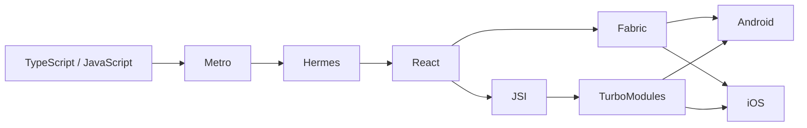
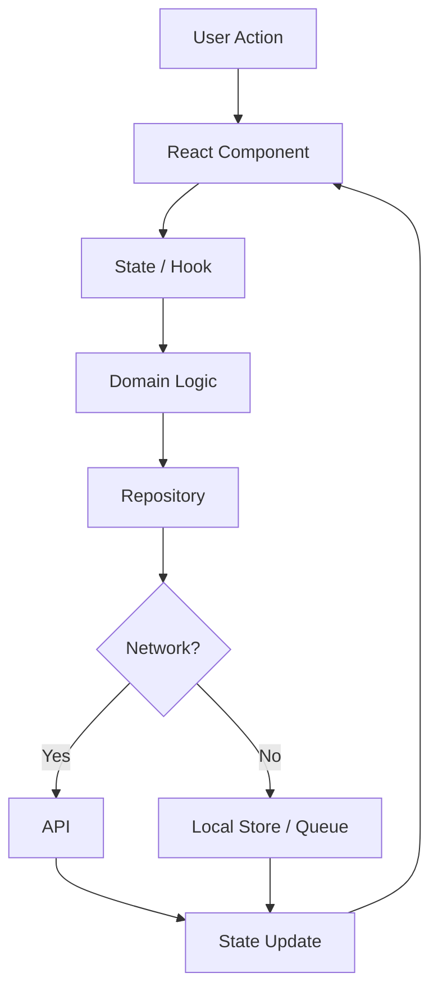

# PART 20 – MOBILE DEVELOPMENT (REACT NATIVE & CROSS-PLATFORM) MASTER HANDBOOK

> Enterprise React Native, Expo, Android, iOS, cross-platform architecture, performance, security, testing, deployment and mobile system-design reference.

## Audience
- Freshers and junior developers
- Mid-level and senior frontend engineers
- React Native and mobile engineers
- Staff engineers, technical leads and architects
- FAANG and product-company interview candidates

## Master Architecture
```text
TypeScript / React
      ↓
Metro
      ↓
Hermes / JS Runtime
      ↓
React Reconciliation
      ↓
Fabric / JSI / TurboModules
      ↓
Android / iOS
      ↓
OS / GPU / Device
```

## Enterprise Feature-First Structure
```text
src/
├── app/
├── features/
├── components/
├── navigation/
├── domain/
├── repositories/
├── services/
├── storage/
├── state/
├── platform/
├── analytics/
├── security/
└── config/

packages/
├── design-system/
├── api-client/
├── domain/
├── config/
└── shared-types/
```

## Runtime Flow


## Engineering Principles
| Principle | Goal |
|---|---|
| Offline-aware | Useful behavior during network loss |
| Secure by design | Protect sensitive data |
| Accessible | Support assistive technology |
| Observable | Diagnose production failures |
| Performant | Control startup, rendering, memory and battery |
| Testable | Automate confidence |
| Platform-aware | Isolate Android/iOS differences |
| Upgradeable | Safely evolve native and JS dependencies |

# Module 1 – Mobile Development Fundamentals

## Module Overview

This module contains **10 topics**. Each topic uses the required 34-section structure.


## React Native Overview

**Module:** Mobile Development Fundamentals

### 1. Introduction
React Native Overview is a production mobile-engineering capability. Learn it from beginner concepts through platform integration, enterprise architecture, reliability and interview-level trade-offs.

### 2. Definition
**React Native Overview** is a React Native or cross-platform mobile engineering concept used to build reliable Android and iOS applications.

### 3. Why it exists
Mobile applications have limited memory, battery, intermittent connectivity, OS lifecycle constraints, device fragmentation, native APIs and app-store release requirements. This topic addresses one or more of those constraints.

### 4. Internal Working
```text
TypeScript / JavaScript
        ↓
Metro / Build Tooling
        ↓
Hermes / JavaScript Runtime
        ↓
React Reconciliation
        ↓
Fabric / JSI / TurboModules
        ↓
Android / iOS APIs
        ↓
OS / GPU / Device
```

### 5. Architecture
```text
UI
 ↓
Hooks / ViewModel
 ↓
Domain / Use Case
 ↓
Repository
 ├── API Service
 └── Local Store
 ↓
Sync / Cache / Observability
 ↓
Platform Adapter
 ├── Android
 └── iOS
```

### 6. Life Cycle
Consider launch, JavaScript initialization, render, commit, native updates, foreground/background transitions, cleanup and process termination. Background work must respect platform restrictions.

### 7. Flow Diagram


### 8. Syntax
Use explicit TypeScript contracts at application boundaries.

```ts
export interface MobileOperationResult {
  success: boolean;
  message?: string;
}
```

### 9. Parameters
Classify parameters as UI, domain, persistence, network and platform inputs. Validate untrusted data at boundaries.

### 10. Return Values
Async APIs should represent loading, success, cancellation and failure explicitly.

### 11. Types
```ts
type RequestState<T> =
  | { status: "idle" }
  | { status: "loading" }
  | { status: "success"; data: T }
  | { status: "error"; message: string };
```

### 12. Features
Production implementations should consider accessibility, observability, offline behavior, secure persistence, analytics, testing, feature flags and controlled release.

### 13. Advantages
- Shared business logic
- Reusable UI
- Strong TypeScript support
- Faster cross-platform delivery
- Native platform access
- Large ecosystem

### 14. Disadvantages
- Platform differences remain
- Native dependencies require maintenance
- Large JS bundles can hurt startup
- Memory and battery need explicit optimization
- Some capabilities require native code

### 15. Real-world Use Cases
Banking, e-commerce, logistics, healthcare, communication, media, CRM, ERP, education, fitness and field-service applications.

### 16. React Native Example
```tsx
import React, { useCallback } from "react";
import { Pressable, StyleSheet, Text, View } from "react-native";

type Props = {
  title: string;
  onPress?: () => void;
};

export function TopicCard({ title, onPress }: Props) {
  const handlePress = useCallback(() => {
    onPress?.();
  }, [onPress]);

  return (
    <View style={styles.container}>
      <Text accessibilityRole="header" style={styles.title}>
        {title}
      </Text>
      <Pressable
        accessibilityRole="button"
        accessibilityLabel={`Open ${title}`}
        onPress={handlePress}
        style={styles.button}
      >
        <Text style={styles.buttonText}>Open</Text>
      </Pressable>
    </View>
  );
}

const styles = StyleSheet.create({
  container: { padding: 16, gap: 12 },
  title: { fontSize: 18, fontWeight: "600" },
  button: { minHeight: 44, justifyContent: "center", paddingHorizontal: 16 },
  buttonText: { fontWeight: "600" },
});
```

**Explanation:** The props contract is typed, the callback is stable when useful, and accessibility metadata is included. Do not add memoization automatically; measure whether it helps.

### 17. Expo Example
```tsx
import { Text, View } from "react-native";

export default function App() {
  return (
    <View style={{ flex: 1, justifyContent: "center", alignItems: "center" }}>
      <Text>React Native Overview — Expo-ready screen</Text>
    </View>
  );
}
```

### 18. Android Example
```kotlin
class MobilePlatformAdapter {
    fun featureName(): String = "React Native Overview"
}
```
Keep Android-specific behavior behind a small adapter/native-module boundary.

### 19. iOS Example
```swift
final class MobilePlatformAdapter {
    func featureName() -> String {
        return "React Native Overview"
    }
}
```
Keep iOS-specific behavior behind the same abstraction used by shared code.

### 20. Common Mistakes
1. Business logic directly inside screens.
2. Secrets embedded in JavaScript.
3. Huge unvirtualized lists.
4. Missing accessibility.
5. No offline strategy for important workflows.
6. Unstable list keys.
7. Excessive renders.
8. Platform conditionals spread across domain logic.

### 21. Best Practices
- Feature-first architecture.
- Strict TypeScript.
- Typed navigation.
- Repository and service boundaries.
- Centralized error handling.
- Secure credential storage.
- Accessibility by default.
- Automated tests.
- Crash and performance monitoring.
- Explicit platform adapters.

### 22. Performance Optimization
Measure before optimizing.

```text
Startup → JS Init → First Render → Interaction Ready
        → Network/Data → Steady-State Rendering
```

For large lists use virtualization, stable keys and efficient images. For high-frequency animations prefer UI-thread/native-oriented solutions where appropriate. Profile low-end Android devices as well as high-end devices.

### 23. Security Considerations
- Never embed long-lived secrets in the app bundle.
- Use HTTPS/TLS.
- Validate external data.
- Protect refresh credentials.
- Use Keychain/Keystore-backed storage.
- Minimize sensitive local data.
- Treat root/jailbreak checks as defense-in-depth.
- Evaluate certificate-pinning operational risks before adoption.

### 24. Accessibility
Support screen readers, semantic roles, labels, adequate touch targets, focus behavior, dynamic text sizing, contrast, reduced motion and RTL.

### 25. Offline Support
```text
UI
 ↓
Local Read Model ←→ Sync Engine ←→ API
        ↑                ↓
    Pending Queue    Retry Policy
```

Separate local reads, pending mutations, synchronization and conflict resolution.

### 26. Debugging Techniques
Use React DevTools, Android Studio, Xcode Instruments, network inspection, crash reporting, structured logs and performance traces.

```text
Reproduce → Isolate → Measure → Fix → Regression Test → Monitor
```

### 27. Production Checklist
- [ ] Strict TypeScript
- [ ] Error handling
- [ ] Crash reporting
- [ ] Secure storage
- [ ] API timeout/retry policy
- [ ] Offline strategy
- [ ] Accessibility audit
- [ ] Performance budget
- [ ] Android validation
- [ ] iOS validation
- [ ] CI/CD
- [ ] Phased release strategy

### 28. Enterprise Architecture
```text
apps/
└── mobile/
    ├── src/
    │   ├── app/
    │   ├── features/
    │   ├── components/
    │   ├── navigation/
    │   ├── domain/
    │   ├── repositories/
    │   ├── services/
    │   ├── storage/
    │   ├── hooks/
    │   ├── state/
    │   ├── analytics/
    │   └── platform/
    ├── android/
    └── ios/

packages/
├── design-system/
├── api-client/
├── domain/
├── config/
└── shared-types/
```

### 29. Interview Questions

#### Easy
1. What is React Native Overview?
2. Why do mobile applications use it?
3. What problem does it solve?
4. How is it different from a web implementation?
5. What is a safe baseline implementation?

#### Medium
6. How does it interact with React rendering?
7. What are its performance risks?
8. How would you test it?
9. How would you handle failure?
10. How would you make it accessible?

#### Hard
11. How would you design it for millions of devices?
12. What native boundary would you choose?
13. How would you handle offline behavior?
14. How would you observe production failures?
15. What are the migration risks?

#### FAANG
16. Design this capability for Android and iOS with minimal duplicated business logic.
17. Diagnose a production performance regression.
18. Design a safe rollout strategy.
19. Isolate platform-specific behavior.
20. Design caching and offline layers.

#### Staff Engineer
21. What belongs in shared code versus native code?
22. How would you create an enterprise reusable platform?
23. How would you govern dependency upgrades?
24. How would you define mobile performance SLOs?
25. How would you reduce organizational complexity?

### 30. Coding Exercise
Implement a typed React Native Overview abstraction with success/error states, cancellation, retry support, unit tests, accessibility and platform adapters.

### 31. Machine Coding Exercise
Build a production-ready screen around React Native Overview with loading, success, empty, error, offline and retry states plus accessibility and automated tests.

### 32. System Design Discussion
Design React Native Overview for a multi-tenant enterprise mobile application. Discuss API contracts, caching, local persistence, authentication, authorization, offline behavior, synchronization, observability, security, CI/CD and phased rollout.

### 33. Summary
Treat React Native Overview as part of a system rather than an isolated API. Define boundaries first, then implement the smallest reliable solution.

### 34. Cheat Sheet
```text
UI → Hook/ViewModel → Domain → Repository → Service
                              ↓
                          Local Store
                              ↓
                         Sync / Retry

Secure → Accessible → Observable → Testable → Deployable
```


## Cross-Platform Architecture

**Module:** Mobile Development Fundamentals

### 1. Introduction
Cross-Platform Architecture is a production mobile-engineering capability. Learn it from beginner concepts through platform integration, enterprise architecture, reliability and interview-level trade-offs.

### 2. Definition
**Cross-Platform Architecture** is a React Native or cross-platform mobile engineering concept used to build reliable Android and iOS applications.

### 3. Why it exists
Mobile applications have limited memory, battery, intermittent connectivity, OS lifecycle constraints, device fragmentation, native APIs and app-store release requirements. This topic addresses one or more of those constraints.

### 4. Internal Working
```text
TypeScript / JavaScript
        ↓
Metro / Build Tooling
        ↓
Hermes / JavaScript Runtime
        ↓
React Reconciliation
        ↓
Fabric / JSI / TurboModules
        ↓
Android / iOS APIs
        ↓
OS / GPU / Device
```

### 5. Architecture
```text
UI
 ↓
Hooks / ViewModel
 ↓
Domain / Use Case
 ↓
Repository
 ├── API Service
 └── Local Store
 ↓
Sync / Cache / Observability
 ↓
Platform Adapter
 ├── Android
 └── iOS
```

### 6. Life Cycle
Consider launch, JavaScript initialization, render, commit, native updates, foreground/background transitions, cleanup and process termination. Background work must respect platform restrictions.

### 7. Flow Diagram


### 8. Syntax
Use explicit TypeScript contracts at application boundaries.

```ts
export interface MobileOperationResult {
  success: boolean;
  message?: string;
}
```

### 9. Parameters
Classify parameters as UI, domain, persistence, network and platform inputs. Validate untrusted data at boundaries.

### 10. Return Values
Async APIs should represent loading, success, cancellation and failure explicitly.

### 11. Types
```ts
type RequestState<T> =
  | { status: "idle" }
  | { status: "loading" }
  | { status: "success"; data: T }
  | { status: "error"; message: string };
```

### 12. Features
Production implementations should consider accessibility, observability, offline behavior, secure persistence, analytics, testing, feature flags and controlled release.

### 13. Advantages
- Shared business logic
- Reusable UI
- Strong TypeScript support
- Faster cross-platform delivery
- Native platform access
- Large ecosystem

### 14. Disadvantages
- Platform differences remain
- Native dependencies require maintenance
- Large JS bundles can hurt startup
- Memory and battery need explicit optimization
- Some capabilities require native code

### 15. Real-world Use Cases
Banking, e-commerce, logistics, healthcare, communication, media, CRM, ERP, education, fitness and field-service applications.

### 16. React Native Example
```tsx
import React, { useCallback } from "react";
import { Pressable, StyleSheet, Text, View } from "react-native";

type Props = {
  title: string;
  onPress?: () => void;
};

export function TopicCard({ title, onPress }: Props) {
  const handlePress = useCallback(() => {
    onPress?.();
  }, [onPress]);

  return (
    <View style={styles.container}>
      <Text accessibilityRole="header" style={styles.title}>
        {title}
      </Text>
      <Pressable
        accessibilityRole="button"
        accessibilityLabel={`Open ${title}`}
        onPress={handlePress}
        style={styles.button}
      >
        <Text style={styles.buttonText}>Open</Text>
      </Pressable>
    </View>
  );
}

const styles = StyleSheet.create({
  container: { padding: 16, gap: 12 },
  title: { fontSize: 18, fontWeight: "600" },
  button: { minHeight: 44, justifyContent: "center", paddingHorizontal: 16 },
  buttonText: { fontWeight: "600" },
});
```

**Explanation:** The props contract is typed, the callback is stable when useful, and accessibility metadata is included. Do not add memoization automatically; measure whether it helps.

### 17. Expo Example
```tsx
import { Text, View } from "react-native";

export default function App() {
  return (
    <View style={{ flex: 1, justifyContent: "center", alignItems: "center" }}>
      <Text>Cross-Platform Architecture — Expo-ready screen</Text>
    </View>
  );
}
```

### 18. Android Example
```kotlin
class MobilePlatformAdapter {
    fun featureName(): String = "Cross-Platform Architecture"
}
```
Keep Android-specific behavior behind a small adapter/native-module boundary.

### 19. iOS Example
```swift
final class MobilePlatformAdapter {
    func featureName() -> String {
        return "Cross-Platform Architecture"
    }
}
```
Keep iOS-specific behavior behind the same abstraction used by shared code.

### 20. Common Mistakes
1. Business logic directly inside screens.
2. Secrets embedded in JavaScript.
3. Huge unvirtualized lists.
4. Missing accessibility.
5. No offline strategy for important workflows.
6. Unstable list keys.
7. Excessive renders.
8. Platform conditionals spread across domain logic.

### 21. Best Practices
- Feature-first architecture.
- Strict TypeScript.
- Typed navigation.
- Repository and service boundaries.
- Centralized error handling.
- Secure credential storage.
- Accessibility by default.
- Automated tests.
- Crash and performance monitoring.
- Explicit platform adapters.

### 22. Performance Optimization
Measure before optimizing.

```text
Startup → JS Init → First Render → Interaction Ready
        → Network/Data → Steady-State Rendering
```

For large lists use virtualization, stable keys and efficient images. For high-frequency animations prefer UI-thread/native-oriented solutions where appropriate. Profile low-end Android devices as well as high-end devices.

### 23. Security Considerations
- Never embed long-lived secrets in the app bundle.
- Use HTTPS/TLS.
- Validate external data.
- Protect refresh credentials.
- Use Keychain/Keystore-backed storage.
- Minimize sensitive local data.
- Treat root/jailbreak checks as defense-in-depth.
- Evaluate certificate-pinning operational risks before adoption.

### 24. Accessibility
Support screen readers, semantic roles, labels, adequate touch targets, focus behavior, dynamic text sizing, contrast, reduced motion and RTL.

### 25. Offline Support
```text
UI
 ↓
Local Read Model ←→ Sync Engine ←→ API
        ↑                ↓
    Pending Queue    Retry Policy
```

Separate local reads, pending mutations, synchronization and conflict resolution.

### 26. Debugging Techniques
Use React DevTools, Android Studio, Xcode Instruments, network inspection, crash reporting, structured logs and performance traces.

```text
Reproduce → Isolate → Measure → Fix → Regression Test → Monitor
```

### 27. Production Checklist
- [ ] Strict TypeScript
- [ ] Error handling
- [ ] Crash reporting
- [ ] Secure storage
- [ ] API timeout/retry policy
- [ ] Offline strategy
- [ ] Accessibility audit
- [ ] Performance budget
- [ ] Android validation
- [ ] iOS validation
- [ ] CI/CD
- [ ] Phased release strategy

### 28. Enterprise Architecture
```text
apps/
└── mobile/
    ├── src/
    │   ├── app/
    │   ├── features/
    │   ├── components/
    │   ├── navigation/
    │   ├── domain/
    │   ├── repositories/
    │   ├── services/
    │   ├── storage/
    │   ├── hooks/
    │   ├── state/
    │   ├── analytics/
    │   └── platform/
    ├── android/
    └── ios/

packages/
├── design-system/
├── api-client/
├── domain/
├── config/
└── shared-types/
```

### 29. Interview Questions

#### Easy
1. What is Cross-Platform Architecture?
2. Why do mobile applications use it?
3. What problem does it solve?
4. How is it different from a web implementation?
5. What is a safe baseline implementation?

#### Medium
6. How does it interact with React rendering?
7. What are its performance risks?
8. How would you test it?
9. How would you handle failure?
10. How would you make it accessible?

#### Hard
11. How would you design it for millions of devices?
12. What native boundary would you choose?
13. How would you handle offline behavior?
14. How would you observe production failures?
15. What are the migration risks?

#### FAANG
16. Design this capability for Android and iOS with minimal duplicated business logic.
17. Diagnose a production performance regression.
18. Design a safe rollout strategy.
19. Isolate platform-specific behavior.
20. Design caching and offline layers.

#### Staff Engineer
21. What belongs in shared code versus native code?
22. How would you create an enterprise reusable platform?
23. How would you govern dependency upgrades?
24. How would you define mobile performance SLOs?
25. How would you reduce organizational complexity?

### 30. Coding Exercise
Implement a typed Cross-Platform Architecture abstraction with success/error states, cancellation, retry support, unit tests, accessibility and platform adapters.

### 31. Machine Coding Exercise
Build a production-ready screen around Cross-Platform Architecture with loading, success, empty, error, offline and retry states plus accessibility and automated tests.

### 32. System Design Discussion
Design Cross-Platform Architecture for a multi-tenant enterprise mobile application. Discuss API contracts, caching, local persistence, authentication, authorization, offline behavior, synchronization, observability, security, CI/CD and phased rollout.

### 33. Summary
Treat Cross-Platform Architecture as part of a system rather than an isolated API. Define boundaries first, then implement the smallest reliable solution.

### 34. Cheat Sheet
```text
UI → Hook/ViewModel → Domain → Repository → Service
                              ↓
                          Local Store
                              ↓
                         Sync / Retry

Secure → Accessible → Observable → Testable → Deployable
```


## React Native vs Native Development

**Module:** Mobile Development Fundamentals

### 1. Introduction
React Native vs Native Development is a production mobile-engineering capability. Learn it from beginner concepts through platform integration, enterprise architecture, reliability and interview-level trade-offs.

### 2. Definition
**React Native vs Native Development** is a React Native or cross-platform mobile engineering concept used to build reliable Android and iOS applications.

### 3. Why it exists
Mobile applications have limited memory, battery, intermittent connectivity, OS lifecycle constraints, device fragmentation, native APIs and app-store release requirements. This topic addresses one or more of those constraints.

### 4. Internal Working
```text
TypeScript / JavaScript
        ↓
Metro / Build Tooling
        ↓
Hermes / JavaScript Runtime
        ↓
React Reconciliation
        ↓
Fabric / JSI / TurboModules
        ↓
Android / iOS APIs
        ↓
OS / GPU / Device
```

### 5. Architecture
```text
UI
 ↓
Hooks / ViewModel
 ↓
Domain / Use Case
 ↓
Repository
 ├── API Service
 └── Local Store
 ↓
Sync / Cache / Observability
 ↓
Platform Adapter
 ├── Android
 └── iOS
```

### 6. Life Cycle
Consider launch, JavaScript initialization, render, commit, native updates, foreground/background transitions, cleanup and process termination. Background work must respect platform restrictions.

### 7. Flow Diagram


### 8. Syntax
Use explicit TypeScript contracts at application boundaries.

```ts
export interface MobileOperationResult {
  success: boolean;
  message?: string;
}
```

### 9. Parameters
Classify parameters as UI, domain, persistence, network and platform inputs. Validate untrusted data at boundaries.

### 10. Return Values
Async APIs should represent loading, success, cancellation and failure explicitly.

### 11. Types
```ts
type RequestState<T> =
  | { status: "idle" }
  | { status: "loading" }
  | { status: "success"; data: T }
  | { status: "error"; message: string };
```

### 12. Features
Production implementations should consider accessibility, observability, offline behavior, secure persistence, analytics, testing, feature flags and controlled release.

### 13. Advantages
- Shared business logic
- Reusable UI
- Strong TypeScript support
- Faster cross-platform delivery
- Native platform access
- Large ecosystem

### 14. Disadvantages
- Platform differences remain
- Native dependencies require maintenance
- Large JS bundles can hurt startup
- Memory and battery need explicit optimization
- Some capabilities require native code

### 15. Real-world Use Cases
Banking, e-commerce, logistics, healthcare, communication, media, CRM, ERP, education, fitness and field-service applications.

### 16. React Native Example
```tsx
import React, { useCallback } from "react";
import { Pressable, StyleSheet, Text, View } from "react-native";

type Props = {
  title: string;
  onPress?: () => void;
};

export function TopicCard({ title, onPress }: Props) {
  const handlePress = useCallback(() => {
    onPress?.();
  }, [onPress]);

  return (
    <View style={styles.container}>
      <Text accessibilityRole="header" style={styles.title}>
        {title}
      </Text>
      <Pressable
        accessibilityRole="button"
        accessibilityLabel={`Open ${title}`}
        onPress={handlePress}
        style={styles.button}
      >
        <Text style={styles.buttonText}>Open</Text>
      </Pressable>
    </View>
  );
}

const styles = StyleSheet.create({
  container: { padding: 16, gap: 12 },
  title: { fontSize: 18, fontWeight: "600" },
  button: { minHeight: 44, justifyContent: "center", paddingHorizontal: 16 },
  buttonText: { fontWeight: "600" },
});
```

**Explanation:** The props contract is typed, the callback is stable when useful, and accessibility metadata is included. Do not add memoization automatically; measure whether it helps.

### 17. Expo Example
```tsx
import { Text, View } from "react-native";

export default function App() {
  return (
    <View style={{ flex: 1, justifyContent: "center", alignItems: "center" }}>
      <Text>React Native vs Native Development — Expo-ready screen</Text>
    </View>
  );
}
```

### 18. Android Example
```kotlin
class MobilePlatformAdapter {
    fun featureName(): String = "React Native vs Native Development"
}
```
Keep Android-specific behavior behind a small adapter/native-module boundary.

### 19. iOS Example
```swift
final class MobilePlatformAdapter {
    func featureName() -> String {
        return "React Native vs Native Development"
    }
}
```
Keep iOS-specific behavior behind the same abstraction used by shared code.

### 20. Common Mistakes
1. Business logic directly inside screens.
2. Secrets embedded in JavaScript.
3. Huge unvirtualized lists.
4. Missing accessibility.
5. No offline strategy for important workflows.
6. Unstable list keys.
7. Excessive renders.
8. Platform conditionals spread across domain logic.

### 21. Best Practices
- Feature-first architecture.
- Strict TypeScript.
- Typed navigation.
- Repository and service boundaries.
- Centralized error handling.
- Secure credential storage.
- Accessibility by default.
- Automated tests.
- Crash and performance monitoring.
- Explicit platform adapters.

### 22. Performance Optimization
Measure before optimizing.

```text
Startup → JS Init → First Render → Interaction Ready
        → Network/Data → Steady-State Rendering
```

For large lists use virtualization, stable keys and efficient images. For high-frequency animations prefer UI-thread/native-oriented solutions where appropriate. Profile low-end Android devices as well as high-end devices.

### 23. Security Considerations
- Never embed long-lived secrets in the app bundle.
- Use HTTPS/TLS.
- Validate external data.
- Protect refresh credentials.
- Use Keychain/Keystore-backed storage.
- Minimize sensitive local data.
- Treat root/jailbreak checks as defense-in-depth.
- Evaluate certificate-pinning operational risks before adoption.

### 24. Accessibility
Support screen readers, semantic roles, labels, adequate touch targets, focus behavior, dynamic text sizing, contrast, reduced motion and RTL.

### 25. Offline Support
```text
UI
 ↓
Local Read Model ←→ Sync Engine ←→ API
        ↑                ↓
    Pending Queue    Retry Policy
```

Separate local reads, pending mutations, synchronization and conflict resolution.

### 26. Debugging Techniques
Use React DevTools, Android Studio, Xcode Instruments, network inspection, crash reporting, structured logs and performance traces.

```text
Reproduce → Isolate → Measure → Fix → Regression Test → Monitor
```

### 27. Production Checklist
- [ ] Strict TypeScript
- [ ] Error handling
- [ ] Crash reporting
- [ ] Secure storage
- [ ] API timeout/retry policy
- [ ] Offline strategy
- [ ] Accessibility audit
- [ ] Performance budget
- [ ] Android validation
- [ ] iOS validation
- [ ] CI/CD
- [ ] Phased release strategy

### 28. Enterprise Architecture
```text
apps/
└── mobile/
    ├── src/
    │   ├── app/
    │   ├── features/
    │   ├── components/
    │   ├── navigation/
    │   ├── domain/
    │   ├── repositories/
    │   ├── services/
    │   ├── storage/
    │   ├── hooks/
    │   ├── state/
    │   ├── analytics/
    │   └── platform/
    ├── android/
    └── ios/

packages/
├── design-system/
├── api-client/
├── domain/
├── config/
└── shared-types/
```

### 29. Interview Questions

#### Easy
1. What is React Native vs Native Development?
2. Why do mobile applications use it?
3. What problem does it solve?
4. How is it different from a web implementation?
5. What is a safe baseline implementation?

#### Medium
6. How does it interact with React rendering?
7. What are its performance risks?
8. How would you test it?
9. How would you handle failure?
10. How would you make it accessible?

#### Hard
11. How would you design it for millions of devices?
12. What native boundary would you choose?
13. How would you handle offline behavior?
14. How would you observe production failures?
15. What are the migration risks?

#### FAANG
16. Design this capability for Android and iOS with minimal duplicated business logic.
17. Diagnose a production performance regression.
18. Design a safe rollout strategy.
19. Isolate platform-specific behavior.
20. Design caching and offline layers.

#### Staff Engineer
21. What belongs in shared code versus native code?
22. How would you create an enterprise reusable platform?
23. How would you govern dependency upgrades?
24. How would you define mobile performance SLOs?
25. How would you reduce organizational complexity?

### 30. Coding Exercise
Implement a typed React Native vs Native Development abstraction with success/error states, cancellation, retry support, unit tests, accessibility and platform adapters.

### 31. Machine Coding Exercise
Build a production-ready screen around React Native vs Native Development with loading, success, empty, error, offline and retry states plus accessibility and automated tests.

### 32. System Design Discussion
Design React Native vs Native Development for a multi-tenant enterprise mobile application. Discuss API contracts, caching, local persistence, authentication, authorization, offline behavior, synchronization, observability, security, CI/CD and phased rollout.

### 33. Summary
Treat React Native vs Native Development as part of a system rather than an isolated API. Define boundaries first, then implement the smallest reliable solution.

### 34. Cheat Sheet
```text
UI → Hook/ViewModel → Domain → Repository → Service
                              ↓
                          Local Store
                              ↓
                         Sync / Retry

Secure → Accessible → Observable → Testable → Deployable
```


## Expo vs React Native CLI

**Module:** Mobile Development Fundamentals

### 1. Introduction
Expo vs React Native CLI is a production mobile-engineering capability. Learn it from beginner concepts through platform integration, enterprise architecture, reliability and interview-level trade-offs.

### 2. Definition
**Expo vs React Native CLI** is a React Native or cross-platform mobile engineering concept used to build reliable Android and iOS applications.

### 3. Why it exists
Mobile applications have limited memory, battery, intermittent connectivity, OS lifecycle constraints, device fragmentation, native APIs and app-store release requirements. This topic addresses one or more of those constraints.

### 4. Internal Working
```text
TypeScript / JavaScript
        ↓
Metro / Build Tooling
        ↓
Hermes / JavaScript Runtime
        ↓
React Reconciliation
        ↓
Fabric / JSI / TurboModules
        ↓
Android / iOS APIs
        ↓
OS / GPU / Device
```

### 5. Architecture
```text
UI
 ↓
Hooks / ViewModel
 ↓
Domain / Use Case
 ↓
Repository
 ├── API Service
 └── Local Store
 ↓
Sync / Cache / Observability
 ↓
Platform Adapter
 ├── Android
 └── iOS
```

### 6. Life Cycle
Consider launch, JavaScript initialization, render, commit, native updates, foreground/background transitions, cleanup and process termination. Background work must respect platform restrictions.

### 7. Flow Diagram


### 8. Syntax
Use explicit TypeScript contracts at application boundaries.

```ts
export interface MobileOperationResult {
  success: boolean;
  message?: string;
}
```

### 9. Parameters
Classify parameters as UI, domain, persistence, network and platform inputs. Validate untrusted data at boundaries.

### 10. Return Values
Async APIs should represent loading, success, cancellation and failure explicitly.

### 11. Types
```ts
type RequestState<T> =
  | { status: "idle" }
  | { status: "loading" }
  | { status: "success"; data: T }
  | { status: "error"; message: string };
```

### 12. Features
Production implementations should consider accessibility, observability, offline behavior, secure persistence, analytics, testing, feature flags and controlled release.

### 13. Advantages
- Shared business logic
- Reusable UI
- Strong TypeScript support
- Faster cross-platform delivery
- Native platform access
- Large ecosystem

### 14. Disadvantages
- Platform differences remain
- Native dependencies require maintenance
- Large JS bundles can hurt startup
- Memory and battery need explicit optimization
- Some capabilities require native code

### 15. Real-world Use Cases
Banking, e-commerce, logistics, healthcare, communication, media, CRM, ERP, education, fitness and field-service applications.

### 16. React Native Example
```tsx
import React, { useCallback } from "react";
import { Pressable, StyleSheet, Text, View } from "react-native";

type Props = {
  title: string;
  onPress?: () => void;
};

export function TopicCard({ title, onPress }: Props) {
  const handlePress = useCallback(() => {
    onPress?.();
  }, [onPress]);

  return (
    <View style={styles.container}>
      <Text accessibilityRole="header" style={styles.title}>
        {title}
      </Text>
      <Pressable
        accessibilityRole="button"
        accessibilityLabel={`Open ${title}`}
        onPress={handlePress}
        style={styles.button}
      >
        <Text style={styles.buttonText}>Open</Text>
      </Pressable>
    </View>
  );
}

const styles = StyleSheet.create({
  container: { padding: 16, gap: 12 },
  title: { fontSize: 18, fontWeight: "600" },
  button: { minHeight: 44, justifyContent: "center", paddingHorizontal: 16 },
  buttonText: { fontWeight: "600" },
});
```

**Explanation:** The props contract is typed, the callback is stable when useful, and accessibility metadata is included. Do not add memoization automatically; measure whether it helps.

### 17. Expo Example
```tsx
import { Text, View } from "react-native";

export default function App() {
  return (
    <View style={{ flex: 1, justifyContent: "center", alignItems: "center" }}>
      <Text>Expo vs React Native CLI — Expo-ready screen</Text>
    </View>
  );
}
```

### 18. Android Example
```kotlin
class MobilePlatformAdapter {
    fun featureName(): String = "Expo vs React Native CLI"
}
```
Keep Android-specific behavior behind a small adapter/native-module boundary.

### 19. iOS Example
```swift
final class MobilePlatformAdapter {
    func featureName() -> String {
        return "Expo vs React Native CLI"
    }
}
```
Keep iOS-specific behavior behind the same abstraction used by shared code.

### 20. Common Mistakes
1. Business logic directly inside screens.
2. Secrets embedded in JavaScript.
3. Huge unvirtualized lists.
4. Missing accessibility.
5. No offline strategy for important workflows.
6. Unstable list keys.
7. Excessive renders.
8. Platform conditionals spread across domain logic.

### 21. Best Practices
- Feature-first architecture.
- Strict TypeScript.
- Typed navigation.
- Repository and service boundaries.
- Centralized error handling.
- Secure credential storage.
- Accessibility by default.
- Automated tests.
- Crash and performance monitoring.
- Explicit platform adapters.

### 22. Performance Optimization
Measure before optimizing.

```text
Startup → JS Init → First Render → Interaction Ready
        → Network/Data → Steady-State Rendering
```

For large lists use virtualization, stable keys and efficient images. For high-frequency animations prefer UI-thread/native-oriented solutions where appropriate. Profile low-end Android devices as well as high-end devices.

### 23. Security Considerations
- Never embed long-lived secrets in the app bundle.
- Use HTTPS/TLS.
- Validate external data.
- Protect refresh credentials.
- Use Keychain/Keystore-backed storage.
- Minimize sensitive local data.
- Treat root/jailbreak checks as defense-in-depth.
- Evaluate certificate-pinning operational risks before adoption.

### 24. Accessibility
Support screen readers, semantic roles, labels, adequate touch targets, focus behavior, dynamic text sizing, contrast, reduced motion and RTL.

### 25. Offline Support
```text
UI
 ↓
Local Read Model ←→ Sync Engine ←→ API
        ↑                ↓
    Pending Queue    Retry Policy
```

Separate local reads, pending mutations, synchronization and conflict resolution.

### 26. Debugging Techniques
Use React DevTools, Android Studio, Xcode Instruments, network inspection, crash reporting, structured logs and performance traces.

```text
Reproduce → Isolate → Measure → Fix → Regression Test → Monitor
```

### 27. Production Checklist
- [ ] Strict TypeScript
- [ ] Error handling
- [ ] Crash reporting
- [ ] Secure storage
- [ ] API timeout/retry policy
- [ ] Offline strategy
- [ ] Accessibility audit
- [ ] Performance budget
- [ ] Android validation
- [ ] iOS validation
- [ ] CI/CD
- [ ] Phased release strategy

### 28. Enterprise Architecture
```text
apps/
└── mobile/
    ├── src/
    │   ├── app/
    │   ├── features/
    │   ├── components/
    │   ├── navigation/
    │   ├── domain/
    │   ├── repositories/
    │   ├── services/
    │   ├── storage/
    │   ├── hooks/
    │   ├── state/
    │   ├── analytics/
    │   └── platform/
    ├── android/
    └── ios/

packages/
├── design-system/
├── api-client/
├── domain/
├── config/
└── shared-types/
```

### 29. Interview Questions

#### Easy
1. What is Expo vs React Native CLI?
2. Why do mobile applications use it?
3. What problem does it solve?
4. How is it different from a web implementation?
5. What is a safe baseline implementation?

#### Medium
6. How does it interact with React rendering?
7. What are its performance risks?
8. How would you test it?
9. How would you handle failure?
10. How would you make it accessible?

#### Hard
11. How would you design it for millions of devices?
12. What native boundary would you choose?
13. How would you handle offline behavior?
14. How would you observe production failures?
15. What are the migration risks?

#### FAANG
16. Design this capability for Android and iOS with minimal duplicated business logic.
17. Diagnose a production performance regression.
18. Design a safe rollout strategy.
19. Isolate platform-specific behavior.
20. Design caching and offline layers.

#### Staff Engineer
21. What belongs in shared code versus native code?
22. How would you create an enterprise reusable platform?
23. How would you govern dependency upgrades?
24. How would you define mobile performance SLOs?
25. How would you reduce organizational complexity?

### 30. Coding Exercise
Implement a typed Expo vs React Native CLI abstraction with success/error states, cancellation, retry support, unit tests, accessibility and platform adapters.

### 31. Machine Coding Exercise
Build a production-ready screen around Expo vs React Native CLI with loading, success, empty, error, offline and retry states plus accessibility and automated tests.

### 32. System Design Discussion
Design Expo vs React Native CLI for a multi-tenant enterprise mobile application. Discuss API contracts, caching, local persistence, authentication, authorization, offline behavior, synchronization, observability, security, CI/CD and phased rollout.

### 33. Summary
Treat Expo vs React Native CLI as part of a system rather than an isolated API. Define boundaries first, then implement the smallest reliable solution.

### 34. Cheat Sheet
```text
UI → Hook/ViewModel → Domain → Repository → Service
                              ↓
                          Local Store
                              ↓
                         Sync / Retry

Secure → Accessible → Observable → Testable → Deployable
```


## Project Structure

**Module:** Mobile Development Fundamentals

### 1. Introduction
Project Structure is a production mobile-engineering capability. Learn it from beginner concepts through platform integration, enterprise architecture, reliability and interview-level trade-offs.

### 2. Definition
**Project Structure** is a React Native or cross-platform mobile engineering concept used to build reliable Android and iOS applications.

### 3. Why it exists
Mobile applications have limited memory, battery, intermittent connectivity, OS lifecycle constraints, device fragmentation, native APIs and app-store release requirements. This topic addresses one or more of those constraints.

### 4. Internal Working
```text
TypeScript / JavaScript
        ↓
Metro / Build Tooling
        ↓
Hermes / JavaScript Runtime
        ↓
React Reconciliation
        ↓
Fabric / JSI / TurboModules
        ↓
Android / iOS APIs
        ↓
OS / GPU / Device
```

### 5. Architecture
```text
UI
 ↓
Hooks / ViewModel
 ↓
Domain / Use Case
 ↓
Repository
 ├── API Service
 └── Local Store
 ↓
Sync / Cache / Observability
 ↓
Platform Adapter
 ├── Android
 └── iOS
```

### 6. Life Cycle
Consider launch, JavaScript initialization, render, commit, native updates, foreground/background transitions, cleanup and process termination. Background work must respect platform restrictions.

### 7. Flow Diagram


### 8. Syntax
Use explicit TypeScript contracts at application boundaries.

```ts
export interface MobileOperationResult {
  success: boolean;
  message?: string;
}
```

### 9. Parameters
Classify parameters as UI, domain, persistence, network and platform inputs. Validate untrusted data at boundaries.

### 10. Return Values
Async APIs should represent loading, success, cancellation and failure explicitly.

### 11. Types
```ts
type RequestState<T> =
  | { status: "idle" }
  | { status: "loading" }
  | { status: "success"; data: T }
  | { status: "error"; message: string };
```

### 12. Features
Production implementations should consider accessibility, observability, offline behavior, secure persistence, analytics, testing, feature flags and controlled release.

### 13. Advantages
- Shared business logic
- Reusable UI
- Strong TypeScript support
- Faster cross-platform delivery
- Native platform access
- Large ecosystem

### 14. Disadvantages
- Platform differences remain
- Native dependencies require maintenance
- Large JS bundles can hurt startup
- Memory and battery need explicit optimization
- Some capabilities require native code

### 15. Real-world Use Cases
Banking, e-commerce, logistics, healthcare, communication, media, CRM, ERP, education, fitness and field-service applications.

### 16. React Native Example
```tsx
import React, { useCallback } from "react";
import { Pressable, StyleSheet, Text, View } from "react-native";

type Props = {
  title: string;
  onPress?: () => void;
};

export function TopicCard({ title, onPress }: Props) {
  const handlePress = useCallback(() => {
    onPress?.();
  }, [onPress]);

  return (
    <View style={styles.container}>
      <Text accessibilityRole="header" style={styles.title}>
        {title}
      </Text>
      <Pressable
        accessibilityRole="button"
        accessibilityLabel={`Open ${title}`}
        onPress={handlePress}
        style={styles.button}
      >
        <Text style={styles.buttonText}>Open</Text>
      </Pressable>
    </View>
  );
}

const styles = StyleSheet.create({
  container: { padding: 16, gap: 12 },
  title: { fontSize: 18, fontWeight: "600" },
  button: { minHeight: 44, justifyContent: "center", paddingHorizontal: 16 },
  buttonText: { fontWeight: "600" },
});
```

**Explanation:** The props contract is typed, the callback is stable when useful, and accessibility metadata is included. Do not add memoization automatically; measure whether it helps.

### 17. Expo Example
```tsx
import { Text, View } from "react-native";

export default function App() {
  return (
    <View style={{ flex: 1, justifyContent: "center", alignItems: "center" }}>
      <Text>Project Structure — Expo-ready screen</Text>
    </View>
  );
}
```

### 18. Android Example
```kotlin
class MobilePlatformAdapter {
    fun featureName(): String = "Project Structure"
}
```
Keep Android-specific behavior behind a small adapter/native-module boundary.

### 19. iOS Example
```swift
final class MobilePlatformAdapter {
    func featureName() -> String {
        return "Project Structure"
    }
}
```
Keep iOS-specific behavior behind the same abstraction used by shared code.

### 20. Common Mistakes
1. Business logic directly inside screens.
2. Secrets embedded in JavaScript.
3. Huge unvirtualized lists.
4. Missing accessibility.
5. No offline strategy for important workflows.
6. Unstable list keys.
7. Excessive renders.
8. Platform conditionals spread across domain logic.

### 21. Best Practices
- Feature-first architecture.
- Strict TypeScript.
- Typed navigation.
- Repository and service boundaries.
- Centralized error handling.
- Secure credential storage.
- Accessibility by default.
- Automated tests.
- Crash and performance monitoring.
- Explicit platform adapters.

### 22. Performance Optimization
Measure before optimizing.

```text
Startup → JS Init → First Render → Interaction Ready
        → Network/Data → Steady-State Rendering
```

For large lists use virtualization, stable keys and efficient images. For high-frequency animations prefer UI-thread/native-oriented solutions where appropriate. Profile low-end Android devices as well as high-end devices.

### 23. Security Considerations
- Never embed long-lived secrets in the app bundle.
- Use HTTPS/TLS.
- Validate external data.
- Protect refresh credentials.
- Use Keychain/Keystore-backed storage.
- Minimize sensitive local data.
- Treat root/jailbreak checks as defense-in-depth.
- Evaluate certificate-pinning operational risks before adoption.

### 24. Accessibility
Support screen readers, semantic roles, labels, adequate touch targets, focus behavior, dynamic text sizing, contrast, reduced motion and RTL.

### 25. Offline Support
```text
UI
 ↓
Local Read Model ←→ Sync Engine ←→ API
        ↑                ↓
    Pending Queue    Retry Policy
```

Separate local reads, pending mutations, synchronization and conflict resolution.

### 26. Debugging Techniques
Use React DevTools, Android Studio, Xcode Instruments, network inspection, crash reporting, structured logs and performance traces.

```text
Reproduce → Isolate → Measure → Fix → Regression Test → Monitor
```

### 27. Production Checklist
- [ ] Strict TypeScript
- [ ] Error handling
- [ ] Crash reporting
- [ ] Secure storage
- [ ] API timeout/retry policy
- [ ] Offline strategy
- [ ] Accessibility audit
- [ ] Performance budget
- [ ] Android validation
- [ ] iOS validation
- [ ] CI/CD
- [ ] Phased release strategy

### 28. Enterprise Architecture
```text
apps/
└── mobile/
    ├── src/
    │   ├── app/
    │   ├── features/
    │   ├── components/
    │   ├── navigation/
    │   ├── domain/
    │   ├── repositories/
    │   ├── services/
    │   ├── storage/
    │   ├── hooks/
    │   ├── state/
    │   ├── analytics/
    │   └── platform/
    ├── android/
    └── ios/

packages/
├── design-system/
├── api-client/
├── domain/
├── config/
└── shared-types/
```

### 29. Interview Questions

#### Easy
1. What is Project Structure?
2. Why do mobile applications use it?
3. What problem does it solve?
4. How is it different from a web implementation?
5. What is a safe baseline implementation?

#### Medium
6. How does it interact with React rendering?
7. What are its performance risks?
8. How would you test it?
9. How would you handle failure?
10. How would you make it accessible?

#### Hard
11. How would you design it for millions of devices?
12. What native boundary would you choose?
13. How would you handle offline behavior?
14. How would you observe production failures?
15. What are the migration risks?

#### FAANG
16. Design this capability for Android and iOS with minimal duplicated business logic.
17. Diagnose a production performance regression.
18. Design a safe rollout strategy.
19. Isolate platform-specific behavior.
20. Design caching and offline layers.

#### Staff Engineer
21. What belongs in shared code versus native code?
22. How would you create an enterprise reusable platform?
23. How would you govern dependency upgrades?
24. How would you define mobile performance SLOs?
25. How would you reduce organizational complexity?

### 30. Coding Exercise
Implement a typed Project Structure abstraction with success/error states, cancellation, retry support, unit tests, accessibility and platform adapters.

### 31. Machine Coding Exercise
Build a production-ready screen around Project Structure with loading, success, empty, error, offline and retry states plus accessibility and automated tests.

### 32. System Design Discussion
Design Project Structure for a multi-tenant enterprise mobile application. Discuss API contracts, caching, local persistence, authentication, authorization, offline behavior, synchronization, observability, security, CI/CD and phased rollout.

### 33. Summary
Treat Project Structure as part of a system rather than an isolated API. Define boundaries first, then implement the smallest reliable solution.

### 34. Cheat Sheet
```text
UI → Hook/ViewModel → Domain → Repository → Service
                              ↓
                          Local Store
                              ↓
                         Sync / Retry

Secure → Accessible → Observable → Testable → Deployable
```


## TypeScript Setup

**Module:** Mobile Development Fundamentals

### 1. Introduction
TypeScript Setup is a production mobile-engineering capability. Learn it from beginner concepts through platform integration, enterprise architecture, reliability and interview-level trade-offs.

### 2. Definition
**TypeScript Setup** is a React Native or cross-platform mobile engineering concept used to build reliable Android and iOS applications.

### 3. Why it exists
Mobile applications have limited memory, battery, intermittent connectivity, OS lifecycle constraints, device fragmentation, native APIs and app-store release requirements. This topic addresses one or more of those constraints.

### 4. Internal Working
```text
TypeScript / JavaScript
        ↓
Metro / Build Tooling
        ↓
Hermes / JavaScript Runtime
        ↓
React Reconciliation
        ↓
Fabric / JSI / TurboModules
        ↓
Android / iOS APIs
        ↓
OS / GPU / Device
```

### 5. Architecture
```text
UI
 ↓
Hooks / ViewModel
 ↓
Domain / Use Case
 ↓
Repository
 ├── API Service
 └── Local Store
 ↓
Sync / Cache / Observability
 ↓
Platform Adapter
 ├── Android
 └── iOS
```

### 6. Life Cycle
Consider launch, JavaScript initialization, render, commit, native updates, foreground/background transitions, cleanup and process termination. Background work must respect platform restrictions.

### 7. Flow Diagram


### 8. Syntax
Use explicit TypeScript contracts at application boundaries.

```ts
export interface MobileOperationResult {
  success: boolean;
  message?: string;
}
```

### 9. Parameters
Classify parameters as UI, domain, persistence, network and platform inputs. Validate untrusted data at boundaries.

### 10. Return Values
Async APIs should represent loading, success, cancellation and failure explicitly.

### 11. Types
```ts
type RequestState<T> =
  | { status: "idle" }
  | { status: "loading" }
  | { status: "success"; data: T }
  | { status: "error"; message: string };
```

### 12. Features
Production implementations should consider accessibility, observability, offline behavior, secure persistence, analytics, testing, feature flags and controlled release.

### 13. Advantages
- Shared business logic
- Reusable UI
- Strong TypeScript support
- Faster cross-platform delivery
- Native platform access
- Large ecosystem

### 14. Disadvantages
- Platform differences remain
- Native dependencies require maintenance
- Large JS bundles can hurt startup
- Memory and battery need explicit optimization
- Some capabilities require native code

### 15. Real-world Use Cases
Banking, e-commerce, logistics, healthcare, communication, media, CRM, ERP, education, fitness and field-service applications.

### 16. React Native Example
```tsx
import React, { useCallback } from "react";
import { Pressable, StyleSheet, Text, View } from "react-native";

type Props = {
  title: string;
  onPress?: () => void;
};

export function TopicCard({ title, onPress }: Props) {
  const handlePress = useCallback(() => {
    onPress?.();
  }, [onPress]);

  return (
    <View style={styles.container}>
      <Text accessibilityRole="header" style={styles.title}>
        {title}
      </Text>
      <Pressable
        accessibilityRole="button"
        accessibilityLabel={`Open ${title}`}
        onPress={handlePress}
        style={styles.button}
      >
        <Text style={styles.buttonText}>Open</Text>
      </Pressable>
    </View>
  );
}

const styles = StyleSheet.create({
  container: { padding: 16, gap: 12 },
  title: { fontSize: 18, fontWeight: "600" },
  button: { minHeight: 44, justifyContent: "center", paddingHorizontal: 16 },
  buttonText: { fontWeight: "600" },
});
```

**Explanation:** The props contract is typed, the callback is stable when useful, and accessibility metadata is included. Do not add memoization automatically; measure whether it helps.

### 17. Expo Example
```tsx
import { Text, View } from "react-native";

export default function App() {
  return (
    <View style={{ flex: 1, justifyContent: "center", alignItems: "center" }}>
      <Text>TypeScript Setup — Expo-ready screen</Text>
    </View>
  );
}
```

### 18. Android Example
```kotlin
class MobilePlatformAdapter {
    fun featureName(): String = "TypeScript Setup"
}
```
Keep Android-specific behavior behind a small adapter/native-module boundary.

### 19. iOS Example
```swift
final class MobilePlatformAdapter {
    func featureName() -> String {
        return "TypeScript Setup"
    }
}
```
Keep iOS-specific behavior behind the same abstraction used by shared code.

### 20. Common Mistakes
1. Business logic directly inside screens.
2. Secrets embedded in JavaScript.
3. Huge unvirtualized lists.
4. Missing accessibility.
5. No offline strategy for important workflows.
6. Unstable list keys.
7. Excessive renders.
8. Platform conditionals spread across domain logic.

### 21. Best Practices
- Feature-first architecture.
- Strict TypeScript.
- Typed navigation.
- Repository and service boundaries.
- Centralized error handling.
- Secure credential storage.
- Accessibility by default.
- Automated tests.
- Crash and performance monitoring.
- Explicit platform adapters.

### 22. Performance Optimization
Measure before optimizing.

```text
Startup → JS Init → First Render → Interaction Ready
        → Network/Data → Steady-State Rendering
```

For large lists use virtualization, stable keys and efficient images. For high-frequency animations prefer UI-thread/native-oriented solutions where appropriate. Profile low-end Android devices as well as high-end devices.

### 23. Security Considerations
- Never embed long-lived secrets in the app bundle.
- Use HTTPS/TLS.
- Validate external data.
- Protect refresh credentials.
- Use Keychain/Keystore-backed storage.
- Minimize sensitive local data.
- Treat root/jailbreak checks as defense-in-depth.
- Evaluate certificate-pinning operational risks before adoption.

### 24. Accessibility
Support screen readers, semantic roles, labels, adequate touch targets, focus behavior, dynamic text sizing, contrast, reduced motion and RTL.

### 25. Offline Support
```text
UI
 ↓
Local Read Model ←→ Sync Engine ←→ API
        ↑                ↓
    Pending Queue    Retry Policy
```

Separate local reads, pending mutations, synchronization and conflict resolution.

### 26. Debugging Techniques
Use React DevTools, Android Studio, Xcode Instruments, network inspection, crash reporting, structured logs and performance traces.

```text
Reproduce → Isolate → Measure → Fix → Regression Test → Monitor
```

### 27. Production Checklist
- [ ] Strict TypeScript
- [ ] Error handling
- [ ] Crash reporting
- [ ] Secure storage
- [ ] API timeout/retry policy
- [ ] Offline strategy
- [ ] Accessibility audit
- [ ] Performance budget
- [ ] Android validation
- [ ] iOS validation
- [ ] CI/CD
- [ ] Phased release strategy

### 28. Enterprise Architecture
```text
apps/
└── mobile/
    ├── src/
    │   ├── app/
    │   ├── features/
    │   ├── components/
    │   ├── navigation/
    │   ├── domain/
    │   ├── repositories/
    │   ├── services/
    │   ├── storage/
    │   ├── hooks/
    │   ├── state/
    │   ├── analytics/
    │   └── platform/
    ├── android/
    └── ios/

packages/
├── design-system/
├── api-client/
├── domain/
├── config/
└── shared-types/
```

### 29. Interview Questions

#### Easy
1. What is TypeScript Setup?
2. Why do mobile applications use it?
3. What problem does it solve?
4. How is it different from a web implementation?
5. What is a safe baseline implementation?

#### Medium
6. How does it interact with React rendering?
7. What are its performance risks?
8. How would you test it?
9. How would you handle failure?
10. How would you make it accessible?

#### Hard
11. How would you design it for millions of devices?
12. What native boundary would you choose?
13. How would you handle offline behavior?
14. How would you observe production failures?
15. What are the migration risks?

#### FAANG
16. Design this capability for Android and iOS with minimal duplicated business logic.
17. Diagnose a production performance regression.
18. Design a safe rollout strategy.
19. Isolate platform-specific behavior.
20. Design caching and offline layers.

#### Staff Engineer
21. What belongs in shared code versus native code?
22. How would you create an enterprise reusable platform?
23. How would you govern dependency upgrades?
24. How would you define mobile performance SLOs?
25. How would you reduce organizational complexity?

### 30. Coding Exercise
Implement a typed TypeScript Setup abstraction with success/error states, cancellation, retry support, unit tests, accessibility and platform adapters.

### 31. Machine Coding Exercise
Build a production-ready screen around TypeScript Setup with loading, success, empty, error, offline and retry states plus accessibility and automated tests.

### 32. System Design Discussion
Design TypeScript Setup for a multi-tenant enterprise mobile application. Discuss API contracts, caching, local persistence, authentication, authorization, offline behavior, synchronization, observability, security, CI/CD and phased rollout.

### 33. Summary
Treat TypeScript Setup as part of a system rather than an isolated API. Define boundaries first, then implement the smallest reliable solution.

### 34. Cheat Sheet
```text
UI → Hook/ViewModel → Domain → Repository → Service
                              ↓
                          Local Store
                              ↓
                         Sync / Retry

Secure → Accessible → Observable → Testable → Deployable
```


## Metro Bundler

**Module:** Mobile Development Fundamentals

### 1. Introduction
Metro Bundler is a production mobile-engineering capability. Learn it from beginner concepts through platform integration, enterprise architecture, reliability and interview-level trade-offs.

### 2. Definition
**Metro Bundler** is a React Native or cross-platform mobile engineering concept used to build reliable Android and iOS applications.

### 3. Why it exists
Mobile applications have limited memory, battery, intermittent connectivity, OS lifecycle constraints, device fragmentation, native APIs and app-store release requirements. This topic addresses one or more of those constraints.

### 4. Internal Working
```text
TypeScript / JavaScript
        ↓
Metro / Build Tooling
        ↓
Hermes / JavaScript Runtime
        ↓
React Reconciliation
        ↓
Fabric / JSI / TurboModules
        ↓
Android / iOS APIs
        ↓
OS / GPU / Device
```

### 5. Architecture
```text
UI
 ↓
Hooks / ViewModel
 ↓
Domain / Use Case
 ↓
Repository
 ├── API Service
 └── Local Store
 ↓
Sync / Cache / Observability
 ↓
Platform Adapter
 ├── Android
 └── iOS
```

### 6. Life Cycle
Consider launch, JavaScript initialization, render, commit, native updates, foreground/background transitions, cleanup and process termination. Background work must respect platform restrictions.

### 7. Flow Diagram


### 8. Syntax
Use explicit TypeScript contracts at application boundaries.

```ts
export interface MobileOperationResult {
  success: boolean;
  message?: string;
}
```

### 9. Parameters
Classify parameters as UI, domain, persistence, network and platform inputs. Validate untrusted data at boundaries.

### 10. Return Values
Async APIs should represent loading, success, cancellation and failure explicitly.

### 11. Types
```ts
type RequestState<T> =
  | { status: "idle" }
  | { status: "loading" }
  | { status: "success"; data: T }
  | { status: "error"; message: string };
```

### 12. Features
Production implementations should consider accessibility, observability, offline behavior, secure persistence, analytics, testing, feature flags and controlled release.

### 13. Advantages
- Shared business logic
- Reusable UI
- Strong TypeScript support
- Faster cross-platform delivery
- Native platform access
- Large ecosystem

### 14. Disadvantages
- Platform differences remain
- Native dependencies require maintenance
- Large JS bundles can hurt startup
- Memory and battery need explicit optimization
- Some capabilities require native code

### 15. Real-world Use Cases
Banking, e-commerce, logistics, healthcare, communication, media, CRM, ERP, education, fitness and field-service applications.

### 16. React Native Example
```tsx
import React, { useCallback } from "react";
import { Pressable, StyleSheet, Text, View } from "react-native";

type Props = {
  title: string;
  onPress?: () => void;
};

export function TopicCard({ title, onPress }: Props) {
  const handlePress = useCallback(() => {
    onPress?.();
  }, [onPress]);

  return (
    <View style={styles.container}>
      <Text accessibilityRole="header" style={styles.title}>
        {title}
      </Text>
      <Pressable
        accessibilityRole="button"
        accessibilityLabel={`Open ${title}`}
        onPress={handlePress}
        style={styles.button}
      >
        <Text style={styles.buttonText}>Open</Text>
      </Pressable>
    </View>
  );
}

const styles = StyleSheet.create({
  container: { padding: 16, gap: 12 },
  title: { fontSize: 18, fontWeight: "600" },
  button: { minHeight: 44, justifyContent: "center", paddingHorizontal: 16 },
  buttonText: { fontWeight: "600" },
});
```

**Explanation:** The props contract is typed, the callback is stable when useful, and accessibility metadata is included. Do not add memoization automatically; measure whether it helps.

### 17. Expo Example
```tsx
import { Text, View } from "react-native";

export default function App() {
  return (
    <View style={{ flex: 1, justifyContent: "center", alignItems: "center" }}>
      <Text>Metro Bundler — Expo-ready screen</Text>
    </View>
  );
}
```

### 18. Android Example
```kotlin
class MobilePlatformAdapter {
    fun featureName(): String = "Metro Bundler"
}
```
Keep Android-specific behavior behind a small adapter/native-module boundary.

### 19. iOS Example
```swift
final class MobilePlatformAdapter {
    func featureName() -> String {
        return "Metro Bundler"
    }
}
```
Keep iOS-specific behavior behind the same abstraction used by shared code.

### 20. Common Mistakes
1. Business logic directly inside screens.
2. Secrets embedded in JavaScript.
3. Huge unvirtualized lists.
4. Missing accessibility.
5. No offline strategy for important workflows.
6. Unstable list keys.
7. Excessive renders.
8. Platform conditionals spread across domain logic.

### 21. Best Practices
- Feature-first architecture.
- Strict TypeScript.
- Typed navigation.
- Repository and service boundaries.
- Centralized error handling.
- Secure credential storage.
- Accessibility by default.
- Automated tests.
- Crash and performance monitoring.
- Explicit platform adapters.

### 22. Performance Optimization
Measure before optimizing.

```text
Startup → JS Init → First Render → Interaction Ready
        → Network/Data → Steady-State Rendering
```

For large lists use virtualization, stable keys and efficient images. For high-frequency animations prefer UI-thread/native-oriented solutions where appropriate. Profile low-end Android devices as well as high-end devices.

### 23. Security Considerations
- Never embed long-lived secrets in the app bundle.
- Use HTTPS/TLS.
- Validate external data.
- Protect refresh credentials.
- Use Keychain/Keystore-backed storage.
- Minimize sensitive local data.
- Treat root/jailbreak checks as defense-in-depth.
- Evaluate certificate-pinning operational risks before adoption.

### 24. Accessibility
Support screen readers, semantic roles, labels, adequate touch targets, focus behavior, dynamic text sizing, contrast, reduced motion and RTL.

### 25. Offline Support
```text
UI
 ↓
Local Read Model ←→ Sync Engine ←→ API
        ↑                ↓
    Pending Queue    Retry Policy
```

Separate local reads, pending mutations, synchronization and conflict resolution.

### 26. Debugging Techniques
Use React DevTools, Android Studio, Xcode Instruments, network inspection, crash reporting, structured logs and performance traces.

```text
Reproduce → Isolate → Measure → Fix → Regression Test → Monitor
```

### 27. Production Checklist
- [ ] Strict TypeScript
- [ ] Error handling
- [ ] Crash reporting
- [ ] Secure storage
- [ ] API timeout/retry policy
- [ ] Offline strategy
- [ ] Accessibility audit
- [ ] Performance budget
- [ ] Android validation
- [ ] iOS validation
- [ ] CI/CD
- [ ] Phased release strategy

### 28. Enterprise Architecture
```text
apps/
└── mobile/
    ├── src/
    │   ├── app/
    │   ├── features/
    │   ├── components/
    │   ├── navigation/
    │   ├── domain/
    │   ├── repositories/
    │   ├── services/
    │   ├── storage/
    │   ├── hooks/
    │   ├── state/
    │   ├── analytics/
    │   └── platform/
    ├── android/
    └── ios/

packages/
├── design-system/
├── api-client/
├── domain/
├── config/
└── shared-types/
```

### 29. Interview Questions

#### Easy
1. What is Metro Bundler?
2. Why do mobile applications use it?
3. What problem does it solve?
4. How is it different from a web implementation?
5. What is a safe baseline implementation?

#### Medium
6. How does it interact with React rendering?
7. What are its performance risks?
8. How would you test it?
9. How would you handle failure?
10. How would you make it accessible?

#### Hard
11. How would you design it for millions of devices?
12. What native boundary would you choose?
13. How would you handle offline behavior?
14. How would you observe production failures?
15. What are the migration risks?

#### FAANG
16. Design this capability for Android and iOS with minimal duplicated business logic.
17. Diagnose a production performance regression.
18. Design a safe rollout strategy.
19. Isolate platform-specific behavior.
20. Design caching and offline layers.

#### Staff Engineer
21. What belongs in shared code versus native code?
22. How would you create an enterprise reusable platform?
23. How would you govern dependency upgrades?
24. How would you define mobile performance SLOs?
25. How would you reduce organizational complexity?

### 30. Coding Exercise
Implement a typed Metro Bundler abstraction with success/error states, cancellation, retry support, unit tests, accessibility and platform adapters.

### 31. Machine Coding Exercise
Build a production-ready screen around Metro Bundler with loading, success, empty, error, offline and retry states plus accessibility and automated tests.

### 32. System Design Discussion
Design Metro Bundler for a multi-tenant enterprise mobile application. Discuss API contracts, caching, local persistence, authentication, authorization, offline behavior, synchronization, observability, security, CI/CD and phased rollout.

### 33. Summary
Treat Metro Bundler as part of a system rather than an isolated API. Define boundaries first, then implement the smallest reliable solution.

### 34. Cheat Sheet
```text
UI → Hook/ViewModel → Domain → Repository → Service
                              ↓
                          Local Store
                              ↓
                         Sync / Retry

Secure → Accessible → Observable → Testable → Deployable
```


## Hermes Engine

**Module:** Mobile Development Fundamentals

### 1. Introduction
Hermes Engine is a production mobile-engineering capability. Learn it from beginner concepts through platform integration, enterprise architecture, reliability and interview-level trade-offs.

### 2. Definition
**Hermes Engine** is a React Native or cross-platform mobile engineering concept used to build reliable Android and iOS applications.

### 3. Why it exists
Mobile applications have limited memory, battery, intermittent connectivity, OS lifecycle constraints, device fragmentation, native APIs and app-store release requirements. This topic addresses one or more of those constraints.

### 4. Internal Working
```text
TypeScript / JavaScript
        ↓
Metro / Build Tooling
        ↓
Hermes / JavaScript Runtime
        ↓
React Reconciliation
        ↓
Fabric / JSI / TurboModules
        ↓
Android / iOS APIs
        ↓
OS / GPU / Device
```

### 5. Architecture
```text
UI
 ↓
Hooks / ViewModel
 ↓
Domain / Use Case
 ↓
Repository
 ├── API Service
 └── Local Store
 ↓
Sync / Cache / Observability
 ↓
Platform Adapter
 ├── Android
 └── iOS
```

### 6. Life Cycle
Consider launch, JavaScript initialization, render, commit, native updates, foreground/background transitions, cleanup and process termination. Background work must respect platform restrictions.

### 7. Flow Diagram


### 8. Syntax
Use explicit TypeScript contracts at application boundaries.

```ts
export interface MobileOperationResult {
  success: boolean;
  message?: string;
}
```

### 9. Parameters
Classify parameters as UI, domain, persistence, network and platform inputs. Validate untrusted data at boundaries.

### 10. Return Values
Async APIs should represent loading, success, cancellation and failure explicitly.

### 11. Types
```ts
type RequestState<T> =
  | { status: "idle" }
  | { status: "loading" }
  | { status: "success"; data: T }
  | { status: "error"; message: string };
```

### 12. Features
Production implementations should consider accessibility, observability, offline behavior, secure persistence, analytics, testing, feature flags and controlled release.

### 13. Advantages
- Shared business logic
- Reusable UI
- Strong TypeScript support
- Faster cross-platform delivery
- Native platform access
- Large ecosystem

### 14. Disadvantages
- Platform differences remain
- Native dependencies require maintenance
- Large JS bundles can hurt startup
- Memory and battery need explicit optimization
- Some capabilities require native code

### 15. Real-world Use Cases
Banking, e-commerce, logistics, healthcare, communication, media, CRM, ERP, education, fitness and field-service applications.

### 16. React Native Example
```tsx
import React, { useCallback } from "react";
import { Pressable, StyleSheet, Text, View } from "react-native";

type Props = {
  title: string;
  onPress?: () => void;
};

export function TopicCard({ title, onPress }: Props) {
  const handlePress = useCallback(() => {
    onPress?.();
  }, [onPress]);

  return (
    <View style={styles.container}>
      <Text accessibilityRole="header" style={styles.title}>
        {title}
      </Text>
      <Pressable
        accessibilityRole="button"
        accessibilityLabel={`Open ${title}`}
        onPress={handlePress}
        style={styles.button}
      >
        <Text style={styles.buttonText}>Open</Text>
      </Pressable>
    </View>
  );
}

const styles = StyleSheet.create({
  container: { padding: 16, gap: 12 },
  title: { fontSize: 18, fontWeight: "600" },
  button: { minHeight: 44, justifyContent: "center", paddingHorizontal: 16 },
  buttonText: { fontWeight: "600" },
});
```

**Explanation:** The props contract is typed, the callback is stable when useful, and accessibility metadata is included. Do not add memoization automatically; measure whether it helps.

### 17. Expo Example
```tsx
import { Text, View } from "react-native";

export default function App() {
  return (
    <View style={{ flex: 1, justifyContent: "center", alignItems: "center" }}>
      <Text>Hermes Engine — Expo-ready screen</Text>
    </View>
  );
}
```

### 18. Android Example
```kotlin
class MobilePlatformAdapter {
    fun featureName(): String = "Hermes Engine"
}
```
Keep Android-specific behavior behind a small adapter/native-module boundary.

### 19. iOS Example
```swift
final class MobilePlatformAdapter {
    func featureName() -> String {
        return "Hermes Engine"
    }
}
```
Keep iOS-specific behavior behind the same abstraction used by shared code.

### 20. Common Mistakes
1. Business logic directly inside screens.
2. Secrets embedded in JavaScript.
3. Huge unvirtualized lists.
4. Missing accessibility.
5. No offline strategy for important workflows.
6. Unstable list keys.
7. Excessive renders.
8. Platform conditionals spread across domain logic.

### 21. Best Practices
- Feature-first architecture.
- Strict TypeScript.
- Typed navigation.
- Repository and service boundaries.
- Centralized error handling.
- Secure credential storage.
- Accessibility by default.
- Automated tests.
- Crash and performance monitoring.
- Explicit platform adapters.

### 22. Performance Optimization
Measure before optimizing.

```text
Startup → JS Init → First Render → Interaction Ready
        → Network/Data → Steady-State Rendering
```

For large lists use virtualization, stable keys and efficient images. For high-frequency animations prefer UI-thread/native-oriented solutions where appropriate. Profile low-end Android devices as well as high-end devices.

### 23. Security Considerations
- Never embed long-lived secrets in the app bundle.
- Use HTTPS/TLS.
- Validate external data.
- Protect refresh credentials.
- Use Keychain/Keystore-backed storage.
- Minimize sensitive local data.
- Treat root/jailbreak checks as defense-in-depth.
- Evaluate certificate-pinning operational risks before adoption.

### 24. Accessibility
Support screen readers, semantic roles, labels, adequate touch targets, focus behavior, dynamic text sizing, contrast, reduced motion and RTL.

### 25. Offline Support
```text
UI
 ↓
Local Read Model ←→ Sync Engine ←→ API
        ↑                ↓
    Pending Queue    Retry Policy
```

Separate local reads, pending mutations, synchronization and conflict resolution.

### 26. Debugging Techniques
Use React DevTools, Android Studio, Xcode Instruments, network inspection, crash reporting, structured logs and performance traces.

```text
Reproduce → Isolate → Measure → Fix → Regression Test → Monitor
```

### 27. Production Checklist
- [ ] Strict TypeScript
- [ ] Error handling
- [ ] Crash reporting
- [ ] Secure storage
- [ ] API timeout/retry policy
- [ ] Offline strategy
- [ ] Accessibility audit
- [ ] Performance budget
- [ ] Android validation
- [ ] iOS validation
- [ ] CI/CD
- [ ] Phased release strategy

### 28. Enterprise Architecture
```text
apps/
└── mobile/
    ├── src/
    │   ├── app/
    │   ├── features/
    │   ├── components/
    │   ├── navigation/
    │   ├── domain/
    │   ├── repositories/
    │   ├── services/
    │   ├── storage/
    │   ├── hooks/
    │   ├── state/
    │   ├── analytics/
    │   └── platform/
    ├── android/
    └── ios/

packages/
├── design-system/
├── api-client/
├── domain/
├── config/
└── shared-types/
```

### 29. Interview Questions

#### Easy
1. What is Hermes Engine?
2. Why do mobile applications use it?
3. What problem does it solve?
4. How is it different from a web implementation?
5. What is a safe baseline implementation?

#### Medium
6. How does it interact with React rendering?
7. What are its performance risks?
8. How would you test it?
9. How would you handle failure?
10. How would you make it accessible?

#### Hard
11. How would you design it for millions of devices?
12. What native boundary would you choose?
13. How would you handle offline behavior?
14. How would you observe production failures?
15. What are the migration risks?

#### FAANG
16. Design this capability for Android and iOS with minimal duplicated business logic.
17. Diagnose a production performance regression.
18. Design a safe rollout strategy.
19. Isolate platform-specific behavior.
20. Design caching and offline layers.

#### Staff Engineer
21. What belongs in shared code versus native code?
22. How would you create an enterprise reusable platform?
23. How would you govern dependency upgrades?
24. How would you define mobile performance SLOs?
25. How would you reduce organizational complexity?

### 30. Coding Exercise
Implement a typed Hermes Engine abstraction with success/error states, cancellation, retry support, unit tests, accessibility and platform adapters.

### 31. Machine Coding Exercise
Build a production-ready screen around Hermes Engine with loading, success, empty, error, offline and retry states plus accessibility and automated tests.

### 32. System Design Discussion
Design Hermes Engine for a multi-tenant enterprise mobile application. Discuss API contracts, caching, local persistence, authentication, authorization, offline behavior, synchronization, observability, security, CI/CD and phased rollout.

### 33. Summary
Treat Hermes Engine as part of a system rather than an isolated API. Define boundaries first, then implement the smallest reliable solution.

### 34. Cheat Sheet
```text
UI → Hook/ViewModel → Domain → Repository → Service
                              ↓
                          Local Store
                              ↓
                         Sync / Retry

Secure → Accessible → Observable → Testable → Deployable
```


## React Native Rendering Model

**Module:** Mobile Development Fundamentals

### 1. Introduction
React Native Rendering Model is a production mobile-engineering capability. Learn it from beginner concepts through platform integration, enterprise architecture, reliability and interview-level trade-offs.

### 2. Definition
**React Native Rendering Model** is a React Native or cross-platform mobile engineering concept used to build reliable Android and iOS applications.

### 3. Why it exists
Mobile applications have limited memory, battery, intermittent connectivity, OS lifecycle constraints, device fragmentation, native APIs and app-store release requirements. This topic addresses one or more of those constraints.

### 4. Internal Working
```text
TypeScript / JavaScript
        ↓
Metro / Build Tooling
        ↓
Hermes / JavaScript Runtime
        ↓
React Reconciliation
        ↓
Fabric / JSI / TurboModules
        ↓
Android / iOS APIs
        ↓
OS / GPU / Device
```

### 5. Architecture
```text
UI
 ↓
Hooks / ViewModel
 ↓
Domain / Use Case
 ↓
Repository
 ├── API Service
 └── Local Store
 ↓
Sync / Cache / Observability
 ↓
Platform Adapter
 ├── Android
 └── iOS
```

### 6. Life Cycle
Consider launch, JavaScript initialization, render, commit, native updates, foreground/background transitions, cleanup and process termination. Background work must respect platform restrictions.

### 7. Flow Diagram


### 8. Syntax
Use explicit TypeScript contracts at application boundaries.

```ts
export interface MobileOperationResult {
  success: boolean;
  message?: string;
}
```

### 9. Parameters
Classify parameters as UI, domain, persistence, network and platform inputs. Validate untrusted data at boundaries.

### 10. Return Values
Async APIs should represent loading, success, cancellation and failure explicitly.

### 11. Types
```ts
type RequestState<T> =
  | { status: "idle" }
  | { status: "loading" }
  | { status: "success"; data: T }
  | { status: "error"; message: string };
```

### 12. Features
Production implementations should consider accessibility, observability, offline behavior, secure persistence, analytics, testing, feature flags and controlled release.

### 13. Advantages
- Shared business logic
- Reusable UI
- Strong TypeScript support
- Faster cross-platform delivery
- Native platform access
- Large ecosystem

### 14. Disadvantages
- Platform differences remain
- Native dependencies require maintenance
- Large JS bundles can hurt startup
- Memory and battery need explicit optimization
- Some capabilities require native code

### 15. Real-world Use Cases
Banking, e-commerce, logistics, healthcare, communication, media, CRM, ERP, education, fitness and field-service applications.

### 16. React Native Example
```tsx
import React, { useCallback } from "react";
import { Pressable, StyleSheet, Text, View } from "react-native";

type Props = {
  title: string;
  onPress?: () => void;
};

export function TopicCard({ title, onPress }: Props) {
  const handlePress = useCallback(() => {
    onPress?.();
  }, [onPress]);

  return (
    <View style={styles.container}>
      <Text accessibilityRole="header" style={styles.title}>
        {title}
      </Text>
      <Pressable
        accessibilityRole="button"
        accessibilityLabel={`Open ${title}`}
        onPress={handlePress}
        style={styles.button}
      >
        <Text style={styles.buttonText}>Open</Text>
      </Pressable>
    </View>
  );
}

const styles = StyleSheet.create({
  container: { padding: 16, gap: 12 },
  title: { fontSize: 18, fontWeight: "600" },
  button: { minHeight: 44, justifyContent: "center", paddingHorizontal: 16 },
  buttonText: { fontWeight: "600" },
});
```

**Explanation:** The props contract is typed, the callback is stable when useful, and accessibility metadata is included. Do not add memoization automatically; measure whether it helps.

### 17. Expo Example
```tsx
import { Text, View } from "react-native";

export default function App() {
  return (
    <View style={{ flex: 1, justifyContent: "center", alignItems: "center" }}>
      <Text>React Native Rendering Model — Expo-ready screen</Text>
    </View>
  );
}
```

### 18. Android Example
```kotlin
class MobilePlatformAdapter {
    fun featureName(): String = "React Native Rendering Model"
}
```
Keep Android-specific behavior behind a small adapter/native-module boundary.

### 19. iOS Example
```swift
final class MobilePlatformAdapter {
    func featureName() -> String {
        return "React Native Rendering Model"
    }
}
```
Keep iOS-specific behavior behind the same abstraction used by shared code.

### 20. Common Mistakes
1. Business logic directly inside screens.
2. Secrets embedded in JavaScript.
3. Huge unvirtualized lists.
4. Missing accessibility.
5. No offline strategy for important workflows.
6. Unstable list keys.
7. Excessive renders.
8. Platform conditionals spread across domain logic.

### 21. Best Practices
- Feature-first architecture.
- Strict TypeScript.
- Typed navigation.
- Repository and service boundaries.
- Centralized error handling.
- Secure credential storage.
- Accessibility by default.
- Automated tests.
- Crash and performance monitoring.
- Explicit platform adapters.

### 22. Performance Optimization
Measure before optimizing.

```text
Startup → JS Init → First Render → Interaction Ready
        → Network/Data → Steady-State Rendering
```

For large lists use virtualization, stable keys and efficient images. For high-frequency animations prefer UI-thread/native-oriented solutions where appropriate. Profile low-end Android devices as well as high-end devices.

### 23. Security Considerations
- Never embed long-lived secrets in the app bundle.
- Use HTTPS/TLS.
- Validate external data.
- Protect refresh credentials.
- Use Keychain/Keystore-backed storage.
- Minimize sensitive local data.
- Treat root/jailbreak checks as defense-in-depth.
- Evaluate certificate-pinning operational risks before adoption.

### 24. Accessibility
Support screen readers, semantic roles, labels, adequate touch targets, focus behavior, dynamic text sizing, contrast, reduced motion and RTL.

### 25. Offline Support
```text
UI
 ↓
Local Read Model ←→ Sync Engine ←→ API
        ↑                ↓
    Pending Queue    Retry Policy
```

Separate local reads, pending mutations, synchronization and conflict resolution.

### 26. Debugging Techniques
Use React DevTools, Android Studio, Xcode Instruments, network inspection, crash reporting, structured logs and performance traces.

```text
Reproduce → Isolate → Measure → Fix → Regression Test → Monitor
```

### 27. Production Checklist
- [ ] Strict TypeScript
- [ ] Error handling
- [ ] Crash reporting
- [ ] Secure storage
- [ ] API timeout/retry policy
- [ ] Offline strategy
- [ ] Accessibility audit
- [ ] Performance budget
- [ ] Android validation
- [ ] iOS validation
- [ ] CI/CD
- [ ] Phased release strategy

### 28. Enterprise Architecture
```text
apps/
└── mobile/
    ├── src/
    │   ├── app/
    │   ├── features/
    │   ├── components/
    │   ├── navigation/
    │   ├── domain/
    │   ├── repositories/
    │   ├── services/
    │   ├── storage/
    │   ├── hooks/
    │   ├── state/
    │   ├── analytics/
    │   └── platform/
    ├── android/
    └── ios/

packages/
├── design-system/
├── api-client/
├── domain/
├── config/
└── shared-types/
```

### 29. Interview Questions

#### Easy
1. What is React Native Rendering Model?
2. Why do mobile applications use it?
3. What problem does it solve?
4. How is it different from a web implementation?
5. What is a safe baseline implementation?

#### Medium
6. How does it interact with React rendering?
7. What are its performance risks?
8. How would you test it?
9. How would you handle failure?
10. How would you make it accessible?

#### Hard
11. How would you design it for millions of devices?
12. What native boundary would you choose?
13. How would you handle offline behavior?
14. How would you observe production failures?
15. What are the migration risks?

#### FAANG
16. Design this capability for Android and iOS with minimal duplicated business logic.
17. Diagnose a production performance regression.
18. Design a safe rollout strategy.
19. Isolate platform-specific behavior.
20. Design caching and offline layers.

#### Staff Engineer
21. What belongs in shared code versus native code?
22. How would you create an enterprise reusable platform?
23. How would you govern dependency upgrades?
24. How would you define mobile performance SLOs?
25. How would you reduce organizational complexity?

### 30. Coding Exercise
Implement a typed React Native Rendering Model abstraction with success/error states, cancellation, retry support, unit tests, accessibility and platform adapters.

### 31. Machine Coding Exercise
Build a production-ready screen around React Native Rendering Model with loading, success, empty, error, offline and retry states plus accessibility and automated tests.

### 32. System Design Discussion
Design React Native Rendering Model for a multi-tenant enterprise mobile application. Discuss API contracts, caching, local persistence, authentication, authorization, offline behavior, synchronization, observability, security, CI/CD and phased rollout.

### 33. Summary
Treat React Native Rendering Model as part of a system rather than an isolated API. Define boundaries first, then implement the smallest reliable solution.

### 34. Cheat Sheet
```text
UI → Hook/ViewModel → Domain → Repository → Service
                              ↓
                          Local Store
                              ↓
                         Sync / Retry

Secure → Accessible → Observable → Testable → Deployable
```


## Platform-Specific Code

**Module:** Mobile Development Fundamentals

### 1. Introduction
Platform-Specific Code is a production mobile-engineering capability. Learn it from beginner concepts through platform integration, enterprise architecture, reliability and interview-level trade-offs.

### 2. Definition
**Platform-Specific Code** is a React Native or cross-platform mobile engineering concept used to build reliable Android and iOS applications.

### 3. Why it exists
Mobile applications have limited memory, battery, intermittent connectivity, OS lifecycle constraints, device fragmentation, native APIs and app-store release requirements. This topic addresses one or more of those constraints.

### 4. Internal Working
```text
TypeScript / JavaScript
        ↓
Metro / Build Tooling
        ↓
Hermes / JavaScript Runtime
        ↓
React Reconciliation
        ↓
Fabric / JSI / TurboModules
        ↓
Android / iOS APIs
        ↓
OS / GPU / Device
```

### 5. Architecture
```text
UI
 ↓
Hooks / ViewModel
 ↓
Domain / Use Case
 ↓
Repository
 ├── API Service
 └── Local Store
 ↓
Sync / Cache / Observability
 ↓
Platform Adapter
 ├── Android
 └── iOS
```

### 6. Life Cycle
Consider launch, JavaScript initialization, render, commit, native updates, foreground/background transitions, cleanup and process termination. Background work must respect platform restrictions.

### 7. Flow Diagram


### 8. Syntax
Use explicit TypeScript contracts at application boundaries.

```ts
export interface MobileOperationResult {
  success: boolean;
  message?: string;
}
```

### 9. Parameters
Classify parameters as UI, domain, persistence, network and platform inputs. Validate untrusted data at boundaries.

### 10. Return Values
Async APIs should represent loading, success, cancellation and failure explicitly.

### 11. Types
```ts
type RequestState<T> =
  | { status: "idle" }
  | { status: "loading" }
  | { status: "success"; data: T }
  | { status: "error"; message: string };
```

### 12. Features
Production implementations should consider accessibility, observability, offline behavior, secure persistence, analytics, testing, feature flags and controlled release.

### 13. Advantages
- Shared business logic
- Reusable UI
- Strong TypeScript support
- Faster cross-platform delivery
- Native platform access
- Large ecosystem

### 14. Disadvantages
- Platform differences remain
- Native dependencies require maintenance
- Large JS bundles can hurt startup
- Memory and battery need explicit optimization
- Some capabilities require native code

### 15. Real-world Use Cases
Banking, e-commerce, logistics, healthcare, communication, media, CRM, ERP, education, fitness and field-service applications.

### 16. React Native Example
```tsx
import React, { useCallback } from "react";
import { Pressable, StyleSheet, Text, View } from "react-native";

type Props = {
  title: string;
  onPress?: () => void;
};

export function TopicCard({ title, onPress }: Props) {
  const handlePress = useCallback(() => {
    onPress?.();
  }, [onPress]);

  return (
    <View style={styles.container}>
      <Text accessibilityRole="header" style={styles.title}>
        {title}
      </Text>
      <Pressable
        accessibilityRole="button"
        accessibilityLabel={`Open ${title}`}
        onPress={handlePress}
        style={styles.button}
      >
        <Text style={styles.buttonText}>Open</Text>
      </Pressable>
    </View>
  );
}

const styles = StyleSheet.create({
  container: { padding: 16, gap: 12 },
  title: { fontSize: 18, fontWeight: "600" },
  button: { minHeight: 44, justifyContent: "center", paddingHorizontal: 16 },
  buttonText: { fontWeight: "600" },
});
```

**Explanation:** The props contract is typed, the callback is stable when useful, and accessibility metadata is included. Do not add memoization automatically; measure whether it helps.

### 17. Expo Example
```tsx
import { Text, View } from "react-native";

export default function App() {
  return (
    <View style={{ flex: 1, justifyContent: "center", alignItems: "center" }}>
      <Text>Platform-Specific Code — Expo-ready screen</Text>
    </View>
  );
}
```

### 18. Android Example
```kotlin
class MobilePlatformAdapter {
    fun featureName(): String = "Platform-Specific Code"
}
```
Keep Android-specific behavior behind a small adapter/native-module boundary.

### 19. iOS Example
```swift
final class MobilePlatformAdapter {
    func featureName() -> String {
        return "Platform-Specific Code"
    }
}
```
Keep iOS-specific behavior behind the same abstraction used by shared code.

### 20. Common Mistakes
1. Business logic directly inside screens.
2. Secrets embedded in JavaScript.
3. Huge unvirtualized lists.
4. Missing accessibility.
5. No offline strategy for important workflows.
6. Unstable list keys.
7. Excessive renders.
8. Platform conditionals spread across domain logic.

### 21. Best Practices
- Feature-first architecture.
- Strict TypeScript.
- Typed navigation.
- Repository and service boundaries.
- Centralized error handling.
- Secure credential storage.
- Accessibility by default.
- Automated tests.
- Crash and performance monitoring.
- Explicit platform adapters.

### 22. Performance Optimization
Measure before optimizing.

```text
Startup → JS Init → First Render → Interaction Ready
        → Network/Data → Steady-State Rendering
```

For large lists use virtualization, stable keys and efficient images. For high-frequency animations prefer UI-thread/native-oriented solutions where appropriate. Profile low-end Android devices as well as high-end devices.

### 23. Security Considerations
- Never embed long-lived secrets in the app bundle.
- Use HTTPS/TLS.
- Validate external data.
- Protect refresh credentials.
- Use Keychain/Keystore-backed storage.
- Minimize sensitive local data.
- Treat root/jailbreak checks as defense-in-depth.
- Evaluate certificate-pinning operational risks before adoption.

### 24. Accessibility
Support screen readers, semantic roles, labels, adequate touch targets, focus behavior, dynamic text sizing, contrast, reduced motion and RTL.

### 25. Offline Support
```text
UI
 ↓
Local Read Model ←→ Sync Engine ←→ API
        ↑                ↓
    Pending Queue    Retry Policy
```

Separate local reads, pending mutations, synchronization and conflict resolution.

### 26. Debugging Techniques
Use React DevTools, Android Studio, Xcode Instruments, network inspection, crash reporting, structured logs and performance traces.

```text
Reproduce → Isolate → Measure → Fix → Regression Test → Monitor
```

### 27. Production Checklist
- [ ] Strict TypeScript
- [ ] Error handling
- [ ] Crash reporting
- [ ] Secure storage
- [ ] API timeout/retry policy
- [ ] Offline strategy
- [ ] Accessibility audit
- [ ] Performance budget
- [ ] Android validation
- [ ] iOS validation
- [ ] CI/CD
- [ ] Phased release strategy

### 28. Enterprise Architecture
```text
apps/
└── mobile/
    ├── src/
    │   ├── app/
    │   ├── features/
    │   ├── components/
    │   ├── navigation/
    │   ├── domain/
    │   ├── repositories/
    │   ├── services/
    │   ├── storage/
    │   ├── hooks/
    │   ├── state/
    │   ├── analytics/
    │   └── platform/
    ├── android/
    └── ios/

packages/
├── design-system/
├── api-client/
├── domain/
├── config/
└── shared-types/
```

### 29. Interview Questions

#### Easy
1. What is Platform-Specific Code?
2. Why do mobile applications use it?
3. What problem does it solve?
4. How is it different from a web implementation?
5. What is a safe baseline implementation?

#### Medium
6. How does it interact with React rendering?
7. What are its performance risks?
8. How would you test it?
9. How would you handle failure?
10. How would you make it accessible?

#### Hard
11. How would you design it for millions of devices?
12. What native boundary would you choose?
13. How would you handle offline behavior?
14. How would you observe production failures?
15. What are the migration risks?

#### FAANG
16. Design this capability for Android and iOS with minimal duplicated business logic.
17. Diagnose a production performance regression.
18. Design a safe rollout strategy.
19. Isolate platform-specific behavior.
20. Design caching and offline layers.

#### Staff Engineer
21. What belongs in shared code versus native code?
22. How would you create an enterprise reusable platform?
23. How would you govern dependency upgrades?
24. How would you define mobile performance SLOs?
25. How would you reduce organizational complexity?

### 30. Coding Exercise
Implement a typed Platform-Specific Code abstraction with success/error states, cancellation, retry support, unit tests, accessibility and platform adapters.

### 31. Machine Coding Exercise
Build a production-ready screen around Platform-Specific Code with loading, success, empty, error, offline and retry states plus accessibility and automated tests.

### 32. System Design Discussion
Design Platform-Specific Code for a multi-tenant enterprise mobile application. Discuss API contracts, caching, local persistence, authentication, authorization, offline behavior, synchronization, observability, security, CI/CD and phased rollout.

### 33. Summary
Treat Platform-Specific Code as part of a system rather than an isolated API. Define boundaries first, then implement the smallest reliable solution.

### 34. Cheat Sheet
```text
UI → Hook/ViewModel → Domain → Repository → Service
                              ↓
                          Local Store
                              ↓
                         Sync / Retry

Secure → Accessible → Observable → Testable → Deployable
```


## Module 1 – Interview & Practice Pack

### Top Interview Questions
1. Explain the module architecture from JavaScript to Android/iOS.
2. Which responsibilities belong to React Native and which belong to native code?
3. How would you test this module?
4. How would you measure performance?
5. What are the security risks?
6. How would you support offline operation?
7. How would you design for enterprise scale?
8. How would you debug a production issue?
9. How would you roll out a breaking change?
10. What would you monitor?

### FAANG Questions
- Design this capability for tens of millions of active devices.
- Compare Expo capabilities with custom native code.
- Minimize JavaScript/native coupling.
- Diagnose a frame-time regression.
- Design a safe React Native upgrade migration.

### Output Questions
- What executes on the JavaScript runtime?
- What happens during React render and commit?
- What work can block interaction?
- Where can native communication become expensive?
- What happens when the app is backgrounded?

### Scenario Questions
- iOS works but Android crashes. How do you isolate it?
- Startup becomes slow after a release. What do you measure?
- Offline users lose an update. How do you design synchronization?
- A sensitive token appears in logs. What is the incident response?
- A large list drops frames. What is the optimization plan?

### Debugging Questions
- How do you reproduce a device-only issue?
- Which logs and traces do you capture?
- How do you separate JS from native performance?
- How do you detect a memory leak?
- How do you verify the fix?

### Architecture Questions
- Where do repositories belong?
- How do you model platform APIs?
- How do you share code in a monorepo?
- How do you isolate feature teams?
- Where is dependency injection useful?

### System Design
Design an enterprise mobile platform with authentication, API gateway, local persistence, offline queue, synchronization, analytics, push notifications, feature flags, remote configuration, crash monitoring and phased deployment.

### Staff Engineer Questions
- How do you create platform standards without blocking team autonomy?
- How do you manage dependency upgrades?
- What should be shared?
- How do you establish performance budgets?
- How do you define ownership boundaries?

### Principal Engineer Questions
- How would the platform evolve over five years?
- How would you handle Android/iOS SDK divergence?
- How would you reduce organizational complexity?
- How would you govern security and release risk?
- How do you balance native investment against cross-platform productivity?

### Hands-on Assignment
Implement one production feature from this module with TypeScript, tests, accessibility, offline/error handling where applicable, monitoring hooks and a release checklist.

### Mini Project
Build a mobile feature package that can be consumed by two applications in a monorepo and demonstrate platform-specific isolation.


# Module 2 – React Native Core Components

## Module Overview

This module contains **10 topics**. Each topic uses the required 34-section structure.


## View and Text

**Module:** React Native Core Components

### 1. Introduction
View and Text is a production mobile-engineering capability. Learn it from beginner concepts through platform integration, enterprise architecture, reliability and interview-level trade-offs.

### 2. Definition
**View and Text** is a React Native or cross-platform mobile engineering concept used to build reliable Android and iOS applications.

### 3. Why it exists
Mobile applications have limited memory, battery, intermittent connectivity, OS lifecycle constraints, device fragmentation, native APIs and app-store release requirements. This topic addresses one or more of those constraints.

### 4. Internal Working
```text
TypeScript / JavaScript
        ↓
Metro / Build Tooling
        ↓
Hermes / JavaScript Runtime
        ↓
React Reconciliation
        ↓
Fabric / JSI / TurboModules
        ↓
Android / iOS APIs
        ↓
OS / GPU / Device
```

### 5. Architecture
```text
UI
 ↓
Hooks / ViewModel
 ↓
Domain / Use Case
 ↓
Repository
 ├── API Service
 └── Local Store
 ↓
Sync / Cache / Observability
 ↓
Platform Adapter
 ├── Android
 └── iOS
```

### 6. Life Cycle
Consider launch, JavaScript initialization, render, commit, native updates, foreground/background transitions, cleanup and process termination. Background work must respect platform restrictions.

### 7. Flow Diagram


### 8. Syntax
Use explicit TypeScript contracts at application boundaries.

```ts
export interface MobileOperationResult {
  success: boolean;
  message?: string;
}
```

### 9. Parameters
Classify parameters as UI, domain, persistence, network and platform inputs. Validate untrusted data at boundaries.

### 10. Return Values
Async APIs should represent loading, success, cancellation and failure explicitly.

### 11. Types
```ts
type RequestState<T> =
  | { status: "idle" }
  | { status: "loading" }
  | { status: "success"; data: T }
  | { status: "error"; message: string };
```

### 12. Features
Production implementations should consider accessibility, observability, offline behavior, secure persistence, analytics, testing, feature flags and controlled release.

### 13. Advantages
- Shared business logic
- Reusable UI
- Strong TypeScript support
- Faster cross-platform delivery
- Native platform access
- Large ecosystem

### 14. Disadvantages
- Platform differences remain
- Native dependencies require maintenance
- Large JS bundles can hurt startup
- Memory and battery need explicit optimization
- Some capabilities require native code

### 15. Real-world Use Cases
Banking, e-commerce, logistics, healthcare, communication, media, CRM, ERP, education, fitness and field-service applications.

### 16. React Native Example
```tsx
import React, { useCallback } from "react";
import { Pressable, StyleSheet, Text, View } from "react-native";

type Props = {
  title: string;
  onPress?: () => void;
};

export function TopicCard({ title, onPress }: Props) {
  const handlePress = useCallback(() => {
    onPress?.();
  }, [onPress]);

  return (
    <View style={styles.container}>
      <Text accessibilityRole="header" style={styles.title}>
        {title}
      </Text>
      <Pressable
        accessibilityRole="button"
        accessibilityLabel={`Open ${title}`}
        onPress={handlePress}
        style={styles.button}
      >
        <Text style={styles.buttonText}>Open</Text>
      </Pressable>
    </View>
  );
}

const styles = StyleSheet.create({
  container: { padding: 16, gap: 12 },
  title: { fontSize: 18, fontWeight: "600" },
  button: { minHeight: 44, justifyContent: "center", paddingHorizontal: 16 },
  buttonText: { fontWeight: "600" },
});
```

**Explanation:** The props contract is typed, the callback is stable when useful, and accessibility metadata is included. Do not add memoization automatically; measure whether it helps.

### 17. Expo Example
```tsx
import { Text, View } from "react-native";

export default function App() {
  return (
    <View style={{ flex: 1, justifyContent: "center", alignItems: "center" }}>
      <Text>View and Text — Expo-ready screen</Text>
    </View>
  );
}
```

### 18. Android Example
```kotlin
class MobilePlatformAdapter {
    fun featureName(): String = "View and Text"
}
```
Keep Android-specific behavior behind a small adapter/native-module boundary.

### 19. iOS Example
```swift
final class MobilePlatformAdapter {
    func featureName() -> String {
        return "View and Text"
    }
}
```
Keep iOS-specific behavior behind the same abstraction used by shared code.

### 20. Common Mistakes
1. Business logic directly inside screens.
2. Secrets embedded in JavaScript.
3. Huge unvirtualized lists.
4. Missing accessibility.
5. No offline strategy for important workflows.
6. Unstable list keys.
7. Excessive renders.
8. Platform conditionals spread across domain logic.

### 21. Best Practices
- Feature-first architecture.
- Strict TypeScript.
- Typed navigation.
- Repository and service boundaries.
- Centralized error handling.
- Secure credential storage.
- Accessibility by default.
- Automated tests.
- Crash and performance monitoring.
- Explicit platform adapters.

### 22. Performance Optimization
Measure before optimizing.

```text
Startup → JS Init → First Render → Interaction Ready
        → Network/Data → Steady-State Rendering
```

For large lists use virtualization, stable keys and efficient images. For high-frequency animations prefer UI-thread/native-oriented solutions where appropriate. Profile low-end Android devices as well as high-end devices.

### 23. Security Considerations
- Never embed long-lived secrets in the app bundle.
- Use HTTPS/TLS.
- Validate external data.
- Protect refresh credentials.
- Use Keychain/Keystore-backed storage.
- Minimize sensitive local data.
- Treat root/jailbreak checks as defense-in-depth.
- Evaluate certificate-pinning operational risks before adoption.

### 24. Accessibility
Support screen readers, semantic roles, labels, adequate touch targets, focus behavior, dynamic text sizing, contrast, reduced motion and RTL.

### 25. Offline Support
```text
UI
 ↓
Local Read Model ←→ Sync Engine ←→ API
        ↑                ↓
    Pending Queue    Retry Policy
```

Separate local reads, pending mutations, synchronization and conflict resolution.

### 26. Debugging Techniques
Use React DevTools, Android Studio, Xcode Instruments, network inspection, crash reporting, structured logs and performance traces.

```text
Reproduce → Isolate → Measure → Fix → Regression Test → Monitor
```

### 27. Production Checklist
- [ ] Strict TypeScript
- [ ] Error handling
- [ ] Crash reporting
- [ ] Secure storage
- [ ] API timeout/retry policy
- [ ] Offline strategy
- [ ] Accessibility audit
- [ ] Performance budget
- [ ] Android validation
- [ ] iOS validation
- [ ] CI/CD
- [ ] Phased release strategy

### 28. Enterprise Architecture
```text
apps/
└── mobile/
    ├── src/
    │   ├── app/
    │   ├── features/
    │   ├── components/
    │   ├── navigation/
    │   ├── domain/
    │   ├── repositories/
    │   ├── services/
    │   ├── storage/
    │   ├── hooks/
    │   ├── state/
    │   ├── analytics/
    │   └── platform/
    ├── android/
    └── ios/

packages/
├── design-system/
├── api-client/
├── domain/
├── config/
└── shared-types/
```

### 29. Interview Questions

#### Easy
1. What is View and Text?
2. Why do mobile applications use it?
3. What problem does it solve?
4. How is it different from a web implementation?
5. What is a safe baseline implementation?

#### Medium
6. How does it interact with React rendering?
7. What are its performance risks?
8. How would you test it?
9. How would you handle failure?
10. How would you make it accessible?

#### Hard
11. How would you design it for millions of devices?
12. What native boundary would you choose?
13. How would you handle offline behavior?
14. How would you observe production failures?
15. What are the migration risks?

#### FAANG
16. Design this capability for Android and iOS with minimal duplicated business logic.
17. Diagnose a production performance regression.
18. Design a safe rollout strategy.
19. Isolate platform-specific behavior.
20. Design caching and offline layers.

#### Staff Engineer
21. What belongs in shared code versus native code?
22. How would you create an enterprise reusable platform?
23. How would you govern dependency upgrades?
24. How would you define mobile performance SLOs?
25. How would you reduce organizational complexity?

### 30. Coding Exercise
Implement a typed View and Text abstraction with success/error states, cancellation, retry support, unit tests, accessibility and platform adapters.

### 31. Machine Coding Exercise
Build a production-ready screen around View and Text with loading, success, empty, error, offline and retry states plus accessibility and automated tests.

### 32. System Design Discussion
Design View and Text for a multi-tenant enterprise mobile application. Discuss API contracts, caching, local persistence, authentication, authorization, offline behavior, synchronization, observability, security, CI/CD and phased rollout.

### 33. Summary
Treat View and Text as part of a system rather than an isolated API. Define boundaries first, then implement the smallest reliable solution.

### 34. Cheat Sheet
```text
UI → Hook/ViewModel → Domain → Repository → Service
                              ↓
                          Local Store
                              ↓
                         Sync / Retry

Secure → Accessible → Observable → Testable → Deployable
```


## Image and ImageBackground

**Module:** React Native Core Components

### 1. Introduction
Image and ImageBackground is a production mobile-engineering capability. Learn it from beginner concepts through platform integration, enterprise architecture, reliability and interview-level trade-offs.

### 2. Definition
**Image and ImageBackground** is a React Native or cross-platform mobile engineering concept used to build reliable Android and iOS applications.

### 3. Why it exists
Mobile applications have limited memory, battery, intermittent connectivity, OS lifecycle constraints, device fragmentation, native APIs and app-store release requirements. This topic addresses one or more of those constraints.

### 4. Internal Working
```text
TypeScript / JavaScript
        ↓
Metro / Build Tooling
        ↓
Hermes / JavaScript Runtime
        ↓
React Reconciliation
        ↓
Fabric / JSI / TurboModules
        ↓
Android / iOS APIs
        ↓
OS / GPU / Device
```

### 5. Architecture
```text
UI
 ↓
Hooks / ViewModel
 ↓
Domain / Use Case
 ↓
Repository
 ├── API Service
 └── Local Store
 ↓
Sync / Cache / Observability
 ↓
Platform Adapter
 ├── Android
 └── iOS
```

### 6. Life Cycle
Consider launch, JavaScript initialization, render, commit, native updates, foreground/background transitions, cleanup and process termination. Background work must respect platform restrictions.

### 7. Flow Diagram


### 8. Syntax
Use explicit TypeScript contracts at application boundaries.

```ts
export interface MobileOperationResult {
  success: boolean;
  message?: string;
}
```

### 9. Parameters
Classify parameters as UI, domain, persistence, network and platform inputs. Validate untrusted data at boundaries.

### 10. Return Values
Async APIs should represent loading, success, cancellation and failure explicitly.

### 11. Types
```ts
type RequestState<T> =
  | { status: "idle" }
  | { status: "loading" }
  | { status: "success"; data: T }
  | { status: "error"; message: string };
```

### 12. Features
Production implementations should consider accessibility, observability, offline behavior, secure persistence, analytics, testing, feature flags and controlled release.

### 13. Advantages
- Shared business logic
- Reusable UI
- Strong TypeScript support
- Faster cross-platform delivery
- Native platform access
- Large ecosystem

### 14. Disadvantages
- Platform differences remain
- Native dependencies require maintenance
- Large JS bundles can hurt startup
- Memory and battery need explicit optimization
- Some capabilities require native code

### 15. Real-world Use Cases
Banking, e-commerce, logistics, healthcare, communication, media, CRM, ERP, education, fitness and field-service applications.

### 16. React Native Example
```tsx
import React, { useCallback } from "react";
import { Pressable, StyleSheet, Text, View } from "react-native";

type Props = {
  title: string;
  onPress?: () => void;
};

export function TopicCard({ title, onPress }: Props) {
  const handlePress = useCallback(() => {
    onPress?.();
  }, [onPress]);

  return (
    <View style={styles.container}>
      <Text accessibilityRole="header" style={styles.title}>
        {title}
      </Text>
      <Pressable
        accessibilityRole="button"
        accessibilityLabel={`Open ${title}`}
        onPress={handlePress}
        style={styles.button}
      >
        <Text style={styles.buttonText}>Open</Text>
      </Pressable>
    </View>
  );
}

const styles = StyleSheet.create({
  container: { padding: 16, gap: 12 },
  title: { fontSize: 18, fontWeight: "600" },
  button: { minHeight: 44, justifyContent: "center", paddingHorizontal: 16 },
  buttonText: { fontWeight: "600" },
});
```

**Explanation:** The props contract is typed, the callback is stable when useful, and accessibility metadata is included. Do not add memoization automatically; measure whether it helps.

### 17. Expo Example
```tsx
import { Text, View } from "react-native";

export default function App() {
  return (
    <View style={{ flex: 1, justifyContent: "center", alignItems: "center" }}>
      <Text>Image and ImageBackground — Expo-ready screen</Text>
    </View>
  );
}
```

### 18. Android Example
```kotlin
class MobilePlatformAdapter {
    fun featureName(): String = "Image and ImageBackground"
}
```
Keep Android-specific behavior behind a small adapter/native-module boundary.

### 19. iOS Example
```swift
final class MobilePlatformAdapter {
    func featureName() -> String {
        return "Image and ImageBackground"
    }
}
```
Keep iOS-specific behavior behind the same abstraction used by shared code.

### 20. Common Mistakes
1. Business logic directly inside screens.
2. Secrets embedded in JavaScript.
3. Huge unvirtualized lists.
4. Missing accessibility.
5. No offline strategy for important workflows.
6. Unstable list keys.
7. Excessive renders.
8. Platform conditionals spread across domain logic.

### 21. Best Practices
- Feature-first architecture.
- Strict TypeScript.
- Typed navigation.
- Repository and service boundaries.
- Centralized error handling.
- Secure credential storage.
- Accessibility by default.
- Automated tests.
- Crash and performance monitoring.
- Explicit platform adapters.

### 22. Performance Optimization
Measure before optimizing.

```text
Startup → JS Init → First Render → Interaction Ready
        → Network/Data → Steady-State Rendering
```

For large lists use virtualization, stable keys and efficient images. For high-frequency animations prefer UI-thread/native-oriented solutions where appropriate. Profile low-end Android devices as well as high-end devices.

### 23. Security Considerations
- Never embed long-lived secrets in the app bundle.
- Use HTTPS/TLS.
- Validate external data.
- Protect refresh credentials.
- Use Keychain/Keystore-backed storage.
- Minimize sensitive local data.
- Treat root/jailbreak checks as defense-in-depth.
- Evaluate certificate-pinning operational risks before adoption.

### 24. Accessibility
Support screen readers, semantic roles, labels, adequate touch targets, focus behavior, dynamic text sizing, contrast, reduced motion and RTL.

### 25. Offline Support
```text
UI
 ↓
Local Read Model ←→ Sync Engine ←→ API
        ↑                ↓
    Pending Queue    Retry Policy
```

Separate local reads, pending mutations, synchronization and conflict resolution.

### 26. Debugging Techniques
Use React DevTools, Android Studio, Xcode Instruments, network inspection, crash reporting, structured logs and performance traces.

```text
Reproduce → Isolate → Measure → Fix → Regression Test → Monitor
```

### 27. Production Checklist
- [ ] Strict TypeScript
- [ ] Error handling
- [ ] Crash reporting
- [ ] Secure storage
- [ ] API timeout/retry policy
- [ ] Offline strategy
- [ ] Accessibility audit
- [ ] Performance budget
- [ ] Android validation
- [ ] iOS validation
- [ ] CI/CD
- [ ] Phased release strategy

### 28. Enterprise Architecture
```text
apps/
└── mobile/
    ├── src/
    │   ├── app/
    │   ├── features/
    │   ├── components/
    │   ├── navigation/
    │   ├── domain/
    │   ├── repositories/
    │   ├── services/
    │   ├── storage/
    │   ├── hooks/
    │   ├── state/
    │   ├── analytics/
    │   └── platform/
    ├── android/
    └── ios/

packages/
├── design-system/
├── api-client/
├── domain/
├── config/
└── shared-types/
```

### 29. Interview Questions

#### Easy
1. What is Image and ImageBackground?
2. Why do mobile applications use it?
3. What problem does it solve?
4. How is it different from a web implementation?
5. What is a safe baseline implementation?

#### Medium
6. How does it interact with React rendering?
7. What are its performance risks?
8. How would you test it?
9. How would you handle failure?
10. How would you make it accessible?

#### Hard
11. How would you design it for millions of devices?
12. What native boundary would you choose?
13. How would you handle offline behavior?
14. How would you observe production failures?
15. What are the migration risks?

#### FAANG
16. Design this capability for Android and iOS with minimal duplicated business logic.
17. Diagnose a production performance regression.
18. Design a safe rollout strategy.
19. Isolate platform-specific behavior.
20. Design caching and offline layers.

#### Staff Engineer
21. What belongs in shared code versus native code?
22. How would you create an enterprise reusable platform?
23. How would you govern dependency upgrades?
24. How would you define mobile performance SLOs?
25. How would you reduce organizational complexity?

### 30. Coding Exercise
Implement a typed Image and ImageBackground abstraction with success/error states, cancellation, retry support, unit tests, accessibility and platform adapters.

### 31. Machine Coding Exercise
Build a production-ready screen around Image and ImageBackground with loading, success, empty, error, offline and retry states plus accessibility and automated tests.

### 32. System Design Discussion
Design Image and ImageBackground for a multi-tenant enterprise mobile application. Discuss API contracts, caching, local persistence, authentication, authorization, offline behavior, synchronization, observability, security, CI/CD and phased rollout.

### 33. Summary
Treat Image and ImageBackground as part of a system rather than an isolated API. Define boundaries first, then implement the smallest reliable solution.

### 34. Cheat Sheet
```text
UI → Hook/ViewModel → Domain → Repository → Service
                              ↓
                          Local Store
                              ↓
                         Sync / Retry

Secure → Accessible → Observable → Testable → Deployable
```


## ScrollView

**Module:** React Native Core Components

### 1. Introduction
ScrollView is a production mobile-engineering capability. Learn it from beginner concepts through platform integration, enterprise architecture, reliability and interview-level trade-offs.

### 2. Definition
**ScrollView** is a React Native or cross-platform mobile engineering concept used to build reliable Android and iOS applications.

### 3. Why it exists
Mobile applications have limited memory, battery, intermittent connectivity, OS lifecycle constraints, device fragmentation, native APIs and app-store release requirements. This topic addresses one or more of those constraints.

### 4. Internal Working
```text
TypeScript / JavaScript
        ↓
Metro / Build Tooling
        ↓
Hermes / JavaScript Runtime
        ↓
React Reconciliation
        ↓
Fabric / JSI / TurboModules
        ↓
Android / iOS APIs
        ↓
OS / GPU / Device
```

### 5. Architecture
```text
UI
 ↓
Hooks / ViewModel
 ↓
Domain / Use Case
 ↓
Repository
 ├── API Service
 └── Local Store
 ↓
Sync / Cache / Observability
 ↓
Platform Adapter
 ├── Android
 └── iOS
```

### 6. Life Cycle
Consider launch, JavaScript initialization, render, commit, native updates, foreground/background transitions, cleanup and process termination. Background work must respect platform restrictions.

### 7. Flow Diagram


### 8. Syntax
Use explicit TypeScript contracts at application boundaries.

```ts
export interface MobileOperationResult {
  success: boolean;
  message?: string;
}
```

### 9. Parameters
Classify parameters as UI, domain, persistence, network and platform inputs. Validate untrusted data at boundaries.

### 10. Return Values
Async APIs should represent loading, success, cancellation and failure explicitly.

### 11. Types
```ts
type RequestState<T> =
  | { status: "idle" }
  | { status: "loading" }
  | { status: "success"; data: T }
  | { status: "error"; message: string };
```

### 12. Features
Production implementations should consider accessibility, observability, offline behavior, secure persistence, analytics, testing, feature flags and controlled release.

### 13. Advantages
- Shared business logic
- Reusable UI
- Strong TypeScript support
- Faster cross-platform delivery
- Native platform access
- Large ecosystem

### 14. Disadvantages
- Platform differences remain
- Native dependencies require maintenance
- Large JS bundles can hurt startup
- Memory and battery need explicit optimization
- Some capabilities require native code

### 15. Real-world Use Cases
Banking, e-commerce, logistics, healthcare, communication, media, CRM, ERP, education, fitness and field-service applications.

### 16. React Native Example
```tsx
import React, { useCallback } from "react";
import { Pressable, StyleSheet, Text, View } from "react-native";

type Props = {
  title: string;
  onPress?: () => void;
};

export function TopicCard({ title, onPress }: Props) {
  const handlePress = useCallback(() => {
    onPress?.();
  }, [onPress]);

  return (
    <View style={styles.container}>
      <Text accessibilityRole="header" style={styles.title}>
        {title}
      </Text>
      <Pressable
        accessibilityRole="button"
        accessibilityLabel={`Open ${title}`}
        onPress={handlePress}
        style={styles.button}
      >
        <Text style={styles.buttonText}>Open</Text>
      </Pressable>
    </View>
  );
}

const styles = StyleSheet.create({
  container: { padding: 16, gap: 12 },
  title: { fontSize: 18, fontWeight: "600" },
  button: { minHeight: 44, justifyContent: "center", paddingHorizontal: 16 },
  buttonText: { fontWeight: "600" },
});
```

**Explanation:** The props contract is typed, the callback is stable when useful, and accessibility metadata is included. Do not add memoization automatically; measure whether it helps.

### 17. Expo Example
```tsx
import { Text, View } from "react-native";

export default function App() {
  return (
    <View style={{ flex: 1, justifyContent: "center", alignItems: "center" }}>
      <Text>ScrollView — Expo-ready screen</Text>
    </View>
  );
}
```

### 18. Android Example
```kotlin
class MobilePlatformAdapter {
    fun featureName(): String = "ScrollView"
}
```
Keep Android-specific behavior behind a small adapter/native-module boundary.

### 19. iOS Example
```swift
final class MobilePlatformAdapter {
    func featureName() -> String {
        return "ScrollView"
    }
}
```
Keep iOS-specific behavior behind the same abstraction used by shared code.

### 20. Common Mistakes
1. Business logic directly inside screens.
2. Secrets embedded in JavaScript.
3. Huge unvirtualized lists.
4. Missing accessibility.
5. No offline strategy for important workflows.
6. Unstable list keys.
7. Excessive renders.
8. Platform conditionals spread across domain logic.

### 21. Best Practices
- Feature-first architecture.
- Strict TypeScript.
- Typed navigation.
- Repository and service boundaries.
- Centralized error handling.
- Secure credential storage.
- Accessibility by default.
- Automated tests.
- Crash and performance monitoring.
- Explicit platform adapters.

### 22. Performance Optimization
Measure before optimizing.

```text
Startup → JS Init → First Render → Interaction Ready
        → Network/Data → Steady-State Rendering
```

For large lists use virtualization, stable keys and efficient images. For high-frequency animations prefer UI-thread/native-oriented solutions where appropriate. Profile low-end Android devices as well as high-end devices.

### 23. Security Considerations
- Never embed long-lived secrets in the app bundle.
- Use HTTPS/TLS.
- Validate external data.
- Protect refresh credentials.
- Use Keychain/Keystore-backed storage.
- Minimize sensitive local data.
- Treat root/jailbreak checks as defense-in-depth.
- Evaluate certificate-pinning operational risks before adoption.

### 24. Accessibility
Support screen readers, semantic roles, labels, adequate touch targets, focus behavior, dynamic text sizing, contrast, reduced motion and RTL.

### 25. Offline Support
```text
UI
 ↓
Local Read Model ←→ Sync Engine ←→ API
        ↑                ↓
    Pending Queue    Retry Policy
```

Separate local reads, pending mutations, synchronization and conflict resolution.

### 26. Debugging Techniques
Use React DevTools, Android Studio, Xcode Instruments, network inspection, crash reporting, structured logs and performance traces.

```text
Reproduce → Isolate → Measure → Fix → Regression Test → Monitor
```

### 27. Production Checklist
- [ ] Strict TypeScript
- [ ] Error handling
- [ ] Crash reporting
- [ ] Secure storage
- [ ] API timeout/retry policy
- [ ] Offline strategy
- [ ] Accessibility audit
- [ ] Performance budget
- [ ] Android validation
- [ ] iOS validation
- [ ] CI/CD
- [ ] Phased release strategy

### 28. Enterprise Architecture
```text
apps/
└── mobile/
    ├── src/
    │   ├── app/
    │   ├── features/
    │   ├── components/
    │   ├── navigation/
    │   ├── domain/
    │   ├── repositories/
    │   ├── services/
    │   ├── storage/
    │   ├── hooks/
    │   ├── state/
    │   ├── analytics/
    │   └── platform/
    ├── android/
    └── ios/

packages/
├── design-system/
├── api-client/
├── domain/
├── config/
└── shared-types/
```

### 29. Interview Questions

#### Easy
1. What is ScrollView?
2. Why do mobile applications use it?
3. What problem does it solve?
4. How is it different from a web implementation?
5. What is a safe baseline implementation?

#### Medium
6. How does it interact with React rendering?
7. What are its performance risks?
8. How would you test it?
9. How would you handle failure?
10. How would you make it accessible?

#### Hard
11. How would you design it for millions of devices?
12. What native boundary would you choose?
13. How would you handle offline behavior?
14. How would you observe production failures?
15. What are the migration risks?

#### FAANG
16. Design this capability for Android and iOS with minimal duplicated business logic.
17. Diagnose a production performance regression.
18. Design a safe rollout strategy.
19. Isolate platform-specific behavior.
20. Design caching and offline layers.

#### Staff Engineer
21. What belongs in shared code versus native code?
22. How would you create an enterprise reusable platform?
23. How would you govern dependency upgrades?
24. How would you define mobile performance SLOs?
25. How would you reduce organizational complexity?

### 30. Coding Exercise
Implement a typed ScrollView abstraction with success/error states, cancellation, retry support, unit tests, accessibility and platform adapters.

### 31. Machine Coding Exercise
Build a production-ready screen around ScrollView with loading, success, empty, error, offline and retry states plus accessibility and automated tests.

### 32. System Design Discussion
Design ScrollView for a multi-tenant enterprise mobile application. Discuss API contracts, caching, local persistence, authentication, authorization, offline behavior, synchronization, observability, security, CI/CD and phased rollout.

### 33. Summary
Treat ScrollView as part of a system rather than an isolated API. Define boundaries first, then implement the smallest reliable solution.

### 34. Cheat Sheet
```text
UI → Hook/ViewModel → Domain → Repository → Service
                              ↓
                          Local Store
                              ↓
                         Sync / Retry

Secure → Accessible → Observable → Testable → Deployable
```


## FlatList

**Module:** React Native Core Components

### 1. Introduction
FlatList is a production mobile-engineering capability. Learn it from beginner concepts through platform integration, enterprise architecture, reliability and interview-level trade-offs.

### 2. Definition
**FlatList** is a React Native or cross-platform mobile engineering concept used to build reliable Android and iOS applications.

### 3. Why it exists
Mobile applications have limited memory, battery, intermittent connectivity, OS lifecycle constraints, device fragmentation, native APIs and app-store release requirements. This topic addresses one or more of those constraints.

### 4. Internal Working
```text
TypeScript / JavaScript
        ↓
Metro / Build Tooling
        ↓
Hermes / JavaScript Runtime
        ↓
React Reconciliation
        ↓
Fabric / JSI / TurboModules
        ↓
Android / iOS APIs
        ↓
OS / GPU / Device
```

### 5. Architecture
```text
UI
 ↓
Hooks / ViewModel
 ↓
Domain / Use Case
 ↓
Repository
 ├── API Service
 └── Local Store
 ↓
Sync / Cache / Observability
 ↓
Platform Adapter
 ├── Android
 └── iOS
```

### 6. Life Cycle
Consider launch, JavaScript initialization, render, commit, native updates, foreground/background transitions, cleanup and process termination. Background work must respect platform restrictions.

### 7. Flow Diagram


### 8. Syntax
Use explicit TypeScript contracts at application boundaries.

```ts
export interface MobileOperationResult {
  success: boolean;
  message?: string;
}
```

### 9. Parameters
Classify parameters as UI, domain, persistence, network and platform inputs. Validate untrusted data at boundaries.

### 10. Return Values
Async APIs should represent loading, success, cancellation and failure explicitly.

### 11. Types
```ts
type RequestState<T> =
  | { status: "idle" }
  | { status: "loading" }
  | { status: "success"; data: T }
  | { status: "error"; message: string };
```

### 12. Features
Production implementations should consider accessibility, observability, offline behavior, secure persistence, analytics, testing, feature flags and controlled release.

### 13. Advantages
- Shared business logic
- Reusable UI
- Strong TypeScript support
- Faster cross-platform delivery
- Native platform access
- Large ecosystem

### 14. Disadvantages
- Platform differences remain
- Native dependencies require maintenance
- Large JS bundles can hurt startup
- Memory and battery need explicit optimization
- Some capabilities require native code

### 15. Real-world Use Cases
Banking, e-commerce, logistics, healthcare, communication, media, CRM, ERP, education, fitness and field-service applications.

### 16. React Native Example
```tsx
import React, { useCallback } from "react";
import { Pressable, StyleSheet, Text, View } from "react-native";

type Props = {
  title: string;
  onPress?: () => void;
};

export function TopicCard({ title, onPress }: Props) {
  const handlePress = useCallback(() => {
    onPress?.();
  }, [onPress]);

  return (
    <View style={styles.container}>
      <Text accessibilityRole="header" style={styles.title}>
        {title}
      </Text>
      <Pressable
        accessibilityRole="button"
        accessibilityLabel={`Open ${title}`}
        onPress={handlePress}
        style={styles.button}
      >
        <Text style={styles.buttonText}>Open</Text>
      </Pressable>
    </View>
  );
}

const styles = StyleSheet.create({
  container: { padding: 16, gap: 12 },
  title: { fontSize: 18, fontWeight: "600" },
  button: { minHeight: 44, justifyContent: "center", paddingHorizontal: 16 },
  buttonText: { fontWeight: "600" },
});
```

**Explanation:** The props contract is typed, the callback is stable when useful, and accessibility metadata is included. Do not add memoization automatically; measure whether it helps.

### 17. Expo Example
```tsx
import { Text, View } from "react-native";

export default function App() {
  return (
    <View style={{ flex: 1, justifyContent: "center", alignItems: "center" }}>
      <Text>FlatList — Expo-ready screen</Text>
    </View>
  );
}
```

### 18. Android Example
```kotlin
class MobilePlatformAdapter {
    fun featureName(): String = "FlatList"
}
```
Keep Android-specific behavior behind a small adapter/native-module boundary.

### 19. iOS Example
```swift
final class MobilePlatformAdapter {
    func featureName() -> String {
        return "FlatList"
    }
}
```
Keep iOS-specific behavior behind the same abstraction used by shared code.

### 20. Common Mistakes
1. Business logic directly inside screens.
2. Secrets embedded in JavaScript.
3. Huge unvirtualized lists.
4. Missing accessibility.
5. No offline strategy for important workflows.
6. Unstable list keys.
7. Excessive renders.
8. Platform conditionals spread across domain logic.

### 21. Best Practices
- Feature-first architecture.
- Strict TypeScript.
- Typed navigation.
- Repository and service boundaries.
- Centralized error handling.
- Secure credential storage.
- Accessibility by default.
- Automated tests.
- Crash and performance monitoring.
- Explicit platform adapters.

### 22. Performance Optimization
Measure before optimizing.

```text
Startup → JS Init → First Render → Interaction Ready
        → Network/Data → Steady-State Rendering
```

For large lists use virtualization, stable keys and efficient images. For high-frequency animations prefer UI-thread/native-oriented solutions where appropriate. Profile low-end Android devices as well as high-end devices.

### 23. Security Considerations
- Never embed long-lived secrets in the app bundle.
- Use HTTPS/TLS.
- Validate external data.
- Protect refresh credentials.
- Use Keychain/Keystore-backed storage.
- Minimize sensitive local data.
- Treat root/jailbreak checks as defense-in-depth.
- Evaluate certificate-pinning operational risks before adoption.

### 24. Accessibility
Support screen readers, semantic roles, labels, adequate touch targets, focus behavior, dynamic text sizing, contrast, reduced motion and RTL.

### 25. Offline Support
```text
UI
 ↓
Local Read Model ←→ Sync Engine ←→ API
        ↑                ↓
    Pending Queue    Retry Policy
```

Separate local reads, pending mutations, synchronization and conflict resolution.

### 26. Debugging Techniques
Use React DevTools, Android Studio, Xcode Instruments, network inspection, crash reporting, structured logs and performance traces.

```text
Reproduce → Isolate → Measure → Fix → Regression Test → Monitor
```

### 27. Production Checklist
- [ ] Strict TypeScript
- [ ] Error handling
- [ ] Crash reporting
- [ ] Secure storage
- [ ] API timeout/retry policy
- [ ] Offline strategy
- [ ] Accessibility audit
- [ ] Performance budget
- [ ] Android validation
- [ ] iOS validation
- [ ] CI/CD
- [ ] Phased release strategy

### 28. Enterprise Architecture
```text
apps/
└── mobile/
    ├── src/
    │   ├── app/
    │   ├── features/
    │   ├── components/
    │   ├── navigation/
    │   ├── domain/
    │   ├── repositories/
    │   ├── services/
    │   ├── storage/
    │   ├── hooks/
    │   ├── state/
    │   ├── analytics/
    │   └── platform/
    ├── android/
    └── ios/

packages/
├── design-system/
├── api-client/
├── domain/
├── config/
└── shared-types/
```

### 29. Interview Questions

#### Easy
1. What is FlatList?
2. Why do mobile applications use it?
3. What problem does it solve?
4. How is it different from a web implementation?
5. What is a safe baseline implementation?

#### Medium
6. How does it interact with React rendering?
7. What are its performance risks?
8. How would you test it?
9. How would you handle failure?
10. How would you make it accessible?

#### Hard
11. How would you design it for millions of devices?
12. What native boundary would you choose?
13. How would you handle offline behavior?
14. How would you observe production failures?
15. What are the migration risks?

#### FAANG
16. Design this capability for Android and iOS with minimal duplicated business logic.
17. Diagnose a production performance regression.
18. Design a safe rollout strategy.
19. Isolate platform-specific behavior.
20. Design caching and offline layers.

#### Staff Engineer
21. What belongs in shared code versus native code?
22. How would you create an enterprise reusable platform?
23. How would you govern dependency upgrades?
24. How would you define mobile performance SLOs?
25. How would you reduce organizational complexity?

### 30. Coding Exercise
Implement a typed FlatList abstraction with success/error states, cancellation, retry support, unit tests, accessibility and platform adapters.

### 31. Machine Coding Exercise
Build a production-ready screen around FlatList with loading, success, empty, error, offline and retry states plus accessibility and automated tests.

### 32. System Design Discussion
Design FlatList for a multi-tenant enterprise mobile application. Discuss API contracts, caching, local persistence, authentication, authorization, offline behavior, synchronization, observability, security, CI/CD and phased rollout.

### 33. Summary
Treat FlatList as part of a system rather than an isolated API. Define boundaries first, then implement the smallest reliable solution.

### 34. Cheat Sheet
```text
UI → Hook/ViewModel → Domain → Repository → Service
                              ↓
                          Local Store
                              ↓
                         Sync / Retry

Secure → Accessible → Observable → Testable → Deployable
```


## SectionList

**Module:** React Native Core Components

### 1. Introduction
SectionList is a production mobile-engineering capability. Learn it from beginner concepts through platform integration, enterprise architecture, reliability and interview-level trade-offs.

### 2. Definition
**SectionList** is a React Native or cross-platform mobile engineering concept used to build reliable Android and iOS applications.

### 3. Why it exists
Mobile applications have limited memory, battery, intermittent connectivity, OS lifecycle constraints, device fragmentation, native APIs and app-store release requirements. This topic addresses one or more of those constraints.

### 4. Internal Working
```text
TypeScript / JavaScript
        ↓
Metro / Build Tooling
        ↓
Hermes / JavaScript Runtime
        ↓
React Reconciliation
        ↓
Fabric / JSI / TurboModules
        ↓
Android / iOS APIs
        ↓
OS / GPU / Device
```

### 5. Architecture
```text
UI
 ↓
Hooks / ViewModel
 ↓
Domain / Use Case
 ↓
Repository
 ├── API Service
 └── Local Store
 ↓
Sync / Cache / Observability
 ↓
Platform Adapter
 ├── Android
 └── iOS
```

### 6. Life Cycle
Consider launch, JavaScript initialization, render, commit, native updates, foreground/background transitions, cleanup and process termination. Background work must respect platform restrictions.

### 7. Flow Diagram


### 8. Syntax
Use explicit TypeScript contracts at application boundaries.

```ts
export interface MobileOperationResult {
  success: boolean;
  message?: string;
}
```

### 9. Parameters
Classify parameters as UI, domain, persistence, network and platform inputs. Validate untrusted data at boundaries.

### 10. Return Values
Async APIs should represent loading, success, cancellation and failure explicitly.

### 11. Types
```ts
type RequestState<T> =
  | { status: "idle" }
  | { status: "loading" }
  | { status: "success"; data: T }
  | { status: "error"; message: string };
```

### 12. Features
Production implementations should consider accessibility, observability, offline behavior, secure persistence, analytics, testing, feature flags and controlled release.

### 13. Advantages
- Shared business logic
- Reusable UI
- Strong TypeScript support
- Faster cross-platform delivery
- Native platform access
- Large ecosystem

### 14. Disadvantages
- Platform differences remain
- Native dependencies require maintenance
- Large JS bundles can hurt startup
- Memory and battery need explicit optimization
- Some capabilities require native code

### 15. Real-world Use Cases
Banking, e-commerce, logistics, healthcare, communication, media, CRM, ERP, education, fitness and field-service applications.

### 16. React Native Example
```tsx
import React, { useCallback } from "react";
import { Pressable, StyleSheet, Text, View } from "react-native";

type Props = {
  title: string;
  onPress?: () => void;
};

export function TopicCard({ title, onPress }: Props) {
  const handlePress = useCallback(() => {
    onPress?.();
  }, [onPress]);

  return (
    <View style={styles.container}>
      <Text accessibilityRole="header" style={styles.title}>
        {title}
      </Text>
      <Pressable
        accessibilityRole="button"
        accessibilityLabel={`Open ${title}`}
        onPress={handlePress}
        style={styles.button}
      >
        <Text style={styles.buttonText}>Open</Text>
      </Pressable>
    </View>
  );
}

const styles = StyleSheet.create({
  container: { padding: 16, gap: 12 },
  title: { fontSize: 18, fontWeight: "600" },
  button: { minHeight: 44, justifyContent: "center", paddingHorizontal: 16 },
  buttonText: { fontWeight: "600" },
});
```

**Explanation:** The props contract is typed, the callback is stable when useful, and accessibility metadata is included. Do not add memoization automatically; measure whether it helps.

### 17. Expo Example
```tsx
import { Text, View } from "react-native";

export default function App() {
  return (
    <View style={{ flex: 1, justifyContent: "center", alignItems: "center" }}>
      <Text>SectionList — Expo-ready screen</Text>
    </View>
  );
}
```

### 18. Android Example
```kotlin
class MobilePlatformAdapter {
    fun featureName(): String = "SectionList"
}
```
Keep Android-specific behavior behind a small adapter/native-module boundary.

### 19. iOS Example
```swift
final class MobilePlatformAdapter {
    func featureName() -> String {
        return "SectionList"
    }
}
```
Keep iOS-specific behavior behind the same abstraction used by shared code.

### 20. Common Mistakes
1. Business logic directly inside screens.
2. Secrets embedded in JavaScript.
3. Huge unvirtualized lists.
4. Missing accessibility.
5. No offline strategy for important workflows.
6. Unstable list keys.
7. Excessive renders.
8. Platform conditionals spread across domain logic.

### 21. Best Practices
- Feature-first architecture.
- Strict TypeScript.
- Typed navigation.
- Repository and service boundaries.
- Centralized error handling.
- Secure credential storage.
- Accessibility by default.
- Automated tests.
- Crash and performance monitoring.
- Explicit platform adapters.

### 22. Performance Optimization
Measure before optimizing.

```text
Startup → JS Init → First Render → Interaction Ready
        → Network/Data → Steady-State Rendering
```

For large lists use virtualization, stable keys and efficient images. For high-frequency animations prefer UI-thread/native-oriented solutions where appropriate. Profile low-end Android devices as well as high-end devices.

### 23. Security Considerations
- Never embed long-lived secrets in the app bundle.
- Use HTTPS/TLS.
- Validate external data.
- Protect refresh credentials.
- Use Keychain/Keystore-backed storage.
- Minimize sensitive local data.
- Treat root/jailbreak checks as defense-in-depth.
- Evaluate certificate-pinning operational risks before adoption.

### 24. Accessibility
Support screen readers, semantic roles, labels, adequate touch targets, focus behavior, dynamic text sizing, contrast, reduced motion and RTL.

### 25. Offline Support
```text
UI
 ↓
Local Read Model ←→ Sync Engine ←→ API
        ↑                ↓
    Pending Queue    Retry Policy
```

Separate local reads, pending mutations, synchronization and conflict resolution.

### 26. Debugging Techniques
Use React DevTools, Android Studio, Xcode Instruments, network inspection, crash reporting, structured logs and performance traces.

```text
Reproduce → Isolate → Measure → Fix → Regression Test → Monitor
```

### 27. Production Checklist
- [ ] Strict TypeScript
- [ ] Error handling
- [ ] Crash reporting
- [ ] Secure storage
- [ ] API timeout/retry policy
- [ ] Offline strategy
- [ ] Accessibility audit
- [ ] Performance budget
- [ ] Android validation
- [ ] iOS validation
- [ ] CI/CD
- [ ] Phased release strategy

### 28. Enterprise Architecture
```text
apps/
└── mobile/
    ├── src/
    │   ├── app/
    │   ├── features/
    │   ├── components/
    │   ├── navigation/
    │   ├── domain/
    │   ├── repositories/
    │   ├── services/
    │   ├── storage/
    │   ├── hooks/
    │   ├── state/
    │   ├── analytics/
    │   └── platform/
    ├── android/
    └── ios/

packages/
├── design-system/
├── api-client/
├── domain/
├── config/
└── shared-types/
```

### 29. Interview Questions

#### Easy
1. What is SectionList?
2. Why do mobile applications use it?
3. What problem does it solve?
4. How is it different from a web implementation?
5. What is a safe baseline implementation?

#### Medium
6. How does it interact with React rendering?
7. What are its performance risks?
8. How would you test it?
9. How would you handle failure?
10. How would you make it accessible?

#### Hard
11. How would you design it for millions of devices?
12. What native boundary would you choose?
13. How would you handle offline behavior?
14. How would you observe production failures?
15. What are the migration risks?

#### FAANG
16. Design this capability for Android and iOS with minimal duplicated business logic.
17. Diagnose a production performance regression.
18. Design a safe rollout strategy.
19. Isolate platform-specific behavior.
20. Design caching and offline layers.

#### Staff Engineer
21. What belongs in shared code versus native code?
22. How would you create an enterprise reusable platform?
23. How would you govern dependency upgrades?
24. How would you define mobile performance SLOs?
25. How would you reduce organizational complexity?

### 30. Coding Exercise
Implement a typed SectionList abstraction with success/error states, cancellation, retry support, unit tests, accessibility and platform adapters.

### 31. Machine Coding Exercise
Build a production-ready screen around SectionList with loading, success, empty, error, offline and retry states plus accessibility and automated tests.

### 32. System Design Discussion
Design SectionList for a multi-tenant enterprise mobile application. Discuss API contracts, caching, local persistence, authentication, authorization, offline behavior, synchronization, observability, security, CI/CD and phased rollout.

### 33. Summary
Treat SectionList as part of a system rather than an isolated API. Define boundaries first, then implement the smallest reliable solution.

### 34. Cheat Sheet
```text
UI → Hook/ViewModel → Domain → Repository → Service
                              ↓
                          Local Store
                              ↓
                         Sync / Retry

Secure → Accessible → Observable → Testable → Deployable
```


## Pressable and Touchable APIs

**Module:** React Native Core Components

### 1. Introduction
Pressable and Touchable APIs is a production mobile-engineering capability. Learn it from beginner concepts through platform integration, enterprise architecture, reliability and interview-level trade-offs.

### 2. Definition
**Pressable and Touchable APIs** is a React Native or cross-platform mobile engineering concept used to build reliable Android and iOS applications.

### 3. Why it exists
Mobile applications have limited memory, battery, intermittent connectivity, OS lifecycle constraints, device fragmentation, native APIs and app-store release requirements. This topic addresses one or more of those constraints.

### 4. Internal Working
```text
TypeScript / JavaScript
        ↓
Metro / Build Tooling
        ↓
Hermes / JavaScript Runtime
        ↓
React Reconciliation
        ↓
Fabric / JSI / TurboModules
        ↓
Android / iOS APIs
        ↓
OS / GPU / Device
```

### 5. Architecture
```text
UI
 ↓
Hooks / ViewModel
 ↓
Domain / Use Case
 ↓
Repository
 ├── API Service
 └── Local Store
 ↓
Sync / Cache / Observability
 ↓
Platform Adapter
 ├── Android
 └── iOS
```

### 6. Life Cycle
Consider launch, JavaScript initialization, render, commit, native updates, foreground/background transitions, cleanup and process termination. Background work must respect platform restrictions.

### 7. Flow Diagram


### 8. Syntax
Use explicit TypeScript contracts at application boundaries.

```ts
export interface MobileOperationResult {
  success: boolean;
  message?: string;
}
```

### 9. Parameters
Classify parameters as UI, domain, persistence, network and platform inputs. Validate untrusted data at boundaries.

### 10. Return Values
Async APIs should represent loading, success, cancellation and failure explicitly.

### 11. Types
```ts
type RequestState<T> =
  | { status: "idle" }
  | { status: "loading" }
  | { status: "success"; data: T }
  | { status: "error"; message: string };
```

### 12. Features
Production implementations should consider accessibility, observability, offline behavior, secure persistence, analytics, testing, feature flags and controlled release.

### 13. Advantages
- Shared business logic
- Reusable UI
- Strong TypeScript support
- Faster cross-platform delivery
- Native platform access
- Large ecosystem

### 14. Disadvantages
- Platform differences remain
- Native dependencies require maintenance
- Large JS bundles can hurt startup
- Memory and battery need explicit optimization
- Some capabilities require native code

### 15. Real-world Use Cases
Banking, e-commerce, logistics, healthcare, communication, media, CRM, ERP, education, fitness and field-service applications.

### 16. React Native Example
```tsx
import React, { useCallback } from "react";
import { Pressable, StyleSheet, Text, View } from "react-native";

type Props = {
  title: string;
  onPress?: () => void;
};

export function TopicCard({ title, onPress }: Props) {
  const handlePress = useCallback(() => {
    onPress?.();
  }, [onPress]);

  return (
    <View style={styles.container}>
      <Text accessibilityRole="header" style={styles.title}>
        {title}
      </Text>
      <Pressable
        accessibilityRole="button"
        accessibilityLabel={`Open ${title}`}
        onPress={handlePress}
        style={styles.button}
      >
        <Text style={styles.buttonText}>Open</Text>
      </Pressable>
    </View>
  );
}

const styles = StyleSheet.create({
  container: { padding: 16, gap: 12 },
  title: { fontSize: 18, fontWeight: "600" },
  button: { minHeight: 44, justifyContent: "center", paddingHorizontal: 16 },
  buttonText: { fontWeight: "600" },
});
```

**Explanation:** The props contract is typed, the callback is stable when useful, and accessibility metadata is included. Do not add memoization automatically; measure whether it helps.

### 17. Expo Example
```tsx
import { Text, View } from "react-native";

export default function App() {
  return (
    <View style={{ flex: 1, justifyContent: "center", alignItems: "center" }}>
      <Text>Pressable and Touchable APIs — Expo-ready screen</Text>
    </View>
  );
}
```

### 18. Android Example
```kotlin
class MobilePlatformAdapter {
    fun featureName(): String = "Pressable and Touchable APIs"
}
```
Keep Android-specific behavior behind a small adapter/native-module boundary.

### 19. iOS Example
```swift
final class MobilePlatformAdapter {
    func featureName() -> String {
        return "Pressable and Touchable APIs"
    }
}
```
Keep iOS-specific behavior behind the same abstraction used by shared code.

### 20. Common Mistakes
1. Business logic directly inside screens.
2. Secrets embedded in JavaScript.
3. Huge unvirtualized lists.
4. Missing accessibility.
5. No offline strategy for important workflows.
6. Unstable list keys.
7. Excessive renders.
8. Platform conditionals spread across domain logic.

### 21. Best Practices
- Feature-first architecture.
- Strict TypeScript.
- Typed navigation.
- Repository and service boundaries.
- Centralized error handling.
- Secure credential storage.
- Accessibility by default.
- Automated tests.
- Crash and performance monitoring.
- Explicit platform adapters.

### 22. Performance Optimization
Measure before optimizing.

```text
Startup → JS Init → First Render → Interaction Ready
        → Network/Data → Steady-State Rendering
```

For large lists use virtualization, stable keys and efficient images. For high-frequency animations prefer UI-thread/native-oriented solutions where appropriate. Profile low-end Android devices as well as high-end devices.

### 23. Security Considerations
- Never embed long-lived secrets in the app bundle.
- Use HTTPS/TLS.
- Validate external data.
- Protect refresh credentials.
- Use Keychain/Keystore-backed storage.
- Minimize sensitive local data.
- Treat root/jailbreak checks as defense-in-depth.
- Evaluate certificate-pinning operational risks before adoption.

### 24. Accessibility
Support screen readers, semantic roles, labels, adequate touch targets, focus behavior, dynamic text sizing, contrast, reduced motion and RTL.

### 25. Offline Support
```text
UI
 ↓
Local Read Model ←→ Sync Engine ←→ API
        ↑                ↓
    Pending Queue    Retry Policy
```

Separate local reads, pending mutations, synchronization and conflict resolution.

### 26. Debugging Techniques
Use React DevTools, Android Studio, Xcode Instruments, network inspection, crash reporting, structured logs and performance traces.

```text
Reproduce → Isolate → Measure → Fix → Regression Test → Monitor
```

### 27. Production Checklist
- [ ] Strict TypeScript
- [ ] Error handling
- [ ] Crash reporting
- [ ] Secure storage
- [ ] API timeout/retry policy
- [ ] Offline strategy
- [ ] Accessibility audit
- [ ] Performance budget
- [ ] Android validation
- [ ] iOS validation
- [ ] CI/CD
- [ ] Phased release strategy

### 28. Enterprise Architecture
```text
apps/
└── mobile/
    ├── src/
    │   ├── app/
    │   ├── features/
    │   ├── components/
    │   ├── navigation/
    │   ├── domain/
    │   ├── repositories/
    │   ├── services/
    │   ├── storage/
    │   ├── hooks/
    │   ├── state/
    │   ├── analytics/
    │   └── platform/
    ├── android/
    └── ios/

packages/
├── design-system/
├── api-client/
├── domain/
├── config/
└── shared-types/
```

### 29. Interview Questions

#### Easy
1. What is Pressable and Touchable APIs?
2. Why do mobile applications use it?
3. What problem does it solve?
4. How is it different from a web implementation?
5. What is a safe baseline implementation?

#### Medium
6. How does it interact with React rendering?
7. What are its performance risks?
8. How would you test it?
9. How would you handle failure?
10. How would you make it accessible?

#### Hard
11. How would you design it for millions of devices?
12. What native boundary would you choose?
13. How would you handle offline behavior?
14. How would you observe production failures?
15. What are the migration risks?

#### FAANG
16. Design this capability for Android and iOS with minimal duplicated business logic.
17. Diagnose a production performance regression.
18. Design a safe rollout strategy.
19. Isolate platform-specific behavior.
20. Design caching and offline layers.

#### Staff Engineer
21. What belongs in shared code versus native code?
22. How would you create an enterprise reusable platform?
23. How would you govern dependency upgrades?
24. How would you define mobile performance SLOs?
25. How would you reduce organizational complexity?

### 30. Coding Exercise
Implement a typed Pressable and Touchable APIs abstraction with success/error states, cancellation, retry support, unit tests, accessibility and platform adapters.

### 31. Machine Coding Exercise
Build a production-ready screen around Pressable and Touchable APIs with loading, success, empty, error, offline and retry states plus accessibility and automated tests.

### 32. System Design Discussion
Design Pressable and Touchable APIs for a multi-tenant enterprise mobile application. Discuss API contracts, caching, local persistence, authentication, authorization, offline behavior, synchronization, observability, security, CI/CD and phased rollout.

### 33. Summary
Treat Pressable and Touchable APIs as part of a system rather than an isolated API. Define boundaries first, then implement the smallest reliable solution.

### 34. Cheat Sheet
```text
UI → Hook/ViewModel → Domain → Repository → Service
                              ↓
                          Local Store
                              ↓
                         Sync / Retry

Secure → Accessible → Observable → Testable → Deployable
```


## TextInput

**Module:** React Native Core Components

### 1. Introduction
TextInput is a production mobile-engineering capability. Learn it from beginner concepts through platform integration, enterprise architecture, reliability and interview-level trade-offs.

### 2. Definition
**TextInput** is a React Native or cross-platform mobile engineering concept used to build reliable Android and iOS applications.

### 3. Why it exists
Mobile applications have limited memory, battery, intermittent connectivity, OS lifecycle constraints, device fragmentation, native APIs and app-store release requirements. This topic addresses one or more of those constraints.

### 4. Internal Working
```text
TypeScript / JavaScript
        ↓
Metro / Build Tooling
        ↓
Hermes / JavaScript Runtime
        ↓
React Reconciliation
        ↓
Fabric / JSI / TurboModules
        ↓
Android / iOS APIs
        ↓
OS / GPU / Device
```

### 5. Architecture
```text
UI
 ↓
Hooks / ViewModel
 ↓
Domain / Use Case
 ↓
Repository
 ├── API Service
 └── Local Store
 ↓
Sync / Cache / Observability
 ↓
Platform Adapter
 ├── Android
 └── iOS
```

### 6. Life Cycle
Consider launch, JavaScript initialization, render, commit, native updates, foreground/background transitions, cleanup and process termination. Background work must respect platform restrictions.

### 7. Flow Diagram


### 8. Syntax
Use explicit TypeScript contracts at application boundaries.

```ts
export interface MobileOperationResult {
  success: boolean;
  message?: string;
}
```

### 9. Parameters
Classify parameters as UI, domain, persistence, network and platform inputs. Validate untrusted data at boundaries.

### 10. Return Values
Async APIs should represent loading, success, cancellation and failure explicitly.

### 11. Types
```ts
type RequestState<T> =
  | { status: "idle" }
  | { status: "loading" }
  | { status: "success"; data: T }
  | { status: "error"; message: string };
```

### 12. Features
Production implementations should consider accessibility, observability, offline behavior, secure persistence, analytics, testing, feature flags and controlled release.

### 13. Advantages
- Shared business logic
- Reusable UI
- Strong TypeScript support
- Faster cross-platform delivery
- Native platform access
- Large ecosystem

### 14. Disadvantages
- Platform differences remain
- Native dependencies require maintenance
- Large JS bundles can hurt startup
- Memory and battery need explicit optimization
- Some capabilities require native code

### 15. Real-world Use Cases
Banking, e-commerce, logistics, healthcare, communication, media, CRM, ERP, education, fitness and field-service applications.

### 16. React Native Example
```tsx
import React, { useCallback } from "react";
import { Pressable, StyleSheet, Text, View } from "react-native";

type Props = {
  title: string;
  onPress?: () => void;
};

export function TopicCard({ title, onPress }: Props) {
  const handlePress = useCallback(() => {
    onPress?.();
  }, [onPress]);

  return (
    <View style={styles.container}>
      <Text accessibilityRole="header" style={styles.title}>
        {title}
      </Text>
      <Pressable
        accessibilityRole="button"
        accessibilityLabel={`Open ${title}`}
        onPress={handlePress}
        style={styles.button}
      >
        <Text style={styles.buttonText}>Open</Text>
      </Pressable>
    </View>
  );
}

const styles = StyleSheet.create({
  container: { padding: 16, gap: 12 },
  title: { fontSize: 18, fontWeight: "600" },
  button: { minHeight: 44, justifyContent: "center", paddingHorizontal: 16 },
  buttonText: { fontWeight: "600" },
});
```

**Explanation:** The props contract is typed, the callback is stable when useful, and accessibility metadata is included. Do not add memoization automatically; measure whether it helps.

### 17. Expo Example
```tsx
import { Text, View } from "react-native";

export default function App() {
  return (
    <View style={{ flex: 1, justifyContent: "center", alignItems: "center" }}>
      <Text>TextInput — Expo-ready screen</Text>
    </View>
  );
}
```

### 18. Android Example
```kotlin
class MobilePlatformAdapter {
    fun featureName(): String = "TextInput"
}
```
Keep Android-specific behavior behind a small adapter/native-module boundary.

### 19. iOS Example
```swift
final class MobilePlatformAdapter {
    func featureName() -> String {
        return "TextInput"
    }
}
```
Keep iOS-specific behavior behind the same abstraction used by shared code.

### 20. Common Mistakes
1. Business logic directly inside screens.
2. Secrets embedded in JavaScript.
3. Huge unvirtualized lists.
4. Missing accessibility.
5. No offline strategy for important workflows.
6. Unstable list keys.
7. Excessive renders.
8. Platform conditionals spread across domain logic.

### 21. Best Practices
- Feature-first architecture.
- Strict TypeScript.
- Typed navigation.
- Repository and service boundaries.
- Centralized error handling.
- Secure credential storage.
- Accessibility by default.
- Automated tests.
- Crash and performance monitoring.
- Explicit platform adapters.

### 22. Performance Optimization
Measure before optimizing.

```text
Startup → JS Init → First Render → Interaction Ready
        → Network/Data → Steady-State Rendering
```

For large lists use virtualization, stable keys and efficient images. For high-frequency animations prefer UI-thread/native-oriented solutions where appropriate. Profile low-end Android devices as well as high-end devices.

### 23. Security Considerations
- Never embed long-lived secrets in the app bundle.
- Use HTTPS/TLS.
- Validate external data.
- Protect refresh credentials.
- Use Keychain/Keystore-backed storage.
- Minimize sensitive local data.
- Treat root/jailbreak checks as defense-in-depth.
- Evaluate certificate-pinning operational risks before adoption.

### 24. Accessibility
Support screen readers, semantic roles, labels, adequate touch targets, focus behavior, dynamic text sizing, contrast, reduced motion and RTL.

### 25. Offline Support
```text
UI
 ↓
Local Read Model ←→ Sync Engine ←→ API
        ↑                ↓
    Pending Queue    Retry Policy
```

Separate local reads, pending mutations, synchronization and conflict resolution.

### 26. Debugging Techniques
Use React DevTools, Android Studio, Xcode Instruments, network inspection, crash reporting, structured logs and performance traces.

```text
Reproduce → Isolate → Measure → Fix → Regression Test → Monitor
```

### 27. Production Checklist
- [ ] Strict TypeScript
- [ ] Error handling
- [ ] Crash reporting
- [ ] Secure storage
- [ ] API timeout/retry policy
- [ ] Offline strategy
- [ ] Accessibility audit
- [ ] Performance budget
- [ ] Android validation
- [ ] iOS validation
- [ ] CI/CD
- [ ] Phased release strategy

### 28. Enterprise Architecture
```text
apps/
└── mobile/
    ├── src/
    │   ├── app/
    │   ├── features/
    │   ├── components/
    │   ├── navigation/
    │   ├── domain/
    │   ├── repositories/
    │   ├── services/
    │   ├── storage/
    │   ├── hooks/
    │   ├── state/
    │   ├── analytics/
    │   └── platform/
    ├── android/
    └── ios/

packages/
├── design-system/
├── api-client/
├── domain/
├── config/
└── shared-types/
```

### 29. Interview Questions

#### Easy
1. What is TextInput?
2. Why do mobile applications use it?
3. What problem does it solve?
4. How is it different from a web implementation?
5. What is a safe baseline implementation?

#### Medium
6. How does it interact with React rendering?
7. What are its performance risks?
8. How would you test it?
9. How would you handle failure?
10. How would you make it accessible?

#### Hard
11. How would you design it for millions of devices?
12. What native boundary would you choose?
13. How would you handle offline behavior?
14. How would you observe production failures?
15. What are the migration risks?

#### FAANG
16. Design this capability for Android and iOS with minimal duplicated business logic.
17. Diagnose a production performance regression.
18. Design a safe rollout strategy.
19. Isolate platform-specific behavior.
20. Design caching and offline layers.

#### Staff Engineer
21. What belongs in shared code versus native code?
22. How would you create an enterprise reusable platform?
23. How would you govern dependency upgrades?
24. How would you define mobile performance SLOs?
25. How would you reduce organizational complexity?

### 30. Coding Exercise
Implement a typed TextInput abstraction with success/error states, cancellation, retry support, unit tests, accessibility and platform adapters.

### 31. Machine Coding Exercise
Build a production-ready screen around TextInput with loading, success, empty, error, offline and retry states plus accessibility and automated tests.

### 32. System Design Discussion
Design TextInput for a multi-tenant enterprise mobile application. Discuss API contracts, caching, local persistence, authentication, authorization, offline behavior, synchronization, observability, security, CI/CD and phased rollout.

### 33. Summary
Treat TextInput as part of a system rather than an isolated API. Define boundaries first, then implement the smallest reliable solution.

### 34. Cheat Sheet
```text
UI → Hook/ViewModel → Domain → Repository → Service
                              ↓
                          Local Store
                              ↓
                         Sync / Retry

Secure → Accessible → Observable → Testable → Deployable
```


## KeyboardAvoidingView

**Module:** React Native Core Components

### 1. Introduction
KeyboardAvoidingView is a production mobile-engineering capability. Learn it from beginner concepts through platform integration, enterprise architecture, reliability and interview-level trade-offs.

### 2. Definition
**KeyboardAvoidingView** is a React Native or cross-platform mobile engineering concept used to build reliable Android and iOS applications.

### 3. Why it exists
Mobile applications have limited memory, battery, intermittent connectivity, OS lifecycle constraints, device fragmentation, native APIs and app-store release requirements. This topic addresses one or more of those constraints.

### 4. Internal Working
```text
TypeScript / JavaScript
        ↓
Metro / Build Tooling
        ↓
Hermes / JavaScript Runtime
        ↓
React Reconciliation
        ↓
Fabric / JSI / TurboModules
        ↓
Android / iOS APIs
        ↓
OS / GPU / Device
```

### 5. Architecture
```text
UI
 ↓
Hooks / ViewModel
 ↓
Domain / Use Case
 ↓
Repository
 ├── API Service
 └── Local Store
 ↓
Sync / Cache / Observability
 ↓
Platform Adapter
 ├── Android
 └── iOS
```

### 6. Life Cycle
Consider launch, JavaScript initialization, render, commit, native updates, foreground/background transitions, cleanup and process termination. Background work must respect platform restrictions.

### 7. Flow Diagram


### 8. Syntax
Use explicit TypeScript contracts at application boundaries.

```ts
export interface MobileOperationResult {
  success: boolean;
  message?: string;
}
```

### 9. Parameters
Classify parameters as UI, domain, persistence, network and platform inputs. Validate untrusted data at boundaries.

### 10. Return Values
Async APIs should represent loading, success, cancellation and failure explicitly.

### 11. Types
```ts
type RequestState<T> =
  | { status: "idle" }
  | { status: "loading" }
  | { status: "success"; data: T }
  | { status: "error"; message: string };
```

### 12. Features
Production implementations should consider accessibility, observability, offline behavior, secure persistence, analytics, testing, feature flags and controlled release.

### 13. Advantages
- Shared business logic
- Reusable UI
- Strong TypeScript support
- Faster cross-platform delivery
- Native platform access
- Large ecosystem

### 14. Disadvantages
- Platform differences remain
- Native dependencies require maintenance
- Large JS bundles can hurt startup
- Memory and battery need explicit optimization
- Some capabilities require native code

### 15. Real-world Use Cases
Banking, e-commerce, logistics, healthcare, communication, media, CRM, ERP, education, fitness and field-service applications.

### 16. React Native Example
```tsx
import React, { useCallback } from "react";
import { Pressable, StyleSheet, Text, View } from "react-native";

type Props = {
  title: string;
  onPress?: () => void;
};

export function TopicCard({ title, onPress }: Props) {
  const handlePress = useCallback(() => {
    onPress?.();
  }, [onPress]);

  return (
    <View style={styles.container}>
      <Text accessibilityRole="header" style={styles.title}>
        {title}
      </Text>
      <Pressable
        accessibilityRole="button"
        accessibilityLabel={`Open ${title}`}
        onPress={handlePress}
        style={styles.button}
      >
        <Text style={styles.buttonText}>Open</Text>
      </Pressable>
    </View>
  );
}

const styles = StyleSheet.create({
  container: { padding: 16, gap: 12 },
  title: { fontSize: 18, fontWeight: "600" },
  button: { minHeight: 44, justifyContent: "center", paddingHorizontal: 16 },
  buttonText: { fontWeight: "600" },
});
```

**Explanation:** The props contract is typed, the callback is stable when useful, and accessibility metadata is included. Do not add memoization automatically; measure whether it helps.

### 17. Expo Example
```tsx
import { Text, View } from "react-native";

export default function App() {
  return (
    <View style={{ flex: 1, justifyContent: "center", alignItems: "center" }}>
      <Text>KeyboardAvoidingView — Expo-ready screen</Text>
    </View>
  );
}
```

### 18. Android Example
```kotlin
class MobilePlatformAdapter {
    fun featureName(): String = "KeyboardAvoidingView"
}
```
Keep Android-specific behavior behind a small adapter/native-module boundary.

### 19. iOS Example
```swift
final class MobilePlatformAdapter {
    func featureName() -> String {
        return "KeyboardAvoidingView"
    }
}
```
Keep iOS-specific behavior behind the same abstraction used by shared code.

### 20. Common Mistakes
1. Business logic directly inside screens.
2. Secrets embedded in JavaScript.
3. Huge unvirtualized lists.
4. Missing accessibility.
5. No offline strategy for important workflows.
6. Unstable list keys.
7. Excessive renders.
8. Platform conditionals spread across domain logic.

### 21. Best Practices
- Feature-first architecture.
- Strict TypeScript.
- Typed navigation.
- Repository and service boundaries.
- Centralized error handling.
- Secure credential storage.
- Accessibility by default.
- Automated tests.
- Crash and performance monitoring.
- Explicit platform adapters.

### 22. Performance Optimization
Measure before optimizing.

```text
Startup → JS Init → First Render → Interaction Ready
        → Network/Data → Steady-State Rendering
```

For large lists use virtualization, stable keys and efficient images. For high-frequency animations prefer UI-thread/native-oriented solutions where appropriate. Profile low-end Android devices as well as high-end devices.

### 23. Security Considerations
- Never embed long-lived secrets in the app bundle.
- Use HTTPS/TLS.
- Validate external data.
- Protect refresh credentials.
- Use Keychain/Keystore-backed storage.
- Minimize sensitive local data.
- Treat root/jailbreak checks as defense-in-depth.
- Evaluate certificate-pinning operational risks before adoption.

### 24. Accessibility
Support screen readers, semantic roles, labels, adequate touch targets, focus behavior, dynamic text sizing, contrast, reduced motion and RTL.

### 25. Offline Support
```text
UI
 ↓
Local Read Model ←→ Sync Engine ←→ API
        ↑                ↓
    Pending Queue    Retry Policy
```

Separate local reads, pending mutations, synchronization and conflict resolution.

### 26. Debugging Techniques
Use React DevTools, Android Studio, Xcode Instruments, network inspection, crash reporting, structured logs and performance traces.

```text
Reproduce → Isolate → Measure → Fix → Regression Test → Monitor
```

### 27. Production Checklist
- [ ] Strict TypeScript
- [ ] Error handling
- [ ] Crash reporting
- [ ] Secure storage
- [ ] API timeout/retry policy
- [ ] Offline strategy
- [ ] Accessibility audit
- [ ] Performance budget
- [ ] Android validation
- [ ] iOS validation
- [ ] CI/CD
- [ ] Phased release strategy

### 28. Enterprise Architecture
```text
apps/
└── mobile/
    ├── src/
    │   ├── app/
    │   ├── features/
    │   ├── components/
    │   ├── navigation/
    │   ├── domain/
    │   ├── repositories/
    │   ├── services/
    │   ├── storage/
    │   ├── hooks/
    │   ├── state/
    │   ├── analytics/
    │   └── platform/
    ├── android/
    └── ios/

packages/
├── design-system/
├── api-client/
├── domain/
├── config/
└── shared-types/
```

### 29. Interview Questions

#### Easy
1. What is KeyboardAvoidingView?
2. Why do mobile applications use it?
3. What problem does it solve?
4. How is it different from a web implementation?
5. What is a safe baseline implementation?

#### Medium
6. How does it interact with React rendering?
7. What are its performance risks?
8. How would you test it?
9. How would you handle failure?
10. How would you make it accessible?

#### Hard
11. How would you design it for millions of devices?
12. What native boundary would you choose?
13. How would you handle offline behavior?
14. How would you observe production failures?
15. What are the migration risks?

#### FAANG
16. Design this capability for Android and iOS with minimal duplicated business logic.
17. Diagnose a production performance regression.
18. Design a safe rollout strategy.
19. Isolate platform-specific behavior.
20. Design caching and offline layers.

#### Staff Engineer
21. What belongs in shared code versus native code?
22. How would you create an enterprise reusable platform?
23. How would you govern dependency upgrades?
24. How would you define mobile performance SLOs?
25. How would you reduce organizational complexity?

### 30. Coding Exercise
Implement a typed KeyboardAvoidingView abstraction with success/error states, cancellation, retry support, unit tests, accessibility and platform adapters.

### 31. Machine Coding Exercise
Build a production-ready screen around KeyboardAvoidingView with loading, success, empty, error, offline and retry states plus accessibility and automated tests.

### 32. System Design Discussion
Design KeyboardAvoidingView for a multi-tenant enterprise mobile application. Discuss API contracts, caching, local persistence, authentication, authorization, offline behavior, synchronization, observability, security, CI/CD and phased rollout.

### 33. Summary
Treat KeyboardAvoidingView as part of a system rather than an isolated API. Define boundaries first, then implement the smallest reliable solution.

### 34. Cheat Sheet
```text
UI → Hook/ViewModel → Domain → Repository → Service
                              ↓
                          Local Store
                              ↓
                         Sync / Retry

Secure → Accessible → Observable → Testable → Deployable
```


## SafeAreaView

**Module:** React Native Core Components

### 1. Introduction
SafeAreaView is a production mobile-engineering capability. Learn it from beginner concepts through platform integration, enterprise architecture, reliability and interview-level trade-offs.

### 2. Definition
**SafeAreaView** is a React Native or cross-platform mobile engineering concept used to build reliable Android and iOS applications.

### 3. Why it exists
Mobile applications have limited memory, battery, intermittent connectivity, OS lifecycle constraints, device fragmentation, native APIs and app-store release requirements. This topic addresses one or more of those constraints.

### 4. Internal Working
```text
TypeScript / JavaScript
        ↓
Metro / Build Tooling
        ↓
Hermes / JavaScript Runtime
        ↓
React Reconciliation
        ↓
Fabric / JSI / TurboModules
        ↓
Android / iOS APIs
        ↓
OS / GPU / Device
```

### 5. Architecture
```text
UI
 ↓
Hooks / ViewModel
 ↓
Domain / Use Case
 ↓
Repository
 ├── API Service
 └── Local Store
 ↓
Sync / Cache / Observability
 ↓
Platform Adapter
 ├── Android
 └── iOS
```

### 6. Life Cycle
Consider launch, JavaScript initialization, render, commit, native updates, foreground/background transitions, cleanup and process termination. Background work must respect platform restrictions.

### 7. Flow Diagram


### 8. Syntax
Use explicit TypeScript contracts at application boundaries.

```ts
export interface MobileOperationResult {
  success: boolean;
  message?: string;
}
```

### 9. Parameters
Classify parameters as UI, domain, persistence, network and platform inputs. Validate untrusted data at boundaries.

### 10. Return Values
Async APIs should represent loading, success, cancellation and failure explicitly.

### 11. Types
```ts
type RequestState<T> =
  | { status: "idle" }
  | { status: "loading" }
  | { status: "success"; data: T }
  | { status: "error"; message: string };
```

### 12. Features
Production implementations should consider accessibility, observability, offline behavior, secure persistence, analytics, testing, feature flags and controlled release.

### 13. Advantages
- Shared business logic
- Reusable UI
- Strong TypeScript support
- Faster cross-platform delivery
- Native platform access
- Large ecosystem

### 14. Disadvantages
- Platform differences remain
- Native dependencies require maintenance
- Large JS bundles can hurt startup
- Memory and battery need explicit optimization
- Some capabilities require native code

### 15. Real-world Use Cases
Banking, e-commerce, logistics, healthcare, communication, media, CRM, ERP, education, fitness and field-service applications.

### 16. React Native Example
```tsx
import React, { useCallback } from "react";
import { Pressable, StyleSheet, Text, View } from "react-native";

type Props = {
  title: string;
  onPress?: () => void;
};

export function TopicCard({ title, onPress }: Props) {
  const handlePress = useCallback(() => {
    onPress?.();
  }, [onPress]);

  return (
    <View style={styles.container}>
      <Text accessibilityRole="header" style={styles.title}>
        {title}
      </Text>
      <Pressable
        accessibilityRole="button"
        accessibilityLabel={`Open ${title}`}
        onPress={handlePress}
        style={styles.button}
      >
        <Text style={styles.buttonText}>Open</Text>
      </Pressable>
    </View>
  );
}

const styles = StyleSheet.create({
  container: { padding: 16, gap: 12 },
  title: { fontSize: 18, fontWeight: "600" },
  button: { minHeight: 44, justifyContent: "center", paddingHorizontal: 16 },
  buttonText: { fontWeight: "600" },
});
```

**Explanation:** The props contract is typed, the callback is stable when useful, and accessibility metadata is included. Do not add memoization automatically; measure whether it helps.

### 17. Expo Example
```tsx
import { Text, View } from "react-native";

export default function App() {
  return (
    <View style={{ flex: 1, justifyContent: "center", alignItems: "center" }}>
      <Text>SafeAreaView — Expo-ready screen</Text>
    </View>
  );
}
```

### 18. Android Example
```kotlin
class MobilePlatformAdapter {
    fun featureName(): String = "SafeAreaView"
}
```
Keep Android-specific behavior behind a small adapter/native-module boundary.

### 19. iOS Example
```swift
final class MobilePlatformAdapter {
    func featureName() -> String {
        return "SafeAreaView"
    }
}
```
Keep iOS-specific behavior behind the same abstraction used by shared code.

### 20. Common Mistakes
1. Business logic directly inside screens.
2. Secrets embedded in JavaScript.
3. Huge unvirtualized lists.
4. Missing accessibility.
5. No offline strategy for important workflows.
6. Unstable list keys.
7. Excessive renders.
8. Platform conditionals spread across domain logic.

### 21. Best Practices
- Feature-first architecture.
- Strict TypeScript.
- Typed navigation.
- Repository and service boundaries.
- Centralized error handling.
- Secure credential storage.
- Accessibility by default.
- Automated tests.
- Crash and performance monitoring.
- Explicit platform adapters.

### 22. Performance Optimization
Measure before optimizing.

```text
Startup → JS Init → First Render → Interaction Ready
        → Network/Data → Steady-State Rendering
```

For large lists use virtualization, stable keys and efficient images. For high-frequency animations prefer UI-thread/native-oriented solutions where appropriate. Profile low-end Android devices as well as high-end devices.

### 23. Security Considerations
- Never embed long-lived secrets in the app bundle.
- Use HTTPS/TLS.
- Validate external data.
- Protect refresh credentials.
- Use Keychain/Keystore-backed storage.
- Minimize sensitive local data.
- Treat root/jailbreak checks as defense-in-depth.
- Evaluate certificate-pinning operational risks before adoption.

### 24. Accessibility
Support screen readers, semantic roles, labels, adequate touch targets, focus behavior, dynamic text sizing, contrast, reduced motion and RTL.

### 25. Offline Support
```text
UI
 ↓
Local Read Model ←→ Sync Engine ←→ API
        ↑                ↓
    Pending Queue    Retry Policy
```

Separate local reads, pending mutations, synchronization and conflict resolution.

### 26. Debugging Techniques
Use React DevTools, Android Studio, Xcode Instruments, network inspection, crash reporting, structured logs and performance traces.

```text
Reproduce → Isolate → Measure → Fix → Regression Test → Monitor
```

### 27. Production Checklist
- [ ] Strict TypeScript
- [ ] Error handling
- [ ] Crash reporting
- [ ] Secure storage
- [ ] API timeout/retry policy
- [ ] Offline strategy
- [ ] Accessibility audit
- [ ] Performance budget
- [ ] Android validation
- [ ] iOS validation
- [ ] CI/CD
- [ ] Phased release strategy

### 28. Enterprise Architecture
```text
apps/
└── mobile/
    ├── src/
    │   ├── app/
    │   ├── features/
    │   ├── components/
    │   ├── navigation/
    │   ├── domain/
    │   ├── repositories/
    │   ├── services/
    │   ├── storage/
    │   ├── hooks/
    │   ├── state/
    │   ├── analytics/
    │   └── platform/
    ├── android/
    └── ios/

packages/
├── design-system/
├── api-client/
├── domain/
├── config/
└── shared-types/
```

### 29. Interview Questions

#### Easy
1. What is SafeAreaView?
2. Why do mobile applications use it?
3. What problem does it solve?
4. How is it different from a web implementation?
5. What is a safe baseline implementation?

#### Medium
6. How does it interact with React rendering?
7. What are its performance risks?
8. How would you test it?
9. How would you handle failure?
10. How would you make it accessible?

#### Hard
11. How would you design it for millions of devices?
12. What native boundary would you choose?
13. How would you handle offline behavior?
14. How would you observe production failures?
15. What are the migration risks?

#### FAANG
16. Design this capability for Android and iOS with minimal duplicated business logic.
17. Diagnose a production performance regression.
18. Design a safe rollout strategy.
19. Isolate platform-specific behavior.
20. Design caching and offline layers.

#### Staff Engineer
21. What belongs in shared code versus native code?
22. How would you create an enterprise reusable platform?
23. How would you govern dependency upgrades?
24. How would you define mobile performance SLOs?
25. How would you reduce organizational complexity?

### 30. Coding Exercise
Implement a typed SafeAreaView abstraction with success/error states, cancellation, retry support, unit tests, accessibility and platform adapters.

### 31. Machine Coding Exercise
Build a production-ready screen around SafeAreaView with loading, success, empty, error, offline and retry states plus accessibility and automated tests.

### 32. System Design Discussion
Design SafeAreaView for a multi-tenant enterprise mobile application. Discuss API contracts, caching, local persistence, authentication, authorization, offline behavior, synchronization, observability, security, CI/CD and phased rollout.

### 33. Summary
Treat SafeAreaView as part of a system rather than an isolated API. Define boundaries first, then implement the smallest reliable solution.

### 34. Cheat Sheet
```text
UI → Hook/ViewModel → Domain → Repository → Service
                              ↓
                          Local Store
                              ↓
                         Sync / Retry

Secure → Accessible → Observable → Testable → Deployable
```


## ActivityIndicator

**Module:** React Native Core Components

### 1. Introduction
ActivityIndicator is a production mobile-engineering capability. Learn it from beginner concepts through platform integration, enterprise architecture, reliability and interview-level trade-offs.

### 2. Definition
**ActivityIndicator** is a React Native or cross-platform mobile engineering concept used to build reliable Android and iOS applications.

### 3. Why it exists
Mobile applications have limited memory, battery, intermittent connectivity, OS lifecycle constraints, device fragmentation, native APIs and app-store release requirements. This topic addresses one or more of those constraints.

### 4. Internal Working
```text
TypeScript / JavaScript
        ↓
Metro / Build Tooling
        ↓
Hermes / JavaScript Runtime
        ↓
React Reconciliation
        ↓
Fabric / JSI / TurboModules
        ↓
Android / iOS APIs
        ↓
OS / GPU / Device
```

### 5. Architecture
```text
UI
 ↓
Hooks / ViewModel
 ↓
Domain / Use Case
 ↓
Repository
 ├── API Service
 └── Local Store
 ↓
Sync / Cache / Observability
 ↓
Platform Adapter
 ├── Android
 └── iOS
```

### 6. Life Cycle
Consider launch, JavaScript initialization, render, commit, native updates, foreground/background transitions, cleanup and process termination. Background work must respect platform restrictions.

### 7. Flow Diagram
```mermaid
flowchart TD
    A[User Action] --> B[React Component]
    B --> C[State / Hook]
    C --> D[Domain Logic]
    D --> E[Repository]
    E --> F{Network?}
    F -->|Yes| G[API]
    F -->|No| H[Local Store / Queue]
    G --> I[State Update]
    H --> I
    I --> B
```

### 8. Syntax
Use explicit TypeScript contracts at application boundaries.

```ts
export interface MobileOperationResult {
  success: boolean;
  message?: string;
}
```

### 9. Parameters
Classify parameters as UI, domain, persistence, network and platform inputs. Validate untrusted data at boundaries.

### 10. Return Values
Async APIs should represent loading, success, cancellation and failure explicitly.

### 11. Types
```ts
type RequestState<T> =
  | { status: "idle" }
  | { status: "loading" }
  | { status: "success"; data: T }
  | { status: "error"; message: string };
```

### 12. Features
Production implementations should consider accessibility, observability, offline behavior, secure persistence, analytics, testing, feature flags and controlled release.

### 13. Advantages
- Shared business logic
- Reusable UI
- Strong TypeScript support
- Faster cross-platform delivery
- Native platform access
- Large ecosystem

### 14. Disadvantages
- Platform differences remain
- Native dependencies require maintenance
- Large JS bundles can hurt startup
- Memory and battery need explicit optimization
- Some capabilities require native code

### 15. Real-world Use Cases
Banking, e-commerce, logistics, healthcare, communication, media, CRM, ERP, education, fitness and field-service applications.

### 16. React Native Example
```tsx
import React, { useCallback } from "react";
import { Pressable, StyleSheet, Text, View } from "react-native";

type Props = {
  title: string;
  onPress?: () => void;
};

export function TopicCard({ title, onPress }: Props) {
  const handlePress = useCallback(() => {
    onPress?.();
  }, [onPress]);

  return (
    <View style={styles.container}>
      <Text accessibilityRole="header" style={styles.title}>
        {title}
      </Text>
      <Pressable
        accessibilityRole="button"
        accessibilityLabel={`Open ${title}`}
        onPress={handlePress}
        style={styles.button}
      >
        <Text style={styles.buttonText}>Open</Text>
      </Pressable>
    </View>
  );
}

const styles = StyleSheet.create({
  container: { padding: 16, gap: 12 },
  title: { fontSize: 18, fontWeight: "600" },
  button: { minHeight: 44, justifyContent: "center", paddingHorizontal: 16 },
  buttonText: { fontWeight: "600" },
});
```

**Explanation:** The props contract is typed, the callback is stable when useful, and accessibility metadata is included. Do not add memoization automatically; measure whether it helps.

### 17. Expo Example
```tsx
import { Text, View } from "react-native";

export default function App() {
  return (
    <View style={{ flex: 1, justifyContent: "center", alignItems: "center" }}>
      <Text>ActivityIndicator — Expo-ready screen</Text>
    </View>
  );
}
```

### 18. Android Example
```kotlin
class MobilePlatformAdapter {
    fun featureName(): String = "ActivityIndicator"
}
```
Keep Android-specific behavior behind a small adapter/native-module boundary.

### 19. iOS Example
```swift
final class MobilePlatformAdapter {
    func featureName() -> String {
        return "ActivityIndicator"
    }
}
```
Keep iOS-specific behavior behind the same abstraction used by shared code.

### 20. Common Mistakes
1. Business logic directly inside screens.
2. Secrets embedded in JavaScript.
3. Huge unvirtualized lists.
4. Missing accessibility.
5. No offline strategy for important workflows.
6. Unstable list keys.
7. Excessive renders.
8. Platform conditionals spread across domain logic.

### 21. Best Practices
- Feature-first architecture.
- Strict TypeScript.
- Typed navigation.
- Repository and service boundaries.
- Centralized error handling.
- Secure credential storage.
- Accessibility by default.
- Automated tests.
- Crash and performance monitoring.
- Explicit platform adapters.

### 22. Performance Optimization
Measure before optimizing.

```text
Startup → JS Init → First Render → Interaction Ready
        → Network/Data → Steady-State Rendering
```

For large lists use virtualization, stable keys and efficient images. For high-frequency animations prefer UI-thread/native-oriented solutions where appropriate. Profile low-end Android devices as well as high-end devices.

### 23. Security Considerations
- Never embed long-lived secrets in the app bundle.
- Use HTTPS/TLS.
- Validate external data.
- Protect refresh credentials.
- Use Keychain/Keystore-backed storage.
- Minimize sensitive local data.
- Treat root/jailbreak checks as defense-in-depth.
- Evaluate certificate-pinning operational risks before adoption.

### 24. Accessibility
Support screen readers, semantic roles, labels, adequate touch targets, focus behavior, dynamic text sizing, contrast, reduced motion and RTL.

### 25. Offline Support
```text
UI
 ↓
Local Read Model ←→ Sync Engine ←→ API
        ↑                ↓
    Pending Queue    Retry Policy
```

Separate local reads, pending mutations, synchronization and conflict resolution.

### 26. Debugging Techniques
Use React DevTools, Android Studio, Xcode Instruments, network inspection, crash reporting, structured logs and performance traces.

```text
Reproduce → Isolate → Measure → Fix → Regression Test → Monitor
```

### 27. Production Checklist
- [ ] Strict TypeScript
- [ ] Error handling
- [ ] Crash reporting
- [ ] Secure storage
- [ ] API timeout/retry policy
- [ ] Offline strategy
- [ ] Accessibility audit
- [ ] Performance budget
- [ ] Android validation
- [ ] iOS validation
- [ ] CI/CD
- [ ] Phased release strategy

### 28. Enterprise Architecture
```text
apps/
└── mobile/
    ├── src/
    │   ├── app/
    │   ├── features/
    │   ├── components/
    │   ├── navigation/
    │   ├── domain/
    │   ├── repositories/
    │   ├── services/
    │   ├── storage/
    │   ├── hooks/
    │   ├── state/
    │   ├── analytics/
    │   └── platform/
    ├── android/
    └── ios/

packages/
├── design-system/
├── api-client/
├── domain/
├── config/
└── shared-types/
```

### 29. Interview Questions

#### Easy
1. What is ActivityIndicator?
2. Why do mobile applications use it?
3. What problem does it solve?
4. How is it different from a web implementation?
5. What is a safe baseline implementation?

#### Medium
6. How does it interact with React rendering?
7. What are its performance risks?
8. How would you test it?
9. How would you handle failure?
10. How would you make it accessible?

#### Hard
11. How would you design it for millions of devices?
12. What native boundary would you choose?
13. How would you handle offline behavior?
14. How would you observe production failures?
15. What are the migration risks?

#### FAANG
16. Design this capability for Android and iOS with minimal duplicated business logic.
17. Diagnose a production performance regression.
18. Design a safe rollout strategy.
19. Isolate platform-specific behavior.
20. Design caching and offline layers.

#### Staff Engineer
21. What belongs in shared code versus native code?
22. How would you create an enterprise reusable platform?
23. How would you govern dependency upgrades?
24. How would you define mobile performance SLOs?
25. How would you reduce organizational complexity?

### 30. Coding Exercise
Implement a typed ActivityIndicator abstraction with success/error states, cancellation, retry support, unit tests, accessibility and platform adapters.

### 31. Machine Coding Exercise
Build a production-ready screen around ActivityIndicator with loading, success, empty, error, offline and retry states plus accessibility and automated tests.

### 32. System Design Discussion
Design ActivityIndicator for a multi-tenant enterprise mobile application. Discuss API contracts, caching, local persistence, authentication, authorization, offline behavior, synchronization, observability, security, CI/CD and phased rollout.

### 33. Summary
Treat ActivityIndicator as part of a system rather than an isolated API. Define boundaries first, then implement the smallest reliable solution.

### 34. Cheat Sheet
```text
UI → Hook/ViewModel → Domain → Repository → Service
                              ↓
                          Local Store
                              ↓
                         Sync / Retry

Secure → Accessible → Observable → Testable → Deployable
```


## Module 2 – Interview & Practice Pack

### Top Interview Questions
1. Explain the module architecture from JavaScript to Android/iOS.
2. Which responsibilities belong to React Native and which belong to native code?
3. How would you test this module?
4. How would you measure performance?
5. What are the security risks?
6. How would you support offline operation?
7. How would you design for enterprise scale?
8. How would you debug a production issue?
9. How would you roll out a breaking change?
10. What would you monitor?

### FAANG Questions
- Design this capability for tens of millions of active devices.
- Compare Expo capabilities with custom native code.
- Minimize JavaScript/native coupling.
- Diagnose a frame-time regression.
- Design a safe React Native upgrade migration.

### Output Questions
- What executes on the JavaScript runtime?
- What happens during React render and commit?
- What work can block interaction?
- Where can native communication become expensive?
- What happens when the app is backgrounded?

### Scenario Questions
- iOS works but Android crashes. How do you isolate it?
- Startup becomes slow after a release. What do you measure?
- Offline users lose an update. How do you design synchronization?
- A sensitive token appears in logs. What is the incident response?
- A large list drops frames. What is the optimization plan?

### Debugging Questions
- How do you reproduce a device-only issue?
- Which logs and traces do you capture?
- How do you separate JS from native performance?
- How do you detect a memory leak?
- How do you verify the fix?

### Architecture Questions
- Where do repositories belong?
- How do you model platform APIs?
- How do you share code in a monorepo?
- How do you isolate feature teams?
- Where is dependency injection useful?

### System Design
Design an enterprise mobile platform with authentication, API gateway, local persistence, offline queue, synchronization, analytics, push notifications, feature flags, remote configuration, crash monitoring and phased deployment.

### Staff Engineer Questions
- How do you create platform standards without blocking team autonomy?
- How do you manage dependency upgrades?
- What should be shared?
- How do you establish performance budgets?
- How do you define ownership boundaries?

### Principal Engineer Questions
- How would the platform evolve over five years?
- How would you handle Android/iOS SDK divergence?
- How would you reduce organizational complexity?
- How would you govern security and release risk?
- How do you balance native investment against cross-platform productivity?

### Hands-on Assignment
Implement one production feature from this module with TypeScript, tests, accessibility, offline/error handling where applicable, monitoring hooks and a release checklist.

### Mini Project
Build a mobile feature package that can be consumed by two applications in a monorepo and demonstrate platform-specific isolation.


# Module 3 – Navigation & App Lifecycle

## Module Overview

This module contains **10 topics**. Each topic uses the required 34-section structure.


## React Navigation

**Module:** Navigation & App Lifecycle

### 1. Introduction
React Navigation is a production mobile-engineering capability. Learn it from beginner concepts through platform integration, enterprise architecture, reliability and interview-level trade-offs.

### 2. Definition
**React Navigation** is a React Native or cross-platform mobile engineering concept used to build reliable Android and iOS applications.

### 3. Why it exists
Mobile applications have limited memory, battery, intermittent connectivity, OS lifecycle constraints, device fragmentation, native APIs and app-store release requirements. This topic addresses one or more of those constraints.

### 4. Internal Working
```text
TypeScript / JavaScript
        ↓
Metro / Build Tooling
        ↓
Hermes / JavaScript Runtime
        ↓
React Reconciliation
        ↓
Fabric / JSI / TurboModules
        ↓
Android / iOS APIs
        ↓
OS / GPU / Device
```

### 5. Architecture
```text
UI
 ↓
Hooks / ViewModel
 ↓
Domain / Use Case
 ↓
Repository
 ├── API Service
 └── Local Store
 ↓
Sync / Cache / Observability
 ↓
Platform Adapter
 ├── Android
 └── iOS
```

### 6. Life Cycle
Consider launch, JavaScript initialization, render, commit, native updates, foreground/background transitions, cleanup and process termination. Background work must respect platform restrictions.

### 7. Flow Diagram
```mermaid
flowchart TD
    A[User Action] --> B[React Component]
    B --> C[State / Hook]
    C --> D[Domain Logic]
    D --> E[Repository]
    E --> F{Network?}
    F -->|Yes| G[API]
    F -->|No| H[Local Store / Queue]
    G --> I[State Update]
    H --> I
    I --> B
```

### 8. Syntax
Use explicit TypeScript contracts at application boundaries.

```ts
export interface MobileOperationResult {
  success: boolean;
  message?: string;
}
```

### 9. Parameters
Classify parameters as UI, domain, persistence, network and platform inputs. Validate untrusted data at boundaries.

### 10. Return Values
Async APIs should represent loading, success, cancellation and failure explicitly.

### 11. Types
```ts
type RequestState<T> =
  | { status: "idle" }
  | { status: "loading" }
  | { status: "success"; data: T }
  | { status: "error"; message: string };
```

### 12. Features
Production implementations should consider accessibility, observability, offline behavior, secure persistence, analytics, testing, feature flags and controlled release.

### 13. Advantages
- Shared business logic
- Reusable UI
- Strong TypeScript support
- Faster cross-platform delivery
- Native platform access
- Large ecosystem

### 14. Disadvantages
- Platform differences remain
- Native dependencies require maintenance
- Large JS bundles can hurt startup
- Memory and battery need explicit optimization
- Some capabilities require native code

### 15. Real-world Use Cases
Banking, e-commerce, logistics, healthcare, communication, media, CRM, ERP, education, fitness and field-service applications.

### 16. React Native Example
```tsx
import React, { useCallback } from "react";
import { Pressable, StyleSheet, Text, View } from "react-native";

type Props = {
  title: string;
  onPress?: () => void;
};

export function TopicCard({ title, onPress }: Props) {
  const handlePress = useCallback(() => {
    onPress?.();
  }, [onPress]);

  return (
    <View style={styles.container}>
      <Text accessibilityRole="header" style={styles.title}>
        {title}
      </Text>
      <Pressable
        accessibilityRole="button"
        accessibilityLabel={`Open ${title}`}
        onPress={handlePress}
        style={styles.button}
      >
        <Text style={styles.buttonText}>Open</Text>
      </Pressable>
    </View>
  );
}

const styles = StyleSheet.create({
  container: { padding: 16, gap: 12 },
  title: { fontSize: 18, fontWeight: "600" },
  button: { minHeight: 44, justifyContent: "center", paddingHorizontal: 16 },
  buttonText: { fontWeight: "600" },
});
```

**Explanation:** The props contract is typed, the callback is stable when useful, and accessibility metadata is included. Do not add memoization automatically; measure whether it helps.

### 17. Expo Example
```tsx
import { Text, View } from "react-native";

export default function App() {
  return (
    <View style={{ flex: 1, justifyContent: "center", alignItems: "center" }}>
      <Text>React Navigation — Expo-ready screen</Text>
    </View>
  );
}
```

### 18. Android Example
```kotlin
class MobilePlatformAdapter {
    fun featureName(): String = "React Navigation"
}
```
Keep Android-specific behavior behind a small adapter/native-module boundary.

### 19. iOS Example
```swift
final class MobilePlatformAdapter {
    func featureName() -> String {
        return "React Navigation"
    }
}
```
Keep iOS-specific behavior behind the same abstraction used by shared code.

### 20. Common Mistakes
1. Business logic directly inside screens.
2. Secrets embedded in JavaScript.
3. Huge unvirtualized lists.
4. Missing accessibility.
5. No offline strategy for important workflows.
6. Unstable list keys.
7. Excessive renders.
8. Platform conditionals spread across domain logic.

### 21. Best Practices
- Feature-first architecture.
- Strict TypeScript.
- Typed navigation.
- Repository and service boundaries.
- Centralized error handling.
- Secure credential storage.
- Accessibility by default.
- Automated tests.
- Crash and performance monitoring.
- Explicit platform adapters.

### 22. Performance Optimization
Measure before optimizing.

```text
Startup → JS Init → First Render → Interaction Ready
        → Network/Data → Steady-State Rendering
```

For large lists use virtualization, stable keys and efficient images. For high-frequency animations prefer UI-thread/native-oriented solutions where appropriate. Profile low-end Android devices as well as high-end devices.

### 23. Security Considerations
- Never embed long-lived secrets in the app bundle.
- Use HTTPS/TLS.
- Validate external data.
- Protect refresh credentials.
- Use Keychain/Keystore-backed storage.
- Minimize sensitive local data.
- Treat root/jailbreak checks as defense-in-depth.
- Evaluate certificate-pinning operational risks before adoption.

### 24. Accessibility
Support screen readers, semantic roles, labels, adequate touch targets, focus behavior, dynamic text sizing, contrast, reduced motion and RTL.

### 25. Offline Support
```text
UI
 ↓
Local Read Model ←→ Sync Engine ←→ API
        ↑                ↓
    Pending Queue    Retry Policy
```

Separate local reads, pending mutations, synchronization and conflict resolution.

### 26. Debugging Techniques
Use React DevTools, Android Studio, Xcode Instruments, network inspection, crash reporting, structured logs and performance traces.

```text
Reproduce → Isolate → Measure → Fix → Regression Test → Monitor
```

### 27. Production Checklist
- [ ] Strict TypeScript
- [ ] Error handling
- [ ] Crash reporting
- [ ] Secure storage
- [ ] API timeout/retry policy
- [ ] Offline strategy
- [ ] Accessibility audit
- [ ] Performance budget
- [ ] Android validation
- [ ] iOS validation
- [ ] CI/CD
- [ ] Phased release strategy

### 28. Enterprise Architecture
```text
apps/
└── mobile/
    ├── src/
    │   ├── app/
    │   ├── features/
    │   ├── components/
    │   ├── navigation/
    │   ├── domain/
    │   ├── repositories/
    │   ├── services/
    │   ├── storage/
    │   ├── hooks/
    │   ├── state/
    │   ├── analytics/
    │   └── platform/
    ├── android/
    └── ios/

packages/
├── design-system/
├── api-client/
├── domain/
├── config/
└── shared-types/
```

### 29. Interview Questions

#### Easy
1. What is React Navigation?
2. Why do mobile applications use it?
3. What problem does it solve?
4. How is it different from a web implementation?
5. What is a safe baseline implementation?

#### Medium
6. How does it interact with React rendering?
7. What are its performance risks?
8. How would you test it?
9. How would you handle failure?
10. How would you make it accessible?

#### Hard
11. How would you design it for millions of devices?
12. What native boundary would you choose?
13. How would you handle offline behavior?
14. How would you observe production failures?
15. What are the migration risks?

#### FAANG
16. Design this capability for Android and iOS with minimal duplicated business logic.
17. Diagnose a production performance regression.
18. Design a safe rollout strategy.
19. Isolate platform-specific behavior.
20. Design caching and offline layers.

#### Staff Engineer
21. What belongs in shared code versus native code?
22. How would you create an enterprise reusable platform?
23. How would you govern dependency upgrades?
24. How would you define mobile performance SLOs?
25. How would you reduce organizational complexity?

### 30. Coding Exercise
Implement a typed React Navigation abstraction with success/error states, cancellation, retry support, unit tests, accessibility and platform adapters.

### 31. Machine Coding Exercise
Build a production-ready screen around React Navigation with loading, success, empty, error, offline and retry states plus accessibility and automated tests.

### 32. System Design Discussion
Design React Navigation for a multi-tenant enterprise mobile application. Discuss API contracts, caching, local persistence, authentication, authorization, offline behavior, synchronization, observability, security, CI/CD and phased rollout.

### 33. Summary
Treat React Navigation as part of a system rather than an isolated API. Define boundaries first, then implement the smallest reliable solution.

### 34. Cheat Sheet
```text
UI → Hook/ViewModel → Domain → Repository → Service
                              ↓
                          Local Store
                              ↓
                         Sync / Retry

Secure → Accessible → Observable → Testable → Deployable
```


## Stack Navigation

**Module:** Navigation & App Lifecycle

### 1. Introduction
Stack Navigation is a production mobile-engineering capability. Learn it from beginner concepts through platform integration, enterprise architecture, reliability and interview-level trade-offs.

### 2. Definition
**Stack Navigation** is a React Native or cross-platform mobile engineering concept used to build reliable Android and iOS applications.

### 3. Why it exists
Mobile applications have limited memory, battery, intermittent connectivity, OS lifecycle constraints, device fragmentation, native APIs and app-store release requirements. This topic addresses one or more of those constraints.

### 4. Internal Working
```text
TypeScript / JavaScript
        ↓
Metro / Build Tooling
        ↓
Hermes / JavaScript Runtime
        ↓
React Reconciliation
        ↓
Fabric / JSI / TurboModules
        ↓
Android / iOS APIs
        ↓
OS / GPU / Device
```

### 5. Architecture
```text
UI
 ↓
Hooks / ViewModel
 ↓
Domain / Use Case
 ↓
Repository
 ├── API Service
 └── Local Store
 ↓
Sync / Cache / Observability
 ↓
Platform Adapter
 ├── Android
 └── iOS
```

### 6. Life Cycle
Consider launch, JavaScript initialization, render, commit, native updates, foreground/background transitions, cleanup and process termination. Background work must respect platform restrictions.

### 7. Flow Diagram
```mermaid
flowchart TD
    A[User Action] --> B[React Component]
    B --> C[State / Hook]
    C --> D[Domain Logic]
    D --> E[Repository]
    E --> F{Network?}
    F -->|Yes| G[API]
    F -->|No| H[Local Store / Queue]
    G --> I[State Update]
    H --> I
    I --> B
```

### 8. Syntax
Use explicit TypeScript contracts at application boundaries.

```ts
export interface MobileOperationResult {
  success: boolean;
  message?: string;
}
```

### 9. Parameters
Classify parameters as UI, domain, persistence, network and platform inputs. Validate untrusted data at boundaries.

### 10. Return Values
Async APIs should represent loading, success, cancellation and failure explicitly.

### 11. Types
```ts
type RequestState<T> =
  | { status: "idle" }
  | { status: "loading" }
  | { status: "success"; data: T }
  | { status: "error"; message: string };
```

### 12. Features
Production implementations should consider accessibility, observability, offline behavior, secure persistence, analytics, testing, feature flags and controlled release.

### 13. Advantages
- Shared business logic
- Reusable UI
- Strong TypeScript support
- Faster cross-platform delivery
- Native platform access
- Large ecosystem

### 14. Disadvantages
- Platform differences remain
- Native dependencies require maintenance
- Large JS bundles can hurt startup
- Memory and battery need explicit optimization
- Some capabilities require native code

### 15. Real-world Use Cases
Banking, e-commerce, logistics, healthcare, communication, media, CRM, ERP, education, fitness and field-service applications.

### 16. React Native Example
```tsx
import React, { useCallback } from "react";
import { Pressable, StyleSheet, Text, View } from "react-native";

type Props = {
  title: string;
  onPress?: () => void;
};

export function TopicCard({ title, onPress }: Props) {
  const handlePress = useCallback(() => {
    onPress?.();
  }, [onPress]);

  return (
    <View style={styles.container}>
      <Text accessibilityRole="header" style={styles.title}>
        {title}
      </Text>
      <Pressable
        accessibilityRole="button"
        accessibilityLabel={`Open ${title}`}
        onPress={handlePress}
        style={styles.button}
      >
        <Text style={styles.buttonText}>Open</Text>
      </Pressable>
    </View>
  );
}

const styles = StyleSheet.create({
  container: { padding: 16, gap: 12 },
  title: { fontSize: 18, fontWeight: "600" },
  button: { minHeight: 44, justifyContent: "center", paddingHorizontal: 16 },
  buttonText: { fontWeight: "600" },
});
```

**Explanation:** The props contract is typed, the callback is stable when useful, and accessibility metadata is included. Do not add memoization automatically; measure whether it helps.

### 17. Expo Example
```tsx
import { Text, View } from "react-native";

export default function App() {
  return (
    <View style={{ flex: 1, justifyContent: "center", alignItems: "center" }}>
      <Text>Stack Navigation — Expo-ready screen</Text>
    </View>
  );
}
```

### 18. Android Example
```kotlin
class MobilePlatformAdapter {
    fun featureName(): String = "Stack Navigation"
}
```
Keep Android-specific behavior behind a small adapter/native-module boundary.

### 19. iOS Example
```swift
final class MobilePlatformAdapter {
    func featureName() -> String {
        return "Stack Navigation"
    }
}
```
Keep iOS-specific behavior behind the same abstraction used by shared code.

### 20. Common Mistakes
1. Business logic directly inside screens.
2. Secrets embedded in JavaScript.
3. Huge unvirtualized lists.
4. Missing accessibility.
5. No offline strategy for important workflows.
6. Unstable list keys.
7. Excessive renders.
8. Platform conditionals spread across domain logic.

### 21. Best Practices
- Feature-first architecture.
- Strict TypeScript.
- Typed navigation.
- Repository and service boundaries.
- Centralized error handling.
- Secure credential storage.
- Accessibility by default.
- Automated tests.
- Crash and performance monitoring.
- Explicit platform adapters.

### 22. Performance Optimization
Measure before optimizing.

```text
Startup → JS Init → First Render → Interaction Ready
        → Network/Data → Steady-State Rendering
```

For large lists use virtualization, stable keys and efficient images. For high-frequency animations prefer UI-thread/native-oriented solutions where appropriate. Profile low-end Android devices as well as high-end devices.

### 23. Security Considerations
- Never embed long-lived secrets in the app bundle.
- Use HTTPS/TLS.
- Validate external data.
- Protect refresh credentials.
- Use Keychain/Keystore-backed storage.
- Minimize sensitive local data.
- Treat root/jailbreak checks as defense-in-depth.
- Evaluate certificate-pinning operational risks before adoption.

### 24. Accessibility
Support screen readers, semantic roles, labels, adequate touch targets, focus behavior, dynamic text sizing, contrast, reduced motion and RTL.

### 25. Offline Support
```text
UI
 ↓
Local Read Model ←→ Sync Engine ←→ API
        ↑                ↓
    Pending Queue    Retry Policy
```

Separate local reads, pending mutations, synchronization and conflict resolution.

### 26. Debugging Techniques
Use React DevTools, Android Studio, Xcode Instruments, network inspection, crash reporting, structured logs and performance traces.

```text
Reproduce → Isolate → Measure → Fix → Regression Test → Monitor
```

### 27. Production Checklist
- [ ] Strict TypeScript
- [ ] Error handling
- [ ] Crash reporting
- [ ] Secure storage
- [ ] API timeout/retry policy
- [ ] Offline strategy
- [ ] Accessibility audit
- [ ] Performance budget
- [ ] Android validation
- [ ] iOS validation
- [ ] CI/CD
- [ ] Phased release strategy

### 28. Enterprise Architecture
```text
apps/
└── mobile/
    ├── src/
    │   ├── app/
    │   ├── features/
    │   ├── components/
    │   ├── navigation/
    │   ├── domain/
    │   ├── repositories/
    │   ├── services/
    │   ├── storage/
    │   ├── hooks/
    │   ├── state/
    │   ├── analytics/
    │   └── platform/
    ├── android/
    └── ios/

packages/
├── design-system/
├── api-client/
├── domain/
├── config/
└── shared-types/
```

### 29. Interview Questions

#### Easy
1. What is Stack Navigation?
2. Why do mobile applications use it?
3. What problem does it solve?
4. How is it different from a web implementation?
5. What is a safe baseline implementation?

#### Medium
6. How does it interact with React rendering?
7. What are its performance risks?
8. How would you test it?
9. How would you handle failure?
10. How would you make it accessible?

#### Hard
11. How would you design it for millions of devices?
12. What native boundary would you choose?
13. How would you handle offline behavior?
14. How would you observe production failures?
15. What are the migration risks?

#### FAANG
16. Design this capability for Android and iOS with minimal duplicated business logic.
17. Diagnose a production performance regression.
18. Design a safe rollout strategy.
19. Isolate platform-specific behavior.
20. Design caching and offline layers.

#### Staff Engineer
21. What belongs in shared code versus native code?
22. How would you create an enterprise reusable platform?
23. How would you govern dependency upgrades?
24. How would you define mobile performance SLOs?
25. How would you reduce organizational complexity?

### 30. Coding Exercise
Implement a typed Stack Navigation abstraction with success/error states, cancellation, retry support, unit tests, accessibility and platform adapters.

### 31. Machine Coding Exercise
Build a production-ready screen around Stack Navigation with loading, success, empty, error, offline and retry states plus accessibility and automated tests.

### 32. System Design Discussion
Design Stack Navigation for a multi-tenant enterprise mobile application. Discuss API contracts, caching, local persistence, authentication, authorization, offline behavior, synchronization, observability, security, CI/CD and phased rollout.

### 33. Summary
Treat Stack Navigation as part of a system rather than an isolated API. Define boundaries first, then implement the smallest reliable solution.

### 34. Cheat Sheet
```text
UI → Hook/ViewModel → Domain → Repository → Service
                              ↓
                          Local Store
                              ↓
                         Sync / Retry

Secure → Accessible → Observable → Testable → Deployable
```


## Tab Navigation

**Module:** Navigation & App Lifecycle

### 1. Introduction
Tab Navigation is a production mobile-engineering capability. Learn it from beginner concepts through platform integration, enterprise architecture, reliability and interview-level trade-offs.

### 2. Definition
**Tab Navigation** is a React Native or cross-platform mobile engineering concept used to build reliable Android and iOS applications.

### 3. Why it exists
Mobile applications have limited memory, battery, intermittent connectivity, OS lifecycle constraints, device fragmentation, native APIs and app-store release requirements. This topic addresses one or more of those constraints.

### 4. Internal Working
```text
TypeScript / JavaScript
        ↓
Metro / Build Tooling
        ↓
Hermes / JavaScript Runtime
        ↓
React Reconciliation
        ↓
Fabric / JSI / TurboModules
        ↓
Android / iOS APIs
        ↓
OS / GPU / Device
```

### 5. Architecture
```text
UI
 ↓
Hooks / ViewModel
 ↓
Domain / Use Case
 ↓
Repository
 ├── API Service
 └── Local Store
 ↓
Sync / Cache / Observability
 ↓
Platform Adapter
 ├── Android
 └── iOS
```

### 6. Life Cycle
Consider launch, JavaScript initialization, render, commit, native updates, foreground/background transitions, cleanup and process termination. Background work must respect platform restrictions.

### 7. Flow Diagram
```mermaid
flowchart TD
    A[User Action] --> B[React Component]
    B --> C[State / Hook]
    C --> D[Domain Logic]
    D --> E[Repository]
    E --> F{Network?}
    F -->|Yes| G[API]
    F -->|No| H[Local Store / Queue]
    G --> I[State Update]
    H --> I
    I --> B
```

### 8. Syntax
Use explicit TypeScript contracts at application boundaries.

```ts
export interface MobileOperationResult {
  success: boolean;
  message?: string;
}
```

### 9. Parameters
Classify parameters as UI, domain, persistence, network and platform inputs. Validate untrusted data at boundaries.

### 10. Return Values
Async APIs should represent loading, success, cancellation and failure explicitly.

### 11. Types
```ts
type RequestState<T> =
  | { status: "idle" }
  | { status: "loading" }
  | { status: "success"; data: T }
  | { status: "error"; message: string };
```

### 12. Features
Production implementations should consider accessibility, observability, offline behavior, secure persistence, analytics, testing, feature flags and controlled release.

### 13. Advantages
- Shared business logic
- Reusable UI
- Strong TypeScript support
- Faster cross-platform delivery
- Native platform access
- Large ecosystem

### 14. Disadvantages
- Platform differences remain
- Native dependencies require maintenance
- Large JS bundles can hurt startup
- Memory and battery need explicit optimization
- Some capabilities require native code

### 15. Real-world Use Cases
Banking, e-commerce, logistics, healthcare, communication, media, CRM, ERP, education, fitness and field-service applications.

### 16. React Native Example
```tsx
import React, { useCallback } from "react";
import { Pressable, StyleSheet, Text, View } from "react-native";

type Props = {
  title: string;
  onPress?: () => void;
};

export function TopicCard({ title, onPress }: Props) {
  const handlePress = useCallback(() => {
    onPress?.();
  }, [onPress]);

  return (
    <View style={styles.container}>
      <Text accessibilityRole="header" style={styles.title}>
        {title}
      </Text>
      <Pressable
        accessibilityRole="button"
        accessibilityLabel={`Open ${title}`}
        onPress={handlePress}
        style={styles.button}
      >
        <Text style={styles.buttonText}>Open</Text>
      </Pressable>
    </View>
  );
}

const styles = StyleSheet.create({
  container: { padding: 16, gap: 12 },
  title: { fontSize: 18, fontWeight: "600" },
  button: { minHeight: 44, justifyContent: "center", paddingHorizontal: 16 },
  buttonText: { fontWeight: "600" },
});
```

**Explanation:** The props contract is typed, the callback is stable when useful, and accessibility metadata is included. Do not add memoization automatically; measure whether it helps.

### 17. Expo Example
```tsx
import { Text, View } from "react-native";

export default function App() {
  return (
    <View style={{ flex: 1, justifyContent: "center", alignItems: "center" }}>
      <Text>Tab Navigation — Expo-ready screen</Text>
    </View>
  );
}
```

### 18. Android Example
```kotlin
class MobilePlatformAdapter {
    fun featureName(): String = "Tab Navigation"
}
```
Keep Android-specific behavior behind a small adapter/native-module boundary.

### 19. iOS Example
```swift
final class MobilePlatformAdapter {
    func featureName() -> String {
        return "Tab Navigation"
    }
}
```
Keep iOS-specific behavior behind the same abstraction used by shared code.

### 20. Common Mistakes
1. Business logic directly inside screens.
2. Secrets embedded in JavaScript.
3. Huge unvirtualized lists.
4. Missing accessibility.
5. No offline strategy for important workflows.
6. Unstable list keys.
7. Excessive renders.
8. Platform conditionals spread across domain logic.

### 21. Best Practices
- Feature-first architecture.
- Strict TypeScript.
- Typed navigation.
- Repository and service boundaries.
- Centralized error handling.
- Secure credential storage.
- Accessibility by default.
- Automated tests.
- Crash and performance monitoring.
- Explicit platform adapters.

### 22. Performance Optimization
Measure before optimizing.

```text
Startup → JS Init → First Render → Interaction Ready
        → Network/Data → Steady-State Rendering
```

For large lists use virtualization, stable keys and efficient images. For high-frequency animations prefer UI-thread/native-oriented solutions where appropriate. Profile low-end Android devices as well as high-end devices.

### 23. Security Considerations
- Never embed long-lived secrets in the app bundle.
- Use HTTPS/TLS.
- Validate external data.
- Protect refresh credentials.
- Use Keychain/Keystore-backed storage.
- Minimize sensitive local data.
- Treat root/jailbreak checks as defense-in-depth.
- Evaluate certificate-pinning operational risks before adoption.

### 24. Accessibility
Support screen readers, semantic roles, labels, adequate touch targets, focus behavior, dynamic text sizing, contrast, reduced motion and RTL.

### 25. Offline Support
```text
UI
 ↓
Local Read Model ←→ Sync Engine ←→ API
        ↑                ↓
    Pending Queue    Retry Policy
```

Separate local reads, pending mutations, synchronization and conflict resolution.

### 26. Debugging Techniques
Use React DevTools, Android Studio, Xcode Instruments, network inspection, crash reporting, structured logs and performance traces.

```text
Reproduce → Isolate → Measure → Fix → Regression Test → Monitor
```

### 27. Production Checklist
- [ ] Strict TypeScript
- [ ] Error handling
- [ ] Crash reporting
- [ ] Secure storage
- [ ] API timeout/retry policy
- [ ] Offline strategy
- [ ] Accessibility audit
- [ ] Performance budget
- [ ] Android validation
- [ ] iOS validation
- [ ] CI/CD
- [ ] Phased release strategy

### 28. Enterprise Architecture
```text
apps/
└── mobile/
    ├── src/
    │   ├── app/
    │   ├── features/
    │   ├── components/
    │   ├── navigation/
    │   ├── domain/
    │   ├── repositories/
    │   ├── services/
    │   ├── storage/
    │   ├── hooks/
    │   ├── state/
    │   ├── analytics/
    │   └── platform/
    ├── android/
    └── ios/

packages/
├── design-system/
├── api-client/
├── domain/
├── config/
└── shared-types/
```

### 29. Interview Questions

#### Easy
1. What is Tab Navigation?
2. Why do mobile applications use it?
3. What problem does it solve?
4. How is it different from a web implementation?
5. What is a safe baseline implementation?

#### Medium
6. How does it interact with React rendering?
7. What are its performance risks?
8. How would you test it?
9. How would you handle failure?
10. How would you make it accessible?

#### Hard
11. How would you design it for millions of devices?
12. What native boundary would you choose?
13. How would you handle offline behavior?
14. How would you observe production failures?
15. What are the migration risks?

#### FAANG
16. Design this capability for Android and iOS with minimal duplicated business logic.
17. Diagnose a production performance regression.
18. Design a safe rollout strategy.
19. Isolate platform-specific behavior.
20. Design caching and offline layers.

#### Staff Engineer
21. What belongs in shared code versus native code?
22. How would you create an enterprise reusable platform?
23. How would you govern dependency upgrades?
24. How would you define mobile performance SLOs?
25. How would you reduce organizational complexity?

### 30. Coding Exercise
Implement a typed Tab Navigation abstraction with success/error states, cancellation, retry support, unit tests, accessibility and platform adapters.

### 31. Machine Coding Exercise
Build a production-ready screen around Tab Navigation with loading, success, empty, error, offline and retry states plus accessibility and automated tests.

### 32. System Design Discussion
Design Tab Navigation for a multi-tenant enterprise mobile application. Discuss API contracts, caching, local persistence, authentication, authorization, offline behavior, synchronization, observability, security, CI/CD and phased rollout.

### 33. Summary
Treat Tab Navigation as part of a system rather than an isolated API. Define boundaries first, then implement the smallest reliable solution.

### 34. Cheat Sheet
```text
UI → Hook/ViewModel → Domain → Repository → Service
                              ↓
                          Local Store
                              ↓
                         Sync / Retry

Secure → Accessible → Observable → Testable → Deployable
```


## Drawer Navigation

**Module:** Navigation & App Lifecycle

### 1. Introduction
Drawer Navigation is a production mobile-engineering capability. Learn it from beginner concepts through platform integration, enterprise architecture, reliability and interview-level trade-offs.

### 2. Definition
**Drawer Navigation** is a React Native or cross-platform mobile engineering concept used to build reliable Android and iOS applications.

### 3. Why it exists
Mobile applications have limited memory, battery, intermittent connectivity, OS lifecycle constraints, device fragmentation, native APIs and app-store release requirements. This topic addresses one or more of those constraints.

### 4. Internal Working
```text
TypeScript / JavaScript
        ↓
Metro / Build Tooling
        ↓
Hermes / JavaScript Runtime
        ↓
React Reconciliation
        ↓
Fabric / JSI / TurboModules
        ↓
Android / iOS APIs
        ↓
OS / GPU / Device
```

### 5. Architecture
```text
UI
 ↓
Hooks / ViewModel
 ↓
Domain / Use Case
 ↓
Repository
 ├── API Service
 └── Local Store
 ↓
Sync / Cache / Observability
 ↓
Platform Adapter
 ├── Android
 └── iOS
```

### 6. Life Cycle
Consider launch, JavaScript initialization, render, commit, native updates, foreground/background transitions, cleanup and process termination. Background work must respect platform restrictions.

### 7. Flow Diagram
```mermaid
flowchart TD
    A[User Action] --> B[React Component]
    B --> C[State / Hook]
    C --> D[Domain Logic]
    D --> E[Repository]
    E --> F{Network?}
    F -->|Yes| G[API]
    F -->|No| H[Local Store / Queue]
    G --> I[State Update]
    H --> I
    I --> B
```

### 8. Syntax
Use explicit TypeScript contracts at application boundaries.

```ts
export interface MobileOperationResult {
  success: boolean;
  message?: string;
}
```

### 9. Parameters
Classify parameters as UI, domain, persistence, network and platform inputs. Validate untrusted data at boundaries.

### 10. Return Values
Async APIs should represent loading, success, cancellation and failure explicitly.

### 11. Types
```ts
type RequestState<T> =
  | { status: "idle" }
  | { status: "loading" }
  | { status: "success"; data: T }
  | { status: "error"; message: string };
```

### 12. Features
Production implementations should consider accessibility, observability, offline behavior, secure persistence, analytics, testing, feature flags and controlled release.

### 13. Advantages
- Shared business logic
- Reusable UI
- Strong TypeScript support
- Faster cross-platform delivery
- Native platform access
- Large ecosystem

### 14. Disadvantages
- Platform differences remain
- Native dependencies require maintenance
- Large JS bundles can hurt startup
- Memory and battery need explicit optimization
- Some capabilities require native code

### 15. Real-world Use Cases
Banking, e-commerce, logistics, healthcare, communication, media, CRM, ERP, education, fitness and field-service applications.

### 16. React Native Example
```tsx
import React, { useCallback } from "react";
import { Pressable, StyleSheet, Text, View } from "react-native";

type Props = {
  title: string;
  onPress?: () => void;
};

export function TopicCard({ title, onPress }: Props) {
  const handlePress = useCallback(() => {
    onPress?.();
  }, [onPress]);

  return (
    <View style={styles.container}>
      <Text accessibilityRole="header" style={styles.title}>
        {title}
      </Text>
      <Pressable
        accessibilityRole="button"
        accessibilityLabel={`Open ${title}`}
        onPress={handlePress}
        style={styles.button}
      >
        <Text style={styles.buttonText}>Open</Text>
      </Pressable>
    </View>
  );
}

const styles = StyleSheet.create({
  container: { padding: 16, gap: 12 },
  title: { fontSize: 18, fontWeight: "600" },
  button: { minHeight: 44, justifyContent: "center", paddingHorizontal: 16 },
  buttonText: { fontWeight: "600" },
});
```

**Explanation:** The props contract is typed, the callback is stable when useful, and accessibility metadata is included. Do not add memoization automatically; measure whether it helps.

### 17. Expo Example
```tsx
import { Text, View } from "react-native";

export default function App() {
  return (
    <View style={{ flex: 1, justifyContent: "center", alignItems: "center" }}>
      <Text>Drawer Navigation — Expo-ready screen</Text>
    </View>
  );
}
```

### 18. Android Example
```kotlin
class MobilePlatformAdapter {
    fun featureName(): String = "Drawer Navigation"
}
```
Keep Android-specific behavior behind a small adapter/native-module boundary.

### 19. iOS Example
```swift
final class MobilePlatformAdapter {
    func featureName() -> String {
        return "Drawer Navigation"
    }
}
```
Keep iOS-specific behavior behind the same abstraction used by shared code.

### 20. Common Mistakes
1. Business logic directly inside screens.
2. Secrets embedded in JavaScript.
3. Huge unvirtualized lists.
4. Missing accessibility.
5. No offline strategy for important workflows.
6. Unstable list keys.
7. Excessive renders.
8. Platform conditionals spread across domain logic.

### 21. Best Practices
- Feature-first architecture.
- Strict TypeScript.
- Typed navigation.
- Repository and service boundaries.
- Centralized error handling.
- Secure credential storage.
- Accessibility by default.
- Automated tests.
- Crash and performance monitoring.
- Explicit platform adapters.

### 22. Performance Optimization
Measure before optimizing.

```text
Startup → JS Init → First Render → Interaction Ready
        → Network/Data → Steady-State Rendering
```

For large lists use virtualization, stable keys and efficient images. For high-frequency animations prefer UI-thread/native-oriented solutions where appropriate. Profile low-end Android devices as well as high-end devices.

### 23. Security Considerations
- Never embed long-lived secrets in the app bundle.
- Use HTTPS/TLS.
- Validate external data.
- Protect refresh credentials.
- Use Keychain/Keystore-backed storage.
- Minimize sensitive local data.
- Treat root/jailbreak checks as defense-in-depth.
- Evaluate certificate-pinning operational risks before adoption.

### 24. Accessibility
Support screen readers, semantic roles, labels, adequate touch targets, focus behavior, dynamic text sizing, contrast, reduced motion and RTL.

### 25. Offline Support
```text
UI
 ↓
Local Read Model ←→ Sync Engine ←→ API
        ↑                ↓
    Pending Queue    Retry Policy
```

Separate local reads, pending mutations, synchronization and conflict resolution.

### 26. Debugging Techniques
Use React DevTools, Android Studio, Xcode Instruments, network inspection, crash reporting, structured logs and performance traces.

```text
Reproduce → Isolate → Measure → Fix → Regression Test → Monitor
```

### 27. Production Checklist
- [ ] Strict TypeScript
- [ ] Error handling
- [ ] Crash reporting
- [ ] Secure storage
- [ ] API timeout/retry policy
- [ ] Offline strategy
- [ ] Accessibility audit
- [ ] Performance budget
- [ ] Android validation
- [ ] iOS validation
- [ ] CI/CD
- [ ] Phased release strategy

### 28. Enterprise Architecture
```text
apps/
└── mobile/
    ├── src/
    │   ├── app/
    │   ├── features/
    │   ├── components/
    │   ├── navigation/
    │   ├── domain/
    │   ├── repositories/
    │   ├── services/
    │   ├── storage/
    │   ├── hooks/
    │   ├── state/
    │   ├── analytics/
    │   └── platform/
    ├── android/
    └── ios/

packages/
├── design-system/
├── api-client/
├── domain/
├── config/
└── shared-types/
```

### 29. Interview Questions

#### Easy
1. What is Drawer Navigation?
2. Why do mobile applications use it?
3. What problem does it solve?
4. How is it different from a web implementation?
5. What is a safe baseline implementation?

#### Medium
6. How does it interact with React rendering?
7. What are its performance risks?
8. How would you test it?
9. How would you handle failure?
10. How would you make it accessible?

#### Hard
11. How would you design it for millions of devices?
12. What native boundary would you choose?
13. How would you handle offline behavior?
14. How would you observe production failures?
15. What are the migration risks?

#### FAANG
16. Design this capability for Android and iOS with minimal duplicated business logic.
17. Diagnose a production performance regression.
18. Design a safe rollout strategy.
19. Isolate platform-specific behavior.
20. Design caching and offline layers.

#### Staff Engineer
21. What belongs in shared code versus native code?
22. How would you create an enterprise reusable platform?
23. How would you govern dependency upgrades?
24. How would you define mobile performance SLOs?
25. How would you reduce organizational complexity?

### 30. Coding Exercise
Implement a typed Drawer Navigation abstraction with success/error states, cancellation, retry support, unit tests, accessibility and platform adapters.

### 31. Machine Coding Exercise
Build a production-ready screen around Drawer Navigation with loading, success, empty, error, offline and retry states plus accessibility and automated tests.

### 32. System Design Discussion
Design Drawer Navigation for a multi-tenant enterprise mobile application. Discuss API contracts, caching, local persistence, authentication, authorization, offline behavior, synchronization, observability, security, CI/CD and phased rollout.

### 33. Summary
Treat Drawer Navigation as part of a system rather than an isolated API. Define boundaries first, then implement the smallest reliable solution.

### 34. Cheat Sheet
```text
UI → Hook/ViewModel → Domain → Repository → Service
                              ↓
                          Local Store
                              ↓
                         Sync / Retry

Secure → Accessible → Observable → Testable → Deployable
```


## Deep Linking

**Module:** Navigation & App Lifecycle

### 1. Introduction
Deep Linking is a production mobile-engineering capability. Learn it from beginner concepts through platform integration, enterprise architecture, reliability and interview-level trade-offs.

### 2. Definition
**Deep Linking** is a React Native or cross-platform mobile engineering concept used to build reliable Android and iOS applications.

### 3. Why it exists
Mobile applications have limited memory, battery, intermittent connectivity, OS lifecycle constraints, device fragmentation, native APIs and app-store release requirements. This topic addresses one or more of those constraints.

### 4. Internal Working
```text
TypeScript / JavaScript
        ↓
Metro / Build Tooling
        ↓
Hermes / JavaScript Runtime
        ↓
React Reconciliation
        ↓
Fabric / JSI / TurboModules
        ↓
Android / iOS APIs
        ↓
OS / GPU / Device
```

### 5. Architecture
```text
UI
 ↓
Hooks / ViewModel
 ↓
Domain / Use Case
 ↓
Repository
 ├── API Service
 └── Local Store
 ↓
Sync / Cache / Observability
 ↓
Platform Adapter
 ├── Android
 └── iOS
```

### 6. Life Cycle
Consider launch, JavaScript initialization, render, commit, native updates, foreground/background transitions, cleanup and process termination. Background work must respect platform restrictions.

### 7. Flow Diagram
```mermaid
flowchart TD
    A[User Action] --> B[React Component]
    B --> C[State / Hook]
    C --> D[Domain Logic]
    D --> E[Repository]
    E --> F{Network?}
    F -->|Yes| G[API]
    F -->|No| H[Local Store / Queue]
    G --> I[State Update]
    H --> I
    I --> B
```

### 8. Syntax
Use explicit TypeScript contracts at application boundaries.

```ts
export interface MobileOperationResult {
  success: boolean;
  message?: string;
}
```

### 9. Parameters
Classify parameters as UI, domain, persistence, network and platform inputs. Validate untrusted data at boundaries.

### 10. Return Values
Async APIs should represent loading, success, cancellation and failure explicitly.

### 11. Types
```ts
type RequestState<T> =
  | { status: "idle" }
  | { status: "loading" }
  | { status: "success"; data: T }
  | { status: "error"; message: string };
```

### 12. Features
Production implementations should consider accessibility, observability, offline behavior, secure persistence, analytics, testing, feature flags and controlled release.

### 13. Advantages
- Shared business logic
- Reusable UI
- Strong TypeScript support
- Faster cross-platform delivery
- Native platform access
- Large ecosystem

### 14. Disadvantages
- Platform differences remain
- Native dependencies require maintenance
- Large JS bundles can hurt startup
- Memory and battery need explicit optimization
- Some capabilities require native code

### 15. Real-world Use Cases
Banking, e-commerce, logistics, healthcare, communication, media, CRM, ERP, education, fitness and field-service applications.

### 16. React Native Example
```tsx
import React, { useCallback } from "react";
import { Pressable, StyleSheet, Text, View } from "react-native";

type Props = {
  title: string;
  onPress?: () => void;
};

export function TopicCard({ title, onPress }: Props) {
  const handlePress = useCallback(() => {
    onPress?.();
  }, [onPress]);

  return (
    <View style={styles.container}>
      <Text accessibilityRole="header" style={styles.title}>
        {title}
      </Text>
      <Pressable
        accessibilityRole="button"
        accessibilityLabel={`Open ${title}`}
        onPress={handlePress}
        style={styles.button}
      >
        <Text style={styles.buttonText}>Open</Text>
      </Pressable>
    </View>
  );
}

const styles = StyleSheet.create({
  container: { padding: 16, gap: 12 },
  title: { fontSize: 18, fontWeight: "600" },
  button: { minHeight: 44, justifyContent: "center", paddingHorizontal: 16 },
  buttonText: { fontWeight: "600" },
});
```

**Explanation:** The props contract is typed, the callback is stable when useful, and accessibility metadata is included. Do not add memoization automatically; measure whether it helps.

### 17. Expo Example
```tsx
import { Text, View } from "react-native";

export default function App() {
  return (
    <View style={{ flex: 1, justifyContent: "center", alignItems: "center" }}>
      <Text>Deep Linking — Expo-ready screen</Text>
    </View>
  );
}
```

### 18. Android Example
```kotlin
class MobilePlatformAdapter {
    fun featureName(): String = "Deep Linking"
}
```
Keep Android-specific behavior behind a small adapter/native-module boundary.

### 19. iOS Example
```swift
final class MobilePlatformAdapter {
    func featureName() -> String {
        return "Deep Linking"
    }
}
```
Keep iOS-specific behavior behind the same abstraction used by shared code.

### 20. Common Mistakes
1. Business logic directly inside screens.
2. Secrets embedded in JavaScript.
3. Huge unvirtualized lists.
4. Missing accessibility.
5. No offline strategy for important workflows.
6. Unstable list keys.
7. Excessive renders.
8. Platform conditionals spread across domain logic.

### 21. Best Practices
- Feature-first architecture.
- Strict TypeScript.
- Typed navigation.
- Repository and service boundaries.
- Centralized error handling.
- Secure credential storage.
- Accessibility by default.
- Automated tests.
- Crash and performance monitoring.
- Explicit platform adapters.

### 22. Performance Optimization
Measure before optimizing.

```text
Startup → JS Init → First Render → Interaction Ready
        → Network/Data → Steady-State Rendering
```

For large lists use virtualization, stable keys and efficient images. For high-frequency animations prefer UI-thread/native-oriented solutions where appropriate. Profile low-end Android devices as well as high-end devices.

### 23. Security Considerations
- Never embed long-lived secrets in the app bundle.
- Use HTTPS/TLS.
- Validate external data.
- Protect refresh credentials.
- Use Keychain/Keystore-backed storage.
- Minimize sensitive local data.
- Treat root/jailbreak checks as defense-in-depth.
- Evaluate certificate-pinning operational risks before adoption.

### 24. Accessibility
Support screen readers, semantic roles, labels, adequate touch targets, focus behavior, dynamic text sizing, contrast, reduced motion and RTL.

### 25. Offline Support
```text
UI
 ↓
Local Read Model ←→ Sync Engine ←→ API
        ↑                ↓
    Pending Queue    Retry Policy
```

Separate local reads, pending mutations, synchronization and conflict resolution.

### 26. Debugging Techniques
Use React DevTools, Android Studio, Xcode Instruments, network inspection, crash reporting, structured logs and performance traces.

```text
Reproduce → Isolate → Measure → Fix → Regression Test → Monitor
```

### 27. Production Checklist
- [ ] Strict TypeScript
- [ ] Error handling
- [ ] Crash reporting
- [ ] Secure storage
- [ ] API timeout/retry policy
- [ ] Offline strategy
- [ ] Accessibility audit
- [ ] Performance budget
- [ ] Android validation
- [ ] iOS validation
- [ ] CI/CD
- [ ] Phased release strategy

### 28. Enterprise Architecture
```text
apps/
└── mobile/
    ├── src/
    │   ├── app/
    │   ├── features/
    │   ├── components/
    │   ├── navigation/
    │   ├── domain/
    │   ├── repositories/
    │   ├── services/
    │   ├── storage/
    │   ├── hooks/
    │   ├── state/
    │   ├── analytics/
    │   └── platform/
    ├── android/
    └── ios/

packages/
├── design-system/
├── api-client/
├── domain/
├── config/
└── shared-types/
```

### 29. Interview Questions

#### Easy
1. What is Deep Linking?
2. Why do mobile applications use it?
3. What problem does it solve?
4. How is it different from a web implementation?
5. What is a safe baseline implementation?

#### Medium
6. How does it interact with React rendering?
7. What are its performance risks?
8. How would you test it?
9. How would you handle failure?
10. How would you make it accessible?

#### Hard
11. How would you design it for millions of devices?
12. What native boundary would you choose?
13. How would you handle offline behavior?
14. How would you observe production failures?
15. What are the migration risks?

#### FAANG
16. Design this capability for Android and iOS with minimal duplicated business logic.
17. Diagnose a production performance regression.
18. Design a safe rollout strategy.
19. Isolate platform-specific behavior.
20. Design caching and offline layers.

#### Staff Engineer
21. What belongs in shared code versus native code?
22. How would you create an enterprise reusable platform?
23. How would you govern dependency upgrades?
24. How would you define mobile performance SLOs?
25. How would you reduce organizational complexity?

### 30. Coding Exercise
Implement a typed Deep Linking abstraction with success/error states, cancellation, retry support, unit tests, accessibility and platform adapters.

### 31. Machine Coding Exercise
Build a production-ready screen around Deep Linking with loading, success, empty, error, offline and retry states plus accessibility and automated tests.

### 32. System Design Discussion
Design Deep Linking for a multi-tenant enterprise mobile application. Discuss API contracts, caching, local persistence, authentication, authorization, offline behavior, synchronization, observability, security, CI/CD and phased rollout.

### 33. Summary
Treat Deep Linking as part of a system rather than an isolated API. Define boundaries first, then implement the smallest reliable solution.

### 34. Cheat Sheet
```text
UI → Hook/ViewModel → Domain → Repository → Service
                              ↓
                          Local Store
                              ↓
                         Sync / Retry

Secure → Accessible → Observable → Testable → Deployable
```


## Navigation State

**Module:** Navigation & App Lifecycle

### 1. Introduction
Navigation State is a production mobile-engineering capability. Learn it from beginner concepts through platform integration, enterprise architecture, reliability and interview-level trade-offs.

### 2. Definition
**Navigation State** is a React Native or cross-platform mobile engineering concept used to build reliable Android and iOS applications.

### 3. Why it exists
Mobile applications have limited memory, battery, intermittent connectivity, OS lifecycle constraints, device fragmentation, native APIs and app-store release requirements. This topic addresses one or more of those constraints.

### 4. Internal Working
```text
TypeScript / JavaScript
        ↓
Metro / Build Tooling
        ↓
Hermes / JavaScript Runtime
        ↓
React Reconciliation
        ↓
Fabric / JSI / TurboModules
        ↓
Android / iOS APIs
        ↓
OS / GPU / Device
```

### 5. Architecture
```text
UI
 ↓
Hooks / ViewModel
 ↓
Domain / Use Case
 ↓
Repository
 ├── API Service
 └── Local Store
 ↓
Sync / Cache / Observability
 ↓
Platform Adapter
 ├── Android
 └── iOS
```

### 6. Life Cycle
Consider launch, JavaScript initialization, render, commit, native updates, foreground/background transitions, cleanup and process termination. Background work must respect platform restrictions.

### 7. Flow Diagram
```mermaid
flowchart TD
    A[User Action] --> B[React Component]
    B --> C[State / Hook]
    C --> D[Domain Logic]
    D --> E[Repository]
    E --> F{Network?}
    F -->|Yes| G[API]
    F -->|No| H[Local Store / Queue]
    G --> I[State Update]
    H --> I
    I --> B
```

### 8. Syntax
Use explicit TypeScript contracts at application boundaries.

```ts
export interface MobileOperationResult {
  success: boolean;
  message?: string;
}
```

### 9. Parameters
Classify parameters as UI, domain, persistence, network and platform inputs. Validate untrusted data at boundaries.

### 10. Return Values
Async APIs should represent loading, success, cancellation and failure explicitly.

### 11. Types
```ts
type RequestState<T> =
  | { status: "idle" }
  | { status: "loading" }
  | { status: "success"; data: T }
  | { status: "error"; message: string };
```

### 12. Features
Production implementations should consider accessibility, observability, offline behavior, secure persistence, analytics, testing, feature flags and controlled release.

### 13. Advantages
- Shared business logic
- Reusable UI
- Strong TypeScript support
- Faster cross-platform delivery
- Native platform access
- Large ecosystem

### 14. Disadvantages
- Platform differences remain
- Native dependencies require maintenance
- Large JS bundles can hurt startup
- Memory and battery need explicit optimization
- Some capabilities require native code

### 15. Real-world Use Cases
Banking, e-commerce, logistics, healthcare, communication, media, CRM, ERP, education, fitness and field-service applications.

### 16. React Native Example
```tsx
import React, { useCallback } from "react";
import { Pressable, StyleSheet, Text, View } from "react-native";

type Props = {
  title: string;
  onPress?: () => void;
};

export function TopicCard({ title, onPress }: Props) {
  const handlePress = useCallback(() => {
    onPress?.();
  }, [onPress]);

  return (
    <View style={styles.container}>
      <Text accessibilityRole="header" style={styles.title}>
        {title}
      </Text>
      <Pressable
        accessibilityRole="button"
        accessibilityLabel={`Open ${title}`}
        onPress={handlePress}
        style={styles.button}
      >
        <Text style={styles.buttonText}>Open</Text>
      </Pressable>
    </View>
  );
}

const styles = StyleSheet.create({
  container: { padding: 16, gap: 12 },
  title: { fontSize: 18, fontWeight: "600" },
  button: { minHeight: 44, justifyContent: "center", paddingHorizontal: 16 },
  buttonText: { fontWeight: "600" },
});
```

**Explanation:** The props contract is typed, the callback is stable when useful, and accessibility metadata is included. Do not add memoization automatically; measure whether it helps.

### 17. Expo Example
```tsx
import { Text, View } from "react-native";

export default function App() {
  return (
    <View style={{ flex: 1, justifyContent: "center", alignItems: "center" }}>
      <Text>Navigation State — Expo-ready screen</Text>
    </View>
  );
}
```

### 18. Android Example
```kotlin
class MobilePlatformAdapter {
    fun featureName(): String = "Navigation State"
}
```
Keep Android-specific behavior behind a small adapter/native-module boundary.

### 19. iOS Example
```swift
final class MobilePlatformAdapter {
    func featureName() -> String {
        return "Navigation State"
    }
}
```
Keep iOS-specific behavior behind the same abstraction used by shared code.

### 20. Common Mistakes
1. Business logic directly inside screens.
2. Secrets embedded in JavaScript.
3. Huge unvirtualized lists.
4. Missing accessibility.
5. No offline strategy for important workflows.
6. Unstable list keys.
7. Excessive renders.
8. Platform conditionals spread across domain logic.

### 21. Best Practices
- Feature-first architecture.
- Strict TypeScript.
- Typed navigation.
- Repository and service boundaries.
- Centralized error handling.
- Secure credential storage.
- Accessibility by default.
- Automated tests.
- Crash and performance monitoring.
- Explicit platform adapters.

### 22. Performance Optimization
Measure before optimizing.

```text
Startup → JS Init → First Render → Interaction Ready
        → Network/Data → Steady-State Rendering
```

For large lists use virtualization, stable keys and efficient images. For high-frequency animations prefer UI-thread/native-oriented solutions where appropriate. Profile low-end Android devices as well as high-end devices.

### 23. Security Considerations
- Never embed long-lived secrets in the app bundle.
- Use HTTPS/TLS.
- Validate external data.
- Protect refresh credentials.
- Use Keychain/Keystore-backed storage.
- Minimize sensitive local data.
- Treat root/jailbreak checks as defense-in-depth.
- Evaluate certificate-pinning operational risks before adoption.

### 24. Accessibility
Support screen readers, semantic roles, labels, adequate touch targets, focus behavior, dynamic text sizing, contrast, reduced motion and RTL.

### 25. Offline Support
```text
UI
 ↓
Local Read Model ←→ Sync Engine ←→ API
        ↑                ↓
    Pending Queue    Retry Policy
```

Separate local reads, pending mutations, synchronization and conflict resolution.

### 26. Debugging Techniques
Use React DevTools, Android Studio, Xcode Instruments, network inspection, crash reporting, structured logs and performance traces.

```text
Reproduce → Isolate → Measure → Fix → Regression Test → Monitor
```

### 27. Production Checklist
- [ ] Strict TypeScript
- [ ] Error handling
- [ ] Crash reporting
- [ ] Secure storage
- [ ] API timeout/retry policy
- [ ] Offline strategy
- [ ] Accessibility audit
- [ ] Performance budget
- [ ] Android validation
- [ ] iOS validation
- [ ] CI/CD
- [ ] Phased release strategy

### 28. Enterprise Architecture
```text
apps/
└── mobile/
    ├── src/
    │   ├── app/
    │   ├── features/
    │   ├── components/
    │   ├── navigation/
    │   ├── domain/
    │   ├── repositories/
    │   ├── services/
    │   ├── storage/
    │   ├── hooks/
    │   ├── state/
    │   ├── analytics/
    │   └── platform/
    ├── android/
    └── ios/

packages/
├── design-system/
├── api-client/
├── domain/
├── config/
└── shared-types/
```

### 29. Interview Questions

#### Easy
1. What is Navigation State?
2. Why do mobile applications use it?
3. What problem does it solve?
4. How is it different from a web implementation?
5. What is a safe baseline implementation?

#### Medium
6. How does it interact with React rendering?
7. What are its performance risks?
8. How would you test it?
9. How would you handle failure?
10. How would you make it accessible?

#### Hard
11. How would you design it for millions of devices?
12. What native boundary would you choose?
13. How would you handle offline behavior?
14. How would you observe production failures?
15. What are the migration risks?

#### FAANG
16. Design this capability for Android and iOS with minimal duplicated business logic.
17. Diagnose a production performance regression.
18. Design a safe rollout strategy.
19. Isolate platform-specific behavior.
20. Design caching and offline layers.

#### Staff Engineer
21. What belongs in shared code versus native code?
22. How would you create an enterprise reusable platform?
23. How would you govern dependency upgrades?
24. How would you define mobile performance SLOs?
25. How would you reduce organizational complexity?

### 30. Coding Exercise
Implement a typed Navigation State abstraction with success/error states, cancellation, retry support, unit tests, accessibility and platform adapters.

### 31. Machine Coding Exercise
Build a production-ready screen around Navigation State with loading, success, empty, error, offline and retry states plus accessibility and automated tests.

### 32. System Design Discussion
Design Navigation State for a multi-tenant enterprise mobile application. Discuss API contracts, caching, local persistence, authentication, authorization, offline behavior, synchronization, observability, security, CI/CD and phased rollout.

### 33. Summary
Treat Navigation State as part of a system rather than an isolated API. Define boundaries first, then implement the smallest reliable solution.

### 34. Cheat Sheet
```text
UI → Hook/ViewModel → Domain → Repository → Service
                              ↓
                          Local Store
                              ↓
                         Sync / Retry

Secure → Accessible → Observable → Testable → Deployable
```


## Authentication Navigation

**Module:** Navigation & App Lifecycle

### 1. Introduction
Authentication Navigation is a production mobile-engineering capability. Learn it from beginner concepts through platform integration, enterprise architecture, reliability and interview-level trade-offs.

### 2. Definition
**Authentication Navigation** is a React Native or cross-platform mobile engineering concept used to build reliable Android and iOS applications.

### 3. Why it exists
Mobile applications have limited memory, battery, intermittent connectivity, OS lifecycle constraints, device fragmentation, native APIs and app-store release requirements. This topic addresses one or more of those constraints.

### 4. Internal Working
```text
TypeScript / JavaScript
        ↓
Metro / Build Tooling
        ↓
Hermes / JavaScript Runtime
        ↓
React Reconciliation
        ↓
Fabric / JSI / TurboModules
        ↓
Android / iOS APIs
        ↓
OS / GPU / Device
```

### 5. Architecture
```text
UI
 ↓
Hooks / ViewModel
 ↓
Domain / Use Case
 ↓
Repository
 ├── API Service
 └── Local Store
 ↓
Sync / Cache / Observability
 ↓
Platform Adapter
 ├── Android
 └── iOS
```

### 6. Life Cycle
Consider launch, JavaScript initialization, render, commit, native updates, foreground/background transitions, cleanup and process termination. Background work must respect platform restrictions.

### 7. Flow Diagram
```mermaid
flowchart TD
    A[User Action] --> B[React Component]
    B --> C[State / Hook]
    C --> D[Domain Logic]
    D --> E[Repository]
    E --> F{Network?}
    F -->|Yes| G[API]
    F -->|No| H[Local Store / Queue]
    G --> I[State Update]
    H --> I
    I --> B
```

### 8. Syntax
Use explicit TypeScript contracts at application boundaries.

```ts
export interface MobileOperationResult {
  success: boolean;
  message?: string;
}
```

### 9. Parameters
Classify parameters as UI, domain, persistence, network and platform inputs. Validate untrusted data at boundaries.

### 10. Return Values
Async APIs should represent loading, success, cancellation and failure explicitly.

### 11. Types
```ts
type RequestState<T> =
  | { status: "idle" }
  | { status: "loading" }
  | { status: "success"; data: T }
  | { status: "error"; message: string };
```

### 12. Features
Production implementations should consider accessibility, observability, offline behavior, secure persistence, analytics, testing, feature flags and controlled release.

### 13. Advantages
- Shared business logic
- Reusable UI
- Strong TypeScript support
- Faster cross-platform delivery
- Native platform access
- Large ecosystem

### 14. Disadvantages
- Platform differences remain
- Native dependencies require maintenance
- Large JS bundles can hurt startup
- Memory and battery need explicit optimization
- Some capabilities require native code

### 15. Real-world Use Cases
Banking, e-commerce, logistics, healthcare, communication, media, CRM, ERP, education, fitness and field-service applications.

### 16. React Native Example
```tsx
import React, { useCallback } from "react";
import { Pressable, StyleSheet, Text, View } from "react-native";

type Props = {
  title: string;
  onPress?: () => void;
};

export function TopicCard({ title, onPress }: Props) {
  const handlePress = useCallback(() => {
    onPress?.();
  }, [onPress]);

  return (
    <View style={styles.container}>
      <Text accessibilityRole="header" style={styles.title}>
        {title}
      </Text>
      <Pressable
        accessibilityRole="button"
        accessibilityLabel={`Open ${title}`}
        onPress={handlePress}
        style={styles.button}
      >
        <Text style={styles.buttonText}>Open</Text>
      </Pressable>
    </View>
  );
}

const styles = StyleSheet.create({
  container: { padding: 16, gap: 12 },
  title: { fontSize: 18, fontWeight: "600" },
  button: { minHeight: 44, justifyContent: "center", paddingHorizontal: 16 },
  buttonText: { fontWeight: "600" },
});
```

**Explanation:** The props contract is typed, the callback is stable when useful, and accessibility metadata is included. Do not add memoization automatically; measure whether it helps.

### 17. Expo Example
```tsx
import { Text, View } from "react-native";

export default function App() {
  return (
    <View style={{ flex: 1, justifyContent: "center", alignItems: "center" }}>
      <Text>Authentication Navigation — Expo-ready screen</Text>
    </View>
  );
}
```

### 18. Android Example
```kotlin
class MobilePlatformAdapter {
    fun featureName(): String = "Authentication Navigation"
}
```
Keep Android-specific behavior behind a small adapter/native-module boundary.

### 19. iOS Example
```swift
final class MobilePlatformAdapter {
    func featureName() -> String {
        return "Authentication Navigation"
    }
}
```
Keep iOS-specific behavior behind the same abstraction used by shared code.

### 20. Common Mistakes
1. Business logic directly inside screens.
2. Secrets embedded in JavaScript.
3. Huge unvirtualized lists.
4. Missing accessibility.
5. No offline strategy for important workflows.
6. Unstable list keys.
7. Excessive renders.
8. Platform conditionals spread across domain logic.

### 21. Best Practices
- Feature-first architecture.
- Strict TypeScript.
- Typed navigation.
- Repository and service boundaries.
- Centralized error handling.
- Secure credential storage.
- Accessibility by default.
- Automated tests.
- Crash and performance monitoring.
- Explicit platform adapters.

### 22. Performance Optimization
Measure before optimizing.

```text
Startup → JS Init → First Render → Interaction Ready
        → Network/Data → Steady-State Rendering
```

For large lists use virtualization, stable keys and efficient images. For high-frequency animations prefer UI-thread/native-oriented solutions where appropriate. Profile low-end Android devices as well as high-end devices.

### 23. Security Considerations
- Never embed long-lived secrets in the app bundle.
- Use HTTPS/TLS.
- Validate external data.
- Protect refresh credentials.
- Use Keychain/Keystore-backed storage.
- Minimize sensitive local data.
- Treat root/jailbreak checks as defense-in-depth.
- Evaluate certificate-pinning operational risks before adoption.

### 24. Accessibility
Support screen readers, semantic roles, labels, adequate touch targets, focus behavior, dynamic text sizing, contrast, reduced motion and RTL.

### 25. Offline Support
```text
UI
 ↓
Local Read Model ←→ Sync Engine ←→ API
        ↑                ↓
    Pending Queue    Retry Policy
```

Separate local reads, pending mutations, synchronization and conflict resolution.

### 26. Debugging Techniques
Use React DevTools, Android Studio, Xcode Instruments, network inspection, crash reporting, structured logs and performance traces.

```text
Reproduce → Isolate → Measure → Fix → Regression Test → Monitor
```

### 27. Production Checklist
- [ ] Strict TypeScript
- [ ] Error handling
- [ ] Crash reporting
- [ ] Secure storage
- [ ] API timeout/retry policy
- [ ] Offline strategy
- [ ] Accessibility audit
- [ ] Performance budget
- [ ] Android validation
- [ ] iOS validation
- [ ] CI/CD
- [ ] Phased release strategy

### 28. Enterprise Architecture
```text
apps/
└── mobile/
    ├── src/
    │   ├── app/
    │   ├── features/
    │   ├── components/
    │   ├── navigation/
    │   ├── domain/
    │   ├── repositories/
    │   ├── services/
    │   ├── storage/
    │   ├── hooks/
    │   ├── state/
    │   ├── analytics/
    │   └── platform/
    ├── android/
    └── ios/

packages/
├── design-system/
├── api-client/
├── domain/
├── config/
└── shared-types/
```

### 29. Interview Questions

#### Easy
1. What is Authentication Navigation?
2. Why do mobile applications use it?
3. What problem does it solve?
4. How is it different from a web implementation?
5. What is a safe baseline implementation?

#### Medium
6. How does it interact with React rendering?
7. What are its performance risks?
8. How would you test it?
9. How would you handle failure?
10. How would you make it accessible?

#### Hard
11. How would you design it for millions of devices?
12. What native boundary would you choose?
13. How would you handle offline behavior?
14. How would you observe production failures?
15. What are the migration risks?

#### FAANG
16. Design this capability for Android and iOS with minimal duplicated business logic.
17. Diagnose a production performance regression.
18. Design a safe rollout strategy.
19. Isolate platform-specific behavior.
20. Design caching and offline layers.

#### Staff Engineer
21. What belongs in shared code versus native code?
22. How would you create an enterprise reusable platform?
23. How would you govern dependency upgrades?
24. How would you define mobile performance SLOs?
25. How would you reduce organizational complexity?

### 30. Coding Exercise
Implement a typed Authentication Navigation abstraction with success/error states, cancellation, retry support, unit tests, accessibility and platform adapters.

### 31. Machine Coding Exercise
Build a production-ready screen around Authentication Navigation with loading, success, empty, error, offline and retry states plus accessibility and automated tests.

### 32. System Design Discussion
Design Authentication Navigation for a multi-tenant enterprise mobile application. Discuss API contracts, caching, local persistence, authentication, authorization, offline behavior, synchronization, observability, security, CI/CD and phased rollout.

### 33. Summary
Treat Authentication Navigation as part of a system rather than an isolated API. Define boundaries first, then implement the smallest reliable solution.

### 34. Cheat Sheet
```text
UI → Hook/ViewModel → Domain → Repository → Service
                              ↓
                          Local Store
                              ↓
                         Sync / Retry

Secure → Accessible → Observable → Testable → Deployable
```


## App Lifecycle

**Module:** Navigation & App Lifecycle

### 1. Introduction
App Lifecycle is a production mobile-engineering capability. Learn it from beginner concepts through platform integration, enterprise architecture, reliability and interview-level trade-offs.

### 2. Definition
**App Lifecycle** is a React Native or cross-platform mobile engineering concept used to build reliable Android and iOS applications.

### 3. Why it exists
Mobile applications have limited memory, battery, intermittent connectivity, OS lifecycle constraints, device fragmentation, native APIs and app-store release requirements. This topic addresses one or more of those constraints.

### 4. Internal Working
```text
TypeScript / JavaScript
        ↓
Metro / Build Tooling
        ↓
Hermes / JavaScript Runtime
        ↓
React Reconciliation
        ↓
Fabric / JSI / TurboModules
        ↓
Android / iOS APIs
        ↓
OS / GPU / Device
```

### 5. Architecture
```text
UI
 ↓
Hooks / ViewModel
 ↓
Domain / Use Case
 ↓
Repository
 ├── API Service
 └── Local Store
 ↓
Sync / Cache / Observability
 ↓
Platform Adapter
 ├── Android
 └── iOS
```

### 6. Life Cycle
Consider launch, JavaScript initialization, render, commit, native updates, foreground/background transitions, cleanup and process termination. Background work must respect platform restrictions.

### 7. Flow Diagram
```mermaid
flowchart TD
    A[User Action] --> B[React Component]
    B --> C[State / Hook]
    C --> D[Domain Logic]
    D --> E[Repository]
    E --> F{Network?}
    F -->|Yes| G[API]
    F -->|No| H[Local Store / Queue]
    G --> I[State Update]
    H --> I
    I --> B
```

### 8. Syntax
Use explicit TypeScript contracts at application boundaries.

```ts
export interface MobileOperationResult {
  success: boolean;
  message?: string;
}
```

### 9. Parameters
Classify parameters as UI, domain, persistence, network and platform inputs. Validate untrusted data at boundaries.

### 10. Return Values
Async APIs should represent loading, success, cancellation and failure explicitly.

### 11. Types
```ts
type RequestState<T> =
  | { status: "idle" }
  | { status: "loading" }
  | { status: "success"; data: T }
  | { status: "error"; message: string };
```

### 12. Features
Production implementations should consider accessibility, observability, offline behavior, secure persistence, analytics, testing, feature flags and controlled release.

### 13. Advantages
- Shared business logic
- Reusable UI
- Strong TypeScript support
- Faster cross-platform delivery
- Native platform access
- Large ecosystem

### 14. Disadvantages
- Platform differences remain
- Native dependencies require maintenance
- Large JS bundles can hurt startup
- Memory and battery need explicit optimization
- Some capabilities require native code

### 15. Real-world Use Cases
Banking, e-commerce, logistics, healthcare, communication, media, CRM, ERP, education, fitness and field-service applications.

### 16. React Native Example
```tsx
import React, { useCallback } from "react";
import { Pressable, StyleSheet, Text, View } from "react-native";

type Props = {
  title: string;
  onPress?: () => void;
};

export function TopicCard({ title, onPress }: Props) {
  const handlePress = useCallback(() => {
    onPress?.();
  }, [onPress]);

  return (
    <View style={styles.container}>
      <Text accessibilityRole="header" style={styles.title}>
        {title}
      </Text>
      <Pressable
        accessibilityRole="button"
        accessibilityLabel={`Open ${title}`}
        onPress={handlePress}
        style={styles.button}
      >
        <Text style={styles.buttonText}>Open</Text>
      </Pressable>
    </View>
  );
}

const styles = StyleSheet.create({
  container: { padding: 16, gap: 12 },
  title: { fontSize: 18, fontWeight: "600" },
  button: { minHeight: 44, justifyContent: "center", paddingHorizontal: 16 },
  buttonText: { fontWeight: "600" },
});
```

**Explanation:** The props contract is typed, the callback is stable when useful, and accessibility metadata is included. Do not add memoization automatically; measure whether it helps.

### 17. Expo Example
```tsx
import { Text, View } from "react-native";

export default function App() {
  return (
    <View style={{ flex: 1, justifyContent: "center", alignItems: "center" }}>
      <Text>App Lifecycle — Expo-ready screen</Text>
    </View>
  );
}
```

### 18. Android Example
```kotlin
class MobilePlatformAdapter {
    fun featureName(): String = "App Lifecycle"
}
```
Keep Android-specific behavior behind a small adapter/native-module boundary.

### 19. iOS Example
```swift
final class MobilePlatformAdapter {
    func featureName() -> String {
        return "App Lifecycle"
    }
}
```
Keep iOS-specific behavior behind the same abstraction used by shared code.

### 20. Common Mistakes
1. Business logic directly inside screens.
2. Secrets embedded in JavaScript.
3. Huge unvirtualized lists.
4. Missing accessibility.
5. No offline strategy for important workflows.
6. Unstable list keys.
7. Excessive renders.
8. Platform conditionals spread across domain logic.

### 21. Best Practices
- Feature-first architecture.
- Strict TypeScript.
- Typed navigation.
- Repository and service boundaries.
- Centralized error handling.
- Secure credential storage.
- Accessibility by default.
- Automated tests.
- Crash and performance monitoring.
- Explicit platform adapters.

### 22. Performance Optimization
Measure before optimizing.

```text
Startup → JS Init → First Render → Interaction Ready
        → Network/Data → Steady-State Rendering
```

For large lists use virtualization, stable keys and efficient images. For high-frequency animations prefer UI-thread/native-oriented solutions where appropriate. Profile low-end Android devices as well as high-end devices.

### 23. Security Considerations
- Never embed long-lived secrets in the app bundle.
- Use HTTPS/TLS.
- Validate external data.
- Protect refresh credentials.
- Use Keychain/Keystore-backed storage.
- Minimize sensitive local data.
- Treat root/jailbreak checks as defense-in-depth.
- Evaluate certificate-pinning operational risks before adoption.

### 24. Accessibility
Support screen readers, semantic roles, labels, adequate touch targets, focus behavior, dynamic text sizing, contrast, reduced motion and RTL.

### 25. Offline Support
```text
UI
 ↓
Local Read Model ←→ Sync Engine ←→ API
        ↑                ↓
    Pending Queue    Retry Policy
```

Separate local reads, pending mutations, synchronization and conflict resolution.

### 26. Debugging Techniques
Use React DevTools, Android Studio, Xcode Instruments, network inspection, crash reporting, structured logs and performance traces.

```text
Reproduce → Isolate → Measure → Fix → Regression Test → Monitor
```

### 27. Production Checklist
- [ ] Strict TypeScript
- [ ] Error handling
- [ ] Crash reporting
- [ ] Secure storage
- [ ] API timeout/retry policy
- [ ] Offline strategy
- [ ] Accessibility audit
- [ ] Performance budget
- [ ] Android validation
- [ ] iOS validation
- [ ] CI/CD
- [ ] Phased release strategy

### 28. Enterprise Architecture
```text
apps/
└── mobile/
    ├── src/
    │   ├── app/
    │   ├── features/
    │   ├── components/
    │   ├── navigation/
    │   ├── domain/
    │   ├── repositories/
    │   ├── services/
    │   ├── storage/
    │   ├── hooks/
    │   ├── state/
    │   ├── analytics/
    │   └── platform/
    ├── android/
    └── ios/

packages/
├── design-system/
├── api-client/
├── domain/
├── config/
└── shared-types/
```

### 29. Interview Questions

#### Easy
1. What is App Lifecycle?
2. Why do mobile applications use it?
3. What problem does it solve?
4. How is it different from a web implementation?
5. What is a safe baseline implementation?

#### Medium
6. How does it interact with React rendering?
7. What are its performance risks?
8. How would you test it?
9. How would you handle failure?
10. How would you make it accessible?

#### Hard
11. How would you design it for millions of devices?
12. What native boundary would you choose?
13. How would you handle offline behavior?
14. How would you observe production failures?
15. What are the migration risks?

#### FAANG
16. Design this capability for Android and iOS with minimal duplicated business logic.
17. Diagnose a production performance regression.
18. Design a safe rollout strategy.
19. Isolate platform-specific behavior.
20. Design caching and offline layers.

#### Staff Engineer
21. What belongs in shared code versus native code?
22. How would you create an enterprise reusable platform?
23. How would you govern dependency upgrades?
24. How would you define mobile performance SLOs?
25. How would you reduce organizational complexity?

### 30. Coding Exercise
Implement a typed App Lifecycle abstraction with success/error states, cancellation, retry support, unit tests, accessibility and platform adapters.

### 31. Machine Coding Exercise
Build a production-ready screen around App Lifecycle with loading, success, empty, error, offline and retry states plus accessibility and automated tests.

### 32. System Design Discussion
Design App Lifecycle for a multi-tenant enterprise mobile application. Discuss API contracts, caching, local persistence, authentication, authorization, offline behavior, synchronization, observability, security, CI/CD and phased rollout.

### 33. Summary
Treat App Lifecycle as part of a system rather than an isolated API. Define boundaries first, then implement the smallest reliable solution.

### 34. Cheat Sheet
```text
UI → Hook/ViewModel → Domain → Repository → Service
                              ↓
                          Local Store
                              ↓
                         Sync / Retry

Secure → Accessible → Observable → Testable → Deployable
```


## Background and Foreground

**Module:** Navigation & App Lifecycle

### 1. Introduction
Background and Foreground is a production mobile-engineering capability. Learn it from beginner concepts through platform integration, enterprise architecture, reliability and interview-level trade-offs.

### 2. Definition
**Background and Foreground** is a React Native or cross-platform mobile engineering concept used to build reliable Android and iOS applications.

### 3. Why it exists
Mobile applications have limited memory, battery, intermittent connectivity, OS lifecycle constraints, device fragmentation, native APIs and app-store release requirements. This topic addresses one or more of those constraints.

### 4. Internal Working
```text
TypeScript / JavaScript
        ↓
Metro / Build Tooling
        ↓
Hermes / JavaScript Runtime
        ↓
React Reconciliation
        ↓
Fabric / JSI / TurboModules
        ↓
Android / iOS APIs
        ↓
OS / GPU / Device
```

### 5. Architecture
```text
UI
 ↓
Hooks / ViewModel
 ↓
Domain / Use Case
 ↓
Repository
 ├── API Service
 └── Local Store
 ↓
Sync / Cache / Observability
 ↓
Platform Adapter
 ├── Android
 └── iOS
```

### 6. Life Cycle
Consider launch, JavaScript initialization, render, commit, native updates, foreground/background transitions, cleanup and process termination. Background work must respect platform restrictions.

### 7. Flow Diagram
```mermaid
flowchart TD
    A[User Action] --> B[React Component]
    B --> C[State / Hook]
    C --> D[Domain Logic]
    D --> E[Repository]
    E --> F{Network?}
    F -->|Yes| G[API]
    F -->|No| H[Local Store / Queue]
    G --> I[State Update]
    H --> I
    I --> B
```

### 8. Syntax
Use explicit TypeScript contracts at application boundaries.

```ts
export interface MobileOperationResult {
  success: boolean;
  message?: string;
}
```

### 9. Parameters
Classify parameters as UI, domain, persistence, network and platform inputs. Validate untrusted data at boundaries.

### 10. Return Values
Async APIs should represent loading, success, cancellation and failure explicitly.

### 11. Types
```ts
type RequestState<T> =
  | { status: "idle" }
  | { status: "loading" }
  | { status: "success"; data: T }
  | { status: "error"; message: string };
```

### 12. Features
Production implementations should consider accessibility, observability, offline behavior, secure persistence, analytics, testing, feature flags and controlled release.

### 13. Advantages
- Shared business logic
- Reusable UI
- Strong TypeScript support
- Faster cross-platform delivery
- Native platform access
- Large ecosystem

### 14. Disadvantages
- Platform differences remain
- Native dependencies require maintenance
- Large JS bundles can hurt startup
- Memory and battery need explicit optimization
- Some capabilities require native code

### 15. Real-world Use Cases
Banking, e-commerce, logistics, healthcare, communication, media, CRM, ERP, education, fitness and field-service applications.

### 16. React Native Example
```tsx
import React, { useCallback } from "react";
import { Pressable, StyleSheet, Text, View } from "react-native";

type Props = {
  title: string;
  onPress?: () => void;
};

export function TopicCard({ title, onPress }: Props) {
  const handlePress = useCallback(() => {
    onPress?.();
  }, [onPress]);

  return (
    <View style={styles.container}>
      <Text accessibilityRole="header" style={styles.title}>
        {title}
      </Text>
      <Pressable
        accessibilityRole="button"
        accessibilityLabel={`Open ${title}`}
        onPress={handlePress}
        style={styles.button}
      >
        <Text style={styles.buttonText}>Open</Text>
      </Pressable>
    </View>
  );
}

const styles = StyleSheet.create({
  container: { padding: 16, gap: 12 },
  title: { fontSize: 18, fontWeight: "600" },
  button: { minHeight: 44, justifyContent: "center", paddingHorizontal: 16 },
  buttonText: { fontWeight: "600" },
});
```

**Explanation:** The props contract is typed, the callback is stable when useful, and accessibility metadata is included. Do not add memoization automatically; measure whether it helps.

### 17. Expo Example
```tsx
import { Text, View } from "react-native";

export default function App() {
  return (
    <View style={{ flex: 1, justifyContent: "center", alignItems: "center" }}>
      <Text>Background and Foreground — Expo-ready screen</Text>
    </View>
  );
}
```

### 18. Android Example
```kotlin
class MobilePlatformAdapter {
    fun featureName(): String = "Background and Foreground"
}
```
Keep Android-specific behavior behind a small adapter/native-module boundary.

### 19. iOS Example
```swift
final class MobilePlatformAdapter {
    func featureName() -> String {
        return "Background and Foreground"
    }
}
```
Keep iOS-specific behavior behind the same abstraction used by shared code.

### 20. Common Mistakes
1. Business logic directly inside screens.
2. Secrets embedded in JavaScript.
3. Huge unvirtualized lists.
4. Missing accessibility.
5. No offline strategy for important workflows.
6. Unstable list keys.
7. Excessive renders.
8. Platform conditionals spread across domain logic.

### 21. Best Practices
- Feature-first architecture.
- Strict TypeScript.
- Typed navigation.
- Repository and service boundaries.
- Centralized error handling.
- Secure credential storage.
- Accessibility by default.
- Automated tests.
- Crash and performance monitoring.
- Explicit platform adapters.

### 22. Performance Optimization
Measure before optimizing.

```text
Startup → JS Init → First Render → Interaction Ready
        → Network/Data → Steady-State Rendering
```

For large lists use virtualization, stable keys and efficient images. For high-frequency animations prefer UI-thread/native-oriented solutions where appropriate. Profile low-end Android devices as well as high-end devices.

### 23. Security Considerations
- Never embed long-lived secrets in the app bundle.
- Use HTTPS/TLS.
- Validate external data.
- Protect refresh credentials.
- Use Keychain/Keystore-backed storage.
- Minimize sensitive local data.
- Treat root/jailbreak checks as defense-in-depth.
- Evaluate certificate-pinning operational risks before adoption.

### 24. Accessibility
Support screen readers, semantic roles, labels, adequate touch targets, focus behavior, dynamic text sizing, contrast, reduced motion and RTL.

### 25. Offline Support
```text
UI
 ↓
Local Read Model ←→ Sync Engine ←→ API
        ↑                ↓
    Pending Queue    Retry Policy
```

Separate local reads, pending mutations, synchronization and conflict resolution.

### 26. Debugging Techniques
Use React DevTools, Android Studio, Xcode Instruments, network inspection, crash reporting, structured logs and performance traces.

```text
Reproduce → Isolate → Measure → Fix → Regression Test → Monitor
```

### 27. Production Checklist
- [ ] Strict TypeScript
- [ ] Error handling
- [ ] Crash reporting
- [ ] Secure storage
- [ ] API timeout/retry policy
- [ ] Offline strategy
- [ ] Accessibility audit
- [ ] Performance budget
- [ ] Android validation
- [ ] iOS validation
- [ ] CI/CD
- [ ] Phased release strategy

### 28. Enterprise Architecture
```text
apps/
└── mobile/
    ├── src/
    │   ├── app/
    │   ├── features/
    │   ├── components/
    │   ├── navigation/
    │   ├── domain/
    │   ├── repositories/
    │   ├── services/
    │   ├── storage/
    │   ├── hooks/
    │   ├── state/
    │   ├── analytics/
    │   └── platform/
    ├── android/
    └── ios/

packages/
├── design-system/
├── api-client/
├── domain/
├── config/
└── shared-types/
```

### 29. Interview Questions

#### Easy
1. What is Background and Foreground?
2. Why do mobile applications use it?
3. What problem does it solve?
4. How is it different from a web implementation?
5. What is a safe baseline implementation?

#### Medium
6. How does it interact with React rendering?
7. What are its performance risks?
8. How would you test it?
9. How would you handle failure?
10. How would you make it accessible?

#### Hard
11. How would you design it for millions of devices?
12. What native boundary would you choose?
13. How would you handle offline behavior?
14. How would you observe production failures?
15. What are the migration risks?

#### FAANG
16. Design this capability for Android and iOS with minimal duplicated business logic.
17. Diagnose a production performance regression.
18. Design a safe rollout strategy.
19. Isolate platform-specific behavior.
20. Design caching and offline layers.

#### Staff Engineer
21. What belongs in shared code versus native code?
22. How would you create an enterprise reusable platform?
23. How would you govern dependency upgrades?
24. How would you define mobile performance SLOs?
25. How would you reduce organizational complexity?

### 30. Coding Exercise
Implement a typed Background and Foreground abstraction with success/error states, cancellation, retry support, unit tests, accessibility and platform adapters.

### 31. Machine Coding Exercise
Build a production-ready screen around Background and Foreground with loading, success, empty, error, offline and retry states plus accessibility and automated tests.

### 32. System Design Discussion
Design Background and Foreground for a multi-tenant enterprise mobile application. Discuss API contracts, caching, local persistence, authentication, authorization, offline behavior, synchronization, observability, security, CI/CD and phased rollout.

### 33. Summary
Treat Background and Foreground as part of a system rather than an isolated API. Define boundaries first, then implement the smallest reliable solution.

### 34. Cheat Sheet
```text
UI → Hook/ViewModel → Domain → Repository → Service
                              ↓
                          Local Store
                              ↓
                         Sync / Retry

Secure → Accessible → Observable → Testable → Deployable
```


## Universal Links and Android App Links

**Module:** Navigation & App Lifecycle

### 1. Introduction
Universal Links and Android App Links is a production mobile-engineering capability. Learn it from beginner concepts through platform integration, enterprise architecture, reliability and interview-level trade-offs.

### 2. Definition
**Universal Links and Android App Links** is a React Native or cross-platform mobile engineering concept used to build reliable Android and iOS applications.

### 3. Why it exists
Mobile applications have limited memory, battery, intermittent connectivity, OS lifecycle constraints, device fragmentation, native APIs and app-store release requirements. This topic addresses one or more of those constraints.

### 4. Internal Working
```text
TypeScript / JavaScript
        ↓
Metro / Build Tooling
        ↓
Hermes / JavaScript Runtime
        ↓
React Reconciliation
        ↓
Fabric / JSI / TurboModules
        ↓
Android / iOS APIs
        ↓
OS / GPU / Device
```

### 5. Architecture
```text
UI
 ↓
Hooks / ViewModel
 ↓
Domain / Use Case
 ↓
Repository
 ├── API Service
 └── Local Store
 ↓
Sync / Cache / Observability
 ↓
Platform Adapter
 ├── Android
 └── iOS
```

### 6. Life Cycle
Consider launch, JavaScript initialization, render, commit, native updates, foreground/background transitions, cleanup and process termination. Background work must respect platform restrictions.

### 7. Flow Diagram
```mermaid
flowchart TD
    A[User Action] --> B[React Component]
    B --> C[State / Hook]
    C --> D[Domain Logic]
    D --> E[Repository]
    E --> F{Network?}
    F -->|Yes| G[API]
    F -->|No| H[Local Store / Queue]
    G --> I[State Update]
    H --> I
    I --> B
```

### 8. Syntax
Use explicit TypeScript contracts at application boundaries.

```ts
export interface MobileOperationResult {
  success: boolean;
  message?: string;
}
```

### 9. Parameters
Classify parameters as UI, domain, persistence, network and platform inputs. Validate untrusted data at boundaries.

### 10. Return Values
Async APIs should represent loading, success, cancellation and failure explicitly.

### 11. Types
```ts
type RequestState<T> =
  | { status: "idle" }
  | { status: "loading" }
  | { status: "success"; data: T }
  | { status: "error"; message: string };
```

### 12. Features
Production implementations should consider accessibility, observability, offline behavior, secure persistence, analytics, testing, feature flags and controlled release.

### 13. Advantages
- Shared business logic
- Reusable UI
- Strong TypeScript support
- Faster cross-platform delivery
- Native platform access
- Large ecosystem

### 14. Disadvantages
- Platform differences remain
- Native dependencies require maintenance
- Large JS bundles can hurt startup
- Memory and battery need explicit optimization
- Some capabilities require native code

### 15. Real-world Use Cases
Banking, e-commerce, logistics, healthcare, communication, media, CRM, ERP, education, fitness and field-service applications.

### 16. React Native Example
```tsx
import React, { useCallback } from "react";
import { Pressable, StyleSheet, Text, View } from "react-native";

type Props = {
  title: string;
  onPress?: () => void;
};

export function TopicCard({ title, onPress }: Props) {
  const handlePress = useCallback(() => {
    onPress?.();
  }, [onPress]);

  return (
    <View style={styles.container}>
      <Text accessibilityRole="header" style={styles.title}>
        {title}
      </Text>
      <Pressable
        accessibilityRole="button"
        accessibilityLabel={`Open ${title}`}
        onPress={handlePress}
        style={styles.button}
      >
        <Text style={styles.buttonText}>Open</Text>
      </Pressable>
    </View>
  );
}

const styles = StyleSheet.create({
  container: { padding: 16, gap: 12 },
  title: { fontSize: 18, fontWeight: "600" },
  button: { minHeight: 44, justifyContent: "center", paddingHorizontal: 16 },
  buttonText: { fontWeight: "600" },
});
```

**Explanation:** The props contract is typed, the callback is stable when useful, and accessibility metadata is included. Do not add memoization automatically; measure whether it helps.

### 17. Expo Example
```tsx
import { Text, View } from "react-native";

export default function App() {
  return (
    <View style={{ flex: 1, justifyContent: "center", alignItems: "center" }}>
      <Text>Universal Links and Android App Links — Expo-ready screen</Text>
    </View>
  );
}
```

### 18. Android Example
```kotlin
class MobilePlatformAdapter {
    fun featureName(): String = "Universal Links and Android App Links"
}
```
Keep Android-specific behavior behind a small adapter/native-module boundary.

### 19. iOS Example
```swift
final class MobilePlatformAdapter {
    func featureName() -> String {
        return "Universal Links and Android App Links"
    }
}
```
Keep iOS-specific behavior behind the same abstraction used by shared code.

### 20. Common Mistakes
1. Business logic directly inside screens.
2. Secrets embedded in JavaScript.
3. Huge unvirtualized lists.
4. Missing accessibility.
5. No offline strategy for important workflows.
6. Unstable list keys.
7. Excessive renders.
8. Platform conditionals spread across domain logic.

### 21. Best Practices
- Feature-first architecture.
- Strict TypeScript.
- Typed navigation.
- Repository and service boundaries.
- Centralized error handling.
- Secure credential storage.
- Accessibility by default.
- Automated tests.
- Crash and performance monitoring.
- Explicit platform adapters.

### 22. Performance Optimization
Measure before optimizing.

```text
Startup → JS Init → First Render → Interaction Ready
        → Network/Data → Steady-State Rendering
```

For large lists use virtualization, stable keys and efficient images. For high-frequency animations prefer UI-thread/native-oriented solutions where appropriate. Profile low-end Android devices as well as high-end devices.

### 23. Security Considerations
- Never embed long-lived secrets in the app bundle.
- Use HTTPS/TLS.
- Validate external data.
- Protect refresh credentials.
- Use Keychain/Keystore-backed storage.
- Minimize sensitive local data.
- Treat root/jailbreak checks as defense-in-depth.
- Evaluate certificate-pinning operational risks before adoption.

### 24. Accessibility
Support screen readers, semantic roles, labels, adequate touch targets, focus behavior, dynamic text sizing, contrast, reduced motion and RTL.

### 25. Offline Support
```text
UI
 ↓
Local Read Model ←→ Sync Engine ←→ API
        ↑                ↓
    Pending Queue    Retry Policy
```

Separate local reads, pending mutations, synchronization and conflict resolution.

### 26. Debugging Techniques
Use React DevTools, Android Studio, Xcode Instruments, network inspection, crash reporting, structured logs and performance traces.

```text
Reproduce → Isolate → Measure → Fix → Regression Test → Monitor
```

### 27. Production Checklist
- [ ] Strict TypeScript
- [ ] Error handling
- [ ] Crash reporting
- [ ] Secure storage
- [ ] API timeout/retry policy
- [ ] Offline strategy
- [ ] Accessibility audit
- [ ] Performance budget
- [ ] Android validation
- [ ] iOS validation
- [ ] CI/CD
- [ ] Phased release strategy

### 28. Enterprise Architecture
```text
apps/
└── mobile/
    ├── src/
    │   ├── app/
    │   ├── features/
    │   ├── components/
    │   ├── navigation/
    │   ├── domain/
    │   ├── repositories/
    │   ├── services/
    │   ├── storage/
    │   ├── hooks/
    │   ├── state/
    │   ├── analytics/
    │   └── platform/
    ├── android/
    └── ios/

packages/
├── design-system/
├── api-client/
├── domain/
├── config/
└── shared-types/
```

### 29. Interview Questions

#### Easy
1. What is Universal Links and Android App Links?
2. Why do mobile applications use it?
3. What problem does it solve?
4. How is it different from a web implementation?
5. What is a safe baseline implementation?

#### Medium
6. How does it interact with React rendering?
7. What are its performance risks?
8. How would you test it?
9. How would you handle failure?
10. How would you make it accessible?

#### Hard
11. How would you design it for millions of devices?
12. What native boundary would you choose?
13. How would you handle offline behavior?
14. How would you observe production failures?
15. What are the migration risks?

#### FAANG
16. Design this capability for Android and iOS with minimal duplicated business logic.
17. Diagnose a production performance regression.
18. Design a safe rollout strategy.
19. Isolate platform-specific behavior.
20. Design caching and offline layers.

#### Staff Engineer
21. What belongs in shared code versus native code?
22. How would you create an enterprise reusable platform?
23. How would you govern dependency upgrades?
24. How would you define mobile performance SLOs?
25. How would you reduce organizational complexity?

### 30. Coding Exercise
Implement a typed Universal Links and Android App Links abstraction with success/error states, cancellation, retry support, unit tests, accessibility and platform adapters.

### 31. Machine Coding Exercise
Build a production-ready screen around Universal Links and Android App Links with loading, success, empty, error, offline and retry states plus accessibility and automated tests.

### 32. System Design Discussion
Design Universal Links and Android App Links for a multi-tenant enterprise mobile application. Discuss API contracts, caching, local persistence, authentication, authorization, offline behavior, synchronization, observability, security, CI/CD and phased rollout.

### 33. Summary
Treat Universal Links and Android App Links as part of a system rather than an isolated API. Define boundaries first, then implement the smallest reliable solution.

### 34. Cheat Sheet
```text
UI → Hook/ViewModel → Domain → Repository → Service
                              ↓
                          Local Store
                              ↓
                         Sync / Retry

Secure → Accessible → Observable → Testable → Deployable
```


## Module 3 – Interview & Practice Pack

### Top Interview Questions
1. Explain the module architecture from JavaScript to Android/iOS.
2. Which responsibilities belong to React Native and which belong to native code?
3. How would you test this module?
4. How would you measure performance?
5. What are the security risks?
6. How would you support offline operation?
7. How would you design for enterprise scale?
8. How would you debug a production issue?
9. How would you roll out a breaking change?
10. What would you monitor?

### FAANG Questions
- Design this capability for tens of millions of active devices.
- Compare Expo capabilities with custom native code.
- Minimize JavaScript/native coupling.
- Diagnose a frame-time regression.
- Design a safe React Native upgrade migration.

### Output Questions
- What executes on the JavaScript runtime?
- What happens during React render and commit?
- What work can block interaction?
- Where can native communication become expensive?
- What happens when the app is backgrounded?

### Scenario Questions
- iOS works but Android crashes. How do you isolate it?
- Startup becomes slow after a release. What do you measure?
- Offline users lose an update. How do you design synchronization?
- A sensitive token appears in logs. What is the incident response?
- A large list drops frames. What is the optimization plan?

### Debugging Questions
- How do you reproduce a device-only issue?
- Which logs and traces do you capture?
- How do you separate JS from native performance?
- How do you detect a memory leak?
- How do you verify the fix?

### Architecture Questions
- Where do repositories belong?
- How do you model platform APIs?
- How do you share code in a monorepo?
- How do you isolate feature teams?
- Where is dependency injection useful?

### System Design
Design an enterprise mobile platform with authentication, API gateway, local persistence, offline queue, synchronization, analytics, push notifications, feature flags, remote configuration, crash monitoring and phased deployment.

### Staff Engineer Questions
- How do you create platform standards without blocking team autonomy?
- How do you manage dependency upgrades?
- What should be shared?
- How do you establish performance budgets?
- How do you define ownership boundaries?

### Principal Engineer Questions
- How would the platform evolve over five years?
- How would you handle Android/iOS SDK divergence?
- How would you reduce organizational complexity?
- How would you govern security and release risk?
- How do you balance native investment against cross-platform productivity?

### Hands-on Assignment
Implement one production feature from this module with TypeScript, tests, accessibility, offline/error handling where applicable, monitoring hooks and a release checklist.

### Mini Project
Build a mobile feature package that can be consumed by two applications in a monorepo and demonstrate platform-specific isolation.


# Module 4 – Styling & Responsive UI

## Module Overview

This module contains **10 topics**. Each topic uses the required 34-section structure.


## StyleSheet

**Module:** Styling & Responsive UI

### 1. Introduction
StyleSheet is a production mobile-engineering capability. Learn it from beginner concepts through platform integration, enterprise architecture, reliability and interview-level trade-offs.

### 2. Definition
**StyleSheet** is a React Native or cross-platform mobile engineering concept used to build reliable Android and iOS applications.

### 3. Why it exists
Mobile applications have limited memory, battery, intermittent connectivity, OS lifecycle constraints, device fragmentation, native APIs and app-store release requirements. This topic addresses one or more of those constraints.

### 4. Internal Working
```text
TypeScript / JavaScript
        ↓
Metro / Build Tooling
        ↓
Hermes / JavaScript Runtime
        ↓
React Reconciliation
        ↓
Fabric / JSI / TurboModules
        ↓
Android / iOS APIs
        ↓
OS / GPU / Device
```

### 5. Architecture
```text
UI
 ↓
Hooks / ViewModel
 ↓
Domain / Use Case
 ↓
Repository
 ├── API Service
 └── Local Store
 ↓
Sync / Cache / Observability
 ↓
Platform Adapter
 ├── Android
 └── iOS
```

### 6. Life Cycle
Consider launch, JavaScript initialization, render, commit, native updates, foreground/background transitions, cleanup and process termination. Background work must respect platform restrictions.

### 7. Flow Diagram
```mermaid
flowchart TD
    A[User Action] --> B[React Component]
    B --> C[State / Hook]
    C --> D[Domain Logic]
    D --> E[Repository]
    E --> F{Network?}
    F -->|Yes| G[API]
    F -->|No| H[Local Store / Queue]
    G --> I[State Update]
    H --> I
    I --> B
```

### 8. Syntax
Use explicit TypeScript contracts at application boundaries.

```ts
export interface MobileOperationResult {
  success: boolean;
  message?: string;
}
```

### 9. Parameters
Classify parameters as UI, domain, persistence, network and platform inputs. Validate untrusted data at boundaries.

### 10. Return Values
Async APIs should represent loading, success, cancellation and failure explicitly.

### 11. Types
```ts
type RequestState<T> =
  | { status: "idle" }
  | { status: "loading" }
  | { status: "success"; data: T }
  | { status: "error"; message: string };
```

### 12. Features
Production implementations should consider accessibility, observability, offline behavior, secure persistence, analytics, testing, feature flags and controlled release.

### 13. Advantages
- Shared business logic
- Reusable UI
- Strong TypeScript support
- Faster cross-platform delivery
- Native platform access
- Large ecosystem

### 14. Disadvantages
- Platform differences remain
- Native dependencies require maintenance
- Large JS bundles can hurt startup
- Memory and battery need explicit optimization
- Some capabilities require native code

### 15. Real-world Use Cases
Banking, e-commerce, logistics, healthcare, communication, media, CRM, ERP, education, fitness and field-service applications.

### 16. React Native Example
```tsx
import React, { useCallback } from "react";
import { Pressable, StyleSheet, Text, View } from "react-native";

type Props = {
  title: string;
  onPress?: () => void;
};

export function TopicCard({ title, onPress }: Props) {
  const handlePress = useCallback(() => {
    onPress?.();
  }, [onPress]);

  return (
    <View style={styles.container}>
      <Text accessibilityRole="header" style={styles.title}>
        {title}
      </Text>
      <Pressable
        accessibilityRole="button"
        accessibilityLabel={`Open ${title}`}
        onPress={handlePress}
        style={styles.button}
      >
        <Text style={styles.buttonText}>Open</Text>
      </Pressable>
    </View>
  );
}

const styles = StyleSheet.create({
  container: { padding: 16, gap: 12 },
  title: { fontSize: 18, fontWeight: "600" },
  button: { minHeight: 44, justifyContent: "center", paddingHorizontal: 16 },
  buttonText: { fontWeight: "600" },
});
```

**Explanation:** The props contract is typed, the callback is stable when useful, and accessibility metadata is included. Do not add memoization automatically; measure whether it helps.

### 17. Expo Example
```tsx
import { Text, View } from "react-native";

export default function App() {
  return (
    <View style={{ flex: 1, justifyContent: "center", alignItems: "center" }}>
      <Text>StyleSheet — Expo-ready screen</Text>
    </View>
  );
}
```

### 18. Android Example
```kotlin
class MobilePlatformAdapter {
    fun featureName(): String = "StyleSheet"
}
```
Keep Android-specific behavior behind a small adapter/native-module boundary.

### 19. iOS Example
```swift
final class MobilePlatformAdapter {
    func featureName() -> String {
        return "StyleSheet"
    }
}
```
Keep iOS-specific behavior behind the same abstraction used by shared code.

### 20. Common Mistakes
1. Business logic directly inside screens.
2. Secrets embedded in JavaScript.
3. Huge unvirtualized lists.
4. Missing accessibility.
5. No offline strategy for important workflows.
6. Unstable list keys.
7. Excessive renders.
8. Platform conditionals spread across domain logic.

### 21. Best Practices
- Feature-first architecture.
- Strict TypeScript.
- Typed navigation.
- Repository and service boundaries.
- Centralized error handling.
- Secure credential storage.
- Accessibility by default.
- Automated tests.
- Crash and performance monitoring.
- Explicit platform adapters.

### 22. Performance Optimization
Measure before optimizing.

```text
Startup → JS Init → First Render → Interaction Ready
        → Network/Data → Steady-State Rendering
```

For large lists use virtualization, stable keys and efficient images. For high-frequency animations prefer UI-thread/native-oriented solutions where appropriate. Profile low-end Android devices as well as high-end devices.

### 23. Security Considerations
- Never embed long-lived secrets in the app bundle.
- Use HTTPS/TLS.
- Validate external data.
- Protect refresh credentials.
- Use Keychain/Keystore-backed storage.
- Minimize sensitive local data.
- Treat root/jailbreak checks as defense-in-depth.
- Evaluate certificate-pinning operational risks before adoption.

### 24. Accessibility
Support screen readers, semantic roles, labels, adequate touch targets, focus behavior, dynamic text sizing, contrast, reduced motion and RTL.

### 25. Offline Support
```text
UI
 ↓
Local Read Model ←→ Sync Engine ←→ API
        ↑                ↓
    Pending Queue    Retry Policy
```

Separate local reads, pending mutations, synchronization and conflict resolution.

### 26. Debugging Techniques
Use React DevTools, Android Studio, Xcode Instruments, network inspection, crash reporting, structured logs and performance traces.

```text
Reproduce → Isolate → Measure → Fix → Regression Test → Monitor
```

### 27. Production Checklist
- [ ] Strict TypeScript
- [ ] Error handling
- [ ] Crash reporting
- [ ] Secure storage
- [ ] API timeout/retry policy
- [ ] Offline strategy
- [ ] Accessibility audit
- [ ] Performance budget
- [ ] Android validation
- [ ] iOS validation
- [ ] CI/CD
- [ ] Phased release strategy

### 28. Enterprise Architecture
```text
apps/
└── mobile/
    ├── src/
    │   ├── app/
    │   ├── features/
    │   ├── components/
    │   ├── navigation/
    │   ├── domain/
    │   ├── repositories/
    │   ├── services/
    │   ├── storage/
    │   ├── hooks/
    │   ├── state/
    │   ├── analytics/
    │   └── platform/
    ├── android/
    └── ios/

packages/
├── design-system/
├── api-client/
├── domain/
├── config/
└── shared-types/
```

### 29. Interview Questions

#### Easy
1. What is StyleSheet?
2. Why do mobile applications use it?
3. What problem does it solve?
4. How is it different from a web implementation?
5. What is a safe baseline implementation?

#### Medium
6. How does it interact with React rendering?
7. What are its performance risks?
8. How would you test it?
9. How would you handle failure?
10. How would you make it accessible?

#### Hard
11. How would you design it for millions of devices?
12. What native boundary would you choose?
13. How would you handle offline behavior?
14. How would you observe production failures?
15. What are the migration risks?

#### FAANG
16. Design this capability for Android and iOS with minimal duplicated business logic.
17. Diagnose a production performance regression.
18. Design a safe rollout strategy.
19. Isolate platform-specific behavior.
20. Design caching and offline layers.

#### Staff Engineer
21. What belongs in shared code versus native code?
22. How would you create an enterprise reusable platform?
23. How would you govern dependency upgrades?
24. How would you define mobile performance SLOs?
25. How would you reduce organizational complexity?

### 30. Coding Exercise
Implement a typed StyleSheet abstraction with success/error states, cancellation, retry support, unit tests, accessibility and platform adapters.

### 31. Machine Coding Exercise
Build a production-ready screen around StyleSheet with loading, success, empty, error, offline and retry states plus accessibility and automated tests.

### 32. System Design Discussion
Design StyleSheet for a multi-tenant enterprise mobile application. Discuss API contracts, caching, local persistence, authentication, authorization, offline behavior, synchronization, observability, security, CI/CD and phased rollout.

### 33. Summary
Treat StyleSheet as part of a system rather than an isolated API. Define boundaries first, then implement the smallest reliable solution.

### 34. Cheat Sheet
```text
UI → Hook/ViewModel → Domain → Repository → Service
                              ↓
                          Local Store
                              ↓
                         Sync / Retry

Secure → Accessible → Observable → Testable → Deployable
```


## Flexbox

**Module:** Styling & Responsive UI

### 1. Introduction
Flexbox is a production mobile-engineering capability. Learn it from beginner concepts through platform integration, enterprise architecture, reliability and interview-level trade-offs.

### 2. Definition
**Flexbox** is a React Native or cross-platform mobile engineering concept used to build reliable Android and iOS applications.

### 3. Why it exists
Mobile applications have limited memory, battery, intermittent connectivity, OS lifecycle constraints, device fragmentation, native APIs and app-store release requirements. This topic addresses one or more of those constraints.

### 4. Internal Working
```text
TypeScript / JavaScript
        ↓
Metro / Build Tooling
        ↓
Hermes / JavaScript Runtime
        ↓
React Reconciliation
        ↓
Fabric / JSI / TurboModules
        ↓
Android / iOS APIs
        ↓
OS / GPU / Device
```

### 5. Architecture
```text
UI
 ↓
Hooks / ViewModel
 ↓
Domain / Use Case
 ↓
Repository
 ├── API Service
 └── Local Store
 ↓
Sync / Cache / Observability
 ↓
Platform Adapter
 ├── Android
 └── iOS
```

### 6. Life Cycle
Consider launch, JavaScript initialization, render, commit, native updates, foreground/background transitions, cleanup and process termination. Background work must respect platform restrictions.

### 7. Flow Diagram
```mermaid
flowchart TD
    A[User Action] --> B[React Component]
    B --> C[State / Hook]
    C --> D[Domain Logic]
    D --> E[Repository]
    E --> F{Network?}
    F -->|Yes| G[API]
    F -->|No| H[Local Store / Queue]
    G --> I[State Update]
    H --> I
    I --> B
```

### 8. Syntax
Use explicit TypeScript contracts at application boundaries.

```ts
export interface MobileOperationResult {
  success: boolean;
  message?: string;
}
```

### 9. Parameters
Classify parameters as UI, domain, persistence, network and platform inputs. Validate untrusted data at boundaries.

### 10. Return Values
Async APIs should represent loading, success, cancellation and failure explicitly.

### 11. Types
```ts
type RequestState<T> =
  | { status: "idle" }
  | { status: "loading" }
  | { status: "success"; data: T }
  | { status: "error"; message: string };
```

### 12. Features
Production implementations should consider accessibility, observability, offline behavior, secure persistence, analytics, testing, feature flags and controlled release.

### 13. Advantages
- Shared business logic
- Reusable UI
- Strong TypeScript support
- Faster cross-platform delivery
- Native platform access
- Large ecosystem

### 14. Disadvantages
- Platform differences remain
- Native dependencies require maintenance
- Large JS bundles can hurt startup
- Memory and battery need explicit optimization
- Some capabilities require native code

### 15. Real-world Use Cases
Banking, e-commerce, logistics, healthcare, communication, media, CRM, ERP, education, fitness and field-service applications.

### 16. React Native Example
```tsx
import React, { useCallback } from "react";
import { Pressable, StyleSheet, Text, View } from "react-native";

type Props = {
  title: string;
  onPress?: () => void;
};

export function TopicCard({ title, onPress }: Props) {
  const handlePress = useCallback(() => {
    onPress?.();
  }, [onPress]);

  return (
    <View style={styles.container}>
      <Text accessibilityRole="header" style={styles.title}>
        {title}
      </Text>
      <Pressable
        accessibilityRole="button"
        accessibilityLabel={`Open ${title}`}
        onPress={handlePress}
        style={styles.button}
      >
        <Text style={styles.buttonText}>Open</Text>
      </Pressable>
    </View>
  );
}

const styles = StyleSheet.create({
  container: { padding: 16, gap: 12 },
  title: { fontSize: 18, fontWeight: "600" },
  button: { minHeight: 44, justifyContent: "center", paddingHorizontal: 16 },
  buttonText: { fontWeight: "600" },
});
```

**Explanation:** The props contract is typed, the callback is stable when useful, and accessibility metadata is included. Do not add memoization automatically; measure whether it helps.

### 17. Expo Example
```tsx
import { Text, View } from "react-native";

export default function App() {
  return (
    <View style={{ flex: 1, justifyContent: "center", alignItems: "center" }}>
      <Text>Flexbox — Expo-ready screen</Text>
    </View>
  );
}
```

### 18. Android Example
```kotlin
class MobilePlatformAdapter {
    fun featureName(): String = "Flexbox"
}
```
Keep Android-specific behavior behind a small adapter/native-module boundary.

### 19. iOS Example
```swift
final class MobilePlatformAdapter {
    func featureName() -> String {
        return "Flexbox"
    }
}
```
Keep iOS-specific behavior behind the same abstraction used by shared code.

### 20. Common Mistakes
1. Business logic directly inside screens.
2. Secrets embedded in JavaScript.
3. Huge unvirtualized lists.
4. Missing accessibility.
5. No offline strategy for important workflows.
6. Unstable list keys.
7. Excessive renders.
8. Platform conditionals spread across domain logic.

### 21. Best Practices
- Feature-first architecture.
- Strict TypeScript.
- Typed navigation.
- Repository and service boundaries.
- Centralized error handling.
- Secure credential storage.
- Accessibility by default.
- Automated tests.
- Crash and performance monitoring.
- Explicit platform adapters.

### 22. Performance Optimization
Measure before optimizing.

```text
Startup → JS Init → First Render → Interaction Ready
        → Network/Data → Steady-State Rendering
```

For large lists use virtualization, stable keys and efficient images. For high-frequency animations prefer UI-thread/native-oriented solutions where appropriate. Profile low-end Android devices as well as high-end devices.

### 23. Security Considerations
- Never embed long-lived secrets in the app bundle.
- Use HTTPS/TLS.
- Validate external data.
- Protect refresh credentials.
- Use Keychain/Keystore-backed storage.
- Minimize sensitive local data.
- Treat root/jailbreak checks as defense-in-depth.
- Evaluate certificate-pinning operational risks before adoption.

### 24. Accessibility
Support screen readers, semantic roles, labels, adequate touch targets, focus behavior, dynamic text sizing, contrast, reduced motion and RTL.

### 25. Offline Support
```text
UI
 ↓
Local Read Model ←→ Sync Engine ←→ API
        ↑                ↓
    Pending Queue    Retry Policy
```

Separate local reads, pending mutations, synchronization and conflict resolution.

### 26. Debugging Techniques
Use React DevTools, Android Studio, Xcode Instruments, network inspection, crash reporting, structured logs and performance traces.

```text
Reproduce → Isolate → Measure → Fix → Regression Test → Monitor
```

### 27. Production Checklist
- [ ] Strict TypeScript
- [ ] Error handling
- [ ] Crash reporting
- [ ] Secure storage
- [ ] API timeout/retry policy
- [ ] Offline strategy
- [ ] Accessibility audit
- [ ] Performance budget
- [ ] Android validation
- [ ] iOS validation
- [ ] CI/CD
- [ ] Phased release strategy

### 28. Enterprise Architecture
```text
apps/
└── mobile/
    ├── src/
    │   ├── app/
    │   ├── features/
    │   ├── components/
    │   ├── navigation/
    │   ├── domain/
    │   ├── repositories/
    │   ├── services/
    │   ├── storage/
    │   ├── hooks/
    │   ├── state/
    │   ├── analytics/
    │   └── platform/
    ├── android/
    └── ios/

packages/
├── design-system/
├── api-client/
├── domain/
├── config/
└── shared-types/
```

### 29. Interview Questions

#### Easy
1. What is Flexbox?
2. Why do mobile applications use it?
3. What problem does it solve?
4. How is it different from a web implementation?
5. What is a safe baseline implementation?

#### Medium
6. How does it interact with React rendering?
7. What are its performance risks?
8. How would you test it?
9. How would you handle failure?
10. How would you make it accessible?

#### Hard
11. How would you design it for millions of devices?
12. What native boundary would you choose?
13. How would you handle offline behavior?
14. How would you observe production failures?
15. What are the migration risks?

#### FAANG
16. Design this capability for Android and iOS with minimal duplicated business logic.
17. Diagnose a production performance regression.
18. Design a safe rollout strategy.
19. Isolate platform-specific behavior.
20. Design caching and offline layers.

#### Staff Engineer
21. What belongs in shared code versus native code?
22. How would you create an enterprise reusable platform?
23. How would you govern dependency upgrades?
24. How would you define mobile performance SLOs?
25. How would you reduce organizational complexity?

### 30. Coding Exercise
Implement a typed Flexbox abstraction with success/error states, cancellation, retry support, unit tests, accessibility and platform adapters.

### 31. Machine Coding Exercise
Build a production-ready screen around Flexbox with loading, success, empty, error, offline and retry states plus accessibility and automated tests.

### 32. System Design Discussion
Design Flexbox for a multi-tenant enterprise mobile application. Discuss API contracts, caching, local persistence, authentication, authorization, offline behavior, synchronization, observability, security, CI/CD and phased rollout.

### 33. Summary
Treat Flexbox as part of a system rather than an isolated API. Define boundaries first, then implement the smallest reliable solution.

### 34. Cheat Sheet
```text
UI → Hook/ViewModel → Domain → Repository → Service
                              ↓
                          Local Store
                              ↓
                         Sync / Retry

Secure → Accessible → Observable → Testable → Deployable
```


## Responsive Layout

**Module:** Styling & Responsive UI

### 1. Introduction
Responsive Layout is a production mobile-engineering capability. Learn it from beginner concepts through platform integration, enterprise architecture, reliability and interview-level trade-offs.

### 2. Definition
**Responsive Layout** is a React Native or cross-platform mobile engineering concept used to build reliable Android and iOS applications.

### 3. Why it exists
Mobile applications have limited memory, battery, intermittent connectivity, OS lifecycle constraints, device fragmentation, native APIs and app-store release requirements. This topic addresses one or more of those constraints.

### 4. Internal Working
```text
TypeScript / JavaScript
        ↓
Metro / Build Tooling
        ↓
Hermes / JavaScript Runtime
        ↓
React Reconciliation
        ↓
Fabric / JSI / TurboModules
        ↓
Android / iOS APIs
        ↓
OS / GPU / Device
```

### 5. Architecture
```text
UI
 ↓
Hooks / ViewModel
 ↓
Domain / Use Case
 ↓
Repository
 ├── API Service
 └── Local Store
 ↓
Sync / Cache / Observability
 ↓
Platform Adapter
 ├── Android
 └── iOS
```

### 6. Life Cycle
Consider launch, JavaScript initialization, render, commit, native updates, foreground/background transitions, cleanup and process termination. Background work must respect platform restrictions.

### 7. Flow Diagram
```mermaid
flowchart TD
    A[User Action] --> B[React Component]
    B --> C[State / Hook]
    C --> D[Domain Logic]
    D --> E[Repository]
    E --> F{Network?}
    F -->|Yes| G[API]
    F -->|No| H[Local Store / Queue]
    G --> I[State Update]
    H --> I
    I --> B
```

### 8. Syntax
Use explicit TypeScript contracts at application boundaries.

```ts
export interface MobileOperationResult {
  success: boolean;
  message?: string;
}
```

### 9. Parameters
Classify parameters as UI, domain, persistence, network and platform inputs. Validate untrusted data at boundaries.

### 10. Return Values
Async APIs should represent loading, success, cancellation and failure explicitly.

### 11. Types
```ts
type RequestState<T> =
  | { status: "idle" }
  | { status: "loading" }
  | { status: "success"; data: T }
  | { status: "error"; message: string };
```

### 12. Features
Production implementations should consider accessibility, observability, offline behavior, secure persistence, analytics, testing, feature flags and controlled release.

### 13. Advantages
- Shared business logic
- Reusable UI
- Strong TypeScript support
- Faster cross-platform delivery
- Native platform access
- Large ecosystem

### 14. Disadvantages
- Platform differences remain
- Native dependencies require maintenance
- Large JS bundles can hurt startup
- Memory and battery need explicit optimization
- Some capabilities require native code

### 15. Real-world Use Cases
Banking, e-commerce, logistics, healthcare, communication, media, CRM, ERP, education, fitness and field-service applications.

### 16. React Native Example
```tsx
import React, { useCallback } from "react";
import { Pressable, StyleSheet, Text, View } from "react-native";

type Props = {
  title: string;
  onPress?: () => void;
};

export function TopicCard({ title, onPress }: Props) {
  const handlePress = useCallback(() => {
    onPress?.();
  }, [onPress]);

  return (
    <View style={styles.container}>
      <Text accessibilityRole="header" style={styles.title}>
        {title}
      </Text>
      <Pressable
        accessibilityRole="button"
        accessibilityLabel={`Open ${title}`}
        onPress={handlePress}
        style={styles.button}
      >
        <Text style={styles.buttonText}>Open</Text>
      </Pressable>
    </View>
  );
}

const styles = StyleSheet.create({
  container: { padding: 16, gap: 12 },
  title: { fontSize: 18, fontWeight: "600" },
  button: { minHeight: 44, justifyContent: "center", paddingHorizontal: 16 },
  buttonText: { fontWeight: "600" },
});
```

**Explanation:** The props contract is typed, the callback is stable when useful, and accessibility metadata is included. Do not add memoization automatically; measure whether it helps.

### 17. Expo Example
```tsx
import { Text, View } from "react-native";

export default function App() {
  return (
    <View style={{ flex: 1, justifyContent: "center", alignItems: "center" }}>
      <Text>Responsive Layout — Expo-ready screen</Text>
    </View>
  );
}
```

### 18. Android Example
```kotlin
class MobilePlatformAdapter {
    fun featureName(): String = "Responsive Layout"
}
```
Keep Android-specific behavior behind a small adapter/native-module boundary.

### 19. iOS Example
```swift
final class MobilePlatformAdapter {
    func featureName() -> String {
        return "Responsive Layout"
    }
}
```
Keep iOS-specific behavior behind the same abstraction used by shared code.

### 20. Common Mistakes
1. Business logic directly inside screens.
2. Secrets embedded in JavaScript.
3. Huge unvirtualized lists.
4. Missing accessibility.
5. No offline strategy for important workflows.
6. Unstable list keys.
7. Excessive renders.
8. Platform conditionals spread across domain logic.

### 21. Best Practices
- Feature-first architecture.
- Strict TypeScript.
- Typed navigation.
- Repository and service boundaries.
- Centralized error handling.
- Secure credential storage.
- Accessibility by default.
- Automated tests.
- Crash and performance monitoring.
- Explicit platform adapters.

### 22. Performance Optimization
Measure before optimizing.

```text
Startup → JS Init → First Render → Interaction Ready
        → Network/Data → Steady-State Rendering
```

For large lists use virtualization, stable keys and efficient images. For high-frequency animations prefer UI-thread/native-oriented solutions where appropriate. Profile low-end Android devices as well as high-end devices.

### 23. Security Considerations
- Never embed long-lived secrets in the app bundle.
- Use HTTPS/TLS.
- Validate external data.
- Protect refresh credentials.
- Use Keychain/Keystore-backed storage.
- Minimize sensitive local data.
- Treat root/jailbreak checks as defense-in-depth.
- Evaluate certificate-pinning operational risks before adoption.

### 24. Accessibility
Support screen readers, semantic roles, labels, adequate touch targets, focus behavior, dynamic text sizing, contrast, reduced motion and RTL.

### 25. Offline Support
```text
UI
 ↓
Local Read Model ←→ Sync Engine ←→ API
        ↑                ↓
    Pending Queue    Retry Policy
```

Separate local reads, pending mutations, synchronization and conflict resolution.

### 26. Debugging Techniques
Use React DevTools, Android Studio, Xcode Instruments, network inspection, crash reporting, structured logs and performance traces.

```text
Reproduce → Isolate → Measure → Fix → Regression Test → Monitor
```

### 27. Production Checklist
- [ ] Strict TypeScript
- [ ] Error handling
- [ ] Crash reporting
- [ ] Secure storage
- [ ] API timeout/retry policy
- [ ] Offline strategy
- [ ] Accessibility audit
- [ ] Performance budget
- [ ] Android validation
- [ ] iOS validation
- [ ] CI/CD
- [ ] Phased release strategy

### 28. Enterprise Architecture
```text
apps/
└── mobile/
    ├── src/
    │   ├── app/
    │   ├── features/
    │   ├── components/
    │   ├── navigation/
    │   ├── domain/
    │   ├── repositories/
    │   ├── services/
    │   ├── storage/
    │   ├── hooks/
    │   ├── state/
    │   ├── analytics/
    │   └── platform/
    ├── android/
    └── ios/

packages/
├── design-system/
├── api-client/
├── domain/
├── config/
└── shared-types/
```

### 29. Interview Questions

#### Easy
1. What is Responsive Layout?
2. Why do mobile applications use it?
3. What problem does it solve?
4. How is it different from a web implementation?
5. What is a safe baseline implementation?

#### Medium
6. How does it interact with React rendering?
7. What are its performance risks?
8. How would you test it?
9. How would you handle failure?
10. How would you make it accessible?

#### Hard
11. How would you design it for millions of devices?
12. What native boundary would you choose?
13. How would you handle offline behavior?
14. How would you observe production failures?
15. What are the migration risks?

#### FAANG
16. Design this capability for Android and iOS with minimal duplicated business logic.
17. Diagnose a production performance regression.
18. Design a safe rollout strategy.
19. Isolate platform-specific behavior.
20. Design caching and offline layers.

#### Staff Engineer
21. What belongs in shared code versus native code?
22. How would you create an enterprise reusable platform?
23. How would you govern dependency upgrades?
24. How would you define mobile performance SLOs?
25. How would you reduce organizational complexity?

### 30. Coding Exercise
Implement a typed Responsive Layout abstraction with success/error states, cancellation, retry support, unit tests, accessibility and platform adapters.

### 31. Machine Coding Exercise
Build a production-ready screen around Responsive Layout with loading, success, empty, error, offline and retry states plus accessibility and automated tests.

### 32. System Design Discussion
Design Responsive Layout for a multi-tenant enterprise mobile application. Discuss API contracts, caching, local persistence, authentication, authorization, offline behavior, synchronization, observability, security, CI/CD and phased rollout.

### 33. Summary
Treat Responsive Layout as part of a system rather than an isolated API. Define boundaries first, then implement the smallest reliable solution.

### 34. Cheat Sheet
```text
UI → Hook/ViewModel → Domain → Repository → Service
                              ↓
                          Local Store
                              ↓
                         Sync / Retry

Secure → Accessible → Observable → Testable → Deployable
```


## Dimensions and useWindowDimensions

**Module:** Styling & Responsive UI

### 1. Introduction
Dimensions and useWindowDimensions is a production mobile-engineering capability. Learn it from beginner concepts through platform integration, enterprise architecture, reliability and interview-level trade-offs.

### 2. Definition
**Dimensions and useWindowDimensions** is a React Native or cross-platform mobile engineering concept used to build reliable Android and iOS applications.

### 3. Why it exists
Mobile applications have limited memory, battery, intermittent connectivity, OS lifecycle constraints, device fragmentation, native APIs and app-store release requirements. This topic addresses one or more of those constraints.

### 4. Internal Working
```text
TypeScript / JavaScript
        ↓
Metro / Build Tooling
        ↓
Hermes / JavaScript Runtime
        ↓
React Reconciliation
        ↓
Fabric / JSI / TurboModules
        ↓
Android / iOS APIs
        ↓
OS / GPU / Device
```

### 5. Architecture
```text
UI
 ↓
Hooks / ViewModel
 ↓
Domain / Use Case
 ↓
Repository
 ├── API Service
 └── Local Store
 ↓
Sync / Cache / Observability
 ↓
Platform Adapter
 ├── Android
 └── iOS
```

### 6. Life Cycle
Consider launch, JavaScript initialization, render, commit, native updates, foreground/background transitions, cleanup and process termination. Background work must respect platform restrictions.

### 7. Flow Diagram
```mermaid
flowchart TD
    A[User Action] --> B[React Component]
    B --> C[State / Hook]
    C --> D[Domain Logic]
    D --> E[Repository]
    E --> F{Network?}
    F -->|Yes| G[API]
    F -->|No| H[Local Store / Queue]
    G --> I[State Update]
    H --> I
    I --> B
```

### 8. Syntax
Use explicit TypeScript contracts at application boundaries.

```ts
export interface MobileOperationResult {
  success: boolean;
  message?: string;
}
```

### 9. Parameters
Classify parameters as UI, domain, persistence, network and platform inputs. Validate untrusted data at boundaries.

### 10. Return Values
Async APIs should represent loading, success, cancellation and failure explicitly.

### 11. Types
```ts
type RequestState<T> =
  | { status: "idle" }
  | { status: "loading" }
  | { status: "success"; data: T }
  | { status: "error"; message: string };
```

### 12. Features
Production implementations should consider accessibility, observability, offline behavior, secure persistence, analytics, testing, feature flags and controlled release.

### 13. Advantages
- Shared business logic
- Reusable UI
- Strong TypeScript support
- Faster cross-platform delivery
- Native platform access
- Large ecosystem

### 14. Disadvantages
- Platform differences remain
- Native dependencies require maintenance
- Large JS bundles can hurt startup
- Memory and battery need explicit optimization
- Some capabilities require native code

### 15. Real-world Use Cases
Banking, e-commerce, logistics, healthcare, communication, media, CRM, ERP, education, fitness and field-service applications.

### 16. React Native Example
```tsx
import React, { useCallback } from "react";
import { Pressable, StyleSheet, Text, View } from "react-native";

type Props = {
  title: string;
  onPress?: () => void;
};

export function TopicCard({ title, onPress }: Props) {
  const handlePress = useCallback(() => {
    onPress?.();
  }, [onPress]);

  return (
    <View style={styles.container}>
      <Text accessibilityRole="header" style={styles.title}>
        {title}
      </Text>
      <Pressable
        accessibilityRole="button"
        accessibilityLabel={`Open ${title}`}
        onPress={handlePress}
        style={styles.button}
      >
        <Text style={styles.buttonText}>Open</Text>
      </Pressable>
    </View>
  );
}

const styles = StyleSheet.create({
  container: { padding: 16, gap: 12 },
  title: { fontSize: 18, fontWeight: "600" },
  button: { minHeight: 44, justifyContent: "center", paddingHorizontal: 16 },
  buttonText: { fontWeight: "600" },
});
```

**Explanation:** The props contract is typed, the callback is stable when useful, and accessibility metadata is included. Do not add memoization automatically; measure whether it helps.

### 17. Expo Example
```tsx
import { Text, View } from "react-native";

export default function App() {
  return (
    <View style={{ flex: 1, justifyContent: "center", alignItems: "center" }}>
      <Text>Dimensions and useWindowDimensions — Expo-ready screen</Text>
    </View>
  );
}
```

### 18. Android Example
```kotlin
class MobilePlatformAdapter {
    fun featureName(): String = "Dimensions and useWindowDimensions"
}
```
Keep Android-specific behavior behind a small adapter/native-module boundary.

### 19. iOS Example
```swift
final class MobilePlatformAdapter {
    func featureName() -> String {
        return "Dimensions and useWindowDimensions"
    }
}
```
Keep iOS-specific behavior behind the same abstraction used by shared code.

### 20. Common Mistakes
1. Business logic directly inside screens.
2. Secrets embedded in JavaScript.
3. Huge unvirtualized lists.
4. Missing accessibility.
5. No offline strategy for important workflows.
6. Unstable list keys.
7. Excessive renders.
8. Platform conditionals spread across domain logic.

### 21. Best Practices
- Feature-first architecture.
- Strict TypeScript.
- Typed navigation.
- Repository and service boundaries.
- Centralized error handling.
- Secure credential storage.
- Accessibility by default.
- Automated tests.
- Crash and performance monitoring.
- Explicit platform adapters.

### 22. Performance Optimization
Measure before optimizing.

```text
Startup → JS Init → First Render → Interaction Ready
        → Network/Data → Steady-State Rendering
```

For large lists use virtualization, stable keys and efficient images. For high-frequency animations prefer UI-thread/native-oriented solutions where appropriate. Profile low-end Android devices as well as high-end devices.

### 23. Security Considerations
- Never embed long-lived secrets in the app bundle.
- Use HTTPS/TLS.
- Validate external data.
- Protect refresh credentials.
- Use Keychain/Keystore-backed storage.
- Minimize sensitive local data.
- Treat root/jailbreak checks as defense-in-depth.
- Evaluate certificate-pinning operational risks before adoption.

### 24. Accessibility
Support screen readers, semantic roles, labels, adequate touch targets, focus behavior, dynamic text sizing, contrast, reduced motion and RTL.

### 25. Offline Support
```text
UI
 ↓
Local Read Model ←→ Sync Engine ←→ API
        ↑                ↓
    Pending Queue    Retry Policy
```

Separate local reads, pending mutations, synchronization and conflict resolution.

### 26. Debugging Techniques
Use React DevTools, Android Studio, Xcode Instruments, network inspection, crash reporting, structured logs and performance traces.

```text
Reproduce → Isolate → Measure → Fix → Regression Test → Monitor
```

### 27. Production Checklist
- [ ] Strict TypeScript
- [ ] Error handling
- [ ] Crash reporting
- [ ] Secure storage
- [ ] API timeout/retry policy
- [ ] Offline strategy
- [ ] Accessibility audit
- [ ] Performance budget
- [ ] Android validation
- [ ] iOS validation
- [ ] CI/CD
- [ ] Phased release strategy

### 28. Enterprise Architecture
```text
apps/
└── mobile/
    ├── src/
    │   ├── app/
    │   ├── features/
    │   ├── components/
    │   ├── navigation/
    │   ├── domain/
    │   ├── repositories/
    │   ├── services/
    │   ├── storage/
    │   ├── hooks/
    │   ├── state/
    │   ├── analytics/
    │   └── platform/
    ├── android/
    └── ios/

packages/
├── design-system/
├── api-client/
├── domain/
├── config/
└── shared-types/
```

### 29. Interview Questions

#### Easy
1. What is Dimensions and useWindowDimensions?
2. Why do mobile applications use it?
3. What problem does it solve?
4. How is it different from a web implementation?
5. What is a safe baseline implementation?

#### Medium
6. How does it interact with React rendering?
7. What are its performance risks?
8. How would you test it?
9. How would you handle failure?
10. How would you make it accessible?

#### Hard
11. How would you design it for millions of devices?
12. What native boundary would you choose?
13. How would you handle offline behavior?
14. How would you observe production failures?
15. What are the migration risks?

#### FAANG
16. Design this capability for Android and iOS with minimal duplicated business logic.
17. Diagnose a production performance regression.
18. Design a safe rollout strategy.
19. Isolate platform-specific behavior.
20. Design caching and offline layers.

#### Staff Engineer
21. What belongs in shared code versus native code?
22. How would you create an enterprise reusable platform?
23. How would you govern dependency upgrades?
24. How would you define mobile performance SLOs?
25. How would you reduce organizational complexity?

### 30. Coding Exercise
Implement a typed Dimensions and useWindowDimensions abstraction with success/error states, cancellation, retry support, unit tests, accessibility and platform adapters.

### 31. Machine Coding Exercise
Build a production-ready screen around Dimensions and useWindowDimensions with loading, success, empty, error, offline and retry states plus accessibility and automated tests.

### 32. System Design Discussion
Design Dimensions and useWindowDimensions for a multi-tenant enterprise mobile application. Discuss API contracts, caching, local persistence, authentication, authorization, offline behavior, synchronization, observability, security, CI/CD and phased rollout.

### 33. Summary
Treat Dimensions and useWindowDimensions as part of a system rather than an isolated API. Define boundaries first, then implement the smallest reliable solution.

### 34. Cheat Sheet
```text
UI → Hook/ViewModel → Domain → Repository → Service
                              ↓
                          Local Store
                              ↓
                         Sync / Retry

Secure → Accessible → Observable → Testable → Deployable
```


## Platform Styles

**Module:** Styling & Responsive UI

### 1. Introduction
Platform Styles is a production mobile-engineering capability. Learn it from beginner concepts through platform integration, enterprise architecture, reliability and interview-level trade-offs.

### 2. Definition
**Platform Styles** is a React Native or cross-platform mobile engineering concept used to build reliable Android and iOS applications.

### 3. Why it exists
Mobile applications have limited memory, battery, intermittent connectivity, OS lifecycle constraints, device fragmentation, native APIs and app-store release requirements. This topic addresses one or more of those constraints.

### 4. Internal Working
```text
TypeScript / JavaScript
        ↓
Metro / Build Tooling
        ↓
Hermes / JavaScript Runtime
        ↓
React Reconciliation
        ↓
Fabric / JSI / TurboModules
        ↓
Android / iOS APIs
        ↓
OS / GPU / Device
```

### 5. Architecture
```text
UI
 ↓
Hooks / ViewModel
 ↓
Domain / Use Case
 ↓
Repository
 ├── API Service
 └── Local Store
 ↓
Sync / Cache / Observability
 ↓
Platform Adapter
 ├── Android
 └── iOS
```

### 6. Life Cycle
Consider launch, JavaScript initialization, render, commit, native updates, foreground/background transitions, cleanup and process termination. Background work must respect platform restrictions.

### 7. Flow Diagram
```mermaid
flowchart TD
    A[User Action] --> B[React Component]
    B --> C[State / Hook]
    C --> D[Domain Logic]
    D --> E[Repository]
    E --> F{Network?}
    F -->|Yes| G[API]
    F -->|No| H[Local Store / Queue]
    G --> I[State Update]
    H --> I
    I --> B
```

### 8. Syntax
Use explicit TypeScript contracts at application boundaries.

```ts
export interface MobileOperationResult {
  success: boolean;
  message?: string;
}
```

### 9. Parameters
Classify parameters as UI, domain, persistence, network and platform inputs. Validate untrusted data at boundaries.

### 10. Return Values
Async APIs should represent loading, success, cancellation and failure explicitly.

### 11. Types
```ts
type RequestState<T> =
  | { status: "idle" }
  | { status: "loading" }
  | { status: "success"; data: T }
  | { status: "error"; message: string };
```

### 12. Features
Production implementations should consider accessibility, observability, offline behavior, secure persistence, analytics, testing, feature flags and controlled release.

### 13. Advantages
- Shared business logic
- Reusable UI
- Strong TypeScript support
- Faster cross-platform delivery
- Native platform access
- Large ecosystem

### 14. Disadvantages
- Platform differences remain
- Native dependencies require maintenance
- Large JS bundles can hurt startup
- Memory and battery need explicit optimization
- Some capabilities require native code

### 15. Real-world Use Cases
Banking, e-commerce, logistics, healthcare, communication, media, CRM, ERP, education, fitness and field-service applications.

### 16. React Native Example
```tsx
import React, { useCallback } from "react";
import { Pressable, StyleSheet, Text, View } from "react-native";

type Props = {
  title: string;
  onPress?: () => void;
};

export function TopicCard({ title, onPress }: Props) {
  const handlePress = useCallback(() => {
    onPress?.();
  }, [onPress]);

  return (
    <View style={styles.container}>
      <Text accessibilityRole="header" style={styles.title}>
        {title}
      </Text>
      <Pressable
        accessibilityRole="button"
        accessibilityLabel={`Open ${title}`}
        onPress={handlePress}
        style={styles.button}
      >
        <Text style={styles.buttonText}>Open</Text>
      </Pressable>
    </View>
  );
}

const styles = StyleSheet.create({
  container: { padding: 16, gap: 12 },
  title: { fontSize: 18, fontWeight: "600" },
  button: { minHeight: 44, justifyContent: "center", paddingHorizontal: 16 },
  buttonText: { fontWeight: "600" },
});
```

**Explanation:** The props contract is typed, the callback is stable when useful, and accessibility metadata is included. Do not add memoization automatically; measure whether it helps.

### 17. Expo Example
```tsx
import { Text, View } from "react-native";

export default function App() {
  return (
    <View style={{ flex: 1, justifyContent: "center", alignItems: "center" }}>
      <Text>Platform Styles — Expo-ready screen</Text>
    </View>
  );
}
```

### 18. Android Example
```kotlin
class MobilePlatformAdapter {
    fun featureName(): String = "Platform Styles"
}
```
Keep Android-specific behavior behind a small adapter/native-module boundary.

### 19. iOS Example
```swift
final class MobilePlatformAdapter {
    func featureName() -> String {
        return "Platform Styles"
    }
}
```
Keep iOS-specific behavior behind the same abstraction used by shared code.

### 20. Common Mistakes
1. Business logic directly inside screens.
2. Secrets embedded in JavaScript.
3. Huge unvirtualized lists.
4. Missing accessibility.
5. No offline strategy for important workflows.
6. Unstable list keys.
7. Excessive renders.
8. Platform conditionals spread across domain logic.

### 21. Best Practices
- Feature-first architecture.
- Strict TypeScript.
- Typed navigation.
- Repository and service boundaries.
- Centralized error handling.
- Secure credential storage.
- Accessibility by default.
- Automated tests.
- Crash and performance monitoring.
- Explicit platform adapters.

### 22. Performance Optimization
Measure before optimizing.

```text
Startup → JS Init → First Render → Interaction Ready
        → Network/Data → Steady-State Rendering
```

For large lists use virtualization, stable keys and efficient images. For high-frequency animations prefer UI-thread/native-oriented solutions where appropriate. Profile low-end Android devices as well as high-end devices.

### 23. Security Considerations
- Never embed long-lived secrets in the app bundle.
- Use HTTPS/TLS.
- Validate external data.
- Protect refresh credentials.
- Use Keychain/Keystore-backed storage.
- Minimize sensitive local data.
- Treat root/jailbreak checks as defense-in-depth.
- Evaluate certificate-pinning operational risks before adoption.

### 24. Accessibility
Support screen readers, semantic roles, labels, adequate touch targets, focus behavior, dynamic text sizing, contrast, reduced motion and RTL.

### 25. Offline Support
```text
UI
 ↓
Local Read Model ←→ Sync Engine ←→ API
        ↑                ↓
    Pending Queue    Retry Policy
```

Separate local reads, pending mutations, synchronization and conflict resolution.

### 26. Debugging Techniques
Use React DevTools, Android Studio, Xcode Instruments, network inspection, crash reporting, structured logs and performance traces.

```text
Reproduce → Isolate → Measure → Fix → Regression Test → Monitor
```

### 27. Production Checklist
- [ ] Strict TypeScript
- [ ] Error handling
- [ ] Crash reporting
- [ ] Secure storage
- [ ] API timeout/retry policy
- [ ] Offline strategy
- [ ] Accessibility audit
- [ ] Performance budget
- [ ] Android validation
- [ ] iOS validation
- [ ] CI/CD
- [ ] Phased release strategy

### 28. Enterprise Architecture
```text
apps/
└── mobile/
    ├── src/
    │   ├── app/
    │   ├── features/
    │   ├── components/
    │   ├── navigation/
    │   ├── domain/
    │   ├── repositories/
    │   ├── services/
    │   ├── storage/
    │   ├── hooks/
    │   ├── state/
    │   ├── analytics/
    │   └── platform/
    ├── android/
    └── ios/

packages/
├── design-system/
├── api-client/
├── domain/
├── config/
└── shared-types/
```

### 29. Interview Questions

#### Easy
1. What is Platform Styles?
2. Why do mobile applications use it?
3. What problem does it solve?
4. How is it different from a web implementation?
5. What is a safe baseline implementation?

#### Medium
6. How does it interact with React rendering?
7. What are its performance risks?
8. How would you test it?
9. How would you handle failure?
10. How would you make it accessible?

#### Hard
11. How would you design it for millions of devices?
12. What native boundary would you choose?
13. How would you handle offline behavior?
14. How would you observe production failures?
15. What are the migration risks?

#### FAANG
16. Design this capability for Android and iOS with minimal duplicated business logic.
17. Diagnose a production performance regression.
18. Design a safe rollout strategy.
19. Isolate platform-specific behavior.
20. Design caching and offline layers.

#### Staff Engineer
21. What belongs in shared code versus native code?
22. How would you create an enterprise reusable platform?
23. How would you govern dependency upgrades?
24. How would you define mobile performance SLOs?
25. How would you reduce organizational complexity?

### 30. Coding Exercise
Implement a typed Platform Styles abstraction with success/error states, cancellation, retry support, unit tests, accessibility and platform adapters.

### 31. Machine Coding Exercise
Build a production-ready screen around Platform Styles with loading, success, empty, error, offline and retry states plus accessibility and automated tests.

### 32. System Design Discussion
Design Platform Styles for a multi-tenant enterprise mobile application. Discuss API contracts, caching, local persistence, authentication, authorization, offline behavior, synchronization, observability, security, CI/CD and phased rollout.

### 33. Summary
Treat Platform Styles as part of a system rather than an isolated API. Define boundaries first, then implement the smallest reliable solution.

### 34. Cheat Sheet
```text
UI → Hook/ViewModel → Domain → Repository → Service
                              ↓
                          Local Store
                              ↓
                         Sync / Retry

Secure → Accessible → Observable → Testable → Deployable
```


## Dark Mode and Themes

**Module:** Styling & Responsive UI

### 1. Introduction
Dark Mode and Themes is a production mobile-engineering capability. Learn it from beginner concepts through platform integration, enterprise architecture, reliability and interview-level trade-offs.

### 2. Definition
**Dark Mode and Themes** is a React Native or cross-platform mobile engineering concept used to build reliable Android and iOS applications.

### 3. Why it exists
Mobile applications have limited memory, battery, intermittent connectivity, OS lifecycle constraints, device fragmentation, native APIs and app-store release requirements. This topic addresses one or more of those constraints.

### 4. Internal Working
```text
TypeScript / JavaScript
        ↓
Metro / Build Tooling
        ↓
Hermes / JavaScript Runtime
        ↓
React Reconciliation
        ↓
Fabric / JSI / TurboModules
        ↓
Android / iOS APIs
        ↓
OS / GPU / Device
```

### 5. Architecture
```text
UI
 ↓
Hooks / ViewModel
 ↓
Domain / Use Case
 ↓
Repository
 ├── API Service
 └── Local Store
 ↓
Sync / Cache / Observability
 ↓
Platform Adapter
 ├── Android
 └── iOS
```

### 6. Life Cycle
Consider launch, JavaScript initialization, render, commit, native updates, foreground/background transitions, cleanup and process termination. Background work must respect platform restrictions.

### 7. Flow Diagram
```mermaid
flowchart TD
    A[User Action] --> B[React Component]
    B --> C[State / Hook]
    C --> D[Domain Logic]
    D --> E[Repository]
    E --> F{Network?}
    F -->|Yes| G[API]
    F -->|No| H[Local Store / Queue]
    G --> I[State Update]
    H --> I
    I --> B
```

### 8. Syntax
Use explicit TypeScript contracts at application boundaries.

```ts
export interface MobileOperationResult {
  success: boolean;
  message?: string;
}
```

### 9. Parameters
Classify parameters as UI, domain, persistence, network and platform inputs. Validate untrusted data at boundaries.

### 10. Return Values
Async APIs should represent loading, success, cancellation and failure explicitly.

### 11. Types
```ts
type RequestState<T> =
  | { status: "idle" }
  | { status: "loading" }
  | { status: "success"; data: T }
  | { status: "error"; message: string };
```

### 12. Features
Production implementations should consider accessibility, observability, offline behavior, secure persistence, analytics, testing, feature flags and controlled release.

### 13. Advantages
- Shared business logic
- Reusable UI
- Strong TypeScript support
- Faster cross-platform delivery
- Native platform access
- Large ecosystem

### 14. Disadvantages
- Platform differences remain
- Native dependencies require maintenance
- Large JS bundles can hurt startup
- Memory and battery need explicit optimization
- Some capabilities require native code

### 15. Real-world Use Cases
Banking, e-commerce, logistics, healthcare, communication, media, CRM, ERP, education, fitness and field-service applications.

### 16. React Native Example
```tsx
import React, { useCallback } from "react";
import { Pressable, StyleSheet, Text, View } from "react-native";

type Props = {
  title: string;
  onPress?: () => void;
};

export function TopicCard({ title, onPress }: Props) {
  const handlePress = useCallback(() => {
    onPress?.();
  }, [onPress]);

  return (
    <View style={styles.container}>
      <Text accessibilityRole="header" style={styles.title}>
        {title}
      </Text>
      <Pressable
        accessibilityRole="button"
        accessibilityLabel={`Open ${title}`}
        onPress={handlePress}
        style={styles.button}
      >
        <Text style={styles.buttonText}>Open</Text>
      </Pressable>
    </View>
  );
}

const styles = StyleSheet.create({
  container: { padding: 16, gap: 12 },
  title: { fontSize: 18, fontWeight: "600" },
  button: { minHeight: 44, justifyContent: "center", paddingHorizontal: 16 },
  buttonText: { fontWeight: "600" },
});
```

**Explanation:** The props contract is typed, the callback is stable when useful, and accessibility metadata is included. Do not add memoization automatically; measure whether it helps.

### 17. Expo Example
```tsx
import { Text, View } from "react-native";

export default function App() {
  return (
    <View style={{ flex: 1, justifyContent: "center", alignItems: "center" }}>
      <Text>Dark Mode and Themes — Expo-ready screen</Text>
    </View>
  );
}
```

### 18. Android Example
```kotlin
class MobilePlatformAdapter {
    fun featureName(): String = "Dark Mode and Themes"
}
```
Keep Android-specific behavior behind a small adapter/native-module boundary.

### 19. iOS Example
```swift
final class MobilePlatformAdapter {
    func featureName() -> String {
        return "Dark Mode and Themes"
    }
}
```
Keep iOS-specific behavior behind the same abstraction used by shared code.

### 20. Common Mistakes
1. Business logic directly inside screens.
2. Secrets embedded in JavaScript.
3. Huge unvirtualized lists.
4. Missing accessibility.
5. No offline strategy for important workflows.
6. Unstable list keys.
7. Excessive renders.
8. Platform conditionals spread across domain logic.

### 21. Best Practices
- Feature-first architecture.
- Strict TypeScript.
- Typed navigation.
- Repository and service boundaries.
- Centralized error handling.
- Secure credential storage.
- Accessibility by default.
- Automated tests.
- Crash and performance monitoring.
- Explicit platform adapters.

### 22. Performance Optimization
Measure before optimizing.

```text
Startup → JS Init → First Render → Interaction Ready
        → Network/Data → Steady-State Rendering
```

For large lists use virtualization, stable keys and efficient images. For high-frequency animations prefer UI-thread/native-oriented solutions where appropriate. Profile low-end Android devices as well as high-end devices.

### 23. Security Considerations
- Never embed long-lived secrets in the app bundle.
- Use HTTPS/TLS.
- Validate external data.
- Protect refresh credentials.
- Use Keychain/Keystore-backed storage.
- Minimize sensitive local data.
- Treat root/jailbreak checks as defense-in-depth.
- Evaluate certificate-pinning operational risks before adoption.

### 24. Accessibility
Support screen readers, semantic roles, labels, adequate touch targets, focus behavior, dynamic text sizing, contrast, reduced motion and RTL.

### 25. Offline Support
```text
UI
 ↓
Local Read Model ←→ Sync Engine ←→ API
        ↑                ↓
    Pending Queue    Retry Policy
```

Separate local reads, pending mutations, synchronization and conflict resolution.

### 26. Debugging Techniques
Use React DevTools, Android Studio, Xcode Instruments, network inspection, crash reporting, structured logs and performance traces.

```text
Reproduce → Isolate → Measure → Fix → Regression Test → Monitor
```

### 27. Production Checklist
- [ ] Strict TypeScript
- [ ] Error handling
- [ ] Crash reporting
- [ ] Secure storage
- [ ] API timeout/retry policy
- [ ] Offline strategy
- [ ] Accessibility audit
- [ ] Performance budget
- [ ] Android validation
- [ ] iOS validation
- [ ] CI/CD
- [ ] Phased release strategy

### 28. Enterprise Architecture
```text
apps/
└── mobile/
    ├── src/
    │   ├── app/
    │   ├── features/
    │   ├── components/
    │   ├── navigation/
    │   ├── domain/
    │   ├── repositories/
    │   ├── services/
    │   ├── storage/
    │   ├── hooks/
    │   ├── state/
    │   ├── analytics/
    │   └── platform/
    ├── android/
    └── ios/

packages/
├── design-system/
├── api-client/
├── domain/
├── config/
└── shared-types/
```

### 29. Interview Questions

#### Easy
1. What is Dark Mode and Themes?
2. Why do mobile applications use it?
3. What problem does it solve?
4. How is it different from a web implementation?
5. What is a safe baseline implementation?

#### Medium
6. How does it interact with React rendering?
7. What are its performance risks?
8. How would you test it?
9. How would you handle failure?
10. How would you make it accessible?

#### Hard
11. How would you design it for millions of devices?
12. What native boundary would you choose?
13. How would you handle offline behavior?
14. How would you observe production failures?
15. What are the migration risks?

#### FAANG
16. Design this capability for Android and iOS with minimal duplicated business logic.
17. Diagnose a production performance regression.
18. Design a safe rollout strategy.
19. Isolate platform-specific behavior.
20. Design caching and offline layers.

#### Staff Engineer
21. What belongs in shared code versus native code?
22. How would you create an enterprise reusable platform?
23. How would you govern dependency upgrades?
24. How would you define mobile performance SLOs?
25. How would you reduce organizational complexity?

### 30. Coding Exercise
Implement a typed Dark Mode and Themes abstraction with success/error states, cancellation, retry support, unit tests, accessibility and platform adapters.

### 31. Machine Coding Exercise
Build a production-ready screen around Dark Mode and Themes with loading, success, empty, error, offline and retry states plus accessibility and automated tests.

### 32. System Design Discussion
Design Dark Mode and Themes for a multi-tenant enterprise mobile application. Discuss API contracts, caching, local persistence, authentication, authorization, offline behavior, synchronization, observability, security, CI/CD and phased rollout.

### 33. Summary
Treat Dark Mode and Themes as part of a system rather than an isolated API. Define boundaries first, then implement the smallest reliable solution.

### 34. Cheat Sheet
```text
UI → Hook/ViewModel → Domain → Repository → Service
                              ↓
                          Local Store
                              ↓
                         Sync / Retry

Secure → Accessible → Observable → Testable → Deployable
```


## Safe Areas

**Module:** Styling & Responsive UI

### 1. Introduction
Safe Areas is a production mobile-engineering capability. Learn it from beginner concepts through platform integration, enterprise architecture, reliability and interview-level trade-offs.

### 2. Definition
**Safe Areas** is a React Native or cross-platform mobile engineering concept used to build reliable Android and iOS applications.

### 3. Why it exists
Mobile applications have limited memory, battery, intermittent connectivity, OS lifecycle constraints, device fragmentation, native APIs and app-store release requirements. This topic addresses one or more of those constraints.

### 4. Internal Working
```text
TypeScript / JavaScript
        ↓
Metro / Build Tooling
        ↓
Hermes / JavaScript Runtime
        ↓
React Reconciliation
        ↓
Fabric / JSI / TurboModules
        ↓
Android / iOS APIs
        ↓
OS / GPU / Device
```

### 5. Architecture
```text
UI
 ↓
Hooks / ViewModel
 ↓
Domain / Use Case
 ↓
Repository
 ├── API Service
 └── Local Store
 ↓
Sync / Cache / Observability
 ↓
Platform Adapter
 ├── Android
 └── iOS
```

### 6. Life Cycle
Consider launch, JavaScript initialization, render, commit, native updates, foreground/background transitions, cleanup and process termination. Background work must respect platform restrictions.

### 7. Flow Diagram
```mermaid
flowchart TD
    A[User Action] --> B[React Component]
    B --> C[State / Hook]
    C --> D[Domain Logic]
    D --> E[Repository]
    E --> F{Network?}
    F -->|Yes| G[API]
    F -->|No| H[Local Store / Queue]
    G --> I[State Update]
    H --> I
    I --> B
```

### 8. Syntax
Use explicit TypeScript contracts at application boundaries.

```ts
export interface MobileOperationResult {
  success: boolean;
  message?: string;
}
```

### 9. Parameters
Classify parameters as UI, domain, persistence, network and platform inputs. Validate untrusted data at boundaries.

### 10. Return Values
Async APIs should represent loading, success, cancellation and failure explicitly.

### 11. Types
```ts
type RequestState<T> =
  | { status: "idle" }
  | { status: "loading" }
  | { status: "success"; data: T }
  | { status: "error"; message: string };
```

### 12. Features
Production implementations should consider accessibility, observability, offline behavior, secure persistence, analytics, testing, feature flags and controlled release.

### 13. Advantages
- Shared business logic
- Reusable UI
- Strong TypeScript support
- Faster cross-platform delivery
- Native platform access
- Large ecosystem

### 14. Disadvantages
- Platform differences remain
- Native dependencies require maintenance
- Large JS bundles can hurt startup
- Memory and battery need explicit optimization
- Some capabilities require native code

### 15. Real-world Use Cases
Banking, e-commerce, logistics, healthcare, communication, media, CRM, ERP, education, fitness and field-service applications.

### 16. React Native Example
```tsx
import React, { useCallback } from "react";
import { Pressable, StyleSheet, Text, View } from "react-native";

type Props = {
  title: string;
  onPress?: () => void;
};

export function TopicCard({ title, onPress }: Props) {
  const handlePress = useCallback(() => {
    onPress?.();
  }, [onPress]);

  return (
    <View style={styles.container}>
      <Text accessibilityRole="header" style={styles.title}>
        {title}
      </Text>
      <Pressable
        accessibilityRole="button"
        accessibilityLabel={`Open ${title}`}
        onPress={handlePress}
        style={styles.button}
      >
        <Text style={styles.buttonText}>Open</Text>
      </Pressable>
    </View>
  );
}

const styles = StyleSheet.create({
  container: { padding: 16, gap: 12 },
  title: { fontSize: 18, fontWeight: "600" },
  button: { minHeight: 44, justifyContent: "center", paddingHorizontal: 16 },
  buttonText: { fontWeight: "600" },
});
```

**Explanation:** The props contract is typed, the callback is stable when useful, and accessibility metadata is included. Do not add memoization automatically; measure whether it helps.

### 17. Expo Example
```tsx
import { Text, View } from "react-native";

export default function App() {
  return (
    <View style={{ flex: 1, justifyContent: "center", alignItems: "center" }}>
      <Text>Safe Areas — Expo-ready screen</Text>
    </View>
  );
}
```

### 18. Android Example
```kotlin
class MobilePlatformAdapter {
    fun featureName(): String = "Safe Areas"
}
```
Keep Android-specific behavior behind a small adapter/native-module boundary.

### 19. iOS Example
```swift
final class MobilePlatformAdapter {
    func featureName() -> String {
        return "Safe Areas"
    }
}
```
Keep iOS-specific behavior behind the same abstraction used by shared code.

### 20. Common Mistakes
1. Business logic directly inside screens.
2. Secrets embedded in JavaScript.
3. Huge unvirtualized lists.
4. Missing accessibility.
5. No offline strategy for important workflows.
6. Unstable list keys.
7. Excessive renders.
8. Platform conditionals spread across domain logic.

### 21. Best Practices
- Feature-first architecture.
- Strict TypeScript.
- Typed navigation.
- Repository and service boundaries.
- Centralized error handling.
- Secure credential storage.
- Accessibility by default.
- Automated tests.
- Crash and performance monitoring.
- Explicit platform adapters.

### 22. Performance Optimization
Measure before optimizing.

```text
Startup → JS Init → First Render → Interaction Ready
        → Network/Data → Steady-State Rendering
```

For large lists use virtualization, stable keys and efficient images. For high-frequency animations prefer UI-thread/native-oriented solutions where appropriate. Profile low-end Android devices as well as high-end devices.

### 23. Security Considerations
- Never embed long-lived secrets in the app bundle.
- Use HTTPS/TLS.
- Validate external data.
- Protect refresh credentials.
- Use Keychain/Keystore-backed storage.
- Minimize sensitive local data.
- Treat root/jailbreak checks as defense-in-depth.
- Evaluate certificate-pinning operational risks before adoption.

### 24. Accessibility
Support screen readers, semantic roles, labels, adequate touch targets, focus behavior, dynamic text sizing, contrast, reduced motion and RTL.

### 25. Offline Support
```text
UI
 ↓
Local Read Model ←→ Sync Engine ←→ API
        ↑                ↓
    Pending Queue    Retry Policy
```

Separate local reads, pending mutations, synchronization and conflict resolution.

### 26. Debugging Techniques
Use React DevTools, Android Studio, Xcode Instruments, network inspection, crash reporting, structured logs and performance traces.

```text
Reproduce → Isolate → Measure → Fix → Regression Test → Monitor
```

### 27. Production Checklist
- [ ] Strict TypeScript
- [ ] Error handling
- [ ] Crash reporting
- [ ] Secure storage
- [ ] API timeout/retry policy
- [ ] Offline strategy
- [ ] Accessibility audit
- [ ] Performance budget
- [ ] Android validation
- [ ] iOS validation
- [ ] CI/CD
- [ ] Phased release strategy

### 28. Enterprise Architecture
```text
apps/
└── mobile/
    ├── src/
    │   ├── app/
    │   ├── features/
    │   ├── components/
    │   ├── navigation/
    │   ├── domain/
    │   ├── repositories/
    │   ├── services/
    │   ├── storage/
    │   ├── hooks/
    │   ├── state/
    │   ├── analytics/
    │   └── platform/
    ├── android/
    └── ios/

packages/
├── design-system/
├── api-client/
├── domain/
├── config/
└── shared-types/
```

### 29. Interview Questions

#### Easy
1. What is Safe Areas?
2. Why do mobile applications use it?
3. What problem does it solve?
4. How is it different from a web implementation?
5. What is a safe baseline implementation?

#### Medium
6. How does it interact with React rendering?
7. What are its performance risks?
8. How would you test it?
9. How would you handle failure?
10. How would you make it accessible?

#### Hard
11. How would you design it for millions of devices?
12. What native boundary would you choose?
13. How would you handle offline behavior?
14. How would you observe production failures?
15. What are the migration risks?

#### FAANG
16. Design this capability for Android and iOS with minimal duplicated business logic.
17. Diagnose a production performance regression.
18. Design a safe rollout strategy.
19. Isolate platform-specific behavior.
20. Design caching and offline layers.

#### Staff Engineer
21. What belongs in shared code versus native code?
22. How would you create an enterprise reusable platform?
23. How would you govern dependency upgrades?
24. How would you define mobile performance SLOs?
25. How would you reduce organizational complexity?

### 30. Coding Exercise
Implement a typed Safe Areas abstraction with success/error states, cancellation, retry support, unit tests, accessibility and platform adapters.

### 31. Machine Coding Exercise
Build a production-ready screen around Safe Areas with loading, success, empty, error, offline and retry states plus accessibility and automated tests.

### 32. System Design Discussion
Design Safe Areas for a multi-tenant enterprise mobile application. Discuss API contracts, caching, local persistence, authentication, authorization, offline behavior, synchronization, observability, security, CI/CD and phased rollout.

### 33. Summary
Treat Safe Areas as part of a system rather than an isolated API. Define boundaries first, then implement the smallest reliable solution.

### 34. Cheat Sheet
```text
UI → Hook/ViewModel → Domain → Repository → Service
                              ↓
                          Local Store
                              ↓
                         Sync / Retry

Secure → Accessible → Observable → Testable → Deployable
```


## Orientation

**Module:** Styling & Responsive UI

### 1. Introduction
Orientation is a production mobile-engineering capability. Learn it from beginner concepts through platform integration, enterprise architecture, reliability and interview-level trade-offs.

### 2. Definition
**Orientation** is a React Native or cross-platform mobile engineering concept used to build reliable Android and iOS applications.

### 3. Why it exists
Mobile applications have limited memory, battery, intermittent connectivity, OS lifecycle constraints, device fragmentation, native APIs and app-store release requirements. This topic addresses one or more of those constraints.

### 4. Internal Working
```text
TypeScript / JavaScript
        ↓
Metro / Build Tooling
        ↓
Hermes / JavaScript Runtime
        ↓
React Reconciliation
        ↓
Fabric / JSI / TurboModules
        ↓
Android / iOS APIs
        ↓
OS / GPU / Device
```

### 5. Architecture
```text
UI
 ↓
Hooks / ViewModel
 ↓
Domain / Use Case
 ↓
Repository
 ├── API Service
 └── Local Store
 ↓
Sync / Cache / Observability
 ↓
Platform Adapter
 ├── Android
 └── iOS
```

### 6. Life Cycle
Consider launch, JavaScript initialization, render, commit, native updates, foreground/background transitions, cleanup and process termination. Background work must respect platform restrictions.

### 7. Flow Diagram
```mermaid
flowchart TD
    A[User Action] --> B[React Component]
    B --> C[State / Hook]
    C --> D[Domain Logic]
    D --> E[Repository]
    E --> F{Network?}
    F -->|Yes| G[API]
    F -->|No| H[Local Store / Queue]
    G --> I[State Update]
    H --> I
    I --> B
```

### 8. Syntax
Use explicit TypeScript contracts at application boundaries.

```ts
export interface MobileOperationResult {
  success: boolean;
  message?: string;
}
```

### 9. Parameters
Classify parameters as UI, domain, persistence, network and platform inputs. Validate untrusted data at boundaries.

### 10. Return Values
Async APIs should represent loading, success, cancellation and failure explicitly.

### 11. Types
```ts
type RequestState<T> =
  | { status: "idle" }
  | { status: "loading" }
  | { status: "success"; data: T }
  | { status: "error"; message: string };
```

### 12. Features
Production implementations should consider accessibility, observability, offline behavior, secure persistence, analytics, testing, feature flags and controlled release.

### 13. Advantages
- Shared business logic
- Reusable UI
- Strong TypeScript support
- Faster cross-platform delivery
- Native platform access
- Large ecosystem

### 14. Disadvantages
- Platform differences remain
- Native dependencies require maintenance
- Large JS bundles can hurt startup
- Memory and battery need explicit optimization
- Some capabilities require native code

### 15. Real-world Use Cases
Banking, e-commerce, logistics, healthcare, communication, media, CRM, ERP, education, fitness and field-service applications.

### 16. React Native Example
```tsx
import React, { useCallback } from "react";
import { Pressable, StyleSheet, Text, View } from "react-native";

type Props = {
  title: string;
  onPress?: () => void;
};

export function TopicCard({ title, onPress }: Props) {
  const handlePress = useCallback(() => {
    onPress?.();
  }, [onPress]);

  return (
    <View style={styles.container}>
      <Text accessibilityRole="header" style={styles.title}>
        {title}
      </Text>
      <Pressable
        accessibilityRole="button"
        accessibilityLabel={`Open ${title}`}
        onPress={handlePress}
        style={styles.button}
      >
        <Text style={styles.buttonText}>Open</Text>
      </Pressable>
    </View>
  );
}

const styles = StyleSheet.create({
  container: { padding: 16, gap: 12 },
  title: { fontSize: 18, fontWeight: "600" },
  button: { minHeight: 44, justifyContent: "center", paddingHorizontal: 16 },
  buttonText: { fontWeight: "600" },
});
```

**Explanation:** The props contract is typed, the callback is stable when useful, and accessibility metadata is included. Do not add memoization automatically; measure whether it helps.

### 17. Expo Example
```tsx
import { Text, View } from "react-native";

export default function App() {
  return (
    <View style={{ flex: 1, justifyContent: "center", alignItems: "center" }}>
      <Text>Orientation — Expo-ready screen</Text>
    </View>
  );
}
```

### 18. Android Example
```kotlin
class MobilePlatformAdapter {
    fun featureName(): String = "Orientation"
}
```
Keep Android-specific behavior behind a small adapter/native-module boundary.

### 19. iOS Example
```swift
final class MobilePlatformAdapter {
    func featureName() -> String {
        return "Orientation"
    }
}
```
Keep iOS-specific behavior behind the same abstraction used by shared code.

### 20. Common Mistakes
1. Business logic directly inside screens.
2. Secrets embedded in JavaScript.
3. Huge unvirtualized lists.
4. Missing accessibility.
5. No offline strategy for important workflows.
6. Unstable list keys.
7. Excessive renders.
8. Platform conditionals spread across domain logic.

### 21. Best Practices
- Feature-first architecture.
- Strict TypeScript.
- Typed navigation.
- Repository and service boundaries.
- Centralized error handling.
- Secure credential storage.
- Accessibility by default.
- Automated tests.
- Crash and performance monitoring.
- Explicit platform adapters.

### 22. Performance Optimization
Measure before optimizing.

```text
Startup → JS Init → First Render → Interaction Ready
        → Network/Data → Steady-State Rendering
```

For large lists use virtualization, stable keys and efficient images. For high-frequency animations prefer UI-thread/native-oriented solutions where appropriate. Profile low-end Android devices as well as high-end devices.

### 23. Security Considerations
- Never embed long-lived secrets in the app bundle.
- Use HTTPS/TLS.
- Validate external data.
- Protect refresh credentials.
- Use Keychain/Keystore-backed storage.
- Minimize sensitive local data.
- Treat root/jailbreak checks as defense-in-depth.
- Evaluate certificate-pinning operational risks before adoption.

### 24. Accessibility
Support screen readers, semantic roles, labels, adequate touch targets, focus behavior, dynamic text sizing, contrast, reduced motion and RTL.

### 25. Offline Support
```text
UI
 ↓
Local Read Model ←→ Sync Engine ←→ API
        ↑                ↓
    Pending Queue    Retry Policy
```

Separate local reads, pending mutations, synchronization and conflict resolution.

### 26. Debugging Techniques
Use React DevTools, Android Studio, Xcode Instruments, network inspection, crash reporting, structured logs and performance traces.

```text
Reproduce → Isolate → Measure → Fix → Regression Test → Monitor
```

### 27. Production Checklist
- [ ] Strict TypeScript
- [ ] Error handling
- [ ] Crash reporting
- [ ] Secure storage
- [ ] API timeout/retry policy
- [ ] Offline strategy
- [ ] Accessibility audit
- [ ] Performance budget
- [ ] Android validation
- [ ] iOS validation
- [ ] CI/CD
- [ ] Phased release strategy

### 28. Enterprise Architecture
```text
apps/
└── mobile/
    ├── src/
    │   ├── app/
    │   ├── features/
    │   ├── components/
    │   ├── navigation/
    │   ├── domain/
    │   ├── repositories/
    │   ├── services/
    │   ├── storage/
    │   ├── hooks/
    │   ├── state/
    │   ├── analytics/
    │   └── platform/
    ├── android/
    └── ios/

packages/
├── design-system/
├── api-client/
├── domain/
├── config/
└── shared-types/
```

### 29. Interview Questions

#### Easy
1. What is Orientation?
2. Why do mobile applications use it?
3. What problem does it solve?
4. How is it different from a web implementation?
5. What is a safe baseline implementation?

#### Medium
6. How does it interact with React rendering?
7. What are its performance risks?
8. How would you test it?
9. How would you handle failure?
10. How would you make it accessible?

#### Hard
11. How would you design it for millions of devices?
12. What native boundary would you choose?
13. How would you handle offline behavior?
14. How would you observe production failures?
15. What are the migration risks?

#### FAANG
16. Design this capability for Android and iOS with minimal duplicated business logic.
17. Diagnose a production performance regression.
18. Design a safe rollout strategy.
19. Isolate platform-specific behavior.
20. Design caching and offline layers.

#### Staff Engineer
21. What belongs in shared code versus native code?
22. How would you create an enterprise reusable platform?
23. How would you govern dependency upgrades?
24. How would you define mobile performance SLOs?
25. How would you reduce organizational complexity?

### 30. Coding Exercise
Implement a typed Orientation abstraction with success/error states, cancellation, retry support, unit tests, accessibility and platform adapters.

### 31. Machine Coding Exercise
Build a production-ready screen around Orientation with loading, success, empty, error, offline and retry states plus accessibility and automated tests.

### 32. System Design Discussion
Design Orientation for a multi-tenant enterprise mobile application. Discuss API contracts, caching, local persistence, authentication, authorization, offline behavior, synchronization, observability, security, CI/CD and phased rollout.

### 33. Summary
Treat Orientation as part of a system rather than an isolated API. Define boundaries first, then implement the smallest reliable solution.

### 34. Cheat Sheet
```text
UI → Hook/ViewModel → Domain → Repository → Service
                              ↓
                          Local Store
                              ↓
                         Sync / Retry

Secure → Accessible → Observable → Testable → Deployable
```


## Design Tokens

**Module:** Styling & Responsive UI

### 1. Introduction
Design Tokens is a production mobile-engineering capability. Learn it from beginner concepts through platform integration, enterprise architecture, reliability and interview-level trade-offs.

### 2. Definition
**Design Tokens** is a React Native or cross-platform mobile engineering concept used to build reliable Android and iOS applications.

### 3. Why it exists
Mobile applications have limited memory, battery, intermittent connectivity, OS lifecycle constraints, device fragmentation, native APIs and app-store release requirements. This topic addresses one or more of those constraints.

### 4. Internal Working
```text
TypeScript / JavaScript
        ↓
Metro / Build Tooling
        ↓
Hermes / JavaScript Runtime
        ↓
React Reconciliation
        ↓
Fabric / JSI / TurboModules
        ↓
Android / iOS APIs
        ↓
OS / GPU / Device
```

### 5. Architecture
```text
UI
 ↓
Hooks / ViewModel
 ↓
Domain / Use Case
 ↓
Repository
 ├── API Service
 └── Local Store
 ↓
Sync / Cache / Observability
 ↓
Platform Adapter
 ├── Android
 └── iOS
```

### 6. Life Cycle
Consider launch, JavaScript initialization, render, commit, native updates, foreground/background transitions, cleanup and process termination. Background work must respect platform restrictions.

### 7. Flow Diagram
```mermaid
flowchart TD
    A[User Action] --> B[React Component]
    B --> C[State / Hook]
    C --> D[Domain Logic]
    D --> E[Repository]
    E --> F{Network?}
    F -->|Yes| G[API]
    F -->|No| H[Local Store / Queue]
    G --> I[State Update]
    H --> I
    I --> B
```

### 8. Syntax
Use explicit TypeScript contracts at application boundaries.

```ts
export interface MobileOperationResult {
  success: boolean;
  message?: string;
}
```

### 9. Parameters
Classify parameters as UI, domain, persistence, network and platform inputs. Validate untrusted data at boundaries.

### 10. Return Values
Async APIs should represent loading, success, cancellation and failure explicitly.

### 11. Types
```ts
type RequestState<T> =
  | { status: "idle" }
  | { status: "loading" }
  | { status: "success"; data: T }
  | { status: "error"; message: string };
```

### 12. Features
Production implementations should consider accessibility, observability, offline behavior, secure persistence, analytics, testing, feature flags and controlled release.

### 13. Advantages
- Shared business logic
- Reusable UI
- Strong TypeScript support
- Faster cross-platform delivery
- Native platform access
- Large ecosystem

### 14. Disadvantages
- Platform differences remain
- Native dependencies require maintenance
- Large JS bundles can hurt startup
- Memory and battery need explicit optimization
- Some capabilities require native code

### 15. Real-world Use Cases
Banking, e-commerce, logistics, healthcare, communication, media, CRM, ERP, education, fitness and field-service applications.

### 16. React Native Example
```tsx
import React, { useCallback } from "react";
import { Pressable, StyleSheet, Text, View } from "react-native";

type Props = {
  title: string;
  onPress?: () => void;
};

export function TopicCard({ title, onPress }: Props) {
  const handlePress = useCallback(() => {
    onPress?.();
  }, [onPress]);

  return (
    <View style={styles.container}>
      <Text accessibilityRole="header" style={styles.title}>
        {title}
      </Text>
      <Pressable
        accessibilityRole="button"
        accessibilityLabel={`Open ${title}`}
        onPress={handlePress}
        style={styles.button}
      >
        <Text style={styles.buttonText}>Open</Text>
      </Pressable>
    </View>
  );
}

const styles = StyleSheet.create({
  container: { padding: 16, gap: 12 },
  title: { fontSize: 18, fontWeight: "600" },
  button: { minHeight: 44, justifyContent: "center", paddingHorizontal: 16 },
  buttonText: { fontWeight: "600" },
});
```

**Explanation:** The props contract is typed, the callback is stable when useful, and accessibility metadata is included. Do not add memoization automatically; measure whether it helps.

### 17. Expo Example
```tsx
import { Text, View } from "react-native";

export default function App() {
  return (
    <View style={{ flex: 1, justifyContent: "center", alignItems: "center" }}>
      <Text>Design Tokens — Expo-ready screen</Text>
    </View>
  );
}
```

### 18. Android Example
```kotlin
class MobilePlatformAdapter {
    fun featureName(): String = "Design Tokens"
}
```
Keep Android-specific behavior behind a small adapter/native-module boundary.

### 19. iOS Example
```swift
final class MobilePlatformAdapter {
    func featureName() -> String {
        return "Design Tokens"
    }
}
```
Keep iOS-specific behavior behind the same abstraction used by shared code.

### 20. Common Mistakes
1. Business logic directly inside screens.
2. Secrets embedded in JavaScript.
3. Huge unvirtualized lists.
4. Missing accessibility.
5. No offline strategy for important workflows.
6. Unstable list keys.
7. Excessive renders.
8. Platform conditionals spread across domain logic.

### 21. Best Practices
- Feature-first architecture.
- Strict TypeScript.
- Typed navigation.
- Repository and service boundaries.
- Centralized error handling.
- Secure credential storage.
- Accessibility by default.
- Automated tests.
- Crash and performance monitoring.
- Explicit platform adapters.

### 22. Performance Optimization
Measure before optimizing.

```text
Startup → JS Init → First Render → Interaction Ready
        → Network/Data → Steady-State Rendering
```

For large lists use virtualization, stable keys and efficient images. For high-frequency animations prefer UI-thread/native-oriented solutions where appropriate. Profile low-end Android devices as well as high-end devices.

### 23. Security Considerations
- Never embed long-lived secrets in the app bundle.
- Use HTTPS/TLS.
- Validate external data.
- Protect refresh credentials.
- Use Keychain/Keystore-backed storage.
- Minimize sensitive local data.
- Treat root/jailbreak checks as defense-in-depth.
- Evaluate certificate-pinning operational risks before adoption.

### 24. Accessibility
Support screen readers, semantic roles, labels, adequate touch targets, focus behavior, dynamic text sizing, contrast, reduced motion and RTL.

### 25. Offline Support
```text
UI
 ↓
Local Read Model ←→ Sync Engine ←→ API
        ↑                ↓
    Pending Queue    Retry Policy
```

Separate local reads, pending mutations, synchronization and conflict resolution.

### 26. Debugging Techniques
Use React DevTools, Android Studio, Xcode Instruments, network inspection, crash reporting, structured logs and performance traces.

```text
Reproduce → Isolate → Measure → Fix → Regression Test → Monitor
```

### 27. Production Checklist
- [ ] Strict TypeScript
- [ ] Error handling
- [ ] Crash reporting
- [ ] Secure storage
- [ ] API timeout/retry policy
- [ ] Offline strategy
- [ ] Accessibility audit
- [ ] Performance budget
- [ ] Android validation
- [ ] iOS validation
- [ ] CI/CD
- [ ] Phased release strategy

### 28. Enterprise Architecture
```text
apps/
└── mobile/
    ├── src/
    │   ├── app/
    │   ├── features/
    │   ├── components/
    │   ├── navigation/
    │   ├── domain/
    │   ├── repositories/
    │   ├── services/
    │   ├── storage/
    │   ├── hooks/
    │   ├── state/
    │   ├── analytics/
    │   └── platform/
    ├── android/
    └── ios/

packages/
├── design-system/
├── api-client/
├── domain/
├── config/
└── shared-types/
```

### 29. Interview Questions

#### Easy
1. What is Design Tokens?
2. Why do mobile applications use it?
3. What problem does it solve?
4. How is it different from a web implementation?
5. What is a safe baseline implementation?

#### Medium
6. How does it interact with React rendering?
7. What are its performance risks?
8. How would you test it?
9. How would you handle failure?
10. How would you make it accessible?

#### Hard
11. How would you design it for millions of devices?
12. What native boundary would you choose?
13. How would you handle offline behavior?
14. How would you observe production failures?
15. What are the migration risks?

#### FAANG
16. Design this capability for Android and iOS with minimal duplicated business logic.
17. Diagnose a production performance regression.
18. Design a safe rollout strategy.
19. Isolate platform-specific behavior.
20. Design caching and offline layers.

#### Staff Engineer
21. What belongs in shared code versus native code?
22. How would you create an enterprise reusable platform?
23. How would you govern dependency upgrades?
24. How would you define mobile performance SLOs?
25. How would you reduce organizational complexity?

### 30. Coding Exercise
Implement a typed Design Tokens abstraction with success/error states, cancellation, retry support, unit tests, accessibility and platform adapters.

### 31. Machine Coding Exercise
Build a production-ready screen around Design Tokens with loading, success, empty, error, offline and retry states plus accessibility and automated tests.

### 32. System Design Discussion
Design Design Tokens for a multi-tenant enterprise mobile application. Discuss API contracts, caching, local persistence, authentication, authorization, offline behavior, synchronization, observability, security, CI/CD and phased rollout.

### 33. Summary
Treat Design Tokens as part of a system rather than an isolated API. Define boundaries first, then implement the smallest reliable solution.

### 34. Cheat Sheet
```text
UI → Hook/ViewModel → Domain → Repository → Service
                              ↓
                          Local Store
                              ↓
                         Sync / Retry

Secure → Accessible → Observable → Testable → Deployable
```


## Enterprise Design Systems

**Module:** Styling & Responsive UI

### 1. Introduction
Enterprise Design Systems is a production mobile-engineering capability. Learn it from beginner concepts through platform integration, enterprise architecture, reliability and interview-level trade-offs.

### 2. Definition
**Enterprise Design Systems** is a React Native or cross-platform mobile engineering concept used to build reliable Android and iOS applications.

### 3. Why it exists
Mobile applications have limited memory, battery, intermittent connectivity, OS lifecycle constraints, device fragmentation, native APIs and app-store release requirements. This topic addresses one or more of those constraints.

### 4. Internal Working
```text
TypeScript / JavaScript
        ↓
Metro / Build Tooling
        ↓
Hermes / JavaScript Runtime
        ↓
React Reconciliation
        ↓
Fabric / JSI / TurboModules
        ↓
Android / iOS APIs
        ↓
OS / GPU / Device
```

### 5. Architecture
```text
UI
 ↓
Hooks / ViewModel
 ↓
Domain / Use Case
 ↓
Repository
 ├── API Service
 └── Local Store
 ↓
Sync / Cache / Observability
 ↓
Platform Adapter
 ├── Android
 └── iOS
```

### 6. Life Cycle
Consider launch, JavaScript initialization, render, commit, native updates, foreground/background transitions, cleanup and process termination. Background work must respect platform restrictions.

### 7. Flow Diagram
```mermaid
flowchart TD
    A[User Action] --> B[React Component]
    B --> C[State / Hook]
    C --> D[Domain Logic]
    D --> E[Repository]
    E --> F{Network?}
    F -->|Yes| G[API]
    F -->|No| H[Local Store / Queue]
    G --> I[State Update]
    H --> I
    I --> B
```

### 8. Syntax
Use explicit TypeScript contracts at application boundaries.

```ts
export interface MobileOperationResult {
  success: boolean;
  message?: string;
}
```

### 9. Parameters
Classify parameters as UI, domain, persistence, network and platform inputs. Validate untrusted data at boundaries.

### 10. Return Values
Async APIs should represent loading, success, cancellation and failure explicitly.

### 11. Types
```ts
type RequestState<T> =
  | { status: "idle" }
  | { status: "loading" }
  | { status: "success"; data: T }
  | { status: "error"; message: string };
```

### 12. Features
Production implementations should consider accessibility, observability, offline behavior, secure persistence, analytics, testing, feature flags and controlled release.

### 13. Advantages
- Shared business logic
- Reusable UI
- Strong TypeScript support
- Faster cross-platform delivery
- Native platform access
- Large ecosystem

### 14. Disadvantages
- Platform differences remain
- Native dependencies require maintenance
- Large JS bundles can hurt startup
- Memory and battery need explicit optimization
- Some capabilities require native code

### 15. Real-world Use Cases
Banking, e-commerce, logistics, healthcare, communication, media, CRM, ERP, education, fitness and field-service applications.

### 16. React Native Example
```tsx
import React, { useCallback } from "react";
import { Pressable, StyleSheet, Text, View } from "react-native";

type Props = {
  title: string;
  onPress?: () => void;
};

export function TopicCard({ title, onPress }: Props) {
  const handlePress = useCallback(() => {
    onPress?.();
  }, [onPress]);

  return (
    <View style={styles.container}>
      <Text accessibilityRole="header" style={styles.title}>
        {title}
      </Text>
      <Pressable
        accessibilityRole="button"
        accessibilityLabel={`Open ${title}`}
        onPress={handlePress}
        style={styles.button}
      >
        <Text style={styles.buttonText}>Open</Text>
      </Pressable>
    </View>
  );
}

const styles = StyleSheet.create({
  container: { padding: 16, gap: 12 },
  title: { fontSize: 18, fontWeight: "600" },
  button: { minHeight: 44, justifyContent: "center", paddingHorizontal: 16 },
  buttonText: { fontWeight: "600" },
});
```

**Explanation:** The props contract is typed, the callback is stable when useful, and accessibility metadata is included. Do not add memoization automatically; measure whether it helps.

### 17. Expo Example
```tsx
import { Text, View } from "react-native";

export default function App() {
  return (
    <View style={{ flex: 1, justifyContent: "center", alignItems: "center" }}>
      <Text>Enterprise Design Systems — Expo-ready screen</Text>
    </View>
  );
}
```

### 18. Android Example
```kotlin
class MobilePlatformAdapter {
    fun featureName(): String = "Enterprise Design Systems"
}
```
Keep Android-specific behavior behind a small adapter/native-module boundary.

### 19. iOS Example
```swift
final class MobilePlatformAdapter {
    func featureName() -> String {
        return "Enterprise Design Systems"
    }
}
```
Keep iOS-specific behavior behind the same abstraction used by shared code.

### 20. Common Mistakes
1. Business logic directly inside screens.
2. Secrets embedded in JavaScript.
3. Huge unvirtualized lists.
4. Missing accessibility.
5. No offline strategy for important workflows.
6. Unstable list keys.
7. Excessive renders.
8. Platform conditionals spread across domain logic.

### 21. Best Practices
- Feature-first architecture.
- Strict TypeScript.
- Typed navigation.
- Repository and service boundaries.
- Centralized error handling.
- Secure credential storage.
- Accessibility by default.
- Automated tests.
- Crash and performance monitoring.
- Explicit platform adapters.

### 22. Performance Optimization
Measure before optimizing.

```text
Startup → JS Init → First Render → Interaction Ready
        → Network/Data → Steady-State Rendering
```

For large lists use virtualization, stable keys and efficient images. For high-frequency animations prefer UI-thread/native-oriented solutions where appropriate. Profile low-end Android devices as well as high-end devices.

### 23. Security Considerations
- Never embed long-lived secrets in the app bundle.
- Use HTTPS/TLS.
- Validate external data.
- Protect refresh credentials.
- Use Keychain/Keystore-backed storage.
- Minimize sensitive local data.
- Treat root/jailbreak checks as defense-in-depth.
- Evaluate certificate-pinning operational risks before adoption.

### 24. Accessibility
Support screen readers, semantic roles, labels, adequate touch targets, focus behavior, dynamic text sizing, contrast, reduced motion and RTL.

### 25. Offline Support
```text
UI
 ↓
Local Read Model ←→ Sync Engine ←→ API
        ↑                ↓
    Pending Queue    Retry Policy
```

Separate local reads, pending mutations, synchronization and conflict resolution.

### 26. Debugging Techniques
Use React DevTools, Android Studio, Xcode Instruments, network inspection, crash reporting, structured logs and performance traces.

```text
Reproduce → Isolate → Measure → Fix → Regression Test → Monitor
```

### 27. Production Checklist
- [ ] Strict TypeScript
- [ ] Error handling
- [ ] Crash reporting
- [ ] Secure storage
- [ ] API timeout/retry policy
- [ ] Offline strategy
- [ ] Accessibility audit
- [ ] Performance budget
- [ ] Android validation
- [ ] iOS validation
- [ ] CI/CD
- [ ] Phased release strategy

### 28. Enterprise Architecture
```text
apps/
└── mobile/
    ├── src/
    │   ├── app/
    │   ├── features/
    │   ├── components/
    │   ├── navigation/
    │   ├── domain/
    │   ├── repositories/
    │   ├── services/
    │   ├── storage/
    │   ├── hooks/
    │   ├── state/
    │   ├── analytics/
    │   └── platform/
    ├── android/
    └── ios/

packages/
├── design-system/
├── api-client/
├── domain/
├── config/
└── shared-types/
```

### 29. Interview Questions

#### Easy
1. What is Enterprise Design Systems?
2. Why do mobile applications use it?
3. What problem does it solve?
4. How is it different from a web implementation?
5. What is a safe baseline implementation?

#### Medium
6. How does it interact with React rendering?
7. What are its performance risks?
8. How would you test it?
9. How would you handle failure?
10. How would you make it accessible?

#### Hard
11. How would you design it for millions of devices?
12. What native boundary would you choose?
13. How would you handle offline behavior?
14. How would you observe production failures?
15. What are the migration risks?

#### FAANG
16. Design this capability for Android and iOS with minimal duplicated business logic.
17. Diagnose a production performance regression.
18. Design a safe rollout strategy.
19. Isolate platform-specific behavior.
20. Design caching and offline layers.

#### Staff Engineer
21. What belongs in shared code versus native code?
22. How would you create an enterprise reusable platform?
23. How would you govern dependency upgrades?
24. How would you define mobile performance SLOs?
25. How would you reduce organizational complexity?

### 30. Coding Exercise
Implement a typed Enterprise Design Systems abstraction with success/error states, cancellation, retry support, unit tests, accessibility and platform adapters.

### 31. Machine Coding Exercise
Build a production-ready screen around Enterprise Design Systems with loading, success, empty, error, offline and retry states plus accessibility and automated tests.

### 32. System Design Discussion
Design Enterprise Design Systems for a multi-tenant enterprise mobile application. Discuss API contracts, caching, local persistence, authentication, authorization, offline behavior, synchronization, observability, security, CI/CD and phased rollout.

### 33. Summary
Treat Enterprise Design Systems as part of a system rather than an isolated API. Define boundaries first, then implement the smallest reliable solution.

### 34. Cheat Sheet
```text
UI → Hook/ViewModel → Domain → Repository → Service
                              ↓
                          Local Store
                              ↓
                         Sync / Retry

Secure → Accessible → Observable → Testable → Deployable
```


## Module 4 – Interview & Practice Pack

### Top Interview Questions
1. Explain the module architecture from JavaScript to Android/iOS.
2. Which responsibilities belong to React Native and which belong to native code?
3. How would you test this module?
4. How would you measure performance?
5. What are the security risks?
6. How would you support offline operation?
7. How would you design for enterprise scale?
8. How would you debug a production issue?
9. How would you roll out a breaking change?
10. What would you monitor?

### FAANG Questions
- Design this capability for tens of millions of active devices.
- Compare Expo capabilities with custom native code.
- Minimize JavaScript/native coupling.
- Diagnose a frame-time regression.
- Design a safe React Native upgrade migration.

### Output Questions
- What executes on the JavaScript runtime?
- What happens during React render and commit?
- What work can block interaction?
- Where can native communication become expensive?
- What happens when the app is backgrounded?

### Scenario Questions
- iOS works but Android crashes. How do you isolate it?
- Startup becomes slow after a release. What do you measure?
- Offline users lose an update. How do you design synchronization?
- A sensitive token appears in logs. What is the incident response?
- A large list drops frames. What is the optimization plan?

### Debugging Questions
- How do you reproduce a device-only issue?
- Which logs and traces do you capture?
- How do you separate JS from native performance?
- How do you detect a memory leak?
- How do you verify the fix?

### Architecture Questions
- Where do repositories belong?
- How do you model platform APIs?
- How do you share code in a monorepo?
- How do you isolate feature teams?
- Where is dependency injection useful?

### System Design
Design an enterprise mobile platform with authentication, API gateway, local persistence, offline queue, synchronization, analytics, push notifications, feature flags, remote configuration, crash monitoring and phased deployment.

### Staff Engineer Questions
- How do you create platform standards without blocking team autonomy?
- How do you manage dependency upgrades?
- What should be shared?
- How do you establish performance budgets?
- How do you define ownership boundaries?

### Principal Engineer Questions
- How would the platform evolve over five years?
- How would you handle Android/iOS SDK divergence?
- How would you reduce organizational complexity?
- How would you govern security and release risk?
- How do you balance native investment against cross-platform productivity?

### Hands-on Assignment
Implement one production feature from this module with TypeScript, tests, accessibility, offline/error handling where applicable, monitoring hooks and a release checklist.

### Mini Project
Build a mobile feature package that can be consumed by two applications in a monorepo and demonstrate platform-specific isolation.


# Module 5 – State Management

## Module Overview

This module contains **10 topics**. Each topic uses the required 34-section structure.


## Local State

**Module:** State Management

### 1. Introduction
Local State is a production mobile-engineering capability. Learn it from beginner concepts through platform integration, enterprise architecture, reliability and interview-level trade-offs.

### 2. Definition
**Local State** is a React Native or cross-platform mobile engineering concept used to build reliable Android and iOS applications.

### 3. Why it exists
Mobile applications have limited memory, battery, intermittent connectivity, OS lifecycle constraints, device fragmentation, native APIs and app-store release requirements. This topic addresses one or more of those constraints.

### 4. Internal Working
```text
TypeScript / JavaScript
        ↓
Metro / Build Tooling
        ↓
Hermes / JavaScript Runtime
        ↓
React Reconciliation
        ↓
Fabric / JSI / TurboModules
        ↓
Android / iOS APIs
        ↓
OS / GPU / Device
```

### 5. Architecture
```text
UI
 ↓
Hooks / ViewModel
 ↓
Domain / Use Case
 ↓
Repository
 ├── API Service
 └── Local Store
 ↓
Sync / Cache / Observability
 ↓
Platform Adapter
 ├── Android
 └── iOS
```

### 6. Life Cycle
Consider launch, JavaScript initialization, render, commit, native updates, foreground/background transitions, cleanup and process termination. Background work must respect platform restrictions.

### 7. Flow Diagram
```mermaid
flowchart TD
    A[User Action] --> B[React Component]
    B --> C[State / Hook]
    C --> D[Domain Logic]
    D --> E[Repository]
    E --> F{Network?}
    F -->|Yes| G[API]
    F -->|No| H[Local Store / Queue]
    G --> I[State Update]
    H --> I
    I --> B
```

### 8. Syntax
Use explicit TypeScript contracts at application boundaries.

```ts
export interface MobileOperationResult {
  success: boolean;
  message?: string;
}
```

### 9. Parameters
Classify parameters as UI, domain, persistence, network and platform inputs. Validate untrusted data at boundaries.

### 10. Return Values
Async APIs should represent loading, success, cancellation and failure explicitly.

### 11. Types
```ts
type RequestState<T> =
  | { status: "idle" }
  | { status: "loading" }
  | { status: "success"; data: T }
  | { status: "error"; message: string };
```

### 12. Features
Production implementations should consider accessibility, observability, offline behavior, secure persistence, analytics, testing, feature flags and controlled release.

### 13. Advantages
- Shared business logic
- Reusable UI
- Strong TypeScript support
- Faster cross-platform delivery
- Native platform access
- Large ecosystem

### 14. Disadvantages
- Platform differences remain
- Native dependencies require maintenance
- Large JS bundles can hurt startup
- Memory and battery need explicit optimization
- Some capabilities require native code

### 15. Real-world Use Cases
Banking, e-commerce, logistics, healthcare, communication, media, CRM, ERP, education, fitness and field-service applications.

### 16. React Native Example
```tsx
import React, { useCallback } from "react";
import { Pressable, StyleSheet, Text, View } from "react-native";

type Props = {
  title: string;
  onPress?: () => void;
};

export function TopicCard({ title, onPress }: Props) {
  const handlePress = useCallback(() => {
    onPress?.();
  }, [onPress]);

  return (
    <View style={styles.container}>
      <Text accessibilityRole="header" style={styles.title}>
        {title}
      </Text>
      <Pressable
        accessibilityRole="button"
        accessibilityLabel={`Open ${title}`}
        onPress={handlePress}
        style={styles.button}
      >
        <Text style={styles.buttonText}>Open</Text>
      </Pressable>
    </View>
  );
}

const styles = StyleSheet.create({
  container: { padding: 16, gap: 12 },
  title: { fontSize: 18, fontWeight: "600" },
  button: { minHeight: 44, justifyContent: "center", paddingHorizontal: 16 },
  buttonText: { fontWeight: "600" },
});
```

**Explanation:** The props contract is typed, the callback is stable when useful, and accessibility metadata is included. Do not add memoization automatically; measure whether it helps.

### 17. Expo Example
```tsx
import { Text, View } from "react-native";

export default function App() {
  return (
    <View style={{ flex: 1, justifyContent: "center", alignItems: "center" }}>
      <Text>Local State — Expo-ready screen</Text>
    </View>
  );
}
```

### 18. Android Example
```kotlin
class MobilePlatformAdapter {
    fun featureName(): String = "Local State"
}
```
Keep Android-specific behavior behind a small adapter/native-module boundary.

### 19. iOS Example
```swift
final class MobilePlatformAdapter {
    func featureName() -> String {
        return "Local State"
    }
}
```
Keep iOS-specific behavior behind the same abstraction used by shared code.

### 20. Common Mistakes
1. Business logic directly inside screens.
2. Secrets embedded in JavaScript.
3. Huge unvirtualized lists.
4. Missing accessibility.
5. No offline strategy for important workflows.
6. Unstable list keys.
7. Excessive renders.
8. Platform conditionals spread across domain logic.

### 21. Best Practices
- Feature-first architecture.
- Strict TypeScript.
- Typed navigation.
- Repository and service boundaries.
- Centralized error handling.
- Secure credential storage.
- Accessibility by default.
- Automated tests.
- Crash and performance monitoring.
- Explicit platform adapters.

### 22. Performance Optimization
Measure before optimizing.

```text
Startup → JS Init → First Render → Interaction Ready
        → Network/Data → Steady-State Rendering
```

For large lists use virtualization, stable keys and efficient images. For high-frequency animations prefer UI-thread/native-oriented solutions where appropriate. Profile low-end Android devices as well as high-end devices.

### 23. Security Considerations
- Never embed long-lived secrets in the app bundle.
- Use HTTPS/TLS.
- Validate external data.
- Protect refresh credentials.
- Use Keychain/Keystore-backed storage.
- Minimize sensitive local data.
- Treat root/jailbreak checks as defense-in-depth.
- Evaluate certificate-pinning operational risks before adoption.

### 24. Accessibility
Support screen readers, semantic roles, labels, adequate touch targets, focus behavior, dynamic text sizing, contrast, reduced motion and RTL.

### 25. Offline Support
```text
UI
 ↓
Local Read Model ←→ Sync Engine ←→ API
        ↑                ↓
    Pending Queue    Retry Policy
```

Separate local reads, pending mutations, synchronization and conflict resolution.

### 26. Debugging Techniques
Use React DevTools, Android Studio, Xcode Instruments, network inspection, crash reporting, structured logs and performance traces.

```text
Reproduce → Isolate → Measure → Fix → Regression Test → Monitor
```

### 27. Production Checklist
- [ ] Strict TypeScript
- [ ] Error handling
- [ ] Crash reporting
- [ ] Secure storage
- [ ] API timeout/retry policy
- [ ] Offline strategy
- [ ] Accessibility audit
- [ ] Performance budget
- [ ] Android validation
- [ ] iOS validation
- [ ] CI/CD
- [ ] Phased release strategy

### 28. Enterprise Architecture
```text
apps/
└── mobile/
    ├── src/
    │   ├── app/
    │   ├── features/
    │   ├── components/
    │   ├── navigation/
    │   ├── domain/
    │   ├── repositories/
    │   ├── services/
    │   ├── storage/
    │   ├── hooks/
    │   ├── state/
    │   ├── analytics/
    │   └── platform/
    ├── android/
    └── ios/

packages/
├── design-system/
├── api-client/
├── domain/
├── config/
└── shared-types/
```

### 29. Interview Questions

#### Easy
1. What is Local State?
2. Why do mobile applications use it?
3. What problem does it solve?
4. How is it different from a web implementation?
5. What is a safe baseline implementation?

#### Medium
6. How does it interact with React rendering?
7. What are its performance risks?
8. How would you test it?
9. How would you handle failure?
10. How would you make it accessible?

#### Hard
11. How would you design it for millions of devices?
12. What native boundary would you choose?
13. How would you handle offline behavior?
14. How would you observe production failures?
15. What are the migration risks?

#### FAANG
16. Design this capability for Android and iOS with minimal duplicated business logic.
17. Diagnose a production performance regression.
18. Design a safe rollout strategy.
19. Isolate platform-specific behavior.
20. Design caching and offline layers.

#### Staff Engineer
21. What belongs in shared code versus native code?
22. How would you create an enterprise reusable platform?
23. How would you govern dependency upgrades?
24. How would you define mobile performance SLOs?
25. How would you reduce organizational complexity?

### 30. Coding Exercise
Implement a typed Local State abstraction with success/error states, cancellation, retry support, unit tests, accessibility and platform adapters.

### 31. Machine Coding Exercise
Build a production-ready screen around Local State with loading, success, empty, error, offline and retry states plus accessibility and automated tests.

### 32. System Design Discussion
Design Local State for a multi-tenant enterprise mobile application. Discuss API contracts, caching, local persistence, authentication, authorization, offline behavior, synchronization, observability, security, CI/CD and phased rollout.

### 33. Summary
Treat Local State as part of a system rather than an isolated API. Define boundaries first, then implement the smallest reliable solution.

### 34. Cheat Sheet
```text
UI → Hook/ViewModel → Domain → Repository → Service
                              ↓
                          Local Store
                              ↓
                         Sync / Retry

Secure → Accessible → Observable → Testable → Deployable
```


## Context API

**Module:** State Management

### 1. Introduction
Context API is a production mobile-engineering capability. Learn it from beginner concepts through platform integration, enterprise architecture, reliability and interview-level trade-offs.

### 2. Definition
**Context API** is a React Native or cross-platform mobile engineering concept used to build reliable Android and iOS applications.

### 3. Why it exists
Mobile applications have limited memory, battery, intermittent connectivity, OS lifecycle constraints, device fragmentation, native APIs and app-store release requirements. This topic addresses one or more of those constraints.

### 4. Internal Working
```text
TypeScript / JavaScript
        ↓
Metro / Build Tooling
        ↓
Hermes / JavaScript Runtime
        ↓
React Reconciliation
        ↓
Fabric / JSI / TurboModules
        ↓
Android / iOS APIs
        ↓
OS / GPU / Device
```

### 5. Architecture
```text
UI
 ↓
Hooks / ViewModel
 ↓
Domain / Use Case
 ↓
Repository
 ├── API Service
 └── Local Store
 ↓
Sync / Cache / Observability
 ↓
Platform Adapter
 ├── Android
 └── iOS
```

### 6. Life Cycle
Consider launch, JavaScript initialization, render, commit, native updates, foreground/background transitions, cleanup and process termination. Background work must respect platform restrictions.

### 7. Flow Diagram
```mermaid
flowchart TD
    A[User Action] --> B[React Component]
    B --> C[State / Hook]
    C --> D[Domain Logic]
    D --> E[Repository]
    E --> F{Network?}
    F -->|Yes| G[API]
    F -->|No| H[Local Store / Queue]
    G --> I[State Update]
    H --> I
    I --> B
```

### 8. Syntax
Use explicit TypeScript contracts at application boundaries.

```ts
export interface MobileOperationResult {
  success: boolean;
  message?: string;
}
```

### 9. Parameters
Classify parameters as UI, domain, persistence, network and platform inputs. Validate untrusted data at boundaries.

### 10. Return Values
Async APIs should represent loading, success, cancellation and failure explicitly.

### 11. Types
```ts
type RequestState<T> =
  | { status: "idle" }
  | { status: "loading" }
  | { status: "success"; data: T }
  | { status: "error"; message: string };
```

### 12. Features
Production implementations should consider accessibility, observability, offline behavior, secure persistence, analytics, testing, feature flags and controlled release.

### 13. Advantages
- Shared business logic
- Reusable UI
- Strong TypeScript support
- Faster cross-platform delivery
- Native platform access
- Large ecosystem

### 14. Disadvantages
- Platform differences remain
- Native dependencies require maintenance
- Large JS bundles can hurt startup
- Memory and battery need explicit optimization
- Some capabilities require native code

### 15. Real-world Use Cases
Banking, e-commerce, logistics, healthcare, communication, media, CRM, ERP, education, fitness and field-service applications.

### 16. React Native Example
```tsx
import React, { useCallback } from "react";
import { Pressable, StyleSheet, Text, View } from "react-native";

type Props = {
  title: string;
  onPress?: () => void;
};

export function TopicCard({ title, onPress }: Props) {
  const handlePress = useCallback(() => {
    onPress?.();
  }, [onPress]);

  return (
    <View style={styles.container}>
      <Text accessibilityRole="header" style={styles.title}>
        {title}
      </Text>
      <Pressable
        accessibilityRole="button"
        accessibilityLabel={`Open ${title}`}
        onPress={handlePress}
        style={styles.button}
      >
        <Text style={styles.buttonText}>Open</Text>
      </Pressable>
    </View>
  );
}

const styles = StyleSheet.create({
  container: { padding: 16, gap: 12 },
  title: { fontSize: 18, fontWeight: "600" },
  button: { minHeight: 44, justifyContent: "center", paddingHorizontal: 16 },
  buttonText: { fontWeight: "600" },
});
```

**Explanation:** The props contract is typed, the callback is stable when useful, and accessibility metadata is included. Do not add memoization automatically; measure whether it helps.

### 17. Expo Example
```tsx
import { Text, View } from "react-native";

export default function App() {
  return (
    <View style={{ flex: 1, justifyContent: "center", alignItems: "center" }}>
      <Text>Context API — Expo-ready screen</Text>
    </View>
  );
}
```

### 18. Android Example
```kotlin
class MobilePlatformAdapter {
    fun featureName(): String = "Context API"
}
```
Keep Android-specific behavior behind a small adapter/native-module boundary.

### 19. iOS Example
```swift
final class MobilePlatformAdapter {
    func featureName() -> String {
        return "Context API"
    }
}
```
Keep iOS-specific behavior behind the same abstraction used by shared code.

### 20. Common Mistakes
1. Business logic directly inside screens.
2. Secrets embedded in JavaScript.
3. Huge unvirtualized lists.
4. Missing accessibility.
5. No offline strategy for important workflows.
6. Unstable list keys.
7. Excessive renders.
8. Platform conditionals spread across domain logic.

### 21. Best Practices
- Feature-first architecture.
- Strict TypeScript.
- Typed navigation.
- Repository and service boundaries.
- Centralized error handling.
- Secure credential storage.
- Accessibility by default.
- Automated tests.
- Crash and performance monitoring.
- Explicit platform adapters.

### 22. Performance Optimization
Measure before optimizing.

```text
Startup → JS Init → First Render → Interaction Ready
        → Network/Data → Steady-State Rendering
```

For large lists use virtualization, stable keys and efficient images. For high-frequency animations prefer UI-thread/native-oriented solutions where appropriate. Profile low-end Android devices as well as high-end devices.

### 23. Security Considerations
- Never embed long-lived secrets in the app bundle.
- Use HTTPS/TLS.
- Validate external data.
- Protect refresh credentials.
- Use Keychain/Keystore-backed storage.
- Minimize sensitive local data.
- Treat root/jailbreak checks as defense-in-depth.
- Evaluate certificate-pinning operational risks before adoption.

### 24. Accessibility
Support screen readers, semantic roles, labels, adequate touch targets, focus behavior, dynamic text sizing, contrast, reduced motion and RTL.

### 25. Offline Support
```text
UI
 ↓
Local Read Model ←→ Sync Engine ←→ API
        ↑                ↓
    Pending Queue    Retry Policy
```

Separate local reads, pending mutations, synchronization and conflict resolution.

### 26. Debugging Techniques
Use React DevTools, Android Studio, Xcode Instruments, network inspection, crash reporting, structured logs and performance traces.

```text
Reproduce → Isolate → Measure → Fix → Regression Test → Monitor
```

### 27. Production Checklist
- [ ] Strict TypeScript
- [ ] Error handling
- [ ] Crash reporting
- [ ] Secure storage
- [ ] API timeout/retry policy
- [ ] Offline strategy
- [ ] Accessibility audit
- [ ] Performance budget
- [ ] Android validation
- [ ] iOS validation
- [ ] CI/CD
- [ ] Phased release strategy

### 28. Enterprise Architecture
```text
apps/
└── mobile/
    ├── src/
    │   ├── app/
    │   ├── features/
    │   ├── components/
    │   ├── navigation/
    │   ├── domain/
    │   ├── repositories/
    │   ├── services/
    │   ├── storage/
    │   ├── hooks/
    │   ├── state/
    │   ├── analytics/
    │   └── platform/
    ├── android/
    └── ios/

packages/
├── design-system/
├── api-client/
├── domain/
├── config/
└── shared-types/
```

### 29. Interview Questions

#### Easy
1. What is Context API?
2. Why do mobile applications use it?
3. What problem does it solve?
4. How is it different from a web implementation?
5. What is a safe baseline implementation?

#### Medium
6. How does it interact with React rendering?
7. What are its performance risks?
8. How would you test it?
9. How would you handle failure?
10. How would you make it accessible?

#### Hard
11. How would you design it for millions of devices?
12. What native boundary would you choose?
13. How would you handle offline behavior?
14. How would you observe production failures?
15. What are the migration risks?

#### FAANG
16. Design this capability for Android and iOS with minimal duplicated business logic.
17. Diagnose a production performance regression.
18. Design a safe rollout strategy.
19. Isolate platform-specific behavior.
20. Design caching and offline layers.

#### Staff Engineer
21. What belongs in shared code versus native code?
22. How would you create an enterprise reusable platform?
23. How would you govern dependency upgrades?
24. How would you define mobile performance SLOs?
25. How would you reduce organizational complexity?

### 30. Coding Exercise
Implement a typed Context API abstraction with success/error states, cancellation, retry support, unit tests, accessibility and platform adapters.

### 31. Machine Coding Exercise
Build a production-ready screen around Context API with loading, success, empty, error, offline and retry states plus accessibility and automated tests.

### 32. System Design Discussion
Design Context API for a multi-tenant enterprise mobile application. Discuss API contracts, caching, local persistence, authentication, authorization, offline behavior, synchronization, observability, security, CI/CD and phased rollout.

### 33. Summary
Treat Context API as part of a system rather than an isolated API. Define boundaries first, then implement the smallest reliable solution.

### 34. Cheat Sheet
```text
UI → Hook/ViewModel → Domain → Repository → Service
                              ↓
                          Local Store
                              ↓
                         Sync / Retry

Secure → Accessible → Observable → Testable → Deployable
```


## Redux Toolkit

**Module:** State Management

### 1. Introduction
Redux Toolkit is a production mobile-engineering capability. Learn it from beginner concepts through platform integration, enterprise architecture, reliability and interview-level trade-offs.

### 2. Definition
**Redux Toolkit** is a React Native or cross-platform mobile engineering concept used to build reliable Android and iOS applications.

### 3. Why it exists
Mobile applications have limited memory, battery, intermittent connectivity, OS lifecycle constraints, device fragmentation, native APIs and app-store release requirements. This topic addresses one or more of those constraints.

### 4. Internal Working
```text
TypeScript / JavaScript
        ↓
Metro / Build Tooling
        ↓
Hermes / JavaScript Runtime
        ↓
React Reconciliation
        ↓
Fabric / JSI / TurboModules
        ↓
Android / iOS APIs
        ↓
OS / GPU / Device
```

### 5. Architecture
```text
UI
 ↓
Hooks / ViewModel
 ↓
Domain / Use Case
 ↓
Repository
 ├── API Service
 └── Local Store
 ↓
Sync / Cache / Observability
 ↓
Platform Adapter
 ├── Android
 └── iOS
```

### 6. Life Cycle
Consider launch, JavaScript initialization, render, commit, native updates, foreground/background transitions, cleanup and process termination. Background work must respect platform restrictions.

### 7. Flow Diagram
```mermaid
flowchart TD
    A[User Action] --> B[React Component]
    B --> C[State / Hook]
    C --> D[Domain Logic]
    D --> E[Repository]
    E --> F{Network?}
    F -->|Yes| G[API]
    F -->|No| H[Local Store / Queue]
    G --> I[State Update]
    H --> I
    I --> B
```

### 8. Syntax
Use explicit TypeScript contracts at application boundaries.

```ts
export interface MobileOperationResult {
  success: boolean;
  message?: string;
}
```

### 9. Parameters
Classify parameters as UI, domain, persistence, network and platform inputs. Validate untrusted data at boundaries.

### 10. Return Values
Async APIs should represent loading, success, cancellation and failure explicitly.

### 11. Types
```ts
type RequestState<T> =
  | { status: "idle" }
  | { status: "loading" }
  | { status: "success"; data: T }
  | { status: "error"; message: string };
```

### 12. Features
Production implementations should consider accessibility, observability, offline behavior, secure persistence, analytics, testing, feature flags and controlled release.

### 13. Advantages
- Shared business logic
- Reusable UI
- Strong TypeScript support
- Faster cross-platform delivery
- Native platform access
- Large ecosystem

### 14. Disadvantages
- Platform differences remain
- Native dependencies require maintenance
- Large JS bundles can hurt startup
- Memory and battery need explicit optimization
- Some capabilities require native code

### 15. Real-world Use Cases
Banking, e-commerce, logistics, healthcare, communication, media, CRM, ERP, education, fitness and field-service applications.

### 16. React Native Example
```tsx
import React, { useCallback } from "react";
import { Pressable, StyleSheet, Text, View } from "react-native";

type Props = {
  title: string;
  onPress?: () => void;
};

export function TopicCard({ title, onPress }: Props) {
  const handlePress = useCallback(() => {
    onPress?.();
  }, [onPress]);

  return (
    <View style={styles.container}>
      <Text accessibilityRole="header" style={styles.title}>
        {title}
      </Text>
      <Pressable
        accessibilityRole="button"
        accessibilityLabel={`Open ${title}`}
        onPress={handlePress}
        style={styles.button}
      >
        <Text style={styles.buttonText}>Open</Text>
      </Pressable>
    </View>
  );
}

const styles = StyleSheet.create({
  container: { padding: 16, gap: 12 },
  title: { fontSize: 18, fontWeight: "600" },
  button: { minHeight: 44, justifyContent: "center", paddingHorizontal: 16 },
  buttonText: { fontWeight: "600" },
});
```

**Explanation:** The props contract is typed, the callback is stable when useful, and accessibility metadata is included. Do not add memoization automatically; measure whether it helps.

### 17. Expo Example
```tsx
import { Text, View } from "react-native";

export default function App() {
  return (
    <View style={{ flex: 1, justifyContent: "center", alignItems: "center" }}>
      <Text>Redux Toolkit — Expo-ready screen</Text>
    </View>
  );
}
```

### 18. Android Example
```kotlin
class MobilePlatformAdapter {
    fun featureName(): String = "Redux Toolkit"
}
```
Keep Android-specific behavior behind a small adapter/native-module boundary.

### 19. iOS Example
```swift
final class MobilePlatformAdapter {
    func featureName() -> String {
        return "Redux Toolkit"
    }
}
```
Keep iOS-specific behavior behind the same abstraction used by shared code.

### 20. Common Mistakes
1. Business logic directly inside screens.
2. Secrets embedded in JavaScript.
3. Huge unvirtualized lists.
4. Missing accessibility.
5. No offline strategy for important workflows.
6. Unstable list keys.
7. Excessive renders.
8. Platform conditionals spread across domain logic.

### 21. Best Practices
- Feature-first architecture.
- Strict TypeScript.
- Typed navigation.
- Repository and service boundaries.
- Centralized error handling.
- Secure credential storage.
- Accessibility by default.
- Automated tests.
- Crash and performance monitoring.
- Explicit platform adapters.

### 22. Performance Optimization
Measure before optimizing.

```text
Startup → JS Init → First Render → Interaction Ready
        → Network/Data → Steady-State Rendering
```

For large lists use virtualization, stable keys and efficient images. For high-frequency animations prefer UI-thread/native-oriented solutions where appropriate. Profile low-end Android devices as well as high-end devices.

### 23. Security Considerations
- Never embed long-lived secrets in the app bundle.
- Use HTTPS/TLS.
- Validate external data.
- Protect refresh credentials.
- Use Keychain/Keystore-backed storage.
- Minimize sensitive local data.
- Treat root/jailbreak checks as defense-in-depth.
- Evaluate certificate-pinning operational risks before adoption.

### 24. Accessibility
Support screen readers, semantic roles, labels, adequate touch targets, focus behavior, dynamic text sizing, contrast, reduced motion and RTL.

### 25. Offline Support
```text
UI
 ↓
Local Read Model ←→ Sync Engine ←→ API
        ↑                ↓
    Pending Queue    Retry Policy
```

Separate local reads, pending mutations, synchronization and conflict resolution.

### 26. Debugging Techniques
Use React DevTools, Android Studio, Xcode Instruments, network inspection, crash reporting, structured logs and performance traces.

```text
Reproduce → Isolate → Measure → Fix → Regression Test → Monitor
```

### 27. Production Checklist
- [ ] Strict TypeScript
- [ ] Error handling
- [ ] Crash reporting
- [ ] Secure storage
- [ ] API timeout/retry policy
- [ ] Offline strategy
- [ ] Accessibility audit
- [ ] Performance budget
- [ ] Android validation
- [ ] iOS validation
- [ ] CI/CD
- [ ] Phased release strategy

### 28. Enterprise Architecture
```text
apps/
└── mobile/
    ├── src/
    │   ├── app/
    │   ├── features/
    │   ├── components/
    │   ├── navigation/
    │   ├── domain/
    │   ├── repositories/
    │   ├── services/
    │   ├── storage/
    │   ├── hooks/
    │   ├── state/
    │   ├── analytics/
    │   └── platform/
    ├── android/
    └── ios/

packages/
├── design-system/
├── api-client/
├── domain/
├── config/
└── shared-types/
```

### 29. Interview Questions

#### Easy
1. What is Redux Toolkit?
2. Why do mobile applications use it?
3. What problem does it solve?
4. How is it different from a web implementation?
5. What is a safe baseline implementation?

#### Medium
6. How does it interact with React rendering?
7. What are its performance risks?
8. How would you test it?
9. How would you handle failure?
10. How would you make it accessible?

#### Hard
11. How would you design it for millions of devices?
12. What native boundary would you choose?
13. How would you handle offline behavior?
14. How would you observe production failures?
15. What are the migration risks?

#### FAANG
16. Design this capability for Android and iOS with minimal duplicated business logic.
17. Diagnose a production performance regression.
18. Design a safe rollout strategy.
19. Isolate platform-specific behavior.
20. Design caching and offline layers.

#### Staff Engineer
21. What belongs in shared code versus native code?
22. How would you create an enterprise reusable platform?
23. How would you govern dependency upgrades?
24. How would you define mobile performance SLOs?
25. How would you reduce organizational complexity?

### 30. Coding Exercise
Implement a typed Redux Toolkit abstraction with success/error states, cancellation, retry support, unit tests, accessibility and platform adapters.

### 31. Machine Coding Exercise
Build a production-ready screen around Redux Toolkit with loading, success, empty, error, offline and retry states plus accessibility and automated tests.

### 32. System Design Discussion
Design Redux Toolkit for a multi-tenant enterprise mobile application. Discuss API contracts, caching, local persistence, authentication, authorization, offline behavior, synchronization, observability, security, CI/CD and phased rollout.

### 33. Summary
Treat Redux Toolkit as part of a system rather than an isolated API. Define boundaries first, then implement the smallest reliable solution.

### 34. Cheat Sheet
```text
UI → Hook/ViewModel → Domain → Repository → Service
                              ↓
                          Local Store
                              ↓
                         Sync / Retry

Secure → Accessible → Observable → Testable → Deployable
```


## Zustand

**Module:** State Management

### 1. Introduction
Zustand is a production mobile-engineering capability. Learn it from beginner concepts through platform integration, enterprise architecture, reliability and interview-level trade-offs.

### 2. Definition
**Zustand** is a React Native or cross-platform mobile engineering concept used to build reliable Android and iOS applications.

### 3. Why it exists
Mobile applications have limited memory, battery, intermittent connectivity, OS lifecycle constraints, device fragmentation, native APIs and app-store release requirements. This topic addresses one or more of those constraints.

### 4. Internal Working
```text
TypeScript / JavaScript
        ↓
Metro / Build Tooling
        ↓
Hermes / JavaScript Runtime
        ↓
React Reconciliation
        ↓
Fabric / JSI / TurboModules
        ↓
Android / iOS APIs
        ↓
OS / GPU / Device
```

### 5. Architecture
```text
UI
 ↓
Hooks / ViewModel
 ↓
Domain / Use Case
 ↓
Repository
 ├── API Service
 └── Local Store
 ↓
Sync / Cache / Observability
 ↓
Platform Adapter
 ├── Android
 └── iOS
```

### 6. Life Cycle
Consider launch, JavaScript initialization, render, commit, native updates, foreground/background transitions, cleanup and process termination. Background work must respect platform restrictions.

### 7. Flow Diagram
```mermaid
flowchart TD
    A[User Action] --> B[React Component]
    B --> C[State / Hook]
    C --> D[Domain Logic]
    D --> E[Repository]
    E --> F{Network?}
    F -->|Yes| G[API]
    F -->|No| H[Local Store / Queue]
    G --> I[State Update]
    H --> I
    I --> B
```

### 8. Syntax
Use explicit TypeScript contracts at application boundaries.

```ts
export interface MobileOperationResult {
  success: boolean;
  message?: string;
}
```

### 9. Parameters
Classify parameters as UI, domain, persistence, network and platform inputs. Validate untrusted data at boundaries.

### 10. Return Values
Async APIs should represent loading, success, cancellation and failure explicitly.

### 11. Types
```ts
type RequestState<T> =
  | { status: "idle" }
  | { status: "loading" }
  | { status: "success"; data: T }
  | { status: "error"; message: string };
```

### 12. Features
Production implementations should consider accessibility, observability, offline behavior, secure persistence, analytics, testing, feature flags and controlled release.

### 13. Advantages
- Shared business logic
- Reusable UI
- Strong TypeScript support
- Faster cross-platform delivery
- Native platform access
- Large ecosystem

### 14. Disadvantages
- Platform differences remain
- Native dependencies require maintenance
- Large JS bundles can hurt startup
- Memory and battery need explicit optimization
- Some capabilities require native code

### 15. Real-world Use Cases
Banking, e-commerce, logistics, healthcare, communication, media, CRM, ERP, education, fitness and field-service applications.

### 16. React Native Example
```tsx
import React, { useCallback } from "react";
import { Pressable, StyleSheet, Text, View } from "react-native";

type Props = {
  title: string;
  onPress?: () => void;
};

export function TopicCard({ title, onPress }: Props) {
  const handlePress = useCallback(() => {
    onPress?.();
  }, [onPress]);

  return (
    <View style={styles.container}>
      <Text accessibilityRole="header" style={styles.title}>
        {title}
      </Text>
      <Pressable
        accessibilityRole="button"
        accessibilityLabel={`Open ${title}`}
        onPress={handlePress}
        style={styles.button}
      >
        <Text style={styles.buttonText}>Open</Text>
      </Pressable>
    </View>
  );
}

const styles = StyleSheet.create({
  container: { padding: 16, gap: 12 },
  title: { fontSize: 18, fontWeight: "600" },
  button: { minHeight: 44, justifyContent: "center", paddingHorizontal: 16 },
  buttonText: { fontWeight: "600" },
});
```

**Explanation:** The props contract is typed, the callback is stable when useful, and accessibility metadata is included. Do not add memoization automatically; measure whether it helps.

### 17. Expo Example
```tsx
import { Text, View } from "react-native";

export default function App() {
  return (
    <View style={{ flex: 1, justifyContent: "center", alignItems: "center" }}>
      <Text>Zustand — Expo-ready screen</Text>
    </View>
  );
}
```

### 18. Android Example
```kotlin
class MobilePlatformAdapter {
    fun featureName(): String = "Zustand"
}
```
Keep Android-specific behavior behind a small adapter/native-module boundary.

### 19. iOS Example
```swift
final class MobilePlatformAdapter {
    func featureName() -> String {
        return "Zustand"
    }
}
```
Keep iOS-specific behavior behind the same abstraction used by shared code.

### 20. Common Mistakes
1. Business logic directly inside screens.
2. Secrets embedded in JavaScript.
3. Huge unvirtualized lists.
4. Missing accessibility.
5. No offline strategy for important workflows.
6. Unstable list keys.
7. Excessive renders.
8. Platform conditionals spread across domain logic.

### 21. Best Practices
- Feature-first architecture.
- Strict TypeScript.
- Typed navigation.
- Repository and service boundaries.
- Centralized error handling.
- Secure credential storage.
- Accessibility by default.
- Automated tests.
- Crash and performance monitoring.
- Explicit platform adapters.

### 22. Performance Optimization
Measure before optimizing.

```text
Startup → JS Init → First Render → Interaction Ready
        → Network/Data → Steady-State Rendering
```

For large lists use virtualization, stable keys and efficient images. For high-frequency animations prefer UI-thread/native-oriented solutions where appropriate. Profile low-end Android devices as well as high-end devices.

### 23. Security Considerations
- Never embed long-lived secrets in the app bundle.
- Use HTTPS/TLS.
- Validate external data.
- Protect refresh credentials.
- Use Keychain/Keystore-backed storage.
- Minimize sensitive local data.
- Treat root/jailbreak checks as defense-in-depth.
- Evaluate certificate-pinning operational risks before adoption.

### 24. Accessibility
Support screen readers, semantic roles, labels, adequate touch targets, focus behavior, dynamic text sizing, contrast, reduced motion and RTL.

### 25. Offline Support
```text
UI
 ↓
Local Read Model ←→ Sync Engine ←→ API
        ↑                ↓
    Pending Queue    Retry Policy
```

Separate local reads, pending mutations, synchronization and conflict resolution.

### 26. Debugging Techniques
Use React DevTools, Android Studio, Xcode Instruments, network inspection, crash reporting, structured logs and performance traces.

```text
Reproduce → Isolate → Measure → Fix → Regression Test → Monitor
```

### 27. Production Checklist
- [ ] Strict TypeScript
- [ ] Error handling
- [ ] Crash reporting
- [ ] Secure storage
- [ ] API timeout/retry policy
- [ ] Offline strategy
- [ ] Accessibility audit
- [ ] Performance budget
- [ ] Android validation
- [ ] iOS validation
- [ ] CI/CD
- [ ] Phased release strategy

### 28. Enterprise Architecture
```text
apps/
└── mobile/
    ├── src/
    │   ├── app/
    │   ├── features/
    │   ├── components/
    │   ├── navigation/
    │   ├── domain/
    │   ├── repositories/
    │   ├── services/
    │   ├── storage/
    │   ├── hooks/
    │   ├── state/
    │   ├── analytics/
    │   └── platform/
    ├── android/
    └── ios/

packages/
├── design-system/
├── api-client/
├── domain/
├── config/
└── shared-types/
```

### 29. Interview Questions

#### Easy
1. What is Zustand?
2. Why do mobile applications use it?
3. What problem does it solve?
4. How is it different from a web implementation?
5. What is a safe baseline implementation?

#### Medium
6. How does it interact with React rendering?
7. What are its performance risks?
8. How would you test it?
9. How would you handle failure?
10. How would you make it accessible?

#### Hard
11. How would you design it for millions of devices?
12. What native boundary would you choose?
13. How would you handle offline behavior?
14. How would you observe production failures?
15. What are the migration risks?

#### FAANG
16. Design this capability for Android and iOS with minimal duplicated business logic.
17. Diagnose a production performance regression.
18. Design a safe rollout strategy.
19. Isolate platform-specific behavior.
20. Design caching and offline layers.

#### Staff Engineer
21. What belongs in shared code versus native code?
22. How would you create an enterprise reusable platform?
23. How would you govern dependency upgrades?
24. How would you define mobile performance SLOs?
25. How would you reduce organizational complexity?

### 30. Coding Exercise
Implement a typed Zustand abstraction with success/error states, cancellation, retry support, unit tests, accessibility and platform adapters.

### 31. Machine Coding Exercise
Build a production-ready screen around Zustand with loading, success, empty, error, offline and retry states plus accessibility and automated tests.

### 32. System Design Discussion
Design Zustand for a multi-tenant enterprise mobile application. Discuss API contracts, caching, local persistence, authentication, authorization, offline behavior, synchronization, observability, security, CI/CD and phased rollout.

### 33. Summary
Treat Zustand as part of a system rather than an isolated API. Define boundaries first, then implement the smallest reliable solution.

### 34. Cheat Sheet
```text
UI → Hook/ViewModel → Domain → Repository → Service
                              ↓
                          Local Store
                              ↓
                         Sync / Retry

Secure → Accessible → Observable → Testable → Deployable
```


## Jotai

**Module:** State Management

### 1. Introduction
Jotai is a production mobile-engineering capability. Learn it from beginner concepts through platform integration, enterprise architecture, reliability and interview-level trade-offs.

### 2. Definition
**Jotai** is a React Native or cross-platform mobile engineering concept used to build reliable Android and iOS applications.

### 3. Why it exists
Mobile applications have limited memory, battery, intermittent connectivity, OS lifecycle constraints, device fragmentation, native APIs and app-store release requirements. This topic addresses one or more of those constraints.

### 4. Internal Working
```text
TypeScript / JavaScript
        ↓
Metro / Build Tooling
        ↓
Hermes / JavaScript Runtime
        ↓
React Reconciliation
        ↓
Fabric / JSI / TurboModules
        ↓
Android / iOS APIs
        ↓
OS / GPU / Device
```

### 5. Architecture
```text
UI
 ↓
Hooks / ViewModel
 ↓
Domain / Use Case
 ↓
Repository
 ├── API Service
 └── Local Store
 ↓
Sync / Cache / Observability
 ↓
Platform Adapter
 ├── Android
 └── iOS
```

### 6. Life Cycle
Consider launch, JavaScript initialization, render, commit, native updates, foreground/background transitions, cleanup and process termination. Background work must respect platform restrictions.

### 7. Flow Diagram
```mermaid
flowchart TD
    A[User Action] --> B[React Component]
    B --> C[State / Hook]
    C --> D[Domain Logic]
    D --> E[Repository]
    E --> F{Network?}
    F -->|Yes| G[API]
    F -->|No| H[Local Store / Queue]
    G --> I[State Update]
    H --> I
    I --> B
```

### 8. Syntax
Use explicit TypeScript contracts at application boundaries.

```ts
export interface MobileOperationResult {
  success: boolean;
  message?: string;
}
```

### 9. Parameters
Classify parameters as UI, domain, persistence, network and platform inputs. Validate untrusted data at boundaries.

### 10. Return Values
Async APIs should represent loading, success, cancellation and failure explicitly.

### 11. Types
```ts
type RequestState<T> =
  | { status: "idle" }
  | { status: "loading" }
  | { status: "success"; data: T }
  | { status: "error"; message: string };
```

### 12. Features
Production implementations should consider accessibility, observability, offline behavior, secure persistence, analytics, testing, feature flags and controlled release.

### 13. Advantages
- Shared business logic
- Reusable UI
- Strong TypeScript support
- Faster cross-platform delivery
- Native platform access
- Large ecosystem

### 14. Disadvantages
- Platform differences remain
- Native dependencies require maintenance
- Large JS bundles can hurt startup
- Memory and battery need explicit optimization
- Some capabilities require native code

### 15. Real-world Use Cases
Banking, e-commerce, logistics, healthcare, communication, media, CRM, ERP, education, fitness and field-service applications.

### 16. React Native Example
```tsx
import React, { useCallback } from "react";
import { Pressable, StyleSheet, Text, View } from "react-native";

type Props = {
  title: string;
  onPress?: () => void;
};

export function TopicCard({ title, onPress }: Props) {
  const handlePress = useCallback(() => {
    onPress?.();
  }, [onPress]);

  return (
    <View style={styles.container}>
      <Text accessibilityRole="header" style={styles.title}>
        {title}
      </Text>
      <Pressable
        accessibilityRole="button"
        accessibilityLabel={`Open ${title}`}
        onPress={handlePress}
        style={styles.button}
      >
        <Text style={styles.buttonText}>Open</Text>
      </Pressable>
    </View>
  );
}

const styles = StyleSheet.create({
  container: { padding: 16, gap: 12 },
  title: { fontSize: 18, fontWeight: "600" },
  button: { minHeight: 44, justifyContent: "center", paddingHorizontal: 16 },
  buttonText: { fontWeight: "600" },
});
```

**Explanation:** The props contract is typed, the callback is stable when useful, and accessibility metadata is included. Do not add memoization automatically; measure whether it helps.

### 17. Expo Example
```tsx
import { Text, View } from "react-native";

export default function App() {
  return (
    <View style={{ flex: 1, justifyContent: "center", alignItems: "center" }}>
      <Text>Jotai — Expo-ready screen</Text>
    </View>
  );
}
```

### 18. Android Example
```kotlin
class MobilePlatformAdapter {
    fun featureName(): String = "Jotai"
}
```
Keep Android-specific behavior behind a small adapter/native-module boundary.

### 19. iOS Example
```swift
final class MobilePlatformAdapter {
    func featureName() -> String {
        return "Jotai"
    }
}
```
Keep iOS-specific behavior behind the same abstraction used by shared code.

### 20. Common Mistakes
1. Business logic directly inside screens.
2. Secrets embedded in JavaScript.
3. Huge unvirtualized lists.
4. Missing accessibility.
5. No offline strategy for important workflows.
6. Unstable list keys.
7. Excessive renders.
8. Platform conditionals spread across domain logic.

### 21. Best Practices
- Feature-first architecture.
- Strict TypeScript.
- Typed navigation.
- Repository and service boundaries.
- Centralized error handling.
- Secure credential storage.
- Accessibility by default.
- Automated tests.
- Crash and performance monitoring.
- Explicit platform adapters.

### 22. Performance Optimization
Measure before optimizing.

```text
Startup → JS Init → First Render → Interaction Ready
        → Network/Data → Steady-State Rendering
```

For large lists use virtualization, stable keys and efficient images. For high-frequency animations prefer UI-thread/native-oriented solutions where appropriate. Profile low-end Android devices as well as high-end devices.

### 23. Security Considerations
- Never embed long-lived secrets in the app bundle.
- Use HTTPS/TLS.
- Validate external data.
- Protect refresh credentials.
- Use Keychain/Keystore-backed storage.
- Minimize sensitive local data.
- Treat root/jailbreak checks as defense-in-depth.
- Evaluate certificate-pinning operational risks before adoption.

### 24. Accessibility
Support screen readers, semantic roles, labels, adequate touch targets, focus behavior, dynamic text sizing, contrast, reduced motion and RTL.

### 25. Offline Support
```text
UI
 ↓
Local Read Model ←→ Sync Engine ←→ API
        ↑                ↓
    Pending Queue    Retry Policy
```

Separate local reads, pending mutations, synchronization and conflict resolution.

### 26. Debugging Techniques
Use React DevTools, Android Studio, Xcode Instruments, network inspection, crash reporting, structured logs and performance traces.

```text
Reproduce → Isolate → Measure → Fix → Regression Test → Monitor
```

### 27. Production Checklist
- [ ] Strict TypeScript
- [ ] Error handling
- [ ] Crash reporting
- [ ] Secure storage
- [ ] API timeout/retry policy
- [ ] Offline strategy
- [ ] Accessibility audit
- [ ] Performance budget
- [ ] Android validation
- [ ] iOS validation
- [ ] CI/CD
- [ ] Phased release strategy

### 28. Enterprise Architecture
```text
apps/
└── mobile/
    ├── src/
    │   ├── app/
    │   ├── features/
    │   ├── components/
    │   ├── navigation/
    │   ├── domain/
    │   ├── repositories/
    │   ├── services/
    │   ├── storage/
    │   ├── hooks/
    │   ├── state/
    │   ├── analytics/
    │   └── platform/
    ├── android/
    └── ios/

packages/
├── design-system/
├── api-client/
├── domain/
├── config/
└── shared-types/
```

### 29. Interview Questions

#### Easy
1. What is Jotai?
2. Why do mobile applications use it?
3. What problem does it solve?
4. How is it different from a web implementation?
5. What is a safe baseline implementation?

#### Medium
6. How does it interact with React rendering?
7. What are its performance risks?
8. How would you test it?
9. How would you handle failure?
10. How would you make it accessible?

#### Hard
11. How would you design it for millions of devices?
12. What native boundary would you choose?
13. How would you handle offline behavior?
14. How would you observe production failures?
15. What are the migration risks?

#### FAANG
16. Design this capability for Android and iOS with minimal duplicated business logic.
17. Diagnose a production performance regression.
18. Design a safe rollout strategy.
19. Isolate platform-specific behavior.
20. Design caching and offline layers.

#### Staff Engineer
21. What belongs in shared code versus native code?
22. How would you create an enterprise reusable platform?
23. How would you govern dependency upgrades?
24. How would you define mobile performance SLOs?
25. How would you reduce organizational complexity?

### 30. Coding Exercise
Implement a typed Jotai abstraction with success/error states, cancellation, retry support, unit tests, accessibility and platform adapters.

### 31. Machine Coding Exercise
Build a production-ready screen around Jotai with loading, success, empty, error, offline and retry states plus accessibility and automated tests.

### 32. System Design Discussion
Design Jotai for a multi-tenant enterprise mobile application. Discuss API contracts, caching, local persistence, authentication, authorization, offline behavior, synchronization, observability, security, CI/CD and phased rollout.

### 33. Summary
Treat Jotai as part of a system rather than an isolated API. Define boundaries first, then implement the smallest reliable solution.

### 34. Cheat Sheet
```text
UI → Hook/ViewModel → Domain → Repository → Service
                              ↓
                          Local Store
                              ↓
                         Sync / Retry

Secure → Accessible → Observable → Testable → Deployable
```


## MobX

**Module:** State Management

### 1. Introduction
MobX is a production mobile-engineering capability. Learn it from beginner concepts through platform integration, enterprise architecture, reliability and interview-level trade-offs.

### 2. Definition
**MobX** is a React Native or cross-platform mobile engineering concept used to build reliable Android and iOS applications.

### 3. Why it exists
Mobile applications have limited memory, battery, intermittent connectivity, OS lifecycle constraints, device fragmentation, native APIs and app-store release requirements. This topic addresses one or more of those constraints.

### 4. Internal Working
```text
TypeScript / JavaScript
        ↓
Metro / Build Tooling
        ↓
Hermes / JavaScript Runtime
        ↓
React Reconciliation
        ↓
Fabric / JSI / TurboModules
        ↓
Android / iOS APIs
        ↓
OS / GPU / Device
```

### 5. Architecture
```text
UI
 ↓
Hooks / ViewModel
 ↓
Domain / Use Case
 ↓
Repository
 ├── API Service
 └── Local Store
 ↓
Sync / Cache / Observability
 ↓
Platform Adapter
 ├── Android
 └── iOS
```

### 6. Life Cycle
Consider launch, JavaScript initialization, render, commit, native updates, foreground/background transitions, cleanup and process termination. Background work must respect platform restrictions.

### 7. Flow Diagram
```mermaid
flowchart TD
    A[User Action] --> B[React Component]
    B --> C[State / Hook]
    C --> D[Domain Logic]
    D --> E[Repository]
    E --> F{Network?}
    F -->|Yes| G[API]
    F -->|No| H[Local Store / Queue]
    G --> I[State Update]
    H --> I
    I --> B
```

### 8. Syntax
Use explicit TypeScript contracts at application boundaries.

```ts
export interface MobileOperationResult {
  success: boolean;
  message?: string;
}
```

### 9. Parameters
Classify parameters as UI, domain, persistence, network and platform inputs. Validate untrusted data at boundaries.

### 10. Return Values
Async APIs should represent loading, success, cancellation and failure explicitly.

### 11. Types
```ts
type RequestState<T> =
  | { status: "idle" }
  | { status: "loading" }
  | { status: "success"; data: T }
  | { status: "error"; message: string };
```

### 12. Features
Production implementations should consider accessibility, observability, offline behavior, secure persistence, analytics, testing, feature flags and controlled release.

### 13. Advantages
- Shared business logic
- Reusable UI
- Strong TypeScript support
- Faster cross-platform delivery
- Native platform access
- Large ecosystem

### 14. Disadvantages
- Platform differences remain
- Native dependencies require maintenance
- Large JS bundles can hurt startup
- Memory and battery need explicit optimization
- Some capabilities require native code

### 15. Real-world Use Cases
Banking, e-commerce, logistics, healthcare, communication, media, CRM, ERP, education, fitness and field-service applications.

### 16. React Native Example
```tsx
import React, { useCallback } from "react";
import { Pressable, StyleSheet, Text, View } from "react-native";

type Props = {
  title: string;
  onPress?: () => void;
};

export function TopicCard({ title, onPress }: Props) {
  const handlePress = useCallback(() => {
    onPress?.();
  }, [onPress]);

  return (
    <View style={styles.container}>
      <Text accessibilityRole="header" style={styles.title}>
        {title}
      </Text>
      <Pressable
        accessibilityRole="button"
        accessibilityLabel={`Open ${title}`}
        onPress={handlePress}
        style={styles.button}
      >
        <Text style={styles.buttonText}>Open</Text>
      </Pressable>
    </View>
  );
}

const styles = StyleSheet.create({
  container: { padding: 16, gap: 12 },
  title: { fontSize: 18, fontWeight: "600" },
  button: { minHeight: 44, justifyContent: "center", paddingHorizontal: 16 },
  buttonText: { fontWeight: "600" },
});
```

**Explanation:** The props contract is typed, the callback is stable when useful, and accessibility metadata is included. Do not add memoization automatically; measure whether it helps.

### 17. Expo Example
```tsx
import { Text, View } from "react-native";

export default function App() {
  return (
    <View style={{ flex: 1, justifyContent: "center", alignItems: "center" }}>
      <Text>MobX — Expo-ready screen</Text>
    </View>
  );
}
```

### 18. Android Example
```kotlin
class MobilePlatformAdapter {
    fun featureName(): String = "MobX"
}
```
Keep Android-specific behavior behind a small adapter/native-module boundary.

### 19. iOS Example
```swift
final class MobilePlatformAdapter {
    func featureName() -> String {
        return "MobX"
    }
}
```
Keep iOS-specific behavior behind the same abstraction used by shared code.

### 20. Common Mistakes
1. Business logic directly inside screens.
2. Secrets embedded in JavaScript.
3. Huge unvirtualized lists.
4. Missing accessibility.
5. No offline strategy for important workflows.
6. Unstable list keys.
7. Excessive renders.
8. Platform conditionals spread across domain logic.

### 21. Best Practices
- Feature-first architecture.
- Strict TypeScript.
- Typed navigation.
- Repository and service boundaries.
- Centralized error handling.
- Secure credential storage.
- Accessibility by default.
- Automated tests.
- Crash and performance monitoring.
- Explicit platform adapters.

### 22. Performance Optimization
Measure before optimizing.

```text
Startup → JS Init → First Render → Interaction Ready
        → Network/Data → Steady-State Rendering
```

For large lists use virtualization, stable keys and efficient images. For high-frequency animations prefer UI-thread/native-oriented solutions where appropriate. Profile low-end Android devices as well as high-end devices.

### 23. Security Considerations
- Never embed long-lived secrets in the app bundle.
- Use HTTPS/TLS.
- Validate external data.
- Protect refresh credentials.
- Use Keychain/Keystore-backed storage.
- Minimize sensitive local data.
- Treat root/jailbreak checks as defense-in-depth.
- Evaluate certificate-pinning operational risks before adoption.

### 24. Accessibility
Support screen readers, semantic roles, labels, adequate touch targets, focus behavior, dynamic text sizing, contrast, reduced motion and RTL.

### 25. Offline Support
```text
UI
 ↓
Local Read Model ←→ Sync Engine ←→ API
        ↑                ↓
    Pending Queue    Retry Policy
```

Separate local reads, pending mutations, synchronization and conflict resolution.

### 26. Debugging Techniques
Use React DevTools, Android Studio, Xcode Instruments, network inspection, crash reporting, structured logs and performance traces.

```text
Reproduce → Isolate → Measure → Fix → Regression Test → Monitor
```

### 27. Production Checklist
- [ ] Strict TypeScript
- [ ] Error handling
- [ ] Crash reporting
- [ ] Secure storage
- [ ] API timeout/retry policy
- [ ] Offline strategy
- [ ] Accessibility audit
- [ ] Performance budget
- [ ] Android validation
- [ ] iOS validation
- [ ] CI/CD
- [ ] Phased release strategy

### 28. Enterprise Architecture
```text
apps/
└── mobile/
    ├── src/
    │   ├── app/
    │   ├── features/
    │   ├── components/
    │   ├── navigation/
    │   ├── domain/
    │   ├── repositories/
    │   ├── services/
    │   ├── storage/
    │   ├── hooks/
    │   ├── state/
    │   ├── analytics/
    │   └── platform/
    ├── android/
    └── ios/

packages/
├── design-system/
├── api-client/
├── domain/
├── config/
└── shared-types/
```

### 29. Interview Questions

#### Easy
1. What is MobX?
2. Why do mobile applications use it?
3. What problem does it solve?
4. How is it different from a web implementation?
5. What is a safe baseline implementation?

#### Medium
6. How does it interact with React rendering?
7. What are its performance risks?
8. How would you test it?
9. How would you handle failure?
10. How would you make it accessible?

#### Hard
11. How would you design it for millions of devices?
12. What native boundary would you choose?
13. How would you handle offline behavior?
14. How would you observe production failures?
15. What are the migration risks?

#### FAANG
16. Design this capability for Android and iOS with minimal duplicated business logic.
17. Diagnose a production performance regression.
18. Design a safe rollout strategy.
19. Isolate platform-specific behavior.
20. Design caching and offline layers.

#### Staff Engineer
21. What belongs in shared code versus native code?
22. How would you create an enterprise reusable platform?
23. How would you govern dependency upgrades?
24. How would you define mobile performance SLOs?
25. How would you reduce organizational complexity?

### 30. Coding Exercise
Implement a typed MobX abstraction with success/error states, cancellation, retry support, unit tests, accessibility and platform adapters.

### 31. Machine Coding Exercise
Build a production-ready screen around MobX with loading, success, empty, error, offline and retry states plus accessibility and automated tests.

### 32. System Design Discussion
Design MobX for a multi-tenant enterprise mobile application. Discuss API contracts, caching, local persistence, authentication, authorization, offline behavior, synchronization, observability, security, CI/CD and phased rollout.

### 33. Summary
Treat MobX as part of a system rather than an isolated API. Define boundaries first, then implement the smallest reliable solution.

### 34. Cheat Sheet
```text
UI → Hook/ViewModel → Domain → Repository → Service
                              ↓
                          Local Store
                              ↓
                         Sync / Retry

Secure → Accessible → Observable → Testable → Deployable
```


## TanStack Query

**Module:** State Management

### 1. Introduction
TanStack Query is a production mobile-engineering capability. Learn it from beginner concepts through platform integration, enterprise architecture, reliability and interview-level trade-offs.

### 2. Definition
**TanStack Query** is a React Native or cross-platform mobile engineering concept used to build reliable Android and iOS applications.

### 3. Why it exists
Mobile applications have limited memory, battery, intermittent connectivity, OS lifecycle constraints, device fragmentation, native APIs and app-store release requirements. This topic addresses one or more of those constraints.

### 4. Internal Working
```text
TypeScript / JavaScript
        ↓
Metro / Build Tooling
        ↓
Hermes / JavaScript Runtime
        ↓
React Reconciliation
        ↓
Fabric / JSI / TurboModules
        ↓
Android / iOS APIs
        ↓
OS / GPU / Device
```

### 5. Architecture
```text
UI
 ↓
Hooks / ViewModel
 ↓
Domain / Use Case
 ↓
Repository
 ├── API Service
 └── Local Store
 ↓
Sync / Cache / Observability
 ↓
Platform Adapter
 ├── Android
 └── iOS
```

### 6. Life Cycle
Consider launch, JavaScript initialization, render, commit, native updates, foreground/background transitions, cleanup and process termination. Background work must respect platform restrictions.

### 7. Flow Diagram
```mermaid
flowchart TD
    A[User Action] --> B[React Component]
    B --> C[State / Hook]
    C --> D[Domain Logic]
    D --> E[Repository]
    E --> F{Network?}
    F -->|Yes| G[API]
    F -->|No| H[Local Store / Queue]
    G --> I[State Update]
    H --> I
    I --> B
```

### 8. Syntax
Use explicit TypeScript contracts at application boundaries.

```ts
export interface MobileOperationResult {
  success: boolean;
  message?: string;
}
```

### 9. Parameters
Classify parameters as UI, domain, persistence, network and platform inputs. Validate untrusted data at boundaries.

### 10. Return Values
Async APIs should represent loading, success, cancellation and failure explicitly.

### 11. Types
```ts
type RequestState<T> =
  | { status: "idle" }
  | { status: "loading" }
  | { status: "success"; data: T }
  | { status: "error"; message: string };
```

### 12. Features
Production implementations should consider accessibility, observability, offline behavior, secure persistence, analytics, testing, feature flags and controlled release.

### 13. Advantages
- Shared business logic
- Reusable UI
- Strong TypeScript support
- Faster cross-platform delivery
- Native platform access
- Large ecosystem

### 14. Disadvantages
- Platform differences remain
- Native dependencies require maintenance
- Large JS bundles can hurt startup
- Memory and battery need explicit optimization
- Some capabilities require native code

### 15. Real-world Use Cases
Banking, e-commerce, logistics, healthcare, communication, media, CRM, ERP, education, fitness and field-service applications.

### 16. React Native Example
```tsx
import React, { useCallback } from "react";
import { Pressable, StyleSheet, Text, View } from "react-native";

type Props = {
  title: string;
  onPress?: () => void;
};

export function TopicCard({ title, onPress }: Props) {
  const handlePress = useCallback(() => {
    onPress?.();
  }, [onPress]);

  return (
    <View style={styles.container}>
      <Text accessibilityRole="header" style={styles.title}>
        {title}
      </Text>
      <Pressable
        accessibilityRole="button"
        accessibilityLabel={`Open ${title}`}
        onPress={handlePress}
        style={styles.button}
      >
        <Text style={styles.buttonText}>Open</Text>
      </Pressable>
    </View>
  );
}

const styles = StyleSheet.create({
  container: { padding: 16, gap: 12 },
  title: { fontSize: 18, fontWeight: "600" },
  button: { minHeight: 44, justifyContent: "center", paddingHorizontal: 16 },
  buttonText: { fontWeight: "600" },
});
```

**Explanation:** The props contract is typed, the callback is stable when useful, and accessibility metadata is included. Do not add memoization automatically; measure whether it helps.

### 17. Expo Example
```tsx
import { Text, View } from "react-native";

export default function App() {
  return (
    <View style={{ flex: 1, justifyContent: "center", alignItems: "center" }}>
      <Text>TanStack Query — Expo-ready screen</Text>
    </View>
  );
}
```

### 18. Android Example
```kotlin
class MobilePlatformAdapter {
    fun featureName(): String = "TanStack Query"
}
```
Keep Android-specific behavior behind a small adapter/native-module boundary.

### 19. iOS Example
```swift
final class MobilePlatformAdapter {
    func featureName() -> String {
        return "TanStack Query"
    }
}
```
Keep iOS-specific behavior behind the same abstraction used by shared code.

### 20. Common Mistakes
1. Business logic directly inside screens.
2. Secrets embedded in JavaScript.
3. Huge unvirtualized lists.
4. Missing accessibility.
5. No offline strategy for important workflows.
6. Unstable list keys.
7. Excessive renders.
8. Platform conditionals spread across domain logic.

### 21. Best Practices
- Feature-first architecture.
- Strict TypeScript.
- Typed navigation.
- Repository and service boundaries.
- Centralized error handling.
- Secure credential storage.
- Accessibility by default.
- Automated tests.
- Crash and performance monitoring.
- Explicit platform adapters.

### 22. Performance Optimization
Measure before optimizing.

```text
Startup → JS Init → First Render → Interaction Ready
        → Network/Data → Steady-State Rendering
```

For large lists use virtualization, stable keys and efficient images. For high-frequency animations prefer UI-thread/native-oriented solutions where appropriate. Profile low-end Android devices as well as high-end devices.

### 23. Security Considerations
- Never embed long-lived secrets in the app bundle.
- Use HTTPS/TLS.
- Validate external data.
- Protect refresh credentials.
- Use Keychain/Keystore-backed storage.
- Minimize sensitive local data.
- Treat root/jailbreak checks as defense-in-depth.
- Evaluate certificate-pinning operational risks before adoption.

### 24. Accessibility
Support screen readers, semantic roles, labels, adequate touch targets, focus behavior, dynamic text sizing, contrast, reduced motion and RTL.

### 25. Offline Support
```text
UI
 ↓
Local Read Model ←→ Sync Engine ←→ API
        ↑                ↓
    Pending Queue    Retry Policy
```

Separate local reads, pending mutations, synchronization and conflict resolution.

### 26. Debugging Techniques
Use React DevTools, Android Studio, Xcode Instruments, network inspection, crash reporting, structured logs and performance traces.

```text
Reproduce → Isolate → Measure → Fix → Regression Test → Monitor
```

### 27. Production Checklist
- [ ] Strict TypeScript
- [ ] Error handling
- [ ] Crash reporting
- [ ] Secure storage
- [ ] API timeout/retry policy
- [ ] Offline strategy
- [ ] Accessibility audit
- [ ] Performance budget
- [ ] Android validation
- [ ] iOS validation
- [ ] CI/CD
- [ ] Phased release strategy

### 28. Enterprise Architecture
```text
apps/
└── mobile/
    ├── src/
    │   ├── app/
    │   ├── features/
    │   ├── components/
    │   ├── navigation/
    │   ├── domain/
    │   ├── repositories/
    │   ├── services/
    │   ├── storage/
    │   ├── hooks/
    │   ├── state/
    │   ├── analytics/
    │   └── platform/
    ├── android/
    └── ios/

packages/
├── design-system/
├── api-client/
├── domain/
├── config/
└── shared-types/
```

### 29. Interview Questions

#### Easy
1. What is TanStack Query?
2. Why do mobile applications use it?
3. What problem does it solve?
4. How is it different from a web implementation?
5. What is a safe baseline implementation?

#### Medium
6. How does it interact with React rendering?
7. What are its performance risks?
8. How would you test it?
9. How would you handle failure?
10. How would you make it accessible?

#### Hard
11. How would you design it for millions of devices?
12. What native boundary would you choose?
13. How would you handle offline behavior?
14. How would you observe production failures?
15. What are the migration risks?

#### FAANG
16. Design this capability for Android and iOS with minimal duplicated business logic.
17. Diagnose a production performance regression.
18. Design a safe rollout strategy.
19. Isolate platform-specific behavior.
20. Design caching and offline layers.

#### Staff Engineer
21. What belongs in shared code versus native code?
22. How would you create an enterprise reusable platform?
23. How would you govern dependency upgrades?
24. How would you define mobile performance SLOs?
25. How would you reduce organizational complexity?

### 30. Coding Exercise
Implement a typed TanStack Query abstraction with success/error states, cancellation, retry support, unit tests, accessibility and platform adapters.

### 31. Machine Coding Exercise
Build a production-ready screen around TanStack Query with loading, success, empty, error, offline and retry states plus accessibility and automated tests.

### 32. System Design Discussion
Design TanStack Query for a multi-tenant enterprise mobile application. Discuss API contracts, caching, local persistence, authentication, authorization, offline behavior, synchronization, observability, security, CI/CD and phased rollout.

### 33. Summary
Treat TanStack Query as part of a system rather than an isolated API. Define boundaries first, then implement the smallest reliable solution.

### 34. Cheat Sheet
```text
UI → Hook/ViewModel → Domain → Repository → Service
                              ↓
                          Local Store
                              ↓
                         Sync / Retry

Secure → Accessible → Observable → Testable → Deployable
```


## Server State vs Client State

**Module:** State Management

### 1. Introduction
Server State vs Client State is a production mobile-engineering capability. Learn it from beginner concepts through platform integration, enterprise architecture, reliability and interview-level trade-offs.

### 2. Definition
**Server State vs Client State** is a React Native or cross-platform mobile engineering concept used to build reliable Android and iOS applications.

### 3. Why it exists
Mobile applications have limited memory, battery, intermittent connectivity, OS lifecycle constraints, device fragmentation, native APIs and app-store release requirements. This topic addresses one or more of those constraints.

### 4. Internal Working
```text
TypeScript / JavaScript
        ↓
Metro / Build Tooling
        ↓
Hermes / JavaScript Runtime
        ↓
React Reconciliation
        ↓
Fabric / JSI / TurboModules
        ↓
Android / iOS APIs
        ↓
OS / GPU / Device
```

### 5. Architecture
```text
UI
 ↓
Hooks / ViewModel
 ↓
Domain / Use Case
 ↓
Repository
 ├── API Service
 └── Local Store
 ↓
Sync / Cache / Observability
 ↓
Platform Adapter
 ├── Android
 └── iOS
```

### 6. Life Cycle
Consider launch, JavaScript initialization, render, commit, native updates, foreground/background transitions, cleanup and process termination. Background work must respect platform restrictions.

### 7. Flow Diagram
```mermaid
flowchart TD
    A[User Action] --> B[React Component]
    B --> C[State / Hook]
    C --> D[Domain Logic]
    D --> E[Repository]
    E --> F{Network?}
    F -->|Yes| G[API]
    F -->|No| H[Local Store / Queue]
    G --> I[State Update]
    H --> I
    I --> B
```

### 8. Syntax
Use explicit TypeScript contracts at application boundaries.

```ts
export interface MobileOperationResult {
  success: boolean;
  message?: string;
}
```

### 9. Parameters
Classify parameters as UI, domain, persistence, network and platform inputs. Validate untrusted data at boundaries.

### 10. Return Values
Async APIs should represent loading, success, cancellation and failure explicitly.

### 11. Types
```ts
type RequestState<T> =
  | { status: "idle" }
  | { status: "loading" }
  | { status: "success"; data: T }
  | { status: "error"; message: string };
```

### 12. Features
Production implementations should consider accessibility, observability, offline behavior, secure persistence, analytics, testing, feature flags and controlled release.

### 13. Advantages
- Shared business logic
- Reusable UI
- Strong TypeScript support
- Faster cross-platform delivery
- Native platform access
- Large ecosystem

### 14. Disadvantages
- Platform differences remain
- Native dependencies require maintenance
- Large JS bundles can hurt startup
- Memory and battery need explicit optimization
- Some capabilities require native code

### 15. Real-world Use Cases
Banking, e-commerce, logistics, healthcare, communication, media, CRM, ERP, education, fitness and field-service applications.

### 16. React Native Example
```tsx
import React, { useCallback } from "react";
import { Pressable, StyleSheet, Text, View } from "react-native";

type Props = {
  title: string;
  onPress?: () => void;
};

export function TopicCard({ title, onPress }: Props) {
  const handlePress = useCallback(() => {
    onPress?.();
  }, [onPress]);

  return (
    <View style={styles.container}>
      <Text accessibilityRole="header" style={styles.title}>
        {title}
      </Text>
      <Pressable
        accessibilityRole="button"
        accessibilityLabel={`Open ${title}`}
        onPress={handlePress}
        style={styles.button}
      >
        <Text style={styles.buttonText}>Open</Text>
      </Pressable>
    </View>
  );
}

const styles = StyleSheet.create({
  container: { padding: 16, gap: 12 },
  title: { fontSize: 18, fontWeight: "600" },
  button: { minHeight: 44, justifyContent: "center", paddingHorizontal: 16 },
  buttonText: { fontWeight: "600" },
});
```

**Explanation:** The props contract is typed, the callback is stable when useful, and accessibility metadata is included. Do not add memoization automatically; measure whether it helps.

### 17. Expo Example
```tsx
import { Text, View } from "react-native";

export default function App() {
  return (
    <View style={{ flex: 1, justifyContent: "center", alignItems: "center" }}>
      <Text>Server State vs Client State — Expo-ready screen</Text>
    </View>
  );
}
```

### 18. Android Example
```kotlin
class MobilePlatformAdapter {
    fun featureName(): String = "Server State vs Client State"
}
```
Keep Android-specific behavior behind a small adapter/native-module boundary.

### 19. iOS Example
```swift
final class MobilePlatformAdapter {
    func featureName() -> String {
        return "Server State vs Client State"
    }
}
```
Keep iOS-specific behavior behind the same abstraction used by shared code.

### 20. Common Mistakes
1. Business logic directly inside screens.
2. Secrets embedded in JavaScript.
3. Huge unvirtualized lists.
4. Missing accessibility.
5. No offline strategy for important workflows.
6. Unstable list keys.
7. Excessive renders.
8. Platform conditionals spread across domain logic.

### 21. Best Practices
- Feature-first architecture.
- Strict TypeScript.
- Typed navigation.
- Repository and service boundaries.
- Centralized error handling.
- Secure credential storage.
- Accessibility by default.
- Automated tests.
- Crash and performance monitoring.
- Explicit platform adapters.

### 22. Performance Optimization
Measure before optimizing.

```text
Startup → JS Init → First Render → Interaction Ready
        → Network/Data → Steady-State Rendering
```

For large lists use virtualization, stable keys and efficient images. For high-frequency animations prefer UI-thread/native-oriented solutions where appropriate. Profile low-end Android devices as well as high-end devices.

### 23. Security Considerations
- Never embed long-lived secrets in the app bundle.
- Use HTTPS/TLS.
- Validate external data.
- Protect refresh credentials.
- Use Keychain/Keystore-backed storage.
- Minimize sensitive local data.
- Treat root/jailbreak checks as defense-in-depth.
- Evaluate certificate-pinning operational risks before adoption.

### 24. Accessibility
Support screen readers, semantic roles, labels, adequate touch targets, focus behavior, dynamic text sizing, contrast, reduced motion and RTL.

### 25. Offline Support
```text
UI
 ↓
Local Read Model ←→ Sync Engine ←→ API
        ↑                ↓
    Pending Queue    Retry Policy
```

Separate local reads, pending mutations, synchronization and conflict resolution.

### 26. Debugging Techniques
Use React DevTools, Android Studio, Xcode Instruments, network inspection, crash reporting, structured logs and performance traces.

```text
Reproduce → Isolate → Measure → Fix → Regression Test → Monitor
```

### 27. Production Checklist
- [ ] Strict TypeScript
- [ ] Error handling
- [ ] Crash reporting
- [ ] Secure storage
- [ ] API timeout/retry policy
- [ ] Offline strategy
- [ ] Accessibility audit
- [ ] Performance budget
- [ ] Android validation
- [ ] iOS validation
- [ ] CI/CD
- [ ] Phased release strategy

### 28. Enterprise Architecture
```text
apps/
└── mobile/
    ├── src/
    │   ├── app/
    │   ├── features/
    │   ├── components/
    │   ├── navigation/
    │   ├── domain/
    │   ├── repositories/
    │   ├── services/
    │   ├── storage/
    │   ├── hooks/
    │   ├── state/
    │   ├── analytics/
    │   └── platform/
    ├── android/
    └── ios/

packages/
├── design-system/
├── api-client/
├── domain/
├── config/
└── shared-types/
```

### 29. Interview Questions

#### Easy
1. What is Server State vs Client State?
2. Why do mobile applications use it?
3. What problem does it solve?
4. How is it different from a web implementation?
5. What is a safe baseline implementation?

#### Medium
6. How does it interact with React rendering?
7. What are its performance risks?
8. How would you test it?
9. How would you handle failure?
10. How would you make it accessible?

#### Hard
11. How would you design it for millions of devices?
12. What native boundary would you choose?
13. How would you handle offline behavior?
14. How would you observe production failures?
15. What are the migration risks?

#### FAANG
16. Design this capability for Android and iOS with minimal duplicated business logic.
17. Diagnose a production performance regression.
18. Design a safe rollout strategy.
19. Isolate platform-specific behavior.
20. Design caching and offline layers.

#### Staff Engineer
21. What belongs in shared code versus native code?
22. How would you create an enterprise reusable platform?
23. How would you govern dependency upgrades?
24. How would you define mobile performance SLOs?
25. How would you reduce organizational complexity?

### 30. Coding Exercise
Implement a typed Server State vs Client State abstraction with success/error states, cancellation, retry support, unit tests, accessibility and platform adapters.

### 31. Machine Coding Exercise
Build a production-ready screen around Server State vs Client State with loading, success, empty, error, offline and retry states plus accessibility and automated tests.

### 32. System Design Discussion
Design Server State vs Client State for a multi-tenant enterprise mobile application. Discuss API contracts, caching, local persistence, authentication, authorization, offline behavior, synchronization, observability, security, CI/CD and phased rollout.

### 33. Summary
Treat Server State vs Client State as part of a system rather than an isolated API. Define boundaries first, then implement the smallest reliable solution.

### 34. Cheat Sheet
```text
UI → Hook/ViewModel → Domain → Repository → Service
                              ↓
                          Local Store
                              ↓
                         Sync / Retry

Secure → Accessible → Observable → Testable → Deployable
```


## Persistent State

**Module:** State Management

### 1. Introduction
Persistent State is a production mobile-engineering capability. Learn it from beginner concepts through platform integration, enterprise architecture, reliability and interview-level trade-offs.

### 2. Definition
**Persistent State** is a React Native or cross-platform mobile engineering concept used to build reliable Android and iOS applications.

### 3. Why it exists
Mobile applications have limited memory, battery, intermittent connectivity, OS lifecycle constraints, device fragmentation, native APIs and app-store release requirements. This topic addresses one or more of those constraints.

### 4. Internal Working
```text
TypeScript / JavaScript
        ↓
Metro / Build Tooling
        ↓
Hermes / JavaScript Runtime
        ↓
React Reconciliation
        ↓
Fabric / JSI / TurboModules
        ↓
Android / iOS APIs
        ↓
OS / GPU / Device
```

### 5. Architecture
```text
UI
 ↓
Hooks / ViewModel
 ↓
Domain / Use Case
 ↓
Repository
 ├── API Service
 └── Local Store
 ↓
Sync / Cache / Observability
 ↓
Platform Adapter
 ├── Android
 └── iOS
```

### 6. Life Cycle
Consider launch, JavaScript initialization, render, commit, native updates, foreground/background transitions, cleanup and process termination. Background work must respect platform restrictions.

### 7. Flow Diagram
```mermaid
flowchart TD
    A[User Action] --> B[React Component]
    B --> C[State / Hook]
    C --> D[Domain Logic]
    D --> E[Repository]
    E --> F{Network?}
    F -->|Yes| G[API]
    F -->|No| H[Local Store / Queue]
    G --> I[State Update]
    H --> I
    I --> B
```

### 8. Syntax
Use explicit TypeScript contracts at application boundaries.

```ts
export interface MobileOperationResult {
  success: boolean;
  message?: string;
}
```

### 9. Parameters
Classify parameters as UI, domain, persistence, network and platform inputs. Validate untrusted data at boundaries.

### 10. Return Values
Async APIs should represent loading, success, cancellation and failure explicitly.

### 11. Types
```ts
type RequestState<T> =
  | { status: "idle" }
  | { status: "loading" }
  | { status: "success"; data: T }
  | { status: "error"; message: string };
```

### 12. Features
Production implementations should consider accessibility, observability, offline behavior, secure persistence, analytics, testing, feature flags and controlled release.

### 13. Advantages
- Shared business logic
- Reusable UI
- Strong TypeScript support
- Faster cross-platform delivery
- Native platform access
- Large ecosystem

### 14. Disadvantages
- Platform differences remain
- Native dependencies require maintenance
- Large JS bundles can hurt startup
- Memory and battery need explicit optimization
- Some capabilities require native code

### 15. Real-world Use Cases
Banking, e-commerce, logistics, healthcare, communication, media, CRM, ERP, education, fitness and field-service applications.

### 16. React Native Example
```tsx
import React, { useCallback } from "react";
import { Pressable, StyleSheet, Text, View } from "react-native";

type Props = {
  title: string;
  onPress?: () => void;
};

export function TopicCard({ title, onPress }: Props) {
  const handlePress = useCallback(() => {
    onPress?.();
  }, [onPress]);

  return (
    <View style={styles.container}>
      <Text accessibilityRole="header" style={styles.title}>
        {title}
      </Text>
      <Pressable
        accessibilityRole="button"
        accessibilityLabel={`Open ${title}`}
        onPress={handlePress}
        style={styles.button}
      >
        <Text style={styles.buttonText}>Open</Text>
      </Pressable>
    </View>
  );
}

const styles = StyleSheet.create({
  container: { padding: 16, gap: 12 },
  title: { fontSize: 18, fontWeight: "600" },
  button: { minHeight: 44, justifyContent: "center", paddingHorizontal: 16 },
  buttonText: { fontWeight: "600" },
});
```

**Explanation:** The props contract is typed, the callback is stable when useful, and accessibility metadata is included. Do not add memoization automatically; measure whether it helps.

### 17. Expo Example
```tsx
import { Text, View } from "react-native";

export default function App() {
  return (
    <View style={{ flex: 1, justifyContent: "center", alignItems: "center" }}>
      <Text>Persistent State — Expo-ready screen</Text>
    </View>
  );
}
```

### 18. Android Example
```kotlin
class MobilePlatformAdapter {
    fun featureName(): String = "Persistent State"
}
```
Keep Android-specific behavior behind a small adapter/native-module boundary.

### 19. iOS Example
```swift
final class MobilePlatformAdapter {
    func featureName() -> String {
        return "Persistent State"
    }
}
```
Keep iOS-specific behavior behind the same abstraction used by shared code.

### 20. Common Mistakes
1. Business logic directly inside screens.
2. Secrets embedded in JavaScript.
3. Huge unvirtualized lists.
4. Missing accessibility.
5. No offline strategy for important workflows.
6. Unstable list keys.
7. Excessive renders.
8. Platform conditionals spread across domain logic.

### 21. Best Practices
- Feature-first architecture.
- Strict TypeScript.
- Typed navigation.
- Repository and service boundaries.
- Centralized error handling.
- Secure credential storage.
- Accessibility by default.
- Automated tests.
- Crash and performance monitoring.
- Explicit platform adapters.

### 22. Performance Optimization
Measure before optimizing.

```text
Startup → JS Init → First Render → Interaction Ready
        → Network/Data → Steady-State Rendering
```

For large lists use virtualization, stable keys and efficient images. For high-frequency animations prefer UI-thread/native-oriented solutions where appropriate. Profile low-end Android devices as well as high-end devices.

### 23. Security Considerations
- Never embed long-lived secrets in the app bundle.
- Use HTTPS/TLS.
- Validate external data.
- Protect refresh credentials.
- Use Keychain/Keystore-backed storage.
- Minimize sensitive local data.
- Treat root/jailbreak checks as defense-in-depth.
- Evaluate certificate-pinning operational risks before adoption.

### 24. Accessibility
Support screen readers, semantic roles, labels, adequate touch targets, focus behavior, dynamic text sizing, contrast, reduced motion and RTL.

### 25. Offline Support
```text
UI
 ↓
Local Read Model ←→ Sync Engine ←→ API
        ↑                ↓
    Pending Queue    Retry Policy
```

Separate local reads, pending mutations, synchronization and conflict resolution.

### 26. Debugging Techniques
Use React DevTools, Android Studio, Xcode Instruments, network inspection, crash reporting, structured logs and performance traces.

```text
Reproduce → Isolate → Measure → Fix → Regression Test → Monitor
```

### 27. Production Checklist
- [ ] Strict TypeScript
- [ ] Error handling
- [ ] Crash reporting
- [ ] Secure storage
- [ ] API timeout/retry policy
- [ ] Offline strategy
- [ ] Accessibility audit
- [ ] Performance budget
- [ ] Android validation
- [ ] iOS validation
- [ ] CI/CD
- [ ] Phased release strategy

### 28. Enterprise Architecture
```text
apps/
└── mobile/
    ├── src/
    │   ├── app/
    │   ├── features/
    │   ├── components/
    │   ├── navigation/
    │   ├── domain/
    │   ├── repositories/
    │   ├── services/
    │   ├── storage/
    │   ├── hooks/
    │   ├── state/
    │   ├── analytics/
    │   └── platform/
    ├── android/
    └── ios/

packages/
├── design-system/
├── api-client/
├── domain/
├── config/
└── shared-types/
```

### 29. Interview Questions

#### Easy
1. What is Persistent State?
2. Why do mobile applications use it?
3. What problem does it solve?
4. How is it different from a web implementation?
5. What is a safe baseline implementation?

#### Medium
6. How does it interact with React rendering?
7. What are its performance risks?
8. How would you test it?
9. How would you handle failure?
10. How would you make it accessible?

#### Hard
11. How would you design it for millions of devices?
12. What native boundary would you choose?
13. How would you handle offline behavior?
14. How would you observe production failures?
15. What are the migration risks?

#### FAANG
16. Design this capability for Android and iOS with minimal duplicated business logic.
17. Diagnose a production performance regression.
18. Design a safe rollout strategy.
19. Isolate platform-specific behavior.
20. Design caching and offline layers.

#### Staff Engineer
21. What belongs in shared code versus native code?
22. How would you create an enterprise reusable platform?
23. How would you govern dependency upgrades?
24. How would you define mobile performance SLOs?
25. How would you reduce organizational complexity?

### 30. Coding Exercise
Implement a typed Persistent State abstraction with success/error states, cancellation, retry support, unit tests, accessibility and platform adapters.

### 31. Machine Coding Exercise
Build a production-ready screen around Persistent State with loading, success, empty, error, offline and retry states plus accessibility and automated tests.

### 32. System Design Discussion
Design Persistent State for a multi-tenant enterprise mobile application. Discuss API contracts, caching, local persistence, authentication, authorization, offline behavior, synchronization, observability, security, CI/CD and phased rollout.

### 33. Summary
Treat Persistent State as part of a system rather than an isolated API. Define boundaries first, then implement the smallest reliable solution.

### 34. Cheat Sheet
```text
UI → Hook/ViewModel → Domain → Repository → Service
                              ↓
                          Local Store
                              ↓
                         Sync / Retry

Secure → Accessible → Observable → Testable → Deployable
```


## State Architecture at Scale

**Module:** State Management

### 1. Introduction
State Architecture at Scale is a production mobile-engineering capability. Learn it from beginner concepts through platform integration, enterprise architecture, reliability and interview-level trade-offs.

### 2. Definition
**State Architecture at Scale** is a React Native or cross-platform mobile engineering concept used to build reliable Android and iOS applications.

### 3. Why it exists
Mobile applications have limited memory, battery, intermittent connectivity, OS lifecycle constraints, device fragmentation, native APIs and app-store release requirements. This topic addresses one or more of those constraints.

### 4. Internal Working
```text
TypeScript / JavaScript
        ↓
Metro / Build Tooling
        ↓
Hermes / JavaScript Runtime
        ↓
React Reconciliation
        ↓
Fabric / JSI / TurboModules
        ↓
Android / iOS APIs
        ↓
OS / GPU / Device
```

### 5. Architecture
```text
UI
 ↓
Hooks / ViewModel
 ↓
Domain / Use Case
 ↓
Repository
 ├── API Service
 └── Local Store
 ↓
Sync / Cache / Observability
 ↓
Platform Adapter
 ├── Android
 └── iOS
```

### 6. Life Cycle
Consider launch, JavaScript initialization, render, commit, native updates, foreground/background transitions, cleanup and process termination. Background work must respect platform restrictions.

### 7. Flow Diagram
```mermaid
flowchart TD
    A[User Action] --> B[React Component]
    B --> C[State / Hook]
    C --> D[Domain Logic]
    D --> E[Repository]
    E --> F{Network?}
    F -->|Yes| G[API]
    F -->|No| H[Local Store / Queue]
    G --> I[State Update]
    H --> I
    I --> B
```

### 8. Syntax
Use explicit TypeScript contracts at application boundaries.

```ts
export interface MobileOperationResult {
  success: boolean;
  message?: string;
}
```

### 9. Parameters
Classify parameters as UI, domain, persistence, network and platform inputs. Validate untrusted data at boundaries.

### 10. Return Values
Async APIs should represent loading, success, cancellation and failure explicitly.

### 11. Types
```ts
type RequestState<T> =
  | { status: "idle" }
  | { status: "loading" }
  | { status: "success"; data: T }
  | { status: "error"; message: string };
```

### 12. Features
Production implementations should consider accessibility, observability, offline behavior, secure persistence, analytics, testing, feature flags and controlled release.

### 13. Advantages
- Shared business logic
- Reusable UI
- Strong TypeScript support
- Faster cross-platform delivery
- Native platform access
- Large ecosystem

### 14. Disadvantages
- Platform differences remain
- Native dependencies require maintenance
- Large JS bundles can hurt startup
- Memory and battery need explicit optimization
- Some capabilities require native code

### 15. Real-world Use Cases
Banking, e-commerce, logistics, healthcare, communication, media, CRM, ERP, education, fitness and field-service applications.

### 16. React Native Example
```tsx
import React, { useCallback } from "react";
import { Pressable, StyleSheet, Text, View } from "react-native";

type Props = {
  title: string;
  onPress?: () => void;
};

export function TopicCard({ title, onPress }: Props) {
  const handlePress = useCallback(() => {
    onPress?.();
  }, [onPress]);

  return (
    <View style={styles.container}>
      <Text accessibilityRole="header" style={styles.title}>
        {title}
      </Text>
      <Pressable
        accessibilityRole="button"
        accessibilityLabel={`Open ${title}`}
        onPress={handlePress}
        style={styles.button}
      >
        <Text style={styles.buttonText}>Open</Text>
      </Pressable>
    </View>
  );
}

const styles = StyleSheet.create({
  container: { padding: 16, gap: 12 },
  title: { fontSize: 18, fontWeight: "600" },
  button: { minHeight: 44, justifyContent: "center", paddingHorizontal: 16 },
  buttonText: { fontWeight: "600" },
});
```

**Explanation:** The props contract is typed, the callback is stable when useful, and accessibility metadata is included. Do not add memoization automatically; measure whether it helps.

### 17. Expo Example
```tsx
import { Text, View } from "react-native";

export default function App() {
  return (
    <View style={{ flex: 1, justifyContent: "center", alignItems: "center" }}>
      <Text>State Architecture at Scale — Expo-ready screen</Text>
    </View>
  );
}
```

### 18. Android Example
```kotlin
class MobilePlatformAdapter {
    fun featureName(): String = "State Architecture at Scale"
}
```
Keep Android-specific behavior behind a small adapter/native-module boundary.

### 19. iOS Example
```swift
final class MobilePlatformAdapter {
    func featureName() -> String {
        return "State Architecture at Scale"
    }
}
```
Keep iOS-specific behavior behind the same abstraction used by shared code.

### 20. Common Mistakes
1. Business logic directly inside screens.
2. Secrets embedded in JavaScript.
3. Huge unvirtualized lists.
4. Missing accessibility.
5. No offline strategy for important workflows.
6. Unstable list keys.
7. Excessive renders.
8. Platform conditionals spread across domain logic.

### 21. Best Practices
- Feature-first architecture.
- Strict TypeScript.
- Typed navigation.
- Repository and service boundaries.
- Centralized error handling.
- Secure credential storage.
- Accessibility by default.
- Automated tests.
- Crash and performance monitoring.
- Explicit platform adapters.

### 22. Performance Optimization
Measure before optimizing.

```text
Startup → JS Init → First Render → Interaction Ready
        → Network/Data → Steady-State Rendering
```

For large lists use virtualization, stable keys and efficient images. For high-frequency animations prefer UI-thread/native-oriented solutions where appropriate. Profile low-end Android devices as well as high-end devices.

### 23. Security Considerations
- Never embed long-lived secrets in the app bundle.
- Use HTTPS/TLS.
- Validate external data.
- Protect refresh credentials.
- Use Keychain/Keystore-backed storage.
- Minimize sensitive local data.
- Treat root/jailbreak checks as defense-in-depth.
- Evaluate certificate-pinning operational risks before adoption.

### 24. Accessibility
Support screen readers, semantic roles, labels, adequate touch targets, focus behavior, dynamic text sizing, contrast, reduced motion and RTL.

### 25. Offline Support
```text
UI
 ↓
Local Read Model ←→ Sync Engine ←→ API
        ↑                ↓
    Pending Queue    Retry Policy
```

Separate local reads, pending mutations, synchronization and conflict resolution.

### 26. Debugging Techniques
Use React DevTools, Android Studio, Xcode Instruments, network inspection, crash reporting, structured logs and performance traces.

```text
Reproduce → Isolate → Measure → Fix → Regression Test → Monitor
```

### 27. Production Checklist
- [ ] Strict TypeScript
- [ ] Error handling
- [ ] Crash reporting
- [ ] Secure storage
- [ ] API timeout/retry policy
- [ ] Offline strategy
- [ ] Accessibility audit
- [ ] Performance budget
- [ ] Android validation
- [ ] iOS validation
- [ ] CI/CD
- [ ] Phased release strategy

### 28. Enterprise Architecture
```text
apps/
└── mobile/
    ├── src/
    │   ├── app/
    │   ├── features/
    │   ├── components/
    │   ├── navigation/
    │   ├── domain/
    │   ├── repositories/
    │   ├── services/
    │   ├── storage/
    │   ├── hooks/
    │   ├── state/
    │   ├── analytics/
    │   └── platform/
    ├── android/
    └── ios/

packages/
├── design-system/
├── api-client/
├── domain/
├── config/
└── shared-types/
```

### 29. Interview Questions

#### Easy
1. What is State Architecture at Scale?
2. Why do mobile applications use it?
3. What problem does it solve?
4. How is it different from a web implementation?
5. What is a safe baseline implementation?

#### Medium
6. How does it interact with React rendering?
7. What are its performance risks?
8. How would you test it?
9. How would you handle failure?
10. How would you make it accessible?

#### Hard
11. How would you design it for millions of devices?
12. What native boundary would you choose?
13. How would you handle offline behavior?
14. How would you observe production failures?
15. What are the migration risks?

#### FAANG
16. Design this capability for Android and iOS with minimal duplicated business logic.
17. Diagnose a production performance regression.
18. Design a safe rollout strategy.
19. Isolate platform-specific behavior.
20. Design caching and offline layers.

#### Staff Engineer
21. What belongs in shared code versus native code?
22. How would you create an enterprise reusable platform?
23. How would you govern dependency upgrades?
24. How would you define mobile performance SLOs?
25. How would you reduce organizational complexity?

### 30. Coding Exercise
Implement a typed State Architecture at Scale abstraction with success/error states, cancellation, retry support, unit tests, accessibility and platform adapters.

### 31. Machine Coding Exercise
Build a production-ready screen around State Architecture at Scale with loading, success, empty, error, offline and retry states plus accessibility and automated tests.

### 32. System Design Discussion
Design State Architecture at Scale for a multi-tenant enterprise mobile application. Discuss API contracts, caching, local persistence, authentication, authorization, offline behavior, synchronization, observability, security, CI/CD and phased rollout.

### 33. Summary
Treat State Architecture at Scale as part of a system rather than an isolated API. Define boundaries first, then implement the smallest reliable solution.

### 34. Cheat Sheet
```text
UI → Hook/ViewModel → Domain → Repository → Service
                              ↓
                          Local Store
                              ↓
                         Sync / Retry

Secure → Accessible → Observable → Testable → Deployable
```


## Module 5 – Interview & Practice Pack

### Top Interview Questions
1. Explain the module architecture from JavaScript to Android/iOS.
2. Which responsibilities belong to React Native and which belong to native code?
3. How would you test this module?
4. How would you measure performance?
5. What are the security risks?
6. How would you support offline operation?
7. How would you design for enterprise scale?
8. How would you debug a production issue?
9. How would you roll out a breaking change?
10. What would you monitor?

### FAANG Questions
- Design this capability for tens of millions of active devices.
- Compare Expo capabilities with custom native code.
- Minimize JavaScript/native coupling.
- Diagnose a frame-time regression.
- Design a safe React Native upgrade migration.

### Output Questions
- What executes on the JavaScript runtime?
- What happens during React render and commit?
- What work can block interaction?
- Where can native communication become expensive?
- What happens when the app is backgrounded?

### Scenario Questions
- iOS works but Android crashes. How do you isolate it?
- Startup becomes slow after a release. What do you measure?
- Offline users lose an update. How do you design synchronization?
- A sensitive token appears in logs. What is the incident response?
- A large list drops frames. What is the optimization plan?

### Debugging Questions
- How do you reproduce a device-only issue?
- Which logs and traces do you capture?
- How do you separate JS from native performance?
- How do you detect a memory leak?
- How do you verify the fix?

### Architecture Questions
- Where do repositories belong?
- How do you model platform APIs?
- How do you share code in a monorepo?
- How do you isolate feature teams?
- Where is dependency injection useful?

### System Design
Design an enterprise mobile platform with authentication, API gateway, local persistence, offline queue, synchronization, analytics, push notifications, feature flags, remote configuration, crash monitoring and phased deployment.

### Staff Engineer Questions
- How do you create platform standards without blocking team autonomy?
- How do you manage dependency upgrades?
- What should be shared?
- How do you establish performance budgets?
- How do you define ownership boundaries?

### Principal Engineer Questions
- How would the platform evolve over five years?
- How would you handle Android/iOS SDK divergence?
- How would you reduce organizational complexity?
- How would you govern security and release risk?
- How do you balance native investment against cross-platform productivity?

### Hands-on Assignment
Implement one production feature from this module with TypeScript, tests, accessibility, offline/error handling where applicable, monitoring hooks and a release checklist.

### Mini Project
Build a mobile feature package that can be consumed by two applications in a monorepo and demonstrate platform-specific isolation.


# Module 6 – Networking & API Integration

## Module Overview

This module contains **10 topics**. Each topic uses the required 34-section structure.


## Fetch API

**Module:** Networking & API Integration

### 1. Introduction
Fetch API is a production mobile-engineering capability. Learn it from beginner concepts through platform integration, enterprise architecture, reliability and interview-level trade-offs.

### 2. Definition
**Fetch API** is a React Native or cross-platform mobile engineering concept used to build reliable Android and iOS applications.

### 3. Why it exists
Mobile applications have limited memory, battery, intermittent connectivity, OS lifecycle constraints, device fragmentation, native APIs and app-store release requirements. This topic addresses one or more of those constraints.

### 4. Internal Working
```text
TypeScript / JavaScript
        ↓
Metro / Build Tooling
        ↓
Hermes / JavaScript Runtime
        ↓
React Reconciliation
        ↓
Fabric / JSI / TurboModules
        ↓
Android / iOS APIs
        ↓
OS / GPU / Device
```

### 5. Architecture
```text
UI
 ↓
Hooks / ViewModel
 ↓
Domain / Use Case
 ↓
Repository
 ├── API Service
 └── Local Store
 ↓
Sync / Cache / Observability
 ↓
Platform Adapter
 ├── Android
 └── iOS
```

### 6. Life Cycle
Consider launch, JavaScript initialization, render, commit, native updates, foreground/background transitions, cleanup and process termination. Background work must respect platform restrictions.

### 7. Flow Diagram
```mermaid
flowchart TD
    A[User Action] --> B[React Component]
    B --> C[State / Hook]
    C --> D[Domain Logic]
    D --> E[Repository]
    E --> F{Network?}
    F -->|Yes| G[API]
    F -->|No| H[Local Store / Queue]
    G --> I[State Update]
    H --> I
    I --> B
```

### 8. Syntax
Use explicit TypeScript contracts at application boundaries.

```ts
export interface MobileOperationResult {
  success: boolean;
  message?: string;
}
```

### 9. Parameters
Classify parameters as UI, domain, persistence, network and platform inputs. Validate untrusted data at boundaries.

### 10. Return Values
Async APIs should represent loading, success, cancellation and failure explicitly.

### 11. Types
```ts
type RequestState<T> =
  | { status: "idle" }
  | { status: "loading" }
  | { status: "success"; data: T }
  | { status: "error"; message: string };
```

### 12. Features
Production implementations should consider accessibility, observability, offline behavior, secure persistence, analytics, testing, feature flags and controlled release.

### 13. Advantages
- Shared business logic
- Reusable UI
- Strong TypeScript support
- Faster cross-platform delivery
- Native platform access
- Large ecosystem

### 14. Disadvantages
- Platform differences remain
- Native dependencies require maintenance
- Large JS bundles can hurt startup
- Memory and battery need explicit optimization
- Some capabilities require native code

### 15. Real-world Use Cases
Banking, e-commerce, logistics, healthcare, communication, media, CRM, ERP, education, fitness and field-service applications.

### 16. React Native Example
```tsx
import React, { useCallback } from "react";
import { Pressable, StyleSheet, Text, View } from "react-native";

type Props = {
  title: string;
  onPress?: () => void;
};

export function TopicCard({ title, onPress }: Props) {
  const handlePress = useCallback(() => {
    onPress?.();
  }, [onPress]);

  return (
    <View style={styles.container}>
      <Text accessibilityRole="header" style={styles.title}>
        {title}
      </Text>
      <Pressable
        accessibilityRole="button"
        accessibilityLabel={`Open ${title}`}
        onPress={handlePress}
        style={styles.button}
      >
        <Text style={styles.buttonText}>Open</Text>
      </Pressable>
    </View>
  );
}

const styles = StyleSheet.create({
  container: { padding: 16, gap: 12 },
  title: { fontSize: 18, fontWeight: "600" },
  button: { minHeight: 44, justifyContent: "center", paddingHorizontal: 16 },
  buttonText: { fontWeight: "600" },
});
```

**Explanation:** The props contract is typed, the callback is stable when useful, and accessibility metadata is included. Do not add memoization automatically; measure whether it helps.

### 17. Expo Example
```tsx
import { Text, View } from "react-native";

export default function App() {
  return (
    <View style={{ flex: 1, justifyContent: "center", alignItems: "center" }}>
      <Text>Fetch API — Expo-ready screen</Text>
    </View>
  );
}
```

### 18. Android Example
```kotlin
class MobilePlatformAdapter {
    fun featureName(): String = "Fetch API"
}
```
Keep Android-specific behavior behind a small adapter/native-module boundary.

### 19. iOS Example
```swift
final class MobilePlatformAdapter {
    func featureName() -> String {
        return "Fetch API"
    }
}
```
Keep iOS-specific behavior behind the same abstraction used by shared code.

### 20. Common Mistakes
1. Business logic directly inside screens.
2. Secrets embedded in JavaScript.
3. Huge unvirtualized lists.
4. Missing accessibility.
5. No offline strategy for important workflows.
6. Unstable list keys.
7. Excessive renders.
8. Platform conditionals spread across domain logic.

### 21. Best Practices
- Feature-first architecture.
- Strict TypeScript.
- Typed navigation.
- Repository and service boundaries.
- Centralized error handling.
- Secure credential storage.
- Accessibility by default.
- Automated tests.
- Crash and performance monitoring.
- Explicit platform adapters.

### 22. Performance Optimization
Measure before optimizing.

```text
Startup → JS Init → First Render → Interaction Ready
        → Network/Data → Steady-State Rendering
```

For large lists use virtualization, stable keys and efficient images. For high-frequency animations prefer UI-thread/native-oriented solutions where appropriate. Profile low-end Android devices as well as high-end devices.

### 23. Security Considerations
- Never embed long-lived secrets in the app bundle.
- Use HTTPS/TLS.
- Validate external data.
- Protect refresh credentials.
- Use Keychain/Keystore-backed storage.
- Minimize sensitive local data.
- Treat root/jailbreak checks as defense-in-depth.
- Evaluate certificate-pinning operational risks before adoption.

### 24. Accessibility
Support screen readers, semantic roles, labels, adequate touch targets, focus behavior, dynamic text sizing, contrast, reduced motion and RTL.

### 25. Offline Support
```text
UI
 ↓
Local Read Model ←→ Sync Engine ←→ API
        ↑                ↓
    Pending Queue    Retry Policy
```

Separate local reads, pending mutations, synchronization and conflict resolution.

### 26. Debugging Techniques
Use React DevTools, Android Studio, Xcode Instruments, network inspection, crash reporting, structured logs and performance traces.

```text
Reproduce → Isolate → Measure → Fix → Regression Test → Monitor
```

### 27. Production Checklist
- [ ] Strict TypeScript
- [ ] Error handling
- [ ] Crash reporting
- [ ] Secure storage
- [ ] API timeout/retry policy
- [ ] Offline strategy
- [ ] Accessibility audit
- [ ] Performance budget
- [ ] Android validation
- [ ] iOS validation
- [ ] CI/CD
- [ ] Phased release strategy

### 28. Enterprise Architecture
```text
apps/
└── mobile/
    ├── src/
    │   ├── app/
    │   ├── features/
    │   ├── components/
    │   ├── navigation/
    │   ├── domain/
    │   ├── repositories/
    │   ├── services/
    │   ├── storage/
    │   ├── hooks/
    │   ├── state/
    │   ├── analytics/
    │   └── platform/
    ├── android/
    └── ios/

packages/
├── design-system/
├── api-client/
├── domain/
├── config/
└── shared-types/
```

### 29. Interview Questions

#### Easy
1. What is Fetch API?
2. Why do mobile applications use it?
3. What problem does it solve?
4. How is it different from a web implementation?
5. What is a safe baseline implementation?

#### Medium
6. How does it interact with React rendering?
7. What are its performance risks?
8. How would you test it?
9. How would you handle failure?
10. How would you make it accessible?

#### Hard
11. How would you design it for millions of devices?
12. What native boundary would you choose?
13. How would you handle offline behavior?
14. How would you observe production failures?
15. What are the migration risks?

#### FAANG
16. Design this capability for Android and iOS with minimal duplicated business logic.
17. Diagnose a production performance regression.
18. Design a safe rollout strategy.
19. Isolate platform-specific behavior.
20. Design caching and offline layers.

#### Staff Engineer
21. What belongs in shared code versus native code?
22. How would you create an enterprise reusable platform?
23. How would you govern dependency upgrades?
24. How would you define mobile performance SLOs?
25. How would you reduce organizational complexity?

### 30. Coding Exercise
Implement a typed Fetch API abstraction with success/error states, cancellation, retry support, unit tests, accessibility and platform adapters.

### 31. Machine Coding Exercise
Build a production-ready screen around Fetch API with loading, success, empty, error, offline and retry states plus accessibility and automated tests.

### 32. System Design Discussion
Design Fetch API for a multi-tenant enterprise mobile application. Discuss API contracts, caching, local persistence, authentication, authorization, offline behavior, synchronization, observability, security, CI/CD and phased rollout.

### 33. Summary
Treat Fetch API as part of a system rather than an isolated API. Define boundaries first, then implement the smallest reliable solution.

### 34. Cheat Sheet
```text
UI → Hook/ViewModel → Domain → Repository → Service
                              ↓
                          Local Store
                              ↓
                         Sync / Retry

Secure → Accessible → Observable → Testable → Deployable
```


## Axios

**Module:** Networking & API Integration

### 1. Introduction
Axios is a production mobile-engineering capability. Learn it from beginner concepts through platform integration, enterprise architecture, reliability and interview-level trade-offs.

### 2. Definition
**Axios** is a React Native or cross-platform mobile engineering concept used to build reliable Android and iOS applications.

### 3. Why it exists
Mobile applications have limited memory, battery, intermittent connectivity, OS lifecycle constraints, device fragmentation, native APIs and app-store release requirements. This topic addresses one or more of those constraints.

### 4. Internal Working
```text
TypeScript / JavaScript
        ↓
Metro / Build Tooling
        ↓
Hermes / JavaScript Runtime
        ↓
React Reconciliation
        ↓
Fabric / JSI / TurboModules
        ↓
Android / iOS APIs
        ↓
OS / GPU / Device
```

### 5. Architecture
```text
UI
 ↓
Hooks / ViewModel
 ↓
Domain / Use Case
 ↓
Repository
 ├── API Service
 └── Local Store
 ↓
Sync / Cache / Observability
 ↓
Platform Adapter
 ├── Android
 └── iOS
```

### 6. Life Cycle
Consider launch, JavaScript initialization, render, commit, native updates, foreground/background transitions, cleanup and process termination. Background work must respect platform restrictions.

### 7. Flow Diagram
```mermaid
flowchart TD
    A[User Action] --> B[React Component]
    B --> C[State / Hook]
    C --> D[Domain Logic]
    D --> E[Repository]
    E --> F{Network?}
    F -->|Yes| G[API]
    F -->|No| H[Local Store / Queue]
    G --> I[State Update]
    H --> I
    I --> B
```

### 8. Syntax
Use explicit TypeScript contracts at application boundaries.

```ts
export interface MobileOperationResult {
  success: boolean;
  message?: string;
}
```

### 9. Parameters
Classify parameters as UI, domain, persistence, network and platform inputs. Validate untrusted data at boundaries.

### 10. Return Values
Async APIs should represent loading, success, cancellation and failure explicitly.

### 11. Types
```ts
type RequestState<T> =
  | { status: "idle" }
  | { status: "loading" }
  | { status: "success"; data: T }
  | { status: "error"; message: string };
```

### 12. Features
Production implementations should consider accessibility, observability, offline behavior, secure persistence, analytics, testing, feature flags and controlled release.

### 13. Advantages
- Shared business logic
- Reusable UI
- Strong TypeScript support
- Faster cross-platform delivery
- Native platform access
- Large ecosystem

### 14. Disadvantages
- Platform differences remain
- Native dependencies require maintenance
- Large JS bundles can hurt startup
- Memory and battery need explicit optimization
- Some capabilities require native code

### 15. Real-world Use Cases
Banking, e-commerce, logistics, healthcare, communication, media, CRM, ERP, education, fitness and field-service applications.

### 16. React Native Example
```tsx
import React, { useCallback } from "react";
import { Pressable, StyleSheet, Text, View } from "react-native";

type Props = {
  title: string;
  onPress?: () => void;
};

export function TopicCard({ title, onPress }: Props) {
  const handlePress = useCallback(() => {
    onPress?.();
  }, [onPress]);

  return (
    <View style={styles.container}>
      <Text accessibilityRole="header" style={styles.title}>
        {title}
      </Text>
      <Pressable
        accessibilityRole="button"
        accessibilityLabel={`Open ${title}`}
        onPress={handlePress}
        style={styles.button}
      >
        <Text style={styles.buttonText}>Open</Text>
      </Pressable>
    </View>
  );
}

const styles = StyleSheet.create({
  container: { padding: 16, gap: 12 },
  title: { fontSize: 18, fontWeight: "600" },
  button: { minHeight: 44, justifyContent: "center", paddingHorizontal: 16 },
  buttonText: { fontWeight: "600" },
});
```

**Explanation:** The props contract is typed, the callback is stable when useful, and accessibility metadata is included. Do not add memoization automatically; measure whether it helps.

### 17. Expo Example
```tsx
import { Text, View } from "react-native";

export default function App() {
  return (
    <View style={{ flex: 1, justifyContent: "center", alignItems: "center" }}>
      <Text>Axios — Expo-ready screen</Text>
    </View>
  );
}
```

### 18. Android Example
```kotlin
class MobilePlatformAdapter {
    fun featureName(): String = "Axios"
}
```
Keep Android-specific behavior behind a small adapter/native-module boundary.

### 19. iOS Example
```swift
final class MobilePlatformAdapter {
    func featureName() -> String {
        return "Axios"
    }
}
```
Keep iOS-specific behavior behind the same abstraction used by shared code.

### 20. Common Mistakes
1. Business logic directly inside screens.
2. Secrets embedded in JavaScript.
3. Huge unvirtualized lists.
4. Missing accessibility.
5. No offline strategy for important workflows.
6. Unstable list keys.
7. Excessive renders.
8. Platform conditionals spread across domain logic.

### 21. Best Practices
- Feature-first architecture.
- Strict TypeScript.
- Typed navigation.
- Repository and service boundaries.
- Centralized error handling.
- Secure credential storage.
- Accessibility by default.
- Automated tests.
- Crash and performance monitoring.
- Explicit platform adapters.

### 22. Performance Optimization
Measure before optimizing.

```text
Startup → JS Init → First Render → Interaction Ready
        → Network/Data → Steady-State Rendering
```

For large lists use virtualization, stable keys and efficient images. For high-frequency animations prefer UI-thread/native-oriented solutions where appropriate. Profile low-end Android devices as well as high-end devices.

### 23. Security Considerations
- Never embed long-lived secrets in the app bundle.
- Use HTTPS/TLS.
- Validate external data.
- Protect refresh credentials.
- Use Keychain/Keystore-backed storage.
- Minimize sensitive local data.
- Treat root/jailbreak checks as defense-in-depth.
- Evaluate certificate-pinning operational risks before adoption.

### 24. Accessibility
Support screen readers, semantic roles, labels, adequate touch targets, focus behavior, dynamic text sizing, contrast, reduced motion and RTL.

### 25. Offline Support
```text
UI
 ↓
Local Read Model ←→ Sync Engine ←→ API
        ↑                ↓
    Pending Queue    Retry Policy
```

Separate local reads, pending mutations, synchronization and conflict resolution.

### 26. Debugging Techniques
Use React DevTools, Android Studio, Xcode Instruments, network inspection, crash reporting, structured logs and performance traces.

```text
Reproduce → Isolate → Measure → Fix → Regression Test → Monitor
```

### 27. Production Checklist
- [ ] Strict TypeScript
- [ ] Error handling
- [ ] Crash reporting
- [ ] Secure storage
- [ ] API timeout/retry policy
- [ ] Offline strategy
- [ ] Accessibility audit
- [ ] Performance budget
- [ ] Android validation
- [ ] iOS validation
- [ ] CI/CD
- [ ] Phased release strategy

### 28. Enterprise Architecture
```text
apps/
└── mobile/
    ├── src/
    │   ├── app/
    │   ├── features/
    │   ├── components/
    │   ├── navigation/
    │   ├── domain/
    │   ├── repositories/
    │   ├── services/
    │   ├── storage/
    │   ├── hooks/
    │   ├── state/
    │   ├── analytics/
    │   └── platform/
    ├── android/
    └── ios/

packages/
├── design-system/
├── api-client/
├── domain/
├── config/
└── shared-types/
```

### 29. Interview Questions

#### Easy
1. What is Axios?
2. Why do mobile applications use it?
3. What problem does it solve?
4. How is it different from a web implementation?
5. What is a safe baseline implementation?

#### Medium
6. How does it interact with React rendering?
7. What are its performance risks?
8. How would you test it?
9. How would you handle failure?
10. How would you make it accessible?

#### Hard
11. How would you design it for millions of devices?
12. What native boundary would you choose?
13. How would you handle offline behavior?
14. How would you observe production failures?
15. What are the migration risks?

#### FAANG
16. Design this capability for Android and iOS with minimal duplicated business logic.
17. Diagnose a production performance regression.
18. Design a safe rollout strategy.
19. Isolate platform-specific behavior.
20. Design caching and offline layers.

#### Staff Engineer
21. What belongs in shared code versus native code?
22. How would you create an enterprise reusable platform?
23. How would you govern dependency upgrades?
24. How would you define mobile performance SLOs?
25. How would you reduce organizational complexity?

### 30. Coding Exercise
Implement a typed Axios abstraction with success/error states, cancellation, retry support, unit tests, accessibility and platform adapters.

### 31. Machine Coding Exercise
Build a production-ready screen around Axios with loading, success, empty, error, offline and retry states plus accessibility and automated tests.

### 32. System Design Discussion
Design Axios for a multi-tenant enterprise mobile application. Discuss API contracts, caching, local persistence, authentication, authorization, offline behavior, synchronization, observability, security, CI/CD and phased rollout.

### 33. Summary
Treat Axios as part of a system rather than an isolated API. Define boundaries first, then implement the smallest reliable solution.

### 34. Cheat Sheet
```text
UI → Hook/ViewModel → Domain → Repository → Service
                              ↓
                          Local Store
                              ↓
                         Sync / Retry

Secure → Accessible → Observable → Testable → Deployable
```


## REST API Layer

**Module:** Networking & API Integration

### 1. Introduction
REST API Layer is a production mobile-engineering capability. Learn it from beginner concepts through platform integration, enterprise architecture, reliability and interview-level trade-offs.

### 2. Definition
**REST API Layer** is a React Native or cross-platform mobile engineering concept used to build reliable Android and iOS applications.

### 3. Why it exists
Mobile applications have limited memory, battery, intermittent connectivity, OS lifecycle constraints, device fragmentation, native APIs and app-store release requirements. This topic addresses one or more of those constraints.

### 4. Internal Working
```text
TypeScript / JavaScript
        ↓
Metro / Build Tooling
        ↓
Hermes / JavaScript Runtime
        ↓
React Reconciliation
        ↓
Fabric / JSI / TurboModules
        ↓
Android / iOS APIs
        ↓
OS / GPU / Device
```

### 5. Architecture
```text
UI
 ↓
Hooks / ViewModel
 ↓
Domain / Use Case
 ↓
Repository
 ├── API Service
 └── Local Store
 ↓
Sync / Cache / Observability
 ↓
Platform Adapter
 ├── Android
 └── iOS
```

### 6. Life Cycle
Consider launch, JavaScript initialization, render, commit, native updates, foreground/background transitions, cleanup and process termination. Background work must respect platform restrictions.

### 7. Flow Diagram
```mermaid
flowchart TD
    A[User Action] --> B[React Component]
    B --> C[State / Hook]
    C --> D[Domain Logic]
    D --> E[Repository]
    E --> F{Network?}
    F -->|Yes| G[API]
    F -->|No| H[Local Store / Queue]
    G --> I[State Update]
    H --> I
    I --> B
```

### 8. Syntax
Use explicit TypeScript contracts at application boundaries.

```ts
export interface MobileOperationResult {
  success: boolean;
  message?: string;
}
```

### 9. Parameters
Classify parameters as UI, domain, persistence, network and platform inputs. Validate untrusted data at boundaries.

### 10. Return Values
Async APIs should represent loading, success, cancellation and failure explicitly.

### 11. Types
```ts
type RequestState<T> =
  | { status: "idle" }
  | { status: "loading" }
  | { status: "success"; data: T }
  | { status: "error"; message: string };
```

### 12. Features
Production implementations should consider accessibility, observability, offline behavior, secure persistence, analytics, testing, feature flags and controlled release.

### 13. Advantages
- Shared business logic
- Reusable UI
- Strong TypeScript support
- Faster cross-platform delivery
- Native platform access
- Large ecosystem

### 14. Disadvantages
- Platform differences remain
- Native dependencies require maintenance
- Large JS bundles can hurt startup
- Memory and battery need explicit optimization
- Some capabilities require native code

### 15. Real-world Use Cases
Banking, e-commerce, logistics, healthcare, communication, media, CRM, ERP, education, fitness and field-service applications.

### 16. React Native Example
```tsx
import React, { useCallback } from "react";
import { Pressable, StyleSheet, Text, View } from "react-native";

type Props = {
  title: string;
  onPress?: () => void;
};

export function TopicCard({ title, onPress }: Props) {
  const handlePress = useCallback(() => {
    onPress?.();
  }, [onPress]);

  return (
    <View style={styles.container}>
      <Text accessibilityRole="header" style={styles.title}>
        {title}
      </Text>
      <Pressable
        accessibilityRole="button"
        accessibilityLabel={`Open ${title}`}
        onPress={handlePress}
        style={styles.button}
      >
        <Text style={styles.buttonText}>Open</Text>
      </Pressable>
    </View>
  );
}

const styles = StyleSheet.create({
  container: { padding: 16, gap: 12 },
  title: { fontSize: 18, fontWeight: "600" },
  button: { minHeight: 44, justifyContent: "center", paddingHorizontal: 16 },
  buttonText: { fontWeight: "600" },
});
```

**Explanation:** The props contract is typed, the callback is stable when useful, and accessibility metadata is included. Do not add memoization automatically; measure whether it helps.

### 17. Expo Example
```tsx
import { Text, View } from "react-native";

export default function App() {
  return (
    <View style={{ flex: 1, justifyContent: "center", alignItems: "center" }}>
      <Text>REST API Layer — Expo-ready screen</Text>
    </View>
  );
}
```

### 18. Android Example
```kotlin
class MobilePlatformAdapter {
    fun featureName(): String = "REST API Layer"
}
```
Keep Android-specific behavior behind a small adapter/native-module boundary.

### 19. iOS Example
```swift
final class MobilePlatformAdapter {
    func featureName() -> String {
        return "REST API Layer"
    }
}
```
Keep iOS-specific behavior behind the same abstraction used by shared code.

### 20. Common Mistakes
1. Business logic directly inside screens.
2. Secrets embedded in JavaScript.
3. Huge unvirtualized lists.
4. Missing accessibility.
5. No offline strategy for important workflows.
6. Unstable list keys.
7. Excessive renders.
8. Platform conditionals spread across domain logic.

### 21. Best Practices
- Feature-first architecture.
- Strict TypeScript.
- Typed navigation.
- Repository and service boundaries.
- Centralized error handling.
- Secure credential storage.
- Accessibility by default.
- Automated tests.
- Crash and performance monitoring.
- Explicit platform adapters.

### 22. Performance Optimization
Measure before optimizing.

```text
Startup → JS Init → First Render → Interaction Ready
        → Network/Data → Steady-State Rendering
```

For large lists use virtualization, stable keys and efficient images. For high-frequency animations prefer UI-thread/native-oriented solutions where appropriate. Profile low-end Android devices as well as high-end devices.

### 23. Security Considerations
- Never embed long-lived secrets in the app bundle.
- Use HTTPS/TLS.
- Validate external data.
- Protect refresh credentials.
- Use Keychain/Keystore-backed storage.
- Minimize sensitive local data.
- Treat root/jailbreak checks as defense-in-depth.
- Evaluate certificate-pinning operational risks before adoption.

### 24. Accessibility
Support screen readers, semantic roles, labels, adequate touch targets, focus behavior, dynamic text sizing, contrast, reduced motion and RTL.

### 25. Offline Support
```text
UI
 ↓
Local Read Model ←→ Sync Engine ←→ API
        ↑                ↓
    Pending Queue    Retry Policy
```

Separate local reads, pending mutations, synchronization and conflict resolution.

### 26. Debugging Techniques
Use React DevTools, Android Studio, Xcode Instruments, network inspection, crash reporting, structured logs and performance traces.

```text
Reproduce → Isolate → Measure → Fix → Regression Test → Monitor
```

### 27. Production Checklist
- [ ] Strict TypeScript
- [ ] Error handling
- [ ] Crash reporting
- [ ] Secure storage
- [ ] API timeout/retry policy
- [ ] Offline strategy
- [ ] Accessibility audit
- [ ] Performance budget
- [ ] Android validation
- [ ] iOS validation
- [ ] CI/CD
- [ ] Phased release strategy

### 28. Enterprise Architecture
```text
apps/
└── mobile/
    ├── src/
    │   ├── app/
    │   ├── features/
    │   ├── components/
    │   ├── navigation/
    │   ├── domain/
    │   ├── repositories/
    │   ├── services/
    │   ├── storage/
    │   ├── hooks/
    │   ├── state/
    │   ├── analytics/
    │   └── platform/
    ├── android/
    └── ios/

packages/
├── design-system/
├── api-client/
├── domain/
├── config/
└── shared-types/
```

### 29. Interview Questions

#### Easy
1. What is REST API Layer?
2. Why do mobile applications use it?
3. What problem does it solve?
4. How is it different from a web implementation?
5. What is a safe baseline implementation?

#### Medium
6. How does it interact with React rendering?
7. What are its performance risks?
8. How would you test it?
9. How would you handle failure?
10. How would you make it accessible?

#### Hard
11. How would you design it for millions of devices?
12. What native boundary would you choose?
13. How would you handle offline behavior?
14. How would you observe production failures?
15. What are the migration risks?

#### FAANG
16. Design this capability for Android and iOS with minimal duplicated business logic.
17. Diagnose a production performance regression.
18. Design a safe rollout strategy.
19. Isolate platform-specific behavior.
20. Design caching and offline layers.

#### Staff Engineer
21. What belongs in shared code versus native code?
22. How would you create an enterprise reusable platform?
23. How would you govern dependency upgrades?
24. How would you define mobile performance SLOs?
25. How would you reduce organizational complexity?

### 30. Coding Exercise
Implement a typed REST API Layer abstraction with success/error states, cancellation, retry support, unit tests, accessibility and platform adapters.

### 31. Machine Coding Exercise
Build a production-ready screen around REST API Layer with loading, success, empty, error, offline and retry states plus accessibility and automated tests.

### 32. System Design Discussion
Design REST API Layer for a multi-tenant enterprise mobile application. Discuss API contracts, caching, local persistence, authentication, authorization, offline behavior, synchronization, observability, security, CI/CD and phased rollout.

### 33. Summary
Treat REST API Layer as part of a system rather than an isolated API. Define boundaries first, then implement the smallest reliable solution.

### 34. Cheat Sheet
```text
UI → Hook/ViewModel → Domain → Repository → Service
                              ↓
                          Local Store
                              ↓
                         Sync / Retry

Secure → Accessible → Observable → Testable → Deployable
```


## GraphQL

**Module:** Networking & API Integration

### 1. Introduction
GraphQL is a production mobile-engineering capability. Learn it from beginner concepts through platform integration, enterprise architecture, reliability and interview-level trade-offs.

### 2. Definition
**GraphQL** is a React Native or cross-platform mobile engineering concept used to build reliable Android and iOS applications.

### 3. Why it exists
Mobile applications have limited memory, battery, intermittent connectivity, OS lifecycle constraints, device fragmentation, native APIs and app-store release requirements. This topic addresses one or more of those constraints.

### 4. Internal Working
```text
TypeScript / JavaScript
        ↓
Metro / Build Tooling
        ↓
Hermes / JavaScript Runtime
        ↓
React Reconciliation
        ↓
Fabric / JSI / TurboModules
        ↓
Android / iOS APIs
        ↓
OS / GPU / Device
```

### 5. Architecture
```text
UI
 ↓
Hooks / ViewModel
 ↓
Domain / Use Case
 ↓
Repository
 ├── API Service
 └── Local Store
 ↓
Sync / Cache / Observability
 ↓
Platform Adapter
 ├── Android
 └── iOS
```

### 6. Life Cycle
Consider launch, JavaScript initialization, render, commit, native updates, foreground/background transitions, cleanup and process termination. Background work must respect platform restrictions.

### 7. Flow Diagram
```mermaid
flowchart TD
    A[User Action] --> B[React Component]
    B --> C[State / Hook]
    C --> D[Domain Logic]
    D --> E[Repository]
    E --> F{Network?}
    F -->|Yes| G[API]
    F -->|No| H[Local Store / Queue]
    G --> I[State Update]
    H --> I
    I --> B
```

### 8. Syntax
Use explicit TypeScript contracts at application boundaries.

```ts
export interface MobileOperationResult {
  success: boolean;
  message?: string;
}
```

### 9. Parameters
Classify parameters as UI, domain, persistence, network and platform inputs. Validate untrusted data at boundaries.

### 10. Return Values
Async APIs should represent loading, success, cancellation and failure explicitly.

### 11. Types
```ts
type RequestState<T> =
  | { status: "idle" }
  | { status: "loading" }
  | { status: "success"; data: T }
  | { status: "error"; message: string };
```

### 12. Features
Production implementations should consider accessibility, observability, offline behavior, secure persistence, analytics, testing, feature flags and controlled release.

### 13. Advantages
- Shared business logic
- Reusable UI
- Strong TypeScript support
- Faster cross-platform delivery
- Native platform access
- Large ecosystem

### 14. Disadvantages
- Platform differences remain
- Native dependencies require maintenance
- Large JS bundles can hurt startup
- Memory and battery need explicit optimization
- Some capabilities require native code

### 15. Real-world Use Cases
Banking, e-commerce, logistics, healthcare, communication, media, CRM, ERP, education, fitness and field-service applications.

### 16. React Native Example
```tsx
import React, { useCallback } from "react";
import { Pressable, StyleSheet, Text, View } from "react-native";

type Props = {
  title: string;
  onPress?: () => void;
};

export function TopicCard({ title, onPress }: Props) {
  const handlePress = useCallback(() => {
    onPress?.();
  }, [onPress]);

  return (
    <View style={styles.container}>
      <Text accessibilityRole="header" style={styles.title}>
        {title}
      </Text>
      <Pressable
        accessibilityRole="button"
        accessibilityLabel={`Open ${title}`}
        onPress={handlePress}
        style={styles.button}
      >
        <Text style={styles.buttonText}>Open</Text>
      </Pressable>
    </View>
  );
}

const styles = StyleSheet.create({
  container: { padding: 16, gap: 12 },
  title: { fontSize: 18, fontWeight: "600" },
  button: { minHeight: 44, justifyContent: "center", paddingHorizontal: 16 },
  buttonText: { fontWeight: "600" },
});
```

**Explanation:** The props contract is typed, the callback is stable when useful, and accessibility metadata is included. Do not add memoization automatically; measure whether it helps.

### 17. Expo Example
```tsx
import { Text, View } from "react-native";

export default function App() {
  return (
    <View style={{ flex: 1, justifyContent: "center", alignItems: "center" }}>
      <Text>GraphQL — Expo-ready screen</Text>
    </View>
  );
}
```

### 18. Android Example
```kotlin
class MobilePlatformAdapter {
    fun featureName(): String = "GraphQL"
}
```
Keep Android-specific behavior behind a small adapter/native-module boundary.

### 19. iOS Example
```swift
final class MobilePlatformAdapter {
    func featureName() -> String {
        return "GraphQL"
    }
}
```
Keep iOS-specific behavior behind the same abstraction used by shared code.

### 20. Common Mistakes
1. Business logic directly inside screens.
2. Secrets embedded in JavaScript.
3. Huge unvirtualized lists.
4. Missing accessibility.
5. No offline strategy for important workflows.
6. Unstable list keys.
7. Excessive renders.
8. Platform conditionals spread across domain logic.

### 21. Best Practices
- Feature-first architecture.
- Strict TypeScript.
- Typed navigation.
- Repository and service boundaries.
- Centralized error handling.
- Secure credential storage.
- Accessibility by default.
- Automated tests.
- Crash and performance monitoring.
- Explicit platform adapters.

### 22. Performance Optimization
Measure before optimizing.

```text
Startup → JS Init → First Render → Interaction Ready
        → Network/Data → Steady-State Rendering
```

For large lists use virtualization, stable keys and efficient images. For high-frequency animations prefer UI-thread/native-oriented solutions where appropriate. Profile low-end Android devices as well as high-end devices.

### 23. Security Considerations
- Never embed long-lived secrets in the app bundle.
- Use HTTPS/TLS.
- Validate external data.
- Protect refresh credentials.
- Use Keychain/Keystore-backed storage.
- Minimize sensitive local data.
- Treat root/jailbreak checks as defense-in-depth.
- Evaluate certificate-pinning operational risks before adoption.

### 24. Accessibility
Support screen readers, semantic roles, labels, adequate touch targets, focus behavior, dynamic text sizing, contrast, reduced motion and RTL.

### 25. Offline Support
```text
UI
 ↓
Local Read Model ←→ Sync Engine ←→ API
        ↑                ↓
    Pending Queue    Retry Policy
```

Separate local reads, pending mutations, synchronization and conflict resolution.

### 26. Debugging Techniques
Use React DevTools, Android Studio, Xcode Instruments, network inspection, crash reporting, structured logs and performance traces.

```text
Reproduce → Isolate → Measure → Fix → Regression Test → Monitor
```

### 27. Production Checklist
- [ ] Strict TypeScript
- [ ] Error handling
- [ ] Crash reporting
- [ ] Secure storage
- [ ] API timeout/retry policy
- [ ] Offline strategy
- [ ] Accessibility audit
- [ ] Performance budget
- [ ] Android validation
- [ ] iOS validation
- [ ] CI/CD
- [ ] Phased release strategy

### 28. Enterprise Architecture
```text
apps/
└── mobile/
    ├── src/
    │   ├── app/
    │   ├── features/
    │   ├── components/
    │   ├── navigation/
    │   ├── domain/
    │   ├── repositories/
    │   ├── services/
    │   ├── storage/
    │   ├── hooks/
    │   ├── state/
    │   ├── analytics/
    │   └── platform/
    ├── android/
    └── ios/

packages/
├── design-system/
├── api-client/
├── domain/
├── config/
└── shared-types/
```

### 29. Interview Questions

#### Easy
1. What is GraphQL?
2. Why do mobile applications use it?
3. What problem does it solve?
4. How is it different from a web implementation?
5. What is a safe baseline implementation?

#### Medium
6. How does it interact with React rendering?
7. What are its performance risks?
8. How would you test it?
9. How would you handle failure?
10. How would you make it accessible?

#### Hard
11. How would you design it for millions of devices?
12. What native boundary would you choose?
13. How would you handle offline behavior?
14. How would you observe production failures?
15. What are the migration risks?

#### FAANG
16. Design this capability for Android and iOS with minimal duplicated business logic.
17. Diagnose a production performance regression.
18. Design a safe rollout strategy.
19. Isolate platform-specific behavior.
20. Design caching and offline layers.

#### Staff Engineer
21. What belongs in shared code versus native code?
22. How would you create an enterprise reusable platform?
23. How would you govern dependency upgrades?
24. How would you define mobile performance SLOs?
25. How would you reduce organizational complexity?

### 30. Coding Exercise
Implement a typed GraphQL abstraction with success/error states, cancellation, retry support, unit tests, accessibility and platform adapters.

### 31. Machine Coding Exercise
Build a production-ready screen around GraphQL with loading, success, empty, error, offline and retry states plus accessibility and automated tests.

### 32. System Design Discussion
Design GraphQL for a multi-tenant enterprise mobile application. Discuss API contracts, caching, local persistence, authentication, authorization, offline behavior, synchronization, observability, security, CI/CD and phased rollout.

### 33. Summary
Treat GraphQL as part of a system rather than an isolated API. Define boundaries first, then implement the smallest reliable solution.

### 34. Cheat Sheet
```text
UI → Hook/ViewModel → Domain → Repository → Service
                              ↓
                          Local Store
                              ↓
                         Sync / Retry

Secure → Accessible → Observable → Testable → Deployable
```


## WebSocket

**Module:** Networking & API Integration

### 1. Introduction
WebSocket is a production mobile-engineering capability. Learn it from beginner concepts through platform integration, enterprise architecture, reliability and interview-level trade-offs.

### 2. Definition
**WebSocket** is a React Native or cross-platform mobile engineering concept used to build reliable Android and iOS applications.

### 3. Why it exists
Mobile applications have limited memory, battery, intermittent connectivity, OS lifecycle constraints, device fragmentation, native APIs and app-store release requirements. This topic addresses one or more of those constraints.

### 4. Internal Working
```text
TypeScript / JavaScript
        ↓
Metro / Build Tooling
        ↓
Hermes / JavaScript Runtime
        ↓
React Reconciliation
        ↓
Fabric / JSI / TurboModules
        ↓
Android / iOS APIs
        ↓
OS / GPU / Device
```

### 5. Architecture
```text
UI
 ↓
Hooks / ViewModel
 ↓
Domain / Use Case
 ↓
Repository
 ├── API Service
 └── Local Store
 ↓
Sync / Cache / Observability
 ↓
Platform Adapter
 ├── Android
 └── iOS
```

### 6. Life Cycle
Consider launch, JavaScript initialization, render, commit, native updates, foreground/background transitions, cleanup and process termination. Background work must respect platform restrictions.

### 7. Flow Diagram
```mermaid
flowchart TD
    A[User Action] --> B[React Component]
    B --> C[State / Hook]
    C --> D[Domain Logic]
    D --> E[Repository]
    E --> F{Network?}
    F -->|Yes| G[API]
    F -->|No| H[Local Store / Queue]
    G --> I[State Update]
    H --> I
    I --> B
```

### 8. Syntax
Use explicit TypeScript contracts at application boundaries.

```ts
export interface MobileOperationResult {
  success: boolean;
  message?: string;
}
```

### 9. Parameters
Classify parameters as UI, domain, persistence, network and platform inputs. Validate untrusted data at boundaries.

### 10. Return Values
Async APIs should represent loading, success, cancellation and failure explicitly.

### 11. Types
```ts
type RequestState<T> =
  | { status: "idle" }
  | { status: "loading" }
  | { status: "success"; data: T }
  | { status: "error"; message: string };
```

### 12. Features
Production implementations should consider accessibility, observability, offline behavior, secure persistence, analytics, testing, feature flags and controlled release.

### 13. Advantages
- Shared business logic
- Reusable UI
- Strong TypeScript support
- Faster cross-platform delivery
- Native platform access
- Large ecosystem

### 14. Disadvantages
- Platform differences remain
- Native dependencies require maintenance
- Large JS bundles can hurt startup
- Memory and battery need explicit optimization
- Some capabilities require native code

### 15. Real-world Use Cases
Banking, e-commerce, logistics, healthcare, communication, media, CRM, ERP, education, fitness and field-service applications.

### 16. React Native Example
```tsx
import React, { useCallback } from "react";
import { Pressable, StyleSheet, Text, View } from "react-native";

type Props = {
  title: string;
  onPress?: () => void;
};

export function TopicCard({ title, onPress }: Props) {
  const handlePress = useCallback(() => {
    onPress?.();
  }, [onPress]);

  return (
    <View style={styles.container}>
      <Text accessibilityRole="header" style={styles.title}>
        {title}
      </Text>
      <Pressable
        accessibilityRole="button"
        accessibilityLabel={`Open ${title}`}
        onPress={handlePress}
        style={styles.button}
      >
        <Text style={styles.buttonText}>Open</Text>
      </Pressable>
    </View>
  );
}

const styles = StyleSheet.create({
  container: { padding: 16, gap: 12 },
  title: { fontSize: 18, fontWeight: "600" },
  button: { minHeight: 44, justifyContent: "center", paddingHorizontal: 16 },
  buttonText: { fontWeight: "600" },
});
```

**Explanation:** The props contract is typed, the callback is stable when useful, and accessibility metadata is included. Do not add memoization automatically; measure whether it helps.

### 17. Expo Example
```tsx
import { Text, View } from "react-native";

export default function App() {
  return (
    <View style={{ flex: 1, justifyContent: "center", alignItems: "center" }}>
      <Text>WebSocket — Expo-ready screen</Text>
    </View>
  );
}
```

### 18. Android Example
```kotlin
class MobilePlatformAdapter {
    fun featureName(): String = "WebSocket"
}
```
Keep Android-specific behavior behind a small adapter/native-module boundary.

### 19. iOS Example
```swift
final class MobilePlatformAdapter {
    func featureName() -> String {
        return "WebSocket"
    }
}
```
Keep iOS-specific behavior behind the same abstraction used by shared code.

### 20. Common Mistakes
1. Business logic directly inside screens.
2. Secrets embedded in JavaScript.
3. Huge unvirtualized lists.
4. Missing accessibility.
5. No offline strategy for important workflows.
6. Unstable list keys.
7. Excessive renders.
8. Platform conditionals spread across domain logic.

### 21. Best Practices
- Feature-first architecture.
- Strict TypeScript.
- Typed navigation.
- Repository and service boundaries.
- Centralized error handling.
- Secure credential storage.
- Accessibility by default.
- Automated tests.
- Crash and performance monitoring.
- Explicit platform adapters.

### 22. Performance Optimization
Measure before optimizing.

```text
Startup → JS Init → First Render → Interaction Ready
        → Network/Data → Steady-State Rendering
```

For large lists use virtualization, stable keys and efficient images. For high-frequency animations prefer UI-thread/native-oriented solutions where appropriate. Profile low-end Android devices as well as high-end devices.

### 23. Security Considerations
- Never embed long-lived secrets in the app bundle.
- Use HTTPS/TLS.
- Validate external data.
- Protect refresh credentials.
- Use Keychain/Keystore-backed storage.
- Minimize sensitive local data.
- Treat root/jailbreak checks as defense-in-depth.
- Evaluate certificate-pinning operational risks before adoption.

### 24. Accessibility
Support screen readers, semantic roles, labels, adequate touch targets, focus behavior, dynamic text sizing, contrast, reduced motion and RTL.

### 25. Offline Support
```text
UI
 ↓
Local Read Model ←→ Sync Engine ←→ API
        ↑                ↓
    Pending Queue    Retry Policy
```

Separate local reads, pending mutations, synchronization and conflict resolution.

### 26. Debugging Techniques
Use React DevTools, Android Studio, Xcode Instruments, network inspection, crash reporting, structured logs and performance traces.

```text
Reproduce → Isolate → Measure → Fix → Regression Test → Monitor
```

### 27. Production Checklist
- [ ] Strict TypeScript
- [ ] Error handling
- [ ] Crash reporting
- [ ] Secure storage
- [ ] API timeout/retry policy
- [ ] Offline strategy
- [ ] Accessibility audit
- [ ] Performance budget
- [ ] Android validation
- [ ] iOS validation
- [ ] CI/CD
- [ ] Phased release strategy

### 28. Enterprise Architecture
```text
apps/
└── mobile/
    ├── src/
    │   ├── app/
    │   ├── features/
    │   ├── components/
    │   ├── navigation/
    │   ├── domain/
    │   ├── repositories/
    │   ├── services/
    │   ├── storage/
    │   ├── hooks/
    │   ├── state/
    │   ├── analytics/
    │   └── platform/
    ├── android/
    └── ios/

packages/
├── design-system/
├── api-client/
├── domain/
├── config/
└── shared-types/
```

### 29. Interview Questions

#### Easy
1. What is WebSocket?
2. Why do mobile applications use it?
3. What problem does it solve?
4. How is it different from a web implementation?
5. What is a safe baseline implementation?

#### Medium
6. How does it interact with React rendering?
7. What are its performance risks?
8. How would you test it?
9. How would you handle failure?
10. How would you make it accessible?

#### Hard
11. How would you design it for millions of devices?
12. What native boundary would you choose?
13. How would you handle offline behavior?
14. How would you observe production failures?
15. What are the migration risks?

#### FAANG
16. Design this capability for Android and iOS with minimal duplicated business logic.
17. Diagnose a production performance regression.
18. Design a safe rollout strategy.
19. Isolate platform-specific behavior.
20. Design caching and offline layers.

#### Staff Engineer
21. What belongs in shared code versus native code?
22. How would you create an enterprise reusable platform?
23. How would you govern dependency upgrades?
24. How would you define mobile performance SLOs?
25. How would you reduce organizational complexity?

### 30. Coding Exercise
Implement a typed WebSocket abstraction with success/error states, cancellation, retry support, unit tests, accessibility and platform adapters.

### 31. Machine Coding Exercise
Build a production-ready screen around WebSocket with loading, success, empty, error, offline and retry states plus accessibility and automated tests.

### 32. System Design Discussion
Design WebSocket for a multi-tenant enterprise mobile application. Discuss API contracts, caching, local persistence, authentication, authorization, offline behavior, synchronization, observability, security, CI/CD and phased rollout.

### 33. Summary
Treat WebSocket as part of a system rather than an isolated API. Define boundaries first, then implement the smallest reliable solution.

### 34. Cheat Sheet
```text
UI → Hook/ViewModel → Domain → Repository → Service
                              ↓
                          Local Store
                              ↓
                         Sync / Retry

Secure → Accessible → Observable → Testable → Deployable
```


## Server-Sent Events

**Module:** Networking & API Integration

### 1. Introduction
Server-Sent Events is a production mobile-engineering capability. Learn it from beginner concepts through platform integration, enterprise architecture, reliability and interview-level trade-offs.

### 2. Definition
**Server-Sent Events** is a React Native or cross-platform mobile engineering concept used to build reliable Android and iOS applications.

### 3. Why it exists
Mobile applications have limited memory, battery, intermittent connectivity, OS lifecycle constraints, device fragmentation, native APIs and app-store release requirements. This topic addresses one or more of those constraints.

### 4. Internal Working
```text
TypeScript / JavaScript
        ↓
Metro / Build Tooling
        ↓
Hermes / JavaScript Runtime
        ↓
React Reconciliation
        ↓
Fabric / JSI / TurboModules
        ↓
Android / iOS APIs
        ↓
OS / GPU / Device
```

### 5. Architecture
```text
UI
 ↓
Hooks / ViewModel
 ↓
Domain / Use Case
 ↓
Repository
 ├── API Service
 └── Local Store
 ↓
Sync / Cache / Observability
 ↓
Platform Adapter
 ├── Android
 └── iOS
```

### 6. Life Cycle
Consider launch, JavaScript initialization, render, commit, native updates, foreground/background transitions, cleanup and process termination. Background work must respect platform restrictions.

### 7. Flow Diagram
```mermaid
flowchart TD
    A[User Action] --> B[React Component]
    B --> C[State / Hook]
    C --> D[Domain Logic]
    D --> E[Repository]
    E --> F{Network?}
    F -->|Yes| G[API]
    F -->|No| H[Local Store / Queue]
    G --> I[State Update]
    H --> I
    I --> B
```

### 8. Syntax
Use explicit TypeScript contracts at application boundaries.

```ts
export interface MobileOperationResult {
  success: boolean;
  message?: string;
}
```

### 9. Parameters
Classify parameters as UI, domain, persistence, network and platform inputs. Validate untrusted data at boundaries.

### 10. Return Values
Async APIs should represent loading, success, cancellation and failure explicitly.

### 11. Types
```ts
type RequestState<T> =
  | { status: "idle" }
  | { status: "loading" }
  | { status: "success"; data: T }
  | { status: "error"; message: string };
```

### 12. Features
Production implementations should consider accessibility, observability, offline behavior, secure persistence, analytics, testing, feature flags and controlled release.

### 13. Advantages
- Shared business logic
- Reusable UI
- Strong TypeScript support
- Faster cross-platform delivery
- Native platform access
- Large ecosystem

### 14. Disadvantages
- Platform differences remain
- Native dependencies require maintenance
- Large JS bundles can hurt startup
- Memory and battery need explicit optimization
- Some capabilities require native code

### 15. Real-world Use Cases
Banking, e-commerce, logistics, healthcare, communication, media, CRM, ERP, education, fitness and field-service applications.

### 16. React Native Example
```tsx
import React, { useCallback } from "react";
import { Pressable, StyleSheet, Text, View } from "react-native";

type Props = {
  title: string;
  onPress?: () => void;
};

export function TopicCard({ title, onPress }: Props) {
  const handlePress = useCallback(() => {
    onPress?.();
  }, [onPress]);

  return (
    <View style={styles.container}>
      <Text accessibilityRole="header" style={styles.title}>
        {title}
      </Text>
      <Pressable
        accessibilityRole="button"
        accessibilityLabel={`Open ${title}`}
        onPress={handlePress}
        style={styles.button}
      >
        <Text style={styles.buttonText}>Open</Text>
      </Pressable>
    </View>
  );
}

const styles = StyleSheet.create({
  container: { padding: 16, gap: 12 },
  title: { fontSize: 18, fontWeight: "600" },
  button: { minHeight: 44, justifyContent: "center", paddingHorizontal: 16 },
  buttonText: { fontWeight: "600" },
});
```

**Explanation:** The props contract is typed, the callback is stable when useful, and accessibility metadata is included. Do not add memoization automatically; measure whether it helps.

### 17. Expo Example
```tsx
import { Text, View } from "react-native";

export default function App() {
  return (
    <View style={{ flex: 1, justifyContent: "center", alignItems: "center" }}>
      <Text>Server-Sent Events — Expo-ready screen</Text>
    </View>
  );
}
```

### 18. Android Example
```kotlin
class MobilePlatformAdapter {
    fun featureName(): String = "Server-Sent Events"
}
```
Keep Android-specific behavior behind a small adapter/native-module boundary.

### 19. iOS Example
```swift
final class MobilePlatformAdapter {
    func featureName() -> String {
        return "Server-Sent Events"
    }
}
```
Keep iOS-specific behavior behind the same abstraction used by shared code.

### 20. Common Mistakes
1. Business logic directly inside screens.
2. Secrets embedded in JavaScript.
3. Huge unvirtualized lists.
4. Missing accessibility.
5. No offline strategy for important workflows.
6. Unstable list keys.
7. Excessive renders.
8. Platform conditionals spread across domain logic.

### 21. Best Practices
- Feature-first architecture.
- Strict TypeScript.
- Typed navigation.
- Repository and service boundaries.
- Centralized error handling.
- Secure credential storage.
- Accessibility by default.
- Automated tests.
- Crash and performance monitoring.
- Explicit platform adapters.

### 22. Performance Optimization
Measure before optimizing.

```text
Startup → JS Init → First Render → Interaction Ready
        → Network/Data → Steady-State Rendering
```

For large lists use virtualization, stable keys and efficient images. For high-frequency animations prefer UI-thread/native-oriented solutions where appropriate. Profile low-end Android devices as well as high-end devices.

### 23. Security Considerations
- Never embed long-lived secrets in the app bundle.
- Use HTTPS/TLS.
- Validate external data.
- Protect refresh credentials.
- Use Keychain/Keystore-backed storage.
- Minimize sensitive local data.
- Treat root/jailbreak checks as defense-in-depth.
- Evaluate certificate-pinning operational risks before adoption.

### 24. Accessibility
Support screen readers, semantic roles, labels, adequate touch targets, focus behavior, dynamic text sizing, contrast, reduced motion and RTL.

### 25. Offline Support
```text
UI
 ↓
Local Read Model ←→ Sync Engine ←→ API
        ↑                ↓
    Pending Queue    Retry Policy
```

Separate local reads, pending mutations, synchronization and conflict resolution.

### 26. Debugging Techniques
Use React DevTools, Android Studio, Xcode Instruments, network inspection, crash reporting, structured logs and performance traces.

```text
Reproduce → Isolate → Measure → Fix → Regression Test → Monitor
```

### 27. Production Checklist
- [ ] Strict TypeScript
- [ ] Error handling
- [ ] Crash reporting
- [ ] Secure storage
- [ ] API timeout/retry policy
- [ ] Offline strategy
- [ ] Accessibility audit
- [ ] Performance budget
- [ ] Android validation
- [ ] iOS validation
- [ ] CI/CD
- [ ] Phased release strategy

### 28. Enterprise Architecture
```text
apps/
└── mobile/
    ├── src/
    │   ├── app/
    │   ├── features/
    │   ├── components/
    │   ├── navigation/
    │   ├── domain/
    │   ├── repositories/
    │   ├── services/
    │   ├── storage/
    │   ├── hooks/
    │   ├── state/
    │   ├── analytics/
    │   └── platform/
    ├── android/
    └── ios/

packages/
├── design-system/
├── api-client/
├── domain/
├── config/
└── shared-types/
```

### 29. Interview Questions

#### Easy
1. What is Server-Sent Events?
2. Why do mobile applications use it?
3. What problem does it solve?
4. How is it different from a web implementation?
5. What is a safe baseline implementation?

#### Medium
6. How does it interact with React rendering?
7. What are its performance risks?
8. How would you test it?
9. How would you handle failure?
10. How would you make it accessible?

#### Hard
11. How would you design it for millions of devices?
12. What native boundary would you choose?
13. How would you handle offline behavior?
14. How would you observe production failures?
15. What are the migration risks?

#### FAANG
16. Design this capability for Android and iOS with minimal duplicated business logic.
17. Diagnose a production performance regression.
18. Design a safe rollout strategy.
19. Isolate platform-specific behavior.
20. Design caching and offline layers.

#### Staff Engineer
21. What belongs in shared code versus native code?
22. How would you create an enterprise reusable platform?
23. How would you govern dependency upgrades?
24. How would you define mobile performance SLOs?
25. How would you reduce organizational complexity?

### 30. Coding Exercise
Implement a typed Server-Sent Events abstraction with success/error states, cancellation, retry support, unit tests, accessibility and platform adapters.

### 31. Machine Coding Exercise
Build a production-ready screen around Server-Sent Events with loading, success, empty, error, offline and retry states plus accessibility and automated tests.

### 32. System Design Discussion
Design Server-Sent Events for a multi-tenant enterprise mobile application. Discuss API contracts, caching, local persistence, authentication, authorization, offline behavior, synchronization, observability, security, CI/CD and phased rollout.

### 33. Summary
Treat Server-Sent Events as part of a system rather than an isolated API. Define boundaries first, then implement the smallest reliable solution.

### 34. Cheat Sheet
```text
UI → Hook/ViewModel → Domain → Repository → Service
                              ↓
                          Local Store
                              ↓
                         Sync / Retry

Secure → Accessible → Observable → Testable → Deployable
```


## Request Interceptors

**Module:** Networking & API Integration

### 1. Introduction
Request Interceptors is a production mobile-engineering capability. Learn it from beginner concepts through platform integration, enterprise architecture, reliability and interview-level trade-offs.

### 2. Definition
**Request Interceptors** is a React Native or cross-platform mobile engineering concept used to build reliable Android and iOS applications.

### 3. Why it exists
Mobile applications have limited memory, battery, intermittent connectivity, OS lifecycle constraints, device fragmentation, native APIs and app-store release requirements. This topic addresses one or more of those constraints.

### 4. Internal Working
```text
TypeScript / JavaScript
        ↓
Metro / Build Tooling
        ↓
Hermes / JavaScript Runtime
        ↓
React Reconciliation
        ↓
Fabric / JSI / TurboModules
        ↓
Android / iOS APIs
        ↓
OS / GPU / Device
```

### 5. Architecture
```text
UI
 ↓
Hooks / ViewModel
 ↓
Domain / Use Case
 ↓
Repository
 ├── API Service
 └── Local Store
 ↓
Sync / Cache / Observability
 ↓
Platform Adapter
 ├── Android
 └── iOS
```

### 6. Life Cycle
Consider launch, JavaScript initialization, render, commit, native updates, foreground/background transitions, cleanup and process termination. Background work must respect platform restrictions.

### 7. Flow Diagram
```mermaid
flowchart TD
    A[User Action] --> B[React Component]
    B --> C[State / Hook]
    C --> D[Domain Logic]
    D --> E[Repository]
    E --> F{Network?}
    F -->|Yes| G[API]
    F -->|No| H[Local Store / Queue]
    G --> I[State Update]
    H --> I
    I --> B
```

### 8. Syntax
Use explicit TypeScript contracts at application boundaries.

```ts
export interface MobileOperationResult {
  success: boolean;
  message?: string;
}
```

### 9. Parameters
Classify parameters as UI, domain, persistence, network and platform inputs. Validate untrusted data at boundaries.

### 10. Return Values
Async APIs should represent loading, success, cancellation and failure explicitly.

### 11. Types
```ts
type RequestState<T> =
  | { status: "idle" }
  | { status: "loading" }
  | { status: "success"; data: T }
  | { status: "error"; message: string };
```

### 12. Features
Production implementations should consider accessibility, observability, offline behavior, secure persistence, analytics, testing, feature flags and controlled release.

### 13. Advantages
- Shared business logic
- Reusable UI
- Strong TypeScript support
- Faster cross-platform delivery
- Native platform access
- Large ecosystem

### 14. Disadvantages
- Platform differences remain
- Native dependencies require maintenance
- Large JS bundles can hurt startup
- Memory and battery need explicit optimization
- Some capabilities require native code

### 15. Real-world Use Cases
Banking, e-commerce, logistics, healthcare, communication, media, CRM, ERP, education, fitness and field-service applications.

### 16. React Native Example
```tsx
import React, { useCallback } from "react";
import { Pressable, StyleSheet, Text, View } from "react-native";

type Props = {
  title: string;
  onPress?: () => void;
};

export function TopicCard({ title, onPress }: Props) {
  const handlePress = useCallback(() => {
    onPress?.();
  }, [onPress]);

  return (
    <View style={styles.container}>
      <Text accessibilityRole="header" style={styles.title}>
        {title}
      </Text>
      <Pressable
        accessibilityRole="button"
        accessibilityLabel={`Open ${title}`}
        onPress={handlePress}
        style={styles.button}
      >
        <Text style={styles.buttonText}>Open</Text>
      </Pressable>
    </View>
  );
}

const styles = StyleSheet.create({
  container: { padding: 16, gap: 12 },
  title: { fontSize: 18, fontWeight: "600" },
  button: { minHeight: 44, justifyContent: "center", paddingHorizontal: 16 },
  buttonText: { fontWeight: "600" },
});
```

**Explanation:** The props contract is typed, the callback is stable when useful, and accessibility metadata is included. Do not add memoization automatically; measure whether it helps.

### 17. Expo Example
```tsx
import { Text, View } from "react-native";

export default function App() {
  return (
    <View style={{ flex: 1, justifyContent: "center", alignItems: "center" }}>
      <Text>Request Interceptors — Expo-ready screen</Text>
    </View>
  );
}
```

### 18. Android Example
```kotlin
class MobilePlatformAdapter {
    fun featureName(): String = "Request Interceptors"
}
```
Keep Android-specific behavior behind a small adapter/native-module boundary.

### 19. iOS Example
```swift
final class MobilePlatformAdapter {
    func featureName() -> String {
        return "Request Interceptors"
    }
}
```
Keep iOS-specific behavior behind the same abstraction used by shared code.

### 20. Common Mistakes
1. Business logic directly inside screens.
2. Secrets embedded in JavaScript.
3. Huge unvirtualized lists.
4. Missing accessibility.
5. No offline strategy for important workflows.
6. Unstable list keys.
7. Excessive renders.
8. Platform conditionals spread across domain logic.

### 21. Best Practices
- Feature-first architecture.
- Strict TypeScript.
- Typed navigation.
- Repository and service boundaries.
- Centralized error handling.
- Secure credential storage.
- Accessibility by default.
- Automated tests.
- Crash and performance monitoring.
- Explicit platform adapters.

### 22. Performance Optimization
Measure before optimizing.

```text
Startup → JS Init → First Render → Interaction Ready
        → Network/Data → Steady-State Rendering
```

For large lists use virtualization, stable keys and efficient images. For high-frequency animations prefer UI-thread/native-oriented solutions where appropriate. Profile low-end Android devices as well as high-end devices.

### 23. Security Considerations
- Never embed long-lived secrets in the app bundle.
- Use HTTPS/TLS.
- Validate external data.
- Protect refresh credentials.
- Use Keychain/Keystore-backed storage.
- Minimize sensitive local data.
- Treat root/jailbreak checks as defense-in-depth.
- Evaluate certificate-pinning operational risks before adoption.

### 24. Accessibility
Support screen readers, semantic roles, labels, adequate touch targets, focus behavior, dynamic text sizing, contrast, reduced motion and RTL.

### 25. Offline Support
```text
UI
 ↓
Local Read Model ←→ Sync Engine ←→ API
        ↑                ↓
    Pending Queue    Retry Policy
```

Separate local reads, pending mutations, synchronization and conflict resolution.

### 26. Debugging Techniques
Use React DevTools, Android Studio, Xcode Instruments, network inspection, crash reporting, structured logs and performance traces.

```text
Reproduce → Isolate → Measure → Fix → Regression Test → Monitor
```

### 27. Production Checklist
- [ ] Strict TypeScript
- [ ] Error handling
- [ ] Crash reporting
- [ ] Secure storage
- [ ] API timeout/retry policy
- [ ] Offline strategy
- [ ] Accessibility audit
- [ ] Performance budget
- [ ] Android validation
- [ ] iOS validation
- [ ] CI/CD
- [ ] Phased release strategy

### 28. Enterprise Architecture
```text
apps/
└── mobile/
    ├── src/
    │   ├── app/
    │   ├── features/
    │   ├── components/
    │   ├── navigation/
    │   ├── domain/
    │   ├── repositories/
    │   ├── services/
    │   ├── storage/
    │   ├── hooks/
    │   ├── state/
    │   ├── analytics/
    │   └── platform/
    ├── android/
    └── ios/

packages/
├── design-system/
├── api-client/
├── domain/
├── config/
└── shared-types/
```

### 29. Interview Questions

#### Easy
1. What is Request Interceptors?
2. Why do mobile applications use it?
3. What problem does it solve?
4. How is it different from a web implementation?
5. What is a safe baseline implementation?

#### Medium
6. How does it interact with React rendering?
7. What are its performance risks?
8. How would you test it?
9. How would you handle failure?
10. How would you make it accessible?

#### Hard
11. How would you design it for millions of devices?
12. What native boundary would you choose?
13. How would you handle offline behavior?
14. How would you observe production failures?
15. What are the migration risks?

#### FAANG
16. Design this capability for Android and iOS with minimal duplicated business logic.
17. Diagnose a production performance regression.
18. Design a safe rollout strategy.
19. Isolate platform-specific behavior.
20. Design caching and offline layers.

#### Staff Engineer
21. What belongs in shared code versus native code?
22. How would you create an enterprise reusable platform?
23. How would you govern dependency upgrades?
24. How would you define mobile performance SLOs?
25. How would you reduce organizational complexity?

### 30. Coding Exercise
Implement a typed Request Interceptors abstraction with success/error states, cancellation, retry support, unit tests, accessibility and platform adapters.

### 31. Machine Coding Exercise
Build a production-ready screen around Request Interceptors with loading, success, empty, error, offline and retry states plus accessibility and automated tests.

### 32. System Design Discussion
Design Request Interceptors for a multi-tenant enterprise mobile application. Discuss API contracts, caching, local persistence, authentication, authorization, offline behavior, synchronization, observability, security, CI/CD and phased rollout.

### 33. Summary
Treat Request Interceptors as part of a system rather than an isolated API. Define boundaries first, then implement the smallest reliable solution.

### 34. Cheat Sheet
```text
UI → Hook/ViewModel → Domain → Repository → Service
                              ↓
                          Local Store
                              ↓
                         Sync / Retry

Secure → Accessible → Observable → Testable → Deployable
```


## Retries and Timeouts

**Module:** Networking & API Integration

### 1. Introduction
Retries and Timeouts is a production mobile-engineering capability. Learn it from beginner concepts through platform integration, enterprise architecture, reliability and interview-level trade-offs.

### 2. Definition
**Retries and Timeouts** is a React Native or cross-platform mobile engineering concept used to build reliable Android and iOS applications.

### 3. Why it exists
Mobile applications have limited memory, battery, intermittent connectivity, OS lifecycle constraints, device fragmentation, native APIs and app-store release requirements. This topic addresses one or more of those constraints.

### 4. Internal Working
```text
TypeScript / JavaScript
        ↓
Metro / Build Tooling
        ↓
Hermes / JavaScript Runtime
        ↓
React Reconciliation
        ↓
Fabric / JSI / TurboModules
        ↓
Android / iOS APIs
        ↓
OS / GPU / Device
```

### 5. Architecture
```text
UI
 ↓
Hooks / ViewModel
 ↓
Domain / Use Case
 ↓
Repository
 ├── API Service
 └── Local Store
 ↓
Sync / Cache / Observability
 ↓
Platform Adapter
 ├── Android
 └── iOS
```

### 6. Life Cycle
Consider launch, JavaScript initialization, render, commit, native updates, foreground/background transitions, cleanup and process termination. Background work must respect platform restrictions.

### 7. Flow Diagram
```mermaid
flowchart TD
    A[User Action] --> B[React Component]
    B --> C[State / Hook]
    C --> D[Domain Logic]
    D --> E[Repository]
    E --> F{Network?}
    F -->|Yes| G[API]
    F -->|No| H[Local Store / Queue]
    G --> I[State Update]
    H --> I
    I --> B
```

### 8. Syntax
Use explicit TypeScript contracts at application boundaries.

```ts
export interface MobileOperationResult {
  success: boolean;
  message?: string;
}
```

### 9. Parameters
Classify parameters as UI, domain, persistence, network and platform inputs. Validate untrusted data at boundaries.

### 10. Return Values
Async APIs should represent loading, success, cancellation and failure explicitly.

### 11. Types
```ts
type RequestState<T> =
  | { status: "idle" }
  | { status: "loading" }
  | { status: "success"; data: T }
  | { status: "error"; message: string };
```

### 12. Features
Production implementations should consider accessibility, observability, offline behavior, secure persistence, analytics, testing, feature flags and controlled release.

### 13. Advantages
- Shared business logic
- Reusable UI
- Strong TypeScript support
- Faster cross-platform delivery
- Native platform access
- Large ecosystem

### 14. Disadvantages
- Platform differences remain
- Native dependencies require maintenance
- Large JS bundles can hurt startup
- Memory and battery need explicit optimization
- Some capabilities require native code

### 15. Real-world Use Cases
Banking, e-commerce, logistics, healthcare, communication, media, CRM, ERP, education, fitness and field-service applications.

### 16. React Native Example
```tsx
import React, { useCallback } from "react";
import { Pressable, StyleSheet, Text, View } from "react-native";

type Props = {
  title: string;
  onPress?: () => void;
};

export function TopicCard({ title, onPress }: Props) {
  const handlePress = useCallback(() => {
    onPress?.();
  }, [onPress]);

  return (
    <View style={styles.container}>
      <Text accessibilityRole="header" style={styles.title}>
        {title}
      </Text>
      <Pressable
        accessibilityRole="button"
        accessibilityLabel={`Open ${title}`}
        onPress={handlePress}
        style={styles.button}
      >
        <Text style={styles.buttonText}>Open</Text>
      </Pressable>
    </View>
  );
}

const styles = StyleSheet.create({
  container: { padding: 16, gap: 12 },
  title: { fontSize: 18, fontWeight: "600" },
  button: { minHeight: 44, justifyContent: "center", paddingHorizontal: 16 },
  buttonText: { fontWeight: "600" },
});
```

**Explanation:** The props contract is typed, the callback is stable when useful, and accessibility metadata is included. Do not add memoization automatically; measure whether it helps.

### 17. Expo Example
```tsx
import { Text, View } from "react-native";

export default function App() {
  return (
    <View style={{ flex: 1, justifyContent: "center", alignItems: "center" }}>
      <Text>Retries and Timeouts — Expo-ready screen</Text>
    </View>
  );
}
```

### 18. Android Example
```kotlin
class MobilePlatformAdapter {
    fun featureName(): String = "Retries and Timeouts"
}
```
Keep Android-specific behavior behind a small adapter/native-module boundary.

### 19. iOS Example
```swift
final class MobilePlatformAdapter {
    func featureName() -> String {
        return "Retries and Timeouts"
    }
}
```
Keep iOS-specific behavior behind the same abstraction used by shared code.

### 20. Common Mistakes
1. Business logic directly inside screens.
2. Secrets embedded in JavaScript.
3. Huge unvirtualized lists.
4. Missing accessibility.
5. No offline strategy for important workflows.
6. Unstable list keys.
7. Excessive renders.
8. Platform conditionals spread across domain logic.

### 21. Best Practices
- Feature-first architecture.
- Strict TypeScript.
- Typed navigation.
- Repository and service boundaries.
- Centralized error handling.
- Secure credential storage.
- Accessibility by default.
- Automated tests.
- Crash and performance monitoring.
- Explicit platform adapters.

### 22. Performance Optimization
Measure before optimizing.

```text
Startup → JS Init → First Render → Interaction Ready
        → Network/Data → Steady-State Rendering
```

For large lists use virtualization, stable keys and efficient images. For high-frequency animations prefer UI-thread/native-oriented solutions where appropriate. Profile low-end Android devices as well as high-end devices.

### 23. Security Considerations
- Never embed long-lived secrets in the app bundle.
- Use HTTPS/TLS.
- Validate external data.
- Protect refresh credentials.
- Use Keychain/Keystore-backed storage.
- Minimize sensitive local data.
- Treat root/jailbreak checks as defense-in-depth.
- Evaluate certificate-pinning operational risks before adoption.

### 24. Accessibility
Support screen readers, semantic roles, labels, adequate touch targets, focus behavior, dynamic text sizing, contrast, reduced motion and RTL.

### 25. Offline Support
```text
UI
 ↓
Local Read Model ←→ Sync Engine ←→ API
        ↑                ↓
    Pending Queue    Retry Policy
```

Separate local reads, pending mutations, synchronization and conflict resolution.

### 26. Debugging Techniques
Use React DevTools, Android Studio, Xcode Instruments, network inspection, crash reporting, structured logs and performance traces.

```text
Reproduce → Isolate → Measure → Fix → Regression Test → Monitor
```

### 27. Production Checklist
- [ ] Strict TypeScript
- [ ] Error handling
- [ ] Crash reporting
- [ ] Secure storage
- [ ] API timeout/retry policy
- [ ] Offline strategy
- [ ] Accessibility audit
- [ ] Performance budget
- [ ] Android validation
- [ ] iOS validation
- [ ] CI/CD
- [ ] Phased release strategy

### 28. Enterprise Architecture
```text
apps/
└── mobile/
    ├── src/
    │   ├── app/
    │   ├── features/
    │   ├── components/
    │   ├── navigation/
    │   ├── domain/
    │   ├── repositories/
    │   ├── services/
    │   ├── storage/
    │   ├── hooks/
    │   ├── state/
    │   ├── analytics/
    │   └── platform/
    ├── android/
    └── ios/

packages/
├── design-system/
├── api-client/
├── domain/
├── config/
└── shared-types/
```

### 29. Interview Questions

#### Easy
1. What is Retries and Timeouts?
2. Why do mobile applications use it?
3. What problem does it solve?
4. How is it different from a web implementation?
5. What is a safe baseline implementation?

#### Medium
6. How does it interact with React rendering?
7. What are its performance risks?
8. How would you test it?
9. How would you handle failure?
10. How would you make it accessible?

#### Hard
11. How would you design it for millions of devices?
12. What native boundary would you choose?
13. How would you handle offline behavior?
14. How would you observe production failures?
15. What are the migration risks?

#### FAANG
16. Design this capability for Android and iOS with minimal duplicated business logic.
17. Diagnose a production performance regression.
18. Design a safe rollout strategy.
19. Isolate platform-specific behavior.
20. Design caching and offline layers.

#### Staff Engineer
21. What belongs in shared code versus native code?
22. How would you create an enterprise reusable platform?
23. How would you govern dependency upgrades?
24. How would you define mobile performance SLOs?
25. How would you reduce organizational complexity?

### 30. Coding Exercise
Implement a typed Retries and Timeouts abstraction with success/error states, cancellation, retry support, unit tests, accessibility and platform adapters.

### 31. Machine Coding Exercise
Build a production-ready screen around Retries and Timeouts with loading, success, empty, error, offline and retry states plus accessibility and automated tests.

### 32. System Design Discussion
Design Retries and Timeouts for a multi-tenant enterprise mobile application. Discuss API contracts, caching, local persistence, authentication, authorization, offline behavior, synchronization, observability, security, CI/CD and phased rollout.

### 33. Summary
Treat Retries and Timeouts as part of a system rather than an isolated API. Define boundaries first, then implement the smallest reliable solution.

### 34. Cheat Sheet
```text
UI → Hook/ViewModel → Domain → Repository → Service
                              ↓
                          Local Store
                              ↓
                         Sync / Retry

Secure → Accessible → Observable → Testable → Deployable
```


## AbortController

**Module:** Networking & API Integration

### 1. Introduction
AbortController is a production mobile-engineering capability. Learn it from beginner concepts through platform integration, enterprise architecture, reliability and interview-level trade-offs.

### 2. Definition
**AbortController** is a React Native or cross-platform mobile engineering concept used to build reliable Android and iOS applications.

### 3. Why it exists
Mobile applications have limited memory, battery, intermittent connectivity, OS lifecycle constraints, device fragmentation, native APIs and app-store release requirements. This topic addresses one or more of those constraints.

### 4. Internal Working
```text
TypeScript / JavaScript
        ↓
Metro / Build Tooling
        ↓
Hermes / JavaScript Runtime
        ↓
React Reconciliation
        ↓
Fabric / JSI / TurboModules
        ↓
Android / iOS APIs
        ↓
OS / GPU / Device
```

### 5. Architecture
```text
UI
 ↓
Hooks / ViewModel
 ↓
Domain / Use Case
 ↓
Repository
 ├── API Service
 └── Local Store
 ↓
Sync / Cache / Observability
 ↓
Platform Adapter
 ├── Android
 └── iOS
```

### 6. Life Cycle
Consider launch, JavaScript initialization, render, commit, native updates, foreground/background transitions, cleanup and process termination. Background work must respect platform restrictions.

### 7. Flow Diagram
```mermaid
flowchart TD
    A[User Action] --> B[React Component]
    B --> C[State / Hook]
    C --> D[Domain Logic]
    D --> E[Repository]
    E --> F{Network?}
    F -->|Yes| G[API]
    F -->|No| H[Local Store / Queue]
    G --> I[State Update]
    H --> I
    I --> B
```

### 8. Syntax
Use explicit TypeScript contracts at application boundaries.

```ts
export interface MobileOperationResult {
  success: boolean;
  message?: string;
}
```

### 9. Parameters
Classify parameters as UI, domain, persistence, network and platform inputs. Validate untrusted data at boundaries.

### 10. Return Values
Async APIs should represent loading, success, cancellation and failure explicitly.

### 11. Types
```ts
type RequestState<T> =
  | { status: "idle" }
  | { status: "loading" }
  | { status: "success"; data: T }
  | { status: "error"; message: string };
```

### 12. Features
Production implementations should consider accessibility, observability, offline behavior, secure persistence, analytics, testing, feature flags and controlled release.

### 13. Advantages
- Shared business logic
- Reusable UI
- Strong TypeScript support
- Faster cross-platform delivery
- Native platform access
- Large ecosystem

### 14. Disadvantages
- Platform differences remain
- Native dependencies require maintenance
- Large JS bundles can hurt startup
- Memory and battery need explicit optimization
- Some capabilities require native code

### 15. Real-world Use Cases
Banking, e-commerce, logistics, healthcare, communication, media, CRM, ERP, education, fitness and field-service applications.

### 16. React Native Example
```tsx
import React, { useCallback } from "react";
import { Pressable, StyleSheet, Text, View } from "react-native";

type Props = {
  title: string;
  onPress?: () => void;
};

export function TopicCard({ title, onPress }: Props) {
  const handlePress = useCallback(() => {
    onPress?.();
  }, [onPress]);

  return (
    <View style={styles.container}>
      <Text accessibilityRole="header" style={styles.title}>
        {title}
      </Text>
      <Pressable
        accessibilityRole="button"
        accessibilityLabel={`Open ${title}`}
        onPress={handlePress}
        style={styles.button}
      >
        <Text style={styles.buttonText}>Open</Text>
      </Pressable>
    </View>
  );
}

const styles = StyleSheet.create({
  container: { padding: 16, gap: 12 },
  title: { fontSize: 18, fontWeight: "600" },
  button: { minHeight: 44, justifyContent: "center", paddingHorizontal: 16 },
  buttonText: { fontWeight: "600" },
});
```

**Explanation:** The props contract is typed, the callback is stable when useful, and accessibility metadata is included. Do not add memoization automatically; measure whether it helps.

### 17. Expo Example
```tsx
import { Text, View } from "react-native";

export default function App() {
  return (
    <View style={{ flex: 1, justifyContent: "center", alignItems: "center" }}>
      <Text>AbortController — Expo-ready screen</Text>
    </View>
  );
}
```

### 18. Android Example
```kotlin
class MobilePlatformAdapter {
    fun featureName(): String = "AbortController"
}
```
Keep Android-specific behavior behind a small adapter/native-module boundary.

### 19. iOS Example
```swift
final class MobilePlatformAdapter {
    func featureName() -> String {
        return "AbortController"
    }
}
```
Keep iOS-specific behavior behind the same abstraction used by shared code.

### 20. Common Mistakes
1. Business logic directly inside screens.
2. Secrets embedded in JavaScript.
3. Huge unvirtualized lists.
4. Missing accessibility.
5. No offline strategy for important workflows.
6. Unstable list keys.
7. Excessive renders.
8. Platform conditionals spread across domain logic.

### 21. Best Practices
- Feature-first architecture.
- Strict TypeScript.
- Typed navigation.
- Repository and service boundaries.
- Centralized error handling.
- Secure credential storage.
- Accessibility by default.
- Automated tests.
- Crash and performance monitoring.
- Explicit platform adapters.

### 22. Performance Optimization
Measure before optimizing.

```text
Startup → JS Init → First Render → Interaction Ready
        → Network/Data → Steady-State Rendering
```

For large lists use virtualization, stable keys and efficient images. For high-frequency animations prefer UI-thread/native-oriented solutions where appropriate. Profile low-end Android devices as well as high-end devices.

### 23. Security Considerations
- Never embed long-lived secrets in the app bundle.
- Use HTTPS/TLS.
- Validate external data.
- Protect refresh credentials.
- Use Keychain/Keystore-backed storage.
- Minimize sensitive local data.
- Treat root/jailbreak checks as defense-in-depth.
- Evaluate certificate-pinning operational risks before adoption.

### 24. Accessibility
Support screen readers, semantic roles, labels, adequate touch targets, focus behavior, dynamic text sizing, contrast, reduced motion and RTL.

### 25. Offline Support
```text
UI
 ↓
Local Read Model ←→ Sync Engine ←→ API
        ↑                ↓
    Pending Queue    Retry Policy
```

Separate local reads, pending mutations, synchronization and conflict resolution.

### 26. Debugging Techniques
Use React DevTools, Android Studio, Xcode Instruments, network inspection, crash reporting, structured logs and performance traces.

```text
Reproduce → Isolate → Measure → Fix → Regression Test → Monitor
```

### 27. Production Checklist
- [ ] Strict TypeScript
- [ ] Error handling
- [ ] Crash reporting
- [ ] Secure storage
- [ ] API timeout/retry policy
- [ ] Offline strategy
- [ ] Accessibility audit
- [ ] Performance budget
- [ ] Android validation
- [ ] iOS validation
- [ ] CI/CD
- [ ] Phased release strategy

### 28. Enterprise Architecture
```text
apps/
└── mobile/
    ├── src/
    │   ├── app/
    │   ├── features/
    │   ├── components/
    │   ├── navigation/
    │   ├── domain/
    │   ├── repositories/
    │   ├── services/
    │   ├── storage/
    │   ├── hooks/
    │   ├── state/
    │   ├── analytics/
    │   └── platform/
    ├── android/
    └── ios/

packages/
├── design-system/
├── api-client/
├── domain/
├── config/
└── shared-types/
```

### 29. Interview Questions

#### Easy
1. What is AbortController?
2. Why do mobile applications use it?
3. What problem does it solve?
4. How is it different from a web implementation?
5. What is a safe baseline implementation?

#### Medium
6. How does it interact with React rendering?
7. What are its performance risks?
8. How would you test it?
9. How would you handle failure?
10. How would you make it accessible?

#### Hard
11. How would you design it for millions of devices?
12. What native boundary would you choose?
13. How would you handle offline behavior?
14. How would you observe production failures?
15. What are the migration risks?

#### FAANG
16. Design this capability for Android and iOS with minimal duplicated business logic.
17. Diagnose a production performance regression.
18. Design a safe rollout strategy.
19. Isolate platform-specific behavior.
20. Design caching and offline layers.

#### Staff Engineer
21. What belongs in shared code versus native code?
22. How would you create an enterprise reusable platform?
23. How would you govern dependency upgrades?
24. How would you define mobile performance SLOs?
25. How would you reduce organizational complexity?

### 30. Coding Exercise
Implement a typed AbortController abstraction with success/error states, cancellation, retry support, unit tests, accessibility and platform adapters.

### 31. Machine Coding Exercise
Build a production-ready screen around AbortController with loading, success, empty, error, offline and retry states plus accessibility and automated tests.

### 32. System Design Discussion
Design AbortController for a multi-tenant enterprise mobile application. Discuss API contracts, caching, local persistence, authentication, authorization, offline behavior, synchronization, observability, security, CI/CD and phased rollout.

### 33. Summary
Treat AbortController as part of a system rather than an isolated API. Define boundaries first, then implement the smallest reliable solution.

### 34. Cheat Sheet
```text
UI → Hook/ViewModel → Domain → Repository → Service
                              ↓
                          Local Store
                              ↓
                         Sync / Retry

Secure → Accessible → Observable → Testable → Deployable
```


## API Error Architecture

**Module:** Networking & API Integration

### 1. Introduction
API Error Architecture is a production mobile-engineering capability. Learn it from beginner concepts through platform integration, enterprise architecture, reliability and interview-level trade-offs.

### 2. Definition
**API Error Architecture** is a React Native or cross-platform mobile engineering concept used to build reliable Android and iOS applications.

### 3. Why it exists
Mobile applications have limited memory, battery, intermittent connectivity, OS lifecycle constraints, device fragmentation, native APIs and app-store release requirements. This topic addresses one or more of those constraints.

### 4. Internal Working
```text
TypeScript / JavaScript
        ↓
Metro / Build Tooling
        ↓
Hermes / JavaScript Runtime
        ↓
React Reconciliation
        ↓
Fabric / JSI / TurboModules
        ↓
Android / iOS APIs
        ↓
OS / GPU / Device
```

### 5. Architecture
```text
UI
 ↓
Hooks / ViewModel
 ↓
Domain / Use Case
 ↓
Repository
 ├── API Service
 └── Local Store
 ↓
Sync / Cache / Observability
 ↓
Platform Adapter
 ├── Android
 └── iOS
```

### 6. Life Cycle
Consider launch, JavaScript initialization, render, commit, native updates, foreground/background transitions, cleanup and process termination. Background work must respect platform restrictions.

### 7. Flow Diagram
```mermaid
flowchart TD
    A[User Action] --> B[React Component]
    B --> C[State / Hook]
    C --> D[Domain Logic]
    D --> E[Repository]
    E --> F{Network?}
    F -->|Yes| G[API]
    F -->|No| H[Local Store / Queue]
    G --> I[State Update]
    H --> I
    I --> B
```

### 8. Syntax
Use explicit TypeScript contracts at application boundaries.

```ts
export interface MobileOperationResult {
  success: boolean;
  message?: string;
}
```

### 9. Parameters
Classify parameters as UI, domain, persistence, network and platform inputs. Validate untrusted data at boundaries.

### 10. Return Values
Async APIs should represent loading, success, cancellation and failure explicitly.

### 11. Types
```ts
type RequestState<T> =
  | { status: "idle" }
  | { status: "loading" }
  | { status: "success"; data: T }
  | { status: "error"; message: string };
```

### 12. Features
Production implementations should consider accessibility, observability, offline behavior, secure persistence, analytics, testing, feature flags and controlled release.

### 13. Advantages
- Shared business logic
- Reusable UI
- Strong TypeScript support
- Faster cross-platform delivery
- Native platform access
- Large ecosystem

### 14. Disadvantages
- Platform differences remain
- Native dependencies require maintenance
- Large JS bundles can hurt startup
- Memory and battery need explicit optimization
- Some capabilities require native code

### 15. Real-world Use Cases
Banking, e-commerce, logistics, healthcare, communication, media, CRM, ERP, education, fitness and field-service applications.

### 16. React Native Example
```tsx
import React, { useCallback } from "react";
import { Pressable, StyleSheet, Text, View } from "react-native";

type Props = {
  title: string;
  onPress?: () => void;
};

export function TopicCard({ title, onPress }: Props) {
  const handlePress = useCallback(() => {
    onPress?.();
  }, [onPress]);

  return (
    <View style={styles.container}>
      <Text accessibilityRole="header" style={styles.title}>
        {title}
      </Text>
      <Pressable
        accessibilityRole="button"
        accessibilityLabel={`Open ${title}`}
        onPress={handlePress}
        style={styles.button}
      >
        <Text style={styles.buttonText}>Open</Text>
      </Pressable>
    </View>
  );
}

const styles = StyleSheet.create({
  container: { padding: 16, gap: 12 },
  title: { fontSize: 18, fontWeight: "600" },
  button: { minHeight: 44, justifyContent: "center", paddingHorizontal: 16 },
  buttonText: { fontWeight: "600" },
});
```

**Explanation:** The props contract is typed, the callback is stable when useful, and accessibility metadata is included. Do not add memoization automatically; measure whether it helps.

### 17. Expo Example
```tsx
import { Text, View } from "react-native";

export default function App() {
  return (
    <View style={{ flex: 1, justifyContent: "center", alignItems: "center" }}>
      <Text>API Error Architecture — Expo-ready screen</Text>
    </View>
  );
}
```

### 18. Android Example
```kotlin
class MobilePlatformAdapter {
    fun featureName(): String = "API Error Architecture"
}
```
Keep Android-specific behavior behind a small adapter/native-module boundary.

### 19. iOS Example
```swift
final class MobilePlatformAdapter {
    func featureName() -> String {
        return "API Error Architecture"
    }
}
```
Keep iOS-specific behavior behind the same abstraction used by shared code.

### 20. Common Mistakes
1. Business logic directly inside screens.
2. Secrets embedded in JavaScript.
3. Huge unvirtualized lists.
4. Missing accessibility.
5. No offline strategy for important workflows.
6. Unstable list keys.
7. Excessive renders.
8. Platform conditionals spread across domain logic.

### 21. Best Practices
- Feature-first architecture.
- Strict TypeScript.
- Typed navigation.
- Repository and service boundaries.
- Centralized error handling.
- Secure credential storage.
- Accessibility by default.
- Automated tests.
- Crash and performance monitoring.
- Explicit platform adapters.

### 22. Performance Optimization
Measure before optimizing.

```text
Startup → JS Init → First Render → Interaction Ready
        → Network/Data → Steady-State Rendering
```

For large lists use virtualization, stable keys and efficient images. For high-frequency animations prefer UI-thread/native-oriented solutions where appropriate. Profile low-end Android devices as well as high-end devices.

### 23. Security Considerations
- Never embed long-lived secrets in the app bundle.
- Use HTTPS/TLS.
- Validate external data.
- Protect refresh credentials.
- Use Keychain/Keystore-backed storage.
- Minimize sensitive local data.
- Treat root/jailbreak checks as defense-in-depth.
- Evaluate certificate-pinning operational risks before adoption.

### 24. Accessibility
Support screen readers, semantic roles, labels, adequate touch targets, focus behavior, dynamic text sizing, contrast, reduced motion and RTL.

### 25. Offline Support
```text
UI
 ↓
Local Read Model ←→ Sync Engine ←→ API
        ↑                ↓
    Pending Queue    Retry Policy
```

Separate local reads, pending mutations, synchronization and conflict resolution.

### 26. Debugging Techniques
Use React DevTools, Android Studio, Xcode Instruments, network inspection, crash reporting, structured logs and performance traces.

```text
Reproduce → Isolate → Measure → Fix → Regression Test → Monitor
```

### 27. Production Checklist
- [ ] Strict TypeScript
- [ ] Error handling
- [ ] Crash reporting
- [ ] Secure storage
- [ ] API timeout/retry policy
- [ ] Offline strategy
- [ ] Accessibility audit
- [ ] Performance budget
- [ ] Android validation
- [ ] iOS validation
- [ ] CI/CD
- [ ] Phased release strategy

### 28. Enterprise Architecture
```text
apps/
└── mobile/
    ├── src/
    │   ├── app/
    │   ├── features/
    │   ├── components/
    │   ├── navigation/
    │   ├── domain/
    │   ├── repositories/
    │   ├── services/
    │   ├── storage/
    │   ├── hooks/
    │   ├── state/
    │   ├── analytics/
    │   └── platform/
    ├── android/
    └── ios/

packages/
├── design-system/
├── api-client/
├── domain/
├── config/
└── shared-types/
```

### 29. Interview Questions

#### Easy
1. What is API Error Architecture?
2. Why do mobile applications use it?
3. What problem does it solve?
4. How is it different from a web implementation?
5. What is a safe baseline implementation?

#### Medium
6. How does it interact with React rendering?
7. What are its performance risks?
8. How would you test it?
9. How would you handle failure?
10. How would you make it accessible?

#### Hard
11. How would you design it for millions of devices?
12. What native boundary would you choose?
13. How would you handle offline behavior?
14. How would you observe production failures?
15. What are the migration risks?

#### FAANG
16. Design this capability for Android and iOS with minimal duplicated business logic.
17. Diagnose a production performance regression.
18. Design a safe rollout strategy.
19. Isolate platform-specific behavior.
20. Design caching and offline layers.

#### Staff Engineer
21. What belongs in shared code versus native code?
22. How would you create an enterprise reusable platform?
23. How would you govern dependency upgrades?
24. How would you define mobile performance SLOs?
25. How would you reduce organizational complexity?

### 30. Coding Exercise
Implement a typed API Error Architecture abstraction with success/error states, cancellation, retry support, unit tests, accessibility and platform adapters.

### 31. Machine Coding Exercise
Build a production-ready screen around API Error Architecture with loading, success, empty, error, offline and retry states plus accessibility and automated tests.

### 32. System Design Discussion
Design API Error Architecture for a multi-tenant enterprise mobile application. Discuss API contracts, caching, local persistence, authentication, authorization, offline behavior, synchronization, observability, security, CI/CD and phased rollout.

### 33. Summary
Treat API Error Architecture as part of a system rather than an isolated API. Define boundaries first, then implement the smallest reliable solution.

### 34. Cheat Sheet
```text
UI → Hook/ViewModel → Domain → Repository → Service
                              ↓
                          Local Store
                              ↓
                         Sync / Retry

Secure → Accessible → Observable → Testable → Deployable
```


## Module 6 – Interview & Practice Pack

### Top Interview Questions
1. Explain the module architecture from JavaScript to Android/iOS.
2. Which responsibilities belong to React Native and which belong to native code?
3. How would you test this module?
4. How would you measure performance?
5. What are the security risks?
6. How would you support offline operation?
7. How would you design for enterprise scale?
8. How would you debug a production issue?
9. How would you roll out a breaking change?
10. What would you monitor?

### FAANG Questions
- Design this capability for tens of millions of active devices.
- Compare Expo capabilities with custom native code.
- Minimize JavaScript/native coupling.
- Diagnose a frame-time regression.
- Design a safe React Native upgrade migration.

### Output Questions
- What executes on the JavaScript runtime?
- What happens during React render and commit?
- What work can block interaction?
- Where can native communication become expensive?
- What happens when the app is backgrounded?

### Scenario Questions
- iOS works but Android crashes. How do you isolate it?
- Startup becomes slow after a release. What do you measure?
- Offline users lose an update. How do you design synchronization?
- A sensitive token appears in logs. What is the incident response?
- A large list drops frames. What is the optimization plan?

### Debugging Questions
- How do you reproduce a device-only issue?
- Which logs and traces do you capture?
- How do you separate JS from native performance?
- How do you detect a memory leak?
- How do you verify the fix?

### Architecture Questions
- Where do repositories belong?
- How do you model platform APIs?
- How do you share code in a monorepo?
- How do you isolate feature teams?
- Where is dependency injection useful?

### System Design
Design an enterprise mobile platform with authentication, API gateway, local persistence, offline queue, synchronization, analytics, push notifications, feature flags, remote configuration, crash monitoring and phased deployment.

### Staff Engineer Questions
- How do you create platform standards without blocking team autonomy?
- How do you manage dependency upgrades?
- What should be shared?
- How do you establish performance budgets?
- How do you define ownership boundaries?

### Principal Engineer Questions
- How would the platform evolve over five years?
- How would you handle Android/iOS SDK divergence?
- How would you reduce organizational complexity?
- How would you govern security and release risk?
- How do you balance native investment against cross-platform productivity?

### Hands-on Assignment
Implement one production feature from this module with TypeScript, tests, accessibility, offline/error handling where applicable, monitoring hooks and a release checklist.

### Mini Project
Build a mobile feature package that can be consumed by two applications in a monorepo and demonstrate platform-specific isolation.


# Module 7 – Authentication & Authorization

## Module Overview

This module contains **10 topics**. Each topic uses the required 34-section structure.


## JWT Authentication

**Module:** Authentication & Authorization

### 1. Introduction
JWT Authentication is a production mobile-engineering capability. Learn it from beginner concepts through platform integration, enterprise architecture, reliability and interview-level trade-offs.

### 2. Definition
**JWT Authentication** is a React Native or cross-platform mobile engineering concept used to build reliable Android and iOS applications.

### 3. Why it exists
Mobile applications have limited memory, battery, intermittent connectivity, OS lifecycle constraints, device fragmentation, native APIs and app-store release requirements. This topic addresses one or more of those constraints.

### 4. Internal Working
```text
TypeScript / JavaScript
        ↓
Metro / Build Tooling
        ↓
Hermes / JavaScript Runtime
        ↓
React Reconciliation
        ↓
Fabric / JSI / TurboModules
        ↓
Android / iOS APIs
        ↓
OS / GPU / Device
```

### 5. Architecture
```text
UI
 ↓
Hooks / ViewModel
 ↓
Domain / Use Case
 ↓
Repository
 ├── API Service
 └── Local Store
 ↓
Sync / Cache / Observability
 ↓
Platform Adapter
 ├── Android
 └── iOS
```

### 6. Life Cycle
Consider launch, JavaScript initialization, render, commit, native updates, foreground/background transitions, cleanup and process termination. Background work must respect platform restrictions.

### 7. Flow Diagram
```mermaid
flowchart TD
    A[User Action] --> B[React Component]
    B --> C[State / Hook]
    C --> D[Domain Logic]
    D --> E[Repository]
    E --> F{Network?}
    F -->|Yes| G[API]
    F -->|No| H[Local Store / Queue]
    G --> I[State Update]
    H --> I
    I --> B
```

### 8. Syntax
Use explicit TypeScript contracts at application boundaries.

```ts
export interface MobileOperationResult {
  success: boolean;
  message?: string;
}
```

### 9. Parameters
Classify parameters as UI, domain, persistence, network and platform inputs. Validate untrusted data at boundaries.

### 10. Return Values
Async APIs should represent loading, success, cancellation and failure explicitly.

### 11. Types
```ts
type RequestState<T> =
  | { status: "idle" }
  | { status: "loading" }
  | { status: "success"; data: T }
  | { status: "error"; message: string };
```

### 12. Features
Production implementations should consider accessibility, observability, offline behavior, secure persistence, analytics, testing, feature flags and controlled release.

### 13. Advantages
- Shared business logic
- Reusable UI
- Strong TypeScript support
- Faster cross-platform delivery
- Native platform access
- Large ecosystem

### 14. Disadvantages
- Platform differences remain
- Native dependencies require maintenance
- Large JS bundles can hurt startup
- Memory and battery need explicit optimization
- Some capabilities require native code

### 15. Real-world Use Cases
Banking, e-commerce, logistics, healthcare, communication, media, CRM, ERP, education, fitness and field-service applications.

### 16. React Native Example
```tsx
import React, { useCallback } from "react";
import { Pressable, StyleSheet, Text, View } from "react-native";

type Props = {
  title: string;
  onPress?: () => void;
};

export function TopicCard({ title, onPress }: Props) {
  const handlePress = useCallback(() => {
    onPress?.();
  }, [onPress]);

  return (
    <View style={styles.container}>
      <Text accessibilityRole="header" style={styles.title}>
        {title}
      </Text>
      <Pressable
        accessibilityRole="button"
        accessibilityLabel={`Open ${title}`}
        onPress={handlePress}
        style={styles.button}
      >
        <Text style={styles.buttonText}>Open</Text>
      </Pressable>
    </View>
  );
}

const styles = StyleSheet.create({
  container: { padding: 16, gap: 12 },
  title: { fontSize: 18, fontWeight: "600" },
  button: { minHeight: 44, justifyContent: "center", paddingHorizontal: 16 },
  buttonText: { fontWeight: "600" },
});
```

**Explanation:** The props contract is typed, the callback is stable when useful, and accessibility metadata is included. Do not add memoization automatically; measure whether it helps.

### 17. Expo Example
```tsx
import { Text, View } from "react-native";

export default function App() {
  return (
    <View style={{ flex: 1, justifyContent: "center", alignItems: "center" }}>
      <Text>JWT Authentication — Expo-ready screen</Text>
    </View>
  );
}
```

### 18. Android Example
```kotlin
class MobilePlatformAdapter {
    fun featureName(): String = "JWT Authentication"
}
```
Keep Android-specific behavior behind a small adapter/native-module boundary.

### 19. iOS Example
```swift
final class MobilePlatformAdapter {
    func featureName() -> String {
        return "JWT Authentication"
    }
}
```
Keep iOS-specific behavior behind the same abstraction used by shared code.

### 20. Common Mistakes
1. Business logic directly inside screens.
2. Secrets embedded in JavaScript.
3. Huge unvirtualized lists.
4. Missing accessibility.
5. No offline strategy for important workflows.
6. Unstable list keys.
7. Excessive renders.
8. Platform conditionals spread across domain logic.

### 21. Best Practices
- Feature-first architecture.
- Strict TypeScript.
- Typed navigation.
- Repository and service boundaries.
- Centralized error handling.
- Secure credential storage.
- Accessibility by default.
- Automated tests.
- Crash and performance monitoring.
- Explicit platform adapters.

### 22. Performance Optimization
Measure before optimizing.

```text
Startup → JS Init → First Render → Interaction Ready
        → Network/Data → Steady-State Rendering
```

For large lists use virtualization, stable keys and efficient images. For high-frequency animations prefer UI-thread/native-oriented solutions where appropriate. Profile low-end Android devices as well as high-end devices.

### 23. Security Considerations
- Never embed long-lived secrets in the app bundle.
- Use HTTPS/TLS.
- Validate external data.
- Protect refresh credentials.
- Use Keychain/Keystore-backed storage.
- Minimize sensitive local data.
- Treat root/jailbreak checks as defense-in-depth.
- Evaluate certificate-pinning operational risks before adoption.

### 24. Accessibility
Support screen readers, semantic roles, labels, adequate touch targets, focus behavior, dynamic text sizing, contrast, reduced motion and RTL.

### 25. Offline Support
```text
UI
 ↓
Local Read Model ←→ Sync Engine ←→ API
        ↑                ↓
    Pending Queue    Retry Policy
```

Separate local reads, pending mutations, synchronization and conflict resolution.

### 26. Debugging Techniques
Use React DevTools, Android Studio, Xcode Instruments, network inspection, crash reporting, structured logs and performance traces.

```text
Reproduce → Isolate → Measure → Fix → Regression Test → Monitor
```

### 27. Production Checklist
- [ ] Strict TypeScript
- [ ] Error handling
- [ ] Crash reporting
- [ ] Secure storage
- [ ] API timeout/retry policy
- [ ] Offline strategy
- [ ] Accessibility audit
- [ ] Performance budget
- [ ] Android validation
- [ ] iOS validation
- [ ] CI/CD
- [ ] Phased release strategy

### 28. Enterprise Architecture
```text
apps/
└── mobile/
    ├── src/
    │   ├── app/
    │   ├── features/
    │   ├── components/
    │   ├── navigation/
    │   ├── domain/
    │   ├── repositories/
    │   ├── services/
    │   ├── storage/
    │   ├── hooks/
    │   ├── state/
    │   ├── analytics/
    │   └── platform/
    ├── android/
    └── ios/

packages/
├── design-system/
├── api-client/
├── domain/
├── config/
└── shared-types/
```

### 29. Interview Questions

#### Easy
1. What is JWT Authentication?
2. Why do mobile applications use it?
3. What problem does it solve?
4. How is it different from a web implementation?
5. What is a safe baseline implementation?

#### Medium
6. How does it interact with React rendering?
7. What are its performance risks?
8. How would you test it?
9. How would you handle failure?
10. How would you make it accessible?

#### Hard
11. How would you design it for millions of devices?
12. What native boundary would you choose?
13. How would you handle offline behavior?
14. How would you observe production failures?
15. What are the migration risks?

#### FAANG
16. Design this capability for Android and iOS with minimal duplicated business logic.
17. Diagnose a production performance regression.
18. Design a safe rollout strategy.
19. Isolate platform-specific behavior.
20. Design caching and offline layers.

#### Staff Engineer
21. What belongs in shared code versus native code?
22. How would you create an enterprise reusable platform?
23. How would you govern dependency upgrades?
24. How would you define mobile performance SLOs?
25. How would you reduce organizational complexity?

### 30. Coding Exercise
Implement a typed JWT Authentication abstraction with success/error states, cancellation, retry support, unit tests, accessibility and platform adapters.

### 31. Machine Coding Exercise
Build a production-ready screen around JWT Authentication with loading, success, empty, error, offline and retry states plus accessibility and automated tests.

### 32. System Design Discussion
Design JWT Authentication for a multi-tenant enterprise mobile application. Discuss API contracts, caching, local persistence, authentication, authorization, offline behavior, synchronization, observability, security, CI/CD and phased rollout.

### 33. Summary
Treat JWT Authentication as part of a system rather than an isolated API. Define boundaries first, then implement the smallest reliable solution.

### 34. Cheat Sheet
```text
UI → Hook/ViewModel → Domain → Repository → Service
                              ↓
                          Local Store
                              ↓
                         Sync / Retry

Secure → Accessible → Observable → Testable → Deployable
```


## OAuth 2.0

**Module:** Authentication & Authorization

### 1. Introduction
OAuth 2.0 is a production mobile-engineering capability. Learn it from beginner concepts through platform integration, enterprise architecture, reliability and interview-level trade-offs.

### 2. Definition
**OAuth 2.0** is a React Native or cross-platform mobile engineering concept used to build reliable Android and iOS applications.

### 3. Why it exists
Mobile applications have limited memory, battery, intermittent connectivity, OS lifecycle constraints, device fragmentation, native APIs and app-store release requirements. This topic addresses one or more of those constraints.

### 4. Internal Working
```text
TypeScript / JavaScript
        ↓
Metro / Build Tooling
        ↓
Hermes / JavaScript Runtime
        ↓
React Reconciliation
        ↓
Fabric / JSI / TurboModules
        ↓
Android / iOS APIs
        ↓
OS / GPU / Device
```

### 5. Architecture
```text
UI
 ↓
Hooks / ViewModel
 ↓
Domain / Use Case
 ↓
Repository
 ├── API Service
 └── Local Store
 ↓
Sync / Cache / Observability
 ↓
Platform Adapter
 ├── Android
 └── iOS
```

### 6. Life Cycle
Consider launch, JavaScript initialization, render, commit, native updates, foreground/background transitions, cleanup and process termination. Background work must respect platform restrictions.

### 7. Flow Diagram
```mermaid
flowchart TD
    A[User Action] --> B[React Component]
    B --> C[State / Hook]
    C --> D[Domain Logic]
    D --> E[Repository]
    E --> F{Network?}
    F -->|Yes| G[API]
    F -->|No| H[Local Store / Queue]
    G --> I[State Update]
    H --> I
    I --> B
```

### 8. Syntax
Use explicit TypeScript contracts at application boundaries.

```ts
export interface MobileOperationResult {
  success: boolean;
  message?: string;
}
```

### 9. Parameters
Classify parameters as UI, domain, persistence, network and platform inputs. Validate untrusted data at boundaries.

### 10. Return Values
Async APIs should represent loading, success, cancellation and failure explicitly.

### 11. Types
```ts
type RequestState<T> =
  | { status: "idle" }
  | { status: "loading" }
  | { status: "success"; data: T }
  | { status: "error"; message: string };
```

### 12. Features
Production implementations should consider accessibility, observability, offline behavior, secure persistence, analytics, testing, feature flags and controlled release.

### 13. Advantages
- Shared business logic
- Reusable UI
- Strong TypeScript support
- Faster cross-platform delivery
- Native platform access
- Large ecosystem

### 14. Disadvantages
- Platform differences remain
- Native dependencies require maintenance
- Large JS bundles can hurt startup
- Memory and battery need explicit optimization
- Some capabilities require native code

### 15. Real-world Use Cases
Banking, e-commerce, logistics, healthcare, communication, media, CRM, ERP, education, fitness and field-service applications.

### 16. React Native Example
```tsx
import React, { useCallback } from "react";
import { Pressable, StyleSheet, Text, View } from "react-native";

type Props = {
  title: string;
  onPress?: () => void;
};

export function TopicCard({ title, onPress }: Props) {
  const handlePress = useCallback(() => {
    onPress?.();
  }, [onPress]);

  return (
    <View style={styles.container}>
      <Text accessibilityRole="header" style={styles.title}>
        {title}
      </Text>
      <Pressable
        accessibilityRole="button"
        accessibilityLabel={`Open ${title}`}
        onPress={handlePress}
        style={styles.button}
      >
        <Text style={styles.buttonText}>Open</Text>
      </Pressable>
    </View>
  );
}

const styles = StyleSheet.create({
  container: { padding: 16, gap: 12 },
  title: { fontSize: 18, fontWeight: "600" },
  button: { minHeight: 44, justifyContent: "center", paddingHorizontal: 16 },
  buttonText: { fontWeight: "600" },
});
```

**Explanation:** The props contract is typed, the callback is stable when useful, and accessibility metadata is included. Do not add memoization automatically; measure whether it helps.

### 17. Expo Example
```tsx
import { Text, View } from "react-native";

export default function App() {
  return (
    <View style={{ flex: 1, justifyContent: "center", alignItems: "center" }}>
      <Text>OAuth 2.0 — Expo-ready screen</Text>
    </View>
  );
}
```

### 18. Android Example
```kotlin
class MobilePlatformAdapter {
    fun featureName(): String = "OAuth 2.0"
}
```
Keep Android-specific behavior behind a small adapter/native-module boundary.

### 19. iOS Example
```swift
final class MobilePlatformAdapter {
    func featureName() -> String {
        return "OAuth 2.0"
    }
}
```
Keep iOS-specific behavior behind the same abstraction used by shared code.

### 20. Common Mistakes
1. Business logic directly inside screens.
2. Secrets embedded in JavaScript.
3. Huge unvirtualized lists.
4. Missing accessibility.
5. No offline strategy for important workflows.
6. Unstable list keys.
7. Excessive renders.
8. Platform conditionals spread across domain logic.

### 21. Best Practices
- Feature-first architecture.
- Strict TypeScript.
- Typed navigation.
- Repository and service boundaries.
- Centralized error handling.
- Secure credential storage.
- Accessibility by default.
- Automated tests.
- Crash and performance monitoring.
- Explicit platform adapters.

### 22. Performance Optimization
Measure before optimizing.

```text
Startup → JS Init → First Render → Interaction Ready
        → Network/Data → Steady-State Rendering
```

For large lists use virtualization, stable keys and efficient images. For high-frequency animations prefer UI-thread/native-oriented solutions where appropriate. Profile low-end Android devices as well as high-end devices.

### 23. Security Considerations
- Never embed long-lived secrets in the app bundle.
- Use HTTPS/TLS.
- Validate external data.
- Protect refresh credentials.
- Use Keychain/Keystore-backed storage.
- Minimize sensitive local data.
- Treat root/jailbreak checks as defense-in-depth.
- Evaluate certificate-pinning operational risks before adoption.

### 24. Accessibility
Support screen readers, semantic roles, labels, adequate touch targets, focus behavior, dynamic text sizing, contrast, reduced motion and RTL.

### 25. Offline Support
```text
UI
 ↓
Local Read Model ←→ Sync Engine ←→ API
        ↑                ↓
    Pending Queue    Retry Policy
```

Separate local reads, pending mutations, synchronization and conflict resolution.

### 26. Debugging Techniques
Use React DevTools, Android Studio, Xcode Instruments, network inspection, crash reporting, structured logs and performance traces.

```text
Reproduce → Isolate → Measure → Fix → Regression Test → Monitor
```

### 27. Production Checklist
- [ ] Strict TypeScript
- [ ] Error handling
- [ ] Crash reporting
- [ ] Secure storage
- [ ] API timeout/retry policy
- [ ] Offline strategy
- [ ] Accessibility audit
- [ ] Performance budget
- [ ] Android validation
- [ ] iOS validation
- [ ] CI/CD
- [ ] Phased release strategy

### 28. Enterprise Architecture
```text
apps/
└── mobile/
    ├── src/
    │   ├── app/
    │   ├── features/
    │   ├── components/
    │   ├── navigation/
    │   ├── domain/
    │   ├── repositories/
    │   ├── services/
    │   ├── storage/
    │   ├── hooks/
    │   ├── state/
    │   ├── analytics/
    │   └── platform/
    ├── android/
    └── ios/

packages/
├── design-system/
├── api-client/
├── domain/
├── config/
└── shared-types/
```

### 29. Interview Questions

#### Easy
1. What is OAuth 2.0?
2. Why do mobile applications use it?
3. What problem does it solve?
4. How is it different from a web implementation?
5. What is a safe baseline implementation?

#### Medium
6. How does it interact with React rendering?
7. What are its performance risks?
8. How would you test it?
9. How would you handle failure?
10. How would you make it accessible?

#### Hard
11. How would you design it for millions of devices?
12. What native boundary would you choose?
13. How would you handle offline behavior?
14. How would you observe production failures?
15. What are the migration risks?

#### FAANG
16. Design this capability for Android and iOS with minimal duplicated business logic.
17. Diagnose a production performance regression.
18. Design a safe rollout strategy.
19. Isolate platform-specific behavior.
20. Design caching and offline layers.

#### Staff Engineer
21. What belongs in shared code versus native code?
22. How would you create an enterprise reusable platform?
23. How would you govern dependency upgrades?
24. How would you define mobile performance SLOs?
25. How would you reduce organizational complexity?

### 30. Coding Exercise
Implement a typed OAuth 2.0 abstraction with success/error states, cancellation, retry support, unit tests, accessibility and platform adapters.

### 31. Machine Coding Exercise
Build a production-ready screen around OAuth 2.0 with loading, success, empty, error, offline and retry states plus accessibility and automated tests.

### 32. System Design Discussion
Design OAuth 2.0 for a multi-tenant enterprise mobile application. Discuss API contracts, caching, local persistence, authentication, authorization, offline behavior, synchronization, observability, security, CI/CD and phased rollout.

### 33. Summary
Treat OAuth 2.0 as part of a system rather than an isolated API. Define boundaries first, then implement the smallest reliable solution.

### 34. Cheat Sheet
```text
UI → Hook/ViewModel → Domain → Repository → Service
                              ↓
                          Local Store
                              ↓
                         Sync / Retry

Secure → Accessible → Observable → Testable → Deployable
```


## OpenID Connect

**Module:** Authentication & Authorization

### 1. Introduction
OpenID Connect is a production mobile-engineering capability. Learn it from beginner concepts through platform integration, enterprise architecture, reliability and interview-level trade-offs.

### 2. Definition
**OpenID Connect** is a React Native or cross-platform mobile engineering concept used to build reliable Android and iOS applications.

### 3. Why it exists
Mobile applications have limited memory, battery, intermittent connectivity, OS lifecycle constraints, device fragmentation, native APIs and app-store release requirements. This topic addresses one or more of those constraints.

### 4. Internal Working
```text
TypeScript / JavaScript
        ↓
Metro / Build Tooling
        ↓
Hermes / JavaScript Runtime
        ↓
React Reconciliation
        ↓
Fabric / JSI / TurboModules
        ↓
Android / iOS APIs
        ↓
OS / GPU / Device
```

### 5. Architecture
```text
UI
 ↓
Hooks / ViewModel
 ↓
Domain / Use Case
 ↓
Repository
 ├── API Service
 └── Local Store
 ↓
Sync / Cache / Observability
 ↓
Platform Adapter
 ├── Android
 └── iOS
```

### 6. Life Cycle
Consider launch, JavaScript initialization, render, commit, native updates, foreground/background transitions, cleanup and process termination. Background work must respect platform restrictions.

### 7. Flow Diagram
```mermaid
flowchart TD
    A[User Action] --> B[React Component]
    B --> C[State / Hook]
    C --> D[Domain Logic]
    D --> E[Repository]
    E --> F{Network?}
    F -->|Yes| G[API]
    F -->|No| H[Local Store / Queue]
    G --> I[State Update]
    H --> I
    I --> B
```

### 8. Syntax
Use explicit TypeScript contracts at application boundaries.

```ts
export interface MobileOperationResult {
  success: boolean;
  message?: string;
}
```

### 9. Parameters
Classify parameters as UI, domain, persistence, network and platform inputs. Validate untrusted data at boundaries.

### 10. Return Values
Async APIs should represent loading, success, cancellation and failure explicitly.

### 11. Types
```ts
type RequestState<T> =
  | { status: "idle" }
  | { status: "loading" }
  | { status: "success"; data: T }
  | { status: "error"; message: string };
```

### 12. Features
Production implementations should consider accessibility, observability, offline behavior, secure persistence, analytics, testing, feature flags and controlled release.

### 13. Advantages
- Shared business logic
- Reusable UI
- Strong TypeScript support
- Faster cross-platform delivery
- Native platform access
- Large ecosystem

### 14. Disadvantages
- Platform differences remain
- Native dependencies require maintenance
- Large JS bundles can hurt startup
- Memory and battery need explicit optimization
- Some capabilities require native code

### 15. Real-world Use Cases
Banking, e-commerce, logistics, healthcare, communication, media, CRM, ERP, education, fitness and field-service applications.

### 16. React Native Example
```tsx
import React, { useCallback } from "react";
import { Pressable, StyleSheet, Text, View } from "react-native";

type Props = {
  title: string;
  onPress?: () => void;
};

export function TopicCard({ title, onPress }: Props) {
  const handlePress = useCallback(() => {
    onPress?.();
  }, [onPress]);

  return (
    <View style={styles.container}>
      <Text accessibilityRole="header" style={styles.title}>
        {title}
      </Text>
      <Pressable
        accessibilityRole="button"
        accessibilityLabel={`Open ${title}`}
        onPress={handlePress}
        style={styles.button}
      >
        <Text style={styles.buttonText}>Open</Text>
      </Pressable>
    </View>
  );
}

const styles = StyleSheet.create({
  container: { padding: 16, gap: 12 },
  title: { fontSize: 18, fontWeight: "600" },
  button: { minHeight: 44, justifyContent: "center", paddingHorizontal: 16 },
  buttonText: { fontWeight: "600" },
});
```

**Explanation:** The props contract is typed, the callback is stable when useful, and accessibility metadata is included. Do not add memoization automatically; measure whether it helps.

### 17. Expo Example
```tsx
import { Text, View } from "react-native";

export default function App() {
  return (
    <View style={{ flex: 1, justifyContent: "center", alignItems: "center" }}>
      <Text>OpenID Connect — Expo-ready screen</Text>
    </View>
  );
}
```

### 18. Android Example
```kotlin
class MobilePlatformAdapter {
    fun featureName(): String = "OpenID Connect"
}
```
Keep Android-specific behavior behind a small adapter/native-module boundary.

### 19. iOS Example
```swift
final class MobilePlatformAdapter {
    func featureName() -> String {
        return "OpenID Connect"
    }
}
```
Keep iOS-specific behavior behind the same abstraction used by shared code.

### 20. Common Mistakes
1. Business logic directly inside screens.
2. Secrets embedded in JavaScript.
3. Huge unvirtualized lists.
4. Missing accessibility.
5. No offline strategy for important workflows.
6. Unstable list keys.
7. Excessive renders.
8. Platform conditionals spread across domain logic.

### 21. Best Practices
- Feature-first architecture.
- Strict TypeScript.
- Typed navigation.
- Repository and service boundaries.
- Centralized error handling.
- Secure credential storage.
- Accessibility by default.
- Automated tests.
- Crash and performance monitoring.
- Explicit platform adapters.

### 22. Performance Optimization
Measure before optimizing.

```text
Startup → JS Init → First Render → Interaction Ready
        → Network/Data → Steady-State Rendering
```

For large lists use virtualization, stable keys and efficient images. For high-frequency animations prefer UI-thread/native-oriented solutions where appropriate. Profile low-end Android devices as well as high-end devices.

### 23. Security Considerations
- Never embed long-lived secrets in the app bundle.
- Use HTTPS/TLS.
- Validate external data.
- Protect refresh credentials.
- Use Keychain/Keystore-backed storage.
- Minimize sensitive local data.
- Treat root/jailbreak checks as defense-in-depth.
- Evaluate certificate-pinning operational risks before adoption.

### 24. Accessibility
Support screen readers, semantic roles, labels, adequate touch targets, focus behavior, dynamic text sizing, contrast, reduced motion and RTL.

### 25. Offline Support
```text
UI
 ↓
Local Read Model ←→ Sync Engine ←→ API
        ↑                ↓
    Pending Queue    Retry Policy
```

Separate local reads, pending mutations, synchronization and conflict resolution.

### 26. Debugging Techniques
Use React DevTools, Android Studio, Xcode Instruments, network inspection, crash reporting, structured logs and performance traces.

```text
Reproduce → Isolate → Measure → Fix → Regression Test → Monitor
```

### 27. Production Checklist
- [ ] Strict TypeScript
- [ ] Error handling
- [ ] Crash reporting
- [ ] Secure storage
- [ ] API timeout/retry policy
- [ ] Offline strategy
- [ ] Accessibility audit
- [ ] Performance budget
- [ ] Android validation
- [ ] iOS validation
- [ ] CI/CD
- [ ] Phased release strategy

### 28. Enterprise Architecture
```text
apps/
└── mobile/
    ├── src/
    │   ├── app/
    │   ├── features/
    │   ├── components/
    │   ├── navigation/
    │   ├── domain/
    │   ├── repositories/
    │   ├── services/
    │   ├── storage/
    │   ├── hooks/
    │   ├── state/
    │   ├── analytics/
    │   └── platform/
    ├── android/
    └── ios/

packages/
├── design-system/
├── api-client/
├── domain/
├── config/
└── shared-types/
```

### 29. Interview Questions

#### Easy
1. What is OpenID Connect?
2. Why do mobile applications use it?
3. What problem does it solve?
4. How is it different from a web implementation?
5. What is a safe baseline implementation?

#### Medium
6. How does it interact with React rendering?
7. What are its performance risks?
8. How would you test it?
9. How would you handle failure?
10. How would you make it accessible?

#### Hard
11. How would you design it for millions of devices?
12. What native boundary would you choose?
13. How would you handle offline behavior?
14. How would you observe production failures?
15. What are the migration risks?

#### FAANG
16. Design this capability for Android and iOS with minimal duplicated business logic.
17. Diagnose a production performance regression.
18. Design a safe rollout strategy.
19. Isolate platform-specific behavior.
20. Design caching and offline layers.

#### Staff Engineer
21. What belongs in shared code versus native code?
22. How would you create an enterprise reusable platform?
23. How would you govern dependency upgrades?
24. How would you define mobile performance SLOs?
25. How would you reduce organizational complexity?

### 30. Coding Exercise
Implement a typed OpenID Connect abstraction with success/error states, cancellation, retry support, unit tests, accessibility and platform adapters.

### 31. Machine Coding Exercise
Build a production-ready screen around OpenID Connect with loading, success, empty, error, offline and retry states plus accessibility and automated tests.

### 32. System Design Discussion
Design OpenID Connect for a multi-tenant enterprise mobile application. Discuss API contracts, caching, local persistence, authentication, authorization, offline behavior, synchronization, observability, security, CI/CD and phased rollout.

### 33. Summary
Treat OpenID Connect as part of a system rather than an isolated API. Define boundaries first, then implement the smallest reliable solution.

### 34. Cheat Sheet
```text
UI → Hook/ViewModel → Domain → Repository → Service
                              ↓
                          Local Store
                              ↓
                         Sync / Retry

Secure → Accessible → Observable → Testable → Deployable
```


## PKCE

**Module:** Authentication & Authorization

### 1. Introduction
PKCE is a production mobile-engineering capability. Learn it from beginner concepts through platform integration, enterprise architecture, reliability and interview-level trade-offs.

### 2. Definition
**PKCE** is a React Native or cross-platform mobile engineering concept used to build reliable Android and iOS applications.

### 3. Why it exists
Mobile applications have limited memory, battery, intermittent connectivity, OS lifecycle constraints, device fragmentation, native APIs and app-store release requirements. This topic addresses one or more of those constraints.

### 4. Internal Working
```text
TypeScript / JavaScript
        ↓
Metro / Build Tooling
        ↓
Hermes / JavaScript Runtime
        ↓
React Reconciliation
        ↓
Fabric / JSI / TurboModules
        ↓
Android / iOS APIs
        ↓
OS / GPU / Device
```

### 5. Architecture
```text
UI
 ↓
Hooks / ViewModel
 ↓
Domain / Use Case
 ↓
Repository
 ├── API Service
 └── Local Store
 ↓
Sync / Cache / Observability
 ↓
Platform Adapter
 ├── Android
 └── iOS
```

### 6. Life Cycle
Consider launch, JavaScript initialization, render, commit, native updates, foreground/background transitions, cleanup and process termination. Background work must respect platform restrictions.

### 7. Flow Diagram
```mermaid
flowchart TD
    A[User Action] --> B[React Component]
    B --> C[State / Hook]
    C --> D[Domain Logic]
    D --> E[Repository]
    E --> F{Network?}
    F -->|Yes| G[API]
    F -->|No| H[Local Store / Queue]
    G --> I[State Update]
    H --> I
    I --> B
```

### 8. Syntax
Use explicit TypeScript contracts at application boundaries.

```ts
export interface MobileOperationResult {
  success: boolean;
  message?: string;
}
```

### 9. Parameters
Classify parameters as UI, domain, persistence, network and platform inputs. Validate untrusted data at boundaries.

### 10. Return Values
Async APIs should represent loading, success, cancellation and failure explicitly.

### 11. Types
```ts
type RequestState<T> =
  | { status: "idle" }
  | { status: "loading" }
  | { status: "success"; data: T }
  | { status: "error"; message: string };
```

### 12. Features
Production implementations should consider accessibility, observability, offline behavior, secure persistence, analytics, testing, feature flags and controlled release.

### 13. Advantages
- Shared business logic
- Reusable UI
- Strong TypeScript support
- Faster cross-platform delivery
- Native platform access
- Large ecosystem

### 14. Disadvantages
- Platform differences remain
- Native dependencies require maintenance
- Large JS bundles can hurt startup
- Memory and battery need explicit optimization
- Some capabilities require native code

### 15. Real-world Use Cases
Banking, e-commerce, logistics, healthcare, communication, media, CRM, ERP, education, fitness and field-service applications.

### 16. React Native Example
```tsx
import React, { useCallback } from "react";
import { Pressable, StyleSheet, Text, View } from "react-native";

type Props = {
  title: string;
  onPress?: () => void;
};

export function TopicCard({ title, onPress }: Props) {
  const handlePress = useCallback(() => {
    onPress?.();
  }, [onPress]);

  return (
    <View style={styles.container}>
      <Text accessibilityRole="header" style={styles.title}>
        {title}
      </Text>
      <Pressable
        accessibilityRole="button"
        accessibilityLabel={`Open ${title}`}
        onPress={handlePress}
        style={styles.button}
      >
        <Text style={styles.buttonText}>Open</Text>
      </Pressable>
    </View>
  );
}

const styles = StyleSheet.create({
  container: { padding: 16, gap: 12 },
  title: { fontSize: 18, fontWeight: "600" },
  button: { minHeight: 44, justifyContent: "center", paddingHorizontal: 16 },
  buttonText: { fontWeight: "600" },
});
```

**Explanation:** The props contract is typed, the callback is stable when useful, and accessibility metadata is included. Do not add memoization automatically; measure whether it helps.

### 17. Expo Example
```tsx
import { Text, View } from "react-native";

export default function App() {
  return (
    <View style={{ flex: 1, justifyContent: "center", alignItems: "center" }}>
      <Text>PKCE — Expo-ready screen</Text>
    </View>
  );
}
```

### 18. Android Example
```kotlin
class MobilePlatformAdapter {
    fun featureName(): String = "PKCE"
}
```
Keep Android-specific behavior behind a small adapter/native-module boundary.

### 19. iOS Example
```swift
final class MobilePlatformAdapter {
    func featureName() -> String {
        return "PKCE"
    }
}
```
Keep iOS-specific behavior behind the same abstraction used by shared code.

### 20. Common Mistakes
1. Business logic directly inside screens.
2. Secrets embedded in JavaScript.
3. Huge unvirtualized lists.
4. Missing accessibility.
5. No offline strategy for important workflows.
6. Unstable list keys.
7. Excessive renders.
8. Platform conditionals spread across domain logic.

### 21. Best Practices
- Feature-first architecture.
- Strict TypeScript.
- Typed navigation.
- Repository and service boundaries.
- Centralized error handling.
- Secure credential storage.
- Accessibility by default.
- Automated tests.
- Crash and performance monitoring.
- Explicit platform adapters.

### 22. Performance Optimization
Measure before optimizing.

```text
Startup → JS Init → First Render → Interaction Ready
        → Network/Data → Steady-State Rendering
```

For large lists use virtualization, stable keys and efficient images. For high-frequency animations prefer UI-thread/native-oriented solutions where appropriate. Profile low-end Android devices as well as high-end devices.

### 23. Security Considerations
- Never embed long-lived secrets in the app bundle.
- Use HTTPS/TLS.
- Validate external data.
- Protect refresh credentials.
- Use Keychain/Keystore-backed storage.
- Minimize sensitive local data.
- Treat root/jailbreak checks as defense-in-depth.
- Evaluate certificate-pinning operational risks before adoption.

### 24. Accessibility
Support screen readers, semantic roles, labels, adequate touch targets, focus behavior, dynamic text sizing, contrast, reduced motion and RTL.

### 25. Offline Support
```text
UI
 ↓
Local Read Model ←→ Sync Engine ←→ API
        ↑                ↓
    Pending Queue    Retry Policy
```

Separate local reads, pending mutations, synchronization and conflict resolution.

### 26. Debugging Techniques
Use React DevTools, Android Studio, Xcode Instruments, network inspection, crash reporting, structured logs and performance traces.

```text
Reproduce → Isolate → Measure → Fix → Regression Test → Monitor
```

### 27. Production Checklist
- [ ] Strict TypeScript
- [ ] Error handling
- [ ] Crash reporting
- [ ] Secure storage
- [ ] API timeout/retry policy
- [ ] Offline strategy
- [ ] Accessibility audit
- [ ] Performance budget
- [ ] Android validation
- [ ] iOS validation
- [ ] CI/CD
- [ ] Phased release strategy

### 28. Enterprise Architecture
```text
apps/
└── mobile/
    ├── src/
    │   ├── app/
    │   ├── features/
    │   ├── components/
    │   ├── navigation/
    │   ├── domain/
    │   ├── repositories/
    │   ├── services/
    │   ├── storage/
    │   ├── hooks/
    │   ├── state/
    │   ├── analytics/
    │   └── platform/
    ├── android/
    └── ios/

packages/
├── design-system/
├── api-client/
├── domain/
├── config/
└── shared-types/
```

### 29. Interview Questions

#### Easy
1. What is PKCE?
2. Why do mobile applications use it?
3. What problem does it solve?
4. How is it different from a web implementation?
5. What is a safe baseline implementation?

#### Medium
6. How does it interact with React rendering?
7. What are its performance risks?
8. How would you test it?
9. How would you handle failure?
10. How would you make it accessible?

#### Hard
11. How would you design it for millions of devices?
12. What native boundary would you choose?
13. How would you handle offline behavior?
14. How would you observe production failures?
15. What are the migration risks?

#### FAANG
16. Design this capability for Android and iOS with minimal duplicated business logic.
17. Diagnose a production performance regression.
18. Design a safe rollout strategy.
19. Isolate platform-specific behavior.
20. Design caching and offline layers.

#### Staff Engineer
21. What belongs in shared code versus native code?
22. How would you create an enterprise reusable platform?
23. How would you govern dependency upgrades?
24. How would you define mobile performance SLOs?
25. How would you reduce organizational complexity?

### 30. Coding Exercise
Implement a typed PKCE abstraction with success/error states, cancellation, retry support, unit tests, accessibility and platform adapters.

### 31. Machine Coding Exercise
Build a production-ready screen around PKCE with loading, success, empty, error, offline and retry states plus accessibility and automated tests.

### 32. System Design Discussion
Design PKCE for a multi-tenant enterprise mobile application. Discuss API contracts, caching, local persistence, authentication, authorization, offline behavior, synchronization, observability, security, CI/CD and phased rollout.

### 33. Summary
Treat PKCE as part of a system rather than an isolated API. Define boundaries first, then implement the smallest reliable solution.

### 34. Cheat Sheet
```text
UI → Hook/ViewModel → Domain → Repository → Service
                              ↓
                          Local Store
                              ↓
                         Sync / Retry

Secure → Accessible → Observable → Testable → Deployable
```


## Biometric Authentication

**Module:** Authentication & Authorization

### 1. Introduction
Biometric Authentication is a production mobile-engineering capability. Learn it from beginner concepts through platform integration, enterprise architecture, reliability and interview-level trade-offs.

### 2. Definition
**Biometric Authentication** is a React Native or cross-platform mobile engineering concept used to build reliable Android and iOS applications.

### 3. Why it exists
Mobile applications have limited memory, battery, intermittent connectivity, OS lifecycle constraints, device fragmentation, native APIs and app-store release requirements. This topic addresses one or more of those constraints.

### 4. Internal Working
```text
TypeScript / JavaScript
        ↓
Metro / Build Tooling
        ↓
Hermes / JavaScript Runtime
        ↓
React Reconciliation
        ↓
Fabric / JSI / TurboModules
        ↓
Android / iOS APIs
        ↓
OS / GPU / Device
```

### 5. Architecture
```text
UI
 ↓
Hooks / ViewModel
 ↓
Domain / Use Case
 ↓
Repository
 ├── API Service
 └── Local Store
 ↓
Sync / Cache / Observability
 ↓
Platform Adapter
 ├── Android
 └── iOS
```

### 6. Life Cycle
Consider launch, JavaScript initialization, render, commit, native updates, foreground/background transitions, cleanup and process termination. Background work must respect platform restrictions.

### 7. Flow Diagram
```mermaid
flowchart TD
    A[User Action] --> B[React Component]
    B --> C[State / Hook]
    C --> D[Domain Logic]
    D --> E[Repository]
    E --> F{Network?}
    F -->|Yes| G[API]
    F -->|No| H[Local Store / Queue]
    G --> I[State Update]
    H --> I
    I --> B
```

### 8. Syntax
Use explicit TypeScript contracts at application boundaries.

```ts
export interface MobileOperationResult {
  success: boolean;
  message?: string;
}
```

### 9. Parameters
Classify parameters as UI, domain, persistence, network and platform inputs. Validate untrusted data at boundaries.

### 10. Return Values
Async APIs should represent loading, success, cancellation and failure explicitly.

### 11. Types
```ts
type RequestState<T> =
  | { status: "idle" }
  | { status: "loading" }
  | { status: "success"; data: T }
  | { status: "error"; message: string };
```

### 12. Features
Production implementations should consider accessibility, observability, offline behavior, secure persistence, analytics, testing, feature flags and controlled release.

### 13. Advantages
- Shared business logic
- Reusable UI
- Strong TypeScript support
- Faster cross-platform delivery
- Native platform access
- Large ecosystem

### 14. Disadvantages
- Platform differences remain
- Native dependencies require maintenance
- Large JS bundles can hurt startup
- Memory and battery need explicit optimization
- Some capabilities require native code

### 15. Real-world Use Cases
Banking, e-commerce, logistics, healthcare, communication, media, CRM, ERP, education, fitness and field-service applications.

### 16. React Native Example
```tsx
import React, { useCallback } from "react";
import { Pressable, StyleSheet, Text, View } from "react-native";

type Props = {
  title: string;
  onPress?: () => void;
};

export function TopicCard({ title, onPress }: Props) {
  const handlePress = useCallback(() => {
    onPress?.();
  }, [onPress]);

  return (
    <View style={styles.container}>
      <Text accessibilityRole="header" style={styles.title}>
        {title}
      </Text>
      <Pressable
        accessibilityRole="button"
        accessibilityLabel={`Open ${title}`}
        onPress={handlePress}
        style={styles.button}
      >
        <Text style={styles.buttonText}>Open</Text>
      </Pressable>
    </View>
  );
}

const styles = StyleSheet.create({
  container: { padding: 16, gap: 12 },
  title: { fontSize: 18, fontWeight: "600" },
  button: { minHeight: 44, justifyContent: "center", paddingHorizontal: 16 },
  buttonText: { fontWeight: "600" },
});
```

**Explanation:** The props contract is typed, the callback is stable when useful, and accessibility metadata is included. Do not add memoization automatically; measure whether it helps.

### 17. Expo Example
```tsx
import { Text, View } from "react-native";

export default function App() {
  return (
    <View style={{ flex: 1, justifyContent: "center", alignItems: "center" }}>
      <Text>Biometric Authentication — Expo-ready screen</Text>
    </View>
  );
}
```

### 18. Android Example
```kotlin
class MobilePlatformAdapter {
    fun featureName(): String = "Biometric Authentication"
}
```
Keep Android-specific behavior behind a small adapter/native-module boundary.

### 19. iOS Example
```swift
final class MobilePlatformAdapter {
    func featureName() -> String {
        return "Biometric Authentication"
    }
}
```
Keep iOS-specific behavior behind the same abstraction used by shared code.

### 20. Common Mistakes
1. Business logic directly inside screens.
2. Secrets embedded in JavaScript.
3. Huge unvirtualized lists.
4. Missing accessibility.
5. No offline strategy for important workflows.
6. Unstable list keys.
7. Excessive renders.
8. Platform conditionals spread across domain logic.

### 21. Best Practices
- Feature-first architecture.
- Strict TypeScript.
- Typed navigation.
- Repository and service boundaries.
- Centralized error handling.
- Secure credential storage.
- Accessibility by default.
- Automated tests.
- Crash and performance monitoring.
- Explicit platform adapters.

### 22. Performance Optimization
Measure before optimizing.

```text
Startup → JS Init → First Render → Interaction Ready
        → Network/Data → Steady-State Rendering
```

For large lists use virtualization, stable keys and efficient images. For high-frequency animations prefer UI-thread/native-oriented solutions where appropriate. Profile low-end Android devices as well as high-end devices.

### 23. Security Considerations
- Never embed long-lived secrets in the app bundle.
- Use HTTPS/TLS.
- Validate external data.
- Protect refresh credentials.
- Use Keychain/Keystore-backed storage.
- Minimize sensitive local data.
- Treat root/jailbreak checks as defense-in-depth.
- Evaluate certificate-pinning operational risks before adoption.

### 24. Accessibility
Support screen readers, semantic roles, labels, adequate touch targets, focus behavior, dynamic text sizing, contrast, reduced motion and RTL.

### 25. Offline Support
```text
UI
 ↓
Local Read Model ←→ Sync Engine ←→ API
        ↑                ↓
    Pending Queue    Retry Policy
```

Separate local reads, pending mutations, synchronization and conflict resolution.

### 26. Debugging Techniques
Use React DevTools, Android Studio, Xcode Instruments, network inspection, crash reporting, structured logs and performance traces.

```text
Reproduce → Isolate → Measure → Fix → Regression Test → Monitor
```

### 27. Production Checklist
- [ ] Strict TypeScript
- [ ] Error handling
- [ ] Crash reporting
- [ ] Secure storage
- [ ] API timeout/retry policy
- [ ] Offline strategy
- [ ] Accessibility audit
- [ ] Performance budget
- [ ] Android validation
- [ ] iOS validation
- [ ] CI/CD
- [ ] Phased release strategy

### 28. Enterprise Architecture
```text
apps/
└── mobile/
    ├── src/
    │   ├── app/
    │   ├── features/
    │   ├── components/
    │   ├── navigation/
    │   ├── domain/
    │   ├── repositories/
    │   ├── services/
    │   ├── storage/
    │   ├── hooks/
    │   ├── state/
    │   ├── analytics/
    │   └── platform/
    ├── android/
    └── ios/

packages/
├── design-system/
├── api-client/
├── domain/
├── config/
└── shared-types/
```

### 29. Interview Questions

#### Easy
1. What is Biometric Authentication?
2. Why do mobile applications use it?
3. What problem does it solve?
4. How is it different from a web implementation?
5. What is a safe baseline implementation?

#### Medium
6. How does it interact with React rendering?
7. What are its performance risks?
8. How would you test it?
9. How would you handle failure?
10. How would you make it accessible?

#### Hard
11. How would you design it for millions of devices?
12. What native boundary would you choose?
13. How would you handle offline behavior?
14. How would you observe production failures?
15. What are the migration risks?

#### FAANG
16. Design this capability for Android and iOS with minimal duplicated business logic.
17. Diagnose a production performance regression.
18. Design a safe rollout strategy.
19. Isolate platform-specific behavior.
20. Design caching and offline layers.

#### Staff Engineer
21. What belongs in shared code versus native code?
22. How would you create an enterprise reusable platform?
23. How would you govern dependency upgrades?
24. How would you define mobile performance SLOs?
25. How would you reduce organizational complexity?

### 30. Coding Exercise
Implement a typed Biometric Authentication abstraction with success/error states, cancellation, retry support, unit tests, accessibility and platform adapters.

### 31. Machine Coding Exercise
Build a production-ready screen around Biometric Authentication with loading, success, empty, error, offline and retry states plus accessibility and automated tests.

### 32. System Design Discussion
Design Biometric Authentication for a multi-tenant enterprise mobile application. Discuss API contracts, caching, local persistence, authentication, authorization, offline behavior, synchronization, observability, security, CI/CD and phased rollout.

### 33. Summary
Treat Biometric Authentication as part of a system rather than an isolated API. Define boundaries first, then implement the smallest reliable solution.

### 34. Cheat Sheet
```text
UI → Hook/ViewModel → Domain → Repository → Service
                              ↓
                          Local Store
                              ↓
                         Sync / Retry

Secure → Accessible → Observable → Testable → Deployable
```


## Refresh Tokens

**Module:** Authentication & Authorization

### 1. Introduction
Refresh Tokens is a production mobile-engineering capability. Learn it from beginner concepts through platform integration, enterprise architecture, reliability and interview-level trade-offs.

### 2. Definition
**Refresh Tokens** is a React Native or cross-platform mobile engineering concept used to build reliable Android and iOS applications.

### 3. Why it exists
Mobile applications have limited memory, battery, intermittent connectivity, OS lifecycle constraints, device fragmentation, native APIs and app-store release requirements. This topic addresses one or more of those constraints.

### 4. Internal Working
```text
TypeScript / JavaScript
        ↓
Metro / Build Tooling
        ↓
Hermes / JavaScript Runtime
        ↓
React Reconciliation
        ↓
Fabric / JSI / TurboModules
        ↓
Android / iOS APIs
        ↓
OS / GPU / Device
```

### 5. Architecture
```text
UI
 ↓
Hooks / ViewModel
 ↓
Domain / Use Case
 ↓
Repository
 ├── API Service
 └── Local Store
 ↓
Sync / Cache / Observability
 ↓
Platform Adapter
 ├── Android
 └── iOS
```

### 6. Life Cycle
Consider launch, JavaScript initialization, render, commit, native updates, foreground/background transitions, cleanup and process termination. Background work must respect platform restrictions.

### 7. Flow Diagram
```mermaid
flowchart TD
    A[User Action] --> B[React Component]
    B --> C[State / Hook]
    C --> D[Domain Logic]
    D --> E[Repository]
    E --> F{Network?}
    F -->|Yes| G[API]
    F -->|No| H[Local Store / Queue]
    G --> I[State Update]
    H --> I
    I --> B
```

### 8. Syntax
Use explicit TypeScript contracts at application boundaries.

```ts
export interface MobileOperationResult {
  success: boolean;
  message?: string;
}
```

### 9. Parameters
Classify parameters as UI, domain, persistence, network and platform inputs. Validate untrusted data at boundaries.

### 10. Return Values
Async APIs should represent loading, success, cancellation and failure explicitly.

### 11. Types
```ts
type RequestState<T> =
  | { status: "idle" }
  | { status: "loading" }
  | { status: "success"; data: T }
  | { status: "error"; message: string };
```

### 12. Features
Production implementations should consider accessibility, observability, offline behavior, secure persistence, analytics, testing, feature flags and controlled release.

### 13. Advantages
- Shared business logic
- Reusable UI
- Strong TypeScript support
- Faster cross-platform delivery
- Native platform access
- Large ecosystem

### 14. Disadvantages
- Platform differences remain
- Native dependencies require maintenance
- Large JS bundles can hurt startup
- Memory and battery need explicit optimization
- Some capabilities require native code

### 15. Real-world Use Cases
Banking, e-commerce, logistics, healthcare, communication, media, CRM, ERP, education, fitness and field-service applications.

### 16. React Native Example
```tsx
import React, { useCallback } from "react";
import { Pressable, StyleSheet, Text, View } from "react-native";

type Props = {
  title: string;
  onPress?: () => void;
};

export function TopicCard({ title, onPress }: Props) {
  const handlePress = useCallback(() => {
    onPress?.();
  }, [onPress]);

  return (
    <View style={styles.container}>
      <Text accessibilityRole="header" style={styles.title}>
        {title}
      </Text>
      <Pressable
        accessibilityRole="button"
        accessibilityLabel={`Open ${title}`}
        onPress={handlePress}
        style={styles.button}
      >
        <Text style={styles.buttonText}>Open</Text>
      </Pressable>
    </View>
  );
}

const styles = StyleSheet.create({
  container: { padding: 16, gap: 12 },
  title: { fontSize: 18, fontWeight: "600" },
  button: { minHeight: 44, justifyContent: "center", paddingHorizontal: 16 },
  buttonText: { fontWeight: "600" },
});
```

**Explanation:** The props contract is typed, the callback is stable when useful, and accessibility metadata is included. Do not add memoization automatically; measure whether it helps.

### 17. Expo Example
```tsx
import { Text, View } from "react-native";

export default function App() {
  return (
    <View style={{ flex: 1, justifyContent: "center", alignItems: "center" }}>
      <Text>Refresh Tokens — Expo-ready screen</Text>
    </View>
  );
}
```

### 18. Android Example
```kotlin
class MobilePlatformAdapter {
    fun featureName(): String = "Refresh Tokens"
}
```
Keep Android-specific behavior behind a small adapter/native-module boundary.

### 19. iOS Example
```swift
final class MobilePlatformAdapter {
    func featureName() -> String {
        return "Refresh Tokens"
    }
}
```
Keep iOS-specific behavior behind the same abstraction used by shared code.

### 20. Common Mistakes
1. Business logic directly inside screens.
2. Secrets embedded in JavaScript.
3. Huge unvirtualized lists.
4. Missing accessibility.
5. No offline strategy for important workflows.
6. Unstable list keys.
7. Excessive renders.
8. Platform conditionals spread across domain logic.

### 21. Best Practices
- Feature-first architecture.
- Strict TypeScript.
- Typed navigation.
- Repository and service boundaries.
- Centralized error handling.
- Secure credential storage.
- Accessibility by default.
- Automated tests.
- Crash and performance monitoring.
- Explicit platform adapters.

### 22. Performance Optimization
Measure before optimizing.

```text
Startup → JS Init → First Render → Interaction Ready
        → Network/Data → Steady-State Rendering
```

For large lists use virtualization, stable keys and efficient images. For high-frequency animations prefer UI-thread/native-oriented solutions where appropriate. Profile low-end Android devices as well as high-end devices.

### 23. Security Considerations
- Never embed long-lived secrets in the app bundle.
- Use HTTPS/TLS.
- Validate external data.
- Protect refresh credentials.
- Use Keychain/Keystore-backed storage.
- Minimize sensitive local data.
- Treat root/jailbreak checks as defense-in-depth.
- Evaluate certificate-pinning operational risks before adoption.

### 24. Accessibility
Support screen readers, semantic roles, labels, adequate touch targets, focus behavior, dynamic text sizing, contrast, reduced motion and RTL.

### 25. Offline Support
```text
UI
 ↓
Local Read Model ←→ Sync Engine ←→ API
        ↑                ↓
    Pending Queue    Retry Policy
```

Separate local reads, pending mutations, synchronization and conflict resolution.

### 26. Debugging Techniques
Use React DevTools, Android Studio, Xcode Instruments, network inspection, crash reporting, structured logs and performance traces.

```text
Reproduce → Isolate → Measure → Fix → Regression Test → Monitor
```

### 27. Production Checklist
- [ ] Strict TypeScript
- [ ] Error handling
- [ ] Crash reporting
- [ ] Secure storage
- [ ] API timeout/retry policy
- [ ] Offline strategy
- [ ] Accessibility audit
- [ ] Performance budget
- [ ] Android validation
- [ ] iOS validation
- [ ] CI/CD
- [ ] Phased release strategy

### 28. Enterprise Architecture
```text
apps/
└── mobile/
    ├── src/
    │   ├── app/
    │   ├── features/
    │   ├── components/
    │   ├── navigation/
    │   ├── domain/
    │   ├── repositories/
    │   ├── services/
    │   ├── storage/
    │   ├── hooks/
    │   ├── state/
    │   ├── analytics/
    │   └── platform/
    ├── android/
    └── ios/

packages/
├── design-system/
├── api-client/
├── domain/
├── config/
└── shared-types/
```

### 29. Interview Questions

#### Easy
1. What is Refresh Tokens?
2. Why do mobile applications use it?
3. What problem does it solve?
4. How is it different from a web implementation?
5. What is a safe baseline implementation?

#### Medium
6. How does it interact with React rendering?
7. What are its performance risks?
8. How would you test it?
9. How would you handle failure?
10. How would you make it accessible?

#### Hard
11. How would you design it for millions of devices?
12. What native boundary would you choose?
13. How would you handle offline behavior?
14. How would you observe production failures?
15. What are the migration risks?

#### FAANG
16. Design this capability for Android and iOS with minimal duplicated business logic.
17. Diagnose a production performance regression.
18. Design a safe rollout strategy.
19. Isolate platform-specific behavior.
20. Design caching and offline layers.

#### Staff Engineer
21. What belongs in shared code versus native code?
22. How would you create an enterprise reusable platform?
23. How would you govern dependency upgrades?
24. How would you define mobile performance SLOs?
25. How would you reduce organizational complexity?

### 30. Coding Exercise
Implement a typed Refresh Tokens abstraction with success/error states, cancellation, retry support, unit tests, accessibility and platform adapters.

### 31. Machine Coding Exercise
Build a production-ready screen around Refresh Tokens with loading, success, empty, error, offline and retry states plus accessibility and automated tests.

### 32. System Design Discussion
Design Refresh Tokens for a multi-tenant enterprise mobile application. Discuss API contracts, caching, local persistence, authentication, authorization, offline behavior, synchronization, observability, security, CI/CD and phased rollout.

### 33. Summary
Treat Refresh Tokens as part of a system rather than an isolated API. Define boundaries first, then implement the smallest reliable solution.

### 34. Cheat Sheet
```text
UI → Hook/ViewModel → Domain → Repository → Service
                              ↓
                          Local Store
                              ↓
                         Sync / Retry

Secure → Accessible → Observable → Testable → Deployable
```


## Session Management

**Module:** Authentication & Authorization

### 1. Introduction
Session Management is a production mobile-engineering capability. Learn it from beginner concepts through platform integration, enterprise architecture, reliability and interview-level trade-offs.

### 2. Definition
**Session Management** is a React Native or cross-platform mobile engineering concept used to build reliable Android and iOS applications.

### 3. Why it exists
Mobile applications have limited memory, battery, intermittent connectivity, OS lifecycle constraints, device fragmentation, native APIs and app-store release requirements. This topic addresses one or more of those constraints.

### 4. Internal Working
```text
TypeScript / JavaScript
        ↓
Metro / Build Tooling
        ↓
Hermes / JavaScript Runtime
        ↓
React Reconciliation
        ↓
Fabric / JSI / TurboModules
        ↓
Android / iOS APIs
        ↓
OS / GPU / Device
```

### 5. Architecture
```text
UI
 ↓
Hooks / ViewModel
 ↓
Domain / Use Case
 ↓
Repository
 ├── API Service
 └── Local Store
 ↓
Sync / Cache / Observability
 ↓
Platform Adapter
 ├── Android
 └── iOS
```

### 6. Life Cycle
Consider launch, JavaScript initialization, render, commit, native updates, foreground/background transitions, cleanup and process termination. Background work must respect platform restrictions.

### 7. Flow Diagram
```mermaid
flowchart TD
    A[User Action] --> B[React Component]
    B --> C[State / Hook]
    C --> D[Domain Logic]
    D --> E[Repository]
    E --> F{Network?}
    F -->|Yes| G[API]
    F -->|No| H[Local Store / Queue]
    G --> I[State Update]
    H --> I
    I --> B
```

### 8. Syntax
Use explicit TypeScript contracts at application boundaries.

```ts
export interface MobileOperationResult {
  success: boolean;
  message?: string;
}
```

### 9. Parameters
Classify parameters as UI, domain, persistence, network and platform inputs. Validate untrusted data at boundaries.

### 10. Return Values
Async APIs should represent loading, success, cancellation and failure explicitly.

### 11. Types
```ts
type RequestState<T> =
  | { status: "idle" }
  | { status: "loading" }
  | { status: "success"; data: T }
  | { status: "error"; message: string };
```

### 12. Features
Production implementations should consider accessibility, observability, offline behavior, secure persistence, analytics, testing, feature flags and controlled release.

### 13. Advantages
- Shared business logic
- Reusable UI
- Strong TypeScript support
- Faster cross-platform delivery
- Native platform access
- Large ecosystem

### 14. Disadvantages
- Platform differences remain
- Native dependencies require maintenance
- Large JS bundles can hurt startup
- Memory and battery need explicit optimization
- Some capabilities require native code

### 15. Real-world Use Cases
Banking, e-commerce, logistics, healthcare, communication, media, CRM, ERP, education, fitness and field-service applications.

### 16. React Native Example
```tsx
import React, { useCallback } from "react";
import { Pressable, StyleSheet, Text, View } from "react-native";

type Props = {
  title: string;
  onPress?: () => void;
};

export function TopicCard({ title, onPress }: Props) {
  const handlePress = useCallback(() => {
    onPress?.();
  }, [onPress]);

  return (
    <View style={styles.container}>
      <Text accessibilityRole="header" style={styles.title}>
        {title}
      </Text>
      <Pressable
        accessibilityRole="button"
        accessibilityLabel={`Open ${title}`}
        onPress={handlePress}
        style={styles.button}
      >
        <Text style={styles.buttonText}>Open</Text>
      </Pressable>
    </View>
  );
}

const styles = StyleSheet.create({
  container: { padding: 16, gap: 12 },
  title: { fontSize: 18, fontWeight: "600" },
  button: { minHeight: 44, justifyContent: "center", paddingHorizontal: 16 },
  buttonText: { fontWeight: "600" },
});
```

**Explanation:** The props contract is typed, the callback is stable when useful, and accessibility metadata is included. Do not add memoization automatically; measure whether it helps.

### 17. Expo Example
```tsx
import { Text, View } from "react-native";

export default function App() {
  return (
    <View style={{ flex: 1, justifyContent: "center", alignItems: "center" }}>
      <Text>Session Management — Expo-ready screen</Text>
    </View>
  );
}
```

### 18. Android Example
```kotlin
class MobilePlatformAdapter {
    fun featureName(): String = "Session Management"
}
```
Keep Android-specific behavior behind a small adapter/native-module boundary.

### 19. iOS Example
```swift
final class MobilePlatformAdapter {
    func featureName() -> String {
        return "Session Management"
    }
}
```
Keep iOS-specific behavior behind the same abstraction used by shared code.

### 20. Common Mistakes
1. Business logic directly inside screens.
2. Secrets embedded in JavaScript.
3. Huge unvirtualized lists.
4. Missing accessibility.
5. No offline strategy for important workflows.
6. Unstable list keys.
7. Excessive renders.
8. Platform conditionals spread across domain logic.

### 21. Best Practices
- Feature-first architecture.
- Strict TypeScript.
- Typed navigation.
- Repository and service boundaries.
- Centralized error handling.
- Secure credential storage.
- Accessibility by default.
- Automated tests.
- Crash and performance monitoring.
- Explicit platform adapters.

### 22. Performance Optimization
Measure before optimizing.

```text
Startup → JS Init → First Render → Interaction Ready
        → Network/Data → Steady-State Rendering
```

For large lists use virtualization, stable keys and efficient images. For high-frequency animations prefer UI-thread/native-oriented solutions where appropriate. Profile low-end Android devices as well as high-end devices.

### 23. Security Considerations
- Never embed long-lived secrets in the app bundle.
- Use HTTPS/TLS.
- Validate external data.
- Protect refresh credentials.
- Use Keychain/Keystore-backed storage.
- Minimize sensitive local data.
- Treat root/jailbreak checks as defense-in-depth.
- Evaluate certificate-pinning operational risks before adoption.

### 24. Accessibility
Support screen readers, semantic roles, labels, adequate touch targets, focus behavior, dynamic text sizing, contrast, reduced motion and RTL.

### 25. Offline Support
```text
UI
 ↓
Local Read Model ←→ Sync Engine ←→ API
        ↑                ↓
    Pending Queue    Retry Policy
```

Separate local reads, pending mutations, synchronization and conflict resolution.

### 26. Debugging Techniques
Use React DevTools, Android Studio, Xcode Instruments, network inspection, crash reporting, structured logs and performance traces.

```text
Reproduce → Isolate → Measure → Fix → Regression Test → Monitor
```

### 27. Production Checklist
- [ ] Strict TypeScript
- [ ] Error handling
- [ ] Crash reporting
- [ ] Secure storage
- [ ] API timeout/retry policy
- [ ] Offline strategy
- [ ] Accessibility audit
- [ ] Performance budget
- [ ] Android validation
- [ ] iOS validation
- [ ] CI/CD
- [ ] Phased release strategy

### 28. Enterprise Architecture
```text
apps/
└── mobile/
    ├── src/
    │   ├── app/
    │   ├── features/
    │   ├── components/
    │   ├── navigation/
    │   ├── domain/
    │   ├── repositories/
    │   ├── services/
    │   ├── storage/
    │   ├── hooks/
    │   ├── state/
    │   ├── analytics/
    │   └── platform/
    ├── android/
    └── ios/

packages/
├── design-system/
├── api-client/
├── domain/
├── config/
└── shared-types/
```

### 29. Interview Questions

#### Easy
1. What is Session Management?
2. Why do mobile applications use it?
3. What problem does it solve?
4. How is it different from a web implementation?
5. What is a safe baseline implementation?

#### Medium
6. How does it interact with React rendering?
7. What are its performance risks?
8. How would you test it?
9. How would you handle failure?
10. How would you make it accessible?

#### Hard
11. How would you design it for millions of devices?
12. What native boundary would you choose?
13. How would you handle offline behavior?
14. How would you observe production failures?
15. What are the migration risks?

#### FAANG
16. Design this capability for Android and iOS with minimal duplicated business logic.
17. Diagnose a production performance regression.
18. Design a safe rollout strategy.
19. Isolate platform-specific behavior.
20. Design caching and offline layers.

#### Staff Engineer
21. What belongs in shared code versus native code?
22. How would you create an enterprise reusable platform?
23. How would you govern dependency upgrades?
24. How would you define mobile performance SLOs?
25. How would you reduce organizational complexity?

### 30. Coding Exercise
Implement a typed Session Management abstraction with success/error states, cancellation, retry support, unit tests, accessibility and platform adapters.

### 31. Machine Coding Exercise
Build a production-ready screen around Session Management with loading, success, empty, error, offline and retry states plus accessibility and automated tests.

### 32. System Design Discussion
Design Session Management for a multi-tenant enterprise mobile application. Discuss API contracts, caching, local persistence, authentication, authorization, offline behavior, synchronization, observability, security, CI/CD and phased rollout.

### 33. Summary
Treat Session Management as part of a system rather than an isolated API. Define boundaries first, then implement the smallest reliable solution.

### 34. Cheat Sheet
```text
UI → Hook/ViewModel → Domain → Repository → Service
                              ↓
                          Local Store
                              ↓
                         Sync / Retry

Secure → Accessible → Observable → Testable → Deployable
```


## Role-Based Access Control

**Module:** Authentication & Authorization

### 1. Introduction
Role-Based Access Control is a production mobile-engineering capability. Learn it from beginner concepts through platform integration, enterprise architecture, reliability and interview-level trade-offs.

### 2. Definition
**Role-Based Access Control** is a React Native or cross-platform mobile engineering concept used to build reliable Android and iOS applications.

### 3. Why it exists
Mobile applications have limited memory, battery, intermittent connectivity, OS lifecycle constraints, device fragmentation, native APIs and app-store release requirements. This topic addresses one or more of those constraints.

### 4. Internal Working
```text
TypeScript / JavaScript
        ↓
Metro / Build Tooling
        ↓
Hermes / JavaScript Runtime
        ↓
React Reconciliation
        ↓
Fabric / JSI / TurboModules
        ↓
Android / iOS APIs
        ↓
OS / GPU / Device
```

### 5. Architecture
```text
UI
 ↓
Hooks / ViewModel
 ↓
Domain / Use Case
 ↓
Repository
 ├── API Service
 └── Local Store
 ↓
Sync / Cache / Observability
 ↓
Platform Adapter
 ├── Android
 └── iOS
```

### 6. Life Cycle
Consider launch, JavaScript initialization, render, commit, native updates, foreground/background transitions, cleanup and process termination. Background work must respect platform restrictions.

### 7. Flow Diagram
```mermaid
flowchart TD
    A[User Action] --> B[React Component]
    B --> C[State / Hook]
    C --> D[Domain Logic]
    D --> E[Repository]
    E --> F{Network?}
    F -->|Yes| G[API]
    F -->|No| H[Local Store / Queue]
    G --> I[State Update]
    H --> I
    I --> B
```

### 8. Syntax
Use explicit TypeScript contracts at application boundaries.

```ts
export interface MobileOperationResult {
  success: boolean;
  message?: string;
}
```

### 9. Parameters
Classify parameters as UI, domain, persistence, network and platform inputs. Validate untrusted data at boundaries.

### 10. Return Values
Async APIs should represent loading, success, cancellation and failure explicitly.

### 11. Types
```ts
type RequestState<T> =
  | { status: "idle" }
  | { status: "loading" }
  | { status: "success"; data: T }
  | { status: "error"; message: string };
```

### 12. Features
Production implementations should consider accessibility, observability, offline behavior, secure persistence, analytics, testing, feature flags and controlled release.

### 13. Advantages
- Shared business logic
- Reusable UI
- Strong TypeScript support
- Faster cross-platform delivery
- Native platform access
- Large ecosystem

### 14. Disadvantages
- Platform differences remain
- Native dependencies require maintenance
- Large JS bundles can hurt startup
- Memory and battery need explicit optimization
- Some capabilities require native code

### 15. Real-world Use Cases
Banking, e-commerce, logistics, healthcare, communication, media, CRM, ERP, education, fitness and field-service applications.

### 16. React Native Example
```tsx
import React, { useCallback } from "react";
import { Pressable, StyleSheet, Text, View } from "react-native";

type Props = {
  title: string;
  onPress?: () => void;
};

export function TopicCard({ title, onPress }: Props) {
  const handlePress = useCallback(() => {
    onPress?.();
  }, [onPress]);

  return (
    <View style={styles.container}>
      <Text accessibilityRole="header" style={styles.title}>
        {title}
      </Text>
      <Pressable
        accessibilityRole="button"
        accessibilityLabel={`Open ${title}`}
        onPress={handlePress}
        style={styles.button}
      >
        <Text style={styles.buttonText}>Open</Text>
      </Pressable>
    </View>
  );
}

const styles = StyleSheet.create({
  container: { padding: 16, gap: 12 },
  title: { fontSize: 18, fontWeight: "600" },
  button: { minHeight: 44, justifyContent: "center", paddingHorizontal: 16 },
  buttonText: { fontWeight: "600" },
});
```

**Explanation:** The props contract is typed, the callback is stable when useful, and accessibility metadata is included. Do not add memoization automatically; measure whether it helps.

### 17. Expo Example
```tsx
import { Text, View } from "react-native";

export default function App() {
  return (
    <View style={{ flex: 1, justifyContent: "center", alignItems: "center" }}>
      <Text>Role-Based Access Control — Expo-ready screen</Text>
    </View>
  );
}
```

### 18. Android Example
```kotlin
class MobilePlatformAdapter {
    fun featureName(): String = "Role-Based Access Control"
}
```
Keep Android-specific behavior behind a small adapter/native-module boundary.

### 19. iOS Example
```swift
final class MobilePlatformAdapter {
    func featureName() -> String {
        return "Role-Based Access Control"
    }
}
```
Keep iOS-specific behavior behind the same abstraction used by shared code.

### 20. Common Mistakes
1. Business logic directly inside screens.
2. Secrets embedded in JavaScript.
3. Huge unvirtualized lists.
4. Missing accessibility.
5. No offline strategy for important workflows.
6. Unstable list keys.
7. Excessive renders.
8. Platform conditionals spread across domain logic.

### 21. Best Practices
- Feature-first architecture.
- Strict TypeScript.
- Typed navigation.
- Repository and service boundaries.
- Centralized error handling.
- Secure credential storage.
- Accessibility by default.
- Automated tests.
- Crash and performance monitoring.
- Explicit platform adapters.

### 22. Performance Optimization
Measure before optimizing.

```text
Startup → JS Init → First Render → Interaction Ready
        → Network/Data → Steady-State Rendering
```

For large lists use virtualization, stable keys and efficient images. For high-frequency animations prefer UI-thread/native-oriented solutions where appropriate. Profile low-end Android devices as well as high-end devices.

### 23. Security Considerations
- Never embed long-lived secrets in the app bundle.
- Use HTTPS/TLS.
- Validate external data.
- Protect refresh credentials.
- Use Keychain/Keystore-backed storage.
- Minimize sensitive local data.
- Treat root/jailbreak checks as defense-in-depth.
- Evaluate certificate-pinning operational risks before adoption.

### 24. Accessibility
Support screen readers, semantic roles, labels, adequate touch targets, focus behavior, dynamic text sizing, contrast, reduced motion and RTL.

### 25. Offline Support
```text
UI
 ↓
Local Read Model ←→ Sync Engine ←→ API
        ↑                ↓
    Pending Queue    Retry Policy
```

Separate local reads, pending mutations, synchronization and conflict resolution.

### 26. Debugging Techniques
Use React DevTools, Android Studio, Xcode Instruments, network inspection, crash reporting, structured logs and performance traces.

```text
Reproduce → Isolate → Measure → Fix → Regression Test → Monitor
```

### 27. Production Checklist
- [ ] Strict TypeScript
- [ ] Error handling
- [ ] Crash reporting
- [ ] Secure storage
- [ ] API timeout/retry policy
- [ ] Offline strategy
- [ ] Accessibility audit
- [ ] Performance budget
- [ ] Android validation
- [ ] iOS validation
- [ ] CI/CD
- [ ] Phased release strategy

### 28. Enterprise Architecture
```text
apps/
└── mobile/
    ├── src/
    │   ├── app/
    │   ├── features/
    │   ├── components/
    │   ├── navigation/
    │   ├── domain/
    │   ├── repositories/
    │   ├── services/
    │   ├── storage/
    │   ├── hooks/
    │   ├── state/
    │   ├── analytics/
    │   └── platform/
    ├── android/
    └── ios/

packages/
├── design-system/
├── api-client/
├── domain/
├── config/
└── shared-types/
```

### 29. Interview Questions

#### Easy
1. What is Role-Based Access Control?
2. Why do mobile applications use it?
3. What problem does it solve?
4. How is it different from a web implementation?
5. What is a safe baseline implementation?

#### Medium
6. How does it interact with React rendering?
7. What are its performance risks?
8. How would you test it?
9. How would you handle failure?
10. How would you make it accessible?

#### Hard
11. How would you design it for millions of devices?
12. What native boundary would you choose?
13. How would you handle offline behavior?
14. How would you observe production failures?
15. What are the migration risks?

#### FAANG
16. Design this capability for Android and iOS with minimal duplicated business logic.
17. Diagnose a production performance regression.
18. Design a safe rollout strategy.
19. Isolate platform-specific behavior.
20. Design caching and offline layers.

#### Staff Engineer
21. What belongs in shared code versus native code?
22. How would you create an enterprise reusable platform?
23. How would you govern dependency upgrades?
24. How would you define mobile performance SLOs?
25. How would you reduce organizational complexity?

### 30. Coding Exercise
Implement a typed Role-Based Access Control abstraction with success/error states, cancellation, retry support, unit tests, accessibility and platform adapters.

### 31. Machine Coding Exercise
Build a production-ready screen around Role-Based Access Control with loading, success, empty, error, offline and retry states plus accessibility and automated tests.

### 32. System Design Discussion
Design Role-Based Access Control for a multi-tenant enterprise mobile application. Discuss API contracts, caching, local persistence, authentication, authorization, offline behavior, synchronization, observability, security, CI/CD and phased rollout.

### 33. Summary
Treat Role-Based Access Control as part of a system rather than an isolated API. Define boundaries first, then implement the smallest reliable solution.

### 34. Cheat Sheet
```text
UI → Hook/ViewModel → Domain → Repository → Service
                              ↓
                          Local Store
                              ↓
                         Sync / Retry

Secure → Accessible → Observable → Testable → Deployable
```


## Secure Logout

**Module:** Authentication & Authorization

### 1. Introduction
Secure Logout is a production mobile-engineering capability. Learn it from beginner concepts through platform integration, enterprise architecture, reliability and interview-level trade-offs.

### 2. Definition
**Secure Logout** is a React Native or cross-platform mobile engineering concept used to build reliable Android and iOS applications.

### 3. Why it exists
Mobile applications have limited memory, battery, intermittent connectivity, OS lifecycle constraints, device fragmentation, native APIs and app-store release requirements. This topic addresses one or more of those constraints.

### 4. Internal Working
```text
TypeScript / JavaScript
        ↓
Metro / Build Tooling
        ↓
Hermes / JavaScript Runtime
        ↓
React Reconciliation
        ↓
Fabric / JSI / TurboModules
        ↓
Android / iOS APIs
        ↓
OS / GPU / Device
```

### 5. Architecture
```text
UI
 ↓
Hooks / ViewModel
 ↓
Domain / Use Case
 ↓
Repository
 ├── API Service
 └── Local Store
 ↓
Sync / Cache / Observability
 ↓
Platform Adapter
 ├── Android
 └── iOS
```

### 6. Life Cycle
Consider launch, JavaScript initialization, render, commit, native updates, foreground/background transitions, cleanup and process termination. Background work must respect platform restrictions.

### 7. Flow Diagram
```mermaid
flowchart TD
    A[User Action] --> B[React Component]
    B --> C[State / Hook]
    C --> D[Domain Logic]
    D --> E[Repository]
    E --> F{Network?}
    F -->|Yes| G[API]
    F -->|No| H[Local Store / Queue]
    G --> I[State Update]
    H --> I
    I --> B
```

### 8. Syntax
Use explicit TypeScript contracts at application boundaries.

```ts
export interface MobileOperationResult {
  success: boolean;
  message?: string;
}
```

### 9. Parameters
Classify parameters as UI, domain, persistence, network and platform inputs. Validate untrusted data at boundaries.

### 10. Return Values
Async APIs should represent loading, success, cancellation and failure explicitly.

### 11. Types
```ts
type RequestState<T> =
  | { status: "idle" }
  | { status: "loading" }
  | { status: "success"; data: T }
  | { status: "error"; message: string };
```

### 12. Features
Production implementations should consider accessibility, observability, offline behavior, secure persistence, analytics, testing, feature flags and controlled release.

### 13. Advantages
- Shared business logic
- Reusable UI
- Strong TypeScript support
- Faster cross-platform delivery
- Native platform access
- Large ecosystem

### 14. Disadvantages
- Platform differences remain
- Native dependencies require maintenance
- Large JS bundles can hurt startup
- Memory and battery need explicit optimization
- Some capabilities require native code

### 15. Real-world Use Cases
Banking, e-commerce, logistics, healthcare, communication, media, CRM, ERP, education, fitness and field-service applications.

### 16. React Native Example
```tsx
import React, { useCallback } from "react";
import { Pressable, StyleSheet, Text, View } from "react-native";

type Props = {
  title: string;
  onPress?: () => void;
};

export function TopicCard({ title, onPress }: Props) {
  const handlePress = useCallback(() => {
    onPress?.();
  }, [onPress]);

  return (
    <View style={styles.container}>
      <Text accessibilityRole="header" style={styles.title}>
        {title}
      </Text>
      <Pressable
        accessibilityRole="button"
        accessibilityLabel={`Open ${title}`}
        onPress={handlePress}
        style={styles.button}
      >
        <Text style={styles.buttonText}>Open</Text>
      </Pressable>
    </View>
  );
}

const styles = StyleSheet.create({
  container: { padding: 16, gap: 12 },
  title: { fontSize: 18, fontWeight: "600" },
  button: { minHeight: 44, justifyContent: "center", paddingHorizontal: 16 },
  buttonText: { fontWeight: "600" },
});
```

**Explanation:** The props contract is typed, the callback is stable when useful, and accessibility metadata is included. Do not add memoization automatically; measure whether it helps.

### 17. Expo Example
```tsx
import { Text, View } from "react-native";

export default function App() {
  return (
    <View style={{ flex: 1, justifyContent: "center", alignItems: "center" }}>
      <Text>Secure Logout — Expo-ready screen</Text>
    </View>
  );
}
```

### 18. Android Example
```kotlin
class MobilePlatformAdapter {
    fun featureName(): String = "Secure Logout"
}
```
Keep Android-specific behavior behind a small adapter/native-module boundary.

### 19. iOS Example
```swift
final class MobilePlatformAdapter {
    func featureName() -> String {
        return "Secure Logout"
    }
}
```
Keep iOS-specific behavior behind the same abstraction used by shared code.

### 20. Common Mistakes
1. Business logic directly inside screens.
2. Secrets embedded in JavaScript.
3. Huge unvirtualized lists.
4. Missing accessibility.
5. No offline strategy for important workflows.
6. Unstable list keys.
7. Excessive renders.
8. Platform conditionals spread across domain logic.

### 21. Best Practices
- Feature-first architecture.
- Strict TypeScript.
- Typed navigation.
- Repository and service boundaries.
- Centralized error handling.
- Secure credential storage.
- Accessibility by default.
- Automated tests.
- Crash and performance monitoring.
- Explicit platform adapters.

### 22. Performance Optimization
Measure before optimizing.

```text
Startup → JS Init → First Render → Interaction Ready
        → Network/Data → Steady-State Rendering
```

For large lists use virtualization, stable keys and efficient images. For high-frequency animations prefer UI-thread/native-oriented solutions where appropriate. Profile low-end Android devices as well as high-end devices.

### 23. Security Considerations
- Never embed long-lived secrets in the app bundle.
- Use HTTPS/TLS.
- Validate external data.
- Protect refresh credentials.
- Use Keychain/Keystore-backed storage.
- Minimize sensitive local data.
- Treat root/jailbreak checks as defense-in-depth.
- Evaluate certificate-pinning operational risks before adoption.

### 24. Accessibility
Support screen readers, semantic roles, labels, adequate touch targets, focus behavior, dynamic text sizing, contrast, reduced motion and RTL.

### 25. Offline Support
```text
UI
 ↓
Local Read Model ←→ Sync Engine ←→ API
        ↑                ↓
    Pending Queue    Retry Policy
```

Separate local reads, pending mutations, synchronization and conflict resolution.

### 26. Debugging Techniques
Use React DevTools, Android Studio, Xcode Instruments, network inspection, crash reporting, structured logs and performance traces.

```text
Reproduce → Isolate → Measure → Fix → Regression Test → Monitor
```

### 27. Production Checklist
- [ ] Strict TypeScript
- [ ] Error handling
- [ ] Crash reporting
- [ ] Secure storage
- [ ] API timeout/retry policy
- [ ] Offline strategy
- [ ] Accessibility audit
- [ ] Performance budget
- [ ] Android validation
- [ ] iOS validation
- [ ] CI/CD
- [ ] Phased release strategy

### 28. Enterprise Architecture
```text
apps/
└── mobile/
    ├── src/
    │   ├── app/
    │   ├── features/
    │   ├── components/
    │   ├── navigation/
    │   ├── domain/
    │   ├── repositories/
    │   ├── services/
    │   ├── storage/
    │   ├── hooks/
    │   ├── state/
    │   ├── analytics/
    │   └── platform/
    ├── android/
    └── ios/

packages/
├── design-system/
├── api-client/
├── domain/
├── config/
└── shared-types/
```

### 29. Interview Questions

#### Easy
1. What is Secure Logout?
2. Why do mobile applications use it?
3. What problem does it solve?
4. How is it different from a web implementation?
5. What is a safe baseline implementation?

#### Medium
6. How does it interact with React rendering?
7. What are its performance risks?
8. How would you test it?
9. How would you handle failure?
10. How would you make it accessible?

#### Hard
11. How would you design it for millions of devices?
12. What native boundary would you choose?
13. How would you handle offline behavior?
14. How would you observe production failures?
15. What are the migration risks?

#### FAANG
16. Design this capability for Android and iOS with minimal duplicated business logic.
17. Diagnose a production performance regression.
18. Design a safe rollout strategy.
19. Isolate platform-specific behavior.
20. Design caching and offline layers.

#### Staff Engineer
21. What belongs in shared code versus native code?
22. How would you create an enterprise reusable platform?
23. How would you govern dependency upgrades?
24. How would you define mobile performance SLOs?
25. How would you reduce organizational complexity?

### 30. Coding Exercise
Implement a typed Secure Logout abstraction with success/error states, cancellation, retry support, unit tests, accessibility and platform adapters.

### 31. Machine Coding Exercise
Build a production-ready screen around Secure Logout with loading, success, empty, error, offline and retry states plus accessibility and automated tests.

### 32. System Design Discussion
Design Secure Logout for a multi-tenant enterprise mobile application. Discuss API contracts, caching, local persistence, authentication, authorization, offline behavior, synchronization, observability, security, CI/CD and phased rollout.

### 33. Summary
Treat Secure Logout as part of a system rather than an isolated API. Define boundaries first, then implement the smallest reliable solution.

### 34. Cheat Sheet
```text
UI → Hook/ViewModel → Domain → Repository → Service
                              ↓
                          Local Store
                              ↓
                         Sync / Retry

Secure → Accessible → Observable → Testable → Deployable
```


## Authentication Architecture

**Module:** Authentication & Authorization

### 1. Introduction
Authentication Architecture is a production mobile-engineering capability. Learn it from beginner concepts through platform integration, enterprise architecture, reliability and interview-level trade-offs.

### 2. Definition
**Authentication Architecture** is a React Native or cross-platform mobile engineering concept used to build reliable Android and iOS applications.

### 3. Why it exists
Mobile applications have limited memory, battery, intermittent connectivity, OS lifecycle constraints, device fragmentation, native APIs and app-store release requirements. This topic addresses one or more of those constraints.

### 4. Internal Working
```text
TypeScript / JavaScript
        ↓
Metro / Build Tooling
        ↓
Hermes / JavaScript Runtime
        ↓
React Reconciliation
        ↓
Fabric / JSI / TurboModules
        ↓
Android / iOS APIs
        ↓
OS / GPU / Device
```

### 5. Architecture
```text
UI
 ↓
Hooks / ViewModel
 ↓
Domain / Use Case
 ↓
Repository
 ├── API Service
 └── Local Store
 ↓
Sync / Cache / Observability
 ↓
Platform Adapter
 ├── Android
 └── iOS
```

### 6. Life Cycle
Consider launch, JavaScript initialization, render, commit, native updates, foreground/background transitions, cleanup and process termination. Background work must respect platform restrictions.

### 7. Flow Diagram
```mermaid
flowchart TD
    A[User Action] --> B[React Component]
    B --> C[State / Hook]
    C --> D[Domain Logic]
    D --> E[Repository]
    E --> F{Network?}
    F -->|Yes| G[API]
    F -->|No| H[Local Store / Queue]
    G --> I[State Update]
    H --> I
    I --> B
```

### 8. Syntax
Use explicit TypeScript contracts at application boundaries.

```ts
export interface MobileOperationResult {
  success: boolean;
  message?: string;
}
```

### 9. Parameters
Classify parameters as UI, domain, persistence, network and platform inputs. Validate untrusted data at boundaries.

### 10. Return Values
Async APIs should represent loading, success, cancellation and failure explicitly.

### 11. Types
```ts
type RequestState<T> =
  | { status: "idle" }
  | { status: "loading" }
  | { status: "success"; data: T }
  | { status: "error"; message: string };
```

### 12. Features
Production implementations should consider accessibility, observability, offline behavior, secure persistence, analytics, testing, feature flags and controlled release.

### 13. Advantages
- Shared business logic
- Reusable UI
- Strong TypeScript support
- Faster cross-platform delivery
- Native platform access
- Large ecosystem

### 14. Disadvantages
- Platform differences remain
- Native dependencies require maintenance
- Large JS bundles can hurt startup
- Memory and battery need explicit optimization
- Some capabilities require native code

### 15. Real-world Use Cases
Banking, e-commerce, logistics, healthcare, communication, media, CRM, ERP, education, fitness and field-service applications.

### 16. React Native Example
```tsx
import React, { useCallback } from "react";
import { Pressable, StyleSheet, Text, View } from "react-native";

type Props = {
  title: string;
  onPress?: () => void;
};

export function TopicCard({ title, onPress }: Props) {
  const handlePress = useCallback(() => {
    onPress?.();
  }, [onPress]);

  return (
    <View style={styles.container}>
      <Text accessibilityRole="header" style={styles.title}>
        {title}
      </Text>
      <Pressable
        accessibilityRole="button"
        accessibilityLabel={`Open ${title}`}
        onPress={handlePress}
        style={styles.button}
      >
        <Text style={styles.buttonText}>Open</Text>
      </Pressable>
    </View>
  );
}

const styles = StyleSheet.create({
  container: { padding: 16, gap: 12 },
  title: { fontSize: 18, fontWeight: "600" },
  button: { minHeight: 44, justifyContent: "center", paddingHorizontal: 16 },
  buttonText: { fontWeight: "600" },
});
```

**Explanation:** The props contract is typed, the callback is stable when useful, and accessibility metadata is included. Do not add memoization automatically; measure whether it helps.

### 17. Expo Example
```tsx
import { Text, View } from "react-native";

export default function App() {
  return (
    <View style={{ flex: 1, justifyContent: "center", alignItems: "center" }}>
      <Text>Authentication Architecture — Expo-ready screen</Text>
    </View>
  );
}
```

### 18. Android Example
```kotlin
class MobilePlatformAdapter {
    fun featureName(): String = "Authentication Architecture"
}
```
Keep Android-specific behavior behind a small adapter/native-module boundary.

### 19. iOS Example
```swift
final class MobilePlatformAdapter {
    func featureName() -> String {
        return "Authentication Architecture"
    }
}
```
Keep iOS-specific behavior behind the same abstraction used by shared code.

### 20. Common Mistakes
1. Business logic directly inside screens.
2. Secrets embedded in JavaScript.
3. Huge unvirtualized lists.
4. Missing accessibility.
5. No offline strategy for important workflows.
6. Unstable list keys.
7. Excessive renders.
8. Platform conditionals spread across domain logic.

### 21. Best Practices
- Feature-first architecture.
- Strict TypeScript.
- Typed navigation.
- Repository and service boundaries.
- Centralized error handling.
- Secure credential storage.
- Accessibility by default.
- Automated tests.
- Crash and performance monitoring.
- Explicit platform adapters.

### 22. Performance Optimization
Measure before optimizing.

```text
Startup → JS Init → First Render → Interaction Ready
        → Network/Data → Steady-State Rendering
```

For large lists use virtualization, stable keys and efficient images. For high-frequency animations prefer UI-thread/native-oriented solutions where appropriate. Profile low-end Android devices as well as high-end devices.

### 23. Security Considerations
- Never embed long-lived secrets in the app bundle.
- Use HTTPS/TLS.
- Validate external data.
- Protect refresh credentials.
- Use Keychain/Keystore-backed storage.
- Minimize sensitive local data.
- Treat root/jailbreak checks as defense-in-depth.
- Evaluate certificate-pinning operational risks before adoption.

### 24. Accessibility
Support screen readers, semantic roles, labels, adequate touch targets, focus behavior, dynamic text sizing, contrast, reduced motion and RTL.

### 25. Offline Support
```text
UI
 ↓
Local Read Model ←→ Sync Engine ←→ API
        ↑                ↓
    Pending Queue    Retry Policy
```

Separate local reads, pending mutations, synchronization and conflict resolution.

### 26. Debugging Techniques
Use React DevTools, Android Studio, Xcode Instruments, network inspection, crash reporting, structured logs and performance traces.

```text
Reproduce → Isolate → Measure → Fix → Regression Test → Monitor
```

### 27. Production Checklist
- [ ] Strict TypeScript
- [ ] Error handling
- [ ] Crash reporting
- [ ] Secure storage
- [ ] API timeout/retry policy
- [ ] Offline strategy
- [ ] Accessibility audit
- [ ] Performance budget
- [ ] Android validation
- [ ] iOS validation
- [ ] CI/CD
- [ ] Phased release strategy

### 28. Enterprise Architecture
```text
apps/
└── mobile/
    ├── src/
    │   ├── app/
    │   ├── features/
    │   ├── components/
    │   ├── navigation/
    │   ├── domain/
    │   ├── repositories/
    │   ├── services/
    │   ├── storage/
    │   ├── hooks/
    │   ├── state/
    │   ├── analytics/
    │   └── platform/
    ├── android/
    └── ios/

packages/
├── design-system/
├── api-client/
├── domain/
├── config/
└── shared-types/
```

### 29. Interview Questions

#### Easy
1. What is Authentication Architecture?
2. Why do mobile applications use it?
3. What problem does it solve?
4. How is it different from a web implementation?
5. What is a safe baseline implementation?

#### Medium
6. How does it interact with React rendering?
7. What are its performance risks?
8. How would you test it?
9. How would you handle failure?
10. How would you make it accessible?

#### Hard
11. How would you design it for millions of devices?
12. What native boundary would you choose?
13. How would you handle offline behavior?
14. How would you observe production failures?
15. What are the migration risks?

#### FAANG
16. Design this capability for Android and iOS with minimal duplicated business logic.
17. Diagnose a production performance regression.
18. Design a safe rollout strategy.
19. Isolate platform-specific behavior.
20. Design caching and offline layers.

#### Staff Engineer
21. What belongs in shared code versus native code?
22. How would you create an enterprise reusable platform?
23. How would you govern dependency upgrades?
24. How would you define mobile performance SLOs?
25. How would you reduce organizational complexity?

### 30. Coding Exercise
Implement a typed Authentication Architecture abstraction with success/error states, cancellation, retry support, unit tests, accessibility and platform adapters.

### 31. Machine Coding Exercise
Build a production-ready screen around Authentication Architecture with loading, success, empty, error, offline and retry states plus accessibility and automated tests.

### 32. System Design Discussion
Design Authentication Architecture for a multi-tenant enterprise mobile application. Discuss API contracts, caching, local persistence, authentication, authorization, offline behavior, synchronization, observability, security, CI/CD and phased rollout.

### 33. Summary
Treat Authentication Architecture as part of a system rather than an isolated API. Define boundaries first, then implement the smallest reliable solution.

### 34. Cheat Sheet
```text
UI → Hook/ViewModel → Domain → Repository → Service
                              ↓
                          Local Store
                              ↓
                         Sync / Retry

Secure → Accessible → Observable → Testable → Deployable
```


## Module 7 – Interview & Practice Pack

### Top Interview Questions
1. Explain the module architecture from JavaScript to Android/iOS.
2. Which responsibilities belong to React Native and which belong to native code?
3. How would you test this module?
4. How would you measure performance?
5. What are the security risks?
6. How would you support offline operation?
7. How would you design for enterprise scale?
8. How would you debug a production issue?
9. How would you roll out a breaking change?
10. What would you monitor?

### FAANG Questions
- Design this capability for tens of millions of active devices.
- Compare Expo capabilities with custom native code.
- Minimize JavaScript/native coupling.
- Diagnose a frame-time regression.
- Design a safe React Native upgrade migration.

### Output Questions
- What executes on the JavaScript runtime?
- What happens during React render and commit?
- What work can block interaction?
- Where can native communication become expensive?
- What happens when the app is backgrounded?

### Scenario Questions
- iOS works but Android crashes. How do you isolate it?
- Startup becomes slow after a release. What do you measure?
- Offline users lose an update. How do you design synchronization?
- A sensitive token appears in logs. What is the incident response?
- A large list drops frames. What is the optimization plan?

### Debugging Questions
- How do you reproduce a device-only issue?
- Which logs and traces do you capture?
- How do you separate JS from native performance?
- How do you detect a memory leak?
- How do you verify the fix?

### Architecture Questions
- Where do repositories belong?
- How do you model platform APIs?
- How do you share code in a monorepo?
- How do you isolate feature teams?
- Where is dependency injection useful?

### System Design
Design an enterprise mobile platform with authentication, API gateway, local persistence, offline queue, synchronization, analytics, push notifications, feature flags, remote configuration, crash monitoring and phased deployment.

### Staff Engineer Questions
- How do you create platform standards without blocking team autonomy?
- How do you manage dependency upgrades?
- What should be shared?
- How do you establish performance budgets?
- How do you define ownership boundaries?

### Principal Engineer Questions
- How would the platform evolve over five years?
- How would you handle Android/iOS SDK divergence?
- How would you reduce organizational complexity?
- How would you govern security and release risk?
- How do you balance native investment against cross-platform productivity?

### Hands-on Assignment
Implement one production feature from this module with TypeScript, tests, accessibility, offline/error handling where applicable, monitoring hooks and a release checklist.

### Mini Project
Build a mobile feature package that can be consumed by two applications in a monorepo and demonstrate platform-specific isolation.


# Module 8 – Storage & Offline-First

## Module Overview

This module contains **10 topics**. Each topic uses the required 34-section structure.


## AsyncStorage

**Module:** Storage & Offline-First

### 1. Introduction
AsyncStorage is a production mobile-engineering capability. Learn it from beginner concepts through platform integration, enterprise architecture, reliability and interview-level trade-offs.

### 2. Definition
**AsyncStorage** is a React Native or cross-platform mobile engineering concept used to build reliable Android and iOS applications.

### 3. Why it exists
Mobile applications have limited memory, battery, intermittent connectivity, OS lifecycle constraints, device fragmentation, native APIs and app-store release requirements. This topic addresses one or more of those constraints.

### 4. Internal Working
```text
TypeScript / JavaScript
        ↓
Metro / Build Tooling
        ↓
Hermes / JavaScript Runtime
        ↓
React Reconciliation
        ↓
Fabric / JSI / TurboModules
        ↓
Android / iOS APIs
        ↓
OS / GPU / Device
```

### 5. Architecture
```text
UI
 ↓
Hooks / ViewModel
 ↓
Domain / Use Case
 ↓
Repository
 ├── API Service
 └── Local Store
 ↓
Sync / Cache / Observability
 ↓
Platform Adapter
 ├── Android
 └── iOS
```

### 6. Life Cycle
Consider launch, JavaScript initialization, render, commit, native updates, foreground/background transitions, cleanup and process termination. Background work must respect platform restrictions.

### 7. Flow Diagram
```mermaid
flowchart TD
    A[User Action] --> B[React Component]
    B --> C[State / Hook]
    C --> D[Domain Logic]
    D --> E[Repository]
    E --> F{Network?}
    F -->|Yes| G[API]
    F -->|No| H[Local Store / Queue]
    G --> I[State Update]
    H --> I
    I --> B
```

### 8. Syntax
Use explicit TypeScript contracts at application boundaries.

```ts
export interface MobileOperationResult {
  success: boolean;
  message?: string;
}
```

### 9. Parameters
Classify parameters as UI, domain, persistence, network and platform inputs. Validate untrusted data at boundaries.

### 10. Return Values
Async APIs should represent loading, success, cancellation and failure explicitly.

### 11. Types
```ts
type RequestState<T> =
  | { status: "idle" }
  | { status: "loading" }
  | { status: "success"; data: T }
  | { status: "error"; message: string };
```

### 12. Features
Production implementations should consider accessibility, observability, offline behavior, secure persistence, analytics, testing, feature flags and controlled release.

### 13. Advantages
- Shared business logic
- Reusable UI
- Strong TypeScript support
- Faster cross-platform delivery
- Native platform access
- Large ecosystem

### 14. Disadvantages
- Platform differences remain
- Native dependencies require maintenance
- Large JS bundles can hurt startup
- Memory and battery need explicit optimization
- Some capabilities require native code

### 15. Real-world Use Cases
Banking, e-commerce, logistics, healthcare, communication, media, CRM, ERP, education, fitness and field-service applications.

### 16. React Native Example
```tsx
import React, { useCallback } from "react";
import { Pressable, StyleSheet, Text, View } from "react-native";

type Props = {
  title: string;
  onPress?: () => void;
};

export function TopicCard({ title, onPress }: Props) {
  const handlePress = useCallback(() => {
    onPress?.();
  }, [onPress]);

  return (
    <View style={styles.container}>
      <Text accessibilityRole="header" style={styles.title}>
        {title}
      </Text>
      <Pressable
        accessibilityRole="button"
        accessibilityLabel={`Open ${title}`}
        onPress={handlePress}
        style={styles.button}
      >
        <Text style={styles.buttonText}>Open</Text>
      </Pressable>
    </View>
  );
}

const styles = StyleSheet.create({
  container: { padding: 16, gap: 12 },
  title: { fontSize: 18, fontWeight: "600" },
  button: { minHeight: 44, justifyContent: "center", paddingHorizontal: 16 },
  buttonText: { fontWeight: "600" },
});
```

**Explanation:** The props contract is typed, the callback is stable when useful, and accessibility metadata is included. Do not add memoization automatically; measure whether it helps.

### 17. Expo Example
```tsx
import { Text, View } from "react-native";

export default function App() {
  return (
    <View style={{ flex: 1, justifyContent: "center", alignItems: "center" }}>
      <Text>AsyncStorage — Expo-ready screen</Text>
    </View>
  );
}
```

### 18. Android Example
```kotlin
class MobilePlatformAdapter {
    fun featureName(): String = "AsyncStorage"
}
```
Keep Android-specific behavior behind a small adapter/native-module boundary.

### 19. iOS Example
```swift
final class MobilePlatformAdapter {
    func featureName() -> String {
        return "AsyncStorage"
    }
}
```
Keep iOS-specific behavior behind the same abstraction used by shared code.

### 20. Common Mistakes
1. Business logic directly inside screens.
2. Secrets embedded in JavaScript.
3. Huge unvirtualized lists.
4. Missing accessibility.
5. No offline strategy for important workflows.
6. Unstable list keys.
7. Excessive renders.
8. Platform conditionals spread across domain logic.

### 21. Best Practices
- Feature-first architecture.
- Strict TypeScript.
- Typed navigation.
- Repository and service boundaries.
- Centralized error handling.
- Secure credential storage.
- Accessibility by default.
- Automated tests.
- Crash and performance monitoring.
- Explicit platform adapters.

### 22. Performance Optimization
Measure before optimizing.

```text
Startup → JS Init → First Render → Interaction Ready
        → Network/Data → Steady-State Rendering
```

For large lists use virtualization, stable keys and efficient images. For high-frequency animations prefer UI-thread/native-oriented solutions where appropriate. Profile low-end Android devices as well as high-end devices.

### 23. Security Considerations
- Never embed long-lived secrets in the app bundle.
- Use HTTPS/TLS.
- Validate external data.
- Protect refresh credentials.
- Use Keychain/Keystore-backed storage.
- Minimize sensitive local data.
- Treat root/jailbreak checks as defense-in-depth.
- Evaluate certificate-pinning operational risks before adoption.

### 24. Accessibility
Support screen readers, semantic roles, labels, adequate touch targets, focus behavior, dynamic text sizing, contrast, reduced motion and RTL.

### 25. Offline Support
```text
UI
 ↓
Local Read Model ←→ Sync Engine ←→ API
        ↑                ↓
    Pending Queue    Retry Policy
```

Separate local reads, pending mutations, synchronization and conflict resolution.

### 26. Debugging Techniques
Use React DevTools, Android Studio, Xcode Instruments, network inspection, crash reporting, structured logs and performance traces.

```text
Reproduce → Isolate → Measure → Fix → Regression Test → Monitor
```

### 27. Production Checklist
- [ ] Strict TypeScript
- [ ] Error handling
- [ ] Crash reporting
- [ ] Secure storage
- [ ] API timeout/retry policy
- [ ] Offline strategy
- [ ] Accessibility audit
- [ ] Performance budget
- [ ] Android validation
- [ ] iOS validation
- [ ] CI/CD
- [ ] Phased release strategy

### 28. Enterprise Architecture
```text
apps/
└── mobile/
    ├── src/
    │   ├── app/
    │   ├── features/
    │   ├── components/
    │   ├── navigation/
    │   ├── domain/
    │   ├── repositories/
    │   ├── services/
    │   ├── storage/
    │   ├── hooks/
    │   ├── state/
    │   ├── analytics/
    │   └── platform/
    ├── android/
    └── ios/

packages/
├── design-system/
├── api-client/
├── domain/
├── config/
└── shared-types/
```

### 29. Interview Questions

#### Easy
1. What is AsyncStorage?
2. Why do mobile applications use it?
3. What problem does it solve?
4. How is it different from a web implementation?
5. What is a safe baseline implementation?

#### Medium
6. How does it interact with React rendering?
7. What are its performance risks?
8. How would you test it?
9. How would you handle failure?
10. How would you make it accessible?

#### Hard
11. How would you design it for millions of devices?
12. What native boundary would you choose?
13. How would you handle offline behavior?
14. How would you observe production failures?
15. What are the migration risks?

#### FAANG
16. Design this capability for Android and iOS with minimal duplicated business logic.
17. Diagnose a production performance regression.
18. Design a safe rollout strategy.
19. Isolate platform-specific behavior.
20. Design caching and offline layers.

#### Staff Engineer
21. What belongs in shared code versus native code?
22. How would you create an enterprise reusable platform?
23. How would you govern dependency upgrades?
24. How would you define mobile performance SLOs?
25. How would you reduce organizational complexity?

### 30. Coding Exercise
Implement a typed AsyncStorage abstraction with success/error states, cancellation, retry support, unit tests, accessibility and platform adapters.

### 31. Machine Coding Exercise
Build a production-ready screen around AsyncStorage with loading, success, empty, error, offline and retry states plus accessibility and automated tests.

### 32. System Design Discussion
Design AsyncStorage for a multi-tenant enterprise mobile application. Discuss API contracts, caching, local persistence, authentication, authorization, offline behavior, synchronization, observability, security, CI/CD and phased rollout.

### 33. Summary
Treat AsyncStorage as part of a system rather than an isolated API. Define boundaries first, then implement the smallest reliable solution.

### 34. Cheat Sheet
```text
UI → Hook/ViewModel → Domain → Repository → Service
                              ↓
                          Local Store
                              ↓
                         Sync / Retry

Secure → Accessible → Observable → Testable → Deployable
```


## Secure Storage

**Module:** Storage & Offline-First

### 1. Introduction
Secure Storage is a production mobile-engineering capability. Learn it from beginner concepts through platform integration, enterprise architecture, reliability and interview-level trade-offs.

### 2. Definition
**Secure Storage** is a React Native or cross-platform mobile engineering concept used to build reliable Android and iOS applications.

### 3. Why it exists
Mobile applications have limited memory, battery, intermittent connectivity, OS lifecycle constraints, device fragmentation, native APIs and app-store release requirements. This topic addresses one or more of those constraints.

### 4. Internal Working
```text
TypeScript / JavaScript
        ↓
Metro / Build Tooling
        ↓
Hermes / JavaScript Runtime
        ↓
React Reconciliation
        ↓
Fabric / JSI / TurboModules
        ↓
Android / iOS APIs
        ↓
OS / GPU / Device
```

### 5. Architecture
```text
UI
 ↓
Hooks / ViewModel
 ↓
Domain / Use Case
 ↓
Repository
 ├── API Service
 └── Local Store
 ↓
Sync / Cache / Observability
 ↓
Platform Adapter
 ├── Android
 └── iOS
```

### 6. Life Cycle
Consider launch, JavaScript initialization, render, commit, native updates, foreground/background transitions, cleanup and process termination. Background work must respect platform restrictions.

### 7. Flow Diagram
```mermaid
flowchart TD
    A[User Action] --> B[React Component]
    B --> C[State / Hook]
    C --> D[Domain Logic]
    D --> E[Repository]
    E --> F{Network?}
    F -->|Yes| G[API]
    F -->|No| H[Local Store / Queue]
    G --> I[State Update]
    H --> I
    I --> B
```

### 8. Syntax
Use explicit TypeScript contracts at application boundaries.

```ts
export interface MobileOperationResult {
  success: boolean;
  message?: string;
}
```

### 9. Parameters
Classify parameters as UI, domain, persistence, network and platform inputs. Validate untrusted data at boundaries.

### 10. Return Values
Async APIs should represent loading, success, cancellation and failure explicitly.

### 11. Types
```ts
type RequestState<T> =
  | { status: "idle" }
  | { status: "loading" }
  | { status: "success"; data: T }
  | { status: "error"; message: string };
```

### 12. Features
Production implementations should consider accessibility, observability, offline behavior, secure persistence, analytics, testing, feature flags and controlled release.

### 13. Advantages
- Shared business logic
- Reusable UI
- Strong TypeScript support
- Faster cross-platform delivery
- Native platform access
- Large ecosystem

### 14. Disadvantages
- Platform differences remain
- Native dependencies require maintenance
- Large JS bundles can hurt startup
- Memory and battery need explicit optimization
- Some capabilities require native code

### 15. Real-world Use Cases
Banking, e-commerce, logistics, healthcare, communication, media, CRM, ERP, education, fitness and field-service applications.

### 16. React Native Example
```tsx
import React, { useCallback } from "react";
import { Pressable, StyleSheet, Text, View } from "react-native";

type Props = {
  title: string;
  onPress?: () => void;
};

export function TopicCard({ title, onPress }: Props) {
  const handlePress = useCallback(() => {
    onPress?.();
  }, [onPress]);

  return (
    <View style={styles.container}>
      <Text accessibilityRole="header" style={styles.title}>
        {title}
      </Text>
      <Pressable
        accessibilityRole="button"
        accessibilityLabel={`Open ${title}`}
        onPress={handlePress}
        style={styles.button}
      >
        <Text style={styles.buttonText}>Open</Text>
      </Pressable>
    </View>
  );
}

const styles = StyleSheet.create({
  container: { padding: 16, gap: 12 },
  title: { fontSize: 18, fontWeight: "600" },
  button: { minHeight: 44, justifyContent: "center", paddingHorizontal: 16 },
  buttonText: { fontWeight: "600" },
});
```

**Explanation:** The props contract is typed, the callback is stable when useful, and accessibility metadata is included. Do not add memoization automatically; measure whether it helps.

### 17. Expo Example
```tsx
import { Text, View } from "react-native";

export default function App() {
  return (
    <View style={{ flex: 1, justifyContent: "center", alignItems: "center" }}>
      <Text>Secure Storage — Expo-ready screen</Text>
    </View>
  );
}
```

### 18. Android Example
```kotlin
class MobilePlatformAdapter {
    fun featureName(): String = "Secure Storage"
}
```
Keep Android-specific behavior behind a small adapter/native-module boundary.

### 19. iOS Example
```swift
final class MobilePlatformAdapter {
    func featureName() -> String {
        return "Secure Storage"
    }
}
```
Keep iOS-specific behavior behind the same abstraction used by shared code.

### 20. Common Mistakes
1. Business logic directly inside screens.
2. Secrets embedded in JavaScript.
3. Huge unvirtualized lists.
4. Missing accessibility.
5. No offline strategy for important workflows.
6. Unstable list keys.
7. Excessive renders.
8. Platform conditionals spread across domain logic.

### 21. Best Practices
- Feature-first architecture.
- Strict TypeScript.
- Typed navigation.
- Repository and service boundaries.
- Centralized error handling.
- Secure credential storage.
- Accessibility by default.
- Automated tests.
- Crash and performance monitoring.
- Explicit platform adapters.

### 22. Performance Optimization
Measure before optimizing.

```text
Startup → JS Init → First Render → Interaction Ready
        → Network/Data → Steady-State Rendering
```

For large lists use virtualization, stable keys and efficient images. For high-frequency animations prefer UI-thread/native-oriented solutions where appropriate. Profile low-end Android devices as well as high-end devices.

### 23. Security Considerations
- Never embed long-lived secrets in the app bundle.
- Use HTTPS/TLS.
- Validate external data.
- Protect refresh credentials.
- Use Keychain/Keystore-backed storage.
- Minimize sensitive local data.
- Treat root/jailbreak checks as defense-in-depth.
- Evaluate certificate-pinning operational risks before adoption.

### 24. Accessibility
Support screen readers, semantic roles, labels, adequate touch targets, focus behavior, dynamic text sizing, contrast, reduced motion and RTL.

### 25. Offline Support
```text
UI
 ↓
Local Read Model ←→ Sync Engine ←→ API
        ↑                ↓
    Pending Queue    Retry Policy
```

Separate local reads, pending mutations, synchronization and conflict resolution.

### 26. Debugging Techniques
Use React DevTools, Android Studio, Xcode Instruments, network inspection, crash reporting, structured logs and performance traces.

```text
Reproduce → Isolate → Measure → Fix → Regression Test → Monitor
```

### 27. Production Checklist
- [ ] Strict TypeScript
- [ ] Error handling
- [ ] Crash reporting
- [ ] Secure storage
- [ ] API timeout/retry policy
- [ ] Offline strategy
- [ ] Accessibility audit
- [ ] Performance budget
- [ ] Android validation
- [ ] iOS validation
- [ ] CI/CD
- [ ] Phased release strategy

### 28. Enterprise Architecture
```text
apps/
└── mobile/
    ├── src/
    │   ├── app/
    │   ├── features/
    │   ├── components/
    │   ├── navigation/
    │   ├── domain/
    │   ├── repositories/
    │   ├── services/
    │   ├── storage/
    │   ├── hooks/
    │   ├── state/
    │   ├── analytics/
    │   └── platform/
    ├── android/
    └── ios/

packages/
├── design-system/
├── api-client/
├── domain/
├── config/
└── shared-types/
```

### 29. Interview Questions

#### Easy
1. What is Secure Storage?
2. Why do mobile applications use it?
3. What problem does it solve?
4. How is it different from a web implementation?
5. What is a safe baseline implementation?

#### Medium
6. How does it interact with React rendering?
7. What are its performance risks?
8. How would you test it?
9. How would you handle failure?
10. How would you make it accessible?

#### Hard
11. How would you design it for millions of devices?
12. What native boundary would you choose?
13. How would you handle offline behavior?
14. How would you observe production failures?
15. What are the migration risks?

#### FAANG
16. Design this capability for Android and iOS with minimal duplicated business logic.
17. Diagnose a production performance regression.
18. Design a safe rollout strategy.
19. Isolate platform-specific behavior.
20. Design caching and offline layers.

#### Staff Engineer
21. What belongs in shared code versus native code?
22. How would you create an enterprise reusable platform?
23. How would you govern dependency upgrades?
24. How would you define mobile performance SLOs?
25. How would you reduce organizational complexity?

### 30. Coding Exercise
Implement a typed Secure Storage abstraction with success/error states, cancellation, retry support, unit tests, accessibility and platform adapters.

### 31. Machine Coding Exercise
Build a production-ready screen around Secure Storage with loading, success, empty, error, offline and retry states plus accessibility and automated tests.

### 32. System Design Discussion
Design Secure Storage for a multi-tenant enterprise mobile application. Discuss API contracts, caching, local persistence, authentication, authorization, offline behavior, synchronization, observability, security, CI/CD and phased rollout.

### 33. Summary
Treat Secure Storage as part of a system rather than an isolated API. Define boundaries first, then implement the smallest reliable solution.

### 34. Cheat Sheet
```text
UI → Hook/ViewModel → Domain → Repository → Service
                              ↓
                          Local Store
                              ↓
                         Sync / Retry

Secure → Accessible → Observable → Testable → Deployable
```


## SQLite

**Module:** Storage & Offline-First

### 1. Introduction
SQLite is a production mobile-engineering capability. Learn it from beginner concepts through platform integration, enterprise architecture, reliability and interview-level trade-offs.

### 2. Definition
**SQLite** is a React Native or cross-platform mobile engineering concept used to build reliable Android and iOS applications.

### 3. Why it exists
Mobile applications have limited memory, battery, intermittent connectivity, OS lifecycle constraints, device fragmentation, native APIs and app-store release requirements. This topic addresses one or more of those constraints.

### 4. Internal Working
```text
TypeScript / JavaScript
        ↓
Metro / Build Tooling
        ↓
Hermes / JavaScript Runtime
        ↓
React Reconciliation
        ↓
Fabric / JSI / TurboModules
        ↓
Android / iOS APIs
        ↓
OS / GPU / Device
```

### 5. Architecture
```text
UI
 ↓
Hooks / ViewModel
 ↓
Domain / Use Case
 ↓
Repository
 ├── API Service
 └── Local Store
 ↓
Sync / Cache / Observability
 ↓
Platform Adapter
 ├── Android
 └── iOS
```

### 6. Life Cycle
Consider launch, JavaScript initialization, render, commit, native updates, foreground/background transitions, cleanup and process termination. Background work must respect platform restrictions.

### 7. Flow Diagram
```mermaid
flowchart TD
    A[User Action] --> B[React Component]
    B --> C[State / Hook]
    C --> D[Domain Logic]
    D --> E[Repository]
    E --> F{Network?}
    F -->|Yes| G[API]
    F -->|No| H[Local Store / Queue]
    G --> I[State Update]
    H --> I
    I --> B
```

### 8. Syntax
Use explicit TypeScript contracts at application boundaries.

```ts
export interface MobileOperationResult {
  success: boolean;
  message?: string;
}
```

### 9. Parameters
Classify parameters as UI, domain, persistence, network and platform inputs. Validate untrusted data at boundaries.

### 10. Return Values
Async APIs should represent loading, success, cancellation and failure explicitly.

### 11. Types
```ts
type RequestState<T> =
  | { status: "idle" }
  | { status: "loading" }
  | { status: "success"; data: T }
  | { status: "error"; message: string };
```

### 12. Features
Production implementations should consider accessibility, observability, offline behavior, secure persistence, analytics, testing, feature flags and controlled release.

### 13. Advantages
- Shared business logic
- Reusable UI
- Strong TypeScript support
- Faster cross-platform delivery
- Native platform access
- Large ecosystem

### 14. Disadvantages
- Platform differences remain
- Native dependencies require maintenance
- Large JS bundles can hurt startup
- Memory and battery need explicit optimization
- Some capabilities require native code

### 15. Real-world Use Cases
Banking, e-commerce, logistics, healthcare, communication, media, CRM, ERP, education, fitness and field-service applications.

### 16. React Native Example
```tsx
import React, { useCallback } from "react";
import { Pressable, StyleSheet, Text, View } from "react-native";

type Props = {
  title: string;
  onPress?: () => void;
};

export function TopicCard({ title, onPress }: Props) {
  const handlePress = useCallback(() => {
    onPress?.();
  }, [onPress]);

  return (
    <View style={styles.container}>
      <Text accessibilityRole="header" style={styles.title}>
        {title}
      </Text>
      <Pressable
        accessibilityRole="button"
        accessibilityLabel={`Open ${title}`}
        onPress={handlePress}
        style={styles.button}
      >
        <Text style={styles.buttonText}>Open</Text>
      </Pressable>
    </View>
  );
}

const styles = StyleSheet.create({
  container: { padding: 16, gap: 12 },
  title: { fontSize: 18, fontWeight: "600" },
  button: { minHeight: 44, justifyContent: "center", paddingHorizontal: 16 },
  buttonText: { fontWeight: "600" },
});
```

**Explanation:** The props contract is typed, the callback is stable when useful, and accessibility metadata is included. Do not add memoization automatically; measure whether it helps.

### 17. Expo Example
```tsx
import { Text, View } from "react-native";

export default function App() {
  return (
    <View style={{ flex: 1, justifyContent: "center", alignItems: "center" }}>
      <Text>SQLite — Expo-ready screen</Text>
    </View>
  );
}
```

### 18. Android Example
```kotlin
class MobilePlatformAdapter {
    fun featureName(): String = "SQLite"
}
```
Keep Android-specific behavior behind a small adapter/native-module boundary.

### 19. iOS Example
```swift
final class MobilePlatformAdapter {
    func featureName() -> String {
        return "SQLite"
    }
}
```
Keep iOS-specific behavior behind the same abstraction used by shared code.

### 20. Common Mistakes
1. Business logic directly inside screens.
2. Secrets embedded in JavaScript.
3. Huge unvirtualized lists.
4. Missing accessibility.
5. No offline strategy for important workflows.
6. Unstable list keys.
7. Excessive renders.
8. Platform conditionals spread across domain logic.

### 21. Best Practices
- Feature-first architecture.
- Strict TypeScript.
- Typed navigation.
- Repository and service boundaries.
- Centralized error handling.
- Secure credential storage.
- Accessibility by default.
- Automated tests.
- Crash and performance monitoring.
- Explicit platform adapters.

### 22. Performance Optimization
Measure before optimizing.

```text
Startup → JS Init → First Render → Interaction Ready
        → Network/Data → Steady-State Rendering
```

For large lists use virtualization, stable keys and efficient images. For high-frequency animations prefer UI-thread/native-oriented solutions where appropriate. Profile low-end Android devices as well as high-end devices.

### 23. Security Considerations
- Never embed long-lived secrets in the app bundle.
- Use HTTPS/TLS.
- Validate external data.
- Protect refresh credentials.
- Use Keychain/Keystore-backed storage.
- Minimize sensitive local data.
- Treat root/jailbreak checks as defense-in-depth.
- Evaluate certificate-pinning operational risks before adoption.

### 24. Accessibility
Support screen readers, semantic roles, labels, adequate touch targets, focus behavior, dynamic text sizing, contrast, reduced motion and RTL.

### 25. Offline Support
```text
UI
 ↓
Local Read Model ←→ Sync Engine ←→ API
        ↑                ↓
    Pending Queue    Retry Policy
```

Separate local reads, pending mutations, synchronization and conflict resolution.

### 26. Debugging Techniques
Use React DevTools, Android Studio, Xcode Instruments, network inspection, crash reporting, structured logs and performance traces.

```text
Reproduce → Isolate → Measure → Fix → Regression Test → Monitor
```

### 27. Production Checklist
- [ ] Strict TypeScript
- [ ] Error handling
- [ ] Crash reporting
- [ ] Secure storage
- [ ] API timeout/retry policy
- [ ] Offline strategy
- [ ] Accessibility audit
- [ ] Performance budget
- [ ] Android validation
- [ ] iOS validation
- [ ] CI/CD
- [ ] Phased release strategy

### 28. Enterprise Architecture
```text
apps/
└── mobile/
    ├── src/
    │   ├── app/
    │   ├── features/
    │   ├── components/
    │   ├── navigation/
    │   ├── domain/
    │   ├── repositories/
    │   ├── services/
    │   ├── storage/
    │   ├── hooks/
    │   ├── state/
    │   ├── analytics/
    │   └── platform/
    ├── android/
    └── ios/

packages/
├── design-system/
├── api-client/
├── domain/
├── config/
└── shared-types/
```

### 29. Interview Questions

#### Easy
1. What is SQLite?
2. Why do mobile applications use it?
3. What problem does it solve?
4. How is it different from a web implementation?
5. What is a safe baseline implementation?

#### Medium
6. How does it interact with React rendering?
7. What are its performance risks?
8. How would you test it?
9. How would you handle failure?
10. How would you make it accessible?

#### Hard
11. How would you design it for millions of devices?
12. What native boundary would you choose?
13. How would you handle offline behavior?
14. How would you observe production failures?
15. What are the migration risks?

#### FAANG
16. Design this capability for Android and iOS with minimal duplicated business logic.
17. Diagnose a production performance regression.
18. Design a safe rollout strategy.
19. Isolate platform-specific behavior.
20. Design caching and offline layers.

#### Staff Engineer
21. What belongs in shared code versus native code?
22. How would you create an enterprise reusable platform?
23. How would you govern dependency upgrades?
24. How would you define mobile performance SLOs?
25. How would you reduce organizational complexity?

### 30. Coding Exercise
Implement a typed SQLite abstraction with success/error states, cancellation, retry support, unit tests, accessibility and platform adapters.

### 31. Machine Coding Exercise
Build a production-ready screen around SQLite with loading, success, empty, error, offline and retry states plus accessibility and automated tests.

### 32. System Design Discussion
Design SQLite for a multi-tenant enterprise mobile application. Discuss API contracts, caching, local persistence, authentication, authorization, offline behavior, synchronization, observability, security, CI/CD and phased rollout.

### 33. Summary
Treat SQLite as part of a system rather than an isolated API. Define boundaries first, then implement the smallest reliable solution.

### 34. Cheat Sheet
```text
UI → Hook/ViewModel → Domain → Repository → Service
                              ↓
                          Local Store
                              ↓
                         Sync / Retry

Secure → Accessible → Observable → Testable → Deployable
```


## WatermelonDB

**Module:** Storage & Offline-First

### 1. Introduction
WatermelonDB is a production mobile-engineering capability. Learn it from beginner concepts through platform integration, enterprise architecture, reliability and interview-level trade-offs.

### 2. Definition
**WatermelonDB** is a React Native or cross-platform mobile engineering concept used to build reliable Android and iOS applications.

### 3. Why it exists
Mobile applications have limited memory, battery, intermittent connectivity, OS lifecycle constraints, device fragmentation, native APIs and app-store release requirements. This topic addresses one or more of those constraints.

### 4. Internal Working
```text
TypeScript / JavaScript
        ↓
Metro / Build Tooling
        ↓
Hermes / JavaScript Runtime
        ↓
React Reconciliation
        ↓
Fabric / JSI / TurboModules
        ↓
Android / iOS APIs
        ↓
OS / GPU / Device
```

### 5. Architecture
```text
UI
 ↓
Hooks / ViewModel
 ↓
Domain / Use Case
 ↓
Repository
 ├── API Service
 └── Local Store
 ↓
Sync / Cache / Observability
 ↓
Platform Adapter
 ├── Android
 └── iOS
```

### 6. Life Cycle
Consider launch, JavaScript initialization, render, commit, native updates, foreground/background transitions, cleanup and process termination. Background work must respect platform restrictions.

### 7. Flow Diagram
```mermaid
flowchart TD
    A[User Action] --> B[React Component]
    B --> C[State / Hook]
    C --> D[Domain Logic]
    D --> E[Repository]
    E --> F{Network?}
    F -->|Yes| G[API]
    F -->|No| H[Local Store / Queue]
    G --> I[State Update]
    H --> I
    I --> B
```

### 8. Syntax
Use explicit TypeScript contracts at application boundaries.

```ts
export interface MobileOperationResult {
  success: boolean;
  message?: string;
}
```

### 9. Parameters
Classify parameters as UI, domain, persistence, network and platform inputs. Validate untrusted data at boundaries.

### 10. Return Values
Async APIs should represent loading, success, cancellation and failure explicitly.

### 11. Types
```ts
type RequestState<T> =
  | { status: "idle" }
  | { status: "loading" }
  | { status: "success"; data: T }
  | { status: "error"; message: string };
```

### 12. Features
Production implementations should consider accessibility, observability, offline behavior, secure persistence, analytics, testing, feature flags and controlled release.

### 13. Advantages
- Shared business logic
- Reusable UI
- Strong TypeScript support
- Faster cross-platform delivery
- Native platform access
- Large ecosystem

### 14. Disadvantages
- Platform differences remain
- Native dependencies require maintenance
- Large JS bundles can hurt startup
- Memory and battery need explicit optimization
- Some capabilities require native code

### 15. Real-world Use Cases
Banking, e-commerce, logistics, healthcare, communication, media, CRM, ERP, education, fitness and field-service applications.

### 16. React Native Example
```tsx
import React, { useCallback } from "react";
import { Pressable, StyleSheet, Text, View } from "react-native";

type Props = {
  title: string;
  onPress?: () => void;
};

export function TopicCard({ title, onPress }: Props) {
  const handlePress = useCallback(() => {
    onPress?.();
  }, [onPress]);

  return (
    <View style={styles.container}>
      <Text accessibilityRole="header" style={styles.title}>
        {title}
      </Text>
      <Pressable
        accessibilityRole="button"
        accessibilityLabel={`Open ${title}`}
        onPress={handlePress}
        style={styles.button}
      >
        <Text style={styles.buttonText}>Open</Text>
      </Pressable>
    </View>
  );
}

const styles = StyleSheet.create({
  container: { padding: 16, gap: 12 },
  title: { fontSize: 18, fontWeight: "600" },
  button: { minHeight: 44, justifyContent: "center", paddingHorizontal: 16 },
  buttonText: { fontWeight: "600" },
});
```

**Explanation:** The props contract is typed, the callback is stable when useful, and accessibility metadata is included. Do not add memoization automatically; measure whether it helps.

### 17. Expo Example
```tsx
import { Text, View } from "react-native";

export default function App() {
  return (
    <View style={{ flex: 1, justifyContent: "center", alignItems: "center" }}>
      <Text>WatermelonDB — Expo-ready screen</Text>
    </View>
  );
}
```

### 18. Android Example
```kotlin
class MobilePlatformAdapter {
    fun featureName(): String = "WatermelonDB"
}
```
Keep Android-specific behavior behind a small adapter/native-module boundary.

### 19. iOS Example
```swift
final class MobilePlatformAdapter {
    func featureName() -> String {
        return "WatermelonDB"
    }
}
```
Keep iOS-specific behavior behind the same abstraction used by shared code.

### 20. Common Mistakes
1. Business logic directly inside screens.
2. Secrets embedded in JavaScript.
3. Huge unvirtualized lists.
4. Missing accessibility.
5. No offline strategy for important workflows.
6. Unstable list keys.
7. Excessive renders.
8. Platform conditionals spread across domain logic.

### 21. Best Practices
- Feature-first architecture.
- Strict TypeScript.
- Typed navigation.
- Repository and service boundaries.
- Centralized error handling.
- Secure credential storage.
- Accessibility by default.
- Automated tests.
- Crash and performance monitoring.
- Explicit platform adapters.

### 22. Performance Optimization
Measure before optimizing.

```text
Startup → JS Init → First Render → Interaction Ready
        → Network/Data → Steady-State Rendering
```

For large lists use virtualization, stable keys and efficient images. For high-frequency animations prefer UI-thread/native-oriented solutions where appropriate. Profile low-end Android devices as well as high-end devices.

### 23. Security Considerations
- Never embed long-lived secrets in the app bundle.
- Use HTTPS/TLS.
- Validate external data.
- Protect refresh credentials.
- Use Keychain/Keystore-backed storage.
- Minimize sensitive local data.
- Treat root/jailbreak checks as defense-in-depth.
- Evaluate certificate-pinning operational risks before adoption.

### 24. Accessibility
Support screen readers, semantic roles, labels, adequate touch targets, focus behavior, dynamic text sizing, contrast, reduced motion and RTL.

### 25. Offline Support
```text
UI
 ↓
Local Read Model ←→ Sync Engine ←→ API
        ↑                ↓
    Pending Queue    Retry Policy
```

Separate local reads, pending mutations, synchronization and conflict resolution.

### 26. Debugging Techniques
Use React DevTools, Android Studio, Xcode Instruments, network inspection, crash reporting, structured logs and performance traces.

```text
Reproduce → Isolate → Measure → Fix → Regression Test → Monitor
```

### 27. Production Checklist
- [ ] Strict TypeScript
- [ ] Error handling
- [ ] Crash reporting
- [ ] Secure storage
- [ ] API timeout/retry policy
- [ ] Offline strategy
- [ ] Accessibility audit
- [ ] Performance budget
- [ ] Android validation
- [ ] iOS validation
- [ ] CI/CD
- [ ] Phased release strategy

### 28. Enterprise Architecture
```text
apps/
└── mobile/
    ├── src/
    │   ├── app/
    │   ├── features/
    │   ├── components/
    │   ├── navigation/
    │   ├── domain/
    │   ├── repositories/
    │   ├── services/
    │   ├── storage/
    │   ├── hooks/
    │   ├── state/
    │   ├── analytics/
    │   └── platform/
    ├── android/
    └── ios/

packages/
├── design-system/
├── api-client/
├── domain/
├── config/
└── shared-types/
```

### 29. Interview Questions

#### Easy
1. What is WatermelonDB?
2. Why do mobile applications use it?
3. What problem does it solve?
4. How is it different from a web implementation?
5. What is a safe baseline implementation?

#### Medium
6. How does it interact with React rendering?
7. What are its performance risks?
8. How would you test it?
9. How would you handle failure?
10. How would you make it accessible?

#### Hard
11. How would you design it for millions of devices?
12. What native boundary would you choose?
13. How would you handle offline behavior?
14. How would you observe production failures?
15. What are the migration risks?

#### FAANG
16. Design this capability for Android and iOS with minimal duplicated business logic.
17. Diagnose a production performance regression.
18. Design a safe rollout strategy.
19. Isolate platform-specific behavior.
20. Design caching and offline layers.

#### Staff Engineer
21. What belongs in shared code versus native code?
22. How would you create an enterprise reusable platform?
23. How would you govern dependency upgrades?
24. How would you define mobile performance SLOs?
25. How would you reduce organizational complexity?

### 30. Coding Exercise
Implement a typed WatermelonDB abstraction with success/error states, cancellation, retry support, unit tests, accessibility and platform adapters.

### 31. Machine Coding Exercise
Build a production-ready screen around WatermelonDB with loading, success, empty, error, offline and retry states plus accessibility and automated tests.

### 32. System Design Discussion
Design WatermelonDB for a multi-tenant enterprise mobile application. Discuss API contracts, caching, local persistence, authentication, authorization, offline behavior, synchronization, observability, security, CI/CD and phased rollout.

### 33. Summary
Treat WatermelonDB as part of a system rather than an isolated API. Define boundaries first, then implement the smallest reliable solution.

### 34. Cheat Sheet
```text
UI → Hook/ViewModel → Domain → Repository → Service
                              ↓
                          Local Store
                              ↓
                         Sync / Retry

Secure → Accessible → Observable → Testable → Deployable
```


## Realm

**Module:** Storage & Offline-First

### 1. Introduction
Realm is a production mobile-engineering capability. Learn it from beginner concepts through platform integration, enterprise architecture, reliability and interview-level trade-offs.

### 2. Definition
**Realm** is a React Native or cross-platform mobile engineering concept used to build reliable Android and iOS applications.

### 3. Why it exists
Mobile applications have limited memory, battery, intermittent connectivity, OS lifecycle constraints, device fragmentation, native APIs and app-store release requirements. This topic addresses one or more of those constraints.

### 4. Internal Working
```text
TypeScript / JavaScript
        ↓
Metro / Build Tooling
        ↓
Hermes / JavaScript Runtime
        ↓
React Reconciliation
        ↓
Fabric / JSI / TurboModules
        ↓
Android / iOS APIs
        ↓
OS / GPU / Device
```

### 5. Architecture
```text
UI
 ↓
Hooks / ViewModel
 ↓
Domain / Use Case
 ↓
Repository
 ├── API Service
 └── Local Store
 ↓
Sync / Cache / Observability
 ↓
Platform Adapter
 ├── Android
 └── iOS
```

### 6. Life Cycle
Consider launch, JavaScript initialization, render, commit, native updates, foreground/background transitions, cleanup and process termination. Background work must respect platform restrictions.

### 7. Flow Diagram
```mermaid
flowchart TD
    A[User Action] --> B[React Component]
    B --> C[State / Hook]
    C --> D[Domain Logic]
    D --> E[Repository]
    E --> F{Network?}
    F -->|Yes| G[API]
    F -->|No| H[Local Store / Queue]
    G --> I[State Update]
    H --> I
    I --> B
```

### 8. Syntax
Use explicit TypeScript contracts at application boundaries.

```ts
export interface MobileOperationResult {
  success: boolean;
  message?: string;
}
```

### 9. Parameters
Classify parameters as UI, domain, persistence, network and platform inputs. Validate untrusted data at boundaries.

### 10. Return Values
Async APIs should represent loading, success, cancellation and failure explicitly.

### 11. Types
```ts
type RequestState<T> =
  | { status: "idle" }
  | { status: "loading" }
  | { status: "success"; data: T }
  | { status: "error"; message: string };
```

### 12. Features
Production implementations should consider accessibility, observability, offline behavior, secure persistence, analytics, testing, feature flags and controlled release.

### 13. Advantages
- Shared business logic
- Reusable UI
- Strong TypeScript support
- Faster cross-platform delivery
- Native platform access
- Large ecosystem

### 14. Disadvantages
- Platform differences remain
- Native dependencies require maintenance
- Large JS bundles can hurt startup
- Memory and battery need explicit optimization
- Some capabilities require native code

### 15. Real-world Use Cases
Banking, e-commerce, logistics, healthcare, communication, media, CRM, ERP, education, fitness and field-service applications.

### 16. React Native Example
```tsx
import React, { useCallback } from "react";
import { Pressable, StyleSheet, Text, View } from "react-native";

type Props = {
  title: string;
  onPress?: () => void;
};

export function TopicCard({ title, onPress }: Props) {
  const handlePress = useCallback(() => {
    onPress?.();
  }, [onPress]);

  return (
    <View style={styles.container}>
      <Text accessibilityRole="header" style={styles.title}>
        {title}
      </Text>
      <Pressable
        accessibilityRole="button"
        accessibilityLabel={`Open ${title}`}
        onPress={handlePress}
        style={styles.button}
      >
        <Text style={styles.buttonText}>Open</Text>
      </Pressable>
    </View>
  );
}

const styles = StyleSheet.create({
  container: { padding: 16, gap: 12 },
  title: { fontSize: 18, fontWeight: "600" },
  button: { minHeight: 44, justifyContent: "center", paddingHorizontal: 16 },
  buttonText: { fontWeight: "600" },
});
```

**Explanation:** The props contract is typed, the callback is stable when useful, and accessibility metadata is included. Do not add memoization automatically; measure whether it helps.

### 17. Expo Example
```tsx
import { Text, View } from "react-native";

export default function App() {
  return (
    <View style={{ flex: 1, justifyContent: "center", alignItems: "center" }}>
      <Text>Realm — Expo-ready screen</Text>
    </View>
  );
}
```

### 18. Android Example
```kotlin
class MobilePlatformAdapter {
    fun featureName(): String = "Realm"
}
```
Keep Android-specific behavior behind a small adapter/native-module boundary.

### 19. iOS Example
```swift
final class MobilePlatformAdapter {
    func featureName() -> String {
        return "Realm"
    }
}
```
Keep iOS-specific behavior behind the same abstraction used by shared code.

### 20. Common Mistakes
1. Business logic directly inside screens.
2. Secrets embedded in JavaScript.
3. Huge unvirtualized lists.
4. Missing accessibility.
5. No offline strategy for important workflows.
6. Unstable list keys.
7. Excessive renders.
8. Platform conditionals spread across domain logic.

### 21. Best Practices
- Feature-first architecture.
- Strict TypeScript.
- Typed navigation.
- Repository and service boundaries.
- Centralized error handling.
- Secure credential storage.
- Accessibility by default.
- Automated tests.
- Crash and performance monitoring.
- Explicit platform adapters.

### 22. Performance Optimization
Measure before optimizing.

```text
Startup → JS Init → First Render → Interaction Ready
        → Network/Data → Steady-State Rendering
```

For large lists use virtualization, stable keys and efficient images. For high-frequency animations prefer UI-thread/native-oriented solutions where appropriate. Profile low-end Android devices as well as high-end devices.

### 23. Security Considerations
- Never embed long-lived secrets in the app bundle.
- Use HTTPS/TLS.
- Validate external data.
- Protect refresh credentials.
- Use Keychain/Keystore-backed storage.
- Minimize sensitive local data.
- Treat root/jailbreak checks as defense-in-depth.
- Evaluate certificate-pinning operational risks before adoption.

### 24. Accessibility
Support screen readers, semantic roles, labels, adequate touch targets, focus behavior, dynamic text sizing, contrast, reduced motion and RTL.

### 25. Offline Support
```text
UI
 ↓
Local Read Model ←→ Sync Engine ←→ API
        ↑                ↓
    Pending Queue    Retry Policy
```

Separate local reads, pending mutations, synchronization and conflict resolution.

### 26. Debugging Techniques
Use React DevTools, Android Studio, Xcode Instruments, network inspection, crash reporting, structured logs and performance traces.

```text
Reproduce → Isolate → Measure → Fix → Regression Test → Monitor
```

### 27. Production Checklist
- [ ] Strict TypeScript
- [ ] Error handling
- [ ] Crash reporting
- [ ] Secure storage
- [ ] API timeout/retry policy
- [ ] Offline strategy
- [ ] Accessibility audit
- [ ] Performance budget
- [ ] Android validation
- [ ] iOS validation
- [ ] CI/CD
- [ ] Phased release strategy

### 28. Enterprise Architecture
```text
apps/
└── mobile/
    ├── src/
    │   ├── app/
    │   ├── features/
    │   ├── components/
    │   ├── navigation/
    │   ├── domain/
    │   ├── repositories/
    │   ├── services/
    │   ├── storage/
    │   ├── hooks/
    │   ├── state/
    │   ├── analytics/
    │   └── platform/
    ├── android/
    └── ios/

packages/
├── design-system/
├── api-client/
├── domain/
├── config/
└── shared-types/
```

### 29. Interview Questions

#### Easy
1. What is Realm?
2. Why do mobile applications use it?
3. What problem does it solve?
4. How is it different from a web implementation?
5. What is a safe baseline implementation?

#### Medium
6. How does it interact with React rendering?
7. What are its performance risks?
8. How would you test it?
9. How would you handle failure?
10. How would you make it accessible?

#### Hard
11. How would you design it for millions of devices?
12. What native boundary would you choose?
13. How would you handle offline behavior?
14. How would you observe production failures?
15. What are the migration risks?

#### FAANG
16. Design this capability for Android and iOS with minimal duplicated business logic.
17. Diagnose a production performance regression.
18. Design a safe rollout strategy.
19. Isolate platform-specific behavior.
20. Design caching and offline layers.

#### Staff Engineer
21. What belongs in shared code versus native code?
22. How would you create an enterprise reusable platform?
23. How would you govern dependency upgrades?
24. How would you define mobile performance SLOs?
25. How would you reduce organizational complexity?

### 30. Coding Exercise
Implement a typed Realm abstraction with success/error states, cancellation, retry support, unit tests, accessibility and platform adapters.

### 31. Machine Coding Exercise
Build a production-ready screen around Realm with loading, success, empty, error, offline and retry states plus accessibility and automated tests.

### 32. System Design Discussion
Design Realm for a multi-tenant enterprise mobile application. Discuss API contracts, caching, local persistence, authentication, authorization, offline behavior, synchronization, observability, security, CI/CD and phased rollout.

### 33. Summary
Treat Realm as part of a system rather than an isolated API. Define boundaries first, then implement the smallest reliable solution.

### 34. Cheat Sheet
```text
UI → Hook/ViewModel → Domain → Repository → Service
                              ↓
                          Local Store
                              ↓
                         Sync / Retry

Secure → Accessible → Observable → Testable → Deployable
```


## MMKV

**Module:** Storage & Offline-First

### 1. Introduction
MMKV is a production mobile-engineering capability. Learn it from beginner concepts through platform integration, enterprise architecture, reliability and interview-level trade-offs.

### 2. Definition
**MMKV** is a React Native or cross-platform mobile engineering concept used to build reliable Android and iOS applications.

### 3. Why it exists
Mobile applications have limited memory, battery, intermittent connectivity, OS lifecycle constraints, device fragmentation, native APIs and app-store release requirements. This topic addresses one or more of those constraints.

### 4. Internal Working
```text
TypeScript / JavaScript
        ↓
Metro / Build Tooling
        ↓
Hermes / JavaScript Runtime
        ↓
React Reconciliation
        ↓
Fabric / JSI / TurboModules
        ↓
Android / iOS APIs
        ↓
OS / GPU / Device
```

### 5. Architecture
```text
UI
 ↓
Hooks / ViewModel
 ↓
Domain / Use Case
 ↓
Repository
 ├── API Service
 └── Local Store
 ↓
Sync / Cache / Observability
 ↓
Platform Adapter
 ├── Android
 └── iOS
```

### 6. Life Cycle
Consider launch, JavaScript initialization, render, commit, native updates, foreground/background transitions, cleanup and process termination. Background work must respect platform restrictions.

### 7. Flow Diagram
```mermaid
flowchart TD
    A[User Action] --> B[React Component]
    B --> C[State / Hook]
    C --> D[Domain Logic]
    D --> E[Repository]
    E --> F{Network?}
    F -->|Yes| G[API]
    F -->|No| H[Local Store / Queue]
    G --> I[State Update]
    H --> I
    I --> B
```

### 8. Syntax
Use explicit TypeScript contracts at application boundaries.

```ts
export interface MobileOperationResult {
  success: boolean;
  message?: string;
}
```

### 9. Parameters
Classify parameters as UI, domain, persistence, network and platform inputs. Validate untrusted data at boundaries.

### 10. Return Values
Async APIs should represent loading, success, cancellation and failure explicitly.

### 11. Types
```ts
type RequestState<T> =
  | { status: "idle" }
  | { status: "loading" }
  | { status: "success"; data: T }
  | { status: "error"; message: string };
```

### 12. Features
Production implementations should consider accessibility, observability, offline behavior, secure persistence, analytics, testing, feature flags and controlled release.

### 13. Advantages
- Shared business logic
- Reusable UI
- Strong TypeScript support
- Faster cross-platform delivery
- Native platform access
- Large ecosystem

### 14. Disadvantages
- Platform differences remain
- Native dependencies require maintenance
- Large JS bundles can hurt startup
- Memory and battery need explicit optimization
- Some capabilities require native code

### 15. Real-world Use Cases
Banking, e-commerce, logistics, healthcare, communication, media, CRM, ERP, education, fitness and field-service applications.

### 16. React Native Example
```tsx
import React, { useCallback } from "react";
import { Pressable, StyleSheet, Text, View } from "react-native";

type Props = {
  title: string;
  onPress?: () => void;
};

export function TopicCard({ title, onPress }: Props) {
  const handlePress = useCallback(() => {
    onPress?.();
  }, [onPress]);

  return (
    <View style={styles.container}>
      <Text accessibilityRole="header" style={styles.title}>
        {title}
      </Text>
      <Pressable
        accessibilityRole="button"
        accessibilityLabel={`Open ${title}`}
        onPress={handlePress}
        style={styles.button}
      >
        <Text style={styles.buttonText}>Open</Text>
      </Pressable>
    </View>
  );
}

const styles = StyleSheet.create({
  container: { padding: 16, gap: 12 },
  title: { fontSize: 18, fontWeight: "600" },
  button: { minHeight: 44, justifyContent: "center", paddingHorizontal: 16 },
  buttonText: { fontWeight: "600" },
});
```

**Explanation:** The props contract is typed, the callback is stable when useful, and accessibility metadata is included. Do not add memoization automatically; measure whether it helps.

### 17. Expo Example
```tsx
import { Text, View } from "react-native";

export default function App() {
  return (
    <View style={{ flex: 1, justifyContent: "center", alignItems: "center" }}>
      <Text>MMKV — Expo-ready screen</Text>
    </View>
  );
}
```

### 18. Android Example
```kotlin
class MobilePlatformAdapter {
    fun featureName(): String = "MMKV"
}
```
Keep Android-specific behavior behind a small adapter/native-module boundary.

### 19. iOS Example
```swift
final class MobilePlatformAdapter {
    func featureName() -> String {
        return "MMKV"
    }
}
```
Keep iOS-specific behavior behind the same abstraction used by shared code.

### 20. Common Mistakes
1. Business logic directly inside screens.
2. Secrets embedded in JavaScript.
3. Huge unvirtualized lists.
4. Missing accessibility.
5. No offline strategy for important workflows.
6. Unstable list keys.
7. Excessive renders.
8. Platform conditionals spread across domain logic.

### 21. Best Practices
- Feature-first architecture.
- Strict TypeScript.
- Typed navigation.
- Repository and service boundaries.
- Centralized error handling.
- Secure credential storage.
- Accessibility by default.
- Automated tests.
- Crash and performance monitoring.
- Explicit platform adapters.

### 22. Performance Optimization
Measure before optimizing.

```text
Startup → JS Init → First Render → Interaction Ready
        → Network/Data → Steady-State Rendering
```

For large lists use virtualization, stable keys and efficient images. For high-frequency animations prefer UI-thread/native-oriented solutions where appropriate. Profile low-end Android devices as well as high-end devices.

### 23. Security Considerations
- Never embed long-lived secrets in the app bundle.
- Use HTTPS/TLS.
- Validate external data.
- Protect refresh credentials.
- Use Keychain/Keystore-backed storage.
- Minimize sensitive local data.
- Treat root/jailbreak checks as defense-in-depth.
- Evaluate certificate-pinning operational risks before adoption.

### 24. Accessibility
Support screen readers, semantic roles, labels, adequate touch targets, focus behavior, dynamic text sizing, contrast, reduced motion and RTL.

### 25. Offline Support
```text
UI
 ↓
Local Read Model ←→ Sync Engine ←→ API
        ↑                ↓
    Pending Queue    Retry Policy
```

Separate local reads, pending mutations, synchronization and conflict resolution.

### 26. Debugging Techniques
Use React DevTools, Android Studio, Xcode Instruments, network inspection, crash reporting, structured logs and performance traces.

```text
Reproduce → Isolate → Measure → Fix → Regression Test → Monitor
```

### 27. Production Checklist
- [ ] Strict TypeScript
- [ ] Error handling
- [ ] Crash reporting
- [ ] Secure storage
- [ ] API timeout/retry policy
- [ ] Offline strategy
- [ ] Accessibility audit
- [ ] Performance budget
- [ ] Android validation
- [ ] iOS validation
- [ ] CI/CD
- [ ] Phased release strategy

### 28. Enterprise Architecture
```text
apps/
└── mobile/
    ├── src/
    │   ├── app/
    │   ├── features/
    │   ├── components/
    │   ├── navigation/
    │   ├── domain/
    │   ├── repositories/
    │   ├── services/
    │   ├── storage/
    │   ├── hooks/
    │   ├── state/
    │   ├── analytics/
    │   └── platform/
    ├── android/
    └── ios/

packages/
├── design-system/
├── api-client/
├── domain/
├── config/
└── shared-types/
```

### 29. Interview Questions

#### Easy
1. What is MMKV?
2. Why do mobile applications use it?
3. What problem does it solve?
4. How is it different from a web implementation?
5. What is a safe baseline implementation?

#### Medium
6. How does it interact with React rendering?
7. What are its performance risks?
8. How would you test it?
9. How would you handle failure?
10. How would you make it accessible?

#### Hard
11. How would you design it for millions of devices?
12. What native boundary would you choose?
13. How would you handle offline behavior?
14. How would you observe production failures?
15. What are the migration risks?

#### FAANG
16. Design this capability for Android and iOS with minimal duplicated business logic.
17. Diagnose a production performance regression.
18. Design a safe rollout strategy.
19. Isolate platform-specific behavior.
20. Design caching and offline layers.

#### Staff Engineer
21. What belongs in shared code versus native code?
22. How would you create an enterprise reusable platform?
23. How would you govern dependency upgrades?
24. How would you define mobile performance SLOs?
25. How would you reduce organizational complexity?

### 30. Coding Exercise
Implement a typed MMKV abstraction with success/error states, cancellation, retry support, unit tests, accessibility and platform adapters.

### 31. Machine Coding Exercise
Build a production-ready screen around MMKV with loading, success, empty, error, offline and retry states plus accessibility and automated tests.

### 32. System Design Discussion
Design MMKV for a multi-tenant enterprise mobile application. Discuss API contracts, caching, local persistence, authentication, authorization, offline behavior, synchronization, observability, security, CI/CD and phased rollout.

### 33. Summary
Treat MMKV as part of a system rather than an isolated API. Define boundaries first, then implement the smallest reliable solution.

### 34. Cheat Sheet
```text
UI → Hook/ViewModel → Domain → Repository → Service
                              ↓
                          Local Store
                              ↓
                         Sync / Retry

Secure → Accessible → Observable → Testable → Deployable
```


## Caching

**Module:** Storage & Offline-First

### 1. Introduction
Caching is a production mobile-engineering capability. Learn it from beginner concepts through platform integration, enterprise architecture, reliability and interview-level trade-offs.

### 2. Definition
**Caching** is a React Native or cross-platform mobile engineering concept used to build reliable Android and iOS applications.

### 3. Why it exists
Mobile applications have limited memory, battery, intermittent connectivity, OS lifecycle constraints, device fragmentation, native APIs and app-store release requirements. This topic addresses one or more of those constraints.

### 4. Internal Working
```text
TypeScript / JavaScript
        ↓
Metro / Build Tooling
        ↓
Hermes / JavaScript Runtime
        ↓
React Reconciliation
        ↓
Fabric / JSI / TurboModules
        ↓
Android / iOS APIs
        ↓
OS / GPU / Device
```

### 5. Architecture
```text
UI
 ↓
Hooks / ViewModel
 ↓
Domain / Use Case
 ↓
Repository
 ├── API Service
 └── Local Store
 ↓
Sync / Cache / Observability
 ↓
Platform Adapter
 ├── Android
 └── iOS
```

### 6. Life Cycle
Consider launch, JavaScript initialization, render, commit, native updates, foreground/background transitions, cleanup and process termination. Background work must respect platform restrictions.

### 7. Flow Diagram
```mermaid
flowchart TD
    A[User Action] --> B[React Component]
    B --> C[State / Hook]
    C --> D[Domain Logic]
    D --> E[Repository]
    E --> F{Network?}
    F -->|Yes| G[API]
    F -->|No| H[Local Store / Queue]
    G --> I[State Update]
    H --> I
    I --> B
```

### 8. Syntax
Use explicit TypeScript contracts at application boundaries.

```ts
export interface MobileOperationResult {
  success: boolean;
  message?: string;
}
```

### 9. Parameters
Classify parameters as UI, domain, persistence, network and platform inputs. Validate untrusted data at boundaries.

### 10. Return Values
Async APIs should represent loading, success, cancellation and failure explicitly.

### 11. Types
```ts
type RequestState<T> =
  | { status: "idle" }
  | { status: "loading" }
  | { status: "success"; data: T }
  | { status: "error"; message: string };
```

### 12. Features
Production implementations should consider accessibility, observability, offline behavior, secure persistence, analytics, testing, feature flags and controlled release.

### 13. Advantages
- Shared business logic
- Reusable UI
- Strong TypeScript support
- Faster cross-platform delivery
- Native platform access
- Large ecosystem

### 14. Disadvantages
- Platform differences remain
- Native dependencies require maintenance
- Large JS bundles can hurt startup
- Memory and battery need explicit optimization
- Some capabilities require native code

### 15. Real-world Use Cases
Banking, e-commerce, logistics, healthcare, communication, media, CRM, ERP, education, fitness and field-service applications.

### 16. React Native Example
```tsx
import React, { useCallback } from "react";
import { Pressable, StyleSheet, Text, View } from "react-native";

type Props = {
  title: string;
  onPress?: () => void;
};

export function TopicCard({ title, onPress }: Props) {
  const handlePress = useCallback(() => {
    onPress?.();
  }, [onPress]);

  return (
    <View style={styles.container}>
      <Text accessibilityRole="header" style={styles.title}>
        {title}
      </Text>
      <Pressable
        accessibilityRole="button"
        accessibilityLabel={`Open ${title}`}
        onPress={handlePress}
        style={styles.button}
      >
        <Text style={styles.buttonText}>Open</Text>
      </Pressable>
    </View>
  );
}

const styles = StyleSheet.create({
  container: { padding: 16, gap: 12 },
  title: { fontSize: 18, fontWeight: "600" },
  button: { minHeight: 44, justifyContent: "center", paddingHorizontal: 16 },
  buttonText: { fontWeight: "600" },
});
```

**Explanation:** The props contract is typed, the callback is stable when useful, and accessibility metadata is included. Do not add memoization automatically; measure whether it helps.

### 17. Expo Example
```tsx
import { Text, View } from "react-native";

export default function App() {
  return (
    <View style={{ flex: 1, justifyContent: "center", alignItems: "center" }}>
      <Text>Caching — Expo-ready screen</Text>
    </View>
  );
}
```

### 18. Android Example
```kotlin
class MobilePlatformAdapter {
    fun featureName(): String = "Caching"
}
```
Keep Android-specific behavior behind a small adapter/native-module boundary.

### 19. iOS Example
```swift
final class MobilePlatformAdapter {
    func featureName() -> String {
        return "Caching"
    }
}
```
Keep iOS-specific behavior behind the same abstraction used by shared code.

### 20. Common Mistakes
1. Business logic directly inside screens.
2. Secrets embedded in JavaScript.
3. Huge unvirtualized lists.
4. Missing accessibility.
5. No offline strategy for important workflows.
6. Unstable list keys.
7. Excessive renders.
8. Platform conditionals spread across domain logic.

### 21. Best Practices
- Feature-first architecture.
- Strict TypeScript.
- Typed navigation.
- Repository and service boundaries.
- Centralized error handling.
- Secure credential storage.
- Accessibility by default.
- Automated tests.
- Crash and performance monitoring.
- Explicit platform adapters.

### 22. Performance Optimization
Measure before optimizing.

```text
Startup → JS Init → First Render → Interaction Ready
        → Network/Data → Steady-State Rendering
```

For large lists use virtualization, stable keys and efficient images. For high-frequency animations prefer UI-thread/native-oriented solutions where appropriate. Profile low-end Android devices as well as high-end devices.

### 23. Security Considerations
- Never embed long-lived secrets in the app bundle.
- Use HTTPS/TLS.
- Validate external data.
- Protect refresh credentials.
- Use Keychain/Keystore-backed storage.
- Minimize sensitive local data.
- Treat root/jailbreak checks as defense-in-depth.
- Evaluate certificate-pinning operational risks before adoption.

### 24. Accessibility
Support screen readers, semantic roles, labels, adequate touch targets, focus behavior, dynamic text sizing, contrast, reduced motion and RTL.

### 25. Offline Support
```text
UI
 ↓
Local Read Model ←→ Sync Engine ←→ API
        ↑                ↓
    Pending Queue    Retry Policy
```

Separate local reads, pending mutations, synchronization and conflict resolution.

### 26. Debugging Techniques
Use React DevTools, Android Studio, Xcode Instruments, network inspection, crash reporting, structured logs and performance traces.

```text
Reproduce → Isolate → Measure → Fix → Regression Test → Monitor
```

### 27. Production Checklist
- [ ] Strict TypeScript
- [ ] Error handling
- [ ] Crash reporting
- [ ] Secure storage
- [ ] API timeout/retry policy
- [ ] Offline strategy
- [ ] Accessibility audit
- [ ] Performance budget
- [ ] Android validation
- [ ] iOS validation
- [ ] CI/CD
- [ ] Phased release strategy

### 28. Enterprise Architecture
```text
apps/
└── mobile/
    ├── src/
    │   ├── app/
    │   ├── features/
    │   ├── components/
    │   ├── navigation/
    │   ├── domain/
    │   ├── repositories/
    │   ├── services/
    │   ├── storage/
    │   ├── hooks/
    │   ├── state/
    │   ├── analytics/
    │   └── platform/
    ├── android/
    └── ios/

packages/
├── design-system/
├── api-client/
├── domain/
├── config/
└── shared-types/
```

### 29. Interview Questions

#### Easy
1. What is Caching?
2. Why do mobile applications use it?
3. What problem does it solve?
4. How is it different from a web implementation?
5. What is a safe baseline implementation?

#### Medium
6. How does it interact with React rendering?
7. What are its performance risks?
8. How would you test it?
9. How would you handle failure?
10. How would you make it accessible?

#### Hard
11. How would you design it for millions of devices?
12. What native boundary would you choose?
13. How would you handle offline behavior?
14. How would you observe production failures?
15. What are the migration risks?

#### FAANG
16. Design this capability for Android and iOS with minimal duplicated business logic.
17. Diagnose a production performance regression.
18. Design a safe rollout strategy.
19. Isolate platform-specific behavior.
20. Design caching and offline layers.

#### Staff Engineer
21. What belongs in shared code versus native code?
22. How would you create an enterprise reusable platform?
23. How would you govern dependency upgrades?
24. How would you define mobile performance SLOs?
25. How would you reduce organizational complexity?

### 30. Coding Exercise
Implement a typed Caching abstraction with success/error states, cancellation, retry support, unit tests, accessibility and platform adapters.

### 31. Machine Coding Exercise
Build a production-ready screen around Caching with loading, success, empty, error, offline and retry states plus accessibility and automated tests.

### 32. System Design Discussion
Design Caching for a multi-tenant enterprise mobile application. Discuss API contracts, caching, local persistence, authentication, authorization, offline behavior, synchronization, observability, security, CI/CD and phased rollout.

### 33. Summary
Treat Caching as part of a system rather than an isolated API. Define boundaries first, then implement the smallest reliable solution.

### 34. Cheat Sheet
```text
UI → Hook/ViewModel → Domain → Repository → Service
                              ↓
                          Local Store
                              ↓
                         Sync / Retry

Secure → Accessible → Observable → Testable → Deployable
```


## Offline Queue

**Module:** Storage & Offline-First

### 1. Introduction
Offline Queue is a production mobile-engineering capability. Learn it from beginner concepts through platform integration, enterprise architecture, reliability and interview-level trade-offs.

### 2. Definition
**Offline Queue** is a React Native or cross-platform mobile engineering concept used to build reliable Android and iOS applications.

### 3. Why it exists
Mobile applications have limited memory, battery, intermittent connectivity, OS lifecycle constraints, device fragmentation, native APIs and app-store release requirements. This topic addresses one or more of those constraints.

### 4. Internal Working
```text
TypeScript / JavaScript
        ↓
Metro / Build Tooling
        ↓
Hermes / JavaScript Runtime
        ↓
React Reconciliation
        ↓
Fabric / JSI / TurboModules
        ↓
Android / iOS APIs
        ↓
OS / GPU / Device
```

### 5. Architecture
```text
UI
 ↓
Hooks / ViewModel
 ↓
Domain / Use Case
 ↓
Repository
 ├── API Service
 └── Local Store
 ↓
Sync / Cache / Observability
 ↓
Platform Adapter
 ├── Android
 └── iOS
```

### 6. Life Cycle
Consider launch, JavaScript initialization, render, commit, native updates, foreground/background transitions, cleanup and process termination. Background work must respect platform restrictions.

### 7. Flow Diagram
```mermaid
flowchart TD
    A[User Action] --> B[React Component]
    B --> C[State / Hook]
    C --> D[Domain Logic]
    D --> E[Repository]
    E --> F{Network?}
    F -->|Yes| G[API]
    F -->|No| H[Local Store / Queue]
    G --> I[State Update]
    H --> I
    I --> B
```

### 8. Syntax
Use explicit TypeScript contracts at application boundaries.

```ts
export interface MobileOperationResult {
  success: boolean;
  message?: string;
}
```

### 9. Parameters
Classify parameters as UI, domain, persistence, network and platform inputs. Validate untrusted data at boundaries.

### 10. Return Values
Async APIs should represent loading, success, cancellation and failure explicitly.

### 11. Types
```ts
type RequestState<T> =
  | { status: "idle" }
  | { status: "loading" }
  | { status: "success"; data: T }
  | { status: "error"; message: string };
```

### 12. Features
Production implementations should consider accessibility, observability, offline behavior, secure persistence, analytics, testing, feature flags and controlled release.

### 13. Advantages
- Shared business logic
- Reusable UI
- Strong TypeScript support
- Faster cross-platform delivery
- Native platform access
- Large ecosystem

### 14. Disadvantages
- Platform differences remain
- Native dependencies require maintenance
- Large JS bundles can hurt startup
- Memory and battery need explicit optimization
- Some capabilities require native code

### 15. Real-world Use Cases
Banking, e-commerce, logistics, healthcare, communication, media, CRM, ERP, education, fitness and field-service applications.

### 16. React Native Example
```tsx
import React, { useCallback } from "react";
import { Pressable, StyleSheet, Text, View } from "react-native";

type Props = {
  title: string;
  onPress?: () => void;
};

export function TopicCard({ title, onPress }: Props) {
  const handlePress = useCallback(() => {
    onPress?.();
  }, [onPress]);

  return (
    <View style={styles.container}>
      <Text accessibilityRole="header" style={styles.title}>
        {title}
      </Text>
      <Pressable
        accessibilityRole="button"
        accessibilityLabel={`Open ${title}`}
        onPress={handlePress}
        style={styles.button}
      >
        <Text style={styles.buttonText}>Open</Text>
      </Pressable>
    </View>
  );
}

const styles = StyleSheet.create({
  container: { padding: 16, gap: 12 },
  title: { fontSize: 18, fontWeight: "600" },
  button: { minHeight: 44, justifyContent: "center", paddingHorizontal: 16 },
  buttonText: { fontWeight: "600" },
});
```

**Explanation:** The props contract is typed, the callback is stable when useful, and accessibility metadata is included. Do not add memoization automatically; measure whether it helps.

### 17. Expo Example
```tsx
import { Text, View } from "react-native";

export default function App() {
  return (
    <View style={{ flex: 1, justifyContent: "center", alignItems: "center" }}>
      <Text>Offline Queue — Expo-ready screen</Text>
    </View>
  );
}
```

### 18. Android Example
```kotlin
class MobilePlatformAdapter {
    fun featureName(): String = "Offline Queue"
}
```
Keep Android-specific behavior behind a small adapter/native-module boundary.

### 19. iOS Example
```swift
final class MobilePlatformAdapter {
    func featureName() -> String {
        return "Offline Queue"
    }
}
```
Keep iOS-specific behavior behind the same abstraction used by shared code.

### 20. Common Mistakes
1. Business logic directly inside screens.
2. Secrets embedded in JavaScript.
3. Huge unvirtualized lists.
4. Missing accessibility.
5. No offline strategy for important workflows.
6. Unstable list keys.
7. Excessive renders.
8. Platform conditionals spread across domain logic.

### 21. Best Practices
- Feature-first architecture.
- Strict TypeScript.
- Typed navigation.
- Repository and service boundaries.
- Centralized error handling.
- Secure credential storage.
- Accessibility by default.
- Automated tests.
- Crash and performance monitoring.
- Explicit platform adapters.

### 22. Performance Optimization
Measure before optimizing.

```text
Startup → JS Init → First Render → Interaction Ready
        → Network/Data → Steady-State Rendering
```

For large lists use virtualization, stable keys and efficient images. For high-frequency animations prefer UI-thread/native-oriented solutions where appropriate. Profile low-end Android devices as well as high-end devices.

### 23. Security Considerations
- Never embed long-lived secrets in the app bundle.
- Use HTTPS/TLS.
- Validate external data.
- Protect refresh credentials.
- Use Keychain/Keystore-backed storage.
- Minimize sensitive local data.
- Treat root/jailbreak checks as defense-in-depth.
- Evaluate certificate-pinning operational risks before adoption.

### 24. Accessibility
Support screen readers, semantic roles, labels, adequate touch targets, focus behavior, dynamic text sizing, contrast, reduced motion and RTL.

### 25. Offline Support
```text
UI
 ↓
Local Read Model ←→ Sync Engine ←→ API
        ↑                ↓
    Pending Queue    Retry Policy
```

Separate local reads, pending mutations, synchronization and conflict resolution.

### 26. Debugging Techniques
Use React DevTools, Android Studio, Xcode Instruments, network inspection, crash reporting, structured logs and performance traces.

```text
Reproduce → Isolate → Measure → Fix → Regression Test → Monitor
```

### 27. Production Checklist
- [ ] Strict TypeScript
- [ ] Error handling
- [ ] Crash reporting
- [ ] Secure storage
- [ ] API timeout/retry policy
- [ ] Offline strategy
- [ ] Accessibility audit
- [ ] Performance budget
- [ ] Android validation
- [ ] iOS validation
- [ ] CI/CD
- [ ] Phased release strategy

### 28. Enterprise Architecture
```text
apps/
└── mobile/
    ├── src/
    │   ├── app/
    │   ├── features/
    │   ├── components/
    │   ├── navigation/
    │   ├── domain/
    │   ├── repositories/
    │   ├── services/
    │   ├── storage/
    │   ├── hooks/
    │   ├── state/
    │   ├── analytics/
    │   └── platform/
    ├── android/
    └── ios/

packages/
├── design-system/
├── api-client/
├── domain/
├── config/
└── shared-types/
```

### 29. Interview Questions

#### Easy
1. What is Offline Queue?
2. Why do mobile applications use it?
3. What problem does it solve?
4. How is it different from a web implementation?
5. What is a safe baseline implementation?

#### Medium
6. How does it interact with React rendering?
7. What are its performance risks?
8. How would you test it?
9. How would you handle failure?
10. How would you make it accessible?

#### Hard
11. How would you design it for millions of devices?
12. What native boundary would you choose?
13. How would you handle offline behavior?
14. How would you observe production failures?
15. What are the migration risks?

#### FAANG
16. Design this capability for Android and iOS with minimal duplicated business logic.
17. Diagnose a production performance regression.
18. Design a safe rollout strategy.
19. Isolate platform-specific behavior.
20. Design caching and offline layers.

#### Staff Engineer
21. What belongs in shared code versus native code?
22. How would you create an enterprise reusable platform?
23. How would you govern dependency upgrades?
24. How would you define mobile performance SLOs?
25. How would you reduce organizational complexity?

### 30. Coding Exercise
Implement a typed Offline Queue abstraction with success/error states, cancellation, retry support, unit tests, accessibility and platform adapters.

### 31. Machine Coding Exercise
Build a production-ready screen around Offline Queue with loading, success, empty, error, offline and retry states plus accessibility and automated tests.

### 32. System Design Discussion
Design Offline Queue for a multi-tenant enterprise mobile application. Discuss API contracts, caching, local persistence, authentication, authorization, offline behavior, synchronization, observability, security, CI/CD and phased rollout.

### 33. Summary
Treat Offline Queue as part of a system rather than an isolated API. Define boundaries first, then implement the smallest reliable solution.

### 34. Cheat Sheet
```text
UI → Hook/ViewModel → Domain → Repository → Service
                              ↓
                          Local Store
                              ↓
                         Sync / Retry

Secure → Accessible → Observable → Testable → Deployable
```


## Sync Conflicts

**Module:** Storage & Offline-First

### 1. Introduction
Sync Conflicts is a production mobile-engineering capability. Learn it from beginner concepts through platform integration, enterprise architecture, reliability and interview-level trade-offs.

### 2. Definition
**Sync Conflicts** is a React Native or cross-platform mobile engineering concept used to build reliable Android and iOS applications.

### 3. Why it exists
Mobile applications have limited memory, battery, intermittent connectivity, OS lifecycle constraints, device fragmentation, native APIs and app-store release requirements. This topic addresses one or more of those constraints.

### 4. Internal Working
```text
TypeScript / JavaScript
        ↓
Metro / Build Tooling
        ↓
Hermes / JavaScript Runtime
        ↓
React Reconciliation
        ↓
Fabric / JSI / TurboModules
        ↓
Android / iOS APIs
        ↓
OS / GPU / Device
```

### 5. Architecture
```text
UI
 ↓
Hooks / ViewModel
 ↓
Domain / Use Case
 ↓
Repository
 ├── API Service
 └── Local Store
 ↓
Sync / Cache / Observability
 ↓
Platform Adapter
 ├── Android
 └── iOS
```

### 6. Life Cycle
Consider launch, JavaScript initialization, render, commit, native updates, foreground/background transitions, cleanup and process termination. Background work must respect platform restrictions.

### 7. Flow Diagram
```mermaid
flowchart TD
    A[User Action] --> B[React Component]
    B --> C[State / Hook]
    C --> D[Domain Logic]
    D --> E[Repository]
    E --> F{Network?}
    F -->|Yes| G[API]
    F -->|No| H[Local Store / Queue]
    G --> I[State Update]
    H --> I
    I --> B
```

### 8. Syntax
Use explicit TypeScript contracts at application boundaries.

```ts
export interface MobileOperationResult {
  success: boolean;
  message?: string;
}
```

### 9. Parameters
Classify parameters as UI, domain, persistence, network and platform inputs. Validate untrusted data at boundaries.

### 10. Return Values
Async APIs should represent loading, success, cancellation and failure explicitly.

### 11. Types
```ts
type RequestState<T> =
  | { status: "idle" }
  | { status: "loading" }
  | { status: "success"; data: T }
  | { status: "error"; message: string };
```

### 12. Features
Production implementations should consider accessibility, observability, offline behavior, secure persistence, analytics, testing, feature flags and controlled release.

### 13. Advantages
- Shared business logic
- Reusable UI
- Strong TypeScript support
- Faster cross-platform delivery
- Native platform access
- Large ecosystem

### 14. Disadvantages
- Platform differences remain
- Native dependencies require maintenance
- Large JS bundles can hurt startup
- Memory and battery need explicit optimization
- Some capabilities require native code

### 15. Real-world Use Cases
Banking, e-commerce, logistics, healthcare, communication, media, CRM, ERP, education, fitness and field-service applications.

### 16. React Native Example
```tsx
import React, { useCallback } from "react";
import { Pressable, StyleSheet, Text, View } from "react-native";

type Props = {
  title: string;
  onPress?: () => void;
};

export function TopicCard({ title, onPress }: Props) {
  const handlePress = useCallback(() => {
    onPress?.();
  }, [onPress]);

  return (
    <View style={styles.container}>
      <Text accessibilityRole="header" style={styles.title}>
        {title}
      </Text>
      <Pressable
        accessibilityRole="button"
        accessibilityLabel={`Open ${title}`}
        onPress={handlePress}
        style={styles.button}
      >
        <Text style={styles.buttonText}>Open</Text>
      </Pressable>
    </View>
  );
}

const styles = StyleSheet.create({
  container: { padding: 16, gap: 12 },
  title: { fontSize: 18, fontWeight: "600" },
  button: { minHeight: 44, justifyContent: "center", paddingHorizontal: 16 },
  buttonText: { fontWeight: "600" },
});
```

**Explanation:** The props contract is typed, the callback is stable when useful, and accessibility metadata is included. Do not add memoization automatically; measure whether it helps.

### 17. Expo Example
```tsx
import { Text, View } from "react-native";

export default function App() {
  return (
    <View style={{ flex: 1, justifyContent: "center", alignItems: "center" }}>
      <Text>Sync Conflicts — Expo-ready screen</Text>
    </View>
  );
}
```

### 18. Android Example
```kotlin
class MobilePlatformAdapter {
    fun featureName(): String = "Sync Conflicts"
}
```
Keep Android-specific behavior behind a small adapter/native-module boundary.

### 19. iOS Example
```swift
final class MobilePlatformAdapter {
    func featureName() -> String {
        return "Sync Conflicts"
    }
}
```
Keep iOS-specific behavior behind the same abstraction used by shared code.

### 20. Common Mistakes
1. Business logic directly inside screens.
2. Secrets embedded in JavaScript.
3. Huge unvirtualized lists.
4. Missing accessibility.
5. No offline strategy for important workflows.
6. Unstable list keys.
7. Excessive renders.
8. Platform conditionals spread across domain logic.

### 21. Best Practices
- Feature-first architecture.
- Strict TypeScript.
- Typed navigation.
- Repository and service boundaries.
- Centralized error handling.
- Secure credential storage.
- Accessibility by default.
- Automated tests.
- Crash and performance monitoring.
- Explicit platform adapters.

### 22. Performance Optimization
Measure before optimizing.

```text
Startup → JS Init → First Render → Interaction Ready
        → Network/Data → Steady-State Rendering
```

For large lists use virtualization, stable keys and efficient images. For high-frequency animations prefer UI-thread/native-oriented solutions where appropriate. Profile low-end Android devices as well as high-end devices.

### 23. Security Considerations
- Never embed long-lived secrets in the app bundle.
- Use HTTPS/TLS.
- Validate external data.
- Protect refresh credentials.
- Use Keychain/Keystore-backed storage.
- Minimize sensitive local data.
- Treat root/jailbreak checks as defense-in-depth.
- Evaluate certificate-pinning operational risks before adoption.

### 24. Accessibility
Support screen readers, semantic roles, labels, adequate touch targets, focus behavior, dynamic text sizing, contrast, reduced motion and RTL.

### 25. Offline Support
```text
UI
 ↓
Local Read Model ←→ Sync Engine ←→ API
        ↑                ↓
    Pending Queue    Retry Policy
```

Separate local reads, pending mutations, synchronization and conflict resolution.

### 26. Debugging Techniques
Use React DevTools, Android Studio, Xcode Instruments, network inspection, crash reporting, structured logs and performance traces.

```text
Reproduce → Isolate → Measure → Fix → Regression Test → Monitor
```

### 27. Production Checklist
- [ ] Strict TypeScript
- [ ] Error handling
- [ ] Crash reporting
- [ ] Secure storage
- [ ] API timeout/retry policy
- [ ] Offline strategy
- [ ] Accessibility audit
- [ ] Performance budget
- [ ] Android validation
- [ ] iOS validation
- [ ] CI/CD
- [ ] Phased release strategy

### 28. Enterprise Architecture
```text
apps/
└── mobile/
    ├── src/
    │   ├── app/
    │   ├── features/
    │   ├── components/
    │   ├── navigation/
    │   ├── domain/
    │   ├── repositories/
    │   ├── services/
    │   ├── storage/
    │   ├── hooks/
    │   ├── state/
    │   ├── analytics/
    │   └── platform/
    ├── android/
    └── ios/

packages/
├── design-system/
├── api-client/
├── domain/
├── config/
└── shared-types/
```

### 29. Interview Questions

#### Easy
1. What is Sync Conflicts?
2. Why do mobile applications use it?
3. What problem does it solve?
4. How is it different from a web implementation?
5. What is a safe baseline implementation?

#### Medium
6. How does it interact with React rendering?
7. What are its performance risks?
8. How would you test it?
9. How would you handle failure?
10. How would you make it accessible?

#### Hard
11. How would you design it for millions of devices?
12. What native boundary would you choose?
13. How would you handle offline behavior?
14. How would you observe production failures?
15. What are the migration risks?

#### FAANG
16. Design this capability for Android and iOS with minimal duplicated business logic.
17. Diagnose a production performance regression.
18. Design a safe rollout strategy.
19. Isolate platform-specific behavior.
20. Design caching and offline layers.

#### Staff Engineer
21. What belongs in shared code versus native code?
22. How would you create an enterprise reusable platform?
23. How would you govern dependency upgrades?
24. How would you define mobile performance SLOs?
25. How would you reduce organizational complexity?

### 30. Coding Exercise
Implement a typed Sync Conflicts abstraction with success/error states, cancellation, retry support, unit tests, accessibility and platform adapters.

### 31. Machine Coding Exercise
Build a production-ready screen around Sync Conflicts with loading, success, empty, error, offline and retry states plus accessibility and automated tests.

### 32. System Design Discussion
Design Sync Conflicts for a multi-tenant enterprise mobile application. Discuss API contracts, caching, local persistence, authentication, authorization, offline behavior, synchronization, observability, security, CI/CD and phased rollout.

### 33. Summary
Treat Sync Conflicts as part of a system rather than an isolated API. Define boundaries first, then implement the smallest reliable solution.

### 34. Cheat Sheet
```text
UI → Hook/ViewModel → Domain → Repository → Service
                              ↓
                          Local Store
                              ↓
                         Sync / Retry

Secure → Accessible → Observable → Testable → Deployable
```


## Offline-First Architecture

**Module:** Storage & Offline-First

### 1. Introduction
Offline-First Architecture is a production mobile-engineering capability. Learn it from beginner concepts through platform integration, enterprise architecture, reliability and interview-level trade-offs.

### 2. Definition
**Offline-First Architecture** is a React Native or cross-platform mobile engineering concept used to build reliable Android and iOS applications.

### 3. Why it exists
Mobile applications have limited memory, battery, intermittent connectivity, OS lifecycle constraints, device fragmentation, native APIs and app-store release requirements. This topic addresses one or more of those constraints.

### 4. Internal Working
```text
TypeScript / JavaScript
        ↓
Metro / Build Tooling
        ↓
Hermes / JavaScript Runtime
        ↓
React Reconciliation
        ↓
Fabric / JSI / TurboModules
        ↓
Android / iOS APIs
        ↓
OS / GPU / Device
```

### 5. Architecture
```text
UI
 ↓
Hooks / ViewModel
 ↓
Domain / Use Case
 ↓
Repository
 ├── API Service
 └── Local Store
 ↓
Sync / Cache / Observability
 ↓
Platform Adapter
 ├── Android
 └── iOS
```

### 6. Life Cycle
Consider launch, JavaScript initialization, render, commit, native updates, foreground/background transitions, cleanup and process termination. Background work must respect platform restrictions.

### 7. Flow Diagram
```mermaid
flowchart TD
    A[User Action] --> B[React Component]
    B --> C[State / Hook]
    C --> D[Domain Logic]
    D --> E[Repository]
    E --> F{Network?}
    F -->|Yes| G[API]
    F -->|No| H[Local Store / Queue]
    G --> I[State Update]
    H --> I
    I --> B
```

### 8. Syntax
Use explicit TypeScript contracts at application boundaries.

```ts
export interface MobileOperationResult {
  success: boolean;
  message?: string;
}
```

### 9. Parameters
Classify parameters as UI, domain, persistence, network and platform inputs. Validate untrusted data at boundaries.

### 10. Return Values
Async APIs should represent loading, success, cancellation and failure explicitly.

### 11. Types
```ts
type RequestState<T> =
  | { status: "idle" }
  | { status: "loading" }
  | { status: "success"; data: T }
  | { status: "error"; message: string };
```

### 12. Features
Production implementations should consider accessibility, observability, offline behavior, secure persistence, analytics, testing, feature flags and controlled release.

### 13. Advantages
- Shared business logic
- Reusable UI
- Strong TypeScript support
- Faster cross-platform delivery
- Native platform access
- Large ecosystem

### 14. Disadvantages
- Platform differences remain
- Native dependencies require maintenance
- Large JS bundles can hurt startup
- Memory and battery need explicit optimization
- Some capabilities require native code

### 15. Real-world Use Cases
Banking, e-commerce, logistics, healthcare, communication, media, CRM, ERP, education, fitness and field-service applications.

### 16. React Native Example
```tsx
import React, { useCallback } from "react";
import { Pressable, StyleSheet, Text, View } from "react-native";

type Props = {
  title: string;
  onPress?: () => void;
};

export function TopicCard({ title, onPress }: Props) {
  const handlePress = useCallback(() => {
    onPress?.();
  }, [onPress]);

  return (
    <View style={styles.container}>
      <Text accessibilityRole="header" style={styles.title}>
        {title}
      </Text>
      <Pressable
        accessibilityRole="button"
        accessibilityLabel={`Open ${title}`}
        onPress={handlePress}
        style={styles.button}
      >
        <Text style={styles.buttonText}>Open</Text>
      </Pressable>
    </View>
  );
}

const styles = StyleSheet.create({
  container: { padding: 16, gap: 12 },
  title: { fontSize: 18, fontWeight: "600" },
  button: { minHeight: 44, justifyContent: "center", paddingHorizontal: 16 },
  buttonText: { fontWeight: "600" },
});
```

**Explanation:** The props contract is typed, the callback is stable when useful, and accessibility metadata is included. Do not add memoization automatically; measure whether it helps.

### 17. Expo Example
```tsx
import { Text, View } from "react-native";

export default function App() {
  return (
    <View style={{ flex: 1, justifyContent: "center", alignItems: "center" }}>
      <Text>Offline-First Architecture — Expo-ready screen</Text>
    </View>
  );
}
```

### 18. Android Example
```kotlin
class MobilePlatformAdapter {
    fun featureName(): String = "Offline-First Architecture"
}
```
Keep Android-specific behavior behind a small adapter/native-module boundary.

### 19. iOS Example
```swift
final class MobilePlatformAdapter {
    func featureName() -> String {
        return "Offline-First Architecture"
    }
}
```
Keep iOS-specific behavior behind the same abstraction used by shared code.

### 20. Common Mistakes
1. Business logic directly inside screens.
2. Secrets embedded in JavaScript.
3. Huge unvirtualized lists.
4. Missing accessibility.
5. No offline strategy for important workflows.
6. Unstable list keys.
7. Excessive renders.
8. Platform conditionals spread across domain logic.

### 21. Best Practices
- Feature-first architecture.
- Strict TypeScript.
- Typed navigation.
- Repository and service boundaries.
- Centralized error handling.
- Secure credential storage.
- Accessibility by default.
- Automated tests.
- Crash and performance monitoring.
- Explicit platform adapters.

### 22. Performance Optimization
Measure before optimizing.

```text
Startup → JS Init → First Render → Interaction Ready
        → Network/Data → Steady-State Rendering
```

For large lists use virtualization, stable keys and efficient images. For high-frequency animations prefer UI-thread/native-oriented solutions where appropriate. Profile low-end Android devices as well as high-end devices.

### 23. Security Considerations
- Never embed long-lived secrets in the app bundle.
- Use HTTPS/TLS.
- Validate external data.
- Protect refresh credentials.
- Use Keychain/Keystore-backed storage.
- Minimize sensitive local data.
- Treat root/jailbreak checks as defense-in-depth.
- Evaluate certificate-pinning operational risks before adoption.

### 24. Accessibility
Support screen readers, semantic roles, labels, adequate touch targets, focus behavior, dynamic text sizing, contrast, reduced motion and RTL.

### 25. Offline Support
```text
UI
 ↓
Local Read Model ←→ Sync Engine ←→ API
        ↑                ↓
    Pending Queue    Retry Policy
```

Separate local reads, pending mutations, synchronization and conflict resolution.

### 26. Debugging Techniques
Use React DevTools, Android Studio, Xcode Instruments, network inspection, crash reporting, structured logs and performance traces.

```text
Reproduce → Isolate → Measure → Fix → Regression Test → Monitor
```

### 27. Production Checklist
- [ ] Strict TypeScript
- [ ] Error handling
- [ ] Crash reporting
- [ ] Secure storage
- [ ] API timeout/retry policy
- [ ] Offline strategy
- [ ] Accessibility audit
- [ ] Performance budget
- [ ] Android validation
- [ ] iOS validation
- [ ] CI/CD
- [ ] Phased release strategy

### 28. Enterprise Architecture
```text
apps/
└── mobile/
    ├── src/
    │   ├── app/
    │   ├── features/
    │   ├── components/
    │   ├── navigation/
    │   ├── domain/
    │   ├── repositories/
    │   ├── services/
    │   ├── storage/
    │   ├── hooks/
    │   ├── state/
    │   ├── analytics/
    │   └── platform/
    ├── android/
    └── ios/

packages/
├── design-system/
├── api-client/
├── domain/
├── config/
└── shared-types/
```

### 29. Interview Questions

#### Easy
1. What is Offline-First Architecture?
2. Why do mobile applications use it?
3. What problem does it solve?
4. How is it different from a web implementation?
5. What is a safe baseline implementation?

#### Medium
6. How does it interact with React rendering?
7. What are its performance risks?
8. How would you test it?
9. How would you handle failure?
10. How would you make it accessible?

#### Hard
11. How would you design it for millions of devices?
12. What native boundary would you choose?
13. How would you handle offline behavior?
14. How would you observe production failures?
15. What are the migration risks?

#### FAANG
16. Design this capability for Android and iOS with minimal duplicated business logic.
17. Diagnose a production performance regression.
18. Design a safe rollout strategy.
19. Isolate platform-specific behavior.
20. Design caching and offline layers.

#### Staff Engineer
21. What belongs in shared code versus native code?
22. How would you create an enterprise reusable platform?
23. How would you govern dependency upgrades?
24. How would you define mobile performance SLOs?
25. How would you reduce organizational complexity?

### 30. Coding Exercise
Implement a typed Offline-First Architecture abstraction with success/error states, cancellation, retry support, unit tests, accessibility and platform adapters.

### 31. Machine Coding Exercise
Build a production-ready screen around Offline-First Architecture with loading, success, empty, error, offline and retry states plus accessibility and automated tests.

### 32. System Design Discussion
Design Offline-First Architecture for a multi-tenant enterprise mobile application. Discuss API contracts, caching, local persistence, authentication, authorization, offline behavior, synchronization, observability, security, CI/CD and phased rollout.

### 33. Summary
Treat Offline-First Architecture as part of a system rather than an isolated API. Define boundaries first, then implement the smallest reliable solution.

### 34. Cheat Sheet
```text
UI → Hook/ViewModel → Domain → Repository → Service
                              ↓
                          Local Store
                              ↓
                         Sync / Retry

Secure → Accessible → Observable → Testable → Deployable
```


## Module 8 – Interview & Practice Pack

### Top Interview Questions
1. Explain the module architecture from JavaScript to Android/iOS.
2. Which responsibilities belong to React Native and which belong to native code?
3. How would you test this module?
4. How would you measure performance?
5. What are the security risks?
6. How would you support offline operation?
7. How would you design for enterprise scale?
8. How would you debug a production issue?
9. How would you roll out a breaking change?
10. What would you monitor?

### FAANG Questions
- Design this capability for tens of millions of active devices.
- Compare Expo capabilities with custom native code.
- Minimize JavaScript/native coupling.
- Diagnose a frame-time regression.
- Design a safe React Native upgrade migration.

### Output Questions
- What executes on the JavaScript runtime?
- What happens during React render and commit?
- What work can block interaction?
- Where can native communication become expensive?
- What happens when the app is backgrounded?

### Scenario Questions
- iOS works but Android crashes. How do you isolate it?
- Startup becomes slow after a release. What do you measure?
- Offline users lose an update. How do you design synchronization?
- A sensitive token appears in logs. What is the incident response?
- A large list drops frames. What is the optimization plan?

### Debugging Questions
- How do you reproduce a device-only issue?
- Which logs and traces do you capture?
- How do you separate JS from native performance?
- How do you detect a memory leak?
- How do you verify the fix?

### Architecture Questions
- Where do repositories belong?
- How do you model platform APIs?
- How do you share code in a monorepo?
- How do you isolate feature teams?
- Where is dependency injection useful?

### System Design
Design an enterprise mobile platform with authentication, API gateway, local persistence, offline queue, synchronization, analytics, push notifications, feature flags, remote configuration, crash monitoring and phased deployment.

### Staff Engineer Questions
- How do you create platform standards without blocking team autonomy?
- How do you manage dependency upgrades?
- What should be shared?
- How do you establish performance budgets?
- How do you define ownership boundaries?

### Principal Engineer Questions
- How would the platform evolve over five years?
- How would you handle Android/iOS SDK divergence?
- How would you reduce organizational complexity?
- How would you govern security and release risk?
- How do you balance native investment against cross-platform productivity?

### Hands-on Assignment
Implement one production feature from this module with TypeScript, tests, accessibility, offline/error handling where applicable, monitoring hooks and a release checklist.

### Mini Project
Build a mobile feature package that can be consumed by two applications in a monorepo and demonstrate platform-specific isolation.


# Module 9 – Performance Optimization

## Module Overview

This module contains **10 topics**. Each topic uses the required 34-section structure.


## Hermes Performance

**Module:** Performance Optimization

### 1. Introduction
Hermes Performance is a production mobile-engineering capability. Learn it from beginner concepts through platform integration, enterprise architecture, reliability and interview-level trade-offs.

### 2. Definition
**Hermes Performance** is a React Native or cross-platform mobile engineering concept used to build reliable Android and iOS applications.

### 3. Why it exists
Mobile applications have limited memory, battery, intermittent connectivity, OS lifecycle constraints, device fragmentation, native APIs and app-store release requirements. This topic addresses one or more of those constraints.

### 4. Internal Working
```text
TypeScript / JavaScript
        ↓
Metro / Build Tooling
        ↓
Hermes / JavaScript Runtime
        ↓
React Reconciliation
        ↓
Fabric / JSI / TurboModules
        ↓
Android / iOS APIs
        ↓
OS / GPU / Device
```

### 5. Architecture
```text
UI
 ↓
Hooks / ViewModel
 ↓
Domain / Use Case
 ↓
Repository
 ├── API Service
 └── Local Store
 ↓
Sync / Cache / Observability
 ↓
Platform Adapter
 ├── Android
 └── iOS
```

### 6. Life Cycle
Consider launch, JavaScript initialization, render, commit, native updates, foreground/background transitions, cleanup and process termination. Background work must respect platform restrictions.

### 7. Flow Diagram
```mermaid
flowchart TD
    A[User Action] --> B[React Component]
    B --> C[State / Hook]
    C --> D[Domain Logic]
    D --> E[Repository]
    E --> F{Network?}
    F -->|Yes| G[API]
    F -->|No| H[Local Store / Queue]
    G --> I[State Update]
    H --> I
    I --> B
```

### 8. Syntax
Use explicit TypeScript contracts at application boundaries.

```ts
export interface MobileOperationResult {
  success: boolean;
  message?: string;
}
```

### 9. Parameters
Classify parameters as UI, domain, persistence, network and platform inputs. Validate untrusted data at boundaries.

### 10. Return Values
Async APIs should represent loading, success, cancellation and failure explicitly.

### 11. Types
```ts
type RequestState<T> =
  | { status: "idle" }
  | { status: "loading" }
  | { status: "success"; data: T }
  | { status: "error"; message: string };
```

### 12. Features
Production implementations should consider accessibility, observability, offline behavior, secure persistence, analytics, testing, feature flags and controlled release.

### 13. Advantages
- Shared business logic
- Reusable UI
- Strong TypeScript support
- Faster cross-platform delivery
- Native platform access
- Large ecosystem

### 14. Disadvantages
- Platform differences remain
- Native dependencies require maintenance
- Large JS bundles can hurt startup
- Memory and battery need explicit optimization
- Some capabilities require native code

### 15. Real-world Use Cases
Banking, e-commerce, logistics, healthcare, communication, media, CRM, ERP, education, fitness and field-service applications.

### 16. React Native Example
```tsx
import React, { useCallback } from "react";
import { Pressable, StyleSheet, Text, View } from "react-native";

type Props = {
  title: string;
  onPress?: () => void;
};

export function TopicCard({ title, onPress }: Props) {
  const handlePress = useCallback(() => {
    onPress?.();
  }, [onPress]);

  return (
    <View style={styles.container}>
      <Text accessibilityRole="header" style={styles.title}>
        {title}
      </Text>
      <Pressable
        accessibilityRole="button"
        accessibilityLabel={`Open ${title}`}
        onPress={handlePress}
        style={styles.button}
      >
        <Text style={styles.buttonText}>Open</Text>
      </Pressable>
    </View>
  );
}

const styles = StyleSheet.create({
  container: { padding: 16, gap: 12 },
  title: { fontSize: 18, fontWeight: "600" },
  button: { minHeight: 44, justifyContent: "center", paddingHorizontal: 16 },
  buttonText: { fontWeight: "600" },
});
```

**Explanation:** The props contract is typed, the callback is stable when useful, and accessibility metadata is included. Do not add memoization automatically; measure whether it helps.

### 17. Expo Example
```tsx
import { Text, View } from "react-native";

export default function App() {
  return (
    <View style={{ flex: 1, justifyContent: "center", alignItems: "center" }}>
      <Text>Hermes Performance — Expo-ready screen</Text>
    </View>
  );
}
```

### 18. Android Example
```kotlin
class MobilePlatformAdapter {
    fun featureName(): String = "Hermes Performance"
}
```
Keep Android-specific behavior behind a small adapter/native-module boundary.

### 19. iOS Example
```swift
final class MobilePlatformAdapter {
    func featureName() -> String {
        return "Hermes Performance"
    }
}
```
Keep iOS-specific behavior behind the same abstraction used by shared code.

### 20. Common Mistakes
1. Business logic directly inside screens.
2. Secrets embedded in JavaScript.
3. Huge unvirtualized lists.
4. Missing accessibility.
5. No offline strategy for important workflows.
6. Unstable list keys.
7. Excessive renders.
8. Platform conditionals spread across domain logic.

### 21. Best Practices
- Feature-first architecture.
- Strict TypeScript.
- Typed navigation.
- Repository and service boundaries.
- Centralized error handling.
- Secure credential storage.
- Accessibility by default.
- Automated tests.
- Crash and performance monitoring.
- Explicit platform adapters.

### 22. Performance Optimization
Measure before optimizing.

```text
Startup → JS Init → First Render → Interaction Ready
        → Network/Data → Steady-State Rendering
```

For large lists use virtualization, stable keys and efficient images. For high-frequency animations prefer UI-thread/native-oriented solutions where appropriate. Profile low-end Android devices as well as high-end devices.

### 23. Security Considerations
- Never embed long-lived secrets in the app bundle.
- Use HTTPS/TLS.
- Validate external data.
- Protect refresh credentials.
- Use Keychain/Keystore-backed storage.
- Minimize sensitive local data.
- Treat root/jailbreak checks as defense-in-depth.
- Evaluate certificate-pinning operational risks before adoption.

### 24. Accessibility
Support screen readers, semantic roles, labels, adequate touch targets, focus behavior, dynamic text sizing, contrast, reduced motion and RTL.

### 25. Offline Support
```text
UI
 ↓
Local Read Model ←→ Sync Engine ←→ API
        ↑                ↓
    Pending Queue    Retry Policy
```

Separate local reads, pending mutations, synchronization and conflict resolution.

### 26. Debugging Techniques
Use React DevTools, Android Studio, Xcode Instruments, network inspection, crash reporting, structured logs and performance traces.

```text
Reproduce → Isolate → Measure → Fix → Regression Test → Monitor
```

### 27. Production Checklist
- [ ] Strict TypeScript
- [ ] Error handling
- [ ] Crash reporting
- [ ] Secure storage
- [ ] API timeout/retry policy
- [ ] Offline strategy
- [ ] Accessibility audit
- [ ] Performance budget
- [ ] Android validation
- [ ] iOS validation
- [ ] CI/CD
- [ ] Phased release strategy

### 28. Enterprise Architecture
```text
apps/
└── mobile/
    ├── src/
    │   ├── app/
    │   ├── features/
    │   ├── components/
    │   ├── navigation/
    │   ├── domain/
    │   ├── repositories/
    │   ├── services/
    │   ├── storage/
    │   ├── hooks/
    │   ├── state/
    │   ├── analytics/
    │   └── platform/
    ├── android/
    └── ios/

packages/
├── design-system/
├── api-client/
├── domain/
├── config/
└── shared-types/
```

### 29. Interview Questions

#### Easy
1. What is Hermes Performance?
2. Why do mobile applications use it?
3. What problem does it solve?
4. How is it different from a web implementation?
5. What is a safe baseline implementation?

#### Medium
6. How does it interact with React rendering?
7. What are its performance risks?
8. How would you test it?
9. How would you handle failure?
10. How would you make it accessible?

#### Hard
11. How would you design it for millions of devices?
12. What native boundary would you choose?
13. How would you handle offline behavior?
14. How would you observe production failures?
15. What are the migration risks?

#### FAANG
16. Design this capability for Android and iOS with minimal duplicated business logic.
17. Diagnose a production performance regression.
18. Design a safe rollout strategy.
19. Isolate platform-specific behavior.
20. Design caching and offline layers.

#### Staff Engineer
21. What belongs in shared code versus native code?
22. How would you create an enterprise reusable platform?
23. How would you govern dependency upgrades?
24. How would you define mobile performance SLOs?
25. How would you reduce organizational complexity?

### 30. Coding Exercise
Implement a typed Hermes Performance abstraction with success/error states, cancellation, retry support, unit tests, accessibility and platform adapters.

### 31. Machine Coding Exercise
Build a production-ready screen around Hermes Performance with loading, success, empty, error, offline and retry states plus accessibility and automated tests.

### 32. System Design Discussion
Design Hermes Performance for a multi-tenant enterprise mobile application. Discuss API contracts, caching, local persistence, authentication, authorization, offline behavior, synchronization, observability, security, CI/CD and phased rollout.

### 33. Summary
Treat Hermes Performance as part of a system rather than an isolated API. Define boundaries first, then implement the smallest reliable solution.

### 34. Cheat Sheet
```text
UI → Hook/ViewModel → Domain → Repository → Service
                              ↓
                          Local Store
                              ↓
                         Sync / Retry

Secure → Accessible → Observable → Testable → Deployable
```


## JSI

**Module:** Performance Optimization

### 1. Introduction
JSI is a production mobile-engineering capability. Learn it from beginner concepts through platform integration, enterprise architecture, reliability and interview-level trade-offs.

### 2. Definition
**JSI** is a React Native or cross-platform mobile engineering concept used to build reliable Android and iOS applications.

### 3. Why it exists
Mobile applications have limited memory, battery, intermittent connectivity, OS lifecycle constraints, device fragmentation, native APIs and app-store release requirements. This topic addresses one or more of those constraints.

### 4. Internal Working
```text
TypeScript / JavaScript
        ↓
Metro / Build Tooling
        ↓
Hermes / JavaScript Runtime
        ↓
React Reconciliation
        ↓
Fabric / JSI / TurboModules
        ↓
Android / iOS APIs
        ↓
OS / GPU / Device
```

### 5. Architecture
```text
UI
 ↓
Hooks / ViewModel
 ↓
Domain / Use Case
 ↓
Repository
 ├── API Service
 └── Local Store
 ↓
Sync / Cache / Observability
 ↓
Platform Adapter
 ├── Android
 └── iOS
```

### 6. Life Cycle
Consider launch, JavaScript initialization, render, commit, native updates, foreground/background transitions, cleanup and process termination. Background work must respect platform restrictions.

### 7. Flow Diagram
```mermaid
flowchart TD
    A[User Action] --> B[React Component]
    B --> C[State / Hook]
    C --> D[Domain Logic]
    D --> E[Repository]
    E --> F{Network?}
    F -->|Yes| G[API]
    F -->|No| H[Local Store / Queue]
    G --> I[State Update]
    H --> I
    I --> B
```

### 8. Syntax
Use explicit TypeScript contracts at application boundaries.

```ts
export interface MobileOperationResult {
  success: boolean;
  message?: string;
}
```

### 9. Parameters
Classify parameters as UI, domain, persistence, network and platform inputs. Validate untrusted data at boundaries.

### 10. Return Values
Async APIs should represent loading, success, cancellation and failure explicitly.

### 11. Types
```ts
type RequestState<T> =
  | { status: "idle" }
  | { status: "loading" }
  | { status: "success"; data: T }
  | { status: "error"; message: string };
```

### 12. Features
Production implementations should consider accessibility, observability, offline behavior, secure persistence, analytics, testing, feature flags and controlled release.

### 13. Advantages
- Shared business logic
- Reusable UI
- Strong TypeScript support
- Faster cross-platform delivery
- Native platform access
- Large ecosystem

### 14. Disadvantages
- Platform differences remain
- Native dependencies require maintenance
- Large JS bundles can hurt startup
- Memory and battery need explicit optimization
- Some capabilities require native code

### 15. Real-world Use Cases
Banking, e-commerce, logistics, healthcare, communication, media, CRM, ERP, education, fitness and field-service applications.

### 16. React Native Example
```tsx
import React, { useCallback } from "react";
import { Pressable, StyleSheet, Text, View } from "react-native";

type Props = {
  title: string;
  onPress?: () => void;
};

export function TopicCard({ title, onPress }: Props) {
  const handlePress = useCallback(() => {
    onPress?.();
  }, [onPress]);

  return (
    <View style={styles.container}>
      <Text accessibilityRole="header" style={styles.title}>
        {title}
      </Text>
      <Pressable
        accessibilityRole="button"
        accessibilityLabel={`Open ${title}`}
        onPress={handlePress}
        style={styles.button}
      >
        <Text style={styles.buttonText}>Open</Text>
      </Pressable>
    </View>
  );
}

const styles = StyleSheet.create({
  container: { padding: 16, gap: 12 },
  title: { fontSize: 18, fontWeight: "600" },
  button: { minHeight: 44, justifyContent: "center", paddingHorizontal: 16 },
  buttonText: { fontWeight: "600" },
});
```

**Explanation:** The props contract is typed, the callback is stable when useful, and accessibility metadata is included. Do not add memoization automatically; measure whether it helps.

### 17. Expo Example
```tsx
import { Text, View } from "react-native";

export default function App() {
  return (
    <View style={{ flex: 1, justifyContent: "center", alignItems: "center" }}>
      <Text>JSI — Expo-ready screen</Text>
    </View>
  );
}
```

### 18. Android Example
```kotlin
class MobilePlatformAdapter {
    fun featureName(): String = "JSI"
}
```
Keep Android-specific behavior behind a small adapter/native-module boundary.

### 19. iOS Example
```swift
final class MobilePlatformAdapter {
    func featureName() -> String {
        return "JSI"
    }
}
```
Keep iOS-specific behavior behind the same abstraction used by shared code.

### 20. Common Mistakes
1. Business logic directly inside screens.
2. Secrets embedded in JavaScript.
3. Huge unvirtualized lists.
4. Missing accessibility.
5. No offline strategy for important workflows.
6. Unstable list keys.
7. Excessive renders.
8. Platform conditionals spread across domain logic.

### 21. Best Practices
- Feature-first architecture.
- Strict TypeScript.
- Typed navigation.
- Repository and service boundaries.
- Centralized error handling.
- Secure credential storage.
- Accessibility by default.
- Automated tests.
- Crash and performance monitoring.
- Explicit platform adapters.

### 22. Performance Optimization
Measure before optimizing.

```text
Startup → JS Init → First Render → Interaction Ready
        → Network/Data → Steady-State Rendering
```

For large lists use virtualization, stable keys and efficient images. For high-frequency animations prefer UI-thread/native-oriented solutions where appropriate. Profile low-end Android devices as well as high-end devices.

### 23. Security Considerations
- Never embed long-lived secrets in the app bundle.
- Use HTTPS/TLS.
- Validate external data.
- Protect refresh credentials.
- Use Keychain/Keystore-backed storage.
- Minimize sensitive local data.
- Treat root/jailbreak checks as defense-in-depth.
- Evaluate certificate-pinning operational risks before adoption.

### 24. Accessibility
Support screen readers, semantic roles, labels, adequate touch targets, focus behavior, dynamic text sizing, contrast, reduced motion and RTL.

### 25. Offline Support
```text
UI
 ↓
Local Read Model ←→ Sync Engine ←→ API
        ↑                ↓
    Pending Queue    Retry Policy
```

Separate local reads, pending mutations, synchronization and conflict resolution.

### 26. Debugging Techniques
Use React DevTools, Android Studio, Xcode Instruments, network inspection, crash reporting, structured logs and performance traces.

```text
Reproduce → Isolate → Measure → Fix → Regression Test → Monitor
```

### 27. Production Checklist
- [ ] Strict TypeScript
- [ ] Error handling
- [ ] Crash reporting
- [ ] Secure storage
- [ ] API timeout/retry policy
- [ ] Offline strategy
- [ ] Accessibility audit
- [ ] Performance budget
- [ ] Android validation
- [ ] iOS validation
- [ ] CI/CD
- [ ] Phased release strategy

### 28. Enterprise Architecture
```text
apps/
└── mobile/
    ├── src/
    │   ├── app/
    │   ├── features/
    │   ├── components/
    │   ├── navigation/
    │   ├── domain/
    │   ├── repositories/
    │   ├── services/
    │   ├── storage/
    │   ├── hooks/
    │   ├── state/
    │   ├── analytics/
    │   └── platform/
    ├── android/
    └── ios/

packages/
├── design-system/
├── api-client/
├── domain/
├── config/
└── shared-types/
```

### 29. Interview Questions

#### Easy
1. What is JSI?
2. Why do mobile applications use it?
3. What problem does it solve?
4. How is it different from a web implementation?
5. What is a safe baseline implementation?

#### Medium
6. How does it interact with React rendering?
7. What are its performance risks?
8. How would you test it?
9. How would you handle failure?
10. How would you make it accessible?

#### Hard
11. How would you design it for millions of devices?
12. What native boundary would you choose?
13. How would you handle offline behavior?
14. How would you observe production failures?
15. What are the migration risks?

#### FAANG
16. Design this capability for Android and iOS with minimal duplicated business logic.
17. Diagnose a production performance regression.
18. Design a safe rollout strategy.
19. Isolate platform-specific behavior.
20. Design caching and offline layers.

#### Staff Engineer
21. What belongs in shared code versus native code?
22. How would you create an enterprise reusable platform?
23. How would you govern dependency upgrades?
24. How would you define mobile performance SLOs?
25. How would you reduce organizational complexity?

### 30. Coding Exercise
Implement a typed JSI abstraction with success/error states, cancellation, retry support, unit tests, accessibility and platform adapters.

### 31. Machine Coding Exercise
Build a production-ready screen around JSI with loading, success, empty, error, offline and retry states plus accessibility and automated tests.

### 32. System Design Discussion
Design JSI for a multi-tenant enterprise mobile application. Discuss API contracts, caching, local persistence, authentication, authorization, offline behavior, synchronization, observability, security, CI/CD and phased rollout.

### 33. Summary
Treat JSI as part of a system rather than an isolated API. Define boundaries first, then implement the smallest reliable solution.

### 34. Cheat Sheet
```text
UI → Hook/ViewModel → Domain → Repository → Service
                              ↓
                          Local Store
                              ↓
                         Sync / Retry

Secure → Accessible → Observable → Testable → Deployable
```


## Fabric

**Module:** Performance Optimization

### 1. Introduction
Fabric is a production mobile-engineering capability. Learn it from beginner concepts through platform integration, enterprise architecture, reliability and interview-level trade-offs.

### 2. Definition
**Fabric** is a React Native or cross-platform mobile engineering concept used to build reliable Android and iOS applications.

### 3. Why it exists
Mobile applications have limited memory, battery, intermittent connectivity, OS lifecycle constraints, device fragmentation, native APIs and app-store release requirements. This topic addresses one or more of those constraints.

### 4. Internal Working
```text
TypeScript / JavaScript
        ↓
Metro / Build Tooling
        ↓
Hermes / JavaScript Runtime
        ↓
React Reconciliation
        ↓
Fabric / JSI / TurboModules
        ↓
Android / iOS APIs
        ↓
OS / GPU / Device
```

### 5. Architecture
```text
UI
 ↓
Hooks / ViewModel
 ↓
Domain / Use Case
 ↓
Repository
 ├── API Service
 └── Local Store
 ↓
Sync / Cache / Observability
 ↓
Platform Adapter
 ├── Android
 └── iOS
```

### 6. Life Cycle
Consider launch, JavaScript initialization, render, commit, native updates, foreground/background transitions, cleanup and process termination. Background work must respect platform restrictions.

### 7. Flow Diagram
```mermaid
flowchart TD
    A[User Action] --> B[React Component]
    B --> C[State / Hook]
    C --> D[Domain Logic]
    D --> E[Repository]
    E --> F{Network?}
    F -->|Yes| G[API]
    F -->|No| H[Local Store / Queue]
    G --> I[State Update]
    H --> I
    I --> B
```

### 8. Syntax
Use explicit TypeScript contracts at application boundaries.

```ts
export interface MobileOperationResult {
  success: boolean;
  message?: string;
}
```

### 9. Parameters
Classify parameters as UI, domain, persistence, network and platform inputs. Validate untrusted data at boundaries.

### 10. Return Values
Async APIs should represent loading, success, cancellation and failure explicitly.

### 11. Types
```ts
type RequestState<T> =
  | { status: "idle" }
  | { status: "loading" }
  | { status: "success"; data: T }
  | { status: "error"; message: string };
```

### 12. Features
Production implementations should consider accessibility, observability, offline behavior, secure persistence, analytics, testing, feature flags and controlled release.

### 13. Advantages
- Shared business logic
- Reusable UI
- Strong TypeScript support
- Faster cross-platform delivery
- Native platform access
- Large ecosystem

### 14. Disadvantages
- Platform differences remain
- Native dependencies require maintenance
- Large JS bundles can hurt startup
- Memory and battery need explicit optimization
- Some capabilities require native code

### 15. Real-world Use Cases
Banking, e-commerce, logistics, healthcare, communication, media, CRM, ERP, education, fitness and field-service applications.

### 16. React Native Example
```tsx
import React, { useCallback } from "react";
import { Pressable, StyleSheet, Text, View } from "react-native";

type Props = {
  title: string;
  onPress?: () => void;
};

export function TopicCard({ title, onPress }: Props) {
  const handlePress = useCallback(() => {
    onPress?.();
  }, [onPress]);

  return (
    <View style={styles.container}>
      <Text accessibilityRole="header" style={styles.title}>
        {title}
      </Text>
      <Pressable
        accessibilityRole="button"
        accessibilityLabel={`Open ${title}`}
        onPress={handlePress}
        style={styles.button}
      >
        <Text style={styles.buttonText}>Open</Text>
      </Pressable>
    </View>
  );
}

const styles = StyleSheet.create({
  container: { padding: 16, gap: 12 },
  title: { fontSize: 18, fontWeight: "600" },
  button: { minHeight: 44, justifyContent: "center", paddingHorizontal: 16 },
  buttonText: { fontWeight: "600" },
});
```

**Explanation:** The props contract is typed, the callback is stable when useful, and accessibility metadata is included. Do not add memoization automatically; measure whether it helps.

### 17. Expo Example
```tsx
import { Text, View } from "react-native";

export default function App() {
  return (
    <View style={{ flex: 1, justifyContent: "center", alignItems: "center" }}>
      <Text>Fabric — Expo-ready screen</Text>
    </View>
  );
}
```

### 18. Android Example
```kotlin
class MobilePlatformAdapter {
    fun featureName(): String = "Fabric"
}
```
Keep Android-specific behavior behind a small adapter/native-module boundary.

### 19. iOS Example
```swift
final class MobilePlatformAdapter {
    func featureName() -> String {
        return "Fabric"
    }
}
```
Keep iOS-specific behavior behind the same abstraction used by shared code.

### 20. Common Mistakes
1. Business logic directly inside screens.
2. Secrets embedded in JavaScript.
3. Huge unvirtualized lists.
4. Missing accessibility.
5. No offline strategy for important workflows.
6. Unstable list keys.
7. Excessive renders.
8. Platform conditionals spread across domain logic.

### 21. Best Practices
- Feature-first architecture.
- Strict TypeScript.
- Typed navigation.
- Repository and service boundaries.
- Centralized error handling.
- Secure credential storage.
- Accessibility by default.
- Automated tests.
- Crash and performance monitoring.
- Explicit platform adapters.

### 22. Performance Optimization
Measure before optimizing.

```text
Startup → JS Init → First Render → Interaction Ready
        → Network/Data → Steady-State Rendering
```

For large lists use virtualization, stable keys and efficient images. For high-frequency animations prefer UI-thread/native-oriented solutions where appropriate. Profile low-end Android devices as well as high-end devices.

### 23. Security Considerations
- Never embed long-lived secrets in the app bundle.
- Use HTTPS/TLS.
- Validate external data.
- Protect refresh credentials.
- Use Keychain/Keystore-backed storage.
- Minimize sensitive local data.
- Treat root/jailbreak checks as defense-in-depth.
- Evaluate certificate-pinning operational risks before adoption.

### 24. Accessibility
Support screen readers, semantic roles, labels, adequate touch targets, focus behavior, dynamic text sizing, contrast, reduced motion and RTL.

### 25. Offline Support
```text
UI
 ↓
Local Read Model ←→ Sync Engine ←→ API
        ↑                ↓
    Pending Queue    Retry Policy
```

Separate local reads, pending mutations, synchronization and conflict resolution.

### 26. Debugging Techniques
Use React DevTools, Android Studio, Xcode Instruments, network inspection, crash reporting, structured logs and performance traces.

```text
Reproduce → Isolate → Measure → Fix → Regression Test → Monitor
```

### 27. Production Checklist
- [ ] Strict TypeScript
- [ ] Error handling
- [ ] Crash reporting
- [ ] Secure storage
- [ ] API timeout/retry policy
- [ ] Offline strategy
- [ ] Accessibility audit
- [ ] Performance budget
- [ ] Android validation
- [ ] iOS validation
- [ ] CI/CD
- [ ] Phased release strategy

### 28. Enterprise Architecture
```text
apps/
└── mobile/
    ├── src/
    │   ├── app/
    │   ├── features/
    │   ├── components/
    │   ├── navigation/
    │   ├── domain/
    │   ├── repositories/
    │   ├── services/
    │   ├── storage/
    │   ├── hooks/
    │   ├── state/
    │   ├── analytics/
    │   └── platform/
    ├── android/
    └── ios/

packages/
├── design-system/
├── api-client/
├── domain/
├── config/
└── shared-types/
```

### 29. Interview Questions

#### Easy
1. What is Fabric?
2. Why do mobile applications use it?
3. What problem does it solve?
4. How is it different from a web implementation?
5. What is a safe baseline implementation?

#### Medium
6. How does it interact with React rendering?
7. What are its performance risks?
8. How would you test it?
9. How would you handle failure?
10. How would you make it accessible?

#### Hard
11. How would you design it for millions of devices?
12. What native boundary would you choose?
13. How would you handle offline behavior?
14. How would you observe production failures?
15. What are the migration risks?

#### FAANG
16. Design this capability for Android and iOS with minimal duplicated business logic.
17. Diagnose a production performance regression.
18. Design a safe rollout strategy.
19. Isolate platform-specific behavior.
20. Design caching and offline layers.

#### Staff Engineer
21. What belongs in shared code versus native code?
22. How would you create an enterprise reusable platform?
23. How would you govern dependency upgrades?
24. How would you define mobile performance SLOs?
25. How would you reduce organizational complexity?

### 30. Coding Exercise
Implement a typed Fabric abstraction with success/error states, cancellation, retry support, unit tests, accessibility and platform adapters.

### 31. Machine Coding Exercise
Build a production-ready screen around Fabric with loading, success, empty, error, offline and retry states plus accessibility and automated tests.

### 32. System Design Discussion
Design Fabric for a multi-tenant enterprise mobile application. Discuss API contracts, caching, local persistence, authentication, authorization, offline behavior, synchronization, observability, security, CI/CD and phased rollout.

### 33. Summary
Treat Fabric as part of a system rather than an isolated API. Define boundaries first, then implement the smallest reliable solution.

### 34. Cheat Sheet
```text
UI → Hook/ViewModel → Domain → Repository → Service
                              ↓
                          Local Store
                              ↓
                         Sync / Retry

Secure → Accessible → Observable → Testable → Deployable
```


## TurboModules

**Module:** Performance Optimization

### 1. Introduction
TurboModules is a production mobile-engineering capability. Learn it from beginner concepts through platform integration, enterprise architecture, reliability and interview-level trade-offs.

### 2. Definition
**TurboModules** is a React Native or cross-platform mobile engineering concept used to build reliable Android and iOS applications.

### 3. Why it exists
Mobile applications have limited memory, battery, intermittent connectivity, OS lifecycle constraints, device fragmentation, native APIs and app-store release requirements. This topic addresses one or more of those constraints.

### 4. Internal Working
```text
TypeScript / JavaScript
        ↓
Metro / Build Tooling
        ↓
Hermes / JavaScript Runtime
        ↓
React Reconciliation
        ↓
Fabric / JSI / TurboModules
        ↓
Android / iOS APIs
        ↓
OS / GPU / Device
```

### 5. Architecture
```text
UI
 ↓
Hooks / ViewModel
 ↓
Domain / Use Case
 ↓
Repository
 ├── API Service
 └── Local Store
 ↓
Sync / Cache / Observability
 ↓
Platform Adapter
 ├── Android
 └── iOS
```

### 6. Life Cycle
Consider launch, JavaScript initialization, render, commit, native updates, foreground/background transitions, cleanup and process termination. Background work must respect platform restrictions.

### 7. Flow Diagram
```mermaid
flowchart TD
    A[User Action] --> B[React Component]
    B --> C[State / Hook]
    C --> D[Domain Logic]
    D --> E[Repository]
    E --> F{Network?}
    F -->|Yes| G[API]
    F -->|No| H[Local Store / Queue]
    G --> I[State Update]
    H --> I
    I --> B
```

### 8. Syntax
Use explicit TypeScript contracts at application boundaries.

```ts
export interface MobileOperationResult {
  success: boolean;
  message?: string;
}
```

### 9. Parameters
Classify parameters as UI, domain, persistence, network and platform inputs. Validate untrusted data at boundaries.

### 10. Return Values
Async APIs should represent loading, success, cancellation and failure explicitly.

### 11. Types
```ts
type RequestState<T> =
  | { status: "idle" }
  | { status: "loading" }
  | { status: "success"; data: T }
  | { status: "error"; message: string };
```

### 12. Features
Production implementations should consider accessibility, observability, offline behavior, secure persistence, analytics, testing, feature flags and controlled release.

### 13. Advantages
- Shared business logic
- Reusable UI
- Strong TypeScript support
- Faster cross-platform delivery
- Native platform access
- Large ecosystem

### 14. Disadvantages
- Platform differences remain
- Native dependencies require maintenance
- Large JS bundles can hurt startup
- Memory and battery need explicit optimization
- Some capabilities require native code

### 15. Real-world Use Cases
Banking, e-commerce, logistics, healthcare, communication, media, CRM, ERP, education, fitness and field-service applications.

### 16. React Native Example
```tsx
import React, { useCallback } from "react";
import { Pressable, StyleSheet, Text, View } from "react-native";

type Props = {
  title: string;
  onPress?: () => void;
};

export function TopicCard({ title, onPress }: Props) {
  const handlePress = useCallback(() => {
    onPress?.();
  }, [onPress]);

  return (
    <View style={styles.container}>
      <Text accessibilityRole="header" style={styles.title}>
        {title}
      </Text>
      <Pressable
        accessibilityRole="button"
        accessibilityLabel={`Open ${title}`}
        onPress={handlePress}
        style={styles.button}
      >
        <Text style={styles.buttonText}>Open</Text>
      </Pressable>
    </View>
  );
}

const styles = StyleSheet.create({
  container: { padding: 16, gap: 12 },
  title: { fontSize: 18, fontWeight: "600" },
  button: { minHeight: 44, justifyContent: "center", paddingHorizontal: 16 },
  buttonText: { fontWeight: "600" },
});
```

**Explanation:** The props contract is typed, the callback is stable when useful, and accessibility metadata is included. Do not add memoization automatically; measure whether it helps.

### 17. Expo Example
```tsx
import { Text, View } from "react-native";

export default function App() {
  return (
    <View style={{ flex: 1, justifyContent: "center", alignItems: "center" }}>
      <Text>TurboModules — Expo-ready screen</Text>
    </View>
  );
}
```

### 18. Android Example
```kotlin
class MobilePlatformAdapter {
    fun featureName(): String = "TurboModules"
}
```
Keep Android-specific behavior behind a small adapter/native-module boundary.

### 19. iOS Example
```swift
final class MobilePlatformAdapter {
    func featureName() -> String {
        return "TurboModules"
    }
}
```
Keep iOS-specific behavior behind the same abstraction used by shared code.

### 20. Common Mistakes
1. Business logic directly inside screens.
2. Secrets embedded in JavaScript.
3. Huge unvirtualized lists.
4. Missing accessibility.
5. No offline strategy for important workflows.
6. Unstable list keys.
7. Excessive renders.
8. Platform conditionals spread across domain logic.

### 21. Best Practices
- Feature-first architecture.
- Strict TypeScript.
- Typed navigation.
- Repository and service boundaries.
- Centralized error handling.
- Secure credential storage.
- Accessibility by default.
- Automated tests.
- Crash and performance monitoring.
- Explicit platform adapters.

### 22. Performance Optimization
Measure before optimizing.

```text
Startup → JS Init → First Render → Interaction Ready
        → Network/Data → Steady-State Rendering
```

For large lists use virtualization, stable keys and efficient images. For high-frequency animations prefer UI-thread/native-oriented solutions where appropriate. Profile low-end Android devices as well as high-end devices.

### 23. Security Considerations
- Never embed long-lived secrets in the app bundle.
- Use HTTPS/TLS.
- Validate external data.
- Protect refresh credentials.
- Use Keychain/Keystore-backed storage.
- Minimize sensitive local data.
- Treat root/jailbreak checks as defense-in-depth.
- Evaluate certificate-pinning operational risks before adoption.

### 24. Accessibility
Support screen readers, semantic roles, labels, adequate touch targets, focus behavior, dynamic text sizing, contrast, reduced motion and RTL.

### 25. Offline Support
```text
UI
 ↓
Local Read Model ←→ Sync Engine ←→ API
        ↑                ↓
    Pending Queue    Retry Policy
```

Separate local reads, pending mutations, synchronization and conflict resolution.

### 26. Debugging Techniques
Use React DevTools, Android Studio, Xcode Instruments, network inspection, crash reporting, structured logs and performance traces.

```text
Reproduce → Isolate → Measure → Fix → Regression Test → Monitor
```

### 27. Production Checklist
- [ ] Strict TypeScript
- [ ] Error handling
- [ ] Crash reporting
- [ ] Secure storage
- [ ] API timeout/retry policy
- [ ] Offline strategy
- [ ] Accessibility audit
- [ ] Performance budget
- [ ] Android validation
- [ ] iOS validation
- [ ] CI/CD
- [ ] Phased release strategy

### 28. Enterprise Architecture
```text
apps/
└── mobile/
    ├── src/
    │   ├── app/
    │   ├── features/
    │   ├── components/
    │   ├── navigation/
    │   ├── domain/
    │   ├── repositories/
    │   ├── services/
    │   ├── storage/
    │   ├── hooks/
    │   ├── state/
    │   ├── analytics/
    │   └── platform/
    ├── android/
    └── ios/

packages/
├── design-system/
├── api-client/
├── domain/
├── config/
└── shared-types/
```

### 29. Interview Questions

#### Easy
1. What is TurboModules?
2. Why do mobile applications use it?
3. What problem does it solve?
4. How is it different from a web implementation?
5. What is a safe baseline implementation?

#### Medium
6. How does it interact with React rendering?
7. What are its performance risks?
8. How would you test it?
9. How would you handle failure?
10. How would you make it accessible?

#### Hard
11. How would you design it for millions of devices?
12. What native boundary would you choose?
13. How would you handle offline behavior?
14. How would you observe production failures?
15. What are the migration risks?

#### FAANG
16. Design this capability for Android and iOS with minimal duplicated business logic.
17. Diagnose a production performance regression.
18. Design a safe rollout strategy.
19. Isolate platform-specific behavior.
20. Design caching and offline layers.

#### Staff Engineer
21. What belongs in shared code versus native code?
22. How would you create an enterprise reusable platform?
23. How would you govern dependency upgrades?
24. How would you define mobile performance SLOs?
25. How would you reduce organizational complexity?

### 30. Coding Exercise
Implement a typed TurboModules abstraction with success/error states, cancellation, retry support, unit tests, accessibility and platform adapters.

### 31. Machine Coding Exercise
Build a production-ready screen around TurboModules with loading, success, empty, error, offline and retry states plus accessibility and automated tests.

### 32. System Design Discussion
Design TurboModules for a multi-tenant enterprise mobile application. Discuss API contracts, caching, local persistence, authentication, authorization, offline behavior, synchronization, observability, security, CI/CD and phased rollout.

### 33. Summary
Treat TurboModules as part of a system rather than an isolated API. Define boundaries first, then implement the smallest reliable solution.

### 34. Cheat Sheet
```text
UI → Hook/ViewModel → Domain → Repository → Service
                              ↓
                          Local Store
                              ↓
                         Sync / Retry

Secure → Accessible → Observable → Testable → Deployable
```


## FlatList Optimization

**Module:** Performance Optimization

### 1. Introduction
FlatList Optimization is a production mobile-engineering capability. Learn it from beginner concepts through platform integration, enterprise architecture, reliability and interview-level trade-offs.

### 2. Definition
**FlatList Optimization** is a React Native or cross-platform mobile engineering concept used to build reliable Android and iOS applications.

### 3. Why it exists
Mobile applications have limited memory, battery, intermittent connectivity, OS lifecycle constraints, device fragmentation, native APIs and app-store release requirements. This topic addresses one or more of those constraints.

### 4. Internal Working
```text
TypeScript / JavaScript
        ↓
Metro / Build Tooling
        ↓
Hermes / JavaScript Runtime
        ↓
React Reconciliation
        ↓
Fabric / JSI / TurboModules
        ↓
Android / iOS APIs
        ↓
OS / GPU / Device
```

### 5. Architecture
```text
UI
 ↓
Hooks / ViewModel
 ↓
Domain / Use Case
 ↓
Repository
 ├── API Service
 └── Local Store
 ↓
Sync / Cache / Observability
 ↓
Platform Adapter
 ├── Android
 └── iOS
```

### 6. Life Cycle
Consider launch, JavaScript initialization, render, commit, native updates, foreground/background transitions, cleanup and process termination. Background work must respect platform restrictions.

### 7. Flow Diagram
```mermaid
flowchart TD
    A[User Action] --> B[React Component]
    B --> C[State / Hook]
    C --> D[Domain Logic]
    D --> E[Repository]
    E --> F{Network?}
    F -->|Yes| G[API]
    F -->|No| H[Local Store / Queue]
    G --> I[State Update]
    H --> I
    I --> B
```

### 8. Syntax
Use explicit TypeScript contracts at application boundaries.

```ts
export interface MobileOperationResult {
  success: boolean;
  message?: string;
}
```

### 9. Parameters
Classify parameters as UI, domain, persistence, network and platform inputs. Validate untrusted data at boundaries.

### 10. Return Values
Async APIs should represent loading, success, cancellation and failure explicitly.

### 11. Types
```ts
type RequestState<T> =
  | { status: "idle" }
  | { status: "loading" }
  | { status: "success"; data: T }
  | { status: "error"; message: string };
```

### 12. Features
Production implementations should consider accessibility, observability, offline behavior, secure persistence, analytics, testing, feature flags and controlled release.

### 13. Advantages
- Shared business logic
- Reusable UI
- Strong TypeScript support
- Faster cross-platform delivery
- Native platform access
- Large ecosystem

### 14. Disadvantages
- Platform differences remain
- Native dependencies require maintenance
- Large JS bundles can hurt startup
- Memory and battery need explicit optimization
- Some capabilities require native code

### 15. Real-world Use Cases
Banking, e-commerce, logistics, healthcare, communication, media, CRM, ERP, education, fitness and field-service applications.

### 16. React Native Example
```tsx
import React, { useCallback } from "react";
import { Pressable, StyleSheet, Text, View } from "react-native";

type Props = {
  title: string;
  onPress?: () => void;
};

export function TopicCard({ title, onPress }: Props) {
  const handlePress = useCallback(() => {
    onPress?.();
  }, [onPress]);

  return (
    <View style={styles.container}>
      <Text accessibilityRole="header" style={styles.title}>
        {title}
      </Text>
      <Pressable
        accessibilityRole="button"
        accessibilityLabel={`Open ${title}`}
        onPress={handlePress}
        style={styles.button}
      >
        <Text style={styles.buttonText}>Open</Text>
      </Pressable>
    </View>
  );
}

const styles = StyleSheet.create({
  container: { padding: 16, gap: 12 },
  title: { fontSize: 18, fontWeight: "600" },
  button: { minHeight: 44, justifyContent: "center", paddingHorizontal: 16 },
  buttonText: { fontWeight: "600" },
});
```

**Explanation:** The props contract is typed, the callback is stable when useful, and accessibility metadata is included. Do not add memoization automatically; measure whether it helps.

### 17. Expo Example
```tsx
import { Text, View } from "react-native";

export default function App() {
  return (
    <View style={{ flex: 1, justifyContent: "center", alignItems: "center" }}>
      <Text>FlatList Optimization — Expo-ready screen</Text>
    </View>
  );
}
```

### 18. Android Example
```kotlin
class MobilePlatformAdapter {
    fun featureName(): String = "FlatList Optimization"
}
```
Keep Android-specific behavior behind a small adapter/native-module boundary.

### 19. iOS Example
```swift
final class MobilePlatformAdapter {
    func featureName() -> String {
        return "FlatList Optimization"
    }
}
```
Keep iOS-specific behavior behind the same abstraction used by shared code.

### 20. Common Mistakes
1. Business logic directly inside screens.
2. Secrets embedded in JavaScript.
3. Huge unvirtualized lists.
4. Missing accessibility.
5. No offline strategy for important workflows.
6. Unstable list keys.
7. Excessive renders.
8. Platform conditionals spread across domain logic.

### 21. Best Practices
- Feature-first architecture.
- Strict TypeScript.
- Typed navigation.
- Repository and service boundaries.
- Centralized error handling.
- Secure credential storage.
- Accessibility by default.
- Automated tests.
- Crash and performance monitoring.
- Explicit platform adapters.

### 22. Performance Optimization
Measure before optimizing.

```text
Startup → JS Init → First Render → Interaction Ready
        → Network/Data → Steady-State Rendering
```

For large lists use virtualization, stable keys and efficient images. For high-frequency animations prefer UI-thread/native-oriented solutions where appropriate. Profile low-end Android devices as well as high-end devices.

### 23. Security Considerations
- Never embed long-lived secrets in the app bundle.
- Use HTTPS/TLS.
- Validate external data.
- Protect refresh credentials.
- Use Keychain/Keystore-backed storage.
- Minimize sensitive local data.
- Treat root/jailbreak checks as defense-in-depth.
- Evaluate certificate-pinning operational risks before adoption.

### 24. Accessibility
Support screen readers, semantic roles, labels, adequate touch targets, focus behavior, dynamic text sizing, contrast, reduced motion and RTL.

### 25. Offline Support
```text
UI
 ↓
Local Read Model ←→ Sync Engine ←→ API
        ↑                ↓
    Pending Queue    Retry Policy
```

Separate local reads, pending mutations, synchronization and conflict resolution.

### 26. Debugging Techniques
Use React DevTools, Android Studio, Xcode Instruments, network inspection, crash reporting, structured logs and performance traces.

```text
Reproduce → Isolate → Measure → Fix → Regression Test → Monitor
```

### 27. Production Checklist
- [ ] Strict TypeScript
- [ ] Error handling
- [ ] Crash reporting
- [ ] Secure storage
- [ ] API timeout/retry policy
- [ ] Offline strategy
- [ ] Accessibility audit
- [ ] Performance budget
- [ ] Android validation
- [ ] iOS validation
- [ ] CI/CD
- [ ] Phased release strategy

### 28. Enterprise Architecture
```text
apps/
└── mobile/
    ├── src/
    │   ├── app/
    │   ├── features/
    │   ├── components/
    │   ├── navigation/
    │   ├── domain/
    │   ├── repositories/
    │   ├── services/
    │   ├── storage/
    │   ├── hooks/
    │   ├── state/
    │   ├── analytics/
    │   └── platform/
    ├── android/
    └── ios/

packages/
├── design-system/
├── api-client/
├── domain/
├── config/
└── shared-types/
```

### 29. Interview Questions

#### Easy
1. What is FlatList Optimization?
2. Why do mobile applications use it?
3. What problem does it solve?
4. How is it different from a web implementation?
5. What is a safe baseline implementation?

#### Medium
6. How does it interact with React rendering?
7. What are its performance risks?
8. How would you test it?
9. How would you handle failure?
10. How would you make it accessible?

#### Hard
11. How would you design it for millions of devices?
12. What native boundary would you choose?
13. How would you handle offline behavior?
14. How would you observe production failures?
15. What are the migration risks?

#### FAANG
16. Design this capability for Android and iOS with minimal duplicated business logic.
17. Diagnose a production performance regression.
18. Design a safe rollout strategy.
19. Isolate platform-specific behavior.
20. Design caching and offline layers.

#### Staff Engineer
21. What belongs in shared code versus native code?
22. How would you create an enterprise reusable platform?
23. How would you govern dependency upgrades?
24. How would you define mobile performance SLOs?
25. How would you reduce organizational complexity?

### 30. Coding Exercise
Implement a typed FlatList Optimization abstraction with success/error states, cancellation, retry support, unit tests, accessibility and platform adapters.

### 31. Machine Coding Exercise
Build a production-ready screen around FlatList Optimization with loading, success, empty, error, offline and retry states plus accessibility and automated tests.

### 32. System Design Discussion
Design FlatList Optimization for a multi-tenant enterprise mobile application. Discuss API contracts, caching, local persistence, authentication, authorization, offline behavior, synchronization, observability, security, CI/CD and phased rollout.

### 33. Summary
Treat FlatList Optimization as part of a system rather than an isolated API. Define boundaries first, then implement the smallest reliable solution.

### 34. Cheat Sheet
```text
UI → Hook/ViewModel → Domain → Repository → Service
                              ↓
                          Local Store
                              ↓
                         Sync / Retry

Secure → Accessible → Observable → Testable → Deployable
```


## Image Optimization

**Module:** Performance Optimization

### 1. Introduction
Image Optimization is a production mobile-engineering capability. Learn it from beginner concepts through platform integration, enterprise architecture, reliability and interview-level trade-offs.

### 2. Definition
**Image Optimization** is a React Native or cross-platform mobile engineering concept used to build reliable Android and iOS applications.

### 3. Why it exists
Mobile applications have limited memory, battery, intermittent connectivity, OS lifecycle constraints, device fragmentation, native APIs and app-store release requirements. This topic addresses one or more of those constraints.

### 4. Internal Working
```text
TypeScript / JavaScript
        ↓
Metro / Build Tooling
        ↓
Hermes / JavaScript Runtime
        ↓
React Reconciliation
        ↓
Fabric / JSI / TurboModules
        ↓
Android / iOS APIs
        ↓
OS / GPU / Device
```

### 5. Architecture
```text
UI
 ↓
Hooks / ViewModel
 ↓
Domain / Use Case
 ↓
Repository
 ├── API Service
 └── Local Store
 ↓
Sync / Cache / Observability
 ↓
Platform Adapter
 ├── Android
 └── iOS
```

### 6. Life Cycle
Consider launch, JavaScript initialization, render, commit, native updates, foreground/background transitions, cleanup and process termination. Background work must respect platform restrictions.

### 7. Flow Diagram
```mermaid
flowchart TD
    A[User Action] --> B[React Component]
    B --> C[State / Hook]
    C --> D[Domain Logic]
    D --> E[Repository]
    E --> F{Network?}
    F -->|Yes| G[API]
    F -->|No| H[Local Store / Queue]
    G --> I[State Update]
    H --> I
    I --> B
```

### 8. Syntax
Use explicit TypeScript contracts at application boundaries.

```ts
export interface MobileOperationResult {
  success: boolean;
  message?: string;
}
```

### 9. Parameters
Classify parameters as UI, domain, persistence, network and platform inputs. Validate untrusted data at boundaries.

### 10. Return Values
Async APIs should represent loading, success, cancellation and failure explicitly.

### 11. Types
```ts
type RequestState<T> =
  | { status: "idle" }
  | { status: "loading" }
  | { status: "success"; data: T }
  | { status: "error"; message: string };
```

### 12. Features
Production implementations should consider accessibility, observability, offline behavior, secure persistence, analytics, testing, feature flags and controlled release.

### 13. Advantages
- Shared business logic
- Reusable UI
- Strong TypeScript support
- Faster cross-platform delivery
- Native platform access
- Large ecosystem

### 14. Disadvantages
- Platform differences remain
- Native dependencies require maintenance
- Large JS bundles can hurt startup
- Memory and battery need explicit optimization
- Some capabilities require native code

### 15. Real-world Use Cases
Banking, e-commerce, logistics, healthcare, communication, media, CRM, ERP, education, fitness and field-service applications.

### 16. React Native Example
```tsx
import React, { useCallback } from "react";
import { Pressable, StyleSheet, Text, View } from "react-native";

type Props = {
  title: string;
  onPress?: () => void;
};

export function TopicCard({ title, onPress }: Props) {
  const handlePress = useCallback(() => {
    onPress?.();
  }, [onPress]);

  return (
    <View style={styles.container}>
      <Text accessibilityRole="header" style={styles.title}>
        {title}
      </Text>
      <Pressable
        accessibilityRole="button"
        accessibilityLabel={`Open ${title}`}
        onPress={handlePress}
        style={styles.button}
      >
        <Text style={styles.buttonText}>Open</Text>
      </Pressable>
    </View>
  );
}

const styles = StyleSheet.create({
  container: { padding: 16, gap: 12 },
  title: { fontSize: 18, fontWeight: "600" },
  button: { minHeight: 44, justifyContent: "center", paddingHorizontal: 16 },
  buttonText: { fontWeight: "600" },
});
```

**Explanation:** The props contract is typed, the callback is stable when useful, and accessibility metadata is included. Do not add memoization automatically; measure whether it helps.

### 17. Expo Example
```tsx
import { Text, View } from "react-native";

export default function App() {
  return (
    <View style={{ flex: 1, justifyContent: "center", alignItems: "center" }}>
      <Text>Image Optimization — Expo-ready screen</Text>
    </View>
  );
}
```

### 18. Android Example
```kotlin
class MobilePlatformAdapter {
    fun featureName(): String = "Image Optimization"
}
```
Keep Android-specific behavior behind a small adapter/native-module boundary.

### 19. iOS Example
```swift
final class MobilePlatformAdapter {
    func featureName() -> String {
        return "Image Optimization"
    }
}
```
Keep iOS-specific behavior behind the same abstraction used by shared code.

### 20. Common Mistakes
1. Business logic directly inside screens.
2. Secrets embedded in JavaScript.
3. Huge unvirtualized lists.
4. Missing accessibility.
5. No offline strategy for important workflows.
6. Unstable list keys.
7. Excessive renders.
8. Platform conditionals spread across domain logic.

### 21. Best Practices
- Feature-first architecture.
- Strict TypeScript.
- Typed navigation.
- Repository and service boundaries.
- Centralized error handling.
- Secure credential storage.
- Accessibility by default.
- Automated tests.
- Crash and performance monitoring.
- Explicit platform adapters.

### 22. Performance Optimization
Measure before optimizing.

```text
Startup → JS Init → First Render → Interaction Ready
        → Network/Data → Steady-State Rendering
```

For large lists use virtualization, stable keys and efficient images. For high-frequency animations prefer UI-thread/native-oriented solutions where appropriate. Profile low-end Android devices as well as high-end devices.

### 23. Security Considerations
- Never embed long-lived secrets in the app bundle.
- Use HTTPS/TLS.
- Validate external data.
- Protect refresh credentials.
- Use Keychain/Keystore-backed storage.
- Minimize sensitive local data.
- Treat root/jailbreak checks as defense-in-depth.
- Evaluate certificate-pinning operational risks before adoption.

### 24. Accessibility
Support screen readers, semantic roles, labels, adequate touch targets, focus behavior, dynamic text sizing, contrast, reduced motion and RTL.

### 25. Offline Support
```text
UI
 ↓
Local Read Model ←→ Sync Engine ←→ API
        ↑                ↓
    Pending Queue    Retry Policy
```

Separate local reads, pending mutations, synchronization and conflict resolution.

### 26. Debugging Techniques
Use React DevTools, Android Studio, Xcode Instruments, network inspection, crash reporting, structured logs and performance traces.

```text
Reproduce → Isolate → Measure → Fix → Regression Test → Monitor
```

### 27. Production Checklist
- [ ] Strict TypeScript
- [ ] Error handling
- [ ] Crash reporting
- [ ] Secure storage
- [ ] API timeout/retry policy
- [ ] Offline strategy
- [ ] Accessibility audit
- [ ] Performance budget
- [ ] Android validation
- [ ] iOS validation
- [ ] CI/CD
- [ ] Phased release strategy

### 28. Enterprise Architecture
```text
apps/
└── mobile/
    ├── src/
    │   ├── app/
    │   ├── features/
    │   ├── components/
    │   ├── navigation/
    │   ├── domain/
    │   ├── repositories/
    │   ├── services/
    │   ├── storage/
    │   ├── hooks/
    │   ├── state/
    │   ├── analytics/
    │   └── platform/
    ├── android/
    └── ios/

packages/
├── design-system/
├── api-client/
├── domain/
├── config/
└── shared-types/
```

### 29. Interview Questions

#### Easy
1. What is Image Optimization?
2. Why do mobile applications use it?
3. What problem does it solve?
4. How is it different from a web implementation?
5. What is a safe baseline implementation?

#### Medium
6. How does it interact with React rendering?
7. What are its performance risks?
8. How would you test it?
9. How would you handle failure?
10. How would you make it accessible?

#### Hard
11. How would you design it for millions of devices?
12. What native boundary would you choose?
13. How would you handle offline behavior?
14. How would you observe production failures?
15. What are the migration risks?

#### FAANG
16. Design this capability for Android and iOS with minimal duplicated business logic.
17. Diagnose a production performance regression.
18. Design a safe rollout strategy.
19. Isolate platform-specific behavior.
20. Design caching and offline layers.

#### Staff Engineer
21. What belongs in shared code versus native code?
22. How would you create an enterprise reusable platform?
23. How would you govern dependency upgrades?
24. How would you define mobile performance SLOs?
25. How would you reduce organizational complexity?

### 30. Coding Exercise
Implement a typed Image Optimization abstraction with success/error states, cancellation, retry support, unit tests, accessibility and platform adapters.

### 31. Machine Coding Exercise
Build a production-ready screen around Image Optimization with loading, success, empty, error, offline and retry states plus accessibility and automated tests.

### 32. System Design Discussion
Design Image Optimization for a multi-tenant enterprise mobile application. Discuss API contracts, caching, local persistence, authentication, authorization, offline behavior, synchronization, observability, security, CI/CD and phased rollout.

### 33. Summary
Treat Image Optimization as part of a system rather than an isolated API. Define boundaries first, then implement the smallest reliable solution.

### 34. Cheat Sheet
```text
UI → Hook/ViewModel → Domain → Repository → Service
                              ↓
                          Local Store
                              ↓
                         Sync / Retry

Secure → Accessible → Observable → Testable → Deployable
```


## Startup Optimization

**Module:** Performance Optimization

### 1. Introduction
Startup Optimization is a production mobile-engineering capability. Learn it from beginner concepts through platform integration, enterprise architecture, reliability and interview-level trade-offs.

### 2. Definition
**Startup Optimization** is a React Native or cross-platform mobile engineering concept used to build reliable Android and iOS applications.

### 3. Why it exists
Mobile applications have limited memory, battery, intermittent connectivity, OS lifecycle constraints, device fragmentation, native APIs and app-store release requirements. This topic addresses one or more of those constraints.

### 4. Internal Working
```text
TypeScript / JavaScript
        ↓
Metro / Build Tooling
        ↓
Hermes / JavaScript Runtime
        ↓
React Reconciliation
        ↓
Fabric / JSI / TurboModules
        ↓
Android / iOS APIs
        ↓
OS / GPU / Device
```

### 5. Architecture
```text
UI
 ↓
Hooks / ViewModel
 ↓
Domain / Use Case
 ↓
Repository
 ├── API Service
 └── Local Store
 ↓
Sync / Cache / Observability
 ↓
Platform Adapter
 ├── Android
 └── iOS
```

### 6. Life Cycle
Consider launch, JavaScript initialization, render, commit, native updates, foreground/background transitions, cleanup and process termination. Background work must respect platform restrictions.

### 7. Flow Diagram
```mermaid
flowchart TD
    A[User Action] --> B[React Component]
    B --> C[State / Hook]
    C --> D[Domain Logic]
    D --> E[Repository]
    E --> F{Network?}
    F -->|Yes| G[API]
    F -->|No| H[Local Store / Queue]
    G --> I[State Update]
    H --> I
    I --> B
```

### 8. Syntax
Use explicit TypeScript contracts at application boundaries.

```ts
export interface MobileOperationResult {
  success: boolean;
  message?: string;
}
```

### 9. Parameters
Classify parameters as UI, domain, persistence, network and platform inputs. Validate untrusted data at boundaries.

### 10. Return Values
Async APIs should represent loading, success, cancellation and failure explicitly.

### 11. Types
```ts
type RequestState<T> =
  | { status: "idle" }
  | { status: "loading" }
  | { status: "success"; data: T }
  | { status: "error"; message: string };
```

### 12. Features
Production implementations should consider accessibility, observability, offline behavior, secure persistence, analytics, testing, feature flags and controlled release.

### 13. Advantages
- Shared business logic
- Reusable UI
- Strong TypeScript support
- Faster cross-platform delivery
- Native platform access
- Large ecosystem

### 14. Disadvantages
- Platform differences remain
- Native dependencies require maintenance
- Large JS bundles can hurt startup
- Memory and battery need explicit optimization
- Some capabilities require native code

### 15. Real-world Use Cases
Banking, e-commerce, logistics, healthcare, communication, media, CRM, ERP, education, fitness and field-service applications.

### 16. React Native Example
```tsx
import React, { useCallback } from "react";
import { Pressable, StyleSheet, Text, View } from "react-native";

type Props = {
  title: string;
  onPress?: () => void;
};

export function TopicCard({ title, onPress }: Props) {
  const handlePress = useCallback(() => {
    onPress?.();
  }, [onPress]);

  return (
    <View style={styles.container}>
      <Text accessibilityRole="header" style={styles.title}>
        {title}
      </Text>
      <Pressable
        accessibilityRole="button"
        accessibilityLabel={`Open ${title}`}
        onPress={handlePress}
        style={styles.button}
      >
        <Text style={styles.buttonText}>Open</Text>
      </Pressable>
    </View>
  );
}

const styles = StyleSheet.create({
  container: { padding: 16, gap: 12 },
  title: { fontSize: 18, fontWeight: "600" },
  button: { minHeight: 44, justifyContent: "center", paddingHorizontal: 16 },
  buttonText: { fontWeight: "600" },
});
```

**Explanation:** The props contract is typed, the callback is stable when useful, and accessibility metadata is included. Do not add memoization automatically; measure whether it helps.

### 17. Expo Example
```tsx
import { Text, View } from "react-native";

export default function App() {
  return (
    <View style={{ flex: 1, justifyContent: "center", alignItems: "center" }}>
      <Text>Startup Optimization — Expo-ready screen</Text>
    </View>
  );
}
```

### 18. Android Example
```kotlin
class MobilePlatformAdapter {
    fun featureName(): String = "Startup Optimization"
}
```
Keep Android-specific behavior behind a small adapter/native-module boundary.

### 19. iOS Example
```swift
final class MobilePlatformAdapter {
    func featureName() -> String {
        return "Startup Optimization"
    }
}
```
Keep iOS-specific behavior behind the same abstraction used by shared code.

### 20. Common Mistakes
1. Business logic directly inside screens.
2. Secrets embedded in JavaScript.
3. Huge unvirtualized lists.
4. Missing accessibility.
5. No offline strategy for important workflows.
6. Unstable list keys.
7. Excessive renders.
8. Platform conditionals spread across domain logic.

### 21. Best Practices
- Feature-first architecture.
- Strict TypeScript.
- Typed navigation.
- Repository and service boundaries.
- Centralized error handling.
- Secure credential storage.
- Accessibility by default.
- Automated tests.
- Crash and performance monitoring.
- Explicit platform adapters.

### 22. Performance Optimization
Measure before optimizing.

```text
Startup → JS Init → First Render → Interaction Ready
        → Network/Data → Steady-State Rendering
```

For large lists use virtualization, stable keys and efficient images. For high-frequency animations prefer UI-thread/native-oriented solutions where appropriate. Profile low-end Android devices as well as high-end devices.

### 23. Security Considerations
- Never embed long-lived secrets in the app bundle.
- Use HTTPS/TLS.
- Validate external data.
- Protect refresh credentials.
- Use Keychain/Keystore-backed storage.
- Minimize sensitive local data.
- Treat root/jailbreak checks as defense-in-depth.
- Evaluate certificate-pinning operational risks before adoption.

### 24. Accessibility
Support screen readers, semantic roles, labels, adequate touch targets, focus behavior, dynamic text sizing, contrast, reduced motion and RTL.

### 25. Offline Support
```text
UI
 ↓
Local Read Model ←→ Sync Engine ←→ API
        ↑                ↓
    Pending Queue    Retry Policy
```

Separate local reads, pending mutations, synchronization and conflict resolution.

### 26. Debugging Techniques
Use React DevTools, Android Studio, Xcode Instruments, network inspection, crash reporting, structured logs and performance traces.

```text
Reproduce → Isolate → Measure → Fix → Regression Test → Monitor
```

### 27. Production Checklist
- [ ] Strict TypeScript
- [ ] Error handling
- [ ] Crash reporting
- [ ] Secure storage
- [ ] API timeout/retry policy
- [ ] Offline strategy
- [ ] Accessibility audit
- [ ] Performance budget
- [ ] Android validation
- [ ] iOS validation
- [ ] CI/CD
- [ ] Phased release strategy

### 28. Enterprise Architecture
```text
apps/
└── mobile/
    ├── src/
    │   ├── app/
    │   ├── features/
    │   ├── components/
    │   ├── navigation/
    │   ├── domain/
    │   ├── repositories/
    │   ├── services/
    │   ├── storage/
    │   ├── hooks/
    │   ├── state/
    │   ├── analytics/
    │   └── platform/
    ├── android/
    └── ios/

packages/
├── design-system/
├── api-client/
├── domain/
├── config/
└── shared-types/
```

### 29. Interview Questions

#### Easy
1. What is Startup Optimization?
2. Why do mobile applications use it?
3. What problem does it solve?
4. How is it different from a web implementation?
5. What is a safe baseline implementation?

#### Medium
6. How does it interact with React rendering?
7. What are its performance risks?
8. How would you test it?
9. How would you handle failure?
10. How would you make it accessible?

#### Hard
11. How would you design it for millions of devices?
12. What native boundary would you choose?
13. How would you handle offline behavior?
14. How would you observe production failures?
15. What are the migration risks?

#### FAANG
16. Design this capability for Android and iOS with minimal duplicated business logic.
17. Diagnose a production performance regression.
18. Design a safe rollout strategy.
19. Isolate platform-specific behavior.
20. Design caching and offline layers.

#### Staff Engineer
21. What belongs in shared code versus native code?
22. How would you create an enterprise reusable platform?
23. How would you govern dependency upgrades?
24. How would you define mobile performance SLOs?
25. How would you reduce organizational complexity?

### 30. Coding Exercise
Implement a typed Startup Optimization abstraction with success/error states, cancellation, retry support, unit tests, accessibility and platform adapters.

### 31. Machine Coding Exercise
Build a production-ready screen around Startup Optimization with loading, success, empty, error, offline and retry states plus accessibility and automated tests.

### 32. System Design Discussion
Design Startup Optimization for a multi-tenant enterprise mobile application. Discuss API contracts, caching, local persistence, authentication, authorization, offline behavior, synchronization, observability, security, CI/CD and phased rollout.

### 33. Summary
Treat Startup Optimization as part of a system rather than an isolated API. Define boundaries first, then implement the smallest reliable solution.

### 34. Cheat Sheet
```text
UI → Hook/ViewModel → Domain → Repository → Service
                              ↓
                          Local Store
                              ↓
                         Sync / Retry

Secure → Accessible → Observable → Testable → Deployable
```


## Memory Optimization

**Module:** Performance Optimization

### 1. Introduction
Memory Optimization is a production mobile-engineering capability. Learn it from beginner concepts through platform integration, enterprise architecture, reliability and interview-level trade-offs.

### 2. Definition
**Memory Optimization** is a React Native or cross-platform mobile engineering concept used to build reliable Android and iOS applications.

### 3. Why it exists
Mobile applications have limited memory, battery, intermittent connectivity, OS lifecycle constraints, device fragmentation, native APIs and app-store release requirements. This topic addresses one or more of those constraints.

### 4. Internal Working
```text
TypeScript / JavaScript
        ↓
Metro / Build Tooling
        ↓
Hermes / JavaScript Runtime
        ↓
React Reconciliation
        ↓
Fabric / JSI / TurboModules
        ↓
Android / iOS APIs
        ↓
OS / GPU / Device
```

### 5. Architecture
```text
UI
 ↓
Hooks / ViewModel
 ↓
Domain / Use Case
 ↓
Repository
 ├── API Service
 └── Local Store
 ↓
Sync / Cache / Observability
 ↓
Platform Adapter
 ├── Android
 └── iOS
```

### 6. Life Cycle
Consider launch, JavaScript initialization, render, commit, native updates, foreground/background transitions, cleanup and process termination. Background work must respect platform restrictions.

### 7. Flow Diagram
```mermaid
flowchart TD
    A[User Action] --> B[React Component]
    B --> C[State / Hook]
    C --> D[Domain Logic]
    D --> E[Repository]
    E --> F{Network?}
    F -->|Yes| G[API]
    F -->|No| H[Local Store / Queue]
    G --> I[State Update]
    H --> I
    I --> B
```

### 8. Syntax
Use explicit TypeScript contracts at application boundaries.

```ts
export interface MobileOperationResult {
  success: boolean;
  message?: string;
}
```

### 9. Parameters
Classify parameters as UI, domain, persistence, network and platform inputs. Validate untrusted data at boundaries.

### 10. Return Values
Async APIs should represent loading, success, cancellation and failure explicitly.

### 11. Types
```ts
type RequestState<T> =
  | { status: "idle" }
  | { status: "loading" }
  | { status: "success"; data: T }
  | { status: "error"; message: string };
```

### 12. Features
Production implementations should consider accessibility, observability, offline behavior, secure persistence, analytics, testing, feature flags and controlled release.

### 13. Advantages
- Shared business logic
- Reusable UI
- Strong TypeScript support
- Faster cross-platform delivery
- Native platform access
- Large ecosystem

### 14. Disadvantages
- Platform differences remain
- Native dependencies require maintenance
- Large JS bundles can hurt startup
- Memory and battery need explicit optimization
- Some capabilities require native code

### 15. Real-world Use Cases
Banking, e-commerce, logistics, healthcare, communication, media, CRM, ERP, education, fitness and field-service applications.

### 16. React Native Example
```tsx
import React, { useCallback } from "react";
import { Pressable, StyleSheet, Text, View } from "react-native";

type Props = {
  title: string;
  onPress?: () => void;
};

export function TopicCard({ title, onPress }: Props) {
  const handlePress = useCallback(() => {
    onPress?.();
  }, [onPress]);

  return (
    <View style={styles.container}>
      <Text accessibilityRole="header" style={styles.title}>
        {title}
      </Text>
      <Pressable
        accessibilityRole="button"
        accessibilityLabel={`Open ${title}`}
        onPress={handlePress}
        style={styles.button}
      >
        <Text style={styles.buttonText}>Open</Text>
      </Pressable>
    </View>
  );
}

const styles = StyleSheet.create({
  container: { padding: 16, gap: 12 },
  title: { fontSize: 18, fontWeight: "600" },
  button: { minHeight: 44, justifyContent: "center", paddingHorizontal: 16 },
  buttonText: { fontWeight: "600" },
});
```

**Explanation:** The props contract is typed, the callback is stable when useful, and accessibility metadata is included. Do not add memoization automatically; measure whether it helps.

### 17. Expo Example
```tsx
import { Text, View } from "react-native";

export default function App() {
  return (
    <View style={{ flex: 1, justifyContent: "center", alignItems: "center" }}>
      <Text>Memory Optimization — Expo-ready screen</Text>
    </View>
  );
}
```

### 18. Android Example
```kotlin
class MobilePlatformAdapter {
    fun featureName(): String = "Memory Optimization"
}
```
Keep Android-specific behavior behind a small adapter/native-module boundary.

### 19. iOS Example
```swift
final class MobilePlatformAdapter {
    func featureName() -> String {
        return "Memory Optimization"
    }
}
```
Keep iOS-specific behavior behind the same abstraction used by shared code.

### 20. Common Mistakes
1. Business logic directly inside screens.
2. Secrets embedded in JavaScript.
3. Huge unvirtualized lists.
4. Missing accessibility.
5. No offline strategy for important workflows.
6. Unstable list keys.
7. Excessive renders.
8. Platform conditionals spread across domain logic.

### 21. Best Practices
- Feature-first architecture.
- Strict TypeScript.
- Typed navigation.
- Repository and service boundaries.
- Centralized error handling.
- Secure credential storage.
- Accessibility by default.
- Automated tests.
- Crash and performance monitoring.
- Explicit platform adapters.

### 22. Performance Optimization
Measure before optimizing.

```text
Startup → JS Init → First Render → Interaction Ready
        → Network/Data → Steady-State Rendering
```

For large lists use virtualization, stable keys and efficient images. For high-frequency animations prefer UI-thread/native-oriented solutions where appropriate. Profile low-end Android devices as well as high-end devices.

### 23. Security Considerations
- Never embed long-lived secrets in the app bundle.
- Use HTTPS/TLS.
- Validate external data.
- Protect refresh credentials.
- Use Keychain/Keystore-backed storage.
- Minimize sensitive local data.
- Treat root/jailbreak checks as defense-in-depth.
- Evaluate certificate-pinning operational risks before adoption.

### 24. Accessibility
Support screen readers, semantic roles, labels, adequate touch targets, focus behavior, dynamic text sizing, contrast, reduced motion and RTL.

### 25. Offline Support
```text
UI
 ↓
Local Read Model ←→ Sync Engine ←→ API
        ↑                ↓
    Pending Queue    Retry Policy
```

Separate local reads, pending mutations, synchronization and conflict resolution.

### 26. Debugging Techniques
Use React DevTools, Android Studio, Xcode Instruments, network inspection, crash reporting, structured logs and performance traces.

```text
Reproduce → Isolate → Measure → Fix → Regression Test → Monitor
```

### 27. Production Checklist
- [ ] Strict TypeScript
- [ ] Error handling
- [ ] Crash reporting
- [ ] Secure storage
- [ ] API timeout/retry policy
- [ ] Offline strategy
- [ ] Accessibility audit
- [ ] Performance budget
- [ ] Android validation
- [ ] iOS validation
- [ ] CI/CD
- [ ] Phased release strategy

### 28. Enterprise Architecture
```text
apps/
└── mobile/
    ├── src/
    │   ├── app/
    │   ├── features/
    │   ├── components/
    │   ├── navigation/
    │   ├── domain/
    │   ├── repositories/
    │   ├── services/
    │   ├── storage/
    │   ├── hooks/
    │   ├── state/
    │   ├── analytics/
    │   └── platform/
    ├── android/
    └── ios/

packages/
├── design-system/
├── api-client/
├── domain/
├── config/
└── shared-types/
```

### 29. Interview Questions

#### Easy
1. What is Memory Optimization?
2. Why do mobile applications use it?
3. What problem does it solve?
4. How is it different from a web implementation?
5. What is a safe baseline implementation?

#### Medium
6. How does it interact with React rendering?
7. What are its performance risks?
8. How would you test it?
9. How would you handle failure?
10. How would you make it accessible?

#### Hard
11. How would you design it for millions of devices?
12. What native boundary would you choose?
13. How would you handle offline behavior?
14. How would you observe production failures?
15. What are the migration risks?

#### FAANG
16. Design this capability for Android and iOS with minimal duplicated business logic.
17. Diagnose a production performance regression.
18. Design a safe rollout strategy.
19. Isolate platform-specific behavior.
20. Design caching and offline layers.

#### Staff Engineer
21. What belongs in shared code versus native code?
22. How would you create an enterprise reusable platform?
23. How would you govern dependency upgrades?
24. How would you define mobile performance SLOs?
25. How would you reduce organizational complexity?

### 30. Coding Exercise
Implement a typed Memory Optimization abstraction with success/error states, cancellation, retry support, unit tests, accessibility and platform adapters.

### 31. Machine Coding Exercise
Build a production-ready screen around Memory Optimization with loading, success, empty, error, offline and retry states plus accessibility and automated tests.

### 32. System Design Discussion
Design Memory Optimization for a multi-tenant enterprise mobile application. Discuss API contracts, caching, local persistence, authentication, authorization, offline behavior, synchronization, observability, security, CI/CD and phased rollout.

### 33. Summary
Treat Memory Optimization as part of a system rather than an isolated API. Define boundaries first, then implement the smallest reliable solution.

### 34. Cheat Sheet
```text
UI → Hook/ViewModel → Domain → Repository → Service
                              ↓
                          Local Store
                              ↓
                         Sync / Retry

Secure → Accessible → Observable → Testable → Deployable
```


## Battery Optimization

**Module:** Performance Optimization

### 1. Introduction
Battery Optimization is a production mobile-engineering capability. Learn it from beginner concepts through platform integration, enterprise architecture, reliability and interview-level trade-offs.

### 2. Definition
**Battery Optimization** is a React Native or cross-platform mobile engineering concept used to build reliable Android and iOS applications.

### 3. Why it exists
Mobile applications have limited memory, battery, intermittent connectivity, OS lifecycle constraints, device fragmentation, native APIs and app-store release requirements. This topic addresses one or more of those constraints.

### 4. Internal Working
```text
TypeScript / JavaScript
        ↓
Metro / Build Tooling
        ↓
Hermes / JavaScript Runtime
        ↓
React Reconciliation
        ↓
Fabric / JSI / TurboModules
        ↓
Android / iOS APIs
        ↓
OS / GPU / Device
```

### 5. Architecture
```text
UI
 ↓
Hooks / ViewModel
 ↓
Domain / Use Case
 ↓
Repository
 ├── API Service
 └── Local Store
 ↓
Sync / Cache / Observability
 ↓
Platform Adapter
 ├── Android
 └── iOS
```

### 6. Life Cycle
Consider launch, JavaScript initialization, render, commit, native updates, foreground/background transitions, cleanup and process termination. Background work must respect platform restrictions.

### 7. Flow Diagram
```mermaid
flowchart TD
    A[User Action] --> B[React Component]
    B --> C[State / Hook]
    C --> D[Domain Logic]
    D --> E[Repository]
    E --> F{Network?}
    F -->|Yes| G[API]
    F -->|No| H[Local Store / Queue]
    G --> I[State Update]
    H --> I
    I --> B
```

### 8. Syntax
Use explicit TypeScript contracts at application boundaries.

```ts
export interface MobileOperationResult {
  success: boolean;
  message?: string;
}
```

### 9. Parameters
Classify parameters as UI, domain, persistence, network and platform inputs. Validate untrusted data at boundaries.

### 10. Return Values
Async APIs should represent loading, success, cancellation and failure explicitly.

### 11. Types
```ts
type RequestState<T> =
  | { status: "idle" }
  | { status: "loading" }
  | { status: "success"; data: T }
  | { status: "error"; message: string };
```

### 12. Features
Production implementations should consider accessibility, observability, offline behavior, secure persistence, analytics, testing, feature flags and controlled release.

### 13. Advantages
- Shared business logic
- Reusable UI
- Strong TypeScript support
- Faster cross-platform delivery
- Native platform access
- Large ecosystem

### 14. Disadvantages
- Platform differences remain
- Native dependencies require maintenance
- Large JS bundles can hurt startup
- Memory and battery need explicit optimization
- Some capabilities require native code

### 15. Real-world Use Cases
Banking, e-commerce, logistics, healthcare, communication, media, CRM, ERP, education, fitness and field-service applications.

### 16. React Native Example
```tsx
import React, { useCallback } from "react";
import { Pressable, StyleSheet, Text, View } from "react-native";

type Props = {
  title: string;
  onPress?: () => void;
};

export function TopicCard({ title, onPress }: Props) {
  const handlePress = useCallback(() => {
    onPress?.();
  }, [onPress]);

  return (
    <View style={styles.container}>
      <Text accessibilityRole="header" style={styles.title}>
        {title}
      </Text>
      <Pressable
        accessibilityRole="button"
        accessibilityLabel={`Open ${title}`}
        onPress={handlePress}
        style={styles.button}
      >
        <Text style={styles.buttonText}>Open</Text>
      </Pressable>
    </View>
  );
}

const styles = StyleSheet.create({
  container: { padding: 16, gap: 12 },
  title: { fontSize: 18, fontWeight: "600" },
  button: { minHeight: 44, justifyContent: "center", paddingHorizontal: 16 },
  buttonText: { fontWeight: "600" },
});
```

**Explanation:** The props contract is typed, the callback is stable when useful, and accessibility metadata is included. Do not add memoization automatically; measure whether it helps.

### 17. Expo Example
```tsx
import { Text, View } from "react-native";

export default function App() {
  return (
    <View style={{ flex: 1, justifyContent: "center", alignItems: "center" }}>
      <Text>Battery Optimization — Expo-ready screen</Text>
    </View>
  );
}
```

### 18. Android Example
```kotlin
class MobilePlatformAdapter {
    fun featureName(): String = "Battery Optimization"
}
```
Keep Android-specific behavior behind a small adapter/native-module boundary.

### 19. iOS Example
```swift
final class MobilePlatformAdapter {
    func featureName() -> String {
        return "Battery Optimization"
    }
}
```
Keep iOS-specific behavior behind the same abstraction used by shared code.

### 20. Common Mistakes
1. Business logic directly inside screens.
2. Secrets embedded in JavaScript.
3. Huge unvirtualized lists.
4. Missing accessibility.
5. No offline strategy for important workflows.
6. Unstable list keys.
7. Excessive renders.
8. Platform conditionals spread across domain logic.

### 21. Best Practices
- Feature-first architecture.
- Strict TypeScript.
- Typed navigation.
- Repository and service boundaries.
- Centralized error handling.
- Secure credential storage.
- Accessibility by default.
- Automated tests.
- Crash and performance monitoring.
- Explicit platform adapters.

### 22. Performance Optimization
Measure before optimizing.

```text
Startup → JS Init → First Render → Interaction Ready
        → Network/Data → Steady-State Rendering
```

For large lists use virtualization, stable keys and efficient images. For high-frequency animations prefer UI-thread/native-oriented solutions where appropriate. Profile low-end Android devices as well as high-end devices.

### 23. Security Considerations
- Never embed long-lived secrets in the app bundle.
- Use HTTPS/TLS.
- Validate external data.
- Protect refresh credentials.
- Use Keychain/Keystore-backed storage.
- Minimize sensitive local data.
- Treat root/jailbreak checks as defense-in-depth.
- Evaluate certificate-pinning operational risks before adoption.

### 24. Accessibility
Support screen readers, semantic roles, labels, adequate touch targets, focus behavior, dynamic text sizing, contrast, reduced motion and RTL.

### 25. Offline Support
```text
UI
 ↓
Local Read Model ←→ Sync Engine ←→ API
        ↑                ↓
    Pending Queue    Retry Policy
```

Separate local reads, pending mutations, synchronization and conflict resolution.

### 26. Debugging Techniques
Use React DevTools, Android Studio, Xcode Instruments, network inspection, crash reporting, structured logs and performance traces.

```text
Reproduce → Isolate → Measure → Fix → Regression Test → Monitor
```

### 27. Production Checklist
- [ ] Strict TypeScript
- [ ] Error handling
- [ ] Crash reporting
- [ ] Secure storage
- [ ] API timeout/retry policy
- [ ] Offline strategy
- [ ] Accessibility audit
- [ ] Performance budget
- [ ] Android validation
- [ ] iOS validation
- [ ] CI/CD
- [ ] Phased release strategy

### 28. Enterprise Architecture
```text
apps/
└── mobile/
    ├── src/
    │   ├── app/
    │   ├── features/
    │   ├── components/
    │   ├── navigation/
    │   ├── domain/
    │   ├── repositories/
    │   ├── services/
    │   ├── storage/
    │   ├── hooks/
    │   ├── state/
    │   ├── analytics/
    │   └── platform/
    ├── android/
    └── ios/

packages/
├── design-system/
├── api-client/
├── domain/
├── config/
└── shared-types/
```

### 29. Interview Questions

#### Easy
1. What is Battery Optimization?
2. Why do mobile applications use it?
3. What problem does it solve?
4. How is it different from a web implementation?
5. What is a safe baseline implementation?

#### Medium
6. How does it interact with React rendering?
7. What are its performance risks?
8. How would you test it?
9. How would you handle failure?
10. How would you make it accessible?

#### Hard
11. How would you design it for millions of devices?
12. What native boundary would you choose?
13. How would you handle offline behavior?
14. How would you observe production failures?
15. What are the migration risks?

#### FAANG
16. Design this capability for Android and iOS with minimal duplicated business logic.
17. Diagnose a production performance regression.
18. Design a safe rollout strategy.
19. Isolate platform-specific behavior.
20. Design caching and offline layers.

#### Staff Engineer
21. What belongs in shared code versus native code?
22. How would you create an enterprise reusable platform?
23. How would you govern dependency upgrades?
24. How would you define mobile performance SLOs?
25. How would you reduce organizational complexity?

### 30. Coding Exercise
Implement a typed Battery Optimization abstraction with success/error states, cancellation, retry support, unit tests, accessibility and platform adapters.

### 31. Machine Coding Exercise
Build a production-ready screen around Battery Optimization with loading, success, empty, error, offline and retry states plus accessibility and automated tests.

### 32. System Design Discussion
Design Battery Optimization for a multi-tenant enterprise mobile application. Discuss API contracts, caching, local persistence, authentication, authorization, offline behavior, synchronization, observability, security, CI/CD and phased rollout.

### 33. Summary
Treat Battery Optimization as part of a system rather than an isolated API. Define boundaries first, then implement the smallest reliable solution.

### 34. Cheat Sheet
```text
UI → Hook/ViewModel → Domain → Repository → Service
                              ↓
                          Local Store
                              ↓
                         Sync / Retry

Secure → Accessible → Observable → Testable → Deployable
```


## Profiling and Performance Budgets

**Module:** Performance Optimization

### 1. Introduction
Profiling and Performance Budgets is a production mobile-engineering capability. Learn it from beginner concepts through platform integration, enterprise architecture, reliability and interview-level trade-offs.

### 2. Definition
**Profiling and Performance Budgets** is a React Native or cross-platform mobile engineering concept used to build reliable Android and iOS applications.

### 3. Why it exists
Mobile applications have limited memory, battery, intermittent connectivity, OS lifecycle constraints, device fragmentation, native APIs and app-store release requirements. This topic addresses one or more of those constraints.

### 4. Internal Working
```text
TypeScript / JavaScript
        ↓
Metro / Build Tooling
        ↓
Hermes / JavaScript Runtime
        ↓
React Reconciliation
        ↓
Fabric / JSI / TurboModules
        ↓
Android / iOS APIs
        ↓
OS / GPU / Device
```

### 5. Architecture
```text
UI
 ↓
Hooks / ViewModel
 ↓
Domain / Use Case
 ↓
Repository
 ├── API Service
 └── Local Store
 ↓
Sync / Cache / Observability
 ↓
Platform Adapter
 ├── Android
 └── iOS
```

### 6. Life Cycle
Consider launch, JavaScript initialization, render, commit, native updates, foreground/background transitions, cleanup and process termination. Background work must respect platform restrictions.

### 7. Flow Diagram
```mermaid
flowchart TD
    A[User Action] --> B[React Component]
    B --> C[State / Hook]
    C --> D[Domain Logic]
    D --> E[Repository]
    E --> F{Network?}
    F -->|Yes| G[API]
    F -->|No| H[Local Store / Queue]
    G --> I[State Update]
    H --> I
    I --> B
```

### 8. Syntax
Use explicit TypeScript contracts at application boundaries.

```ts
export interface MobileOperationResult {
  success: boolean;
  message?: string;
}
```

### 9. Parameters
Classify parameters as UI, domain, persistence, network and platform inputs. Validate untrusted data at boundaries.

### 10. Return Values
Async APIs should represent loading, success, cancellation and failure explicitly.

### 11. Types
```ts
type RequestState<T> =
  | { status: "idle" }
  | { status: "loading" }
  | { status: "success"; data: T }
  | { status: "error"; message: string };
```

### 12. Features
Production implementations should consider accessibility, observability, offline behavior, secure persistence, analytics, testing, feature flags and controlled release.

### 13. Advantages
- Shared business logic
- Reusable UI
- Strong TypeScript support
- Faster cross-platform delivery
- Native platform access
- Large ecosystem

### 14. Disadvantages
- Platform differences remain
- Native dependencies require maintenance
- Large JS bundles can hurt startup
- Memory and battery need explicit optimization
- Some capabilities require native code

### 15. Real-world Use Cases
Banking, e-commerce, logistics, healthcare, communication, media, CRM, ERP, education, fitness and field-service applications.

### 16. React Native Example
```tsx
import React, { useCallback } from "react";
import { Pressable, StyleSheet, Text, View } from "react-native";

type Props = {
  title: string;
  onPress?: () => void;
};

export function TopicCard({ title, onPress }: Props) {
  const handlePress = useCallback(() => {
    onPress?.();
  }, [onPress]);

  return (
    <View style={styles.container}>
      <Text accessibilityRole="header" style={styles.title}>
        {title}
      </Text>
      <Pressable
        accessibilityRole="button"
        accessibilityLabel={`Open ${title}`}
        onPress={handlePress}
        style={styles.button}
      >
        <Text style={styles.buttonText}>Open</Text>
      </Pressable>
    </View>
  );
}

const styles = StyleSheet.create({
  container: { padding: 16, gap: 12 },
  title: { fontSize: 18, fontWeight: "600" },
  button: { minHeight: 44, justifyContent: "center", paddingHorizontal: 16 },
  buttonText: { fontWeight: "600" },
});
```

**Explanation:** The props contract is typed, the callback is stable when useful, and accessibility metadata is included. Do not add memoization automatically; measure whether it helps.

### 17. Expo Example
```tsx
import { Text, View } from "react-native";

export default function App() {
  return (
    <View style={{ flex: 1, justifyContent: "center", alignItems: "center" }}>
      <Text>Profiling and Performance Budgets — Expo-ready screen</Text>
    </View>
  );
}
```

### 18. Android Example
```kotlin
class MobilePlatformAdapter {
    fun featureName(): String = "Profiling and Performance Budgets"
}
```
Keep Android-specific behavior behind a small adapter/native-module boundary.

### 19. iOS Example
```swift
final class MobilePlatformAdapter {
    func featureName() -> String {
        return "Profiling and Performance Budgets"
    }
}
```
Keep iOS-specific behavior behind the same abstraction used by shared code.

### 20. Common Mistakes
1. Business logic directly inside screens.
2. Secrets embedded in JavaScript.
3. Huge unvirtualized lists.
4. Missing accessibility.
5. No offline strategy for important workflows.
6. Unstable list keys.
7. Excessive renders.
8. Platform conditionals spread across domain logic.

### 21. Best Practices
- Feature-first architecture.
- Strict TypeScript.
- Typed navigation.
- Repository and service boundaries.
- Centralized error handling.
- Secure credential storage.
- Accessibility by default.
- Automated tests.
- Crash and performance monitoring.
- Explicit platform adapters.

### 22. Performance Optimization
Measure before optimizing.

```text
Startup → JS Init → First Render → Interaction Ready
        → Network/Data → Steady-State Rendering
```

For large lists use virtualization, stable keys and efficient images. For high-frequency animations prefer UI-thread/native-oriented solutions where appropriate. Profile low-end Android devices as well as high-end devices.

### 23. Security Considerations
- Never embed long-lived secrets in the app bundle.
- Use HTTPS/TLS.
- Validate external data.
- Protect refresh credentials.
- Use Keychain/Keystore-backed storage.
- Minimize sensitive local data.
- Treat root/jailbreak checks as defense-in-depth.
- Evaluate certificate-pinning operational risks before adoption.

### 24. Accessibility
Support screen readers, semantic roles, labels, adequate touch targets, focus behavior, dynamic text sizing, contrast, reduced motion and RTL.

### 25. Offline Support
```text
UI
 ↓
Local Read Model ←→ Sync Engine ←→ API
        ↑                ↓
    Pending Queue    Retry Policy
```

Separate local reads, pending mutations, synchronization and conflict resolution.

### 26. Debugging Techniques
Use React DevTools, Android Studio, Xcode Instruments, network inspection, crash reporting, structured logs and performance traces.

```text
Reproduce → Isolate → Measure → Fix → Regression Test → Monitor
```

### 27. Production Checklist
- [ ] Strict TypeScript
- [ ] Error handling
- [ ] Crash reporting
- [ ] Secure storage
- [ ] API timeout/retry policy
- [ ] Offline strategy
- [ ] Accessibility audit
- [ ] Performance budget
- [ ] Android validation
- [ ] iOS validation
- [ ] CI/CD
- [ ] Phased release strategy

### 28. Enterprise Architecture
```text
apps/
└── mobile/
    ├── src/
    │   ├── app/
    │   ├── features/
    │   ├── components/
    │   ├── navigation/
    │   ├── domain/
    │   ├── repositories/
    │   ├── services/
    │   ├── storage/
    │   ├── hooks/
    │   ├── state/
    │   ├── analytics/
    │   └── platform/
    ├── android/
    └── ios/

packages/
├── design-system/
├── api-client/
├── domain/
├── config/
└── shared-types/
```

### 29. Interview Questions

#### Easy
1. What is Profiling and Performance Budgets?
2. Why do mobile applications use it?
3. What problem does it solve?
4. How is it different from a web implementation?
5. What is a safe baseline implementation?

#### Medium
6. How does it interact with React rendering?
7. What are its performance risks?
8. How would you test it?
9. How would you handle failure?
10. How would you make it accessible?

#### Hard
11. How would you design it for millions of devices?
12. What native boundary would you choose?
13. How would you handle offline behavior?
14. How would you observe production failures?
15. What are the migration risks?

#### FAANG
16. Design this capability for Android and iOS with minimal duplicated business logic.
17. Diagnose a production performance regression.
18. Design a safe rollout strategy.
19. Isolate platform-specific behavior.
20. Design caching and offline layers.

#### Staff Engineer
21. What belongs in shared code versus native code?
22. How would you create an enterprise reusable platform?
23. How would you govern dependency upgrades?
24. How would you define mobile performance SLOs?
25. How would you reduce organizational complexity?

### 30. Coding Exercise
Implement a typed Profiling and Performance Budgets abstraction with success/error states, cancellation, retry support, unit tests, accessibility and platform adapters.

### 31. Machine Coding Exercise
Build a production-ready screen around Profiling and Performance Budgets with loading, success, empty, error, offline and retry states plus accessibility and automated tests.

### 32. System Design Discussion
Design Profiling and Performance Budgets for a multi-tenant enterprise mobile application. Discuss API contracts, caching, local persistence, authentication, authorization, offline behavior, synchronization, observability, security, CI/CD and phased rollout.

### 33. Summary
Treat Profiling and Performance Budgets as part of a system rather than an isolated API. Define boundaries first, then implement the smallest reliable solution.

### 34. Cheat Sheet
```text
UI → Hook/ViewModel → Domain → Repository → Service
                              ↓
                          Local Store
                              ↓
                         Sync / Retry

Secure → Accessible → Observable → Testable → Deployable
```


## Module 9 – Interview & Practice Pack

### Top Interview Questions
1. Explain the module architecture from JavaScript to Android/iOS.
2. Which responsibilities belong to React Native and which belong to native code?
3. How would you test this module?
4. How would you measure performance?
5. What are the security risks?
6. How would you support offline operation?
7. How would you design for enterprise scale?
8. How would you debug a production issue?
9. How would you roll out a breaking change?
10. What would you monitor?

### FAANG Questions
- Design this capability for tens of millions of active devices.
- Compare Expo capabilities with custom native code.
- Minimize JavaScript/native coupling.
- Diagnose a frame-time regression.
- Design a safe React Native upgrade migration.

### Output Questions
- What executes on the JavaScript runtime?
- What happens during React render and commit?
- What work can block interaction?
- Where can native communication become expensive?
- What happens when the app is backgrounded?

### Scenario Questions
- iOS works but Android crashes. How do you isolate it?
- Startup becomes slow after a release. What do you measure?
- Offline users lose an update. How do you design synchronization?
- A sensitive token appears in logs. What is the incident response?
- A large list drops frames. What is the optimization plan?

### Debugging Questions
- How do you reproduce a device-only issue?
- Which logs and traces do you capture?
- How do you separate JS from native performance?
- How do you detect a memory leak?
- How do you verify the fix?

### Architecture Questions
- Where do repositories belong?
- How do you model platform APIs?
- How do you share code in a monorepo?
- How do you isolate feature teams?
- Where is dependency injection useful?

### System Design
Design an enterprise mobile platform with authentication, API gateway, local persistence, offline queue, synchronization, analytics, push notifications, feature flags, remote configuration, crash monitoring and phased deployment.

### Staff Engineer Questions
- How do you create platform standards without blocking team autonomy?
- How do you manage dependency upgrades?
- What should be shared?
- How do you establish performance budgets?
- How do you define ownership boundaries?

### Principal Engineer Questions
- How would the platform evolve over five years?
- How would you handle Android/iOS SDK divergence?
- How would you reduce organizational complexity?
- How would you govern security and release risk?
- How do you balance native investment against cross-platform productivity?

### Hands-on Assignment
Implement one production feature from this module with TypeScript, tests, accessibility, offline/error handling where applicable, monitoring hooks and a release checklist.

### Mini Project
Build a mobile feature package that can be consumed by two applications in a monorepo and demonstrate platform-specific isolation.


# Module 10 – Animations & Gestures

## Module Overview

This module contains **10 topics**. Each topic uses the required 34-section structure.


## Animated API

**Module:** Animations & Gestures

### 1. Introduction
Animated API is a production mobile-engineering capability. Learn it from beginner concepts through platform integration, enterprise architecture, reliability and interview-level trade-offs.

### 2. Definition
**Animated API** is a React Native or cross-platform mobile engineering concept used to build reliable Android and iOS applications.

### 3. Why it exists
Mobile applications have limited memory, battery, intermittent connectivity, OS lifecycle constraints, device fragmentation, native APIs and app-store release requirements. This topic addresses one or more of those constraints.

### 4. Internal Working
```text
TypeScript / JavaScript
        ↓
Metro / Build Tooling
        ↓
Hermes / JavaScript Runtime
        ↓
React Reconciliation
        ↓
Fabric / JSI / TurboModules
        ↓
Android / iOS APIs
        ↓
OS / GPU / Device
```

### 5. Architecture
```text
UI
 ↓
Hooks / ViewModel
 ↓
Domain / Use Case
 ↓
Repository
 ├── API Service
 └── Local Store
 ↓
Sync / Cache / Observability
 ↓
Platform Adapter
 ├── Android
 └── iOS
```

### 6. Life Cycle
Consider launch, JavaScript initialization, render, commit, native updates, foreground/background transitions, cleanup and process termination. Background work must respect platform restrictions.

### 7. Flow Diagram
```mermaid
flowchart TD
    A[User Action] --> B[React Component]
    B --> C[State / Hook]
    C --> D[Domain Logic]
    D --> E[Repository]
    E --> F{Network?}
    F -->|Yes| G[API]
    F -->|No| H[Local Store / Queue]
    G --> I[State Update]
    H --> I
    I --> B
```

### 8. Syntax
Use explicit TypeScript contracts at application boundaries.

```ts
export interface MobileOperationResult {
  success: boolean;
  message?: string;
}
```

### 9. Parameters
Classify parameters as UI, domain, persistence, network and platform inputs. Validate untrusted data at boundaries.

### 10. Return Values
Async APIs should represent loading, success, cancellation and failure explicitly.

### 11. Types
```ts
type RequestState<T> =
  | { status: "idle" }
  | { status: "loading" }
  | { status: "success"; data: T }
  | { status: "error"; message: string };
```

### 12. Features
Production implementations should consider accessibility, observability, offline behavior, secure persistence, analytics, testing, feature flags and controlled release.

### 13. Advantages
- Shared business logic
- Reusable UI
- Strong TypeScript support
- Faster cross-platform delivery
- Native platform access
- Large ecosystem

### 14. Disadvantages
- Platform differences remain
- Native dependencies require maintenance
- Large JS bundles can hurt startup
- Memory and battery need explicit optimization
- Some capabilities require native code

### 15. Real-world Use Cases
Banking, e-commerce, logistics, healthcare, communication, media, CRM, ERP, education, fitness and field-service applications.

### 16. React Native Example
```tsx
import React, { useCallback } from "react";
import { Pressable, StyleSheet, Text, View } from "react-native";

type Props = {
  title: string;
  onPress?: () => void;
};

export function TopicCard({ title, onPress }: Props) {
  const handlePress = useCallback(() => {
    onPress?.();
  }, [onPress]);

  return (
    <View style={styles.container}>
      <Text accessibilityRole="header" style={styles.title}>
        {title}
      </Text>
      <Pressable
        accessibilityRole="button"
        accessibilityLabel={`Open ${title}`}
        onPress={handlePress}
        style={styles.button}
      >
        <Text style={styles.buttonText}>Open</Text>
      </Pressable>
    </View>
  );
}

const styles = StyleSheet.create({
  container: { padding: 16, gap: 12 },
  title: { fontSize: 18, fontWeight: "600" },
  button: { minHeight: 44, justifyContent: "center", paddingHorizontal: 16 },
  buttonText: { fontWeight: "600" },
});
```

**Explanation:** The props contract is typed, the callback is stable when useful, and accessibility metadata is included. Do not add memoization automatically; measure whether it helps.

### 17. Expo Example
```tsx
import { Text, View } from "react-native";

export default function App() {
  return (
    <View style={{ flex: 1, justifyContent: "center", alignItems: "center" }}>
      <Text>Animated API — Expo-ready screen</Text>
    </View>
  );
}
```

### 18. Android Example
```kotlin
class MobilePlatformAdapter {
    fun featureName(): String = "Animated API"
}
```
Keep Android-specific behavior behind a small adapter/native-module boundary.

### 19. iOS Example
```swift
final class MobilePlatformAdapter {
    func featureName() -> String {
        return "Animated API"
    }
}
```
Keep iOS-specific behavior behind the same abstraction used by shared code.

### 20. Common Mistakes
1. Business logic directly inside screens.
2. Secrets embedded in JavaScript.
3. Huge unvirtualized lists.
4. Missing accessibility.
5. No offline strategy for important workflows.
6. Unstable list keys.
7. Excessive renders.
8. Platform conditionals spread across domain logic.

### 21. Best Practices
- Feature-first architecture.
- Strict TypeScript.
- Typed navigation.
- Repository and service boundaries.
- Centralized error handling.
- Secure credential storage.
- Accessibility by default.
- Automated tests.
- Crash and performance monitoring.
- Explicit platform adapters.

### 22. Performance Optimization
Measure before optimizing.

```text
Startup → JS Init → First Render → Interaction Ready
        → Network/Data → Steady-State Rendering
```

For large lists use virtualization, stable keys and efficient images. For high-frequency animations prefer UI-thread/native-oriented solutions where appropriate. Profile low-end Android devices as well as high-end devices.

### 23. Security Considerations
- Never embed long-lived secrets in the app bundle.
- Use HTTPS/TLS.
- Validate external data.
- Protect refresh credentials.
- Use Keychain/Keystore-backed storage.
- Minimize sensitive local data.
- Treat root/jailbreak checks as defense-in-depth.
- Evaluate certificate-pinning operational risks before adoption.

### 24. Accessibility
Support screen readers, semantic roles, labels, adequate touch targets, focus behavior, dynamic text sizing, contrast, reduced motion and RTL.

### 25. Offline Support
```text
UI
 ↓
Local Read Model ←→ Sync Engine ←→ API
        ↑                ↓
    Pending Queue    Retry Policy
```

Separate local reads, pending mutations, synchronization and conflict resolution.

### 26. Debugging Techniques
Use React DevTools, Android Studio, Xcode Instruments, network inspection, crash reporting, structured logs and performance traces.

```text
Reproduce → Isolate → Measure → Fix → Regression Test → Monitor
```

### 27. Production Checklist
- [ ] Strict TypeScript
- [ ] Error handling
- [ ] Crash reporting
- [ ] Secure storage
- [ ] API timeout/retry policy
- [ ] Offline strategy
- [ ] Accessibility audit
- [ ] Performance budget
- [ ] Android validation
- [ ] iOS validation
- [ ] CI/CD
- [ ] Phased release strategy

### 28. Enterprise Architecture
```text
apps/
└── mobile/
    ├── src/
    │   ├── app/
    │   ├── features/
    │   ├── components/
    │   ├── navigation/
    │   ├── domain/
    │   ├── repositories/
    │   ├── services/
    │   ├── storage/
    │   ├── hooks/
    │   ├── state/
    │   ├── analytics/
    │   └── platform/
    ├── android/
    └── ios/

packages/
├── design-system/
├── api-client/
├── domain/
├── config/
└── shared-types/
```

### 29. Interview Questions

#### Easy
1. What is Animated API?
2. Why do mobile applications use it?
3. What problem does it solve?
4. How is it different from a web implementation?
5. What is a safe baseline implementation?

#### Medium
6. How does it interact with React rendering?
7. What are its performance risks?
8. How would you test it?
9. How would you handle failure?
10. How would you make it accessible?

#### Hard
11. How would you design it for millions of devices?
12. What native boundary would you choose?
13. How would you handle offline behavior?
14. How would you observe production failures?
15. What are the migration risks?

#### FAANG
16. Design this capability for Android and iOS with minimal duplicated business logic.
17. Diagnose a production performance regression.
18. Design a safe rollout strategy.
19. Isolate platform-specific behavior.
20. Design caching and offline layers.

#### Staff Engineer
21. What belongs in shared code versus native code?
22. How would you create an enterprise reusable platform?
23. How would you govern dependency upgrades?
24. How would you define mobile performance SLOs?
25. How would you reduce organizational complexity?

### 30. Coding Exercise
Implement a typed Animated API abstraction with success/error states, cancellation, retry support, unit tests, accessibility and platform adapters.

### 31. Machine Coding Exercise
Build a production-ready screen around Animated API with loading, success, empty, error, offline and retry states plus accessibility and automated tests.

### 32. System Design Discussion
Design Animated API for a multi-tenant enterprise mobile application. Discuss API contracts, caching, local persistence, authentication, authorization, offline behavior, synchronization, observability, security, CI/CD and phased rollout.

### 33. Summary
Treat Animated API as part of a system rather than an isolated API. Define boundaries first, then implement the smallest reliable solution.

### 34. Cheat Sheet
```text
UI → Hook/ViewModel → Domain → Repository → Service
                              ↓
                          Local Store
                              ↓
                         Sync / Retry

Secure → Accessible → Observable → Testable → Deployable
```


## LayoutAnimation

**Module:** Animations & Gestures

### 1. Introduction
LayoutAnimation is a production mobile-engineering capability. Learn it from beginner concepts through platform integration, enterprise architecture, reliability and interview-level trade-offs.

### 2. Definition
**LayoutAnimation** is a React Native or cross-platform mobile engineering concept used to build reliable Android and iOS applications.

### 3. Why it exists
Mobile applications have limited memory, battery, intermittent connectivity, OS lifecycle constraints, device fragmentation, native APIs and app-store release requirements. This topic addresses one or more of those constraints.

### 4. Internal Working
```text
TypeScript / JavaScript
        ↓
Metro / Build Tooling
        ↓
Hermes / JavaScript Runtime
        ↓
React Reconciliation
        ↓
Fabric / JSI / TurboModules
        ↓
Android / iOS APIs
        ↓
OS / GPU / Device
```

### 5. Architecture
```text
UI
 ↓
Hooks / ViewModel
 ↓
Domain / Use Case
 ↓
Repository
 ├── API Service
 └── Local Store
 ↓
Sync / Cache / Observability
 ↓
Platform Adapter
 ├── Android
 └── iOS
```

### 6. Life Cycle
Consider launch, JavaScript initialization, render, commit, native updates, foreground/background transitions, cleanup and process termination. Background work must respect platform restrictions.

### 7. Flow Diagram
```mermaid
flowchart TD
    A[User Action] --> B[React Component]
    B --> C[State / Hook]
    C --> D[Domain Logic]
    D --> E[Repository]
    E --> F{Network?}
    F -->|Yes| G[API]
    F -->|No| H[Local Store / Queue]
    G --> I[State Update]
    H --> I
    I --> B
```

### 8. Syntax
Use explicit TypeScript contracts at application boundaries.

```ts
export interface MobileOperationResult {
  success: boolean;
  message?: string;
}
```

### 9. Parameters
Classify parameters as UI, domain, persistence, network and platform inputs. Validate untrusted data at boundaries.

### 10. Return Values
Async APIs should represent loading, success, cancellation and failure explicitly.

### 11. Types
```ts
type RequestState<T> =
  | { status: "idle" }
  | { status: "loading" }
  | { status: "success"; data: T }
  | { status: "error"; message: string };
```

### 12. Features
Production implementations should consider accessibility, observability, offline behavior, secure persistence, analytics, testing, feature flags and controlled release.

### 13. Advantages
- Shared business logic
- Reusable UI
- Strong TypeScript support
- Faster cross-platform delivery
- Native platform access
- Large ecosystem

### 14. Disadvantages
- Platform differences remain
- Native dependencies require maintenance
- Large JS bundles can hurt startup
- Memory and battery need explicit optimization
- Some capabilities require native code

### 15. Real-world Use Cases
Banking, e-commerce, logistics, healthcare, communication, media, CRM, ERP, education, fitness and field-service applications.

### 16. React Native Example
```tsx
import React, { useCallback } from "react";
import { Pressable, StyleSheet, Text, View } from "react-native";

type Props = {
  title: string;
  onPress?: () => void;
};

export function TopicCard({ title, onPress }: Props) {
  const handlePress = useCallback(() => {
    onPress?.();
  }, [onPress]);

  return (
    <View style={styles.container}>
      <Text accessibilityRole="header" style={styles.title}>
        {title}
      </Text>
      <Pressable
        accessibilityRole="button"
        accessibilityLabel={`Open ${title}`}
        onPress={handlePress}
        style={styles.button}
      >
        <Text style={styles.buttonText}>Open</Text>
      </Pressable>
    </View>
  );
}

const styles = StyleSheet.create({
  container: { padding: 16, gap: 12 },
  title: { fontSize: 18, fontWeight: "600" },
  button: { minHeight: 44, justifyContent: "center", paddingHorizontal: 16 },
  buttonText: { fontWeight: "600" },
});
```

**Explanation:** The props contract is typed, the callback is stable when useful, and accessibility metadata is included. Do not add memoization automatically; measure whether it helps.

### 17. Expo Example
```tsx
import { Text, View } from "react-native";

export default function App() {
  return (
    <View style={{ flex: 1, justifyContent: "center", alignItems: "center" }}>
      <Text>LayoutAnimation — Expo-ready screen</Text>
    </View>
  );
}
```

### 18. Android Example
```kotlin
class MobilePlatformAdapter {
    fun featureName(): String = "LayoutAnimation"
}
```
Keep Android-specific behavior behind a small adapter/native-module boundary.

### 19. iOS Example
```swift
final class MobilePlatformAdapter {
    func featureName() -> String {
        return "LayoutAnimation"
    }
}
```
Keep iOS-specific behavior behind the same abstraction used by shared code.

### 20. Common Mistakes
1. Business logic directly inside screens.
2. Secrets embedded in JavaScript.
3. Huge unvirtualized lists.
4. Missing accessibility.
5. No offline strategy for important workflows.
6. Unstable list keys.
7. Excessive renders.
8. Platform conditionals spread across domain logic.

### 21. Best Practices
- Feature-first architecture.
- Strict TypeScript.
- Typed navigation.
- Repository and service boundaries.
- Centralized error handling.
- Secure credential storage.
- Accessibility by default.
- Automated tests.
- Crash and performance monitoring.
- Explicit platform adapters.

### 22. Performance Optimization
Measure before optimizing.

```text
Startup → JS Init → First Render → Interaction Ready
        → Network/Data → Steady-State Rendering
```

For large lists use virtualization, stable keys and efficient images. For high-frequency animations prefer UI-thread/native-oriented solutions where appropriate. Profile low-end Android devices as well as high-end devices.

### 23. Security Considerations
- Never embed long-lived secrets in the app bundle.
- Use HTTPS/TLS.
- Validate external data.
- Protect refresh credentials.
- Use Keychain/Keystore-backed storage.
- Minimize sensitive local data.
- Treat root/jailbreak checks as defense-in-depth.
- Evaluate certificate-pinning operational risks before adoption.

### 24. Accessibility
Support screen readers, semantic roles, labels, adequate touch targets, focus behavior, dynamic text sizing, contrast, reduced motion and RTL.

### 25. Offline Support
```text
UI
 ↓
Local Read Model ←→ Sync Engine ←→ API
        ↑                ↓
    Pending Queue    Retry Policy
```

Separate local reads, pending mutations, synchronization and conflict resolution.

### 26. Debugging Techniques
Use React DevTools, Android Studio, Xcode Instruments, network inspection, crash reporting, structured logs and performance traces.

```text
Reproduce → Isolate → Measure → Fix → Regression Test → Monitor
```

### 27. Production Checklist
- [ ] Strict TypeScript
- [ ] Error handling
- [ ] Crash reporting
- [ ] Secure storage
- [ ] API timeout/retry policy
- [ ] Offline strategy
- [ ] Accessibility audit
- [ ] Performance budget
- [ ] Android validation
- [ ] iOS validation
- [ ] CI/CD
- [ ] Phased release strategy

### 28. Enterprise Architecture
```text
apps/
└── mobile/
    ├── src/
    │   ├── app/
    │   ├── features/
    │   ├── components/
    │   ├── navigation/
    │   ├── domain/
    │   ├── repositories/
    │   ├── services/
    │   ├── storage/
    │   ├── hooks/
    │   ├── state/
    │   ├── analytics/
    │   └── platform/
    ├── android/
    └── ios/

packages/
├── design-system/
├── api-client/
├── domain/
├── config/
└── shared-types/
```

### 29. Interview Questions

#### Easy
1. What is LayoutAnimation?
2. Why do mobile applications use it?
3. What problem does it solve?
4. How is it different from a web implementation?
5. What is a safe baseline implementation?

#### Medium
6. How does it interact with React rendering?
7. What are its performance risks?
8. How would you test it?
9. How would you handle failure?
10. How would you make it accessible?

#### Hard
11. How would you design it for millions of devices?
12. What native boundary would you choose?
13. How would you handle offline behavior?
14. How would you observe production failures?
15. What are the migration risks?

#### FAANG
16. Design this capability for Android and iOS with minimal duplicated business logic.
17. Diagnose a production performance regression.
18. Design a safe rollout strategy.
19. Isolate platform-specific behavior.
20. Design caching and offline layers.

#### Staff Engineer
21. What belongs in shared code versus native code?
22. How would you create an enterprise reusable platform?
23. How would you govern dependency upgrades?
24. How would you define mobile performance SLOs?
25. How would you reduce organizational complexity?

### 30. Coding Exercise
Implement a typed LayoutAnimation abstraction with success/error states, cancellation, retry support, unit tests, accessibility and platform adapters.

### 31. Machine Coding Exercise
Build a production-ready screen around LayoutAnimation with loading, success, empty, error, offline and retry states plus accessibility and automated tests.

### 32. System Design Discussion
Design LayoutAnimation for a multi-tenant enterprise mobile application. Discuss API contracts, caching, local persistence, authentication, authorization, offline behavior, synchronization, observability, security, CI/CD and phased rollout.

### 33. Summary
Treat LayoutAnimation as part of a system rather than an isolated API. Define boundaries first, then implement the smallest reliable solution.

### 34. Cheat Sheet
```text
UI → Hook/ViewModel → Domain → Repository → Service
                              ↓
                          Local Store
                              ↓
                         Sync / Retry

Secure → Accessible → Observable → Testable → Deployable
```


## Reanimated

**Module:** Animations & Gestures

### 1. Introduction
Reanimated is a production mobile-engineering capability. Learn it from beginner concepts through platform integration, enterprise architecture, reliability and interview-level trade-offs.

### 2. Definition
**Reanimated** is a React Native or cross-platform mobile engineering concept used to build reliable Android and iOS applications.

### 3. Why it exists
Mobile applications have limited memory, battery, intermittent connectivity, OS lifecycle constraints, device fragmentation, native APIs and app-store release requirements. This topic addresses one or more of those constraints.

### 4. Internal Working
```text
TypeScript / JavaScript
        ↓
Metro / Build Tooling
        ↓
Hermes / JavaScript Runtime
        ↓
React Reconciliation
        ↓
Fabric / JSI / TurboModules
        ↓
Android / iOS APIs
        ↓
OS / GPU / Device
```

### 5. Architecture
```text
UI
 ↓
Hooks / ViewModel
 ↓
Domain / Use Case
 ↓
Repository
 ├── API Service
 └── Local Store
 ↓
Sync / Cache / Observability
 ↓
Platform Adapter
 ├── Android
 └── iOS
```

### 6. Life Cycle
Consider launch, JavaScript initialization, render, commit, native updates, foreground/background transitions, cleanup and process termination. Background work must respect platform restrictions.

### 7. Flow Diagram
```mermaid
flowchart TD
    A[User Action] --> B[React Component]
    B --> C[State / Hook]
    C --> D[Domain Logic]
    D --> E[Repository]
    E --> F{Network?}
    F -->|Yes| G[API]
    F -->|No| H[Local Store / Queue]
    G --> I[State Update]
    H --> I
    I --> B
```

### 8. Syntax
Use explicit TypeScript contracts at application boundaries.

```ts
export interface MobileOperationResult {
  success: boolean;
  message?: string;
}
```

### 9. Parameters
Classify parameters as UI, domain, persistence, network and platform inputs. Validate untrusted data at boundaries.

### 10. Return Values
Async APIs should represent loading, success, cancellation and failure explicitly.

### 11. Types
```ts
type RequestState<T> =
  | { status: "idle" }
  | { status: "loading" }
  | { status: "success"; data: T }
  | { status: "error"; message: string };
```

### 12. Features
Production implementations should consider accessibility, observability, offline behavior, secure persistence, analytics, testing, feature flags and controlled release.

### 13. Advantages
- Shared business logic
- Reusable UI
- Strong TypeScript support
- Faster cross-platform delivery
- Native platform access
- Large ecosystem

### 14. Disadvantages
- Platform differences remain
- Native dependencies require maintenance
- Large JS bundles can hurt startup
- Memory and battery need explicit optimization
- Some capabilities require native code

### 15. Real-world Use Cases
Banking, e-commerce, logistics, healthcare, communication, media, CRM, ERP, education, fitness and field-service applications.

### 16. React Native Example
```tsx
import React, { useCallback } from "react";
import { Pressable, StyleSheet, Text, View } from "react-native";

type Props = {
  title: string;
  onPress?: () => void;
};

export function TopicCard({ title, onPress }: Props) {
  const handlePress = useCallback(() => {
    onPress?.();
  }, [onPress]);

  return (
    <View style={styles.container}>
      <Text accessibilityRole="header" style={styles.title}>
        {title}
      </Text>
      <Pressable
        accessibilityRole="button"
        accessibilityLabel={`Open ${title}`}
        onPress={handlePress}
        style={styles.button}
      >
        <Text style={styles.buttonText}>Open</Text>
      </Pressable>
    </View>
  );
}

const styles = StyleSheet.create({
  container: { padding: 16, gap: 12 },
  title: { fontSize: 18, fontWeight: "600" },
  button: { minHeight: 44, justifyContent: "center", paddingHorizontal: 16 },
  buttonText: { fontWeight: "600" },
});
```

**Explanation:** The props contract is typed, the callback is stable when useful, and accessibility metadata is included. Do not add memoization automatically; measure whether it helps.

### 17. Expo Example
```tsx
import { Text, View } from "react-native";

export default function App() {
  return (
    <View style={{ flex: 1, justifyContent: "center", alignItems: "center" }}>
      <Text>Reanimated — Expo-ready screen</Text>
    </View>
  );
}
```

### 18. Android Example
```kotlin
class MobilePlatformAdapter {
    fun featureName(): String = "Reanimated"
}
```
Keep Android-specific behavior behind a small adapter/native-module boundary.

### 19. iOS Example
```swift
final class MobilePlatformAdapter {
    func featureName() -> String {
        return "Reanimated"
    }
}
```
Keep iOS-specific behavior behind the same abstraction used by shared code.

### 20. Common Mistakes
1. Business logic directly inside screens.
2. Secrets embedded in JavaScript.
3. Huge unvirtualized lists.
4. Missing accessibility.
5. No offline strategy for important workflows.
6. Unstable list keys.
7. Excessive renders.
8. Platform conditionals spread across domain logic.

### 21. Best Practices
- Feature-first architecture.
- Strict TypeScript.
- Typed navigation.
- Repository and service boundaries.
- Centralized error handling.
- Secure credential storage.
- Accessibility by default.
- Automated tests.
- Crash and performance monitoring.
- Explicit platform adapters.

### 22. Performance Optimization
Measure before optimizing.

```text
Startup → JS Init → First Render → Interaction Ready
        → Network/Data → Steady-State Rendering
```

For large lists use virtualization, stable keys and efficient images. For high-frequency animations prefer UI-thread/native-oriented solutions where appropriate. Profile low-end Android devices as well as high-end devices.

### 23. Security Considerations
- Never embed long-lived secrets in the app bundle.
- Use HTTPS/TLS.
- Validate external data.
- Protect refresh credentials.
- Use Keychain/Keystore-backed storage.
- Minimize sensitive local data.
- Treat root/jailbreak checks as defense-in-depth.
- Evaluate certificate-pinning operational risks before adoption.

### 24. Accessibility
Support screen readers, semantic roles, labels, adequate touch targets, focus behavior, dynamic text sizing, contrast, reduced motion and RTL.

### 25. Offline Support
```text
UI
 ↓
Local Read Model ←→ Sync Engine ←→ API
        ↑                ↓
    Pending Queue    Retry Policy
```

Separate local reads, pending mutations, synchronization and conflict resolution.

### 26. Debugging Techniques
Use React DevTools, Android Studio, Xcode Instruments, network inspection, crash reporting, structured logs and performance traces.

```text
Reproduce → Isolate → Measure → Fix → Regression Test → Monitor
```

### 27. Production Checklist
- [ ] Strict TypeScript
- [ ] Error handling
- [ ] Crash reporting
- [ ] Secure storage
- [ ] API timeout/retry policy
- [ ] Offline strategy
- [ ] Accessibility audit
- [ ] Performance budget
- [ ] Android validation
- [ ] iOS validation
- [ ] CI/CD
- [ ] Phased release strategy

### 28. Enterprise Architecture
```text
apps/
└── mobile/
    ├── src/
    │   ├── app/
    │   ├── features/
    │   ├── components/
    │   ├── navigation/
    │   ├── domain/
    │   ├── repositories/
    │   ├── services/
    │   ├── storage/
    │   ├── hooks/
    │   ├── state/
    │   ├── analytics/
    │   └── platform/
    ├── android/
    └── ios/

packages/
├── design-system/
├── api-client/
├── domain/
├── config/
└── shared-types/
```

### 29. Interview Questions

#### Easy
1. What is Reanimated?
2. Why do mobile applications use it?
3. What problem does it solve?
4. How is it different from a web implementation?
5. What is a safe baseline implementation?

#### Medium
6. How does it interact with React rendering?
7. What are its performance risks?
8. How would you test it?
9. How would you handle failure?
10. How would you make it accessible?

#### Hard
11. How would you design it for millions of devices?
12. What native boundary would you choose?
13. How would you handle offline behavior?
14. How would you observe production failures?
15. What are the migration risks?

#### FAANG
16. Design this capability for Android and iOS with minimal duplicated business logic.
17. Diagnose a production performance regression.
18. Design a safe rollout strategy.
19. Isolate platform-specific behavior.
20. Design caching and offline layers.

#### Staff Engineer
21. What belongs in shared code versus native code?
22. How would you create an enterprise reusable platform?
23. How would you govern dependency upgrades?
24. How would you define mobile performance SLOs?
25. How would you reduce organizational complexity?

### 30. Coding Exercise
Implement a typed Reanimated abstraction with success/error states, cancellation, retry support, unit tests, accessibility and platform adapters.

### 31. Machine Coding Exercise
Build a production-ready screen around Reanimated with loading, success, empty, error, offline and retry states plus accessibility and automated tests.

### 32. System Design Discussion
Design Reanimated for a multi-tenant enterprise mobile application. Discuss API contracts, caching, local persistence, authentication, authorization, offline behavior, synchronization, observability, security, CI/CD and phased rollout.

### 33. Summary
Treat Reanimated as part of a system rather than an isolated API. Define boundaries first, then implement the smallest reliable solution.

### 34. Cheat Sheet
```text
UI → Hook/ViewModel → Domain → Repository → Service
                              ↓
                          Local Store
                              ↓
                         Sync / Retry

Secure → Accessible → Observable → Testable → Deployable
```


## Gesture Handler

**Module:** Animations & Gestures

### 1. Introduction
Gesture Handler is a production mobile-engineering capability. Learn it from beginner concepts through platform integration, enterprise architecture, reliability and interview-level trade-offs.

### 2. Definition
**Gesture Handler** is a React Native or cross-platform mobile engineering concept used to build reliable Android and iOS applications.

### 3. Why it exists
Mobile applications have limited memory, battery, intermittent connectivity, OS lifecycle constraints, device fragmentation, native APIs and app-store release requirements. This topic addresses one or more of those constraints.

### 4. Internal Working
```text
TypeScript / JavaScript
        ↓
Metro / Build Tooling
        ↓
Hermes / JavaScript Runtime
        ↓
React Reconciliation
        ↓
Fabric / JSI / TurboModules
        ↓
Android / iOS APIs
        ↓
OS / GPU / Device
```

### 5. Architecture
```text
UI
 ↓
Hooks / ViewModel
 ↓
Domain / Use Case
 ↓
Repository
 ├── API Service
 └── Local Store
 ↓
Sync / Cache / Observability
 ↓
Platform Adapter
 ├── Android
 └── iOS
```

### 6. Life Cycle
Consider launch, JavaScript initialization, render, commit, native updates, foreground/background transitions, cleanup and process termination. Background work must respect platform restrictions.

### 7. Flow Diagram
```mermaid
flowchart TD
    A[User Action] --> B[React Component]
    B --> C[State / Hook]
    C --> D[Domain Logic]
    D --> E[Repository]
    E --> F{Network?}
    F -->|Yes| G[API]
    F -->|No| H[Local Store / Queue]
    G --> I[State Update]
    H --> I
    I --> B
```

### 8. Syntax
Use explicit TypeScript contracts at application boundaries.

```ts
export interface MobileOperationResult {
  success: boolean;
  message?: string;
}
```

### 9. Parameters
Classify parameters as UI, domain, persistence, network and platform inputs. Validate untrusted data at boundaries.

### 10. Return Values
Async APIs should represent loading, success, cancellation and failure explicitly.

### 11. Types
```ts
type RequestState<T> =
  | { status: "idle" }
  | { status: "loading" }
  | { status: "success"; data: T }
  | { status: "error"; message: string };
```

### 12. Features
Production implementations should consider accessibility, observability, offline behavior, secure persistence, analytics, testing, feature flags and controlled release.

### 13. Advantages
- Shared business logic
- Reusable UI
- Strong TypeScript support
- Faster cross-platform delivery
- Native platform access
- Large ecosystem

### 14. Disadvantages
- Platform differences remain
- Native dependencies require maintenance
- Large JS bundles can hurt startup
- Memory and battery need explicit optimization
- Some capabilities require native code

### 15. Real-world Use Cases
Banking, e-commerce, logistics, healthcare, communication, media, CRM, ERP, education, fitness and field-service applications.

### 16. React Native Example
```tsx
import React, { useCallback } from "react";
import { Pressable, StyleSheet, Text, View } from "react-native";

type Props = {
  title: string;
  onPress?: () => void;
};

export function TopicCard({ title, onPress }: Props) {
  const handlePress = useCallback(() => {
    onPress?.();
  }, [onPress]);

  return (
    <View style={styles.container}>
      <Text accessibilityRole="header" style={styles.title}>
        {title}
      </Text>
      <Pressable
        accessibilityRole="button"
        accessibilityLabel={`Open ${title}`}
        onPress={handlePress}
        style={styles.button}
      >
        <Text style={styles.buttonText}>Open</Text>
      </Pressable>
    </View>
  );
}

const styles = StyleSheet.create({
  container: { padding: 16, gap: 12 },
  title: { fontSize: 18, fontWeight: "600" },
  button: { minHeight: 44, justifyContent: "center", paddingHorizontal: 16 },
  buttonText: { fontWeight: "600" },
});
```

**Explanation:** The props contract is typed, the callback is stable when useful, and accessibility metadata is included. Do not add memoization automatically; measure whether it helps.

### 17. Expo Example
```tsx
import { Text, View } from "react-native";

export default function App() {
  return (
    <View style={{ flex: 1, justifyContent: "center", alignItems: "center" }}>
      <Text>Gesture Handler — Expo-ready screen</Text>
    </View>
  );
}
```

### 18. Android Example
```kotlin
class MobilePlatformAdapter {
    fun featureName(): String = "Gesture Handler"
}
```
Keep Android-specific behavior behind a small adapter/native-module boundary.

### 19. iOS Example
```swift
final class MobilePlatformAdapter {
    func featureName() -> String {
        return "Gesture Handler"
    }
}
```
Keep iOS-specific behavior behind the same abstraction used by shared code.

### 20. Common Mistakes
1. Business logic directly inside screens.
2. Secrets embedded in JavaScript.
3. Huge unvirtualized lists.
4. Missing accessibility.
5. No offline strategy for important workflows.
6. Unstable list keys.
7. Excessive renders.
8. Platform conditionals spread across domain logic.

### 21. Best Practices
- Feature-first architecture.
- Strict TypeScript.
- Typed navigation.
- Repository and service boundaries.
- Centralized error handling.
- Secure credential storage.
- Accessibility by default.
- Automated tests.
- Crash and performance monitoring.
- Explicit platform adapters.

### 22. Performance Optimization
Measure before optimizing.

```text
Startup → JS Init → First Render → Interaction Ready
        → Network/Data → Steady-State Rendering
```

For large lists use virtualization, stable keys and efficient images. For high-frequency animations prefer UI-thread/native-oriented solutions where appropriate. Profile low-end Android devices as well as high-end devices.

### 23. Security Considerations
- Never embed long-lived secrets in the app bundle.
- Use HTTPS/TLS.
- Validate external data.
- Protect refresh credentials.
- Use Keychain/Keystore-backed storage.
- Minimize sensitive local data.
- Treat root/jailbreak checks as defense-in-depth.
- Evaluate certificate-pinning operational risks before adoption.

### 24. Accessibility
Support screen readers, semantic roles, labels, adequate touch targets, focus behavior, dynamic text sizing, contrast, reduced motion and RTL.

### 25. Offline Support
```text
UI
 ↓
Local Read Model ←→ Sync Engine ←→ API
        ↑                ↓
    Pending Queue    Retry Policy
```

Separate local reads, pending mutations, synchronization and conflict resolution.

### 26. Debugging Techniques
Use React DevTools, Android Studio, Xcode Instruments, network inspection, crash reporting, structured logs and performance traces.

```text
Reproduce → Isolate → Measure → Fix → Regression Test → Monitor
```

### 27. Production Checklist
- [ ] Strict TypeScript
- [ ] Error handling
- [ ] Crash reporting
- [ ] Secure storage
- [ ] API timeout/retry policy
- [ ] Offline strategy
- [ ] Accessibility audit
- [ ] Performance budget
- [ ] Android validation
- [ ] iOS validation
- [ ] CI/CD
- [ ] Phased release strategy

### 28. Enterprise Architecture
```text
apps/
└── mobile/
    ├── src/
    │   ├── app/
    │   ├── features/
    │   ├── components/
    │   ├── navigation/
    │   ├── domain/
    │   ├── repositories/
    │   ├── services/
    │   ├── storage/
    │   ├── hooks/
    │   ├── state/
    │   ├── analytics/
    │   └── platform/
    ├── android/
    └── ios/

packages/
├── design-system/
├── api-client/
├── domain/
├── config/
└── shared-types/
```

### 29. Interview Questions

#### Easy
1. What is Gesture Handler?
2. Why do mobile applications use it?
3. What problem does it solve?
4. How is it different from a web implementation?
5. What is a safe baseline implementation?

#### Medium
6. How does it interact with React rendering?
7. What are its performance risks?
8. How would you test it?
9. How would you handle failure?
10. How would you make it accessible?

#### Hard
11. How would you design it for millions of devices?
12. What native boundary would you choose?
13. How would you handle offline behavior?
14. How would you observe production failures?
15. What are the migration risks?

#### FAANG
16. Design this capability for Android and iOS with minimal duplicated business logic.
17. Diagnose a production performance regression.
18. Design a safe rollout strategy.
19. Isolate platform-specific behavior.
20. Design caching and offline layers.

#### Staff Engineer
21. What belongs in shared code versus native code?
22. How would you create an enterprise reusable platform?
23. How would you govern dependency upgrades?
24. How would you define mobile performance SLOs?
25. How would you reduce organizational complexity?

### 30. Coding Exercise
Implement a typed Gesture Handler abstraction with success/error states, cancellation, retry support, unit tests, accessibility and platform adapters.

### 31. Machine Coding Exercise
Build a production-ready screen around Gesture Handler with loading, success, empty, error, offline and retry states plus accessibility and automated tests.

### 32. System Design Discussion
Design Gesture Handler for a multi-tenant enterprise mobile application. Discuss API contracts, caching, local persistence, authentication, authorization, offline behavior, synchronization, observability, security, CI/CD and phased rollout.

### 33. Summary
Treat Gesture Handler as part of a system rather than an isolated API. Define boundaries first, then implement the smallest reliable solution.

### 34. Cheat Sheet
```text
UI → Hook/ViewModel → Domain → Repository → Service
                              ↓
                          Local Store
                              ↓
                         Sync / Retry

Secure → Accessible → Observable → Testable → Deployable
```


## Worklets

**Module:** Animations & Gestures

### 1. Introduction
Worklets is a production mobile-engineering capability. Learn it from beginner concepts through platform integration, enterprise architecture, reliability and interview-level trade-offs.

### 2. Definition
**Worklets** is a React Native or cross-platform mobile engineering concept used to build reliable Android and iOS applications.

### 3. Why it exists
Mobile applications have limited memory, battery, intermittent connectivity, OS lifecycle constraints, device fragmentation, native APIs and app-store release requirements. This topic addresses one or more of those constraints.

### 4. Internal Working
```text
TypeScript / JavaScript
        ↓
Metro / Build Tooling
        ↓
Hermes / JavaScript Runtime
        ↓
React Reconciliation
        ↓
Fabric / JSI / TurboModules
        ↓
Android / iOS APIs
        ↓
OS / GPU / Device
```

### 5. Architecture
```text
UI
 ↓
Hooks / ViewModel
 ↓
Domain / Use Case
 ↓
Repository
 ├── API Service
 └── Local Store
 ↓
Sync / Cache / Observability
 ↓
Platform Adapter
 ├── Android
 └── iOS
```

### 6. Life Cycle
Consider launch, JavaScript initialization, render, commit, native updates, foreground/background transitions, cleanup and process termination. Background work must respect platform restrictions.

### 7. Flow Diagram
```mermaid
flowchart TD
    A[User Action] --> B[React Component]
    B --> C[State / Hook]
    C --> D[Domain Logic]
    D --> E[Repository]
    E --> F{Network?}
    F -->|Yes| G[API]
    F -->|No| H[Local Store / Queue]
    G --> I[State Update]
    H --> I
    I --> B
```

### 8. Syntax
Use explicit TypeScript contracts at application boundaries.

```ts
export interface MobileOperationResult {
  success: boolean;
  message?: string;
}
```

### 9. Parameters
Classify parameters as UI, domain, persistence, network and platform inputs. Validate untrusted data at boundaries.

### 10. Return Values
Async APIs should represent loading, success, cancellation and failure explicitly.

### 11. Types
```ts
type RequestState<T> =
  | { status: "idle" }
  | { status: "loading" }
  | { status: "success"; data: T }
  | { status: "error"; message: string };
```

### 12. Features
Production implementations should consider accessibility, observability, offline behavior, secure persistence, analytics, testing, feature flags and controlled release.

### 13. Advantages
- Shared business logic
- Reusable UI
- Strong TypeScript support
- Faster cross-platform delivery
- Native platform access
- Large ecosystem

### 14. Disadvantages
- Platform differences remain
- Native dependencies require maintenance
- Large JS bundles can hurt startup
- Memory and battery need explicit optimization
- Some capabilities require native code

### 15. Real-world Use Cases
Banking, e-commerce, logistics, healthcare, communication, media, CRM, ERP, education, fitness and field-service applications.

### 16. React Native Example
```tsx
import React, { useCallback } from "react";
import { Pressable, StyleSheet, Text, View } from "react-native";

type Props = {
  title: string;
  onPress?: () => void;
};

export function TopicCard({ title, onPress }: Props) {
  const handlePress = useCallback(() => {
    onPress?.();
  }, [onPress]);

  return (
    <View style={styles.container}>
      <Text accessibilityRole="header" style={styles.title}>
        {title}
      </Text>
      <Pressable
        accessibilityRole="button"
        accessibilityLabel={`Open ${title}`}
        onPress={handlePress}
        style={styles.button}
      >
        <Text style={styles.buttonText}>Open</Text>
      </Pressable>
    </View>
  );
}

const styles = StyleSheet.create({
  container: { padding: 16, gap: 12 },
  title: { fontSize: 18, fontWeight: "600" },
  button: { minHeight: 44, justifyContent: "center", paddingHorizontal: 16 },
  buttonText: { fontWeight: "600" },
});
```

**Explanation:** The props contract is typed, the callback is stable when useful, and accessibility metadata is included. Do not add memoization automatically; measure whether it helps.

### 17. Expo Example
```tsx
import { Text, View } from "react-native";

export default function App() {
  return (
    <View style={{ flex: 1, justifyContent: "center", alignItems: "center" }}>
      <Text>Worklets — Expo-ready screen</Text>
    </View>
  );
}
```

### 18. Android Example
```kotlin
class MobilePlatformAdapter {
    fun featureName(): String = "Worklets"
}
```
Keep Android-specific behavior behind a small adapter/native-module boundary.

### 19. iOS Example
```swift
final class MobilePlatformAdapter {
    func featureName() -> String {
        return "Worklets"
    }
}
```
Keep iOS-specific behavior behind the same abstraction used by shared code.

### 20. Common Mistakes
1. Business logic directly inside screens.
2. Secrets embedded in JavaScript.
3. Huge unvirtualized lists.
4. Missing accessibility.
5. No offline strategy for important workflows.
6. Unstable list keys.
7. Excessive renders.
8. Platform conditionals spread across domain logic.

### 21. Best Practices
- Feature-first architecture.
- Strict TypeScript.
- Typed navigation.
- Repository and service boundaries.
- Centralized error handling.
- Secure credential storage.
- Accessibility by default.
- Automated tests.
- Crash and performance monitoring.
- Explicit platform adapters.

### 22. Performance Optimization
Measure before optimizing.

```text
Startup → JS Init → First Render → Interaction Ready
        → Network/Data → Steady-State Rendering
```

For large lists use virtualization, stable keys and efficient images. For high-frequency animations prefer UI-thread/native-oriented solutions where appropriate. Profile low-end Android devices as well as high-end devices.

### 23. Security Considerations
- Never embed long-lived secrets in the app bundle.
- Use HTTPS/TLS.
- Validate external data.
- Protect refresh credentials.
- Use Keychain/Keystore-backed storage.
- Minimize sensitive local data.
- Treat root/jailbreak checks as defense-in-depth.
- Evaluate certificate-pinning operational risks before adoption.

### 24. Accessibility
Support screen readers, semantic roles, labels, adequate touch targets, focus behavior, dynamic text sizing, contrast, reduced motion and RTL.

### 25. Offline Support
```text
UI
 ↓
Local Read Model ←→ Sync Engine ←→ API
        ↑                ↓
    Pending Queue    Retry Policy
```

Separate local reads, pending mutations, synchronization and conflict resolution.

### 26. Debugging Techniques
Use React DevTools, Android Studio, Xcode Instruments, network inspection, crash reporting, structured logs and performance traces.

```text
Reproduce → Isolate → Measure → Fix → Regression Test → Monitor
```

### 27. Production Checklist
- [ ] Strict TypeScript
- [ ] Error handling
- [ ] Crash reporting
- [ ] Secure storage
- [ ] API timeout/retry policy
- [ ] Offline strategy
- [ ] Accessibility audit
- [ ] Performance budget
- [ ] Android validation
- [ ] iOS validation
- [ ] CI/CD
- [ ] Phased release strategy

### 28. Enterprise Architecture
```text
apps/
└── mobile/
    ├── src/
    │   ├── app/
    │   ├── features/
    │   ├── components/
    │   ├── navigation/
    │   ├── domain/
    │   ├── repositories/
    │   ├── services/
    │   ├── storage/
    │   ├── hooks/
    │   ├── state/
    │   ├── analytics/
    │   └── platform/
    ├── android/
    └── ios/

packages/
├── design-system/
├── api-client/
├── domain/
├── config/
└── shared-types/
```

### 29. Interview Questions

#### Easy
1. What is Worklets?
2. Why do mobile applications use it?
3. What problem does it solve?
4. How is it different from a web implementation?
5. What is a safe baseline implementation?

#### Medium
6. How does it interact with React rendering?
7. What are its performance risks?
8. How would you test it?
9. How would you handle failure?
10. How would you make it accessible?

#### Hard
11. How would you design it for millions of devices?
12. What native boundary would you choose?
13. How would you handle offline behavior?
14. How would you observe production failures?
15. What are the migration risks?

#### FAANG
16. Design this capability for Android and iOS with minimal duplicated business logic.
17. Diagnose a production performance regression.
18. Design a safe rollout strategy.
19. Isolate platform-specific behavior.
20. Design caching and offline layers.

#### Staff Engineer
21. What belongs in shared code versus native code?
22. How would you create an enterprise reusable platform?
23. How would you govern dependency upgrades?
24. How would you define mobile performance SLOs?
25. How would you reduce organizational complexity?

### 30. Coding Exercise
Implement a typed Worklets abstraction with success/error states, cancellation, retry support, unit tests, accessibility and platform adapters.

### 31. Machine Coding Exercise
Build a production-ready screen around Worklets with loading, success, empty, error, offline and retry states plus accessibility and automated tests.

### 32. System Design Discussion
Design Worklets for a multi-tenant enterprise mobile application. Discuss API contracts, caching, local persistence, authentication, authorization, offline behavior, synchronization, observability, security, CI/CD and phased rollout.

### 33. Summary
Treat Worklets as part of a system rather than an isolated API. Define boundaries first, then implement the smallest reliable solution.

### 34. Cheat Sheet
```text
UI → Hook/ViewModel → Domain → Repository → Service
                              ↓
                          Local Store
                              ↓
                         Sync / Retry

Secure → Accessible → Observable → Testable → Deployable
```


## Shared Values

**Module:** Animations & Gestures

### 1. Introduction
Shared Values is a production mobile-engineering capability. Learn it from beginner concepts through platform integration, enterprise architecture, reliability and interview-level trade-offs.

### 2. Definition
**Shared Values** is a React Native or cross-platform mobile engineering concept used to build reliable Android and iOS applications.

### 3. Why it exists
Mobile applications have limited memory, battery, intermittent connectivity, OS lifecycle constraints, device fragmentation, native APIs and app-store release requirements. This topic addresses one or more of those constraints.

### 4. Internal Working
```text
TypeScript / JavaScript
        ↓
Metro / Build Tooling
        ↓
Hermes / JavaScript Runtime
        ↓
React Reconciliation
        ↓
Fabric / JSI / TurboModules
        ↓
Android / iOS APIs
        ↓
OS / GPU / Device
```

### 5. Architecture
```text
UI
 ↓
Hooks / ViewModel
 ↓
Domain / Use Case
 ↓
Repository
 ├── API Service
 └── Local Store
 ↓
Sync / Cache / Observability
 ↓
Platform Adapter
 ├── Android
 └── iOS
```

### 6. Life Cycle
Consider launch, JavaScript initialization, render, commit, native updates, foreground/background transitions, cleanup and process termination. Background work must respect platform restrictions.

### 7. Flow Diagram
```mermaid
flowchart TD
    A[User Action] --> B[React Component]
    B --> C[State / Hook]
    C --> D[Domain Logic]
    D --> E[Repository]
    E --> F{Network?}
    F -->|Yes| G[API]
    F -->|No| H[Local Store / Queue]
    G --> I[State Update]
    H --> I
    I --> B
```

### 8. Syntax
Use explicit TypeScript contracts at application boundaries.

```ts
export interface MobileOperationResult {
  success: boolean;
  message?: string;
}
```

### 9. Parameters
Classify parameters as UI, domain, persistence, network and platform inputs. Validate untrusted data at boundaries.

### 10. Return Values
Async APIs should represent loading, success, cancellation and failure explicitly.

### 11. Types
```ts
type RequestState<T> =
  | { status: "idle" }
  | { status: "loading" }
  | { status: "success"; data: T }
  | { status: "error"; message: string };
```

### 12. Features
Production implementations should consider accessibility, observability, offline behavior, secure persistence, analytics, testing, feature flags and controlled release.

### 13. Advantages
- Shared business logic
- Reusable UI
- Strong TypeScript support
- Faster cross-platform delivery
- Native platform access
- Large ecosystem

### 14. Disadvantages
- Platform differences remain
- Native dependencies require maintenance
- Large JS bundles can hurt startup
- Memory and battery need explicit optimization
- Some capabilities require native code

### 15. Real-world Use Cases
Banking, e-commerce, logistics, healthcare, communication, media, CRM, ERP, education, fitness and field-service applications.

### 16. React Native Example
```tsx
import React, { useCallback } from "react";
import { Pressable, StyleSheet, Text, View } from "react-native";

type Props = {
  title: string;
  onPress?: () => void;
};

export function TopicCard({ title, onPress }: Props) {
  const handlePress = useCallback(() => {
    onPress?.();
  }, [onPress]);

  return (
    <View style={styles.container}>
      <Text accessibilityRole="header" style={styles.title}>
        {title}
      </Text>
      <Pressable
        accessibilityRole="button"
        accessibilityLabel={`Open ${title}`}
        onPress={handlePress}
        style={styles.button}
      >
        <Text style={styles.buttonText}>Open</Text>
      </Pressable>
    </View>
  );
}

const styles = StyleSheet.create({
  container: { padding: 16, gap: 12 },
  title: { fontSize: 18, fontWeight: "600" },
  button: { minHeight: 44, justifyContent: "center", paddingHorizontal: 16 },
  buttonText: { fontWeight: "600" },
});
```

**Explanation:** The props contract is typed, the callback is stable when useful, and accessibility metadata is included. Do not add memoization automatically; measure whether it helps.

### 17. Expo Example
```tsx
import { Text, View } from "react-native";

export default function App() {
  return (
    <View style={{ flex: 1, justifyContent: "center", alignItems: "center" }}>
      <Text>Shared Values — Expo-ready screen</Text>
    </View>
  );
}
```

### 18. Android Example
```kotlin
class MobilePlatformAdapter {
    fun featureName(): String = "Shared Values"
}
```
Keep Android-specific behavior behind a small adapter/native-module boundary.

### 19. iOS Example
```swift
final class MobilePlatformAdapter {
    func featureName() -> String {
        return "Shared Values"
    }
}
```
Keep iOS-specific behavior behind the same abstraction used by shared code.

### 20. Common Mistakes
1. Business logic directly inside screens.
2. Secrets embedded in JavaScript.
3. Huge unvirtualized lists.
4. Missing accessibility.
5. No offline strategy for important workflows.
6. Unstable list keys.
7. Excessive renders.
8. Platform conditionals spread across domain logic.

### 21. Best Practices
- Feature-first architecture.
- Strict TypeScript.
- Typed navigation.
- Repository and service boundaries.
- Centralized error handling.
- Secure credential storage.
- Accessibility by default.
- Automated tests.
- Crash and performance monitoring.
- Explicit platform adapters.

### 22. Performance Optimization
Measure before optimizing.

```text
Startup → JS Init → First Render → Interaction Ready
        → Network/Data → Steady-State Rendering
```

For large lists use virtualization, stable keys and efficient images. For high-frequency animations prefer UI-thread/native-oriented solutions where appropriate. Profile low-end Android devices as well as high-end devices.

### 23. Security Considerations
- Never embed long-lived secrets in the app bundle.
- Use HTTPS/TLS.
- Validate external data.
- Protect refresh credentials.
- Use Keychain/Keystore-backed storage.
- Minimize sensitive local data.
- Treat root/jailbreak checks as defense-in-depth.
- Evaluate certificate-pinning operational risks before adoption.

### 24. Accessibility
Support screen readers, semantic roles, labels, adequate touch targets, focus behavior, dynamic text sizing, contrast, reduced motion and RTL.

### 25. Offline Support
```text
UI
 ↓
Local Read Model ←→ Sync Engine ←→ API
        ↑                ↓
    Pending Queue    Retry Policy
```

Separate local reads, pending mutations, synchronization and conflict resolution.

### 26. Debugging Techniques
Use React DevTools, Android Studio, Xcode Instruments, network inspection, crash reporting, structured logs and performance traces.

```text
Reproduce → Isolate → Measure → Fix → Regression Test → Monitor
```

### 27. Production Checklist
- [ ] Strict TypeScript
- [ ] Error handling
- [ ] Crash reporting
- [ ] Secure storage
- [ ] API timeout/retry policy
- [ ] Offline strategy
- [ ] Accessibility audit
- [ ] Performance budget
- [ ] Android validation
- [ ] iOS validation
- [ ] CI/CD
- [ ] Phased release strategy

### 28. Enterprise Architecture
```text
apps/
└── mobile/
    ├── src/
    │   ├── app/
    │   ├── features/
    │   ├── components/
    │   ├── navigation/
    │   ├── domain/
    │   ├── repositories/
    │   ├── services/
    │   ├── storage/
    │   ├── hooks/
    │   ├── state/
    │   ├── analytics/
    │   └── platform/
    ├── android/
    └── ios/

packages/
├── design-system/
├── api-client/
├── domain/
├── config/
└── shared-types/
```

### 29. Interview Questions

#### Easy
1. What is Shared Values?
2. Why do mobile applications use it?
3. What problem does it solve?
4. How is it different from a web implementation?
5. What is a safe baseline implementation?

#### Medium
6. How does it interact with React rendering?
7. What are its performance risks?
8. How would you test it?
9. How would you handle failure?
10. How would you make it accessible?

#### Hard
11. How would you design it for millions of devices?
12. What native boundary would you choose?
13. How would you handle offline behavior?
14. How would you observe production failures?
15. What are the migration risks?

#### FAANG
16. Design this capability for Android and iOS with minimal duplicated business logic.
17. Diagnose a production performance regression.
18. Design a safe rollout strategy.
19. Isolate platform-specific behavior.
20. Design caching and offline layers.

#### Staff Engineer
21. What belongs in shared code versus native code?
22. How would you create an enterprise reusable platform?
23. How would you govern dependency upgrades?
24. How would you define mobile performance SLOs?
25. How would you reduce organizational complexity?

### 30. Coding Exercise
Implement a typed Shared Values abstraction with success/error states, cancellation, retry support, unit tests, accessibility and platform adapters.

### 31. Machine Coding Exercise
Build a production-ready screen around Shared Values with loading, success, empty, error, offline and retry states plus accessibility and automated tests.

### 32. System Design Discussion
Design Shared Values for a multi-tenant enterprise mobile application. Discuss API contracts, caching, local persistence, authentication, authorization, offline behavior, synchronization, observability, security, CI/CD and phased rollout.

### 33. Summary
Treat Shared Values as part of a system rather than an isolated API. Define boundaries first, then implement the smallest reliable solution.

### 34. Cheat Sheet
```text
UI → Hook/ViewModel → Domain → Repository → Service
                              ↓
                          Local Store
                              ↓
                         Sync / Retry

Secure → Accessible → Observable → Testable → Deployable
```


## Layout Transitions

**Module:** Animations & Gestures

### 1. Introduction
Layout Transitions is a production mobile-engineering capability. Learn it from beginner concepts through platform integration, enterprise architecture, reliability and interview-level trade-offs.

### 2. Definition
**Layout Transitions** is a React Native or cross-platform mobile engineering concept used to build reliable Android and iOS applications.

### 3. Why it exists
Mobile applications have limited memory, battery, intermittent connectivity, OS lifecycle constraints, device fragmentation, native APIs and app-store release requirements. This topic addresses one or more of those constraints.

### 4. Internal Working
```text
TypeScript / JavaScript
        ↓
Metro / Build Tooling
        ↓
Hermes / JavaScript Runtime
        ↓
React Reconciliation
        ↓
Fabric / JSI / TurboModules
        ↓
Android / iOS APIs
        ↓
OS / GPU / Device
```

### 5. Architecture
```text
UI
 ↓
Hooks / ViewModel
 ↓
Domain / Use Case
 ↓
Repository
 ├── API Service
 └── Local Store
 ↓
Sync / Cache / Observability
 ↓
Platform Adapter
 ├── Android
 └── iOS
```

### 6. Life Cycle
Consider launch, JavaScript initialization, render, commit, native updates, foreground/background transitions, cleanup and process termination. Background work must respect platform restrictions.

### 7. Flow Diagram
```mermaid
flowchart TD
    A[User Action] --> B[React Component]
    B --> C[State / Hook]
    C --> D[Domain Logic]
    D --> E[Repository]
    E --> F{Network?}
    F -->|Yes| G[API]
    F -->|No| H[Local Store / Queue]
    G --> I[State Update]
    H --> I
    I --> B
```

### 8. Syntax
Use explicit TypeScript contracts at application boundaries.

```ts
export interface MobileOperationResult {
  success: boolean;
  message?: string;
}
```

### 9. Parameters
Classify parameters as UI, domain, persistence, network and platform inputs. Validate untrusted data at boundaries.

### 10. Return Values
Async APIs should represent loading, success, cancellation and failure explicitly.

### 11. Types
```ts
type RequestState<T> =
  | { status: "idle" }
  | { status: "loading" }
  | { status: "success"; data: T }
  | { status: "error"; message: string };
```

### 12. Features
Production implementations should consider accessibility, observability, offline behavior, secure persistence, analytics, testing, feature flags and controlled release.

### 13. Advantages
- Shared business logic
- Reusable UI
- Strong TypeScript support
- Faster cross-platform delivery
- Native platform access
- Large ecosystem

### 14. Disadvantages
- Platform differences remain
- Native dependencies require maintenance
- Large JS bundles can hurt startup
- Memory and battery need explicit optimization
- Some capabilities require native code

### 15. Real-world Use Cases
Banking, e-commerce, logistics, healthcare, communication, media, CRM, ERP, education, fitness and field-service applications.

### 16. React Native Example
```tsx
import React, { useCallback } from "react";
import { Pressable, StyleSheet, Text, View } from "react-native";

type Props = {
  title: string;
  onPress?: () => void;
};

export function TopicCard({ title, onPress }: Props) {
  const handlePress = useCallback(() => {
    onPress?.();
  }, [onPress]);

  return (
    <View style={styles.container}>
      <Text accessibilityRole="header" style={styles.title}>
        {title}
      </Text>
      <Pressable
        accessibilityRole="button"
        accessibilityLabel={`Open ${title}`}
        onPress={handlePress}
        style={styles.button}
      >
        <Text style={styles.buttonText}>Open</Text>
      </Pressable>
    </View>
  );
}

const styles = StyleSheet.create({
  container: { padding: 16, gap: 12 },
  title: { fontSize: 18, fontWeight: "600" },
  button: { minHeight: 44, justifyContent: "center", paddingHorizontal: 16 },
  buttonText: { fontWeight: "600" },
});
```

**Explanation:** The props contract is typed, the callback is stable when useful, and accessibility metadata is included. Do not add memoization automatically; measure whether it helps.

### 17. Expo Example
```tsx
import { Text, View } from "react-native";

export default function App() {
  return (
    <View style={{ flex: 1, justifyContent: "center", alignItems: "center" }}>
      <Text>Layout Transitions — Expo-ready screen</Text>
    </View>
  );
}
```

### 18. Android Example
```kotlin
class MobilePlatformAdapter {
    fun featureName(): String = "Layout Transitions"
}
```
Keep Android-specific behavior behind a small adapter/native-module boundary.

### 19. iOS Example
```swift
final class MobilePlatformAdapter {
    func featureName() -> String {
        return "Layout Transitions"
    }
}
```
Keep iOS-specific behavior behind the same abstraction used by shared code.

### 20. Common Mistakes
1. Business logic directly inside screens.
2. Secrets embedded in JavaScript.
3. Huge unvirtualized lists.
4. Missing accessibility.
5. No offline strategy for important workflows.
6. Unstable list keys.
7. Excessive renders.
8. Platform conditionals spread across domain logic.

### 21. Best Practices
- Feature-first architecture.
- Strict TypeScript.
- Typed navigation.
- Repository and service boundaries.
- Centralized error handling.
- Secure credential storage.
- Accessibility by default.
- Automated tests.
- Crash and performance monitoring.
- Explicit platform adapters.

### 22. Performance Optimization
Measure before optimizing.

```text
Startup → JS Init → First Render → Interaction Ready
        → Network/Data → Steady-State Rendering
```

For large lists use virtualization, stable keys and efficient images. For high-frequency animations prefer UI-thread/native-oriented solutions where appropriate. Profile low-end Android devices as well as high-end devices.

### 23. Security Considerations
- Never embed long-lived secrets in the app bundle.
- Use HTTPS/TLS.
- Validate external data.
- Protect refresh credentials.
- Use Keychain/Keystore-backed storage.
- Minimize sensitive local data.
- Treat root/jailbreak checks as defense-in-depth.
- Evaluate certificate-pinning operational risks before adoption.

### 24. Accessibility
Support screen readers, semantic roles, labels, adequate touch targets, focus behavior, dynamic text sizing, contrast, reduced motion and RTL.

### 25. Offline Support
```text
UI
 ↓
Local Read Model ←→ Sync Engine ←→ API
        ↑                ↓
    Pending Queue    Retry Policy
```

Separate local reads, pending mutations, synchronization and conflict resolution.

### 26. Debugging Techniques
Use React DevTools, Android Studio, Xcode Instruments, network inspection, crash reporting, structured logs and performance traces.

```text
Reproduce → Isolate → Measure → Fix → Regression Test → Monitor
```

### 27. Production Checklist
- [ ] Strict TypeScript
- [ ] Error handling
- [ ] Crash reporting
- [ ] Secure storage
- [ ] API timeout/retry policy
- [ ] Offline strategy
- [ ] Accessibility audit
- [ ] Performance budget
- [ ] Android validation
- [ ] iOS validation
- [ ] CI/CD
- [ ] Phased release strategy

### 28. Enterprise Architecture
```text
apps/
└── mobile/
    ├── src/
    │   ├── app/
    │   ├── features/
    │   ├── components/
    │   ├── navigation/
    │   ├── domain/
    │   ├── repositories/
    │   ├── services/
    │   ├── storage/
    │   ├── hooks/
    │   ├── state/
    │   ├── analytics/
    │   └── platform/
    ├── android/
    └── ios/

packages/
├── design-system/
├── api-client/
├── domain/
├── config/
└── shared-types/
```

### 29. Interview Questions

#### Easy
1. What is Layout Transitions?
2. Why do mobile applications use it?
3. What problem does it solve?
4. How is it different from a web implementation?
5. What is a safe baseline implementation?

#### Medium
6. How does it interact with React rendering?
7. What are its performance risks?
8. How would you test it?
9. How would you handle failure?
10. How would you make it accessible?

#### Hard
11. How would you design it for millions of devices?
12. What native boundary would you choose?
13. How would you handle offline behavior?
14. How would you observe production failures?
15. What are the migration risks?

#### FAANG
16. Design this capability for Android and iOS with minimal duplicated business logic.
17. Diagnose a production performance regression.
18. Design a safe rollout strategy.
19. Isolate platform-specific behavior.
20. Design caching and offline layers.

#### Staff Engineer
21. What belongs in shared code versus native code?
22. How would you create an enterprise reusable platform?
23. How would you govern dependency upgrades?
24. How would you define mobile performance SLOs?
25. How would you reduce organizational complexity?

### 30. Coding Exercise
Implement a typed Layout Transitions abstraction with success/error states, cancellation, retry support, unit tests, accessibility and platform adapters.

### 31. Machine Coding Exercise
Build a production-ready screen around Layout Transitions with loading, success, empty, error, offline and retry states plus accessibility and automated tests.

### 32. System Design Discussion
Design Layout Transitions for a multi-tenant enterprise mobile application. Discuss API contracts, caching, local persistence, authentication, authorization, offline behavior, synchronization, observability, security, CI/CD and phased rollout.

### 33. Summary
Treat Layout Transitions as part of a system rather than an isolated API. Define boundaries first, then implement the smallest reliable solution.

### 34. Cheat Sheet
```text
UI → Hook/ViewModel → Domain → Repository → Service
                              ↓
                          Local Store
                              ↓
                         Sync / Retry

Secure → Accessible → Observable → Testable → Deployable
```


## Native Driver Concepts

**Module:** Animations & Gestures

### 1. Introduction
Native Driver Concepts is a production mobile-engineering capability. Learn it from beginner concepts through platform integration, enterprise architecture, reliability and interview-level trade-offs.

### 2. Definition
**Native Driver Concepts** is a React Native or cross-platform mobile engineering concept used to build reliable Android and iOS applications.

### 3. Why it exists
Mobile applications have limited memory, battery, intermittent connectivity, OS lifecycle constraints, device fragmentation, native APIs and app-store release requirements. This topic addresses one or more of those constraints.

### 4. Internal Working
```text
TypeScript / JavaScript
        ↓
Metro / Build Tooling
        ↓
Hermes / JavaScript Runtime
        ↓
React Reconciliation
        ↓
Fabric / JSI / TurboModules
        ↓
Android / iOS APIs
        ↓
OS / GPU / Device
```

### 5. Architecture
```text
UI
 ↓
Hooks / ViewModel
 ↓
Domain / Use Case
 ↓
Repository
 ├── API Service
 └── Local Store
 ↓
Sync / Cache / Observability
 ↓
Platform Adapter
 ├── Android
 └── iOS
```

### 6. Life Cycle
Consider launch, JavaScript initialization, render, commit, native updates, foreground/background transitions, cleanup and process termination. Background work must respect platform restrictions.

### 7. Flow Diagram
```mermaid
flowchart TD
    A[User Action] --> B[React Component]
    B --> C[State / Hook]
    C --> D[Domain Logic]
    D --> E[Repository]
    E --> F{Network?}
    F -->|Yes| G[API]
    F -->|No| H[Local Store / Queue]
    G --> I[State Update]
    H --> I
    I --> B
```

### 8. Syntax
Use explicit TypeScript contracts at application boundaries.

```ts
export interface MobileOperationResult {
  success: boolean;
  message?: string;
}
```

### 9. Parameters
Classify parameters as UI, domain, persistence, network and platform inputs. Validate untrusted data at boundaries.

### 10. Return Values
Async APIs should represent loading, success, cancellation and failure explicitly.

### 11. Types
```ts
type RequestState<T> =
  | { status: "idle" }
  | { status: "loading" }
  | { status: "success"; data: T }
  | { status: "error"; message: string };
```

### 12. Features
Production implementations should consider accessibility, observability, offline behavior, secure persistence, analytics, testing, feature flags and controlled release.

### 13. Advantages
- Shared business logic
- Reusable UI
- Strong TypeScript support
- Faster cross-platform delivery
- Native platform access
- Large ecosystem

### 14. Disadvantages
- Platform differences remain
- Native dependencies require maintenance
- Large JS bundles can hurt startup
- Memory and battery need explicit optimization
- Some capabilities require native code

### 15. Real-world Use Cases
Banking, e-commerce, logistics, healthcare, communication, media, CRM, ERP, education, fitness and field-service applications.

### 16. React Native Example
```tsx
import React, { useCallback } from "react";
import { Pressable, StyleSheet, Text, View } from "react-native";

type Props = {
  title: string;
  onPress?: () => void;
};

export function TopicCard({ title, onPress }: Props) {
  const handlePress = useCallback(() => {
    onPress?.();
  }, [onPress]);

  return (
    <View style={styles.container}>
      <Text accessibilityRole="header" style={styles.title}>
        {title}
      </Text>
      <Pressable
        accessibilityRole="button"
        accessibilityLabel={`Open ${title}`}
        onPress={handlePress}
        style={styles.button}
      >
        <Text style={styles.buttonText}>Open</Text>
      </Pressable>
    </View>
  );
}

const styles = StyleSheet.create({
  container: { padding: 16, gap: 12 },
  title: { fontSize: 18, fontWeight: "600" },
  button: { minHeight: 44, justifyContent: "center", paddingHorizontal: 16 },
  buttonText: { fontWeight: "600" },
});
```

**Explanation:** The props contract is typed, the callback is stable when useful, and accessibility metadata is included. Do not add memoization automatically; measure whether it helps.

### 17. Expo Example
```tsx
import { Text, View } from "react-native";

export default function App() {
  return (
    <View style={{ flex: 1, justifyContent: "center", alignItems: "center" }}>
      <Text>Native Driver Concepts — Expo-ready screen</Text>
    </View>
  );
}
```

### 18. Android Example
```kotlin
class MobilePlatformAdapter {
    fun featureName(): String = "Native Driver Concepts"
}
```
Keep Android-specific behavior behind a small adapter/native-module boundary.

### 19. iOS Example
```swift
final class MobilePlatformAdapter {
    func featureName() -> String {
        return "Native Driver Concepts"
    }
}
```
Keep iOS-specific behavior behind the same abstraction used by shared code.

### 20. Common Mistakes
1. Business logic directly inside screens.
2. Secrets embedded in JavaScript.
3. Huge unvirtualized lists.
4. Missing accessibility.
5. No offline strategy for important workflows.
6. Unstable list keys.
7. Excessive renders.
8. Platform conditionals spread across domain logic.

### 21. Best Practices
- Feature-first architecture.
- Strict TypeScript.
- Typed navigation.
- Repository and service boundaries.
- Centralized error handling.
- Secure credential storage.
- Accessibility by default.
- Automated tests.
- Crash and performance monitoring.
- Explicit platform adapters.

### 22. Performance Optimization
Measure before optimizing.

```text
Startup → JS Init → First Render → Interaction Ready
        → Network/Data → Steady-State Rendering
```

For large lists use virtualization, stable keys and efficient images. For high-frequency animations prefer UI-thread/native-oriented solutions where appropriate. Profile low-end Android devices as well as high-end devices.

### 23. Security Considerations
- Never embed long-lived secrets in the app bundle.
- Use HTTPS/TLS.
- Validate external data.
- Protect refresh credentials.
- Use Keychain/Keystore-backed storage.
- Minimize sensitive local data.
- Treat root/jailbreak checks as defense-in-depth.
- Evaluate certificate-pinning operational risks before adoption.

### 24. Accessibility
Support screen readers, semantic roles, labels, adequate touch targets, focus behavior, dynamic text sizing, contrast, reduced motion and RTL.

### 25. Offline Support
```text
UI
 ↓
Local Read Model ←→ Sync Engine ←→ API
        ↑                ↓
    Pending Queue    Retry Policy
```

Separate local reads, pending mutations, synchronization and conflict resolution.

### 26. Debugging Techniques
Use React DevTools, Android Studio, Xcode Instruments, network inspection, crash reporting, structured logs and performance traces.

```text
Reproduce → Isolate → Measure → Fix → Regression Test → Monitor
```

### 27. Production Checklist
- [ ] Strict TypeScript
- [ ] Error handling
- [ ] Crash reporting
- [ ] Secure storage
- [ ] API timeout/retry policy
- [ ] Offline strategy
- [ ] Accessibility audit
- [ ] Performance budget
- [ ] Android validation
- [ ] iOS validation
- [ ] CI/CD
- [ ] Phased release strategy

### 28. Enterprise Architecture
```text
apps/
└── mobile/
    ├── src/
    │   ├── app/
    │   ├── features/
    │   ├── components/
    │   ├── navigation/
    │   ├── domain/
    │   ├── repositories/
    │   ├── services/
    │   ├── storage/
    │   ├── hooks/
    │   ├── state/
    │   ├── analytics/
    │   └── platform/
    ├── android/
    └── ios/

packages/
├── design-system/
├── api-client/
├── domain/
├── config/
└── shared-types/
```

### 29. Interview Questions

#### Easy
1. What is Native Driver Concepts?
2. Why do mobile applications use it?
3. What problem does it solve?
4. How is it different from a web implementation?
5. What is a safe baseline implementation?

#### Medium
6. How does it interact with React rendering?
7. What are its performance risks?
8. How would you test it?
9. How would you handle failure?
10. How would you make it accessible?

#### Hard
11. How would you design it for millions of devices?
12. What native boundary would you choose?
13. How would you handle offline behavior?
14. How would you observe production failures?
15. What are the migration risks?

#### FAANG
16. Design this capability for Android and iOS with minimal duplicated business logic.
17. Diagnose a production performance regression.
18. Design a safe rollout strategy.
19. Isolate platform-specific behavior.
20. Design caching and offline layers.

#### Staff Engineer
21. What belongs in shared code versus native code?
22. How would you create an enterprise reusable platform?
23. How would you govern dependency upgrades?
24. How would you define mobile performance SLOs?
25. How would you reduce organizational complexity?

### 30. Coding Exercise
Implement a typed Native Driver Concepts abstraction with success/error states, cancellation, retry support, unit tests, accessibility and platform adapters.

### 31. Machine Coding Exercise
Build a production-ready screen around Native Driver Concepts with loading, success, empty, error, offline and retry states plus accessibility and automated tests.

### 32. System Design Discussion
Design Native Driver Concepts for a multi-tenant enterprise mobile application. Discuss API contracts, caching, local persistence, authentication, authorization, offline behavior, synchronization, observability, security, CI/CD and phased rollout.

### 33. Summary
Treat Native Driver Concepts as part of a system rather than an isolated API. Define boundaries first, then implement the smallest reliable solution.

### 34. Cheat Sheet
```text
UI → Hook/ViewModel → Domain → Repository → Service
                              ↓
                          Local Store
                              ↓
                         Sync / Retry

Secure → Accessible → Observable → Testable → Deployable
```


## Animation Performance

**Module:** Animations & Gestures

### 1. Introduction
Animation Performance is a production mobile-engineering capability. Learn it from beginner concepts through platform integration, enterprise architecture, reliability and interview-level trade-offs.

### 2. Definition
**Animation Performance** is a React Native or cross-platform mobile engineering concept used to build reliable Android and iOS applications.

### 3. Why it exists
Mobile applications have limited memory, battery, intermittent connectivity, OS lifecycle constraints, device fragmentation, native APIs and app-store release requirements. This topic addresses one or more of those constraints.

### 4. Internal Working
```text
TypeScript / JavaScript
        ↓
Metro / Build Tooling
        ↓
Hermes / JavaScript Runtime
        ↓
React Reconciliation
        ↓
Fabric / JSI / TurboModules
        ↓
Android / iOS APIs
        ↓
OS / GPU / Device
```

### 5. Architecture
```text
UI
 ↓
Hooks / ViewModel
 ↓
Domain / Use Case
 ↓
Repository
 ├── API Service
 └── Local Store
 ↓
Sync / Cache / Observability
 ↓
Platform Adapter
 ├── Android
 └── iOS
```

### 6. Life Cycle
Consider launch, JavaScript initialization, render, commit, native updates, foreground/background transitions, cleanup and process termination. Background work must respect platform restrictions.

### 7. Flow Diagram
```mermaid
flowchart TD
    A[User Action] --> B[React Component]
    B --> C[State / Hook]
    C --> D[Domain Logic]
    D --> E[Repository]
    E --> F{Network?}
    F -->|Yes| G[API]
    F -->|No| H[Local Store / Queue]
    G --> I[State Update]
    H --> I
    I --> B
```

### 8. Syntax
Use explicit TypeScript contracts at application boundaries.

```ts
export interface MobileOperationResult {
  success: boolean;
  message?: string;
}
```

### 9. Parameters
Classify parameters as UI, domain, persistence, network and platform inputs. Validate untrusted data at boundaries.

### 10. Return Values
Async APIs should represent loading, success, cancellation and failure explicitly.

### 11. Types
```ts
type RequestState<T> =
  | { status: "idle" }
  | { status: "loading" }
  | { status: "success"; data: T }
  | { status: "error"; message: string };
```

### 12. Features
Production implementations should consider accessibility, observability, offline behavior, secure persistence, analytics, testing, feature flags and controlled release.

### 13. Advantages
- Shared business logic
- Reusable UI
- Strong TypeScript support
- Faster cross-platform delivery
- Native platform access
- Large ecosystem

### 14. Disadvantages
- Platform differences remain
- Native dependencies require maintenance
- Large JS bundles can hurt startup
- Memory and battery need explicit optimization
- Some capabilities require native code

### 15. Real-world Use Cases
Banking, e-commerce, logistics, healthcare, communication, media, CRM, ERP, education, fitness and field-service applications.

### 16. React Native Example
```tsx
import React, { useCallback } from "react";
import { Pressable, StyleSheet, Text, View } from "react-native";

type Props = {
  title: string;
  onPress?: () => void;
};

export function TopicCard({ title, onPress }: Props) {
  const handlePress = useCallback(() => {
    onPress?.();
  }, [onPress]);

  return (
    <View style={styles.container}>
      <Text accessibilityRole="header" style={styles.title}>
        {title}
      </Text>
      <Pressable
        accessibilityRole="button"
        accessibilityLabel={`Open ${title}`}
        onPress={handlePress}
        style={styles.button}
      >
        <Text style={styles.buttonText}>Open</Text>
      </Pressable>
    </View>
  );
}

const styles = StyleSheet.create({
  container: { padding: 16, gap: 12 },
  title: { fontSize: 18, fontWeight: "600" },
  button: { minHeight: 44, justifyContent: "center", paddingHorizontal: 16 },
  buttonText: { fontWeight: "600" },
});
```

**Explanation:** The props contract is typed, the callback is stable when useful, and accessibility metadata is included. Do not add memoization automatically; measure whether it helps.

### 17. Expo Example
```tsx
import { Text, View } from "react-native";

export default function App() {
  return (
    <View style={{ flex: 1, justifyContent: "center", alignItems: "center" }}>
      <Text>Animation Performance — Expo-ready screen</Text>
    </View>
  );
}
```

### 18. Android Example
```kotlin
class MobilePlatformAdapter {
    fun featureName(): String = "Animation Performance"
}
```
Keep Android-specific behavior behind a small adapter/native-module boundary.

### 19. iOS Example
```swift
final class MobilePlatformAdapter {
    func featureName() -> String {
        return "Animation Performance"
    }
}
```
Keep iOS-specific behavior behind the same abstraction used by shared code.

### 20. Common Mistakes
1. Business logic directly inside screens.
2. Secrets embedded in JavaScript.
3. Huge unvirtualized lists.
4. Missing accessibility.
5. No offline strategy for important workflows.
6. Unstable list keys.
7. Excessive renders.
8. Platform conditionals spread across domain logic.

### 21. Best Practices
- Feature-first architecture.
- Strict TypeScript.
- Typed navigation.
- Repository and service boundaries.
- Centralized error handling.
- Secure credential storage.
- Accessibility by default.
- Automated tests.
- Crash and performance monitoring.
- Explicit platform adapters.

### 22. Performance Optimization
Measure before optimizing.

```text
Startup → JS Init → First Render → Interaction Ready
        → Network/Data → Steady-State Rendering
```

For large lists use virtualization, stable keys and efficient images. For high-frequency animations prefer UI-thread/native-oriented solutions where appropriate. Profile low-end Android devices as well as high-end devices.

### 23. Security Considerations
- Never embed long-lived secrets in the app bundle.
- Use HTTPS/TLS.
- Validate external data.
- Protect refresh credentials.
- Use Keychain/Keystore-backed storage.
- Minimize sensitive local data.
- Treat root/jailbreak checks as defense-in-depth.
- Evaluate certificate-pinning operational risks before adoption.

### 24. Accessibility
Support screen readers, semantic roles, labels, adequate touch targets, focus behavior, dynamic text sizing, contrast, reduced motion and RTL.

### 25. Offline Support
```text
UI
 ↓
Local Read Model ←→ Sync Engine ←→ API
        ↑                ↓
    Pending Queue    Retry Policy
```

Separate local reads, pending mutations, synchronization and conflict resolution.

### 26. Debugging Techniques
Use React DevTools, Android Studio, Xcode Instruments, network inspection, crash reporting, structured logs and performance traces.

```text
Reproduce → Isolate → Measure → Fix → Regression Test → Monitor
```

### 27. Production Checklist
- [ ] Strict TypeScript
- [ ] Error handling
- [ ] Crash reporting
- [ ] Secure storage
- [ ] API timeout/retry policy
- [ ] Offline strategy
- [ ] Accessibility audit
- [ ] Performance budget
- [ ] Android validation
- [ ] iOS validation
- [ ] CI/CD
- [ ] Phased release strategy

### 28. Enterprise Architecture
```text
apps/
└── mobile/
    ├── src/
    │   ├── app/
    │   ├── features/
    │   ├── components/
    │   ├── navigation/
    │   ├── domain/
    │   ├── repositories/
    │   ├── services/
    │   ├── storage/
    │   ├── hooks/
    │   ├── state/
    │   ├── analytics/
    │   └── platform/
    ├── android/
    └── ios/

packages/
├── design-system/
├── api-client/
├── domain/
├── config/
└── shared-types/
```

### 29. Interview Questions

#### Easy
1. What is Animation Performance?
2. Why do mobile applications use it?
3. What problem does it solve?
4. How is it different from a web implementation?
5. What is a safe baseline implementation?

#### Medium
6. How does it interact with React rendering?
7. What are its performance risks?
8. How would you test it?
9. How would you handle failure?
10. How would you make it accessible?

#### Hard
11. How would you design it for millions of devices?
12. What native boundary would you choose?
13. How would you handle offline behavior?
14. How would you observe production failures?
15. What are the migration risks?

#### FAANG
16. Design this capability for Android and iOS with minimal duplicated business logic.
17. Diagnose a production performance regression.
18. Design a safe rollout strategy.
19. Isolate platform-specific behavior.
20. Design caching and offline layers.

#### Staff Engineer
21. What belongs in shared code versus native code?
22. How would you create an enterprise reusable platform?
23. How would you govern dependency upgrades?
24. How would you define mobile performance SLOs?
25. How would you reduce organizational complexity?

### 30. Coding Exercise
Implement a typed Animation Performance abstraction with success/error states, cancellation, retry support, unit tests, accessibility and platform adapters.

### 31. Machine Coding Exercise
Build a production-ready screen around Animation Performance with loading, success, empty, error, offline and retry states plus accessibility and automated tests.

### 32. System Design Discussion
Design Animation Performance for a multi-tenant enterprise mobile application. Discuss API contracts, caching, local persistence, authentication, authorization, offline behavior, synchronization, observability, security, CI/CD and phased rollout.

### 33. Summary
Treat Animation Performance as part of a system rather than an isolated API. Define boundaries first, then implement the smallest reliable solution.

### 34. Cheat Sheet
```text
UI → Hook/ViewModel → Domain → Repository → Service
                              ↓
                          Local Store
                              ↓
                         Sync / Retry

Secure → Accessible → Observable → Testable → Deployable
```


## Complex Gesture Architecture

**Module:** Animations & Gestures

### 1. Introduction
Complex Gesture Architecture is a production mobile-engineering capability. Learn it from beginner concepts through platform integration, enterprise architecture, reliability and interview-level trade-offs.

### 2. Definition
**Complex Gesture Architecture** is a React Native or cross-platform mobile engineering concept used to build reliable Android and iOS applications.

### 3. Why it exists
Mobile applications have limited memory, battery, intermittent connectivity, OS lifecycle constraints, device fragmentation, native APIs and app-store release requirements. This topic addresses one or more of those constraints.

### 4. Internal Working
```text
TypeScript / JavaScript
        ↓
Metro / Build Tooling
        ↓
Hermes / JavaScript Runtime
        ↓
React Reconciliation
        ↓
Fabric / JSI / TurboModules
        ↓
Android / iOS APIs
        ↓
OS / GPU / Device
```

### 5. Architecture
```text
UI
 ↓
Hooks / ViewModel
 ↓
Domain / Use Case
 ↓
Repository
 ├── API Service
 └── Local Store
 ↓
Sync / Cache / Observability
 ↓
Platform Adapter
 ├── Android
 └── iOS
```

### 6. Life Cycle
Consider launch, JavaScript initialization, render, commit, native updates, foreground/background transitions, cleanup and process termination. Background work must respect platform restrictions.

### 7. Flow Diagram
```mermaid
flowchart TD
    A[User Action] --> B[React Component]
    B --> C[State / Hook]
    C --> D[Domain Logic]
    D --> E[Repository]
    E --> F{Network?}
    F -->|Yes| G[API]
    F -->|No| H[Local Store / Queue]
    G --> I[State Update]
    H --> I
    I --> B
```

### 8. Syntax
Use explicit TypeScript contracts at application boundaries.

```ts
export interface MobileOperationResult {
  success: boolean;
  message?: string;
}
```

### 9. Parameters
Classify parameters as UI, domain, persistence, network and platform inputs. Validate untrusted data at boundaries.

### 10. Return Values
Async APIs should represent loading, success, cancellation and failure explicitly.

### 11. Types
```ts
type RequestState<T> =
  | { status: "idle" }
  | { status: "loading" }
  | { status: "success"; data: T }
  | { status: "error"; message: string };
```

### 12. Features
Production implementations should consider accessibility, observability, offline behavior, secure persistence, analytics, testing, feature flags and controlled release.

### 13. Advantages
- Shared business logic
- Reusable UI
- Strong TypeScript support
- Faster cross-platform delivery
- Native platform access
- Large ecosystem

### 14. Disadvantages
- Platform differences remain
- Native dependencies require maintenance
- Large JS bundles can hurt startup
- Memory and battery need explicit optimization
- Some capabilities require native code

### 15. Real-world Use Cases
Banking, e-commerce, logistics, healthcare, communication, media, CRM, ERP, education, fitness and field-service applications.

### 16. React Native Example
```tsx
import React, { useCallback } from "react";
import { Pressable, StyleSheet, Text, View } from "react-native";

type Props = {
  title: string;
  onPress?: () => void;
};

export function TopicCard({ title, onPress }: Props) {
  const handlePress = useCallback(() => {
    onPress?.();
  }, [onPress]);

  return (
    <View style={styles.container}>
      <Text accessibilityRole="header" style={styles.title}>
        {title}
      </Text>
      <Pressable
        accessibilityRole="button"
        accessibilityLabel={`Open ${title}`}
        onPress={handlePress}
        style={styles.button}
      >
        <Text style={styles.buttonText}>Open</Text>
      </Pressable>
    </View>
  );
}

const styles = StyleSheet.create({
  container: { padding: 16, gap: 12 },
  title: { fontSize: 18, fontWeight: "600" },
  button: { minHeight: 44, justifyContent: "center", paddingHorizontal: 16 },
  buttonText: { fontWeight: "600" },
});
```

**Explanation:** The props contract is typed, the callback is stable when useful, and accessibility metadata is included. Do not add memoization automatically; measure whether it helps.

### 17. Expo Example
```tsx
import { Text, View } from "react-native";

export default function App() {
  return (
    <View style={{ flex: 1, justifyContent: "center", alignItems: "center" }}>
      <Text>Complex Gesture Architecture — Expo-ready screen</Text>
    </View>
  );
}
```

### 18. Android Example
```kotlin
class MobilePlatformAdapter {
    fun featureName(): String = "Complex Gesture Architecture"
}
```
Keep Android-specific behavior behind a small adapter/native-module boundary.

### 19. iOS Example
```swift
final class MobilePlatformAdapter {
    func featureName() -> String {
        return "Complex Gesture Architecture"
    }
}
```
Keep iOS-specific behavior behind the same abstraction used by shared code.

### 20. Common Mistakes
1. Business logic directly inside screens.
2. Secrets embedded in JavaScript.
3. Huge unvirtualized lists.
4. Missing accessibility.
5. No offline strategy for important workflows.
6. Unstable list keys.
7. Excessive renders.
8. Platform conditionals spread across domain logic.

### 21. Best Practices
- Feature-first architecture.
- Strict TypeScript.
- Typed navigation.
- Repository and service boundaries.
- Centralized error handling.
- Secure credential storage.
- Accessibility by default.
- Automated tests.
- Crash and performance monitoring.
- Explicit platform adapters.

### 22. Performance Optimization
Measure before optimizing.

```text
Startup → JS Init → First Render → Interaction Ready
        → Network/Data → Steady-State Rendering
```

For large lists use virtualization, stable keys and efficient images. For high-frequency animations prefer UI-thread/native-oriented solutions where appropriate. Profile low-end Android devices as well as high-end devices.

### 23. Security Considerations
- Never embed long-lived secrets in the app bundle.
- Use HTTPS/TLS.
- Validate external data.
- Protect refresh credentials.
- Use Keychain/Keystore-backed storage.
- Minimize sensitive local data.
- Treat root/jailbreak checks as defense-in-depth.
- Evaluate certificate-pinning operational risks before adoption.

### 24. Accessibility
Support screen readers, semantic roles, labels, adequate touch targets, focus behavior, dynamic text sizing, contrast, reduced motion and RTL.

### 25. Offline Support
```text
UI
 ↓
Local Read Model ←→ Sync Engine ←→ API
        ↑                ↓
    Pending Queue    Retry Policy
```

Separate local reads, pending mutations, synchronization and conflict resolution.

### 26. Debugging Techniques
Use React DevTools, Android Studio, Xcode Instruments, network inspection, crash reporting, structured logs and performance traces.

```text
Reproduce → Isolate → Measure → Fix → Regression Test → Monitor
```

### 27. Production Checklist
- [ ] Strict TypeScript
- [ ] Error handling
- [ ] Crash reporting
- [ ] Secure storage
- [ ] API timeout/retry policy
- [ ] Offline strategy
- [ ] Accessibility audit
- [ ] Performance budget
- [ ] Android validation
- [ ] iOS validation
- [ ] CI/CD
- [ ] Phased release strategy

### 28. Enterprise Architecture
```text
apps/
└── mobile/
    ├── src/
    │   ├── app/
    │   ├── features/
    │   ├── components/
    │   ├── navigation/
    │   ├── domain/
    │   ├── repositories/
    │   ├── services/
    │   ├── storage/
    │   ├── hooks/
    │   ├── state/
    │   ├── analytics/
    │   └── platform/
    ├── android/
    └── ios/

packages/
├── design-system/
├── api-client/
├── domain/
├── config/
└── shared-types/
```

### 29. Interview Questions

#### Easy
1. What is Complex Gesture Architecture?
2. Why do mobile applications use it?
3. What problem does it solve?
4. How is it different from a web implementation?
5. What is a safe baseline implementation?

#### Medium
6. How does it interact with React rendering?
7. What are its performance risks?
8. How would you test it?
9. How would you handle failure?
10. How would you make it accessible?

#### Hard
11. How would you design it for millions of devices?
12. What native boundary would you choose?
13. How would you handle offline behavior?
14. How would you observe production failures?
15. What are the migration risks?

#### FAANG
16. Design this capability for Android and iOS with minimal duplicated business logic.
17. Diagnose a production performance regression.
18. Design a safe rollout strategy.
19. Isolate platform-specific behavior.
20. Design caching and offline layers.

#### Staff Engineer
21. What belongs in shared code versus native code?
22. How would you create an enterprise reusable platform?
23. How would you govern dependency upgrades?
24. How would you define mobile performance SLOs?
25. How would you reduce organizational complexity?

### 30. Coding Exercise
Implement a typed Complex Gesture Architecture abstraction with success/error states, cancellation, retry support, unit tests, accessibility and platform adapters.

### 31. Machine Coding Exercise
Build a production-ready screen around Complex Gesture Architecture with loading, success, empty, error, offline and retry states plus accessibility and automated tests.

### 32. System Design Discussion
Design Complex Gesture Architecture for a multi-tenant enterprise mobile application. Discuss API contracts, caching, local persistence, authentication, authorization, offline behavior, synchronization, observability, security, CI/CD and phased rollout.

### 33. Summary
Treat Complex Gesture Architecture as part of a system rather than an isolated API. Define boundaries first, then implement the smallest reliable solution.

### 34. Cheat Sheet
```text
UI → Hook/ViewModel → Domain → Repository → Service
                              ↓
                          Local Store
                              ↓
                         Sync / Retry

Secure → Accessible → Observable → Testable → Deployable
```


## Module 10 – Interview & Practice Pack

### Top Interview Questions
1. Explain the module architecture from JavaScript to Android/iOS.
2. Which responsibilities belong to React Native and which belong to native code?
3. How would you test this module?
4. How would you measure performance?
5. What are the security risks?
6. How would you support offline operation?
7. How would you design for enterprise scale?
8. How would you debug a production issue?
9. How would you roll out a breaking change?
10. What would you monitor?

### FAANG Questions
- Design this capability for tens of millions of active devices.
- Compare Expo capabilities with custom native code.
- Minimize JavaScript/native coupling.
- Diagnose a frame-time regression.
- Design a safe React Native upgrade migration.

### Output Questions
- What executes on the JavaScript runtime?
- What happens during React render and commit?
- What work can block interaction?
- Where can native communication become expensive?
- What happens when the app is backgrounded?

### Scenario Questions
- iOS works but Android crashes. How do you isolate it?
- Startup becomes slow after a release. What do you measure?
- Offline users lose an update. How do you design synchronization?
- A sensitive token appears in logs. What is the incident response?
- A large list drops frames. What is the optimization plan?

### Debugging Questions
- How do you reproduce a device-only issue?
- Which logs and traces do you capture?
- How do you separate JS from native performance?
- How do you detect a memory leak?
- How do you verify the fix?

### Architecture Questions
- Where do repositories belong?
- How do you model platform APIs?
- How do you share code in a monorepo?
- How do you isolate feature teams?
- Where is dependency injection useful?

### System Design
Design an enterprise mobile platform with authentication, API gateway, local persistence, offline queue, synchronization, analytics, push notifications, feature flags, remote configuration, crash monitoring and phased deployment.

### Staff Engineer Questions
- How do you create platform standards without blocking team autonomy?
- How do you manage dependency upgrades?
- What should be shared?
- How do you establish performance budgets?
- How do you define ownership boundaries?

### Principal Engineer Questions
- How would the platform evolve over five years?
- How would you handle Android/iOS SDK divergence?
- How would you reduce organizational complexity?
- How would you govern security and release risk?
- How do you balance native investment against cross-platform productivity?

### Hands-on Assignment
Implement one production feature from this module with TypeScript, tests, accessibility, offline/error handling where applicable, monitoring hooks and a release checklist.

### Mini Project
Build a mobile feature package that can be consumed by two applications in a monorepo and demonstrate platform-specific isolation.


# Module 11 – Native Modules & Platform Integration

## Module Overview

This module contains **10 topics**. Each topic uses the required 34-section structure.


## Native Modules

**Module:** Native Modules & Platform Integration

### 1. Introduction
Native Modules is a production mobile-engineering capability. Learn it from beginner concepts through platform integration, enterprise architecture, reliability and interview-level trade-offs.

### 2. Definition
**Native Modules** is a React Native or cross-platform mobile engineering concept used to build reliable Android and iOS applications.

### 3. Why it exists
Mobile applications have limited memory, battery, intermittent connectivity, OS lifecycle constraints, device fragmentation, native APIs and app-store release requirements. This topic addresses one or more of those constraints.

### 4. Internal Working
```text
TypeScript / JavaScript
        ↓
Metro / Build Tooling
        ↓
Hermes / JavaScript Runtime
        ↓
React Reconciliation
        ↓
Fabric / JSI / TurboModules
        ↓
Android / iOS APIs
        ↓
OS / GPU / Device
```

### 5. Architecture
```text
UI
 ↓
Hooks / ViewModel
 ↓
Domain / Use Case
 ↓
Repository
 ├── API Service
 └── Local Store
 ↓
Sync / Cache / Observability
 ↓
Platform Adapter
 ├── Android
 └── iOS
```

### 6. Life Cycle
Consider launch, JavaScript initialization, render, commit, native updates, foreground/background transitions, cleanup and process termination. Background work must respect platform restrictions.

### 7. Flow Diagram
```mermaid
flowchart TD
    A[User Action] --> B[React Component]
    B --> C[State / Hook]
    C --> D[Domain Logic]
    D --> E[Repository]
    E --> F{Network?}
    F -->|Yes| G[API]
    F -->|No| H[Local Store / Queue]
    G --> I[State Update]
    H --> I
    I --> B
```

### 8. Syntax
Use explicit TypeScript contracts at application boundaries.

```ts
export interface MobileOperationResult {
  success: boolean;
  message?: string;
}
```

### 9. Parameters
Classify parameters as UI, domain, persistence, network and platform inputs. Validate untrusted data at boundaries.

### 10. Return Values
Async APIs should represent loading, success, cancellation and failure explicitly.

### 11. Types
```ts
type RequestState<T> =
  | { status: "idle" }
  | { status: "loading" }
  | { status: "success"; data: T }
  | { status: "error"; message: string };
```

### 12. Features
Production implementations should consider accessibility, observability, offline behavior, secure persistence, analytics, testing, feature flags and controlled release.

### 13. Advantages
- Shared business logic
- Reusable UI
- Strong TypeScript support
- Faster cross-platform delivery
- Native platform access
- Large ecosystem

### 14. Disadvantages
- Platform differences remain
- Native dependencies require maintenance
- Large JS bundles can hurt startup
- Memory and battery need explicit optimization
- Some capabilities require native code

### 15. Real-world Use Cases
Banking, e-commerce, logistics, healthcare, communication, media, CRM, ERP, education, fitness and field-service applications.

### 16. React Native Example
```tsx
import React, { useCallback } from "react";
import { Pressable, StyleSheet, Text, View } from "react-native";

type Props = {
  title: string;
  onPress?: () => void;
};

export function TopicCard({ title, onPress }: Props) {
  const handlePress = useCallback(() => {
    onPress?.();
  }, [onPress]);

  return (
    <View style={styles.container}>
      <Text accessibilityRole="header" style={styles.title}>
        {title}
      </Text>
      <Pressable
        accessibilityRole="button"
        accessibilityLabel={`Open ${title}`}
        onPress={handlePress}
        style={styles.button}
      >
        <Text style={styles.buttonText}>Open</Text>
      </Pressable>
    </View>
  );
}

const styles = StyleSheet.create({
  container: { padding: 16, gap: 12 },
  title: { fontSize: 18, fontWeight: "600" },
  button: { minHeight: 44, justifyContent: "center", paddingHorizontal: 16 },
  buttonText: { fontWeight: "600" },
});
```

**Explanation:** The props contract is typed, the callback is stable when useful, and accessibility metadata is included. Do not add memoization automatically; measure whether it helps.

### 17. Expo Example
```tsx
import { Text, View } from "react-native";

export default function App() {
  return (
    <View style={{ flex: 1, justifyContent: "center", alignItems: "center" }}>
      <Text>Native Modules — Expo-ready screen</Text>
    </View>
  );
}
```

### 18. Android Example
```kotlin
class MobilePlatformAdapter {
    fun featureName(): String = "Native Modules"
}
```
Keep Android-specific behavior behind a small adapter/native-module boundary.

### 19. iOS Example
```swift
final class MobilePlatformAdapter {
    func featureName() -> String {
        return "Native Modules"
    }
}
```
Keep iOS-specific behavior behind the same abstraction used by shared code.

### 20. Common Mistakes
1. Business logic directly inside screens.
2. Secrets embedded in JavaScript.
3. Huge unvirtualized lists.
4. Missing accessibility.
5. No offline strategy for important workflows.
6. Unstable list keys.
7. Excessive renders.
8. Platform conditionals spread across domain logic.

### 21. Best Practices
- Feature-first architecture.
- Strict TypeScript.
- Typed navigation.
- Repository and service boundaries.
- Centralized error handling.
- Secure credential storage.
- Accessibility by default.
- Automated tests.
- Crash and performance monitoring.
- Explicit platform adapters.

### 22. Performance Optimization
Measure before optimizing.

```text
Startup → JS Init → First Render → Interaction Ready
        → Network/Data → Steady-State Rendering
```

For large lists use virtualization, stable keys and efficient images. For high-frequency animations prefer UI-thread/native-oriented solutions where appropriate. Profile low-end Android devices as well as high-end devices.

### 23. Security Considerations
- Never embed long-lived secrets in the app bundle.
- Use HTTPS/TLS.
- Validate external data.
- Protect refresh credentials.
- Use Keychain/Keystore-backed storage.
- Minimize sensitive local data.
- Treat root/jailbreak checks as defense-in-depth.
- Evaluate certificate-pinning operational risks before adoption.

### 24. Accessibility
Support screen readers, semantic roles, labels, adequate touch targets, focus behavior, dynamic text sizing, contrast, reduced motion and RTL.

### 25. Offline Support
```text
UI
 ↓
Local Read Model ←→ Sync Engine ←→ API
        ↑                ↓
    Pending Queue    Retry Policy
```

Separate local reads, pending mutations, synchronization and conflict resolution.

### 26. Debugging Techniques
Use React DevTools, Android Studio, Xcode Instruments, network inspection, crash reporting, structured logs and performance traces.

```text
Reproduce → Isolate → Measure → Fix → Regression Test → Monitor
```

### 27. Production Checklist
- [ ] Strict TypeScript
- [ ] Error handling
- [ ] Crash reporting
- [ ] Secure storage
- [ ] API timeout/retry policy
- [ ] Offline strategy
- [ ] Accessibility audit
- [ ] Performance budget
- [ ] Android validation
- [ ] iOS validation
- [ ] CI/CD
- [ ] Phased release strategy

### 28. Enterprise Architecture
```text
apps/
└── mobile/
    ├── src/
    │   ├── app/
    │   ├── features/
    │   ├── components/
    │   ├── navigation/
    │   ├── domain/
    │   ├── repositories/
    │   ├── services/
    │   ├── storage/
    │   ├── hooks/
    │   ├── state/
    │   ├── analytics/
    │   └── platform/
    ├── android/
    └── ios/

packages/
├── design-system/
├── api-client/
├── domain/
├── config/
└── shared-types/
```

### 29. Interview Questions

#### Easy
1. What is Native Modules?
2. Why do mobile applications use it?
3. What problem does it solve?
4. How is it different from a web implementation?
5. What is a safe baseline implementation?

#### Medium
6. How does it interact with React rendering?
7. What are its performance risks?
8. How would you test it?
9. How would you handle failure?
10. How would you make it accessible?

#### Hard
11. How would you design it for millions of devices?
12. What native boundary would you choose?
13. How would you handle offline behavior?
14. How would you observe production failures?
15. What are the migration risks?

#### FAANG
16. Design this capability for Android and iOS with minimal duplicated business logic.
17. Diagnose a production performance regression.
18. Design a safe rollout strategy.
19. Isolate platform-specific behavior.
20. Design caching and offline layers.

#### Staff Engineer
21. What belongs in shared code versus native code?
22. How would you create an enterprise reusable platform?
23. How would you govern dependency upgrades?
24. How would you define mobile performance SLOs?
25. How would you reduce organizational complexity?

### 30. Coding Exercise
Implement a typed Native Modules abstraction with success/error states, cancellation, retry support, unit tests, accessibility and platform adapters.

### 31. Machine Coding Exercise
Build a production-ready screen around Native Modules with loading, success, empty, error, offline and retry states plus accessibility and automated tests.

### 32. System Design Discussion
Design Native Modules for a multi-tenant enterprise mobile application. Discuss API contracts, caching, local persistence, authentication, authorization, offline behavior, synchronization, observability, security, CI/CD and phased rollout.

### 33. Summary
Treat Native Modules as part of a system rather than an isolated API. Define boundaries first, then implement the smallest reliable solution.

### 34. Cheat Sheet
```text
UI → Hook/ViewModel → Domain → Repository → Service
                              ↓
                          Local Store
                              ↓
                         Sync / Retry

Secure → Accessible → Observable → Testable → Deployable
```


## TurboModules

**Module:** Native Modules & Platform Integration

### 1. Introduction
TurboModules is a production mobile-engineering capability. Learn it from beginner concepts through platform integration, enterprise architecture, reliability and interview-level trade-offs.

### 2. Definition
**TurboModules** is a React Native or cross-platform mobile engineering concept used to build reliable Android and iOS applications.

### 3. Why it exists
Mobile applications have limited memory, battery, intermittent connectivity, OS lifecycle constraints, device fragmentation, native APIs and app-store release requirements. This topic addresses one or more of those constraints.

### 4. Internal Working
```text
TypeScript / JavaScript
        ↓
Metro / Build Tooling
        ↓
Hermes / JavaScript Runtime
        ↓
React Reconciliation
        ↓
Fabric / JSI / TurboModules
        ↓
Android / iOS APIs
        ↓
OS / GPU / Device
```

### 5. Architecture
```text
UI
 ↓
Hooks / ViewModel
 ↓
Domain / Use Case
 ↓
Repository
 ├── API Service
 └── Local Store
 ↓
Sync / Cache / Observability
 ↓
Platform Adapter
 ├── Android
 └── iOS
```

### 6. Life Cycle
Consider launch, JavaScript initialization, render, commit, native updates, foreground/background transitions, cleanup and process termination. Background work must respect platform restrictions.

### 7. Flow Diagram
```mermaid
flowchart TD
    A[User Action] --> B[React Component]
    B --> C[State / Hook]
    C --> D[Domain Logic]
    D --> E[Repository]
    E --> F{Network?}
    F -->|Yes| G[API]
    F -->|No| H[Local Store / Queue]
    G --> I[State Update]
    H --> I
    I --> B
```

### 8. Syntax
Use explicit TypeScript contracts at application boundaries.

```ts
export interface MobileOperationResult {
  success: boolean;
  message?: string;
}
```

### 9. Parameters
Classify parameters as UI, domain, persistence, network and platform inputs. Validate untrusted data at boundaries.

### 10. Return Values
Async APIs should represent loading, success, cancellation and failure explicitly.

### 11. Types
```ts
type RequestState<T> =
  | { status: "idle" }
  | { status: "loading" }
  | { status: "success"; data: T }
  | { status: "error"; message: string };
```

### 12. Features
Production implementations should consider accessibility, observability, offline behavior, secure persistence, analytics, testing, feature flags and controlled release.

### 13. Advantages
- Shared business logic
- Reusable UI
- Strong TypeScript support
- Faster cross-platform delivery
- Native platform access
- Large ecosystem

### 14. Disadvantages
- Platform differences remain
- Native dependencies require maintenance
- Large JS bundles can hurt startup
- Memory and battery need explicit optimization
- Some capabilities require native code

### 15. Real-world Use Cases
Banking, e-commerce, logistics, healthcare, communication, media, CRM, ERP, education, fitness and field-service applications.

### 16. React Native Example
```tsx
import React, { useCallback } from "react";
import { Pressable, StyleSheet, Text, View } from "react-native";

type Props = {
  title: string;
  onPress?: () => void;
};

export function TopicCard({ title, onPress }: Props) {
  const handlePress = useCallback(() => {
    onPress?.();
  }, [onPress]);

  return (
    <View style={styles.container}>
      <Text accessibilityRole="header" style={styles.title}>
        {title}
      </Text>
      <Pressable
        accessibilityRole="button"
        accessibilityLabel={`Open ${title}`}
        onPress={handlePress}
        style={styles.button}
      >
        <Text style={styles.buttonText}>Open</Text>
      </Pressable>
    </View>
  );
}

const styles = StyleSheet.create({
  container: { padding: 16, gap: 12 },
  title: { fontSize: 18, fontWeight: "600" },
  button: { minHeight: 44, justifyContent: "center", paddingHorizontal: 16 },
  buttonText: { fontWeight: "600" },
});
```

**Explanation:** The props contract is typed, the callback is stable when useful, and accessibility metadata is included. Do not add memoization automatically; measure whether it helps.

### 17. Expo Example
```tsx
import { Text, View } from "react-native";

export default function App() {
  return (
    <View style={{ flex: 1, justifyContent: "center", alignItems: "center" }}>
      <Text>TurboModules — Expo-ready screen</Text>
    </View>
  );
}
```

### 18. Android Example
```kotlin
class MobilePlatformAdapter {
    fun featureName(): String = "TurboModules"
}
```
Keep Android-specific behavior behind a small adapter/native-module boundary.

### 19. iOS Example
```swift
final class MobilePlatformAdapter {
    func featureName() -> String {
        return "TurboModules"
    }
}
```
Keep iOS-specific behavior behind the same abstraction used by shared code.

### 20. Common Mistakes
1. Business logic directly inside screens.
2. Secrets embedded in JavaScript.
3. Huge unvirtualized lists.
4. Missing accessibility.
5. No offline strategy for important workflows.
6. Unstable list keys.
7. Excessive renders.
8. Platform conditionals spread across domain logic.

### 21. Best Practices
- Feature-first architecture.
- Strict TypeScript.
- Typed navigation.
- Repository and service boundaries.
- Centralized error handling.
- Secure credential storage.
- Accessibility by default.
- Automated tests.
- Crash and performance monitoring.
- Explicit platform adapters.

### 22. Performance Optimization
Measure before optimizing.

```text
Startup → JS Init → First Render → Interaction Ready
        → Network/Data → Steady-State Rendering
```

For large lists use virtualization, stable keys and efficient images. For high-frequency animations prefer UI-thread/native-oriented solutions where appropriate. Profile low-end Android devices as well as high-end devices.

### 23. Security Considerations
- Never embed long-lived secrets in the app bundle.
- Use HTTPS/TLS.
- Validate external data.
- Protect refresh credentials.
- Use Keychain/Keystore-backed storage.
- Minimize sensitive local data.
- Treat root/jailbreak checks as defense-in-depth.
- Evaluate certificate-pinning operational risks before adoption.

### 24. Accessibility
Support screen readers, semantic roles, labels, adequate touch targets, focus behavior, dynamic text sizing, contrast, reduced motion and RTL.

### 25. Offline Support
```text
UI
 ↓
Local Read Model ←→ Sync Engine ←→ API
        ↑                ↓
    Pending Queue    Retry Policy
```

Separate local reads, pending mutations, synchronization and conflict resolution.

### 26. Debugging Techniques
Use React DevTools, Android Studio, Xcode Instruments, network inspection, crash reporting, structured logs and performance traces.

```text
Reproduce → Isolate → Measure → Fix → Regression Test → Monitor
```

### 27. Production Checklist
- [ ] Strict TypeScript
- [ ] Error handling
- [ ] Crash reporting
- [ ] Secure storage
- [ ] API timeout/retry policy
- [ ] Offline strategy
- [ ] Accessibility audit
- [ ] Performance budget
- [ ] Android validation
- [ ] iOS validation
- [ ] CI/CD
- [ ] Phased release strategy

### 28. Enterprise Architecture
```text
apps/
└── mobile/
    ├── src/
    │   ├── app/
    │   ├── features/
    │   ├── components/
    │   ├── navigation/
    │   ├── domain/
    │   ├── repositories/
    │   ├── services/
    │   ├── storage/
    │   ├── hooks/
    │   ├── state/
    │   ├── analytics/
    │   └── platform/
    ├── android/
    └── ios/

packages/
├── design-system/
├── api-client/
├── domain/
├── config/
└── shared-types/
```

### 29. Interview Questions

#### Easy
1. What is TurboModules?
2. Why do mobile applications use it?
3. What problem does it solve?
4. How is it different from a web implementation?
5. What is a safe baseline implementation?

#### Medium
6. How does it interact with React rendering?
7. What are its performance risks?
8. How would you test it?
9. How would you handle failure?
10. How would you make it accessible?

#### Hard
11. How would you design it for millions of devices?
12. What native boundary would you choose?
13. How would you handle offline behavior?
14. How would you observe production failures?
15. What are the migration risks?

#### FAANG
16. Design this capability for Android and iOS with minimal duplicated business logic.
17. Diagnose a production performance regression.
18. Design a safe rollout strategy.
19. Isolate platform-specific behavior.
20. Design caching and offline layers.

#### Staff Engineer
21. What belongs in shared code versus native code?
22. How would you create an enterprise reusable platform?
23. How would you govern dependency upgrades?
24. How would you define mobile performance SLOs?
25. How would you reduce organizational complexity?

### 30. Coding Exercise
Implement a typed TurboModules abstraction with success/error states, cancellation, retry support, unit tests, accessibility and platform adapters.

### 31. Machine Coding Exercise
Build a production-ready screen around TurboModules with loading, success, empty, error, offline and retry states plus accessibility and automated tests.

### 32. System Design Discussion
Design TurboModules for a multi-tenant enterprise mobile application. Discuss API contracts, caching, local persistence, authentication, authorization, offline behavior, synchronization, observability, security, CI/CD and phased rollout.

### 33. Summary
Treat TurboModules as part of a system rather than an isolated API. Define boundaries first, then implement the smallest reliable solution.

### 34. Cheat Sheet
```text
UI → Hook/ViewModel → Domain → Repository → Service
                              ↓
                          Local Store
                              ↓
                         Sync / Retry

Secure → Accessible → Observable → Testable → Deployable
```


## JSI Host Functions

**Module:** Native Modules & Platform Integration

### 1. Introduction
JSI Host Functions is a production mobile-engineering capability. Learn it from beginner concepts through platform integration, enterprise architecture, reliability and interview-level trade-offs.

### 2. Definition
**JSI Host Functions** is a React Native or cross-platform mobile engineering concept used to build reliable Android and iOS applications.

### 3. Why it exists
Mobile applications have limited memory, battery, intermittent connectivity, OS lifecycle constraints, device fragmentation, native APIs and app-store release requirements. This topic addresses one or more of those constraints.

### 4. Internal Working
```text
TypeScript / JavaScript
        ↓
Metro / Build Tooling
        ↓
Hermes / JavaScript Runtime
        ↓
React Reconciliation
        ↓
Fabric / JSI / TurboModules
        ↓
Android / iOS APIs
        ↓
OS / GPU / Device
```

### 5. Architecture
```text
UI
 ↓
Hooks / ViewModel
 ↓
Domain / Use Case
 ↓
Repository
 ├── API Service
 └── Local Store
 ↓
Sync / Cache / Observability
 ↓
Platform Adapter
 ├── Android
 └── iOS
```

### 6. Life Cycle
Consider launch, JavaScript initialization, render, commit, native updates, foreground/background transitions, cleanup and process termination. Background work must respect platform restrictions.

### 7. Flow Diagram
```mermaid
flowchart TD
    A[User Action] --> B[React Component]
    B --> C[State / Hook]
    C --> D[Domain Logic]
    D --> E[Repository]
    E --> F{Network?}
    F -->|Yes| G[API]
    F -->|No| H[Local Store / Queue]
    G --> I[State Update]
    H --> I
    I --> B
```

### 8. Syntax
Use explicit TypeScript contracts at application boundaries.

```ts
export interface MobileOperationResult {
  success: boolean;
  message?: string;
}
```

### 9. Parameters
Classify parameters as UI, domain, persistence, network and platform inputs. Validate untrusted data at boundaries.

### 10. Return Values
Async APIs should represent loading, success, cancellation and failure explicitly.

### 11. Types
```ts
type RequestState<T> =
  | { status: "idle" }
  | { status: "loading" }
  | { status: "success"; data: T }
  | { status: "error"; message: string };
```

### 12. Features
Production implementations should consider accessibility, observability, offline behavior, secure persistence, analytics, testing, feature flags and controlled release.

### 13. Advantages
- Shared business logic
- Reusable UI
- Strong TypeScript support
- Faster cross-platform delivery
- Native platform access
- Large ecosystem

### 14. Disadvantages
- Platform differences remain
- Native dependencies require maintenance
- Large JS bundles can hurt startup
- Memory and battery need explicit optimization
- Some capabilities require native code

### 15. Real-world Use Cases
Banking, e-commerce, logistics, healthcare, communication, media, CRM, ERP, education, fitness and field-service applications.

### 16. React Native Example
```tsx
import React, { useCallback } from "react";
import { Pressable, StyleSheet, Text, View } from "react-native";

type Props = {
  title: string;
  onPress?: () => void;
};

export function TopicCard({ title, onPress }: Props) {
  const handlePress = useCallback(() => {
    onPress?.();
  }, [onPress]);

  return (
    <View style={styles.container}>
      <Text accessibilityRole="header" style={styles.title}>
        {title}
      </Text>
      <Pressable
        accessibilityRole="button"
        accessibilityLabel={`Open ${title}`}
        onPress={handlePress}
        style={styles.button}
      >
        <Text style={styles.buttonText}>Open</Text>
      </Pressable>
    </View>
  );
}

const styles = StyleSheet.create({
  container: { padding: 16, gap: 12 },
  title: { fontSize: 18, fontWeight: "600" },
  button: { minHeight: 44, justifyContent: "center", paddingHorizontal: 16 },
  buttonText: { fontWeight: "600" },
});
```

**Explanation:** The props contract is typed, the callback is stable when useful, and accessibility metadata is included. Do not add memoization automatically; measure whether it helps.

### 17. Expo Example
```tsx
import { Text, View } from "react-native";

export default function App() {
  return (
    <View style={{ flex: 1, justifyContent: "center", alignItems: "center" }}>
      <Text>JSI Host Functions — Expo-ready screen</Text>
    </View>
  );
}
```

### 18. Android Example
```kotlin
class MobilePlatformAdapter {
    fun featureName(): String = "JSI Host Functions"
}
```
Keep Android-specific behavior behind a small adapter/native-module boundary.

### 19. iOS Example
```swift
final class MobilePlatformAdapter {
    func featureName() -> String {
        return "JSI Host Functions"
    }
}
```
Keep iOS-specific behavior behind the same abstraction used by shared code.

### 20. Common Mistakes
1. Business logic directly inside screens.
2. Secrets embedded in JavaScript.
3. Huge unvirtualized lists.
4. Missing accessibility.
5. No offline strategy for important workflows.
6. Unstable list keys.
7. Excessive renders.
8. Platform conditionals spread across domain logic.

### 21. Best Practices
- Feature-first architecture.
- Strict TypeScript.
- Typed navigation.
- Repository and service boundaries.
- Centralized error handling.
- Secure credential storage.
- Accessibility by default.
- Automated tests.
- Crash and performance monitoring.
- Explicit platform adapters.

### 22. Performance Optimization
Measure before optimizing.

```text
Startup → JS Init → First Render → Interaction Ready
        → Network/Data → Steady-State Rendering
```

For large lists use virtualization, stable keys and efficient images. For high-frequency animations prefer UI-thread/native-oriented solutions where appropriate. Profile low-end Android devices as well as high-end devices.

### 23. Security Considerations
- Never embed long-lived secrets in the app bundle.
- Use HTTPS/TLS.
- Validate external data.
- Protect refresh credentials.
- Use Keychain/Keystore-backed storage.
- Minimize sensitive local data.
- Treat root/jailbreak checks as defense-in-depth.
- Evaluate certificate-pinning operational risks before adoption.

### 24. Accessibility
Support screen readers, semantic roles, labels, adequate touch targets, focus behavior, dynamic text sizing, contrast, reduced motion and RTL.

### 25. Offline Support
```text
UI
 ↓
Local Read Model ←→ Sync Engine ←→ API
        ↑                ↓
    Pending Queue    Retry Policy
```

Separate local reads, pending mutations, synchronization and conflict resolution.

### 26. Debugging Techniques
Use React DevTools, Android Studio, Xcode Instruments, network inspection, crash reporting, structured logs and performance traces.

```text
Reproduce → Isolate → Measure → Fix → Regression Test → Monitor
```

### 27. Production Checklist
- [ ] Strict TypeScript
- [ ] Error handling
- [ ] Crash reporting
- [ ] Secure storage
- [ ] API timeout/retry policy
- [ ] Offline strategy
- [ ] Accessibility audit
- [ ] Performance budget
- [ ] Android validation
- [ ] iOS validation
- [ ] CI/CD
- [ ] Phased release strategy

### 28. Enterprise Architecture
```text
apps/
└── mobile/
    ├── src/
    │   ├── app/
    │   ├── features/
    │   ├── components/
    │   ├── navigation/
    │   ├── domain/
    │   ├── repositories/
    │   ├── services/
    │   ├── storage/
    │   ├── hooks/
    │   ├── state/
    │   ├── analytics/
    │   └── platform/
    ├── android/
    └── ios/

packages/
├── design-system/
├── api-client/
├── domain/
├── config/
└── shared-types/
```

### 29. Interview Questions

#### Easy
1. What is JSI Host Functions?
2. Why do mobile applications use it?
3. What problem does it solve?
4. How is it different from a web implementation?
5. What is a safe baseline implementation?

#### Medium
6. How does it interact with React rendering?
7. What are its performance risks?
8. How would you test it?
9. How would you handle failure?
10. How would you make it accessible?

#### Hard
11. How would you design it for millions of devices?
12. What native boundary would you choose?
13. How would you handle offline behavior?
14. How would you observe production failures?
15. What are the migration risks?

#### FAANG
16. Design this capability for Android and iOS with minimal duplicated business logic.
17. Diagnose a production performance regression.
18. Design a safe rollout strategy.
19. Isolate platform-specific behavior.
20. Design caching and offline layers.

#### Staff Engineer
21. What belongs in shared code versus native code?
22. How would you create an enterprise reusable platform?
23. How would you govern dependency upgrades?
24. How would you define mobile performance SLOs?
25. How would you reduce organizational complexity?

### 30. Coding Exercise
Implement a typed JSI Host Functions abstraction with success/error states, cancellation, retry support, unit tests, accessibility and platform adapters.

### 31. Machine Coding Exercise
Build a production-ready screen around JSI Host Functions with loading, success, empty, error, offline and retry states plus accessibility and automated tests.

### 32. System Design Discussion
Design JSI Host Functions for a multi-tenant enterprise mobile application. Discuss API contracts, caching, local persistence, authentication, authorization, offline behavior, synchronization, observability, security, CI/CD and phased rollout.

### 33. Summary
Treat JSI Host Functions as part of a system rather than an isolated API. Define boundaries first, then implement the smallest reliable solution.

### 34. Cheat Sheet
```text
UI → Hook/ViewModel → Domain → Repository → Service
                              ↓
                          Local Store
                              ↓
                         Sync / Retry

Secure → Accessible → Observable → Testable → Deployable
```


## Native Events

**Module:** Native Modules & Platform Integration

### 1. Introduction
Native Events is a production mobile-engineering capability. Learn it from beginner concepts through platform integration, enterprise architecture, reliability and interview-level trade-offs.

### 2. Definition
**Native Events** is a React Native or cross-platform mobile engineering concept used to build reliable Android and iOS applications.

### 3. Why it exists
Mobile applications have limited memory, battery, intermittent connectivity, OS lifecycle constraints, device fragmentation, native APIs and app-store release requirements. This topic addresses one or more of those constraints.

### 4. Internal Working
```text
TypeScript / JavaScript
        ↓
Metro / Build Tooling
        ↓
Hermes / JavaScript Runtime
        ↓
React Reconciliation
        ↓
Fabric / JSI / TurboModules
        ↓
Android / iOS APIs
        ↓
OS / GPU / Device
```

### 5. Architecture
```text
UI
 ↓
Hooks / ViewModel
 ↓
Domain / Use Case
 ↓
Repository
 ├── API Service
 └── Local Store
 ↓
Sync / Cache / Observability
 ↓
Platform Adapter
 ├── Android
 └── iOS
```

### 6. Life Cycle
Consider launch, JavaScript initialization, render, commit, native updates, foreground/background transitions, cleanup and process termination. Background work must respect platform restrictions.

### 7. Flow Diagram
```mermaid
flowchart TD
    A[User Action] --> B[React Component]
    B --> C[State / Hook]
    C --> D[Domain Logic]
    D --> E[Repository]
    E --> F{Network?}
    F -->|Yes| G[API]
    F -->|No| H[Local Store / Queue]
    G --> I[State Update]
    H --> I
    I --> B
```

### 8. Syntax
Use explicit TypeScript contracts at application boundaries.

```ts
export interface MobileOperationResult {
  success: boolean;
  message?: string;
}
```

### 9. Parameters
Classify parameters as UI, domain, persistence, network and platform inputs. Validate untrusted data at boundaries.

### 10. Return Values
Async APIs should represent loading, success, cancellation and failure explicitly.

### 11. Types
```ts
type RequestState<T> =
  | { status: "idle" }
  | { status: "loading" }
  | { status: "success"; data: T }
  | { status: "error"; message: string };
```

### 12. Features
Production implementations should consider accessibility, observability, offline behavior, secure persistence, analytics, testing, feature flags and controlled release.

### 13. Advantages
- Shared business logic
- Reusable UI
- Strong TypeScript support
- Faster cross-platform delivery
- Native platform access
- Large ecosystem

### 14. Disadvantages
- Platform differences remain
- Native dependencies require maintenance
- Large JS bundles can hurt startup
- Memory and battery need explicit optimization
- Some capabilities require native code

### 15. Real-world Use Cases
Banking, e-commerce, logistics, healthcare, communication, media, CRM, ERP, education, fitness and field-service applications.

### 16. React Native Example
```tsx
import React, { useCallback } from "react";
import { Pressable, StyleSheet, Text, View } from "react-native";

type Props = {
  title: string;
  onPress?: () => void;
};

export function TopicCard({ title, onPress }: Props) {
  const handlePress = useCallback(() => {
    onPress?.();
  }, [onPress]);

  return (
    <View style={styles.container}>
      <Text accessibilityRole="header" style={styles.title}>
        {title}
      </Text>
      <Pressable
        accessibilityRole="button"
        accessibilityLabel={`Open ${title}`}
        onPress={handlePress}
        style={styles.button}
      >
        <Text style={styles.buttonText}>Open</Text>
      </Pressable>
    </View>
  );
}

const styles = StyleSheet.create({
  container: { padding: 16, gap: 12 },
  title: { fontSize: 18, fontWeight: "600" },
  button: { minHeight: 44, justifyContent: "center", paddingHorizontal: 16 },
  buttonText: { fontWeight: "600" },
});
```

**Explanation:** The props contract is typed, the callback is stable when useful, and accessibility metadata is included. Do not add memoization automatically; measure whether it helps.

### 17. Expo Example
```tsx
import { Text, View } from "react-native";

export default function App() {
  return (
    <View style={{ flex: 1, justifyContent: "center", alignItems: "center" }}>
      <Text>Native Events — Expo-ready screen</Text>
    </View>
  );
}
```

### 18. Android Example
```kotlin
class MobilePlatformAdapter {
    fun featureName(): String = "Native Events"
}
```
Keep Android-specific behavior behind a small adapter/native-module boundary.

### 19. iOS Example
```swift
final class MobilePlatformAdapter {
    func featureName() -> String {
        return "Native Events"
    }
}
```
Keep iOS-specific behavior behind the same abstraction used by shared code.

### 20. Common Mistakes
1. Business logic directly inside screens.
2. Secrets embedded in JavaScript.
3. Huge unvirtualized lists.
4. Missing accessibility.
5. No offline strategy for important workflows.
6. Unstable list keys.
7. Excessive renders.
8. Platform conditionals spread across domain logic.

### 21. Best Practices
- Feature-first architecture.
- Strict TypeScript.
- Typed navigation.
- Repository and service boundaries.
- Centralized error handling.
- Secure credential storage.
- Accessibility by default.
- Automated tests.
- Crash and performance monitoring.
- Explicit platform adapters.

### 22. Performance Optimization
Measure before optimizing.

```text
Startup → JS Init → First Render → Interaction Ready
        → Network/Data → Steady-State Rendering
```

For large lists use virtualization, stable keys and efficient images. For high-frequency animations prefer UI-thread/native-oriented solutions where appropriate. Profile low-end Android devices as well as high-end devices.

### 23. Security Considerations
- Never embed long-lived secrets in the app bundle.
- Use HTTPS/TLS.
- Validate external data.
- Protect refresh credentials.
- Use Keychain/Keystore-backed storage.
- Minimize sensitive local data.
- Treat root/jailbreak checks as defense-in-depth.
- Evaluate certificate-pinning operational risks before adoption.

### 24. Accessibility
Support screen readers, semantic roles, labels, adequate touch targets, focus behavior, dynamic text sizing, contrast, reduced motion and RTL.

### 25. Offline Support
```text
UI
 ↓
Local Read Model ←→ Sync Engine ←→ API
        ↑                ↓
    Pending Queue    Retry Policy
```

Separate local reads, pending mutations, synchronization and conflict resolution.

### 26. Debugging Techniques
Use React DevTools, Android Studio, Xcode Instruments, network inspection, crash reporting, structured logs and performance traces.

```text
Reproduce → Isolate → Measure → Fix → Regression Test → Monitor
```

### 27. Production Checklist
- [ ] Strict TypeScript
- [ ] Error handling
- [ ] Crash reporting
- [ ] Secure storage
- [ ] API timeout/retry policy
- [ ] Offline strategy
- [ ] Accessibility audit
- [ ] Performance budget
- [ ] Android validation
- [ ] iOS validation
- [ ] CI/CD
- [ ] Phased release strategy

### 28. Enterprise Architecture
```text
apps/
└── mobile/
    ├── src/
    │   ├── app/
    │   ├── features/
    │   ├── components/
    │   ├── navigation/
    │   ├── domain/
    │   ├── repositories/
    │   ├── services/
    │   ├── storage/
    │   ├── hooks/
    │   ├── state/
    │   ├── analytics/
    │   └── platform/
    ├── android/
    └── ios/

packages/
├── design-system/
├── api-client/
├── domain/
├── config/
└── shared-types/
```

### 29. Interview Questions

#### Easy
1. What is Native Events?
2. Why do mobile applications use it?
3. What problem does it solve?
4. How is it different from a web implementation?
5. What is a safe baseline implementation?

#### Medium
6. How does it interact with React rendering?
7. What are its performance risks?
8. How would you test it?
9. How would you handle failure?
10. How would you make it accessible?

#### Hard
11. How would you design it for millions of devices?
12. What native boundary would you choose?
13. How would you handle offline behavior?
14. How would you observe production failures?
15. What are the migration risks?

#### FAANG
16. Design this capability for Android and iOS with minimal duplicated business logic.
17. Diagnose a production performance regression.
18. Design a safe rollout strategy.
19. Isolate platform-specific behavior.
20. Design caching and offline layers.

#### Staff Engineer
21. What belongs in shared code versus native code?
22. How would you create an enterprise reusable platform?
23. How would you govern dependency upgrades?
24. How would you define mobile performance SLOs?
25. How would you reduce organizational complexity?

### 30. Coding Exercise
Implement a typed Native Events abstraction with success/error states, cancellation, retry support, unit tests, accessibility and platform adapters.

### 31. Machine Coding Exercise
Build a production-ready screen around Native Events with loading, success, empty, error, offline and retry states plus accessibility and automated tests.

### 32. System Design Discussion
Design Native Events for a multi-tenant enterprise mobile application. Discuss API contracts, caching, local persistence, authentication, authorization, offline behavior, synchronization, observability, security, CI/CD and phased rollout.

### 33. Summary
Treat Native Events as part of a system rather than an isolated API. Define boundaries first, then implement the smallest reliable solution.

### 34. Cheat Sheet
```text
UI → Hook/ViewModel → Domain → Repository → Service
                              ↓
                          Local Store
                              ↓
                         Sync / Retry

Secure → Accessible → Observable → Testable → Deployable
```


## Android Native Modules

**Module:** Native Modules & Platform Integration

### 1. Introduction
Android Native Modules is a production mobile-engineering capability. Learn it from beginner concepts through platform integration, enterprise architecture, reliability and interview-level trade-offs.

### 2. Definition
**Android Native Modules** is a React Native or cross-platform mobile engineering concept used to build reliable Android and iOS applications.

### 3. Why it exists
Mobile applications have limited memory, battery, intermittent connectivity, OS lifecycle constraints, device fragmentation, native APIs and app-store release requirements. This topic addresses one or more of those constraints.

### 4. Internal Working
```text
TypeScript / JavaScript
        ↓
Metro / Build Tooling
        ↓
Hermes / JavaScript Runtime
        ↓
React Reconciliation
        ↓
Fabric / JSI / TurboModules
        ↓
Android / iOS APIs
        ↓
OS / GPU / Device
```

### 5. Architecture
```text
UI
 ↓
Hooks / ViewModel
 ↓
Domain / Use Case
 ↓
Repository
 ├── API Service
 └── Local Store
 ↓
Sync / Cache / Observability
 ↓
Platform Adapter
 ├── Android
 └── iOS
```

### 6. Life Cycle
Consider launch, JavaScript initialization, render, commit, native updates, foreground/background transitions, cleanup and process termination. Background work must respect platform restrictions.

### 7. Flow Diagram
```mermaid
flowchart TD
    A[User Action] --> B[React Component]
    B --> C[State / Hook]
    C --> D[Domain Logic]
    D --> E[Repository]
    E --> F{Network?}
    F -->|Yes| G[API]
    F -->|No| H[Local Store / Queue]
    G --> I[State Update]
    H --> I
    I --> B
```

### 8. Syntax
Use explicit TypeScript contracts at application boundaries.

```ts
export interface MobileOperationResult {
  success: boolean;
  message?: string;
}
```

### 9. Parameters
Classify parameters as UI, domain, persistence, network and platform inputs. Validate untrusted data at boundaries.

### 10. Return Values
Async APIs should represent loading, success, cancellation and failure explicitly.

### 11. Types
```ts
type RequestState<T> =
  | { status: "idle" }
  | { status: "loading" }
  | { status: "success"; data: T }
  | { status: "error"; message: string };
```

### 12. Features
Production implementations should consider accessibility, observability, offline behavior, secure persistence, analytics, testing, feature flags and controlled release.

### 13. Advantages
- Shared business logic
- Reusable UI
- Strong TypeScript support
- Faster cross-platform delivery
- Native platform access
- Large ecosystem

### 14. Disadvantages
- Platform differences remain
- Native dependencies require maintenance
- Large JS bundles can hurt startup
- Memory and battery need explicit optimization
- Some capabilities require native code

### 15. Real-world Use Cases
Banking, e-commerce, logistics, healthcare, communication, media, CRM, ERP, education, fitness and field-service applications.

### 16. React Native Example
```tsx
import React, { useCallback } from "react";
import { Pressable, StyleSheet, Text, View } from "react-native";

type Props = {
  title: string;
  onPress?: () => void;
};

export function TopicCard({ title, onPress }: Props) {
  const handlePress = useCallback(() => {
    onPress?.();
  }, [onPress]);

  return (
    <View style={styles.container}>
      <Text accessibilityRole="header" style={styles.title}>
        {title}
      </Text>
      <Pressable
        accessibilityRole="button"
        accessibilityLabel={`Open ${title}`}
        onPress={handlePress}
        style={styles.button}
      >
        <Text style={styles.buttonText}>Open</Text>
      </Pressable>
    </View>
  );
}

const styles = StyleSheet.create({
  container: { padding: 16, gap: 12 },
  title: { fontSize: 18, fontWeight: "600" },
  button: { minHeight: 44, justifyContent: "center", paddingHorizontal: 16 },
  buttonText: { fontWeight: "600" },
});
```

**Explanation:** The props contract is typed, the callback is stable when useful, and accessibility metadata is included. Do not add memoization automatically; measure whether it helps.

### 17. Expo Example
```tsx
import { Text, View } from "react-native";

export default function App() {
  return (
    <View style={{ flex: 1, justifyContent: "center", alignItems: "center" }}>
      <Text>Android Native Modules — Expo-ready screen</Text>
    </View>
  );
}
```

### 18. Android Example
```kotlin
class MobilePlatformAdapter {
    fun featureName(): String = "Android Native Modules"
}
```
Keep Android-specific behavior behind a small adapter/native-module boundary.

### 19. iOS Example
```swift
final class MobilePlatformAdapter {
    func featureName() -> String {
        return "Android Native Modules"
    }
}
```
Keep iOS-specific behavior behind the same abstraction used by shared code.

### 20. Common Mistakes
1. Business logic directly inside screens.
2. Secrets embedded in JavaScript.
3. Huge unvirtualized lists.
4. Missing accessibility.
5. No offline strategy for important workflows.
6. Unstable list keys.
7. Excessive renders.
8. Platform conditionals spread across domain logic.

### 21. Best Practices
- Feature-first architecture.
- Strict TypeScript.
- Typed navigation.
- Repository and service boundaries.
- Centralized error handling.
- Secure credential storage.
- Accessibility by default.
- Automated tests.
- Crash and performance monitoring.
- Explicit platform adapters.

### 22. Performance Optimization
Measure before optimizing.

```text
Startup → JS Init → First Render → Interaction Ready
        → Network/Data → Steady-State Rendering
```

For large lists use virtualization, stable keys and efficient images. For high-frequency animations prefer UI-thread/native-oriented solutions where appropriate. Profile low-end Android devices as well as high-end devices.

### 23. Security Considerations
- Never embed long-lived secrets in the app bundle.
- Use HTTPS/TLS.
- Validate external data.
- Protect refresh credentials.
- Use Keychain/Keystore-backed storage.
- Minimize sensitive local data.
- Treat root/jailbreak checks as defense-in-depth.
- Evaluate certificate-pinning operational risks before adoption.

### 24. Accessibility
Support screen readers, semantic roles, labels, adequate touch targets, focus behavior, dynamic text sizing, contrast, reduced motion and RTL.

### 25. Offline Support
```text
UI
 ↓
Local Read Model ←→ Sync Engine ←→ API
        ↑                ↓
    Pending Queue    Retry Policy
```

Separate local reads, pending mutations, synchronization and conflict resolution.

### 26. Debugging Techniques
Use React DevTools, Android Studio, Xcode Instruments, network inspection, crash reporting, structured logs and performance traces.

```text
Reproduce → Isolate → Measure → Fix → Regression Test → Monitor
```

### 27. Production Checklist
- [ ] Strict TypeScript
- [ ] Error handling
- [ ] Crash reporting
- [ ] Secure storage
- [ ] API timeout/retry policy
- [ ] Offline strategy
- [ ] Accessibility audit
- [ ] Performance budget
- [ ] Android validation
- [ ] iOS validation
- [ ] CI/CD
- [ ] Phased release strategy

### 28. Enterprise Architecture
```text
apps/
└── mobile/
    ├── src/
    │   ├── app/
    │   ├── features/
    │   ├── components/
    │   ├── navigation/
    │   ├── domain/
    │   ├── repositories/
    │   ├── services/
    │   ├── storage/
    │   ├── hooks/
    │   ├── state/
    │   ├── analytics/
    │   └── platform/
    ├── android/
    └── ios/

packages/
├── design-system/
├── api-client/
├── domain/
├── config/
└── shared-types/
```

### 29. Interview Questions

#### Easy
1. What is Android Native Modules?
2. Why do mobile applications use it?
3. What problem does it solve?
4. How is it different from a web implementation?
5. What is a safe baseline implementation?

#### Medium
6. How does it interact with React rendering?
7. What are its performance risks?
8. How would you test it?
9. How would you handle failure?
10. How would you make it accessible?

#### Hard
11. How would you design it for millions of devices?
12. What native boundary would you choose?
13. How would you handle offline behavior?
14. How would you observe production failures?
15. What are the migration risks?

#### FAANG
16. Design this capability for Android and iOS with minimal duplicated business logic.
17. Diagnose a production performance regression.
18. Design a safe rollout strategy.
19. Isolate platform-specific behavior.
20. Design caching and offline layers.

#### Staff Engineer
21. What belongs in shared code versus native code?
22. How would you create an enterprise reusable platform?
23. How would you govern dependency upgrades?
24. How would you define mobile performance SLOs?
25. How would you reduce organizational complexity?

### 30. Coding Exercise
Implement a typed Android Native Modules abstraction with success/error states, cancellation, retry support, unit tests, accessibility and platform adapters.

### 31. Machine Coding Exercise
Build a production-ready screen around Android Native Modules with loading, success, empty, error, offline and retry states plus accessibility and automated tests.

### 32. System Design Discussion
Design Android Native Modules for a multi-tenant enterprise mobile application. Discuss API contracts, caching, local persistence, authentication, authorization, offline behavior, synchronization, observability, security, CI/CD and phased rollout.

### 33. Summary
Treat Android Native Modules as part of a system rather than an isolated API. Define boundaries first, then implement the smallest reliable solution.

### 34. Cheat Sheet
```text
UI → Hook/ViewModel → Domain → Repository → Service
                              ↓
                          Local Store
                              ↓
                         Sync / Retry

Secure → Accessible → Observable → Testable → Deployable
```


## iOS Native Modules

**Module:** Native Modules & Platform Integration

### 1. Introduction
iOS Native Modules is a production mobile-engineering capability. Learn it from beginner concepts through platform integration, enterprise architecture, reliability and interview-level trade-offs.

### 2. Definition
**iOS Native Modules** is a React Native or cross-platform mobile engineering concept used to build reliable Android and iOS applications.

### 3. Why it exists
Mobile applications have limited memory, battery, intermittent connectivity, OS lifecycle constraints, device fragmentation, native APIs and app-store release requirements. This topic addresses one or more of those constraints.

### 4. Internal Working
```text
TypeScript / JavaScript
        ↓
Metro / Build Tooling
        ↓
Hermes / JavaScript Runtime
        ↓
React Reconciliation
        ↓
Fabric / JSI / TurboModules
        ↓
Android / iOS APIs
        ↓
OS / GPU / Device
```

### 5. Architecture
```text
UI
 ↓
Hooks / ViewModel
 ↓
Domain / Use Case
 ↓
Repository
 ├── API Service
 └── Local Store
 ↓
Sync / Cache / Observability
 ↓
Platform Adapter
 ├── Android
 └── iOS
```

### 6. Life Cycle
Consider launch, JavaScript initialization, render, commit, native updates, foreground/background transitions, cleanup and process termination. Background work must respect platform restrictions.

### 7. Flow Diagram
```mermaid
flowchart TD
    A[User Action] --> B[React Component]
    B --> C[State / Hook]
    C --> D[Domain Logic]
    D --> E[Repository]
    E --> F{Network?}
    F -->|Yes| G[API]
    F -->|No| H[Local Store / Queue]
    G --> I[State Update]
    H --> I
    I --> B
```

### 8. Syntax
Use explicit TypeScript contracts at application boundaries.

```ts
export interface MobileOperationResult {
  success: boolean;
  message?: string;
}
```

### 9. Parameters
Classify parameters as UI, domain, persistence, network and platform inputs. Validate untrusted data at boundaries.

### 10. Return Values
Async APIs should represent loading, success, cancellation and failure explicitly.

### 11. Types
```ts
type RequestState<T> =
  | { status: "idle" }
  | { status: "loading" }
  | { status: "success"; data: T }
  | { status: "error"; message: string };
```

### 12. Features
Production implementations should consider accessibility, observability, offline behavior, secure persistence, analytics, testing, feature flags and controlled release.

### 13. Advantages
- Shared business logic
- Reusable UI
- Strong TypeScript support
- Faster cross-platform delivery
- Native platform access
- Large ecosystem

### 14. Disadvantages
- Platform differences remain
- Native dependencies require maintenance
- Large JS bundles can hurt startup
- Memory and battery need explicit optimization
- Some capabilities require native code

### 15. Real-world Use Cases
Banking, e-commerce, logistics, healthcare, communication, media, CRM, ERP, education, fitness and field-service applications.

### 16. React Native Example
```tsx
import React, { useCallback } from "react";
import { Pressable, StyleSheet, Text, View } from "react-native";

type Props = {
  title: string;
  onPress?: () => void;
};

export function TopicCard({ title, onPress }: Props) {
  const handlePress = useCallback(() => {
    onPress?.();
  }, [onPress]);

  return (
    <View style={styles.container}>
      <Text accessibilityRole="header" style={styles.title}>
        {title}
      </Text>
      <Pressable
        accessibilityRole="button"
        accessibilityLabel={`Open ${title}`}
        onPress={handlePress}
        style={styles.button}
      >
        <Text style={styles.buttonText}>Open</Text>
      </Pressable>
    </View>
  );
}

const styles = StyleSheet.create({
  container: { padding: 16, gap: 12 },
  title: { fontSize: 18, fontWeight: "600" },
  button: { minHeight: 44, justifyContent: "center", paddingHorizontal: 16 },
  buttonText: { fontWeight: "600" },
});
```

**Explanation:** The props contract is typed, the callback is stable when useful, and accessibility metadata is included. Do not add memoization automatically; measure whether it helps.

### 17. Expo Example
```tsx
import { Text, View } from "react-native";

export default function App() {
  return (
    <View style={{ flex: 1, justifyContent: "center", alignItems: "center" }}>
      <Text>iOS Native Modules — Expo-ready screen</Text>
    </View>
  );
}
```

### 18. Android Example
```kotlin
class MobilePlatformAdapter {
    fun featureName(): String = "iOS Native Modules"
}
```
Keep Android-specific behavior behind a small adapter/native-module boundary.

### 19. iOS Example
```swift
final class MobilePlatformAdapter {
    func featureName() -> String {
        return "iOS Native Modules"
    }
}
```
Keep iOS-specific behavior behind the same abstraction used by shared code.

### 20. Common Mistakes
1. Business logic directly inside screens.
2. Secrets embedded in JavaScript.
3. Huge unvirtualized lists.
4. Missing accessibility.
5. No offline strategy for important workflows.
6. Unstable list keys.
7. Excessive renders.
8. Platform conditionals spread across domain logic.

### 21. Best Practices
- Feature-first architecture.
- Strict TypeScript.
- Typed navigation.
- Repository and service boundaries.
- Centralized error handling.
- Secure credential storage.
- Accessibility by default.
- Automated tests.
- Crash and performance monitoring.
- Explicit platform adapters.

### 22. Performance Optimization
Measure before optimizing.

```text
Startup → JS Init → First Render → Interaction Ready
        → Network/Data → Steady-State Rendering
```

For large lists use virtualization, stable keys and efficient images. For high-frequency animations prefer UI-thread/native-oriented solutions where appropriate. Profile low-end Android devices as well as high-end devices.

### 23. Security Considerations
- Never embed long-lived secrets in the app bundle.
- Use HTTPS/TLS.
- Validate external data.
- Protect refresh credentials.
- Use Keychain/Keystore-backed storage.
- Minimize sensitive local data.
- Treat root/jailbreak checks as defense-in-depth.
- Evaluate certificate-pinning operational risks before adoption.

### 24. Accessibility
Support screen readers, semantic roles, labels, adequate touch targets, focus behavior, dynamic text sizing, contrast, reduced motion and RTL.

### 25. Offline Support
```text
UI
 ↓
Local Read Model ←→ Sync Engine ←→ API
        ↑                ↓
    Pending Queue    Retry Policy
```

Separate local reads, pending mutations, synchronization and conflict resolution.

### 26. Debugging Techniques
Use React DevTools, Android Studio, Xcode Instruments, network inspection, crash reporting, structured logs and performance traces.

```text
Reproduce → Isolate → Measure → Fix → Regression Test → Monitor
```

### 27. Production Checklist
- [ ] Strict TypeScript
- [ ] Error handling
- [ ] Crash reporting
- [ ] Secure storage
- [ ] API timeout/retry policy
- [ ] Offline strategy
- [ ] Accessibility audit
- [ ] Performance budget
- [ ] Android validation
- [ ] iOS validation
- [ ] CI/CD
- [ ] Phased release strategy

### 28. Enterprise Architecture
```text
apps/
└── mobile/
    ├── src/
    │   ├── app/
    │   ├── features/
    │   ├── components/
    │   ├── navigation/
    │   ├── domain/
    │   ├── repositories/
    │   ├── services/
    │   ├── storage/
    │   ├── hooks/
    │   ├── state/
    │   ├── analytics/
    │   └── platform/
    ├── android/
    └── ios/

packages/
├── design-system/
├── api-client/
├── domain/
├── config/
└── shared-types/
```

### 29. Interview Questions

#### Easy
1. What is iOS Native Modules?
2. Why do mobile applications use it?
3. What problem does it solve?
4. How is it different from a web implementation?
5. What is a safe baseline implementation?

#### Medium
6. How does it interact with React rendering?
7. What are its performance risks?
8. How would you test it?
9. How would you handle failure?
10. How would you make it accessible?

#### Hard
11. How would you design it for millions of devices?
12. What native boundary would you choose?
13. How would you handle offline behavior?
14. How would you observe production failures?
15. What are the migration risks?

#### FAANG
16. Design this capability for Android and iOS with minimal duplicated business logic.
17. Diagnose a production performance regression.
18. Design a safe rollout strategy.
19. Isolate platform-specific behavior.
20. Design caching and offline layers.

#### Staff Engineer
21. What belongs in shared code versus native code?
22. How would you create an enterprise reusable platform?
23. How would you govern dependency upgrades?
24. How would you define mobile performance SLOs?
25. How would you reduce organizational complexity?

### 30. Coding Exercise
Implement a typed iOS Native Modules abstraction with success/error states, cancellation, retry support, unit tests, accessibility and platform adapters.

### 31. Machine Coding Exercise
Build a production-ready screen around iOS Native Modules with loading, success, empty, error, offline and retry states plus accessibility and automated tests.

### 32. System Design Discussion
Design iOS Native Modules for a multi-tenant enterprise mobile application. Discuss API contracts, caching, local persistence, authentication, authorization, offline behavior, synchronization, observability, security, CI/CD and phased rollout.

### 33. Summary
Treat iOS Native Modules as part of a system rather than an isolated API. Define boundaries first, then implement the smallest reliable solution.

### 34. Cheat Sheet
```text
UI → Hook/ViewModel → Domain → Repository → Service
                              ↓
                          Local Store
                              ↓
                         Sync / Retry

Secure → Accessible → Observable → Testable → Deployable
```


## Permissions

**Module:** Native Modules & Platform Integration

### 1. Introduction
Permissions is a production mobile-engineering capability. Learn it from beginner concepts through platform integration, enterprise architecture, reliability and interview-level trade-offs.

### 2. Definition
**Permissions** is a React Native or cross-platform mobile engineering concept used to build reliable Android and iOS applications.

### 3. Why it exists
Mobile applications have limited memory, battery, intermittent connectivity, OS lifecycle constraints, device fragmentation, native APIs and app-store release requirements. This topic addresses one or more of those constraints.

### 4. Internal Working
```text
TypeScript / JavaScript
        ↓
Metro / Build Tooling
        ↓
Hermes / JavaScript Runtime
        ↓
React Reconciliation
        ↓
Fabric / JSI / TurboModules
        ↓
Android / iOS APIs
        ↓
OS / GPU / Device
```

### 5. Architecture
```text
UI
 ↓
Hooks / ViewModel
 ↓
Domain / Use Case
 ↓
Repository
 ├── API Service
 └── Local Store
 ↓
Sync / Cache / Observability
 ↓
Platform Adapter
 ├── Android
 └── iOS
```

### 6. Life Cycle
Consider launch, JavaScript initialization, render, commit, native updates, foreground/background transitions, cleanup and process termination. Background work must respect platform restrictions.

### 7. Flow Diagram
```mermaid
flowchart TD
    A[User Action] --> B[React Component]
    B --> C[State / Hook]
    C --> D[Domain Logic]
    D --> E[Repository]
    E --> F{Network?}
    F -->|Yes| G[API]
    F -->|No| H[Local Store / Queue]
    G --> I[State Update]
    H --> I
    I --> B
```

### 8. Syntax
Use explicit TypeScript contracts at application boundaries.

```ts
export interface MobileOperationResult {
  success: boolean;
  message?: string;
}
```

### 9. Parameters
Classify parameters as UI, domain, persistence, network and platform inputs. Validate untrusted data at boundaries.

### 10. Return Values
Async APIs should represent loading, success, cancellation and failure explicitly.

### 11. Types
```ts
type RequestState<T> =
  | { status: "idle" }
  | { status: "loading" }
  | { status: "success"; data: T }
  | { status: "error"; message: string };
```

### 12. Features
Production implementations should consider accessibility, observability, offline behavior, secure persistence, analytics, testing, feature flags and controlled release.

### 13. Advantages
- Shared business logic
- Reusable UI
- Strong TypeScript support
- Faster cross-platform delivery
- Native platform access
- Large ecosystem

### 14. Disadvantages
- Platform differences remain
- Native dependencies require maintenance
- Large JS bundles can hurt startup
- Memory and battery need explicit optimization
- Some capabilities require native code

### 15. Real-world Use Cases
Banking, e-commerce, logistics, healthcare, communication, media, CRM, ERP, education, fitness and field-service applications.

### 16. React Native Example
```tsx
import React, { useCallback } from "react";
import { Pressable, StyleSheet, Text, View } from "react-native";

type Props = {
  title: string;
  onPress?: () => void;
};

export function TopicCard({ title, onPress }: Props) {
  const handlePress = useCallback(() => {
    onPress?.();
  }, [onPress]);

  return (
    <View style={styles.container}>
      <Text accessibilityRole="header" style={styles.title}>
        {title}
      </Text>
      <Pressable
        accessibilityRole="button"
        accessibilityLabel={`Open ${title}`}
        onPress={handlePress}
        style={styles.button}
      >
        <Text style={styles.buttonText}>Open</Text>
      </Pressable>
    </View>
  );
}

const styles = StyleSheet.create({
  container: { padding: 16, gap: 12 },
  title: { fontSize: 18, fontWeight: "600" },
  button: { minHeight: 44, justifyContent: "center", paddingHorizontal: 16 },
  buttonText: { fontWeight: "600" },
});
```

**Explanation:** The props contract is typed, the callback is stable when useful, and accessibility metadata is included. Do not add memoization automatically; measure whether it helps.

### 17. Expo Example
```tsx
import { Text, View } from "react-native";

export default function App() {
  return (
    <View style={{ flex: 1, justifyContent: "center", alignItems: "center" }}>
      <Text>Permissions — Expo-ready screen</Text>
    </View>
  );
}
```

### 18. Android Example
```kotlin
class MobilePlatformAdapter {
    fun featureName(): String = "Permissions"
}
```
Keep Android-specific behavior behind a small adapter/native-module boundary.

### 19. iOS Example
```swift
final class MobilePlatformAdapter {
    func featureName() -> String {
        return "Permissions"
    }
}
```
Keep iOS-specific behavior behind the same abstraction used by shared code.

### 20. Common Mistakes
1. Business logic directly inside screens.
2. Secrets embedded in JavaScript.
3. Huge unvirtualized lists.
4. Missing accessibility.
5. No offline strategy for important workflows.
6. Unstable list keys.
7. Excessive renders.
8. Platform conditionals spread across domain logic.

### 21. Best Practices
- Feature-first architecture.
- Strict TypeScript.
- Typed navigation.
- Repository and service boundaries.
- Centralized error handling.
- Secure credential storage.
- Accessibility by default.
- Automated tests.
- Crash and performance monitoring.
- Explicit platform adapters.

### 22. Performance Optimization
Measure before optimizing.

```text
Startup → JS Init → First Render → Interaction Ready
        → Network/Data → Steady-State Rendering
```

For large lists use virtualization, stable keys and efficient images. For high-frequency animations prefer UI-thread/native-oriented solutions where appropriate. Profile low-end Android devices as well as high-end devices.

### 23. Security Considerations
- Never embed long-lived secrets in the app bundle.
- Use HTTPS/TLS.
- Validate external data.
- Protect refresh credentials.
- Use Keychain/Keystore-backed storage.
- Minimize sensitive local data.
- Treat root/jailbreak checks as defense-in-depth.
- Evaluate certificate-pinning operational risks before adoption.

### 24. Accessibility
Support screen readers, semantic roles, labels, adequate touch targets, focus behavior, dynamic text sizing, contrast, reduced motion and RTL.

### 25. Offline Support
```text
UI
 ↓
Local Read Model ←→ Sync Engine ←→ API
        ↑                ↓
    Pending Queue    Retry Policy
```

Separate local reads, pending mutations, synchronization and conflict resolution.

### 26. Debugging Techniques
Use React DevTools, Android Studio, Xcode Instruments, network inspection, crash reporting, structured logs and performance traces.

```text
Reproduce → Isolate → Measure → Fix → Regression Test → Monitor
```

### 27. Production Checklist
- [ ] Strict TypeScript
- [ ] Error handling
- [ ] Crash reporting
- [ ] Secure storage
- [ ] API timeout/retry policy
- [ ] Offline strategy
- [ ] Accessibility audit
- [ ] Performance budget
- [ ] Android validation
- [ ] iOS validation
- [ ] CI/CD
- [ ] Phased release strategy

### 28. Enterprise Architecture
```text
apps/
└── mobile/
    ├── src/
    │   ├── app/
    │   ├── features/
    │   ├── components/
    │   ├── navigation/
    │   ├── domain/
    │   ├── repositories/
    │   ├── services/
    │   ├── storage/
    │   ├── hooks/
    │   ├── state/
    │   ├── analytics/
    │   └── platform/
    ├── android/
    └── ios/

packages/
├── design-system/
├── api-client/
├── domain/
├── config/
└── shared-types/
```

### 29. Interview Questions

#### Easy
1. What is Permissions?
2. Why do mobile applications use it?
3. What problem does it solve?
4. How is it different from a web implementation?
5. What is a safe baseline implementation?

#### Medium
6. How does it interact with React rendering?
7. What are its performance risks?
8. How would you test it?
9. How would you handle failure?
10. How would you make it accessible?

#### Hard
11. How would you design it for millions of devices?
12. What native boundary would you choose?
13. How would you handle offline behavior?
14. How would you observe production failures?
15. What are the migration risks?

#### FAANG
16. Design this capability for Android and iOS with minimal duplicated business logic.
17. Diagnose a production performance regression.
18. Design a safe rollout strategy.
19. Isolate platform-specific behavior.
20. Design caching and offline layers.

#### Staff Engineer
21. What belongs in shared code versus native code?
22. How would you create an enterprise reusable platform?
23. How would you govern dependency upgrades?
24. How would you define mobile performance SLOs?
25. How would you reduce organizational complexity?

### 30. Coding Exercise
Implement a typed Permissions abstraction with success/error states, cancellation, retry support, unit tests, accessibility and platform adapters.

### 31. Machine Coding Exercise
Build a production-ready screen around Permissions with loading, success, empty, error, offline and retry states plus accessibility and automated tests.

### 32. System Design Discussion
Design Permissions for a multi-tenant enterprise mobile application. Discuss API contracts, caching, local persistence, authentication, authorization, offline behavior, synchronization, observability, security, CI/CD and phased rollout.

### 33. Summary
Treat Permissions as part of a system rather than an isolated API. Define boundaries first, then implement the smallest reliable solution.

### 34. Cheat Sheet
```text
UI → Hook/ViewModel → Domain → Repository → Service
                              ↓
                          Local Store
                              ↓
                         Sync / Retry

Secure → Accessible → Observable → Testable → Deployable
```


## Camera and Media

**Module:** Native Modules & Platform Integration

### 1. Introduction
Camera and Media is a production mobile-engineering capability. Learn it from beginner concepts through platform integration, enterprise architecture, reliability and interview-level trade-offs.

### 2. Definition
**Camera and Media** is a React Native or cross-platform mobile engineering concept used to build reliable Android and iOS applications.

### 3. Why it exists
Mobile applications have limited memory, battery, intermittent connectivity, OS lifecycle constraints, device fragmentation, native APIs and app-store release requirements. This topic addresses one or more of those constraints.

### 4. Internal Working
```text
TypeScript / JavaScript
        ↓
Metro / Build Tooling
        ↓
Hermes / JavaScript Runtime
        ↓
React Reconciliation
        ↓
Fabric / JSI / TurboModules
        ↓
Android / iOS APIs
        ↓
OS / GPU / Device
```

### 5. Architecture
```text
UI
 ↓
Hooks / ViewModel
 ↓
Domain / Use Case
 ↓
Repository
 ├── API Service
 └── Local Store
 ↓
Sync / Cache / Observability
 ↓
Platform Adapter
 ├── Android
 └── iOS
```

### 6. Life Cycle
Consider launch, JavaScript initialization, render, commit, native updates, foreground/background transitions, cleanup and process termination. Background work must respect platform restrictions.

### 7. Flow Diagram
```mermaid
flowchart TD
    A[User Action] --> B[React Component]
    B --> C[State / Hook]
    C --> D[Domain Logic]
    D --> E[Repository]
    E --> F{Network?}
    F -->|Yes| G[API]
    F -->|No| H[Local Store / Queue]
    G --> I[State Update]
    H --> I
    I --> B
```

### 8. Syntax
Use explicit TypeScript contracts at application boundaries.

```ts
export interface MobileOperationResult {
  success: boolean;
  message?: string;
}
```

### 9. Parameters
Classify parameters as UI, domain, persistence, network and platform inputs. Validate untrusted data at boundaries.

### 10. Return Values
Async APIs should represent loading, success, cancellation and failure explicitly.

### 11. Types
```ts
type RequestState<T> =
  | { status: "idle" }
  | { status: "loading" }
  | { status: "success"; data: T }
  | { status: "error"; message: string };
```

### 12. Features
Production implementations should consider accessibility, observability, offline behavior, secure persistence, analytics, testing, feature flags and controlled release.

### 13. Advantages
- Shared business logic
- Reusable UI
- Strong TypeScript support
- Faster cross-platform delivery
- Native platform access
- Large ecosystem

### 14. Disadvantages
- Platform differences remain
- Native dependencies require maintenance
- Large JS bundles can hurt startup
- Memory and battery need explicit optimization
- Some capabilities require native code

### 15. Real-world Use Cases
Banking, e-commerce, logistics, healthcare, communication, media, CRM, ERP, education, fitness and field-service applications.

### 16. React Native Example
```tsx
import React, { useCallback } from "react";
import { Pressable, StyleSheet, Text, View } from "react-native";

type Props = {
  title: string;
  onPress?: () => void;
};

export function TopicCard({ title, onPress }: Props) {
  const handlePress = useCallback(() => {
    onPress?.();
  }, [onPress]);

  return (
    <View style={styles.container}>
      <Text accessibilityRole="header" style={styles.title}>
        {title}
      </Text>
      <Pressable
        accessibilityRole="button"
        accessibilityLabel={`Open ${title}`}
        onPress={handlePress}
        style={styles.button}
      >
        <Text style={styles.buttonText}>Open</Text>
      </Pressable>
    </View>
  );
}

const styles = StyleSheet.create({
  container: { padding: 16, gap: 12 },
  title: { fontSize: 18, fontWeight: "600" },
  button: { minHeight: 44, justifyContent: "center", paddingHorizontal: 16 },
  buttonText: { fontWeight: "600" },
});
```

**Explanation:** The props contract is typed, the callback is stable when useful, and accessibility metadata is included. Do not add memoization automatically; measure whether it helps.

### 17. Expo Example
```tsx
import { Text, View } from "react-native";

export default function App() {
  return (
    <View style={{ flex: 1, justifyContent: "center", alignItems: "center" }}>
      <Text>Camera and Media — Expo-ready screen</Text>
    </View>
  );
}
```

### 18. Android Example
```kotlin
class MobilePlatformAdapter {
    fun featureName(): String = "Camera and Media"
}
```
Keep Android-specific behavior behind a small adapter/native-module boundary.

### 19. iOS Example
```swift
final class MobilePlatformAdapter {
    func featureName() -> String {
        return "Camera and Media"
    }
}
```
Keep iOS-specific behavior behind the same abstraction used by shared code.

### 20. Common Mistakes
1. Business logic directly inside screens.
2. Secrets embedded in JavaScript.
3. Huge unvirtualized lists.
4. Missing accessibility.
5. No offline strategy for important workflows.
6. Unstable list keys.
7. Excessive renders.
8. Platform conditionals spread across domain logic.

### 21. Best Practices
- Feature-first architecture.
- Strict TypeScript.
- Typed navigation.
- Repository and service boundaries.
- Centralized error handling.
- Secure credential storage.
- Accessibility by default.
- Automated tests.
- Crash and performance monitoring.
- Explicit platform adapters.

### 22. Performance Optimization
Measure before optimizing.

```text
Startup → JS Init → First Render → Interaction Ready
        → Network/Data → Steady-State Rendering
```

For large lists use virtualization, stable keys and efficient images. For high-frequency animations prefer UI-thread/native-oriented solutions where appropriate. Profile low-end Android devices as well as high-end devices.

### 23. Security Considerations
- Never embed long-lived secrets in the app bundle.
- Use HTTPS/TLS.
- Validate external data.
- Protect refresh credentials.
- Use Keychain/Keystore-backed storage.
- Minimize sensitive local data.
- Treat root/jailbreak checks as defense-in-depth.
- Evaluate certificate-pinning operational risks before adoption.

### 24. Accessibility
Support screen readers, semantic roles, labels, adequate touch targets, focus behavior, dynamic text sizing, contrast, reduced motion and RTL.

### 25. Offline Support
```text
UI
 ↓
Local Read Model ←→ Sync Engine ←→ API
        ↑                ↓
    Pending Queue    Retry Policy
```

Separate local reads, pending mutations, synchronization and conflict resolution.

### 26. Debugging Techniques
Use React DevTools, Android Studio, Xcode Instruments, network inspection, crash reporting, structured logs and performance traces.

```text
Reproduce → Isolate → Measure → Fix → Regression Test → Monitor
```

### 27. Production Checklist
- [ ] Strict TypeScript
- [ ] Error handling
- [ ] Crash reporting
- [ ] Secure storage
- [ ] API timeout/retry policy
- [ ] Offline strategy
- [ ] Accessibility audit
- [ ] Performance budget
- [ ] Android validation
- [ ] iOS validation
- [ ] CI/CD
- [ ] Phased release strategy

### 28. Enterprise Architecture
```text
apps/
└── mobile/
    ├── src/
    │   ├── app/
    │   ├── features/
    │   ├── components/
    │   ├── navigation/
    │   ├── domain/
    │   ├── repositories/
    │   ├── services/
    │   ├── storage/
    │   ├── hooks/
    │   ├── state/
    │   ├── analytics/
    │   └── platform/
    ├── android/
    └── ios/

packages/
├── design-system/
├── api-client/
├── domain/
├── config/
└── shared-types/
```

### 29. Interview Questions

#### Easy
1. What is Camera and Media?
2. Why do mobile applications use it?
3. What problem does it solve?
4. How is it different from a web implementation?
5. What is a safe baseline implementation?

#### Medium
6. How does it interact with React rendering?
7. What are its performance risks?
8. How would you test it?
9. How would you handle failure?
10. How would you make it accessible?

#### Hard
11. How would you design it for millions of devices?
12. What native boundary would you choose?
13. How would you handle offline behavior?
14. How would you observe production failures?
15. What are the migration risks?

#### FAANG
16. Design this capability for Android and iOS with minimal duplicated business logic.
17. Diagnose a production performance regression.
18. Design a safe rollout strategy.
19. Isolate platform-specific behavior.
20. Design caching and offline layers.

#### Staff Engineer
21. What belongs in shared code versus native code?
22. How would you create an enterprise reusable platform?
23. How would you govern dependency upgrades?
24. How would you define mobile performance SLOs?
25. How would you reduce organizational complexity?

### 30. Coding Exercise
Implement a typed Camera and Media abstraction with success/error states, cancellation, retry support, unit tests, accessibility and platform adapters.

### 31. Machine Coding Exercise
Build a production-ready screen around Camera and Media with loading, success, empty, error, offline and retry states plus accessibility and automated tests.

### 32. System Design Discussion
Design Camera and Media for a multi-tenant enterprise mobile application. Discuss API contracts, caching, local persistence, authentication, authorization, offline behavior, synchronization, observability, security, CI/CD and phased rollout.

### 33. Summary
Treat Camera and Media as part of a system rather than an isolated API. Define boundaries first, then implement the smallest reliable solution.

### 34. Cheat Sheet
```text
UI → Hook/ViewModel → Domain → Repository → Service
                              ↓
                          Local Store
                              ↓
                         Sync / Retry

Secure → Accessible → Observable → Testable → Deployable
```


## Location Services

**Module:** Native Modules & Platform Integration

### 1. Introduction
Location Services is a production mobile-engineering capability. Learn it from beginner concepts through platform integration, enterprise architecture, reliability and interview-level trade-offs.

### 2. Definition
**Location Services** is a React Native or cross-platform mobile engineering concept used to build reliable Android and iOS applications.

### 3. Why it exists
Mobile applications have limited memory, battery, intermittent connectivity, OS lifecycle constraints, device fragmentation, native APIs and app-store release requirements. This topic addresses one or more of those constraints.

### 4. Internal Working
```text
TypeScript / JavaScript
        ↓
Metro / Build Tooling
        ↓
Hermes / JavaScript Runtime
        ↓
React Reconciliation
        ↓
Fabric / JSI / TurboModules
        ↓
Android / iOS APIs
        ↓
OS / GPU / Device
```

### 5. Architecture
```text
UI
 ↓
Hooks / ViewModel
 ↓
Domain / Use Case
 ↓
Repository
 ├── API Service
 └── Local Store
 ↓
Sync / Cache / Observability
 ↓
Platform Adapter
 ├── Android
 └── iOS
```

### 6. Life Cycle
Consider launch, JavaScript initialization, render, commit, native updates, foreground/background transitions, cleanup and process termination. Background work must respect platform restrictions.

### 7. Flow Diagram
```mermaid
flowchart TD
    A[User Action] --> B[React Component]
    B --> C[State / Hook]
    C --> D[Domain Logic]
    D --> E[Repository]
    E --> F{Network?}
    F -->|Yes| G[API]
    F -->|No| H[Local Store / Queue]
    G --> I[State Update]
    H --> I
    I --> B
```

### 8. Syntax
Use explicit TypeScript contracts at application boundaries.

```ts
export interface MobileOperationResult {
  success: boolean;
  message?: string;
}
```

### 9. Parameters
Classify parameters as UI, domain, persistence, network and platform inputs. Validate untrusted data at boundaries.

### 10. Return Values
Async APIs should represent loading, success, cancellation and failure explicitly.

### 11. Types
```ts
type RequestState<T> =
  | { status: "idle" }
  | { status: "loading" }
  | { status: "success"; data: T }
  | { status: "error"; message: string };
```

### 12. Features
Production implementations should consider accessibility, observability, offline behavior, secure persistence, analytics, testing, feature flags and controlled release.

### 13. Advantages
- Shared business logic
- Reusable UI
- Strong TypeScript support
- Faster cross-platform delivery
- Native platform access
- Large ecosystem

### 14. Disadvantages
- Platform differences remain
- Native dependencies require maintenance
- Large JS bundles can hurt startup
- Memory and battery need explicit optimization
- Some capabilities require native code

### 15. Real-world Use Cases
Banking, e-commerce, logistics, healthcare, communication, media, CRM, ERP, education, fitness and field-service applications.

### 16. React Native Example
```tsx
import React, { useCallback } from "react";
import { Pressable, StyleSheet, Text, View } from "react-native";

type Props = {
  title: string;
  onPress?: () => void;
};

export function TopicCard({ title, onPress }: Props) {
  const handlePress = useCallback(() => {
    onPress?.();
  }, [onPress]);

  return (
    <View style={styles.container}>
      <Text accessibilityRole="header" style={styles.title}>
        {title}
      </Text>
      <Pressable
        accessibilityRole="button"
        accessibilityLabel={`Open ${title}`}
        onPress={handlePress}
        style={styles.button}
      >
        <Text style={styles.buttonText}>Open</Text>
      </Pressable>
    </View>
  );
}

const styles = StyleSheet.create({
  container: { padding: 16, gap: 12 },
  title: { fontSize: 18, fontWeight: "600" },
  button: { minHeight: 44, justifyContent: "center", paddingHorizontal: 16 },
  buttonText: { fontWeight: "600" },
});
```

**Explanation:** The props contract is typed, the callback is stable when useful, and accessibility metadata is included. Do not add memoization automatically; measure whether it helps.

### 17. Expo Example
```tsx
import { Text, View } from "react-native";

export default function App() {
  return (
    <View style={{ flex: 1, justifyContent: "center", alignItems: "center" }}>
      <Text>Location Services — Expo-ready screen</Text>
    </View>
  );
}
```

### 18. Android Example
```kotlin
class MobilePlatformAdapter {
    fun featureName(): String = "Location Services"
}
```
Keep Android-specific behavior behind a small adapter/native-module boundary.

### 19. iOS Example
```swift
final class MobilePlatformAdapter {
    func featureName() -> String {
        return "Location Services"
    }
}
```
Keep iOS-specific behavior behind the same abstraction used by shared code.

### 20. Common Mistakes
1. Business logic directly inside screens.
2. Secrets embedded in JavaScript.
3. Huge unvirtualized lists.
4. Missing accessibility.
5. No offline strategy for important workflows.
6. Unstable list keys.
7. Excessive renders.
8. Platform conditionals spread across domain logic.

### 21. Best Practices
- Feature-first architecture.
- Strict TypeScript.
- Typed navigation.
- Repository and service boundaries.
- Centralized error handling.
- Secure credential storage.
- Accessibility by default.
- Automated tests.
- Crash and performance monitoring.
- Explicit platform adapters.

### 22. Performance Optimization
Measure before optimizing.

```text
Startup → JS Init → First Render → Interaction Ready
        → Network/Data → Steady-State Rendering
```

For large lists use virtualization, stable keys and efficient images. For high-frequency animations prefer UI-thread/native-oriented solutions where appropriate. Profile low-end Android devices as well as high-end devices.

### 23. Security Considerations
- Never embed long-lived secrets in the app bundle.
- Use HTTPS/TLS.
- Validate external data.
- Protect refresh credentials.
- Use Keychain/Keystore-backed storage.
- Minimize sensitive local data.
- Treat root/jailbreak checks as defense-in-depth.
- Evaluate certificate-pinning operational risks before adoption.

### 24. Accessibility
Support screen readers, semantic roles, labels, adequate touch targets, focus behavior, dynamic text sizing, contrast, reduced motion and RTL.

### 25. Offline Support
```text
UI
 ↓
Local Read Model ←→ Sync Engine ←→ API
        ↑                ↓
    Pending Queue    Retry Policy
```

Separate local reads, pending mutations, synchronization and conflict resolution.

### 26. Debugging Techniques
Use React DevTools, Android Studio, Xcode Instruments, network inspection, crash reporting, structured logs and performance traces.

```text
Reproduce → Isolate → Measure → Fix → Regression Test → Monitor
```

### 27. Production Checklist
- [ ] Strict TypeScript
- [ ] Error handling
- [ ] Crash reporting
- [ ] Secure storage
- [ ] API timeout/retry policy
- [ ] Offline strategy
- [ ] Accessibility audit
- [ ] Performance budget
- [ ] Android validation
- [ ] iOS validation
- [ ] CI/CD
- [ ] Phased release strategy

### 28. Enterprise Architecture
```text
apps/
└── mobile/
    ├── src/
    │   ├── app/
    │   ├── features/
    │   ├── components/
    │   ├── navigation/
    │   ├── domain/
    │   ├── repositories/
    │   ├── services/
    │   ├── storage/
    │   ├── hooks/
    │   ├── state/
    │   ├── analytics/
    │   └── platform/
    ├── android/
    └── ios/

packages/
├── design-system/
├── api-client/
├── domain/
├── config/
└── shared-types/
```

### 29. Interview Questions

#### Easy
1. What is Location Services?
2. Why do mobile applications use it?
3. What problem does it solve?
4. How is it different from a web implementation?
5. What is a safe baseline implementation?

#### Medium
6. How does it interact with React rendering?
7. What are its performance risks?
8. How would you test it?
9. How would you handle failure?
10. How would you make it accessible?

#### Hard
11. How would you design it for millions of devices?
12. What native boundary would you choose?
13. How would you handle offline behavior?
14. How would you observe production failures?
15. What are the migration risks?

#### FAANG
16. Design this capability for Android and iOS with minimal duplicated business logic.
17. Diagnose a production performance regression.
18. Design a safe rollout strategy.
19. Isolate platform-specific behavior.
20. Design caching and offline layers.

#### Staff Engineer
21. What belongs in shared code versus native code?
22. How would you create an enterprise reusable platform?
23. How would you govern dependency upgrades?
24. How would you define mobile performance SLOs?
25. How would you reduce organizational complexity?

### 30. Coding Exercise
Implement a typed Location Services abstraction with success/error states, cancellation, retry support, unit tests, accessibility and platform adapters.

### 31. Machine Coding Exercise
Build a production-ready screen around Location Services with loading, success, empty, error, offline and retry states plus accessibility and automated tests.

### 32. System Design Discussion
Design Location Services for a multi-tenant enterprise mobile application. Discuss API contracts, caching, local persistence, authentication, authorization, offline behavior, synchronization, observability, security, CI/CD and phased rollout.

### 33. Summary
Treat Location Services as part of a system rather than an isolated API. Define boundaries first, then implement the smallest reliable solution.

### 34. Cheat Sheet
```text
UI → Hook/ViewModel → Domain → Repository → Service
                              ↓
                          Local Store
                              ↓
                         Sync / Retry

Secure → Accessible → Observable → Testable → Deployable
```


## Platform APIs

**Module:** Native Modules & Platform Integration

### 1. Introduction
Platform APIs is a production mobile-engineering capability. Learn it from beginner concepts through platform integration, enterprise architecture, reliability and interview-level trade-offs.

### 2. Definition
**Platform APIs** is a React Native or cross-platform mobile engineering concept used to build reliable Android and iOS applications.

### 3. Why it exists
Mobile applications have limited memory, battery, intermittent connectivity, OS lifecycle constraints, device fragmentation, native APIs and app-store release requirements. This topic addresses one or more of those constraints.

### 4. Internal Working
```text
TypeScript / JavaScript
        ↓
Metro / Build Tooling
        ↓
Hermes / JavaScript Runtime
        ↓
React Reconciliation
        ↓
Fabric / JSI / TurboModules
        ↓
Android / iOS APIs
        ↓
OS / GPU / Device
```

### 5. Architecture
```text
UI
 ↓
Hooks / ViewModel
 ↓
Domain / Use Case
 ↓
Repository
 ├── API Service
 └── Local Store
 ↓
Sync / Cache / Observability
 ↓
Platform Adapter
 ├── Android
 └── iOS
```

### 6. Life Cycle
Consider launch, JavaScript initialization, render, commit, native updates, foreground/background transitions, cleanup and process termination. Background work must respect platform restrictions.

### 7. Flow Diagram
```mermaid
flowchart TD
    A[User Action] --> B[React Component]
    B --> C[State / Hook]
    C --> D[Domain Logic]
    D --> E[Repository]
    E --> F{Network?}
    F -->|Yes| G[API]
    F -->|No| H[Local Store / Queue]
    G --> I[State Update]
    H --> I
    I --> B
```

### 8. Syntax
Use explicit TypeScript contracts at application boundaries.

```ts
export interface MobileOperationResult {
  success: boolean;
  message?: string;
}
```

### 9. Parameters
Classify parameters as UI, domain, persistence, network and platform inputs. Validate untrusted data at boundaries.

### 10. Return Values
Async APIs should represent loading, success, cancellation and failure explicitly.

### 11. Types
```ts
type RequestState<T> =
  | { status: "idle" }
  | { status: "loading" }
  | { status: "success"; data: T }
  | { status: "error"; message: string };
```

### 12. Features
Production implementations should consider accessibility, observability, offline behavior, secure persistence, analytics, testing, feature flags and controlled release.

### 13. Advantages
- Shared business logic
- Reusable UI
- Strong TypeScript support
- Faster cross-platform delivery
- Native platform access
- Large ecosystem

### 14. Disadvantages
- Platform differences remain
- Native dependencies require maintenance
- Large JS bundles can hurt startup
- Memory and battery need explicit optimization
- Some capabilities require native code

### 15. Real-world Use Cases
Banking, e-commerce, logistics, healthcare, communication, media, CRM, ERP, education, fitness and field-service applications.

### 16. React Native Example
```tsx
import React, { useCallback } from "react";
import { Pressable, StyleSheet, Text, View } from "react-native";

type Props = {
  title: string;
  onPress?: () => void;
};

export function TopicCard({ title, onPress }: Props) {
  const handlePress = useCallback(() => {
    onPress?.();
  }, [onPress]);

  return (
    <View style={styles.container}>
      <Text accessibilityRole="header" style={styles.title}>
        {title}
      </Text>
      <Pressable
        accessibilityRole="button"
        accessibilityLabel={`Open ${title}`}
        onPress={handlePress}
        style={styles.button}
      >
        <Text style={styles.buttonText}>Open</Text>
      </Pressable>
    </View>
  );
}

const styles = StyleSheet.create({
  container: { padding: 16, gap: 12 },
  title: { fontSize: 18, fontWeight: "600" },
  button: { minHeight: 44, justifyContent: "center", paddingHorizontal: 16 },
  buttonText: { fontWeight: "600" },
});
```

**Explanation:** The props contract is typed, the callback is stable when useful, and accessibility metadata is included. Do not add memoization automatically; measure whether it helps.

### 17. Expo Example
```tsx
import { Text, View } from "react-native";

export default function App() {
  return (
    <View style={{ flex: 1, justifyContent: "center", alignItems: "center" }}>
      <Text>Platform APIs — Expo-ready screen</Text>
    </View>
  );
}
```

### 18. Android Example
```kotlin
class MobilePlatformAdapter {
    fun featureName(): String = "Platform APIs"
}
```
Keep Android-specific behavior behind a small adapter/native-module boundary.

### 19. iOS Example
```swift
final class MobilePlatformAdapter {
    func featureName() -> String {
        return "Platform APIs"
    }
}
```
Keep iOS-specific behavior behind the same abstraction used by shared code.

### 20. Common Mistakes
1. Business logic directly inside screens.
2. Secrets embedded in JavaScript.
3. Huge unvirtualized lists.
4. Missing accessibility.
5. No offline strategy for important workflows.
6. Unstable list keys.
7. Excessive renders.
8. Platform conditionals spread across domain logic.

### 21. Best Practices
- Feature-first architecture.
- Strict TypeScript.
- Typed navigation.
- Repository and service boundaries.
- Centralized error handling.
- Secure credential storage.
- Accessibility by default.
- Automated tests.
- Crash and performance monitoring.
- Explicit platform adapters.

### 22. Performance Optimization
Measure before optimizing.

```text
Startup → JS Init → First Render → Interaction Ready
        → Network/Data → Steady-State Rendering
```

For large lists use virtualization, stable keys and efficient images. For high-frequency animations prefer UI-thread/native-oriented solutions where appropriate. Profile low-end Android devices as well as high-end devices.

### 23. Security Considerations
- Never embed long-lived secrets in the app bundle.
- Use HTTPS/TLS.
- Validate external data.
- Protect refresh credentials.
- Use Keychain/Keystore-backed storage.
- Minimize sensitive local data.
- Treat root/jailbreak checks as defense-in-depth.
- Evaluate certificate-pinning operational risks before adoption.

### 24. Accessibility
Support screen readers, semantic roles, labels, adequate touch targets, focus behavior, dynamic text sizing, contrast, reduced motion and RTL.

### 25. Offline Support
```text
UI
 ↓
Local Read Model ←→ Sync Engine ←→ API
        ↑                ↓
    Pending Queue    Retry Policy
```

Separate local reads, pending mutations, synchronization and conflict resolution.

### 26. Debugging Techniques
Use React DevTools, Android Studio, Xcode Instruments, network inspection, crash reporting, structured logs and performance traces.

```text
Reproduce → Isolate → Measure → Fix → Regression Test → Monitor
```

### 27. Production Checklist
- [ ] Strict TypeScript
- [ ] Error handling
- [ ] Crash reporting
- [ ] Secure storage
- [ ] API timeout/retry policy
- [ ] Offline strategy
- [ ] Accessibility audit
- [ ] Performance budget
- [ ] Android validation
- [ ] iOS validation
- [ ] CI/CD
- [ ] Phased release strategy

### 28. Enterprise Architecture
```text
apps/
└── mobile/
    ├── src/
    │   ├── app/
    │   ├── features/
    │   ├── components/
    │   ├── navigation/
    │   ├── domain/
    │   ├── repositories/
    │   ├── services/
    │   ├── storage/
    │   ├── hooks/
    │   ├── state/
    │   ├── analytics/
    │   └── platform/
    ├── android/
    └── ios/

packages/
├── design-system/
├── api-client/
├── domain/
├── config/
└── shared-types/
```

### 29. Interview Questions

#### Easy
1. What is Platform APIs?
2. Why do mobile applications use it?
3. What problem does it solve?
4. How is it different from a web implementation?
5. What is a safe baseline implementation?

#### Medium
6. How does it interact with React rendering?
7. What are its performance risks?
8. How would you test it?
9. How would you handle failure?
10. How would you make it accessible?

#### Hard
11. How would you design it for millions of devices?
12. What native boundary would you choose?
13. How would you handle offline behavior?
14. How would you observe production failures?
15. What are the migration risks?

#### FAANG
16. Design this capability for Android and iOS with minimal duplicated business logic.
17. Diagnose a production performance regression.
18. Design a safe rollout strategy.
19. Isolate platform-specific behavior.
20. Design caching and offline layers.

#### Staff Engineer
21. What belongs in shared code versus native code?
22. How would you create an enterprise reusable platform?
23. How would you govern dependency upgrades?
24. How would you define mobile performance SLOs?
25. How would you reduce organizational complexity?

### 30. Coding Exercise
Implement a typed Platform APIs abstraction with success/error states, cancellation, retry support, unit tests, accessibility and platform adapters.

### 31. Machine Coding Exercise
Build a production-ready screen around Platform APIs with loading, success, empty, error, offline and retry states plus accessibility and automated tests.

### 32. System Design Discussion
Design Platform APIs for a multi-tenant enterprise mobile application. Discuss API contracts, caching, local persistence, authentication, authorization, offline behavior, synchronization, observability, security, CI/CD and phased rollout.

### 33. Summary
Treat Platform APIs as part of a system rather than an isolated API. Define boundaries first, then implement the smallest reliable solution.

### 34. Cheat Sheet
```text
UI → Hook/ViewModel → Domain → Repository → Service
                              ↓
                          Local Store
                              ↓
                         Sync / Retry

Secure → Accessible → Observable → Testable → Deployable
```


## Module 11 – Interview & Practice Pack

### Top Interview Questions
1. Explain the module architecture from JavaScript to Android/iOS.
2. Which responsibilities belong to React Native and which belong to native code?
3. How would you test this module?
4. How would you measure performance?
5. What are the security risks?
6. How would you support offline operation?
7. How would you design for enterprise scale?
8. How would you debug a production issue?
9. How would you roll out a breaking change?
10. What would you monitor?

### FAANG Questions
- Design this capability for tens of millions of active devices.
- Compare Expo capabilities with custom native code.
- Minimize JavaScript/native coupling.
- Diagnose a frame-time regression.
- Design a safe React Native upgrade migration.

### Output Questions
- What executes on the JavaScript runtime?
- What happens during React render and commit?
- What work can block interaction?
- Where can native communication become expensive?
- What happens when the app is backgrounded?

### Scenario Questions
- iOS works but Android crashes. How do you isolate it?
- Startup becomes slow after a release. What do you measure?
- Offline users lose an update. How do you design synchronization?
- A sensitive token appears in logs. What is the incident response?
- A large list drops frames. What is the optimization plan?

### Debugging Questions
- How do you reproduce a device-only issue?
- Which logs and traces do you capture?
- How do you separate JS from native performance?
- How do you detect a memory leak?
- How do you verify the fix?

### Architecture Questions
- Where do repositories belong?
- How do you model platform APIs?
- How do you share code in a monorepo?
- How do you isolate feature teams?
- Where is dependency injection useful?

### System Design
Design an enterprise mobile platform with authentication, API gateway, local persistence, offline queue, synchronization, analytics, push notifications, feature flags, remote configuration, crash monitoring and phased deployment.

### Staff Engineer Questions
- How do you create platform standards without blocking team autonomy?
- How do you manage dependency upgrades?
- What should be shared?
- How do you establish performance budgets?
- How do you define ownership boundaries?

### Principal Engineer Questions
- How would the platform evolve over five years?
- How would you handle Android/iOS SDK divergence?
- How would you reduce organizational complexity?
- How would you govern security and release risk?
- How do you balance native investment against cross-platform productivity?

### Hands-on Assignment
Implement one production feature from this module with TypeScript, tests, accessibility, offline/error handling where applicable, monitoring hooks and a release checklist.

### Mini Project
Build a mobile feature package that can be consumed by two applications in a monorepo and demonstrate platform-specific isolation.


# Module 12 – Advanced UI & Accessibility

## Module Overview

This module contains **10 topics**. Each topic uses the required 34-section structure.


## Accessibility Props

**Module:** Advanced UI & Accessibility

### 1. Introduction
Accessibility Props is a production mobile-engineering capability. Learn it from beginner concepts through platform integration, enterprise architecture, reliability and interview-level trade-offs.

### 2. Definition
**Accessibility Props** is a React Native or cross-platform mobile engineering concept used to build reliable Android and iOS applications.

### 3. Why it exists
Mobile applications have limited memory, battery, intermittent connectivity, OS lifecycle constraints, device fragmentation, native APIs and app-store release requirements. This topic addresses one or more of those constraints.

### 4. Internal Working
```text
TypeScript / JavaScript
        ↓
Metro / Build Tooling
        ↓
Hermes / JavaScript Runtime
        ↓
React Reconciliation
        ↓
Fabric / JSI / TurboModules
        ↓
Android / iOS APIs
        ↓
OS / GPU / Device
```

### 5. Architecture
```text
UI
 ↓
Hooks / ViewModel
 ↓
Domain / Use Case
 ↓
Repository
 ├── API Service
 └── Local Store
 ↓
Sync / Cache / Observability
 ↓
Platform Adapter
 ├── Android
 └── iOS
```

### 6. Life Cycle
Consider launch, JavaScript initialization, render, commit, native updates, foreground/background transitions, cleanup and process termination. Background work must respect platform restrictions.

### 7. Flow Diagram
```mermaid
flowchart TD
    A[User Action] --> B[React Component]
    B --> C[State / Hook]
    C --> D[Domain Logic]
    D --> E[Repository]
    E --> F{Network?}
    F -->|Yes| G[API]
    F -->|No| H[Local Store / Queue]
    G --> I[State Update]
    H --> I
    I --> B
```

### 8. Syntax
Use explicit TypeScript contracts at application boundaries.

```ts
export interface MobileOperationResult {
  success: boolean;
  message?: string;
}
```

### 9. Parameters
Classify parameters as UI, domain, persistence, network and platform inputs. Validate untrusted data at boundaries.

### 10. Return Values
Async APIs should represent loading, success, cancellation and failure explicitly.

### 11. Types
```ts
type RequestState<T> =
  | { status: "idle" }
  | { status: "loading" }
  | { status: "success"; data: T }
  | { status: "error"; message: string };
```

### 12. Features
Production implementations should consider accessibility, observability, offline behavior, secure persistence, analytics, testing, feature flags and controlled release.

### 13. Advantages
- Shared business logic
- Reusable UI
- Strong TypeScript support
- Faster cross-platform delivery
- Native platform access
- Large ecosystem

### 14. Disadvantages
- Platform differences remain
- Native dependencies require maintenance
- Large JS bundles can hurt startup
- Memory and battery need explicit optimization
- Some capabilities require native code

### 15. Real-world Use Cases
Banking, e-commerce, logistics, healthcare, communication, media, CRM, ERP, education, fitness and field-service applications.

### 16. React Native Example
```tsx
import React, { useCallback } from "react";
import { Pressable, StyleSheet, Text, View } from "react-native";

type Props = {
  title: string;
  onPress?: () => void;
};

export function TopicCard({ title, onPress }: Props) {
  const handlePress = useCallback(() => {
    onPress?.();
  }, [onPress]);

  return (
    <View style={styles.container}>
      <Text accessibilityRole="header" style={styles.title}>
        {title}
      </Text>
      <Pressable
        accessibilityRole="button"
        accessibilityLabel={`Open ${title}`}
        onPress={handlePress}
        style={styles.button}
      >
        <Text style={styles.buttonText}>Open</Text>
      </Pressable>
    </View>
  );
}

const styles = StyleSheet.create({
  container: { padding: 16, gap: 12 },
  title: { fontSize: 18, fontWeight: "600" },
  button: { minHeight: 44, justifyContent: "center", paddingHorizontal: 16 },
  buttonText: { fontWeight: "600" },
});
```

**Explanation:** The props contract is typed, the callback is stable when useful, and accessibility metadata is included. Do not add memoization automatically; measure whether it helps.

### 17. Expo Example
```tsx
import { Text, View } from "react-native";

export default function App() {
  return (
    <View style={{ flex: 1, justifyContent: "center", alignItems: "center" }}>
      <Text>Accessibility Props — Expo-ready screen</Text>
    </View>
  );
}
```

### 18. Android Example
```kotlin
class MobilePlatformAdapter {
    fun featureName(): String = "Accessibility Props"
}
```
Keep Android-specific behavior behind a small adapter/native-module boundary.

### 19. iOS Example
```swift
final class MobilePlatformAdapter {
    func featureName() -> String {
        return "Accessibility Props"
    }
}
```
Keep iOS-specific behavior behind the same abstraction used by shared code.

### 20. Common Mistakes
1. Business logic directly inside screens.
2. Secrets embedded in JavaScript.
3. Huge unvirtualized lists.
4. Missing accessibility.
5. No offline strategy for important workflows.
6. Unstable list keys.
7. Excessive renders.
8. Platform conditionals spread across domain logic.

### 21. Best Practices
- Feature-first architecture.
- Strict TypeScript.
- Typed navigation.
- Repository and service boundaries.
- Centralized error handling.
- Secure credential storage.
- Accessibility by default.
- Automated tests.
- Crash and performance monitoring.
- Explicit platform adapters.

### 22. Performance Optimization
Measure before optimizing.

```text
Startup → JS Init → First Render → Interaction Ready
        → Network/Data → Steady-State Rendering
```

For large lists use virtualization, stable keys and efficient images. For high-frequency animations prefer UI-thread/native-oriented solutions where appropriate. Profile low-end Android devices as well as high-end devices.

### 23. Security Considerations
- Never embed long-lived secrets in the app bundle.
- Use HTTPS/TLS.
- Validate external data.
- Protect refresh credentials.
- Use Keychain/Keystore-backed storage.
- Minimize sensitive local data.
- Treat root/jailbreak checks as defense-in-depth.
- Evaluate certificate-pinning operational risks before adoption.

### 24. Accessibility
Support screen readers, semantic roles, labels, adequate touch targets, focus behavior, dynamic text sizing, contrast, reduced motion and RTL.

### 25. Offline Support
```text
UI
 ↓
Local Read Model ←→ Sync Engine ←→ API
        ↑                ↓
    Pending Queue    Retry Policy
```

Separate local reads, pending mutations, synchronization and conflict resolution.

### 26. Debugging Techniques
Use React DevTools, Android Studio, Xcode Instruments, network inspection, crash reporting, structured logs and performance traces.

```text
Reproduce → Isolate → Measure → Fix → Regression Test → Monitor
```

### 27. Production Checklist
- [ ] Strict TypeScript
- [ ] Error handling
- [ ] Crash reporting
- [ ] Secure storage
- [ ] API timeout/retry policy
- [ ] Offline strategy
- [ ] Accessibility audit
- [ ] Performance budget
- [ ] Android validation
- [ ] iOS validation
- [ ] CI/CD
- [ ] Phased release strategy

### 28. Enterprise Architecture
```text
apps/
└── mobile/
    ├── src/
    │   ├── app/
    │   ├── features/
    │   ├── components/
    │   ├── navigation/
    │   ├── domain/
    │   ├── repositories/
    │   ├── services/
    │   ├── storage/
    │   ├── hooks/
    │   ├── state/
    │   ├── analytics/
    │   └── platform/
    ├── android/
    └── ios/

packages/
├── design-system/
├── api-client/
├── domain/
├── config/
└── shared-types/
```

### 29. Interview Questions

#### Easy
1. What is Accessibility Props?
2. Why do mobile applications use it?
3. What problem does it solve?
4. How is it different from a web implementation?
5. What is a safe baseline implementation?

#### Medium
6. How does it interact with React rendering?
7. What are its performance risks?
8. How would you test it?
9. How would you handle failure?
10. How would you make it accessible?

#### Hard
11. How would you design it for millions of devices?
12. What native boundary would you choose?
13. How would you handle offline behavior?
14. How would you observe production failures?
15. What are the migration risks?

#### FAANG
16. Design this capability for Android and iOS with minimal duplicated business logic.
17. Diagnose a production performance regression.
18. Design a safe rollout strategy.
19. Isolate platform-specific behavior.
20. Design caching and offline layers.

#### Staff Engineer
21. What belongs in shared code versus native code?
22. How would you create an enterprise reusable platform?
23. How would you govern dependency upgrades?
24. How would you define mobile performance SLOs?
25. How would you reduce organizational complexity?

### 30. Coding Exercise
Implement a typed Accessibility Props abstraction with success/error states, cancellation, retry support, unit tests, accessibility and platform adapters.

### 31. Machine Coding Exercise
Build a production-ready screen around Accessibility Props with loading, success, empty, error, offline and retry states plus accessibility and automated tests.

### 32. System Design Discussion
Design Accessibility Props for a multi-tenant enterprise mobile application. Discuss API contracts, caching, local persistence, authentication, authorization, offline behavior, synchronization, observability, security, CI/CD and phased rollout.

### 33. Summary
Treat Accessibility Props as part of a system rather than an isolated API. Define boundaries first, then implement the smallest reliable solution.

### 34. Cheat Sheet
```text
UI → Hook/ViewModel → Domain → Repository → Service
                              ↓
                          Local Store
                              ↓
                         Sync / Retry

Secure → Accessible → Observable → Testable → Deployable
```


## Screen Readers

**Module:** Advanced UI & Accessibility

### 1. Introduction
Screen Readers is a production mobile-engineering capability. Learn it from beginner concepts through platform integration, enterprise architecture, reliability and interview-level trade-offs.

### 2. Definition
**Screen Readers** is a React Native or cross-platform mobile engineering concept used to build reliable Android and iOS applications.

### 3. Why it exists
Mobile applications have limited memory, battery, intermittent connectivity, OS lifecycle constraints, device fragmentation, native APIs and app-store release requirements. This topic addresses one or more of those constraints.

### 4. Internal Working
```text
TypeScript / JavaScript
        ↓
Metro / Build Tooling
        ↓
Hermes / JavaScript Runtime
        ↓
React Reconciliation
        ↓
Fabric / JSI / TurboModules
        ↓
Android / iOS APIs
        ↓
OS / GPU / Device
```

### 5. Architecture
```text
UI
 ↓
Hooks / ViewModel
 ↓
Domain / Use Case
 ↓
Repository
 ├── API Service
 └── Local Store
 ↓
Sync / Cache / Observability
 ↓
Platform Adapter
 ├── Android
 └── iOS
```

### 6. Life Cycle
Consider launch, JavaScript initialization, render, commit, native updates, foreground/background transitions, cleanup and process termination. Background work must respect platform restrictions.

### 7. Flow Diagram
```mermaid
flowchart TD
    A[User Action] --> B[React Component]
    B --> C[State / Hook]
    C --> D[Domain Logic]
    D --> E[Repository]
    E --> F{Network?}
    F -->|Yes| G[API]
    F -->|No| H[Local Store / Queue]
    G --> I[State Update]
    H --> I
    I --> B
```

### 8. Syntax
Use explicit TypeScript contracts at application boundaries.

```ts
export interface MobileOperationResult {
  success: boolean;
  message?: string;
}
```

### 9. Parameters
Classify parameters as UI, domain, persistence, network and platform inputs. Validate untrusted data at boundaries.

### 10. Return Values
Async APIs should represent loading, success, cancellation and failure explicitly.

### 11. Types
```ts
type RequestState<T> =
  | { status: "idle" }
  | { status: "loading" }
  | { status: "success"; data: T }
  | { status: "error"; message: string };
```

### 12. Features
Production implementations should consider accessibility, observability, offline behavior, secure persistence, analytics, testing, feature flags and controlled release.

### 13. Advantages
- Shared business logic
- Reusable UI
- Strong TypeScript support
- Faster cross-platform delivery
- Native platform access
- Large ecosystem

### 14. Disadvantages
- Platform differences remain
- Native dependencies require maintenance
- Large JS bundles can hurt startup
- Memory and battery need explicit optimization
- Some capabilities require native code

### 15. Real-world Use Cases
Banking, e-commerce, logistics, healthcare, communication, media, CRM, ERP, education, fitness and field-service applications.

### 16. React Native Example
```tsx
import React, { useCallback } from "react";
import { Pressable, StyleSheet, Text, View } from "react-native";

type Props = {
  title: string;
  onPress?: () => void;
};

export function TopicCard({ title, onPress }: Props) {
  const handlePress = useCallback(() => {
    onPress?.();
  }, [onPress]);

  return (
    <View style={styles.container}>
      <Text accessibilityRole="header" style={styles.title}>
        {title}
      </Text>
      <Pressable
        accessibilityRole="button"
        accessibilityLabel={`Open ${title}`}
        onPress={handlePress}
        style={styles.button}
      >
        <Text style={styles.buttonText}>Open</Text>
      </Pressable>
    </View>
  );
}

const styles = StyleSheet.create({
  container: { padding: 16, gap: 12 },
  title: { fontSize: 18, fontWeight: "600" },
  button: { minHeight: 44, justifyContent: "center", paddingHorizontal: 16 },
  buttonText: { fontWeight: "600" },
});
```

**Explanation:** The props contract is typed, the callback is stable when useful, and accessibility metadata is included. Do not add memoization automatically; measure whether it helps.

### 17. Expo Example
```tsx
import { Text, View } from "react-native";

export default function App() {
  return (
    <View style={{ flex: 1, justifyContent: "center", alignItems: "center" }}>
      <Text>Screen Readers — Expo-ready screen</Text>
    </View>
  );
}
```

### 18. Android Example
```kotlin
class MobilePlatformAdapter {
    fun featureName(): String = "Screen Readers"
}
```
Keep Android-specific behavior behind a small adapter/native-module boundary.

### 19. iOS Example
```swift
final class MobilePlatformAdapter {
    func featureName() -> String {
        return "Screen Readers"
    }
}
```
Keep iOS-specific behavior behind the same abstraction used by shared code.

### 20. Common Mistakes
1. Business logic directly inside screens.
2. Secrets embedded in JavaScript.
3. Huge unvirtualized lists.
4. Missing accessibility.
5. No offline strategy for important workflows.
6. Unstable list keys.
7. Excessive renders.
8. Platform conditionals spread across domain logic.

### 21. Best Practices
- Feature-first architecture.
- Strict TypeScript.
- Typed navigation.
- Repository and service boundaries.
- Centralized error handling.
- Secure credential storage.
- Accessibility by default.
- Automated tests.
- Crash and performance monitoring.
- Explicit platform adapters.

### 22. Performance Optimization
Measure before optimizing.

```text
Startup → JS Init → First Render → Interaction Ready
        → Network/Data → Steady-State Rendering
```

For large lists use virtualization, stable keys and efficient images. For high-frequency animations prefer UI-thread/native-oriented solutions where appropriate. Profile low-end Android devices as well as high-end devices.

### 23. Security Considerations
- Never embed long-lived secrets in the app bundle.
- Use HTTPS/TLS.
- Validate external data.
- Protect refresh credentials.
- Use Keychain/Keystore-backed storage.
- Minimize sensitive local data.
- Treat root/jailbreak checks as defense-in-depth.
- Evaluate certificate-pinning operational risks before adoption.

### 24. Accessibility
Support screen readers, semantic roles, labels, adequate touch targets, focus behavior, dynamic text sizing, contrast, reduced motion and RTL.

### 25. Offline Support
```text
UI
 ↓
Local Read Model ←→ Sync Engine ←→ API
        ↑                ↓
    Pending Queue    Retry Policy
```

Separate local reads, pending mutations, synchronization and conflict resolution.

### 26. Debugging Techniques
Use React DevTools, Android Studio, Xcode Instruments, network inspection, crash reporting, structured logs and performance traces.

```text
Reproduce → Isolate → Measure → Fix → Regression Test → Monitor
```

### 27. Production Checklist
- [ ] Strict TypeScript
- [ ] Error handling
- [ ] Crash reporting
- [ ] Secure storage
- [ ] API timeout/retry policy
- [ ] Offline strategy
- [ ] Accessibility audit
- [ ] Performance budget
- [ ] Android validation
- [ ] iOS validation
- [ ] CI/CD
- [ ] Phased release strategy

### 28. Enterprise Architecture
```text
apps/
└── mobile/
    ├── src/
    │   ├── app/
    │   ├── features/
    │   ├── components/
    │   ├── navigation/
    │   ├── domain/
    │   ├── repositories/
    │   ├── services/
    │   ├── storage/
    │   ├── hooks/
    │   ├── state/
    │   ├── analytics/
    │   └── platform/
    ├── android/
    └── ios/

packages/
├── design-system/
├── api-client/
├── domain/
├── config/
└── shared-types/
```

### 29. Interview Questions

#### Easy
1. What is Screen Readers?
2. Why do mobile applications use it?
3. What problem does it solve?
4. How is it different from a web implementation?
5. What is a safe baseline implementation?

#### Medium
6. How does it interact with React rendering?
7. What are its performance risks?
8. How would you test it?
9. How would you handle failure?
10. How would you make it accessible?

#### Hard
11. How would you design it for millions of devices?
12. What native boundary would you choose?
13. How would you handle offline behavior?
14. How would you observe production failures?
15. What are the migration risks?

#### FAANG
16. Design this capability for Android and iOS with minimal duplicated business logic.
17. Diagnose a production performance regression.
18. Design a safe rollout strategy.
19. Isolate platform-specific behavior.
20. Design caching and offline layers.

#### Staff Engineer
21. What belongs in shared code versus native code?
22. How would you create an enterprise reusable platform?
23. How would you govern dependency upgrades?
24. How would you define mobile performance SLOs?
25. How would you reduce organizational complexity?

### 30. Coding Exercise
Implement a typed Screen Readers abstraction with success/error states, cancellation, retry support, unit tests, accessibility and platform adapters.

### 31. Machine Coding Exercise
Build a production-ready screen around Screen Readers with loading, success, empty, error, offline and retry states plus accessibility and automated tests.

### 32. System Design Discussion
Design Screen Readers for a multi-tenant enterprise mobile application. Discuss API contracts, caching, local persistence, authentication, authorization, offline behavior, synchronization, observability, security, CI/CD and phased rollout.

### 33. Summary
Treat Screen Readers as part of a system rather than an isolated API. Define boundaries first, then implement the smallest reliable solution.

### 34. Cheat Sheet
```text
UI → Hook/ViewModel → Domain → Repository → Service
                              ↓
                          Local Store
                              ↓
                         Sync / Retry

Secure → Accessible → Observable → Testable → Deployable
```


## Keyboard Accessibility

**Module:** Advanced UI & Accessibility

### 1. Introduction
Keyboard Accessibility is a production mobile-engineering capability. Learn it from beginner concepts through platform integration, enterprise architecture, reliability and interview-level trade-offs.

### 2. Definition
**Keyboard Accessibility** is a React Native or cross-platform mobile engineering concept used to build reliable Android and iOS applications.

### 3. Why it exists
Mobile applications have limited memory, battery, intermittent connectivity, OS lifecycle constraints, device fragmentation, native APIs and app-store release requirements. This topic addresses one or more of those constraints.

### 4. Internal Working
```text
TypeScript / JavaScript
        ↓
Metro / Build Tooling
        ↓
Hermes / JavaScript Runtime
        ↓
React Reconciliation
        ↓
Fabric / JSI / TurboModules
        ↓
Android / iOS APIs
        ↓
OS / GPU / Device
```

### 5. Architecture
```text
UI
 ↓
Hooks / ViewModel
 ↓
Domain / Use Case
 ↓
Repository
 ├── API Service
 └── Local Store
 ↓
Sync / Cache / Observability
 ↓
Platform Adapter
 ├── Android
 └── iOS
```

### 6. Life Cycle
Consider launch, JavaScript initialization, render, commit, native updates, foreground/background transitions, cleanup and process termination. Background work must respect platform restrictions.

### 7. Flow Diagram
```mermaid
flowchart TD
    A[User Action] --> B[React Component]
    B --> C[State / Hook]
    C --> D[Domain Logic]
    D --> E[Repository]
    E --> F{Network?}
    F -->|Yes| G[API]
    F -->|No| H[Local Store / Queue]
    G --> I[State Update]
    H --> I
    I --> B
```

### 8. Syntax
Use explicit TypeScript contracts at application boundaries.

```ts
export interface MobileOperationResult {
  success: boolean;
  message?: string;
}
```

### 9. Parameters
Classify parameters as UI, domain, persistence, network and platform inputs. Validate untrusted data at boundaries.

### 10. Return Values
Async APIs should represent loading, success, cancellation and failure explicitly.

### 11. Types
```ts
type RequestState<T> =
  | { status: "idle" }
  | { status: "loading" }
  | { status: "success"; data: T }
  | { status: "error"; message: string };
```

### 12. Features
Production implementations should consider accessibility, observability, offline behavior, secure persistence, analytics, testing, feature flags and controlled release.

### 13. Advantages
- Shared business logic
- Reusable UI
- Strong TypeScript support
- Faster cross-platform delivery
- Native platform access
- Large ecosystem

### 14. Disadvantages
- Platform differences remain
- Native dependencies require maintenance
- Large JS bundles can hurt startup
- Memory and battery need explicit optimization
- Some capabilities require native code

### 15. Real-world Use Cases
Banking, e-commerce, logistics, healthcare, communication, media, CRM, ERP, education, fitness and field-service applications.

### 16. React Native Example
```tsx
import React, { useCallback } from "react";
import { Pressable, StyleSheet, Text, View } from "react-native";

type Props = {
  title: string;
  onPress?: () => void;
};

export function TopicCard({ title, onPress }: Props) {
  const handlePress = useCallback(() => {
    onPress?.();
  }, [onPress]);

  return (
    <View style={styles.container}>
      <Text accessibilityRole="header" style={styles.title}>
        {title}
      </Text>
      <Pressable
        accessibilityRole="button"
        accessibilityLabel={`Open ${title}`}
        onPress={handlePress}
        style={styles.button}
      >
        <Text style={styles.buttonText}>Open</Text>
      </Pressable>
    </View>
  );
}

const styles = StyleSheet.create({
  container: { padding: 16, gap: 12 },
  title: { fontSize: 18, fontWeight: "600" },
  button: { minHeight: 44, justifyContent: "center", paddingHorizontal: 16 },
  buttonText: { fontWeight: "600" },
});
```

**Explanation:** The props contract is typed, the callback is stable when useful, and accessibility metadata is included. Do not add memoization automatically; measure whether it helps.

### 17. Expo Example
```tsx
import { Text, View } from "react-native";

export default function App() {
  return (
    <View style={{ flex: 1, justifyContent: "center", alignItems: "center" }}>
      <Text>Keyboard Accessibility — Expo-ready screen</Text>
    </View>
  );
}
```

### 18. Android Example
```kotlin
class MobilePlatformAdapter {
    fun featureName(): String = "Keyboard Accessibility"
}
```
Keep Android-specific behavior behind a small adapter/native-module boundary.

### 19. iOS Example
```swift
final class MobilePlatformAdapter {
    func featureName() -> String {
        return "Keyboard Accessibility"
    }
}
```
Keep iOS-specific behavior behind the same abstraction used by shared code.

### 20. Common Mistakes
1. Business logic directly inside screens.
2. Secrets embedded in JavaScript.
3. Huge unvirtualized lists.
4. Missing accessibility.
5. No offline strategy for important workflows.
6. Unstable list keys.
7. Excessive renders.
8. Platform conditionals spread across domain logic.

### 21. Best Practices
- Feature-first architecture.
- Strict TypeScript.
- Typed navigation.
- Repository and service boundaries.
- Centralized error handling.
- Secure credential storage.
- Accessibility by default.
- Automated tests.
- Crash and performance monitoring.
- Explicit platform adapters.

### 22. Performance Optimization
Measure before optimizing.

```text
Startup → JS Init → First Render → Interaction Ready
        → Network/Data → Steady-State Rendering
```

For large lists use virtualization, stable keys and efficient images. For high-frequency animations prefer UI-thread/native-oriented solutions where appropriate. Profile low-end Android devices as well as high-end devices.

### 23. Security Considerations
- Never embed long-lived secrets in the app bundle.
- Use HTTPS/TLS.
- Validate external data.
- Protect refresh credentials.
- Use Keychain/Keystore-backed storage.
- Minimize sensitive local data.
- Treat root/jailbreak checks as defense-in-depth.
- Evaluate certificate-pinning operational risks before adoption.

### 24. Accessibility
Support screen readers, semantic roles, labels, adequate touch targets, focus behavior, dynamic text sizing, contrast, reduced motion and RTL.

### 25. Offline Support
```text
UI
 ↓
Local Read Model ←→ Sync Engine ←→ API
        ↑                ↓
    Pending Queue    Retry Policy
```

Separate local reads, pending mutations, synchronization and conflict resolution.

### 26. Debugging Techniques
Use React DevTools, Android Studio, Xcode Instruments, network inspection, crash reporting, structured logs and performance traces.

```text
Reproduce → Isolate → Measure → Fix → Regression Test → Monitor
```

### 27. Production Checklist
- [ ] Strict TypeScript
- [ ] Error handling
- [ ] Crash reporting
- [ ] Secure storage
- [ ] API timeout/retry policy
- [ ] Offline strategy
- [ ] Accessibility audit
- [ ] Performance budget
- [ ] Android validation
- [ ] iOS validation
- [ ] CI/CD
- [ ] Phased release strategy

### 28. Enterprise Architecture
```text
apps/
└── mobile/
    ├── src/
    │   ├── app/
    │   ├── features/
    │   ├── components/
    │   ├── navigation/
    │   ├── domain/
    │   ├── repositories/
    │   ├── services/
    │   ├── storage/
    │   ├── hooks/
    │   ├── state/
    │   ├── analytics/
    │   └── platform/
    ├── android/
    └── ios/

packages/
├── design-system/
├── api-client/
├── domain/
├── config/
└── shared-types/
```

### 29. Interview Questions

#### Easy
1. What is Keyboard Accessibility?
2. Why do mobile applications use it?
3. What problem does it solve?
4. How is it different from a web implementation?
5. What is a safe baseline implementation?

#### Medium
6. How does it interact with React rendering?
7. What are its performance risks?
8. How would you test it?
9. How would you handle failure?
10. How would you make it accessible?

#### Hard
11. How would you design it for millions of devices?
12. What native boundary would you choose?
13. How would you handle offline behavior?
14. How would you observe production failures?
15. What are the migration risks?

#### FAANG
16. Design this capability for Android and iOS with minimal duplicated business logic.
17. Diagnose a production performance regression.
18. Design a safe rollout strategy.
19. Isolate platform-specific behavior.
20. Design caching and offline layers.

#### Staff Engineer
21. What belongs in shared code versus native code?
22. How would you create an enterprise reusable platform?
23. How would you govern dependency upgrades?
24. How would you define mobile performance SLOs?
25. How would you reduce organizational complexity?

### 30. Coding Exercise
Implement a typed Keyboard Accessibility abstraction with success/error states, cancellation, retry support, unit tests, accessibility and platform adapters.

### 31. Machine Coding Exercise
Build a production-ready screen around Keyboard Accessibility with loading, success, empty, error, offline and retry states plus accessibility and automated tests.

### 32. System Design Discussion
Design Keyboard Accessibility for a multi-tenant enterprise mobile application. Discuss API contracts, caching, local persistence, authentication, authorization, offline behavior, synchronization, observability, security, CI/CD and phased rollout.

### 33. Summary
Treat Keyboard Accessibility as part of a system rather than an isolated API. Define boundaries first, then implement the smallest reliable solution.

### 34. Cheat Sheet
```text
UI → Hook/ViewModel → Domain → Repository → Service
                              ↓
                          Local Store
                              ↓
                         Sync / Retry

Secure → Accessible → Observable → Testable → Deployable
```


## Focus Management

**Module:** Advanced UI & Accessibility

### 1. Introduction
Focus Management is a production mobile-engineering capability. Learn it from beginner concepts through platform integration, enterprise architecture, reliability and interview-level trade-offs.

### 2. Definition
**Focus Management** is a React Native or cross-platform mobile engineering concept used to build reliable Android and iOS applications.

### 3. Why it exists
Mobile applications have limited memory, battery, intermittent connectivity, OS lifecycle constraints, device fragmentation, native APIs and app-store release requirements. This topic addresses one or more of those constraints.

### 4. Internal Working
```text
TypeScript / JavaScript
        ↓
Metro / Build Tooling
        ↓
Hermes / JavaScript Runtime
        ↓
React Reconciliation
        ↓
Fabric / JSI / TurboModules
        ↓
Android / iOS APIs
        ↓
OS / GPU / Device
```

### 5. Architecture
```text
UI
 ↓
Hooks / ViewModel
 ↓
Domain / Use Case
 ↓
Repository
 ├── API Service
 └── Local Store
 ↓
Sync / Cache / Observability
 ↓
Platform Adapter
 ├── Android
 └── iOS
```

### 6. Life Cycle
Consider launch, JavaScript initialization, render, commit, native updates, foreground/background transitions, cleanup and process termination. Background work must respect platform restrictions.

### 7. Flow Diagram
```mermaid
flowchart TD
    A[User Action] --> B[React Component]
    B --> C[State / Hook]
    C --> D[Domain Logic]
    D --> E[Repository]
    E --> F{Network?}
    F -->|Yes| G[API]
    F -->|No| H[Local Store / Queue]
    G --> I[State Update]
    H --> I
    I --> B
```

### 8. Syntax
Use explicit TypeScript contracts at application boundaries.

```ts
export interface MobileOperationResult {
  success: boolean;
  message?: string;
}
```

### 9. Parameters
Classify parameters as UI, domain, persistence, network and platform inputs. Validate untrusted data at boundaries.

### 10. Return Values
Async APIs should represent loading, success, cancellation and failure explicitly.

### 11. Types
```ts
type RequestState<T> =
  | { status: "idle" }
  | { status: "loading" }
  | { status: "success"; data: T }
  | { status: "error"; message: string };
```

### 12. Features
Production implementations should consider accessibility, observability, offline behavior, secure persistence, analytics, testing, feature flags and controlled release.

### 13. Advantages
- Shared business logic
- Reusable UI
- Strong TypeScript support
- Faster cross-platform delivery
- Native platform access
- Large ecosystem

### 14. Disadvantages
- Platform differences remain
- Native dependencies require maintenance
- Large JS bundles can hurt startup
- Memory and battery need explicit optimization
- Some capabilities require native code

### 15. Real-world Use Cases
Banking, e-commerce, logistics, healthcare, communication, media, CRM, ERP, education, fitness and field-service applications.

### 16. React Native Example
```tsx
import React, { useCallback } from "react";
import { Pressable, StyleSheet, Text, View } from "react-native";

type Props = {
  title: string;
  onPress?: () => void;
};

export function TopicCard({ title, onPress }: Props) {
  const handlePress = useCallback(() => {
    onPress?.();
  }, [onPress]);

  return (
    <View style={styles.container}>
      <Text accessibilityRole="header" style={styles.title}>
        {title}
      </Text>
      <Pressable
        accessibilityRole="button"
        accessibilityLabel={`Open ${title}`}
        onPress={handlePress}
        style={styles.button}
      >
        <Text style={styles.buttonText}>Open</Text>
      </Pressable>
    </View>
  );
}

const styles = StyleSheet.create({
  container: { padding: 16, gap: 12 },
  title: { fontSize: 18, fontWeight: "600" },
  button: { minHeight: 44, justifyContent: "center", paddingHorizontal: 16 },
  buttonText: { fontWeight: "600" },
});
```

**Explanation:** The props contract is typed, the callback is stable when useful, and accessibility metadata is included. Do not add memoization automatically; measure whether it helps.

### 17. Expo Example
```tsx
import { Text, View } from "react-native";

export default function App() {
  return (
    <View style={{ flex: 1, justifyContent: "center", alignItems: "center" }}>
      <Text>Focus Management — Expo-ready screen</Text>
    </View>
  );
}
```

### 18. Android Example
```kotlin
class MobilePlatformAdapter {
    fun featureName(): String = "Focus Management"
}
```
Keep Android-specific behavior behind a small adapter/native-module boundary.

### 19. iOS Example
```swift
final class MobilePlatformAdapter {
    func featureName() -> String {
        return "Focus Management"
    }
}
```
Keep iOS-specific behavior behind the same abstraction used by shared code.

### 20. Common Mistakes
1. Business logic directly inside screens.
2. Secrets embedded in JavaScript.
3. Huge unvirtualized lists.
4. Missing accessibility.
5. No offline strategy for important workflows.
6. Unstable list keys.
7. Excessive renders.
8. Platform conditionals spread across domain logic.

### 21. Best Practices
- Feature-first architecture.
- Strict TypeScript.
- Typed navigation.
- Repository and service boundaries.
- Centralized error handling.
- Secure credential storage.
- Accessibility by default.
- Automated tests.
- Crash and performance monitoring.
- Explicit platform adapters.

### 22. Performance Optimization
Measure before optimizing.

```text
Startup → JS Init → First Render → Interaction Ready
        → Network/Data → Steady-State Rendering
```

For large lists use virtualization, stable keys and efficient images. For high-frequency animations prefer UI-thread/native-oriented solutions where appropriate. Profile low-end Android devices as well as high-end devices.

### 23. Security Considerations
- Never embed long-lived secrets in the app bundle.
- Use HTTPS/TLS.
- Validate external data.
- Protect refresh credentials.
- Use Keychain/Keystore-backed storage.
- Minimize sensitive local data.
- Treat root/jailbreak checks as defense-in-depth.
- Evaluate certificate-pinning operational risks before adoption.

### 24. Accessibility
Support screen readers, semantic roles, labels, adequate touch targets, focus behavior, dynamic text sizing, contrast, reduced motion and RTL.

### 25. Offline Support
```text
UI
 ↓
Local Read Model ←→ Sync Engine ←→ API
        ↑                ↓
    Pending Queue    Retry Policy
```

Separate local reads, pending mutations, synchronization and conflict resolution.

### 26. Debugging Techniques
Use React DevTools, Android Studio, Xcode Instruments, network inspection, crash reporting, structured logs and performance traces.

```text
Reproduce → Isolate → Measure → Fix → Regression Test → Monitor
```

### 27. Production Checklist
- [ ] Strict TypeScript
- [ ] Error handling
- [ ] Crash reporting
- [ ] Secure storage
- [ ] API timeout/retry policy
- [ ] Offline strategy
- [ ] Accessibility audit
- [ ] Performance budget
- [ ] Android validation
- [ ] iOS validation
- [ ] CI/CD
- [ ] Phased release strategy

### 28. Enterprise Architecture
```text
apps/
└── mobile/
    ├── src/
    │   ├── app/
    │   ├── features/
    │   ├── components/
    │   ├── navigation/
    │   ├── domain/
    │   ├── repositories/
    │   ├── services/
    │   ├── storage/
    │   ├── hooks/
    │   ├── state/
    │   ├── analytics/
    │   └── platform/
    ├── android/
    └── ios/

packages/
├── design-system/
├── api-client/
├── domain/
├── config/
└── shared-types/
```

### 29. Interview Questions

#### Easy
1. What is Focus Management?
2. Why do mobile applications use it?
3. What problem does it solve?
4. How is it different from a web implementation?
5. What is a safe baseline implementation?

#### Medium
6. How does it interact with React rendering?
7. What are its performance risks?
8. How would you test it?
9. How would you handle failure?
10. How would you make it accessible?

#### Hard
11. How would you design it for millions of devices?
12. What native boundary would you choose?
13. How would you handle offline behavior?
14. How would you observe production failures?
15. What are the migration risks?

#### FAANG
16. Design this capability for Android and iOS with minimal duplicated business logic.
17. Diagnose a production performance regression.
18. Design a safe rollout strategy.
19. Isolate platform-specific behavior.
20. Design caching and offline layers.

#### Staff Engineer
21. What belongs in shared code versus native code?
22. How would you create an enterprise reusable platform?
23. How would you govern dependency upgrades?
24. How would you define mobile performance SLOs?
25. How would you reduce organizational complexity?

### 30. Coding Exercise
Implement a typed Focus Management abstraction with success/error states, cancellation, retry support, unit tests, accessibility and platform adapters.

### 31. Machine Coding Exercise
Build a production-ready screen around Focus Management with loading, success, empty, error, offline and retry states plus accessibility and automated tests.

### 32. System Design Discussion
Design Focus Management for a multi-tenant enterprise mobile application. Discuss API contracts, caching, local persistence, authentication, authorization, offline behavior, synchronization, observability, security, CI/CD and phased rollout.

### 33. Summary
Treat Focus Management as part of a system rather than an isolated API. Define boundaries first, then implement the smallest reliable solution.

### 34. Cheat Sheet
```text
UI → Hook/ViewModel → Domain → Repository → Service
                              ↓
                          Local Store
                              ↓
                         Sync / Retry

Secure → Accessible → Observable → Testable → Deployable
```


## Touch Targets

**Module:** Advanced UI & Accessibility

### 1. Introduction
Touch Targets is a production mobile-engineering capability. Learn it from beginner concepts through platform integration, enterprise architecture, reliability and interview-level trade-offs.

### 2. Definition
**Touch Targets** is a React Native or cross-platform mobile engineering concept used to build reliable Android and iOS applications.

### 3. Why it exists
Mobile applications have limited memory, battery, intermittent connectivity, OS lifecycle constraints, device fragmentation, native APIs and app-store release requirements. This topic addresses one or more of those constraints.

### 4. Internal Working
```text
TypeScript / JavaScript
        ↓
Metro / Build Tooling
        ↓
Hermes / JavaScript Runtime
        ↓
React Reconciliation
        ↓
Fabric / JSI / TurboModules
        ↓
Android / iOS APIs
        ↓
OS / GPU / Device
```

### 5. Architecture
```text
UI
 ↓
Hooks / ViewModel
 ↓
Domain / Use Case
 ↓
Repository
 ├── API Service
 └── Local Store
 ↓
Sync / Cache / Observability
 ↓
Platform Adapter
 ├── Android
 └── iOS
```

### 6. Life Cycle
Consider launch, JavaScript initialization, render, commit, native updates, foreground/background transitions, cleanup and process termination. Background work must respect platform restrictions.

### 7. Flow Diagram
```mermaid
flowchart TD
    A[User Action] --> B[React Component]
    B --> C[State / Hook]
    C --> D[Domain Logic]
    D --> E[Repository]
    E --> F{Network?}
    F -->|Yes| G[API]
    F -->|No| H[Local Store / Queue]
    G --> I[State Update]
    H --> I
    I --> B
```

### 8. Syntax
Use explicit TypeScript contracts at application boundaries.

```ts
export interface MobileOperationResult {
  success: boolean;
  message?: string;
}
```

### 9. Parameters
Classify parameters as UI, domain, persistence, network and platform inputs. Validate untrusted data at boundaries.

### 10. Return Values
Async APIs should represent loading, success, cancellation and failure explicitly.

### 11. Types
```ts
type RequestState<T> =
  | { status: "idle" }
  | { status: "loading" }
  | { status: "success"; data: T }
  | { status: "error"; message: string };
```

### 12. Features
Production implementations should consider accessibility, observability, offline behavior, secure persistence, analytics, testing, feature flags and controlled release.

### 13. Advantages
- Shared business logic
- Reusable UI
- Strong TypeScript support
- Faster cross-platform delivery
- Native platform access
- Large ecosystem

### 14. Disadvantages
- Platform differences remain
- Native dependencies require maintenance
- Large JS bundles can hurt startup
- Memory and battery need explicit optimization
- Some capabilities require native code

### 15. Real-world Use Cases
Banking, e-commerce, logistics, healthcare, communication, media, CRM, ERP, education, fitness and field-service applications.

### 16. React Native Example
```tsx
import React, { useCallback } from "react";
import { Pressable, StyleSheet, Text, View } from "react-native";

type Props = {
  title: string;
  onPress?: () => void;
};

export function TopicCard({ title, onPress }: Props) {
  const handlePress = useCallback(() => {
    onPress?.();
  }, [onPress]);

  return (
    <View style={styles.container}>
      <Text accessibilityRole="header" style={styles.title}>
        {title}
      </Text>
      <Pressable
        accessibilityRole="button"
        accessibilityLabel={`Open ${title}`}
        onPress={handlePress}
        style={styles.button}
      >
        <Text style={styles.buttonText}>Open</Text>
      </Pressable>
    </View>
  );
}

const styles = StyleSheet.create({
  container: { padding: 16, gap: 12 },
  title: { fontSize: 18, fontWeight: "600" },
  button: { minHeight: 44, justifyContent: "center", paddingHorizontal: 16 },
  buttonText: { fontWeight: "600" },
});
```

**Explanation:** The props contract is typed, the callback is stable when useful, and accessibility metadata is included. Do not add memoization automatically; measure whether it helps.

### 17. Expo Example
```tsx
import { Text, View } from "react-native";

export default function App() {
  return (
    <View style={{ flex: 1, justifyContent: "center", alignItems: "center" }}>
      <Text>Touch Targets — Expo-ready screen</Text>
    </View>
  );
}
```

### 18. Android Example
```kotlin
class MobilePlatformAdapter {
    fun featureName(): String = "Touch Targets"
}
```
Keep Android-specific behavior behind a small adapter/native-module boundary.

### 19. iOS Example
```swift
final class MobilePlatformAdapter {
    func featureName() -> String {
        return "Touch Targets"
    }
}
```
Keep iOS-specific behavior behind the same abstraction used by shared code.

### 20. Common Mistakes
1. Business logic directly inside screens.
2. Secrets embedded in JavaScript.
3. Huge unvirtualized lists.
4. Missing accessibility.
5. No offline strategy for important workflows.
6. Unstable list keys.
7. Excessive renders.
8. Platform conditionals spread across domain logic.

### 21. Best Practices
- Feature-first architecture.
- Strict TypeScript.
- Typed navigation.
- Repository and service boundaries.
- Centralized error handling.
- Secure credential storage.
- Accessibility by default.
- Automated tests.
- Crash and performance monitoring.
- Explicit platform adapters.

### 22. Performance Optimization
Measure before optimizing.

```text
Startup → JS Init → First Render → Interaction Ready
        → Network/Data → Steady-State Rendering
```

For large lists use virtualization, stable keys and efficient images. For high-frequency animations prefer UI-thread/native-oriented solutions where appropriate. Profile low-end Android devices as well as high-end devices.

### 23. Security Considerations
- Never embed long-lived secrets in the app bundle.
- Use HTTPS/TLS.
- Validate external data.
- Protect refresh credentials.
- Use Keychain/Keystore-backed storage.
- Minimize sensitive local data.
- Treat root/jailbreak checks as defense-in-depth.
- Evaluate certificate-pinning operational risks before adoption.

### 24. Accessibility
Support screen readers, semantic roles, labels, adequate touch targets, focus behavior, dynamic text sizing, contrast, reduced motion and RTL.

### 25. Offline Support
```text
UI
 ↓
Local Read Model ←→ Sync Engine ←→ API
        ↑                ↓
    Pending Queue    Retry Policy
```

Separate local reads, pending mutations, synchronization and conflict resolution.

### 26. Debugging Techniques
Use React DevTools, Android Studio, Xcode Instruments, network inspection, crash reporting, structured logs and performance traces.

```text
Reproduce → Isolate → Measure → Fix → Regression Test → Monitor
```

### 27. Production Checklist
- [ ] Strict TypeScript
- [ ] Error handling
- [ ] Crash reporting
- [ ] Secure storage
- [ ] API timeout/retry policy
- [ ] Offline strategy
- [ ] Accessibility audit
- [ ] Performance budget
- [ ] Android validation
- [ ] iOS validation
- [ ] CI/CD
- [ ] Phased release strategy

### 28. Enterprise Architecture
```text
apps/
└── mobile/
    ├── src/
    │   ├── app/
    │   ├── features/
    │   ├── components/
    │   ├── navigation/
    │   ├── domain/
    │   ├── repositories/
    │   ├── services/
    │   ├── storage/
    │   ├── hooks/
    │   ├── state/
    │   ├── analytics/
    │   └── platform/
    ├── android/
    └── ios/

packages/
├── design-system/
├── api-client/
├── domain/
├── config/
└── shared-types/
```

### 29. Interview Questions

#### Easy
1. What is Touch Targets?
2. Why do mobile applications use it?
3. What problem does it solve?
4. How is it different from a web implementation?
5. What is a safe baseline implementation?

#### Medium
6. How does it interact with React rendering?
7. What are its performance risks?
8. How would you test it?
9. How would you handle failure?
10. How would you make it accessible?

#### Hard
11. How would you design it for millions of devices?
12. What native boundary would you choose?
13. How would you handle offline behavior?
14. How would you observe production failures?
15. What are the migration risks?

#### FAANG
16. Design this capability for Android and iOS with minimal duplicated business logic.
17. Diagnose a production performance regression.
18. Design a safe rollout strategy.
19. Isolate platform-specific behavior.
20. Design caching and offline layers.

#### Staff Engineer
21. What belongs in shared code versus native code?
22. How would you create an enterprise reusable platform?
23. How would you govern dependency upgrades?
24. How would you define mobile performance SLOs?
25. How would you reduce organizational complexity?

### 30. Coding Exercise
Implement a typed Touch Targets abstraction with success/error states, cancellation, retry support, unit tests, accessibility and platform adapters.

### 31. Machine Coding Exercise
Build a production-ready screen around Touch Targets with loading, success, empty, error, offline and retry states plus accessibility and automated tests.

### 32. System Design Discussion
Design Touch Targets for a multi-tenant enterprise mobile application. Discuss API contracts, caching, local persistence, authentication, authorization, offline behavior, synchronization, observability, security, CI/CD and phased rollout.

### 33. Summary
Treat Touch Targets as part of a system rather than an isolated API. Define boundaries first, then implement the smallest reliable solution.

### 34. Cheat Sheet
```text
UI → Hook/ViewModel → Domain → Repository → Service
                              ↓
                          Local Store
                              ↓
                         Sync / Retry

Secure → Accessible → Observable → Testable → Deployable
```


## Dynamic Type

**Module:** Advanced UI & Accessibility

### 1. Introduction
Dynamic Type is a production mobile-engineering capability. Learn it from beginner concepts through platform integration, enterprise architecture, reliability and interview-level trade-offs.

### 2. Definition
**Dynamic Type** is a React Native or cross-platform mobile engineering concept used to build reliable Android and iOS applications.

### 3. Why it exists
Mobile applications have limited memory, battery, intermittent connectivity, OS lifecycle constraints, device fragmentation, native APIs and app-store release requirements. This topic addresses one or more of those constraints.

### 4. Internal Working
```text
TypeScript / JavaScript
        ↓
Metro / Build Tooling
        ↓
Hermes / JavaScript Runtime
        ↓
React Reconciliation
        ↓
Fabric / JSI / TurboModules
        ↓
Android / iOS APIs
        ↓
OS / GPU / Device
```

### 5. Architecture
```text
UI
 ↓
Hooks / ViewModel
 ↓
Domain / Use Case
 ↓
Repository
 ├── API Service
 └── Local Store
 ↓
Sync / Cache / Observability
 ↓
Platform Adapter
 ├── Android
 └── iOS
```

### 6. Life Cycle
Consider launch, JavaScript initialization, render, commit, native updates, foreground/background transitions, cleanup and process termination. Background work must respect platform restrictions.

### 7. Flow Diagram
```mermaid
flowchart TD
    A[User Action] --> B[React Component]
    B --> C[State / Hook]
    C --> D[Domain Logic]
    D --> E[Repository]
    E --> F{Network?}
    F -->|Yes| G[API]
    F -->|No| H[Local Store / Queue]
    G --> I[State Update]
    H --> I
    I --> B
```

### 8. Syntax
Use explicit TypeScript contracts at application boundaries.

```ts
export interface MobileOperationResult {
  success: boolean;
  message?: string;
}
```

### 9. Parameters
Classify parameters as UI, domain, persistence, network and platform inputs. Validate untrusted data at boundaries.

### 10. Return Values
Async APIs should represent loading, success, cancellation and failure explicitly.

### 11. Types
```ts
type RequestState<T> =
  | { status: "idle" }
  | { status: "loading" }
  | { status: "success"; data: T }
  | { status: "error"; message: string };
```

### 12. Features
Production implementations should consider accessibility, observability, offline behavior, secure persistence, analytics, testing, feature flags and controlled release.

### 13. Advantages
- Shared business logic
- Reusable UI
- Strong TypeScript support
- Faster cross-platform delivery
- Native platform access
- Large ecosystem

### 14. Disadvantages
- Platform differences remain
- Native dependencies require maintenance
- Large JS bundles can hurt startup
- Memory and battery need explicit optimization
- Some capabilities require native code

### 15. Real-world Use Cases
Banking, e-commerce, logistics, healthcare, communication, media, CRM, ERP, education, fitness and field-service applications.

### 16. React Native Example
```tsx
import React, { useCallback } from "react";
import { Pressable, StyleSheet, Text, View } from "react-native";

type Props = {
  title: string;
  onPress?: () => void;
};

export function TopicCard({ title, onPress }: Props) {
  const handlePress = useCallback(() => {
    onPress?.();
  }, [onPress]);

  return (
    <View style={styles.container}>
      <Text accessibilityRole="header" style={styles.title}>
        {title}
      </Text>
      <Pressable
        accessibilityRole="button"
        accessibilityLabel={`Open ${title}`}
        onPress={handlePress}
        style={styles.button}
      >
        <Text style={styles.buttonText}>Open</Text>
      </Pressable>
    </View>
  );
}

const styles = StyleSheet.create({
  container: { padding: 16, gap: 12 },
  title: { fontSize: 18, fontWeight: "600" },
  button: { minHeight: 44, justifyContent: "center", paddingHorizontal: 16 },
  buttonText: { fontWeight: "600" },
});
```

**Explanation:** The props contract is typed, the callback is stable when useful, and accessibility metadata is included. Do not add memoization automatically; measure whether it helps.

### 17. Expo Example
```tsx
import { Text, View } from "react-native";

export default function App() {
  return (
    <View style={{ flex: 1, justifyContent: "center", alignItems: "center" }}>
      <Text>Dynamic Type — Expo-ready screen</Text>
    </View>
  );
}
```

### 18. Android Example
```kotlin
class MobilePlatformAdapter {
    fun featureName(): String = "Dynamic Type"
}
```
Keep Android-specific behavior behind a small adapter/native-module boundary.

### 19. iOS Example
```swift
final class MobilePlatformAdapter {
    func featureName() -> String {
        return "Dynamic Type"
    }
}
```
Keep iOS-specific behavior behind the same abstraction used by shared code.

### 20. Common Mistakes
1. Business logic directly inside screens.
2. Secrets embedded in JavaScript.
3. Huge unvirtualized lists.
4. Missing accessibility.
5. No offline strategy for important workflows.
6. Unstable list keys.
7. Excessive renders.
8. Platform conditionals spread across domain logic.

### 21. Best Practices
- Feature-first architecture.
- Strict TypeScript.
- Typed navigation.
- Repository and service boundaries.
- Centralized error handling.
- Secure credential storage.
- Accessibility by default.
- Automated tests.
- Crash and performance monitoring.
- Explicit platform adapters.

### 22. Performance Optimization
Measure before optimizing.

```text
Startup → JS Init → First Render → Interaction Ready
        → Network/Data → Steady-State Rendering
```

For large lists use virtualization, stable keys and efficient images. For high-frequency animations prefer UI-thread/native-oriented solutions where appropriate. Profile low-end Android devices as well as high-end devices.

### 23. Security Considerations
- Never embed long-lived secrets in the app bundle.
- Use HTTPS/TLS.
- Validate external data.
- Protect refresh credentials.
- Use Keychain/Keystore-backed storage.
- Minimize sensitive local data.
- Treat root/jailbreak checks as defense-in-depth.
- Evaluate certificate-pinning operational risks before adoption.

### 24. Accessibility
Support screen readers, semantic roles, labels, adequate touch targets, focus behavior, dynamic text sizing, contrast, reduced motion and RTL.

### 25. Offline Support
```text
UI
 ↓
Local Read Model ←→ Sync Engine ←→ API
        ↑                ↓
    Pending Queue    Retry Policy
```

Separate local reads, pending mutations, synchronization and conflict resolution.

### 26. Debugging Techniques
Use React DevTools, Android Studio, Xcode Instruments, network inspection, crash reporting, structured logs and performance traces.

```text
Reproduce → Isolate → Measure → Fix → Regression Test → Monitor
```

### 27. Production Checklist
- [ ] Strict TypeScript
- [ ] Error handling
- [ ] Crash reporting
- [ ] Secure storage
- [ ] API timeout/retry policy
- [ ] Offline strategy
- [ ] Accessibility audit
- [ ] Performance budget
- [ ] Android validation
- [ ] iOS validation
- [ ] CI/CD
- [ ] Phased release strategy

### 28. Enterprise Architecture
```text
apps/
└── mobile/
    ├── src/
    │   ├── app/
    │   ├── features/
    │   ├── components/
    │   ├── navigation/
    │   ├── domain/
    │   ├── repositories/
    │   ├── services/
    │   ├── storage/
    │   ├── hooks/
    │   ├── state/
    │   ├── analytics/
    │   └── platform/
    ├── android/
    └── ios/

packages/
├── design-system/
├── api-client/
├── domain/
├── config/
└── shared-types/
```

### 29. Interview Questions

#### Easy
1. What is Dynamic Type?
2. Why do mobile applications use it?
3. What problem does it solve?
4. How is it different from a web implementation?
5. What is a safe baseline implementation?

#### Medium
6. How does it interact with React rendering?
7. What are its performance risks?
8. How would you test it?
9. How would you handle failure?
10. How would you make it accessible?

#### Hard
11. How would you design it for millions of devices?
12. What native boundary would you choose?
13. How would you handle offline behavior?
14. How would you observe production failures?
15. What are the migration risks?

#### FAANG
16. Design this capability for Android and iOS with minimal duplicated business logic.
17. Diagnose a production performance regression.
18. Design a safe rollout strategy.
19. Isolate platform-specific behavior.
20. Design caching and offline layers.

#### Staff Engineer
21. What belongs in shared code versus native code?
22. How would you create an enterprise reusable platform?
23. How would you govern dependency upgrades?
24. How would you define mobile performance SLOs?
25. How would you reduce organizational complexity?

### 30. Coding Exercise
Implement a typed Dynamic Type abstraction with success/error states, cancellation, retry support, unit tests, accessibility and platform adapters.

### 31. Machine Coding Exercise
Build a production-ready screen around Dynamic Type with loading, success, empty, error, offline and retry states plus accessibility and automated tests.

### 32. System Design Discussion
Design Dynamic Type for a multi-tenant enterprise mobile application. Discuss API contracts, caching, local persistence, authentication, authorization, offline behavior, synchronization, observability, security, CI/CD and phased rollout.

### 33. Summary
Treat Dynamic Type as part of a system rather than an isolated API. Define boundaries first, then implement the smallest reliable solution.

### 34. Cheat Sheet
```text
UI → Hook/ViewModel → Domain → Repository → Service
                              ↓
                          Local Store
                              ↓
                         Sync / Retry

Secure → Accessible → Observable → Testable → Deployable
```


## High Contrast

**Module:** Advanced UI & Accessibility

### 1. Introduction
High Contrast is a production mobile-engineering capability. Learn it from beginner concepts through platform integration, enterprise architecture, reliability and interview-level trade-offs.

### 2. Definition
**High Contrast** is a React Native or cross-platform mobile engineering concept used to build reliable Android and iOS applications.

### 3. Why it exists
Mobile applications have limited memory, battery, intermittent connectivity, OS lifecycle constraints, device fragmentation, native APIs and app-store release requirements. This topic addresses one or more of those constraints.

### 4. Internal Working
```text
TypeScript / JavaScript
        ↓
Metro / Build Tooling
        ↓
Hermes / JavaScript Runtime
        ↓
React Reconciliation
        ↓
Fabric / JSI / TurboModules
        ↓
Android / iOS APIs
        ↓
OS / GPU / Device
```

### 5. Architecture
```text
UI
 ↓
Hooks / ViewModel
 ↓
Domain / Use Case
 ↓
Repository
 ├── API Service
 └── Local Store
 ↓
Sync / Cache / Observability
 ↓
Platform Adapter
 ├── Android
 └── iOS
```

### 6. Life Cycle
Consider launch, JavaScript initialization, render, commit, native updates, foreground/background transitions, cleanup and process termination. Background work must respect platform restrictions.

### 7. Flow Diagram
```mermaid
flowchart TD
    A[User Action] --> B[React Component]
    B --> C[State / Hook]
    C --> D[Domain Logic]
    D --> E[Repository]
    E --> F{Network?}
    F -->|Yes| G[API]
    F -->|No| H[Local Store / Queue]
    G --> I[State Update]
    H --> I
    I --> B
```

### 8. Syntax
Use explicit TypeScript contracts at application boundaries.

```ts
export interface MobileOperationResult {
  success: boolean;
  message?: string;
}
```

### 9. Parameters
Classify parameters as UI, domain, persistence, network and platform inputs. Validate untrusted data at boundaries.

### 10. Return Values
Async APIs should represent loading, success, cancellation and failure explicitly.

### 11. Types
```ts
type RequestState<T> =
  | { status: "idle" }
  | { status: "loading" }
  | { status: "success"; data: T }
  | { status: "error"; message: string };
```

### 12. Features
Production implementations should consider accessibility, observability, offline behavior, secure persistence, analytics, testing, feature flags and controlled release.

### 13. Advantages
- Shared business logic
- Reusable UI
- Strong TypeScript support
- Faster cross-platform delivery
- Native platform access
- Large ecosystem

### 14. Disadvantages
- Platform differences remain
- Native dependencies require maintenance
- Large JS bundles can hurt startup
- Memory and battery need explicit optimization
- Some capabilities require native code

### 15. Real-world Use Cases
Banking, e-commerce, logistics, healthcare, communication, media, CRM, ERP, education, fitness and field-service applications.

### 16. React Native Example
```tsx
import React, { useCallback } from "react";
import { Pressable, StyleSheet, Text, View } from "react-native";

type Props = {
  title: string;
  onPress?: () => void;
};

export function TopicCard({ title, onPress }: Props) {
  const handlePress = useCallback(() => {
    onPress?.();
  }, [onPress]);

  return (
    <View style={styles.container}>
      <Text accessibilityRole="header" style={styles.title}>
        {title}
      </Text>
      <Pressable
        accessibilityRole="button"
        accessibilityLabel={`Open ${title}`}
        onPress={handlePress}
        style={styles.button}
      >
        <Text style={styles.buttonText}>Open</Text>
      </Pressable>
    </View>
  );
}

const styles = StyleSheet.create({
  container: { padding: 16, gap: 12 },
  title: { fontSize: 18, fontWeight: "600" },
  button: { minHeight: 44, justifyContent: "center", paddingHorizontal: 16 },
  buttonText: { fontWeight: "600" },
});
```

**Explanation:** The props contract is typed, the callback is stable when useful, and accessibility metadata is included. Do not add memoization automatically; measure whether it helps.

### 17. Expo Example
```tsx
import { Text, View } from "react-native";

export default function App() {
  return (
    <View style={{ flex: 1, justifyContent: "center", alignItems: "center" }}>
      <Text>High Contrast — Expo-ready screen</Text>
    </View>
  );
}
```

### 18. Android Example
```kotlin
class MobilePlatformAdapter {
    fun featureName(): String = "High Contrast"
}
```
Keep Android-specific behavior behind a small adapter/native-module boundary.

### 19. iOS Example
```swift
final class MobilePlatformAdapter {
    func featureName() -> String {
        return "High Contrast"
    }
}
```
Keep iOS-specific behavior behind the same abstraction used by shared code.

### 20. Common Mistakes
1. Business logic directly inside screens.
2. Secrets embedded in JavaScript.
3. Huge unvirtualized lists.
4. Missing accessibility.
5. No offline strategy for important workflows.
6. Unstable list keys.
7. Excessive renders.
8. Platform conditionals spread across domain logic.

### 21. Best Practices
- Feature-first architecture.
- Strict TypeScript.
- Typed navigation.
- Repository and service boundaries.
- Centralized error handling.
- Secure credential storage.
- Accessibility by default.
- Automated tests.
- Crash and performance monitoring.
- Explicit platform adapters.

### 22. Performance Optimization
Measure before optimizing.

```text
Startup → JS Init → First Render → Interaction Ready
        → Network/Data → Steady-State Rendering
```

For large lists use virtualization, stable keys and efficient images. For high-frequency animations prefer UI-thread/native-oriented solutions where appropriate. Profile low-end Android devices as well as high-end devices.

### 23. Security Considerations
- Never embed long-lived secrets in the app bundle.
- Use HTTPS/TLS.
- Validate external data.
- Protect refresh credentials.
- Use Keychain/Keystore-backed storage.
- Minimize sensitive local data.
- Treat root/jailbreak checks as defense-in-depth.
- Evaluate certificate-pinning operational risks before adoption.

### 24. Accessibility
Support screen readers, semantic roles, labels, adequate touch targets, focus behavior, dynamic text sizing, contrast, reduced motion and RTL.

### 25. Offline Support
```text
UI
 ↓
Local Read Model ←→ Sync Engine ←→ API
        ↑                ↓
    Pending Queue    Retry Policy
```

Separate local reads, pending mutations, synchronization and conflict resolution.

### 26. Debugging Techniques
Use React DevTools, Android Studio, Xcode Instruments, network inspection, crash reporting, structured logs and performance traces.

```text
Reproduce → Isolate → Measure → Fix → Regression Test → Monitor
```

### 27. Production Checklist
- [ ] Strict TypeScript
- [ ] Error handling
- [ ] Crash reporting
- [ ] Secure storage
- [ ] API timeout/retry policy
- [ ] Offline strategy
- [ ] Accessibility audit
- [ ] Performance budget
- [ ] Android validation
- [ ] iOS validation
- [ ] CI/CD
- [ ] Phased release strategy

### 28. Enterprise Architecture
```text
apps/
└── mobile/
    ├── src/
    │   ├── app/
    │   ├── features/
    │   ├── components/
    │   ├── navigation/
    │   ├── domain/
    │   ├── repositories/
    │   ├── services/
    │   ├── storage/
    │   ├── hooks/
    │   ├── state/
    │   ├── analytics/
    │   └── platform/
    ├── android/
    └── ios/

packages/
├── design-system/
├── api-client/
├── domain/
├── config/
└── shared-types/
```

### 29. Interview Questions

#### Easy
1. What is High Contrast?
2. Why do mobile applications use it?
3. What problem does it solve?
4. How is it different from a web implementation?
5. What is a safe baseline implementation?

#### Medium
6. How does it interact with React rendering?
7. What are its performance risks?
8. How would you test it?
9. How would you handle failure?
10. How would you make it accessible?

#### Hard
11. How would you design it for millions of devices?
12. What native boundary would you choose?
13. How would you handle offline behavior?
14. How would you observe production failures?
15. What are the migration risks?

#### FAANG
16. Design this capability for Android and iOS with minimal duplicated business logic.
17. Diagnose a production performance regression.
18. Design a safe rollout strategy.
19. Isolate platform-specific behavior.
20. Design caching and offline layers.

#### Staff Engineer
21. What belongs in shared code versus native code?
22. How would you create an enterprise reusable platform?
23. How would you govern dependency upgrades?
24. How would you define mobile performance SLOs?
25. How would you reduce organizational complexity?

### 30. Coding Exercise
Implement a typed High Contrast abstraction with success/error states, cancellation, retry support, unit tests, accessibility and platform adapters.

### 31. Machine Coding Exercise
Build a production-ready screen around High Contrast with loading, success, empty, error, offline and retry states plus accessibility and automated tests.

### 32. System Design Discussion
Design High Contrast for a multi-tenant enterprise mobile application. Discuss API contracts, caching, local persistence, authentication, authorization, offline behavior, synchronization, observability, security, CI/CD and phased rollout.

### 33. Summary
Treat High Contrast as part of a system rather than an isolated API. Define boundaries first, then implement the smallest reliable solution.

### 34. Cheat Sheet
```text
UI → Hook/ViewModel → Domain → Repository → Service
                              ↓
                          Local Store
                              ↓
                         Sync / Retry

Secure → Accessible → Observable → Testable → Deployable
```


## Reduced Motion

**Module:** Advanced UI & Accessibility

### 1. Introduction
Reduced Motion is a production mobile-engineering capability. Learn it from beginner concepts through platform integration, enterprise architecture, reliability and interview-level trade-offs.

### 2. Definition
**Reduced Motion** is a React Native or cross-platform mobile engineering concept used to build reliable Android and iOS applications.

### 3. Why it exists
Mobile applications have limited memory, battery, intermittent connectivity, OS lifecycle constraints, device fragmentation, native APIs and app-store release requirements. This topic addresses one or more of those constraints.

### 4. Internal Working
```text
TypeScript / JavaScript
        ↓
Metro / Build Tooling
        ↓
Hermes / JavaScript Runtime
        ↓
React Reconciliation
        ↓
Fabric / JSI / TurboModules
        ↓
Android / iOS APIs
        ↓
OS / GPU / Device
```

### 5. Architecture
```text
UI
 ↓
Hooks / ViewModel
 ↓
Domain / Use Case
 ↓
Repository
 ├── API Service
 └── Local Store
 ↓
Sync / Cache / Observability
 ↓
Platform Adapter
 ├── Android
 └── iOS
```

### 6. Life Cycle
Consider launch, JavaScript initialization, render, commit, native updates, foreground/background transitions, cleanup and process termination. Background work must respect platform restrictions.

### 7. Flow Diagram
```mermaid
flowchart TD
    A[User Action] --> B[React Component]
    B --> C[State / Hook]
    C --> D[Domain Logic]
    D --> E[Repository]
    E --> F{Network?}
    F -->|Yes| G[API]
    F -->|No| H[Local Store / Queue]
    G --> I[State Update]
    H --> I
    I --> B
```

### 8. Syntax
Use explicit TypeScript contracts at application boundaries.

```ts
export interface MobileOperationResult {
  success: boolean;
  message?: string;
}
```

### 9. Parameters
Classify parameters as UI, domain, persistence, network and platform inputs. Validate untrusted data at boundaries.

### 10. Return Values
Async APIs should represent loading, success, cancellation and failure explicitly.

### 11. Types
```ts
type RequestState<T> =
  | { status: "idle" }
  | { status: "loading" }
  | { status: "success"; data: T }
  | { status: "error"; message: string };
```

### 12. Features
Production implementations should consider accessibility, observability, offline behavior, secure persistence, analytics, testing, feature flags and controlled release.

### 13. Advantages
- Shared business logic
- Reusable UI
- Strong TypeScript support
- Faster cross-platform delivery
- Native platform access
- Large ecosystem

### 14. Disadvantages
- Platform differences remain
- Native dependencies require maintenance
- Large JS bundles can hurt startup
- Memory and battery need explicit optimization
- Some capabilities require native code

### 15. Real-world Use Cases
Banking, e-commerce, logistics, healthcare, communication, media, CRM, ERP, education, fitness and field-service applications.

### 16. React Native Example
```tsx
import React, { useCallback } from "react";
import { Pressable, StyleSheet, Text, View } from "react-native";

type Props = {
  title: string;
  onPress?: () => void;
};

export function TopicCard({ title, onPress }: Props) {
  const handlePress = useCallback(() => {
    onPress?.();
  }, [onPress]);

  return (
    <View style={styles.container}>
      <Text accessibilityRole="header" style={styles.title}>
        {title}
      </Text>
      <Pressable
        accessibilityRole="button"
        accessibilityLabel={`Open ${title}`}
        onPress={handlePress}
        style={styles.button}
      >
        <Text style={styles.buttonText}>Open</Text>
      </Pressable>
    </View>
  );
}

const styles = StyleSheet.create({
  container: { padding: 16, gap: 12 },
  title: { fontSize: 18, fontWeight: "600" },
  button: { minHeight: 44, justifyContent: "center", paddingHorizontal: 16 },
  buttonText: { fontWeight: "600" },
});
```

**Explanation:** The props contract is typed, the callback is stable when useful, and accessibility metadata is included. Do not add memoization automatically; measure whether it helps.

### 17. Expo Example
```tsx
import { Text, View } from "react-native";

export default function App() {
  return (
    <View style={{ flex: 1, justifyContent: "center", alignItems: "center" }}>
      <Text>Reduced Motion — Expo-ready screen</Text>
    </View>
  );
}
```

### 18. Android Example
```kotlin
class MobilePlatformAdapter {
    fun featureName(): String = "Reduced Motion"
}
```
Keep Android-specific behavior behind a small adapter/native-module boundary.

### 19. iOS Example
```swift
final class MobilePlatformAdapter {
    func featureName() -> String {
        return "Reduced Motion"
    }
}
```
Keep iOS-specific behavior behind the same abstraction used by shared code.

### 20. Common Mistakes
1. Business logic directly inside screens.
2. Secrets embedded in JavaScript.
3. Huge unvirtualized lists.
4. Missing accessibility.
5. No offline strategy for important workflows.
6. Unstable list keys.
7. Excessive renders.
8. Platform conditionals spread across domain logic.

### 21. Best Practices
- Feature-first architecture.
- Strict TypeScript.
- Typed navigation.
- Repository and service boundaries.
- Centralized error handling.
- Secure credential storage.
- Accessibility by default.
- Automated tests.
- Crash and performance monitoring.
- Explicit platform adapters.

### 22. Performance Optimization
Measure before optimizing.

```text
Startup → JS Init → First Render → Interaction Ready
        → Network/Data → Steady-State Rendering
```

For large lists use virtualization, stable keys and efficient images. For high-frequency animations prefer UI-thread/native-oriented solutions where appropriate. Profile low-end Android devices as well as high-end devices.

### 23. Security Considerations
- Never embed long-lived secrets in the app bundle.
- Use HTTPS/TLS.
- Validate external data.
- Protect refresh credentials.
- Use Keychain/Keystore-backed storage.
- Minimize sensitive local data.
- Treat root/jailbreak checks as defense-in-depth.
- Evaluate certificate-pinning operational risks before adoption.

### 24. Accessibility
Support screen readers, semantic roles, labels, adequate touch targets, focus behavior, dynamic text sizing, contrast, reduced motion and RTL.

### 25. Offline Support
```text
UI
 ↓
Local Read Model ←→ Sync Engine ←→ API
        ↑                ↓
    Pending Queue    Retry Policy
```

Separate local reads, pending mutations, synchronization and conflict resolution.

### 26. Debugging Techniques
Use React DevTools, Android Studio, Xcode Instruments, network inspection, crash reporting, structured logs and performance traces.

```text
Reproduce → Isolate → Measure → Fix → Regression Test → Monitor
```

### 27. Production Checklist
- [ ] Strict TypeScript
- [ ] Error handling
- [ ] Crash reporting
- [ ] Secure storage
- [ ] API timeout/retry policy
- [ ] Offline strategy
- [ ] Accessibility audit
- [ ] Performance budget
- [ ] Android validation
- [ ] iOS validation
- [ ] CI/CD
- [ ] Phased release strategy

### 28. Enterprise Architecture
```text
apps/
└── mobile/
    ├── src/
    │   ├── app/
    │   ├── features/
    │   ├── components/
    │   ├── navigation/
    │   ├── domain/
    │   ├── repositories/
    │   ├── services/
    │   ├── storage/
    │   ├── hooks/
    │   ├── state/
    │   ├── analytics/
    │   └── platform/
    ├── android/
    └── ios/

packages/
├── design-system/
├── api-client/
├── domain/
├── config/
└── shared-types/
```

### 29. Interview Questions

#### Easy
1. What is Reduced Motion?
2. Why do mobile applications use it?
3. What problem does it solve?
4. How is it different from a web implementation?
5. What is a safe baseline implementation?

#### Medium
6. How does it interact with React rendering?
7. What are its performance risks?
8. How would you test it?
9. How would you handle failure?
10. How would you make it accessible?

#### Hard
11. How would you design it for millions of devices?
12. What native boundary would you choose?
13. How would you handle offline behavior?
14. How would you observe production failures?
15. What are the migration risks?

#### FAANG
16. Design this capability for Android and iOS with minimal duplicated business logic.
17. Diagnose a production performance regression.
18. Design a safe rollout strategy.
19. Isolate platform-specific behavior.
20. Design caching and offline layers.

#### Staff Engineer
21. What belongs in shared code versus native code?
22. How would you create an enterprise reusable platform?
23. How would you govern dependency upgrades?
24. How would you define mobile performance SLOs?
25. How would you reduce organizational complexity?

### 30. Coding Exercise
Implement a typed Reduced Motion abstraction with success/error states, cancellation, retry support, unit tests, accessibility and platform adapters.

### 31. Machine Coding Exercise
Build a production-ready screen around Reduced Motion with loading, success, empty, error, offline and retry states plus accessibility and automated tests.

### 32. System Design Discussion
Design Reduced Motion for a multi-tenant enterprise mobile application. Discuss API contracts, caching, local persistence, authentication, authorization, offline behavior, synchronization, observability, security, CI/CD and phased rollout.

### 33. Summary
Treat Reduced Motion as part of a system rather than an isolated API. Define boundaries first, then implement the smallest reliable solution.

### 34. Cheat Sheet
```text
UI → Hook/ViewModel → Domain → Repository → Service
                              ↓
                          Local Store
                              ↓
                         Sync / Retry

Secure → Accessible → Observable → Testable → Deployable
```


## RTL Support

**Module:** Advanced UI & Accessibility

### 1. Introduction
RTL Support is a production mobile-engineering capability. Learn it from beginner concepts through platform integration, enterprise architecture, reliability and interview-level trade-offs.

### 2. Definition
**RTL Support** is a React Native or cross-platform mobile engineering concept used to build reliable Android and iOS applications.

### 3. Why it exists
Mobile applications have limited memory, battery, intermittent connectivity, OS lifecycle constraints, device fragmentation, native APIs and app-store release requirements. This topic addresses one or more of those constraints.

### 4. Internal Working
```text
TypeScript / JavaScript
        ↓
Metro / Build Tooling
        ↓
Hermes / JavaScript Runtime
        ↓
React Reconciliation
        ↓
Fabric / JSI / TurboModules
        ↓
Android / iOS APIs
        ↓
OS / GPU / Device
```

### 5. Architecture
```text
UI
 ↓
Hooks / ViewModel
 ↓
Domain / Use Case
 ↓
Repository
 ├── API Service
 └── Local Store
 ↓
Sync / Cache / Observability
 ↓
Platform Adapter
 ├── Android
 └── iOS
```

### 6. Life Cycle
Consider launch, JavaScript initialization, render, commit, native updates, foreground/background transitions, cleanup and process termination. Background work must respect platform restrictions.

### 7. Flow Diagram
```mermaid
flowchart TD
    A[User Action] --> B[React Component]
    B --> C[State / Hook]
    C --> D[Domain Logic]
    D --> E[Repository]
    E --> F{Network?}
    F -->|Yes| G[API]
    F -->|No| H[Local Store / Queue]
    G --> I[State Update]
    H --> I
    I --> B
```

### 8. Syntax
Use explicit TypeScript contracts at application boundaries.

```ts
export interface MobileOperationResult {
  success: boolean;
  message?: string;
}
```

### 9. Parameters
Classify parameters as UI, domain, persistence, network and platform inputs. Validate untrusted data at boundaries.

### 10. Return Values
Async APIs should represent loading, success, cancellation and failure explicitly.

### 11. Types
```ts
type RequestState<T> =
  | { status: "idle" }
  | { status: "loading" }
  | { status: "success"; data: T }
  | { status: "error"; message: string };
```

### 12. Features
Production implementations should consider accessibility, observability, offline behavior, secure persistence, analytics, testing, feature flags and controlled release.

### 13. Advantages
- Shared business logic
- Reusable UI
- Strong TypeScript support
- Faster cross-platform delivery
- Native platform access
- Large ecosystem

### 14. Disadvantages
- Platform differences remain
- Native dependencies require maintenance
- Large JS bundles can hurt startup
- Memory and battery need explicit optimization
- Some capabilities require native code

### 15. Real-world Use Cases
Banking, e-commerce, logistics, healthcare, communication, media, CRM, ERP, education, fitness and field-service applications.

### 16. React Native Example
```tsx
import React, { useCallback } from "react";
import { Pressable, StyleSheet, Text, View } from "react-native";

type Props = {
  title: string;
  onPress?: () => void;
};

export function TopicCard({ title, onPress }: Props) {
  const handlePress = useCallback(() => {
    onPress?.();
  }, [onPress]);

  return (
    <View style={styles.container}>
      <Text accessibilityRole="header" style={styles.title}>
        {title}
      </Text>
      <Pressable
        accessibilityRole="button"
        accessibilityLabel={`Open ${title}`}
        onPress={handlePress}
        style={styles.button}
      >
        <Text style={styles.buttonText}>Open</Text>
      </Pressable>
    </View>
  );
}

const styles = StyleSheet.create({
  container: { padding: 16, gap: 12 },
  title: { fontSize: 18, fontWeight: "600" },
  button: { minHeight: 44, justifyContent: "center", paddingHorizontal: 16 },
  buttonText: { fontWeight: "600" },
});
```

**Explanation:** The props contract is typed, the callback is stable when useful, and accessibility metadata is included. Do not add memoization automatically; measure whether it helps.

### 17. Expo Example
```tsx
import { Text, View } from "react-native";

export default function App() {
  return (
    <View style={{ flex: 1, justifyContent: "center", alignItems: "center" }}>
      <Text>RTL Support — Expo-ready screen</Text>
    </View>
  );
}
```

### 18. Android Example
```kotlin
class MobilePlatformAdapter {
    fun featureName(): String = "RTL Support"
}
```
Keep Android-specific behavior behind a small adapter/native-module boundary.

### 19. iOS Example
```swift
final class MobilePlatformAdapter {
    func featureName() -> String {
        return "RTL Support"
    }
}
```
Keep iOS-specific behavior behind the same abstraction used by shared code.

### 20. Common Mistakes
1. Business logic directly inside screens.
2. Secrets embedded in JavaScript.
3. Huge unvirtualized lists.
4. Missing accessibility.
5. No offline strategy for important workflows.
6. Unstable list keys.
7. Excessive renders.
8. Platform conditionals spread across domain logic.

### 21. Best Practices
- Feature-first architecture.
- Strict TypeScript.
- Typed navigation.
- Repository and service boundaries.
- Centralized error handling.
- Secure credential storage.
- Accessibility by default.
- Automated tests.
- Crash and performance monitoring.
- Explicit platform adapters.

### 22. Performance Optimization
Measure before optimizing.

```text
Startup → JS Init → First Render → Interaction Ready
        → Network/Data → Steady-State Rendering
```

For large lists use virtualization, stable keys and efficient images. For high-frequency animations prefer UI-thread/native-oriented solutions where appropriate. Profile low-end Android devices as well as high-end devices.

### 23. Security Considerations
- Never embed long-lived secrets in the app bundle.
- Use HTTPS/TLS.
- Validate external data.
- Protect refresh credentials.
- Use Keychain/Keystore-backed storage.
- Minimize sensitive local data.
- Treat root/jailbreak checks as defense-in-depth.
- Evaluate certificate-pinning operational risks before adoption.

### 24. Accessibility
Support screen readers, semantic roles, labels, adequate touch targets, focus behavior, dynamic text sizing, contrast, reduced motion and RTL.

### 25. Offline Support
```text
UI
 ↓
Local Read Model ←→ Sync Engine ←→ API
        ↑                ↓
    Pending Queue    Retry Policy
```

Separate local reads, pending mutations, synchronization and conflict resolution.

### 26. Debugging Techniques
Use React DevTools, Android Studio, Xcode Instruments, network inspection, crash reporting, structured logs and performance traces.

```text
Reproduce → Isolate → Measure → Fix → Regression Test → Monitor
```

### 27. Production Checklist
- [ ] Strict TypeScript
- [ ] Error handling
- [ ] Crash reporting
- [ ] Secure storage
- [ ] API timeout/retry policy
- [ ] Offline strategy
- [ ] Accessibility audit
- [ ] Performance budget
- [ ] Android validation
- [ ] iOS validation
- [ ] CI/CD
- [ ] Phased release strategy

### 28. Enterprise Architecture
```text
apps/
└── mobile/
    ├── src/
    │   ├── app/
    │   ├── features/
    │   ├── components/
    │   ├── navigation/
    │   ├── domain/
    │   ├── repositories/
    │   ├── services/
    │   ├── storage/
    │   ├── hooks/
    │   ├── state/
    │   ├── analytics/
    │   └── platform/
    ├── android/
    └── ios/

packages/
├── design-system/
├── api-client/
├── domain/
├── config/
└── shared-types/
```

### 29. Interview Questions

#### Easy
1. What is RTL Support?
2. Why do mobile applications use it?
3. What problem does it solve?
4. How is it different from a web implementation?
5. What is a safe baseline implementation?

#### Medium
6. How does it interact with React rendering?
7. What are its performance risks?
8. How would you test it?
9. How would you handle failure?
10. How would you make it accessible?

#### Hard
11. How would you design it for millions of devices?
12. What native boundary would you choose?
13. How would you handle offline behavior?
14. How would you observe production failures?
15. What are the migration risks?

#### FAANG
16. Design this capability for Android and iOS with minimal duplicated business logic.
17. Diagnose a production performance regression.
18. Design a safe rollout strategy.
19. Isolate platform-specific behavior.
20. Design caching and offline layers.

#### Staff Engineer
21. What belongs in shared code versus native code?
22. How would you create an enterprise reusable platform?
23. How would you govern dependency upgrades?
24. How would you define mobile performance SLOs?
25. How would you reduce organizational complexity?

### 30. Coding Exercise
Implement a typed RTL Support abstraction with success/error states, cancellation, retry support, unit tests, accessibility and platform adapters.

### 31. Machine Coding Exercise
Build a production-ready screen around RTL Support with loading, success, empty, error, offline and retry states plus accessibility and automated tests.

### 32. System Design Discussion
Design RTL Support for a multi-tenant enterprise mobile application. Discuss API contracts, caching, local persistence, authentication, authorization, offline behavior, synchronization, observability, security, CI/CD and phased rollout.

### 33. Summary
Treat RTL Support as part of a system rather than an isolated API. Define boundaries first, then implement the smallest reliable solution.

### 34. Cheat Sheet
```text
UI → Hook/ViewModel → Domain → Repository → Service
                              ↓
                          Local Store
                              ↓
                         Sync / Retry

Secure → Accessible → Observable → Testable → Deployable
```


## Accessible Design System

**Module:** Advanced UI & Accessibility

### 1. Introduction
Accessible Design System is a production mobile-engineering capability. Learn it from beginner concepts through platform integration, enterprise architecture, reliability and interview-level trade-offs.

### 2. Definition
**Accessible Design System** is a React Native or cross-platform mobile engineering concept used to build reliable Android and iOS applications.

### 3. Why it exists
Mobile applications have limited memory, battery, intermittent connectivity, OS lifecycle constraints, device fragmentation, native APIs and app-store release requirements. This topic addresses one or more of those constraints.

### 4. Internal Working
```text
TypeScript / JavaScript
        ↓
Metro / Build Tooling
        ↓
Hermes / JavaScript Runtime
        ↓
React Reconciliation
        ↓
Fabric / JSI / TurboModules
        ↓
Android / iOS APIs
        ↓
OS / GPU / Device
```

### 5. Architecture
```text
UI
 ↓
Hooks / ViewModel
 ↓
Domain / Use Case
 ↓
Repository
 ├── API Service
 └── Local Store
 ↓
Sync / Cache / Observability
 ↓
Platform Adapter
 ├── Android
 └── iOS
```

### 6. Life Cycle
Consider launch, JavaScript initialization, render, commit, native updates, foreground/background transitions, cleanup and process termination. Background work must respect platform restrictions.

### 7. Flow Diagram
```mermaid
flowchart TD
    A[User Action] --> B[React Component]
    B --> C[State / Hook]
    C --> D[Domain Logic]
    D --> E[Repository]
    E --> F{Network?}
    F -->|Yes| G[API]
    F -->|No| H[Local Store / Queue]
    G --> I[State Update]
    H --> I
    I --> B
```

### 8. Syntax
Use explicit TypeScript contracts at application boundaries.

```ts
export interface MobileOperationResult {
  success: boolean;
  message?: string;
}
```

### 9. Parameters
Classify parameters as UI, domain, persistence, network and platform inputs. Validate untrusted data at boundaries.

### 10. Return Values
Async APIs should represent loading, success, cancellation and failure explicitly.

### 11. Types
```ts
type RequestState<T> =
  | { status: "idle" }
  | { status: "loading" }
  | { status: "success"; data: T }
  | { status: "error"; message: string };
```

### 12. Features
Production implementations should consider accessibility, observability, offline behavior, secure persistence, analytics, testing, feature flags and controlled release.

### 13. Advantages
- Shared business logic
- Reusable UI
- Strong TypeScript support
- Faster cross-platform delivery
- Native platform access
- Large ecosystem

### 14. Disadvantages
- Platform differences remain
- Native dependencies require maintenance
- Large JS bundles can hurt startup
- Memory and battery need explicit optimization
- Some capabilities require native code

### 15. Real-world Use Cases
Banking, e-commerce, logistics, healthcare, communication, media, CRM, ERP, education, fitness and field-service applications.

### 16. React Native Example
```tsx
import React, { useCallback } from "react";
import { Pressable, StyleSheet, Text, View } from "react-native";

type Props = {
  title: string;
  onPress?: () => void;
};

export function TopicCard({ title, onPress }: Props) {
  const handlePress = useCallback(() => {
    onPress?.();
  }, [onPress]);

  return (
    <View style={styles.container}>
      <Text accessibilityRole="header" style={styles.title}>
        {title}
      </Text>
      <Pressable
        accessibilityRole="button"
        accessibilityLabel={`Open ${title}`}
        onPress={handlePress}
        style={styles.button}
      >
        <Text style={styles.buttonText}>Open</Text>
      </Pressable>
    </View>
  );
}

const styles = StyleSheet.create({
  container: { padding: 16, gap: 12 },
  title: { fontSize: 18, fontWeight: "600" },
  button: { minHeight: 44, justifyContent: "center", paddingHorizontal: 16 },
  buttonText: { fontWeight: "600" },
});
```

**Explanation:** The props contract is typed, the callback is stable when useful, and accessibility metadata is included. Do not add memoization automatically; measure whether it helps.

### 17. Expo Example
```tsx
import { Text, View } from "react-native";

export default function App() {
  return (
    <View style={{ flex: 1, justifyContent: "center", alignItems: "center" }}>
      <Text>Accessible Design System — Expo-ready screen</Text>
    </View>
  );
}
```

### 18. Android Example
```kotlin
class MobilePlatformAdapter {
    fun featureName(): String = "Accessible Design System"
}
```
Keep Android-specific behavior behind a small adapter/native-module boundary.

### 19. iOS Example
```swift
final class MobilePlatformAdapter {
    func featureName() -> String {
        return "Accessible Design System"
    }
}
```
Keep iOS-specific behavior behind the same abstraction used by shared code.

### 20. Common Mistakes
1. Business logic directly inside screens.
2. Secrets embedded in JavaScript.
3. Huge unvirtualized lists.
4. Missing accessibility.
5. No offline strategy for important workflows.
6. Unstable list keys.
7. Excessive renders.
8. Platform conditionals spread across domain logic.

### 21. Best Practices
- Feature-first architecture.
- Strict TypeScript.
- Typed navigation.
- Repository and service boundaries.
- Centralized error handling.
- Secure credential storage.
- Accessibility by default.
- Automated tests.
- Crash and performance monitoring.
- Explicit platform adapters.

### 22. Performance Optimization
Measure before optimizing.

```text
Startup → JS Init → First Render → Interaction Ready
        → Network/Data → Steady-State Rendering
```

For large lists use virtualization, stable keys and efficient images. For high-frequency animations prefer UI-thread/native-oriented solutions where appropriate. Profile low-end Android devices as well as high-end devices.

### 23. Security Considerations
- Never embed long-lived secrets in the app bundle.
- Use HTTPS/TLS.
- Validate external data.
- Protect refresh credentials.
- Use Keychain/Keystore-backed storage.
- Minimize sensitive local data.
- Treat root/jailbreak checks as defense-in-depth.
- Evaluate certificate-pinning operational risks before adoption.

### 24. Accessibility
Support screen readers, semantic roles, labels, adequate touch targets, focus behavior, dynamic text sizing, contrast, reduced motion and RTL.

### 25. Offline Support
```text
UI
 ↓
Local Read Model ←→ Sync Engine ←→ API
        ↑                ↓
    Pending Queue    Retry Policy
```

Separate local reads, pending mutations, synchronization and conflict resolution.

### 26. Debugging Techniques
Use React DevTools, Android Studio, Xcode Instruments, network inspection, crash reporting, structured logs and performance traces.

```text
Reproduce → Isolate → Measure → Fix → Regression Test → Monitor
```

### 27. Production Checklist
- [ ] Strict TypeScript
- [ ] Error handling
- [ ] Crash reporting
- [ ] Secure storage
- [ ] API timeout/retry policy
- [ ] Offline strategy
- [ ] Accessibility audit
- [ ] Performance budget
- [ ] Android validation
- [ ] iOS validation
- [ ] CI/CD
- [ ] Phased release strategy

### 28. Enterprise Architecture
```text
apps/
└── mobile/
    ├── src/
    │   ├── app/
    │   ├── features/
    │   ├── components/
    │   ├── navigation/
    │   ├── domain/
    │   ├── repositories/
    │   ├── services/
    │   ├── storage/
    │   ├── hooks/
    │   ├── state/
    │   ├── analytics/
    │   └── platform/
    ├── android/
    └── ios/

packages/
├── design-system/
├── api-client/
├── domain/
├── config/
└── shared-types/
```

### 29. Interview Questions

#### Easy
1. What is Accessible Design System?
2. Why do mobile applications use it?
3. What problem does it solve?
4. How is it different from a web implementation?
5. What is a safe baseline implementation?

#### Medium
6. How does it interact with React rendering?
7. What are its performance risks?
8. How would you test it?
9. How would you handle failure?
10. How would you make it accessible?

#### Hard
11. How would you design it for millions of devices?
12. What native boundary would you choose?
13. How would you handle offline behavior?
14. How would you observe production failures?
15. What are the migration risks?

#### FAANG
16. Design this capability for Android and iOS with minimal duplicated business logic.
17. Diagnose a production performance regression.
18. Design a safe rollout strategy.
19. Isolate platform-specific behavior.
20. Design caching and offline layers.

#### Staff Engineer
21. What belongs in shared code versus native code?
22. How would you create an enterprise reusable platform?
23. How would you govern dependency upgrades?
24. How would you define mobile performance SLOs?
25. How would you reduce organizational complexity?

### 30. Coding Exercise
Implement a typed Accessible Design System abstraction with success/error states, cancellation, retry support, unit tests, accessibility and platform adapters.

### 31. Machine Coding Exercise
Build a production-ready screen around Accessible Design System with loading, success, empty, error, offline and retry states plus accessibility and automated tests.

### 32. System Design Discussion
Design Accessible Design System for a multi-tenant enterprise mobile application. Discuss API contracts, caching, local persistence, authentication, authorization, offline behavior, synchronization, observability, security, CI/CD and phased rollout.

### 33. Summary
Treat Accessible Design System as part of a system rather than an isolated API. Define boundaries first, then implement the smallest reliable solution.

### 34. Cheat Sheet
```text
UI → Hook/ViewModel → Domain → Repository → Service
                              ↓
                          Local Store
                              ↓
                         Sync / Retry

Secure → Accessible → Observable → Testable → Deployable
```


## Module 12 – Interview & Practice Pack

### Top Interview Questions
1. Explain the module architecture from JavaScript to Android/iOS.
2. Which responsibilities belong to React Native and which belong to native code?
3. How would you test this module?
4. How would you measure performance?
5. What are the security risks?
6. How would you support offline operation?
7. How would you design for enterprise scale?
8. How would you debug a production issue?
9. How would you roll out a breaking change?
10. What would you monitor?

### FAANG Questions
- Design this capability for tens of millions of active devices.
- Compare Expo capabilities with custom native code.
- Minimize JavaScript/native coupling.
- Diagnose a frame-time regression.
- Design a safe React Native upgrade migration.

### Output Questions
- What executes on the JavaScript runtime?
- What happens during React render and commit?
- What work can block interaction?
- Where can native communication become expensive?
- What happens when the app is backgrounded?

### Scenario Questions
- iOS works but Android crashes. How do you isolate it?
- Startup becomes slow after a release. What do you measure?
- Offline users lose an update. How do you design synchronization?
- A sensitive token appears in logs. What is the incident response?
- A large list drops frames. What is the optimization plan?

### Debugging Questions
- How do you reproduce a device-only issue?
- Which logs and traces do you capture?
- How do you separate JS from native performance?
- How do you detect a memory leak?
- How do you verify the fix?

### Architecture Questions
- Where do repositories belong?
- How do you model platform APIs?
- How do you share code in a monorepo?
- How do you isolate feature teams?
- Where is dependency injection useful?

### System Design
Design an enterprise mobile platform with authentication, API gateway, local persistence, offline queue, synchronization, analytics, push notifications, feature flags, remote configuration, crash monitoring and phased deployment.

### Staff Engineer Questions
- How do you create platform standards without blocking team autonomy?
- How do you manage dependency upgrades?
- What should be shared?
- How do you establish performance budgets?
- How do you define ownership boundaries?

### Principal Engineer Questions
- How would the platform evolve over five years?
- How would you handle Android/iOS SDK divergence?
- How would you reduce organizational complexity?
- How would you govern security and release risk?
- How do you balance native investment against cross-platform productivity?

### Hands-on Assignment
Implement one production feature from this module with TypeScript, tests, accessibility, offline/error handling where applicable, monitoring hooks and a release checklist.

### Mini Project
Build a mobile feature package that can be consumed by two applications in a monorepo and demonstrate platform-specific isolation.


# Module 13 – Testing

## Module Overview

This module contains **10 topics**. Each topic uses the required 34-section structure.


## Jest

**Module:** Testing

### 1. Introduction
Jest is a production mobile-engineering capability. Learn it from beginner concepts through platform integration, enterprise architecture, reliability and interview-level trade-offs.

### 2. Definition
**Jest** is a React Native or cross-platform mobile engineering concept used to build reliable Android and iOS applications.

### 3. Why it exists
Mobile applications have limited memory, battery, intermittent connectivity, OS lifecycle constraints, device fragmentation, native APIs and app-store release requirements. This topic addresses one or more of those constraints.

### 4. Internal Working
```text
TypeScript / JavaScript
        ↓
Metro / Build Tooling
        ↓
Hermes / JavaScript Runtime
        ↓
React Reconciliation
        ↓
Fabric / JSI / TurboModules
        ↓
Android / iOS APIs
        ↓
OS / GPU / Device
```

### 5. Architecture
```text
UI
 ↓
Hooks / ViewModel
 ↓
Domain / Use Case
 ↓
Repository
 ├── API Service
 └── Local Store
 ↓
Sync / Cache / Observability
 ↓
Platform Adapter
 ├── Android
 └── iOS
```

### 6. Life Cycle
Consider launch, JavaScript initialization, render, commit, native updates, foreground/background transitions, cleanup and process termination. Background work must respect platform restrictions.

### 7. Flow Diagram
```mermaid
flowchart TD
    A[User Action] --> B[React Component]
    B --> C[State / Hook]
    C --> D[Domain Logic]
    D --> E[Repository]
    E --> F{Network?}
    F -->|Yes| G[API]
    F -->|No| H[Local Store / Queue]
    G --> I[State Update]
    H --> I
    I --> B
```

### 8. Syntax
Use explicit TypeScript contracts at application boundaries.

```ts
export interface MobileOperationResult {
  success: boolean;
  message?: string;
}
```

### 9. Parameters
Classify parameters as UI, domain, persistence, network and platform inputs. Validate untrusted data at boundaries.

### 10. Return Values
Async APIs should represent loading, success, cancellation and failure explicitly.

### 11. Types
```ts
type RequestState<T> =
  | { status: "idle" }
  | { status: "loading" }
  | { status: "success"; data: T }
  | { status: "error"; message: string };
```

### 12. Features
Production implementations should consider accessibility, observability, offline behavior, secure persistence, analytics, testing, feature flags and controlled release.

### 13. Advantages
- Shared business logic
- Reusable UI
- Strong TypeScript support
- Faster cross-platform delivery
- Native platform access
- Large ecosystem

### 14. Disadvantages
- Platform differences remain
- Native dependencies require maintenance
- Large JS bundles can hurt startup
- Memory and battery need explicit optimization
- Some capabilities require native code

### 15. Real-world Use Cases
Banking, e-commerce, logistics, healthcare, communication, media, CRM, ERP, education, fitness and field-service applications.

### 16. React Native Example
```tsx
import React, { useCallback } from "react";
import { Pressable, StyleSheet, Text, View } from "react-native";

type Props = {
  title: string;
  onPress?: () => void;
};

export function TopicCard({ title, onPress }: Props) {
  const handlePress = useCallback(() => {
    onPress?.();
  }, [onPress]);

  return (
    <View style={styles.container}>
      <Text accessibilityRole="header" style={styles.title}>
        {title}
      </Text>
      <Pressable
        accessibilityRole="button"
        accessibilityLabel={`Open ${title}`}
        onPress={handlePress}
        style={styles.button}
      >
        <Text style={styles.buttonText}>Open</Text>
      </Pressable>
    </View>
  );
}

const styles = StyleSheet.create({
  container: { padding: 16, gap: 12 },
  title: { fontSize: 18, fontWeight: "600" },
  button: { minHeight: 44, justifyContent: "center", paddingHorizontal: 16 },
  buttonText: { fontWeight: "600" },
});
```

**Explanation:** The props contract is typed, the callback is stable when useful, and accessibility metadata is included. Do not add memoization automatically; measure whether it helps.

### 17. Expo Example
```tsx
import { Text, View } from "react-native";

export default function App() {
  return (
    <View style={{ flex: 1, justifyContent: "center", alignItems: "center" }}>
      <Text>Jest — Expo-ready screen</Text>
    </View>
  );
}
```

### 18. Android Example
```kotlin
class MobilePlatformAdapter {
    fun featureName(): String = "Jest"
}
```
Keep Android-specific behavior behind a small adapter/native-module boundary.

### 19. iOS Example
```swift
final class MobilePlatformAdapter {
    func featureName() -> String {
        return "Jest"
    }
}
```
Keep iOS-specific behavior behind the same abstraction used by shared code.

### 20. Common Mistakes
1. Business logic directly inside screens.
2. Secrets embedded in JavaScript.
3. Huge unvirtualized lists.
4. Missing accessibility.
5. No offline strategy for important workflows.
6. Unstable list keys.
7. Excessive renders.
8. Platform conditionals spread across domain logic.

### 21. Best Practices
- Feature-first architecture.
- Strict TypeScript.
- Typed navigation.
- Repository and service boundaries.
- Centralized error handling.
- Secure credential storage.
- Accessibility by default.
- Automated tests.
- Crash and performance monitoring.
- Explicit platform adapters.

### 22. Performance Optimization
Measure before optimizing.

```text
Startup → JS Init → First Render → Interaction Ready
        → Network/Data → Steady-State Rendering
```

For large lists use virtualization, stable keys and efficient images. For high-frequency animations prefer UI-thread/native-oriented solutions where appropriate. Profile low-end Android devices as well as high-end devices.

### 23. Security Considerations
- Never embed long-lived secrets in the app bundle.
- Use HTTPS/TLS.
- Validate external data.
- Protect refresh credentials.
- Use Keychain/Keystore-backed storage.
- Minimize sensitive local data.
- Treat root/jailbreak checks as defense-in-depth.
- Evaluate certificate-pinning operational risks before adoption.

### 24. Accessibility
Support screen readers, semantic roles, labels, adequate touch targets, focus behavior, dynamic text sizing, contrast, reduced motion and RTL.

### 25. Offline Support
```text
UI
 ↓
Local Read Model ←→ Sync Engine ←→ API
        ↑                ↓
    Pending Queue    Retry Policy
```

Separate local reads, pending mutations, synchronization and conflict resolution.

### 26. Debugging Techniques
Use React DevTools, Android Studio, Xcode Instruments, network inspection, crash reporting, structured logs and performance traces.

```text
Reproduce → Isolate → Measure → Fix → Regression Test → Monitor
```

### 27. Production Checklist
- [ ] Strict TypeScript
- [ ] Error handling
- [ ] Crash reporting
- [ ] Secure storage
- [ ] API timeout/retry policy
- [ ] Offline strategy
- [ ] Accessibility audit
- [ ] Performance budget
- [ ] Android validation
- [ ] iOS validation
- [ ] CI/CD
- [ ] Phased release strategy

### 28. Enterprise Architecture
```text
apps/
└── mobile/
    ├── src/
    │   ├── app/
    │   ├── features/
    │   ├── components/
    │   ├── navigation/
    │   ├── domain/
    │   ├── repositories/
    │   ├── services/
    │   ├── storage/
    │   ├── hooks/
    │   ├── state/
    │   ├── analytics/
    │   └── platform/
    ├── android/
    └── ios/

packages/
├── design-system/
├── api-client/
├── domain/
├── config/
└── shared-types/
```

### 29. Interview Questions

#### Easy
1. What is Jest?
2. Why do mobile applications use it?
3. What problem does it solve?
4. How is it different from a web implementation?
5. What is a safe baseline implementation?

#### Medium
6. How does it interact with React rendering?
7. What are its performance risks?
8. How would you test it?
9. How would you handle failure?
10. How would you make it accessible?

#### Hard
11. How would you design it for millions of devices?
12. What native boundary would you choose?
13. How would you handle offline behavior?
14. How would you observe production failures?
15. What are the migration risks?

#### FAANG
16. Design this capability for Android and iOS with minimal duplicated business logic.
17. Diagnose a production performance regression.
18. Design a safe rollout strategy.
19. Isolate platform-specific behavior.
20. Design caching and offline layers.

#### Staff Engineer
21. What belongs in shared code versus native code?
22. How would you create an enterprise reusable platform?
23. How would you govern dependency upgrades?
24. How would you define mobile performance SLOs?
25. How would you reduce organizational complexity?

### 30. Coding Exercise
Implement a typed Jest abstraction with success/error states, cancellation, retry support, unit tests, accessibility and platform adapters.

### 31. Machine Coding Exercise
Build a production-ready screen around Jest with loading, success, empty, error, offline and retry states plus accessibility and automated tests.

### 32. System Design Discussion
Design Jest for a multi-tenant enterprise mobile application. Discuss API contracts, caching, local persistence, authentication, authorization, offline behavior, synchronization, observability, security, CI/CD and phased rollout.

### 33. Summary
Treat Jest as part of a system rather than an isolated API. Define boundaries first, then implement the smallest reliable solution.

### 34. Cheat Sheet
```text
UI → Hook/ViewModel → Domain → Repository → Service
                              ↓
                          Local Store
                              ↓
                         Sync / Retry

Secure → Accessible → Observable → Testable → Deployable
```


## React Native Testing Library

**Module:** Testing

### 1. Introduction
React Native Testing Library is a production mobile-engineering capability. Learn it from beginner concepts through platform integration, enterprise architecture, reliability and interview-level trade-offs.

### 2. Definition
**React Native Testing Library** is a React Native or cross-platform mobile engineering concept used to build reliable Android and iOS applications.

### 3. Why it exists
Mobile applications have limited memory, battery, intermittent connectivity, OS lifecycle constraints, device fragmentation, native APIs and app-store release requirements. This topic addresses one or more of those constraints.

### 4. Internal Working
```text
TypeScript / JavaScript
        ↓
Metro / Build Tooling
        ↓
Hermes / JavaScript Runtime
        ↓
React Reconciliation
        ↓
Fabric / JSI / TurboModules
        ↓
Android / iOS APIs
        ↓
OS / GPU / Device
```

### 5. Architecture
```text
UI
 ↓
Hooks / ViewModel
 ↓
Domain / Use Case
 ↓
Repository
 ├── API Service
 └── Local Store
 ↓
Sync / Cache / Observability
 ↓
Platform Adapter
 ├── Android
 └── iOS
```

### 6. Life Cycle
Consider launch, JavaScript initialization, render, commit, native updates, foreground/background transitions, cleanup and process termination. Background work must respect platform restrictions.

### 7. Flow Diagram
```mermaid
flowchart TD
    A[User Action] --> B[React Component]
    B --> C[State / Hook]
    C --> D[Domain Logic]
    D --> E[Repository]
    E --> F{Network?}
    F -->|Yes| G[API]
    F -->|No| H[Local Store / Queue]
    G --> I[State Update]
    H --> I
    I --> B
```

### 8. Syntax
Use explicit TypeScript contracts at application boundaries.

```ts
export interface MobileOperationResult {
  success: boolean;
  message?: string;
}
```

### 9. Parameters
Classify parameters as UI, domain, persistence, network and platform inputs. Validate untrusted data at boundaries.

### 10. Return Values
Async APIs should represent loading, success, cancellation and failure explicitly.

### 11. Types
```ts
type RequestState<T> =
  | { status: "idle" }
  | { status: "loading" }
  | { status: "success"; data: T }
  | { status: "error"; message: string };
```

### 12. Features
Production implementations should consider accessibility, observability, offline behavior, secure persistence, analytics, testing, feature flags and controlled release.

### 13. Advantages
- Shared business logic
- Reusable UI
- Strong TypeScript support
- Faster cross-platform delivery
- Native platform access
- Large ecosystem

### 14. Disadvantages
- Platform differences remain
- Native dependencies require maintenance
- Large JS bundles can hurt startup
- Memory and battery need explicit optimization
- Some capabilities require native code

### 15. Real-world Use Cases
Banking, e-commerce, logistics, healthcare, communication, media, CRM, ERP, education, fitness and field-service applications.

### 16. React Native Example
```tsx
import React, { useCallback } from "react";
import { Pressable, StyleSheet, Text, View } from "react-native";

type Props = {
  title: string;
  onPress?: () => void;
};

export function TopicCard({ title, onPress }: Props) {
  const handlePress = useCallback(() => {
    onPress?.();
  }, [onPress]);

  return (
    <View style={styles.container}>
      <Text accessibilityRole="header" style={styles.title}>
        {title}
      </Text>
      <Pressable
        accessibilityRole="button"
        accessibilityLabel={`Open ${title}`}
        onPress={handlePress}
        style={styles.button}
      >
        <Text style={styles.buttonText}>Open</Text>
      </Pressable>
    </View>
  );
}

const styles = StyleSheet.create({
  container: { padding: 16, gap: 12 },
  title: { fontSize: 18, fontWeight: "600" },
  button: { minHeight: 44, justifyContent: "center", paddingHorizontal: 16 },
  buttonText: { fontWeight: "600" },
});
```

**Explanation:** The props contract is typed, the callback is stable when useful, and accessibility metadata is included. Do not add memoization automatically; measure whether it helps.

### 17. Expo Example
```tsx
import { Text, View } from "react-native";

export default function App() {
  return (
    <View style={{ flex: 1, justifyContent: "center", alignItems: "center" }}>
      <Text>React Native Testing Library — Expo-ready screen</Text>
    </View>
  );
}
```

### 18. Android Example
```kotlin
class MobilePlatformAdapter {
    fun featureName(): String = "React Native Testing Library"
}
```
Keep Android-specific behavior behind a small adapter/native-module boundary.

### 19. iOS Example
```swift
final class MobilePlatformAdapter {
    func featureName() -> String {
        return "React Native Testing Library"
    }
}
```
Keep iOS-specific behavior behind the same abstraction used by shared code.

### 20. Common Mistakes
1. Business logic directly inside screens.
2. Secrets embedded in JavaScript.
3. Huge unvirtualized lists.
4. Missing accessibility.
5. No offline strategy for important workflows.
6. Unstable list keys.
7. Excessive renders.
8. Platform conditionals spread across domain logic.

### 21. Best Practices
- Feature-first architecture.
- Strict TypeScript.
- Typed navigation.
- Repository and service boundaries.
- Centralized error handling.
- Secure credential storage.
- Accessibility by default.
- Automated tests.
- Crash and performance monitoring.
- Explicit platform adapters.

### 22. Performance Optimization
Measure before optimizing.

```text
Startup → JS Init → First Render → Interaction Ready
        → Network/Data → Steady-State Rendering
```

For large lists use virtualization, stable keys and efficient images. For high-frequency animations prefer UI-thread/native-oriented solutions where appropriate. Profile low-end Android devices as well as high-end devices.

### 23. Security Considerations
- Never embed long-lived secrets in the app bundle.
- Use HTTPS/TLS.
- Validate external data.
- Protect refresh credentials.
- Use Keychain/Keystore-backed storage.
- Minimize sensitive local data.
- Treat root/jailbreak checks as defense-in-depth.
- Evaluate certificate-pinning operational risks before adoption.

### 24. Accessibility
Support screen readers, semantic roles, labels, adequate touch targets, focus behavior, dynamic text sizing, contrast, reduced motion and RTL.

### 25. Offline Support
```text
UI
 ↓
Local Read Model ←→ Sync Engine ←→ API
        ↑                ↓
    Pending Queue    Retry Policy
```

Separate local reads, pending mutations, synchronization and conflict resolution.

### 26. Debugging Techniques
Use React DevTools, Android Studio, Xcode Instruments, network inspection, crash reporting, structured logs and performance traces.

```text
Reproduce → Isolate → Measure → Fix → Regression Test → Monitor
```

### 27. Production Checklist
- [ ] Strict TypeScript
- [ ] Error handling
- [ ] Crash reporting
- [ ] Secure storage
- [ ] API timeout/retry policy
- [ ] Offline strategy
- [ ] Accessibility audit
- [ ] Performance budget
- [ ] Android validation
- [ ] iOS validation
- [ ] CI/CD
- [ ] Phased release strategy

### 28. Enterprise Architecture
```text
apps/
└── mobile/
    ├── src/
    │   ├── app/
    │   ├── features/
    │   ├── components/
    │   ├── navigation/
    │   ├── domain/
    │   ├── repositories/
    │   ├── services/
    │   ├── storage/
    │   ├── hooks/
    │   ├── state/
    │   ├── analytics/
    │   └── platform/
    ├── android/
    └── ios/

packages/
├── design-system/
├── api-client/
├── domain/
├── config/
└── shared-types/
```

### 29. Interview Questions

#### Easy
1. What is React Native Testing Library?
2. Why do mobile applications use it?
3. What problem does it solve?
4. How is it different from a web implementation?
5. What is a safe baseline implementation?

#### Medium
6. How does it interact with React rendering?
7. What are its performance risks?
8. How would you test it?
9. How would you handle failure?
10. How would you make it accessible?

#### Hard
11. How would you design it for millions of devices?
12. What native boundary would you choose?
13. How would you handle offline behavior?
14. How would you observe production failures?
15. What are the migration risks?

#### FAANG
16. Design this capability for Android and iOS with minimal duplicated business logic.
17. Diagnose a production performance regression.
18. Design a safe rollout strategy.
19. Isolate platform-specific behavior.
20. Design caching and offline layers.

#### Staff Engineer
21. What belongs in shared code versus native code?
22. How would you create an enterprise reusable platform?
23. How would you govern dependency upgrades?
24. How would you define mobile performance SLOs?
25. How would you reduce organizational complexity?

### 30. Coding Exercise
Implement a typed React Native Testing Library abstraction with success/error states, cancellation, retry support, unit tests, accessibility and platform adapters.

### 31. Machine Coding Exercise
Build a production-ready screen around React Native Testing Library with loading, success, empty, error, offline and retry states plus accessibility and automated tests.

### 32. System Design Discussion
Design React Native Testing Library for a multi-tenant enterprise mobile application. Discuss API contracts, caching, local persistence, authentication, authorization, offline behavior, synchronization, observability, security, CI/CD and phased rollout.

### 33. Summary
Treat React Native Testing Library as part of a system rather than an isolated API. Define boundaries first, then implement the smallest reliable solution.

### 34. Cheat Sheet
```text
UI → Hook/ViewModel → Domain → Repository → Service
                              ↓
                          Local Store
                              ↓
                         Sync / Retry

Secure → Accessible → Observable → Testable → Deployable
```


## Unit Testing

**Module:** Testing

### 1. Introduction
Unit Testing is a production mobile-engineering capability. Learn it from beginner concepts through platform integration, enterprise architecture, reliability and interview-level trade-offs.

### 2. Definition
**Unit Testing** is a React Native or cross-platform mobile engineering concept used to build reliable Android and iOS applications.

### 3. Why it exists
Mobile applications have limited memory, battery, intermittent connectivity, OS lifecycle constraints, device fragmentation, native APIs and app-store release requirements. This topic addresses one or more of those constraints.

### 4. Internal Working
```text
TypeScript / JavaScript
        ↓
Metro / Build Tooling
        ↓
Hermes / JavaScript Runtime
        ↓
React Reconciliation
        ↓
Fabric / JSI / TurboModules
        ↓
Android / iOS APIs
        ↓
OS / GPU / Device
```

### 5. Architecture
```text
UI
 ↓
Hooks / ViewModel
 ↓
Domain / Use Case
 ↓
Repository
 ├── API Service
 └── Local Store
 ↓
Sync / Cache / Observability
 ↓
Platform Adapter
 ├── Android
 └── iOS
```

### 6. Life Cycle
Consider launch, JavaScript initialization, render, commit, native updates, foreground/background transitions, cleanup and process termination. Background work must respect platform restrictions.

### 7. Flow Diagram
```mermaid
flowchart TD
    A[User Action] --> B[React Component]
    B --> C[State / Hook]
    C --> D[Domain Logic]
    D --> E[Repository]
    E --> F{Network?}
    F -->|Yes| G[API]
    F -->|No| H[Local Store / Queue]
    G --> I[State Update]
    H --> I
    I --> B
```

### 8. Syntax
Use explicit TypeScript contracts at application boundaries.

```ts
export interface MobileOperationResult {
  success: boolean;
  message?: string;
}
```

### 9. Parameters
Classify parameters as UI, domain, persistence, network and platform inputs. Validate untrusted data at boundaries.

### 10. Return Values
Async APIs should represent loading, success, cancellation and failure explicitly.

### 11. Types
```ts
type RequestState<T> =
  | { status: "idle" }
  | { status: "loading" }
  | { status: "success"; data: T }
  | { status: "error"; message: string };
```

### 12. Features
Production implementations should consider accessibility, observability, offline behavior, secure persistence, analytics, testing, feature flags and controlled release.

### 13. Advantages
- Shared business logic
- Reusable UI
- Strong TypeScript support
- Faster cross-platform delivery
- Native platform access
- Large ecosystem

### 14. Disadvantages
- Platform differences remain
- Native dependencies require maintenance
- Large JS bundles can hurt startup
- Memory and battery need explicit optimization
- Some capabilities require native code

### 15. Real-world Use Cases
Banking, e-commerce, logistics, healthcare, communication, media, CRM, ERP, education, fitness and field-service applications.

### 16. React Native Example
```tsx
import React, { useCallback } from "react";
import { Pressable, StyleSheet, Text, View } from "react-native";

type Props = {
  title: string;
  onPress?: () => void;
};

export function TopicCard({ title, onPress }: Props) {
  const handlePress = useCallback(() => {
    onPress?.();
  }, [onPress]);

  return (
    <View style={styles.container}>
      <Text accessibilityRole="header" style={styles.title}>
        {title}
      </Text>
      <Pressable
        accessibilityRole="button"
        accessibilityLabel={`Open ${title}`}
        onPress={handlePress}
        style={styles.button}
      >
        <Text style={styles.buttonText}>Open</Text>
      </Pressable>
    </View>
  );
}

const styles = StyleSheet.create({
  container: { padding: 16, gap: 12 },
  title: { fontSize: 18, fontWeight: "600" },
  button: { minHeight: 44, justifyContent: "center", paddingHorizontal: 16 },
  buttonText: { fontWeight: "600" },
});
```

**Explanation:** The props contract is typed, the callback is stable when useful, and accessibility metadata is included. Do not add memoization automatically; measure whether it helps.

### 17. Expo Example
```tsx
import { Text, View } from "react-native";

export default function App() {
  return (
    <View style={{ flex: 1, justifyContent: "center", alignItems: "center" }}>
      <Text>Unit Testing — Expo-ready screen</Text>
    </View>
  );
}
```

### 18. Android Example
```kotlin
class MobilePlatformAdapter {
    fun featureName(): String = "Unit Testing"
}
```
Keep Android-specific behavior behind a small adapter/native-module boundary.

### 19. iOS Example
```swift
final class MobilePlatformAdapter {
    func featureName() -> String {
        return "Unit Testing"
    }
}
```
Keep iOS-specific behavior behind the same abstraction used by shared code.

### 20. Common Mistakes
1. Business logic directly inside screens.
2. Secrets embedded in JavaScript.
3. Huge unvirtualized lists.
4. Missing accessibility.
5. No offline strategy for important workflows.
6. Unstable list keys.
7. Excessive renders.
8. Platform conditionals spread across domain logic.

### 21. Best Practices
- Feature-first architecture.
- Strict TypeScript.
- Typed navigation.
- Repository and service boundaries.
- Centralized error handling.
- Secure credential storage.
- Accessibility by default.
- Automated tests.
- Crash and performance monitoring.
- Explicit platform adapters.

### 22. Performance Optimization
Measure before optimizing.

```text
Startup → JS Init → First Render → Interaction Ready
        → Network/Data → Steady-State Rendering
```

For large lists use virtualization, stable keys and efficient images. For high-frequency animations prefer UI-thread/native-oriented solutions where appropriate. Profile low-end Android devices as well as high-end devices.

### 23. Security Considerations
- Never embed long-lived secrets in the app bundle.
- Use HTTPS/TLS.
- Validate external data.
- Protect refresh credentials.
- Use Keychain/Keystore-backed storage.
- Minimize sensitive local data.
- Treat root/jailbreak checks as defense-in-depth.
- Evaluate certificate-pinning operational risks before adoption.

### 24. Accessibility
Support screen readers, semantic roles, labels, adequate touch targets, focus behavior, dynamic text sizing, contrast, reduced motion and RTL.

### 25. Offline Support
```text
UI
 ↓
Local Read Model ←→ Sync Engine ←→ API
        ↑                ↓
    Pending Queue    Retry Policy
```

Separate local reads, pending mutations, synchronization and conflict resolution.

### 26. Debugging Techniques
Use React DevTools, Android Studio, Xcode Instruments, network inspection, crash reporting, structured logs and performance traces.

```text
Reproduce → Isolate → Measure → Fix → Regression Test → Monitor
```

### 27. Production Checklist
- [ ] Strict TypeScript
- [ ] Error handling
- [ ] Crash reporting
- [ ] Secure storage
- [ ] API timeout/retry policy
- [ ] Offline strategy
- [ ] Accessibility audit
- [ ] Performance budget
- [ ] Android validation
- [ ] iOS validation
- [ ] CI/CD
- [ ] Phased release strategy

### 28. Enterprise Architecture
```text
apps/
└── mobile/
    ├── src/
    │   ├── app/
    │   ├── features/
    │   ├── components/
    │   ├── navigation/
    │   ├── domain/
    │   ├── repositories/
    │   ├── services/
    │   ├── storage/
    │   ├── hooks/
    │   ├── state/
    │   ├── analytics/
    │   └── platform/
    ├── android/
    └── ios/

packages/
├── design-system/
├── api-client/
├── domain/
├── config/
└── shared-types/
```

### 29. Interview Questions

#### Easy
1. What is Unit Testing?
2. Why do mobile applications use it?
3. What problem does it solve?
4. How is it different from a web implementation?
5. What is a safe baseline implementation?

#### Medium
6. How does it interact with React rendering?
7. What are its performance risks?
8. How would you test it?
9. How would you handle failure?
10. How would you make it accessible?

#### Hard
11. How would you design it for millions of devices?
12. What native boundary would you choose?
13. How would you handle offline behavior?
14. How would you observe production failures?
15. What are the migration risks?

#### FAANG
16. Design this capability for Android and iOS with minimal duplicated business logic.
17. Diagnose a production performance regression.
18. Design a safe rollout strategy.
19. Isolate platform-specific behavior.
20. Design caching and offline layers.

#### Staff Engineer
21. What belongs in shared code versus native code?
22. How would you create an enterprise reusable platform?
23. How would you govern dependency upgrades?
24. How would you define mobile performance SLOs?
25. How would you reduce organizational complexity?

### 30. Coding Exercise
Implement a typed Unit Testing abstraction with success/error states, cancellation, retry support, unit tests, accessibility and platform adapters.

### 31. Machine Coding Exercise
Build a production-ready screen around Unit Testing with loading, success, empty, error, offline and retry states plus accessibility and automated tests.

### 32. System Design Discussion
Design Unit Testing for a multi-tenant enterprise mobile application. Discuss API contracts, caching, local persistence, authentication, authorization, offline behavior, synchronization, observability, security, CI/CD and phased rollout.

### 33. Summary
Treat Unit Testing as part of a system rather than an isolated API. Define boundaries first, then implement the smallest reliable solution.

### 34. Cheat Sheet
```text
UI → Hook/ViewModel → Domain → Repository → Service
                              ↓
                          Local Store
                              ↓
                         Sync / Retry

Secure → Accessible → Observable → Testable → Deployable
```


## Integration Testing

**Module:** Testing

### 1. Introduction
Integration Testing is a production mobile-engineering capability. Learn it from beginner concepts through platform integration, enterprise architecture, reliability and interview-level trade-offs.

### 2. Definition
**Integration Testing** is a React Native or cross-platform mobile engineering concept used to build reliable Android and iOS applications.

### 3. Why it exists
Mobile applications have limited memory, battery, intermittent connectivity, OS lifecycle constraints, device fragmentation, native APIs and app-store release requirements. This topic addresses one or more of those constraints.

### 4. Internal Working
```text
TypeScript / JavaScript
        ↓
Metro / Build Tooling
        ↓
Hermes / JavaScript Runtime
        ↓
React Reconciliation
        ↓
Fabric / JSI / TurboModules
        ↓
Android / iOS APIs
        ↓
OS / GPU / Device
```

### 5. Architecture
```text
UI
 ↓
Hooks / ViewModel
 ↓
Domain / Use Case
 ↓
Repository
 ├── API Service
 └── Local Store
 ↓
Sync / Cache / Observability
 ↓
Platform Adapter
 ├── Android
 └── iOS
```

### 6. Life Cycle
Consider launch, JavaScript initialization, render, commit, native updates, foreground/background transitions, cleanup and process termination. Background work must respect platform restrictions.

### 7. Flow Diagram
```mermaid
flowchart TD
    A[User Action] --> B[React Component]
    B --> C[State / Hook]
    C --> D[Domain Logic]
    D --> E[Repository]
    E --> F{Network?}
    F -->|Yes| G[API]
    F -->|No| H[Local Store / Queue]
    G --> I[State Update]
    H --> I
    I --> B
```

### 8. Syntax
Use explicit TypeScript contracts at application boundaries.

```ts
export interface MobileOperationResult {
  success: boolean;
  message?: string;
}
```

### 9. Parameters
Classify parameters as UI, domain, persistence, network and platform inputs. Validate untrusted data at boundaries.

### 10. Return Values
Async APIs should represent loading, success, cancellation and failure explicitly.

### 11. Types
```ts
type RequestState<T> =
  | { status: "idle" }
  | { status: "loading" }
  | { status: "success"; data: T }
  | { status: "error"; message: string };
```

### 12. Features
Production implementations should consider accessibility, observability, offline behavior, secure persistence, analytics, testing, feature flags and controlled release.

### 13. Advantages
- Shared business logic
- Reusable UI
- Strong TypeScript support
- Faster cross-platform delivery
- Native platform access
- Large ecosystem

### 14. Disadvantages
- Platform differences remain
- Native dependencies require maintenance
- Large JS bundles can hurt startup
- Memory and battery need explicit optimization
- Some capabilities require native code

### 15. Real-world Use Cases
Banking, e-commerce, logistics, healthcare, communication, media, CRM, ERP, education, fitness and field-service applications.

### 16. React Native Example
```tsx
import React, { useCallback } from "react";
import { Pressable, StyleSheet, Text, View } from "react-native";

type Props = {
  title: string;
  onPress?: () => void;
};

export function TopicCard({ title, onPress }: Props) {
  const handlePress = useCallback(() => {
    onPress?.();
  }, [onPress]);

  return (
    <View style={styles.container}>
      <Text accessibilityRole="header" style={styles.title}>
        {title}
      </Text>
      <Pressable
        accessibilityRole="button"
        accessibilityLabel={`Open ${title}`}
        onPress={handlePress}
        style={styles.button}
      >
        <Text style={styles.buttonText}>Open</Text>
      </Pressable>
    </View>
  );
}

const styles = StyleSheet.create({
  container: { padding: 16, gap: 12 },
  title: { fontSize: 18, fontWeight: "600" },
  button: { minHeight: 44, justifyContent: "center", paddingHorizontal: 16 },
  buttonText: { fontWeight: "600" },
});
```

**Explanation:** The props contract is typed, the callback is stable when useful, and accessibility metadata is included. Do not add memoization automatically; measure whether it helps.

### 17. Expo Example
```tsx
import { Text, View } from "react-native";

export default function App() {
  return (
    <View style={{ flex: 1, justifyContent: "center", alignItems: "center" }}>
      <Text>Integration Testing — Expo-ready screen</Text>
    </View>
  );
}
```

### 18. Android Example
```kotlin
class MobilePlatformAdapter {
    fun featureName(): String = "Integration Testing"
}
```
Keep Android-specific behavior behind a small adapter/native-module boundary.

### 19. iOS Example
```swift
final class MobilePlatformAdapter {
    func featureName() -> String {
        return "Integration Testing"
    }
}
```
Keep iOS-specific behavior behind the same abstraction used by shared code.

### 20. Common Mistakes
1. Business logic directly inside screens.
2. Secrets embedded in JavaScript.
3. Huge unvirtualized lists.
4. Missing accessibility.
5. No offline strategy for important workflows.
6. Unstable list keys.
7. Excessive renders.
8. Platform conditionals spread across domain logic.

### 21. Best Practices
- Feature-first architecture.
- Strict TypeScript.
- Typed navigation.
- Repository and service boundaries.
- Centralized error handling.
- Secure credential storage.
- Accessibility by default.
- Automated tests.
- Crash and performance monitoring.
- Explicit platform adapters.

### 22. Performance Optimization
Measure before optimizing.

```text
Startup → JS Init → First Render → Interaction Ready
        → Network/Data → Steady-State Rendering
```

For large lists use virtualization, stable keys and efficient images. For high-frequency animations prefer UI-thread/native-oriented solutions where appropriate. Profile low-end Android devices as well as high-end devices.

### 23. Security Considerations
- Never embed long-lived secrets in the app bundle.
- Use HTTPS/TLS.
- Validate external data.
- Protect refresh credentials.
- Use Keychain/Keystore-backed storage.
- Minimize sensitive local data.
- Treat root/jailbreak checks as defense-in-depth.
- Evaluate certificate-pinning operational risks before adoption.

### 24. Accessibility
Support screen readers, semantic roles, labels, adequate touch targets, focus behavior, dynamic text sizing, contrast, reduced motion and RTL.

### 25. Offline Support
```text
UI
 ↓
Local Read Model ←→ Sync Engine ←→ API
        ↑                ↓
    Pending Queue    Retry Policy
```

Separate local reads, pending mutations, synchronization and conflict resolution.

### 26. Debugging Techniques
Use React DevTools, Android Studio, Xcode Instruments, network inspection, crash reporting, structured logs and performance traces.

```text
Reproduce → Isolate → Measure → Fix → Regression Test → Monitor
```

### 27. Production Checklist
- [ ] Strict TypeScript
- [ ] Error handling
- [ ] Crash reporting
- [ ] Secure storage
- [ ] API timeout/retry policy
- [ ] Offline strategy
- [ ] Accessibility audit
- [ ] Performance budget
- [ ] Android validation
- [ ] iOS validation
- [ ] CI/CD
- [ ] Phased release strategy

### 28. Enterprise Architecture
```text
apps/
└── mobile/
    ├── src/
    │   ├── app/
    │   ├── features/
    │   ├── components/
    │   ├── navigation/
    │   ├── domain/
    │   ├── repositories/
    │   ├── services/
    │   ├── storage/
    │   ├── hooks/
    │   ├── state/
    │   ├── analytics/
    │   └── platform/
    ├── android/
    └── ios/

packages/
├── design-system/
├── api-client/
├── domain/
├── config/
└── shared-types/
```

### 29. Interview Questions

#### Easy
1. What is Integration Testing?
2. Why do mobile applications use it?
3. What problem does it solve?
4. How is it different from a web implementation?
5. What is a safe baseline implementation?

#### Medium
6. How does it interact with React rendering?
7. What are its performance risks?
8. How would you test it?
9. How would you handle failure?
10. How would you make it accessible?

#### Hard
11. How would you design it for millions of devices?
12. What native boundary would you choose?
13. How would you handle offline behavior?
14. How would you observe production failures?
15. What are the migration risks?

#### FAANG
16. Design this capability for Android and iOS with minimal duplicated business logic.
17. Diagnose a production performance regression.
18. Design a safe rollout strategy.
19. Isolate platform-specific behavior.
20. Design caching and offline layers.

#### Staff Engineer
21. What belongs in shared code versus native code?
22. How would you create an enterprise reusable platform?
23. How would you govern dependency upgrades?
24. How would you define mobile performance SLOs?
25. How would you reduce organizational complexity?

### 30. Coding Exercise
Implement a typed Integration Testing abstraction with success/error states, cancellation, retry support, unit tests, accessibility and platform adapters.

### 31. Machine Coding Exercise
Build a production-ready screen around Integration Testing with loading, success, empty, error, offline and retry states plus accessibility and automated tests.

### 32. System Design Discussion
Design Integration Testing for a multi-tenant enterprise mobile application. Discuss API contracts, caching, local persistence, authentication, authorization, offline behavior, synchronization, observability, security, CI/CD and phased rollout.

### 33. Summary
Treat Integration Testing as part of a system rather than an isolated API. Define boundaries first, then implement the smallest reliable solution.

### 34. Cheat Sheet
```text
UI → Hook/ViewModel → Domain → Repository → Service
                              ↓
                          Local Store
                              ↓
                         Sync / Retry

Secure → Accessible → Observable → Testable → Deployable
```


## Mocking Native APIs

**Module:** Testing

### 1. Introduction
Mocking Native APIs is a production mobile-engineering capability. Learn it from beginner concepts through platform integration, enterprise architecture, reliability and interview-level trade-offs.

### 2. Definition
**Mocking Native APIs** is a React Native or cross-platform mobile engineering concept used to build reliable Android and iOS applications.

### 3. Why it exists
Mobile applications have limited memory, battery, intermittent connectivity, OS lifecycle constraints, device fragmentation, native APIs and app-store release requirements. This topic addresses one or more of those constraints.

### 4. Internal Working
```text
TypeScript / JavaScript
        ↓
Metro / Build Tooling
        ↓
Hermes / JavaScript Runtime
        ↓
React Reconciliation
        ↓
Fabric / JSI / TurboModules
        ↓
Android / iOS APIs
        ↓
OS / GPU / Device
```

### 5. Architecture
```text
UI
 ↓
Hooks / ViewModel
 ↓
Domain / Use Case
 ↓
Repository
 ├── API Service
 └── Local Store
 ↓
Sync / Cache / Observability
 ↓
Platform Adapter
 ├── Android
 └── iOS
```

### 6. Life Cycle
Consider launch, JavaScript initialization, render, commit, native updates, foreground/background transitions, cleanup and process termination. Background work must respect platform restrictions.

### 7. Flow Diagram
```mermaid
flowchart TD
    A[User Action] --> B[React Component]
    B --> C[State / Hook]
    C --> D[Domain Logic]
    D --> E[Repository]
    E --> F{Network?}
    F -->|Yes| G[API]
    F -->|No| H[Local Store / Queue]
    G --> I[State Update]
    H --> I
    I --> B
```

### 8. Syntax
Use explicit TypeScript contracts at application boundaries.

```ts
export interface MobileOperationResult {
  success: boolean;
  message?: string;
}
```

### 9. Parameters
Classify parameters as UI, domain, persistence, network and platform inputs. Validate untrusted data at boundaries.

### 10. Return Values
Async APIs should represent loading, success, cancellation and failure explicitly.

### 11. Types
```ts
type RequestState<T> =
  | { status: "idle" }
  | { status: "loading" }
  | { status: "success"; data: T }
  | { status: "error"; message: string };
```

### 12. Features
Production implementations should consider accessibility, observability, offline behavior, secure persistence, analytics, testing, feature flags and controlled release.

### 13. Advantages
- Shared business logic
- Reusable UI
- Strong TypeScript support
- Faster cross-platform delivery
- Native platform access
- Large ecosystem

### 14. Disadvantages
- Platform differences remain
- Native dependencies require maintenance
- Large JS bundles can hurt startup
- Memory and battery need explicit optimization
- Some capabilities require native code

### 15. Real-world Use Cases
Banking, e-commerce, logistics, healthcare, communication, media, CRM, ERP, education, fitness and field-service applications.

### 16. React Native Example
```tsx
import React, { useCallback } from "react";
import { Pressable, StyleSheet, Text, View } from "react-native";

type Props = {
  title: string;
  onPress?: () => void;
};

export function TopicCard({ title, onPress }: Props) {
  const handlePress = useCallback(() => {
    onPress?.();
  }, [onPress]);

  return (
    <View style={styles.container}>
      <Text accessibilityRole="header" style={styles.title}>
        {title}
      </Text>
      <Pressable
        accessibilityRole="button"
        accessibilityLabel={`Open ${title}`}
        onPress={handlePress}
        style={styles.button}
      >
        <Text style={styles.buttonText}>Open</Text>
      </Pressable>
    </View>
  );
}

const styles = StyleSheet.create({
  container: { padding: 16, gap: 12 },
  title: { fontSize: 18, fontWeight: "600" },
  button: { minHeight: 44, justifyContent: "center", paddingHorizontal: 16 },
  buttonText: { fontWeight: "600" },
});
```

**Explanation:** The props contract is typed, the callback is stable when useful, and accessibility metadata is included. Do not add memoization automatically; measure whether it helps.

### 17. Expo Example
```tsx
import { Text, View } from "react-native";

export default function App() {
  return (
    <View style={{ flex: 1, justifyContent: "center", alignItems: "center" }}>
      <Text>Mocking Native APIs — Expo-ready screen</Text>
    </View>
  );
}
```

### 18. Android Example
```kotlin
class MobilePlatformAdapter {
    fun featureName(): String = "Mocking Native APIs"
}
```
Keep Android-specific behavior behind a small adapter/native-module boundary.

### 19. iOS Example
```swift
final class MobilePlatformAdapter {
    func featureName() -> String {
        return "Mocking Native APIs"
    }
}
```
Keep iOS-specific behavior behind the same abstraction used by shared code.

### 20. Common Mistakes
1. Business logic directly inside screens.
2. Secrets embedded in JavaScript.
3. Huge unvirtualized lists.
4. Missing accessibility.
5. No offline strategy for important workflows.
6. Unstable list keys.
7. Excessive renders.
8. Platform conditionals spread across domain logic.

### 21. Best Practices
- Feature-first architecture.
- Strict TypeScript.
- Typed navigation.
- Repository and service boundaries.
- Centralized error handling.
- Secure credential storage.
- Accessibility by default.
- Automated tests.
- Crash and performance monitoring.
- Explicit platform adapters.

### 22. Performance Optimization
Measure before optimizing.

```text
Startup → JS Init → First Render → Interaction Ready
        → Network/Data → Steady-State Rendering
```

For large lists use virtualization, stable keys and efficient images. For high-frequency animations prefer UI-thread/native-oriented solutions where appropriate. Profile low-end Android devices as well as high-end devices.

### 23. Security Considerations
- Never embed long-lived secrets in the app bundle.
- Use HTTPS/TLS.
- Validate external data.
- Protect refresh credentials.
- Use Keychain/Keystore-backed storage.
- Minimize sensitive local data.
- Treat root/jailbreak checks as defense-in-depth.
- Evaluate certificate-pinning operational risks before adoption.

### 24. Accessibility
Support screen readers, semantic roles, labels, adequate touch targets, focus behavior, dynamic text sizing, contrast, reduced motion and RTL.

### 25. Offline Support
```text
UI
 ↓
Local Read Model ←→ Sync Engine ←→ API
        ↑                ↓
    Pending Queue    Retry Policy
```

Separate local reads, pending mutations, synchronization and conflict resolution.

### 26. Debugging Techniques
Use React DevTools, Android Studio, Xcode Instruments, network inspection, crash reporting, structured logs and performance traces.

```text
Reproduce → Isolate → Measure → Fix → Regression Test → Monitor
```

### 27. Production Checklist
- [ ] Strict TypeScript
- [ ] Error handling
- [ ] Crash reporting
- [ ] Secure storage
- [ ] API timeout/retry policy
- [ ] Offline strategy
- [ ] Accessibility audit
- [ ] Performance budget
- [ ] Android validation
- [ ] iOS validation
- [ ] CI/CD
- [ ] Phased release strategy

### 28. Enterprise Architecture
```text
apps/
└── mobile/
    ├── src/
    │   ├── app/
    │   ├── features/
    │   ├── components/
    │   ├── navigation/
    │   ├── domain/
    │   ├── repositories/
    │   ├── services/
    │   ├── storage/
    │   ├── hooks/
    │   ├── state/
    │   ├── analytics/
    │   └── platform/
    ├── android/
    └── ios/

packages/
├── design-system/
├── api-client/
├── domain/
├── config/
└── shared-types/
```

### 29. Interview Questions

#### Easy
1. What is Mocking Native APIs?
2. Why do mobile applications use it?
3. What problem does it solve?
4. How is it different from a web implementation?
5. What is a safe baseline implementation?

#### Medium
6. How does it interact with React rendering?
7. What are its performance risks?
8. How would you test it?
9. How would you handle failure?
10. How would you make it accessible?

#### Hard
11. How would you design it for millions of devices?
12. What native boundary would you choose?
13. How would you handle offline behavior?
14. How would you observe production failures?
15. What are the migration risks?

#### FAANG
16. Design this capability for Android and iOS with minimal duplicated business logic.
17. Diagnose a production performance regression.
18. Design a safe rollout strategy.
19. Isolate platform-specific behavior.
20. Design caching and offline layers.

#### Staff Engineer
21. What belongs in shared code versus native code?
22. How would you create an enterprise reusable platform?
23. How would you govern dependency upgrades?
24. How would you define mobile performance SLOs?
25. How would you reduce organizational complexity?

### 30. Coding Exercise
Implement a typed Mocking Native APIs abstraction with success/error states, cancellation, retry support, unit tests, accessibility and platform adapters.

### 31. Machine Coding Exercise
Build a production-ready screen around Mocking Native APIs with loading, success, empty, error, offline and retry states plus accessibility and automated tests.

### 32. System Design Discussion
Design Mocking Native APIs for a multi-tenant enterprise mobile application. Discuss API contracts, caching, local persistence, authentication, authorization, offline behavior, synchronization, observability, security, CI/CD and phased rollout.

### 33. Summary
Treat Mocking Native APIs as part of a system rather than an isolated API. Define boundaries first, then implement the smallest reliable solution.

### 34. Cheat Sheet
```text
UI → Hook/ViewModel → Domain → Repository → Service
                              ↓
                          Local Store
                              ↓
                         Sync / Retry

Secure → Accessible → Observable → Testable → Deployable
```


## Snapshot Testing

**Module:** Testing

### 1. Introduction
Snapshot Testing is a production mobile-engineering capability. Learn it from beginner concepts through platform integration, enterprise architecture, reliability and interview-level trade-offs.

### 2. Definition
**Snapshot Testing** is a React Native or cross-platform mobile engineering concept used to build reliable Android and iOS applications.

### 3. Why it exists
Mobile applications have limited memory, battery, intermittent connectivity, OS lifecycle constraints, device fragmentation, native APIs and app-store release requirements. This topic addresses one or more of those constraints.

### 4. Internal Working
```text
TypeScript / JavaScript
        ↓
Metro / Build Tooling
        ↓
Hermes / JavaScript Runtime
        ↓
React Reconciliation
        ↓
Fabric / JSI / TurboModules
        ↓
Android / iOS APIs
        ↓
OS / GPU / Device
```

### 5. Architecture
```text
UI
 ↓
Hooks / ViewModel
 ↓
Domain / Use Case
 ↓
Repository
 ├── API Service
 └── Local Store
 ↓
Sync / Cache / Observability
 ↓
Platform Adapter
 ├── Android
 └── iOS
```

### 6. Life Cycle
Consider launch, JavaScript initialization, render, commit, native updates, foreground/background transitions, cleanup and process termination. Background work must respect platform restrictions.

### 7. Flow Diagram
```mermaid
flowchart TD
    A[User Action] --> B[React Component]
    B --> C[State / Hook]
    C --> D[Domain Logic]
    D --> E[Repository]
    E --> F{Network?}
    F -->|Yes| G[API]
    F -->|No| H[Local Store / Queue]
    G --> I[State Update]
    H --> I
    I --> B
```

### 8. Syntax
Use explicit TypeScript contracts at application boundaries.

```ts
export interface MobileOperationResult {
  success: boolean;
  message?: string;
}
```

### 9. Parameters
Classify parameters as UI, domain, persistence, network and platform inputs. Validate untrusted data at boundaries.

### 10. Return Values
Async APIs should represent loading, success, cancellation and failure explicitly.

### 11. Types
```ts
type RequestState<T> =
  | { status: "idle" }
  | { status: "loading" }
  | { status: "success"; data: T }
  | { status: "error"; message: string };
```

### 12. Features
Production implementations should consider accessibility, observability, offline behavior, secure persistence, analytics, testing, feature flags and controlled release.

### 13. Advantages
- Shared business logic
- Reusable UI
- Strong TypeScript support
- Faster cross-platform delivery
- Native platform access
- Large ecosystem

### 14. Disadvantages
- Platform differences remain
- Native dependencies require maintenance
- Large JS bundles can hurt startup
- Memory and battery need explicit optimization
- Some capabilities require native code

### 15. Real-world Use Cases
Banking, e-commerce, logistics, healthcare, communication, media, CRM, ERP, education, fitness and field-service applications.

### 16. React Native Example
```tsx
import React, { useCallback } from "react";
import { Pressable, StyleSheet, Text, View } from "react-native";

type Props = {
  title: string;
  onPress?: () => void;
};

export function TopicCard({ title, onPress }: Props) {
  const handlePress = useCallback(() => {
    onPress?.();
  }, [onPress]);

  return (
    <View style={styles.container}>
      <Text accessibilityRole="header" style={styles.title}>
        {title}
      </Text>
      <Pressable
        accessibilityRole="button"
        accessibilityLabel={`Open ${title}`}
        onPress={handlePress}
        style={styles.button}
      >
        <Text style={styles.buttonText}>Open</Text>
      </Pressable>
    </View>
  );
}

const styles = StyleSheet.create({
  container: { padding: 16, gap: 12 },
  title: { fontSize: 18, fontWeight: "600" },
  button: { minHeight: 44, justifyContent: "center", paddingHorizontal: 16 },
  buttonText: { fontWeight: "600" },
});
```

**Explanation:** The props contract is typed, the callback is stable when useful, and accessibility metadata is included. Do not add memoization automatically; measure whether it helps.

### 17. Expo Example
```tsx
import { Text, View } from "react-native";

export default function App() {
  return (
    <View style={{ flex: 1, justifyContent: "center", alignItems: "center" }}>
      <Text>Snapshot Testing — Expo-ready screen</Text>
    </View>
  );
}
```

### 18. Android Example
```kotlin
class MobilePlatformAdapter {
    fun featureName(): String = "Snapshot Testing"
}
```
Keep Android-specific behavior behind a small adapter/native-module boundary.

### 19. iOS Example
```swift
final class MobilePlatformAdapter {
    func featureName() -> String {
        return "Snapshot Testing"
    }
}
```
Keep iOS-specific behavior behind the same abstraction used by shared code.

### 20. Common Mistakes
1. Business logic directly inside screens.
2. Secrets embedded in JavaScript.
3. Huge unvirtualized lists.
4. Missing accessibility.
5. No offline strategy for important workflows.
6. Unstable list keys.
7. Excessive renders.
8. Platform conditionals spread across domain logic.

### 21. Best Practices
- Feature-first architecture.
- Strict TypeScript.
- Typed navigation.
- Repository and service boundaries.
- Centralized error handling.
- Secure credential storage.
- Accessibility by default.
- Automated tests.
- Crash and performance monitoring.
- Explicit platform adapters.

### 22. Performance Optimization
Measure before optimizing.

```text
Startup → JS Init → First Render → Interaction Ready
        → Network/Data → Steady-State Rendering
```

For large lists use virtualization, stable keys and efficient images. For high-frequency animations prefer UI-thread/native-oriented solutions where appropriate. Profile low-end Android devices as well as high-end devices.

### 23. Security Considerations
- Never embed long-lived secrets in the app bundle.
- Use HTTPS/TLS.
- Validate external data.
- Protect refresh credentials.
- Use Keychain/Keystore-backed storage.
- Minimize sensitive local data.
- Treat root/jailbreak checks as defense-in-depth.
- Evaluate certificate-pinning operational risks before adoption.

### 24. Accessibility
Support screen readers, semantic roles, labels, adequate touch targets, focus behavior, dynamic text sizing, contrast, reduced motion and RTL.

### 25. Offline Support
```text
UI
 ↓
Local Read Model ←→ Sync Engine ←→ API
        ↑                ↓
    Pending Queue    Retry Policy
```

Separate local reads, pending mutations, synchronization and conflict resolution.

### 26. Debugging Techniques
Use React DevTools, Android Studio, Xcode Instruments, network inspection, crash reporting, structured logs and performance traces.

```text
Reproduce → Isolate → Measure → Fix → Regression Test → Monitor
```

### 27. Production Checklist
- [ ] Strict TypeScript
- [ ] Error handling
- [ ] Crash reporting
- [ ] Secure storage
- [ ] API timeout/retry policy
- [ ] Offline strategy
- [ ] Accessibility audit
- [ ] Performance budget
- [ ] Android validation
- [ ] iOS validation
- [ ] CI/CD
- [ ] Phased release strategy

### 28. Enterprise Architecture
```text
apps/
└── mobile/
    ├── src/
    │   ├── app/
    │   ├── features/
    │   ├── components/
    │   ├── navigation/
    │   ├── domain/
    │   ├── repositories/
    │   ├── services/
    │   ├── storage/
    │   ├── hooks/
    │   ├── state/
    │   ├── analytics/
    │   └── platform/
    ├── android/
    └── ios/

packages/
├── design-system/
├── api-client/
├── domain/
├── config/
└── shared-types/
```

### 29. Interview Questions

#### Easy
1. What is Snapshot Testing?
2. Why do mobile applications use it?
3. What problem does it solve?
4. How is it different from a web implementation?
5. What is a safe baseline implementation?

#### Medium
6. How does it interact with React rendering?
7. What are its performance risks?
8. How would you test it?
9. How would you handle failure?
10. How would you make it accessible?

#### Hard
11. How would you design it for millions of devices?
12. What native boundary would you choose?
13. How would you handle offline behavior?
14. How would you observe production failures?
15. What are the migration risks?

#### FAANG
16. Design this capability for Android and iOS with minimal duplicated business logic.
17. Diagnose a production performance regression.
18. Design a safe rollout strategy.
19. Isolate platform-specific behavior.
20. Design caching and offline layers.

#### Staff Engineer
21. What belongs in shared code versus native code?
22. How would you create an enterprise reusable platform?
23. How would you govern dependency upgrades?
24. How would you define mobile performance SLOs?
25. How would you reduce organizational complexity?

### 30. Coding Exercise
Implement a typed Snapshot Testing abstraction with success/error states, cancellation, retry support, unit tests, accessibility and platform adapters.

### 31. Machine Coding Exercise
Build a production-ready screen around Snapshot Testing with loading, success, empty, error, offline and retry states plus accessibility and automated tests.

### 32. System Design Discussion
Design Snapshot Testing for a multi-tenant enterprise mobile application. Discuss API contracts, caching, local persistence, authentication, authorization, offline behavior, synchronization, observability, security, CI/CD and phased rollout.

### 33. Summary
Treat Snapshot Testing as part of a system rather than an isolated API. Define boundaries first, then implement the smallest reliable solution.

### 34. Cheat Sheet
```text
UI → Hook/ViewModel → Domain → Repository → Service
                              ↓
                          Local Store
                              ↓
                         Sync / Retry

Secure → Accessible → Observable → Testable → Deployable
```


## Detox

**Module:** Testing

### 1. Introduction
Detox is a production mobile-engineering capability. Learn it from beginner concepts through platform integration, enterprise architecture, reliability and interview-level trade-offs.

### 2. Definition
**Detox** is a React Native or cross-platform mobile engineering concept used to build reliable Android and iOS applications.

### 3. Why it exists
Mobile applications have limited memory, battery, intermittent connectivity, OS lifecycle constraints, device fragmentation, native APIs and app-store release requirements. This topic addresses one or more of those constraints.

### 4. Internal Working
```text
TypeScript / JavaScript
        ↓
Metro / Build Tooling
        ↓
Hermes / JavaScript Runtime
        ↓
React Reconciliation
        ↓
Fabric / JSI / TurboModules
        ↓
Android / iOS APIs
        ↓
OS / GPU / Device
```

### 5. Architecture
```text
UI
 ↓
Hooks / ViewModel
 ↓
Domain / Use Case
 ↓
Repository
 ├── API Service
 └── Local Store
 ↓
Sync / Cache / Observability
 ↓
Platform Adapter
 ├── Android
 └── iOS
```

### 6. Life Cycle
Consider launch, JavaScript initialization, render, commit, native updates, foreground/background transitions, cleanup and process termination. Background work must respect platform restrictions.

### 7. Flow Diagram
```mermaid
flowchart TD
    A[User Action] --> B[React Component]
    B --> C[State / Hook]
    C --> D[Domain Logic]
    D --> E[Repository]
    E --> F{Network?}
    F -->|Yes| G[API]
    F -->|No| H[Local Store / Queue]
    G --> I[State Update]
    H --> I
    I --> B
```

### 8. Syntax
Use explicit TypeScript contracts at application boundaries.

```ts
export interface MobileOperationResult {
  success: boolean;
  message?: string;
}
```

### 9. Parameters
Classify parameters as UI, domain, persistence, network and platform inputs. Validate untrusted data at boundaries.

### 10. Return Values
Async APIs should represent loading, success, cancellation and failure explicitly.

### 11. Types
```ts
type RequestState<T> =
  | { status: "idle" }
  | { status: "loading" }
  | { status: "success"; data: T }
  | { status: "error"; message: string };
```

### 12. Features
Production implementations should consider accessibility, observability, offline behavior, secure persistence, analytics, testing, feature flags and controlled release.

### 13. Advantages
- Shared business logic
- Reusable UI
- Strong TypeScript support
- Faster cross-platform delivery
- Native platform access
- Large ecosystem

### 14. Disadvantages
- Platform differences remain
- Native dependencies require maintenance
- Large JS bundles can hurt startup
- Memory and battery need explicit optimization
- Some capabilities require native code

### 15. Real-world Use Cases
Banking, e-commerce, logistics, healthcare, communication, media, CRM, ERP, education, fitness and field-service applications.

### 16. React Native Example
```tsx
import React, { useCallback } from "react";
import { Pressable, StyleSheet, Text, View } from "react-native";

type Props = {
  title: string;
  onPress?: () => void;
};

export function TopicCard({ title, onPress }: Props) {
  const handlePress = useCallback(() => {
    onPress?.();
  }, [onPress]);

  return (
    <View style={styles.container}>
      <Text accessibilityRole="header" style={styles.title}>
        {title}
      </Text>
      <Pressable
        accessibilityRole="button"
        accessibilityLabel={`Open ${title}`}
        onPress={handlePress}
        style={styles.button}
      >
        <Text style={styles.buttonText}>Open</Text>
      </Pressable>
    </View>
  );
}

const styles = StyleSheet.create({
  container: { padding: 16, gap: 12 },
  title: { fontSize: 18, fontWeight: "600" },
  button: { minHeight: 44, justifyContent: "center", paddingHorizontal: 16 },
  buttonText: { fontWeight: "600" },
});
```

**Explanation:** The props contract is typed, the callback is stable when useful, and accessibility metadata is included. Do not add memoization automatically; measure whether it helps.

### 17. Expo Example
```tsx
import { Text, View } from "react-native";

export default function App() {
  return (
    <View style={{ flex: 1, justifyContent: "center", alignItems: "center" }}>
      <Text>Detox — Expo-ready screen</Text>
    </View>
  );
}
```

### 18. Android Example
```kotlin
class MobilePlatformAdapter {
    fun featureName(): String = "Detox"
}
```
Keep Android-specific behavior behind a small adapter/native-module boundary.

### 19. iOS Example
```swift
final class MobilePlatformAdapter {
    func featureName() -> String {
        return "Detox"
    }
}
```
Keep iOS-specific behavior behind the same abstraction used by shared code.

### 20. Common Mistakes
1. Business logic directly inside screens.
2. Secrets embedded in JavaScript.
3. Huge unvirtualized lists.
4. Missing accessibility.
5. No offline strategy for important workflows.
6. Unstable list keys.
7. Excessive renders.
8. Platform conditionals spread across domain logic.

### 21. Best Practices
- Feature-first architecture.
- Strict TypeScript.
- Typed navigation.
- Repository and service boundaries.
- Centralized error handling.
- Secure credential storage.
- Accessibility by default.
- Automated tests.
- Crash and performance monitoring.
- Explicit platform adapters.

### 22. Performance Optimization
Measure before optimizing.

```text
Startup → JS Init → First Render → Interaction Ready
        → Network/Data → Steady-State Rendering
```

For large lists use virtualization, stable keys and efficient images. For high-frequency animations prefer UI-thread/native-oriented solutions where appropriate. Profile low-end Android devices as well as high-end devices.

### 23. Security Considerations
- Never embed long-lived secrets in the app bundle.
- Use HTTPS/TLS.
- Validate external data.
- Protect refresh credentials.
- Use Keychain/Keystore-backed storage.
- Minimize sensitive local data.
- Treat root/jailbreak checks as defense-in-depth.
- Evaluate certificate-pinning operational risks before adoption.

### 24. Accessibility
Support screen readers, semantic roles, labels, adequate touch targets, focus behavior, dynamic text sizing, contrast, reduced motion and RTL.

### 25. Offline Support
```text
UI
 ↓
Local Read Model ←→ Sync Engine ←→ API
        ↑                ↓
    Pending Queue    Retry Policy
```

Separate local reads, pending mutations, synchronization and conflict resolution.

### 26. Debugging Techniques
Use React DevTools, Android Studio, Xcode Instruments, network inspection, crash reporting, structured logs and performance traces.

```text
Reproduce → Isolate → Measure → Fix → Regression Test → Monitor
```

### 27. Production Checklist
- [ ] Strict TypeScript
- [ ] Error handling
- [ ] Crash reporting
- [ ] Secure storage
- [ ] API timeout/retry policy
- [ ] Offline strategy
- [ ] Accessibility audit
- [ ] Performance budget
- [ ] Android validation
- [ ] iOS validation
- [ ] CI/CD
- [ ] Phased release strategy

### 28. Enterprise Architecture
```text
apps/
└── mobile/
    ├── src/
    │   ├── app/
    │   ├── features/
    │   ├── components/
    │   ├── navigation/
    │   ├── domain/
    │   ├── repositories/
    │   ├── services/
    │   ├── storage/
    │   ├── hooks/
    │   ├── state/
    │   ├── analytics/
    │   └── platform/
    ├── android/
    └── ios/

packages/
├── design-system/
├── api-client/
├── domain/
├── config/
└── shared-types/
```

### 29. Interview Questions

#### Easy
1. What is Detox?
2. Why do mobile applications use it?
3. What problem does it solve?
4. How is it different from a web implementation?
5. What is a safe baseline implementation?

#### Medium
6. How does it interact with React rendering?
7. What are its performance risks?
8. How would you test it?
9. How would you handle failure?
10. How would you make it accessible?

#### Hard
11. How would you design it for millions of devices?
12. What native boundary would you choose?
13. How would you handle offline behavior?
14. How would you observe production failures?
15. What are the migration risks?

#### FAANG
16. Design this capability for Android and iOS with minimal duplicated business logic.
17. Diagnose a production performance regression.
18. Design a safe rollout strategy.
19. Isolate platform-specific behavior.
20. Design caching and offline layers.

#### Staff Engineer
21. What belongs in shared code versus native code?
22. How would you create an enterprise reusable platform?
23. How would you govern dependency upgrades?
24. How would you define mobile performance SLOs?
25. How would you reduce organizational complexity?

### 30. Coding Exercise
Implement a typed Detox abstraction with success/error states, cancellation, retry support, unit tests, accessibility and platform adapters.

### 31. Machine Coding Exercise
Build a production-ready screen around Detox with loading, success, empty, error, offline and retry states plus accessibility and automated tests.

### 32. System Design Discussion
Design Detox for a multi-tenant enterprise mobile application. Discuss API contracts, caching, local persistence, authentication, authorization, offline behavior, synchronization, observability, security, CI/CD and phased rollout.

### 33. Summary
Treat Detox as part of a system rather than an isolated API. Define boundaries first, then implement the smallest reliable solution.

### 34. Cheat Sheet
```text
UI → Hook/ViewModel → Domain → Repository → Service
                              ↓
                          Local Store
                              ↓
                         Sync / Retry

Secure → Accessible → Observable → Testable → Deployable
```


## Appium

**Module:** Testing

### 1. Introduction
Appium is a production mobile-engineering capability. Learn it from beginner concepts through platform integration, enterprise architecture, reliability and interview-level trade-offs.

### 2. Definition
**Appium** is a React Native or cross-platform mobile engineering concept used to build reliable Android and iOS applications.

### 3. Why it exists
Mobile applications have limited memory, battery, intermittent connectivity, OS lifecycle constraints, device fragmentation, native APIs and app-store release requirements. This topic addresses one or more of those constraints.

### 4. Internal Working
```text
TypeScript / JavaScript
        ↓
Metro / Build Tooling
        ↓
Hermes / JavaScript Runtime
        ↓
React Reconciliation
        ↓
Fabric / JSI / TurboModules
        ↓
Android / iOS APIs
        ↓
OS / GPU / Device
```

### 5. Architecture
```text
UI
 ↓
Hooks / ViewModel
 ↓
Domain / Use Case
 ↓
Repository
 ├── API Service
 └── Local Store
 ↓
Sync / Cache / Observability
 ↓
Platform Adapter
 ├── Android
 └── iOS
```

### 6. Life Cycle
Consider launch, JavaScript initialization, render, commit, native updates, foreground/background transitions, cleanup and process termination. Background work must respect platform restrictions.

### 7. Flow Diagram
```mermaid
flowchart TD
    A[User Action] --> B[React Component]
    B --> C[State / Hook]
    C --> D[Domain Logic]
    D --> E[Repository]
    E --> F{Network?}
    F -->|Yes| G[API]
    F -->|No| H[Local Store / Queue]
    G --> I[State Update]
    H --> I
    I --> B
```

### 8. Syntax
Use explicit TypeScript contracts at application boundaries.

```ts
export interface MobileOperationResult {
  success: boolean;
  message?: string;
}
```

### 9. Parameters
Classify parameters as UI, domain, persistence, network and platform inputs. Validate untrusted data at boundaries.

### 10. Return Values
Async APIs should represent loading, success, cancellation and failure explicitly.

### 11. Types
```ts
type RequestState<T> =
  | { status: "idle" }
  | { status: "loading" }
  | { status: "success"; data: T }
  | { status: "error"; message: string };
```

### 12. Features
Production implementations should consider accessibility, observability, offline behavior, secure persistence, analytics, testing, feature flags and controlled release.

### 13. Advantages
- Shared business logic
- Reusable UI
- Strong TypeScript support
- Faster cross-platform delivery
- Native platform access
- Large ecosystem

### 14. Disadvantages
- Platform differences remain
- Native dependencies require maintenance
- Large JS bundles can hurt startup
- Memory and battery need explicit optimization
- Some capabilities require native code

### 15. Real-world Use Cases
Banking, e-commerce, logistics, healthcare, communication, media, CRM, ERP, education, fitness and field-service applications.

### 16. React Native Example
```tsx
import React, { useCallback } from "react";
import { Pressable, StyleSheet, Text, View } from "react-native";

type Props = {
  title: string;
  onPress?: () => void;
};

export function TopicCard({ title, onPress }: Props) {
  const handlePress = useCallback(() => {
    onPress?.();
  }, [onPress]);

  return (
    <View style={styles.container}>
      <Text accessibilityRole="header" style={styles.title}>
        {title}
      </Text>
      <Pressable
        accessibilityRole="button"
        accessibilityLabel={`Open ${title}`}
        onPress={handlePress}
        style={styles.button}
      >
        <Text style={styles.buttonText}>Open</Text>
      </Pressable>
    </View>
  );
}

const styles = StyleSheet.create({
  container: { padding: 16, gap: 12 },
  title: { fontSize: 18, fontWeight: "600" },
  button: { minHeight: 44, justifyContent: "center", paddingHorizontal: 16 },
  buttonText: { fontWeight: "600" },
});
```

**Explanation:** The props contract is typed, the callback is stable when useful, and accessibility metadata is included. Do not add memoization automatically; measure whether it helps.

### 17. Expo Example
```tsx
import { Text, View } from "react-native";

export default function App() {
  return (
    <View style={{ flex: 1, justifyContent: "center", alignItems: "center" }}>
      <Text>Appium — Expo-ready screen</Text>
    </View>
  );
}
```

### 18. Android Example
```kotlin
class MobilePlatformAdapter {
    fun featureName(): String = "Appium"
}
```
Keep Android-specific behavior behind a small adapter/native-module boundary.

### 19. iOS Example
```swift
final class MobilePlatformAdapter {
    func featureName() -> String {
        return "Appium"
    }
}
```
Keep iOS-specific behavior behind the same abstraction used by shared code.

### 20. Common Mistakes
1. Business logic directly inside screens.
2. Secrets embedded in JavaScript.
3. Huge unvirtualized lists.
4. Missing accessibility.
5. No offline strategy for important workflows.
6. Unstable list keys.
7. Excessive renders.
8. Platform conditionals spread across domain logic.

### 21. Best Practices
- Feature-first architecture.
- Strict TypeScript.
- Typed navigation.
- Repository and service boundaries.
- Centralized error handling.
- Secure credential storage.
- Accessibility by default.
- Automated tests.
- Crash and performance monitoring.
- Explicit platform adapters.

### 22. Performance Optimization
Measure before optimizing.

```text
Startup → JS Init → First Render → Interaction Ready
        → Network/Data → Steady-State Rendering
```

For large lists use virtualization, stable keys and efficient images. For high-frequency animations prefer UI-thread/native-oriented solutions where appropriate. Profile low-end Android devices as well as high-end devices.

### 23. Security Considerations
- Never embed long-lived secrets in the app bundle.
- Use HTTPS/TLS.
- Validate external data.
- Protect refresh credentials.
- Use Keychain/Keystore-backed storage.
- Minimize sensitive local data.
- Treat root/jailbreak checks as defense-in-depth.
- Evaluate certificate-pinning operational risks before adoption.

### 24. Accessibility
Support screen readers, semantic roles, labels, adequate touch targets, focus behavior, dynamic text sizing, contrast, reduced motion and RTL.

### 25. Offline Support
```text
UI
 ↓
Local Read Model ←→ Sync Engine ←→ API
        ↑                ↓
    Pending Queue    Retry Policy
```

Separate local reads, pending mutations, synchronization and conflict resolution.

### 26. Debugging Techniques
Use React DevTools, Android Studio, Xcode Instruments, network inspection, crash reporting, structured logs and performance traces.

```text
Reproduce → Isolate → Measure → Fix → Regression Test → Monitor
```

### 27. Production Checklist
- [ ] Strict TypeScript
- [ ] Error handling
- [ ] Crash reporting
- [ ] Secure storage
- [ ] API timeout/retry policy
- [ ] Offline strategy
- [ ] Accessibility audit
- [ ] Performance budget
- [ ] Android validation
- [ ] iOS validation
- [ ] CI/CD
- [ ] Phased release strategy

### 28. Enterprise Architecture
```text
apps/
└── mobile/
    ├── src/
    │   ├── app/
    │   ├── features/
    │   ├── components/
    │   ├── navigation/
    │   ├── domain/
    │   ├── repositories/
    │   ├── services/
    │   ├── storage/
    │   ├── hooks/
    │   ├── state/
    │   ├── analytics/
    │   └── platform/
    ├── android/
    └── ios/

packages/
├── design-system/
├── api-client/
├── domain/
├── config/
└── shared-types/
```

### 29. Interview Questions

#### Easy
1. What is Appium?
2. Why do mobile applications use it?
3. What problem does it solve?
4. How is it different from a web implementation?
5. What is a safe baseline implementation?

#### Medium
6. How does it interact with React rendering?
7. What are its performance risks?
8. How would you test it?
9. How would you handle failure?
10. How would you make it accessible?

#### Hard
11. How would you design it for millions of devices?
12. What native boundary would you choose?
13. How would you handle offline behavior?
14. How would you observe production failures?
15. What are the migration risks?

#### FAANG
16. Design this capability for Android and iOS with minimal duplicated business logic.
17. Diagnose a production performance regression.
18. Design a safe rollout strategy.
19. Isolate platform-specific behavior.
20. Design caching and offline layers.

#### Staff Engineer
21. What belongs in shared code versus native code?
22. How would you create an enterprise reusable platform?
23. How would you govern dependency upgrades?
24. How would you define mobile performance SLOs?
25. How would you reduce organizational complexity?

### 30. Coding Exercise
Implement a typed Appium abstraction with success/error states, cancellation, retry support, unit tests, accessibility and platform adapters.

### 31. Machine Coding Exercise
Build a production-ready screen around Appium with loading, success, empty, error, offline and retry states plus accessibility and automated tests.

### 32. System Design Discussion
Design Appium for a multi-tenant enterprise mobile application. Discuss API contracts, caching, local persistence, authentication, authorization, offline behavior, synchronization, observability, security, CI/CD and phased rollout.

### 33. Summary
Treat Appium as part of a system rather than an isolated API. Define boundaries first, then implement the smallest reliable solution.

### 34. Cheat Sheet
```text
UI → Hook/ViewModel → Domain → Repository → Service
                              ↓
                          Local Store
                              ↓
                         Sync / Retry

Secure → Accessible → Observable → Testable → Deployable
```


## Accessibility Testing

**Module:** Testing

### 1. Introduction
Accessibility Testing is a production mobile-engineering capability. Learn it from beginner concepts through platform integration, enterprise architecture, reliability and interview-level trade-offs.

### 2. Definition
**Accessibility Testing** is a React Native or cross-platform mobile engineering concept used to build reliable Android and iOS applications.

### 3. Why it exists
Mobile applications have limited memory, battery, intermittent connectivity, OS lifecycle constraints, device fragmentation, native APIs and app-store release requirements. This topic addresses one or more of those constraints.

### 4. Internal Working
```text
TypeScript / JavaScript
        ↓
Metro / Build Tooling
        ↓
Hermes / JavaScript Runtime
        ↓
React Reconciliation
        ↓
Fabric / JSI / TurboModules
        ↓
Android / iOS APIs
        ↓
OS / GPU / Device
```

### 5. Architecture
```text
UI
 ↓
Hooks / ViewModel
 ↓
Domain / Use Case
 ↓
Repository
 ├── API Service
 └── Local Store
 ↓
Sync / Cache / Observability
 ↓
Platform Adapter
 ├── Android
 └── iOS
```

### 6. Life Cycle
Consider launch, JavaScript initialization, render, commit, native updates, foreground/background transitions, cleanup and process termination. Background work must respect platform restrictions.

### 7. Flow Diagram
```mermaid
flowchart TD
    A[User Action] --> B[React Component]
    B --> C[State / Hook]
    C --> D[Domain Logic]
    D --> E[Repository]
    E --> F{Network?}
    F -->|Yes| G[API]
    F -->|No| H[Local Store / Queue]
    G --> I[State Update]
    H --> I
    I --> B
```

### 8. Syntax
Use explicit TypeScript contracts at application boundaries.

```ts
export interface MobileOperationResult {
  success: boolean;
  message?: string;
}
```

### 9. Parameters
Classify parameters as UI, domain, persistence, network and platform inputs. Validate untrusted data at boundaries.

### 10. Return Values
Async APIs should represent loading, success, cancellation and failure explicitly.

### 11. Types
```ts
type RequestState<T> =
  | { status: "idle" }
  | { status: "loading" }
  | { status: "success"; data: T }
  | { status: "error"; message: string };
```

### 12. Features
Production implementations should consider accessibility, observability, offline behavior, secure persistence, analytics, testing, feature flags and controlled release.

### 13. Advantages
- Shared business logic
- Reusable UI
- Strong TypeScript support
- Faster cross-platform delivery
- Native platform access
- Large ecosystem

### 14. Disadvantages
- Platform differences remain
- Native dependencies require maintenance
- Large JS bundles can hurt startup
- Memory and battery need explicit optimization
- Some capabilities require native code

### 15. Real-world Use Cases
Banking, e-commerce, logistics, healthcare, communication, media, CRM, ERP, education, fitness and field-service applications.

### 16. React Native Example
```tsx
import React, { useCallback } from "react";
import { Pressable, StyleSheet, Text, View } from "react-native";

type Props = {
  title: string;
  onPress?: () => void;
};

export function TopicCard({ title, onPress }: Props) {
  const handlePress = useCallback(() => {
    onPress?.();
  }, [onPress]);

  return (
    <View style={styles.container}>
      <Text accessibilityRole="header" style={styles.title}>
        {title}
      </Text>
      <Pressable
        accessibilityRole="button"
        accessibilityLabel={`Open ${title}`}
        onPress={handlePress}
        style={styles.button}
      >
        <Text style={styles.buttonText}>Open</Text>
      </Pressable>
    </View>
  );
}

const styles = StyleSheet.create({
  container: { padding: 16, gap: 12 },
  title: { fontSize: 18, fontWeight: "600" },
  button: { minHeight: 44, justifyContent: "center", paddingHorizontal: 16 },
  buttonText: { fontWeight: "600" },
});
```

**Explanation:** The props contract is typed, the callback is stable when useful, and accessibility metadata is included. Do not add memoization automatically; measure whether it helps.

### 17. Expo Example
```tsx
import { Text, View } from "react-native";

export default function App() {
  return (
    <View style={{ flex: 1, justifyContent: "center", alignItems: "center" }}>
      <Text>Accessibility Testing — Expo-ready screen</Text>
    </View>
  );
}
```

### 18. Android Example
```kotlin
class MobilePlatformAdapter {
    fun featureName(): String = "Accessibility Testing"
}
```
Keep Android-specific behavior behind a small adapter/native-module boundary.

### 19. iOS Example
```swift
final class MobilePlatformAdapter {
    func featureName() -> String {
        return "Accessibility Testing"
    }
}
```
Keep iOS-specific behavior behind the same abstraction used by shared code.

### 20. Common Mistakes
1. Business logic directly inside screens.
2. Secrets embedded in JavaScript.
3. Huge unvirtualized lists.
4. Missing accessibility.
5. No offline strategy for important workflows.
6. Unstable list keys.
7. Excessive renders.
8. Platform conditionals spread across domain logic.

### 21. Best Practices
- Feature-first architecture.
- Strict TypeScript.
- Typed navigation.
- Repository and service boundaries.
- Centralized error handling.
- Secure credential storage.
- Accessibility by default.
- Automated tests.
- Crash and performance monitoring.
- Explicit platform adapters.

### 22. Performance Optimization
Measure before optimizing.

```text
Startup → JS Init → First Render → Interaction Ready
        → Network/Data → Steady-State Rendering
```

For large lists use virtualization, stable keys and efficient images. For high-frequency animations prefer UI-thread/native-oriented solutions where appropriate. Profile low-end Android devices as well as high-end devices.

### 23. Security Considerations
- Never embed long-lived secrets in the app bundle.
- Use HTTPS/TLS.
- Validate external data.
- Protect refresh credentials.
- Use Keychain/Keystore-backed storage.
- Minimize sensitive local data.
- Treat root/jailbreak checks as defense-in-depth.
- Evaluate certificate-pinning operational risks before adoption.

### 24. Accessibility
Support screen readers, semantic roles, labels, adequate touch targets, focus behavior, dynamic text sizing, contrast, reduced motion and RTL.

### 25. Offline Support
```text
UI
 ↓
Local Read Model ←→ Sync Engine ←→ API
        ↑                ↓
    Pending Queue    Retry Policy
```

Separate local reads, pending mutations, synchronization and conflict resolution.

### 26. Debugging Techniques
Use React DevTools, Android Studio, Xcode Instruments, network inspection, crash reporting, structured logs and performance traces.

```text
Reproduce → Isolate → Measure → Fix → Regression Test → Monitor
```

### 27. Production Checklist
- [ ] Strict TypeScript
- [ ] Error handling
- [ ] Crash reporting
- [ ] Secure storage
- [ ] API timeout/retry policy
- [ ] Offline strategy
- [ ] Accessibility audit
- [ ] Performance budget
- [ ] Android validation
- [ ] iOS validation
- [ ] CI/CD
- [ ] Phased release strategy

### 28. Enterprise Architecture
```text
apps/
└── mobile/
    ├── src/
    │   ├── app/
    │   ├── features/
    │   ├── components/
    │   ├── navigation/
    │   ├── domain/
    │   ├── repositories/
    │   ├── services/
    │   ├── storage/
    │   ├── hooks/
    │   ├── state/
    │   ├── analytics/
    │   └── platform/
    ├── android/
    └── ios/

packages/
├── design-system/
├── api-client/
├── domain/
├── config/
└── shared-types/
```

### 29. Interview Questions

#### Easy
1. What is Accessibility Testing?
2. Why do mobile applications use it?
3. What problem does it solve?
4. How is it different from a web implementation?
5. What is a safe baseline implementation?

#### Medium
6. How does it interact with React rendering?
7. What are its performance risks?
8. How would you test it?
9. How would you handle failure?
10. How would you make it accessible?

#### Hard
11. How would you design it for millions of devices?
12. What native boundary would you choose?
13. How would you handle offline behavior?
14. How would you observe production failures?
15. What are the migration risks?

#### FAANG
16. Design this capability for Android and iOS with minimal duplicated business logic.
17. Diagnose a production performance regression.
18. Design a safe rollout strategy.
19. Isolate platform-specific behavior.
20. Design caching and offline layers.

#### Staff Engineer
21. What belongs in shared code versus native code?
22. How would you create an enterprise reusable platform?
23. How would you govern dependency upgrades?
24. How would you define mobile performance SLOs?
25. How would you reduce organizational complexity?

### 30. Coding Exercise
Implement a typed Accessibility Testing abstraction with success/error states, cancellation, retry support, unit tests, accessibility and platform adapters.

### 31. Machine Coding Exercise
Build a production-ready screen around Accessibility Testing with loading, success, empty, error, offline and retry states plus accessibility and automated tests.

### 32. System Design Discussion
Design Accessibility Testing for a multi-tenant enterprise mobile application. Discuss API contracts, caching, local persistence, authentication, authorization, offline behavior, synchronization, observability, security, CI/CD and phased rollout.

### 33. Summary
Treat Accessibility Testing as part of a system rather than an isolated API. Define boundaries first, then implement the smallest reliable solution.

### 34. Cheat Sheet
```text
UI → Hook/ViewModel → Domain → Repository → Service
                              ↓
                          Local Store
                              ↓
                         Sync / Retry

Secure → Accessible → Observable → Testable → Deployable
```


## Performance Testing

**Module:** Testing

### 1. Introduction
Performance Testing is a production mobile-engineering capability. Learn it from beginner concepts through platform integration, enterprise architecture, reliability and interview-level trade-offs.

### 2. Definition
**Performance Testing** is a React Native or cross-platform mobile engineering concept used to build reliable Android and iOS applications.

### 3. Why it exists
Mobile applications have limited memory, battery, intermittent connectivity, OS lifecycle constraints, device fragmentation, native APIs and app-store release requirements. This topic addresses one or more of those constraints.

### 4. Internal Working
```text
TypeScript / JavaScript
        ↓
Metro / Build Tooling
        ↓
Hermes / JavaScript Runtime
        ↓
React Reconciliation
        ↓
Fabric / JSI / TurboModules
        ↓
Android / iOS APIs
        ↓
OS / GPU / Device
```

### 5. Architecture
```text
UI
 ↓
Hooks / ViewModel
 ↓
Domain / Use Case
 ↓
Repository
 ├── API Service
 └── Local Store
 ↓
Sync / Cache / Observability
 ↓
Platform Adapter
 ├── Android
 └── iOS
```

### 6. Life Cycle
Consider launch, JavaScript initialization, render, commit, native updates, foreground/background transitions, cleanup and process termination. Background work must respect platform restrictions.

### 7. Flow Diagram
```mermaid
flowchart TD
    A[User Action] --> B[React Component]
    B --> C[State / Hook]
    C --> D[Domain Logic]
    D --> E[Repository]
    E --> F{Network?}
    F -->|Yes| G[API]
    F -->|No| H[Local Store / Queue]
    G --> I[State Update]
    H --> I
    I --> B
```

### 8. Syntax
Use explicit TypeScript contracts at application boundaries.

```ts
export interface MobileOperationResult {
  success: boolean;
  message?: string;
}
```

### 9. Parameters
Classify parameters as UI, domain, persistence, network and platform inputs. Validate untrusted data at boundaries.

### 10. Return Values
Async APIs should represent loading, success, cancellation and failure explicitly.

### 11. Types
```ts
type RequestState<T> =
  | { status: "idle" }
  | { status: "loading" }
  | { status: "success"; data: T }
  | { status: "error"; message: string };
```

### 12. Features
Production implementations should consider accessibility, observability, offline behavior, secure persistence, analytics, testing, feature flags and controlled release.

### 13. Advantages
- Shared business logic
- Reusable UI
- Strong TypeScript support
- Faster cross-platform delivery
- Native platform access
- Large ecosystem

### 14. Disadvantages
- Platform differences remain
- Native dependencies require maintenance
- Large JS bundles can hurt startup
- Memory and battery need explicit optimization
- Some capabilities require native code

### 15. Real-world Use Cases
Banking, e-commerce, logistics, healthcare, communication, media, CRM, ERP, education, fitness and field-service applications.

### 16. React Native Example
```tsx
import React, { useCallback } from "react";
import { Pressable, StyleSheet, Text, View } from "react-native";

type Props = {
  title: string;
  onPress?: () => void;
};

export function TopicCard({ title, onPress }: Props) {
  const handlePress = useCallback(() => {
    onPress?.();
  }, [onPress]);

  return (
    <View style={styles.container}>
      <Text accessibilityRole="header" style={styles.title}>
        {title}
      </Text>
      <Pressable
        accessibilityRole="button"
        accessibilityLabel={`Open ${title}`}
        onPress={handlePress}
        style={styles.button}
      >
        <Text style={styles.buttonText}>Open</Text>
      </Pressable>
    </View>
  );
}

const styles = StyleSheet.create({
  container: { padding: 16, gap: 12 },
  title: { fontSize: 18, fontWeight: "600" },
  button: { minHeight: 44, justifyContent: "center", paddingHorizontal: 16 },
  buttonText: { fontWeight: "600" },
});
```

**Explanation:** The props contract is typed, the callback is stable when useful, and accessibility metadata is included. Do not add memoization automatically; measure whether it helps.

### 17. Expo Example
```tsx
import { Text, View } from "react-native";

export default function App() {
  return (
    <View style={{ flex: 1, justifyContent: "center", alignItems: "center" }}>
      <Text>Performance Testing — Expo-ready screen</Text>
    </View>
  );
}
```

### 18. Android Example
```kotlin
class MobilePlatformAdapter {
    fun featureName(): String = "Performance Testing"
}
```
Keep Android-specific behavior behind a small adapter/native-module boundary.

### 19. iOS Example
```swift
final class MobilePlatformAdapter {
    func featureName() -> String {
        return "Performance Testing"
    }
}
```
Keep iOS-specific behavior behind the same abstraction used by shared code.

### 20. Common Mistakes
1. Business logic directly inside screens.
2. Secrets embedded in JavaScript.
3. Huge unvirtualized lists.
4. Missing accessibility.
5. No offline strategy for important workflows.
6. Unstable list keys.
7. Excessive renders.
8. Platform conditionals spread across domain logic.

### 21. Best Practices
- Feature-first architecture.
- Strict TypeScript.
- Typed navigation.
- Repository and service boundaries.
- Centralized error handling.
- Secure credential storage.
- Accessibility by default.
- Automated tests.
- Crash and performance monitoring.
- Explicit platform adapters.

### 22. Performance Optimization
Measure before optimizing.

```text
Startup → JS Init → First Render → Interaction Ready
        → Network/Data → Steady-State Rendering
```

For large lists use virtualization, stable keys and efficient images. For high-frequency animations prefer UI-thread/native-oriented solutions where appropriate. Profile low-end Android devices as well as high-end devices.

### 23. Security Considerations
- Never embed long-lived secrets in the app bundle.
- Use HTTPS/TLS.
- Validate external data.
- Protect refresh credentials.
- Use Keychain/Keystore-backed storage.
- Minimize sensitive local data.
- Treat root/jailbreak checks as defense-in-depth.
- Evaluate certificate-pinning operational risks before adoption.

### 24. Accessibility
Support screen readers, semantic roles, labels, adequate touch targets, focus behavior, dynamic text sizing, contrast, reduced motion and RTL.

### 25. Offline Support
```text
UI
 ↓
Local Read Model ←→ Sync Engine ←→ API
        ↑                ↓
    Pending Queue    Retry Policy
```

Separate local reads, pending mutations, synchronization and conflict resolution.

### 26. Debugging Techniques
Use React DevTools, Android Studio, Xcode Instruments, network inspection, crash reporting, structured logs and performance traces.

```text
Reproduce → Isolate → Measure → Fix → Regression Test → Monitor
```

### 27. Production Checklist
- [ ] Strict TypeScript
- [ ] Error handling
- [ ] Crash reporting
- [ ] Secure storage
- [ ] API timeout/retry policy
- [ ] Offline strategy
- [ ] Accessibility audit
- [ ] Performance budget
- [ ] Android validation
- [ ] iOS validation
- [ ] CI/CD
- [ ] Phased release strategy

### 28. Enterprise Architecture
```text
apps/
└── mobile/
    ├── src/
    │   ├── app/
    │   ├── features/
    │   ├── components/
    │   ├── navigation/
    │   ├── domain/
    │   ├── repositories/
    │   ├── services/
    │   ├── storage/
    │   ├── hooks/
    │   ├── state/
    │   ├── analytics/
    │   └── platform/
    ├── android/
    └── ios/

packages/
├── design-system/
├── api-client/
├── domain/
├── config/
└── shared-types/
```

### 29. Interview Questions

#### Easy
1. What is Performance Testing?
2. Why do mobile applications use it?
3. What problem does it solve?
4. How is it different from a web implementation?
5. What is a safe baseline implementation?

#### Medium
6. How does it interact with React rendering?
7. What are its performance risks?
8. How would you test it?
9. How would you handle failure?
10. How would you make it accessible?

#### Hard
11. How would you design it for millions of devices?
12. What native boundary would you choose?
13. How would you handle offline behavior?
14. How would you observe production failures?
15. What are the migration risks?

#### FAANG
16. Design this capability for Android and iOS with minimal duplicated business logic.
17. Diagnose a production performance regression.
18. Design a safe rollout strategy.
19. Isolate platform-specific behavior.
20. Design caching and offline layers.

#### Staff Engineer
21. What belongs in shared code versus native code?
22. How would you create an enterprise reusable platform?
23. How would you govern dependency upgrades?
24. How would you define mobile performance SLOs?
25. How would you reduce organizational complexity?

### 30. Coding Exercise
Implement a typed Performance Testing abstraction with success/error states, cancellation, retry support, unit tests, accessibility and platform adapters.

### 31. Machine Coding Exercise
Build a production-ready screen around Performance Testing with loading, success, empty, error, offline and retry states plus accessibility and automated tests.

### 32. System Design Discussion
Design Performance Testing for a multi-tenant enterprise mobile application. Discuss API contracts, caching, local persistence, authentication, authorization, offline behavior, synchronization, observability, security, CI/CD and phased rollout.

### 33. Summary
Treat Performance Testing as part of a system rather than an isolated API. Define boundaries first, then implement the smallest reliable solution.

### 34. Cheat Sheet
```text
UI → Hook/ViewModel → Domain → Repository → Service
                              ↓
                          Local Store
                              ↓
                         Sync / Retry

Secure → Accessible → Observable → Testable → Deployable
```


## Module 13 – Interview & Practice Pack

### Top Interview Questions
1. Explain the module architecture from JavaScript to Android/iOS.
2. Which responsibilities belong to React Native and which belong to native code?
3. How would you test this module?
4. How would you measure performance?
5. What are the security risks?
6. How would you support offline operation?
7. How would you design for enterprise scale?
8. How would you debug a production issue?
9. How would you roll out a breaking change?
10. What would you monitor?

### FAANG Questions
- Design this capability for tens of millions of active devices.
- Compare Expo capabilities with custom native code.
- Minimize JavaScript/native coupling.
- Diagnose a frame-time regression.
- Design a safe React Native upgrade migration.

### Output Questions
- What executes on the JavaScript runtime?
- What happens during React render and commit?
- What work can block interaction?
- Where can native communication become expensive?
- What happens when the app is backgrounded?

### Scenario Questions
- iOS works but Android crashes. How do you isolate it?
- Startup becomes slow after a release. What do you measure?
- Offline users lose an update. How do you design synchronization?
- A sensitive token appears in logs. What is the incident response?
- A large list drops frames. What is the optimization plan?

### Debugging Questions
- How do you reproduce a device-only issue?
- Which logs and traces do you capture?
- How do you separate JS from native performance?
- How do you detect a memory leak?
- How do you verify the fix?

### Architecture Questions
- Where do repositories belong?
- How do you model platform APIs?
- How do you share code in a monorepo?
- How do you isolate feature teams?
- Where is dependency injection useful?

### System Design
Design an enterprise mobile platform with authentication, API gateway, local persistence, offline queue, synchronization, analytics, push notifications, feature flags, remote configuration, crash monitoring and phased deployment.

### Staff Engineer Questions
- How do you create platform standards without blocking team autonomy?
- How do you manage dependency upgrades?
- What should be shared?
- How do you establish performance budgets?
- How do you define ownership boundaries?

### Principal Engineer Questions
- How would the platform evolve over five years?
- How would you handle Android/iOS SDK divergence?
- How would you reduce organizational complexity?
- How would you govern security and release risk?
- How do you balance native investment against cross-platform productivity?

### Hands-on Assignment
Implement one production feature from this module with TypeScript, tests, accessibility, offline/error handling where applicable, monitoring hooks and a release checklist.

### Mini Project
Build a mobile feature package that can be consumed by two applications in a monorepo and demonstrate platform-specific isolation.


# Module 14 – Build, CI/CD & Deployment

## Module Overview

This module contains **10 topics**. Each topic uses the required 34-section structure.


## Android APK

**Module:** Build, CI/CD & Deployment

### 1. Introduction
Android APK is a production mobile-engineering capability. Learn it from beginner concepts through platform integration, enterprise architecture, reliability and interview-level trade-offs.

### 2. Definition
**Android APK** is a React Native or cross-platform mobile engineering concept used to build reliable Android and iOS applications.

### 3. Why it exists
Mobile applications have limited memory, battery, intermittent connectivity, OS lifecycle constraints, device fragmentation, native APIs and app-store release requirements. This topic addresses one or more of those constraints.

### 4. Internal Working
```text
TypeScript / JavaScript
        ↓
Metro / Build Tooling
        ↓
Hermes / JavaScript Runtime
        ↓
React Reconciliation
        ↓
Fabric / JSI / TurboModules
        ↓
Android / iOS APIs
        ↓
OS / GPU / Device
```

### 5. Architecture
```text
UI
 ↓
Hooks / ViewModel
 ↓
Domain / Use Case
 ↓
Repository
 ├── API Service
 └── Local Store
 ↓
Sync / Cache / Observability
 ↓
Platform Adapter
 ├── Android
 └── iOS
```

### 6. Life Cycle
Consider launch, JavaScript initialization, render, commit, native updates, foreground/background transitions, cleanup and process termination. Background work must respect platform restrictions.

### 7. Flow Diagram
```mermaid
flowchart TD
    A[User Action] --> B[React Component]
    B --> C[State / Hook]
    C --> D[Domain Logic]
    D --> E[Repository]
    E --> F{Network?}
    F -->|Yes| G[API]
    F -->|No| H[Local Store / Queue]
    G --> I[State Update]
    H --> I
    I --> B
```

### 8. Syntax
Use explicit TypeScript contracts at application boundaries.

```ts
export interface MobileOperationResult {
  success: boolean;
  message?: string;
}
```

### 9. Parameters
Classify parameters as UI, domain, persistence, network and platform inputs. Validate untrusted data at boundaries.

### 10. Return Values
Async APIs should represent loading, success, cancellation and failure explicitly.

### 11. Types
```ts
type RequestState<T> =
  | { status: "idle" }
  | { status: "loading" }
  | { status: "success"; data: T }
  | { status: "error"; message: string };
```

### 12. Features
Production implementations should consider accessibility, observability, offline behavior, secure persistence, analytics, testing, feature flags and controlled release.

### 13. Advantages
- Shared business logic
- Reusable UI
- Strong TypeScript support
- Faster cross-platform delivery
- Native platform access
- Large ecosystem

### 14. Disadvantages
- Platform differences remain
- Native dependencies require maintenance
- Large JS bundles can hurt startup
- Memory and battery need explicit optimization
- Some capabilities require native code

### 15. Real-world Use Cases
Banking, e-commerce, logistics, healthcare, communication, media, CRM, ERP, education, fitness and field-service applications.

### 16. React Native Example
```tsx
import React, { useCallback } from "react";
import { Pressable, StyleSheet, Text, View } from "react-native";

type Props = {
  title: string;
  onPress?: () => void;
};

export function TopicCard({ title, onPress }: Props) {
  const handlePress = useCallback(() => {
    onPress?.();
  }, [onPress]);

  return (
    <View style={styles.container}>
      <Text accessibilityRole="header" style={styles.title}>
        {title}
      </Text>
      <Pressable
        accessibilityRole="button"
        accessibilityLabel={`Open ${title}`}
        onPress={handlePress}
        style={styles.button}
      >
        <Text style={styles.buttonText}>Open</Text>
      </Pressable>
    </View>
  );
}

const styles = StyleSheet.create({
  container: { padding: 16, gap: 12 },
  title: { fontSize: 18, fontWeight: "600" },
  button: { minHeight: 44, justifyContent: "center", paddingHorizontal: 16 },
  buttonText: { fontWeight: "600" },
});
```

**Explanation:** The props contract is typed, the callback is stable when useful, and accessibility metadata is included. Do not add memoization automatically; measure whether it helps.

### 17. Expo Example
```tsx
import { Text, View } from "react-native";

export default function App() {
  return (
    <View style={{ flex: 1, justifyContent: "center", alignItems: "center" }}>
      <Text>Android APK — Expo-ready screen</Text>
    </View>
  );
}
```

### 18. Android Example
```kotlin
class MobilePlatformAdapter {
    fun featureName(): String = "Android APK"
}
```
Keep Android-specific behavior behind a small adapter/native-module boundary.

### 19. iOS Example
```swift
final class MobilePlatformAdapter {
    func featureName() -> String {
        return "Android APK"
    }
}
```
Keep iOS-specific behavior behind the same abstraction used by shared code.

### 20. Common Mistakes
1. Business logic directly inside screens.
2. Secrets embedded in JavaScript.
3. Huge unvirtualized lists.
4. Missing accessibility.
5. No offline strategy for important workflows.
6. Unstable list keys.
7. Excessive renders.
8. Platform conditionals spread across domain logic.

### 21. Best Practices
- Feature-first architecture.
- Strict TypeScript.
- Typed navigation.
- Repository and service boundaries.
- Centralized error handling.
- Secure credential storage.
- Accessibility by default.
- Automated tests.
- Crash and performance monitoring.
- Explicit platform adapters.

### 22. Performance Optimization
Measure before optimizing.

```text
Startup → JS Init → First Render → Interaction Ready
        → Network/Data → Steady-State Rendering
```

For large lists use virtualization, stable keys and efficient images. For high-frequency animations prefer UI-thread/native-oriented solutions where appropriate. Profile low-end Android devices as well as high-end devices.

### 23. Security Considerations
- Never embed long-lived secrets in the app bundle.
- Use HTTPS/TLS.
- Validate external data.
- Protect refresh credentials.
- Use Keychain/Keystore-backed storage.
- Minimize sensitive local data.
- Treat root/jailbreak checks as defense-in-depth.
- Evaluate certificate-pinning operational risks before adoption.

### 24. Accessibility
Support screen readers, semantic roles, labels, adequate touch targets, focus behavior, dynamic text sizing, contrast, reduced motion and RTL.

### 25. Offline Support
```text
UI
 ↓
Local Read Model ←→ Sync Engine ←→ API
        ↑                ↓
    Pending Queue    Retry Policy
```

Separate local reads, pending mutations, synchronization and conflict resolution.

### 26. Debugging Techniques
Use React DevTools, Android Studio, Xcode Instruments, network inspection, crash reporting, structured logs and performance traces.

```text
Reproduce → Isolate → Measure → Fix → Regression Test → Monitor
```

### 27. Production Checklist
- [ ] Strict TypeScript
- [ ] Error handling
- [ ] Crash reporting
- [ ] Secure storage
- [ ] API timeout/retry policy
- [ ] Offline strategy
- [ ] Accessibility audit
- [ ] Performance budget
- [ ] Android validation
- [ ] iOS validation
- [ ] CI/CD
- [ ] Phased release strategy

### 28. Enterprise Architecture
```text
apps/
└── mobile/
    ├── src/
    │   ├── app/
    │   ├── features/
    │   ├── components/
    │   ├── navigation/
    │   ├── domain/
    │   ├── repositories/
    │   ├── services/
    │   ├── storage/
    │   ├── hooks/
    │   ├── state/
    │   ├── analytics/
    │   └── platform/
    ├── android/
    └── ios/

packages/
├── design-system/
├── api-client/
├── domain/
├── config/
└── shared-types/
```

### 29. Interview Questions

#### Easy
1. What is Android APK?
2. Why do mobile applications use it?
3. What problem does it solve?
4. How is it different from a web implementation?
5. What is a safe baseline implementation?

#### Medium
6. How does it interact with React rendering?
7. What are its performance risks?
8. How would you test it?
9. How would you handle failure?
10. How would you make it accessible?

#### Hard
11. How would you design it for millions of devices?
12. What native boundary would you choose?
13. How would you handle offline behavior?
14. How would you observe production failures?
15. What are the migration risks?

#### FAANG
16. Design this capability for Android and iOS with minimal duplicated business logic.
17. Diagnose a production performance regression.
18. Design a safe rollout strategy.
19. Isolate platform-specific behavior.
20. Design caching and offline layers.

#### Staff Engineer
21. What belongs in shared code versus native code?
22. How would you create an enterprise reusable platform?
23. How would you govern dependency upgrades?
24. How would you define mobile performance SLOs?
25. How would you reduce organizational complexity?

### 30. Coding Exercise
Implement a typed Android APK abstraction with success/error states, cancellation, retry support, unit tests, accessibility and platform adapters.

### 31. Machine Coding Exercise
Build a production-ready screen around Android APK with loading, success, empty, error, offline and retry states plus accessibility and automated tests.

### 32. System Design Discussion
Design Android APK for a multi-tenant enterprise mobile application. Discuss API contracts, caching, local persistence, authentication, authorization, offline behavior, synchronization, observability, security, CI/CD and phased rollout.

### 33. Summary
Treat Android APK as part of a system rather than an isolated API. Define boundaries first, then implement the smallest reliable solution.

### 34. Cheat Sheet
```text
UI → Hook/ViewModel → Domain → Repository → Service
                              ↓
                          Local Store
                              ↓
                         Sync / Retry

Secure → Accessible → Observable → Testable → Deployable
```


## Android AAB

**Module:** Build, CI/CD & Deployment

### 1. Introduction
Android AAB is a production mobile-engineering capability. Learn it from beginner concepts through platform integration, enterprise architecture, reliability and interview-level trade-offs.

### 2. Definition
**Android AAB** is a React Native or cross-platform mobile engineering concept used to build reliable Android and iOS applications.

### 3. Why it exists
Mobile applications have limited memory, battery, intermittent connectivity, OS lifecycle constraints, device fragmentation, native APIs and app-store release requirements. This topic addresses one or more of those constraints.

### 4. Internal Working
```text
TypeScript / JavaScript
        ↓
Metro / Build Tooling
        ↓
Hermes / JavaScript Runtime
        ↓
React Reconciliation
        ↓
Fabric / JSI / TurboModules
        ↓
Android / iOS APIs
        ↓
OS / GPU / Device
```

### 5. Architecture
```text
UI
 ↓
Hooks / ViewModel
 ↓
Domain / Use Case
 ↓
Repository
 ├── API Service
 └── Local Store
 ↓
Sync / Cache / Observability
 ↓
Platform Adapter
 ├── Android
 └── iOS
```

### 6. Life Cycle
Consider launch, JavaScript initialization, render, commit, native updates, foreground/background transitions, cleanup and process termination. Background work must respect platform restrictions.

### 7. Flow Diagram
```mermaid
flowchart TD
    A[User Action] --> B[React Component]
    B --> C[State / Hook]
    C --> D[Domain Logic]
    D --> E[Repository]
    E --> F{Network?}
    F -->|Yes| G[API]
    F -->|No| H[Local Store / Queue]
    G --> I[State Update]
    H --> I
    I --> B
```

### 8. Syntax
Use explicit TypeScript contracts at application boundaries.

```ts
export interface MobileOperationResult {
  success: boolean;
  message?: string;
}
```

### 9. Parameters
Classify parameters as UI, domain, persistence, network and platform inputs. Validate untrusted data at boundaries.

### 10. Return Values
Async APIs should represent loading, success, cancellation and failure explicitly.

### 11. Types
```ts
type RequestState<T> =
  | { status: "idle" }
  | { status: "loading" }
  | { status: "success"; data: T }
  | { status: "error"; message: string };
```

### 12. Features
Production implementations should consider accessibility, observability, offline behavior, secure persistence, analytics, testing, feature flags and controlled release.

### 13. Advantages
- Shared business logic
- Reusable UI
- Strong TypeScript support
- Faster cross-platform delivery
- Native platform access
- Large ecosystem

### 14. Disadvantages
- Platform differences remain
- Native dependencies require maintenance
- Large JS bundles can hurt startup
- Memory and battery need explicit optimization
- Some capabilities require native code

### 15. Real-world Use Cases
Banking, e-commerce, logistics, healthcare, communication, media, CRM, ERP, education, fitness and field-service applications.

### 16. React Native Example
```tsx
import React, { useCallback } from "react";
import { Pressable, StyleSheet, Text, View } from "react-native";

type Props = {
  title: string;
  onPress?: () => void;
};

export function TopicCard({ title, onPress }: Props) {
  const handlePress = useCallback(() => {
    onPress?.();
  }, [onPress]);

  return (
    <View style={styles.container}>
      <Text accessibilityRole="header" style={styles.title}>
        {title}
      </Text>
      <Pressable
        accessibilityRole="button"
        accessibilityLabel={`Open ${title}`}
        onPress={handlePress}
        style={styles.button}
      >
        <Text style={styles.buttonText}>Open</Text>
      </Pressable>
    </View>
  );
}

const styles = StyleSheet.create({
  container: { padding: 16, gap: 12 },
  title: { fontSize: 18, fontWeight: "600" },
  button: { minHeight: 44, justifyContent: "center", paddingHorizontal: 16 },
  buttonText: { fontWeight: "600" },
});
```

**Explanation:** The props contract is typed, the callback is stable when useful, and accessibility metadata is included. Do not add memoization automatically; measure whether it helps.

### 17. Expo Example
```tsx
import { Text, View } from "react-native";

export default function App() {
  return (
    <View style={{ flex: 1, justifyContent: "center", alignItems: "center" }}>
      <Text>Android AAB — Expo-ready screen</Text>
    </View>
  );
}
```

### 18. Android Example
```kotlin
class MobilePlatformAdapter {
    fun featureName(): String = "Android AAB"
}
```
Keep Android-specific behavior behind a small adapter/native-module boundary.

### 19. iOS Example
```swift
final class MobilePlatformAdapter {
    func featureName() -> String {
        return "Android AAB"
    }
}
```
Keep iOS-specific behavior behind the same abstraction used by shared code.

### 20. Common Mistakes
1. Business logic directly inside screens.
2. Secrets embedded in JavaScript.
3. Huge unvirtualized lists.
4. Missing accessibility.
5. No offline strategy for important workflows.
6. Unstable list keys.
7. Excessive renders.
8. Platform conditionals spread across domain logic.

### 21. Best Practices
- Feature-first architecture.
- Strict TypeScript.
- Typed navigation.
- Repository and service boundaries.
- Centralized error handling.
- Secure credential storage.
- Accessibility by default.
- Automated tests.
- Crash and performance monitoring.
- Explicit platform adapters.

### 22. Performance Optimization
Measure before optimizing.

```text
Startup → JS Init → First Render → Interaction Ready
        → Network/Data → Steady-State Rendering
```

For large lists use virtualization, stable keys and efficient images. For high-frequency animations prefer UI-thread/native-oriented solutions where appropriate. Profile low-end Android devices as well as high-end devices.

### 23. Security Considerations
- Never embed long-lived secrets in the app bundle.
- Use HTTPS/TLS.
- Validate external data.
- Protect refresh credentials.
- Use Keychain/Keystore-backed storage.
- Minimize sensitive local data.
- Treat root/jailbreak checks as defense-in-depth.
- Evaluate certificate-pinning operational risks before adoption.

### 24. Accessibility
Support screen readers, semantic roles, labels, adequate touch targets, focus behavior, dynamic text sizing, contrast, reduced motion and RTL.

### 25. Offline Support
```text
UI
 ↓
Local Read Model ←→ Sync Engine ←→ API
        ↑                ↓
    Pending Queue    Retry Policy
```

Separate local reads, pending mutations, synchronization and conflict resolution.

### 26. Debugging Techniques
Use React DevTools, Android Studio, Xcode Instruments, network inspection, crash reporting, structured logs and performance traces.

```text
Reproduce → Isolate → Measure → Fix → Regression Test → Monitor
```

### 27. Production Checklist
- [ ] Strict TypeScript
- [ ] Error handling
- [ ] Crash reporting
- [ ] Secure storage
- [ ] API timeout/retry policy
- [ ] Offline strategy
- [ ] Accessibility audit
- [ ] Performance budget
- [ ] Android validation
- [ ] iOS validation
- [ ] CI/CD
- [ ] Phased release strategy

### 28. Enterprise Architecture
```text
apps/
└── mobile/
    ├── src/
    │   ├── app/
    │   ├── features/
    │   ├── components/
    │   ├── navigation/
    │   ├── domain/
    │   ├── repositories/
    │   ├── services/
    │   ├── storage/
    │   ├── hooks/
    │   ├── state/
    │   ├── analytics/
    │   └── platform/
    ├── android/
    └── ios/

packages/
├── design-system/
├── api-client/
├── domain/
├── config/
└── shared-types/
```

### 29. Interview Questions

#### Easy
1. What is Android AAB?
2. Why do mobile applications use it?
3. What problem does it solve?
4. How is it different from a web implementation?
5. What is a safe baseline implementation?

#### Medium
6. How does it interact with React rendering?
7. What are its performance risks?
8. How would you test it?
9. How would you handle failure?
10. How would you make it accessible?

#### Hard
11. How would you design it for millions of devices?
12. What native boundary would you choose?
13. How would you handle offline behavior?
14. How would you observe production failures?
15. What are the migration risks?

#### FAANG
16. Design this capability for Android and iOS with minimal duplicated business logic.
17. Diagnose a production performance regression.
18. Design a safe rollout strategy.
19. Isolate platform-specific behavior.
20. Design caching and offline layers.

#### Staff Engineer
21. What belongs in shared code versus native code?
22. How would you create an enterprise reusable platform?
23. How would you govern dependency upgrades?
24. How would you define mobile performance SLOs?
25. How would you reduce organizational complexity?

### 30. Coding Exercise
Implement a typed Android AAB abstraction with success/error states, cancellation, retry support, unit tests, accessibility and platform adapters.

### 31. Machine Coding Exercise
Build a production-ready screen around Android AAB with loading, success, empty, error, offline and retry states plus accessibility and automated tests.

### 32. System Design Discussion
Design Android AAB for a multi-tenant enterprise mobile application. Discuss API contracts, caching, local persistence, authentication, authorization, offline behavior, synchronization, observability, security, CI/CD and phased rollout.

### 33. Summary
Treat Android AAB as part of a system rather than an isolated API. Define boundaries first, then implement the smallest reliable solution.

### 34. Cheat Sheet
```text
UI → Hook/ViewModel → Domain → Repository → Service
                              ↓
                          Local Store
                              ↓
                         Sync / Retry

Secure → Accessible → Observable → Testable → Deployable
```


## iOS IPA

**Module:** Build, CI/CD & Deployment

### 1. Introduction
iOS IPA is a production mobile-engineering capability. Learn it from beginner concepts through platform integration, enterprise architecture, reliability and interview-level trade-offs.

### 2. Definition
**iOS IPA** is a React Native or cross-platform mobile engineering concept used to build reliable Android and iOS applications.

### 3. Why it exists
Mobile applications have limited memory, battery, intermittent connectivity, OS lifecycle constraints, device fragmentation, native APIs and app-store release requirements. This topic addresses one or more of those constraints.

### 4. Internal Working
```text
TypeScript / JavaScript
        ↓
Metro / Build Tooling
        ↓
Hermes / JavaScript Runtime
        ↓
React Reconciliation
        ↓
Fabric / JSI / TurboModules
        ↓
Android / iOS APIs
        ↓
OS / GPU / Device
```

### 5. Architecture
```text
UI
 ↓
Hooks / ViewModel
 ↓
Domain / Use Case
 ↓
Repository
 ├── API Service
 └── Local Store
 ↓
Sync / Cache / Observability
 ↓
Platform Adapter
 ├── Android
 └── iOS
```

### 6. Life Cycle
Consider launch, JavaScript initialization, render, commit, native updates, foreground/background transitions, cleanup and process termination. Background work must respect platform restrictions.

### 7. Flow Diagram
```mermaid
flowchart TD
    A[User Action] --> B[React Component]
    B --> C[State / Hook]
    C --> D[Domain Logic]
    D --> E[Repository]
    E --> F{Network?}
    F -->|Yes| G[API]
    F -->|No| H[Local Store / Queue]
    G --> I[State Update]
    H --> I
    I --> B
```

### 8. Syntax
Use explicit TypeScript contracts at application boundaries.

```ts
export interface MobileOperationResult {
  success: boolean;
  message?: string;
}
```

### 9. Parameters
Classify parameters as UI, domain, persistence, network and platform inputs. Validate untrusted data at boundaries.

### 10. Return Values
Async APIs should represent loading, success, cancellation and failure explicitly.

### 11. Types
```ts
type RequestState<T> =
  | { status: "idle" }
  | { status: "loading" }
  | { status: "success"; data: T }
  | { status: "error"; message: string };
```

### 12. Features
Production implementations should consider accessibility, observability, offline behavior, secure persistence, analytics, testing, feature flags and controlled release.

### 13. Advantages
- Shared business logic
- Reusable UI
- Strong TypeScript support
- Faster cross-platform delivery
- Native platform access
- Large ecosystem

### 14. Disadvantages
- Platform differences remain
- Native dependencies require maintenance
- Large JS bundles can hurt startup
- Memory and battery need explicit optimization
- Some capabilities require native code

### 15. Real-world Use Cases
Banking, e-commerce, logistics, healthcare, communication, media, CRM, ERP, education, fitness and field-service applications.

### 16. React Native Example
```tsx
import React, { useCallback } from "react";
import { Pressable, StyleSheet, Text, View } from "react-native";

type Props = {
  title: string;
  onPress?: () => void;
};

export function TopicCard({ title, onPress }: Props) {
  const handlePress = useCallback(() => {
    onPress?.();
  }, [onPress]);

  return (
    <View style={styles.container}>
      <Text accessibilityRole="header" style={styles.title}>
        {title}
      </Text>
      <Pressable
        accessibilityRole="button"
        accessibilityLabel={`Open ${title}`}
        onPress={handlePress}
        style={styles.button}
      >
        <Text style={styles.buttonText}>Open</Text>
      </Pressable>
    </View>
  );
}

const styles = StyleSheet.create({
  container: { padding: 16, gap: 12 },
  title: { fontSize: 18, fontWeight: "600" },
  button: { minHeight: 44, justifyContent: "center", paddingHorizontal: 16 },
  buttonText: { fontWeight: "600" },
});
```

**Explanation:** The props contract is typed, the callback is stable when useful, and accessibility metadata is included. Do not add memoization automatically; measure whether it helps.

### 17. Expo Example
```tsx
import { Text, View } from "react-native";

export default function App() {
  return (
    <View style={{ flex: 1, justifyContent: "center", alignItems: "center" }}>
      <Text>iOS IPA — Expo-ready screen</Text>
    </View>
  );
}
```

### 18. Android Example
```kotlin
class MobilePlatformAdapter {
    fun featureName(): String = "iOS IPA"
}
```
Keep Android-specific behavior behind a small adapter/native-module boundary.

### 19. iOS Example
```swift
final class MobilePlatformAdapter {
    func featureName() -> String {
        return "iOS IPA"
    }
}
```
Keep iOS-specific behavior behind the same abstraction used by shared code.

### 20. Common Mistakes
1. Business logic directly inside screens.
2. Secrets embedded in JavaScript.
3. Huge unvirtualized lists.
4. Missing accessibility.
5. No offline strategy for important workflows.
6. Unstable list keys.
7. Excessive renders.
8. Platform conditionals spread across domain logic.

### 21. Best Practices
- Feature-first architecture.
- Strict TypeScript.
- Typed navigation.
- Repository and service boundaries.
- Centralized error handling.
- Secure credential storage.
- Accessibility by default.
- Automated tests.
- Crash and performance monitoring.
- Explicit platform adapters.

### 22. Performance Optimization
Measure before optimizing.

```text
Startup → JS Init → First Render → Interaction Ready
        → Network/Data → Steady-State Rendering
```

For large lists use virtualization, stable keys and efficient images. For high-frequency animations prefer UI-thread/native-oriented solutions where appropriate. Profile low-end Android devices as well as high-end devices.

### 23. Security Considerations
- Never embed long-lived secrets in the app bundle.
- Use HTTPS/TLS.
- Validate external data.
- Protect refresh credentials.
- Use Keychain/Keystore-backed storage.
- Minimize sensitive local data.
- Treat root/jailbreak checks as defense-in-depth.
- Evaluate certificate-pinning operational risks before adoption.

### 24. Accessibility
Support screen readers, semantic roles, labels, adequate touch targets, focus behavior, dynamic text sizing, contrast, reduced motion and RTL.

### 25. Offline Support
```text
UI
 ↓
Local Read Model ←→ Sync Engine ←→ API
        ↑                ↓
    Pending Queue    Retry Policy
```

Separate local reads, pending mutations, synchronization and conflict resolution.

### 26. Debugging Techniques
Use React DevTools, Android Studio, Xcode Instruments, network inspection, crash reporting, structured logs and performance traces.

```text
Reproduce → Isolate → Measure → Fix → Regression Test → Monitor
```

### 27. Production Checklist
- [ ] Strict TypeScript
- [ ] Error handling
- [ ] Crash reporting
- [ ] Secure storage
- [ ] API timeout/retry policy
- [ ] Offline strategy
- [ ] Accessibility audit
- [ ] Performance budget
- [ ] Android validation
- [ ] iOS validation
- [ ] CI/CD
- [ ] Phased release strategy

### 28. Enterprise Architecture
```text
apps/
└── mobile/
    ├── src/
    │   ├── app/
    │   ├── features/
    │   ├── components/
    │   ├── navigation/
    │   ├── domain/
    │   ├── repositories/
    │   ├── services/
    │   ├── storage/
    │   ├── hooks/
    │   ├── state/
    │   ├── analytics/
    │   └── platform/
    ├── android/
    └── ios/

packages/
├── design-system/
├── api-client/
├── domain/
├── config/
└── shared-types/
```

### 29. Interview Questions

#### Easy
1. What is iOS IPA?
2. Why do mobile applications use it?
3. What problem does it solve?
4. How is it different from a web implementation?
5. What is a safe baseline implementation?

#### Medium
6. How does it interact with React rendering?
7. What are its performance risks?
8. How would you test it?
9. How would you handle failure?
10. How would you make it accessible?

#### Hard
11. How would you design it for millions of devices?
12. What native boundary would you choose?
13. How would you handle offline behavior?
14. How would you observe production failures?
15. What are the migration risks?

#### FAANG
16. Design this capability for Android and iOS with minimal duplicated business logic.
17. Diagnose a production performance regression.
18. Design a safe rollout strategy.
19. Isolate platform-specific behavior.
20. Design caching and offline layers.

#### Staff Engineer
21. What belongs in shared code versus native code?
22. How would you create an enterprise reusable platform?
23. How would you govern dependency upgrades?
24. How would you define mobile performance SLOs?
25. How would you reduce organizational complexity?

### 30. Coding Exercise
Implement a typed iOS IPA abstraction with success/error states, cancellation, retry support, unit tests, accessibility and platform adapters.

### 31. Machine Coding Exercise
Build a production-ready screen around iOS IPA with loading, success, empty, error, offline and retry states plus accessibility and automated tests.

### 32. System Design Discussion
Design iOS IPA for a multi-tenant enterprise mobile application. Discuss API contracts, caching, local persistence, authentication, authorization, offline behavior, synchronization, observability, security, CI/CD and phased rollout.

### 33. Summary
Treat iOS IPA as part of a system rather than an isolated API. Define boundaries first, then implement the smallest reliable solution.

### 34. Cheat Sheet
```text
UI → Hook/ViewModel → Domain → Repository → Service
                              ↓
                          Local Store
                              ↓
                         Sync / Retry

Secure → Accessible → Observable → Testable → Deployable
```


## Fastlane

**Module:** Build, CI/CD & Deployment

### 1. Introduction
Fastlane is a production mobile-engineering capability. Learn it from beginner concepts through platform integration, enterprise architecture, reliability and interview-level trade-offs.

### 2. Definition
**Fastlane** is a React Native or cross-platform mobile engineering concept used to build reliable Android and iOS applications.

### 3. Why it exists
Mobile applications have limited memory, battery, intermittent connectivity, OS lifecycle constraints, device fragmentation, native APIs and app-store release requirements. This topic addresses one or more of those constraints.

### 4. Internal Working
```text
TypeScript / JavaScript
        ↓
Metro / Build Tooling
        ↓
Hermes / JavaScript Runtime
        ↓
React Reconciliation
        ↓
Fabric / JSI / TurboModules
        ↓
Android / iOS APIs
        ↓
OS / GPU / Device
```

### 5. Architecture
```text
UI
 ↓
Hooks / ViewModel
 ↓
Domain / Use Case
 ↓
Repository
 ├── API Service
 └── Local Store
 ↓
Sync / Cache / Observability
 ↓
Platform Adapter
 ├── Android
 └── iOS
```

### 6. Life Cycle
Consider launch, JavaScript initialization, render, commit, native updates, foreground/background transitions, cleanup and process termination. Background work must respect platform restrictions.

### 7. Flow Diagram
```mermaid
flowchart TD
    A[User Action] --> B[React Component]
    B --> C[State / Hook]
    C --> D[Domain Logic]
    D --> E[Repository]
    E --> F{Network?}
    F -->|Yes| G[API]
    F -->|No| H[Local Store / Queue]
    G --> I[State Update]
    H --> I
    I --> B
```

### 8. Syntax
Use explicit TypeScript contracts at application boundaries.

```ts
export interface MobileOperationResult {
  success: boolean;
  message?: string;
}
```

### 9. Parameters
Classify parameters as UI, domain, persistence, network and platform inputs. Validate untrusted data at boundaries.

### 10. Return Values
Async APIs should represent loading, success, cancellation and failure explicitly.

### 11. Types
```ts
type RequestState<T> =
  | { status: "idle" }
  | { status: "loading" }
  | { status: "success"; data: T }
  | { status: "error"; message: string };
```

### 12. Features
Production implementations should consider accessibility, observability, offline behavior, secure persistence, analytics, testing, feature flags and controlled release.

### 13. Advantages
- Shared business logic
- Reusable UI
- Strong TypeScript support
- Faster cross-platform delivery
- Native platform access
- Large ecosystem

### 14. Disadvantages
- Platform differences remain
- Native dependencies require maintenance
- Large JS bundles can hurt startup
- Memory and battery need explicit optimization
- Some capabilities require native code

### 15. Real-world Use Cases
Banking, e-commerce, logistics, healthcare, communication, media, CRM, ERP, education, fitness and field-service applications.

### 16. React Native Example
```tsx
import React, { useCallback } from "react";
import { Pressable, StyleSheet, Text, View } from "react-native";

type Props = {
  title: string;
  onPress?: () => void;
};

export function TopicCard({ title, onPress }: Props) {
  const handlePress = useCallback(() => {
    onPress?.();
  }, [onPress]);

  return (
    <View style={styles.container}>
      <Text accessibilityRole="header" style={styles.title}>
        {title}
      </Text>
      <Pressable
        accessibilityRole="button"
        accessibilityLabel={`Open ${title}`}
        onPress={handlePress}
        style={styles.button}
      >
        <Text style={styles.buttonText}>Open</Text>
      </Pressable>
    </View>
  );
}

const styles = StyleSheet.create({
  container: { padding: 16, gap: 12 },
  title: { fontSize: 18, fontWeight: "600" },
  button: { minHeight: 44, justifyContent: "center", paddingHorizontal: 16 },
  buttonText: { fontWeight: "600" },
});
```

**Explanation:** The props contract is typed, the callback is stable when useful, and accessibility metadata is included. Do not add memoization automatically; measure whether it helps.

### 17. Expo Example
```tsx
import { Text, View } from "react-native";

export default function App() {
  return (
    <View style={{ flex: 1, justifyContent: "center", alignItems: "center" }}>
      <Text>Fastlane — Expo-ready screen</Text>
    </View>
  );
}
```

### 18. Android Example
```kotlin
class MobilePlatformAdapter {
    fun featureName(): String = "Fastlane"
}
```
Keep Android-specific behavior behind a small adapter/native-module boundary.

### 19. iOS Example
```swift
final class MobilePlatformAdapter {
    func featureName() -> String {
        return "Fastlane"
    }
}
```
Keep iOS-specific behavior behind the same abstraction used by shared code.

### 20. Common Mistakes
1. Business logic directly inside screens.
2. Secrets embedded in JavaScript.
3. Huge unvirtualized lists.
4. Missing accessibility.
5. No offline strategy for important workflows.
6. Unstable list keys.
7. Excessive renders.
8. Platform conditionals spread across domain logic.

### 21. Best Practices
- Feature-first architecture.
- Strict TypeScript.
- Typed navigation.
- Repository and service boundaries.
- Centralized error handling.
- Secure credential storage.
- Accessibility by default.
- Automated tests.
- Crash and performance monitoring.
- Explicit platform adapters.

### 22. Performance Optimization
Measure before optimizing.

```text
Startup → JS Init → First Render → Interaction Ready
        → Network/Data → Steady-State Rendering
```

For large lists use virtualization, stable keys and efficient images. For high-frequency animations prefer UI-thread/native-oriented solutions where appropriate. Profile low-end Android devices as well as high-end devices.

### 23. Security Considerations
- Never embed long-lived secrets in the app bundle.
- Use HTTPS/TLS.
- Validate external data.
- Protect refresh credentials.
- Use Keychain/Keystore-backed storage.
- Minimize sensitive local data.
- Treat root/jailbreak checks as defense-in-depth.
- Evaluate certificate-pinning operational risks before adoption.

### 24. Accessibility
Support screen readers, semantic roles, labels, adequate touch targets, focus behavior, dynamic text sizing, contrast, reduced motion and RTL.

### 25. Offline Support
```text
UI
 ↓
Local Read Model ←→ Sync Engine ←→ API
        ↑                ↓
    Pending Queue    Retry Policy
```

Separate local reads, pending mutations, synchronization and conflict resolution.

### 26. Debugging Techniques
Use React DevTools, Android Studio, Xcode Instruments, network inspection, crash reporting, structured logs and performance traces.

```text
Reproduce → Isolate → Measure → Fix → Regression Test → Monitor
```

### 27. Production Checklist
- [ ] Strict TypeScript
- [ ] Error handling
- [ ] Crash reporting
- [ ] Secure storage
- [ ] API timeout/retry policy
- [ ] Offline strategy
- [ ] Accessibility audit
- [ ] Performance budget
- [ ] Android validation
- [ ] iOS validation
- [ ] CI/CD
- [ ] Phased release strategy

### 28. Enterprise Architecture
```text
apps/
└── mobile/
    ├── src/
    │   ├── app/
    │   ├── features/
    │   ├── components/
    │   ├── navigation/
    │   ├── domain/
    │   ├── repositories/
    │   ├── services/
    │   ├── storage/
    │   ├── hooks/
    │   ├── state/
    │   ├── analytics/
    │   └── platform/
    ├── android/
    └── ios/

packages/
├── design-system/
├── api-client/
├── domain/
├── config/
└── shared-types/
```

### 29. Interview Questions

#### Easy
1. What is Fastlane?
2. Why do mobile applications use it?
3. What problem does it solve?
4. How is it different from a web implementation?
5. What is a safe baseline implementation?

#### Medium
6. How does it interact with React rendering?
7. What are its performance risks?
8. How would you test it?
9. How would you handle failure?
10. How would you make it accessible?

#### Hard
11. How would you design it for millions of devices?
12. What native boundary would you choose?
13. How would you handle offline behavior?
14. How would you observe production failures?
15. What are the migration risks?

#### FAANG
16. Design this capability for Android and iOS with minimal duplicated business logic.
17. Diagnose a production performance regression.
18. Design a safe rollout strategy.
19. Isolate platform-specific behavior.
20. Design caching and offline layers.

#### Staff Engineer
21. What belongs in shared code versus native code?
22. How would you create an enterprise reusable platform?
23. How would you govern dependency upgrades?
24. How would you define mobile performance SLOs?
25. How would you reduce organizational complexity?

### 30. Coding Exercise
Implement a typed Fastlane abstraction with success/error states, cancellation, retry support, unit tests, accessibility and platform adapters.

### 31. Machine Coding Exercise
Build a production-ready screen around Fastlane with loading, success, empty, error, offline and retry states plus accessibility and automated tests.

### 32. System Design Discussion
Design Fastlane for a multi-tenant enterprise mobile application. Discuss API contracts, caching, local persistence, authentication, authorization, offline behavior, synchronization, observability, security, CI/CD and phased rollout.

### 33. Summary
Treat Fastlane as part of a system rather than an isolated API. Define boundaries first, then implement the smallest reliable solution.

### 34. Cheat Sheet
```text
UI → Hook/ViewModel → Domain → Repository → Service
                              ↓
                          Local Store
                              ↓
                         Sync / Retry

Secure → Accessible → Observable → Testable → Deployable
```


## Expo EAS

**Module:** Build, CI/CD & Deployment

### 1. Introduction
Expo EAS is a production mobile-engineering capability. Learn it from beginner concepts through platform integration, enterprise architecture, reliability and interview-level trade-offs.

### 2. Definition
**Expo EAS** is a React Native or cross-platform mobile engineering concept used to build reliable Android and iOS applications.

### 3. Why it exists
Mobile applications have limited memory, battery, intermittent connectivity, OS lifecycle constraints, device fragmentation, native APIs and app-store release requirements. This topic addresses one or more of those constraints.

### 4. Internal Working
```text
TypeScript / JavaScript
        ↓
Metro / Build Tooling
        ↓
Hermes / JavaScript Runtime
        ↓
React Reconciliation
        ↓
Fabric / JSI / TurboModules
        ↓
Android / iOS APIs
        ↓
OS / GPU / Device
```

### 5. Architecture
```text
UI
 ↓
Hooks / ViewModel
 ↓
Domain / Use Case
 ↓
Repository
 ├── API Service
 └── Local Store
 ↓
Sync / Cache / Observability
 ↓
Platform Adapter
 ├── Android
 └── iOS
```

### 6. Life Cycle
Consider launch, JavaScript initialization, render, commit, native updates, foreground/background transitions, cleanup and process termination. Background work must respect platform restrictions.

### 7. Flow Diagram
```mermaid
flowchart TD
    A[User Action] --> B[React Component]
    B --> C[State / Hook]
    C --> D[Domain Logic]
    D --> E[Repository]
    E --> F{Network?}
    F -->|Yes| G[API]
    F -->|No| H[Local Store / Queue]
    G --> I[State Update]
    H --> I
    I --> B
```

### 8. Syntax
Use explicit TypeScript contracts at application boundaries.

```ts
export interface MobileOperationResult {
  success: boolean;
  message?: string;
}
```

### 9. Parameters
Classify parameters as UI, domain, persistence, network and platform inputs. Validate untrusted data at boundaries.

### 10. Return Values
Async APIs should represent loading, success, cancellation and failure explicitly.

### 11. Types
```ts
type RequestState<T> =
  | { status: "idle" }
  | { status: "loading" }
  | { status: "success"; data: T }
  | { status: "error"; message: string };
```

### 12. Features
Production implementations should consider accessibility, observability, offline behavior, secure persistence, analytics, testing, feature flags and controlled release.

### 13. Advantages
- Shared business logic
- Reusable UI
- Strong TypeScript support
- Faster cross-platform delivery
- Native platform access
- Large ecosystem

### 14. Disadvantages
- Platform differences remain
- Native dependencies require maintenance
- Large JS bundles can hurt startup
- Memory and battery need explicit optimization
- Some capabilities require native code

### 15. Real-world Use Cases
Banking, e-commerce, logistics, healthcare, communication, media, CRM, ERP, education, fitness and field-service applications.

### 16. React Native Example
```tsx
import React, { useCallback } from "react";
import { Pressable, StyleSheet, Text, View } from "react-native";

type Props = {
  title: string;
  onPress?: () => void;
};

export function TopicCard({ title, onPress }: Props) {
  const handlePress = useCallback(() => {
    onPress?.();
  }, [onPress]);

  return (
    <View style={styles.container}>
      <Text accessibilityRole="header" style={styles.title}>
        {title}
      </Text>
      <Pressable
        accessibilityRole="button"
        accessibilityLabel={`Open ${title}`}
        onPress={handlePress}
        style={styles.button}
      >
        <Text style={styles.buttonText}>Open</Text>
      </Pressable>
    </View>
  );
}

const styles = StyleSheet.create({
  container: { padding: 16, gap: 12 },
  title: { fontSize: 18, fontWeight: "600" },
  button: { minHeight: 44, justifyContent: "center", paddingHorizontal: 16 },
  buttonText: { fontWeight: "600" },
});
```

**Explanation:** The props contract is typed, the callback is stable when useful, and accessibility metadata is included. Do not add memoization automatically; measure whether it helps.

### 17. Expo Example
```tsx
import { Text, View } from "react-native";

export default function App() {
  return (
    <View style={{ flex: 1, justifyContent: "center", alignItems: "center" }}>
      <Text>Expo EAS — Expo-ready screen</Text>
    </View>
  );
}
```

### 18. Android Example
```kotlin
class MobilePlatformAdapter {
    fun featureName(): String = "Expo EAS"
}
```
Keep Android-specific behavior behind a small adapter/native-module boundary.

### 19. iOS Example
```swift
final class MobilePlatformAdapter {
    func featureName() -> String {
        return "Expo EAS"
    }
}
```
Keep iOS-specific behavior behind the same abstraction used by shared code.

### 20. Common Mistakes
1. Business logic directly inside screens.
2. Secrets embedded in JavaScript.
3. Huge unvirtualized lists.
4. Missing accessibility.
5. No offline strategy for important workflows.
6. Unstable list keys.
7. Excessive renders.
8. Platform conditionals spread across domain logic.

### 21. Best Practices
- Feature-first architecture.
- Strict TypeScript.
- Typed navigation.
- Repository and service boundaries.
- Centralized error handling.
- Secure credential storage.
- Accessibility by default.
- Automated tests.
- Crash and performance monitoring.
- Explicit platform adapters.

### 22. Performance Optimization
Measure before optimizing.

```text
Startup → JS Init → First Render → Interaction Ready
        → Network/Data → Steady-State Rendering
```

For large lists use virtualization, stable keys and efficient images. For high-frequency animations prefer UI-thread/native-oriented solutions where appropriate. Profile low-end Android devices as well as high-end devices.

### 23. Security Considerations
- Never embed long-lived secrets in the app bundle.
- Use HTTPS/TLS.
- Validate external data.
- Protect refresh credentials.
- Use Keychain/Keystore-backed storage.
- Minimize sensitive local data.
- Treat root/jailbreak checks as defense-in-depth.
- Evaluate certificate-pinning operational risks before adoption.

### 24. Accessibility
Support screen readers, semantic roles, labels, adequate touch targets, focus behavior, dynamic text sizing, contrast, reduced motion and RTL.

### 25. Offline Support
```text
UI
 ↓
Local Read Model ←→ Sync Engine ←→ API
        ↑                ↓
    Pending Queue    Retry Policy
```

Separate local reads, pending mutations, synchronization and conflict resolution.

### 26. Debugging Techniques
Use React DevTools, Android Studio, Xcode Instruments, network inspection, crash reporting, structured logs and performance traces.

```text
Reproduce → Isolate → Measure → Fix → Regression Test → Monitor
```

### 27. Production Checklist
- [ ] Strict TypeScript
- [ ] Error handling
- [ ] Crash reporting
- [ ] Secure storage
- [ ] API timeout/retry policy
- [ ] Offline strategy
- [ ] Accessibility audit
- [ ] Performance budget
- [ ] Android validation
- [ ] iOS validation
- [ ] CI/CD
- [ ] Phased release strategy

### 28. Enterprise Architecture
```text
apps/
└── mobile/
    ├── src/
    │   ├── app/
    │   ├── features/
    │   ├── components/
    │   ├── navigation/
    │   ├── domain/
    │   ├── repositories/
    │   ├── services/
    │   ├── storage/
    │   ├── hooks/
    │   ├── state/
    │   ├── analytics/
    │   └── platform/
    ├── android/
    └── ios/

packages/
├── design-system/
├── api-client/
├── domain/
├── config/
└── shared-types/
```

### 29. Interview Questions

#### Easy
1. What is Expo EAS?
2. Why do mobile applications use it?
3. What problem does it solve?
4. How is it different from a web implementation?
5. What is a safe baseline implementation?

#### Medium
6. How does it interact with React rendering?
7. What are its performance risks?
8. How would you test it?
9. How would you handle failure?
10. How would you make it accessible?

#### Hard
11. How would you design it for millions of devices?
12. What native boundary would you choose?
13. How would you handle offline behavior?
14. How would you observe production failures?
15. What are the migration risks?

#### FAANG
16. Design this capability for Android and iOS with minimal duplicated business logic.
17. Diagnose a production performance regression.
18. Design a safe rollout strategy.
19. Isolate platform-specific behavior.
20. Design caching and offline layers.

#### Staff Engineer
21. What belongs in shared code versus native code?
22. How would you create an enterprise reusable platform?
23. How would you govern dependency upgrades?
24. How would you define mobile performance SLOs?
25. How would you reduce organizational complexity?

### 30. Coding Exercise
Implement a typed Expo EAS abstraction with success/error states, cancellation, retry support, unit tests, accessibility and platform adapters.

### 31. Machine Coding Exercise
Build a production-ready screen around Expo EAS with loading, success, empty, error, offline and retry states plus accessibility and automated tests.

### 32. System Design Discussion
Design Expo EAS for a multi-tenant enterprise mobile application. Discuss API contracts, caching, local persistence, authentication, authorization, offline behavior, synchronization, observability, security, CI/CD and phased rollout.

### 33. Summary
Treat Expo EAS as part of a system rather than an isolated API. Define boundaries first, then implement the smallest reliable solution.

### 34. Cheat Sheet
```text
UI → Hook/ViewModel → Domain → Repository → Service
                              ↓
                          Local Store
                              ↓
                         Sync / Retry

Secure → Accessible → Observable → Testable → Deployable
```


## Android Signing

**Module:** Build, CI/CD & Deployment

### 1. Introduction
Android Signing is a production mobile-engineering capability. Learn it from beginner concepts through platform integration, enterprise architecture, reliability and interview-level trade-offs.

### 2. Definition
**Android Signing** is a React Native or cross-platform mobile engineering concept used to build reliable Android and iOS applications.

### 3. Why it exists
Mobile applications have limited memory, battery, intermittent connectivity, OS lifecycle constraints, device fragmentation, native APIs and app-store release requirements. This topic addresses one or more of those constraints.

### 4. Internal Working
```text
TypeScript / JavaScript
        ↓
Metro / Build Tooling
        ↓
Hermes / JavaScript Runtime
        ↓
React Reconciliation
        ↓
Fabric / JSI / TurboModules
        ↓
Android / iOS APIs
        ↓
OS / GPU / Device
```

### 5. Architecture
```text
UI
 ↓
Hooks / ViewModel
 ↓
Domain / Use Case
 ↓
Repository
 ├── API Service
 └── Local Store
 ↓
Sync / Cache / Observability
 ↓
Platform Adapter
 ├── Android
 └── iOS
```

### 6. Life Cycle
Consider launch, JavaScript initialization, render, commit, native updates, foreground/background transitions, cleanup and process termination. Background work must respect platform restrictions.

### 7. Flow Diagram
```mermaid
flowchart TD
    A[User Action] --> B[React Component]
    B --> C[State / Hook]
    C --> D[Domain Logic]
    D --> E[Repository]
    E --> F{Network?}
    F -->|Yes| G[API]
    F -->|No| H[Local Store / Queue]
    G --> I[State Update]
    H --> I
    I --> B
```

### 8. Syntax
Use explicit TypeScript contracts at application boundaries.

```ts
export interface MobileOperationResult {
  success: boolean;
  message?: string;
}
```

### 9. Parameters
Classify parameters as UI, domain, persistence, network and platform inputs. Validate untrusted data at boundaries.

### 10. Return Values
Async APIs should represent loading, success, cancellation and failure explicitly.

### 11. Types
```ts
type RequestState<T> =
  | { status: "idle" }
  | { status: "loading" }
  | { status: "success"; data: T }
  | { status: "error"; message: string };
```

### 12. Features
Production implementations should consider accessibility, observability, offline behavior, secure persistence, analytics, testing, feature flags and controlled release.

### 13. Advantages
- Shared business logic
- Reusable UI
- Strong TypeScript support
- Faster cross-platform delivery
- Native platform access
- Large ecosystem

### 14. Disadvantages
- Platform differences remain
- Native dependencies require maintenance
- Large JS bundles can hurt startup
- Memory and battery need explicit optimization
- Some capabilities require native code

### 15. Real-world Use Cases
Banking, e-commerce, logistics, healthcare, communication, media, CRM, ERP, education, fitness and field-service applications.

### 16. React Native Example
```tsx
import React, { useCallback } from "react";
import { Pressable, StyleSheet, Text, View } from "react-native";

type Props = {
  title: string;
  onPress?: () => void;
};

export function TopicCard({ title, onPress }: Props) {
  const handlePress = useCallback(() => {
    onPress?.();
  }, [onPress]);

  return (
    <View style={styles.container}>
      <Text accessibilityRole="header" style={styles.title}>
        {title}
      </Text>
      <Pressable
        accessibilityRole="button"
        accessibilityLabel={`Open ${title}`}
        onPress={handlePress}
        style={styles.button}
      >
        <Text style={styles.buttonText}>Open</Text>
      </Pressable>
    </View>
  );
}

const styles = StyleSheet.create({
  container: { padding: 16, gap: 12 },
  title: { fontSize: 18, fontWeight: "600" },
  button: { minHeight: 44, justifyContent: "center", paddingHorizontal: 16 },
  buttonText: { fontWeight: "600" },
});
```

**Explanation:** The props contract is typed, the callback is stable when useful, and accessibility metadata is included. Do not add memoization automatically; measure whether it helps.

### 17. Expo Example
```tsx
import { Text, View } from "react-native";

export default function App() {
  return (
    <View style={{ flex: 1, justifyContent: "center", alignItems: "center" }}>
      <Text>Android Signing — Expo-ready screen</Text>
    </View>
  );
}
```

### 18. Android Example
```kotlin
class MobilePlatformAdapter {
    fun featureName(): String = "Android Signing"
}
```
Keep Android-specific behavior behind a small adapter/native-module boundary.

### 19. iOS Example
```swift
final class MobilePlatformAdapter {
    func featureName() -> String {
        return "Android Signing"
    }
}
```
Keep iOS-specific behavior behind the same abstraction used by shared code.

### 20. Common Mistakes
1. Business logic directly inside screens.
2. Secrets embedded in JavaScript.
3. Huge unvirtualized lists.
4. Missing accessibility.
5. No offline strategy for important workflows.
6. Unstable list keys.
7. Excessive renders.
8. Platform conditionals spread across domain logic.

### 21. Best Practices
- Feature-first architecture.
- Strict TypeScript.
- Typed navigation.
- Repository and service boundaries.
- Centralized error handling.
- Secure credential storage.
- Accessibility by default.
- Automated tests.
- Crash and performance monitoring.
- Explicit platform adapters.

### 22. Performance Optimization
Measure before optimizing.

```text
Startup → JS Init → First Render → Interaction Ready
        → Network/Data → Steady-State Rendering
```

For large lists use virtualization, stable keys and efficient images. For high-frequency animations prefer UI-thread/native-oriented solutions where appropriate. Profile low-end Android devices as well as high-end devices.

### 23. Security Considerations
- Never embed long-lived secrets in the app bundle.
- Use HTTPS/TLS.
- Validate external data.
- Protect refresh credentials.
- Use Keychain/Keystore-backed storage.
- Minimize sensitive local data.
- Treat root/jailbreak checks as defense-in-depth.
- Evaluate certificate-pinning operational risks before adoption.

### 24. Accessibility
Support screen readers, semantic roles, labels, adequate touch targets, focus behavior, dynamic text sizing, contrast, reduced motion and RTL.

### 25. Offline Support
```text
UI
 ↓
Local Read Model ←→ Sync Engine ←→ API
        ↑                ↓
    Pending Queue    Retry Policy
```

Separate local reads, pending mutations, synchronization and conflict resolution.

### 26. Debugging Techniques
Use React DevTools, Android Studio, Xcode Instruments, network inspection, crash reporting, structured logs and performance traces.

```text
Reproduce → Isolate → Measure → Fix → Regression Test → Monitor
```

### 27. Production Checklist
- [ ] Strict TypeScript
- [ ] Error handling
- [ ] Crash reporting
- [ ] Secure storage
- [ ] API timeout/retry policy
- [ ] Offline strategy
- [ ] Accessibility audit
- [ ] Performance budget
- [ ] Android validation
- [ ] iOS validation
- [ ] CI/CD
- [ ] Phased release strategy

### 28. Enterprise Architecture
```text
apps/
└── mobile/
    ├── src/
    │   ├── app/
    │   ├── features/
    │   ├── components/
    │   ├── navigation/
    │   ├── domain/
    │   ├── repositories/
    │   ├── services/
    │   ├── storage/
    │   ├── hooks/
    │   ├── state/
    │   ├── analytics/
    │   └── platform/
    ├── android/
    └── ios/

packages/
├── design-system/
├── api-client/
├── domain/
├── config/
└── shared-types/
```

### 29. Interview Questions

#### Easy
1. What is Android Signing?
2. Why do mobile applications use it?
3. What problem does it solve?
4. How is it different from a web implementation?
5. What is a safe baseline implementation?

#### Medium
6. How does it interact with React rendering?
7. What are its performance risks?
8. How would you test it?
9. How would you handle failure?
10. How would you make it accessible?

#### Hard
11. How would you design it for millions of devices?
12. What native boundary would you choose?
13. How would you handle offline behavior?
14. How would you observe production failures?
15. What are the migration risks?

#### FAANG
16. Design this capability for Android and iOS with minimal duplicated business logic.
17. Diagnose a production performance regression.
18. Design a safe rollout strategy.
19. Isolate platform-specific behavior.
20. Design caching and offline layers.

#### Staff Engineer
21. What belongs in shared code versus native code?
22. How would you create an enterprise reusable platform?
23. How would you govern dependency upgrades?
24. How would you define mobile performance SLOs?
25. How would you reduce organizational complexity?

### 30. Coding Exercise
Implement a typed Android Signing abstraction with success/error states, cancellation, retry support, unit tests, accessibility and platform adapters.

### 31. Machine Coding Exercise
Build a production-ready screen around Android Signing with loading, success, empty, error, offline and retry states plus accessibility and automated tests.

### 32. System Design Discussion
Design Android Signing for a multi-tenant enterprise mobile application. Discuss API contracts, caching, local persistence, authentication, authorization, offline behavior, synchronization, observability, security, CI/CD and phased rollout.

### 33. Summary
Treat Android Signing as part of a system rather than an isolated API. Define boundaries first, then implement the smallest reliable solution.

### 34. Cheat Sheet
```text
UI → Hook/ViewModel → Domain → Repository → Service
                              ↓
                          Local Store
                              ↓
                         Sync / Retry

Secure → Accessible → Observable → Testable → Deployable
```


## iOS Certificates

**Module:** Build, CI/CD & Deployment

### 1. Introduction
iOS Certificates is a production mobile-engineering capability. Learn it from beginner concepts through platform integration, enterprise architecture, reliability and interview-level trade-offs.

### 2. Definition
**iOS Certificates** is a React Native or cross-platform mobile engineering concept used to build reliable Android and iOS applications.

### 3. Why it exists
Mobile applications have limited memory, battery, intermittent connectivity, OS lifecycle constraints, device fragmentation, native APIs and app-store release requirements. This topic addresses one or more of those constraints.

### 4. Internal Working
```text
TypeScript / JavaScript
        ↓
Metro / Build Tooling
        ↓
Hermes / JavaScript Runtime
        ↓
React Reconciliation
        ↓
Fabric / JSI / TurboModules
        ↓
Android / iOS APIs
        ↓
OS / GPU / Device
```

### 5. Architecture
```text
UI
 ↓
Hooks / ViewModel
 ↓
Domain / Use Case
 ↓
Repository
 ├── API Service
 └── Local Store
 ↓
Sync / Cache / Observability
 ↓
Platform Adapter
 ├── Android
 └── iOS
```

### 6. Life Cycle
Consider launch, JavaScript initialization, render, commit, native updates, foreground/background transitions, cleanup and process termination. Background work must respect platform restrictions.

### 7. Flow Diagram
```mermaid
flowchart TD
    A[User Action] --> B[React Component]
    B --> C[State / Hook]
    C --> D[Domain Logic]
    D --> E[Repository]
    E --> F{Network?}
    F -->|Yes| G[API]
    F -->|No| H[Local Store / Queue]
    G --> I[State Update]
    H --> I
    I --> B
```

### 8. Syntax
Use explicit TypeScript contracts at application boundaries.

```ts
export interface MobileOperationResult {
  success: boolean;
  message?: string;
}
```

### 9. Parameters
Classify parameters as UI, domain, persistence, network and platform inputs. Validate untrusted data at boundaries.

### 10. Return Values
Async APIs should represent loading, success, cancellation and failure explicitly.

### 11. Types
```ts
type RequestState<T> =
  | { status: "idle" }
  | { status: "loading" }
  | { status: "success"; data: T }
  | { status: "error"; message: string };
```

### 12. Features
Production implementations should consider accessibility, observability, offline behavior, secure persistence, analytics, testing, feature flags and controlled release.

### 13. Advantages
- Shared business logic
- Reusable UI
- Strong TypeScript support
- Faster cross-platform delivery
- Native platform access
- Large ecosystem

### 14. Disadvantages
- Platform differences remain
- Native dependencies require maintenance
- Large JS bundles can hurt startup
- Memory and battery need explicit optimization
- Some capabilities require native code

### 15. Real-world Use Cases
Banking, e-commerce, logistics, healthcare, communication, media, CRM, ERP, education, fitness and field-service applications.

### 16. React Native Example
```tsx
import React, { useCallback } from "react";
import { Pressable, StyleSheet, Text, View } from "react-native";

type Props = {
  title: string;
  onPress?: () => void;
};

export function TopicCard({ title, onPress }: Props) {
  const handlePress = useCallback(() => {
    onPress?.();
  }, [onPress]);

  return (
    <View style={styles.container}>
      <Text accessibilityRole="header" style={styles.title}>
        {title}
      </Text>
      <Pressable
        accessibilityRole="button"
        accessibilityLabel={`Open ${title}`}
        onPress={handlePress}
        style={styles.button}
      >
        <Text style={styles.buttonText}>Open</Text>
      </Pressable>
    </View>
  );
}

const styles = StyleSheet.create({
  container: { padding: 16, gap: 12 },
  title: { fontSize: 18, fontWeight: "600" },
  button: { minHeight: 44, justifyContent: "center", paddingHorizontal: 16 },
  buttonText: { fontWeight: "600" },
});
```

**Explanation:** The props contract is typed, the callback is stable when useful, and accessibility metadata is included. Do not add memoization automatically; measure whether it helps.

### 17. Expo Example
```tsx
import { Text, View } from "react-native";

export default function App() {
  return (
    <View style={{ flex: 1, justifyContent: "center", alignItems: "center" }}>
      <Text>iOS Certificates — Expo-ready screen</Text>
    </View>
  );
}
```

### 18. Android Example
```kotlin
class MobilePlatformAdapter {
    fun featureName(): String = "iOS Certificates"
}
```
Keep Android-specific behavior behind a small adapter/native-module boundary.

### 19. iOS Example
```swift
final class MobilePlatformAdapter {
    func featureName() -> String {
        return "iOS Certificates"
    }
}
```
Keep iOS-specific behavior behind the same abstraction used by shared code.

### 20. Common Mistakes
1. Business logic directly inside screens.
2. Secrets embedded in JavaScript.
3. Huge unvirtualized lists.
4. Missing accessibility.
5. No offline strategy for important workflows.
6. Unstable list keys.
7. Excessive renders.
8. Platform conditionals spread across domain logic.

### 21. Best Practices
- Feature-first architecture.
- Strict TypeScript.
- Typed navigation.
- Repository and service boundaries.
- Centralized error handling.
- Secure credential storage.
- Accessibility by default.
- Automated tests.
- Crash and performance monitoring.
- Explicit platform adapters.

### 22. Performance Optimization
Measure before optimizing.

```text
Startup → JS Init → First Render → Interaction Ready
        → Network/Data → Steady-State Rendering
```

For large lists use virtualization, stable keys and efficient images. For high-frequency animations prefer UI-thread/native-oriented solutions where appropriate. Profile low-end Android devices as well as high-end devices.

### 23. Security Considerations
- Never embed long-lived secrets in the app bundle.
- Use HTTPS/TLS.
- Validate external data.
- Protect refresh credentials.
- Use Keychain/Keystore-backed storage.
- Minimize sensitive local data.
- Treat root/jailbreak checks as defense-in-depth.
- Evaluate certificate-pinning operational risks before adoption.

### 24. Accessibility
Support screen readers, semantic roles, labels, adequate touch targets, focus behavior, dynamic text sizing, contrast, reduced motion and RTL.

### 25. Offline Support
```text
UI
 ↓
Local Read Model ←→ Sync Engine ←→ API
        ↑                ↓
    Pending Queue    Retry Policy
```

Separate local reads, pending mutations, synchronization and conflict resolution.

### 26. Debugging Techniques
Use React DevTools, Android Studio, Xcode Instruments, network inspection, crash reporting, structured logs and performance traces.

```text
Reproduce → Isolate → Measure → Fix → Regression Test → Monitor
```

### 27. Production Checklist
- [ ] Strict TypeScript
- [ ] Error handling
- [ ] Crash reporting
- [ ] Secure storage
- [ ] API timeout/retry policy
- [ ] Offline strategy
- [ ] Accessibility audit
- [ ] Performance budget
- [ ] Android validation
- [ ] iOS validation
- [ ] CI/CD
- [ ] Phased release strategy

### 28. Enterprise Architecture
```text
apps/
└── mobile/
    ├── src/
    │   ├── app/
    │   ├── features/
    │   ├── components/
    │   ├── navigation/
    │   ├── domain/
    │   ├── repositories/
    │   ├── services/
    │   ├── storage/
    │   ├── hooks/
    │   ├── state/
    │   ├── analytics/
    │   └── platform/
    ├── android/
    └── ios/

packages/
├── design-system/
├── api-client/
├── domain/
├── config/
└── shared-types/
```

### 29. Interview Questions

#### Easy
1. What is iOS Certificates?
2. Why do mobile applications use it?
3. What problem does it solve?
4. How is it different from a web implementation?
5. What is a safe baseline implementation?

#### Medium
6. How does it interact with React rendering?
7. What are its performance risks?
8. How would you test it?
9. How would you handle failure?
10. How would you make it accessible?

#### Hard
11. How would you design it for millions of devices?
12. What native boundary would you choose?
13. How would you handle offline behavior?
14. How would you observe production failures?
15. What are the migration risks?

#### FAANG
16. Design this capability for Android and iOS with minimal duplicated business logic.
17. Diagnose a production performance regression.
18. Design a safe rollout strategy.
19. Isolate platform-specific behavior.
20. Design caching and offline layers.

#### Staff Engineer
21. What belongs in shared code versus native code?
22. How would you create an enterprise reusable platform?
23. How would you govern dependency upgrades?
24. How would you define mobile performance SLOs?
25. How would you reduce organizational complexity?

### 30. Coding Exercise
Implement a typed iOS Certificates abstraction with success/error states, cancellation, retry support, unit tests, accessibility and platform adapters.

### 31. Machine Coding Exercise
Build a production-ready screen around iOS Certificates with loading, success, empty, error, offline and retry states plus accessibility and automated tests.

### 32. System Design Discussion
Design iOS Certificates for a multi-tenant enterprise mobile application. Discuss API contracts, caching, local persistence, authentication, authorization, offline behavior, synchronization, observability, security, CI/CD and phased rollout.

### 33. Summary
Treat iOS Certificates as part of a system rather than an isolated API. Define boundaries first, then implement the smallest reliable solution.

### 34. Cheat Sheet
```text
UI → Hook/ViewModel → Domain → Repository → Service
                              ↓
                          Local Store
                              ↓
                         Sync / Retry

Secure → Accessible → Observable → Testable → Deployable
```


## Provisioning Profiles

**Module:** Build, CI/CD & Deployment

### 1. Introduction
Provisioning Profiles is a production mobile-engineering capability. Learn it from beginner concepts through platform integration, enterprise architecture, reliability and interview-level trade-offs.

### 2. Definition
**Provisioning Profiles** is a React Native or cross-platform mobile engineering concept used to build reliable Android and iOS applications.

### 3. Why it exists
Mobile applications have limited memory, battery, intermittent connectivity, OS lifecycle constraints, device fragmentation, native APIs and app-store release requirements. This topic addresses one or more of those constraints.

### 4. Internal Working
```text
TypeScript / JavaScript
        ↓
Metro / Build Tooling
        ↓
Hermes / JavaScript Runtime
        ↓
React Reconciliation
        ↓
Fabric / JSI / TurboModules
        ↓
Android / iOS APIs
        ↓
OS / GPU / Device
```

### 5. Architecture
```text
UI
 ↓
Hooks / ViewModel
 ↓
Domain / Use Case
 ↓
Repository
 ├── API Service
 └── Local Store
 ↓
Sync / Cache / Observability
 ↓
Platform Adapter
 ├── Android
 └── iOS
```

### 6. Life Cycle
Consider launch, JavaScript initialization, render, commit, native updates, foreground/background transitions, cleanup and process termination. Background work must respect platform restrictions.

### 7. Flow Diagram
```mermaid
flowchart TD
    A[User Action] --> B[React Component]
    B --> C[State / Hook]
    C --> D[Domain Logic]
    D --> E[Repository]
    E --> F{Network?}
    F -->|Yes| G[API]
    F -->|No| H[Local Store / Queue]
    G --> I[State Update]
    H --> I
    I --> B
```

### 8. Syntax
Use explicit TypeScript contracts at application boundaries.

```ts
export interface MobileOperationResult {
  success: boolean;
  message?: string;
}
```

### 9. Parameters
Classify parameters as UI, domain, persistence, network and platform inputs. Validate untrusted data at boundaries.

### 10. Return Values
Async APIs should represent loading, success, cancellation and failure explicitly.

### 11. Types
```ts
type RequestState<T> =
  | { status: "idle" }
  | { status: "loading" }
  | { status: "success"; data: T }
  | { status: "error"; message: string };
```

### 12. Features
Production implementations should consider accessibility, observability, offline behavior, secure persistence, analytics, testing, feature flags and controlled release.

### 13. Advantages
- Shared business logic
- Reusable UI
- Strong TypeScript support
- Faster cross-platform delivery
- Native platform access
- Large ecosystem

### 14. Disadvantages
- Platform differences remain
- Native dependencies require maintenance
- Large JS bundles can hurt startup
- Memory and battery need explicit optimization
- Some capabilities require native code

### 15. Real-world Use Cases
Banking, e-commerce, logistics, healthcare, communication, media, CRM, ERP, education, fitness and field-service applications.

### 16. React Native Example
```tsx
import React, { useCallback } from "react";
import { Pressable, StyleSheet, Text, View } from "react-native";

type Props = {
  title: string;
  onPress?: () => void;
};

export function TopicCard({ title, onPress }: Props) {
  const handlePress = useCallback(() => {
    onPress?.();
  }, [onPress]);

  return (
    <View style={styles.container}>
      <Text accessibilityRole="header" style={styles.title}>
        {title}
      </Text>
      <Pressable
        accessibilityRole="button"
        accessibilityLabel={`Open ${title}`}
        onPress={handlePress}
        style={styles.button}
      >
        <Text style={styles.buttonText}>Open</Text>
      </Pressable>
    </View>
  );
}

const styles = StyleSheet.create({
  container: { padding: 16, gap: 12 },
  title: { fontSize: 18, fontWeight: "600" },
  button: { minHeight: 44, justifyContent: "center", paddingHorizontal: 16 },
  buttonText: { fontWeight: "600" },
});
```

**Explanation:** The props contract is typed, the callback is stable when useful, and accessibility metadata is included. Do not add memoization automatically; measure whether it helps.

### 17. Expo Example
```tsx
import { Text, View } from "react-native";

export default function App() {
  return (
    <View style={{ flex: 1, justifyContent: "center", alignItems: "center" }}>
      <Text>Provisioning Profiles — Expo-ready screen</Text>
    </View>
  );
}
```

### 18. Android Example
```kotlin
class MobilePlatformAdapter {
    fun featureName(): String = "Provisioning Profiles"
}
```
Keep Android-specific behavior behind a small adapter/native-module boundary.

### 19. iOS Example
```swift
final class MobilePlatformAdapter {
    func featureName() -> String {
        return "Provisioning Profiles"
    }
}
```
Keep iOS-specific behavior behind the same abstraction used by shared code.

### 20. Common Mistakes
1. Business logic directly inside screens.
2. Secrets embedded in JavaScript.
3. Huge unvirtualized lists.
4. Missing accessibility.
5. No offline strategy for important workflows.
6. Unstable list keys.
7. Excessive renders.
8. Platform conditionals spread across domain logic.

### 21. Best Practices
- Feature-first architecture.
- Strict TypeScript.
- Typed navigation.
- Repository and service boundaries.
- Centralized error handling.
- Secure credential storage.
- Accessibility by default.
- Automated tests.
- Crash and performance monitoring.
- Explicit platform adapters.

### 22. Performance Optimization
Measure before optimizing.

```text
Startup → JS Init → First Render → Interaction Ready
        → Network/Data → Steady-State Rendering
```

For large lists use virtualization, stable keys and efficient images. For high-frequency animations prefer UI-thread/native-oriented solutions where appropriate. Profile low-end Android devices as well as high-end devices.

### 23. Security Considerations
- Never embed long-lived secrets in the app bundle.
- Use HTTPS/TLS.
- Validate external data.
- Protect refresh credentials.
- Use Keychain/Keystore-backed storage.
- Minimize sensitive local data.
- Treat root/jailbreak checks as defense-in-depth.
- Evaluate certificate-pinning operational risks before adoption.

### 24. Accessibility
Support screen readers, semantic roles, labels, adequate touch targets, focus behavior, dynamic text sizing, contrast, reduced motion and RTL.

### 25. Offline Support
```text
UI
 ↓
Local Read Model ←→ Sync Engine ←→ API
        ↑                ↓
    Pending Queue    Retry Policy
```

Separate local reads, pending mutations, synchronization and conflict resolution.

### 26. Debugging Techniques
Use React DevTools, Android Studio, Xcode Instruments, network inspection, crash reporting, structured logs and performance traces.

```text
Reproduce → Isolate → Measure → Fix → Regression Test → Monitor
```

### 27. Production Checklist
- [ ] Strict TypeScript
- [ ] Error handling
- [ ] Crash reporting
- [ ] Secure storage
- [ ] API timeout/retry policy
- [ ] Offline strategy
- [ ] Accessibility audit
- [ ] Performance budget
- [ ] Android validation
- [ ] iOS validation
- [ ] CI/CD
- [ ] Phased release strategy

### 28. Enterprise Architecture
```text
apps/
└── mobile/
    ├── src/
    │   ├── app/
    │   ├── features/
    │   ├── components/
    │   ├── navigation/
    │   ├── domain/
    │   ├── repositories/
    │   ├── services/
    │   ├── storage/
    │   ├── hooks/
    │   ├── state/
    │   ├── analytics/
    │   └── platform/
    ├── android/
    └── ios/

packages/
├── design-system/
├── api-client/
├── domain/
├── config/
└── shared-types/
```

### 29. Interview Questions

#### Easy
1. What is Provisioning Profiles?
2. Why do mobile applications use it?
3. What problem does it solve?
4. How is it different from a web implementation?
5. What is a safe baseline implementation?

#### Medium
6. How does it interact with React rendering?
7. What are its performance risks?
8. How would you test it?
9. How would you handle failure?
10. How would you make it accessible?

#### Hard
11. How would you design it for millions of devices?
12. What native boundary would you choose?
13. How would you handle offline behavior?
14. How would you observe production failures?
15. What are the migration risks?

#### FAANG
16. Design this capability for Android and iOS with minimal duplicated business logic.
17. Diagnose a production performance regression.
18. Design a safe rollout strategy.
19. Isolate platform-specific behavior.
20. Design caching and offline layers.

#### Staff Engineer
21. What belongs in shared code versus native code?
22. How would you create an enterprise reusable platform?
23. How would you govern dependency upgrades?
24. How would you define mobile performance SLOs?
25. How would you reduce organizational complexity?

### 30. Coding Exercise
Implement a typed Provisioning Profiles abstraction with success/error states, cancellation, retry support, unit tests, accessibility and platform adapters.

### 31. Machine Coding Exercise
Build a production-ready screen around Provisioning Profiles with loading, success, empty, error, offline and retry states plus accessibility and automated tests.

### 32. System Design Discussion
Design Provisioning Profiles for a multi-tenant enterprise mobile application. Discuss API contracts, caching, local persistence, authentication, authorization, offline behavior, synchronization, observability, security, CI/CD and phased rollout.

### 33. Summary
Treat Provisioning Profiles as part of a system rather than an isolated API. Define boundaries first, then implement the smallest reliable solution.

### 34. Cheat Sheet
```text
UI → Hook/ViewModel → Domain → Repository → Service
                              ↓
                          Local Store
                              ↓
                         Sync / Retry

Secure → Accessible → Observable → Testable → Deployable
```


## Play Store Release

**Module:** Build, CI/CD & Deployment

### 1. Introduction
Play Store Release is a production mobile-engineering capability. Learn it from beginner concepts through platform integration, enterprise architecture, reliability and interview-level trade-offs.

### 2. Definition
**Play Store Release** is a React Native or cross-platform mobile engineering concept used to build reliable Android and iOS applications.

### 3. Why it exists
Mobile applications have limited memory, battery, intermittent connectivity, OS lifecycle constraints, device fragmentation, native APIs and app-store release requirements. This topic addresses one or more of those constraints.

### 4. Internal Working
```text
TypeScript / JavaScript
        ↓
Metro / Build Tooling
        ↓
Hermes / JavaScript Runtime
        ↓
React Reconciliation
        ↓
Fabric / JSI / TurboModules
        ↓
Android / iOS APIs
        ↓
OS / GPU / Device
```

### 5. Architecture
```text
UI
 ↓
Hooks / ViewModel
 ↓
Domain / Use Case
 ↓
Repository
 ├── API Service
 └── Local Store
 ↓
Sync / Cache / Observability
 ↓
Platform Adapter
 ├── Android
 └── iOS
```

### 6. Life Cycle
Consider launch, JavaScript initialization, render, commit, native updates, foreground/background transitions, cleanup and process termination. Background work must respect platform restrictions.

### 7. Flow Diagram
```mermaid
flowchart TD
    A[User Action] --> B[React Component]
    B --> C[State / Hook]
    C --> D[Domain Logic]
    D --> E[Repository]
    E --> F{Network?}
    F -->|Yes| G[API]
    F -->|No| H[Local Store / Queue]
    G --> I[State Update]
    H --> I
    I --> B
```

### 8. Syntax
Use explicit TypeScript contracts at application boundaries.

```ts
export interface MobileOperationResult {
  success: boolean;
  message?: string;
}
```

### 9. Parameters
Classify parameters as UI, domain, persistence, network and platform inputs. Validate untrusted data at boundaries.

### 10. Return Values
Async APIs should represent loading, success, cancellation and failure explicitly.

### 11. Types
```ts
type RequestState<T> =
  | { status: "idle" }
  | { status: "loading" }
  | { status: "success"; data: T }
  | { status: "error"; message: string };
```

### 12. Features
Production implementations should consider accessibility, observability, offline behavior, secure persistence, analytics, testing, feature flags and controlled release.

### 13. Advantages
- Shared business logic
- Reusable UI
- Strong TypeScript support
- Faster cross-platform delivery
- Native platform access
- Large ecosystem

### 14. Disadvantages
- Platform differences remain
- Native dependencies require maintenance
- Large JS bundles can hurt startup
- Memory and battery need explicit optimization
- Some capabilities require native code

### 15. Real-world Use Cases
Banking, e-commerce, logistics, healthcare, communication, media, CRM, ERP, education, fitness and field-service applications.

### 16. React Native Example
```tsx
import React, { useCallback } from "react";
import { Pressable, StyleSheet, Text, View } from "react-native";

type Props = {
  title: string;
  onPress?: () => void;
};

export function TopicCard({ title, onPress }: Props) {
  const handlePress = useCallback(() => {
    onPress?.();
  }, [onPress]);

  return (
    <View style={styles.container}>
      <Text accessibilityRole="header" style={styles.title}>
        {title}
      </Text>
      <Pressable
        accessibilityRole="button"
        accessibilityLabel={`Open ${title}`}
        onPress={handlePress}
        style={styles.button}
      >
        <Text style={styles.buttonText}>Open</Text>
      </Pressable>
    </View>
  );
}

const styles = StyleSheet.create({
  container: { padding: 16, gap: 12 },
  title: { fontSize: 18, fontWeight: "600" },
  button: { minHeight: 44, justifyContent: "center", paddingHorizontal: 16 },
  buttonText: { fontWeight: "600" },
});
```

**Explanation:** The props contract is typed, the callback is stable when useful, and accessibility metadata is included. Do not add memoization automatically; measure whether it helps.

### 17. Expo Example
```tsx
import { Text, View } from "react-native";

export default function App() {
  return (
    <View style={{ flex: 1, justifyContent: "center", alignItems: "center" }}>
      <Text>Play Store Release — Expo-ready screen</Text>
    </View>
  );
}
```

### 18. Android Example
```kotlin
class MobilePlatformAdapter {
    fun featureName(): String = "Play Store Release"
}
```
Keep Android-specific behavior behind a small adapter/native-module boundary.

### 19. iOS Example
```swift
final class MobilePlatformAdapter {
    func featureName() -> String {
        return "Play Store Release"
    }
}
```
Keep iOS-specific behavior behind the same abstraction used by shared code.

### 20. Common Mistakes
1. Business logic directly inside screens.
2. Secrets embedded in JavaScript.
3. Huge unvirtualized lists.
4. Missing accessibility.
5. No offline strategy for important workflows.
6. Unstable list keys.
7. Excessive renders.
8. Platform conditionals spread across domain logic.

### 21. Best Practices
- Feature-first architecture.
- Strict TypeScript.
- Typed navigation.
- Repository and service boundaries.
- Centralized error handling.
- Secure credential storage.
- Accessibility by default.
- Automated tests.
- Crash and performance monitoring.
- Explicit platform adapters.

### 22. Performance Optimization
Measure before optimizing.

```text
Startup → JS Init → First Render → Interaction Ready
        → Network/Data → Steady-State Rendering
```

For large lists use virtualization, stable keys and efficient images. For high-frequency animations prefer UI-thread/native-oriented solutions where appropriate. Profile low-end Android devices as well as high-end devices.

### 23. Security Considerations
- Never embed long-lived secrets in the app bundle.
- Use HTTPS/TLS.
- Validate external data.
- Protect refresh credentials.
- Use Keychain/Keystore-backed storage.
- Minimize sensitive local data.
- Treat root/jailbreak checks as defense-in-depth.
- Evaluate certificate-pinning operational risks before adoption.

### 24. Accessibility
Support screen readers, semantic roles, labels, adequate touch targets, focus behavior, dynamic text sizing, contrast, reduced motion and RTL.

### 25. Offline Support
```text
UI
 ↓
Local Read Model ←→ Sync Engine ←→ API
        ↑                ↓
    Pending Queue    Retry Policy
```

Separate local reads, pending mutations, synchronization and conflict resolution.

### 26. Debugging Techniques
Use React DevTools, Android Studio, Xcode Instruments, network inspection, crash reporting, structured logs and performance traces.

```text
Reproduce → Isolate → Measure → Fix → Regression Test → Monitor
```

### 27. Production Checklist
- [ ] Strict TypeScript
- [ ] Error handling
- [ ] Crash reporting
- [ ] Secure storage
- [ ] API timeout/retry policy
- [ ] Offline strategy
- [ ] Accessibility audit
- [ ] Performance budget
- [ ] Android validation
- [ ] iOS validation
- [ ] CI/CD
- [ ] Phased release strategy

### 28. Enterprise Architecture
```text
apps/
└── mobile/
    ├── src/
    │   ├── app/
    │   ├── features/
    │   ├── components/
    │   ├── navigation/
    │   ├── domain/
    │   ├── repositories/
    │   ├── services/
    │   ├── storage/
    │   ├── hooks/
    │   ├── state/
    │   ├── analytics/
    │   └── platform/
    ├── android/
    └── ios/

packages/
├── design-system/
├── api-client/
├── domain/
├── config/
└── shared-types/
```

### 29. Interview Questions

#### Easy
1. What is Play Store Release?
2. Why do mobile applications use it?
3. What problem does it solve?
4. How is it different from a web implementation?
5. What is a safe baseline implementation?

#### Medium
6. How does it interact with React rendering?
7. What are its performance risks?
8. How would you test it?
9. How would you handle failure?
10. How would you make it accessible?

#### Hard
11. How would you design it for millions of devices?
12. What native boundary would you choose?
13. How would you handle offline behavior?
14. How would you observe production failures?
15. What are the migration risks?

#### FAANG
16. Design this capability for Android and iOS with minimal duplicated business logic.
17. Diagnose a production performance regression.
18. Design a safe rollout strategy.
19. Isolate platform-specific behavior.
20. Design caching and offline layers.

#### Staff Engineer
21. What belongs in shared code versus native code?
22. How would you create an enterprise reusable platform?
23. How would you govern dependency upgrades?
24. How would you define mobile performance SLOs?
25. How would you reduce organizational complexity?

### 30. Coding Exercise
Implement a typed Play Store Release abstraction with success/error states, cancellation, retry support, unit tests, accessibility and platform adapters.

### 31. Machine Coding Exercise
Build a production-ready screen around Play Store Release with loading, success, empty, error, offline and retry states plus accessibility and automated tests.

### 32. System Design Discussion
Design Play Store Release for a multi-tenant enterprise mobile application. Discuss API contracts, caching, local persistence, authentication, authorization, offline behavior, synchronization, observability, security, CI/CD and phased rollout.

### 33. Summary
Treat Play Store Release as part of a system rather than an isolated API. Define boundaries first, then implement the smallest reliable solution.

### 34. Cheat Sheet
```text
UI → Hook/ViewModel → Domain → Repository → Service
                              ↓
                          Local Store
                              ↓
                         Sync / Retry

Secure → Accessible → Observable → Testable → Deployable
```


## App Store Release

**Module:** Build, CI/CD & Deployment

### 1. Introduction
App Store Release is a production mobile-engineering capability. Learn it from beginner concepts through platform integration, enterprise architecture, reliability and interview-level trade-offs.

### 2. Definition
**App Store Release** is a React Native or cross-platform mobile engineering concept used to build reliable Android and iOS applications.

### 3. Why it exists
Mobile applications have limited memory, battery, intermittent connectivity, OS lifecycle constraints, device fragmentation, native APIs and app-store release requirements. This topic addresses one or more of those constraints.

### 4. Internal Working
```text
TypeScript / JavaScript
        ↓
Metro / Build Tooling
        ↓
Hermes / JavaScript Runtime
        ↓
React Reconciliation
        ↓
Fabric / JSI / TurboModules
        ↓
Android / iOS APIs
        ↓
OS / GPU / Device
```

### 5. Architecture
```text
UI
 ↓
Hooks / ViewModel
 ↓
Domain / Use Case
 ↓
Repository
 ├── API Service
 └── Local Store
 ↓
Sync / Cache / Observability
 ↓
Platform Adapter
 ├── Android
 └── iOS
```

### 6. Life Cycle
Consider launch, JavaScript initialization, render, commit, native updates, foreground/background transitions, cleanup and process termination. Background work must respect platform restrictions.

### 7. Flow Diagram
```mermaid
flowchart TD
    A[User Action] --> B[React Component]
    B --> C[State / Hook]
    C --> D[Domain Logic]
    D --> E[Repository]
    E --> F{Network?}
    F -->|Yes| G[API]
    F -->|No| H[Local Store / Queue]
    G --> I[State Update]
    H --> I
    I --> B
```

### 8. Syntax
Use explicit TypeScript contracts at application boundaries.

```ts
export interface MobileOperationResult {
  success: boolean;
  message?: string;
}
```

### 9. Parameters
Classify parameters as UI, domain, persistence, network and platform inputs. Validate untrusted data at boundaries.

### 10. Return Values
Async APIs should represent loading, success, cancellation and failure explicitly.

### 11. Types
```ts
type RequestState<T> =
  | { status: "idle" }
  | { status: "loading" }
  | { status: "success"; data: T }
  | { status: "error"; message: string };
```

### 12. Features
Production implementations should consider accessibility, observability, offline behavior, secure persistence, analytics, testing, feature flags and controlled release.

### 13. Advantages
- Shared business logic
- Reusable UI
- Strong TypeScript support
- Faster cross-platform delivery
- Native platform access
- Large ecosystem

### 14. Disadvantages
- Platform differences remain
- Native dependencies require maintenance
- Large JS bundles can hurt startup
- Memory and battery need explicit optimization
- Some capabilities require native code

### 15. Real-world Use Cases
Banking, e-commerce, logistics, healthcare, communication, media, CRM, ERP, education, fitness and field-service applications.

### 16. React Native Example
```tsx
import React, { useCallback } from "react";
import { Pressable, StyleSheet, Text, View } from "react-native";

type Props = {
  title: string;
  onPress?: () => void;
};

export function TopicCard({ title, onPress }: Props) {
  const handlePress = useCallback(() => {
    onPress?.();
  }, [onPress]);

  return (
    <View style={styles.container}>
      <Text accessibilityRole="header" style={styles.title}>
        {title}
      </Text>
      <Pressable
        accessibilityRole="button"
        accessibilityLabel={`Open ${title}`}
        onPress={handlePress}
        style={styles.button}
      >
        <Text style={styles.buttonText}>Open</Text>
      </Pressable>
    </View>
  );
}

const styles = StyleSheet.create({
  container: { padding: 16, gap: 12 },
  title: { fontSize: 18, fontWeight: "600" },
  button: { minHeight: 44, justifyContent: "center", paddingHorizontal: 16 },
  buttonText: { fontWeight: "600" },
});
```

**Explanation:** The props contract is typed, the callback is stable when useful, and accessibility metadata is included. Do not add memoization automatically; measure whether it helps.

### 17. Expo Example
```tsx
import { Text, View } from "react-native";

export default function App() {
  return (
    <View style={{ flex: 1, justifyContent: "center", alignItems: "center" }}>
      <Text>App Store Release — Expo-ready screen</Text>
    </View>
  );
}
```

### 18. Android Example
```kotlin
class MobilePlatformAdapter {
    fun featureName(): String = "App Store Release"
}
```
Keep Android-specific behavior behind a small adapter/native-module boundary.

### 19. iOS Example
```swift
final class MobilePlatformAdapter {
    func featureName() -> String {
        return "App Store Release"
    }
}
```
Keep iOS-specific behavior behind the same abstraction used by shared code.

### 20. Common Mistakes
1. Business logic directly inside screens.
2. Secrets embedded in JavaScript.
3. Huge unvirtualized lists.
4. Missing accessibility.
5. No offline strategy for important workflows.
6. Unstable list keys.
7. Excessive renders.
8. Platform conditionals spread across domain logic.

### 21. Best Practices
- Feature-first architecture.
- Strict TypeScript.
- Typed navigation.
- Repository and service boundaries.
- Centralized error handling.
- Secure credential storage.
- Accessibility by default.
- Automated tests.
- Crash and performance monitoring.
- Explicit platform adapters.

### 22. Performance Optimization
Measure before optimizing.

```text
Startup → JS Init → First Render → Interaction Ready
        → Network/Data → Steady-State Rendering
```

For large lists use virtualization, stable keys and efficient images. For high-frequency animations prefer UI-thread/native-oriented solutions where appropriate. Profile low-end Android devices as well as high-end devices.

### 23. Security Considerations
- Never embed long-lived secrets in the app bundle.
- Use HTTPS/TLS.
- Validate external data.
- Protect refresh credentials.
- Use Keychain/Keystore-backed storage.
- Minimize sensitive local data.
- Treat root/jailbreak checks as defense-in-depth.
- Evaluate certificate-pinning operational risks before adoption.

### 24. Accessibility
Support screen readers, semantic roles, labels, adequate touch targets, focus behavior, dynamic text sizing, contrast, reduced motion and RTL.

### 25. Offline Support
```text
UI
 ↓
Local Read Model ←→ Sync Engine ←→ API
        ↑                ↓
    Pending Queue    Retry Policy
```

Separate local reads, pending mutations, synchronization and conflict resolution.

### 26. Debugging Techniques
Use React DevTools, Android Studio, Xcode Instruments, network inspection, crash reporting, structured logs and performance traces.

```text
Reproduce → Isolate → Measure → Fix → Regression Test → Monitor
```

### 27. Production Checklist
- [ ] Strict TypeScript
- [ ] Error handling
- [ ] Crash reporting
- [ ] Secure storage
- [ ] API timeout/retry policy
- [ ] Offline strategy
- [ ] Accessibility audit
- [ ] Performance budget
- [ ] Android validation
- [ ] iOS validation
- [ ] CI/CD
- [ ] Phased release strategy

### 28. Enterprise Architecture
```text
apps/
└── mobile/
    ├── src/
    │   ├── app/
    │   ├── features/
    │   ├── components/
    │   ├── navigation/
    │   ├── domain/
    │   ├── repositories/
    │   ├── services/
    │   ├── storage/
    │   ├── hooks/
    │   ├── state/
    │   ├── analytics/
    │   └── platform/
    ├── android/
    └── ios/

packages/
├── design-system/
├── api-client/
├── domain/
├── config/
└── shared-types/
```

### 29. Interview Questions

#### Easy
1. What is App Store Release?
2. Why do mobile applications use it?
3. What problem does it solve?
4. How is it different from a web implementation?
5. What is a safe baseline implementation?

#### Medium
6. How does it interact with React rendering?
7. What are its performance risks?
8. How would you test it?
9. How would you handle failure?
10. How would you make it accessible?

#### Hard
11. How would you design it for millions of devices?
12. What native boundary would you choose?
13. How would you handle offline behavior?
14. How would you observe production failures?
15. What are the migration risks?

#### FAANG
16. Design this capability for Android and iOS with minimal duplicated business logic.
17. Diagnose a production performance regression.
18. Design a safe rollout strategy.
19. Isolate platform-specific behavior.
20. Design caching and offline layers.

#### Staff Engineer
21. What belongs in shared code versus native code?
22. How would you create an enterprise reusable platform?
23. How would you govern dependency upgrades?
24. How would you define mobile performance SLOs?
25. How would you reduce organizational complexity?

### 30. Coding Exercise
Implement a typed App Store Release abstraction with success/error states, cancellation, retry support, unit tests, accessibility and platform adapters.

### 31. Machine Coding Exercise
Build a production-ready screen around App Store Release with loading, success, empty, error, offline and retry states plus accessibility and automated tests.

### 32. System Design Discussion
Design App Store Release for a multi-tenant enterprise mobile application. Discuss API contracts, caching, local persistence, authentication, authorization, offline behavior, synchronization, observability, security, CI/CD and phased rollout.

### 33. Summary
Treat App Store Release as part of a system rather than an isolated API. Define boundaries first, then implement the smallest reliable solution.

### 34. Cheat Sheet
```text
UI → Hook/ViewModel → Domain → Repository → Service
                              ↓
                          Local Store
                              ↓
                         Sync / Retry

Secure → Accessible → Observable → Testable → Deployable
```


## Module 14 – Interview & Practice Pack

### Top Interview Questions
1. Explain the module architecture from JavaScript to Android/iOS.
2. Which responsibilities belong to React Native and which belong to native code?
3. How would you test this module?
4. How would you measure performance?
5. What are the security risks?
6. How would you support offline operation?
7. How would you design for enterprise scale?
8. How would you debug a production issue?
9. How would you roll out a breaking change?
10. What would you monitor?

### FAANG Questions
- Design this capability for tens of millions of active devices.
- Compare Expo capabilities with custom native code.
- Minimize JavaScript/native coupling.
- Diagnose a frame-time regression.
- Design a safe React Native upgrade migration.

### Output Questions
- What executes on the JavaScript runtime?
- What happens during React render and commit?
- What work can block interaction?
- Where can native communication become expensive?
- What happens when the app is backgrounded?

### Scenario Questions
- iOS works but Android crashes. How do you isolate it?
- Startup becomes slow after a release. What do you measure?
- Offline users lose an update. How do you design synchronization?
- A sensitive token appears in logs. What is the incident response?
- A large list drops frames. What is the optimization plan?

### Debugging Questions
- How do you reproduce a device-only issue?
- Which logs and traces do you capture?
- How do you separate JS from native performance?
- How do you detect a memory leak?
- How do you verify the fix?

### Architecture Questions
- Where do repositories belong?
- How do you model platform APIs?
- How do you share code in a monorepo?
- How do you isolate feature teams?
- Where is dependency injection useful?

### System Design
Design an enterprise mobile platform with authentication, API gateway, local persistence, offline queue, synchronization, analytics, push notifications, feature flags, remote configuration, crash monitoring and phased deployment.

### Staff Engineer Questions
- How do you create platform standards without blocking team autonomy?
- How do you manage dependency upgrades?
- What should be shared?
- How do you establish performance budgets?
- How do you define ownership boundaries?

### Principal Engineer Questions
- How would the platform evolve over five years?
- How would you handle Android/iOS SDK divergence?
- How would you reduce organizational complexity?
- How would you govern security and release risk?
- How do you balance native investment against cross-platform productivity?

### Hands-on Assignment
Implement one production feature from this module with TypeScript, tests, accessibility, offline/error handling where applicable, monitoring hooks and a release checklist.

### Mini Project
Build a mobile feature package that can be consumed by two applications in a monorepo and demonstrate platform-specific isolation.


# Module 15 – Security

## Module Overview

This module contains **10 topics**. Each topic uses the required 34-section structure.


## HTTPS and TLS

**Module:** Security

### 1. Introduction
HTTPS and TLS is a production mobile-engineering capability. Learn it from beginner concepts through platform integration, enterprise architecture, reliability and interview-level trade-offs.

### 2. Definition
**HTTPS and TLS** is a React Native or cross-platform mobile engineering concept used to build reliable Android and iOS applications.

### 3. Why it exists
Mobile applications have limited memory, battery, intermittent connectivity, OS lifecycle constraints, device fragmentation, native APIs and app-store release requirements. This topic addresses one or more of those constraints.

### 4. Internal Working
```text
TypeScript / JavaScript
        ↓
Metro / Build Tooling
        ↓
Hermes / JavaScript Runtime
        ↓
React Reconciliation
        ↓
Fabric / JSI / TurboModules
        ↓
Android / iOS APIs
        ↓
OS / GPU / Device
```

### 5. Architecture
```text
UI
 ↓
Hooks / ViewModel
 ↓
Domain / Use Case
 ↓
Repository
 ├── API Service
 └── Local Store
 ↓
Sync / Cache / Observability
 ↓
Platform Adapter
 ├── Android
 └── iOS
```

### 6. Life Cycle
Consider launch, JavaScript initialization, render, commit, native updates, foreground/background transitions, cleanup and process termination. Background work must respect platform restrictions.

### 7. Flow Diagram
```mermaid
flowchart TD
    A[User Action] --> B[React Component]
    B --> C[State / Hook]
    C --> D[Domain Logic]
    D --> E[Repository]
    E --> F{Network?}
    F -->|Yes| G[API]
    F -->|No| H[Local Store / Queue]
    G --> I[State Update]
    H --> I
    I --> B
```

### 8. Syntax
Use explicit TypeScript contracts at application boundaries.

```ts
export interface MobileOperationResult {
  success: boolean;
  message?: string;
}
```

### 9. Parameters
Classify parameters as UI, domain, persistence, network and platform inputs. Validate untrusted data at boundaries.

### 10. Return Values
Async APIs should represent loading, success, cancellation and failure explicitly.

### 11. Types
```ts
type RequestState<T> =
  | { status: "idle" }
  | { status: "loading" }
  | { status: "success"; data: T }
  | { status: "error"; message: string };
```

### 12. Features
Production implementations should consider accessibility, observability, offline behavior, secure persistence, analytics, testing, feature flags and controlled release.

### 13. Advantages
- Shared business logic
- Reusable UI
- Strong TypeScript support
- Faster cross-platform delivery
- Native platform access
- Large ecosystem

### 14. Disadvantages
- Platform differences remain
- Native dependencies require maintenance
- Large JS bundles can hurt startup
- Memory and battery need explicit optimization
- Some capabilities require native code

### 15. Real-world Use Cases
Banking, e-commerce, logistics, healthcare, communication, media, CRM, ERP, education, fitness and field-service applications.

### 16. React Native Example
```tsx
import React, { useCallback } from "react";
import { Pressable, StyleSheet, Text, View } from "react-native";

type Props = {
  title: string;
  onPress?: () => void;
};

export function TopicCard({ title, onPress }: Props) {
  const handlePress = useCallback(() => {
    onPress?.();
  }, [onPress]);

  return (
    <View style={styles.container}>
      <Text accessibilityRole="header" style={styles.title}>
        {title}
      </Text>
      <Pressable
        accessibilityRole="button"
        accessibilityLabel={`Open ${title}`}
        onPress={handlePress}
        style={styles.button}
      >
        <Text style={styles.buttonText}>Open</Text>
      </Pressable>
    </View>
  );
}

const styles = StyleSheet.create({
  container: { padding: 16, gap: 12 },
  title: { fontSize: 18, fontWeight: "600" },
  button: { minHeight: 44, justifyContent: "center", paddingHorizontal: 16 },
  buttonText: { fontWeight: "600" },
});
```

**Explanation:** The props contract is typed, the callback is stable when useful, and accessibility metadata is included. Do not add memoization automatically; measure whether it helps.

### 17. Expo Example
```tsx
import { Text, View } from "react-native";

export default function App() {
  return (
    <View style={{ flex: 1, justifyContent: "center", alignItems: "center" }}>
      <Text>HTTPS and TLS — Expo-ready screen</Text>
    </View>
  );
}
```

### 18. Android Example
```kotlin
class MobilePlatformAdapter {
    fun featureName(): String = "HTTPS and TLS"
}
```
Keep Android-specific behavior behind a small adapter/native-module boundary.

### 19. iOS Example
```swift
final class MobilePlatformAdapter {
    func featureName() -> String {
        return "HTTPS and TLS"
    }
}
```
Keep iOS-specific behavior behind the same abstraction used by shared code.

### 20. Common Mistakes
1. Business logic directly inside screens.
2. Secrets embedded in JavaScript.
3. Huge unvirtualized lists.
4. Missing accessibility.
5. No offline strategy for important workflows.
6. Unstable list keys.
7. Excessive renders.
8. Platform conditionals spread across domain logic.

### 21. Best Practices
- Feature-first architecture.
- Strict TypeScript.
- Typed navigation.
- Repository and service boundaries.
- Centralized error handling.
- Secure credential storage.
- Accessibility by default.
- Automated tests.
- Crash and performance monitoring.
- Explicit platform adapters.

### 22. Performance Optimization
Measure before optimizing.

```text
Startup → JS Init → First Render → Interaction Ready
        → Network/Data → Steady-State Rendering
```

For large lists use virtualization, stable keys and efficient images. For high-frequency animations prefer UI-thread/native-oriented solutions where appropriate. Profile low-end Android devices as well as high-end devices.

### 23. Security Considerations
- Never embed long-lived secrets in the app bundle.
- Use HTTPS/TLS.
- Validate external data.
- Protect refresh credentials.
- Use Keychain/Keystore-backed storage.
- Minimize sensitive local data.
- Treat root/jailbreak checks as defense-in-depth.
- Evaluate certificate-pinning operational risks before adoption.

### 24. Accessibility
Support screen readers, semantic roles, labels, adequate touch targets, focus behavior, dynamic text sizing, contrast, reduced motion and RTL.

### 25. Offline Support
```text
UI
 ↓
Local Read Model ←→ Sync Engine ←→ API
        ↑                ↓
    Pending Queue    Retry Policy
```

Separate local reads, pending mutations, synchronization and conflict resolution.

### 26. Debugging Techniques
Use React DevTools, Android Studio, Xcode Instruments, network inspection, crash reporting, structured logs and performance traces.

```text
Reproduce → Isolate → Measure → Fix → Regression Test → Monitor
```

### 27. Production Checklist
- [ ] Strict TypeScript
- [ ] Error handling
- [ ] Crash reporting
- [ ] Secure storage
- [ ] API timeout/retry policy
- [ ] Offline strategy
- [ ] Accessibility audit
- [ ] Performance budget
- [ ] Android validation
- [ ] iOS validation
- [ ] CI/CD
- [ ] Phased release strategy

### 28. Enterprise Architecture
```text
apps/
└── mobile/
    ├── src/
    │   ├── app/
    │   ├── features/
    │   ├── components/
    │   ├── navigation/
    │   ├── domain/
    │   ├── repositories/
    │   ├── services/
    │   ├── storage/
    │   ├── hooks/
    │   ├── state/
    │   ├── analytics/
    │   └── platform/
    ├── android/
    └── ios/

packages/
├── design-system/
├── api-client/
├── domain/
├── config/
└── shared-types/
```

### 29. Interview Questions

#### Easy
1. What is HTTPS and TLS?
2. Why do mobile applications use it?
3. What problem does it solve?
4. How is it different from a web implementation?
5. What is a safe baseline implementation?

#### Medium
6. How does it interact with React rendering?
7. What are its performance risks?
8. How would you test it?
9. How would you handle failure?
10. How would you make it accessible?

#### Hard
11. How would you design it for millions of devices?
12. What native boundary would you choose?
13. How would you handle offline behavior?
14. How would you observe production failures?
15. What are the migration risks?

#### FAANG
16. Design this capability for Android and iOS with minimal duplicated business logic.
17. Diagnose a production performance regression.
18. Design a safe rollout strategy.
19. Isolate platform-specific behavior.
20. Design caching and offline layers.

#### Staff Engineer
21. What belongs in shared code versus native code?
22. How would you create an enterprise reusable platform?
23. How would you govern dependency upgrades?
24. How would you define mobile performance SLOs?
25. How would you reduce organizational complexity?

### 30. Coding Exercise
Implement a typed HTTPS and TLS abstraction with success/error states, cancellation, retry support, unit tests, accessibility and platform adapters.

### 31. Machine Coding Exercise
Build a production-ready screen around HTTPS and TLS with loading, success, empty, error, offline and retry states plus accessibility and automated tests.

### 32. System Design Discussion
Design HTTPS and TLS for a multi-tenant enterprise mobile application. Discuss API contracts, caching, local persistence, authentication, authorization, offline behavior, synchronization, observability, security, CI/CD and phased rollout.

### 33. Summary
Treat HTTPS and TLS as part of a system rather than an isolated API. Define boundaries first, then implement the smallest reliable solution.

### 34. Cheat Sheet
```text
UI → Hook/ViewModel → Domain → Repository → Service
                              ↓
                          Local Store
                              ↓
                         Sync / Retry

Secure → Accessible → Observable → Testable → Deployable
```


## Certificate Pinning

**Module:** Security

### 1. Introduction
Certificate Pinning is a production mobile-engineering capability. Learn it from beginner concepts through platform integration, enterprise architecture, reliability and interview-level trade-offs.

### 2. Definition
**Certificate Pinning** is a React Native or cross-platform mobile engineering concept used to build reliable Android and iOS applications.

### 3. Why it exists
Mobile applications have limited memory, battery, intermittent connectivity, OS lifecycle constraints, device fragmentation, native APIs and app-store release requirements. This topic addresses one or more of those constraints.

### 4. Internal Working
```text
TypeScript / JavaScript
        ↓
Metro / Build Tooling
        ↓
Hermes / JavaScript Runtime
        ↓
React Reconciliation
        ↓
Fabric / JSI / TurboModules
        ↓
Android / iOS APIs
        ↓
OS / GPU / Device
```

### 5. Architecture
```text
UI
 ↓
Hooks / ViewModel
 ↓
Domain / Use Case
 ↓
Repository
 ├── API Service
 └── Local Store
 ↓
Sync / Cache / Observability
 ↓
Platform Adapter
 ├── Android
 └── iOS
```

### 6. Life Cycle
Consider launch, JavaScript initialization, render, commit, native updates, foreground/background transitions, cleanup and process termination. Background work must respect platform restrictions.

### 7. Flow Diagram
```mermaid
flowchart TD
    A[User Action] --> B[React Component]
    B --> C[State / Hook]
    C --> D[Domain Logic]
    D --> E[Repository]
    E --> F{Network?}
    F -->|Yes| G[API]
    F -->|No| H[Local Store / Queue]
    G --> I[State Update]
    H --> I
    I --> B
```

### 8. Syntax
Use explicit TypeScript contracts at application boundaries.

```ts
export interface MobileOperationResult {
  success: boolean;
  message?: string;
}
```

### 9. Parameters
Classify parameters as UI, domain, persistence, network and platform inputs. Validate untrusted data at boundaries.

### 10. Return Values
Async APIs should represent loading, success, cancellation and failure explicitly.

### 11. Types
```ts
type RequestState<T> =
  | { status: "idle" }
  | { status: "loading" }
  | { status: "success"; data: T }
  | { status: "error"; message: string };
```

### 12. Features
Production implementations should consider accessibility, observability, offline behavior, secure persistence, analytics, testing, feature flags and controlled release.

### 13. Advantages
- Shared business logic
- Reusable UI
- Strong TypeScript support
- Faster cross-platform delivery
- Native platform access
- Large ecosystem

### 14. Disadvantages
- Platform differences remain
- Native dependencies require maintenance
- Large JS bundles can hurt startup
- Memory and battery need explicit optimization
- Some capabilities require native code

### 15. Real-world Use Cases
Banking, e-commerce, logistics, healthcare, communication, media, CRM, ERP, education, fitness and field-service applications.

### 16. React Native Example
```tsx
import React, { useCallback } from "react";
import { Pressable, StyleSheet, Text, View } from "react-native";

type Props = {
  title: string;
  onPress?: () => void;
};

export function TopicCard({ title, onPress }: Props) {
  const handlePress = useCallback(() => {
    onPress?.();
  }, [onPress]);

  return (
    <View style={styles.container}>
      <Text accessibilityRole="header" style={styles.title}>
        {title}
      </Text>
      <Pressable
        accessibilityRole="button"
        accessibilityLabel={`Open ${title}`}
        onPress={handlePress}
        style={styles.button}
      >
        <Text style={styles.buttonText}>Open</Text>
      </Pressable>
    </View>
  );
}

const styles = StyleSheet.create({
  container: { padding: 16, gap: 12 },
  title: { fontSize: 18, fontWeight: "600" },
  button: { minHeight: 44, justifyContent: "center", paddingHorizontal: 16 },
  buttonText: { fontWeight: "600" },
});
```

**Explanation:** The props contract is typed, the callback is stable when useful, and accessibility metadata is included. Do not add memoization automatically; measure whether it helps.

### 17. Expo Example
```tsx
import { Text, View } from "react-native";

export default function App() {
  return (
    <View style={{ flex: 1, justifyContent: "center", alignItems: "center" }}>
      <Text>Certificate Pinning — Expo-ready screen</Text>
    </View>
  );
}
```

### 18. Android Example
```kotlin
class MobilePlatformAdapter {
    fun featureName(): String = "Certificate Pinning"
}
```
Keep Android-specific behavior behind a small adapter/native-module boundary.

### 19. iOS Example
```swift
final class MobilePlatformAdapter {
    func featureName() -> String {
        return "Certificate Pinning"
    }
}
```
Keep iOS-specific behavior behind the same abstraction used by shared code.

### 20. Common Mistakes
1. Business logic directly inside screens.
2. Secrets embedded in JavaScript.
3. Huge unvirtualized lists.
4. Missing accessibility.
5. No offline strategy for important workflows.
6. Unstable list keys.
7. Excessive renders.
8. Platform conditionals spread across domain logic.

### 21. Best Practices
- Feature-first architecture.
- Strict TypeScript.
- Typed navigation.
- Repository and service boundaries.
- Centralized error handling.
- Secure credential storage.
- Accessibility by default.
- Automated tests.
- Crash and performance monitoring.
- Explicit platform adapters.

### 22. Performance Optimization
Measure before optimizing.

```text
Startup → JS Init → First Render → Interaction Ready
        → Network/Data → Steady-State Rendering
```

For large lists use virtualization, stable keys and efficient images. For high-frequency animations prefer UI-thread/native-oriented solutions where appropriate. Profile low-end Android devices as well as high-end devices.

### 23. Security Considerations
- Never embed long-lived secrets in the app bundle.
- Use HTTPS/TLS.
- Validate external data.
- Protect refresh credentials.
- Use Keychain/Keystore-backed storage.
- Minimize sensitive local data.
- Treat root/jailbreak checks as defense-in-depth.
- Evaluate certificate-pinning operational risks before adoption.

### 24. Accessibility
Support screen readers, semantic roles, labels, adequate touch targets, focus behavior, dynamic text sizing, contrast, reduced motion and RTL.

### 25. Offline Support
```text
UI
 ↓
Local Read Model ←→ Sync Engine ←→ API
        ↑                ↓
    Pending Queue    Retry Policy
```

Separate local reads, pending mutations, synchronization and conflict resolution.

### 26. Debugging Techniques
Use React DevTools, Android Studio, Xcode Instruments, network inspection, crash reporting, structured logs and performance traces.

```text
Reproduce → Isolate → Measure → Fix → Regression Test → Monitor
```

### 27. Production Checklist
- [ ] Strict TypeScript
- [ ] Error handling
- [ ] Crash reporting
- [ ] Secure storage
- [ ] API timeout/retry policy
- [ ] Offline strategy
- [ ] Accessibility audit
- [ ] Performance budget
- [ ] Android validation
- [ ] iOS validation
- [ ] CI/CD
- [ ] Phased release strategy

### 28. Enterprise Architecture
```text
apps/
└── mobile/
    ├── src/
    │   ├── app/
    │   ├── features/
    │   ├── components/
    │   ├── navigation/
    │   ├── domain/
    │   ├── repositories/
    │   ├── services/
    │   ├── storage/
    │   ├── hooks/
    │   ├── state/
    │   ├── analytics/
    │   └── platform/
    ├── android/
    └── ios/

packages/
├── design-system/
├── api-client/
├── domain/
├── config/
└── shared-types/
```

### 29. Interview Questions

#### Easy
1. What is Certificate Pinning?
2. Why do mobile applications use it?
3. What problem does it solve?
4. How is it different from a web implementation?
5. What is a safe baseline implementation?

#### Medium
6. How does it interact with React rendering?
7. What are its performance risks?
8. How would you test it?
9. How would you handle failure?
10. How would you make it accessible?

#### Hard
11. How would you design it for millions of devices?
12. What native boundary would you choose?
13. How would you handle offline behavior?
14. How would you observe production failures?
15. What are the migration risks?

#### FAANG
16. Design this capability for Android and iOS with minimal duplicated business logic.
17. Diagnose a production performance regression.
18. Design a safe rollout strategy.
19. Isolate platform-specific behavior.
20. Design caching and offline layers.

#### Staff Engineer
21. What belongs in shared code versus native code?
22. How would you create an enterprise reusable platform?
23. How would you govern dependency upgrades?
24. How would you define mobile performance SLOs?
25. How would you reduce organizational complexity?

### 30. Coding Exercise
Implement a typed Certificate Pinning abstraction with success/error states, cancellation, retry support, unit tests, accessibility and platform adapters.

### 31. Machine Coding Exercise
Build a production-ready screen around Certificate Pinning with loading, success, empty, error, offline and retry states plus accessibility and automated tests.

### 32. System Design Discussion
Design Certificate Pinning for a multi-tenant enterprise mobile application. Discuss API contracts, caching, local persistence, authentication, authorization, offline behavior, synchronization, observability, security, CI/CD and phased rollout.

### 33. Summary
Treat Certificate Pinning as part of a system rather than an isolated API. Define boundaries first, then implement the smallest reliable solution.

### 34. Cheat Sheet
```text
UI → Hook/ViewModel → Domain → Repository → Service
                              ↓
                          Local Store
                              ↓
                         Sync / Retry

Secure → Accessible → Observable → Testable → Deployable
```


## Secure Storage

**Module:** Security

### 1. Introduction
Secure Storage is a production mobile-engineering capability. Learn it from beginner concepts through platform integration, enterprise architecture, reliability and interview-level trade-offs.

### 2. Definition
**Secure Storage** is a React Native or cross-platform mobile engineering concept used to build reliable Android and iOS applications.

### 3. Why it exists
Mobile applications have limited memory, battery, intermittent connectivity, OS lifecycle constraints, device fragmentation, native APIs and app-store release requirements. This topic addresses one or more of those constraints.

### 4. Internal Working
```text
TypeScript / JavaScript
        ↓
Metro / Build Tooling
        ↓
Hermes / JavaScript Runtime
        ↓
React Reconciliation
        ↓
Fabric / JSI / TurboModules
        ↓
Android / iOS APIs
        ↓
OS / GPU / Device
```

### 5. Architecture
```text
UI
 ↓
Hooks / ViewModel
 ↓
Domain / Use Case
 ↓
Repository
 ├── API Service
 └── Local Store
 ↓
Sync / Cache / Observability
 ↓
Platform Adapter
 ├── Android
 └── iOS
```

### 6. Life Cycle
Consider launch, JavaScript initialization, render, commit, native updates, foreground/background transitions, cleanup and process termination. Background work must respect platform restrictions.

### 7. Flow Diagram
```mermaid
flowchart TD
    A[User Action] --> B[React Component]
    B --> C[State / Hook]
    C --> D[Domain Logic]
    D --> E[Repository]
    E --> F{Network?}
    F -->|Yes| G[API]
    F -->|No| H[Local Store / Queue]
    G --> I[State Update]
    H --> I
    I --> B
```

### 8. Syntax
Use explicit TypeScript contracts at application boundaries.

```ts
export interface MobileOperationResult {
  success: boolean;
  message?: string;
}
```

### 9. Parameters
Classify parameters as UI, domain, persistence, network and platform inputs. Validate untrusted data at boundaries.

### 10. Return Values
Async APIs should represent loading, success, cancellation and failure explicitly.

### 11. Types
```ts
type RequestState<T> =
  | { status: "idle" }
  | { status: "loading" }
  | { status: "success"; data: T }
  | { status: "error"; message: string };
```

### 12. Features
Production implementations should consider accessibility, observability, offline behavior, secure persistence, analytics, testing, feature flags and controlled release.

### 13. Advantages
- Shared business logic
- Reusable UI
- Strong TypeScript support
- Faster cross-platform delivery
- Native platform access
- Large ecosystem

### 14. Disadvantages
- Platform differences remain
- Native dependencies require maintenance
- Large JS bundles can hurt startup
- Memory and battery need explicit optimization
- Some capabilities require native code

### 15. Real-world Use Cases
Banking, e-commerce, logistics, healthcare, communication, media, CRM, ERP, education, fitness and field-service applications.

### 16. React Native Example
```tsx
import React, { useCallback } from "react";
import { Pressable, StyleSheet, Text, View } from "react-native";

type Props = {
  title: string;
  onPress?: () => void;
};

export function TopicCard({ title, onPress }: Props) {
  const handlePress = useCallback(() => {
    onPress?.();
  }, [onPress]);

  return (
    <View style={styles.container}>
      <Text accessibilityRole="header" style={styles.title}>
        {title}
      </Text>
      <Pressable
        accessibilityRole="button"
        accessibilityLabel={`Open ${title}`}
        onPress={handlePress}
        style={styles.button}
      >
        <Text style={styles.buttonText}>Open</Text>
      </Pressable>
    </View>
  );
}

const styles = StyleSheet.create({
  container: { padding: 16, gap: 12 },
  title: { fontSize: 18, fontWeight: "600" },
  button: { minHeight: 44, justifyContent: "center", paddingHorizontal: 16 },
  buttonText: { fontWeight: "600" },
});
```

**Explanation:** The props contract is typed, the callback is stable when useful, and accessibility metadata is included. Do not add memoization automatically; measure whether it helps.

### 17. Expo Example
```tsx
import { Text, View } from "react-native";

export default function App() {
  return (
    <View style={{ flex: 1, justifyContent: "center", alignItems: "center" }}>
      <Text>Secure Storage — Expo-ready screen</Text>
    </View>
  );
}
```

### 18. Android Example
```kotlin
class MobilePlatformAdapter {
    fun featureName(): String = "Secure Storage"
}
```
Keep Android-specific behavior behind a small adapter/native-module boundary.

### 19. iOS Example
```swift
final class MobilePlatformAdapter {
    func featureName() -> String {
        return "Secure Storage"
    }
}
```
Keep iOS-specific behavior behind the same abstraction used by shared code.

### 20. Common Mistakes
1. Business logic directly inside screens.
2. Secrets embedded in JavaScript.
3. Huge unvirtualized lists.
4. Missing accessibility.
5. No offline strategy for important workflows.
6. Unstable list keys.
7. Excessive renders.
8. Platform conditionals spread across domain logic.

### 21. Best Practices
- Feature-first architecture.
- Strict TypeScript.
- Typed navigation.
- Repository and service boundaries.
- Centralized error handling.
- Secure credential storage.
- Accessibility by default.
- Automated tests.
- Crash and performance monitoring.
- Explicit platform adapters.

### 22. Performance Optimization
Measure before optimizing.

```text
Startup → JS Init → First Render → Interaction Ready
        → Network/Data → Steady-State Rendering
```

For large lists use virtualization, stable keys and efficient images. For high-frequency animations prefer UI-thread/native-oriented solutions where appropriate. Profile low-end Android devices as well as high-end devices.

### 23. Security Considerations
- Never embed long-lived secrets in the app bundle.
- Use HTTPS/TLS.
- Validate external data.
- Protect refresh credentials.
- Use Keychain/Keystore-backed storage.
- Minimize sensitive local data.
- Treat root/jailbreak checks as defense-in-depth.
- Evaluate certificate-pinning operational risks before adoption.

### 24. Accessibility
Support screen readers, semantic roles, labels, adequate touch targets, focus behavior, dynamic text sizing, contrast, reduced motion and RTL.

### 25. Offline Support
```text
UI
 ↓
Local Read Model ←→ Sync Engine ←→ API
        ↑                ↓
    Pending Queue    Retry Policy
```

Separate local reads, pending mutations, synchronization and conflict resolution.

### 26. Debugging Techniques
Use React DevTools, Android Studio, Xcode Instruments, network inspection, crash reporting, structured logs and performance traces.

```text
Reproduce → Isolate → Measure → Fix → Regression Test → Monitor
```

### 27. Production Checklist
- [ ] Strict TypeScript
- [ ] Error handling
- [ ] Crash reporting
- [ ] Secure storage
- [ ] API timeout/retry policy
- [ ] Offline strategy
- [ ] Accessibility audit
- [ ] Performance budget
- [ ] Android validation
- [ ] iOS validation
- [ ] CI/CD
- [ ] Phased release strategy

### 28. Enterprise Architecture
```text
apps/
└── mobile/
    ├── src/
    │   ├── app/
    │   ├── features/
    │   ├── components/
    │   ├── navigation/
    │   ├── domain/
    │   ├── repositories/
    │   ├── services/
    │   ├── storage/
    │   ├── hooks/
    │   ├── state/
    │   ├── analytics/
    │   └── platform/
    ├── android/
    └── ios/

packages/
├── design-system/
├── api-client/
├── domain/
├── config/
└── shared-types/
```

### 29. Interview Questions

#### Easy
1. What is Secure Storage?
2. Why do mobile applications use it?
3. What problem does it solve?
4. How is it different from a web implementation?
5. What is a safe baseline implementation?

#### Medium
6. How does it interact with React rendering?
7. What are its performance risks?
8. How would you test it?
9. How would you handle failure?
10. How would you make it accessible?

#### Hard
11. How would you design it for millions of devices?
12. What native boundary would you choose?
13. How would you handle offline behavior?
14. How would you observe production failures?
15. What are the migration risks?

#### FAANG
16. Design this capability for Android and iOS with minimal duplicated business logic.
17. Diagnose a production performance regression.
18. Design a safe rollout strategy.
19. Isolate platform-specific behavior.
20. Design caching and offline layers.

#### Staff Engineer
21. What belongs in shared code versus native code?
22. How would you create an enterprise reusable platform?
23. How would you govern dependency upgrades?
24. How would you define mobile performance SLOs?
25. How would you reduce organizational complexity?

### 30. Coding Exercise
Implement a typed Secure Storage abstraction with success/error states, cancellation, retry support, unit tests, accessibility and platform adapters.

### 31. Machine Coding Exercise
Build a production-ready screen around Secure Storage with loading, success, empty, error, offline and retry states plus accessibility and automated tests.

### 32. System Design Discussion
Design Secure Storage for a multi-tenant enterprise mobile application. Discuss API contracts, caching, local persistence, authentication, authorization, offline behavior, synchronization, observability, security, CI/CD and phased rollout.

### 33. Summary
Treat Secure Storage as part of a system rather than an isolated API. Define boundaries first, then implement the smallest reliable solution.

### 34. Cheat Sheet
```text
UI → Hook/ViewModel → Domain → Repository → Service
                              ↓
                          Local Store
                              ↓
                         Sync / Retry

Secure → Accessible → Observable → Testable → Deployable
```


## Keychain

**Module:** Security

### 1. Introduction
Keychain is a production mobile-engineering capability. Learn it from beginner concepts through platform integration, enterprise architecture, reliability and interview-level trade-offs.

### 2. Definition
**Keychain** is a React Native or cross-platform mobile engineering concept used to build reliable Android and iOS applications.

### 3. Why it exists
Mobile applications have limited memory, battery, intermittent connectivity, OS lifecycle constraints, device fragmentation, native APIs and app-store release requirements. This topic addresses one or more of those constraints.

### 4. Internal Working
```text
TypeScript / JavaScript
        ↓
Metro / Build Tooling
        ↓
Hermes / JavaScript Runtime
        ↓
React Reconciliation
        ↓
Fabric / JSI / TurboModules
        ↓
Android / iOS APIs
        ↓
OS / GPU / Device
```

### 5. Architecture
```text
UI
 ↓
Hooks / ViewModel
 ↓
Domain / Use Case
 ↓
Repository
 ├── API Service
 └── Local Store
 ↓
Sync / Cache / Observability
 ↓
Platform Adapter
 ├── Android
 └── iOS
```

### 6. Life Cycle
Consider launch, JavaScript initialization, render, commit, native updates, foreground/background transitions, cleanup and process termination. Background work must respect platform restrictions.

### 7. Flow Diagram
```mermaid
flowchart TD
    A[User Action] --> B[React Component]
    B --> C[State / Hook]
    C --> D[Domain Logic]
    D --> E[Repository]
    E --> F{Network?}
    F -->|Yes| G[API]
    F -->|No| H[Local Store / Queue]
    G --> I[State Update]
    H --> I
    I --> B
```

### 8. Syntax
Use explicit TypeScript contracts at application boundaries.

```ts
export interface MobileOperationResult {
  success: boolean;
  message?: string;
}
```

### 9. Parameters
Classify parameters as UI, domain, persistence, network and platform inputs. Validate untrusted data at boundaries.

### 10. Return Values
Async APIs should represent loading, success, cancellation and failure explicitly.

### 11. Types
```ts
type RequestState<T> =
  | { status: "idle" }
  | { status: "loading" }
  | { status: "success"; data: T }
  | { status: "error"; message: string };
```

### 12. Features
Production implementations should consider accessibility, observability, offline behavior, secure persistence, analytics, testing, feature flags and controlled release.

### 13. Advantages
- Shared business logic
- Reusable UI
- Strong TypeScript support
- Faster cross-platform delivery
- Native platform access
- Large ecosystem

### 14. Disadvantages
- Platform differences remain
- Native dependencies require maintenance
- Large JS bundles can hurt startup
- Memory and battery need explicit optimization
- Some capabilities require native code

### 15. Real-world Use Cases
Banking, e-commerce, logistics, healthcare, communication, media, CRM, ERP, education, fitness and field-service applications.

### 16. React Native Example
```tsx
import React, { useCallback } from "react";
import { Pressable, StyleSheet, Text, View } from "react-native";

type Props = {
  title: string;
  onPress?: () => void;
};

export function TopicCard({ title, onPress }: Props) {
  const handlePress = useCallback(() => {
    onPress?.();
  }, [onPress]);

  return (
    <View style={styles.container}>
      <Text accessibilityRole="header" style={styles.title}>
        {title}
      </Text>
      <Pressable
        accessibilityRole="button"
        accessibilityLabel={`Open ${title}`}
        onPress={handlePress}
        style={styles.button}
      >
        <Text style={styles.buttonText}>Open</Text>
      </Pressable>
    </View>
  );
}

const styles = StyleSheet.create({
  container: { padding: 16, gap: 12 },
  title: { fontSize: 18, fontWeight: "600" },
  button: { minHeight: 44, justifyContent: "center", paddingHorizontal: 16 },
  buttonText: { fontWeight: "600" },
});
```

**Explanation:** The props contract is typed, the callback is stable when useful, and accessibility metadata is included. Do not add memoization automatically; measure whether it helps.

### 17. Expo Example
```tsx
import { Text, View } from "react-native";

export default function App() {
  return (
    <View style={{ flex: 1, justifyContent: "center", alignItems: "center" }}>
      <Text>Keychain — Expo-ready screen</Text>
    </View>
  );
}
```

### 18. Android Example
```kotlin
class MobilePlatformAdapter {
    fun featureName(): String = "Keychain"
}
```
Keep Android-specific behavior behind a small adapter/native-module boundary.

### 19. iOS Example
```swift
final class MobilePlatformAdapter {
    func featureName() -> String {
        return "Keychain"
    }
}
```
Keep iOS-specific behavior behind the same abstraction used by shared code.

### 20. Common Mistakes
1. Business logic directly inside screens.
2. Secrets embedded in JavaScript.
3. Huge unvirtualized lists.
4. Missing accessibility.
5. No offline strategy for important workflows.
6. Unstable list keys.
7. Excessive renders.
8. Platform conditionals spread across domain logic.

### 21. Best Practices
- Feature-first architecture.
- Strict TypeScript.
- Typed navigation.
- Repository and service boundaries.
- Centralized error handling.
- Secure credential storage.
- Accessibility by default.
- Automated tests.
- Crash and performance monitoring.
- Explicit platform adapters.

### 22. Performance Optimization
Measure before optimizing.

```text
Startup → JS Init → First Render → Interaction Ready
        → Network/Data → Steady-State Rendering
```

For large lists use virtualization, stable keys and efficient images. For high-frequency animations prefer UI-thread/native-oriented solutions where appropriate. Profile low-end Android devices as well as high-end devices.

### 23. Security Considerations
- Never embed long-lived secrets in the app bundle.
- Use HTTPS/TLS.
- Validate external data.
- Protect refresh credentials.
- Use Keychain/Keystore-backed storage.
- Minimize sensitive local data.
- Treat root/jailbreak checks as defense-in-depth.
- Evaluate certificate-pinning operational risks before adoption.

### 24. Accessibility
Support screen readers, semantic roles, labels, adequate touch targets, focus behavior, dynamic text sizing, contrast, reduced motion and RTL.

### 25. Offline Support
```text
UI
 ↓
Local Read Model ←→ Sync Engine ←→ API
        ↑                ↓
    Pending Queue    Retry Policy
```

Separate local reads, pending mutations, synchronization and conflict resolution.

### 26. Debugging Techniques
Use React DevTools, Android Studio, Xcode Instruments, network inspection, crash reporting, structured logs and performance traces.

```text
Reproduce → Isolate → Measure → Fix → Regression Test → Monitor
```

### 27. Production Checklist
- [ ] Strict TypeScript
- [ ] Error handling
- [ ] Crash reporting
- [ ] Secure storage
- [ ] API timeout/retry policy
- [ ] Offline strategy
- [ ] Accessibility audit
- [ ] Performance budget
- [ ] Android validation
- [ ] iOS validation
- [ ] CI/CD
- [ ] Phased release strategy

### 28. Enterprise Architecture
```text
apps/
└── mobile/
    ├── src/
    │   ├── app/
    │   ├── features/
    │   ├── components/
    │   ├── navigation/
    │   ├── domain/
    │   ├── repositories/
    │   ├── services/
    │   ├── storage/
    │   ├── hooks/
    │   ├── state/
    │   ├── analytics/
    │   └── platform/
    ├── android/
    └── ios/

packages/
├── design-system/
├── api-client/
├── domain/
├── config/
└── shared-types/
```

### 29. Interview Questions

#### Easy
1. What is Keychain?
2. Why do mobile applications use it?
3. What problem does it solve?
4. How is it different from a web implementation?
5. What is a safe baseline implementation?

#### Medium
6. How does it interact with React rendering?
7. What are its performance risks?
8. How would you test it?
9. How would you handle failure?
10. How would you make it accessible?

#### Hard
11. How would you design it for millions of devices?
12. What native boundary would you choose?
13. How would you handle offline behavior?
14. How would you observe production failures?
15. What are the migration risks?

#### FAANG
16. Design this capability for Android and iOS with minimal duplicated business logic.
17. Diagnose a production performance regression.
18. Design a safe rollout strategy.
19. Isolate platform-specific behavior.
20. Design caching and offline layers.

#### Staff Engineer
21. What belongs in shared code versus native code?
22. How would you create an enterprise reusable platform?
23. How would you govern dependency upgrades?
24. How would you define mobile performance SLOs?
25. How would you reduce organizational complexity?

### 30. Coding Exercise
Implement a typed Keychain abstraction with success/error states, cancellation, retry support, unit tests, accessibility and platform adapters.

### 31. Machine Coding Exercise
Build a production-ready screen around Keychain with loading, success, empty, error, offline and retry states plus accessibility and automated tests.

### 32. System Design Discussion
Design Keychain for a multi-tenant enterprise mobile application. Discuss API contracts, caching, local persistence, authentication, authorization, offline behavior, synchronization, observability, security, CI/CD and phased rollout.

### 33. Summary
Treat Keychain as part of a system rather than an isolated API. Define boundaries first, then implement the smallest reliable solution.

### 34. Cheat Sheet
```text
UI → Hook/ViewModel → Domain → Repository → Service
                              ↓
                          Local Store
                              ↓
                         Sync / Retry

Secure → Accessible → Observable → Testable → Deployable
```


## Android Keystore

**Module:** Security

### 1. Introduction
Android Keystore is a production mobile-engineering capability. Learn it from beginner concepts through platform integration, enterprise architecture, reliability and interview-level trade-offs.

### 2. Definition
**Android Keystore** is a React Native or cross-platform mobile engineering concept used to build reliable Android and iOS applications.

### 3. Why it exists
Mobile applications have limited memory, battery, intermittent connectivity, OS lifecycle constraints, device fragmentation, native APIs and app-store release requirements. This topic addresses one or more of those constraints.

### 4. Internal Working
```text
TypeScript / JavaScript
        ↓
Metro / Build Tooling
        ↓
Hermes / JavaScript Runtime
        ↓
React Reconciliation
        ↓
Fabric / JSI / TurboModules
        ↓
Android / iOS APIs
        ↓
OS / GPU / Device
```

### 5. Architecture
```text
UI
 ↓
Hooks / ViewModel
 ↓
Domain / Use Case
 ↓
Repository
 ├── API Service
 └── Local Store
 ↓
Sync / Cache / Observability
 ↓
Platform Adapter
 ├── Android
 └── iOS
```

### 6. Life Cycle
Consider launch, JavaScript initialization, render, commit, native updates, foreground/background transitions, cleanup and process termination. Background work must respect platform restrictions.

### 7. Flow Diagram
```mermaid
flowchart TD
    A[User Action] --> B[React Component]
    B --> C[State / Hook]
    C --> D[Domain Logic]
    D --> E[Repository]
    E --> F{Network?}
    F -->|Yes| G[API]
    F -->|No| H[Local Store / Queue]
    G --> I[State Update]
    H --> I
    I --> B
```

### 8. Syntax
Use explicit TypeScript contracts at application boundaries.

```ts
export interface MobileOperationResult {
  success: boolean;
  message?: string;
}
```

### 9. Parameters
Classify parameters as UI, domain, persistence, network and platform inputs. Validate untrusted data at boundaries.

### 10. Return Values
Async APIs should represent loading, success, cancellation and failure explicitly.

### 11. Types
```ts
type RequestState<T> =
  | { status: "idle" }
  | { status: "loading" }
  | { status: "success"; data: T }
  | { status: "error"; message: string };
```

### 12. Features
Production implementations should consider accessibility, observability, offline behavior, secure persistence, analytics, testing, feature flags and controlled release.

### 13. Advantages
- Shared business logic
- Reusable UI
- Strong TypeScript support
- Faster cross-platform delivery
- Native platform access
- Large ecosystem

### 14. Disadvantages
- Platform differences remain
- Native dependencies require maintenance
- Large JS bundles can hurt startup
- Memory and battery need explicit optimization
- Some capabilities require native code

### 15. Real-world Use Cases
Banking, e-commerce, logistics, healthcare, communication, media, CRM, ERP, education, fitness and field-service applications.

### 16. React Native Example
```tsx
import React, { useCallback } from "react";
import { Pressable, StyleSheet, Text, View } from "react-native";

type Props = {
  title: string;
  onPress?: () => void;
};

export function TopicCard({ title, onPress }: Props) {
  const handlePress = useCallback(() => {
    onPress?.();
  }, [onPress]);

  return (
    <View style={styles.container}>
      <Text accessibilityRole="header" style={styles.title}>
        {title}
      </Text>
      <Pressable
        accessibilityRole="button"
        accessibilityLabel={`Open ${title}`}
        onPress={handlePress}
        style={styles.button}
      >
        <Text style={styles.buttonText}>Open</Text>
      </Pressable>
    </View>
  );
}

const styles = StyleSheet.create({
  container: { padding: 16, gap: 12 },
  title: { fontSize: 18, fontWeight: "600" },
  button: { minHeight: 44, justifyContent: "center", paddingHorizontal: 16 },
  buttonText: { fontWeight: "600" },
});
```

**Explanation:** The props contract is typed, the callback is stable when useful, and accessibility metadata is included. Do not add memoization automatically; measure whether it helps.

### 17. Expo Example
```tsx
import { Text, View } from "react-native";

export default function App() {
  return (
    <View style={{ flex: 1, justifyContent: "center", alignItems: "center" }}>
      <Text>Android Keystore — Expo-ready screen</Text>
    </View>
  );
}
```

### 18. Android Example
```kotlin
class MobilePlatformAdapter {
    fun featureName(): String = "Android Keystore"
}
```
Keep Android-specific behavior behind a small adapter/native-module boundary.

### 19. iOS Example
```swift
final class MobilePlatformAdapter {
    func featureName() -> String {
        return "Android Keystore"
    }
}
```
Keep iOS-specific behavior behind the same abstraction used by shared code.

### 20. Common Mistakes
1. Business logic directly inside screens.
2. Secrets embedded in JavaScript.
3. Huge unvirtualized lists.
4. Missing accessibility.
5. No offline strategy for important workflows.
6. Unstable list keys.
7. Excessive renders.
8. Platform conditionals spread across domain logic.

### 21. Best Practices
- Feature-first architecture.
- Strict TypeScript.
- Typed navigation.
- Repository and service boundaries.
- Centralized error handling.
- Secure credential storage.
- Accessibility by default.
- Automated tests.
- Crash and performance monitoring.
- Explicit platform adapters.

### 22. Performance Optimization
Measure before optimizing.

```text
Startup → JS Init → First Render → Interaction Ready
        → Network/Data → Steady-State Rendering
```

For large lists use virtualization, stable keys and efficient images. For high-frequency animations prefer UI-thread/native-oriented solutions where appropriate. Profile low-end Android devices as well as high-end devices.

### 23. Security Considerations
- Never embed long-lived secrets in the app bundle.
- Use HTTPS/TLS.
- Validate external data.
- Protect refresh credentials.
- Use Keychain/Keystore-backed storage.
- Minimize sensitive local data.
- Treat root/jailbreak checks as defense-in-depth.
- Evaluate certificate-pinning operational risks before adoption.

### 24. Accessibility
Support screen readers, semantic roles, labels, adequate touch targets, focus behavior, dynamic text sizing, contrast, reduced motion and RTL.

### 25. Offline Support
```text
UI
 ↓
Local Read Model ←→ Sync Engine ←→ API
        ↑                ↓
    Pending Queue    Retry Policy
```

Separate local reads, pending mutations, synchronization and conflict resolution.

### 26. Debugging Techniques
Use React DevTools, Android Studio, Xcode Instruments, network inspection, crash reporting, structured logs and performance traces.

```text
Reproduce → Isolate → Measure → Fix → Regression Test → Monitor
```

### 27. Production Checklist
- [ ] Strict TypeScript
- [ ] Error handling
- [ ] Crash reporting
- [ ] Secure storage
- [ ] API timeout/retry policy
- [ ] Offline strategy
- [ ] Accessibility audit
- [ ] Performance budget
- [ ] Android validation
- [ ] iOS validation
- [ ] CI/CD
- [ ] Phased release strategy

### 28. Enterprise Architecture
```text
apps/
└── mobile/
    ├── src/
    │   ├── app/
    │   ├── features/
    │   ├── components/
    │   ├── navigation/
    │   ├── domain/
    │   ├── repositories/
    │   ├── services/
    │   ├── storage/
    │   ├── hooks/
    │   ├── state/
    │   ├── analytics/
    │   └── platform/
    ├── android/
    └── ios/

packages/
├── design-system/
├── api-client/
├── domain/
├── config/
└── shared-types/
```

### 29. Interview Questions

#### Easy
1. What is Android Keystore?
2. Why do mobile applications use it?
3. What problem does it solve?
4. How is it different from a web implementation?
5. What is a safe baseline implementation?

#### Medium
6. How does it interact with React rendering?
7. What are its performance risks?
8. How would you test it?
9. How would you handle failure?
10. How would you make it accessible?

#### Hard
11. How would you design it for millions of devices?
12. What native boundary would you choose?
13. How would you handle offline behavior?
14. How would you observe production failures?
15. What are the migration risks?

#### FAANG
16. Design this capability for Android and iOS with minimal duplicated business logic.
17. Diagnose a production performance regression.
18. Design a safe rollout strategy.
19. Isolate platform-specific behavior.
20. Design caching and offline layers.

#### Staff Engineer
21. What belongs in shared code versus native code?
22. How would you create an enterprise reusable platform?
23. How would you govern dependency upgrades?
24. How would you define mobile performance SLOs?
25. How would you reduce organizational complexity?

### 30. Coding Exercise
Implement a typed Android Keystore abstraction with success/error states, cancellation, retry support, unit tests, accessibility and platform adapters.

### 31. Machine Coding Exercise
Build a production-ready screen around Android Keystore with loading, success, empty, error, offline and retry states plus accessibility and automated tests.

### 32. System Design Discussion
Design Android Keystore for a multi-tenant enterprise mobile application. Discuss API contracts, caching, local persistence, authentication, authorization, offline behavior, synchronization, observability, security, CI/CD and phased rollout.

### 33. Summary
Treat Android Keystore as part of a system rather than an isolated API. Define boundaries first, then implement the smallest reliable solution.

### 34. Cheat Sheet
```text
UI → Hook/ViewModel → Domain → Repository → Service
                              ↓
                          Local Store
                              ↓
                         Sync / Retry

Secure → Accessible → Observable → Testable → Deployable
```


## Root Detection

**Module:** Security

### 1. Introduction
Root Detection is a production mobile-engineering capability. Learn it from beginner concepts through platform integration, enterprise architecture, reliability and interview-level trade-offs.

### 2. Definition
**Root Detection** is a React Native or cross-platform mobile engineering concept used to build reliable Android and iOS applications.

### 3. Why it exists
Mobile applications have limited memory, battery, intermittent connectivity, OS lifecycle constraints, device fragmentation, native APIs and app-store release requirements. This topic addresses one or more of those constraints.

### 4. Internal Working
```text
TypeScript / JavaScript
        ↓
Metro / Build Tooling
        ↓
Hermes / JavaScript Runtime
        ↓
React Reconciliation
        ↓
Fabric / JSI / TurboModules
        ↓
Android / iOS APIs
        ↓
OS / GPU / Device
```

### 5. Architecture
```text
UI
 ↓
Hooks / ViewModel
 ↓
Domain / Use Case
 ↓
Repository
 ├── API Service
 └── Local Store
 ↓
Sync / Cache / Observability
 ↓
Platform Adapter
 ├── Android
 └── iOS
```

### 6. Life Cycle
Consider launch, JavaScript initialization, render, commit, native updates, foreground/background transitions, cleanup and process termination. Background work must respect platform restrictions.

### 7. Flow Diagram
```mermaid
flowchart TD
    A[User Action] --> B[React Component]
    B --> C[State / Hook]
    C --> D[Domain Logic]
    D --> E[Repository]
    E --> F{Network?}
    F -->|Yes| G[API]
    F -->|No| H[Local Store / Queue]
    G --> I[State Update]
    H --> I
    I --> B
```

### 8. Syntax
Use explicit TypeScript contracts at application boundaries.

```ts
export interface MobileOperationResult {
  success: boolean;
  message?: string;
}
```

### 9. Parameters
Classify parameters as UI, domain, persistence, network and platform inputs. Validate untrusted data at boundaries.

### 10. Return Values
Async APIs should represent loading, success, cancellation and failure explicitly.

### 11. Types
```ts
type RequestState<T> =
  | { status: "idle" }
  | { status: "loading" }
  | { status: "success"; data: T }
  | { status: "error"; message: string };
```

### 12. Features
Production implementations should consider accessibility, observability, offline behavior, secure persistence, analytics, testing, feature flags and controlled release.

### 13. Advantages
- Shared business logic
- Reusable UI
- Strong TypeScript support
- Faster cross-platform delivery
- Native platform access
- Large ecosystem

### 14. Disadvantages
- Platform differences remain
- Native dependencies require maintenance
- Large JS bundles can hurt startup
- Memory and battery need explicit optimization
- Some capabilities require native code

### 15. Real-world Use Cases
Banking, e-commerce, logistics, healthcare, communication, media, CRM, ERP, education, fitness and field-service applications.

### 16. React Native Example
```tsx
import React, { useCallback } from "react";
import { Pressable, StyleSheet, Text, View } from "react-native";

type Props = {
  title: string;
  onPress?: () => void;
};

export function TopicCard({ title, onPress }: Props) {
  const handlePress = useCallback(() => {
    onPress?.();
  }, [onPress]);

  return (
    <View style={styles.container}>
      <Text accessibilityRole="header" style={styles.title}>
        {title}
      </Text>
      <Pressable
        accessibilityRole="button"
        accessibilityLabel={`Open ${title}`}
        onPress={handlePress}
        style={styles.button}
      >
        <Text style={styles.buttonText}>Open</Text>
      </Pressable>
    </View>
  );
}

const styles = StyleSheet.create({
  container: { padding: 16, gap: 12 },
  title: { fontSize: 18, fontWeight: "600" },
  button: { minHeight: 44, justifyContent: "center", paddingHorizontal: 16 },
  buttonText: { fontWeight: "600" },
});
```

**Explanation:** The props contract is typed, the callback is stable when useful, and accessibility metadata is included. Do not add memoization automatically; measure whether it helps.

### 17. Expo Example
```tsx
import { Text, View } from "react-native";

export default function App() {
  return (
    <View style={{ flex: 1, justifyContent: "center", alignItems: "center" }}>
      <Text>Root Detection — Expo-ready screen</Text>
    </View>
  );
}
```

### 18. Android Example
```kotlin
class MobilePlatformAdapter {
    fun featureName(): String = "Root Detection"
}
```
Keep Android-specific behavior behind a small adapter/native-module boundary.

### 19. iOS Example
```swift
final class MobilePlatformAdapter {
    func featureName() -> String {
        return "Root Detection"
    }
}
```
Keep iOS-specific behavior behind the same abstraction used by shared code.

### 20. Common Mistakes
1. Business logic directly inside screens.
2. Secrets embedded in JavaScript.
3. Huge unvirtualized lists.
4. Missing accessibility.
5. No offline strategy for important workflows.
6. Unstable list keys.
7. Excessive renders.
8. Platform conditionals spread across domain logic.

### 21. Best Practices
- Feature-first architecture.
- Strict TypeScript.
- Typed navigation.
- Repository and service boundaries.
- Centralized error handling.
- Secure credential storage.
- Accessibility by default.
- Automated tests.
- Crash and performance monitoring.
- Explicit platform adapters.

### 22. Performance Optimization
Measure before optimizing.

```text
Startup → JS Init → First Render → Interaction Ready
        → Network/Data → Steady-State Rendering
```

For large lists use virtualization, stable keys and efficient images. For high-frequency animations prefer UI-thread/native-oriented solutions where appropriate. Profile low-end Android devices as well as high-end devices.

### 23. Security Considerations
- Never embed long-lived secrets in the app bundle.
- Use HTTPS/TLS.
- Validate external data.
- Protect refresh credentials.
- Use Keychain/Keystore-backed storage.
- Minimize sensitive local data.
- Treat root/jailbreak checks as defense-in-depth.
- Evaluate certificate-pinning operational risks before adoption.

### 24. Accessibility
Support screen readers, semantic roles, labels, adequate touch targets, focus behavior, dynamic text sizing, contrast, reduced motion and RTL.

### 25. Offline Support
```text
UI
 ↓
Local Read Model ←→ Sync Engine ←→ API
        ↑                ↓
    Pending Queue    Retry Policy
```

Separate local reads, pending mutations, synchronization and conflict resolution.

### 26. Debugging Techniques
Use React DevTools, Android Studio, Xcode Instruments, network inspection, crash reporting, structured logs and performance traces.

```text
Reproduce → Isolate → Measure → Fix → Regression Test → Monitor
```

### 27. Production Checklist
- [ ] Strict TypeScript
- [ ] Error handling
- [ ] Crash reporting
- [ ] Secure storage
- [ ] API timeout/retry policy
- [ ] Offline strategy
- [ ] Accessibility audit
- [ ] Performance budget
- [ ] Android validation
- [ ] iOS validation
- [ ] CI/CD
- [ ] Phased release strategy

### 28. Enterprise Architecture
```text
apps/
└── mobile/
    ├── src/
    │   ├── app/
    │   ├── features/
    │   ├── components/
    │   ├── navigation/
    │   ├── domain/
    │   ├── repositories/
    │   ├── services/
    │   ├── storage/
    │   ├── hooks/
    │   ├── state/
    │   ├── analytics/
    │   └── platform/
    ├── android/
    └── ios/

packages/
├── design-system/
├── api-client/
├── domain/
├── config/
└── shared-types/
```

### 29. Interview Questions

#### Easy
1. What is Root Detection?
2. Why do mobile applications use it?
3. What problem does it solve?
4. How is it different from a web implementation?
5. What is a safe baseline implementation?

#### Medium
6. How does it interact with React rendering?
7. What are its performance risks?
8. How would you test it?
9. How would you handle failure?
10. How would you make it accessible?

#### Hard
11. How would you design it for millions of devices?
12. What native boundary would you choose?
13. How would you handle offline behavior?
14. How would you observe production failures?
15. What are the migration risks?

#### FAANG
16. Design this capability for Android and iOS with minimal duplicated business logic.
17. Diagnose a production performance regression.
18. Design a safe rollout strategy.
19. Isolate platform-specific behavior.
20. Design caching and offline layers.

#### Staff Engineer
21. What belongs in shared code versus native code?
22. How would you create an enterprise reusable platform?
23. How would you govern dependency upgrades?
24. How would you define mobile performance SLOs?
25. How would you reduce organizational complexity?

### 30. Coding Exercise
Implement a typed Root Detection abstraction with success/error states, cancellation, retry support, unit tests, accessibility and platform adapters.

### 31. Machine Coding Exercise
Build a production-ready screen around Root Detection with loading, success, empty, error, offline and retry states plus accessibility and automated tests.

### 32. System Design Discussion
Design Root Detection for a multi-tenant enterprise mobile application. Discuss API contracts, caching, local persistence, authentication, authorization, offline behavior, synchronization, observability, security, CI/CD and phased rollout.

### 33. Summary
Treat Root Detection as part of a system rather than an isolated API. Define boundaries first, then implement the smallest reliable solution.

### 34. Cheat Sheet
```text
UI → Hook/ViewModel → Domain → Repository → Service
                              ↓
                          Local Store
                              ↓
                         Sync / Retry

Secure → Accessible → Observable → Testable → Deployable
```


## Jailbreak Detection

**Module:** Security

### 1. Introduction
Jailbreak Detection is a production mobile-engineering capability. Learn it from beginner concepts through platform integration, enterprise architecture, reliability and interview-level trade-offs.

### 2. Definition
**Jailbreak Detection** is a React Native or cross-platform mobile engineering concept used to build reliable Android and iOS applications.

### 3. Why it exists
Mobile applications have limited memory, battery, intermittent connectivity, OS lifecycle constraints, device fragmentation, native APIs and app-store release requirements. This topic addresses one or more of those constraints.

### 4. Internal Working
```text
TypeScript / JavaScript
        ↓
Metro / Build Tooling
        ↓
Hermes / JavaScript Runtime
        ↓
React Reconciliation
        ↓
Fabric / JSI / TurboModules
        ↓
Android / iOS APIs
        ↓
OS / GPU / Device
```

### 5. Architecture
```text
UI
 ↓
Hooks / ViewModel
 ↓
Domain / Use Case
 ↓
Repository
 ├── API Service
 └── Local Store
 ↓
Sync / Cache / Observability
 ↓
Platform Adapter
 ├── Android
 └── iOS
```

### 6. Life Cycle
Consider launch, JavaScript initialization, render, commit, native updates, foreground/background transitions, cleanup and process termination. Background work must respect platform restrictions.

### 7. Flow Diagram
```mermaid
flowchart TD
    A[User Action] --> B[React Component]
    B --> C[State / Hook]
    C --> D[Domain Logic]
    D --> E[Repository]
    E --> F{Network?}
    F -->|Yes| G[API]
    F -->|No| H[Local Store / Queue]
    G --> I[State Update]
    H --> I
    I --> B
```

### 8. Syntax
Use explicit TypeScript contracts at application boundaries.

```ts
export interface MobileOperationResult {
  success: boolean;
  message?: string;
}
```

### 9. Parameters
Classify parameters as UI, domain, persistence, network and platform inputs. Validate untrusted data at boundaries.

### 10. Return Values
Async APIs should represent loading, success, cancellation and failure explicitly.

### 11. Types
```ts
type RequestState<T> =
  | { status: "idle" }
  | { status: "loading" }
  | { status: "success"; data: T }
  | { status: "error"; message: string };
```

### 12. Features
Production implementations should consider accessibility, observability, offline behavior, secure persistence, analytics, testing, feature flags and controlled release.

### 13. Advantages
- Shared business logic
- Reusable UI
- Strong TypeScript support
- Faster cross-platform delivery
- Native platform access
- Large ecosystem

### 14. Disadvantages
- Platform differences remain
- Native dependencies require maintenance
- Large JS bundles can hurt startup
- Memory and battery need explicit optimization
- Some capabilities require native code

### 15. Real-world Use Cases
Banking, e-commerce, logistics, healthcare, communication, media, CRM, ERP, education, fitness and field-service applications.

### 16. React Native Example
```tsx
import React, { useCallback } from "react";
import { Pressable, StyleSheet, Text, View } from "react-native";

type Props = {
  title: string;
  onPress?: () => void;
};

export function TopicCard({ title, onPress }: Props) {
  const handlePress = useCallback(() => {
    onPress?.();
  }, [onPress]);

  return (
    <View style={styles.container}>
      <Text accessibilityRole="header" style={styles.title}>
        {title}
      </Text>
      <Pressable
        accessibilityRole="button"
        accessibilityLabel={`Open ${title}`}
        onPress={handlePress}
        style={styles.button}
      >
        <Text style={styles.buttonText}>Open</Text>
      </Pressable>
    </View>
  );
}

const styles = StyleSheet.create({
  container: { padding: 16, gap: 12 },
  title: { fontSize: 18, fontWeight: "600" },
  button: { minHeight: 44, justifyContent: "center", paddingHorizontal: 16 },
  buttonText: { fontWeight: "600" },
});
```

**Explanation:** The props contract is typed, the callback is stable when useful, and accessibility metadata is included. Do not add memoization automatically; measure whether it helps.

### 17. Expo Example
```tsx
import { Text, View } from "react-native";

export default function App() {
  return (
    <View style={{ flex: 1, justifyContent: "center", alignItems: "center" }}>
      <Text>Jailbreak Detection — Expo-ready screen</Text>
    </View>
  );
}
```

### 18. Android Example
```kotlin
class MobilePlatformAdapter {
    fun featureName(): String = "Jailbreak Detection"
}
```
Keep Android-specific behavior behind a small adapter/native-module boundary.

### 19. iOS Example
```swift
final class MobilePlatformAdapter {
    func featureName() -> String {
        return "Jailbreak Detection"
    }
}
```
Keep iOS-specific behavior behind the same abstraction used by shared code.

### 20. Common Mistakes
1. Business logic directly inside screens.
2. Secrets embedded in JavaScript.
3. Huge unvirtualized lists.
4. Missing accessibility.
5. No offline strategy for important workflows.
6. Unstable list keys.
7. Excessive renders.
8. Platform conditionals spread across domain logic.

### 21. Best Practices
- Feature-first architecture.
- Strict TypeScript.
- Typed navigation.
- Repository and service boundaries.
- Centralized error handling.
- Secure credential storage.
- Accessibility by default.
- Automated tests.
- Crash and performance monitoring.
- Explicit platform adapters.

### 22. Performance Optimization
Measure before optimizing.

```text
Startup → JS Init → First Render → Interaction Ready
        → Network/Data → Steady-State Rendering
```

For large lists use virtualization, stable keys and efficient images. For high-frequency animations prefer UI-thread/native-oriented solutions where appropriate. Profile low-end Android devices as well as high-end devices.

### 23. Security Considerations
- Never embed long-lived secrets in the app bundle.
- Use HTTPS/TLS.
- Validate external data.
- Protect refresh credentials.
- Use Keychain/Keystore-backed storage.
- Minimize sensitive local data.
- Treat root/jailbreak checks as defense-in-depth.
- Evaluate certificate-pinning operational risks before adoption.

### 24. Accessibility
Support screen readers, semantic roles, labels, adequate touch targets, focus behavior, dynamic text sizing, contrast, reduced motion and RTL.

### 25. Offline Support
```text
UI
 ↓
Local Read Model ←→ Sync Engine ←→ API
        ↑                ↓
    Pending Queue    Retry Policy
```

Separate local reads, pending mutations, synchronization and conflict resolution.

### 26. Debugging Techniques
Use React DevTools, Android Studio, Xcode Instruments, network inspection, crash reporting, structured logs and performance traces.

```text
Reproduce → Isolate → Measure → Fix → Regression Test → Monitor
```

### 27. Production Checklist
- [ ] Strict TypeScript
- [ ] Error handling
- [ ] Crash reporting
- [ ] Secure storage
- [ ] API timeout/retry policy
- [ ] Offline strategy
- [ ] Accessibility audit
- [ ] Performance budget
- [ ] Android validation
- [ ] iOS validation
- [ ] CI/CD
- [ ] Phased release strategy

### 28. Enterprise Architecture
```text
apps/
└── mobile/
    ├── src/
    │   ├── app/
    │   ├── features/
    │   ├── components/
    │   ├── navigation/
    │   ├── domain/
    │   ├── repositories/
    │   ├── services/
    │   ├── storage/
    │   ├── hooks/
    │   ├── state/
    │   ├── analytics/
    │   └── platform/
    ├── android/
    └── ios/

packages/
├── design-system/
├── api-client/
├── domain/
├── config/
└── shared-types/
```

### 29. Interview Questions

#### Easy
1. What is Jailbreak Detection?
2. Why do mobile applications use it?
3. What problem does it solve?
4. How is it different from a web implementation?
5. What is a safe baseline implementation?

#### Medium
6. How does it interact with React rendering?
7. What are its performance risks?
8. How would you test it?
9. How would you handle failure?
10. How would you make it accessible?

#### Hard
11. How would you design it for millions of devices?
12. What native boundary would you choose?
13. How would you handle offline behavior?
14. How would you observe production failures?
15. What are the migration risks?

#### FAANG
16. Design this capability for Android and iOS with minimal duplicated business logic.
17. Diagnose a production performance regression.
18. Design a safe rollout strategy.
19. Isolate platform-specific behavior.
20. Design caching and offline layers.

#### Staff Engineer
21. What belongs in shared code versus native code?
22. How would you create an enterprise reusable platform?
23. How would you govern dependency upgrades?
24. How would you define mobile performance SLOs?
25. How would you reduce organizational complexity?

### 30. Coding Exercise
Implement a typed Jailbreak Detection abstraction with success/error states, cancellation, retry support, unit tests, accessibility and platform adapters.

### 31. Machine Coding Exercise
Build a production-ready screen around Jailbreak Detection with loading, success, empty, error, offline and retry states plus accessibility and automated tests.

### 32. System Design Discussion
Design Jailbreak Detection for a multi-tenant enterprise mobile application. Discuss API contracts, caching, local persistence, authentication, authorization, offline behavior, synchronization, observability, security, CI/CD and phased rollout.

### 33. Summary
Treat Jailbreak Detection as part of a system rather than an isolated API. Define boundaries first, then implement the smallest reliable solution.

### 34. Cheat Sheet
```text
UI → Hook/ViewModel → Domain → Repository → Service
                              ↓
                          Local Store
                              ↓
                         Sync / Retry

Secure → Accessible → Observable → Testable → Deployable
```


## Secrets Management

**Module:** Security

### 1. Introduction
Secrets Management is a production mobile-engineering capability. Learn it from beginner concepts through platform integration, enterprise architecture, reliability and interview-level trade-offs.

### 2. Definition
**Secrets Management** is a React Native or cross-platform mobile engineering concept used to build reliable Android and iOS applications.

### 3. Why it exists
Mobile applications have limited memory, battery, intermittent connectivity, OS lifecycle constraints, device fragmentation, native APIs and app-store release requirements. This topic addresses one or more of those constraints.

### 4. Internal Working
```text
TypeScript / JavaScript
        ↓
Metro / Build Tooling
        ↓
Hermes / JavaScript Runtime
        ↓
React Reconciliation
        ↓
Fabric / JSI / TurboModules
        ↓
Android / iOS APIs
        ↓
OS / GPU / Device
```

### 5. Architecture
```text
UI
 ↓
Hooks / ViewModel
 ↓
Domain / Use Case
 ↓
Repository
 ├── API Service
 └── Local Store
 ↓
Sync / Cache / Observability
 ↓
Platform Adapter
 ├── Android
 └── iOS
```

### 6. Life Cycle
Consider launch, JavaScript initialization, render, commit, native updates, foreground/background transitions, cleanup and process termination. Background work must respect platform restrictions.

### 7. Flow Diagram
```mermaid
flowchart TD
    A[User Action] --> B[React Component]
    B --> C[State / Hook]
    C --> D[Domain Logic]
    D --> E[Repository]
    E --> F{Network?}
    F -->|Yes| G[API]
    F -->|No| H[Local Store / Queue]
    G --> I[State Update]
    H --> I
    I --> B
```

### 8. Syntax
Use explicit TypeScript contracts at application boundaries.

```ts
export interface MobileOperationResult {
  success: boolean;
  message?: string;
}
```

### 9. Parameters
Classify parameters as UI, domain, persistence, network and platform inputs. Validate untrusted data at boundaries.

### 10. Return Values
Async APIs should represent loading, success, cancellation and failure explicitly.

### 11. Types
```ts
type RequestState<T> =
  | { status: "idle" }
  | { status: "loading" }
  | { status: "success"; data: T }
  | { status: "error"; message: string };
```

### 12. Features
Production implementations should consider accessibility, observability, offline behavior, secure persistence, analytics, testing, feature flags and controlled release.

### 13. Advantages
- Shared business logic
- Reusable UI
- Strong TypeScript support
- Faster cross-platform delivery
- Native platform access
- Large ecosystem

### 14. Disadvantages
- Platform differences remain
- Native dependencies require maintenance
- Large JS bundles can hurt startup
- Memory and battery need explicit optimization
- Some capabilities require native code

### 15. Real-world Use Cases
Banking, e-commerce, logistics, healthcare, communication, media, CRM, ERP, education, fitness and field-service applications.

### 16. React Native Example
```tsx
import React, { useCallback } from "react";
import { Pressable, StyleSheet, Text, View } from "react-native";

type Props = {
  title: string;
  onPress?: () => void;
};

export function TopicCard({ title, onPress }: Props) {
  const handlePress = useCallback(() => {
    onPress?.();
  }, [onPress]);

  return (
    <View style={styles.container}>
      <Text accessibilityRole="header" style={styles.title}>
        {title}
      </Text>
      <Pressable
        accessibilityRole="button"
        accessibilityLabel={`Open ${title}`}
        onPress={handlePress}
        style={styles.button}
      >
        <Text style={styles.buttonText}>Open</Text>
      </Pressable>
    </View>
  );
}

const styles = StyleSheet.create({
  container: { padding: 16, gap: 12 },
  title: { fontSize: 18, fontWeight: "600" },
  button: { minHeight: 44, justifyContent: "center", paddingHorizontal: 16 },
  buttonText: { fontWeight: "600" },
});
```

**Explanation:** The props contract is typed, the callback is stable when useful, and accessibility metadata is included. Do not add memoization automatically; measure whether it helps.

### 17. Expo Example
```tsx
import { Text, View } from "react-native";

export default function App() {
  return (
    <View style={{ flex: 1, justifyContent: "center", alignItems: "center" }}>
      <Text>Secrets Management — Expo-ready screen</Text>
    </View>
  );
}
```

### 18. Android Example
```kotlin
class MobilePlatformAdapter {
    fun featureName(): String = "Secrets Management"
}
```
Keep Android-specific behavior behind a small adapter/native-module boundary.

### 19. iOS Example
```swift
final class MobilePlatformAdapter {
    func featureName() -> String {
        return "Secrets Management"
    }
}
```
Keep iOS-specific behavior behind the same abstraction used by shared code.

### 20. Common Mistakes
1. Business logic directly inside screens.
2. Secrets embedded in JavaScript.
3. Huge unvirtualized lists.
4. Missing accessibility.
5. No offline strategy for important workflows.
6. Unstable list keys.
7. Excessive renders.
8. Platform conditionals spread across domain logic.

### 21. Best Practices
- Feature-first architecture.
- Strict TypeScript.
- Typed navigation.
- Repository and service boundaries.
- Centralized error handling.
- Secure credential storage.
- Accessibility by default.
- Automated tests.
- Crash and performance monitoring.
- Explicit platform adapters.

### 22. Performance Optimization
Measure before optimizing.

```text
Startup → JS Init → First Render → Interaction Ready
        → Network/Data → Steady-State Rendering
```

For large lists use virtualization, stable keys and efficient images. For high-frequency animations prefer UI-thread/native-oriented solutions where appropriate. Profile low-end Android devices as well as high-end devices.

### 23. Security Considerations
- Never embed long-lived secrets in the app bundle.
- Use HTTPS/TLS.
- Validate external data.
- Protect refresh credentials.
- Use Keychain/Keystore-backed storage.
- Minimize sensitive local data.
- Treat root/jailbreak checks as defense-in-depth.
- Evaluate certificate-pinning operational risks before adoption.

### 24. Accessibility
Support screen readers, semantic roles, labels, adequate touch targets, focus behavior, dynamic text sizing, contrast, reduced motion and RTL.

### 25. Offline Support
```text
UI
 ↓
Local Read Model ←→ Sync Engine ←→ API
        ↑                ↓
    Pending Queue    Retry Policy
```

Separate local reads, pending mutations, synchronization and conflict resolution.

### 26. Debugging Techniques
Use React DevTools, Android Studio, Xcode Instruments, network inspection, crash reporting, structured logs and performance traces.

```text
Reproduce → Isolate → Measure → Fix → Regression Test → Monitor
```

### 27. Production Checklist
- [ ] Strict TypeScript
- [ ] Error handling
- [ ] Crash reporting
- [ ] Secure storage
- [ ] API timeout/retry policy
- [ ] Offline strategy
- [ ] Accessibility audit
- [ ] Performance budget
- [ ] Android validation
- [ ] iOS validation
- [ ] CI/CD
- [ ] Phased release strategy

### 28. Enterprise Architecture
```text
apps/
└── mobile/
    ├── src/
    │   ├── app/
    │   ├── features/
    │   ├── components/
    │   ├── navigation/
    │   ├── domain/
    │   ├── repositories/
    │   ├── services/
    │   ├── storage/
    │   ├── hooks/
    │   ├── state/
    │   ├── analytics/
    │   └── platform/
    ├── android/
    └── ios/

packages/
├── design-system/
├── api-client/
├── domain/
├── config/
└── shared-types/
```

### 29. Interview Questions

#### Easy
1. What is Secrets Management?
2. Why do mobile applications use it?
3. What problem does it solve?
4. How is it different from a web implementation?
5. What is a safe baseline implementation?

#### Medium
6. How does it interact with React rendering?
7. What are its performance risks?
8. How would you test it?
9. How would you handle failure?
10. How would you make it accessible?

#### Hard
11. How would you design it for millions of devices?
12. What native boundary would you choose?
13. How would you handle offline behavior?
14. How would you observe production failures?
15. What are the migration risks?

#### FAANG
16. Design this capability for Android and iOS with minimal duplicated business logic.
17. Diagnose a production performance regression.
18. Design a safe rollout strategy.
19. Isolate platform-specific behavior.
20. Design caching and offline layers.

#### Staff Engineer
21. What belongs in shared code versus native code?
22. How would you create an enterprise reusable platform?
23. How would you govern dependency upgrades?
24. How would you define mobile performance SLOs?
25. How would you reduce organizational complexity?

### 30. Coding Exercise
Implement a typed Secrets Management abstraction with success/error states, cancellation, retry support, unit tests, accessibility and platform adapters.

### 31. Machine Coding Exercise
Build a production-ready screen around Secrets Management with loading, success, empty, error, offline and retry states plus accessibility and automated tests.

### 32. System Design Discussion
Design Secrets Management for a multi-tenant enterprise mobile application. Discuss API contracts, caching, local persistence, authentication, authorization, offline behavior, synchronization, observability, security, CI/CD and phased rollout.

### 33. Summary
Treat Secrets Management as part of a system rather than an isolated API. Define boundaries first, then implement the smallest reliable solution.

### 34. Cheat Sheet
```text
UI → Hook/ViewModel → Domain → Repository → Service
                              ↓
                          Local Store
                              ↓
                         Sync / Retry

Secure → Accessible → Observable → Testable → Deployable
```


## API Security

**Module:** Security

### 1. Introduction
API Security is a production mobile-engineering capability. Learn it from beginner concepts through platform integration, enterprise architecture, reliability and interview-level trade-offs.

### 2. Definition
**API Security** is a React Native or cross-platform mobile engineering concept used to build reliable Android and iOS applications.

### 3. Why it exists
Mobile applications have limited memory, battery, intermittent connectivity, OS lifecycle constraints, device fragmentation, native APIs and app-store release requirements. This topic addresses one or more of those constraints.

### 4. Internal Working
```text
TypeScript / JavaScript
        ↓
Metro / Build Tooling
        ↓
Hermes / JavaScript Runtime
        ↓
React Reconciliation
        ↓
Fabric / JSI / TurboModules
        ↓
Android / iOS APIs
        ↓
OS / GPU / Device
```

### 5. Architecture
```text
UI
 ↓
Hooks / ViewModel
 ↓
Domain / Use Case
 ↓
Repository
 ├── API Service
 └── Local Store
 ↓
Sync / Cache / Observability
 ↓
Platform Adapter
 ├── Android
 └── iOS
```

### 6. Life Cycle
Consider launch, JavaScript initialization, render, commit, native updates, foreground/background transitions, cleanup and process termination. Background work must respect platform restrictions.

### 7. Flow Diagram
```mermaid
flowchart TD
    A[User Action] --> B[React Component]
    B --> C[State / Hook]
    C --> D[Domain Logic]
    D --> E[Repository]
    E --> F{Network?}
    F -->|Yes| G[API]
    F -->|No| H[Local Store / Queue]
    G --> I[State Update]
    H --> I
    I --> B
```

### 8. Syntax
Use explicit TypeScript contracts at application boundaries.

```ts
export interface MobileOperationResult {
  success: boolean;
  message?: string;
}
```

### 9. Parameters
Classify parameters as UI, domain, persistence, network and platform inputs. Validate untrusted data at boundaries.

### 10. Return Values
Async APIs should represent loading, success, cancellation and failure explicitly.

### 11. Types
```ts
type RequestState<T> =
  | { status: "idle" }
  | { status: "loading" }
  | { status: "success"; data: T }
  | { status: "error"; message: string };
```

### 12. Features
Production implementations should consider accessibility, observability, offline behavior, secure persistence, analytics, testing, feature flags and controlled release.

### 13. Advantages
- Shared business logic
- Reusable UI
- Strong TypeScript support
- Faster cross-platform delivery
- Native platform access
- Large ecosystem

### 14. Disadvantages
- Platform differences remain
- Native dependencies require maintenance
- Large JS bundles can hurt startup
- Memory and battery need explicit optimization
- Some capabilities require native code

### 15. Real-world Use Cases
Banking, e-commerce, logistics, healthcare, communication, media, CRM, ERP, education, fitness and field-service applications.

### 16. React Native Example
```tsx
import React, { useCallback } from "react";
import { Pressable, StyleSheet, Text, View } from "react-native";

type Props = {
  title: string;
  onPress?: () => void;
};

export function TopicCard({ title, onPress }: Props) {
  const handlePress = useCallback(() => {
    onPress?.();
  }, [onPress]);

  return (
    <View style={styles.container}>
      <Text accessibilityRole="header" style={styles.title}>
        {title}
      </Text>
      <Pressable
        accessibilityRole="button"
        accessibilityLabel={`Open ${title}`}
        onPress={handlePress}
        style={styles.button}
      >
        <Text style={styles.buttonText}>Open</Text>
      </Pressable>
    </View>
  );
}

const styles = StyleSheet.create({
  container: { padding: 16, gap: 12 },
  title: { fontSize: 18, fontWeight: "600" },
  button: { minHeight: 44, justifyContent: "center", paddingHorizontal: 16 },
  buttonText: { fontWeight: "600" },
});
```

**Explanation:** The props contract is typed, the callback is stable when useful, and accessibility metadata is included. Do not add memoization automatically; measure whether it helps.

### 17. Expo Example
```tsx
import { Text, View } from "react-native";

export default function App() {
  return (
    <View style={{ flex: 1, justifyContent: "center", alignItems: "center" }}>
      <Text>API Security — Expo-ready screen</Text>
    </View>
  );
}
```

### 18. Android Example
```kotlin
class MobilePlatformAdapter {
    fun featureName(): String = "API Security"
}
```
Keep Android-specific behavior behind a small adapter/native-module boundary.

### 19. iOS Example
```swift
final class MobilePlatformAdapter {
    func featureName() -> String {
        return "API Security"
    }
}
```
Keep iOS-specific behavior behind the same abstraction used by shared code.

### 20. Common Mistakes
1. Business logic directly inside screens.
2. Secrets embedded in JavaScript.
3. Huge unvirtualized lists.
4. Missing accessibility.
5. No offline strategy for important workflows.
6. Unstable list keys.
7. Excessive renders.
8. Platform conditionals spread across domain logic.

### 21. Best Practices
- Feature-first architecture.
- Strict TypeScript.
- Typed navigation.
- Repository and service boundaries.
- Centralized error handling.
- Secure credential storage.
- Accessibility by default.
- Automated tests.
- Crash and performance monitoring.
- Explicit platform adapters.

### 22. Performance Optimization
Measure before optimizing.

```text
Startup → JS Init → First Render → Interaction Ready
        → Network/Data → Steady-State Rendering
```

For large lists use virtualization, stable keys and efficient images. For high-frequency animations prefer UI-thread/native-oriented solutions where appropriate. Profile low-end Android devices as well as high-end devices.

### 23. Security Considerations
- Never embed long-lived secrets in the app bundle.
- Use HTTPS/TLS.
- Validate external data.
- Protect refresh credentials.
- Use Keychain/Keystore-backed storage.
- Minimize sensitive local data.
- Treat root/jailbreak checks as defense-in-depth.
- Evaluate certificate-pinning operational risks before adoption.

### 24. Accessibility
Support screen readers, semantic roles, labels, adequate touch targets, focus behavior, dynamic text sizing, contrast, reduced motion and RTL.

### 25. Offline Support
```text
UI
 ↓
Local Read Model ←→ Sync Engine ←→ API
        ↑                ↓
    Pending Queue    Retry Policy
```

Separate local reads, pending mutations, synchronization and conflict resolution.

### 26. Debugging Techniques
Use React DevTools, Android Studio, Xcode Instruments, network inspection, crash reporting, structured logs and performance traces.

```text
Reproduce → Isolate → Measure → Fix → Regression Test → Monitor
```

### 27. Production Checklist
- [ ] Strict TypeScript
- [ ] Error handling
- [ ] Crash reporting
- [ ] Secure storage
- [ ] API timeout/retry policy
- [ ] Offline strategy
- [ ] Accessibility audit
- [ ] Performance budget
- [ ] Android validation
- [ ] iOS validation
- [ ] CI/CD
- [ ] Phased release strategy

### 28. Enterprise Architecture
```text
apps/
└── mobile/
    ├── src/
    │   ├── app/
    │   ├── features/
    │   ├── components/
    │   ├── navigation/
    │   ├── domain/
    │   ├── repositories/
    │   ├── services/
    │   ├── storage/
    │   ├── hooks/
    │   ├── state/
    │   ├── analytics/
    │   └── platform/
    ├── android/
    └── ios/

packages/
├── design-system/
├── api-client/
├── domain/
├── config/
└── shared-types/
```

### 29. Interview Questions

#### Easy
1. What is API Security?
2. Why do mobile applications use it?
3. What problem does it solve?
4. How is it different from a web implementation?
5. What is a safe baseline implementation?

#### Medium
6. How does it interact with React rendering?
7. What are its performance risks?
8. How would you test it?
9. How would you handle failure?
10. How would you make it accessible?

#### Hard
11. How would you design it for millions of devices?
12. What native boundary would you choose?
13. How would you handle offline behavior?
14. How would you observe production failures?
15. What are the migration risks?

#### FAANG
16. Design this capability for Android and iOS with minimal duplicated business logic.
17. Diagnose a production performance regression.
18. Design a safe rollout strategy.
19. Isolate platform-specific behavior.
20. Design caching and offline layers.

#### Staff Engineer
21. What belongs in shared code versus native code?
22. How would you create an enterprise reusable platform?
23. How would you govern dependency upgrades?
24. How would you define mobile performance SLOs?
25. How would you reduce organizational complexity?

### 30. Coding Exercise
Implement a typed API Security abstraction with success/error states, cancellation, retry support, unit tests, accessibility and platform adapters.

### 31. Machine Coding Exercise
Build a production-ready screen around API Security with loading, success, empty, error, offline and retry states plus accessibility and automated tests.

### 32. System Design Discussion
Design API Security for a multi-tenant enterprise mobile application. Discuss API contracts, caching, local persistence, authentication, authorization, offline behavior, synchronization, observability, security, CI/CD and phased rollout.

### 33. Summary
Treat API Security as part of a system rather than an isolated API. Define boundaries first, then implement the smallest reliable solution.

### 34. Cheat Sheet
```text
UI → Hook/ViewModel → Domain → Repository → Service
                              ↓
                          Local Store
                              ↓
                         Sync / Retry

Secure → Accessible → Observable → Testable → Deployable
```


## Mobile Threat Modeling

**Module:** Security

### 1. Introduction
Mobile Threat Modeling is a production mobile-engineering capability. Learn it from beginner concepts through platform integration, enterprise architecture, reliability and interview-level trade-offs.

### 2. Definition
**Mobile Threat Modeling** is a React Native or cross-platform mobile engineering concept used to build reliable Android and iOS applications.

### 3. Why it exists
Mobile applications have limited memory, battery, intermittent connectivity, OS lifecycle constraints, device fragmentation, native APIs and app-store release requirements. This topic addresses one or more of those constraints.

### 4. Internal Working
```text
TypeScript / JavaScript
        ↓
Metro / Build Tooling
        ↓
Hermes / JavaScript Runtime
        ↓
React Reconciliation
        ↓
Fabric / JSI / TurboModules
        ↓
Android / iOS APIs
        ↓
OS / GPU / Device
```

### 5. Architecture
```text
UI
 ↓
Hooks / ViewModel
 ↓
Domain / Use Case
 ↓
Repository
 ├── API Service
 └── Local Store
 ↓
Sync / Cache / Observability
 ↓
Platform Adapter
 ├── Android
 └── iOS
```

### 6. Life Cycle
Consider launch, JavaScript initialization, render, commit, native updates, foreground/background transitions, cleanup and process termination. Background work must respect platform restrictions.

### 7. Flow Diagram
```mermaid
flowchart TD
    A[User Action] --> B[React Component]
    B --> C[State / Hook]
    C --> D[Domain Logic]
    D --> E[Repository]
    E --> F{Network?}
    F -->|Yes| G[API]
    F -->|No| H[Local Store / Queue]
    G --> I[State Update]
    H --> I
    I --> B
```

### 8. Syntax
Use explicit TypeScript contracts at application boundaries.

```ts
export interface MobileOperationResult {
  success: boolean;
  message?: string;
}
```

### 9. Parameters
Classify parameters as UI, domain, persistence, network and platform inputs. Validate untrusted data at boundaries.

### 10. Return Values
Async APIs should represent loading, success, cancellation and failure explicitly.

### 11. Types
```ts
type RequestState<T> =
  | { status: "idle" }
  | { status: "loading" }
  | { status: "success"; data: T }
  | { status: "error"; message: string };
```

### 12. Features
Production implementations should consider accessibility, observability, offline behavior, secure persistence, analytics, testing, feature flags and controlled release.

### 13. Advantages
- Shared business logic
- Reusable UI
- Strong TypeScript support
- Faster cross-platform delivery
- Native platform access
- Large ecosystem

### 14. Disadvantages
- Platform differences remain
- Native dependencies require maintenance
- Large JS bundles can hurt startup
- Memory and battery need explicit optimization
- Some capabilities require native code

### 15. Real-world Use Cases
Banking, e-commerce, logistics, healthcare, communication, media, CRM, ERP, education, fitness and field-service applications.

### 16. React Native Example
```tsx
import React, { useCallback } from "react";
import { Pressable, StyleSheet, Text, View } from "react-native";

type Props = {
  title: string;
  onPress?: () => void;
};

export function TopicCard({ title, onPress }: Props) {
  const handlePress = useCallback(() => {
    onPress?.();
  }, [onPress]);

  return (
    <View style={styles.container}>
      <Text accessibilityRole="header" style={styles.title}>
        {title}
      </Text>
      <Pressable
        accessibilityRole="button"
        accessibilityLabel={`Open ${title}`}
        onPress={handlePress}
        style={styles.button}
      >
        <Text style={styles.buttonText}>Open</Text>
      </Pressable>
    </View>
  );
}

const styles = StyleSheet.create({
  container: { padding: 16, gap: 12 },
  title: { fontSize: 18, fontWeight: "600" },
  button: { minHeight: 44, justifyContent: "center", paddingHorizontal: 16 },
  buttonText: { fontWeight: "600" },
});
```

**Explanation:** The props contract is typed, the callback is stable when useful, and accessibility metadata is included. Do not add memoization automatically; measure whether it helps.

### 17. Expo Example
```tsx
import { Text, View } from "react-native";

export default function App() {
  return (
    <View style={{ flex: 1, justifyContent: "center", alignItems: "center" }}>
      <Text>Mobile Threat Modeling — Expo-ready screen</Text>
    </View>
  );
}
```

### 18. Android Example
```kotlin
class MobilePlatformAdapter {
    fun featureName(): String = "Mobile Threat Modeling"
}
```
Keep Android-specific behavior behind a small adapter/native-module boundary.

### 19. iOS Example
```swift
final class MobilePlatformAdapter {
    func featureName() -> String {
        return "Mobile Threat Modeling"
    }
}
```
Keep iOS-specific behavior behind the same abstraction used by shared code.

### 20. Common Mistakes
1. Business logic directly inside screens.
2. Secrets embedded in JavaScript.
3. Huge unvirtualized lists.
4. Missing accessibility.
5. No offline strategy for important workflows.
6. Unstable list keys.
7. Excessive renders.
8. Platform conditionals spread across domain logic.

### 21. Best Practices
- Feature-first architecture.
- Strict TypeScript.
- Typed navigation.
- Repository and service boundaries.
- Centralized error handling.
- Secure credential storage.
- Accessibility by default.
- Automated tests.
- Crash and performance monitoring.
- Explicit platform adapters.

### 22. Performance Optimization
Measure before optimizing.

```text
Startup → JS Init → First Render → Interaction Ready
        → Network/Data → Steady-State Rendering
```

For large lists use virtualization, stable keys and efficient images. For high-frequency animations prefer UI-thread/native-oriented solutions where appropriate. Profile low-end Android devices as well as high-end devices.

### 23. Security Considerations
- Never embed long-lived secrets in the app bundle.
- Use HTTPS/TLS.
- Validate external data.
- Protect refresh credentials.
- Use Keychain/Keystore-backed storage.
- Minimize sensitive local data.
- Treat root/jailbreak checks as defense-in-depth.
- Evaluate certificate-pinning operational risks before adoption.

### 24. Accessibility
Support screen readers, semantic roles, labels, adequate touch targets, focus behavior, dynamic text sizing, contrast, reduced motion and RTL.

### 25. Offline Support
```text
UI
 ↓
Local Read Model ←→ Sync Engine ←→ API
        ↑                ↓
    Pending Queue    Retry Policy
```

Separate local reads, pending mutations, synchronization and conflict resolution.

### 26. Debugging Techniques
Use React DevTools, Android Studio, Xcode Instruments, network inspection, crash reporting, structured logs and performance traces.

```text
Reproduce → Isolate → Measure → Fix → Regression Test → Monitor
```

### 27. Production Checklist
- [ ] Strict TypeScript
- [ ] Error handling
- [ ] Crash reporting
- [ ] Secure storage
- [ ] API timeout/retry policy
- [ ] Offline strategy
- [ ] Accessibility audit
- [ ] Performance budget
- [ ] Android validation
- [ ] iOS validation
- [ ] CI/CD
- [ ] Phased release strategy

### 28. Enterprise Architecture
```text
apps/
└── mobile/
    ├── src/
    │   ├── app/
    │   ├── features/
    │   ├── components/
    │   ├── navigation/
    │   ├── domain/
    │   ├── repositories/
    │   ├── services/
    │   ├── storage/
    │   ├── hooks/
    │   ├── state/
    │   ├── analytics/
    │   └── platform/
    ├── android/
    └── ios/

packages/
├── design-system/
├── api-client/
├── domain/
├── config/
└── shared-types/
```

### 29. Interview Questions

#### Easy
1. What is Mobile Threat Modeling?
2. Why do mobile applications use it?
3. What problem does it solve?
4. How is it different from a web implementation?
5. What is a safe baseline implementation?

#### Medium
6. How does it interact with React rendering?
7. What are its performance risks?
8. How would you test it?
9. How would you handle failure?
10. How would you make it accessible?

#### Hard
11. How would you design it for millions of devices?
12. What native boundary would you choose?
13. How would you handle offline behavior?
14. How would you observe production failures?
15. What are the migration risks?

#### FAANG
16. Design this capability for Android and iOS with minimal duplicated business logic.
17. Diagnose a production performance regression.
18. Design a safe rollout strategy.
19. Isolate platform-specific behavior.
20. Design caching and offline layers.

#### Staff Engineer
21. What belongs in shared code versus native code?
22. How would you create an enterprise reusable platform?
23. How would you govern dependency upgrades?
24. How would you define mobile performance SLOs?
25. How would you reduce organizational complexity?

### 30. Coding Exercise
Implement a typed Mobile Threat Modeling abstraction with success/error states, cancellation, retry support, unit tests, accessibility and platform adapters.

### 31. Machine Coding Exercise
Build a production-ready screen around Mobile Threat Modeling with loading, success, empty, error, offline and retry states plus accessibility and automated tests.

### 32. System Design Discussion
Design Mobile Threat Modeling for a multi-tenant enterprise mobile application. Discuss API contracts, caching, local persistence, authentication, authorization, offline behavior, synchronization, observability, security, CI/CD and phased rollout.

### 33. Summary
Treat Mobile Threat Modeling as part of a system rather than an isolated API. Define boundaries first, then implement the smallest reliable solution.

### 34. Cheat Sheet
```text
UI → Hook/ViewModel → Domain → Repository → Service
                              ↓
                          Local Store
                              ↓
                         Sync / Retry

Secure → Accessible → Observable → Testable → Deployable
```


## Module 15 – Interview & Practice Pack

### Top Interview Questions
1. Explain the module architecture from JavaScript to Android/iOS.
2. Which responsibilities belong to React Native and which belong to native code?
3. How would you test this module?
4. How would you measure performance?
5. What are the security risks?
6. How would you support offline operation?
7. How would you design for enterprise scale?
8. How would you debug a production issue?
9. How would you roll out a breaking change?
10. What would you monitor?

### FAANG Questions
- Design this capability for tens of millions of active devices.
- Compare Expo capabilities with custom native code.
- Minimize JavaScript/native coupling.
- Diagnose a frame-time regression.
- Design a safe React Native upgrade migration.

### Output Questions
- What executes on the JavaScript runtime?
- What happens during React render and commit?
- What work can block interaction?
- Where can native communication become expensive?
- What happens when the app is backgrounded?

### Scenario Questions
- iOS works but Android crashes. How do you isolate it?
- Startup becomes slow after a release. What do you measure?
- Offline users lose an update. How do you design synchronization?
- A sensitive token appears in logs. What is the incident response?
- A large list drops frames. What is the optimization plan?

### Debugging Questions
- How do you reproduce a device-only issue?
- Which logs and traces do you capture?
- How do you separate JS from native performance?
- How do you detect a memory leak?
- How do you verify the fix?

### Architecture Questions
- Where do repositories belong?
- How do you model platform APIs?
- How do you share code in a monorepo?
- How do you isolate feature teams?
- Where is dependency injection useful?

### System Design
Design an enterprise mobile platform with authentication, API gateway, local persistence, offline queue, synchronization, analytics, push notifications, feature flags, remote configuration, crash monitoring and phased deployment.

### Staff Engineer Questions
- How do you create platform standards without blocking team autonomy?
- How do you manage dependency upgrades?
- What should be shared?
- How do you establish performance budgets?
- How do you define ownership boundaries?

### Principal Engineer Questions
- How would the platform evolve over five years?
- How would you handle Android/iOS SDK divergence?
- How would you reduce organizational complexity?
- How would you govern security and release risk?
- How do you balance native investment against cross-platform productivity?

### Hands-on Assignment
Implement one production feature from this module with TypeScript, tests, accessibility, offline/error handling where applicable, monitoring hooks and a release checklist.

### Mini Project
Build a mobile feature package that can be consumed by two applications in a monorepo and demonstrate platform-specific isolation.


# Module 16 – Enterprise Architecture

## Module Overview

This module contains **10 topics**. Each topic uses the required 34-section structure.


## Feature-First Architecture

**Module:** Enterprise Architecture

### 1. Introduction
Feature-First Architecture is a production mobile-engineering capability. Learn it from beginner concepts through platform integration, enterprise architecture, reliability and interview-level trade-offs.

### 2. Definition
**Feature-First Architecture** is a React Native or cross-platform mobile engineering concept used to build reliable Android and iOS applications.

### 3. Why it exists
Mobile applications have limited memory, battery, intermittent connectivity, OS lifecycle constraints, device fragmentation, native APIs and app-store release requirements. This topic addresses one or more of those constraints.

### 4. Internal Working
```text
TypeScript / JavaScript
        ↓
Metro / Build Tooling
        ↓
Hermes / JavaScript Runtime
        ↓
React Reconciliation
        ↓
Fabric / JSI / TurboModules
        ↓
Android / iOS APIs
        ↓
OS / GPU / Device
```

### 5. Architecture
```text
UI
 ↓
Hooks / ViewModel
 ↓
Domain / Use Case
 ↓
Repository
 ├── API Service
 └── Local Store
 ↓
Sync / Cache / Observability
 ↓
Platform Adapter
 ├── Android
 └── iOS
```

### 6. Life Cycle
Consider launch, JavaScript initialization, render, commit, native updates, foreground/background transitions, cleanup and process termination. Background work must respect platform restrictions.

### 7. Flow Diagram
```mermaid
flowchart TD
    A[User Action] --> B[React Component]
    B --> C[State / Hook]
    C --> D[Domain Logic]
    D --> E[Repository]
    E --> F{Network?}
    F -->|Yes| G[API]
    F -->|No| H[Local Store / Queue]
    G --> I[State Update]
    H --> I
    I --> B
```

### 8. Syntax
Use explicit TypeScript contracts at application boundaries.

```ts
export interface MobileOperationResult {
  success: boolean;
  message?: string;
}
```

### 9. Parameters
Classify parameters as UI, domain, persistence, network and platform inputs. Validate untrusted data at boundaries.

### 10. Return Values
Async APIs should represent loading, success, cancellation and failure explicitly.

### 11. Types
```ts
type RequestState<T> =
  | { status: "idle" }
  | { status: "loading" }
  | { status: "success"; data: T }
  | { status: "error"; message: string };
```

### 12. Features
Production implementations should consider accessibility, observability, offline behavior, secure persistence, analytics, testing, feature flags and controlled release.

### 13. Advantages
- Shared business logic
- Reusable UI
- Strong TypeScript support
- Faster cross-platform delivery
- Native platform access
- Large ecosystem

### 14. Disadvantages
- Platform differences remain
- Native dependencies require maintenance
- Large JS bundles can hurt startup
- Memory and battery need explicit optimization
- Some capabilities require native code

### 15. Real-world Use Cases
Banking, e-commerce, logistics, healthcare, communication, media, CRM, ERP, education, fitness and field-service applications.

### 16. React Native Example
```tsx
import React, { useCallback } from "react";
import { Pressable, StyleSheet, Text, View } from "react-native";

type Props = {
  title: string;
  onPress?: () => void;
};

export function TopicCard({ title, onPress }: Props) {
  const handlePress = useCallback(() => {
    onPress?.();
  }, [onPress]);

  return (
    <View style={styles.container}>
      <Text accessibilityRole="header" style={styles.title}>
        {title}
      </Text>
      <Pressable
        accessibilityRole="button"
        accessibilityLabel={`Open ${title}`}
        onPress={handlePress}
        style={styles.button}
      >
        <Text style={styles.buttonText}>Open</Text>
      </Pressable>
    </View>
  );
}

const styles = StyleSheet.create({
  container: { padding: 16, gap: 12 },
  title: { fontSize: 18, fontWeight: "600" },
  button: { minHeight: 44, justifyContent: "center", paddingHorizontal: 16 },
  buttonText: { fontWeight: "600" },
});
```

**Explanation:** The props contract is typed, the callback is stable when useful, and accessibility metadata is included. Do not add memoization automatically; measure whether it helps.

### 17. Expo Example
```tsx
import { Text, View } from "react-native";

export default function App() {
  return (
    <View style={{ flex: 1, justifyContent: "center", alignItems: "center" }}>
      <Text>Feature-First Architecture — Expo-ready screen</Text>
    </View>
  );
}
```

### 18. Android Example
```kotlin
class MobilePlatformAdapter {
    fun featureName(): String = "Feature-First Architecture"
}
```
Keep Android-specific behavior behind a small adapter/native-module boundary.

### 19. iOS Example
```swift
final class MobilePlatformAdapter {
    func featureName() -> String {
        return "Feature-First Architecture"
    }
}
```
Keep iOS-specific behavior behind the same abstraction used by shared code.

### 20. Common Mistakes
1. Business logic directly inside screens.
2. Secrets embedded in JavaScript.
3. Huge unvirtualized lists.
4. Missing accessibility.
5. No offline strategy for important workflows.
6. Unstable list keys.
7. Excessive renders.
8. Platform conditionals spread across domain logic.

### 21. Best Practices
- Feature-first architecture.
- Strict TypeScript.
- Typed navigation.
- Repository and service boundaries.
- Centralized error handling.
- Secure credential storage.
- Accessibility by default.
- Automated tests.
- Crash and performance monitoring.
- Explicit platform adapters.

### 22. Performance Optimization
Measure before optimizing.

```text
Startup → JS Init → First Render → Interaction Ready
        → Network/Data → Steady-State Rendering
```

For large lists use virtualization, stable keys and efficient images. For high-frequency animations prefer UI-thread/native-oriented solutions where appropriate. Profile low-end Android devices as well as high-end devices.

### 23. Security Considerations
- Never embed long-lived secrets in the app bundle.
- Use HTTPS/TLS.
- Validate external data.
- Protect refresh credentials.
- Use Keychain/Keystore-backed storage.
- Minimize sensitive local data.
- Treat root/jailbreak checks as defense-in-depth.
- Evaluate certificate-pinning operational risks before adoption.

### 24. Accessibility
Support screen readers, semantic roles, labels, adequate touch targets, focus behavior, dynamic text sizing, contrast, reduced motion and RTL.

### 25. Offline Support
```text
UI
 ↓
Local Read Model ←→ Sync Engine ←→ API
        ↑                ↓
    Pending Queue    Retry Policy
```

Separate local reads, pending mutations, synchronization and conflict resolution.

### 26. Debugging Techniques
Use React DevTools, Android Studio, Xcode Instruments, network inspection, crash reporting, structured logs and performance traces.

```text
Reproduce → Isolate → Measure → Fix → Regression Test → Monitor
```

### 27. Production Checklist
- [ ] Strict TypeScript
- [ ] Error handling
- [ ] Crash reporting
- [ ] Secure storage
- [ ] API timeout/retry policy
- [ ] Offline strategy
- [ ] Accessibility audit
- [ ] Performance budget
- [ ] Android validation
- [ ] iOS validation
- [ ] CI/CD
- [ ] Phased release strategy

### 28. Enterprise Architecture
```text
apps/
└── mobile/
    ├── src/
    │   ├── app/
    │   ├── features/
    │   ├── components/
    │   ├── navigation/
    │   ├── domain/
    │   ├── repositories/
    │   ├── services/
    │   ├── storage/
    │   ├── hooks/
    │   ├── state/
    │   ├── analytics/
    │   └── platform/
    ├── android/
    └── ios/

packages/
├── design-system/
├── api-client/
├── domain/
├── config/
└── shared-types/
```

### 29. Interview Questions

#### Easy
1. What is Feature-First Architecture?
2. Why do mobile applications use it?
3. What problem does it solve?
4. How is it different from a web implementation?
5. What is a safe baseline implementation?

#### Medium
6. How does it interact with React rendering?
7. What are its performance risks?
8. How would you test it?
9. How would you handle failure?
10. How would you make it accessible?

#### Hard
11. How would you design it for millions of devices?
12. What native boundary would you choose?
13. How would you handle offline behavior?
14. How would you observe production failures?
15. What are the migration risks?

#### FAANG
16. Design this capability for Android and iOS with minimal duplicated business logic.
17. Diagnose a production performance regression.
18. Design a safe rollout strategy.
19. Isolate platform-specific behavior.
20. Design caching and offline layers.

#### Staff Engineer
21. What belongs in shared code versus native code?
22. How would you create an enterprise reusable platform?
23. How would you govern dependency upgrades?
24. How would you define mobile performance SLOs?
25. How would you reduce organizational complexity?

### 30. Coding Exercise
Implement a typed Feature-First Architecture abstraction with success/error states, cancellation, retry support, unit tests, accessibility and platform adapters.

### 31. Machine Coding Exercise
Build a production-ready screen around Feature-First Architecture with loading, success, empty, error, offline and retry states plus accessibility and automated tests.

### 32. System Design Discussion
Design Feature-First Architecture for a multi-tenant enterprise mobile application. Discuss API contracts, caching, local persistence, authentication, authorization, offline behavior, synchronization, observability, security, CI/CD and phased rollout.

### 33. Summary
Treat Feature-First Architecture as part of a system rather than an isolated API. Define boundaries first, then implement the smallest reliable solution.

### 34. Cheat Sheet
```text
UI → Hook/ViewModel → Domain → Repository → Service
                              ↓
                          Local Store
                              ↓
                         Sync / Retry

Secure → Accessible → Observable → Testable → Deployable
```


## Clean Architecture

**Module:** Enterprise Architecture

### 1. Introduction
Clean Architecture is a production mobile-engineering capability. Learn it from beginner concepts through platform integration, enterprise architecture, reliability and interview-level trade-offs.

### 2. Definition
**Clean Architecture** is a React Native or cross-platform mobile engineering concept used to build reliable Android and iOS applications.

### 3. Why it exists
Mobile applications have limited memory, battery, intermittent connectivity, OS lifecycle constraints, device fragmentation, native APIs and app-store release requirements. This topic addresses one or more of those constraints.

### 4. Internal Working
```text
TypeScript / JavaScript
        ↓
Metro / Build Tooling
        ↓
Hermes / JavaScript Runtime
        ↓
React Reconciliation
        ↓
Fabric / JSI / TurboModules
        ↓
Android / iOS APIs
        ↓
OS / GPU / Device
```

### 5. Architecture
```text
UI
 ↓
Hooks / ViewModel
 ↓
Domain / Use Case
 ↓
Repository
 ├── API Service
 └── Local Store
 ↓
Sync / Cache / Observability
 ↓
Platform Adapter
 ├── Android
 └── iOS
```

### 6. Life Cycle
Consider launch, JavaScript initialization, render, commit, native updates, foreground/background transitions, cleanup and process termination. Background work must respect platform restrictions.

### 7. Flow Diagram
```mermaid
flowchart TD
    A[User Action] --> B[React Component]
    B --> C[State / Hook]
    C --> D[Domain Logic]
    D --> E[Repository]
    E --> F{Network?}
    F -->|Yes| G[API]
    F -->|No| H[Local Store / Queue]
    G --> I[State Update]
    H --> I
    I --> B
```

### 8. Syntax
Use explicit TypeScript contracts at application boundaries.

```ts
export interface MobileOperationResult {
  success: boolean;
  message?: string;
}
```

### 9. Parameters
Classify parameters as UI, domain, persistence, network and platform inputs. Validate untrusted data at boundaries.

### 10. Return Values
Async APIs should represent loading, success, cancellation and failure explicitly.

### 11. Types
```ts
type RequestState<T> =
  | { status: "idle" }
  | { status: "loading" }
  | { status: "success"; data: T }
  | { status: "error"; message: string };
```

### 12. Features
Production implementations should consider accessibility, observability, offline behavior, secure persistence, analytics, testing, feature flags and controlled release.

### 13. Advantages
- Shared business logic
- Reusable UI
- Strong TypeScript support
- Faster cross-platform delivery
- Native platform access
- Large ecosystem

### 14. Disadvantages
- Platform differences remain
- Native dependencies require maintenance
- Large JS bundles can hurt startup
- Memory and battery need explicit optimization
- Some capabilities require native code

### 15. Real-world Use Cases
Banking, e-commerce, logistics, healthcare, communication, media, CRM, ERP, education, fitness and field-service applications.

### 16. React Native Example
```tsx
import React, { useCallback } from "react";
import { Pressable, StyleSheet, Text, View } from "react-native";

type Props = {
  title: string;
  onPress?: () => void;
};

export function TopicCard({ title, onPress }: Props) {
  const handlePress = useCallback(() => {
    onPress?.();
  }, [onPress]);

  return (
    <View style={styles.container}>
      <Text accessibilityRole="header" style={styles.title}>
        {title}
      </Text>
      <Pressable
        accessibilityRole="button"
        accessibilityLabel={`Open ${title}`}
        onPress={handlePress}
        style={styles.button}
      >
        <Text style={styles.buttonText}>Open</Text>
      </Pressable>
    </View>
  );
}

const styles = StyleSheet.create({
  container: { padding: 16, gap: 12 },
  title: { fontSize: 18, fontWeight: "600" },
  button: { minHeight: 44, justifyContent: "center", paddingHorizontal: 16 },
  buttonText: { fontWeight: "600" },
});
```

**Explanation:** The props contract is typed, the callback is stable when useful, and accessibility metadata is included. Do not add memoization automatically; measure whether it helps.

### 17. Expo Example
```tsx
import { Text, View } from "react-native";

export default function App() {
  return (
    <View style={{ flex: 1, justifyContent: "center", alignItems: "center" }}>
      <Text>Clean Architecture — Expo-ready screen</Text>
    </View>
  );
}
```

### 18. Android Example
```kotlin
class MobilePlatformAdapter {
    fun featureName(): String = "Clean Architecture"
}
```
Keep Android-specific behavior behind a small adapter/native-module boundary.

### 19. iOS Example
```swift
final class MobilePlatformAdapter {
    func featureName() -> String {
        return "Clean Architecture"
    }
}
```
Keep iOS-specific behavior behind the same abstraction used by shared code.

### 20. Common Mistakes
1. Business logic directly inside screens.
2. Secrets embedded in JavaScript.
3. Huge unvirtualized lists.
4. Missing accessibility.
5. No offline strategy for important workflows.
6. Unstable list keys.
7. Excessive renders.
8. Platform conditionals spread across domain logic.

### 21. Best Practices
- Feature-first architecture.
- Strict TypeScript.
- Typed navigation.
- Repository and service boundaries.
- Centralized error handling.
- Secure credential storage.
- Accessibility by default.
- Automated tests.
- Crash and performance monitoring.
- Explicit platform adapters.

### 22. Performance Optimization
Measure before optimizing.

```text
Startup → JS Init → First Render → Interaction Ready
        → Network/Data → Steady-State Rendering
```

For large lists use virtualization, stable keys and efficient images. For high-frequency animations prefer UI-thread/native-oriented solutions where appropriate. Profile low-end Android devices as well as high-end devices.

### 23. Security Considerations
- Never embed long-lived secrets in the app bundle.
- Use HTTPS/TLS.
- Validate external data.
- Protect refresh credentials.
- Use Keychain/Keystore-backed storage.
- Minimize sensitive local data.
- Treat root/jailbreak checks as defense-in-depth.
- Evaluate certificate-pinning operational risks before adoption.

### 24. Accessibility
Support screen readers, semantic roles, labels, adequate touch targets, focus behavior, dynamic text sizing, contrast, reduced motion and RTL.

### 25. Offline Support
```text
UI
 ↓
Local Read Model ←→ Sync Engine ←→ API
        ↑                ↓
    Pending Queue    Retry Policy
```

Separate local reads, pending mutations, synchronization and conflict resolution.

### 26. Debugging Techniques
Use React DevTools, Android Studio, Xcode Instruments, network inspection, crash reporting, structured logs and performance traces.

```text
Reproduce → Isolate → Measure → Fix → Regression Test → Monitor
```

### 27. Production Checklist
- [ ] Strict TypeScript
- [ ] Error handling
- [ ] Crash reporting
- [ ] Secure storage
- [ ] API timeout/retry policy
- [ ] Offline strategy
- [ ] Accessibility audit
- [ ] Performance budget
- [ ] Android validation
- [ ] iOS validation
- [ ] CI/CD
- [ ] Phased release strategy

### 28. Enterprise Architecture
```text
apps/
└── mobile/
    ├── src/
    │   ├── app/
    │   ├── features/
    │   ├── components/
    │   ├── navigation/
    │   ├── domain/
    │   ├── repositories/
    │   ├── services/
    │   ├── storage/
    │   ├── hooks/
    │   ├── state/
    │   ├── analytics/
    │   └── platform/
    ├── android/
    └── ios/

packages/
├── design-system/
├── api-client/
├── domain/
├── config/
└── shared-types/
```

### 29. Interview Questions

#### Easy
1. What is Clean Architecture?
2. Why do mobile applications use it?
3. What problem does it solve?
4. How is it different from a web implementation?
5. What is a safe baseline implementation?

#### Medium
6. How does it interact with React rendering?
7. What are its performance risks?
8. How would you test it?
9. How would you handle failure?
10. How would you make it accessible?

#### Hard
11. How would you design it for millions of devices?
12. What native boundary would you choose?
13. How would you handle offline behavior?
14. How would you observe production failures?
15. What are the migration risks?

#### FAANG
16. Design this capability for Android and iOS with minimal duplicated business logic.
17. Diagnose a production performance regression.
18. Design a safe rollout strategy.
19. Isolate platform-specific behavior.
20. Design caching and offline layers.

#### Staff Engineer
21. What belongs in shared code versus native code?
22. How would you create an enterprise reusable platform?
23. How would you govern dependency upgrades?
24. How would you define mobile performance SLOs?
25. How would you reduce organizational complexity?

### 30. Coding Exercise
Implement a typed Clean Architecture abstraction with success/error states, cancellation, retry support, unit tests, accessibility and platform adapters.

### 31. Machine Coding Exercise
Build a production-ready screen around Clean Architecture with loading, success, empty, error, offline and retry states plus accessibility and automated tests.

### 32. System Design Discussion
Design Clean Architecture for a multi-tenant enterprise mobile application. Discuss API contracts, caching, local persistence, authentication, authorization, offline behavior, synchronization, observability, security, CI/CD and phased rollout.

### 33. Summary
Treat Clean Architecture as part of a system rather than an isolated API. Define boundaries first, then implement the smallest reliable solution.

### 34. Cheat Sheet
```text
UI → Hook/ViewModel → Domain → Repository → Service
                              ↓
                          Local Store
                              ↓
                         Sync / Retry

Secure → Accessible → Observable → Testable → Deployable
```


## MVVM

**Module:** Enterprise Architecture

### 1. Introduction
MVVM is a production mobile-engineering capability. Learn it from beginner concepts through platform integration, enterprise architecture, reliability and interview-level trade-offs.

### 2. Definition
**MVVM** is a React Native or cross-platform mobile engineering concept used to build reliable Android and iOS applications.

### 3. Why it exists
Mobile applications have limited memory, battery, intermittent connectivity, OS lifecycle constraints, device fragmentation, native APIs and app-store release requirements. This topic addresses one or more of those constraints.

### 4. Internal Working
```text
TypeScript / JavaScript
        ↓
Metro / Build Tooling
        ↓
Hermes / JavaScript Runtime
        ↓
React Reconciliation
        ↓
Fabric / JSI / TurboModules
        ↓
Android / iOS APIs
        ↓
OS / GPU / Device
```

### 5. Architecture
```text
UI
 ↓
Hooks / ViewModel
 ↓
Domain / Use Case
 ↓
Repository
 ├── API Service
 └── Local Store
 ↓
Sync / Cache / Observability
 ↓
Platform Adapter
 ├── Android
 └── iOS
```

### 6. Life Cycle
Consider launch, JavaScript initialization, render, commit, native updates, foreground/background transitions, cleanup and process termination. Background work must respect platform restrictions.

### 7. Flow Diagram
```mermaid
flowchart TD
    A[User Action] --> B[React Component]
    B --> C[State / Hook]
    C --> D[Domain Logic]
    D --> E[Repository]
    E --> F{Network?}
    F -->|Yes| G[API]
    F -->|No| H[Local Store / Queue]
    G --> I[State Update]
    H --> I
    I --> B
```

### 8. Syntax
Use explicit TypeScript contracts at application boundaries.

```ts
export interface MobileOperationResult {
  success: boolean;
  message?: string;
}
```

### 9. Parameters
Classify parameters as UI, domain, persistence, network and platform inputs. Validate untrusted data at boundaries.

### 10. Return Values
Async APIs should represent loading, success, cancellation and failure explicitly.

### 11. Types
```ts
type RequestState<T> =
  | { status: "idle" }
  | { status: "loading" }
  | { status: "success"; data: T }
  | { status: "error"; message: string };
```

### 12. Features
Production implementations should consider accessibility, observability, offline behavior, secure persistence, analytics, testing, feature flags and controlled release.

### 13. Advantages
- Shared business logic
- Reusable UI
- Strong TypeScript support
- Faster cross-platform delivery
- Native platform access
- Large ecosystem

### 14. Disadvantages
- Platform differences remain
- Native dependencies require maintenance
- Large JS bundles can hurt startup
- Memory and battery need explicit optimization
- Some capabilities require native code

### 15. Real-world Use Cases
Banking, e-commerce, logistics, healthcare, communication, media, CRM, ERP, education, fitness and field-service applications.

### 16. React Native Example
```tsx
import React, { useCallback } from "react";
import { Pressable, StyleSheet, Text, View } from "react-native";

type Props = {
  title: string;
  onPress?: () => void;
};

export function TopicCard({ title, onPress }: Props) {
  const handlePress = useCallback(() => {
    onPress?.();
  }, [onPress]);

  return (
    <View style={styles.container}>
      <Text accessibilityRole="header" style={styles.title}>
        {title}
      </Text>
      <Pressable
        accessibilityRole="button"
        accessibilityLabel={`Open ${title}`}
        onPress={handlePress}
        style={styles.button}
      >
        <Text style={styles.buttonText}>Open</Text>
      </Pressable>
    </View>
  );
}

const styles = StyleSheet.create({
  container: { padding: 16, gap: 12 },
  title: { fontSize: 18, fontWeight: "600" },
  button: { minHeight: 44, justifyContent: "center", paddingHorizontal: 16 },
  buttonText: { fontWeight: "600" },
});
```

**Explanation:** The props contract is typed, the callback is stable when useful, and accessibility metadata is included. Do not add memoization automatically; measure whether it helps.

### 17. Expo Example
```tsx
import { Text, View } from "react-native";

export default function App() {
  return (
    <View style={{ flex: 1, justifyContent: "center", alignItems: "center" }}>
      <Text>MVVM — Expo-ready screen</Text>
    </View>
  );
}
```

### 18. Android Example
```kotlin
class MobilePlatformAdapter {
    fun featureName(): String = "MVVM"
}
```
Keep Android-specific behavior behind a small adapter/native-module boundary.

### 19. iOS Example
```swift
final class MobilePlatformAdapter {
    func featureName() -> String {
        return "MVVM"
    }
}
```
Keep iOS-specific behavior behind the same abstraction used by shared code.

### 20. Common Mistakes
1. Business logic directly inside screens.
2. Secrets embedded in JavaScript.
3. Huge unvirtualized lists.
4. Missing accessibility.
5. No offline strategy for important workflows.
6. Unstable list keys.
7. Excessive renders.
8. Platform conditionals spread across domain logic.

### 21. Best Practices
- Feature-first architecture.
- Strict TypeScript.
- Typed navigation.
- Repository and service boundaries.
- Centralized error handling.
- Secure credential storage.
- Accessibility by default.
- Automated tests.
- Crash and performance monitoring.
- Explicit platform adapters.

### 22. Performance Optimization
Measure before optimizing.

```text
Startup → JS Init → First Render → Interaction Ready
        → Network/Data → Steady-State Rendering
```

For large lists use virtualization, stable keys and efficient images. For high-frequency animations prefer UI-thread/native-oriented solutions where appropriate. Profile low-end Android devices as well as high-end devices.

### 23. Security Considerations
- Never embed long-lived secrets in the app bundle.
- Use HTTPS/TLS.
- Validate external data.
- Protect refresh credentials.
- Use Keychain/Keystore-backed storage.
- Minimize sensitive local data.
- Treat root/jailbreak checks as defense-in-depth.
- Evaluate certificate-pinning operational risks before adoption.

### 24. Accessibility
Support screen readers, semantic roles, labels, adequate touch targets, focus behavior, dynamic text sizing, contrast, reduced motion and RTL.

### 25. Offline Support
```text
UI
 ↓
Local Read Model ←→ Sync Engine ←→ API
        ↑                ↓
    Pending Queue    Retry Policy
```

Separate local reads, pending mutations, synchronization and conflict resolution.

### 26. Debugging Techniques
Use React DevTools, Android Studio, Xcode Instruments, network inspection, crash reporting, structured logs and performance traces.

```text
Reproduce → Isolate → Measure → Fix → Regression Test → Monitor
```

### 27. Production Checklist
- [ ] Strict TypeScript
- [ ] Error handling
- [ ] Crash reporting
- [ ] Secure storage
- [ ] API timeout/retry policy
- [ ] Offline strategy
- [ ] Accessibility audit
- [ ] Performance budget
- [ ] Android validation
- [ ] iOS validation
- [ ] CI/CD
- [ ] Phased release strategy

### 28. Enterprise Architecture
```text
apps/
└── mobile/
    ├── src/
    │   ├── app/
    │   ├── features/
    │   ├── components/
    │   ├── navigation/
    │   ├── domain/
    │   ├── repositories/
    │   ├── services/
    │   ├── storage/
    │   ├── hooks/
    │   ├── state/
    │   ├── analytics/
    │   └── platform/
    ├── android/
    └── ios/

packages/
├── design-system/
├── api-client/
├── domain/
├── config/
└── shared-types/
```

### 29. Interview Questions

#### Easy
1. What is MVVM?
2. Why do mobile applications use it?
3. What problem does it solve?
4. How is it different from a web implementation?
5. What is a safe baseline implementation?

#### Medium
6. How does it interact with React rendering?
7. What are its performance risks?
8. How would you test it?
9. How would you handle failure?
10. How would you make it accessible?

#### Hard
11. How would you design it for millions of devices?
12. What native boundary would you choose?
13. How would you handle offline behavior?
14. How would you observe production failures?
15. What are the migration risks?

#### FAANG
16. Design this capability for Android and iOS with minimal duplicated business logic.
17. Diagnose a production performance regression.
18. Design a safe rollout strategy.
19. Isolate platform-specific behavior.
20. Design caching and offline layers.

#### Staff Engineer
21. What belongs in shared code versus native code?
22. How would you create an enterprise reusable platform?
23. How would you govern dependency upgrades?
24. How would you define mobile performance SLOs?
25. How would you reduce organizational complexity?

### 30. Coding Exercise
Implement a typed MVVM abstraction with success/error states, cancellation, retry support, unit tests, accessibility and platform adapters.

### 31. Machine Coding Exercise
Build a production-ready screen around MVVM with loading, success, empty, error, offline and retry states plus accessibility and automated tests.

### 32. System Design Discussion
Design MVVM for a multi-tenant enterprise mobile application. Discuss API contracts, caching, local persistence, authentication, authorization, offline behavior, synchronization, observability, security, CI/CD and phased rollout.

### 33. Summary
Treat MVVM as part of a system rather than an isolated API. Define boundaries first, then implement the smallest reliable solution.

### 34. Cheat Sheet
```text
UI → Hook/ViewModel → Domain → Repository → Service
                              ↓
                          Local Store
                              ↓
                         Sync / Retry

Secure → Accessible → Observable → Testable → Deployable
```


## Repository Pattern

**Module:** Enterprise Architecture

### 1. Introduction
Repository Pattern is a production mobile-engineering capability. Learn it from beginner concepts through platform integration, enterprise architecture, reliability and interview-level trade-offs.

### 2. Definition
**Repository Pattern** is a React Native or cross-platform mobile engineering concept used to build reliable Android and iOS applications.

### 3. Why it exists
Mobile applications have limited memory, battery, intermittent connectivity, OS lifecycle constraints, device fragmentation, native APIs and app-store release requirements. This topic addresses one or more of those constraints.

### 4. Internal Working
```text
TypeScript / JavaScript
        ↓
Metro / Build Tooling
        ↓
Hermes / JavaScript Runtime
        ↓
React Reconciliation
        ↓
Fabric / JSI / TurboModules
        ↓
Android / iOS APIs
        ↓
OS / GPU / Device
```

### 5. Architecture
```text
UI
 ↓
Hooks / ViewModel
 ↓
Domain / Use Case
 ↓
Repository
 ├── API Service
 └── Local Store
 ↓
Sync / Cache / Observability
 ↓
Platform Adapter
 ├── Android
 └── iOS
```

### 6. Life Cycle
Consider launch, JavaScript initialization, render, commit, native updates, foreground/background transitions, cleanup and process termination. Background work must respect platform restrictions.

### 7. Flow Diagram
```mermaid
flowchart TD
    A[User Action] --> B[React Component]
    B --> C[State / Hook]
    C --> D[Domain Logic]
    D --> E[Repository]
    E --> F{Network?}
    F -->|Yes| G[API]
    F -->|No| H[Local Store / Queue]
    G --> I[State Update]
    H --> I
    I --> B
```

### 8. Syntax
Use explicit TypeScript contracts at application boundaries.

```ts
export interface MobileOperationResult {
  success: boolean;
  message?: string;
}
```

### 9. Parameters
Classify parameters as UI, domain, persistence, network and platform inputs. Validate untrusted data at boundaries.

### 10. Return Values
Async APIs should represent loading, success, cancellation and failure explicitly.

### 11. Types
```ts
type RequestState<T> =
  | { status: "idle" }
  | { status: "loading" }
  | { status: "success"; data: T }
  | { status: "error"; message: string };
```

### 12. Features
Production implementations should consider accessibility, observability, offline behavior, secure persistence, analytics, testing, feature flags and controlled release.

### 13. Advantages
- Shared business logic
- Reusable UI
- Strong TypeScript support
- Faster cross-platform delivery
- Native platform access
- Large ecosystem

### 14. Disadvantages
- Platform differences remain
- Native dependencies require maintenance
- Large JS bundles can hurt startup
- Memory and battery need explicit optimization
- Some capabilities require native code

### 15. Real-world Use Cases
Banking, e-commerce, logistics, healthcare, communication, media, CRM, ERP, education, fitness and field-service applications.

### 16. React Native Example
```tsx
import React, { useCallback } from "react";
import { Pressable, StyleSheet, Text, View } from "react-native";

type Props = {
  title: string;
  onPress?: () => void;
};

export function TopicCard({ title, onPress }: Props) {
  const handlePress = useCallback(() => {
    onPress?.();
  }, [onPress]);

  return (
    <View style={styles.container}>
      <Text accessibilityRole="header" style={styles.title}>
        {title}
      </Text>
      <Pressable
        accessibilityRole="button"
        accessibilityLabel={`Open ${title}`}
        onPress={handlePress}
        style={styles.button}
      >
        <Text style={styles.buttonText}>Open</Text>
      </Pressable>
    </View>
  );
}

const styles = StyleSheet.create({
  container: { padding: 16, gap: 12 },
  title: { fontSize: 18, fontWeight: "600" },
  button: { minHeight: 44, justifyContent: "center", paddingHorizontal: 16 },
  buttonText: { fontWeight: "600" },
});
```

**Explanation:** The props contract is typed, the callback is stable when useful, and accessibility metadata is included. Do not add memoization automatically; measure whether it helps.

### 17. Expo Example
```tsx
import { Text, View } from "react-native";

export default function App() {
  return (
    <View style={{ flex: 1, justifyContent: "center", alignItems: "center" }}>
      <Text>Repository Pattern — Expo-ready screen</Text>
    </View>
  );
}
```

### 18. Android Example
```kotlin
class MobilePlatformAdapter {
    fun featureName(): String = "Repository Pattern"
}
```
Keep Android-specific behavior behind a small adapter/native-module boundary.

### 19. iOS Example
```swift
final class MobilePlatformAdapter {
    func featureName() -> String {
        return "Repository Pattern"
    }
}
```
Keep iOS-specific behavior behind the same abstraction used by shared code.

### 20. Common Mistakes
1. Business logic directly inside screens.
2. Secrets embedded in JavaScript.
3. Huge unvirtualized lists.
4. Missing accessibility.
5. No offline strategy for important workflows.
6. Unstable list keys.
7. Excessive renders.
8. Platform conditionals spread across domain logic.

### 21. Best Practices
- Feature-first architecture.
- Strict TypeScript.
- Typed navigation.
- Repository and service boundaries.
- Centralized error handling.
- Secure credential storage.
- Accessibility by default.
- Automated tests.
- Crash and performance monitoring.
- Explicit platform adapters.

### 22. Performance Optimization
Measure before optimizing.

```text
Startup → JS Init → First Render → Interaction Ready
        → Network/Data → Steady-State Rendering
```

For large lists use virtualization, stable keys and efficient images. For high-frequency animations prefer UI-thread/native-oriented solutions where appropriate. Profile low-end Android devices as well as high-end devices.

### 23. Security Considerations
- Never embed long-lived secrets in the app bundle.
- Use HTTPS/TLS.
- Validate external data.
- Protect refresh credentials.
- Use Keychain/Keystore-backed storage.
- Minimize sensitive local data.
- Treat root/jailbreak checks as defense-in-depth.
- Evaluate certificate-pinning operational risks before adoption.

### 24. Accessibility
Support screen readers, semantic roles, labels, adequate touch targets, focus behavior, dynamic text sizing, contrast, reduced motion and RTL.

### 25. Offline Support
```text
UI
 ↓
Local Read Model ←→ Sync Engine ←→ API
        ↑                ↓
    Pending Queue    Retry Policy
```

Separate local reads, pending mutations, synchronization and conflict resolution.

### 26. Debugging Techniques
Use React DevTools, Android Studio, Xcode Instruments, network inspection, crash reporting, structured logs and performance traces.

```text
Reproduce → Isolate → Measure → Fix → Regression Test → Monitor
```

### 27. Production Checklist
- [ ] Strict TypeScript
- [ ] Error handling
- [ ] Crash reporting
- [ ] Secure storage
- [ ] API timeout/retry policy
- [ ] Offline strategy
- [ ] Accessibility audit
- [ ] Performance budget
- [ ] Android validation
- [ ] iOS validation
- [ ] CI/CD
- [ ] Phased release strategy

### 28. Enterprise Architecture
```text
apps/
└── mobile/
    ├── src/
    │   ├── app/
    │   ├── features/
    │   ├── components/
    │   ├── navigation/
    │   ├── domain/
    │   ├── repositories/
    │   ├── services/
    │   ├── storage/
    │   ├── hooks/
    │   ├── state/
    │   ├── analytics/
    │   └── platform/
    ├── android/
    └── ios/

packages/
├── design-system/
├── api-client/
├── domain/
├── config/
└── shared-types/
```

### 29. Interview Questions

#### Easy
1. What is Repository Pattern?
2. Why do mobile applications use it?
3. What problem does it solve?
4. How is it different from a web implementation?
5. What is a safe baseline implementation?

#### Medium
6. How does it interact with React rendering?
7. What are its performance risks?
8. How would you test it?
9. How would you handle failure?
10. How would you make it accessible?

#### Hard
11. How would you design it for millions of devices?
12. What native boundary would you choose?
13. How would you handle offline behavior?
14. How would you observe production failures?
15. What are the migration risks?

#### FAANG
16. Design this capability for Android and iOS with minimal duplicated business logic.
17. Diagnose a production performance regression.
18. Design a safe rollout strategy.
19. Isolate platform-specific behavior.
20. Design caching and offline layers.

#### Staff Engineer
21. What belongs in shared code versus native code?
22. How would you create an enterprise reusable platform?
23. How would you govern dependency upgrades?
24. How would you define mobile performance SLOs?
25. How would you reduce organizational complexity?

### 30. Coding Exercise
Implement a typed Repository Pattern abstraction with success/error states, cancellation, retry support, unit tests, accessibility and platform adapters.

### 31. Machine Coding Exercise
Build a production-ready screen around Repository Pattern with loading, success, empty, error, offline and retry states plus accessibility and automated tests.

### 32. System Design Discussion
Design Repository Pattern for a multi-tenant enterprise mobile application. Discuss API contracts, caching, local persistence, authentication, authorization, offline behavior, synchronization, observability, security, CI/CD and phased rollout.

### 33. Summary
Treat Repository Pattern as part of a system rather than an isolated API. Define boundaries first, then implement the smallest reliable solution.

### 34. Cheat Sheet
```text
UI → Hook/ViewModel → Domain → Repository → Service
                              ↓
                          Local Store
                              ↓
                         Sync / Retry

Secure → Accessible → Observable → Testable → Deployable
```


## Service Layer

**Module:** Enterprise Architecture

### 1. Introduction
Service Layer is a production mobile-engineering capability. Learn it from beginner concepts through platform integration, enterprise architecture, reliability and interview-level trade-offs.

### 2. Definition
**Service Layer** is a React Native or cross-platform mobile engineering concept used to build reliable Android and iOS applications.

### 3. Why it exists
Mobile applications have limited memory, battery, intermittent connectivity, OS lifecycle constraints, device fragmentation, native APIs and app-store release requirements. This topic addresses one or more of those constraints.

### 4. Internal Working
```text
TypeScript / JavaScript
        ↓
Metro / Build Tooling
        ↓
Hermes / JavaScript Runtime
        ↓
React Reconciliation
        ↓
Fabric / JSI / TurboModules
        ↓
Android / iOS APIs
        ↓
OS / GPU / Device
```

### 5. Architecture
```text
UI
 ↓
Hooks / ViewModel
 ↓
Domain / Use Case
 ↓
Repository
 ├── API Service
 └── Local Store
 ↓
Sync / Cache / Observability
 ↓
Platform Adapter
 ├── Android
 └── iOS
```

### 6. Life Cycle
Consider launch, JavaScript initialization, render, commit, native updates, foreground/background transitions, cleanup and process termination. Background work must respect platform restrictions.

### 7. Flow Diagram
```mermaid
flowchart TD
    A[User Action] --> B[React Component]
    B --> C[State / Hook]
    C --> D[Domain Logic]
    D --> E[Repository]
    E --> F{Network?}
    F -->|Yes| G[API]
    F -->|No| H[Local Store / Queue]
    G --> I[State Update]
    H --> I
    I --> B
```

### 8. Syntax
Use explicit TypeScript contracts at application boundaries.

```ts
export interface MobileOperationResult {
  success: boolean;
  message?: string;
}
```

### 9. Parameters
Classify parameters as UI, domain, persistence, network and platform inputs. Validate untrusted data at boundaries.

### 10. Return Values
Async APIs should represent loading, success, cancellation and failure explicitly.

### 11. Types
```ts
type RequestState<T> =
  | { status: "idle" }
  | { status: "loading" }
  | { status: "success"; data: T }
  | { status: "error"; message: string };
```

### 12. Features
Production implementations should consider accessibility, observability, offline behavior, secure persistence, analytics, testing, feature flags and controlled release.

### 13. Advantages
- Shared business logic
- Reusable UI
- Strong TypeScript support
- Faster cross-platform delivery
- Native platform access
- Large ecosystem

### 14. Disadvantages
- Platform differences remain
- Native dependencies require maintenance
- Large JS bundles can hurt startup
- Memory and battery need explicit optimization
- Some capabilities require native code

### 15. Real-world Use Cases
Banking, e-commerce, logistics, healthcare, communication, media, CRM, ERP, education, fitness and field-service applications.

### 16. React Native Example
```tsx
import React, { useCallback } from "react";
import { Pressable, StyleSheet, Text, View } from "react-native";

type Props = {
  title: string;
  onPress?: () => void;
};

export function TopicCard({ title, onPress }: Props) {
  const handlePress = useCallback(() => {
    onPress?.();
  }, [onPress]);

  return (
    <View style={styles.container}>
      <Text accessibilityRole="header" style={styles.title}>
        {title}
      </Text>
      <Pressable
        accessibilityRole="button"
        accessibilityLabel={`Open ${title}`}
        onPress={handlePress}
        style={styles.button}
      >
        <Text style={styles.buttonText}>Open</Text>
      </Pressable>
    </View>
  );
}

const styles = StyleSheet.create({
  container: { padding: 16, gap: 12 },
  title: { fontSize: 18, fontWeight: "600" },
  button: { minHeight: 44, justifyContent: "center", paddingHorizontal: 16 },
  buttonText: { fontWeight: "600" },
});
```

**Explanation:** The props contract is typed, the callback is stable when useful, and accessibility metadata is included. Do not add memoization automatically; measure whether it helps.

### 17. Expo Example
```tsx
import { Text, View } from "react-native";

export default function App() {
  return (
    <View style={{ flex: 1, justifyContent: "center", alignItems: "center" }}>
      <Text>Service Layer — Expo-ready screen</Text>
    </View>
  );
}
```

### 18. Android Example
```kotlin
class MobilePlatformAdapter {
    fun featureName(): String = "Service Layer"
}
```
Keep Android-specific behavior behind a small adapter/native-module boundary.

### 19. iOS Example
```swift
final class MobilePlatformAdapter {
    func featureName() -> String {
        return "Service Layer"
    }
}
```
Keep iOS-specific behavior behind the same abstraction used by shared code.

### 20. Common Mistakes
1. Business logic directly inside screens.
2. Secrets embedded in JavaScript.
3. Huge unvirtualized lists.
4. Missing accessibility.
5. No offline strategy for important workflows.
6. Unstable list keys.
7. Excessive renders.
8. Platform conditionals spread across domain logic.

### 21. Best Practices
- Feature-first architecture.
- Strict TypeScript.
- Typed navigation.
- Repository and service boundaries.
- Centralized error handling.
- Secure credential storage.
- Accessibility by default.
- Automated tests.
- Crash and performance monitoring.
- Explicit platform adapters.

### 22. Performance Optimization
Measure before optimizing.

```text
Startup → JS Init → First Render → Interaction Ready
        → Network/Data → Steady-State Rendering
```

For large lists use virtualization, stable keys and efficient images. For high-frequency animations prefer UI-thread/native-oriented solutions where appropriate. Profile low-end Android devices as well as high-end devices.

### 23. Security Considerations
- Never embed long-lived secrets in the app bundle.
- Use HTTPS/TLS.
- Validate external data.
- Protect refresh credentials.
- Use Keychain/Keystore-backed storage.
- Minimize sensitive local data.
- Treat root/jailbreak checks as defense-in-depth.
- Evaluate certificate-pinning operational risks before adoption.

### 24. Accessibility
Support screen readers, semantic roles, labels, adequate touch targets, focus behavior, dynamic text sizing, contrast, reduced motion and RTL.

### 25. Offline Support
```text
UI
 ↓
Local Read Model ←→ Sync Engine ←→ API
        ↑                ↓
    Pending Queue    Retry Policy
```

Separate local reads, pending mutations, synchronization and conflict resolution.

### 26. Debugging Techniques
Use React DevTools, Android Studio, Xcode Instruments, network inspection, crash reporting, structured logs and performance traces.

```text
Reproduce → Isolate → Measure → Fix → Regression Test → Monitor
```

### 27. Production Checklist
- [ ] Strict TypeScript
- [ ] Error handling
- [ ] Crash reporting
- [ ] Secure storage
- [ ] API timeout/retry policy
- [ ] Offline strategy
- [ ] Accessibility audit
- [ ] Performance budget
- [ ] Android validation
- [ ] iOS validation
- [ ] CI/CD
- [ ] Phased release strategy

### 28. Enterprise Architecture
```text
apps/
└── mobile/
    ├── src/
    │   ├── app/
    │   ├── features/
    │   ├── components/
    │   ├── navigation/
    │   ├── domain/
    │   ├── repositories/
    │   ├── services/
    │   ├── storage/
    │   ├── hooks/
    │   ├── state/
    │   ├── analytics/
    │   └── platform/
    ├── android/
    └── ios/

packages/
├── design-system/
├── api-client/
├── domain/
├── config/
└── shared-types/
```

### 29. Interview Questions

#### Easy
1. What is Service Layer?
2. Why do mobile applications use it?
3. What problem does it solve?
4. How is it different from a web implementation?
5. What is a safe baseline implementation?

#### Medium
6. How does it interact with React rendering?
7. What are its performance risks?
8. How would you test it?
9. How would you handle failure?
10. How would you make it accessible?

#### Hard
11. How would you design it for millions of devices?
12. What native boundary would you choose?
13. How would you handle offline behavior?
14. How would you observe production failures?
15. What are the migration risks?

#### FAANG
16. Design this capability for Android and iOS with minimal duplicated business logic.
17. Diagnose a production performance regression.
18. Design a safe rollout strategy.
19. Isolate platform-specific behavior.
20. Design caching and offline layers.

#### Staff Engineer
21. What belongs in shared code versus native code?
22. How would you create an enterprise reusable platform?
23. How would you govern dependency upgrades?
24. How would you define mobile performance SLOs?
25. How would you reduce organizational complexity?

### 30. Coding Exercise
Implement a typed Service Layer abstraction with success/error states, cancellation, retry support, unit tests, accessibility and platform adapters.

### 31. Machine Coding Exercise
Build a production-ready screen around Service Layer with loading, success, empty, error, offline and retry states plus accessibility and automated tests.

### 32. System Design Discussion
Design Service Layer for a multi-tenant enterprise mobile application. Discuss API contracts, caching, local persistence, authentication, authorization, offline behavior, synchronization, observability, security, CI/CD and phased rollout.

### 33. Summary
Treat Service Layer as part of a system rather than an isolated API. Define boundaries first, then implement the smallest reliable solution.

### 34. Cheat Sheet
```text
UI → Hook/ViewModel → Domain → Repository → Service
                              ↓
                          Local Store
                              ↓
                         Sync / Retry

Secure → Accessible → Observable → Testable → Deployable
```


## Dependency Injection

**Module:** Enterprise Architecture

### 1. Introduction
Dependency Injection is a production mobile-engineering capability. Learn it from beginner concepts through platform integration, enterprise architecture, reliability and interview-level trade-offs.

### 2. Definition
**Dependency Injection** is a React Native or cross-platform mobile engineering concept used to build reliable Android and iOS applications.

### 3. Why it exists
Mobile applications have limited memory, battery, intermittent connectivity, OS lifecycle constraints, device fragmentation, native APIs and app-store release requirements. This topic addresses one or more of those constraints.

### 4. Internal Working
```text
TypeScript / JavaScript
        ↓
Metro / Build Tooling
        ↓
Hermes / JavaScript Runtime
        ↓
React Reconciliation
        ↓
Fabric / JSI / TurboModules
        ↓
Android / iOS APIs
        ↓
OS / GPU / Device
```

### 5. Architecture
```text
UI
 ↓
Hooks / ViewModel
 ↓
Domain / Use Case
 ↓
Repository
 ├── API Service
 └── Local Store
 ↓
Sync / Cache / Observability
 ↓
Platform Adapter
 ├── Android
 └── iOS
```

### 6. Life Cycle
Consider launch, JavaScript initialization, render, commit, native updates, foreground/background transitions, cleanup and process termination. Background work must respect platform restrictions.

### 7. Flow Diagram
```mermaid
flowchart TD
    A[User Action] --> B[React Component]
    B --> C[State / Hook]
    C --> D[Domain Logic]
    D --> E[Repository]
    E --> F{Network?}
    F -->|Yes| G[API]
    F -->|No| H[Local Store / Queue]
    G --> I[State Update]
    H --> I
    I --> B
```

### 8. Syntax
Use explicit TypeScript contracts at application boundaries.

```ts
export interface MobileOperationResult {
  success: boolean;
  message?: string;
}
```

### 9. Parameters
Classify parameters as UI, domain, persistence, network and platform inputs. Validate untrusted data at boundaries.

### 10. Return Values
Async APIs should represent loading, success, cancellation and failure explicitly.

### 11. Types
```ts
type RequestState<T> =
  | { status: "idle" }
  | { status: "loading" }
  | { status: "success"; data: T }
  | { status: "error"; message: string };
```

### 12. Features
Production implementations should consider accessibility, observability, offline behavior, secure persistence, analytics, testing, feature flags and controlled release.

### 13. Advantages
- Shared business logic
- Reusable UI
- Strong TypeScript support
- Faster cross-platform delivery
- Native platform access
- Large ecosystem

### 14. Disadvantages
- Platform differences remain
- Native dependencies require maintenance
- Large JS bundles can hurt startup
- Memory and battery need explicit optimization
- Some capabilities require native code

### 15. Real-world Use Cases
Banking, e-commerce, logistics, healthcare, communication, media, CRM, ERP, education, fitness and field-service applications.

### 16. React Native Example
```tsx
import React, { useCallback } from "react";
import { Pressable, StyleSheet, Text, View } from "react-native";

type Props = {
  title: string;
  onPress?: () => void;
};

export function TopicCard({ title, onPress }: Props) {
  const handlePress = useCallback(() => {
    onPress?.();
  }, [onPress]);

  return (
    <View style={styles.container}>
      <Text accessibilityRole="header" style={styles.title}>
        {title}
      </Text>
      <Pressable
        accessibilityRole="button"
        accessibilityLabel={`Open ${title}`}
        onPress={handlePress}
        style={styles.button}
      >
        <Text style={styles.buttonText}>Open</Text>
      </Pressable>
    </View>
  );
}

const styles = StyleSheet.create({
  container: { padding: 16, gap: 12 },
  title: { fontSize: 18, fontWeight: "600" },
  button: { minHeight: 44, justifyContent: "center", paddingHorizontal: 16 },
  buttonText: { fontWeight: "600" },
});
```

**Explanation:** The props contract is typed, the callback is stable when useful, and accessibility metadata is included. Do not add memoization automatically; measure whether it helps.

### 17. Expo Example
```tsx
import { Text, View } from "react-native";

export default function App() {
  return (
    <View style={{ flex: 1, justifyContent: "center", alignItems: "center" }}>
      <Text>Dependency Injection — Expo-ready screen</Text>
    </View>
  );
}
```

### 18. Android Example
```kotlin
class MobilePlatformAdapter {
    fun featureName(): String = "Dependency Injection"
}
```
Keep Android-specific behavior behind a small adapter/native-module boundary.

### 19. iOS Example
```swift
final class MobilePlatformAdapter {
    func featureName() -> String {
        return "Dependency Injection"
    }
}
```
Keep iOS-specific behavior behind the same abstraction used by shared code.

### 20. Common Mistakes
1. Business logic directly inside screens.
2. Secrets embedded in JavaScript.
3. Huge unvirtualized lists.
4. Missing accessibility.
5. No offline strategy for important workflows.
6. Unstable list keys.
7. Excessive renders.
8. Platform conditionals spread across domain logic.

### 21. Best Practices
- Feature-first architecture.
- Strict TypeScript.
- Typed navigation.
- Repository and service boundaries.
- Centralized error handling.
- Secure credential storage.
- Accessibility by default.
- Automated tests.
- Crash and performance monitoring.
- Explicit platform adapters.

### 22. Performance Optimization
Measure before optimizing.

```text
Startup → JS Init → First Render → Interaction Ready
        → Network/Data → Steady-State Rendering
```

For large lists use virtualization, stable keys and efficient images. For high-frequency animations prefer UI-thread/native-oriented solutions where appropriate. Profile low-end Android devices as well as high-end devices.

### 23. Security Considerations
- Never embed long-lived secrets in the app bundle.
- Use HTTPS/TLS.
- Validate external data.
- Protect refresh credentials.
- Use Keychain/Keystore-backed storage.
- Minimize sensitive local data.
- Treat root/jailbreak checks as defense-in-depth.
- Evaluate certificate-pinning operational risks before adoption.

### 24. Accessibility
Support screen readers, semantic roles, labels, adequate touch targets, focus behavior, dynamic text sizing, contrast, reduced motion and RTL.

### 25. Offline Support
```text
UI
 ↓
Local Read Model ←→ Sync Engine ←→ API
        ↑                ↓
    Pending Queue    Retry Policy
```

Separate local reads, pending mutations, synchronization and conflict resolution.

### 26. Debugging Techniques
Use React DevTools, Android Studio, Xcode Instruments, network inspection, crash reporting, structured logs and performance traces.

```text
Reproduce → Isolate → Measure → Fix → Regression Test → Monitor
```

### 27. Production Checklist
- [ ] Strict TypeScript
- [ ] Error handling
- [ ] Crash reporting
- [ ] Secure storage
- [ ] API timeout/retry policy
- [ ] Offline strategy
- [ ] Accessibility audit
- [ ] Performance budget
- [ ] Android validation
- [ ] iOS validation
- [ ] CI/CD
- [ ] Phased release strategy

### 28. Enterprise Architecture
```text
apps/
└── mobile/
    ├── src/
    │   ├── app/
    │   ├── features/
    │   ├── components/
    │   ├── navigation/
    │   ├── domain/
    │   ├── repositories/
    │   ├── services/
    │   ├── storage/
    │   ├── hooks/
    │   ├── state/
    │   ├── analytics/
    │   └── platform/
    ├── android/
    └── ios/

packages/
├── design-system/
├── api-client/
├── domain/
├── config/
└── shared-types/
```

### 29. Interview Questions

#### Easy
1. What is Dependency Injection?
2. Why do mobile applications use it?
3. What problem does it solve?
4. How is it different from a web implementation?
5. What is a safe baseline implementation?

#### Medium
6. How does it interact with React rendering?
7. What are its performance risks?
8. How would you test it?
9. How would you handle failure?
10. How would you make it accessible?

#### Hard
11. How would you design it for millions of devices?
12. What native boundary would you choose?
13. How would you handle offline behavior?
14. How would you observe production failures?
15. What are the migration risks?

#### FAANG
16. Design this capability for Android and iOS with minimal duplicated business logic.
17. Diagnose a production performance regression.
18. Design a safe rollout strategy.
19. Isolate platform-specific behavior.
20. Design caching and offline layers.

#### Staff Engineer
21. What belongs in shared code versus native code?
22. How would you create an enterprise reusable platform?
23. How would you govern dependency upgrades?
24. How would you define mobile performance SLOs?
25. How would you reduce organizational complexity?

### 30. Coding Exercise
Implement a typed Dependency Injection abstraction with success/error states, cancellation, retry support, unit tests, accessibility and platform adapters.

### 31. Machine Coding Exercise
Build a production-ready screen around Dependency Injection with loading, success, empty, error, offline and retry states plus accessibility and automated tests.

### 32. System Design Discussion
Design Dependency Injection for a multi-tenant enterprise mobile application. Discuss API contracts, caching, local persistence, authentication, authorization, offline behavior, synchronization, observability, security, CI/CD and phased rollout.

### 33. Summary
Treat Dependency Injection as part of a system rather than an isolated API. Define boundaries first, then implement the smallest reliable solution.

### 34. Cheat Sheet
```text
UI → Hook/ViewModel → Domain → Repository → Service
                              ↓
                          Local Store
                              ↓
                         Sync / Retry

Secure → Accessible → Observable → Testable → Deployable
```


## Monorepo Architecture

**Module:** Enterprise Architecture

### 1. Introduction
Monorepo Architecture is a production mobile-engineering capability. Learn it from beginner concepts through platform integration, enterprise architecture, reliability and interview-level trade-offs.

### 2. Definition
**Monorepo Architecture** is a React Native or cross-platform mobile engineering concept used to build reliable Android and iOS applications.

### 3. Why it exists
Mobile applications have limited memory, battery, intermittent connectivity, OS lifecycle constraints, device fragmentation, native APIs and app-store release requirements. This topic addresses one or more of those constraints.

### 4. Internal Working
```text
TypeScript / JavaScript
        ↓
Metro / Build Tooling
        ↓
Hermes / JavaScript Runtime
        ↓
React Reconciliation
        ↓
Fabric / JSI / TurboModules
        ↓
Android / iOS APIs
        ↓
OS / GPU / Device
```

### 5. Architecture
```text
UI
 ↓
Hooks / ViewModel
 ↓
Domain / Use Case
 ↓
Repository
 ├── API Service
 └── Local Store
 ↓
Sync / Cache / Observability
 ↓
Platform Adapter
 ├── Android
 └── iOS
```

### 6. Life Cycle
Consider launch, JavaScript initialization, render, commit, native updates, foreground/background transitions, cleanup and process termination. Background work must respect platform restrictions.

### 7. Flow Diagram
```mermaid
flowchart TD
    A[User Action] --> B[React Component]
    B --> C[State / Hook]
    C --> D[Domain Logic]
    D --> E[Repository]
    E --> F{Network?}
    F -->|Yes| G[API]
    F -->|No| H[Local Store / Queue]
    G --> I[State Update]
    H --> I
    I --> B
```

### 8. Syntax
Use explicit TypeScript contracts at application boundaries.

```ts
export interface MobileOperationResult {
  success: boolean;
  message?: string;
}
```

### 9. Parameters
Classify parameters as UI, domain, persistence, network and platform inputs. Validate untrusted data at boundaries.

### 10. Return Values
Async APIs should represent loading, success, cancellation and failure explicitly.

### 11. Types
```ts
type RequestState<T> =
  | { status: "idle" }
  | { status: "loading" }
  | { status: "success"; data: T }
  | { status: "error"; message: string };
```

### 12. Features
Production implementations should consider accessibility, observability, offline behavior, secure persistence, analytics, testing, feature flags and controlled release.

### 13. Advantages
- Shared business logic
- Reusable UI
- Strong TypeScript support
- Faster cross-platform delivery
- Native platform access
- Large ecosystem

### 14. Disadvantages
- Platform differences remain
- Native dependencies require maintenance
- Large JS bundles can hurt startup
- Memory and battery need explicit optimization
- Some capabilities require native code

### 15. Real-world Use Cases
Banking, e-commerce, logistics, healthcare, communication, media, CRM, ERP, education, fitness and field-service applications.

### 16. React Native Example
```tsx
import React, { useCallback } from "react";
import { Pressable, StyleSheet, Text, View } from "react-native";

type Props = {
  title: string;
  onPress?: () => void;
};

export function TopicCard({ title, onPress }: Props) {
  const handlePress = useCallback(() => {
    onPress?.();
  }, [onPress]);

  return (
    <View style={styles.container}>
      <Text accessibilityRole="header" style={styles.title}>
        {title}
      </Text>
      <Pressable
        accessibilityRole="button"
        accessibilityLabel={`Open ${title}`}
        onPress={handlePress}
        style={styles.button}
      >
        <Text style={styles.buttonText}>Open</Text>
      </Pressable>
    </View>
  );
}

const styles = StyleSheet.create({
  container: { padding: 16, gap: 12 },
  title: { fontSize: 18, fontWeight: "600" },
  button: { minHeight: 44, justifyContent: "center", paddingHorizontal: 16 },
  buttonText: { fontWeight: "600" },
});
```

**Explanation:** The props contract is typed, the callback is stable when useful, and accessibility metadata is included. Do not add memoization automatically; measure whether it helps.

### 17. Expo Example
```tsx
import { Text, View } from "react-native";

export default function App() {
  return (
    <View style={{ flex: 1, justifyContent: "center", alignItems: "center" }}>
      <Text>Monorepo Architecture — Expo-ready screen</Text>
    </View>
  );
}
```

### 18. Android Example
```kotlin
class MobilePlatformAdapter {
    fun featureName(): String = "Monorepo Architecture"
}
```
Keep Android-specific behavior behind a small adapter/native-module boundary.

### 19. iOS Example
```swift
final class MobilePlatformAdapter {
    func featureName() -> String {
        return "Monorepo Architecture"
    }
}
```
Keep iOS-specific behavior behind the same abstraction used by shared code.

### 20. Common Mistakes
1. Business logic directly inside screens.
2. Secrets embedded in JavaScript.
3. Huge unvirtualized lists.
4. Missing accessibility.
5. No offline strategy for important workflows.
6. Unstable list keys.
7. Excessive renders.
8. Platform conditionals spread across domain logic.

### 21. Best Practices
- Feature-first architecture.
- Strict TypeScript.
- Typed navigation.
- Repository and service boundaries.
- Centralized error handling.
- Secure credential storage.
- Accessibility by default.
- Automated tests.
- Crash and performance monitoring.
- Explicit platform adapters.

### 22. Performance Optimization
Measure before optimizing.

```text
Startup → JS Init → First Render → Interaction Ready
        → Network/Data → Steady-State Rendering
```

For large lists use virtualization, stable keys and efficient images. For high-frequency animations prefer UI-thread/native-oriented solutions where appropriate. Profile low-end Android devices as well as high-end devices.

### 23. Security Considerations
- Never embed long-lived secrets in the app bundle.
- Use HTTPS/TLS.
- Validate external data.
- Protect refresh credentials.
- Use Keychain/Keystore-backed storage.
- Minimize sensitive local data.
- Treat root/jailbreak checks as defense-in-depth.
- Evaluate certificate-pinning operational risks before adoption.

### 24. Accessibility
Support screen readers, semantic roles, labels, adequate touch targets, focus behavior, dynamic text sizing, contrast, reduced motion and RTL.

### 25. Offline Support
```text
UI
 ↓
Local Read Model ←→ Sync Engine ←→ API
        ↑                ↓
    Pending Queue    Retry Policy
```

Separate local reads, pending mutations, synchronization and conflict resolution.

### 26. Debugging Techniques
Use React DevTools, Android Studio, Xcode Instruments, network inspection, crash reporting, structured logs and performance traces.

```text
Reproduce → Isolate → Measure → Fix → Regression Test → Monitor
```

### 27. Production Checklist
- [ ] Strict TypeScript
- [ ] Error handling
- [ ] Crash reporting
- [ ] Secure storage
- [ ] API timeout/retry policy
- [ ] Offline strategy
- [ ] Accessibility audit
- [ ] Performance budget
- [ ] Android validation
- [ ] iOS validation
- [ ] CI/CD
- [ ] Phased release strategy

### 28. Enterprise Architecture
```text
apps/
└── mobile/
    ├── src/
    │   ├── app/
    │   ├── features/
    │   ├── components/
    │   ├── navigation/
    │   ├── domain/
    │   ├── repositories/
    │   ├── services/
    │   ├── storage/
    │   ├── hooks/
    │   ├── state/
    │   ├── analytics/
    │   └── platform/
    ├── android/
    └── ios/

packages/
├── design-system/
├── api-client/
├── domain/
├── config/
└── shared-types/
```

### 29. Interview Questions

#### Easy
1. What is Monorepo Architecture?
2. Why do mobile applications use it?
3. What problem does it solve?
4. How is it different from a web implementation?
5. What is a safe baseline implementation?

#### Medium
6. How does it interact with React rendering?
7. What are its performance risks?
8. How would you test it?
9. How would you handle failure?
10. How would you make it accessible?

#### Hard
11. How would you design it for millions of devices?
12. What native boundary would you choose?
13. How would you handle offline behavior?
14. How would you observe production failures?
15. What are the migration risks?

#### FAANG
16. Design this capability for Android and iOS with minimal duplicated business logic.
17. Diagnose a production performance regression.
18. Design a safe rollout strategy.
19. Isolate platform-specific behavior.
20. Design caching and offline layers.

#### Staff Engineer
21. What belongs in shared code versus native code?
22. How would you create an enterprise reusable platform?
23. How would you govern dependency upgrades?
24. How would you define mobile performance SLOs?
25. How would you reduce organizational complexity?

### 30. Coding Exercise
Implement a typed Monorepo Architecture abstraction with success/error states, cancellation, retry support, unit tests, accessibility and platform adapters.

### 31. Machine Coding Exercise
Build a production-ready screen around Monorepo Architecture with loading, success, empty, error, offline and retry states plus accessibility and automated tests.

### 32. System Design Discussion
Design Monorepo Architecture for a multi-tenant enterprise mobile application. Discuss API contracts, caching, local persistence, authentication, authorization, offline behavior, synchronization, observability, security, CI/CD and phased rollout.

### 33. Summary
Treat Monorepo Architecture as part of a system rather than an isolated API. Define boundaries first, then implement the smallest reliable solution.

### 34. Cheat Sheet
```text
UI → Hook/ViewModel → Domain → Repository → Service
                              ↓
                          Local Store
                              ↓
                         Sync / Retry

Secure → Accessible → Observable → Testable → Deployable
```


## Shared Packages

**Module:** Enterprise Architecture

### 1. Introduction
Shared Packages is a production mobile-engineering capability. Learn it from beginner concepts through platform integration, enterprise architecture, reliability and interview-level trade-offs.

### 2. Definition
**Shared Packages** is a React Native or cross-platform mobile engineering concept used to build reliable Android and iOS applications.

### 3. Why it exists
Mobile applications have limited memory, battery, intermittent connectivity, OS lifecycle constraints, device fragmentation, native APIs and app-store release requirements. This topic addresses one or more of those constraints.

### 4. Internal Working
```text
TypeScript / JavaScript
        ↓
Metro / Build Tooling
        ↓
Hermes / JavaScript Runtime
        ↓
React Reconciliation
        ↓
Fabric / JSI / TurboModules
        ↓
Android / iOS APIs
        ↓
OS / GPU / Device
```

### 5. Architecture
```text
UI
 ↓
Hooks / ViewModel
 ↓
Domain / Use Case
 ↓
Repository
 ├── API Service
 └── Local Store
 ↓
Sync / Cache / Observability
 ↓
Platform Adapter
 ├── Android
 └── iOS
```

### 6. Life Cycle
Consider launch, JavaScript initialization, render, commit, native updates, foreground/background transitions, cleanup and process termination. Background work must respect platform restrictions.

### 7. Flow Diagram
```mermaid
flowchart TD
    A[User Action] --> B[React Component]
    B --> C[State / Hook]
    C --> D[Domain Logic]
    D --> E[Repository]
    E --> F{Network?}
    F -->|Yes| G[API]
    F -->|No| H[Local Store / Queue]
    G --> I[State Update]
    H --> I
    I --> B
```

### 8. Syntax
Use explicit TypeScript contracts at application boundaries.

```ts
export interface MobileOperationResult {
  success: boolean;
  message?: string;
}
```

### 9. Parameters
Classify parameters as UI, domain, persistence, network and platform inputs. Validate untrusted data at boundaries.

### 10. Return Values
Async APIs should represent loading, success, cancellation and failure explicitly.

### 11. Types
```ts
type RequestState<T> =
  | { status: "idle" }
  | { status: "loading" }
  | { status: "success"; data: T }
  | { status: "error"; message: string };
```

### 12. Features
Production implementations should consider accessibility, observability, offline behavior, secure persistence, analytics, testing, feature flags and controlled release.

### 13. Advantages
- Shared business logic
- Reusable UI
- Strong TypeScript support
- Faster cross-platform delivery
- Native platform access
- Large ecosystem

### 14. Disadvantages
- Platform differences remain
- Native dependencies require maintenance
- Large JS bundles can hurt startup
- Memory and battery need explicit optimization
- Some capabilities require native code

### 15. Real-world Use Cases
Banking, e-commerce, logistics, healthcare, communication, media, CRM, ERP, education, fitness and field-service applications.

### 16. React Native Example
```tsx
import React, { useCallback } from "react";
import { Pressable, StyleSheet, Text, View } from "react-native";

type Props = {
  title: string;
  onPress?: () => void;
};

export function TopicCard({ title, onPress }: Props) {
  const handlePress = useCallback(() => {
    onPress?.();
  }, [onPress]);

  return (
    <View style={styles.container}>
      <Text accessibilityRole="header" style={styles.title}>
        {title}
      </Text>
      <Pressable
        accessibilityRole="button"
        accessibilityLabel={`Open ${title}`}
        onPress={handlePress}
        style={styles.button}
      >
        <Text style={styles.buttonText}>Open</Text>
      </Pressable>
    </View>
  );
}

const styles = StyleSheet.create({
  container: { padding: 16, gap: 12 },
  title: { fontSize: 18, fontWeight: "600" },
  button: { minHeight: 44, justifyContent: "center", paddingHorizontal: 16 },
  buttonText: { fontWeight: "600" },
});
```

**Explanation:** The props contract is typed, the callback is stable when useful, and accessibility metadata is included. Do not add memoization automatically; measure whether it helps.

### 17. Expo Example
```tsx
import { Text, View } from "react-native";

export default function App() {
  return (
    <View style={{ flex: 1, justifyContent: "center", alignItems: "center" }}>
      <Text>Shared Packages — Expo-ready screen</Text>
    </View>
  );
}
```

### 18. Android Example
```kotlin
class MobilePlatformAdapter {
    fun featureName(): String = "Shared Packages"
}
```
Keep Android-specific behavior behind a small adapter/native-module boundary.

### 19. iOS Example
```swift
final class MobilePlatformAdapter {
    func featureName() -> String {
        return "Shared Packages"
    }
}
```
Keep iOS-specific behavior behind the same abstraction used by shared code.

### 20. Common Mistakes
1. Business logic directly inside screens.
2. Secrets embedded in JavaScript.
3. Huge unvirtualized lists.
4. Missing accessibility.
5. No offline strategy for important workflows.
6. Unstable list keys.
7. Excessive renders.
8. Platform conditionals spread across domain logic.

### 21. Best Practices
- Feature-first architecture.
- Strict TypeScript.
- Typed navigation.
- Repository and service boundaries.
- Centralized error handling.
- Secure credential storage.
- Accessibility by default.
- Automated tests.
- Crash and performance monitoring.
- Explicit platform adapters.

### 22. Performance Optimization
Measure before optimizing.

```text
Startup → JS Init → First Render → Interaction Ready
        → Network/Data → Steady-State Rendering
```

For large lists use virtualization, stable keys and efficient images. For high-frequency animations prefer UI-thread/native-oriented solutions where appropriate. Profile low-end Android devices as well as high-end devices.

### 23. Security Considerations
- Never embed long-lived secrets in the app bundle.
- Use HTTPS/TLS.
- Validate external data.
- Protect refresh credentials.
- Use Keychain/Keystore-backed storage.
- Minimize sensitive local data.
- Treat root/jailbreak checks as defense-in-depth.
- Evaluate certificate-pinning operational risks before adoption.

### 24. Accessibility
Support screen readers, semantic roles, labels, adequate touch targets, focus behavior, dynamic text sizing, contrast, reduced motion and RTL.

### 25. Offline Support
```text
UI
 ↓
Local Read Model ←→ Sync Engine ←→ API
        ↑                ↓
    Pending Queue    Retry Policy
```

Separate local reads, pending mutations, synchronization and conflict resolution.

### 26. Debugging Techniques
Use React DevTools, Android Studio, Xcode Instruments, network inspection, crash reporting, structured logs and performance traces.

```text
Reproduce → Isolate → Measure → Fix → Regression Test → Monitor
```

### 27. Production Checklist
- [ ] Strict TypeScript
- [ ] Error handling
- [ ] Crash reporting
- [ ] Secure storage
- [ ] API timeout/retry policy
- [ ] Offline strategy
- [ ] Accessibility audit
- [ ] Performance budget
- [ ] Android validation
- [ ] iOS validation
- [ ] CI/CD
- [ ] Phased release strategy

### 28. Enterprise Architecture
```text
apps/
└── mobile/
    ├── src/
    │   ├── app/
    │   ├── features/
    │   ├── components/
    │   ├── navigation/
    │   ├── domain/
    │   ├── repositories/
    │   ├── services/
    │   ├── storage/
    │   ├── hooks/
    │   ├── state/
    │   ├── analytics/
    │   └── platform/
    ├── android/
    └── ios/

packages/
├── design-system/
├── api-client/
├── domain/
├── config/
└── shared-types/
```

### 29. Interview Questions

#### Easy
1. What is Shared Packages?
2. Why do mobile applications use it?
3. What problem does it solve?
4. How is it different from a web implementation?
5. What is a safe baseline implementation?

#### Medium
6. How does it interact with React rendering?
7. What are its performance risks?
8. How would you test it?
9. How would you handle failure?
10. How would you make it accessible?

#### Hard
11. How would you design it for millions of devices?
12. What native boundary would you choose?
13. How would you handle offline behavior?
14. How would you observe production failures?
15. What are the migration risks?

#### FAANG
16. Design this capability for Android and iOS with minimal duplicated business logic.
17. Diagnose a production performance regression.
18. Design a safe rollout strategy.
19. Isolate platform-specific behavior.
20. Design caching and offline layers.

#### Staff Engineer
21. What belongs in shared code versus native code?
22. How would you create an enterprise reusable platform?
23. How would you govern dependency upgrades?
24. How would you define mobile performance SLOs?
25. How would you reduce organizational complexity?

### 30. Coding Exercise
Implement a typed Shared Packages abstraction with success/error states, cancellation, retry support, unit tests, accessibility and platform adapters.

### 31. Machine Coding Exercise
Build a production-ready screen around Shared Packages with loading, success, empty, error, offline and retry states plus accessibility and automated tests.

### 32. System Design Discussion
Design Shared Packages for a multi-tenant enterprise mobile application. Discuss API contracts, caching, local persistence, authentication, authorization, offline behavior, synchronization, observability, security, CI/CD and phased rollout.

### 33. Summary
Treat Shared Packages as part of a system rather than an isolated API. Define boundaries first, then implement the smallest reliable solution.

### 34. Cheat Sheet
```text
UI → Hook/ViewModel → Domain → Repository → Service
                              ↓
                          Local Store
                              ↓
                         Sync / Retry

Secure → Accessible → Observable → Testable → Deployable
```


## Configuration Management

**Module:** Enterprise Architecture

### 1. Introduction
Configuration Management is a production mobile-engineering capability. Learn it from beginner concepts through platform integration, enterprise architecture, reliability and interview-level trade-offs.

### 2. Definition
**Configuration Management** is a React Native or cross-platform mobile engineering concept used to build reliable Android and iOS applications.

### 3. Why it exists
Mobile applications have limited memory, battery, intermittent connectivity, OS lifecycle constraints, device fragmentation, native APIs and app-store release requirements. This topic addresses one or more of those constraints.

### 4. Internal Working
```text
TypeScript / JavaScript
        ↓
Metro / Build Tooling
        ↓
Hermes / JavaScript Runtime
        ↓
React Reconciliation
        ↓
Fabric / JSI / TurboModules
        ↓
Android / iOS APIs
        ↓
OS / GPU / Device
```

### 5. Architecture
```text
UI
 ↓
Hooks / ViewModel
 ↓
Domain / Use Case
 ↓
Repository
 ├── API Service
 └── Local Store
 ↓
Sync / Cache / Observability
 ↓
Platform Adapter
 ├── Android
 └── iOS
```

### 6. Life Cycle
Consider launch, JavaScript initialization, render, commit, native updates, foreground/background transitions, cleanup and process termination. Background work must respect platform restrictions.

### 7. Flow Diagram
```mermaid
flowchart TD
    A[User Action] --> B[React Component]
    B --> C[State / Hook]
    C --> D[Domain Logic]
    D --> E[Repository]
    E --> F{Network?}
    F -->|Yes| G[API]
    F -->|No| H[Local Store / Queue]
    G --> I[State Update]
    H --> I
    I --> B
```

### 8. Syntax
Use explicit TypeScript contracts at application boundaries.

```ts
export interface MobileOperationResult {
  success: boolean;
  message?: string;
}
```

### 9. Parameters
Classify parameters as UI, domain, persistence, network and platform inputs. Validate untrusted data at boundaries.

### 10. Return Values
Async APIs should represent loading, success, cancellation and failure explicitly.

### 11. Types
```ts
type RequestState<T> =
  | { status: "idle" }
  | { status: "loading" }
  | { status: "success"; data: T }
  | { status: "error"; message: string };
```

### 12. Features
Production implementations should consider accessibility, observability, offline behavior, secure persistence, analytics, testing, feature flags and controlled release.

### 13. Advantages
- Shared business logic
- Reusable UI
- Strong TypeScript support
- Faster cross-platform delivery
- Native platform access
- Large ecosystem

### 14. Disadvantages
- Platform differences remain
- Native dependencies require maintenance
- Large JS bundles can hurt startup
- Memory and battery need explicit optimization
- Some capabilities require native code

### 15. Real-world Use Cases
Banking, e-commerce, logistics, healthcare, communication, media, CRM, ERP, education, fitness and field-service applications.

### 16. React Native Example
```tsx
import React, { useCallback } from "react";
import { Pressable, StyleSheet, Text, View } from "react-native";

type Props = {
  title: string;
  onPress?: () => void;
};

export function TopicCard({ title, onPress }: Props) {
  const handlePress = useCallback(() => {
    onPress?.();
  }, [onPress]);

  return (
    <View style={styles.container}>
      <Text accessibilityRole="header" style={styles.title}>
        {title}
      </Text>
      <Pressable
        accessibilityRole="button"
        accessibilityLabel={`Open ${title}`}
        onPress={handlePress}
        style={styles.button}
      >
        <Text style={styles.buttonText}>Open</Text>
      </Pressable>
    </View>
  );
}

const styles = StyleSheet.create({
  container: { padding: 16, gap: 12 },
  title: { fontSize: 18, fontWeight: "600" },
  button: { minHeight: 44, justifyContent: "center", paddingHorizontal: 16 },
  buttonText: { fontWeight: "600" },
});
```

**Explanation:** The props contract is typed, the callback is stable when useful, and accessibility metadata is included. Do not add memoization automatically; measure whether it helps.

### 17. Expo Example
```tsx
import { Text, View } from "react-native";

export default function App() {
  return (
    <View style={{ flex: 1, justifyContent: "center", alignItems: "center" }}>
      <Text>Configuration Management — Expo-ready screen</Text>
    </View>
  );
}
```

### 18. Android Example
```kotlin
class MobilePlatformAdapter {
    fun featureName(): String = "Configuration Management"
}
```
Keep Android-specific behavior behind a small adapter/native-module boundary.

### 19. iOS Example
```swift
final class MobilePlatformAdapter {
    func featureName() -> String {
        return "Configuration Management"
    }
}
```
Keep iOS-specific behavior behind the same abstraction used by shared code.

### 20. Common Mistakes
1. Business logic directly inside screens.
2. Secrets embedded in JavaScript.
3. Huge unvirtualized lists.
4. Missing accessibility.
5. No offline strategy for important workflows.
6. Unstable list keys.
7. Excessive renders.
8. Platform conditionals spread across domain logic.

### 21. Best Practices
- Feature-first architecture.
- Strict TypeScript.
- Typed navigation.
- Repository and service boundaries.
- Centralized error handling.
- Secure credential storage.
- Accessibility by default.
- Automated tests.
- Crash and performance monitoring.
- Explicit platform adapters.

### 22. Performance Optimization
Measure before optimizing.

```text
Startup → JS Init → First Render → Interaction Ready
        → Network/Data → Steady-State Rendering
```

For large lists use virtualization, stable keys and efficient images. For high-frequency animations prefer UI-thread/native-oriented solutions where appropriate. Profile low-end Android devices as well as high-end devices.

### 23. Security Considerations
- Never embed long-lived secrets in the app bundle.
- Use HTTPS/TLS.
- Validate external data.
- Protect refresh credentials.
- Use Keychain/Keystore-backed storage.
- Minimize sensitive local data.
- Treat root/jailbreak checks as defense-in-depth.
- Evaluate certificate-pinning operational risks before adoption.

### 24. Accessibility
Support screen readers, semantic roles, labels, adequate touch targets, focus behavior, dynamic text sizing, contrast, reduced motion and RTL.

### 25. Offline Support
```text
UI
 ↓
Local Read Model ←→ Sync Engine ←→ API
        ↑                ↓
    Pending Queue    Retry Policy
```

Separate local reads, pending mutations, synchronization and conflict resolution.

### 26. Debugging Techniques
Use React DevTools, Android Studio, Xcode Instruments, network inspection, crash reporting, structured logs and performance traces.

```text
Reproduce → Isolate → Measure → Fix → Regression Test → Monitor
```

### 27. Production Checklist
- [ ] Strict TypeScript
- [ ] Error handling
- [ ] Crash reporting
- [ ] Secure storage
- [ ] API timeout/retry policy
- [ ] Offline strategy
- [ ] Accessibility audit
- [ ] Performance budget
- [ ] Android validation
- [ ] iOS validation
- [ ] CI/CD
- [ ] Phased release strategy

### 28. Enterprise Architecture
```text
apps/
└── mobile/
    ├── src/
    │   ├── app/
    │   ├── features/
    │   ├── components/
    │   ├── navigation/
    │   ├── domain/
    │   ├── repositories/
    │   ├── services/
    │   ├── storage/
    │   ├── hooks/
    │   ├── state/
    │   ├── analytics/
    │   └── platform/
    ├── android/
    └── ios/

packages/
├── design-system/
├── api-client/
├── domain/
├── config/
└── shared-types/
```

### 29. Interview Questions

#### Easy
1. What is Configuration Management?
2. Why do mobile applications use it?
3. What problem does it solve?
4. How is it different from a web implementation?
5. What is a safe baseline implementation?

#### Medium
6. How does it interact with React rendering?
7. What are its performance risks?
8. How would you test it?
9. How would you handle failure?
10. How would you make it accessible?

#### Hard
11. How would you design it for millions of devices?
12. What native boundary would you choose?
13. How would you handle offline behavior?
14. How would you observe production failures?
15. What are the migration risks?

#### FAANG
16. Design this capability for Android and iOS with minimal duplicated business logic.
17. Diagnose a production performance regression.
18. Design a safe rollout strategy.
19. Isolate platform-specific behavior.
20. Design caching and offline layers.

#### Staff Engineer
21. What belongs in shared code versus native code?
22. How would you create an enterprise reusable platform?
23. How would you govern dependency upgrades?
24. How would you define mobile performance SLOs?
25. How would you reduce organizational complexity?

### 30. Coding Exercise
Implement a typed Configuration Management abstraction with success/error states, cancellation, retry support, unit tests, accessibility and platform adapters.

### 31. Machine Coding Exercise
Build a production-ready screen around Configuration Management with loading, success, empty, error, offline and retry states plus accessibility and automated tests.

### 32. System Design Discussion
Design Configuration Management for a multi-tenant enterprise mobile application. Discuss API contracts, caching, local persistence, authentication, authorization, offline behavior, synchronization, observability, security, CI/CD and phased rollout.

### 33. Summary
Treat Configuration Management as part of a system rather than an isolated API. Define boundaries first, then implement the smallest reliable solution.

### 34. Cheat Sheet
```text
UI → Hook/ViewModel → Domain → Repository → Service
                              ↓
                          Local Store
                              ↓
                         Sync / Retry

Secure → Accessible → Observable → Testable → Deployable
```


## Enterprise Mobile Architecture

**Module:** Enterprise Architecture

### 1. Introduction
Enterprise Mobile Architecture is a production mobile-engineering capability. Learn it from beginner concepts through platform integration, enterprise architecture, reliability and interview-level trade-offs.

### 2. Definition
**Enterprise Mobile Architecture** is a React Native or cross-platform mobile engineering concept used to build reliable Android and iOS applications.

### 3. Why it exists
Mobile applications have limited memory, battery, intermittent connectivity, OS lifecycle constraints, device fragmentation, native APIs and app-store release requirements. This topic addresses one or more of those constraints.

### 4. Internal Working
```text
TypeScript / JavaScript
        ↓
Metro / Build Tooling
        ↓
Hermes / JavaScript Runtime
        ↓
React Reconciliation
        ↓
Fabric / JSI / TurboModules
        ↓
Android / iOS APIs
        ↓
OS / GPU / Device
```

### 5. Architecture
```text
UI
 ↓
Hooks / ViewModel
 ↓
Domain / Use Case
 ↓
Repository
 ├── API Service
 └── Local Store
 ↓
Sync / Cache / Observability
 ↓
Platform Adapter
 ├── Android
 └── iOS
```

### 6. Life Cycle
Consider launch, JavaScript initialization, render, commit, native updates, foreground/background transitions, cleanup and process termination. Background work must respect platform restrictions.

### 7. Flow Diagram
```mermaid
flowchart TD
    A[User Action] --> B[React Component]
    B --> C[State / Hook]
    C --> D[Domain Logic]
    D --> E[Repository]
    E --> F{Network?}
    F -->|Yes| G[API]
    F -->|No| H[Local Store / Queue]
    G --> I[State Update]
    H --> I
    I --> B
```

### 8. Syntax
Use explicit TypeScript contracts at application boundaries.

```ts
export interface MobileOperationResult {
  success: boolean;
  message?: string;
}
```

### 9. Parameters
Classify parameters as UI, domain, persistence, network and platform inputs. Validate untrusted data at boundaries.

### 10. Return Values
Async APIs should represent loading, success, cancellation and failure explicitly.

### 11. Types
```ts
type RequestState<T> =
  | { status: "idle" }
  | { status: "loading" }
  | { status: "success"; data: T }
  | { status: "error"; message: string };
```

### 12. Features
Production implementations should consider accessibility, observability, offline behavior, secure persistence, analytics, testing, feature flags and controlled release.

### 13. Advantages
- Shared business logic
- Reusable UI
- Strong TypeScript support
- Faster cross-platform delivery
- Native platform access
- Large ecosystem

### 14. Disadvantages
- Platform differences remain
- Native dependencies require maintenance
- Large JS bundles can hurt startup
- Memory and battery need explicit optimization
- Some capabilities require native code

### 15. Real-world Use Cases
Banking, e-commerce, logistics, healthcare, communication, media, CRM, ERP, education, fitness and field-service applications.

### 16. React Native Example
```tsx
import React, { useCallback } from "react";
import { Pressable, StyleSheet, Text, View } from "react-native";

type Props = {
  title: string;
  onPress?: () => void;
};

export function TopicCard({ title, onPress }: Props) {
  const handlePress = useCallback(() => {
    onPress?.();
  }, [onPress]);

  return (
    <View style={styles.container}>
      <Text accessibilityRole="header" style={styles.title}>
        {title}
      </Text>
      <Pressable
        accessibilityRole="button"
        accessibilityLabel={`Open ${title}`}
        onPress={handlePress}
        style={styles.button}
      >
        <Text style={styles.buttonText}>Open</Text>
      </Pressable>
    </View>
  );
}

const styles = StyleSheet.create({
  container: { padding: 16, gap: 12 },
  title: { fontSize: 18, fontWeight: "600" },
  button: { minHeight: 44, justifyContent: "center", paddingHorizontal: 16 },
  buttonText: { fontWeight: "600" },
});
```

**Explanation:** The props contract is typed, the callback is stable when useful, and accessibility metadata is included. Do not add memoization automatically; measure whether it helps.

### 17. Expo Example
```tsx
import { Text, View } from "react-native";

export default function App() {
  return (
    <View style={{ flex: 1, justifyContent: "center", alignItems: "center" }}>
      <Text>Enterprise Mobile Architecture — Expo-ready screen</Text>
    </View>
  );
}
```

### 18. Android Example
```kotlin
class MobilePlatformAdapter {
    fun featureName(): String = "Enterprise Mobile Architecture"
}
```
Keep Android-specific behavior behind a small adapter/native-module boundary.

### 19. iOS Example
```swift
final class MobilePlatformAdapter {
    func featureName() -> String {
        return "Enterprise Mobile Architecture"
    }
}
```
Keep iOS-specific behavior behind the same abstraction used by shared code.

### 20. Common Mistakes
1. Business logic directly inside screens.
2. Secrets embedded in JavaScript.
3. Huge unvirtualized lists.
4. Missing accessibility.
5. No offline strategy for important workflows.
6. Unstable list keys.
7. Excessive renders.
8. Platform conditionals spread across domain logic.

### 21. Best Practices
- Feature-first architecture.
- Strict TypeScript.
- Typed navigation.
- Repository and service boundaries.
- Centralized error handling.
- Secure credential storage.
- Accessibility by default.
- Automated tests.
- Crash and performance monitoring.
- Explicit platform adapters.

### 22. Performance Optimization
Measure before optimizing.

```text
Startup → JS Init → First Render → Interaction Ready
        → Network/Data → Steady-State Rendering
```

For large lists use virtualization, stable keys and efficient images. For high-frequency animations prefer UI-thread/native-oriented solutions where appropriate. Profile low-end Android devices as well as high-end devices.

### 23. Security Considerations
- Never embed long-lived secrets in the app bundle.
- Use HTTPS/TLS.
- Validate external data.
- Protect refresh credentials.
- Use Keychain/Keystore-backed storage.
- Minimize sensitive local data.
- Treat root/jailbreak checks as defense-in-depth.
- Evaluate certificate-pinning operational risks before adoption.

### 24. Accessibility
Support screen readers, semantic roles, labels, adequate touch targets, focus behavior, dynamic text sizing, contrast, reduced motion and RTL.

### 25. Offline Support
```text
UI
 ↓
Local Read Model ←→ Sync Engine ←→ API
        ↑                ↓
    Pending Queue    Retry Policy
```

Separate local reads, pending mutations, synchronization and conflict resolution.

### 26. Debugging Techniques
Use React DevTools, Android Studio, Xcode Instruments, network inspection, crash reporting, structured logs and performance traces.

```text
Reproduce → Isolate → Measure → Fix → Regression Test → Monitor
```

### 27. Production Checklist
- [ ] Strict TypeScript
- [ ] Error handling
- [ ] Crash reporting
- [ ] Secure storage
- [ ] API timeout/retry policy
- [ ] Offline strategy
- [ ] Accessibility audit
- [ ] Performance budget
- [ ] Android validation
- [ ] iOS validation
- [ ] CI/CD
- [ ] Phased release strategy

### 28. Enterprise Architecture
```text
apps/
└── mobile/
    ├── src/
    │   ├── app/
    │   ├── features/
    │   ├── components/
    │   ├── navigation/
    │   ├── domain/
    │   ├── repositories/
    │   ├── services/
    │   ├── storage/
    │   ├── hooks/
    │   ├── state/
    │   ├── analytics/
    │   └── platform/
    ├── android/
    └── ios/

packages/
├── design-system/
├── api-client/
├── domain/
├── config/
└── shared-types/
```

### 29. Interview Questions

#### Easy
1. What is Enterprise Mobile Architecture?
2. Why do mobile applications use it?
3. What problem does it solve?
4. How is it different from a web implementation?
5. What is a safe baseline implementation?

#### Medium
6. How does it interact with React rendering?
7. What are its performance risks?
8. How would you test it?
9. How would you handle failure?
10. How would you make it accessible?

#### Hard
11. How would you design it for millions of devices?
12. What native boundary would you choose?
13. How would you handle offline behavior?
14. How would you observe production failures?
15. What are the migration risks?

#### FAANG
16. Design this capability for Android and iOS with minimal duplicated business logic.
17. Diagnose a production performance regression.
18. Design a safe rollout strategy.
19. Isolate platform-specific behavior.
20. Design caching and offline layers.

#### Staff Engineer
21. What belongs in shared code versus native code?
22. How would you create an enterprise reusable platform?
23. How would you govern dependency upgrades?
24. How would you define mobile performance SLOs?
25. How would you reduce organizational complexity?

### 30. Coding Exercise
Implement a typed Enterprise Mobile Architecture abstraction with success/error states, cancellation, retry support, unit tests, accessibility and platform adapters.

### 31. Machine Coding Exercise
Build a production-ready screen around Enterprise Mobile Architecture with loading, success, empty, error, offline and retry states plus accessibility and automated tests.

### 32. System Design Discussion
Design Enterprise Mobile Architecture for a multi-tenant enterprise mobile application. Discuss API contracts, caching, local persistence, authentication, authorization, offline behavior, synchronization, observability, security, CI/CD and phased rollout.

### 33. Summary
Treat Enterprise Mobile Architecture as part of a system rather than an isolated API. Define boundaries first, then implement the smallest reliable solution.

### 34. Cheat Sheet
```text
UI → Hook/ViewModel → Domain → Repository → Service
                              ↓
                          Local Store
                              ↓
                         Sync / Retry

Secure → Accessible → Observable → Testable → Deployable
```


## Module 16 – Interview & Practice Pack

### Top Interview Questions
1. Explain the module architecture from JavaScript to Android/iOS.
2. Which responsibilities belong to React Native and which belong to native code?
3. How would you test this module?
4. How would you measure performance?
5. What are the security risks?
6. How would you support offline operation?
7. How would you design for enterprise scale?
8. How would you debug a production issue?
9. How would you roll out a breaking change?
10. What would you monitor?

### FAANG Questions
- Design this capability for tens of millions of active devices.
- Compare Expo capabilities with custom native code.
- Minimize JavaScript/native coupling.
- Diagnose a frame-time regression.
- Design a safe React Native upgrade migration.

### Output Questions
- What executes on the JavaScript runtime?
- What happens during React render and commit?
- What work can block interaction?
- Where can native communication become expensive?
- What happens when the app is backgrounded?

### Scenario Questions
- iOS works but Android crashes. How do you isolate it?
- Startup becomes slow after a release. What do you measure?
- Offline users lose an update. How do you design synchronization?
- A sensitive token appears in logs. What is the incident response?
- A large list drops frames. What is the optimization plan?

### Debugging Questions
- How do you reproduce a device-only issue?
- Which logs and traces do you capture?
- How do you separate JS from native performance?
- How do you detect a memory leak?
- How do you verify the fix?

### Architecture Questions
- Where do repositories belong?
- How do you model platform APIs?
- How do you share code in a monorepo?
- How do you isolate feature teams?
- Where is dependency injection useful?

### System Design
Design an enterprise mobile platform with authentication, API gateway, local persistence, offline queue, synchronization, analytics, push notifications, feature flags, remote configuration, crash monitoring and phased deployment.

### Staff Engineer Questions
- How do you create platform standards without blocking team autonomy?
- How do you manage dependency upgrades?
- What should be shared?
- How do you establish performance budgets?
- How do you define ownership boundaries?

### Principal Engineer Questions
- How would the platform evolve over five years?
- How would you handle Android/iOS SDK divergence?
- How would you reduce organizational complexity?
- How would you govern security and release risk?
- How do you balance native investment against cross-platform productivity?

### Hands-on Assignment
Implement one production feature from this module with TypeScript, tests, accessibility, offline/error handling where applicable, monitoring hooks and a release checklist.

### Mini Project
Build a mobile feature package that can be consumed by two applications in a monorepo and demonstrate platform-specific isolation.


# Module 17 – Offline, Sync & Resilience

## Module Overview

This module contains **10 topics**. Each topic uses the required 34-section structure.


## Offline Detection

**Module:** Offline, Sync & Resilience

### 1. Introduction
Offline Detection is a production mobile-engineering capability. Learn it from beginner concepts through platform integration, enterprise architecture, reliability and interview-level trade-offs.

### 2. Definition
**Offline Detection** is a React Native or cross-platform mobile engineering concept used to build reliable Android and iOS applications.

### 3. Why it exists
Mobile applications have limited memory, battery, intermittent connectivity, OS lifecycle constraints, device fragmentation, native APIs and app-store release requirements. This topic addresses one or more of those constraints.

### 4. Internal Working
```text
TypeScript / JavaScript
        ↓
Metro / Build Tooling
        ↓
Hermes / JavaScript Runtime
        ↓
React Reconciliation
        ↓
Fabric / JSI / TurboModules
        ↓
Android / iOS APIs
        ↓
OS / GPU / Device
```

### 5. Architecture
```text
UI
 ↓
Hooks / ViewModel
 ↓
Domain / Use Case
 ↓
Repository
 ├── API Service
 └── Local Store
 ↓
Sync / Cache / Observability
 ↓
Platform Adapter
 ├── Android
 └── iOS
```

### 6. Life Cycle
Consider launch, JavaScript initialization, render, commit, native updates, foreground/background transitions, cleanup and process termination. Background work must respect platform restrictions.

### 7. Flow Diagram
```mermaid
flowchart TD
    A[User Action] --> B[React Component]
    B --> C[State / Hook]
    C --> D[Domain Logic]
    D --> E[Repository]
    E --> F{Network?}
    F -->|Yes| G[API]
    F -->|No| H[Local Store / Queue]
    G --> I[State Update]
    H --> I
    I --> B
```

### 8. Syntax
Use explicit TypeScript contracts at application boundaries.

```ts
export interface MobileOperationResult {
  success: boolean;
  message?: string;
}
```

### 9. Parameters
Classify parameters as UI, domain, persistence, network and platform inputs. Validate untrusted data at boundaries.

### 10. Return Values
Async APIs should represent loading, success, cancellation and failure explicitly.

### 11. Types
```ts
type RequestState<T> =
  | { status: "idle" }
  | { status: "loading" }
  | { status: "success"; data: T }
  | { status: "error"; message: string };
```

### 12. Features
Production implementations should consider accessibility, observability, offline behavior, secure persistence, analytics, testing, feature flags and controlled release.

### 13. Advantages
- Shared business logic
- Reusable UI
- Strong TypeScript support
- Faster cross-platform delivery
- Native platform access
- Large ecosystem

### 14. Disadvantages
- Platform differences remain
- Native dependencies require maintenance
- Large JS bundles can hurt startup
- Memory and battery need explicit optimization
- Some capabilities require native code

### 15. Real-world Use Cases
Banking, e-commerce, logistics, healthcare, communication, media, CRM, ERP, education, fitness and field-service applications.

### 16. React Native Example
```tsx
import React, { useCallback } from "react";
import { Pressable, StyleSheet, Text, View } from "react-native";

type Props = {
  title: string;
  onPress?: () => void;
};

export function TopicCard({ title, onPress }: Props) {
  const handlePress = useCallback(() => {
    onPress?.();
  }, [onPress]);

  return (
    <View style={styles.container}>
      <Text accessibilityRole="header" style={styles.title}>
        {title}
      </Text>
      <Pressable
        accessibilityRole="button"
        accessibilityLabel={`Open ${title}`}
        onPress={handlePress}
        style={styles.button}
      >
        <Text style={styles.buttonText}>Open</Text>
      </Pressable>
    </View>
  );
}

const styles = StyleSheet.create({
  container: { padding: 16, gap: 12 },
  title: { fontSize: 18, fontWeight: "600" },
  button: { minHeight: 44, justifyContent: "center", paddingHorizontal: 16 },
  buttonText: { fontWeight: "600" },
});
```

**Explanation:** The props contract is typed, the callback is stable when useful, and accessibility metadata is included. Do not add memoization automatically; measure whether it helps.

### 17. Expo Example
```tsx
import { Text, View } from "react-native";

export default function App() {
  return (
    <View style={{ flex: 1, justifyContent: "center", alignItems: "center" }}>
      <Text>Offline Detection — Expo-ready screen</Text>
    </View>
  );
}
```

### 18. Android Example
```kotlin
class MobilePlatformAdapter {
    fun featureName(): String = "Offline Detection"
}
```
Keep Android-specific behavior behind a small adapter/native-module boundary.

### 19. iOS Example
```swift
final class MobilePlatformAdapter {
    func featureName() -> String {
        return "Offline Detection"
    }
}
```
Keep iOS-specific behavior behind the same abstraction used by shared code.

### 20. Common Mistakes
1. Business logic directly inside screens.
2. Secrets embedded in JavaScript.
3. Huge unvirtualized lists.
4. Missing accessibility.
5. No offline strategy for important workflows.
6. Unstable list keys.
7. Excessive renders.
8. Platform conditionals spread across domain logic.

### 21. Best Practices
- Feature-first architecture.
- Strict TypeScript.
- Typed navigation.
- Repository and service boundaries.
- Centralized error handling.
- Secure credential storage.
- Accessibility by default.
- Automated tests.
- Crash and performance monitoring.
- Explicit platform adapters.

### 22. Performance Optimization
Measure before optimizing.

```text
Startup → JS Init → First Render → Interaction Ready
        → Network/Data → Steady-State Rendering
```

For large lists use virtualization, stable keys and efficient images. For high-frequency animations prefer UI-thread/native-oriented solutions where appropriate. Profile low-end Android devices as well as high-end devices.

### 23. Security Considerations
- Never embed long-lived secrets in the app bundle.
- Use HTTPS/TLS.
- Validate external data.
- Protect refresh credentials.
- Use Keychain/Keystore-backed storage.
- Minimize sensitive local data.
- Treat root/jailbreak checks as defense-in-depth.
- Evaluate certificate-pinning operational risks before adoption.

### 24. Accessibility
Support screen readers, semantic roles, labels, adequate touch targets, focus behavior, dynamic text sizing, contrast, reduced motion and RTL.

### 25. Offline Support
```text
UI
 ↓
Local Read Model ←→ Sync Engine ←→ API
        ↑                ↓
    Pending Queue    Retry Policy
```

Separate local reads, pending mutations, synchronization and conflict resolution.

### 26. Debugging Techniques
Use React DevTools, Android Studio, Xcode Instruments, network inspection, crash reporting, structured logs and performance traces.

```text
Reproduce → Isolate → Measure → Fix → Regression Test → Monitor
```

### 27. Production Checklist
- [ ] Strict TypeScript
- [ ] Error handling
- [ ] Crash reporting
- [ ] Secure storage
- [ ] API timeout/retry policy
- [ ] Offline strategy
- [ ] Accessibility audit
- [ ] Performance budget
- [ ] Android validation
- [ ] iOS validation
- [ ] CI/CD
- [ ] Phased release strategy

### 28. Enterprise Architecture
```text
apps/
└── mobile/
    ├── src/
    │   ├── app/
    │   ├── features/
    │   ├── components/
    │   ├── navigation/
    │   ├── domain/
    │   ├── repositories/
    │   ├── services/
    │   ├── storage/
    │   ├── hooks/
    │   ├── state/
    │   ├── analytics/
    │   └── platform/
    ├── android/
    └── ios/

packages/
├── design-system/
├── api-client/
├── domain/
├── config/
└── shared-types/
```

### 29. Interview Questions

#### Easy
1. What is Offline Detection?
2. Why do mobile applications use it?
3. What problem does it solve?
4. How is it different from a web implementation?
5. What is a safe baseline implementation?

#### Medium
6. How does it interact with React rendering?
7. What are its performance risks?
8. How would you test it?
9. How would you handle failure?
10. How would you make it accessible?

#### Hard
11. How would you design it for millions of devices?
12. What native boundary would you choose?
13. How would you handle offline behavior?
14. How would you observe production failures?
15. What are the migration risks?

#### FAANG
16. Design this capability for Android and iOS with minimal duplicated business logic.
17. Diagnose a production performance regression.
18. Design a safe rollout strategy.
19. Isolate platform-specific behavior.
20. Design caching and offline layers.

#### Staff Engineer
21. What belongs in shared code versus native code?
22. How would you create an enterprise reusable platform?
23. How would you govern dependency upgrades?
24. How would you define mobile performance SLOs?
25. How would you reduce organizational complexity?

### 30. Coding Exercise
Implement a typed Offline Detection abstraction with success/error states, cancellation, retry support, unit tests, accessibility and platform adapters.

### 31. Machine Coding Exercise
Build a production-ready screen around Offline Detection with loading, success, empty, error, offline and retry states plus accessibility and automated tests.

### 32. System Design Discussion
Design Offline Detection for a multi-tenant enterprise mobile application. Discuss API contracts, caching, local persistence, authentication, authorization, offline behavior, synchronization, observability, security, CI/CD and phased rollout.

### 33. Summary
Treat Offline Detection as part of a system rather than an isolated API. Define boundaries first, then implement the smallest reliable solution.

### 34. Cheat Sheet
```text
UI → Hook/ViewModel → Domain → Repository → Service
                              ↓
                          Local Store
                              ↓
                         Sync / Retry

Secure → Accessible → Observable → Testable → Deployable
```


## Request Queue

**Module:** Offline, Sync & Resilience

### 1. Introduction
Request Queue is a production mobile-engineering capability. Learn it from beginner concepts through platform integration, enterprise architecture, reliability and interview-level trade-offs.

### 2. Definition
**Request Queue** is a React Native or cross-platform mobile engineering concept used to build reliable Android and iOS applications.

### 3. Why it exists
Mobile applications have limited memory, battery, intermittent connectivity, OS lifecycle constraints, device fragmentation, native APIs and app-store release requirements. This topic addresses one or more of those constraints.

### 4. Internal Working
```text
TypeScript / JavaScript
        ↓
Metro / Build Tooling
        ↓
Hermes / JavaScript Runtime
        ↓
React Reconciliation
        ↓
Fabric / JSI / TurboModules
        ↓
Android / iOS APIs
        ↓
OS / GPU / Device
```

### 5. Architecture
```text
UI
 ↓
Hooks / ViewModel
 ↓
Domain / Use Case
 ↓
Repository
 ├── API Service
 └── Local Store
 ↓
Sync / Cache / Observability
 ↓
Platform Adapter
 ├── Android
 └── iOS
```

### 6. Life Cycle
Consider launch, JavaScript initialization, render, commit, native updates, foreground/background transitions, cleanup and process termination. Background work must respect platform restrictions.

### 7. Flow Diagram
```mermaid
flowchart TD
    A[User Action] --> B[React Component]
    B --> C[State / Hook]
    C --> D[Domain Logic]
    D --> E[Repository]
    E --> F{Network?}
    F -->|Yes| G[API]
    F -->|No| H[Local Store / Queue]
    G --> I[State Update]
    H --> I
    I --> B
```

### 8. Syntax
Use explicit TypeScript contracts at application boundaries.

```ts
export interface MobileOperationResult {
  success: boolean;
  message?: string;
}
```

### 9. Parameters
Classify parameters as UI, domain, persistence, network and platform inputs. Validate untrusted data at boundaries.

### 10. Return Values
Async APIs should represent loading, success, cancellation and failure explicitly.

### 11. Types
```ts
type RequestState<T> =
  | { status: "idle" }
  | { status: "loading" }
  | { status: "success"; data: T }
  | { status: "error"; message: string };
```

### 12. Features
Production implementations should consider accessibility, observability, offline behavior, secure persistence, analytics, testing, feature flags and controlled release.

### 13. Advantages
- Shared business logic
- Reusable UI
- Strong TypeScript support
- Faster cross-platform delivery
- Native platform access
- Large ecosystem

### 14. Disadvantages
- Platform differences remain
- Native dependencies require maintenance
- Large JS bundles can hurt startup
- Memory and battery need explicit optimization
- Some capabilities require native code

### 15. Real-world Use Cases
Banking, e-commerce, logistics, healthcare, communication, media, CRM, ERP, education, fitness and field-service applications.

### 16. React Native Example
```tsx
import React, { useCallback } from "react";
import { Pressable, StyleSheet, Text, View } from "react-native";

type Props = {
  title: string;
  onPress?: () => void;
};

export function TopicCard({ title, onPress }: Props) {
  const handlePress = useCallback(() => {
    onPress?.();
  }, [onPress]);

  return (
    <View style={styles.container}>
      <Text accessibilityRole="header" style={styles.title}>
        {title}
      </Text>
      <Pressable
        accessibilityRole="button"
        accessibilityLabel={`Open ${title}`}
        onPress={handlePress}
        style={styles.button}
      >
        <Text style={styles.buttonText}>Open</Text>
      </Pressable>
    </View>
  );
}

const styles = StyleSheet.create({
  container: { padding: 16, gap: 12 },
  title: { fontSize: 18, fontWeight: "600" },
  button: { minHeight: 44, justifyContent: "center", paddingHorizontal: 16 },
  buttonText: { fontWeight: "600" },
});
```

**Explanation:** The props contract is typed, the callback is stable when useful, and accessibility metadata is included. Do not add memoization automatically; measure whether it helps.

### 17. Expo Example
```tsx
import { Text, View } from "react-native";

export default function App() {
  return (
    <View style={{ flex: 1, justifyContent: "center", alignItems: "center" }}>
      <Text>Request Queue — Expo-ready screen</Text>
    </View>
  );
}
```

### 18. Android Example
```kotlin
class MobilePlatformAdapter {
    fun featureName(): String = "Request Queue"
}
```
Keep Android-specific behavior behind a small adapter/native-module boundary.

### 19. iOS Example
```swift
final class MobilePlatformAdapter {
    func featureName() -> String {
        return "Request Queue"
    }
}
```
Keep iOS-specific behavior behind the same abstraction used by shared code.

### 20. Common Mistakes
1. Business logic directly inside screens.
2. Secrets embedded in JavaScript.
3. Huge unvirtualized lists.
4. Missing accessibility.
5. No offline strategy for important workflows.
6. Unstable list keys.
7. Excessive renders.
8. Platform conditionals spread across domain logic.

### 21. Best Practices
- Feature-first architecture.
- Strict TypeScript.
- Typed navigation.
- Repository and service boundaries.
- Centralized error handling.
- Secure credential storage.
- Accessibility by default.
- Automated tests.
- Crash and performance monitoring.
- Explicit platform adapters.

### 22. Performance Optimization
Measure before optimizing.

```text
Startup → JS Init → First Render → Interaction Ready
        → Network/Data → Steady-State Rendering
```

For large lists use virtualization, stable keys and efficient images. For high-frequency animations prefer UI-thread/native-oriented solutions where appropriate. Profile low-end Android devices as well as high-end devices.

### 23. Security Considerations
- Never embed long-lived secrets in the app bundle.
- Use HTTPS/TLS.
- Validate external data.
- Protect refresh credentials.
- Use Keychain/Keystore-backed storage.
- Minimize sensitive local data.
- Treat root/jailbreak checks as defense-in-depth.
- Evaluate certificate-pinning operational risks before adoption.

### 24. Accessibility
Support screen readers, semantic roles, labels, adequate touch targets, focus behavior, dynamic text sizing, contrast, reduced motion and RTL.

### 25. Offline Support
```text
UI
 ↓
Local Read Model ←→ Sync Engine ←→ API
        ↑                ↓
    Pending Queue    Retry Policy
```

Separate local reads, pending mutations, synchronization and conflict resolution.

### 26. Debugging Techniques
Use React DevTools, Android Studio, Xcode Instruments, network inspection, crash reporting, structured logs and performance traces.

```text
Reproduce → Isolate → Measure → Fix → Regression Test → Monitor
```

### 27. Production Checklist
- [ ] Strict TypeScript
- [ ] Error handling
- [ ] Crash reporting
- [ ] Secure storage
- [ ] API timeout/retry policy
- [ ] Offline strategy
- [ ] Accessibility audit
- [ ] Performance budget
- [ ] Android validation
- [ ] iOS validation
- [ ] CI/CD
- [ ] Phased release strategy

### 28. Enterprise Architecture
```text
apps/
└── mobile/
    ├── src/
    │   ├── app/
    │   ├── features/
    │   ├── components/
    │   ├── navigation/
    │   ├── domain/
    │   ├── repositories/
    │   ├── services/
    │   ├── storage/
    │   ├── hooks/
    │   ├── state/
    │   ├── analytics/
    │   └── platform/
    ├── android/
    └── ios/

packages/
├── design-system/
├── api-client/
├── domain/
├── config/
└── shared-types/
```

### 29. Interview Questions

#### Easy
1. What is Request Queue?
2. Why do mobile applications use it?
3. What problem does it solve?
4. How is it different from a web implementation?
5. What is a safe baseline implementation?

#### Medium
6. How does it interact with React rendering?
7. What are its performance risks?
8. How would you test it?
9. How would you handle failure?
10. How would you make it accessible?

#### Hard
11. How would you design it for millions of devices?
12. What native boundary would you choose?
13. How would you handle offline behavior?
14. How would you observe production failures?
15. What are the migration risks?

#### FAANG
16. Design this capability for Android and iOS with minimal duplicated business logic.
17. Diagnose a production performance regression.
18. Design a safe rollout strategy.
19. Isolate platform-specific behavior.
20. Design caching and offline layers.

#### Staff Engineer
21. What belongs in shared code versus native code?
22. How would you create an enterprise reusable platform?
23. How would you govern dependency upgrades?
24. How would you define mobile performance SLOs?
25. How would you reduce organizational complexity?

### 30. Coding Exercise
Implement a typed Request Queue abstraction with success/error states, cancellation, retry support, unit tests, accessibility and platform adapters.

### 31. Machine Coding Exercise
Build a production-ready screen around Request Queue with loading, success, empty, error, offline and retry states plus accessibility and automated tests.

### 32. System Design Discussion
Design Request Queue for a multi-tenant enterprise mobile application. Discuss API contracts, caching, local persistence, authentication, authorization, offline behavior, synchronization, observability, security, CI/CD and phased rollout.

### 33. Summary
Treat Request Queue as part of a system rather than an isolated API. Define boundaries first, then implement the smallest reliable solution.

### 34. Cheat Sheet
```text
UI → Hook/ViewModel → Domain → Repository → Service
                              ↓
                          Local Store
                              ↓
                         Sync / Retry

Secure → Accessible → Observable → Testable → Deployable
```


## Background Sync

**Module:** Offline, Sync & Resilience

### 1. Introduction
Background Sync is a production mobile-engineering capability. Learn it from beginner concepts through platform integration, enterprise architecture, reliability and interview-level trade-offs.

### 2. Definition
**Background Sync** is a React Native or cross-platform mobile engineering concept used to build reliable Android and iOS applications.

### 3. Why it exists
Mobile applications have limited memory, battery, intermittent connectivity, OS lifecycle constraints, device fragmentation, native APIs and app-store release requirements. This topic addresses one or more of those constraints.

### 4. Internal Working
```text
TypeScript / JavaScript
        ↓
Metro / Build Tooling
        ↓
Hermes / JavaScript Runtime
        ↓
React Reconciliation
        ↓
Fabric / JSI / TurboModules
        ↓
Android / iOS APIs
        ↓
OS / GPU / Device
```

### 5. Architecture
```text
UI
 ↓
Hooks / ViewModel
 ↓
Domain / Use Case
 ↓
Repository
 ├── API Service
 └── Local Store
 ↓
Sync / Cache / Observability
 ↓
Platform Adapter
 ├── Android
 └── iOS
```

### 6. Life Cycle
Consider launch, JavaScript initialization, render, commit, native updates, foreground/background transitions, cleanup and process termination. Background work must respect platform restrictions.

### 7. Flow Diagram
```mermaid
flowchart TD
    A[User Action] --> B[React Component]
    B --> C[State / Hook]
    C --> D[Domain Logic]
    D --> E[Repository]
    E --> F{Network?}
    F -->|Yes| G[API]
    F -->|No| H[Local Store / Queue]
    G --> I[State Update]
    H --> I
    I --> B
```

### 8. Syntax
Use explicit TypeScript contracts at application boundaries.

```ts
export interface MobileOperationResult {
  success: boolean;
  message?: string;
}
```

### 9. Parameters
Classify parameters as UI, domain, persistence, network and platform inputs. Validate untrusted data at boundaries.

### 10. Return Values
Async APIs should represent loading, success, cancellation and failure explicitly.

### 11. Types
```ts
type RequestState<T> =
  | { status: "idle" }
  | { status: "loading" }
  | { status: "success"; data: T }
  | { status: "error"; message: string };
```

### 12. Features
Production implementations should consider accessibility, observability, offline behavior, secure persistence, analytics, testing, feature flags and controlled release.

### 13. Advantages
- Shared business logic
- Reusable UI
- Strong TypeScript support
- Faster cross-platform delivery
- Native platform access
- Large ecosystem

### 14. Disadvantages
- Platform differences remain
- Native dependencies require maintenance
- Large JS bundles can hurt startup
- Memory and battery need explicit optimization
- Some capabilities require native code

### 15. Real-world Use Cases
Banking, e-commerce, logistics, healthcare, communication, media, CRM, ERP, education, fitness and field-service applications.

### 16. React Native Example
```tsx
import React, { useCallback } from "react";
import { Pressable, StyleSheet, Text, View } from "react-native";

type Props = {
  title: string;
  onPress?: () => void;
};

export function TopicCard({ title, onPress }: Props) {
  const handlePress = useCallback(() => {
    onPress?.();
  }, [onPress]);

  return (
    <View style={styles.container}>
      <Text accessibilityRole="header" style={styles.title}>
        {title}
      </Text>
      <Pressable
        accessibilityRole="button"
        accessibilityLabel={`Open ${title}`}
        onPress={handlePress}
        style={styles.button}
      >
        <Text style={styles.buttonText}>Open</Text>
      </Pressable>
    </View>
  );
}

const styles = StyleSheet.create({
  container: { padding: 16, gap: 12 },
  title: { fontSize: 18, fontWeight: "600" },
  button: { minHeight: 44, justifyContent: "center", paddingHorizontal: 16 },
  buttonText: { fontWeight: "600" },
});
```

**Explanation:** The props contract is typed, the callback is stable when useful, and accessibility metadata is included. Do not add memoization automatically; measure whether it helps.

### 17. Expo Example
```tsx
import { Text, View } from "react-native";

export default function App() {
  return (
    <View style={{ flex: 1, justifyContent: "center", alignItems: "center" }}>
      <Text>Background Sync — Expo-ready screen</Text>
    </View>
  );
}
```

### 18. Android Example
```kotlin
class MobilePlatformAdapter {
    fun featureName(): String = "Background Sync"
}
```
Keep Android-specific behavior behind a small adapter/native-module boundary.

### 19. iOS Example
```swift
final class MobilePlatformAdapter {
    func featureName() -> String {
        return "Background Sync"
    }
}
```
Keep iOS-specific behavior behind the same abstraction used by shared code.

### 20. Common Mistakes
1. Business logic directly inside screens.
2. Secrets embedded in JavaScript.
3. Huge unvirtualized lists.
4. Missing accessibility.
5. No offline strategy for important workflows.
6. Unstable list keys.
7. Excessive renders.
8. Platform conditionals spread across domain logic.

### 21. Best Practices
- Feature-first architecture.
- Strict TypeScript.
- Typed navigation.
- Repository and service boundaries.
- Centralized error handling.
- Secure credential storage.
- Accessibility by default.
- Automated tests.
- Crash and performance monitoring.
- Explicit platform adapters.

### 22. Performance Optimization
Measure before optimizing.

```text
Startup → JS Init → First Render → Interaction Ready
        → Network/Data → Steady-State Rendering
```

For large lists use virtualization, stable keys and efficient images. For high-frequency animations prefer UI-thread/native-oriented solutions where appropriate. Profile low-end Android devices as well as high-end devices.

### 23. Security Considerations
- Never embed long-lived secrets in the app bundle.
- Use HTTPS/TLS.
- Validate external data.
- Protect refresh credentials.
- Use Keychain/Keystore-backed storage.
- Minimize sensitive local data.
- Treat root/jailbreak checks as defense-in-depth.
- Evaluate certificate-pinning operational risks before adoption.

### 24. Accessibility
Support screen readers, semantic roles, labels, adequate touch targets, focus behavior, dynamic text sizing, contrast, reduced motion and RTL.

### 25. Offline Support
```text
UI
 ↓
Local Read Model ←→ Sync Engine ←→ API
        ↑                ↓
    Pending Queue    Retry Policy
```

Separate local reads, pending mutations, synchronization and conflict resolution.

### 26. Debugging Techniques
Use React DevTools, Android Studio, Xcode Instruments, network inspection, crash reporting, structured logs and performance traces.

```text
Reproduce → Isolate → Measure → Fix → Regression Test → Monitor
```

### 27. Production Checklist
- [ ] Strict TypeScript
- [ ] Error handling
- [ ] Crash reporting
- [ ] Secure storage
- [ ] API timeout/retry policy
- [ ] Offline strategy
- [ ] Accessibility audit
- [ ] Performance budget
- [ ] Android validation
- [ ] iOS validation
- [ ] CI/CD
- [ ] Phased release strategy

### 28. Enterprise Architecture
```text
apps/
└── mobile/
    ├── src/
    │   ├── app/
    │   ├── features/
    │   ├── components/
    │   ├── navigation/
    │   ├── domain/
    │   ├── repositories/
    │   ├── services/
    │   ├── storage/
    │   ├── hooks/
    │   ├── state/
    │   ├── analytics/
    │   └── platform/
    ├── android/
    └── ios/

packages/
├── design-system/
├── api-client/
├── domain/
├── config/
└── shared-types/
```

### 29. Interview Questions

#### Easy
1. What is Background Sync?
2. Why do mobile applications use it?
3. What problem does it solve?
4. How is it different from a web implementation?
5. What is a safe baseline implementation?

#### Medium
6. How does it interact with React rendering?
7. What are its performance risks?
8. How would you test it?
9. How would you handle failure?
10. How would you make it accessible?

#### Hard
11. How would you design it for millions of devices?
12. What native boundary would you choose?
13. How would you handle offline behavior?
14. How would you observe production failures?
15. What are the migration risks?

#### FAANG
16. Design this capability for Android and iOS with minimal duplicated business logic.
17. Diagnose a production performance regression.
18. Design a safe rollout strategy.
19. Isolate platform-specific behavior.
20. Design caching and offline layers.

#### Staff Engineer
21. What belongs in shared code versus native code?
22. How would you create an enterprise reusable platform?
23. How would you govern dependency upgrades?
24. How would you define mobile performance SLOs?
25. How would you reduce organizational complexity?

### 30. Coding Exercise
Implement a typed Background Sync abstraction with success/error states, cancellation, retry support, unit tests, accessibility and platform adapters.

### 31. Machine Coding Exercise
Build a production-ready screen around Background Sync with loading, success, empty, error, offline and retry states plus accessibility and automated tests.

### 32. System Design Discussion
Design Background Sync for a multi-tenant enterprise mobile application. Discuss API contracts, caching, local persistence, authentication, authorization, offline behavior, synchronization, observability, security, CI/CD and phased rollout.

### 33. Summary
Treat Background Sync as part of a system rather than an isolated API. Define boundaries first, then implement the smallest reliable solution.

### 34. Cheat Sheet
```text
UI → Hook/ViewModel → Domain → Repository → Service
                              ↓
                          Local Store
                              ↓
                         Sync / Retry

Secure → Accessible → Observable → Testable → Deployable
```


## Conflict Resolution

**Module:** Offline, Sync & Resilience

### 1. Introduction
Conflict Resolution is a production mobile-engineering capability. Learn it from beginner concepts through platform integration, enterprise architecture, reliability and interview-level trade-offs.

### 2. Definition
**Conflict Resolution** is a React Native or cross-platform mobile engineering concept used to build reliable Android and iOS applications.

### 3. Why it exists
Mobile applications have limited memory, battery, intermittent connectivity, OS lifecycle constraints, device fragmentation, native APIs and app-store release requirements. This topic addresses one or more of those constraints.

### 4. Internal Working
```text
TypeScript / JavaScript
        ↓
Metro / Build Tooling
        ↓
Hermes / JavaScript Runtime
        ↓
React Reconciliation
        ↓
Fabric / JSI / TurboModules
        ↓
Android / iOS APIs
        ↓
OS / GPU / Device
```

### 5. Architecture
```text
UI
 ↓
Hooks / ViewModel
 ↓
Domain / Use Case
 ↓
Repository
 ├── API Service
 └── Local Store
 ↓
Sync / Cache / Observability
 ↓
Platform Adapter
 ├── Android
 └── iOS
```

### 6. Life Cycle
Consider launch, JavaScript initialization, render, commit, native updates, foreground/background transitions, cleanup and process termination. Background work must respect platform restrictions.

### 7. Flow Diagram
```mermaid
flowchart TD
    A[User Action] --> B[React Component]
    B --> C[State / Hook]
    C --> D[Domain Logic]
    D --> E[Repository]
    E --> F{Network?}
    F -->|Yes| G[API]
    F -->|No| H[Local Store / Queue]
    G --> I[State Update]
    H --> I
    I --> B
```

### 8. Syntax
Use explicit TypeScript contracts at application boundaries.

```ts
export interface MobileOperationResult {
  success: boolean;
  message?: string;
}
```

### 9. Parameters
Classify parameters as UI, domain, persistence, network and platform inputs. Validate untrusted data at boundaries.

### 10. Return Values
Async APIs should represent loading, success, cancellation and failure explicitly.

### 11. Types
```ts
type RequestState<T> =
  | { status: "idle" }
  | { status: "loading" }
  | { status: "success"; data: T }
  | { status: "error"; message: string };
```

### 12. Features
Production implementations should consider accessibility, observability, offline behavior, secure persistence, analytics, testing, feature flags and controlled release.

### 13. Advantages
- Shared business logic
- Reusable UI
- Strong TypeScript support
- Faster cross-platform delivery
- Native platform access
- Large ecosystem

### 14. Disadvantages
- Platform differences remain
- Native dependencies require maintenance
- Large JS bundles can hurt startup
- Memory and battery need explicit optimization
- Some capabilities require native code

### 15. Real-world Use Cases
Banking, e-commerce, logistics, healthcare, communication, media, CRM, ERP, education, fitness and field-service applications.

### 16. React Native Example
```tsx
import React, { useCallback } from "react";
import { Pressable, StyleSheet, Text, View } from "react-native";

type Props = {
  title: string;
  onPress?: () => void;
};

export function TopicCard({ title, onPress }: Props) {
  const handlePress = useCallback(() => {
    onPress?.();
  }, [onPress]);

  return (
    <View style={styles.container}>
      <Text accessibilityRole="header" style={styles.title}>
        {title}
      </Text>
      <Pressable
        accessibilityRole="button"
        accessibilityLabel={`Open ${title}`}
        onPress={handlePress}
        style={styles.button}
      >
        <Text style={styles.buttonText}>Open</Text>
      </Pressable>
    </View>
  );
}

const styles = StyleSheet.create({
  container: { padding: 16, gap: 12 },
  title: { fontSize: 18, fontWeight: "600" },
  button: { minHeight: 44, justifyContent: "center", paddingHorizontal: 16 },
  buttonText: { fontWeight: "600" },
});
```

**Explanation:** The props contract is typed, the callback is stable when useful, and accessibility metadata is included. Do not add memoization automatically; measure whether it helps.

### 17. Expo Example
```tsx
import { Text, View } from "react-native";

export default function App() {
  return (
    <View style={{ flex: 1, justifyContent: "center", alignItems: "center" }}>
      <Text>Conflict Resolution — Expo-ready screen</Text>
    </View>
  );
}
```

### 18. Android Example
```kotlin
class MobilePlatformAdapter {
    fun featureName(): String = "Conflict Resolution"
}
```
Keep Android-specific behavior behind a small adapter/native-module boundary.

### 19. iOS Example
```swift
final class MobilePlatformAdapter {
    func featureName() -> String {
        return "Conflict Resolution"
    }
}
```
Keep iOS-specific behavior behind the same abstraction used by shared code.

### 20. Common Mistakes
1. Business logic directly inside screens.
2. Secrets embedded in JavaScript.
3. Huge unvirtualized lists.
4. Missing accessibility.
5. No offline strategy for important workflows.
6. Unstable list keys.
7. Excessive renders.
8. Platform conditionals spread across domain logic.

### 21. Best Practices
- Feature-first architecture.
- Strict TypeScript.
- Typed navigation.
- Repository and service boundaries.
- Centralized error handling.
- Secure credential storage.
- Accessibility by default.
- Automated tests.
- Crash and performance monitoring.
- Explicit platform adapters.

### 22. Performance Optimization
Measure before optimizing.

```text
Startup → JS Init → First Render → Interaction Ready
        → Network/Data → Steady-State Rendering
```

For large lists use virtualization, stable keys and efficient images. For high-frequency animations prefer UI-thread/native-oriented solutions where appropriate. Profile low-end Android devices as well as high-end devices.

### 23. Security Considerations
- Never embed long-lived secrets in the app bundle.
- Use HTTPS/TLS.
- Validate external data.
- Protect refresh credentials.
- Use Keychain/Keystore-backed storage.
- Minimize sensitive local data.
- Treat root/jailbreak checks as defense-in-depth.
- Evaluate certificate-pinning operational risks before adoption.

### 24. Accessibility
Support screen readers, semantic roles, labels, adequate touch targets, focus behavior, dynamic text sizing, contrast, reduced motion and RTL.

### 25. Offline Support
```text
UI
 ↓
Local Read Model ←→ Sync Engine ←→ API
        ↑                ↓
    Pending Queue    Retry Policy
```

Separate local reads, pending mutations, synchronization and conflict resolution.

### 26. Debugging Techniques
Use React DevTools, Android Studio, Xcode Instruments, network inspection, crash reporting, structured logs and performance traces.

```text
Reproduce → Isolate → Measure → Fix → Regression Test → Monitor
```

### 27. Production Checklist
- [ ] Strict TypeScript
- [ ] Error handling
- [ ] Crash reporting
- [ ] Secure storage
- [ ] API timeout/retry policy
- [ ] Offline strategy
- [ ] Accessibility audit
- [ ] Performance budget
- [ ] Android validation
- [ ] iOS validation
- [ ] CI/CD
- [ ] Phased release strategy

### 28. Enterprise Architecture
```text
apps/
└── mobile/
    ├── src/
    │   ├── app/
    │   ├── features/
    │   ├── components/
    │   ├── navigation/
    │   ├── domain/
    │   ├── repositories/
    │   ├── services/
    │   ├── storage/
    │   ├── hooks/
    │   ├── state/
    │   ├── analytics/
    │   └── platform/
    ├── android/
    └── ios/

packages/
├── design-system/
├── api-client/
├── domain/
├── config/
└── shared-types/
```

### 29. Interview Questions

#### Easy
1. What is Conflict Resolution?
2. Why do mobile applications use it?
3. What problem does it solve?
4. How is it different from a web implementation?
5. What is a safe baseline implementation?

#### Medium
6. How does it interact with React rendering?
7. What are its performance risks?
8. How would you test it?
9. How would you handle failure?
10. How would you make it accessible?

#### Hard
11. How would you design it for millions of devices?
12. What native boundary would you choose?
13. How would you handle offline behavior?
14. How would you observe production failures?
15. What are the migration risks?

#### FAANG
16. Design this capability for Android and iOS with minimal duplicated business logic.
17. Diagnose a production performance regression.
18. Design a safe rollout strategy.
19. Isolate platform-specific behavior.
20. Design caching and offline layers.

#### Staff Engineer
21. What belongs in shared code versus native code?
22. How would you create an enterprise reusable platform?
23. How would you govern dependency upgrades?
24. How would you define mobile performance SLOs?
25. How would you reduce organizational complexity?

### 30. Coding Exercise
Implement a typed Conflict Resolution abstraction with success/error states, cancellation, retry support, unit tests, accessibility and platform adapters.

### 31. Machine Coding Exercise
Build a production-ready screen around Conflict Resolution with loading, success, empty, error, offline and retry states plus accessibility and automated tests.

### 32. System Design Discussion
Design Conflict Resolution for a multi-tenant enterprise mobile application. Discuss API contracts, caching, local persistence, authentication, authorization, offline behavior, synchronization, observability, security, CI/CD and phased rollout.

### 33. Summary
Treat Conflict Resolution as part of a system rather than an isolated API. Define boundaries first, then implement the smallest reliable solution.

### 34. Cheat Sheet
```text
UI → Hook/ViewModel → Domain → Repository → Service
                              ↓
                          Local Store
                              ↓
                         Sync / Retry

Secure → Accessible → Observable → Testable → Deployable
```


## Idempotency

**Module:** Offline, Sync & Resilience

### 1. Introduction
Idempotency is a production mobile-engineering capability. Learn it from beginner concepts through platform integration, enterprise architecture, reliability and interview-level trade-offs.

### 2. Definition
**Idempotency** is a React Native or cross-platform mobile engineering concept used to build reliable Android and iOS applications.

### 3. Why it exists
Mobile applications have limited memory, battery, intermittent connectivity, OS lifecycle constraints, device fragmentation, native APIs and app-store release requirements. This topic addresses one or more of those constraints.

### 4. Internal Working
```text
TypeScript / JavaScript
        ↓
Metro / Build Tooling
        ↓
Hermes / JavaScript Runtime
        ↓
React Reconciliation
        ↓
Fabric / JSI / TurboModules
        ↓
Android / iOS APIs
        ↓
OS / GPU / Device
```

### 5. Architecture
```text
UI
 ↓
Hooks / ViewModel
 ↓
Domain / Use Case
 ↓
Repository
 ├── API Service
 └── Local Store
 ↓
Sync / Cache / Observability
 ↓
Platform Adapter
 ├── Android
 └── iOS
```

### 6. Life Cycle
Consider launch, JavaScript initialization, render, commit, native updates, foreground/background transitions, cleanup and process termination. Background work must respect platform restrictions.

### 7. Flow Diagram
```mermaid
flowchart TD
    A[User Action] --> B[React Component]
    B --> C[State / Hook]
    C --> D[Domain Logic]
    D --> E[Repository]
    E --> F{Network?}
    F -->|Yes| G[API]
    F -->|No| H[Local Store / Queue]
    G --> I[State Update]
    H --> I
    I --> B
```

### 8. Syntax
Use explicit TypeScript contracts at application boundaries.

```ts
export interface MobileOperationResult {
  success: boolean;
  message?: string;
}
```

### 9. Parameters
Classify parameters as UI, domain, persistence, network and platform inputs. Validate untrusted data at boundaries.

### 10. Return Values
Async APIs should represent loading, success, cancellation and failure explicitly.

### 11. Types
```ts
type RequestState<T> =
  | { status: "idle" }
  | { status: "loading" }
  | { status: "success"; data: T }
  | { status: "error"; message: string };
```

### 12. Features
Production implementations should consider accessibility, observability, offline behavior, secure persistence, analytics, testing, feature flags and controlled release.

### 13. Advantages
- Shared business logic
- Reusable UI
- Strong TypeScript support
- Faster cross-platform delivery
- Native platform access
- Large ecosystem

### 14. Disadvantages
- Platform differences remain
- Native dependencies require maintenance
- Large JS bundles can hurt startup
- Memory and battery need explicit optimization
- Some capabilities require native code

### 15. Real-world Use Cases
Banking, e-commerce, logistics, healthcare, communication, media, CRM, ERP, education, fitness and field-service applications.

### 16. React Native Example
```tsx
import React, { useCallback } from "react";
import { Pressable, StyleSheet, Text, View } from "react-native";

type Props = {
  title: string;
  onPress?: () => void;
};

export function TopicCard({ title, onPress }: Props) {
  const handlePress = useCallback(() => {
    onPress?.();
  }, [onPress]);

  return (
    <View style={styles.container}>
      <Text accessibilityRole="header" style={styles.title}>
        {title}
      </Text>
      <Pressable
        accessibilityRole="button"
        accessibilityLabel={`Open ${title}`}
        onPress={handlePress}
        style={styles.button}
      >
        <Text style={styles.buttonText}>Open</Text>
      </Pressable>
    </View>
  );
}

const styles = StyleSheet.create({
  container: { padding: 16, gap: 12 },
  title: { fontSize: 18, fontWeight: "600" },
  button: { minHeight: 44, justifyContent: "center", paddingHorizontal: 16 },
  buttonText: { fontWeight: "600" },
});
```

**Explanation:** The props contract is typed, the callback is stable when useful, and accessibility metadata is included. Do not add memoization automatically; measure whether it helps.

### 17. Expo Example
```tsx
import { Text, View } from "react-native";

export default function App() {
  return (
    <View style={{ flex: 1, justifyContent: "center", alignItems: "center" }}>
      <Text>Idempotency — Expo-ready screen</Text>
    </View>
  );
}
```

### 18. Android Example
```kotlin
class MobilePlatformAdapter {
    fun featureName(): String = "Idempotency"
}
```
Keep Android-specific behavior behind a small adapter/native-module boundary.

### 19. iOS Example
```swift
final class MobilePlatformAdapter {
    func featureName() -> String {
        return "Idempotency"
    }
}
```
Keep iOS-specific behavior behind the same abstraction used by shared code.

### 20. Common Mistakes
1. Business logic directly inside screens.
2. Secrets embedded in JavaScript.
3. Huge unvirtualized lists.
4. Missing accessibility.
5. No offline strategy for important workflows.
6. Unstable list keys.
7. Excessive renders.
8. Platform conditionals spread across domain logic.

### 21. Best Practices
- Feature-first architecture.
- Strict TypeScript.
- Typed navigation.
- Repository and service boundaries.
- Centralized error handling.
- Secure credential storage.
- Accessibility by default.
- Automated tests.
- Crash and performance monitoring.
- Explicit platform adapters.

### 22. Performance Optimization
Measure before optimizing.

```text
Startup → JS Init → First Render → Interaction Ready
        → Network/Data → Steady-State Rendering
```

For large lists use virtualization, stable keys and efficient images. For high-frequency animations prefer UI-thread/native-oriented solutions where appropriate. Profile low-end Android devices as well as high-end devices.

### 23. Security Considerations
- Never embed long-lived secrets in the app bundle.
- Use HTTPS/TLS.
- Validate external data.
- Protect refresh credentials.
- Use Keychain/Keystore-backed storage.
- Minimize sensitive local data.
- Treat root/jailbreak checks as defense-in-depth.
- Evaluate certificate-pinning operational risks before adoption.

### 24. Accessibility
Support screen readers, semantic roles, labels, adequate touch targets, focus behavior, dynamic text sizing, contrast, reduced motion and RTL.

### 25. Offline Support
```text
UI
 ↓
Local Read Model ←→ Sync Engine ←→ API
        ↑                ↓
    Pending Queue    Retry Policy
```

Separate local reads, pending mutations, synchronization and conflict resolution.

### 26. Debugging Techniques
Use React DevTools, Android Studio, Xcode Instruments, network inspection, crash reporting, structured logs and performance traces.

```text
Reproduce → Isolate → Measure → Fix → Regression Test → Monitor
```

### 27. Production Checklist
- [ ] Strict TypeScript
- [ ] Error handling
- [ ] Crash reporting
- [ ] Secure storage
- [ ] API timeout/retry policy
- [ ] Offline strategy
- [ ] Accessibility audit
- [ ] Performance budget
- [ ] Android validation
- [ ] iOS validation
- [ ] CI/CD
- [ ] Phased release strategy

### 28. Enterprise Architecture
```text
apps/
└── mobile/
    ├── src/
    │   ├── app/
    │   ├── features/
    │   ├── components/
    │   ├── navigation/
    │   ├── domain/
    │   ├── repositories/
    │   ├── services/
    │   ├── storage/
    │   ├── hooks/
    │   ├── state/
    │   ├── analytics/
    │   └── platform/
    ├── android/
    └── ios/

packages/
├── design-system/
├── api-client/
├── domain/
├── config/
└── shared-types/
```

### 29. Interview Questions

#### Easy
1. What is Idempotency?
2. Why do mobile applications use it?
3. What problem does it solve?
4. How is it different from a web implementation?
5. What is a safe baseline implementation?

#### Medium
6. How does it interact with React rendering?
7. What are its performance risks?
8. How would you test it?
9. How would you handle failure?
10. How would you make it accessible?

#### Hard
11. How would you design it for millions of devices?
12. What native boundary would you choose?
13. How would you handle offline behavior?
14. How would you observe production failures?
15. What are the migration risks?

#### FAANG
16. Design this capability for Android and iOS with minimal duplicated business logic.
17. Diagnose a production performance regression.
18. Design a safe rollout strategy.
19. Isolate platform-specific behavior.
20. Design caching and offline layers.

#### Staff Engineer
21. What belongs in shared code versus native code?
22. How would you create an enterprise reusable platform?
23. How would you govern dependency upgrades?
24. How would you define mobile performance SLOs?
25. How would you reduce organizational complexity?

### 30. Coding Exercise
Implement a typed Idempotency abstraction with success/error states, cancellation, retry support, unit tests, accessibility and platform adapters.

### 31. Machine Coding Exercise
Build a production-ready screen around Idempotency with loading, success, empty, error, offline and retry states plus accessibility and automated tests.

### 32. System Design Discussion
Design Idempotency for a multi-tenant enterprise mobile application. Discuss API contracts, caching, local persistence, authentication, authorization, offline behavior, synchronization, observability, security, CI/CD and phased rollout.

### 33. Summary
Treat Idempotency as part of a system rather than an isolated API. Define boundaries first, then implement the smallest reliable solution.

### 34. Cheat Sheet
```text
UI → Hook/ViewModel → Domain → Repository → Service
                              ↓
                          Local Store
                              ↓
                         Sync / Retry

Secure → Accessible → Observable → Testable → Deployable
```


## Retry Policies

**Module:** Offline, Sync & Resilience

### 1. Introduction
Retry Policies is a production mobile-engineering capability. Learn it from beginner concepts through platform integration, enterprise architecture, reliability and interview-level trade-offs.

### 2. Definition
**Retry Policies** is a React Native or cross-platform mobile engineering concept used to build reliable Android and iOS applications.

### 3. Why it exists
Mobile applications have limited memory, battery, intermittent connectivity, OS lifecycle constraints, device fragmentation, native APIs and app-store release requirements. This topic addresses one or more of those constraints.

### 4. Internal Working
```text
TypeScript / JavaScript
        ↓
Metro / Build Tooling
        ↓
Hermes / JavaScript Runtime
        ↓
React Reconciliation
        ↓
Fabric / JSI / TurboModules
        ↓
Android / iOS APIs
        ↓
OS / GPU / Device
```

### 5. Architecture
```text
UI
 ↓
Hooks / ViewModel
 ↓
Domain / Use Case
 ↓
Repository
 ├── API Service
 └── Local Store
 ↓
Sync / Cache / Observability
 ↓
Platform Adapter
 ├── Android
 └── iOS
```

### 6. Life Cycle
Consider launch, JavaScript initialization, render, commit, native updates, foreground/background transitions, cleanup and process termination. Background work must respect platform restrictions.

### 7. Flow Diagram
```mermaid
flowchart TD
    A[User Action] --> B[React Component]
    B --> C[State / Hook]
    C --> D[Domain Logic]
    D --> E[Repository]
    E --> F{Network?}
    F -->|Yes| G[API]
    F -->|No| H[Local Store / Queue]
    G --> I[State Update]
    H --> I
    I --> B
```

### 8. Syntax
Use explicit TypeScript contracts at application boundaries.

```ts
export interface MobileOperationResult {
  success: boolean;
  message?: string;
}
```

### 9. Parameters
Classify parameters as UI, domain, persistence, network and platform inputs. Validate untrusted data at boundaries.

### 10. Return Values
Async APIs should represent loading, success, cancellation and failure explicitly.

### 11. Types
```ts
type RequestState<T> =
  | { status: "idle" }
  | { status: "loading" }
  | { status: "success"; data: T }
  | { status: "error"; message: string };
```

### 12. Features
Production implementations should consider accessibility, observability, offline behavior, secure persistence, analytics, testing, feature flags and controlled release.

### 13. Advantages
- Shared business logic
- Reusable UI
- Strong TypeScript support
- Faster cross-platform delivery
- Native platform access
- Large ecosystem

### 14. Disadvantages
- Platform differences remain
- Native dependencies require maintenance
- Large JS bundles can hurt startup
- Memory and battery need explicit optimization
- Some capabilities require native code

### 15. Real-world Use Cases
Banking, e-commerce, logistics, healthcare, communication, media, CRM, ERP, education, fitness and field-service applications.

### 16. React Native Example
```tsx
import React, { useCallback } from "react";
import { Pressable, StyleSheet, Text, View } from "react-native";

type Props = {
  title: string;
  onPress?: () => void;
};

export function TopicCard({ title, onPress }: Props) {
  const handlePress = useCallback(() => {
    onPress?.();
  }, [onPress]);

  return (
    <View style={styles.container}>
      <Text accessibilityRole="header" style={styles.title}>
        {title}
      </Text>
      <Pressable
        accessibilityRole="button"
        accessibilityLabel={`Open ${title}`}
        onPress={handlePress}
        style={styles.button}
      >
        <Text style={styles.buttonText}>Open</Text>
      </Pressable>
    </View>
  );
}

const styles = StyleSheet.create({
  container: { padding: 16, gap: 12 },
  title: { fontSize: 18, fontWeight: "600" },
  button: { minHeight: 44, justifyContent: "center", paddingHorizontal: 16 },
  buttonText: { fontWeight: "600" },
});
```

**Explanation:** The props contract is typed, the callback is stable when useful, and accessibility metadata is included. Do not add memoization automatically; measure whether it helps.

### 17. Expo Example
```tsx
import { Text, View } from "react-native";

export default function App() {
  return (
    <View style={{ flex: 1, justifyContent: "center", alignItems: "center" }}>
      <Text>Retry Policies — Expo-ready screen</Text>
    </View>
  );
}
```

### 18. Android Example
```kotlin
class MobilePlatformAdapter {
    fun featureName(): String = "Retry Policies"
}
```
Keep Android-specific behavior behind a small adapter/native-module boundary.

### 19. iOS Example
```swift
final class MobilePlatformAdapter {
    func featureName() -> String {
        return "Retry Policies"
    }
}
```
Keep iOS-specific behavior behind the same abstraction used by shared code.

### 20. Common Mistakes
1. Business logic directly inside screens.
2. Secrets embedded in JavaScript.
3. Huge unvirtualized lists.
4. Missing accessibility.
5. No offline strategy for important workflows.
6. Unstable list keys.
7. Excessive renders.
8. Platform conditionals spread across domain logic.

### 21. Best Practices
- Feature-first architecture.
- Strict TypeScript.
- Typed navigation.
- Repository and service boundaries.
- Centralized error handling.
- Secure credential storage.
- Accessibility by default.
- Automated tests.
- Crash and performance monitoring.
- Explicit platform adapters.

### 22. Performance Optimization
Measure before optimizing.

```text
Startup → JS Init → First Render → Interaction Ready
        → Network/Data → Steady-State Rendering
```

For large lists use virtualization, stable keys and efficient images. For high-frequency animations prefer UI-thread/native-oriented solutions where appropriate. Profile low-end Android devices as well as high-end devices.

### 23. Security Considerations
- Never embed long-lived secrets in the app bundle.
- Use HTTPS/TLS.
- Validate external data.
- Protect refresh credentials.
- Use Keychain/Keystore-backed storage.
- Minimize sensitive local data.
- Treat root/jailbreak checks as defense-in-depth.
- Evaluate certificate-pinning operational risks before adoption.

### 24. Accessibility
Support screen readers, semantic roles, labels, adequate touch targets, focus behavior, dynamic text sizing, contrast, reduced motion and RTL.

### 25. Offline Support
```text
UI
 ↓
Local Read Model ←→ Sync Engine ←→ API
        ↑                ↓
    Pending Queue    Retry Policy
```

Separate local reads, pending mutations, synchronization and conflict resolution.

### 26. Debugging Techniques
Use React DevTools, Android Studio, Xcode Instruments, network inspection, crash reporting, structured logs and performance traces.

```text
Reproduce → Isolate → Measure → Fix → Regression Test → Monitor
```

### 27. Production Checklist
- [ ] Strict TypeScript
- [ ] Error handling
- [ ] Crash reporting
- [ ] Secure storage
- [ ] API timeout/retry policy
- [ ] Offline strategy
- [ ] Accessibility audit
- [ ] Performance budget
- [ ] Android validation
- [ ] iOS validation
- [ ] CI/CD
- [ ] Phased release strategy

### 28. Enterprise Architecture
```text
apps/
└── mobile/
    ├── src/
    │   ├── app/
    │   ├── features/
    │   ├── components/
    │   ├── navigation/
    │   ├── domain/
    │   ├── repositories/
    │   ├── services/
    │   ├── storage/
    │   ├── hooks/
    │   ├── state/
    │   ├── analytics/
    │   └── platform/
    ├── android/
    └── ios/

packages/
├── design-system/
├── api-client/
├── domain/
├── config/
└── shared-types/
```

### 29. Interview Questions

#### Easy
1. What is Retry Policies?
2. Why do mobile applications use it?
3. What problem does it solve?
4. How is it different from a web implementation?
5. What is a safe baseline implementation?

#### Medium
6. How does it interact with React rendering?
7. What are its performance risks?
8. How would you test it?
9. How would you handle failure?
10. How would you make it accessible?

#### Hard
11. How would you design it for millions of devices?
12. What native boundary would you choose?
13. How would you handle offline behavior?
14. How would you observe production failures?
15. What are the migration risks?

#### FAANG
16. Design this capability for Android and iOS with minimal duplicated business logic.
17. Diagnose a production performance regression.
18. Design a safe rollout strategy.
19. Isolate platform-specific behavior.
20. Design caching and offline layers.

#### Staff Engineer
21. What belongs in shared code versus native code?
22. How would you create an enterprise reusable platform?
23. How would you govern dependency upgrades?
24. How would you define mobile performance SLOs?
25. How would you reduce organizational complexity?

### 30. Coding Exercise
Implement a typed Retry Policies abstraction with success/error states, cancellation, retry support, unit tests, accessibility and platform adapters.

### 31. Machine Coding Exercise
Build a production-ready screen around Retry Policies with loading, success, empty, error, offline and retry states plus accessibility and automated tests.

### 32. System Design Discussion
Design Retry Policies for a multi-tenant enterprise mobile application. Discuss API contracts, caching, local persistence, authentication, authorization, offline behavior, synchronization, observability, security, CI/CD and phased rollout.

### 33. Summary
Treat Retry Policies as part of a system rather than an isolated API. Define boundaries first, then implement the smallest reliable solution.

### 34. Cheat Sheet
```text
UI → Hook/ViewModel → Domain → Repository → Service
                              ↓
                          Local Store
                              ↓
                         Sync / Retry

Secure → Accessible → Observable → Testable → Deployable
```


## Exponential Backoff

**Module:** Offline, Sync & Resilience

### 1. Introduction
Exponential Backoff is a production mobile-engineering capability. Learn it from beginner concepts through platform integration, enterprise architecture, reliability and interview-level trade-offs.

### 2. Definition
**Exponential Backoff** is a React Native or cross-platform mobile engineering concept used to build reliable Android and iOS applications.

### 3. Why it exists
Mobile applications have limited memory, battery, intermittent connectivity, OS lifecycle constraints, device fragmentation, native APIs and app-store release requirements. This topic addresses one or more of those constraints.

### 4. Internal Working
```text
TypeScript / JavaScript
        ↓
Metro / Build Tooling
        ↓
Hermes / JavaScript Runtime
        ↓
React Reconciliation
        ↓
Fabric / JSI / TurboModules
        ↓
Android / iOS APIs
        ↓
OS / GPU / Device
```

### 5. Architecture
```text
UI
 ↓
Hooks / ViewModel
 ↓
Domain / Use Case
 ↓
Repository
 ├── API Service
 └── Local Store
 ↓
Sync / Cache / Observability
 ↓
Platform Adapter
 ├── Android
 └── iOS
```

### 6. Life Cycle
Consider launch, JavaScript initialization, render, commit, native updates, foreground/background transitions, cleanup and process termination. Background work must respect platform restrictions.

### 7. Flow Diagram
```mermaid
flowchart TD
    A[User Action] --> B[React Component]
    B --> C[State / Hook]
    C --> D[Domain Logic]
    D --> E[Repository]
    E --> F{Network?}
    F -->|Yes| G[API]
    F -->|No| H[Local Store / Queue]
    G --> I[State Update]
    H --> I
    I --> B
```

### 8. Syntax
Use explicit TypeScript contracts at application boundaries.

```ts
export interface MobileOperationResult {
  success: boolean;
  message?: string;
}
```

### 9. Parameters
Classify parameters as UI, domain, persistence, network and platform inputs. Validate untrusted data at boundaries.

### 10. Return Values
Async APIs should represent loading, success, cancellation and failure explicitly.

### 11. Types
```ts
type RequestState<T> =
  | { status: "idle" }
  | { status: "loading" }
  | { status: "success"; data: T }
  | { status: "error"; message: string };
```

### 12. Features
Production implementations should consider accessibility, observability, offline behavior, secure persistence, analytics, testing, feature flags and controlled release.

### 13. Advantages
- Shared business logic
- Reusable UI
- Strong TypeScript support
- Faster cross-platform delivery
- Native platform access
- Large ecosystem

### 14. Disadvantages
- Platform differences remain
- Native dependencies require maintenance
- Large JS bundles can hurt startup
- Memory and battery need explicit optimization
- Some capabilities require native code

### 15. Real-world Use Cases
Banking, e-commerce, logistics, healthcare, communication, media, CRM, ERP, education, fitness and field-service applications.

### 16. React Native Example
```tsx
import React, { useCallback } from "react";
import { Pressable, StyleSheet, Text, View } from "react-native";

type Props = {
  title: string;
  onPress?: () => void;
};

export function TopicCard({ title, onPress }: Props) {
  const handlePress = useCallback(() => {
    onPress?.();
  }, [onPress]);

  return (
    <View style={styles.container}>
      <Text accessibilityRole="header" style={styles.title}>
        {title}
      </Text>
      <Pressable
        accessibilityRole="button"
        accessibilityLabel={`Open ${title}`}
        onPress={handlePress}
        style={styles.button}
      >
        <Text style={styles.buttonText}>Open</Text>
      </Pressable>
    </View>
  );
}

const styles = StyleSheet.create({
  container: { padding: 16, gap: 12 },
  title: { fontSize: 18, fontWeight: "600" },
  button: { minHeight: 44, justifyContent: "center", paddingHorizontal: 16 },
  buttonText: { fontWeight: "600" },
});
```

**Explanation:** The props contract is typed, the callback is stable when useful, and accessibility metadata is included. Do not add memoization automatically; measure whether it helps.

### 17. Expo Example
```tsx
import { Text, View } from "react-native";

export default function App() {
  return (
    <View style={{ flex: 1, justifyContent: "center", alignItems: "center" }}>
      <Text>Exponential Backoff — Expo-ready screen</Text>
    </View>
  );
}
```

### 18. Android Example
```kotlin
class MobilePlatformAdapter {
    fun featureName(): String = "Exponential Backoff"
}
```
Keep Android-specific behavior behind a small adapter/native-module boundary.

### 19. iOS Example
```swift
final class MobilePlatformAdapter {
    func featureName() -> String {
        return "Exponential Backoff"
    }
}
```
Keep iOS-specific behavior behind the same abstraction used by shared code.

### 20. Common Mistakes
1. Business logic directly inside screens.
2. Secrets embedded in JavaScript.
3. Huge unvirtualized lists.
4. Missing accessibility.
5. No offline strategy for important workflows.
6. Unstable list keys.
7. Excessive renders.
8. Platform conditionals spread across domain logic.

### 21. Best Practices
- Feature-first architecture.
- Strict TypeScript.
- Typed navigation.
- Repository and service boundaries.
- Centralized error handling.
- Secure credential storage.
- Accessibility by default.
- Automated tests.
- Crash and performance monitoring.
- Explicit platform adapters.

### 22. Performance Optimization
Measure before optimizing.

```text
Startup → JS Init → First Render → Interaction Ready
        → Network/Data → Steady-State Rendering
```

For large lists use virtualization, stable keys and efficient images. For high-frequency animations prefer UI-thread/native-oriented solutions where appropriate. Profile low-end Android devices as well as high-end devices.

### 23. Security Considerations
- Never embed long-lived secrets in the app bundle.
- Use HTTPS/TLS.
- Validate external data.
- Protect refresh credentials.
- Use Keychain/Keystore-backed storage.
- Minimize sensitive local data.
- Treat root/jailbreak checks as defense-in-depth.
- Evaluate certificate-pinning operational risks before adoption.

### 24. Accessibility
Support screen readers, semantic roles, labels, adequate touch targets, focus behavior, dynamic text sizing, contrast, reduced motion and RTL.

### 25. Offline Support
```text
UI
 ↓
Local Read Model ←→ Sync Engine ←→ API
        ↑                ↓
    Pending Queue    Retry Policy
```

Separate local reads, pending mutations, synchronization and conflict resolution.

### 26. Debugging Techniques
Use React DevTools, Android Studio, Xcode Instruments, network inspection, crash reporting, structured logs and performance traces.

```text
Reproduce → Isolate → Measure → Fix → Regression Test → Monitor
```

### 27. Production Checklist
- [ ] Strict TypeScript
- [ ] Error handling
- [ ] Crash reporting
- [ ] Secure storage
- [ ] API timeout/retry policy
- [ ] Offline strategy
- [ ] Accessibility audit
- [ ] Performance budget
- [ ] Android validation
- [ ] iOS validation
- [ ] CI/CD
- [ ] Phased release strategy

### 28. Enterprise Architecture
```text
apps/
└── mobile/
    ├── src/
    │   ├── app/
    │   ├── features/
    │   ├── components/
    │   ├── navigation/
    │   ├── domain/
    │   ├── repositories/
    │   ├── services/
    │   ├── storage/
    │   ├── hooks/
    │   ├── state/
    │   ├── analytics/
    │   └── platform/
    ├── android/
    └── ios/

packages/
├── design-system/
├── api-client/
├── domain/
├── config/
└── shared-types/
```

### 29. Interview Questions

#### Easy
1. What is Exponential Backoff?
2. Why do mobile applications use it?
3. What problem does it solve?
4. How is it different from a web implementation?
5. What is a safe baseline implementation?

#### Medium
6. How does it interact with React rendering?
7. What are its performance risks?
8. How would you test it?
9. How would you handle failure?
10. How would you make it accessible?

#### Hard
11. How would you design it for millions of devices?
12. What native boundary would you choose?
13. How would you handle offline behavior?
14. How would you observe production failures?
15. What are the migration risks?

#### FAANG
16. Design this capability for Android and iOS with minimal duplicated business logic.
17. Diagnose a production performance regression.
18. Design a safe rollout strategy.
19. Isolate platform-specific behavior.
20. Design caching and offline layers.

#### Staff Engineer
21. What belongs in shared code versus native code?
22. How would you create an enterprise reusable platform?
23. How would you govern dependency upgrades?
24. How would you define mobile performance SLOs?
25. How would you reduce organizational complexity?

### 30. Coding Exercise
Implement a typed Exponential Backoff abstraction with success/error states, cancellation, retry support, unit tests, accessibility and platform adapters.

### 31. Machine Coding Exercise
Build a production-ready screen around Exponential Backoff with loading, success, empty, error, offline and retry states plus accessibility and automated tests.

### 32. System Design Discussion
Design Exponential Backoff for a multi-tenant enterprise mobile application. Discuss API contracts, caching, local persistence, authentication, authorization, offline behavior, synchronization, observability, security, CI/CD and phased rollout.

### 33. Summary
Treat Exponential Backoff as part of a system rather than an isolated API. Define boundaries first, then implement the smallest reliable solution.

### 34. Cheat Sheet
```text
UI → Hook/ViewModel → Domain → Repository → Service
                              ↓
                          Local Store
                              ↓
                         Sync / Retry

Secure → Accessible → Observable → Testable → Deployable
```


## Circuit Breaker

**Module:** Offline, Sync & Resilience

### 1. Introduction
Circuit Breaker is a production mobile-engineering capability. Learn it from beginner concepts through platform integration, enterprise architecture, reliability and interview-level trade-offs.

### 2. Definition
**Circuit Breaker** is a React Native or cross-platform mobile engineering concept used to build reliable Android and iOS applications.

### 3. Why it exists
Mobile applications have limited memory, battery, intermittent connectivity, OS lifecycle constraints, device fragmentation, native APIs and app-store release requirements. This topic addresses one or more of those constraints.

### 4. Internal Working
```text
TypeScript / JavaScript
        ↓
Metro / Build Tooling
        ↓
Hermes / JavaScript Runtime
        ↓
React Reconciliation
        ↓
Fabric / JSI / TurboModules
        ↓
Android / iOS APIs
        ↓
OS / GPU / Device
```

### 5. Architecture
```text
UI
 ↓
Hooks / ViewModel
 ↓
Domain / Use Case
 ↓
Repository
 ├── API Service
 └── Local Store
 ↓
Sync / Cache / Observability
 ↓
Platform Adapter
 ├── Android
 └── iOS
```

### 6. Life Cycle
Consider launch, JavaScript initialization, render, commit, native updates, foreground/background transitions, cleanup and process termination. Background work must respect platform restrictions.

### 7. Flow Diagram
```mermaid
flowchart TD
    A[User Action] --> B[React Component]
    B --> C[State / Hook]
    C --> D[Domain Logic]
    D --> E[Repository]
    E --> F{Network?}
    F -->|Yes| G[API]
    F -->|No| H[Local Store / Queue]
    G --> I[State Update]
    H --> I
    I --> B
```

### 8. Syntax
Use explicit TypeScript contracts at application boundaries.

```ts
export interface MobileOperationResult {
  success: boolean;
  message?: string;
}
```

### 9. Parameters
Classify parameters as UI, domain, persistence, network and platform inputs. Validate untrusted data at boundaries.

### 10. Return Values
Async APIs should represent loading, success, cancellation and failure explicitly.

### 11. Types
```ts
type RequestState<T> =
  | { status: "idle" }
  | { status: "loading" }
  | { status: "success"; data: T }
  | { status: "error"; message: string };
```

### 12. Features
Production implementations should consider accessibility, observability, offline behavior, secure persistence, analytics, testing, feature flags and controlled release.

### 13. Advantages
- Shared business logic
- Reusable UI
- Strong TypeScript support
- Faster cross-platform delivery
- Native platform access
- Large ecosystem

### 14. Disadvantages
- Platform differences remain
- Native dependencies require maintenance
- Large JS bundles can hurt startup
- Memory and battery need explicit optimization
- Some capabilities require native code

### 15. Real-world Use Cases
Banking, e-commerce, logistics, healthcare, communication, media, CRM, ERP, education, fitness and field-service applications.

### 16. React Native Example
```tsx
import React, { useCallback } from "react";
import { Pressable, StyleSheet, Text, View } from "react-native";

type Props = {
  title: string;
  onPress?: () => void;
};

export function TopicCard({ title, onPress }: Props) {
  const handlePress = useCallback(() => {
    onPress?.();
  }, [onPress]);

  return (
    <View style={styles.container}>
      <Text accessibilityRole="header" style={styles.title}>
        {title}
      </Text>
      <Pressable
        accessibilityRole="button"
        accessibilityLabel={`Open ${title}`}
        onPress={handlePress}
        style={styles.button}
      >
        <Text style={styles.buttonText}>Open</Text>
      </Pressable>
    </View>
  );
}

const styles = StyleSheet.create({
  container: { padding: 16, gap: 12 },
  title: { fontSize: 18, fontWeight: "600" },
  button: { minHeight: 44, justifyContent: "center", paddingHorizontal: 16 },
  buttonText: { fontWeight: "600" },
});
```

**Explanation:** The props contract is typed, the callback is stable when useful, and accessibility metadata is included. Do not add memoization automatically; measure whether it helps.

### 17. Expo Example
```tsx
import { Text, View } from "react-native";

export default function App() {
  return (
    <View style={{ flex: 1, justifyContent: "center", alignItems: "center" }}>
      <Text>Circuit Breaker — Expo-ready screen</Text>
    </View>
  );
}
```

### 18. Android Example
```kotlin
class MobilePlatformAdapter {
    fun featureName(): String = "Circuit Breaker"
}
```
Keep Android-specific behavior behind a small adapter/native-module boundary.

### 19. iOS Example
```swift
final class MobilePlatformAdapter {
    func featureName() -> String {
        return "Circuit Breaker"
    }
}
```
Keep iOS-specific behavior behind the same abstraction used by shared code.

### 20. Common Mistakes
1. Business logic directly inside screens.
2. Secrets embedded in JavaScript.
3. Huge unvirtualized lists.
4. Missing accessibility.
5. No offline strategy for important workflows.
6. Unstable list keys.
7. Excessive renders.
8. Platform conditionals spread across domain logic.

### 21. Best Practices
- Feature-first architecture.
- Strict TypeScript.
- Typed navigation.
- Repository and service boundaries.
- Centralized error handling.
- Secure credential storage.
- Accessibility by default.
- Automated tests.
- Crash and performance monitoring.
- Explicit platform adapters.

### 22. Performance Optimization
Measure before optimizing.

```text
Startup → JS Init → First Render → Interaction Ready
        → Network/Data → Steady-State Rendering
```

For large lists use virtualization, stable keys and efficient images. For high-frequency animations prefer UI-thread/native-oriented solutions where appropriate. Profile low-end Android devices as well as high-end devices.

### 23. Security Considerations
- Never embed long-lived secrets in the app bundle.
- Use HTTPS/TLS.
- Validate external data.
- Protect refresh credentials.
- Use Keychain/Keystore-backed storage.
- Minimize sensitive local data.
- Treat root/jailbreak checks as defense-in-depth.
- Evaluate certificate-pinning operational risks before adoption.

### 24. Accessibility
Support screen readers, semantic roles, labels, adequate touch targets, focus behavior, dynamic text sizing, contrast, reduced motion and RTL.

### 25. Offline Support
```text
UI
 ↓
Local Read Model ←→ Sync Engine ←→ API
        ↑                ↓
    Pending Queue    Retry Policy
```

Separate local reads, pending mutations, synchronization and conflict resolution.

### 26. Debugging Techniques
Use React DevTools, Android Studio, Xcode Instruments, network inspection, crash reporting, structured logs and performance traces.

```text
Reproduce → Isolate → Measure → Fix → Regression Test → Monitor
```

### 27. Production Checklist
- [ ] Strict TypeScript
- [ ] Error handling
- [ ] Crash reporting
- [ ] Secure storage
- [ ] API timeout/retry policy
- [ ] Offline strategy
- [ ] Accessibility audit
- [ ] Performance budget
- [ ] Android validation
- [ ] iOS validation
- [ ] CI/CD
- [ ] Phased release strategy

### 28. Enterprise Architecture
```text
apps/
└── mobile/
    ├── src/
    │   ├── app/
    │   ├── features/
    │   ├── components/
    │   ├── navigation/
    │   ├── domain/
    │   ├── repositories/
    │   ├── services/
    │   ├── storage/
    │   ├── hooks/
    │   ├── state/
    │   ├── analytics/
    │   └── platform/
    ├── android/
    └── ios/

packages/
├── design-system/
├── api-client/
├── domain/
├── config/
└── shared-types/
```

### 29. Interview Questions

#### Easy
1. What is Circuit Breaker?
2. Why do mobile applications use it?
3. What problem does it solve?
4. How is it different from a web implementation?
5. What is a safe baseline implementation?

#### Medium
6. How does it interact with React rendering?
7. What are its performance risks?
8. How would you test it?
9. How would you handle failure?
10. How would you make it accessible?

#### Hard
11. How would you design it for millions of devices?
12. What native boundary would you choose?
13. How would you handle offline behavior?
14. How would you observe production failures?
15. What are the migration risks?

#### FAANG
16. Design this capability for Android and iOS with minimal duplicated business logic.
17. Diagnose a production performance regression.
18. Design a safe rollout strategy.
19. Isolate platform-specific behavior.
20. Design caching and offline layers.

#### Staff Engineer
21. What belongs in shared code versus native code?
22. How would you create an enterprise reusable platform?
23. How would you govern dependency upgrades?
24. How would you define mobile performance SLOs?
25. How would you reduce organizational complexity?

### 30. Coding Exercise
Implement a typed Circuit Breaker abstraction with success/error states, cancellation, retry support, unit tests, accessibility and platform adapters.

### 31. Machine Coding Exercise
Build a production-ready screen around Circuit Breaker with loading, success, empty, error, offline and retry states plus accessibility and automated tests.

### 32. System Design Discussion
Design Circuit Breaker for a multi-tenant enterprise mobile application. Discuss API contracts, caching, local persistence, authentication, authorization, offline behavior, synchronization, observability, security, CI/CD and phased rollout.

### 33. Summary
Treat Circuit Breaker as part of a system rather than an isolated API. Define boundaries first, then implement the smallest reliable solution.

### 34. Cheat Sheet
```text
UI → Hook/ViewModel → Domain → Repository → Service
                              ↓
                          Local Store
                              ↓
                         Sync / Retry

Secure → Accessible → Observable → Testable → Deployable
```


## Data Consistency

**Module:** Offline, Sync & Resilience

### 1. Introduction
Data Consistency is a production mobile-engineering capability. Learn it from beginner concepts through platform integration, enterprise architecture, reliability and interview-level trade-offs.

### 2. Definition
**Data Consistency** is a React Native or cross-platform mobile engineering concept used to build reliable Android and iOS applications.

### 3. Why it exists
Mobile applications have limited memory, battery, intermittent connectivity, OS lifecycle constraints, device fragmentation, native APIs and app-store release requirements. This topic addresses one or more of those constraints.

### 4. Internal Working
```text
TypeScript / JavaScript
        ↓
Metro / Build Tooling
        ↓
Hermes / JavaScript Runtime
        ↓
React Reconciliation
        ↓
Fabric / JSI / TurboModules
        ↓
Android / iOS APIs
        ↓
OS / GPU / Device
```

### 5. Architecture
```text
UI
 ↓
Hooks / ViewModel
 ↓
Domain / Use Case
 ↓
Repository
 ├── API Service
 └── Local Store
 ↓
Sync / Cache / Observability
 ↓
Platform Adapter
 ├── Android
 └── iOS
```

### 6. Life Cycle
Consider launch, JavaScript initialization, render, commit, native updates, foreground/background transitions, cleanup and process termination. Background work must respect platform restrictions.

### 7. Flow Diagram
```mermaid
flowchart TD
    A[User Action] --> B[React Component]
    B --> C[State / Hook]
    C --> D[Domain Logic]
    D --> E[Repository]
    E --> F{Network?}
    F -->|Yes| G[API]
    F -->|No| H[Local Store / Queue]
    G --> I[State Update]
    H --> I
    I --> B
```

### 8. Syntax
Use explicit TypeScript contracts at application boundaries.

```ts
export interface MobileOperationResult {
  success: boolean;
  message?: string;
}
```

### 9. Parameters
Classify parameters as UI, domain, persistence, network and platform inputs. Validate untrusted data at boundaries.

### 10. Return Values
Async APIs should represent loading, success, cancellation and failure explicitly.

### 11. Types
```ts
type RequestState<T> =
  | { status: "idle" }
  | { status: "loading" }
  | { status: "success"; data: T }
  | { status: "error"; message: string };
```

### 12. Features
Production implementations should consider accessibility, observability, offline behavior, secure persistence, analytics, testing, feature flags and controlled release.

### 13. Advantages
- Shared business logic
- Reusable UI
- Strong TypeScript support
- Faster cross-platform delivery
- Native platform access
- Large ecosystem

### 14. Disadvantages
- Platform differences remain
- Native dependencies require maintenance
- Large JS bundles can hurt startup
- Memory and battery need explicit optimization
- Some capabilities require native code

### 15. Real-world Use Cases
Banking, e-commerce, logistics, healthcare, communication, media, CRM, ERP, education, fitness and field-service applications.

### 16. React Native Example
```tsx
import React, { useCallback } from "react";
import { Pressable, StyleSheet, Text, View } from "react-native";

type Props = {
  title: string;
  onPress?: () => void;
};

export function TopicCard({ title, onPress }: Props) {
  const handlePress = useCallback(() => {
    onPress?.();
  }, [onPress]);

  return (
    <View style={styles.container}>
      <Text accessibilityRole="header" style={styles.title}>
        {title}
      </Text>
      <Pressable
        accessibilityRole="button"
        accessibilityLabel={`Open ${title}`}
        onPress={handlePress}
        style={styles.button}
      >
        <Text style={styles.buttonText}>Open</Text>
      </Pressable>
    </View>
  );
}

const styles = StyleSheet.create({
  container: { padding: 16, gap: 12 },
  title: { fontSize: 18, fontWeight: "600" },
  button: { minHeight: 44, justifyContent: "center", paddingHorizontal: 16 },
  buttonText: { fontWeight: "600" },
});
```

**Explanation:** The props contract is typed, the callback is stable when useful, and accessibility metadata is included. Do not add memoization automatically; measure whether it helps.

### 17. Expo Example
```tsx
import { Text, View } from "react-native";

export default function App() {
  return (
    <View style={{ flex: 1, justifyContent: "center", alignItems: "center" }}>
      <Text>Data Consistency — Expo-ready screen</Text>
    </View>
  );
}
```

### 18. Android Example
```kotlin
class MobilePlatformAdapter {
    fun featureName(): String = "Data Consistency"
}
```
Keep Android-specific behavior behind a small adapter/native-module boundary.

### 19. iOS Example
```swift
final class MobilePlatformAdapter {
    func featureName() -> String {
        return "Data Consistency"
    }
}
```
Keep iOS-specific behavior behind the same abstraction used by shared code.

### 20. Common Mistakes
1. Business logic directly inside screens.
2. Secrets embedded in JavaScript.
3. Huge unvirtualized lists.
4. Missing accessibility.
5. No offline strategy for important workflows.
6. Unstable list keys.
7. Excessive renders.
8. Platform conditionals spread across domain logic.

### 21. Best Practices
- Feature-first architecture.
- Strict TypeScript.
- Typed navigation.
- Repository and service boundaries.
- Centralized error handling.
- Secure credential storage.
- Accessibility by default.
- Automated tests.
- Crash and performance monitoring.
- Explicit platform adapters.

### 22. Performance Optimization
Measure before optimizing.

```text
Startup → JS Init → First Render → Interaction Ready
        → Network/Data → Steady-State Rendering
```

For large lists use virtualization, stable keys and efficient images. For high-frequency animations prefer UI-thread/native-oriented solutions where appropriate. Profile low-end Android devices as well as high-end devices.

### 23. Security Considerations
- Never embed long-lived secrets in the app bundle.
- Use HTTPS/TLS.
- Validate external data.
- Protect refresh credentials.
- Use Keychain/Keystore-backed storage.
- Minimize sensitive local data.
- Treat root/jailbreak checks as defense-in-depth.
- Evaluate certificate-pinning operational risks before adoption.

### 24. Accessibility
Support screen readers, semantic roles, labels, adequate touch targets, focus behavior, dynamic text sizing, contrast, reduced motion and RTL.

### 25. Offline Support
```text
UI
 ↓
Local Read Model ←→ Sync Engine ←→ API
        ↑                ↓
    Pending Queue    Retry Policy
```

Separate local reads, pending mutations, synchronization and conflict resolution.

### 26. Debugging Techniques
Use React DevTools, Android Studio, Xcode Instruments, network inspection, crash reporting, structured logs and performance traces.

```text
Reproduce → Isolate → Measure → Fix → Regression Test → Monitor
```

### 27. Production Checklist
- [ ] Strict TypeScript
- [ ] Error handling
- [ ] Crash reporting
- [ ] Secure storage
- [ ] API timeout/retry policy
- [ ] Offline strategy
- [ ] Accessibility audit
- [ ] Performance budget
- [ ] Android validation
- [ ] iOS validation
- [ ] CI/CD
- [ ] Phased release strategy

### 28. Enterprise Architecture
```text
apps/
└── mobile/
    ├── src/
    │   ├── app/
    │   ├── features/
    │   ├── components/
    │   ├── navigation/
    │   ├── domain/
    │   ├── repositories/
    │   ├── services/
    │   ├── storage/
    │   ├── hooks/
    │   ├── state/
    │   ├── analytics/
    │   └── platform/
    ├── android/
    └── ios/

packages/
├── design-system/
├── api-client/
├── domain/
├── config/
└── shared-types/
```

### 29. Interview Questions

#### Easy
1. What is Data Consistency?
2. Why do mobile applications use it?
3. What problem does it solve?
4. How is it different from a web implementation?
5. What is a safe baseline implementation?

#### Medium
6. How does it interact with React rendering?
7. What are its performance risks?
8. How would you test it?
9. How would you handle failure?
10. How would you make it accessible?

#### Hard
11. How would you design it for millions of devices?
12. What native boundary would you choose?
13. How would you handle offline behavior?
14. How would you observe production failures?
15. What are the migration risks?

#### FAANG
16. Design this capability for Android and iOS with minimal duplicated business logic.
17. Diagnose a production performance regression.
18. Design a safe rollout strategy.
19. Isolate platform-specific behavior.
20. Design caching and offline layers.

#### Staff Engineer
21. What belongs in shared code versus native code?
22. How would you create an enterprise reusable platform?
23. How would you govern dependency upgrades?
24. How would you define mobile performance SLOs?
25. How would you reduce organizational complexity?

### 30. Coding Exercise
Implement a typed Data Consistency abstraction with success/error states, cancellation, retry support, unit tests, accessibility and platform adapters.

### 31. Machine Coding Exercise
Build a production-ready screen around Data Consistency with loading, success, empty, error, offline and retry states plus accessibility and automated tests.

### 32. System Design Discussion
Design Data Consistency for a multi-tenant enterprise mobile application. Discuss API contracts, caching, local persistence, authentication, authorization, offline behavior, synchronization, observability, security, CI/CD and phased rollout.

### 33. Summary
Treat Data Consistency as part of a system rather than an isolated API. Define boundaries first, then implement the smallest reliable solution.

### 34. Cheat Sheet
```text
UI → Hook/ViewModel → Domain → Repository → Service
                              ↓
                          Local Store
                              ↓
                         Sync / Retry

Secure → Accessible → Observable → Testable → Deployable
```


## Resilient Mobile Architecture

**Module:** Offline, Sync & Resilience

### 1. Introduction
Resilient Mobile Architecture is a production mobile-engineering capability. Learn it from beginner concepts through platform integration, enterprise architecture, reliability and interview-level trade-offs.

### 2. Definition
**Resilient Mobile Architecture** is a React Native or cross-platform mobile engineering concept used to build reliable Android and iOS applications.

### 3. Why it exists
Mobile applications have limited memory, battery, intermittent connectivity, OS lifecycle constraints, device fragmentation, native APIs and app-store release requirements. This topic addresses one or more of those constraints.

### 4. Internal Working
```text
TypeScript / JavaScript
        ↓
Metro / Build Tooling
        ↓
Hermes / JavaScript Runtime
        ↓
React Reconciliation
        ↓
Fabric / JSI / TurboModules
        ↓
Android / iOS APIs
        ↓
OS / GPU / Device
```

### 5. Architecture
```text
UI
 ↓
Hooks / ViewModel
 ↓
Domain / Use Case
 ↓
Repository
 ├── API Service
 └── Local Store
 ↓
Sync / Cache / Observability
 ↓
Platform Adapter
 ├── Android
 └── iOS
```

### 6. Life Cycle
Consider launch, JavaScript initialization, render, commit, native updates, foreground/background transitions, cleanup and process termination. Background work must respect platform restrictions.

### 7. Flow Diagram
```mermaid
flowchart TD
    A[User Action] --> B[React Component]
    B --> C[State / Hook]
    C --> D[Domain Logic]
    D --> E[Repository]
    E --> F{Network?}
    F -->|Yes| G[API]
    F -->|No| H[Local Store / Queue]
    G --> I[State Update]
    H --> I
    I --> B
```

### 8. Syntax
Use explicit TypeScript contracts at application boundaries.

```ts
export interface MobileOperationResult {
  success: boolean;
  message?: string;
}
```

### 9. Parameters
Classify parameters as UI, domain, persistence, network and platform inputs. Validate untrusted data at boundaries.

### 10. Return Values
Async APIs should represent loading, success, cancellation and failure explicitly.

### 11. Types
```ts
type RequestState<T> =
  | { status: "idle" }
  | { status: "loading" }
  | { status: "success"; data: T }
  | { status: "error"; message: string };
```

### 12. Features
Production implementations should consider accessibility, observability, offline behavior, secure persistence, analytics, testing, feature flags and controlled release.

### 13. Advantages
- Shared business logic
- Reusable UI
- Strong TypeScript support
- Faster cross-platform delivery
- Native platform access
- Large ecosystem

### 14. Disadvantages
- Platform differences remain
- Native dependencies require maintenance
- Large JS bundles can hurt startup
- Memory and battery need explicit optimization
- Some capabilities require native code

### 15. Real-world Use Cases
Banking, e-commerce, logistics, healthcare, communication, media, CRM, ERP, education, fitness and field-service applications.

### 16. React Native Example
```tsx
import React, { useCallback } from "react";
import { Pressable, StyleSheet, Text, View } from "react-native";

type Props = {
  title: string;
  onPress?: () => void;
};

export function TopicCard({ title, onPress }: Props) {
  const handlePress = useCallback(() => {
    onPress?.();
  }, [onPress]);

  return (
    <View style={styles.container}>
      <Text accessibilityRole="header" style={styles.title}>
        {title}
      </Text>
      <Pressable
        accessibilityRole="button"
        accessibilityLabel={`Open ${title}`}
        onPress={handlePress}
        style={styles.button}
      >
        <Text style={styles.buttonText}>Open</Text>
      </Pressable>
    </View>
  );
}

const styles = StyleSheet.create({
  container: { padding: 16, gap: 12 },
  title: { fontSize: 18, fontWeight: "600" },
  button: { minHeight: 44, justifyContent: "center", paddingHorizontal: 16 },
  buttonText: { fontWeight: "600" },
});
```

**Explanation:** The props contract is typed, the callback is stable when useful, and accessibility metadata is included. Do not add memoization automatically; measure whether it helps.

### 17. Expo Example
```tsx
import { Text, View } from "react-native";

export default function App() {
  return (
    <View style={{ flex: 1, justifyContent: "center", alignItems: "center" }}>
      <Text>Resilient Mobile Architecture — Expo-ready screen</Text>
    </View>
  );
}
```

### 18. Android Example
```kotlin
class MobilePlatformAdapter {
    fun featureName(): String = "Resilient Mobile Architecture"
}
```
Keep Android-specific behavior behind a small adapter/native-module boundary.

### 19. iOS Example
```swift
final class MobilePlatformAdapter {
    func featureName() -> String {
        return "Resilient Mobile Architecture"
    }
}
```
Keep iOS-specific behavior behind the same abstraction used by shared code.

### 20. Common Mistakes
1. Business logic directly inside screens.
2. Secrets embedded in JavaScript.
3. Huge unvirtualized lists.
4. Missing accessibility.
5. No offline strategy for important workflows.
6. Unstable list keys.
7. Excessive renders.
8. Platform conditionals spread across domain logic.

### 21. Best Practices
- Feature-first architecture.
- Strict TypeScript.
- Typed navigation.
- Repository and service boundaries.
- Centralized error handling.
- Secure credential storage.
- Accessibility by default.
- Automated tests.
- Crash and performance monitoring.
- Explicit platform adapters.

### 22. Performance Optimization
Measure before optimizing.

```text
Startup → JS Init → First Render → Interaction Ready
        → Network/Data → Steady-State Rendering
```

For large lists use virtualization, stable keys and efficient images. For high-frequency animations prefer UI-thread/native-oriented solutions where appropriate. Profile low-end Android devices as well as high-end devices.

### 23. Security Considerations
- Never embed long-lived secrets in the app bundle.
- Use HTTPS/TLS.
- Validate external data.
- Protect refresh credentials.
- Use Keychain/Keystore-backed storage.
- Minimize sensitive local data.
- Treat root/jailbreak checks as defense-in-depth.
- Evaluate certificate-pinning operational risks before adoption.

### 24. Accessibility
Support screen readers, semantic roles, labels, adequate touch targets, focus behavior, dynamic text sizing, contrast, reduced motion and RTL.

### 25. Offline Support
```text
UI
 ↓
Local Read Model ←→ Sync Engine ←→ API
        ↑                ↓
    Pending Queue    Retry Policy
```

Separate local reads, pending mutations, synchronization and conflict resolution.

### 26. Debugging Techniques
Use React DevTools, Android Studio, Xcode Instruments, network inspection, crash reporting, structured logs and performance traces.

```text
Reproduce → Isolate → Measure → Fix → Regression Test → Monitor
```

### 27. Production Checklist
- [ ] Strict TypeScript
- [ ] Error handling
- [ ] Crash reporting
- [ ] Secure storage
- [ ] API timeout/retry policy
- [ ] Offline strategy
- [ ] Accessibility audit
- [ ] Performance budget
- [ ] Android validation
- [ ] iOS validation
- [ ] CI/CD
- [ ] Phased release strategy

### 28. Enterprise Architecture
```text
apps/
└── mobile/
    ├── src/
    │   ├── app/
    │   ├── features/
    │   ├── components/
    │   ├── navigation/
    │   ├── domain/
    │   ├── repositories/
    │   ├── services/
    │   ├── storage/
    │   ├── hooks/
    │   ├── state/
    │   ├── analytics/
    │   └── platform/
    ├── android/
    └── ios/

packages/
├── design-system/
├── api-client/
├── domain/
├── config/
└── shared-types/
```

### 29. Interview Questions

#### Easy
1. What is Resilient Mobile Architecture?
2. Why do mobile applications use it?
3. What problem does it solve?
4. How is it different from a web implementation?
5. What is a safe baseline implementation?

#### Medium
6. How does it interact with React rendering?
7. What are its performance risks?
8. How would you test it?
9. How would you handle failure?
10. How would you make it accessible?

#### Hard
11. How would you design it for millions of devices?
12. What native boundary would you choose?
13. How would you handle offline behavior?
14. How would you observe production failures?
15. What are the migration risks?

#### FAANG
16. Design this capability for Android and iOS with minimal duplicated business logic.
17. Diagnose a production performance regression.
18. Design a safe rollout strategy.
19. Isolate platform-specific behavior.
20. Design caching and offline layers.

#### Staff Engineer
21. What belongs in shared code versus native code?
22. How would you create an enterprise reusable platform?
23. How would you govern dependency upgrades?
24. How would you define mobile performance SLOs?
25. How would you reduce organizational complexity?

### 30. Coding Exercise
Implement a typed Resilient Mobile Architecture abstraction with success/error states, cancellation, retry support, unit tests, accessibility and platform adapters.

### 31. Machine Coding Exercise
Build a production-ready screen around Resilient Mobile Architecture with loading, success, empty, error, offline and retry states plus accessibility and automated tests.

### 32. System Design Discussion
Design Resilient Mobile Architecture for a multi-tenant enterprise mobile application. Discuss API contracts, caching, local persistence, authentication, authorization, offline behavior, synchronization, observability, security, CI/CD and phased rollout.

### 33. Summary
Treat Resilient Mobile Architecture as part of a system rather than an isolated API. Define boundaries first, then implement the smallest reliable solution.

### 34. Cheat Sheet
```text
UI → Hook/ViewModel → Domain → Repository → Service
                              ↓
                          Local Store
                              ↓
                         Sync / Retry

Secure → Accessible → Observable → Testable → Deployable
```


## Module 17 – Interview & Practice Pack

### Top Interview Questions
1. Explain the module architecture from JavaScript to Android/iOS.
2. Which responsibilities belong to React Native and which belong to native code?
3. How would you test this module?
4. How would you measure performance?
5. What are the security risks?
6. How would you support offline operation?
7. How would you design for enterprise scale?
8. How would you debug a production issue?
9. How would you roll out a breaking change?
10. What would you monitor?

### FAANG Questions
- Design this capability for tens of millions of active devices.
- Compare Expo capabilities with custom native code.
- Minimize JavaScript/native coupling.
- Diagnose a frame-time regression.
- Design a safe React Native upgrade migration.

### Output Questions
- What executes on the JavaScript runtime?
- What happens during React render and commit?
- What work can block interaction?
- Where can native communication become expensive?
- What happens when the app is backgrounded?

### Scenario Questions
- iOS works but Android crashes. How do you isolate it?
- Startup becomes slow after a release. What do you measure?
- Offline users lose an update. How do you design synchronization?
- A sensitive token appears in logs. What is the incident response?
- A large list drops frames. What is the optimization plan?

### Debugging Questions
- How do you reproduce a device-only issue?
- Which logs and traces do you capture?
- How do you separate JS from native performance?
- How do you detect a memory leak?
- How do you verify the fix?

### Architecture Questions
- Where do repositories belong?
- How do you model platform APIs?
- How do you share code in a monorepo?
- How do you isolate feature teams?
- Where is dependency injection useful?

### System Design
Design an enterprise mobile platform with authentication, API gateway, local persistence, offline queue, synchronization, analytics, push notifications, feature flags, remote configuration, crash monitoring and phased deployment.

### Staff Engineer Questions
- How do you create platform standards without blocking team autonomy?
- How do you manage dependency upgrades?
- What should be shared?
- How do you establish performance budgets?
- How do you define ownership boundaries?

### Principal Engineer Questions
- How would the platform evolve over five years?
- How would you handle Android/iOS SDK divergence?
- How would you reduce organizational complexity?
- How would you govern security and release risk?
- How do you balance native investment against cross-platform productivity?

### Hands-on Assignment
Implement one production feature from this module with TypeScript, tests, accessibility, offline/error handling where applicable, monitoring hooks and a release checklist.

### Mini Project
Build a mobile feature package that can be consumed by two applications in a monorepo and demonstrate platform-specific isolation.


# Module 18 – Real-World Mobile Applications

## Module Overview

This module contains **10 topics**. Each topic uses the required 34-section structure.


## Banking App

**Module:** Real-World Mobile Applications

### 1. Introduction
Banking App is a production mobile-engineering capability. Learn it from beginner concepts through platform integration, enterprise architecture, reliability and interview-level trade-offs.

### 2. Definition
**Banking App** is a React Native or cross-platform mobile engineering concept used to build reliable Android and iOS applications.

### 3. Why it exists
Mobile applications have limited memory, battery, intermittent connectivity, OS lifecycle constraints, device fragmentation, native APIs and app-store release requirements. This topic addresses one or more of those constraints.

### 4. Internal Working
```text
TypeScript / JavaScript
        ↓
Metro / Build Tooling
        ↓
Hermes / JavaScript Runtime
        ↓
React Reconciliation
        ↓
Fabric / JSI / TurboModules
        ↓
Android / iOS APIs
        ↓
OS / GPU / Device
```

### 5. Architecture
```text
UI
 ↓
Hooks / ViewModel
 ↓
Domain / Use Case
 ↓
Repository
 ├── API Service
 └── Local Store
 ↓
Sync / Cache / Observability
 ↓
Platform Adapter
 ├── Android
 └── iOS
```

### 6. Life Cycle
Consider launch, JavaScript initialization, render, commit, native updates, foreground/background transitions, cleanup and process termination. Background work must respect platform restrictions.

### 7. Flow Diagram
```mermaid
flowchart TD
    A[User Action] --> B[React Component]
    B --> C[State / Hook]
    C --> D[Domain Logic]
    D --> E[Repository]
    E --> F{Network?}
    F -->|Yes| G[API]
    F -->|No| H[Local Store / Queue]
    G --> I[State Update]
    H --> I
    I --> B
```

### 8. Syntax
Use explicit TypeScript contracts at application boundaries.

```ts
export interface MobileOperationResult {
  success: boolean;
  message?: string;
}
```

### 9. Parameters
Classify parameters as UI, domain, persistence, network and platform inputs. Validate untrusted data at boundaries.

### 10. Return Values
Async APIs should represent loading, success, cancellation and failure explicitly.

### 11. Types
```ts
type RequestState<T> =
  | { status: "idle" }
  | { status: "loading" }
  | { status: "success"; data: T }
  | { status: "error"; message: string };
```

### 12. Features
Production implementations should consider accessibility, observability, offline behavior, secure persistence, analytics, testing, feature flags and controlled release.

### 13. Advantages
- Shared business logic
- Reusable UI
- Strong TypeScript support
- Faster cross-platform delivery
- Native platform access
- Large ecosystem

### 14. Disadvantages
- Platform differences remain
- Native dependencies require maintenance
- Large JS bundles can hurt startup
- Memory and battery need explicit optimization
- Some capabilities require native code

### 15. Real-world Use Cases
Banking, e-commerce, logistics, healthcare, communication, media, CRM, ERP, education, fitness and field-service applications.

### 16. React Native Example
```tsx
import React, { useCallback } from "react";
import { Pressable, StyleSheet, Text, View } from "react-native";

type Props = {
  title: string;
  onPress?: () => void;
};

export function TopicCard({ title, onPress }: Props) {
  const handlePress = useCallback(() => {
    onPress?.();
  }, [onPress]);

  return (
    <View style={styles.container}>
      <Text accessibilityRole="header" style={styles.title}>
        {title}
      </Text>
      <Pressable
        accessibilityRole="button"
        accessibilityLabel={`Open ${title}`}
        onPress={handlePress}
        style={styles.button}
      >
        <Text style={styles.buttonText}>Open</Text>
      </Pressable>
    </View>
  );
}

const styles = StyleSheet.create({
  container: { padding: 16, gap: 12 },
  title: { fontSize: 18, fontWeight: "600" },
  button: { minHeight: 44, justifyContent: "center", paddingHorizontal: 16 },
  buttonText: { fontWeight: "600" },
});
```

**Explanation:** The props contract is typed, the callback is stable when useful, and accessibility metadata is included. Do not add memoization automatically; measure whether it helps.

### 17. Expo Example
```tsx
import { Text, View } from "react-native";

export default function App() {
  return (
    <View style={{ flex: 1, justifyContent: "center", alignItems: "center" }}>
      <Text>Banking App — Expo-ready screen</Text>
    </View>
  );
}
```

### 18. Android Example
```kotlin
class MobilePlatformAdapter {
    fun featureName(): String = "Banking App"
}
```
Keep Android-specific behavior behind a small adapter/native-module boundary.

### 19. iOS Example
```swift
final class MobilePlatformAdapter {
    func featureName() -> String {
        return "Banking App"
    }
}
```
Keep iOS-specific behavior behind the same abstraction used by shared code.

### 20. Common Mistakes
1. Business logic directly inside screens.
2. Secrets embedded in JavaScript.
3. Huge unvirtualized lists.
4. Missing accessibility.
5. No offline strategy for important workflows.
6. Unstable list keys.
7. Excessive renders.
8. Platform conditionals spread across domain logic.

### 21. Best Practices
- Feature-first architecture.
- Strict TypeScript.
- Typed navigation.
- Repository and service boundaries.
- Centralized error handling.
- Secure credential storage.
- Accessibility by default.
- Automated tests.
- Crash and performance monitoring.
- Explicit platform adapters.

### 22. Performance Optimization
Measure before optimizing.

```text
Startup → JS Init → First Render → Interaction Ready
        → Network/Data → Steady-State Rendering
```

For large lists use virtualization, stable keys and efficient images. For high-frequency animations prefer UI-thread/native-oriented solutions where appropriate. Profile low-end Android devices as well as high-end devices.

### 23. Security Considerations
- Never embed long-lived secrets in the app bundle.
- Use HTTPS/TLS.
- Validate external data.
- Protect refresh credentials.
- Use Keychain/Keystore-backed storage.
- Minimize sensitive local data.
- Treat root/jailbreak checks as defense-in-depth.
- Evaluate certificate-pinning operational risks before adoption.

### 24. Accessibility
Support screen readers, semantic roles, labels, adequate touch targets, focus behavior, dynamic text sizing, contrast, reduced motion and RTL.

### 25. Offline Support
```text
UI
 ↓
Local Read Model ←→ Sync Engine ←→ API
        ↑                ↓
    Pending Queue    Retry Policy
```

Separate local reads, pending mutations, synchronization and conflict resolution.

### 26. Debugging Techniques
Use React DevTools, Android Studio, Xcode Instruments, network inspection, crash reporting, structured logs and performance traces.

```text
Reproduce → Isolate → Measure → Fix → Regression Test → Monitor
```

### 27. Production Checklist
- [ ] Strict TypeScript
- [ ] Error handling
- [ ] Crash reporting
- [ ] Secure storage
- [ ] API timeout/retry policy
- [ ] Offline strategy
- [ ] Accessibility audit
- [ ] Performance budget
- [ ] Android validation
- [ ] iOS validation
- [ ] CI/CD
- [ ] Phased release strategy

### 28. Enterprise Architecture
```text
apps/
└── mobile/
    ├── src/
    │   ├── app/
    │   ├── features/
    │   ├── components/
    │   ├── navigation/
    │   ├── domain/
    │   ├── repositories/
    │   ├── services/
    │   ├── storage/
    │   ├── hooks/
    │   ├── state/
    │   ├── analytics/
    │   └── platform/
    ├── android/
    └── ios/

packages/
├── design-system/
├── api-client/
├── domain/
├── config/
└── shared-types/
```

### 29. Interview Questions

#### Easy
1. What is Banking App?
2. Why do mobile applications use it?
3. What problem does it solve?
4. How is it different from a web implementation?
5. What is a safe baseline implementation?

#### Medium
6. How does it interact with React rendering?
7. What are its performance risks?
8. How would you test it?
9. How would you handle failure?
10. How would you make it accessible?

#### Hard
11. How would you design it for millions of devices?
12. What native boundary would you choose?
13. How would you handle offline behavior?
14. How would you observe production failures?
15. What are the migration risks?

#### FAANG
16. Design this capability for Android and iOS with minimal duplicated business logic.
17. Diagnose a production performance regression.
18. Design a safe rollout strategy.
19. Isolate platform-specific behavior.
20. Design caching and offline layers.

#### Staff Engineer
21. What belongs in shared code versus native code?
22. How would you create an enterprise reusable platform?
23. How would you govern dependency upgrades?
24. How would you define mobile performance SLOs?
25. How would you reduce organizational complexity?

### 30. Coding Exercise
Implement a typed Banking App abstraction with success/error states, cancellation, retry support, unit tests, accessibility and platform adapters.

### 31. Machine Coding Exercise
Build a production-ready screen around Banking App with loading, success, empty, error, offline and retry states plus accessibility and automated tests.

### 32. System Design Discussion
Design Banking App for a multi-tenant enterprise mobile application. Discuss API contracts, caching, local persistence, authentication, authorization, offline behavior, synchronization, observability, security, CI/CD and phased rollout.

### 33. Summary
Treat Banking App as part of a system rather than an isolated API. Define boundaries first, then implement the smallest reliable solution.

### 34. Cheat Sheet
```text
UI → Hook/ViewModel → Domain → Repository → Service
                              ↓
                          Local Store
                              ↓
                         Sync / Retry

Secure → Accessible → Observable → Testable → Deployable
```


## Food Delivery App

**Module:** Real-World Mobile Applications

### 1. Introduction
Food Delivery App is a production mobile-engineering capability. Learn it from beginner concepts through platform integration, enterprise architecture, reliability and interview-level trade-offs.

### 2. Definition
**Food Delivery App** is a React Native or cross-platform mobile engineering concept used to build reliable Android and iOS applications.

### 3. Why it exists
Mobile applications have limited memory, battery, intermittent connectivity, OS lifecycle constraints, device fragmentation, native APIs and app-store release requirements. This topic addresses one or more of those constraints.

### 4. Internal Working
```text
TypeScript / JavaScript
        ↓
Metro / Build Tooling
        ↓
Hermes / JavaScript Runtime
        ↓
React Reconciliation
        ↓
Fabric / JSI / TurboModules
        ↓
Android / iOS APIs
        ↓
OS / GPU / Device
```

### 5. Architecture
```text
UI
 ↓
Hooks / ViewModel
 ↓
Domain / Use Case
 ↓
Repository
 ├── API Service
 └── Local Store
 ↓
Sync / Cache / Observability
 ↓
Platform Adapter
 ├── Android
 └── iOS
```

### 6. Life Cycle
Consider launch, JavaScript initialization, render, commit, native updates, foreground/background transitions, cleanup and process termination. Background work must respect platform restrictions.

### 7. Flow Diagram
```mermaid
flowchart TD
    A[User Action] --> B[React Component]
    B --> C[State / Hook]
    C --> D[Domain Logic]
    D --> E[Repository]
    E --> F{Network?}
    F -->|Yes| G[API]
    F -->|No| H[Local Store / Queue]
    G --> I[State Update]
    H --> I
    I --> B
```

### 8. Syntax
Use explicit TypeScript contracts at application boundaries.

```ts
export interface MobileOperationResult {
  success: boolean;
  message?: string;
}
```

### 9. Parameters
Classify parameters as UI, domain, persistence, network and platform inputs. Validate untrusted data at boundaries.

### 10. Return Values
Async APIs should represent loading, success, cancellation and failure explicitly.

### 11. Types
```ts
type RequestState<T> =
  | { status: "idle" }
  | { status: "loading" }
  | { status: "success"; data: T }
  | { status: "error"; message: string };
```

### 12. Features
Production implementations should consider accessibility, observability, offline behavior, secure persistence, analytics, testing, feature flags and controlled release.

### 13. Advantages
- Shared business logic
- Reusable UI
- Strong TypeScript support
- Faster cross-platform delivery
- Native platform access
- Large ecosystem

### 14. Disadvantages
- Platform differences remain
- Native dependencies require maintenance
- Large JS bundles can hurt startup
- Memory and battery need explicit optimization
- Some capabilities require native code

### 15. Real-world Use Cases
Banking, e-commerce, logistics, healthcare, communication, media, CRM, ERP, education, fitness and field-service applications.

### 16. React Native Example
```tsx
import React, { useCallback } from "react";
import { Pressable, StyleSheet, Text, View } from "react-native";

type Props = {
  title: string;
  onPress?: () => void;
};

export function TopicCard({ title, onPress }: Props) {
  const handlePress = useCallback(() => {
    onPress?.();
  }, [onPress]);

  return (
    <View style={styles.container}>
      <Text accessibilityRole="header" style={styles.title}>
        {title}
      </Text>
      <Pressable
        accessibilityRole="button"
        accessibilityLabel={`Open ${title}`}
        onPress={handlePress}
        style={styles.button}
      >
        <Text style={styles.buttonText}>Open</Text>
      </Pressable>
    </View>
  );
}

const styles = StyleSheet.create({
  container: { padding: 16, gap: 12 },
  title: { fontSize: 18, fontWeight: "600" },
  button: { minHeight: 44, justifyContent: "center", paddingHorizontal: 16 },
  buttonText: { fontWeight: "600" },
});
```

**Explanation:** The props contract is typed, the callback is stable when useful, and accessibility metadata is included. Do not add memoization automatically; measure whether it helps.

### 17. Expo Example
```tsx
import { Text, View } from "react-native";

export default function App() {
  return (
    <View style={{ flex: 1, justifyContent: "center", alignItems: "center" }}>
      <Text>Food Delivery App — Expo-ready screen</Text>
    </View>
  );
}
```

### 18. Android Example
```kotlin
class MobilePlatformAdapter {
    fun featureName(): String = "Food Delivery App"
}
```
Keep Android-specific behavior behind a small adapter/native-module boundary.

### 19. iOS Example
```swift
final class MobilePlatformAdapter {
    func featureName() -> String {
        return "Food Delivery App"
    }
}
```
Keep iOS-specific behavior behind the same abstraction used by shared code.

### 20. Common Mistakes
1. Business logic directly inside screens.
2. Secrets embedded in JavaScript.
3. Huge unvirtualized lists.
4. Missing accessibility.
5. No offline strategy for important workflows.
6. Unstable list keys.
7. Excessive renders.
8. Platform conditionals spread across domain logic.

### 21. Best Practices
- Feature-first architecture.
- Strict TypeScript.
- Typed navigation.
- Repository and service boundaries.
- Centralized error handling.
- Secure credential storage.
- Accessibility by default.
- Automated tests.
- Crash and performance monitoring.
- Explicit platform adapters.

### 22. Performance Optimization
Measure before optimizing.

```text
Startup → JS Init → First Render → Interaction Ready
        → Network/Data → Steady-State Rendering
```

For large lists use virtualization, stable keys and efficient images. For high-frequency animations prefer UI-thread/native-oriented solutions where appropriate. Profile low-end Android devices as well as high-end devices.

### 23. Security Considerations
- Never embed long-lived secrets in the app bundle.
- Use HTTPS/TLS.
- Validate external data.
- Protect refresh credentials.
- Use Keychain/Keystore-backed storage.
- Minimize sensitive local data.
- Treat root/jailbreak checks as defense-in-depth.
- Evaluate certificate-pinning operational risks before adoption.

### 24. Accessibility
Support screen readers, semantic roles, labels, adequate touch targets, focus behavior, dynamic text sizing, contrast, reduced motion and RTL.

### 25. Offline Support
```text
UI
 ↓
Local Read Model ←→ Sync Engine ←→ API
        ↑                ↓
    Pending Queue    Retry Policy
```

Separate local reads, pending mutations, synchronization and conflict resolution.

### 26. Debugging Techniques
Use React DevTools, Android Studio, Xcode Instruments, network inspection, crash reporting, structured logs and performance traces.

```text
Reproduce → Isolate → Measure → Fix → Regression Test → Monitor
```

### 27. Production Checklist
- [ ] Strict TypeScript
- [ ] Error handling
- [ ] Crash reporting
- [ ] Secure storage
- [ ] API timeout/retry policy
- [ ] Offline strategy
- [ ] Accessibility audit
- [ ] Performance budget
- [ ] Android validation
- [ ] iOS validation
- [ ] CI/CD
- [ ] Phased release strategy

### 28. Enterprise Architecture
```text
apps/
└── mobile/
    ├── src/
    │   ├── app/
    │   ├── features/
    │   ├── components/
    │   ├── navigation/
    │   ├── domain/
    │   ├── repositories/
    │   ├── services/
    │   ├── storage/
    │   ├── hooks/
    │   ├── state/
    │   ├── analytics/
    │   └── platform/
    ├── android/
    └── ios/

packages/
├── design-system/
├── api-client/
├── domain/
├── config/
└── shared-types/
```

### 29. Interview Questions

#### Easy
1. What is Food Delivery App?
2. Why do mobile applications use it?
3. What problem does it solve?
4. How is it different from a web implementation?
5. What is a safe baseline implementation?

#### Medium
6. How does it interact with React rendering?
7. What are its performance risks?
8. How would you test it?
9. How would you handle failure?
10. How would you make it accessible?

#### Hard
11. How would you design it for millions of devices?
12. What native boundary would you choose?
13. How would you handle offline behavior?
14. How would you observe production failures?
15. What are the migration risks?

#### FAANG
16. Design this capability for Android and iOS with minimal duplicated business logic.
17. Diagnose a production performance regression.
18. Design a safe rollout strategy.
19. Isolate platform-specific behavior.
20. Design caching and offline layers.

#### Staff Engineer
21. What belongs in shared code versus native code?
22. How would you create an enterprise reusable platform?
23. How would you govern dependency upgrades?
24. How would you define mobile performance SLOs?
25. How would you reduce organizational complexity?

### 30. Coding Exercise
Implement a typed Food Delivery App abstraction with success/error states, cancellation, retry support, unit tests, accessibility and platform adapters.

### 31. Machine Coding Exercise
Build a production-ready screen around Food Delivery App with loading, success, empty, error, offline and retry states plus accessibility and automated tests.

### 32. System Design Discussion
Design Food Delivery App for a multi-tenant enterprise mobile application. Discuss API contracts, caching, local persistence, authentication, authorization, offline behavior, synchronization, observability, security, CI/CD and phased rollout.

### 33. Summary
Treat Food Delivery App as part of a system rather than an isolated API. Define boundaries first, then implement the smallest reliable solution.

### 34. Cheat Sheet
```text
UI → Hook/ViewModel → Domain → Repository → Service
                              ↓
                          Local Store
                              ↓
                         Sync / Retry

Secure → Accessible → Observable → Testable → Deployable
```


## Ride Sharing App

**Module:** Real-World Mobile Applications

### 1. Introduction
Ride Sharing App is a production mobile-engineering capability. Learn it from beginner concepts through platform integration, enterprise architecture, reliability and interview-level trade-offs.

### 2. Definition
**Ride Sharing App** is a React Native or cross-platform mobile engineering concept used to build reliable Android and iOS applications.

### 3. Why it exists
Mobile applications have limited memory, battery, intermittent connectivity, OS lifecycle constraints, device fragmentation, native APIs and app-store release requirements. This topic addresses one or more of those constraints.

### 4. Internal Working
```text
TypeScript / JavaScript
        ↓
Metro / Build Tooling
        ↓
Hermes / JavaScript Runtime
        ↓
React Reconciliation
        ↓
Fabric / JSI / TurboModules
        ↓
Android / iOS APIs
        ↓
OS / GPU / Device
```

### 5. Architecture
```text
UI
 ↓
Hooks / ViewModel
 ↓
Domain / Use Case
 ↓
Repository
 ├── API Service
 └── Local Store
 ↓
Sync / Cache / Observability
 ↓
Platform Adapter
 ├── Android
 └── iOS
```

### 6. Life Cycle
Consider launch, JavaScript initialization, render, commit, native updates, foreground/background transitions, cleanup and process termination. Background work must respect platform restrictions.

### 7. Flow Diagram
```mermaid
flowchart TD
    A[User Action] --> B[React Component]
    B --> C[State / Hook]
    C --> D[Domain Logic]
    D --> E[Repository]
    E --> F{Network?}
    F -->|Yes| G[API]
    F -->|No| H[Local Store / Queue]
    G --> I[State Update]
    H --> I
    I --> B
```

### 8. Syntax
Use explicit TypeScript contracts at application boundaries.

```ts
export interface MobileOperationResult {
  success: boolean;
  message?: string;
}
```

### 9. Parameters
Classify parameters as UI, domain, persistence, network and platform inputs. Validate untrusted data at boundaries.

### 10. Return Values
Async APIs should represent loading, success, cancellation and failure explicitly.

### 11. Types
```ts
type RequestState<T> =
  | { status: "idle" }
  | { status: "loading" }
  | { status: "success"; data: T }
  | { status: "error"; message: string };
```

### 12. Features
Production implementations should consider accessibility, observability, offline behavior, secure persistence, analytics, testing, feature flags and controlled release.

### 13. Advantages
- Shared business logic
- Reusable UI
- Strong TypeScript support
- Faster cross-platform delivery
- Native platform access
- Large ecosystem

### 14. Disadvantages
- Platform differences remain
- Native dependencies require maintenance
- Large JS bundles can hurt startup
- Memory and battery need explicit optimization
- Some capabilities require native code

### 15. Real-world Use Cases
Banking, e-commerce, logistics, healthcare, communication, media, CRM, ERP, education, fitness and field-service applications.

### 16. React Native Example
```tsx
import React, { useCallback } from "react";
import { Pressable, StyleSheet, Text, View } from "react-native";

type Props = {
  title: string;
  onPress?: () => void;
};

export function TopicCard({ title, onPress }: Props) {
  const handlePress = useCallback(() => {
    onPress?.();
  }, [onPress]);

  return (
    <View style={styles.container}>
      <Text accessibilityRole="header" style={styles.title}>
        {title}
      </Text>
      <Pressable
        accessibilityRole="button"
        accessibilityLabel={`Open ${title}`}
        onPress={handlePress}
        style={styles.button}
      >
        <Text style={styles.buttonText}>Open</Text>
      </Pressable>
    </View>
  );
}

const styles = StyleSheet.create({
  container: { padding: 16, gap: 12 },
  title: { fontSize: 18, fontWeight: "600" },
  button: { minHeight: 44, justifyContent: "center", paddingHorizontal: 16 },
  buttonText: { fontWeight: "600" },
});
```

**Explanation:** The props contract is typed, the callback is stable when useful, and accessibility metadata is included. Do not add memoization automatically; measure whether it helps.

### 17. Expo Example
```tsx
import { Text, View } from "react-native";

export default function App() {
  return (
    <View style={{ flex: 1, justifyContent: "center", alignItems: "center" }}>
      <Text>Ride Sharing App — Expo-ready screen</Text>
    </View>
  );
}
```

### 18. Android Example
```kotlin
class MobilePlatformAdapter {
    fun featureName(): String = "Ride Sharing App"
}
```
Keep Android-specific behavior behind a small adapter/native-module boundary.

### 19. iOS Example
```swift
final class MobilePlatformAdapter {
    func featureName() -> String {
        return "Ride Sharing App"
    }
}
```
Keep iOS-specific behavior behind the same abstraction used by shared code.

### 20. Common Mistakes
1. Business logic directly inside screens.
2. Secrets embedded in JavaScript.
3. Huge unvirtualized lists.
4. Missing accessibility.
5. No offline strategy for important workflows.
6. Unstable list keys.
7. Excessive renders.
8. Platform conditionals spread across domain logic.

### 21. Best Practices
- Feature-first architecture.
- Strict TypeScript.
- Typed navigation.
- Repository and service boundaries.
- Centralized error handling.
- Secure credential storage.
- Accessibility by default.
- Automated tests.
- Crash and performance monitoring.
- Explicit platform adapters.

### 22. Performance Optimization
Measure before optimizing.

```text
Startup → JS Init → First Render → Interaction Ready
        → Network/Data → Steady-State Rendering
```

For large lists use virtualization, stable keys and efficient images. For high-frequency animations prefer UI-thread/native-oriented solutions where appropriate. Profile low-end Android devices as well as high-end devices.

### 23. Security Considerations
- Never embed long-lived secrets in the app bundle.
- Use HTTPS/TLS.
- Validate external data.
- Protect refresh credentials.
- Use Keychain/Keystore-backed storage.
- Minimize sensitive local data.
- Treat root/jailbreak checks as defense-in-depth.
- Evaluate certificate-pinning operational risks before adoption.

### 24. Accessibility
Support screen readers, semantic roles, labels, adequate touch targets, focus behavior, dynamic text sizing, contrast, reduced motion and RTL.

### 25. Offline Support
```text
UI
 ↓
Local Read Model ←→ Sync Engine ←→ API
        ↑                ↓
    Pending Queue    Retry Policy
```

Separate local reads, pending mutations, synchronization and conflict resolution.

### 26. Debugging Techniques
Use React DevTools, Android Studio, Xcode Instruments, network inspection, crash reporting, structured logs and performance traces.

```text
Reproduce → Isolate → Measure → Fix → Regression Test → Monitor
```

### 27. Production Checklist
- [ ] Strict TypeScript
- [ ] Error handling
- [ ] Crash reporting
- [ ] Secure storage
- [ ] API timeout/retry policy
- [ ] Offline strategy
- [ ] Accessibility audit
- [ ] Performance budget
- [ ] Android validation
- [ ] iOS validation
- [ ] CI/CD
- [ ] Phased release strategy

### 28. Enterprise Architecture
```text
apps/
└── mobile/
    ├── src/
    │   ├── app/
    │   ├── features/
    │   ├── components/
    │   ├── navigation/
    │   ├── domain/
    │   ├── repositories/
    │   ├── services/
    │   ├── storage/
    │   ├── hooks/
    │   ├── state/
    │   ├── analytics/
    │   └── platform/
    ├── android/
    └── ios/

packages/
├── design-system/
├── api-client/
├── domain/
├── config/
└── shared-types/
```

### 29. Interview Questions

#### Easy
1. What is Ride Sharing App?
2. Why do mobile applications use it?
3. What problem does it solve?
4. How is it different from a web implementation?
5. What is a safe baseline implementation?

#### Medium
6. How does it interact with React rendering?
7. What are its performance risks?
8. How would you test it?
9. How would you handle failure?
10. How would you make it accessible?

#### Hard
11. How would you design it for millions of devices?
12. What native boundary would you choose?
13. How would you handle offline behavior?
14. How would you observe production failures?
15. What are the migration risks?

#### FAANG
16. Design this capability for Android and iOS with minimal duplicated business logic.
17. Diagnose a production performance regression.
18. Design a safe rollout strategy.
19. Isolate platform-specific behavior.
20. Design caching and offline layers.

#### Staff Engineer
21. What belongs in shared code versus native code?
22. How would you create an enterprise reusable platform?
23. How would you govern dependency upgrades?
24. How would you define mobile performance SLOs?
25. How would you reduce organizational complexity?

### 30. Coding Exercise
Implement a typed Ride Sharing App abstraction with success/error states, cancellation, retry support, unit tests, accessibility and platform adapters.

### 31. Machine Coding Exercise
Build a production-ready screen around Ride Sharing App with loading, success, empty, error, offline and retry states plus accessibility and automated tests.

### 32. System Design Discussion
Design Ride Sharing App for a multi-tenant enterprise mobile application. Discuss API contracts, caching, local persistence, authentication, authorization, offline behavior, synchronization, observability, security, CI/CD and phased rollout.

### 33. Summary
Treat Ride Sharing App as part of a system rather than an isolated API. Define boundaries first, then implement the smallest reliable solution.

### 34. Cheat Sheet
```text
UI → Hook/ViewModel → Domain → Repository → Service
                              ↓
                          Local Store
                              ↓
                         Sync / Retry

Secure → Accessible → Observable → Testable → Deployable
```


## Chat Application

**Module:** Real-World Mobile Applications

### 1. Introduction
Chat Application is a production mobile-engineering capability. Learn it from beginner concepts through platform integration, enterprise architecture, reliability and interview-level trade-offs.

### 2. Definition
**Chat Application** is a React Native or cross-platform mobile engineering concept used to build reliable Android and iOS applications.

### 3. Why it exists
Mobile applications have limited memory, battery, intermittent connectivity, OS lifecycle constraints, device fragmentation, native APIs and app-store release requirements. This topic addresses one or more of those constraints.

### 4. Internal Working
```text
TypeScript / JavaScript
        ↓
Metro / Build Tooling
        ↓
Hermes / JavaScript Runtime
        ↓
React Reconciliation
        ↓
Fabric / JSI / TurboModules
        ↓
Android / iOS APIs
        ↓
OS / GPU / Device
```

### 5. Architecture
```text
UI
 ↓
Hooks / ViewModel
 ↓
Domain / Use Case
 ↓
Repository
 ├── API Service
 └── Local Store
 ↓
Sync / Cache / Observability
 ↓
Platform Adapter
 ├── Android
 └── iOS
```

### 6. Life Cycle
Consider launch, JavaScript initialization, render, commit, native updates, foreground/background transitions, cleanup and process termination. Background work must respect platform restrictions.

### 7. Flow Diagram
```mermaid
flowchart TD
    A[User Action] --> B[React Component]
    B --> C[State / Hook]
    C --> D[Domain Logic]
    D --> E[Repository]
    E --> F{Network?}
    F -->|Yes| G[API]
    F -->|No| H[Local Store / Queue]
    G --> I[State Update]
    H --> I
    I --> B
```

### 8. Syntax
Use explicit TypeScript contracts at application boundaries.

```ts
export interface MobileOperationResult {
  success: boolean;
  message?: string;
}
```

### 9. Parameters
Classify parameters as UI, domain, persistence, network and platform inputs. Validate untrusted data at boundaries.

### 10. Return Values
Async APIs should represent loading, success, cancellation and failure explicitly.

### 11. Types
```ts
type RequestState<T> =
  | { status: "idle" }
  | { status: "loading" }
  | { status: "success"; data: T }
  | { status: "error"; message: string };
```

### 12. Features
Production implementations should consider accessibility, observability, offline behavior, secure persistence, analytics, testing, feature flags and controlled release.

### 13. Advantages
- Shared business logic
- Reusable UI
- Strong TypeScript support
- Faster cross-platform delivery
- Native platform access
- Large ecosystem

### 14. Disadvantages
- Platform differences remain
- Native dependencies require maintenance
- Large JS bundles can hurt startup
- Memory and battery need explicit optimization
- Some capabilities require native code

### 15. Real-world Use Cases
Banking, e-commerce, logistics, healthcare, communication, media, CRM, ERP, education, fitness and field-service applications.

### 16. React Native Example
```tsx
import React, { useCallback } from "react";
import { Pressable, StyleSheet, Text, View } from "react-native";

type Props = {
  title: string;
  onPress?: () => void;
};

export function TopicCard({ title, onPress }: Props) {
  const handlePress = useCallback(() => {
    onPress?.();
  }, [onPress]);

  return (
    <View style={styles.container}>
      <Text accessibilityRole="header" style={styles.title}>
        {title}
      </Text>
      <Pressable
        accessibilityRole="button"
        accessibilityLabel={`Open ${title}`}
        onPress={handlePress}
        style={styles.button}
      >
        <Text style={styles.buttonText}>Open</Text>
      </Pressable>
    </View>
  );
}

const styles = StyleSheet.create({
  container: { padding: 16, gap: 12 },
  title: { fontSize: 18, fontWeight: "600" },
  button: { minHeight: 44, justifyContent: "center", paddingHorizontal: 16 },
  buttonText: { fontWeight: "600" },
});
```

**Explanation:** The props contract is typed, the callback is stable when useful, and accessibility metadata is included. Do not add memoization automatically; measure whether it helps.

### 17. Expo Example
```tsx
import { Text, View } from "react-native";

export default function App() {
  return (
    <View style={{ flex: 1, justifyContent: "center", alignItems: "center" }}>
      <Text>Chat Application — Expo-ready screen</Text>
    </View>
  );
}
```

### 18. Android Example
```kotlin
class MobilePlatformAdapter {
    fun featureName(): String = "Chat Application"
}
```
Keep Android-specific behavior behind a small adapter/native-module boundary.

### 19. iOS Example
```swift
final class MobilePlatformAdapter {
    func featureName() -> String {
        return "Chat Application"
    }
}
```
Keep iOS-specific behavior behind the same abstraction used by shared code.

### 20. Common Mistakes
1. Business logic directly inside screens.
2. Secrets embedded in JavaScript.
3. Huge unvirtualized lists.
4. Missing accessibility.
5. No offline strategy for important workflows.
6. Unstable list keys.
7. Excessive renders.
8. Platform conditionals spread across domain logic.

### 21. Best Practices
- Feature-first architecture.
- Strict TypeScript.
- Typed navigation.
- Repository and service boundaries.
- Centralized error handling.
- Secure credential storage.
- Accessibility by default.
- Automated tests.
- Crash and performance monitoring.
- Explicit platform adapters.

### 22. Performance Optimization
Measure before optimizing.

```text
Startup → JS Init → First Render → Interaction Ready
        → Network/Data → Steady-State Rendering
```

For large lists use virtualization, stable keys and efficient images. For high-frequency animations prefer UI-thread/native-oriented solutions where appropriate. Profile low-end Android devices as well as high-end devices.

### 23. Security Considerations
- Never embed long-lived secrets in the app bundle.
- Use HTTPS/TLS.
- Validate external data.
- Protect refresh credentials.
- Use Keychain/Keystore-backed storage.
- Minimize sensitive local data.
- Treat root/jailbreak checks as defense-in-depth.
- Evaluate certificate-pinning operational risks before adoption.

### 24. Accessibility
Support screen readers, semantic roles, labels, adequate touch targets, focus behavior, dynamic text sizing, contrast, reduced motion and RTL.

### 25. Offline Support
```text
UI
 ↓
Local Read Model ←→ Sync Engine ←→ API
        ↑                ↓
    Pending Queue    Retry Policy
```

Separate local reads, pending mutations, synchronization and conflict resolution.

### 26. Debugging Techniques
Use React DevTools, Android Studio, Xcode Instruments, network inspection, crash reporting, structured logs and performance traces.

```text
Reproduce → Isolate → Measure → Fix → Regression Test → Monitor
```

### 27. Production Checklist
- [ ] Strict TypeScript
- [ ] Error handling
- [ ] Crash reporting
- [ ] Secure storage
- [ ] API timeout/retry policy
- [ ] Offline strategy
- [ ] Accessibility audit
- [ ] Performance budget
- [ ] Android validation
- [ ] iOS validation
- [ ] CI/CD
- [ ] Phased release strategy

### 28. Enterprise Architecture
```text
apps/
└── mobile/
    ├── src/
    │   ├── app/
    │   ├── features/
    │   ├── components/
    │   ├── navigation/
    │   ├── domain/
    │   ├── repositories/
    │   ├── services/
    │   ├── storage/
    │   ├── hooks/
    │   ├── state/
    │   ├── analytics/
    │   └── platform/
    ├── android/
    └── ios/

packages/
├── design-system/
├── api-client/
├── domain/
├── config/
└── shared-types/
```

### 29. Interview Questions

#### Easy
1. What is Chat Application?
2. Why do mobile applications use it?
3. What problem does it solve?
4. How is it different from a web implementation?
5. What is a safe baseline implementation?

#### Medium
6. How does it interact with React rendering?
7. What are its performance risks?
8. How would you test it?
9. How would you handle failure?
10. How would you make it accessible?

#### Hard
11. How would you design it for millions of devices?
12. What native boundary would you choose?
13. How would you handle offline behavior?
14. How would you observe production failures?
15. What are the migration risks?

#### FAANG
16. Design this capability for Android and iOS with minimal duplicated business logic.
17. Diagnose a production performance regression.
18. Design a safe rollout strategy.
19. Isolate platform-specific behavior.
20. Design caching and offline layers.

#### Staff Engineer
21. What belongs in shared code versus native code?
22. How would you create an enterprise reusable platform?
23. How would you govern dependency upgrades?
24. How would you define mobile performance SLOs?
25. How would you reduce organizational complexity?

### 30. Coding Exercise
Implement a typed Chat Application abstraction with success/error states, cancellation, retry support, unit tests, accessibility and platform adapters.

### 31. Machine Coding Exercise
Build a production-ready screen around Chat Application with loading, success, empty, error, offline and retry states plus accessibility and automated tests.

### 32. System Design Discussion
Design Chat Application for a multi-tenant enterprise mobile application. Discuss API contracts, caching, local persistence, authentication, authorization, offline behavior, synchronization, observability, security, CI/CD and phased rollout.

### 33. Summary
Treat Chat Application as part of a system rather than an isolated API. Define boundaries first, then implement the smallest reliable solution.

### 34. Cheat Sheet
```text
UI → Hook/ViewModel → Domain → Repository → Service
                              ↓
                          Local Store
                              ↓
                         Sync / Retry

Secure → Accessible → Observable → Testable → Deployable
```


## Healthcare App

**Module:** Real-World Mobile Applications

### 1. Introduction
Healthcare App is a production mobile-engineering capability. Learn it from beginner concepts through platform integration, enterprise architecture, reliability and interview-level trade-offs.

### 2. Definition
**Healthcare App** is a React Native or cross-platform mobile engineering concept used to build reliable Android and iOS applications.

### 3. Why it exists
Mobile applications have limited memory, battery, intermittent connectivity, OS lifecycle constraints, device fragmentation, native APIs and app-store release requirements. This topic addresses one or more of those constraints.

### 4. Internal Working
```text
TypeScript / JavaScript
        ↓
Metro / Build Tooling
        ↓
Hermes / JavaScript Runtime
        ↓
React Reconciliation
        ↓
Fabric / JSI / TurboModules
        ↓
Android / iOS APIs
        ↓
OS / GPU / Device
```

### 5. Architecture
```text
UI
 ↓
Hooks / ViewModel
 ↓
Domain / Use Case
 ↓
Repository
 ├── API Service
 └── Local Store
 ↓
Sync / Cache / Observability
 ↓
Platform Adapter
 ├── Android
 └── iOS
```

### 6. Life Cycle
Consider launch, JavaScript initialization, render, commit, native updates, foreground/background transitions, cleanup and process termination. Background work must respect platform restrictions.

### 7. Flow Diagram
```mermaid
flowchart TD
    A[User Action] --> B[React Component]
    B --> C[State / Hook]
    C --> D[Domain Logic]
    D --> E[Repository]
    E --> F{Network?}
    F -->|Yes| G[API]
    F -->|No| H[Local Store / Queue]
    G --> I[State Update]
    H --> I
    I --> B
```

### 8. Syntax
Use explicit TypeScript contracts at application boundaries.

```ts
export interface MobileOperationResult {
  success: boolean;
  message?: string;
}
```

### 9. Parameters
Classify parameters as UI, domain, persistence, network and platform inputs. Validate untrusted data at boundaries.

### 10. Return Values
Async APIs should represent loading, success, cancellation and failure explicitly.

### 11. Types
```ts
type RequestState<T> =
  | { status: "idle" }
  | { status: "loading" }
  | { status: "success"; data: T }
  | { status: "error"; message: string };
```

### 12. Features
Production implementations should consider accessibility, observability, offline behavior, secure persistence, analytics, testing, feature flags and controlled release.

### 13. Advantages
- Shared business logic
- Reusable UI
- Strong TypeScript support
- Faster cross-platform delivery
- Native platform access
- Large ecosystem

### 14. Disadvantages
- Platform differences remain
- Native dependencies require maintenance
- Large JS bundles can hurt startup
- Memory and battery need explicit optimization
- Some capabilities require native code

### 15. Real-world Use Cases
Banking, e-commerce, logistics, healthcare, communication, media, CRM, ERP, education, fitness and field-service applications.

### 16. React Native Example
```tsx
import React, { useCallback } from "react";
import { Pressable, StyleSheet, Text, View } from "react-native";

type Props = {
  title: string;
  onPress?: () => void;
};

export function TopicCard({ title, onPress }: Props) {
  const handlePress = useCallback(() => {
    onPress?.();
  }, [onPress]);

  return (
    <View style={styles.container}>
      <Text accessibilityRole="header" style={styles.title}>
        {title}
      </Text>
      <Pressable
        accessibilityRole="button"
        accessibilityLabel={`Open ${title}`}
        onPress={handlePress}
        style={styles.button}
      >
        <Text style={styles.buttonText}>Open</Text>
      </Pressable>
    </View>
  );
}

const styles = StyleSheet.create({
  container: { padding: 16, gap: 12 },
  title: { fontSize: 18, fontWeight: "600" },
  button: { minHeight: 44, justifyContent: "center", paddingHorizontal: 16 },
  buttonText: { fontWeight: "600" },
});
```

**Explanation:** The props contract is typed, the callback is stable when useful, and accessibility metadata is included. Do not add memoization automatically; measure whether it helps.

### 17. Expo Example
```tsx
import { Text, View } from "react-native";

export default function App() {
  return (
    <View style={{ flex: 1, justifyContent: "center", alignItems: "center" }}>
      <Text>Healthcare App — Expo-ready screen</Text>
    </View>
  );
}
```

### 18. Android Example
```kotlin
class MobilePlatformAdapter {
    fun featureName(): String = "Healthcare App"
}
```
Keep Android-specific behavior behind a small adapter/native-module boundary.

### 19. iOS Example
```swift
final class MobilePlatformAdapter {
    func featureName() -> String {
        return "Healthcare App"
    }
}
```
Keep iOS-specific behavior behind the same abstraction used by shared code.

### 20. Common Mistakes
1. Business logic directly inside screens.
2. Secrets embedded in JavaScript.
3. Huge unvirtualized lists.
4. Missing accessibility.
5. No offline strategy for important workflows.
6. Unstable list keys.
7. Excessive renders.
8. Platform conditionals spread across domain logic.

### 21. Best Practices
- Feature-first architecture.
- Strict TypeScript.
- Typed navigation.
- Repository and service boundaries.
- Centralized error handling.
- Secure credential storage.
- Accessibility by default.
- Automated tests.
- Crash and performance monitoring.
- Explicit platform adapters.

### 22. Performance Optimization
Measure before optimizing.

```text
Startup → JS Init → First Render → Interaction Ready
        → Network/Data → Steady-State Rendering
```

For large lists use virtualization, stable keys and efficient images. For high-frequency animations prefer UI-thread/native-oriented solutions where appropriate. Profile low-end Android devices as well as high-end devices.

### 23. Security Considerations
- Never embed long-lived secrets in the app bundle.
- Use HTTPS/TLS.
- Validate external data.
- Protect refresh credentials.
- Use Keychain/Keystore-backed storage.
- Minimize sensitive local data.
- Treat root/jailbreak checks as defense-in-depth.
- Evaluate certificate-pinning operational risks before adoption.

### 24. Accessibility
Support screen readers, semantic roles, labels, adequate touch targets, focus behavior, dynamic text sizing, contrast, reduced motion and RTL.

### 25. Offline Support
```text
UI
 ↓
Local Read Model ←→ Sync Engine ←→ API
        ↑                ↓
    Pending Queue    Retry Policy
```

Separate local reads, pending mutations, synchronization and conflict resolution.

### 26. Debugging Techniques
Use React DevTools, Android Studio, Xcode Instruments, network inspection, crash reporting, structured logs and performance traces.

```text
Reproduce → Isolate → Measure → Fix → Regression Test → Monitor
```

### 27. Production Checklist
- [ ] Strict TypeScript
- [ ] Error handling
- [ ] Crash reporting
- [ ] Secure storage
- [ ] API timeout/retry policy
- [ ] Offline strategy
- [ ] Accessibility audit
- [ ] Performance budget
- [ ] Android validation
- [ ] iOS validation
- [ ] CI/CD
- [ ] Phased release strategy

### 28. Enterprise Architecture
```text
apps/
└── mobile/
    ├── src/
    │   ├── app/
    │   ├── features/
    │   ├── components/
    │   ├── navigation/
    │   ├── domain/
    │   ├── repositories/
    │   ├── services/
    │   ├── storage/
    │   ├── hooks/
    │   ├── state/
    │   ├── analytics/
    │   └── platform/
    ├── android/
    └── ios/

packages/
├── design-system/
├── api-client/
├── domain/
├── config/
└── shared-types/
```

### 29. Interview Questions

#### Easy
1. What is Healthcare App?
2. Why do mobile applications use it?
3. What problem does it solve?
4. How is it different from a web implementation?
5. What is a safe baseline implementation?

#### Medium
6. How does it interact with React rendering?
7. What are its performance risks?
8. How would you test it?
9. How would you handle failure?
10. How would you make it accessible?

#### Hard
11. How would you design it for millions of devices?
12. What native boundary would you choose?
13. How would you handle offline behavior?
14. How would you observe production failures?
15. What are the migration risks?

#### FAANG
16. Design this capability for Android and iOS with minimal duplicated business logic.
17. Diagnose a production performance regression.
18. Design a safe rollout strategy.
19. Isolate platform-specific behavior.
20. Design caching and offline layers.

#### Staff Engineer
21. What belongs in shared code versus native code?
22. How would you create an enterprise reusable platform?
23. How would you govern dependency upgrades?
24. How would you define mobile performance SLOs?
25. How would you reduce organizational complexity?

### 30. Coding Exercise
Implement a typed Healthcare App abstraction with success/error states, cancellation, retry support, unit tests, accessibility and platform adapters.

### 31. Machine Coding Exercise
Build a production-ready screen around Healthcare App with loading, success, empty, error, offline and retry states plus accessibility and automated tests.

### 32. System Design Discussion
Design Healthcare App for a multi-tenant enterprise mobile application. Discuss API contracts, caching, local persistence, authentication, authorization, offline behavior, synchronization, observability, security, CI/CD and phased rollout.

### 33. Summary
Treat Healthcare App as part of a system rather than an isolated API. Define boundaries first, then implement the smallest reliable solution.

### 34. Cheat Sheet
```text
UI → Hook/ViewModel → Domain → Repository → Service
                              ↓
                          Local Store
                              ↓
                         Sync / Retry

Secure → Accessible → Observable → Testable → Deployable
```


## CRM Application

**Module:** Real-World Mobile Applications

### 1. Introduction
CRM Application is a production mobile-engineering capability. Learn it from beginner concepts through platform integration, enterprise architecture, reliability and interview-level trade-offs.

### 2. Definition
**CRM Application** is a React Native or cross-platform mobile engineering concept used to build reliable Android and iOS applications.

### 3. Why it exists
Mobile applications have limited memory, battery, intermittent connectivity, OS lifecycle constraints, device fragmentation, native APIs and app-store release requirements. This topic addresses one or more of those constraints.

### 4. Internal Working
```text
TypeScript / JavaScript
        ↓
Metro / Build Tooling
        ↓
Hermes / JavaScript Runtime
        ↓
React Reconciliation
        ↓
Fabric / JSI / TurboModules
        ↓
Android / iOS APIs
        ↓
OS / GPU / Device
```

### 5. Architecture
```text
UI
 ↓
Hooks / ViewModel
 ↓
Domain / Use Case
 ↓
Repository
 ├── API Service
 └── Local Store
 ↓
Sync / Cache / Observability
 ↓
Platform Adapter
 ├── Android
 └── iOS
```

### 6. Life Cycle
Consider launch, JavaScript initialization, render, commit, native updates, foreground/background transitions, cleanup and process termination. Background work must respect platform restrictions.

### 7. Flow Diagram
```mermaid
flowchart TD
    A[User Action] --> B[React Component]
    B --> C[State / Hook]
    C --> D[Domain Logic]
    D --> E[Repository]
    E --> F{Network?}
    F -->|Yes| G[API]
    F -->|No| H[Local Store / Queue]
    G --> I[State Update]
    H --> I
    I --> B
```

### 8. Syntax
Use explicit TypeScript contracts at application boundaries.

```ts
export interface MobileOperationResult {
  success: boolean;
  message?: string;
}
```

### 9. Parameters
Classify parameters as UI, domain, persistence, network and platform inputs. Validate untrusted data at boundaries.

### 10. Return Values
Async APIs should represent loading, success, cancellation and failure explicitly.

### 11. Types
```ts
type RequestState<T> =
  | { status: "idle" }
  | { status: "loading" }
  | { status: "success"; data: T }
  | { status: "error"; message: string };
```

### 12. Features
Production implementations should consider accessibility, observability, offline behavior, secure persistence, analytics, testing, feature flags and controlled release.

### 13. Advantages
- Shared business logic
- Reusable UI
- Strong TypeScript support
- Faster cross-platform delivery
- Native platform access
- Large ecosystem

### 14. Disadvantages
- Platform differences remain
- Native dependencies require maintenance
- Large JS bundles can hurt startup
- Memory and battery need explicit optimization
- Some capabilities require native code

### 15. Real-world Use Cases
Banking, e-commerce, logistics, healthcare, communication, media, CRM, ERP, education, fitness and field-service applications.

### 16. React Native Example
```tsx
import React, { useCallback } from "react";
import { Pressable, StyleSheet, Text, View } from "react-native";

type Props = {
  title: string;
  onPress?: () => void;
};

export function TopicCard({ title, onPress }: Props) {
  const handlePress = useCallback(() => {
    onPress?.();
  }, [onPress]);

  return (
    <View style={styles.container}>
      <Text accessibilityRole="header" style={styles.title}>
        {title}
      </Text>
      <Pressable
        accessibilityRole="button"
        accessibilityLabel={`Open ${title}`}
        onPress={handlePress}
        style={styles.button}
      >
        <Text style={styles.buttonText}>Open</Text>
      </Pressable>
    </View>
  );
}

const styles = StyleSheet.create({
  container: { padding: 16, gap: 12 },
  title: { fontSize: 18, fontWeight: "600" },
  button: { minHeight: 44, justifyContent: "center", paddingHorizontal: 16 },
  buttonText: { fontWeight: "600" },
});
```

**Explanation:** The props contract is typed, the callback is stable when useful, and accessibility metadata is included. Do not add memoization automatically; measure whether it helps.

### 17. Expo Example
```tsx
import { Text, View } from "react-native";

export default function App() {
  return (
    <View style={{ flex: 1, justifyContent: "center", alignItems: "center" }}>
      <Text>CRM Application — Expo-ready screen</Text>
    </View>
  );
}
```

### 18. Android Example
```kotlin
class MobilePlatformAdapter {
    fun featureName(): String = "CRM Application"
}
```
Keep Android-specific behavior behind a small adapter/native-module boundary.

### 19. iOS Example
```swift
final class MobilePlatformAdapter {
    func featureName() -> String {
        return "CRM Application"
    }
}
```
Keep iOS-specific behavior behind the same abstraction used by shared code.

### 20. Common Mistakes
1. Business logic directly inside screens.
2. Secrets embedded in JavaScript.
3. Huge unvirtualized lists.
4. Missing accessibility.
5. No offline strategy for important workflows.
6. Unstable list keys.
7. Excessive renders.
8. Platform conditionals spread across domain logic.

### 21. Best Practices
- Feature-first architecture.
- Strict TypeScript.
- Typed navigation.
- Repository and service boundaries.
- Centralized error handling.
- Secure credential storage.
- Accessibility by default.
- Automated tests.
- Crash and performance monitoring.
- Explicit platform adapters.

### 22. Performance Optimization
Measure before optimizing.

```text
Startup → JS Init → First Render → Interaction Ready
        → Network/Data → Steady-State Rendering
```

For large lists use virtualization, stable keys and efficient images. For high-frequency animations prefer UI-thread/native-oriented solutions where appropriate. Profile low-end Android devices as well as high-end devices.

### 23. Security Considerations
- Never embed long-lived secrets in the app bundle.
- Use HTTPS/TLS.
- Validate external data.
- Protect refresh credentials.
- Use Keychain/Keystore-backed storage.
- Minimize sensitive local data.
- Treat root/jailbreak checks as defense-in-depth.
- Evaluate certificate-pinning operational risks before adoption.

### 24. Accessibility
Support screen readers, semantic roles, labels, adequate touch targets, focus behavior, dynamic text sizing, contrast, reduced motion and RTL.

### 25. Offline Support
```text
UI
 ↓
Local Read Model ←→ Sync Engine ←→ API
        ↑                ↓
    Pending Queue    Retry Policy
```

Separate local reads, pending mutations, synchronization and conflict resolution.

### 26. Debugging Techniques
Use React DevTools, Android Studio, Xcode Instruments, network inspection, crash reporting, structured logs and performance traces.

```text
Reproduce → Isolate → Measure → Fix → Regression Test → Monitor
```

### 27. Production Checklist
- [ ] Strict TypeScript
- [ ] Error handling
- [ ] Crash reporting
- [ ] Secure storage
- [ ] API timeout/retry policy
- [ ] Offline strategy
- [ ] Accessibility audit
- [ ] Performance budget
- [ ] Android validation
- [ ] iOS validation
- [ ] CI/CD
- [ ] Phased release strategy

### 28. Enterprise Architecture
```text
apps/
└── mobile/
    ├── src/
    │   ├── app/
    │   ├── features/
    │   ├── components/
    │   ├── navigation/
    │   ├── domain/
    │   ├── repositories/
    │   ├── services/
    │   ├── storage/
    │   ├── hooks/
    │   ├── state/
    │   ├── analytics/
    │   └── platform/
    ├── android/
    └── ios/

packages/
├── design-system/
├── api-client/
├── domain/
├── config/
└── shared-types/
```

### 29. Interview Questions

#### Easy
1. What is CRM Application?
2. Why do mobile applications use it?
3. What problem does it solve?
4. How is it different from a web implementation?
5. What is a safe baseline implementation?

#### Medium
6. How does it interact with React rendering?
7. What are its performance risks?
8. How would you test it?
9. How would you handle failure?
10. How would you make it accessible?

#### Hard
11. How would you design it for millions of devices?
12. What native boundary would you choose?
13. How would you handle offline behavior?
14. How would you observe production failures?
15. What are the migration risks?

#### FAANG
16. Design this capability for Android and iOS with minimal duplicated business logic.
17. Diagnose a production performance regression.
18. Design a safe rollout strategy.
19. Isolate platform-specific behavior.
20. Design caching and offline layers.

#### Staff Engineer
21. What belongs in shared code versus native code?
22. How would you create an enterprise reusable platform?
23. How would you govern dependency upgrades?
24. How would you define mobile performance SLOs?
25. How would you reduce organizational complexity?

### 30. Coding Exercise
Implement a typed CRM Application abstraction with success/error states, cancellation, retry support, unit tests, accessibility and platform adapters.

### 31. Machine Coding Exercise
Build a production-ready screen around CRM Application with loading, success, empty, error, offline and retry states plus accessibility and automated tests.

### 32. System Design Discussion
Design CRM Application for a multi-tenant enterprise mobile application. Discuss API contracts, caching, local persistence, authentication, authorization, offline behavior, synchronization, observability, security, CI/CD and phased rollout.

### 33. Summary
Treat CRM Application as part of a system rather than an isolated API. Define boundaries first, then implement the smallest reliable solution.

### 34. Cheat Sheet
```text
UI → Hook/ViewModel → Domain → Repository → Service
                              ↓
                          Local Store
                              ↓
                         Sync / Retry

Secure → Accessible → Observable → Testable → Deployable
```


## ERP Application

**Module:** Real-World Mobile Applications

### 1. Introduction
ERP Application is a production mobile-engineering capability. Learn it from beginner concepts through platform integration, enterprise architecture, reliability and interview-level trade-offs.

### 2. Definition
**ERP Application** is a React Native or cross-platform mobile engineering concept used to build reliable Android and iOS applications.

### 3. Why it exists
Mobile applications have limited memory, battery, intermittent connectivity, OS lifecycle constraints, device fragmentation, native APIs and app-store release requirements. This topic addresses one or more of those constraints.

### 4. Internal Working
```text
TypeScript / JavaScript
        ↓
Metro / Build Tooling
        ↓
Hermes / JavaScript Runtime
        ↓
React Reconciliation
        ↓
Fabric / JSI / TurboModules
        ↓
Android / iOS APIs
        ↓
OS / GPU / Device
```

### 5. Architecture
```text
UI
 ↓
Hooks / ViewModel
 ↓
Domain / Use Case
 ↓
Repository
 ├── API Service
 └── Local Store
 ↓
Sync / Cache / Observability
 ↓
Platform Adapter
 ├── Android
 └── iOS
```

### 6. Life Cycle
Consider launch, JavaScript initialization, render, commit, native updates, foreground/background transitions, cleanup and process termination. Background work must respect platform restrictions.

### 7. Flow Diagram
```mermaid
flowchart TD
    A[User Action] --> B[React Component]
    B --> C[State / Hook]
    C --> D[Domain Logic]
    D --> E[Repository]
    E --> F{Network?}
    F -->|Yes| G[API]
    F -->|No| H[Local Store / Queue]
    G --> I[State Update]
    H --> I
    I --> B
```

### 8. Syntax
Use explicit TypeScript contracts at application boundaries.

```ts
export interface MobileOperationResult {
  success: boolean;
  message?: string;
}
```

### 9. Parameters
Classify parameters as UI, domain, persistence, network and platform inputs. Validate untrusted data at boundaries.

### 10. Return Values
Async APIs should represent loading, success, cancellation and failure explicitly.

### 11. Types
```ts
type RequestState<T> =
  | { status: "idle" }
  | { status: "loading" }
  | { status: "success"; data: T }
  | { status: "error"; message: string };
```

### 12. Features
Production implementations should consider accessibility, observability, offline behavior, secure persistence, analytics, testing, feature flags and controlled release.

### 13. Advantages
- Shared business logic
- Reusable UI
- Strong TypeScript support
- Faster cross-platform delivery
- Native platform access
- Large ecosystem

### 14. Disadvantages
- Platform differences remain
- Native dependencies require maintenance
- Large JS bundles can hurt startup
- Memory and battery need explicit optimization
- Some capabilities require native code

### 15. Real-world Use Cases
Banking, e-commerce, logistics, healthcare, communication, media, CRM, ERP, education, fitness and field-service applications.

### 16. React Native Example
```tsx
import React, { useCallback } from "react";
import { Pressable, StyleSheet, Text, View } from "react-native";

type Props = {
  title: string;
  onPress?: () => void;
};

export function TopicCard({ title, onPress }: Props) {
  const handlePress = useCallback(() => {
    onPress?.();
  }, [onPress]);

  return (
    <View style={styles.container}>
      <Text accessibilityRole="header" style={styles.title}>
        {title}
      </Text>
      <Pressable
        accessibilityRole="button"
        accessibilityLabel={`Open ${title}`}
        onPress={handlePress}
        style={styles.button}
      >
        <Text style={styles.buttonText}>Open</Text>
      </Pressable>
    </View>
  );
}

const styles = StyleSheet.create({
  container: { padding: 16, gap: 12 },
  title: { fontSize: 18, fontWeight: "600" },
  button: { minHeight: 44, justifyContent: "center", paddingHorizontal: 16 },
  buttonText: { fontWeight: "600" },
});
```

**Explanation:** The props contract is typed, the callback is stable when useful, and accessibility metadata is included. Do not add memoization automatically; measure whether it helps.

### 17. Expo Example
```tsx
import { Text, View } from "react-native";

export default function App() {
  return (
    <View style={{ flex: 1, justifyContent: "center", alignItems: "center" }}>
      <Text>ERP Application — Expo-ready screen</Text>
    </View>
  );
}
```

### 18. Android Example
```kotlin
class MobilePlatformAdapter {
    fun featureName(): String = "ERP Application"
}
```
Keep Android-specific behavior behind a small adapter/native-module boundary.

### 19. iOS Example
```swift
final class MobilePlatformAdapter {
    func featureName() -> String {
        return "ERP Application"
    }
}
```
Keep iOS-specific behavior behind the same abstraction used by shared code.

### 20. Common Mistakes
1. Business logic directly inside screens.
2. Secrets embedded in JavaScript.
3. Huge unvirtualized lists.
4. Missing accessibility.
5. No offline strategy for important workflows.
6. Unstable list keys.
7. Excessive renders.
8. Platform conditionals spread across domain logic.

### 21. Best Practices
- Feature-first architecture.
- Strict TypeScript.
- Typed navigation.
- Repository and service boundaries.
- Centralized error handling.
- Secure credential storage.
- Accessibility by default.
- Automated tests.
- Crash and performance monitoring.
- Explicit platform adapters.

### 22. Performance Optimization
Measure before optimizing.

```text
Startup → JS Init → First Render → Interaction Ready
        → Network/Data → Steady-State Rendering
```

For large lists use virtualization, stable keys and efficient images. For high-frequency animations prefer UI-thread/native-oriented solutions where appropriate. Profile low-end Android devices as well as high-end devices.

### 23. Security Considerations
- Never embed long-lived secrets in the app bundle.
- Use HTTPS/TLS.
- Validate external data.
- Protect refresh credentials.
- Use Keychain/Keystore-backed storage.
- Minimize sensitive local data.
- Treat root/jailbreak checks as defense-in-depth.
- Evaluate certificate-pinning operational risks before adoption.

### 24. Accessibility
Support screen readers, semantic roles, labels, adequate touch targets, focus behavior, dynamic text sizing, contrast, reduced motion and RTL.

### 25. Offline Support
```text
UI
 ↓
Local Read Model ←→ Sync Engine ←→ API
        ↑                ↓
    Pending Queue    Retry Policy
```

Separate local reads, pending mutations, synchronization and conflict resolution.

### 26. Debugging Techniques
Use React DevTools, Android Studio, Xcode Instruments, network inspection, crash reporting, structured logs and performance traces.

```text
Reproduce → Isolate → Measure → Fix → Regression Test → Monitor
```

### 27. Production Checklist
- [ ] Strict TypeScript
- [ ] Error handling
- [ ] Crash reporting
- [ ] Secure storage
- [ ] API timeout/retry policy
- [ ] Offline strategy
- [ ] Accessibility audit
- [ ] Performance budget
- [ ] Android validation
- [ ] iOS validation
- [ ] CI/CD
- [ ] Phased release strategy

### 28. Enterprise Architecture
```text
apps/
└── mobile/
    ├── src/
    │   ├── app/
    │   ├── features/
    │   ├── components/
    │   ├── navigation/
    │   ├── domain/
    │   ├── repositories/
    │   ├── services/
    │   ├── storage/
    │   ├── hooks/
    │   ├── state/
    │   ├── analytics/
    │   └── platform/
    ├── android/
    └── ios/

packages/
├── design-system/
├── api-client/
├── domain/
├── config/
└── shared-types/
```

### 29. Interview Questions

#### Easy
1. What is ERP Application?
2. Why do mobile applications use it?
3. What problem does it solve?
4. How is it different from a web implementation?
5. What is a safe baseline implementation?

#### Medium
6. How does it interact with React rendering?
7. What are its performance risks?
8. How would you test it?
9. How would you handle failure?
10. How would you make it accessible?

#### Hard
11. How would you design it for millions of devices?
12. What native boundary would you choose?
13. How would you handle offline behavior?
14. How would you observe production failures?
15. What are the migration risks?

#### FAANG
16. Design this capability for Android and iOS with minimal duplicated business logic.
17. Diagnose a production performance regression.
18. Design a safe rollout strategy.
19. Isolate platform-specific behavior.
20. Design caching and offline layers.

#### Staff Engineer
21. What belongs in shared code versus native code?
22. How would you create an enterprise reusable platform?
23. How would you govern dependency upgrades?
24. How would you define mobile performance SLOs?
25. How would you reduce organizational complexity?

### 30. Coding Exercise
Implement a typed ERP Application abstraction with success/error states, cancellation, retry support, unit tests, accessibility and platform adapters.

### 31. Machine Coding Exercise
Build a production-ready screen around ERP Application with loading, success, empty, error, offline and retry states plus accessibility and automated tests.

### 32. System Design Discussion
Design ERP Application for a multi-tenant enterprise mobile application. Discuss API contracts, caching, local persistence, authentication, authorization, offline behavior, synchronization, observability, security, CI/CD and phased rollout.

### 33. Summary
Treat ERP Application as part of a system rather than an isolated API. Define boundaries first, then implement the smallest reliable solution.

### 34. Cheat Sheet
```text
UI → Hook/ViewModel → Domain → Repository → Service
                              ↓
                          Local Store
                              ↓
                         Sync / Retry

Secure → Accessible → Observable → Testable → Deployable
```


## LMS Application

**Module:** Real-World Mobile Applications

### 1. Introduction
LMS Application is a production mobile-engineering capability. Learn it from beginner concepts through platform integration, enterprise architecture, reliability and interview-level trade-offs.

### 2. Definition
**LMS Application** is a React Native or cross-platform mobile engineering concept used to build reliable Android and iOS applications.

### 3. Why it exists
Mobile applications have limited memory, battery, intermittent connectivity, OS lifecycle constraints, device fragmentation, native APIs and app-store release requirements. This topic addresses one or more of those constraints.

### 4. Internal Working
```text
TypeScript / JavaScript
        ↓
Metro / Build Tooling
        ↓
Hermes / JavaScript Runtime
        ↓
React Reconciliation
        ↓
Fabric / JSI / TurboModules
        ↓
Android / iOS APIs
        ↓
OS / GPU / Device
```

### 5. Architecture
```text
UI
 ↓
Hooks / ViewModel
 ↓
Domain / Use Case
 ↓
Repository
 ├── API Service
 └── Local Store
 ↓
Sync / Cache / Observability
 ↓
Platform Adapter
 ├── Android
 └── iOS
```

### 6. Life Cycle
Consider launch, JavaScript initialization, render, commit, native updates, foreground/background transitions, cleanup and process termination. Background work must respect platform restrictions.

### 7. Flow Diagram
```mermaid
flowchart TD
    A[User Action] --> B[React Component]
    B --> C[State / Hook]
    C --> D[Domain Logic]
    D --> E[Repository]
    E --> F{Network?}
    F -->|Yes| G[API]
    F -->|No| H[Local Store / Queue]
    G --> I[State Update]
    H --> I
    I --> B
```

### 8. Syntax
Use explicit TypeScript contracts at application boundaries.

```ts
export interface MobileOperationResult {
  success: boolean;
  message?: string;
}
```

### 9. Parameters
Classify parameters as UI, domain, persistence, network and platform inputs. Validate untrusted data at boundaries.

### 10. Return Values
Async APIs should represent loading, success, cancellation and failure explicitly.

### 11. Types
```ts
type RequestState<T> =
  | { status: "idle" }
  | { status: "loading" }
  | { status: "success"; data: T }
  | { status: "error"; message: string };
```

### 12. Features
Production implementations should consider accessibility, observability, offline behavior, secure persistence, analytics, testing, feature flags and controlled release.

### 13. Advantages
- Shared business logic
- Reusable UI
- Strong TypeScript support
- Faster cross-platform delivery
- Native platform access
- Large ecosystem

### 14. Disadvantages
- Platform differences remain
- Native dependencies require maintenance
- Large JS bundles can hurt startup
- Memory and battery need explicit optimization
- Some capabilities require native code

### 15. Real-world Use Cases
Banking, e-commerce, logistics, healthcare, communication, media, CRM, ERP, education, fitness and field-service applications.

### 16. React Native Example
```tsx
import React, { useCallback } from "react";
import { Pressable, StyleSheet, Text, View } from "react-native";

type Props = {
  title: string;
  onPress?: () => void;
};

export function TopicCard({ title, onPress }: Props) {
  const handlePress = useCallback(() => {
    onPress?.();
  }, [onPress]);

  return (
    <View style={styles.container}>
      <Text accessibilityRole="header" style={styles.title}>
        {title}
      </Text>
      <Pressable
        accessibilityRole="button"
        accessibilityLabel={`Open ${title}`}
        onPress={handlePress}
        style={styles.button}
      >
        <Text style={styles.buttonText}>Open</Text>
      </Pressable>
    </View>
  );
}

const styles = StyleSheet.create({
  container: { padding: 16, gap: 12 },
  title: { fontSize: 18, fontWeight: "600" },
  button: { minHeight: 44, justifyContent: "center", paddingHorizontal: 16 },
  buttonText: { fontWeight: "600" },
});
```

**Explanation:** The props contract is typed, the callback is stable when useful, and accessibility metadata is included. Do not add memoization automatically; measure whether it helps.

### 17. Expo Example
```tsx
import { Text, View } from "react-native";

export default function App() {
  return (
    <View style={{ flex: 1, justifyContent: "center", alignItems: "center" }}>
      <Text>LMS Application — Expo-ready screen</Text>
    </View>
  );
}
```

### 18. Android Example
```kotlin
class MobilePlatformAdapter {
    fun featureName(): String = "LMS Application"
}
```
Keep Android-specific behavior behind a small adapter/native-module boundary.

### 19. iOS Example
```swift
final class MobilePlatformAdapter {
    func featureName() -> String {
        return "LMS Application"
    }
}
```
Keep iOS-specific behavior behind the same abstraction used by shared code.

### 20. Common Mistakes
1. Business logic directly inside screens.
2. Secrets embedded in JavaScript.
3. Huge unvirtualized lists.
4. Missing accessibility.
5. No offline strategy for important workflows.
6. Unstable list keys.
7. Excessive renders.
8. Platform conditionals spread across domain logic.

### 21. Best Practices
- Feature-first architecture.
- Strict TypeScript.
- Typed navigation.
- Repository and service boundaries.
- Centralized error handling.
- Secure credential storage.
- Accessibility by default.
- Automated tests.
- Crash and performance monitoring.
- Explicit platform adapters.

### 22. Performance Optimization
Measure before optimizing.

```text
Startup → JS Init → First Render → Interaction Ready
        → Network/Data → Steady-State Rendering
```

For large lists use virtualization, stable keys and efficient images. For high-frequency animations prefer UI-thread/native-oriented solutions where appropriate. Profile low-end Android devices as well as high-end devices.

### 23. Security Considerations
- Never embed long-lived secrets in the app bundle.
- Use HTTPS/TLS.
- Validate external data.
- Protect refresh credentials.
- Use Keychain/Keystore-backed storage.
- Minimize sensitive local data.
- Treat root/jailbreak checks as defense-in-depth.
- Evaluate certificate-pinning operational risks before adoption.

### 24. Accessibility
Support screen readers, semantic roles, labels, adequate touch targets, focus behavior, dynamic text sizing, contrast, reduced motion and RTL.

### 25. Offline Support
```text
UI
 ↓
Local Read Model ←→ Sync Engine ←→ API
        ↑                ↓
    Pending Queue    Retry Policy
```

Separate local reads, pending mutations, synchronization and conflict resolution.

### 26. Debugging Techniques
Use React DevTools, Android Studio, Xcode Instruments, network inspection, crash reporting, structured logs and performance traces.

```text
Reproduce → Isolate → Measure → Fix → Regression Test → Monitor
```

### 27. Production Checklist
- [ ] Strict TypeScript
- [ ] Error handling
- [ ] Crash reporting
- [ ] Secure storage
- [ ] API timeout/retry policy
- [ ] Offline strategy
- [ ] Accessibility audit
- [ ] Performance budget
- [ ] Android validation
- [ ] iOS validation
- [ ] CI/CD
- [ ] Phased release strategy

### 28. Enterprise Architecture
```text
apps/
└── mobile/
    ├── src/
    │   ├── app/
    │   ├── features/
    │   ├── components/
    │   ├── navigation/
    │   ├── domain/
    │   ├── repositories/
    │   ├── services/
    │   ├── storage/
    │   ├── hooks/
    │   ├── state/
    │   ├── analytics/
    │   └── platform/
    ├── android/
    └── ios/

packages/
├── design-system/
├── api-client/
├── domain/
├── config/
└── shared-types/
```

### 29. Interview Questions

#### Easy
1. What is LMS Application?
2. Why do mobile applications use it?
3. What problem does it solve?
4. How is it different from a web implementation?
5. What is a safe baseline implementation?

#### Medium
6. How does it interact with React rendering?
7. What are its performance risks?
8. How would you test it?
9. How would you handle failure?
10. How would you make it accessible?

#### Hard
11. How would you design it for millions of devices?
12. What native boundary would you choose?
13. How would you handle offline behavior?
14. How would you observe production failures?
15. What are the migration risks?

#### FAANG
16. Design this capability for Android and iOS with minimal duplicated business logic.
17. Diagnose a production performance regression.
18. Design a safe rollout strategy.
19. Isolate platform-specific behavior.
20. Design caching and offline layers.

#### Staff Engineer
21. What belongs in shared code versus native code?
22. How would you create an enterprise reusable platform?
23. How would you govern dependency upgrades?
24. How would you define mobile performance SLOs?
25. How would you reduce organizational complexity?

### 30. Coding Exercise
Implement a typed LMS Application abstraction with success/error states, cancellation, retry support, unit tests, accessibility and platform adapters.

### 31. Machine Coding Exercise
Build a production-ready screen around LMS Application with loading, success, empty, error, offline and retry states plus accessibility and automated tests.

### 32. System Design Discussion
Design LMS Application for a multi-tenant enterprise mobile application. Discuss API contracts, caching, local persistence, authentication, authorization, offline behavior, synchronization, observability, security, CI/CD and phased rollout.

### 33. Summary
Treat LMS Application as part of a system rather than an isolated API. Define boundaries first, then implement the smallest reliable solution.

### 34. Cheat Sheet
```text
UI → Hook/ViewModel → Domain → Repository → Service
                              ↓
                          Local Store
                              ↓
                         Sync / Retry

Secure → Accessible → Observable → Testable → Deployable
```


## Video Streaming App

**Module:** Real-World Mobile Applications

### 1. Introduction
Video Streaming App is a production mobile-engineering capability. Learn it from beginner concepts through platform integration, enterprise architecture, reliability and interview-level trade-offs.

### 2. Definition
**Video Streaming App** is a React Native or cross-platform mobile engineering concept used to build reliable Android and iOS applications.

### 3. Why it exists
Mobile applications have limited memory, battery, intermittent connectivity, OS lifecycle constraints, device fragmentation, native APIs and app-store release requirements. This topic addresses one or more of those constraints.

### 4. Internal Working
```text
TypeScript / JavaScript
        ↓
Metro / Build Tooling
        ↓
Hermes / JavaScript Runtime
        ↓
React Reconciliation
        ↓
Fabric / JSI / TurboModules
        ↓
Android / iOS APIs
        ↓
OS / GPU / Device
```

### 5. Architecture
```text
UI
 ↓
Hooks / ViewModel
 ↓
Domain / Use Case
 ↓
Repository
 ├── API Service
 └── Local Store
 ↓
Sync / Cache / Observability
 ↓
Platform Adapter
 ├── Android
 └── iOS
```

### 6. Life Cycle
Consider launch, JavaScript initialization, render, commit, native updates, foreground/background transitions, cleanup and process termination. Background work must respect platform restrictions.

### 7. Flow Diagram
```mermaid
flowchart TD
    A[User Action] --> B[React Component]
    B --> C[State / Hook]
    C --> D[Domain Logic]
    D --> E[Repository]
    E --> F{Network?}
    F -->|Yes| G[API]
    F -->|No| H[Local Store / Queue]
    G --> I[State Update]
    H --> I
    I --> B
```

### 8. Syntax
Use explicit TypeScript contracts at application boundaries.

```ts
export interface MobileOperationResult {
  success: boolean;
  message?: string;
}
```

### 9. Parameters
Classify parameters as UI, domain, persistence, network and platform inputs. Validate untrusted data at boundaries.

### 10. Return Values
Async APIs should represent loading, success, cancellation and failure explicitly.

### 11. Types
```ts
type RequestState<T> =
  | { status: "idle" }
  | { status: "loading" }
  | { status: "success"; data: T }
  | { status: "error"; message: string };
```

### 12. Features
Production implementations should consider accessibility, observability, offline behavior, secure persistence, analytics, testing, feature flags and controlled release.

### 13. Advantages
- Shared business logic
- Reusable UI
- Strong TypeScript support
- Faster cross-platform delivery
- Native platform access
- Large ecosystem

### 14. Disadvantages
- Platform differences remain
- Native dependencies require maintenance
- Large JS bundles can hurt startup
- Memory and battery need explicit optimization
- Some capabilities require native code

### 15. Real-world Use Cases
Banking, e-commerce, logistics, healthcare, communication, media, CRM, ERP, education, fitness and field-service applications.

### 16. React Native Example
```tsx
import React, { useCallback } from "react";
import { Pressable, StyleSheet, Text, View } from "react-native";

type Props = {
  title: string;
  onPress?: () => void;
};

export function TopicCard({ title, onPress }: Props) {
  const handlePress = useCallback(() => {
    onPress?.();
  }, [onPress]);

  return (
    <View style={styles.container}>
      <Text accessibilityRole="header" style={styles.title}>
        {title}
      </Text>
      <Pressable
        accessibilityRole="button"
        accessibilityLabel={`Open ${title}`}
        onPress={handlePress}
        style={styles.button}
      >
        <Text style={styles.buttonText}>Open</Text>
      </Pressable>
    </View>
  );
}

const styles = StyleSheet.create({
  container: { padding: 16, gap: 12 },
  title: { fontSize: 18, fontWeight: "600" },
  button: { minHeight: 44, justifyContent: "center", paddingHorizontal: 16 },
  buttonText: { fontWeight: "600" },
});
```

**Explanation:** The props contract is typed, the callback is stable when useful, and accessibility metadata is included. Do not add memoization automatically; measure whether it helps.

### 17. Expo Example
```tsx
import { Text, View } from "react-native";

export default function App() {
  return (
    <View style={{ flex: 1, justifyContent: "center", alignItems: "center" }}>
      <Text>Video Streaming App — Expo-ready screen</Text>
    </View>
  );
}
```

### 18. Android Example
```kotlin
class MobilePlatformAdapter {
    fun featureName(): String = "Video Streaming App"
}
```
Keep Android-specific behavior behind a small adapter/native-module boundary.

### 19. iOS Example
```swift
final class MobilePlatformAdapter {
    func featureName() -> String {
        return "Video Streaming App"
    }
}
```
Keep iOS-specific behavior behind the same abstraction used by shared code.

### 20. Common Mistakes
1. Business logic directly inside screens.
2. Secrets embedded in JavaScript.
3. Huge unvirtualized lists.
4. Missing accessibility.
5. No offline strategy for important workflows.
6. Unstable list keys.
7. Excessive renders.
8. Platform conditionals spread across domain logic.

### 21. Best Practices
- Feature-first architecture.
- Strict TypeScript.
- Typed navigation.
- Repository and service boundaries.
- Centralized error handling.
- Secure credential storage.
- Accessibility by default.
- Automated tests.
- Crash and performance monitoring.
- Explicit platform adapters.

### 22. Performance Optimization
Measure before optimizing.

```text
Startup → JS Init → First Render → Interaction Ready
        → Network/Data → Steady-State Rendering
```

For large lists use virtualization, stable keys and efficient images. For high-frequency animations prefer UI-thread/native-oriented solutions where appropriate. Profile low-end Android devices as well as high-end devices.

### 23. Security Considerations
- Never embed long-lived secrets in the app bundle.
- Use HTTPS/TLS.
- Validate external data.
- Protect refresh credentials.
- Use Keychain/Keystore-backed storage.
- Minimize sensitive local data.
- Treat root/jailbreak checks as defense-in-depth.
- Evaluate certificate-pinning operational risks before adoption.

### 24. Accessibility
Support screen readers, semantic roles, labels, adequate touch targets, focus behavior, dynamic text sizing, contrast, reduced motion and RTL.

### 25. Offline Support
```text
UI
 ↓
Local Read Model ←→ Sync Engine ←→ API
        ↑                ↓
    Pending Queue    Retry Policy
```

Separate local reads, pending mutations, synchronization and conflict resolution.

### 26. Debugging Techniques
Use React DevTools, Android Studio, Xcode Instruments, network inspection, crash reporting, structured logs and performance traces.

```text
Reproduce → Isolate → Measure → Fix → Regression Test → Monitor
```

### 27. Production Checklist
- [ ] Strict TypeScript
- [ ] Error handling
- [ ] Crash reporting
- [ ] Secure storage
- [ ] API timeout/retry policy
- [ ] Offline strategy
- [ ] Accessibility audit
- [ ] Performance budget
- [ ] Android validation
- [ ] iOS validation
- [ ] CI/CD
- [ ] Phased release strategy

### 28. Enterprise Architecture
```text
apps/
└── mobile/
    ├── src/
    │   ├── app/
    │   ├── features/
    │   ├── components/
    │   ├── navigation/
    │   ├── domain/
    │   ├── repositories/
    │   ├── services/
    │   ├── storage/
    │   ├── hooks/
    │   ├── state/
    │   ├── analytics/
    │   └── platform/
    ├── android/
    └── ios/

packages/
├── design-system/
├── api-client/
├── domain/
├── config/
└── shared-types/
```

### 29. Interview Questions

#### Easy
1. What is Video Streaming App?
2. Why do mobile applications use it?
3. What problem does it solve?
4. How is it different from a web implementation?
5. What is a safe baseline implementation?

#### Medium
6. How does it interact with React rendering?
7. What are its performance risks?
8. How would you test it?
9. How would you handle failure?
10. How would you make it accessible?

#### Hard
11. How would you design it for millions of devices?
12. What native boundary would you choose?
13. How would you handle offline behavior?
14. How would you observe production failures?
15. What are the migration risks?

#### FAANG
16. Design this capability for Android and iOS with minimal duplicated business logic.
17. Diagnose a production performance regression.
18. Design a safe rollout strategy.
19. Isolate platform-specific behavior.
20. Design caching and offline layers.

#### Staff Engineer
21. What belongs in shared code versus native code?
22. How would you create an enterprise reusable platform?
23. How would you govern dependency upgrades?
24. How would you define mobile performance SLOs?
25. How would you reduce organizational complexity?

### 30. Coding Exercise
Implement a typed Video Streaming App abstraction with success/error states, cancellation, retry support, unit tests, accessibility and platform adapters.

### 31. Machine Coding Exercise
Build a production-ready screen around Video Streaming App with loading, success, empty, error, offline and retry states plus accessibility and automated tests.

### 32. System Design Discussion
Design Video Streaming App for a multi-tenant enterprise mobile application. Discuss API contracts, caching, local persistence, authentication, authorization, offline behavior, synchronization, observability, security, CI/CD and phased rollout.

### 33. Summary
Treat Video Streaming App as part of a system rather than an isolated API. Define boundaries first, then implement the smallest reliable solution.

### 34. Cheat Sheet
```text
UI → Hook/ViewModel → Domain → Repository → Service
                              ↓
                          Local Store
                              ↓
                         Sync / Retry

Secure → Accessible → Observable → Testable → Deployable
```


## Social Media App

**Module:** Real-World Mobile Applications

### 1. Introduction
Social Media App is a production mobile-engineering capability. Learn it from beginner concepts through platform integration, enterprise architecture, reliability and interview-level trade-offs.

### 2. Definition
**Social Media App** is a React Native or cross-platform mobile engineering concept used to build reliable Android and iOS applications.

### 3. Why it exists
Mobile applications have limited memory, battery, intermittent connectivity, OS lifecycle constraints, device fragmentation, native APIs and app-store release requirements. This topic addresses one or more of those constraints.

### 4. Internal Working
```text
TypeScript / JavaScript
        ↓
Metro / Build Tooling
        ↓
Hermes / JavaScript Runtime
        ↓
React Reconciliation
        ↓
Fabric / JSI / TurboModules
        ↓
Android / iOS APIs
        ↓
OS / GPU / Device
```

### 5. Architecture
```text
UI
 ↓
Hooks / ViewModel
 ↓
Domain / Use Case
 ↓
Repository
 ├── API Service
 └── Local Store
 ↓
Sync / Cache / Observability
 ↓
Platform Adapter
 ├── Android
 └── iOS
```

### 6. Life Cycle
Consider launch, JavaScript initialization, render, commit, native updates, foreground/background transitions, cleanup and process termination. Background work must respect platform restrictions.

### 7. Flow Diagram
```mermaid
flowchart TD
    A[User Action] --> B[React Component]
    B --> C[State / Hook]
    C --> D[Domain Logic]
    D --> E[Repository]
    E --> F{Network?}
    F -->|Yes| G[API]
    F -->|No| H[Local Store / Queue]
    G --> I[State Update]
    H --> I
    I --> B
```

### 8. Syntax
Use explicit TypeScript contracts at application boundaries.

```ts
export interface MobileOperationResult {
  success: boolean;
  message?: string;
}
```

### 9. Parameters
Classify parameters as UI, domain, persistence, network and platform inputs. Validate untrusted data at boundaries.

### 10. Return Values
Async APIs should represent loading, success, cancellation and failure explicitly.

### 11. Types
```ts
type RequestState<T> =
  | { status: "idle" }
  | { status: "loading" }
  | { status: "success"; data: T }
  | { status: "error"; message: string };
```

### 12. Features
Production implementations should consider accessibility, observability, offline behavior, secure persistence, analytics, testing, feature flags and controlled release.

### 13. Advantages
- Shared business logic
- Reusable UI
- Strong TypeScript support
- Faster cross-platform delivery
- Native platform access
- Large ecosystem

### 14. Disadvantages
- Platform differences remain
- Native dependencies require maintenance
- Large JS bundles can hurt startup
- Memory and battery need explicit optimization
- Some capabilities require native code

### 15. Real-world Use Cases
Banking, e-commerce, logistics, healthcare, communication, media, CRM, ERP, education, fitness and field-service applications.

### 16. React Native Example
```tsx
import React, { useCallback } from "react";
import { Pressable, StyleSheet, Text, View } from "react-native";

type Props = {
  title: string;
  onPress?: () => void;
};

export function TopicCard({ title, onPress }: Props) {
  const handlePress = useCallback(() => {
    onPress?.();
  }, [onPress]);

  return (
    <View style={styles.container}>
      <Text accessibilityRole="header" style={styles.title}>
        {title}
      </Text>
      <Pressable
        accessibilityRole="button"
        accessibilityLabel={`Open ${title}`}
        onPress={handlePress}
        style={styles.button}
      >
        <Text style={styles.buttonText}>Open</Text>
      </Pressable>
    </View>
  );
}

const styles = StyleSheet.create({
  container: { padding: 16, gap: 12 },
  title: { fontSize: 18, fontWeight: "600" },
  button: { minHeight: 44, justifyContent: "center", paddingHorizontal: 16 },
  buttonText: { fontWeight: "600" },
});
```

**Explanation:** The props contract is typed, the callback is stable when useful, and accessibility metadata is included. Do not add memoization automatically; measure whether it helps.

### 17. Expo Example
```tsx
import { Text, View } from "react-native";

export default function App() {
  return (
    <View style={{ flex: 1, justifyContent: "center", alignItems: "center" }}>
      <Text>Social Media App — Expo-ready screen</Text>
    </View>
  );
}
```

### 18. Android Example
```kotlin
class MobilePlatformAdapter {
    fun featureName(): String = "Social Media App"
}
```
Keep Android-specific behavior behind a small adapter/native-module boundary.

### 19. iOS Example
```swift
final class MobilePlatformAdapter {
    func featureName() -> String {
        return "Social Media App"
    }
}
```
Keep iOS-specific behavior behind the same abstraction used by shared code.

### 20. Common Mistakes
1. Business logic directly inside screens.
2. Secrets embedded in JavaScript.
3. Huge unvirtualized lists.
4. Missing accessibility.
5. No offline strategy for important workflows.
6. Unstable list keys.
7. Excessive renders.
8. Platform conditionals spread across domain logic.

### 21. Best Practices
- Feature-first architecture.
- Strict TypeScript.
- Typed navigation.
- Repository and service boundaries.
- Centralized error handling.
- Secure credential storage.
- Accessibility by default.
- Automated tests.
- Crash and performance monitoring.
- Explicit platform adapters.

### 22. Performance Optimization
Measure before optimizing.

```text
Startup → JS Init → First Render → Interaction Ready
        → Network/Data → Steady-State Rendering
```

For large lists use virtualization, stable keys and efficient images. For high-frequency animations prefer UI-thread/native-oriented solutions where appropriate. Profile low-end Android devices as well as high-end devices.

### 23. Security Considerations
- Never embed long-lived secrets in the app bundle.
- Use HTTPS/TLS.
- Validate external data.
- Protect refresh credentials.
- Use Keychain/Keystore-backed storage.
- Minimize sensitive local data.
- Treat root/jailbreak checks as defense-in-depth.
- Evaluate certificate-pinning operational risks before adoption.

### 24. Accessibility
Support screen readers, semantic roles, labels, adequate touch targets, focus behavior, dynamic text sizing, contrast, reduced motion and RTL.

### 25. Offline Support
```text
UI
 ↓
Local Read Model ←→ Sync Engine ←→ API
        ↑                ↓
    Pending Queue    Retry Policy
```

Separate local reads, pending mutations, synchronization and conflict resolution.

### 26. Debugging Techniques
Use React DevTools, Android Studio, Xcode Instruments, network inspection, crash reporting, structured logs and performance traces.

```text
Reproduce → Isolate → Measure → Fix → Regression Test → Monitor
```

### 27. Production Checklist
- [ ] Strict TypeScript
- [ ] Error handling
- [ ] Crash reporting
- [ ] Secure storage
- [ ] API timeout/retry policy
- [ ] Offline strategy
- [ ] Accessibility audit
- [ ] Performance budget
- [ ] Android validation
- [ ] iOS validation
- [ ] CI/CD
- [ ] Phased release strategy

### 28. Enterprise Architecture
```text
apps/
└── mobile/
    ├── src/
    │   ├── app/
    │   ├── features/
    │   ├── components/
    │   ├── navigation/
    │   ├── domain/
    │   ├── repositories/
    │   ├── services/
    │   ├── storage/
    │   ├── hooks/
    │   ├── state/
    │   ├── analytics/
    │   └── platform/
    ├── android/
    └── ios/

packages/
├── design-system/
├── api-client/
├── domain/
├── config/
└── shared-types/
```

### 29. Interview Questions

#### Easy
1. What is Social Media App?
2. Why do mobile applications use it?
3. What problem does it solve?
4. How is it different from a web implementation?
5. What is a safe baseline implementation?

#### Medium
6. How does it interact with React rendering?
7. What are its performance risks?
8. How would you test it?
9. How would you handle failure?
10. How would you make it accessible?

#### Hard
11. How would you design it for millions of devices?
12. What native boundary would you choose?
13. How would you handle offline behavior?
14. How would you observe production failures?
15. What are the migration risks?

#### FAANG
16. Design this capability for Android and iOS with minimal duplicated business logic.
17. Diagnose a production performance regression.
18. Design a safe rollout strategy.
19. Isolate platform-specific behavior.
20. Design caching and offline layers.

#### Staff Engineer
21. What belongs in shared code versus native code?
22. How would you create an enterprise reusable platform?
23. How would you govern dependency upgrades?
24. How would you define mobile performance SLOs?
25. How would you reduce organizational complexity?

### 30. Coding Exercise
Implement a typed Social Media App abstraction with success/error states, cancellation, retry support, unit tests, accessibility and platform adapters.

### 31. Machine Coding Exercise
Build a production-ready screen around Social Media App with loading, success, empty, error, offline and retry states plus accessibility and automated tests.

### 32. System Design Discussion
Design Social Media App for a multi-tenant enterprise mobile application. Discuss API contracts, caching, local persistence, authentication, authorization, offline behavior, synchronization, observability, security, CI/CD and phased rollout.

### 33. Summary
Treat Social Media App as part of a system rather than an isolated API. Define boundaries first, then implement the smallest reliable solution.

### 34. Cheat Sheet
```text
UI → Hook/ViewModel → Domain → Repository → Service
                              ↓
                          Local Store
                              ↓
                         Sync / Retry

Secure → Accessible → Observable → Testable → Deployable
```


## Module 18 – Interview & Practice Pack

### Top Interview Questions
1. Explain the module architecture from JavaScript to Android/iOS.
2. Which responsibilities belong to React Native and which belong to native code?
3. How would you test this module?
4. How would you measure performance?
5. What are the security risks?
6. How would you support offline operation?
7. How would you design for enterprise scale?
8. How would you debug a production issue?
9. How would you roll out a breaking change?
10. What would you monitor?

### FAANG Questions
- Design this capability for tens of millions of active devices.
- Compare Expo capabilities with custom native code.
- Minimize JavaScript/native coupling.
- Diagnose a frame-time regression.
- Design a safe React Native upgrade migration.

### Output Questions
- What executes on the JavaScript runtime?
- What happens during React render and commit?
- What work can block interaction?
- Where can native communication become expensive?
- What happens when the app is backgrounded?

### Scenario Questions
- iOS works but Android crashes. How do you isolate it?
- Startup becomes slow after a release. What do you measure?
- Offline users lose an update. How do you design synchronization?
- A sensitive token appears in logs. What is the incident response?
- A large list drops frames. What is the optimization plan?

### Debugging Questions
- How do you reproduce a device-only issue?
- Which logs and traces do you capture?
- How do you separate JS from native performance?
- How do you detect a memory leak?
- How do you verify the fix?

### Architecture Questions
- Where do repositories belong?
- How do you model platform APIs?
- How do you share code in a monorepo?
- How do you isolate feature teams?
- Where is dependency injection useful?

### System Design
Design an enterprise mobile platform with authentication, API gateway, local persistence, offline queue, synchronization, analytics, push notifications, feature flags, remote configuration, crash monitoring and phased deployment.

### Staff Engineer Questions
- How do you create platform standards without blocking team autonomy?
- How do you manage dependency upgrades?
- What should be shared?
- How do you establish performance budgets?
- How do you define ownership boundaries?

### Principal Engineer Questions
- How would the platform evolve over five years?
- How would you handle Android/iOS SDK divergence?
- How would you reduce organizational complexity?
- How would you govern security and release risk?
- How do you balance native investment against cross-platform productivity?

### Hands-on Assignment
Implement one production feature from this module with TypeScript, tests, accessibility, offline/error handling where applicable, monitoring hooks and a release checklist.

### Mini Project
Build a mobile feature package that can be consumed by two applications in a monorepo and demonstrate platform-specific isolation.


# Module 19 – Advanced Projects & System Design

## Module Overview

This module contains **10 topics**. Each topic uses the required 34-section structure.


## Fitness App

**Module:** Advanced Projects & System Design

### 1. Introduction
Fitness App is a production mobile-engineering capability. Learn it from beginner concepts through platform integration, enterprise architecture, reliability and interview-level trade-offs.

### 2. Definition
**Fitness App** is a React Native or cross-platform mobile engineering concept used to build reliable Android and iOS applications.

### 3. Why it exists
Mobile applications have limited memory, battery, intermittent connectivity, OS lifecycle constraints, device fragmentation, native APIs and app-store release requirements. This topic addresses one or more of those constraints.

### 4. Internal Working
```text
TypeScript / JavaScript
        ↓
Metro / Build Tooling
        ↓
Hermes / JavaScript Runtime
        ↓
React Reconciliation
        ↓
Fabric / JSI / TurboModules
        ↓
Android / iOS APIs
        ↓
OS / GPU / Device
```

### 5. Architecture
```text
UI
 ↓
Hooks / ViewModel
 ↓
Domain / Use Case
 ↓
Repository
 ├── API Service
 └── Local Store
 ↓
Sync / Cache / Observability
 ↓
Platform Adapter
 ├── Android
 └── iOS
```

### 6. Life Cycle
Consider launch, JavaScript initialization, render, commit, native updates, foreground/background transitions, cleanup and process termination. Background work must respect platform restrictions.

### 7. Flow Diagram
```mermaid
flowchart TD
    A[User Action] --> B[React Component]
    B --> C[State / Hook]
    C --> D[Domain Logic]
    D --> E[Repository]
    E --> F{Network?}
    F -->|Yes| G[API]
    F -->|No| H[Local Store / Queue]
    G --> I[State Update]
    H --> I
    I --> B
```

### 8. Syntax
Use explicit TypeScript contracts at application boundaries.

```ts
export interface MobileOperationResult {
  success: boolean;
  message?: string;
}
```

### 9. Parameters
Classify parameters as UI, domain, persistence, network and platform inputs. Validate untrusted data at boundaries.

### 10. Return Values
Async APIs should represent loading, success, cancellation and failure explicitly.

### 11. Types
```ts
type RequestState<T> =
  | { status: "idle" }
  | { status: "loading" }
  | { status: "success"; data: T }
  | { status: "error"; message: string };
```

### 12. Features
Production implementations should consider accessibility, observability, offline behavior, secure persistence, analytics, testing, feature flags and controlled release.

### 13. Advantages
- Shared business logic
- Reusable UI
- Strong TypeScript support
- Faster cross-platform delivery
- Native platform access
- Large ecosystem

### 14. Disadvantages
- Platform differences remain
- Native dependencies require maintenance
- Large JS bundles can hurt startup
- Memory and battery need explicit optimization
- Some capabilities require native code

### 15. Real-world Use Cases
Banking, e-commerce, logistics, healthcare, communication, media, CRM, ERP, education, fitness and field-service applications.

### 16. React Native Example
```tsx
import React, { useCallback } from "react";
import { Pressable, StyleSheet, Text, View } from "react-native";

type Props = {
  title: string;
  onPress?: () => void;
};

export function TopicCard({ title, onPress }: Props) {
  const handlePress = useCallback(() => {
    onPress?.();
  }, [onPress]);

  return (
    <View style={styles.container}>
      <Text accessibilityRole="header" style={styles.title}>
        {title}
      </Text>
      <Pressable
        accessibilityRole="button"
        accessibilityLabel={`Open ${title}`}
        onPress={handlePress}
        style={styles.button}
      >
        <Text style={styles.buttonText}>Open</Text>
      </Pressable>
    </View>
  );
}

const styles = StyleSheet.create({
  container: { padding: 16, gap: 12 },
  title: { fontSize: 18, fontWeight: "600" },
  button: { minHeight: 44, justifyContent: "center", paddingHorizontal: 16 },
  buttonText: { fontWeight: "600" },
});
```

**Explanation:** The props contract is typed, the callback is stable when useful, and accessibility metadata is included. Do not add memoization automatically; measure whether it helps.

### 17. Expo Example
```tsx
import { Text, View } from "react-native";

export default function App() {
  return (
    <View style={{ flex: 1, justifyContent: "center", alignItems: "center" }}>
      <Text>Fitness App — Expo-ready screen</Text>
    </View>
  );
}
```

### 18. Android Example
```kotlin
class MobilePlatformAdapter {
    fun featureName(): String = "Fitness App"
}
```
Keep Android-specific behavior behind a small adapter/native-module boundary.

### 19. iOS Example
```swift
final class MobilePlatformAdapter {
    func featureName() -> String {
        return "Fitness App"
    }
}
```
Keep iOS-specific behavior behind the same abstraction used by shared code.

### 20. Common Mistakes
1. Business logic directly inside screens.
2. Secrets embedded in JavaScript.
3. Huge unvirtualized lists.
4. Missing accessibility.
5. No offline strategy for important workflows.
6. Unstable list keys.
7. Excessive renders.
8. Platform conditionals spread across domain logic.

### 21. Best Practices
- Feature-first architecture.
- Strict TypeScript.
- Typed navigation.
- Repository and service boundaries.
- Centralized error handling.
- Secure credential storage.
- Accessibility by default.
- Automated tests.
- Crash and performance monitoring.
- Explicit platform adapters.

### 22. Performance Optimization
Measure before optimizing.

```text
Startup → JS Init → First Render → Interaction Ready
        → Network/Data → Steady-State Rendering
```

For large lists use virtualization, stable keys and efficient images. For high-frequency animations prefer UI-thread/native-oriented solutions where appropriate. Profile low-end Android devices as well as high-end devices.

### 23. Security Considerations
- Never embed long-lived secrets in the app bundle.
- Use HTTPS/TLS.
- Validate external data.
- Protect refresh credentials.
- Use Keychain/Keystore-backed storage.
- Minimize sensitive local data.
- Treat root/jailbreak checks as defense-in-depth.
- Evaluate certificate-pinning operational risks before adoption.

### 24. Accessibility
Support screen readers, semantic roles, labels, adequate touch targets, focus behavior, dynamic text sizing, contrast, reduced motion and RTL.

### 25. Offline Support
```text
UI
 ↓
Local Read Model ←→ Sync Engine ←→ API
        ↑                ↓
    Pending Queue    Retry Policy
```

Separate local reads, pending mutations, synchronization and conflict resolution.

### 26. Debugging Techniques
Use React DevTools, Android Studio, Xcode Instruments, network inspection, crash reporting, structured logs and performance traces.

```text
Reproduce → Isolate → Measure → Fix → Regression Test → Monitor
```

### 27. Production Checklist
- [ ] Strict TypeScript
- [ ] Error handling
- [ ] Crash reporting
- [ ] Secure storage
- [ ] API timeout/retry policy
- [ ] Offline strategy
- [ ] Accessibility audit
- [ ] Performance budget
- [ ] Android validation
- [ ] iOS validation
- [ ] CI/CD
- [ ] Phased release strategy

### 28. Enterprise Architecture
```text
apps/
└── mobile/
    ├── src/
    │   ├── app/
    │   ├── features/
    │   ├── components/
    │   ├── navigation/
    │   ├── domain/
    │   ├── repositories/
    │   ├── services/
    │   ├── storage/
    │   ├── hooks/
    │   ├── state/
    │   ├── analytics/
    │   └── platform/
    ├── android/
    └── ios/

packages/
├── design-system/
├── api-client/
├── domain/
├── config/
└── shared-types/
```

### 29. Interview Questions

#### Easy
1. What is Fitness App?
2. Why do mobile applications use it?
3. What problem does it solve?
4. How is it different from a web implementation?
5. What is a safe baseline implementation?

#### Medium
6. How does it interact with React rendering?
7. What are its performance risks?
8. How would you test it?
9. How would you handle failure?
10. How would you make it accessible?

#### Hard
11. How would you design it for millions of devices?
12. What native boundary would you choose?
13. How would you handle offline behavior?
14. How would you observe production failures?
15. What are the migration risks?

#### FAANG
16. Design this capability for Android and iOS with minimal duplicated business logic.
17. Diagnose a production performance regression.
18. Design a safe rollout strategy.
19. Isolate platform-specific behavior.
20. Design caching and offline layers.

#### Staff Engineer
21. What belongs in shared code versus native code?
22. How would you create an enterprise reusable platform?
23. How would you govern dependency upgrades?
24. How would you define mobile performance SLOs?
25. How would you reduce organizational complexity?

### 30. Coding Exercise
Implement a typed Fitness App abstraction with success/error states, cancellation, retry support, unit tests, accessibility and platform adapters.

### 31. Machine Coding Exercise
Build a production-ready screen around Fitness App with loading, success, empty, error, offline and retry states plus accessibility and automated tests.

### 32. System Design Discussion
Design Fitness App for a multi-tenant enterprise mobile application. Discuss API contracts, caching, local persistence, authentication, authorization, offline behavior, synchronization, observability, security, CI/CD and phased rollout.

### 33. Summary
Treat Fitness App as part of a system rather than an isolated API. Define boundaries first, then implement the smallest reliable solution.

### 34. Cheat Sheet
```text
UI → Hook/ViewModel → Domain → Repository → Service
                              ↓
                          Local Store
                              ↓
                         Sync / Retry

Secure → Accessible → Observable → Testable → Deployable
```


## Expense Tracker

**Module:** Advanced Projects & System Design

### 1. Introduction
Expense Tracker is a production mobile-engineering capability. Learn it from beginner concepts through platform integration, enterprise architecture, reliability and interview-level trade-offs.

### 2. Definition
**Expense Tracker** is a React Native or cross-platform mobile engineering concept used to build reliable Android and iOS applications.

### 3. Why it exists
Mobile applications have limited memory, battery, intermittent connectivity, OS lifecycle constraints, device fragmentation, native APIs and app-store release requirements. This topic addresses one or more of those constraints.

### 4. Internal Working
```text
TypeScript / JavaScript
        ↓
Metro / Build Tooling
        ↓
Hermes / JavaScript Runtime
        ↓
React Reconciliation
        ↓
Fabric / JSI / TurboModules
        ↓
Android / iOS APIs
        ↓
OS / GPU / Device
```

### 5. Architecture
```text
UI
 ↓
Hooks / ViewModel
 ↓
Domain / Use Case
 ↓
Repository
 ├── API Service
 └── Local Store
 ↓
Sync / Cache / Observability
 ↓
Platform Adapter
 ├── Android
 └── iOS
```

### 6. Life Cycle
Consider launch, JavaScript initialization, render, commit, native updates, foreground/background transitions, cleanup and process termination. Background work must respect platform restrictions.

### 7. Flow Diagram
```mermaid
flowchart TD
    A[User Action] --> B[React Component]
    B --> C[State / Hook]
    C --> D[Domain Logic]
    D --> E[Repository]
    E --> F{Network?}
    F -->|Yes| G[API]
    F -->|No| H[Local Store / Queue]
    G --> I[State Update]
    H --> I
    I --> B
```

### 8. Syntax
Use explicit TypeScript contracts at application boundaries.

```ts
export interface MobileOperationResult {
  success: boolean;
  message?: string;
}
```

### 9. Parameters
Classify parameters as UI, domain, persistence, network and platform inputs. Validate untrusted data at boundaries.

### 10. Return Values
Async APIs should represent loading, success, cancellation and failure explicitly.

### 11. Types
```ts
type RequestState<T> =
  | { status: "idle" }
  | { status: "loading" }
  | { status: "success"; data: T }
  | { status: "error"; message: string };
```

### 12. Features
Production implementations should consider accessibility, observability, offline behavior, secure persistence, analytics, testing, feature flags and controlled release.

### 13. Advantages
- Shared business logic
- Reusable UI
- Strong TypeScript support
- Faster cross-platform delivery
- Native platform access
- Large ecosystem

### 14. Disadvantages
- Platform differences remain
- Native dependencies require maintenance
- Large JS bundles can hurt startup
- Memory and battery need explicit optimization
- Some capabilities require native code

### 15. Real-world Use Cases
Banking, e-commerce, logistics, healthcare, communication, media, CRM, ERP, education, fitness and field-service applications.

### 16. React Native Example
```tsx
import React, { useCallback } from "react";
import { Pressable, StyleSheet, Text, View } from "react-native";

type Props = {
  title: string;
  onPress?: () => void;
};

export function TopicCard({ title, onPress }: Props) {
  const handlePress = useCallback(() => {
    onPress?.();
  }, [onPress]);

  return (
    <View style={styles.container}>
      <Text accessibilityRole="header" style={styles.title}>
        {title}
      </Text>
      <Pressable
        accessibilityRole="button"
        accessibilityLabel={`Open ${title}`}
        onPress={handlePress}
        style={styles.button}
      >
        <Text style={styles.buttonText}>Open</Text>
      </Pressable>
    </View>
  );
}

const styles = StyleSheet.create({
  container: { padding: 16, gap: 12 },
  title: { fontSize: 18, fontWeight: "600" },
  button: { minHeight: 44, justifyContent: "center", paddingHorizontal: 16 },
  buttonText: { fontWeight: "600" },
});
```

**Explanation:** The props contract is typed, the callback is stable when useful, and accessibility metadata is included. Do not add memoization automatically; measure whether it helps.

### 17. Expo Example
```tsx
import { Text, View } from "react-native";

export default function App() {
  return (
    <View style={{ flex: 1, justifyContent: "center", alignItems: "center" }}>
      <Text>Expense Tracker — Expo-ready screen</Text>
    </View>
  );
}
```

### 18. Android Example
```kotlin
class MobilePlatformAdapter {
    fun featureName(): String = "Expense Tracker"
}
```
Keep Android-specific behavior behind a small adapter/native-module boundary.

### 19. iOS Example
```swift
final class MobilePlatformAdapter {
    func featureName() -> String {
        return "Expense Tracker"
    }
}
```
Keep iOS-specific behavior behind the same abstraction used by shared code.

### 20. Common Mistakes
1. Business logic directly inside screens.
2. Secrets embedded in JavaScript.
3. Huge unvirtualized lists.
4. Missing accessibility.
5. No offline strategy for important workflows.
6. Unstable list keys.
7. Excessive renders.
8. Platform conditionals spread across domain logic.

### 21. Best Practices
- Feature-first architecture.
- Strict TypeScript.
- Typed navigation.
- Repository and service boundaries.
- Centralized error handling.
- Secure credential storage.
- Accessibility by default.
- Automated tests.
- Crash and performance monitoring.
- Explicit platform adapters.

### 22. Performance Optimization
Measure before optimizing.

```text
Startup → JS Init → First Render → Interaction Ready
        → Network/Data → Steady-State Rendering
```

For large lists use virtualization, stable keys and efficient images. For high-frequency animations prefer UI-thread/native-oriented solutions where appropriate. Profile low-end Android devices as well as high-end devices.

### 23. Security Considerations
- Never embed long-lived secrets in the app bundle.
- Use HTTPS/TLS.
- Validate external data.
- Protect refresh credentials.
- Use Keychain/Keystore-backed storage.
- Minimize sensitive local data.
- Treat root/jailbreak checks as defense-in-depth.
- Evaluate certificate-pinning operational risks before adoption.

### 24. Accessibility
Support screen readers, semantic roles, labels, adequate touch targets, focus behavior, dynamic text sizing, contrast, reduced motion and RTL.

### 25. Offline Support
```text
UI
 ↓
Local Read Model ←→ Sync Engine ←→ API
        ↑                ↓
    Pending Queue    Retry Policy
```

Separate local reads, pending mutations, synchronization and conflict resolution.

### 26. Debugging Techniques
Use React DevTools, Android Studio, Xcode Instruments, network inspection, crash reporting, structured logs and performance traces.

```text
Reproduce → Isolate → Measure → Fix → Regression Test → Monitor
```

### 27. Production Checklist
- [ ] Strict TypeScript
- [ ] Error handling
- [ ] Crash reporting
- [ ] Secure storage
- [ ] API timeout/retry policy
- [ ] Offline strategy
- [ ] Accessibility audit
- [ ] Performance budget
- [ ] Android validation
- [ ] iOS validation
- [ ] CI/CD
- [ ] Phased release strategy

### 28. Enterprise Architecture
```text
apps/
└── mobile/
    ├── src/
    │   ├── app/
    │   ├── features/
    │   ├── components/
    │   ├── navigation/
    │   ├── domain/
    │   ├── repositories/
    │   ├── services/
    │   ├── storage/
    │   ├── hooks/
    │   ├── state/
    │   ├── analytics/
    │   └── platform/
    ├── android/
    └── ios/

packages/
├── design-system/
├── api-client/
├── domain/
├── config/
└── shared-types/
```

### 29. Interview Questions

#### Easy
1. What is Expense Tracker?
2. Why do mobile applications use it?
3. What problem does it solve?
4. How is it different from a web implementation?
5. What is a safe baseline implementation?

#### Medium
6. How does it interact with React rendering?
7. What are its performance risks?
8. How would you test it?
9. How would you handle failure?
10. How would you make it accessible?

#### Hard
11. How would you design it for millions of devices?
12. What native boundary would you choose?
13. How would you handle offline behavior?
14. How would you observe production failures?
15. What are the migration risks?

#### FAANG
16. Design this capability for Android and iOS with minimal duplicated business logic.
17. Diagnose a production performance regression.
18. Design a safe rollout strategy.
19. Isolate platform-specific behavior.
20. Design caching and offline layers.

#### Staff Engineer
21. What belongs in shared code versus native code?
22. How would you create an enterprise reusable platform?
23. How would you govern dependency upgrades?
24. How would you define mobile performance SLOs?
25. How would you reduce organizational complexity?

### 30. Coding Exercise
Implement a typed Expense Tracker abstraction with success/error states, cancellation, retry support, unit tests, accessibility and platform adapters.

### 31. Machine Coding Exercise
Build a production-ready screen around Expense Tracker with loading, success, empty, error, offline and retry states plus accessibility and automated tests.

### 32. System Design Discussion
Design Expense Tracker for a multi-tenant enterprise mobile application. Discuss API contracts, caching, local persistence, authentication, authorization, offline behavior, synchronization, observability, security, CI/CD and phased rollout.

### 33. Summary
Treat Expense Tracker as part of a system rather than an isolated API. Define boundaries first, then implement the smallest reliable solution.

### 34. Cheat Sheet
```text
UI → Hook/ViewModel → Domain → Repository → Service
                              ↓
                          Local Store
                              ↓
                         Sync / Retry

Secure → Accessible → Observable → Testable → Deployable
```


## E-commerce App

**Module:** Advanced Projects & System Design

### 1. Introduction
E-commerce App is a production mobile-engineering capability. Learn it from beginner concepts through platform integration, enterprise architecture, reliability and interview-level trade-offs.

### 2. Definition
**E-commerce App** is a React Native or cross-platform mobile engineering concept used to build reliable Android and iOS applications.

### 3. Why it exists
Mobile applications have limited memory, battery, intermittent connectivity, OS lifecycle constraints, device fragmentation, native APIs and app-store release requirements. This topic addresses one or more of those constraints.

### 4. Internal Working
```text
TypeScript / JavaScript
        ↓
Metro / Build Tooling
        ↓
Hermes / JavaScript Runtime
        ↓
React Reconciliation
        ↓
Fabric / JSI / TurboModules
        ↓
Android / iOS APIs
        ↓
OS / GPU / Device
```

### 5. Architecture
```text
UI
 ↓
Hooks / ViewModel
 ↓
Domain / Use Case
 ↓
Repository
 ├── API Service
 └── Local Store
 ↓
Sync / Cache / Observability
 ↓
Platform Adapter
 ├── Android
 └── iOS
```

### 6. Life Cycle
Consider launch, JavaScript initialization, render, commit, native updates, foreground/background transitions, cleanup and process termination. Background work must respect platform restrictions.

### 7. Flow Diagram
```mermaid
flowchart TD
    A[User Action] --> B[React Component]
    B --> C[State / Hook]
    C --> D[Domain Logic]
    D --> E[Repository]
    E --> F{Network?}
    F -->|Yes| G[API]
    F -->|No| H[Local Store / Queue]
    G --> I[State Update]
    H --> I
    I --> B
```

### 8. Syntax
Use explicit TypeScript contracts at application boundaries.

```ts
export interface MobileOperationResult {
  success: boolean;
  message?: string;
}
```

### 9. Parameters
Classify parameters as UI, domain, persistence, network and platform inputs. Validate untrusted data at boundaries.

### 10. Return Values
Async APIs should represent loading, success, cancellation and failure explicitly.

### 11. Types
```ts
type RequestState<T> =
  | { status: "idle" }
  | { status: "loading" }
  | { status: "success"; data: T }
  | { status: "error"; message: string };
```

### 12. Features
Production implementations should consider accessibility, observability, offline behavior, secure persistence, analytics, testing, feature flags and controlled release.

### 13. Advantages
- Shared business logic
- Reusable UI
- Strong TypeScript support
- Faster cross-platform delivery
- Native platform access
- Large ecosystem

### 14. Disadvantages
- Platform differences remain
- Native dependencies require maintenance
- Large JS bundles can hurt startup
- Memory and battery need explicit optimization
- Some capabilities require native code

### 15. Real-world Use Cases
Banking, e-commerce, logistics, healthcare, communication, media, CRM, ERP, education, fitness and field-service applications.

### 16. React Native Example
```tsx
import React, { useCallback } from "react";
import { Pressable, StyleSheet, Text, View } from "react-native";

type Props = {
  title: string;
  onPress?: () => void;
};

export function TopicCard({ title, onPress }: Props) {
  const handlePress = useCallback(() => {
    onPress?.();
  }, [onPress]);

  return (
    <View style={styles.container}>
      <Text accessibilityRole="header" style={styles.title}>
        {title}
      </Text>
      <Pressable
        accessibilityRole="button"
        accessibilityLabel={`Open ${title}`}
        onPress={handlePress}
        style={styles.button}
      >
        <Text style={styles.buttonText}>Open</Text>
      </Pressable>
    </View>
  );
}

const styles = StyleSheet.create({
  container: { padding: 16, gap: 12 },
  title: { fontSize: 18, fontWeight: "600" },
  button: { minHeight: 44, justifyContent: "center", paddingHorizontal: 16 },
  buttonText: { fontWeight: "600" },
});
```

**Explanation:** The props contract is typed, the callback is stable when useful, and accessibility metadata is included. Do not add memoization automatically; measure whether it helps.

### 17. Expo Example
```tsx
import { Text, View } from "react-native";

export default function App() {
  return (
    <View style={{ flex: 1, justifyContent: "center", alignItems: "center" }}>
      <Text>E-commerce App — Expo-ready screen</Text>
    </View>
  );
}
```

### 18. Android Example
```kotlin
class MobilePlatformAdapter {
    fun featureName(): String = "E-commerce App"
}
```
Keep Android-specific behavior behind a small adapter/native-module boundary.

### 19. iOS Example
```swift
final class MobilePlatformAdapter {
    func featureName() -> String {
        return "E-commerce App"
    }
}
```
Keep iOS-specific behavior behind the same abstraction used by shared code.

### 20. Common Mistakes
1. Business logic directly inside screens.
2. Secrets embedded in JavaScript.
3. Huge unvirtualized lists.
4. Missing accessibility.
5. No offline strategy for important workflows.
6. Unstable list keys.
7. Excessive renders.
8. Platform conditionals spread across domain logic.

### 21. Best Practices
- Feature-first architecture.
- Strict TypeScript.
- Typed navigation.
- Repository and service boundaries.
- Centralized error handling.
- Secure credential storage.
- Accessibility by default.
- Automated tests.
- Crash and performance monitoring.
- Explicit platform adapters.

### 22. Performance Optimization
Measure before optimizing.

```text
Startup → JS Init → First Render → Interaction Ready
        → Network/Data → Steady-State Rendering
```

For large lists use virtualization, stable keys and efficient images. For high-frequency animations prefer UI-thread/native-oriented solutions where appropriate. Profile low-end Android devices as well as high-end devices.

### 23. Security Considerations
- Never embed long-lived secrets in the app bundle.
- Use HTTPS/TLS.
- Validate external data.
- Protect refresh credentials.
- Use Keychain/Keystore-backed storage.
- Minimize sensitive local data.
- Treat root/jailbreak checks as defense-in-depth.
- Evaluate certificate-pinning operational risks before adoption.

### 24. Accessibility
Support screen readers, semantic roles, labels, adequate touch targets, focus behavior, dynamic text sizing, contrast, reduced motion and RTL.

### 25. Offline Support
```text
UI
 ↓
Local Read Model ←→ Sync Engine ←→ API
        ↑                ↓
    Pending Queue    Retry Policy
```

Separate local reads, pending mutations, synchronization and conflict resolution.

### 26. Debugging Techniques
Use React DevTools, Android Studio, Xcode Instruments, network inspection, crash reporting, structured logs and performance traces.

```text
Reproduce → Isolate → Measure → Fix → Regression Test → Monitor
```

### 27. Production Checklist
- [ ] Strict TypeScript
- [ ] Error handling
- [ ] Crash reporting
- [ ] Secure storage
- [ ] API timeout/retry policy
- [ ] Offline strategy
- [ ] Accessibility audit
- [ ] Performance budget
- [ ] Android validation
- [ ] iOS validation
- [ ] CI/CD
- [ ] Phased release strategy

### 28. Enterprise Architecture
```text
apps/
└── mobile/
    ├── src/
    │   ├── app/
    │   ├── features/
    │   ├── components/
    │   ├── navigation/
    │   ├── domain/
    │   ├── repositories/
    │   ├── services/
    │   ├── storage/
    │   ├── hooks/
    │   ├── state/
    │   ├── analytics/
    │   └── platform/
    ├── android/
    └── ios/

packages/
├── design-system/
├── api-client/
├── domain/
├── config/
└── shared-types/
```

### 29. Interview Questions

#### Easy
1. What is E-commerce App?
2. Why do mobile applications use it?
3. What problem does it solve?
4. How is it different from a web implementation?
5. What is a safe baseline implementation?

#### Medium
6. How does it interact with React rendering?
7. What are its performance risks?
8. How would you test it?
9. How would you handle failure?
10. How would you make it accessible?

#### Hard
11. How would you design it for millions of devices?
12. What native boundary would you choose?
13. How would you handle offline behavior?
14. How would you observe production failures?
15. What are the migration risks?

#### FAANG
16. Design this capability for Android and iOS with minimal duplicated business logic.
17. Diagnose a production performance regression.
18. Design a safe rollout strategy.
19. Isolate platform-specific behavior.
20. Design caching and offline layers.

#### Staff Engineer
21. What belongs in shared code versus native code?
22. How would you create an enterprise reusable platform?
23. How would you govern dependency upgrades?
24. How would you define mobile performance SLOs?
25. How would you reduce organizational complexity?

### 30. Coding Exercise
Implement a typed E-commerce App abstraction with success/error states, cancellation, retry support, unit tests, accessibility and platform adapters.

### 31. Machine Coding Exercise
Build a production-ready screen around E-commerce App with loading, success, empty, error, offline and retry states plus accessibility and automated tests.

### 32. System Design Discussion
Design E-commerce App for a multi-tenant enterprise mobile application. Discuss API contracts, caching, local persistence, authentication, authorization, offline behavior, synchronization, observability, security, CI/CD and phased rollout.

### 33. Summary
Treat E-commerce App as part of a system rather than an isolated API. Define boundaries first, then implement the smallest reliable solution.

### 34. Cheat Sheet
```text
UI → Hook/ViewModel → Domain → Repository → Service
                              ↓
                          Local Store
                              ↓
                         Sync / Retry

Secure → Accessible → Observable → Testable → Deployable
```


## Offline-First App

**Module:** Advanced Projects & System Design

### 1. Introduction
Offline-First App is a production mobile-engineering capability. Learn it from beginner concepts through platform integration, enterprise architecture, reliability and interview-level trade-offs.

### 2. Definition
**Offline-First App** is a React Native or cross-platform mobile engineering concept used to build reliable Android and iOS applications.

### 3. Why it exists
Mobile applications have limited memory, battery, intermittent connectivity, OS lifecycle constraints, device fragmentation, native APIs and app-store release requirements. This topic addresses one or more of those constraints.

### 4. Internal Working
```text
TypeScript / JavaScript
        ↓
Metro / Build Tooling
        ↓
Hermes / JavaScript Runtime
        ↓
React Reconciliation
        ↓
Fabric / JSI / TurboModules
        ↓
Android / iOS APIs
        ↓
OS / GPU / Device
```

### 5. Architecture
```text
UI
 ↓
Hooks / ViewModel
 ↓
Domain / Use Case
 ↓
Repository
 ├── API Service
 └── Local Store
 ↓
Sync / Cache / Observability
 ↓
Platform Adapter
 ├── Android
 └── iOS
```

### 6. Life Cycle
Consider launch, JavaScript initialization, render, commit, native updates, foreground/background transitions, cleanup and process termination. Background work must respect platform restrictions.

### 7. Flow Diagram
```mermaid
flowchart TD
    A[User Action] --> B[React Component]
    B --> C[State / Hook]
    C --> D[Domain Logic]
    D --> E[Repository]
    E --> F{Network?}
    F -->|Yes| G[API]
    F -->|No| H[Local Store / Queue]
    G --> I[State Update]
    H --> I
    I --> B
```

### 8. Syntax
Use explicit TypeScript contracts at application boundaries.

```ts
export interface MobileOperationResult {
  success: boolean;
  message?: string;
}
```

### 9. Parameters
Classify parameters as UI, domain, persistence, network and platform inputs. Validate untrusted data at boundaries.

### 10. Return Values
Async APIs should represent loading, success, cancellation and failure explicitly.

### 11. Types
```ts
type RequestState<T> =
  | { status: "idle" }
  | { status: "loading" }
  | { status: "success"; data: T }
  | { status: "error"; message: string };
```

### 12. Features
Production implementations should consider accessibility, observability, offline behavior, secure persistence, analytics, testing, feature flags and controlled release.

### 13. Advantages
- Shared business logic
- Reusable UI
- Strong TypeScript support
- Faster cross-platform delivery
- Native platform access
- Large ecosystem

### 14. Disadvantages
- Platform differences remain
- Native dependencies require maintenance
- Large JS bundles can hurt startup
- Memory and battery need explicit optimization
- Some capabilities require native code

### 15. Real-world Use Cases
Banking, e-commerce, logistics, healthcare, communication, media, CRM, ERP, education, fitness and field-service applications.

### 16. React Native Example
```tsx
import React, { useCallback } from "react";
import { Pressable, StyleSheet, Text, View } from "react-native";

type Props = {
  title: string;
  onPress?: () => void;
};

export function TopicCard({ title, onPress }: Props) {
  const handlePress = useCallback(() => {
    onPress?.();
  }, [onPress]);

  return (
    <View style={styles.container}>
      <Text accessibilityRole="header" style={styles.title}>
        {title}
      </Text>
      <Pressable
        accessibilityRole="button"
        accessibilityLabel={`Open ${title}`}
        onPress={handlePress}
        style={styles.button}
      >
        <Text style={styles.buttonText}>Open</Text>
      </Pressable>
    </View>
  );
}

const styles = StyleSheet.create({
  container: { padding: 16, gap: 12 },
  title: { fontSize: 18, fontWeight: "600" },
  button: { minHeight: 44, justifyContent: "center", paddingHorizontal: 16 },
  buttonText: { fontWeight: "600" },
});
```

**Explanation:** The props contract is typed, the callback is stable when useful, and accessibility metadata is included. Do not add memoization automatically; measure whether it helps.

### 17. Expo Example
```tsx
import { Text, View } from "react-native";

export default function App() {
  return (
    <View style={{ flex: 1, justifyContent: "center", alignItems: "center" }}>
      <Text>Offline-First App — Expo-ready screen</Text>
    </View>
  );
}
```

### 18. Android Example
```kotlin
class MobilePlatformAdapter {
    fun featureName(): String = "Offline-First App"
}
```
Keep Android-specific behavior behind a small adapter/native-module boundary.

### 19. iOS Example
```swift
final class MobilePlatformAdapter {
    func featureName() -> String {
        return "Offline-First App"
    }
}
```
Keep iOS-specific behavior behind the same abstraction used by shared code.

### 20. Common Mistakes
1. Business logic directly inside screens.
2. Secrets embedded in JavaScript.
3. Huge unvirtualized lists.
4. Missing accessibility.
5. No offline strategy for important workflows.
6. Unstable list keys.
7. Excessive renders.
8. Platform conditionals spread across domain logic.

### 21. Best Practices
- Feature-first architecture.
- Strict TypeScript.
- Typed navigation.
- Repository and service boundaries.
- Centralized error handling.
- Secure credential storage.
- Accessibility by default.
- Automated tests.
- Crash and performance monitoring.
- Explicit platform adapters.

### 22. Performance Optimization
Measure before optimizing.

```text
Startup → JS Init → First Render → Interaction Ready
        → Network/Data → Steady-State Rendering
```

For large lists use virtualization, stable keys and efficient images. For high-frequency animations prefer UI-thread/native-oriented solutions where appropriate. Profile low-end Android devices as well as high-end devices.

### 23. Security Considerations
- Never embed long-lived secrets in the app bundle.
- Use HTTPS/TLS.
- Validate external data.
- Protect refresh credentials.
- Use Keychain/Keystore-backed storage.
- Minimize sensitive local data.
- Treat root/jailbreak checks as defense-in-depth.
- Evaluate certificate-pinning operational risks before adoption.

### 24. Accessibility
Support screen readers, semantic roles, labels, adequate touch targets, focus behavior, dynamic text sizing, contrast, reduced motion and RTL.

### 25. Offline Support
```text
UI
 ↓
Local Read Model ←→ Sync Engine ←→ API
        ↑                ↓
    Pending Queue    Retry Policy
```

Separate local reads, pending mutations, synchronization and conflict resolution.

### 26. Debugging Techniques
Use React DevTools, Android Studio, Xcode Instruments, network inspection, crash reporting, structured logs and performance traces.

```text
Reproduce → Isolate → Measure → Fix → Regression Test → Monitor
```

### 27. Production Checklist
- [ ] Strict TypeScript
- [ ] Error handling
- [ ] Crash reporting
- [ ] Secure storage
- [ ] API timeout/retry policy
- [ ] Offline strategy
- [ ] Accessibility audit
- [ ] Performance budget
- [ ] Android validation
- [ ] iOS validation
- [ ] CI/CD
- [ ] Phased release strategy

### 28. Enterprise Architecture
```text
apps/
└── mobile/
    ├── src/
    │   ├── app/
    │   ├── features/
    │   ├── components/
    │   ├── navigation/
    │   ├── domain/
    │   ├── repositories/
    │   ├── services/
    │   ├── storage/
    │   ├── hooks/
    │   ├── state/
    │   ├── analytics/
    │   └── platform/
    ├── android/
    └── ios/

packages/
├── design-system/
├── api-client/
├── domain/
├── config/
└── shared-types/
```

### 29. Interview Questions

#### Easy
1. What is Offline-First App?
2. Why do mobile applications use it?
3. What problem does it solve?
4. How is it different from a web implementation?
5. What is a safe baseline implementation?

#### Medium
6. How does it interact with React rendering?
7. What are its performance risks?
8. How would you test it?
9. How would you handle failure?
10. How would you make it accessible?

#### Hard
11. How would you design it for millions of devices?
12. What native boundary would you choose?
13. How would you handle offline behavior?
14. How would you observe production failures?
15. What are the migration risks?

#### FAANG
16. Design this capability for Android and iOS with minimal duplicated business logic.
17. Diagnose a production performance regression.
18. Design a safe rollout strategy.
19. Isolate platform-specific behavior.
20. Design caching and offline layers.

#### Staff Engineer
21. What belongs in shared code versus native code?
22. How would you create an enterprise reusable platform?
23. How would you govern dependency upgrades?
24. How would you define mobile performance SLOs?
25. How would you reduce organizational complexity?

### 30. Coding Exercise
Implement a typed Offline-First App abstraction with success/error states, cancellation, retry support, unit tests, accessibility and platform adapters.

### 31. Machine Coding Exercise
Build a production-ready screen around Offline-First App with loading, success, empty, error, offline and retry states plus accessibility and automated tests.

### 32. System Design Discussion
Design Offline-First App for a multi-tenant enterprise mobile application. Discuss API contracts, caching, local persistence, authentication, authorization, offline behavior, synchronization, observability, security, CI/CD and phased rollout.

### 33. Summary
Treat Offline-First App as part of a system rather than an isolated API. Define boundaries first, then implement the smallest reliable solution.

### 34. Cheat Sheet
```text
UI → Hook/ViewModel → Domain → Repository → Service
                              ↓
                          Local Store
                              ↓
                         Sync / Retry

Secure → Accessible → Observable → Testable → Deployable
```


## Notification Platform

**Module:** Advanced Projects & System Design

### 1. Introduction
Notification Platform is a production mobile-engineering capability. Learn it from beginner concepts through platform integration, enterprise architecture, reliability and interview-level trade-offs.

### 2. Definition
**Notification Platform** is a React Native or cross-platform mobile engineering concept used to build reliable Android and iOS applications.

### 3. Why it exists
Mobile applications have limited memory, battery, intermittent connectivity, OS lifecycle constraints, device fragmentation, native APIs and app-store release requirements. This topic addresses one or more of those constraints.

### 4. Internal Working
```text
TypeScript / JavaScript
        ↓
Metro / Build Tooling
        ↓
Hermes / JavaScript Runtime
        ↓
React Reconciliation
        ↓
Fabric / JSI / TurboModules
        ↓
Android / iOS APIs
        ↓
OS / GPU / Device
```

### 5. Architecture
```text
UI
 ↓
Hooks / ViewModel
 ↓
Domain / Use Case
 ↓
Repository
 ├── API Service
 └── Local Store
 ↓
Sync / Cache / Observability
 ↓
Platform Adapter
 ├── Android
 └── iOS
```

### 6. Life Cycle
Consider launch, JavaScript initialization, render, commit, native updates, foreground/background transitions, cleanup and process termination. Background work must respect platform restrictions.

### 7. Flow Diagram
```mermaid
flowchart TD
    A[User Action] --> B[React Component]
    B --> C[State / Hook]
    C --> D[Domain Logic]
    D --> E[Repository]
    E --> F{Network?}
    F -->|Yes| G[API]
    F -->|No| H[Local Store / Queue]
    G --> I[State Update]
    H --> I
    I --> B
```

### 8. Syntax
Use explicit TypeScript contracts at application boundaries.

```ts
export interface MobileOperationResult {
  success: boolean;
  message?: string;
}
```

### 9. Parameters
Classify parameters as UI, domain, persistence, network and platform inputs. Validate untrusted data at boundaries.

### 10. Return Values
Async APIs should represent loading, success, cancellation and failure explicitly.

### 11. Types
```ts
type RequestState<T> =
  | { status: "idle" }
  | { status: "loading" }
  | { status: "success"; data: T }
  | { status: "error"; message: string };
```

### 12. Features
Production implementations should consider accessibility, observability, offline behavior, secure persistence, analytics, testing, feature flags and controlled release.

### 13. Advantages
- Shared business logic
- Reusable UI
- Strong TypeScript support
- Faster cross-platform delivery
- Native platform access
- Large ecosystem

### 14. Disadvantages
- Platform differences remain
- Native dependencies require maintenance
- Large JS bundles can hurt startup
- Memory and battery need explicit optimization
- Some capabilities require native code

### 15. Real-world Use Cases
Banking, e-commerce, logistics, healthcare, communication, media, CRM, ERP, education, fitness and field-service applications.

### 16. React Native Example
```tsx
import React, { useCallback } from "react";
import { Pressable, StyleSheet, Text, View } from "react-native";

type Props = {
  title: string;
  onPress?: () => void;
};

export function TopicCard({ title, onPress }: Props) {
  const handlePress = useCallback(() => {
    onPress?.();
  }, [onPress]);

  return (
    <View style={styles.container}>
      <Text accessibilityRole="header" style={styles.title}>
        {title}
      </Text>
      <Pressable
        accessibilityRole="button"
        accessibilityLabel={`Open ${title}`}
        onPress={handlePress}
        style={styles.button}
      >
        <Text style={styles.buttonText}>Open</Text>
      </Pressable>
    </View>
  );
}

const styles = StyleSheet.create({
  container: { padding: 16, gap: 12 },
  title: { fontSize: 18, fontWeight: "600" },
  button: { minHeight: 44, justifyContent: "center", paddingHorizontal: 16 },
  buttonText: { fontWeight: "600" },
});
```

**Explanation:** The props contract is typed, the callback is stable when useful, and accessibility metadata is included. Do not add memoization automatically; measure whether it helps.

### 17. Expo Example
```tsx
import { Text, View } from "react-native";

export default function App() {
  return (
    <View style={{ flex: 1, justifyContent: "center", alignItems: "center" }}>
      <Text>Notification Platform — Expo-ready screen</Text>
    </View>
  );
}
```

### 18. Android Example
```kotlin
class MobilePlatformAdapter {
    fun featureName(): String = "Notification Platform"
}
```
Keep Android-specific behavior behind a small adapter/native-module boundary.

### 19. iOS Example
```swift
final class MobilePlatformAdapter {
    func featureName() -> String {
        return "Notification Platform"
    }
}
```
Keep iOS-specific behavior behind the same abstraction used by shared code.

### 20. Common Mistakes
1. Business logic directly inside screens.
2. Secrets embedded in JavaScript.
3. Huge unvirtualized lists.
4. Missing accessibility.
5. No offline strategy for important workflows.
6. Unstable list keys.
7. Excessive renders.
8. Platform conditionals spread across domain logic.

### 21. Best Practices
- Feature-first architecture.
- Strict TypeScript.
- Typed navigation.
- Repository and service boundaries.
- Centralized error handling.
- Secure credential storage.
- Accessibility by default.
- Automated tests.
- Crash and performance monitoring.
- Explicit platform adapters.

### 22. Performance Optimization
Measure before optimizing.

```text
Startup → JS Init → First Render → Interaction Ready
        → Network/Data → Steady-State Rendering
```

For large lists use virtualization, stable keys and efficient images. For high-frequency animations prefer UI-thread/native-oriented solutions where appropriate. Profile low-end Android devices as well as high-end devices.

### 23. Security Considerations
- Never embed long-lived secrets in the app bundle.
- Use HTTPS/TLS.
- Validate external data.
- Protect refresh credentials.
- Use Keychain/Keystore-backed storage.
- Minimize sensitive local data.
- Treat root/jailbreak checks as defense-in-depth.
- Evaluate certificate-pinning operational risks before adoption.

### 24. Accessibility
Support screen readers, semantic roles, labels, adequate touch targets, focus behavior, dynamic text sizing, contrast, reduced motion and RTL.

### 25. Offline Support
```text
UI
 ↓
Local Read Model ←→ Sync Engine ←→ API
        ↑                ↓
    Pending Queue    Retry Policy
```

Separate local reads, pending mutations, synchronization and conflict resolution.

### 26. Debugging Techniques
Use React DevTools, Android Studio, Xcode Instruments, network inspection, crash reporting, structured logs and performance traces.

```text
Reproduce → Isolate → Measure → Fix → Regression Test → Monitor
```

### 27. Production Checklist
- [ ] Strict TypeScript
- [ ] Error handling
- [ ] Crash reporting
- [ ] Secure storage
- [ ] API timeout/retry policy
- [ ] Offline strategy
- [ ] Accessibility audit
- [ ] Performance budget
- [ ] Android validation
- [ ] iOS validation
- [ ] CI/CD
- [ ] Phased release strategy

### 28. Enterprise Architecture
```text
apps/
└── mobile/
    ├── src/
    │   ├── app/
    │   ├── features/
    │   ├── components/
    │   ├── navigation/
    │   ├── domain/
    │   ├── repositories/
    │   ├── services/
    │   ├── storage/
    │   ├── hooks/
    │   ├── state/
    │   ├── analytics/
    │   └── platform/
    ├── android/
    └── ios/

packages/
├── design-system/
├── api-client/
├── domain/
├── config/
└── shared-types/
```

### 29. Interview Questions

#### Easy
1. What is Notification Platform?
2. Why do mobile applications use it?
3. What problem does it solve?
4. How is it different from a web implementation?
5. What is a safe baseline implementation?

#### Medium
6. How does it interact with React rendering?
7. What are its performance risks?
8. How would you test it?
9. How would you handle failure?
10. How would you make it accessible?

#### Hard
11. How would you design it for millions of devices?
12. What native boundary would you choose?
13. How would you handle offline behavior?
14. How would you observe production failures?
15. What are the migration risks?

#### FAANG
16. Design this capability for Android and iOS with minimal duplicated business logic.
17. Diagnose a production performance regression.
18. Design a safe rollout strategy.
19. Isolate platform-specific behavior.
20. Design caching and offline layers.

#### Staff Engineer
21. What belongs in shared code versus native code?
22. How would you create an enterprise reusable platform?
23. How would you govern dependency upgrades?
24. How would you define mobile performance SLOs?
25. How would you reduce organizational complexity?

### 30. Coding Exercise
Implement a typed Notification Platform abstraction with success/error states, cancellation, retry support, unit tests, accessibility and platform adapters.

### 31. Machine Coding Exercise
Build a production-ready screen around Notification Platform with loading, success, empty, error, offline and retry states plus accessibility and automated tests.

### 32. System Design Discussion
Design Notification Platform for a multi-tenant enterprise mobile application. Discuss API contracts, caching, local persistence, authentication, authorization, offline behavior, synchronization, observability, security, CI/CD and phased rollout.

### 33. Summary
Treat Notification Platform as part of a system rather than an isolated API. Define boundaries first, then implement the smallest reliable solution.

### 34. Cheat Sheet
```text
UI → Hook/ViewModel → Domain → Repository → Service
                              ↓
                          Local Store
                              ↓
                         Sync / Retry

Secure → Accessible → Observable → Testable → Deployable
```


## Real-Time Dashboard

**Module:** Advanced Projects & System Design

### 1. Introduction
Real-Time Dashboard is a production mobile-engineering capability. Learn it from beginner concepts through platform integration, enterprise architecture, reliability and interview-level trade-offs.

### 2. Definition
**Real-Time Dashboard** is a React Native or cross-platform mobile engineering concept used to build reliable Android and iOS applications.

### 3. Why it exists
Mobile applications have limited memory, battery, intermittent connectivity, OS lifecycle constraints, device fragmentation, native APIs and app-store release requirements. This topic addresses one or more of those constraints.

### 4. Internal Working
```text
TypeScript / JavaScript
        ↓
Metro / Build Tooling
        ↓
Hermes / JavaScript Runtime
        ↓
React Reconciliation
        ↓
Fabric / JSI / TurboModules
        ↓
Android / iOS APIs
        ↓
OS / GPU / Device
```

### 5. Architecture
```text
UI
 ↓
Hooks / ViewModel
 ↓
Domain / Use Case
 ↓
Repository
 ├── API Service
 └── Local Store
 ↓
Sync / Cache / Observability
 ↓
Platform Adapter
 ├── Android
 └── iOS
```

### 6. Life Cycle
Consider launch, JavaScript initialization, render, commit, native updates, foreground/background transitions, cleanup and process termination. Background work must respect platform restrictions.

### 7. Flow Diagram
```mermaid
flowchart TD
    A[User Action] --> B[React Component]
    B --> C[State / Hook]
    C --> D[Domain Logic]
    D --> E[Repository]
    E --> F{Network?}
    F -->|Yes| G[API]
    F -->|No| H[Local Store / Queue]
    G --> I[State Update]
    H --> I
    I --> B
```

### 8. Syntax
Use explicit TypeScript contracts at application boundaries.

```ts
export interface MobileOperationResult {
  success: boolean;
  message?: string;
}
```

### 9. Parameters
Classify parameters as UI, domain, persistence, network and platform inputs. Validate untrusted data at boundaries.

### 10. Return Values
Async APIs should represent loading, success, cancellation and failure explicitly.

### 11. Types
```ts
type RequestState<T> =
  | { status: "idle" }
  | { status: "loading" }
  | { status: "success"; data: T }
  | { status: "error"; message: string };
```

### 12. Features
Production implementations should consider accessibility, observability, offline behavior, secure persistence, analytics, testing, feature flags and controlled release.

### 13. Advantages
- Shared business logic
- Reusable UI
- Strong TypeScript support
- Faster cross-platform delivery
- Native platform access
- Large ecosystem

### 14. Disadvantages
- Platform differences remain
- Native dependencies require maintenance
- Large JS bundles can hurt startup
- Memory and battery need explicit optimization
- Some capabilities require native code

### 15. Real-world Use Cases
Banking, e-commerce, logistics, healthcare, communication, media, CRM, ERP, education, fitness and field-service applications.

### 16. React Native Example
```tsx
import React, { useCallback } from "react";
import { Pressable, StyleSheet, Text, View } from "react-native";

type Props = {
  title: string;
  onPress?: () => void;
};

export function TopicCard({ title, onPress }: Props) {
  const handlePress = useCallback(() => {
    onPress?.();
  }, [onPress]);

  return (
    <View style={styles.container}>
      <Text accessibilityRole="header" style={styles.title}>
        {title}
      </Text>
      <Pressable
        accessibilityRole="button"
        accessibilityLabel={`Open ${title}`}
        onPress={handlePress}
        style={styles.button}
      >
        <Text style={styles.buttonText}>Open</Text>
      </Pressable>
    </View>
  );
}

const styles = StyleSheet.create({
  container: { padding: 16, gap: 12 },
  title: { fontSize: 18, fontWeight: "600" },
  button: { minHeight: 44, justifyContent: "center", paddingHorizontal: 16 },
  buttonText: { fontWeight: "600" },
});
```

**Explanation:** The props contract is typed, the callback is stable when useful, and accessibility metadata is included. Do not add memoization automatically; measure whether it helps.

### 17. Expo Example
```tsx
import { Text, View } from "react-native";

export default function App() {
  return (
    <View style={{ flex: 1, justifyContent: "center", alignItems: "center" }}>
      <Text>Real-Time Dashboard — Expo-ready screen</Text>
    </View>
  );
}
```

### 18. Android Example
```kotlin
class MobilePlatformAdapter {
    fun featureName(): String = "Real-Time Dashboard"
}
```
Keep Android-specific behavior behind a small adapter/native-module boundary.

### 19. iOS Example
```swift
final class MobilePlatformAdapter {
    func featureName() -> String {
        return "Real-Time Dashboard"
    }
}
```
Keep iOS-specific behavior behind the same abstraction used by shared code.

### 20. Common Mistakes
1. Business logic directly inside screens.
2. Secrets embedded in JavaScript.
3. Huge unvirtualized lists.
4. Missing accessibility.
5. No offline strategy for important workflows.
6. Unstable list keys.
7. Excessive renders.
8. Platform conditionals spread across domain logic.

### 21. Best Practices
- Feature-first architecture.
- Strict TypeScript.
- Typed navigation.
- Repository and service boundaries.
- Centralized error handling.
- Secure credential storage.
- Accessibility by default.
- Automated tests.
- Crash and performance monitoring.
- Explicit platform adapters.

### 22. Performance Optimization
Measure before optimizing.

```text
Startup → JS Init → First Render → Interaction Ready
        → Network/Data → Steady-State Rendering
```

For large lists use virtualization, stable keys and efficient images. For high-frequency animations prefer UI-thread/native-oriented solutions where appropriate. Profile low-end Android devices as well as high-end devices.

### 23. Security Considerations
- Never embed long-lived secrets in the app bundle.
- Use HTTPS/TLS.
- Validate external data.
- Protect refresh credentials.
- Use Keychain/Keystore-backed storage.
- Minimize sensitive local data.
- Treat root/jailbreak checks as defense-in-depth.
- Evaluate certificate-pinning operational risks before adoption.

### 24. Accessibility
Support screen readers, semantic roles, labels, adequate touch targets, focus behavior, dynamic text sizing, contrast, reduced motion and RTL.

### 25. Offline Support
```text
UI
 ↓
Local Read Model ←→ Sync Engine ←→ API
        ↑                ↓
    Pending Queue    Retry Policy
```

Separate local reads, pending mutations, synchronization and conflict resolution.

### 26. Debugging Techniques
Use React DevTools, Android Studio, Xcode Instruments, network inspection, crash reporting, structured logs and performance traces.

```text
Reproduce → Isolate → Measure → Fix → Regression Test → Monitor
```

### 27. Production Checklist
- [ ] Strict TypeScript
- [ ] Error handling
- [ ] Crash reporting
- [ ] Secure storage
- [ ] API timeout/retry policy
- [ ] Offline strategy
- [ ] Accessibility audit
- [ ] Performance budget
- [ ] Android validation
- [ ] iOS validation
- [ ] CI/CD
- [ ] Phased release strategy

### 28. Enterprise Architecture
```text
apps/
└── mobile/
    ├── src/
    │   ├── app/
    │   ├── features/
    │   ├── components/
    │   ├── navigation/
    │   ├── domain/
    │   ├── repositories/
    │   ├── services/
    │   ├── storage/
    │   ├── hooks/
    │   ├── state/
    │   ├── analytics/
    │   └── platform/
    ├── android/
    └── ios/

packages/
├── design-system/
├── api-client/
├── domain/
├── config/
└── shared-types/
```

### 29. Interview Questions

#### Easy
1. What is Real-Time Dashboard?
2. Why do mobile applications use it?
3. What problem does it solve?
4. How is it different from a web implementation?
5. What is a safe baseline implementation?

#### Medium
6. How does it interact with React rendering?
7. What are its performance risks?
8. How would you test it?
9. How would you handle failure?
10. How would you make it accessible?

#### Hard
11. How would you design it for millions of devices?
12. What native boundary would you choose?
13. How would you handle offline behavior?
14. How would you observe production failures?
15. What are the migration risks?

#### FAANG
16. Design this capability for Android and iOS with minimal duplicated business logic.
17. Diagnose a production performance regression.
18. Design a safe rollout strategy.
19. Isolate platform-specific behavior.
20. Design caching and offline layers.

#### Staff Engineer
21. What belongs in shared code versus native code?
22. How would you create an enterprise reusable platform?
23. How would you govern dependency upgrades?
24. How would you define mobile performance SLOs?
25. How would you reduce organizational complexity?

### 30. Coding Exercise
Implement a typed Real-Time Dashboard abstraction with success/error states, cancellation, retry support, unit tests, accessibility and platform adapters.

### 31. Machine Coding Exercise
Build a production-ready screen around Real-Time Dashboard with loading, success, empty, error, offline and retry states plus accessibility and automated tests.

### 32. System Design Discussion
Design Real-Time Dashboard for a multi-tenant enterprise mobile application. Discuss API contracts, caching, local persistence, authentication, authorization, offline behavior, synchronization, observability, security, CI/CD and phased rollout.

### 33. Summary
Treat Real-Time Dashboard as part of a system rather than an isolated API. Define boundaries first, then implement the smallest reliable solution.

### 34. Cheat Sheet
```text
UI → Hook/ViewModel → Domain → Repository → Service
                              ↓
                          Local Store
                              ↓
                         Sync / Retry

Secure → Accessible → Observable → Testable → Deployable
```


## Multi-Tenant Mobile Platform

**Module:** Advanced Projects & System Design

### 1. Introduction
Multi-Tenant Mobile Platform is a production mobile-engineering capability. Learn it from beginner concepts through platform integration, enterprise architecture, reliability and interview-level trade-offs.

### 2. Definition
**Multi-Tenant Mobile Platform** is a React Native or cross-platform mobile engineering concept used to build reliable Android and iOS applications.

### 3. Why it exists
Mobile applications have limited memory, battery, intermittent connectivity, OS lifecycle constraints, device fragmentation, native APIs and app-store release requirements. This topic addresses one or more of those constraints.

### 4. Internal Working
```text
TypeScript / JavaScript
        ↓
Metro / Build Tooling
        ↓
Hermes / JavaScript Runtime
        ↓
React Reconciliation
        ↓
Fabric / JSI / TurboModules
        ↓
Android / iOS APIs
        ↓
OS / GPU / Device
```

### 5. Architecture
```text
UI
 ↓
Hooks / ViewModel
 ↓
Domain / Use Case
 ↓
Repository
 ├── API Service
 └── Local Store
 ↓
Sync / Cache / Observability
 ↓
Platform Adapter
 ├── Android
 └── iOS
```

### 6. Life Cycle
Consider launch, JavaScript initialization, render, commit, native updates, foreground/background transitions, cleanup and process termination. Background work must respect platform restrictions.

### 7. Flow Diagram
```mermaid
flowchart TD
    A[User Action] --> B[React Component]
    B --> C[State / Hook]
    C --> D[Domain Logic]
    D --> E[Repository]
    E --> F{Network?}
    F -->|Yes| G[API]
    F -->|No| H[Local Store / Queue]
    G --> I[State Update]
    H --> I
    I --> B
```

### 8. Syntax
Use explicit TypeScript contracts at application boundaries.

```ts
export interface MobileOperationResult {
  success: boolean;
  message?: string;
}
```

### 9. Parameters
Classify parameters as UI, domain, persistence, network and platform inputs. Validate untrusted data at boundaries.

### 10. Return Values
Async APIs should represent loading, success, cancellation and failure explicitly.

### 11. Types
```ts
type RequestState<T> =
  | { status: "idle" }
  | { status: "loading" }
  | { status: "success"; data: T }
  | { status: "error"; message: string };
```

### 12. Features
Production implementations should consider accessibility, observability, offline behavior, secure persistence, analytics, testing, feature flags and controlled release.

### 13. Advantages
- Shared business logic
- Reusable UI
- Strong TypeScript support
- Faster cross-platform delivery
- Native platform access
- Large ecosystem

### 14. Disadvantages
- Platform differences remain
- Native dependencies require maintenance
- Large JS bundles can hurt startup
- Memory and battery need explicit optimization
- Some capabilities require native code

### 15. Real-world Use Cases
Banking, e-commerce, logistics, healthcare, communication, media, CRM, ERP, education, fitness and field-service applications.

### 16. React Native Example
```tsx
import React, { useCallback } from "react";
import { Pressable, StyleSheet, Text, View } from "react-native";

type Props = {
  title: string;
  onPress?: () => void;
};

export function TopicCard({ title, onPress }: Props) {
  const handlePress = useCallback(() => {
    onPress?.();
  }, [onPress]);

  return (
    <View style={styles.container}>
      <Text accessibilityRole="header" style={styles.title}>
        {title}
      </Text>
      <Pressable
        accessibilityRole="button"
        accessibilityLabel={`Open ${title}`}
        onPress={handlePress}
        style={styles.button}
      >
        <Text style={styles.buttonText}>Open</Text>
      </Pressable>
    </View>
  );
}

const styles = StyleSheet.create({
  container: { padding: 16, gap: 12 },
  title: { fontSize: 18, fontWeight: "600" },
  button: { minHeight: 44, justifyContent: "center", paddingHorizontal: 16 },
  buttonText: { fontWeight: "600" },
});
```

**Explanation:** The props contract is typed, the callback is stable when useful, and accessibility metadata is included. Do not add memoization automatically; measure whether it helps.

### 17. Expo Example
```tsx
import { Text, View } from "react-native";

export default function App() {
  return (
    <View style={{ flex: 1, justifyContent: "center", alignItems: "center" }}>
      <Text>Multi-Tenant Mobile Platform — Expo-ready screen</Text>
    </View>
  );
}
```

### 18. Android Example
```kotlin
class MobilePlatformAdapter {
    fun featureName(): String = "Multi-Tenant Mobile Platform"
}
```
Keep Android-specific behavior behind a small adapter/native-module boundary.

### 19. iOS Example
```swift
final class MobilePlatformAdapter {
    func featureName() -> String {
        return "Multi-Tenant Mobile Platform"
    }
}
```
Keep iOS-specific behavior behind the same abstraction used by shared code.

### 20. Common Mistakes
1. Business logic directly inside screens.
2. Secrets embedded in JavaScript.
3. Huge unvirtualized lists.
4. Missing accessibility.
5. No offline strategy for important workflows.
6. Unstable list keys.
7. Excessive renders.
8. Platform conditionals spread across domain logic.

### 21. Best Practices
- Feature-first architecture.
- Strict TypeScript.
- Typed navigation.
- Repository and service boundaries.
- Centralized error handling.
- Secure credential storage.
- Accessibility by default.
- Automated tests.
- Crash and performance monitoring.
- Explicit platform adapters.

### 22. Performance Optimization
Measure before optimizing.

```text
Startup → JS Init → First Render → Interaction Ready
        → Network/Data → Steady-State Rendering
```

For large lists use virtualization, stable keys and efficient images. For high-frequency animations prefer UI-thread/native-oriented solutions where appropriate. Profile low-end Android devices as well as high-end devices.

### 23. Security Considerations
- Never embed long-lived secrets in the app bundle.
- Use HTTPS/TLS.
- Validate external data.
- Protect refresh credentials.
- Use Keychain/Keystore-backed storage.
- Minimize sensitive local data.
- Treat root/jailbreak checks as defense-in-depth.
- Evaluate certificate-pinning operational risks before adoption.

### 24. Accessibility
Support screen readers, semantic roles, labels, adequate touch targets, focus behavior, dynamic text sizing, contrast, reduced motion and RTL.

### 25. Offline Support
```text
UI
 ↓
Local Read Model ←→ Sync Engine ←→ API
        ↑                ↓
    Pending Queue    Retry Policy
```

Separate local reads, pending mutations, synchronization and conflict resolution.

### 26. Debugging Techniques
Use React DevTools, Android Studio, Xcode Instruments, network inspection, crash reporting, structured logs and performance traces.

```text
Reproduce → Isolate → Measure → Fix → Regression Test → Monitor
```

### 27. Production Checklist
- [ ] Strict TypeScript
- [ ] Error handling
- [ ] Crash reporting
- [ ] Secure storage
- [ ] API timeout/retry policy
- [ ] Offline strategy
- [ ] Accessibility audit
- [ ] Performance budget
- [ ] Android validation
- [ ] iOS validation
- [ ] CI/CD
- [ ] Phased release strategy

### 28. Enterprise Architecture
```text
apps/
└── mobile/
    ├── src/
    │   ├── app/
    │   ├── features/
    │   ├── components/
    │   ├── navigation/
    │   ├── domain/
    │   ├── repositories/
    │   ├── services/
    │   ├── storage/
    │   ├── hooks/
    │   ├── state/
    │   ├── analytics/
    │   └── platform/
    ├── android/
    └── ios/

packages/
├── design-system/
├── api-client/
├── domain/
├── config/
└── shared-types/
```

### 29. Interview Questions

#### Easy
1. What is Multi-Tenant Mobile Platform?
2. Why do mobile applications use it?
3. What problem does it solve?
4. How is it different from a web implementation?
5. What is a safe baseline implementation?

#### Medium
6. How does it interact with React rendering?
7. What are its performance risks?
8. How would you test it?
9. How would you handle failure?
10. How would you make it accessible?

#### Hard
11. How would you design it for millions of devices?
12. What native boundary would you choose?
13. How would you handle offline behavior?
14. How would you observe production failures?
15. What are the migration risks?

#### FAANG
16. Design this capability for Android and iOS with minimal duplicated business logic.
17. Diagnose a production performance regression.
18. Design a safe rollout strategy.
19. Isolate platform-specific behavior.
20. Design caching and offline layers.

#### Staff Engineer
21. What belongs in shared code versus native code?
22. How would you create an enterprise reusable platform?
23. How would you govern dependency upgrades?
24. How would you define mobile performance SLOs?
25. How would you reduce organizational complexity?

### 30. Coding Exercise
Implement a typed Multi-Tenant Mobile Platform abstraction with success/error states, cancellation, retry support, unit tests, accessibility and platform adapters.

### 31. Machine Coding Exercise
Build a production-ready screen around Multi-Tenant Mobile Platform with loading, success, empty, error, offline and retry states plus accessibility and automated tests.

### 32. System Design Discussion
Design Multi-Tenant Mobile Platform for a multi-tenant enterprise mobile application. Discuss API contracts, caching, local persistence, authentication, authorization, offline behavior, synchronization, observability, security, CI/CD and phased rollout.

### 33. Summary
Treat Multi-Tenant Mobile Platform as part of a system rather than an isolated API. Define boundaries first, then implement the smallest reliable solution.

### 34. Cheat Sheet
```text
UI → Hook/ViewModel → Domain → Repository → Service
                              ↓
                          Local Store
                              ↓
                         Sync / Retry

Secure → Accessible → Observable → Testable → Deployable
```


## Mobile Analytics Platform

**Module:** Advanced Projects & System Design

### 1. Introduction
Mobile Analytics Platform is a production mobile-engineering capability. Learn it from beginner concepts through platform integration, enterprise architecture, reliability and interview-level trade-offs.

### 2. Definition
**Mobile Analytics Platform** is a React Native or cross-platform mobile engineering concept used to build reliable Android and iOS applications.

### 3. Why it exists
Mobile applications have limited memory, battery, intermittent connectivity, OS lifecycle constraints, device fragmentation, native APIs and app-store release requirements. This topic addresses one or more of those constraints.

### 4. Internal Working
```text
TypeScript / JavaScript
        ↓
Metro / Build Tooling
        ↓
Hermes / JavaScript Runtime
        ↓
React Reconciliation
        ↓
Fabric / JSI / TurboModules
        ↓
Android / iOS APIs
        ↓
OS / GPU / Device
```

### 5. Architecture
```text
UI
 ↓
Hooks / ViewModel
 ↓
Domain / Use Case
 ↓
Repository
 ├── API Service
 └── Local Store
 ↓
Sync / Cache / Observability
 ↓
Platform Adapter
 ├── Android
 └── iOS
```

### 6. Life Cycle
Consider launch, JavaScript initialization, render, commit, native updates, foreground/background transitions, cleanup and process termination. Background work must respect platform restrictions.

### 7. Flow Diagram
```mermaid
flowchart TD
    A[User Action] --> B[React Component]
    B --> C[State / Hook]
    C --> D[Domain Logic]
    D --> E[Repository]
    E --> F{Network?}
    F -->|Yes| G[API]
    F -->|No| H[Local Store / Queue]
    G --> I[State Update]
    H --> I
    I --> B
```

### 8. Syntax
Use explicit TypeScript contracts at application boundaries.

```ts
export interface MobileOperationResult {
  success: boolean;
  message?: string;
}
```

### 9. Parameters
Classify parameters as UI, domain, persistence, network and platform inputs. Validate untrusted data at boundaries.

### 10. Return Values
Async APIs should represent loading, success, cancellation and failure explicitly.

### 11. Types
```ts
type RequestState<T> =
  | { status: "idle" }
  | { status: "loading" }
  | { status: "success"; data: T }
  | { status: "error"; message: string };
```

### 12. Features
Production implementations should consider accessibility, observability, offline behavior, secure persistence, analytics, testing, feature flags and controlled release.

### 13. Advantages
- Shared business logic
- Reusable UI
- Strong TypeScript support
- Faster cross-platform delivery
- Native platform access
- Large ecosystem

### 14. Disadvantages
- Platform differences remain
- Native dependencies require maintenance
- Large JS bundles can hurt startup
- Memory and battery need explicit optimization
- Some capabilities require native code

### 15. Real-world Use Cases
Banking, e-commerce, logistics, healthcare, communication, media, CRM, ERP, education, fitness and field-service applications.

### 16. React Native Example
```tsx
import React, { useCallback } from "react";
import { Pressable, StyleSheet, Text, View } from "react-native";

type Props = {
  title: string;
  onPress?: () => void;
};

export function TopicCard({ title, onPress }: Props) {
  const handlePress = useCallback(() => {
    onPress?.();
  }, [onPress]);

  return (
    <View style={styles.container}>
      <Text accessibilityRole="header" style={styles.title}>
        {title}
      </Text>
      <Pressable
        accessibilityRole="button"
        accessibilityLabel={`Open ${title}`}
        onPress={handlePress}
        style={styles.button}
      >
        <Text style={styles.buttonText}>Open</Text>
      </Pressable>
    </View>
  );
}

const styles = StyleSheet.create({
  container: { padding: 16, gap: 12 },
  title: { fontSize: 18, fontWeight: "600" },
  button: { minHeight: 44, justifyContent: "center", paddingHorizontal: 16 },
  buttonText: { fontWeight: "600" },
});
```

**Explanation:** The props contract is typed, the callback is stable when useful, and accessibility metadata is included. Do not add memoization automatically; measure whether it helps.

### 17. Expo Example
```tsx
import { Text, View } from "react-native";

export default function App() {
  return (
    <View style={{ flex: 1, justifyContent: "center", alignItems: "center" }}>
      <Text>Mobile Analytics Platform — Expo-ready screen</Text>
    </View>
  );
}
```

### 18. Android Example
```kotlin
class MobilePlatformAdapter {
    fun featureName(): String = "Mobile Analytics Platform"
}
```
Keep Android-specific behavior behind a small adapter/native-module boundary.

### 19. iOS Example
```swift
final class MobilePlatformAdapter {
    func featureName() -> String {
        return "Mobile Analytics Platform"
    }
}
```
Keep iOS-specific behavior behind the same abstraction used by shared code.

### 20. Common Mistakes
1. Business logic directly inside screens.
2. Secrets embedded in JavaScript.
3. Huge unvirtualized lists.
4. Missing accessibility.
5. No offline strategy for important workflows.
6. Unstable list keys.
7. Excessive renders.
8. Platform conditionals spread across domain logic.

### 21. Best Practices
- Feature-first architecture.
- Strict TypeScript.
- Typed navigation.
- Repository and service boundaries.
- Centralized error handling.
- Secure credential storage.
- Accessibility by default.
- Automated tests.
- Crash and performance monitoring.
- Explicit platform adapters.

### 22. Performance Optimization
Measure before optimizing.

```text
Startup → JS Init → First Render → Interaction Ready
        → Network/Data → Steady-State Rendering
```

For large lists use virtualization, stable keys and efficient images. For high-frequency animations prefer UI-thread/native-oriented solutions where appropriate. Profile low-end Android devices as well as high-end devices.

### 23. Security Considerations
- Never embed long-lived secrets in the app bundle.
- Use HTTPS/TLS.
- Validate external data.
- Protect refresh credentials.
- Use Keychain/Keystore-backed storage.
- Minimize sensitive local data.
- Treat root/jailbreak checks as defense-in-depth.
- Evaluate certificate-pinning operational risks before adoption.

### 24. Accessibility
Support screen readers, semantic roles, labels, adequate touch targets, focus behavior, dynamic text sizing, contrast, reduced motion and RTL.

### 25. Offline Support
```text
UI
 ↓
Local Read Model ←→ Sync Engine ←→ API
        ↑                ↓
    Pending Queue    Retry Policy
```

Separate local reads, pending mutations, synchronization and conflict resolution.

### 26. Debugging Techniques
Use React DevTools, Android Studio, Xcode Instruments, network inspection, crash reporting, structured logs and performance traces.

```text
Reproduce → Isolate → Measure → Fix → Regression Test → Monitor
```

### 27. Production Checklist
- [ ] Strict TypeScript
- [ ] Error handling
- [ ] Crash reporting
- [ ] Secure storage
- [ ] API timeout/retry policy
- [ ] Offline strategy
- [ ] Accessibility audit
- [ ] Performance budget
- [ ] Android validation
- [ ] iOS validation
- [ ] CI/CD
- [ ] Phased release strategy

### 28. Enterprise Architecture
```text
apps/
└── mobile/
    ├── src/
    │   ├── app/
    │   ├── features/
    │   ├── components/
    │   ├── navigation/
    │   ├── domain/
    │   ├── repositories/
    │   ├── services/
    │   ├── storage/
    │   ├── hooks/
    │   ├── state/
    │   ├── analytics/
    │   └── platform/
    ├── android/
    └── ios/

packages/
├── design-system/
├── api-client/
├── domain/
├── config/
└── shared-types/
```

### 29. Interview Questions

#### Easy
1. What is Mobile Analytics Platform?
2. Why do mobile applications use it?
3. What problem does it solve?
4. How is it different from a web implementation?
5. What is a safe baseline implementation?

#### Medium
6. How does it interact with React rendering?
7. What are its performance risks?
8. How would you test it?
9. How would you handle failure?
10. How would you make it accessible?

#### Hard
11. How would you design it for millions of devices?
12. What native boundary would you choose?
13. How would you handle offline behavior?
14. How would you observe production failures?
15. What are the migration risks?

#### FAANG
16. Design this capability for Android and iOS with minimal duplicated business logic.
17. Diagnose a production performance regression.
18. Design a safe rollout strategy.
19. Isolate platform-specific behavior.
20. Design caching and offline layers.

#### Staff Engineer
21. What belongs in shared code versus native code?
22. How would you create an enterprise reusable platform?
23. How would you govern dependency upgrades?
24. How would you define mobile performance SLOs?
25. How would you reduce organizational complexity?

### 30. Coding Exercise
Implement a typed Mobile Analytics Platform abstraction with success/error states, cancellation, retry support, unit tests, accessibility and platform adapters.

### 31. Machine Coding Exercise
Build a production-ready screen around Mobile Analytics Platform with loading, success, empty, error, offline and retry states plus accessibility and automated tests.

### 32. System Design Discussion
Design Mobile Analytics Platform for a multi-tenant enterprise mobile application. Discuss API contracts, caching, local persistence, authentication, authorization, offline behavior, synchronization, observability, security, CI/CD and phased rollout.

### 33. Summary
Treat Mobile Analytics Platform as part of a system rather than an isolated API. Define boundaries first, then implement the smallest reliable solution.

### 34. Cheat Sheet
```text
UI → Hook/ViewModel → Domain → Repository → Service
                              ↓
                          Local Store
                              ↓
                         Sync / Retry

Secure → Accessible → Observable → Testable → Deployable
```


## Feature Flag Platform

**Module:** Advanced Projects & System Design

### 1. Introduction
Feature Flag Platform is a production mobile-engineering capability. Learn it from beginner concepts through platform integration, enterprise architecture, reliability and interview-level trade-offs.

### 2. Definition
**Feature Flag Platform** is a React Native or cross-platform mobile engineering concept used to build reliable Android and iOS applications.

### 3. Why it exists
Mobile applications have limited memory, battery, intermittent connectivity, OS lifecycle constraints, device fragmentation, native APIs and app-store release requirements. This topic addresses one or more of those constraints.

### 4. Internal Working
```text
TypeScript / JavaScript
        ↓
Metro / Build Tooling
        ↓
Hermes / JavaScript Runtime
        ↓
React Reconciliation
        ↓
Fabric / JSI / TurboModules
        ↓
Android / iOS APIs
        ↓
OS / GPU / Device
```

### 5. Architecture
```text
UI
 ↓
Hooks / ViewModel
 ↓
Domain / Use Case
 ↓
Repository
 ├── API Service
 └── Local Store
 ↓
Sync / Cache / Observability
 ↓
Platform Adapter
 ├── Android
 └── iOS
```

### 6. Life Cycle
Consider launch, JavaScript initialization, render, commit, native updates, foreground/background transitions, cleanup and process termination. Background work must respect platform restrictions.

### 7. Flow Diagram
```mermaid
flowchart TD
    A[User Action] --> B[React Component]
    B --> C[State / Hook]
    C --> D[Domain Logic]
    D --> E[Repository]
    E --> F{Network?}
    F -->|Yes| G[API]
    F -->|No| H[Local Store / Queue]
    G --> I[State Update]
    H --> I
    I --> B
```

### 8. Syntax
Use explicit TypeScript contracts at application boundaries.

```ts
export interface MobileOperationResult {
  success: boolean;
  message?: string;
}
```

### 9. Parameters
Classify parameters as UI, domain, persistence, network and platform inputs. Validate untrusted data at boundaries.

### 10. Return Values
Async APIs should represent loading, success, cancellation and failure explicitly.

### 11. Types
```ts
type RequestState<T> =
  | { status: "idle" }
  | { status: "loading" }
  | { status: "success"; data: T }
  | { status: "error"; message: string };
```

### 12. Features
Production implementations should consider accessibility, observability, offline behavior, secure persistence, analytics, testing, feature flags and controlled release.

### 13. Advantages
- Shared business logic
- Reusable UI
- Strong TypeScript support
- Faster cross-platform delivery
- Native platform access
- Large ecosystem

### 14. Disadvantages
- Platform differences remain
- Native dependencies require maintenance
- Large JS bundles can hurt startup
- Memory and battery need explicit optimization
- Some capabilities require native code

### 15. Real-world Use Cases
Banking, e-commerce, logistics, healthcare, communication, media, CRM, ERP, education, fitness and field-service applications.

### 16. React Native Example
```tsx
import React, { useCallback } from "react";
import { Pressable, StyleSheet, Text, View } from "react-native";

type Props = {
  title: string;
  onPress?: () => void;
};

export function TopicCard({ title, onPress }: Props) {
  const handlePress = useCallback(() => {
    onPress?.();
  }, [onPress]);

  return (
    <View style={styles.container}>
      <Text accessibilityRole="header" style={styles.title}>
        {title}
      </Text>
      <Pressable
        accessibilityRole="button"
        accessibilityLabel={`Open ${title}`}
        onPress={handlePress}
        style={styles.button}
      >
        <Text style={styles.buttonText}>Open</Text>
      </Pressable>
    </View>
  );
}

const styles = StyleSheet.create({
  container: { padding: 16, gap: 12 },
  title: { fontSize: 18, fontWeight: "600" },
  button: { minHeight: 44, justifyContent: "center", paddingHorizontal: 16 },
  buttonText: { fontWeight: "600" },
});
```

**Explanation:** The props contract is typed, the callback is stable when useful, and accessibility metadata is included. Do not add memoization automatically; measure whether it helps.

### 17. Expo Example
```tsx
import { Text, View } from "react-native";

export default function App() {
  return (
    <View style={{ flex: 1, justifyContent: "center", alignItems: "center" }}>
      <Text>Feature Flag Platform — Expo-ready screen</Text>
    </View>
  );
}
```

### 18. Android Example
```kotlin
class MobilePlatformAdapter {
    fun featureName(): String = "Feature Flag Platform"
}
```
Keep Android-specific behavior behind a small adapter/native-module boundary.

### 19. iOS Example
```swift
final class MobilePlatformAdapter {
    func featureName() -> String {
        return "Feature Flag Platform"
    }
}
```
Keep iOS-specific behavior behind the same abstraction used by shared code.

### 20. Common Mistakes
1. Business logic directly inside screens.
2. Secrets embedded in JavaScript.
3. Huge unvirtualized lists.
4. Missing accessibility.
5. No offline strategy for important workflows.
6. Unstable list keys.
7. Excessive renders.
8. Platform conditionals spread across domain logic.

### 21. Best Practices
- Feature-first architecture.
- Strict TypeScript.
- Typed navigation.
- Repository and service boundaries.
- Centralized error handling.
- Secure credential storage.
- Accessibility by default.
- Automated tests.
- Crash and performance monitoring.
- Explicit platform adapters.

### 22. Performance Optimization
Measure before optimizing.

```text
Startup → JS Init → First Render → Interaction Ready
        → Network/Data → Steady-State Rendering
```

For large lists use virtualization, stable keys and efficient images. For high-frequency animations prefer UI-thread/native-oriented solutions where appropriate. Profile low-end Android devices as well as high-end devices.

### 23. Security Considerations
- Never embed long-lived secrets in the app bundle.
- Use HTTPS/TLS.
- Validate external data.
- Protect refresh credentials.
- Use Keychain/Keystore-backed storage.
- Minimize sensitive local data.
- Treat root/jailbreak checks as defense-in-depth.
- Evaluate certificate-pinning operational risks before adoption.

### 24. Accessibility
Support screen readers, semantic roles, labels, adequate touch targets, focus behavior, dynamic text sizing, contrast, reduced motion and RTL.

### 25. Offline Support
```text
UI
 ↓
Local Read Model ←→ Sync Engine ←→ API
        ↑                ↓
    Pending Queue    Retry Policy
```

Separate local reads, pending mutations, synchronization and conflict resolution.

### 26. Debugging Techniques
Use React DevTools, Android Studio, Xcode Instruments, network inspection, crash reporting, structured logs and performance traces.

```text
Reproduce → Isolate → Measure → Fix → Regression Test → Monitor
```

### 27. Production Checklist
- [ ] Strict TypeScript
- [ ] Error handling
- [ ] Crash reporting
- [ ] Secure storage
- [ ] API timeout/retry policy
- [ ] Offline strategy
- [ ] Accessibility audit
- [ ] Performance budget
- [ ] Android validation
- [ ] iOS validation
- [ ] CI/CD
- [ ] Phased release strategy

### 28. Enterprise Architecture
```text
apps/
└── mobile/
    ├── src/
    │   ├── app/
    │   ├── features/
    │   ├── components/
    │   ├── navigation/
    │   ├── domain/
    │   ├── repositories/
    │   ├── services/
    │   ├── storage/
    │   ├── hooks/
    │   ├── state/
    │   ├── analytics/
    │   └── platform/
    ├── android/
    └── ios/

packages/
├── design-system/
├── api-client/
├── domain/
├── config/
└── shared-types/
```

### 29. Interview Questions

#### Easy
1. What is Feature Flag Platform?
2. Why do mobile applications use it?
3. What problem does it solve?
4. How is it different from a web implementation?
5. What is a safe baseline implementation?

#### Medium
6. How does it interact with React rendering?
7. What are its performance risks?
8. How would you test it?
9. How would you handle failure?
10. How would you make it accessible?

#### Hard
11. How would you design it for millions of devices?
12. What native boundary would you choose?
13. How would you handle offline behavior?
14. How would you observe production failures?
15. What are the migration risks?

#### FAANG
16. Design this capability for Android and iOS with minimal duplicated business logic.
17. Diagnose a production performance regression.
18. Design a safe rollout strategy.
19. Isolate platform-specific behavior.
20. Design caching and offline layers.

#### Staff Engineer
21. What belongs in shared code versus native code?
22. How would you create an enterprise reusable platform?
23. How would you govern dependency upgrades?
24. How would you define mobile performance SLOs?
25. How would you reduce organizational complexity?

### 30. Coding Exercise
Implement a typed Feature Flag Platform abstraction with success/error states, cancellation, retry support, unit tests, accessibility and platform adapters.

### 31. Machine Coding Exercise
Build a production-ready screen around Feature Flag Platform with loading, success, empty, error, offline and retry states plus accessibility and automated tests.

### 32. System Design Discussion
Design Feature Flag Platform for a multi-tenant enterprise mobile application. Discuss API contracts, caching, local persistence, authentication, authorization, offline behavior, synchronization, observability, security, CI/CD and phased rollout.

### 33. Summary
Treat Feature Flag Platform as part of a system rather than an isolated API. Define boundaries first, then implement the smallest reliable solution.

### 34. Cheat Sheet
```text
UI → Hook/ViewModel → Domain → Repository → Service
                              ↓
                          Local Store
                              ↓
                         Sync / Retry

Secure → Accessible → Observable → Testable → Deployable
```


## Enterprise Mobile System Design

**Module:** Advanced Projects & System Design

### 1. Introduction
Enterprise Mobile System Design is a production mobile-engineering capability. Learn it from beginner concepts through platform integration, enterprise architecture, reliability and interview-level trade-offs.

### 2. Definition
**Enterprise Mobile System Design** is a React Native or cross-platform mobile engineering concept used to build reliable Android and iOS applications.

### 3. Why it exists
Mobile applications have limited memory, battery, intermittent connectivity, OS lifecycle constraints, device fragmentation, native APIs and app-store release requirements. This topic addresses one or more of those constraints.

### 4. Internal Working
```text
TypeScript / JavaScript
        ↓
Metro / Build Tooling
        ↓
Hermes / JavaScript Runtime
        ↓
React Reconciliation
        ↓
Fabric / JSI / TurboModules
        ↓
Android / iOS APIs
        ↓
OS / GPU / Device
```

### 5. Architecture
```text
UI
 ↓
Hooks / ViewModel
 ↓
Domain / Use Case
 ↓
Repository
 ├── API Service
 └── Local Store
 ↓
Sync / Cache / Observability
 ↓
Platform Adapter
 ├── Android
 └── iOS
```

### 6. Life Cycle
Consider launch, JavaScript initialization, render, commit, native updates, foreground/background transitions, cleanup and process termination. Background work must respect platform restrictions.

### 7. Flow Diagram
```mermaid
flowchart TD
    A[User Action] --> B[React Component]
    B --> C[State / Hook]
    C --> D[Domain Logic]
    D --> E[Repository]
    E --> F{Network?}
    F -->|Yes| G[API]
    F -->|No| H[Local Store / Queue]
    G --> I[State Update]
    H --> I
    I --> B
```

### 8. Syntax
Use explicit TypeScript contracts at application boundaries.

```ts
export interface MobileOperationResult {
  success: boolean;
  message?: string;
}
```

### 9. Parameters
Classify parameters as UI, domain, persistence, network and platform inputs. Validate untrusted data at boundaries.

### 10. Return Values
Async APIs should represent loading, success, cancellation and failure explicitly.

### 11. Types
```ts
type RequestState<T> =
  | { status: "idle" }
  | { status: "loading" }
  | { status: "success"; data: T }
  | { status: "error"; message: string };
```

### 12. Features
Production implementations should consider accessibility, observability, offline behavior, secure persistence, analytics, testing, feature flags and controlled release.

### 13. Advantages
- Shared business logic
- Reusable UI
- Strong TypeScript support
- Faster cross-platform delivery
- Native platform access
- Large ecosystem

### 14. Disadvantages
- Platform differences remain
- Native dependencies require maintenance
- Large JS bundles can hurt startup
- Memory and battery need explicit optimization
- Some capabilities require native code

### 15. Real-world Use Cases
Banking, e-commerce, logistics, healthcare, communication, media, CRM, ERP, education, fitness and field-service applications.

### 16. React Native Example
```tsx
import React, { useCallback } from "react";
import { Pressable, StyleSheet, Text, View } from "react-native";

type Props = {
  title: string;
  onPress?: () => void;
};

export function TopicCard({ title, onPress }: Props) {
  const handlePress = useCallback(() => {
    onPress?.();
  }, [onPress]);

  return (
    <View style={styles.container}>
      <Text accessibilityRole="header" style={styles.title}>
        {title}
      </Text>
      <Pressable
        accessibilityRole="button"
        accessibilityLabel={`Open ${title}`}
        onPress={handlePress}
        style={styles.button}
      >
        <Text style={styles.buttonText}>Open</Text>
      </Pressable>
    </View>
  );
}

const styles = StyleSheet.create({
  container: { padding: 16, gap: 12 },
  title: { fontSize: 18, fontWeight: "600" },
  button: { minHeight: 44, justifyContent: "center", paddingHorizontal: 16 },
  buttonText: { fontWeight: "600" },
});
```

**Explanation:** The props contract is typed, the callback is stable when useful, and accessibility metadata is included. Do not add memoization automatically; measure whether it helps.

### 17. Expo Example
```tsx
import { Text, View } from "react-native";

export default function App() {
  return (
    <View style={{ flex: 1, justifyContent: "center", alignItems: "center" }}>
      <Text>Enterprise Mobile System Design — Expo-ready screen</Text>
    </View>
  );
}
```

### 18. Android Example
```kotlin
class MobilePlatformAdapter {
    fun featureName(): String = "Enterprise Mobile System Design"
}
```
Keep Android-specific behavior behind a small adapter/native-module boundary.

### 19. iOS Example
```swift
final class MobilePlatformAdapter {
    func featureName() -> String {
        return "Enterprise Mobile System Design"
    }
}
```
Keep iOS-specific behavior behind the same abstraction used by shared code.

### 20. Common Mistakes
1. Business logic directly inside screens.
2. Secrets embedded in JavaScript.
3. Huge unvirtualized lists.
4. Missing accessibility.
5. No offline strategy for important workflows.
6. Unstable list keys.
7. Excessive renders.
8. Platform conditionals spread across domain logic.

### 21. Best Practices
- Feature-first architecture.
- Strict TypeScript.
- Typed navigation.
- Repository and service boundaries.
- Centralized error handling.
- Secure credential storage.
- Accessibility by default.
- Automated tests.
- Crash and performance monitoring.
- Explicit platform adapters.

### 22. Performance Optimization
Measure before optimizing.

```text
Startup → JS Init → First Render → Interaction Ready
        → Network/Data → Steady-State Rendering
```

For large lists use virtualization, stable keys and efficient images. For high-frequency animations prefer UI-thread/native-oriented solutions where appropriate. Profile low-end Android devices as well as high-end devices.

### 23. Security Considerations
- Never embed long-lived secrets in the app bundle.
- Use HTTPS/TLS.
- Validate external data.
- Protect refresh credentials.
- Use Keychain/Keystore-backed storage.
- Minimize sensitive local data.
- Treat root/jailbreak checks as defense-in-depth.
- Evaluate certificate-pinning operational risks before adoption.

### 24. Accessibility
Support screen readers, semantic roles, labels, adequate touch targets, focus behavior, dynamic text sizing, contrast, reduced motion and RTL.

### 25. Offline Support
```text
UI
 ↓
Local Read Model ←→ Sync Engine ←→ API
        ↑                ↓
    Pending Queue    Retry Policy
```

Separate local reads, pending mutations, synchronization and conflict resolution.

### 26. Debugging Techniques
Use React DevTools, Android Studio, Xcode Instruments, network inspection, crash reporting, structured logs and performance traces.

```text
Reproduce → Isolate → Measure → Fix → Regression Test → Monitor
```

### 27. Production Checklist
- [ ] Strict TypeScript
- [ ] Error handling
- [ ] Crash reporting
- [ ] Secure storage
- [ ] API timeout/retry policy
- [ ] Offline strategy
- [ ] Accessibility audit
- [ ] Performance budget
- [ ] Android validation
- [ ] iOS validation
- [ ] CI/CD
- [ ] Phased release strategy

### 28. Enterprise Architecture
```text
apps/
└── mobile/
    ├── src/
    │   ├── app/
    │   ├── features/
    │   ├── components/
    │   ├── navigation/
    │   ├── domain/
    │   ├── repositories/
    │   ├── services/
    │   ├── storage/
    │   ├── hooks/
    │   ├── state/
    │   ├── analytics/
    │   └── platform/
    ├── android/
    └── ios/

packages/
├── design-system/
├── api-client/
├── domain/
├── config/
└── shared-types/
```

### 29. Interview Questions

#### Easy
1. What is Enterprise Mobile System Design?
2. Why do mobile applications use it?
3. What problem does it solve?
4. How is it different from a web implementation?
5. What is a safe baseline implementation?

#### Medium
6. How does it interact with React rendering?
7. What are its performance risks?
8. How would you test it?
9. How would you handle failure?
10. How would you make it accessible?

#### Hard
11. How would you design it for millions of devices?
12. What native boundary would you choose?
13. How would you handle offline behavior?
14. How would you observe production failures?
15. What are the migration risks?

#### FAANG
16. Design this capability for Android and iOS with minimal duplicated business logic.
17. Diagnose a production performance regression.
18. Design a safe rollout strategy.
19. Isolate platform-specific behavior.
20. Design caching and offline layers.

#### Staff Engineer
21. What belongs in shared code versus native code?
22. How would you create an enterprise reusable platform?
23. How would you govern dependency upgrades?
24. How would you define mobile performance SLOs?
25. How would you reduce organizational complexity?

### 30. Coding Exercise
Implement a typed Enterprise Mobile System Design abstraction with success/error states, cancellation, retry support, unit tests, accessibility and platform adapters.

### 31. Machine Coding Exercise
Build a production-ready screen around Enterprise Mobile System Design with loading, success, empty, error, offline and retry states plus accessibility and automated tests.

### 32. System Design Discussion
Design Enterprise Mobile System Design for a multi-tenant enterprise mobile application. Discuss API contracts, caching, local persistence, authentication, authorization, offline behavior, synchronization, observability, security, CI/CD and phased rollout.

### 33. Summary
Treat Enterprise Mobile System Design as part of a system rather than an isolated API. Define boundaries first, then implement the smallest reliable solution.

### 34. Cheat Sheet
```text
UI → Hook/ViewModel → Domain → Repository → Service
                              ↓
                          Local Store
                              ↓
                         Sync / Retry

Secure → Accessible → Observable → Testable → Deployable
```


## Module 19 – Interview & Practice Pack

### Top Interview Questions
1. Explain the module architecture from JavaScript to Android/iOS.
2. Which responsibilities belong to React Native and which belong to native code?
3. How would you test this module?
4. How would you measure performance?
5. What are the security risks?
6. How would you support offline operation?
7. How would you design for enterprise scale?
8. How would you debug a production issue?
9. How would you roll out a breaking change?
10. What would you monitor?

### FAANG Questions
- Design this capability for tens of millions of active devices.
- Compare Expo capabilities with custom native code.
- Minimize JavaScript/native coupling.
- Diagnose a frame-time regression.
- Design a safe React Native upgrade migration.

### Output Questions
- What executes on the JavaScript runtime?
- What happens during React render and commit?
- What work can block interaction?
- Where can native communication become expensive?
- What happens when the app is backgrounded?

### Scenario Questions
- iOS works but Android crashes. How do you isolate it?
- Startup becomes slow after a release. What do you measure?
- Offline users lose an update. How do you design synchronization?
- A sensitive token appears in logs. What is the incident response?
- A large list drops frames. What is the optimization plan?

### Debugging Questions
- How do you reproduce a device-only issue?
- Which logs and traces do you capture?
- How do you separate JS from native performance?
- How do you detect a memory leak?
- How do you verify the fix?

### Architecture Questions
- Where do repositories belong?
- How do you model platform APIs?
- How do you share code in a monorepo?
- How do you isolate feature teams?
- Where is dependency injection useful?

### System Design
Design an enterprise mobile platform with authentication, API gateway, local persistence, offline queue, synchronization, analytics, push notifications, feature flags, remote configuration, crash monitoring and phased deployment.

### Staff Engineer Questions
- How do you create platform standards without blocking team autonomy?
- How do you manage dependency upgrades?
- What should be shared?
- How do you establish performance budgets?
- How do you define ownership boundaries?

### Principal Engineer Questions
- How would the platform evolve over five years?
- How would you handle Android/iOS SDK divergence?
- How would you reduce organizational complexity?
- How would you govern security and release risk?
- How do you balance native investment against cross-platform productivity?

### Hands-on Assignment
Implement one production feature from this module with TypeScript, tests, accessibility, offline/error handling where applicable, monitoring hooks and a release checklist.

### Mini Project
Build a mobile feature package that can be consumed by two applications in a monorepo and demonstrate platform-specific isolation.


# Module 20 – Final Revision & Mock Interviews

## Module Overview

This module contains **10 topics**. Each topic uses the required 34-section structure.


## Mobile Fundamentals Revision

**Module:** Final Revision & Mock Interviews

### 1. Introduction
Mobile Fundamentals Revision is a production mobile-engineering capability. Learn it from beginner concepts through platform integration, enterprise architecture, reliability and interview-level trade-offs.

### 2. Definition
**Mobile Fundamentals Revision** is a React Native or cross-platform mobile engineering concept used to build reliable Android and iOS applications.

### 3. Why it exists
Mobile applications have limited memory, battery, intermittent connectivity, OS lifecycle constraints, device fragmentation, native APIs and app-store release requirements. This topic addresses one or more of those constraints.

### 4. Internal Working
```text
TypeScript / JavaScript
        ↓
Metro / Build Tooling
        ↓
Hermes / JavaScript Runtime
        ↓
React Reconciliation
        ↓
Fabric / JSI / TurboModules
        ↓
Android / iOS APIs
        ↓
OS / GPU / Device
```

### 5. Architecture
```text
UI
 ↓
Hooks / ViewModel
 ↓
Domain / Use Case
 ↓
Repository
 ├── API Service
 └── Local Store
 ↓
Sync / Cache / Observability
 ↓
Platform Adapter
 ├── Android
 └── iOS
```

### 6. Life Cycle
Consider launch, JavaScript initialization, render, commit, native updates, foreground/background transitions, cleanup and process termination. Background work must respect platform restrictions.

### 7. Flow Diagram
```mermaid
flowchart TD
    A[User Action] --> B[React Component]
    B --> C[State / Hook]
    C --> D[Domain Logic]
    D --> E[Repository]
    E --> F{Network?}
    F -->|Yes| G[API]
    F -->|No| H[Local Store / Queue]
    G --> I[State Update]
    H --> I
    I --> B
```

### 8. Syntax
Use explicit TypeScript contracts at application boundaries.

```ts
export interface MobileOperationResult {
  success: boolean;
  message?: string;
}
```

### 9. Parameters
Classify parameters as UI, domain, persistence, network and platform inputs. Validate untrusted data at boundaries.

### 10. Return Values
Async APIs should represent loading, success, cancellation and failure explicitly.

### 11. Types
```ts
type RequestState<T> =
  | { status: "idle" }
  | { status: "loading" }
  | { status: "success"; data: T }
  | { status: "error"; message: string };
```

### 12. Features
Production implementations should consider accessibility, observability, offline behavior, secure persistence, analytics, testing, feature flags and controlled release.

### 13. Advantages
- Shared business logic
- Reusable UI
- Strong TypeScript support
- Faster cross-platform delivery
- Native platform access
- Large ecosystem

### 14. Disadvantages
- Platform differences remain
- Native dependencies require maintenance
- Large JS bundles can hurt startup
- Memory and battery need explicit optimization
- Some capabilities require native code

### 15. Real-world Use Cases
Banking, e-commerce, logistics, healthcare, communication, media, CRM, ERP, education, fitness and field-service applications.

### 16. React Native Example
```tsx
import React, { useCallback } from "react";
import { Pressable, StyleSheet, Text, View } from "react-native";

type Props = {
  title: string;
  onPress?: () => void;
};

export function TopicCard({ title, onPress }: Props) {
  const handlePress = useCallback(() => {
    onPress?.();
  }, [onPress]);

  return (
    <View style={styles.container}>
      <Text accessibilityRole="header" style={styles.title}>
        {title}
      </Text>
      <Pressable
        accessibilityRole="button"
        accessibilityLabel={`Open ${title}`}
        onPress={handlePress}
        style={styles.button}
      >
        <Text style={styles.buttonText}>Open</Text>
      </Pressable>
    </View>
  );
}

const styles = StyleSheet.create({
  container: { padding: 16, gap: 12 },
  title: { fontSize: 18, fontWeight: "600" },
  button: { minHeight: 44, justifyContent: "center", paddingHorizontal: 16 },
  buttonText: { fontWeight: "600" },
});
```

**Explanation:** The props contract is typed, the callback is stable when useful, and accessibility metadata is included. Do not add memoization automatically; measure whether it helps.

### 17. Expo Example
```tsx
import { Text, View } from "react-native";

export default function App() {
  return (
    <View style={{ flex: 1, justifyContent: "center", alignItems: "center" }}>
      <Text>Mobile Fundamentals Revision — Expo-ready screen</Text>
    </View>
  );
}
```

### 18. Android Example
```kotlin
class MobilePlatformAdapter {
    fun featureName(): String = "Mobile Fundamentals Revision"
}
```
Keep Android-specific behavior behind a small adapter/native-module boundary.

### 19. iOS Example
```swift
final class MobilePlatformAdapter {
    func featureName() -> String {
        return "Mobile Fundamentals Revision"
    }
}
```
Keep iOS-specific behavior behind the same abstraction used by shared code.

### 20. Common Mistakes
1. Business logic directly inside screens.
2. Secrets embedded in JavaScript.
3. Huge unvirtualized lists.
4. Missing accessibility.
5. No offline strategy for important workflows.
6. Unstable list keys.
7. Excessive renders.
8. Platform conditionals spread across domain logic.

### 21. Best Practices
- Feature-first architecture.
- Strict TypeScript.
- Typed navigation.
- Repository and service boundaries.
- Centralized error handling.
- Secure credential storage.
- Accessibility by default.
- Automated tests.
- Crash and performance monitoring.
- Explicit platform adapters.

### 22. Performance Optimization
Measure before optimizing.

```text
Startup → JS Init → First Render → Interaction Ready
        → Network/Data → Steady-State Rendering
```

For large lists use virtualization, stable keys and efficient images. For high-frequency animations prefer UI-thread/native-oriented solutions where appropriate. Profile low-end Android devices as well as high-end devices.

### 23. Security Considerations
- Never embed long-lived secrets in the app bundle.
- Use HTTPS/TLS.
- Validate external data.
- Protect refresh credentials.
- Use Keychain/Keystore-backed storage.
- Minimize sensitive local data.
- Treat root/jailbreak checks as defense-in-depth.
- Evaluate certificate-pinning operational risks before adoption.

### 24. Accessibility
Support screen readers, semantic roles, labels, adequate touch targets, focus behavior, dynamic text sizing, contrast, reduced motion and RTL.

### 25. Offline Support
```text
UI
 ↓
Local Read Model ←→ Sync Engine ←→ API
        ↑                ↓
    Pending Queue    Retry Policy
```

Separate local reads, pending mutations, synchronization and conflict resolution.

### 26. Debugging Techniques
Use React DevTools, Android Studio, Xcode Instruments, network inspection, crash reporting, structured logs and performance traces.

```text
Reproduce → Isolate → Measure → Fix → Regression Test → Monitor
```

### 27. Production Checklist
- [ ] Strict TypeScript
- [ ] Error handling
- [ ] Crash reporting
- [ ] Secure storage
- [ ] API timeout/retry policy
- [ ] Offline strategy
- [ ] Accessibility audit
- [ ] Performance budget
- [ ] Android validation
- [ ] iOS validation
- [ ] CI/CD
- [ ] Phased release strategy

### 28. Enterprise Architecture
```text
apps/
└── mobile/
    ├── src/
    │   ├── app/
    │   ├── features/
    │   ├── components/
    │   ├── navigation/
    │   ├── domain/
    │   ├── repositories/
    │   ├── services/
    │   ├── storage/
    │   ├── hooks/
    │   ├── state/
    │   ├── analytics/
    │   └── platform/
    ├── android/
    └── ios/

packages/
├── design-system/
├── api-client/
├── domain/
├── config/
└── shared-types/
```

### 29. Interview Questions

#### Easy
1. What is Mobile Fundamentals Revision?
2. Why do mobile applications use it?
3. What problem does it solve?
4. How is it different from a web implementation?
5. What is a safe baseline implementation?

#### Medium
6. How does it interact with React rendering?
7. What are its performance risks?
8. How would you test it?
9. How would you handle failure?
10. How would you make it accessible?

#### Hard
11. How would you design it for millions of devices?
12. What native boundary would you choose?
13. How would you handle offline behavior?
14. How would you observe production failures?
15. What are the migration risks?

#### FAANG
16. Design this capability for Android and iOS with minimal duplicated business logic.
17. Diagnose a production performance regression.
18. Design a safe rollout strategy.
19. Isolate platform-specific behavior.
20. Design caching and offline layers.

#### Staff Engineer
21. What belongs in shared code versus native code?
22. How would you create an enterprise reusable platform?
23. How would you govern dependency upgrades?
24. How would you define mobile performance SLOs?
25. How would you reduce organizational complexity?

### 30. Coding Exercise
Implement a typed Mobile Fundamentals Revision abstraction with success/error states, cancellation, retry support, unit tests, accessibility and platform adapters.

### 31. Machine Coding Exercise
Build a production-ready screen around Mobile Fundamentals Revision with loading, success, empty, error, offline and retry states plus accessibility and automated tests.

### 32. System Design Discussion
Design Mobile Fundamentals Revision for a multi-tenant enterprise mobile application. Discuss API contracts, caching, local persistence, authentication, authorization, offline behavior, synchronization, observability, security, CI/CD and phased rollout.

### 33. Summary
Treat Mobile Fundamentals Revision as part of a system rather than an isolated API. Define boundaries first, then implement the smallest reliable solution.

### 34. Cheat Sheet
```text
UI → Hook/ViewModel → Domain → Repository → Service
                              ↓
                          Local Store
                              ↓
                         Sync / Retry

Secure → Accessible → Observable → Testable → Deployable
```


## React Native Revision

**Module:** Final Revision & Mock Interviews

### 1. Introduction
React Native Revision is a production mobile-engineering capability. Learn it from beginner concepts through platform integration, enterprise architecture, reliability and interview-level trade-offs.

### 2. Definition
**React Native Revision** is a React Native or cross-platform mobile engineering concept used to build reliable Android and iOS applications.

### 3. Why it exists
Mobile applications have limited memory, battery, intermittent connectivity, OS lifecycle constraints, device fragmentation, native APIs and app-store release requirements. This topic addresses one or more of those constraints.

### 4. Internal Working
```text
TypeScript / JavaScript
        ↓
Metro / Build Tooling
        ↓
Hermes / JavaScript Runtime
        ↓
React Reconciliation
        ↓
Fabric / JSI / TurboModules
        ↓
Android / iOS APIs
        ↓
OS / GPU / Device
```

### 5. Architecture
```text
UI
 ↓
Hooks / ViewModel
 ↓
Domain / Use Case
 ↓
Repository
 ├── API Service
 └── Local Store
 ↓
Sync / Cache / Observability
 ↓
Platform Adapter
 ├── Android
 └── iOS
```

### 6. Life Cycle
Consider launch, JavaScript initialization, render, commit, native updates, foreground/background transitions, cleanup and process termination. Background work must respect platform restrictions.

### 7. Flow Diagram
```mermaid
flowchart TD
    A[User Action] --> B[React Component]
    B --> C[State / Hook]
    C --> D[Domain Logic]
    D --> E[Repository]
    E --> F{Network?}
    F -->|Yes| G[API]
    F -->|No| H[Local Store / Queue]
    G --> I[State Update]
    H --> I
    I --> B
```

### 8. Syntax
Use explicit TypeScript contracts at application boundaries.

```ts
export interface MobileOperationResult {
  success: boolean;
  message?: string;
}
```

### 9. Parameters
Classify parameters as UI, domain, persistence, network and platform inputs. Validate untrusted data at boundaries.

### 10. Return Values
Async APIs should represent loading, success, cancellation and failure explicitly.

### 11. Types
```ts
type RequestState<T> =
  | { status: "idle" }
  | { status: "loading" }
  | { status: "success"; data: T }
  | { status: "error"; message: string };
```

### 12. Features
Production implementations should consider accessibility, observability, offline behavior, secure persistence, analytics, testing, feature flags and controlled release.

### 13. Advantages
- Shared business logic
- Reusable UI
- Strong TypeScript support
- Faster cross-platform delivery
- Native platform access
- Large ecosystem

### 14. Disadvantages
- Platform differences remain
- Native dependencies require maintenance
- Large JS bundles can hurt startup
- Memory and battery need explicit optimization
- Some capabilities require native code

### 15. Real-world Use Cases
Banking, e-commerce, logistics, healthcare, communication, media, CRM, ERP, education, fitness and field-service applications.

### 16. React Native Example
```tsx
import React, { useCallback } from "react";
import { Pressable, StyleSheet, Text, View } from "react-native";

type Props = {
  title: string;
  onPress?: () => void;
};

export function TopicCard({ title, onPress }: Props) {
  const handlePress = useCallback(() => {
    onPress?.();
  }, [onPress]);

  return (
    <View style={styles.container}>
      <Text accessibilityRole="header" style={styles.title}>
        {title}
      </Text>
      <Pressable
        accessibilityRole="button"
        accessibilityLabel={`Open ${title}`}
        onPress={handlePress}
        style={styles.button}
      >
        <Text style={styles.buttonText}>Open</Text>
      </Pressable>
    </View>
  );
}

const styles = StyleSheet.create({
  container: { padding: 16, gap: 12 },
  title: { fontSize: 18, fontWeight: "600" },
  button: { minHeight: 44, justifyContent: "center", paddingHorizontal: 16 },
  buttonText: { fontWeight: "600" },
});
```

**Explanation:** The props contract is typed, the callback is stable when useful, and accessibility metadata is included. Do not add memoization automatically; measure whether it helps.

### 17. Expo Example
```tsx
import { Text, View } from "react-native";

export default function App() {
  return (
    <View style={{ flex: 1, justifyContent: "center", alignItems: "center" }}>
      <Text>React Native Revision — Expo-ready screen</Text>
    </View>
  );
}
```

### 18. Android Example
```kotlin
class MobilePlatformAdapter {
    fun featureName(): String = "React Native Revision"
}
```
Keep Android-specific behavior behind a small adapter/native-module boundary.

### 19. iOS Example
```swift
final class MobilePlatformAdapter {
    func featureName() -> String {
        return "React Native Revision"
    }
}
```
Keep iOS-specific behavior behind the same abstraction used by shared code.

### 20. Common Mistakes
1. Business logic directly inside screens.
2. Secrets embedded in JavaScript.
3. Huge unvirtualized lists.
4. Missing accessibility.
5. No offline strategy for important workflows.
6. Unstable list keys.
7. Excessive renders.
8. Platform conditionals spread across domain logic.

### 21. Best Practices
- Feature-first architecture.
- Strict TypeScript.
- Typed navigation.
- Repository and service boundaries.
- Centralized error handling.
- Secure credential storage.
- Accessibility by default.
- Automated tests.
- Crash and performance monitoring.
- Explicit platform adapters.

### 22. Performance Optimization
Measure before optimizing.

```text
Startup → JS Init → First Render → Interaction Ready
        → Network/Data → Steady-State Rendering
```

For large lists use virtualization, stable keys and efficient images. For high-frequency animations prefer UI-thread/native-oriented solutions where appropriate. Profile low-end Android devices as well as high-end devices.

### 23. Security Considerations
- Never embed long-lived secrets in the app bundle.
- Use HTTPS/TLS.
- Validate external data.
- Protect refresh credentials.
- Use Keychain/Keystore-backed storage.
- Minimize sensitive local data.
- Treat root/jailbreak checks as defense-in-depth.
- Evaluate certificate-pinning operational risks before adoption.

### 24. Accessibility
Support screen readers, semantic roles, labels, adequate touch targets, focus behavior, dynamic text sizing, contrast, reduced motion and RTL.

### 25. Offline Support
```text
UI
 ↓
Local Read Model ←→ Sync Engine ←→ API
        ↑                ↓
    Pending Queue    Retry Policy
```

Separate local reads, pending mutations, synchronization and conflict resolution.

### 26. Debugging Techniques
Use React DevTools, Android Studio, Xcode Instruments, network inspection, crash reporting, structured logs and performance traces.

```text
Reproduce → Isolate → Measure → Fix → Regression Test → Monitor
```

### 27. Production Checklist
- [ ] Strict TypeScript
- [ ] Error handling
- [ ] Crash reporting
- [ ] Secure storage
- [ ] API timeout/retry policy
- [ ] Offline strategy
- [ ] Accessibility audit
- [ ] Performance budget
- [ ] Android validation
- [ ] iOS validation
- [ ] CI/CD
- [ ] Phased release strategy

### 28. Enterprise Architecture
```text
apps/
└── mobile/
    ├── src/
    │   ├── app/
    │   ├── features/
    │   ├── components/
    │   ├── navigation/
    │   ├── domain/
    │   ├── repositories/
    │   ├── services/
    │   ├── storage/
    │   ├── hooks/
    │   ├── state/
    │   ├── analytics/
    │   └── platform/
    ├── android/
    └── ios/

packages/
├── design-system/
├── api-client/
├── domain/
├── config/
└── shared-types/
```

### 29. Interview Questions

#### Easy
1. What is React Native Revision?
2. Why do mobile applications use it?
3. What problem does it solve?
4. How is it different from a web implementation?
5. What is a safe baseline implementation?

#### Medium
6. How does it interact with React rendering?
7. What are its performance risks?
8. How would you test it?
9. How would you handle failure?
10. How would you make it accessible?

#### Hard
11. How would you design it for millions of devices?
12. What native boundary would you choose?
13. How would you handle offline behavior?
14. How would you observe production failures?
15. What are the migration risks?

#### FAANG
16. Design this capability for Android and iOS with minimal duplicated business logic.
17. Diagnose a production performance regression.
18. Design a safe rollout strategy.
19. Isolate platform-specific behavior.
20. Design caching and offline layers.

#### Staff Engineer
21. What belongs in shared code versus native code?
22. How would you create an enterprise reusable platform?
23. How would you govern dependency upgrades?
24. How would you define mobile performance SLOs?
25. How would you reduce organizational complexity?

### 30. Coding Exercise
Implement a typed React Native Revision abstraction with success/error states, cancellation, retry support, unit tests, accessibility and platform adapters.

### 31. Machine Coding Exercise
Build a production-ready screen around React Native Revision with loading, success, empty, error, offline and retry states plus accessibility and automated tests.

### 32. System Design Discussion
Design React Native Revision for a multi-tenant enterprise mobile application. Discuss API contracts, caching, local persistence, authentication, authorization, offline behavior, synchronization, observability, security, CI/CD and phased rollout.

### 33. Summary
Treat React Native Revision as part of a system rather than an isolated API. Define boundaries first, then implement the smallest reliable solution.

### 34. Cheat Sheet
```text
UI → Hook/ViewModel → Domain → Repository → Service
                              ↓
                          Local Store
                              ↓
                         Sync / Retry

Secure → Accessible → Observable → Testable → Deployable
```


## Navigation Revision

**Module:** Final Revision & Mock Interviews

### 1. Introduction
Navigation Revision is a production mobile-engineering capability. Learn it from beginner concepts through platform integration, enterprise architecture, reliability and interview-level trade-offs.

### 2. Definition
**Navigation Revision** is a React Native or cross-platform mobile engineering concept used to build reliable Android and iOS applications.

### 3. Why it exists
Mobile applications have limited memory, battery, intermittent connectivity, OS lifecycle constraints, device fragmentation, native APIs and app-store release requirements. This topic addresses one or more of those constraints.

### 4. Internal Working
```text
TypeScript / JavaScript
        ↓
Metro / Build Tooling
        ↓
Hermes / JavaScript Runtime
        ↓
React Reconciliation
        ↓
Fabric / JSI / TurboModules
        ↓
Android / iOS APIs
        ↓
OS / GPU / Device
```

### 5. Architecture
```text
UI
 ↓
Hooks / ViewModel
 ↓
Domain / Use Case
 ↓
Repository
 ├── API Service
 └── Local Store
 ↓
Sync / Cache / Observability
 ↓
Platform Adapter
 ├── Android
 └── iOS
```

### 6. Life Cycle
Consider launch, JavaScript initialization, render, commit, native updates, foreground/background transitions, cleanup and process termination. Background work must respect platform restrictions.

### 7. Flow Diagram
```mermaid
flowchart TD
    A[User Action] --> B[React Component]
    B --> C[State / Hook]
    C --> D[Domain Logic]
    D --> E[Repository]
    E --> F{Network?}
    F -->|Yes| G[API]
    F -->|No| H[Local Store / Queue]
    G --> I[State Update]
    H --> I
    I --> B
```

### 8. Syntax
Use explicit TypeScript contracts at application boundaries.

```ts
export interface MobileOperationResult {
  success: boolean;
  message?: string;
}
```

### 9. Parameters
Classify parameters as UI, domain, persistence, network and platform inputs. Validate untrusted data at boundaries.

### 10. Return Values
Async APIs should represent loading, success, cancellation and failure explicitly.

### 11. Types
```ts
type RequestState<T> =
  | { status: "idle" }
  | { status: "loading" }
  | { status: "success"; data: T }
  | { status: "error"; message: string };
```

### 12. Features
Production implementations should consider accessibility, observability, offline behavior, secure persistence, analytics, testing, feature flags and controlled release.

### 13. Advantages
- Shared business logic
- Reusable UI
- Strong TypeScript support
- Faster cross-platform delivery
- Native platform access
- Large ecosystem

### 14. Disadvantages
- Platform differences remain
- Native dependencies require maintenance
- Large JS bundles can hurt startup
- Memory and battery need explicit optimization
- Some capabilities require native code

### 15. Real-world Use Cases
Banking, e-commerce, logistics, healthcare, communication, media, CRM, ERP, education, fitness and field-service applications.

### 16. React Native Example
```tsx
import React, { useCallback } from "react";
import { Pressable, StyleSheet, Text, View } from "react-native";

type Props = {
  title: string;
  onPress?: () => void;
};

export function TopicCard({ title, onPress }: Props) {
  const handlePress = useCallback(() => {
    onPress?.();
  }, [onPress]);

  return (
    <View style={styles.container}>
      <Text accessibilityRole="header" style={styles.title}>
        {title}
      </Text>
      <Pressable
        accessibilityRole="button"
        accessibilityLabel={`Open ${title}`}
        onPress={handlePress}
        style={styles.button}
      >
        <Text style={styles.buttonText}>Open</Text>
      </Pressable>
    </View>
  );
}

const styles = StyleSheet.create({
  container: { padding: 16, gap: 12 },
  title: { fontSize: 18, fontWeight: "600" },
  button: { minHeight: 44, justifyContent: "center", paddingHorizontal: 16 },
  buttonText: { fontWeight: "600" },
});
```

**Explanation:** The props contract is typed, the callback is stable when useful, and accessibility metadata is included. Do not add memoization automatically; measure whether it helps.

### 17. Expo Example
```tsx
import { Text, View } from "react-native";

export default function App() {
  return (
    <View style={{ flex: 1, justifyContent: "center", alignItems: "center" }}>
      <Text>Navigation Revision — Expo-ready screen</Text>
    </View>
  );
}
```

### 18. Android Example
```kotlin
class MobilePlatformAdapter {
    fun featureName(): String = "Navigation Revision"
}
```
Keep Android-specific behavior behind a small adapter/native-module boundary.

### 19. iOS Example
```swift
final class MobilePlatformAdapter {
    func featureName() -> String {
        return "Navigation Revision"
    }
}
```
Keep iOS-specific behavior behind the same abstraction used by shared code.

### 20. Common Mistakes
1. Business logic directly inside screens.
2. Secrets embedded in JavaScript.
3. Huge unvirtualized lists.
4. Missing accessibility.
5. No offline strategy for important workflows.
6. Unstable list keys.
7. Excessive renders.
8. Platform conditionals spread across domain logic.

### 21. Best Practices
- Feature-first architecture.
- Strict TypeScript.
- Typed navigation.
- Repository and service boundaries.
- Centralized error handling.
- Secure credential storage.
- Accessibility by default.
- Automated tests.
- Crash and performance monitoring.
- Explicit platform adapters.

### 22. Performance Optimization
Measure before optimizing.

```text
Startup → JS Init → First Render → Interaction Ready
        → Network/Data → Steady-State Rendering
```

For large lists use virtualization, stable keys and efficient images. For high-frequency animations prefer UI-thread/native-oriented solutions where appropriate. Profile low-end Android devices as well as high-end devices.

### 23. Security Considerations
- Never embed long-lived secrets in the app bundle.
- Use HTTPS/TLS.
- Validate external data.
- Protect refresh credentials.
- Use Keychain/Keystore-backed storage.
- Minimize sensitive local data.
- Treat root/jailbreak checks as defense-in-depth.
- Evaluate certificate-pinning operational risks before adoption.

### 24. Accessibility
Support screen readers, semantic roles, labels, adequate touch targets, focus behavior, dynamic text sizing, contrast, reduced motion and RTL.

### 25. Offline Support
```text
UI
 ↓
Local Read Model ←→ Sync Engine ←→ API
        ↑                ↓
    Pending Queue    Retry Policy
```

Separate local reads, pending mutations, synchronization and conflict resolution.

### 26. Debugging Techniques
Use React DevTools, Android Studio, Xcode Instruments, network inspection, crash reporting, structured logs and performance traces.

```text
Reproduce → Isolate → Measure → Fix → Regression Test → Monitor
```

### 27. Production Checklist
- [ ] Strict TypeScript
- [ ] Error handling
- [ ] Crash reporting
- [ ] Secure storage
- [ ] API timeout/retry policy
- [ ] Offline strategy
- [ ] Accessibility audit
- [ ] Performance budget
- [ ] Android validation
- [ ] iOS validation
- [ ] CI/CD
- [ ] Phased release strategy

### 28. Enterprise Architecture
```text
apps/
└── mobile/
    ├── src/
    │   ├── app/
    │   ├── features/
    │   ├── components/
    │   ├── navigation/
    │   ├── domain/
    │   ├── repositories/
    │   ├── services/
    │   ├── storage/
    │   ├── hooks/
    │   ├── state/
    │   ├── analytics/
    │   └── platform/
    ├── android/
    └── ios/

packages/
├── design-system/
├── api-client/
├── domain/
├── config/
└── shared-types/
```

### 29. Interview Questions

#### Easy
1. What is Navigation Revision?
2. Why do mobile applications use it?
3. What problem does it solve?
4. How is it different from a web implementation?
5. What is a safe baseline implementation?

#### Medium
6. How does it interact with React rendering?
7. What are its performance risks?
8. How would you test it?
9. How would you handle failure?
10. How would you make it accessible?

#### Hard
11. How would you design it for millions of devices?
12. What native boundary would you choose?
13. How would you handle offline behavior?
14. How would you observe production failures?
15. What are the migration risks?

#### FAANG
16. Design this capability for Android and iOS with minimal duplicated business logic.
17. Diagnose a production performance regression.
18. Design a safe rollout strategy.
19. Isolate platform-specific behavior.
20. Design caching and offline layers.

#### Staff Engineer
21. What belongs in shared code versus native code?
22. How would you create an enterprise reusable platform?
23. How would you govern dependency upgrades?
24. How would you define mobile performance SLOs?
25. How would you reduce organizational complexity?

### 30. Coding Exercise
Implement a typed Navigation Revision abstraction with success/error states, cancellation, retry support, unit tests, accessibility and platform adapters.

### 31. Machine Coding Exercise
Build a production-ready screen around Navigation Revision with loading, success, empty, error, offline and retry states plus accessibility and automated tests.

### 32. System Design Discussion
Design Navigation Revision for a multi-tenant enterprise mobile application. Discuss API contracts, caching, local persistence, authentication, authorization, offline behavior, synchronization, observability, security, CI/CD and phased rollout.

### 33. Summary
Treat Navigation Revision as part of a system rather than an isolated API. Define boundaries first, then implement the smallest reliable solution.

### 34. Cheat Sheet
```text
UI → Hook/ViewModel → Domain → Repository → Service
                              ↓
                          Local Store
                              ↓
                         Sync / Retry

Secure → Accessible → Observable → Testable → Deployable
```


## State Management Revision

**Module:** Final Revision & Mock Interviews

### 1. Introduction
State Management Revision is a production mobile-engineering capability. Learn it from beginner concepts through platform integration, enterprise architecture, reliability and interview-level trade-offs.

### 2. Definition
**State Management Revision** is a React Native or cross-platform mobile engineering concept used to build reliable Android and iOS applications.

### 3. Why it exists
Mobile applications have limited memory, battery, intermittent connectivity, OS lifecycle constraints, device fragmentation, native APIs and app-store release requirements. This topic addresses one or more of those constraints.

### 4. Internal Working
```text
TypeScript / JavaScript
        ↓
Metro / Build Tooling
        ↓
Hermes / JavaScript Runtime
        ↓
React Reconciliation
        ↓
Fabric / JSI / TurboModules
        ↓
Android / iOS APIs
        ↓
OS / GPU / Device
```

### 5. Architecture
```text
UI
 ↓
Hooks / ViewModel
 ↓
Domain / Use Case
 ↓
Repository
 ├── API Service
 └── Local Store
 ↓
Sync / Cache / Observability
 ↓
Platform Adapter
 ├── Android
 └── iOS
```

### 6. Life Cycle
Consider launch, JavaScript initialization, render, commit, native updates, foreground/background transitions, cleanup and process termination. Background work must respect platform restrictions.

### 7. Flow Diagram
```mermaid
flowchart TD
    A[User Action] --> B[React Component]
    B --> C[State / Hook]
    C --> D[Domain Logic]
    D --> E[Repository]
    E --> F{Network?}
    F -->|Yes| G[API]
    F -->|No| H[Local Store / Queue]
    G --> I[State Update]
    H --> I
    I --> B
```

### 8. Syntax
Use explicit TypeScript contracts at application boundaries.

```ts
export interface MobileOperationResult {
  success: boolean;
  message?: string;
}
```

### 9. Parameters
Classify parameters as UI, domain, persistence, network and platform inputs. Validate untrusted data at boundaries.

### 10. Return Values
Async APIs should represent loading, success, cancellation and failure explicitly.

### 11. Types
```ts
type RequestState<T> =
  | { status: "idle" }
  | { status: "loading" }
  | { status: "success"; data: T }
  | { status: "error"; message: string };
```

### 12. Features
Production implementations should consider accessibility, observability, offline behavior, secure persistence, analytics, testing, feature flags and controlled release.

### 13. Advantages
- Shared business logic
- Reusable UI
- Strong TypeScript support
- Faster cross-platform delivery
- Native platform access
- Large ecosystem

### 14. Disadvantages
- Platform differences remain
- Native dependencies require maintenance
- Large JS bundles can hurt startup
- Memory and battery need explicit optimization
- Some capabilities require native code

### 15. Real-world Use Cases
Banking, e-commerce, logistics, healthcare, communication, media, CRM, ERP, education, fitness and field-service applications.

### 16. React Native Example
```tsx
import React, { useCallback } from "react";
import { Pressable, StyleSheet, Text, View } from "react-native";

type Props = {
  title: string;
  onPress?: () => void;
};

export function TopicCard({ title, onPress }: Props) {
  const handlePress = useCallback(() => {
    onPress?.();
  }, [onPress]);

  return (
    <View style={styles.container}>
      <Text accessibilityRole="header" style={styles.title}>
        {title}
      </Text>
      <Pressable
        accessibilityRole="button"
        accessibilityLabel={`Open ${title}`}
        onPress={handlePress}
        style={styles.button}
      >
        <Text style={styles.buttonText}>Open</Text>
      </Pressable>
    </View>
  );
}

const styles = StyleSheet.create({
  container: { padding: 16, gap: 12 },
  title: { fontSize: 18, fontWeight: "600" },
  button: { minHeight: 44, justifyContent: "center", paddingHorizontal: 16 },
  buttonText: { fontWeight: "600" },
});
```

**Explanation:** The props contract is typed, the callback is stable when useful, and accessibility metadata is included. Do not add memoization automatically; measure whether it helps.

### 17. Expo Example
```tsx
import { Text, View } from "react-native";

export default function App() {
  return (
    <View style={{ flex: 1, justifyContent: "center", alignItems: "center" }}>
      <Text>State Management Revision — Expo-ready screen</Text>
    </View>
  );
}
```

### 18. Android Example
```kotlin
class MobilePlatformAdapter {
    fun featureName(): String = "State Management Revision"
}
```
Keep Android-specific behavior behind a small adapter/native-module boundary.

### 19. iOS Example
```swift
final class MobilePlatformAdapter {
    func featureName() -> String {
        return "State Management Revision"
    }
}
```
Keep iOS-specific behavior behind the same abstraction used by shared code.

### 20. Common Mistakes
1. Business logic directly inside screens.
2. Secrets embedded in JavaScript.
3. Huge unvirtualized lists.
4. Missing accessibility.
5. No offline strategy for important workflows.
6. Unstable list keys.
7. Excessive renders.
8. Platform conditionals spread across domain logic.

### 21. Best Practices
- Feature-first architecture.
- Strict TypeScript.
- Typed navigation.
- Repository and service boundaries.
- Centralized error handling.
- Secure credential storage.
- Accessibility by default.
- Automated tests.
- Crash and performance monitoring.
- Explicit platform adapters.

### 22. Performance Optimization
Measure before optimizing.

```text
Startup → JS Init → First Render → Interaction Ready
        → Network/Data → Steady-State Rendering
```

For large lists use virtualization, stable keys and efficient images. For high-frequency animations prefer UI-thread/native-oriented solutions where appropriate. Profile low-end Android devices as well as high-end devices.

### 23. Security Considerations
- Never embed long-lived secrets in the app bundle.
- Use HTTPS/TLS.
- Validate external data.
- Protect refresh credentials.
- Use Keychain/Keystore-backed storage.
- Minimize sensitive local data.
- Treat root/jailbreak checks as defense-in-depth.
- Evaluate certificate-pinning operational risks before adoption.

### 24. Accessibility
Support screen readers, semantic roles, labels, adequate touch targets, focus behavior, dynamic text sizing, contrast, reduced motion and RTL.

### 25. Offline Support
```text
UI
 ↓
Local Read Model ←→ Sync Engine ←→ API
        ↑                ↓
    Pending Queue    Retry Policy
```

Separate local reads, pending mutations, synchronization and conflict resolution.

### 26. Debugging Techniques
Use React DevTools, Android Studio, Xcode Instruments, network inspection, crash reporting, structured logs and performance traces.

```text
Reproduce → Isolate → Measure → Fix → Regression Test → Monitor
```

### 27. Production Checklist
- [ ] Strict TypeScript
- [ ] Error handling
- [ ] Crash reporting
- [ ] Secure storage
- [ ] API timeout/retry policy
- [ ] Offline strategy
- [ ] Accessibility audit
- [ ] Performance budget
- [ ] Android validation
- [ ] iOS validation
- [ ] CI/CD
- [ ] Phased release strategy

### 28. Enterprise Architecture
```text
apps/
└── mobile/
    ├── src/
    │   ├── app/
    │   ├── features/
    │   ├── components/
    │   ├── navigation/
    │   ├── domain/
    │   ├── repositories/
    │   ├── services/
    │   ├── storage/
    │   ├── hooks/
    │   ├── state/
    │   ├── analytics/
    │   └── platform/
    ├── android/
    └── ios/

packages/
├── design-system/
├── api-client/
├── domain/
├── config/
└── shared-types/
```

### 29. Interview Questions

#### Easy
1. What is State Management Revision?
2. Why do mobile applications use it?
3. What problem does it solve?
4. How is it different from a web implementation?
5. What is a safe baseline implementation?

#### Medium
6. How does it interact with React rendering?
7. What are its performance risks?
8. How would you test it?
9. How would you handle failure?
10. How would you make it accessible?

#### Hard
11. How would you design it for millions of devices?
12. What native boundary would you choose?
13. How would you handle offline behavior?
14. How would you observe production failures?
15. What are the migration risks?

#### FAANG
16. Design this capability for Android and iOS with minimal duplicated business logic.
17. Diagnose a production performance regression.
18. Design a safe rollout strategy.
19. Isolate platform-specific behavior.
20. Design caching and offline layers.

#### Staff Engineer
21. What belongs in shared code versus native code?
22. How would you create an enterprise reusable platform?
23. How would you govern dependency upgrades?
24. How would you define mobile performance SLOs?
25. How would you reduce organizational complexity?

### 30. Coding Exercise
Implement a typed State Management Revision abstraction with success/error states, cancellation, retry support, unit tests, accessibility and platform adapters.

### 31. Machine Coding Exercise
Build a production-ready screen around State Management Revision with loading, success, empty, error, offline and retry states plus accessibility and automated tests.

### 32. System Design Discussion
Design State Management Revision for a multi-tenant enterprise mobile application. Discuss API contracts, caching, local persistence, authentication, authorization, offline behavior, synchronization, observability, security, CI/CD and phased rollout.

### 33. Summary
Treat State Management Revision as part of a system rather than an isolated API. Define boundaries first, then implement the smallest reliable solution.

### 34. Cheat Sheet
```text
UI → Hook/ViewModel → Domain → Repository → Service
                              ↓
                          Local Store
                              ↓
                         Sync / Retry

Secure → Accessible → Observable → Testable → Deployable
```


## Networking Revision

**Module:** Final Revision & Mock Interviews

### 1. Introduction
Networking Revision is a production mobile-engineering capability. Learn it from beginner concepts through platform integration, enterprise architecture, reliability and interview-level trade-offs.

### 2. Definition
**Networking Revision** is a React Native or cross-platform mobile engineering concept used to build reliable Android and iOS applications.

### 3. Why it exists
Mobile applications have limited memory, battery, intermittent connectivity, OS lifecycle constraints, device fragmentation, native APIs and app-store release requirements. This topic addresses one or more of those constraints.

### 4. Internal Working
```text
TypeScript / JavaScript
        ↓
Metro / Build Tooling
        ↓
Hermes / JavaScript Runtime
        ↓
React Reconciliation
        ↓
Fabric / JSI / TurboModules
        ↓
Android / iOS APIs
        ↓
OS / GPU / Device
```

### 5. Architecture
```text
UI
 ↓
Hooks / ViewModel
 ↓
Domain / Use Case
 ↓
Repository
 ├── API Service
 └── Local Store
 ↓
Sync / Cache / Observability
 ↓
Platform Adapter
 ├── Android
 └── iOS
```

### 6. Life Cycle
Consider launch, JavaScript initialization, render, commit, native updates, foreground/background transitions, cleanup and process termination. Background work must respect platform restrictions.

### 7. Flow Diagram
```mermaid
flowchart TD
    A[User Action] --> B[React Component]
    B --> C[State / Hook]
    C --> D[Domain Logic]
    D --> E[Repository]
    E --> F{Network?}
    F -->|Yes| G[API]
    F -->|No| H[Local Store / Queue]
    G --> I[State Update]
    H --> I
    I --> B
```

### 8. Syntax
Use explicit TypeScript contracts at application boundaries.

```ts
export interface MobileOperationResult {
  success: boolean;
  message?: string;
}
```

### 9. Parameters
Classify parameters as UI, domain, persistence, network and platform inputs. Validate untrusted data at boundaries.

### 10. Return Values
Async APIs should represent loading, success, cancellation and failure explicitly.

### 11. Types
```ts
type RequestState<T> =
  | { status: "idle" }
  | { status: "loading" }
  | { status: "success"; data: T }
  | { status: "error"; message: string };
```

### 12. Features
Production implementations should consider accessibility, observability, offline behavior, secure persistence, analytics, testing, feature flags and controlled release.

### 13. Advantages
- Shared business logic
- Reusable UI
- Strong TypeScript support
- Faster cross-platform delivery
- Native platform access
- Large ecosystem

### 14. Disadvantages
- Platform differences remain
- Native dependencies require maintenance
- Large JS bundles can hurt startup
- Memory and battery need explicit optimization
- Some capabilities require native code

### 15. Real-world Use Cases
Banking, e-commerce, logistics, healthcare, communication, media, CRM, ERP, education, fitness and field-service applications.

### 16. React Native Example
```tsx
import React, { useCallback } from "react";
import { Pressable, StyleSheet, Text, View } from "react-native";

type Props = {
  title: string;
  onPress?: () => void;
};

export function TopicCard({ title, onPress }: Props) {
  const handlePress = useCallback(() => {
    onPress?.();
  }, [onPress]);

  return (
    <View style={styles.container}>
      <Text accessibilityRole="header" style={styles.title}>
        {title}
      </Text>
      <Pressable
        accessibilityRole="button"
        accessibilityLabel={`Open ${title}`}
        onPress={handlePress}
        style={styles.button}
      >
        <Text style={styles.buttonText}>Open</Text>
      </Pressable>
    </View>
  );
}

const styles = StyleSheet.create({
  container: { padding: 16, gap: 12 },
  title: { fontSize: 18, fontWeight: "600" },
  button: { minHeight: 44, justifyContent: "center", paddingHorizontal: 16 },
  buttonText: { fontWeight: "600" },
});
```

**Explanation:** The props contract is typed, the callback is stable when useful, and accessibility metadata is included. Do not add memoization automatically; measure whether it helps.

### 17. Expo Example
```tsx
import { Text, View } from "react-native";

export default function App() {
  return (
    <View style={{ flex: 1, justifyContent: "center", alignItems: "center" }}>
      <Text>Networking Revision — Expo-ready screen</Text>
    </View>
  );
}
```

### 18. Android Example
```kotlin
class MobilePlatformAdapter {
    fun featureName(): String = "Networking Revision"
}
```
Keep Android-specific behavior behind a small adapter/native-module boundary.

### 19. iOS Example
```swift
final class MobilePlatformAdapter {
    func featureName() -> String {
        return "Networking Revision"
    }
}
```
Keep iOS-specific behavior behind the same abstraction used by shared code.

### 20. Common Mistakes
1. Business logic directly inside screens.
2. Secrets embedded in JavaScript.
3. Huge unvirtualized lists.
4. Missing accessibility.
5. No offline strategy for important workflows.
6. Unstable list keys.
7. Excessive renders.
8. Platform conditionals spread across domain logic.

### 21. Best Practices
- Feature-first architecture.
- Strict TypeScript.
- Typed navigation.
- Repository and service boundaries.
- Centralized error handling.
- Secure credential storage.
- Accessibility by default.
- Automated tests.
- Crash and performance monitoring.
- Explicit platform adapters.

### 22. Performance Optimization
Measure before optimizing.

```text
Startup → JS Init → First Render → Interaction Ready
        → Network/Data → Steady-State Rendering
```

For large lists use virtualization, stable keys and efficient images. For high-frequency animations prefer UI-thread/native-oriented solutions where appropriate. Profile low-end Android devices as well as high-end devices.

### 23. Security Considerations
- Never embed long-lived secrets in the app bundle.
- Use HTTPS/TLS.
- Validate external data.
- Protect refresh credentials.
- Use Keychain/Keystore-backed storage.
- Minimize sensitive local data.
- Treat root/jailbreak checks as defense-in-depth.
- Evaluate certificate-pinning operational risks before adoption.

### 24. Accessibility
Support screen readers, semantic roles, labels, adequate touch targets, focus behavior, dynamic text sizing, contrast, reduced motion and RTL.

### 25. Offline Support
```text
UI
 ↓
Local Read Model ←→ Sync Engine ←→ API
        ↑                ↓
    Pending Queue    Retry Policy
```

Separate local reads, pending mutations, synchronization and conflict resolution.

### 26. Debugging Techniques
Use React DevTools, Android Studio, Xcode Instruments, network inspection, crash reporting, structured logs and performance traces.

```text
Reproduce → Isolate → Measure → Fix → Regression Test → Monitor
```

### 27. Production Checklist
- [ ] Strict TypeScript
- [ ] Error handling
- [ ] Crash reporting
- [ ] Secure storage
- [ ] API timeout/retry policy
- [ ] Offline strategy
- [ ] Accessibility audit
- [ ] Performance budget
- [ ] Android validation
- [ ] iOS validation
- [ ] CI/CD
- [ ] Phased release strategy

### 28. Enterprise Architecture
```text
apps/
└── mobile/
    ├── src/
    │   ├── app/
    │   ├── features/
    │   ├── components/
    │   ├── navigation/
    │   ├── domain/
    │   ├── repositories/
    │   ├── services/
    │   ├── storage/
    │   ├── hooks/
    │   ├── state/
    │   ├── analytics/
    │   └── platform/
    ├── android/
    └── ios/

packages/
├── design-system/
├── api-client/
├── domain/
├── config/
└── shared-types/
```

### 29. Interview Questions

#### Easy
1. What is Networking Revision?
2. Why do mobile applications use it?
3. What problem does it solve?
4. How is it different from a web implementation?
5. What is a safe baseline implementation?

#### Medium
6. How does it interact with React rendering?
7. What are its performance risks?
8. How would you test it?
9. How would you handle failure?
10. How would you make it accessible?

#### Hard
11. How would you design it for millions of devices?
12. What native boundary would you choose?
13. How would you handle offline behavior?
14. How would you observe production failures?
15. What are the migration risks?

#### FAANG
16. Design this capability for Android and iOS with minimal duplicated business logic.
17. Diagnose a production performance regression.
18. Design a safe rollout strategy.
19. Isolate platform-specific behavior.
20. Design caching and offline layers.

#### Staff Engineer
21. What belongs in shared code versus native code?
22. How would you create an enterprise reusable platform?
23. How would you govern dependency upgrades?
24. How would you define mobile performance SLOs?
25. How would you reduce organizational complexity?

### 30. Coding Exercise
Implement a typed Networking Revision abstraction with success/error states, cancellation, retry support, unit tests, accessibility and platform adapters.

### 31. Machine Coding Exercise
Build a production-ready screen around Networking Revision with loading, success, empty, error, offline and retry states plus accessibility and automated tests.

### 32. System Design Discussion
Design Networking Revision for a multi-tenant enterprise mobile application. Discuss API contracts, caching, local persistence, authentication, authorization, offline behavior, synchronization, observability, security, CI/CD and phased rollout.

### 33. Summary
Treat Networking Revision as part of a system rather than an isolated API. Define boundaries first, then implement the smallest reliable solution.

### 34. Cheat Sheet
```text
UI → Hook/ViewModel → Domain → Repository → Service
                              ↓
                          Local Store
                              ↓
                         Sync / Retry

Secure → Accessible → Observable → Testable → Deployable
```


## Authentication Revision

**Module:** Final Revision & Mock Interviews

### 1. Introduction
Authentication Revision is a production mobile-engineering capability. Learn it from beginner concepts through platform integration, enterprise architecture, reliability and interview-level trade-offs.

### 2. Definition
**Authentication Revision** is a React Native or cross-platform mobile engineering concept used to build reliable Android and iOS applications.

### 3. Why it exists
Mobile applications have limited memory, battery, intermittent connectivity, OS lifecycle constraints, device fragmentation, native APIs and app-store release requirements. This topic addresses one or more of those constraints.

### 4. Internal Working
```text
TypeScript / JavaScript
        ↓
Metro / Build Tooling
        ↓
Hermes / JavaScript Runtime
        ↓
React Reconciliation
        ↓
Fabric / JSI / TurboModules
        ↓
Android / iOS APIs
        ↓
OS / GPU / Device
```

### 5. Architecture
```text
UI
 ↓
Hooks / ViewModel
 ↓
Domain / Use Case
 ↓
Repository
 ├── API Service
 └── Local Store
 ↓
Sync / Cache / Observability
 ↓
Platform Adapter
 ├── Android
 └── iOS
```

### 6. Life Cycle
Consider launch, JavaScript initialization, render, commit, native updates, foreground/background transitions, cleanup and process termination. Background work must respect platform restrictions.

### 7. Flow Diagram
```mermaid
flowchart TD
    A[User Action] --> B[React Component]
    B --> C[State / Hook]
    C --> D[Domain Logic]
    D --> E[Repository]
    E --> F{Network?}
    F -->|Yes| G[API]
    F -->|No| H[Local Store / Queue]
    G --> I[State Update]
    H --> I
    I --> B
```

### 8. Syntax
Use explicit TypeScript contracts at application boundaries.

```ts
export interface MobileOperationResult {
  success: boolean;
  message?: string;
}
```

### 9. Parameters
Classify parameters as UI, domain, persistence, network and platform inputs. Validate untrusted data at boundaries.

### 10. Return Values
Async APIs should represent loading, success, cancellation and failure explicitly.

### 11. Types
```ts
type RequestState<T> =
  | { status: "idle" }
  | { status: "loading" }
  | { status: "success"; data: T }
  | { status: "error"; message: string };
```

### 12. Features
Production implementations should consider accessibility, observability, offline behavior, secure persistence, analytics, testing, feature flags and controlled release.

### 13. Advantages
- Shared business logic
- Reusable UI
- Strong TypeScript support
- Faster cross-platform delivery
- Native platform access
- Large ecosystem

### 14. Disadvantages
- Platform differences remain
- Native dependencies require maintenance
- Large JS bundles can hurt startup
- Memory and battery need explicit optimization
- Some capabilities require native code

### 15. Real-world Use Cases
Banking, e-commerce, logistics, healthcare, communication, media, CRM, ERP, education, fitness and field-service applications.

### 16. React Native Example
```tsx
import React, { useCallback } from "react";
import { Pressable, StyleSheet, Text, View } from "react-native";

type Props = {
  title: string;
  onPress?: () => void;
};

export function TopicCard({ title, onPress }: Props) {
  const handlePress = useCallback(() => {
    onPress?.();
  }, [onPress]);

  return (
    <View style={styles.container}>
      <Text accessibilityRole="header" style={styles.title}>
        {title}
      </Text>
      <Pressable
        accessibilityRole="button"
        accessibilityLabel={`Open ${title}`}
        onPress={handlePress}
        style={styles.button}
      >
        <Text style={styles.buttonText}>Open</Text>
      </Pressable>
    </View>
  );
}

const styles = StyleSheet.create({
  container: { padding: 16, gap: 12 },
  title: { fontSize: 18, fontWeight: "600" },
  button: { minHeight: 44, justifyContent: "center", paddingHorizontal: 16 },
  buttonText: { fontWeight: "600" },
});
```

**Explanation:** The props contract is typed, the callback is stable when useful, and accessibility metadata is included. Do not add memoization automatically; measure whether it helps.

### 17. Expo Example
```tsx
import { Text, View } from "react-native";

export default function App() {
  return (
    <View style={{ flex: 1, justifyContent: "center", alignItems: "center" }}>
      <Text>Authentication Revision — Expo-ready screen</Text>
    </View>
  );
}
```

### 18. Android Example
```kotlin
class MobilePlatformAdapter {
    fun featureName(): String = "Authentication Revision"
}
```
Keep Android-specific behavior behind a small adapter/native-module boundary.

### 19. iOS Example
```swift
final class MobilePlatformAdapter {
    func featureName() -> String {
        return "Authentication Revision"
    }
}
```
Keep iOS-specific behavior behind the same abstraction used by shared code.

### 20. Common Mistakes
1. Business logic directly inside screens.
2. Secrets embedded in JavaScript.
3. Huge unvirtualized lists.
4. Missing accessibility.
5. No offline strategy for important workflows.
6. Unstable list keys.
7. Excessive renders.
8. Platform conditionals spread across domain logic.

### 21. Best Practices
- Feature-first architecture.
- Strict TypeScript.
- Typed navigation.
- Repository and service boundaries.
- Centralized error handling.
- Secure credential storage.
- Accessibility by default.
- Automated tests.
- Crash and performance monitoring.
- Explicit platform adapters.

### 22. Performance Optimization
Measure before optimizing.

```text
Startup → JS Init → First Render → Interaction Ready
        → Network/Data → Steady-State Rendering
```

For large lists use virtualization, stable keys and efficient images. For high-frequency animations prefer UI-thread/native-oriented solutions where appropriate. Profile low-end Android devices as well as high-end devices.

### 23. Security Considerations
- Never embed long-lived secrets in the app bundle.
- Use HTTPS/TLS.
- Validate external data.
- Protect refresh credentials.
- Use Keychain/Keystore-backed storage.
- Minimize sensitive local data.
- Treat root/jailbreak checks as defense-in-depth.
- Evaluate certificate-pinning operational risks before adoption.

### 24. Accessibility
Support screen readers, semantic roles, labels, adequate touch targets, focus behavior, dynamic text sizing, contrast, reduced motion and RTL.

### 25. Offline Support
```text
UI
 ↓
Local Read Model ←→ Sync Engine ←→ API
        ↑                ↓
    Pending Queue    Retry Policy
```

Separate local reads, pending mutations, synchronization and conflict resolution.

### 26. Debugging Techniques
Use React DevTools, Android Studio, Xcode Instruments, network inspection, crash reporting, structured logs and performance traces.

```text
Reproduce → Isolate → Measure → Fix → Regression Test → Monitor
```

### 27. Production Checklist
- [ ] Strict TypeScript
- [ ] Error handling
- [ ] Crash reporting
- [ ] Secure storage
- [ ] API timeout/retry policy
- [ ] Offline strategy
- [ ] Accessibility audit
- [ ] Performance budget
- [ ] Android validation
- [ ] iOS validation
- [ ] CI/CD
- [ ] Phased release strategy

### 28. Enterprise Architecture
```text
apps/
└── mobile/
    ├── src/
    │   ├── app/
    │   ├── features/
    │   ├── components/
    │   ├── navigation/
    │   ├── domain/
    │   ├── repositories/
    │   ├── services/
    │   ├── storage/
    │   ├── hooks/
    │   ├── state/
    │   ├── analytics/
    │   └── platform/
    ├── android/
    └── ios/

packages/
├── design-system/
├── api-client/
├── domain/
├── config/
└── shared-types/
```

### 29. Interview Questions

#### Easy
1. What is Authentication Revision?
2. Why do mobile applications use it?
3. What problem does it solve?
4. How is it different from a web implementation?
5. What is a safe baseline implementation?

#### Medium
6. How does it interact with React rendering?
7. What are its performance risks?
8. How would you test it?
9. How would you handle failure?
10. How would you make it accessible?

#### Hard
11. How would you design it for millions of devices?
12. What native boundary would you choose?
13. How would you handle offline behavior?
14. How would you observe production failures?
15. What are the migration risks?

#### FAANG
16. Design this capability for Android and iOS with minimal duplicated business logic.
17. Diagnose a production performance regression.
18. Design a safe rollout strategy.
19. Isolate platform-specific behavior.
20. Design caching and offline layers.

#### Staff Engineer
21. What belongs in shared code versus native code?
22. How would you create an enterprise reusable platform?
23. How would you govern dependency upgrades?
24. How would you define mobile performance SLOs?
25. How would you reduce organizational complexity?

### 30. Coding Exercise
Implement a typed Authentication Revision abstraction with success/error states, cancellation, retry support, unit tests, accessibility and platform adapters.

### 31. Machine Coding Exercise
Build a production-ready screen around Authentication Revision with loading, success, empty, error, offline and retry states plus accessibility and automated tests.

### 32. System Design Discussion
Design Authentication Revision for a multi-tenant enterprise mobile application. Discuss API contracts, caching, local persistence, authentication, authorization, offline behavior, synchronization, observability, security, CI/CD and phased rollout.

### 33. Summary
Treat Authentication Revision as part of a system rather than an isolated API. Define boundaries first, then implement the smallest reliable solution.

### 34. Cheat Sheet
```text
UI → Hook/ViewModel → Domain → Repository → Service
                              ↓
                          Local Store
                              ↓
                         Sync / Retry

Secure → Accessible → Observable → Testable → Deployable
```


## Offline Revision

**Module:** Final Revision & Mock Interviews

### 1. Introduction
Offline Revision is a production mobile-engineering capability. Learn it from beginner concepts through platform integration, enterprise architecture, reliability and interview-level trade-offs.

### 2. Definition
**Offline Revision** is a React Native or cross-platform mobile engineering concept used to build reliable Android and iOS applications.

### 3. Why it exists
Mobile applications have limited memory, battery, intermittent connectivity, OS lifecycle constraints, device fragmentation, native APIs and app-store release requirements. This topic addresses one or more of those constraints.

### 4. Internal Working
```text
TypeScript / JavaScript
        ↓
Metro / Build Tooling
        ↓
Hermes / JavaScript Runtime
        ↓
React Reconciliation
        ↓
Fabric / JSI / TurboModules
        ↓
Android / iOS APIs
        ↓
OS / GPU / Device
```

### 5. Architecture
```text
UI
 ↓
Hooks / ViewModel
 ↓
Domain / Use Case
 ↓
Repository
 ├── API Service
 └── Local Store
 ↓
Sync / Cache / Observability
 ↓
Platform Adapter
 ├── Android
 └── iOS
```

### 6. Life Cycle
Consider launch, JavaScript initialization, render, commit, native updates, foreground/background transitions, cleanup and process termination. Background work must respect platform restrictions.

### 7. Flow Diagram
```mermaid
flowchart TD
    A[User Action] --> B[React Component]
    B --> C[State / Hook]
    C --> D[Domain Logic]
    D --> E[Repository]
    E --> F{Network?}
    F -->|Yes| G[API]
    F -->|No| H[Local Store / Queue]
    G --> I[State Update]
    H --> I
    I --> B
```

### 8. Syntax
Use explicit TypeScript contracts at application boundaries.

```ts
export interface MobileOperationResult {
  success: boolean;
  message?: string;
}
```

### 9. Parameters
Classify parameters as UI, domain, persistence, network and platform inputs. Validate untrusted data at boundaries.

### 10. Return Values
Async APIs should represent loading, success, cancellation and failure explicitly.

### 11. Types
```ts
type RequestState<T> =
  | { status: "idle" }
  | { status: "loading" }
  | { status: "success"; data: T }
  | { status: "error"; message: string };
```

### 12. Features
Production implementations should consider accessibility, observability, offline behavior, secure persistence, analytics, testing, feature flags and controlled release.

### 13. Advantages
- Shared business logic
- Reusable UI
- Strong TypeScript support
- Faster cross-platform delivery
- Native platform access
- Large ecosystem

### 14. Disadvantages
- Platform differences remain
- Native dependencies require maintenance
- Large JS bundles can hurt startup
- Memory and battery need explicit optimization
- Some capabilities require native code

### 15. Real-world Use Cases
Banking, e-commerce, logistics, healthcare, communication, media, CRM, ERP, education, fitness and field-service applications.

### 16. React Native Example
```tsx
import React, { useCallback } from "react";
import { Pressable, StyleSheet, Text, View } from "react-native";

type Props = {
  title: string;
  onPress?: () => void;
};

export function TopicCard({ title, onPress }: Props) {
  const handlePress = useCallback(() => {
    onPress?.();
  }, [onPress]);

  return (
    <View style={styles.container}>
      <Text accessibilityRole="header" style={styles.title}>
        {title}
      </Text>
      <Pressable
        accessibilityRole="button"
        accessibilityLabel={`Open ${title}`}
        onPress={handlePress}
        style={styles.button}
      >
        <Text style={styles.buttonText}>Open</Text>
      </Pressable>
    </View>
  );
}

const styles = StyleSheet.create({
  container: { padding: 16, gap: 12 },
  title: { fontSize: 18, fontWeight: "600" },
  button: { minHeight: 44, justifyContent: "center", paddingHorizontal: 16 },
  buttonText: { fontWeight: "600" },
});
```

**Explanation:** The props contract is typed, the callback is stable when useful, and accessibility metadata is included. Do not add memoization automatically; measure whether it helps.

### 17. Expo Example
```tsx
import { Text, View } from "react-native";

export default function App() {
  return (
    <View style={{ flex: 1, justifyContent: "center", alignItems: "center" }}>
      <Text>Offline Revision — Expo-ready screen</Text>
    </View>
  );
}
```

### 18. Android Example
```kotlin
class MobilePlatformAdapter {
    fun featureName(): String = "Offline Revision"
}
```
Keep Android-specific behavior behind a small adapter/native-module boundary.

### 19. iOS Example
```swift
final class MobilePlatformAdapter {
    func featureName() -> String {
        return "Offline Revision"
    }
}
```
Keep iOS-specific behavior behind the same abstraction used by shared code.

### 20. Common Mistakes
1. Business logic directly inside screens.
2. Secrets embedded in JavaScript.
3. Huge unvirtualized lists.
4. Missing accessibility.
5. No offline strategy for important workflows.
6. Unstable list keys.
7. Excessive renders.
8. Platform conditionals spread across domain logic.

### 21. Best Practices
- Feature-first architecture.
- Strict TypeScript.
- Typed navigation.
- Repository and service boundaries.
- Centralized error handling.
- Secure credential storage.
- Accessibility by default.
- Automated tests.
- Crash and performance monitoring.
- Explicit platform adapters.

### 22. Performance Optimization
Measure before optimizing.

```text
Startup → JS Init → First Render → Interaction Ready
        → Network/Data → Steady-State Rendering
```

For large lists use virtualization, stable keys and efficient images. For high-frequency animations prefer UI-thread/native-oriented solutions where appropriate. Profile low-end Android devices as well as high-end devices.

### 23. Security Considerations
- Never embed long-lived secrets in the app bundle.
- Use HTTPS/TLS.
- Validate external data.
- Protect refresh credentials.
- Use Keychain/Keystore-backed storage.
- Minimize sensitive local data.
- Treat root/jailbreak checks as defense-in-depth.
- Evaluate certificate-pinning operational risks before adoption.

### 24. Accessibility
Support screen readers, semantic roles, labels, adequate touch targets, focus behavior, dynamic text sizing, contrast, reduced motion and RTL.

### 25. Offline Support
```text
UI
 ↓
Local Read Model ←→ Sync Engine ←→ API
        ↑                ↓
    Pending Queue    Retry Policy
```

Separate local reads, pending mutations, synchronization and conflict resolution.

### 26. Debugging Techniques
Use React DevTools, Android Studio, Xcode Instruments, network inspection, crash reporting, structured logs and performance traces.

```text
Reproduce → Isolate → Measure → Fix → Regression Test → Monitor
```

### 27. Production Checklist
- [ ] Strict TypeScript
- [ ] Error handling
- [ ] Crash reporting
- [ ] Secure storage
- [ ] API timeout/retry policy
- [ ] Offline strategy
- [ ] Accessibility audit
- [ ] Performance budget
- [ ] Android validation
- [ ] iOS validation
- [ ] CI/CD
- [ ] Phased release strategy

### 28. Enterprise Architecture
```text
apps/
└── mobile/
    ├── src/
    │   ├── app/
    │   ├── features/
    │   ├── components/
    │   ├── navigation/
    │   ├── domain/
    │   ├── repositories/
    │   ├── services/
    │   ├── storage/
    │   ├── hooks/
    │   ├── state/
    │   ├── analytics/
    │   └── platform/
    ├── android/
    └── ios/

packages/
├── design-system/
├── api-client/
├── domain/
├── config/
└── shared-types/
```

### 29. Interview Questions

#### Easy
1. What is Offline Revision?
2. Why do mobile applications use it?
3. What problem does it solve?
4. How is it different from a web implementation?
5. What is a safe baseline implementation?

#### Medium
6. How does it interact with React rendering?
7. What are its performance risks?
8. How would you test it?
9. How would you handle failure?
10. How would you make it accessible?

#### Hard
11. How would you design it for millions of devices?
12. What native boundary would you choose?
13. How would you handle offline behavior?
14. How would you observe production failures?
15. What are the migration risks?

#### FAANG
16. Design this capability for Android and iOS with minimal duplicated business logic.
17. Diagnose a production performance regression.
18. Design a safe rollout strategy.
19. Isolate platform-specific behavior.
20. Design caching and offline layers.

#### Staff Engineer
21. What belongs in shared code versus native code?
22. How would you create an enterprise reusable platform?
23. How would you govern dependency upgrades?
24. How would you define mobile performance SLOs?
25. How would you reduce organizational complexity?

### 30. Coding Exercise
Implement a typed Offline Revision abstraction with success/error states, cancellation, retry support, unit tests, accessibility and platform adapters.

### 31. Machine Coding Exercise
Build a production-ready screen around Offline Revision with loading, success, empty, error, offline and retry states plus accessibility and automated tests.

### 32. System Design Discussion
Design Offline Revision for a multi-tenant enterprise mobile application. Discuss API contracts, caching, local persistence, authentication, authorization, offline behavior, synchronization, observability, security, CI/CD and phased rollout.

### 33. Summary
Treat Offline Revision as part of a system rather than an isolated API. Define boundaries first, then implement the smallest reliable solution.

### 34. Cheat Sheet
```text
UI → Hook/ViewModel → Domain → Repository → Service
                              ↓
                          Local Store
                              ↓
                         Sync / Retry

Secure → Accessible → Observable → Testable → Deployable
```


## Performance Revision

**Module:** Final Revision & Mock Interviews

### 1. Introduction
Performance Revision is a production mobile-engineering capability. Learn it from beginner concepts through platform integration, enterprise architecture, reliability and interview-level trade-offs.

### 2. Definition
**Performance Revision** is a React Native or cross-platform mobile engineering concept used to build reliable Android and iOS applications.

### 3. Why it exists
Mobile applications have limited memory, battery, intermittent connectivity, OS lifecycle constraints, device fragmentation, native APIs and app-store release requirements. This topic addresses one or more of those constraints.

### 4. Internal Working
```text
TypeScript / JavaScript
        ↓
Metro / Build Tooling
        ↓
Hermes / JavaScript Runtime
        ↓
React Reconciliation
        ↓
Fabric / JSI / TurboModules
        ↓
Android / iOS APIs
        ↓
OS / GPU / Device
```

### 5. Architecture
```text
UI
 ↓
Hooks / ViewModel
 ↓
Domain / Use Case
 ↓
Repository
 ├── API Service
 └── Local Store
 ↓
Sync / Cache / Observability
 ↓
Platform Adapter
 ├── Android
 └── iOS
```

### 6. Life Cycle
Consider launch, JavaScript initialization, render, commit, native updates, foreground/background transitions, cleanup and process termination. Background work must respect platform restrictions.

### 7. Flow Diagram
```mermaid
flowchart TD
    A[User Action] --> B[React Component]
    B --> C[State / Hook]
    C --> D[Domain Logic]
    D --> E[Repository]
    E --> F{Network?}
    F -->|Yes| G[API]
    F -->|No| H[Local Store / Queue]
    G --> I[State Update]
    H --> I
    I --> B
```

### 8. Syntax
Use explicit TypeScript contracts at application boundaries.

```ts
export interface MobileOperationResult {
  success: boolean;
  message?: string;
}
```

### 9. Parameters
Classify parameters as UI, domain, persistence, network and platform inputs. Validate untrusted data at boundaries.

### 10. Return Values
Async APIs should represent loading, success, cancellation and failure explicitly.

### 11. Types
```ts
type RequestState<T> =
  | { status: "idle" }
  | { status: "loading" }
  | { status: "success"; data: T }
  | { status: "error"; message: string };
```

### 12. Features
Production implementations should consider accessibility, observability, offline behavior, secure persistence, analytics, testing, feature flags and controlled release.

### 13. Advantages
- Shared business logic
- Reusable UI
- Strong TypeScript support
- Faster cross-platform delivery
- Native platform access
- Large ecosystem

### 14. Disadvantages
- Platform differences remain
- Native dependencies require maintenance
- Large JS bundles can hurt startup
- Memory and battery need explicit optimization
- Some capabilities require native code

### 15. Real-world Use Cases
Banking, e-commerce, logistics, healthcare, communication, media, CRM, ERP, education, fitness and field-service applications.

### 16. React Native Example
```tsx
import React, { useCallback } from "react";
import { Pressable, StyleSheet, Text, View } from "react-native";

type Props = {
  title: string;
  onPress?: () => void;
};

export function TopicCard({ title, onPress }: Props) {
  const handlePress = useCallback(() => {
    onPress?.();
  }, [onPress]);

  return (
    <View style={styles.container}>
      <Text accessibilityRole="header" style={styles.title}>
        {title}
      </Text>
      <Pressable
        accessibilityRole="button"
        accessibilityLabel={`Open ${title}`}
        onPress={handlePress}
        style={styles.button}
      >
        <Text style={styles.buttonText}>Open</Text>
      </Pressable>
    </View>
  );
}

const styles = StyleSheet.create({
  container: { padding: 16, gap: 12 },
  title: { fontSize: 18, fontWeight: "600" },
  button: { minHeight: 44, justifyContent: "center", paddingHorizontal: 16 },
  buttonText: { fontWeight: "600" },
});
```

**Explanation:** The props contract is typed, the callback is stable when useful, and accessibility metadata is included. Do not add memoization automatically; measure whether it helps.

### 17. Expo Example
```tsx
import { Text, View } from "react-native";

export default function App() {
  return (
    <View style={{ flex: 1, justifyContent: "center", alignItems: "center" }}>
      <Text>Performance Revision — Expo-ready screen</Text>
    </View>
  );
}
```

### 18. Android Example
```kotlin
class MobilePlatformAdapter {
    fun featureName(): String = "Performance Revision"
}
```
Keep Android-specific behavior behind a small adapter/native-module boundary.

### 19. iOS Example
```swift
final class MobilePlatformAdapter {
    func featureName() -> String {
        return "Performance Revision"
    }
}
```
Keep iOS-specific behavior behind the same abstraction used by shared code.

### 20. Common Mistakes
1. Business logic directly inside screens.
2. Secrets embedded in JavaScript.
3. Huge unvirtualized lists.
4. Missing accessibility.
5. No offline strategy for important workflows.
6. Unstable list keys.
7. Excessive renders.
8. Platform conditionals spread across domain logic.

### 21. Best Practices
- Feature-first architecture.
- Strict TypeScript.
- Typed navigation.
- Repository and service boundaries.
- Centralized error handling.
- Secure credential storage.
- Accessibility by default.
- Automated tests.
- Crash and performance monitoring.
- Explicit platform adapters.

### 22. Performance Optimization
Measure before optimizing.

```text
Startup → JS Init → First Render → Interaction Ready
        → Network/Data → Steady-State Rendering
```

For large lists use virtualization, stable keys and efficient images. For high-frequency animations prefer UI-thread/native-oriented solutions where appropriate. Profile low-end Android devices as well as high-end devices.

### 23. Security Considerations
- Never embed long-lived secrets in the app bundle.
- Use HTTPS/TLS.
- Validate external data.
- Protect refresh credentials.
- Use Keychain/Keystore-backed storage.
- Minimize sensitive local data.
- Treat root/jailbreak checks as defense-in-depth.
- Evaluate certificate-pinning operational risks before adoption.

### 24. Accessibility
Support screen readers, semantic roles, labels, adequate touch targets, focus behavior, dynamic text sizing, contrast, reduced motion and RTL.

### 25. Offline Support
```text
UI
 ↓
Local Read Model ←→ Sync Engine ←→ API
        ↑                ↓
    Pending Queue    Retry Policy
```

Separate local reads, pending mutations, synchronization and conflict resolution.

### 26. Debugging Techniques
Use React DevTools, Android Studio, Xcode Instruments, network inspection, crash reporting, structured logs and performance traces.

```text
Reproduce → Isolate → Measure → Fix → Regression Test → Monitor
```

### 27. Production Checklist
- [ ] Strict TypeScript
- [ ] Error handling
- [ ] Crash reporting
- [ ] Secure storage
- [ ] API timeout/retry policy
- [ ] Offline strategy
- [ ] Accessibility audit
- [ ] Performance budget
- [ ] Android validation
- [ ] iOS validation
- [ ] CI/CD
- [ ] Phased release strategy

### 28. Enterprise Architecture
```text
apps/
└── mobile/
    ├── src/
    │   ├── app/
    │   ├── features/
    │   ├── components/
    │   ├── navigation/
    │   ├── domain/
    │   ├── repositories/
    │   ├── services/
    │   ├── storage/
    │   ├── hooks/
    │   ├── state/
    │   ├── analytics/
    │   └── platform/
    ├── android/
    └── ios/

packages/
├── design-system/
├── api-client/
├── domain/
├── config/
└── shared-types/
```

### 29. Interview Questions

#### Easy
1. What is Performance Revision?
2. Why do mobile applications use it?
3. What problem does it solve?
4. How is it different from a web implementation?
5. What is a safe baseline implementation?

#### Medium
6. How does it interact with React rendering?
7. What are its performance risks?
8. How would you test it?
9. How would you handle failure?
10. How would you make it accessible?

#### Hard
11. How would you design it for millions of devices?
12. What native boundary would you choose?
13. How would you handle offline behavior?
14. How would you observe production failures?
15. What are the migration risks?

#### FAANG
16. Design this capability for Android and iOS with minimal duplicated business logic.
17. Diagnose a production performance regression.
18. Design a safe rollout strategy.
19. Isolate platform-specific behavior.
20. Design caching and offline layers.

#### Staff Engineer
21. What belongs in shared code versus native code?
22. How would you create an enterprise reusable platform?
23. How would you govern dependency upgrades?
24. How would you define mobile performance SLOs?
25. How would you reduce organizational complexity?

### 30. Coding Exercise
Implement a typed Performance Revision abstraction with success/error states, cancellation, retry support, unit tests, accessibility and platform adapters.

### 31. Machine Coding Exercise
Build a production-ready screen around Performance Revision with loading, success, empty, error, offline and retry states plus accessibility and automated tests.

### 32. System Design Discussion
Design Performance Revision for a multi-tenant enterprise mobile application. Discuss API contracts, caching, local persistence, authentication, authorization, offline behavior, synchronization, observability, security, CI/CD and phased rollout.

### 33. Summary
Treat Performance Revision as part of a system rather than an isolated API. Define boundaries first, then implement the smallest reliable solution.

### 34. Cheat Sheet
```text
UI → Hook/ViewModel → Domain → Repository → Service
                              ↓
                          Local Store
                              ↓
                         Sync / Retry

Secure → Accessible → Observable → Testable → Deployable
```


## Security Revision

**Module:** Final Revision & Mock Interviews

### 1. Introduction
Security Revision is a production mobile-engineering capability. Learn it from beginner concepts through platform integration, enterprise architecture, reliability and interview-level trade-offs.

### 2. Definition
**Security Revision** is a React Native or cross-platform mobile engineering concept used to build reliable Android and iOS applications.

### 3. Why it exists
Mobile applications have limited memory, battery, intermittent connectivity, OS lifecycle constraints, device fragmentation, native APIs and app-store release requirements. This topic addresses one or more of those constraints.

### 4. Internal Working
```text
TypeScript / JavaScript
        ↓
Metro / Build Tooling
        ↓
Hermes / JavaScript Runtime
        ↓
React Reconciliation
        ↓
Fabric / JSI / TurboModules
        ↓
Android / iOS APIs
        ↓
OS / GPU / Device
```

### 5. Architecture
```text
UI
 ↓
Hooks / ViewModel
 ↓
Domain / Use Case
 ↓
Repository
 ├── API Service
 └── Local Store
 ↓
Sync / Cache / Observability
 ↓
Platform Adapter
 ├── Android
 └── iOS
```

### 6. Life Cycle
Consider launch, JavaScript initialization, render, commit, native updates, foreground/background transitions, cleanup and process termination. Background work must respect platform restrictions.

### 7. Flow Diagram
```mermaid
flowchart TD
    A[User Action] --> B[React Component]
    B --> C[State / Hook]
    C --> D[Domain Logic]
    D --> E[Repository]
    E --> F{Network?}
    F -->|Yes| G[API]
    F -->|No| H[Local Store / Queue]
    G --> I[State Update]
    H --> I
    I --> B
```

### 8. Syntax
Use explicit TypeScript contracts at application boundaries.

```ts
export interface MobileOperationResult {
  success: boolean;
  message?: string;
}
```

### 9. Parameters
Classify parameters as UI, domain, persistence, network and platform inputs. Validate untrusted data at boundaries.

### 10. Return Values
Async APIs should represent loading, success, cancellation and failure explicitly.

### 11. Types
```ts
type RequestState<T> =
  | { status: "idle" }
  | { status: "loading" }
  | { status: "success"; data: T }
  | { status: "error"; message: string };
```

### 12. Features
Production implementations should consider accessibility, observability, offline behavior, secure persistence, analytics, testing, feature flags and controlled release.

### 13. Advantages
- Shared business logic
- Reusable UI
- Strong TypeScript support
- Faster cross-platform delivery
- Native platform access
- Large ecosystem

### 14. Disadvantages
- Platform differences remain
- Native dependencies require maintenance
- Large JS bundles can hurt startup
- Memory and battery need explicit optimization
- Some capabilities require native code

### 15. Real-world Use Cases
Banking, e-commerce, logistics, healthcare, communication, media, CRM, ERP, education, fitness and field-service applications.

### 16. React Native Example
```tsx
import React, { useCallback } from "react";
import { Pressable, StyleSheet, Text, View } from "react-native";

type Props = {
  title: string;
  onPress?: () => void;
};

export function TopicCard({ title, onPress }: Props) {
  const handlePress = useCallback(() => {
    onPress?.();
  }, [onPress]);

  return (
    <View style={styles.container}>
      <Text accessibilityRole="header" style={styles.title}>
        {title}
      </Text>
      <Pressable
        accessibilityRole="button"
        accessibilityLabel={`Open ${title}`}
        onPress={handlePress}
        style={styles.button}
      >
        <Text style={styles.buttonText}>Open</Text>
      </Pressable>
    </View>
  );
}

const styles = StyleSheet.create({
  container: { padding: 16, gap: 12 },
  title: { fontSize: 18, fontWeight: "600" },
  button: { minHeight: 44, justifyContent: "center", paddingHorizontal: 16 },
  buttonText: { fontWeight: "600" },
});
```

**Explanation:** The props contract is typed, the callback is stable when useful, and accessibility metadata is included. Do not add memoization automatically; measure whether it helps.

### 17. Expo Example
```tsx
import { Text, View } from "react-native";

export default function App() {
  return (
    <View style={{ flex: 1, justifyContent: "center", alignItems: "center" }}>
      <Text>Security Revision — Expo-ready screen</Text>
    </View>
  );
}
```

### 18. Android Example
```kotlin
class MobilePlatformAdapter {
    fun featureName(): String = "Security Revision"
}
```
Keep Android-specific behavior behind a small adapter/native-module boundary.

### 19. iOS Example
```swift
final class MobilePlatformAdapter {
    func featureName() -> String {
        return "Security Revision"
    }
}
```
Keep iOS-specific behavior behind the same abstraction used by shared code.

### 20. Common Mistakes
1. Business logic directly inside screens.
2. Secrets embedded in JavaScript.
3. Huge unvirtualized lists.
4. Missing accessibility.
5. No offline strategy for important workflows.
6. Unstable list keys.
7. Excessive renders.
8. Platform conditionals spread across domain logic.

### 21. Best Practices
- Feature-first architecture.
- Strict TypeScript.
- Typed navigation.
- Repository and service boundaries.
- Centralized error handling.
- Secure credential storage.
- Accessibility by default.
- Automated tests.
- Crash and performance monitoring.
- Explicit platform adapters.

### 22. Performance Optimization
Measure before optimizing.

```text
Startup → JS Init → First Render → Interaction Ready
        → Network/Data → Steady-State Rendering
```

For large lists use virtualization, stable keys and efficient images. For high-frequency animations prefer UI-thread/native-oriented solutions where appropriate. Profile low-end Android devices as well as high-end devices.

### 23. Security Considerations
- Never embed long-lived secrets in the app bundle.
- Use HTTPS/TLS.
- Validate external data.
- Protect refresh credentials.
- Use Keychain/Keystore-backed storage.
- Minimize sensitive local data.
- Treat root/jailbreak checks as defense-in-depth.
- Evaluate certificate-pinning operational risks before adoption.

### 24. Accessibility
Support screen readers, semantic roles, labels, adequate touch targets, focus behavior, dynamic text sizing, contrast, reduced motion and RTL.

### 25. Offline Support
```text
UI
 ↓
Local Read Model ←→ Sync Engine ←→ API
        ↑                ↓
    Pending Queue    Retry Policy
```

Separate local reads, pending mutations, synchronization and conflict resolution.

### 26. Debugging Techniques
Use React DevTools, Android Studio, Xcode Instruments, network inspection, crash reporting, structured logs and performance traces.

```text
Reproduce → Isolate → Measure → Fix → Regression Test → Monitor
```

### 27. Production Checklist
- [ ] Strict TypeScript
- [ ] Error handling
- [ ] Crash reporting
- [ ] Secure storage
- [ ] API timeout/retry policy
- [ ] Offline strategy
- [ ] Accessibility audit
- [ ] Performance budget
- [ ] Android validation
- [ ] iOS validation
- [ ] CI/CD
- [ ] Phased release strategy

### 28. Enterprise Architecture
```text
apps/
└── mobile/
    ├── src/
    │   ├── app/
    │   ├── features/
    │   ├── components/
    │   ├── navigation/
    │   ├── domain/
    │   ├── repositories/
    │   ├── services/
    │   ├── storage/
    │   ├── hooks/
    │   ├── state/
    │   ├── analytics/
    │   └── platform/
    ├── android/
    └── ios/

packages/
├── design-system/
├── api-client/
├── domain/
├── config/
└── shared-types/
```

### 29. Interview Questions

#### Easy
1. What is Security Revision?
2. Why do mobile applications use it?
3. What problem does it solve?
4. How is it different from a web implementation?
5. What is a safe baseline implementation?

#### Medium
6. How does it interact with React rendering?
7. What are its performance risks?
8. How would you test it?
9. How would you handle failure?
10. How would you make it accessible?

#### Hard
11. How would you design it for millions of devices?
12. What native boundary would you choose?
13. How would you handle offline behavior?
14. How would you observe production failures?
15. What are the migration risks?

#### FAANG
16. Design this capability for Android and iOS with minimal duplicated business logic.
17. Diagnose a production performance regression.
18. Design a safe rollout strategy.
19. Isolate platform-specific behavior.
20. Design caching and offline layers.

#### Staff Engineer
21. What belongs in shared code versus native code?
22. How would you create an enterprise reusable platform?
23. How would you govern dependency upgrades?
24. How would you define mobile performance SLOs?
25. How would you reduce organizational complexity?

### 30. Coding Exercise
Implement a typed Security Revision abstraction with success/error states, cancellation, retry support, unit tests, accessibility and platform adapters.

### 31. Machine Coding Exercise
Build a production-ready screen around Security Revision with loading, success, empty, error, offline and retry states plus accessibility and automated tests.

### 32. System Design Discussion
Design Security Revision for a multi-tenant enterprise mobile application. Discuss API contracts, caching, local persistence, authentication, authorization, offline behavior, synchronization, observability, security, CI/CD and phased rollout.

### 33. Summary
Treat Security Revision as part of a system rather than an isolated API. Define boundaries first, then implement the smallest reliable solution.

### 34. Cheat Sheet
```text
UI → Hook/ViewModel → Domain → Repository → Service
                              ↓
                          Local Store
                              ↓
                         Sync / Retry

Secure → Accessible → Observable → Testable → Deployable
```


## FAANG Mock Interview

**Module:** Final Revision & Mock Interviews

### 1. Introduction
FAANG Mock Interview is a production mobile-engineering capability. Learn it from beginner concepts through platform integration, enterprise architecture, reliability and interview-level trade-offs.

### 2. Definition
**FAANG Mock Interview** is a React Native or cross-platform mobile engineering concept used to build reliable Android and iOS applications.

### 3. Why it exists
Mobile applications have limited memory, battery, intermittent connectivity, OS lifecycle constraints, device fragmentation, native APIs and app-store release requirements. This topic addresses one or more of those constraints.

### 4. Internal Working
```text
TypeScript / JavaScript
        ↓
Metro / Build Tooling
        ↓
Hermes / JavaScript Runtime
        ↓
React Reconciliation
        ↓
Fabric / JSI / TurboModules
        ↓
Android / iOS APIs
        ↓
OS / GPU / Device
```

### 5. Architecture
```text
UI
 ↓
Hooks / ViewModel
 ↓
Domain / Use Case
 ↓
Repository
 ├── API Service
 └── Local Store
 ↓
Sync / Cache / Observability
 ↓
Platform Adapter
 ├── Android
 └── iOS
```

### 6. Life Cycle
Consider launch, JavaScript initialization, render, commit, native updates, foreground/background transitions, cleanup and process termination. Background work must respect platform restrictions.

### 7. Flow Diagram
```mermaid
flowchart TD
    A[User Action] --> B[React Component]
    B --> C[State / Hook]
    C --> D[Domain Logic]
    D --> E[Repository]
    E --> F{Network?}
    F -->|Yes| G[API]
    F -->|No| H[Local Store / Queue]
    G --> I[State Update]
    H --> I
    I --> B
```

### 8. Syntax
Use explicit TypeScript contracts at application boundaries.

```ts
export interface MobileOperationResult {
  success: boolean;
  message?: string;
}
```

### 9. Parameters
Classify parameters as UI, domain, persistence, network and platform inputs. Validate untrusted data at boundaries.

### 10. Return Values
Async APIs should represent loading, success, cancellation and failure explicitly.

### 11. Types
```ts
type RequestState<T> =
  | { status: "idle" }
  | { status: "loading" }
  | { status: "success"; data: T }
  | { status: "error"; message: string };
```

### 12. Features
Production implementations should consider accessibility, observability, offline behavior, secure persistence, analytics, testing, feature flags and controlled release.

### 13. Advantages
- Shared business logic
- Reusable UI
- Strong TypeScript support
- Faster cross-platform delivery
- Native platform access
- Large ecosystem

### 14. Disadvantages
- Platform differences remain
- Native dependencies require maintenance
- Large JS bundles can hurt startup
- Memory and battery need explicit optimization
- Some capabilities require native code

### 15. Real-world Use Cases
Banking, e-commerce, logistics, healthcare, communication, media, CRM, ERP, education, fitness and field-service applications.

### 16. React Native Example
```tsx
import React, { useCallback } from "react";
import { Pressable, StyleSheet, Text, View } from "react-native";

type Props = {
  title: string;
  onPress?: () => void;
};

export function TopicCard({ title, onPress }: Props) {
  const handlePress = useCallback(() => {
    onPress?.();
  }, [onPress]);

  return (
    <View style={styles.container}>
      <Text accessibilityRole="header" style={styles.title}>
        {title}
      </Text>
      <Pressable
        accessibilityRole="button"
        accessibilityLabel={`Open ${title}`}
        onPress={handlePress}
        style={styles.button}
      >
        <Text style={styles.buttonText}>Open</Text>
      </Pressable>
    </View>
  );
}

const styles = StyleSheet.create({
  container: { padding: 16, gap: 12 },
  title: { fontSize: 18, fontWeight: "600" },
  button: { minHeight: 44, justifyContent: "center", paddingHorizontal: 16 },
  buttonText: { fontWeight: "600" },
});
```

**Explanation:** The props contract is typed, the callback is stable when useful, and accessibility metadata is included. Do not add memoization automatically; measure whether it helps.

### 17. Expo Example
```tsx
import { Text, View } from "react-native";

export default function App() {
  return (
    <View style={{ flex: 1, justifyContent: "center", alignItems: "center" }}>
      <Text>FAANG Mock Interview — Expo-ready screen</Text>
    </View>
  );
}
```

### 18. Android Example
```kotlin
class MobilePlatformAdapter {
    fun featureName(): String = "FAANG Mock Interview"
}
```
Keep Android-specific behavior behind a small adapter/native-module boundary.

### 19. iOS Example
```swift
final class MobilePlatformAdapter {
    func featureName() -> String {
        return "FAANG Mock Interview"
    }
}
```
Keep iOS-specific behavior behind the same abstraction used by shared code.

### 20. Common Mistakes
1. Business logic directly inside screens.
2. Secrets embedded in JavaScript.
3. Huge unvirtualized lists.
4. Missing accessibility.
5. No offline strategy for important workflows.
6. Unstable list keys.
7. Excessive renders.
8. Platform conditionals spread across domain logic.

### 21. Best Practices
- Feature-first architecture.
- Strict TypeScript.
- Typed navigation.
- Repository and service boundaries.
- Centralized error handling.
- Secure credential storage.
- Accessibility by default.
- Automated tests.
- Crash and performance monitoring.
- Explicit platform adapters.

### 22. Performance Optimization
Measure before optimizing.

```text
Startup → JS Init → First Render → Interaction Ready
        → Network/Data → Steady-State Rendering
```

For large lists use virtualization, stable keys and efficient images. For high-frequency animations prefer UI-thread/native-oriented solutions where appropriate. Profile low-end Android devices as well as high-end devices.

### 23. Security Considerations
- Never embed long-lived secrets in the app bundle.
- Use HTTPS/TLS.
- Validate external data.
- Protect refresh credentials.
- Use Keychain/Keystore-backed storage.
- Minimize sensitive local data.
- Treat root/jailbreak checks as defense-in-depth.
- Evaluate certificate-pinning operational risks before adoption.

### 24. Accessibility
Support screen readers, semantic roles, labels, adequate touch targets, focus behavior, dynamic text sizing, contrast, reduced motion and RTL.

### 25. Offline Support
```text
UI
 ↓
Local Read Model ←→ Sync Engine ←→ API
        ↑                ↓
    Pending Queue    Retry Policy
```

Separate local reads, pending mutations, synchronization and conflict resolution.

### 26. Debugging Techniques
Use React DevTools, Android Studio, Xcode Instruments, network inspection, crash reporting, structured logs and performance traces.

```text
Reproduce → Isolate → Measure → Fix → Regression Test → Monitor
```

### 27. Production Checklist
- [ ] Strict TypeScript
- [ ] Error handling
- [ ] Crash reporting
- [ ] Secure storage
- [ ] API timeout/retry policy
- [ ] Offline strategy
- [ ] Accessibility audit
- [ ] Performance budget
- [ ] Android validation
- [ ] iOS validation
- [ ] CI/CD
- [ ] Phased release strategy

### 28. Enterprise Architecture
```text
apps/
└── mobile/
    ├── src/
    │   ├── app/
    │   ├── features/
    │   ├── components/
    │   ├── navigation/
    │   ├── domain/
    │   ├── repositories/
    │   ├── services/
    │   ├── storage/
    │   ├── hooks/
    │   ├── state/
    │   ├── analytics/
    │   └── platform/
    ├── android/
    └── ios/

packages/
├── design-system/
├── api-client/
├── domain/
├── config/
└── shared-types/
```

### 29. Interview Questions

#### Easy
1. What is FAANG Mock Interview?
2. Why do mobile applications use it?
3. What problem does it solve?
4. How is it different from a web implementation?
5. What is a safe baseline implementation?

#### Medium
6. How does it interact with React rendering?
7. What are its performance risks?
8. How would you test it?
9. How would you handle failure?
10. How would you make it accessible?

#### Hard
11. How would you design it for millions of devices?
12. What native boundary would you choose?
13. How would you handle offline behavior?
14. How would you observe production failures?
15. What are the migration risks?

#### FAANG
16. Design this capability for Android and iOS with minimal duplicated business logic.
17. Diagnose a production performance regression.
18. Design a safe rollout strategy.
19. Isolate platform-specific behavior.
20. Design caching and offline layers.

#### Staff Engineer
21. What belongs in shared code versus native code?
22. How would you create an enterprise reusable platform?
23. How would you govern dependency upgrades?
24. How would you define mobile performance SLOs?
25. How would you reduce organizational complexity?

### 30. Coding Exercise
Implement a typed FAANG Mock Interview abstraction with success/error states, cancellation, retry support, unit tests, accessibility and platform adapters.

### 31. Machine Coding Exercise
Build a production-ready screen around FAANG Mock Interview with loading, success, empty, error, offline and retry states plus accessibility and automated tests.

### 32. System Design Discussion
Design FAANG Mock Interview for a multi-tenant enterprise mobile application. Discuss API contracts, caching, local persistence, authentication, authorization, offline behavior, synchronization, observability, security, CI/CD and phased rollout.

### 33. Summary
Treat FAANG Mock Interview as part of a system rather than an isolated API. Define boundaries first, then implement the smallest reliable solution.

### 34. Cheat Sheet
```text
UI → Hook/ViewModel → Domain → Repository → Service
                              ↓
                          Local Store
                              ↓
                         Sync / Retry

Secure → Accessible → Observable → Testable → Deployable
```


## Module 20 – Interview & Practice Pack

### Top Interview Questions
1. Explain the module architecture from JavaScript to Android/iOS.
2. Which responsibilities belong to React Native and which belong to native code?
3. How would you test this module?
4. How would you measure performance?
5. What are the security risks?
6. How would you support offline operation?
7. How would you design for enterprise scale?
8. How would you debug a production issue?
9. How would you roll out a breaking change?
10. What would you monitor?

### FAANG Questions
- Design this capability for tens of millions of active devices.
- Compare Expo capabilities with custom native code.
- Minimize JavaScript/native coupling.
- Diagnose a frame-time regression.
- Design a safe React Native upgrade migration.

### Output Questions
- What executes on the JavaScript runtime?
- What happens during React render and commit?
- What work can block interaction?
- Where can native communication become expensive?
- What happens when the app is backgrounded?

### Scenario Questions
- iOS works but Android crashes. How do you isolate it?
- Startup becomes slow after a release. What do you measure?
- Offline users lose an update. How do you design synchronization?
- A sensitive token appears in logs. What is the incident response?
- A large list drops frames. What is the optimization plan?

### Debugging Questions
- How do you reproduce a device-only issue?
- Which logs and traces do you capture?
- How do you separate JS from native performance?
- How do you detect a memory leak?
- How do you verify the fix?

### Architecture Questions
- Where do repositories belong?
- How do you model platform APIs?
- How do you share code in a monorepo?
- How do you isolate feature teams?
- Where is dependency injection useful?

### System Design
Design an enterprise mobile platform with authentication, API gateway, local persistence, offline queue, synchronization, analytics, push notifications, feature flags, remote configuration, crash monitoring and phased deployment.

### Staff Engineer Questions
- How do you create platform standards without blocking team autonomy?
- How do you manage dependency upgrades?
- What should be shared?
- How do you establish performance budgets?
- How do you define ownership boundaries?

### Principal Engineer Questions
- How would the platform evolve over five years?
- How would you handle Android/iOS SDK divergence?
- How would you reduce organizational complexity?
- How would you govern security and release risk?
- How do you balance native investment against cross-platform productivity?

### Hands-on Assignment
Implement one production feature from this module with TypeScript, tests, accessibility, offline/error handling where applicable, monitoring hooks and a release checklist.

### Mini Project
Build a mobile feature package that can be consumed by two applications in a monorepo and demonstrate platform-specific isolation.


# Real-World Mobile Project Architectures

## Banking App
```text
Login → Device Trust → MFA/Biometrics → Accounts → Transactions
                         ↓
                   Secure Storage
                         ↓
                  API Gateway / IAM
                         ↓
              Banking Services / Audit
```
Priorities: secure authentication, transaction authorization, device security, auditability, encrypted storage and conservative offline behavior.

## Food Delivery App
```text
Customer → Search → Restaurant → Cart → Payment → Order
                                      ↓
                                  Live Status
                                      ↓
                                  Delivery API
```
Priorities: location, caching, media, real-time state, notifications and resilient checkout.

## Ride Sharing App
```text
Rider ↔ Matching Service ↔ Driver
  ↓            ↓             ↓
Map / Location / ETA / WebSocket
```
Priorities: battery, location frequency, maps, reconnection and ordered events.

## Chat Application
```text
UI ↔ Local Database ↔ Sync Engine ↔ WebSocket/API
                    ↓
                  Outbox
                    ↓
              Retry / Conflict
```

## Healthcare App
Priorities: privacy, authentication, auditability, accessibility, offline-safe workflows and data minimization.

## CRM / ERP
Use feature-first architecture, RBAC, offline caching, synchronization and shared design-system packages.

## LMS
Optimize video, downloads, progress synchronization and background constraints.

## Video Streaming
Use adaptive media delivery, efficient image/video handling, analytics and memory-aware playback.

## Social Media
Optimize feed virtualization, media loading, pagination, caching and optimistic interactions.

## Fitness App
Combine sensors, local storage, background constraints, charts, synchronization and battery-aware scheduling.

## Expense Tracker
Use secure local persistence, offline-first mutations, synchronization and financial audit trails.

## E-commerce
Design catalog caching, cart persistence, authentication, payment flows and resilient checkout.

## Offline-First Application
```mermaid
flowchart TD
    UI --> Local[Local Read Model]
    UI --> Queue[Mutation Queue]
    Queue --> Sync[Sync Engine]
    Sync --> API[Server API]
    API --> Sync
    Sync --> Local
    Sync --> Conflict[Conflict Resolver]
    Conflict --> Local
```

# CI/CD Architecture
```text
Pull Request
    ↓
Lint + Type Check
    ↓
Unit Tests
    ↓
Integration Tests
    ↓
Build
    ↓
Security Scan
    ↓
Android Build + Test
    ↓
iOS Build + Test
    ↓
E2E / Detox
    ↓
Internal Distribution
    ↓
Phased Production Release
    ↓
Crash / Performance Monitoring
```

# Monorepo Example
```text
apps/
├── customer-mobile/
├── admin-mobile/
└── partner-mobile/

packages/
├── design-system/
├── api-client/
├── domain/
├── auth/
├── analytics/
├── config/
└── test-utils/

tooling/
├── eslint/
├── typescript/
├── jest/
└── release/
```

# Production Mobile Checklist

## Architecture
- [ ] Feature-first organization
- [ ] Domain/application/platform separation
- [ ] Repository boundary
- [ ] Typed API contracts
- [ ] Dependency injection where useful
- [ ] Platform adapter boundary

## Performance
- [ ] Startup budget
- [ ] Bundle budget
- [ ] List virtualization
- [ ] Image optimization
- [ ] Memory profiling
- [ ] Battery profiling
- [ ] Animation profiling

## Security
- [ ] HTTPS
- [ ] Secure storage
- [ ] No secrets in bundle
- [ ] Token rotation
- [ ] Threat model
- [ ] Dependency scanning
- [ ] Logging review

## Accessibility
- [ ] Screen reader labels
- [ ] Roles
- [ ] Focus behavior
- [ ] Touch targets
- [ ] Dynamic text
- [ ] Contrast
- [ ] Reduced motion
- [ ] RTL

## Testing
- [ ] Unit
- [ ] Integration
- [ ] React Native Testing Library
- [ ] Jest
- [ ] Detox
- [ ] Accessibility
- [ ] Performance
- [ ] Real-device validation

## Release
- [ ] Versioning
- [ ] Android signing
- [ ] iOS signing
- [ ] Store metadata
- [ ] Release notes
- [ ] Phased rollout
- [ ] Rollback/mitigation plan
- [ ] Crash monitoring

# Final Revision Cheat Sheet
```text
REACT NATIVE
React + JS/TS
      ↓
Metro
      ↓
Hermes
      ↓
React Reconciliation
      ↓
Fabric / JSI / TurboModules
      ↓
Android / iOS

ARCHITECTURE
UI → Hook/ViewModel → Domain → Repository → Service
                                  ↓
                              Local Store

AUTH
Login → Token → Secure Storage → API → Refresh → Logout

OFFLINE
Read Local → Mutate Local → Queue → Sync → Resolve Conflict

PERFORMANCE
Startup → Render → Interaction → Network → Memory → Battery

SECURITY
TLS → Authentication → Secure Storage → Authorization → Monitoring

TESTING
Unit → Integration → RNTL → Detox → Real Device

RELEASE
Build → Sign → Test → Distribute → Phased Rollout → Monitor
```

# Final Mock Interview

## Round 1 — React Native Fundamentals
Explain the complete React Native runtime architecture.

## Round 2 — Architecture
Design a feature-first enterprise application.

## Round 3 — Performance
Diagnose slow startup, dropped frames and excessive memory.

## Round 4 — Security
Design secure authentication and token storage.

## Round 5 — Offline
Design an offline-first synchronization engine.

## Round 6 — Testing
Design a test pyramid using Jest, React Native Testing Library and Detox.

## Round 7 — Native
Explain when you would write a native Android/iOS module.

## Round 8 — Deployment
Design Android and iOS CI/CD with phased rollout.

## Round 9 — System Design
Design a global mobile platform for millions of users.

## Round 10 — Staff / Principal
Define architecture standards, governance, observability, release strategy and five-year evolution.

# End of PART 20 – MOBILE DEVELOPMENT (REACT NATIVE & CROSS-PLATFORM) MASTER HANDBOOK
