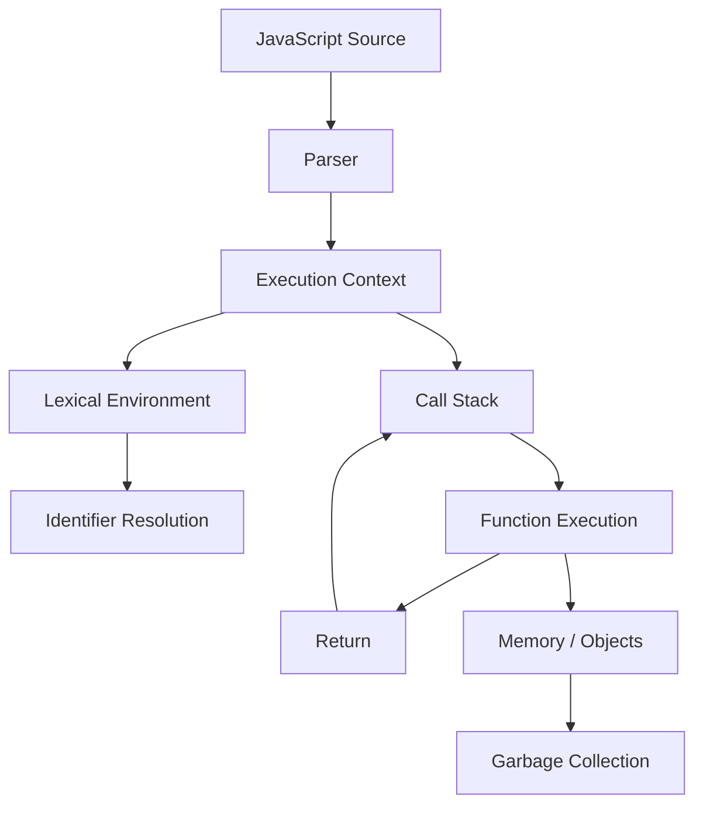

# ADVANCED JAVASCRIPT MASTER HANDBOOK

## Part 4 — Module 1: Execution Context

**Audience:** Beginner → Senior → Staff → Principal

This module follows the uploaded handbook specification. The source defines Module 1 as **Execution Context** and requires coverage of global/function execution contexts, creation and execution phases, lexical environments, variable environments, scope chains, memory allocation, call stacks, `this`, cleanup, browser internals, and Node.js differences. fileciteturn4file0L207-L243

---

## Learning Objectives

By the end of this module you should be able to:

- Explain execution context precisely.
- Distinguish global, function, and module execution.
- Explain creation and execution phases.
- Explain lexical environments and scope chains.
- Trace function calls through the call stack.
- Explain `this` at a senior interview level.
- Explain memory lifetime and garbage collection.
- Distinguish ECMAScript semantics from engine implementation.
- Compare browser and Node.js runtime environments.

---

# Question 1 — What is an Execution Context?

**Difficulty:** ⭐⭐ Medium  
**Experience:** 0–2 Years → 8+ Years

### Definition

An execution context is the ECMAScript specification-level state used while JavaScript code is evaluated.

It provides the information needed for:

- evaluating code
- resolving identifiers
- accessing lexical environments
- handling `this`
- tracking execution state

It is important not to equate an execution context directly with a physical stack frame. Engines are free to implement the specification using optimized internal structures.

### Execution Flow

```text
JavaScript Source
      ↓
Parsing
      ↓
Execution Context
      ↓
Lexical Environment
      ↓
Code Evaluation
      ↓
Function Calls
      ↓
Return / Completion
```

### Code Example

```js
const name = "Rasik";

function greet(user) {
  return `Hello, ${user}`;
}

console.log(greet(name));
```

**Output**

```text
Hello, Rasik
```

### Step-by-step

1. Top-level code begins evaluation.
2. `name` is established as a binding.
3. `greet` is available as a function binding.
4. `greet(name)` is invoked.
5. A function execution context becomes active.
6. `user` receives `"Rasik"`.
7. The return expression is evaluated.
8. Control returns to the caller.

### Call Stack

```text
┌─────────────────────────┐
│ console.log(...)        │
├─────────────────────────┤
│ greet("Rasik")          │
├─────────────────────────┤
│ top-level execution     │
└─────────────────────────┘
```

### Memory / Environment

```text
Top-Level Environment
├── name → "Rasik"
└── greet → Function
              │
              └── [[Environment]]
                       ↓
                Top-Level Environment
```

### ECMAScript vs Engine

ECMAScript specifies observable language behavior. V8, SpiderMonkey, and JavaScriptCore decide how to represent execution state internally.

### Senior Interview Trap

**Wrong:** “Every execution context is one stack frame.”

**Better:** “An execution context is an ECMAScript abstraction. Engines commonly represent active execution with stack frames, but the concepts are not identical.”

### 30-Second Answer

> An execution context is the specification-level state in which JavaScript code executes. Function calls establish function execution contexts, which use lexical environments for identifier resolution. Engines commonly represent active execution with stack frames, but an execution context should not be treated as a literal physical stack frame.

### 2-Minute Answer

An execution context describes the state needed to evaluate JavaScript code. Top-level code executes in an appropriate global or module context, while function invocation establishes a function execution context. The context is associated with lexical environments and other execution state. This model explains scope, closures, `this`, and call-stack behavior.

### 5-Minute Deep Explanation

The most important senior-level distinction is between the ECMAScript abstract machine and the JavaScript engine. ECMAScript defines semantic concepts such as execution contexts and environment records. V8, SpiderMonkey, and JavaScriptCore implement those semantics using engine-specific data structures and optimizations. A closure may keep a lexical environment reachable after the original function has returned, while an active function call is commonly represented by an engine stack frame.

### MCQs

1. Execution context is primarily:
   - A. CSS state
   - B. ECMAScript execution state
   - C. DOM node
   - D. HTTP request

   **Answer: B**

2. What commonly creates a function execution context?

   - A. Function invocation
   - B. CSS parsing
   - C. Image loading
   - D. Garbage collection

   **Answer: A**

3. Which structure supports lexical identifier lookup?

   - A. CSSOM
   - B. Lexical environment
   - C. HTTP cache
   - D. DOM event

   **Answer: B**

4. Which runtime embeds V8?

   - A. Node.js
   - B. Firefox
   - C. Safari
   - D. SpiderMonkey

   **Answer: A**

5. Which statement is correct?

   - A. Execution context must equal a physical stack frame.
   - B. Execution context is a specification abstraction.
   - C. Execution context exists only in browsers.
   - D. Execution context is the DOM.

   **Answer: B**

---

# Question 2 — What is the Global Execution Context?

**Difficulty:** ⭐ Easy

The global execution context is associated with top-level script or module evaluation.

```text
Global Context
├── Global Environment
├── Global Object Relationship
├── this Binding
└── Top-Level Code
```

Classic browser scripts and ES modules have important differences.

```html
<script>
  var legacyValue = 10;
  let modernValue = 20;

  console.log(window.legacyValue);
  console.log(window.modernValue);
</script>
```

**Output**

```text
10
undefined
```

### Best Practice

Prefer modules:

```html
<script type="module" src="/app.js"></script>
```

Avoid mutable global application state.

---

# Question 3 — What is a Function Execution Context?

**Difficulty:** ⭐ Easy

A function execution context is established when a function begins execution.

```js
function add(a, b) {
  const result = a + b;
  return result;
}

console.log(add(2, 3));
```

**Output**

```text
5
```

Conceptually:

```text
Global
  ↓
add()
  ├── a → 2
  ├── b → 3
  └── result → 5
```

---

# Question 4 — What is the Creation Phase?

**Difficulty:** ⭐⭐ Medium

“Creation phase” is a useful teaching model. It should not be presented as a literal two-step engine algorithm mandated by ECMAScript.

Conceptually, the runtime establishes the bindings and execution state required for evaluation.

```js
console.log(value);
var value = 100;
```

**Output**

```text
undefined
```

Conceptual model:

```text
Binding established
value → undefined
        ↓
console.log(value)
        ↓
value = 100
```

---

# Question 5 — What is the Execution Phase?

**Difficulty:** ⭐ Easy

The execution phase describes evaluation of executable statements and expressions.

```js
let count = 0;
count += 1;
console.log(count);
```

**Output**

```text
1
```

```text
Bindings
   ↓
Initialization
   ↓
Assignment
   ↓
Function calls
   ↓
Completion
```

---

# Question 6 — What is a Lexical Environment?

**Difficulty:** ⭐⭐⭐ Hard

A lexical environment is an ECMAScript structure used to associate identifiers with bindings and maintain an outer-environment relationship.

```js
const name = "Rasik";

function greet() {
  const message = `Hello ${name}`;
  return message;
}
```

Lookup:

```text
greet Environment
├── message
└── outer
     ↓
Top-Level Environment
└── name
```

Lexical environments are fundamental to:

- lexical scope
- closures
- shadowing
- module scope
- identifier resolution

---

# Question 7 — What is the Variable Environment?

**Difficulty:** ⭐⭐⭐ Hard

`VariableEnvironment` is an ECMAScript execution-context component and is useful when discussing declaration semantics historically and precisely.

Modern JavaScript should not be reduced to the outdated statement that every variable is stored in one universal “variable object.”

Interview answer:

> VariableEnvironment is part of the ECMAScript execution-context model used for variable bindings. Modern JavaScript has multiple environment records and declaration forms, so the simplified “variable object” model is incomplete.

---

# Question 8 — What is the Scope Chain?

**Difficulty:** ⭐⭐ Medium

The scope chain is the conceptual identifier lookup path through nested lexical environments.

```js
const globalValue = "global";

function outer() {
  const outerValue = "outer";

  function inner() {
    const innerValue = "inner";

    console.log(innerValue);
    console.log(outerValue);
    console.log(globalValue);
  }

  inner();
}

outer();
```

**Output**

```text
inner
outer
global
```

```text
inner Environment
       ↓
outer Environment
       ↓
global/module Environment
```

---

# Question 9 — How is Memory Allocated During Execution?

**Difficulty:** ⭐⭐⭐ Hard

JavaScript uses automatic memory management. Avoid the inaccurate rule:

> “Primitives are always on the stack and objects are always on the heap.”

Actual engine implementations can use registers, stack slots, heap objects, tagged values, optimized representations, and other internal structures.

```js
function createUser() {
  return {
    name: "Rasik",
    role: "Engineer"
  };
}

const user = createUser();
console.log(user.role);
```

Conceptual view:

```text
Execution State
      |
      └── user
           |
           v
       Object Data
       ├── name
       └── role
```

---

# Question 10 — What is the Call Stack?

**Difficulty:** ⭐ Easy

The call stack tracks active synchronous execution.

```js
function first() {
  second();
}

function second() {
  third();
}

function third() {
  console.log("done");
}

first();
```

At the deepest point:

```text
┌──────────────┐
│ third        │
├──────────────┤
│ second       │
├──────────────┤
│ first        │
├──────────────┤
│ global       │
└──────────────┘
```

Recursive code can exhaust the call stack:

```js
function recurse() {
  recurse();
}

recurse();
```

---

# Question 11 — What is Context Switching?

**Difficulty:** ⭐⭐ Medium

When execution enters nested function calls, the active execution state changes.

```text
Global
  ↓
outer
  ↓
inner
  ↓
return
  ↓
outer
  ↓
Global
```

Engine implementation details vary, so interview answers should focus on observable semantics rather than claiming a specific CPU-level operation.

---

# Question 12 — How Does Strict Mode Affect Execution Context?

**Difficulty:** ⭐⭐ Medium

Strict mode changes several JavaScript semantics.

```js
"use strict";

function showThis() {
  console.log(this);
}

showThis();
```

For a normal function call in strict mode, `this` is `undefined`.

ES modules are implicitly strict.

Strict mode also helps catch accidental assignments and disables certain legacy behaviors.

---

# Question 13 — What is the Global Object?

**Difficulty:** ⭐⭐ Medium

The global object is provided by the host/runtime.

Use `globalThis` for portable access:

```js
console.log(typeof globalThis);
```

**Output**

```text
object
```

Browser environments commonly expose `window`; Node.js exposes Node-specific global facilities. `globalThis` provides a standardized cross-environment reference.

---

# Question 14 — How Does `this` Relate to Execution?

**Difficulty:** ⭐⭐⭐ Hard

`this` depends on how a function is invoked.

```js
const user = {
  name: "Rasik",
  greet() {
    return this.name;
  }
};

console.log(user.greet());
```

**Output**

```text
Rasik
```

But:

```js
const greet = user.greet;
```

changes the invocation form.

Arrow functions do not create their own `this`; they capture it lexically.

```js
const obj = {
  value: 10,

  method() {
    const arrow = () => this.value;
    return arrow();
  }
};

console.log(obj.method());
```

**Output**

```text
10
```

---

# Question 15 — How Does Memory Cleanup Work?

**Difficulty:** ⭐⭐⭐ Hard

JavaScript uses automatic garbage collection.

```text
Objects
   ↓
Reachability
   ↓
Unreachable Objects
   ↓
Garbage Collection
   ↓
Reclaimed Memory
```

A closure does not automatically create a memory leak.

```js
function createCounter() {
  let count = 0;

  return () => ++count;
}

const counter = createCounter();

console.log(counter());
console.log(counter());
```

**Output**

```text
1
2
```

`count` remains reachable through the returned function.

---

# Question 16 — Browser Runtime vs Node.js Runtime

**Difficulty:** ⭐⭐ Medium

| Area | Browser | Node.js |
|---|---|---|
| Engine | V8 / SpiderMonkey / JavaScriptCore | V8 |
| DOM | Yes | Not built in |
| Rendering | Yes | No browser renderer |
| `window` | Common browser global | No |
| `globalThis` | Yes | Yes |
| File system | Restricted Web APIs | Node APIs |
| Event-driven APIs | Web APIs | Node APIs + libuv |
| Fetch | Yes | Modern Node versions |
| Workers | Web Workers | Worker Threads |

Key point:

> JavaScript is the language; the browser and Node.js are host/runtime environments.

---

# Question 17 — What Happens When JavaScript Runs?

**Difficulty:** ⭐⭐⭐ Hard

A simplified engine pipeline:

```text
JavaScript Source
       ↓
Lexer / Parser
       ↓
AST / Internal Representation
       ↓
Interpreter / Baseline Execution
       ↓
JIT Optimization
       ↓
Optimized Machine-Level Execution
```

The exact pipeline differs across V8, SpiderMonkey, and JavaScriptCore.

### Browser Runtime

```text
Browser
├── HTML Parser
├── DOM
├── CSS Parser
├── CSSOM
├── JavaScript Engine
│   ├── Parser
│   ├── Interpreter / Baseline
│   └── Optimizer
├── Web APIs
├── Event Loop
└── Rendering Pipeline
```

---

# Question 18 — How Do Execution Contexts Enable Closures?

**Difficulty:** ⭐⭐⭐ Hard

```js
function outer() {
  const secret = 42;

  return function inner() {
    return secret;
  };
}

const readSecret = outer();

console.log(readSecret());
```

**Output**

```text
42
```

Conceptual model:

```text
readSecret
    ↓
inner Function
    ↓ [[Environment]]
outer Lexical Environment
    ↓
secret → 42
```

The function retains access to the lexical environment required to resolve `secret`.

---

# Question 19 — Senior Scenario: Reading a Production Stack Trace

**Difficulty:** ⭐⭐⭐ Hard

Example:

```text
TypeError: Cannot read properties of undefined
    at renderUser
    at renderDashboard
    at processRequest
```

A senior engineer should investigate:

1. Where the invalid value originated.
2. Whether the issue is deterministic.
3. Whether async boundaries are involved.
4. Whether source maps are correct.
5. Whether telemetry includes useful context.
6. Whether recovery is possible.
7. Whether logging exposes sensitive information.

A stack trace is evidence for reconstructing the execution path; it is not necessarily a complete description of all asynchronous work.

---

# Question 20 — Staff/Principal: Is an Execution Context a Physical Object?

**Difficulty:** ⭐⭐⭐ Hard  
**Experience:** 8+ Years

**Answer:** No.

Execution context is an ECMAScript abstraction. Engines can represent execution state using:

- registers
- stack slots
- heap objects
- optimized frames
- deoptimized frames
- engine-specific metadata

Strong answer:

> I separate the ECMAScript abstract machine from engine implementation. Execution contexts and lexical environments describe language semantics, while V8, SpiderMonkey, and JavaScriptCore are free to optimize those concepts using implementation-specific structures.

---

# Module 1 Mermaid Architecture



# Module 1 Execution Diagram

```text
Source
  ↓
Global / Module Context
  ↓
Function Invocation
  ↓
Function Context
  ↓
Nested Calls
  ↓
Return
  ↓
Context Becomes Inactive
  ↓
Reachable State May Remain
```

# Module 1 Assignments

## Assignment 1 — Execution Trace

Given:

```js
const x = 10;

function outer() {
  const y = 20;

  function inner() {
    const z = 30;
    return x + y + z;
  }

  return inner();
}

console.log(outer());
```

Produce:

- execution contexts
- scope chain
- call stack
- expected output
- memory diagram

## Assignment 2 — Global Script vs Module

Create two examples:

1. classic `<script>`
2. `<script type="module">`

Compare:

- top-level bindings
- global object behavior
- strict mode
- `this`

## Assignment 3 — Closure Lifetime

Create a closure that stores state and explain when the state becomes eligible for garbage collection.

---

# Mini Project — JavaScript Runtime Visualizer

Build a browser application that visualizes:

- source code
- execution contexts
- call stack
- scope chain
- closure references
- console output
- errors

Suggested structure:

```text
runtime-visualizer/
├── src/
│   ├── components/
│   │   ├── CodeEditor.js
│   │   ├── CallStack.js
│   │   ├── ScopeTree.js
│   │   ├── ExecutionContext.js
│   │   └── ConsolePanel.js
│   ├── runtime/
│   │   ├── parser.js
│   │   ├── evaluator.js
│   │   └── tracer.js
│   └── App.js
└── tests/
```

**Security:** never execute arbitrary user code directly in the main application context. Use appropriate isolation such as a sandboxed iframe or another controlled execution environment.

---

# Module 1 Cheat Sheet

| Concept | Interview Point |
|---|---|
| Execution Context | ECMAScript execution-state abstraction |
| Global Context | Top-level script/module evaluation |
| Function Context | Created for function execution |
| Lexical Environment | Bindings + outer environment |
| Scope Chain | Identifier lookup path |
| Call Stack | Active synchronous execution |
| `this` | Invocation-dependent semantics |
| Closure | Function retaining lexical access |
| Browser | JS engine + Web APIs + rendering |
| Node.js | V8 + Node runtime |
| Garbage Collection | Reclaims unreachable memory |
| Engine Optimization | Implementation-specific |

---

# Module 1 Common Interview Traps

### Trap 1
“Execution context equals stack frame.”

**Correct:** They are related but not identical concepts.

### Trap 2
“`let` and `const` are not hoisted.”

**Correct:** Their bindings are established before execution, but they are inaccessible during the Temporal Dead Zone.

### Trap 3
“All objects are on the heap.”

**Correct:** This is a useful teaching simplification but not a specification guarantee.

### Trap 4
“Node.js is a JavaScript engine.”

**Correct:** Node.js is a runtime built around V8.

### Trap 5
“Closures always cause memory leaks.”

**Correct:** A closure can retain state, but a leak occurs when objects remain reachable unintentionally.

---

# Module 1 Senior Questions

1. How does an engine optimize execution-context representation?
2. How can closures retain memory after function return?
3. How would you diagnose excessive call-stack depth?
4. How does source-map quality affect production stack traces?
5. What is the difference between language semantics and host behavior?
6. How would you explain `this` without using the “owner object” model?
7. How do modules change global scope behavior?
8. How would you investigate a closure-related memory-retention issue?

# Staff Engineer Questions

1. How would you design a runtime debugging architecture for a large frontend?
2. How would you instrument JavaScript execution without creating unacceptable overhead?
3. How would you distinguish engine-level performance problems from application-level problems?
4. How would you teach specification-versus-implementation distinctions to a frontend organization?
5. How would you design a safe JavaScript playground?

# Principal Engineer Questions

1. How would you evaluate a proposed runtime optimization?
2. How would you balance observability with privacy?
3. How would you define a browser-runtime performance budget?
4. How would you investigate a cross-engine behavior difference?
5. How would you establish JavaScript runtime standards across hundreds of engineers?

# FAANG-Style Questions

1. Explain execution context without saying “the box where variables live.”
2. Explain lexical environment versus scope.
3. Explain why a closure can outlive its creating function.
4. Explain why stack frame and execution context are not identical.
5. Explain browser runtime versus JavaScript engine.
6. Explain how an engine can optimize code while preserving ECMAScript semantics.
7. Explain a production memory-retention incident caused by event listeners and closures.
8. Explain how you would investigate a long synchronous task blocking a UI.

---

# Module 1 Coding Challenges

## Challenge 1

Implement a function that creates independent counters:

```js
const a = createCounter();
const b = createCounter();

console.log(a()); // 1
console.log(a()); // 2
console.log(b()); // 1
```

### Without Built-in State Helpers

```js
function createCounter() {
  let count = 0;

  return function increment() {
    count += 1;
    return count;
  };
}
```

### Production Notes

- Uses lexical closure.
- Each invocation has independent state.
- Increment is O(1).
- Space is O(1) per live counter.
- State remains reachable while the returned function is reachable.

## Challenge 2

Trace:

```js
function a() {
  return b();
}

function b() {
  return c();
}

function c() {
  return 100;
}

console.log(a());
```

Expected output:

```text
100
```

---

# Module 1 Final Revision

Remember:

```text
Execution Context
       ↓
Lexical Environment
       ↓
Scope Resolution
       ↓
Function Execution
       ↓
Call Stack
       ↓
Closure / Lifetime
       ↓
Garbage Collection
```

The central senior-level principle is:

> **ECMAScript defines behavior; engines implement and optimize that behavior.**

---

## Module 1 Complete

**Next:** Module 2 — Scope & Lexical Environment
