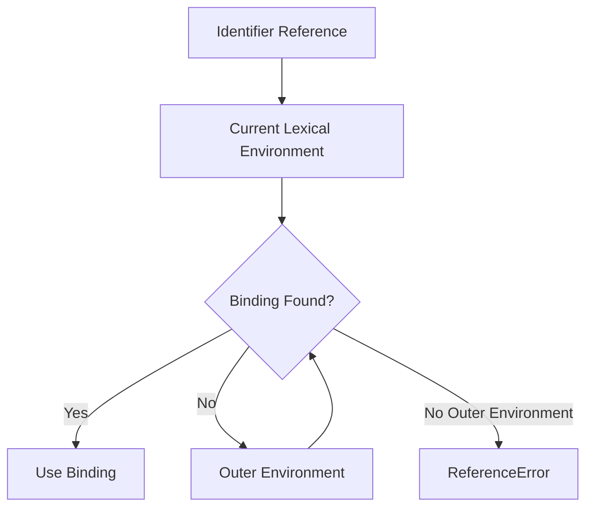

# ADVANCED JAVASCRIPT MASTER HANDBOOK

## Part 4 — Module 2: Scope & Lexical Environment

**Audience:** Beginner → Senior → Staff → Principal  
**Focus:** Global Scope, Function Scope, Block Scope, Module Scope, Lexical Scope, Dynamic Scope, Scope Chain, Shadowing, Illegal Shadowing, Temporal Dead Zone, Hoisting, Closures, Performance, Browser Runtime, Node.js Runtime, and Enterprise JavaScript.

> This module continues the uploaded handbook's exact Module 2 structure: Global Scope, Function Scope, Block Scope, Module Scope, Lexical Scope, Dynamic Scope, Scope Chain, Shadowing, Illegal Shadowing, Temporal Dead Zone, Hoisting, Closures, and Performance. fileciteturn4file0L245-L275

---

# Module Overview

## Learning Objectives

By the end of this module, you should be able to:

- Explain JavaScript scope from first principles.
- Distinguish global, function, block, and module scope.
- Explain lexical scoping accurately.
- Explain why JavaScript is not dynamically scoped.
- Trace identifier lookup through a scope chain.
- Explain `var`, `let`, and `const` scoping.
- Explain shadowing and illegal shadowing.
- Explain the Temporal Dead Zone.
- Explain hoisting without common interview myths.
- Explain how closures retain lexical state.
- Diagnose scope-related bugs.
- Discuss scope performance at senior level.
- Compare browser scripts, modules, and Node.js modules.
- Answer senior, staff, principal, and FAANG-style scope questions.

---

# Question 21 — What is Scope?

**Difficulty:** ⭐ Easy  
**Experience Level:** 0–2 Years

## Definition

**Scope** determines where an identifier can be accessed in a JavaScript program.

An identifier may be:

- a variable
- a constant
- a function
- a class
- an imported binding
- a parameter

Example:

```js
function greet() {
  const message = "Hello";
  console.log(message);
}

greet();
```

`message` is available inside `greet`, but not outside it.

```text
Global Scope
└── greet()
    └── message
```

## Why Scope Matters

Scope provides:

- data isolation
- predictable name resolution
- reduced global pollution
- encapsulation
- maintainability
- support for closures
- safer large-scale architecture

## Interview Answer

> Scope defines where an identifier is visible and accessible. JavaScript primarily uses lexical scoping, meaning accessibility is determined by where code is written rather than where a function is eventually called.

---

# Question 22 — What is Global Scope?

**Difficulty:** ⭐ Easy

A global binding is accessible from code that can reach the global environment.

In a browser classic script:

```html
<script>
  var count = 10;

  function printCount() {
    console.log(count);
  }

  printCount();
</script>
```

**Output**

```text
10
```

## Important Distinction

Classic browser scripts, ES modules, and Node.js have different top-level semantics.

### Browser Classic Script

```js
var value = 10;

console.log(globalThis.value);
```

Typically:

```text
10
```

### ES Module

```js
// module.js
var value = 10;

console.log(globalThis.value);
```

The top-level module binding is not automatically a global-object property.

## Best Practice

Avoid mutable global variables.

Prefer:

```js
export const config = {
  apiBaseUrl: "/api"
};
```

over:

```js
globalThis.config = {
  apiBaseUrl: "/api"
};
```

---

# Question 23 — What is Function Scope?

**Difficulty:** ⭐ Easy

Function scope means a binding is accessible throughout the function in which it is declared.

`var` is function-scoped.

```js
function demo() {
  var value = 100;

  if (true) {
    var value = 200;
  }

  console.log(value);
}

demo();
```

**Output**

```text
200
```

The `if` block does not create a separate `var` scope.

## Diagram

```text
demo()
└── Function Scope
    └── value → 200
```

---

# Question 24 — What is Block Scope?

**Difficulty:** ⭐ Easy

Block scope is created by constructs such as:

```text
{}
if {}
for {}
while {}
try {}
catch {}
switch {}
```

`let` and `const` are block-scoped.

```js
if (true) {
  let message = "inside";
  const count = 1;

  console.log(message, count);
}

// console.log(message); // ReferenceError
```

**Output**

```text
inside 1
```

## Diagram

```text
Global
└── if Block
    ├── message
    └── count
```

---

# Question 25 — What is Module Scope?

**Difficulty:** ⭐⭐ Medium

Each ES module has its own top-level lexical scope.

### config.js

```js
const API_URL = "/api";

export function getApiUrl() {
  return API_URL;
}
```

### app.js

```js
import { getApiUrl } from "./config.js";

console.log(getApiUrl());
```

**Output**

```text
/api
```

`API_URL` does not become a global variable.

## Why Module Scope Matters

Module scope supports:

- encapsulation
- dependency boundaries
- reusable packages
- tree shaking
- safer architecture
- reduced global pollution

---

# Question 26 — What is Lexical Scope?

**Difficulty:** ⭐⭐ Medium

JavaScript uses **lexical scoping**.

That means scope is determined by where functions and variables are written in source code.

```js
const value = "global";

function outer() {
  const value = "outer";

  function inner() {
    console.log(value);
  }

  return inner;
}

const fn = outer();
fn();
```

**Output**

```text
outer
```

Even though `fn()` is called outside `outer`, `inner` was defined inside `outer`, so its lexical environment can resolve `value` from `outer`.

## Key Principle

```text
Where the function is DEFINED
            ↓
determines lexical scope
```

not:

```text
Where the function is CALLED
```

---

# Question 27 — What is Dynamic Scope?

**Difficulty:** ⭐⭐⭐ Hard

Dynamic scoping determines variable lookup from the call chain rather than source-code nesting.

JavaScript does **not** use dynamic scoping for normal lexical identifier resolution.

Compare conceptually:

```text
Lexical Scope:
definition location → lookup

Dynamic Scope:
call location → lookup
```

Example:

```js
const value = "global";

function print() {
  console.log(value);
}

function caller() {
  const value = "caller";
  print();
}

caller();
```

**Output**

```text
global
```

If JavaScript were dynamically scoped, `"caller"` might be selected. It is not.

## Interview Answer

> JavaScript uses lexical scoping. Identifier resolution follows the lexical environment established from source-code nesting, not the runtime caller chain.

---

# Question 28 — What is the Scope Chain?

**Difficulty:** ⭐⭐ Medium

The scope chain is the sequence of lexical environments consulted when resolving an identifier.

```js
const a = "A";

function outer() {
  const b = "B";

  function inner() {
    const c = "C";

    console.log(c);
    console.log(b);
    console.log(a);
  }

  inner();
}

outer();
```

Lookup:

```text
inner Environment
    │
    ├── c → "C"
    │
    ↓
outer Environment
    │
    ├── b → "B"
    │
    ↓
Global/Module Environment
    │
    └── a → "A"
```

## Lookup Rule

For an identifier:

```text
Current Environment
       ↓
Found?
 ┌─────┴─────┐
Yes         No
 ↓           ↓
Use it    Outer Environment
              ↓
            Repeat
```

If no environment contains the binding, JavaScript produces a `ReferenceError`.

---

# Question 29 — How Does Identifier Resolution Work?

**Difficulty:** ⭐⭐⭐ Hard

Consider:

```js
const name = "global";

function outer() {
  const name = "outer";

  function inner() {
    const name = "inner";
    return name;
  }

  return inner();
}

console.log(outer());
```

**Output**

```text
inner
```

The engine's semantic model begins resolution from the current lexical environment.

```text
inner.name
   ↓
Found "inner"
   ↓
Stop
```

It does not continue searching after a matching binding is found.

---

# Question 30 — What is Shadowing?

**Difficulty:** ⭐⭐ Medium

Shadowing occurs when an inner scope declares a binding with the same name as an outer scope.

```js
const value = "global";

function demo() {
  const value = "local";

  console.log(value);
}

demo();
```

**Output**

```text
local
```

Diagram:

```text
Global
└── value = "global"
    │
    ↓
demo Scope
└── value = "local"
```

The inner binding shadows the outer binding.

## Best Practice

Avoid unnecessary shadowing because it can reduce readability.

---

# Question 31 — What is Shadowing with `let`?

**Difficulty:** ⭐⭐ Medium

This is valid:

```js
let value = "outer";

{
  let value = "inner";
  console.log(value);
}

console.log(value);
```

**Output**

```text
inner
outer
```

Two different lexical bindings exist.

---

# Question 32 — What is Shadowing with `var`?

**Difficulty:** ⭐⭐ Medium

Because `var` is function-scoped:

```js
var value = "outer";

function demo() {
  var value = "inner";
  console.log(value);
}

demo();
console.log(value);
```

**Output**

```text
inner
outer
```

The function has its own `var` binding.

---

# Question 33 — What is Illegal Shadowing?

**Difficulty:** ⭐⭐⭐ Hard

Certain combinations of lexical and `var` declarations are prohibited when they conflict within the same variable environment.

A classic example:

```js
let value = "outer";

{
  var value = "inner";
}
```

This results in a syntax error because the `var` declaration cannot coexist with the conflicting lexical declaration in the applicable scope structure.

## Important

Do not memorize only one example. Understand the underlying rule:

> Lexical declarations and `var` declarations have different environment semantics, and certain redeclaration combinations are early errors.

---

# Question 34 — Can a `let` Inside a Block Shadow an Outer `var`?

**Difficulty:** ⭐⭐ Medium

Yes, when the lexical declaration is inside a nested block.

```js
var value = "outer";

{
  let value = "inner";
  console.log(value);
}

console.log(value);
```

**Output**

```text
inner
outer
```

This is valid because the `let` binding belongs to the nested lexical environment.

---

# Question 35 — What is the Temporal Dead Zone?

**Difficulty:** ⭐⭐⭐ Hard

The **Temporal Dead Zone (TDZ)** is the period between entering a scope where a `let`, `const`, or class binding exists and the point where that binding is initialized.

Example:

```js
console.log(value);

let value = 10;
```

This throws:

```text
ReferenceError
```

## Conceptual Diagram

```text
Enter Scope
    ↓
Binding Exists
    ↓
──────── TDZ ────────
    ↓
Initialization
    ↓
Binding Accessible
```

## Important Interview Point

`let` and `const` are not “not hoisted.”

Their bindings are established before execution reaches the declaration, but they cannot be accessed during the TDZ.

---

# Question 36 — Why Does TDZ Exist?

**Difficulty:** ⭐⭐⭐ Hard

TDZ helps enforce safer declaration semantics.

It prevents code from using a lexical binding before its initialization.

Bad:

```js
console.log(config);
const config = {};
```

Correct:

```js
const config = {};
console.log(config);
```

This makes declaration order and initialization requirements explicit.

---

# Question 37 — Does `const` Avoid TDZ?

**Difficulty:** ⭐ Easy

No.

```js
console.log(value);
const value = 10;
```

throws a `ReferenceError`.

`const` has:

- lexical scope
- TDZ
- required initialization
- no reassignment

---

# Question 38 — Does `let` Have TDZ?

**Difficulty:** ⭐ Easy

Yes.

```js
{
  console.log(count); // ReferenceError
  let count = 10;
}
```

The binding exists but is uninitialized during the TDZ.

---

# Question 39 — Does `var` Have TDZ?

**Difficulty:** ⭐ Easy

No.

```js
console.log(value);

var value = 10;
```

**Output**

```text
undefined
```

The `var` binding is initialized to `undefined` as part of its declaration semantics.

---

# Question 40 — What is Hoisting from a Scope Perspective?

**Difficulty:** ⭐⭐ Medium

Hoisting is a teaching term describing the fact that declarations are processed before their corresponding executable use in ways defined by ECMAScript.

Example:

```js
console.log(typeof value);

var value = 10;
```

**Output**

```text
undefined
```

For `let`:

```js
console.log(value);

let value = 10;
```

**Result:**

```text
ReferenceError
```

The difference is initialization state, not the simplistic claim that one is “hoisted” and the other is not.

---

# Question 41 — Function Declarations and Scope

**Difficulty:** ⭐⭐ Medium

Function declarations have declaration semantics that make them available earlier than many developers expect.

```js
sayHello();

function sayHello() {
  console.log("Hello");
}
```

**Output**

```text
Hello
```

This behavior differs from function expressions stored in `let`, `const`, or `var` bindings.

---

# Question 42 — Function Expression and TDZ

**Difficulty:** ⭐⭐ Medium

```js
sayHello();

const sayHello = function () {
  console.log("Hello");
};
```

This throws a `ReferenceError` because the `const` binding is in its TDZ before initialization.

---

# Question 43 — Arrow Function and TDZ

**Difficulty:** ⭐⭐ Medium

```js
run();

const run = () => {
  console.log("running");
};
```

The arrow function itself is not available through the `const` binding until initialization.

The result is a `ReferenceError`.

---

# Question 44 — What is Lexical Environment vs Scope?

**Difficulty:** ⭐⭐⭐ Hard

These terms are related but not identical.

| Concept | Meaning |
|---|---|
| Scope | Language-level visibility/accessibility concept |
| Lexical Environment | ECMAScript structure used to model bindings and outer lookup |
| Scope Chain | Conceptual lookup path through environments |
| Closure | Function behavior involving retained lexical access |

Strong answer:

> Scope describes visibility rules, while lexical environments are part of the specification machinery used to model those rules.

---

# Question 45 — What is a Closure?

**Difficulty:** ⭐⭐ Medium

A closure occurs when a function retains access to variables from its lexical environment after the surrounding function has returned.

```js
function createCounter() {
  let count = 0;

  return function increment() {
    count += 1;
    return count;
  };
}

const counter = createCounter();

console.log(counter());
console.log(counter());
```

**Output**

```text
1
2
```

## Diagram

```text
counter
  ↓
increment Function
  ↓
[[Environment]]
  ↓
createCounter Environment
  ↓
count → 2
```

---

# Question 46 — Why Does a Closure Remember Variables?

**Difficulty:** ⭐⭐⭐ Hard

The function retains a reference to the lexical environment needed to resolve its free variables.

Example:

```js
function outer() {
  const message = "Hello";

  return function inner() {
    return message;
  };
}

const fn = outer();

console.log(fn());
```

**Output**

```text
Hello
```

The function's lexical environment relationship keeps `message` reachable.

---

# Question 47 — Are Closures Memory Leaks?

**Difficulty:** ⭐⭐ Medium

No.

A closure can retain memory intentionally.

A leak happens when memory remains reachable unintentionally or for longer than intended.

Example of potentially problematic retention:

```js
function createHandler(largeData) {
  return function handleClick() {
    console.log(largeData.id);
  };
}
```

If the handler is registered indefinitely and `largeData` is very large, it can retain more memory than expected.

## Best Practice

Remove listeners when their lifetime ends.

---

# Question 48 — How Do Closures Enable Data Privacy?

**Difficulty:** ⭐⭐ Medium

Closures can hide internal state:

```js
function createBankAccount(initialBalance) {
  let balance = initialBalance;

  return {
    deposit(amount) {
      balance += amount;
    },

    getBalance() {
      return balance;
    }
  };
}

const account = createBankAccount(1000);

account.deposit(500);

console.log(account.getBalance());
```

**Output**

```text
1500
```

External code cannot directly access the `balance` binding.

---

# Question 49 — What is a Closure Factory?

**Difficulty:** ⭐⭐ Medium

A factory can generate functions with independent lexical state.

```js
function createMultiplier(multiplier) {
  return function multiply(value) {
    return value * multiplier;
  };
}

const double = createMultiplier(2);
const triple = createMultiplier(3);

console.log(double(5));
console.log(triple(5));
```

**Output**

```text
10
15
```

Each returned function has its own captured environment.

---

# Question 50 — How Does Scope Affect Loop Closures?

**Difficulty:** ⭐⭐⭐ Hard

Compare `var` and `let`.

### `var`

```js
for (var i = 0; i < 3; i += 1) {
  setTimeout(() => {
    console.log(i);
  }, 0);
}
```

Typical output:

```text
3
3
3
```

### `let`

```js
for (let i = 0; i < 3; i += 1) {
  setTimeout(() => {
    console.log(i);
  }, 0);
}
```

Output:

```text
0
1
2
```

`let` provides per-iteration lexical bindings for this loop form.

---

# Question 51 — How Does Scope Work with `for` Loops?

**Difficulty:** ⭐⭐ Medium

For `let` and `const`, loop iteration can create distinct lexical bindings that callbacks can capture.

```text
Iteration 0 → i = 0
Iteration 1 → i = 1
Iteration 2 → i = 2
```

This is one reason `let` is preferable to `var` in modern asynchronous loops.

---

# Question 52 — What Happens When an Identifier Is Not Found?

**Difficulty:** ⭐ Easy

If identifier resolution reaches the outermost environment without finding the binding, JavaScript throws a `ReferenceError`.

```js
console.log(unknownValue);
```

Result:

```text
ReferenceError: unknownValue is not defined
```

This differs from reading an existing property whose value happens to be `undefined`.

---

# Question 53 — What is the Difference Between `undefined` and an Undeclared Variable?

**Difficulty:** ⭐⭐ Medium

```js
let value;

console.log(value);
```

Output:

```text
undefined
```

The binding exists.

But:

```js
console.log(doesNotExist);
```

throws:

```text
ReferenceError
```

### Comparison

| Case | Binding Exists? | Result |
|---|---:|---|
| `let x; x` | Yes | `undefined` |
| `var x; x` | Yes | `undefined` |
| `typeof undeclared` | No | `"undefined"` |
| `undeclared` | No | `ReferenceError` |

---

# Question 54 — Why Does `typeof` Not Throw for an Undeclared Identifier?

**Difficulty:** ⭐⭐ Medium

Historically, `typeof` has special behavior for an unresolvable identifier.

```js
console.log(typeof doesNotExist);
```

Output:

```text
undefined
```

This is useful for feature detection, although modern module and bundler environments often provide better explicit mechanisms.

---

# Question 55 — What is Shadowing in Nested Functions?

**Difficulty:** ⭐⭐ Medium

```js
const value = "global";

function outer() {
  const value = "outer";

  function inner() {
    const value = "inner";
    return value;
  }

  return inner();
}

console.log(outer());
```

**Output**

```text
inner
```

Lookup stops at the first matching binding.

---

# Question 56 — What is Scope Shadowing in `catch`?

**Difficulty:** ⭐⭐ Medium

A `catch` block can have its own lexical binding:

```js
try {
  throw new Error("Failure");
} catch (error) {
  console.log(error.message);
}
```

The `error` binding belongs to the catch environment.

Modern JavaScript also permits optional catch binding:

```js
try {
  riskyOperation();
} catch {
  console.log("Failed");
}
```

---

# Question 57 — What is Module Encapsulation?

**Difficulty:** ⭐⭐ Medium

Modules provide private top-level scope by default.

```js
// math.js
const secret = 42;

export function add(a, b) {
  return a + b;
}
```

`secret` is not automatically visible to importing modules.

This is a major building block for enterprise frontend architecture.

---

# Question 58 — Why is Module Scope Better Than Global State?

**Difficulty:** ⭐⭐ Medium

Global state can cause:

- name collisions
- hidden dependencies
- difficult testing
- accidental mutation
- unpredictable initialization order

Module scope makes dependencies explicit:

```js
import { apiClient } from "./apiClient.js";
```

instead of:

```js
globalThis.apiClient.request();
```

---

# Question 59 — What is Scope Leakage?

**Difficulty:** ⭐⭐ Medium

Scope leakage occurs when implementation details become visible outside the intended boundary.

Example:

```js
globalThis.appState = {};
```

This creates an externally accessible global property.

Prefer:

```js
const appState = {};

export { appState };
```

---

# Question 60 — How Does Scope Affect Maintainability?

**Difficulty:** ⭐⭐ Medium

Good scope boundaries:

- reduce cognitive load
- make dependencies explicit
- reduce accidental coupling
- simplify testing
- enable modular architecture

Bad scope design:

```text
Many components
     ↓
Global mutable state
     ↓
Hidden dependencies
     ↓
Hard debugging
```

Better:

```text
Component
   ↓
Explicit dependency
   ↓
Module
   ↓
Service
```

---

# Question 61 — Does Deeper Scope Always Mean Worse Performance?

**Difficulty:** ⭐⭐⭐ Hard

No.

Modern JavaScript engines optimize variable access heavily.

Performance depends on:

- engine optimization
- hot code paths
- object shapes
- closures
- allocations
- deoptimization
- actual workload

Do not rewrite readable code simply because a variable is several scopes outward.

Measure first.

---

# Question 62 — How Can Closures Affect Performance?

**Difficulty:** ⭐⭐⭐ Hard

Closures can retain state and objects.

Example:

```js
function createProcessor(largeConfig) {
  return function process(input) {
    return input + largeConfig.offset;
  };
}
```

If the returned function remains alive, `largeConfig` may remain reachable.

### Potential Costs

- retained memory
- additional allocations
- longer object lifetimes
- increased GC pressure

Closures are not inherently slow or dangerous.

---

# Question 63 — How Do You Debug Scope Problems?

**Difficulty:** ⭐⭐ Medium

Use browser DevTools:

1. Set a breakpoint.
2. Pause execution.
3. Inspect **Scope**.
4. Inspect Local / Closure / Global values.
5. Inspect the Call Stack.
6. Step into or over code.
7. Check whether a binding is shadowed.

Conceptual DevTools view:

```text
Call Stack
└── inner()

Scope
├── Local
│   └── value
├── Closure
│   └── outerValue
└── Global
    └── globalValue
```

---

# Question 64 — How Does Scope Interact with React?

**Difficulty:** ⭐⭐ Medium

React function components are ordinary JavaScript functions, so lexical scope and closures apply.

```jsx
function Counter() {
  const [count, setCount] = React.useState(0);

  function handleClick() {
    console.log(count);
    setCount(count + 1);
  }

  return <button onClick={handleClick}>{count}</button>;
}
```

The handler closes over the `count` value from the render in which it was created.

This explains React concepts such as:

- stale closures
- dependency arrays
- event handlers
- effect callbacks
- memoized callbacks

---

# Question 65 — What is a Stale Closure?

**Difficulty:** ⭐⭐⭐ Hard

A stale closure occurs when a callback retains an older value than the developer expects.

Conceptual example:

```js
function createLogger(value) {
  return function log() {
    console.log(value);
  };
}

const log = createLogger(10);

console.log(20);
log();
```

Output:

```text
20
10
```

The callback retains its lexical value.

In React, stale closures commonly appear in asynchronous callbacks and effects.

---

# Question 66 — How Can Stale Closures Be Reduced?

**Difficulty:** ⭐⭐⭐ Hard

Use the appropriate React pattern for the situation.

For state derived from previous state:

```jsx
setCount(previous => previous + 1);
```

Instead of:

```jsx
setCount(count + 1);
```

The functional updater avoids depending on a potentially stale captured value.

---

# Question 67 — What is the Difference Between Lexical Scope and `this`?

**Difficulty:** ⭐⭐⭐ Hard

They are separate mechanisms.

Lexical scope determines identifier lookup:

```js
const value = 10;

function read() {
  return value;
}
```

`this` is determined by invocation semantics for normal functions.

```js
const obj = {
  value: 20,
  read() {
    return this.value;
  }
};
```

Do not describe `this` as simply another lexical variable.

---

# Question 68 — Does Arrow Function Scope Change?

**Difficulty:** ⭐⭐ Medium

Arrow functions still use lexical scope for identifiers.

They also capture `this` lexically from the surrounding function/environment.

```js
const obj = {
  value: 10,

  method() {
    const read = () => this.value;
    return read();
  }
};

console.log(obj.method());
```

**Output**

```text
10
```

---

# Question 69 — How Does Scope Work with `eval()`?

**Difficulty:** ⭐⭐⭐ Hard

`eval()` can interact with lexical and variable environments in ways that make static reasoning and optimization harder.

Example:

```js
function demo() {
  const value = 10;
  return eval("value");
}

console.log(demo());
```

**Output**

```text
10
```

## Security and Performance

Avoid `eval()` for application logic.

Risks include:

- code injection
- difficult static analysis
- optimization barriers
- security vulnerabilities

---

# Question 70 — How Does Scope Work with `with`?

**Difficulty:** ⭐⭐⭐ Hard

`with` is deprecated/forbidden in strict mode and should not be used in modern production JavaScript.

It dynamically changes identifier lookup behavior in ways that complicate reasoning and optimization.

```js
"use strict";

// with (obj) {} // SyntaxError
```

Best practice:

> Never use `with` in modern application code.

---

# Question 71 — Scope in Browser Classic Scripts

**Difficulty:** ⭐⭐ Medium

Classic scripts may participate in the global environment.

```html
<script>
  var appVersion = "1.0";
  let internalVersion = "2.0";

  console.log(globalThis.appVersion);
  console.log(globalThis.internalVersion);
</script>
```

Typically:

```text
1.0
undefined
```

Use modules to create stronger boundaries.

---

# Question 72 — Scope in ES Modules

**Difficulty:** ⭐⭐ Medium

```html
<script type="module">
  const appName = "Dashboard";

  console.log(appName);
  console.log(globalThis.appName);
</script>
```

The second expression does not access the module-local binding.

Modules are also strict by default.

---

# Question 73 — Scope in Node.js Modules

**Difficulty:** ⭐⭐ Medium

Node.js commonly provides module-level encapsulation.

In CommonJS:

```js
const secret = "private";

module.exports = {
  getSecret() {
    return secret;
  }
};
```

The `secret` binding is not automatically a global variable.

Modern Node.js also supports ES modules.

---

# Question 74 — CommonJS Scope vs ES Module Scope

**Difficulty:** ⭐⭐⭐ Hard

| Feature | CommonJS | ES Modules |
|---|---|---|
| Syntax | `require`, `module.exports` | `import`, `export` |
| Top-level encapsulation | Module wrapper | Native module scope |
| Strict mode | Not automatically equivalent to ESM semantics | Strict by default |
| Static analysis | More limited | Strong static structure |
| Tree shaking | Tool-dependent | Better suited |
| Browser native support | No | Yes |

---

# Question 75 — What is the Scope of a Class?

**Difficulty:** ⭐⭐ Medium

A class declaration creates a lexical binding.

```js
class User {
  greet() {
    return "Hello";
  }
}

const user = new User();

console.log(user.greet());
```

**Output**

```text
Hello
```

The class name is available in its relevant lexical scope and has TDZ behavior before initialization.

---

# Question 76 — Does a Class Name Exist Inside Its Body?

**Difficulty:** ⭐⭐⭐ Hard

Yes.

This supports recursive class references.

```js
class Node {
  constructor(value) {
    this.value = value;
  }

  static create(value) {
    return new Node(value);
  }
}

console.log(Node.create(10).value);
```

**Output**

```text
10
```

---

# Question 77 — What is Scope and Memory Lifetime?

**Difficulty:** ⭐⭐⭐ Hard

Scope controls accessibility. Reachability controls garbage collection.

These are related but not identical.

```js
function create() {
  const data = {
    value: 100
  };

  return () => data.value;
}

const read = create();
```

The lexical binding `data` is no longer accessible by ordinary name lookup from outside `create`, but it remains reachable through the returned function.

```text
read
 ↓
closure environment
 ↓
data
 ↓
object
```

---

# Question 78 — How Can Event Listeners Cause Scope-Related Memory Retention?

**Difficulty:** ⭐⭐⭐ Hard

```js
function attach(element, largeData) {
  const handler = () => {
    console.log(largeData.length);
  };

  element.addEventListener("click", handler);

  return () => {
    element.removeEventListener("click", handler);
  };
}
```

The listener retains access to `largeData`.

Production pattern:

```js
const cleanup = attach(button, largeData);

// Later:
cleanup();
```

Explicit cleanup is important when listener lifetime should end.

---

# Question 79 — Scope Best Practices for Enterprise JavaScript

**Difficulty:** ⭐⭐ Medium

Prefer:

- `const` by default
- `let` when reassignment is required
- avoid `var` in modern code
- ES modules
- small lexical scopes
- explicit dependencies
- minimal globals
- meaningful names
- controlled closure lifetimes
- cleanup for event listeners
- linting for scope-related bugs

Useful lint rules include:

```text
no-var
prefer-const
no-shadow
no-undef
no-eval
```

---

# Question 80 — Senior Scenario: Design Scope Boundaries for a Large Frontend

**Difficulty:** ⭐⭐⭐ Hard  
**Experience:** 5–8 Years / 8+ Years

Suppose a frontend has:

```text
500+ components
100+ services
multiple teams
shared packages
micro-frontends
```

Avoid:

```text
global mutable state
        ↓
all components depend on it
        ↓
hidden coupling
```

Prefer:

```text
Feature Module
├── UI
├── Hooks
├── Service
├── State
└── Types
       ↓
Explicit Public API
       ↓
Other Features
```

### Staff-Level Principle

A scope boundary is also an architecture boundary.

Good scope design reduces accidental coupling.

---

# Question 81 — Scope and Dependency Injection

**Difficulty:** ⭐⭐⭐ Hard

Lexical scope can provide simple dependency injection:

```js
function createUserService(httpClient) {
  return {
    getUser(id) {
      return httpClient.get(`/users/${id}`);
    }
  };
}

const service = createUserService(httpClient);
```

The returned methods close over `httpClient`.

Benefits:

- testability
- explicit dependencies
- no global service lookup
- easy mocking

---

# Question 82 — Scope and Testability

**Difficulty:** ⭐⭐ Medium

Prefer:

```js
function createCalculator(logger) {
  return {
    add(a, b) {
      logger.log("add");
      return a + b;
    }
  };
}
```

over:

```js
function add(a, b) {
  globalLogger.log("add");
  return a + b;
}
```

Explicit lexical dependencies are easier to replace in tests.

---

# Question 83 — Scope and Functional Programming

**Difficulty:** ⭐⭐ Medium

Functional programming benefits from local immutable bindings.

```js
function calculateTotal(items) {
  const prices = items.map(item => item.price);
  return prices.reduce((total, price) => total + price, 0);
}
```

Local scope reduces accidental shared mutation.

---

# Question 84 — Scope and Security

**Difficulty:** ⭐⭐⭐ Hard

Good scope boundaries reduce accidental exposure.

Avoid:

```js
globalThis.authToken = token;
```

Prefer keeping sensitive values in controlled closures or platform mechanisms appropriate to the architecture.

For browser authentication, never treat JavaScript scope itself as a security boundary. XSS can execute code with the application's privileges.

---

# Question 85 — Scope and Performance Optimization

**Difficulty:** ⭐⭐⭐ Hard

Avoid premature optimization.

Potential concerns:

- long-lived closures
- retained large objects
- unnecessary allocations
- dynamic `eval`
- difficult-to-optimize dynamic code

Measure using:

- Performance panel
- Memory panel
- heap snapshots
- allocation profiling
- production telemetry

---

# Question 86 — Scope and Garbage Collection

**Difficulty:** ⭐⭐⭐ Hard

Garbage collection is based primarily on reachability, not lexical scope alone.

```js
function create() {
  const object = { value: 1 };

  return () => object.value;
}

let fn = create();

fn = null;
```

After `fn` is removed and assuming no other references exist, the captured environment and object can eventually become unreachable and collectible.

---

# Question 87 — How Do You Detect Closure Retention?

**Difficulty:** ⭐⭐⭐ Hard

Use browser DevTools:

1. Reproduce the interaction.
2. Capture a heap snapshot.
3. Look for retained objects.
4. Inspect retaining paths.
5. Identify event listeners or closures.
6. Remove unnecessary references.
7. Re-run the snapshot.

Conceptual path:

```text
Window
 ↓
DOM Element
 ↓
Event Listener
 ↓
Closure
 ↓
Lexical Environment
 ↓
Large Object
```

---

# Question 88 — What is the Scope of `for...of` with `const`?

**Difficulty:** ⭐⭐ Medium

```js
const values = ["A", "B", "C"];

for (const value of values) {
  console.log(value);
}
```

**Output**

```text
A
B
C
```

The loop variable is scoped to the loop iteration environment.

---

# Question 89 — Can `const` Be Mutated?

**Difficulty:** ⭐⭐ Medium

The binding cannot be reassigned, but an object referenced by the binding can be mutated.

```js
const user = {
  name: "Rasik"
};

user.name = "Engineer";

console.log(user.name);
```

**Output**

```text
Engineer
```

But:

```js
// user = {};
```

throws a `TypeError`.

### Important

`const` protects the binding, not deep object contents.

---

# Question 90 — What is Scope-Based Encapsulation?

**Difficulty:** ⭐⭐ Medium

Encapsulation can be achieved with module and lexical boundaries.

```js
function createRepository(client) {
  const endpoint = "/users";

  return {
    findAll() {
      return client.get(endpoint);
    }
  };
}
```

`endpoint` is implementation detail.

This is useful in:

- repositories
- services
- factories
- adapters
- frontend infrastructure packages

---

# Question 91 — How Does Scope Support the Repository Pattern?

**Difficulty:** ⭐⭐ Medium

```js
function createUserRepository(apiClient) {
  const basePath = "/users";

  return {
    async findById(id) {
      return apiClient.get(`${basePath}/${id}`);
    }
  };
}
```

The repository closes over:

- `apiClient`
- `basePath`

This avoids global dependencies.

---

# Question 92 — How Does Scope Support the Strategy Pattern?

**Difficulty:** ⭐⭐ Medium

```js
function createPriceCalculator(strategy) {
  return function calculate(price) {
    return strategy(price);
  };
}

const withTax = createPriceCalculator(price => price * 1.18);

console.log(withTax(100));
```

**Output**

```text
118
```

The strategy is injected through lexical scope.

---

# Question 93 — How Does Scope Support Feature Flags?

**Difficulty:** ⭐⭐ Medium

```js
function createFeatureService(config) {
  const flags = config.flags;

  return {
    isEnabled(name) {
      return flags[name] === true;
    }
  };
}

const featureService = createFeatureService({
  flags: {
    newDashboard: true
  }
});

console.log(featureService.isEnabled("newDashboard"));
```

**Output**

```text
true
```

This makes configuration explicit and testable.

---

# Question 94 — What is Scope Pollution?

**Difficulty:** ⭐⭐ Medium

Scope pollution occurs when too many unrelated bindings exist in a shared scope.

Bad:

```js
const user = {};
const product = {};
const cart = {};
const settings = {};
const analytics = {};
const permissions = {};
```

at a broad global level.

Better:

```text
feature/
├── user.js
├── product.js
├── cart.js
├── settings.js
└── analytics.js
```

Use modules and local scopes to isolate concerns.

---

# Question 95 — How Does Scope Affect API Design?

**Difficulty:** ⭐⭐⭐ Hard

A module can expose a small public API while hiding implementation details.

```js
const INTERNAL_VERSION = 1;

function normalize(value) {
  return String(value).trim();
}

export function createUser(value) {
  return {
    version: INTERNAL_VERSION,
    name: normalize(value)
  };
}
```

Consumers receive the public API without needing internal implementation details.

---

# Question 96 — What is a Scope Boundary in Micro Frontends?

**Difficulty:** ⭐⭐⭐ Hard

Each micro frontend should minimize global assumptions.

Prefer:

```text
Shell
 ↓
Explicit Contract
 ↓
Micro Frontend
 ↓
Local Modules
```

Avoid:

```text
globalThis.sharedEverything
```

Shared dependencies should be explicit and versioned.

---

# Question 97 — Scope and Monorepos

**Difficulty:** ⭐⭐ Medium

A monorepo should expose package APIs rather than allowing every package to reach into internal implementation files.

```text
packages/
├── ui/
│   └── public API
├── api-client/
│   └── public API
└── auth/
    └── public API
```

Good module boundaries become organizational boundaries.

---

# Question 98 — How Does Scope Improve Code Review?

**Difficulty:** ⭐⭐ Medium

Reviewers can reason about:

- where a variable originates
- who can mutate it
- what dependencies exist
- how long state can remain reachable
- whether a function has hidden dependencies

Explicit scope reduces the surface area a reviewer must understand.

---

# Question 99 — Senior Interview: Explain `var`, `let`, and `const`

**Difficulty:** ⭐⭐⭐ Hard

| Feature | `var` | `let` | `const` |
|---|---|---|---|
| Scope | Function | Block | Block |
| Redeclaration in same scope | Allowed in applicable cases | Not allowed | Not allowed |
| Reassignment | Yes | Yes | No |
| TDZ | No | Yes | Yes |
| Initialization required | No | No | Yes |
| Modern default | Avoid | Use when needed | Preferred |

### 30-Second Answer

> `var` is function-scoped and has legacy declaration semantics. `let` and `const` are block-scoped lexical bindings and have TDZ behavior. `const` prevents reassignment of the binding but does not make referenced objects immutable.

---

# Question 100 — Principal Interview: Explain Scope as an Architecture Concept

**Difficulty:** ⭐⭐⭐ Hard  
**Experience:** 8+ Years

At principal level, scope is not just a language feature.

It is an architecture mechanism.

```text
Lexical Scope
     ↓
Module Boundary
     ↓
Package Boundary
     ↓
Feature Boundary
     ↓
Team Ownership
```

Strong answer:

> I use scope boundaries to control visibility, ownership, coupling, and dependency direction. At the JavaScript level, lexical and module scope prevent accidental access. At the architecture level, package public APIs and feature boundaries provide the same principle at a larger scale. Good scope design therefore improves correctness, testability, security posture, maintainability, and team scalability.

---

# Module 2 Browser Scope Diagram

```text
┌──────────────────────────────────────────────┐
│ Browser                                      │
│                                              │
│ Global Environment                           │
│ ├── Global Object                            │
│ └── Global Bindings                          │
│                                              │
│ Script / Module                              │
│ └── Lexical Environment                      │
│     ├── Module bindings                      │
│     └── Function bindings                    │
│          ↓                                   │
│       Block Environment                      │
│       ├── let                                │
│       └── const                              │
└──────────────────────────────────────────────┘
```

# Module 2 Scope Resolution Diagram

```text
Identifier
    ↓
Current Lexical Environment
    ↓
Found?
 ┌──┴──┐
Yes   No
 ↓     ↓
Use   Outer Environment
          ↓
       Found?
       ┌──┴──┐
      Yes   No
       ↓     ↓
      Use  Continue
             ↓
       Global Environment
             ↓
        Not Found
             ↓
       ReferenceError
```

# Module 2 Closure Diagram

```text
┌──────────────────────┐
│ Returned Function    │
│                      │
│ [[Environment]] ─────┼─────┐
└──────────────────────┘     │
                             ↓
                    ┌────────────────┐
                    │ Outer Scope    │
                    ├────────────────┤
                    │ privateValue   │
                    │ config         │
                    └────────────────┘
```

# Module 2 Mermaid Diagram



---

# Module 2 Production Code Examples

## Example 1 — Explicit Dependency Through Closure

```js
function createApiService(httpClient, baseUrl) {
  if (!httpClient || typeof httpClient.get !== "function") {
    throw new TypeError("httpClient.get must be a function");
  }

  const normalizedBaseUrl = String(baseUrl).replace(/\/$/, "");

  return {
    async getUser(id) {
      if (!id) {
        throw new TypeError("id is required");
      }

      return httpClient.get(`${normalizedBaseUrl}/users/${id}`);
    }
  };
}
```

### Why This Is Good

- dependencies are explicit
- no global client
- configuration is scoped
- easy to test
- implementation details are private

---

## Example 2 — Without Global State

### Bad

```js
globalThis.apiBaseUrl = "/api";

function getUsers() {
  return fetch(`${globalThis.apiBaseUrl}/users`);
}
```

### Correct

```js
export function createUserApi(fetchImpl, baseUrl) {
  return {
    getUsers() {
      return fetchImpl(`${baseUrl}/users`);
    }
  };
}
```

---

## Example 3 — Cleanup with Closure

```js
function subscribe(element, callback) {
  if (!element || typeof callback !== "function") {
    throw new TypeError("Invalid subscription arguments");
  }

  element.addEventListener("click", callback);

  return function unsubscribe() {
    element.removeEventListener("click", callback);
  };
}
```

### Usage

```js
const unsubscribe = subscribe(button, () => {
  console.log("clicked");
});

unsubscribe();
```

### Complexity

- subscribe: O(1)
- unsubscribe: O(1) conceptually
- memory: proportional to retained listener state

---

# Coding Exercises

## Exercise 1 — Closure Counter

Implement:

```js
const first = createCounter();
const second = createCounter();

console.log(first());  // 1
console.log(first());  // 2
console.log(second()); // 1
```

### With Normal JavaScript

```js
function createCounter() {
  let count = 0;

  return function increment() {
    count += 1;
    return count;
  };
}
```

### Without Array/Object Helper Functions

This implementation already avoids built-in collection helpers and uses only lexical state.

### Complexity

- Time: O(1)
- Space: O(1) per counter

---

## Exercise 2 — Private Configuration

Create:

```js
const service = createService("https://api.example.com");

console.log(service.getUrl("/users"));
```

Expected:

```text
https://api.example.com/users
```

Requirement: the base URL must not be directly exposed as a public property.

---

## Exercise 3 — Scope Trace

Predict:

```js
let value = "A";

function outer() {
  let value = "B";

  function inner() {
    let value = "C";
    return value;
  }

  return inner();
}

console.log(outer());
console.log(value);
```

Expected:

```text
C
A
```

---

## Exercise 4 — TDZ

Predict the result:

```js
{
  console.log(value);
  let value = 10;
}
```

Answer:

```text
ReferenceError
```

---

## Exercise 5 — `var` vs `let`

Explain:

```js
for (var i = 0; i < 3; i += 1) {
  setTimeout(() => console.log(i), 0);
}
```

versus:

```js
for (let i = 0; i < 3; i += 1) {
  setTimeout(() => console.log(i), 0);
}
```

---

# Module 2 Assignments

## Assignment 1 — Scope Visualizer

Build a UI that displays:

```text
Global
 ↓
Function
 ↓
Block
 ↓
Closure
```

Given source code, manually represent the bindings and lookup paths.

## Assignment 2 — Global Pollution Audit

Take a sample frontend application and identify:

- global variables
- global functions
- module-local values
- feature-local values
- accidental globals

Refactor global state into modules.

## Assignment 3 — Closure Memory Audit

Create a page with:

- large arrays
- event listeners
- closures

Use DevTools heap snapshots to identify retained objects.

## Assignment 4 — Module Boundary Audit

Design:

```text
auth/
api/
users/
payments/
analytics/
```

Each feature should expose only a small public API.

---

# Mini Project — Scope & Closure Playground

## Requirements

Build a developer tool with:

- source editor
- scope tree
- variable inspector
- closure inspector
- TDZ indicator
- shadowing indicator
- call stack
- output panel

Example visualization:

```text
Function: createCounter
│
├── Local
│   └── count = 2
│
└── Returned Closure
    └── increment()
```

## Security

Never evaluate arbitrary user code in the main application context.

---

# Interview Output Questions

## Output 1

```js
let x = "global";

{
  let x = "block";
  console.log(x);
}

console.log(x);
```

**Answer**

```text
block
global
```

---

## Output 2

```js
var x = 1;

{
  var x = 2;
}

console.log(x);
```

**Answer**

```text
2
```

---

## Output 3

```js
console.log(typeof value);

let value = 10;
```

**Answer**

```text
ReferenceError
```

The TDZ applies before initialization.

---

## Output 4

```js
console.log(typeof missingVariable);
```

**Answer**

```text
undefined
```

---

## Output 5

```js
function create() {
  let count = 0;

  return () => ++count;
}

const a = create();
const b = create();

console.log(a());
console.log(a());
console.log(b());
```

**Answer**

```text
1
2
1
```

Each factory call creates independent lexical state.

---

# Module 2 MCQ Set

### MCQ 1

Which declarations are block-scoped?

A. `var` only  
B. `let` and `const`  
C. `var` and `let`  
D. Function declarations only

**Answer: B**

### MCQ 2

JavaScript's normal identifier resolution is:

A. Dynamic  
B. Lexical  
C. Random  
D. Global-only

**Answer: B**

### MCQ 3

What happens when a `let` binding is accessed before initialization?

A. `undefined`  
B. `null`  
C. `ReferenceError`  
D. `TypeError`

**Answer: C**

### MCQ 4

What does shadowing mean?

A. Garbage collection  
B. Inner binding with the same name as an outer binding  
C. Function recursion  
D. Prototype inheritance

**Answer: B**

### MCQ 5

What primarily determines lexical scope?

A. Function call location  
B. Source-code nesting  
C. Network location  
D. DOM position

**Answer: B**

---

# Senior Interview Questions

1. Explain lexical scope without saying “where the variable lives.”
2. Explain lexical environment versus scope.
3. Explain why JavaScript is not dynamically scoped.
4. Explain illegal shadowing.
5. Explain TDZ precisely.
6. Explain closure lifetime.
7. Explain scope versus reachability.
8. Explain scope and React stale closures.
9. Explain scope and memory retention.
10. Explain CommonJS versus ESM scope.

# Staff Engineer Questions

1. How would you enforce module boundaries across a 1,000-file frontend?
2. How would you detect global-state leakage?
3. How would you design package public APIs?
4. How would you prevent cross-team coupling?
5. How would you audit closure-related memory retention?
6. How would you balance closure-based encapsulation with debugging?
7. How would you design scope boundaries for micro frontends?

# Principal Engineer Questions

1. How should lexical boundaries map to organizational architecture?
2. How would you define dependency-direction rules?
3. How would you enforce public/private package APIs?
4. How would you measure architectural coupling?
5. How would you establish scope and module standards across multiple frontend teams?

# FAANG-Style Questions

1. Explain `var`, `let`, and `const` from an environment perspective.
2. Why does `let` produce a TDZ error?
3. Why does `var` inside a block not create block scope?
4. Why does the `var` loop closure print the final value?
5. How does a closure retain state after a function returns?
6. Why is dynamic scoping different from JavaScript lexical scoping?
7. Explain scope chain versus prototype chain.
8. Explain scope versus `this`.
9. Explain scope-related memory leaks.
10. Explain why modules are better than globals for enterprise applications.

---

# Scope vs Prototype Chain

| Scope Chain | Prototype Chain |
|---|---|
| Identifier lookup | Property lookup |
| Lexical | Object-based |
| Based on source nesting | Based on object inheritance |
| Used for variables/functions/imports | Used for object properties |
| Closure-related | Inheritance-related |

Example:

```js
const name = "scope";

const user = {
  name: "prototype/property lookup"
};

console.log(name);
console.log(user.name);
```

These are two different lookup mechanisms.

---

# Scope vs Call Stack

| Scope | Call Stack |
|---|---|
| Determines identifier visibility | Tracks active execution |
| Lexical concept | Runtime execution structure |
| Can outlive function execution via closure | Active frames normally unwind on return |
| Supports closures | Supports synchronous call execution |

---

# Scope vs Memory Lifetime

```text
Scope
 ↓
Controls access

Reachability
 ↓
Controls whether data can be collected
```

A value can be inaccessible by normal name lookup while still reachable through a closure.

---

# Production Checklist

Before merging code, ask:

- Is this binding as narrow as possible?
- Is a global required?
- Can this dependency be injected?
- Is there unnecessary shadowing?
- Is `var` avoidable?
- Could this closure retain a large object?
- Does an event listener need cleanup?
- Is the module API minimal?
- Are dependencies explicit?
- Can this code be tested without global state?
- Does this code rely on `eval()`?
- Does a feature expose internal implementation details?

---

# Module 2 Summary

The core model is:

```text
Source Code
    ↓
Lexical Structure
    ↓
Lexical Environments
    ↓
Scope Chain
    ↓
Identifier Resolution
    ↓
Closures
    ↓
Reachability / Lifetime
```

The most important interview principle is:

> **JavaScript uses lexical scoping: identifier visibility is determined primarily by where code is defined, not by where a function is called.**

For senior engineering, extend that principle beyond the language:

```text
Lexical Scope
      ↓
Module Scope
      ↓
Package Boundary
      ↓
Feature Boundary
      ↓
Architecture Boundary
      ↓
Team Ownership
```

Good scope design reduces coupling, improves testability, limits accidental state sharing, and makes large JavaScript systems easier to evolve.

---

# Final Revision Notes

- `var` → function scope.
- `let` → block scope + TDZ.
- `const` → block scope + TDZ + no binding reassignment.
- JavaScript uses lexical scope.
- Dynamic scope is not the normal JavaScript identifier-resolution model.
- Scope chain follows lexical environments.
- Shadowing creates a nearer binding with the same name.
- Illegal shadowing occurs for prohibited `var`/lexical redeclaration combinations.
- Closures retain access to lexical environments.
- Closure retention is not automatically a memory leak.
- Global variables increase coupling.
- ES modules provide strong top-level encapsulation.
- `this` and lexical scope are different mechanisms.
- Scope controls visibility; reachability influences garbage collection.
- Use DevTools to inspect local, closure, and global scopes.
- Prefer explicit dependencies over globals.
- Measure performance before optimizing lexical access.
- Avoid `eval()` and `with`.
- Scope boundaries can become architecture boundaries.

---

## Module 2 Complete

**Next:** Module 3 — Hoisting
